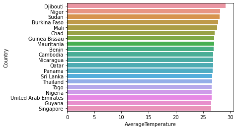

The understanding of climate change impacts and the associated climate extreme events at regional and local scales is of critical importance for planning and development of feasible adaptation strategies.

Climate change is without a doubt the most serious threat to humanity in the modern era. To have any hope of mitigating the harmful effects of climate change, the global mean temperature should be limited to 1.5 degrees Celsius above pre-industrial levels, according to the IPCC.

In this article, I am going to analyse how to create map charts and animations of temperature variability, by using Python and the power of GridDB.

The outline of the tutorial is as follows:

 1. Dataset overview
 2. Importing required libraries
 3. Loading the dataset
 4. Data Cleaning and Preprocessing
 5. Analysing with data visualization
 6. Conclusion

## Prerequisites and Environment setup

This tutorial is carried out in Anaconda Navigator (Python version – 3.8.5) on Windows Operating System. The following packages need to be installed before you continue with the tutorial –

1. Pandas

2. NumPy

3. plotly

4. Matplotlib

5. Seaborn

6. griddb_python

You can install these packages in Conda’s virtual environment using `conda install package-name`. In case you are using Python directly via terminal/command prompt, `pip install package-name` will do the work.

### GridDB installation

While loading the dataset, this tutorial will cover two methods – Using GridDB as well as Using Pandas. To access GridDB using Python, the following packages also need to be installed beforehand:

1. [GridDB C-client](https://github.com/griddb/c_client)
2. SWIG (Simplified Wrapper and Interface Generator)
3. [GridDB Python Client](https://github.com/griddb/python_client)

## Dataset Overview

The dataset contains information about visits to GStore (Google swag online store), each row is a unique visit and each user has a unique 'fullVisitorId'.

Global Land and Ocean-and-Land Temperatures (GlobalTemperatures.csv):

Date: starts in 1750 for average land temperature and 1850 for max and min land temperatures and global ocean and land temperatures
LandAverageTemperature: global average land temperature in celsius

https://www.kaggle.com/datasets/berkeleyearth/climate-change-earth-surface-temperature-data

## Importing Required Libraries

<pre><code class="language-python"># import griddb_python as griddb
import numpy as np
import pandas as pd
import matplotlib.pyplot as plt
import plotly
import plotly.graph_objs as go
import plotly.tools as tls
import plotly.express as px
import plotly.graph_objs as go
import seaborn as sns
import time
import warnings
warnings.filterwarnings('ignore')
%matplotlib inline</code></pre>

## Loading the Dataset

Let’s proceed and load the dataset into our notebook.

### Using GridDB

Toshiba GridDB™ is a highly scalable NoSQL database best suited for IoT and Big Data. The foundation of GridDB’s principles is based upon offering a versatile data store that is optimized for IoT, provides high scalability, tuned for high performance, and ensures high reliability.

To store large amounts of data, a CSV file can be cumbersome. GridDB serves as a perfect alternative as it in open-source and a highly scalable database. GridDB is a scalable, in-memory, No SQL database which makes it easier for you to store large amounts of data. If you are new to GridDB, a tutorial on  [reading and writing to GridDB](https://griddb.net/en/blog/using-pandas-dataframes-with-griddb/)  can be useful.

Assuming that you have already set up your database, we will now write the SQL query in python to load our dataset.

<pre><code class="language-python">factory = griddb.StoreFactory.get_instance()

Initialize the GridDB container (enter your database credentials)
try:
    gridstore = factory.get_store(host=host_name, port=your_port, 
            cluster_name=cluster_name, username=admin, 
            password=admin)

    info = griddb.ContainerInfo("GlobalTemperatures",
                    [["dt", griddb.Type.TIMESTAMP],["LandAverageTemperature", griddb.Type.DOUBLE],
                     ["LandAverageTemperatureUncertainty", griddb.Type.DOUBLE],
                     ["LandMaxTemperature", griddb.Type.DOUBLE],
                     ["LandMaxTemperatureUncertainty", griddb.Type.DOUBLE],
                     ["LandMinTemperature", griddb.Type.DOUBLE],
                     ["LandMinTemperatureUncertainty", griddb.Type.DOUBLE],
                     ["LandAndOceanAverageTemperature", griddb.Type.DOUBLE],
                     ["LandAndOceanAverageTemperatureUncertainty", griddb.Type.DOUBLE],
                     , True)
                     
    cont = gridstore.put_container(info) 
    data = pd.read_csv("GlobalTemperatures.csv")
    #Add data
    for i in range(len(data)):
        ret = cont.put(data.iloc[i, :])
        print("Data added successfully")
                     
                     
try:
    gridstore = factory.get_store(host=host_name, port=your_port, 
            cluster_name=cluster_name, username=admin, 
            password=admin)

    info = griddb.ContainerInfo("GlobalLandTemperaturesByCity",
                    [["dt", griddb.Type.TIMESTAMP],["AverageTemperature", griddb.Type.DOUBLE],
                     ["AverageTemperatureUncertainty", griddb.Type.DOUBLE],
                     ["City", griddb.Type.STRING],["Country", griddb.Type.STRING], 
                     ["Latitude", griddb.Type.STRING], ["Longitude", griddb.Type.STRING],True)
                     
    cont = gridstore.put_container(info) 
    data = pd.read_csv("GlobalLandTemperaturesByCity.csv")
    #Add data
    for i in range(len(data)):
        ret = cont.put(data.iloc[i, :])
        print("Data added successfully")
                     
                     
try:
    gridstore = factory.get_store(host=host_name, port=your_port, 
            cluster_name=cluster_name, username=admin, 
            password=admin)

    info = griddb.ContainerInfo("GlobalLandTemperaturesByState",
                    [["dt", griddb.Type.TIMESTAMP],["AverageTemperature", griddb.Type.DOUBLE],["AverageTemperatureUncertainty", griddb.Type.DOUBLE],
                     ["State", griddb.Type.STRING],["Country", griddb.Type.STRING], True)
    cont = gridstore.put_container(info) 
    data = pd.read_csv("GlobalLandTemperaturesByState.csv")
    #Add data
    for i in range(len(data)):
        ret = cont.put(data.iloc[i, :])
        print("Data added successfully")</code></pre>

    Data added successfully
    

The read_sql_query function offered by the pandas library converts the data fetched into a panda data frame to make it easy for the user to work.

<pre><code class="language-python">sql_statement1 = ('SELECT * FROM GlobalTemperatures.csv')
df1 = pd.read_sql_query(sql_statement1, cont)

sql_statement2 = ('SELECT * FROM GlobalLandTemperaturesByCity.csv')
df2 = pd.read_sql_query(sql_statement2, cont)

sql_statement3 = ('SELECT * FROM GlobalLandTemperaturesByState.csv')
df3 = pd.read_sql_query(sql_statement3, cont)</code></pre>

Note that the `cont` variable has the container information where our data is stored. Replace the `credit_card_dataset` with the name of your container. More info can be found in this tutorial [reading and writing to GridDB](https://griddb.net/en/blog/using-pandas-dataframes-with-griddb/).

When it comes to IoT and Big Data use cases, GridDB clearly stands out among other databases in the Relational and NoSQL space.
Overall, GridDB offers multiple reliability features for mission-critical applications that require high availability and data retention.

### Using pandas read_csv

We can also use Pandas' `read_csv` function to load our data. Both of the above methods will lead to the same output as the data is loaded in the form of a pandas dataframe using either of the methods.

<pre><code class="language-python">global_temp_country = pd.read_csv('GlobalLandTemperaturesByCity.csv')</code></pre>

<pre><code class="language-python">global_temp_country.head()</code></pre>

<table border="1" class="dataframe">
  <thead>
    <tr style="text-align: right;">
      <th></th>
      <th>dt</th>
      <th>AverageTemperature</th>
      <th>AverageTemperatureUncertainty</th>
      <th>City</th>
      <th>Country</th>
      <th>Latitude</th>
      <th>Longitude</th>
    </tr>
  </thead>
  <tbody>
    <tr>
      <th>0</th>
      <td>1743-11-01</td>
      <td>6.068</td>
      <td>1.737</td>
      <td>Århus</td>
      <td>Denmark</td>
      <td>57.05N</td>
      <td>10.33E</td>
    </tr>
    <tr>
      <th>1</th>
      <td>1743-12-01</td>
      <td>NaN</td>
      <td>NaN</td>
      <td>Århus</td>
      <td>Denmark</td>
      <td>57.05N</td>
      <td>10.33E</td>
    </tr>
    <tr>
      <th>2</th>
      <td>1744-01-01</td>
      <td>NaN</td>
      <td>NaN</td>
      <td>Århus</td>
      <td>Denmark</td>
      <td>57.05N</td>
      <td>10.33E</td>
    </tr>
    <tr>
      <th>3</th>
      <td>1744-02-01</td>
      <td>NaN</td>
      <td>NaN</td>
      <td>Århus</td>
      <td>Denmark</td>
      <td>57.05N</td>
      <td>10.33E</td>
    </tr>
    <tr>
      <th>4</th>
      <td>1744-03-01</td>
      <td>NaN</td>
      <td>NaN</td>
      <td>Århus</td>
      <td>Denmark</td>
      <td>57.05N</td>
      <td>10.33E</td>
    </tr>
  </tbody>
</table>

<pre><code class="language-python">global_temp=pd.read_csv('GlobalTemperatures.csv')</code></pre>

<pre><code class="language-python">global_temp.head()</code></pre>

<table border="1" class="dataframe">
  <thead>
    <tr style="text-align: right;">
      <th></th>
      <th>dt</th>
      <th>LandAverageTemperature</th>
      <th>LandAverageTemperatureUncertainty</th>
      <th>LandMaxTemperature</th>
      <th>LandMaxTemperatureUncertainty</th>
      <th>LandMinTemperature</th>
      <th>LandMinTemperatureUncertainty</th>
      <th>LandAndOceanAverageTemperature</th>
      <th>LandAndOceanAverageTemperatureUncertainty</th>
    </tr>
  </thead>
  <tbody>
    <tr>
      <th>0</th>
      <td>1750-01-01</td>
      <td>3.034</td>
      <td>3.574</td>
      <td>NaN</td>
      <td>NaN</td>
      <td>NaN</td>
      <td>NaN</td>
      <td>NaN</td>
      <td>NaN</td>
    </tr>
    <tr>
      <th>1</th>
      <td>1750-02-01</td>
      <td>3.083</td>
      <td>3.702</td>
      <td>NaN</td>
      <td>NaN</td>
      <td>NaN</td>
      <td>NaN</td>
      <td>NaN</td>
      <td>NaN</td>
    </tr>
    <tr>
      <th>2</th>
      <td>1750-03-01</td>
      <td>5.626</td>
      <td>3.076</td>
      <td>NaN</td>
      <td>NaN</td>
      <td>NaN</td>
      <td>NaN</td>
      <td>NaN</td>
      <td>NaN</td>
    </tr>
    <tr>
      <th>3</th>
      <td>1750-04-01</td>
      <td>8.490</td>
      <td>2.451</td>
      <td>NaN</td>
      <td>NaN</td>
      <td>NaN</td>
      <td>NaN</td>
      <td>NaN</td>
      <td>NaN</td>
    </tr>
    <tr>
      <th>4</th>
      <td>1750-05-01</td>
      <td>11.573</td>
      <td>2.072</td>
      <td>NaN</td>
      <td>NaN</td>
      <td>NaN</td>
      <td>NaN</td>
      <td>NaN</td>
      <td>NaN</td>
    </tr>
  </tbody>
</table>

<pre><code class="language-python">GlobalTempState = pd.read_csv('GlobalLandTemperaturesByState.csv') </code></pre>

<pre><code class="language-python">GlobalTempState.head()</code></pre>

<table border="1" class="dataframe">
  <thead>
    <tr style="text-align: right;">
      <th></th>
      <th>dt</th>
      <th>AverageTemperature</th>
      <th>AverageTemperatureUncertainty</th>
      <th>State</th>
      <th>Country</th>
    </tr>
  </thead>
  <tbody>
    <tr>
      <th>0</th>
      <td>1855-05-01</td>
      <td>25.544</td>
      <td>1.171</td>
      <td>Acre</td>
      <td>Brazil</td>
    </tr>
    <tr>
      <th>1</th>
      <td>1855-06-01</td>
      <td>24.228</td>
      <td>1.103</td>
      <td>Acre</td>
      <td>Brazil</td>
    </tr>
    <tr>
      <th>2</th>
      <td>1855-07-01</td>
      <td>24.371</td>
      <td>1.044</td>
      <td>Acre</td>
      <td>Brazil</td>
    </tr>
    <tr>
      <th>3</th>
      <td>1855-08-01</td>
      <td>25.427</td>
      <td>1.073</td>
      <td>Acre</td>
      <td>Brazil</td>
    </tr>
    <tr>
      <th>4</th>
      <td>1855-09-01</td>
      <td>25.675</td>
      <td>1.014</td>
      <td>Acre</td>
      <td>Brazil</td>
    </tr>
  </tbody>
</table>

##Data Cleaning and Preprocessing

<pre><code class="language-python">global_temp_country.isna().sum()</code></pre>

    dt                                    0
    AverageTemperature               364130
    AverageTemperatureUncertainty    364130
    City                                  0
    Country                               0
    Latitude                              0
    Longitude                             0
    dtype: int64

<pre><code class="language-python">global_temp_country.dropna(axis='index',how='any',subset=['AverageTemperature'],inplace=True)</code></pre>

<pre><code class="language-python">def fetch_year(date):
    return date.split('-')[0]
global_temp['years']=global_temp['dt'].apply(fetch_year)
global_temp.head()</code></pre>

<table border="1" class="dataframe">
  <thead>
    <tr style="text-align: right;">
      <th></th>
      <th>dt</th>
      <th>LandAverageTemperature</th>
      <th>LandAverageTemperatureUncertainty</th>
      <th>LandMaxTemperature</th>
      <th>LandMaxTemperatureUncertainty</th>
      <th>LandMinTemperature</th>
      <th>LandMinTemperatureUncertainty</th>
      <th>LandAndOceanAverageTemperature</th>
      <th>LandAndOceanAverageTemperatureUncertainty</th>
      <th>years</th>
    </tr>
  </thead>
  <tbody>
    <tr>
      <th>0</th>
      <td>1750-01-01</td>
      <td>3.034</td>
      <td>3.574</td>
      <td>NaN</td>
      <td>NaN</td>
      <td>NaN</td>
      <td>NaN</td>
      <td>NaN</td>
      <td>NaN</td>
      <td>1750</td>
    </tr>
    <tr>
      <th>1</th>
      <td>1750-02-01</td>
      <td>3.083</td>
      <td>3.702</td>
      <td>NaN</td>
      <td>NaN</td>
      <td>NaN</td>
      <td>NaN</td>
      <td>NaN</td>
      <td>NaN</td>
      <td>1750</td>
    </tr>
    <tr>
      <th>2</th>
      <td>1750-03-01</td>
      <td>5.626</td>
      <td>3.076</td>
      <td>NaN</td>
      <td>NaN</td>
      <td>NaN</td>
      <td>NaN</td>
      <td>NaN</td>
      <td>NaN</td>
      <td>1750</td>
    </tr>
    <tr>
      <th>3</th>
      <td>1750-04-01</td>
      <td>8.490</td>
      <td>2.451</td>
      <td>NaN</td>
      <td>NaN</td>
      <td>NaN</td>
      <td>NaN</td>
      <td>NaN</td>
      <td>NaN</td>
      <td>1750</td>
    </tr>
    <tr>
      <th>4</th>
      <td>1750-05-01</td>
      <td>11.573</td>
      <td>2.072</td>
      <td>NaN</td>
      <td>NaN</td>
      <td>NaN</td>
      <td>NaN</td>
      <td>NaN</td>
      <td>NaN</td>
      <td>1750</td>
    </tr>
  </tbody>
</table>

## Analysing with data visualization

Let's Calculate average temperature for each country

<pre><code class="language-python">avg_temp=global_temp_country.groupby(['Country'])['AverageTemperature'].mean().to_frame().reset_index()
avg_temp</code></pre>

<table border="1" class="dataframe">
  <thead>
    <tr style="text-align: right;">
      <th></th>
      <th>Country</th>
      <th>AverageTemperature</th>
    </tr>
  </thead>
  <tbody>
    <tr>
      <th>0</th>
      <td>Afghanistan</td>
      <td>13.816497</td>
    </tr>
    <tr>
      <th>1</th>
      <td>Albania</td>
      <td>15.525828</td>
    </tr>
    <tr>
      <th>2</th>
      <td>Algeria</td>
      <td>17.763206</td>
    </tr>
    <tr>
      <th>3</th>
      <td>Angola</td>
      <td>21.759716</td>
    </tr>
    <tr>
      <th>4</th>
      <td>Argentina</td>
      <td>16.999216</td>
    </tr>
    <tr>
      <th>...</th>
      <td>...</td>
      <td>...</td>
    </tr>
    <tr>
      <th>154</th>
      <td>Venezuela</td>
      <td>25.482422</td>
    </tr>
    <tr>
      <th>155</th>
      <td>Vietnam</td>
      <td>24.846825</td>
    </tr>
    <tr>
      <th>156</th>
      <td>Yemen</td>
      <td>25.768408</td>
    </tr>
    <tr>
      <th>157</th>
      <td>Zambia</td>
      <td>20.937623</td>
    </tr>
    <tr>
      <th>158</th>
      <td>Zimbabwe</td>
      <td>19.822971</td>
    </tr>
  </tbody>
</table>

159 rows × 2 columns

<pre><code class="language-python">fig=px.choropleth(avg_temp,locations='Country',locationmode='country names',color='AverageTemperature')
fig.update_layout(title='Choropleth map of average temperature')
fig.show()</code></pre>

   

<pre><code class="language-python"># The average temperature and Horizontal Bar sort by countries

sns.barplot(x=avg_temp.sort_values(by='AverageTemperature',ascending=False)['AverageTemperature'][0:20],y=avg_temp.sort_values(by='AverageTemperature',ascending=False)['Country'][0:20])</code></pre>

    <AxesSubplot:xlabel='AverageTemperature', ylabel='Country'>

    

    

### Is there global warming?

<pre><code class="language-python">data=global_temp.groupby('years').agg({'LandAverageTemperature':'mean','LandAverageTemperatureUncertainty':'mean'}).reset_index()
data.head()</code></pre>

<table border="1" class="dataframe">
  <thead>
    <tr style="text-align: right;">
      <th></th>
      <th>years</th>
      <th>LandAverageTemperature</th>
      <th>LandAverageTemperatureUncertainty</th>
    </tr>
  </thead>
  <tbody>
    <tr>
      <th>0</th>
      <td>1750</td>
      <td>8.719364</td>
      <td>2.637818</td>
    </tr>
    <tr>
      <th>1</th>
      <td>1751</td>
      <td>7.976143</td>
      <td>2.781143</td>
    </tr>
    <tr>
      <th>2</th>
      <td>1752</td>
      <td>5.779833</td>
      <td>2.977000</td>
    </tr>
    <tr>
      <th>3</th>
      <td>1753</td>
      <td>8.388083</td>
      <td>3.176000</td>
    </tr>
    <tr>
      <th>4</th>
      <td>1754</td>
      <td>8.469333</td>
      <td>3.494250</td>
    </tr>
  </tbody>
</table>

<pre><code class="language-python">data['Uncertainty top']=data['LandAverageTemperature']+data['LandAverageTemperatureUncertainty']
data['Uncertainty bottom']=data['LandAverageTemperature']-data['LandAverageTemperatureUncertainty']</code></pre>

<pre><code class="language-python">fig=px.line(data,x='years',y=['LandAverageTemperature',
       'Uncertainty top', 'Uncertainty bottom'],title='Average Land Tmeperature in World')
fig.show()</code></pre>

The charts show that there is currently global warming. The average temperature of the Earth's surface has reached its highest level in three centuries. Temperatures have risen at the fastest rate in the last 30 years. This concerns me; I hope that humanity will soon fully transition to ecological energy sources, which will reduce CO2. We will be in trouble if it does not happen. This chart also includes confidence intervals, indicating that temperature measurement has become more accurate in recent years.

### Average temperature in each season

<pre><code class="language-python">global_temp = global_temp[['dt', 'LandAverageTemperature']]

global_temp['dt'] = pd.to_datetime(global_temp['dt'])
global_temp['year'] = global_temp['dt'].map(lambda x: x.year)
global_temp['month'] = global_temp['dt'].map(lambda x: x.month)

def get_season(month):
    if month >= 3 and month <= 5:
        return 'spring'
    elif month >= 6 and month <= 8:
        return 'summer'
    elif month >= 9 and month <= 11:
        return 'autumn'
    else:
        return 'winter'
    
min_year = global_temp['year'].min()
max_year = global_temp['year'].max()
years = range(min_year, max_year + 1)

global_temp['season'] = global_temp['month'].apply(get_season)

spring_temps = []
summer_temps = []
autumn_temps = []
winter_temps = []

for year in years:
    curr_years_data = global_temp[global_temp['year'] == year]
    spring_temps.append(curr_years_data[curr_years_data['season'] == 'spring']['LandAverageTemperature'].mean())
    summer_temps.append(curr_years_data[curr_years_data['season'] == 'summer']['LandAverageTemperature'].mean())
    autumn_temps.append(curr_years_data[curr_years_data['season'] == 'autumn']['LandAverageTemperature'].mean())
    winter_temps.append(curr_years_data[curr_years_data['season'] == 'winter']['LandAverageTemperature'].mean())</code></pre>

<pre><code class="language-python">sns.set(style="whitegrid")
sns.set_color_codes("pastel")
f, ax = plt.subplots(figsize=(10, 6))

plt.plot(years, summer_temps, label='Summers average temperature', color='orange')
plt.plot(years, autumn_temps, label='Autumns average temperature', color='r')
plt.plot(years, spring_temps, label='Springs average temperature', color='g')
plt.plot(years, winter_temps, label='Winters average temperature', color='b')

plt.xlim(min_year, max_year)

ax.set_ylabel('Average temperature')
ax.set_xlabel('Year')
ax.set_title('Average temperature in each season')
legend = plt.legend(loc='center left', bbox_to_anchor=(1, 0.5), frameon=True, borderpad=1, borderaxespad=1)</code></pre>

    

    

<pre><code class="language-python"># Statewise scenario of average temperature.
country_state_temp = GlobalTempState.groupby(by = ['Country','State']).mean().reset_index().sort_values('AverageTemperature',ascending=False).reset_index()
country_state_temp
country_state_temp["world"] = "world" 
fig = px.treemap(country_state_temp.head(200), path=['world', 'Country','State'], values='AverageTemperature',
                  color='State',color_continuous_scale='RdGr')
fig.show()</code></pre>

## Conclusion

In this tutorial we analysed the global climate using Python and GridDB. We examined two ways to import our data, using (1) GridDB and (2) Pandas. For large datasets, GridDB provides an excellent alternative to import data in your notebook as it is open-source and highly scalable.
