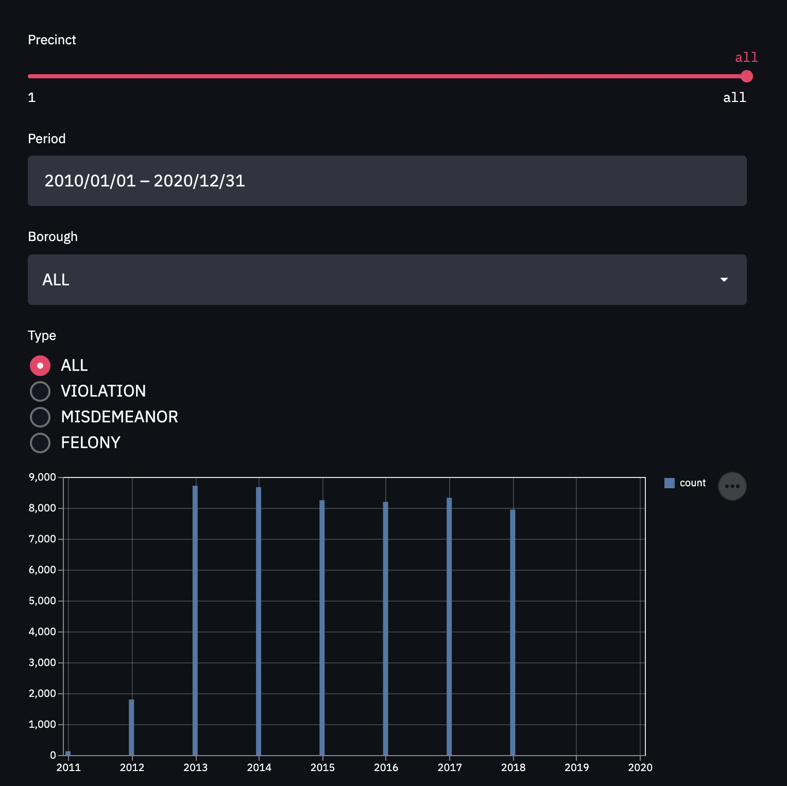

# Visualizing NYCC Data with GridDB and Streamlit

## Introduction

Using [past projects']() data ingested into GridDB, we will be using [Streamlit](https://streamlit.io) (along with GridDB) to visualize New York City Crime Complaints. Streamlit makes it quick and easy to develop any kind of dashboard with a variety of widgets that can be used for input and output. In this project, we use the input widgets to build a GridDB TQL query string and a chart output widget to show the returned data.



## Handling Multiple Containers

First, let's query the relevant data -- as the data set is stored in multiple containers, the app needs to be able to query one, several, or all containers. To start with, all containers access is required for and are opened and stored in a dictionary. We also create an 'all' mapping in the dictionary which contains a list of every container we opened so we can query all precincts.

```
cols = {}
for x in range(1, 125):
    col = gridstore.get_container("precinct_"+str(x))
    if col != None:
        cols[x] = [col]

cols['all'] = (e[0] for e in cols.values())
```

Finally, we iterate through the precincts that were selected with the streamlit widget. Usually there will only be one precinct, but in the case of 'all', every precinct will be queried. For simplicity's sake, we are not using [Multiquery](). 

```
df=pd.DataFrame()
for col in cols[precinct]:
    try:
        q = col.query(tql)
        rs = q.fetch(False)
        df = df.append(rs.fetch_rows())
    except:
        pass

```

## Input Widgets

Streamlit has a variety of input widgets that can be added to your dashboard, the comprehensive list can be found in their [API Reference](https://docs.streamlit.io/en/stable/api.html). 

### Calendar

The streamlit date_input widget allows the user to select a start and end date. The dates are returned as a tuple of `datetime.date` objects which must be first converted to `datetime.datetime` objects using `datetime.datetime.combine()`.

```
date_range = st.date_input("Period", [datetime.date(2010, 1,1), datetime.date(2020, 12, 31) ])
start = datetime.datetime.combine(date_range[0], datetime.datetime.min.time())
end = datetime.datetime.combine(date_range[1], datetime.datetime.min.time())
```

Then the `datetime.datetime` objects can be converted to millisecond epochs with `int(datetime.datetime.timestamp()\*1000)` and used within the TQL query.

```
tql = "select * where CMPLNT_FR > TO_TIMESTAMP_MS("+str(int(start.timestamp()*1000))+") AND CMPLNT_FR < TO_TIMESTAMP_MS("+str(int(end.timestamp()*1000))+")"
```

### Sliders, Radio Buttons, Select Boxes

Streamlit's other input widgets are fairly simple, each taking a list potential inputs and returning the selected item.

```
precinct = st.select_slider("Precinct", list(cols.keys()), value='all' )
br_name = st.selectbox("Borough", ["ALL", "MANHATTAN", "QUEENS", "BRONX" , "BROOKLYN", "STATEN ISLAND" ])
ctype = st.radio("Type", ["ALL", "VIOLATION", "MISDEMEANOR" , "FELONY" ])
```

Their output can then be used in the TQL statement. 
```
if br_name != "ALL":
    tql = tql + " AND BORO_NM = '"+br_name+"'"

if ctype != "ALL":
    tql = tql + " AND LAW_CAT_CD = '"+ctype+"'"


```

## Output Widgets

There are several different output widgets including the bar chart we'll use in this project.

### Bar Chart

To effectively display the number of crime complaints over a `bucket_size` of time, we need to bucket the data. Before we do that, we will need to first determine the number of buckets to use which depends on the time `bucket_size`. If the time `bucket_size` is just a few weeks, it doesn't make sense sense to use month long buckets and vice-versa; using daily or weekly buckets would also not visualize the data well if the time `bucket_size` is several years.


```
bucket_size='Y'
if delta.days < 800:
    bucket_size = 'M'
elif delta.days < 90:
    bucket_size = 'D'

```

Now we can convert the `CMPLNT_FR` column to `Pandas Datetime` and put the data into buckets/groups.

```
df['CMPLNT_FR'] = pd.to_datetime(df['CMPLNT_FR'])
df = df.groupby([pd.Grouper(key='CMPLNT_FR',freq=bucket_size)]).size().reset_index(name='count')
```

Displaying the chart is a simple one liner:

```
st.bar_chart(data=df)
```

## Conclusion

Streamlit makes it incredibly quick and easy to develop data driven dashboards. Combined with GridDB's high performance and scalability, it allows developers to visualize and gain insight into their dataset without significant investment or time. The complete source code used in this projects can be found in GridDB.net's GitHub account [here]().
