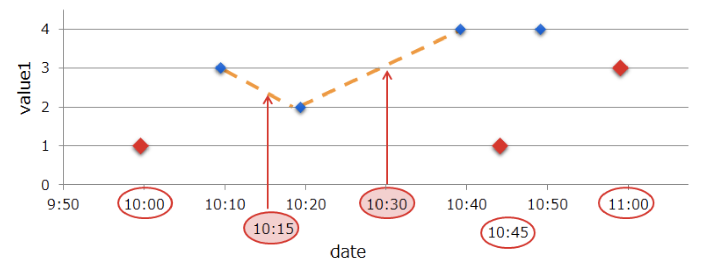
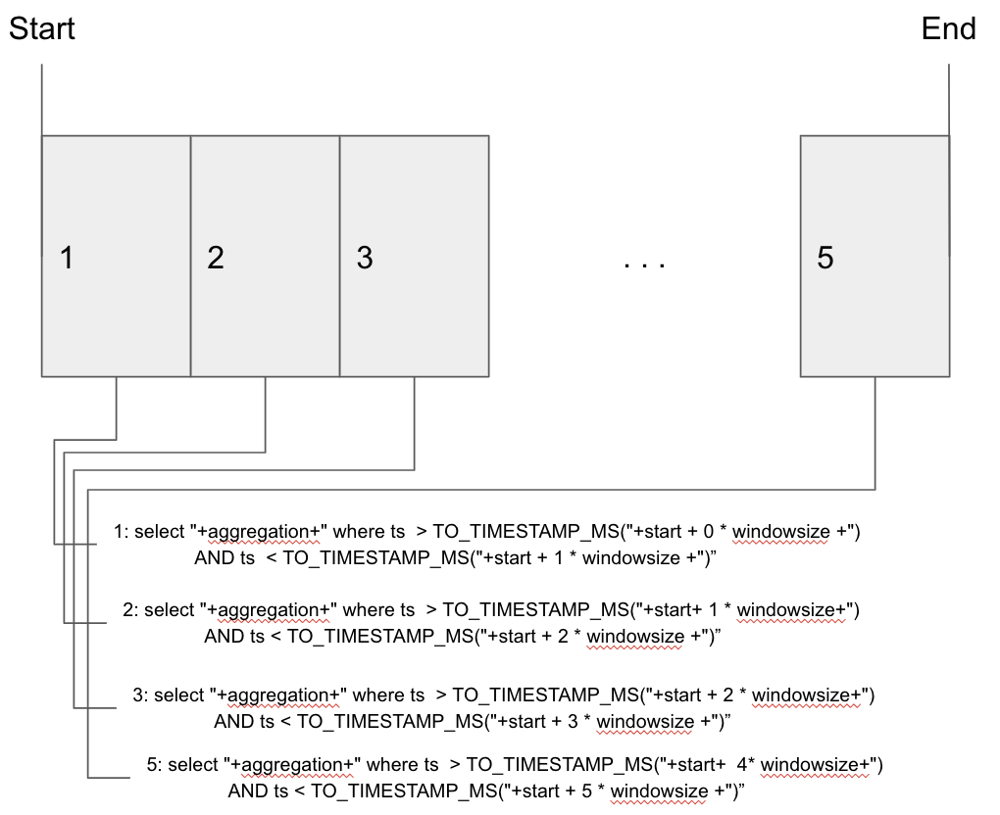

You've ingested a set of timeseries data into GridDB and want to see aggregates across individual time periods (also called windows or buckets) within the data set? GridDB's TIME_SAMPLING function allows you to perform time weighted averages but what about counts or the minimum or maximum values in each time period? For example, you want to find the maximum value of a column every day or the number of samples every hour. GridDB's multi-query function along with your programming language's time, date, and calendar functions allows you to do just that.

In this blog, we'll cover not only using GridDB's TIME_SAMPLE TQL function but also build a generic function that can fetch multiple aggregates from the [NYC Taxi Data data set][1].

Here is the specific file. We are downloading this file into your /tmp directory because the ingest code is hard-coded to read from there. If you would like to download to another location, please make sure you also change the file path in the `src/main/java/net/griddb/tstaxiblog/IngestParquet.java` code.

  <pre><code class="language-sh">$ wget -O /tmp/yellow_tripdata_2021-01.parquet https://d37ci6vzurychx.cloudfront.net/trip-data/yellow_tripdata_2021-01.parquet</code></pre>

## Ingest Data in Parquet Format

In our past (NYC Taxi Data blog)[/en/blog/geospatial-analysis-of-nyc-crime-data-with-griddb/], the data was available as a CSV which is easy to parse. Now, the NY Taxi Commission releases the data in Parquet format which has its advantages but is more difficult to parse.

First, we need to include the many libraries required to use the Apache Parquet Library: parqet-avro, parqet-hadoop, parqet-format, hadoop-common, hadoop-client. Since we're using Maven, we add the following to our dependencies:

  <pre><code class="language-java">&lt;dependency&gt;
    &lt;groupId&gt;org.apache.parquet&lt;/groupId&gt;
    &lt;artifactId&gt;parquet-hadoop&lt;/artifactId&gt;
    &lt;version&gt;1.9.0&lt;/version&gt;
&lt;/dependency&gt;
&lt;dependency&gt;
    &lt;groupId&gt;org.apache.parquet&lt;/groupId&gt;
    &lt;artifactId&gt;parquet-format&lt;/artifactId&gt;
    &lt;version&gt;2.9.0&lt;/version&gt;
&lt;/dependency&gt;
&lt;dependency&gt;
    &lt;groupId&gt;org.apache.parquet&lt;/groupId&gt;
    &lt;artifactId&gt;parquet-avro&lt;/artifactId&gt;
        &lt;version&gt;1.9.0&lt;/version&gt;
&lt;/dependency&gt;
&lt;dependency&gt;
  &lt;groupId&gt;org.apache.hadoop&lt;/groupId&gt;
  &lt;artifactId&gt;hadoop-common&lt;/artifactId&gt;
  &lt;version&gt;2.10.0&lt;/version&gt;
&lt;/dependency&gt;
&lt;dependency&gt;
    &lt;groupId&gt;org.apache.hadoop&lt;/groupId&gt;
    &lt;artifactId&gt;hadoop-client&lt;/artifactId&gt;
    &lt;version&gt;2.10.1&lt;/version&gt;
    &lt;scope&gt;provided&lt;/scope&gt;
&lt;/dependency&gt;</code></pre>

Now in our Java source we can read the parquet file and iterate through its groups of rows.

  <pre><code class="language-java">Path path = new Path("yellow_tripdata_2021-01.parquet");
Configuration conf = new Configuration();

try {
    ParquetMetadata readFooter = ParquetFileReader.readFooter(conf, path, ParquetMetadataConverter.NO_FILTER);
    MessageType schema = readFooter.getFileMetaData().getSchema();
    ParquetFileReader r = new ParquetFileReader(conf, path, readFooter);

    PageReadStore pages = null;
    try {
        while (null != (pages = r.readNextRowGroup())) {
            final long rows = pages.getRowCount();
            System.out.println("Number of rows: " + rows);

            final MessageColumnIO columnIO = new ColumnIOFactory().getColumnIO(schema);
            final RecordReader recordReader = columnIO.getRecordReader(pages, new GroupRecordConverter(schema));
            for (int i = 0; i &lt; rows; i++) {
                final Group g = (Group)recordReader.read();
                writeGroup(ts, g);

            }
        }
    } finally {
        r.close();
    }
} catch (IOException e) {
    System.out.println("Error reading parquet file.");
    e.printStackTrace();
}</code></pre>

The writeGroup function is called for each group of rows and actually does the writing and populates and writes an instance of our TaxiTrip class with the data in each row.

  <pre><code class="language-java">private static void writeGroup(TimeSeries ts, Group g) throws GSException {

    int fieldCount = g.getType().getFieldCount();
    int valueCount = g.getFieldRepetitionCount(0);
    for (int index = 0; index &lt; valueCount; index++) {
        TaxiTrip r = new TaxiTrip();
        for (int field = 0; field &lt; fieldCount; field++) {
        
            try {
            Type fieldType = g.getType().getType(field);
            String fieldName = fieldType.getName();

            if (fieldType.isPrimitive()) {
                switch(fieldName) {
                    case "tpep_pickup_datetime":
                        r.tpep_pickup_datetime = new Date(g.getLong(field, index)/1000);
                        break;
                    /* .... snip ... */
                    case "fare_amount":
                        r.fare_amount = (float)g.getDouble(field, index);
                        break;
                    /* .... snip .... */
                    default:
                        System.out.println("Unknown field: "+fieldName+" value="+g.getValueToString(field, index));
                }
            } 
            } catch (Exception e) {
            }
        }
        ts.put(r);
    }
}</code></pre>

## GridDB's TIME_SAMPLING Function

GridDB's TIME_SAMPLING function returns a linear interpolation of the column values within each window. It has the following function signature:

  <pre><code class="language-sh">TIME_SAMPLING(column, start, end, window_count, window_size)</code></pre>

The function works by finding the interpolation of for each request timestamp by using the rows before and after it. The following graphic visualizes the concept. 

More details can be found in the <a href="https://www.toshiba-sol.co.jp/en/pro/griddb/docs-en/v5/GridDB_ProgrammingGuide.html?#tql-interpolation-operations">GridDB programming guide</a>.

The code simply executes the query and iterates through each window returned.

  <pre><code class="language-java">public static void timeSampling(GridStore store, String column, Date start, Date end, String windowstr) throws GSException {

    TimeZone tz = TimeZone.getTimeZone("UTC");
    DateFormat df = new SimpleDateFormat("yyyy-MM-dd'T'HH:mm:00'Z'"); 
    df.setTimeZone(tz);

    Container<?, Row> ts = store.getContainer("NYC_TaxiTrips");
    String querystr = "select time_sampling("+column+", TIMESTAMP('"+df.format(start)+"'), TIMESTAMP('"+df.format(end) +"') , 1, "+windowstr+") "; 

    Query&lt;row> q = ts.query(querystr);
    RowSet&lt;/row>&lt;row> rs = q.fetch();
    while (rs.hasNext()) {
        Row result = rs.next();
        System.out.println(result.getTimestamp(0)+"="+result.getDouble(10));
    }

}&lt;/row></code></pre>

Calling `timeSampling(store, "fare_amount", start, end, "DAY");` results in the following values:

  <table class="datatable">
    <tr>
      <th>
        Window
      </th>
      
      <th>
        Sample
      </th>
    </tr>
    
    <tr>
      <td>
        Fri Jan 01 00:00:00 GMT 2021
      </td>
      
      <td>
        14.833333015441895
      </td>
    </tr>
    
    <tr>
      <td>
        Sat Jan 02 00:00:00 GMT 2021
      </td>
      
      <td>
        8.55555534362793
      </td>
    </tr>
    
    <tr>
      <td>
        Sun Jan 03 00:00:00 GMT 2021
      </td>
      
      <td>
        15.710000038146973
      </td>
    </tr>
    
    <tr>
      <td>
        Mon Jan 04 00:00:00 GMT 2021
      </td>
      
      <td>
        25.31818199157715
      </td>
    </tr>
    
    <tr>
      <td>
        Tue Jan 05 00:00:00 GMT 2021
      </td>
      
      <td>
        22.024999618530273
      </td>
    </tr>
    
    <tr>
      <td>
        Wed Jan 06 00:00:00 GMT 2021
      </td>
      
      <td>
        9.0
      </td>
    </tr>
    
    <tr>
      <td>
        Thu Jan 07 00:00:00 GMT 2021
      </td>
      
      <td>
        43.5
      </td>
    </tr>
    
    <tr>
      <td>
        Fri Jan 08 00:00:00 GMT 2021
      </td>
      
      <td>
        6.0
      </td>
    </tr>
    
    <tr>
      <td>
        Sat Jan 09 00:00:00 GMT 2021
      </td>
      
      <td>
        28.950000762939453
      </td>
    </tr>
    
    <tr>
      <td>
        Sun Jan 10 00:00:00 GMT 2021
      </td>
      
      <td>
        18.450000762939453
      </td>
    </tr>
    
    <tr>
      <td>
        Mon Jan 11 00:00:00 GMT 2021
      </td>
      
      <td>
        41.75
      </td>
    </tr>
    
    <tr>
      <td>
        Tue Jan 12 00:00:00 GMT 2021
      </td>
      
      <td>
        6.5
      </td>
    </tr>
    
    <tr>
      <td>
        Wed Jan 13 00:00:00 GMT 2021
      </td>
      
      <td>
        17.710525512695312
      </td>
    </tr>
    
    <tr>
      <td>
        Thu Jan 14 00:00:00 GMT 2021
      </td>
      
      <td>
        10.8125
      </td>
    </tr>
    
    <tr>
      <td>
        Fri Jan 15 00:00:00 GMT 2021
      </td>
      
      <td>
        52.0
      </td>
    </tr>
    
    <tr>
      <td>
        Sat Jan 16 00:00:00 GMT 2021
      </td>
      
      <td>
        28.200000762939453
      </td>
    </tr>
    
    <tr>
      <td>
        Sun Jan 17 00:00:00 GMT 2021
      </td>
      
      <td>
        9.977272987365723
      </td>
    </tr>
    
    <tr>
      <td>
        Mon Jan 18 00:00:00 GMT 2021
      </td>
      
      <td>
        9.100000381469727
      </td>
    </tr>
    
    <tr>
      <td>
        Tue Jan 19 00:00:00 GMT 2021
      </td>
      
      <td>
        25.66666603088379
      </td>
    </tr>
    
    <tr>
      <td>
        Wed Jan 20 00:00:00 GMT 2021
      </td>
      
      <td>
        34.349998474121094
      </td>
    </tr>
    
    <tr>
      <td>
        Thu Jan 21 00:00:00 GMT 2021
      </td>
      
      <td>
        5.5
      </td>
    </tr>
    
    <tr>
      <td>
        Fri Jan 22 00:00:00 GMT 2021
      </td>
      
      <td>
        7.472727298736572
      </td>
    </tr>
    
    <tr>
      <td>
        Sat Jan 23 00:00:00 GMT 2021
      </td>
      
      <td>
        10.5
      </td>
    </tr>
    
    <tr>
      <td>
        Sun Jan 24 00:00:00 GMT 2021
      </td>
      
      <td>
        17.0
      </td>
    </tr>
    
    <tr>
      <td>
        Mon Jan 25 00:00:00 GMT 2021
      </td>
      
      <td>
        21.0
      </td>
    </tr>
    
    <tr>
      <td>
        Tue Jan 26 00:00:00 GMT 2021
      </td>
      
      <td>
        15.852941513061523
      </td>
    </tr>
    
    <tr>
      <td>
        Wed Jan 27 00:00:00 GMT 2021
      </td>
      
      <td>
        7.984375
      </td>
    </tr>
    
    <tr>
      <td>
        Thu Jan 28 00:00:00 GMT 2021
      </td>
      
      <td>
        42.83333206176758
      </td>
    </tr>
    
    <tr>
      <td>
        Fri Jan 29 00:00:00 GMT 2021
      </td>
      
      <td>
        9.083333015441895
      </td>
    </tr>
    
    <tr>
      <td>
        Sat Jan 30 00:00:00 GMT 2021
      </td>
      
      <td>
        11.892857551574707
      </td>
    </tr>
    
    <tr>
      <td>
        Sun Jan 31 00:00:00 GMT 2021
      </td>
      
      <td>
        14.371428489685059
      </td>
    </tr>
  </table>

While TIME_SAMPLING is useful, it has has some limitations since it only returns a linear interpolation for each window, each of which is typically similar to the average value (like medians are similar) but is not a true average. Likewise, you can't find the number of rows in the time window or the minimum or maximum values.

## Windowed Aggregations with Multi-Query

To find any aggregation for a set of timeseries windows, we can use GridDB's multi-query function. This runs the specifieed aggregation for each time window separately. The following graphic shows the queries for each window:

You might think performing the operations like this would be slow, but by using multi-query we can optimize sending the queries to GridDB and the data retrieval. The database performs the same operations as it would if the function were built-in.

The first steps in our generic windowed aggregation function is to open the container and create a query for each window and add it to the list of queries that will be executed by GridDB. Each query is built by using Java's Calendar class and incrementing the interval by the specified Calendar ENUM value such as Calendar.HOUR or Calendar.DATE.

  <pre><code class="language-java">public static void windowAggregation(GridStore store, String aggregation, Date start, Date end, int windowsize) throws GSException {
    Calendar c = Calendar.getInstance();
    ArrayList&lt;Query&lt;aggregationresult>> queryList = new ArrayList&lt;Query&lt;/aggregationresult>&lt;aggregationresult>>();
    ArrayList&lt;date> dates = new ArrayList&lt;/date>&lt;date>();
    Container<?, Row> ts = store.getContainer("NYC_TaxiTrips");

    c.setTime(start);
    Date interval = c.getTime();

    do {
        c.add(windowsize, 1);
        System.out.println("interval="+interval);
        String windowquery = "select "+aggregation+" where tpep_pickup_datetime > TO_TIMESTAMP_MS("+interval.getTime()+") and tpep_pickup_datetime &lt; TO_TIMESTAMP_MS("+c.getTime().getTime()+")"; 
        Query&lt;aggregationresult> q = ts.query(windowquery, AggregationResult.class);
        dates.add(interval);
        queryList.add(q);
        interval = c.getTime();
    } while (interval.getTime() &lt;= end.getTime());
&lt;/aggregationresult>&lt;/date>&lt;/aggregationresult></code></pre>

After we have our list of queries, we can execute them and iterate through the results.

  <pre><code class="language-java">    store.fetchAll(queryList);

    for (int i = 0; i &lt; queryList.size(); i++) {
        Query&lt;aggregationresult> query = queryList.get(i);
        RowSet&lt;/aggregationresult>&lt;aggregationresult> rs = query.getRowSet();
        while (rs.hasNext()) {
            AggregationResult result = rs.next();
            double value = result.getDouble();
            if (value != 0)
                System.out.println(dates.get(i)+"= "+ value);
        }
    }

}
&lt;/aggregationresult></code></pre>

Calling `windowAggregate(store, "avg(fare_amount)", start, end, Calendar.DATE);` results in the following results:

  <table class="datatable">
    <tr>
      <th>
        Window
      </th>
      
      <th>
        avg(fare_amount)
      </th>
    </tr>
    
    <tr>
      <td>
        Fri Jan 01 00:00:00 GMT 2021
      </td>
      
      <td>
        13.851391098873778
      </td>
    </tr>
    
    <tr>
      <td>
        Sat Jan 02 00:00:00 GMT 2021
      </td>
      
      <td>
        13.770499047323876
      </td>
    </tr>
    
    <tr>
      <td>
        Sun Jan 03 00:00:00 GMT 2021
      </td>
      
      <td>
        15.249551398785178
      </td>
    </tr>
    
    <tr>
      <td>
        Mon Jan 04 00:00:00 GMT 2021
      </td>
      
      <td>
        13.473628681590766
      </td>
    </tr>
    
    <tr>
      <td>
        Tue Jan 05 00:00:00 GMT 2021
      </td>
      
      <td>
        12.676972567160476
      </td>
    </tr>
    
    <tr>
      <td>
        Wed Jan 06 00:00:00 GMT 2021
      </td>
      
      <td>
        12.243332028212064
      </td>
    </tr>
    
    <tr>
      <td>
        Thu Jan 07 00:00:00 GMT 2021
      </td>
      
      <td>
        12.464050631310585
      </td>
    </tr>
    
    <tr>
      <td>
        Fri Jan 08 00:00:00 GMT 2021
      </td>
      
      <td>
        12.091422930601727
      </td>
    </tr>
    
    <tr>
      <td>
        Sat Jan 09 00:00:00 GMT 2021
      </td>
      
      <td>
        12.537748556275371
      </td>
    </tr>
    
    <tr>
      <td>
        Sun Jan 10 00:00:00 GMT 2021
      </td>
      
      <td>
        13.496787364093032
      </td>
    </tr>
    
    <tr>
      <td>
        Mon Jan 11 00:00:00 GMT 2021
      </td>
      
      <td>
        12.350597800281259
      </td>
    </tr>
    
    <tr>
      <td>
        Tue Jan 12 00:00:00 GMT 2021
      </td>
      
      <td>
        12.189052448708432
      </td>
    </tr>
    
    <tr>
      <td>
        Wed Jan 13 00:00:00 GMT 2021
      </td>
      
      <td>
        11.970959482137403
      </td>
    </tr>
    
    <tr>
      <td>
        Thu Jan 14 00:00:00 GMT 2021
      </td>
      
      <td>
        12.338237139653735
      </td>
    </tr>
    
    <tr>
      <td>
        Fri Jan 15 00:00:00 GMT 2021
      </td>
      
      <td>
        12.24978189382601
      </td>
    </tr>
    
    <tr>
      <td>
        Sat Jan 16 00:00:00 GMT 2021
      </td>
      
      <td>
        12.348960280360648
      </td>
    </tr>
    
    <tr>
      <td>
        Sun Jan 17 00:00:00 GMT 2021
      </td>
      
      <td>
        12.987822185285506
      </td>
    </tr>
    
    <tr>
      <td>
        Mon Jan 18 00:00:00 GMT 2021
      </td>
      
      <td>
        12.66304436182826
      </td>
    </tr>
    
    <tr>
      <td>
        Tue Jan 19 00:00:00 GMT 2021
      </td>
      
      <td>
        12.19362357336725
      </td>
    </tr>
    
    <tr>
      <td>
        Wed Jan 20 00:00:00 GMT 2021
      </td>
      
      <td>
        11.760170207452589
      </td>
    </tr>
    
    <tr>
      <td>
        Thu Jan 21 00:00:00 GMT 2021
      </td>
      
      <td>
        12.153647415269047
      </td>
    </tr>
    
    <tr>
      <td>
        Fri Jan 22 00:00:00 GMT 2021
      </td>
      
      <td>
        12.026541242751565
      </td>
    </tr>
    
    <tr>
      <td>
        Sat Jan 23 00:00:00 GMT 2021
      </td>
      
      <td>
        11.73361113486781
      </td>
    </tr>
    
    <tr>
      <td>
        Sun Jan 24 00:00:00 GMT 2021
      </td>
      
      <td>
        12.876742517934895
      </td>
    </tr>
    
    <tr>
      <td>
        Mon Jan 25 00:00:00 GMT 2021
      </td>
      
      <td>
        12.229045667216711
      </td>
    </tr>
    
    <tr>
      <td>
        Tue Jan 26 00:00:00 GMT 2021
      </td>
      
      <td>
        11.716670845330835
      </td>
    </tr>
    
    <tr>
      <td>
        Wed Jan 27 00:00:00 GMT 2021
      </td>
      
      <td>
        11.823579132291002
      </td>
    </tr>
    
    <tr>
      <td>
        Thu Jan 28 00:00:00 GMT 2021
      </td>
      
      <td>
        11.842199614451049
      </td>
    </tr>
    
    <tr>
      <td>
        Fri Jan 29 00:00:00 GMT 2021
      </td>
      
      <td>
        11.784085302551507
      </td>
    </tr>
    
    <tr>
      <td>
        Sat Jan 30 00:00:00 GMT 2021
      </td>
      
      <td>
        11.843539460445053
      </td>
    </tr>
    
    <tr>
      <td>
        Sun Jan 31 00:00:00 GMT 2021
      </td>
      
      <td>
        12.406643581985854
      </td>
    </tr>
  </table>

We can also see the number of rows by calling `windowAggregate(store, "count(*)", start, end, Calendar.DATE)`:

  <table class="datatable">
    <tr>
      <th>
        Window
      </th>
      
      <th>
        COUNT(*)
      </th>
    </tr>
    
    <tr>
      <td>
        Fri Jan 01 00:00:00 GMT 2021
      </td>
      
      <td>
        20430.0
      </td>
    </tr>
    
    <tr>
      <td>
        Sat Jan 02 00:00:00 GMT 2021
      </td>
      
      <td>
        25429.0
      </td>
    </tr>
    
    <tr>
      <td>
        Sun Jan 03 00:00:00 GMT 2021
      </td>
      
      <td>
        20909.0
      </td>
    </tr>
    
    <tr>
      <td>
        Mon Jan 04 00:00:00 GMT 2021
      </td>
      
      <td>
        30733.0
      </td>
    </tr>
    
    <tr>
      <td>
        Tue Jan 05 00:00:00 GMT 2021
      </td>
      
      <td>
        31667.0
      </td>
    </tr>
    
    <tr>
      <td>
        Wed Jan 06 00:00:00 GMT 2021
      </td>
      
      <td>
        32965.0
      </td>
    </tr>
    
    <tr>
      <td>
        Thu Jan 07 00:00:00 GMT 2021
      </td>
      
      <td>
        33306.0
      </td>
    </tr>
    
    <tr>
      <td>
        Fri Jan 08 00:00:00 GMT 2021
      </td>
      
      <td>
        33628.0
      </td>
    </tr>
    
    <tr>
      <td>
        Sat Jan 09 00:00:00 GMT 2021
      </td>
      
      <td>
        28626.0
      </td>
    </tr>
    
    <tr>
      <td>
        Sun Jan 10 00:00:00 GMT 2021
      </td>
      
      <td>
        23034.0
      </td>
    </tr>
    
    <tr>
      <td>
        Mon Jan 11 00:00:00 GMT 2021
      </td>
      
      <td>
        31583.0
      </td>
    </tr>
    
    <tr>
      <td>
        Tue Jan 12 00:00:00 GMT 2021
      </td>
      
      <td>
        33201.0
      </td>
    </tr>
    
    <tr>
      <td>
        Wed Jan 13 00:00:00 GMT 2021
      </td>
      
      <td>
        33633.0
      </td>
    </tr>
    
    <tr>
      <td>
        Thu Jan 14 00:00:00 GMT 2021
      </td>
      
      <td>
        34580.0
      </td>
    </tr>
    
    <tr>
      <td>
        Fri Jan 15 00:00:00 GMT 2021
      </td>
      
      <td>
        34706.0
      </td>
    </tr>
    
    <tr>
      <td>
        Sat Jan 16 00:00:00 GMT 2021
      </td>
      
      <td>
        28094.0
      </td>
    </tr>
    
    <tr>
      <td>
        Sun Jan 17 00:00:00 GMT 2021
      </td>
      
      <td>
        24373.0
      </td>
    </tr>
    
    <tr>
      <td>
        Mon Jan 18 00:00:00 GMT 2021
      </td>
      
      <td>
        26830.0
      </td>
    </tr>
    
    <tr>
      <td>
        Tue Jan 19 00:00:00 GMT 2021
      </td>
      
      <td>
        33525.0
      </td>
    </tr>
    
    <tr>
      <td>
        Wed Jan 20 00:00:00 GMT 2021
      </td>
      
      <td>
        32902.0
      </td>
    </tr>
    
    <tr>
      <td>
        Thu Jan 21 00:00:00 GMT 2021
      </td>
      
      <td>
        34652.0
      </td>
    </tr>
    
    <tr>
      <td>
        Fri Jan 22 00:00:00 GMT 2021
      </td>
      
      <td>
        35478.0
      </td>
    </tr>
    
    <tr>
      <td>
        Sat Jan 23 00:00:00 GMT 2021
      </td>
      
      <td>
        29830.0
      </td>
    </tr>
    
    <tr>
      <td>
        Sun Jan 24 00:00:00 GMT 2021
      </td>
      
      <td>
        23776.0
      </td>
    </tr>
    
    <tr>
      <td>
        Mon Jan 25 00:00:00 GMT 2021
      </td>
      
      <td>
        32064.0
      </td>
    </tr>
    
    <tr>
      <td>
        Tue Jan 26 00:00:00 GMT 2021
      </td>
      
      <td>
        31969.0
      </td>
    </tr>
    
    <tr>
      <td>
        Wed Jan 27 00:00:00 GMT 2021
      </td>
      
      <td>
        34148.0
      </td>
    </tr>
    
    <tr>
      <td>
        Thu Jan 28 00:00:00 GMT 2021
      </td>
      
      <td>
        35670.0
      </td>
    </tr>
    
    <tr>
      <td>
        Fri Jan 29 00:00:00 GMT 2021
      </td>
      
      <td>
        35219.0
      </td>
    </tr>
    
    <tr>
      <td>
        Sat Jan 30 00:00:00 GMT 2021
      </td>
      
      <td>
        28349.0
      </td>
    </tr>
    
    <tr>
      <td>
        Sun Jan 31 00:00:00 GMT 2021
      </td>
      
      <td>
        23674.0
      </td>
    </tr>
  </table>

If you wanted to run the window query daily to get hourly aggregates, you could set up a cronjob or loop the program with a sleep():

  <pre><code class="language-java">Calendar c = Calendar.getInstance();
Date now = new Date();
Date start = c.add(Calendar.DATE, -1).getTIme(); 
c.add(windowsize, 1);
windowAggregate(store, "avg(*)", start, now, Calendar.HOUR);
</code></pre>

## Conclusion

As shown, it's easy to perform time window aggregation with GridDB. The complete source code for this blog can be found on GridDB.net's GitHub page [here][2].

  <pre><code class="language-bash">git clone --branch time-bucketing https://github.com/griddbnet/Blogs.git</code></pre>

To run this project, you can use maven; first to ingest:

  <pre><code class="language-bash">mvn package exec:java -Dexec.mainClass="net.griddb.tstaxiblog.IngestParquet"</code></pre>

After ingest completes, it will show the number of taxi trips ingested or errors that it couldn't find the parquet file. It is also normal to see this error caused by the Parquet Libraries:

  <pre><code>java.lang.InterruptedException
    at java.lang.Object.wait(Native Method)
    at java.lang.ref.ReferenceQueue.remove(ReferenceQueue.java:144)
    at java.lang.ref.ReferenceQueue.remove(ReferenceQueue.java:165)
    at org.apache.hadoop.fs.FileSystem$Statistics$StatisticsDataReferenceCleaner.run(FileSystem.java:3693)
    at java.lang.Thread.run(Thread.java:748)
</code></pre>

You can use gs_sh and TQL "select count(*) NYC_TaxiTrips" to confirm the data was ingested properly.  

And then to run the analysis:

  <pre><code class="language-bash">mvn package exec:java -Dexec.mainClass="net.griddb.tstaxiblog.TaxiQuery"</code></pre>

 [1]: https://www1.nyc.gov/site/tlc/about/tlc-trip-record-data.page
 [2]: https://github.com/griddbnet/Blogs/tree/time-bucketing
