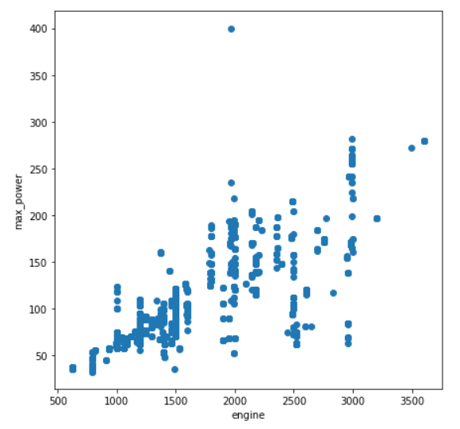
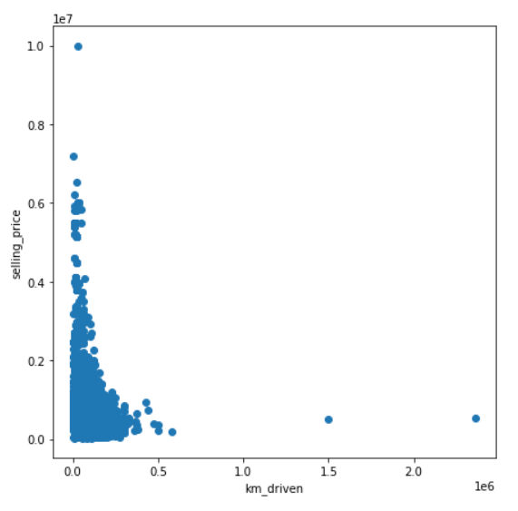
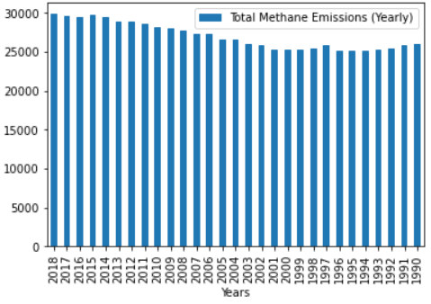
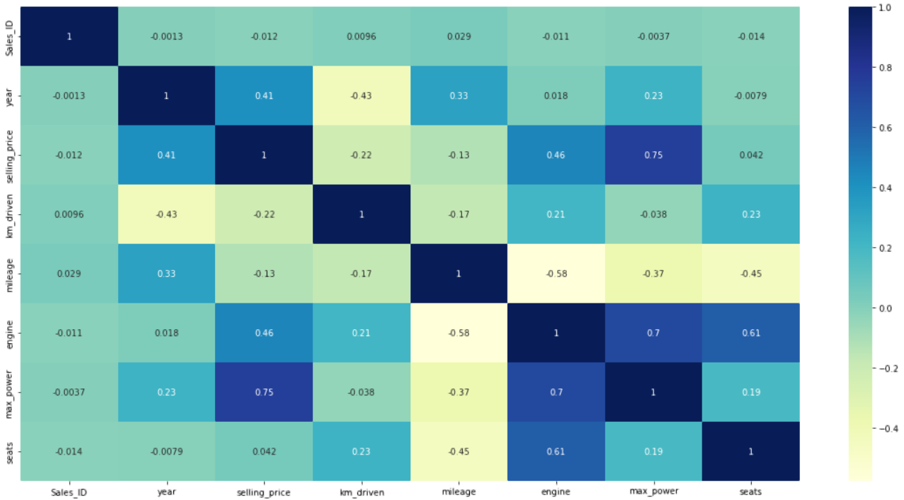

# Using-GridDB-to-analyze-factors-affecting-used-car-sales.

The [automobile industry](https://www.es.kearney.com/automotive/article/-/insights/the-contribution-of-the-automobile-industry-to-technology-and-value-creation), which spans many adjacent industries, is a pillar of the global economy, a key contributor to macroeconomic growth and stability, and technological advancement in the first and third world nations. 

The global auto industry is booming, and to bring about new changes, they have turned to produce new electric vehicles. However, this article will not discuss new inventions or automobiles; instead, we will examine the market for used fossil fuel-based cars and which factors are responsible for causing an impact on this market.

GridDB will be used to analyze the factors that influence used car sales because it is a highly scalable and optimized in-memory No SQL database that allows parallel processing for increased performance and efficiency, particularly for time-series databases. GridDB's node js client will be used, which allows us to connect GridDB to node js and import or export data in real-time. In addition, we will use the DanfoJS library to work with data frames for data analysis to create interesting visualizations and data findings.

The dataset, which is in csv format, was obtained from [Kaggle](https://www.kaggle.com/datasets/shubham1kumar/usedcar-data?select=UserCarData.csv). We will see what the data represents later in the Data Analysis section.

**Exporting Dataset into GridDB:**

To begin, we must initialize the GridDB node modules griddb node, danfojs-node, and csv-parser. Griddb node starts the node so we can work on GridDB, Danfojs-node is initialized as a variable, df, which is used in data analysis, and csv-parser will upload our dataset into GridDB by reading the csv file, which is as follows:

```javascript
var griddb = require('griddb_node');

const dfd = require("danfojs-node")
const csv = require('csv-parser');
const fs = require('fs');
fs.createReadStream('./Dataset/UserCarData.csv')
  .pipe(csv())
  .on('data', (row) => {
    lst.push(row);
    console.log(lst);
  })
```

Following variable initialization, we will generate the GridDB container to create the database schema. In the container, we have to define the data types of columns in our dataset. We can then use the container later to access the stored data, completing our data insertion into the GridDB. 

```javascript
const conInfo = new griddb.ContainerInfo({
    'name': "usedcaranalysis",
    'columnInfoList': [
      ["name", griddb.Type.STRING],
      ["Sales_ID", griddb.Type.INTEGER],
        ["name", griddb.Type.STRING],
        ["year", griddb.Type.INTEGER],
        ["selling_price", griddb.Type.INTEGER],
        ["km_driven", griddb.Type.INTEGER],
        ["Region", griddb.Type.STRING],
        ["State or Province", griddb.Type.STRING],
        ["City", griddb.Type.STRING],
        ["fuel", griddb.Type.STRING],
        ["seller_type", griddb.Type.STRING],
        ["transmission", griddb.Type.STRING],
        ["owner", griddb.Type.STRING],
        ["mileage", griddb.Type.DOUBLE],
        ["engine", griddb.Type.INTEGER],
        ["max_power", griddb.Type.DOUBLE],
        ["torque", griddb.Type.STRING],
        ["seats", griddb.Type.INTEGER],
        ["sold", griddb.Type.STRING]
    ],
    'type': griddb.ContainerType.COLLECTION, 'rowKey': true
});

/// Inserting Data into GridDB

    for(let i=0;i<lst.length;i++){

    store.putContainer(conInfo, false)
        .then(cont => {
            container = cont;
            return container.createIndex({ 'columnName': 'name', 'indexType': griddb.IndexType.DEFAULT });
        })
        .then(() => {
            idx++;
            container.setAutoCommit(false);
            return container.put([String(idx), lst[i]['Sales_ID'],lst[i]["name"],lst[i]["year"],lst[i]["selling_price"],lst[i]["km_driven"],lst[i]["Region"],lst[i]["State or Province"],lst[i]["City"],lst[i]["fuel"],lst[i]["seller_type"],lst[i]["transmission"],lst[i]["owner"],lst[i]["mileage"],lst[i]["engine"],lst[i]["max_power"],lst[i]["torque"],lst[i]["seats"],lst[i]["sold"]]);
        })
        .then(() => {
            return container.commit();
        })      
        .catch(err => {
            if (err.constructor.name == "GSException") {
                for (var i = 0; i < err.getErrorStackSize(); i++) {
                    console.log("[", i, "]");
                    console.log(err.getErrorCode(i));
                    console.log(err.getMessage(i));
                }
            } else {
                console.log(err);
            }
        });
    }
```

**Importing Dataset from GridDB:**

Since we've already saved all of our data in the container, all we have to do now is retrieve it using TQL, GridDB's SQL-like query language. So, to begin, we will construct a container for the retrieved data, named obtained_data. The next step is to extract the rows in the column order, named query, and save them in a data frame, named df, for data visualization and analysis, completing our data import.

```javascript
# Get the containers
obtained_data = gridstore.get_container("usedcaranalysis")
    
# Fetch all rows - language_tag_container
query = obtained_data.query("select *")

# Creating Data Frame variable
let df = await dfd.readCSV("./out.csv")
```

**Data Analysis:**

To begin our data analysis, it is always best to start with the most basic steps possible. As a result, we will look at our dataset's columns and what they represent, as well as the total number of rows and columns:

* Sales_ID : Unique identification number given to the sale.
* name : Name of the company who built the car.
* year : Model year of the car sold.
* selling_price : Selling price of the car.
* km_driven : Total number of kilometres driven.
* Region : District of the state where the sale was conducted.
* State or Province : Name of the state or the province where the sale was done.
* City : Name of the city where the sale was carried out.
* fuel : Fuel type for the car.
* seller_type : The type of the seller, like Dealer or Individual.
* transmission : The transmission type of the car sold.
* owner : The chain of ownership, like first, second, etc.
* mileage : The mileage given by the car in km/l.
* engine : Engine cc.
* max_power : Horsepower of the car sold.
* torque : Torque of the car sold, in Nm.
* seats : Seating capacity of the car sold.
* sold : Whether the car sale was successful or not.


```javascript
console.log(df.shape)

//  Output
// [ 7906, 18 ]
```
We have 7906 rows and 18 columns of data to analyze (excluding the Sales_ID), so we have 7906 cars and 17 different factors to see how used car sales are affected. However, because we assume that car sales are affected by the features offered in a specific car, we will exclude geographical constraints from our analysis. It would be unfair to judge a car's sale based on where it was sold. As a result, we will exclude the columns "Region", "State or Province", and "City" from our data analysis.

Now that we've established that, we can proceed with our analysis.

To begin, we will compare the summary statistics with some of the most factors that affect the car sales.

```javascript
df.loc({columns:['year', 'selling_price', 'km_driven', 'mileage', 'engine', 'max_power', 'seats']}).describe().round(2).print()


// Output
// ╔════════════╤═══════════════════╤═══════════════════╤═══════════════════╤═══════════════════╤═══════════════════╤═══════════════════╤═══════════════════╗
// ║            │ year              │ selling_price     │ km_driven         │ mileage           │ engine            │ max_power         │ seats             ║
// ╟────────────┼───────────────────┼───────────────────┼───────────────────┼───────────────────┼───────────────────┼───────────────────┼───────────────────╢
// ║ count      │ 7906.00           │ 7.90e+03          │ 7.90e+03          │ 7906.00           │ 7906.00           │ 7906.0            │ 7906.00           ║
// ╟────────────┼───────────────────┼───────────────────┼───────────────────┼───────────────────┼───────────────────┼───────────────────│───────────────────╢
// ║ mean       │ 2013.98           │ 6.50e+05          │ 6.92e+04          │ 19.42             │ 1458.70           │ 91.58             │ 5.42              ║
// ╟────────────┼───────────────────┼───────────────────┼───────────────────┼───────────────────┼───────────────────┼───────────────────│───────────────────╢
// ║ std        │ 3.86              │ 8.13e+05          │ 5.67e+04          │ 4.04              │ 503.89            │ 35.74             │ 0.96              ║
// ╟────────────┼───────────────────┼───────────────────┼───────────────────┼───────────────────┼───────────────────┼───────────────────│───────────────────╢
// ║ min        │ 1994.00           │ 2.99e+04          │ 1.00e+00          │ 0.00              │ 624.00            │ 32.80             │ 2.00              ║
// ╟────────────┼───────────────────┼───────────────────┼───────────────────┼───────────────────┼───────────────────┼───────────────────│───────────────────╢
// ║ median     │ 2015.00           │ 4.50e+05          │ 6.00e+04          │ 19.30             │ 1248.00           │ 82.00             │ 5.00              ║
// ╟────────────┼───────────────────┼───────────────────┼───────────────────┼───────────────────┼───────────────────┼───────────────────│───────────────────╢
// ║ max        │ 2020.00           │ 1.00e+07          │ 2.36e+06          │ 42.00             │ 3604.00           │ 400.00            │ 14.00             ║
// ╟────────────┼───────────────────┼───────────────────┼───────────────────┼───────────────────┼───────────────────┼───────────────────│───────────────────╢
// ║ variance   │ 1.49e+01          │ 6.62e+11          │ 3.22e+09          │ 1.63e+01          │ 2.54e+09          │ 1.28e+03          │ 9.20e-01          ║
// ╚════════════╧═══════════════════╧═══════════════════╧═══════════════════╧═══════════════════╧═══════════════════╧═══════════════════╧═══════════════════╝
```

The count in the above summary table corresponds to the number of rows we calculated, indicating that we do not have any null values in our dataset. Regarding other features, we can see that the car model year ranges from 1994 to 2020, regardless of the company. Furthermore, we can see that the cars sold have better mileage, with the average being 20 km/l, which is a key feature people look for when purchasing a car. On the other hand, if you are not concerned with mileage, cars with larger engines, up to 3600cc, produce the most horsepower (400).

To summarise, all of the above factors determine the selling price of a specific car. So, for example, if the km driven increases, the selling price will almost certainly fall because people will not want to buy a car that has been driven a lot because the engine or other parts might need to be repaired. The graphs below show how some of these factors relate to one another.


```javascript
## Scatter Plot between engine and max_power
let cols = [...cols]
cols.pop('engine')
let data = [{
    x: df['engine'].values,
    y: df['max_power'].values,
    type: 'scatter',
    mode: 'markers'}];
let layout = {
    height: 400,
    width: 700,
    title: 'Engine vs Max_power',
    xaxis: {title: 'Engine Size'},
    yaxis: {title: 'Max Power'}};
// There is no HTML element named `myDiv`, hence the plot is displayed below.
Plotly.newPlot('myDiv', data, layout);    
```

The plot for two columns engine and max_power is below:



The plot above shows that the two variables have a positive linear relationship with other, which means that the greater the engine size, the greater the power by the engine which should make sense.

```javascript
## Scatter Plot between km_driven and selling_price
let cols = [...cols]
cols.pop('year')
let data = [{
    x: df['km_driven'].values,
    y: df['selling_price'].values,
    type: 'scatter',
    mode: 'markers'}];
let layout = {
    height: 400,
    width: 700,
    title: 'Km Driven vs Selling Price',
    xaxis: {title: 'Km Driven'},
    yaxis: {title: 'Selling Price'}};
// There is no HTML element named `myDiv`, hence the plot is displayed below.
Plotly.newPlot('myDiv', data, layout);    
```

The plot for two columns km_driven and selling_price is below:



According to the plot above, the two variables have a negative linear relationship, which means that the higher the number of kilometers driven on the car, the lower the car's selling price. It demonstrates that people prefer to buy used cars that have been driven less frequently, possibly because the car that has been driven less frequently may require less repair than the car that has been driven frequently leading to high selling prices.

Using a bar chart, let's look at the car manufacturers and see who has the most sales.

**Bar Chart:**

```javascript
## Distribution of Column Values
const { Plotly } = require('node-kernel');
let cols = df.columns
for(let i = 0; i < cols.length; i++)
{
    let data = [{
        x: cols[i],
        y: df[cols[i]].values,
        type: 'bar'}];
    let layout = {
        height: 400,
        width: 700,
        title: 'Car Manufacturers Sales' +cols[i],
        xaxis: {title: cols[i]}};
    // There is no HTML element named `myDiv`, hence the plot is displayed below.
    Plotly.newPlot('myDiv', data, layout);
}
df.plot("plot_div").bar()
```




According to the bar chart above, Maruti has outperformed its competitors by a wide margin.

Finally, we will examine how these variables are related and which impacts used car sales most. The correlation map below will assist us in this regard.

**Correlation:**

```javascript
correlogram(data)
```
The Correlation plot is below:



The values for variables are shown in the correlation plot above, and the higher the value, the stronger the relationship is between them. For example, values greater than 0.5 in the correlation plot indicate that the two variables are more closely related than values less than 0.5. As a result, selling price and max price have the highest values (0.75), indicating that they are the two most important variables in determining the car's selling price and, ultimately, the car sales. However, because the same variables will naturally have the strongest correlations, we ignore the diagonal above in the correlation plot.


**Conclusion:**

While we initially thought mileage would be the most important factor in used car sales, it turns out that the max_power and selling_price of the cars have the greatest impact on the sales.

Finally, GridDB was used for all this data analysis because it allowed for quick access and efficient data reading, writing, and storing.
