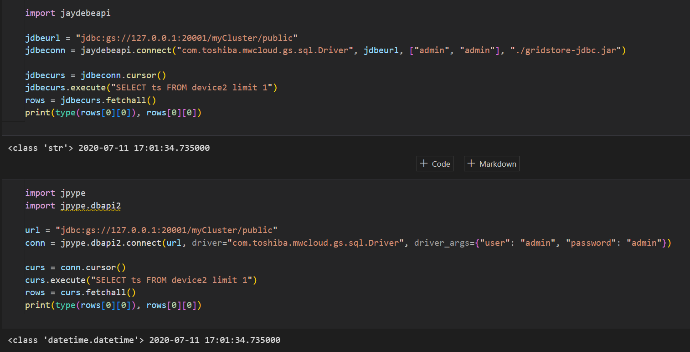
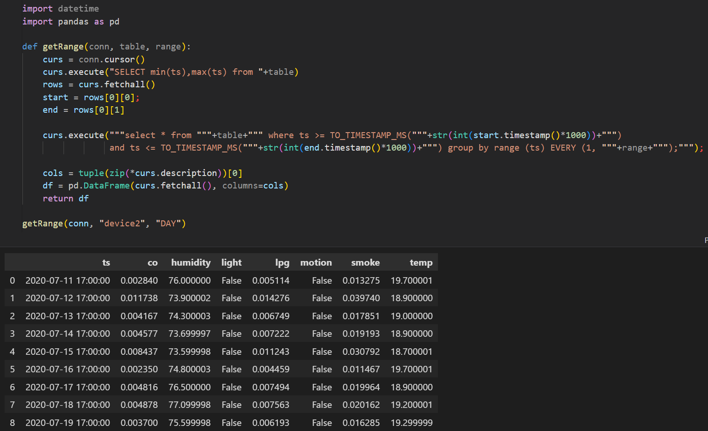
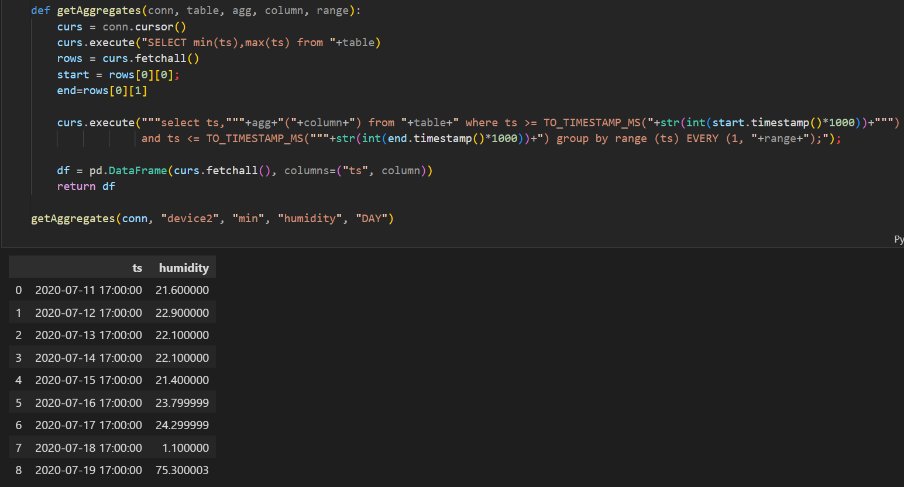
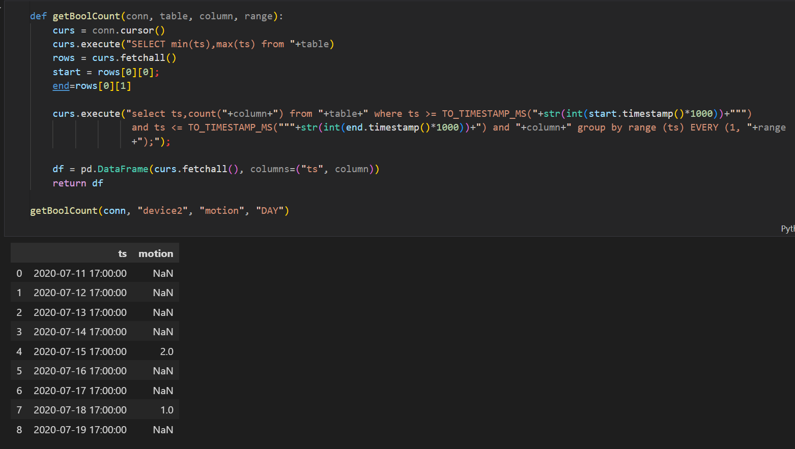
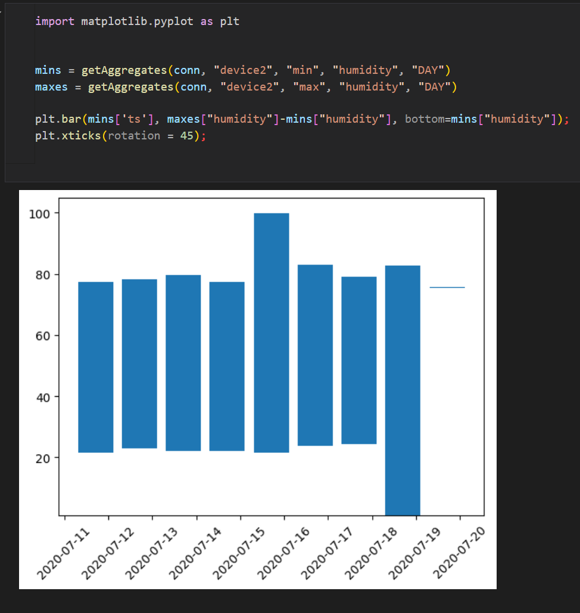
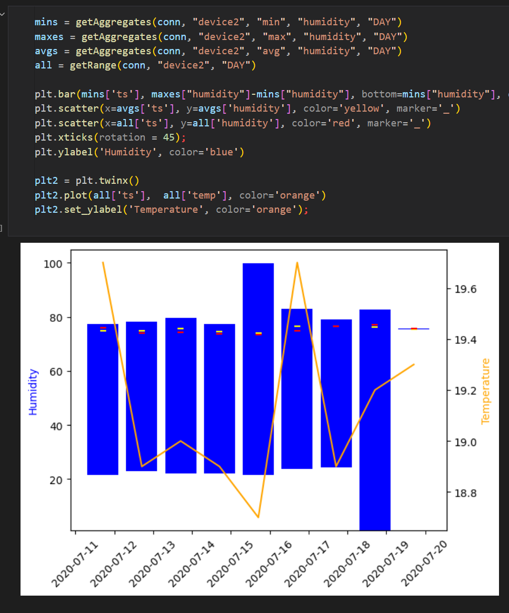

# Exploring GridDB’s Group By Range Functionality

In the most recent release of GridDB CE (version 5.3), a new SQL function was added that allows a user to fetch interpolated or aggregated data for a set of time ranges over a total duration from a `TIMESERIES` container. We explored similar functionality before in this blog post [GridDB Optimization with Multi-Put and Query](https://griddb.net/en/blog/griddb-optimization-with-multi-put-and-query/) by building a set of queries to query each individual group and then efficiently executing them with GridDB’s multi-query function.

The new query function is quite simple:

`SELECT * FROM table WHERE ts_col > TIMESTAMP(start) and ts_col <= TIMESTAMP(end) GROUP BY RANGE (n, duration)`

In the above example, `ts_col` is is the index of the time-series container. The `start` and `end` variables are the starting and ending timestamps of the data queried and the query must have those clauses. Finally, each group’s duration is n*duration. The duration can be:

    DAY
    HOUR
    MINUTE
    SECOND
    MILLISECOND

You can also query an aggregate of each time group such as the MIN, MAX, AVG, COUNT, SUM, etc.

`SELECT ts_col,AVG(value) FROM table WHERE ts_col > TIMESTAMP(start) and ts_col <= TIMESTAMP(end) GROUP BY RANGE (n, duration)`

Finally, if your data is sparse, the non-aggregate query’s interpolation can be adjusted by appending `FILL(method)` to the end of the query. Available fill methods include:

    LINEAR
    NONE
    NULL
    PREVIOUS

## Hands On

Now, let’s get started trying it out. We’ll use the already ingested dataset from GridDB’s Udemy Course. [https://www.udemy.com/course/create-a-working-iot-project-with-iot-database-griddb](https://www.udemy.com/course/create-a-working-iot-project-with-iot-database-griddb).

As this is a SQL function, it is only available via GridDB’s JDBC or WebAPI interface. In this blog we’ll be using the Python module `jpype.dbapi2` as it natively supports SQL and the Timestamp to Python datetime object conversion. Compare the following two outputs using `jaydebe` and `jpype.dbapi2`: jaydebe outputs a string while jype.dbapi2 outputs a datetime object. 

With the connection setup we can create a function that gets the first and last timestamps and build the group by range query. The function itself returns data as Pandas DataFrame with the columns set to match the table columns.

Now let’s try an aggregate query:

If you have a boolean column that represents an event and want to see that happened in each time grouping, you can use the MAX aggregation:

To count the number of events (or the number times a column is TRUE) in each time window, you need to add an additional clause AND column to your query:

Now that we know how to use the group by range aggregate function, we can build some diagrams that show useful statistics such as a bar chart showing the min and max values of each time group.

We can expand on the above graph by adding data from the interpolated values too. Note how the interpolated value (red) is slightly different from the AVG aggregate (yellow).

If you’d like to experiment with the group by range function, the above Jupyter notebook can be downloaded from GridDB.net’s GitHub repository here [https://github.com/griddbnet/Blogs/blob/group_by_range/group_by_range.ipynb](https://github.com/griddbnet/Blogs/blob/group_by_range/group_by_range.ipynb).
