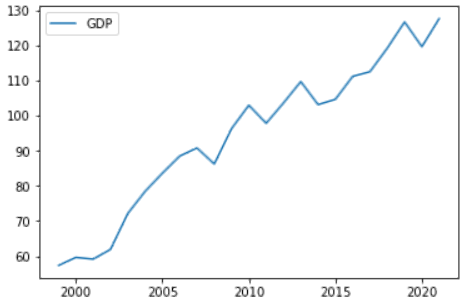
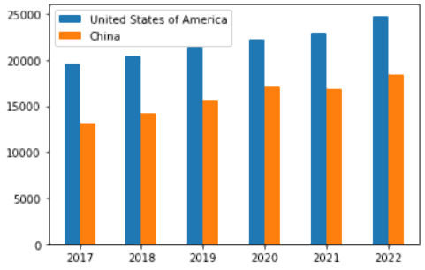

[GDP](https://www.worldometers.info/gdp/what-is-gdp/), which stands for "Gross Domestic Product," is the total monetary value of all final goods and services produced (and sold on the market) within a country over a given period (typically one year). It is used as a metric for any country's economic growth.

We will use GridDB to analyze the economic status of various countries. GridDB is a highly scalable and optimized in-memory No SQL database that allows parallel processing for higher performance and efficiency, especially for time-series databases. We will be using GridDB's node js client, which allows us to connect GridDB to node js and import or export data in real-time. Furthermore, we will use the DanfoJS library to work with data frames for data analysis.

The dataset, which is in csv format, was obtained from [Kaggle](https://www.kaggle.com/datasets/alejopaullier/-gdp-by-country-1999-2022). We will see what the data represents later in the Data Analysis section.

## Exporting Dataset into GridDB

To begin, we must initialize the GridDB node modules griddb node, danfojs-node, and csv-parser. Griddb node starts the node so we can work on GridDB, Danfojs-node is initialized as a variable, df, which is used in data analysis, and csv-parser will upload our dataset into GridDB by reading the csv file, which is as follows:

<pre><code class="language-javascript">var griddb = require('griddb_node');

const dfd = require("danfojs-node")
const csv = require('csv-parser');
const fs = require('fs');
fs.createReadStream('./Dataset/GDP by Country 1999-2022.csv')
  .pipe(csv())
  .on('data', (row) => {
    lst.push(row);
    console.log(lst);
  })</code></pre>

Following variable initialization, we will generate the GridDB container to create the database schema. In the container, we have to define the data types of columns in our dataset. We can then use the container later to access the stored data, completing our data insertion into the GridDB. 

<pre><code class="language-javascript">const conInfo = new griddb.ContainerInfo({
    'name': "gdpanalysis",
    'columnInfoList': [
      ["name", griddb.Type.STRING],
      ["Country", griddb.Type.STRING],
        ["1999", griddb.Type.DOUBLE],
        ["2000", griddb.Type.DOUBLE],
        ["2001", griddb.Type.DOUBLE],
        ["2002", griddb.Type.DOUBLE],
        ["2003", griddb.Type.DOUBLE],
        ["2004", griddb.Type.DOUBLE],
        ["2005", griddb.Type.DOUBLE],
        ["2006", griddb.Type.DOUBLE],
        ["2007", griddb.Type.DOUBLE],
        ["2008", griddb.Type.DOUBLE],
        ["2009", griddb.Type.DOUBLE],
        ["2010", griddb.Type.DOUBLE],
        ["2011", griddb.Type.DOUBLE],
        ["2012", griddb.Type.DOUBLE],
        ["2013", griddb.Type.DOUBLE],
        ["2014", griddb.Type.DOUBLE],
        ["2015", griddb.Type.DOUBLE],
        ["2016", griddb.Type.DOUBLE],
        ["2017", griddb.Type.DOUBLE],
        ["2018", griddb.Type.DOUBLE],
        ["2019", griddb.Type.DOUBLE],
        ["2020", griddb.Type.DOUBLE],
        ["2021", griddb.Type.DOUBLE]
    ],
    'type': griddb.ContainerType.COLLECTION, 'rowKey': true
});

/// Inserting Data into GridDB

    for(let i=0;i<lst.length;i++){

    store.putContainer(conInfo, false)
        .then(cont => {
            container = cont;
            return container.createIndex({ 'columnName': 'name', 'indexType': griddb.IndexType.DEFAULT });
        })
        .then(() => {
            idx++;
            container.setAutoCommit(false);
            return container.put([String(idx), lst[i]['Country'],lst[i]["1999"],lst[i]["2000"],lst[i]["2001"],lst[i]["2002"],lst[i]["2003"],lst[i]["2004"],lst[i]["2005"],lst[i]["2006"],lst[i]["2007"],lst[i]["2008"],lst[i]["2009"],lst[i]["2010"],lst[i]["2011"],lst[i]["2012"],lst[i]["2013"],lst[i]["2014"],lst[i]["2015"],lst[i]["2016"],lst[i]["2017"],lst[i]["2018"],lst[i]["2019"],lst[i]["2020"],lst[i]["2021"]]);
        })
        .then(() => {
            return container.commit();
        })      
        .catch(err => {
            if (err.constructor.name == "GSException") {
                for (var i = 0; i < err.getErrorStackSize(); i++) {
                    console.log("[", i, "]");
                    console.log(err.getErrorCode(i));
                    console.log(err.getMessage(i));
                }
            } else {
                console.log(err);
            }
        });    
    }</code></pre>

## Importing Dataset from GridDB

Since we've already saved all of our data in the container, all we have to do now is retrieve it using TQL, GridDB's SQL-like query language. So, to begin, we will construct a container for the retrieved data, named obtained_data. The next step is to extract the rows in the column order, named query, and save them in a data frame, named df, for data visualization and analysis, completing our data import.

<pre><code class="language-javascript"># Get the containers
obtained_data = gridstore.get_container("gdpanalysis")
    
# Fetch all rows - language_tag_container
query = obtained_data.query("select *")

# Creating Data Frame variable
let df = await dfd.readCSV("./out.csv")</code></pre>

## Data Analysis

To begin our data analysis, we will examine the columns of our dataset and what they represent, as well as the total number of rows and columns in our dataset:

* Country : Names of the countries in the dataset.
* 1999 : GDP of the specific country in the year 1990.
* 2000 : GDP of the specific country in the year 2000.

    .
    
    .
    
    .

* 2021 : GDP of the specific country in the year 2021.

<pre><code class="language-javascript">console.log(df.shape)

//  Output
// [ 180, 24 ]</code></pre>

We have 180 rows and 24 columns, so we have the GDP of 180 different countries from 1999 to 2021.

We will check if we have null values in our dataset:

<pre><code class="language-javascript">for (let column_name in p1_df.columns){
    column = p1_df[column_name];
    # Get the count of Zeros in column 
    count = (column == '0').sum();
    console.log('Count of zeros in column ', column_name, ' is : ', count)
}
// Output 
// Count of zeroes in column  Country  is :  0
// Count of zeroes in column  1999  is :  2
// Count of zeroes in column  2000  is :  1
// Count of zeroes in column  2001  is :  1
// Count of zeroes in column  2002  is :  0
// Count of zeroes in column  2003  is :  0
// Count of zeroes in column  2004  is :  0
// Count of zeroes in column  2005  is :  0
// Count of zeroes in column  2006  is :  0
// Count of zeroes in column  2007  is :  0
// Count of zeroes in column  2008  is :  0
// Count of zeroes in column  2009  is :  1
// Count of zeroes in column  2010  is :  1
// Count of zeroes in column  2011  is :  1
// Count of zeroes in column  2012  is :  1
// Count of zeroes in column  2013  is :  1
// Count of zeroes in column  2014  is :  13
// Count of zeroes in column  2015  is :  14
// Count of zeroes in column  2016  is :  14
// Count of zeroes in column  2017  is :  14
// Count of zeroes in column  2018  is :  14
// Count of zeroes in column  2019  is :  14
// Count of zeroes in column  2020  is :  15
// Count of zeroes in column  2021  is :  16</code></pre>

We have all our GDP values in object data type; thus, we will change the data types of the dataset into float so that we can replace the zero values with GDP median value for each country as GDP can never be zero, which is as shown below:

<pre><code class="language-javascript">for (let column_name in p1_df.columns){

  if(column_name == 'Country'){
  
  continue;
}
else{

  df = df.asType(column_name, "float64")
}

for (let column_name in p1_df.columns){

  df[column_name]=df[column_name].replace(0, df[column_name].median())

}</code></pre>

Now that our data is clean, we can proceed with the analysis. 

To begin, we will plot a line chart to see the global GDP trend, calculated by combining the GDP of all 180 countries into a single line chart as shown below:

Secondly, we will compare the summary statistics to see each country's progress from 1999 to 2021.

<pre><code class="language-javascript">df.loc({columns:['2016', '2017', '2018', '2019', '2020', '2021']}).describe().round(2).print()

// Output
// ╔════════════╤═══════════════════╤═══════════════════╤═══════════════════╤═══════════════════╤═══════════════════╤═══════════════════╗
// ║            │ 2016              │ 2017              │ 2018              │ 2019              │ 2020              │ 2021              ║
// ╟────────────┼───────────────────┼───────────────────┼───────────────────┼───────────────────┼───────────────────┼───────────────────╢
// ║ count      │ 180               │ 180               │ 180               │ 180               │ 180               │ 180               ║
// ╟────────────┼───────────────────┼───────────────────┼───────────────────┼───────────────────┼───────────────────┼───────────────────╢
// ║ mean       │ 111.26            │ 112.58            │ 119.30            │ 126.77            │ 119.70            │ 127.74            ║
// ╟────────────┼───────────────────┼───────────────────┼───────────────────┼───────────────────┼───────────────────┼───────────────────╢
// ║ std        │ 179.68            │ 176.69            │ 186.00            │ 196.63            │ 186.40            │ 199.65            ║
// ╟────────────┼───────────────────┼───────────────────┼───────────────────┼───────────────────┼───────────────────┼───────────────────╢
// ║ min        │ 0.16              │ 0.17              │ 0.17              │ 0.18              │ 0.23              │ 0.25              ║
// ╟────────────┼───────────────────┼───────────────────┼───────────────────┼───────────────────┼───────────────────┼───────────────────╢
// ║ median     │ 2657.38           │ 2868.33           │ 2978.95           │ 3207.04           │ 2689.55           │ 2899.29           ║
// ╟────────────┼───────────────────┼───────────────────┼───────────────────┼───────────────────┼───────────────────┼───────────────────╢
// ║ max        │ 19555.87          │ 20493.25          │ 21404.19          │ 22294.11          │ 22939.58          │ 24796.08          ║
// ╟────────────┼───────────────────┼───────────────────┼───────────────────┼───────────────────┼───────────────────┼───────────────────╢
// ║ variance   │ 32286.52          │ 31220.07          │ 34596.34          │ 38661.75          │ 34743.69          │ 39862.26          ║
// ╚════════════╧═══════════════════╧═══════════════════╧═══════════════════╧═══════════════════╧═══════════════════╧═══════════════════╝</code></pre>

The median and variance values give the idea that most countries in the world have suffered economically as even the median is quite low and the variance is greater, determining the difference between the first and the third world countries. This suffering occurred because of Covid-19 from 2018 to 2020, which struck badly on every country and disturbed the whole economy. But after the Covid-19 cases went down, the countries started to recover, as shown in the line chart above. On the other hand, even after all this suffering, let's see which country has the maximum GDP from 2016 to 2021 in the last six years.

<pre><code class="language-javascript">console.log(df.loc(df[df['2016'].max()]))
console.log(df.loc(df[df['2017'].max()]))
console.log(df.loc(df[df['2018'].max()]))
console.log(df.loc(df[df['2019'].max()]))
console.log(df.loc(df[df['2020'].max()]))
console.log(df.loc(df[df['2021'].max()]))

// Output
// United States
// United States
// United States
// United States
// United States
// United States</code></pre>

It is no surprise that the United States has topped the GDP chart, but China isn't far behind. China is also on the rise in competing with the United States, and the gap is not as large as it appears in the bar graph below:

<pre><code class="language-javascript">## Distribution of Column Values
const { Plotly } = require('node-kernel');
let cols = df.columns
for(let i = 0; i < cols.length; i++)
{
    let data = [{
        x: cols[i],
        y: df[cols[i]].values,
        type: 'bar'}];
    let layout = {
        height: 400,
        width: 700,
        title: 'GDP for United States of America and China (2016 - 2021)' +cols[i],
        xaxis: {title: cols[i]}};
    // There is no HTML element named `myDiv`, hence the plot is displayed below.
    Plotly.newPlot('myDiv', data, layout);
}
df.plot("plot_div").bar()</code></pre>

## Conclusion

While some countries started to recover from the loss of Covid-19 in 2021 as Covid-19 restrictions got held off, the Russian invasion of Ukraine again struck the world economy. It gave rise to inflation as petroleum prices shot through the roof, and these fluctuations would now cause the GDP to lower in 2022 when the GDP of each country is calculated when 2022 is over. 

While with the data that we had, we saw that certain third world countries are trying to become a part of the first world while the first world countries are competing with each other for the superpower position.

Lastly, GridDB was used for all this data analysis because it allowed for quick access and efficient reading, writing, and storing of data.
