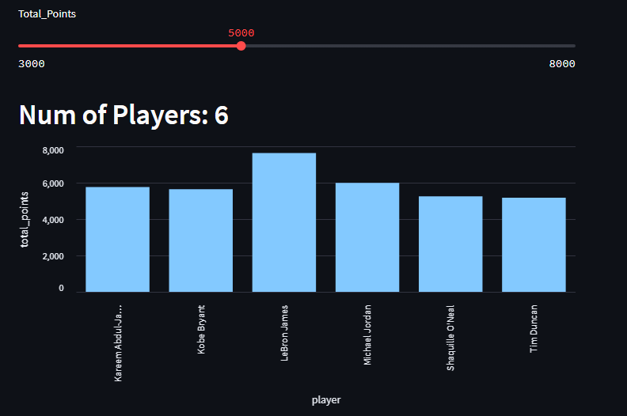
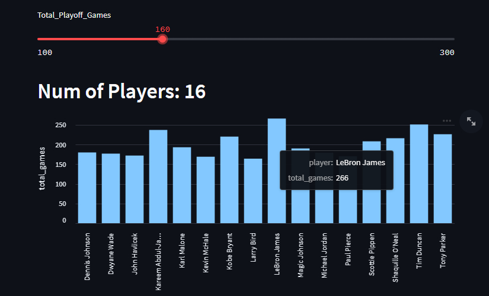
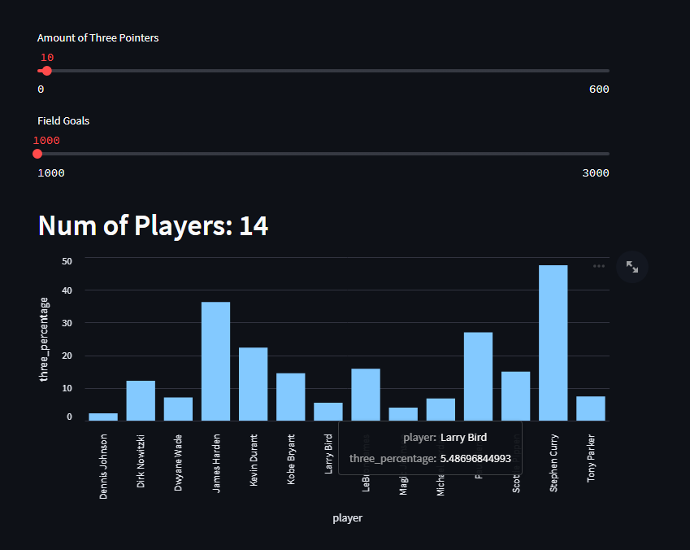

We have written previously about marrying GridDB with [streamlit](https://griddb.net/en/blog/create-interactive-dashboard-with-streamlit-python-and-griddb/), and though we can still recommend taking that approach if you have an on-premise server already running, this article will introduce an alternative method. 

Instead of using your already spun-up GridDB server as the host for your data, this article will go over utilizing an instance of the [GridDB Cloud]() for creating your interactive dashboards. This means that for this article, we will go over how to ingest data into the cloud, how to query from it, and then how to push the relevant data onto your streamlit charts. 

If you are unfamiliar with Streamlit, it sells itself like so: "Streamlit turns data scripts into shareable web apps in minutes. All in pure Python. No front‑end experience required". This means that if we get a dataset, wrangle and massage it in the right way, we can build an attractive dashboard without writing any code that isn't Python. 

Here is a quick video showcasing using the chart: 


## Getting Started

To follow along with this article, you can grab the source code from our GitHub page: 

```bash
$ git clone https://github.com/griddbnet/Blogs.git --branch streamlit_cloud
```

### Step By Step Instructions

Before following the instructions that follow, please make sure that you go into the source code and edit the variables which contain the URL to your cloud instance and the authentication portion of the header obj.

1. Clone GitHub Repo
2. Update URL and Header object with your credentials
3. Install the dependencies
  A. $ python3 -m pip install streamlit pandas
4. Ingest data by running the ingest.py file ($ python3 ingest.py)
5. Run Streamlit app ($streamlit run app.py)


## The dataset

Because we've previously done more "academic" type datasets in our previous attempts, and because this article is mostly focused on the cloud aspect of it, we have opted to choose a more simple and fun dataset. The data for this article is from [Kaggle](https://www.kaggle.com/datasets/isaienkov/nba-top-25-alltime-playoff-scorers); it is a list of the top 25 all-time playoff scorers in NBA history. 

This dataset only has 25 rows but it has many columns. As stated before, we will go over ingesting our data from a `csv` file, querying the data we need using [Streamlit's handy API](https://docs.streamlit.io/library/api-reference), and then finally displaying the relevant data using Streamlit's output widgets.

## Ingesting Data

Okay, now that we have got a dataset picked out, let's try to ingest it into our GridDB Cloud Instance. The easiest way of interacting with your server is through the [Web API](https://griddb.net/en/blog/griddb-webapi/). When using this method, we can interact using the [REST interface](https://restfulapi.net/), meaning we can `PUT` our data through HTTP Requests; we can even conduct TQL and SQL queries through a web request to find our data for our streamlit charts.

### Creating Our Container

Before we read the `csv` file and push its contents into our Cloud instance, we will need to lay out the schema of our container and then push that information to our server. Once this container and the schema is in place and our server understands what sort of data we intend to push to it, we can send each row of data up to be stored.

```python
data_obj ={
   "container_name":"Playoff_Scorers",
   "container_type":"COLLECTION", 
   "rowkey":False,
   "columns":[
      {
         "name":"rank",
         "type":"INTEGER"
      },
      {
         "name":"player",
         "type":"STRING"
      },
      {
         "name":"position",
         "type":"STRING"
      },
      {
         "name":"teams",
         "type":"STRING"
      },
      {
         "name":"total_points",
         "type":"INTEGER"
      },
      {
         "name":"total_games",
         "type":"INTEGER"
      },
      {
         "name":"total_points_pre_game",
         "type":"FLOAT"
      },
      {
         "name":"field_goals",
         "type":"INTEGER"
      },
      {
         "name":"three_point_goals",
         "type":"INTEGER"
      },
      {
         "name":"free_shots",
         "type":"INTEGER"
      },
      {
         "name":"born",
         "type":"STRING"
      },
      {
         "name":"active_player",
         "type":"INTEGER"
      },
      {
         "name":"country",
         "type":"STRING"
      },
      {
         "name":"recording_year",
         "type":"INTEGER"
      }
   ]
}
```

Here we are laying out the schema of our csv file. This takes every single column from the original dataset minus one, which we will remove later in the next section. Of course, if we tried to send our CSV data without first removing the column, it would result in a failure to ingest.

To send our schema to the cloud, we will need to make a POST request.

```python 
header_obj = {"Authorization":"Basic XXX","Content-Type":"application/json; charset=UTF-8","User-Agent":"PostmanRuntime/7.29.0"}
```

The header_obj gets sent with our HTTP Request; the entire request will fail without it. Namely we need to include our credentials and a User-Agent that is not just a Python script. The username and password must be encoded in base64 and included in the header_obj.

```python
import requests
import http
http.client.HTTPConnection.debuglevel = 1
base_url = 'https://[host]:[port]/griddb/v2/[clustername]/dbs/[database_name]/'
#Set up the GridDB WebAPI URL
url = base_url + 'containers'
req_post = requests.post(url, json = data_obj, headers = header_obj)
```

Here were are making the POST request with our schema obj as the request body. If all goes well, our container should be created in the cloud.

### Reading CSV And Pushing Data 

To ingest the data we've downloaded from Kaggle, we can use the all-popular [pandas](https://pandas.pydata.org/) library to create a dataframe of the csv data. From there, we can convert the data into a JSON file and then put that data into our HTTP Request's body to push the data into our Cloud instance. 

```python
# read our data and make it into a dataframe
df = pd.read_csv('nba_playoffs.csv')

# Drop the column we don't need
df = df.drop('hall_of_fame', axis=1)

# Convert df to JSON
scores_json = df.to_json(orient="values")

# Send our converted json df using PUT command to push all data into cloud
# Here we borrow the same header_obj from before
url = base_url + 'containers/Playoff_Scorers/rows'
req_ingest = requests.put(url, data=scores_json, headers=header_obj)
```

## Querying Our Data for Analysis

Now we will try to query the data from our cloud instance and see if we can use it in any way. Because we will want to allow the user to select certain parameters to help form our data query, we can elect to use a TQL or SQL query to fill in the numbers based on the users' selections. 

So again we will create our header_obj and base_url

```python
header_obj = {"Authorization":"Basic XXX","Content-Type":"application/json; charset=UTF-8","User-Agent":"PostmanRuntime/7.29.0"}
base_url = 'https://[host]:[port]/griddb/v2/[clustername]/dbs/[database_name]/'
```

And now we will create our query: 

```python
import streamlit as st
scoring_threshold = st.slider("Total_Points", 3000, 8000, 3000, 200)
total_points_query_str = ("select * where total_points > " + str(scoring_threshold))
```

Here with the help of the Streamlit API we create a simple slider which has a default value of 3000 and allows the user to select a bigger number using the created UI element. 


```python
url_total_points = base_url + 'tql'
request_body_total_pts = '[{"name":"Playoff_Scorers", "stmt":"' + \
    total_points_query_str+'", "columns":[]}]'

res = requests.post(url_total_points, data=request_body_total_pts, headers=header_obj)
total_points_data = res.json()  
```


Just like with the ingest, we make a POST request with a request body which contains the relevant information, in this case our TQL query with the user-selected scoring threshold. Everytime our user selects a new number, the app reloads and runs the code again, meaning our query is fired off again and we get back a new response from our cloud instance.

Before we try to render our data, we will need to turn our raw json data from our server's response into a pandas dataframe

```python
dataset_columns = ['rank', 'player', 'position', 'teams', 'total_points', 'total_games', 'total_points_pre_game',
                   'field_goals', 'three_point_goals', 'free_shots', 'born', 'active_player', 'country', 'recording_year']


scorers = pd.DataFrame(total_points_data[0]["results"], columns=dataset_columns)
```


Now that we have the relevant information as a dataframe, we can try to render our chart.

And as a note, everytime we increase the scoring threshold from our slider, we would like to see the amount of players who have scored that many points change on a bar graph:

```python
st.header("Num of Players: " + str(scorers.shape[0]))
st.bar_chart(data=scorers, x='player', y='total_points')
```
By feeding in the dataframe in the data column, we can now use the column names for the x and y axis. And because our dataframe's data will keep shifting as we make new queries with the slider, our dashboard has become interactive with very little effort.



What the chart is showing off is the number of points by the top 25 nba playoff performers. So if you slide the number, the higher the scoring threshold gets, the less players will have achieved that amount. It's a very cool way of illustrating LeBron James's dominance.

## More Data And Charts

When taking a look at the full source code int he github page, there are a couple of more charts that you can play around with. These two charts are also very simple: one is total NBA Playoff games, and the last one is the percentage of a player's career field goals being three pointers.



This one is essentially the same as the previous just new with a column to query and display. But this one also shows the dominance of both Tim Duncan and LeBron James, they are very, VERY ahead of the rest of the competition.



And this last chart showcases Total Field Goals & Three Pointers made and percentage of field goals made in the playoffs which are three pointers. Steph Curry by far leads this metric, but I think it is also interesting to illustrade how many more threes are made in today's game versus the older era.

For this article, we have made three charts, but you are highly encouraged to use this simple dataset to find more interesting/fun angles and to display them into a chart or maybe through some other means!

## Conclusion

And with that, you have learned how to ingest data into a GridDB cloud instance and send up TQL queries to create beautiful Streamlit charts.