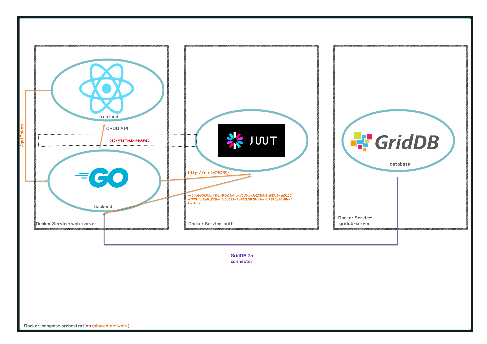
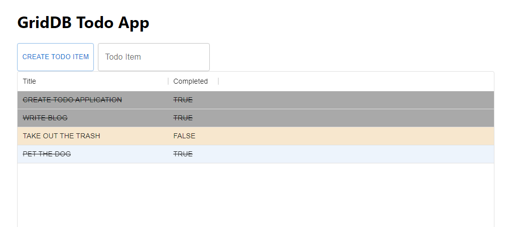

We have written about creating web applications with GridDB previously: [Create a Java Web API Using GridDB and Spring Boot](https://griddb.net/en/blog/create-a-java-web-api-using-griddb-and-spring-boot/) & [CRUD Opertions with the GERN Stack](https://griddb.net/en/blog/crud-gern-stack/). In this article, we will again be tackling this topic, but instead will utilize [Go](https://go.dev/) as our server/backend language. 

Go has increasingly been positioning itself as the backend language of the future because of its robust standard library, static typing, and memory safety. Because we would like to mostly showcase how to build a web application with this programming language, we are building a very simple demo app, meant to show how to perform the basic CRUD actions using GridDB, Go, and a simple frontend webpage in your browser. We will be creating a TODO app which will allow us to showcase creating a TODO item, updating it (completion), reading all TODOs that exist in our GridDB server, and then finally delete them when the user decides it is appropriate to do so. 

Microservices are also increasingly becoming a popular infrastucture strategy for building large and robust applications because of its flexibility, both upfront in building them, and in the long run with continued support of the various aspects of a web application; this was another reason we chose Go as the programming language for this article -- it is commonly used as the language of choice when building out microservices. As a nod to this sort of application building, we are eventually planning a sequel to this article in which we move all services onto a kubernetes cluster (singular node). Because of this, we aim to have at least three containers working in unison to create this app: GridDB for data persistence, a web server, and an authentication service needed to access our endpoints.

But before we jump into deploying our application onto a cloud service with kubernetes, we will keep this application local, utilizing docker and docker-compose to ship out the code. Again, we will have three working containers in a docker compose yaml.



## Prereqs and Docker/Docker Compose

This article will be using GridDB, Go, the GridDB Go Connector, and React.js; if you want to code along, you can download all of these individually and run this project on "bare metal". But because of the magic of [Docker](https://www.docker.com/), if you just want to spin up the project alongside reading this article to confirm how everything works, you will simply only need to download docker, the docker compose plugin, and that's all. 

### Running this Project with Docker Compose

The repo for this project can be found here: [GitHub]

```bash
$ git clone [] --branch kubernetes
```

In the root of this repository, you will find a `docker-compose.yaml` -- this file contains all instructions for building and running all components of this application. To see the very simple app in action,  simply run the following two commands in sequence: 

```bash
$ docker compose build
$ docker compose up -d 
```

The first command will read the `.yaml` file to figure out how to build each component, and the second command will actually go ahead and run the containers on a shared network; this means that the three services (GridDB, web-server, authentication) can already all communicate with each other via their service names (which are also their hostnames).

Once your project is running, simply navigate to port 8080 of the host machine (ie, http://localhost:8080 if the host machine is the same one as your web browser). And now you can create a TODO item in the box. To toggle as COMPLETED (or vice versa), simply click on the row. And because the data is being saved onto a database (GridDB), the TODO list will persist through shutdowns, etc.

### Docker Compose and Dockerfiles

Before we move onto the source code for the services, let's briefly look at the docker files which provide the instructions on building the containers which will help for us to deploy our project. 

#### Docker Compose File

Here is the `docker-compose.yaml` file in its entirety: 


```bash
version: '3.9'
#volumes:
#  griddb:

services:

  griddb-server:
    build:
      context: griddb-server
      dockerfile: Dockerfile
    container_name: griddb-server
    expose:
      - '10001'
      - '10010'
      - '10020'
      - '10040'
      - '20001'
      - '41999'
    environment:
      NOTIFICATION_MEMBER: 1
      GRIDDB_CLUSTER_NAME: myCluster


  authentication:
    build: 
      context: authentication
      dockerfile: Dockerfile
    container_name: authentication
    ports: 
      - '2828:2828'

  web-server:
    build:
      context: web_server
      dockerfile: Dockerfile
    container_name: web-server
    ports: 
      - '8080:8080'
```

This file mostly serves to keep everything organized as a singular project and to provide the shared network for three containers. The instructins for building each individual container is in each service's unique `Dockerfile`.

#### GridDB Dockerfile

First let's look at GridDB's. 

```bash
from griddb/griddb

USER root

RUN set -eux \
    && apt-get update \
    # Install dependencies for griddb
    && apt-get install -y default-jre --no-install-recommends \
    && apt-get clean all \
    # Delete the apt-get lists after installing something
    && rm -rf /var/lib/apt/lists/*

# Install GridDB c_client
WORKDIR /
RUN wget --no-check-certificate https://github.com/griddb/c_client/releases/download/v5.0.0/griddb-c-client_5.0.0_amd64.deb
RUN dpkg -i griddb-c-client_5.0.0_amd64.deb

RUN wget --no-check-certificate https://github.com/griddb/cli/releases/download/v5.0.0/griddb-ce-cli_5.0.0_amd64.deb
RUN dpkg -i griddb-ce-cli_5.0.0_amd64.deb


ADD start-griddb2.sh /
USER gsadm

ENTRYPOINT ["/bin/bash", "/start-griddb2.sh"]
CMD ["griddb"]
```

There's not much to this container; we are using the official GridDB image from that the dev team has uploaded onto Dockerhub: [griddb/griddb](https://hub.docker.com/r/griddb/griddb) and expanding it a tiny bit. We mostly want to install Java, the C Client, and the GridDB CLI. These libraries will allow us to utilize the GridDB Command Line Interface so that we can verify a few things with our containers, etc. And in the end we call upon a script which starts GridDB into container form. 

#### Web Server Dockerfile

Next let's look at the web-server service. This container contains our Go backend code which interacts with our GridDB container, and then it also contains our react.js frontend code (static built) which sends HTTP Requests to the Go backend API which will send back relevant information GridDB. 

Here is the Dockerfile: 

```bash
FROM golang:1.20.4-bullseye


RUN set -eux; \
	apt-get update; \
	apt-get install -y --no-install-recommends autotools-dev automake libpcre3 libpcre3-dev
		
WORKDIR /
RUN wget --no-check-certificate https://github.com/griddb/c_client/releases/download/v5.1.0/griddb-c-client_5.1.0_amd64.deb
RUN dpkg -i griddb-c-client_5.1.0_amd64.deb

RUN wget https://prdownloads.sourceforge.net/swig/swig-4.0.2.tar.gz
RUN tar xvzf swig-4.0.2.tar.gz

WORKDIR /swig-4.0.2
RUN /swig-4.0.2/autogen.sh
RUN /swig-4.0.2/configure
RUN make
RUN make install

RUN go env -w GO111MODULE=off
RUN go get -d github.com/griddb/go_client
WORKDIR $GOPATH/src/github.com/griddb/go_client
RUN ls -la
RUN ./run_swig.sh
RUN go install

workdir /app

ADD . /app/web_server
ADD ./frontend /app/frontend

RUN curl -fsSL https://deb.nodesource.com/setup_20.x | bash - && apt-get install -y nodejs
WORKDIR /app/frontend
RUN npm install
RUN npm install react-scripts@3.4.1 -g --silent
RUN npm run pre-build
RUN npm run build
RUN npm run post-build

WORKDIR /app/web_server
RUN go get github.com/dgrijalva/jwt-go
RUN go get github.com/gorilla/mux
RUN go build -o web_server *.go 
RUN chmod +x /app/web_server/web_server

EXPOSE 8080

cmd ["/app/web_server/web_server"]
```

The goal for this file, as explained above, is to run our web-server code, both the backend and the frontend. So first, we start with the Go base image and expand from there. We will need to install the GridDB Go client (to interact with GridDB), install node.js and react (to build the frontend html code), and finally build the golang binary file to run the project. All instructions for the steps are found in the Dockerfile. If you have any questions regarding any of it, please feel free to reach out to us on Stackoverflow.

### Authentication Dockerfile

This is the simplest of the containers because it is only responsible for providing [JSON Web Tokens](https://jwt.io/).

```bash
FROM golang:1.20.4-bullseye

ADD . /app/authentication

WORKDIR /app/authentication

RUN go mod download && go mod verify

RUN go get github.com/dgrijalva/jwt-go
RUN go build -o authentication *.go
RUN chmod +x /app/authentication/authentication

cmd ["/app/authentication/authentication"]
```

And so here, we are simply producing a binary file of our go code to issue json web tokens and the Dockerfile reflects that simplicity. We will discuss how this service ties into our TODO app later.

## The Code 

Now let's discuss the source code used to get this app up and running. We will go through the authentication service first, and then move onto the web backend and finally finish up with the react.js frontend.

### Authentication Service

To help give this project some more depth and to showcase the microservice architecture, we have decided to include this authentication microservice. Normally in a real world/production application, you would have a whole sign up/sign in/sign out process for keeping personal data for each user silo'd and secured. In this case, we just implemented a rough service which will grant a user a valid token which will then be checked whenever any of our API endpoints are used. If no token is sent or if the token is invalid, the endpoint will fail.

So for example, if we want to call our `/get` endpoint which will return all TODO items, we will first need to grab a valid token from our authentication service. And then when we make our HTTP Request for `/get`, we will include the token in the header. And that's the extent of it. In this case, we wrote out authentication service in Golang to match our backend service. The idea will be that the authentication service is also its own unique web server serving up JSON Web tokens to any HTTP clients which make a request with the same signing key that we set upon creating our server.

```go
package main

import (
	"fmt"
	"log"
	"net/http"
	"time"

	jwt "github.com/golang-jwt/jwt"
)

var mySigningKey = []byte("ScruffMcGruff")

func GetJWT() (string, error) {
	token := jwt.New(jwt.SigningMethodHS256)

	claims := token.Claims.(jwt.MapClaims)

	claims["authorized"] = true
	claims["aud"] = "golang-blog"
	claims["iss"] = "israel"
	claims["exp"] = time.Now().Add(time.Hour * 1).Unix()

	tokenString, err := token.SignedString(mySigningKey)

	if err != nil {
		fmt.Errorf("Something Went Wrong: %s", err.Error())
		return "", err
	}

	return tokenString, nil
}
```

This is our very simple code to generate our token. We make a unique signingKey and claims object which all help us to verify the token on the backend side to make sure the token being received is valid. Of course, most of the heavy lifting of this code is being done by the jwt package (which is being imported at the top of this code block). 

Once we have our token string, we simply spin up a simple http server (using the Golang Standard Library) and serve up tokens whenever our endpoint is reached.

```go
func enableCors(w *http.ResponseWriter) {
	(*w).Header().Set("Access-Control-Allow-Origin", "*")
}

func Index(w http.ResponseWriter, r *http.Request) {

	enableCors(&w)

	validToken, err := GetJWT()
	fmt.Println(validToken)
	if err != nil {
		fmt.Println("Failed to generate token")
	}

	fmt.Fprintf(w, string(validToken))
}

func handleRequests() {

	http.HandleFunc("/", Index)
	fmt.Println("Starting on port 2828")
	log.Fatal(http.ListenAndServe(":2828", nil))
}

func main() {
	handleRequests()
}
```

If you can run this server on bare metal, you can query `http://localhost:2828/` and you will received a token string. However, since we are planning to run this in docker, we will instead need to call it by its hostname/service name `http://authentication:2828/`. Next, let's go over the web-server code because that service will be grabbing tokens and serving them up to our frontend to make successful endpoint queries.

### Web Server Container

Let's now review the backend Go code. This code will create a simple CRUD API to query our GridDB Docker Container with the goal of creating a simple TODO app. The Go code will also serve our static HTML React.js files, as well as create a web server to host the API itself.

Let's first take a look at the GridDB-specific code and expand from there.

#### GridDB Connection & Helper Functions

```go
type Todo struct {
	Id        int
	Title     string
	Completed bool
}

func ConnectGridDB() griddb.Store {
	factory := griddb.StoreFactoryGetInstance()

	// Get GridStore object
	gridstore, err := factory.GetStore(map[string]interface{}{
		"notification_member": "griddb-server:10001",
		"cluster_name":        "myCluster",
		"username":            "admin",
		"password":            "admin"})
	if err != nil {
		fmt.Println(err)
		panic("err get store")
	}

	return gridstore
}

func createTodo() {
	gridstore := ConnectGridDB()
	defer griddb.DeleteStore(gridstore)
	conInfo, err := griddb.CreateContainerInfo(map[string]interface{}{
		"name": "todo",
		"column_info_list": [][]interface{}{
			{"id", griddb.TYPE_INTEGER},
			{"title", griddb.TYPE_STRING},
			{"completed", griddb.TYPE_BOOL}},
		"type":    griddb.CONTAINER_COLLECTION,
		"row_key": true})
	if err != nil {
		fmt.Println("Create containerInfo failed, err:", err)
		panic("err CreateContainerInfo")
	}
	_, e := gridstore.PutContainer(conInfo)
	if e != nil {
		fmt.Println("put container failed, err:", e)
		panic("err PutContainer")
	}
}
```

First up is our Todo type, which is a struct that lays out the schema of our rows for GridDB. Essentially, each TODO item in our application will have an ID (rowkey), a title, and its completion status. This schema is reflected in our TODO struct, as well as in our CreateTodo() function. Our ConnectGridDB function will input our credentials and attempt to make a connection with our GridDB container. All of the credentials used here are system defaults; the only thing of note is that the `notification_member` is using the GridDB Docker container's service/host name: `griddb-server`. So now whenever we call this function, we will be able to interact with our running GridDB server.

And as explained before, the CreateTodo() function will create the actual TODO Collection container. It runs everytime our server is run, but if the container already exists, it does nothing, so it is safe to run everytime to ensure the container exists to save our todo items.

Next let's look at some more GridDB helper functions to do things like conduct queries.

```go
func GetContainer(gridstore griddb.Store, cont_name string) griddb.Container {

	col, err := gridstore.GetContainer(cont_name)
	if err != nil {
		fmt.Println("getting failed, err:", err)
		panic("err create query")
	}
	col.SetAutoCommit(false)

	return col
}

func QueryContainer(gridstore griddb.Store, col griddb.Container, query_string string) griddb.RowSet {
	query, err := col.Query(query_string)
	if err != nil {
		fmt.Println("create query failed, err:", err)
		panic("err create query")
	}

	// Execute query
	rs, err := query.Fetch(true)
	if err != nil {
		fmt.Println("fetch failed, err:", err)
		panic("err create rowset")
	}
	return rs
}
```

These functions simply help to keep our code cleaner and allows to get query results with one line.

And before we move on to the CRUD functions, here is the function which queries our authentication service to receive a valid JSON web token.

```go
func GetToken(w http.ResponseWriter, r *http.Request)  {

    w.Header().Set("Access-Control-Allow-Origin", "*")

    resp, err := http.Get("http://authentication:2828")
    if err != nil {
        log.Fatalln("error grabbing Token", err)
    }

   body, err := ioutil.ReadAll(resp.Body)
   if err != nil {
      log.Fatalln(err)
   }
    w.Write(body)
}

func main() {
    ....snip
    router.HandleFunc("/getToken", GetToken)
}
```

Because HTTP requests from our frontend are happening client side (ie the browser), we cannot query the authentication service directly from our frontend. This means that in order to get our tokens to our frontend, we must receive it in our backend and then serve it up to our frontend when the `/getToken` endpoint is called. Normally, you'd require some sort of login mechanism (username/password) to not allow just anybody to get tokens, but for demo purposes, this implementation is fine.

#### CRUD Functions

And now finally let's take a look at the Create, Read, Update, and Delete functions for our go code. Create is handled by CreateTodoItem, it will create a row of the end user's choosing. Read is handled by Get(), which simply returns all rows to the user. Update() will toggle a TODO item's "completed" column between truthy or false. And finally DeleteTodoItem() will delete the row once a user is finished with it. 

```go
func Get(w http.ResponseWriter, r *http.Request) {

	w.Header().Set("Content=Type", "application/json")
	w.Header().Set("Access-Control-Allow-Origin", "*")

	gridstore := ConnectGridDB()
	defer griddb.DeleteStore(gridstore)

	col := GetContainer(gridstore, "todo")
	defer griddb.DeleteContainer(col)

	rs := QueryContainer(gridstore, col, "select *")
	defer griddb.DeleteRowSet(rs)

	var todos []Todo
	for rs.HasNext() {
		rrow, err := rs.NextRow()
		if err != nil {
			fmt.Println("NextRow from rs failed, err:", err)
			panic("err NextRow from rowset")
		}
		var todo Todo
		todo.Id = rrow[0].(int)
		todo.Title = rrow[1].(string)
		todo.Completed = rrow[2].(bool)
		todos = append(todos, todo)
	}
	if err := json.NewEncoder(w).Encode(todos); err != nil {
		log.Panic(err)
	}
}

func CreateTodoItem(w http.ResponseWriter, r *http.Request) {

	w.Header().Set("Content=Type", "application/json")
	w.Header().Set("Access-Control-Allow-Origin", "*")

	gridstore := ConnectGridDB()
	defer griddb.DeleteStore(gridstore)

	col := GetContainer(gridstore, "todo")
	defer griddb.DeleteContainer(col)

	decoder := json.NewDecoder(r.Body)
	var t Todo
	err := decoder.Decode(&t)
	if err != nil {
		fmt.Println("decode err", err)
	}

	col.SetAutoCommit(false)
	err = col.Put([]interface{}{t.Id, t.Title, t.Completed})
	if err != nil {
		fmt.Println("put row name01 fail, err:", err)
	}
	fmt.Println("Creating Item")
	col.Commit()
}

func UpdateTodoItem(w http.ResponseWriter, r *http.Request) {

	w.Header().Set("Content=Type", "application/json")
	w.Header().Set("Access-Control-Allow-Origin", "*")

	gridstore := ConnectGridDB()
	defer griddb.DeleteStore(gridstore)

	col := GetContainer(gridstore, "todo")
	defer griddb.DeleteContainer(col)
	col.SetAutoCommit(false)

	vars := mux.Vars(r)
	idStr := vars["id"]
	id, err := strconv.Atoi(idStr)
	if err != nil {
		http.Error(w, "Invalid ID", http.StatusBadRequest)
		return
	}

	query_str := fmt.Sprintf("SELECT * WHERE id = %d", id)

	rs := QueryContainer(gridstore, col, query_str)
	defer griddb.DeleteRowSet(rs)

	for rs.HasNext() {
		rrow, err := rs.NextRow()
		if err != nil {
			fmt.Println("GetNextRow err:", err)
			panic("err GetNextRow")
		}

		todo_title := rrow[1]
		todo_done := rrow[2].(bool) //casting interface{} to bool

		//Update row from completed to not, etc
		err2 := rs.Update([]interface{}{id, todo_title, !todo_done})
		if err2 != nil {
			fmt.Println("Update err: ", err2)
		}
	}
	col.Commit()
}

func DeleteTodoItem(w http.ResponseWriter, r *http.Request) {

	w.Header().Set("Content=Type", "application/json")
	w.Header().Set("Access-Control-Allow-Origin", "*")

	gridstore := ConnectGridDB()
	defer griddb.DeleteStore(gridstore)

	col := GetContainer(gridstore, "todo")
	defer griddb.DeleteContainer(col)

	vars := mux.Vars(r)
	idStr := vars["id"]
	id, err := strconv.Atoi(idStr)
	if err != nil {
		http.Error(w, "Invalid ID", http.StatusBadRequest)
		return
	}

	query_str := fmt.Sprintf("SELECT * WHERE id = %d", id)
	fmt.Println(query_str)

	rs := QueryContainer(gridstore, col, query_str)
	defer griddb.DeleteRowSet(rs)

	for rs.HasNext() {
		rrow, err11 := rs.NextRow() //Avoid invalid results returned
		if err11 != nil {
			fmt.Println("GetNextRow err:", err11)
			panic("err GetNextRow")
		}
		fmt.Println(rrow)
		fmt.Println(("removing"))
		err5 := rs.Remove()
		if err5 != nil {
			fmt.Println("Remove err: ", err5)
		}
	}
}
```

All of these functions are called when a certain route is called from from the frontend code -- for example, the webpage may call `/get/` on page load, which will call the Get() function to return all TODO rows back to the user to be read, etc. 

Another example can be creating a TODO item/row. To do so, we send a POST HTTP Request to our Go server with the TODO item's title. It will then automatically give it a unique ID and auto set the item to incomplete. 

#### Authentication Middleware

The authentication service provides us with a small http server which serves valid tokens, but these mean nothing if there is no mechanism to check for valid tokens, and then act accordingly. To accomplish this task, we can add what is called `middleware`, which basically means that this function is run everytime an HTTP Request is received for each endpoint and reads in the data and then spits out a response based on the input. For example, if a request is received without a token, it will return an error stating that the token is missing, and then the same thing will occur if the token exists but is expired or invalid. The only way to get the right data back is to provide a valid token.

```go
var MySigningKey = []byte("ScruffMcGruff") //same signing key is crucial. this part can be used as os environment to not have this information public

func isAuthorized(endpoint func(http.ResponseWriter, *http.Request)) func(http.ResponseWriter, *http.Request) {
	return func(w http.ResponseWriter, r *http.Request) {
		if r.Header["Token"] != nil {

			token, err := jwt.Parse(r.Header["Token"][0], func(token *jwt.Token) (interface{}, error) {
				if _, ok := token.Method.(*jwt.SigningMethodHMAC); !ok {
					return nil, fmt.Errorf(("invalid Signing Method"))
				}
				aud := "golang-blog"
				checkAudience := token.Claims.(jwt.MapClaims).VerifyAudience(aud, false)
				if !checkAudience {
					return nil, fmt.Errorf(("invalid aud"))
				}
				// verify iss claim
				iss := "israel"
				checkIss := token.Claims.(jwt.MapClaims).VerifyIssuer(iss, false)
				if !checkIss {
					return nil, fmt.Errorf(("invalid iss"))
				}

				return MySigningKey, nil
			})
			if err != nil {
				fmt.Fprintf(w, err.Error())
			}

			if token.Valid {
				endpoint(w, r)
			}

		} else {
			fmt.Fprintf(w, "No Authorization Token provided")
		}
	}
}

func main() {
    .....snip
    router.HandleFunc("/get", isAuthorized(Get)) //run isAuthorized function as part of the handlefunc
}
```
Essentially what is happening here is that this function verifies the signing key, the signing method, the claim issuer and claim audience, and if all of this checks out, it will return the original endpoint, if any of it goes wrong, it will return an error. This is how you can verify that each endpoint call has a valid token, to make sure that the information being passed around is going only to secure places.

#### Go Web Server Routing

Although the Go Standard Library has a very good and robust net/http package out of the box, we have elected to use the gorilla/mux package to help us with our API endpoints. There is not much to this section of the code, so I will simply share it here: 

```go
func main() {

	createTodo()

	router := mux.NewRouter()
	router.Use(mux.CORSMethodMiddleware(router))

	router.HandleFunc("/get", isAuthorized(Get))
    router.HandleFunc("/getToken", GetToken)
	router.HandleFunc("/create", isAuthorized(CreateTodoItem)).Methods("POST")
	router.HandleFunc("/update/{id}", isAuthorized(UpdateTodoItem)).Methods("POST")
	router.HandleFunc("/delete/{id}", isAuthorized(DeleteTodoItem)).Methods("POST")

	router.PathPrefix("/").Handler(http.FileServer(http.Dir("./public/")))

    srv := &http.Server{
        Handler: router,
        Addr:    "0.0.0.0:8080",
    }

	fmt.Println("Listening on port 8080...")
	log.Fatal(srv.ListenAndServe())
}
```

We first create our TODO container (if not exists), initialize our router object from the gorilla/mux package, and then create our endpoint routes with their corresponding functions, though not before inserting our isAuthorized middleware to make sure data is not sent to places without valid tokens. 

And then finally we also set it up to serve up our static HTML/JS react.js content in the root page ("/").

###  Frontend Code

The frontend code is a bit out of scope for this project as it not its own container, nor is it doing anything particularly special. The main thing to know is that the frontend code is making HTTP requests to the endpoints established in the backend code to receive the data we need. Once we have the data, we display it in a grid and allow the end user to create new items, etc. 

The only thing to note is that each request made by the frontend to the backend must have a valid token. To do so, we grab a token on page load and save that string as a react state. And then each proceeding request includes the token: 

```javascript
  const getToken = () => {
    fetch("/getToken").then(function (response) {
      return response.text()
    }).then((data) => {
        let respToken = data
        console.log("respToken: ", data)
        setToken(respToken) //setting react state for token
      }) 
    }
```

And then here's a request using the saved token: 

```javascript
const queryForRows = () => {
  axios.get("/get",{ headers:{"Token": token}}).then((response) => {
    let resp = (response.data);
    let lastId = 0
    resp.forEach((val, idx) => {
      val["id"] = idx //adding ids for the datagrid (separate from the GridDB rowkey)
      lastId = val.Id // grab last Id
    })
    setRows([...resp])
    setLastId(lastId + 1)
  })
}
```

Of course, as explained above, the source code is available on Github, so if you are curious as to how this simple web page works, you can see the code there. 

Here is what it looks like: 



## Next Steps

We will be iterating upon this article by moving this local project onto a cloud instance with added robustness by migrating it to a kubernetes cluster. 

As for the users, you can of course try to iterate on this project by making a more robust TODO list or adding new functionality.

## Conclusion

And with that, we have learned how to make a GridDB web app using Go as your backend server. We also learned how to deploy a microservice-type archiecture using Docker Compose to build a flexible app.