# Using A No Code Solution to Display your IoT Data with GridDB

We have written articles on how to use python to create no "frontend-code" dashboards: [Create Interactive Dashboard with Streamlit, Python and GridDB](https://griddb.net/en/blog/create-interactive-dashboard-with-streamlit-python-and-griddb/) & [Create an Interactive Dashboard using Python and the GridDB Cloud](https://griddb.net/en/blog/create-an-interactive-dashboard-using-python-and-the-griddb-cloud-no-frontend-code-needed/) and have also tackled articles on how to use node.js and react.js to create simple dashboards: [An Alternative to the MERN Stack: Create a Query Builder with the GERN Stack](https://griddb.net/en/blog/gern-stack/) &  [CRUD Operations with the GERN Stack](https://griddb.net/en/blog/crud-gern-stack/). 

In this article we will be following a similar approach, but will instead be leveraging [bubble](https://bubble.io/), a "no code" solution which allows users to create web pages without fussing with any code at all. This means that we can create our app without touching any coding language at all; we will be using the GridDB Cloud'd web api to completely omit the need to touch anything besides our Bubble App Editor; indeed, this means we can build a usable Todo application with persistent data without even touching HTML/CSS/JavaScript. 

Because we are utilizing the GridDB Cloud, there is nothing that must be done to prep before beginning this process -- we can simply dive right in. This also means that the only prerequisite tied to this article is an account on Bubble.


## What We're Building -- Todo Application

As explained above, we will be creating a simple todo app without touching any backend or frontend code. What we expect of a todo app is to be able to write an ad-hoc statement which must be set as either true or false, with false being the default option. With this in mind, to start, this means our application we will need a text input for our user to enter in the task they wish to accomplish. Beyond that, we will also need a simple data table to display the user's todo list, with the crucial ability of being able to toggle its complete-ness.

We will create this basic premise using the Bubble App editor and make API calls directly to our GridDB Cloud instance. The frontend portions -- the stuff we see -- is handled by the Bubble editor. The data being retrieved from our cloud instance is retrieved using the Bubble API Connector Plugin.

## Sending & Receiving Data -- API Calls

Before we start placing items onto the display side of the application, let's get our API Calls in order. We want to showcase the gamut of CRUD (Create, Read, Update, Delete) operations here, so we will need a minimum of four different API calls. And because we are using a no code environment, we can use HTTP Requests to reach our cloud-based GridDB instance. 

### First Steps

Let's install the Bubble API Connector Plugin and begin creating our API Calls.

Head over to the Plugins section of the Bubble editor and create a add an API from the API Connector. Let's call this one GridDB Cloud.

Because we already know that each HTTP Request made to the GridDB Cloud will need HTTP Basic Authentication, we can set that at the top. We will also need to include "Content-Type: application/json" as a shared header for all calls.

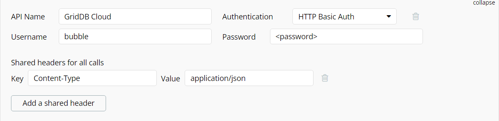

Great! Now every call we make will be sent with our authentication credentials as well as the content type. Next let's create our first API call.

### READ - API Call

First up is our GET request. The URL Template for this API call is like this: `https://cloud1.griddb.com/$TrialId/griddb/v2/$ClusterName/dbs/$DatabaseName/containers/#ContainerName/rows`. So let's enter this into our first API Call from the Bubble Editor. The first decision we must make when creating our API call is to choose whether to "use as" `Action` or `Data`. If you choose data, you can directly select to grab the data as a data source for a table for example. But if you choose Action -- which we will be doing here -- it allows you to set in the workflow after an event occurs (ie. run this ACTION once the user clicks that button, etc).

Next we need to select the type of HTTP Request: we select `POST` because we will be sending the limit of how many rows we wish to receive in the body of our request.

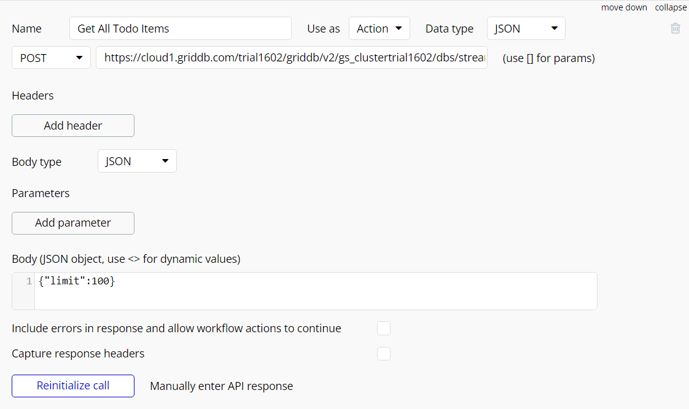

In the body section you can add how many rows to limit to our query. Because our todo app likely won't exceed 10 or so, we can safely set it to 100 and be done with it.

    {"limit":100}

Once you have entered in your information, click the "initialize call" button to select the type of data we are working with.


This process also saves the API Call so that we can use it in our design process.

### CREATE - Adding a Todo Item

Our next API call will be that which will create our todo items. The best way to handle this will be to allow the user to enter text to an input box and then send the HTTP request with the user input somewhere in the request. Let's set this API call as an `Action` and as a PUT request. 

Where it gets interesting is the body of our request. Because we need to include our user inputs, we will need set the item name as dynamic, which we can accomplish by using the less than and greater than symbols to encapsulate our variable: 

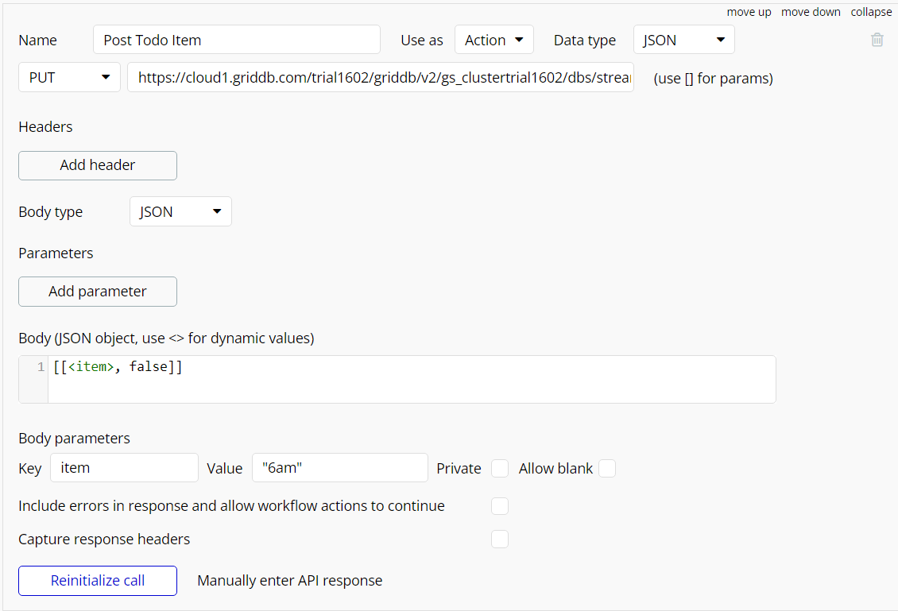

Now we will just need to figure out how to insert dynamic data when making our HTTP request.

### DELETE - Deleting a Todo Item

Delete will be similar to CREATE, just with a different HTTP method (DELETE) and a different body. The body of our request only requires the rowkey of the row in which we wish to delete, or in this case, the name of the todo item.

Once again, this value needs to be dynamic so we will figure out how to send the dynamic value with our request later (hint: workflows).

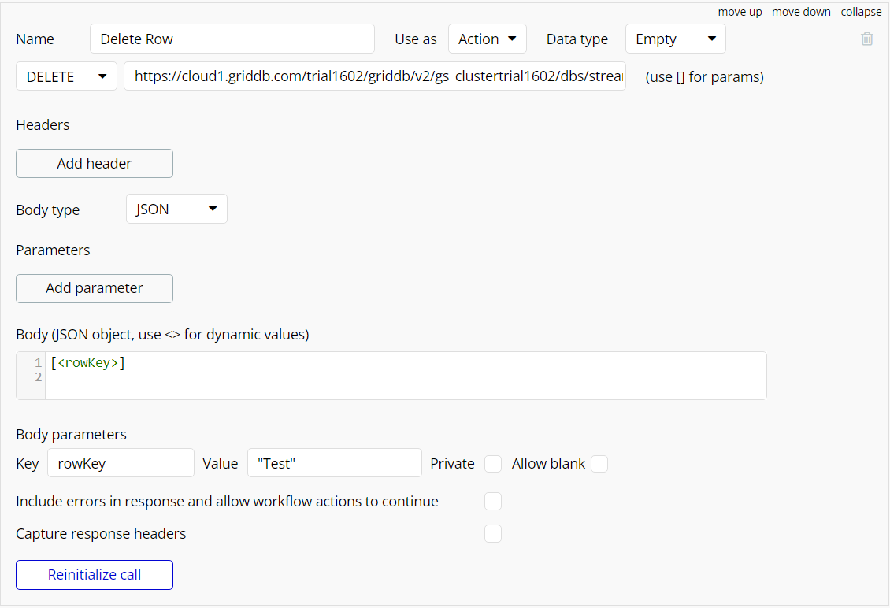

### UPDATE - Updating a Todo Item (toggle completeness)

Our updating process will be an API call (used as `Action`) as well, but this one will be a lot more involved. The reason for this as that to update to a row from "false" to "true" on whether it's complete or not, requires two dynamic values from different locations. We need the exact rowkey of the item to be toggled, and then we also need the opposite of the current value of completeness. We will go over our approach of handling this portion.

But here's what that call looks like, (it is largely the same as our previous efforts):

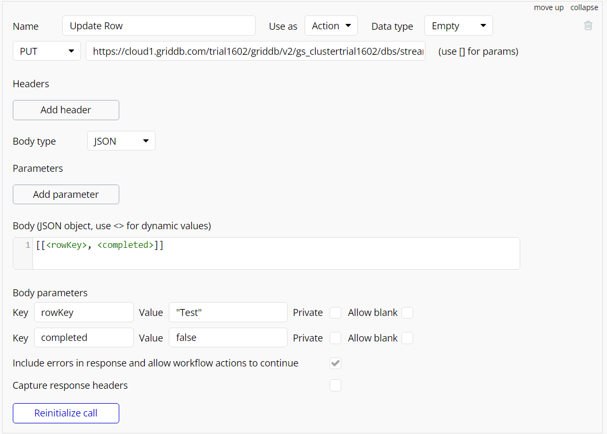

Next let's take a look at our design panel. 

## Designing Our Todo App

From the design tab, we will be mostly writing about how to get the data from our cloud instance into the visual part of our app. The way I handled the input portion was with the following elements: two buttons and one text input. We use one button for "get todo items" which triggers our GET API call, and then the other button is responsible for CREATING a todo item based on the text inside the text input. 

### Data Formatting Issue

For the data table, you can use the new Bubble data table element. One issue is that you will see that the data source for the data table requires a specific kind of source. If you change our API call of READ to be used as `Data` instead of `Action`, you could use it here, but the data won't be useful. This is because the data to be returned from the GridDB Cloud is simply an array `[[take out trash, false], [read book, true]]`, but Bubble really excels when the data is JSON format with key value pairs: `[{item: take out trash, complete: false}, {item: read book, complete: true}]`. 

So for now, we will need to go back to our workflow and plugins to alter the data coming back from our GridDB Cloud to be managable for Bubble to be useful.

## Toolbox API

To alter and massage the data being received by the GridDB Cloud, we will be using this third party plugin called [Toolbox](https://bubble.io/plugin/toolbox-1488796042609x768734193128308700). This plugin allows us to use JavaScript code inside of our no code solution. And though this kind of goes against the NO CODE ethos, there are times when getting your hands a little dirty with some code can make things much simpler in the long run

### JavaScript in Bubble?

Once you've got the Plugin installed, we can now worry about taking the data pulled in from our cloud instance and transformed into some structure our Bubble design panel will accept. At first, my instinct was to give key-value pairs as explained above, but once implementing, I realized simple an array with singular values is more than enough (ie. `[[take out trash, read book, write blog], [false, true, false]]` instead of `[[take out trash, false], [read book, true]]`).

So now let's create a workflow which will take our data from the API call and transform it. Let's create workflow starting from the event of the "Get Todo Items" button being clicked. Once clicked, step 1 will be to call the GridDB Cloud - Get All Todo Items action. Then in step 2 we use the "Run Javascript" action from our newly installed plugin.

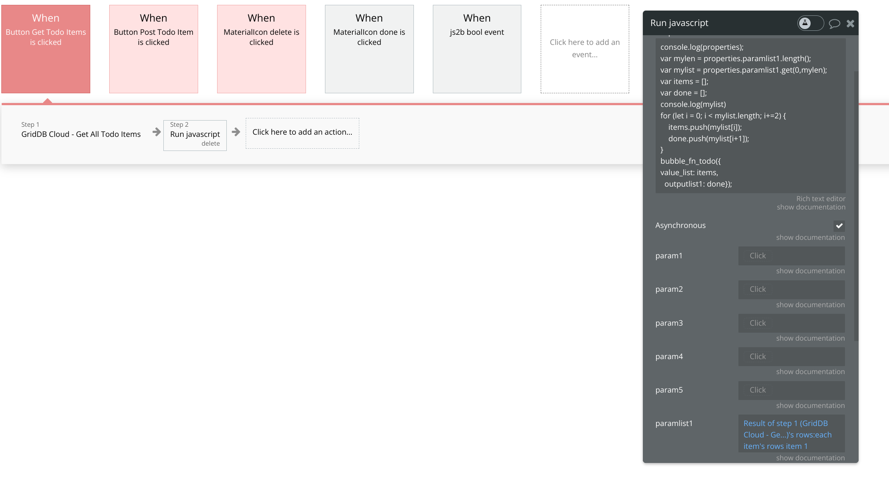

We can set the `paramlist1` as the result of step 1. And now we can manipulate our dataset in the javascript snippet above. 

```javascript
console.log(properties);
var len = properties.paramlist1.length();
var mylist = properties.paramlist1.get(0,len);
var items = [];
var done = [];
console.log(mylist)
for (let i = 0; i < mylist.length; i+=2) {
    items.push(mylist[i]);
    done.push(mylist[i+1]);
}
bubble_fn_todo({
value_list: items,
  outputlist1: done});
```

Essentially all we are doing here is creating two new arrays, one for all of the todo item names, and one for the complete-ness of each item. The array position of each row will match, so `items[0]` will match the bool of `done[0]`. Once done, we will call the special Toolbox function called `bubble_fn_$yourname`. We will call our global variable `todo` (hence `bubble_fn_todo`) and we will stick our array values inside of that object. We will give the `value_list` as our item names and the `outputlist1` as our complete-ness array.

Once we have this set, we can head to back to the design portion and grab the values of our arrays.

### JavaScript to Bubble -- Design Element

In the design element, we will need to place an element called `Javascript to Bubble` into our frontend design; you can make it small and put it out of the way if you're worried about it interfering with your design. But the element MUST BE VISIBLE so that we can extract the values for our data table. So create this element and edit (double click the element in the design panel). 

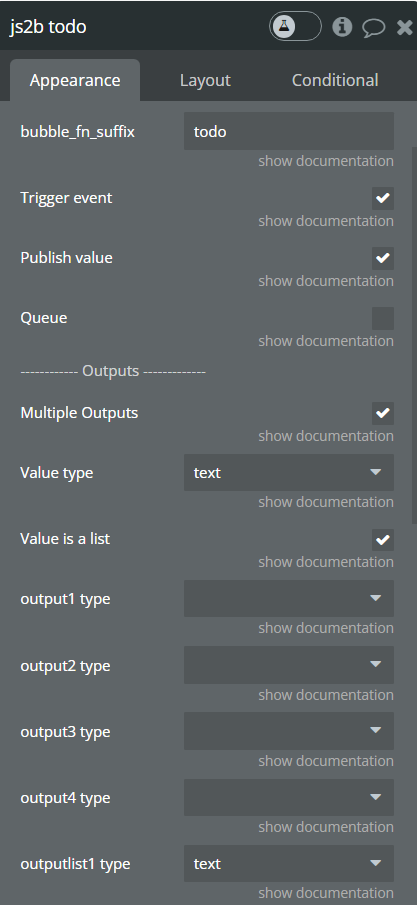

While editing add in the suffix we chose for our bubble_fn_suffix (`todo`) and then select publish value -- this will allow us to see the `value_list` (which we can set as type `text`). We can also set our `outputlist1` as type `text`.

And now when we go back to our data table's data source, we can now select our `Javascript to Bubble`'s value list

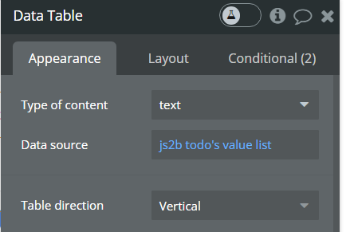

And now we can set the columns and rows. The columns we set as our column names. The first repeating row, let's add text boxes in there (these will repeat). Now we set the text of the Todo Item as "Current row's text" -- this grabs the value from `value_list`, which if you remember, is the array of todo item names, so it auto populate the entire column full of your data. 

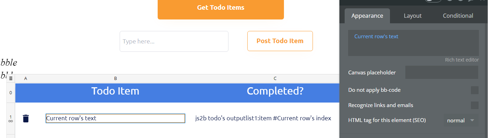

The completeness column is a bit more involved.

We need to set this one to `Javascript to Bubble`'s `outputlist1` `:item#` `Current row's index`. We stitch together four items to get our result (remember when I said the array position for the completed array matches our item name array?). Essentially we just saw using that array, use the same index position as the column next to it (the todo item `current row text`) as the basis from our completed array. I hope that makes sense.

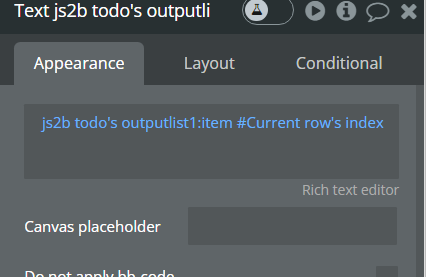

## The Rest of the Workflow Items

We have already discussed the workflow item which will grab all todo items and display them in a data table. Here is that screenshot again:


Next let's see how to send a todo item to our server with our POST Request.

### Post Todo Items

Whenever the user clicks the "Post Todo Item" button, we will fire off the following workflow: 

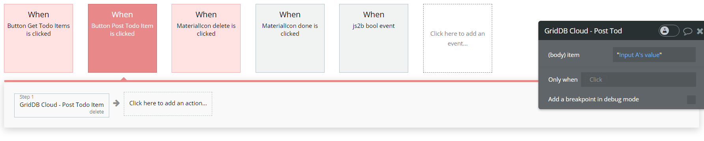

Essentially, once we click the button, we fire off the Post Todo Item API action we made earlier, but we need to add in the dynamic data from our dropdown menu.  You can see that in the screenshot as `Input A's value`. 

### Delete Items

Again, once the delete button is clicked, we fire off our `Delete Item` API Action. Here we will do a second step of changing the [state](https://manual.bubble.io/help-guides/data/temporary-data/custom-states) of our icon to "delete" to indicate to the user that this current row has been marked for deletion to our server.

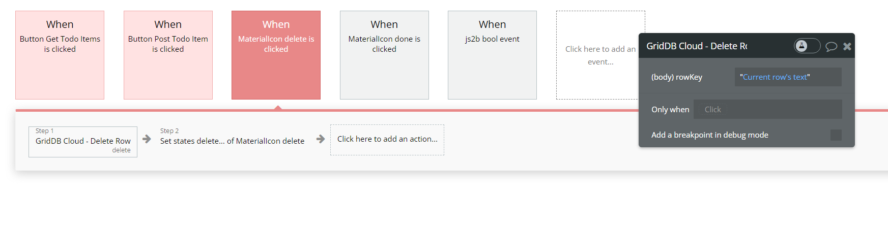

### Update Item -- Working with Workflow States

This one was the most complicated as I explained above. The reason is because we need two different dynamic data points from two different locations. We also need to flip the completeness (ie. from false to true or vice versa). To do so we will again be using javascript. 

When the edit button is clicked, we will fire off the workflow to run javascript: 

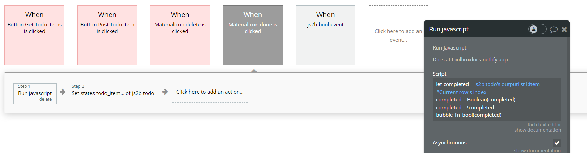

Here is the code: 

```javascript
let completed = `js2b todo's outputl;ist1:item#Current row's index`
completed = Boolean(completed)
completed = !completed
bubble_fn_bool(completed)
```

Essentially all we're doing is grabbing the current value of the completed column for the row in which the button was clicked and then flipped. Then we are sending the newly flipped value to the bubble_fn_suffix of `completed`. 

In step 2 of our workflow we will set a custom state called `todo_item` to save `current row's text` which corresponds to the row's rowkey (which needs to be 100% accurate to update the proper row). 

And now in the design panel let's create the `Javascript to Bubble` design element with the suffix called `bool`

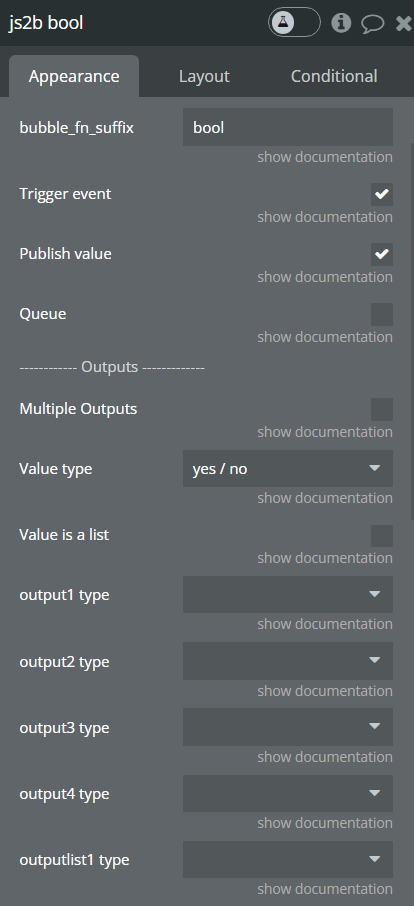

The thing we want to do here is set the checkbox for `trigger event`. This means when we click the edit button it will run the javascript, set the state, and then trigger this event. So now back to the workflow we go: 

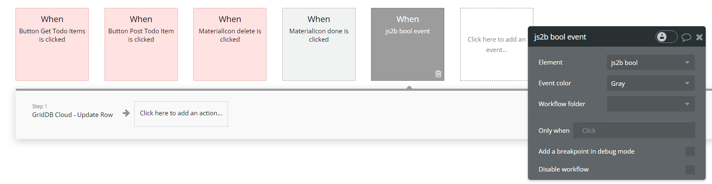

Once that event is triggered, step 1 will call the API Action we set up called Update Row. This one needs two dynamic values, so we will set them as seen in the screenshot above. The Rowkey is the custom state we created, so we set it as `js2b todo's item todo_item` (notice the quotes) and then the completed portion is the value we set in our javascript but from our js2b's bool's value. The one thing to note here is that we set a special formatting rule (`:formatted as text`) because Bubble uses "yes/no" instead of true bool values, but our GridDB Cloud will expect bool values. So we can tell Bubble to format "yes" as "true" and "no" as "false". 

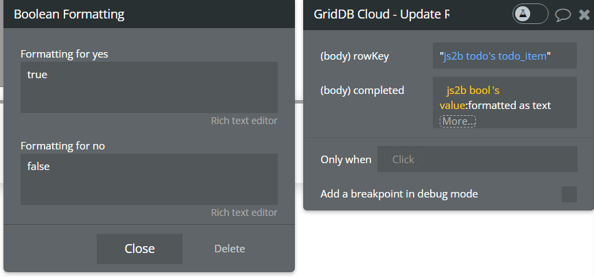

## Conclusion

And with that, we have created our (nearly) code-free todo app backed by the robust GridDB cloud database with persistent storage. 

For our next attempt at this, we will plan to attack creating a simple IoT dashboard using no code!