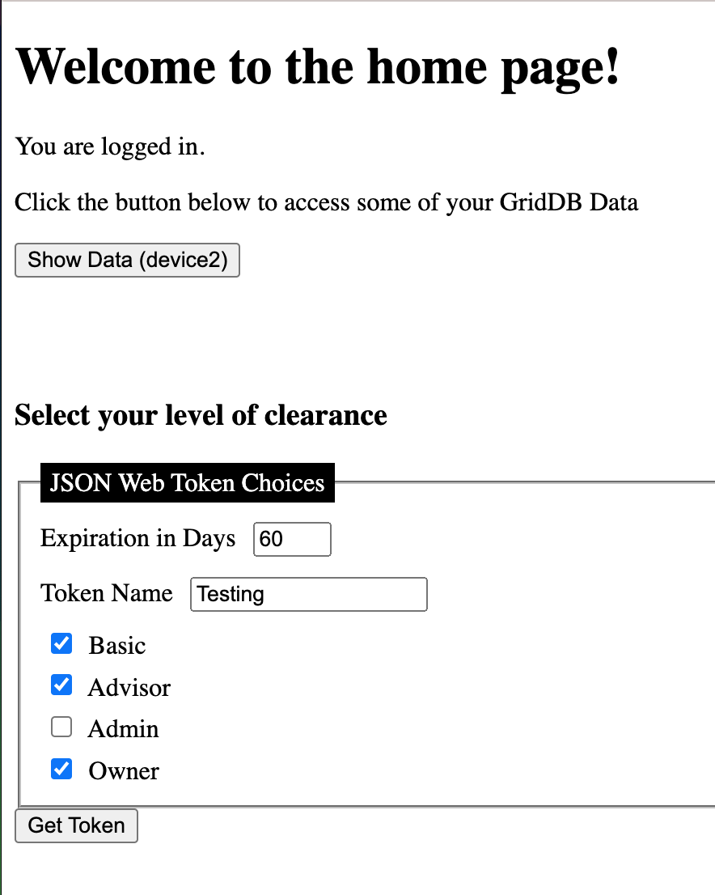
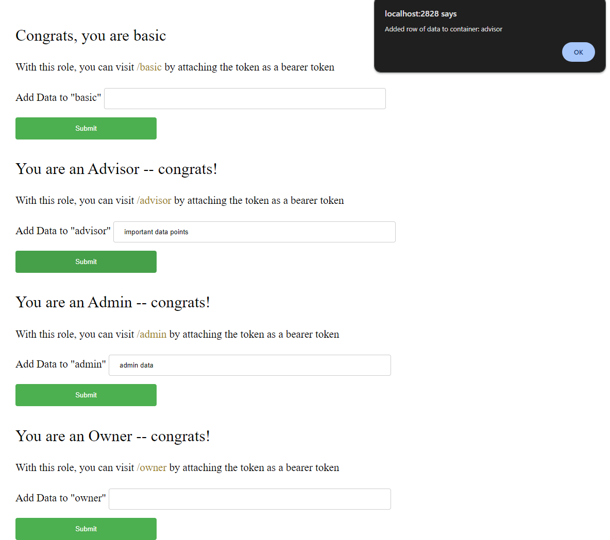
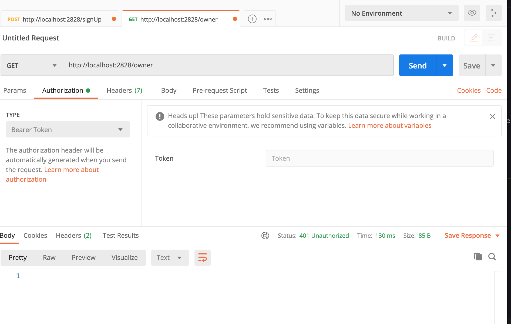
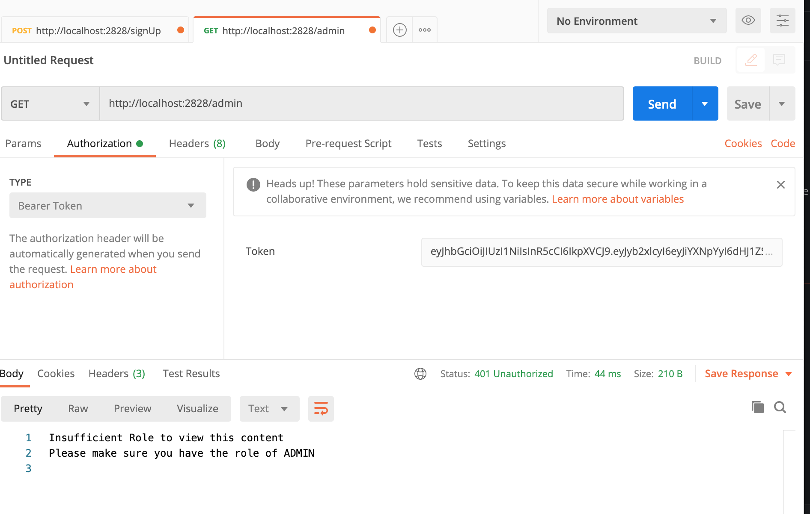

This is part two of our JSON Web Token series for GridDB. You can read the previous article here: [JSON Web Tokens Part I](). In that article, we went over: what JSON Web Tokens are, how to issue and check them, and how to protect your GridDB endpoints. The web tokens in that article were very simple, they were issued to users with proper username/password combinations and allowed access to the home page and to the `/data` page -- there was no granular control.

In part two, we will be adding a more granular sort of authentication checking for our GridDB endpoints. Because JSON Web Tokens are simply hashed objects which can contain any sort of information you want to add, we can add any granular authentication we would like. In our case, we will have four different GridDB containers which are all protected via our JSON Web Token's granular token. This means with this new token, you may hace access to one GridDB container/endpoint, but not to another. With part one's tokens, it was all or nothing. 

The workflow of our completed project will look like this: the user signs in using their username/password which are saved into GridDB. Once signed in, the user is presented with a quick menu to create a new web token and is required to pick the expiration date of the token, a name for the token, and the various containers/clearance levels that this new token allows. With token in hand, the user is now required to attach it as an authorization bearer token in all requests to the protected routes. If a user tries to attach the bearer token to a route they do not have access to, they will be met with a 401 authentication http error.


## Prereqs

To follow along, you will simply need to have Go installed on your machine, as well as GridDB and the GridDB Go Connector. All code in this article will be written in Go, except for the templating files which are in HTML.

As explained above, you will need the following: 

- [GridDB Server (v5.3)](https://docs.griddb.net/gettingstarted/using-apt/)
- [Go v1.21.4](https://go.dev/doc/install)

Because of the way the GridDB Go Connector works at the moment, part of the building and using process requires turning off the go 1.11 module feature (`go env -w GO111MODULE=off`). With this feature turned off, we are now expected to build out our project source code inside of the `$GOPATH`. We are also expected to manually `go get` all of our Go libraries associated with this project. We will include all such instructions in the next section `Building Project`.


## Building Project

To run this project, you will need to have this project inside of your $GOPATH. This is how normal Go projects not utilizing go modules are expected to operate. For me, my project structure looks like so: 

    /home/israel/go/
                    └─ src
                        └─ github.com
                            └─ griddbnet
                                └─ Blogs
                                    └─ [all source code]


But first, let's take on building the GridDB Go Client

[GridDB Go Connector v0.8.4](https://github.com/griddb/go_client)

First, make sure you download and install SWIG as instructed on the Go Client's README: 

    $ wget https://prdownloads.sourceforge.net/swig/swig-4.0.2.tar.gz
    $ tar xvfz swig-4.0.2.tar.gz
    $ cd swig-4.0.2
    $ ./autogen.sh
    $ ./configure
    $ make
    $ sudo make install

And then start the process of installing the GridDB Go Client. First, it's best if you set the `GOPATH` environment variable. If you type in `go env` into your terminal, it will show you what your Go installation is already using. Just copy that like so: 

    $ export GOPATH=/home/israel/go

And then: 

    1. $ go env -w GO111MODULE=off
    2. $ go get -d github.com/griddb/go_client
    3. $ cd $GOPATH/src/github.com/griddb/go_client
    4. $ ./run_swig.sh
    5. $ go install

And that's that! The Go Client is now ready to be used. Now let's `get` the source code of this project and the remaining required libraries: 

    $ cd $GOPATH/src/github.com
    $ mkdir griddbnet
    $ cd griddbnet
    $ git clone https://github.com/griddbnet/Blogs.git --branch jwtII
    $ cd Blogs
    $ go env -w GO111MODULE=on
    $ go get
    $ go env -w GO111MODULE=off

And then running is easy:

```bash
$ source key.env
$ go build
$ ./Blogs
```

Note: the first command of this block simply adds the secret key into your environment variables. If you forget to include this, your server will run but it will not be able to issue or check any of the web tokens.

## JSON Web Tokens and Granular Control 

As explained above, the main feature we want to add is adding in a more granular control of our web tokens and therefore our endpoints. This means that we need to modify our function which issues out our web tokens, and then we also need to modify the process in which our web tokens are authenticated to check for specific roles granted to the user of the token. And finally, we will need to modify our authorization middleware to ensure the user is sending the requests with the web token in the headers -- previously we were simply ensuring that the token was present in the user's browser as a cookie.

### Web Token Claims

Both, when we create tokens and when we authenticate our tokens, we provide `claims`. These "are pieces of information asserted about a subject. For example, an ID token (which is always a JWT) can contain a claim called name that asserts that the name of the user authenticating is "John Doe". In a JWT, a claim appears as a name/value pair where the name is always a string and the value can be any JSON value. Generally, when we talk about a claim in the context of a JWT, we are referring to the name (or key)." (source)[https://auth0.com/docs/secure/tokens/json-web-tokens/json-web-token-claims]

The JWT library we are using comes with some default claims which are most typically used (issued-by, expiry, etc) and these are what we used in part one of this series. For this portion, we will be adding to this, adding in our own custom claims. Specifically, we will be adding in a `roles` struct which will allow us to state whether a user has access to specific GridDB containers (which are read through specific endpoints). We will also allow modification of the token's expiration date and for a field called `name`.

### Adding Custom Claims

To add to our customs claims, we can make a new struct called `MyClaims` and simply import the previously used default claims.

```golang
//specialRoleEndpoints.go
type Roles struct {
	Basic   bool   `json:"basic"`
	Advisor bool   `json:"advisor"`
	Admin   bool   `json:"admin"`
	Owner   bool   `json:"owner"`
	Value   string `json:"value"`
	Name    string `json:"name"`
}

//issueTokens.go
type MyCustomClaims struct {
	Role Roles `json:"roles"`
	jwt.RegisteredClaims
}

var claims = MyCustomClaims{
	Roles{},
	jwt.RegisteredClaims{
		ExpiresAt: jwt.NewNumericDate(time.Unix(time.Now().Unix()*time.Hour.Milliseconds(), 0)),
		IssuedAt:  jwt.NewNumericDate(time.Now()),
		NotBefore: jwt.NewNumericDate(time.Now()),
		Issuer:    "griddb-auth-server",
	},
}
```

And now when we actually issue out our tokens, we can specify whether a user has a specifc role (with a bool). We also allow a user to specific the expiry time, so we have modified our `IssueTokens` function to take an expiry `time.Time` as one of its parameters (to go along with the Roles struct)

```golang
//issueTokens.go
func IssueToken(roles Roles, expiry time.Time) (string, error) {

	claims.Role = roles
	claims.ExpiresAt = jwt.NewNumericDate(expiry)

	token := jwt.NewWithClaims(jwt.SigningMethodHS256, claims)
	key := []byte(os.Getenv("SigningKey"))
	if string(key) != "" {
		if len(key) <= 0 {
			return "", errors.New("Key is less than length 0")
		}
		s, err := token.SignedString(key)
		if err != nil {
			fmt.Printf("Error, couldn't read os environment: %q", err)
			return "", errors.New("could not read environment var")
		}
		return s, nil
	}

	return "", errors.New("No environment variable set")
}
```

So, when compared to before, our function now expects a Roles struct and uses that information when creating the web token itself. Before we get into the authorization portion, let's take a look at the html template file which will gather these options from our user.

### Accepting User-Specified Claims

To accomplish this, we simply add in inputs that allow a user to select their own preferences. We then use a POST request to send this information back to our server which will use this information to form our Roles struct and to set the expiration date.

```html
//home.tmpl
 <h3> Select your level of clearance </h3>
 <form action="/getToken" method="post">
  <fieldset>
    <legend>JSON Web Token Choices</legend>

    <label for="Owner">Expiration in Days</label> 
    <input type="number" id="expiration" name="expiration" min="1" max="365" />
    </br>

    <label for="Owner">Token Name</label> 
    <input type="text" id="name" name="name" required />
    </br>

    <input type="checkbox" id="role" name="basic" value="true" />
    <label for="basic">Basic</label><br />

    <input type="checkbox" id="advisor" name="advisor" value="true" />
    <label for="advisor">Advisor</label><br />

    <input type="checkbox" id="admin" name="admin" value="true" />
    <label for="admin">Admin</label><br />

    <input type="checkbox" id="owner" name="owner" value="true" />
    <label for="Owner">Owner</label>
  </fieldset>
      <div>
    <button type="submit">Get Token</button>
    </div>
</form>
```



And then server-side we capture these inputs with our http handler

```golang
	roles := &Roles{}
	if r.Method == "POST" {

		roles.Basic, _ = strconv.ParseBool(r.FormValue("basic"))
		roles.Advisor, _ = strconv.ParseBool(r.FormValue("advisor"))
		roles.Admin, _ = strconv.ParseBool(r.FormValue("admin"))
		roles.Owner, _ = strconv.ParseBool(r.FormValue("owner"))
		roles.Name = r.FormValue("name")
		fmt.Println("Received form values", roles)

		expiryTime, _ := strconv.ParseInt(r.FormValue("expiration"), 10, 64)
		expiryTimeInDays := expiryTime * 24
		expirationTime := time.Now().Add(time.Duration(expiryTimeInDays) * time.Hour)

		token, err := IssueToken(*roles, expirationTime)
		if err != nil {
			fmt.Println("issue getting token", err)
			fmt.Fprintf(w, "Issue getting token, possible no environment variable set")
			return
		}
		// We send the roles data struct to the template file. 
		// We need the value to share with the user on the frontend
		roles.Value = token 
```

### Authenticating Our Endpoints and Claims

Now that we are armed with our newly formed tokens which are granularly-set, we must use a new authentication middleware to make sure the routes are protected properly. To do this, we will make a new function called `granularAuth`.

As explained above, this function will check if the request made to this route has authorization section in the header. If it does, we will verify that the token is valid against our claims and our secret signing key. If this all checks out, our function will then specifically start checking the roles granted according to this token's specifications. For example, if the token claims the role for basic is True, then the route `/basic` will be granted for this request. If basic is False, it will tell the user that they have insufficient permissions to view this content. 

If the request is granted, it will read the GridDB container of the same name (basic) and send it back to the requester as a response. First, let's take a look our new endpoint with its authorization middleware attached.

```golang
//main.go
func main() {
	createUsersContainer()

	http.HandleFunc("/", func(w http.ResponseWriter, r *http.Request) {
		http.Redirect(w, r, "/signIn", http.StatusSeeOther)
	})

	http.HandleFunc("/signUp", SignUp)
	http.HandleFunc("/signIn", SignIn)

	http.HandleFunc("/getToken", isAuthorized(GetToken))
	http.HandleFunc("/auth", isAuthorized(AuthPage))
	http.HandleFunc("/data", isAuthorized(DataEndPoints))

	http.HandleFunc("/basic", granularAuth(Basic))
	http.HandleFunc("/admin", granularAuth(Admin))
	http.HandleFunc("/advisor", granularAuth(Advisor))
	http.HandleFunc("/owner", granularAuth(Owner))

	fmt.Println("Listening on port :2828....")
	log.Fatal(http.ListenAndServe(":2828", nil))

}
```

Our old routes from the previous article are protected the `isAuthorized` function; our new routes can be protected by `granularAuth`. 

Again, the flow is as follows: the user signs in and is granted a `login` token. That user is then redirected to `/auth`, where they have an opportunity to create a new json web token. As of now, they cannot access any of the routes protected by `granularAuth`. Once they create a new token with the options presented to them, they will have a new token presented to them in the `/getToken` page. Armed with this token, they can now make HTTP Requests to the routes protected by `granularAuth`, but they must attach the token as an authorization bearer token.



As you can see from this page, each endpoint has its own input field -- this allows the user to add rows of data to the specific container associated with the endpoint (ie. /basic is associated with the container called basic). And because this endpoint is protected by our auth (meaning it needs the new json web token we just made), the code is adding the bearer token for you directly in the post request to add the data to the specific container. Here is some of that code: 

```javascript
function send(e,form) {
    console.log("Authorization: 'Bearer {{ .Value }}'")

    const str = form.action;
    const n = str.lastIndexOf('/');
    const containerName = str.substring(n + 1);

    fetch(form.action, {
      method:'post', 
      headers: {
        Authorization: 'Bearer {{ .Value }}'
      },
      body: new URLSearchParams(new FormData(form))
    });

  console.log('sent data');
  alert("Added row of data to container: " + containerName)
  //document.getElementById(result).reset();
  form.reset()
  e.preventDefault();
}
```

The `{{ .Value }}` comes from our Go backend, it is the json web token string. And one more note: the frontend page here is handling the json web token for you, but when we make our GET requests to test and read the contents, we will need to manually input our bearer token for *those* requests.

Next, let's take a look at the backend (golang) code which will actually handle our athentication -- caution: it's big and ugly: 

```golang
func granularAuth(endpoint func(http.ResponseWriter, *http.Request)) func(http.ResponseWriter, *http.Request) {
	return func(w http.ResponseWriter, r *http.Request) {

		if r.Header["Authorization"] != nil {
			authorization := r.Header.Get("Authorization")
			tokenString := strings.TrimSpace(strings.Replace(authorization, "Bearer", "", 1))

			token, err := jwt.ParseWithClaims(tokenString, &MyCustomClaims{}, func(token *jwt.Token) (interface{}, error) {
				return MySigningKey, nil
			}, jwt.WithLeeway(5*time.Second))

			if err != nil {
				log.Fatal(err)
			} else if claims, ok := token.Claims.(*MyCustomClaims); ok {
				urlPath := strings.TrimLeft(r.URL.Path, "/")

				gridstore := ConnectGridDB()
				defer griddb.DeleteStore(gridstore)

				col := GetContainer(gridstore, urlPath)
				defer griddb.DeleteContainer(col)

				rs, err := QueryContainer(gridstore, col, "select *")
				if err != nil {
					fmt.Println("Error getting container", err)
					return
				}
				defer griddb.DeleteRowSet(rs)

				var b strings.Builder

				switch urlPath {
				case "basic":
					if claims.Role.Basic {
						for rs.HasNext() {
							rrow, err := rs.NextRow()
							if err != nil {
								fmt.Println("GetNextRow err:", err)
								panic("err GetNextRow")
							}

							str := rrow[0].(string)
							fmt.Fprintln(&b, str)
						}
						fmt.Fprintf(w, b.String())
						endpoint(w, r)
						return
					} else {
						w.WriteHeader(http.StatusUnauthorized)
						fmt.Fprintln(w, "Insufficient Role to view this content")
						fmt.Fprintln(w, "Please make sure you have the role of BASIC")
					}
				case "admin":
					if claims.Role.Admin {
						for rs.HasNext() {
							rrow, err := rs.NextRow()
							if err != nil {
								fmt.Println("GetNextRow err:", err)
								panic("err GetNextRow")
							}

							str := rrow[0].(string)
							fmt.Fprintln(&b, str)
						}
						fmt.Fprintf(w, b.String())
						endpoint(w, r)
						return
					} else {
						w.WriteHeader(http.StatusUnauthorized)
						fmt.Fprintln(w, "Insufficient Role to view this content")
						fmt.Fprintln(w, "Please make sure you have the role of ADMIN")
					}
				case "advisor":
					if claims.Role.Advisor {
						for rs.HasNext() {
							rrow, err := rs.NextRow()
							if err != nil {
								fmt.Println("GetNextRow err:", err)
								panic("err GetNextRow")
							}

							str := rrow[0].(string)
							fmt.Fprintln(&b, str)
						}
						fmt.Fprintf(w, b.String())
						endpoint(w, r)
						return
					} else {
						w.WriteHeader(http.StatusUnauthorized)
						fmt.Fprintln(w, "Insufficient Role to view this content")
						fmt.Fprintln(w, "Please make sure you have the role of ADVISOR")
					}
				case "owner":
					if claims.Role.Owner {
						for rs.HasNext() {
							rrow, err := rs.NextRow()
							if err != nil {
								fmt.Println("GetNextRow err:", err)
								panic("err GetNextRow")
							}

							str := rrow[0].(string)
							fmt.Fprintln(&b, str)
						}
						fmt.Fprintf(w, b.String())
						endpoint(w, r)
						return
					} else {
						w.WriteHeader(http.StatusUnauthorized)
						fmt.Fprintln(w, "Insufficient Role to view this content")
						fmt.Fprintln(w, "Please make sure you have the role of OWNER")
					}

				default:
					w.WriteHeader(http.StatusUnauthorized)
					fmt.Fprintln(w, "Authorization Signature Invalid")
				}

			} else {
				log.Fatal("unknown claims type, cannot proceed")
			}

		} else {
			w.WriteHeader(http.StatusUnauthorized)
			return
		}

	}
}
```

It's been explained already, but the basic premise here is that when this function is called, it will check if there is an authorization section in the request headers. Then it verifies that the token inside the bearer token header is valid. And then finally it checks the specific roles granted by this token.

### Testing Our Protected Routes

Let's take a look at some Postman requests to verify that our routes are doing what expect.

First, here is a successful route



We have the proper role, the proper endpoint, and put our token into the bearer auth position in our request header. We receive back our GridDB container's contents.

Now let's see what happens if you do not include your bearer token


You can see here we are met with a 401 http status error.

And finally, let's see what happens when we have a token, but insufficient permissions for a specific endpoint



## Conclusion

This is of course a simple demo, but you can make this control as granular as you wanted -- for example you can make a role read only or read/write specific for specific containers or a subset of containers. Really, the beautfy of JSON Web Tokens are that they really put the control into the developer's hands.


