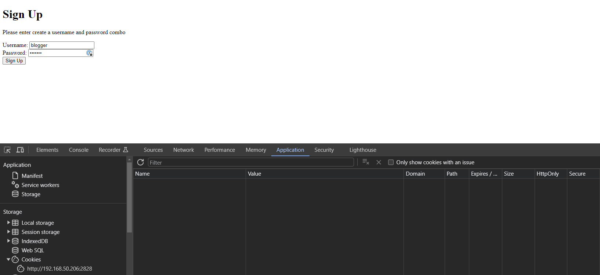
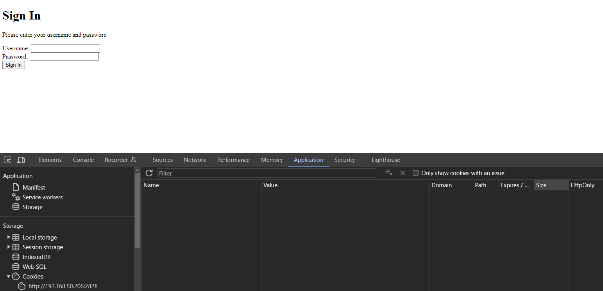
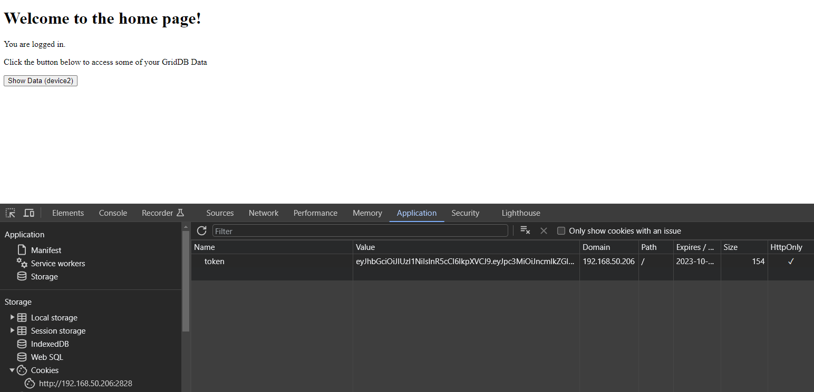
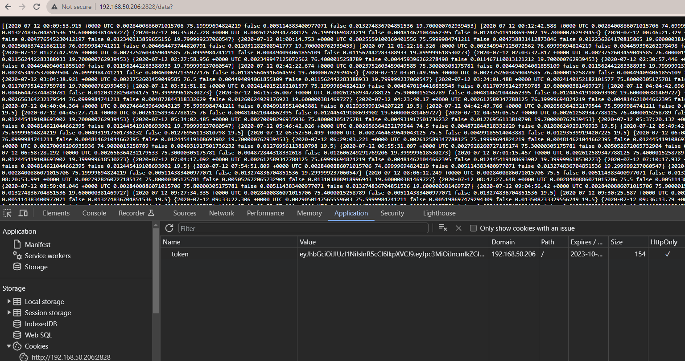
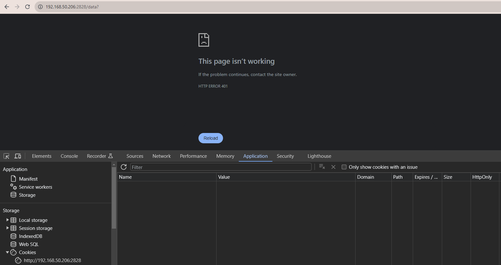

In previous articles, we have covered how you can make a REST API with GridDB and various different technologies -- [Java](https://griddb.net/en/blog/create-a-java-web-api-using-griddb-and-spring-boot/), [node.js](https://griddb.net/en/blog/crud-gern-stack/), and even [Go](https://griddb.net/en/blog/build-your-own-go-web-app-with-microservices-and-griddb/). And though we have briefly touched on it before, we have never gotten into specific details on how we could protect our data/endpoints with web-based authentication.

In this first part of a two part series, we will be going over JSON Web Tokens -- what they are, how to implement them, and how to use them to protect your GridDB's REST API. In the second part, we will be exploring more of the granularity granted to us by using JSON Web Tokens. So please keep an eye out for that article when it is available.

To follow along, you will simply need to have Go installed on your machine, as well as GridDB and the GridDB Go Connector. All code in this article will be written in Go, except for the templating files which are in HTML.

## Prereqs

As explained above, you will need the following: 

- [GridDB Server (v5.3)](https://docs.griddb.net/gettingstarted/using-apt/)
- [Go v1.21.4](https://go.dev/doc/install)

Because of the way the GridDB Go Connector works at the moment, part of the building and using process requires turning off the go 1.11 module feature (`go env -w GO111MODULE=off`). With this feature turned off, we are now expected to build out our project source code inside of the `$GOPATH`. We are also expected to manually `go get` all of our Go libraries associated with this project. We will include all such instructions in the next section `Building Project`.


## Building Project

To run this project, you will need to have this project inside of your $GOPATH. This is how normal Go projects not utilizing go modules are expected to operate. For me, my project structure looks like so: 

    /home/israel/go/
                    └─ src
                        └─ github.com
                            └─ griddbnet
                                └─ Blogs
                                    └─ [all source code]


But first, let's take on building the GridDB Go Client

[GridDB Go Connector v0.8.4](https://github.com/griddb/go_client)

First, make sure you download and install SWIG as instructed on the Go Client's README: 

    $ wget https://prdownloads.sourceforge.net/swig/swig-4.0.2.tar.gz
    $ tar xvfz swig-4.0.2.tar.gz
    $ cd swig-4.0.2
    $ ./autogen.sh
    $ ./configure
    $ make
    $ sudo make install

And then start the process of installing the GridDB Go Client. First, it's best if you set the `GOPATH` environment variable. If you type in `go env` into your terminal, it will show you what your Go installation is already using. Just copy that like so: 

    $ export GOPATH=/home/israel/go

And then: 

    1. $ go env -w GO111MODULE=off
    2. $ go get -d github.com/griddb/go_client
    3. $ cd $GOPATH/src/github.com/griddb/go_client
    4. $ ./run_swig.sh
    5. $ go install

And that's that! The Go Client is now ready to be used. Now let's `get` the source code of this project and the remaining required libraries: 

    $ cd $GOPATH/src/github.com
    $ mkdir griddbnet
    $ cd griddbnet
    $ git clone https://github.com/griddbnet/Blogs.git --branch jwt
    $ cd Blogs
    $ go env -w GO111MODULE=on
    $ go get
    $ go env -w GO111MODULE=off

And then running is easy:

```bash
$ source key.env
$ go build
$ ./Blogs
```

## JSON Web Tokens an Introduction

To get the best understanding of what these things are, you are likely best off reading it directly from their documentation seen [here](https://jwt.io/introduction). As a brief summary, though: "JSON Web Token (JWT) is an open standard (RFC 7519) that defines a compact and self-contained way for securely transmitting information between parties as a JSON object."

In layman terms, this means that if we create a signed token (a JSON Object), we should be able to securely transmit data to shared parties (and only shared parties!). So for this article, we will hide our GridDB Data Endpoints behind a token checker: if you have a valid JSON web token, you are granted access to the data; if not, it will be met with a 402 http error code.

## JWT Implementation 

To implement and showcase the proper usage of JWT, we want to set up some sort of authentication system where a user can: sign up using their chosen username and password, save the user and password into persistent storage with a hashed password, sign in using the username and password, assign a json web token when credentials are validated, save the JWT as a cookie in the user's browser, use this cookie to access protected endpoints/web pages. 

So, according to our specifications, we will first need to set up a simple sign up/sign in system using GridDB and some sort of password hashing system.

### Creating Sign Up & Sign In Web Pages

First, let's allow users to sign up using a very simple html page with two inputs, one for username and one for passwords. If the username isn't taken yet, we will save their username as is, hash the password using `bcrypt`, and then save the pair of strings into GridDB. Then, we will have a similar page for signing in which will run their password through bcrypt and compare the results, if granted, the user will be issued a JSON web token.

#### Sign Up Page

For the pages which we will sever up to our users, we will be using Go's templating from the standard library. This allows us to easily create HTML pages which will be parsed by our Go compiler and served up by our net/http library. Let's take a look at our Sign Up page first. We will first declare our routes in our main function using the `net/http` package and then make the function which will handle the responses and requests, serving up our html template file which will take the form data, encrypt the password, make a connection with our GridDB server, and then finally save the User/Pass combination into GridDB.

First let's show some of these helper GridDB functions.

```golang
// Connect to GridDB
func ConnectGridDB() griddb.Store {
	factory := griddb.StoreFactoryGetInstance()

	// Get GridStore object
	gridstore, err := factory.GetStore(map[string]interface{}{
		"notification_member": "127.0.0.1:10001",
		"cluster_name":        "myCluster",
		"username":            "admin",
		"password":            "admin"})
	if err != nil {
		fmt.Println(err)
		panic("err get store")
	}

	return gridstore
}

// helper function to "get" container as type griddb.Container
func GetContainer(gridstore griddb.Store, cont_name string) griddb.Container {

	col, err := gridstore.GetContainer(cont_name)
	if err != nil {
		fmt.Println("getting failed, err:", err)
		panic("err create query")
	}
	col.SetAutoCommit(false)

	return col
}

func QueryContainer(gridstore griddb.Store, col griddb.Container, query_string string) (griddb.RowSet, error) {
	fmt.Println("querying: ", query_string)
	query, err := col.Query(query_string)
	if err != nil {
		fmt.Println("create query failed, err:", err)
		return nil, err
	}

	rs, err := query.Fetch(true)
	if err != nil {
		fmt.Println("fetch failed, err:", err)
		return nil, err
	}
	return rs, nil
}

// simple function used in signup.go in our SignIn function
func saveUser(username, hashedPassword string) {
	gridstore := ConnectGridDB()
	defer griddb.DeleteStore(gridstore)

	userCol := GetContainer(gridstore, "users")
	err := userCol.Put([]interface{}{username, hashedPassword})
	if err != nil {
		fmt.Println("error putting new user into GridDB", err)
	}

	fmt.Println("Saving user into GridDB")
	userCol.Commit()

}
```
The function names in the above code box should adequately describe its primary role/duty. We will use all of these functions in our Sign Up http handler function, meaning it will run when the route we declare in the main function receives a request. Here is the main function

```golang
//main.go
func main() {

	http.HandleFunc("/signUp", SignUp)
	http.HandleFunc("/signIn", SignIn)

	log.Fatal(http.ListenAndServe(":2828", nil))

}
```

Now let's take a look at the `SignUp` function (again, when we run our server and you make a request to `/signUp` the following function will run and handle our request and response).

```golang
//signup.go
func SignUp(w http.ResponseWriter, r *http.Request) {

	tmpl, err := template.ParseFiles("signUp.tmpl")
	if err != nil {
		http.Error(w, err.Error(), http.StatusInternalServerError)
		return
	}

	if r.Method == http.MethodPost {

		// type Credentials of a struct with two fields User & Password
		creds := &Credentials{}
		creds.Username = r.FormValue("username")
		creds.Password = r.FormValue("password")

		// Converting our user Password to a hashed password to save for security
		hashedPassword, err := bcrypt.GenerateFromPassword([]byte(creds.Password), 8)
		if err != nil {
			w.WriteHeader(http.StatusBadRequest)
		}

		saveUser(creds.Username, string(hashedPassword))
		http.Redirect(w, r, "/signIn", http.StatusFound) // redirect to sign in once you successfully sign up
		return
	}

	data := struct {
		Message string
	}{
		Message: "Please enter create a username and password combo",
	}

	err = tmpl.Execute(w, data)
	if err != nil {
		http.Error(w, err.Error(), http.StatusInternalServerError)
		return
	}
}
```

And here is the template file: 

```html
&lt;!DOCTYPE html&gt;
&lt;html&gt;
&lt;head&gt;
    &lt;title&gt;Sign In Page&lt;/title&gt;
&lt;/head&gt;
&lt;body&gt;
    &lt;h1&gt;Sign In&lt;/h1&gt;
    {{ if .Message }}
        &lt;p&gt;{{ .Message }}&lt;/p&gt;
    {{ end }}
    &lt;form action="/signIn" method="post"&gt;
        &lt;div&gt;
            &lt;label for="username"&gt;Username:&lt;/label&gt;
            &lt;input type="text" id="username" name="username" required&gt;
        &lt;/div&gt;
        &lt;div&gt;
            &lt;label for="password"&gt;Password:&lt;/label&gt;
            &lt;input type="password" id="password" name="password" required&gt;
        &lt;/div&gt;
        &lt;div&gt;
            &lt;input type="submit" value="Sign In"&gt;
        &lt;/div&gt;
    &lt;/form&gt;
&lt;/body&gt;
&lt;/html&gt;
```


So, when we load this up, it will load the html page, prompting the user to create their unique username and password. From the Go code, we receive the two values, hash the password using the bcrypt library, and then save the values into our `Users` collection container. 



By the way, if you're wondering how the `users` container was made, it was not made in the Go code. We simply opted to use the GridDB CLI to make it like so: `gs> createcollection users username string password string`. And then we can verify that our container exists

```bash
gs[public]> showcontainer users
Database    : public
Name        : users
Type        : COLLECTION
Partition ID: 105
DataAffinity: -

Columns:
No  Name                  Type            CSTR  RowKey
------------------------------------------------------------------------------
 0  username              STRING          NN    [RowKey]
 1  password              STRING                

Indexes:
Name        : 
Type        : TREE
Columns:
No  Name                  
--------------------------
 0  username
```

You can also query your `users` container once you have made a user or two to verify their existence before trying the Sign In Page.

#### Sign In Page

Our Sign In page is very closely related to our Sign Up Page in that we use a very similar html page and logic. But of course, instead of `putting` into our GridDB database, we will be reading and verifying the user entered inputs against the database saved encrypted password. If they match, we can issue out a token.

```golang
func SignIn(w http.ResponseWriter, r *http.Request) {

	tmpl, err := template.ParseFiles("signIn.tmpl")
	if err != nil {
		http.Error(w, err.Error(), http.StatusInternalServerError)
		return
	}

	if r.Method == "POST" {
		creds := &Credentials{}
		creds.Username = r.FormValue("username")
		creds.Password = r.FormValue("password")

		gridstore := ConnectGridDB()
		defer griddb.DeleteStore(gridstore)

		userCol := GetContainer(gridstore, "users")
		defer griddb.DeleteContainer(userCol)
		userCol.SetAutoCommit(false)

		// Grab the hashed password of the username from the form frontend
		queryStr := fmt.Sprintf("select * FROM users where username = '%s'", creds.Username)
		rs, err := QueryContainer(gridstore, userCol, queryStr)
		defer griddb.DeleteRowSet(rs)
		if err != nil {
			fmt.Println("Issue with querying container")
			w.WriteHeader(http.StatusBadRequest)
			return
		}

		storedCreds := &Credentials{}
		for rs.HasNext() {
			rrow, err := rs.NextRow()
			if err != nil {
				fmt.Println("GetNextRow err:", err)
				panic("err GetNextRow")
			}

			storedCreds.Username = rrow[0].(string)
			storedCreds.Password = rrow[1].(string)

		}

		// Compare hashed passwords to ensure the correct rawtext password was entered
		if err = bcrypt.CompareHashAndPassword([]byte(storedCreds.Password), []byte(creds.Password)); err != nil {
			fmt.Println("unauthorized")
			w.WriteHeader(http.StatusUnauthorized)
			return
		}

		// if successful,. issue out a token
		token := IssueToken()
		expirationTime := time.Now().Add(5 * time.Minute)

		http.SetCookie(w,
			&http.Cookie{
				Name:     "token",
				Value:    token,
				Expires:  expirationTime,
				HttpOnly: true,
			})

		// Once given a cookie, we can redirect the user into the webpage which is only granted to users with tokens
		http.Redirect(w, r, "/auth", http.StatusFound)
		return
	}

	data := struct {
		Message string
	}{
		Message: "Please enter your username and password",
	}

	err = tmpl.Execute(w, data)
	if err != nil {
		http.Error(w, err.Error(), http.StatusInternalServerError)
		return
	}
}
```


As explained above, we are verifying that the username/password combo exist in our database. If they do, we can issue out a token using the `IssueToken()` function.




#### Creating and Issuing JSON Web Tokens

Once we know that our user exists, we can issue out a token. The go jwt package does all of the heavy lifting here, all we are required to do is to supply it a secret key which we will get from our environment variables; we will also add some claims to add a bit more security. But overall, the code snippet for this portion is very small and quick. And as a note, our secret key is found in the file called key.env. Before you run this binary file, you will need to source the file `$ source key.env` because otherwise you'll have an empty signing key, resulting in an error.

```golang
import (
	"fmt"
	"os"
	"time"

	"github.com/golang-jwt/jwt/v5"
)

var claims = &jwt.RegisteredClaims{
	ExpiresAt: jwt.NewNumericDate(time.Unix(time.Now().Unix()*time.Hour.Milliseconds(), 0)),
	Issuer:    "griddb-auth-server",
}

func IssueToken() string {

	token := jwt.NewWithClaims(jwt.SigningMethodHS256, claims)
	key := []byte(os.Getenv("SigningKey")) // grabbed from the key.env file
	if len(key) <= 0 {
		fmt.Println("Key is less than length 0")
		return ""
	}
	s, err := token.SignedString(key)
	if err != nil {
		fmt.Printf("Error, couldn't read os environment: %q", err)
		return ""
	}
	return s
}
```

Once we get this token string, we can save it as a cookie to our user's browser. One small note is that we must include the flag when saving our cookie as `HttpOnly`, as this prevents `XSRF` (Cross Site Request Forgery) attacks. You can read more about that here: [https://keeplearning.dev/nodejs-jwt-authentication-with-http-only-cookie-5d8a966ac059](https://keeplearning.dev/nodejs-jwt-authentication-with-http-only-cookie-5d8a966ac059).

Another common (and sometimes recommended) approach of using your Token is to omit saving it in the cookies and instead require every endpoint that you create to need the token in the headers of the request. We took this approach in our previous blog seen here: [https://griddb.net/en/blog/build-your-own-go-web-app-with-microservices-and-griddb/](https://griddb.net/en/blog/build-your-own-go-web-app-with-microservices-and-griddb/).

 As a quick example, here is some React.js code providing the token in our requests (from our previous blog).

```javascript
  const token = getJWT();
  axios.get("/getData",{ headers:{"Token": token}}).then(response => response.data);
```

#### Protecting our GridDB Data

Now that we have a sign up and sign in system in place with valid tokens being issued out once validated, we can now set up a system where certain routes can only be reached with a valid token. To do so, we can simply create a middlweware function which is run for every route we want to protect.

```golang
//isAuthorized.go
func isAuthorized(endpoint func(http.ResponseWriter, *http.Request)) func(http.ResponseWriter, *http.Request) {
	return func(w http.ResponseWriter, r *http.Request) {
		cookie, err := r.Cookie("token")
		if err != nil {
			if err == http.ErrNoCookie {
				w.WriteHeader(http.StatusUnauthorized)
				return
			}
			w.WriteHeader(http.StatusBadRequest)
			return
		}

		tokenString := cookie.Value

		token, err := jwt.ParseWithClaims(tokenString, claims, func(token *jwt.Token) (interface{}, error) {
			return MySigningKey, nil
		}, jwt.WithLeeway(5*time.Second))

		if token.Valid {
			fmt.Println("Successful Authorization check")
			endpoint(w, r)
		} else if errors.Is(err, jwt.ErrTokenMalformed) {
			w.WriteHeader(http.StatusUnauthorized)
			fmt.Fprintf(w, "Authorization Token nonexistent or malformed")
			return
		} else if errors.Is(err, jwt.ErrTokenSignatureInvalid) {
			fmt.Println("Invalid signature")
			w.WriteHeader(http.StatusUnauthorized)
			fmt.Fprintf(w, "Authorization Signature Invalid")
			return
		} else if errors.Is(err, jwt.ErrTokenExpired) || errors.Is(err, jwt.ErrTokenNotValidYet) {
			fmt.Println("Expired Token")
			w.WriteHeader(http.StatusUnauthorized)
			fmt.Fprintf(w, "Authorization Signature Expired")
			return
		} else {
			fmt.Println("Couldn't handle this token:", err)
			w.WriteHeader(http.StatusUnauthorized)
			return
		}
	}
}

```

Here we have a function which accepts an http handler as its one argument, and then returns one. So, it will take the handler, check if the token exists and is valid, and if so, will return the original endpoint requested; if anything fails, we are met with a 40X http error code.

So let's take a look at our main function again which -- if you remember -- handles our web traffic's different routes:

```golang
func main() {

	http.HandleFunc("/signUp", SignUp)
	http.HandleFunc("/signIn", SignIn)
	http.HandleFunc("/auth", isAuthorized(AuthPage))
	http.HandleFunc("/data", isAuthorized(DataEndPoints))

	log.Fatal(http.ListenAndServe(":2828", nil))

}
```

You can see we added two new routes, `/auth` and `/data`. For auth, it simply renders an HTML page which can only be seen if your browser has a valid JWT in its cookies.



You can see here that we now have token saved inside of our browser's storage. You will also notice that the `HttpOnly` flag is true! 

The Show Data button will send a request to `/data` which will query GridDB and send back all data from a container called `device2`. This data was previously ingested from many previous blogs, like this one here: [Exploring GridDB's Group By Range Functionality](https://griddb.net/en/blog/exploring-griddbs-group-by-range-functionality/). 



You can see the code we use to query that dataset here: 

```golang 
func DataEndPoints(w http.ResponseWriter, r *http.Request) {
	gridstore := ConnectGridDB()
	defer griddb.DeleteStore(gridstore)

	devicesCol := GetContainer(gridstore, "device2")
	queryStr := "SELECT *"
	rs, err := QueryContainer(gridstore, devicesCol, queryStr)
	if err != nil {
		fmt.Println("Failed fetching device2", err)
		return
	}

	device := Device{}
	devices := []Device{}
	for rs.HasNext() {
		rrow, err := rs.NextRow()
		if err != nil {
			fmt.Println("GetNextRow err:", err)
			panic("err GetNextRow")
		}

		device.TS = rrow[0].(time.Time)
		device.CO = rrow[1].(float64)
		device.Humidity = rrow[2].(float64)
		device.Light = rrow[3].(bool)
		device.LPG = rrow[4].(float64)
		device.Motion = rrow[5].(bool)
		device.Smoke = rrow[6].(float64)
		device.Temp = rrow[7].(float64)
		devices = append(devices, device)
	}
	//fmt.Println(devices)
	fmt.Fprint(w, devices)
}
```

Once again, if your token is valid and not expired, it will print all of the data onto your web page. If the token is invalid in any way, you will be met with an error code.



## Conclusion

And with that, we have learned how easy it can be to use JSON Web Tokens to protect your GridDB endpoints and other various webpages. 