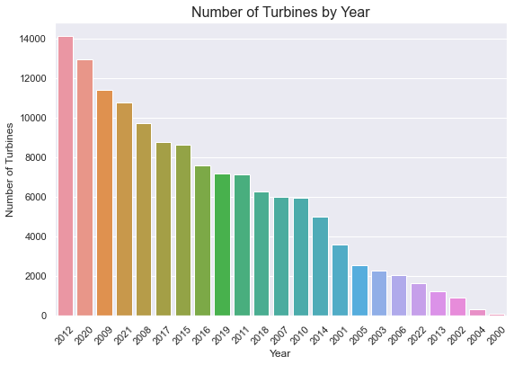

# Wind Turbine Analysis using GRIDDB and Python

# Overview

The United States is dotted with several state of the art Wind Turbines designed and installed by leading turbine manufacturers and engineering teams. As per <a href = "https://www.eia.gov/energyexplained/wind/electricity-generation-from-wind.php#:~:text=Electricity%20generation%20with%20wind&text=Total%20annual%20U.S.%20electricity%20generation,U.S.%20utility%2Dscale%20electricity%20generation"> eia.gov </a>, wind turbines were the source of about 9.2% of the total power generation in the United States. With an interesting dataset in hand combined with a robust database product, we are going to analyze the wind turbines in the United States. 

## About the Dataset

The dataset in hand is a collection of land-
The United States Wind Turbine Database (USWTDB) provides the locations of land-based and offshore wind turbines in the United States, corresponding wind project information, and turbine technical specifications. The creation of this database was jointly funded by the U.S. Department of Energy (DOE) Wind Energy Technologies Office (WETO) via the Lawrence Berkeley National Laboratory (LBNL) Electricity Markets and Policy Group, the U.S. Geological Survey (USGS) Energy Resources Program, and the American Clean Power Association (ACP).

72,130 turbines covering 44 states (plus Guam and PR)

The data can be downloaded from https://eerscmap.usgs.gov/uswtdb/data/

For more information on how the data was collected, refer https://eta-publications.lbl.gov/sites/default/files/uswtdb_v5_1_20220729_memo.pdf

#### Dataset Citation:

Hoen, B.D., Diffendorfer, J.E., Rand, J.T., Kramer, L.A., Garrity, C.P., and Hunt, H.E., 2018, United States Wind Turbine Database v5.1 (July 29, 2022): U.S. Geological Survey, American Clean Power Association, and Lawrence Berkeley National Laboratory data release, https://doi.org/10.5066/F7TX3DN0.

## A short note on the Dataset variables

◘ case_id - unique uswtdb id	<br>
◘ faa_ors	- Digital obstacle file id <br>
◘ faa_asn	- Aeronautical Study number <br>
◘ usgs_pr_id	- USGS ID <br>
◘ t_state - State where the turbine is located <br>
◘ eia_id - Plant ID <br>
◘ t_county - County where the turbine is located <br>
◘ t_fips - State and county where turbine is located <br>
◘ p_name - Name of the turbine	<br>
◘ p_year - Year the project became operational <br> 
◘ p_tnum - Number of turbines in the project <br>
◘ p_cap  - Project Capacity (MegaWatt) <br>
◘ t_manu - Turbine OEM <br>
◘ t_model - Turbine Model <br>
◘ t_cap - Turbine Capacity (Kilowatt) <br>
◘ t_hh  - Turbine Hub Height (Meters) <br>
◘ t_rd  - Turbine Rotor Diameter (Meters) <br>
◘ t_rsa - Turbine Rotor Swept Area (Square Meters) <br>
◘ t_ttlh - Turbine Total Height (Meters) <br>
◘ retrofit - Whether the turbine has been retrofitted since initial construction or not. (0- No retrofit,1-Yes known retrofit)	
◘ retrofit_year - If the turbin was retrofitted, the year of retrofit. <br>
◘ t_conf_atr - Level of confidence in the attributes provided. This is an ordinal varible. <br>
◘ t_conf_loc - Location Confidence
◘ t_img_date - 
◘ t_img_srce	- source of image used to visually verify turbine location <br> 
◘ xlong	- Longitude (decimal degrees) 
◘ ylat    - Latitude (decimal degrees)

The code book can be downloaded <a href =https://emp.lbl.gov/publications/us-wind-turbine-database-files> here </a>.

## Overall Premise

The overall premise behind this blog post is to use the following interesting features of GRIDDB -

1. GRIDDB's TQL capability to retrieve aggregated data.
2. GRIDDB's SQL capability to retrieve data using sub-queries, case statements, group by clauses, having clauses as well retrieving multiple data points using nested sub-queries.

GRIDDB offers two types of containers namely 'Collections' and 'Time Series' containers. To learn more about different types of containers offered by GridDB, refer to this interesting article on <a href=https://griddb.net/en/blog/data-modeling-with-griddb>data modeling with GridDB</a>.

GRIDDB also offers multiple mechanisms to retrieve data from containers. It supports TQL as well as SQL to retrieve data. We will demonstrate different scenarios and how to retrieve data for the same from the GridDB container.   

Don't forget to get a <a href = https://griddb.net/en/blog/an-introduction-to-griddb-cloud/> GridDB cloud subscription </a> in order to get started.

### Loading the basic libraries required 


```python
import os
import numpy as np
import pandas as pd
import nums_from_string as ns
from IPython.core.display import Image, display
import seaborn as sns
from matplotlib import pyplot as plt
from mapboxgl.utils import *
from mapboxgl.viz import *
from matplotlib.dates import DateFormatter
import plotly.graph_objects as go # For the map
sns.set()
```

    C:\Users\mg_su\anaconda3\lib\site-packages\scipy\__init__.py:146: UserWarning: A NumPy version >=1.16.5 and <1.23.0 is required for this version of SciPy (detected version 1.23.1
      warnings.warn(f"A NumPy version >={np_minversion} and <{np_maxversion}"
    

#### Points to note

1. It is important to remember that the order of the columns in the container should be the same as the order of the columns in the dataframe. This is similar to an Insert operation in any relational database.


```python
Turbine_Data = pd.read_excel("Turbine_Data.xlsx", header=0,keep_default_na=True, index_col=None)
```


```python
# Dropping rows that have the operational year (p_year) that are empty
print(len(Turbine_Data))
Turbine_Data.dropna(subset=['p_year'],inplace=True)
print(len(Turbine_Data))
```

    72130
    71398
    

###      Missing Value Imputations and Data type conversions


```python
#Check for missing values and fill it
Turbine_Data.fillna(Turbine_Data.median(),inplace=True)
Turbine_Data.head()
```

    C:\Users\mg_su\AppData\Local\Temp/ipykernel_13828/1904398437.py:2: FutureWarning: DataFrame.mean and DataFrame.median with numeric_only=None will include datetime64 and datetime64tz columns in a future version.
      Turbine_Data.fillna(Turbine_Data.median(),inplace=True)
    C:\Users\mg_su\AppData\Local\Temp/ipykernel_13828/1904398437.py:2: FutureWarning: Dropping of nuisance columns in DataFrame reductions (with 'numeric_only=None') is deprecated; in a future version this will raise TypeError.  Select only valid columns before calling the reduction.
      Turbine_Data.fillna(Turbine_Data.median(),inplace=True)
    


<div>
<style scoped>
    .dataframe tbody tr th:only-of-type {
        vertical-align: middle;
    }

    .dataframe tbody tr th {
        vertical-align: top;
    }

    .dataframe thead th {
        text-align: right;
    }
</style>
<table border="1" class="dataframe">
  <thead>
    <tr style="text-align: right;">
      <th></th>
      <th>case_id</th>
      <th>faa_ors</th>
      <th>faa_asn</th>
      <th>usgs_pr_id</th>
      <th>eia_id</th>
      <th>t_state</th>
      <th>t_county</th>
      <th>t_fips</th>
      <th>p_name</th>
      <th>p_year</th>
      <th>...</th>
      <th>t_rsa</th>
      <th>t_ttlh</th>
      <th>retrofit</th>
      <th>retrofit_year</th>
      <th>t_conf_atr</th>
      <th>t_conf_loc</th>
      <th>t_img_date</th>
      <th>t_img_srce</th>
      <th>xlong</th>
      <th>ylat</th>
    </tr>
  </thead>
  <tbody>
    <tr>
      <th>0</th>
      <td>3072661</td>
      <td>NaN</td>
      <td>NaN</td>
      <td>5149.0</td>
      <td>52161.0</td>
      <td>CA</td>
      <td>Kern County</td>
      <td>6029</td>
      <td>251 Wind</td>
      <td>1987.0</td>
      <td>...</td>
      <td>7853.98</td>
      <td>130.1</td>
      <td>0</td>
      <td>2019.0</td>
      <td>2</td>
      <td>3</td>
      <td>2018-05-08</td>
      <td>Digital Globe</td>
      <td>-118.363762</td>
      <td>35.077908</td>
    </tr>
    <tr>
      <th>1</th>
      <td>3072704</td>
      <td>NaN</td>
      <td>NaN</td>
      <td>5146.0</td>
      <td>52161.0</td>
      <td>CA</td>
      <td>Kern County</td>
      <td>6029</td>
      <td>251 Wind</td>
      <td>1987.0</td>
      <td>...</td>
      <td>7853.98</td>
      <td>130.1</td>
      <td>0</td>
      <td>2019.0</td>
      <td>2</td>
      <td>3</td>
      <td>2018-05-08</td>
      <td>Digital Globe</td>
      <td>-118.364197</td>
      <td>35.077644</td>
    </tr>
    <tr>
      <th>2</th>
      <td>3072695</td>
      <td>NaN</td>
      <td>NaN</td>
      <td>5143.0</td>
      <td>52161.0</td>
      <td>CA</td>
      <td>Kern County</td>
      <td>6029</td>
      <td>251 Wind</td>
      <td>1987.0</td>
      <td>...</td>
      <td>7853.98</td>
      <td>130.1</td>
      <td>0</td>
      <td>2019.0</td>
      <td>2</td>
      <td>3</td>
      <td>2018-05-08</td>
      <td>Digital Globe</td>
      <td>-118.364410</td>
      <td>35.077435</td>
    </tr>
    <tr>
      <th>3</th>
      <td>3063269</td>
      <td>19-028130</td>
      <td>2016-WTE-5934-OE</td>
      <td>28597.5</td>
      <td>57769.0</td>
      <td>IA</td>
      <td>Story County</td>
      <td>19169</td>
      <td>30 MW Iowa DG Portfolio</td>
      <td>2017.0</td>
      <td>...</td>
      <td>12271.85</td>
      <td>150.0</td>
      <td>0</td>
      <td>2019.0</td>
      <td>3</td>
      <td>3</td>
      <td>2017-07-23</td>
      <td>Digital Globe</td>
      <td>-93.632835</td>
      <td>41.882477</td>
    </tr>
    <tr>
      <th>4</th>
      <td>3063272</td>
      <td>19-028134</td>
      <td>2014-WTE-4084-OE</td>
      <td>28597.5</td>
      <td>57769.0</td>
      <td>IA</td>
      <td>Story County</td>
      <td>19169</td>
      <td>30 MW Iowa DG Portfolio</td>
      <td>2017.0</td>
      <td>...</td>
      <td>12271.85</td>
      <td>150.0</td>
      <td>0</td>
      <td>2019.0</td>
      <td>3</td>
      <td>3</td>
      <td>2017-04-24</td>
      <td>Digital Globe</td>
      <td>-93.430367</td>
      <td>42.028233</td>
    </tr>
  </tbody>
</table>
<p>5 rows × 27 columns</p>
</div>


```python
#Convert the datatypes of the data as needed
Turbine_Data['t_img_date'] = Turbine_Data['t_img_date'].astype(str)
Turbine_Data['usgs_pr_id'] = Turbine_Data['usgs_pr_id'].astype(str)
Turbine_Data['eia_id'] = Turbine_Data['eia_id'].astype(str)
Turbine_Data['t_cap'] = Turbine_Data['t_cap'].astype(str)
Turbine_Data.dtypes
```


    case_id            int64
    faa_ors           object
    faa_asn           object
    usgs_pr_id        object
    eia_id            object
    t_state           object
    t_county          object
    t_fips             int64
    p_name            object
    p_year           float64
    p_tnum             int64
    p_cap            float64
    t_manu            object
    t_model           object
    t_cap             object
    t_hh             float64
    t_rd             float64
    t_rsa            float64
    t_ttlh           float64
    retrofit           int64
    retrofit_year    float64
    t_conf_atr         int64
    t_conf_loc         int64
    t_img_date        object
    t_img_srce        object
    xlong            float64
    ylat             float64
    dtype: object


```python
#Manipulate the data as needed
Turbine_Data['p_year'] = Turbine_Data['p_year'].astype(int).astype(str) # Convert from an integer to a string
Turbine_Data['p_year'] = Turbine_Data['p_year'] + '-01-01T00:00:00.000Z' # Append '-01-01' to it
col = Turbine_Data.pop("p_year") # Pop the column and store it in the variable 'col'
Turbine_Data.insert(0, col.name, col) #Re-insert the column as the first column of the dataframe
Turbine_Data.head()
```


<div>
<style scoped>
    .dataframe tbody tr th:only-of-type {
        vertical-align: middle;
    }

    .dataframe tbody tr th {
        vertical-align: top;
    }

    .dataframe thead th {
        text-align: right;
    }
</style>
<table border="1" class="dataframe">
  <thead>
    <tr style="text-align: right;">
      <th></th>
      <th>p_year</th>
      <th>case_id</th>
      <th>faa_ors</th>
      <th>faa_asn</th>
      <th>usgs_pr_id</th>
      <th>eia_id</th>
      <th>t_state</th>
      <th>t_county</th>
      <th>t_fips</th>
      <th>p_name</th>
      <th>...</th>
      <th>t_rsa</th>
      <th>t_ttlh</th>
      <th>retrofit</th>
      <th>retrofit_year</th>
      <th>t_conf_atr</th>
      <th>t_conf_loc</th>
      <th>t_img_date</th>
      <th>t_img_srce</th>
      <th>xlong</th>
      <th>ylat</th>
    </tr>
  </thead>
  <tbody>
    <tr>
      <th>0</th>
      <td>1987-01-01T00:00:00.000Z</td>
      <td>3072661</td>
      <td>NaN</td>
      <td>NaN</td>
      <td>5149.0</td>
      <td>52161.0</td>
      <td>CA</td>
      <td>Kern County</td>
      <td>6029</td>
      <td>251 Wind</td>
      <td>...</td>
      <td>7853.98</td>
      <td>130.1</td>
      <td>0</td>
      <td>2019.0</td>
      <td>2</td>
      <td>3</td>
      <td>2018-05-08</td>
      <td>Digital Globe</td>
      <td>-118.363762</td>
      <td>35.077908</td>
    </tr>
    <tr>
      <th>1</th>
      <td>1987-01-01T00:00:00.000Z</td>
      <td>3072704</td>
      <td>NaN</td>
      <td>NaN</td>
      <td>5146.0</td>
      <td>52161.0</td>
      <td>CA</td>
      <td>Kern County</td>
      <td>6029</td>
      <td>251 Wind</td>
      <td>...</td>
      <td>7853.98</td>
      <td>130.1</td>
      <td>0</td>
      <td>2019.0</td>
      <td>2</td>
      <td>3</td>
      <td>2018-05-08</td>
      <td>Digital Globe</td>
      <td>-118.364197</td>
      <td>35.077644</td>
    </tr>
    <tr>
      <th>2</th>
      <td>1987-01-01T00:00:00.000Z</td>
      <td>3072695</td>
      <td>NaN</td>
      <td>NaN</td>
      <td>5143.0</td>
      <td>52161.0</td>
      <td>CA</td>
      <td>Kern County</td>
      <td>6029</td>
      <td>251 Wind</td>
      <td>...</td>
      <td>7853.98</td>
      <td>130.1</td>
      <td>0</td>
      <td>2019.0</td>
      <td>2</td>
      <td>3</td>
      <td>2018-05-08</td>
      <td>Digital Globe</td>
      <td>-118.364410</td>
      <td>35.077435</td>
    </tr>
    <tr>
      <th>3</th>
      <td>2017-01-01T00:00:00.000Z</td>
      <td>3063269</td>
      <td>19-028130</td>
      <td>2016-WTE-5934-OE</td>
      <td>28597.5</td>
      <td>57769.0</td>
      <td>IA</td>
      <td>Story County</td>
      <td>19169</td>
      <td>30 MW Iowa DG Portfolio</td>
      <td>...</td>
      <td>12271.85</td>
      <td>150.0</td>
      <td>0</td>
      <td>2019.0</td>
      <td>3</td>
      <td>3</td>
      <td>2017-07-23</td>
      <td>Digital Globe</td>
      <td>-93.632835</td>
      <td>41.882477</td>
    </tr>
    <tr>
      <th>4</th>
      <td>2017-01-01T00:00:00.000Z</td>
      <td>3063272</td>
      <td>19-028134</td>
      <td>2014-WTE-4084-OE</td>
      <td>28597.5</td>
      <td>57769.0</td>
      <td>IA</td>
      <td>Story County</td>
      <td>19169</td>
      <td>30 MW Iowa DG Portfolio</td>
      <td>...</td>
      <td>12271.85</td>
      <td>150.0</td>
      <td>0</td>
      <td>2019.0</td>
      <td>3</td>
      <td>3</td>
      <td>2017-04-24</td>
      <td>Digital Globe</td>
      <td>-93.430367</td>
      <td>42.028233</td>
    </tr>
  </tbody>
</table>
<p>5 rows × 27 columns</p>
</div>


```python
# Extracting column headers for the GridDB WebApi Container structure
col_vals = (list(Turbine_Data.columns.values))
col_dtypes = (list(Turbine_Data.dtypes))
data_tuples = list(zip(col_vals,col_dtypes)) # Binding lists to a tuple

# Converting list of tuples to pandas dataframe
container_columns = pd.DataFrame(data_tuples, columns=['col_vals','col_datatypes'])
container_columns.to_csv('container_columns.csv',index=False)
container_columns #column names for the container
```


<div>
<style scoped>
    .dataframe tbody tr th:only-of-type {
        vertical-align: middle;
    }

    .dataframe tbody tr th {
        vertical-align: top;
    }

    .dataframe thead th {
        text-align: right;
    }
</style>
<table border="1" class="dataframe">
  <thead>
    <tr style="text-align: right;">
      <th></th>
      <th>col_vals</th>
      <th>col_datatypes</th>
    </tr>
  </thead>
  <tbody>
    <tr>
      <th>0</th>
      <td>p_year</td>
      <td>object</td>
    </tr>
    <tr>
      <th>1</th>
      <td>case_id</td>
      <td>int64</td>
    </tr>
    <tr>
      <th>2</th>
      <td>faa_ors</td>
      <td>object</td>
    </tr>
    <tr>
      <th>3</th>
      <td>faa_asn</td>
      <td>object</td>
    </tr>
    <tr>
      <th>4</th>
      <td>usgs_pr_id</td>
      <td>object</td>
    </tr>
    <tr>
      <th>5</th>
      <td>eia_id</td>
      <td>object</td>
    </tr>
    <tr>
      <th>6</th>
      <td>t_state</td>
      <td>object</td>
    </tr>
    <tr>
      <th>7</th>
      <td>t_county</td>
      <td>object</td>
    </tr>
    <tr>
      <th>8</th>
      <td>t_fips</td>
      <td>int64</td>
    </tr>
    <tr>
      <th>9</th>
      <td>p_name</td>
      <td>object</td>
    </tr>
    <tr>
      <th>10</th>
      <td>p_tnum</td>
      <td>int64</td>
    </tr>
    <tr>
      <th>11</th>
      <td>p_cap</td>
      <td>float64</td>
    </tr>
    <tr>
      <th>12</th>
      <td>t_manu</td>
      <td>object</td>
    </tr>
    <tr>
      <th>13</th>
      <td>t_model</td>
      <td>object</td>
    </tr>
    <tr>
      <th>14</th>
      <td>t_cap</td>
      <td>object</td>
    </tr>
    <tr>
      <th>15</th>
      <td>t_hh</td>
      <td>float64</td>
    </tr>
    <tr>
      <th>16</th>
      <td>t_rd</td>
      <td>float64</td>
    </tr>
    <tr>
      <th>17</th>
      <td>t_rsa</td>
      <td>float64</td>
    </tr>
    <tr>
      <th>18</th>
      <td>t_ttlh</td>
      <td>float64</td>
    </tr>
    <tr>
      <th>19</th>
      <td>retrofit</td>
      <td>int64</td>
    </tr>
    <tr>
      <th>20</th>
      <td>retrofit_year</td>
      <td>float64</td>
    </tr>
    <tr>
      <th>21</th>
      <td>t_conf_atr</td>
      <td>int64</td>
    </tr>
    <tr>
      <th>22</th>
      <td>t_conf_loc</td>
      <td>int64</td>
    </tr>
    <tr>
      <th>23</th>
      <td>t_img_date</td>
      <td>object</td>
    </tr>
    <tr>
      <th>24</th>
      <td>t_img_srce</td>
      <td>object</td>
    </tr>
    <tr>
      <th>25</th>
      <td>xlong</td>
      <td>float64</td>
    </tr>
    <tr>
      <th>26</th>
      <td>ylat</td>
      <td>float64</td>
    </tr>
  </tbody>
</table>
</div>


The file 'container_columns' has all the headers and their datatypes. One last step is to change the Python datatypes to GridDB datatypes. Click <a href = https://docs.griddb.net/tqlreference/type/#primitive>here</a> to learn more about the datatypes supported by GRIDDB and their respective notations. 

### Setting up a Container in GridDB to store the data 

To learn more about creating a container in GRIDDB, refer to this <a href = https://docs.griddb.net/architecture/data-model/#container> resource</a> of GRIDDB.


```python
import requests  # to make http calls
import http
http.client.HTTPConnection.debuglevel = 1 #Tip - to enable detailed logging of http calls; this is not needed in case you don't detailed logging
```

Note that while constructing the base_url, the container name is not required.


```python
#Construct an object to hold the request headers (ensure that you replace the XXX placeholder with the correct value that matches the credentials for your GridDB instance)
header_obj = {"Authorization":"XXX","Content-Type":"application/json; charset=UTF-8","User-Agent":"PostmanRuntime/7.29.0"}

#Construct the base URL based on your GRIDDB cluster you'd like to connect to (ensure that you replace the placeholders in the URL below with the correct values that correspond to your GridDB instance)
#'https://[host]:[port]/griddb/v2/[clustername]/dbs/[database_name]'
base_url = 'https://[host]/griddb/v2/[clustername]/dbs/[databasename]'
```


```python
#Construct an object to hold the request body (i.e., the container that needs to be created)
data_obj = {
    "container_name": "Wind_Turbine_Data",
    "container_type": "COLLECTION",
    "rowkey": False,
    "columns": [
    {
    "name": "p_year",
    "type": "TIMESTAMP"
    },
    {
    "name": "case_id",
    "type": "INTEGER"
    },
    {
    "name": "faa_ors",
    "type": "STRING"
    },
    {
    "name": "faa_asn",
    "type": "STRING"
    },
    {
    "name": "usgs_pr_id",
    "type": "STRING"
    },
    {
    "name": "eia_id",
    "type": "STRING"
    },
    {
    "name": "t_state",
    "type": "STRING"
    },        
    {
    "name": "t_county",
    "type": "STRING"
    },
    {
    "name": "t_fips",
    "type": "INTEGER"
    },
    {
    "name": "p_name",
    "type": "STRING"
    },
    {
    "name": "p_tnum",
    "type": "INTEGER"
    },
    {
    "name": "p_cap",
    "type": "FLOAT"
    },
    {
    "name": "t_manu",
    "type": "STRING"
    },
    {
    "name": "t_model",
    "type": "STRING"
    },
    {
    "name": "t_cap",
    "type": "STRING"
    },
    {
    "name": "t_hh",
    "type": "STRING"
    },
    {
    "name": "t_rd",
    "type": "STRING"
    },
    {
    "name": "t_rsa",
    "type": "STRING"
    },
    {
    "name": "t_ttlh",
    "type": "STRING"
    },
    {
    "name": "retrofit",
    "type": "INTEGER"
    },
    {
    "name": "retrofit_year",
    "type": "STRING"
    },
    {
    "name": "t_conf_atr",
    "type": "INTEGER"
    },
    {
    "name": "t_conf_loc",
    "type": "INTEGER"
    },
    {
    "name": "t_img_date",
    "type": "STRING"
    },
    {
    "name": "t_img_srce",
    "type": "STRING"
    },
    {
    "name": "xlong",
    "type": "FLOAT"
    },
    {
    "name": "ylat",
    "type": "FLOAT"
    }
    ]
}

#Set up the GridDB WebAPI URL
url = base_url + '/containers'

#Invoke the GridDB WebAPI with the headers and the request body
x = requests.post(url, json = data_obj, headers = header_obj)
```

## Loading Data into the GridDB container (Row Registration)

The 'to_json' function of Pandas is used to build the request body that will be used for loading data to the container.
To learn more on the format required to add rows to the container, refer to <a href = http://www.toshiba-sol.co.jp/en/pro/griddb/docs-en/v4_3/GridDB_Web_API_Reference.html#%E3%83%AD%E3%82%A6%E7%99%BB%E9%8C%B2>this article</a>. 


```python
#Convert the data in the dataframe to the JSON format
Turbine_Data_json = Turbine_Data.to_json(orient='values')
request_body = Turbine_Data_json
```

The url is constructed with the base url and the newly created container name. (In this case, 'Wind_Turbine_Data')


```python
#Setup the URL to be used to invoke the GridDB WebAPI to register rows in the container created previously
url = 'https://[server]/griddb/v2/[clusterName]/dbs/[databasename]/containers/Wind_Turbine_Data/rows'

#Invoke the GridDB WebAPI using the request constructed
x = requests.put(url, data=request_body, headers=header_obj)
```

## How many turbines became operational after 2000?


```python
#Construct the SQL to be used
sql = ("SELECT p_year, count(*) as cnt FROM Wind_Turbine_Data where p_year >=TIMESTAMP('2000-01-01T00:00:00.000Z') group by p_year")
```


```python
#Setup the URL to be used to invoke the GridDB WebAPI to retrieve data from the container
url = base_url + '/sql'
```


```python
#Construct the request body
request_body = '[{"type":"sql-select", "stmt":"'+sql+'"}]'
```


```python
#Validate the constructed request body
request_body
```


    '[{"type":"sql-select", "stmt":"SELECT p_year, count(*) as cnt FROM Wind_Turbine_Data where p_year >=TIMESTAMP(\'2000-01-01T00:00:00.000Z\') group by p_year"}]'


Invoke the GridDB SQL API to retrieve the results and process it. 


```python
#Invoke the GridDB WebAPI
data_req1 = requests.post(url, data=request_body, headers=header_obj)
```


```python
#Process the response received and construct a Pandas dataframe with the data from the response
myJson = data_req1.json()
Turbines_after_2000 = pd.DataFrame(myJson[0]["results"], columns=[myJson[0]["columns"][0]["name"], myJson[0]["columns"][1]["name"]])
Turbines_after_2000=Turbines_after_2000.sort_values(by=['cnt'], ascending=False)
```


```python
#Plot the data as a bar plot
Turbines_after_2000['year_formatted'] = pd.to_datetime(Turbines_after_2000['p_year'])
Turbines_after_2000['year'] = pd.DatetimeIndex(Turbines_after_2000['year_formatted']).year
fig,ax = plt.subplots(figsize=(9,6))
sns.barplot(Turbines_after_2000['year'], Turbines_after_2000['cnt'], ax=ax,order=Turbines_after_2000.sort_values('cnt',ascending = False).year)
ax.set_title('Number of Turbines by Year', fontsize = 16, loc='center')
ax.set_xlabel('Year', fontsize = 12)
ax.set_ylabel('Number of Turbines', fontsize = 12)
plt.xticks(rotation=45)
plt.show()
```

    C:\Users\mg_su\anaconda3\lib\site-packages\seaborn\_decorators.py:36: FutureWarning: Pass the following variables as keyword args: x, y. From version 0.12, the only valid positional argument will be `data`, and passing other arguments without an explicit keyword will result in an error or misinterpretation.
      warnings.warn(
    





### Insight(s):

<b> <br> ◘ 2012 was the year that the most number of turbine projects were made operational with 7000+ turbines being made operational. <br> ◘ Around 2020, 6000+ turbines were made operational. <br> ◘ 2000 was the year that the least number of turbine projects went operational.

## What is the average number of turbines in each project?

To retrieve this data, we will use GridDB's tql functionality to run the aggregation to retrieve the average number of turbines. <br/><br/>
Invoke the GridDB TQL API to retrieve and process the results. 


```python
#Setup the URL to be used to invoke the GridDB WebAPI to retrieve data from the container
url = base_url + '/tql'

#Construct the request body which has the TQL that is to be used to retrieve the data
# Getting data for series_id APU0000709111 - Milk, fresh, whole, fortified; APU0000709211 - Milk, fresh, skim; APU0000709212 - Milk, fresh, low fat; APU0200709111 - Milk, fresh, whole, fortified; APU0200709211 - Milk, fresh, skim
request_body = '[{"name":"Wind_Turbine_Data", "stmt":"SELECT AVG(p_tnum) ", "columns":[]}]' 

#Invoke the GridDB WebAPI
data_req2 = requests.post(url, data=request_body, headers=header_obj)
data_req2
```


```python
#Process the response received and construct a Pandas dataframe with the data from the response
myJson = data_req2.json()
Avg_Num_Turbines = pd.DataFrame(myJson[0]["results"], columns=[myJson[0]["columns"][0]["name"]])
```


```python
print('The average number of turbines created per project is', Avg_Num_Turbines['aggregationResult'][0])
```

    The average number of turbines created per project is 105.33435984616243
    

## Which are the turbine manufacturers who have constructed more than 200 turbines ?  

Note that alias names in GRIDDB do not need to be encapsulated in quotes unlike some relational databases. <br/><br/>

Construct a SQL query which will aggregate the number of turbines. The query will group the data based on the manufacturer and will have a having clause to restrict the results to manufacturers who have more than 200 turbines. 


```python
#Construct the SQL to be used
sql = ("SELECT t_manu,SUM(p_tnum) as Total_Turbines FROM Wind_Turbine_Data where t_manu is NOT NULL GROUP BY t_manu HAVING SUM(p_tnum) >=200")
```

Invoke the GridDB API and retrieve and process the results. 


```python
#Setup the URL to be used to invoke the GridDB WebAPI to retrieve data from the container
url = base_url + '/sql'

#Construct the request body which has the SQL that is to be used to retrieve the data
request_body = '[{"type":"sql-select", "stmt":"'+sql+'"}]'

#Invoke the GridDB WebAPI
data_req4 = requests.post(url, data=request_body, headers=header_obj)
data_req4
```


```python
#Process the response received and construct a Pandas dataframe with the data from the response
myJson = data_req4.json()
manufacturers_and_models = pd.DataFrame(myJson[0]["results"], columns=[myJson[0]["columns"][0]["name"],myJson[0]["columns"][1]["name"]])
```

Let's display the results in a tabular form. 


```python
from tabulate import tabulate
print(tabulate(manufacturers_and_models, headers='keys', tablefmt='psql'))
```

    +----+---------------------------------+------------------+
    |    | t_manu                          |   Total_Turbines |
    |----+---------------------------------+------------------|
    |  0 | Enron                           |           105018 |
    |  1 | Fuhrlander                      |              232 |
    |  2 | DWT                             |              294 |
    |  3 | NEG Micon                       |            42574 |
    |  4 | Sany                            |              326 |
    |  5 | Suzlon                          |           114410 |
    |  6 | Acciona                         |           112956 |
    |  7 | Alstom                          |              576 |
    |  8 | China Creative Wind Energy      |              578 |
    |  9 | Micon                           |            89688 |
    | 10 | Nordex                          |           225556 |
    | 11 | Nordtank                        |            52680 |
    | 12 | Bonus                           |            90196 |
    | 13 | NedWind                         |              338 |
    | 14 | Entegrity                       |              548 |
    | 15 | Zond                            |             6526 |
    | 16 | Vestas                          |          3704146 |
    | 17 | Mitsubishi                      |           638562 |
    | 18 | Siemens                         |           827166 |
    | 19 | Goldwind Americas               |             4608 |
    | 20 | REpower                         |            72126 |
    | 21 | GE Wind                         |          5963708 |
    | 22 | Northern Power Systems          |              457 |
    | 23 | Siemens Gamesa Renewable Energy |           377154 |
    | 24 | Goldwind                        |            18706 |
    | 25 | DeWind                          |             4312 |
    | 26 | Gamesa                          |           503372 |
    | 27 | Clipper                         |            39508 |
    +----+---------------------------------+------------------+
    

## What does the geographical distribution of wind turbines look like?

Tip: GRIDDB does not require an 'as' keyword while providing the alias name. Similarly, like some relational database platforms, it requires an alias names for subqueries. <br/><br/>
We will construct a SQL query which will use a sub-query and will also use a sql case statement to categorize the data into different bins or groups. The bins would be usedin the visualization later on. 


```python
#Construct the sub-query SQL to be used
sql = ("SELECT t_manu,p_name,Turbine_Num, xlong,ylat, CASE WHEN Turbine_Num = 1 THEN '1 turbine' WHEN Turbine_Num >= 2 AND Turbine_Num <= 25 THEN '2-25 turbines' WHEN Turbine_Num >= 26 AND Turbine_Num <= 100 THEN '26-100 turbines' WHEN Turbine_Num >= 101 AND Turbine_Num <= 500 THEN '101-500 turbines' WHEN Turbine_Num >= 501 AND Turbine_Num <= 750 THEN '501-750 turbines' END Turbine_bins FROM (SELECT DISTINCT t_manu,p_name,xlong,ylat, Sum(p_tnum) Turbine_Num FROM Wind_Turbine_Data where t_manu is NOT NULL GROUP BY t_manu,p_name,xlong,ylat) t")
```

We will now run the SQL against the GridDB container and fetch the results and process it. 


```python
#Setup the URL to be used to invoke the GridDB WebAPI to retrieve data from the container
url = base_url + '/sql'

#Construct the request body which has the SQL that is to be used to retrieve the data
request_body = '[{"type":"sql-select", "stmt":"'+sql+'"}]'

#Invoke the GridDB WebAPI
data_req5 = requests.post(url, data=request_body, headers=header_obj)

```


```python
#Process the response received and construct a Pandas dataframe with the data from the response
myJson = data_req5.json()
Turbine_Locations = pd.DataFrame(myJson[0]["results"], columns=[myJson[0]["columns"][0]["name"],myJson[0]["columns"][1]["name"],myJson[0]["columns"][2]["name"],myJson[0]["columns"][3]["name"],myJson[0]["columns"][4]["name"],myJson[0]["columns"][5]["name"]])
```


```python
#Let's take a look at some of the data
Turbine_Locations.tail()
```


<div>
<style scoped>
    .dataframe tbody tr th:only-of-type {
        vertical-align: middle;
    }

    .dataframe tbody tr th {
        vertical-align: top;
    }

    .dataframe thead th {
        text-align: right;
    }
</style>
<table border="1" class="dataframe">
  <thead>
    <tr style="text-align: right;">
      <th></th>
      <th>t_manu</th>
      <th>p_name</th>
      <th>Turbine_Num</th>
      <th>xlong</th>
      <th>ylat</th>
      <th>Turbine_bins</th>
    </tr>
  </thead>
  <tbody>
    <tr>
      <th>67040</th>
      <td>GE Wind</td>
      <td>Chisholm View</td>
      <td>280</td>
      <td>-97.63049</td>
      <td>36.569794</td>
      <td>101-500 turbines</td>
    </tr>
    <tr>
      <th>67041</th>
      <td>Siemens</td>
      <td>Highland I</td>
      <td>422</td>
      <td>-95.59623</td>
      <td>42.994860</td>
      <td>101-500 turbines</td>
    </tr>
    <tr>
      <th>67042</th>
      <td>GE Wind</td>
      <td>Gratiot</td>
      <td>128</td>
      <td>-84.48589</td>
      <td>43.429493</td>
      <td>101-500 turbines</td>
    </tr>
    <tr>
      <th>67043</th>
      <td>Vestas</td>
      <td>Mountain View Power Partners III</td>
      <td>68</td>
      <td>-116.59159</td>
      <td>33.920395</td>
      <td>26-100 turbines</td>
    </tr>
    <tr>
      <th>67044</th>
      <td>Vestas</td>
      <td>Timber Road IV</td>
      <td>62</td>
      <td>-84.68003</td>
      <td>41.130756</td>
      <td>26-100 turbines</td>
    </tr>
  </tbody>
</table>
</div>


```python
#Create a list which will have the bin names
cut_labels = ['1 turbine','2-25 turbines', '26-100 turbines', '101-500 turbines', '501-750 turbines']
```

The data has been retrieved, categorized into bins and is available in a dataframe. <br/>
For each bin or categorization, we will filter the dataframe to get the records corresponding to the bin and plot the same on a map of the United States. Each bin will use a different color. <br/>


```python
#Plot the data
scale = 55

fig = go.Figure()
limits = [(0,1),(2,25),(26,100),(101,500),(501,750)]
colors = ["maroon","cyan","lime","mediumorchid","royalblue"]

#plot the data for each bin
for i in range(len(limits)):
    
    lim = limits[i]

    #filter the dataframe to get the records for the current bin
    Turbine_Data_filtered = Turbine_Locations.loc[(Turbine_Locations['Turbine_bins'] == cut_labels[i])]

    #plot the data
    fig.add_trace(go.Scattergeo(
        locationmode = 'USA-states',
        lon = Turbine_Data_filtered['xlong'],
        lat = Turbine_Data_filtered['ylat'],
        text = Turbine_Data_filtered['p_name'],
        marker = dict(
            size = Turbine_Data_filtered['Turbine_Num']/scale,  #size of the marker will depend on the number of turbines
            color = colors[i],
            line_color='rgb(40,40,40)',
            line_width=0.5,
            sizemode = 'area'
        ),
        name = '{0} - {1}'.format(lim[0],lim[1])
        )
    )

    
fig.update_layout(
        title_text = 'Turbine Distribution in the United States',
        showlegend = True,
        geo = dict(
            scope = 'usa',
            landcolor = 'rgb(217, 217, 217)',
        )

    )

fig.update_layout(
    title={
        'y':0.9,
        'x':0.5,
        'xanchor': 'center',
        'yanchor': 'top'})

fig.show()
```


<div>                            <div id="4b3dcf6c-d95d-4815-8e07-a9135b1c85b0" class="plotly-graph-div" style="height:525px; width:100%;"></div>            <script type="text/javascript">                require(["plotly"], function(Plotly) {                    window.PLOTLYENV=window.PLOTLYENV || {};                                    if (document.getElementById("4b3dcf6c-d95d-4815-8e07-a9135b1c85b0")) {                    Plotly.newPlot(                        "4b3dcf6c-d95d-4815-8e07-a9135b1c85b0",                        [{"lat":[34.96584,41.44075],"locationmode":"USA-states","lon":[-101.802505,-83.13453],"marker":{"color":"maroon","line":{"color":"rgb(40,40,40)","width":0.5},"size":[0.01818181818181818,0.01818181818181818],"sizemode":"area"},"name":"0 - 1","text":["WTAMU","unknown Sandusky County"],"type":"scattergeo"},{"lat":[46.433693,42.23419,46.89516,43.554928,43.998154,41.42616,43.573193,46.449394,44.61098,45.803226,42.830692,43.237892,46.109592,18.416002,47.003693,33.889793,40.822792,43.923893,32.995895,41.71291,41.15257,33.899055,44.419304,43.85455,43.571186,44.479694,44.933754,38.032093,41.830673,35.231396,41.83685,63.778503,33.553192,20.603098,44.16902,41.227093,41.663692,43.895824,43.651375,35.929493,40.111195,61.525402,40.072895,35.283497,41.298775,46.27299,43.595993,36.026493,47.72056,66.836395,43.37619,45.81639,41.373135,40.895283,43.93693,41.268856,48.008793,43.13524,44.353138,41.15313,44.314693,35.350395,42.836395,21.681997,42.436695,44.020992,44.411793,44.911694,43.058723,44.353836,44.111324,42.679592,45.888245,38.033295,42.883293,60.8712,43.55149,41.605892,45.610195,41.79907,43.469593,44.4667,39.95949,61.1265,43.571712,40.500694,44.015327,35.036034,43.87765,42.815334,45.726192,43.965767,44.94821,43.65089,42.592392,47.117893,44.11539,46.265293,35.811695,45.09507,41.664555,36.780495,43.84941,46.896454,43.633793,41.384693,41.637596,39.924294,39.407192,35.995495,44.60784,42.30469,42.88991,42.86499,41.344524,44.359493,41.68337,43.899693,36.466995,44.32889,46.496918,36.774796,41.6755,37.550694,19.989264,33.925396,44.047394,60.78136,39.912083,47.49729,47.574993,45.731396,42.575993,44.912594,33.922314,41.294586,41.106396,34.691982,62.783802,44.916992,34.747295,43.969494,39.325684,43.617264,43.95719,43.45109,47.140293,43.961945,46.791294,33.035954,44.35184,45.58469,40.41149,41.707596,42.01363,47.144093,45.063293,41.65749,43.08469,42.177963,45.894127,42.444096,46.44366,21.679296,43.99072,38.032494,35.274593,43.441193,46.498703,43.055492,36.466167,43.384693,35.047695,43.536415,43.861023,41.676373,41.232292,37.549694,41.67872,21.667162,46.44338,43.319393,64.069,46.964893,43.622692,36.777695,44.658684,44.66446,57.157486,43.622692,35.042095,20.597298,64.0712,43.982895,47.005146,60.8709,40.96906,39.32978,44.26509,43.625893,44.916992,42.804893,44.047493,44.507473,37.714294,44.197292,42.487156,42.825893,42.806393,38.100594,41.686527,35.349895,37.549595,41.094406,43.442493,38.78289,44.415142,42.85799,33.907158,43.226955,42.846092,45.606396,33.920742,41.60929,40.763767,36.466892,40.868603,41.955463,41.664253,43.711826,43.418194,33.886295,42.891594,41.19231,47.495293,43.762,40.40779,36.498493,43.59392,41.233406,44.01204,42.977005,42.833595,39.53131,33.89718,35.995495,63.90847,40.016724,41.793526,32.986084,33.920147,59.7403,36.765495,43.31879,46.982292,64.5667,41.952553,42.884693,42.658024,42.016373,42.842194,33.891666,42.889595,36.007595,43.61999,35.348194,33.924397,33.569294,44.012592,47.87239,47.709682,42.882088,41.67309,65.61586,35.03763,42.086193,43.482327,66.8385,60.3383,41.125713,44.510708,42.762283,43.676792,41.459095,43.863712,46.406292,44.336094,43.172592,46.410694,41.189903,47.00519,46.495277,41.833138,43.651894,43.941822,35.340595,41.824368,40.766693,45.071793,42.588593,44.42364,44.468952,39.92812,35.964294,43.580994,33.90351,36.498493,66.6078,35.912895,45.674793,44.002792,41.225693,46.105793,43.959793,46.103992,64.06,35.961395,19.98841,43.557293,39.905067,21.680998,41.236687,39.40559,41.721695,33.745815,43.59391,41.248146,45.640392,46.274292,40.072193,35.031494,44.395657,35.147797,62.034767,43.985,43.871292,38.873894,33.013836,44.979424,33.661327,43.65133,41.236263,45.644753,44.61624,44.381596,34.747795,39.313572,44.477993,64.0149,43.408596,43.86314,39.331512,47.00629,43.62889,46.455093,43.308372,44.4261,66.60724,47.572594,44.047394,42.67973,41.020893,44.077892,41.382492,36.026894,42.687683,40.631866,44.911694,45.067493,33.582092,57.787098,33.66127,43.53676,42.056793,21.67203,35.060993,42.543793,44.33689,32.969494,33.911694,41.390095,42.85939,41.677593,41.659916,33.549793,33.901737,44.18989,46.27339,33.743874,42.895393,46.44549,44.352245,42.888195,43.920994,44.479992,44.49638,42.58229,42.584892,35.051796,36.498493,42.432995,42.885994,44.290493,41.453392,43.377293,35.042625,33.743885,35.065594,39.419407,32.227596,41.664524,44.41359,20.589796,43.583393,41.099743,36.896313,41.17829,43.65128,44.000893,43.06929,35.934296,40.190693,66.839905,44.150692,43.318142,33.916393,41.97409,42.788193,39.548813,46.99959,43.173023,42.85849,44.153492,42.47699,41.70445,40.449333,43.63045,41.302994,43.07629,44.20109,43.849392,41.677593,43.649994,46.110394,40.689888,43.55149,44.24459,43.171146,35.816895,42.893795,43.714825,46.50674,66.8385,35.339993,55.3436,42.790092,41.831905,33.922096,47.723274,66.83659,45.89792,47.12939,42.85889,43.64192,42.47879,40.764946,35.035194,38.105595,33.014404,42.833794,41.92549,66.83783,34.96985,45.814293,27.832026,66.831604,44.352703,43.061455,18.407097,46.343666,43.095833,33.89231,36.007595,42.86199,38.232296,42.083492,34.557693,60.3374,43.90269,42.817093,43.600327,33.013515,47.57489,46.99079,43.940216,48.017635,35.276794,21.676197,42.098892,43.55479,46.999393,44.16799,47.11629,44.18309,47.118294,43.88668,42.086693,44.61821,35.925095,41.715744,42.786392,66.83852,46.283295,43.618538,41.970592,41.27211,19.986536,47.118294,46.272694,46.49844,43.651352,45.639046,36.472694,44.025593,43.14515,40.070892,45.80419,42.871613,44.33419,43.866108,39.907795,43.29299,34.084896,37.776093,42.493935,43.448093,45.156693,42.56266,44.51463,47.10689,43.8663,35.032795,33.661293,45.811592,41.94477,42.101192,33.889194,39.382294,40.896694,44.04798,38.129013,21.687496,46.41379,44.621105,36.88684,44.462383,46.792496,33.549892,41.971592,42.61629,46.268616,42.589092,40.954773,47.11809,34.561996,44.325394,41.73279,61.1395,41.300793,39.97219,43.551594,33.919376,33.552494,45.109394,45.694157,45.67408,43.717926,44.4184,43.71187,41.396343,42.80329,41.165283,41.40416,35.749596,42.813736,40.76519,40.523193,35.910892,44.7283,44.407692,41.58469,38.0329,44.62237,43.309093,34.747833,42.890995,46.278893,64.058495,41.742046,41.686665,41.305714,41.235184,38.103893,33.90367,43.450394,39.911594,41.711346,42.82989,60.3378,35.169693,45.589645,42.17287,43.897892,43.23299,20.593597,41.69009,41.75959,45.57709,47.707344,42.568718,63.907703,41.854393,43.942856,32.350197,35.816895,42.354755,31.392555,61.5359,39.31858,44.31539,40.074795,41.722668,39.88662,31.788097,44.245693,44.916992,46.280994,42.01912,45.644695,34.747192,37.040825,32.978294,46.96189,35.029095,40.110752,44.94712,35.97639,45.682194,41.657192,45.64933,20.595398,43.65399,44.347992,35.808193,44.778004,36.782295,41.664276,64.0608,42.820293,41.711304,45.612095,46.44739,43.985,42.839893,41.62669,66.839165,47.115494,43.967857,42.86259,46.954193,44.60683,44.17509,43.747753,44.42049,45.80381,47.57289,46.285492,21.669218,44.11119,46.269394,45.677494,43.625793,46.495686,35.061596,35.348793,41.6955,43.03491,46.500637,43.991474,37.549793,38.095695,44.480793,33.568832,47.57469,43.056614,44.250793,35.902508,44.190292,36.466995,42.628193,46.269993,43.71287,35.045197,37.777992,21.674997,46.417492,40.210266,37.606895,43.62913,43.59397,36.026093,46.49816,42.88439,42.777645,42.649765,44.44299,36.498493,42.830795,43.599777,42.68629,35.036594,36.445496,36.466995,44.41819,33.000595,48.99689,42.710823,46.444416,36.498505,60.5271,34.862396,41.301693,39.54911,35.811993,37.616653,42.58649,38.15757,41.977608,64.0617,46.110195,35.031494,43.556793,42.71324,39.871094,59.74,45.065693,43.8847,41.11473,46.973892,43.89102,43.536777,42.34709,46.498966,33.599117,45.63398,35.035896,38.818398,44.66071,43.99821,44.25669,41.298622,44.476593,40.44607,42.89619,44.468742,64.01352,43.043133,38.102196,40.590714,43.088192,43.96089,44.77527,41.110992,40.4396,37.796993,64.5703,41.032585,20.601097,43.71792,39.983593,47.0892,33.744095,43.97762,41.669716,44.00989,34.747334,41.95209,43.38439,44.772827,41.81881,33.549694,43.411377,42.17285,43.13875,41.01599,40.633053,39.32022,42.443893,35.942993,39.929733,32.98733,63.6915,42.67879,40.073895,41.683624,32.688553,41.66799,43.447693,45.800293,46.270294,44.176594,42.68709,41.082603,41.302574,39.908993,42.596577,42.711086,66.839905,42.21027,42.59069,43.032356,42.17509,43.59391,41.366493,44.33029,36.445496,41.09307,33.575943,38.124195,35.961395,46.44389,44.28509,35.236897,47.004093,35.995495,42.183773,42.846992,41.800133,41.23786,41.02219,42.559204,42.088993,36.445496,42.97555,38.122597,42.17688,44.518677,41.237854,38.107197,43.002693,43.31769,42.436592,39.926594,57.7835,33.202095,36.12066,44.03839,44.414986,35.80818,35.816593,33.917595,46.41569,44.424286,39.920994,47.57299,44.00041,41.426113,41.797478,32.98557,35.026695,46.5004,64.3609,37.549595,48.02119,45.687458,43.918095,44.39669,42.89139,42.888695,41.70912,42.852196,42.81229,46.261395,27.831993,45.7618,40.43968,44.350792,44.616776,33.549694,44.952652,41.667732,43.24879,46.98899,63.909184,33.92192,43.940994,34.740345,46.499836,39.121666,42.685593,42.58989,33.890427,55.3448,47.572594,35.037804,42.33549,44.010193,45.88783,35.322693,47.00519,43.045483,37.774323,34.62108,42.89259,46.44417,42.886246,34.747833,44.91669,44.413574,44.524673,64.072,36.445496,42.24089,59.7396,41.09539,57.785797,42.680393,42.56872,42.684093,45.63574,43.599777,39.32204,40.501865,45.720196,45.728645,42.890293,33.901478,33.56168,41.602192,43.57861,34.747295,45.37879,43.95869,35.278896,42.56381,41.711807,43.761993,46.431793,42.082394,66.83989,61.128998,46.262295,44.38186,44.50762,42.735493,44.51272,34.747795,39.40937,47.574493,33.880096,44.02489,46.105595,41.79539,41.79279,43.31819,36.119793,42.182682,33.90038,34.560097,45.604492,43.17309,42.86389,36.466892,61.131897,33.55971,41.184788,43.40491,42.39959,44.018593,21.678997,45.678535,42.49794,33.922295,41.51519,41.770367,35.046394,45.64651,43.71969,33.014084,38.121796,47.11809,35.064247,46.106094,33.661327,44.236492,44.40509,64.0617,44.074993,42.20639,44.961964,44.380787,46.5595,36.467094,44.776993,66.60835,41.945843,43.31179,36.121895,40.76369,66.60891,39.32756,43.317993,35.027897,43.7262,46.432693,40.536694,45.889595,33.571438,45.683025,41.6979,43.07849,44.02439,44.49749,46.268894,41.11019,46.794094,60.8694,47.11809,40.414394,33.010223,43.15655,35.322693,35.816795,43.926193,42.839294,43.401993,33.914597,43.555492,43.29729,60.525944,43.991493,43.72134,35.063293,33.554695,41.66712,42.89719,42.68769,42.82389,43.551594,42.896996,44.009693,39.54837,42.30439,39.413704,33.014576,21.664663,41.926193,43.965733,19.98696,38.126995,44.416237,43.869957,35.037193,41.96243,44.02079,46.109093,43.89357,34.35471,42.89419,43.61999,44.39648,43.618103,43.919792,43.96569,43.712883,37.982826,41.29779,44.780083,44.36069,42.225765,42.207893,42.844593,44.504494,40.914593,42.849396,42.563282,42.57999,34.36014,44.399094,44.04779,45.06649,43.90309,46.49953,33.569294,33.891033,40.914993,47.57239,42.682793,41.964752,43.27399,35.961395,33.580894,43.579292,44.18619,35.995495,33.554893,43.75479,35.322693,47.13029,42.87347,33.747494,42.440292,40.767693,46.793896,33.200092,44.603172,46.444992,40.652794,37.772194,36.503963,42.179512,41.794582,47.00819,41.968792,43.210556,43.585953,36.498493,44.47118,43.48239,27.830496,42.843094,43.655834,43.052677,41.678318,43.469692,43.95689,45.799294,39.915394,57.7845,34.6232,18.231634,43.292492,43.9757,43.894535,66.835724,43.655834,41.677574,43.981293,42.408993,34.747833,41.11993,43.536694,45.06679,41.49399,43.874336,33.745594,41.527992,42.865093,43.37649,41.834377,61.524242,21.66698,46.276993,41.75759,43.55659,27.832155,44.665398,35.050194,42.56873,44.50159,44.422092,39.315174,41.243122,62.7834,19.986008,33.569702,36.764595,44.475193,41.60849,43.945927,41.937332,35.811394,39.981735,43.17519,41.282417,33.746178,35.143597,43.919292,43.875595,43.40596,35.934296,35.06159,35.233395,44.60952,35.03426,35.961395,42.568714,44.425358,63.9115,60.526302,44.477592,40.82395,44.38171,44.28089,40.904003,41.775017,32.997692,35.36681,32.421448,66.8378,42.59449,44.17549,33.587646,41.941463,42.45269,43.703796,43.22239,42.862293,33.90267,39.919693,35.061497,44.425354,45.647392,27.832064,43.629215,41.722244,48.166393,46.288895,38.097294,44.150887,57.157036,35.03339,43.036823,41.096104,43.961693,40.075695,42.798794,46.89404,44.46629,41.09766,36.775093,41.835594,39.41769,36.498493,65.6157,64.0144,45.642593,42.11089,43.40929,43.050854,46.496113,42.488827,42.00289,42.818592,41.545433,35.961395,46.408592,39.97349,44.86757,41.88147,61.1307,43.585896,39.324112,42.886993,44.60442,20.591698,61.525,35.037697,37.71344,61.5357,44.916992,44.242393,41.65247,44.28789,33.553993,39.379993,46.28699,47.92597,43.903084,45.071693,36.025192,36.025593,43.925694,64.36019,45.071693,43.718594,41.485237,44.173492,45.06789,57.787,41.084652,42.175323,42.888992,44.3954,34.747795,41.37429,43.647694,44.18309,42.14559,63.7788,44.49161,41.74609,44.184193,41.29052,43.739094,42.708202,34.360195,44.18111,41.303177,44.46889,39.381092,45.073418,33.907295,39.976593,41.7126,42.836895,47.139194,43.9946,43.96569,43.32579,41.17449,42.00063,37.549793,36.025696,41.160233,42.08689,33.922626,44.17139,45.675896,33.921494,45.071693,62.7836,42.82199,43.981293,33.746796,42.827793,46.66739,42.440395,45.891644,41.63909,40.633755,41.37649,41.65129,44.239094,32.213795,43.87582,42.68199,42.883595,43.24199,43.65133,41.393093,43.95959,45.608295,35.03581,44.161892,42.550415,43.45119,38.87479,45.159325,46.27159,42.16994,46.444695,42.18143,43.870293,43.88089,46.266193,43.38019,46.280594,41.291504,41.656216,44.09259,41.79449,39.411793,47.141693,21.682796,43.631992,35.234493,43.752693,44.170506,35.044296,61.5357,47.57329,38.098896,42.858295,43.047493,41.56642,44.168694,45.80569,66.83502,35.808193,35.281197,43.99499,46.499252,21.66507,46.104492,41.660294,41.28843,47.115993,46.267094,45.813393,44.941383,42.26545,43.14458,43.963818,46.557858,41.305435,35.921192,46.265892,43.27931,42.734493,33.882694,41.690784,33.552494,44.33039,44.944664,44.912594,41.67977,42.80189,42.57759,35.322693,42.854393,40.35505,64.0628,42.599884,42.580894,44.51646,43.53666,39.417156,42.879288,46.497734,41.77727,44.19099,46.895092,44.347492,45.066193,42.80109,44.420193,38.818405,48.028893,41.693478,44.933773,41.602093,46.5677,35.935993,42.856895,42.57819,47.71221,43.22739,41.50235,44.009567,61.5246,42.89289,43.595898,43.703773,41.339592,43.37289,41.936512,46.918633,42.095493,41.63719,46.274895,43.733692,42.88728,20.599096,44.416992,33.878494,44.936714,32.213795,39.979893,33.744015,39.90605,43.98116,13.389381,44.11572,35.144695,44.912594,63.779102,44.16009,42.261192,35.931995,43.31219,43.31219,42.712944,46.267494,45.602592,45.680393,35.057533,43.266262,44.26549,37.362293,41.93217,44.018494,43.90359,44.398792,43.994694,42.89449,31.788124,44.463093,36.445496,44.48049,63.91,44.23719,44.195892,36.467094,44.07659,33.921135,41.391495,39.985394,42.215057,42.735123,44.414455,35.813694,46.56438,41.74139,61.127296,48.02389,43.03744,43.379192,39.420094,43.55149,42.80289,41.6724,43.939182,35.09159,35.030296,35.076496,46.50106,33.592297,60.3364,44.61388,44.25939,41.647644,42.093094,42.62669,64.0581,36.498493,44.469822,41.85089,43.969692,46.494877,44.38256,43.87083,41.945507,44.196293,41.163628,47.501194,42.56873,36.50515,38.163395,47.503994,41.672016,41.10121,36.498493,44.425854,41.469986,42.39149,43.138462,39.913994,42.87647,33.007893,40.718292,41.175995,45.63737,44.73609,42.14609,38.818398,44.009563,42.084393,43.43999,42.893803,40.56924,40.414192,44.09429,41.75249,47.871532,40.127792,44.60143,43.22519,42.58169,42.563255,44.61419,41.643692,35.935696,41.187454,43.40459,33.881794,46.277695,39.95869,43.880634,44.32109,43.22979,33.013596,40.076595,46.967293,43.957394,32.214096,34.555897,41.79607,33.032913,42.795895,41.781647,43.61999,47.117893,43.061493,43.24569,61.1251,42.006813,21.66959,45.718094,41.669895,46.271294,41.84059,35.146496,41.29078,44.284992,44.916992,43.9128,43.55479,62.7832,38.123394,46.561195,57.157562,46.432194,35.808193,40.1502,33.917194,41.724392,43.17279,44.32109,45.691944,42.863693,44.11499,44.520393,35.808193,42.73268,46.500114,42.784595,39.760796,36.025993,33.745346,44.62053,33.201195,44.458992,43.56519,43.63729,41.657692,39.33842,46.566196,43.847694,36.029293,43.87002,41.815044,31.383665,41.91659,45.807037,37.549595,36.769794,57.786198,45.650394,40.127907,44.42379,43.95689,32.973392,40.77474,44.77742,41.754192,36.406456,61.129898,43.72003,36.474236,42.161354,39.383892,44.20119,41.882477,43.8707,44.94055,43.94158,47.118793,42.028233,40.010242,43.099087,35.043446,34.74612,44.18959,43.04779,35.349293,42.86459,43.22799,42.103794,35.228497,66.8392,43.97043,42.68119,38.687595,42.71609,38.126007,33.921207,39.38259,46.275993,41.70708,45.64843,43.706516,47.106693,42.792892,35.816692,40.18962,43.55479,43.72617,35.922993,43.93819,41.79845,48.884693,35.995495,43.84944,43.940548,42.339123,41.70039,35.961395,35.02863,41.904194,21.684498,43.58089,43.624874,43.989277,44.397373,46.497334,41.15965,47.49919,42.892395,35.341393,35.961395,43.385403,35.749596,39.31692,44.15599,41.677486,40.998688,41.67833,46.496506,33.569294,43.411358,43.96695,65.56861,43.861164,41.66525,35.322693,41.50669,21.677896,44.520935,41.839893,35.146095,40.69037,46.453293,60.5265,43.899693,43.23559,41.301205,39.618793,36.445496,43.97964,44.17469,45.678993,43.86391,47.70465,41.244194,63.692303,41.39389,36.445496,33.745693,41.797844,41.62049,37.549595,44.244694,43.92219,42.86359,44.398544,43.62577,42.28112,43.37296,46.451393,35.034424,43.717888,43.70653,41.091908,41.677612,41.235924,40.070095,32.974995,46.280293,43.95719,42.827793,45.06649,43.482292,41.027817,44.34399,46.27389,39.916794,33.884495,46.279793,41.829453,38.875893,41.461643,33.883293,43.964592,21.685997,35.035995,41.548992,43.066193,46.999493,35.811493,42.73275,42.898594,61.1395,42.34585,46.108093,41.66429,44.17919,32.984196,35.952995,44.425102,37.550694,33.892895,39.918194,21.661802,43.72578,43.973038,47.142895,43.536797,40.90352,33.885094,41.698063,36.27451,39.833282,41.30468,27.832117,43.92039,44.469093,33.908894,42.62519,44.41442,39.43849,40.910892,41.81069,41.389515,42.460438,45.68972,21.680397,43.067608,42.825794,41.23699,44.41569,43.405952,61.128998,64.0708,43.905193,33.921993,43.96572,46.104996,43.064255,39.415993,45.59433,42.887146,44.34009,41.595093,43.962593,43.98139,45.761806,43.991516,36.445496,37.549824,43.622692,41.088398,40.591232,35.995495,42.827194,33.920433,45.676296,44.09479,33.92152,36.42094,41.59909,40.071495,42.717293,42.33549,33.597637,43.10282,66.83712,43.003372,42.64363,41.614353,43.86349,45.807655,43.877792,41.722317,43.23029,33.661293,64.0717,60.3368,36.498493,41.2351,42.432896,41.656796,35.924892,43.956593,47.126892,42.86299,44.11392,66.8392,41.97879,41.37022,46.275093,41.00281,43.112103,46.279293,31.380295,43.958355,42.649734,34.96733,38.125195,32.701496,43.581036,43.625793,44.33079,47.506092,35.037933,44.933453,41.276127,43.651302,43.881042,44.916992,44.398,38.420094,46.56289,36.466995,35.034294,33.57174,40.127804,63.9107,35.939396,43.22609,42.58869,41.581593,38.233505,43.04839,43.924892,43.922092,40.050995,33.918602,44.44249,44.16209,35.030895,44.31963,42.896893,32.994595,36.776894,43.48379,46.107193,35.961395,35.048897,43.966076,61.124996,40.591534,46.95969,43.406742,33.029808,43.34809],"locationmode":"USA-states","lon":[-117.80849,-73.0699,-96.727356,-92.71738,-92.85493,-90.15658,-94.444336,-110.08719,-70.36944,-70.39504,-114.99029,-72.1413,-119.15439,-66.12863,-101.48759,-116.54789,-83.01959,-98.81639,-100.52819,-92.19863,-94.46667,-103.39227,-117.252716,-94.867485,-94.45263,-99.107994,-97.73572,-102.52899,-106.24057,-118.19969,-106.2438,-171.71017,-101.79239,-156.31859,-97.74043,-94.43489,-70.3064,-96.33782,-95.38074,-101.87619,-122.193886,-165.61018,-111.580086,-118.19819,-103.704414,-104.16259,-95.38339,-101.89769,-111.96569,-162.55737,-94.14399,-95.91179,-94.75392,-97.187675,-95.92199,-103.69239,-97.93099,-93.10918,-117.31748,-94.4777,-96.32579,-101.54009,-114.99039,-157.984,-113.90689,-96.44089,-70.5626,-94.71129,-72.01646,-117.31477,-96.12641,-78.244194,-118.46896,-102.53789,-106.21969,-162.51428,-92.720695,-70.6208,-120.61729,-71.54933,-95.45369,-71.225296,-76.454895,-150.25528,-94.449295,-112.37729,-96.436554,-118.35299,-82.745415,-78.86599,-119.41639,-92.854706,-97.74807,-96.38329,-73.273895,-100.69729,-91.92069,-109.50609,-101.97709,-93.43524,-92.25145,-99.66989,-94.867584,-102.34658,-96.38559,-83.7363,-89.245,-79.389,-79.062195,-101.86159,-70.37309,-71.0541,-114.966805,-72.9589,-90.52823,-87.92519,-92.23483,-95.95319,-101.80599,-95.817696,-110.27178,-99.65209,-71.70782,-99.35859,-155.76527,-116.61049,-96.02069,-161.88445,-105.22,-111.43709,-92.58229,-119.41949,-73.275696,-94.735695,-116.56066,-103.72817,-71.53765,-118.221596,-164.56198,-94.727394,-103.31869,-96.00654,-79.386375,-95.43188,-95.98239,-94.97679,-120.753784,-92.853615,-124.06209,-103.85541,-117.33019,-95.87789,-95.54029,-92.24427,-93.51808,-120.755486,-94.73229,-106.18927,-94.88349,-77.49923,-118.474266,-113.90689,-110.09286,-157.97029,-96.075035,-102.53219,-118.19659,-94.981995,-110.27178,-94.90659,-121.38157,-93.22149,-118.24289,-92.73211,-94.86118,-97.39646,-75.7677,-99.32659,-97.40919,-157.97021,-110.092834,-93.788994,-148.94478,-101.54719,-95.67539,-99.64089,-73.06871,-73.07069,-170.23595,-95.68239,-118.36689,-156.31848,-148.92827,-96.075165,-96.42751,-162.51268,-72.570854,-79.383255,-96.39959,-95.356895,-94.72319,-78.861,-96.040794,-70.31033,-121.52189,-85.2961,-91.23101,-78.87109,-78.86179,-121.775085,-71.72948,-101.53829,-99.33409,-83.63913,-94.98829,-75.1649,-117.25929,-72.9663,-103.43927,-77.36014,-114.969284,-120.61729,-116.560616,-70.6215,-82.64322,-101.82029,-81.04547,-87.86519,-92.16924,-98.7524,-95.400894,-116.46799,-106.205986,-84.61276,-111.43668,-94.14375,-95.54149,-101.59459,-95.42475,-75.763954,-96.11275,-78.93112,-114.99029,-88.02977,-103.38926,-101.84759,-160.77014,-89.86362,-71.530624,-118.55211,-116.560616,-161.91309,-99.65329,-93.76689,-101.53849,-165.43127,-94.87687,-106.22139,-78.95743,-93.51589,-114.99029,-116.5479,-115.01719,-101.86139,-95.67539,-101.53289,-116.61049,-101.76529,-96.11519,-96.31517,-111.95095,-114.966805,-70.5846,-168.088,-118.378136,-94.35119,-95.50783,-162.55737,-162.66418,-71.50756,-70.30328,-92.43876,-94.591995,-84.30851,-83.24645,-110.33869,-95.82419,-89.57169,-110.33419,-84.61285,-101.48099,-110.2718,-106.24187,-96.39409,-95.9222,-101.53479,-94.079254,-83.84329,-94.739494,-71.9842,-117.279434,-71.22566,-79.38647,-101.54019,-95.77999,-103.403885,-101.58819,-160.01767,-101.529594,-119.93398,-73.3107,-94.44049,-119.147285,-95.03179,-119.140884,-148.90378,-101.80969,-155.76805,-92.72759,-105.227036,-157.9701,-75.75044,-79.06274,-92.146515,-101.435555,-95.41976,-81.88306,-119.44849,-104.15989,-111.581184,-118.24109,-117.27393,-114.07109,-163.25078,-92.85083,-83.2447,-99.40569,-103.86498,-89.596634,-101.390114,-95.370316,-75.75333,-119.55683,-70.36657,-117.27487,-103.29419,-79.400345,-99.13379,-145.59798,-95.64929,-82.744934,-79.38138,-101.50659,-95.42349,-110.09069,-93.70922,-117.26225,-160.01662,-92.604996,-96.03549,-102.98329,-84.587296,-96.09629,-83.7363,-101.89979,-95.26263,-97.6427,-94.715195,-94.735596,-99.19976,-152.44058,-101.385574,-92.72301,-89.033195,-157.9697,-118.35179,-73.2928,-87.975494,-100.523994,-116.7531,-94.44629,-72.9652,-97.38349,-71.69988,-101.79709,-103.418144,-85.31339,-104.18319,-101.47585,-115.01709,-110.084885,-117.32308,-115.01719,-95.958694,-99.12249,-69.335,-73.2741,-73.2751,-118.240585,-101.61519,-113.90689,-106.22219,-96.43339,-89.67819,-94.140594,-118.366486,-101.468414,-118.32479,-88.38662,-101.50759,-71.703316,-70.5599,-156.31769,-95.77799,-83.643524,-75.49164,-104.88469,-95.377266,-96.34039,-94.89269,-101.88399,-84.81719,-162.55147,-85.26199,-93.7767,-116.74849,-70.7256,-115.000885,-97.663795,-96.43549,-89.56916,-72.9662,-72.477,-71.8996,-92.12132,-83.8932,-96.277794,-89.61939,-94.89099,-85.3036,-99.246994,-97.38085,-96.390594,-119.15809,-83.79055,-92.72749,-96.412994,-89.555244,-101.98679,-115.01719,-98.929855,-96.16175,-162.56328,-101.53289,-160.48907,-115.000885,-106.24123,-116.58709,-111.96532,-162.56337,-118.47314,-100.68809,-72.9657,-96.262344,-71.899796,-94.47563,-118.34529,-121.774284,-103.85427,-114.969284,-70.6443,-162.55737,-101.789894,-95.887794,-97.43822,-162.55997,-117.32028,-72.00906,-66.11595,-95.116104,-93.234535,-116.54794,-101.86369,-72.9637,-122.08929,-94.359795,-117.35829,-162.66267,-95.949295,-78.8675,-95.38045,-103.86921,-92.59039,-101.47909,-95.91714,-101.2896,-118.19819,-157.97348,-94.26909,-92.72749,-101.48749,-85.24899,-100.65449,-85.29189,-100.69409,-82.76148,-94.340195,-70.36541,-101.87729,-92.24742,-115.000885,-162.5516,-109.47459,-95.42551,-70.7302,-70.09778,-155.7672,-100.70349,-104.19359,-110.2718,-95.384285,-119.54857,-101.32789,-96.43039,-93.09492,-111.58349,-95.90139,-114.966805,-95.81949,-94.85135,-105.22329,-93.72559,-117.52639,-104.83149,-91.22488,-94.98139,-95.007996,-93.65216,-70.30319,-100.71909,-83.26643,-118.24109,-101.37769,-95.91159,-94.90344,-94.26519,-116.54789,-74.4504,-94.53809,-96.02606,-121.77301,-157.97379,-110.33269,-70.61633,-75.49158,-93.19237,-124.06468,-101.80039,-70.7251,-72.8668,-104.197586,-72.0777,-91.39517,-100.67309,-117.30719,-95.81109,-71.4515,-150.22978,-89.614494,-79.009895,-96.31369,-116.560616,-101.78959,-117.789085,-119.470375,-119.44872,-98.76099,-117.255295,-98.931404,-82.78713,-78.8601,-97.57011,-82.58558,-102.27419,-78.864914,-83.84329,-86.2045,-101.54149,-93.04807,-70.5657,-81.525696,-102.53504,-70.36367,-91.817696,-103.26877,-115.01719,-104.17509,-148.89328,-92.67209,-92.22449,-103.7118,-75.76164,-121.774284,-103.42743,-95.39969,-105.23179,-92.272606,-96.54119,-162.66338,-103.73899,-95.87708,-77.49583,-96.027596,-72.1454,-156.31828,-70.1444,-70.5478,-94.208275,-111.94904,-93.622894,-160.7701,-91.23119,-95.91631,-100.52609,-101.98899,-93.1156,-98.45437,-166.09657,-79.39396,-96.33139,-111.58629,-92.15598,-88.89536,-106.40567,-96.40699,-94.73169,-109.47539,-93.51371,-119.453285,-103.33619,-121.18715,-100.52169,-101.54029,-118.24119,-83.082306,-97.75298,-94.334,-119.942184,-83.4135,-119.45847,-156.31839,-96.388596,-87.93199,-101.99199,-68.52788,-99.66659,-92.1556,-148.86867,-78.868996,-92.13675,-120.61729,-110.08629,-92.85445,-114.969284,-71.0106,-162.55739,-100.64829,-96.00842,-72.9629,-101.55959,-70.37552,-85.324,-95.843666,-70.5536,-70.39626,-92.61609,-109.47439,-157.95004,-96.130394,-109.48999,-119.93889,-95.36209,-110.2718,-118.34809,-101.53469,-71.72116,-94.14085,-110.271805,-92.85078,-99.345795,-121.77528,-99.11289,-99.191986,-92.58629,-72.0195,-96.39009,-97.43535,-85.33309,-101.82239,-70.6494,-104.16699,-98.92312,-118.24449,-104.82679,-157.9719,-110.33169,-84.82208,-99.26979,-95.43334,-95.39993,-101.89569,-110.2718,-106.233086,-89.280045,-92.020775,-73.1551,-101.62149,-114.969284,-95.40972,-78.2457,-118.338486,-101.87639,-101.80819,-70.5601,-100.53679,-97.24159,-78.243774,-110.093216,-101.61199,-165.11208,-116.959785,-89.6236,-97.664314,-101.97889,-121.35656,-73.2751,-122.67967,-93.700424,-148.87688,-119.15588,-118.34369,-96.30679,-87.88804,-86.236496,-161.91438,-94.73919,-82.7535,-71.521164,-101.53209,-82.758575,-92.7186,-70.9573,-110.2718,-99.17672,-119.54139,-118.344086,-76.032524,-73.06962,-92.857605,-96.41819,-103.72281,-99.144295,-83.89192,-75.450096,-93.127914,-145.59596,-72.023994,-121.77479,-83.17555,-94.879395,-95.06109,-68.521385,-86.0441,-111.91928,-96.85109,-165.42645,-87.42627,-156.31839,-98.765915,-79.010994,-95.859604,-101.483864,-96.00953,-71.70367,-96.074295,-103.33181,-94.881935,-92.7607,-68.51979,-94.08063,-101.79299,-95.099014,-77.514656,-93.09733,-84.58759,-97.6243,-79.39165,-113.922386,-101.53539,-79.385574,-118.55278,-170.49828,-78.2437,-111.58729,-92.229004,-103.062454,-92.218056,-94.977295,-95.88669,-104.19679,-85.25089,-78.2462,-83.64397,-103.69692,-105.22269,-73.272575,-87.88794,-162.56317,-72.87183,-71.9836,-94.140884,-70.7285,-95.42955,-81.839195,-95.82219,-101.87189,-83.63777,-99.20685,-121.77549,-101.79909,-110.09282,-96.43329,-118.17129,-101.52819,-101.84969,-77.51244,-114.99029,-71.536224,-75.74167,-84.589096,-93.61583,-94.33579,-101.86969,-75.76784,-121.77469,-77.508675,-70.30113,-75.74462,-121.774284,-100.57849,-93.75549,-113.92559,-79.387695,-152.46008,-97.16089,-84.33867,-96.01859,-117.26229,-101.98993,-101.98049,-116.75129,-110.33159,-117.276726,-79.3912,-92.60119,-92.857605,-90.15276,-107.24164,-118.551636,-118.24119,-110.27182,-161.20396,-99.34149,-101.28049,-119.46315,-98.84069,-96.418594,-106.21609,-106.21299,-92.21502,-114.949585,-78.864,-109.52069,-97.43595,-84.74157,-111.92006,-87.92339,-70.61649,-101.79019,-97.7642,-92.137024,-72.1385,-101.46899,-160.77013,-116.56064,-98.83069,-103.324455,-110.271835,-100.732635,-78.24519,-73.2746,-116.54791,-160.49059,-92.612595,-118.37788,-93.636795,-96.067894,-118.46531,-101.53599,-96.43549,-72.02133,-104.83183,-117.11113,-75.447395,-110.092804,-76.96765,-103.27892,-94.718994,-117.264336,-96.450485,-148.90797,-101.86089,-71.7839,-161.91568,-87.851395,-152.45027,-78.2448,-93.61919,-78.2458,-119.543846,-95.399506,-79.38984,-112.36978,-119.41158,-119.41819,-106.21479,-103.39612,-99.20754,-81.49763,-93.30666,-103.32569,-93.56069,-95.06929,-118.199486,-91.887505,-92.21,-94.13929,-117.802185,-94.36519,-162.55739,-150.24847,-109.514786,-117.27248,-70.30334,-92.368095,-70.30389,-103.28399,-79.06122,-92.593994,-116.46119,-96.43719,-119.145386,-71.3901,-71.3898,-93.78389,-84.338295,-77.50552,-103.41263,-117.305885,-120.61729,-89.5516,-72.9611,-101.81819,-150.23518,-99.20076,-94.34758,-95.39646,-71.0133,-96.074394,-157.98119,-119.45353,-93.3678,-116.557785,-84.315895,-70.61771,-118.24359,-119.55934,-98.923676,-103.86074,-121.77389,-100.70019,-118.340416,-119.149185,-101.38161,-96.42869,-70.566,-148.91228,-96.09629,-93.32569,-97.76671,-117.277245,-67.807014,-101.81249,-85.69019,-160.0186,-94.89702,-93.75639,-84.339096,-83.84329,-160.01959,-79.38543,-93.76149,-118.24129,-98.757484,-117.806885,-89.01879,-118.47168,-99.21395,-119.45837,-92.15413,-94.884094,-96.227196,-69.3325,-104.168686,-71.52911,-124.06869,-162.51288,-100.69059,-95.53999,-100.55736,-92.62349,-101.532394,-101.98469,-98.83879,-114.99029,-94.57902,-116.811386,-96.311195,-93.283195,-165.1113,-92.85772,-98.749,-118.34279,-101.79719,-71.70379,-75.4554,-95.26489,-78.8713,-92.71729,-115.01709,-96.080894,-97.66429,-70.922195,-79.05814,-103.87326,-157.94974,-80.559395,-92.84725,-155.7632,-121.77459,-117.273834,-83.2691,-118.33689,-73.14588,-96.43309,-119.152985,-83.26663,-103.05695,-75.4575,-95.678696,-117.2731,-95.417435,-98.83489,-92.84049,-98.91825,-75.85838,-89.6189,-68.52423,-87.91969,-73.025764,-93.59899,-114.99029,-95.175896,-84.559,-114.99029,-93.62963,-73.2755,-103.05698,-96.41789,-96.030594,-94.74999,-96.032394,-110.27181,-101.75889,-116.54794,-84.566795,-92.608894,-78.2465,-73.14503,-93.82869,-101.80329,-101.82389,-94.44119,-85.332794,-101.85949,-101.80019,-95.85349,-101.52889,-100.69089,-114.966805,-101.46229,-113.92399,-94.474396,-124.06658,-97.16089,-70.37844,-110.0932,-74.1177,-104.83219,-121.453575,-77.52058,-71.53996,-101.50369,-80.55209,-94.38857,-95.77615,-101.59889,-71.22072,-95.49939,-97.43379,-114.969284,-94.15361,-72.01998,-92.13515,-95.44909,-95.03769,-95.89119,-79.3929,-152.45508,-117.11256,-65.61,-92.84059,-96.00806,-96.340096,-162.55734,-94.15639,-97.38625,-96.42339,-71.0991,-103.27384,-71.51395,-92.727394,-94.75369,-94.32739,-94.851166,-101.43128,-84.225395,-114.949585,-94.13249,-106.24253,-165.60606,-157.95,-109.46579,-70.5453,-96.303696,-97.44448,-73.07316,-118.241486,-93.61253,-95.175896,-70.5521,-79.39831,-75.7403,-164.55878,-155.76523,-99.183075,-99.64859,-99.148994,-70.6089,-95.91896,-94.89042,-101.99459,-79.012024,-89.55038,-82.84603,-101.43939,-114.06489,-95.95239,-94.85745,-95.65773,-101.53529,-118.349915,-118.19879,-70.37128,-118.34768,-101.80119,-93.62663,-117.274284,-160.77017,-165.11697,-99.139694,-83.01961,-117.26752,-96.39189,-96.6233,-70.61301,-100.535194,-98.23843,-97.024254,-162.56328,-73.2735,-85.26669,-99.192375,-94.885445,-70.95669,-98.74691,-72.1599,-114.949585,-103.40036,-79.39259,-118.344086,-117.26497,-119.45628,-97.44019,-95.417145,-92.14018,-98.88809,-109.470184,-121.775085,-96.136215,-170.2352,-118.353775,-95.61619,-83.64137,-95.06849,-111.58529,-114.998886,-102.348206,-71.2192,-83.64258,-99.66059,-106.24317,-79.0555,-101.60529,-168.08665,-145.59497,-119.45089,-72.0039,-95.40219,-95.52192,-110.27179,-91.22482,-93.480095,-78.868,-83.03546,-101.80749,-110.33539,-90.699394,-122.80687,-93.62301,-150.22298,-95.780365,-79.38849,-106.22419,-70.3761,-156.318,-165.60887,-118.33529,-121.52093,-166.09547,-94.71479,-96.38909,-106.18937,-96.43329,-101.79489,-74.4496,-109.47179,-101.303566,-96.02844,-94.752396,-101.88329,-101.88549,-87.757095,-161.20207,-94.74379,-95.437294,-92.70171,-85.330894,-94.73169,-152.44318,-83.644554,-77.497574,-106.20439,-117.27472,-103.28909,-83.741,-96.39379,-85.329094,-93.43199,-171.71158,-69.33829,-71.117,-85.304596,-94.48858,-90.80439,-78.24409,-103.054794,-85.315834,-103.71853,-99.15949,-74.4477,-96.05617,-116.55559,-79.013596,-92.204796,-114.969284,-120.75408,-91.87718,-92.843895,-93.778694,-104.87909,-93.47801,-99.35409,-101.89359,-94.36416,-94.345894,-116.63052,-85.2876,-119.93768,-116.58709,-94.747894,-164.56038,-78.8704,-96.41959,-101.45539,-114.969284,-68.0202,-113.90689,-118.47342,-70.8734,-97.61367,-83.741,-70.3108,-96.41909,-101.39779,-82.75792,-78.245895,-106.23089,-72.139496,-95.37386,-94.44479,-95.02809,-120.61729,-118.354416,-85.270294,-93.61919,-94.98139,-99.40558,-95.00693,-104.19529,-77.495834,-110.09323,-77.49543,-83.25469,-82.75951,-109.49489,-94.13049,-109.46709,-103.712456,-92.1224,-68.8663,-71.3873,-79.0597,-120.75429,-157.9692,-96.39099,-118.175285,-95.84429,-85.25845,-118.24739,-166.09758,-92.59739,-121.77489,-114.949585,-94.92289,-71.254944,-85.273994,-95.890594,-162.55734,-101.99449,-118.201385,-91.866394,-110.27181,-157.9687,-119.14229,-89.249695,-103.71669,-100.65149,-109.49029,-95.90749,-97.76139,-79.74048,-93.10042,-92.84942,-67.80723,-103.690056,-101.52909,-109.50129,-93.63378,-78.2538,-116.471085,-92.159836,-101.80019,-95.834595,-97.72204,-94.729294,-92.13054,-78.8591,-73.2762,-101.53949,-114.949585,-89.40627,-148.85878,-73.27165,-79.10269,-70.30262,-92.73682,-88.38674,-114.966805,-110.2718,-70.61613,-85.323296,-96.734795,-87.91969,-94.74269,-78.85709,-70.5592,-76.033745,-101.29139,-92.17841,-97.72613,-81.496895,-67.80773,-101.88819,-114.949585,-71.9378,-111.95244,-72.1397,-81.605545,-97.53942,-165.60748,-75.4534,-95.37729,-98.75173,-94.570694,-94.13529,-94.87241,-97.891174,-94.270294,-70.8722,-104.182686,-90.804695,-114.966805,-156.31848,-117.25737,-116.461586,-97.72251,-101.399994,-79.012596,-101.47986,-105.22284,-96.07944,144.72266,-96.126366,-114.06649,-94.73249,-171.71307,-85.2635,-70.8566,-101.87969,-93.76519,-93.77169,-78.244385,-104.17049,-120.61729,-119.94058,-118.32202,-93.653725,-96.42929,-102.650894,-94.89489,-96.06799,-96.01069,-71.5903,-92.857735,-75.447495,-106.40543,-73.145996,-101.86309,-99.12799,-160.77017,-96.38839,-85.3241,-101.81459,-96.101395,-116.56062,-94.87679,-79.0102,-72.87047,-78.24538,-72.834724,-101.99429,-67.80765,-70.6238,-150.25128,-101.29079,-94.14077,-94.136795,-79.0532,-92.72409,-70.8807,-71.70581,-95.92217,-118.33438,-118.24119,-118.25499,-110.271805,-99.187454,-162.66107,-70.61873,-96.39819,-90.079185,-94.277596,-70.6572,-148.88507,-101.59139,-71.22314,-91.23419,-95.03199,-110.2718,-117.27017,-82.748146,-94.91575,-85.31329,-94.37057,-111.43799,-93.60882,-121.4518,-104.62139,-111.43869,-71.70218,-83.64439,-101.61829,-117.271515,-94.33926,-71.071,-93.10966,-79.3941,-114.966805,-100.551895,-83.228584,-104.88299,-119.546295,-93.482994,-93.42809,-76.03129,-97.53852,-94.356094,-94.97659,-114.966805,-98.334496,-95.53369,-68.8641,-70.5418,-96.32052,-84.608215,-70.37999,-72.1557,-71.9382,-93.619156,-70.36796,-83.59519,-101.87669,-84.61288,-95.65109,-116.46099,-104.17739,-76.4569,-83.26513,-95.78859,-72.1384,-100.542496,-111.58429,-101.55409,-95.97669,-101.40439,-118.118286,-71.53583,-103.85554,-114.998886,-70.62341,-95.68239,-100.67029,-94.90149,-72.1388,-150.26018,-93.52365,-157.9698,-119.407684,-71.70811,-104.16539,-106.24779,-114.06939,-94.48525,-96.42569,-94.710396,-96.193085,-92.720695,-164.55728,-121.77528,-67.80764,-170.23738,-117.80428,-101.998795,-88.29142,-116.81509,-71.4664,-89.56619,-95.79429,-119.46799,-114.949585,-96.13249,-96.45059,-101.99659,-78.242485,-110.27181,-115.000885,-104.77309,-101.88769,-101.42691,-70.36473,-97.160995,-93.11389,-76.036995,-92.634995,-70.5911,-79.37453,-67.80762,-99.24869,-101.88329,-94.85432,-94.08059,-98.447174,-91.650894,-95.89691,-99.32979,-99.67059,-152.44608,-119.564926,-84.61512,-70.550896,-95.02939,-100.509094,-83.83578,-68.52334,-70.5453,-99.42819,-150.24348,-98.91909,-121.37075,-92.44254,-74.4485,-85.2792,-93.632835,-82.75805,-97.76702,-95.913055,-100.67739,-93.43037,-85.52367,-93.229126,-118.25052,-103.31362,-85.304794,-94.910095,-101.53649,-72.959496,-72.1549,-94.26299,-118.20069,-162.55147,-96.008286,-78.2454,-121.93519,-70.8411,-121.77521,-116.55524,-74.445496,-104.15799,-92.10794,-119.5621,-98.92207,-100.72329,-114.998886,-101.98259,-84.97743,-92.72419,-98.76235,-101.53539,-95.91239,-71.54066,-99.75179,-101.85169,-94.86137,-94.94338,-79.5868,-92.13136,-101.80539,-118.34988,-93.3549,-157.97218,-93.30791,-95.43155,-96.080315,-117.27223,-110.27178,-94.359634,-111.437584,-115.01719,-101.536095,-101.79699,-94.81562,-102.27099,-79.396034,-85.26319,-97.40482,-104.81103,-92.2089,-110.271805,-101.76209,-95.10066,-95.03474,-167.96242,-94.86746,-92.15018,-101.52529,-81.69679,-157.97418,-70.30089,-106.24669,-114.06749,-83.78804,-110.089584,-165.11508,-95.95059,-72.143196,-72.90193,-90.84619,-101.86749,-96.011444,-85.3164,-119.93979,-94.85746,-111.94973,-75.73773,-170.49808,-81.3053,-101.86529,-101.44364,-71.52974,-71.1539,-99.33719,-96.40039,-98.82389,-72.9618,-117.2707,-95.36738,-88.41733,-94.1312,-110.088486,-118.353386,-98.750946,-98.91752,-83.63666,-97.38971,-75.75619,-111.58439,-100.51589,-104.17329,-95.06299,-114.99029,-94.74639,-95.50299,-86.88548,-87.92519,-104.192085,-79.3918,-116.46769,-104.16339,-106.239914,-99.40339,-92.72919,-116.45969,-95.03399,-157.97389,-118.33999,-70.6432,-94.89779,-101.53269,-101.97519,-92.368904,-115.01709,-150.21597,-70.95644,-119.15159,-70.3048,-85.2877,-100.52719,-101.539894,-117.26836,-99.36159,-116.54789,-79.3918,-157.95113,-98.91724,-96.00781,-120.754684,-92.71419,-96.62635,-116.459885,-87.601456,-121.19159,-91.19227,-103.73047,-97.44227,-95.955894,-99.16339,-116.55559,-70.6558,-117.2762,-89.62859,-84.566795,-87.65399,-82.57275,-79.30969,-119.46558,-157.98228,-72.00782,-99.77739,-75.746895,-70.5601,-95.65477,-150.22627,-148.91867,-96.00729,-116.55529,-92.857895,-119.143684,-72.006195,-79.0563,-94.44567,-76.96845,-87.975494,-93.5489,-95.98239,-96.42669,-84.73831,-92.85425,-101.87409,-99.34973,-95.678894,-83.6366,-83.17875,-101.86369,-99.77479,-116.555275,-119.4511,-68.867,-116.56062,-121.340164,-71.2687,-111.58239,-70.8464,-93.632095,-99.1823,-93.22778,-162.55737,-87.89084,-92.020935,-71.25132,-82.75532,-95.88806,-83.24609,-92.13478,-72.1491,-101.39409,-148.93588,-162.66188,-101.60209,-75.758545,-113.927185,-106.18926,-101.54139,-95.03469,-100.71339,-72.9624,-96.12899,-162.56328,-70.7159,-94.75351,-104.190186,-84.033714,-95.62053,-104.16579,-98.46569,-92.84951,-92.01528,-101.79,-121.77559,-116.35132,-95.7758,-95.37269,-95.82969,-111.439186,-118.37759,-97.7415,-103.695175,-95.36677,-83.254005,-94.735695,-117.271706,-121.81749,-67.80804,-101.81029,-118.36439,-99.17808,-84.611145,-160.77017,-101.54089,-77.36174,-73.2761,-71.4869,-122.09208,-72.02161,-87.7578,-98.83119,-102.22329,-116.56059,-73.151596,-85.24719,-118.34489,-96.331795,-75.452995,-100.52149,-99.63529,-95.490295,-119.15049,-101.79489,-118.24219,-96.00463,-150.26747,-83.18231,-101.55339,-95.64644,-103.855804,-92.888794],"marker":{"color":"cyan","line":{"color":"rgb(40,40,40)","width":0.5},"size":[0.14545454545454545,0.03636363636363636,0.07272727272727272,0.32727272727272727,0.36363636363636365,0.07272727272727272,0.07272727272727272,0.21818181818181817,0.32727272727272727,0.07272727272727272,0.32727272727272727,0.43636363636363634,0.43636363636363634,0.10909090909090909,0.2909090909090909,0.2545454545454545,0.07272727272727272,0.2545454545454545,0.43636363636363634,0.21818181818181817,0.43636363636363634,0.32727272727272727,0.18181818181818182,0.36363636363636365,0.07272727272727272,0.36363636363636365,0.4,0.10909090909090909,0.07272727272727272,0.36363636363636365,0.18181818181818182,0.10909090909090909,0.36363636363636365,0.2909090909090909,0.03636363636363636,0.03636363636363636,0.07272727272727272,0.07272727272727272,0.21818181818181817,0.2545454545454545,0.03636363636363636,0.14545454545454545,0.32727272727272727,0.36363636363636365,0.43636363636363634,0.2545454545454545,0.36363636363636365,0.2909090909090909,0.21818181818181817,0.10909090909090909,0.2545454545454545,0.36363636363636365,0.03636363636363636,0.03636363636363636,0.2909090909090909,0.43636363636363634,0.03636363636363636,0.18181818181818182,0.18181818181818182,0.43636363636363634,0.2545454545454545,0.2909090909090909,0.32727272727272727,0.43636363636363634,0.2909090909090909,0.18181818181818182,0.36363636363636365,0.43636363636363634,0.32727272727272727,0.18181818181818182,0.2909090909090909,0.36363636363636365,0.21818181818181817,0.10909090909090909,0.4,0.10909090909090909,0.32727272727272727,0.03636363636363636,0.21818181818181817,0.03636363636363636,0.36363636363636365,0.18181818181818182,0.07272727272727272,0.4,0.07272727272727272,0.03636363636363636,0.18181818181818182,0.2909090909090909,0.36363636363636365,0.2909090909090909,0.36363636363636365,0.36363636363636365,0.4,0.2545454545454545,0.36363636363636365,0.43636363636363634,0.07272727272727272,0.2545454545454545,0.2909090909090909,0.03636363636363636,0.21818181818181817,0.32727272727272727,0.36363636363636365,0.07272727272727272,0.2545454545454545,0.07272727272727272,0.03636363636363636,0.36363636363636365,0.2909090909090909,0.2909090909090909,0.32727272727272727,0.03636363636363636,0.2909090909090909,0.4,0.03636363636363636,0.2909090909090909,0.21818181818181817,0.10909090909090909,0.2909090909090909,0.32727272727272727,0.2909090909090909,0.32727272727272727,0.03636363636363636,0.36363636363636365,0.18181818181818182,0.07272727272727272,0.4,0.03636363636363636,0.21818181818181817,0.21818181818181817,0.36363636363636365,0.36363636363636365,0.36363636363636365,0.43636363636363634,0.43636363636363634,0.43636363636363634,0.18181818181818182,0.03636363636363636,0.14545454545454545,0.43636363636363634,0.43636363636363634,0.2909090909090909,0.43636363636363634,0.36363636363636365,0.10909090909090909,0.2545454545454545,0.18181818181818182,0.21818181818181817,0.14545454545454545,0.2909090909090909,0.18181818181818182,0.03636363636363636,0.14545454545454545,0.21818181818181817,0.36363636363636365,0.18181818181818182,0.43636363636363634,0.10909090909090909,0.36363636363636365,0.36363636363636365,0.21818181818181817,0.2909090909090909,0.2545454545454545,0.43636363636363634,0.14545454545454545,0.10909090909090909,0.36363636363636365,0.2545454545454545,0.4,0.36363636363636365,0.03636363636363636,0.03636363636363636,0.2545454545454545,0.21818181818181817,0.36363636363636365,0.10909090909090909,0.43636363636363634,0.36363636363636365,0.10909090909090909,0.2909090909090909,0.2545454545454545,0.36363636363636365,0.43636363636363634,0.2545454545454545,0.14545454545454545,0.32727272727272727,0.14545454545454545,0.14545454545454545,0.03636363636363636,0.14545454545454545,0.2909090909090909,0.2909090909090909,0.43636363636363634,0.14545454545454545,0.10909090909090909,0.10909090909090909,0.03636363636363636,0.43636363636363634,0.43636363636363634,0.14545454545454545,0.43636363636363634,0.21818181818181817,0.4,0.2909090909090909,0.07272727272727272,0.36363636363636365,0.10909090909090909,0.21818181818181817,0.21818181818181817,0.43636363636363634,0.03636363636363636,0.2909090909090909,0.36363636363636365,0.10909090909090909,0.2545454545454545,0.03636363636363636,0.18181818181818182,0.4,0.32727272727272727,0.03636363636363636,0.2545454545454545,0.21818181818181817,0.43636363636363634,0.03636363636363636,0.03636363636363636,0.2909090909090909,0.03636363636363636,0.03636363636363636,0.21818181818181817,0.32727272727272727,0.36363636363636365,0.2909090909090909,0.4,0.10909090909090909,0.21818181818181817,0.07272727272727272,0.14545454545454545,0.36363636363636365,0.21818181818181817,0.43636363636363634,0.07272727272727272,0.07272727272727272,0.32727272727272727,0.03636363636363636,0.32727272727272727,0.2909090909090909,0.21818181818181817,0.03636363636363636,0.03636363636363636,0.10909090909090909,0.43636363636363634,0.10909090909090909,0.32727272727272727,0.36363636363636365,0.2545454545454545,0.07272727272727272,0.32727272727272727,0.4,0.14545454545454545,0.36363636363636365,0.32727272727272727,0.2545454545454545,0.2909090909090909,0.2909090909090909,0.07272727272727272,0.2909090909090909,0.07272727272727272,0.03636363636363636,0.07272727272727272,0.07272727272727272,0.21818181818181817,0.2909090909090909,0.03636363636363636,0.07272727272727272,0.43636363636363634,0.2545454545454545,0.36363636363636365,0.2545454545454545,0.18181818181818182,0.18181818181818182,0.2909090909090909,0.03636363636363636,0.03636363636363636,0.03636363636363636,0.32727272727272727,0.21818181818181817,0.32727272727272727,0.21818181818181817,0.21818181818181817,0.10909090909090909,0.2909090909090909,0.2909090909090909,0.18181818181818182,0.2545454545454545,0.2909090909090909,0.2909090909090909,0.10909090909090909,0.10909090909090909,0.43636363636363634,0.07272727272727272,0.18181818181818182,0.18181818181818182,0.36363636363636365,0.18181818181818182,0.18181818181818182,0.32727272727272727,0.36363636363636365,0.10909090909090909,0.18181818181818182,0.21818181818181817,0.03636363636363636,0.03636363636363636,0.43636363636363634,0.43636363636363634,0.43636363636363634,0.43636363636363634,0.2909090909090909,0.18181818181818182,0.32727272727272727,0.21818181818181817,0.43636363636363634,0.43636363636363634,0.2909090909090909,0.21818181818181817,0.4,0.21818181818181817,0.03636363636363636,0.36363636363636365,0.2545454545454545,0.32727272727272727,0.21818181818181817,0.21818181818181817,0.18181818181818182,0.03636363636363636,0.21818181818181817,0.32727272727272727,0.07272727272727272,0.2909090909090909,0.03636363636363636,0.18181818181818182,0.21818181818181817,0.43636363636363634,0.14545454545454545,0.32727272727272727,0.18181818181818182,0.43636363636363634,0.43636363636363634,0.36363636363636365,0.03636363636363636,0.07272727272727272,0.36363636363636365,0.43636363636363634,0.2909090909090909,0.36363636363636365,0.21818181818181817,0.14545454545454545,0.18181818181818182,0.14545454545454545,0.36363636363636365,0.4,0.03636363636363636,0.10909090909090909,0.2909090909090909,0.07272727272727272,0.2909090909090909,0.07272727272727272,0.10909090909090909,0.43636363636363634,0.43636363636363634,0.43636363636363634,0.10909090909090909,0.18181818181818182,0.21818181818181817,0.03636363636363636,0.2909090909090909,0.21818181818181817,0.03636363636363636,0.2909090909090909,0.43636363636363634,0.03636363636363636,0.03636363636363636,0.4,0.14545454545454545,0.03636363636363636,0.36363636363636365,0.32727272727272727,0.07272727272727272,0.43636363636363634,0.4,0.2909090909090909,0.21818181818181817,0.18181818181818182,0.2909090909090909,0.10909090909090909,0.36363636363636365,0.10909090909090909,0.36363636363636365,0.36363636363636365,0.2545454545454545,0.36363636363636365,0.2909090909090909,0.4,0.2545454545454545,0.03636363636363636,0.2545454545454545,0.2909090909090909,0.4,0.21818181818181817,0.07272727272727272,0.03636363636363636,0.10909090909090909,0.36363636363636365,0.2909090909090909,0.18181818181818182,0.07272727272727272,0.07272727272727272,0.03636363636363636,0.21818181818181817,0.03636363636363636,0.36363636363636365,0.2545454545454545,0.03636363636363636,0.10909090909090909,0.36363636363636365,0.36363636363636365,0.07272727272727272,0.10909090909090909,0.2545454545454545,0.07272727272727272,0.10909090909090909,0.21818181818181817,0.4,0.03636363636363636,0.07272727272727272,0.21818181818181817,0.07272727272727272,0.07272727272727272,0.14545454545454545,0.36363636363636365,0.2545454545454545,0.07272727272727272,0.14545454545454545,0.2545454545454545,0.43636363636363634,0.07272727272727272,0.32727272727272727,0.43636363636363634,0.21818181818181817,0.2909090909090909,0.2909090909090909,0.32727272727272727,0.03636363636363636,0.10909090909090909,0.2909090909090909,0.07272727272727272,0.2545454545454545,0.18181818181818182,0.07272727272727272,0.21818181818181817,0.07272727272727272,0.21818181818181817,0.43636363636363634,0.4,0.07272727272727272,0.07272727272727272,0.03636363636363636,0.2909090909090909,0.43636363636363634,0.2909090909090909,0.2545454545454545,0.03636363636363636,0.2545454545454545,0.07272727272727272,0.36363636363636365,0.21818181818181817,0.07272727272727272,0.18181818181818182,0.32727272727272727,0.10909090909090909,0.03636363636363636,0.18181818181818182,0.2545454545454545,0.2909090909090909,0.4,0.03636363636363636,0.2545454545454545,0.03636363636363636,0.18181818181818182,0.10909090909090909,0.2909090909090909,0.36363636363636365,0.2909090909090909,0.36363636363636365,0.2909090909090909,0.2909090909090909,0.10909090909090909,0.36363636363636365,0.43636363636363634,0.18181818181818182,0.32727272727272727,0.2909090909090909,0.36363636363636365,0.43636363636363634,0.2545454545454545,0.43636363636363634,0.36363636363636365,0.2545454545454545,0.32727272727272727,0.2545454545454545,0.21818181818181817,0.2545454545454545,0.10909090909090909,0.2545454545454545,0.36363636363636365,0.10909090909090909,0.03636363636363636,0.18181818181818182,0.43636363636363634,0.43636363636363634,0.4,0.21818181818181817,0.14545454545454545,0.03636363636363636,0.18181818181818182,0.10909090909090909,0.32727272727272727,0.36363636363636365,0.2909090909090909,0.32727272727272727,0.36363636363636365,0.10909090909090909,0.14545454545454545,0.03636363636363636,0.14545454545454545,0.10909090909090909,0.2545454545454545,0.07272727272727272,0.2909090909090909,0.2909090909090909,0.43636363636363634,0.32727272727272727,0.21818181818181817,0.18181818181818182,0.36363636363636365,0.32727272727272727,0.18181818181818182,0.2545454545454545,0.18181818181818182,0.03636363636363636,0.4,0.2545454545454545,0.43636363636363634,0.21818181818181817,0.14545454545454545,0.07272727272727272,0.03636363636363636,0.14545454545454545,0.36363636363636365,0.10909090909090909,0.03636363636363636,0.2545454545454545,0.03636363636363636,0.03636363636363636,0.43636363636363634,0.07272727272727272,0.32727272727272727,0.03636363636363636,0.4,0.14545454545454545,0.21818181818181817,0.14545454545454545,0.43636363636363634,0.36363636363636365,0.07272727272727272,0.14545454545454545,0.14545454545454545,0.32727272727272727,0.18181818181818182,0.32727272727272727,0.03636363636363636,0.21818181818181817,0.03636363636363636,0.03636363636363636,0.07272727272727272,0.2909090909090909,0.10909090909090909,0.03636363636363636,0.18181818181818182,0.03636363636363636,0.36363636363636365,0.03636363636363636,0.10909090909090909,0.32727272727272727,0.03636363636363636,0.43636363636363634,0.2909090909090909,0.43636363636363634,0.43636363636363634,0.36363636363636365,0.21818181818181817,0.43636363636363634,0.43636363636363634,0.43636363636363634,0.32727272727272727,0.36363636363636365,0.10909090909090909,0.21818181818181817,0.03636363636363636,0.18181818181818182,0.03636363636363636,0.03636363636363636,0.36363636363636365,0.18181818181818182,0.43636363636363634,0.2909090909090909,0.03636363636363636,0.07272727272727272,0.03636363636363636,0.21818181818181817,0.2909090909090909,0.21818181818181817,0.07272727272727272,0.2909090909090909,0.03636363636363636,0.2909090909090909,0.03636363636363636,0.10909090909090909,0.10909090909090909,0.43636363636363634,0.2545454545454545,0.32727272727272727,0.21818181818181817,0.03636363636363636,0.07272727272727272,0.43636363636363634,0.43636363636363634,0.2545454545454545,0.36363636363636365,0.36363636363636365,0.43636363636363634,0.03636363636363636,0.43636363636363634,0.2545454545454545,0.21818181818181817,0.03636363636363636,0.4,0.03636363636363636,0.21818181818181817,0.03636363636363636,0.36363636363636365,0.2909090909090909,0.2545454545454545,0.2909090909090909,0.2909090909090909,0.18181818181818182,0.32727272727272727,0.21818181818181817,0.43636363636363634,0.2909090909090909,0.21818181818181817,0.21818181818181817,0.21818181818181817,0.21818181818181817,0.2545454545454545,0.03636363636363636,0.2545454545454545,0.43636363636363634,0.2909090909090909,0.4,0.2545454545454545,0.32727272727272727,0.36363636363636365,0.03636363636363636,0.36363636363636365,0.07272727272727272,0.36363636363636365,0.2545454545454545,0.2909090909090909,0.2909090909090909,0.2545454545454545,0.21818181818181817,0.14545454545454545,0.2909090909090909,0.21818181818181817,0.2909090909090909,0.03636363636363636,0.10909090909090909,0.4,0.21818181818181817,0.36363636363636365,0.43636363636363634,0.36363636363636365,0.43636363636363634,0.36363636363636365,0.32727272727272727,0.43636363636363634,0.03636363636363636,0.36363636363636365,0.2909090909090909,0.03636363636363636,0.2545454545454545,0.32727272727272727,0.2545454545454545,0.14545454545454545,0.43636363636363634,0.21818181818181817,0.03636363636363636,0.07272727272727272,0.36363636363636365,0.21818181818181817,0.2909090909090909,0.4,0.4,0.03636363636363636,0.10909090909090909,0.03636363636363636,0.36363636363636365,0.2545454545454545,0.21818181818181817,0.36363636363636365,0.2909090909090909,0.2909090909090909,0.2909090909090909,0.36363636363636365,0.43636363636363634,0.03636363636363636,0.21818181818181817,0.2545454545454545,0.36363636363636365,0.14545454545454545,0.03636363636363636,0.14545454545454545,0.10909090909090909,0.2909090909090909,0.03636363636363636,0.36363636363636365,0.03636363636363636,0.36363636363636365,0.43636363636363634,0.43636363636363634,0.2909090909090909,0.14545454545454545,0.07272727272727272,0.03636363636363636,0.10909090909090909,0.43636363636363634,0.36363636363636365,0.18181818181818182,0.2545454545454545,0.36363636363636365,0.21818181818181817,0.07272727272727272,0.4,0.43636363636363634,0.14545454545454545,0.2909090909090909,0.10909090909090909,0.14545454545454545,0.36363636363636365,0.43636363636363634,0.43636363636363634,0.36363636363636365,0.07272727272727272,0.2545454545454545,0.03636363636363636,0.03636363636363636,0.32727272727272727,0.43636363636363634,0.10909090909090909,0.36363636363636365,0.43636363636363634,0.18181818181818182,0.03636363636363636,0.03636363636363636,0.03636363636363636,0.07272727272727272,0.03636363636363636,0.2909090909090909,0.32727272727272727,0.21818181818181817,0.03636363636363636,0.4,0.2909090909090909,0.10909090909090909,0.4,0.43636363636363634,0.32727272727272727,0.03636363636363636,0.18181818181818182,0.10909090909090909,0.36363636363636365,0.07272727272727272,0.36363636363636365,0.10909090909090909,0.10909090909090909,0.10909090909090909,0.43636363636363634,0.2909090909090909,0.18181818181818182,0.36363636363636365,0.10909090909090909,0.07272727272727272,0.36363636363636365,0.32727272727272727,0.21818181818181817,0.03636363636363636,0.21818181818181817,0.2545454545454545,0.36363636363636365,0.43636363636363634,0.36363636363636365,0.36363636363636365,0.07272727272727272,0.43636363636363634,0.10909090909090909,0.07272727272727272,0.07272727272727272,0.10909090909090909,0.07272727272727272,0.07272727272727272,0.10909090909090909,0.03636363636363636,0.21818181818181817,0.03636363636363636,0.32727272727272727,0.2909090909090909,0.10909090909090909,0.43636363636363634,0.2545454545454545,0.2909090909090909,0.2545454545454545,0.2545454545454545,0.36363636363636365,0.2909090909090909,0.2909090909090909,0.36363636363636365,0.32727272727272727,0.03636363636363636,0.43636363636363634,0.10909090909090909,0.2909090909090909,0.2545454545454545,0.2909090909090909,0.03636363636363636,0.2545454545454545,0.36363636363636365,0.2909090909090909,0.43636363636363634,0.43636363636363634,0.03636363636363636,0.36363636363636365,0.2909090909090909,0.36363636363636365,0.10909090909090909,0.10909090909090909,0.10909090909090909,0.4,0.18181818181818182,0.2909090909090909,0.2909090909090909,0.07272727272727272,0.21818181818181817,0.18181818181818182,0.36363636363636365,0.36363636363636365,0.36363636363636365,0.07272727272727272,0.03636363636363636,0.10909090909090909,0.21818181818181817,0.4,0.07272727272727272,0.36363636363636365,0.10909090909090909,0.14545454545454545,0.2545454545454545,0.07272727272727272,0.4,0.4,0.21818181818181817,0.2545454545454545,0.2909090909090909,0.2545454545454545,0.21818181818181817,0.07272727272727272,0.03636363636363636,0.2909090909090909,0.14545454545454545,0.36363636363636365,0.4,0.21818181818181817,0.43636363636363634,0.2909090909090909,0.21818181818181817,0.43636363636363634,0.2545454545454545,0.43636363636363634,0.4,0.03636363636363636,0.36363636363636365,0.36363636363636365,0.2545454545454545,0.07272727272727272,0.36363636363636365,0.43636363636363634,0.21818181818181817,0.4,0.21818181818181817,0.18181818181818182,0.10909090909090909,0.32727272727272727,0.14545454545454545,0.07272727272727272,0.2545454545454545,0.2545454545454545,0.07272727272727272,0.43636363636363634,0.43636363636363634,0.18181818181818182,0.03636363636363636,0.43636363636363634,0.2909090909090909,0.03636363636363636,0.10909090909090909,0.03636363636363636,0.10909090909090909,0.36363636363636365,0.2909090909090909,0.36363636363636365,0.14545454545454545,0.21818181818181817,0.43636363636363634,0.03636363636363636,0.36363636363636365,0.36363636363636365,0.4,0.32727272727272727,0.43636363636363634,0.07272727272727272,0.03636363636363636,0.43636363636363634,0.03636363636363636,0.43636363636363634,0.36363636363636365,0.03636363636363636,0.21818181818181817,0.07272727272727272,0.14545454545454545,0.2545454545454545,0.2545454545454545,0.4,0.2545454545454545,0.18181818181818182,0.2909090909090909,0.03636363636363636,0.2909090909090909,0.43636363636363634,0.2909090909090909,0.36363636363636365,0.2909090909090909,0.18181818181818182,0.43636363636363634,0.10909090909090909,0.10909090909090909,0.36363636363636365,0.10909090909090909,0.36363636363636365,0.32727272727272727,0.07272727272727272,0.21818181818181817,0.21818181818181817,0.4,0.2909090909090909,0.4,0.43636363636363634,0.43636363636363634,0.36363636363636365,0.03636363636363636,0.4,0.43636363636363634,0.14545454545454545,0.36363636363636365,0.43636363636363634,0.03636363636363636,0.14545454545454545,0.2545454545454545,0.14545454545454545,0.32727272727272727,0.2909090909090909,0.2545454545454545,0.43636363636363634,0.21818181818181817,0.43636363636363634,0.18181818181818182,0.43636363636363634,0.36363636363636365,0.43636363636363634,0.2909090909090909,0.21818181818181817,0.4,0.18181818181818182,0.21818181818181817,0.2909090909090909,0.03636363636363636,0.10909090909090909,0.32727272727272727,0.36363636363636365,0.10909090909090909,0.10909090909090909,0.10909090909090909,0.43636363636363634,0.36363636363636365,0.21818181818181817,0.32727272727272727,0.14545454545454545,0.03636363636363636,0.21818181818181817,0.43636363636363634,0.14545454545454545,0.21818181818181817,0.36363636363636365,0.03636363636363636,0.10909090909090909,0.2545454545454545,0.18181818181818182,0.14545454545454545,0.10909090909090909,0.43636363636363634,0.14545454545454545,0.43636363636363634,0.03636363636363636,0.18181818181818182,0.2909090909090909,0.2545454545454545,0.32727272727272727,0.03636363636363636,0.07272727272727272,0.14545454545454545,0.03636363636363636,0.14545454545454545,0.21818181818181817,0.32727272727272727,0.21818181818181817,0.36363636363636365,0.10909090909090909,0.2545454545454545,0.07272727272727272,0.2909090909090909,0.32727272727272727,0.2909090909090909,0.4,0.07272727272727272,0.03636363636363636,0.2909090909090909,0.2909090909090909,0.2909090909090909,0.03636363636363636,0.36363636363636365,0.18181818181818182,0.2545454545454545,0.18181818181818182,0.32727272727272727,0.2909090909090909,0.07272727272727272,0.18181818181818182,0.43636363636363634,0.32727272727272727,0.07272727272727272,0.2545454545454545,0.07272727272727272,0.21818181818181817,0.36363636363636365,0.2545454545454545,0.36363636363636365,0.32727272727272727,0.03636363636363636,0.14545454545454545,0.18181818181818182,0.2909090909090909,0.03636363636363636,0.03636363636363636,0.32727272727272727,0.07272727272727272,0.10909090909090909,0.32727272727272727,0.2909090909090909,0.36363636363636365,0.03636363636363636,0.07272727272727272,0.4,0.43636363636363634,0.18181818181818182,0.4,0.03636363636363636,0.2545454545454545,0.10909090909090909,0.36363636363636365,0.36363636363636365,0.07272727272727272,0.14545454545454545,0.2909090909090909,0.03636363636363636,0.07272727272727272,0.2545454545454545,0.2909090909090909,0.36363636363636365,0.03636363636363636,0.18181818181818182,0.43636363636363634,0.2909090909090909,0.4,0.2909090909090909,0.03636363636363636,0.14545454545454545,0.10909090909090909,0.10909090909090909,0.2545454545454545,0.03636363636363636,0.14545454545454545,0.03636363636363636,0.36363636363636365,0.03636363636363636,0.2909090909090909,0.03636363636363636,0.03636363636363636,0.18181818181818182,0.36363636363636365,0.18181818181818182,0.36363636363636365,0.21818181818181817,0.2545454545454545,0.07272727272727272,0.32727272727272727,0.21818181818181817,0.36363636363636365,0.43636363636363634,0.36363636363636365,0.36363636363636365,0.10909090909090909,0.07272727272727272,0.10909090909090909,0.03636363636363636,0.2909090909090909,0.07272727272727272,0.2545454545454545,0.07272727272727272,0.14545454545454545,0.10909090909090909,0.03636363636363636,0.43636363636363634,0.18181818181818182,0.21818181818181817,0.43636363636363634,0.03636363636363636,0.36363636363636365,0.4,0.03636363636363636,0.2545454545454545,0.2545454545454545,0.18181818181818182,0.14545454545454545,0.2909090909090909,0.2545454545454545,0.07272727272727272,0.14545454545454545,0.21818181818181817,0.14545454545454545,0.2545454545454545,0.07272727272727272,0.07272727272727272,0.36363636363636365,0.43636363636363634,0.43636363636363634,0.14545454545454545,0.18181818181818182,0.43636363636363634,0.32727272727272727,0.36363636363636365,0.03636363636363636,0.2909090909090909,0.32727272727272727,0.2909090909090909,0.21818181818181817,0.21818181818181817,0.03636363636363636,0.4,0.18181818181818182,0.10909090909090909,0.36363636363636365,0.03636363636363636,0.18181818181818182,0.21818181818181817,0.36363636363636365,0.32727272727272727,0.2909090909090909,0.2909090909090909,0.2909090909090909,0.18181818181818182,0.21818181818181817,0.14545454545454545,0.36363636363636365,0.07272727272727272,0.18181818181818182,0.03636363636363636,0.03636363636363636,0.14545454545454545,0.43636363636363634,0.03636363636363636,0.03636363636363636,0.10909090909090909,0.36363636363636365,0.36363636363636365,0.43636363636363634,0.32727272727272727,0.03636363636363636,0.32727272727272727,0.43636363636363634,0.2545454545454545,0.32727272727272727,0.36363636363636365,0.21818181818181817,0.18181818181818182,0.36363636363636365,0.21818181818181817,0.36363636363636365,0.21818181818181817,0.03636363636363636,0.2545454545454545,0.43636363636363634,0.03636363636363636,0.10909090909090909,0.2909090909090909,0.10909090909090909,0.10909090909090909,0.43636363636363634,0.32727272727272727,0.2545454545454545,0.07272727272727272,0.18181818181818182,0.10909090909090909,0.32727272727272727,0.18181818181818182,0.2909090909090909,0.36363636363636365,0.07272727272727272,0.03636363636363636,0.36363636363636365,0.03636363636363636,0.36363636363636365,0.10909090909090909,0.2909090909090909,0.10909090909090909,0.07272727272727272,0.2909090909090909,0.03636363636363636,0.2909090909090909,0.21818181818181817,0.03636363636363636,0.03636363636363636,0.36363636363636365,0.4,0.18181818181818182,0.43636363636363634,0.4,0.10909090909090909,0.2909090909090909,0.14545454545454545,0.2909090909090909,0.07272727272727272,0.10909090909090909,0.43636363636363634,0.43636363636363634,0.03636363636363636,0.2545454545454545,0.36363636363636365,0.18181818181818182,0.2545454545454545,0.10909090909090909,0.18181818181818182,0.43636363636363634,0.2909090909090909,0.2909090909090909,0.10909090909090909,0.07272727272727272,0.43636363636363634,0.03636363636363636,0.07272727272727272,0.36363636363636365,0.43636363636363634,0.10909090909090909,0.07272727272727272,0.36363636363636365,0.4,0.21818181818181817,0.43636363636363634,0.07272727272727272,0.2545454545454545,0.2545454545454545,0.21818181818181817,0.10909090909090909,0.10909090909090909,0.03636363636363636,0.36363636363636365,0.03636363636363636,0.07272727272727272,0.21818181818181817,0.07272727272727272,0.36363636363636365,0.43636363636363634,0.36363636363636365,0.18181818181818182,0.03636363636363636,0.07272727272727272,0.21818181818181817,0.21818181818181817,0.2545454545454545,0.18181818181818182,0.07272727272727272,0.36363636363636365,0.36363636363636365,0.07272727272727272,0.07272727272727272,0.36363636363636365,0.2909090909090909,0.43636363636363634,0.2545454545454545,0.18181818181818182,0.36363636363636365,0.21818181818181817,0.07272727272727272,0.43636363636363634,0.14545454545454545,0.2909090909090909,0.10909090909090909,0.4,0.2545454545454545,0.03636363636363636,0.2909090909090909,0.21818181818181817,0.07272727272727272,0.10909090909090909,0.07272727272727272,0.03636363636363636,0.43636363636363634,0.14545454545454545,0.36363636363636365,0.36363636363636365,0.4,0.43636363636363634,0.21818181818181817,0.03636363636363636,0.43636363636363634,0.21818181818181817,0.03636363636363636,0.36363636363636365,0.2909090909090909,0.2545454545454545,0.07272727272727272,0.07272727272727272,0.43636363636363634,0.36363636363636365,0.2545454545454545,0.36363636363636365,0.32727272727272727,0.36363636363636365,0.2545454545454545,0.2545454545454545,0.2545454545454545,0.43636363636363634,0.21818181818181817,0.10909090909090909,0.10909090909090909,0.2909090909090909,0.18181818181818182,0.43636363636363634,0.2545454545454545,0.36363636363636365,0.03636363636363636,0.36363636363636365,0.2545454545454545,0.10909090909090909,0.36363636363636365,0.43636363636363634,0.2545454545454545,0.36363636363636365,0.03636363636363636,0.36363636363636365,0.36363636363636365,0.10909090909090909,0.2909090909090909,0.36363636363636365,0.07272727272727272,0.4,0.2909090909090909,0.43636363636363634,0.03636363636363636,0.43636363636363634,0.43636363636363634,0.2545454545454545,0.36363636363636365,0.4,0.14545454545454545,0.10909090909090909,0.36363636363636365,0.21818181818181817,0.43636363636363634,0.18181818181818182,0.2545454545454545,0.03636363636363636,0.21818181818181817,0.2909090909090909,0.21818181818181817,0.36363636363636365,0.32727272727272727,0.4,0.43636363636363634,0.21818181818181817,0.21818181818181817,0.36363636363636365,0.18181818181818182,0.2545454545454545,0.4,0.43636363636363634,0.07272727272727272,0.03636363636363636,0.2909090909090909,0.21818181818181817,0.07272727272727272,0.2909090909090909,0.2909090909090909,0.14545454545454545,0.2545454545454545,0.03636363636363636,0.2909090909090909,0.43636363636363634,0.21818181818181817,0.36363636363636365,0.10909090909090909,0.07272727272727272,0.21818181818181817,0.4,0.07272727272727272,0.21818181818181817,0.2545454545454545,0.2545454545454545,0.07272727272727272,0.21818181818181817,0.43636363636363634,0.10909090909090909,0.07272727272727272,0.14545454545454545,0.2545454545454545,0.36363636363636365,0.32727272727272727,0.03636363636363636,0.2545454545454545,0.32727272727272727,0.03636363636363636,0.18181818181818182,0.07272727272727272,0.43636363636363634,0.07272727272727272,0.2909090909090909,0.2909090909090909,0.18181818181818182,0.2909090909090909,0.4,0.14545454545454545,0.21818181818181817,0.4,0.21818181818181817,0.14545454545454545,0.03636363636363636,0.2909090909090909,0.18181818181818182,0.43636363636363634,0.10909090909090909,0.36363636363636365,0.03636363636363636,0.2545454545454545,0.36363636363636365,0.36363636363636365,0.21818181818181817,0.2545454545454545,0.21818181818181817,0.21818181818181817,0.32727272727272727,0.03636363636363636,0.43636363636363634,0.07272727272727272,0.32727272727272727,0.4,0.18181818181818182,0.03636363636363636,0.36363636363636365,0.2545454545454545,0.07272727272727272,0.03636363636363636,0.2909090909090909,0.36363636363636365,0.21818181818181817,0.43636363636363634,0.2545454545454545,0.2909090909090909,0.2909090909090909,0.43636363636363634,0.03636363636363636,0.21818181818181817,0.07272727272727272,0.21818181818181817,0.03636363636363636,0.2909090909090909,0.21818181818181817,0.03636363636363636,0.4,0.07272727272727272,0.10909090909090909,0.2545454545454545,0.2909090909090909,0.32727272727272727,0.03636363636363636,0.10909090909090909,0.2909090909090909,0.07272727272727272,0.21818181818181817,0.03636363636363636,0.4,0.43636363636363634,0.18181818181818182,0.14545454545454545,0.43636363636363634,0.03636363636363636,0.18181818181818182,0.07272727272727272,0.43636363636363634,0.36363636363636365,0.18181818181818182,0.07272727272727272,0.43636363636363634,0.2909090909090909,0.18181818181818182,0.36363636363636365,0.32727272727272727,0.2545454545454545,0.43636363636363634,0.21818181818181817,0.07272727272727272,0.03636363636363636,0.03636363636363636,0.21818181818181817,0.10909090909090909,0.07272727272727272,0.36363636363636365,0.18181818181818182,0.03636363636363636,0.03636363636363636,0.18181818181818182,0.36363636363636365,0.2909090909090909,0.43636363636363634,0.03636363636363636,0.07272727272727272,0.14545454545454545,0.03636363636363636,0.21818181818181817,0.10909090909090909,0.07272727272727272,0.2545454545454545,0.2545454545454545,0.2909090909090909,0.03636363636363636,0.14545454545454545,0.10909090909090909,0.07272727272727272,0.07272727272727272,0.10909090909090909,0.10909090909090909,0.43636363636363634,0.07272727272727272,0.2909090909090909,0.32727272727272727,0.03636363636363636,0.2545454545454545,0.10909090909090909,0.03636363636363636,0.2909090909090909,0.43636363636363634,0.07272727272727272,0.32727272727272727,0.32727272727272727,0.43636363636363634,0.43636363636363634,0.32727272727272727,0.2545454545454545,0.10909090909090909,0.14545454545454545,0.03636363636363636,0.03636363636363636,0.2909090909090909,0.2545454545454545,0.14545454545454545,0.14545454545454545,0.43636363636363634,0.36363636363636365,0.43636363636363634,0.4,0.36363636363636365,0.2909090909090909,0.36363636363636365,0.10909090909090909,0.2545454545454545,0.07272727272727272,0.18181818181818182,0.03636363636363636,0.2545454545454545,0.43636363636363634,0.03636363636363636,0.32727272727272727,0.14545454545454545,0.2545454545454545,0.21818181818181817,0.10909090909090909,0.14545454545454545,0.2909090909090909,0.03636363636363636,0.07272727272727272,0.03636363636363636,0.21818181818181817,0.32727272727272727,0.14545454545454545,0.2545454545454545,0.2909090909090909,0.03636363636363636,0.2909090909090909,0.21818181818181817,0.4,0.2545454545454545,0.03636363636363636,0.2909090909090909,0.4,0.32727272727272727,0.10909090909090909,0.03636363636363636,0.03636363636363636,0.03636363636363636,0.03636363636363636,0.43636363636363634,0.21818181818181817,0.07272727272727272,0.2909090909090909,0.36363636363636365,0.10909090909090909,0.10909090909090909,0.03636363636363636,0.36363636363636365,0.36363636363636365,0.32727272727272727,0.10909090909090909,0.14545454545454545,0.10909090909090909,0.36363636363636365,0.43636363636363634,0.43636363636363634,0.10909090909090909,0.18181818181818182,0.07272727272727272,0.03636363636363636,0.4,0.32727272727272727,0.03636363636363636,0.03636363636363636,0.18181818181818182,0.36363636363636365,0.36363636363636365,0.36363636363636365,0.4,0.2909090909090909,0.43636363636363634,0.36363636363636365,0.03636363636363636,0.18181818181818182,0.2545454545454545,0.43636363636363634,0.07272727272727272,0.36363636363636365,0.2909090909090909,0.4,0.43636363636363634,0.18181818181818182,0.36363636363636365,0.10909090909090909,0.2909090909090909,0.36363636363636365,0.03636363636363636,0.03636363636363636,0.2545454545454545,0.43636363636363634,0.18181818181818182,0.2545454545454545,0.21818181818181817,0.14545454545454545,0.32727272727272727,0.43636363636363634,0.2545454545454545,0.2909090909090909,0.03636363636363636,0.32727272727272727,0.32727272727272727,0.18181818181818182,0.2909090909090909,0.03636363636363636,0.03636363636363636,0.2909090909090909,0.36363636363636365,0.03636363636363636,0.14545454545454545,0.21818181818181817,0.2909090909090909,0.2909090909090909,0.21818181818181817,0.43636363636363634,0.03636363636363636,0.36363636363636365,0.14545454545454545,0.21818181818181817,0.2909090909090909,0.43636363636363634,0.21818181818181817,0.2909090909090909,0.2909090909090909,0.2909090909090909,0.03636363636363636,0.07272727272727272,0.43636363636363634,0.36363636363636365,0.10909090909090909,0.2545454545454545,0.21818181818181817,0.2909090909090909,0.03636363636363636,0.07272727272727272,0.43636363636363634,0.03636363636363636,0.36363636363636365,0.21818181818181817,0.18181818181818182,0.03636363636363636,0.43636363636363634,0.2909090909090909,0.07272727272727272,0.18181818181818182,0.07272727272727272,0.21818181818181817,0.14545454545454545,0.10909090909090909,0.43636363636363634,0.03636363636363636,0.03636363636363636,0.2909090909090909,0.2909090909090909,0.36363636363636365,0.21818181818181817,0.36363636363636365,0.21818181818181817,0.43636363636363634,0.07272727272727272,0.03636363636363636,0.2909090909090909,0.4,0.03636363636363636,0.03636363636363636,0.36363636363636365,0.43636363636363634,0.2545454545454545,0.4,0.21818181818181817,0.14545454545454545,0.03636363636363636,0.2545454545454545,0.21818181818181817,0.2909090909090909,0.32727272727272727,0.32727272727272727,0.10909090909090909,0.14545454545454545,0.43636363636363634,0.32727272727272727,0.43636363636363634,0.43636363636363634,0.43636363636363634,0.32727272727272727,0.43636363636363634,0.36363636363636365,0.03636363636363636,0.2909090909090909,0.43636363636363634,0.36363636363636365,0.2909090909090909,0.43636363636363634,0.07272727272727272,0.07272727272727272,0.07272727272727272,0.2909090909090909,0.43636363636363634,0.43636363636363634,0.2909090909090909,0.03636363636363636,0.36363636363636365,0.2909090909090909,0.2909090909090909,0.03636363636363636,0.2909090909090909,0.4,0.07272727272727272,0.43636363636363634,0.07272727272727272,0.36363636363636365,0.43636363636363634,0.18181818181818182,0.18181818181818182,0.36363636363636365,0.2545454545454545,0.36363636363636365,0.2909090909090909,0.32727272727272727,0.2909090909090909,0.18181818181818182,0.21818181818181817,0.03636363636363636,0.2909090909090909,0.03636363636363636,0.03636363636363636,0.03636363636363636,0.43636363636363634,0.21818181818181817,0.10909090909090909,0.36363636363636365,0.07272727272727272,0.07272727272727272,0.18181818181818182,0.03636363636363636,0.10909090909090909,0.03636363636363636,0.03636363636363636,0.14545454545454545,0.14545454545454545,0.43636363636363634,0.32727272727272727,0.07272727272727272,0.43636363636363634,0.36363636363636365,0.03636363636363636,0.4,0.43636363636363634,0.18181818181818182,0.43636363636363634,0.36363636363636365,0.43636363636363634,0.32727272727272727,0.2909090909090909,0.03636363636363636,0.07272727272727272,0.2909090909090909,0.03636363636363636,0.10909090909090909,0.10909090909090909,0.07272727272727272,0.21818181818181817,0.2909090909090909,0.36363636363636365,0.14545454545454545,0.10909090909090909,0.10909090909090909,0.2909090909090909,0.07272727272727272,0.43636363636363634,0.14545454545454545,0.10909090909090909,0.43636363636363634,0.03636363636363636,0.03636363636363636,0.32727272727272727,0.03636363636363636,0.21818181818181817,0.43636363636363634,0.18181818181818182,0.03636363636363636,0.03636363636363636,0.10909090909090909,0.03636363636363636,0.36363636363636365,0.36363636363636365,0.32727272727272727,0.21818181818181817,0.43636363636363634,0.18181818181818182,0.43636363636363634,0.18181818181818182,0.36363636363636365,0.43636363636363634,0.2909090909090909,0.10909090909090909,0.18181818181818182,0.43636363636363634,0.43636363636363634,0.4,0.2909090909090909,0.10909090909090909,0.03636363636363636,0.03636363636363636,0.43636363636363634,0.03636363636363636,0.10909090909090909,0.43636363636363634,0.10909090909090909,0.03636363636363636,0.10909090909090909,0.03636363636363636,0.2545454545454545,0.03636363636363636,0.18181818181818182,0.14545454545454545,0.32727272727272727,0.21818181818181817,0.43636363636363634,0.4,0.43636363636363634,0.21818181818181817,0.32727272727272727,0.43636363636363634,0.21818181818181817,0.03636363636363636,0.21818181818181817,0.2909090909090909,0.2909090909090909,0.43636363636363634,0.10909090909090909,0.21818181818181817,0.18181818181818182,0.07272727272727272,0.36363636363636365,0.03636363636363636,0.03636363636363636,0.32727272727272727,0.10909090909090909,0.2545454545454545,0.03636363636363636,0.43636363636363634,0.03636363636363636,0.36363636363636365,0.2909090909090909,0.2545454545454545,0.2545454545454545,0.43636363636363634,0.32727272727272727,0.36363636363636365,0.43636363636363634,0.2909090909090909,0.2545454545454545,0.2909090909090909,0.4,0.10909090909090909,0.2545454545454545,0.07272727272727272,0.2909090909090909,0.03636363636363636],"sizemode":"area"},"name":"2 - 25","text":["Hopkins Ridge II","Williams Stone","Moorhead","G. McNeilus Wind Farm","McNeilus","Geneseo Wind Farm","Fairmont Wind (SMMPA)","Two Dot","Saddleback Ridge","GSA","Oregon Trail","Lempster","Nine Canyon II","Ft Buchanan Energy Savings Performance Con","Bison Wind 1B","East Winds","Wynford Local Schools","South Dakota Wind Partners","Mozart","Diamond Trail Expansion","Southern Hills Expansion","Milo","Prospector","Odin","Lakota Wind","Titan I","Oak Tree","Lamar Municipal","Medicine Bow","Pine Tree extension","Medicine Bow","Gambell Wind","PYCO Soaring Wind Farm","Auwahi Wind","Carthage Wind Turbine","Cumberland Rose","Barnstable Wastewater Treatment Facility","Olsen Farms","Farmer's","Sunray I","Walmart Red Bluff","Chevak","Spanish Fork","Pine Tree extension","Kimball Wind Farm","Diamond Willow extension","Ewington","JD Wind 8","Fairfield Wind Farm","Kotzebue Wind Project2","Iowa Lakes Lakota Wind","Grant County","Roseman Energy LLC","City of Seward","East Ridge","Kimball Wind Farm","Minnkota Power Cooperative","Mason Wind LLC Mason City","Durbin Creek","Southern Hills Expansion","Norgaard (7 Projects)","Wege Wind Farm","Oregon Trail","Kahuku","Golden Valley","West Pipestone (Maiden Winds)","Spruce Mountain","Adams Wind Generations, LLC","Antrim","Durbin Creek","Tholen & Petersen","Wethersfield","Chopin","Lamar Municipal","Casper Wind Farm","Kasigluk","G. McNeilus Wind Farm","Falmouth Wastewater","PaTu Wind Farm","WED Shun III","Endeavor","Jericho Mountain","Turkey Hill Frey Farm","Fire Island Project","Lakota Wind","Shakopee Mdewakanton Sioux","West Pipestone (Maiden Winds)","Oak Creek Energy Systems","Big Turtle","Steel Winds","Echo 8-9","McNeilus","Oak Tree","MinWind III-IX","Berkshire Wind","Wilton Wind Farm","Winona","Musselshell II","JD Wind 11","Great River Energy Headquarters","Diamond Trail Expansion","Buffalo Bear","Odin","Sacred Heart Monestary","MinWind III-IX","AMP-Ohio/Green Mountain Energy Wind Farm","Turbine EVE","Mill Run Windpower LLC","Pinnacle","JD Wind 7","Saddleback Ridge","IBEW local 103","Thousand Springs","Green Mountain Power","Sherrard High School","Shirley","Diamond Trail Expansion","Moulton, Chandler Hills Wind Farm Phase II","JD Wind VI","Marshall","Martinsdale Colony South","Buffalo Bear","WED Coventry 1","Greensburg","Lalamilo Wells Repowering","San Gorgonio Farms Wind Farm","Ridgewind","Bethel Wind Turbine","NREL - NWTC","Horseshoe Bend/ranch pit","Taconite Ridge Energy Center","Echo 8-9","Berkshire Wind","Adams Wind Generations, LLC","Karen Avenue Windfarm","Kimball Wind Farm","Block Island","California State Prison Los Angeles County","Emmonak 1","Adams Wind Generations, LLC","Brahms Wind, LLC","Viking","Fair Wind","Ewington","Minnesota Wind Share","Iowa Lakes Superior Wind","Swauk Valley","McNeilus","Coastal Energy","Anderson Wind Project","Durbin Creek","University of MN -- Morris","Loess Hills Wind Project","Diamond Trail Expansion","30 MW Iowa DG Portfolio","Swauk Valley","Danielson","Foote Creek Rim II","Cross Winds","Marsh Hill","Chopin","Golden Valley","Two Dot Wind Farm","Kahuku","Woodstock Hills Repower","Lamar Municipal","Pine Tree extension","Iowa Lakes Superior Wind","Martinsdale Wind Farm","Cross Winds","Correctional Training Facility","Wind Walkers","Brookfield Tehachapi 2","McNeilus","Odin","Creston Ridge Expansion","Bear Creek","Greensburg","Creston Ridge Expansion","Na Pua Makani","Two Dot Wind Farm","Winnebago I","Eva Creek","Bison 1B (2011)","Missouri River Energy Services (MRES)","Buffalo Bear","Georgia Mountain","Georgia Mountain","St. Paul Island I","Missouri River Energy Services (MRES)","Oak Creek Energy Systems","Auwahi Wind","Eva Creek","Woodstock Hills Repower","Agassiz Beach","Kasigluk","Half Hollow Nursery","Fair Wind","Community Wind North","Cisco","Adams Wind Generations, LLC","Steel Winds II","Ridgewind","Canton Mountain","Safeway Tracy","Stoney Corners II","Mason Wind LLC Dyersville","Steel Winds II","Steel Winds II","Solano Phase IIA","WED Coventry 4","Wege Wind Farm","Greensburg","Zephyr Wind Project","Iowa Lakes Superior Wind","University of Delaware","Prospector","Green Mountain Power","Milo","Harbec Plastics","Tuana Gulch","PaTu Wind Farm","Karen Avenue Windfarm","Falmouth II","NEXGEN","JD Wind VI","Boyce Dairy Farm","Big Windy","Diamond Trail Expansion","Aurora County Wind","Endeavor","Edom Hills (repower)","Casper Wind Farm","Holcim - Paulding Wind Project","Horseshoe Bend/ranch pit","Corn Plus","Loess Hills Wind Project","Frisco","South Fork","Bear Creek","Kas Farms","unknown Erie County","Oregon Trail","Arends Brothers","Milo","JD Wind 7","Unalakleet","Porta High School","WED Plainfield III","San Clemente Island","Karen Avenue Windfarm","Quinhagak","Buffalo Bear","Winnebago I","Bison 1B (2011)","Nome Newton Peak","Carroll Area","Casper Wind Farm","New York State Thruway Authority","30 MW Iowa DG Portfolio","Oregon Trail","East Winds","Tuana Springs","JD Wind 7","Missouri River Energy Services (MRES)","Wege Wind Farm","San Gorgonio Farms Wind Farm","Lubbock Wind Ranch","Kas Farms","Red Lake Falls","Fairfield Wind Farm","Thousand Springs","Massachusetts National Cemetery","Wales Wind Energy Project","Oak Creek Energy Systems","Hardin-Hilltop","Endeavor","Kotzebue Wind Project Phases II & III","Tuntutuliak","Block Island","Canton Mountain","Waverly III (Skeets 4)","Federated Rural Electric","TJ Automation","McKinley Wind Park","Gordon Butte","Marshall","Galactic Wind","Gordon Butte","Holcim - Paulding Wind Project","Bison Wind 1B","Martinsdale Colony South","Medicine Bow","MinWind III-IX","East Ridge","Wege Wind Farm","Mason Wind LLC Perry","ONU Wind","Danielson","Mount Wachusett Wind Farm","Benson Creek","Jericho Mountain","Mill Run Windpower LLC","DeWind Little Pringle #2","Wolf","Milo","Frisco","Selawik Wind Project","DeWind Little Pringle #1","Threemile Canyon","unknown Addison County","Bulldog","Nine Canyon II","Bingham Lake","Nine Canyon II","Eva Creek","JD Wind 10","Lalamilo Wells Repowering","G. McNeilus Wind Farm","NREL - NWTC","Kahuku","Bear Creek","Pinnacle","Diamond Trail Expansion","Pleasant Hill","South Fork","Three D Metals Corporation","Echo 8-9","Diamond Willow extension","Spanish Fork","Mustang Hills","Lime Wind","Kingman","St. Mary's Wind Turbine","McNeilus","McKinley Wind Park","FHSU Wind","Anderson Wind Project","Wausau High School","Ralls Wind Farm","Farmer's","Bear Creek","Orchard Wind","Saddleback Ridge","Willow Spring","Brahms Wind, LLC","Fair Wind","Titan I","Delta Junction","Sibley Wind Farm","Big Turtle","Fair Wind","Bison Wind 1B","Ewington","Two Dot","Crystal Lake II","Jett Creek","Selawik Wind Project","Taconite Ridge Energy Center","Ridgewind","Pine Ridge Job Corp","Haviland Wind Project","Tholen & Petersen","AMP-Ohio/Green Mountain Energy Wind Farm","JD Wind 8","Waverly","Perennial Wind","Adams Wind Generations, LLC","Danielson","Seymour Hills","Kodiak Island Wind Project","Ralls Wind Farm","McNeilus","Eswood School","Na Pua Makani","Coram Energy LLC","Jiminy Peak Ski Resort","Shirley","Mozart","Nestle Waters II","Meadow Ridge","Green Mountain Power","Creston Ridge","WED Coventry 5","PYCO Soaring Wind Farm","Milo","Stoney Corners","Diamond Willow Wind","Pleasant Hill","Tuana Springs","Two Dot","Durbin Creek","Tuana Springs","Champepaden, Chandler Hills Phase II","Titan I","Patriot","Berkshire Wind","Berkshire Wind","Brookfield Tehachapi 2","Frisco","Golden Valley","Casper Wind Farm","Norgaard","Bureau Valley School District","Iowa Lakes Lakota Wind","Oak Creek Energy Systems","Pleasant Hill","Coram Energy LLC","LLC 2","NORESCO","WED Coventry 6","Spruce Mountain","Auwahi Wind","Wolf","Whirlpool Corp. Findlay Wind Farm","Coastal Virginia Offshore Wind","Air Force (Laramie)","Farmer's","Pipestone School District","Cross Winds","Sunray I","The City of Union City","Kotzebue Wind Project Phase I","Stoney Corners III","Winnebago I","Nestle Waters","No Fossil Fuel - Kingston","Pilgrim Stage Station","Cloud County Community College","Agassiz Beach","Galactic Wind","Green Mountain Power","Rock of Ages","Princeton Municipal Light and Water Plant","Diamond Trail Expansion","Honda Plant","Rock County Wind Fuel Project","Agriwind","Cross Winds","Stoney Corners - Repower","Chamberlain Wind Project","Creston Ridge","MinWind III-IX","Nine Canyon II","Upper Scioto Valley School","G. McNeilus Wind Farm","Community Wind North","Galactic Wind","JD Wind 11","Tuana Springs","Brule County Wind","Trondhjem (Wind-Solar Hybrid)","Kotzebue Wind Project Phase I","Wege Wind Farm","Sand Point","Pilgrim Stage Station","Medicine Bow","San Gorgonio Wind Associates 7","Fairfield Wind Farm","Kotzebue Wind Project","Chopin","Wilton Wind Farm","Green Mountain Power","Rock County Wind Fuel Project","Princeton Municipal Light and Water Plant","August Wind Energy LLC","Alite Wind Farm","Solano Phase IIA","Anderson Wind Project","Tuana Gulch","Camelot Wind Project","Kotzebue Wind Project Phases II & III","UL Advanced Wind Turbine Test Facility","Grant County","Harbor Wind","Kotzebue Wind Project","Durbin Creek","Antrim","Ft Buchanan Energy Savings Performance Con","Wing River Wind","Mason Wind LLC Mason City","East Winds","JD Wind 7","Green Mountain Power","Anheuser-Busch Fairfield","Hardin-Hilltop","Victorville Wind Project","Tuntutuliak","Moulton, Chandler Hills Wind Farm Phase II","Steel Winds","Ewington","Anderson Wind Project","Taconite Ridge Energy Center","Bison Wind 1B","East Ridge","Prairie Winds Minot Wind 2","Pine Tree extension","Kahuku","Junction Hilltop Wind","G. McNeilus Wind Farm","Bison Wind 1B","Stoney Corners III","Wilton Wind Farm","Stoney Corners - Repower","Wilton Wind Farm","Big Turtle","Hardin-Hilltop","Saddleback Ridge","Sunray I","Diamond Trail Expansion","Pilgrim Stage Station","Kotzebue Wind Project Phase I","Musselshell I","Ewington","No Fossil Fuel - Kingston","Nantucket High School","Lalamilo Wells Repowering","Wilton Wind Farm","Diamond Willow Wind","Martinsdale Wind Farm","Farmer's","Orchard Wind","Indian Mesa / Aeolus","West Pipestone (Maiden Winds)","Mason City Wind","Spanish Fork","Grant County","Thousand Springs","Marshall","Odin","NREL - NWTC","Crystal Lake II","Inland Empire Utility Agency","Huerfano River","Mason Wind LLC Dyersville","Iowa Lakes Superior Wind","Willmar","Century Expansion","Canton Mountain","Wilton Wind Farm","McKinley Wind Park","Mustang Hills","Ralls Wind Farm","Grant County","Carroll Area","Junction Hilltop Wind","East Winds","Jersey Atlantic Wind Farm","Lenox Municipal Utilities","Ridgewind","Solano Wind Project, Phase IA","Kahuku","Gordon Butte","Roxwind","Coastal Virginia Offshore Wind","St. Olaf College","Coastal Energy","PYCO Soaring Wind Farm","No Fossil Fuel - Kingston","Berkshire East Ski Area","Diamond Willow extension","Templeton Wind Turbine","New London","Wilton Wind Farm","Cemex River Plant","Marshall","New England Tech","Fire Island Project","Agriwind","Somerset","MinWind I & II","Karen Avenue Windfarm","PYCO Soaring Wind Farm","Elkhorn Valley (08)","Orchard Wind","Orchard Wind","Aurora County Wind","Prospector","Brule County Wind","Margaretta Elementary School","Steel Winds II","Polk County Renewables","Huron Schools","Suzlon Project VII","Steel Winds","ONU Wind","Northwestern School Corporation","DeWind Little Pringle #1","Eolos","Spruce Mountain","Lincoln Electric","Lamar Municipal","Saddleback Ridge","Luther College","Brahms Wind, LLC","Tuana Springs","Diamond Willow Wind","Eva Creek","30 MW Iowa DG Portfolio","Diamond Trail Expansion","Kimball Wind Farm","Bear Creek","Solano Phase IIA","Milo","Endeavor","NREL - NWTC","Diamond Trail Expansion","Akron-Westfield School District","Tuntutuliak","Mesalands","University of MN -- Morris","Marsh Hill","Valley View","Lempster","Auwahi Wind","Cape Cod Regional Transit Authority","AFCEE MMR Turbines","St. Cloud VA Medical Center","Fairfield Wind Farm","Century Expansion","Unalakleet","Pioneer Grove","East Ridge","Texas Tech - Nolan","JD Wind 11","Eldora-New Providence Schools","Goldthwaite","Hooper Bay","Fair Wind","Norgaard","Spanish Fork","Diamond Trail Expansion","Richland Community College","unknown El Paso County","Community Wind North","Adams Wind Generations, LLC","Musselshell I","30 MW Iowa DG Portfolio","Echo 8-9","Brahms Wind, LLC","Dinosaur Point","Mozart","Bison 1B (2011)","Mustang Hills","Byers Auto","Oak Tree","Bitworks","Threemile Canyon","Clay High School","Echo 8-9","Auwahi Wind","MinWind III-IX","Shirley","JD WInd 9","Pisgah Mountain","Buffalo Bear","Diamond Trail Expansion","Eva Creek","Steel Winds","Diamond Trail Expansion","PaTu Wind Farm","Two Dot","McNeilus","Tuana Gulch","University of Massachussetts Dartmouth","Kotzebue Wind Project Phases II & III","Wilton Wind Farm","Viking","Green Mountain Power","Bison 1B (2011)","Saddleback Ridge","Stoney Corners II","Don Sneve Wind Farms","Spruce Mountain","GSA","Taconite Ridge Energy Center","Musselshell I","Na Pua Makani","Tholen & Petersen","Musselshell II","Threemile Canyon","Cisco","Martinsdale Colony South","Coram Energy LLC","Wege Wind Farm","WED Coventry 3","IDGWP","Martinsdale Wind Farm","McNeilus","Greensburg","Solano Phase IIA","Titan I","Seymour Hills","Taconite Ridge Energy Center","Antrim","Community Wind North","Guthrie WWTP","Stoney Corners II","JD Wind VI","Applied Materials","Diamond Willow extension","Brule County Wind","Brookfield Tehachapi 2","Huerfano River","Kahuku","Gordon Butte","Randolph Eastern School Corporation","BTI Wind","Ewington","South Fork","JD Wind 8","Martinsdale Wind Farm","Casper Wind Farm","Evansville WWTP","Mason Wind LLC Fairbank","Dynapower","Frisco","Tuana Gulch","South Fork","Wethersfield","Alite Wind Farm","JD Wind Phase V","JD Wind VI","Spruce Mountain","Mozart","Pembina Border Station","Orangeville Wind","Two Dot Wind Farm","Frisco","Toksook Bay","Barstow Marine Logistics Base","Agriwind","Cloud Power","JD Wind 11","Teichert Aggregates","Berkshire Wind","McEvoy Ranch","30 MW Iowa DG Portfolio","Eva Creek","Nine Canyon II","Alite Wind Farm","MinWind I & II","SC Johnson Waxdale Plant","Time Factory Wind","Quinhagak","Danielson","Big Turtle","Block Island","Bison 1B (2011)","Big Turtle","McNeilus","MWRA Deer Island","Martinsdale Wind Farm","Seymour Hills","Orchard Wind","Alite Wind Farm","Talbot County DPW","Georgia Mountain","McNeilus","Community Wind North","Kimball Wind Farm","Titan I","Honda Plant","Madison Windpower","Carleton College","Delta Junction","Antrim","Solano Phase IIA","Whirlpool Corp. Marion Wind Farm","Cross Winds","Bingham Lake","Pisgah Mountain","Tippecanoe Valley School Corporation","Camp Williams","El Dorado Wind Power","Nome Newton Peak","North Newton School Corporation","Auwahi Wind","Aurora County Wind","Somerset","White Earth Tribe","Pleasant Hill","Viking","WED Coventry 2","Ridgewind","Brahms Wind, LLC","Carroll Area","Little Cedar","Pisgah Mountain","Mason Wind LLC Perry","PYCO Soaring Wind Farm","Spirit Lake","Marsh Hill","Mason City Wind","Haviland Wind Project","Perennial Wind","Fair Wind","Golden Valley","DeWind Little Pringle #2","Mill Run Wind","San Clemente Island","Savoonga","Wethersfield","Spanish Fork","Diamond Trail Expansion","Gaines Cavern Wind Project","Diamond Trail Expansion","Iowa Lakes Superior Wind","Grant County","Diamond Willow Wind","Stoney Corners III","Wethersfield","Valfilm Wind","Kimball Wind Farm","NREL - NWTC","Berkshire Wind Power Project Phase II","SC Johnson Waxdale Plant","Kotzebue Wind Project Phase I","Holiday Hill Community Wind","Mount Wachusett Wind Farm","IDGWP","Scituate Wind","South Fork","Cuyahoga County Fairgrounds","Marshall","JD Wind Phase V","Zephyr Wind Project 2.0","Seymour Hills","Solano Wind Project, Phase IA","JD Wind 10","Two Dot Wind Farm","Norgaard (7 Projects)","Pine Tree extension","Bison Wind 1B","JD Wind 7","Marsh Hill","Oregon Trail","WED Shun II","Bear Creek","Haviland Wind Project","Century Expansion","Hardin-Hilltop","JD Wind Phase V","Fenner Wind Power Project - Repower","Solano Wind Project, Phase IA","Marsh Hill","Canton Mountain","Bear Creek","Solano Phase IIA","Rosebud Sioux","Winnebago I","Golden Valley","Mill Run Windpower LLC","Pillar Mountain II","Apogee Stadium Wind","Buffalo Mountain (Windrock)","Ridgewind","Prospector","Exelon Wind 11","JD Wind 11","Nestle Waters","Gordon Butte","Benson Creek","Mill Run Windpower LLC","Taconite Ridge Energy Center","McNeilus","Geneseo Wind Farm","BLM-JCI","San Clemente Island","Mustang Hills","Martinsdale Wind Farm","Shaktoolik","Greensburg","Prairie Winds Minot Wind 2","Orchard Wind","South Dakota Wind Partners","Shaokatan Power Partners","Casper Wind Farm","Casper Wind Farm","Diamond Trail Expansion","Fossil Gulch","Steel Winds","Musselshell II","Harbor Wind","Mackinaw City (Bay Windpower I)","Camp Williams","Shirley","Roxwind","PYCO Soaring Wind Farm","Oak Tree","Diamond Trail Expansion","Lempster","Bison Wind 1B","Unalakleet","Karen Avenue Windfarm","South Dakota Wind Partners","Brahms Wind, LLC","Martinsdale Wind Farm","Western Plains/Smokey Hills Energy","Wethersfield","Berkshire Wind","East Winds","Sand Point","Taconite Ridge Energy Center","Oak Creek Energy Systems","AG Land 6","Ridgewind","Chopin","Pantex Renewable Energy Project","Agassiz Beach","Antrim","Huerfano River","Cemex Black Mountain Quarry","Madison Windpower","Two Dot Wind Farm","Zotos","Brahms Wind, LLC","Adams Wind Generations, LLC","Benson Creek","Lincoln County","Eva Creek","JD Wind Phase V","Holy Name Catholic High School","Quinhagak","MUTI Wind Turbine","Pillar Mountain II","Wethersfield","Century Expansion","Wethersfield","Orchard Wind","South Fork","Fair Wind","Tooele Army Depot II","Echo 8-9","Echo 8-9","Casper Wind Farm","Milo","Seymour Hills","Case Western University","REG Juhl Glenville Wind Project","Brahms Wind, LLC","Metro Wind, LLC","Bingham Lake","Pine Tree extension","Burco Farm & Feed","Diamond Trail Expansion","Corn Plus","Hopkins Ridge II","Hardin-Hilltop","Kotzebue Wind Project Phases II & III","Fire Island Project","Musselshell II","Willow Spring","Canton Mountain","Cannon II","Canton Mountain","Brahms Wind, LLC","Pinnacle","Taconite Ridge Energy Center","Edom Hills (repower)","West Pipestone (Maiden Winds)","Nine Canyon II","Field's Point Wastewater Treatment Facilit","Field's Point Wastewater Treatment Facilit","Winnebago I","Buffalo Mountain (Windrock)","Marsh Hill","Milo","Cemex River Plant","PaTu Wind Farm","Galactic Wind","Green Mountain Power","JD Wind VI","Fire Island Project","Seymour Hills","Southern Hills Expansion","Endeavor","Forbes Park","Ridgewind","Kahuku","Orchard Wind","30 MW Iowa DG Portfolio","Karen Avenue Windfarm","Archbold Local Schools Wind Turbine","Future Generation Wind","Brookfield Tehachapi 2","Orchard Wind","Brule County Wind","Anderson Wind Project","Solano Wind Project, Phase IA","Wilton Wind Farm","Coram Energy LLC","Nine Canyon II","Ralls Wind Farm","Community Wind North","Spruce Mountain","Eva Creek","Tholen & Petersen","AG Land 1","Oak Tree","Willow Spring","Mars Hill","JD Wind VI","Traverse City","Selawik Wind Project","Carroll Area","Winnebago I","Buffalo Mountain (Windrock)","ONU Wind","Selawik Wind Project","Fair Wind","Winnebago I","Mustang Hills","Aurora County Wind","Hopkins Ridge II","Heartland Community College","Chopin","Seymour Hills","Orchard Wind","Diamond Trail Expansion","Cross Winds","Woodstock Municipal Wind","Patriot","Diamond Willow extension","Block Island","Coastal Energy","Kasigluk","Wilton Wind Farm","Loess Hills Wind Project","Mozart","Tjaden Farms","Pantex Renewable Energy Project","JD Wind 11","South Dakota Wind Partners","Oregon Trail","Neppel Wind Power Project","Robertsons Ready Mix","MinWind I & II","Roeder Farms","Toksook Bay","McNeilus","Aurora County Wind","Coram Energy LLC","PYCO Soaring Wind Farm","WED Coventry 2","Madison Windpower","Waverly","Steel Winds","G. McNeilus Wind Farm","Tuana Springs","Ridgewind","Cloud County Community College","Hull I","Pinnacle","Anderson Wind Project","Na Pua Makani","Conneaut Middle School","McNeilus","Lalamilo Wells Repowering","Solano Wind Project, Phase IA","Benson Creek","McKinley Wind Park","Alite Wind Farm","Wind Colebrook South","West Pipestone (Maiden Winds)","Nine Canyon II","McKinley Wind Park","Llano Estacado Wind Ranch at Texico II","Madison Windpower","Missouri River Energy Services (MRES)","Lime Wind","Ewington","South Dakota Wind Partners","McNeilus","Brule County Wind","Crisfield Waste Water Treatment Plant","Agriwind","Pisgah Mountain","Shirley","Otis Wind Energy Project","Story City Wind","Oregon Trail","Redwood Falls (SMMPA)","Cooper Farms","Oregon Trail","Century Expansion","Berkshire Wind","Llano Estacado Wind Ranch at Texico","Shaokatan Power Partners","Ridgewind","Danielson","Valley View","Martinsdale Wind Farm","Lubbock Wind Ranch","East Winds","Cooper Farms","Taconite Ridge Energy Center","Wethersfield","Wind Colebrook South","Crystal Lake II","JD Wind 10","American Windmill Museum","Fairmont Wind (SMMPA)","Stoney Corners - Repower","JD Wind 7","PYCO Soaring Wind Farm","Wilmont Hills","Pantex Renewable Energy Project","Wilton Wind Farm","Thousand Springs","Pleasant Hill","Golden Valley","Birch Power LLC","Coastal Energy","Apogee Stadium Wind","Saddleback Ridge","Two Dot Wind Farm","Bayonne Wind Energy Project","Huerfano River","Mann Packing","Marsh Hill","WED Plainfield II","Bison Wind 1B","Conneaut Waste Water Treatment","Sentral Community School","Wolf","Frisco","Jericho Mountain","Endeavor","Harbor Wind","Tuana Gulch","Blue Breezes I & II","Antrim","Diamond Trail Expansion","Endeavor","Bingham Lake","Grant County","Mill Run Windpower LLC","Pillar Mountain II","Cemex Black Mountain Quarry","Ft Buchanan Energy Savings Performance Con","Osage Utilities","Viking","Olsen Farms","Kotzebue Wind Project Phases II & III","Blue Breezes I & II","Creston Ridge","Uilk Wind Farm","City of Medford","Brahms Wind, LLC","Block Island","McNeilus","Danielson","Stuart","Odin","Pleasant Hill","Pettisville Local Schools","Fossil Gulch","Iowa Lakes Lakota Wind","Medicine Bow","Chevak","Na Pua Makani","Musselshell I","AFCEE MMR Turbines","MinWind I & II","Harbor Wind","Georgia Mountain","Brookfield Tehachapi 2","Century Expansion","Redwood Falls (SMMPA)","Spruce Mountain","Fair Wind","Bear Creek","Emmonak 1","Lalamilo Wells Repowering","Seymour Hills","Buffalo Bear","Titan I","Falmouth Notus","East Ridge","Carroll Area","JD WInd 9","Somerset","Galactic Wind","Bellevue High School","Pleasant Hill","Kingman","Champepaden, Chandler Hills Phase II","Odin","Zachary Ridge","DeWind Little Pringle #2","Coram Energy LLC","Pine Tree extension","Saddleback Ridge","Oak Creek Energy Systems","JD Wind 10","Century Expansion","Jett Creek","Unalakleet","Toksook Bay Expansion","Titan I","Wynford Local Schools","Willow Spring","JJN Wind Farm","Lincoln Wind Energy Facility","Future Generation Wind","Mozart","Town of Portsmouth","Mountain Peak Special Utility District","Kotzebue Wind Project2","Berkshire Wind","Stoney Corners III","Seymour Hills","Carroll Area","LWSC Wind Turbine","Aurora County Wind","Lempster","Fossil Gulch","Milo","Mill Run Windpower LLC","Coram Energy LLC","Jett Creek","Echo 8-9","Harbor Wind","Ewington","Diamond Trail Expansion","Lake Region State College Wind Turbine","Musselshell I","Solano Phase IIA","Shane Colwell","St. Paul Island II","Oak Creek Energy Systems","Highland II","Zephyr Wind Project","Bingham Lake","Spanish Fork","Pilgrim Stage Station","Sacred Heart Monestary","Jericho Mountain","Zephyr Wind Project","Buffalo Bear","Medicine Bow","Pinnacle","Frisco","Wales Wind Energy Project","Delta Junction","Echo 8-9","Nature's Classroom Wind Turbine","Endeavor","Highland II","Martinsdale Colony South","Mason Wind LLC Dyersville","GWE, LLC","Steel Winds","Erie Industrial Park","JD Wind 10","Gordon Butte","Brown County Wind Turbine","Doerfler Farms","30 MW Iowa DG Portfolio","Fire Island Project","Wolf","Fair Wind","Casper Wind Farm","Saddleback Ridge","Auwahi Wind","Chevak","Alite Wind Farm","Safeway Tracy","Hooper Bay","Adams Wind Generations, LLC","Community Wind North","Foote Creek I Repower","Norgaard (7 Projects)","PYCO Soaring Wind Farm","Jersey Atlantic Wind Farm","Musselshell I","Prairie Winds Minot Wind 2","Valley View","Danielson","JD Wind 8","JD Wind 8","Lakeshore Technical College","Shaktoolik","Danielson","Nobles Cooperative Electric","Prairie II","Stoney Corners II","Danielson","Kodiak Island Wind Project","Valfilm Wind","Marsh Hill","Casper Wind Farm","Lime Wind","Brahms Wind, LLC","Bowling Green Municipal","MinWind III-IX","Stoney Corners - Repower","AG Land 3","Gambell Wind","Patriot","Philips Lightolier","Stoney Corners II","Greenfield Wind","Cashton Greens","Orangeville Wind","Llano Estacado Wind Ranch at Texico II","Stoney Corners II","Kimball Wind Farm","Titan I","Jersey Atlantic Wind Farm","Lac qui Parle Valley School","Wagner","Somerset","Diamond Trail Expansion","Tuana Gulch","Swauk Valley","GL Wind","McNeilus","Winnebago I","F.E. Warren Air Force Base","GWE, LLC","Greensburg","JD Wind 8","Southern Hills Expansion","Hardin-Hilltop","San Gorgonio Farms Wind Farm","Stoney Corners II","Threemile Canyon","San Gorgonio Wind Associates 7","Danielson","Emmonak 1","Steel Winds","Uilk Wind Farm","Pleasant Hill","Tuana Gulch","Presque Isle","Golden Valley","Chopin","Fairhaven Wind","Perennial Wind","Bowling Green Municipal","Hyannis Country Garden","Community Wind North","Big Spring II","Big Turtle","Wethersfield","Casper Wind Farm","Lempster","Farmer's","Wolverine","Bingham Lake","PaTu Wind Farm","Oak Creek Energy Systems","Stoney Corners III","Century Expansion","Iowa Lakes Superior Wind","Fort Hays State University","Willmar","Diamond Willow Wind","Marsh Hill","Two Dot Wind Farm","Marsh Hill","McKinley Wind Park","Big Turtle","Musselshell II","Iowa Lakes Lakota Wind","Musselshell I","Kimball Wind Farm","Diamond Trail Expansion","Fox Islands","Field's Point Wastewater Treatment Facilit","Pinnacle","Swauk Valley","Kahuku","MinWind III-IX","Pine Tree extension","Arnold Wind Farm","Stoney Corners III","Brookfield Tehachapi 2","Hooper Bay","Taconite Ridge Energy Center","Solano Phase IIA","Fossil Gulch","Cross Winds","Hodges Badge","Stoney Corners III","Grant County","Kotzebue Wind Project2","JD WInd 9","Pine Tree extension","GL Wind","Martinsdale Wind Farm","Na Pua Makani","Nine Canyon II","Sustainable Technologies Museum (Turbine A","Kimball Wind Farm","Wilton Wind Farm","Musselshell II","Grant County","Oak Tree","New York State Thruway Authority","Mason City Wind","McNeilus","Mars Hill","Kimball Wind Farm","DeWind Little Pringle #1","Musselshell II","CR Holland Crane Service","Orangeville Wind","Edom Hills (repower)","Diamond Trail Expansion","PYCO Soaring Wind Farm","Marshall","Oak Tree","Adams Wind Generations, LLC","Diamond Trail Expansion","Steel Winds II","Berkshire Wind","Pantex Renewable Energy Project","Fossil Gulch","Green Mountain Power","Eva Creek","Berkshire Wind Power Project Phase II","Seneca Nation","Canton Mountain","McNeilus","LLC 2","Thousand Springs","Martinsdale Colony South","Future Generation Wind","Stoney Corners - Repower","Moorhead","Shirley","Danielson","Steel Winds II","Spruce Mountain","Talbot County DPW","PrairieWinds Minot Wind 1","Diamond Trail Expansion","Oak Tree","Case Western University","Mars Hill","Sunray I","Fossil Gulch","Department of Correction, NCCI Gardner","Fairfield Wind Farm","Lempster","Case Western University","City of Howard Wind Turbines","Chevak","Madison Windpower","Ewington","Aurora County Wind","Forward Fontanelle","Iowa Lakes Lakota Wind","Carroll Area","Valley City Wind Turbine","Junction Hilltop Wind","Fairhaven Wind","Diamond Willow Wind","Cashton Greens","Thousand Springs","Auwahi Wind","Prospector","Edom Hills (repower)","Oak Tree","Big Spring II","Somerset","Pleasant Hill","NREL - NWTC","Woodstock Hills Repower","Guam Power Authority Wind Turbine","Tholen & Petersen","Kingman","Adams Wind Generations, LLC","Gambell Wind","Stoney Corners III","Hull Wind Phase II","Sunray I","Winnebago I","Winnebago I","Orangeville Wind","Diamond Willow extension","PaTu Wind Farm","Threemile Canyon","Coram (Tehachapi 3)","Forest City High School","Community Wind North","Lamar III","Carroll Area","Ridgewind","Valley View","Mountain View Grand","McNeilus","Madison Windpower","unknown El Paso County","Heritage Flight","JD Wind Phase V","Titan I","Unalakleet","Community Wind North","Stoney Corners - Repower","JD Wind VI","Tholen & Petersen","Karen Avenue Windfarm","Wiota Wind","Somerset","Holiday Hill Community Wind","Orangeville Wind","Bolton Valley Resort","JD WInd 9","Mars Hill","Massachusetts Maritime Academy","Fire Island Project","PrairieWinds Minot Wind 1","IDGWP","Iowa Lakes Lakota Wind","Pinnacle","G. McNeilus Wind Farm","Mark Richey Woodworking","WED Coventry 2","East Ridge","Windland","Mustang Hills","Sky River","Martinsdale Wind Farm","Seymour Hills","Tuntutuliak","Roxwind","Community Wind North","Erie Community School District 1","Junction Hilltop Wind","Equity Industrial Partners","Eva Creek","Frisco","Jericho Mountain","Pioneer Grove","Bingham Lake","Martinsdale Colony South","Willow Spring","Big Turtle","Carroll Area","Stoney Corners - Repower","Southern Hills Expansion","Horseshoe Bend/ranch pit","Century Expansion","Taylor Farms","Pueblo Towers","Horseshoe Bend/ranch pit","WED Coventry 6","Whirlpool Corp. Findlay Wind Farm","Frisco","Jett Creek","Wind GEM","Charlestown Wind Turbine","Mason Wind LLC Mason City","Mill Run Windpower LLC","Thousand Springs","Mozart","Harpster Wind","F.E. Warren Air Force Base","Orchard Wind","Shakopee Mdewakanton Sioux","AG Land 2","Talbot County DPW","City of Howard Wind Turbines","Hardin-Hilltop","Iowa Lakes Superior Wind","Thousand Springs","Central Community College-Hastings","Loess Hills Wind Project","Fox Islands","6th Space Warning Squadron","Red Lake Falls","Whirlpool Corporation - Greenville Wind Fa","Saddleback Ridge","Lempster","Department of Correction, NCCI Gardner","Century Expansion","Saddleback Ridge","University of Toledo Wind Turbine","Sunray I","Holcim - Paulding Wind Project","Sibley Hills","Edom Hills (repower)","Diamond Willow Wind","Turkey Hill Frey Farm","McKinley Wind Park","Marshall","Lempster","Mozart","Spanish Fork","Bison 1B (2011)","Minnesota Wind Share","Big Spring II","Lake Palmdale","WED Plainfield","Anderson Wind Project","Pilgrim Stage Station","Future Generation Wind","Missouri River Energy Services (MRES)","Wilton Wind Farm","Cross Winds","Lempster","Fire Island Project","30 MW Iowa DG Portfolio","Na Pua Makani","Echo 8-9","WED Coventry 6","Diamond Willow extension","Medicine Bow","Kingman","Sky Volt","Norgaard (7 Projects)","Adams Wind Generations, LLC","Hilltop Power","G. McNeilus Wind Farm","Emmonak 1","Solano Wind Project, Phase IA","Mars Hill","St. Paul Island II","Hopkins Ridge II","JD WInd 9","MUTI","Robertsons Ready Mix","New England Tech","Galactic Wind","Marshall","Orchard Wind","Fossil Gulch","Tholen & Petersen","Lakeview Ridge","JD WInd 9","Orangeville Wind","Martinsdale Wind Farm","Pilgrim Stage Station","Aurora Wal-Mart","JD Wind 8","Pleasant Hill","Saddleback Ridge","Apogee Stadium Wind","Carleton College","Town of Richland","Prairie Star","Air Force (Barnstable)","Fair Wind","Mars Hill","Chamberlain Wind Project","JD Wind 8","Odin","Mason Wind LLC Perry","Goldthwaite","Kirkwood Community College","Grant County","Greensburg","Buffalo Bear","Kodiak Island Wind Project","Orchard Wind","Whirlpool Corporation - Greenville Wind Fa","Spruce Mountain","Bingham Lake","Mozart","ONU Wind","Pisgah Mountain","6th Space Warning Squadron","High Plains Tech Center","Fire Island Project","Brule County Wind","Salinas Valley State Prison","Traer Wind","Jersey Atlantic Wind Farm","Stoney Corners II","30 MW Iowa DG Portfolio","Big Turtle","Oak Tree","East Ridge","Wilton Wind Farm","30 MW Iowa DG Portfolio","Shenandoah School Corporation","Mason Wind LLC Mason City","Brookfield Tehachapi 2","Brahms Wind, LLC","Stoney Corners","Cross Winds","Wege Wind Farm","Green Mountain Power","Lempster","Junction Hilltop Wind","Pine Tree extension","Kotzebue Wind Project Phase I","Viking","Wethersfield","Cemex Madison","Ipswich","Solano Wind Project, Phase IA","Karen Avenue Windfarm","Jersey Atlantic Wind Farm","Diamond Willow extension","Diamond Trail Expansion","Orchard Wind","Brule County Wind","Wilton Wind Farm","Pilgrim Stage Station","JD Wind 11","Winchester","G. McNeilus Wind Farm","Aurora County Wind","DeWind Little Pringle #1","East Ridge","WED Shun I","Turtle Mountain College","JD Wind 7","Odin","Mountain Lake Wind","New York State Thruway Authority","Diamond Trail Expansion","JD Wind 10","Oak Creek Energy Systems","AG Land 4","Kahuku","Lake Region Community Hybrid, LLC","Ewington","Woodstock Hills Repower","Lime Wind","Martinsdale Colony South","Southern Hills Expansion","Horseshoe Bend/ranch pit","Tuana Springs","Wege Wind Farm","JD Wind 10","Iowa Lakes Community College","Suzlon Project VII","Fair Wind","Stoney Corners III","Creston Ridge Expansion","Ponnequin (EUI)","Diamond Trail Expansion","Martinsdale Colony South","Lubbock Wind Ranch","Spirit Lake","Bingham Lake","Tin City Long Range Radar Station","Odin","Diamond Trail Expansion","Pantex Renewable Energy Project","Great Lakes Science Center","Kahuku","Canton Mountain","Medicine Bow","Kingman","Upper Scioto Valley School","Two Dot","Toksook Bay","Moulton, Chandler Hills Wind Farm Phase II","Lempster","Phoenix Press","Illinois Rural Electric Cooperative","JD Wind Phase V","Viking","Stoney Corners II","Threemile Canyon","Odin","Fairfield Wind Farm","Bear Creek","Savoonga","Kenston School District","JD Wind Phase V","Pleasant Hill","WED Green Hill","Sandywoods","Greensburg","Community Wind North","South Dakota Wind Partners","Green Mountain Power","Lime Wind","Cisco","Other World Computing","Iowa Lakes Lakota Wind","Two Dot","Oak Creek Energy Systems","Aurora County Wind","Brule County Wind","Zephyr Wind Project 2.0","Creston Ridge","Bear Creek","Spanish Fork","Mozart","Diamond Willow Wind","Bingham Lake","Oregon Trail","Danielson","Endeavor","West Central School Corporation","Shirley","Diamond Willow Wind","Mill Run Windpower LLC","Edom Hills (repower)","Diamond Willow Wind","Medicine Bow","Fort Hays State University","Prairie II","Edom Hills (repower)","Bingham Lake","Kahuku","Alite Wind Farm","Woods Hole Research Center","Cross Winds","Bison Wind 1B","JD Wind 11","Cannon 1","Tuana Springs","Fire Island Project","MWRA Deer Island","Nine Canyon II","Barnstable Wastewater Treatment Facility","Stoney Corners II","Mozart","DeWind Little Pringle #2","Jett Creek","Greensburg","East Winds","Mill Run Windpower LLC","Na Pua Makani","Brule County Wind","Viking","Swauk Valley","McNeilus","Lincoln Wind Energy Facility","Edom Hills (repower)","Method Manufacturing Plant","Scheid Vineyards","Pigeon Creek","Kimball Wind Farm","Harbor Wind","Champepaden, Chandler Hills Phase II","Titan I","Wagner","Equity Industrial Partners","Benson Creek","GobNob","Cooper Farms Amendment","Testa Produce","Hasslebach Meats","New York State Thruway Authority","Orchard Wind","Kahuku","Antrim","Springview II Wind Facility","Bear Creek","Spruce Mountain","Zachary Ridge","Fire Island Project","Eva Creek","Valley View","Karen Avenue Windfarm","McNeilus","Nine Canyon II","Antrim","Pinnacle","DH Blattner Headquarters","Zotos","Shirley","Iowa State Fair Wind Project","Minnesota Wind Share","Uilk Wind Farm","Mackinaw City (Bay Windpower I)","McNeilus","JD Wind Phase V","Greensburg","Missouri River Energy Services (MRES)","Zephyr Wind Project 2.0","Whirlpool Corp. Marion Wind Farm","JD Wind 7","Springview II Wind Facility","Karen Avenue Windfarm","Orchard Wind","Fox Islands","Karen Avenue Windfarm","City of Soledad Water Reclamation Facility","Portsmouth Abbey School","Spanish Fork","Ipswich II","AG Land 5","Seymour Hills","Mason Wind LLC Mason City","Kotzebue Wind Project","Port of Milwaukee","Mason Wind LLC Fairbank","WED Portsmouth 1","Big Turtle","Grant County","McKinley Wind Park","Diamond Trail Expansion","Lempster","Ralls Wind Farm","Eva Creek","Tuntutuliak","Frisco","Bear Creek","Golden Valley","Foote Creek Rim II","DeWind Little Pringle #1","Bingham Lake","Wilton Wind Farm","Green Mountain Power","Tholen & Petersen","Kotzebue Wind Project Phase I","Kingston","Green Energy Machine","Diamond Willow Wind","Whirlpool Corp. Ottawa Wind Farm","Highland II","Diamond Willow Wind","Goldthwaite","McNeilus","Mason Wind LLC Fairbank","UL Advanced Wind Turbine Test Facility","Solano Wind Project, Phase IA","Golden Acorn Casino","Wolf","Cisco","Marshall","Horseshoe Bend/ranch pit","Oak Creek Energy Systems","Oak Tree","Kimball Wind Farm","Farmer's","McKinley Wind Park","Adams Wind Generations, LLC","Lime Wind","Superior Farms","Mars Hill","JD Wind VI","Oak Creek Energy Systems","Seymour Hills","Whirlpool Corporation - Greenville Wind Fa","Unalakleet","DeWind Little Pringle #2","Harbec Plastics","Berkshire Wind","North Kingstown Green","Anheuser-Busch Fairfield","Antrim","Lakeshore Technical College","South Dakota Wind Partners","Wray School District","Karen Avenue Windfarm","Dynapower 1","Stoney Corners III","Alite Wind Farm","Norgaard (7 Projects)","Madison Windpower","Mozart","Buffalo Bear","Endeavor","Nine Canyon II","JD Wind 10","Brookfield Tehachapi 2","Viking","Fire Island Project","Whirlpool Corp. Marion Wind Farm","Bison 1B (2011)","Sibley Wind Farm","Anderson Wind Project","Wind Vision"],"type":"scattergeo"},{"lat":[30.826694,45.79143,43.647182,47.057495,38.45024,40.78878,34.819714,33.903324,40.878197,41.45244,44.11339,40.936893,35.925194,33.912796,45.841423,32.501392,45.544193,45.51319,33.633575,33.912495,34.425964,40.3458,37.654392,35.047016,41.076637,44.418102,45.92306,41.680286,40.41769,41.44341,45.733795,35.471092,37.772797,31.755373,42.310574,44.64413,35.063614,45.38789,45.748795,35.513893,21.618498,42.558193,37.784695,46.08578,40.975594,40.401516,43.998295,37.727455,44.449123,33.664783,40.373264,43.91669,45.945595,36.516594,42.59709,40.730595,45.485992,46.51909,44.345764,44.914585,41.173893,26.703558,46.70999,42.336887,38.110294,43.07779,42.49539,40.100193,44.863804,43.636593,41.112225,31.09173,32.285995,35.101894,43.82749,45.38019,41.11486,47.11572,39.35549,45.71991,40.937992,17.979248,43.336693,36.524796,41.405293,46.240894,44.89962,28.855553,40.704765,43.01639,37.722115,42.691193,43.712593,41.73803,33.672955,45.648396,41.276196,43.76779,40.978893,32.20568,33.914696,28.852541,46.365395,31.738026,34.771442,45.565094,41.962173,47.135292,41.048973,45.294693,36.381195,45.779594,34.79304,41.103035,36.034492,46.53879,35.1857,46.087013,41.4559,32.377968,43.70349,20.809896,45.657795,31.960896,43.71802,45.480293,46.093803,43.366154,43.173164,41.276093,44.737743,40.040592,43.59368,43.37311,46.089294,33.620544,43.09809,43.266693,43.572163,47.109592,37.69085,44.118214,40.941452,34.22638,32.860268,40.72029,42.92449,45.35419,33.935284,46.02613,42.763493,42.47589,37.612995,43.56269,33.760376,34.391434,43.624077,44.426193,33.635025,37.793495,40.619522,46.364594,45.471992,31.088398,35.477394,45.919327,45.91789,37.745895,34.613895,20.79203,35.09731,35.005894,43.463837,32.84987,36.527195,35.014793,39.182693,39.82434,39.825935,46.08166,43.898094,45.711292,35.471195,40.788452,38.106194,45.231968,43.37899,38.125095,40.51903,46.97969,42.874695,37.619495,34.011326,41.167393,40.957382,41.027534,36.537346,38.095295,42.410717,43.132072,18.197779,46.288994,45.505894,44.12619,32.745792,43.709293,46.706623,46.933456,36.554436,31.78377,40.804256,40.628384,45.38889,34.460896,32.000294,45.682346,45.507195,32.214394,48.73699,35.094322,20.258198,43.594994,40.816093,32.417194,48.70499,41.145847,36.56848,41.042854,42.561893,33.781586,40.69632,38.114197,45.744392,40.44929,40.991814,40.982994,37.871693,47.359592,42.61949,36.604713,36.331894,40.114277,43.348293,36.564377,40.089092,43.64319,39.79689,41.24679,26.535122,43.17636,36.580284,34.39956,47.095592,33.902294,47.0988,47.160995,36.851593,32.123096,37.805695,39.725765,45.30579,38.179596,35.236195,31.177755,34.541416,34.850094,34.497646,32.221596,36.629093,42.49549,43.419193,43.16655,45.774994,41.073757,44.089912,40.336292,27.193438,35.057053,42.14519,42.503693,34.113396,44.08359,34.984795,32.2492,41.719746,39.035564,45.778595,36.862995,38.121296,45.811893,44.07394,46.94531,45.525192,32.415794,37.801395,43.146343,46.284794,40.927105,47.12339,32.802994,43.04869,41.13719,47.302692,35.191116,39.225945,46.702576,36.134594,41.41511,39.84479,41.698685,37.751003,43.32889,40.028942,35.942696,34.542965,44.354282,45.6967,43.311153,40.239193,35.067024,41.258392,44.80119,41.091557,34.435753,40.711967,35.10581,33.033195,44.223694,48.610992,43.868786,33.936195,41.077255,39.141792,44.842064,43.05649,45.309235,45.63766,43.383392,33.927277,44.69509,34.847893,46.07455,35.020794,45.679493,40.399334,36.640495,43.079945,42.36468,32.422092,37.774075,47.064594,42.187794,46.0633,40.988674,35.10085,36.037094,45.92777,33.65866,31.952295,41.966003,40.724293,35.946793,43.733593,33.91361,46.751923,40.723892,32.209328,33.9198,44.215492,32.422195,37.614494,44.856842,44.449783,40.989094,40.906696,40.66129,41.711864,32.221695,47.350693,45.579292,35.31571,41.09736,45.29356,41.482685,43.127716,41.531693,40.419594,37.611694,31.999596,30.90373,34.59105,27.972134,41.66989,36.321636,41.115646,43.46789,40.992493,41.13909,44.004692,37.749496,40.864296,43.439896,43.48899,31.741669,38.135197,40.951492,32.42657,40.944073,47.158195,28.865555,42.712574,42.689194,34.366924,45.666096,40.750793,45.669994,43.28709,40.79517,40.44279,44.389492,35.012695,46.050102,46.97039,45.790794,32.408894,45.705994,36.657608,20.794098,40.415493,44.05759,35.062256,40.001595,46.92279,37.881992,36.639294,37.788593,33.87802,32.535793,36.647793,35.297935,41.71293,28.883467,33.940407,38.133595,41.18989,45.644993,39.43569,41.397713,41.02559,43.815693,32.353554,47.149395,40.75339,41.864594,34.672394,33.890396,41.140892,32.140293,28.875944,40.70031,40.796505,31.099823,39.15919,32.858307,34.391266,40.71453,41.544594,42.339153,34.003777,32.426365,41.690605,34.379353,42.62342,39.424393,43.92419,43.841793,27.235151,43.13559,47.33699,45.268593,46.740673,42.141792,43.64009,45.32299,40.715195,41.45769,43.46469,42.159393,47.143593,40.66909,42.144894,34.58968,35.077084,41.71998,40.211693,42.56129,35.034897,41.30089,33.636295,33.494884,32.342907,40.95319,44.8021,40.331833,34.381462,43.86959,43.635136,43.17953,44.67949,31.993996,45.896194,43.40369,26.43609,45.32869,45.35739,40.474693,46.087894,41.659794,44.86622,46.070354,42.30649,44.225792,47.057693,45.774094,44.89919,35.065277,35.041218,40.816994,41.25807,43.42309,21.625797,45.672493,39.85919,33.915997,38.162594,47.336193,44.082893,27.935091,30.814594,40.296505,37.630493,43.917492,40.29485,42.43159,32.214794,35.064396,35.048595,45.659363,38.088318,41.185493,34.085373,44.12899,17.985266,43.437393,45.552193,41.522892,41.273693,41.18169,33.033092,37.780396,44.827297,41.15119,35.033497,32.429295,27.941635,35.235992,42.605392,40.72919,35.459496,36.647915,37.643368,32.372635,43.64889,32.190296,37.373592,45.29567,45.586292,43.39559,27.207752,46.96929,43.43485,43.38879,42.815094,31.996395,40.797638,41.69004,39.363094,42.709496,33.935295,32.733494,33.033092,39.411694,47.72312,44.356693,46.695404,41.863094,33.519196,46.24259,42.56349,44.87968,26.74463,47.060394,32.147995,40.955437,34.383003,44.32849,43.157192,31.952095,43.78599,34.603004,38.157295,41.485687,41.63039,26.717945,39.34823,41.19799,37.385395,42.846992,41.449593,35.012394,36.605392,41.05238,45.322575,41.485065,35.015896,34.634396,39.728497,43.49442,17.97683,39.944813,36.852695,40.022694,64.5712,37.723057,43.340134,41.262794,45.68155,45.698593,39.236668,44.64567,35.092796,41.050816,33.633995,45.689693,34.045734,44.762993,45.400692,45.708893,43.055096,45.594692,45.600494,45.909492,33.884396,32.320095,33.90346,41.220074,43.465393,40.984894,42.006393,33.896942,45.640392,42.593292,41.138992,41.703705,40.101444,41.63179,36.649395,45.57029,43.8593,38.181995,21.623796,32.263195,44.75729,42.319447,42.57529,45.656593,38.129993,40.269882,33.664856,48.744892,41.714043,35.205692,42.173237,43.149826,40.249092,43.46479,35.234993,37.802696,32.174255,26.54062,45.731693,41.545002,33.620914,41.090496,41.412693,43.763493,36.635994,43.331573,46.6808,41.448307,46.080433,39.312775,45.641094,43.926292,35.099575,38.532093,45.280094,43.94039,35.028397,35.931793,42.334534,42.60409,40.48506,40.002094,35.226795,43.56814,45.633713,40.287193,47.36029,38.905594,42.96272,40.0013,35.066334,38.450176,45.680595,43.353443,45.512196,39.876907,35.938892,40.99259,44.1291,45.22966,42.604813,40.44829,34.082916,34.455795,35.500893,36.335396,45.702892,37.744495,40.011692,43.763096,45.666393,33.946156,42.35048,35.317463,41.46446,44.74076,43.914192,45.58689,34.865795,47.228592,31.994995,48.70959,43.26969,32.740795,41.108997,38.89329,45.646793,40.083694,44.380363,33.913994,41.063766,36.335396,41.538193,32.140896,37.791733,44.79861,41.286793,32.418495,41.649994,42.455593,41.973324,36.63927,40.699738,37.751034,47.891075,46.942493,38.175396,45.92995,46.93869,44.22729,45.648193,31.141619,35.07255,43.84933,39.154827,39.747192,40.087894,32.84961,46.09364,39.28569,37.773636,47.344593,18.966799,36.601982,36.568447,44.357292,40.261875,42.962486,45.785694,35.019596,44.729492,33.881596,44.135094,46.94139,36.603783,20.252796,35.208466,41.54456,27.153204,41.48073,42.712193,40.094135,41.66289,43.61909,40.74679,34.779602,48.087593,40.407192,26.65962,40.5008,42.379395,43.79409,39.18059,26.092829,32.799892,34.652096,34.529037,43.779194,26.300825,40.04223,41.451023,42.686592,40.51799,45.739292,41.112743,64.5684,37.784595,43.09539,33.913494,28.886347,41.679718,35.02325,41.11812,44.663345,42.54589,43.43679,34.652496,32.427223,37.893257,43.17457,45.944294,38.86439,34.996696,37.889084,43.461136,42.14383,33.893173,43.708725,45.688095,45.812874,43.632454,43.086983,34.418022,34.366005,43.139038,31.953896,45.522995,44.841557,41.435295,32.286594,45.742794,43.71059,33.922157,41.13189,41.455254,40.28328,43.132168,44.054893,47.865932,34.985893,43.12137,33.879093,41.7212,39.82886,35.238575,37.889793,37.883408,43.407295,39.740593,35.065796,37.656197,43.39799,44.416115,35.191814,37.673992,45.49509,47.11719,26.738928,45.27817,35.068497,41.269295,42.003483,41.718647,40.007195,32.703495,42.62319,40.653652,30.801994,46.092,40.94715,46.714592,41.439194,41.187336,28.846165,32.38278,45.895695,45.247395,40.992992,39.347393,43.62189,45.93318,43.452312,43.663715,43.11829,21.616697,45.709892,41.667393,39.78329,43.741993,32.71833,41.472343,44.114193,41.419693,36.58045,45.71616,35.018494,44.82339,43.70079,44.041393,33.926796,41.180344,33.875294,33.942307,36.58635,32.189037,43.70679,38.909294,41.443848,40.74636,43.027092,36.335495,40.258224,35.938892,45.932392,38.153694,39.209293,35.088753,42.573395,42.68357,39.04127,26.328583,36.829895,21.598698,42.916092,46.916393,26.298365,45.664894,41.13173,45.302094,44.322193,31.952696,35.104313,31.116644,47.336994,36.647995,41.870995,40.090694,34.413982,39.878033,40.32759,32.833614,32.18788,26.533041,44.38045,39.29256,32.251293,43.391396,40.41889,39.992252,37.77663,41.973614,42.649727,42.492893,43.99829,47.157093,34.588596,43.348293,43.478092,44.85415,39.83354,18.20692,33.920795,44.770992,42.604294,46.964092,41.887474,48.71609,40.389763,35.018295,45.525696,41.70892,43.06264,31.779392,26.54081,26.531187,47.31158,43.837593,43.353302,42.689793,44.67089,45.663727,43.238293,37.744164,43.33599,44.225693,26.287241,46.705692,35.040695,41.45254,33.891804,45.714794,39.437492,43.079765,43.968918,43.873894,35.012196,43.075993,43.73199,42.531895,40.990192,47.16379,32.536694,43.870598,34.995895,36.397095,32.214497,34.975796,45.290493,40.29901,43.053593,42.706493,42.672134,46.964592,47.21699,35.532795,35.459496,40.67049,41.192192,41.455402,35.012695,44.137302,43.73247,41.4827,43.995094,26.303286,38.137394,39.18489,45.921852,44.056313,32.868126,32.70785,35.035294,38.100494,40.535793,36.63423,43.79499,45.514393,34.851795,40.945618,32.820953,41.636692,47.72032,39.435787,45.641068,17.983034,45.644794,40.73048,30.914867,17.991255,43.906593,38.146793,36.567627,42.881893,39.863792,40.050694,43.362694,42.711494,30.804094,44.79789,20.255096,41.645493,40.783157,41.18299,47.160694,39.439117,43.89424,43.83779,32.263195,34.996094,45.566494,41.74073,37.795795,44.725693,46.356396,33.881195,34.853794,36.534393,32.732296,34.394592,42.712048,43.37709,38.171597,43.45658,37.802094,34.852993,43.835297,39.075974,26.700472,37.785095,35.091797,40.819393,42.684593,32.237095,37.652294,40.303356,35.07748,44.36911,36.638912,42.17329,44.642094,45.78489,33.912647,45.892395,26.703352,48.617992,39.369694,43.419292,45.970196,34.642296,40.737892,45.750893,43.11359,44.002094,45.555557,37.600292,39.798492,45.933567,39.176792,33.936443,45.59599,44.37519,47.354794,42.73919,46.05633,35.064796,39.13879,44.090504,42.816795,21.601698,39.215893,42.381874,36.640694,42.495556,44.67089,43.361492,45.683895,40.728294,43.66439,43.833286,45.696194,41.65539,37.789803,45.882088,42.819893,33.774483,43.913094,26.314615,39.84865,39.37369,46.072254,40.07659,45.702393,35.227894,26.5311,33.951084,35.06119,47.166096,26.718895,30.917917,37.674194,34.132793,38.901794,36.58016,32.740093,26.441969,32.34707,34.79168,46.245693,44.764725,43.61999,43.39279,43.452312,43.348587,42.32389,32.140396,32.744293,35.012196,45.650494,39.413593,43.329983,43.73419,44.082092,43.077694,44.73659,42.403996,47.07439,37.674095,35.011597,37.768772,40.804268,31.945995,36.321396,37.883816,35.236694,37.799595,42.680893,42.98999,34.411804,45.898293,47.159195,34.605495,43.361156,36.321396,36.864594,48.698997,37.630592,34.486195,40.644447,33.36784,44.852055,35.245396,42.427578,36.542793,43.430992,42.578793,43.910492,42.604794,43.629093,40.108093,37.364292,41.18729,44.399593,36.66095,42.37216,35.295895,46.308792,40.09709,44.41909,27.144619,43.452957,37.879993,43.70389,42.332756,45.746895,37.666992,45.293816,43.87009,45.918133,46.944534,40.909996,40.063908,40.001793,45.39069,32.190094,37.714005,45.648495,33.900665,41.623493,26.468534,37.719265,34.671993,36.381393,26.546394,39.86399,43.719093,42.87048,32.223595,40.812492,45.79139,32.732693,45.685093,44.05609,31.113173,43.365368,42.56909,37.772095,43.189022,42.39713,41.206364,30.811295,47.85956,43.76649,46.978004,34.996895,43.336094,45.677593,43.191822,45.684395,39.189865,43.15679,33.884796,44.738293,39.202892,46.96909,36.332294,45.62669,30.811195,44.438152,43.909485,43.978493,45.590393,43.706993,35.024727,35.472195,41.491184,42.700592,37.668266,43.940792,46.074944,44.671646,33.640553,41.03658,42.60409,36.63402,42.686493,36.321293,35.060295,43.60932,44.672092,42.500595,43.712593,17.971909,36.548992,44.34249,45.648693,32.418793,41.73592,45.574795,35.06543,43.74839,34.379925,36.338993,42.17969,47.11819,35.532795,47.125893,34.52585,45.646095,41.20067,40.395664,37.88807,37.758694,46.245693,35.033794,35.25508,33.499863,42.691395,43.20098,45.479095,45.129524,45.747093,35.231537,45.521496,44.63369,40.650738,42.63079,39.258904,45.517292,37.603294,42.637447,45.657394,26.52909,42.671394,43.441093,32.411694,36.602146,47.155895,37.375393,41.24279,36.372795,33.914696,40.75149,38.173294,41.19427,33.941093,32.242695,46.055332,40.279156,41.72339,41.043755,41.228092,43.05104,44.024994,40.989895,40.03229,40.51625,46.969627,47.165295,33.886597,40.685593,41.864742,34.145935,43.856293,37.716984,45.677395,35.014793,41.989227,44.458103,36.64883,46.946293,42.377106,43.70269,40.99169,35.042007,43.7028,42.323994,43.420296,35.002094,43.69879,41.112644,35.28346,21.615896,37.648018,35.042194,41.62149,41.69832,33.675335,43.46429,35.039993,40.730892,47.00265,41.721043,44.07389,40.25709,42.37152,41.394783,35.032394,40.40916,34.15334,41.16349,48.656693,43.795044,42.653694,39.841263,34.989693,40.73141,46.100693,45.286106,32.180695,42.818493,26.4765,45.646595,40.755184,37.80993,40.020393,32.713795,41.128662,40.995125,28.85744,41.444107,30.813496,43.82366,34.43762,41.262894,45.84799,42.190193,34.861393,31.739975,45.777195,40.652493,40.096092,36.524796,43.967995,32.502995,35.08536,42.34573,41.7338,35.08924,37.88729,40.39796,44.405193,39.634903,43.61069,40.67139,30.822796,40.698486,45.792595,43.72318,35.01723,40.24819,40.393322,37.810696,45.645195,41.049534,40.282703,34.993694,45.956295,43.915394,32.35614,39.358894,45.713593,40.63629,36.380493,40.596138,40.68709,37.790394,43.18719,41.900085,43.33599,45.94434,42.17039,42.688095,43.282623,41.399895,39.847046,43.726593,33.94398,35.031895,37.756023,36.388195,40.36846,31.106905,40.893394,41.893303,40.113132,37.768394,43.44852,42.43877,42.981552,35.103416,41.494194,46.247192,45.910595,39.041256,42.95399,40.279152,41.11235,46.07953,37.705585,43.34603,40.27869,18.186733,43.63939,43.82659,43.050304,32.140995,34.488995,37.377293,45.800594,43.1701,34.05928,35.050022,43.481083,35.459496,43.31301,39.829967,32.222263,46.677353,44.45806,43.69549,27.933496,45.774296,46.54659,44.83849,37.802994,40.239693,42.663734,42.697895,32.327095,41.72057,44.21289,44.436474,41.456192,43.43449,34.989494,41.149147,43.418392,43.13206,46.97713,26.530743,42.159393,35.233593,42.419147,32.550793,45.652393,35.079613,40.8043,37.653294,47.19989,36.639015,33.673412,33.966927,45.871742,33.670006,41.167393,39.27368,47.125095,45.595196,45.692196,33.937717,40.263447,39.26279,43.912193,45.272392,34.780937,18.973665,44.736202,40.755207,43.68655,31.132723,42.558193,42.752693,37.798096,41.62099,36.638992,43.667793,41.652794,44.063892,43.364494,35.044094,43.390892,41.05283,42.569393,35.057117,33.937897,39.416092,43.489902,46.725075,33.943367,43.808853,42.485695,45.891594,40.095192,34.02072,32.362373,47.29769,41.428493,38.118793,43.61959,37.775703,39.86059,41.112316,44.874996,43.02729,32.250813,26.460333,41.735912,34.662594,42.475048,44.72959,46.368294,43.61109,45.703995,46.973587,35.047222,43.336094,47.125893,36.624794,33.886597,42.19189,43.499058,45.314583,32.440994,34.463196,47.359093,45.750893,43.7136,46.703888,43.914417,37.78296,40.28247,36.536392,40.997433,36.528793,46.366894,20.818398,45.891495,34.395912,45.784492,41.16899,45.929184,36.852592,45.410393,41.456394,43.46616,38.503193,44.11339,41.7264,44.897095,43.706093,38.161896,32.540096,41.54917,43.386078,31.12505,41.535492,34.77817,41.536434,35.038113,43.18959,26.515846,46.912193,45.94276,42.645626,45.838993,33.912903,44.856106,43.273193,40.413994,32.547596,41.19179,35.077564,38.130295,27.121998,43.84021,27.160408,33.887596,40.260563,40.7423,42.162792,40.976513,37.784794,45.686287,33.91212,40.51485,35.027447,47.071293,44.179943,32.372734,44.77126,46.0651,34.436382,35.05051,46.363895,21.620996,45.289776,35.019295,41.25723,43.92419,37.866993,34.859894,45.642796,40.071873,39.6329,40.25052,46.96185,43.82629,44.74189,26.715572,45.252495,30.824095,47.127594,37.893898,41.98709,41.548492,45.658295,38.120895,45.670895,40.231167,41.118793,45.704994,37.74636,35.014633,36.648495,26.732086,33.929996,32.215294,35.249588,42.706093,45.648895,42.190994,45.86905,38.859493,41.265495,43.464806,36.414593,42.390274,26.527824,43.390095,43.413094,37.695347,43.92419,46.375492,38.117794,40.687336,35.08033,42.149094,37.603294,42.56079,41.268692,39.414093,34.772007,44.135292,38.174595,43.566082,45.943542,41.11097,35.471596,45.773396,45.701694,42.90849,47.134792,38.09723,43.350895,44.04349,35.051395,41.13399,43.81399,33.922195,33.92786,35.005196,39.662014,44.743633,42.00059,46.24449,42.505993,37.78204,41.129692,45.800194,41.48275,40.770363,35.017895,31.75321,43.362694,47.062195,44.87028,32.244095,47.20079,20.80563,45.32709,37.754494,39.035866,42.44549,44.304592,38.503094,41.900555,35.229694,40.602608,42.89749,36.647602,38.885094,40.699764,17.981543,40.374893,44.432793,40.788532,40.31729,46.09614,41.86479,40.095493,42.663593,41.23619,44.360752,35.095257,42.450035,32.166794,42.571117,32.235893,31.737911,45.93823,45.739094,43.361454,43.85716,43.04396,40.482746,35.100346,47.339092,40.501816,46.712406,42.66224,41.722233,45.317635,40.262295,32.345493,44.38729,44.348885,36.512383,33.883995,42.725246,41.451286,46.119995,39.744804,35.011696,37.673794,40.10419,32.869526,41.156292,35.034695,47.902843,46.29309,43.615093,41.887604,44.00042,45.517094,41.14815,39.416794,34.490894,39.18399,43.51762,42.691193,37.791393,33.015095,42.54779,37.799194,41.62619,44.73189,40.23139,36.644093,38.89559,32.553795,41.56629,33.711117,32.949295,44.76617,32.709293,20.808697,33.511154,41.53329,41.472282,43.532806,39.420494,44.64245,43.362694,47.15729,43.112236,36.604122,35.252132,44.73629,36.406994,42.57889,41.864994,37.794193,41.46926,35.19443,41.118015,44.404293,43.4521,32.160194,42.53839,41.504623,45.277695,41.944233,40.37059,45.788094,34.472492,40.942493,42.508392,41.141293,42.283657,43.438793,43.836693,34.106594,43.79969,41.139854,41.868584,38.852795,32.419094,45.477394,43.502857,40.685093,41.160507,36.639214,41.866093,45.655693,33.906094,40.871094,33.907696,34.596382,31.77254,42.679295,47.16379,40.729656,43.729393,42.552094,47.339893,32.248795,40.276394,39.810463,45.568394,40.042892,41.252792,31.74214,43.875538,41.407894,34.989994,40.015892,43.016293,43.160393,43.70589,41.653492,33.880394,44.67949,45.749493,44.37599,40.935295,43.90499,45.925465,35.07182,42.544292,43.482292,45.701538,47.871086,44.350533,42.593674,40.76993,41.758263,46.71929,36.640095,41.868835,43.121273,43.488373,32.263195,33.635773,42.33139,42.49549,46.751606,40.938793,42.728493,43.864193,40.726894,47.161392,31.963295,45.39139,45.669395,40.007195,42.56489,34.451813,42.46929,32.235195,30.916946,39.21239,34.480595,46.04708,41.552242,42.45859,43.027493,35.241035,41.212692,42.95299,37.782394,46.085884,32.242695,35.017197,33.930595,36.635593,40.94427,43.387592,39.411892,33.92584,43.113785,35.112995,47.3099,41.26599,45.71273,43.369793,32.248795,41.257294,38.136597,47.329693,36.648396,17.989609,33.940895,44.07939,26.708063,42.58469,42.949425,45.654194,46.97078,44.34679,32.215195,41.259193,33.883095,46.985897,41.142887,34.805252,34.441093,32.568394,32.286594,47.14849,35.184837,32.248795,40.393494,41.029877,43.602642,42.495094,46.08174,30.905962,43.67559,42.670162,43.68259,35.004093,34.969093,41.16005,41.172394,42.584934,43.622993,43.518982,35.250675,40.196693,45.141567,43.678993,43.048794,45.82189,43.38819,37.792896,45.145927,42.15219,42.966595,42.619087,43.14944,37.600895,43.460922,28.8864,40.746693,33.938694,34.654896,41.740753,45.581295,42.819794,41.274895,42.53839,37.662247,41.171238,34.1103,45.702496,46.704243,34.842194,31.762215,40.095753,35.235394,45.80249,40.788788,43.31909,40.998634,47.200493,42.424694,34.589516,48.10179,35.085995,41.90062,42.662266,41.123455,32.265995,45.29187,34.78922,34.831192,43.904247,41.412193,42.686195,41.555794,41.04241,41.72686,39.176594,35.109802,18.199654,35.298325,42.334564,26.31707,45.571938,46.943092,40.246494,40.685493,40.739017,33.944996,44.328293,44.43289,34.41594,43.40136,45.92646,33.899254,42.541092,39.383293,41.109608,32.17312,26.665384,32.417393,20.260298,41.471394,38.138496,41.662594,46.713573,40.08002,37.772602,43.38719,42.470493,40.886795,44.161953,43.054325,40.05178,40.085293,37.882793,41.215294,34.596996,43.73949,43.336094,46.698166,37.658802,47.053093,45.664494,46.55219,41.17029,42.607193,36.527596,41.145695,35.953995,42.526993,41.518494,36.606693,32.207127,26.514317,39.620422,43.943592,44.05559,45.64778,45.491196,43.886776,47.16519,27.931883,41.561592,40.415592,35.017796,40.02679,45.952496,39.362392,43.744392,35.954994,43.44807,45.488094,39.424892,41.046673,34.801796,43.823742,45.895493,36.034794,43.36527,42.372643,40.4891,41.959816,38.122795,26.283812,43.43309,42.698093,41.657494,34.476795,35.271797,36.331894,47.153095,26.531954,45.681293,38.858192,39.2886,32.251293,40.009094,42.395336,41.044205,43.70689,43.899338,43.87012,40.375294,37.794697,41.702,42.419838,36.604706,41.704254,35.097588,44.036594,32.204334,41.222794,44.345493,27.204485,35.033894,43.59533,43.893444,33.678303,32.715294,43.59069,45.939568,39.89247,30.807295,42.481194,46.953396,46.54869,40.001194,39.863262,43.427094,45.879353,41.255093,36.64819,33.919994,45.669415,42.756596,42.970795,45.6472,35.04092,43.83013,40.388683,43.33599,33.905796,43.156803,42.683483,31.141811,43.824005,35.06971,41.973892,38.895294,43.826057,41.39908,44.79599,34.061897,35.018894,40.38256,34.59127,33.918297,41.145794,43.566715,43.360886,45.296593,43.57889,35.090496,35.527794,34.987595,39.161396,38.179695,48.092293,35.459496,45.658092,41.130814,37.77253,35.941795,43.362057,42.677807,43.027393,40.599743,43.937195,41.229465,35.006294,45.683792,42.928493,43.362694,27.158638,31.961294,42.33217,45.941692,43.015892,43.923794,41.61869,42.409096,36.522594,35.08613,30.819695,35.076195,47.126793,35.486393,34.545937,40.510094,35.185284,36.864594,46.348793,45.490692,39.42639,43.023094,28.842026,43.19999,41.597393,35.476192,33.697403,40.619892,35.038696,40.891895,40.28615,36.335594,39.362095,42.694828,26.50159,43.78089,43.84759,40.51279,40.99499,45.787792,43.450886,43.8763,36.585712,33.77513,46.956192,35.021595,31.091316,43.15829,45.579594,34.417442,40.338192,47.22539,42.60979,28.866539,33.905613,41.716854,32.346676,34.78325,43.89139,43.407387,46.34859,41.225082,43.467392,37.710297,40.39923,30.813496,40.023693,40.796402,33.916695,34.109253,34.655396,43.599762,42.685745,35.06794,43.85379,42.68375,39.86539,39.882393,37.784996,40.992092,47.313,42.825195,35.032894,46.045643,44.368614,32.558895,45.333492,37.796494,35.24895,36.338993,40.68629,42.702393,42.381958,43.47819,40.750694,35.08594,33.878796,41.52439,36.526993,38.150196,47.16529,40.970993,39.954933,43.795025,38.175594,39.742393,33.635464,39.259193,44.69609,41.716434,43.89142,45.686993,34.061222,35.09185,45.295895,43.92419,45.665695,20.252897,34.205414,44.898384,44.35239,32.17522,37.765293,37.619495,45.643894,33.926567,43.83419,32.304184,41.107056,43.881485,32.221294,34.376553,45.96495,44.76089,44.726192,34.23724,43.92359,44.181053,46.959255,39.778793,43.713593,40.901096,40.001194,39.035664,28.843334,42.575592,33.938267,35.031696,45.742794,43.028393,40.22044,44.420113,46.72309,45.278618,31.941795,40.698162,42.600693,46.97532,32.410393,41.21005,42.688694,39.431892,36.537315,41.465153,43.402596,32.221516,38.178196,44.34407,42.7077,42.892094,20.812197,35.471195,44.74964,41.158993,41.721767,41.736282,43.194553,41.53102,33.670906,41.420094,33.909794,44.426193,33.884396,36.52554,32.72879,45.923714,41.48347,41.09406,32.79385,43.43898,42.763393,44.869385,32.950195,40.38798,40.294193,36.647964,27.929058,45.927643,43.920322,34.804016,33.915295,43.12259,41.106518,43.74559,43.727894,41.40959,45.713696,42.57709,27.17326,43.428795,45.960793,42.273384,41.18298,42.28815,31.122644,43.32796,34.638294,48.713493,33.905594,46.979805,45.655937,43.761204,40.685192,40.087536,34.497295,28.857794,42.159393,41.676594,34.468395,32.897903,42.61119,39.353992,44.458054,40.738792,43.65086,33.504265,34.161907,42.761795,44.38829,40.40679,47.864147,41.75184,44.081993,34.508823,41.463078,40.926792,32.88339,38.126495,27.178864,33.922096,45.245094,44.1018,32.414993,32.282455,43.90919,26.544575,43.98749,47.22969,35.470894,32.297825,43.43912,38.128197,45.641594,42.983994,46.93619,40.436825,46.94798,42.46279,36.580093,42.701595,46.06181,31.993694,41.61539,42.833195,43.34562,36.626995,38.541393,45.775394,40.93673,43.56219,43.34025,42.155293,46.95249,39.87189,38.141193,39.847736,39.19689,44.853394,40.949505,40.992012,40.954094,43.083805,43.9621,46.07873,44.89497,43.73339,44.73901,34.822094,48.099567,35.037495,41.712955,32.41589,30.823195,33.910995,40.95261,36.591225,41.11636,34.121677,41.46419,34.981094,42.884792,47.336594,42.496593,42.386463,43.628162,46.104637,45.646496,37.785313,44.090366,41.156994,34.771553,35.529293,43.574493,17.97452,26.541935,41.70278,41.973274,35.07812,41.59429,45.529293,40.254494,38.091896,41.0294,40.39619,35.064995,34.81702,47.169292,33.71633,39.245293,34.997295,43.359516,37.673992,39.82121,46.994293,36.383095,42.50379,43.739292,39.345856,32.35665,28.866919,42.544193,35.05898,35.010796,41.28105,46.977524,40.668392,47.90074,44.06869,42.61449,41.133194,41.044155,42.586945,40.52259,42.69509,41.172333,32.215595,43.933426,41.511692,45.56281,35.047867,43.71989,34.778618,48.730892,35.317345,35.480095,30.828594,26.09721,43.061543,44.901558,35.252193,33.885494,34.5184,38.169697,45.88393,17.987717,46.038647,40.435593,47.179993,44.07429,26.705425,40.439194,40.099815,42.449894,36.393394,31.952295,30.817196,42.57709,43.853493,37.790894,37.603294,43.91629,43.355896,47.108692,40.52028,40.994392,38.135895,40.07341,41.168793,45.655994,33.928738,41.028473,41.24359,39.414402,41.432793,42.320415,31.961796,40.409542,37.780895,35.06202,41.42738,36.036896,43.530716,37.777496,35.038296,40.769855,26.458715,43.597965,33.622654,42.173244,37.723194,45.73277,35.923992,42.576992,37.778385,34.04734,33.715473,39.85519,40.987793,44.678127,36.864594,36.60232,32.550594,37.668095,33.032993,35.042107,43.491535,37.753773,64.5687,37.754894,41.288296,35.016796,37.379093,35.476192,33.887493,43.024494,40.32849,43.357994,43.69185,42.61869,40.99079,45.791992,35.039196,34.993294,37.374893,45.714794,34.63685,33.938297,40.724693,43.467304,42.63376,36.58011,36.567978,18.201857,34.604996,42.688267,40.926094,45.671192,39.825863,41.412994,37.619392,45.516396,36.644794,36.650192,42.33232,43.704792,32.345394,47.11449,36.13019,41.67699,18.189898,34.582073,36.58006,46.112793,46.54029,41.64736,43.638493,41.153393,43.29869,45.680393,35.068596,40.803894,43.32889,34.04278,27.150408,40.00519,43.022594,43.113785,41.501293,43.704693,26.502834,43.04669,41.734924,42.433388,39.79999,32.431435,35.31162,32.529194,46.95859,43.661358,41.142994,39.231422,45.271095,41.864594,36.598793,36.524994,44.45396,34.650097,39.362694,42.69803,41.123093,40.260166,39.174747,39.20579,47.162792,37.652294,41.864594,40.992863,26.720669,41.14329,45.738693,41.715748,39.28099,39.348537,45.307148,45.787395,30.829096,43.452957,31.760538,31.73895,64.5691,39.848602,40.745693,46.058712,46.05808,43.614094,42.93209,43.886192,37.898376,40.984722,40.023594,42.98839,45.62612,40.40179,43.034393,41.138905,45.581196,34.361973,36.397995,42.508892,40.952034,33.90306,42.17179,43.427094,26.116493,34.09432,43.366184,47.331192,46.990623,43.62429,37.365295,42.143852,34.380062,37.795593,43.48447,40.421795,36.321194,40.255516,44.207993,40.786903,38.170593,43.28149,41.392292,43.734894,33.911896,35.034897,43.9288,44.44689,32.717796,44.39199,34.039043,40.520992,33.919193,36.625195,43.05147,39.27844,42.390697,42.332245,44.45811,37.797695,47.31039,40.76843,40.671093,44.41289,41.131557,36.542496,40.72539,30.821295,43.879383,42.671295,43.594604,42.604492,34.81535,39.273594,27.948458,36.524555,39.339993,37.767193,37.749935,41.21363,41.719532,42.615593,42.57569,46.71089,40.248993,47.178093,37.378593,35.237293,44.14992,43.32889,42.331516,36.399593,45.73925,44.84463,40.437164,34.99997,46.998974,42.459457,44.91636,44.73809,45.569065,37.864494,41.157692,32.749794,27.93411,45.65431,44.45867,33.673225,31.755163,45.703182,44.23419,40.506992,43.355392,36.53353,39.855877,43.053043,40.468193,32.712795,43.389893,40.017555,43.99777,43.76049,27.958872,42.962746,41.719154,46.02108,43.027493,40.002293,46.04642,41.036686,33.928104,32.562096,45.92456,44.654793,36.544952,36.644794,46.082073,46.959293,40.20109,45.948395,37.612995,33.7096,46.049023,43.79449,36.637993,41.960033,43.903393,32.708195,34.793808,41.115063,42.348293,41.251495,42.15599,43.452957,41.462193,47.054493,45.37439,41.031013,43.86959,43.418163,42.398357,39.13999,32.345394,38.152195,34.0338,35.08402,44.750893,45.660347,42.68761,40.74639,39.15649,45.31129,37.759098,34.589825,35.184746,39.21461,40.484394,26.282255,39.251297,46.984093,35.044292,43.334938,42.19229,35.054497,45.512695,35.100468,32.849125,43.48101,43.392807,46.946945,39.42969,39.792294,43.5011,41.540863,43.37879,26.487072,34.8093,38.414215,44.040592,40.46859,41.73408,41.42048,43.12529,42.738995,44.380123,33.634624,35.06517,41.650993,41.156723,17.988216,42.946293,45.92719,39.77199,41.16669,41.453896,34.854893,35.058495,40.335293,45.233276,32.329395,37.630695,47.2998,34.055546,44.027893,43.97535,40.451492,32.243996,43.627293,45.678276,34.865795,46.973392,43.004192,33.883396,34.59105,41.420193,42.66659,36.63898,42.693493,43.035294,42.34147,26.477373,43.722794,46.096073,43.027393,41.536694,33.620335,32.345394,39.349968,41.03712,43.36074,43.390793,39.841553,36.862995,32.713997,41.863293,43.776894,34.590233,39.287693,32.177696,37.780087,36.624893,47.885986,45.697693,32.711796,45.516895,42.715816,43.89519,45.832836,42.16249,32.89259,34.988094,33.915997,41.428867,43.557827,41.244194,45.649895,44.064392,37.729233,35.076073,46.994183,40.76654,30.904762,39.279892,35.059868,46.93359,34.637596,43.924294,35.08916,44.82554,45.737392,33.650494,33.660664,46.325394,40.99219,31.011215,64.5632,32.318295,43.830093,45.685295,39.290344,43.83309,42.3594,34.598194,39.79079,44.80342,45.815796,45.28199,33.912697,17.998085,45.28109,41.627792,36.321194,38.90119,45.272694,41.624393,35.021397,35.06736,41.201332,33.513794,42.54819,40.366524,41.534492,41.705975,44.76519,45.654793,43.056393,41.86439,45.736393,40.5007,45.673492,39.170193,33.939495,36.511,34.433895,39.429493,42.453094,35.018757,45.663593,34.258778,46.97869,34.478893,43.989292,46.09268,40.869595,42.84497,32.426094,36.380894,32.555794,40.783535,40.97349,43.988766,43.08849,46.33829,34.383728,40.042767,45.788193,45.610493,39.952084,41.569492,39.445793,43.72349,43.751694,40.203793,38.119095,32.707096,43.390793,43.58597,33.923496,46.93819,40.057854,45.663193,44.73618,45.286587,38.541393,33.937847,45.712395,30.903753,41.240593,47.70849,42.60826,43.818718,42.96243,43.64989,44.161552,44.170944,40.316994,44.84803,35.04574,43.418274,40.382393,34.22012,35.475895,40.48377,33.908546,43.876072,41.295437,34.446396,41.864594,45.647594,40.25973,40.998493,35.262985,39.86449,37.891262,43.700195,44.07349,37.66687,41.253242,42.473392,40.0613,36.036896,21.606297,45.607094,43.60509,47.352192,43.056393,32.81396,46.971176,38.128395,40.406384,35.034294,35.249622,41.62979,40.69922,33.359207,33.37761,43.05924,44.84479,40.29656,43.88791,34.591656,32.192,26.54334,34.077583,33.89389,35.228992,34.413383,41.432793,42.499195,43.779694,43.46479,31.121988,45.899395,18.00633,41.126736,44.71119,46.080082,44.872025,45.33509,31.961294,42.90459,40.40819,34.51526,45.38169,39.21889,44.06499,41.45109,43.58858,41.533672,39.362892,39.22029,43.75429,40.408493,31.949495,43.68109,41.49864,42.895794,41.090893,32.568794,32.286594,34.046043,41.46369,45.30538,39.948944,47.352592,45.657063,47.33469,44.067966,43.925114,42.31558,26.309055,45.307095,48.63629,33.504223,48.724693,35.07632,39.85509,45.783195,43.837395,46.092495,43.377617,27.211918,42.6426,40.68529,33.911232,43.62724,40.63069,20.814198,40.948948,46.91441,40.472992,34.803677,41.036743,41.7159,40.011093,35.536694,40.889896,43.19055,33.634155,47.16799,40.63919,35.021996,32.338394,42.165092,46.95019,45.585693,38.894295,38.129494,37.776768,26.676373,44.05758,43.299294,35.029205,46.92309,47.342293,45.63247,35.227592,64.56416,42.589592,34.995995,43.946293,40.30699,45.492794,46.076977,44.896523,36.633995,39.80419,46.364895,47.21509,32.720196,41.29055,43.650414,44.776638,44.42269,42.490093,33.711372,43.123135,41.606792,46.696766,34.424103,32.537693,44.01459,39.851093,43.188038,41.12352,42.700104,34.975494,45.12601,37.76824,35.20682,33.908394,35.092403,40.001095,44.135094,41.272465,41.270493,47.20449,48.605793,33.9189,46.085964,45.931255,34.658497,36.535595,34.155693,44.74709,40.664925,43.850494,32.23269,39.407894,32.431107,32.440895,45.696594,35.252277,33.91321,43.733494,45.946716,46.31959,41.487724,35.092896,33.94132,42.70069,39.210815,43.637493,41.144897,33.913742,36.321194,34.22123,43.422493,42.444492,35.001396,34.057358,43.12914,42.595093,47.850655,43.837593,38.152794,35.003796,43.386093,43.97531,44.36844,45.588894,27.167475,33.928875,41.708145,43.846394,35.317825,36.852695,36.647392,17.984074,32.177696,33.033092,32.415894,36.605194,38.532093,34.391533,33.651943,40.71749,36.636894,40.287613,32.251995,32.213894,46.094532,35.084797,43.59326,34.525772,33.884495,34.609627,42.50849,46.081444,35.035896,26.669039,34.161335,41.268192,39.21843,37.364292,43.46502,33.927048,36.399593,41.46305,40.094193,34.638496,37.799793,39.970665,35.532494,40.742393,45.885277,38.179695,39.264664,40.66889,34.22942,46.91708,35.268814,46.747486,32.221695,36.542393,41.406532,40.98049,43.465393,44.886642,47.115593,44.87347,21.627697,42.306538,38.441833,43.711792,43.41303,46.120995,44.02199,42.67779,41.71186,40.09199,34.612694,44.74979,42.49539,39.87762,45.305492,32.419495,34.061123,42.57289,37.728054,33.936314,35.24884,33.676983,44.126873,33.620575,43.91429,45.960793,33.675495,32.147495,43.849945,26.098719,42.96286,32.730595,36.605293,30.819595,43.464878,46.09562,34.487293,46.705093,41.116447,38.415268,43.975292,44.135292,32.263195,42.883495,42.657894,41.65399,41.473373,42.184593,34.092793,35.08717,40.671494,43.399796,43.596756,43.615463,43.5572,26.680544,45.928516,46.101295,45.682392,41.127125,43.029495,34.846893,27.180922,39.731243,35.938793,42.14189,39.17118,43.82602,40.00289,42.915592,45.776196,31.999994,31.999495,43.505314,43.69889,33.879597,36.642494,47.875443,37.867493,41.698303,36.331593,45.652893,47.312992,38.148697,37.669655,41.866493,32.84979,17.99268,41.54119,32.316395,43.79359,39.870636,33.767593,43.01459,32.248795,43.838093,43.83839,40.995792,35.015095,34.822483,47.162193,41.246693,35.310894,40.67049,41.42919,40.645256,32.345985,37.77251,38.139793,34.589046,34.27042,40.03574,43.77729,36.634056,43.922966,40.239185,34.514923,47.118793,42.668896,40.668392,46.704296,46.098694,43.080456,32.425095,35.535995,43.409794,41.117622,47.12619,35.460793,36.548893,32.409794,32.414696,44.888493,44.41403,43.902374,38.90259,41.18199,40.032692,45.932793,34.15814,40.235012,38.156494,47.867474,33.504246,28.861195,34.83184,44.22549,44.432693,40.45209,32.203373,45.685295,35.043797,43.800194,37.860695,38.123135,41.101017,36.605896,43.463764,44.84468,44.638092,38.876392,43.407295,39.88839,43.99829,40.953636,40.375473,42.588192,40.40428,32.374516,46.733448,42.49549,37.776493,34.550583,42.495293,43.91429,26.751019,31.151436,41.699135,27.911097,32.122597,41.259792,47.136093,33.920788,43.36559,31.79724,34.416973,41.124054,35.480095,35.104248,35.226692,40.33789,42.66943,33.89325,36.63901,40.904396,40.784348,44.73419,40.37509,37.787468,38.541393,42.16289,42.162292,42.988293,40.364594,26.511099,40.115383,40.720394,43.20431,38.878494,34.786457,45.688694,42.17219,43.809402,37.77932,39.264393,39.417294,35.01728,43.736076,40.643494,33.728928,31.116035,41.919693,40.50767,42.37939,46.08439,37.77788,33.886597,45.706295,33.924664,47.09289,45.641205,33.495163,36.63357,42.52529,36.535892,36.649296,34.613995,43.73799,40.795765,39.362392,43.70409,43.43579,45.644096,36.553654,43.35952,47.18399,32.410793,36.632706,41.124126,32.432465,42.998592,41.14137,41.902752,45.654095,45.276493,45.651295,41.75113,43.554806,35.207405,40.68259,45.664684,41.923393,41.119415,41.887375,42.720974,40.057793,33.636745,41.751553,39.62662,32.42665,46.337692,32.329395,42.668793,40.084393,32.242695,34.987595,44.330692,33.89631,41.162693,36.530594,37.782654,42.626892,35.089397,42.330677,44.33129,42.706886,40.099392,40.905296,33.927322,33.671185,38.179394,40.087143,41.1131,40.761494,43.423965,45.670895,45.667793,43.343594,40.741295,32.851665,34.04181,32.546196,35.948296,37.373592,46.716892,38.143795,40.281048,35.09635,34.839993,45.913994,43.475685,37.687595,43.68669,30.813995,26.105537,42.695755,43.095795,41.64839,43.92919,46.918915,36.535595,32.439594,46.93759,45.61699,36.331795,44.68339,47.123493,26.293705,37.674583,45.671394,34.387463,35.011395,41.138016,43.82121,38.503094,35.010197,45.673595,40.988594,40.987843,46.35379,40.05781,46.943092,35.034794,44.162563,40.77043,45.513596,38.162895,37.67096,37.798695,39.377792,35.534794,40.312393,30.915995,28.857258,43.481194,41.69843,43.32889,42.177094,40.77023,40.519093,33.915695,41.86439,45.40049,34.23335,43.55535,44.74089,40.668392,41.529392,40.982292,35.525696,45.307995,40.186295,41.524693,45.795593,43.915894,33.91196,26.114038,39.75525,32.309593,38.503094,45.475494,44.31309,42.639393,45.84152,35.051468,41.1356,46.54199,32.36023,45.520096,34.440777,42.58279,37.604492,41.884598,34.005695,42.70629,41.705044,32.156895,20.824797,41.864594,39.87049,36.535496,41.451794,43.62732,35.226593,38.876595,37.754284,39.85774,43.803493,42.612892,41.11315,42.746895,46.707153,44.44879,43.42789,35.015594,34.989292,40.684193,36.58556,43.444393,45.738594,35.000496,45.285095,35.234394,43.069256,34.440613,46.925446,40.79593,40.206593,32.869938,36.60583,33.917397,45.12727,42.62844,41.476353,45.769695,35.047497,39.210747,45.863102,39.651073,32.418095,38.86859,44.43207,43.72219,45.38559,35.104855,46.946568,41.23109,28.895056,39.639423,38.09465,42.42425,43.986294,26.294773,45.561592,33.939285,43.387394,40.932343,41.13428,40.983692,43.407192,42.545593,36.641514,47.00959,45.283894,33.945595,43.160572,41.46279,45.772694,40.79452,42.503693,43.17879,39.423794,40.05789,41.28734,34.110523,41.622494,44.134743,32.731094,27.925833,33.368275,43.369892,46.094193,44.44989,43.714592,41.064896,39.285046,43.377193,40.746994,42.96278,30.816795,44.113792,36.517296,32.575596,33.675526,27.231983,32.833286,35.058773,46.735893,33.913795,43.08879,45.300793,41.0007,38.503094,31.7652,34.852795,41.47397,21.610497,39.84289,45.53289,35.094162,34.574085,39.415993,36.542294,45.464596,37.364292,46.244095,17.987242,32.948494,37.864693,31.753075,45.675793,36.332294,41.144917,47.227093,40.36946,34.378593,39.877796,47.32889,41.893482,37.718567,37.710915,40.263462,40.187393,45.79302,41.724285,30.905794,32.345795,40.67075,43.72119,47.13489,32.176193,41.1094,31.729841,45.280193,45.689793,42.808594,42.307243,34.202614,43.401794,45.647808,36.11689,39.73346,36.636192,42.601093,40.68399,40.998573,37.802593,35.040604,45.37229,42.604992,39.404793,42.94739,46.94699,40.426693,31.951796,28.875036,37.674393,40.71542,36.625393,40.29187,39.36479,43.74459,46.52569,45.788094,43.469692,43.027493,44.76899,39.8547,45.674732,41.433914,43.622593,41.161392,34.853092,43.198574,40.668793,45.549496,33.925194,42.420475,45.892525,36.542095,45.675144,43.31919,37.776707,40.530434,43.639977,41.110012,39.16491,33.72929,42.94944,34.42972,39.415894,37.6965,38.50315,48.62509,43.431393,47.337593,33.98189,43.286793,45.821915,40.754993,41.228092,32.358513,39.26319,45.708294,45.323807,20.820498,40.765594,36.648823,47.352894,36.034695,47.21479,35.005196,40.650093,40.386837,37.791996,45.915092,42.475193,17.974134,41.393867,64.572,32.266594,45.712093,38.503193,43.634735,43.024593,45.656395,33.920895,35.017994,41.13539,32.832855,47.324593,44.856834,45.89227,37.671696,42.341393,40.804493,45.701195,39.18529,34.77208,34.05348,45.56449,39.825855,43.03649,41.46282,40.51639,43.840992,40.243824,37.782238,31.090256,44.05749,35.076736,42.71089,35.01668,40.999252,34.51313,41.283894,43.11109,39.171993,37.772614,38.103794,40.071857,42.56219,35.047195,45.948994,44.11729,41.484684,37.646538,45.91511,40.865993,44.172073,41.291195,21.608196,17.9869,33.779305,43.58935,43.85229,39.376694,34.156796,40.981293,42.412853,43.51433,43.750294,40.930386,39.87098,40.949585,40.068974,35.29483,42.674797,44.416443,41.464466,43.450592,40.004395,40.361282,28.883423,35.18823,33.942795,37.713547,48.74409,47.068394,38.124496,44.73939,46.05174,34.049404,41.454327,43.61949,26.691032,33.918694,43.59634,46.05302,32.329494,40.72489,41.144993,44.44961,45.488293,45.698593,46.735992,40.411186,42.568546,35.19608,39.329945,45.39669,47.71823,45.941036,45.783592,39.877792,40.24293,43.826492,46.355392,45.783195,44.9072,34.089394,43.73429,43.382195,41.424892,45.756596,47.297894,37.772457,44.796932,37.611595,34.784466,42.41372,45.509792,31.954195,37.767723,38.102596,42.62899,43.66088,33.622192,41.212105,40.066013,40.279793,47.29779,35.041794,40.297394,37.757706,45.40289,36.335594,42.939392,46.95389,43.87105,27.940044,42.72819,42.33732,40.71476,40.901596,40.005394,43.31349,43.994793,43.361275,46.66889,44.669792,44.778393,44.35201,48.69649,46.243694,41.973232,39.861893,43.91629,41.62229,34.363235,44.033386,41.698,41.47911,47.15459,39.20449,41.72169,42.301025,43.60509,41.254013,31.983194,32.420895,33.937283,46.093594,32.359787,26.548435,44.907284,44.402393,43.42739,40.991913,35.013096,41.16069,35.042294,39.443993,45.67518,43.95292,39.857693,43.310493,45.895493,17.980326,43.66408,47.117195,36.606594,41.463474,40.94272,37.864796,35.0316,32.248795,41.49328,43.048393,37.784393,39.18009,38.532093,47.11479,38.900494,42.526493,39.74279,44.18407,43.701393,45.278893,45.277206,28.854025,42.544693,43.46479,43.91955,42.404957,47.11579,21.614298,47.13039,34.392303,37.672245,34.673294,32.157597,43.76799,36.389694,40.729362,46.064766,45.692894,40.383083,44.424892,26.499252,43.258644,42.625652,43.751694,34.388325,30.831696,40.729866,20.257298,36.841793,42.54999,34.998997,32.501995,33.906593,43.37323,27.935984,32.250996,43.805004,40.279026,45.58499,46.06413,44.64529,32.433495,40.36954,40.303993,32.251293,41.8939,33.982487,34.855595,41.62559,31.997995,35.028996,45.725994,42.928192,44.4494,33.90019,41.914963,45.917126,33.917896,42.44329,37.781517,43.086353,38.5032,47.33449,42.01029,43.272827,45.506695,43.89279,37.772194,40.42169,34.157433,35.10244,42.842094,42.615097,32.265797,46.101593,41.544693,34.257103,41.03877,42.54299,41.603592,33.033092,31.944096,45.346092,43.059044,40.66949,43.612392,42.159393,26.309696,45.38819,32.140995,42.822495,30.902796,40.280693,37.784153,46.672993,43.39759,32.220272,36.650093,35.036896,44.428993,39.32841,40.252693,42.819794,41.219215,32.373196,47.11079,45.786995,40.68439,40.742035,27.953232,35.472492,37.710636,40.03889,35.25601,45.556293,32.410793,33.013096,41.196316,26.110867,35.208176,40.872696,26.313965,43.478092,37.365192,43.664738,43.722992,43.004192,39.984463,41.516594,35.073517,35.041496,47.126892,43.36629,34.672695,41.471478,44.753292,45.859585,33.925377,34.846596,42.430202,34.595707,41.484344,43.9103,32.348583,47.23139,35.246494,43.021492,36.5986,46.970448,35.241924,35.066353,40.02899,40.71442,43.934017,17.993404,41.24649,39.868256,43.295822,47.16379,35.068596,35.949093,34.989594,40.743004,34.590584,35.262886,45.527893,43.735394,44.77439,30.807695,39.363094,26.127438,45.34569,36.53193,36.127094,42.491493,42.667503,40.2456,42.43256,40.11455,43.66719,44.023693,40.78408,34.602493,41.095196,36.63849,32.575596,40.28289,34.80933,41.725544,40.27169,40.296494,45.806892,45.835415,44.180084,32.568092,41.257496,45.649094,45.248695,43.72269,44.35839,33.892403,33.34485,48.10099,43.85459,45.786095,44.135612,39.191692,43.70729,43.83499,39.41619,37.89932,45.574734,47.167892,42.673573,32.214195,44.07429,38.119495,44.065292,37.668194,37.707325,43.20679,43.70909,45.938793,43.36651,38.137997,42.162193,36.862995,46.09196,47.72628,42.49549,40.772087,37.7702,43.68169,43.16429,43.392746,41.284695,35.022297,46.945732,42.990093,43.91059,42.870396,35.09534,40.484257,40.087093,40.396633,44.79029,41.921993,41.1374,26.296667,41.88902,45.537292,40.812668,42.59349,43.63235,41.075584,35.226894,45.645294,41.247494,35.019794,42.530792,38.179295,47.109493,32.2077,45.306694,43.875195,45.34029,45.649994,43.61949,45.795193,47.147495,35.27229,33.620354,41.515633,43.923393,39.411793,41.907566,35.105858,32.345394,40.43729,33.898407,30.809795,45.83342,37.630695,42.176792,43.075703,40.419052,43.385994,41.098946,41.2049,42.19829,35.014996,40.411247,38.159595,35.06926,37.781666,34.462593,34.148926,41.624992,41.412193,34.438793,41.709003,39.746693,30.831696,42.32857,43.077217,36.64146,40.061195,34.984394,42.670593,47.13629,41.42639,45.781193,33.92916,38.45307,40.035492,41.18439,40.411694,34.996593,43.03929,36.50881,36.136494,26.730211,39.371994,41.051327,26.706236,45.676594,45.786194,44.840782,43.055954,42.667496,39.758694,33.670704,40.440994,41.61899,33.920696,42.478596,26.72359,42.343822,39.86249,43.468018,42.702255,45.809795,35.055065,41.073956,44.041992,41.721115,37.702988,45.631992,39.421104,40.99729,42.942593,35.028294,41.86299,42.876476,41.295094,37.619495,34.860493,31.953695,35.244392,34.436993,43.481953,40.00619,46.302193,43.651535,43.834293,43.361275,40.10039,43.452293,44.745205,43.392834,35.197216,37.719967,40.419743,44.324192,42.013824,47.3054,17.976768,46.08049,34.633743,40.010193,26.115326,44.67569,41.17739,28.894775,40.058758,38.164993,43.20419,35.06186,44.43309,43.599945,43.719093,35.000095,34.453995,32.43212,43.393494,45.56566,39.269993,44.667393,42.679493,38.112396,34.81959,40.33459,43.131413,40.751793,32.367825,32.152695,36.399593,40.015793,45.661095,34.673897,33.879295,31.152624,47.114594,42.156094,35.005196,35.034237,27.944353,44.3791,42.609894,40.730473,34.214333,40.994293,33.914017,43.832077,42.703396,45.569794,36.586147,37.799793,45.904995,27.164204,44.67279,39.247536,42.16199,41.711296,41.996994,21.600298,40.057793,32.286594,35.227993,34.155193,43.056393,42.678593,42.614193,42.33779,42.40878,34.037605,41.885166,35.017097,45.656693,30.808596,33.705704,46.957893,46.069572,42.164394,36.626095,41.72716,35.008595,46.06049,41.20511,43.353695,35.010696,39.426697,40.72959,32.263195,36.627193,32.798794,37.385796,42.16379,39.64897,39.870747,41.520893,37.714684,34.597294,40.997993,45.785393,40.027676,36.037292,43.39419,43.712494,40.9892,37.377792,35.10125,45.469593,40.35469,36.66028,41.551285,42.330956,41.59059,21.612997,35.26615,42.665394,43.69319,41.12527,32.235394,28.874134,45.296936,46.094795,37.664375,36.542294,43.624054,33.648823,38.079613,40.37612,38.502995,38.136196,41.718716,41.121895,35.09458,41.61034,37.89251,43.82769,41.12821,46.036526,38.100094,42.686592,38.864193,32.221394,32.214996,30.938248,43.353302,37.372093,36.640896,39.413593,40.251793,41.037952,47.328693,36.55468,43.743294,42.897594,41.124138,42.91269,43.688293,41.287395,33.673203,38.175995,40.2949,40.009293,35.015594,43.39286,42.55229,37.798695,41.032352,43.865192,35.039597,39.09584,43.400097,47.135593,35.269173,39.870808,42.98069,42.59619,42.693687,43.34653,43.988792,37.671696,48.60609,37.764996,43.69879,37.90785,42.331425,39.40919,40.37519,38.888992,45.944584,44.159103,32.167194,43.36532,30.818495,44.912933,43.147213,32.838146,44.012756,30.821594,45.720993,26.301275,36.841694,33.640545,43.617092,32.420593,41.541603,36.56823,43.348186,43.251793,41.451855,46.979034,27.225113,32.425793,40.954693,41.722958,42.56729,30.803196,46.05545,48.61059,34.037045,42.33791,32.742493,45.727993,43.518826,47.10789,41.111717,42.462494,47.16379,43.968983,42.707493,32.413692,43.783894,34.671795,40.67129,42.972195,34.851795,43.81843,41.46231,45.413692,35.013893,45.32499,32.219273,31.741247,44.068134,40.04361,39.095863,40.995094,41.279793,45.38539,47.299294,34.393734,37.778896,42.95069,34.859295,40.998093,33.033092,35.092632,42.61439,34.38703,45.941864,35.240356,38.112797,41.407593,42.577393,41.257492,35.036095,26.714045,39.316017,31.109383,39.86869,43.60262,32.175797,42.42826,40.796074,38.123695,30.819195,45.813995,42.71329,34.388557,45.915195,44.39693,43.439693,43.824963,40.742794,33.877895,43.052193,30.918564,35.077156,40.013992,40.93949,40.983593,45.684254,44.384792,46.065723,44.891144,35.074394,35.06647,35.207645,40.406593,46.353294,41.917694,45.393593,45.655994,34.162872,37.648884,42.345787,35.237293,43.983944,35.027393,34.42221,43.405174,40.721893,17.994938,48.62099,43.76039,33.9018,43.48279,41.157116,35.013695,41.501793,35.075897,42.17369,27.223171,43.36564,41.253754,42.527092,44.888786,41.02959,45.63469,44.319893,39.408794,42.700893,34.832626,39.409695,43.9069,32.570896,37.879894,40.32569,37.804195,32.342407,39.977253,34.798817,38.541393,41.860493,38.081036,32.430992,46.52759,35.065582,39.271793,42.154694,40.76936,39.283264,43.157852,45.589794,26.720942,43.348793,41.203392,36.63957,43.64659,35.960396,43.174393,34.57624,36.638596,43.379593,45.695694,41.539093,46.354294,26.719341,31.090155,35.255257,35.064896,27.96967,45.838146,44.471664,40.01816,45.32619,41.50199,37.771175,39.429092,43.82352,40.699657,43.20109,42.723793,43.506035,41.40927,32.180393,42.697693,41.727966,27.911236,43.336136,43.93943,40.03457,37.378593,45.773293,32.342415,45.657795,36.66071,38.090694,32.710495,47.335793,43.980392,42.144894,44.64019,40.489452,41.425793,39.169556,43.420094,47.157394,41.564693,42.764996,32.209938,42.607292,42.49539,37.774376,47.15819,46.964993,42.16379,41.60829,34.826878,46.90884,34.041733,42.390987,44.04779,32.702396,46.082874,41.442493,33.622253,37.681293,40.39197,42.578392,39.18019,47.348694,41.916832,32.412994,35.072414,46.72129,33.911808,47.058994,43.27333,32.177494,33.919193,42.320007,46.95862,38.116894,44.386356,45.918995,45.639095,48.087193,39.42369,43.411694,45.276356,45.515392,47.14239,43.810135,40.947994,40.898697,34.58855,39.379494,32.711697,43.051407,39.849392,33.925194,43.9785,28.872162,34.451996,37.776394,46.10846,26.111774,36.542294,42.620693,44.07329,43.870354,39.847008,43.94459,31.943895,32.572193,46.741493,44.734768,45.614693,36.641766,39.877644,40.972294,32.884056,46.937794,45.89885,42.693195,38.159054,31.951694,39.37089,38.154797,44.135094,43.916294,34.218746,32.727097,42.193295,37.721146,43.366367,43.734894,41.71925,45.597794,34.830063,44.306393,41.288994,39.14439,34.00928,40.031094,43.753292,44.41849,36.648598,43.62379,40.99502,34.05919,45.267296,36.331993,45.748795,41.997192,43.68104,36.648094,38.08968,40.750492,40.340794,37.774548,35.0868,30.801695,42.883694,31.991396,43.54585,40.68489,35.019295,34.845894,39.399895,43.515045,44.23419,44.842293,26.442793,38.541393,41.528355,43.80572,45.703094,34.044365,35.076862,35.201004,31.119072,47.138195,36.844494,40.899994,35.496193,32.962894,33.880596,20.260298,43.706276,44.439293,44.002594,42.895893,37.377792,34.40107,46.370594,30.804794,34.51986,35.020596,45.788593,43.181473,43.768494,37.363693,37.70008,37.712124,41.173492,34.2235,40.403084,33.670685,40.195694,32.960094,45.683193,42.366505,46.349895,43.76593,47.342594,34.852695,43.75019,40.435795,26.543196,38.45303,43.663094,42.54639,41.439392,43.44689,43.40549,35.19835,40.715336,31.960196,41.444336,41.266293,35.034195,36.605885,46.73519,36.634895,42.849163,35.018993,41.672592,47.092793,33.973354,47.007584,44.879982,42.72022,32.20225,43.980297,35.000095,46.725334,20.253298,42.754795,43.19192,45.228382,43.533386,42.50489,45.742493,45.40539,45.577793,43.402596,44.733177,38.173195,33.96191,32.547394,37.356693,41.2022,37.760513,39.82011,33.937267,40.29487,36.638554,45.771996,39.434692,43.32611,43.73709,41.259995,46.084072,36.641693,34.856194,43.348587,47.18109,46.055862,36.627693,41.672592,42.67812,41.13886,33.93871,42.57429,45.750996,45.40799,36.848595,39.824337,43.363495,40.081493,44.438133,45.80889,37.710064,41.286293,45.654694,34.657394,36.389393,34.470093,47.163193,31.75434,43.419193,33.881393,42.590492,36.397392,40.354794,36.517296,20.800097,36.321194,45.629593,33.916595,43.408493,33.885395,39.887283,27.911142,43.035694,45.782593,36.653194,34.994884,40.686394,38.157295,39.27159,35.476795,42.61928,32.958996,33.885593,42.44549,40.935635,34.608597,41.452393,42.688095,44.39519,44.883442,35.471195,37.599396,43.783894,41.23009,45.839813,43.164185,43.064293,43.2995,40.48326,31.741388,42.608994,35.006893,38.887894,47.357094,45.477894,34.650894,45.233505,45.52449,39.266193,43.988792,37.619392,46.985493,40.254044,48.71939,41.66989,35.096394,33.664642,38.852795,37.385693,41.042107,41.74019,34.80992,32.235794,44.431892,42.700394,42.704792,48.714993,37.770367,40.248215,47.154793,45.249992,37.754547,45.520893,34.808216,45.672665,35.475494,43.334694,40.719692,40.210392,37.68332,45.689747,42.94859,39.42319,41.463947,45.9385,33.896824,35.249355,44.86451,41.041794,45.782192,43.747,35.02193,43.884205,40.382492,31.740002,41.130486,44.74839,39.86634,33.35553,35.07743,33.917294,43.975334,46.741894,37.77581,41.629993,43.377655,37.893246,32.162594,40.938892,41.47193,42.487892,42.576992,32.288746,46.07862,45.704594,44.868668,31.090397,32.88976,44.864433,45.271324,45.527096,34.001938,44.67332,39.18169,43.750294,31.134537,38.541492,43.840603,44.429893,34.50936,43.17805,33.620564,48.101093,45.781193,44.642292,34.588493,42.51609,31.093666,31.08986,43.142693,42.822495,42.743893,32.738293,32.223495,43.00109,34.804222,44.67689,41.912006,34.605797,37.650852,42.0056,41.190243,43.717846,41.94583,33.344757,36.605392,37.724876,43.333855,36.826893,20.819496,37.804794,39.840794,43.704693,40.61439,40.254093,40.770363,43.3895,32.426598,46.97306,45.698986,43.69749,44.388393,41.70996,33.883293,42.50379,43.396595,26.29121,40.981194,18.9647,40.001095,44.09867,30.939407,33.904495,42.97689,34.572456,36.645992,45.51989,40.724495,44.126392,43.129257,42.679493,39.880093,42.14529,46.998093,33.916996,26.73437,35.270775,43.762836,31.995995,26.501787,41.527473,33.777138,43.621277,39.418594,35.19208,41.105286,43.972137,40.042793,43.975277,42.825195,48.085037,36.516895,35.094334,46.065235,44.180923,43.662693,40.97548,42.503723,45.959496,44.411407,46.930492,38.153397,31.129719,41.29449,35.08168,40.753292,44.420223,42.01641,36.59813,45.535694,41.09833,40.434692,45.512794,42.7092,42.73759,45.281395,39.74904,45.695595,33.92836,35.210903,34.394604,38.10104,20.791065,38.104294,28.866909,18.968853,41.06945,46.366295,37.74769,47.125996,42.345997,45.92353,17.970871,45.809296,37.710613,44.39693,34.474693,42.691593,47.881268,45.791492,41.543194,42.703293,43.748993,34.409775,39.429092,46.979168,33.922096,46.06339,40.2605,41.708595,33.378635,40.990692,40.078693,47.09259,36.335896,42.326878,35.059494,35.038197,44.67739,33.926094,44.036392,45.922092,39.413193,43.736656,41.119694,35.076935,34.459568,42.671394,44.05989,46.101917,42.39509,42.60049,35.10673,40.026493,41.4474,44.14936,42.495293,45.27319,44.16223,31.110102,36.580452,33.636375,42.666023,34.488396,32.236195,37.804695,33.916695,40.096394,30.802595,47.16859,35.010994,42.605892,44.38576,26.662436,47.169292,42.43483,34.090473,42.67564,42.327805,41.487892,47.065094,38.08973,43.32889,41.09066,46.95549,35.227856,41.07373,48.627792,18.96563,39.845352,40.993393,41.526093,40.766327,41.293694,35.002296,34.395687,41.127594,40.993294,43.12109,41.14938,45.643944,46.71377,38.156395,40.28166,45.662186,32.36761,42.294346,43.139442,39.411293,42.668095,40.423374,44.74429,45.946293,42.93949,41.714825,36.58041,35.030594,33.634083,44.86485,37.77259,32.235195,46.092995,40.994057,36.638794,35.18812,42.986614,35.108242,42.660294,45.723995,43.707985,41.07358,41.603092,43.47509,35.043484,35.111763,42.503742,35.05194,35.18768,39.348694,47.153893,35.07708,40.46876,44.087074,47.3078,34.38839,34.50228,48.096924,40.008194,42.623093,44.395042,43.336094,48.086292,28.850554,46.298794,44.35779,45.234512,45.53949,47.151394,42.71519,32.291435,32.37386,37.712326,40.414692,44.323692,34.165756,43.745792,37.671696,32.83164,43.530758,34.383503,46.0563,45.52462,43.371094,45.90039,36.642296,46.9796,37.68832,43.75619,31.763834,39.268093,41.141754,48.699093,45.894394,43.287792,33.944794,40.962162,40.912697,38.41523,26.116201,37.380093,43.33599,42.471394,42.50849,40.715267,35.29655,43.01599,38.131695,34.35919,43.8738,41.119534,41.136585,41.412292,39.88449,35.001194,35.033096,38.4296,46.07876,44.68029,40.190693,36.580067,42.671543,43.429558,46.292294,41.7185,48.70084,43.366154,43.77679,43.826187,42.61119,43.68869,33.882595,34.979794,35.205917,37.800632,41.88761,42.709896,43.206703,34.1068,42.703693,35.036297,43.017292,45.790493,41.182575,47.221394,28.867758,46.1205,44.329193,42.34881,41.69778,35.004196,42.299248,43.586143,44.476562,41.124523,39.866993,43.837093,39.73669,40.905094,43.45074,46.942192,36.848694,32.80779,32.733913,45.783493,32.221596,37.630592,41.414066,35.101562,43.017292,46.52899,47.166492,31.09747,38.404118,43.494324,42.57609,40.267788,40.260143,33.762554,33.502804,43.08501,43.056595,42.529892,42.668694,42.447792,45.784393,43.64669,43.44089,34.04315,41.712822,42.35879,40.7007,40.41159,26.538076,21.597097,42.193092,34.999096,39.094246,45.251194,37.802395,41.25989,27.95721,39.37039,38.864594,40.394493,46.0787,39.335648,42.62709,35.013794,43.18999,45.654896,40.767895,39.234894,36.649796,45.918514,43.86451,42.699196,41.247093,41.711807,39.769493,36.639294,39.42499,35.041035,41.944336,40.729,36.648495,41.285095,34.793976,45.25773,45.68548,34.394485,31.952795,39.85933,45.692894,43.065132,42.758293,38.126797,46.375793,41.087135,42.823296,35.027393,46.318394,45.40029,42.397808,45.603992,41.532093,42.14889,33.94153,35.032524,43.885586,39.84852,27.138115,41.66561,38.453705,44.346992,45.695393,43.646492,31.756372,46.976593,34.095806,32.235195,40.721718,40.409374,40.742294,42.520092,41.090755,43.93989,33.915195,35.245594,33.72761,35.012295,35.227695,42.701195,32.250793,42.542793,40.524635,46.921494,41.922295,45.951412,36.586193,32.418694,32.552795,40.66889,35.08662,43.474148,40.37279,47.853703,37.801193,45.526592,36.591526,42.982292,27.936956,43.613983,42.993793,35.187817,45.32939,32.222095,41.119568,43.60843,41.864693,42.363243,39.353756,27.941887,41.66437,47.30955,46.967804,45.947514,43.379494,45.913494,35.009594,34.076195,35.055397,40.41149,35.191147,36.586075,40.283916,45.61959,42.61947,17.974949,39.254963,32.19263,42.876095,44.849525,43.76749,38.43073,40.29657,41.473087,45.324093,41.138184,40.48408,41.05363,38.115597,34.630775,35.093086,35.471695,41.19469,41.176292,21.607897,40.11069,64.565155,37.802994,38.903893,37.799282,41.484383,42.66477,33.927624,41.43829,35.016994,44.458042,41.672493,45.779095,26.303505,46.355095,40.99886,41.43339,41.162292,43.39709,37.781796,43.975334,39.852436,30.801695,46.06236,42.455193,43.601753,43.602,40.282154,43.36086,33.934994,33.912296,45.82395,44.35262,39.308002,26.290108,43.418156,32.19185,35.081394,45.774994,45.744793,32.419693,41.72347,43.542458,43.31909,42.325665,32.849083,37.703377,42.148594,20.257097,40.67049,40.996494,46.30669,42.57916,43.048992,43.751892,41.201126,44.73299,40.714382,43.40549,44.69279,44.73624,34.1314,45.297195,40.39049,36.335396,38.145893,47.717407,45.656693,41.00017,45.921494,41.893414,41.42694,43.924294,43.346016,32.410496,44.77619,41.456207,40.289494,28.866705,42.55099,46.734974,33.927395,46.08331,36.625996,38.858494,42.173393,40.79502,40.66859,35.057392,40.06791,36.335396,43.36522,39.43479,43.713192,45.662094,41.673992,35.063602,41.25959,42.144894,42.626446,33.620502,32.376484,40.101654,41.20611,43.91069,42.66789,33.916042,34.588196,33.640205,47.201893,31.13091,38.145294,31.996796,41.513035,40.36029,27.925297,34.58971,34.82338,41.47753,41.526894,33.726738,41.288895,34.492695,43.62789,43.745193,37.796196,42.350185,34.988796,41.46226,27.146862,38.111794,43.84289,41.258694,35.077705,41.89027,42.73099,39.739613,43.992992,45.650696,43.195293,35.087147,33.93673,28.876678,39.426193,45.531796,41.464523,41.7157,47.14939,43.70809,44.852596,42.71229,40.37659,43.386105,45.521996,36.535595,40.64199,41.755024,46.730434,45.775993,33.915756,38.85816,42.575092,38.532093,46.10046,43.36645,42.60279,40.18529,27.972998,44.33739,39.752792,34.642593,36.641327,43.62279,39.85349,42.614594,40.301292,42.881596,33.923496,34.613796,45.651592,44.76259,46.960743,42.144093,45.693695,41.720184,44.671192,43.8679,41.134357,45.33079,41.290993,35.044796,42.91589,45.59389,35.026497,40.389294,42.696995,41.182392,45.56699,41.112072,32.85294,18.971987,34.417065,37.804085,42.584892,40.99729,43.733494,43.776592,42.57049,36.331993,46.536983,41.123493,38.119293,39.77439,44.225594,41.237793,26.727398,40.76993,37.890083,40.03049,34.651596,39.417892,36.535393,45.522793,43.5003,43.89845,36.647995,43.64439,41.70112,45.37599,37.671593,40.08779,31.120058,44.062893,37.896477,44.429764,32.345394,44.846092,39.357292,30.828495,44.865524,39.26099,34.454376,41.435966,45.743492,33.927395,41.438305,40.425774,41.729225,40.990227,43.634583,38.167496,42.31835,43.59058,40.991795,45.572693,34.366863,26.490732,38.89659,45.804695,42.890194,44.76463,43.922237,40.399384,44.423172,47.897564,44.062733,35.478992,33.915558,40.032894,33.882195,35.049576,40.084393,35.099495,37.716526,38.100895,33.882397,45.674595,42.995495,46.704403,33.944847,42.89749,43.017292,47.33869,40.022892,36.63911,37.860794,45.744995,43.07914,41.738094,41.130177,38.42691,42.63029,40.685493,45.39309,47.152893,32.575497,47.110893,47.115993,45.49239,39.780293,38.125397,42.871796,41.139812,43.034893,35.096863,33.506516,43.481293,47.14139,38.106834,34.81219,46.975292,33.91302,43.25579,39.945652,42.418236,47.87184,43.377666,41.24779,45.907295,43.79119,41.29269,33.93864,39.19319,40.28519,35.04972,35.472095,37.774395,41.91849,41.198105,37.614494,41.145554,37.789993,36.412094,42.928493,35.07603,41.717484,43.83459,45.476894,35.201355,42.62899,41.066536,43.829327,46.324993,38.138996,43.829853,38.174397,32.306835,37.652393,39.37429,32.855194,45.289295,43.004192,42.15269,37.772644,34.585857,43.810287,42.651802,35.015896,34.451588,41.471497,42.335213,45.790295,42.414257,36.848595,43.82809,36.377693,39.089474,42.192795,32.38101,35.063168,38.171696,46.94,41.72064,43.09199,48.102608,43.746593,42.693394,37.674526,43.75209,41.960323,46.95622,38.162697,33.909794,35.198418,45.653095,43.62837,32.138794,32.20304,37.614494,43.302963,46.04806,38.124096,44.40039,45.128105,41.254177,43.842148,34.05113,44.67659,34.778175,41.292194,40.730488,43.266293,32.201885,33.910896,45.625317,40.751194,45.965294,43.735992,32.885265,41.21225,31.10761,39.417393,35.471195,46.962257,44.05789,42.817295,43.187794,43.6164,34.00596,36.542595,41.131474,41.736767,42.14529,42.916992,38.89519,41.215794,42.713978,45.667194,45.652596,43.366657,40.99583,40.32999,26.747135,42.308937,41.206013,33.93614,33.503204,43.824993,36.372795,33.503876,41.735497,43.81639,43.769993,44.861736,41.717796,45.648193,43.502342,44.412792,47.163193,33.907097,35.312763,41.463257,42.529594,35.072395,46.954765,40.942993,43.63579,41.151093,35.081913,45.557716,45.13264,35.013393,42.159794,35.087883,27.205965,41.434074,44.833893,31.993895,32.419094,40.720493,44.08906,36.637794,41.406925,43.640034,42.542492,37.875694,47.18539,43.97209,30.820995,35.229996,41.892868,43.74969,33.904076,45.515896,43.415863,39.17369,37.77261,42.461494,34.998997,32.36793,45.583096,42.44601,33.673985,40.34847,42.681095,26.304035,40.492504,33.498783,45.293392,43.132126,48.70109,45.849655,43.049095,39.379993,34.991394,34.588802,46.95644,38.11639,43.50408,45.917194,40.997993,30.808395,36.605843,37.691296,44.12899,35.04038,41.261326,38.083824,40.98897,42.49549,42.172493,34.09015,46.06243,34.634396,37.7692,41.099236,40.986794,41.13827,40.073395,45.485695,41.546593,36.554203,33.633434,42.144894,47.878555,44.86283,46.53509,33.887394,36.335194,43.353333,32.360023,39.07766,47.10739,43.378094,47.051094,40.5252,42.56969,35.534992,44.38539,37.748795,40.054504,46.08668,41.177193,41.433594,34.23256,36.636894,43.941006,35.095543,31.101719,36.624992,37.377495,47.725807,40.72029,43.81665,42.834892,47.11639,35.04221,32.503796,34.043346,37.380196,43.908493,33.938995,45.747494,39.845093,37.378296,42.461864,41.51659,34.58388,34.482494,35.019096,41.171192,40.79478,43.41669,26.697952,46.92449,31.996195,36.639175,47.30939,43.03939,40.955807,32.418594,45.63079,39.26969,41.455044,40.99613,45.806793,45.845127,43.48109,42.49539,35.471195,40.335194,43.926792,40.79913,30.830496,47.11729,35.009495,44.874653,38.42677,44.681446,46.042706,33.358902,41.44039,45.842014,42.709496,37.873993,40.272324,40.990993,32.416893,39.857094,41.619892,32.420593,40.937492,42.148094,37.600292,40.319992,45.499092,38.859493,43.79959,42.328938,44.368614,43.611393,34.997894,27.957102,46.956036,41.47625,43.45079,39.181118,41.736355,37.645218,44.236893,45.933994,26.509314,46.317993,47.3137,36.399593,35.0544,43.440193,32.564594,41.286293,43.620193,46.348995,35.528694,43.104893,41.572693,34.090595,33.93851,38.168095,41.444115,33.910725,42.963036,40.273087,41.481457,37.619595,44.083992,43.779694,45.907494,45.745094,64.5623,34.808514,35.007496,39.825916,34.983894,45.936172,32.86753,45.547993,35.928593,41.95883,40.465893,40.74638,42.15679,47.114594,46.308792,32.179996,26.280445,45.913593,41.527493,44.05749,31.976395,41.42687,43.97212,32.167995,37.718826,43.155792,45.318993,41.13378,36.406994,41.14912,35.014694,43.728592,43.025894,41.972862,40.980427,42.460644,26.113657,45.638493,32.374107,46.04897,46.961998,37.718655,32.412792,34.229977,34.075794,39.433693,42.144993,36.589935,41.423782,33.880493,45.866127,40.38499,34.39955,31.123596,47.710136,39.419292,45.797894,42.405224,32.20448,37.7324,41.723797,33.910736,43.330544,35.010593,30.812695,41.138893,36.034492,43.665493,32.286594,26.5456,44.104355,42.687695,36.414593,40.26923,42.67499,43.764145,42.38207,64.5705,44.37839,35.054794,41.466892,43.422493,34.595295,32.37516,41.53773,35.098587,36.564415,42.64865,41.5493,35.08395,45.309357,45.57161,26.125977,44.05749,44.73519,35.237495,45.479794,43.369293,44.22739,32.362656,40.68256,39.229588,42.32228,42.593193,47.143394,43.863293,33.8988,40.372494,46.05567,32.215195,45.701195,42.589893,44.140762,41.40819,40.928894,41.427334,34.998493,39.875393,35.099094,38.541393,33.941322,46.728153,40.01829,34.636894,36.372692,34.77132,43.39899,41.72159,33.936195,33.510086,42.433815,41.443993,42.682896,42.564793,44.347,46.713074,45.55009,39.752728,32.437096,41.726814,40.402683,41.680492,32.209854,47.872757,34.464893,37.874695,43.96789,32.36249,35.089653,43.03649,41.415703,43.91619,44.388634,43.422195,45.262093,46.964592,38.107494,44.43516,35.480095,42.57659,43.386295,45.92558,47.118793,40.519993,45.676888,32.286194,41.562992,43.360886,43.665672,37.713627,44.665543,42.55089,43.148422,45.712193,42.962837,18.18233,35.187805,37.604492,43.84713,47.179394,44.063793,40.28334,35.087498,40.08868,32.440495,40.935272,43.60419,46.106735,45.246193,46.95019,40.73099,45.30859,40.323692,37.796097,41.635094,35.004494,33.912193,40.745293,47.33169,27.143051,47.059193,40.28208,41.47192,39.166092,43.74789,43.172752,47.182392,47.20269,45.681793,44.854565,35.243793,41.289696,41.477592,39.26779,45.510296,36.58028,33.919495,42.52399,45.577694,47.15729,45.520393,34.247562,42.618793,41.19063,40.38116,43.058193,46.094093,41.541985,44.11729,32.42491,37.787796,43.733593,43.378193,41.471004,47.125893,32.412193,43.095863,47.141792,42.3887,33.650063,35.234795,41.149612,43.818142,34.157585,41.182693,35.536293,41.21926,38.131794,42.988693,42.704895,41.474205,27.925932,38.167095,42.01626,43.416893,38.167194,43.78099,44.12899,31.120483,43.977116,39.784893,32.556496,43.069504,27.920708,33.673515,26.735256,45.916492,39.24027,48.620792,45.930115,35.010895,37.603394,45.741295,42.316692,43.805984,40.42269,35.04498,46.940792,46.97589,32.130493,36.63928,41.864895,47.003693,42.718277,37.798496,40.517693,35.012295,34.123867,32.793957,44.45803,41.257656,31.944096,34.59209,44.401993,36.656742,34.413708,40.37655,26.321976,35.534294,47.3032,42.377254,47.115993,37.714153,43.825542,40.461224,39.245728,39.877773,46.095394,40.40698,44.384045,32.961094,35.013996,34.990295,45.701893,37.75748,35.471195,43.348293,41.028763,35.032696,40.81349,41.306694,43.391994,41.997395,32.88273,41.412792,43.49808,44.380787,42.332077,43.913235,42.56726,39.222195,27.921427,43.38909,40.68439,45.640896,27.968155,39.870056,44.876823,41.263992,39.87289,32.38305,37.671696,41.128113,40.28162,45.781796,44.09948,41.994835,42.173653,40.700325,43.594925,45.678093,41.427284,36.59913,42.483395,44.05749,41.14589,45.275112,44.425194,34.646942,20.254196,43.483994,41.638493,42.461792,44.733406,32.190395,43.336094,39.211594,45.790195,40.013695,39.042343,33.898544,34.78036,36.128494,45.651394,41.173794,34.798992,40.654427,47.069893,34.596596,43.273594,42.530792,33.634132,46.10504,33.920197,44.31589,44.856907,41.700886,32.36803,42.147694,41.442093,36.604538,47.319843,41.18635,37.774796,46.75402,42.303192,37.671593,38.157894,34.771538,32.560196,35.092762,32.237095,37.710087,42.15957,41.148815,33.940895,44.10197,45.828133,42.655087,44.82557,44.07469,42.50849,47.146294,40.68529,36.372692,40.223846,26.119848,43.811035,47.86853,37.712166,45.41129,45.81449,36.627094,40.930695,31.774115,36.580563,41.66479,42.4306,45.552494,41.187393,34.440292,45.659393,40.995792,45.563393,34.545322,40.531994,28.869417,41.526703,47.3119,26.729671,40.948017,38.870094,42.193394,40.383163,43.478092,46.05358,43.71279,44.919155,44.180733,42.00099,42.97459,47.350792,27.921717,46.737484,44.87017,43.919666,43.89799,32.248795,44.427692,36.826996,39.340733,44.871758,46.718765,32.265995,43.899902,41.72123,39.29876,47.11449,35.08389,43.42419,41.053986,43.707893,42.71669,41.526432,44.414494,32.378605,32.417995,40.984703,48.083794,20.823597,42.816193,41.23109,47.166794,38.121593,45.725796,45.493294,46.242992,26.289848,33.897408,37.704575,46.33029,45.64092,35.071014,38.503395,43.191784,39.736378,42.473194,43.70719,46.92273,42.55889,26.09516,34.991196,32.555595,34.58945,40.980595,33.620205,47.346992,41.996994,37.698093,42.159393,33.634235,39.75349,42.586693,38.129795,41.678886,45.746494,46.035713,43.73199,44.389664,20.821497,40.051033,27.94341,46.0275,38.112095,36.414593,27.97134,40.67049,33.916393,45.943893,43.79111,36.63921,35.007397,17.975506,42.682995,45.304195,32.413895,37.725285,37.882595,43.610394,47.179394,33.918594,37.900463,43.78069,43.5576,37.783203,27.130402,43.514763,37.772335,41.244698,41.11999,45.707993,42.57939,45.729794,46.944992,36.56845,26.493404,41.53739,37.801495,38.865894,41.14846,42.563892,35.04925,41.20781,41.18209,41.256294,26.501215,43.340992,31.982796,20.258698,42.17179,41.11713,37.681793,39.85319,35.087795,40.344475,42.620792,41.864494,40.02575,45.519196,36.129192,41.41041,32.221596,43.723873,32.215397,40.34381,35.208065,40.38497,44.01779,38.122093,41.03606,41.282593,41.70717,43.422077,47.133694,42.176693,45.331593,37.727306,41.491093,17.977976,40.884296,38.129093,38.133495,35.025993,35.05538,40.110497,37.794094,47.158493,45.940807,40.66667,46.958557,41.62619,45.509594,32.426594,40.72219,43.83399,42.61259,41.719513,45.650295,39.822365,43.970036,26.108015,43.941193,41.29808,41.12531,42.467995,42.62889,45.774395,45.723293,45.785206,43.346245,35.04387,48.102592,38.40461,35.094273,46.994793,35.090355,45.79999,46.099293,42.313557,43.978493,42.901592,43.765694,41.18859,40.812824,43.78189,44.236294,33.929794,41.990093,37.882095,44.06795,42.99099,37.652294,39.27759,42.575993,41.397682,41.961174,33.903194,40.314194,41.184193,41.491734,47.19969,42.69789,33.890198,33.939995,45.639046,41.669167,37.673462,33.634212,43.929394,35.015396,40.70035,34.656197,46.05464,44.73079,32.801495,43.434994,40.304394,41.001385,31.139973,35.018707,35.029594,35.057693,43.840294,40.43349,33.6993,31.762568,43.81923,43.968956,36.321095,41.127117,34.822533,44.767193,35.1065,44.64334,26.444363,32.16196,47.850075,47.131092,47.340694,45.527096,34.998096,44.011894,46.96973,34.816914,46.091892,42.700794,43.638393,44.76919,43.849693,47.103893,41.450993,32.409595,45.653095,35.2663,40.701405,40.39949,43.401695,41.153114,41.024426,46.52319,42.678696,45.928215,43.003555,41.924892,42.903393,38.858494,46.710785,34.380653,39.077724,26.118496,45.331593,38.910194,41.187557,44.835793,45.777794,43.98453,44.373993,46.05338,33.890987,35.0095,34.995895,43.635094,39.95003,39.877686,34.141895,41.588894,45.705692,32.704697,43.887222,43.631393,40.025494,41.250057,37.769196,43.819637,34.388966,44.79269,45.789192,47.707287,33.89554,43.878216,32.555096,42.159393,40.722893,32.804794,43.33534,41.29727,35.032295,37.674393,38.124695,38.124027,45.22609,43.004494,46.100796,33.89984,34.4045,46.354294,40.125412,43.82358,34.394535,42.60039,45.481396,42.58409,41.960392,45.85334,33.620403,35.036396,36.414593,48.696793,43.188988,17.99224,45.7008,48.714092,43.63308,39.365593,46.695393,41.453693,41.648792,31.095041,41.74193,43.732594,34.40347,45.591595,40.069084,45.942932,43.30249,45.682293,41.267593,42.881016,43.347595,46.959793,40.393047,20.802696,42.177994,41.14459,42.53609,42.707794,43.992992,44.34899,42.57989,40.056965,43.309822,40.34709,41.622593,43.452293,37.652992,41.187954,40.025192,43.77704,39.433964,40.68439,41.278618,37.363693,27.953007,45.714195,45.937435,45.709293,39.654602,41.71178,39.860092,43.865692,27.952785,37.695694,41.61669,42.31229,43.10238,21.609898,40.02909,41.742935,44.874104,48.610394,45.661793,32.404293,40.668793,43.85566,41.656406,35.227795,40.997364,43.018692,33.664936,42.56788,35.110195,45.708794,46.962093,42.60419,43.37709,43.59069,35.01085,44.058792,41.151993,43.614033,32.4292,42.004475,40.51829,32.20445,43.202892,44.225792,26.544226,37.711155,38.865894,41.25429,45.57048,43.005093,43.050594,40.668392,45.32909,42.880394,35.074276,41.722275,38.092327,45.746693,35.10271,42.929592,36.63902,32.748295,42.611893,40.972366,30.906483,45.913593,41.864594,39.841187,40.929394,42.276306,43.619576,40.97951,43.077118,39.954823,37.887753,31.771322,33.621014,33.633724,39.753593,41.17049,46.721493,40.812027,46.07793,36.639595,47.30699,41.71011,45.797295,48.088497,35.101784,31.993996,43.811653,40.5297,42.680164,38.41289,43.717392,37.796795,47.10839,32.783195,34.394184,39.870358,47.300793,40.265366,45.937714,35.008293,41.609493,38.165394,43.846992,28.846123,42.692593,44.869556,37.603294,44.71609,35.059795,43.06929,43.630516,43.78059,43.369892,45.651794,34.598396,41.96636,46.53089,46.96189,46.969994,45.732094,37.721287,36.128895,42.147892,41.386005,41.17409,43.61959,39.23313,44.343693,38.179394,45.508392,43.355392,42.46189,33.915997,41.261692,66.8379,39.435993,35.016796,41.148453,41.133392,46.07341,43.718292,44.02199,43.93367,34.600285,43.810284,43.132164,40.45349,35.047657,33.915295,37.788895,35.316303,43.033894,42.663647,32.001293,43.362694,37.66041,42.925194,40.026493,35.029396,43.85639,43.632793,35.083195,41.727398,39.87234,44.84059,34.670994,40.39939,40.68529,17.980762,35.296036,40.022392,34.485493,38.146294,38.116894,64.56235,43.362694,42.33391,43.434994,31.994295,46.347294,43.46479,44.72829,40.970493,42.87448,45.35179,44.0263,43.84989,42.682392,43.49869,43.640293,26.093988,41.42224,42.70547,39.22408,41.440517,39.986298,40.876396,20.260166,31.17179,33.895363,45.83589,20.255497,44.140392,41.190693,40.95017,43.437393,48.089626,47.364094,32.414192,32.86658,41.280293,44.166504,43.734093,36.069195,45.748894,40.191395,47.367493,45.27649,33.907494,34.131233,40.28259,39.27859,33.94673,41.90368,32.251194,43.869793,32.719093,40.818092,27.173351,41.413155,42.32839,45.62209,45.305893,42.810493,43.364796,44.14885,39.860676,40.020493,35.942394,42.157192,31.961096,45.483692,39.28289,41.4938,39.044792,42.187294,17.973064,42.638046,47.20719,45.40259,37.894745,44.78579,32.875515,37.714924,45.632893,41.08144,47.331192,35.06552,38.87139,45.656593,44.65689,43.91245,32.961994,43.384995,40.273064,35.08413,46.285793,42.725773,43.351955,37.88307,32.719654,43.850403,45.488194,42.962883,33.878296,33.907097,43.78089,36.6025,45.699795,40.947468,35.04081,35.014194,47.20079,43.73419,40.736492,43.563446,36.406994,43.828632,33.676735,46.962597,43.34819,35.05124,34.617996,40.397373,44.896072,45.916256,41.208332,46.352894,42.15399,32.429893,39.15129,40.938873,36.648495,42.74059,41.188423,34.844093,43.35587,43.48109,44.775623,45.653393,44.91149,35.06377,32.273167,26.298815,43.35384,42.693794,43.68249,43.33298,37.798096,40.794903,44.007492,42.188595,40.04214,32.722897,26.319515,43.715855,45.952194,35.471195,43.350292,45.732952,46.107597,40.396164,35.075275,38.502995,42.723213,37.77115,40.991493,32.345093,33.359158,42.295994,45.665295,43.54318,35.036404,41.53229,21.594397,45.2944,41.277493,40.939793,38.123596,34.774277,46.94139,38.154095,41.510693,39.425594,44.404892,35.04707,42.528893,35.008194,39.631073,42.852974,46.360794,40.27447,43.004192,42.843292,41.537903,44.69749,34.08791,34.448395,43.62339,33.93696,42.667892,43.73249,33.69936,43.650604,43.69789,46.074883,41.03606,31.730936,44.235893,43.054977,43.98451,40.94325,41.75181,34.51693,40.049892,43.157703,40.862495,32.235394,27.162483,35.207855,33.016594,34.997395,21.590496,46.954662,40.39749,33.519993,34.460354,41.292694,35.05142,37.765396,35.041393,42.60076,41.1133,38.103596,41.303696,37.803596,37.723846,43.091793,45.671993,40.26471,47.119892,45.298294,37.365295,41.49935,42.377094,41.290993,38.126293,46.339092,37.708775,45.67424,37.378094,43.11141,42.766594,34.413532,42.662045,34.382423,43.004494,38.503395,35.08786,42.928493,26.492052,26.55342,42.694893,33.363995,34.267296,43.726692,33.010296,46.686993,47.22499,45.781296,42.661293,41.128365,45.33279,38.142197,31.948095,32.366817,43.64003,31.122555,42.888493,18.19297,34.850292,44.44797,40.46089,17.974346,46.105625,43.062435,37.771397,37.860794,45.782093,40.48564,35.099194,26.723831,33.89631,33.620354,34.131393,40.02449,34.638294,45.523193,27.939058,46.689865,40.374092,36.636894,40.070194,35.020496,41.518402,40.417492,30.823694,35.040817,41.72569,45.497494,34.142284,45.282696,47.856594,45.299694,46.072052,43.243893,39.419693,36.650795,43.700428,44.059093,42.615093,41.161694,32.746815,33.883595,44.74379,40.322792,42.604992,34.23486,42.689194,42.669636,33.886494,43.360394,45.637173,45.298393,37.787697,42.562393,46.94414,45.24993,39.178593,40.71495,47.352093,41.0946,26.672419,26.109087,35.049046,39.42689,39.745193,41.71086,43.25759,44.090023,42.986694,26.481176,43.449886,44.356808,43.062084,43.632893,43.379993,43.799892,40.009346,47.351192,35.065594,42.000694,26.317076,43.400993,40.43679,35.471695,42.59349,40.997192,37.77027,44.465992,36.122192,43.158493,35.07455,35.09065,35.0674,47.153194,40.325592,43.166527,40.32799,39.422897,40.49015,41.982193,34.26826,40.041992,38.143295,31.961695,43.17456,43.92021,45.571693,34.16108,42.61484,45.530895,47.857067,43.71899,45.37709,40.504494,45.946274,35.016895,36.580273,32.779793,43.37311,41.119167,35.100464,45.659294,42.588192,41.1978,32.23258,44.637894,47.106693,46.34719,46.091293,45.559494,39.0436,39.755993,42.414288,32.367615,40.05347,32.134594,40.298893,44.23469,33.884594,32.176743,37.614395,35.022194,42.69424,33.93987,40.433193,47.30139,43.197292,42.159393,41.45159,36.601486,36.554794,32.235596,41.131645,32.782593,42.67449,42.622192,40.768993,35.100494,40.75659,35.210903,40.005592,42.427402,33.931328,45.516495,40.36718,43.45074,41.61909,43.175453,45.942394,40.483192,43.266293,47.2987,34.155495,44.42609,35.475594,32.265995,33.7474,45.503296,45.727795,38.140995,31.995195,41.449093,47.334393,41.247894,45.55916,27.1403,36.335396,46.685093,41.19139,17.982342,41.656807,44.664154,42.675495,33.620754,41.126537,41.674194,45.248695,47.305,37.763393,37.695095,39.31041,42.17869,45.712093,45.390392,44.036694,47.32859,26.523863,46.05587,32.738094,32.418896,41.490025,41.725716,43.12749,44.064125,34.595795,32.162594,35.281837,41.132492,42.56179,47.123295,33.916664,36.598892,39.34324,45.287994,43.60689,43.036793,36.642895,41.45489,21.619497,42.304543,41.273693,35.09157,47.122192,34.231003,32.375137,33.923695,40.40779,44.045277,43.17493,31.961596,36.55443,47.324394,33.937794,45.72037,43.016193,44.149193,45.66719,45.565514,38.150894,42.673492,36.035892,37.611694,28.872486,35.003197,45.511894,32.8506,31.947395,45.596294,45.909813,45.930542,47.356594,42.701195,41.067883,35.084118,45.38169,43.585052,43.013294,34.794052,35.076122,42.592293,41.0493,41.71762,43.428226,20.806597,38.110195,39.275494,40.04769,47.142494,45.245792,42.813095,31.7953,36.602024,43.59498,41.152393,40.240894,42.66479,40.069794,43.629345,46.05728,41.23999,40.99657,26.438608,42.995293,40.001194,33.917294,36.862995,17.988878,45.94941,45.94515,43.838894,34.141994,43.84149,42.388477,42.417694,40.432995,41.289795,47.136494,34.612293,33.940258,47.313667,45.612194,31.761295,45.675896,31.73859,34.968895,35.013893,45.793995,45.938915,36.542793,44.43222,44.049316,42.01565,42.699593,33.883293,45.573322,32.804893,32.426624,36.554394,32.439194,48.690693,32.869358,32.711193,40.34059,40.938663,44.135292,45.783394,33.923126,37.663757,45.650414,43.86729,47.362293,39.142693,39.87692,36.55448,32.338696,44.41579,33.904194,36.646893,31.953396,35.06642,33.633335,35.001194,35.016094,35.029594,35.022095,44.362564,39.430195,42.49539,32.431774,45.243893,41.23529,43.07544,39.249355,33.939796,36.338894,42.140594,41.160892,40.72679,39.425194,36.648293,33.880096,34.832047,41.265434,43.46159,35.09402,39.37152,35.017895,37.788593,41.435493,35.069565,31.943094,38.503193,48.690693,43.02959,44.907906,44.66719,43.004192,45.686592,44.204792,40.714413,33.902695,33.506554,41.55709,32.170494,33.914494,43.91069,43.818092,43.917492,44.794292,40.109035,45.563496,39.208813,35.098076,33.639484,35.045094,46.041992,40.311893,37.604492,43.846794,44.392693,34.426323,18.180605,41.515903,36.591805,43.047695,41.205105,44.055893,36.648495,41.9602,41.741024,41.953053,40.720192,41.974796,42.378143,30.821695,45.654495,32.357048,46.369293,42.62989,32.139397,32.84724,42.505947,46.702156,40.05509,41.46921,40.730476,30.939865,41.485794,40.94789,33.920696,41.187492,40.747993,32.215595,35.028397,41.528576,38.134396,45.557995,45.735394,46.07525,42.692993,32.200565,38.123795,37.77676,42.30846,45.39309,33.66117,45.541492,41.057316,32.744194,46.335194,37.797394,40.196995,40.724995,43.70129,32.870712,42.60049,32.263195,32.270775,34.04499,36.635994,47.132793,39.239193,44.845474,42.276474,45.668594,44.66969,42.69089,40.64493,39.78659,33.915096,33.9244,46.051468,37.761143,42.992195,41.17749,35.481594,45.940266,41.420155,35.029194,39.434994,35.07531,44.661343,18.977993,39.33357,41.7104,44.06409,45.383392,35.003296,26.107283,40.048794,45.318993,40.996494,34.857693,43.96899,35.086514,39.16849,45.698093,39.877827,40.392292,35.002995,34.093895,20.789396,46.74089,44.12899,43.641293,43.91853,44.144707,45.718487,42.44319,43.780792,38.165497,44.018894,43.85039,40.996796,45.683193,39.296455,43.797047,35.027294,37.798492,32.187626,44.672607,32.280697,34.404884,26.282984,43.121357,38.105896,36.59874,43.456993,44.328293,35.268944,36.60435,40.68249,43.903393,37.787094,36.509026,42.56129,35.18648,45.894093,40.71289,45.567696,34.993496,44.847065,37.771812,37.804893,34.795746,20.788197,44.858162,40.527733,41.54035,41.966373,37.780922,43.469692,32.236996,38.156094,37.666992,44.904667,39.431793,39.82262,47.150894,37.364395,32.733994,30.816496,20.798798,42.39522,43.432293,35.012295,45.39759,36.332195,34.42076,36.527893,41.989994,40.36669,42.427994,18.20528,41.449993,36.599705,42.56399,35.020893,37.740356,46.554146,45.32809,45.308395,31.732855,36.522495,40.932392,43.425297,39.430702,44.337193,43.904068,38.438683,33.919594,38.093697,41.286194,42.70355,39.353294,46.697723,40.23269,39.962643,41.172394,37.804394,40.40203,42.520092,45.720695,34.859695,26.710491,43.43729,43.814632,39.243492,27.135103,42.93959,39.954845,42.814995,38.092396,45.505394,42.614292,42.393955,34.080242,45.54539,44.418293,34.801277,37.77267,39.26369,42.61479,32.243996,33.930683,27.943502,41.482998,39.198956,45.624393,43.39709,47.15039,40.955593,41.70991,42.525692,43.369892,46.968544,35.00824,43.359505,43.834393,36.131992,43.19279,45.301792,46.321693,34.111195,33.936893,39.862392,36.516293,39.22772,39.288094,38.532093,41.495594,44.204693,41.039314,36.320995,43.36206,42.299294,40.92689,34.990494,37.705257,43.048393,41.541813,33.911995,43.783592,41.605694,46.96574,45.893192,34.092094,34.456093,41.758785,38.170895,40.06959,31.744463,41.476692,33.940296,33.881393,43.638912,34.811398,45.593395,41.675694,41.401367,32.730095,45.528492,33.94528,33.620384,41.296494,39.8256,41.15229,26.32575,45.506893,43.046104,42.902493,43.870792,37.772663,40.20769,45.680794,45.958595,32.419693,47.326492,35.26907,33.916958,37.762894,43.131245,40.881294,45.669594,46.062973,39.746788,45.39539,42.58499,43.87214,41.168728,43.630173,45.730194,34.497326,35.091957,42.362614,35.05933,42.878674,39.982555,45.776592,45.676712,20.801397,43.72309,34.019833,40.736893,43.534615,43.324932,42.174294,37.800785,47.12469,40.455593,41.419094,40.70362,39.362595,18.976933,45.743378,40.738495,42.741394,43.34385,42.159393,42.175995,40.514412,42.698193,45.700092,34.850796,41.287292,41.541283,40.379593,45.55388,39.97336,46.078373,38.143295,20.803797,34.432346,41.22309,18.002026,43.712593,35.037373,41.278694,46.974815,35.075333,42.69402,43.442665,41.135895,43.414993,36.541595,40.011192,46.722004,43.82131,37.612995,47.22319,34.142113,43.64719,35.054893,45.667194,26.704123,47.072796,40.40214,33.913795,37.799496,37.69791,32.763096,42.428276,39.409893,40.667404,39.207592,41.745445,37.788895,35.033295,35.11316,43.375793,44.346893,42.873196,33.901783,46.082623,36.536858,34.61767,37.782166,39.035515,45.802494,45.528996,41.462402,32.150494,41.46476,41.958855,37.600994,44.861347,45.710094,41.283394,27.177326,43.281593,31.765814,41.137894,45.691025,35.535595,40.382053,35.205704,32.001896,32.793873,42.769695,43.96899,43.655693,43.478092,44.77269,32.176697,34.403328,45.56765,45.672493,37.78611,43.456577,40.108124,39.433193,39.658722,43.19289,41.264805,44.65269,42.503693,45.65396,42.186592,39.24699,41.036346,43.30212,40.698734,34.992393,43.97847,39.850586,44.424892,46.07412,33.904694,37.600693,40.94542,34.21834,33.914394,42.639393,44.407593,41.140877,45.931828,42.589993,41.974644,31.961096,42.57529,39.420094,41.707825,43.450672,43.651394,42.91799,43.447357,39.867905,34.38741,32.3826,43.165043,35.07084,33.877296,41.014698,45.288532,44.69389,43.45029,33.950954,40.45769,41.292393,35.464294,35.238693,46.687485,46.97848,43.642742,42.671394,41.19009,47.115692,32.79544,45.674995,45.886307,43.77489,41.49123,32.742794,46.938255,41.038017,39.428932,30.904806,41.61859,47.11119,41.08958,40.751392,38.89749,20.258797,40.728962,35.470592,41.212093,36.538593,45.667294,37.774937,39.892265,42.437492,41.129757,47.11445,41.152786,20.816814,40.944794,39.095413,40.109993,42.72225,36.652893,40.976135,43.387592,45.877182,45.31909,39.852993,40.668392,45.642693,36.406193,39.811527,37.376293,44.064693,44.83269,40.05677,33.710785,41.655994,44.7588,35.056396,43.023094,42.651646,41.256092,32.532696,40.057827,44.890213,33.914455,48.71429,43.716976,35.035793,31.118294,41.723305,36.59779,43.186783,26.312323,33.671574,46.312893,40.27693,43.24399,41.632492,43.71889,45.229683,37.364292,37.753994,46.55614,34.988796,33.912373,32.820133,46.97452,43.40008,33.885494,47.049294,40.26092,36.580063,40.754494,45.917145,40.089916,32.421394,40.997253,42.338894,43.839993,47.15819,34.221874,38.121002,35.206467,43.62403,43.355392,40.368755,43.12839,42.872734,40.026993,43.650692,35.471294,41.59209,35.013695,35.316597,35.037895,40.700165,45.658993,36.63855,43.69099,44.12649,45.735535,43.431793,43.641193,46.101093,43.738293,42.42875,45.682293,37.671696,45.703995,43.353394,37.798695,42.672005,40.042313,44.05839,41.858395,42.540993,45.779293,47.344593,42.889095,46.66709,47.056194,40.743893,44.22769,44.87505,38.124393,38.111397,45.909992,43.619873,45.275295,41.43568,37.376194,42.564194,40.902294,40.440693,34.167206,31.125437,35.472492,44.38539,42.821594,33.882195,39.85589,34.988693,40.518394,44.831123,42.582493,35.035294,42.681858,32.415092,45.720695,33.942074,40.3679,33.928013,43.695793,45.53039,42.555794,43.80687,41.285995,41.63349,45.79949,31.12173,34.360653,34.494995,37.661465,41.44177,43.16564,43.63489,34.532894,35.08532,40.95495,40.64579,45.66938,43.482292,42.915394,35.234177,43.2871,42.474995,43.389793,35.010593,37.867294,35.084267,39.344124,43.721893,35.22838,43.66378,35.091953,41.471966,20.810997,44.67199,47.08639,44.75479,40.714405,34.398994,39.629433,46.097294,41.60519,32.130596,43.41103,41.434994,34.416985,32.740993,43.351215,35.104683,45.467094,46.734993,37.760563,46.95349,41.398754,38.135094,32.526592,41.250393,46.10604,35.026936,43.687794,38.127296,47.062893,35.035496,43.665092,34.124195,43.146214,46.961594,40.27977,45.722195,34.598194,40.074593,46.367393,44.162003,39.77729,44.06492,42.50843,33.891678,43.22919,42.690594,44.100155,47.20349,43.507633,43.386192,44.38969,42.66996,39.273293,40.397694,38.138096,37.652393,45.269794,42.392067,33.033195,36.129093,43.159595,42.836594,40.993793,41.507492,45.562492,43.403595,46.082092,40.770386,41.21334,33.670826,33.937496,33.93828,45.619694,43.389793,34.992496,47.156494,44.65049,31.11792,32.419094,42.96303,43.049946,43.15449,39.23559,38.113895,47.721283,46.308792,26.712856,38.119095,40.26231,45.682117,42.56269,42.431263,42.416336,30.835896,39.205063,37.722145,37.630695,35.03709,39.37559,43.89502,44.805977,36.584526,40.02859,45.708195,45.740795,45.651196,42.887295,30.810495,33.672585,44.63599,45.507793,33.660385,35.033695,45.12838,26.44309,47.11449,42.658394,44.75539,40.715214,47.145596,44.056293,40.009995,36.527195,42.447796,31.961895,33.9299,37.797295,41.62289,34.653896,43.985394,34.267643,41.90305,47.13459,42.71851,43.972137,39.417892,39.430992,35.029396,35.100895,43.87458,46.98939,46.064594,40.787464,32.433994,17.979326,42.63001,43.178593,35.228695,39.366795,35.2608,46.96089,33.665146,37.604492,36.60245,38.532093,35.041424,44.057693,46.090523,41.144127,39.430794,41.21649,41.23013,35.092594,39.82185,41.14199,45.37929,40.994595,45.957993,40.726494,41.288296,27.14556,33.913055,27.197456,43.66569,43.536297,45.93489,44.392693,40.471462,45.737495,47.20169,46.947147,33.93776,30.901196,33.938034,47.866478,42.505993,41.896988,39.033966,35.08488,41.115486,41.4517,46.366795,43.96899,42.45859,43.406593,39.369892,34.03643,44.73124,46.062927,32.411995,39.23749,36.372795,45.512894,32.200172,34.394913,47.887577,42.56069,35.091663,33.495163,45.733494,38.106594,40.081524,31.762651,43.71329,43.769093,40.905396,34.219543,42.845795,35.092957,38.858192,39.431194,42.983994,41.11644,46.043137,40.217705,36.12229,43.06303,34.865795,32.781994,43.352272,45.282593,43.74879,32.720367,42.601494,43.970703,45.652195,33.894695,35.020596,39.44089,44.073994,40.043293,46.97446,40.908997,47.148193,43.068653,40.061592,35.257915,27.21499,43.65051,46.965786,45.807293,43.377792,31.090149,39.386494,41.45435,37.364193,40.9801,40.885696,34.969093,45.778393,18.972826,40.332092,26.705427,41.484943,42.17309,42.994392,36.580093,42.29739,31.996494,38.109596,40.71454,43.875393,44.34429,39.42549,32.329395,34.857094,45.646595,26.547497,42.971493,32.38275,37.656254,42.56029,32.536495,45.602196,45.645893,33.620583,33.633793,33.761513,46.983624,48.08785,42.829796,45.778393,44.67879,45.669193,35.09786,44.73497,41.135567,32.279556,42.662857,35.048683,43.65459,32.221394,40.77033,35.051025,43.175823,45.70206,40.787804,26.539356,42.96314,32.409195,34.59204,28.853777,43.12113,42.51609,35.018494,45.524494,44.176823,41.18849,35.05784,46.363693,33.950867,32.539097,41.74992,43.85319,43.083755,44.74499,34.609894,47.125893,44.883232,41.116062,32.947594,31.999395,41.457893,40.309593,26.277218,40.268147,43.50457,41.71582,43.634853,32.85585,42.52249,42.598892,43.701893,39.802692,42.827995,43.046295,36.541294,37.771725,32.36219,44.035892,41.996994,42.409317,34.673195,37.695553,42.40486,26.551846,47.115593,46.93619,45.789494,42.457993,33.92147,41.144527,38.177395,35.07988,46.964676,43.493946,44.8598,33.905193,42.31554,43.386192,64.572205,39.27192,44.92126,42.59009,41.274292,33.907993,45.783195,21.598198,43.75199,39.871548,34.577682,41.135094,47.33139,32.542995,32.736694,40.405293,33.640114,36.335594,40.314293,42.558292,33.361767,40.795586,44.73529,43.72739,31.743568,39.152653,42.808094,45.331593,40.21629,45.700493,46.06503,39.75019,43.503056,43.973392,44.048138,34.98695,43.68159,43.545853,44.772755,32.383247,41.081017,41.483036,47.00959,36.380695,41.20148,32.558193,37.380295,44.06449,40.201294,32.412594,43.162964,46.967438,47.15449,32.821384,60.12612,32.813168,34.81617,46.986893,42.55089,39.286804,38.895092,40.06686,35.063442,34.122894,35.055237,36.390095,38.42026,43.70219,40.04359,44.669292,36.388695,34.039375,37.896225,43.07422,41.74058,43.296253,46.081257,35.11157,39.86809,39.399094,38.172295,45.283894,40.7359,45.94686,32.560093,43.87352,39.821262,43.444725,44.74609,42.146393,43.504723,44.05979,38.4237,33.640423,43.63516,42.15969,42.17829,33.891106,36.522793,37.805195,44.044693,38.134796,34.41309,41.427692,45.790394,46.34249,44.063892,32.558895,42.281082,36.58005,45.87441,26.304049,34.591408,37.356693,46.94294,34.997993,34.997093,42.50849,39.274193,42.620792,37.803696,38.175896,40.28644,39.092396,31.993496,32.426594,41.43974,38.127895,35.963593,35.017796,45.129456,46.355995,31.137663,35.042828,34.228542,33.939217,33.876293,36.330994,45.8893,36.643093,37.685863,33.935062,41.18955,45.802692,44.17351,46.366394,35.059143,43.374294,40.103813,40.997204,43.282593,45.658195,45.785496,35.481293,40.399452,35.028694,43.76289,43.838894,45.653294,34.383533,39.04128,48.70589,37.871395,43.75249,39.21429,40.403492,40.68479,31.983795,37.68181,39.16669,26.28712,46.95779,35.015594,41.609894,46.695755,42.332153,41.468792,42.593594,40.743523,45.586994,41.462193,36.397694,41.71185,39.8244,45.582794,41.05523,42.35691,43.876385,43.518414,47.10939,41.55469,32.173794,32.169796,36.321095,45.918713,44.02719,40.990894,43.15789,41.18769,47.141193,47.34949,41.70657,35.09395,35.281837,40.514435,32.24883,41.16719,36.64854,43.804535,38.909393,33.940548,40.80252,40.386414,41.611492,45.779896,41.938553,35.480095,43.846825,35.953293,41.245396,42.544193,26.482882,35.026497,45.780495,46.0555,44.38739,20.795797,45.654995,38.854393,43.969894,39.87146,44.66519,42.831394,43.295216,43.163643,47.20729,37.601093,44.706593,39.338287,34.79017,32.341637,35.077347,39.26276,39.87699,39.87049,37.668194,35.191807,41.131992,43.02729,39.243492,31.996895,45.83056,40.748295,45.302895,45.303295,31.113192,33.935993,43.74869,45.777794,41.453793,40.51459,46.731873,34.853294,39.870747,34.983597,44.77383,43.01689,43.70829,42.759995,43.824326,33.660744,40.66528,45.947495,40.05836,34.060783,43.731792,41.916294,40.07452,42.15527,41.17689,45.769894,44.460922,42.53179,44.771362,46.364895,42.523193,38.155495,38.106495,43.452312,43.70579,41.464996,41.656914,32.890785,35.094086,46.74179,28.885681,40.042355,33.676773,43.628193,38.140495,35.20104,47.33139,44.86905,43.901035,43.32455,45.696793,45.686893,41.454193,48.72779,34.09638,43.486397,44.117233,43.439632,43.579193,35.254803,42.949486,35.095795,41.130733,26.450829,33.919395,42.148693,40.496372,39.416794,40.951492,42.85096,36.595005,40.996895,45.59119,39.25692,47.305893,43.666893,32.417694,47.90728,34.06149,40.592484,41.56779,39.87011,45.278996,47.133373,41.707863,32.952896,28.864433,43.89046,42.159393,45.740795,31.7487,32.553993,44.83787,45.483093,46.95153,45.28715,41.02344,40.40665,40.26082,33.886494,47.35049,32.379227,44.086544,40.684692,44.72229,43.157726,32.420193,39.640263,31.982994,33.927094,41.414894,45.495396,39.410793,35.09077,45.716793,40.760693,35.021996,45.137318,42.702393,42.689537,46.52061,43.08469,44.358192,38.888493,35.24397,37.780212,43.422295,41.108955,43.464092,38.126694,42.699894,45.745434,40.27897,45.541492,40.72629,42.643204,41.613194,40.69635,40.787823,45.789993,47.16529,40.29019,42.61209,40.99882,44.75579,37.651993,44.753193,38.098896,38.095295,21.609997,41.02814,33.89948,43.984604,26.103605,41.97304,40.025364,32.723995,47.170193,45.575893,37.799496,35.012096,42.185993,45.829777,39.358425,42.377083,31.961294,39.744392,40.669292,44.888103,39.96759,33.620934,43.843464,41.698074,43.62068,26.112633,33.924496,43.42789,43.19829,42.453094,33.664803,41.17829,35.019394,31.129936,45.263016,45.931183,37.808697,41.000233,43.450394,42.985596,45.569996,32.368027,40.405632,35.013195,41.657593,42.425243,35.005997,45.265995,42.331833,41.595894,26.1129,48.623592,43.093723,33.94455,41.743385,41.250294,36.388992,46.983414,35.030396,33.923496,42.159794,41.972862,43.91669,39.415718,43.54736,41.444695,41.397278,44.422493,34.670593,42.813293,43.390896,37.878895,39.419327,40.812164,39.83104,43.336094,41.254726,39.788193,35.08421,43.97729,43.032394,43.091892,40.094193,42.677536,39.74929,45.793293,43.435326,45.717293,44.14781,42.98979,42.468895,39.305523,40.983894,48.633793,40.63299,41.714985,39.363594,35.07625,32.177296,44.086483,45.642094,47.33449,41.54259,32.251293,41.892445,39.276833,46.31629,38.164894,43.694794,36.844494,34.819668,40.725193,41.155655,43.366154,42.962708,45.472393,43.516296,43.452957,46.02248,41.21279,45.249992,31.108133,41.258247,45.919495,43.84529,35.035896,39.270145,32.189995,40.996094,66.83433,41.191193,40.39719,38.148396,45.2249,34.04628,40.668747,46.92879,43.843792,43.503525,48.61059,36.58008,45.891792,43.369793,42.475193,41.501507,35.017048,43.840992,35.035812,37.78722,40.36819,47.85101,32.263195,40.771793,43.680992,45.698895,32.144096,33.917294,34.987095,35.023193,42.283344,39.241493,41.501614,43.816692,41.723103,41.492695,43.68944,45.227207,43.83409,41.450943,45.916794,40.979393,35.078568,31.993496,43.481194,37.804283,33.906456,43.39519,37.784718,42.17969,39.090935,36.642094,43.13819,45.629196,37.89161,46.119194,43.360916,43.515263,37.69314,39.751694,43.378345,44.76986,41.521393,33.935867,44.682793,46.96839,43.184742,45.596893,34.981495,40.44369,32.764793,32.793896,42.34534,32.783592,33.917995,43.361275,37.78474,47.184193,46.956593,26.46462,35.035324,47.097992,34.792347,41.148052,27.162346,41.730164,42.649494,43.37739,43.998623,40.720394,44.16165,33.909096,35.074562,38.159595,43.426865,35.083652,45.910095,34.515556,42.359486,43.76245,37.599396,26.687641,41.17689,41.679813,39.751694,36.59809,42.684692,35.044395,40.04949,38.097095,17.973644,39.371693,40.908596,34.51644,43.40242,48.60919,41.112686,44.446793,36.331894,32.248894,36.640594,43.153793,38.162697,39.257793,45.33229,34.164703,43.925808,37.795895,31.983496,37.867195,42.695694,39.386093,42.683094,47.179394,45.914696,44.116394,38.093796,37.778114,44.01979,43.937294,43.86779,44.70179,33.903896,43.646297,35.028496,47.11529,34.805267,47.330494,35.050995,41.0525,44.05519,37.794453,38.147694,43.751892,41.626892,45.660694,36.64148,26.306875,41.70576,42.416534,28.850342,39.760593,45.335293,42.813194,43.032974,39.167892,31.961796,32.16025,30.821594,45.703293,44.40369,31.784706,37.379993,35.035793,40.52803,32.190395,35.018394,41.24449,43.343594,41.115658,32.345493,43.76749,41.423893,42.302666,38.909794,34.602295,34.988594,43.148563,41.23419,42.885494,41.110493,39.20313,45.304592,41.861393,43.18096,42.619392,34.998196,34.9763,32.329395,28.857681,43.556675,17.988707,34.638096,44.12899,43.74179,36.599407,43.048794,32.711555,34.10307,41.425194,41.087444,45.129528,43.97539,33.87964,35.205704,41.454292,40.900097,41.864594,31.759062,43.35224,39.26654,35.194134,34.997295,42.60129,43.335876,41.928093,41.859093,43.428593,42.329845,41.131306,39.95865,43.17499,35.06535,26.722948,42.928493,41.12906,42.337593,42.159393,43.373203,42.59719,42.408447,44.859943,44.82734,43.794094,45.954292,47.349194,45.247494,40.023495,32.88189,45.66806,41.7154,36.65728,31.089989,42.476692,43.33599,42.42283,35.26378,40.737595,44.732487,45.64015,34.458996,39.34532,40.731506,35.05546,43.00099,38.900593,43.736294,46.985275,43.37929,45.676693,41.229465,41.676792,35.076645,45.522793,39.43216,28.857859,37.689396,45.754795,34.808178,47.169292,35.026596,35.015095,45.950665,46.07125,35.09674,45.912292,45.963493,39.645542,33.942795,41.008152,45.906742,42.447094,45.781395,46.961758,33.887695,40.882896,39.863068,40.99539,40.926094,43.940792,43.19569,46.355495,20.795197,42.58589,42.33411,41.547394,42.32579,45.616894,42.021683,41.399673,32.411495,44.88653,42.94879,32.235294,42.37257,40.74284,41.079514,40.989094,34.998493,37.716583,35.228893,36.639496,46.348194,45.37809,43.630802,40.00199,64.5717,43.64759,36.516293,18.969757,17.97791,41.527752,45.804695,37.759964,37.769787,45.501595,37.683895,42.30939,33.910995,43.63169,41.516693,34.80993,34.800785,40.746372,45.398792,64.5679,43.634193,35.08082,32.420296,40.081707,18.184217,43.349792,36.864594,42.85685,42.736294,35.275047,35.051395,32.413193,33.941795,44.824352,43.72359,43.365623,45.299496,42.85485,45.928135,36.5684,20.804697,43.39749,45.776695,41.163193,40.945892,33.92299,42.458294,40.238594,39.18849,32.286095,41.37972,38.869892,34.109196,31.121695,41.465794,40.994896,33.483444,37.713715,43.06486,47.327892,35.010696,39.231693,33.903694,33.671185,43.85549,41.000053,48.74499,26.503103,21.592096,32.327694,43.12239,33.756176,46.321693,43.33599,45.921013,35.09401,41.960224,37.774593,38.108395,41.70774,46.940563,31.747355,42.33068,47.117695,42.173393,42.761696,45.62429,37.365395,41.246593,40.44129,41.437794,40.068893,45.653095,35.954395,42.701996,46.970387,42.62683,41.544373,40.72589,39.281586,35.01793,42.73619,42.004456,43.034893,43.624313,37.769722,45.752094,35.244694,32.189995,39.20079,39.399693,33.915394,40.093193,40.260715,42.599792,26.525915,46.97769,46.94009,46.94149,32.344265,47.15219,35.108196,37.65951,34.527626,40.95399,26.311506,42.706993,37.780697,46.02047,43.717274,40.056892,32.329395,39.420895,32.24928,40.743793,42.703995,26.118866,43.605293,37.73695,46.10858,37.630592,35.103497,37.756844,31.76361,45.32159,44.34471,39.429993,21.599897,45.508392,39.847294,45.911793,42.72979,35.002296,41.741444,46.07495,47.129494,17.981766,40.102085,41.46471,39.29036,34.769985,39.346504,35.011795,43.969227,39.80149,42.173393,36.639225,43.631493,41.549255,31.179848,40.74193,45.27761,32.180496,45.287334,39.36479,41.973503,40.287792,43.76505,44.060993,43.40737,39.643494,43.449993,32.884426,27.233158,41.451923,36.641193,43.847294,45.523396,38.109097,42.596786,32.267506,36.511112,46.362095,36.069195,45.41549,33.495052,44.05709,37.784878,37.726204,32.141495,42.36552,45.85075,33.649746,31.764378,39.21699,40.332394,34.588802,37.796394,43.721992,43.714092,45.303192,42.771496,39.372093,41.110493,28.868126,41.12603,34.407627,34.415863,41.268093,35.033997,45.12991,39.793793,44.449203,42.951992,32.559692,46.96191,43.071808,45.274094,35.016094,43.76639,41.23923,41.621593,41.997395,43.83291,47.873146,42.962982,33.676785,34.40172,44.161842,44.229492,34.59059,46.968693,43.65269,32.177994,43.646553,40.753094,42.70489,41.14097,41.069046,45.670296,34.364204,34.514538,42.694794,40.974976,40.95117,42.417698,43.85409,45.945156,41.12459,43.044895,43.736725,43.67829,39.855923,36.601604,33.91572,45.55429,46.31629,32.250694,37.772953,45.242355,32.214195,43.33599,42.710896,40.81409,32.779293,40.052437,26.30024,44.22959,41.293694,33.032993,34.515812,64.56337,41.249863,37.709427,40.239193,35.090897,30.827595,43.59681,35.017494,36.643593,32.716595,32.709595,40.954094,35.004894,42.730595,41.71475,26.500355,32.721695,42.159492,47.123093,40.745293,35.05943,26.283295,34.10392,42.71139,39.243816,41.147808,44.04859,43.366688,36.067593,41.751415,43.981995,42.177994,43.708492,45.520596,32.89492,34.968494,41.926693,43.151863,45.497192,41.47399,43.726715,41.70807,42.414898,41.71561,45.660843,41.276093,28.860788,44.458363,44.394894,40.39519,35.960594,46.351692,41.458855,45.56425,45.96756,45.700695,46.691433,46.368595,39.861122,46.914597,43.57669,41.280716,40.798004,47.07889,43.45309,39.429794,32.250996,42.697094,37.860794,43.980392,46.955193,35.03442,26.702784,47.11439,46.245193,38.175297,40.66809,39.78179,33.636185,37.715416,40.755043,40.052395,34.851894,41.442093,43.369892,47.33649,34.399143,34.545986,43.02219,39.846893,36.542793,45.462692,45.538296,35.042995,37.769352,41.43955,43.651123,42.34903,39.420395,35.07244,42.283028,36.605293,37.889893,26.722013,43.186172,26.748938,38.143494,37.750896,40.68394,43.16289,43.450672,45.32434,40.373493,34.009037,44.126392,44.875256,34.852093,38.503395,41.712185,44.402493,35.043995,35.316376,45.81893,47.159595,35.040672,34.846294,45.13003,43.809216,40.755592,44.02299,39.23848,45.397793,41.050922,40.994923,43.74229,40.2177,48.696793,43.452244,34.379906,44.423393,39.877716,34.826004,43.578194,41.182293,43.03929,33.673634,35.517796,46.076622,37.668293,35.21406,32.152096,41.126232,35.035397,41.14288,36.542595,42.50375,46.99309,42.505993,40.728893,44.836636,26.117874,41.911346,41.167793,43.781292,32.804893,33.919495,41.216213,35.459496,45.63679,18.968014,41.86521,41.906235,34.635197,43.030895,46.96205,42.89999,41.870792,35.07647,43.72909,34.236786,37.713177,45.936947,41.230965,41.57109,44.344692,48.614193,45.786095,38.108696,32.36225,40.93539,35.490593,39.77589,43.35327,34.057495,40.804688,46.70859,41.134323,35.07219,41.864594,41.513092,41.7587,42.84689,43.72039,41.40929,35.006298,45.725574,18.003859,41.229492,38.181995,44.41299,35.108685,42.693195,35.939293,43.464806,45.573795,40.79628,42.59909,37.747597,43.80573,44.421253,41.076168,35.297432,39.2608,45.783394,35.462296,32.847954,34.441593,41.485374,26.128963,41.178093,41.119778,40.768196,41.72632,42.466793,37.759995,44.088593,41.46214,43.1845,42.886593,18.210215,42.88493,37.655293,32.553192,43.40145,32.732895,45.647243,40.252224,33.901775,34.994194,36.580402,45.92894,41.441093,46.09278,40.02579,43.388096,36.641193,44.336193,35.007294,39.20349,28.860003,40.022854,33.698906,43.70819,41.614094,43.132854,47.166992,41.20516,43.13129,32.421494,37.772896,37.768562,44.80431,17.99573,39.98115,41.711975,44.39609,42.37223,42.32693,41.19505,43.04869,39.206955,27.1694,39.241947,43.89112,37.90922,39.18249,45.920395,41.226074,46.54999,38.114994,33.634186,35.096355,43.087585,34.526493,36.372692,37.746796,40.71511,41.109444,35.04673,40.696907,37.797997,44.027596,42.98069,33.672935,46.696064,17.99844,48.700993,44.162144,36.60389,43.82902,33.481125,34.061394,26.545486,38.138393,40.006695,40.873394,45.903515,39.25619,44.149933,33.503723,47.89548,43.843094,30.836596,45.965694,46.29029,39.811283,46.097996,35.023094,35.204334,43.84539,40.6538,34.59662,34.091892,34.4666,34.82625,35.927296,40.067017,42.899296,46.10718,43.605293,39.878403,36.331894,35.012894,43.35588,41.61949,36.522594,38.152096,42.979492,26.708342,46.0729,31.121992,42.666252,26.113384,41.289394,36.527195,38.155296,40.247093,45.667908,41.87039,45.775696,45.503292,43.712112,36.58002,46.361694,38.502995,45.677494,37.79934,43.5627,35.07164,45.3015,32.168896,47.063694,39.27531,26.503653,41.21204,37.776596,38.166294,46.966038,41.538113,43.91023,33.639954,40.06679,45.48239,35.06789,46.976994,42.533493,31.181263,40.05525,36.398293,43.31808,41.960754,41.654892,42.154694,42.678192,45.740993,33.946495,39.73859,45.951996,35.075348,43.416794,45.50109,35.019096,35.006695,32.731293,46.114494,43.05482,35.036995,43.348293,33.914097,37.665855,44.844772,35.28151,43.630455,35.24885,41.97358,40.979294,40.112793,27.96852,41.71476,33.675304,42.584694,45.939674,42.824993,35.08356,34.853695,45.34249,45.903095,43.053207,43.608692,40.66809,41.398533,43.978474,40.721394,46.354393,32.215096,43.870937,40.751194,46.08866,43.6393,20.786497,31.103445,40.003094,42.56169,37.796894,40.288185,30.806194,41.72374,45.483685,43.342113,42.61389,44.056293,20.814898,43.635593,44.073692,46.05931,43.868393,39.26189,45.321205,46.352894,41.280594,43.710575,32.36466,40.390892,43.396793,35.061333,32.190193,30.913857,42.899395,40.771908,43.978428,40.002594,42.527992,35.029495,44.44797,42.805794,35.093422,37.703976,33.503624,48.62369,42.95139,40.984993,27.226862,45.643593,38.861794,45.637295,33.922295,47.85557,34.595253,37.871494,42.604813,40.27439,32.420994,40.943634,45.640995,41.106915,45.519894,44.417294,46.97408,28.893064,39.364292,32.177696,43.423492,40.010094,34.981895,41.989693,45.51519,45.646194,42.882893,33.945183,41.897297,41.724552,43.703922,32.8906,26.106813,35.07728,40.515293,41.147408,43.40229,37.674095,36.65745,40.910793,45.796967,17.990849,43.40539,46.017452,42.63079,34.144196,35.103195,41.19469,34.389713,43.429493,47.18709,31.092857,40.00849,43.598694,34.39894,35.06313,39.28587,43.482292,33.633923,42.962353,43.63549,41.139492,44.22829,39.866093,36.654095,43.004494,40.337593,46.95679,26.273603,40.47634,38.109676,45.695293,46.099094,41.286293,32.342834,40.895294,34.394436,43.023792,36.60468,32.439995,32.804893,41.111935,35.065594,43.64376,45.694294,33.97565,39.237793,42.45019,32.206413,44.418293,42.622093,40.95426,33.504204,46.118526,36.641106,26.734964,35.065994,43.340477,40.98749,44.05659,35.528294,43.403893,41.493183,34.996395,32.728493,42.963017,45.767796,35.025097,42.622593,43.83979,34.670895,41.211792,33.910595,40.43529,41.517193,42.34864,45.67052,34.991337,42.47489,42.40566,37.765793,43.839935,33.620716,42.962902,43.505657,45.704895,34.823856,31.952394,33.63866,42.969494,35.09195,31.731792,43.015793,42.99419,43.592693,42.39377,46.065414,42.528492,41.2827,44.861145,46.748943,35.025494,44.375393,41.405815,41.274895,42.50849,32.382004,47.144093,37.88869,45.279392,38.503193,34.020813,43.149982,43.28289,43.34653,46.054436,21.606497,40.99679,41.725334,45.493393,41.91203,48.71339,39.86869,34.39424,39.177094,37.772633,43.850193,47.132195,43.050198,42.691494,39.216545,44.317593,33.915794,40.753994,42.00059,40.308693,33.671974,44.452293,46.965706,40.200493,34.651794,45.743893,44.212692,43.10831,39.416794,44.35139,45.34319,41.920593,41.113213,33.640293,41.182392,36.338696,39.25479,31.091822,43.41099,40.979527,26.536087,47.07659,41.533943,45.672092,35.05133,41.06664,27.955797,32.735394,35.039993,39.38579,32.251293,40.743885,35.010616,35.010796,42.563892,35.065495,44.027557,35.525993,42.144894,45.519093,44.72699,42.61869,26.496555,18.974796,45.952293,41.559994,42.673553,46.701305,39.85889,35.10822,43.778793,37.808697,40.867695,35.107098,35.05613,26.319906,45.788795,32.161396,35.013996,33.885696,41.509193,41.713688,41.72328,40.42515,33.78159,41.405552,43.027294,46.24679,41.703777,36.649796,45.53509,41.75147,41.906506,42.33397,40.29642,43.25199,34.377872,38.902092,33.678215,32.565796,43.71229,26.110981,35.029896,40.95149,34.783005,36.642494,42.470993,39.041317,41.544704,38.093666,41.91498,39.433193,45.949394,35.946293,39.303513,45.230923,40.742783,43.408802,40.723793,31.090834,43.872795,35.485596,42.451996,46.730225,43.690594,35.028595,44.76599,40.991955,42.56089,39.86322,47.711758,39.426292,34.832977,40.860794,31.794329,37.90769,39.157192,34.60732,36.527096,34.442482,43.369392,38.106396,26.28478,43.340878,43.972057,17.994812,33.914894,42.287594,44.64102,45.922653,28.872816,39.954838,41.12139,41.290695,32.220894,32.566692,39.86629,41.71468,33.633514,34.07409,35.023396,42.001095,43.404095,40.787907,42.422924,44.840572,45.299892,40.914696,43.94879,36.598026,40.997692,35.029396,34.43314,39.20019,35.018093,42.49539,46.98588,43.64292,34.00954,39.6565,42.454094,42.526093,45.679794,39.892506,35.097702,43.76459,26.306606,46.685745,45.683594,34.107796,41.995235,33.891884,34.357567,43.105354,34.495396,38.883595,42.60089,33.92154,38.089996,39.044434,42.432762,45.948128,47.056194,39.96995,26.312155,34.390396,43.94409,45.779793,45.485493,34.435844,38.45613,43.85509,41.509884,40.92791,26.55022,34.783695,35.020596,42.70069,39.845142,32.189693,43.379192,27.945444,35.05418,33.761715,47.72394,46.92309,32.747093,41.217464,38.117695,34.53972,46.974792,40.68449,34.80528,42.17169,32.727394,43.44409,45.40419,45.48979,35.506596,40.80436,27.18174,43.620102,46.94846,45.58899,39.42139,41.07195,43.621193,39.202286,37.689793,45.651295,43.612392,45.972694,42.452393,34.809055,40.03942,26.70497,40.096073,41.136993,43.715492,36.843494,44.73279,36.635395,34.591827,45.919605,45.918293,32.368156,33.928165,41.19139,45.51089,32.854076,32.237194,45.674118,43.590492,44.763466,42.684795,26.109426,45.715893,32.122494,43.4531,35.536293,32.326996,43.450092,40.909496,34.847195,32.294384,35.003895,34.840195,43.89619,41.24089,36.517296,41.400394,45.673313,31.136425,42.766895,42.194695,35.242737,35.07639,37.8841,39.163242,36.862995,43.86819,41.226192,42.534992,45.919292,35.034496,35.034695,38.132896,20.254696,38.532093,47.120293,45.509693,33.94435,38.100395,45.707195,39.07772,46.532803,41.09071,18.975897,43.374393,41.94434,40.72689,42.00099,34.660595,42.300213,41.282894,48.655792,42.42343,43.27199,39.284393,44.78769,44.32799,35.09729,42.35971,42.627632,43.39889,34.143394,43.69576,41.469257,43.094757,39.26836,43.713493,40.987045,32.441593,47.160892,37.771694,21.592297,37.770096,44.04909,35.018604,42.173294,45.889313,33.914158,41.144188,39.400093,32.276573,47.885372,35.534096,35.471195,43.501167,36.648163,33.938896,41.30516,42.580193,45.710293,36.658375,36.5548,47.066593,40.410904,41.135494,33.652122,34.865795,40.40919,45.948895,41.02603,44.082893,36.123394,42.530193,41.059044,41.105778,42.725994,37.682594,46.30099,40.743317,34.798206,39.236492,38.171597,47.094193,39.442593,26.11525,40.998104,45.50579,40.397892,40.001194,46.352894,43.846516,42.56399,37.604893,43.76585,47.008793,45.911995,32.781693,43.1574,33.981827,44.031895,47.164593,43.419792,40.64709,37.793095,43.80049,43.701794,34.623062,46.723286,37.772633,42.456196,41.141293,45.24541,36.624893,43.470497,41.12979,48.098118,33.640423,41.476704,45.782593,39.412025,33.506493,42.148594,42.70919,44.67369,40.939625,35.525093,34.134766,41.601994,44.016495,40.766327,42.844593,35.964794,35.945694,43.481293,46.06092,46.02541,41.15589,44.351093,38.502995,42.162693,41.268692,44.85702,43.373203,45.686893,42.765194,40.735992,42.708294,38.152195,43.86926,34.493694,35.08768,42.675995,42.567177,45.747284,43.930893,41.1162,41.894604,40.93509,35.082817,43.364635,42.328773,38.119797,41.17609,35.030396,45.663692,32.367947,40.406044,35.10172,31.114508,43.430294,31.945095,41.38015,42.448254,33.926266,43.73709,37.901257,35.013393,33.670704,45.660294,32.432793,45.501896,34.982594,44.42609,40.25159,45.651592,36.338993,41.558693,30.831095,47.714424,44.33839,43.913494,32.221893,40.06909,42.15969,40.875496,41.498928,42.901196,27.941013,27.220661,27.9575,35.965195,40.25912,47.327293,40.68529,46.982693,39.041267,45.668896,41.15649,39.76269,45.685093,41.11617,46.24219,33.905094,43.98239,41.05049,41.920994,43.76219,45.234756,37.671696,44.82337,47.158993,37.604893,48.696793,42.675934,44.39697,33.925846,42.977474,40.281788,32.720795,36.321995,21.617496,45.893993,41.24079,32.265995,42.44099,40.38835,41.701027,41.89324,44.67499,28.845924,39.851624,34.03545,34.845894,43.056393,39.341694,43.63819,31.942495,31.976395,34.824177,39.848606,39.869366,33.911274,34.134117,32.880474,35.228794,41.393192,46.06597,43.808643,42.334282,37.779156,32.725296,43.32889,32.762493,26.475338,46.961853,45.742695,42.61729,17.971926,45.29439,43.870094,34.076893,33.911526,34.796,44.68179,46.97868,46.369793,34.100445,34.77288,45.66726,42.45669,43.635452,40.033894,41.722904,35.059334,42.71666,45.546795,38.127193,28.866653,41.518204,43.82017,43.034893,43.758392,44.460922,41.952923,43.825035,40.38159,48.62239,34.988995,35.087406,40.879894,43.374058,32.254597,45.649895,27.971079,36.63908,34.989895,36.638596,46.08911,43.397293,42.91899,35.964794,37.373695,34.792625,32.327694,41.726933,40.95231,46.05186,33.635544,28.86114,40.874096,43.481194,42.597492,42.33181,33.781937,41.63299,40.033592,32.281094,42.967995,36.59812,45.699493,20.815897,42.332447,46.352295,36.847294,42.61209,41.149475,41.643192,43.844494,45.92099,45.667393,45.956444,32.418495,32.424915,43.081337,35.205673,40.00339,39.853256,39.15828,36.604485,34.041073,45.94795,41.259293,32.263195,39.764393,41.479675,47.3074,35.036873,35.08348,40.730373,38.172394,42.51839,37.745193,31.948795,42.640896,46.07479,36.604202,38.115295,27.228508,43.376793,35.530396,38.175694,40.388092,45.962994,43.604992,43.715893,43.610554,33.926094,44.09242,36.332195,43.69429,41.167492,37.860794,44.11529,44.883896,40.223915,41.18848,39.27982,34.78595,42.620693,41.90812,32.705894,43.91149,37.787994,45.281395,43.18541,40.72639,39.266293,40.731384,32.883156,40.375393,40.024094,48.62469,34.40135,44.05889,43.62948,45.698593,43.73749,43.63409,41.11999,37.779594,39.74089,35.020695,40.740093,26.301105,41.63719,45.772125,34.853893,34.611145,20.796997,40.077892,46.54509,40.757294,39.85883,41.97349,37.375065,44.140743,43.51952,35.065506,42.278057,33.674656,34.439293,38.130394,32.557495,34.38034,43.04864,33.912758,42.159092,36.659992,41.254192,45.474396,43.610336,40.03509,32.16203,35.268814,40.083893,40.2843,45.920166,37.666992,44.43869,41.49729,45.23077,43.721832,31.151867,43.628292,28.87674,45.718895,38.154297,46.108013,41.16249,34.58559,34.841892,44.63649,36.335293,42.188793,41.254204,32.951996,38.158596,41.23217,35.281807,33.74292,46.095394,32.82963,42.293144,35.089096,41.02474,43.589462,45.491196,43.796993,45.31452,33.887596,44.125294,42.660393,42.60049,32.707035,42.504185,40.769783,40.888195,45.52229,43.786137,32.251293,42.593292,35.037796,44.050907,45.674793,35.062496,43.38959,40.743492,40.721294,45.485992,44.11339,34.401867,26.32375,41.447193,47.121193,44.88544,37.749657,37.708416,32.122795,35.043556,32.86971,40.298992,28.867548,46.974792,41.102158,41.0392,47.337193,42.330666,31.952194,35.05617,41.530434,43.391495,42.732292,44.39199,37.710453,39.892452,41.16109,45.608894,43.12746,41.04559,41.48156,20.80763,31.796267,42.596893,34.608475,46.95237,42.520992,42.686394,34.23039,38.120495,43.338196,38.122,48.715294,43.06747,44.90538,43.102547,41.62189,42.323147,36.640392,43.744793,39.425232,30.909313,38.852795,45.678993,43.806843,43.72079,44.006428,31.949095,32.735096,45.499893,31.089506,44.89564,47.145195,40.40089,36.062992,42.59372,46.352192,35.280674,41.127235,45.628693,34.859795,37.772575,41.0836,33.929394,35.026432,44.895344,38.135696,26.489845,35.0615,47.160194,37.796265,46.302692,41.10359,32.869926,42.678993,42.62989,37.864494,47.12659,46.01606,32.735893,41.040462,46.098392,33.916695,32.565697,31.998995,45.560585,42.69029,41.74035,46.357594,41.17269,44.454052,44.862476,47.328194,33.767437,43.121376,42.687595,47.114193,42.66439,38.541393,35.250195,40.072094,38.876293,33.921295,46.920692,34.592426,45.675694,37.759064,42.73489,40.35657,48.690193,46.994293,43.02219,39.25306,47.3013,46.732895,33.941795,41.12339,38.150993,39.221893,41.672592,40.409794,39.16099,40.933792,43.22769,33.675404,43.386192,47.150093,46.984093,45.737293,45.706196,44.38579,39.186836,43.881844,40.095093,40.00759,42.464695,45.54349,41.990192,43.44659,41.19692,42.687668,42.59069,42.673756,27.979445,42.733692,45.29821,35.046806,43.097492,38.502914,41.72956,46.24729,37.765293,34.07603,38.131195,47.225193,35.022194,42.882996,35.08962,31.11841,40.52259,46.54349,41.737865,40.975807,33.492123,41.285995,46.298492,40.38536,39.399593,43.74379,36.114895,35.05103,32.179695,37.871395,47.124893,36.648293,32.567394,32.254395,42.877495,37.707794,40.988094,39.949722,40.650192,39.22033,37.776196,43.841293,43.743893,42.714344,41.09455,42.928493,33.011593,45.697193,36.638695,35.04776,37.864895,42.15779,45.576195,36.510513,43.056393,41.225594,42.391808,42.460396,37.785423,32.343082,36.339195,43.252514,41.138123,34.859894,39.212677,45.302185,42.168293,39.17829,42.14749,37.693394,43.4501,32.401592,41.49327,31.960094,43.843243,45.786896,34.797985,46.055653,26.275957,32.300514,42.61729,43.389095,36.660217,45.752792,41.451057,40.999863,36.848595,43.83469,43.10558,42.410576,32.86845,30.835094,40.936256,33.76127,39.435394,33.93488,40.00569,32.554695,45.592693,45.525192,41.139793,44.658993,46.347996,32.132595,39.381393,32.417393,39.97696,36.647995,40.244026,20.822496,33.939545,43.02019,38.128094,45.38359,37.878895,45.920795,43.11409,43.74906,40.79556,35.027096,37.750195,42.67169,46.959442,43.91059,43.718594,41.473274,36.517296,44.159702,34.606693,44.05687,40.001694,39.411392,33.913322,44.17979,42.163593,31.173578,35.072994,33.943283,40.593395,41.72616,43.122974,32.285213,31.983894,40.010193,36.129395,34.127636,41.621292,43.346874,33.922195,32.743095,36.320995,37.764412,43.362694,43.060368,40.815193,46.978092,46.32719,40.687233,43.768192,42.184895,34.57055,45.32079,41.640488,46.953033,44.729824,46.33839,34.413673,40.377792,18.196068,34.417343,43.63484,35.09555,37.90711,40.269093,33.033092,44.368904,35.532795,45.598995,41.129128,45.646793,35.252747,46.947792,40.40119,48.62329,43.991795,44.000057,41.46649,45.57618,40.897095,41.113407,27.968483,26.479721,32.951096,45.659695,43.659992,26.50962,42.328247,43.26665,44.135292,32.566395,34.638195,41.24789,40.35767,35.228893,43.385994,35.2343,32.413494,43.637016,46.933033,32.175896,39.85594,33.943893,26.725391,34.11407,45.785694,32.804493,39.188183,33.896038,41.12376,45.63909,43.74609,42.939392,42.461147,38.435,39.72439,45.666096,35.017895,43.575394,40.070705,34.859894,37.77084,40.093494,45.29279,43.853493,41.44829,41.134693,45.293125,26.661358,33.943394,42.749695,47.12479,34.498695,38.0954,40.011395,40.69071,45.88042,42.395237,34.848694,47.29529,41.278595,38.179794,34.04737,43.718193,39.75112,48.63309,32.329994,40.098293,41.9983,34.784103,45.573296,47.350792,32.551697,36.60216,44.8832,35.051125,43.840965,46.093193,43.02999,37.799995,43.726494,41.410904,41.439922,37.787792,41.126442,40.97446,32.745995,44.669346,46.994892,18.970905,43.64028,46.95244,27.960947,41.404858,43.48109,42.987194,41.523083,45.684593,43.459904,42.656994,43.064293,45.39559,42.66013,27.94784,47.047894,26.292309,41.125294,35.098736,41.09207,44.05979,36.605293,31.778364,44.422592,41.226192,39.18999,39.29406,37.379993,45.704796,41.149418,41.464863,40.669018,41.542435,33.356575,46.944393,41.284695,42.147392,32.219578,43.738792,40.384354,40.44562,42.451393,33.481064,45.643593,41.553493,20.792997,42.177395,42.61917,40.301292,34.596096,40.246693,39.85592,32.963696,38.107357,45.680695,33.913197,40.98939,35.20587,43.404995,45.488194,33.485413,41.090965,35.097137,39.264793,43.366302,35.05464,35.10723,41.267395,40.903095,41.44039,41.252293,43.78109,40.82091,46.96509,43.478092,27.97216,41.890965,45.777195,34.450294,44.082092,42.96257,37.774414,39.172894,38.12642,46.945,34.03945,35.074963,44.846214,40.110394,45.495495,40.259113,32.419895,26.306509,32.559296,39.375893,33.928394,40.319893,41.185192,45.733994,37.630695,43.56265,43.98239,42.676018,48.61999,41.62979,44.740738,32.414295,20.251497,45.257343,40.37569,40.231163,36.58691,38.134796,31.954596,45.84385,33.944695,39.79529,32.86481,44.67749,35.046696,41.46605,36.58008,45.930157,44.38259,43.056026,21.604696,41.587093,35.010593,43.158268,37.880093,34.625847,40.013645,40.039566,33.033092,21.611498,43.639843,33.033092,41.520393,46.35409,45.469994,45.552494,44.41775,30.820496,43.391792,42.47449,41.158463,43.722992,34.790745,31.754341,33.920395,41.130756],"locationmode":"USA-states","lon":[-102.353294,-86.55784,-83.40825,-120.23449,-99.52744,-87.002525,-103.15894,-103.35062,-121.77818,-94.34638,-96.08869,-103.17549,-101.88239,-116.560585,-109.63661,-99.53549,-120.423386,-67.978,-99.51075,-116.560585,-97.288994,-78.603065,-102.90779,-118.27845,-94.49585,-96.56018,-120.26462,-92.24325,-88.58489,-94.29124,-120.79899,-98.68129,-121.65039,-101.708145,-79.15751,-87.65581,-118.33661,-68.3641,-120.76189,-99.89129,-158.03308,-94.75029,-121.690186,-68.10074,-103.02149,-88.59848,-98.59219,-121.619415,-96.579704,-99.49118,-78.63359,-93.15029,-118.684784,-101.384094,-94.78949,-102.73429,-120.582985,-67.8139,-99.48822,-74.10477,-88.72559,-98.973,-96.20349,-79.23053,-121.76079,-74.8716,-93.64859,-78.864,-74.05856,-82.7047,-84.675545,-100.052826,-100.47489,-118.21139,-83.21549,-70.534,-88.72345,-100.64532,-79.354996,-86.61618,-103.15889,-66.37017,-111.86509,-101.393394,-99.49609,-103.78369,-74.09516,-95.89239,-94.81527,-92.707596,-121.61536,-112.88129,-82.907394,-94.81829,-99.39125,-120.31569,-110.539185,-83.3649,-102.98349,-100.45335,-116.595985,-95.87373,-117.83819,-101.698494,-102.9482,-120.57249,-97.97029,-100.70239,-94.51665,-120.273285,-101.38299,-120.57229,-102.94869,-104.96116,-98.69119,-67.8136,-98.90113,-102.62955,-94.40363,-98.38618,-82.9742,-156.54819,-120.00349,-100.76519,-83.274635,-120.52818,-102.57738,-93.32593,-98.06771,-110.56179,-68.12961,-78.80299,-83.357025,-93.33937,-119.071785,-99.365814,-74.9039,-84.52799,-92.653946,-100.75559,-104.50718,-96.11475,-103.13572,-99.45326,-100.83253,-102.75839,-75.5356,-70.5777,-116.5833,-68.08911,-115.006584,-99.91589,-100.29219,-92.662895,-101.507484,-97.24883,-92.55413,-96.428894,-99.52815,-121.66719,-78.6915,-117.83249,-120.540184,-100.044556,-99.89479,-118.60275,-118.51249,-121.625084,-110.12169,-156.53413,-118.214264,-118.225685,-92.68572,-100.83175,-101.34179,-118.31659,-79.2455,-88.03717,-88.0162,-102.59465,-98.74299,-120.22929,-98.67939,-86.926506,-121.84189,-120.24448,-95.29839,-121.767586,-97.18218,-101.66909,-115.01739,-100.32799,-101.266556,-88.673195,-103.02256,-84.63483,-97.72623,-121.75519,-79.231186,-94.50457,-65.698166,-98.88579,-120.585884,-96.059395,-100.72389,-88.3278,-122.562485,-101.11667,-99.29177,-101.64436,-86.998116,-94.80776,-70.5396,-105.95819,-101.34829,-95.021194,-120.48189,-101.41079,-98.25869,-118.24208,-155.84738,-92.59879,-76.2939,-100.25879,-98.26029,-84.77778,-99.29351,-84.623405,-94.718796,-101.437775,-86.99206,-121.77299,-120.762184,-95.459595,-103.0318,-102.96449,-99.68649,-97.89739,-94.60189,-99.33674,-99.51409,-85.140594,-93.886795,-99.27826,-78.862,-83.42657,-78.9981,-89.59747,-98.34422,-98.08639,-99.291504,-97.26954,-97.98069,-116.58249,-97.97401,-120.667984,-97.43799,-101.38389,-121.65639,-79.200615,-68.3838,-121.75039,-102.19239,-101.97506,-96.90017,-98.57409,-96.921844,-100.46299,-99.52989,-93.68209,-95.47899,-94.49517,-120.48808,-84.62426,-96.08922,-78.6644,-98.86475,-118.282135,-92.83019,-93.66599,-101.102394,-96.067696,-118.22649,-100.41584,-89.0522,-102.81187,-120.51369,-97.44249,-121.767685,-120.43159,-96.019455,-101.186935,-120.52179,-100.66799,-121.666084,-94.524315,-98.87139,-89.0712,-100.74169,-100.89949,-92.740295,-105.03619,-110.691185,-98.94193,-79.1303,-122.57388,-84.3583,-94.303665,-78.951,-92.293755,-121.61669,-93.87399,-78.82877,-101.89519,-96.904236,-99.47131,-86.637985,-84.53314,-94.657295,-118.301926,-90.0965,-71.3137,-94.4586,-97.310616,-94.79655,-118.330894,-101.73009,-96.23419,-98.36629,-75.58692,-116.65639,-94.50276,-79.2586,-103.22857,-92.758095,-97.07603,-94.986855,-111.72249,-116.632195,-68.1609,-98.57099,-68.06943,-118.25889,-120.09459,-87.77621,-99.63719,-105.58749,-95.16485,-100.24949,-102.559204,-120.21869,-95.418594,-102.62991,-103.08295,-118.33745,-98.70089,-120.26771,-99.57582,-100.777596,-97.93179,-78.27319,-101.90509,-83.3063,-116.560585,-122.667145,-102.73009,-100.501366,-116.59158,-96.21079,-100.252396,-100.28489,-74.07574,-96.56833,-104.83669,-121.809685,-94.80303,-106.127594,-100.49389,-110.622185,-120.576385,-97.89697,-104.956314,-97.09737,-94.37336,-105.3836,-77.0331,-88.588,-100.23139,-101.35379,-102.0672,-95.14511,-97.29169,-89.22559,-99.492355,-84.75385,-92.65149,-89.05923,-105.00869,-98.58599,-121.61979,-121.754585,-111.81089,-83.57057,-101.6398,-121.81669,-103.04969,-100.15323,-103.18986,-120.670586,-95.86458,-105.85617,-97.645294,-97.17186,-120.31368,-78.2383,-120.15629,-84.49159,-83.72214,-78.531,-96.43079,-118.29859,-68.14656,-101.64729,-120.22889,-100.25659,-119.42499,-99.6224,-156.53578,-88.58229,-96.039894,-118.282295,-95.943695,-101.56849,-99.71179,-99.50299,-121.686386,-116.55693,-99.52899,-99.61219,-97.85902,-106.12763,-95.86574,-116.58325,-121.825386,-88.66149,-119.98528,-97.75849,-94.339424,-84.676575,-82.836,-100.33319,-120.675385,-78.24799,-97.96119,-110.27399,-116.57743,-104.98379,-101.38439,-95.8551,-94.820145,-83.742874,-100.0313,-79.5592,-100.82823,-97.2784,-87.01133,-99.54228,-79.195595,-101.214645,-100.16984,-92.26785,-97.20275,-90.23315,-97.521194,-93.13729,-83.226,-98.93539,-74.900696,-97.95939,-120.27289,-122.63738,-95.45199,-82.729996,-68.3964,-94.81495,-99.57609,-92.71909,-92.79229,-101.21289,-87.033,-92.796196,-95.26457,-118.366196,-92.07569,-94.70289,-94.64869,-118.289085,-90.101295,-99.472404,-98.48092,-98.37185,-103.14579,-68.21723,-78.616104,-97.155396,-83.231995,-83.39583,-98.077644,-70.632996,-101.32119,-118.566185,-95.39009,-98.38787,-70.5471,-70.5785,-95.455795,-119.06869,-106.04389,-74.06017,-102.59828,-77.5265,-96.22579,-120.22169,-120.239586,-74.12347,-118.28809,-118.369675,-76.290794,-88.71541,-88.46159,-158.04579,-120.32499,-79.1427,-116.55079,-121.792786,-97.933495,-96.06269,-97.2877,-102.39039,-98.47992,-100.25369,-93.102394,-98.49867,-95.18991,-101.41199,-118.334785,-118.38499,-94.96722,-80.64797,-88.6861,-102.64409,-96.07789,-66.38471,-92.650894,-67.9723,-77.0608,-110.558586,-88.73789,-101.691895,-121.72229,-103.2324,-90.05709,-118.21579,-100.688194,-97.28534,-102.24959,-94.798096,-78.2874,-98.66989,-99.620926,-104.50773,-98.39928,-82.7484,-101.44179,-98.47029,-120.289024,-120.58878,-95.25549,-98.916016,-101.43599,-95.48101,-88.46719,-115.06479,-101.332794,-83.65544,-92.13951,-102.29329,-112.766685,-116.55659,-100.722595,-101.67679,-97.71689,-111.93374,-96.48879,-122.53568,-98.01079,-98.46893,-103.78279,-77.4367,-74.107925,-99.029045,-120.23649,-101.40419,-103.164566,-97.1606,-96.48339,-94.50953,-100.79099,-83.18759,-103.99523,-121.74129,-94.45051,-89.134995,-99.00319,-79.36303,-88.65689,-98.52789,-115.03659,-99.57179,-118.201385,-101.44949,-84.51794,-97.157845,-94.35001,-118.30739,-110.28369,-79.201065,-92.67875,-66.37698,-89.29674,-97.39509,-96.91429,-165.42728,-121.601944,-93.2974,-110.542885,-86.703896,-120.24939,-79.12297,-87.657166,-118.25009,-94.49858,-99.51769,-120.33829,-102.64051,-72.4113,-70.5438,-120.834785,-115.480385,-120.56268,-120.58909,-118.588486,-116.55609,-98.430595,-103.37932,-89.561104,-95.43379,-102.94949,-94.235596,-103.315834,-120.044785,-94.68199,-105.02499,-89.04939,-85.19356,-75.425896,-99.64869,-67.9658,-83.13708,-121.86079,-158.04369,-100.49249,-72.4169,-77.52335,-91.37329,-120.318184,-121.77309,-89.63837,-99.49778,-98.25059,-106.12762,-98.8861,-92.82996,-94.51971,-78.7045,-92.72319,-102.24679,-121.703285,-100.49477,-98.47538,-120.12539,-99.57037,-99.40921,-94.4405,-99.488594,-83.3248,-99.64979,-84.52316,-96.265854,-94.58292,-119.10732,-79.1346,-95.0343,-98.78449,-118.338585,-101.17249,-120.271385,-98.69799,-118.21869,-101.88999,-79.1559,-94.55509,-97.26338,-95.935295,-102.21099,-93.19863,-94.961655,-78.7028,-97.91569,-98.180695,-90.3951,-95.87166,-118.303734,-99.522804,-120.23798,-93.274155,-120.601685,-88.0306,-101.89289,-104.82199,-96.17034,-120.25619,-94.74935,-78.5421,-102.63936,-105.95319,-99.89849,-99.46649,-120.125984,-121.61959,-95.87959,-83.3465,-120.24738,-116.66623,-95.22908,-97.8895,-94.27802,-68.18573,-98.75199,-67.9609,-98.58959,-97.91229,-101.37599,-98.24469,-84.511894,-100.73239,-94.47229,-98.20919,-119.99949,-94.47119,-99.44716,-116.55079,-94.52213,-99.47019,-77.0078,-101.38929,-104.40339,-68.22246,-90.113396,-100.26419,-106.05979,-99.91589,-97.92237,-99.61044,-87.0258,-104.45699,-100.960014,-101.55769,-121.81459,-118.585754,-101.62679,-96.21639,-119.97929,-101.88777,-118.230385,-82.78626,-79.56746,-79.747696,-94.515594,-100.82609,-68.1081,-79.43639,-121.651,-110.64309,-155.69006,-99.31482,-99.29104,-96.502495,-98.3423,-90.40671,-120.53699,-118.259186,-71.2816,-116.56949,-96.10549,-101.57849,-97.68009,-155.84839,-98.92609,-99.563126,-98.869255,-94.42445,-73.0214,-85.19592,-106.04399,-94.18839,-102.74609,-102.98588,-100.91499,-88.6152,-99.07826,-97.14731,-95.21257,-83.292366,-79.245895,-97.39395,-100.89579,-110.17879,-96.90699,-83.306694,-97.462166,-96.89302,-94.37851,-97.58579,-78.4686,-120.074486,-94.492584,-165.42728,-121.715485,-74.9047,-116.55929,-95.88416,-92.23766,-118.29867,-84.7375,-70.630455,-77.503,-95.47489,-110.28399,-100.17266,-109.38815,-94.47973,-118.671486,-98.24729,-118.26939,-109.36099,-83.574234,-92.82063,-116.57673,-75.615074,-120.337685,-86.53625,-83.44833,-105.603134,-97.19365,-97.17471,-94.51604,-101.26289,-120.450485,-95.55375,-94.37768,-100.47119,-120.79419,-82.96279,-116.582344,-88.66052,-94.27249,-98.417175,-94.49982,-96.06079,-100.92654,-118.22599,-94.46483,-116.556786,-106.09547,-96.35319,-97.89019,-99.70949,-109.37802,-111.74649,-79.7472,-118.329185,-104.52089,-95.27099,-96.430145,-98.9182,-102.81029,-67.9871,-97.96279,-98.99807,-97.08704,-118.38029,-110.53139,-97.95822,-106.10126,-95.85939,-116.327385,-94.734795,-94.80427,-102.39049,-68.1123,-89.07994,-96.24569,-99.55229,-90.17721,-95.88577,-100.32866,-109.50324,-120.294785,-104.82999,-102.31299,-82.8071,-118.65686,-92.71104,-83.41062,-74.8941,-158.03079,-119.40318,-89.198296,-79.0068,-83.24809,-116.00279,-94.37816,-96.07479,-99.49019,-99.27836,-86.63335,-118.304085,-103.234886,-88.302795,-95.27649,-116.60749,-89.61753,-116.565285,-116.59121,-99.30824,-100.48618,-88.33679,-98.19769,-94.31291,-86.99018,-105.83269,-99.49249,-98.351555,-101.90219,-118.653984,-121.80189,-79.5132,-118.20659,-95.384094,-105.88766,-102.86001,-97.48815,-97.423294,-158.05139,-91.99339,-101.57969,-97.464966,-120.15598,-88.67221,-120.25609,-96.48359,-100.760994,-118.36956,-101.90441,-110.65169,-99.59639,-98.00579,-94.49369,-97.20379,-96.354004,-78.6548,-100.86557,-100.49096,-98.34727,-99.45437,-79.15302,-100.472595,-111.69969,-78.5559,-89.25427,-102.46487,-97.84435,-90.244385,-113.92419,-96.08006,-101.29799,-95.16111,-93.89379,-95.461494,-95.58008,-96.35564,-65.69974,-116.58709,-71.315,-94.725395,-101.53659,-97.97707,-98.24549,-87.815025,-118.187485,-120.429085,-92.236755,-93.467415,-101.65869,-98.33172,-98.35036,-110.68915,-83.23599,-93.2919,-115.005684,-72.1142,-95.030075,-84.5087,-121.69171,-93.89389,-96.22219,-97.461296,-96.25829,-118.359985,-94.35186,-116.57705,-120.838585,-79.0374,-105.57221,-92.84047,-75.642586,-118.19509,-105.84559,-83.392395,-95.38619,-104.82599,-101.22079,-107.50779,-83.17918,-118.23449,-101.37149,-101.40689,-103.28809,-120.26819,-89.63114,-115.480484,-112.90079,-90.280685,-101.46109,-97.91459,-99.95479,-98.66809,-87.072,-88.731094,-94.36405,-118.317986,-96.16887,-75.62909,-94.36859,-98.59549,-97.459366,-121.86409,-79.2277,-118.60588,-96.101715,-100.842445,-115.996704,-118.29919,-121.84919,-78.481895,-99.65453,-83.32739,-120.60178,-98.56019,-103.18625,-100.90872,-75.4277,-111.9315,-79.03877,-94.979836,-66.39055,-119.476685,-87.053215,-102.077484,-66.433266,-82.785995,-121.72739,-99.28835,-115.03569,-79.105095,-78.7912,-93.88149,-112.76919,-102.38249,-71.3146,-155.84709,-106.03219,-86.955055,-88.69489,-120.68159,-79.03526,-75.642006,-83.186,-100.489395,-118.223885,-120.57249,-94.867874,-104.48749,-68.1747,-117.82488,-116.55649,-98.58149,-101.38049,-116.34539,-97.188774,-105.87979,-95.33349,-121.76189,-83.533005,-121.66649,-98.58509,-83.29293,-102.83857,-98.9763,-104.47829,-118.243286,-76.2831,-112.856384,-100.48699,-102.88719,-89.61835,-118.364204,-99.462906,-99.560684,-92.85639,-87.649895,-86.5433,-116.55931,-118.56019,-99.07518,-98.35939,-102.36239,-111.74359,-120.30109,-110.196686,-102.75079,-120.76179,-74.889,-98.599594,-120.54745,-100.27849,-78.9972,-118.65826,-79.246796,-116.65653,-67.9587,-96.45059,-110.62459,-73.0404,-102.5724,-118.28079,-79.262596,-96.14848,-115.006386,-158.02928,-79.5079,-79.20575,-99.63549,-93.67064,-72.1044,-111.85979,-120.23988,-102.75459,-82.7271,-82.794815,-120.877686,-106.05699,-104.44119,-109.50331,-115.01099,-101.50687,-93.16129,-97.47396,-87.96804,-102.37919,-102.56638,-94.50209,-120.85879,-102.21389,-98.490425,-101.22628,-118.259415,-120.69978,-99.05871,-102.07364,-102.836494,-101.09559,-98.19639,-99.29479,-100.729095,-98.408745,-100.349846,-103.0099,-103.78029,-68.17587,-92.575096,-92.31872,-92.72275,-93.28398,-79.12464,-101.39299,-116.051285,-118.21709,-120.13669,-97.747795,-84.56068,-88.284,-96.049095,-105.84529,-72.4409,-79.2422,-98.00019,-102.81799,-118.31879,-104.38889,-86.97055,-101.23749,-99.488396,-109.37479,-118.239426,-121.65408,-112.91069,-75.7557,-97.29081,-118.56849,-120.682686,-110.14429,-93.3181,-99.49579,-97.41429,-98.271194,-100.259995,-105.97369,-94.80338,-103.25758,-103.17629,-102.21029,-79.245026,-101.49729,-111.77449,-94.769394,-98.75639,-91.36509,-83.44785,-78.8526,-98.463295,-88.72409,-96.42839,-99.607666,-95.10625,-97.887535,-98.88369,-78.86929,-96.49489,-98.95317,-92.66543,-99.68509,-82.969795,-79.20439,-120.082184,-102.864494,-97.15618,-83.21439,-118.60018,-101.86932,-121.81918,-96.95149,-95.88539,-70.5242,-101.44319,-121.64838,-119.48089,-103.34177,-89.14669,-98.425606,-121.62482,-110.24939,-101.38679,-98.3539,-79.14349,-88.348694,-72.98538,-100.499695,-76.314896,-86.54849,-100.73969,-120.09448,-96.042595,-99.96821,-92.37137,-94.70559,-121.64979,-94.494484,-91.510315,-89.570885,-102.34939,-100.883026,-83.312294,-101.77688,-118.23369,-93.86319,-120.094086,-98.06352,-120.26888,-79.52936,-98.08641,-116.55009,-71.2786,-79.2296,-101.79905,-99.446594,-67.9801,-102.36829,-96.603424,-82.77438,-92.85109,-120.558685,-83.402794,-118.306404,-98.687195,-94.25207,-97.56659,-104.517136,-98.67119,-102.635376,-70.63195,-99.44918,-84.675835,-94.719795,-99.65642,-112.92649,-99.484795,-118.336784,-83.36469,-72.1117,-113.917786,-88.28089,-66.37046,-101.49589,-96.45509,-120.13379,-100.67929,-89.06082,-120.57629,-118.28405,-71.7899,-97.149666,-99.52419,-95.452095,-100.74509,-99.920296,-100.72079,-96.901375,-119.969284,-89.594604,-87.734825,-109.40521,-121.62259,-103.76739,-118.28969,-118.24447,-98.52178,-112.95249,-98.05277,-120.58138,-68.360565,-120.78399,-118.24007,-120.58418,-70.6277,-94.8086,-94.82119,-79.1106,-67.9792,-100.32799,-90.22695,-120.30048,-98.353226,-97.694695,-111.81939,-100.24269,-99.3203,-120.685684,-98.476295,-90.196396,-101.386894,-116.59159,-102.73659,-121.81078,-89.588684,-116.65699,-100.44629,-68.13812,-98.43244,-106.08923,-84.63543,-89.56549,-93.42603,-98.58139,-104.83529,-78.8144,-78.46917,-101.780014,-120.70178,-116.57419,-87.0515,-77.68059,-108.91531,-83.173996,-121.612526,-120.31828,-118.22359,-98.03693,-96.5297,-99.635025,-101.59529,-91.50317,-88.295395,-104.80569,-118.28451,-83.386734,-77.5113,-111.74729,-118.22969,-88.286194,-84.776665,-97.87224,-158.05618,-104.51141,-118.38479,-89.1169,-89.07013,-99.538635,-92.702995,-118.37099,-102.76219,-101.825386,-92.226456,-96.05129,-94.672195,-95.17093,-94.31071,-118.22429,-87.80057,-108.887596,-88.69979,-98.26559,-83.345146,-97.683495,-88.03512,-103.42859,-87.00161,-119.13869,-120.28653,-101.433495,-115.006584,-98.361404,-119.977486,-87.01706,-121.65825,-78.83379,-115.98799,-105.006645,-102.96313,-95.96511,-94.396996,-102.39549,-83.30361,-97.28697,-90.15319,-109.50834,-95.44969,-98.57939,-101.65771,-120.46979,-78.6888,-94.499596,-101.38339,-98.62839,-99.530594,-118.246,-95.18136,-92.101036,-118.23106,-109.367485,-87.79559,-96.42969,-79.01284,-82.729294,-87.0844,-102.33149,-86.98274,-120.24119,-75.63594,-118.32219,-94.67189,-87.72083,-121.65879,-120.31458,-84.65381,-98.40866,-118.22409,-120.29339,-93.13049,-98.40113,-102.30269,-120.23259,-78.697495,-101.37089,-94.83557,-87.07649,-121.71499,-74.8937,-77.69147,-93.85959,-118.56608,-92.75649,-115.005684,-84.506355,-94.568794,-88.0066,-95.78909,-116.578384,-118.25689,-104.38119,-101.36269,-78.58422,-99.98391,-121.79678,-97.95035,-85.17536,-121.63369,-83.54729,-95.218346,-105.80649,-118.37058,-99.61489,-103.76539,-118.552185,-102.86512,-75.539795,-98.44615,-105.03166,-68.06829,-121.657906,-84.500824,-78.692894,-65.694855,-93.118164,-82.77714,-93.43191,-101.40569,-105.96859,-98.48029,-120.24379,-98.071915,-102.70028,-118.27121,-92.68241,-98.66629,-84.50015,-96.3787,-100.44112,-96.27158,-96.59845,-82.9882,-97.374176,-120.47878,-67.8099,-71.3173,-121.653885,-94.65249,-105.90736,-112.94549,-98.48129,-106.109184,-96.210594,-96.53835,-94.55229,-95.44539,-118.24319,-94.39816,-95.41589,-94.48601,-101.81198,-98.505875,-92.8605,-102.15729,-95.200134,-99.48369,-120.13959,-118.22033,-86.98949,-102.904594,-97.88229,-99.598625,-99.36194,-101.222,-109.49774,-99.34942,-88.7102,-79.10242,-120.68978,-120.58899,-120.30669,-116.62183,-89.71175,-79.1718,-93.151794,-120.27299,-103.03874,-155.68956,-68.20957,-87.01244,-75.60981,-101.90279,-94.74579,-112.75619,-121.66369,-89.1272,-99.61469,-82.752594,-106.03779,-96.048294,-111.847786,-118.35579,-95.26349,-94.4866,-94.644295,-118.29762,-116.54709,-97.548195,-83.50565,-122.620186,-116.62832,-83.11785,-113.92479,-118.53098,-94.47709,-101.2144,-100.35291,-110.57948,-94.37931,-121.84189,-94.23349,-102.55098,-79.1096,-88.73084,-74.0802,-92.71369,-100.4215,-98.43121,-92.04264,-110.30509,-99.91056,-68.1655,-117.87929,-92.610794,-120.87549,-101.83608,-118.249466,-93.89019,-120.70409,-99.51029,-116.567184,-92.8353,-83.53059,-97.11407,-100.67559,-105.96089,-97.90429,-120.08649,-75.62405,-96.27348,-82.77428,-102.512,-89.62264,-101.37589,-103.01514,-101.38769,-117.846085,-156.55258,-118.58839,-97.2743,-120.47508,-88.7178,-118.58479,-97.399994,-70.537796,-94.58299,-92.74716,-101.17629,-96.08049,-106.097984,-74.09297,-95.81519,-121.79729,-107.50949,-99.51181,-92.318924,-101.91204,-77.018295,-103.05782,-99.60099,-118.37646,-74.8818,-98.33086,-101.58569,-118.59183,-90.27749,-109.51775,-116.55926,-95.5921,-84.493996,-78.5582,-107.49709,-88.7243,-118.36403,-121.82529,-98.864914,-83.08626,-98.956985,-116.56119,-98.34617,-87.007286,-92.675896,-103.04885,-121.704285,-86.63984,-116.55929,-97.09776,-118.35704,-120.226585,-96.19874,-98.391785,-68.15719,-102.62618,-97.302444,-118.28848,-117.83069,-158.03719,-120.28798,-118.302986,-89.57813,-93.128494,-99.70939,-98.57459,-119.47459,-85.16235,-79.01424,-89.69159,-101.16161,-83.20629,-71.2838,-99.00996,-120.273384,-102.323494,-120.703186,-109.38484,-97.958824,-76.9775,-119.46869,-121.85669,-120.324684,-89.73949,-84.75382,-120.85008,-121.615974,-118.27629,-99.47679,-99.01878,-116.61619,-101.41419,-97.88485,-97.60159,-120.01038,-95.445595,-109.498856,-98.23599,-110.55669,-92.731384,-101.37669,-91.5061,-98.50739,-111.838486,-92.32959,-102.8271,-93.11489,-117.88189,-121.833084,-94.85443,-118.38301,-92.68029,-100.33429,-94.72339,-89.59909,-97.74329,-102.94003,-96.09419,-121.85049,-92.65435,-118.66948,-104.99238,-99.90579,-120.47049,-119.42229,-75.5698,-120.680786,-80.62117,-111.86079,-95.26519,-118.32159,-105.01559,-83.11102,-116.623085,-116.61267,-118.236885,-78.984024,-68.238235,-94.174194,-103.76919,-77.4472,-121.661514,-105.02389,-120.43509,-94.38556,-83.73554,-118.23199,-101.71659,-93.87779,-120.236084,-103.28949,-100.442696,-97.91529,-156.54591,-68.3987,-121.61919,-102.80137,-77.52319,-96.460594,-101.16149,-97.96998,-102.24199,-94.83357,-75.5757,-99.618805,-98.22879,-87.018616,-66.36983,-78.600395,-96.46849,-83.76293,-78.6754,-102.57438,-97.92159,-94.469894,-97.67819,-90.098495,-99.46452,-118.248405,-95.20257,-101.36019,-94.78722,-100.47709,-101.7047,-118.66282,-120.77068,-93.302605,-83.21487,-105.60572,-97.14204,-118.219345,-110.63818,-97.28996,-122.58929,-90.295616,-106.09598,-97.100494,-89.65995,-98.495094,-96.44269,-99.48343,-97.727295,-116.55009,-105.88685,-94.39706,-119.136086,-79.18822,-118.299385,-102.80629,-78.86089,-100.903206,-88.71459,-118.247185,-100.94482,-98.88109,-94.22289,-97.96967,-92.854904,-120.58249,-94.33844,-97.732994,-105.96909,-79.53564,-83.612946,-97.57579,-104.48059,-101.68659,-94.778496,-121.65149,-75.428795,-68.1595,-89.75304,-99.52439,-98.18509,-107.50089,-75.4435,-101.47864,-103.27329,-68.15767,-116.33309,-156.54768,-98.47569,-77.025795,-94.411095,-83.469376,-97.578995,-87.65617,-93.89509,-101.29429,-105.51622,-99.33187,-97.83438,-68.1481,-101.38179,-94.674995,-97.97129,-121.709885,-94.38614,-98.90614,-88.694,-96.43779,-92.71439,-101.39229,-77.4229,-99.5529,-120.280685,-97.88295,-78.6029,-120.53669,-105.96339,-103.14729,-93.69989,-105.00889,-79.13532,-95.46949,-98.84469,-101.09259,-83.188095,-94.49277,-77.67063,-98.22289,-100.16959,-120.53928,-83.50034,-87.091095,-84.73997,-99.6195,-97.92439,-120.29968,-116.58249,-121.76099,-116.59579,-95.105064,-101.67704,-112.92679,-101.22919,-94.78444,-88.317696,-94.76029,-110.615486,-100.51039,-78.693695,-96.37808,-120.57398,-78.7986,-110.53189,-101.64966,-75.7047,-94.57769,-118.224686,-78.8353,-92.6805,-74.900795,-82.9677,-106.05699,-116.563286,-72.096,-120.79899,-96.42029,-103.18979,-82.798996,-120.266014,-118.385796,-77.481995,-95.51239,-86.625206,-100.868965,-99.48164,-94.74734,-86.98396,-94.74735,-96.25579,-99.64359,-77.67936,-94.46984,-83.60906,-100.50969,-99.538445,-77.55152,-93.67389,-122.66102,-103.03279,-73.0466,-82.7856,-102.76479,-101.11919,-100.75409,-70.5385,-120.32439,-95.85669,-94.602295,-97.29508,-99.94119,-100.51109,-102.07503,-79.5103,-105.96649,-68.12116,-99.54431,-99.924194,-92.744995,-97.8676,-90.15669,-75.5626,-104.47599,-102.63442,-100.45329,-118.25989,-116.61619,-99.48029,-103.173836,-95.338394,-97.724396,-116.615814,-94.47993,-118.21499,-110.6357,-90.10439,-120.0569,-111.85759,-100.49929,-89.564995,-121.81849,-97.90939,-99.607994,-66.38028,-116.547386,-96.06719,-98.99475,-94.64079,-90.36124,-120.14239,-101.78711,-96.50319,-101.42149,-90.160995,-116.55009,-101.148506,-84.69689,-103.06149,-105.95099,-107.50319,-100.46749,-101.14929,-98.89317,-100.51399,-78.549095,-84.64203,-83.377396,-113.922386,-68.12237,-102.06358,-82.7911,-90.23323,-83.009995,-118.23759,-103.28529,-84.757805,-88.67549,-91.37701,-82.762794,-83.61696,-97.83976,-94.692894,-68.31597,-82.744896,-92.73059,-86.53919,-88.473694,-121.66259,-68.30867,-92.69409,-115.39159,-94.71531,-98.09999,-100.29819,-83.55642,-95.86019,-102.73999,-116.55989,-110.287186,-94.81371,-120.60039,-115.06579,-110.53789,-77.485596,-104.49392,-84.67482,-108.9154,-120.87919,-122.55929,-98.556496,-101.67177,-85.15172,-102.21999,-86.54839,-86.992805,-93.886894,-103.07476,-97.91049,-79.25518,-95.26854,-100.88229,-118.38469,-77.66484,-90.27694,-104.99388,-100.47389,-120.28882,-103.06683,-102.95743,-75.66427,-94.55229,-112.93709,-75.4513,-84.59974,-94.85751,-79.5433,-118.21568,-65.69804,-97.878815,-92.99158,-97.48807,-120.55169,-101.55189,-94.676094,-87.04669,-94.78219,-116.66519,-96.46959,-96.47789,-97.32309,-88.50233,-120.31671,-103.32651,-77.4835,-102.38329,-88.67535,-100.4903,-99.06507,-100.157295,-155.84848,-99.57269,-121.85589,-89.1982,-122.59998,-85.191765,-102.518654,-88.4863,-99.94369,-121.790184,-96.18936,-105.60567,-96.964264,-78.863495,-99.704994,-90.171,-110.200386,-83.2289,-93.87919,-122.54788,-104.52165,-120.23248,-120.313484,-67.8085,-88.737595,-94.582794,-101.37919,-104.99529,-101.917694,-95.35299,-77.0825,-101.46779,-100.50553,-98.33458,-79.02579,-98.82189,-96.056496,-95.02688,-120.58089,-75.59297,-101.25959,-97.29375,-75.446396,-78.55579,-118.30549,-78.8305,-118.625084,-102.32659,-88.28639,-101.92209,-92.519135,-120.56178,-97.54709,-84.58493,-102.98586,-83.13122,-118.596886,-98.68789,-92.363075,-95.163765,-97.12975,-98.037575,-121.76788,-97.49466,-95.45059,-97.57979,-106.02839,-105.96489,-118.23583,-99.507195,-120.68519,-98.48536,-120.09489,-98.22749,-79.089645,-100.46159,-95.93509,-95.10468,-84.69103,-83.397995,-75.63506,-75.59058,-78.5709,-121.72529,-89.079216,-95.14123,-99.3384,-92.0796,-118.32128,-98.58429,-100.44112,-89.577194,-96.45849,-98.92336,-118.24829,-92.59184,-75.708015,-99.5154,-116.33869,-94.20259,-118.58555,-96.36158,-102.35569,-113.92299,-101.86414,-67.8089,-95.866196,-87.97004,-95.416695,-109.50351,-110.534485,-99.62517,-116.595985,-95.03436,-115.006485,-115.386086,-95.051704,-118.298874,-83.14746,-87.796326,-93.85459,-116.59579,-98.09136,-90.21009,-100.05193,-82.793915,-118.29654,-94.227196,-98.20569,-82.786606,-94.269264,-71.316696,-102.71711,-118.32019,-87.78561,-95.21092,-116.58709,-104.98249,-93.203316,-93.28794,-68.394,-82.729095,-118.24386,-99.882195,-103.36689,-79.55569,-121.774284,-100.90759,-98.66449,-119.990585,-84.777176,-102.49,-101.90569,-92.332634,-90.271996,-92.720795,-94.893394,-98.75599,-89.59268,-118.23619,-120.31769,-92.01419,-93.87419,-98.86858,-100.76009,-92.96592,-118.58919,-92.70429,-98.76449,-89.10159,-95.21924,-101.35179,-118.349266,-102.38629,-118.377686,-100.71599,-99.90389,-96.92143,-78.4778,-98.88925,-97.431595,-98.88159,-120.530785,-97.55899,-105.828186,-95.87078,-74.9032,-75.433,-99.92099,-101.51694,-78.70879,-118.372086,-121.79488,-98.49562,-99.48519,-102.345894,-90.23481,-98.3642,-71.830696,-83.2259,-78.4806,-104.79999,-120.546684,-92.62738,-75.64541,-99.30582,-101.502075,-101.66089,-118.26499,-100.01824,-94.524185,-120.60039,-97.196465,-78.6161,-97.91459,-94.80969,-95.93927,-103.360214,-106.133995,-100.347206,-103.09548,-82.7708,-92.32926,-98.89009,-89.58688,-92.66049,-121.636185,-87.78987,-102.36699,-78.804596,-83.674805,-116.55079,-108.85737,-110.17209,-83.356895,-105.8882,-118.299515,-83.1961,-105.87828,-79.103096,-78.916695,-121.725685,-103.04699,-110.6245,-115.06579,-118.22259,-102.59785,-99.44308,-107.50709,-70.5324,-121.64519,-97.86251,-99.531494,-87.03819,-112.873886,-79.21452,-95.48529,-102.76069,-118.22025,-116.55009,-77.057396,-101.36939,-121.73099,-101.25559,-89.07769,-89.24804,-83.32188,-121.751686,-79.1897,-99.53164,-79.4619,-68.158,-106.10719,-75.705574,-120.243286,-102.66612,-118.22064,-120.27358,-93.119995,-119.99129,-155.85109,-99.47807,-103.26509,-96.48369,-100.51095,-121.62009,-100.32179,-120.128784,-116.63183,-83.18949,-110.08735,-105.03729,-75.62912,-100.515594,-97.138794,-118.63292,-72.4133,-71.284096,-99.478096,-98.78939,-96.21644,-101.21461,-79.0107,-82.91129,-121.823685,-95.92999,-102.80662,-95.87805,-94.74529,-116.657135,-118.30189,-120.07779,-105.83409,-89.768715,-96.43459,-96.24849,-97.108505,-101.25659,-86.97847,-94.74459,-101.786545,-100.24579,-89.55702,-112.931786,-97.776794,-97.72132,-94.32894,-111.73749,-100.43639,-121.851685,-99.4902,-105.85748,-115.04689,-156.54929,-98.67119,-68.23536,-88.735794,-89.04127,-94.84371,-98.04612,-99.602104,-99.33493,-99.51209,-116.56489,-96.43559,-116.57519,-97.695206,-116.346115,-118.51598,-94.38022,-94.417984,-100.86941,-83.54871,-114.98639,-95.58382,-103.27619,-87.768936,-78.6989,-99.616356,-97.35318,-118.58017,-75.67782,-102.950966,-116.595985,-74.904396,-94.46372,-82.90679,-82.883995,-99.51249,-120.841385,-94.80549,-98.86766,-111.76409,-120.29639,-79.1243,-89.62594,-77.52665,-99.97112,-84.4979,-110.30669,-98.21119,-116.58249,-101.80822,-94.987976,-83.3426,-87.0954,-85.13433,-105.97299,-95.95464,-92.796196,-89.2299,-105.96329,-100.86977,-91.392395,-102.30519,-96.60479,-102.76609,-83.378456,-98.493744,-108.887856,-114.98639,-96.46949,-88.58499,-100.89104,-94.85761,-96.05699,-96.87511,-94.31443,-103.03069,-100.830345,-121.76719,-98.867195,-116.56829,-120.29318,-96.12107,-100.13519,-110.08829,-98.773094,-98.46486,-96.09073,-97.88609,-98.68319,-110.08855,-83.569756,-121.866684,-120.126785,-115.40089,-101.63199,-95.47717,-101.86636,-99.89269,-99.28304,-112.91209,-102.521385,-101.37049,-75.437096,-115.01099,-93.32698,-99.52469,-101.16159,-120.472885,-103.160126,-83.47059,-93.32321,-92.83939,-101.61869,-79.143,-121.86509,-96.35771,-79.23119,-103.27107,-89.11203,-103.00743,-103.14239,-105.552025,-96.05491,-102.59682,-103.28794,-83.299995,-68.1257,-102.9585,-100.89961,-118.354385,-106.10182,-100.179504,-102.32889,-116.56189,-89.07523,-97.67329,-88.67821,-108.90067,-99.57919,-103.354195,-115.045685,-97.93739,-113.92109,-79.21964,-92.605194,-119.06896,-119.98639,-104.44119,-96.13566,-88.70919,-102.984566,-99.915794,-82.748795,-66.37695,-98.47152,-89.08776,-97.9122,-118.23957,-75.4322,-120.573784,-78.7064,-121.755585,-84.66456,-78.58569,-118.33309,-103.12192,-101.12429,-101.49551,-79.182396,-118.223785,-92.344925,-102.80299,-96.38029,-101.66149,-101.36459,-93.67449,-71.7927,-79.10995,-98.41797,-95.93337,-95.32309,-118.29703,-118.20179,-110.54464,-101.846756,-86.98139,-100.94926,-96.042496,-94.82639,-105.03589,-84.652534,-94.733376,-78.4767,-97.59289,-89.6279,-101.41539,-82.79027,-99.630394,-120.5517,-118.29891,-83.3454,-103.034805,-98.25939,-97.8853,-98.69799,-102.34439,-97.385315,-93.472084,-103.25808,-118.24583,-116.56179,-96.92447,-121.79869,-109.48001,-66.43027,-102.54479,-78.530396,-101.22759,-96.016495,-99.00138,-95.466095,-85.15475,-114.022385,-101.36059,-100.78019,-102.37989,-94.801895,-83.2728,-121.67609,-100.31559,-93.12389,-92.331436,-120.701584,-78.48535,-104.81949,-121.845985,-85.14083,-88.7242,-120.017784,-116.62796,-84.52828,-89.5647,-79.280945,-99.50189,-92.93648,-100.777695,-87.77712,-121.678345,-118.2974,-94.33094,-98.711395,-93.2239,-121.633484,-118.353485,-86.97017,-98.43449,-92.584206,-99.35218,-92.83421,-121.6217,-86.609726,-101.88849,-94.798096,-121.684586,-102.64538,-101.48775,-78.9404,-104.82999,-72.10178,-97.41969,-99.313225,-107.49909,-102.841194,-101.67259,-118.26699,-83.606636,-104.43979,-165.42877,-121.620285,-110.55729,-118.29509,-98.45639,-99.92459,-116.55569,-115.46779,-78.67429,-111.85179,-75.60504,-94.80239,-103.04849,-86.537994,-118.37177,-118.24729,-98.43779,-120.05819,-103.99246,-116.63052,-102.78519,-92.65636,-90.30444,-99.28621,-99.282906,-65.69831,-110.16949,-105.88411,-103.02199,-120.246284,-96.36345,-94.58399,-100.34059,-120.601585,-99.66459,-99.482895,-79.14225,-83.3894,-98.480995,-100.63029,-84.35629,-89.22499,-65.694855,-103.98765,-99.2899,-119.15999,-67.8129,-92.22757,-82.745995,-88.74279,-84.55769,-120.22369,-118.37739,-83.71075,-93.87719,-102.63076,-98.948074,-95.92299,-105.82139,-94.47615,-99.61989,-82.9891,-98.38989,-92.7103,-92.0922,-95.222145,-78.9964,-100.16522,-97.90787,-107.50349,-101.195755,-83.37992,-104.99599,-79.12687,-120.27299,-97.95059,-101.43239,-101.37369,-96.54895,-110.27219,-102.331795,-105.88614,-105.03489,-89.70109,-79.54425,-79.5161,-120.70168,-102.89078,-97.98079,-89.079956,-98.99676,-104.98439,-120.79999,-106.1221,-79.440994,-79.10713,-97.09829,-120.41158,-102.34009,-92.67085,-101.67612,-101.66364,-165.42747,-87.97352,-102.75229,-102.597946,-102.52497,-92.59889,-91.98729,-82.7687,-109.40624,-103.02414,-96.91069,-105.80379,-94.96343,-78.568,-105.83509,-94.48668,-120.576485,-97.16034,-101.38239,-93.677795,-103.02957,-103.35724,-92.7924,-95.41169,-97.38132,-108.89625,-93.33937,-97.97059,-101.82549,-82.821396,-98.44519,-92.81578,-97.14662,-121.65979,-83.609245,-95.471596,-99.52459,-89.72183,-96.19879,-83.739944,-121.75198,-84.49889,-94.578896,-88.31909,-116.560585,-118.37945,-82.79485,-96.48189,-116.34079,-96.433495,-102.66096,-78.469696,-116.59159,-99.50449,-105.61993,-79.097534,-79.21744,-92.95595,-96.534775,-121.66248,-110.623184,-83.71795,-87.067795,-96.47669,-84.737404,-101.50189,-78.3053,-102.33909,-83.16457,-112.921486,-83.36464,-94.60369,-103.06784,-79.4496,-97.31473,-97.69967,-79.371796,-104.45539,-104.43619,-89.55858,-106.108696,-94.57919,-94.72109,-96.21009,-78.7173,-101.24429,-98.44489,-102.22239,-96.176254,-93.88699,-92.98508,-101.36739,-120.12545,-95.54356,-78.528206,-118.31257,-101.83109,-99.87488,-74.12654,-72.438995,-120.55171,-99.72769,-88.7438,-100.73229,-97.3695,-95.021515,-96.52407,-99.35845,-101.685524,-86.63006,-96.22959,-97.31948,-93.89389,-97.71316,-88.0223,-105.5884,-95.47379,-116.336586,-95.30709,-96.94789,-96.09943,-71.7857,-97.30997,-90.37754,-106.09447,-68.08919,-92.73769,-95.95729,-68.12836,-84.703064,-116.627525,-107.50859,-118.60796,-70.6312,-97.70872,-99.66249,-119.11053,-101.53259,-94.67749,-118.67779,-100.30469,-101.51283,-102.524536,-83.315796,-99.50869,-97.95127,-93.12039,-116.33179,-103.08857,-84.73725,-92.94176,-110.53059,-92.679596,-92.67513,-94.59739,-120.233086,-68.3646,-84.698044,-83.20599,-95.40554,-95.13538,-79.260796,-98.486694,-121.73739,-102.6513,-118.25482,-72.4249,-94.98546,-90.24253,-78.2539,-79.5662,-68.391,-121.69168,-95.15295,-98.89702,-79.136,-95.457695,-97.47985,-79.114044,-101.65719,-118.25459,-93.31487,-95.40889,-118.32799,-120.44359,-118.21242,-100.82116,-92.6782,-92.32305,-101.21226,-97.770195,-79.0011,-83.608086,-99.49932,-95.25609,-98.38343,-103.08762,-99.54589,-96.06939,-88.565926,-92.072624,-94.3147,-74.8958,-112.748886,-99.4508,-99.52459,-118.25936,-106.02919,-84.753525,-66.36822,-75.5663,-118.578865,-79.722694,-88.743195,-94.282265,-98.58809,-118.332085,-78.6717,-120.24445,-98.48869,-100.29109,-110.6302,-102.69147,-98.578995,-92.84047,-88.584694,-100.43549,-82.81049,-120.331345,-98.59249,-101.55339,-92.716194,-116.56229,-95.23006,-99.49619,-97.69699,-99.587204,-97.56669,-115.46378,-92.93756,-98.35799,-88.3418,-119.09211,-92.71739,-77.0148,-99.384,-98.48399,-79.36194,-84.58446,-93.293236,-95.266594,-88.01636,-97.437096,-116.337685,-97.97769,-83.3445,-95.251434,-79.4341,-101.36499,-121.69332,-99.50739,-100.9654,-120.87649,-115.986786,-120.47529,-105.880035,-98.78259,-109.52064,-92.83049,-100.864044,-103.36809,-116.595985,-94.27697,-83.48797,-110.536385,-120.316284,-96.06109,-121.68225,-118.30324,-101.82379,-83.71467,-102.07375,-79.443,-118.31632,-101.132744,-110.294685,-93.10849,-118.244415,-68.22039,-120.04359,-99.40915,-99.56867,-98.87809,-104.83129,-101.93779,-165.43338,-98.433495,-83.2066,-120.24078,-79.154915,-82.786896,-92.93069,-110.164085,-79.0022,-68.24657,-120.42458,-68.4037,-116.55079,-66.41725,-68.4008,-75.428,-99.52819,-98.19979,-120.278885,-75.429695,-118.30059,-118.229225,-89.5874,-98.47265,-77.48679,-78.56388,-77.0219,-89.04056,-72.4096,-119.46468,-92.74659,-97.96689,-120.79899,-97.2134,-120.22128,-79.2381,-116.65639,-97.739,-105.94699,-97.76699,-99.91069,-118.23087,-120.11629,-99.46662,-101.68259,-105.96529,-98.59999,-102.58331,-121.75909,-72.965324,-100.66559,-101.37879,-99.51029,-86.941666,-103.02529,-96.215576,-74.8658,-98.89879,-97.23782,-96.91372,-120.25989,-120.588486,-89.33415,-75.441795,-79.028694,-88.329994,-83.26489,-94.693695,-121.81039,-116.33059,-111.709885,-83.40256,-116.58229,-101.64119,-96.96173,-120.15508,-68.18745,-97.111336,-101.141495,-116.58367,-120.23109,-102.07648,-89.575096,-111.91174,-94.72307,-83.31671,-90.41012,-82.7016,-96.16097,-96.19194,-78.668594,-103.25189,-118.28237,-88.469765,-87.72086,-99.5005,-99.91789,-97.11965,-116.59582,-75.58078,-89.59924,-105.95329,-97.94129,-119.97139,-98.364784,-104.82069,-118.24292,-78.9322,-109.35821,-75.591896,-96.02249,-104.493935,-89.59493,-99.948494,-96.94571,-98.71479,-158.0521,-120.58819,-94.23319,-97.93739,-92.754295,-100.85674,-101.80904,-121.85558,-87.73754,-118.29999,-97.888374,-75.426994,-87.01018,-103.30052,-103.2517,-105.66862,-71.3086,-98.48954,-83.14752,-95.137215,-100.49719,-98.32817,-102.6298,-116.56338,-102.17999,-97.209206,-99.48909,-113.91899,-83.21269,-92.727196,-101.91521,-118.59168,-66.41584,-88.70741,-68.1517,-102.56466,-74.09815,-70.5445,-100.76259,-75.5654,-88.588394,-96.89368,-70.5311,-79.504295,-96.05139,-94.56479,-83.35683,-99.558044,-102.34109,-79.5029,-71.7883,-88.59909,-101.23179,-82.786095,-94.441376,-115.03009,-94.43002,-107.51129,-100.493195,-102.6746,-94.29042,-97.14126,-89.32151,-110.62328,-95.01988,-97.95529,-96.15376,-82.78843,-79.16608,-97.46634,-120.255585,-98.24559,-98.487274,-98.26429,-118.365364,-79.138596,-120.417984,-98.83019,-119.08079,-92.34317,-98.91477,-90.245,-87.01009,-116.56192,-93.18453,-78.6961,-156.55049,-89.07146,-101.12472,-95.46129,-103.11222,-84.558304,-106.1335,-95.87439,-99.945694,-121.793884,-98.101524,-99.47942,-101.29139,-78.7035,-118.20529,-98.49819,-95.463196,-101.60599,-120.55749,-98.20249,-121.81549,-102.45609,-99.07399,-96.08013,-84.5638,-118.3491,-101.63079,-110.64239,-95.04635,-102.19729,-165.43462,-94.71999,-118.24389,-98.82539,-78.7061,-120.528885,-119.10343,-103.27319,-99.49189,-78.991,-117.83629,-97.91689,-115.99039,-89.600494,-83.366104,-68.14137,-96.44269,-113.92659,-101.47389,-105.52803,-75.4358,-122.540085,-97.31102,-99.53459,-98.580894,-78.9461,-94.50498,-105.01017,-105.88665,-103.293594,-68.3875,-121.67644,-98.87833,-116.56489,-118.37532,-95.93289,-96.10829,-89.594635,-110.532684,-97.89179,-98.37929,-116.58706,-102.61922,-118.653046,-110.29799,-101.50779,-101.11089,-71.288,-94.79842,-98.84419,-100.42244,-97.51619,-100.16716,-100.66989,-119.40968,-97.876045,-116.58704,-83.294395,-120.30153,-98.89049,-94.43747,-118.36529,-116.59145,-97.56179,-79.51181,-82.764694,-84.79053,-116.559265,-99.52099,-99.49593,-111.83889,-99.92649,-118.30719,-102.64931,-94.47322,-94.58389,-100.91299,-83.20519,-121.72909,-118.27059,-92.325745,-92.85106,-99.457016,-120.558685,-98.94953,-116.6203,-92.22856,-82.7803,-97.881065,-97.43299,-99.59999,-66.37364,-101.36879,-101.718094,-100.139694,-101.439995,-101.17569,-97.1819,-99.40577,-78.279594,-99.470894,-98.46041,-100.55149,-101.40229,-68.102974,-118.38549,-83.38441,-96.87405,-116.56199,-103.93822,-93.690994,-102.55558,-118.34199,-99.060394,-108.868225,-90.09529,-79.13427,-98.470894,-92.76536,-116.573135,-101.36129,-94.365364,-78.861595,-110.31539,-121.67099,-89.25105,-99.891594,-102.78609,-109.50334,-121.76059,-79.10822,-87.01129,-99.45719,-101.121925,-97.85521,-122.652885,-100.490295,-101.34539,-94.31012,-103.00331,-95.42929,-103.23159,-120.69718,-74.11859,-158.05019,-77.553024,-99.49537,-82.968094,-92.33399,-119.14429,-96.11849,-105.8808,-106.11481,-78.861496,-110.126686,-71.293396,-93.644196,-87.981766,-120.264885,-100.26709,-102.70478,-77.4312,-121.61459,-116.62278,-97.853355,-99.52194,-96.11804,-99.36926,-82.801796,-118.62978,-99.53547,-101.408394,-83.26743,-97.38089,-90.38678,-116.34569,-101.44479,-102.34689,-92.75737,-68.094864,-105.96769,-96.19689,-88.71034,-99.568794,-92.857796,-96.10269,-100.51699,-72.99073,-97.69089,-106.02759,-94.40597,-95.409096,-101.09499,-118.23074,-87.08859,-111.73169,-93.19472,-83.38007,-83.499275,-99.067375,-118.5838,-119.110985,-120.26888,-104.989845,-115.46479,-98.56749,-98.94665,-79.20066,-101.90799,-92.832695,-79.54611,-83.29558,-95.94629,-75.5739,-120.24019,-101.35109,-101.35659,-93.18334,-82.9657,-116.57039,-99.49459,-100.96114,-99.70139,-92.209984,-99.431496,-120.01788,-110.58708,-121.841286,-104.49607,-97.916794,-100.892105,-66.3782,-76.9993,-98.43839,-83.1737,-96.37592,-101.447685,-105.80819,-100.49569,-83.2298,-83.2241,-104.81669,-118.308586,-103.144165,-120.68028,-89.56419,-97.91161,-87.076195,-99.50749,-78.69715,-100.34489,-102.49527,-121.862785,-95.23896,-99.44444,-96.92801,-83.2663,-99.48893,-82.799995,-89.68958,-96.910614,-120.69559,-112.95249,-86.97289,-122.58238,-119.098885,-105.65945,-100.67529,-99.94869,-95.413994,-88.649994,-100.70389,-98.65979,-101.500694,-100.68219,-100.13759,-103.30449,-96.42989,-75.621544,-98.204994,-88.7149,-96.898895,-118.65539,-108.88977,-89.67861,-121.84399,-100.88092,-98.49046,-95.97642,-103.067924,-96.23489,-96.58152,-95.46359,-100.42745,-120.317085,-118.32129,-83.1738,-99.74849,-80.58501,-84.79865,-99.33004,-92.681435,-103.25911,-70.6303,-98.23529,-111.75399,-96.372765,-96.11696,-103.16697,-78.56425,-91.36579,-87.78525,-98.36843,-96.18826,-93.68479,-104.47079,-96.92912,-93.663994,-82.7875,-99.01165,-100.03296,-92.26307,-97.38386,-101.377594,-89.57099,-120.727684,-116.623344,-93.2786,-101.646385,-97.19915,-94.46583,-98.70189,-118.33154,-102.22249,-78.6711,-105.91127,-116.56922,-99.59213,-121.826584,-83.736046,-68.1538,-78.63139,-121.66564,-101.15849,-95.474396,-95.44629,-75.7677,-78.5989,-98.34417,-85.17931,-102.77879,-98.044334,-98.23139,-103.058754,-120.097084,-95.49559,-83.331856,-121.67533,-79.170296,-79.2782,-118.2157,-83.24472,-78.687,-101.50314,-101.92344,-106.37899,-97.13549,-79.19736,-68.11326,-102.452034,-116.55009,-119.40508,-116.626045,-97.98769,-95.04282,-98.47753,-99.65808,-77.4323,-101.36969,-99.50199,-110.13079,-88.2933,-83.732666,-102.38239,-83.3034,-88.476395,-94.97226,-99.28468,-92.34078,-101.21599,-100.672295,-99.65977,-94.46015,-100.15904,-75.7593,-84.790535,-77.67758,-119.486984,-120.28029,-119.969986,-89.04661,-93.20733,-98.85874,-87.0573,-95.06403,-106.36609,-104.99805,-77.6559,-105.88411,-96.91459,-99.46888,-94.83687,-79.020454,-100.14716,-98.87719,-98.49539,-112.95749,-94.48809,-100.44989,-118.22539,-96.48909,-103.30729,-88.72869,-101.39179,-102.54,-94.813995,-118.38499,-92.93866,-96.49439,-105.87757,-94.48069,-121.83369,-116.627525,-99.556114,-121.764786,-85.15787,-88.684425,-102.74139,-88.47262,-120.28879,-120.32388,-93.91969,-102.74039,-100.89566,-102.58895,-107.51289,-101.90809,-98.53109,-96.26169,-121.86409,-98.38132,-118.33965,-98.551895,-118.62338,-83.57647,-102.85159,-82.984795,-102.39279,-97.39179,-97.55021,-105.81589,-106.05889,-98.74019,-101.09513,-101.35569,-100.684296,-101.53199,-67.9684,-99.434494,-70.6334,-100.66269,-97.465706,-104.506294,-120.09348,-97.168686,-118.280685,-84.77537,-82.767654,-101.15419,-118.302284,-120.09389,-104.82869,-103.0172,-98.88419,-85.13256,-101.54649,-118.34639,-96.15162,-83.72121,-120.48669,-121.753784,-104.516815,-121.72409,-79.3304,-99.95179,-78.71159,-102.07634,-95.869026,-92.69999,-92.20485,-93.88379,-95.48449,-86.921295,-97.219635,-116.56829,-98.00859,-70.5354,-99.46925,-83.508514,-72.4335,-86.987595,-77.039696,-102.96889,-99.906296,-120.26549,-94.65479,-77.0533,-120.43609,-98.77979,-116.55083,-97.358604,-79.184654,-110.08649,-101.15779,-120.52469,-96.45709,-94.74349,-109.64874,-118.28112,-94.42545,-67.8118,-98.39337,-120.574486,-97.29863,-94.76759,-100.26159,-77.65854,-101.24538,-73.0222,-89.055725,-101.40009,-156.55618,-97.95579,-79.0974,-101.36019,-94.59649,-92.53456,-102.19449,-98.25049,-104.46059,-88.006874,-83.251495,-94.65519,-105.006096,-112.75509,-96.25565,-96.49449,-95.40489,-118.19979,-103.35499,-86.9929,-99.303055,-111.82439,-120.790085,-118.30809,-120.272484,-102.217094,-105.57016,-97.29339,-101.13227,-83.652054,-94.672295,-100.85176,-99.32846,-116.56919,-68.34334,-90.28821,-94.265335,-120.05749,-118.38579,-79.13756,-109.507286,-78.99564,-100.160194,-98.22959,-96.55993,-88.287994,-68.3643,-118.22905,-101.138626,-90.21459,-95.86719,-79.00845,-80.62182,-95.17405,-98.614494,-97.482895,-120.57309,-116.59189,-111.861984,-89.06384,-84.754036,-103.06579,-111.75029,-77.488594,-99.57729,-101.54149,-120.27219,-116.55929,-98.08036,-94.607895,-120.48919,-83.71422,-93.66329,-98.05694,-97.53009,-96.91839,-89.605316,-108.89779,-89.0824,-96.142944,-116.07489,-97.36236,-103.26455,-93.90749,-119.08629,-96.48839,-95.81909,-84.659325,-79.09158,-95.324295,-102.77779,-90.39231,-102.38809,-96.07759,-101.35989,-107.50569,-99.52848,-98.93678,-100.90954,-118.24861,-96.16929,-116.57429,-74.9049,-120.25619,-84.69786,-101.18829,-101.63894,-98.58059,-94.30882,-158.04099,-79.1391,-67.9777,-118.32577,-103.976654,-97.52139,-101.35089,-120.52638,-98.46689,-103.78149,-66.38144,-103.270294,-99.72479,-101.69342,-120.31828,-99.44969,-84.734856,-97.88949,-87.79141,-97.206085,-87.949196,-110.63649,-97.936584,-121.64328,-121.63147,-98.4034,-94.65809,-86.530334,-106.096954,-102.08339,-98.474495,-94.78603,-82.947,-100.69879,-101.36139,-94.45638,-101.69193,-120.281586,-120.244484,-115.04919,-79.15188,-99.48243,-111.83789,-95.011475,-84.33628,-79.19331,-99.64469,-94.786095,-87.072296,-103.00853,-121.724686,-118.286026,-68.3641,-94.56579,-79.2902,-75.541,-101.57359,-95.47589,-100.78279,-95.88418,-102.83289,-87.01548,-99.51909,-89.62738,-102.28969,-83.37979,-67.8143,-120.55539,-95.44449,-92.741196,-72.4075,-87.95389,-94.98587,-94.28847,-82.7977,-88.70619,-98.556595,-98.05844,-87.015495,-120.42309,-116.615685,-79.25068,-109.50333,-101.36959,-120.33038,-93.88379,-102.46048,-97.20924,-92.56584,-94.44157,-79.55222,-101.47806,-90.36351,-97.28434,-97.51799,-102.82392,-101.18528,-98.23619,-88.4668,-110.636284,-101.26764,-84.555595,-109.64189,-102.73269,-90.093094,-98.42203,-79.4592,-120.862885,-97.12665,-156.55388,-102.72999,-99.63324,-97.929794,-98.684494,-97.92079,-118.26839,-78.687996,-78.58915,-121.65778,-118.595184,-99.912994,-66.36368,-94.30486,-165.42648,-100.48129,-119.40459,-101.16979,-93.15817,-105.831985,-119.98998,-116.57329,-118.197586,-104.99449,-100.917595,-110.65419,-103.24249,-109.48812,-102.89949,-77.568596,-83.717804,-120.88209,-79.5339,-102.974976,-102.687096,-67.9685,-88.02552,-92.72559,-94.32064,-78.4881,-83.18759,-89.756836,-121.666306,-100.00677,-96.021194,-118.36491,-73.020096,-118.20834,-103.04531,-96.90211,-110.54779,-74.904,-79.237595,-102.526505,-121.85009,-96.9442,-94.734695,-118.31229,-118.684586,-96.10109,-94.268166,-104.49424,-120.25602,-121.75629,-96.17566,-110.512085,-158.02548,-66.374794,-101.45905,-83.386566,-83.1842,-102.31279,-101.10399,-102.97609,-79.2239,-83.47713,-82.89449,-89.08076,-96.38471,-89.106384,-85.17311,-97.898125,-90.277054,-96.55317,-94.27311,-95.420494,-95.948395,-78.5997,-95.85255,-98.886795,-116.548386,-121.67228,-98.25849,-120.22878,-121.83829,-72.4363,-68.14401,-102.67843,-94.2968,-93.18064,-99.07919,-116.595985,-92.63307,-68.07303,-98.43979,-78.2976,-105.00809,-96.5744,-67.9907,-120.87179,-96.16459,-88.591675,-94.77403,-98.89568,-79.12261,-70.548996,-111.90324,-118.58794,-120.545784,-78.9207,-89.76496,-83.23039,-117.84089,-120.48908,-74.10235,-101.08659,-88.31089,-111.71929,-94.55999,-120.09079,-110.56309,-102.486,-68.22663,-100.21889,-103.10167,-79.22898,-120.587585,-101.25739,-121.655754,-121.841286,-94.741196,-83.360695,-99.355675,-89.550354,-85.152115,-98.36439,-110.62448,-118.386185,-78.6986,-104.44229,-70.5366,-99.45939,-92.05719,-101.53639,-75.57586,-97.28089,-105.86675,-79.22333,-87.038704,-121.804985,-95.95079,-84.5609,-98.606995,-93.28018,-96.27689,-72.1172,-71.3098,-99.47648,-98.23279,-103.75239,-97.905365,-79.143394,-93.119095,-89.14099,-97.16311,-96.14074,-92.248085,-94.419,-101.13759,-79.518196,-106.10273,-79.26781,-94.24269,-88.72994,-101.37239,-100.20979,-116.592384,-119.08449,-98.398926,-98.35084,-103.251755,-96.42959,-95.471794,-103.03621,-118.27859,-88.756096,-118.358185,-79.030495,-95.04647,-96.06032,-78.9378,-84.55509,-118.53669,-66.38466,-83.39839,-120.69649,-101.47239,-94.28372,-103.144554,-99.72199,-118.22586,-100.51769,-94.422745,-92.72679,-121.72079,-79.23119,-101.16629,-100.61999,-98.18599,-77.4015,-79.7457,-96.155914,-88.3268,-120.27109,-97.13692,-95.88114,-95.320496,-92.70699,-82.79442,-95.2312,-100.59109,-158.05519,-100.68419,-97.184654,-104.49866,-110.27779,-101.39679,-83.22559,-101.382195,-87.02692,-102.548584,-120.245384,-87.75083,-96.44389,-98.39612,-84.49721,-94.78317,-83.329895,-97.17159,-102.326294,-87.06632,-155.85039,-97.39409,-77.4412,-118.232185,-99.53299,-116.58249,-93.33505,-97.365295,-100.48429,-83.29216,-98.42792,-67.9595,-102.55313,-87.64739,-100.67919,-87.80398,-78.6907,-100.468895,-77.668274,-101.25859,-98.58969,-89.106895,-101.33789,-118.349686,-120.064285,-75.5358,-96.53684,-116.5753,-97.97763,-118.511185,-116.59159,-77.5255,-102.51552,-105.58047,-101.16681,-97.951195,-98.014915,-84.557434,-120.470085,-82.7772,-102.56737,-78.5541,-108.920586,-118.37209,-115.03669,-90.26221,-100.47759,-119.112885,-99.50852,-99.47308,-84.59793,-77.399994,-75.4348,-101.70669,-101.24859,-70.5793,-105.649155,-87.051994,-94.214294,-92.77619,-97.47955,-70.524,-101.40909,-115.06579,-102.07919,-78.6915,-121.67801,-96.27479,-95.34239,-100.48221,-99.50759,-118.22529,-96.43589,-79.125824,-89.66417,-115.04919,-89.55302,-98.39559,-100.77369,-120.57069,-87.021095,-87.08913,-97.267975,-98.655396,-121.65453,-78.8055,-97.82252,-120.57329,-100.66959,-101.681694,-89.61862,-97.38456,-118.23862,-121.76279,-97.45928,-95.47039,-98.51669,-83.38708,-95.81529,-92.72299,-89.2522,-99.61829,-118.382996,-118.359085,-100.71059,-93.302895,-110.25339,-94.358795,-72.4237,-109.50694,-116.62605,-98.56389,-79.2328,-95.11478,-94.35461,-75.694664,-100.337,-97.90989,-102.19959,-105.81959,-99.29737,-101.14967,-97.89423,-118.24842,-78.799095,-87.025894,-82.80001,-66.41913,-89.58039,-87.94449,-84.53671,-101.22479,-118.37429,-101.90209,-118.25129,-87.0928,-95.14927,-97.90484,-120.52168,-83.3454,-71.3145,-102.37639,-102.37469,-97.37416,-70.555,-97.70926,-84.34419,-113.925385,-105.91105,-89.669075,-91.53446,-85.19791,-82.7447,-96.07875,-83.75971,-110.16639,-84.757286,-99.59546,-107.51419,-78.6902,-102.96263,-94.83728,-78.6884,-98.48532,-120.43509,-109.666306,-96.19316,-99.516594,-110.537186,-119.99939,-120.28198,-83.321495,-99.46687,-116.56367,-103.26406,-100.88469,-83.230896,-120.25989,-96.13831,-79.528694,-88.284294,-83.21649,-97.55209,-109.374374,-120.55176,-101.28149,-105.91427,-101.408295,-96.04209,-121.80518,-96.057594,-102.851494,-121.639435,-74.9047,-95.80029,-118.665085,-93.30945,-121.72868,-95.48709,-97.44889,-102.59325,-111.91115,-93.67949,-83.72471,-121.62953,-82.7492,-94.56308,-88.473015,-110.485886,-118.26369,-101.80139,-115.39709,-93.13759,-115.01749,-118.383064,-97.13871,-78.86269,-87.746284,-71.3202,-106.36659,-84.790054,-97.49449,-77.686424,-67.9768,-76.31129,-94.75459,-83.37598,-94.48128,-102.17429,-119.975685,-90.21659,-118.26879,-77.49239,-121.768585,-120.69919,-100.48405,-120.26518,-98.77459,-70.5837,-119.97929,-82.8146,-120.24209,-120.67609,-118.243225,-99.39505,-77.085976,-98.77919,-97.71269,-77.69304,-118.36909,-98.489494,-78.541595,-116.5692,-102.35169,-109.6603,-100.29839,-95.403595,-105.66616,-87.793785,-111.739784,-94.48748,-89.62826,-92.8353,-118.26079,-88.58312,-121.792786,-118.22923,-121.68599,-105.95889,-108.88827,-89.089096,-99.49459,-105.94529,-106.12003,-79.729996,-102.33539,-95.21205,-93.468864,-99.5756,-96.9414,-103.42459,-112.941086,-100.71129,-99.541695,-120.56409,-116.60749,-99.53223,-78.817894,-88.7074,-87.78329,-118.31679,-92.76329,-97.73567,-84.3592,-99.070816,-102.32329,-84.5561,-99.02374,-120.22259,-120.223785,-103.19408,-105.666405,-112.97919,-79.7154,-99.34573,-95.47009,-89.144295,-116.57809,-113.92189,-98.989494,-95.21871,-78.9322,-92.64751,-105.885475,-120.43409,-118.29477,-94.514854,-95.271095,-106.08814,-104.49995,-119.98169,-79.27268,-104.79609,-75.566895,-118.25799,-98.01349,-72.98972,-110.518486,-100.31559,-98.598694,-101.25459,-102.20739,-105.94519,-92.50314,-95.958694,-98.88989,-83.41009,-83.2335,-93.312836,-94.486694,-92.727295,-68.23398,-92.32828,-98.90391,-121.638535,-87.773476,-96.492294,-98.00706,-110.6353,-66.37061,-68.12637,-103.9868,-95.884995,-97.37044,-70.6323,-88.68829,-95.85659,-85.14053,-121.738785,-74.9053,-118.29306,-96.45919,-92.57657,-95.80069,-118.231384,-105.95319,-100.1611,-88.478195,-120.55172,-79.452995,-87.62769,-112.90589,-121.84119,-103.07659,-78.658,-94.47844,-102.78609,-100.332726,-101.40699,-101.36429,-78.842896,-120.017784,-110.28539,-116.56369,-100.02508,-100.61459,-95.48489,-118.30369,-118.347404,-97.387695,-99.45714,-94.81429,-87.05748,-99.481606,-104.80129,-116.567314,-83.09402,-112.75779,-120.59279,-99.316895,-121.66549,-118.584885,-98.95133,-72.1083,-79.116,-92.68389,-89.04573,-94.21829,-158.05238,-78.8042,-100.48959,-102.17719,-101.10089,-92.74249,-112.93879,-94.55179,-92.970566,-95.134735,-102.580246,-77.68658,-118.235176,-120.043686,-102.37409,-101.500694,-101.60219,-68.05358,-95.466995,-99.50169,-94.807884,-118.30279,-68.0526,-89.60902,-111.86129,-118.21139,-79.046646,-78.276596,-100.49559,-99.49609,-100.89359,-98.53309,-92.720695,-78.997635,-88.07746,-77.0703,-121.622475,-110.15609,-104.79479,-120.41199,-96.922874,-98.70419,-88.487595,-82.976,-89.074036,-98.50269,-118.23367,-120.54028,-78.596,-99.614876,-99.525475,-79.22879,-75.432396,-158.02899,-118.24036,-112.96249,-88.3064,-84.73734,-100.50319,-95.953285,-120.289055,-119.088585,-104.4922,-101.36049,-92.55957,-99.41988,-80.65662,-87.75365,-101.15109,-121.85738,-106.13496,-105.02239,-118.20748,-92.17381,-109.39152,-83.2336,-84.73738,-102.548584,-121.84569,-97.648994,-98.22389,-100.511894,-101.41309,-102.08869,-93.31111,-98.52329,-99.64089,-97.55999,-78.7044,-84.64736,-97.91959,-99.28833,-88.29769,-115.03009,-94.48682,-75.5626,-83.00939,-110.47439,-99.37584,-121.853386,-98.50938,-95.89289,-118.191986,-92.334145,-77.4145,-121.66428,-84.614876,-83.22399,-118.37139,-102.81039,-92.32871,-120.71298,-97.86785,-96.38002,-75.767395,-94.72979,-90.2,-93.30174,-96.22347,-102.87959,-98.37329,-121.61899,-88.3399,-109.37819,-77.50311,-97.51199,-87.79575,-98.24859,-118.6726,-96.166695,-101.36119,-92.367226,-102.34909,-103.25219,-98.11099,-100.877335,-96.16194,-102.33679,-120.85039,-97.48858,-97.40009,-99.452705,-82.747696,-100.26989,-99.55726,-99.28552,-93.27838,-84.5339,-94.30423,-101.21236,-98.94255,-100.66829,-103.02639,-92.232994,-95.37869,-102.38489,-68.05251,-98.23319,-102.61542,-95.21278,-100.75089,-120.065285,-93.186775,-100.77979,-94.48317,-114.01729,-101.21629,-92.85106,-97.59149,-100.12349,-83.1934,-110.27029,-87.08019,-115.384384,-98.55829,-83.312,-94.30294,-68.3799,-118.20999,-68.3977,-100.432396,-101.62693,-96.10888,-85.17132,-102.80508,-104.81809,-110.54329,-70.5258,-110.58189,-97.202126,-121.635284,-75.536995,-98.596794,-104.80339,-101.71269,-118.331314,-94.64169,-97.27124,-118.667206,-118.23887,-121.79889,-94.56019,-94.80909,-89.59841,-118.22679,-99.01921,-79.13293,-99.97665,-78.9282,-93.191925,-101.36019,-91.55609,-83.73749,-121.85489,-102.37819,-120.429184,-73.0228,-97.26029,-118.56409,-96.428505,-111.80799,-83.10796,-102.78009,-116.55009,-115.48079,-102.08906,-118.36446,-78.844696,-103.02969,-102.95509,-86.63356,-96.44219,-102.61022,-103.24499,-118.36529,-118.279144,-98.854355,-78.5652,-117.86359,-106.36669,-70.5368,-120.003586,-108.91859,-104.494644,-92.951454,-102.19529,-96.09627,-118.22979,-97.306046,-88.50251,-102.78929,-66.37375,-98.35389,-83.252396,-103.33144,-95.49539,-84.73642,-118.297585,-99.61329,-118.379585,-92.83889,-98.91473,-92.347466,-89.57069,-77.409294,-74.10395,-84.58935,-67.9785,-96.45989,-97.519394,-97.59179,-103.07737,-97.52319,-75.665276,-107.52149,-99.68769,-78.673294,-121.65529,-100.32824,-89.25144,-103.104546,-101.14459,-97.99819,-80.65472,-100.682495,-67.8152,-118.38601,-79.174995,-92.710594,-86.91354,-79.092804,-94.53506,-120.58878,-99.04884,-111.85479,-89.577095,-99.6086,-82.76299,-101.91449,-98.08873,-103.98202,-99.50579,-111.833885,-120.21119,-77.0023,-98.88999,-99.09583,-100.05794,-97.826454,-118.38739,-97.306305,-109.668816,-96.55973,-96.95198,-70.548996,-99.63059,-104.39329,-97.583694,-82.816315,-87.0302,-74.8926,-105.86187,-83.58807,-94.325836,-101.43109,-115.005684,-106.09144,-97.38966,-93.29283,-82.800545,-96.93269,-98.448296,-120.49669,-100.33023,-120.017784,-99.61265,-121.77079,-116.33419,-110.635284,-96.223495,-92.77179,-70.6297,-97.13391,-99.51639,-79.54748,-88.47099,-120.68449,-75.4439,-114.98639,-100.48924,-94.78809,-93.667496,-121.667435,-101.28739,-101.51779,-92.71679,-75.4364,-102.92364,-101.126114,-102.62435,-79.22418,-95.27739,-116.32619,-119.11211,-99.51209,-99.421974,-102.86849,-87.75372,-94.682495,-79.5414,-110.621086,-97.96982,-100.11429,-118.367615,-96.20719,-116.55928,-120.23559,-84.474045,-101.370094,-116.57809,-79.124825,-101.16586,-121.801186,-99.43255,-120.26089,-119.47049,-100.91669,-79.264595,-88.48809,-120.2705,-120.44349,-101.21669,-83.29078,-103.05139,-121.801186,-95.24742,-79.327896,-116.33529,-93.46964,-79.1382,-116.63119,-92.85474,-95.86048,-105.95319,-121.633484,-119.08604,-97.37533,-101.35579,-94.74289,-96.04749,-83.12694,-88.00158,-98.75609,-101.24289,-107.51269,-96.29239,-68.19181,-120.00629,-99.57398,-88.02132,-103.03029,-100.84082,-101.61009,-109.50329,-112.89769,-121.8484,-100.78539,-102.293594,-121.73559,-96.11139,-75.67194,-99.467285,-116.34679,-95.405396,-121.60677,-93.285255,-88.30519,-89.05953,-120.56289,-103.15882,-96.45559,-110.52279,-79.2649,-101.20486,-78.82729,-82.897896,-96.48799,-99.65289,-82.710495,-104.80859,-102.65408,-120.27289,-99.44079,-120.77299,-94.21459,-75.60631,-99.60579,-80.63169,-78.2486,-78.6158,-121.67651,-118.20641,-102.39599,-115.03569,-101.30269,-93.24627,-87.0869,-118.318886,-98.56249,-97.50889,-83.57028,-96.23309,-71.3118,-98.4147,-101.14919,-99.54158,-83.28569,-120.856186,-102.63558,-118.364845,-118.23551,-101.9194,-120.725784,-97.41279,-121.80328,-99.899895,-103.28809,-116.569885,-155.85199,-75.60912,-96.46879,-98.59109,-115.04689,-98.49859,-97.13735,-117.88168,-102.380295,-96.87013,-118.30169,-120.563484,-98.099335,-83.3687,-98.45379,-104.50358,-121.61037,-88.7318,-99.447495,-87.82429,-99.55269,-94.66839,-103.27879,-120.225685,-92.897995,-117.84179,-83.3292,-110.619385,-98.55309,-82.8864,-95.46389,-98.467804,-99.53696,-82.705894,-77.4061,-99.54749,-95.49619,-88.478294,-118.23689,-87.04753,-100.783195,-94.305405,-110.52839,-118.231384,-99.32525,-96.17589,-99.485695,-72.96923,-118.21509,-106.010086,-97.99589,-101.22923,-101.82489,-74.08287,-105.85673,-100.43689,-96.218834,-118.240685,-122.61488,-155.84648,-115.006584,-98.04786,-120.25616,-83.47745,-93.64859,-120.77728,-70.5366,-120.60039,-111.74109,-72.445114,-121.815384,-101.243706,-99.47839,-98.44419,-89.61514,-121.62079,-96.3763,-116.656845,-98.505264,-99.59387,-120.23898,-97.789795,-84.55618,-83.367096,-110.53989,-102.63807,-99.62959,-98.59139,-93.28826,-101.22379,-68.12759,-99.52739,-89.22279,-90.20628,-84.73382,-116.65634,-95.37859,-120.77309,-70.5368,-97.45479,-88.031425,-111.84399,-94.50689,-96.59786,-86.54759,-121.620255,-90.12309,-119.989685,-110.29429,-101.37779,-105.96339,-101.27419,-101.71233,-95.48249,-116.56299,-94.779495,-101.37459,-78.601295,-101.364494,-156.53938,-99.51729,-119.98169,-116.56869,-88.502495,-116.555885,-96.37677,-97.37819,-105.83669,-120.47598,-99.49729,-118.22399,-87.0339,-121.73798,-79.4514,-99.90059,-90.27689,-103.27539,-116.56759,-99.92899,-103.1822,-110.18789,-94.59149,-114.98988,-96.476494,-103.24999,-98.67479,-100.23189,-83.210495,-89.577194,-109.65467,-94.5679,-92.76689,-84.54133,-97.31497,-101.63179,-94.52519,-118.22459,-98.24479,-97.91229,-120.525986,-110.275986,-120.25622,-67.9768,-79.169,-96.21952,-100.33429,-101.64619,-89.68085,-98.26989,-89.21749,-118.36479,-99.48783,-98.219894,-98.53639,-84.566246,-94.82975,-102.97795,-100.473495,-96.48459,-112.90039,-73.0224,-98.23879,-121.662926,-89.72661,-120.67278,-120.273384,-121.69419,-120.60109,-103.06599,-120.24559,-99.888794,-111.862686,-78.2774,-94.698296,-104.51349,-95.0278,-75.562096,-79.05019,-94.296555,-118.663956,-116.563034,-118.24569,-95.60588,-84.58467,-120.23058,-83.31428,-118.22455,-75.70337,-78.616394,-101.69415,-84.70245,-72.4255,-87.958954,-103.27177,-118.22044,-116.57429,-92.84384,-96.28389,-121.68346,-89.14479,-92.32571,-109.39498,-101.39489,-103.15109,-94.28751,-113.92569,-94.75289,-110.08839,-68.10613,-120.12549,-74.084656,-99.98673,-100.848114,-74.084,-97.08744,-120.58639,-101.22697,-87.635086,-79.230095,-83.326294,-101.89832,-101.13839,-83.11169,-96.59459,-96.86564,-98.10333,-99.398575,-100.89909,-120.51159,-70.6291,-110.17609,-77.434395,-99.98276,-99.994514,-74.8945,-115.04919,-112.75299,-100.726395,-100.503395,-75.7606,-103.12448,-72.090096,-77.67154,-110.17359,-104.506775,-98.00914,-89.56852,-83.34331,-97.89289,-103.25803,-101.454094,-121.61113,-93.309395,-97.417595,-156.55319,-121.72678,-79.137794,-95.809494,-78.6996,-78.715,-86.93221,-88.48759,-100.1512,-101.77616,-120.88597,-88.33289,-96.44959,-106.12043,-116.55619,-93.66059,-111.83709,-97.46832,-102.97289,-155.69002,-95.877495,-96.132256,-102.08778,-116.59579,-75.7603,-103.96428,-99.65999,-67.9784,-94.812584,-96.05249,-94.4698,-112.886086,-78.91869,-92.775795,-101.54139,-116.58709,-99.013054,-97.872154,-83.28345,-101.31329,-98.321594,-99.56005,-101.48588,-92.56495,-97.71819,-98.91011,-84.77701,-92.84385,-96.908394,-92.85472,-115.04919,-100.919945,-101.37309,-118.34078,-102.54412,-96.21184,-82.76299,-103.05363,-93.6686,-118.62898,-96.42958,-101.61369,-121.72519,-100.029305,-89.6063,-118.22036,-78.229996,-96.57457,-97.93213,-99.30688,-120.43169,-94.44387,-95.46009,-120.47369,-105.88161,-73.0405,-120.27168,-79.18987,-120.24669,-116.60753,-118.240074,-97.19387,-80.62236,-156.53322,-121.83609,-95.922295,-155.69011,-84.50773,-117.861084,-121.6918,-120.712585,-92.969826,-118.60767,-66.39334,-120.420784,-121.62434,-96.43543,-105.96369,-112.88659,-100.957794,-120.55539,-76.993,-112.91819,-83.2483,-97.31803,-97.58719,-101.83855,-116.57769,-102.53753,-98.37038,-92.27692,-103.25851,-104.83399,-94.51389,-97.99169,-99.455894,-92.94154,-118.32149,-118.33369,-72.1047,-116.57669,-96.07369,-118.570786,-97.556595,-83.37303,-84.79245,-118.36469,-97.30166,-112.93409,-95.22669,-119.1148,-79.221886,-94.64189,-118.36192,-78.7947,-94.25454,-96.18933,-93.66029,-97.11509,-96.21733,-101.90796,-99.275,-99.54527,-105.890274,-105.97489,-100.498695,-121.70569,-116.55949,-94.51349,-102.38799,-101.27819,-118.195786,-94.59519,-99.43667,-99.07026,-101.12099,-91.56573,-108.89754,-90.22594,-79.204475,-94.607895,-120.23669,-80.645645,-93.89029,-94.46474,-101.67309,-102.23214,-94.52063,-98.34399,-155.69006,-87.949684,-104.82069,-77.050095,-86.90571,-110.485985,-118.30629,-97.2534,-105.02649,-104.80289,-94.499725,-94.29325,-95.030655,-96.26785,-121.79308,-98.374405,-95.06871,-98.41399,-79.26207,-94.48026,-97.73069,-97.669495,-88.58025,-71.2834,-118.67479,-92.04749,-92.07987,-99.28001,-118.25699,-99.48988,-95.57402,-102.501,-100.51499,-119.08259,-89.08478,-99.56439,-98.92779,-105.81339,-118.3673,-97.68809,-120.063484,-75.62975,-84.636215,-89.08849,-83.570694,-118.305725,-118.22479,-93.65794,-118.25924,-98.93144,-102.30799,-101.14149,-118.36464,-97.26915,-96.12079,-110.6357,-97.24391,-96.90248,-100.901054,-95.92859,-94.65109,-96.42799,-93.87539,-100.91829,-95.900734,-98.87769,-96.49359,-120.24444,-67.9762,-120.67478,-73.0236,-110.08855,-98.3641,-121.66983,-78.563194,-96.46329,-108.88502,-83.24819,-102.88339,-100.87563,-93.216225,-97.163055,-102.60272,-120.575294,-111.84439,-109.47358,-99.62589,-101.14841,-104.50841,-71.7863,-101.65997,-79.454895,-84.77537,-98.26609,-118.53198,-84.462296,-116.548386,-89.11222,-121.823586,-99.54128,-97.35263,-98.51309,-93.90419,-99.946594,-93.68119,-94.82179,-97.87287,-92.71089,-121.77549,-97.15462,-83.17869,-88.65443,-94.3412,-99.48399,-78.9151,-118.24029,-118.25679,-99.53708,-119.106445,-72.0934,-94.666695,-99.29842,-105.9133,-83.53518,-98.88659,-106.10819,-98.298836,-93.32182,-83.30409,-83.146576,-91.38639,-82.9881,-116.568985,-103.41719,-98.89457,-121.66565,-97.960144,-105.85769,-98.042725,-108.910446,-112.74979,-118.24509,-92.68739,-120.24119,-89.61006,-97.90469,-95.91679,-119.140205,-96.46409,-79.243126,-92.091774,-118.30459,-77.55455,-83.374115,-96.588264,-88.65671,-79.101,-83.211395,-79.747696,-121.80798,-92.62338,-101.59809,-97.44319,-100.87816,-116.34484,-120.51179,-100.46669,-100.27239,-94.294304,-118.334045,-92.68389,-67.8138,-101.28759,-100.028015,-99.56351,-92.71815,-94.772995,-89.62416,-98.35581,-101.46487,-98.52538,-105.560745,-115.480286,-77.3995,-97.65909,-99.93429,-120.22739,-83.37862,-95.465294,-102.670525,-94.80882,-92.88113,-87.03455,-88.6141,-98.33746,-158.05038,-95.43309,-118.24139,-102.82411,-120.273384,-121.65308,-90.16889,-97.27348,-102.33049,-98.21349,-78.587395,-68.12979,-79.117714,-94.80459,-118.216385,-74.894,-119.979485,-102.74039,-79.124214,-99.47219,-118.60132,-98.78342,-112.93439,-90.220795,-89.06007,-79.7231,-99.61699,-97.56949,-118.27546,-97.91013,-87.02239,-99.638885,-110.55289,-103.05862,-97.108246,-95.028946,-97.2108,-100.75829,-88.002014,-120.06268,-105.66972,-115.006485,-121.81869,-117.885185,-84.798386,-115.01099,-118.29599,-98.89499,-68.3613,-79.23146,-120.58899,-99.59467,-92.6842,-116.630516,-118.28981,-75.58607,-96.36176,-98.95707,-92.2067,-99.541664,-96.462395,-120.305885,-82.730194,-101.703995,-101.64099,-108.86139,-100.461494,-94.78699,-87.80596,-102.73049,-77.4991,-94.47414,-98.76399,-116.55949,-102.16519,-101.49421,-118.32609,-102.16969,-112.772285,-100.47889,-77.5038,-78.47538,-101.60589,-106.380486,-118.62378,-99.31126,-100.68189,-99.46469,-87.006996,-118.24548,-92.501045,-78.6273,-100.9317,-104.49199,-67.9769,-97.665726,-115.40179,-97.38692,-83.36537,-115.39479,-98.93893,-70.5307,-100.45909,-104.98505,-92.605934,-97.93749,-92.878746,-79.357925,-97.356445,-92.17628,-110.68893,-101.243195,-118.569145,-95.29109,-118.63839,-118.26379,-101.08539,-118.333176,-88.6096,-98.91363,-99.31413,-98.47111,-67.9708,-90.24344,-66.3847,-79.11177,-100.508125,-115.01739,-95.537704,-83.26859,-99.50291,-98.49436,-94.32908,-70.5867,-94.41145,-97.30048,-84.62388,-121.83229,-103.97613,-118.34174,-98.662094,-90.23049,-88.71659,-158.05309,-78.854,-165.43369,-121.66649,-98.17809,-104.44119,-99.53663,-90.2324,-116.60753,-94.35018,-118.22549,-96.61683,-89.21079,-120.25799,-97.47545,-117.84849,-103.06904,-99.49649,-88.7503,-88.51769,-121.711784,-92.84733,-87.96037,-102.393394,-68.07067,-99.91309,-83.367355,-83.386246,-89.631424,-93.329346,-116.54709,-116.57439,-109.64855,-99.47342,-79.13762,-97.473465,-88.48686,-100.5026,-118.38169,-120.50789,-120.07989,-100.23529,-94.818565,-83.47897,-93.89379,-79.149254,-100.88296,-121.6436,-95.48259,-155.85349,-87.0636,-104.79739,-98.88889,-94.74886,-92.73399,-83.249695,-89.57475,-68.1566,-87.03441,-88.47189,-68.1671,-68.133354,-108.87885,-120.27399,-78.554695,-99.477196,-121.85178,-111.9288,-119.978584,-102.94497,-118.51556,-97.93179,-94.3726,-93.09899,-93.33081,-100.67909,-71.3129,-94.25481,-78.68739,-95.92768,-94.76449,-122.631584,-116.57749,-68.11821,-99.52189,-98.25029,-95.492195,-83.70593,-87.000595,-118.23777,-85.159584,-99.48889,-92.35893,-97.78309,-95.80599,-119.991684,-89.2355,-118.29153,-89.578094,-92.800095,-90.302704,-99.41686,-98.41699,-85.21092,-89.58523,-93.15659,-105.890434,-116.59157,-110.18039,-99.43784,-97.92769,-101.90703,-121.87269,-101.31069,-99.57593,-78.5928,-97.35787,-95.15691,-103.04894,-94.358536,-77.046196,-101.47359,-89.59677,-105.97719,-94.24299,-82.897995,-121.64419,-92.96861,-118.25239,-94.248604,-98.94993,-121.83719,-83.21369,-110.53849,-118.364,-77.66278,-73.0442,-79.19391,-96.21859,-119.99939,-98.062584,-118.35725,-116.6567,-95.87785,-97.56649,-120.574486,-94.41777,-106.11479,-101.20799,-95.786095,-95.569275,-97.57489,-78.622795,-92.33439,-120.57478,-101.35109,-78.6969,-94.831985,-96.19925,-120.04699,-116.64124,-98.23293,-95.37489,-101.16939,-119.10512,-93.297134,-91.39469,-94.66779,-97.2868,-96.45999,-79.7099,-110.20079,-99.579124,-82.768196,-96.37647,-94.83019,-78.691696,-115.01729,-116.57599,-110.13549,-119.979385,-68.1261,-101.782196,-92.80399,-120.30639,-106.094986,-87.62869,-75.57261,-84.776024,-68.3788,-110.483986,-118.31839,-75.566696,-67.9594,-118.353584,-78.587296,-112.891685,-88.666595,-67.9684,-84.7372,-100.84365,-155.68959,-97.15571,-104.44119,-91.36859,-104.80469,-83.226494,-83.324295,-94.757996,-99.499794,-67.81355,-105.02869,-121.83519,-79.015594,-96.23179,-89.568596,-99.028786,-87.00276,-109.4016,-78.8166,-110.18329,-97.70069,-101.36479,-120.52219,-83.55245,-75.61673,-99.598595,-94.24289,-92.22614,-70.5381,-102.89669,-94.491295,-100.04864,-95.275795,-109.37699,-96.5891,-98.492195,-71.3048,-79.35339,-102.34699,-74.118935,-79.460594,-97.3079,-94.31162,-120.770584,-116.620285,-94.35474,-88.58224,-89.052376,-89.06797,-83.37922,-121.75789,-79.12171,-83.39391,-104.82329,-67.9654,-97.16906,-98.41006,-98.24639,-120.43529,-115.04678,-68.12103,-75.68068,-87.805885,-96.4457,-100.9572,-96.15737,-99.88659,-116.63614,-96.94239,-116.55639,-118.26439,-94.479996,-118.375885,-121.628525,-121.761986,-116.56259,-120.303986,-115.39378,-122.57039,-116.62011,-75.5704,-92.690895,-97.89749,-78.834595,-99.59046,-99.740395,-120.793884,-93.464455,-94.83749,-84.719154,-99.50792,-94.69039,-87.042496,-68.362,-101.19769,-107.52139,-100.75259,-100.58629,-67.9878,-79.0096,-121.81279,-115.01749,-84.65671,-92.71399,-118.24068,-98.51336,-92.690796,-101.22589,-80.623146,-102.96693,-101.64729,-116.56058,-84.5375,-89.307144,-79.24577,-100.932755,-92.33883,-90.21189,-118.54979,-83.3128,-90.1001,-116.583435,-79.2232,-78.709694,-118.259315,-98.65999,-104.45869,-106.37779,-89.56911,-100.278694,-88.654686,-121.701584,-101.37369,-92.009895,-118.239525,-106.1077,-82.81419,-120.581085,-98.9448,-94.74469,-94.4597,-83.08685,-98.87309,-121.84808,-83.15341,-121.76339,-110.086136,-102.87999,-79.3344,-100.84756,-120.267784,-92.726494,-92.698296,-102.505,-95.21537,-83.31106,-90.272255,-118.29599,-97.3031,-94.25355,-92.91709,-120.25989,-91.522606,-97.460495,-83.226395,-101.36669,-102.86379,-95.43669,-98.39246,-118.304794,-121.75489,-101.13225,-106.10222,-74.905396,-100.89862,-82.8835,-112.871284,-102.827385,-83.304596,-97.88108,-101.80014,-121.725784,-116.59579,-98.90056,-119.96969,-93.19828,-101.41499,-100.47079,-100.27239,-84.50276,-102.59158,-121.82219,-96.44179,-68.36755,-88.713806,-82.767235,-102.68296,-72.1072,-103.06744,-110.46759,-87.04895,-84.49259,-100.432,-116.57439,-95.04605,-102.77519,-120.29919,-83.36369,-100.84492,-89.57548,-99.980034,-97.73619,-98.669395,-101.18635,-96.045494,-115.06479,-98.10684,-83.386665,-101.25169,-101.48429,-88.731155,-94.82439,-92.781296,-92.027695,-98.18799,-90.17519,-105.88024,-120.15739,-119.998985,-93.31528,-104.80731,-78.6618,-99.02404,-79.15478,-89.59782,-116.58343,-98.52911,-83.2158,-101.38329,-98.53411,-92.048805,-82.798195,-71.8129,-103.2789,-106.134476,-119.98729,-83.52866,-96.47229,-101.27099,-116.59579,-97.90326,-94.37076,-95.38079,-118.38439,-101.17431,-103.02809,-94.21289,-90.05339,-118.21169,-120.55069,-68.329185,-118.22369,-92.78839,-118.244965,-98.91941,-94.30252,-71.3189,-101.31839,-100.66539,-78.292496,-96.14192,-99.47419,-94.33396,-92.56151,-77.421,-99.70729,-101.20719,-92.851074,-102.37599,-102.18689,-77.68753,-83.2867,-103.33414,-120.45769,-88.466,-79.236595,-102.47227,-99.88699,-118.31359,-100.33036,-120.60039,-95.20938,-99.36885,-78.60164,-112.94999,-97.498985,-97.116295,-98.518234,-120.27289,-94.49072,-98.28429,-109.640305,-115.482285,-102.30739,-118.24929,-95.2606,-101.85571,-121.81796,-83.53392,-118.597084,-104.81239,-102.35349,-99.32683,-102.84269,-96.07469,-118.37055,-89.59985,-80.65336,-103.07868,-93.63889,-92.79699,-102.65406,-68.09007,-110.27979,-121.66812,-104.97569,-102.94599,-94.43556,-94.498695,-120.53059,-76.9846,-99.28256,-99.507324,-92.78829,-100.93458,-103.17639,-67.8149,-116.55009,-99.46279,-93.29847,-98.40902,-102.83049,-97.96419,-95.26399,-120.23479,-78.48377,-77.43079,-99.93129,-96.44829,-121.61869,-85.195694,-102.61484,-88.73769,-99.54129,-99.49905,-99.47759,-82.81028,-118.36631,-100.03472,-99.51329,-98.491196,-111.93618,-102.75069,-83.30304,-115.01099,-100.58219,-118.25463,-99.52809,-102.59416,-98.516396,-93.11589,-116.65629,-120.79398,-79.139,-98.48799,-99.89006,-77.0731,-103.99977,-105.96729,-118.20649,-88.7122,-83.709915,-95.43129,-98.98023,-101.60499,-101.32699,-99.6009,-110.589485,-92.75969,-103.135704,-100.68459,-67.9801,-79.1671,-94.2775,-102.96793,-120.24548,-109.51223,-92.715294,-93.64169,-98.67299,-78.616,-98.75959,-83.678505,-102.33799,-100.54819,-118.223885,-95.60313,-99.532265,-70.63355,-102.56639,-103.30769,-94.58319,-109.51388,-112.90639,-99.71349,-98.37452,-104.82469,-100.104195,-79.143295,-75.4311,-100.20249,-103.03539,-95.48629,-100.27229,-78.6766,-67.9852,-98.23929,-83.2485,-77.50411,-99.45197,-82.750595,-118.266685,-97.27689,-101.16942,-94.40022,-95.42549,-79.53907,-89.05188,-104.50336,-96.235695,-118.659584,-98.35737,-98.87319,-110.6391,-101.35819,-118.24949,-111.815285,-107.50149,-110.55419,-82.70229,-117.84009,-99.87449,-74.899796,-75.4412,-101.08939,-116.65729,-121.752884,-94.2964,-116.56189,-90.36797,-98.40071,-94.41124,-100.30929,-96.05319,-83.34609,-118.58629,-120.80199,-165.43147,-102.93066,-118.303085,-96.3554,-103.42319,-118.660065,-100.83844,-67.9747,-101.88569,-97.90045,-95.46939,-86.99942,-95.481094,-100.62539,-98.87379,-101.43879,-97.4859,-120.25319,-77.0423,-96.01519,-100.790794,-94.32641,-92.84736,-101.35829,-121.61448,-98.05635,-70.593,-94.41707,-101.37839,-94.44036,-118.29679,-95.79989,-115.46679,-97.87352,-103.00768,-99.877426,-97.373055,-119.98179,-98.38171,-102.51871,-101.85486,-121.64851,-100.66309,-99.46575,-101.08229,-97.74669,-95.47379,-97.66925,-94.30566,-116.55009,-109.50338,-78.5795,-97.24121,-99.96707,-111.91571,-97.71439,-120.435585,-95.10212,-100.47533,-121.6826,-92.13063,-116.55928,-84.54008,-118.31959,-102.34709,-94.46352,-98.694595,-82.7942,-100.48589,-98.32521,-96.12666,-97.57119,-101.38329,-89.614044,-97.65199,-83.26459,-79.20978,-165.42767,-96.44819,-118.31379,-94.58809,-111.754486,-110.21479,-98.37236,-99.619514,-118.37716,-99.27987,-90.21176,-99.53282,-118.211845,-97.15256,-120.574234,-97.377594,-96.01219,-71.2782,-102.20299,-120.53979,-95.30029,-96.21929,-98.41757,-94.86318,-79.12799,-77.55162,-94.63249,-120.68519,-83.18739,-116.574745,-78.6012,-102.578766,-101.41909,-120.21478,-94.76309,-96.131355,-94.573395,-103.05539,-94.32183,-118.26499,-78.923,-118.213585,-101.15229,-116.61787,-122.62289,-78.8343,-110.29049,-101.37239,-102.95755,-95.277794,-106.10969,-116.55639,-98.479004,-91.55126,-94.55859,-112.86689,-77.4433,-99.485985,-122.59338,-67.9728,-79.184525,-100.706795,-106.09094,-87.829155,-89.21169,-100.49664,-100.92532,-105.96199,-99.710594,-98.62309,-100.355225,-118.22062,-92.729195,-94.3437,-93.11319,-99.42838,-111.83409,-97.09761,-101.45439,-121.78509,-96.532684,-98.70419,-94.621796,-111.743385,-118.608246,-97.96009,-78.4788,-95.02517,-100.48229,-75.444695,-93.297966,-83.360085,-121.63115,-87.63036,-94.773994,-98.106544,-120.861984,-90.38903,-65.6947,-98.93524,-100.26779,-83.111465,-101.23159,-95.271194,-98.41294,-118.38469,-85.196205,-100.67849,-103.18567,-82.6848,-119.078384,-120.29398,-101.63119,-78.30489,-68.3871,-78.6596,-121.69889,-75.426796,-118.269485,-116.560585,-102.80009,-110.63689,-98.956665,-120.22249,-98.35636,-94.29238,-79.2486,-82.8863,-94.48445,-101.21969,-97.899994,-120.22459,-103.25139,-102.16049,-110.48299,-94.59709,-79.16779,-120.60109,-99.287865,-116.57329,-77.4927,-120.576385,-101.29079,-120.522285,-99.48042,-94.81069,-89.58927,-87.82313,-115.480385,-119.123184,-99.62319,-96.09789,-100.18101,-121.67979,-82.881996,-95.26059,-94.25821,-100.72439,-100.66609,-105.54226,-101.22139,-79.22217,-99.41263,-102.16059,-94.430756,-83.307274,-108.86924,-90.170296,-99.94219,-89.60545,-121.81789,-115.39789,-112.74359,-94.269325,-97.35511,-121.79269,-97.945465,-95.41969,-121.74569,-83.310196,-96.08099,-100.05259,-96.03801,-79.006096,-99.497894,-93.45003,-97.378525,-99.372314,-99.003876,-118.62539,-79.12054,-98.23389,-118.65205,-118.30049,-100.30929,-120.770584,-77.5215,-83.32429,-95.46739,-118.2644,-101.60219,-101.45019,-101.387794,-99.605034,-97.97499,-101.53739,-105.88107,-121.70099,-78.4789,-118.279686,-108.93178,-100.86504,-96.61164,-88.730515,-101.24569,-95.13323,-96.43619,-99.62425,-97.32793,-78.62862,-97.481865,-99.92769,-110.6356,-91.49769,-120.706985,-121.6617,-83.3126,-97.30927,-79.11715,-87.962776,-119.090385,-88.6259,-99.43842,-103.28229,-118.26149,-118.24189,-120.253586,-121.615814,-98.66589,-93.897194,-84.54064,-118.236786,-76.3039,-110.52069,-111.69529,-94.18969,-100.826004,-94.56379,-83.51573,-99.44389,-92.96104,-75.66875,-95.37296,-79.1323,-97.37182,-95.40249,-87.029594,-120.00139,-97.31592,-88.004326,-103.29849,-110.54429,-78.925095,-100.335724,-102.88659,-88.72372,-98.36091,-120.51749,-96.14735,-98.039734,-92.84292,-87.04757,-92.63671,-120.22308,-94.285736,-99.29578,-113.92389,-96.01819,-88.648575,-120.27021,-96.46979,-103.99461,-155.8525,-83.61611,-75.4284,-99.92809,-68.19721,-101.43899,-93.86669,-79.211494,-120.53658,-95.92749,-102.83773,-116.56304,-102.9759,-84.345695,-120.01788,-88.705795,-103.13121,-94.85656,-120.228485,-110.21849,-84.5144,-77.43919,-99.4759,-119.07082,-116.58709,-96.46159,-95.53753,-89.055244,-100.3352,-95.48999,-99.56479,-99.32219,-110.683685,-89.57485,-121.65349,-122.66984,-77.5246,-102.89359,-121.79958,-103.018234,-107.52119,-118.20651,-100.49049,-121.65896,-92.81579,-94.27286,-116.55419,-96.099915,-109.6594,-90.22669,-68.22518,-96.01329,-93.68749,-101.15079,-87.0059,-101.37599,-89.69407,-97.33318,-83.32115,-100.89748,-121.660225,-68.3793,-86.5451,-99.49899,-103.04859,-101.67058,-99.273186,-106.04399,-79.252396,-120.42278,-88.66139,-105.94679,-120.00329,-104.79869,-120.57249,-96.90979,-78.4806,-95.98474,-99.57079,-110.6382,-99.02335,-103.15956,-98.22659,-95.42949,-87.737175,-95.47519,-102.61847,-88.312195,-74.12751,-96.207,-94.170395,-75.7596,-97.95629,-97.3907,-122.63538,-74.06683,-82.809845,-82.788795,-100.52139,-96.43009,-97.41249,-79.11383,-74.07203,-122.602585,-100.47019,-82.768814,-92.05818,-79.14604,-100.60449,-118.29792,-88.49049,-84.65643,-82.963196,-73.023,-99.55403,-96.46289,-100.3382,-100.148094,-103.08431,-100.92139,-156.55559,-115.04909,-89.56519,-101.25289,-121.86169,-120.125084,-120.58079,-103.77059,-97.48847,-103.32318,-121.62952,-98.89659,-119.98148,-118.3901,-101.13259,-98.09271,-79.19409,-114.01729,-88.341095,-101.10846,-77.42899,-97.388336,-118.22439,-107.50549,-95.25578,-102.97919,-99.39131,-110.644585,-94.18599,-102.82129,-92.800095,-99.48642,-79.752495,-94.74199,-121.86018,-92.11824,-120.761986,-102.55724,-82.8909,-96.41831,-156.55449,-96.957855,-97.381744,-68.10349,-121.77199,-101.37989,-97.29924,-87.05609,-116.58709,-118.67049,-83.29007,-99.60301,-118.26499,-66.39256,-115.005684,-120.26459,-100.133095,-121.61607,-99.70769,-92.62049,-101.23579,-116.59159,-109.37132,-71.8202,-83.47905,-102.5449,-98.86633,-83.46795,-104.40289,-89.59157,-105.02609,-120.125084,-94.744194,-120.12539,-101.52569,-99.29856,-98.32841,-77.0112,-121.652985,-98.24019,-88.69607,-94.794495,-118.249504,-89.59071,-88.69209,-110.53589,-98.39311,-93.31716,-100.780594,-155.85408,-92.78849,-84.7162,-102.87239,-78.943794,-118.370384,-78.61401,-94.754295,-97.98509,-96.92802,-120.582886,-84.35,-94.24326,-100.47489,-83.28444,-101.41789,-78.60568,-98.86824,-87.76388,-98.57779,-121.76809,-84.59476,-110.56079,-94.82922,-88.48577,-100.69529,-95.43549,-70.5456,-121.62611,-99.62639,-66.38474,-121.78579,-121.823586,-121.77469,-118.30619,-118.31833,-85.170685,-121.705086,-101.12879,-118.66602,-94.87115,-101.23551,-89.10179,-120.47179,-100.15517,-78.2755,-83.304985,-94.79869,-106.08731,-119.48289,-96.39497,-96.07157,-97.33857,-98.68179,-89.598564,-88.713295,-99.93899,-90.27213,-120.058784,-120.125786,-86.55886,-93.311905,-118.28382,-100.87999,-99.55925,-118.2161,-101.51409,-118.25146,-86.53539,-119.10288,-77.51985,-92.857796,-115.04678,-83.3483,-88.6916,-76.30768,-83.20609,-96.23319,-116.57309,-94.22039,-99.714294,-96.16069,-75.7695,-102.88359,-79.4451,-94.79329,-94.296196,-97.97439,-116.58249,-78.7044,-88.6599,-99.5507,-97.92999,-97.619194,-116.5526,-116.54719,-94.98306,-92.18796,-104.51377,-99.52115,-98.77719,-118.20929,-87.05184,-110.29049,-102.58402,-68.1623,-100.89759,-95.44039,-78.7074,-103.02534,-100.04515,-118.22346,-118.34759,-118.307686,-82.7968,-78.5508,-101.494644,-101.69659,-83.32154,-92.84395,-99.53179,-88.66857,-103.057526,-72.4086,-118.21616,-87.647224,-98.40154,-100.506805,-100.92095,-100.66279,-110.640686,-120.57319,-118.24229,-98.58229,-101.212944,-102.95048,-119.07899,-97.55579,-82.7522,-71.3154,-83.19409,-97.96769,-94.54499,-100.25929,-119.462685,-118.24766,-87.04318,-78.56979,-111.734184,-84.67495,-84.60246,-67.8137,-112.93389,-118.58139,-75.763245,-106.36619,-115.04689,-98.24719,-122.584785,-97.15265,-102.82523,-97.346825,-70.5832,-98.194595,-89.61929,-71.3179,-120.50039,-96.21945,-96.41369,-68.14145,-116.56403,-118.23389,-118.27219,-82.72569,-89.29927,-87.97594,-101.08759,-75.433395,-120.84659,-116.328384,-75.70538,-82.68919,-96.94139,-89.57077,-121.63409,-83.32676,-97.175835,-71.321,-120.569786,-111.9072,-103.292465,-75.58309,-99.45419,-92.784294,-78.30019,-100.90419,-93.30522,-89.61002,-118.21609,-102.81339,-121.858284,-80.581215,-120.254684,-92.700294,-119.107086,-116.56867,-97.23096,-117.86519,-85.194855,-83.292274,-97.19642,-94.73269,-120.58179,-94.61499,-97.86405,-109.64971,-99.38022,-118.307785,-101.38659,-98.25819,-94.499405,-66.42223,-86.61702,-98.23209,-92.59104,-102.32129,-122.53039,-94.570595,-106.03029,-100.02486,-89.057205,-83.3436,-97.12368,-120.58878,-96.94892,-118.66839,-84.575195,-120.31828,-110.52959,-72.990746,-111.83919,-101.19061,-78.57997,-156.53958,-95.44319,-88.69044,-77.488594,-97.57449,-96.223495,-96.47129,-94.77749,-96.92659,-84.515335,-78.6168,-89.10169,-92.69719,-102.90119,-89.60464,-78.834,-83.2852,-79.04031,-87.0254,-110.54194,-98.43669,-97.33358,-119.40539,-120.330444,-120.86049,-78.989655,-92.07238,-78.9348,-83.216995,-97.31242,-102.83092,-89.13919,-77.552895,-105.53564,-158.02629,-78.8091,-89.04641,-95.553055,-98.21729,-120.11509,-100.11189,-87.0198,-83.131325,-92.22514,-102.22539,-102.9983,-105.81729,-99.50108,-94.77061,-118.22549,-120.22609,-101.52359,-94.527794,-95.320694,-92.64449,-118.2335,-96.03589,-90.06819,-92.59313,-100.183815,-97.94228,-78.486595,-100.44751,-98.04791,-96.22849,-98.497475,-121.64069,-98.23679,-90.104195,-120.551735,-75.765396,-115.48179,-86.99249,-68.3825,-115.01729,-118.312744,-106.0887,-80.631325,-120.77258,-118.33257,-75.5411,-99.58552,-100.72959,-91.37489,-89.05917,-102.07277,-118.559586,-97.94759,-88.03052,-103.05209,-79.12733,-92.57956,-89.07031,-93.474205,-89.22924,-109.40941,-101.68162,-99.41313,-99.51426,-79.732994,-88.746994,-96.20099,-76.323555,-119.10488,-99.60659,-110.59078,-89.07015,-120.24379,-100.90951,-118.21888,-101.30809,-83.20757,-97.1118,-105.878624,-99.56428,-88.3305,-121.64658,-100.75879,-100.898994,-97.20545,-88.01193,-110.688385,-89.64395,-118.661835,-118.26409,-89.08869,-121.735085,-98.81519,-95.89286,-112.91109,-74.11829,-100.32179,-68.1514,-118.33969,-93.455414,-92.59491,-71.8339,-93.91919,-120.317085,-110.15979,-98.02562,-67.8169,-101.59159,-101.66719,-120.06299,-121.62706,-84.34789,-92.674095,-94.26915,-88.699394,-94.24009,-79.12551,-96.48279,-121.753586,-67.9832,-93.897095,-99.88089,-116.55949,-89.58029,-162.55157,-97.75229,-118.19089,-94.39265,-104.98289,-68.13961,-83.368095,-98.58309,-82.810036,-103.99038,-83.31597,-94.495186,-95.46829,-118.30483,-116.55079,-121.71049,-97.85057,-115.46409,-90.26482,-101.34289,-93.88519,-104.49663,-92.02999,-78.80209,-118.29429,-82.7653,-82.772995,-118.38039,-106.09845,-88.05904,-71.316,-110.26639,-88.60729,-86.99729,-66.391205,-97.89104,-78.79839,-105.96679,-121.84559,-121.809586,-165.43282,-93.898994,-77.553535,-95.43039,-101.37329,-117.85949,-92.71109,-68.1684,-103.03249,-72.98845,-70.5771,-96.07874,-83.2531,-97.64939,-92.512596,-82.783295,-97.39098,-94.310394,-105.85735,-79.131325,-94.39084,-89.23339,-121.77659,-155.85504,-101.983086,-116.56318,-109.51994,-155.8534,-96.15644,-90.20609,-103.15703,-92.64629,-100.90862,-97.88849,-100.120094,-100.83479,-110.51269,-96.19593,-82.90099,-98.789696,-120.083984,-94.66259,-97.88579,-68.3966,-116.58249,-108.92016,-89.670975,-79.162094,-116.6665,-77.69076,-100.48799,-83.19589,-116.34179,-76.2872,-98.946495,-94.25702,-77.550026,-67.9753,-120.255684,-115.05999,-111.85299,-96.17203,-87.99675,-78.8007,-101.89939,-92.83429,-100.76769,-120.582184,-79.439995,-99.571594,-102.82116,-95.424194,-66.39297,-90.26272,-97.86369,-68.3609,-109.381065,-71.3213,-100.86927,-121.626045,-67.9797,-84.63718,-97.89279,-118.2292,-98.23999,-119.46668,-70.6303,-75.69693,-103.285194,-111.83589,-98.39568,-118.206604,-98.88939,-105.86385,-93.328125,-109.381294,-116.00469,-82.76504,-120.582886,-90.38222,-116.56409,-116.58249,-83.186295,-99.30963,-120.21388,-89.10072,-118.27225,-118.32429,-97.90519,-88.300896,-102.79649,-92.65661,-101.38519,-83.10747,-99.518654,-101.15196,-93.91539,-118.27024,-110.15209,-87.7682,-74.12339,-118.509964,-89.614265,-117.82439,-92.828995,-100.685394,-79.569695,-103.155075,-99.64139,-73.0414,-89.62801,-98.558495,-92.32239,-92.724594,-68.145424,-120.317184,-74.101944,-118.24851,-110.09238,-97.49138,-93.285774,-97.641495,-82.773094,-84.505424,-121.64769,-83.71819,-98.58339,-95.45649,-96.90231,-116.34479,-97.484665,-95.7893,-118.689285,-98.667694,-111.84299,-86.61594,-119.082245,-87.815025,-118.38328,-101.138794,-105.88581,-121.67702,-104.83269,-98.3641,-103.289406,-77.534294,-120.117386,-83.47145,-118.37856,-77.029495,-158.05058,-120.28904,-110.50889,-103.14949,-121.76799,-102.9651,-101.62299,-121.84539,-99.60059,-97.55079,-96.44259,-118.2738,-77.4452,-118.223885,-79.01596,-72.97108,-117.828186,-89.675934,-92.719696,-115.03669,-99.63238,-68.1539,-102.64892,-105.95329,-82.7297,-116.58364,-112.90729,-83.363495,-101.507225,-83.387505,-82.9818,-102.60755,-84.624084,-101.68747,-96.23819,-105.59436,-96.2156,-89.07567,-94.85222,-96.87826,-96.938194,-94.499214,-121.75319,-100.466194,-98.95431,-98.863815,-101.69239,-118.31569,-158.0373,-101.20138,-78.5728,-98.46569,-97.296295,-110.51449,-118.286575,-121.621185,-118.388084,-94.78167,-104.98401,-121.762085,-110.51819,-121.65459,-121.627785,-105.561424,-120.22079,-98.390465,-100.54669,-120.256485,-98.51339,-94.44882,-91.50872,-90.10899,-121.863686,-98.89369,-121.650024,-86.69066,-98.45989,-105.54449,-114.98639,-97.20649,-105.90673,-97.158165,-92.70729,-101.12949,-118.25271,-91.992096,-98.373215,-98.3395,-114.98988,-103.251686,-99.46195,-88.3064,-101.67279,-96.24129,-97.89959,-120.25779,-97.68289,-88.69894,-68.3771,-121.846886,-101.226395,-98.40225,-92.55585,-100.06014,-115.04678,-65.69679,-98.57559,-96.54207,-95.468994,-66.37063,-119.07335,-93.46026,-121.64769,-99.74329,-120.524086,-97.308685,-118.23899,-99.03482,-116.569084,-99.362335,-101.09259,-96.90326,-110.30279,-120.428085,-97.2764,-122.51349,-78.6233,-99.46739,-85.1408,-118.267586,-99.5533,-78.562195,-102.326195,-118.37009,-106.09035,-120.58228,-108.91857,-120.282486,-100.925,-120.27469,-102.63695,-84.494995,-97.710495,-99.46999,-75.63043,-95.24809,-94.56289,-88.73779,-116.051895,-116.56849,-72.4325,-78.67149,-91.36009,-99.49488,-97.55969,-105.89039,-116.561485,-111.85749,-95.04609,-120.27438,-121.692085,-94.71389,-101.80669,-97.11872,-79.2324,-86.990005,-97.94709,-104.9514,-99.08634,-97.38702,-118.28965,-79.2607,-79.745995,-106.12089,-84.51689,-96.08198,-105.80379,-98.34413,-92.6358,-99.46957,-105.55506,-82.76489,-111.85369,-83.20349,-85.189514,-97.92529,-118.32159,-94.20899,-97.47116,-88.46359,-78.560295,-99.909294,-94.767494,-104.81379,-102.57038,-96.57258,-84.345695,-98.08334,-118.38149,-118.3345,-118.23523,-120.67368,-78.657196,-94.49943,-78.663994,-79.270226,-97.1109,-94.227196,-99.45748,-78.81,-121.858086,-100.78019,-94.47469,-82.774445,-120.59389,-108.89874,-94.68464,-120.52168,-100.938965,-83.40399,-68.3598,-97.12655,-118.56812,-118.30639,-99.27677,-100.89519,-93.32607,-105.01339,-118.37463,-120.017784,-91.36119,-89.62714,-100.427216,-87.6458,-100.72669,-98.89859,-119.07599,-120.57309,-102.831696,-79.721,-91.52816,-100.3287,-85.15395,-101.38139,-78.714096,-96.235794,-116.568085,-100.50636,-100.26619,-118.234985,-97.63172,-116.63049,-95.45619,-110.58518,-74.902,-92.76199,-99.57729,-97.688225,-101.50079,-100.469795,-94.51294,-100.88229,-97.70479,-94.533295,-102.72659,-118.236885,-102.76219,-98.92058,-95.96129,-79.22976,-116.61619,-120.488785,-78.595345,-92.63944,-89.106895,-98.10825,-118.590385,-95.45139,-84.47469,-110.6962,-101.10719,-96.426094,-99.91369,-100.46659,-101.49863,-120.58429,-120.12608,-121.85499,-101.315994,-94.554794,-110.651085,-110.54039,-120.55068,-98.869606,-99.47389,-122.49949,-88.736595,-66.38333,-92.26706,-87.63036,-90.233055,-99.37272,-84.71788,-106.00989,-120.273384,-110.6909,-121.61488,-102.83519,-79.13612,-95.43269,-120.125084,-68.3635,-98.57779,-97.91459,-98.508804,-68.09329,-100.75079,-100.67659,-99.56722,-89.0361,-74.8912,-95.257835,-110.19679,-101.39949,-97.86404,-104.99429,-94.76519,-120.69009,-116.59159,-101.43719,-79.11151,-120.26739,-82.723,-115.463684,-99.49059,-99.56829,-158.05838,-79.14367,-110.53649,-118.21508,-100.66689,-99.50362,-98.37649,-116.63079,-88.62949,-96.09913,-94.55741,-100.78859,-99.286224,-110.633484,-116.558586,-86.63336,-92.676994,-96.15714,-86.69499,-120.59286,-121.80169,-112.95019,-98.69789,-100.22519,-95.960335,-118.23849,-120.588684,-100.83516,-101.223595,-120.56289,-109.48268,-118.58691,-110.625786,-112.90609,-84.502075,-118.246635,-68.3681,-83.384544,-105.80699,-103.11488,-118.36558,-94.65989,-94.50529,-106.10075,-83.56977,-156.54669,-121.77199,-79.4477,-96.93139,-120.71509,-120.28088,-115.00629,-101.655334,-99.311264,-92.60483,-88.75009,-94.66279,-97.66069,-94.495895,-92.59986,-68.13478,-90.215294,-104.80601,-98.3821,-75.7719,-95.88939,-116.595985,-97.460495,-66.3738,-118.62108,-118.56711,-83.217094,-101.09069,-98.82599,-95.193825,-79.227005,-95.473694,-110.55899,-100.71449,-110.11809,-116.5917,-110.688675,-120.588486,-101.70046,-120.24579,-101.669586,-103.28419,-118.27749,-120.25308,-118.58024,-101.374794,-96.5752,-96.15224,-97.94915,-115.005684,-116.57569,-120.55174,-100.90749,-100.14918,-101.49559,-100.68699,-98.26029,-100.890274,-100.77169,-78.671295,-103.14006,-96.09979,-120.571686,-116.618416,-104.52649,-95.01061,-83.19029,-97.89279,-79.266594,-88.035324,-99.29455,-98.47599,-96.434494,-116.58249,-99.65719,-100.763695,-118.24324,-99.50382,-118.23069,-118.260284,-118.22809,-118.213486,-99.462364,-97.59459,-93.65149,-100.16316,-120.29249,-89.570694,-105.58148,-79.11489,-116.65639,-99.52059,-95.456696,-88.723495,-102.77979,-97.542496,-99.622894,-116.55669,-102.93607,-89.57926,-83.551926,-118.22038,-79.33564,-118.27259,-121.72439,-94.562096,-118.293945,-101.25119,-101.18029,-98.26659,-92.6907,-74.12537,-70.6322,-92.71269,-120.33709,-96.19879,-87.002785,-116.58249,-98.517334,-75.450096,-101.36489,-116.58709,-93.110794,-82.811,-93.10749,-71.3187,-85.13849,-120.59399,-79.13852,-118.239914,-99.43284,-118.39019,-102.60412,-78.7052,-100.248795,-98.83919,-96.427895,-97.31577,-65.69412,-99.56307,-97.66125,-115.48299,-89.557076,-96.069595,-99.603294,-97.92241,-94.808044,-97.87364,-102.76479,-97.950935,-79.19404,-102.38439,-120.017685,-98.41319,-117.880585,-94.73129,-101.412094,-100.90935,-93.64411,-122.579384,-78.8025,-94.42349,-87.06211,-102.08603,-94.61939,-103.18109,-116.616585,-88.667496,-78.2511,-101.416695,-118.29509,-99.53616,-121.77579,-120.57319,-120.04259,-68.13696,-97.62049,-100.414894,-121.86488,-121.65332,-79.20293,-70.5243,-99.560036,-67.9749,-84.52529,-100.75679,-98.90179,-121.66119,-94.67429,-102.80199,-82.971695,-100.86069,-94.53659,-100.50569,-110.09035,-102.5988,-99.64689,-120.70178,-79.188896,-95.56919,-79.137535,-120.30179,-87.627266,-97.62519,-94.81167,-79.0055,-116.58709,-116.61563,-102.514336,-104.38289,-115.39579,-88.7271,-99.90959,-118.58675,-94.33345,-118.21709,-97.78669,-118.38306,-70.62785,-155.6884,-79.1205,-89.0778,-95.25369,-68.3649,-118.30539,-97.389435,-96.952194,-70.5757,-104.81529,-98.59519,-92.857895,-118.25305,-79.5495,-119.41209,-87.95582,-78.5525,-118.22869,-101.10539,-156.53209,-96.29699,-96.06819,-94.17289,-75.67474,-96.16669,-86.62687,-99.89519,-83.266495,-121.79729,-98.584694,-83.24809,-89.06532,-120.09469,-79.147705,-83.19571,-118.22029,-104.48979,-100.481476,-87.637985,-100.46129,-97.295044,-97.47334,-94.47464,-121.78489,-99.3083,-95.481094,-96.47679,-118.24228,-99.33353,-87.06149,-93.116295,-102.5733,-97.719894,-94.61199,-98.906525,-118.550285,-94.78951,-120.59209,-118.25499,-103.173035,-121.63301,-121.65599,-103.070885,-156.53108,-103.17639,-97.17629,-99.5475,-97.85425,-104.44089,-95.43979,-100.48339,-121.79729,-102.86129,-74.124855,-97.60179,-96.39082,-120.685486,-98.43359,-100.74249,-102.35339,-156.53929,-79.230286,-95.456696,-118.210785,-68.3615,-99.45239,-97.293434,-101.36419,-94.22469,-87.75292,-79.25915,-65.69577,-94.285645,-97.64929,-94.79019,-118.19649,-121.69293,-67.80807,-70.585,-120.255486,-101.6781,-101.34159,-103.04439,-83.57351,-79.04363,-96.47449,-75.62477,-99.49941,-116.58709,-121.754486,-90.116,-73.02169,-102.30089,-122.543884,-89.77025,-89.25302,-88.718895,-121.666985,-87.741554,-77.4333,-120.12698,-98.57769,-98.98845,-92.64169,-83.11644,-79.198,-98.95892,-75.5634,-89.24124,-115.00629,-121.77099,-120.59869,-94.82259,-79.2416,-102.634605,-67.975,-96.499794,-102.996414,-102.543915,-79.1915,-94.54419,-100.439095,-116.62193,-97.31669,-94.39229,-79.52425,-119.98518,-95.27339,-101.20389,-103.04239,-106.127594,-77.419,-93.915794,-101.84687,-118.234406,-92.34907,-83.2065,-84.3567,-74.8823,-68.3929,-98.88699,-101.10079,-116.54709,-79.107994,-101.34089,-79.129036,-79.15669,-101.17959,-99.60989,-96.195694,-84.54678,-99.499596,-92.328285,-77.5339,-103.03569,-118.25029,-104.500084,-92.72329,-99.51798,-116.56929,-83.17169,-89.08319,-101.18358,-118.59158,-101.10279,-105.95529,-94.79506,-121.812386,-94.474594,-101.68424,-94.60109,-116.56129,-116.55009,-92.58142,-102.93957,-120.58878,-89.24069,-94.574005,-100.73399,-67.9778,-116.59049,-99.387665,-110.520386,-96.359436,-88.7551,-97.49098,-120.59959,-105.61156,-75.5747,-82.793,-102.50869,-94.69389,-120.26809,-120.294785,-100.23919,-110.63409,-97.86424,-116.63614,-104.45119,-94.513466,-121.78188,-120.24689,-102.57625,-79.18248,-68.3615,-91.37329,-75.639656,-84.6632,-83.36556,-120.06479,-96.910614,-118.36657,-92.938545,-118.237755,-72.990654,-89.22083,-120.51339,-120.33085,-156.53938,-95.80459,-101.24851,-102.73119,-93.24152,-84.535,-95.40699,-104.40539,-100.73159,-95.47389,-94.28396,-94.78833,-102.31269,-155.68874,-120.12544,-102.79029,-112.75119,-93.293915,-92.7803,-95.46399,-97.15783,-97.56989,-120.86979,-98.57729,-110.50599,-99.53787,-78.6232,-120.54545,-89.22222,-102.60215,-121.871185,-156.54448,-97.29847,-89.56639,-66.41729,-82.9815,-118.37803,-110.51059,-101.85267,-118.38261,-90.21276,-83.535324,-105.01519,-111.838585,-101.506294,-95.870995,-122.606384,-82.77373,-100.29849,-97.90209,-108.89034,-82.7699,-118.32589,-119.99039,-99.05763,-120.22539,-87.71609,-116.58709,-121.648285,-104.50457,-100.876595,-91.56201,-97.52719,-94.83163,-79.515,-89.02877,-121.71949,-118.23479,-118.22415,-95.33949,-96.49949,-115.01739,-103.376564,-102.64199,-97.71643,-103.963,-104.40729,-102.79554,-120.43529,-120.58719,-94.340454,-101.413994,-94.40721,-97.93933,-100.29199,-95.5924,-120.227684,-110.516785,-98.94627,-84.554794,-101.64379,-104.99609,-86.6395,-99.93869,-87.715836,-98.93525,-101.34559,-100.860504,-114.991486,-92.84729,-82.7652,-95.48089,-71.3153,-101.36249,-97.24541,-120.55173,-120.288284,-121.66215,-83.51684,-85.18899,-97.73919,-78.98605,-74.8935,-89.59911,-70.6326,-93.671295,-120.05427,-95.42909,-79.181,-84.54417,-84.520256,-94.81261,-118.24829,-92.84392,-96.38378,-96.48099,-68.05401,-116.58249,-100.21819,-89.05931,-99.486275,-116.55949,-94.73489,-96.48279,-88.70477,-118.58912,-94.66799,-97.92941,-100.770195,-77.430595,-97.706696,-94.7913,-92.651505,-82.715096,-75.5637,-83.569115,-87.954124,-97.26559,-100.32671,-98.07264,-118.37399,-116.56449,-84.702255,-120.28748,-68.164,-95.40989,-101.23498,-95.47959,-110.484985,-99.89819,-102.20629,-122.507385,-101.82664,-83.37794,-97.67869,-90.15689,-100.74629,-100.85159,-120.221886,-109.48704,-71.829,-94.281395,-116.049286,-101.15088,-84.5247,-79.045425,-102.065346,-75.4318,-100.73009,-94.5064,-78.2326,-98.191895,-155.85089,-87.01388,-99.89679,-89.60453,-101.38899,-120.11858,-102.55513,-96.35746,-95.19362,-88.76452,-100.63987,-94.4588,-156.55264,-103.16499,-102.81911,-85.20868,-105.855865,-99.50029,-89.06115,-95.334595,-109.48404,-68.3938,-79.139,-86.9771,-120.00118,-101.37179,-96.382996,-98.49469,-96.045395,-103.21844,-96.93105,-101.48349,-106.02749,-72.414925,-118.30909,-115.46879,-90.20326,-90.22029,-107.50559,-96.96683,-74.08926,-116.64164,-98.22779,-83.401566,-118.25479,-100.02533,-94.81255,-99.30503,-98.07206,-97.49012,-99.545815,-98.88579,-89.65164,-84.5312,-89.14089,-82.949394,-120.24296,-98.47409,-121.61799,-67.80814,-118.22499,-116.55927,-100.8789,-101.80139,-92.33303,-116.57469,-120.23359,-98.36024,-99.292984,-102.78189,-120.25839,-85.17941,-100.187096,-102.95907,-77.5675,-98.85319,-101.28389,-99.45702,-80.58977,-98.87454,-92.545876,-93.90039,-78.5787,-74.9033,-72.98646,-78.8107,-82.7084,-98.66409,-75.4322,-118.31729,-97.85953,-118.35389,-94.79472,-120.30158,-99.5679,-82.9836,-96.05589,-120.12543,-111.778786,-94.18219,-119.108986,-83.26949,-79.24846,-120.23929,-102.88999,-119.42309,-93.2792,-121.64799,-105.89024,-85.19644,-95.27969,-98.00319,-95.33659,-120.48998,-110.62138,-115.03569,-96.28019,-120.22179,-87.022575,-96.22499,-74.099785,-121.767586,-121.805084,-118.63268,-92.58627,-120.279785,-94.28227,-98.46459,-94.78579,-121.82619,-78.5329,-108.916405,-101.88802,-98.65719,-96.48129,-115.011086,-116.55009,-88.0165,-118.25479,-97.116165,-103.22539,-94.758095,-118.30839,-105.87919,-100.184494,-120.865585,-116.62346,-87.744,-116.632195,-88.3148,-67.9774,-77.43179,-83.30182,-110.52029,-75.4265,-86.52889,-101.900185,-97.1575,-105.97819,-104.52722,-94.381905,-98.05161,-94.24269,-96.884415,-118.254036,-103.13906,-78.689095,-86.68589,-95.51719,-92.037796,-118.2361,-84.511795,-99.95079,-95.29969,-118.281685,-99.704994,-118.35845,-79.367935,-82.91129,-118.23907,-83.42045,-118.34286,-94.28193,-156.54878,-72.090996,-97.99569,-72.422,-86.99427,-97.23544,-79.01804,-119.09348,-75.435295,-101.39169,-88.4786,-99.51289,-97.153275,-116.04819,-93.31761,-118.217064,-120.52649,-96.18469,-121.61579,-101.62879,-94.3319,-121.827286,-99.55019,-89.5564,-119.07522,-118.35521,-83.003296,-121.76739,-120.21869,-118.246185,-82.80399,-101.101494,-98.114914,-101.51249,-89.69223,-120.06278,-110.20409,-94.48079,-117.86488,-96.20707,-79.011894,-96.12942,-93.69726,-116.552635,-84.4957,-97.58969,-96.11089,-97.89509,-93.16344,-111.736786,-96.42689,-90.19408,-79.1651,-87.8008,-121.82039,-102.87639,-120.27289,-95.23197,-101.73549,-84.35439,-94.54877,-115.01099,-104.82859,-99.61089,-67.9681,-111.82509,-68.10315,-83.73151,-89.58948,-99.33862,-116.65699,-116.59219,-119.982086,-95.30359,-118.22429,-120.671684,-70.631996,-100.02927,-100.67389,-90.372955,-93.473946,-74.907394,-79.2017,-121.80569,-111.90512,-98.87929,-98.98133,-121.818184,-89.685684,-86.63937,-77.4487,-79.25965,-79.22332,-102.34099,-79.1399,-121.610245,-100.278694,-118.243675,-102.30499,-83.14666,-68.23776,-97.63438,-78.8184,-120.83698,-120.788185,-119.460686,-115.03569,-102.37069,-99.37921,-70.6303,-120.586784,-99.57211,-118.23299,-68.37214,-98.404976,-100.60909,-105.90609,-71.3052,-87.04301,-120.68488,-96.04929,-95.89029,-101.35089,-114.02349,-100.77259,-116.62195,-121.647385,-75.4303,-110.16919,-98.60339,-99.45189,-77.70428,-100.70549,-105.85641,-92.84045,-97.697495,-97.79409,-118.34819,-118.362785,-75.595314,-101.52029,-102.57193,-86.913734,-100.67629,-66.377495,-90.28104,-98.08156,-102.23909,-102.365395,-118.24656,-101.60139,-99.48451,-100.255295,-97.684044,-101.18549,-118.260284,-95.252396,-102.59803,-84.716805,-97.797195,-89.56755,-89.585495,-118.38409,-96.39896,-88.677055,-68.3624,-104.82729,-118.627884,-78.279,-110.48199,-98.867676,-116.64164,-98.862335,-82.7112,-83.49093,-120.328766,-96.431595,-97.32351,-120.12539,-97.87809,-101.18251,-116.65701,-102.08039,-116.65701,-100.87404,-93.638794,-77.66371,-102.791695,-118.23172,-84.65766,-94.30937,-117.86298,-92.85479,-99.92729,-111.759285,-79.337,-102.65615,-68.21344,-102.5314,-100.12599,-79.190094,-101.37969,-120.457886,-100.42242,-97.19135,-100.92416,-77.4396,-118.251045,-98.500114,-120.12549,-121.76069,-85.13278,-101.66543,-82.95429,-71.816,-121.83888,-99.462555,-115.03659,-118.242546,-98.230194,-97.77369,-105.80459,-105.00226,-102.543205,-89.73717,-84.34789,-105.6502,-98.590996,-100.89679,-92.33918,-120.27189,-82.905495,-116.34271,-94.79099,-96.07634,-119.484985,-116.569016,-118.214386,-79.03347,-96.05779,-78.8165,-101.148384,-121.81379,-120.68519,-105.65059,-96.911194,-118.24572,-98.91209,-83.41963,-101.805336,-120.42088,-111.82969,-99.99856,-102.38839,-94.32173,-98.45069,-89.080956,-121.78789,-103.280594,-120.24078,-155.68958,-78.6596,-99.04878,-94.429344,-92.80149,-75.7648,-99.28464,-79.264534,-101.32399,-121.83598,-87.021255,-82.795296,-96.47509,-79.26199,-98.44809,-98.59319,-119.47878,-98.4872,-75.759895,-100.33064,-102.9146,-77.451096,-107.49379,-120.58909,-120.053185,-99.37644,-99.4969,-101.42421,-101.52914,-100.91087,-115.01099,-120.52119,-72.0987,-119.988785,-118.338936,-72.44262,-94.44154,-110.0886,-90.2836,-118.27239,-82.8027,-100.50829,-86.940796,-118.30549,-94.55344,-120.21954,-86.970505,-98.47911,-90.37077,-100.26229,-95.205894,-95.91052,-94.495026,-77.4982,-118.271286,-120.600784,-96.17088,-88.730995,-118.34194,-117.85769,-101.24408,-107.49569,-89.04161,-98.823494,-105.66546,-72.4303,-110.19259,-100.66119,-103.30829,-88.7173,-103.26739,-101.34009,-94.556694,-78.705696,-97.48916,-89.6946,-83.5057,-106.0999,-83.36491,-100.86421,-77.4956,-94.754295,-83.301895,-78.99239,-115.01099,-115.48359,-101.37979,-102.53414,-100.34831,-96.06569,-94.19799,-91.547,-110.281586,-104.505104,-95.18295,-98.34328,-100.59929,-101.64759,-120.41119,-99.92119,-116.62308,-84.66104,-121.76149,-118.211655,-101.82647,-92.71396,-74.09189,-116.59579,-92.929955,-111.733185,-165.42528,-79.10368,-103.25001,-94.77349,-90.10909,-116.58249,-120.53758,-158.0232,-71.7896,-96.36267,-103.99598,-105.03179,-97.89859,-107.51119,-100.74809,-78.568,-99.46016,-99.49619,-78.6669,-94.75469,-103.315414,-86.94385,-68.151,-82.906395,-101.689445,-79.56852,-115.05999,-70.5306,-89.68683,-120.25249,-68.05311,-79.7102,-83.51843,-98.61609,-96.09333,-103.3627,-82.730995,-83.479645,-68.15345,-98.41924,-84.65162,-94.3977,-101.52439,-101.37469,-89.60458,-99.53089,-98.51989,-96.054794,-94.68759,-100.12829,-98.07667,-101.153336,-101.13329,-100.87041,-149.43216,-100.86778,-103.058624,-101.50009,-94.76899,-79.0906,-98.196495,-85.190414,-118.23783,-101.10549,-118.311,-101.38679,-99.52127,-88.2812,-78.805695,-87.63,-101.36899,-102.61998,-109.40932,-105.65723,-94.85753,-84.518265,-119.10895,-118.2156,-79.1448,-97.52249,-121.792786,-120.28288,-94.79796,-118.61903,-99.54319,-75.57829,-96.38605,-92.515114,-72.4283,-95.46959,-83.62874,-95.22209,-99.52759,-99.456215,-83.42967,-92.749596,-95.48059,-116.557755,-101.38849,-121.66729,-96.06909,-121.84179,-97.307884,-99.511894,-120.54778,-98.87229,-95.23339,-99.53379,-79.13308,-99.27005,-109.492294,-97.48617,-95.14101,-98.447395,-101.14255,-118.23299,-118.24309,-93.68399,-79.173,-94.75019,-121.66679,-121.821785,-98.47991,-102.85336,-101.30529,-100.66249,-94.25477,-121.82069,-101.92569,-118.22439,-68.34711,-117.84289,-100.041176,-118.298386,-99.49222,-116.656334,-116.56489,-99.42839,-109.48694,-99.52719,-104.51113,-116.63052,-89.59355,-120.24379,-96.18099,-117.844185,-118.25911,-111.84639,-85.15852,-102.99175,-84.47839,-120.31879,-120.51148,-99.88379,-87.78195,-118.35019,-71.7862,-82.777794,-119.979485,-97.165535,-102.84968,-98.23599,-99.69199,-82.8875,-79.5094,-87.819405,-87.082596,-100.786995,-102.86008,-79.551094,-97.49148,-101.56399,-118.21619,-75.4368,-96.23431,-92.975296,-94.60119,-94.65039,-87.018295,-120.558586,-94.592995,-101.37869,-106.12136,-88.04429,-120.576485,-84.52118,-92.933624,-75.695175,-93.16264,-100.77669,-75.452896,-100.48085,-101.36379,-99.50889,-118.51376,-98.57019,-104.80699,-74.9019,-88.69949,-120.685486,-97.91869,-89.065445,-118.38365,-97.86036,-97.208664,-100.5067,-88.6897,-99.637085,-83.31545,-98.204895,-116.6233,-83.680954,-87.77557,-75.4377,-120.47688,-97.89073,-98.70599,-83.09447,-101.91069,-110.53769,-95.326096,-98.33977,-118.22179,-120.24139,-68.12037,-96.42919,-156.53789,-120.31759,-98.21279,-98.61879,-88.072784,-70.6315,-115.01099,-84.49895,-98.05787,-97.85989,-100.28529,-68.153,-79.116005,-102.93876,-100.325645,-118.36427,-79.10906,-88.04007,-78.92709,-102.84469,-98.922745,-105.02299,-92.71009,-79.18359,-101.33549,-109.66285,-102.76589,-120.26428,-120.25599,-99.96424,-116.54709,-83.264496,-120.571884,-94.58769,-78.4891,-96.194275,-98.55509,-88.06342,-118.22689,-68.14878,-105.81179,-88.309296,-115.006584,-83.114685,-99.56521,-94.82482,-118.67579,-85.15899,-102.65891,-83.388695,-106.36669,-85.19077,-92.84346,-88.710594,-120.23829,-96.58256,-95.38359,-68.11808,-117.85889,-77.4589,-121.72709,-121.836784,-92.71854,-95.82729,-99.57035,-92.19441,-100.856255,-118.249435,-96.28719,-95.8762,-96.91828,-99.508286,-94.232796,-121.72678,-98.94897,-97.905594,-74.096954,-75.618286,-84.51817,-120.24748,-120.317085,-94.60029,-98.26209,-108.87779,-83.55518,-96.11052,-83.55457,-82.7494,-97.83035,-90.36641,-118.24179,-84.7539,-98.36964,-116.595985,-95.46159,-97.16224,-97.73969,-103.17109,-72.97221,-97.65738,-104.82339,-67.9612,-79.11113,-110.57889,-82.732994,-100.14199,-100.950035,-102.71099,-94.898384,-75.4423,-79.144325,-120.28109,-120.68195,-94.822556,-103.285194,-95.8827,-75.597,-92.85639,-120.07568,-101.6737,-99.49559,-103.24267,-120.53039,-101.205025,-97.09744,-84.663704,-87.79105,-98.37861,-116.555786,-97.95089,-98.41272,-96.126755,-86.986694,-71.280396,-94.49479,-100.144295,-79.00708,-101.36959,-116.612686,-99.50089,-120.58089,-97.72039,-118.206505,-120.05909,-102.73219,-118.25869,-68.321976,-112.88759,-90.19579,-67.813286,-74.8674,-96.49819,-98.25169,-118.241165,-104.40259,-111.750885,-88.742424,-92.69889,-121.83909,-112.75329,-120.125465,-98.42213,-120.423386,-102.73829,-90.230156,-75.4379,-86.98721,-86.978676,-120.554985,-101.26349,-78.7007,-94.66539,-104.80213,-72.419,-102.89639,-71.2987,-121.76169,-121.76359,-158.05489,-84.60578,-103.37351,-96.223404,-97.394005,-97.96064,-85.20939,-116.345985,-101.13219,-120.60039,-121.652885,-118.223785,-95.43499,-109.52735,-79.35199,-91.51427,-100.75759,-79.7306,-87.037094,-103.27849,-89.25799,-99.405624,-83.08844,-92.21599,-83.45663,-97.38215,-116.63099,-95.40029,-74.8921,-99.900894,-99.494484,-90.17429,-118.196785,-100.0253,-97.13021,-118.58806,-121.658485,-102.988434,-95.414696,-115.39979,-120.57419,-100.33745,-87.72131,-118.32519,-106.04389,-79.25908,-118.26739,-120.27289,-79.217415,-75.432495,-97.3649,-98.24299,-105.57,-116.58491,-89.03952,-110.52929,-101.37319,-101.83889,-118.22689,-116.56829,-92.81189,-97.90083,-93.13729,-79.2791,-93.254684,-99.55059,-94.291374,-96.43299,-110.25839,-115.04909,-111.704285,-99.69599,-79.27576,-76.319824,-88.00581,-93.87029,-88.70624,-79.005,-118.29379,-98.62429,-115.46429,-74.866295,-94.49659,-90.24755,-79.7491,-120.43609,-83.578,-120.86719,-96.16187,-75.7611,-114.01729,-79.14012,-102.96019,-98.25069,-78.69389,-106.13299,-102.36129,-118.365524,-101.36379,-96.09512,-119.98269,-97.94669,-76.9869,-100.525894,-97.941574,-79.09911,-98.90169,-121.744286,-75.62619,-97.418594,-103.08762,-102.79619,-84.77474,-93.33057,-90.37987,-120.524086,-83.614975,-92.67977,-68.10281,-90.160995,-120.282486,-101.91593,-88.70803,-118.62639,-98.843994,-118.28839,-79.10491,-101.44459,-104.82469,-162.55733,-88.66959,-78.546394,-121.84749,-120.25408,-102.60364,-94.85904,-101.62819,-83.203896,-83.55328,-98.22529,-99.2683,-118.54829,-111.84019,-99.91879,-94.42162,-118.19885,-83.1962,-118.37878,-102.579735,-78.561295,-100.94033,-100.51339,-102.73739,-83.0134,-120.06379,-101.41709,-116.59159,-103.36569,-118.258286,-79.142075,-79.1996,-94.41043,-82.826096,-94.794495,-99.63279,-75.622795,-120.25553,-83.22399,-94.39083,-118.578285,-102.98779,-118.36493,-101.36769,-92.7047,-104.40699,-116.5958,-95.25879,-102.568634,-92.78919,-102.85868,-99.49749,-74.898895,-94.96145,-109.39799,-119.13268,-93.33431,-83.57611,-104.50547,-79.7333,-92.34738,-68.121826,-77.0662,-116.65622,-72.0968,-101.67759,-98.04686,-120.58899,-118.22819,-95.473495,-100.87879,-100.87768,-79.24118,-100.88579,-116.595985,-93.308556,-102.56424,-101.21159,-101.13899,-98.42832,-118.37908,-97.97849,-103.02704,-84.73485,-98.86664,-89.04472,-97.69799,-95.34369,-96.1392,-102.73719,-96.1563,-116.56929,-118.30578,-121.73988,-88.47452,-118.220436,-118.57298,-96.88426,-92.9183,-83.304695,-100.22509,-99.089905,-88.676094,-92.14601,-79.75,-99.303825,-115.005684,-118.319885,-96.94629,-121.76249,-66.39948,-102.340294,-121.81099,-96.91961,-88.48836,-98.37079,-84.793686,-96.47659,-99.51069,-100.50299,-99.638794,-98.09474,-121.801285,-79.4638,-68.3843,-108.90127,-82.80924,-121.720184,-100.78919,-99.71419,-112.88099,-102.30889,-114.98988,-101.24039,-118.57499,-96.11918,-121.77189,-121.63423,-96.11829,-98.68179,-82.7727,-68.1537,-116.59579,-83.38668,-118.350784,-100.59459,-103.14175,-110.650986,-118.317184,-84.61859,-96.05259,-104.44119,-121.730286,-83.2895,-89.1366,-120.30259,-99.58267,-97.49665,-92.287834,-91.549545,-95.86362,-79.716095,-70.583496,-115.06479,-105.834236,-79.248695,-100.77519,-100.50214,-102.33379,-119.40028,-96.432594,-101.65007,-98.50669,-118.35419,-78.48016,-101.44039,-118.25949,-90.09129,-93.91589,-88.74688,-98.47749,-83.28829,-94.550095,-77.5547,-98.19169,-110.14199,-118.24449,-98.10339,-90.0853,-115.03569,-88.68958,-79.14008,-120.25588,-98.01569,-98.05383,-91.363495,-118.31449,-103.28933,-98.444595,-95.959785,-83.47259,-66.42769,-110.31059,-96.071495,-71.793,-97.6453,-92.744194,-115.99309,-108.90777,-94.55549,-84.772896,-68.3762,-98.61179,-116.5501,-98.882034,-94.57509,-121.82139,-97.99029,-101.679985,-93.32413,-79.107254,-98.95315,-118.26799,-94.615295,-93.3195,-106.36599,-98.00039,-111.76039,-79.13948,-88.69401,-89.259636,-98.063675,-118.236305,-99.03955,-91.99659,-88.7487,-92.96321,-92.80799,-93.32173,-91.365295,-79.21867,-74.07686,-68.21261,-83.34127,-120.29159,-110.64409,-120.28149,-96.90669,-100.88273,-120.24718,-106.1067,-99.6264,-100.04867,-113.92119,-93.900894,-91.522644,-97.898705,-102.75839,-68.20899,-94.97234,-105.95749,-79.366135,-94.77885,-118.32329,-75.7671,-98.18309,-83.228294,-101.52423,-95.29479,-120.28579,-89.557335,-89.211296,-118.365074,-120.60119,-79.041885,-95.94909,-102.84889,-120.08919,-103.15869,-101.12799,-118.23099,-118.32339,-118.62211,-68.07676,-118.246796,-118.592384,-118.63178,-78.99988,-116.55419,-84.6996,-109.47799,-99.93189,-120.48849,-101.23275,-116.573685,-121.78378,-96.358,-104.82599,-103.02659,-98.75659,-74.8936,-117.866486,-156.53668,-94.75139,-92.921425,-76.980896,-77.5503,-119.982185,-97.95214,-94.34747,-100.10749,-74.08618,-92.077095,-100.507095,-95.1545,-87.0702,-84.625885,-103.05079,-118.22369,-121.64077,-102.23499,-99.52999,-117.861084,-70.5361,-83.4259,-95.86019,-165.42747,-82.78439,-101.345795,-155.68999,-66.3921,-99.58703,-120.24548,-102.569305,-121.65718,-120.58439,-102.85789,-77.552795,-116.55929,-82.7411,-77.077995,-103.1301,-103.158806,-86.994804,-70.5465,-165.42868,-94.23359,-118.36122,-100.16309,-85.15778,-65.69499,-111.85689,-97.425095,-72.96796,-112.74779,-118.24505,-118.314186,-100.13069,-116.54809,-68.23694,-88.30149,-92.3518,-120.256386,-72.96947,-118.65099,-99.29556,-156.54518,-95.40329,-120.48929,-88.709595,-103.16199,-116.630684,-114.01809,-94.64849,-79.2438,-100.47859,-94.289474,-98.21159,-101.09839,-99.97577,-94.57919,-89.0732,-98.49973,-121.636925,-105.55846,-97.97059,-118.26329,-79.2037,-116.58249,-99.54923,-82.8119,-103.034134,-98.24149,-98.45979,-158.03828,-98.49859,-74.895996,-101.502525,-98.89689,-93.89739,-120.26276,-118.37523,-97.92942,-121.65819,-121.76049,-92.28225,-101.14718,-101.67942,-92.926926,-120.70628,-95.41529,-115.006584,-67.9772,-98.44229,-110.539085,-95.48449,-94.57449,-94.47019,-119.98929,-101.92559,-112.76469,-101.82749,-90.296364,-99.63327,-102.77329,-79.094315,-118.20747,-73.0396,-97.94695,-92.718895,-92.54188,-102.47714,-120.79999,-102.16289,-101.436295,-79.5235,-97.51509,-116.59159,-94.509995,-98.385185,-94.74949,-98.49344,-101.67319,-101.56099,-101.52769,-98.36827,-101.14399,-118.359886,-104.50781,-96.88877,-89.123215,-97.46208,-97.59669,-121.716484,-68.07792,-75.6091,-96.97049,-98.49209,-97.58209,-100.411026,-102.80489,-112.92979,-97.3431,-82.743996,-121.68571,-119.088425,-100.26619,-118.21058,-121.62114,-101.69233,-68.3932,-96.495766,-97.590096,-158.02379,-120.600586,-79.1382,-118.556885,-73.0456,-118.239586,-94.86316,-102.62894,-100.66839,-66.37668,-78.86316,-94.2681,-79.08865,-103.00162,-79.36434,-118.26279,-96.08062,-78.9948,-95.411896,-99.612465,-82.68459,-76.97395,-101.97061,-87.08494,-120.27077,-101.43229,-120.28701,-102.30449,-97.86162,-78.709595,-83.36433,-95.23899,-92.33402,-79.00146,-95.48889,-100.836075,-98.91211,-94.37205,-99.63139,-82.7976,-120.584885,-121.78499,-91.3996,-110.08963,-97.72319,-117.829285,-98.79309,-68.3813,-98.50647,-95.269196,-121.65598,-121.60482,-101.40229,-92.902985,-109.501076,-99.416084,-101.686424,-79.5057,-78.651794,-95.24296,-121.65989,-83.405,-88.28649,-68.3878,-114.99019,-102.28979,-105.01262,-95.90294,-84.67226,-97.29962,-97.31419,-90.09069,-118.347984,-68.35161,-78.99989,-96.53031,-92.07219,-99.54019,-101.862946,-105.65161,-120.27939,-118.32249,-71.8211,-89.59315,-89.119995,-94.19419,-83.088684,-100.88387,-90.375175,-99.525215,-97.12935,-96.20006,-96.215996,-95.234,-101.44399,-82.7279,-101.36629,-83.36819,-78.2374,-97.57789,-84.71692,-84.61949,-120.30279,-97.1658,-96.906235,-115.005684,-89.07997,-89.05925,-79.2503,-83.2502,-118.67381,-84.79372,-115.48428,-75.63283,-82.7286,-88.043205,-99.3163,-116.58703,-67.9715,-98.88889,-100.538994,-102.563324,-97.09799,-101.40959,-93.90749,-112.89219,-76.3007,-100.89219,-85.19127,-97.47755,-96.22489,-110.46939,-101.69779,-96.888664,-165.43486,-89.5655,-121.61011,-94.671394,-118.38459,-102.35069,-92.58815,-118.18899,-99.52129,-116.33969,-115.98639,-103.04769,-118.226585,-112.753685,-89.04144,-98.367676,-116.34369,-92.80399,-100.54379,-102.77059,-118.326996,-97.468025,-108.89726,-97.59879,-79.11806,-94.34378,-95.26349,-93.292076,-98.786896,-94.86324,-98.62869,-95.45599,-83.3482,-120.428085,-100.86695,-103.28269,-106.36609,-98.09699,-67.9868,-99.58429,-75.623055,-94.81587,-79.2445,-92.26231,-94.96357,-110.507286,-95.9821,-96.54118,-96.43219,-78.547195,-101.91079,-117.85979,-94.388695,-120.55168,-120.300385,-120.125084,-122.51749,-117.866486,-96.372375,-101.09604,-82.7196,-89.60024,-83.65936,-97.99149,-95.48239,-97.58039,-100.54279,-112.886086,-99.73749,-98.60959,-101.60569,-118.37974,-99.06425,-100.63489,-103.74999,-121.75689,-87.02889,-79.007996,-99.54184,-121.674286,-87.00755,-96.92239,-98.55179,-99.50849,-93.90399,-97.94109,-97.258705,-96.91639,-92.75739,-78.954094,-101.38489,-120.52998,-120.43118,-118.357185,-104.43319,-94.249306,-83.35998,-92.93684,-97.585396,-118.36977,-77.52536,-101.45879,-99.71359,-99.08881,-94.52438,-99.01595,-121.85049,-121.69339,-87.065384,-74.9005,-92.643654,-97.14071,-78.5665,-101.23472,-96.04899,-95.57638,-98.578995,-101.13569,-92.26631,-96.44059,-118.26625,-97.854195,-109.64506,-120.66929,-118.268745,-98.565994,-68.38087,-83.30618,-78.236694,-98.57179,-79.12178,-70.5344,-94.49315,-102.97295,-83.231094,-89.74588,-98.24939,-92.705826,-97.1995,-96.44109,-87.96934,-102.97074,-82.72479,-88.72589,-92.76679,-99.3654,-99.88669,-68.13307,-102.84779,-98.91614,-101.41059,-88.743454,-118.22829,-88.6669,-101.48849,-93.6544,-101.65149,-93.641396,-78.269394,-95.5417,-97.37864,-77.70044,-88.68079,-71.826996,-100.91419,-116.616585,-89.597916,-98.66279,-67.9777,-155.69011,-77.67242,-77.67105,-110.28749,-115.464485,-101.2121,-75.5689,-98.00279,-118.365295,-88.28719,-99.48237,-121.64351,-118.66095,-89.57316,-75.4415,-96.49109,-98.36389,-120.564186,-121.845085,-100.35071,-103.17817,-99.90029,-79.014,-93.304245,-102.69577,-83.68423,-96.25369,-88.68888,-118.2189,-97.931694,-99.60559,-94.755135,-72.96705,-82.9676,-94.33037,-118.30316,-86.62111,-66.415634,-90.21929,-121.85689,-96.432594,-118.22627,-114.98988,-101.89689,-92.74345,-120.594986,-83.725784,-94.79379,-121.62559,-83.29676,-96.568954,-94.48681,-97.86357,-79.10969,-120.259285,-98.657295,-100.919556,-105.94829,-94.27404,-97.37097,-88.69409,-94.50741,-86.886215,-94.84321,-114.01729,-102.56509,-96.06289,-94.30894,-98.07609,-115.045784,-65.70445,-72.98561,-102.91129,-99.49259,-88.51474,-116.07689,-94.970665,-89.7264,-103.34674,-118.246185,-99.27145,-120.31793,-99.504395,-102.588806,-78.81419,-111.83649,-99.63359,-96.48029,-118.23549,-79.520294,-95.90043,-85.207054,-101.48994,-88.322296,-89.092995,-105.38442,-101.28429,-89.56146,-94.50904,-100.24659,-104.45589,-121.62524,-68.241936,-66.4178,-89.23569,-92.224976,-96.43899,-95.193245,-92.990074,-89.60462,-92.747894,-79.13935,-98.9465,-79.1191,-75.602776,-109.38501,-79.5373,-118.583885,-89.56121,-67.8078,-121.839485,-99.4829,-118.32296,-105.56556,-96.89492,-101.36869,-121.62549,-94.82996,-88.69516,-118.290215,-86.99719,-121.705986,-96.150894,-75.762,-99.35495,-122.52178,-66.374,-98.29159,-96.14682,-99.33998,-83.116295,-98.50668,-102.67253,-98.494064,-121.844185,-95.86209,-121.76539,-109.477394,-79.4655,-96.15199,-98.53822,-100.963196,-98.82079,-102.33879,-118.634186,-98.87239,-96.39409,-119.095085,-118.22339,-118.23597,-83.1757,-94.88404,-95.108925,-101.092094,-105.96261,-103.08805,-101.89009,-85.13929,-115.03009,-119.08035,-82.70519,-96.358284,-99.50329,-118.26219,-92.32692,-89.133095,-101.34669,-121.842384,-75.739494,-99.0425,-68.07309,-100.05623,-90.30557,-97.36179,-110.509285,-101.34659,-121.73169,-78.7194,-95.062355,-97.999794,-120.57118,-67.9847,-75.63315,-99.28148,-117.85468,-101.14499,-120.24589,-121.66468,-83.47646,-118.32222,-97.085556,-101.36269,-120.23628,-79.10085,-98.36051,-89.6187,-121.65829,-121.80059,-101.78292,-99.56429,-75.66646,-99.42961,-96.970695,-67.9946,-118.39098,-101.43589,-77.49,-101.96399,-96.97495,-101.385994,-84.52315,-97.891075,-106.03779,-92.715996,-97.64949,-120.12618,-116.66639,-79.747795,-118.68509,-118.38282,-95.42549,-67.9849,-118.26999,-118.26619,-100.73689,-119.16299,-93.44816,-118.254486,-93.90059,-116.59159,-104.52289,-103.20504,-97.88977,-83.45587,-97.856865,-97.85195,-102.99219,-78.854,-97.319214,-106.12161,-99.53167,-94.70942,-118.581795,-115.01099,-118.38626,-98.58329,-70.5515,-118.57599,-105.66251,-82.711395,-87.0247,-94.273674,-92.84048,-102.74559,-98.89649,-101.42029,-83.17136,-102.80429,-102.60391,-93.12553,-156.52979,-100.03814,-95.94039,-94.62909,-121.660484,-98.48917,-102.37829,-94.861885,-120.56188,-84.49521,-94.73909,-96.07269,-156.55109,-82.7006,-96.05509,-68.07551,-82.80969,-79.191795,-97.114815,-117.82229,-110.56089,-95.796524,-98.421265,-78.5842,-88.487595,-118.23782,-101.43769,-102.084595,-115.038185,-83.73903,-92.84733,-95.86289,-77.4948,-118.257484,-96.58845,-115.05999,-118.231384,-121.62562,-98.54215,-98.31999,-75.542595,-103.05939,-98.91344,-120.31368,-98.21779,-120.04059,-116.57329,-100.88857,-95.11874,-99.68249,-94.75435,-78.694695,-100.67059,-103.16803,-119.47259,-104.958595,-120.452286,-96.48219,-101.21172,-95.87379,-102.29989,-101.36759,-95.47509,-95.868195,-103.35559,-94.23519,-67.9787,-120.13209,-115.01729,-116.57819,-77.683655,-106.089806,-75.60423,-100.85209,-97.34104,-118.36442,-78.480995,-84.71558,-88.47769,-102.82129,-99.628395,-121.82198,-86.5432,-66.42429,-88.488396,-68.1021,-94.817795,-101.09619,-118.217766,-90.22389,-97.178795,-111.76749,-101.20469,-100.02181,-95.89539,-92.58009,-97.21514,-118.2593,-79.158516,-95.52179,-99.49341,-90.41373,-94.17299,-105.03619,-96.221596,-79.144,-99.49459,-92.7038,-78.655495,-101.66719,-97.49607,-97.28253,-80.61658,-119.40709,-119.100784,-90.11949,-100.332466,-121.79789,-97.20815,-105.830086,-99.32377,-100.681496,-100.91079,-84.69488,-118.31019,-83.366035,-120.24579,-101.24087,-79.201,-99.89289,-100.47947,-96.57873,-94.57209,-103.01555,-98.48397,-119.129135,-99.580894,-99.06228,-118.32709,-93.30322,-103.05589,-95.23719,-99.89819,-111.84109,-99.54628,-118.27079,-100.73159,-90.36498,-120.23859,-118.25779,-94.817696,-83.191895,-110.26229,-90.18379,-116.56929,-78.5485,-99.624794,-92.87664,-94.985596,-118.24077,-99.90709,-91.53698,-104.38519,-83.094574,-99.4021,-90.38449,-83.55705,-120.21809,-103.06746,-100.77519,-99.462944,-115.387985,-118.23185,-101.68275,-105.80949,-75.7596,-92.6413,-79.21597,-102.6194,-77.4535,-110.54644,-95.581,-122.65788,-118.22329,-96.41719,-94.33903,-110.56039,-93.693695,-100.333336,-120.713486,-109.36428,-68.3986,-101.17289,-101.20505,-94.51554,-84.4601,-93.32184,-102.5112,-158.02478,-102.948494,-106.097466,-120.56019,-77.69141,-98.21539,-79.0991,-97.19896,-79.2344,-102.46787,-83.1739,-120.712685,-105.65873,-114.98988,-79.1352,-96.47379,-116.57429,-102.77119,-94.177895,-78.7118,-99.542404,-96.561264,-101.812454,-94.682495,-110.279686,-120.78599,-96.213196,-105.54185,-97.52509,-99.47925,-70.5812,-106.36659,-88.66835,-99.44158,-88.704994,-99.51689,-79.4674,-100.06139,-88.46829,-89.06482,-98.34069,-97.99529,-99.60881,-120.303085,-118.249466,-94.454895,-97.29445,-100.74529,-118.36119,-102.37679,-100.54649,-87.07503,-118.205246,-118.223885,-94.70939,-118.331085,-96.15735,-99.90119,-92.79229,-120.60098,-68.1714,-94.806496,-98.32613,-155.68929,-120.289185,-75.4487,-90.26484,-122.55179,-79.1114,-118.21588,-83.326996,-121.70569,-121.75799,-118.368286,-118.288635,-97.467926,-120.22629,-101.40249,-118.20079,-116.55009,-99.62519,-106.1211,-106.09648,-87.784615,-101.44301,-94.26826,-115.46569,-103.74789,-92.12723,-99.50479,-67.9772,-94.86871,-77.70191,-79.22975,-98.51385,-84.511795,-97.2098,-98.20229,-99.5121,-107.51029,-88.341995,-97.33262,-118.34709,-89.11721,-103.024734,-99.627594,-114.01729,-102.84414,-99.50152,-80.6293,-97.98696,-97.74359,-118.67979,-101.89729,-79.1427,-120.25619,-87.06487,-88.48767,-78.2819,-99.99069,-75.59275,-99.90699,-114.021286,-122.62628,-83.0077,-118.22879,-68.17196,-102.97729,-94.769196,-87.982315,-111.91992,-97.562195,-103.14653,-121.751686,-101.65957,-109.38829,-79.5597,-104.00368,-101.35549,-97.307144,-95.303696,-121.84639,-97.46409,-93.309845,-92.854744,-66.37719,-116.56779,-77.521095,-87.65847,-118.606865,-95.89057,-89.23573,-105.03089,-110.52379,-100.47869,-99.510994,-78.9312,-106.11429,-99.500404,-102.620964,-118.233986,-94.20539,-111.817184,-83.744995,-91.5282,-103.236786,-68.3964,-121.824585,-98.76579,-99.29896,-104.82209,-118.303185,-97.30623,-79.230095,-118.32119,-93.65429,-101.83519,-83.357666,-101.25943,-78.988045,-114.02019,-77.4563,-120.332085,-96.35334,-118.36359,-71.8232,-97.46913,-122.50398,-120.335686,-101.095795,-98.03266,-116.569565,-97.15159,-105.538734,-105.97179,-98.25269,-94.74049,-116.61625,-121.75419,-102.82641,-91.54593,-118.62014,-120.233284,-89.24002,-97.47675,-97.22006,-98.69919,-120.50039,-67.9934,-97.31566,-99.546196,-82.798,-99.56226,-89.06341,-98.34658,-103.005066,-118.20589,-97.57429,-88.05389,-101.43489,-95.25229,-97.29628,-118.25927,-101.4296,-111.908485,-101.62199,-100.72679,-89.57642,-121.803986,-96.89109,-101.43959,-87.01689,-103.05416,-92.75209,-100.72859,-88.462395,-68.3666,-67.9866,-99.89509,-86.980255,-98.86552,-93.17615,-101.84722,-67.9613,-79.050896,-84.51301,-82.752594,-79.52252,-102.84559,-120.010284,-94.202995,-120.30109,-99.89799,-103.08031,-96.939545,-99.032196,-85.21206,-105.02909,-82.951096,-97.38919,-71.2808,-99.48309,-95.22596,-118.515,-118.58149,-98.4103,-116.620316,-90.171394,-67.9807,-100.86048,-100.494095,-95.0502,-82.7214,-68.17979,-114.98988,-97.33594,-120.86858,-101.38079,-92.660995,-99.93519,-98.48429,-95.404594,-121.81659,-98.56949,-110.08799,-118.227585,-98.55329,-82.798096,-90.21009,-101.35509,-94.578094,-86.69883,-101.89408,-115.006584,-95.413795,-97.89781,-118.36862,-109.37042,-79.55434,-97.45479,-82.766594,-89.577194,-77.3978,-118.563484,-118.346886,-118.22979,-121.774284,-155.84918,-101.18859,-100.74299,-120.48359,-116.59073,-121.83989,-120.22139,-102.82001,-67.816086,-84.774185,-155.68898,-93.90379,-97.92005,-78.2951,-94.166695,-110.30139,-77.523705,-110.485085,-98.27189,-79.25061,-84.535095,-79.438194,-71.3193,-96.45979,-118.3834,-92.90306,-90.24794,-95.33709,-101.09329,-75.58747,-94.26273,-105.5864,-79.10617,-82.9622,-104.83136,-100.67269,-101.12249,-121.64879,-158.04869,-121.63379,-96.06919,-118.31252,-95.41869,-109.503204,-116.63614,-88.660706,-97.51889,-110.08641,-100.95353,-99.92439,-98.67769,-93.186905,-99.614395,-116.54709,-110.5195,-94.73499,-120.848785,-99.631065,-99.29712,-120.23669,-88.605995,-104.98479,-99.402245,-98.58809,-78.56239,-118.67879,-84.53706,-96.07019,-84.343994,-95.370094,-84.65775,-105.016045,-112.761185,-102.863594,-98.87249,-87.014084,-103.075455,-79.1923,-121.758385,-97.98459,-79.0321,-97.35558,-103.00302,-67.9844,-78.5842,-95.87439,-117.82018,-82.81975,-94.74329,-100.23599,-83.22365,-101.53109,-118.635086,-100.87999,-94.50531,-101.24415,-98.57709,-101.26869,-111.82759,-78.6709,-104.48519,-83.207794,-82.989,-103.966934,-122.61169,-102.522644,-114.01909,-105.02019,-97.13861,-99.51619,-83.574615,-105.03599,-100.899605,-99.44574,-94.36305,-120.24188,-79.2811,-98.50985,-92.83489,-73.0196,-70.6314,-103.13834,-99.86959,-108.91684,-75.434395,-98.587395,-86.89608,-115.03669,-101.91789,-101.90079,-92.6954,-68.09386,-68.07959,-88.75659,-96.47799,-101.14179,-92.679794,-89.57929,-74.09064,-93.33062,-120.095985,-115.006584,-102.78259,-112.76099,-121.792885,-83.226715,-105.97049,-118.22054,-97.69829,-95.37566,-120.12551,-98.77009,-84.68043,-97.98675,-103.161934,-118.359375,-93.27261,-79.13141,-121.81319,-88.6664,-118.30239,-119.99139,-98.4062,-87.833336,-118.23086,-99.96059,-111.77099,-101.24019,-94.29519,-95.21821,-116.627,-71.7937,-109.40353,-118.193985,-99.34216,-119.99199,-100.15709,-120.59348,-118.227585,-96.43199,-78.7137,-119.98839,-99.52789,-75.4498,-102.32869,-111.927704,-96.46849,-98.78979,-100.47119,-96.91369,-92.74349,-121.774086,-94.45756,-115.038185,-97.351715,-98.94409,-97.2805,-101.91269,-89.67214,-110.651886,-87.001595,-101.51369,-102.85473,-120.09338,-88.749596,-79.7182,-120.336586,-84.79246,-103.75519,-116.58249,-98.60549,-84.59977,-106.38009,-71.823,-120.256226,-102.87639,-68.21218,-101.12479,-100.24219,-98.24159,-105.915184,-96.432335,-116.63163,-75.73825,-89.68548,-116.00659,-99.51309,-158.05719,-118.56399,-89.56719,-100.48489,-77.527794,-87.74912,-89.064766,-97.94522,-72.093,-95.865906,-96.3798,-102.57605,-98.56089,-92.73899,-79.37109,-82.7091,-101.25389,-100.78819,-102.96559,-87.97895,-88.08233,-116.55931,-108.89416,-100.87732,-102.22819,-94.57259,-102.565346,-83.32727,-79.14712,-121.65612,-116.346985,-93.88049,-100.87399,-98.36537,-101.84229,-120.80189,-91.367294,-66.38027,-68.393,-98.78119,-101.089294,-116.55927,-103.12452,-72.0916,-101.22416,-117.86819,-108.86532,-103.02656,-94.9884,-99.91849,-83.46038,-96.91809,-94.82401,-118.32971,-105.85634,-120.42329,-121.850784,-95.876755,-99.57135,-83.29264,-92.710396,-71.7858,-96.58851,-97.91211,-83.30794,-78.6212,-98.25699,-103.370094,-118.3481,-121.779884,-92.328804,-100.53439,-119.98849,-97.30221,-99.58878,-103.35669,-99.51149,-68.11469,-111.72829,-75.5701,-101.92179,-98.526794,-103.03872,-98.502594,-94.82953,-103.14905,-102.58644,-99.53507,-95.97142,-121.76809,-92.68659,-91.36039,-79.15408,-101.4322,-89.118,-78.826996,-100.45709,-115.389786,-99.30056,-119.41459,-156.55188,-92.98061,-117.861885,-97.40519,-90.26594,-94.281784,-106.03399,-98.848694,-118.60502,-120.296684,-118.626686,-100.17259,-100.17872,-93.46015,-98.889885,-95.93769,-96.37213,-79.565056,-99.33515,-102.665955,-118.676796,-90.149895,-100.498695,-79.72469,-94.25361,-110.6899,-118.378296,-118.354004,-94.80205,-121.79919,-77.4067,-121.62048,-101.22909,-90.30149,-102.56287,-97.6399,-121.79958,-98.93807,-95.31709,-99.895294,-121.80939,-78.5551,-120.29778,-82.690796,-88.302795,-92.61577,-116.60749,-96.12948,-99.43759,-88.327995,-88.6664,-99.74589,-96.072395,-74.08277,-89.6859,-89.61452,-79.09561,-102.960075,-94.74649,-77.68026,-116.32949,-93.12109,-121.70569,-120.28198,-94.55521,-78.270996,-79.4561,-86.99733,-100.88707,-78.576195,-78.7959,-98.34869,-97.133026,-95.243195,-83.41944,-120.212585,-83.3484,-82.8148,-105.03569,-104.47349,-79.7205,-118.31839,-102.74649,-97.50115,-89.118,-120.05769,-98.58669,-103.9471,-156.53828,-94.48409,-67.8106,-102.74329,-96.360794,-94.23089,-98.433914,-96.12676,-93.1566,-118.303696,-79.13195,-99.38783,-105.95079,-121.837585,-107.51949,-97.234055,-93.44057,-116.63624,-92.75729,-99.61789,-90.1002,-120.53928,-92.6256,-78.8239,-100.51158,-97.859085,-94.51399,-98.47608,-118.604095,-102.85729,-96.49439,-99.62499,-120.243866,-75.616776,-100.02897,-82.803795,-95.868706,-120.86629,-121.73899,-119.08413,-88.74329,-95.219215,-98.55489,-87.643196,-99.48149,-95.45289,-88.71897,-103.28229,-121.75799,-89.569046,-97.8765,-101.48998,-119.136185,-100.88782,-77.53743,-118.25209,-84.69927,-83.40295,-120.56019,-83.24639,-97.1326,-116.56669,-96.06249,-97.66459,-94.62539,-115.98566,-93.650604,-86.993675,-121.79229,-67.9775,-83.16363,-100.465294,-94.60669,-118.30729,-96.09335,-120.28558,-118.323586,-95.39729,-102.75979,-102.80509,-120.56178,-96.09129,-97.22465,-97.49486,-99.56209,-120.707184,-74.099625,-121.6289,-121.62994,-101.37469,-118.25849,-100.84701,-78.6931,-95.912575,-101.53979,-84.6956,-84.56343,-97.96469,-92.93326,-100.78849,-118.25937,-77.03631,-111.68969,-73.0432,-96.419495,-104.50546,-96.36622,-90.065994,-120.58839,-105.5189,-84.5217,-94.28845,-156.54712,-101.65105,-94.78479,-103.95407,-101.801544,-77.4617,-115.005684,-99.46158,-121.76819,-111.868286,-80.58696,-98.22479,-105.563255,-74.09845,-105.55343,-89.1113,-92.958336,-99.50039,-82.90189,-79.04818,-102.08822,-98.216995,-120.31838,-83.251595,-83.283195,-96.12067,-101.23449,-116.077896,-120.58429,-100.002815,-103.30849,-120.676186,-88.610596,-98.75129,-94.75095,-98.87729,-97.886314,-84.77588,-67.9798,-98.57299,-102.530235,-84.801285,-116.62849,-118.29683,-103.29779,-121.72729,-98.377106,-118.24865,-120.70129,-104.40439,-98.88359,-104.977776,-100.920074,-112.958786,-94.73499,-99.73039,-100.69989,-68.08992,-100.724495,-84.6329,-119.096985,-116.595985,-107.52139,-101.35899,-120.55065,-90.23819,-94.77522,-117.826385,-88.690094,-96.554344,-74.0815,-97.96109,-101.43795,-94.478645,-112.94279,-120.698784,-90.25282,-101.15539,-97.88005,-94.47689,-98.238495,-116.59159,-101.57889,-95.193634,-120.094185,-104.44829,-73.040695,-78.59288,-98.27279,-101.53499,-92.760994,-79.11266,-110.6331,-122.62898,-116.55419,-88.75613,-121.848885,-79.5013,-89.22969,-88.602295,-79.558,-103.04039,-84.511894,-99.38443,-111.72959,-101.14649,-101.63959,-120.068184,-120.124985,-96.48879,-79.53216,-75.639565,-78.8697,-95.93219,-114.01729,-67.9749,-94.23149,-88.453995,-89.61168,-90.208244,-94.76979,-105.88023,-97.32794,-73.0421,-120.28903,-118.26349,-105.816086,-101.14806,-92.10724,-103.77919,-104.45299,-102.625244,-121.774284,-97.89349,-118.299484,-115.04599,-118.34332,-100.033195,-78.485,-67.811,-89.04124,-89.08918,-98.47278,-110.50419,-98.88999,-87.791504,-97.526695,-71.7912,-84.335594,-118.263176,-101.43749,-99.68929,-100.73769,-99.61009,-99.51389,-100.52999,-115.01739,-104.50137,-103.05279,-89.34946,-78.670296,-79.1333,-104.46129,-98.86239,-88.31899,-105.85623,-84.77463,-92.04659,-101.67709,-120.211784,-99.56269,-118.25916,-99.71909,-95.45159,-120.57629,-97.73111,-92.750595,-89.56909,-91.530014,-114.01729,-104.41059,-100.33484,-99.53539,-84.496506,-94.47761,-98.576096,-79.13677,-97.15799,-92.761795,-79.5422,-95.46559,-102.83939,-92.63166,-100.14319,-94.40576,-100.78579,-83.13261,-120.51148,-103.09767,-102.61373,-97.49334,-110.0879,-94.53779,-111.86799,-99.61056,-120.08819,-94.38463,-102.95455,-97.449295,-83.195496,-105.558,-79.22126,-100.89913,-102.34329,-89.08486,-101.45925,-97.755394,-116.6227,-95.92529,-107.51759,-120.562584,-120.585686,-104.99789,-70.6301,-117.83839,-101.378494,-102.29899,-100.25549,-89.230804,-99.47979,-89.71142,-156.55519,-116.5835,-105.81839,-121.84158,-70.5288,-99.69359,-118.566986,-74.904594,-83.30463,-86.93824,-118.30539,-121.620384,-97.65389,-101.79769,-93.12819,-88.334595,-94.322784,-101.35059,-96.18006,-110.14809,-96.11989,-95.88269,-97.72749,-116.560585,-96.18844,-95.470695,-101.9782,-118.36779,-116.590996,-94.90746,-94.84878,-105.51312,-110.08899,-101.36699,-95.87699,-84.352196,-108.923035,-75.430595,-93.30756,-116.618385,-100.75399,-99.50419,-104.42829,-93.88979,-105.58707,-76.2974,-101.54889,-98.89839,-94.85914,-71.819,-95.40439,-103.95536,-70.59,-92.216446,-101.847115,-68.2178,-98.88429,-97.14737,-78.563995,-65.69687,-97.28639,-93.16467,-118.32475,-109.39159,-78.687996,-101.72409,-99.44772,-99.87969,-120.58909,-88.73702,-120.315186,-97.87221,-101.64139,-88.602295,-98.25019,-98.59669,-96.0895,-94.58389,-120.55175,-121.79919,-88.761925,-97.312096,-98.35074,-103.27919,-120.11509,-82.7855,-98.35186,-79.15195,-84.55444,-96.09689,-99.50839,-110.29849,-90.207596,-78.59968,-102.18409,-111.85749,-97.90294,-100.10959,-92.58602,-101.15353,-101.358894,-88.04942,-116.548386,-99.08066,-108.9203,-120.54719,-100.854324,-79.53043,-103.29925,-84.77728,-67.9782,-71.7913,-92.05239,-99.883965,-99.54279,-79.198975,-120.29509,-118.31369,-92.65149,-96.97496,-98.57129,-102.537994,-94.51859,-68.3912,-98.85479,-94.57859,-88.65019,-120.28906,-99.09006,-116.61912,-112.75599,-100.73519,-105.97459,-80.626686,-95.88229,-94.79576,-109.48081,-95.140144,-98.57279,-110.577286,-110.56089,-121.85499,-102.60864,-83.2812,-79.19339,-98.25799,-98.43399,-78.8649,-98.026405,-103.12447,-120.57629,-97.96039,-107.51279,-99.318344,-103.27859,-118.299,-83.11641,-119.13089,-105.83489,-121.67229,-88.284195,-94.24913,-94.34518,-104.48059,-88.65108,-89.0944,-116.04549,-70.63185,-101.52029,-155.68987,-92.57306,-101.14411,-97.324936,-94.3016,-92.70929,-115.39879,-99.57671,-120.22688,-83.5338,-97.695595,-92.77039,-70.5346,-105.90648,-97.30192,-120.23359,-97.48568,-105.02569,-118.22034,-94.43493,-95.265495,-101.46329,-101.662926,-96.43839,-90.164795,-79.2426,-79.14991,-98.509995,-119.40259,-94.44864,-94.24332,-94.85441,-99.51327,-103.28124,-101.61839,-110.518585,-92.83979,-100.48581,-83.2474,-87.8132,-78.543594,-99.89539,-98.50325,-119.98389,-75.4543,-156.53508,-95.44669,-90.255585,-78.71159,-110.15249,-78.703995,-88.036964,-103.29109,-80.61645,-120.31869,-116.55929,-104.82729,-98.93055,-111.74389,-120.530785,-98.49617,-94.425514,-118.221596,-79.457695,-93.33497,-118.23809,-118.32994,-110.55739,-121.806984,-94.57829,-89.57949,-71.8237,-76.2801,-101.67859,-95.46589,-97.29624,-97.92803,-120.478485,-105.95309,-96.05999,-90.40345,-121.66373,-79.5448,-80.57933,-101.19313,-102.58476,-118.22035,-103.21684,-94.49379,-120.559685,-89.73091,-100.66219,-97.48337,-99.536995,-79.33278,-116.57309,-78.6697,-88.718094,-120.063286,-100.28489,-83.49146,-98.617294,-105.88067,-98.22749,-89.11199,-68.12036,-100.11679,-155.85089,-97.137024,-78.5812,-89.77915,-97.637985,-121.72369,-101.26019,-109.65064,-116.55939,-78.99889,-100.87414,-70.6329,-118.38819,-94.39984,-99.29644,-120.2673,-96.44899,-93.44175,-158.05109,-75.433,-118.21759,-94.52857,-99.682594,-103.97182,-85.19466,-85.16978,-101.68759,-158.02708,-92.57715,-101.68109,-99.632195,-98.89959,-120.52659,-120.54524,-96.54888,-102.34459,-111.85489,-99.92179,-84.77487,-95.820496,-103.10684,-101.689575,-116.59159,-84.68003],"marker":{"color":"lime","line":{"color":"rgb(40,40,40)","width":0.5},"size":[1.8181818181818181,0.509090909090909,0.6909090909090909,0.8,0.7636363636363637,0.9090909090909091,1.5636363636363637,0.5818181818181818,1.6,0.6181818181818182,1.2,1.2,0.9454545454545454,0.8,0.509090909090909,0.8,1.709090909090909,1.3818181818181818,1.8181818181818181,0.8,1.7818181818181817,1.2727272727272727,1.8181818181818181,1.3818181818181818,1.309090909090909,1.4181818181818182,0.9090909090909091,1.6727272727272726,0.8,0.6181818181818182,0.9090909090909091,0.9818181818181818,1.1272727272727272,1.709090909090909,1.3454545454545455,0.6181818181818182,1.2363636363636363,1.4545454545454546,0.9090909090909091,1.5636363636363637,1.0909090909090908,0.4727272727272727,1.2363636363636363,1.7454545454545454,1.4545454545454546,0.8,1.2363636363636363,1.7454545454545454,1.4181818181818182,1.8181818181818181,1.4545454545454546,0.8727272727272727,1.5636363636363637,1.4545454545454546,1.7818181818181817,1.5272727272727273,1.7454545454545454,0.8,0.9818181818181818,1.3454545454545455,1.4545454545454546,1.7454545454545454,1.1636363636363636,1.3454545454545455,0.7636363636363637,1.3454545454545455,1.2727272727272727,0.509090909090909,1.3454545454545455,1.8181818181818181,1.1272727272727272,1.5636363636363637,1.6727272727272726,1.7454545454545454,1.1636363636363636,0.8,1.5272727272727273,0.7636363636363637,1.018181818181818,0.7636363636363637,1.2,1.6,1.5636363636363637,1.4545454545454546,1.8181818181818181,0.4727272727272727,1.3454545454545455,1.7454545454545454,1.490909090909091,1.8181818181818181,1.7454545454545454,1.6,1.6727272727272726,1.5636363636363637,1.8181818181818181,1.6727272727272726,1.3818181818181818,1.6,1.4545454545454546,1.3818181818181818,0.8,1.7454545454545454,1.4181818181818182,1.709090909090909,1.309090909090909,1.8181818181818181,0.7272727272727273,0.7636363636363637,1.309090909090909,1.5272727272727273,1.3818181818181818,1.709090909090909,1.309090909090909,0.7636363636363637,0.4727272727272727,0.8,1.3454545454545455,1.5636363636363637,0.6181818181818182,1.0545454545454545,1.6727272727272726,0.7272727272727273,1.7454545454545454,1.0545454545454545,1.6,1.709090909090909,1.5636363636363637,1.4545454545454546,1.5636363636363637,1.3818181818181818,0.6181818181818182,1.2727272727272727,1.2,1.4545454545454546,0.509090909090909,1.8181818181818181,1.3454545454545455,1.2363636363636363,1.5636363636363637,1.2,1.2363636363636363,1.6,1.2,1.490909090909091,0.6181818181818182,1.5272727272727273,0.8363636363636363,0.8,1.6363636363636365,1.7454545454545454,0.509090909090909,1.309090909090909,1.5636363636363637,1.5636363636363637,1.309090909090909,1.7818181818181817,1.5636363636363637,0.6545454545454545,1.8181818181818181,1.2363636363636363,0.5454545454545454,1.4181818181818182,1.709090909090909,1.5636363636363637,1.5636363636363637,1.3818181818181818,1.490909090909091,1.1272727272727272,1.1272727272727272,0.509090909090909,1.7454545454545454,1.5636363636363637,1.5636363636363637,0.6181818181818182,1.4545454545454546,1.6,1.8181818181818181,1.7454545454545454,1.7454545454545454,1.5636363636363637,1.5636363636363637,1.7818181818181817,0.9818181818181818,0.9090909090909091,1.2363636363636363,1.490909090909091,1.0545454545454545,0.5818181818181818,1.1272727272727272,1.2727272727272727,0.509090909090909,1.5636363636363637,0.7636363636363637,1.2363636363636363,1.2727272727272727,1.5272727272727273,0.9818181818181818,0.7636363636363637,1.309090909090909,1.6363636363636365,0.4727272727272727,0.9818181818181818,1.7454545454545454,1.2,0.7636363636363637,1.490909090909091,1.3818181818181818,1.7454545454545454,1.2363636363636363,1.709090909090909,0.9090909090909091,1.490909090909091,0.8,1.4545454545454546,1.6363636363636365,1.4181818181818182,1.709090909090909,1.6727272727272726,0.9818181818181818,1.7454545454545454,0.5818181818181818,1.5636363636363637,0.4727272727272727,1.6,0.9818181818181818,1.7454545454545454,1.2363636363636363,1.5272727272727273,1.7818181818181817,1.309090909090909,1.8181818181818181,0.7636363636363637,0.9090909090909091,0.8727272727272727,1.2727272727272727,1.4545454545454546,1.1636363636363636,1.2,1.4545454545454546,1.2363636363636363,1.6,1.7818181818181817,1.6,1.2363636363636363,0.509090909090909,0.6909090909090909,0.7272727272727273,1.1636363636363636,1.8181818181818181,1.5636363636363637,1.2363636363636363,1.7818181818181817,1.4181818181818182,0.4727272727272727,1.4181818181818182,1.7454545454545454,0.9454545454545454,1.018181818181818,1.3818181818181818,0.509090909090909,1.4545454545454546,1.8181818181818181,1.2363636363636363,0.8,1.018181818181818,1.6363636363636365,1.018181818181818,1.2727272727272727,1.6363636363636365,1.2727272727272727,0.7272727272727273,1.6363636363636365,1.709090909090909,1.1272727272727272,1.6,1.0909090909090908,1.4181818181818182,0.7636363636363637,0.6909090909090909,1.2727272727272727,0.9454545454545454,1.2363636363636363,1.5636363636363637,1.3818181818181818,1.0545454545454545,0.9090909090909091,1.709090909090909,0.9454545454545454,0.5818181818181818,1.5636363636363637,1.2,1.7454545454545454,1.709090909090909,1.2,1.3818181818181818,1.6363636363636365,0.9818181818181818,1.2,1.2,0.7636363636363637,1.8181818181818181,0.7272727272727273,1.0545454545454545,1.3454545454545455,1.7818181818181817,1.3818181818181818,0.5454545454545454,0.6181818181818182,0.6545454545454545,1.6727272727272726,0.7272727272727273,1.6,1.2727272727272727,0.9454545454545454,1.018181818181818,0.9818181818181818,0.7636363636363637,0.7636363636363637,0.8727272727272727,0.7636363636363637,1.8181818181818181,1.2,1.309090909090909,1.7818181818181817,1.490909090909091,0.4727272727272727,0.6181818181818182,0.8727272727272727,0.9818181818181818,1.4545454545454546,1.5272727272727273,1.309090909090909,1.8181818181818181,1.3818181818181818,1.8181818181818181,1.1636363636363636,1.4181818181818182,1.1636363636363636,1.490909090909091,0.6909090909090909,1.6363636363636365,1.7454545454545454,1.2363636363636363,1.709090909090909,1.7818181818181817,1.4545454545454546,1.7454545454545454,1.1636363636363636,1.6,1.309090909090909,0.8,1.8181818181818181,1.5636363636363637,1.2727272727272727,0.4727272727272727,0.4727272727272727,0.9090909090909091,1.8181818181818181,1.0545454545454545,1.490909090909091,0.9090909090909091,0.9454545454545454,1.6,0.8,1.3818181818181818,1.5272727272727273,1.3818181818181818,1.2363636363636363,0.8727272727272727,1.6,1.5636363636363637,1.3454545454545455,1.4181818181818182,1.0545454545454545,1.6,1.490909090909091,1.8181818181818181,1.2727272727272727,0.9090909090909091,1.8181818181818181,1.7454545454545454,0.7636363636363637,1.1636363636363636,0.6181818181818182,1.7454545454545454,1.0909090909090908,0.8,1.5636363636363637,1.6363636363636365,0.7636363636363637,1.0545454545454545,1.709090909090909,1.4545454545454546,1.6,1.7454545454545454,0.6909090909090909,1.2,0.509090909090909,1.2363636363636363,1.1272727272727272,1.6,1.5636363636363637,0.6909090909090909,1.709090909090909,1.2363636363636363,1.4545454545454546,0.6181818181818182,1.2,1.7454545454545454,1.7454545454545454,1.6727272727272726,0.9818181818181818,1.8181818181818181,1.6727272727272726,0.9090909090909091,1.709090909090909,1.2363636363636363,1.0909090909090908,1.2727272727272727,0.5454545454545454,1.8181818181818181,1.7454545454545454,1.2727272727272727,1.5636363636363637,1.6,0.9818181818181818,1.4545454545454546,0.509090909090909,0.8,1.2363636363636363,0.7636363636363637,1.4545454545454546,1.2727272727272727,1.1636363636363636,1.6363636363636365,1.2363636363636363,1.7818181818181817,0.8,1.4545454545454546,1.7454545454545454,1.8181818181818181,1.7454545454545454,1.6363636363636365,1.2363636363636363,1.2363636363636363,1.7454545454545454,1.1636363636363636,0.6181818181818182,1.1272727272727272,1.4545454545454546,0.9090909090909091,1.7454545454545454,0.9090909090909091,0.9818181818181818,1.0909090909090908,0.6181818181818182,0.509090909090909,1.018181818181818,1.7454545454545454,1.490909090909091,1.0909090909090908,1.5636363636363637,1.6,0.6181818181818182,1.7818181818181817,1.8181818181818181,1.5636363636363637,1.3454545454545455,0.7636363636363637,0.6181818181818182,1.6727272727272726,1.8181818181818181,1.7818181818181817,1.2727272727272727,0.8727272727272727,1.1636363636363636,1.4181818181818182,1.3454545454545455,1.2,1.490909090909091,1.3818181818181818,1.8181818181818181,1.8181818181818181,1.4545454545454546,1.490909090909091,1.8181818181818181,1.5636363636363637,1.6363636363636365,0.8,1.709090909090909,1.6363636363636365,1.0545454545454545,0.5818181818181818,1.6727272727272726,0.8727272727272727,1.4545454545454546,1.6,1.8181818181818181,1.8181818181818181,1.018181818181818,1.0545454545454545,1.2,0.8,1.2727272727272727,1.8181818181818181,1.2,0.6909090909090909,1.5636363636363637,0.8,1.6363636363636365,1.5636363636363637,1.0909090909090908,1.8181818181818181,0.8,0.8,0.8727272727272727,0.509090909090909,0.6909090909090909,1.3454545454545455,1.5636363636363637,0.9090909090909091,0.8727272727272727,0.8,1.5636363636363637,1.3454545454545455,0.7636363636363637,1.2,0.4727272727272727,1.2363636363636363,1.309090909090909,1.0909090909090908,1.6727272727272726,0.8363636363636363,0.8,0.5818181818181818,1.2,1.2363636363636363,1.709090909090909,1.8181818181818181,1.4545454545454546,1.5636363636363637,0.8727272727272727,1.4545454545454546,1.1636363636363636,1.6727272727272726,1.2363636363636363,1.2363636363636363,1.4181818181818182,0.7272727272727273,1.2363636363636363,1.5636363636363637,1.2,1.6,1.5636363636363637,1.3818181818181818,1.0909090909090908,1.3818181818181818,1.4545454545454546,0.6181818181818182,1.2363636363636363,1.3818181818181818,1.8181818181818181,1.5636363636363637,1.2,1.709090909090909,1.2363636363636363,1.4181818181818182,0.9090909090909091,0.9818181818181818,1.4545454545454546,1.2363636363636363,1.0545454545454545,1.8181818181818181,1.6727272727272726,0.6909090909090909,1.5272727272727273,1.8181818181818181,1.0545454545454545,1.4181818181818182,1.2727272727272727,0.7272727272727273,1.309090909090909,0.5454545454545454,1.6363636363636365,1.0909090909090908,1.6727272727272726,1.2363636363636363,0.6545454545454545,1.6363636363636365,0.7636363636363637,0.6181818181818182,1.1636363636363636,0.4727272727272727,1.309090909090909,1.3818181818181818,0.9818181818181818,1.018181818181818,0.4727272727272727,0.9818181818181818,1.3454545454545455,1.7454545454545454,0.8,1.018181818181818,1.2,1.8181818181818181,1.309090909090909,1.6363636363636365,1.0545454545454545,1.2,0.7636363636363637,1.8181818181818181,0.6181818181818182,1.4545454545454546,1.7454545454545454,1.018181818181818,1.2363636363636363,1.4545454545454546,0.509090909090909,1.8181818181818181,1.6,0.7272727272727273,1.5272727272727273,1.1636363636363636,0.6181818181818182,1.6,1.0909090909090908,0.509090909090909,1.5636363636363637,1.6,0.8727272727272727,0.9454545454545454,1.6,0.6545454545454545,1.7454545454545454,1.4545454545454546,1.3818181818181818,0.7636363636363637,1.7818181818181817,1.7818181818181817,0.6181818181818182,1.7454545454545454,1.309090909090909,1.8181818181818181,1.6727272727272726,1.5636363636363637,0.7636363636363637,0.8,0.9454545454545454,0.7272727272727273,1.8181818181818181,1.8181818181818181,1.5636363636363637,1.7818181818181817,0.8727272727272727,0.5818181818181818,1.309090909090909,1.0909090909090908,1.4545454545454546,0.7272727272727273,0.5818181818181818,0.8363636363636363,1.4545454545454546,0.7272727272727273,1.0545454545454545,1.7818181818181817,1.5636363636363637,1.4545454545454546,1.3818181818181818,1.0909090909090908,1.8181818181818181,1.0909090909090908,1.6727272727272726,0.7636363636363637,0.9090909090909091,0.6181818181818182,1.6727272727272726,0.5818181818181818,1.5636363636363637,1.8181818181818181,0.9818181818181818,1.8181818181818181,1.3454545454545455,0.6909090909090909,1.6363636363636365,0.9090909090909091,1.5636363636363637,1.2363636363636363,1.2363636363636363,1.3818181818181818,0.509090909090909,1.709090909090909,1.5636363636363637,1.8181818181818181,1.309090909090909,1.8181818181818181,1.6,1.4545454545454546,0.7636363636363637,1.1636363636363636,1.6,1.3454545454545455,0.8363636363636363,1.4181818181818182,1.5636363636363637,0.4727272727272727,1.2,1.5272727272727273,1.5636363636363637,1.5636363636363637,0.9454545454545454,1.3454545454545455,1.4545454545454546,1.1272727272727272,1.4545454545454546,1.2363636363636363,0.8,1.4181818181818182,0.9090909090909091,1.2,1.8181818181818181,0.7272727272727273,1.4545454545454546,0.7636363636363637,0.7636363636363637,1.7818181818181817,0.6545454545454545,1.7454545454545454,1.7454545454545454,0.9454545454545454,1.0545454545454545,1.6,1.490909090909091,1.7818181818181817,1.4545454545454546,1.5636363636363637,1.4545454545454546,1.5636363636363637,1.6,1.709090909090909,1.1272727272727272,1.4545454545454546,1.6,1.7818181818181817,1.5272727272727273,1.1636363636363636,1.7454545454545454,0.6181818181818182,0.8,1.5636363636363637,0.6181818181818182,1.6363636363636365,1.4181818181818182,1.6363636363636365,0.9818181818181818,1.2363636363636363,0.7636363636363637,1.309090909090909,1.8181818181818181,1.7454545454545454,0.9818181818181818,0.9818181818181818,0.8,1.309090909090909,1.6,1.0909090909090908,1.018181818181818,0.9818181818181818,0.8,1.8181818181818181,1.6,0.6909090909090909,1.309090909090909,1.490909090909091,1.4545454545454546,1.8181818181818181,0.9818181818181818,1.0545454545454545,1.2727272727272727,1.8181818181818181,1.490909090909091,1.2727272727272727,0.8727272727272727,1.7454545454545454,0.8,1.0909090909090908,1.4545454545454546,1.6,0.8363636363636363,0.9818181818181818,0.6181818181818182,1.7454545454545454,0.7272727272727273,1.1272727272727272,0.9090909090909091,0.509090909090909,1.2363636363636363,1.2363636363636363,1.309090909090909,1.4545454545454546,0.7272727272727273,1.709090909090909,1.2363636363636363,1.2,1.7818181818181817,1.2,1.2727272727272727,0.9818181818181818,0.5818181818181818,1.3454545454545455,1.5636363636363637,1.4181818181818182,0.6181818181818182,0.6909090909090909,1.7818181818181817,0.6909090909090909,0.6545454545454545,1.5272727272727273,1.309090909090909,0.6545454545454545,0.8,1.7454545454545454,1.1272727272727272,1.1636363636363636,1.0545454545454545,1.8181818181818181,1.1272727272727272,0.7636363636363637,1.1272727272727272,1.018181818181818,1.6,1.6727272727272726,1.6,0.6181818181818182,0.8,0.6909090909090909,0.8727272727272727,1.309090909090909,0.6545454545454545,1.2363636363636363,1.3454545454545455,0.8,1.7454545454545454,1.6727272727272726,1.6,1.7454545454545454,0.8,1.8181818181818181,0.7272727272727273,1.0909090909090908,0.6181818181818182,0.9818181818181818,1.6363636363636365,1.3818181818181818,1.8181818181818181,1.2363636363636363,0.9818181818181818,1.490909090909091,0.6909090909090909,0.6181818181818182,0.7272727272727273,1.6727272727272726,0.509090909090909,0.6909090909090909,1.7454545454545454,1.8181818181818181,1.8181818181818181,1.6363636363636365,1.6363636363636365,1.709090909090909,0.6545454545454545,0.6181818181818182,1.6727272727272726,0.9090909090909091,1.6727272727272726,1.2,1.5272727272727273,0.6181818181818182,1.4545454545454546,1.6363636363636365,1.2363636363636363,1.0545454545454545,1.5636363636363637,1.6363636363636365,1.7818181818181817,1.8181818181818181,1.309090909090909,1.7454545454545454,1.1636363636363636,0.9818181818181818,1.1636363636363636,0.8363636363636363,1.2363636363636363,1.2363636363636363,1.0545454545454545,0.6545454545454545,1.3454545454545455,1.8181818181818181,1.3818181818181818,1.4181818181818182,1.7454545454545454,1.1636363636363636,1.7454545454545454,1.3818181818181818,0.7272727272727273,1.8181818181818181,1.4545454545454546,0.9090909090909091,1.4181818181818182,1.490909090909091,1.8181818181818181,1.7454545454545454,1.2,1.1636363636363636,1.8181818181818181,1.8181818181818181,1.7454545454545454,0.9090909090909091,1.1272727272727272,1.490909090909091,1.0545454545454545,1.2363636363636363,0.7272727272727273,1.3818181818181818,0.6909090909090909,0.6909090909090909,1.3454545454545455,1.0909090909090908,0.9818181818181818,1.4545454545454546,0.7272727272727273,1.6,0.6545454545454545,0.6181818181818182,1.2,1.8181818181818181,1.2363636363636363,0.7636363636363637,1.6,1.3818181818181818,1.490909090909091,0.7272727272727273,1.490909090909091,1.309090909090909,1.7818181818181817,1.6363636363636365,1.2363636363636363,1.3818181818181818,1.490909090909091,1.8181818181818181,0.6181818181818182,1.8181818181818181,0.9454545454545454,1.6,1.4545454545454546,0.9454545454545454,1.3818181818181818,0.5818181818181818,1.6,1.0909090909090908,0.5454545454545454,1.6727272727272726,0.9090909090909091,1.6727272727272726,0.9454545454545454,1.0909090909090908,0.5454545454545454,1.2727272727272727,1.6727272727272726,1.709090909090909,1.5272727272727273,1.5272727272727273,1.309090909090909,1.0545454545454545,1.7454545454545454,0.8,0.9090909090909091,1.4545454545454546,0.9818181818181818,0.9818181818181818,1.8181818181818181,1.309090909090909,1.0909090909090908,1.5272727272727273,1.3818181818181818,1.8181818181818181,0.9818181818181818,0.8363636363636363,1.6727272727272726,1.1636363636363636,1.2727272727272727,0.8727272727272727,1.309090909090909,1.490909090909091,1.7818181818181817,0.4727272727272727,0.4727272727272727,1.1636363636363636,1.0545454545454545,1.6,1.0909090909090908,0.6545454545454545,1.309090909090909,0.4727272727272727,1.2363636363636363,1.2,1.7818181818181817,1.2727272727272727,1.490909090909091,0.9818181818181818,1.7818181818181817,1.6,1.709090909090909,1.6727272727272726,0.5818181818181818,1.709090909090909,1.8181818181818181,1.8181818181818181,1.0545454545454545,1.1636363636363636,0.6545454545454545,0.509090909090909,0.5818181818181818,1.4181818181818182,1.2363636363636363,0.8363636363636363,1.6,0.8727272727272727,1.6727272727272726,1.1636363636363636,1.2363636363636363,0.6181818181818182,0.6181818181818182,0.9454545454545454,0.5454545454545454,1.7454545454545454,0.8727272727272727,1.4545454545454546,1.6,0.9454545454545454,1.6,0.5454545454545454,1.0545454545454545,0.8,1.018181818181818,1.2,1.5636363636363637,1.3818181818181818,1.6727272727272726,0.7272727272727273,1.5272727272727273,1.5636363636363637,0.7272727272727273,1.6,1.7818181818181817,1.2727272727272727,1.4181818181818182,1.5636363636363637,0.9818181818181818,1.709090909090909,1.4545454545454546,0.6181818181818182,1.6,1.6,0.7272727272727273,0.6181818181818182,1.2363636363636363,1.6727272727272726,1.8181818181818181,1.8181818181818181,1.3818181818181818,0.9454545454545454,0.6181818181818182,0.6545454545454545,1.6,1.2363636363636363,0.6909090909090909,1.4545454545454546,1.6,1.7454545454545454,1.6363636363636365,1.2,0.6181818181818182,1.5636363636363637,0.4727272727272727,0.5454545454545454,1.4181818181818182,1.6,0.9818181818181818,1.8181818181818181,0.7636363636363637,1.6,1.4545454545454546,1.8181818181818181,1.2363636363636363,0.6909090909090909,0.8363636363636363,1.2727272727272727,1.6,0.6545454545454545,1.8181818181818181,1.2,0.5818181818181818,0.6909090909090909,0.9090909090909091,1.2363636363636363,1.7454545454545454,0.5454545454545454,1.4545454545454546,1.1636363636363636,1.6727272727272726,1.5636363636363637,1.8181818181818181,1.5636363636363637,0.5818181818181818,0.6909090909090909,1.4181818181818182,1.7818181818181817,1.6363636363636365,1.4545454545454546,0.9090909090909091,1.8181818181818181,1.6727272727272726,1.0545454545454545,1.8181818181818181,1.490909090909091,1.3818181818181818,1.6363636363636365,1.0545454545454545,0.9090909090909091,1.7454545454545454,0.5818181818181818,1.7454545454545454,0.4727272727272727,1.6,1.2727272727272727,1.8181818181818181,1.5636363636363637,1.6363636363636365,0.9818181818181818,1.4545454545454546,0.6909090909090909,0.6181818181818182,0.509090909090909,0.8,1.5636363636363637,1.7454545454545454,0.9818181818181818,1.2363636363636363,1.1636363636363636,0.9090909090909091,1.1272727272727272,1.5272727272727273,0.9090909090909091,1.3454545454545455,1.2363636363636363,0.5818181818181818,1.5636363636363637,0.7272727272727273,1.3818181818181818,1.8181818181818181,1.5272727272727273,0.6181818181818182,0.5454545454545454,0.9090909090909091,0.6909090909090909,1.5636363636363637,0.7636363636363637,1.8181818181818181,0.9454545454545454,0.509090909090909,1.0909090909090908,1.6,1.309090909090909,1.4545454545454546,1.2727272727272727,0.5818181818181818,1.5636363636363637,1.7818181818181817,1.5272727272727273,1.8181818181818181,1.4545454545454546,0.9454545454545454,0.6909090909090909,0.9818181818181818,1.1272727272727272,0.509090909090909,1.309090909090909,0.8727272727272727,1.6727272727272726,1.7454545454545454,1.2363636363636363,1.5636363636363637,0.9818181818181818,0.9454545454545454,1.2363636363636363,0.509090909090909,0.7636363636363637,1.0909090909090908,1.7454545454545454,1.7454545454545454,0.7636363636363637,1.8181818181818181,0.9454545454545454,1.8181818181818181,1.2363636363636363,0.7636363636363637,1.8181818181818181,0.9090909090909091,1.309090909090909,0.4727272727272727,0.6181818181818182,1.5636363636363637,1.2,0.6909090909090909,0.6545454545454545,1.3454545454545455,1.018181818181818,0.6545454545454545,1.6,1.709090909090909,1.1636363636363636,0.7636363636363637,1.490909090909091,1.2363636363636363,0.9454545454545454,0.7636363636363637,1.309090909090909,1.4181818181818182,1.8181818181818181,1.6,0.9818181818181818,0.9090909090909091,1.6363636363636365,1.6,0.9818181818181818,0.8363636363636363,1.3818181818181818,1.6,0.7272727272727273,1.7818181818181817,1.5636363636363637,1.7454545454545454,1.1272727272727272,1.4545454545454546,1.6,0.9454545454545454,0.9818181818181818,1.5636363636363637,1.4545454545454546,1.490909090909091,0.4727272727272727,1.3818181818181818,1.2363636363636363,1.309090909090909,0.7272727272727273,1.1636363636363636,1.7818181818181817,1.5636363636363637,0.6181818181818182,0.6909090909090909,0.509090909090909,0.6909090909090909,1.4545454545454546,0.6545454545454545,1.4545454545454546,1.1636363636363636,1.7454545454545454,0.509090909090909,0.509090909090909,0.8727272727272727,1.4181818181818182,0.6909090909090909,1.1636363636363636,1.6727272727272726,1.3454545454545455,0.8727272727272727,1.8181818181818181,1.1636363636363636,1.2,1.3818181818181818,1.5636363636363637,1.6,1.6,1.4545454545454546,0.8,1.6727272727272726,1.7454545454545454,0.9818181818181818,0.5818181818181818,1.4545454545454546,1.8181818181818181,1.7454545454545454,1.0909090909090908,1.3818181818181818,1.8181818181818181,0.8363636363636363,1.490909090909091,0.5454545454545454,1.2727272727272727,0.4727272727272727,0.509090909090909,0.7636363636363637,1.709090909090909,1.2363636363636363,1.5636363636363637,1.2,1.7818181818181817,1.1272727272727272,1.6363636363636365,0.7272727272727273,1.1636363636363636,1.8181818181818181,1.0545454545454545,1.6,1.5636363636363637,1.5636363636363637,1.6,1.709090909090909,1.5636363636363637,1.7818181818181817,1.6,1.5636363636363637,1.7818181818181817,1.2,1.8181818181818181,1.5636363636363637,1.6,0.6181818181818182,1.8181818181818181,1.4181818181818182,0.509090909090909,0.8727272727272727,1.8181818181818181,1.6,1.6,0.9818181818181818,0.6181818181818182,0.8,1.2363636363636363,1.5636363636363637,1.5636363636363637,0.8,1.8181818181818181,1.1272727272727272,1.7818181818181817,1.4545454545454546,1.6,1.6,1.2363636363636363,1.2,0.5818181818181818,0.4727272727272727,1.490909090909091,1.6,0.7272727272727273,1.309090909090909,1.709090909090909,1.2,1.0545454545454545,1.8181818181818181,0.7636363636363637,0.8727272727272727,1.8181818181818181,1.6,1.8181818181818181,1.2,1.5636363636363637,0.7636363636363637,1.018181818181818,1.7454545454545454,1.1636363636363636,1.7818181818181817,0.9818181818181818,1.1272727272727272,0.4727272727272727,1.6,0.8363636363636363,1.018181818181818,1.6,1.5636363636363637,1.7454545454545454,0.4727272727272727,0.9090909090909091,0.8363636363636363,1.7454545454545454,0.8,1.490909090909091,1.4181818181818182,1.7818181818181817,1.3818181818181818,1.5636363636363637,1.7818181818181817,1.6727272727272726,1.8181818181818181,0.9818181818181818,1.5636363636363637,1.6,1.2363636363636363,1.7454545454545454,0.6909090909090909,1.8181818181818181,1.3818181818181818,1.2363636363636363,1.5272727272727273,1.8181818181818181,1.309090909090909,1.5272727272727273,1.2727272727272727,1.7454545454545454,1.4545454545454546,1.8181818181818181,1.5272727272727273,1.018181818181818,0.5818181818181818,1.2363636363636363,1.0545454545454545,1.2727272727272727,0.6909090909090909,1.5636363636363637,1.7454545454545454,1.7818181818181817,1.709090909090909,0.9090909090909091,1.2363636363636363,1.2,1.7454545454545454,1.6727272727272726,1.8181818181818181,0.7272727272727273,1.4181818181818182,1.4545454545454546,1.2727272727272727,0.7272727272727273,1.490909090909091,0.5454545454545454,1.3818181818181818,1.6,0.9090909090909091,1.1636363636363636,1.5636363636363637,1.490909090909091,1.7454545454545454,1.7454545454545454,1.0909090909090908,1.2363636363636363,1.2363636363636363,1.4545454545454546,1.0545454545454545,1.8181818181818181,1.5636363636363637,1.2,1.5272727272727273,1.5636363636363637,1.6727272727272726,1.2363636363636363,0.8727272727272727,1.1636363636363636,0.6181818181818182,1.8181818181818181,1.7818181818181817,1.2363636363636363,1.2363636363636363,0.9818181818181818,1.6,0.9818181818181818,1.7454545454545454,0.7272727272727273,1.8181818181818181,0.509090909090909,1.5272727272727273,1.6727272727272726,0.509090909090909,1.8181818181818181,1.7454545454545454,1.8181818181818181,1.3818181818181818,1.2727272727272727,0.6545454545454545,0.7636363636363637,1.2727272727272727,1.7454545454545454,0.6181818181818182,1.8181818181818181,1.0545454545454545,1.7818181818181817,1.8181818181818181,1.1272727272727272,1.8181818181818181,1.6363636363636365,1.709090909090909,1.709090909090909,0.5454545454545454,0.9818181818181818,1.4545454545454546,1.2363636363636363,0.8,1.7454545454545454,1.1636363636363636,1.6727272727272726,1.0909090909090908,0.9818181818181818,1.7818181818181817,0.6545454545454545,0.5818181818181818,1.8181818181818181,1.709090909090909,1.8181818181818181,1.8181818181818181,1.5636363636363637,0.7272727272727273,1.6,0.8727272727272727,1.7818181818181817,1.3818181818181818,1.6727272727272726,1.5272727272727273,1.4545454545454546,1.5636363636363637,0.9090909090909091,0.8727272727272727,1.0545454545454545,1.2363636363636363,1.7818181818181817,0.5454545454545454,1.3818181818181818,1.490909090909091,1.709090909090909,1.2363636363636363,1.3454545454545455,0.9090909090909091,1.6,1.490909090909091,1.6363636363636365,0.509090909090909,0.7636363636363637,1.6,1.7454545454545454,0.5454545454545454,1.6363636363636365,1.8181818181818181,0.9818181818181818,1.3818181818181818,1.2727272727272727,1.5636363636363637,1.6,1.490909090909091,1.7818181818181817,1.1272727272727272,1.490909090909091,1.1636363636363636,0.9454545454545454,1.7454545454545454,1.8181818181818181,0.4727272727272727,1.5636363636363637,0.9090909090909091,0.8363636363636363,1.4545454545454546,0.7636363636363637,1.7454545454545454,1.7454545454545454,0.7636363636363637,0.9090909090909091,0.4727272727272727,0.8,1.4545454545454546,0.5818181818181818,1.018181818181818,1.4545454545454546,1.4545454545454546,1.5636363636363637,1.5636363636363637,1.5636363636363637,1.3818181818181818,0.6909090909090909,0.9818181818181818,0.7636363636363637,1.309090909090909,1.3818181818181818,1.1636363636363636,1.4181818181818182,1.6727272727272726,1.709090909090909,1.709090909090909,0.8,1.2,1.3818181818181818,0.8727272727272727,1.6727272727272726,1.6,0.8727272727272727,1.8181818181818181,0.8727272727272727,1.4181818181818182,1.6,0.7272727272727273,1.6,0.6909090909090909,1.0909090909090908,1.6363636363636365,1.5636363636363637,0.509090909090909,0.6909090909090909,1.2363636363636363,1.1636363636363636,0.8,1.709090909090909,1.0909090909090908,0.9090909090909091,1.8181818181818181,1.4181818181818182,1.4545454545454546,1.8181818181818181,0.7636363636363637,1.1272727272727272,1.8181818181818181,1.2363636363636363,1.7818181818181817,1.7454545454545454,1.8181818181818181,1.6727272727272726,0.4727272727272727,1.5636363636363637,1.8181818181818181,0.8727272727272727,1.490909090909091,1.309090909090909,0.509090909090909,0.8,1.8181818181818181,0.7272727272727273,0.8,0.4727272727272727,0.6545454545454545,1.3818181818181818,1.4545454545454546,1.4545454545454546,0.7272727272727273,0.6909090909090909,1.2363636363636363,1.5636363636363637,1.2363636363636363,1.0545454545454545,1.309090909090909,1.4545454545454546,0.7636363636363637,1.6363636363636365,1.2727272727272727,1.490909090909091,1.3818181818181818,0.4727272727272727,1.0909090909090908,0.4727272727272727,1.5636363636363637,0.9818181818181818,0.7636363636363637,0.9090909090909091,1.0545454545454545,0.6181818181818182,1.8181818181818181,0.6545454545454545,1.309090909090909,0.8363636363636363,1.5272727272727273,1.3454545454545455,1.8181818181818181,1.3818181818181818,1.8181818181818181,1.6727272727272726,1.0909090909090908,1.309090909090909,0.6909090909090909,1.4181818181818182,1.5636363636363637,0.9454545454545454,1.5636363636363637,1.0909090909090908,1.6,1.7454545454545454,1.6363636363636365,1.7818181818181817,1.6363636363636365,1.490909090909091,1.1636363636363636,1.2,1.4545454545454546,1.2,0.8727272727272727,0.7272727272727273,1.1636363636363636,0.509090909090909,1.309090909090909,1.5636363636363637,1.4545454545454546,1.2727272727272727,1.4545454545454546,1.4181818181818182,0.7272727272727273,1.5636363636363637,1.7818181818181817,1.709090909090909,1.4545454545454546,1.490909090909091,0.9454545454545454,0.8,1.6,0.6909090909090909,1.2,1.2,1.8181818181818181,1.3454545454545455,0.5454545454545454,0.5818181818181818,1.018181818181818,1.5636363636363637,1.2,0.8,1.0909090909090908,1.5636363636363637,1.5636363636363637,1.2,1.3454545454545455,1.8181818181818181,1.2727272727272727,1.490909090909091,1.7818181818181817,1.1272727272727272,0.8,0.6545454545454545,1.2363636363636363,1.4545454545454546,1.018181818181818,1.4545454545454546,1.6363636363636365,1.2363636363636363,1.4181818181818182,1.0909090909090908,1.4181818181818182,1.7818181818181817,1.4545454545454546,1.8181818181818181,1.6363636363636365,1.2727272727272727,1.2363636363636363,0.7636363636363637,0.8,1.1272727272727272,1.2,0.8,1.6,1.0545454545454545,0.6181818181818182,1.5636363636363637,1.7818181818181817,1.3818181818181818,1.4181818181818182,1.0909090909090908,1.5272727272727273,1.6,1.018181818181818,0.8727272727272727,1.1636363636363636,1.6363636363636365,0.9818181818181818,1.7818181818181817,0.5818181818181818,1.5636363636363637,1.7454545454545454,1.1636363636363636,1.2,1.7454545454545454,1.490909090909091,1.8181818181818181,1.7454545454545454,0.9818181818181818,0.7272727272727273,1.0909090909090908,0.9818181818181818,1.8181818181818181,1.6727272727272726,1.5636363636363637,1.7454545454545454,0.9454545454545454,0.7272727272727273,1.8181818181818181,1.6363636363636365,1.7454545454545454,1.490909090909091,1.6727272727272726,1.7454545454545454,0.8,1.7454545454545454,1.8181818181818181,1.1272727272727272,1.8181818181818181,1.3818181818181818,0.6909090909090909,1.3818181818181818,0.7272727272727273,0.509090909090909,1.5636363636363637,1.2,1.8181818181818181,0.8727272727272727,1.4181818181818182,1.8181818181818181,1.490909090909091,1.7454545454545454,1.6363636363636365,1.5636363636363637,1.7818181818181817,1.309090909090909,1.1636363636363636,1.309090909090909,1.2,1.8181818181818181,1.5636363636363637,1.3818181818181818,0.7636363636363637,1.5636363636363637,1.709090909090909,0.9818181818181818,0.8363636363636363,1.7454545454545454,0.7272727272727273,1.5636363636363637,0.7272727272727273,1.2363636363636363,0.7272727272727273,1.0909090909090908,1.490909090909091,1.490909090909091,1.5636363636363637,0.5818181818181818,0.8,0.7272727272727273,0.4727272727272727,0.9818181818181818,0.7272727272727273,0.7272727272727273,1.5636363636363637,0.6181818181818182,1.0909090909090908,1.8181818181818181,1.709090909090909,1.6,0.8,1.3818181818181818,1.2727272727272727,1.4181818181818182,0.7272727272727273,1.4545454545454546,1.1272727272727272,0.9090909090909091,1.8181818181818181,1.309090909090909,1.2,1.490909090909091,1.2363636363636363,1.490909090909091,0.8363636363636363,1.4545454545454546,1.8181818181818181,1.8181818181818181,1.6,1.4545454545454546,0.8727272727272727,1.0909090909090908,1.0909090909090908,1.5636363636363637,0.9818181818181818,0.9818181818181818,0.9818181818181818,1.8181818181818181,0.9818181818181818,1.7454545454545454,1.1636363636363636,1.6727272727272726,1.4181818181818182,1.2727272727272727,1.709090909090909,1.3818181818181818,0.9090909090909091,0.6545454545454545,1.2,1.7454545454545454,1.1272727272727272,1.7454545454545454,0.9090909090909091,1.1272727272727272,1.3818181818181818,1.7818181818181817,1.8181818181818181,1.1636363636363636,1.5636363636363637,0.8727272727272727,0.5454545454545454,0.9818181818181818,0.9818181818181818,1.7818181818181817,1.6727272727272726,0.6181818181818182,0.509090909090909,0.509090909090909,1.8181818181818181,1.8181818181818181,0.509090909090909,1.5272727272727273,1.2363636363636363,1.8181818181818181,1.0545454545454545,0.9818181818181818,0.6545454545454545,1.490909090909091,0.8727272727272727,1.7454545454545454,0.6909090909090909,1.1636363636363636,1.4545454545454546,1.6,1.490909090909091,0.8,0.5818181818181818,0.6181818181818182,0.4727272727272727,1.3818181818181818,1.5636363636363637,0.6909090909090909,1.5636363636363637,1.6363636363636365,1.8181818181818181,1.018181818181818,1.5636363636363637,1.309090909090909,0.4727272727272727,0.6181818181818182,0.9090909090909091,0.7272727272727273,1.018181818181818,1.0909090909090908,0.6181818181818182,1.490909090909091,1.2727272727272727,0.6181818181818182,1.6,1.1636363636363636,1.7454545454545454,1.2363636363636363,1.7454545454545454,0.6909090909090909,1.3818181818181818,1.4545454545454546,0.9818181818181818,1.2363636363636363,0.6181818181818182,1.3454545454545455,1.5272727272727273,0.6545454545454545,0.6909090909090909,1.018181818181818,0.9818181818181818,1.5636363636363637,1.490909090909091,1.490909090909091,1.4545454545454546,1.709090909090909,1.4545454545454546,1.2,1.2727272727272727,0.509090909090909,1.3454545454545455,0.7272727272727273,1.5636363636363637,0.9454545454545454,1.2,0.6909090909090909,0.9090909090909091,1.8181818181818181,1.6,1.709090909090909,1.490909090909091,1.709090909090909,1.7454545454545454,1.4545454545454546,0.9818181818181818,1.6727272727272726,0.4727272727272727,1.6,1.2363636363636363,1.0545454545454545,1.709090909090909,1.6,0.8,1.490909090909091,1.490909090909091,0.4727272727272727,0.9090909090909091,1.6727272727272726,0.9090909090909091,1.309090909090909,1.8181818181818181,1.2727272727272727,1.3818181818181818,1.709090909090909,1.4545454545454546,1.6,1.5636363636363637,1.2727272727272727,1.8181818181818181,1.3454545454545455,1.6727272727272726,0.6909090909090909,1.7818181818181817,0.5818181818181818,0.9090909090909091,0.5454545454545454,1.2,1.4545454545454546,0.9090909090909091,1.7454545454545454,1.8181818181818181,1.0909090909090908,0.7636363636363637,1.0545454545454545,0.9818181818181818,1.4181818181818182,0.9090909090909091,1.5636363636363637,1.1636363636363636,1.4545454545454546,0.9090909090909091,1.6363636363636365,0.6909090909090909,1.6727272727272726,1.8181818181818181,0.9090909090909091,1.2727272727272727,1.3818181818181818,1.4545454545454546,0.6909090909090909,1.4545454545454546,1.5272727272727273,1.1636363636363636,1.0545454545454545,0.8,1.6727272727272726,1.4545454545454546,1.4545454545454546,1.7818181818181817,1.309090909090909,1.2727272727272727,0.7636363636363637,1.6,1.4545454545454546,1.7454545454545454,1.5636363636363637,1.309090909090909,1.8181818181818181,1.7454545454545454,1.8181818181818181,0.8363636363636363,0.5818181818181818,1.5636363636363637,1.2727272727272727,1.8181818181818181,1.490909090909091,1.6363636363636365,1.2,1.0545454545454545,1.1636363636363636,1.490909090909091,1.6363636363636365,1.7454545454545454,1.0545454545454545,1.8181818181818181,0.8363636363636363,1.5636363636363637,1.6727272727272726,1.018181818181818,1.2363636363636363,1.2,1.4545454545454546,1.6,1.6363636363636365,1.2363636363636363,1.7454545454545454,1.4545454545454546,0.7272727272727273,1.709090909090909,1.5636363636363637,1.309090909090909,1.6727272727272726,1.8181818181818181,1.7818181818181817,1.7454545454545454,1.1272727272727272,1.5636363636363637,1.4545454545454546,1.018181818181818,1.6727272727272726,1.1636363636363636,1.3454545454545455,1.6727272727272726,1.4545454545454546,1.5272727272727273,1.2,0.4727272727272727,1.7454545454545454,0.7636363636363637,1.8181818181818181,1.7818181818181817,1.6727272727272726,1.5636363636363637,0.7272727272727273,1.7454545454545454,1.2363636363636363,0.6181818181818182,0.7272727272727273,0.6909090909090909,1.7454545454545454,0.8727272727272727,0.4727272727272727,1.8181818181818181,1.8181818181818181,0.509090909090909,1.309090909090909,1.2363636363636363,0.4727272727272727,1.6363636363636365,0.509090909090909,1.7818181818181817,1.5636363636363637,1.5636363636363637,1.490909090909091,1.7454545454545454,1.5272727272727273,1.6363636363636365,1.0909090909090908,1.5636363636363637,1.8181818181818181,0.5454545454545454,1.3818181818181818,1.8181818181818181,1.2363636363636363,1.1272727272727272,1.2363636363636363,0.9454545454545454,1.3818181818181818,1.6363636363636365,1.709090909090909,1.7818181818181817,1.2363636363636363,0.509090909090909,0.9090909090909091,1.6,1.2727272727272727,1.4181818181818182,1.309090909090909,1.0545454545454545,0.6545454545454545,1.7454545454545454,0.9090909090909091,1.7818181818181817,0.7636363636363637,1.6727272727272726,1.5272727272727273,1.5636363636363637,1.309090909090909,1.4545454545454546,1.6,1.6,1.5636363636363637,1.5272727272727273,1.5636363636363637,1.6,1.7454545454545454,0.4727272727272727,1.7454545454545454,1.2727272727272727,1.6727272727272726,0.5818181818181818,1.2727272727272727,0.8727272727272727,1.709090909090909,1.490909090909091,1.5272727272727273,1.309090909090909,0.8727272727272727,1.7818181818181817,1.309090909090909,0.9090909090909091,0.5818181818181818,1.8181818181818181,1.2363636363636363,1.5272727272727273,1.3818181818181818,1.7454545454545454,1.6,0.5818181818181818,1.8181818181818181,1.8181818181818181,1.4545454545454546,1.3818181818181818,1.7818181818181817,1.309090909090909,1.309090909090909,1.309090909090909,1.6,1.6,1.7454545454545454,1.6,0.509090909090909,1.1636363636363636,1.8181818181818181,1.1272727272727272,1.6,1.6,1.3818181818181818,1.2363636363636363,0.8,1.6727272727272726,0.8,1.4545454545454546,1.4545454545454546,1.4545454545454546,0.509090909090909,0.9454545454545454,0.5454545454545454,1.0909090909090908,0.7272727272727273,1.3818181818181818,1.8181818181818181,0.5818181818181818,1.5636363636363637,1.2363636363636363,1.4181818181818182,1.7454545454545454,1.4545454545454546,1.1636363636363636,1.709090909090909,1.5636363636363637,1.2727272727272727,1.6,1.2727272727272727,1.490909090909091,1.2363636363636363,1.490909090909091,0.9454545454545454,1.5636363636363637,1.7454545454545454,1.2727272727272727,1.5272727272727273,1.309090909090909,1.0909090909090908,1.5636363636363637,0.4727272727272727,1.2,1.1636363636363636,1.1272727272727272,0.7272727272727273,0.5818181818181818,1.6727272727272726,0.7272727272727273,0.8,0.6909090909090909,1.4545454545454546,0.8363636363636363,1.6,1.7454545454545454,0.509090909090909,1.709090909090909,1.8181818181818181,1.7818181818181817,1.6727272727272726,1.4545454545454546,1.1636363636363636,1.1272727272727272,1.6,1.4545454545454546,1.4545454545454546,1.4545454545454546,1.2363636363636363,1.0545454545454545,1.1636363636363636,1.2363636363636363,1.6727272727272726,0.4727272727272727,1.2363636363636363,1.3818181818181818,1.018181818181818,1.309090909090909,1.4181818181818182,1.8181818181818181,1.5636363636363637,1.4545454545454546,1.8181818181818181,0.9090909090909091,0.6545454545454545,1.490909090909091,1.309090909090909,1.8181818181818181,0.4727272727272727,1.5636363636363637,0.8,1.4545454545454546,1.7454545454545454,1.0909090909090908,1.1272727272727272,1.3818181818181818,1.4545454545454546,0.8,1.4181818181818182,0.509090909090909,0.509090909090909,1.4181818181818182,1.3818181818181818,1.0909090909090908,1.7818181818181817,1.6,1.2363636363636363,1.5636363636363637,1.7818181818181817,1.5636363636363637,1.4545454545454546,0.7636363636363637,0.7272727272727273,1.8181818181818181,1.4545454545454546,0.6181818181818182,1.2,1.5636363636363637,1.6,1.7818181818181817,1.0545454545454545,1.2363636363636363,0.509090909090909,0.8,0.6545454545454545,1.4545454545454546,1.8181818181818181,1.7454545454545454,1.5636363636363637,0.7272727272727273,1.6,1.8181818181818181,0.6545454545454545,0.9818181818181818,1.7454545454545454,1.7454545454545454,1.309090909090909,0.9454545454545454,1.2,1.7818181818181817,1.8181818181818181,1.490909090909091,1.5636363636363637,1.1636363636363636,1.5636363636363637,1.6727272727272726,0.5454545454545454,1.6,1.4181818181818182,1.0545454545454545,1.2727272727272727,1.490909090909091,1.8181818181818181,1.5636363636363637,1.4545454545454546,1.1636363636363636,1.4545454545454546,0.5818181818181818,1.8181818181818181,1.7454545454545454,0.7636363636363637,1.5636363636363637,1.018181818181818,0.6909090909090909,1.3454545454545455,0.9454545454545454,0.9818181818181818,1.709090909090909,1.2727272727272727,0.9454545454545454,1.7454545454545454,1.3454545454545455,1.5636363636363637,1.5636363636363637,1.309090909090909,0.5454545454545454,1.2,1.6,1.4545454545454546,1.6,1.2363636363636363,1.7818181818181817,1.8181818181818181,0.8727272727272727,1.1636363636363636,0.6909090909090909,0.5454545454545454,1.709090909090909,1.5636363636363637,1.4545454545454546,1.2363636363636363,1.309090909090909,1.2727272727272727,1.8181818181818181,1.5636363636363637,1.6363636363636365,1.8181818181818181,1.8181818181818181,1.4545454545454546,1.4181818181818182,1.4181818181818182,1.7454545454545454,0.5818181818181818,1.8181818181818181,0.9090909090909091,1.5636363636363637,1.4545454545454546,1.2,0.9818181818181818,1.1636363636363636,0.6909090909090909,1.7454545454545454,1.7818181818181817,1.8181818181818181,1.2727272727272727,1.0909090909090908,0.8,1.2363636363636363,1.1272727272727272,1.2,1.6727272727272726,0.7636363636363637,1.1636363636363636,1.6727272727272726,0.8363636363636363,0.6545454545454545,1.2363636363636363,1.4545454545454546,1.0545454545454545,0.5454545454545454,1.8181818181818181,1.5636363636363637,0.9818181818181818,1.018181818181818,0.8,1.3818181818181818,1.7454545454545454,1.6,1.709090909090909,1.6,1.309090909090909,1.0909090909090908,1.5272727272727273,1.0909090909090908,1.7818181818181817,1.0909090909090908,1.4545454545454546,1.8181818181818181,1.1636363636363636,1.2,0.8727272727272727,1.6,1.8181818181818181,0.509090909090909,1.8181818181818181,0.7272727272727273,0.6909090909090909,1.8181818181818181,1.4545454545454546,1.7818181818181817,1.5636363636363637,1.0909090909090908,1.5272727272727273,0.8727272727272727,1.7454545454545454,0.5818181818181818,1.490909090909091,1.3818181818181818,1.309090909090909,1.3818181818181818,1.1272727272727272,1.5636363636363637,1.709090909090909,1.490909090909091,1.1636363636363636,0.5454545454545454,0.7636363636363637,1.4545454545454546,1.2727272727272727,1.8181818181818181,1.490909090909091,0.7636363636363637,1.2,1.490909090909091,1.5636363636363637,1.6,1.7454545454545454,0.7272727272727273,1.6727272727272726,1.6,1.4545454545454546,0.9090909090909091,1.7454545454545454,1.7818181818181817,1.5272727272727273,1.6,0.8727272727272727,0.9454545454545454,1.5636363636363637,0.6545454545454545,1.1636363636363636,1.1636363636363636,1.6363636363636365,1.8181818181818181,1.7818181818181817,1.5636363636363637,1.6,1.309090909090909,1.6,1.1636363636363636,0.9818181818181818,0.6181818181818182,1.1636363636363636,1.3818181818181818,1.8181818181818181,0.9818181818181818,1.6727272727272726,0.6909090909090909,0.7272727272727273,0.9818181818181818,0.8,1.4545454545454546,1.0545454545454545,1.5636363636363637,1.5636363636363637,1.5636363636363637,1.8181818181818181,1.8181818181818181,1.2,0.6545454545454545,1.7818181818181817,0.9818181818181818,0.9090909090909091,1.490909090909091,0.6181818181818182,1.309090909090909,1.5272727272727273,1.490909090909091,0.509090909090909,0.6545454545454545,0.4727272727272727,1.7818181818181817,0.9090909090909091,1.4545454545454546,1.709090909090909,1.490909090909091,1.4545454545454546,1.309090909090909,0.8,1.3454545454545455,1.309090909090909,1.6727272727272726,1.6727272727272726,1.8181818181818181,0.9454545454545454,1.4181818181818182,1.4181818181818182,1.1636363636363636,0.9090909090909091,1.3454545454545455,1.1636363636363636,0.9090909090909091,1.5636363636363637,0.7636363636363637,1.0909090909090908,0.9818181818181818,0.4727272727272727,1.5636363636363637,1.4181818181818182,1.6,1.709090909090909,1.7818181818181817,1.4545454545454546,1.7454545454545454,1.6363636363636365,1.4545454545454546,1.4545454545454546,1.5272727272727273,0.6181818181818182,1.2363636363636363,1.4181818181818182,1.5272727272727273,1.2,1.018181818181818,1.2363636363636363,0.509090909090909,0.8727272727272727,0.8,1.0545454545454545,1.5636363636363637,1.2363636363636363,1.018181818181818,0.6181818181818182,1.4545454545454546,0.6181818181818182,0.5818181818181818,1.4181818181818182,1.2,1.490909090909091,0.9454545454545454,1.6,0.5454545454545454,1.5636363636363637,0.509090909090909,0.4727272727272727,1.4181818181818182,0.9818181818181818,0.5454545454545454,1.490909090909091,1.8181818181818181,1.709090909090909,0.509090909090909,1.2727272727272727,0.8727272727272727,1.5636363636363637,1.309090909090909,1.2363636363636363,1.6,0.5818181818181818,1.6363636363636365,1.5636363636363637,0.509090909090909,1.4545454545454546,1.6363636363636365,1.2,1.709090909090909,1.2,0.6909090909090909,1.4545454545454546,0.6909090909090909,1.2727272727272727,0.8363636363636363,1.8181818181818181,1.309090909090909,1.8181818181818181,1.3818181818181818,1.2,1.2727272727272727,1.2,1.7454545454545454,0.4727272727272727,1.5636363636363637,1.3818181818181818,1.6,0.6181818181818182,1.309090909090909,0.6545454545454545,1.2,1.8181818181818181,1.6,1.8181818181818181,0.8,1.2,0.9818181818181818,1.5272727272727273,1.2363636363636363,1.8181818181818181,0.7272727272727273,0.6909090909090909,1.2,0.4727272727272727,1.309090909090909,1.5636363636363637,1.3454545454545455,1.7454545454545454,0.9818181818181818,0.9454545454545454,1.2363636363636363,1.309090909090909,1.5636363636363637,1.8181818181818181,1.6,0.509090909090909,1.0545454545454545,1.490909090909091,1.0909090909090908,1.5636363636363637,1.7454545454545454,0.9090909090909091,0.7636363636363637,1.1272727272727272,1.4545454545454546,1.2363636363636363,1.5636363636363637,1.1636363636363636,1.309090909090909,1.8181818181818181,1.5636363636363637,1.2,1.8181818181818181,1.309090909090909,1.2727272727272727,1.3818181818181818,1.2727272727272727,0.8727272727272727,0.8363636363636363,1.0545454545454545,1.7454545454545454,0.5454545454545454,0.7636363636363637,1.6,1.3818181818181818,1.5636363636363637,1.709090909090909,1.0545454545454545,1.2363636363636363,1.4181818181818182,0.7272727272727273,1.5272727272727273,1.7818181818181817,0.6909090909090909,0.8,1.1636363636363636,1.6727272727272726,0.509090909090909,1.8181818181818181,0.5818181818181818,1.3818181818181818,1.6,1.309090909090909,0.9818181818181818,1.7454545454545454,0.9818181818181818,1.8181818181818181,1.1272727272727272,0.5818181818181818,1.3818181818181818,0.8363636363636363,1.7818181818181817,1.018181818181818,0.5818181818181818,1.1272727272727272,1.6,0.5818181818181818,1.2727272727272727,0.8,1.2,1.7454545454545454,0.8727272727272727,1.7818181818181817,0.4727272727272727,1.3818181818181818,1.0545454545454545,1.8181818181818181,1.4181818181818182,1.2,1.2363636363636363,1.5636363636363637,0.8727272727272727,1.2,1.7454545454545454,0.6909090909090909,1.0545454545454545,1.8181818181818181,1.7818181818181817,1.4545454545454546,1.7454545454545454,1.490909090909091,1.5272727272727273,1.018181818181818,1.018181818181818,1.8181818181818181,1.2727272727272727,1.0545454545454545,1.7818181818181817,0.8363636363636363,0.7636363636363637,0.6181818181818182,0.4727272727272727,0.8,1.1272727272727272,1.2,0.9090909090909091,1.8181818181818181,1.5636363636363637,1.8181818181818181,0.6909090909090909,1.7454545454545454,0.7636363636363637,0.9454545454545454,1.4181818181818182,0.8363636363636363,1.5636363636363637,1.309090909090909,0.6545454545454545,1.0545454545454545,0.5818181818181818,0.9454545454545454,1.2363636363636363,1.018181818181818,1.8181818181818181,0.6181818181818182,1.3818181818181818,0.6909090909090909,0.9818181818181818,0.6545454545454545,1.1272727272727272,1.3818181818181818,1.8181818181818181,0.6909090909090909,1.5636363636363637,1.7818181818181817,0.7272727272727273,1.0909090909090908,1.5636363636363637,0.7272727272727273,1.4181818181818182,1.4545454545454546,0.509090909090909,1.2,1.5636363636363637,0.6909090909090909,0.8363636363636363,0.7636363636363637,0.4727272727272727,0.509090909090909,1.5636363636363637,1.7818181818181817,1.2363636363636363,1.2363636363636363,0.4727272727272727,1.1272727272727272,1.6727272727272726,1.4545454545454546,1.7818181818181817,1.309090909090909,1.6,1.5636363636363637,1.7454545454545454,1.4545454545454546,1.6363636363636365,1.3454545454545455,1.6,0.8727272727272727,1.2,0.5454545454545454,1.4545454545454546,0.4727272727272727,0.7636363636363637,1.2363636363636363,0.509090909090909,0.8,1.6727272727272726,1.8181818181818181,1.4545454545454546,1.2363636363636363,1.7818181818181817,1.7454545454545454,1.0909090909090908,1.6,1.5636363636363637,1.4181818181818182,1.4545454545454546,0.9454545454545454,1.6363636363636365,1.8181818181818181,1.6727272727272726,1.8181818181818181,1.8181818181818181,1.6727272727272726,1.1636363636363636,0.7272727272727273,0.6181818181818182,1.7454545454545454,1.018181818181818,1.7454545454545454,0.6909090909090909,0.509090909090909,1.7818181818181817,1.490909090909091,0.9818181818181818,0.7272727272727273,1.4545454545454546,1.4181818181818182,1.0909090909090908,1.2363636363636363,1.6727272727272726,0.7272727272727273,1.5636363636363637,1.6,1.6,1.7454545454545454,1.8181818181818181,0.9818181818181818,1.2,1.7454545454545454,0.509090909090909,0.9090909090909091,1.8181818181818181,0.7272727272727273,0.8363636363636363,1.1636363636363636,1.5636363636363637,1.8181818181818181,1.5636363636363637,1.709090909090909,1.709090909090909,0.6545454545454545,1.7454545454545454,1.5272727272727273,1.5636363636363637,0.5818181818181818,1.5636363636363637,0.5454545454545454,1.4545454545454546,0.9818181818181818,1.2727272727272727,1.6,0.9454545454545454,1.4181818181818182,1.4545454545454546,0.9454545454545454,0.6909090909090909,1.8181818181818181,1.8181818181818181,1.3818181818181818,1.2727272727272727,1.2727272727272727,0.5818181818181818,1.6363636363636365,1.0909090909090908,1.1272727272727272,1.2363636363636363,1.4545454545454546,1.2,1.5636363636363637,0.7272727272727273,0.6909090909090909,0.6909090909090909,1.8181818181818181,1.3818181818181818,0.6909090909090909,0.8727272727272727,1.6,1.5636363636363637,0.8727272727272727,1.0909090909090908,1.8181818181818181,1.2363636363636363,1.6,1.490909090909091,0.8,1.2,0.509090909090909,0.8727272727272727,0.9090909090909091,0.5454545454545454,1.5636363636363637,0.6909090909090909,1.2363636363636363,1.6363636363636365,1.7454545454545454,1.7818181818181817,1.309090909090909,1.2727272727272727,1.4181818181818182,1.3818181818181818,1.0545454545454545,1.0909090909090908,1.709090909090909,0.8727272727272727,1.7454545454545454,0.7272727272727273,0.9090909090909091,1.8181818181818181,1.0909090909090908,1.6,1.2,1.4545454545454546,1.5636363636363637,0.7272727272727273,1.709090909090909,0.9818181818181818,1.018181818181818,0.5818181818181818,0.9818181818181818,1.309090909090909,1.8181818181818181,1.4545454545454546,1.7818181818181817,1.1636363636363636,0.9090909090909091,0.8,0.6909090909090909,1.2363636363636363,1.6,1.6,1.2727272727272727,1.3818181818181818,1.709090909090909,0.6545454545454545,1.4545454545454546,1.8181818181818181,1.5636363636363637,1.309090909090909,1.3454545454545455,0.7636363636363637,0.5818181818181818,1.1636363636363636,1.4545454545454546,0.7636363636363637,1.709090909090909,1.4181818181818182,1.4181818181818182,1.8181818181818181,1.709090909090909,0.7636363636363637,0.8727272727272727,1.1272727272727272,1.6,0.9818181818181818,1.7454545454545454,1.7454545454545454,0.8727272727272727,0.9090909090909091,1.0545454545454545,1.6,0.4727272727272727,0.8727272727272727,1.709090909090909,0.7272727272727273,1.8181818181818181,1.7454545454545454,1.8181818181818181,1.4545454545454546,1.7454545454545454,1.1272727272727272,1.490909090909091,1.018181818181818,1.3818181818181818,0.8,0.9818181818181818,1.4545454545454546,1.3454545454545455,0.5818181818181818,0.8727272727272727,1.3818181818181818,1.5636363636363637,1.309090909090909,0.5818181818181818,1.6,1.6363636363636365,1.490909090909091,0.8727272727272727,0.9090909090909091,1.5636363636363637,1.7454545454545454,1.2727272727272727,1.3818181818181818,1.6363636363636365,1.5636363636363637,1.6,0.8,1.4545454545454546,1.1272727272727272,1.2,1.0909090909090908,1.1636363636363636,1.8181818181818181,0.8727272727272727,1.8181818181818181,1.5636363636363637,1.7454545454545454,0.7636363636363637,1.4181818181818182,1.7818181818181817,0.9090909090909091,1.6,1.4545454545454546,0.8363636363636363,1.0545454545454545,1.3454545454545455,1.7818181818181817,0.8727272727272727,1.6727272727272726,1.7818181818181817,1.2727272727272727,1.0909090909090908,1.4545454545454546,1.8181818181818181,1.2363636363636363,1.709090909090909,1.7454545454545454,0.6181818181818182,0.6909090909090909,1.2,1.7454545454545454,1.1636363636363636,0.7272727272727273,0.6909090909090909,1.5636363636363637,1.0545454545454545,1.8181818181818181,1.5636363636363637,0.7636363636363637,1.2363636363636363,0.8,1.6727272727272726,0.6181818181818182,1.3454545454545455,0.6545454545454545,0.9818181818181818,1.8181818181818181,1.0909090909090908,0.6909090909090909,1.7454545454545454,1.6,0.8363636363636363,1.490909090909091,0.8363636363636363,1.4545454545454546,0.6181818181818182,1.6363636363636365,1.2363636363636363,1.0909090909090908,1.490909090909091,0.8727272727272727,1.5636363636363637,1.0545454545454545,1.5636363636363637,1.2363636363636363,0.8727272727272727,0.8,1.2727272727272727,0.7272727272727273,1.6727272727272726,1.6363636363636365,0.5818181818181818,1.8181818181818181,1.7818181818181817,1.0545454545454545,1.8181818181818181,0.9818181818181818,1.4545454545454546,0.8,0.7272727272727273,1.2727272727272727,1.8181818181818181,1.490909090909091,1.3454545454545455,1.8181818181818181,1.0909090909090908,1.8181818181818181,0.8727272727272727,1.018181818181818,1.5272727272727273,0.6545454545454545,1.0545454545454545,1.7454545454545454,0.9454545454545454,0.9090909090909091,0.9818181818181818,1.6,1.0545454545454545,0.7272727272727273,1.6727272727272726,0.8363636363636363,1.6363636363636365,1.0545454545454545,0.9454545454545454,0.6545454545454545,1.709090909090909,1.6727272727272726,1.5636363636363637,1.1272727272727272,0.6909090909090909,1.5272727272727273,0.7272727272727273,0.8,0.6181818181818182,1.490909090909091,1.3818181818181818,1.6727272727272726,1.2363636363636363,0.8363636363636363,1.3818181818181818,1.5636363636363637,1.0909090909090908,0.7636363636363637,0.7272727272727273,1.2363636363636363,1.7454545454545454,1.0909090909090908,0.8727272727272727,1.7454545454545454,0.8,0.8727272727272727,1.8181818181818181,1.8181818181818181,0.509090909090909,1.0545454545454545,0.8,0.6545454545454545,0.8727272727272727,1.1636363636363636,1.7818181818181817,0.8363636363636363,1.4545454545454546,1.2727272727272727,1.1272727272727272,0.7272727272727273,0.8,1.5636363636363637,1.4545454545454546,0.8,1.6,1.4545454545454546,1.5636363636363637,1.6,1.8181818181818181,1.490909090909091,1.5636363636363637,1.6,1.0909090909090908,1.1636363636363636,1.018181818181818,1.8181818181818181,1.2727272727272727,1.0909090909090908,1.0545454545454545,0.7636363636363637,0.9818181818181818,1.8181818181818181,0.9818181818181818,0.9090909090909091,1.1272727272727272,1.7818181818181817,1.8181818181818181,1.5272727272727273,0.9818181818181818,1.4545454545454546,1.1636363636363636,1.309090909090909,1.8181818181818181,1.709090909090909,1.490909090909091,1.2727272727272727,1.4545454545454546,1.2363636363636363,1.5636363636363637,1.6,0.5454545454545454,1.2,1.3818181818181818,0.8,0.9090909090909091,1.4545454545454546,0.6545454545454545,1.3454545454545455,0.9818181818181818,1.7818181818181817,1.6,1.5636363636363637,1.8181818181818181,0.8727272727272727,1.5636363636363637,0.5454545454545454,1.490909090909091,1.6,0.8727272727272727,1.2363636363636363,0.9090909090909091,1.1636363636363636,1.2,1.2,1.2727272727272727,1.6,1.709090909090909,0.8,1.1636363636363636,1.2,1.6363636363636365,1.7818181818181817,0.7636363636363637,1.018181818181818,0.4727272727272727,1.7818181818181817,1.0545454545454545,0.7272727272727273,1.8181818181818181,1.6,1.6,1.0909090909090908,1.3818181818181818,1.3818181818181818,1.309090909090909,1.7818181818181817,1.490909090909091,1.5636363636363637,1.1272727272727272,1.2363636363636363,1.4545454545454546,1.309090909090909,1.4545454545454546,0.9818181818181818,1.7454545454545454,1.4545454545454546,1.0545454545454545,0.8363636363636363,0.6545454545454545,0.9818181818181818,0.7272727272727273,1.2,1.2363636363636363,1.309090909090909,1.309090909090909,1.6,0.4727272727272727,1.0909090909090908,1.8181818181818181,0.6545454545454545,1.2,1.8181818181818181,1.5272727272727273,1.5636363636363637,1.8181818181818181,1.7818181818181817,1.6,1.7454545454545454,1.5636363636363637,1.8181818181818181,0.4727272727272727,0.4727272727272727,1.7454545454545454,1.2,1.4545454545454546,1.0909090909090908,1.0545454545454545,1.3818181818181818,1.8181818181818181,1.5636363636363637,0.6181818181818182,1.2363636363636363,1.8181818181818181,1.8181818181818181,0.4727272727272727,1.2,1.5636363636363637,0.8,1.5636363636363637,1.6,1.5272727272727273,0.6909090909090909,1.5636363636363637,1.3454545454545455,0.8,1.0545454545454545,0.8363636363636363,0.8,1.018181818181818,0.8,1.6,1.2363636363636363,1.6,1.2,1.5636363636363637,1.2363636363636363,1.6,0.8727272727272727,0.8,1.6363636363636365,1.8181818181818181,0.6181818181818182,0.6909090909090909,1.309090909090909,1.018181818181818,1.6727272727272726,1.5636363636363637,0.6181818181818182,1.1636363636363636,0.8727272727272727,0.9090909090909091,1.4181818181818182,1.2,0.9454545454545454,0.509090909090909,1.3454545454545455,1.6727272727272726,1.5272727272727273,0.9818181818181818,1.018181818181818,0.9818181818181818,0.6181818181818182,0.8363636363636363,1.5636363636363637,1.5636363636363637,1.3454545454545455,1.2,1.4181818181818182,1.7818181818181817,1.709090909090909,0.8,0.8,0.5454545454545454,0.7272727272727273,1.2,1.7454545454545454,0.8727272727272727,1.5636363636363637,1.5272727272727273,1.8181818181818181,1.4545454545454546,1.5636363636363637,1.6,1.5636363636363637,1.8181818181818181,1.1636363636363636,0.5454545454545454,1.6,0.8727272727272727,1.8181818181818181,1.2727272727272727,1.8181818181818181,1.8181818181818181,1.2363636363636363,1.309090909090909,1.7454545454545454,0.9454545454545454,1.2363636363636363,1.2,1.2727272727272727,0.9090909090909091,1.4181818181818182,1.2363636363636363,0.6545454545454545,1.7818181818181817,1.5636363636363637,1.5636363636363637,1.0909090909090908,1.709090909090909,1.3454545454545455,1.3818181818181818,1.6363636363636365,0.7272727272727273,1.4181818181818182,1.4181818181818182,0.6545454545454545,1.309090909090909,1.2,0.6181818181818182,0.6545454545454545,0.4727272727272727,1.309090909090909,1.7454545454545454,1.5636363636363637,1.3818181818181818,1.7818181818181817,0.8,1.2363636363636363,0.6545454545454545,1.6363636363636365,0.7636363636363637,1.6727272727272726,0.7272727272727273,0.4727272727272727,0.8363636363636363,1.3454545454545455,1.2,1.7454545454545454,1.4545454545454546,1.2,1.309090909090909,1.3818181818181818,1.4181818181818182,0.9818181818181818,1.2363636363636363,1.5636363636363637,1.3818181818181818,1.0909090909090908,0.7272727272727273,0.9454545454545454,1.2,1.490909090909091,1.5636363636363637,1.3818181818181818,1.2727272727272727,0.6181818181818182,1.2,0.9818181818181818,1.7454545454545454,1.2363636363636363,1.6,0.9090909090909091,0.509090909090909,0.6181818181818182,1.7454545454545454,1.6363636363636365,0.8,1.6,0.7272727272727273,1.7454545454545454,0.8,1.6,1.490909090909091,1.5636363636363637,1.309090909090909,1.8181818181818181,1.5636363636363637,1.6363636363636365,1.4545454545454546,1.0545454545454545,1.1636363636363636,1.8181818181818181,1.8181818181818181,1.2,0.8727272727272727,0.9818181818181818,1.8181818181818181,1.4181818181818182,1.490909090909091,1.6727272727272726,1.4545454545454546,1.7454545454545454,0.9454545454545454,1.4545454545454546,1.6,1.6727272727272726,0.6181818181818182,1.6,0.7272727272727273,1.2,1.8181818181818181,1.8181818181818181,0.9090909090909091,1.6363636363636365,1.4545454545454546,1.6727272727272726,1.6727272727272726,1.7454545454545454,1.7454545454545454,1.2,1.018181818181818,1.7818181818181817,0.7636363636363637,1.2727272727272727,1.5636363636363637,1.2363636363636363,1.7454545454545454,1.2363636363636363,1.8181818181818181,1.7818181818181817,0.6909090909090909,0.6909090909090909,1.2,1.3818181818181818,0.6181818181818182,0.509090909090909,1.0909090909090908,1.3818181818181818,0.8727272727272727,1.5636363636363637,1.5272727272727273,1.1272727272727272,1.8181818181818181,1.7818181818181817,1.709090909090909,1.490909090909091,1.7454545454545454,1.7454545454545454,1.3818181818181818,1.2727272727272727,1.4545454545454546,0.6181818181818182,1.2727272727272727,1.0909090909090908,1.3818181818181818,1.7454545454545454,1.3454545454545455,1.0909090909090908,0.9090909090909091,0.7636363636363637,1.6727272727272726,1.2,0.509090909090909,0.6545454545454545,1.6727272727272726,1.8181818181818181,0.509090909090909,1.1272727272727272,1.2,1.2727272727272727,1.7454545454545454,1.5272727272727273,1.6,1.5636363636363637,0.9818181818181818,1.7454545454545454,0.4727272727272727,1.7454545454545454,1.8181818181818181,1.6,1.8181818181818181,1.4545454545454546,1.490909090909091,1.8181818181818181,1.018181818181818,1.2,1.1272727272727272,0.7272727272727273,0.9090909090909091,0.7272727272727273,1.8181818181818181,0.6909090909090909,1.7454545454545454,1.4545454545454546,1.1636363636363636,1.5272727272727273,0.7636363636363637,0.8727272727272727,1.2,1.6727272727272726,0.5454545454545454,0.9818181818181818,0.6909090909090909,0.6181818181818182,1.8181818181818181,0.9454545454545454,1.0909090909090908,1.709090909090909,1.1636363636363636,0.8,1.2,0.6909090909090909,1.7454545454545454,1.490909090909091,1.3454545454545455,1.7818181818181817,0.7636363636363637,0.7272727272727273,1.6363636363636365,1.4181818181818182,0.509090909090909,0.9454545454545454,0.6909090909090909,1.6,1.0545454545454545,1.4545454545454546,0.8363636363636363,1.5636363636363637,1.6363636363636365,1.6363636363636365,0.8,1.6727272727272726,1.7818181818181817,1.6363636363636365,1.0545454545454545,1.1636363636363636,1.6727272727272726,1.6,1.7454545454545454,1.0545454545454545,1.8181818181818181,1.2363636363636363,0.9818181818181818,1.5272727272727273,1.6,1.0909090909090908,0.8727272727272727,1.2,1.309090909090909,1.309090909090909,0.9454545454545454,1.6727272727272726,1.1636363636363636,1.1636363636363636,1.0545454545454545,1.6,1.5636363636363637,1.7454545454545454,1.018181818181818,1.7454545454545454,1.709090909090909,1.8181818181818181,0.5454545454545454,0.9090909090909091,1.309090909090909,1.8181818181818181,1.0545454545454545,1.490909090909091,1.6,1.6,1.6363636363636365,0.509090909090909,1.5636363636363637,1.018181818181818,1.7454545454545454,1.6,1.709090909090909,1.3818181818181818,1.3454545454545455,1.7454545454545454,1.2,1.5636363636363637,1.0909090909090908,1.5272727272727273,1.2,0.9818181818181818,0.7272727272727273,1.2,1.6,1.3818181818181818,0.6545454545454545,1.4545454545454546,1.8181818181818181,1.4545454545454546,1.6,1.3818181818181818,1.2363636363636363,1.5636363636363637,1.8181818181818181,1.0545454545454545,1.018181818181818,1.7454545454545454,1.5636363636363637,0.8727272727272727,1.4181818181818182,0.8727272727272727,1.3818181818181818,1.6727272727272726,1.2363636363636363,1.2,1.1636363636363636,0.7272727272727273,1.7454545454545454,1.2363636363636363,1.5636363636363637,1.3818181818181818,0.8,1.8181818181818181,1.1636363636363636,1.309090909090909,0.4727272727272727,1.2,1.4545454545454546,0.6181818181818182,1.7818181818181817,1.0545454545454545,1.1636363636363636,1.2727272727272727,0.5818181818181818,1.018181818181818,1.2727272727272727,1.4545454545454546,1.7454545454545454,1.5636363636363637,1.6727272727272726,1.709090909090909,1.018181818181818,1.018181818181818,1.7454545454545454,1.490909090909091,0.6545454545454545,1.709090909090909,1.8181818181818181,1.309090909090909,0.9818181818181818,0.4727272727272727,1.2363636363636363,1.0909090909090908,1.6727272727272726,0.6181818181818182,1.4545454545454546,1.6,1.0909090909090908,0.6909090909090909,1.4545454545454546,0.7272727272727273,1.2,1.8181818181818181,1.8181818181818181,0.7272727272727273,1.2727272727272727,1.8181818181818181,1.7818181818181817,0.509090909090909,1.5636363636363637,1.8181818181818181,1.5636363636363637,1.709090909090909,1.8181818181818181,1.0545454545454545,0.8363636363636363,1.8181818181818181,1.018181818181818,1.6,1.6,0.5454545454545454,1.309090909090909,0.8,0.4727272727272727,1.1272727272727272,1.309090909090909,1.7454545454545454,1.309090909090909,1.7818181818181817,0.9818181818181818,1.490909090909091,1.4181818181818182,1.4181818181818182,1.018181818181818,1.4545454545454546,0.9818181818181818,1.4545454545454546,1.6363636363636365,1.1272727272727272,1.490909090909091,1.0909090909090908,1.2363636363636363,1.6,1.309090909090909,1.4181818181818182,1.2363636363636363,1.2,0.8,1.2,1.4545454545454546,1.309090909090909,0.6181818181818182,0.7272727272727273,1.7454545454545454,0.9090909090909091,0.9818181818181818,1.490909090909091,1.7454545454545454,1.0545454545454545,0.8,1.3454545454545455,1.709090909090909,1.4181818181818182,0.4727272727272727,0.7636363636363637,0.9090909090909091,1.6727272727272726,1.6,1.8181818181818181,1.5636363636363637,0.5818181818181818,0.6181818181818182,0.9818181818181818,0.8727272727272727,1.6,0.9818181818181818,1.2727272727272727,1.5636363636363637,1.309090909090909,0.5818181818181818,1.4545454545454546,1.4545454545454546,1.309090909090909,1.4181818181818182,1.7454545454545454,1.2727272727272727,1.309090909090909,1.6727272727272726,0.9818181818181818,1.6,1.490909090909091,1.8181818181818181,1.8181818181818181,1.7818181818181817,1.5272727272727273,1.5272727272727273,1.309090909090909,1.7818181818181817,1.6727272727272726,1.6,1.5272727272727273,0.6181818181818182,1.5636363636363637,1.018181818181818,0.9454545454545454,1.4545454545454546,1.1636363636363636,1.8181818181818181,1.4545454545454546,0.4727272727272727,1.6363636363636365,1.5636363636363637,1.490909090909091,1.8181818181818181,1.6727272727272726,1.8181818181818181,1.1272727272727272,0.8,0.9454545454545454,0.6909090909090909,1.5636363636363637,1.7454545454545454,1.4545454545454546,1.2,1.2727272727272727,0.6181818181818182,1.6,0.8,1.2,1.6727272727272726,1.2363636363636363,1.709090909090909,1.8181818181818181,1.8181818181818181,1.7454545454545454,1.4545454545454546,1.2,1.8181818181818181,1.709090909090909,1.0545454545454545,1.2727272727272727,0.9818181818181818,1.7818181818181817,1.2727272727272727,1.2,1.6,1.0909090909090908,1.709090909090909,1.8181818181818181,1.2363636363636363,1.2363636363636363,1.018181818181818,1.5636363636363637,1.0909090909090908,0.7636363636363637,1.7454545454545454,1.5636363636363637,1.6727272727272726,1.6,1.8181818181818181,0.9090909090909091,1.1272727272727272,1.6363636363636365,0.9818181818181818,0.8,1.490909090909091,0.6909090909090909,0.7636363636363637,1.709090909090909,1.0909090909090908,1.4545454545454546,1.5636363636363637,1.5272727272727273,0.8727272727272727,1.0909090909090908,1.5636363636363637,1.5636363636363637,0.8,1.1272727272727272,0.509090909090909,0.5454545454545454,1.2,1.709090909090909,1.309090909090909,1.4181818181818182,0.509090909090909,1.3818181818181818,0.6909090909090909,0.8,1.0545454545454545,1.7454545454545454,1.7818181818181817,1.7818181818181817,1.5636363636363637,0.9090909090909091,0.7636363636363637,0.6909090909090909,1.0545454545454545,1.018181818181818,0.7272727272727273,0.9818181818181818,0.8363636363636363,1.4545454545454546,1.6,1.5636363636363637,1.2363636363636363,1.8181818181818181,0.9818181818181818,1.7454545454545454,1.6,1.4545454545454546,0.7636363636363637,0.6545454545454545,1.1636363636363636,0.8727272727272727,1.0909090909090908,1.6,0.7272727272727273,1.709090909090909,1.2363636363636363,1.5636363636363637,0.9090909090909091,1.8181818181818181,1.5272727272727273,1.2363636363636363,1.7454545454545454,1.7818181818181817,1.7454545454545454,1.0909090909090908,0.8727272727272727,0.6181818181818182,1.2363636363636363,1.6363636363636365,0.4727272727272727,1.7818181818181817,0.6181818181818182,0.8363636363636363,1.2363636363636363,1.7818181818181817,1.1272727272727272,0.5818181818181818,1.6,1.8181818181818181,1.4181818181818182,1.490909090909091,1.4545454545454546,1.7454545454545454,1.7454545454545454,1.8181818181818181,1.7454545454545454,0.5818181818181818,0.7272727272727273,1.1636363636363636,1.2363636363636363,1.6727272727272726,1.8181818181818181,1.6363636363636365,1.5636363636363637,1.2,1.7454545454545454,1.4545454545454546,1.1636363636363636,1.8181818181818181,1.4545454545454546,0.5818181818181818,1.5272727272727273,1.6363636363636365,1.5636363636363637,1.6,1.709090909090909,1.0909090909090908,1.2727272727272727,1.5636363636363637,1.2727272727272727,1.6,1.309090909090909,1.2363636363636363,1.4545454545454546,1.6,0.6545454545454545,1.709090909090909,0.4727272727272727,1.6,1.3454545454545455,0.8727272727272727,0.5454545454545454,1.5272727272727273,1.7818181818181817,1.0545454545454545,1.5272727272727273,0.7272727272727273,1.8181818181818181,1.2,1.4545454545454546,1.018181818181818,1.8181818181818181,1.4181818181818182,0.6181818181818182,1.0909090909090908,1.1636363636363636,1.2,1.3454545454545455,1.5272727272727273,1.1272727272727272,1.2,1.709090909090909,1.6363636363636365,0.6181818181818182,1.0909090909090908,0.8363636363636363,1.3818181818181818,0.4727272727272727,0.7636363636363637,1.2727272727272727,1.4545454545454546,1.709090909090909,0.6909090909090909,0.4727272727272727,1.6,0.4727272727272727,1.1636363636363636,1.709090909090909,1.6727272727272726,1.6,1.7454545454545454,1.4181818181818182,1.7818181818181817,1.8181818181818181,1.7454545454545454,0.9090909090909091,1.490909090909091,1.7454545454545454,1.7454545454545454,1.4545454545454546,0.8727272727272727,0.509090909090909,1.8181818181818181,0.7636363636363637,0.8727272727272727,1.490909090909091,1.6727272727272726,0.7636363636363637,1.6727272727272726,1.309090909090909,1.709090909090909,1.490909090909091,1.7818181818181817,0.5454545454545454,1.3454545454545455,1.490909090909091,1.5636363636363637,1.4181818181818182,0.5454545454545454,0.509090909090909,1.4545454545454546,1.7818181818181817,1.709090909090909,1.2727272727272727,1.2363636363636363,1.3818181818181818,1.4545454545454546,1.4545454545454546,1.018181818181818,0.8363636363636363,1.2727272727272727,0.8727272727272727,1.0545454545454545,1.7454545454545454,1.8181818181818181,1.8181818181818181,1.6363636363636365,1.5636363636363637,1.2363636363636363,1.6,0.8,1.709090909090909,1.0909090909090908,1.8181818181818181,0.7636363636363637,1.7454545454545454,1.4181818181818182,0.6181818181818182,0.7272727272727273,1.2363636363636363,1.6363636363636365,1.5636363636363637,1.709090909090909,1.709090909090909,1.490909090909091,1.309090909090909,1.1272727272727272,1.4545454545454546,1.6727272727272726,1.6,1.309090909090909,1.1272727272727272,1.5636363636363637,1.309090909090909,1.6,1.309090909090909,0.7272727272727273,1.7818181818181817,1.2727272727272727,1.8181818181818181,1.2,0.9818181818181818,1.309090909090909,0.9090909090909091,0.7636363636363637,1.2363636363636363,0.509090909090909,1.5272727272727273,1.8181818181818181,1.0545454545454545,0.7272727272727273,0.9454545454545454,1.1636363636363636,0.7272727272727273,1.5272727272727273,1.4545454545454546,1.2,0.4727272727272727,1.4181818181818182,1.8181818181818181,0.5454545454545454,1.2727272727272727,1.2363636363636363,1.5636363636363637,1.309090909090909,1.6,0.6181818181818182,0.6545454545454545,1.6727272727272726,0.9818181818181818,1.2,0.8,0.9454545454545454,1.7454545454545454,1.2,1.6,0.509090909090909,1.5272727272727273,0.9090909090909091,1.3818181818181818,1.1272727272727272,1.8181818181818181,0.9090909090909091,1.0909090909090908,0.9454545454545454,1.6,1.309090909090909,1.5636363636363637,1.3818181818181818,1.7454545454545454,1.8181818181818181,0.6181818181818182,0.6909090909090909,1.1636363636363636,1.5636363636363637,0.7272727272727273,1.5636363636363637,1.2,1.6363636363636365,0.6909090909090909,1.6,1.2727272727272727,1.018181818181818,1.3818181818181818,1.3454545454545455,1.8181818181818181,1.309090909090909,1.2363636363636363,1.6,1.7818181818181817,1.2363636363636363,1.5636363636363637,1.2,0.6181818181818182,1.2363636363636363,0.9090909090909091,1.6,1.6,1.0545454545454545,1.0909090909090908,1.6,1.309090909090909,1.2,1.1636363636363636,1.2363636363636363,0.9454545454545454,1.4545454545454546,1.309090909090909,1.490909090909091,1.6727272727272726,1.2,1.309090909090909,1.2,1.7818181818181817,1.7454545454545454,1.7818181818181817,1.4181818181818182,0.6181818181818182,1.0909090909090908,1.4545454545454546,1.2727272727272727,1.7454545454545454,1.3454545454545455,1.6363636363636365,1.7454545454545454,0.9818181818181818,0.8,1.8181818181818181,0.7636363636363637,1.7454545454545454,1.5636363636363637,0.6181818181818182,0.8,1.7454545454545454,0.8,1.5636363636363637,1.7454545454545454,0.8727272727272727,0.9090909090909091,0.509090909090909,1.4181818181818182,1.3818181818181818,0.9454545454545454,1.1636363636363636,0.8,1.4181818181818182,1.3454545454545455,0.8363636363636363,0.8,0.4727272727272727,1.490909090909091,1.709090909090909,0.6545454545454545,1.5636363636363637,1.1636363636363636,1.4181818181818182,1.709090909090909,1.3454545454545455,0.9454545454545454,1.490909090909091,1.1636363636363636,1.6,0.8727272727272727,1.0545454545454545,1.309090909090909,0.8,1.5636363636363637,1.5636363636363637,1.309090909090909,1.7454545454545454,1.6363636363636365,0.7272727272727273,1.2363636363636363,1.4181818181818182,1.2,1.8181818181818181,1.309090909090909,1.7818181818181817,1.4545454545454546,1.0545454545454545,1.2363636363636363,0.9090909090909091,0.9818181818181818,0.8,1.6,0.5454545454545454,0.5818181818181818,1.4545454545454546,1.709090909090909,1.6727272727272726,1.3454545454545455,1.8181818181818181,1.6,1.4545454545454546,1.2363636363636363,1.2363636363636363,0.6545454545454545,1.1636363636363636,0.5818181818181818,1.2,0.9818181818181818,0.9818181818181818,0.4727272727272727,1.490909090909091,0.8363636363636363,0.8727272727272727,1.4545454545454546,1.8181818181818181,0.9454545454545454,1.6727272727272726,0.6181818181818182,1.1636363636363636,1.6,1.8181818181818181,1.3454545454545455,0.6545454545454545,1.2363636363636363,1.6363636363636365,1.6,1.6363636363636365,1.3454545454545455,1.0545454545454545,1.8181818181818181,1.3818181818181818,0.6545454545454545,0.7272727272727273,1.2727272727272727,1.8181818181818181,1.4545454545454546,1.2363636363636363,0.5454545454545454,1.4181818181818182,0.4727272727272727,0.6545454545454545,1.2363636363636363,1.5636363636363637,1.6,0.6909090909090909,1.7454545454545454,0.7272727272727273,0.6181818181818182,1.2,1.1636363636363636,1.8181818181818181,1.6727272727272726,0.6181818181818182,1.8181818181818181,1.2363636363636363,1.8181818181818181,1.2,1.2,1.8181818181818181,0.9818181818181818,0.8363636363636363,1.6,1.490909090909091,1.5272727272727273,1.1636363636363636,1.7454545454545454,0.5454545454545454,1.5636363636363637,0.509090909090909,1.1636363636363636,1.2,1.0909090909090908,0.7636363636363637,1.8181818181818181,1.2363636363636363,1.0909090909090908,1.018181818181818,1.6,1.3818181818181818,1.8181818181818181,0.5818181818181818,1.7818181818181817,1.7818181818181817,0.6545454545454545,1.8181818181818181,1.2363636363636363,1.7818181818181817,1.6,1.8181818181818181,1.8181818181818181,1.8181818181818181,0.5818181818181818,0.9454545454545454,0.9818181818181818,1.5636363636363637,0.8,0.4727272727272727,1.4545454545454546,1.709090909090909,1.6727272727272726,1.0545454545454545,1.4545454545454546,0.6181818181818182,0.5818181818181818,0.6181818181818182,1.2,1.7818181818181817,0.9090909090909091,1.6727272727272726,0.9090909090909091,0.7636363636363637,1.6363636363636365,1.4545454545454546,1.6363636363636365,1.2,0.8727272727272727,0.8363636363636363,1.4181818181818182,0.6181818181818182,1.490909090909091,1.490909090909091,1.2363636363636363,1.8181818181818181,1.309090909090909,1.7454545454545454,1.2,1.2,0.7272727272727273,1.2363636363636363,1.709090909090909,1.4545454545454546,1.309090909090909,1.2727272727272727,1.2363636363636363,1.7454545454545454,0.509090909090909,1.7818181818181817,1.6727272727272726,1.3454545454545455,1.5636363636363637,1.490909090909091,1.5272727272727273,0.9818181818181818,1.5636363636363637,0.6181818181818182,1.6363636363636365,0.8,1.7454545454545454,1.709090909090909,0.6545454545454545,1.6363636363636365,1.6727272727272726,0.8,1.018181818181818,0.5454545454545454,0.7636363636363637,0.9090909090909091,0.8363636363636363,1.1636363636363636,1.0545454545454545,1.2727272727272727,1.6363636363636365,1.8181818181818181,0.6545454545454545,0.8363636363636363,1.5636363636363637,0.5454545454545454,1.309090909090909,1.0545454545454545,1.2,1.709090909090909,1.709090909090909,1.8181818181818181,1.709090909090909,0.9818181818181818,1.7454545454545454,1.2727272727272727,1.7454545454545454,1.8181818181818181,1.2,0.6181818181818182,1.1636363636363636,1.1272727272727272,0.8363636363636363,1.6,1.6727272727272726,1.0909090909090908,1.4545454545454546,0.6909090909090909,0.5454545454545454,1.8181818181818181,0.8727272727272727,1.8181818181818181,1.7454545454545454,1.2363636363636363,0.7636363636363637,0.6545454545454545,1.0909090909090908,0.6181818181818182,0.7636363636363637,1.1272727272727272,1.490909090909091,1.6363636363636365,1.309090909090909,1.0545454545454545,0.6181818181818182,1.4545454545454546,0.9090909090909091,1.4181818181818182,1.2363636363636363,0.9454545454545454,1.2363636363636363,1.7454545454545454,1.7454545454545454,1.0909090909090908,1.2727272727272727,1.8181818181818181,0.509090909090909,1.6,1.018181818181818,1.7454545454545454,0.7636363636363637,0.8,1.7454545454545454,0.9454545454545454,1.5636363636363637,1.8181818181818181,1.0545454545454545,1.7454545454545454,1.709090909090909,1.6,1.2,1.8181818181818181,1.2363636363636363,1.1272727272727272,0.8,0.9818181818181818,0.5454545454545454,0.4727272727272727,1.6727272727272726,1.5636363636363637,0.7272727272727273,1.7818181818181817,1.8181818181818181,0.6545454545454545,1.0909090909090908,1.1272727272727272,1.7454545454545454,1.4545454545454546,1.018181818181818,0.9090909090909091,1.309090909090909,1.5636363636363637,0.9090909090909091,1.4545454545454546,1.5636363636363637,0.509090909090909,1.6,0.8,1.3818181818181818,1.7454545454545454,1.490909090909091,1.6,0.9818181818181818,0.6181818181818182,0.4727272727272727,0.6545454545454545,1.2,1.5636363636363637,1.6,1.6,1.490909090909091,1.1636363636363636,1.2727272727272727,0.9818181818181818,0.5818181818181818,1.1636363636363636,1.6727272727272726,1.6727272727272726,1.2363636363636363,1.2363636363636363,1.2363636363636363,1.8181818181818181,1.7454545454545454,1.3454545454545455,0.5454545454545454,1.3818181818181818,1.4545454545454546,1.8181818181818181,1.8181818181818181,0.9454545454545454,1.5636363636363637,0.4727272727272727,1.2727272727272727,1.0909090909090908,0.7272727272727273,1.8181818181818181,1.6363636363636365,1.309090909090909,1.0545454545454545,1.2363636363636363,1.5636363636363637,0.509090909090909,0.8727272727272727,0.509090909090909,1.7454545454545454,1.1272727272727272,0.509090909090909,1.7818181818181817,1.2,0.4727272727272727,1.7454545454545454,1.6727272727272726,0.9090909090909091,1.3818181818181818,0.4727272727272727,1.7818181818181817,1.2,1.309090909090909,1.2363636363636363,1.7454545454545454,1.8181818181818181,1.8181818181818181,1.8181818181818181,1.8181818181818181,1.7454545454545454,1.3818181818181818,1.5272727272727273,1.5636363636363637,0.8,1.7454545454545454,0.7272727272727273,1.5636363636363637,1.7454545454545454,0.8363636363636363,1.8181818181818181,1.0909090909090908,1.5636363636363637,1.1636363636363636,0.9090909090909091,1.7454545454545454,0.8727272727272727,1.2727272727272727,0.6181818181818182,1.8181818181818181,0.509090909090909,1.5636363636363637,1.8181818181818181,1.7454545454545454,1.7818181818181817,1.1636363636363636,1.309090909090909,1.1636363636363636,1.6363636363636365,1.8181818181818181,0.8,0.5818181818181818,1.0909090909090908,0.8363636363636363,1.4545454545454546,1.2363636363636363,1.4545454545454546,1.8181818181818181,1.4545454545454546,1.8181818181818181,0.8363636363636363,1.8181818181818181,1.1636363636363636,0.5818181818181818,1.4545454545454546,1.6,0.7272727272727273,1.6,0.7636363636363637,1.8181818181818181,1.709090909090909,1.490909090909091,0.7636363636363637,1.2727272727272727,1.2363636363636363,1.7818181818181817,1.8181818181818181,1.8181818181818181,0.9818181818181818,0.5454545454545454,1.7454545454545454,1.2363636363636363,1.5272727272727273,1.7454545454545454,1.7818181818181817,1.5636363636363637,1.3818181818181818,1.7454545454545454,1.6,0.8363636363636363,1.8181818181818181,0.8727272727272727,1.4545454545454546,1.2,0.4727272727272727,1.7454545454545454,1.1636363636363636,0.6545454545454545,1.5636363636363637,1.6727272727272726,1.5636363636363637,0.7636363636363637,1.309090909090909,0.7272727272727273,1.8181818181818181,1.2363636363636363,0.8363636363636363,1.018181818181818,0.5454545454545454,0.8363636363636363,1.8181818181818181,0.9818181818181818,0.5454545454545454,1.0545454545454545,1.5636363636363637,1.6363636363636365,1.6363636363636365,1.2363636363636363,1.4545454545454546,1.5636363636363637,1.4545454545454546,0.9818181818181818,0.6909090909090909,1.1636363636363636,1.4545454545454546,0.9818181818181818,1.5636363636363637,0.8,1.2,1.3454545454545455,1.7454545454545454,1.7818181818181817,1.309090909090909,0.7272727272727273,1.0545454545454545,1.6,1.7454545454545454,0.7636363636363637,1.4545454545454546,1.1272727272727272,0.8,1.2363636363636363,1.7454545454545454,1.7818181818181817,1.8181818181818181,1.3454545454545455,0.7636363636363637,0.8727272727272727,1.5636363636363637,0.5454545454545454,1.5636363636363637,1.4545454545454546,0.6181818181818182,1.309090909090909,0.5818181818181818,0.7272727272727273,0.6181818181818182,1.6,1.8181818181818181,1.5636363636363637,1.0909090909090908,1.6363636363636365,1.5272727272727273,0.9090909090909091,1.018181818181818,1.3818181818181818,1.2727272727272727,1.7454545454545454,1.0909090909090908,1.7818181818181817,1.5636363636363637,1.2,1.8181818181818181,1.8181818181818181,1.2,1.709090909090909,0.9818181818181818,1.4181818181818182,1.8181818181818181,1.490909090909091,0.5454545454545454,1.6363636363636365,1.0909090909090908,0.6545454545454545,1.8181818181818181,1.2363636363636363,1.3818181818181818,1.5636363636363637,1.4181818181818182,0.5818181818181818,1.7818181818181817,1.6363636363636365,1.0545454545454545,0.7272727272727273,1.0909090909090908,1.2727272727272727,1.6727272727272726,1.2363636363636363,0.9454545454545454,1.8181818181818181,1.6,1.4545454545454546,1.2727272727272727,1.1636363636363636,1.5636363636363637,0.9090909090909091,1.8181818181818181,0.8363636363636363,1.8181818181818181,1.309090909090909,1.2727272727272727,1.7454545454545454,1.8181818181818181,1.6363636363636365,1.5636363636363637,1.8181818181818181,1.7454545454545454,1.1636363636363636,1.5636363636363637,1.6,0.5454545454545454,0.9090909090909091,1.6727272727272726,1.6363636363636365,0.7636363636363637,1.4545454545454546,1.6363636363636365,0.5818181818181818,1.7454545454545454,1.0909090909090908,1.7454545454545454,1.1272727272727272,0.5454545454545454,1.5636363636363637,1.6,0.4727272727272727,1.309090909090909,1.6727272727272726,1.2,1.4545454545454546,1.7454545454545454,1.709090909090909,1.4545454545454546,1.4545454545454546,1.5636363636363637,1.3454545454545455,1.5636363636363637,1.0909090909090908,0.8363636363636363,1.6,1.490909090909091,1.7454545454545454,1.2727272727272727,1.7454545454545454,1.5272727272727273,1.3454545454545455,1.2363636363636363,1.4545454545454546,1.5636363636363637,1.8181818181818181,0.7272727272727273,1.7818181818181817,1.2,1.8181818181818181,1.8181818181818181,0.7272727272727273,1.0909090909090908,1.6727272727272726,0.9818181818181818,1.1636363636363636,1.7454545454545454,0.5818181818181818,1.2363636363636363,0.9818181818181818,1.8181818181818181,1.2727272727272727,1.6727272727272726,0.7636363636363637,1.4545454545454546,1.4545454545454546,1.4545454545454546,1.2727272727272727,0.9090909090909091,1.5272727272727273,1.2,1.2363636363636363,1.490909090909091,0.6909090909090909,1.309090909090909,0.8363636363636363,1.6727272727272726,1.0545454545454545,1.8181818181818181,1.8181818181818181,1.4545454545454546,1.4545454545454546,1.6,1.2,0.9818181818181818,1.3818181818181818,1.5272727272727273,1.2,1.2,0.9090909090909091,1.2,1.7454545454545454,1.7454545454545454,1.309090909090909,0.7272727272727273,1.7818181818181817,1.7818181818181817,1.4545454545454546,0.6545454545454545,1.8181818181818181,0.9818181818181818,1.1272727272727272,1.490909090909091,0.9818181818181818,0.9090909090909091,1.2727272727272727,1.7818181818181817,1.8181818181818181,1.3818181818181818,1.6,1.6727272727272726,1.2,1.8181818181818181,1.3818181818181818,1.5636363636363637,0.6181818181818182,0.9454545454545454,1.8181818181818181,0.9454545454545454,1.6727272727272726,0.9454545454545454,1.8181818181818181,1.8181818181818181,1.6,1.5636363636363637,1.2363636363636363,0.6545454545454545,1.2363636363636363,0.6181818181818182,1.7454545454545454,1.4181818181818182,1.2,1.2727272727272727,1.6727272727272726,0.5454545454545454,1.8181818181818181,1.7454545454545454,0.9818181818181818,1.5636363636363637,1.1636363636363636,0.7636363636363637,0.8727272727272727,0.8,1.2,1.309090909090909,0.4727272727272727,0.8,0.8727272727272727,0.8,1.6,1.2,1.0909090909090908,1.709090909090909,0.509090909090909,1.6363636363636365,1.0545454545454545,0.6181818181818182,1.4545454545454546,1.6,1.4545454545454546,1.3818181818181818,1.709090909090909,0.9454545454545454,1.7818181818181817,0.9090909090909091,1.0545454545454545,1.3818181818181818,0.8,1.0545454545454545,1.8181818181818181,1.1272727272727272,0.8363636363636363,1.6363636363636365,0.5454545454545454,0.6181818181818182,0.5818181818181818,1.4545454545454546,1.7818181818181817,1.3818181818181818,0.8363636363636363,1.2363636363636363,1.6,1.4181818181818182,1.309090909090909,1.8181818181818181,1.7454545454545454,0.8363636363636363,1.5636363636363637,0.6545454545454545,0.8,1.6727272727272726,0.7272727272727273,1.0909090909090908,1.8181818181818181,1.8181818181818181,1.5636363636363637,0.6909090909090909,1.7818181818181817,1.5636363636363637,0.6545454545454545,1.5636363636363637,1.0909090909090908,1.5272727272727273,1.7818181818181817,0.7272727272727273,0.7636363636363637,1.6363636363636365,1.2727272727272727,1.4545454545454546,1.4545454545454546,0.7636363636363637,0.5454545454545454,1.5636363636363637,1.3818181818181818,0.6181818181818182,0.7636363636363637,1.3454545454545455,1.4545454545454546,1.4181818181818182,0.4727272727272727,0.8,1.7454545454545454,1.2363636363636363,1.2363636363636363,1.2727272727272727,1.2363636363636363,0.4727272727272727,1.8181818181818181,1.7818181818181817,1.309090909090909,0.509090909090909,1.6,0.9818181818181818,1.6,0.5818181818181818,1.0909090909090908,1.7454545454545454,1.8181818181818181,1.8181818181818181,1.7454545454545454,0.6909090909090909,1.4181818181818182,1.2,1.018181818181818,0.9818181818181818,1.3454545454545455,1.5272727272727273,0.6181818181818182,1.309090909090909,1.2727272727272727,0.8,1.5636363636363637,1.2727272727272727,1.4545454545454546,1.018181818181818,1.1636363636363636,1.0909090909090908,1.3818181818181818,0.9090909090909091,0.8727272727272727,1.5636363636363637,1.2,0.9818181818181818,0.7272727272727273,1.2,0.8,1.7454545454545454,1.8181818181818181,1.6363636363636365,0.9090909090909091,1.7818181818181817,1.6363636363636365,1.8181818181818181,1.7454545454545454,1.5636363636363637,1.309090909090909,1.4545454545454546,0.7272727272727273,0.9454545454545454,1.5636363636363637,0.7636363636363637,1.6363636363636365,1.5636363636363637,1.7818181818181817,1.0909090909090908,0.9818181818181818,1.7454545454545454,1.5636363636363637,1.7454545454545454,1.7454545454545454,1.709090909090909,0.509090909090909,1.4181818181818182,1.6,0.8,1.8181818181818181,0.9818181818181818,1.2727272727272727,1.4545454545454546,1.8181818181818181,1.3454545454545455,1.6727272727272726,0.6909090909090909,0.6181818181818182,1.6727272727272726,0.509090909090909,1.8181818181818181,1.709090909090909,1.4545454545454546,0.509090909090909,1.6,0.6909090909090909,1.709090909090909,0.9090909090909091,1.7454545454545454,1.4545454545454546,0.7636363636363637,0.9090909090909091,0.9090909090909091,0.6545454545454545,1.6363636363636365,0.8,1.1272727272727272,1.8181818181818181,1.6,1.309090909090909,1.7454545454545454,1.5636363636363637,0.509090909090909,1.3818181818181818,1.4181818181818182,1.2727272727272727,0.8363636363636363,1.1636363636363636,1.2727272727272727,1.6363636363636365,1.5636363636363637,1.309090909090909,1.7454545454545454,1.5636363636363637,1.309090909090909,0.7272727272727273,0.9090909090909091,1.3454545454545455,1.8181818181818181,1.8181818181818181,1.8181818181818181,1.7818181818181817,1.4545454545454546,1.6,0.9090909090909091,1.490909090909091,1.6,1.7454545454545454,1.1636363636363636,0.8,0.8,1.2363636363636363,1.6727272727272726,1.2,1.3454545454545455,1.7454545454545454,1.2363636363636363,0.9818181818181818,0.9090909090909091,0.9818181818181818,0.6545454545454545,1.018181818181818,1.309090909090909,1.5272727272727273,1.709090909090909,0.8,1.0545454545454545,1.4545454545454546,1.6,1.0545454545454545,1.018181818181818,0.9090909090909091,0.5818181818181818,0.8363636363636363,1.490909090909091,0.8727272727272727,1.7454545454545454,1.4545454545454546,1.1272727272727272,1.3454545454545455,1.1272727272727272,1.4545454545454546,1.4181818181818182,1.2363636363636363,1.0909090909090908,1.7454545454545454,1.5636363636363637,1.6363636363636365,1.018181818181818,1.1636363636363636,0.8,0.8363636363636363,1.4545454545454546,1.7454545454545454,1.4545454545454546,0.6181818181818182,1.2727272727272727,1.1272727272727272,1.6,1.8181818181818181,1.0545454545454545,1.2363636363636363,1.8181818181818181,1.2,1.4545454545454546,1.490909090909091,0.9090909090909091,1.8181818181818181,1.7454545454545454,0.6545454545454545,1.490909090909091,1.0545454545454545,1.8181818181818181,1.5636363636363637,1.309090909090909,1.0545454545454545,1.8181818181818181,0.7636363636363637,1.2727272727272727,1.6727272727272726,0.8727272727272727,1.4545454545454546,1.8181818181818181,0.5454545454545454,1.5636363636363637,1.490909090909091,1.6,0.9090909090909091,0.7272727272727273,0.7272727272727273,1.4545454545454546,0.7272727272727273,0.9090909090909091,1.4545454545454546,0.8363636363636363,1.0909090909090908,1.8181818181818181,0.6909090909090909,1.6363636363636365,0.8,1.709090909090909,1.6,1.6363636363636365,1.2727272727272727,0.6909090909090909,0.8727272727272727,1.2,1.8181818181818181,1.2,1.5636363636363637,1.0545454545454545,0.9454545454545454,1.5636363636363637,1.6363636363636365,0.8363636363636363,0.8,1.7454545454545454,0.9454545454545454,1.6,1.5636363636363637,0.4727272727272727,1.7818181818181817,0.5818181818181818,0.7272727272727273,0.8727272727272727,1.2363636363636363,0.6909090909090909,1.4545454545454546,1.8181818181818181,1.4181818181818182,1.8181818181818181,1.018181818181818,1.6,1.709090909090909,1.5636363636363637,1.6,0.6909090909090909,1.2363636363636363,1.7454545454545454,1.4545454545454546,1.490909090909091,1.7818181818181817,1.8181818181818181,0.8727272727272727,0.4727272727272727,1.7818181818181817,1.2727272727272727,1.4181818181818182,1.6,0.9090909090909091,1.6363636363636365,1.6727272727272726,0.8727272727272727,0.509090909090909,0.7636363636363637,1.8181818181818181,0.9818181818181818,1.8181818181818181,0.7272727272727273,1.309090909090909,0.8363636363636363,1.8181818181818181,1.0545454545454545,0.6181818181818182,1.3818181818181818,1.8181818181818181,1.2363636363636363,1.1636363636363636,1.6363636363636365,0.5454545454545454,1.6,0.6909090909090909,1.4181818181818182,0.7636363636363637,1.5636363636363637,1.3454545454545455,1.6727272727272726,1.3818181818181818,0.6545454545454545,1.5636363636363637,1.3818181818181818,0.5818181818181818,0.509090909090909,1.5636363636363637,1.490909090909091,1.490909090909091,1.2727272727272727,0.9090909090909091,0.8,1.8181818181818181,1.1636363636363636,0.7636363636363637,1.8181818181818181,0.7636363636363637,0.8,0.6909090909090909,1.1636363636363636,0.7272727272727273,1.309090909090909,1.5272727272727273,1.4545454545454546,1.4545454545454546,1.5636363636363637,1.1636363636363636,0.7636363636363637,1.6,1.3818181818181818,1.5636363636363637,1.4545454545454546,1.6363636363636365,0.6545454545454545,0.8,1.7454545454545454,1.6363636363636365,1.4545454545454546,1.7818181818181817,1.7454545454545454,1.5272727272727273,0.5454545454545454,0.9090909090909091,0.8,0.9454545454545454,1.7454545454545454,1.5636363636363637,0.9818181818181818,1.4181818181818182,0.509090909090909,1.7454545454545454,1.8181818181818181,1.7454545454545454,1.0909090909090908,1.3818181818181818,1.4545454545454546,1.1636363636363636,1.709090909090909,0.7272727272727273,1.7818181818181817,1.7818181818181817,1.3818181818181818,1.4545454545454546,1.4545454545454546,0.509090909090909,1.6,0.8363636363636363,1.6363636363636365,1.309090909090909,1.7818181818181817,1.309090909090909,1.709090909090909,0.9454545454545454,1.709090909090909,1.6363636363636365,1.5636363636363637,1.709090909090909,1.8181818181818181,0.7272727272727273,1.5636363636363637,1.7818181818181817,0.4727272727272727,1.7818181818181817,1.309090909090909,1.2,1.1272727272727272,1.6,0.509090909090909,0.8727272727272727,1.3818181818181818,0.9818181818181818,1.5636363636363637,1.2,1.018181818181818,0.509090909090909,1.6363636363636365,1.8181818181818181,0.7636363636363637,1.1272727272727272,1.709090909090909,1.4545454545454546,1.5636363636363637,1.8181818181818181,1.2,1.709090909090909,1.0909090909090908,1.490909090909091,1.3818181818181818,1.8181818181818181,0.6545454545454545,1.5636363636363637,1.2727272727272727,1.5636363636363637,0.9818181818181818,1.4545454545454546,1.7454545454545454,1.8181818181818181,1.8181818181818181,1.4545454545454546,1.5272727272727273,1.5636363636363637,1.309090909090909,1.2727272727272727,0.8727272727272727,1.6,0.6909090909090909,0.9818181818181818,0.8363636363636363,1.5636363636363637,1.7454545454545454,1.490909090909091,0.8363636363636363,1.7454545454545454,1.5636363636363637,1.7818181818181817,1.5636363636363637,1.5636363636363637,0.9090909090909091,0.8727272727272727,1.2363636363636363,1.4181818181818182,0.8363636363636363,0.5454545454545454,0.6181818181818182,1.3818181818181818,0.6181818181818182,0.8363636363636363,0.6545454545454545,1.5272727272727273,1.5636363636363637,1.6,1.5636363636363637,1.4545454545454546,1.4545454545454546,1.709090909090909,1.1272727272727272,0.7636363636363637,1.7454545454545454,0.4727272727272727,1.0909090909090908,1.2,0.8727272727272727,1.1636363636363636,0.8363636363636363,1.4545454545454546,1.2,0.9818181818181818,1.018181818181818,1.2,0.6181818181818182,0.4727272727272727,1.7818181818181817,0.5454545454545454,1.7454545454545454,1.709090909090909,1.3454545454545455,1.5636363636363637,0.6181818181818182,1.3454545454545455,1.1636363636363636,1.7454545454545454,0.7636363636363637,0.6181818181818182,1.8181818181818181,1.6,0.8,1.2,1.0909090909090908,1.4181818181818182,1.018181818181818,1.5636363636363637,1.8181818181818181,0.6545454545454545,1.709090909090909,0.8,1.1272727272727272,0.9818181818181818,1.5636363636363637,1.5636363636363637,1.3454545454545455,0.5454545454545454,0.6545454545454545,0.7636363636363637,1.2727272727272727,0.7272727272727273,1.5636363636363637,0.5818181818181818,0.9090909090909091,1.1272727272727272,1.2363636363636363,0.7272727272727273,1.309090909090909,1.6,1.490909090909091,0.4727272727272727,0.7272727272727273,1.7454545454545454,1.4545454545454546,0.9454545454545454,0.7272727272727273,1.2363636363636363,0.8363636363636363,0.5454545454545454,0.5454545454545454,0.9090909090909091,0.9090909090909091,1.309090909090909,0.6181818181818182,1.5636363636363637,0.9454545454545454,1.490909090909091,0.5454545454545454,1.8181818181818181,1.7818181818181817,1.2727272727272727,1.5636363636363637,1.6727272727272726,1.4545454545454546,0.509090909090909,1.4545454545454546,0.9454545454545454,0.7636363636363637,1.2363636363636363,0.7272727272727273,0.7636363636363637,1.4545454545454546,1.3818181818181818,1.490909090909091,1.2,1.6363636363636365,1.6,0.6545454545454545,1.6363636363636365,0.5818181818181818,1.2363636363636363,1.7454545454545454,1.7454545454545454,1.6,1.6363636363636365,1.8181818181818181,1.5636363636363637,1.309090909090909,1.5636363636363637,1.1636363636363636,1.3454545454545455,1.7454545454545454,0.8727272727272727,1.6,0.8727272727272727,0.5454545454545454,0.6545454545454545,1.4545454545454546,0.5818181818181818,0.5818181818181818,1.6,0.7272727272727273,1.2727272727272727,1.2727272727272727,1.490909090909091,0.6545454545454545,1.2727272727272727,1.8181818181818181,1.5636363636363637,1.309090909090909,1.0909090909090908,0.9090909090909091,1.4181818181818182,0.7272727272727273,1.2363636363636363,1.709090909090909,1.309090909090909,0.8727272727272727,1.709090909090909,1.6727272727272726,0.6909090909090909,1.5272727272727273,0.509090909090909,1.7818181818181817,1.490909090909091,0.8363636363636363,1.8181818181818181,0.7272727272727273,0.509090909090909,1.2363636363636363,1.7454545454545454,0.509090909090909,1.5272727272727273,1.4181818181818182,0.8363636363636363,1.7454545454545454,1.2727272727272727,1.3818181818181818,1.6,1.5636363636363637,1.7454545454545454,0.6545454545454545,1.4545454545454546,1.6,1.0545454545454545,1.709090909090909,1.0909090909090908,1.6,1.6,1.7818181818181817,1.2727272727272727,1.5636363636363637,1.2,0.5818181818181818,1.4545454545454546,1.6727272727272726,0.4727272727272727,1.0545454545454545,0.9818181818181818,1.4181818181818182,1.6,1.2727272727272727,1.2363636363636363,1.2363636363636363,0.5818181818181818,1.2,0.6545454545454545,1.5636363636363637,1.2727272727272727,1.6,1.7454545454545454,1.6363636363636365,1.7818181818181817,1.6,0.7272727272727273,1.3454545454545455,1.309090909090909,1.4545454545454546,1.7454545454545454,1.2727272727272727,0.6181818181818182,1.6,1.2727272727272727,1.1636363636363636,1.6,0.8,1.2363636363636363,1.8181818181818181,1.6727272727272726,1.4545454545454546,1.2727272727272727,1.2363636363636363,0.8,0.9818181818181818,1.8181818181818181,1.1636363636363636,1.6,1.4545454545454546,0.9818181818181818,1.7454545454545454,1.1636363636363636,0.7272727272727273,1.2363636363636363,1.7818181818181817,1.3454545454545455,1.6,0.8,0.7272727272727273,1.6,1.309090909090909,1.2727272727272727,1.2363636363636363,1.309090909090909,0.9818181818181818,0.509090909090909,1.7454545454545454,1.0545454545454545,1.0909090909090908,0.9090909090909091,1.0545454545454545,1.8181818181818181,1.7818181818181817,0.7272727272727273,0.5454545454545454,1.6363636363636365,0.6909090909090909,1.4181818181818182,1.1636363636363636,0.5818181818181818,1.4545454545454546,1.4181818181818182,1.0545454545454545,1.3454545454545455,1.6363636363636365,1.1636363636363636,0.9818181818181818,0.8,1.2,1.3818181818181818,0.5454545454545454,1.6727272727272726,1.2363636363636363,1.8181818181818181,1.8181818181818181,0.6545454545454545,1.309090909090909,1.2727272727272727,1.3454545454545455,1.2,1.4545454545454546,1.3454545454545455,0.9454545454545454,1.7454545454545454,0.9818181818181818,0.8727272727272727,0.7272727272727273,1.1272727272727272,1.4545454545454546,1.490909090909091,1.3818181818181818,1.7454545454545454,1.2727272727272727,1.0909090909090908,1.3454545454545455,1.2363636363636363,1.1636363636363636,1.6363636363636365,1.1272727272727272,0.9454545454545454,1.0545454545454545,1.7818181818181817,1.018181818181818,0.6545454545454545,1.4545454545454546,1.4545454545454546,0.6545454545454545,1.6,0.6545454545454545,1.7454545454545454,0.9818181818181818,1.309090909090909,1.490909090909091,1.3818181818181818,1.7454545454545454,0.6909090909090909,0.5454545454545454,1.0545454545454545,1.7454545454545454,1.2727272727272727,1.309090909090909,1.2363636363636363,1.6,1.8181818181818181,1.5272727272727273,0.8,1.8181818181818181,1.5636363636363637,1.7454545454545454,1.5636363636363637,1.1272727272727272,1.4545454545454546,1.7454545454545454,1.2363636363636363,0.8727272727272727,1.709090909090909,0.7272727272727273,1.7454545454545454,0.9818181818181818,1.5636363636363637,1.2363636363636363,1.6363636363636365,1.2,1.6,0.7636363636363637,1.1272727272727272,1.4545454545454546,1.6,1.309090909090909,1.2727272727272727,1.490909090909091,1.7454545454545454,1.8181818181818181,0.5818181818181818,1.8181818181818181,1.0909090909090908,1.5272727272727273,1.309090909090909,1.8181818181818181,0.6545454545454545,1.5636363636363637,1.8181818181818181,0.7636363636363637,1.3454545454545455,0.5818181818181818,0.8727272727272727,1.2363636363636363,1.6727272727272726,1.490909090909091,0.9818181818181818,1.8181818181818181,0.9818181818181818,1.4545454545454546,1.6,1.0909090909090908,0.6181818181818182,1.6727272727272726,1.7818181818181817,0.7272727272727273,1.3454545454545455,1.3818181818181818,1.490909090909091,1.6727272727272726,1.5636363636363637,1.2363636363636363,0.6545454545454545,1.8181818181818181,1.8181818181818181,1.5636363636363637,1.309090909090909,1.4181818181818182,1.7454545454545454,0.509090909090909,1.309090909090909,1.3454545454545455,1.6727272727272726,1.8181818181818181,0.9090909090909091,1.2,1.4181818181818182,1.5272727272727273,0.8363636363636363,1.1636363636363636,0.8363636363636363,1.6,1.5636363636363637,1.2727272727272727,0.9454545454545454,1.5272727272727273,0.9090909090909091,1.709090909090909,1.2727272727272727,1.5636363636363637,0.6181818181818182,0.4727272727272727,1.8181818181818181,0.8,1.1636363636363636,1.5636363636363637,0.7636363636363637,1.5636363636363637,1.7818181818181817,1.5636363636363637,1.4545454545454546,1.309090909090909,1.018181818181818,1.7454545454545454,0.7272727272727273,0.9818181818181818,0.9818181818181818,1.309090909090909,1.5636363636363637,1.2,0.7272727272727273,1.5636363636363637,1.5636363636363637,1.2727272727272727,1.8181818181818181,0.8,1.8181818181818181,1.0909090909090908,1.8181818181818181,1.5636363636363637,0.9090909090909091,1.490909090909091,1.3818181818181818,1.8181818181818181,1.709090909090909,1.2363636363636363,1.8181818181818181,1.4545454545454546,1.7454545454545454,0.8363636363636363,1.4181818181818182,1.6,1.3454545454545455,1.7454545454545454,1.5272727272727273,1.7818181818181817,1.6363636363636365,1.3818181818181818,1.5636363636363637,1.6,1.8181818181818181,1.0545454545454545,0.8363636363636363,1.4545454545454546,1.2727272727272727,1.3818181818181818,1.490909090909091,1.8181818181818181,1.4545454545454546,1.3818181818181818,1.5636363636363637,1.1636363636363636,1.4181818181818182,1.8181818181818181,1.0545454545454545,1.7454545454545454,0.8363636363636363,1.7454545454545454,0.509090909090909,1.2363636363636363,1.4181818181818182,1.7454545454545454,0.509090909090909,1.6,0.509090909090909,1.4545454545454546,1.309090909090909,1.8181818181818181,1.5636363636363637,1.6363636363636365,0.4727272727272727,1.6,1.4545454545454546,1.309090909090909,1.4181818181818182,1.6727272727272726,0.7636363636363637,1.309090909090909,1.6727272727272726,1.8181818181818181,1.709090909090909,1.2727272727272727,1.2363636363636363,1.2727272727272727,1.490909090909091,1.7818181818181817,1.5272727272727273,1.8181818181818181,1.309090909090909,1.5636363636363637,0.8,1.2363636363636363,1.309090909090909,1.6,1.2363636363636363,0.6545454545454545,1.6727272727272726,1.8181818181818181,0.6909090909090909,1.2727272727272727,0.4727272727272727,1.490909090909091,1.2363636363636363,1.2,0.8,1.709090909090909,1.7454545454545454,1.5636363636363637,1.4545454545454546,1.0545454545454545,0.5818181818181818,1.3818181818181818,0.9818181818181818,0.509090909090909,1.709090909090909,1.2,0.509090909090909,1.3454545454545455,0.8,1.2727272727272727,0.7636363636363637,1.5636363636363637,0.9818181818181818,1.2727272727272727,1.018181818181818,1.709090909090909,1.6727272727272726,1.0545454545454545,1.7454545454545454,1.490909090909091,1.0545454545454545,1.5636363636363637,1.8181818181818181,0.9454545454545454,1.2363636363636363,0.8,1.3454545454545455,1.2363636363636363,1.4545454545454546,0.6181818181818182,1.7818181818181817,1.6,1.7818181818181817,1.3818181818181818,0.509090909090909,0.6545454545454545,1.6,0.7636363636363637,1.4545454545454546,0.6181818181818182,0.8,0.6909090909090909,1.1272727272727272,1.5272727272727273,1.8181818181818181,0.7636363636363637,0.5818181818181818,0.9818181818181818,1.8181818181818181,1.4545454545454546,1.0909090909090908,0.509090909090909,0.6545454545454545,1.3818181818181818,1.8181818181818181,0.9818181818181818,1.5636363636363637,1.7818181818181817,1.490909090909091,0.6181818181818182,1.8181818181818181,1.4181818181818182,1.4545454545454546,1.5636363636363637,1.6727272727272726,1.4181818181818182,1.2727272727272727,1.8181818181818181,1.4545454545454546,1.309090909090909,1.2363636363636363,0.8727272727272727,1.7454545454545454,1.8181818181818181,1.7454545454545454,1.309090909090909,1.2,1.2,1.5636363636363637,1.4545454545454546,1.6363636363636365,1.2,0.509090909090909,0.9818181818181818,0.8363636363636363,1.6727272727272726,1.309090909090909,1.3818181818181818,1.7454545454545454,1.709090909090909,0.8727272727272727,1.6,1.5636363636363637,1.490909090909091,1.6,1.3454545454545455,0.6181818181818182,1.7454545454545454,1.8181818181818181,0.5818181818181818,1.709090909090909,0.5454545454545454,0.9818181818181818,1.4181818181818182,1.8181818181818181,1.6,1.309090909090909,0.6909090909090909,1.8181818181818181,1.309090909090909,0.6909090909090909,0.6181818181818182,1.2363636363636363,1.5272727272727273,1.4545454545454546,1.6,1.8181818181818181,0.4727272727272727,1.7454545454545454,1.2727272727272727,1.490909090909091,1.490909090909091,0.6181818181818182,0.8727272727272727,1.4545454545454546,1.2,1.2,0.6181818181818182,0.9090909090909091,1.7454545454545454,0.4727272727272727,1.3818181818181818,1.2,1.7454545454545454,1.6363636363636365,1.8181818181818181,1.8181818181818181,1.0909090909090908,1.709090909090909,1.0909090909090908,1.7818181818181817,1.6,1.2,1.1636363636363636,0.5454545454545454,1.7454545454545454,1.4545454545454546,0.7636363636363637,1.018181818181818,1.6363636363636365,1.7818181818181817,1.8181818181818181,1.0545454545454545,1.7818181818181817,1.1636363636363636,0.8727272727272727,1.6727272727272726,1.2363636363636363,1.1272727272727272,1.8181818181818181,1.4181818181818182,0.8,1.8181818181818181,1.6363636363636365,1.5636363636363637,1.4545454545454546,1.709090909090909,1.0545454545454545,1.5636363636363637,0.6181818181818182,1.0909090909090908,1.309090909090909,1.309090909090909,1.4545454545454546,0.6545454545454545,1.6727272727272726,1.3818181818181818,1.2727272727272727,1.5636363636363637,0.6181818181818182,1.4181818181818182,1.8181818181818181,1.1636363636363636,1.3818181818181818,1.6363636363636365,0.9090909090909091,0.6909090909090909,0.509090909090909,0.6545454545454545,1.7454545454545454,1.5636363636363637,0.5818181818181818,1.5272727272727273,1.7454545454545454,1.2727272727272727,1.7454545454545454,0.6181818181818182,1.8181818181818181,0.8,0.5454545454545454,0.6545454545454545,0.8,1.4545454545454546,1.2,1.7454545454545454,1.4545454545454546,0.5454545454545454,1.5636363636363637,1.1636363636363636,0.8363636363636363,1.2,1.8181818181818181,0.5454545454545454,1.2,1.3454545454545455,0.6545454545454545,0.6181818181818182,0.8727272727272727,1.709090909090909,1.309090909090909,0.8363636363636363,1.1272727272727272,1.4545454545454546,0.7272727272727273,1.309090909090909,1.4181818181818182,0.9090909090909091,0.509090909090909,1.2,1.1272727272727272,1.7454545454545454,0.6181818181818182,1.5636363636363637,1.6363636363636365,1.6727272727272726,1.8181818181818181,0.6181818181818182,1.4545454545454546,1.7454545454545454,1.4545454545454546,1.0545454545454545,1.2363636363636363,0.8363636363636363,0.6181818181818182,1.2,1.4545454545454546,1.6,1.2363636363636363,1.3818181818181818,1.7454545454545454,1.5272727272727273,0.509090909090909,1.8181818181818181,0.9818181818181818,0.6181818181818182,0.5454545454545454,1.6,1.6,1.7818181818181817,1.6,1.018181818181818,0.7272727272727273,1.8181818181818181,0.7272727272727273,0.8727272727272727,1.018181818181818,1.7454545454545454,0.9090909090909091,0.9818181818181818,1.2727272727272727,1.1272727272727272,1.1636363636363636,1.4545454545454546,1.709090909090909,1.490909090909091,1.4545454545454546,1.4545454545454546,0.6545454545454545,1.6727272727272726,0.8,1.8181818181818181,0.9818181818181818,1.5636363636363637,0.7272727272727273,0.9818181818181818,1.4181818181818182,0.8727272727272727,1.2,1.018181818181818,1.8181818181818181,1.3454545454545455,0.7272727272727273,1.7818181818181817,0.6181818181818182,0.9090909090909091,1.490909090909091,0.6181818181818182,0.8,1.0545454545454545,1.2,1.2,1.8181818181818181,1.3454545454545455,1.2,1.0545454545454545,1.3818181818181818,1.8181818181818181,1.8181818181818181,1.8181818181818181,1.5636363636363637,0.6909090909090909,0.6181818181818182,1.4545454545454546,1.7818181818181817,0.6545454545454545,1.0545454545454545,0.9454545454545454,1.5636363636363637,1.2,1.6,1.7818181818181817,1.3818181818181818,0.9818181818181818,1.7454545454545454,1.7454545454545454,0.7636363636363637,1.7818181818181817,1.6727272727272726,0.509090909090909,1.3818181818181818,0.4727272727272727,0.8363636363636363,1.8181818181818181,1.2,1.2727272727272727,1.4545454545454546,1.1636363636363636,0.9090909090909091,0.5818181818181818,1.5636363636363637,1.7454545454545454,0.7636363636363637,1.7818181818181817,1.709090909090909,1.4545454545454546,0.8,1.018181818181818,1.2,1.2,1.3818181818181818,0.7272727272727273,1.2363636363636363,0.509090909090909,1.1272727272727272,1.8181818181818181,1.7454545454545454,1.018181818181818,1.5636363636363637,0.8,0.7272727272727273,1.309090909090909,1.2727272727272727,0.8,1.2363636363636363,0.8727272727272727,1.309090909090909,1.0545454545454545,1.2,1.8181818181818181,1.5636363636363637,1.6,1.8181818181818181,1.6363636363636365,1.8181818181818181,0.9090909090909091,1.0909090909090908,0.9818181818181818,0.5818181818181818,0.4727272727272727,1.309090909090909,1.5636363636363637,1.5272727272727273,1.2363636363636363,1.3818181818181818,0.5454545454545454,1.0909090909090908,1.8181818181818181,1.4545454545454546,1.7454545454545454,1.3454545454545455,1.4181818181818182,1.309090909090909,1.0909090909090908,0.509090909090909,1.8181818181818181,1.0909090909090908,1.8181818181818181,0.5454545454545454,1.8181818181818181,1.018181818181818,1.5272727272727273,1.5272727272727273,1.8181818181818181,1.6363636363636365,1.309090909090909,1.0545454545454545,1.0545454545454545,1.7818181818181817,1.8181818181818181,1.7818181818181817,0.6181818181818182,1.2727272727272727,1.5636363636363637,0.7272727272727273,0.9454545454545454,1.1636363636363636,1.3818181818181818,0.9090909090909091,1.8181818181818181,1.0545454545454545,0.7636363636363637,1.8181818181818181,1.7454545454545454,1.8181818181818181,1.3454545454545455,0.6545454545454545,1.6727272727272726,1.6,1.8181818181818181,1.6,1.490909090909091,1.5636363636363637,1.8181818181818181,1.2363636363636363,1.3454545454545455,1.7454545454545454,0.8,1.018181818181818,1.3818181818181818,1.5636363636363637,0.7636363636363637,1.5636363636363637,1.2363636363636363,0.6545454545454545,0.4727272727272727,1.2363636363636363,1.4545454545454546,1.5636363636363637,0.5818181818181818,1.5636363636363637,1.0545454545454545,1.8181818181818181,1.2363636363636363,1.3818181818181818,1.2,1.4181818181818182,1.5272727272727273,0.9090909090909091,1.6,1.5272727272727273,1.1636363636363636,1.5636363636363637,1.1636363636363636,0.9818181818181818,1.7454545454545454,1.2363636363636363,0.5454545454545454,1.5636363636363637,1.2,0.7636363636363637,0.7272727272727273,1.5272727272727273,1.5636363636363637,1.6363636363636365,0.5454545454545454,1.8181818181818181,1.8181818181818181,1.6727272727272726,1.709090909090909,1.7454545454545454,1.4545454545454546,0.5454545454545454,1.0909090909090908,1.7454545454545454,1.3454545454545455,1.1636363636363636,1.6363636363636365,1.018181818181818,1.1636363636363636,1.3818181818181818,1.018181818181818,1.6727272727272726,1.4545454545454546,0.8727272727272727,1.3818181818181818,1.8181818181818181,1.7454545454545454,1.490909090909091,0.8727272727272727,1.1636363636363636,1.2363636363636363,1.7454545454545454,0.6181818181818182,0.5454545454545454,1.7454545454545454,1.7454545454545454,1.4545454545454546,0.6545454545454545,1.8181818181818181,1.0909090909090908,0.5818181818181818,0.4727272727272727,1.8181818181818181,1.6363636363636365,1.7454545454545454,1.4181818181818182,0.6181818181818182,1.2,1.6363636363636365,1.2,0.9090909090909091,0.9454545454545454,1.6363636363636365,0.6181818181818182,1.5636363636363637,0.9818181818181818,1.1636363636363636,0.8,0.8727272727272727,1.8181818181818181,1.2363636363636363,0.9090909090909091,1.6,0.5818181818181818,1.709090909090909,1.309090909090909,1.8181818181818181,1.309090909090909,1.309090909090909,1.8181818181818181,0.9090909090909091,1.8181818181818181,1.1636363636363636,1.8181818181818181,1.2727272727272727,1.6,1.6727272727272726,1.1272727272727272,1.018181818181818,1.5272727272727273,1.6363636363636365,0.9818181818181818,0.509090909090909,0.7272727272727273,1.2363636363636363,1.5636363636363637,1.0545454545454545,1.5636363636363637,1.2363636363636363,1.490909090909091,1.5636363636363637,1.0545454545454545,1.8181818181818181,1.2363636363636363,1.8181818181818181,1.2,1.2,1.309090909090909,0.7272727272727273,1.2727272727272727,1.2727272727272727,1.6363636363636365,1.5636363636363637,1.7454545454545454,1.0909090909090908,0.8363636363636363,0.7636363636363637,1.4545454545454546,0.6909090909090909,0.9818181818181818,1.709090909090909,1.0909090909090908,1.2363636363636363,1.8181818181818181,1.6363636363636365,1.0545454545454545,1.3818181818181818,0.8,1.7818181818181817,1.6,1.4545454545454546,1.0545454545454545,0.9090909090909091,1.4181818181818182,1.0545454545454545,0.8,0.6909090909090909,0.9818181818181818,1.5636363636363637,0.5454545454545454,1.1272727272727272,1.7818181818181817,1.5636363636363637,1.4545454545454546,1.8181818181818181,1.490909090909091,1.6363636363636365,0.509090909090909,1.7454545454545454,1.5636363636363637,1.6363636363636365,1.4545454545454546,0.4727272727272727,1.5272727272727273,1.0545454545454545,0.509090909090909,1.2,1.0909090909090908,0.8,1.5636363636363637,1.4545454545454546,0.8727272727272727,1.5272727272727273,0.9090909090909091,0.8363636363636363,1.4545454545454546,1.309090909090909,1.0909090909090908,0.7636363636363637,1.4545454545454546,1.6,1.2363636363636363,1.0909090909090908,0.7272727272727273,1.7454545454545454,1.2727272727272727,1.6363636363636365,1.4545454545454546,1.0545454545454545,1.8181818181818181,1.2,1.2,0.6181818181818182,1.8181818181818181,0.6181818181818182,1.2727272727272727,1.5636363636363637,1.1272727272727272,1.5636363636363637,1.2727272727272727,0.9818181818181818,1.2727272727272727,1.5636363636363637,1.0909090909090908,1.8181818181818181,1.2,1.8181818181818181,0.6545454545454545,0.7636363636363637,0.8,0.5818181818181818,0.4727272727272727,1.6,1.1272727272727272,1.6,1.1636363636363636,1.4545454545454546,1.0545454545454545,1.6,0.8363636363636363,1.5636363636363637,1.6,1.4545454545454546,1.8181818181818181,1.5636363636363637,1.0909090909090908,1.3818181818181818,1.8181818181818181,1.6,0.9090909090909091,0.9818181818181818,1.8181818181818181,1.2363636363636363,1.709090909090909,1.7454545454545454,0.6181818181818182,1.0909090909090908,1.6,1.0545454545454545,1.2363636363636363,0.8727272727272727,1.3818181818181818,1.8181818181818181,0.509090909090909,1.0545454545454545,1.3818181818181818,1.0909090909090908,1.5636363636363637,1.018181818181818,1.3818181818181818,1.8181818181818181,1.4181818181818182,1.5636363636363637,1.3454545454545455,1.5636363636363637,0.9454545454545454,1.5272727272727273,1.8181818181818181,0.6181818181818182,0.8,0.7272727272727273,1.4545454545454546,0.6181818181818182,1.5636363636363637,1.2363636363636363,1.6,1.5636363636363637,0.9090909090909091,0.6545454545454545,1.309090909090909,1.8181818181818181,1.309090909090909,0.7272727272727273,1.3818181818181818,0.6181818181818182,1.3818181818181818,0.9454545454545454,1.490909090909091,0.8727272727272727,1.8181818181818181,1.8181818181818181,1.2,0.509090909090909,1.6727272727272726,1.6727272727272726,0.9090909090909091,1.0909090909090908,1.2,1.0545454545454545,0.6181818181818182,0.8727272727272727,1.6727272727272726,1.7454545454545454,1.5636363636363637,0.8,0.6909090909090909,1.3818181818181818,0.6909090909090909,1.8181818181818181,0.5454545454545454,0.7272727272727273,1.490909090909091,1.2727272727272727,1.309090909090909,1.1272727272727272,0.8363636363636363,1.0545454545454545,0.5818181818181818,1.5636363636363637,1.7454545454545454,1.2,1.490909090909091,0.9454545454545454,1.1636363636363636,1.8181818181818181,0.9818181818181818,0.6181818181818182,1.7818181818181817,1.1272727272727272,1.4545454545454546,1.7818181818181817,1.5636363636363637,0.4727272727272727,1.1636363636363636,1.5636363636363637,1.1636363636363636,1.3818181818181818,0.8363636363636363,1.6727272727272726,0.8,0.7636363636363637,1.6,1.8181818181818181,0.6909090909090909,0.4727272727272727,1.8181818181818181,1.6727272727272726,1.8181818181818181,0.9454545454545454,0.8,1.3818181818181818,1.5636363636363637,0.9818181818181818,1.6,1.309090909090909,0.6545454545454545,0.5454545454545454,1.2363636363636363,1.6,1.1636363636363636,1.1272727272727272,1.0545454545454545,1.5636363636363637,1.7454545454545454,1.2363636363636363,1.7818181818181817,1.5636363636363637,1.0909090909090908,1.1636363636363636,1.8181818181818181,1.1272727272727272,1.2,1.2,1.2363636363636363,1.709090909090909,1.0545454545454545,0.8727272727272727,1.0545454545454545,1.490909090909091,1.7818181818181817,0.9090909090909091,1.4545454545454546,1.7454545454545454,1.2,0.6181818181818182,1.2727272727272727,1.5636363636363637,1.6727272727272726,1.7818181818181817,1.7818181818181817,1.6,1.6,1.4545454545454546,0.6181818181818182,1.2363636363636363,0.6545454545454545,1.7454545454545454,1.2,0.4727272727272727,1.3818181818181818,1.2727272727272727,1.0909090909090908,1.3818181818181818,1.309090909090909,1.0545454545454545,1.8181818181818181,1.6363636363636365,1.018181818181818,0.7272727272727273,1.6,1.6,0.9818181818181818,0.9818181818181818,1.3818181818181818,1.3818181818181818,0.509090909090909,1.2,1.8181818181818181,1.7818181818181817,1.4545454545454546,1.3818181818181818,1.0545454545454545,1.4545454545454546,1.1636363636363636,1.2363636363636363,0.9090909090909091,1.0909090909090908,1.8181818181818181,0.6181818181818182,0.8727272727272727,0.9818181818181818,1.5636363636363637,1.1636363636363636,1.2727272727272727,0.7636363636363637,1.4181818181818182,0.9818181818181818,1.4545454545454546,1.1636363636363636,1.3818181818181818,1.4181818181818182,0.6909090909090909,1.4181818181818182,1.6727272727272726,1.5636363636363637,0.6545454545454545,1.2,1.7454545454545454,0.6181818181818182,0.4727272727272727,1.5636363636363637,0.9454545454545454,0.7272727272727273,0.4727272727272727,1.3454545454545455,1.5636363636363637,1.0909090909090908,0.8,0.7272727272727273,1.4545454545454546,1.7454545454545454,1.7818181818181817,1.2,1.2,1.8181818181818181,1.3454545454545455,1.490909090909091,1.2727272727272727,0.9090909090909091,1.4545454545454546,1.0909090909090908,1.2363636363636363,1.5636363636363637,1.8181818181818181,0.8,0.509090909090909,0.9090909090909091,1.4181818181818182,0.8,1.4545454545454546,0.6181818181818182,1.8181818181818181,1.6727272727272726,1.6363636363636365,0.8,1.4181818181818182,1.7818181818181817,1.3818181818181818,1.2363636363636363,1.0545454545454545,1.6,1.8181818181818181,1.7454545454545454,1.2363636363636363,1.2,1.8181818181818181,1.8181818181818181,1.1636363636363636,1.709090909090909,1.490909090909091,1.4181818181818182,1.309090909090909,1.7818181818181817,0.7272727272727273,0.509090909090909,1.5636363636363637,1.2,0.6181818181818182,1.2363636363636363,1.6727272727272726,1.0545454545454545,0.6181818181818182,0.7636363636363637,1.2,1.7454545454545454,0.8,1.309090909090909,1.8181818181818181,1.2363636363636363,0.6909090909090909,1.0545454545454545,1.2363636363636363,1.8181818181818181,1.5636363636363637,1.1636363636363636,1.2363636363636363,0.509090909090909,0.6545454545454545,0.6181818181818182,1.709090909090909,0.5818181818181818,0.7272727272727273,0.7272727272727273,1.8181818181818181,1.6,1.2,1.5636363636363637,0.4727272727272727,0.7272727272727273,0.8,0.5818181818181818,1.709090909090909,1.8181818181818181,1.7454545454545454,1.5636363636363637,1.7818181818181817,0.9818181818181818,1.3818181818181818,1.8181818181818181,1.5636363636363637,0.9090909090909091,0.9090909090909091,1.0545454545454545,0.8727272727272727,1.3818181818181818,1.2727272727272727,1.2727272727272727,1.018181818181818,1.4545454545454546,0.9818181818181818,1.2727272727272727,1.6727272727272726,1.2363636363636363,0.6909090909090909,1.8181818181818181,1.2363636363636363,1.5272727272727273,1.4181818181818182,1.2363636363636363,1.6363636363636365,1.0545454545454545,0.6545454545454545,1.4545454545454546,1.7818181818181817,1.2727272727272727,1.6727272727272726,1.5636363636363637,1.0545454545454545,0.7272727272727273,1.7454545454545454,1.7454545454545454,1.0545454545454545,1.1272727272727272,1.7818181818181817,1.7454545454545454,1.3454545454545455,0.8,0.9818181818181818,0.4727272727272727,1.8181818181818181,1.6,1.7818181818181817,0.7272727272727273,0.9818181818181818,1.6,1.5272727272727273,1.8181818181818181,0.4727272727272727,1.0545454545454545,1.1636363636363636,0.7272727272727273,1.5272727272727273,1.6,1.490909090909091,0.9818181818181818,1.2727272727272727,1.4545454545454546,0.5454545454545454,1.7818181818181817,1.709090909090909,1.0909090909090908,1.709090909090909,1.7454545454545454,1.709090909090909,1.7454545454545454,1.3818181818181818,1.3818181818181818,0.6545454545454545,0.9090909090909091,1.8181818181818181,1.5272727272727273,1.4545454545454546,1.709090909090909,0.9454545454545454,0.7272727272727273,0.6909090909090909,1.8181818181818181,1.5636363636363637,1.7818181818181817,0.6181818181818182,1.2363636363636363,0.4727272727272727,1.2,1.5272727272727273,1.5272727272727273,0.8727272727272727,0.7636363636363637,0.5818181818181818,1.490909090909091,1.5636363636363637,1.309090909090909,0.8,1.6727272727272726,1.6,1.8181818181818181,1.709090909090909,1.4545454545454546,0.9090909090909091,0.6181818181818182,1.309090909090909,0.5454545454545454,1.7454545454545454,1.2363636363636363,1.5636363636363637,1.490909090909091,0.8,1.1272727272727272,1.2363636363636363,0.9818181818181818,1.8181818181818181,1.3454545454545455,1.2363636363636363,1.309090909090909,0.6545454545454545,1.0545454545454545,0.9090909090909091,1.8181818181818181,1.8181818181818181,1.2363636363636363,1.0545454545454545,1.309090909090909,1.1272727272727272,1.3818181818181818,0.9090909090909091,1.8181818181818181,0.5818181818181818,1.309090909090909,1.018181818181818,1.0909090909090908,1.2727272727272727,1.7454545454545454,0.6909090909090909,0.6909090909090909,1.6363636363636365,1.6,0.509090909090909,1.7818181818181817,0.8,1.2,1.2727272727272727,1.1636363636363636,1.709090909090909,1.3818181818181818,1.5636363636363637,1.1272727272727272,1.0545454545454545,1.0545454545454545,1.7454545454545454,1.4545454545454546,0.509090909090909,1.6363636363636365,1.4545454545454546,1.709090909090909,1.2363636363636363,0.6909090909090909,1.309090909090909,1.709090909090909,1.2363636363636363,1.4545454545454546,1.7454545454545454,0.5454545454545454,1.8181818181818181,1.018181818181818,0.6909090909090909,1.7454545454545454,1.5636363636363637,1.0545454545454545,1.7454545454545454,1.2,1.8181818181818181,1.8181818181818181,1.7818181818181817,1.0909090909090908,1.5636363636363637,1.490909090909091,1.3454545454545455,1.6,0.7272727272727273,0.7272727272727273,1.2,1.709090909090909,1.3818181818181818,1.3454545454545455,0.509090909090909,1.4545454545454546,1.6727272727272726,0.6545454545454545,0.9454545454545454,0.8363636363636363,1.3454545454545455,1.3818181818181818,1.6727272727272726,1.4545454545454546,1.6727272727272726,0.8363636363636363,1.2,1.3818181818181818,1.309090909090909,1.5272727272727273,1.6727272727272726,0.6909090909090909,1.5636363636363637,0.8727272727272727,0.9090909090909091,1.6,1.2727272727272727,0.6545454545454545,0.7272727272727273,0.5454545454545454,1.018181818181818,1.1636363636363636,1.8181818181818181,1.709090909090909,1.7454545454545454,0.4727272727272727,1.6727272727272726,0.5818181818181818,1.7454545454545454,0.509090909090909,1.7454545454545454,1.7454545454545454,1.2,1.5636363636363637,0.509090909090909,0.4727272727272727,1.490909090909091,1.7454545454545454,0.9818181818181818,1.1272727272727272,1.5636363636363637,1.018181818181818,1.0545454545454545,1.4545454545454546,1.8181818181818181,0.9090909090909091,0.7272727272727273,1.8181818181818181,1.6363636363636365,1.8181818181818181,0.8363636363636363,1.7818181818181817,1.8181818181818181,1.6727272727272726,0.9090909090909091,0.5818181818181818,1.6727272727272726,0.6545454545454545,0.7272727272727273,1.6,1.709090909090909,1.7454545454545454,0.7636363636363637,1.3818181818181818,1.709090909090909,1.709090909090909,1.2363636363636363,1.3818181818181818,1.0545454545454545,1.4545454545454546,1.8181818181818181,1.6,0.509090909090909,1.5272727272727273,1.6,1.7454545454545454,1.1636363636363636,1.5636363636363637,0.8,1.2363636363636363,0.9818181818181818,0.8727272727272727,0.6909090909090909,1.309090909090909,1.4181818181818182,1.490909090909091,0.9818181818181818,1.1636363636363636,0.7272727272727273,1.709090909090909,1.7818181818181817,1.709090909090909,1.2727272727272727,1.2363636363636363,1.8181818181818181,1.0909090909090908,1.3818181818181818,1.8181818181818181,1.5272727272727273,0.4727272727272727,1.0909090909090908,1.1636363636363636,1.2363636363636363,1.3818181818181818,1.8181818181818181,1.4545454545454546,1.0545454545454545,0.5818181818181818,1.6363636363636365,1.7454545454545454,1.8181818181818181,0.6545454545454545,1.7454545454545454,1.2727272727272727,1.4181818181818182,0.9818181818181818,1.6,1.7454545454545454,0.5454545454545454,0.6181818181818182,1.2727272727272727,1.6,1.6727272727272726,1.2727272727272727,1.3454545454545455,1.7818181818181817,1.2363636363636363,0.5818181818181818,1.5272727272727273,1.3818181818181818,1.5636363636363637,1.309090909090909,0.7636363636363637,1.8181818181818181,0.8,1.7454545454545454,1.8181818181818181,1.6,1.6,1.2363636363636363,0.5818181818181818,1.6,1.2363636363636363,1.7818181818181817,1.2363636363636363,1.1636363636363636,1.3818181818181818,1.490909090909091,1.7454545454545454,1.4545454545454546,1.709090909090909,0.6181818181818182,0.9090909090909091,1.0545454545454545,1.4181818181818182,1.8181818181818181,0.9818181818181818,1.309090909090909,0.4727272727272727,1.1272727272727272,1.5636363636363637,1.309090909090909,1.5272727272727273,1.309090909090909,1.7818181818181817,0.8363636363636363,1.709090909090909,0.509090909090909,1.4545454545454546,1.3818181818181818,0.6545454545454545,0.7636363636363637,1.0909090909090908,0.5818181818181818,1.7454545454545454,0.509090909090909,1.3454545454545455,0.9818181818181818,0.8727272727272727,0.6909090909090909,1.6,1.2363636363636363,0.4727272727272727,1.2,0.8727272727272727,1.2,0.7272727272727273,1.1636363636363636,0.9454545454545454,0.7272727272727273,1.8181818181818181,0.7272727272727273,1.4181818181818182,0.6181818181818182,0.7272727272727273,0.4727272727272727,1.0909090909090908,1.2363636363636363,1.5636363636363637,1.4181818181818182,0.9818181818181818,0.9090909090909091,1.6363636363636365,1.4181818181818182,1.6727272727272726,1.2363636363636363,1.8181818181818181,1.5636363636363637,1.6,1.8181818181818181,1.0909090909090908,1.5636363636363637,0.6909090909090909,0.7636363636363637,0.7272727272727273,1.0909090909090908,1.2727272727272727,1.5636363636363637,1.8181818181818181,1.2,1.2363636363636363,1.4545454545454546,1.2727272727272727,1.309090909090909,1.709090909090909,1.0545454545454545,0.8727272727272727,1.6,1.5272727272727273,1.5636363636363637,0.7636363636363637,1.7454545454545454,0.6181818181818182,1.8181818181818181,1.3818181818181818,1.0545454545454545,1.2,0.9090909090909091,1.7454545454545454,1.5636363636363637,1.2363636363636363,1.7454545454545454,1.309090909090909,1.3454545454545455,0.8,0.7272727272727273,1.2,1.1636363636363636,1.4181818181818182,1.6,1.6,0.9818181818181818,0.8363636363636363,1.8181818181818181,1.4545454545454546,1.1636363636363636,1.1272727272727272,1.5272727272727273,0.8,1.6,1.490909090909091,0.7272727272727273,0.4727272727272727,0.6909090909090909,1.8181818181818181,1.3818181818181818,1.8181818181818181,0.9090909090909091,1.1272727272727272,0.8,1.8181818181818181,1.309090909090909,1.2,1.709090909090909,0.6545454545454545,0.5454545454545454,1.7454545454545454,0.6181818181818182,1.8181818181818181,1.2363636363636363,1.8181818181818181,0.8727272727272727,1.7454545454545454,0.9454545454545454,1.5636363636363637,0.9454545454545454,0.9090909090909091,1.4545454545454546,1.8181818181818181,1.6,1.018181818181818,1.1272727272727272,1.0545454545454545,1.8181818181818181,1.2,1.709090909090909,0.4727272727272727,0.5818181818181818,1.4545454545454546,0.8,1.6363636363636365,0.9090909090909091,0.7636363636363637,1.4545454545454546,1.309090909090909,1.5636363636363637,1.8181818181818181,1.8181818181818181,0.7272727272727273,1.490909090909091,1.8181818181818181,1.3454545454545455,0.6181818181818182,1.7818181818181817,1.4181818181818182,1.7818181818181817,1.0545454545454545,1.8181818181818181,1.7818181818181817,1.7454545454545454,1.4545454545454546,1.490909090909091,0.509090909090909,1.8181818181818181,1.6,1.3818181818181818,0.9818181818181818,1.6363636363636365,1.6,0.7636363636363637,0.9818181818181818,1.5636363636363637,1.2363636363636363,1.3818181818181818,1.6,0.6909090909090909,1.5636363636363637,1.0545454545454545,1.6,1.8181818181818181,1.8181818181818181,1.6,1.3818181818181818,1.2363636363636363,1.6727272727272726,1.3818181818181818,0.5454545454545454,1.5636363636363637,1.7454545454545454,1.2727272727272727,0.509090909090909,1.8181818181818181,1.5272727272727273,1.8181818181818181,0.8,0.6545454545454545,1.309090909090909,1.7818181818181817,1.6,0.7636363636363637,1.4545454545454546,1.4545454545454546,1.5636363636363637,1.8181818181818181,1.1636363636363636,1.2727272727272727,1.6,0.5454545454545454,1.709090909090909,1.3818181818181818,0.6909090909090909,1.709090909090909,0.9818181818181818,0.9090909090909091,0.9454545454545454,0.5818181818181818,1.6727272727272726,0.6545454545454545,1.2,1.709090909090909,1.8181818181818181,1.4545454545454546,0.9090909090909091,1.7454545454545454,1.0909090909090908,1.2727272727272727,1.0545454545454545,0.6545454545454545,0.9818181818181818,1.709090909090909,1.6,1.709090909090909,1.0909090909090908,1.6727272727272726,1.2363636363636363,1.2727272727272727,0.9454545454545454,1.8181818181818181,1.4181818181818182,1.7454545454545454,1.7818181818181817,0.5818181818181818,1.4545454545454546,1.0545454545454545,1.5636363636363637,1.8181818181818181,1.2363636363636363,1.8181818181818181,1.5636363636363637,0.6181818181818182,0.7272727272727273,0.6909090909090909,1.3818181818181818,1.5636363636363637,0.8727272727272727,0.509090909090909,1.7454545454545454,1.8181818181818181,1.8181818181818181,0.5818181818181818,0.7272727272727273,0.7272727272727273,1.709090909090909,1.4545454545454546,0.509090909090909,1.3818181818181818,1.8181818181818181,0.7272727272727273,0.9090909090909091,0.4727272727272727,0.8363636363636363,1.4545454545454546,0.7636363636363637,0.6181818181818182,1.2,0.7636363636363637,1.5636363636363637,0.9818181818181818,1.7454545454545454,1.4545454545454546,1.3454545454545455,1.5636363636363637,1.2,0.5818181818181818,0.8727272727272727,0.9818181818181818,1.709090909090909,1.8181818181818181,1.8181818181818181,0.8363636363636363,1.4545454545454546,1.1636363636363636,0.4727272727272727,1.3454545454545455,1.4545454545454546,1.0545454545454545,1.0545454545454545,1.5636363636363637,0.6545454545454545,1.7454545454545454,1.6363636363636365,1.2,1.1272727272727272,1.6727272727272726,0.7636363636363637,1.490909090909091,1.3818181818181818,1.2,0.7636363636363637,1.8181818181818181,1.7454545454545454,1.0545454545454545,1.5636363636363637,1.3818181818181818,1.8181818181818181,1.4545454545454546,1.8181818181818181,1.5636363636363637,1.7454545454545454,1.6,1.3454545454545455,1.5636363636363637,0.6909090909090909,1.2363636363636363,0.5818181818181818,1.5636363636363637,0.8727272727272727,1.6,1.6727272727272726,1.1272727272727272,0.7272727272727273,0.8,1.2727272727272727,1.2727272727272727,0.8727272727272727,1.7454545454545454,0.5454545454545454,1.6363636363636365,0.6181818181818182,1.2363636363636363,0.6545454545454545,1.7818181818181817,1.309090909090909,1.8181818181818181,1.3818181818181818,1.6,1.309090909090909,0.8,1.018181818181818,0.5454545454545454,1.1636363636363636,1.6,0.6909090909090909,0.509090909090909,1.7454545454545454,1.6,1.2363636363636363,0.509090909090909,0.7636363636363637,1.0545454545454545,1.6363636363636365,0.8727272727272727,1.3818181818181818,0.8,1.2363636363636363,1.7454545454545454,0.7272727272727273,1.7818181818181817,1.6363636363636365,1.6,1.2363636363636363,0.5454545454545454,1.2727272727272727,1.6,1.4545454545454546,0.7272727272727273,1.7454545454545454,1.8181818181818181,1.7454545454545454,1.2,1.0909090909090908,0.8,1.709090909090909,1.6,1.7454545454545454,1.2727272727272727,1.4545454545454546,1.8181818181818181,1.2363636363636363,0.6545454545454545,1.6,0.9090909090909091,0.7272727272727273,1.6363636363636365,1.4181818181818182,1.5636363636363637,0.6909090909090909,1.4545454545454546,0.5454545454545454,0.8,0.6545454545454545,1.2,0.9818181818181818,0.6909090909090909,0.7272727272727273,1.1272727272727272,0.6181818181818182,1.6727272727272726,1.7818181818181817,0.6181818181818182,0.8727272727272727,1.6,0.5818181818181818,0.8,0.6181818181818182,1.1272727272727272,0.5818181818181818,1.6,1.8181818181818181,1.2,1.5636363636363637,0.6545454545454545,1.2,1.6,0.6181818181818182,1.0545454545454545,1.6,1.6727272727272726,0.4727272727272727,0.8727272727272727,0.8727272727272727,1.2,1.4545454545454546,0.4727272727272727,1.2363636363636363,1.5636363636363637,1.8181818181818181,1.5272727272727273,0.9090909090909091,1.6727272727272726,1.2,0.9090909090909091,0.4727272727272727,1.4181818181818182,0.6181818181818182,0.9090909090909091,0.6181818181818182,1.5272727272727273,0.5454545454545454,1.5636363636363637,1.6,1.7454545454545454,1.2727272727272727,0.9454545454545454,0.6909090909090909,1.0545454545454545,1.7454545454545454,0.7272727272727273,1.5636363636363637,0.9090909090909091,1.8181818181818181,1.6,1.7818181818181817,1.4181818181818182,1.4545454545454546,0.9818181818181818,1.2,1.5272727272727273,1.7454545454545454,0.6181818181818182,1.1272727272727272,1.2,1.0909090909090908,1.8181818181818181,0.9818181818181818,0.8,1.4545454545454546,0.4727272727272727,1.5636363636363637,1.4545454545454546,1.0909090909090908,0.9818181818181818,1.6727272727272726,1.4545454545454546,0.9818181818181818,0.6545454545454545,1.4545454545454546,1.7454545454545454,0.7272727272727273,1.7818181818181817,0.4727272727272727,1.2,1.2363636363636363,1.7818181818181817,1.2,1.3818181818181818,1.6,1.4181818181818182,1.490909090909091,0.509090909090909,1.5636363636363637,1.3818181818181818,1.0909090909090908,1.8181818181818181,1.7454545454545454,1.6,1.3818181818181818,1.1272727272727272,1.7818181818181817,1.3454545454545455,1.490909090909091,1.1636363636363636,1.4181818181818182,0.6909090909090909,1.2,1.6,1.2,1.4545454545454546,0.6909090909090909,1.1636363636363636,1.6363636363636365,1.2,1.5636363636363637,0.6181818181818182,1.6727272727272726,1.3454545454545455,1.0909090909090908,0.5454545454545454,1.6727272727272726,0.6545454545454545,0.9818181818181818,1.8181818181818181,0.7636363636363637,1.3818181818181818,1.0909090909090908,1.2363636363636363,1.8181818181818181,1.6,0.9090909090909091,1.6727272727272726,0.5454545454545454,1.5636363636363637,0.9818181818181818,1.5636363636363637,0.7636363636363637,1.3454545454545455,1.7818181818181817,0.6181818181818182,1.2,1.6727272727272726,0.8363636363636363,1.0545454545454545,1.0545454545454545,0.4727272727272727,0.9090909090909091,1.709090909090909,1.490909090909091,1.2,1.0909090909090908,1.0909090909090908,1.5272727272727273,1.0545454545454545,1.2,0.5818181818181818,1.309090909090909,1.2727272727272727,1.8181818181818181,1.8181818181818181,1.2727272727272727,0.6545454545454545,1.3818181818181818,0.9818181818181818,1.8181818181818181,0.5818181818181818,0.5454545454545454,1.4181818181818182,1.5636363636363637,1.8181818181818181,0.509090909090909,1.5636363636363637,0.6909090909090909,1.5636363636363637,1.4545454545454546,1.8181818181818181,1.6363636363636365,1.6,1.6,1.309090909090909,0.6909090909090909,1.6727272727272726,1.5636363636363637,1.5272727272727273,1.709090909090909,0.8727272727272727,1.7454545454545454,0.6545454545454545,1.2,1.5636363636363637,1.018181818181818,1.6,1.6363636363636365,1.6,1.2727272727272727,1.4181818181818182,1.3454545454545455,0.6181818181818182,1.8181818181818181,1.0909090909090908,1.7454545454545454,1.4545454545454546,1.018181818181818,1.7818181818181817,1.0545454545454545,1.3818181818181818,1.1272727272727272,1.2363636363636363,1.7818181818181817,0.7636363636363637,0.7636363636363637,1.0545454545454545,1.3818181818181818,1.7454545454545454,1.7454545454545454,1.7818181818181817,1.4545454545454546,1.2,1.5272727272727273,1.4545454545454546,0.6181818181818182,0.7272727272727273,1.8181818181818181,1.8181818181818181,0.9818181818181818,1.7454545454545454,0.7636363636363637,0.6909090909090909,1.7454545454545454,0.509090909090909,1.8181818181818181,1.6727272727272726,1.8181818181818181,1.8181818181818181,1.2,1.7454545454545454,0.5454545454545454,1.8181818181818181,1.8181818181818181,0.509090909090909,0.4727272727272727,1.490909090909091,1.490909090909091,0.6181818181818182,1.1636363636363636,1.4181818181818182,1.5636363636363637,0.9818181818181818,1.5272727272727273,1.4545454545454546,1.8181818181818181,1.6363636363636365,1.0545454545454545,1.5636363636363637,1.5636363636363637,0.6909090909090909,0.4727272727272727,1.6363636363636365,1.4181818181818182,0.8727272727272727,1.6,1.3454545454545455,0.5818181818181818,1.1272727272727272,1.1636363636363636,1.709090909090909,1.1272727272727272,1.7454545454545454,1.7454545454545454,0.6181818181818182,1.8181818181818181,0.9454545454545454,1.6,1.0909090909090908,1.709090909090909,1.709090909090909,1.3818181818181818,1.4545454545454546,1.6363636363636365,1.7818181818181817,1.8181818181818181,1.5636363636363637,1.2727272727272727,1.8181818181818181,1.2,1.8181818181818181,1.7454545454545454,1.2363636363636363,1.490909090909091,1.0545454545454545,1.5272727272727273,1.5636363636363637,1.2363636363636363,1.1636363636363636,1.6363636363636365,0.7272727272727273,0.7272727272727273,1.4545454545454546,1.4545454545454546,0.6545454545454545,1.7818181818181817,0.7636363636363637,1.0909090909090908,0.6181818181818182,1.490909090909091,0.8,1.6727272727272726,1.7818181818181817,1.5636363636363637,1.4181818181818182,1.5272727272727273,1.2363636363636363,1.7818181818181817,1.5636363636363637,1.1636363636363636,1.8181818181818181,1.8181818181818181,1.2,0.7636363636363637,1.7454545454545454,1.1272727272727272,1.3818181818181818,1.018181818181818,0.8363636363636363,1.8181818181818181,1.2363636363636363,1.6,0.9454545454545454,1.8181818181818181,1.5636363636363637,0.9818181818181818,1.7454545454545454,0.7272727272727273,1.5636363636363637,1.2,1.7818181818181817,1.2,1.2363636363636363,0.7272727272727273,1.6727272727272726,1.309090909090909,1.2727272727272727,1.5636363636363637,1.7818181818181817,1.0545454545454545,1.309090909090909,1.4181818181818182,0.5454545454545454,1.5636363636363637,1.7454545454545454,0.5818181818181818,1.0909090909090908,1.7454545454545454,1.0909090909090908,1.6363636363636365,1.0909090909090908,1.018181818181818,1.1272727272727272,0.7272727272727273,1.490909090909091,1.2727272727272727,1.8181818181818181,1.0545454545454545,1.6363636363636365,0.509090909090909,1.8181818181818181,1.2363636363636363,1.7818181818181817,1.709090909090909,1.0545454545454545,1.6,1.4545454545454546,1.1272727272727272,1.490909090909091,1.6,1.2363636363636363,0.7636363636363637,1.4545454545454546,0.7636363636363637,1.7454545454545454,1.7454545454545454,0.6181818181818182,1.1636363636363636,1.3818181818181818,0.6181818181818182,0.7636363636363637,0.9818181818181818,0.509090909090909,1.8181818181818181,0.9090909090909091,0.8363636363636363,0.7272727272727273,0.9090909090909091,1.7818181818181817,1.018181818181818,1.0909090909090908,0.8727272727272727,1.7818181818181817,1.3818181818181818,1.5636363636363637,1.5636363636363637,0.9818181818181818,0.4727272727272727,0.8727272727272727,1.0545454545454545,1.3454545454545455,1.6363636363636365,1.8181818181818181,0.9818181818181818,0.7272727272727273,1.2727272727272727,0.6909090909090909,0.7636363636363637,0.9818181818181818,1.4545454545454546,1.5272727272727273,1.7454545454545454,1.5272727272727273,1.3454545454545455,1.4545454545454546,1.309090909090909,1.490909090909091,1.709090909090909,1.2727272727272727,1.5636363636363637,1.4545454545454546,1.5636363636363637,1.490909090909091,0.8727272727272727,1.2363636363636363,1.0545454545454545,0.9454545454545454,0.6545454545454545,1.5636363636363637,1.6727272727272726,1.309090909090909,1.7454545454545454,1.709090909090909,1.8181818181818181,1.6363636363636365,1.6,0.9090909090909091,1.3818181818181818,0.5818181818181818,1.4181818181818182,1.6,1.3818181818181818,1.4545454545454546,1.6,1.6727272727272726,0.6181818181818182,1.7818181818181817,1.8181818181818181,1.7454545454545454,0.6909090909090909,1.490909090909091,1.0545454545454545,1.1272727272727272,1.8181818181818181,0.8363636363636363,1.8181818181818181,1.709090909090909,1.4545454545454546,1.2363636363636363,1.2,0.509090909090909,1.7454545454545454,0.7636363636363637,1.2,1.5636363636363637,1.0545454545454545,1.3454545454545455,0.7272727272727273,1.1272727272727272,1.018181818181818,1.7454545454545454,0.509090909090909,0.4727272727272727,1.7454545454545454,1.2363636363636363,0.7272727272727273,0.8363636363636363,1.5272727272727273,1.8181818181818181,0.7272727272727273,1.6363636363636365,1.8181818181818181,1.0909090909090908,1.3454545454545455,1.3818181818181818,1.0909090909090908,1.2,1.490909090909091,1.0545454545454545,1.490909090909091,0.8,0.9454545454545454,1.6363636363636365,1.0545454545454545,1.2363636363636363,0.9090909090909091,1.6363636363636365,0.7636363636363637,1.8181818181818181,1.6,0.7636363636363637,1.8181818181818181,0.5818181818181818,1.6,0.4727272727272727,1.5636363636363637,1.7454545454545454,1.5636363636363637,1.7454545454545454,0.6181818181818182,1.6363636363636365,1.8181818181818181,1.1272727272727272,1.490909090909091,0.9090909090909091,1.6,1.5272727272727273,1.7454545454545454,1.4545454545454546,1.2,0.9454545454545454,1.5636363636363637,0.6181818181818182,1.4545454545454546,1.309090909090909,1.8181818181818181,1.490909090909091,0.7272727272727273,0.7636363636363637,0.7272727272727273,1.6,1.7454545454545454,1.490909090909091,0.509090909090909,1.709090909090909,1.2363636363636363,1.5636363636363637,1.4545454545454546,0.8727272727272727,0.9818181818181818,0.9818181818181818,1.5636363636363637,1.7454545454545454,1.8181818181818181,0.5454545454545454,1.8181818181818181,0.7272727272727273,1.4545454545454546,0.8,0.9454545454545454,1.6,1.490909090909091,1.490909090909091,1.1636363636363636,0.9454545454545454,1.5636363636363637,1.1636363636363636,1.309090909090909,0.8727272727272727,1.3818181818181818,0.7636363636363637,1.1272727272727272,1.6363636363636365,1.0545454545454545,1.8181818181818181,1.709090909090909,1.7818181818181817,1.709090909090909,0.7272727272727273,1.8181818181818181,1.5636363636363637,1.490909090909091,1.4545454545454546,1.4181818181818182,0.9454545454545454,0.7272727272727273,0.509090909090909,1.7818181818181817,0.5818181818181818,0.7636363636363637,0.6181818181818182,0.7272727272727273,1.2,0.9818181818181818,1.5272727272727273,0.7636363636363637,1.0909090909090908,1.2,1.2,1.709090909090909,1.490909090909091,1.2363636363636363,1.4181818181818182,1.2,1.2,1.8181818181818181,1.7454545454545454,1.2363636363636363,0.8727272727272727,0.6545454545454545,0.4727272727272727,1.4545454545454546,1.0545454545454545,1.0909090909090908,1.8181818181818181,1.5636363636363637,1.8181818181818181,1.8181818181818181,1.6,0.9818181818181818,1.2727272727272727,1.2727272727272727,0.6181818181818182,1.490909090909091,1.018181818181818,1.7454545454545454,1.7818181818181817,1.5272727272727273,1.6,1.8181818181818181,1.4545454545454546,0.509090909090909,1.2727272727272727,1.4545454545454546,1.7818181818181817,1.309090909090909,1.018181818181818,1.490909090909091,1.0909090909090908,1.018181818181818,1.8181818181818181,1.2363636363636363,1.6,0.7636363636363637,1.6363636363636365,1.2,0.9818181818181818,1.8181818181818181,1.3454545454545455,0.8,1.8181818181818181,1.6727272727272726,0.8727272727272727,1.8181818181818181,0.4727272727272727,1.018181818181818,1.5636363636363637,1.6727272727272726,1.2363636363636363,0.8727272727272727,1.4545454545454546,0.8727272727272727,1.2,1.7818181818181817,1.8181818181818181,1.7818181818181817,1.7454545454545454,1.8181818181818181,1.2363636363636363,1.5636363636363637,1.0909090909090908,1.5636363636363637,1.5636363636363637,0.5454545454545454,1.7818181818181817,0.4727272727272727,1.5636363636363637,0.9818181818181818,0.7272727272727273,1.309090909090909,1.2363636363636363,1.4545454545454546,1.490909090909091,1.5636363636363637,1.490909090909091,1.5272727272727273,1.490909090909091,1.309090909090909,1.8181818181818181,1.7454545454545454,1.0545454545454545,1.4181818181818182,1.4181818181818182,1.018181818181818,0.6181818181818182,1.2727272727272727,1.3818181818181818,1.2727272727272727,0.6181818181818182,1.8181818181818181,0.7636363636363637,1.6,1.2,1.490909090909091,1.2363636363636363,0.9090909090909091,1.6727272727272726,1.6,1.5636363636363637,0.5818181818181818,1.8181818181818181,0.8727272727272727,1.7454545454545454,0.9818181818181818,1.3818181818181818,1.8181818181818181,0.7272727272727273,1.3454545454545455,0.8,1.8181818181818181,1.3818181818181818,1.5272727272727273,0.7636363636363637,0.9818181818181818,1.3818181818181818,0.8727272727272727,0.509090909090909,1.6727272727272726,0.6181818181818182,1.4545454545454546,1.6727272727272726,0.5454545454545454,1.5636363636363637,1.4545454545454546,1.7454545454545454,1.8181818181818181,0.6545454545454545,1.3454545454545455,1.6727272727272726,0.6181818181818182,0.9818181818181818,1.490909090909091,0.7272727272727273,1.2363636363636363,1.490909090909091,0.5818181818181818,0.9818181818181818,0.509090909090909,1.4545454545454546,1.5636363636363637,1.490909090909091,0.6181818181818182,1.5636363636363637,1.1636363636363636,0.6181818181818182,0.8,0.509090909090909,0.8363636363636363,1.0545454545454545,0.7272727272727273,1.4545454545454546,1.8181818181818181,1.1272727272727272,1.6,0.8,1.0545454545454545,1.6363636363636365,0.8727272727272727,1.7454545454545454,1.6,0.9818181818181818,1.7454545454545454,1.4545454545454546,1.5636363636363637,0.9454545454545454,0.509090909090909,1.1636363636363636,1.2,0.6545454545454545,1.4545454545454546,1.6,0.7636363636363637,1.309090909090909,1.6,0.5818181818181818,1.2363636363636363,1.2,1.2,1.709090909090909,0.8363636363636363,1.2,1.5636363636363637,0.5818181818181818,1.3818181818181818,0.6181818181818182,1.6727272727272726,1.7818181818181817,1.6727272727272726,1.6363636363636365,0.7636363636363637,1.2363636363636363,0.7272727272727273,1.309090909090909,0.8363636363636363,1.2363636363636363,1.709090909090909,0.8727272727272727,1.309090909090909,0.9818181818181818,1.4545454545454546,1.3454545454545455,1.5636363636363637,1.490909090909091,1.8181818181818181,1.5636363636363637,1.3818181818181818,0.7272727272727273,1.3818181818181818,1.5636363636363637,0.509090909090909,1.3818181818181818,1.1272727272727272,1.5636363636363637,1.490909090909091,0.9818181818181818,1.0909090909090908,1.2727272727272727,0.5818181818181818,1.8181818181818181,1.3454545454545455,1.2727272727272727,1.309090909090909,1.7454545454545454,1.4545454545454546,0.7636363636363637,1.8181818181818181,0.509090909090909,1.309090909090909,0.7272727272727273,1.6,1.4545454545454546,1.6,1.7818181818181817,1.4545454545454546,0.7272727272727273,1.7818181818181817,1.309090909090909,0.4727272727272727,0.6181818181818182,0.9818181818181818,0.4727272727272727,1.6,0.8363636363636363,0.8,0.8,1.5272727272727273,1.709090909090909,1.4545454545454546,1.4545454545454546,0.6909090909090909,0.5454545454545454,1.309090909090909,1.4545454545454546,0.7636363636363637,1.2363636363636363,0.7636363636363637,1.8181818181818181,0.6909090909090909,1.2363636363636363,1.3818181818181818,1.5636363636363637,0.8727272727272727,1.4545454545454546,1.3818181818181818,1.7818181818181817,0.9818181818181818,1.709090909090909,1.6363636363636365,1.7454545454545454,1.5636363636363637,1.0909090909090908,1.8181818181818181,1.4181818181818182,0.8363636363636363,0.8727272727272727,0.509090909090909,0.7636363636363637,1.7454545454545454,1.4181818181818182,1.309090909090909,1.5636363636363637,1.3818181818181818,0.8727272727272727,1.309090909090909,1.309090909090909,1.8181818181818181,1.4545454545454546,1.2727272727272727,1.490909090909091,1.709090909090909,0.6181818181818182,1.6,0.8363636363636363,1.0545454545454545,0.8,1.4545454545454546,1.8181818181818181,0.9818181818181818,1.6,1.5636363636363637,1.8181818181818181,1.2,1.1636363636363636,0.5454545454545454,1.3454545454545455,1.4545454545454546,0.509090909090909,0.9454545454545454,1.6363636363636365,0.8363636363636363,1.4545454545454546,1.7818181818181817,0.8363636363636363,1.2,1.8181818181818181,0.8727272727272727,1.5272727272727273,1.6,1.2,0.9090909090909091,1.4545454545454546,1.5636363636363637,1.2363636363636363,1.8181818181818181,1.5636363636363637,1.2,1.2,1.4545454545454546,1.7454545454545454,1.5636363636363637,0.9454545454545454,1.4545454545454546,1.5636363636363637,1.8181818181818181,0.9818181818181818,1.709090909090909,1.6,1.6363636363636365,1.7818181818181817,1.5636363636363637,1.309090909090909,1.8181818181818181,1.4545454545454546,1.6,0.7636363636363637,1.3818181818181818,1.6363636363636365,1.8181818181818181,1.0545454545454545,1.309090909090909,1.4545454545454546,1.6727272727272726,1.7454545454545454,1.7454545454545454,0.8363636363636363,1.4545454545454546,1.309090909090909,0.8727272727272727,1.7818181818181817,0.9090909090909091,1.6,0.9090909090909091,1.7454545454545454,1.2,0.5818181818181818,1.6363636363636365,1.6,1.7818181818181817,1.5636363636363637,0.509090909090909,1.4545454545454546,0.6181818181818182,1.4545454545454546,1.1272727272727272,1.2,0.8727272727272727,1.018181818181818,1.7454545454545454,1.2727272727272727,1.0909090909090908,0.5454545454545454,0.8727272727272727,1.709090909090909,1.6727272727272726,0.509090909090909,0.5454545454545454,0.7636363636363637,1.5272727272727273,0.8,0.7636363636363637,1.8181818181818181,0.9818181818181818,0.7636363636363637,0.8727272727272727,0.6181818181818182,1.490909090909091,1.2363636363636363,0.509090909090909,1.709090909090909,0.509090909090909,0.6545454545454545,1.4545454545454546,1.6363636363636365,1.8181818181818181,1.1272727272727272,0.8,0.9454545454545454,1.6363636363636365,1.0545454545454545,1.5636363636363637,1.4545454545454546,0.5818181818181818,0.8727272727272727,1.5636363636363637,1.8181818181818181,0.7272727272727273,1.7818181818181817,1.018181818181818,1.6,1.6727272727272726,1.2,1.0545454545454545,1.5636363636363637,0.6181818181818182,1.7818181818181817,1.490909090909091,0.7272727272727273,1.5636363636363637,0.7272727272727273,1.4545454545454546,1.3818181818181818,1.4545454545454546,1.5636363636363637,1.4181818181818182,1.2363636363636363,0.7272727272727273,1.2363636363636363,1.7454545454545454,1.7454545454545454,0.8,1.7818181818181817,1.2363636363636363,1.3818181818181818,1.2363636363636363,0.7636363636363637,0.7272727272727273,1.2727272727272727,1.490909090909091,1.6,1.0545454545454545,1.2363636363636363,1.8181818181818181,1.7454545454545454,1.0545454545454545,1.309090909090909,0.509090909090909,0.5818181818181818,1.5636363636363637,0.9818181818181818,0.7636363636363637,0.9818181818181818,0.9090909090909091,1.5636363636363637,1.7454545454545454,0.6181818181818182,1.018181818181818,0.6181818181818182,1.490909090909091,1.5636363636363637,0.6545454545454545,1.7818181818181817,1.0545454545454545,1.4181818181818182,1.2363636363636363,1.709090909090909,0.509090909090909,0.7636363636363637,1.5636363636363637,1.7818181818181817,1.3454545454545455,1.6363636363636365,0.6181818181818182,0.509090909090909,0.8727272727272727,0.7272727272727273,1.0909090909090908,1.2,1.6727272727272726,1.7818181818181817,0.5818181818181818,1.7818181818181817,0.7272727272727273,1.490909090909091,1.7818181818181817,1.1636363636363636,0.5818181818181818,1.3454545454545455,1.309090909090909,0.8,1.2727272727272727,0.8363636363636363,1.8181818181818181,1.8181818181818181,1.5272727272727273,0.7636363636363637,1.490909090909091,1.5636363636363637,0.8727272727272727,1.309090909090909,0.8727272727272727,1.7454545454545454,0.4727272727272727,1.5636363636363637,1.2,1.490909090909091,0.8,1.4181818181818182,0.8727272727272727,1.5272727272727273,1.490909090909091,1.4545454545454546,1.490909090909091,1.0545454545454545,0.9818181818181818,1.1636363636363636,1.5636363636363637,1.5636363636363637,1.8181818181818181,0.8363636363636363,1.490909090909091,1.7454545454545454,1.7818181818181817,0.9090909090909091,1.5636363636363637,1.7454545454545454,1.7818181818181817,1.1272727272727272,1.5272727272727273,0.6909090909090909,1.0909090909090908,0.7636363636363637,0.8727272727272727,1.0545454545454545,1.5636363636363637,1.2363636363636363,1.3818181818181818,1.5636363636363637,1.2,0.9818181818181818,1.8181818181818181,1.2,1.5272727272727273,1.7818181818181817,1.1272727272727272,0.8727272727272727,0.6181818181818182,0.6545454545454545,1.7454545454545454,1.5272727272727273,0.5454545454545454,0.7636363636363637,1.5636363636363637,0.7636363636363637,1.309090909090909,0.9090909090909091,1.8181818181818181,0.5818181818181818,1.8181818181818181,1.5636363636363637,1.1636363636363636,1.4545454545454546,1.709090909090909,1.309090909090909,1.309090909090909,1.1636363636363636,1.5272727272727273,1.2,0.6909090909090909,0.7272727272727273,1.2,0.9090909090909091,1.7818181818181817,1.6727272727272726,1.6363636363636365,1.2,1.0545454545454545,1.1272727272727272,1.4545454545454546,0.8363636363636363,1.709090909090909,1.7454545454545454,1.3818181818181818,1.309090909090909,1.4545454545454546,1.2363636363636363,1.3818181818181818,1.6,1.309090909090909,0.6909090909090909,0.7636363636363637,1.2363636363636363,0.7272727272727273,1.7818181818181817,1.8181818181818181,1.018181818181818,1.6,1.3454545454545455,1.2,0.9818181818181818,1.6,1.2363636363636363,1.5636363636363637,1.5636363636363637,1.2363636363636363,1.5636363636363637,1.6727272727272726,1.8181818181818181,0.509090909090909,1.5636363636363637,1.2363636363636363,1.4545454545454546,1.6727272727272726,1.490909090909091,1.4545454545454546,1.1272727272727272,0.8,1.5636363636363637,0.8,1.5272727272727273,1.5636363636363637,1.2,1.7818181818181817,0.8,1.4545454545454546,1.2363636363636363,1.5272727272727273,0.9090909090909091,1.7818181818181817,1.6,1.2727272727272727,0.9090909090909091,1.5636363636363637,1.1636363636363636,1.490909090909091,0.7272727272727273,1.3454545454545455,1.5636363636363637,1.6,1.2727272727272727,1.3454545454545455,0.5454545454545454,1.2727272727272727,1.8181818181818181,0.9818181818181818,1.5636363636363637,1.6,1.7454545454545454,1.2,1.490909090909091,1.6727272727272726,1.4545454545454546,1.6727272727272726,1.2,1.709090909090909,1.1636363636363636,0.6545454545454545,1.3454545454545455,1.6,1.309090909090909,1.7818181818181817,1.8181818181818181,0.9818181818181818,0.6545454545454545,1.3818181818181818,1.6727272727272726,1.7818181818181817,0.7272727272727273,0.9818181818181818,0.5454545454545454,1.709090909090909,0.9090909090909091,0.6909090909090909,1.1636363636363636,0.8,1.8181818181818181,0.8727272727272727,1.3454545454545455,0.5818181818181818,1.2363636363636363,1.5636363636363637,1.5636363636363637,1.490909090909091,0.6181818181818182,0.6909090909090909,0.4727272727272727,1.6,1.4545454545454546,1.2363636363636363,0.8,0.9818181818181818,0.8727272727272727,0.509090909090909,1.7818181818181817,1.7454545454545454,1.5636363636363637,1.1272727272727272,1.3818181818181818,1.7818181818181817,1.6,1.6727272727272726,1.6,0.9454545454545454,0.4727272727272727,1.7818181818181817,1.490909090909091,1.490909090909091,1.3818181818181818,0.9818181818181818,1.0545454545454545,1.0545454545454545,1.5636363636363637,0.509090909090909,0.8,1.8181818181818181,1.4545454545454546,1.2363636363636363,0.6181818181818182,1.5636363636363637,0.6545454545454545,1.018181818181818,1.7454545454545454,1.2,0.5454545454545454,0.7636363636363637,1.0909090909090908,0.5454545454545454,0.8363636363636363,0.7636363636363637,1.309090909090909,1.0545454545454545,1.8181818181818181,1.1636363636363636,0.5818181818181818,1.018181818181818,1.6727272727272726,0.8363636363636363,0.6909090909090909,0.5818181818181818,0.6181818181818182,0.7272727272727273,0.5818181818181818,1.4181818181818182,0.7636363636363637,1.8181818181818181,1.7818181818181817,0.5818181818181818,1.3454545454545455,1.5636363636363637,1.018181818181818,1.309090909090909,1.8181818181818181,1.8181818181818181,0.6545454545454545,1.4545454545454546,1.7454545454545454,1.709090909090909,1.1636363636363636,0.7272727272727273,1.2727272727272727,0.6181818181818182,1.2363636363636363,0.8,1.018181818181818,1.3454545454545455,1.2,1.6727272727272726,0.5818181818181818,0.8,1.8181818181818181,1.8181818181818181,0.9454545454545454,1.5636363636363637,0.5818181818181818,1.5636363636363637,0.8727272727272727,1.1272727272727272,0.9818181818181818,1.4181818181818182,1.6,0.7272727272727273,0.9454545454545454,1.2727272727272727,0.9090909090909091,1.2363636363636363,0.8,0.9454545454545454,1.4181818181818182,0.8,1.1636363636363636,0.6545454545454545,1.7818181818181817,1.8181818181818181,1.7818181818181817,1.2363636363636363,1.8181818181818181,1.490909090909091,1.1636363636363636,0.6181818181818182,0.5454545454545454,1.6363636363636365,0.509090909090909,1.0545454545454545,1.8181818181818181,1.3818181818181818,1.5636363636363637,1.7454545454545454,1.0909090909090908,1.1636363636363636,1.8181818181818181,1.5272727272727273,1.6363636363636365,0.8363636363636363,1.0545454545454545,1.5636363636363637,1.7454545454545454,0.8,1.5636363636363637,1.2,0.7272727272727273,0.5818181818181818,1.3454545454545455,1.8181818181818181,1.2363636363636363,0.4727272727272727,0.509090909090909,1.7454545454545454,1.2363636363636363,1.5636363636363637,0.7636363636363637,0.9818181818181818,1.309090909090909,1.309090909090909,1.8181818181818181,1.7818181818181817,1.7454545454545454,1.5636363636363637,1.8181818181818181,1.2363636363636363,1.0909090909090908,0.8,0.9818181818181818,1.2727272727272727,0.9454545454545454,0.9090909090909091,0.9818181818181818,0.6909090909090909,1.8181818181818181,1.8181818181818181,0.8,1.7454545454545454,1.8181818181818181,1.8181818181818181,0.4727272727272727,1.8181818181818181,1.2,1.6727272727272726,1.2,1.8181818181818181,1.7454545454545454,1.2363636363636363,1.4545454545454546,1.4545454545454546,0.4727272727272727,1.0545454545454545,1.490909090909091,1.3818181818181818,1.5636363636363637,1.1272727272727272,1.2363636363636363,1.490909090909091,0.9090909090909091,0.7636363636363637,1.6727272727272726,0.8727272727272727,1.1636363636363636,1.1636363636363636,1.2,1.7454545454545454,1.4545454545454546,0.5818181818181818,1.5636363636363637,0.9090909090909091,1.2,1.6,1.7818181818181817,1.5636363636363637,1.2363636363636363,1.2363636363636363,0.8363636363636363,1.2727272727272727,1.8181818181818181,1.5636363636363637,0.9818181818181818,1.2,1.3818181818181818,0.7272727272727273,1.5636363636363637,1.7454545454545454,1.1636363636363636,1.309090909090909,1.1636363636363636,1.7454545454545454,1.309090909090909,1.5272727272727273,1.4545454545454546,1.0545454545454545,1.490909090909091,0.9090909090909091,1.0545454545454545,1.4181818181818182,1.2,1.4181818181818182,1.8181818181818181,1.490909090909091,0.9090909090909091,0.5454545454545454,1.1272727272727272,1.709090909090909,1.4181818181818182,1.7454545454545454,1.5272727272727273,0.7636363636363637,1.5272727272727273,1.0545454545454545,1.2727272727272727,0.9090909090909091,0.9090909090909091,1.0909090909090908,1.1272727272727272,0.6181818181818182,1.4181818181818182,0.8727272727272727,1.309090909090909,1.1636363636363636,1.018181818181818,1.5636363636363637,0.8,0.5818181818181818,1.6,1.8181818181818181,1.3818181818181818,1.709090909090909,1.3818181818181818,1.8181818181818181,1.0545454545454545,0.9818181818181818,1.7454545454545454,1.018181818181818,1.709090909090909,0.7636363636363637,1.7818181818181817,1.709090909090909,1.6727272727272726,0.8727272727272727,1.6,1.490909090909091,0.509090909090909,1.7454545454545454,1.8181818181818181,1.1636363636363636,0.9454545454545454,0.7636363636363637,0.5818181818181818,1.5636363636363637,0.5454545454545454,1.7454545454545454,1.6363636363636365,0.7636363636363637,1.2,1.5272727272727273,1.6727272727272726,0.9090909090909091,1.7818181818181817,0.4727272727272727,0.9818181818181818,0.6181818181818182,1.6,0.5454545454545454,1.2363636363636363,1.2727272727272727,1.7454545454545454,1.6,1.7454545454545454,1.7454545454545454,1.6,0.8363636363636363,1.4181818181818182,0.6909090909090909,1.5636363636363637,1.5636363636363637,1.5636363636363637,1.5636363636363637,1.2363636363636363,0.6181818181818182,0.6909090909090909,1.2,1.6,0.7272727272727273,1.5636363636363637,0.509090909090909,1.0909090909090908,1.7454545454545454,0.6181818181818182,1.6363636363636365,0.7272727272727273,1.2363636363636363,1.3454545454545455,1.6363636363636365,1.8181818181818181,1.8181818181818181,1.4545454545454546,1.309090909090909,1.018181818181818,0.8727272727272727,1.6363636363636365,0.9818181818181818,0.509090909090909,0.7272727272727273,0.9090909090909091,1.8181818181818181,1.8181818181818181,1.018181818181818,1.8181818181818181,0.8363636363636363,1.8181818181818181,1.8181818181818181,1.309090909090909,0.5818181818181818,0.6545454545454545,0.509090909090909,1.709090909090909,0.5818181818181818,1.7454545454545454,0.4727272727272727,0.7636363636363637,0.6909090909090909,0.5454545454545454,1.7818181818181817,1.3818181818181818,1.8181818181818181,1.2727272727272727,0.9090909090909091,1.3818181818181818,1.6363636363636365,1.7818181818181817,0.9090909090909091,0.509090909090909,0.7272727272727273,1.6,1.0545454545454545,1.7454545454545454,1.6363636363636365,1.8181818181818181,1.8181818181818181,1.7454545454545454,1.6,1.4545454545454546,1.2363636363636363,1.4181818181818182,0.7636363636363637,1.018181818181818,1.0545454545454545,1.5636363636363637,1.7454545454545454,0.7636363636363637,1.1272727272727272,1.2,1.3818181818181818,1.5272727272727273,0.4727272727272727,1.6363636363636365,1.6,1.0909090909090908,1.6727272727272726,1.5636363636363637,1.490909090909091,1.8181818181818181,1.2,1.5272727272727273,1.8181818181818181,1.7818181818181817,1.6,0.7272727272727273,0.509090909090909,0.7272727272727273,1.4545454545454546,1.309090909090909,0.9090909090909091,0.6545454545454545,0.7272727272727273,0.7272727272727273,1.0909090909090908,1.2363636363636363,1.1636363636363636,1.8181818181818181,1.2,1.2727272727272727,1.5636363636363637,1.309090909090909,1.490909090909091,1.1272727272727272,1.8181818181818181,1.0909090909090908,1.5636363636363637,1.5636363636363637,1.3454545454545455,1.2363636363636363,1.2727272727272727,1.1636363636363636,0.6545454545454545,1.7818181818181817,1.3818181818181818,1.7818181818181817,1.8181818181818181,0.4727272727272727,1.709090909090909,1.0909090909090908,0.8727272727272727,1.309090909090909,0.7636363636363637,0.7272727272727273,1.2,1.018181818181818,0.7636363636363637,1.4545454545454546,1.8181818181818181,1.6,1.0909090909090908,0.4727272727272727,0.4727272727272727,0.9090909090909091,0.6909090909090909,1.6727272727272726,1.709090909090909,1.6,0.5454545454545454,0.8,1.5636363636363637,1.7818181818181817,1.7454545454545454,0.8363636363636363,1.490909090909091,1.2363636363636363,0.6545454545454545,0.7272727272727273,1.8181818181818181,0.6909090909090909,0.6181818181818182,1.0545454545454545,1.1272727272727272,0.6181818181818182,1.2727272727272727,1.3818181818181818,1.1636363636363636,0.8,1.4545454545454546,1.2363636363636363,0.8727272727272727,1.6,1.5636363636363637,1.7454545454545454,1.1636363636363636,1.5272727272727273,0.5818181818181818,1.5272727272727273,1.5636363636363637,0.5818181818181818,0.4727272727272727,1.7818181818181817,1.8181818181818181,1.7818181818181817,1.0909090909090908,0.9454545454545454,1.2363636363636363,1.3818181818181818,0.7636363636363637,1.490909090909091,1.2727272727272727,0.6181818181818182,1.3818181818181818,1.5636363636363637,0.9818181818181818,1.7454545454545454,1.5636363636363637,0.7636363636363637,1.3454545454545455,1.7454545454545454,0.8363636363636363,1.2727272727272727,0.5818181818181818,1.490909090909091,1.490909090909091,1.490909090909091,0.8,1.4545454545454546,1.309090909090909,1.5636363636363637,0.7636363636363637,1.8181818181818181,1.490909090909091,0.7272727272727273,0.7636363636363637,1.8181818181818181,0.6909090909090909,1.6363636363636365,1.8181818181818181,0.9090909090909091,1.4545454545454546,1.3818181818181818,1.2363636363636363,1.8181818181818181,1.7818181818181817,1.8181818181818181,1.709090909090909,0.9818181818181818,0.7272727272727273,0.8,1.3454545454545455,1.2363636363636363,1.1272727272727272,1.6727272727272726,1.0545454545454545,0.6909090909090909,1.7454545454545454,1.5636363636363637,1.5636363636363637,1.2727272727272727,1.8181818181818181,1.4181818181818182,1.3818181818181818,1.8181818181818181,1.4545454545454546,0.9090909090909091,1.6363636363636365,1.2,0.6181818181818182,1.2363636363636363,0.9454545454545454,1.8181818181818181,0.4727272727272727,1.4181818181818182,1.5636363636363637,1.3818181818181818,1.490909090909091,1.5272727272727273,1.7818181818181817,1.6,1.1272727272727272,1.6363636363636365,1.2363636363636363,0.4727272727272727,1.309090909090909,1.5636363636363637,1.6,1.4181818181818182,1.0909090909090908,1.5636363636363637,1.7818181818181817,1.2727272727272727,1.2363636363636363,1.6727272727272726,1.709090909090909,1.5636363636363637,1.7818181818181817,1.2,0.8727272727272727,1.4545454545454546,1.7454545454545454,1.8181818181818181,0.9090909090909091,0.9818181818181818,1.1636363636363636,1.6727272727272726,1.6,1.7818181818181817,1.709090909090909,1.0545454545454545,1.8181818181818181,1.6,1.6727272727272726,1.2727272727272727,1.6,1.5636363636363637,1.1636363636363636,1.2727272727272727,1.6,1.4545454545454546,1.8181818181818181,1.8181818181818181,1.6,1.3818181818181818,1.8181818181818181,1.7454545454545454,1.8181818181818181,1.5272727272727273,1.2727272727272727,1.4545454545454546,0.8,1.2,1.5636363636363637,1.3818181818181818,1.6727272727272726,1.6,1.490909090909091,1.2363636363636363,0.5454545454545454,1.3454545454545455,1.2363636363636363,1.7454545454545454,1.2,1.0545454545454545,1.7454545454545454,1.7454545454545454,1.1272727272727272,1.6727272727272726,1.2363636363636363,1.4545454545454546,1.0545454545454545,1.8181818181818181,0.4727272727272727,1.0909090909090908,1.7818181818181817,1.5636363636363637,1.709090909090909,1.490909090909091,0.9818181818181818,1.0909090909090908,0.9454545454545454,1.3818181818181818,0.5454545454545454,1.8181818181818181,1.5636363636363637,1.5636363636363637,1.7454545454545454,0.5454545454545454,0.509090909090909,1.6727272727272726,1.8181818181818181,1.2363636363636363,1.7454545454545454,0.8,0.509090909090909,1.2363636363636363,1.5636363636363637,1.4181818181818182,1.5636363636363637,0.6909090909090909,0.8363636363636363,1.309090909090909,0.9090909090909091,1.6363636363636365,1.7818181818181817,1.7454545454545454,0.6545454545454545,1.8181818181818181,1.3454545454545455,0.7272727272727273,1.8181818181818181,1.8181818181818181,1.6363636363636365,0.509090909090909,1.5272727272727273,1.5272727272727273,1.5272727272727273,1.5636363636363637,1.6363636363636365,1.6,1.709090909090909,1.6,0.6909090909090909,1.1636363636363636,1.6363636363636365,1.7454545454545454,1.5636363636363637,0.6181818181818182,0.9454545454545454,1.490909090909091,0.509090909090909,1.0909090909090908,1.8181818181818181,1.490909090909091,1.3818181818181818,1.7818181818181817,1.5636363636363637,1.6,0.4727272727272727,1.7818181818181817,0.6909090909090909,1.2363636363636363,1.5636363636363637,1.4181818181818182,0.5454545454545454,0.6181818181818182,1.4181818181818182,1.8181818181818181,1.8181818181818181,1.2363636363636363,0.6909090909090909,0.5454545454545454,1.8181818181818181,1.6727272727272726,1.5272727272727273,1.7454545454545454,1.1636363636363636,1.7454545454545454,1.6,1.8181818181818181,0.6545454545454545,1.8181818181818181,1.3454545454545455,1.2,1.3454545454545455,1.4545454545454546,0.7636363636363637,1.7818181818181817,1.6727272727272726,1.6,0.9818181818181818,1.2363636363636363,1.490909090909091,1.6,1.490909090909091,1.8181818181818181,1.7454545454545454,0.7272727272727273,1.7454545454545454,1.7454545454545454,1.8181818181818181,0.8,1.8181818181818181,1.1272727272727272,1.1636363636363636,1.2,0.5454545454545454,0.9818181818181818,1.0545454545454545,0.6181818181818182,1.7818181818181817,1.0545454545454545,1.8181818181818181,1.6,1.0545454545454545,1.5636363636363637,1.490909090909091,1.5636363636363637,0.8363636363636363,1.490909090909091,1.7454545454545454,1.5636363636363637,0.4727272727272727,1.7454545454545454,1.4545454545454546,0.6909090909090909,0.8727272727272727,1.709090909090909,0.8,1.3818181818181818,1.709090909090909,1.7454545454545454,1.1636363636363636,1.1272727272727272,1.7818181818181817,1.4545454545454546,1.7818181818181817,1.2,1.0545454545454545,0.9454545454545454,1.709090909090909,1.2,1.6363636363636365,1.6,0.5818181818181818,1.6363636363636365,1.490909090909091,1.8181818181818181,1.7454545454545454,1.1636363636363636,1.0909090909090908,0.8363636363636363,1.5272727272727273,1.2363636363636363,0.4727272727272727,1.6,1.7818181818181817,0.8,1.3454545454545455,1.309090909090909,1.8181818181818181,0.8363636363636363,0.9818181818181818,1.1636363636363636,1.5272727272727273,1.5636363636363637,1.8181818181818181,0.6545454545454545,1.709090909090909,1.4545454545454546,1.709090909090909,1.5272727272727273,1.7818181818181817,1.5636363636363637,1.8181818181818181,0.9090909090909091,1.709090909090909,1.1636363636363636,0.9090909090909091,1.4545454545454546,0.5454545454545454,0.7636363636363637,1.8181818181818181,1.2,0.7636363636363637,0.7636363636363637,1.0909090909090908,1.5272727272727273,0.5818181818181818,0.6545454545454545,1.1272727272727272,1.490909090909091,1.7818181818181817,0.9090909090909091,1.1636363636363636,1.8181818181818181,1.3818181818181818,1.8181818181818181,1.8181818181818181,1.1272727272727272,1.018181818181818,0.7272727272727273,1.0545454545454545,0.8363636363636363,1.709090909090909,1.3818181818181818,0.8727272727272727,1.8181818181818181,1.0909090909090908,1.6727272727272726,1.2,1.1272727272727272,1.490909090909091,1.0909090909090908,1.3454545454545455,1.309090909090909,1.8181818181818181,1.8181818181818181,1.6,1.5636363636363637,1.1636363636363636,1.490909090909091,1.3818181818181818,1.2727272727272727,1.0909090909090908,0.509090909090909,1.8181818181818181,0.9090909090909091,1.7818181818181817,1.6,0.6909090909090909,1.309090909090909,1.8181818181818181,1.490909090909091,1.3454545454545455,1.5636363636363637,1.1272727272727272,0.9818181818181818,1.7454545454545454,1.6363636363636365,1.0545454545454545,1.3818181818181818,1.3818181818181818,1.5636363636363637,1.8181818181818181,1.2,1.6363636363636365,1.490909090909091,0.8727272727272727,1.018181818181818,0.8,1.8181818181818181,0.6181818181818182,0.6545454545454545,1.0909090909090908,0.5454545454545454,1.1636363636363636,1.1636363636363636,1.018181818181818,0.4727272727272727,1.7454545454545454,1.6,1.2363636363636363,0.7272727272727273,1.3818181818181818,1.2363636363636363,0.7272727272727273,1.3454545454545455,0.9818181818181818,1.7818181818181817,0.8363636363636363,1.5636363636363637,1.490909090909091,0.9454545454545454,1.6,0.7272727272727273,0.4727272727272727,0.8363636363636363,1.4545454545454546,0.9818181818181818,0.5454545454545454,1.8181818181818181,1.2363636363636363,0.6181818181818182,1.6727272727272726,1.6,1.7454545454545454,1.2,1.0909090909090908,1.6727272727272726,1.490909090909091,1.7818181818181817,0.9818181818181818,1.8181818181818181,0.7272727272727273,0.9454545454545454,1.5636363636363637,0.509090909090909,1.7454545454545454,1.4545454545454546,0.7272727272727273,1.709090909090909,0.6909090909090909,1.5636363636363637,1.7454545454545454,1.8181818181818181,1.490909090909091,0.8,1.2363636363636363,1.5636363636363637,1.5636363636363637,1.6,1.7818181818181817,1.6727272727272726,1.0545454545454545,0.5454545454545454,1.2363636363636363,1.4545454545454546,1.8181818181818181,1.490909090909091,1.5636363636363637,1.490909090909091,1.2727272727272727,1.1636363636363636,1.490909090909091,0.9818181818181818,1.2363636363636363,1.5636363636363637,1.5636363636363637,1.309090909090909,0.6181818181818182,1.6,1.1636363636363636,1.2,1.309090909090909,1.2727272727272727,1.0545454545454545,1.6727272727272726,1.5272727272727273,1.6727272727272726,0.8363636363636363,1.018181818181818,1.2363636363636363,0.7272727272727273,1.2363636363636363,1.3454545454545455,1.8181818181818181,0.6181818181818182,1.4545454545454546,1.5636363636363637,1.8181818181818181,0.7272727272727273,1.490909090909091,1.1636363636363636,0.6181818181818182,1.5636363636363637,1.4545454545454546,0.5818181818181818,1.6363636363636365,1.5636363636363637,0.9818181818181818,1.2363636363636363,1.0545454545454545,1.309090909090909,1.6363636363636365,0.9090909090909091,1.6363636363636365,1.3454545454545455,1.4181818181818182,0.9818181818181818,0.509090909090909,1.4545454545454546,0.6909090909090909,1.2363636363636363,0.8363636363636363,1.2,0.6181818181818182,1.0909090909090908,1.5272727272727273,0.5818181818181818,1.2727272727272727,1.5636363636363637,1.8181818181818181,1.5636363636363637,0.8727272727272727,0.7636363636363637,1.5272727272727273,1.3454545454545455,0.7636363636363637,0.8,1.4545454545454546,1.309090909090909,0.8,1.7454545454545454,1.8181818181818181,1.2,1.4181818181818182,1.309090909090909,1.7454545454545454,1.4181818181818182,1.0545454545454545,0.9818181818181818,1.0545454545454545,0.9454545454545454,1.5272727272727273,1.6,1.2,1.3818181818181818,1.8181818181818181,1.309090909090909,1.0909090909090908,1.5636363636363637,1.018181818181818,1.2727272727272727,1.6,1.5636363636363637,1.7454545454545454,1.2363636363636363,1.6727272727272726,0.8363636363636363,1.2363636363636363,0.509090909090909,1.2363636363636363,1.6,0.7636363636363637,1.6,1.2363636363636363,1.6,1.018181818181818,1.309090909090909,0.9818181818181818,1.7454545454545454,0.8727272727272727,1.6,1.6727272727272726,1.4545454545454546,1.5636363636363637,0.5818181818181818,0.7272727272727273,1.4545454545454546,1.2363636363636363,0.509090909090909,1.2363636363636363,1.0545454545454545,1.1636363636363636,1.6,1.2363636363636363,0.509090909090909,0.8,1.5636363636363637,1.6,0.7636363636363637,1.1272727272727272,0.6545454545454545,1.5636363636363637,1.4545454545454546,0.6909090909090909,1.2363636363636363,0.6909090909090909,1.2,1.2,1.5636363636363637,0.9090909090909091,1.2363636363636363,1.5272727272727273,1.2363636363636363,0.9818181818181818,1.8181818181818181,1.6,1.4545454545454546,1.6727272727272726,1.4545454545454546,1.6727272727272726,1.6727272727272726,0.7272727272727273,1.7454545454545454,0.8363636363636363,0.8,0.5454545454545454,0.9454545454545454,1.8181818181818181,1.0545454545454545,1.3818181818181818,1.8181818181818181,0.9818181818181818,0.6545454545454545,1.709090909090909,1.4545454545454546,1.2,0.6909090909090909,1.6727272727272726,1.2363636363636363,1.8181818181818181,1.6,1.5272727272727273,0.8727272727272727,1.6,1.6,0.9090909090909091,1.8181818181818181,1.1272727272727272,1.6,1.5636363636363637,1.8181818181818181,0.6909090909090909,1.5272727272727273,1.7818181818181817,1.5272727272727273,0.9818181818181818,1.5636363636363637,0.6181818181818182,1.8181818181818181,0.7272727272727273,0.8727272727272727,1.7454545454545454,0.6909090909090909,1.6,1.0909090909090908,1.2,0.8727272727272727,0.9818181818181818,1.8181818181818181,0.6545454545454545,1.2363636363636363,1.6,1.7454545454545454,0.4727272727272727,1.2363636363636363,1.7818181818181817,1.3454545454545455,1.6,1.6,0.9818181818181818,1.709090909090909,1.4545454545454546,1.7818181818181817,1.3454545454545455,1.2363636363636363,1.4545454545454546,1.4545454545454546,0.4727272727272727,0.9818181818181818,1.1636363636363636,1.3454545454545455,1.5272727272727273,0.8727272727272727,1.5636363636363637,1.0909090909090908,1.7454545454545454,0.5454545454545454,1.5272727272727273,1.2727272727272727,1.6363636363636365,1.4545454545454546,0.6181818181818182,1.309090909090909,1.3454545454545455,0.8,1.6,0.9090909090909091,0.9090909090909091,1.490909090909091,1.6,0.6181818181818182,1.7818181818181817,1.8181818181818181,1.4545454545454546,1.5636363636363637,0.4727272727272727,1.6,0.7272727272727273,1.7454545454545454,1.5272727272727273,0.8,1.4181818181818182,1.4545454545454546,1.018181818181818,1.490909090909091,1.2363636363636363,0.7272727272727273,1.8181818181818181,1.6,0.5818181818181818,1.0545454545454545,1.7818181818181817,1.309090909090909,1.4545454545454546,0.6181818181818182,1.7454545454545454,0.5454545454545454,1.7454545454545454,1.8181818181818181,0.8727272727272727,1.5636363636363637,1.1636363636363636,1.8181818181818181,1.6,1.490909090909091,1.7454545454545454,1.7454545454545454,1.5636363636363637,1.490909090909091,0.5818181818181818,1.6363636363636365,1.1272727272727272,1.1272727272727272,1.309090909090909,1.709090909090909,1.7454545454545454,1.7818181818181817,1.6,1.309090909090909,1.0545454545454545,1.4545454545454546,1.5636363636363637,1.3454545454545455,1.4181818181818182,0.509090909090909,1.7818181818181817,1.2727272727272727,1.0909090909090908,0.9090909090909091,0.8363636363636363,0.7272727272727273,0.6181818181818182,1.6,1.3454545454545455,0.5454545454545454,1.2727272727272727,1.1636363636363636,1.8181818181818181,1.1272727272727272,1.4545454545454546,1.5636363636363637,1.7454545454545454,1.2363636363636363,1.6363636363636365,1.4181818181818182,0.8,0.6909090909090909,1.4545454545454546,0.6545454545454545,0.7272727272727273,1.4545454545454546,0.509090909090909,1.6,1.5636363636363637,1.5636363636363637,1.309090909090909,0.7272727272727273,1.7454545454545454,1.8181818181818181,0.9090909090909091,0.8,1.8181818181818181,1.0909090909090908,1.5636363636363637,1.5636363636363637,1.8181818181818181,0.8,0.6545454545454545,0.6545454545454545,0.5818181818181818,1.6,1.7818181818181817,0.4727272727272727,1.5636363636363637,0.9454545454545454,0.5454545454545454,0.6545454545454545,0.8363636363636363,1.2363636363636363,1.6,1.6363636363636365,0.8,1.490909090909091,1.2,1.5272727272727273,0.5454545454545454,1.3818181818181818,1.2363636363636363,0.7272727272727273,1.0909090909090908,1.709090909090909,1.2363636363636363,1.2,1.490909090909091,0.4727272727272727,0.8727272727272727,1.8181818181818181,1.6727272727272726,0.6181818181818182,1.8181818181818181,0.9454545454545454,1.5636363636363637,1.6,1.2,1.018181818181818,1.7454545454545454,1.7454545454545454,1.2,1.8181818181818181,1.8181818181818181,0.4727272727272727,1.8181818181818181,1.4545454545454546,1.2727272727272727,0.9818181818181818,1.8181818181818181,1.0909090909090908,0.8727272727272727,1.3454545454545455,1.309090909090909,0.509090909090909,1.6,0.9090909090909091,1.7454545454545454,1.490909090909091,1.1272727272727272,0.7636363636363637,1.6727272727272726,1.7454545454545454,1.709090909090909,1.2727272727272727,1.7454545454545454,1.8181818181818181,0.509090909090909,0.6181818181818182,0.6909090909090909,1.3818181818181818,0.8727272727272727,1.6,0.9818181818181818,1.7454545454545454,0.9454545454545454,0.6545454545454545,1.5636363636363637,1.7818181818181817,1.5636363636363637,0.509090909090909,1.7818181818181817,1.6,0.6909090909090909,0.7272727272727273,1.8181818181818181,1.5636363636363637,1.309090909090909,0.9090909090909091,1.2363636363636363,1.6727272727272726,1.6,1.2727272727272727,1.2363636363636363,0.9818181818181818,1.4545454545454546,1.7818181818181817,0.509090909090909,1.2727272727272727,1.2727272727272727,1.2727272727272727,1.0545454545454545,1.1636363636363636,1.7454545454545454,1.2363636363636363,1.018181818181818,1.2,1.6727272727272726,0.8,1.2363636363636363,1.7454545454545454,0.7272727272727273,1.6,0.8727272727272727,1.2727272727272727,1.3818181818181818,0.509090909090909,1.6,1.1272727272727272,1.8181818181818181,0.8363636363636363,1.3454545454545455,1.5636363636363637,1.7454545454545454,0.7272727272727273,1.709090909090909,1.4545454545454546,1.309090909090909,1.2727272727272727,1.0909090909090908,1.7454545454545454,0.8363636363636363,1.5636363636363637,0.6909090909090909,1.5636363636363637,1.5636363636363637,1.5636363636363637,1.2,1.6,0.509090909090909,0.6181818181818182,1.7818181818181817,1.309090909090909,1.018181818181818,1.8181818181818181,0.4727272727272727,0.7272727272727273,1.8181818181818181,1.4545454545454546,1.8181818181818181,1.0909090909090908,0.8,1.8181818181818181,1.5272727272727273,1.6727272727272726,1.5272727272727273,1.2363636363636363,1.490909090909091,0.9090909090909091,1.6,0.7272727272727273,1.2,0.5818181818181818,0.7272727272727273,1.5272727272727273,1.4181818181818182,0.6181818181818182,1.4545454545454546,1.4545454545454546,1.7454545454545454,0.7636363636363637,0.6181818181818182,0.5454545454545454,0.9818181818181818,1.4181818181818182,0.4727272727272727,1.4545454545454546,1.018181818181818,0.7272727272727273,0.7272727272727273,1.7454545454545454,1.018181818181818,1.2727272727272727,1.1272727272727272,1.8181818181818181,1.709090909090909,1.6,1.0909090909090908,1.0545454545454545,1.3818181818181818,1.6,1.490909090909091,1.4545454545454546,0.509090909090909,1.2363636363636363,0.7636363636363637,1.7454545454545454,1.1272727272727272,1.7818181818181817,1.7818181818181817,1.8181818181818181,1.2,0.4727272727272727,0.7272727272727273,1.4181818181818182,0.5454545454545454,0.8,1.5636363636363637,1.7454545454545454,1.490909090909091,1.6,0.8727272727272727,1.1636363636363636,1.4545454545454546,0.7272727272727273,1.0909090909090908,1.0545454545454545,0.7272727272727273,1.8181818181818181,1.8181818181818181,1.6,0.8727272727272727,1.0545454545454545,1.2727272727272727,1.8181818181818181,1.6727272727272726,1.2,0.9090909090909091,0.8,1.7454545454545454,1.1272727272727272,1.6727272727272726,1.8181818181818181,1.018181818181818,0.509090909090909,1.2,1.2,1.309090909090909,1.2,1.3818181818181818,1.7454545454545454,0.7272727272727273,0.7272727272727273,1.8181818181818181,1.7454545454545454,1.2363636363636363,1.2363636363636363,1.3818181818181818,0.509090909090909,1.6727272727272726,1.309090909090909,1.1636363636363636,1.6727272727272726,1.6,1.6,0.4727272727272727,0.7636363636363637,1.7818181818181817,1.6727272727272726,0.8727272727272727,1.0545454545454545,0.6181818181818182,1.018181818181818,0.6545454545454545,1.018181818181818,1.7454545454545454,0.8727272727272727,1.7454545454545454,1.8181818181818181,1.5636363636363637,1.6,1.6363636363636365,0.9090909090909091,0.6545454545454545,1.4545454545454546,1.5636363636363637,0.6545454545454545,1.0545454545454545,1.8181818181818181,0.9090909090909091,1.6363636363636365,1.2,1.5272727272727273,1.2363636363636363,1.6727272727272726,1.2363636363636363,0.8,1.7818181818181817,0.6909090909090909,0.7272727272727273,0.6545454545454545,0.4727272727272727,1.5636363636363637,1.2363636363636363,1.8181818181818181,1.6,1.709090909090909,0.6181818181818182,0.7272727272727273,0.4727272727272727,1.5636363636363637,1.3818181818181818,1.8181818181818181,0.7272727272727273,1.5636363636363637,1.309090909090909,1.6727272727272726,1.4181818181818182,1.0545454545454545,1.7454545454545454,1.4181818181818182,0.6545454545454545,1.4545454545454546,0.9454545454545454,1.4181818181818182,0.6181818181818182,0.5818181818181818,0.9090909090909091,1.709090909090909,1.3818181818181818,1.4181818181818182,1.309090909090909,1.7454545454545454,1.8181818181818181,1.309090909090909,1.0909090909090908,1.4181818181818182,0.7272727272727273,1.2727272727272727,1.6727272727272726,1.6,1.1636363636363636,1.2363636363636363,1.2727272727272727,1.2,1.7454545454545454,1.2,0.4727272727272727,1.8181818181818181,1.709090909090909,0.7272727272727273,1.8181818181818181,1.7454545454545454,1.8181818181818181,1.6,1.6363636363636365,1.8181818181818181,1.6,1.2,1.7818181818181817,1.018181818181818,1.8181818181818181,0.6545454545454545,1.4545454545454546,1.709090909090909,1.709090909090909,1.2363636363636363,0.9818181818181818,0.6181818181818182,1.2,1.2727272727272727,1.2727272727272727,1.7454545454545454,0.9090909090909091,0.7272727272727273,1.1636363636363636,1.7454545454545454,1.6363636363636365,1.7454545454545454,1.8181818181818181,0.8363636363636363,1.709090909090909,1.3454545454545455,1.5636363636363637,1.1636363636363636,1.2727272727272727,0.7636363636363637,1.2,0.6545454545454545,1.6363636363636365,1.2,1.6727272727272726,0.6545454545454545,1.3818181818181818,1.7454545454545454,0.509090909090909,1.7454545454545454,1.3818181818181818,1.6363636363636365,0.4727272727272727,1.0545454545454545,0.9090909090909091,1.2363636363636363,1.7818181818181817,0.8,1.309090909090909,1.2727272727272727,1.6,1.5636363636363637,0.9818181818181818,0.6909090909090909,1.8181818181818181,0.6545454545454545,1.7454545454545454,1.309090909090909,1.8181818181818181,1.4545454545454546,1.8181818181818181,1.8181818181818181,1.5636363636363637,1.7454545454545454,1.8181818181818181,1.3454545454545455,1.018181818181818,1.5272727272727273,1.8181818181818181,1.5272727272727273,0.7272727272727273,1.2727272727272727,1.2727272727272727,1.2727272727272727,0.9090909090909091,0.6545454545454545,1.1272727272727272,0.9090909090909091,1.2363636363636363,0.8727272727272727,0.7636363636363637,1.490909090909091,1.1636363636363636,0.9818181818181818,0.6181818181818182,0.509090909090909,0.9090909090909091,0.9090909090909091,1.0909090909090908,0.7272727272727273,1.7454545454545454,0.8363636363636363,0.9818181818181818,0.6181818181818182,1.490909090909091,1.490909090909091,1.7454545454545454,1.3818181818181818,1.018181818181818,1.5636363636363637,1.309090909090909,0.9818181818181818,1.709090909090909,1.8181818181818181,0.9090909090909091,1.2,1.5636363636363637,0.7272727272727273,1.4545454545454546,1.5636363636363637,1.0909090909090908,1.1636363636363636,1.5272727272727273,1.0909090909090908,0.9818181818181818,1.8181818181818181,1.5636363636363637,0.5454545454545454,1.6727272727272726,0.6181818181818182,1.8181818181818181,0.7636363636363637,1.6,1.8181818181818181,1.8181818181818181,0.6545454545454545,1.7454545454545454,0.509090909090909,0.9454545454545454,0.6909090909090909,1.8181818181818181,1.0909090909090908,1.7818181818181817,1.1272727272727272,1.0545454545454545,1.4181818181818182,1.309090909090909,1.7454545454545454,1.7818181818181817,1.5636363636363637,0.9818181818181818,1.5272727272727273,1.4545454545454546,0.6181818181818182,1.1272727272727272,1.2363636363636363,1.309090909090909,0.9090909090909091,1.5636363636363637,0.4727272727272727,1.309090909090909,1.2363636363636363,0.6181818181818182,1.5636363636363637,0.6909090909090909,0.4727272727272727,0.5454545454545454,1.8181818181818181,0.8,1.309090909090909,0.6545454545454545,1.4181818181818182,1.5636363636363637,0.5818181818181818,1.5636363636363637,1.2363636363636363,0.9090909090909091,1.8181818181818181,1.5636363636363637,1.2727272727272727,1.5636363636363637,1.4545454545454546,1.309090909090909,1.5636363636363637,1.6,1.7454545454545454,1.7818181818181817,1.309090909090909,1.490909090909091,1.4545454545454546,1.7454545454545454,1.1636363636363636,1.309090909090909,1.6363636363636365,1.6,0.5818181818181818,0.7272727272727273,0.8,1.6,0.8727272727272727,1.6727272727272726,0.6545454545454545,1.1636363636363636,1.2727272727272727,1.1636363636363636,1.8181818181818181,1.7818181818181817,1.4181818181818182,1.7818181818181817,1.4545454545454546,0.9818181818181818,1.6,1.5636363636363637,1.309090909090909,0.8,1.8181818181818181,1.8181818181818181,0.4727272727272727,1.7454545454545454,1.018181818181818,1.3818181818181818,1.1272727272727272,1.490909090909091,1.5272727272727273,1.3818181818181818,1.8181818181818181,1.2363636363636363,0.9454545454545454,0.7272727272727273,1.8181818181818181,1.3818181818181818,1.6,0.9818181818181818,1.6,1.2363636363636363,1.0909090909090908,1.018181818181818,1.5636363636363637,0.509090909090909,1.8181818181818181,1.4545454545454546,1.6,1.1272727272727272,0.7272727272727273,1.6,1.018181818181818,1.0545454545454545,1.5636363636363637,1.8181818181818181,1.490909090909091,0.9818181818181818,1.309090909090909,1.3454545454545455,1.5636363636363637,0.8363636363636363,1.1636363636363636,1.490909090909091,1.0545454545454545,0.9454545454545454,1.4545454545454546,1.5636363636363637,0.9454545454545454,1.7818181818181817,0.6909090909090909,1.3454545454545455,1.8181818181818181,1.309090909090909,1.6,1.8181818181818181,1.2,1.4545454545454546,1.4545454545454546,1.8181818181818181,0.7272727272727273,1.7454545454545454,1.7454545454545454,1.5636363636363637,1.7818181818181817,1.1272727272727272,1.0545454545454545,1.4545454545454546,1.8181818181818181,0.9090909090909091,1.4181818181818182,0.9818181818181818,1.709090909090909,1.3818181818181818,0.7272727272727273,1.2363636363636363,1.4181818181818182,1.2,1.7818181818181817,1.3818181818181818,0.6909090909090909,1.3818181818181818,1.1636363636363636,1.6727272727272726,0.8,1.7818181818181817,1.8181818181818181,1.1636363636363636,1.1272727272727272,0.5818181818181818,1.5636363636363637,1.5636363636363637,1.4545454545454546,1.8181818181818181,1.6,1.3818181818181818,1.7454545454545454,1.2727272727272727,1.8181818181818181,0.8,1.6,1.3818181818181818,0.7636363636363637,1.490909090909091,0.6909090909090909,1.6363636363636365,0.9818181818181818,1.709090909090909,1.5272727272727273,0.8363636363636363,1.5636363636363637,0.6181818181818182,0.7272727272727273,1.3818181818181818,1.8181818181818181,1.8181818181818181,0.7636363636363637,0.509090909090909,0.5818181818181818,1.2363636363636363,1.6,1.2363636363636363,1.2363636363636363,1.3818181818181818,1.7454545454545454,0.6909090909090909,1.7454545454545454,0.7272727272727273,1.4545454545454546,0.509090909090909,1.709090909090909,1.8181818181818181,1.8181818181818181,1.7818181818181817,1.490909090909091,0.509090909090909,1.7454545454545454,1.6363636363636365,0.8,1.5636363636363637,1.7454545454545454,1.8181818181818181,1.709090909090909,0.6181818181818182,0.8727272727272727,1.5272727272727273,0.9818181818181818,1.6727272727272726,1.0909090909090908,0.509090909090909,1.5636363636363637,0.8,0.509090909090909,1.5636363636363637,1.4545454545454546,1.4545454545454546,1.3818181818181818,1.4545454545454546,1.8181818181818181,1.5636363636363637,1.7454545454545454,0.7636363636363637,1.4181818181818182,1.2363636363636363,0.7272727272727273,1.8181818181818181,1.2363636363636363,1.7454545454545454,1.4545454545454546,1.8181818181818181,1.1636363636363636,1.4181818181818182,1.3818181818181818,0.5454545454545454,1.0545454545454545,1.4545454545454546,1.309090909090909,1.0909090909090908,1.6727272727272726,0.7636363636363637,0.6909090909090909,1.0909090909090908,0.8727272727272727,1.4545454545454546,1.8181818181818181,1.8181818181818181,1.4181818181818182,0.5454545454545454,1.0909090909090908,1.7454545454545454,1.018181818181818,0.9818181818181818,0.8363636363636363,1.4545454545454546,1.4181818181818182,1.6727272727272726,1.8181818181818181,0.8363636363636363,1.2,1.0545454545454545,1.0545454545454545,1.1636363636363636,1.4181818181818182,0.9090909090909091,1.2,1.2,0.9818181818181818,0.7636363636363637,1.709090909090909,0.8727272727272727,1.7454545454545454,1.7454545454545454,1.2363636363636363,1.6727272727272726,0.7272727272727273,1.4545454545454546,0.7272727272727273,0.7272727272727273,1.3818181818181818,1.709090909090909,0.509090909090909,1.6363636363636365,0.9090909090909091,1.8181818181818181,0.7272727272727273,0.6181818181818182,1.1272727272727272,1.6363636363636365,0.6909090909090909,1.7454545454545454,1.309090909090909,1.8181818181818181,1.4545454545454546,1.6,0.509090909090909,1.6,1.309090909090909,1.7454545454545454,1.4181818181818182,0.9454545454545454,1.7454545454545454,1.8181818181818181,1.8181818181818181,1.1636363636363636,0.8,1.5636363636363637,1.4545454545454546,1.5636363636363637,1.7818181818181817,1.0909090909090908,0.8363636363636363,1.0909090909090908,1.8181818181818181,0.7272727272727273,0.6545454545454545,0.7272727272727273,0.8727272727272727,0.8363636363636363,1.6363636363636365,1.8181818181818181,1.0909090909090908,1.2727272727272727,1.6727272727272726,1.1272727272727272,0.7272727272727273,0.9818181818181818,1.3454545454545455,1.8181818181818181,0.9090909090909091,1.6,1.8181818181818181,0.9454545454545454,1.2363636363636363,1.2,0.7636363636363637,1.1272727272727272,1.2363636363636363,1.2,1.7818181818181817,0.7636363636363637,1.8181818181818181,1.309090909090909,1.3818181818181818,1.4181818181818182,1.4545454545454546,1.2727272727272727,1.018181818181818,0.509090909090909,1.4545454545454546,1.7454545454545454,1.2363636363636363,1.4545454545454546,1.4545454545454546,0.7272727272727273,1.5636363636363637,1.5636363636363637,1.5636363636363637,1.2363636363636363,0.7636363636363637,0.7272727272727273,1.5636363636363637,1.2363636363636363,1.4181818181818182,1.1636363636363636,1.0909090909090908,1.8181818181818181,1.2,1.2727272727272727,1.8181818181818181,1.2727272727272727,1.4181818181818182,1.6,1.309090909090909,0.7272727272727273,0.9818181818181818,1.0909090909090908,1.8181818181818181,0.7272727272727273,1.490909090909091,1.7818181818181817,1.5636363636363637,1.0545454545454545,1.8181818181818181,0.509090909090909,1.0909090909090908,1.709090909090909,0.9454545454545454,0.7272727272727273,1.5636363636363637,1.309090909090909,1.5636363636363637,1.8181818181818181,1.3818181818181818,0.6545454545454545,1.3818181818181818,1.8181818181818181,0.5454545454545454,0.6181818181818182,1.3818181818181818,1.2727272727272727,0.9090909090909091,1.7454545454545454,0.9818181818181818,1.4545454545454546,1.2,0.7636363636363637,1.6363636363636365,1.2363636363636363,1.4545454545454546,0.5818181818181818,1.0909090909090908,1.2727272727272727,1.8181818181818181,1.7454545454545454,0.9090909090909091,0.9818181818181818,0.8363636363636363,1.8181818181818181,1.8181818181818181,1.309090909090909,1.1636363636363636,1.7454545454545454,1.7454545454545454,0.509090909090909,1.7818181818181817,1.309090909090909,1.2,1.5272727272727273,0.7272727272727273,1.0909090909090908,1.8181818181818181,1.4181818181818182,1.5636363636363637,0.8727272727272727,1.0909090909090908,0.9090909090909091,0.8727272727272727,1.7454545454545454,1.2727272727272727,0.9818181818181818,0.8,0.4727272727272727,1.5272727272727273,1.8181818181818181,1.2363636363636363,1.6,0.7272727272727273,1.5636363636363637,1.309090909090909,1.2,1.8181818181818181,1.4181818181818182,1.5636363636363637,1.6727272727272726,1.0909090909090908,1.309090909090909,1.709090909090909,0.7636363636363637,1.2363636363636363,1.2363636363636363,1.6727272727272726,1.8181818181818181,1.6,1.8181818181818181,1.7818181818181817,1.2363636363636363,0.9454545454545454,1.5636363636363637,1.6363636363636365,1.7454545454545454,0.6909090909090909,1.4181818181818182,1.8181818181818181,0.509090909090909,0.9090909090909091,1.5636363636363637,1.7818181818181817,1.3818181818181818,0.8363636363636363,1.7454545454545454,1.6,1.2363636363636363,1.6,1.7454545454545454,0.7636363636363637,1.6727272727272726,1.5636363636363637,1.018181818181818,1.6,1.7818181818181817,1.8181818181818181,1.8181818181818181,1.8181818181818181,1.7818181818181817,1.309090909090909,0.6181818181818182,0.7272727272727273,0.4727272727272727,1.6727272727272726,1.6363636363636365,1.3818181818181818,1.5636363636363637,0.9090909090909091,1.3454545454545455,1.4545454545454546,1.2363636363636363,1.8181818181818181,1.8181818181818181,1.8181818181818181,1.018181818181818,1.490909090909091,1.1272727272727272,1.2,1.2,1.309090909090909,1.4545454545454546,0.4727272727272727,0.9090909090909091,1.5636363636363637,0.7272727272727273,1.490909090909091,1.1636363636363636,1.3818181818181818,0.9454545454545454,0.8363636363636363,1.490909090909091,1.8181818181818181,1.309090909090909,0.9090909090909091,1.5636363636363637,1.4545454545454546,1.5636363636363637,0.4727272727272727,1.3818181818181818,1.6727272727272726,1.8181818181818181,0.6181818181818182,1.2727272727272727,0.4727272727272727,1.7454545454545454,0.4727272727272727,1.2727272727272727,1.5636363636363637,1.6,1.709090909090909,0.9818181818181818,1.6,0.7636363636363637,1.4545454545454546,1.7818181818181817,1.0545454545454545,1.2363636363636363,1.6727272727272726,1.4545454545454546,0.8727272727272727,1.6,1.6363636363636365,0.9090909090909091,0.6181818181818182,1.3818181818181818,1.7454545454545454,0.8727272727272727,0.7272727272727273,1.0545454545454545,1.2727272727272727,0.8,0.6545454545454545,1.8181818181818181,1.8181818181818181,1.5636363636363637,1.5636363636363637,0.7272727272727273,1.5636363636363637,1.0909090909090908,0.7272727272727273,1.3818181818181818,1.4545454545454546,1.6,1.5636363636363637,1.2363636363636363,1.0545454545454545,1.6,1.7818181818181817,1.8181818181818181,1.6,1.2727272727272727,1.5636363636363637,1.2,0.7636363636363637,0.5818181818181818,0.4727272727272727,1.8181818181818181,1.6727272727272726,1.309090909090909,1.7454545454545454,0.8727272727272727,1.6727272727272726,1.3818181818181818,1.6727272727272726,0.9454545454545454,0.7272727272727273,0.6181818181818182,1.8181818181818181,1.7454545454545454,1.4545454545454546,1.8181818181818181,1.7818181818181817,1.490909090909091,0.7636363636363637,0.9090909090909091,0.7272727272727273,1.490909090909091,0.8,0.8727272727272727,1.6727272727272726,1.7818181818181817,1.5636363636363637,1.709090909090909,1.3818181818181818,1.7818181818181817,0.7636363636363637,1.4545454545454546,1.5636363636363637,1.2,1.8181818181818181,1.309090909090909,1.6,0.8,1.7454545454545454,1.6727272727272726,1.0545454545454545,1.709090909090909,1.0909090909090908,1.309090909090909,0.4727272727272727,1.2727272727272727,0.7636363636363637,1.1636363636363636,1.2363636363636363,1.018181818181818,1.2727272727272727,1.709090909090909,1.5636363636363637,1.6363636363636365,0.7636363636363637,1.309090909090909,1.4545454545454546,1.3818181818181818,1.5636363636363637,0.9090909090909091,1.4181818181818182,0.8,1.5636363636363637,0.6181818181818182,0.5454545454545454,1.5272727272727273,1.8181818181818181,1.6,1.8181818181818181,1.7454545454545454,0.6545454545454545,0.9090909090909091,1.309090909090909,1.5636363636363637,1.6,1.7454545454545454,1.7818181818181817,0.7272727272727273,1.6727272727272726,0.9454545454545454,1.2,1.6363636363636365,1.0545454545454545,1.490909090909091,1.5636363636363637,1.0545454545454545,1.490909090909091,1.8181818181818181,1.3818181818181818,1.5272727272727273,1.2727272727272727,1.4181818181818182,1.8181818181818181,0.6181818181818182,0.509090909090909,1.1272727272727272,0.9454545454545454,1.018181818181818,1.5636363636363637,1.5636363636363637,0.8727272727272727,1.0909090909090908,1.6,1.6363636363636365,0.5454545454545454,1.5636363636363637,1.6363636363636365,1.4545454545454546,1.8181818181818181,1.4545454545454546,1.6,0.7636363636363637,0.8,0.509090909090909,1.8181818181818181,1.7454545454545454,0.5818181818181818,0.9818181818181818,1.6,0.9454545454545454,1.4545454545454546,1.018181818181818,0.9818181818181818,1.5636363636363637,1.2,1.8181818181818181,0.5818181818181818,0.5818181818181818,1.2,1.2,1.709090909090909,1.6363636363636365,1.2363636363636363,1.7818181818181817,0.9090909090909091,0.8,1.7454545454545454,0.509090909090909,1.6,1.490909090909091,0.9090909090909091,0.7272727272727273,1.0909090909090908,0.9090909090909091,1.0545454545454545,0.9818181818181818,1.309090909090909,1.2363636363636363,0.7272727272727273,1.2,1.309090909090909,1.7454545454545454,1.2727272727272727,1.7818181818181817,1.0545454545454545,0.9454545454545454,0.7272727272727273,0.6181818181818182,1.7454545454545454,1.7818181818181817,1.6727272727272726,1.0545454545454545,1.2,1.1636363636363636,1.1272727272727272,1.0909090909090908,1.1272727272727272,1.2363636363636363,1.6,1.8181818181818181,1.1272727272727272,1.2,1.5272727272727273,1.2727272727272727,0.5454545454545454,1.0545454545454545,1.5636363636363637,0.9818181818181818,0.8,1.4545454545454546,1.6363636363636365,1.0545454545454545,1.7818181818181817,0.9454545454545454,1.4545454545454546,1.2363636363636363,0.8,0.8,0.509090909090909,1.8181818181818181,1.6363636363636365,1.2727272727272727,1.3818181818181818,1.5272727272727273,1.2363636363636363,0.5454545454545454,0.5454545454545454,1.5272727272727273,0.7636363636363637,0.6545454545454545,1.8181818181818181,0.9818181818181818,1.8181818181818181,1.5636363636363637,1.8181818181818181,1.8181818181818181,1.4181818181818182,0.5454545454545454,1.1272727272727272,1.2727272727272727,1.3818181818181818,1.2727272727272727,1.4545454545454546,1.4181818181818182,1.4545454545454546,1.7818181818181817,1.5636363636363637,1.6,1.2727272727272727,1.5636363636363637,0.7636363636363637,1.6363636363636365,0.7636363636363637,1.2363636363636363,1.1636363636363636,1.5636363636363637,0.5454545454545454,0.5818181818181818,1.2,1.6727272727272726,0.7636363636363637,1.3818181818181818,1.309090909090909,0.4727272727272727,0.7272727272727273,1.1636363636363636,1.6363636363636365,1.490909090909091,0.7272727272727273,0.6545454545454545,1.8181818181818181,0.6181818181818182,1.5636363636363637,1.018181818181818,1.018181818181818,0.6909090909090909,0.6909090909090909,0.8,1.2,1.5636363636363637,1.2363636363636363,1.5636363636363637,1.2363636363636363,0.9090909090909091,0.509090909090909,0.9454545454545454,0.9454545454545454,1.5636363636363637,1.7454545454545454,1.7454545454545454,1.4545454545454546,1.309090909090909,1.2,1.6363636363636365,1.018181818181818,1.3454545454545455,1.4545454545454546,1.709090909090909,0.509090909090909,0.509090909090909,0.6545454545454545,0.5818181818181818,1.2,1.4545454545454546,1.0909090909090908,0.9818181818181818,0.5454545454545454,1.709090909090909,1.5636363636363637,1.1272727272727272,1.490909090909091,1.2,0.5818181818181818,0.6545454545454545,1.3454545454545455,1.2363636363636363,1.2363636363636363,1.6,1.7454545454545454,1.0545454545454545,1.7818181818181817,1.7454545454545454,1.5636363636363637,1.1636363636363636,1.6363636363636365,0.6181818181818182,1.1636363636363636,1.490909090909091,0.8727272727272727,0.9818181818181818,1.6,1.8181818181818181,1.7454545454545454,0.6181818181818182,1.7454545454545454,1.5636363636363637,0.6545454545454545,0.9090909090909091,1.7454545454545454,1.6,1.5636363636363637,1.8181818181818181,0.4727272727272727,1.309090909090909,1.5636363636363637,1.2727272727272727,1.6,1.6363636363636365,1.6,0.6181818181818182,0.6909090909090909,1.709090909090909,1.4181818181818182,1.709090909090909,0.9454545454545454,1.5636363636363637,0.9090909090909091,1.709090909090909,1.2727272727272727,0.9090909090909091,1.709090909090909,1.4545454545454546,0.8363636363636363,1.6727272727272726,1.7454545454545454,0.4727272727272727,0.4727272727272727,1.2363636363636363,1.5272727272727273,0.4727272727272727,0.8727272727272727,1.490909090909091,1.8181818181818181,0.8,1.1636363636363636,1.5636363636363637,0.9818181818181818,1.6727272727272726,0.6545454545454545,1.490909090909091,0.7272727272727273,1.5636363636363637,0.6545454545454545,1.6,1.0909090909090908,1.5636363636363637,1.018181818181818,1.6727272727272726,1.8181818181818181,1.7818181818181817,1.0545454545454545,1.490909090909091,0.5818181818181818,1.7454545454545454,1.309090909090909,1.5636363636363637,1.6363636363636365,1.8181818181818181,1.018181818181818,1.8181818181818181,1.6363636363636365,1.0545454545454545,1.309090909090909,1.7454545454545454,1.7454545454545454,0.8,1.2363636363636363,1.5272727272727273,1.2363636363636363,1.6,1.5636363636363637,1.0545454545454545,1.3454545454545455,0.7272727272727273,0.9090909090909091,1.6,0.7636363636363637,1.8181818181818181,1.5636363636363637,0.9090909090909091,0.6181818181818182,1.6,1.4545454545454546,1.5636363636363637,0.9454545454545454,0.8,1.5636363636363637,0.5818181818181818,1.7454545454545454,1.4181818181818182,1.2363636363636363,1.309090909090909,1.4181818181818182,1.309090909090909,0.6909090909090909,1.6,1.5636363636363637,1.2363636363636363,1.6727272727272726,1.709090909090909,1.8181818181818181,1.7454545454545454,1.5636363636363637,1.0545454545454545,1.8181818181818181,0.8727272727272727,1.4181818181818182,1.490909090909091,1.0545454545454545,1.4545454545454546,0.9818181818181818,0.7272727272727273,0.5818181818181818,1.6,1.2,1.6727272727272726,1.7454545454545454,1.709090909090909,1.4545454545454546,0.7272727272727273,1.6363636363636365,1.7454545454545454,1.1636363636363636,0.8363636363636363,0.9454545454545454,1.4545454545454546,1.309090909090909,0.8727272727272727,1.5636363636363637,1.2,1.5636363636363637,1.8181818181818181,1.7454545454545454,1.6,1.5636363636363637,0.6181818181818182,1.3454545454545455,1.309090909090909,1.4545454545454546,1.2727272727272727,1.6727272727272726,0.509090909090909,1.2363636363636363,0.9818181818181818,0.7272727272727273,1.2727272727272727,1.4181818181818182,0.9454545454545454,1.7818181818181817,0.6909090909090909,0.6909090909090909,1.5636363636363637,1.3818181818181818,1.6727272727272726,1.490909090909091,1.6,0.6181818181818182,0.5818181818181818,1.3454545454545455,1.4545454545454546,1.309090909090909,1.6,1.2363636363636363,1.5636363636363637,1.3818181818181818,1.8181818181818181,1.6727272727272726,0.8363636363636363,0.6181818181818182,1.0545454545454545,1.2,0.5818181818181818,1.490909090909091,0.5818181818181818,0.9818181818181818,1.1272727272727272,1.6363636363636365,1.7818181818181817,1.5636363636363637,0.9818181818181818,1.2363636363636363,1.4181818181818182,1.0545454545454545,1.5636363636363637,1.8181818181818181,1.4545454545454546,0.9090909090909091,1.8181818181818181,1.490909090909091,1.5636363636363637,1.490909090909091,0.9454545454545454,1.6,1.490909090909091,1.2363636363636363,1.1636363636363636,1.2,1.3454545454545455,1.5636363636363637,1.309090909090909,1.7818181818181817,1.309090909090909,1.4181818181818182,0.9090909090909091,0.9090909090909091,0.8727272727272727,1.2363636363636363,1.490909090909091,1.6363636363636365,0.9090909090909091,0.7272727272727273,1.8181818181818181,0.6181818181818182,1.4545454545454546,1.2727272727272727,0.9818181818181818,1.8181818181818181,0.7272727272727273,0.6909090909090909,1.7818181818181817,1.6,0.7272727272727273,0.7272727272727273,0.5818181818181818,0.8363636363636363,1.6,1.5272727272727273,1.6727272727272726,1.4545454545454546,0.8363636363636363,1.6363636363636365,0.7636363636363637,0.509090909090909,0.9818181818181818,0.8,1.5272727272727273,1.309090909090909,0.7272727272727273,1.4545454545454546,1.6,0.8,0.7636363636363637,1.3454545454545455,1.8181818181818181,1.4545454545454546,1.8181818181818181,1.018181818181818,1.7818181818181817,0.5818181818181818,1.2,1.6363636363636365,1.4545454545454546,1.8181818181818181,1.709090909090909,1.5636363636363637,1.2727272727272727,1.3818181818181818,1.7454545454545454,0.9818181818181818,1.4545454545454546,1.3818181818181818,1.8181818181818181,0.8727272727272727,1.8181818181818181,1.490909090909091,0.7272727272727273,1.5636363636363637,0.7272727272727273,1.7454545454545454,0.9454545454545454,1.8181818181818181,1.3454545454545455,1.4545454545454546,1.0545454545454545,1.6363636363636365,0.6181818181818182,1.6,1.8181818181818181,1.2363636363636363,0.4727272727272727,1.8181818181818181,1.018181818181818,1.7454545454545454,1.309090909090909,0.509090909090909,1.5272727272727273,0.9090909090909091,1.7454545454545454,1.1272727272727272,1.2,1.7454545454545454,1.6,1.1636363636363636,1.7818181818181817,1.2,0.9818181818181818,1.4545454545454546,0.6545454545454545,1.2727272727272727,0.9090909090909091,1.6,1.3818181818181818,1.2,1.6727272727272726,1.4545454545454546,1.6,0.6545454545454545,1.7818181818181817,1.2363636363636363,1.0909090909090908,1.5272727272727273,0.509090909090909,1.7454545454545454,1.2,1.7818181818181817,1.6727272727272726,1.8181818181818181,1.7454545454545454,1.3454545454545455,0.7272727272727273,1.7454545454545454,1.018181818181818,1.3818181818181818,0.6181818181818182,0.9090909090909091,1.7454545454545454,0.5818181818181818,1.1272727272727272,1.5272727272727273,1.2,1.2727272727272727,1.0545454545454545,1.0909090909090908,1.0909090909090908,1.1636363636363636,0.6909090909090909,0.6545454545454545,1.2363636363636363,1.309090909090909,1.8181818181818181,1.8181818181818181,1.7454545454545454,1.5272727272727273,0.6181818181818182,0.7272727272727273,1.709090909090909,1.7818181818181817,0.7636363636363637,1.5636363636363637,1.8181818181818181,0.509090909090909,1.490909090909091,0.5818181818181818,1.5636363636363637,0.7272727272727273,0.9818181818181818,1.7454545454545454,1.3454545454545455,1.7454545454545454,1.4545454545454546,1.2727272727272727,1.6363636363636365,1.6727272727272726,0.5454545454545454,0.7636363636363637,1.8181818181818181,1.6727272727272726,1.6,1.6,0.4727272727272727,1.6363636363636365,0.6545454545454545,1.7454545454545454,1.5636363636363637,1.3818181818181818,1.7454545454545454,0.8,0.4727272727272727,1.4181818181818182,0.9818181818181818,1.7454545454545454,1.7454545454545454,0.6181818181818182,1.6363636363636365,1.309090909090909,1.7454545454545454,1.490909090909091,1.6,1.3818181818181818,1.8181818181818181,1.8181818181818181,1.0909090909090908,1.7454545454545454,0.9818181818181818,0.9818181818181818,0.7636363636363637,1.5272727272727273,1.6,1.4181818181818182,1.1636363636363636,1.2,1.7454545454545454,0.7636363636363637,1.5272727272727273,1.3454545454545455,0.8,1.018181818181818,1.6363636363636365,0.5818181818181818,1.7818181818181817,1.5636363636363637,1.4181818181818182,1.2363636363636363,1.4181818181818182,1.3454545454545455,1.2,1.309090909090909,1.6363636363636365,1.6,1.7454545454545454,1.7818181818181817,1.2,1.7454545454545454,0.9818181818181818,1.8181818181818181,1.2363636363636363,1.2727272727272727,1.0545454545454545,1.709090909090909,0.9818181818181818,0.6909090909090909,1.4545454545454546,0.9818181818181818,0.5818181818181818,1.8181818181818181,1.7818181818181817,1.0545454545454545,1.3818181818181818,1.6363636363636365,1.5272727272727273,1.8181818181818181,1.6,1.4545454545454546,0.8,1.6,1.4545454545454546,1.2363636363636363,1.8181818181818181,1.1636363636363636,1.1636363636363636,1.2727272727272727,0.8727272727272727,1.709090909090909,0.8727272727272727,1.6,1.4545454545454546,0.509090909090909,1.4545454545454546,0.4727272727272727,1.3818181818181818,0.7272727272727273,1.309090909090909,1.1636363636363636,1.7818181818181817,1.7818181818181817,1.6727272727272726,1.709090909090909,0.6909090909090909,1.5272727272727273,1.3818181818181818,0.9454545454545454,1.2,1.6727272727272726,0.4727272727272727,0.5818181818181818,1.5636363636363637,0.5818181818181818,1.4181818181818182,1.6,0.6909090909090909,0.5818181818181818,1.5636363636363637,0.6909090909090909,0.8,1.0545454545454545,1.2,1.018181818181818,1.0545454545454545,0.9818181818181818,1.7818181818181817,1.2727272727272727,0.8727272727272727,0.5454545454545454,1.3818181818181818,1.6727272727272726,1.1636363636363636,0.7636363636363637,1.4545454545454546,0.8,1.6727272727272726,0.509090909090909,1.2363636363636363,1.4545454545454546,0.8727272727272727,0.5454545454545454,1.7818181818181817,0.5818181818181818,1.5636363636363637,1.490909090909091,1.6727272727272726,1.7454545454545454,0.5454545454545454,0.6181818181818182,1.7818181818181817,1.4545454545454546,1.0909090909090908,1.1636363636363636,1.8181818181818181,1.8181818181818181,0.9818181818181818,1.8181818181818181,1.018181818181818,0.7272727272727273,0.4727272727272727,0.9818181818181818,0.9090909090909091,1.6,1.2363636363636363,0.6909090909090909,1.6363636363636365,1.7818181818181817,1.1636363636363636,1.6363636363636365,1.6,1.8181818181818181,1.8181818181818181,1.5636363636363637,1.6,0.6181818181818182,1.0545454545454545,1.0909090909090908,1.709090909090909,1.5636363636363637,1.5636363636363637,1.6727272727272726,0.5454545454545454,1.4545454545454546,1.5636363636363637,1.4545454545454546,0.8727272727272727,0.6181818181818182,1.2727272727272727,0.9454545454545454,1.1636363636363636,1.7454545454545454,1.309090909090909,1.5272727272727273,1.8181818181818181,1.2,1.309090909090909,1.1636363636363636,0.4727272727272727,1.4545454545454546,1.018181818181818,1.8181818181818181,1.7454545454545454,0.509090909090909,0.8,1.4181818181818182,1.018181818181818,1.2363636363636363,1.6,0.8727272727272727,1.6363636363636365,1.5636363636363637,0.7272727272727273,1.6363636363636365,0.9454545454545454,1.8181818181818181,0.8,1.1636363636363636,1.5636363636363637,1.3454545454545455,1.6,0.9090909090909091,1.6,1.1272727272727272,0.9818181818181818,1.5636363636363637,0.8727272727272727,1.490909090909091,0.6181818181818182,1.4545454545454546,1.6,1.1272727272727272,0.9454545454545454,1.4545454545454546,1.1636363636363636,0.8,1.6,1.8181818181818181,0.8,0.6181818181818182,1.6363636363636365,1.490909090909091,1.5636363636363637,1.7454545454545454,0.5454545454545454,1.6363636363636365,1.4545454545454546,0.5454545454545454,1.2363636363636363,1.5636363636363637,1.4545454545454546,1.490909090909091,0.7636363636363637,1.6,0.9818181818181818,1.6,1.7454545454545454,0.4727272727272727,0.5818181818181818,0.509090909090909,1.490909090909091,0.8727272727272727,1.8181818181818181,0.7636363636363637,0.8,1.6727272727272726,1.5636363636363637,0.8,0.9818181818181818,1.8181818181818181,1.4545454545454546,0.4727272727272727,1.7818181818181817,0.8,0.4727272727272727,0.9818181818181818,0.9090909090909091,0.6181818181818182,0.9818181818181818,1.5636363636363637,1.8181818181818181,1.5272727272727273,1.6727272727272726,1.7454545454545454,1.2727272727272727,0.8,0.9818181818181818,1.2363636363636363,0.4727272727272727,1.6,0.5818181818181818,1.6,1.5272727272727273,1.709090909090909,1.8181818181818181,0.4727272727272727,1.709090909090909,1.8181818181818181,1.8181818181818181,1.3454545454545455,1.2363636363636363,1.2,0.8,1.0909090909090908,1.8181818181818181,1.2727272727272727,1.2363636363636363,1.5636363636363637,1.7454545454545454,1.6,1.5636363636363637,1.7454545454545454,1.6727272727272726,1.7454545454545454,1.6363636363636365,1.7454545454545454,1.2363636363636363,1.709090909090909,0.6181818181818182,1.6,0.5818181818181818,1.7454545454545454,0.6181818181818182,0.8727272727272727,0.5454545454545454,1.309090909090909,0.7636363636363637,0.509090909090909,1.6727272727272726,1.6,1.5636363636363637,1.6,1.6363636363636365,1.309090909090909,0.9818181818181818,1.4545454545454546,1.5636363636363637,1.6,1.5272727272727273,1.5272727272727273,1.7454545454545454,0.4727272727272727,0.6545454545454545,0.7636363636363637,1.4545454545454546,0.7272727272727273,1.4545454545454546,1.490909090909091,1.1272727272727272,1.1636363636363636,1.6363636363636365,1.0545454545454545,1.3818181818181818,1.8181818181818181,1.5636363636363637,1.6,0.509090909090909,0.9818181818181818,0.8727272727272727,0.509090909090909,0.7272727272727273,1.5636363636363637,1.8181818181818181,1.2,1.018181818181818,1.2363636363636363,1.3818181818181818,1.3818181818181818,1.0909090909090908,0.509090909090909,0.9454545454545454,1.3818181818181818,1.490909090909091,0.6181818181818182,0.6181818181818182,0.5818181818181818,1.5272727272727273,1.2,0.6545454545454545,0.8,0.5818181818181818,0.509090909090909,1.5636363636363637,1.7454545454545454,1.709090909090909,0.6181818181818182,1.5636363636363637,0.509090909090909,1.5636363636363637,1.7818181818181817,1.490909090909091,0.9818181818181818,1.8181818181818181,0.8,1.6727272727272726,1.709090909090909,0.8,1.6727272727272726,0.7272727272727273,1.7454545454545454,1.309090909090909,0.7272727272727273,0.7272727272727273,1.709090909090909,0.6545454545454545,1.8181818181818181,1.8181818181818181,0.8363636363636363,1.4545454545454546,0.9818181818181818,0.6909090909090909,0.6181818181818182,1.490909090909091,1.5636363636363637,0.4727272727272727,1.2727272727272727,1.0545454545454545,0.6909090909090909,1.2727272727272727,1.6,1.7818181818181817,1.2727272727272727,1.309090909090909,1.018181818181818,1.7454545454545454,1.5636363636363637,0.509090909090909,1.8181818181818181,1.7818181818181817,1.0909090909090908,1.1272727272727272,0.9090909090909091,1.7454545454545454,0.4727272727272727,0.7272727272727273,1.6727272727272726,0.8,1.0545454545454545,1.3454545454545455,1.1636363636363636,1.709090909090909,1.018181818181818,1.309090909090909,1.7454545454545454,0.7272727272727273,1.4545454545454546,1.0909090909090908,0.4727272727272727,1.3818181818181818,1.6,1.6,1.018181818181818,0.8727272727272727,0.4727272727272727,1.2727272727272727,1.0909090909090908,1.709090909090909,1.490909090909091,1.709090909090909,1.4545454545454546,1.2363636363636363,0.7272727272727273,0.8363636363636363,1.6,0.7272727272727273,1.7454545454545454,1.5636363636363637,1.0909090909090908,1.3818181818181818,0.9818181818181818,1.7454545454545454,1.5636363636363637,1.2,1.6727272727272726,0.8,1.018181818181818,1.2,1.0909090909090908,1.4545454545454546,0.8727272727272727,1.5636363636363637,0.6909090909090909,1.2363636363636363,1.6727272727272726,0.9818181818181818,1.4545454545454546,0.6181818181818182,1.6,0.5818181818181818,1.1636363636363636,1.4545454545454546,1.5636363636363637,0.9818181818181818,1.8181818181818181,1.6363636363636365,0.509090909090909,1.6363636363636365,0.7272727272727273,0.6181818181818182,0.8,1.2363636363636363,0.6181818181818182,1.2363636363636363,0.9090909090909091,0.5454545454545454,0.5818181818181818,1.0909090909090908,1.5636363636363637,1.6,1.6363636363636365,1.1636363636363636,0.7636363636363637,1.7818181818181817,1.7818181818181817,0.6181818181818182,1.0909090909090908,1.5636363636363637,0.6181818181818182,1.8181818181818181,0.9818181818181818,1.709090909090909,0.5818181818181818,1.4181818181818182,1.8181818181818181,1.5636363636363637,1.309090909090909,1.7454545454545454,0.5454545454545454,1.5636363636363637,1.709090909090909,1.2363636363636363,1.1272727272727272],"sizemode":"area"},"name":"26 - 100","text":["Sherbino I","Heritage Garden","Cross Winds Energy Park II","Wild Horse II","Alexander","Rosewater","Broadview Energy JN LLC","Milo","Hatchett Ridge","Arbor Hill","Moraine II","Peetz Table Wind Farm","Sunray II","Wintec Palm","Big Timber","Lone Star II","Star Point","Stetson","Green Pastures II","Wintec Palm","Rockhaven Wind Project","North Allegheny","Twin Buttes","Voyager Wind","Southern Hills","Coyote Ridge","Big Horn 2","Diamond Trail","Twin Groves II","Arbor Hill","Linden","Weatherford Wind Energy Center Expansion","Diablo Winds","Bearkat II","Cassadaga","Rosiere Wind Farm","Brookfield Tehachapi 1 (CCDLP)","Rollins","Linden","Elk City","Kawailoa Wind","Pomeroy (expansion)","Vasco (repower)","Oakfield Wind","Spring Canyon","Twin Groves II","Wessington Springs","Golden Hills","Coyote Ridge","Green Pastures II","Allegheny Ridge","Oak Glen Wind Project","Vansycle II","KODE Novus I","Pomeroy II","Colorado Highlands","Hay Canyon","Mars Hill","South Dakota","Jericho Rise","Grand Ridge III/IV","Las Lomas","Lakeswind","Cassadaga","Solano Wind Project","Hardscrabble","Century Expansion","Forward","Jericho Rise","Michigan Wind II","Timber Road IV","Cactus Flats","Sweetwater IVb","Alta X","Harvest Wind Farm","Kibby Mountain, phase I","Otter Creek","Wilton Wind Farm","Criterion","Fairbanks Wind Park","Peetz Table Wind Farm","Santa Isabel","Wolverine Creek","KODE Novus I","Broken Bow I","Cedar Hills","Jericho Rise","Peyton Creek","Contrail","Charles City","Golden Hills","Rockland","Michigan Wind I","Heartland Divide","Green Pastures I","Wheatfield","Mountain Wind II","Pheasant Run I","Spring Canyon","Maryneal","Enron Earth Smart/Green Power","Peyton Creek","Marengo II","Bearkat II","Broadview Energy JN LLC","Klondike II","Prairie Breeze III","Wilton Wind Farm","Southern Hills","Condon Wind Project, phase II","JD Wind 4","Goodnoe Hills","Broadview Energy JN LLC","Corriedale Wind Energy Project","Crossroads","Mars Hill","Little Elk","Thunder Spirit","Arbor Hill","Buckthorn","Michigan Wind I","Kaheawa (Maalaea)","Willow Creek","Goat Phase II","Brookfield Wind Park","Star Point","Thunder Spirit","Top of Iowa II","Beethoven Wind, LLC","Mountain Wind II","Hancock","Stony Creek","Cross Winds Energy Park III","Top of Iowa II","Nine Canyon III","Green Pastures I","Hardscrabble","Beebe Community Wind","Mower County Wind Energy Center","Wilton Wind Energy Center II","Peak View Wind","Lake Benton II Repower","Peetz Table Wind Farm","Blue Summit II","Coyote","Colorado Highlands","Munnsville","Kibby Mountain II","Dillon","Oakfield Wind","Yahoo Creek","Ainsworth Wind Project (NPPD)","Ensign","Mower County Wind Energy Center","Lorenzo Winds","Rockhaven Wind Project","Mower County Wind Energy Center","North Shaokatan Wind Farm","Green Pastures II","Vasco (repower)","Patton Wind Farm","Marengo II","Star Point","Cactus Flats","Elk City","Vansycle I","Combine Hills I","Diablo Winds","Dry Lake II","Kaheawa Wind II","Alta X","Alta VIII (partial)","Pioneer Prairie II","Coyote","KODE Novus I","Alta VI (partial)","NedPower Mount Storm, Phase II","Broadlands","Broadlands","Thunder Spirit","Crow Lake","Rattlesnake Road","Weatherford Wind Energy Center Expansion","Rosewater","Montezuma Winds II","Condon Wind Project, phase I","Flying Cloud","Solano Wind Project, Phase I","Milligan 1","Bison Wind 2","Cassia","Ensign","Cotton Plains Wind","Grand Ridge II","Spring Canyon Expansion","Northwest Ohio","Chisholm View II","Solano Wind Project","Arkwright Summit","Palo Alto II","Punta Lima","North Dakota Wind I","Hay Canyon","Moraine II","Snyder","Cedar Ridge Wind Farm","Skookumchuck","Oliver III","OK Wind Energy Center(mooreland)","Bearkat II","Rosewater","Contrail","Kibby Mountain, phase I","High Lonesome","Sand Bluff","Black Oak Getty","Star Point","Big Spring I","Langdon - OTP","Alta X","Hawi Renewable","Mower County Wind Energy Center","Locust Ridge","South Trent Mesa","Langdon - OTP","Amazon Wind Farm US Central","OK Wind Energy Center(mooreland)","Northwest Ohio","Pomeroy II","Lorenzo Winds","Meadow Lake V","Solano Wind Project","Linden","Cow Branch Wind Project","Spring Canyon Expansion","Spring Canyon","Spearville II","Luverne","Pocahontas Prairie","OK Wind Energy Center(mooreland)","OU Spirit","Headwaters II","Crystal Lake III","OK Wind Energy Center(mooreland)","Forward","Cross Winds Energy Park II","Meyersdale","Lone Tree","Hidalgo II","Beethoven Wind, LLC","OK Wind Energy Center(mooreland)","Rockhaven Wind Project","Ashtabula III","Garnet Wind Project","Ashtabula III","Sagebrush (Kittitas Valley)","Blackwell","Ocotillo","Buena Vista","Ringer Hill","Rollins","Shiloh III","Golden Spread Panhandle Wind Ranch","High Lonesome Expansion","Glass Sands Wind Facility","Blue Canyon I","Glass Sands Wind Facility","Sweetwater V","Sleeping Bear","Century Expansion","Endeavor II","Palo Alto II","Goodnoe Hills","Timber Road IV","Lake Benton II Repower","Highland North","Sendero","Oasis Repowering","Vienna II","Century Expansion","Whirlwind Energy Center","Moraine Wind Power project","Alta VIII (partial)","Maryneal","Mendota Hills Repowering","Crossing Trails","Goodnoe Hills","Blackwell","Solano Wind Project, Phase I","Harvest Wind Farm","Moraine II","Oliver III","Star Point","Loraine II","Buena Vista","Palo Alto II","North Dakota Wind I","Bennington","Wilton Wind Energy Center II","Camp Springs II","Charles City","Silver Sage","South Peak","Little Elk","New Creek Wind","Skookumchuck","Buffalo Mountain","Arbor Hill","Lookout","Diamond Trail","Golden Hills North","Crystal Lake III","Stony Creek","Sunray II","Glass Sands Wind Facility","South Dakota","Fairbanks Wind Park","Beebe 1B","Conception Wind Project","Oasis Repowering","Bishop Hill II","Granite Reliable Power","Southern Hills","Rockhaven Wind Project","Contrail","Wind Wall","Cirrus 1","Ruthton Wind Farm","Langdon II","Copenhagen","Alta Mesa","Southern Hills","NedPower Mount Storm, Phase II","Willow Creek Wind Energy","Charles City","Dakota Range III","Black Oak Getty","Horse Butte","Whitewater Hill","Bull Hill","Blue Canyon I","Oakfield Wind","Alta IV","Pebble Springs","Hoopeston Wind","Centennial Wind Farm","Cedar Springs III","Sac County Wind (Richland Wind)","South Trent Mesa","Twin Buttes II","Wild Horse II","New Harvest","Thunder Spirit","Spring Canyon Expansion","Wind Wall","Crossroads","Big Horn 2","Green Pastures II","Goat Phase II","Prairie Breeze II","Sandy Ridge","Sunray II","Brookfield Wind Park","Wintec Palm","Skookumchuck","Colorado Highlands","Maryneal","Mountain View Power Partners III","Ruthton Wind Farm","South Trent Mesa","Ensign","Jericho Rise","Coyote Ridge","Ponnequin 1 and 2","Hatchett Ridge","Contrail","Rock River I","Sweetwater V","Spion Kop","Klondike II","Redbed Plains","Corriedale Wind Energy Project","Dakota Range III","Arbor Hill","Cedar Springs III","Laurel Hill","Twin Groves II","Ensign","Sand Bluff","Desert Sky Repower","Wildhorse Mountain Wind Facility","Midway","GSG Wind Farm","OU Spirit","Amazon Wind Farm US Central","Pioneer Prairie II","Bennington","Happy Jack","Wessington Springs","Diablo Winds","Hatchett Ridge","Wolverine Creek","Pegasus","Bearkat II","Montezuma Winds II","Spring Canyon","Trent Mesa Repower","Peetz Table Wind Farm","Sagebrush (Kittitas Valley)","Peyton Creek","Pioneer Wind Park","Elkhorn Ridge","Arbuckle Mountain","Wheatfield","Sandy Ridge","Pebble Springs","Beebe Community Wind","Hog Creek","North Allegheny","Lakota Ridge","Alta III","Oakfield Wind","Bison Wind 2","Harvest Wind Farm","South Trent Mesa","Echo 1-7","Centennial Wind Farm","Kaheawa Wind II","Twin Groves II","Moraine Wind Power project","Oasis Repowering","Flat Water","Bison Wind 3","Spearville II","Sleeping Bear","Vasco (repower)","Mountain View IV","Lone Star II","Centennial Wind Farm","Redbed Plains","Rock River I","Peyton Creek","Dillon","Montezuma Winds II","Grand Ridge II","Willow Creek","Meridian Way II","Arbor Hill","Timber Road IV","Sigel Wind Park","Sweetwater","Sagebrush (Kittitas Valley)","Sandy Ridge","Petersburg","Dry Lake","Coachella Hills","Happy Jack","Ocotillo","Peyton Creek","Contrail","Hog Creek","Cactus Flats","Mountaineer Wind Energy Center (Thomas)","Coyote","Rockhaven Wind Project","Meadow Lake V","Broken Bow II","Cassadaga","Cotton Plains Wind","Trent Mesa Repower","Diamond Trail","Arbuckle Mountain","Quilt Block","Meridian Way","Oak Glen Wind Project","Harvest Wind Farm","Sendero","Hardscrabble","Luverne","Condon Wind Project, phase I","Skookumchuck","New Harvest","Michigan Wind II","Rollins","Contrail","Broken Bow I","Pioneer Prairie II","Vienna","Oliver County Wind Energy Center","Meadow Lake IV","Vienna","Wildhorse Mountain Wind Facility","Point Wind Plant","Diamond Trail","Conception Wind Project","Pocahontas Prairie","Alta VI (partial)","Bishop Hill II","Green Pastures II","Windthorst-2","Buckthorn","Peetz Table Wind Farm","Weaver","North Allegheny","Arbuckle Mountain","Harvest II","Cross Winds Energy Park II","Beethoven Wind, LLC","Record Hill","Sand Bluff","Vansycle II","Endeavor","Hidalgo II","Kibby Mountain II","Kibby Mountain II","Cow Branch Wind Project","Nine Canyon III","McFadden Ridge","Jericho Rise","Thunder Spirit","Howard","Ruthton Wind Farm","Wild Horse II","Harvest Wind Farm","Jericho Rise","Oasis Repowering","Oak Creek Wind Power Phase 2","Locust Ridge","Grand Ridge II","Butler Ridge","Kawailoa Wind","Wheatfield","Casselman","Enron Earth Smart/Green Power","Montezuma","Luverne","Moraine Wind Power project","Midway","Sherbino I","Cottonwood Wind","Ensign","Oak Glen Wind Project","Cottonwood Wind","Sac County Wind (Richland Wind)","Big Spring I","Brookfield Tehachapi 1 (CCDLP)","Alta IV","Black Oak Getty","Beech Ridge II","Grand Ridge II","Blue Cloud I","Moraine II","Santa Isabel","Pioneer Prairie II","Stetson","Laurel Hill","Mountain Wind II","Grand Ridge III/IV","Cirrus 1","Vasco (repower)","Willow Creek Wind Energy","Bishop Hill II","Alta VIII (partial)","Loraine II","Midway","Golden Spread Panhandle Wind Ranch","Pomeroy III","Sandy Ridge","Weatherford Wind Energy Center Expansion","Centennial Wind Farm","Peak View Wind","Buckthorn","Michigan Wind II","Big Spring I","Flat Ridge Wind Farm","Condon Wind Project, phase II","Klondike II","Flying Cloud","Sendero","Bison Wind 3","Endeavor II","Butler Ridge","Camp Reed","Sand Bluff","Hog Creek","Diamond Trail","Kit Carson Project","Power County","Dillon","Snyder","Cirrus 1","Meridian Way II","Greenfield Wind Farm","Minn-Dakota","Skookumchuck","Petersburg","Windthorst-2","Cedar Hills","Dutch Hill/Cohocton","Jericho Rise","Las Lomas","Wild Horse II","Ocotillo","Peetz Table Wind Farm","Arbuckle Mountain","Minn-Dakota","Palo Alto II","Goat Phase II","Harvest II","Casa Mesa","Shiloh III","Arbor Hill 2019","GSG Wind Farm","Las Lomas","Criterion","Grand Ridge II","Flat Ridge Wind Farm","Cassia","Broken Bow I","Pinyon Pines II","KODE Novus II","Northwest Ohio","Dakota Range III","Arbor Hill","Alta VI (partial)","Dry Lake","Ringer Hill","Pioneer Prairie II","Santa Isabel","Whitney Hill","Blackwell","Steele Flats","Nome","Golden Hills","Top of Iowa II","Mountain Wind II","Fairbanks Wind Park","Rattlesnake Road","New Creek Wind","Rosiere Wind Farm","Alta X","Southern Hills","Green Pastures II","Wheatfield","Blue Cloud I","Kingdom Community Wind","Kibby Mountain, phase I","Windy Point IIa (Windy Flats Extension)","Mountain Home","Klondike II","Klondike II","Vansycle II","Mountain View IV","Silver Star I","Milo","Providence Heights","Endeavor","Spring Canyon","Rippey","Milo","South Hurlburt","Pocahontas Prairie","Silver Sage","Mendota Hills Repowering","Headwaters II","Waymart Wind Farm","Centennial Wind Farm","Stetson","Pinnebog","Shiloh III","Kawailoa Wind","Sweetwater IVb","Kingdom Community Wind","Howard","Elk","Wheatfield","Solano Wind Project, Phase I","Glacier Sands","Green Pastures II","Langdon - OTP","Rock River I","Little Elk","Vienna II","Palo Alto II","Highland Wind Project","Pioneer Prairie II","Golden Spread Panhandle Wind Ranch","Vasco (repower)","Maryneal","Hidalgo II","Pebble Springs","Broken Bow II","Green Pastures I","Southern Hills","Broken Bow I","Pheasant Run I","Centennial Wind Farm","Beebe 1B","Lakeswind","Morning Light","Nine Canyon","Black Rock","Black Oak Getty","Crow Lake","Wind Wall","Central Plains","Condon Wind Project, phase II","Crow Lake","Alta VIII (partial)","Sunray II","Cassadaga","Pocahontas Prairie","Milligan 1","Flat Water","Golden Spread Panhandle Wind Ranch","Freeborn Wind Energy","Black Oak Getty","Highland Wind Project","Luverne","Smoky Hills II","Montfort Wind Farm","Flat Water","Oasis Repowering","Alexander","Rattlesnake Road","Top of Iowa III","Hay Canyon","Broadlands","Sunray II","Ponnequin 1 and 2","Lake Benton II Repower","Condon Wind Project, phase I","Pomeroy II","Allegheny Ridge","Blue Cloud I","High Lonesome","Elk City","OU Spirit","Pebble Springs","Diablo Winds","Flat Water","Pheasant Run I","Rattlesnake Road","Alta Mesa","Sac County Wind (Richland Wind)","Redbed Plains","Arbor Hill","Weaver","Crow Lake","Stetson Wind expansion","Blue Canyon I","Ashtabula III","Sand Bluff","Langdon - OTP","Beebe Community Wind","Snyder","Southern Hills","Smoky Hills II","Willow Creek","Bluegrass Ridge","South Dakota","Enron Earth Smart/Green Power","Southern Hills","OU Spirit","Laurel Hill","Ocotillo","Busch Ranch II","Weaver","Bishop Hill II","South Trent Mesa","McFadden Ridge","Ainsworth Wind Project (NPPD)","Prairie Breeze II","Centennial Wind Farm","Meadow Lake V","Busch Ranch II","New Frontier","Bison Wind 3","Shiloh III","Combine Hills I","Bison Wind 2","Ruthton Wind Farm","Willow Creek","High Lonesome Expansion","Rising Tree North","Sigel Wind Park","Mountaineer Wind Energy Center (Thomas)","South Chestnut","Bluegrass Ridge","Coyote","Oakfield Wind","Roth Rock","Diablo Winds","Spion Kop","Pakini Nui (KA'ALUALU)","OK Wind Energy Center(mooreland)","OK Wind Energy Center(mooreland)","Minn-Dakota","Cottonwood Wind","Montfort Wind Farm","Goodnoe Hills","Alta IV","Granite Reliable Power","Mountain View IV","Moraine II","Bison Wind 3","Chisholm View II","Hawi Renewable","Little Elk","Broken Bow II","Sendero","Arbor Hill","Hoosac","Headwaters II","McFadden Ridge","Big Blue Wind Farm","Colorado Highlands","Broadview Energy JN LLC","Velva Wind Farm","Twin Groves II","Las Lomas","Milligan 1","Sac County Wind (Richland Wind)","Apple Blossom","NedPower Mount Storm, Phase II","San Roman","Camp Springs II","Dry Lake II","Glass Sands Wind Facility","Pheasant Run I","Palmas Altas","Steele Flats","Arbor Hill","Crofton Bluffs","Chestnut Flats","North Hurlburt","Southern Hills","Nome","Vasco (repower)","Hardscrabble","Wintec Palm","Peyton Creek","Diamond Trail","Alta VI (partial)","Amazon Wind Farm US Central","Record Hill","Dutch Hill/Cohocton","Endeavor II","Dry Lake","Trent Mesa Repower","Latigo","Palo Alto II","Vansycle I","Smoky Hills II","Alta IV","Latigo","Pegasus II","Vienna II","Coachella Hills","Roaring Brook Wind","Wheatfield","Heritage Garden","Cross Winds Energy Park II","Cedar Springs III","Arbuckle Mountain","Arbuckle Mountain","Palo Alto II","Sand Bluff","Star Point","Palmer's Creek","Arbor Hill","Sweetwater IVb","Linden","Michigan Wind I","Palm Springs (repower)","Otter Creek","Arbor Hill","Cottonwood Wind","Palo Alto II","Moraine Wind Power project","New Frontier","Alta VIII (partial)","Palo Alto II","Mountain View IV","Rock River I","Marshall Wind Energy","Redbed Plains","Spearville II","Latigo","Horse Butte","South Chestnut","Brookfield Tehachapi 1 (CCDLP)","Peak View Wind","Flying Cloud","North Shaokatan Wind Farm","Little Elk","Twin Buttes","Stetson","Ashtabula III","Las Lomas","Dakota Range III","Alta XI","Mountain Wind II","Prairie Breeze III","Rock River I","Flat Water","Kumeyaay Phase I","Pomeroy III","Contrail","Sherbino I","Oakfield Wind","Bennington","Lakeswind","Broken Bow I","Bishop Hill II","Peyton Creek","Sweetwater","Stillwater Big Sky","Condon Wind Project, phase I","Ponnequin 1 and 2","Kit Carson Project","Minden Wind Park","Vansycle I","Pioneer Prairie II","Cross Winds Energy Park II","Hardscrabble","Kawailoa Wind","Echo 1-7","GSG Wind Farm","Meyersdale","Brookfield Wind Park","Ocotillo Wind I","Arbor Hill 2019","Moraine II","Broken Bow I","OK Wind Energy Center(mooreland)","Fairbanks Wind Park","Alta VI (partial)","Willow Creek Wind Energy","Cedar Ridge Wind Farm","Jeffers","Whitewater Hill","Providence Heights","Mountain View IV","Dillon","OK Wind Energy Center(mooreland)","Maryneal","Cedar Ridge Wind Farm","Smoky Hills II","Arbor Hill","Meadow Lake V","Glenrock III","OU Spirit","Cottonwood Wind","Sunray II","Vansycle I","Montezuma","Mountaineer Wind Energy Center (Thomas)","Rising Tree North","Intrepid Expansion","Pioneer Wind Park","Crossing Trails","Palmas Altas","Blackwell","Kawailoa Wind","Hawkeye","Bison Wind 3","Palmas Altas","Pebble Springs","Otter Creek","Condon Wind Project, phase II","Minn-Dakota","Goat Phase II","Alta XI","High Lonesome Expansion","Spion Kop","Centennial Wind Farm","Petersburg","Bluegrass Ridge","Arbuckle Mountain","Marshall Wind Energy","Highland North","Coyote","Maryneal","Hidalgo II","South Dakota","Black Rock","Sweetwater IVb","Horse Butte","North Allegheny","Whitney Hill","Twin Buttes II","Prairie Breeze II","Quilt Block","Burley Butte","Stoneray","Oliver II","Wildhorse Mountain Wind Facility","Crystal Lake III","Endeavor","Palmer's Creek","Marshall Wind Energy","Punta Lima","Mountain View Power Partners III","Granite Reliable Power","Pomeroy II","Bison Wind 3","Prairie Breeze II","Langdon - OTP","Hoopeston Wind","Pinyon Pines II","Star Point","Diamond Trail","Cerro Gordo Repower","Bearkat II","Hidalgo II","Hidalgo II","South Peak","Harvest Wind Farm","Top of Iowa III","Salmon Falls","Sheffield","Black Oak Getty","Beebe Community Wind","Summit Wind Repowering","Crystal Lake III","Ruthton Wind Farm","Palmas Altas","Lakeswind","Alta IV","Arbor Hill","Coachella Hills","Windy Point IIa (Windy Flats Extension)","Pinnacle","Cedar Springs III","McNeilus","Copenhagen","Pinyon Pines II","Glenrock III","Brookfield Wind Park","Intrepid Expansion","Ponnequin 1 and 2","Oliver County Wind Energy Center","Macho Springs Wind Farm I","Harvest II","Alta VIII (partial)","JD Wind 4","Big Spring I","Caprock Wind Ranch","Condon Wind Project, phase II","Glacier Sands","Mountain Home","Rockland","Quilt Block","Bison Wind 3","Ashtabula III","Elk City","Weatherford Wind Energy Center Expansion","Meadow Lake IV","Grand Ridge III/IV","Arbor Hill 2019","Alta VI (partial)","Lake Benton II Repower","Roaring Brook Wind","Arbor Hill","Wessington Springs","Palmas Altas","Shiloh IV","NedPower Mount Storm, Phase II","Vansycle I","Stoneray II","Coyote","Ocotillo Wind I","Alta VI (partial)","Montezuma Winds II","Chestnut Flats","Centennial Wind Farm","Pheasant Run I","Hay Canyon","Blue Canyon I","Peetz Table Wind Farm","Coyote","Waymart Wind Farm","Greenfield Wind Farm","Pinnacle","Black Oak Getty","Santa Isabel","Echo 1-7","Meadow Lake V","Desert Sky","Santa Isabel","Sigel Wind Park","Shiloh III","OK Wind Energy Center(mooreland)","High Mesa","Casselman","Stony Creek","Crystal Lake III","Power County","Sherbino I","Granite Reliable Power","Hawi Renewable","McFadden Ridge","Rosewater","Grand Ridge II","Sagebrush (Kittitas Valley)","Pinnacle","Copenhagen","Harvest Wind Farm","Sweetwater IVb","Alta VIII (partial)","Klondike II","Heartland Divide","Busch Ranch","Bull Hill","Marengo II","Mountain View IV","Blue Canyon I","KODE Novus I","Kumeyaay Phase I","Arbuckle Mountain","Pioneer Wind Park","Flying Cloud","Shiloh III","Pegasus II","Buena Vista","Blue Canyon I","Apple Blossom","Crossing Trails","Las Lomas","Busch Ranch","Alta X","Locust Ridge","Rockland","Sweetwater V","Twin Buttes","Glacier Sands","H & S - Tehachapi","South Dakota","Centennial Wind Farm","Vienna II","Rosiere Wind Farm","Heritage Garden","Wintec Palm","Vansycle II","Las Lomas","Langdon II","Kit Carson Project","Horse Butte","Big Horn 2","Dry Lake II","Colorado Highlands","Linden","Hardscrabble","Wessington Springs","Klondike I","Ensign","Meyersdale","Vansycle I","NedPower Mount Storm, Phase II","Alta Mesa","Stetson Wind expansion","Lakota Ridge","Spion Kop","Hoosac","Thunder Spirit","Oasis Repowering","NedPower Mount Storm, Phase II","Stoneray II","Payne's Ferry","Kawailoa Wind","Mountaineer Wind Energy Center (Thomas)","Arkwright Summit","Centennial Wind Farm","Century Expansion","Sheffield","Wolverine Creek","Rattlesnake Road","Colorado Highlands","Michigan Wind II","Sigel Wind Park","Windy Point IIa (Windy Flats Extension)","McFadden Ridge","Busch Ranch II","Stillwater Big Sky","Payne's Ferry","Lorenzo Winds","Oak Glen Wind Project","Palmas Altas","Broadlands","Kit Carson Project","Thunder Spirit","Bluegrass Ridge","Windy Point IIa (Windy Flats Extension)","Golden Spread Panhandle Wind Ranch","Hidalgo II","Cotton Plains Wind","Rising Tree South","Sagebrush (Kittitas Valley)","Las Lomas","Desert Sky Repower","Twin Buttes","Whirlwind Energy Center","Smoky Hills II","OK Wind Energy Center(mooreland)","Snyder","Hidalgo II","Sweetwater","Broadview Energy JN LLC","Cedar Hills","Hancock","Mower County Wind Energy Center","Saratoga","Pioneer Prairie II","Top of Iowa III","Cassadaga","Ocotillo","Ocotillo Wind I","Pinyon Pines II","Pebble Springs","Meridian Way II","Beebe 1B","Cedar Ridge Wind Farm","Moraine Wind Power project","Glenrock III","Kingdom Community Wind","Arkwright Summit","Ashtabula III","Twin Buttes","Alta VI (partial)","Busch Ranch II","Rosewater","Sand Bluff","OU Spirit","Latigo","Sky River Repower","Buena Vista","Rockland","Fenner Wind Power Project","Rockhaven Wind Project","Vansycle II","Sagebrush (Kittitas Valley)","Dry Lake II","Top of Iowa II","OU Spirit","Blackwell","Langdon - OTP","Ensign","High Lonesome","Contrail","Sterling Phase I","Willow Creek Wind Energy","Golden Spread Panhandle Wind Ranch","Arkwright Summit","KODE Novus II","Horse Butte","Pomeroy II","Crow Lake","Elk","Cross Winds Energy Park II","Forward","Flat Ridge Wind Farm","Grand Ridge III/IV","Shaokatan Hills","Centennial Wind Farm","Sac County Wind (Richland Wind)","Redbed Plains","North Dakota Wind II","Forward","Buffalo Ridge","Sendero","Pioneer Prairie II","Spearville II","Michigan Wind I","Cassadaga","North Hurlburt","Twin Buttes","Dakota Range III","Harvest II","Vansycle I","Glen Ullin Energy Center (Clean Energy 1)","Hatchett Ridge","Steele Flats","Flat Water","Kibby Mountain, phase I","Big Spring I","Golden Hills","Echo 1-7","Milo","GSG Wind Farm","Hidalgo II","Golden Hills","Dry Lake","JD Wind 4","Hidalgo II","Casselman","Cedar Ridge Wind Farm","Deerfield Wind","Sweetwater V","Locust Ridge","Heritage Garden","Snyder","Pebble Springs","Moraine Wind Power project","Cactus Flats","Saratoga","Pomeroy II","Diablo Winds","Palo Alto II","Independence Wind Farm","Lone Tree","Sherbino I","New Frontier","Pheasant Run I","Glen Ullin Energy Center (Clean Energy 1)","Alta VIII (partial)","Crystal Lake III","Pebble Springs","Beethoven Wind, LLC","Rattlesnake Road","Mountaineer Wind Energy Center (Thomas)","Beethoven Wind, LLC","Mountain View IV","Granite Reliable Power","NedPower Mount Storm, Phase II","Glen Ullin Energy Center (Clean Energy 1)","OU Spirit","Stetson Wind expansion","Sherbino I","Coyote Ridge","Big Turtle II","McNeilus","Klondike II","Brookfield Wind Park","Alta VI (partial)","Weatherford Wind Energy Center Expansion","Arbor Hill","Crofton Bluffs","Peak View Wind","Crow Lake","Thunder Spirit","Record Hill","Green Pastures I","Timber Road IV","Pomeroy II","Centennial Wind Farm","Rockland","OU Spirit","Brookfield Tehachapi 1 (CCDLP)","Cross Winds Energy Park III","Sheffield","Burley Butte","Cedar Ridge Wind Farm","Santa Isabel","KODE Novus II","Minn-Dakota","Pebble Springs","Loraine II","Mendota Hills Repowering","Klondike II","Oasis Repowering","Groton","Arbuckle Mountain","OU Spirit","New Harvest","Wilton Wind Energy Center II","Elk City","Wilton Wind Farm","Glass Sands Wind Facility","Willow Creek","Lone Tree","Hoopeston Wind","Latigo","Diablo Winds","Cedar Hills","Alta VI (partial)","Sky River Repower","Windthorst-2","Rockland","Beethoven Wind, LLC","Hay Canyon","Passadumkeag","Linden","Sky River Repower","Hay Canyon","Record Hill","Contrail","Pomeroy III","New Creek Wind","Stetson","Ensign","Quilt Block","Wheatfield","Hidalgo II","Elkhorn Ridge","Wolverine Creek","South Trent Mesa","OK Wind Energy Center(mooreland)","Sagebrush (Kittitas Valley)","Flat Ridge Wind Farm","Bishop Hill II","JD Wind 4","Mountain View Power Partners III","Colorado Highlands","Shiloh III","Providence Heights","Alta Mesa","Sweetwater V","Oakfield Wind","Cottonwood Wind","Rock River I","Northwest Ohio","Crescent Ridge I","Cerro Gordo Repower","Wessington Springs","Ponnequin 1 and 2","Stony Creek","Chestnut Flats","Glen Ullin Energy Center (Clean Energy 1)","Sagebrush (Kittitas Valley)","Mountain View IV","Meadow Lake IV","Big Level","Borderlands","Harvest II","Golden Hills","Wheatfield","Alta II","Prairie Breeze III","Coyote Ridge","Centennial Wind Farm","Bison Wind 3","Independence Wind Farm","Cedar Ridge Wind Farm","Ponnequin (PSCo)","Voyager Wind","Brookfield Wind Park","Howard","Horse Butte","Alta VIII (partial)","Cedar Ridge Wind Farm","Amazon Wind Farm US Central","Redbed Plains","Kawailoa Wind","Peak View Wind","Alta IV","GSG Wind Farm","Mendota Hills Repowering","Green Pastures II","Pioneer Prairie II","Oak Creek Wind Power Phase 2","Colorado Highlands","Glen Ullin Energy Center (Clean Energy 1)","Diamond Trail","Moraine Wind Power project","Conception Wind Project","Sac County Wind (Richland Wind)","Arbor Hill","Alta II","Hoopeston Wind","Borderlands","Grand Ridge II","Langdon II","Pheasant Run I","Elkhorn Ridge","Broadlands","Caprock Wind Ranch","Meadow Lake V","Nine Canyon III","Condon Wind Project, phase II","Big Spring I","Payne's Ferry","Hidalgo II","Willow Creek","Meadow Lake V","Buena Vista","Stony Creek","Ocotillo Wind I","Corriedale Wind Energy Project","Spring Canyon Expansion","Peyton Creek","Arbor Hill","Sherbino I","Apple Blossom","Rockhaven Wind Project","Bishop Hill II","Stillwater Big Sky","New Harvest","Blue Canyon I","Bearkat II","Goodnoe Hills","Patton Wind Farm","Bluegrass Ridge","KODE Novus I","Wessington Springs","Lone Star II","Alta X","Sac County Wind (Richland Wind)","Diamond Trail","Rising Tree North","Latigo","Hoopeston Wind","Shaokatan Hills","Fourmile Ridge","Michigan Wind II","Meadow Lake IV","Sherbino I","Meadow Lake V","Harvest Wind Farm","Roaring Brook Wind","Alta VI (partial)","Conception Wind Project","Hoopeston Wind","Buena Vista","Wheatfield","Northwest Ohio","Cottonwood Wind","Alta VIII (partial)","Big Horn 2","Oak Glen Wind Project","Buckthorn","Kit Carson Project","Rattlesnake Road","Patton Wind Farm","JD Wind 4","Contrail","Meadow Lake IV","Vasco (repower)","Hardscrabble","Big Level","Crystal Lake III","Combine Hills I","Vienna","Salmon Falls","Beebe 1B","Morning Light","Broadlands","Community Wind South","Dillon","Alta II","Busch Ranch II","JD Wind 4","North Allegheny","Cactus Flats","Hatchett Ridge","Prairie Breeze II","Headwaters II","Diablo Winds","Pegasus II","Sac County Wind (Richland Wind)","Glenrock III","Alta XI","Broken Bow I","Cedar Hills","Vansycle II","Crossing Trails","Munnsville","Cottonwood Wind","Corriedale Wind Energy Project","Oakfield Wind","Golden Hills","Beebe 1B","Highland Wind Project","Punta Lima","Freeborn Wind Energy","Sigel Wind Park","Cerro Gordo Repower","Ocotillo","High Lonesome","Flat Ridge Wind Farm","Harvest Wind Farm","Beethoven Wind, LLC","Blue Cloud I","Voyager Wind","Pioneer Prairie II","Weatherford Wind Energy Center Expansion","Beebe 1B","Marshall Wind Energy","Maryneal","Lakeswind","Coyote Ridge","Michigan Wind I","Midway","Goodnoe Hills","Mars Hill","Granite Reliable Power","Buena Vista","Conception Wind Project","Pioneer Wind Park","Rockland","Silver Star I","Rock River I","Ruthton Wind Farm","Coyote Ridge","Morning Light","Endeavor II","Pinyon Pines II","Southern Hills Expansion","Endeavor","Palo Alto II","Glen Ullin Energy Center (Clean Energy 1)","Hidalgo II","Vienna II","Golden Spread Panhandle Wind Ranch","Sac County Wind (Richland Wind)","Lone Star II","Pebble Springs","Rising Tree North","Rosewater","Twin Buttes","Ashtabula III","Centennial Wind Farm","Green Pastures I","Cotton Plains Wind","Stillwater Big Sky","Green Pastures I","Grand Ridge II","New Creek Wind","Sagebrush (Kittitas Valley)","Klondike II","Wheatfield","Painted Hills Repower","Glacier Sands","NedPower Mount Storm, Phase II","Oak Glen Wind Project","Condon Wind Project, phase I","Broadview Energy JN LLC","Pakini Nui (KA'ALUALU)","Weaver","Meadow Lake V","Roaring Brook Wind","High Lonesome Expansion","Pomeroy (expansion)","Power County","Buena Vista","GSG Wind Farm","Centennial Wind Farm","Minden Wind Park","McFadden Ridge","Moraine Wind Power project","Wolverine Creek","Alta IV","Flying Cloud","Southern Hills","Pocahontas Prairie","Oasis Repowering","Dillon","Meridian Way","Pegasus II","Skookumchuck","Painted Hills Repower","Pinnebog","Burley Butte","Vansycle II","Bluegrass Ridge","Cotton Plains Wind","Sweetwater","South Peak","Arbor Hill","Shiloh IV","Big Blue Wind Farm","Twin Buttes II","Casselman","Otter Creek","Jericho Rise","Charles City","Maryneal","Hidalgo II","Diamond Trail","Dry Lake","Ainsworth Wind Project (NPPD)","Bull Hill","Marengo II","Mower County Wind Energy Center","Windy Point IIa (Windy Flats Extension)","Glen Ullin Energy Center (Clean Energy 1)","Rising Tree South","Crystal Lake III","Sagebrush (Kittitas Valley)","Sleeping Bear","Mountain View IV","Vienna","Pegasus II","Dakota Range III","Loraine II","High Lonesome","Luverne","North Hurlburt","Roaring Brook Wind","Lakeswind","Big Turtle II","Twin Buttes II","Glacier Sands","KODE Novus I","Spring Canyon Expansion","KODE Novus I","Marengo II","Kaheawa (Maalaea)","Vansycle II","Rockhaven Wind Project","Goodnoe Hills","Grand Ridge III/IV","Combine Hills I","Blackwell","Kibby Mountain, phase I","Morning Light","Pioneer Prairie II","Central Plains","Moraine II","Rock River I","Jericho Rise","Community Wind South","Montezuma","Macho Springs Wind Farm I","Broken Bow II","Saratoga","High Lonesome Expansion","Laurel Hill","Broadview Energy JN LLC","Broken Bow II","Oak Creek Wind Power Phase 2","Hardscrabble","Hidalgo II","Bison Wind 3","Combine Hills I","Quilt Block","Stillwater Big Sky","Wintec Palm","Palmer's Creek","Beebe Community Wind","Allegheny Ridge","Macho Springs Wind Farm I","Grand Ridge III/IV","H & S - Tehachapi","Montezuma Winds II","Sendero","Pinnebog","Sendero","Mountain View IV","Cottonwood Wind","Meadow Lake V","Vienna","Spring Canyon Expansion","Vasco (repower)","Fairbanks Wind Park","Wintec Palm","Milligan 1","Oak Creek Wind Power Phase 2","Wild Horse II","Lake Benton II Repower","Buckthorn","Hancock","Thunder Spirit","Rockhaven Wind Project","Voyager Wind","Marengo II","Kawailoa Wind","Condon Wind Project, phase II","Alta VI (partial)","Crescent Ridge I","Oak Glen Wind Project","Spearville II","Blue Canyon I","Echo 1-7","Headwaters II","Fourmile Ridge","Glacier Sands","Oliver III","Harvest Wind Farm","Granite Reliable Power","Las Lomas","Condon Wind Project, phase I","Sherbino I","Sagebrush (Kittitas Valley)","Latigo","Prairie Breeze III","Laurel Hill","Echo 1-7","Shiloh IV","Wheatfield","Glacier Sands","Amazon Wind Farm US Central","Windy Point IIa (Windy Flats Extension)","Golden Hills North","Alta III","Sleeping Bear","Las Lomas","Whitewater Hill","Big Spring I","Redbed Plains","Crofton Bluffs","Willow Creek","New Harvest","Stillwater Big Sky","Smoky Hills II","Mountain Wind II","Pioneer Prairie II","JD Wind 4","Independence Wind Farm","Hidalgo II","Wolverine Creek","Saratoga","Twin Buttes","Oak Glen Wind Project","Marengo II","Shiloh IV","Contrail","Alta XI","Vienna","Ensign","Pomeroy II","Providence Heights","Meridian Way II","Broadview Energy JN LLC","Moraine II","Shiloh III","Mower County Wind Energy Center","Vansycle I","Corriedale Wind Energy Project","Elk City","Goodnoe Hills","Echo 1-7","Munnsville","Sagebrush (Kittitas Valley)","Beech Ridge II","Wolverine Creek","Jeffers","Alta IV","Silver Sage","Pinnebog","Whitewater Hill","Whitewater Hill","Alta VIII (partial)","Fourmile Ridge","Weaver","Rippey","Cedar Hills","Dutch Hill/Cohocton","Golden Hills North","Silver Sage","Harvest Wind Farm","Arbor Hill","Hog Creek","Alta II","Bearkat II","Crystal Lake III","Wild Horse II","Willow Creek Wind Energy","Sweetwater V","Ashtabula III","Kaheawa (Maalaea)","Rollins","Diablo Winds","Crossing Trails","Dutch Hill/Cohocton","Minn-Dakota","Central Plains","Prairie Breeze II","Golden Spread Panhandle Wind Ranch","Contrail","Munnsville","Centennial Wind Farm","Smoky Hills II","Meadow Lake V","Santa Isabel","Allegheny Ridge","Buffalo Ridge","Hog Creek","Highland North","Thunder Spirit","Petersburg","Bluegrass Ridge","Elkhorn Ridge","Bishop Hill II","South Dakota","Alta X","Sac County Wind (Richland Wind)","Big Spring I","Pomeroy III","Sweetwater V","Bearkat II","Vansycle I","Linden","Top of Iowa III","Harvest II","Cedar Springs III","Milligan 1","Alta X","Spion Kop","Milligan 1","Skookumchuck","Quilt Block","Rock River I","Dakota Range III","Glacier Sands","Silver Star I","Lakota Ridge","South Dakota","Chisholm View II","Mountain View IV","Pioneer Wind Park","Arbor Hill","Nine Canyon III","Ringer Hill","Alta III","Twin Buttes","Forward","Coyote","Grand Ridge II","Alta II","New Frontier","North Dakota Wind I","Big Blue Wind Farm","Prairie Breeze II","McNeilus","Hay Canyon","Southern Hills Expansion","Meridian Way II","High Lonesome","Mountaineer Wind Energy Center (Thomas)","Pegasus II","Crofton Bluffs","Busch Ranch","Cirrus 1","Pomeroy (expansion)","Buena Vista","Waymart Wind Farm","Bull Hill","Glacier Sands","Sleeping Bear","Smoky Hills II","Macho Springs Wind Farm I","Waymart Wind Farm","Lorenzo Winds","Wildcat Wind Project","Hancock","Kumeyaay Phase I","Kaheawa (Maalaea)","Windthorst-2","Laurel Hill","Arbor Hill","Pegasus II","Meridian Way","Rosiere Wind Farm","Crystal Lake III","Oliver II","Cedar Springs III","OK Wind Energy Center(mooreland)","Redbed Plains","Bull Hill","JD Wind 4","Pocahontas Prairie","Petersburg","Vasco (repower)","Arbor Hill","Little Elk","Otter Creek","Shaokatan Hills","Pioneer Prairie II","Ocotillo","Dutch Hill/Cohocton","Broken Bow II","Condon Wind Project, phase I","Prairie Breeze II","Allegheny Ridge","Goodnoe Hills","High Lonesome","Peetz Table Wind Farm","Century Expansion","Happy Jack","Cassadaga","Endeavor II","Crow Lake","Whirlwind Energy Center","Harvest II","Southern Hills Expansion","Big Level","Smoky Hills II","South Trent Mesa","Star Point","Pegasus II","Meadow Lake IV","Amazon Wind Farm US Central","Centennial Wind Farm","Petersburg","Wheatfield","Garnet Wind Project","Hatchett Ridge","Mountain View Power Partners III","Wildhorse Mountain Wind Facility","Bearkat II","Rockland","Oliver County Wind Energy Center","Contrail","Cedar Ridge Wind Farm","Pomeroy (expansion)","Spion Kop","Sweetwater IVb","Highland Wind Project","Marshall Wind Energy","Klondike II","Stony Creek","Mountain Wind II","Bearkat II","Copenhagen","Morning Light","Alta VIII (partial)","Stony Creek","Charles City","Hardscrabble","Michigan Wind I","McFadden Ridge","Mountain View IV","Sheffield","Linden","Lakota Ridge","Peetz Table Wind Farm","Sigel Wind Park","Big Horn 2","Alta XI","Dutch Hill/Cohocton","Endeavor","Fairbanks Wind Park","New Frontier","South Dakota","Pomeroy III","Rosewater","Heartland Divide","Lakeswind","Centennial Wind Farm","Big Level","Palo Alto II","Pegasus","Sweetwater IVb","Green Pastures II","Howard","Century Expansion","Skookumchuck","Spring Canyon","Hoosac","Sigel Wind Park","Colorado Highlands","Oliver II","Goat Phase II","Kibby Mountain, phase I","Wheatfield","Flat Water","Pocahontas Prairie","Rockhaven Wind Project","Ainsworth Wind Project (NPPD)","Sweetwater V","Desert Sky Repower","Mountaineer Wind Energy Center (Thomas)","High Lonesome","Oakfield Wind","Broken Bow II","Ainsworth Wind Project (NPPD)","Charles City","Redbed Plains","Bishop Hill II","Munnsville","Busch Ranch","Thunder Spirit","Sweetwater V","Alta III","Whitewater Hill","Sleeping Bear","Peetz Table Wind Farm","Flying Cloud","Meridian Way II","Whitewater Hill","Palo Alto II","Alta X","South Peak","Bishop Hill II","South Hurlburt","Wolverine Creek","Sweetwater IVb","Crescent Ridge I","Montezuma Winds II","Luverne","Centennial Wind Farm","Santa Isabel","Dillon","Moraine Wind Power project","Las Lomas","Pocahontas Prairie","Montfort Wind Farm","Pebble Springs","Glen Ullin Energy Center (Clean Energy 1)","Minn-Dakota","Big Spring I","Bishop Hill II","Mountain View IV","Oliver III","Timber Road IV","Broadview Energy JN LLC","High Lonesome","Macho Springs Wind Farm I","Sweetwater IVb","Oliver II","Little Elk","Sweetwater IVb","Allegheny Ridge","Northwest Ohio","Cross Winds Energy Park III","Burley Butte","Oakfield Wind","Desert Sky Repower","Michigan Wind II","Quilt Block","Michigan Wind I","Alta VIII (partial)","Caprock Wind Ranch","Amazon Wind Farm US Central","Grand Ridge II","Elk","Minden Wind Park","Pegasus","Redbed Plains","Conception Wind Project","Passadumkeag","Michigan Wind II","Charles City","Heritage Garden","Butler Ridge","Vasco (repower)","Passadumkeag","Vienna","Sawtooth","Pomeroy II","Beethoven Wind, LLC","Ensign","Pegasus II","Peyton Creek","Colorado Highlands","Dillon","Dry Lake","Heartland Divide","Klondike II","Camp Reed","Mountain Wind II","Dutch Hill/Cohocton","Peak View Wind","Timber Road IV","Borderlands","Windy Point IIa (Windy Flats Extension)","Skookumchuck","Blue Canyon I","Bearkat II","Headwaters II","Golden Spread Panhandle Wind Ranch","Heritage Garden","Rosewater","Crystal Lake III","Spring Canyon Expansion","Ashtabula III","Arkwright Summit","Wildhorse Mountain Wind Facility","Velva Wind Farm","Alta XI","Big Level","Quilt Block","Corriedale Wind Energy Project","Sweetwater IVb","Condon Wind Project, phase II","Broadview Energy JN LLC","Broadview Energy JN LLC","Copenhagen","Morning Light","Rockland","Waymart Wind Farm","Northwest Ohio","Heartland Divide","Mountaineer Wind Energy Center (Thomas)","Alta X","Punta Lima","Redbed Plains","Ivester","Palmas Altas","Klondike I","Bison Wind 3","Conception Wind Project","Meadow Lake IV","Contrail","Alta Mesa","Minn-Dakota","Buffalo Ridge","Rockhaven Wind Project","Butler Ridge","Big Horn 2","Milo","Dutch Hill/Cohocton","Kit Carson Project","Otter Creek","Maryneal","Las Lomas","South Trent Mesa","Hawi Renewable","Broken Bow I","Shiloh IV","GSG Wind Farm","Skookumchuck","Headwaters II","Twin Buttes II","Butler Ridge","Ainsworth Wind Project (NPPD)","Hatchett Ridge","Lake Benton II Repower","Cedar Springs III","Steele Flats","Forward","Spearville II","Bishop Hill II","Dry Lake II","Brookfield Wind Park","Crystal Lake III","Skookumchuck","Peak View Wind","Wild Horse II","Wheatfield","Mars Hill","Grand Ridge III/IV","Pocahontas Prairie","KODE Novus I","Happy Jack","Sunray II","Intrepid Expansion","Laurel Hill","KODE Novus II","Maryneal","Hidalgo II","Fourmile Ridge","Crow Lake","Moraine Wind Power project","Black Oak Getty","Hay Canyon","Copenhagen","Oliver II","Midway","Waymart Wind Farm","North Allegheny","Alta VI (partial)","Stony Creek","Combine Hills I","Kit Carson Project","Cedar Ridge Wind Farm","Sunray II","Pioneer Prairie II","Hay Canyon","Meridian Way","Northwest Ohio","Broadview Energy JN LLC","Pinnebog","Vansycle II","Crossroads","Saratoga","Sac County Wind (Richland Wind)","Milligan 1","Prairie Breeze III","Solano Wind Project, Phase I","Palmas Altas","Endeavor II","Crofton Bluffs","McFadden Ridge","High Lonesome","Sky River Repower","OU Spirit","Sagebrush (Kittitas Valley)","Hidalgo II","Pebble Springs","Smoky Hills II","New Creek Wind","Sweetwater IVb","Flat Water","Sac County Wind (Richland Wind)","Timber Road IV","Brookfield Wind Park","Copenhagen","Copenhagen","Allegheny Ridge","Vasco (repower)","Mendota Hills Repowering","Sac County Wind (Richland Wind)","OK Wind Energy Center(mooreland)","Diamond Trail","Wind Wall","Wessington Springs","Maryneal","Crescent Ridge I","Minn-Dakota","Sendero","Alta II","Mower County Wind Energy Center","Copenhagen","Green Pastures II","Kumeyaay Phase I","Big Blue Wind Farm","Combine Hills I","Marshall Wind Energy","Sherbino I","Burley Butte","Glen Ullin Energy Center (Clean Energy 1)","Mars Hill","Flat Water","Broadlands","Endeavor","Stillwater Big Sky","Mountain Wind II","Centennial Wind Farm","Enron Earth Smart/Green Power","Black Oak Getty","Yahoo Creek","Sawtooth","Black Oak Getty","Voyager Wind","Pinnebog","Hoopeston Wind","Crystal Lake III","Mountain View Power Partners III","Beethoven Wind, LLC","Quilt Block","Cactus Flats","Sigel Wind Park","Oasis Repowering","Rippey","Smoky Hills II","Sigel Wind Park","Arbor Hill","Granite Reliable Power","Blue Cloud I","Alta VI (partial)","Hoopeston Wind","Wildhorse Mountain Wind Facility","Mountain View Power Partners III","Happy Jack","Freeborn Wind Energy","Top of Iowa III","Rollins","Michigan Wind II","Alta X","Elk City","Caprock Wind Ranch","Mountaineer Wind Energy Center (Thomas)","Shiloh III","Velva Wind Farm","Weatherford Wind Energy Center Expansion","Willow Creek","Amazon Wind Farm US Central","Twin Buttes II","Sunray II","Saratoga","Quilt Block","Charles City","Contrail","Crow Lake","Lone Tree","Alta VIII (partial)","Wheatfield","Hawkeye","Crystal Lake III","Sendero","Goat Phase II","Ivester","Combine Hills I","Charles City","Crow Lake","GSG Wind Farm","Sac County Wind (Richland Wind)","KODE Novus I","Point Wind Plant","Sherbino I","Alta XI","Wilton Wind Farm","Elk City","Glass Sands Wind Facility","Chestnut Flats","Little Elk","Blackwell","North Dakota Wind I","Star Point","Meridian Way","Glenrock III","Peyton Creek","Hardscrabble","Waymart Wind Farm","Elk City","Lorenzo Winds","Patton Wind Farm","Oak Creek Wind Power Phase 2","Hatchett Ridge","Cottonwood Wind","OU Spirit","Kit Carson Project","Quilt Block","Hidalgo II","Groton","Harvest Wind Farm","Chestnut Flats","Ponnequin (PSCo)","Goodnoe Hills","Pioneer Prairie II","Copenhagen","OK Wind Energy Center(mooreland)","Lorenzo Winds","Bison Wind 2","Alta III","Cactus Flats","Palo Alto II","Klondike II","Arbuckle Mountain","Allegheny Ridge","Ashtabula III","Pomeroy III","Peyton Creek","Milo","Rock River I","Sweetwater","Broadview Energy JN LLC","Sigel Wind Park","Saratoga","North Dakota Wind I","Lone Tree","Pioneer Prairie II","Golden Hills","Hoopeston Wind","Sherbino I","Stony Creek","Hog Creek","Enron Earth Smart/Green Power","Borderlands","Dry Lake II","Cross Winds Energy Park III","Pioneer Wind Park","Oasis Repowering","Harvest Wind Farm","Pioneer Wind Park","Casselman","Lookout","Vasco (repower)","Spring Canyon","South Peak","Camp Reed","Alta II","Thunder Spirit","South Dakota","Macho Springs Wind Farm I","Kibby Mountain II","Buena Vista","Redbed Plains","OU Spirit","Meadow Lake IV","Rockland","Arkwright Summit","Endeavor","Colorado Highlands","Rising Tree North","Mountain View IV","Laurel Hill","KODE Novus I","Shiloh III","Oliver II","Bennington","Whitney Hill","Pheasant Run I","Shiloh III","Ringer Hill","Green Pastures II","Roth Rock","Bull Hill","Rock River I","Copenhagen","Rattlesnake Road","Blue Cloud I","Rising Tree North","Condon Wind Project, phase II","Oak Glen Wind Project","Willow Creek","Hawi Renewable","Blue Summit II","Willow Creek Wind Energy","Minn-Dakota","Maryneal","Diablo Winds","Ensign","Pebble Springs","Whitewater Hill","Harvest Wind Farm","Red Horse 2","Corriedale Wind Energy Project","Copenhagen","Sweetwater V","Arbuckle Mountain","Combine Hills I","Kingdom Community Wind","Granite Reliable Power","Blue Summit II","Crow Lake","Lake Benton II Repower","Oliver III","Meyersdale","Michigan Wind I","Hatchett Ridge","Flat Water","Crossing Trails","Peyton Creek","Pomeroy II","Alta Mesa","Alta VI (partial)","North Hurlburt","Glenrock III","Glacier Sands","North Shaokatan Wind Farm","Lakeswind","Dakota Range III","Sand Bluff","Meadow Lake V","Pomeroy II","Glen Ullin Energy Center (Clean Energy 1)","South Trent Mesa","Providence Heights","Rockland","Meridian Way II","Chisholm View II","Arbor Hill","Horse Butte","Maryneal","Shiloh III","South Dakota","Pioneer Wind Park","High Mesa","Kaheawa (Maalaea)","Weatherford Wind Energy Center Expansion","Weaver","Grand Ridge III/IV","Mendota Hills Repowering","Heartland Divide","Beethoven Wind, LLC","Broken Bow II","Green Pastures I","Broken Bow I","Palm Springs (repower)","North Shaokatan Wind Farm","Mountain View IV","Chisholm View II","Kumeyaay Phase I","Combine Hills I","Arbor Hill","Southern Hills","Coyote","Pegasus II","Yahoo Creek","Palmer's Creek","Wildcat Wind Project","Hoopeston Wind","Highland Wind Project","Centennial Wind Farm","Midway","Combine Hills I","Copenhagen","Broadview Energy JN LLC","Enron Earth Smart/Green Power","Hardscrabble","Southern Hills","Michigan Wind I","Michigan Wind I","Broken Bow I","Windy Point IIa (Windy Flats Extension)","Pomeroy III","Sendero","Horse Butte","Big Horn 2","Cassadaga","Lone Tree","Howard","Cactus Flats","Beebe 1B","Dry Lake","Langdon - OTP","Garnet Wind Project","Glen Ullin Energy Center (Clean Energy 1)","Black Oak Getty","Pheasant Run I","Meadow Lake IV","Headwaters II","High Lonesome","Peyton Creek","Vienna","GSG Wind Farm","High Lonesome","Coyote","Elk","Kit Carson Project","Coyote Ridge","Colorado Highlands","Cross Winds Energy Park III","Windthorst-2","Borderlands","Yahoo Creek","Buffalo Ridge","Twin Groves II","New Frontier","Heartland Divide","Moraine Wind Power project","Glass Sands Wind Facility","Arbor Hill","Spring Canyon","Coyote","Solano Wind Project, Phase I","Sendero","Palm Springs (repower)","Condon Wind Project, phase I","Stoneray II","South Trent Mesa","Red Horse 2","Crow Lake","Hidalgo II","Stoneray","Ashtabula III","Weatherford Wind Energy Center Expansion","Red Horse 2","Pegasus II","Shiloh IV","Pebble Springs","Sawtooth","Bison Wind 2","Cow Branch Wind Project","Glen Ullin Energy Center (Clean Energy 1)","Ainsworth Wind Project (NPPD)","OK Wind Energy Center(mooreland)","Rockland","Thunder Spirit II","Sand Bluff","Waymart Wind Farm","Payne's Ferry","Top of Iowa II","Sleeping Bear","Central Plains","Goodnoe Hills","Peetz Table Wind Farm","Pegasus","Top of Iowa II","Vienna II","Bison Wind 2","Casselman","Shiloh IV","Marshall Wind Energy","NedPower Mount Storm, Phase II","Willow Creek Wind Energy","Bennington","Spring Canyon Expansion","Peetz Table Wind Farm","Cedar Springs III","Stoneray","Thunder Spirit","Willow Creek Wind Energy","Brookfield Wind Park","Hancock","Broadview Energy JN LLC","Velva Wind Farm","Oak Creek Wind Power Phase 2","Rock River I","South Trent Mesa","Sherbino I","Wintec Palm","Bennington","Chisholm View II","Otter Creek","Borderlands","Broken Bow I","Caprock Wind Ranch","High Mesa","Luverne","Burley Butte","Arkwright Summit","Mower County Wind Energy Center","Nine Canyon","Willow Creek","Busch Ranch II","Stoneray II","Grand Ridge II","Broadview Energy JN LLC","Elk City","Michigan Wind II","Santa Isabel","Hidalgo II","Mendota Hills Repowering","Prairie Breeze II","Rising Tree South","Waymart Wind Farm","Hay Canyon","Highland Wind Project","Solano Wind Project","Timber Road IV","Allegheny Ridge","Brookfield Tehachapi 1 (CCDLP)","Broadview Energy JN LLC","Oliver II","Lorenzo Winds","NedPower Mount Storm, Phase II","Alta VIII (partial)","Saratoga","Twin Buttes","Marshall Wind Energy","Bison Wind 2","JD Wind 4","Century Expansion","Groton","Black Rock","Buckthorn","Peyton Creek","Intrepid Expansion","Oasis Repowering","Pinyon Pines II","Mountain Wind II","Glen Ullin Energy Center (Clean Energy 1)","Meadow Lake IV","New Frontier","Moraine Wind Power project","Pomeroy III","Silver Sage","Northwest Ohio","Pomeroy II","Chestnut Flats","Crofton Bluffs","Lone Tree","Big Spring I","Big Turtle II","Broken Bow I","Klondike I","Voyager Wind","Brookfield Wind Park","Broadview Energy JN LLC","Langdon - OTP","Redbed Plains","Weatherford Wind Energy Center Expansion","Sherbino I","San Roman","Cerro Gordo Repower","Willow Creek Wind Energy","Sky River Repower","Mountain View IV","Glass Sands Wind Facility","Montezuma","Stillwater Big Sky","Santa Isabel","Thunder Spirit II","North Allegheny","Oliver County Wind Energy Center","Moraine II","Las Lomas","Cow Branch Wind Project","Headwaters II","Milner Dam","JD Wind 4","Goat Phase II","Sherbino I","Pomeroy III","Harvest II","Vasco (repower)","Ensign","Oak Glen Wind Project","Saratoga","Sagebrush (Kittitas Valley)","Chestnut Flats","Ponnequin 1 and 2","Shiloh IV","Headwaters II","Grand Ridge III/IV","Willow Creek","Whitewater Hill","Northwest Ohio","Crescent Ridge I","Criterion","Broken Bow I","Ivester","Goat Phase II","Hoopeston Wind","Summit Wind Repowering","Oasis Repowering","Arbor Hill","Crossroads","Freeborn Wind Energy","Diablo Winds","Oak Creek Wind Power Phase 2","Rosewater","Hidalgo II","Mower County Wind Energy Center","Green Pastures I","Vienna II","Golden Hills","Fairbanks Wind Park","Sunray II","Pomeroy III","Summit Wind Repowering","Blue Cloud I","Lorenzo Winds","Lookout","Ponnequin 1 and 2","Sheffield","Blackwell","OK Wind Energy Center(mooreland)","Macho Springs Wind Farm I","Twin Buttes","Cirrus 1","Voyager Wind","Pegasus","Busch Ranch II","Nome","Diablo Winds","Mountain Wind II","Alta III","Flat Ridge Wind Farm","Elk City","Mountain View IV","Mountain Home","Highland North","Wolverine Creek","Roaring Brook Wind","Pomeroy III","Spring Canyon","Heritage Garden","Oak Creek Wind Power Phase 2","Alta VIII (partial)","Flat Ridge Wind Farm","South Hurlburt","Casa Mesa","Painted Hills Repower","Colorado Highlands","Pioneer Prairie II","Quilt Block","OK Wind Energy Center(mooreland)","OK Wind Energy Center(mooreland)","Punta Lima","Dry Lake II","Pioneer Wind Park","Spring Canyon","Rattlesnake Road","Marshall Wind Energy","Morning Light","Ensign","Hay Canyon","Centennial Wind Farm","Sleeping Bear","Cassadaga","Brookfield Wind Park","Silver Star I","Wilton Wind Energy Center II","Buffalo Mountain","GSG Wind Farm","Punta Lima","Casa Mesa","OK Wind Energy Center(mooreland)","Nine Canyon III","Mars Hill","Diamond Trail","Michigan Wind II","Grand Ridge III/IV","Beebe Community Wind","Rattlesnake Road","Alta XI","Hog Creek","Crystal Lake III","Blue Cloud I","Sendero","Flat Water","Glenrock III","Palo Alto II","Broken Bow I","Michigan Wind I","Hidalgo II","Charles City","Diamond Trail","Sac County Wind (Richland Wind)","Meyersdale","Trent Mesa Repower","Redbed Plains","Macho Springs Wind Farm I","Oliver III","Cross Winds Energy Park II","Happy Jack","New Creek Wind","Condon Wind Project, phase I","Petersburg","KODE Novus II","KODE Novus I","Coyote Ridge","Dry Lake","Kit Carson Project","Pioneer Wind Park","Silver Sage","Glacier Sands","Mountaineer Wind Energy Center (Thomas)","Mountaineer Wind Energy Center (Thomas)","Sagebrush (Kittitas Valley)","Twin Buttes","Petersburg","Bennington","Las Lomas","Happy Jack","Linden","Rock River I","Roth Rock","Black Rock","Dakota Range III","Harvest Wind Farm","Sherbino I","Pioneer Prairie II","Bearkat II","Bearkat II","Nome","Broadlands","Colorado Highlands","Thunder Spirit","Thunder Spirit II","Mower County Wind Energy Center","Hawkeye","Sigel Wind Park","Latigo","Spring Canyon Expansion","Steele Flats","Glenrock III","Black Oak Getty","Allegheny Ridge","Glenrock III","Southern Hills Expansion","Klondike II","Arbuckle Mountain","JD Wind 4","Century Expansion","Spring Canyon Expansion","Milo","Vienna","Endeavor","San Roman","Borderlands","Top of Iowa II","Luverne","Glen Ullin Energy Center (Clean Energy 1)","Minden Wind Park","Flat Ridge Wind Farm","Vienna II","Arbuckle Mountain","Buena Vista","Pegasus","Cow Branch Wind Project","OU Spirit","Glacier Sands","Ruthton Wind Farm","Hog Creek","Shiloh III","Beebe Community Wind","Morning Light","Cedar Ridge Wind Farm","Wintec Palm","Oak Creek Wind Power Phase 2","Big Turtle II","Buffalo Ridge","Kumeyaay Phase I","Lakota Ridge","Blue Cloud I","Chestnut Flats","Mountain View Power Partners III","Sleeping Bear","Cedar Springs III","New Creek Wind","Arkwright Summit","Ivester","Coyote Ridge","Buena Vista","South Peak","Hog Creek","Meadow Lake IV","Buffalo Ridge","Amazon Wind Farm US Central","KODE Novus II","Sandy Ridge","Sherbino I","Pinnebog","Rockland","Cross Winds Energy Park III","Pocahontas Prairie","Broadview Energy JN LLC","Roth Rock","Midway","Chisholm View II","Criterion","Busch Ranch","Busch Ranch II","Providence Heights","Rock River I","Pocahontas Prairie","Pomeroy II","Lakeswind","Highland Wind Project","Oliver County Wind Energy Center","Flat Ridge Wind Farm","Golden Spread Panhandle Wind Ranch","Lake Benton II Repower","Crystal Lake III","Ivester","JD Wind 4","Pebble Springs","Palmer's Creek","Allegheny Ridge","Alta III","Glen Ullin Energy Center (Clean Energy 1)","Ainsworth Wind Project (NPPD)","Jericho Rise","Kingdom Community Wind","Klondike I","Spearville II","Grand Ridge III/IV","Snyder","Midway","Black Oak Getty","Coyote Ridge","Green Pastures I","Bearkat II","Fairbanks Wind Park","Ruthton Wind Farm","Milligan 1","Crystal Lake III","Chisholm View II","Broadlands","Cedar Springs III","Cow Branch Wind Project","Kumeyaay Phase I","Flying Cloud","Steele Flats","Stoneray","Groton","Midway","Montfort Wind Farm","Rock River I","Oakfield Wind","Charles City","Flat Water","Oakfield Wind","Timber Road IV","Whitewater Hill","Macho Springs Wind Farm I","Vansycle I","Record Hill","Chisholm View II","Centennial Wind Farm","Nine Canyon","Bison Wind 1A","Conception Wind Project","Vansycle I","Ensign","Lorenzo Winds","Thunder Spirit II","Pheasant Run I","Sleeping Bear","Prairie Breeze II","Oak Glen Wind Project","Kumeyaay Phase I","Broadview Energy JN LLC","Amazon Wind Farm US Central","Ivester","Mountain Wind II","Vienna","Pioneer Prairie II","Morning Light","Wild Horse II","Rollins","Timber Road IV","Harvest II","Endeavor","Sac County Wind (Richland Wind)","NedPower Mount Storm, Phase II","Silver Star I","Shiloh III","Blue Cloud I","Alta X","Kingdom Community Wind","Black Oak Getty","Quilt Block","Sandy Ridge","Mountaineer Wind Energy Center (Thomas)","Rollins","Summit Wind Repowering","Wildhorse Mountain Wind Facility","Little Elk","New Creek Wind","Cow Branch Wind Project","Palmas Altas","New Creek Wind","Bison Wind 2","Rising Tree South","Top of Iowa II","New Harvest","Brookfield Tehachapi 1 (CCDLP)","Star Point","Alta X","Coyote","Pioneer Prairie II","Saratoga","Oliver III","Meridian Way II","Meyersdale","Pegasus","Broken Bow II","Flying Cloud","Hidalgo II","Broadview Energy JN LLC","Alexander","Moraine Wind Power project","Twin Groves II","Diamond Trail","Arbor Hill 2019","Hardscrabble","Power County","South Dakota","Green Pastures II","Rising Tree South","McFadden Ridge","Amazon Wind Farm US Central","Santa Isabel","Munnsville","Combine Hills I","South Chestnut","Grand Ridge III/IV","Arbor Hill","Blue Canyon I","Brookfield Tehachapi 1 (CCDLP)","Highland North","Condon Wind Project, phase I","Silver Star I","Ensign","South Peak","Blue Cloud I","Wessington Springs","McNeilus","Twin Groves II","Sweetwater V","Minden Wind Park","Wheatfield","Blue Canyon I","Bison Wind 1A","Charles City","Mountain View IV","Wildhorse Mountain Wind Facility","Broken Bow I","Elkhorn Ridge","Centennial Wind Farm","Crofton Bluffs","Mountain Home","Ivester","Hidalgo II","Cedar Ridge Wind Farm","Nine Canyon","Charles City","Laurel Hill","Green Pastures I","Silver Star I","Criterion","Northwest Ohio","Top of Iowa III","Flying Cloud","Broadlands","Blackwell","Kumeyaay Phase I","Petersburg","Pheasant Run I","Wildhorse Mountain Wind Facility","Roth Rock","Big Spring I","Summit Wind Repowering","Sleeping Bear","New Frontier","Windy Point IIa (Windy Flats Extension)","Ocotillo Wind I","Star Point","Pioneer Wind Park","Crow Lake","Stillwater Big Sky","Vienna II","Coyote","Caprock Wind Ranch","Enron Earth Smart/Green Power","Arbor Hill","Pegasus II","Mountain Wind II","Wheatfield","Moraine Wind Power project","Summit Wind Repowering","Voyager Wind","Glen Ullin Energy Center (Clean Energy 1)","Hog Creek","Desert Sky Repower","Roth Rock","Brookfield Tehachapi 1 (CCDLP)","Oliver III","Dry Lake","Oak Glen Wind Project","Alta X","Weaver","North Hurlburt","Green Pastures I","Green Pastures II","North Dakota Wind II","Ponnequin 1 and 2","High Lonesome Expansion","Nome","Silver Star I","Harvest Wind Farm","Rattlesnake Road","Black Rock","Sigel Wind Park","Ivester","Dry Lake II","Meyersdale","Weaver","Harvest Wind Farm","Rollins","Enron Earth Smart/Green Power","Santa Isabel","Rollins","Waymart Wind Farm","OU Spirit","Smoky Hills II","Condon Wind Project, phase I","Waymart Wind Farm","Alta VI (partial)","Rising Tree North","Lone Tree","Windthorst-2","Dutch Hill/Cohocton","North Allegheny","Laurel Hill","Mendota Hills Repowering","Kingdom Community Wind","Echo 1-7","Charles City","Petersburg","Linden","Milligan 1","Rattlesnake Road","NedPower Mount Storm, Phase II","Alta Mesa","Chisholm View II","High Lonesome","Meridian Way II","Ainsworth Wind Project (NPPD)","Alta II","Pebble Springs","Blue Summit II","Bison Wind 2","High Lonesome","Wessington Springs","Thunder Spirit","Hatchett Ridge","Deerfield Wind","Loraine II","JD Wind 4","Lone Star II","Rosewater","Spring Canyon","Farmers' coops/Westridge","Hardscrabble","North Dakota Wind I","Rockhaven Wind Project","Steele Flats","Harvest Wind Farm","Klondike II","Whitney Hill","Waymart Wind Farm","Pinnacle","Cedar Ridge Wind Farm","Brookfield Wind Park","Conception Wind Project","Montezuma Winds II","Kumeyaay Phase I","Horse Butte","Cross Winds Energy Park III","Palm Springs (repower)","Bison Wind 2","Steele Flats","Pebble Springs","Weaver","Dakota Range III","Central Plains","Dillon","Rattlesnake Road","Desert Sky Repower","Crescent Ridge I","Greenfield Wind Farm","Pomeroy II","Apple Blossom","Montfort Wind Farm","Michigan Wind II","Lake Benton II Repower","Lake Benton II Repower","Highland North","Willow Creek Wind Energy","Voyager Wind","Butler Ridge","Hoopeston Wind","Blue Summit II","Elk City","Milligan 1","Mountain View Power Partners III","Copenhagen","Providence Heights","High Lonesome","Petersburg","Willow Creek","Cottonwood Wind","Ponnequin 1 and 2","Sky River Repower","Lookout","Latigo","Roaring Brook Wind","Moraine II","Peak View Wind","Providence Heights","Ainsworth Wind Project (NPPD)","Steele Flats","Crossroads","Kawailoa Wind","Klondike II","Big Blue Wind Farm","Luverne","Charles City","Coyote","Glen Ullin Energy Center (Clean Energy 1)","Shiloh IV","Hoopeston Wind","Alta VI (partial)","Redbed Plains","Waymart Wind Farm","Meadow Lake V","Sterling Phase I","Sterling Phase I","Cedar Springs III","Granite Reliable Power","Cottonwood Wind","Pinnebog","Wildhorse Mountain Wind Facility","Maryneal","Hidalgo II","Blue Cloud I","Coachella Hills","Golden Spread Panhandle Wind Ranch","Arbuckle Mountain","Broken Bow I","Burley Butte","Harvest II","Pioneer Prairie II","High Lonesome Expansion","Vansycle II","Santa Isabel","Otter Creek","Bull Hill","Thunder Spirit","Jericho Rise","Kibby Mountain II","Goat Phase II","Munnsville","Twin Groves II","Glass Sands Wind Facility","Kibby Mountain, phase I","Mountaineer Wind Energy Center (Thomas)","Moraine Wind Power project","Morning Light","Cross Winds Energy Park III","Broken Bow II","Kit Carson Project","Mountaineer Wind Energy Center (Thomas)","Groton","Twin Groves II","Sand Bluff","Michigan Wind II","Arbor Hill 2019","High Mesa","Southern Hills","Macho Springs Wind Farm I","Sweetwater IVb","Blue Cloud I","Arbor Hill","Dakota Range III","Whitney Hill","Spion Kop","Black Oak Getty","Luverne","Stoneray II","Big Turtle II","Cassadaga","Palmas Altas","Condon Wind Project, phase II","Langdon II","Windthorst-2","Langdon - OTP","H & S - Tehachapi","Casselman","Harvest Wind Farm","Crow Lake","Nine Canyon","Saratoga","Sendero","Quilt Block","Meadow Lake IV","Wintec Palm","Freeborn Wind Energy","Patton Wind Farm","Kaheawa (Maalaea)","Bennington","Oliver III","Cow Branch Wind Project","Broadview Energy JN LLC","Northwest Ohio","Rock River I","Flat Water","Elk City","Hatchett Ridge","Beethoven Wind, LLC","Green Pastures II","Oliver II","Patton Wind Farm","Pinyon Pines II","Silver Star I","New Harvest","Bison Wind 3","Klondike II","Smoky Hills II","Montezuma Winds II","Twin Buttes II","Las Lomas","Stoneray II","Beebe Community Wind","Oak Creek Wind Power Phase 2","Bison Wind 2","Spion Kop","Black Oak Getty","Golden Spread Panhandle Wind Ranch","Nome","Pomeroy II","Alta VIII (partial)","Crow Lake","Highland North","Star Point","Nine Canyon","Willow Creek Wind Energy","Sleeping Bear","Meyersdale","Marengo II","Ashtabula III","Ocotillo Wind I","Providence Heights","Cross Winds Energy Park III","Hancock","North Shaokatan Wind Farm","Burley Butte","Lorenzo Winds","Cedar Springs III","Waymart Wind Farm","Skookumchuck","Rockhaven Wind Project","Lone Star II","Wessington Springs","Lookout","Palo Alto II","Corriedale Wind Energy Project","Pioneer Wind Park","Caprock Wind Ranch","Passadumkeag","Summit Wind Repowering","Little Elk","Palm Springs (repower)","Alta XI","Flat Water","Moraine II","Providence Heights","Mountain Wind II","Ashtabula III","Langdon II","Mountain View Power Partners III","Thunder Spirit","Vansycle I","Dry Lake","KODE Novus II","Whirlwind Energy Center","Granite Reliable Power","Contrail","Crow Lake","Maryneal","Meridian Way","Trent Mesa Repower","Loraine II","Echo 1-7","Redbed Plains","Mountain View Power Partners III","Brookfield Wind Park","Big Horn 2","North Dakota Wind II","Arbor Hill","Alta XI","Dillon","Crofton Bluffs","Mountaineer Wind Energy Center (Thomas)","Minden Wind Park","Amazon Wind Farm US Central","Wintec Palm","OU Spirit","Blue Summit II","Wolverine Creek","Ainsworth Wind Project (NPPD)","Alta III","Blue Cloud I","Palo Alto II","Pocahontas Prairie","New Frontier","Harvest Wind Farm","Shiloh III","Alta III","Saratoga","McNeilus","South Dakota","Klondike II","Sendero","Whitewater Hill","Diamond Trail","Sigel Wind Park","Redbed Plains","Blackwell","Centennial Wind Farm","Santa Isabel","Big Spring I","Cirrus 1","South Trent Mesa","KODE Novus II","Central Plains","Arbuckle Mountain","Green Pastures I","Sandy Ridge","Sleeping Bear","Cottonwood Wind","Sweetwater IVb","Big Spring I","Oakfield Wind","Alta XI","Cross Winds Energy Park III","Glass Sands Wind Facility","Mountain View IV","Casa Mesa","Century Expansion","Thunder Spirit","Alta IV","Las Lomas","Borderlands","Bishop Hill II","New Creek Wind","Flat Ridge Wind Farm","Pioneer Prairie II","Palm Springs (repower)","JD Wind 4","Arbor Hill","Forward","Dry Lake","Buena Vista","Whitney Hill","Elk City","Colorado Highlands","Stillwater Big Sky","Shiloh III","New Creek Wind","Meadow Lake IV","Blue Summit II","Oliver III","Redbed Plains","Skookumchuck","Sweetwater V","KODE Novus I","Arbor Hill","Spring Canyon Expansion","Endeavor","Willow Creek Wind Energy","Sagebrush (Kittitas Valley)","Jericho Rise","Kawailoa Wind","Howard","Alexander","Michigan Wind I","Saratoga","Nine Canyon III","Farmers' coops/Westridge","Pioneer Wind Park","Rock River I","Forward","Dry Lake II","Granite Reliable Power","Century Expansion","Broadlands","Condon Wind Project, phase II","South Trent Mesa","Blue Cloud I","Dutch Hill/Cohocton","Golden Hills","Painted Hills Repower","Redbed Plains","Green Pastures II","Lake Benton II Repower","Green Pastures I","Sigel Wind Park","Combine Hills I","Green Pastures II","Ocotillo","Harvest II","San Roman","Montfort Wind Farm","Kumeyaay Phase I","KODE Novus II","Sherbino I","Pioneer Prairie II","Oakfield Wind","High Lonesome","Lakeswind","Otter Creek","Alexander","McNeilus","Moraine II","Sweetwater IVb","Deerfield Wind","Elkhorn Ridge","McFadden Ridge","Arbor Hill 2019","New Harvest","Whirlwind Energy Center","Rising Tree North","Meadow Lake IV","Horse Butte","Freeborn Wind Energy","Cross Winds Energy Park III","Pegasus","Las Lomas","Combine Hills I","Nine Canyon","Rattlesnake Road","Corriedale Wind Energy Project","Mountain Home","Blue Canyon I","Sendero","Ringer Hill","Sunray II","Vienna II","Mountaineer Wind Energy Center (Thomas)","Apple Blossom","Flat Water","Munnsville","Harvest Wind Farm","Sand Bluff","Sand Bluff","Freeborn Wind Energy","Michigan Wind I","Mountain View IV","Sleeping Bear","New Frontier","Spearville II","Diamond Trail","OU Spirit","Willow Creek","South Peak","Shiloh IV","Peak View Wind","Petersburg","Coyote","Santa Isabel","Laurel Hill","Silver Star I","Harvest II","Marshall Wind Energy","Lorenzo Winds","Glenrock III","Sweetwater IVb","Harvest Wind Farm","Harvest Wind Farm","Ponnequin 1 and 2","Alta VI (partial)","Broadview Energy JN LLC","Sagebrush (Kittitas Valley)","Crescent Ridge I","Redbed Plains","Meadow Lake IV","Broken Bow I","Patton Wind Farm","Sweetwater","Twin Buttes II","Shiloh IV","Wildhorse Mountain Wind Facility","Blue Summit II","Steele Flats","Pheasant Run I","Sleeping Bear","Big Turtle II","Glacier Sands","Glass Sands Wind Facility","Sagebrush (Kittitas Valley)","Rockland","Meadow Lake IV","Skookumchuck","Nine Canyon","Cedar Springs III","Loraine II","Elk City","Endeavor","Otter Creek","Wilton Wind Energy Center II","Weatherford Wind Energy Center Expansion","KODE Novus II","Loraine II","South Trent Mesa","Willow Creek Wind Energy","North Shaokatan Wind Farm","Copenhagen","Smoky Hills II","Grand Ridge III/IV","Steele Flats","Vansycle I","Borderlands","Glacier Sands","Shiloh IV","New Frontier","Windthorst-2","Peyton Creek","Broadview Energy JN LLC","Ruthton Wind Farm","Coyote Ridge","Cow Branch Wind Project","Maryneal","Wheatfield","Alta IV","Harvest II","Spearville II","Beech Ridge II","Amazon Wind Farm US Central","OK Wind Energy Center(mooreland)","Pioneer Prairie II","Willow Creek Wind Energy","Record Hill","Smoky Hills II","Horse Butte","Marshall Wind Energy","Stoneray","Peetz Table Wind Farm","Allegheny Ridge","Elk","Hoopeston Wind","Buckthorn","Lakeswind","Century Expansion","Busch Ranch","Glass Sands Wind Facility","Century Expansion","Sigel Wind Park","Las Lomas","Cactus Flats","Diamond Trail","Midway","Ocotillo","Crescent Ridge I","Sagebrush (Kittitas Valley)","Whitewater Hill","Top of Iowa III","Bearkat II","Arbuckle Mountain","Southern Hills","Weatherford Wind Energy Center Expansion","Wind Wall","Golden Spread Panhandle Wind Ranch","Highland North","Pioneer Wind Park","Coachella Hills","Centennial Wind Farm","Hatchett Ridge","Hog Creek","Bull Hill","Allegheny Ridge","Golden Hills North","Central Plains","New Harvest","New Harvest","Fenner Wind Power Project","North Allegheny","Hidalgo II","Headwaters II","Colorado Highlands","Beethoven Wind, LLC","Smoky Hills II","Broadview Energy JN LLC","Pebble Springs","New Harvest","Apple Blossom","Summit Wind Repowering","NedPower Mount Storm, Phase II","Criterion","Pinyon Pines II","Brookfield Wind Park","Patton Wind Farm","Lorenzo Winds","High Lonesome Expansion","Seven Mile Hill I & II","Milligan 1","Arkwright Summit","Oakfield Wind","Twin Buttes II","Mountain View IV","Echo 1-7","Whitewater Hill","Ashtabula III","Black Oak Getty","Windthorst-2","Centennial Wind Farm","Dutch Hill/Cohocton","KODE Novus I","Sleeping Bear","Dry Lake II","Cedar Ridge Wind Farm","Hog Creek","Kit Carson Project","Brookfield Wind Park","Butler Ridge","Black Oak Getty","OK Wind Energy Center(mooreland)","Saratoga","Oliver County Wind Energy Center","Loraine II","Centennial Wind Farm","Southern Hills","Trent Mesa Repower","Fenner Wind Power Project","Amazon Wind Farm US Central","Big Level","Echo 1-7","Condon Wind Project, phase I","Willow Creek","Mendota Hills Repowering","Freeborn Wind Energy","Little Elk","Meadow Lake IV","Black Oak Getty","Seven Mile Hill I & II","Corriedale Wind Energy Project","Big Level","Pioneer Wind Park","Steele Flats","Green Pastures II","Heartland Divide","Fourmile Ridge","Trent Mesa Repower","North Dakota Wind I","Silver Star I","Rockland","Bluegrass Ridge","Sweetwater V","Alta VIII (partial)","Minn-Dakota","Milo","Grand Ridge III/IV","KODE Novus I","Twin Buttes II","Pomeroy III","Alta XI","Ivester","Minn-Dakota","Pioneer Wind Park","Bluegrass Ridge","Hatchett Ridge","Whitewater Hill","Green Pastures II","Shiloh III","Headwaters II","Otter Creek","Colorado Highlands","Butler Ridge","Rattlesnake Road","Wheatfield","Crystal Lake III","Colorado Highlands","Coyote","Blue Cloud I","Macho Springs Wind Farm I","Sunray II","Flat Ridge Wind Farm","Lakeswind","Shiloh IV","Cottonwood Wind","Wind Wall","Blue Canyon I","Vansycle II","Pegasus II","Twin Buttes","Michigan Wind I","Sherbino I","San Roman","Crofton Bluffs","Glenrock III","McFadden Ridge","Crow Lake","Oliver III","KODE Novus I","Loraine II","Bison Wind 3","Stetson Wind expansion","OU Spirit","Record Hill","Wilton Wind Energy Center II","Palmas Altas","Peak View Wind","Pebble Springs","Arbuckle Mountain","Alta III","Amazon Wind Farm US Central","Sigel Wind Park","Central Plains","Alta III","Pebble Springs","Ponnequin 1 and 2","Spring Canyon Expansion","North Dakota Wind I","Headwaters II","Bison Wind 3","Oak Creek Wind Power Phase 2","Lake Benton II Repower","Hog Creek","Star Point","Shiloh III","Peak View Wind","Vasco (repower)","Criterion","Elk City","Highland North","Desert Sky Repower","Peyton Creek","Pioneer Prairie II","Diamond Trail","Crystal Lake III","New Harvest","Rosewater","Milligan 1","Dillon","Petersburg","Kibby Mountain, phase I","Blue Summit II","Pegasus","Kingdom Community Wind","Meadow Lake IV","Laurel Hill","Spring Canyon","Elk City","Condon Wind Project, phase II","Conception Wind Project","Laurel Hill","Harvest Wind Farm","Crow Lake","Enron Earth Smart/Green Power","San Roman","Ringer Hill","Red Horse 2","Central Plains","Star Point","Minn-Dakota","Pomeroy III","Big Timber","Voyager Wind","Southern Hills Expansion","Mars Hill","Buckthorn","Hay Canyon","Rockhaven Wind Project","Pomeroy II","Ensign","Big Level","Cotton Plains Wind","Hoosac","Mendota Hills Repowering","Ocotillo","Kaheawa (Maalaea)","Petersburg","Casselman","KODE Novus I","Morning Light","Mower County Wind Energy Center","Golden Spread Panhandle Wind Ranch","Smoky Hills II","Busch Ranch II","Broadlands","Pheasant Run I","Pocahontas Prairie","Corriedale Wind Energy Project","Power County","Lakeswind","Buffalo Ridge","Endeavor","Pinyon Pines II","Caprock Wind Ranch","Meadow Lake IV","OK Wind Energy Center(mooreland)","Wolverine Creek","Linden","Alta III","Condon Wind Project, phase II","Golden Spread Panhandle Wind Ranch","Cedar Springs III","Rockhaven Wind Project","Oliver III","Hog Creek","Conception Wind Project","Coyote","OK Wind Energy Center(mooreland)","Dillon","Passadumkeag","Quilt Block","Arbor Hill","Shepherds Flat","Alta IV","New Creek Wind","Stillwater Big Sky","Fourmile Ridge","South Trent Mesa","Smoky Hills II","Coyote Ridge","Cedar Ridge Wind Farm","Rollins","Alta X","Oliver III","Bishop Hill II","Peyton Creek","Fourmile Ridge","Beech Ridge II","Sac County Wind (Richland Wind)","Wessington Springs","Palmas Altas","Klondike II","Dillon","Wolverine Creek","Bennington","Amazon Wind Farm US Central","Spring Canyon","Horse Butte","Dutch Hill/Cohocton","Centennial Wind Farm","Bison Wind 1A","Condon Wind Project, phase II","Dillon","Beethoven Wind, LLC","Morning Light","Goodnoe Hills","Hog Creek","Century Expansion","Beethoven Wind, LLC","Meridian Way","Steele Flats","Providence Heights","Borderlands","GSG Wind Farm","Lake Benton II Repower","Ocotillo Wind I","Midway","Sterling Phase I","Crystal Lake III","Nine Canyon","Buffalo Ridge","Community Wind South","Northwest Ohio","New Creek Wind","Flying Cloud","Colorado Highlands","Montfort Wind Farm","Sherbino I","Moraine II","KODE Novus I","Macho Springs Wind Farm I","Green Pastures II","Sendero","Coyote","Rising Tree South","Lakeswind","Palm Springs (repower)","Hardscrabble","Condon Wind Project, phase II","Timber Road IV","Central Plains","Bearkat II","Blue Canyon I","Arbor Hill 2019","Kawailoa Wind","Casselman","Stetson","Wind Wall","Casa Mesa","Meridian Way","KODE Novus I","Star Point","Flat Ridge Wind Farm","Cedar Hills","Santa Isabel","Wildcat Wind Project","Spearville II","Bearkat II","Wheatfield","OU Spirit","Amazon Wind Farm US Central","Ashtabula III","Hoopeston Wind","Arbuckle Mountain","Broadlands","Spion Kop","Prairie Breeze II","Golden Hills","Golden Hills","Cottonwood Wind","Conception Wind Project","Heritage Garden","Rock River I","Desert Sky","Silver Star I","Contrail","Michigan Wind I","Wilton Wind Farm","Big Spring I","Southern Hills","Bearkat II","Condon Wind Project, phase I","Rattlesnake Road","Camp Reed","Cassadaga","Blue Summit II","Wolverine Creek","Black Oak Getty","Buffalo Mountain","Ringer Hill","Centennial Wind Farm","Pomeroy II","Meadow Lake IV","Spring Canyon Expansion","Vasco (repower)","Voyager Wind","Rollins","Pocahontas Prairie","Criterion","Munnsville","Bison Wind 3","Cow Branch Wind Project","Goat Phase II","Peyton Creek","Twin Buttes","Meadow Lake V","Sleeping Bear","Glacier Sands","Kit Carson Project","Pheasant Run I","Mars Hill","Goodnoe Hills","Endeavor","Charles City","Kingdom Community Wind","Broadlands","Black Oak Getty","Arbor Hill","Minden Wind Park","Grand Ridge II","Blue Canyon I","Beethoven Wind, LLC","Meadow Lake IV","Star Point","Whitewater Hill","Arkwright Summit","Stillwater Big Sky","KODE Novus I","Wheatfield","Crystal Lake III","Twin Buttes II","Milligan 1","Mower County Wind Energy Center","Southern Hills","Mountaineer Wind Energy Center (Thomas)","Lorenzo Winds","Montfort Wind Farm","Rockhaven Wind Project","Meridian Way","Twin Buttes","Central Plains","Langdon II","Butler Ridge","Spion Kop","Cotton Plains Wind","Beebe Community Wind","Big Timber","Colorado Highlands","Bishop Hill II","Buckthorn","Roth Rock","Windy Point IIa (Windy Flats Extension)","Dakota Range III","Kaheawa (Maalaea)","Colorado Highlands","Centennial Wind Farm","Luverne","Crossroads","Ashtabula III","Alta III","Patton Wind Farm","North Allegheny","Vasco (repower)","Vansycle II","Ainsworth Wind Project (NPPD)","Santa Isabel","Arbor Hill","Nome","Sweetwater IVb","Echo 1-7","Central Plains","Freeborn Wind Energy","Glenrock III","Willow Creek","Palm Springs (repower)","Pinyon Pines II","Happy Jack","Coyote","Spion Kop","Willow Creek Wind Energy","Stillwater Big Sky","Twin Buttes","Howard","Hog Creek","Windy Point IIa (Windy Flats Extension)","Mountaineer Wind Energy Center (Thomas)","Broadview Energy JN LLC","Blue Cloud I","Stetson","Broadlands","Charles City","Arbor Hill","Chestnut Flats","Harvest Wind Farm","Glacier Sands","Golden Hills North","Cactus Flats","Moraine II","H & S - Tehachapi","Hoosac","Pinyon Pines II","Spring Canyon Expansion","Glass Sands Wind Facility","Mountain Wind II","Hardscrabble","NedPower Mount Storm, Phase II","Twin Buttes II","Montezuma Winds II","Steele Flats","Pomeroy II","Alta IV","Vansycle II","Moraine II","Arbor Hill","Peak View Wind","Big Horn 2","Hatchett Ridge","Lake Benton II Repower","Mountain Wind I","Kawailoa Wind","Santa Isabel","Lorenzo Winds","Cross Winds Energy Park III","Harvest Wind Farm","Kit Carson Project","Whirlwind Energy Center","Spring Canyon","Arkwright Summit","Pegasus II","Michigan Wind I","Bennington","Marshall Wind Energy","Bennington","Headwaters II","Redbed Plains","Quilt Block","Coyote Ridge","Arbor Hill","Endeavor","Flat Water","North Allegheny","Peyton Creek","Little Elk","Dillon","Golden Hills","Langdon - OTP","Wild Horse II","Shiloh IV","Kingdom Community Wind","Oakfield Wind","Blue Cloud I","Arbor Hill","Freeborn Wind Energy","Las Lomas","Enron Earth Smart/Green Power","Mower County Wind Energy Center","Oakfield Wind","Silver Star I","Sandy Ridge","Happy Jack","Coyote Ridge","Stetson","Windy Point IIa (Windy Flats Extension)","Lakeswind","Twin Groves II","Pomeroy III","Little Elk","Black Rock","Kibby Mountain, phase I","Greenfield Wind Farm","Combine Hills I","Goodnoe Hills","Lookout","Glacier Sands","Harvest Wind Farm","Marengo II","Goodnoe Hills","Jericho Rise","Whirlwind Energy Center","Cedar Ridge Wind Farm","Horse Butte","Morning Light","North Hurlburt","South Peak","Twin Buttes II","Weaver","Ensign","Broadview Energy JN LLC","Arkwright Summit","Hay Canyon","Sand Bluff","Golden Hills North","Montezuma Winds II","Pomeroy III","Cross Winds Energy Park III","Green Pastures I","Providence Heights","Headwaters II","Cottonwood Wind","South Peak","Alta IV","Highland Wind Project","Busch Ranch II","Kibby Mountain, phase I","OU Spirit","Hawkeye","Bison Wind 1A","Copenhagen","Midway","Pioneer Wind Park","Cassadaga","Meadow Lake V","Hatchett Ridge","Flat Water","Beebe Community Wind","Wessington Springs","Top of Iowa III","Lakeswind","Sheffield","Granite Reliable Power","South Dakota","Langdon - OTP","Cedar Hills","Prairie Breeze II","Casselman","Oak Glen Wind Project","GSG Wind Farm","Arbuckle Mountain","Stoneray II","Diamond Trail","Arbor Hill","Oliver II","Mountaineer Wind Energy Center (Thomas)","Rock River I","Cassadaga","Big Blue Wind Farm","Grand Ridge II","Sand Bluff","South Trent Mesa","Dillon","Nine Canyon","Buckthorn","Hidalgo II","Willow Creek Wind Energy","Shaokatan Hills","Endeavor II","Spring Canyon Expansion","Alta III","Grand Ridge III/IV","Alta IV","Pinnacle","Black Oak Getty","Stoneray","Lookout","Beebe Community Wind","Vansycle II","Santa Isabel","Cross Winds Energy Park II","Sagebrush (Kittitas Valley)","KODE Novus II","Arbor Hill","Peetz Table Wind Farm","Spearville II","Alta II","Sweetwater IVb","Arbor Hill 2019","Charles City","Vasco (repower)","NedPower Mount Storm, Phase II","Central Plains","Wilton Wind Energy Center II","Smoky Hills II","Dutch Hill/Cohocton","South Chestnut","Lake Benton II Repower","Cedar Ridge Wind Farm","Condon Wind Project, phase II","Dakota Range III","Peyton Creek","Intrepid Expansion","Pioneer Prairie II","Big Turtle II","Sac County Wind (Richland Wind)","Wilton Wind Energy Center II","Kawailoa Wind","Wilton Wind Farm","Arbuckle Mountain","Peak View Wind","Dry Lake","Ocotillo","Pheasant Run I","JD Wind 4","Meadow Lake V","Thunder Spirit II","Rattlesnake Road","Hoopeston Wind","North Shaokatan Wind Farm","Hidalgo II","Beebe Community Wind","Pomeroy II","Brookfield Wind Park","Arbuckle Mountain","Sherbino I","Meadow Lake V","Hawi Renewable","Blackwell","Dutch Hill/Cohocton","Alta VIII (partial)","Lone Star II","Garnet Wind Project","Top of Iowa II","Midway","Sweetwater IVb","Apple Blossom","Cottonwood Wind","Stetson Wind expansion","Thunder Spirit II","Rosiere Wind Farm","Loraine II","Hoopeston Wind","Highland Wind Project","Sweetwater IVb","Big Level","Cotton Plains Wind","Blue Canyon I","GSG Wind Farm","Sand Bluff","Oak Creek Wind Power Phase 2","North Hurlburt","Munnsville","Coyote Ridge","Coachella Hills","Prairie Breeze II","Combine Hills I","Mountain View Power Partners III","Dutch Hill/Cohocton","Twin Buttes II","Cedar Springs III","Central Plains","Luverne","Prairie Breeze III","Beebe Community Wind","Star Point","Sigel Wind Park","Twin Buttes II","North Allegheny","Borderlands","Alta XI","Cassia","Quilt Block","Sweetwater IVb","Nine Canyon","Broken Bow II","Blue Summit II","Northwest Ohio","Dutch Hill/Cohocton","Waymart Wind Farm","Cirrus 1","Sand Bluff","Kibby Mountain II","Cedar Springs III","Meadow Lake IV","Big Blue Wind Farm","Vienna","Palmas Altas","Kibby Mountain, phase I","Ocotillo","Camp Reed","Desert Sky","Highland Wind Project","Summit Wind Repowering","Lakeswind","Flying Cloud","Sweetwater V","Sleeping Bear","Alta II","North Shaokatan Wind Farm","Black Rock","Glacier Sands","Camp Reed","Providence Heights","Buckthorn","Wilton Wind Energy Center II","Goodnoe Hills","Meadow Lake IV","Meadow Lake V","Midway","Weatherford Wind Energy Center Expansion","Golden Hills","Stony Creek","Redbed Plains","Klondike II","Loraine II","Cirrus 1","Lone Tree","San Roman","Sky River Repower","Hatchett Ridge","Palmas Altas","Endeavor","Flat Ridge Wind Farm","Cross Winds Energy Park II","Community Wind South","Charles City","Whitney Hill","Broken Bow I","Alta XI","Alta IV","Wilton Wind Farm","Top of Iowa III","Dry Lake","Arbor Hill","Kingdom Community Wind","Stillwater Big Sky","Whitewater Hill","Blue Canyon I","Arkwright Summit","Wildhorse Mountain Wind Facility","Arbor Hill","Copenhagen","Sweetwater","Ashtabula III","Golden Spread Panhandle Wind Ranch","Glenrock III","OK Wind Energy Center(mooreland)","Oliver III","Redbed Plains","Rising Tree South","Stony Creek","Meadow Lake V","Big Turtle II","Santa Isabel","Crescent Ridge I","Broadlands","Beebe 1B","Oliver County Wind Energy Center","Alta XI","Sunray II","Alta VIII (partial)","Meadow Lake V","Wildhorse Mountain Wind Facility","Redbed Plains","Star Point","Pheasant Run I","Granite Reliable Power","Sherbino I","Kit Carson Project","San Roman","Kibby Mountain II","Chisholm View II","Buffalo Mountain","Burley Butte","Pioneer Wind Park","Glacier Sands","Independence Wind Farm","Headwaters II","Michigan Wind II","Farmers' coops/Westridge","Hog Creek","Dry Lake II","Amazon Wind Farm US Central","Centennial Wind Farm","Macho Springs Wind Farm I","Highland Wind Project","Broadview Energy JN LLC","Heartland Divide","Highland Wind Project","Cottonwood Wind","Harvest Wind Farm","Big Timber","Lake Benton II Repower","Lone Star II","Mountain Wind II","Willow Creek","Condon Wind Project, phase I","Brookfield Wind Park","South Dakota","Coachella Hills","Sterling Phase I","Velva Wind Farm","Harvest II","Harvest Wind Farm","Lake Benton II Repower","Mountaineer Wind Energy Center (Thomas)","Cedar Ridge Wind Farm","Harvest Wind Farm","Meridian Way","Latigo","Klondike I","Oliver II","Pioneer Wind Park","Big Spring I","Moraine Wind Power project","Montezuma Winds II","Moraine Wind Power project","Twin Buttes","Golden Hills","Hardscrabble","Community Wind South","Vansycle I","Top of Iowa II","Shiloh III","New Harvest","Blackwell","Thunder Spirit","Greenfield Wind Farm","Century Expansion","Hog Creek","Golden Hills North","Michigan Wind II","Palo Alto II","Butler Ridge","Mountain Wind I","Alta IV","Glen Ullin Energy Center (Clean Energy 1)","Sawtooth","Oak Glen Wind Project","Cassia","Alta XI","Milligan 1","Forward","Hoopeston Wind","Granite Reliable Power","Seven Mile Hill I & II","Amazon Wind Farm US Central","Palmas Altas","Big Level","Stetson","Locust Ridge","Pomeroy II","Cross Winds Energy Park III","Southern Hills","Golden Spread Panhandle Wind Ranch","Willow Creek","Bishop Hill II","Alta III","Dutch Hill/Cohocton","Shiloh III","Sagebrush (Kittitas Valley)","Maryneal","Condon Wind Project, phase II","Crow Lake","Kibby Mountain II","Willow Creek","Minden Wind Park","Harvest Wind Farm","Sagebrush (Kittitas Valley)","Sky River Repower","Green Pastures I","Laurel Hill","Crow Lake","Meridian Way II","Big Level","Alta XI","Silver Star I","North Allegheny","Coachella Hills","Sherbino I","Big Timber","Ensign","New Harvest","Cedar Springs III","Hoopeston Wind","Horse Butte","Southern Hills","Lone Tree","Vienna","Alta III","Twin Groves II","Montezuma","Rising Tree North","Summit Wind Repowering","High Lonesome","Borderlands","GSG Wind Farm","Broken Bow I","High Lonesome","Rock River I","South Chestnut","Sherbino I","Sac County Wind (Richland Wind)","Cerro Gordo Repower","Centennial Wind Farm","Steele Flats","Caprock Wind Ranch","Rockland","Wilton Wind Farm","Broken Bow I","Goodnoe Hills","Whitewater Hill","Alexander","Stony Creek","Grand Ridge II","Hoopeston Wind","Alta III","Charles City","Chisholm View II","Buffalo Mountain","Las Lomas","Kit Carson Project","Northwest Ohio","Las Lomas","Rattlesnake Road","Harvest Wind Farm","Willow Creek Wind Energy","Cedar Springs III","Rockland","South Chestnut","Green Pastures I","Cow Branch Wind Project","GSG Wind Farm","Palm Springs (repower)","Burley Butte","Las Lomas","Sac County Wind (Richland Wind)","Lookout","Pioneer Prairie II","Pioneer Wind Park","Harvest Wind Farm","Oasis Repowering","Southern Hills","Jeffers","Rock River I","Peak View Wind","South Hurlburt","Criterion","Ponnequin (PSCo)","Munnsville","Alta II","Petersburg","Deerfield Wind","Mountain Wind I","Ensign","Blue Canyon I","Sand Bluff","Golden Spread Panhandle Wind Ranch","High Lonesome","Pioneer Prairie II","Flat Water","North Dakota Wind I","Cross Winds Energy Park II","Harvest Wind Farm","Top of Iowa II","Bluegrass Ridge","Pioneer Prairie II","Weaver","Saratoga","Little Elk","Golden Hills","Hoopeston Wind","Minn-Dakota","Prairie Breeze III","South Peak","Santa Isabel","Oakfield Wind","Casa Mesa","Flat Water","San Roman","Record Hill","Grand Ridge II","Peyton Creek","Headwaters II","Shiloh III","Hardscrabble","Oasis Repowering","Buffalo Ridge","Mower County Wind Energy Center","Community Wind South","Alta VIII (partial)","High Lonesome","Trent Mesa Repower","Butler Ridge","Klondike I","Roth Rock","Rosiere Wind Farm","Rockland","Shiloh IV","Broadview Energy JN LLC","Highland North","Palo Alto II","Colorado Highlands","Sweetwater","Ocotillo","JD Wind 4","Stony Creek","Willow Creek","Dry Lake","Mountain View IV","Cactus Flats","Wilton Wind Energy Center II","New Harvest","Alta III","Oak Creek Wind Power Phase 2","Midway","South Dakota","Pomeroy III","Meadow Lake V","Blue Summit II","Ponnequin (PSCo)","Dillon","Pinnebog","Power County","Klondike II","OK Wind Energy Center(mooreland)","Buena Vista","Vansycle II","Sendero","Sheffield","New Creek Wind","Vienna","Mendota Hills Repowering","Rippey","Kawailoa Wind","Stony Creek","Sweetwater IVb","Golden Spread Panhandle Wind Ranch","Whirlwind Energy Center","Charles City","Rockland","Pocahontas Prairie","Ivester","Sac County Wind (Richland Wind)","Blue Cloud I","Big Level","Alta II","South Hurlburt","Sherbino I","Lorenzo Winds","Bison Wind 3","Oakfield Wind","New Harvest","Sleeping Bear","Heartland Divide","Alta III","Oakfield Wind","Lone Tree","Wolverine Creek","Pinyon Pines II","Pinnacle","Sandy Ridge","Sweetwater IVb","Sleeping Bear","Camp Springs II","Flat Ridge Wind Farm","Vienna","Fourmile Ridge","Broadlands","Laurel Hill","Golden Hills","Dry Lake II","Ponnequin (PSCo)","Harvest Wind Farm","Steele Flats","Crossroads","Butler Ridge","Michigan Wind I","Bennington","Flat Ridge Wind Farm","Alta X","Star Point","Allegheny Ridge","Centennial Wind Farm","Broken Bow II","Cassadaga","Waymart Wind Farm","Kawailoa Wind","Sky River Repower","Rockland","Cedar Ridge Wind Farm","Amazon Wind Farm US Central","Sweetwater V","Peyton Creek","Condon Wind Project, phase II","Nine Canyon","Peak View Wind","KODE Novus I","Mower County Wind Energy Center","Green Pastures I","Beech Ridge II","Hoopeston Wind","Central Plains","Shiloh IV","Rock River I","Silver Sage","Rising Tree North","Diamond Trail","Latigo","Harvest Wind Farm","Amazon Wind Farm US Central","Thunder Spirit II","Montezuma Winds II","Elkhorn Ridge","Smoky Hills II","Sweetwater V","Big Spring I","Desert Sky Repower","Top of Iowa II","Flat Ridge Wind Farm","Centennial Wind Farm","Meridian Way","Highland Wind Project","Northwest Ohio","Luverne","OK Wind Energy Center(mooreland)","Cedar Ridge Wind Farm","High Mesa","Southern Hills","Munnsville","Michigan Wind I","Mountain Wind I","Green Pastures I","Shiloh IV","Cottonwood Wind","Flat Water","Pinyon Pines II","Saratoga","Dutch Hill/Cohocton","Buena Vista","Northwest Ohio","Harvest II","Oak Creek Wind Power Phase 2","Crossing Trails","Saratoga","Sagebrush (Kittitas Valley)","Redbed Plains","Marshall Wind Energy","Fenner Wind Power Project","Pomeroy II","Quilt Block","Top of Iowa II","Farmers' coops/Westridge","Twin Buttes","Langdon II","Diablo Winds","Cedar Ridge Wind Farm","Latigo","Howard","Meridian Way","Hoopeston Wind","Smoky Hills II","Vansycle I","Lake Benton II Repower","Big Spring I","Saratoga","Sherbino I","Willow Creek Wind Energy","Beethoven Wind, LLC","Coyote","Stoneray II","Sherbino I","Windy Point IIa (Windy Flats Extension)","Palmas Altas","Blackwell","Green Pastures I","Michigan Wind II","South Trent Mesa","Broken Bow II","OK Wind Energy Center(mooreland)","Top of Iowa III","Beebe Community Wind","Arbor Hill","Oliver III","Sendero","Loraine II","Spring Canyon Expansion","Diamond Trail","Intrepid Expansion","Sherbino I","Oakfield Wind","Langdon II","Blue Cloud I","Sac County Wind (Richland Wind)","Snyder","North Hurlburt","Freeborn Wind Energy","Wilton Wind Energy Center II","Southern Hills","Milner Dam","Oliver County Wind Energy Center","McNeilus","Crofton Bluffs","South Trent Mesa","Harvest II","Dry Lake","Meadow Lake IV","Sawtooth","Blue Canyon I","Apple Blossom","Arbor Hill","Rollins","Pinyon Pines II","Rollins","Maryneal","Bearkat II","Stoneray II","Headwaters II","Crossing Trails","Ponnequin 1 and 2","Mountain Wind II","Kibby Mountain, phase I","South Peak","Arbuckle Mountain","Diablo Winds","Munnsville","Blue Canyon I","Ponnequin (PSCo)","Cirrus 1","Point Wind Plant","Pocahontas Prairie","Rockhaven Wind Project","Vansycle I","Sky River Repower","Montezuma Winds II","Morning Light","Pomeroy III","Providence Heights","Alta II","Las Lomas","Black Rock","Cactus Flats","Lookout","Freeborn Wind Energy","Big Spring I","Independence Wind Farm","Hog Creek","Shiloh IV","Sherbino I","Harvest Wind Farm","Hoosac","Rockhaven Wind Project","Vansycle II","Shaokatan Hills","Wolverine Creek","Pinnebog","Colorado Highlands","Mountain View IV","Mountain Home","Desert Sky Repower","H & S - Tehachapi","Stony Creek","Spring Canyon","Spring Canyon","Fairbanks Wind Park","Lakota Ridge","Thunder Spirit","Willow Creek Wind Energy","H & S - Tehachapi","Oasis Repowering","Little Elk","Allegheny Ridge","Marengo II","Seven Mile Hill I & II","Kibby Mountain, phase I","Willow Creek","Borderlands","Peak View Wind","Ivester","Golden Spread Panhandle Wind Ranch","Stoneray","Alta II","Rockhaven Wind Project","Butler Ridge","Colorado Highlands","Santa Isabel","Langdon II","Brookfield Wind Park","Milo","Endeavor","Amazon Wind Farm US Central","Alta III","Broken Bow I","Alta XI","Vienna II","Sendero","Saratoga","Crescent Ridge I","Dutch Hill/Cohocton","Jericho Rise","Northwest Ohio","Stetson Wind expansion","Minn-Dakota","Meridian Way","Crofton Bluffs","Broadview Energy JN LLC","Meridian Way","Copenhagen","Macho Springs Wind Farm I","Spearville II","Highland North","Buena Vista","Sweetwater","Whitney Hill","Broadview Energy JN LLC","Central Plains","Petersburg","Beech Ridge II","Loraine II","Mars Hill","Alta XI","NedPower Mount Storm, Phase II","Vienna","Rosewater","New Creek Wind","Palo Alto II","Klondike II","Las Lomas","Wolverine Creek","Providence Heights","Centennial Wind Farm","Minden Wind Park","Sunray II","Beethoven Wind, LLC","Casa Mesa","Sleeping Bear","Wolverine Creek","Rattlesnake Road","Laurel Hill","North Dakota Wind I","Las Lomas","Cactus Flats","Redbed Plains","Alta XI","Midway","Big Timber","Coyote Ridge","Steele Flats","Kibby Mountain II","Broken Bow I","Busch Ranch II","Meridian Way","Sigel Wind Park","Meadow Lake V","Hardscrabble","Pioneer Wind Park","Pegasus","Arbor Hill","Big Spring I","Salmon Falls","Rock River I","Midway","Top of Iowa II","Big Turtle II","Steele Flats","Flat Ridge Wind Farm","Goodnoe Hills","Sweetwater","Willow Creek","Centennial Wind Farm","Solano Wind Project","Kumeyaay Phase I","Spion Kop","Farmers' coops/Westridge","Vienna","Record Hill","Milligan 1","Broken Bow I","Mountaineer Wind Energy Center (Thomas)","Butler Ridge","Sagebrush (Kittitas Valley)","Waymart Wind Farm","Yahoo Creek","Maryneal","Pomeroy III","Century Expansion","Summit Wind Repowering","Oliver II","Bison Wind 3","Vienna","Waymart Wind Farm","Broadview Energy JN LLC","Oliver III","Blue Cloud I","Arkwright Summit","Jeffers","Kumeyaay Phase I","Nine Canyon","Broken Bow I","Green Pastures I","Twin Buttes","Hoopeston Wind","Pocahontas Prairie","Mountaineer Wind Energy Center (Thomas)","Spion Kop","Prairie Breeze II","South Trent Mesa","Alta XI","Lakeswind","Wintec Palm","Wild Horse II","Beebe Community Wind","Big Spring I","Palm Springs (repower)","Cassadaga","Oliver III","Montezuma Winds II","South Dakota","Big Horn 2","Echo 1-7","Velva Wind Farm","Criterion","Butler Ridge","Condon Wind Project, phase II","Star Point","Oliver County Wind Energy Center","Apple Blossom","Spring Canyon","Hatchett Ridge","Wildhorse Mountain Wind Facility","Criterion","Kumeyaay Phase I","Cerro Gordo Repower","Casselman","Whitewater Hill","McNeilus","Peyton Creek","High Lonesome","Diablo Winds","Nine Canyon","San Roman","KODE Novus I","Pomeroy III","Moraine Wind Power project","Pinnebog","Broadlands","Crow Lake","Sand Bluff","Macho Springs Wind Farm I","Lakeswind","Weaver","South Hurlburt","Centennial Wind Farm","Broadlands","Spring Canyon","Coyote","Bison Wind 2","Stillwater Big Sky","Rockland","Shiloh IV","Goat Phase II","Kit Carson Project","Shiloh III","Moraine II","Copenhagen","Blue Summit II","Kumeyaay Phase I","New Harvest","Golden Hills","Top of Iowa III","Cedar Ridge Wind Farm","Mendota Hills Repowering","Klondike II","Broadview Energy JN LLC","Minn-Dakota","Mountain Wind I","NedPower Mount Storm, Phase II","Cotton Plains Wind","Stony Creek","Michigan Wind I","Buffalo Ridge","Centennial Wind Farm","Michigan Wind II","Ponnequin (PSCo)","Blue Cloud I","Condon Wind Project, phase I","OU Spirit","Linden","Rippey","Roaring Brook Wind","Centennial Wind Farm","Beech Ridge II","Sandy Ridge","Allegheny Ridge","Summit Wind Repowering","Rising Tree North","Sherbino I","High Mesa","Sand Bluff","Freeborn Wind Energy","Meadow Lake IV","Alta VI (partial)","Blue Canyon I","Meridian Way","Pegasus","Ruthton Wind Farm","Granite Reliable Power","Hidalgo II","Central Plains","Broken Bow II","Apple Blossom","Windy Point IIa (Windy Flats Extension)","Blue Cloud I","H & S - Tehachapi","Sky River Repower","High Lonesome Expansion","Sagebrush (Kittitas Valley)","Blackwell","Hatchett Ridge","Elk City","Wildcat Wind Project","Mountain View IV","Hawi Renewable","Roaring Brook Wind","Buffalo Ridge","Wessington Springs","High Mesa","Flat Ridge Wind Farm","Arbuckle Mountain","Marengo II","Sherbino I","Glass Sands Wind Facility","Alta VI (partial)","Goodnoe Hills","Beethoven Wind, LLC","Pheasant Run I","Flat Ridge Wind Farm","Peak View Wind","Golden Hills","Grand Ridge III/IV","Blue Summit II","Hoopeston Wind","Green Pastures II","Conception Wind Project","Wildcat Wind Project","Rattlesnake Road","Ivester","Marengo II","Pheasant Run I","Spion Kop","Blue Canyon I","Michigan Wind I","Cow Branch Wind Project","Hidalgo II","Alexander","Michigan Wind II","Dutch Hill/Cohocton","Broken Bow I","Endeavor II","Butler Ridge","Sky River Repower","Meadow Lake V","Goat Phase II","Arbor Hill","Mountain Wind II","Alta II","OK Wind Energy Center(mooreland)","Lakeswind","Sleeping Bear","Deerfield Wind","Pinyon Pines II","McFadden Ridge","Ashtabula III","Cotton Plains Wind","Glen Ullin Energy Center (Clean Energy 1)","Jericho Rise","Pioneer Wind Park","Maryneal","Farmers' coops/Westridge","Alta VIII (partial)","Skookumchuck","Hawi Renewable","Yahoo Creek","Beethoven Wind, LLC","Condon Wind Project, phase I","Pegasus II","Century Expansion","Linden","Kibby Mountain, phase I","Klondike II","Horse Butte","Kingdom Community Wind","Shiloh III","Cotton Plains Wind","Lone Star II","Flat Ridge Wind Farm","Lone Tree","Golden Hills North","Marshall Wind Energy","Alta Mesa","Cottonwood Wind","Centennial Wind Farm","Harvest Wind Farm","Meridian Way II","Beebe 1B","Pheasant Run I","Mountain Wind II","Thunder Spirit","Centennial Wind Farm","Blue Canyon I","Top of Iowa III","Oliver County Wind Energy Center","Oakfield Wind","Sleeping Bear","GSG Wind Farm","Quilt Block","Amazon Wind Farm US Central","Alta Mesa","Intrepid Expansion","Linden","Kibby Mountain, phase I","Blackwell","Broadlands","Wolverine Creek","Bluegrass Ridge","Coyote Ridge","Heritage Garden","Golden Hills","Bishop Hill II","Willow Creek","Dry Lake","JD Wind 4","High Lonesome","Oliver II","Bearkat II","Endeavor II","Mountain View IV","Pomeroy II","JD Wind 4","Allegheny Ridge","KODE Novus I","Kaheawa Wind II","OU Spirit","South Hurlburt","Dillon","Butler Ridge","Mountain View IV","Marshall Wind Energy","Midway","Glenrock III","Goodnoe Hills","Sleeping Bear","Alta VIII (partial)","Meadow Lake IV","Shiloh III","Roth Rock","Elk City","Quilt Block","Wildcat Wind Project","Mountain View IV","Ainsworth Wind Project (NPPD)","Peetz Table Wind Farm","Dry Lake II","Morning Light","Salmon Falls","Buffalo Ridge","Willow Creek Wind Energy","Weatherford Wind Energy Center Expansion","Ensign","Harvest II","Crescent Ridge I","Big Timber","Palo Alto II","Charles City","Beebe 1B","Milligan 1","Bearkat II","Pocahontas Prairie","Alta VIII (partial)","Smoky Hills II","Luverne","Star Point","Dry Lake","Condon Wind Project, phase I","Stetson","NedPower Mount Storm, Phase II","Farmers' coops/Westridge","Ensign","Bison Wind 2","Glacier Sands","Langdon - OTP","GSG Wind Farm","Alta XI","Green Pastures II","Smoky Hills II","Flat Ridge Wind Farm","Northwest Ohio","Heartland Divide","Broadview Energy JN LLC","Sweetwater V","Buffalo Ridge","Rockland","Hoosac","Langdon - OTP","Summit Wind Repowering","Glacier Sands","Sagebrush (Kittitas Valley)","Condon Wind Project, phase I","Summit Wind Repowering","Hay Canyon","Broadview Energy JN LLC","Rattlesnake Road","Elk City","Wolverine Creek","Sandy Ridge","Conception Wind Project","Peak View Wind","Black Oak Getty","Munnsville","Pinnacle","Arbor Hill","Vansycle I","Coachella Hills","Sky River Repower","Palmer's Creek","Northwest Ohio","Harvest Wind Farm","Brookfield Wind Park","Alta VIII (partial)","Copenhagen","Allegheny Ridge","Bearkat II","Timber Road IV","Kingdom Community Wind","Broadlands","Sterling Phase I","Rising Tree North","Palm Springs (repower)","McNeilus","Lakeswind","Summit Wind Repowering","GSG Wind Farm","Saratoga","Latigo","Ocotillo","Peetz Table Wind Farm","Arbor Hill","Burley Butte","Pomeroy II","Red Horse 2","Oakfield Wind","Pebble Springs","Jericho Rise","Cactus Flats","Coyote","Jericho Rise","Dakota Range III","Hay Canyon","Cotton Plains Wind","Rosiere Wind Farm","NedPower Mount Storm, Phase II","Brookfield Wind Park","High Lonesome Expansion","Central Plains","Pinnebog","Coyote Ridge","Glass Sands Wind Facility","Beethoven Wind, LLC","Green Pastures I","Velva Wind Farm","Goodnoe Hills","Record Hill","Dry Lake II","Dutch Hill/Cohocton","Cactus Flats","Cactus Flats","Hardscrabble","Camp Reed","Power County","Snyder","Sweetwater V","Fenner Wind Power Project","Broadview Energy JN LLC","Sheffield","Big Level","Dry Lake II","Peak View Wind","Prairie Breeze III","Providence Heights","Brookfield Wind Park","Prairie Breeze II","Sterling Phase I","KODE Novus II","Golden Hills","Top of Iowa II","Blackwell","Kaheawa (Maalaea)","Vasco (repower)","Casselman","Community Wind South","Patton Wind Farm","Highland Wind Project","Rosewater","Butler Ridge","Trent Mesa Repower","Glen Ullin Energy Center (Clean Energy 1)","Windy Point IIa (Windy Flats)","Cedar Ridge Wind Farm","Lakota Ridge","Rock River I","Mountain View IV","Century Expansion","Wolverine Creek","Palmas Altas","Spring Canyon","Pakini Nui (KA'ALUALU)","Flat Water","Stoneray II","Desert Sky Repower","Mountain View Power Partners III","Fenner Wind Power Project","Casa Mesa","Centennial Wind Farm","Stetson","Contrail","Moraine II","Palo Alto II","Rockland","Lookout","Vienna","Bison Wind 1A","Mountain View Power Partners III","Las Lomas","Redbed Plains","Pheasant Run I","Sand Bluff","Hidalgo II","Broken Bow II","Lorenzo Winds","Mower County Wind Energy Center","Meridian Way II","Little Elk","Amazon Wind Farm US Central","McNeilus","Steele Flats","McNeilus","Camp Reed","Velva Wind Farm","KODE Novus I","Point Wind Plant","Thunder Spirit II","Lake Benton II Repower","Minden Wind Park","Spring Canyon Expansion","Century Expansion","Combine Hills I","North Shaokatan Wind Farm","Bison Wind 2","Shiloh III","Cactus Flats","Providence Heights","Rising Tree North","Sandy Ridge","Coyote Ridge","Prairie Breeze III","OK Wind Energy Center(mooreland)","Star Point","Southern Hills","Cow Branch Wind Project","Star Point","Pioneer Wind Park","Hoosac","Condon Wind Project, phase II","Ringer Hill","Rattlesnake Road","Whitewater Hill","Sky River Repower","Arbuckle Mountain","Beech Ridge II","Kaheawa Wind II","Montezuma Winds II","Peyton Creek","Pakini Nui (KA'ALUALU)","Northwest Ohio","Marengo II","Summit Wind Repowering","Sagebrush (Kittitas Valley)","Ivester","Vansycle I","Santa Isabel","Harvest Wind Farm","Golden Hills","Shaokatan Hills","High Lonesome","Rockland","New Frontier","Goodnoe Hills","Laurel Hill","Rockland","Brookfield Wind Park","Rockhaven Wind Project","Meridian Way","Glen Ullin Energy Center (Clean Energy 1)","Palm Springs (repower)","Thunder Spirit II","Cottonwood Wind","Diamond Trail","Sterling Phase I","Ponnequin 1 and 2","Bluegrass Ridge","Ashtabula III","OU Spirit","Ivester","Brookfield Tehachapi 1 (CCDLP)","Alta IV","Sheffield","Palm Springs (repower)","Farmers' coops/Westridge","Vansycle II","Meridian Way","Pheasant Run I","Amazon Wind Farm US Central","H & S - Tehachapi","Rockhaven Wind Project","Rockland","Jeffers","Nine Canyon","Arkwright Summit","Pocahontas Prairie","Alta XI","Stony Creek","Arbor Hill","Lake Benton II Repower","Century Expansion","Dakota Range III","Lake Benton II Repower","High Lonesome Expansion","OK Wind Energy Center(mooreland)","Green Pastures II","Pioneer Wind Park","High Lonesome","Sweetwater V","Vasco (repower)","Enron Earth Smart/Green Power","Bluegrass Ridge","Sherbino I","Oliver II","Pinyon Pines II","Pocahontas Prairie","South Dakota","Las Lomas","Oliver II","Independence Wind Farm","Borderlands","Quilt Block","Cassadaga","Morning Light","Wild Horse II","Beech Ridge II","Crystal Lake III","Southern Hills","Bison Wind 2","Golden Spread Panhandle Wind Ranch","Southern Hills","Langdon II","Pakini Nui (KA'ALUALU)","Broadlands","Ponnequin 1 and 2","Laurel Hill","Rosewater","Mountain Wind I","Alta III","Rockhaven Wind Project","Silver Sage","Ponnequin (PSCo)","Palo Alto II","Southern Hills Expansion","Black Oak Getty","Lakeswind","Montezuma","Cottonwood Wind","Black Oak Getty","Buckthorn","Cassadaga","Palo Alto II","Meridian Way II","Elkhorn Ridge","Twin Groves II","Granite Reliable Power","Vansycle I","Hawkeye","Diamond Trail","OK Wind Energy Center(mooreland)","Alta II","Green Pastures II","Palmer's Creek","Twin Buttes II","Sweetwater V","Nine Canyon","Bennington","Centennial Wind Farm","Little Elk","Glenrock III","Alta XI","Elkhorn Ridge","North Hurlburt","Roaring Brook Wind","Timber Road IV","GSG Wind Farm","Pegasus II","Voyager Wind","Alta X","Century Expansion","Rising Tree South","Little Elk","Kit Carson Project","Oliver II","H & S - Tehachapi","Milligan 1","Stoneray II","South Peak","Rockhaven Wind Project","Glass Sands Wind Facility","Velva Wind Farm","Flat Water","Pocahontas Prairie","Shaokatan Hills","Crystal Lake III","Velva Wind Farm","Peyton Creek","North Dakota Wind I","Minn-Dakota","Condon Wind Project, phase I","Stetson","Sagebrush (Kittitas Valley)","Hoosac","Red Horse 2","Buckthorn","Golden Hills","North Allegheny","Minn-Dakota","Borderlands","Brookfield Wind Park","Twin Buttes","Coyote","Freeborn Wind Energy","Arbuckle Mountain","Thunder Spirit","Hay Canyon","Wolverine Creek","Stillwater Big Sky","Centennial Wind Farm","Oliver III","Peak View Wind","Groton","Bearkat II","Roth Rock","Amazon Wind Farm US Central","Langdon - OTP","Vansycle II","Beebe Community Wind","Dillon","Bennington","Hatchett Ridge","Alexander","San Roman","Flat Ridge Wind Farm","Crystal Lake III","Ainsworth Wind Project (NPPD)","Century Expansion","Contrail","Redbed Plains","Charles City","Solano Wind Project, Phase I","Arbuckle Mountain","Pinnebog","Otter Creek","Southern Hills","Broken Bow I","Lookout","Alta VIII (partial)","Alta II","Alexander","Nine Canyon","Sheffield","Conception Wind Project","OK Wind Energy Center(mooreland)","Pioneer Wind Park","Pegasus II","North Dakota Wind I","Rock River I","Langdon II","Top of Iowa II","Pheasant Run I","Pinnebog","Elk","Michigan Wind I","Mountain View IV","Caprock Wind Ranch","Little Elk","Buena Vista","Prairie Breeze II","Pioneer Wind Park","Beethoven Wind, LLC","Borderlands","Power County","Alta II","Charles City","Harvest Wind Farm","Providence Heights","Ashtabula III","Peyton Creek","Nine Canyon III","Minn-Dakota","Cassadaga","Diamond Trail","Alta III","Howard","Cross Winds Energy Park III","Coyote Ridge","Otter Creek","Casselman","Harvest Wind Farm","South Chestnut","Hatchett Ridge","Pioneer Prairie II","Bison Wind 3","Blackwell","Coyote","Kumeyaay Phase I","Goodnoe Hills","Sweetwater V","Ensign","Arbor Hill","Wind Wall","Charles City","Mars Hill","Oliver II","Cactus Flats","Alexander","Pioneer Prairie II","Pomeroy II","Glacier Sands","Cottonwood Wind","Lorenzo Winds","Windthorst-2","Cedar Springs III","Mountain Home","Dutch Hill/Cohocton","Elkhorn Ridge","Ainsworth Wind Project (NPPD)","Harvest Wind Farm","Cross Winds Energy Park III","Endeavor II","Blue Cloud I","Heartland Divide","Ivester","Meadow Lake V","Twin Groves II","Hidalgo II","Kawailoa Wind","New Harvest","Alta VIII (partial)","Crossing Trails","Condon Wind Project, phase I","Buena Vista","Bishop Hill II","Midway","Kit Carson Project","Smoky Hills II","Allegheny Ridge","Oakfield Wind","Black Rock","Pomeroy III","Pinyon Pines II","Hardscrabble","Willow Creek","Colorado Highlands","New Creek Wind","Sleeping Bear","Vansycle I","Crow Lake","Rockland","Bishop Hill II","Mendota Hills Repowering","South Chestnut","Centennial Wind Farm","Meridian Way","Voyager Wind","Prairie Breeze II","Meadow Lake V","Centennial Wind Farm","Mountain Wind II","Broadview Energy JN LLC","Dakota Range III","Black Oak Getty","Arbuckle Mountain","Goat Phase II","Broadlands","South Hurlburt","Cedar Springs III","Yahoo Creek","Montezuma Winds II","Marengo II","Amazon Wind Farm US Central","Payne's Ferry","Alta VI (partial)","North Dakota Wind II","Rollins","Arkwright Summit","Klondike II","Broken Bow II","Vienna","Painted Hills Repower","Alta VI (partial)","Copenhagen","Marshall Wind Energy","Sendero","Diamond Trail","Alexander","Minn-Dakota","Wheatfield","Michigan Wind II","Bearkat II","Bison Wind 2","Borderlands","Sweetwater V","Contrail","Hoopeston Wind","Colorado Highlands","Dutch Hill/Cohocton","Southern Hills","Crow Lake","Enron Earth Smart/Green Power","Golden Spread Panhandle Wind Ranch","Lorenzo Winds","Alta VI (partial)","Golden Spread Panhandle Wind Ranch","Power County","Sweetwater IVb","Dutch Hill/Cohocton","Chestnut Flats","Bison Wind 2","Seven Mile Hill I & II","Combine Hills I","OK Wind Energy Center(mooreland)","Loraine II","Lone Star II","Meadow Lake IV","Alta X","Pioneer Prairie II","Allegheny Ridge","New Frontier","Busch Ranch","Stetson","Chisholm View II","Sawtooth","Midway","Cross Winds Energy Park III","Sawtooth","Little Elk","Kibby Mountain II","Sweetwater V","Corriedale Wind Energy Project","Mower County Wind Energy Center","Petersburg","Ivester","Criterion","Midway","Diamond Trail","South Peak","Oliver III","Combine Hills I","Flying Cloud","Vansycle II","Alta III","Whirlwind Energy Center","Brookfield Tehachapi 1 (CCDLP)","Twin Groves II","Little Elk","OK Wind Energy Center(mooreland)","Cottonwood Wind","Stetson Wind expansion","Quilt Block","Santa Isabel","New Creek Wind","Maryneal","Cassia","Palmer's Creek","Pheasant Run I","Alexander","Cottonwood Wind","Arbor Hill","Kibby Mountain II","Southern Hills Expansion","Milligan 1","Northwest Ohio","Shiloh IV","Casa Mesa","Point Wind Plant","Weatherford Wind Energy Center Expansion","Bishop Hill II","Grand Ridge III/IV","Kawailoa Wind","Forward","Nome","Buena Vista","Smoky Hills II","Busch Ranch II","Broken Bow II","Quilt Block","Whitewater Hill","Arbor Hill","Alta II","Coyote Ridge","GSG Wind Farm","Harvest Wind Farm","Palmas Altas","Marengo II","Spring Canyon Expansion","Broken Bow I","Grand Ridge III/IV","Butler Ridge","Vasco (repower)","McNeilus","Broadlands","Sherbino I","Oakfield Wind","Ainsworth Wind Project (NPPD)","Cross Winds Energy Park III","Cross Winds Energy Park III","Glacier Sands","Top of Iowa II","Dillon","Palm Springs (repower)","Big Timber","South Dakota","Black Rock","Palmas Altas","Butler Ridge","Maryneal","Alta XI","Goodnoe Hills","North Hurlburt","South Trent Mesa","Heartland Divide","Pegasus II","Crystal Lake III","Cassadaga","Coyote","Golden Hills","New Harvest","Hawi Renewable","Meadow Lake IV","Ponnequin (PSCo)","North Dakota Wind I","Pomeroy III","Charles City","Brookfield Wind Park","Providence Heights","Bull Hill","Meadow Lake V","Butler Ridge","Bull Hill","Hancock","Borderlands","Condon Wind Project, phase II","Allegheny Ridge","OU Spirit","Shiloh IV","Greenfield Wind Farm","Willow Creek","Spring Canyon Expansion","Combine Hills I","Prairie Breeze II","Arbor Hill","Oak Glen Wind Project","Top of Iowa II","Loraine II","Granite Reliable Power","Arbor Hill","Highland Wind Project","Peyton Creek","Pomeroy (expansion)","Skookumchuck","Palm Springs (repower)","Oakfield Wind","Sleeping Bear","Smoky Hills II","New Harvest","Hog Creek","Meadow Lake IV","Rising Tree South","Headwaters II","OU Spirit","Saratoga","Meridian Way II","Community Wind South","Willow Creek","GSG Wind Farm","Oasis Repowering","Crescent Ridge I","Vienna","Quilt Block","Green Pastures I","Buckthorn","Headwaters II","Lone Tree","Oak Glen Wind Project","Pioneer Wind Park","Mountain View Power Partners III","Dry Lake II","Green Pastures I","Ashtabula III","High Lonesome Expansion","Shiloh IV","Sand Bluff","Broken Bow II","Allegheny Ridge","Midway","Wildhorse Mountain Wind Facility","Broadview Energy JN LLC","Arbor Hill","Laurel Hill","Lorenzo Winds","Providence Heights","High Lonesome","Big Blue Wind Farm","Michigan Wind I","Buena Vista","Ivester","Alta VIII (partial)","Arbor Hill","Sendero","Shiloh IV","Harvest Wind Farm","Mountain Wind II","H & S - Tehachapi","Big Level","Hoosac","Ringer Hill","Farmers' coops/Westridge","Willow Creek","Beethoven Wind, LLC","Point Wind Plant","Alta Mesa","Peyton Creek","Meridian Way","Hay Canyon","Arbor Hill","Rock River I","Oliver County Wind Energy Center","Community Wind South","Palmer's Creek","Crofton Bluffs","Allegheny Ridge","Saratoga","Hay Canyon","KODE Novus I","Patton Wind Farm","Heartland Divide","Lakeswind","Shepherds Flat","Palm Springs (repower)","Smoky Hills II","Intrepid Expansion","Central Plains","Nine Canyon","Top of Iowa III","Elk","Conception Wind Project","Midway","Minn-Dakota","South Chestnut","Dry Lake II","Centennial Wind Farm","Minden Wind Park","Marshall Wind Energy","Pomeroy III","Highland Wind Project","Cassia","Palm Springs (repower)","Dry Lake II","Willow Creek","Hancock","Glen Ullin Energy Center (Clean Energy 1)","Vienna","Wheatfield","Rock River I","Rosiere Wind Farm","Copenhagen","Amazon Wind Farm US Central","Rollins","Mountain Wind I","Alta IV","Munnsville","Stetson Wind expansion","Oak Creek Wind Power Phase 2","Allegheny Ridge","Rockland","Grand Ridge II","Stetson","Amazon Wind Farm US Central","Coyote","Pakini Nui (KA'ALUALU)","Arbuckle Mountain","Busch Ranch II","Elk","Ponnequin (PSCo)","Brookfield Wind Park","Pheasant Run I","Pomeroy II","OU Spirit","Mars Hill","Silver Sage","Shiloh IV","Meyersdale","Ruthton Wind Farm","Crescent Ridge I","Las Lomas","Rosewater","Latigo","Stony Creek","Dry Lake II","Meridian Way II","KODE Novus I","Star Point","Pegasus II","Copenhagen","Centennial Wind Farm","Big Blue Wind Farm","Diamond Trail","Kibby Mountain, phase I","Twin Buttes","Bluegrass Ridge","Cactus Flats","Jeffers","Latigo","Coyote Ridge","Silver Star I","Granite Reliable Power","Criterion","Sherbino I","Jericho Rise","Roth Rock","Rockhaven Wind Project","Arbor Hill","Linden","Whitewater Hill","Arbor Hill","Twin Groves II","Mendota Hills Repowering","Bennington","Cross Winds Energy Park III","Shiloh III","Cassadaga","Cross Winds Energy Park III","Ponnequin 1 and 2","Stetson","Arbuckle Mountain","Hidalgo II","Smoky Hills II","Harvest Wind Farm","High Mesa","Hancock","Copenhagen","Hoopeston Wind","North Shaokatan Wind Farm","New Frontier","Stoneray II","Elk City","Palm Springs (repower)","Steele Flats","Mountain View IV","Voyager Wind","Bluegrass Ridge","Alta XI","Golden Hills","Solano Wind Project","Mountain View IV","Wheatfield","Sawtooth","Skookumchuck","Painted Hills Repower","Munnsville","Charles City","Luverne","Stony Creek","Centennial Wind Farm","Spearville II","Linden","Cerro Gordo Repower","Heartland Divide","Amazon Wind Farm US Central","Alexander","Pomeroy II","Meadow Lake IV","Rollins","Oliver County Wind Energy Center","Macho Springs Wind Farm I","Wilton Wind Energy Center II","Wilton Wind Energy Center II","Stetson","Meyersdale","Montezuma Winds II","Cassia","Timber Road IV","Charles City","Alta X","Windthorst-2","Pioneer Prairie II","Oliver County Wind Energy Center","Beech Ridge II","Broadview Energy JN LLC","Bison Wind 2","Wintec Palm","Beebe Community Wind","Whitney Hill","Arkwright Summit","New Frontier","Saratoga","Bishop Hill II","Vansycle II","Pheasant Run I","Bishop Hill II","Dillon","NedPower Mount Storm, Phase II","Highland Wind Project","Rising Tree South","Weatherford Wind Energy Center Expansion","Busch Ranch","Seven Mile Hill I & II","Providence Heights","Ensign","Otter Creek","Vasco (repower)","JD Wind 4","Hawkeye","Rising Tree South","Rock River I","Sigel Wind Park","Hay Canyon","Little Elk","Pomeroy III","Southern Hills","Pinnebog","North Dakota Wind II","Shiloh IV","Pinnebog","Shiloh III","Red Horse 2","Twin Buttes","Criterion","Coyote","Condon Wind Project, phase II","Charles City","Vienna","Twin Buttes II","Wildhorse Mountain Wind Facility","Apple Blossom","Quilt Block","Alta III","Rockhaven Wind Project","Arbor Hill","Ivester","Harvest Wind Farm","Independence Wind Farm","Blackwell","Harvest Wind Farm","JD Wind 4","Crossing Trails","New Harvest","Buckthorn","Oasis Repowering","Shiloh III","Oliver III","Rock River I","Hardscrabble","Velva Wind Farm","Michigan Wind I","Rockland","Twin Buttes","Brookfield Wind Park","Prairie Breeze II","Glen Ullin Energy Center (Clean Energy 1)","Shiloh III","Mountain View Power Partners III","Little Elk","Willow Creek","Freeborn Wind Energy","Ocotillo","Maryneal","Ensign","Beebe 1B","Thunder Spirit","Montezuma Winds II","Shaokatan Hills","Passadumkeag","Grand Ridge II","Sigel Wind Park","Blue Cloud I","Sheffield","Broadview Energy JN LLC","Mountain Wind I","Meadow Lake V","Beebe Community Wind","Maryneal","Palm Springs (repower)","Black Oak Getty","Colorado Highlands","Big Horn 2","Pheasant Run I","Coyote","Lone Tree","Cactus Flats","Meridian Way II","Weatherford Wind Energy Center Expansion","Oliver III","Moraine Wind Power project","Camp Reed","Beethoven Wind, LLC","Cross Winds Energy Park III","Cotton Plains Wind","KODE Novus II","Otter Creek","Heartland Divide","Vienna","Hawkeye","Smoky Hills II","Bishop Hill II","Pioneer Wind Park","Pebble Springs","Willow Creek","Top of Iowa II","Ponnequin (PSCo)","Highland North","Las Lomas","Cassadaga","Lone Tree","Dillon","Windthorst-2","Harvest Wind Farm","JD Wind 4","Windthorst-2","Diamond Trail","Sigel Wind Park","Groton","Willow Creek Wind Energy","Rock River I","Willow Creek","Pegasus II","Buffalo Ridge","Oliver II","Mountain View Power Partners III","Redbed Plains","Arbor Hill","Intrepid Expansion","Alta XI","Oliver III","Spring Canyon","Big Blue Wind Farm","Bishop Hill II","Rising Tree North","Klondike I","Passadumkeag","Alta II","Vienna","Alta X","Sendero","Arbor Hill","Granite Reliable Power","Sand Bluff","Loraine II","Sandy Ridge","Stoneray II","Sleeping Bear","Arbor Hill","Mower County Wind Energy Center","Dutch Hill/Cohocton","Spearville II","Oliver County Wind Energy Center","McNeilus","Sherbino I","Golden Spread Panhandle Wind Ranch","Big Level","Brookfield Wind Park","Milo","Star Point","Butler Ridge","NedPower Mount Storm, Phase II","Twin Buttes II","Ainsworth Wind Project (NPPD)","Alta III","Sweetwater","Klondike II","Sac County Wind (Richland Wind)","Green Pastures I","North Allegheny","Rockland","Palmas Altas","Milligan 1","Windthorst-2","Condon Wind Project, phase II","Palo Alto II","Langdon II","Big Timber","Mountain Home","Kit Carson Project","Alta VIII (partial)","Wildhorse Mountain Wind Facility","Glen Ullin Energy Center (Clean Energy 1)","Montezuma Winds II","Pegasus II","Vansycle II","Ponnequin 1 and 2","Sherbino I","OK Wind Energy Center(mooreland)","Twin Buttes","Moraine II","Oak Creek Wind Power Phase 2","Providence Heights","Beech Ridge II","Spring Canyon Expansion","Century Expansion","Vienna","Blue Cloud I","Oakfield Wind","Dry Lake","Summit Wind Repowering","Corriedale Wind Energy Project","Spring Canyon","Southern Hills Expansion","Bluegrass Ridge","Star Point","Laurel Hill","OK Wind Energy Center(mooreland)","Green Pastures II","Vienna","New Frontier","Willow Creek Wind Energy","Mars Hill","Mountain View IV","OU Spirit","Top of Iowa II","Buckthorn","Crossing Trails","Ashtabula III","Flying Cloud","Wild Horse II","Chestnut Flats","Dutch Hill/Cohocton","Elk City","Lakota Ridge","Diablo Winds","Headwaters II","Thunder Spirit","Grand Ridge III/IV","Broken Bow I","Blue Summit II","Sleeping Bear","Big Turtle II","Alta XI","Cactus Flats","Sleeping Bear","Flat Ridge Wind Farm","Greenfield Wind Farm","Colorado Highlands","Apple Blossom","Payne's Ferry","Wilton Wind Energy Center II","Rising Tree South","Lone Star II","Blue Cloud I","Flat Ridge Wind Farm","Oak Glen Wind Project","Alta Mesa","Linden","Casselman","Flat Ridge Wind Farm","Ainsworth Wind Project (NPPD)","Laurel Hill","Casa Mesa","High Lonesome","Pinyon Pines II","Grand Ridge II","Hog Creek","Endeavor II","Las Lomas","Bison Wind 2","Sand Bluff","Centennial Wind Farm","South Peak","Charles City","Peetz Table Wind Farm","Loraine II","Stetson Wind expansion","NedPower Mount Storm, Phase II","Arbor Hill","Spring Canyon Expansion","Harvest Wind Farm","Stillwater Big Sky","Pioneer Prairie II","Century Expansion","Weatherford Wind Energy Center Expansion","North Allegheny","Crow Lake","Hog Creek","Sherbino I","Wilton Wind Energy Center II","Alta II","Palmer's Creek","Alexander","Record Hill","Thunder Spirit II","Sterling Phase I","Morning Light","Stillwater Big Sky","Rockland","Spearville II","Cottonwood Wind","Ponnequin 1 and 2","South Trent Mesa","Casselman","Waymart Wind Farm","South Trent Mesa","Spring Canyon","New Harvest","Ensign","Highland North","Stetson","Smoky Hills II","Pheasant Run I","Howard","South Dakota","Michigan Wind II","Alta IV","Midway","Oliver III","Arbor Hill","Endeavor","Mountaineer Wind Energy Center (Thomas)","Mendota Hills Repowering","Peak View Wind","Ruthton Wind Farm","Vansycle I","Hidalgo II","North Dakota Wind II","South Peak","JD Wind 4","Rising Tree South","Wolverine Creek","Macho Springs Wind Farm I","Mountain Wind II","Michigan Wind II","Marengo II","Elk City","Hardscrabble","Waymart Wind Farm","Whirlwind Energy Center","Alta Mesa","Shiloh III","Arbor Hill","Wintec Palm","Montfort Wind Farm","Cottonwood Wind","Arbor Hill","Ensign","Moraine Wind Power project","Pheasant Run I","Vansycle II","Linden","Nome","Broadview Energy JN LLC","Alta III","Marshall Wind Energy","Caprock Wind Ranch","Vansycle I","Coyote","Stetson","Sunray II","Prairie Breeze II","Cow Branch Wind Project","Meadow Lake V","New Harvest","Wilton Wind Energy Center II","North Dakota Wind II","Big Spring I","Palmas Altas","Big Horn 2","Laurel Hill","Moraine II","Goat Phase II","Arbor Hill","McNeilus","Big Spring I","Golden Hills","Beethoven Wind, LLC","Kibby Mountain II","Southern Hills Expansion","JD Wind 4","Southern Hills Expansion","Alta III","Community Wind South","Mountain Home","Prairie Breeze II","Spring Canyon Expansion","Ainsworth Wind Project (NPPD)","San Roman","South Hurlburt","Buckthorn","Thunder Spirit II","Glen Ullin Energy Center (Clean Energy 1)","Golden Hills","Loraine II","Blue Summit II","Whirlwind Energy Center","Meridian Way II","New Harvest","Chisholm View II","Arbor Hill","Mountain View IV","Stillwater Big Sky","Allegheny Ridge","Rockhaven Wind Project","Cactus Flats","Greenfield Wind Farm","Meridian Way II","Harvest Wind Farm","Sac County Wind (Richland Wind)","Maryneal","Summit Wind Repowering","Diamond Trail","Wintec Palm","Beebe 1B","Alta VI (partial)","Sherbino I","Southern Hills Expansion","Crossroads","Michigan Wind II","Sweetwater IVb","Hidalgo II","Stoneray II","Crofton Bluffs","JD Wind 4","Glacier Sands","Elkhorn Ridge","Pheasant Run I","Arkwright Summit","Nome","Lakota Ridge","Brookfield Tehachapi 1 (CCDLP)","Morning Light","Horse Butte","Dry Lake II","Buckthorn","Broken Bow II","Alta XI","OK Wind Energy Center(mooreland)","Quilt Block","Broken Bow II","Rising Tree North","Dakota Range III","Klondike II","San Roman","Moraine II","Granite Reliable Power","Golden Spread Panhandle Wind Ranch","Star Point","Flying Cloud","Ruthton Wind Farm","Buckthorn","Contrail","New Creek Wind","Howard","Pocahontas Prairie","Sagebrush (Kittitas Valley)","Harvest II","Coachella Hills","North Allegheny","Thunder Spirit","Big Spring I","Rattlesnake Road","Pomeroy II","Lake Benton II Repower","Morning Light","Spring Canyon","Arbor Hill","Alta IV","Lookout","Alta X","Central Plains","Painted Hills Repower","Skookumchuck","Stony Creek","Dry Lake","JD Wind 4","Broadview Energy JN LLC","Flying Cloud","Rock River I","Dillon","Windthorst-2","Independence Wind Farm","Morning Light","Rockland","Dutch Hill/Cohocton","South Dakota","Skookumchuck","Stetson","Ringer Hill","Loraine II","Rock River I","Hoopeston Wind","GSG Wind Farm","Maryneal","New Frontier","High Lonesome","Spearville II","Wessington Springs","Sweetwater","Rising Tree North","Charles City","Arbor Hill","Oak Glen Wind Project","South Dakota","Wolverine Creek","Dakota Range III","Bison Wind 3","Solano Wind Project","Coyote Ridge","Weatherford Wind Energy Center Expansion","Pocahontas Prairie","Horse Butte","Vansycle I","Ashtabula III","Chestnut Flats","Black Oak Getty","Sweetwater IVb","Waymart Wind Farm","Top of Iowa III","Cross Winds Energy Park III","Golden Hills","Rosiere Wind Farm","Pomeroy (expansion)","Beethoven Wind, LLC","Windy Point IIa (Windy Flats Extension)","Montfort Wind Farm","Punta Lima","Little Elk","Ensign","Pinnebog","Oliver County Wind Energy Center","Jeffers","Cottonwood Wind","Alta XI","Headwaters II","Loraine II","Peetz Table Wind Farm","Michigan Wind II","Nine Canyon","Condon Wind Project, phase I","Bison Wind 2","Sandy Ridge","Rollins","Highland North","Vasco (repower)","Waymart Wind Farm","Alta III","Wintec Palm","Colorado Highlands","Spion Kop","Sendero","Wild Horse II","Cottonwood Wind","Arbor Hill","NedPower Mount Storm, Phase II","Michigan Wind I","Palo Alto II","Oliver County Wind Energy Center","Ashtabula III","Rattlesnake Road","Willow Creek Wind Energy","Golden Spread Panhandle Wind Ranch","Mountain Wind I","Morning Light","NedPower Mount Storm, Phase II","Hay Canyon","OK Wind Energy Center(mooreland)","Palm Springs (repower)","Dutch Hill/Cohocton","Klondike II","Oliver II","Star Point","Blue Summit II","Pomeroy III","Providence Heights","Hoopeston Wind","Mountain Home","Nine Canyon III","Broken Bow II","Moraine II","Trent Mesa Repower","Vasco (repower)","Michigan Wind I","Flying Cloud","Arbor Hill","Wilton Wind Farm","Loraine II","Cedar Springs III","Oliver County Wind Energy Center","Arkwright Summit","Green Pastures I","Golden Spread Panhandle Wind Ranch","Southern Hills Expansion","Apple Blossom","Borderlands","Bishop Hill II","Elk City","Lone Tree","Montezuma Winds II","Sawtooth","Power County","Arbor Hill","Midway","Montezuma","Prairie Breeze III","Endeavor II","Shiloh III","Pheasant Run I","Moraine II","Cactus Flats","Stoneray","Meyersdale","Lone Star II","Cerro Gordo Repower","Midway","Green Pastures I","Las Lomas","Vansycle II","New Creek Wind","Langdon II","Vansycle I","Alta III","Ensign","Linden","Howard","Apple Blossom","Cow Branch Wind Project","Voyager Wind","Bison Wind 3","Bison Wind 3","Ocotillo","Centennial Wind Farm","Petersburg","Bison Wind 3","Pioneer Wind Park","Vasco (repower)","Chestnut Flats","Alta III","Borderlands","Coyote","Coyote Ridge","Grand Ridge II","Sand Bluff","Wildhorse Mountain Wind Facility","Shaokatan Hills","Centennial Wind Farm","Rockhaven Wind Project","North Allegheny","Palmas Altas","Elk City","South Peak","Independence Wind Farm","Sagebrush (Kittitas Valley)","Golden Hills","Apple Blossom","Milligan 1","New Creek Wind","Broadlands","Nine Canyon","Twin Groves II","South Dakota","Wildcat Wind Project","Alta III","Pinyon Pines II","Rattlesnake Road","Golden Hills North","Weatherford Wind Energy Center Expansion","Crystal Lake III","Northwest Ohio","Alta II","Locust Ridge","Mountain Wind I","Horse Butte","Rippey","Coyote","Morning Light","Pegasus II","South Dakota","Ivester","Copenhagen","Intrepid Expansion","New Creek Wind","Midway","Endeavor","Meadow Lake IV","Willow Creek","Midway","Broadlands","Willow Creek Wind Energy","Mountain Wind II","Lookout","Sweetwater","Twin Buttes","Otter Creek","Cottonwood Wind","Goodnoe Hills","Stoneray II","Prairie Breeze III","Vienna II","Meadow Lake V","Mower County Wind Energy Center","Rattlesnake Road","Arbor Hill","OK Wind Energy Center(mooreland)","Burley Butte","Moraine II","Otter Creek","Condon Wind Project, phase II","Buffalo Ridge","Casa Mesa","Hawi Renewable","Pegasus II","Waymart Wind Farm","Ainsworth Wind Project (NPPD)","Weaver","Big Spring I","Crystal Lake III","NedPower Mount Storm, Phase II","Goodnoe Hills","Flat Water","Crossing Trails","Coachella Hills","Broadview Energy JN LLC","Buffalo Mountain","Willow Creek","Grand Ridge II","Broadview Energy JN LLC","Contrail","Wild Horse II","Dry Lake II","Beebe Community Wind","Dutch Hill/Cohocton","Green Pastures II","Nine Canyon","Mountain View Power Partners III","Minn-Dakota","Palmer's Creek","Mendota Hills Repowering","Sweetwater","New Harvest","Broken Bow I","OK Wind Energy Center(mooreland)","South Peak","Providence Heights","Diablo Winds","Skookumchuck","Howard","Twin Buttes","Montezuma","Broadview Energy JN LLC","Macho Springs Wind Farm I","Rising Tree North","Sweetwater V","Golden Hills","Vienna II","Southern Hills Expansion","Dillon","Lake Benton II Repower","Big Timber","Quilt Block","Weaver","Moraine II","Century Expansion","Oliver II","Meadow Lake IV","JD Wind 4","Glacier Sands","San Roman","Apple Blossom","New Frontier","Golden Hills","Rollins","Heritage Garden","Sleeping Bear","Spring Canyon","Bearkat II","OK Wind Energy Center(mooreland)","McFadden Ridge","Arkwright Summit","Star Point","Grand Ridge II","High Lonesome","Willow Creek","Ponnequin (PSCo)","Klondike II","Glass Sands Wind Facility","Chestnut Flats","Peyton Creek","Broken Bow II","South Peak","Las Lomas","Peetz Table Wind Farm","Smoky Hills II","New Harvest","Hoopeston Wind","Endeavor","Thunder Spirit","Cedar Ridge Wind Farm","Jericho Rise","Lake Benton II Repower","Rippey","Fenner Wind Power Project","Luverne","Midway","Skookumchuck","Jericho Rise","Big Turtle II","Sigel Wind Park","Sweetwater IVb","North Shaokatan Wind Farm","Blackwell","Black Rock","Jericho Rise","Skookumchuck","Sweetwater IVb","Sigel Wind Park","Diamond Trail","Black Rock","Wilton Wind Energy Center II","Voyager Wind","Butler Ridge","Northwest Ohio","Michigan Wind I","Hoosac","Broken Bow II","Buffalo Ridge","Sweetwater","South Trent Mesa","Spring Canyon Expansion","Velva Wind Farm","Kaheawa (Maalaea)","Camp Reed","Crescent Ridge I","Oliver II","Shiloh IV","Pebble Springs","Hay Canyon","Cedar Hills","Palmas Altas","Milo","Golden Hills","North Dakota Wind II","Willow Creek","Alta XI","Central Plains","Beethoven Wind, LLC","Ringer Hill","Milner Dam","Cedar Ridge Wind Farm","Oliver III","Dutch Hill/Cohocton","San Roman","Alta VIII (partial)","Macho Springs Wind Farm I","Wildhorse Mountain Wind Facility","Spring Canyon","Green Pastures I","Spion Kop","Rippey","Twin Buttes","Vienna","Green Pastures II","South Chestnut","Pomeroy II","Shiloh IV","Diamond Trail","Linden","Thunder Spirit II","Michigan Wind I","Shaokatan Hills","Kaheawa (Maalaea)","Steele Flats","Midway","Oakfield Wind","Solano Wind Project","JD Wind 4","Midway","Meadow Lake IV","Mountain View Power Partners III","Vansycle I","Apple Blossom","Centennial Wind Farm","Alta III","Santa Isabel","Salmon Falls","Condon Wind Project, phase II","South Trent Mesa","Golden Hills","Spearville II","Mower County Wind Energy Center","Oliver County Wind Energy Center","Mountain View Power Partners III","Latigo","Groton","Pegasus","Twin Buttes II","Sendero","Pegasus II","Busch Ranch II","Lone Tree","Silver Sage","Pebble Springs","Pomeroy II","Pebble Springs","Bison Wind 3","OK Wind Energy Center(mooreland)","Hidalgo II","Laurel Hill","Buena Vista","Smoky Hills II","Otter Creek","Pomeroy (expansion)","Rising Tree South","Lone Tree","Grand Ridge II","Mountain Wind II","Hidalgo II","Top of Iowa II","Goat Phase II","Hawi Renewable","Vienna","Amazon Wind Farm US Central","Twin Buttes","Lookout","Alta XI","North Allegheny","Pomeroy III","Petersburg","Steele Flats","Hay Canyon","Buffalo Mountain","Arbor Hill","Sweetwater V","Brookfield Wind Park","Big Spring I","North Allegheny","Little Elk","Hoopeston Wind","Wessington Springs","Solano Wind Project, Phase I","Northwest Ohio","Mountain Wind II","Heartland Divide","Butler Ridge","Wilton Wind Farm","New Harvest","Kibby Mountain II","Golden Hills","Broken Bow I","Santa Isabel","Hatchett Ridge","Montezuma Winds II","Solano Wind Project, Phase I","Alta VI (partial)","Brookfield Tehachapi 1 (CCDLP)","Headwaters II","Vasco (repower)","Oliver II","Vansycle I","Contrail","Oliver III","GSG Wind Farm","Star Point","Trent Mesa Repower","Sandy Ridge","Apple Blossom","Pomeroy III","Rock River I","Echo 1-7","Marshall Wind Energy","Stoneray","San Roman","Crow Lake","Providence Heights","Otter Creek","Ainsworth Wind Project (NPPD)","Quilt Block","Shepherds Flat","Pebble Springs","Heritage Garden","Top of Iowa II","Voyager Wind","Velva Wind Farm","Alexander","Rising Tree North","Bison Wind 1A","Alta X","Heritage Garden","Nine Canyon","Howard","McNeilus","High Mesa","Pheasant Run I","Grand Ridge II","Locust Ridge","Harvest II","Ruthton Wind Farm","Palm Springs (repower)","Rippey","Spearville II","Stoneray II","Fenner Wind Power Project","Twin Buttes","Roth Rock","Pomeroy III","Arbor Hill","Prairie Breeze III","Garnet Wind Project","Highland North","Grand Ridge II","Broken Bow II","Ashtabula III","Elkhorn Ridge","unknown Riverside County","Dillon","Black Oak Getty","Diamond Trail","Peak View Wind","Green Pastures II","Crow Lake","Pinyon Pines II","Meadow Lake V","Dry Lake","Thunder Spirit","Bull Hill","Camp Springs II","Endeavor II","Highland North","Spring Canyon Expansion","Cactus Flats","Alta II","Oak Creek Wind Power Phase 2","Brookfield Tehachapi 1 (CCDLP)","Sigel Wind Park","North Allegheny","Lorenzo Winds","Bearkat II","Apple Blossom","McNeilus","OU Spirit","Otter Creek","Broadview Energy JN LLC","Kingdom Community Wind","Alta X","Rosiere Wind Farm","Hidalgo II","Maryneal","New Frontier","Wilton Wind Energy Center II","Spion Kop","Hay Canyon","Alta VIII (partial)","Wessington Springs","Oliver III","Broadview Energy JN LLC","Nine Canyon","Crofton Bluffs","Minden Wind Park","Granite Reliable Power","Harvest Wind Farm","Ashtabula III","Morning Light","South Trent Mesa","Echo 1-7","Sky River Repower","Meadow Lake V","Allegheny Ridge","Horse Butte","Timber Road IV","Northwest Ohio","Mars Hill","Rockland","Combine Hills I","Fenner Wind Power Project","Seven Mile Hill I & II","High Mesa","Smoky Hills II","Skookumchuck","Arbuckle Mountain","Crossing Trails","San Roman","Kibby Mountain II","Smoky Hills II","Providence Heights","Granite Reliable Power","Goodnoe Hills","Farmers' coops/Westridge","Lakota Ridge","Oakfield Wind","Coachella Hills","Alta III","Alta IV","Michigan Wind II","Whitney Hill","Broadlands","Whirlwind Energy Center","Waymart Wind Farm","Windy Point IIa (Windy Flats Extension)","Kumeyaay Phase I","Copenhagen","Michigan Wind II","Steele Flats","Crescent Ridge I","Diablo Winds","Apple Blossom","Arbuckle Mountain","Granite Reliable Power","Goodnoe Hills","Greenfield Wind Farm","Milo","Copenhagen","Lone Star II","Vienna","Sandy Ridge","Camp Springs II","Top of Iowa II","Providence Heights","Alta VIII (partial)","Twin Buttes","Shiloh IV","Beech Ridge II","Condon Wind Project, phase I","Charles City","Nine Canyon","Coachella Hills","Rockhaven Wind Project","Marengo II","Headwaters II","Apple Blossom","Arbuckle Mountain","Pomeroy II","Hay Canyon","Pocahontas Prairie","Prairie Breeze II","Big Timber","Green Pastures I","Alta VI (partial)","JD Wind 4","Langdon - OTP","Palo Alto II","Santa Isabel","Fairbanks Wind Park","Langdon - OTP","Mower County Wind Energy Center","Kit Carson Project","Skookumchuck","Morning Light","McFadden Ridge","Cactus Flats","Mendota Hills Repowering","Pheasant Run I","Arbuckle Mountain","Klondike II","Steele Flats","Vansycle I","Beebe Community Wind","Wheatfield","Mountain Wind II","Deerfield Wind","Wolverine Creek","Oliver III","North Allegheny","Kaheawa Wind II","New Harvest","Otter Creek","Dutch Hill/Cohocton","Crofton Bluffs","Farmers' coops/Westridge","Minn-Dakota","Pomeroy II","Steele Flats","Beebe 1B","Allegheny Ridge","GSG Wind Farm","Pioneer Prairie II","Twin Buttes","Lone Tree","Stony Creek","Pheasant Run I","Pinnacle","Meadow Lake IV","Mountain Wind II","Flat Ridge Wind Farm","Midway","Echo 1-7","Big Horn 2","Windy Point IIa (Windy Flats Extension)","Fourmile Ridge","Diamond Trail","Lookout","Harvest II","Midway","Twin Buttes","GSG Wind Farm","Howard","Cedar Springs III","Kawailoa Wind","Stony Creek","Mendota Hills Repowering","Palmer's Creek","Langdon II","Pebble Springs","South Trent Mesa","Meadow Lake IV","Pinnebog","Diamond Trail","Golden Spread Panhandle Wind Ranch","Spring Canyon Expansion","Glenrock III","Green Pastures II","Pomeroy III","Alta X","Rattlesnake Road","Bison Wind 1A","Pocahontas Prairie","Flying Cloud","Mower County Wind Energy Center","Alta II","Moraine Wind Power project","Bishop Hill II","Mower County Wind Energy Center","Trent Mesa Repower","Prairie Breeze III","Chestnut Flats","Maryneal","Beethoven Wind, LLC","Ruthton Wind Farm","Hidalgo II","Golden Hills","Smoky Hills II","Bishop Hill II","Klondike I","Fenner Wind Power Project","Mountain Home","Meadow Lake IV","Rollins","Cassia","Voyager Wind","Rock River I","Beech Ridge II","Linden","Wind Wall","Munnsville","Centennial Wind Farm","Snyder","Elk","Bennington","Desert Sky Repower","Vansycle II","Petersburg","Broadlands","Spring Canyon","Cassadaga","Mower County Wind Energy Center","Bennington","Cerro Gordo Repower","Whitney Hill","Latigo","Bearkat II","Green Pastures I","Green Pastures II","South Chestnut","Grand Ridge III/IV","Lakeswind","Locust Ridge","Nine Canyon","Centennial Wind Farm","South Peak","Mendota Hills Repowering","Harvest Wind Farm","Velva Wind Farm","Alta X","Sand Bluff","Harvest II","Milligan 1","Pioneer Wind Park","Alexander","Cedar Ridge Wind Farm","Buena Vista","Wilton Wind Energy Center II","Camp Springs II","Arbuckle Mountain","Broadlands","South Peak","Glacier Sands","Vansycle I","Alta III","GSG Wind Farm","Shiloh III","Crow Lake","Peyton Creek","Rockland","Jericho Rise","Ensign","Bull Hill","Brookfield Tehachapi 1 (CCDLP)","Cerro Gordo Repower","Mower County Wind Energy Center","Groton","Crystal Lake III","Wheatfield","Dry Lake II","Prairie Breeze III","Mars Hill","Bison Wind 3","Bison Wind 2","North Hurlburt","Golden Hills","Buffalo Mountain","Vienna","Arbor Hill","Grand Ridge II","Big Blue Wind Farm","New Creek Wind","Minn-Dakota","Shiloh III","Stetson","Crystal Lake III","Ainsworth Wind Project (NPPD)","Enron Earth Smart/Green Power","Crescent Ridge I","unknown Kotzebue Wind Project","Meridian Way II","Pinyon Pines II","Southern Hills Expansion","Happy Jack","Oakfield Wind","Brookfield Wind Park","Wessington Springs","Big Turtle II","Casa Mesa","Apple Blossom","Palo Alto II","Cow Branch Wind Project","Voyager Wind","Enron Earth Smart/Green Power","Vasco (repower)","Redbed Plains","Mountain Home","Quilt Block","Sand Bluff","Crystal Lake III","Peak View Wind","Hawkeye","Stony Creek","Alta VI (partial)","Sigel Wind Park","Minden Wind Park","Alta XI","Rock River I","Broadlands","Granite Reliable Power","Dry Lake","Twin Groves II","Meadow Lake IV","Santa Isabel","Redbed Plains","Stony Creek","High Lonesome","Shiloh IV","Montezuma Winds II","Nome","Crystal Lake III","Howard","Endeavor II","Sand Bluff","Marengo II","Pioneer Prairie II","Bull Hill","Spring Canyon","Deerfield Wind","Kibby Mountain II","Farmers' coops/Westridge","Harvest II","Elkhorn Ridge","Pioneer Prairie II","Minden Wind Park","San Roman","Arbor Hill 2019","Pioneer Wind Park","New Creek Wind","Arbor Hill","Whitney Hill","Hatchett Ridge","Hawi Renewable","High Lonesome Expansion","Coachella Hills","Stillwater Big Sky","Hawi Renewable","Lake Benton II Repower","Bishop Hill II","Peetz Table Wind Farm","Pioneer Prairie II","Velva Wind Farm","Luverne","South Trent Mesa","Coyote","Mountain Wind I","Lake Benton II Repower","Michigan Wind I","Crossroads","North Hurlburt","Conception Wind Project","Luverne","Rollins","Garnet Wind Project","Borderlands","Glacier Sands","NedPower Mount Storm, Phase II","Alta Mesa","Big Level","Sweetwater IVb","Harvest II","Kumeyaay Phase I","Locust Ridge","Sendero","Arbor Hill","Howard","Stetson Wind expansion","Condon Wind Project, phase II","Camp Reed","Wolverine Creek","Lake Benton II Repower","Broadlands","Stony Creek","Sunray II","Vienna II","Goat Phase II","Hay Canyon","Roth Rock","Broken Bow II","Crossing Trails","New Harvest","Santa Isabel","Quilt Block","Ashtabula III","Rollins","Latigo","Granite Reliable Power","Coyote","Golden Hills","Stetson Wind expansion","Timber Road IV","Luverne","Rising Tree South","Smoky Hills II","Echo 1-7","Record Hill","Copenhagen","Wildcat Wind Project","Wolverine Creek","Cottonwood Wind","Rising Tree North","North Dakota Wind I","Pioneer Wind Park","Top of Iowa II","Latigo","Ocotillo Wind I","Sigel Wind Park","Hay Canyon","Montfort Wind Farm","Mountain View IV","Garnet Wind Project","Harvest II","OK Wind Energy Center(mooreland)","Rattlesnake Road","Bennington","Voyager Wind","Alta VI (partial)","Ashtabula III","Cedar Ridge Wind Farm","Colorado Highlands","Mower County Wind Energy Center","JD Wind 4","Pinnebog","Green Pastures II","Oliver III","Crystal Lake III","Voyager Wind","Dry Lake II","Hoopeston Wind","Jericho Rise","Combine Hills I","Lone Tree","Marengo II","Vienna II","Loraine II","Mountaineer Wind Energy Center (Thomas)","Peetz Table Wind Farm","Centennial Wind Farm","Hoosac","Lone Tree","Blue Canyon I","Saratoga","Pioneer Prairie II","Hancock","Wheatfield","Jericho Rise","Rising Tree South","Red Horse 2","Palmas Altas","Top of Iowa III","Elkhorn Ridge","Michigan Wind II","Beebe 1B","Buena Vista","Hog Creek","Wessington Springs","New Harvest","Steele Flats","Kumeyaay Phase I","Palmas Altas","Community Wind South","Vansycle II","Weatherford Wind Energy Center Expansion","Wolverine Creek","Fairbanks Wind Park","Nine Canyon","Hoopeston Wind","H & S - Tehachapi","Central Plains","Pioneer Wind Park","Summit Wind Repowering","Ponnequin 1 and 2","Buckthorn","Sterling Phase I","Howard","Pebble Springs","Pegasus II","Oak Creek Wind Power Phase 2","Laurel Hill","Kawailoa Wind","Condon Wind Project, phase II","Mountain Wind I","Peetz Table Wind Farm","Solano Wind Project, Phase I","Broadview Energy JN LLC","Bison Wind 2","Shiloh IV","Broken Bow I","Meridian Way","Shaokatan Hills","Voyager Wind","Dutch Hill/Cohocton","Alta II","Fourmile Ridge","Deerfield Wind","Marengo II","Glacier Sands","Charles City","Cassia","Broken Bow II","Bull Hill","Blue Cloud I","High Lonesome","Michigan Wind II","Dillon","Rockland","Pheasant Run I","Lorenzo Winds","Cross Winds Energy Park II","Michigan Wind I","Thunder Spirit","Northwest Ohio","Bearkat II","Ruthton Wind Farm","Cedar Springs III","Farmers' coops/Westridge","Bennington","Heartland Divide","Glass Sands Wind Facility","Steele Flats","Palo Alto II","Hatchett Ridge","Sweetwater V","Sendero","Little Elk","Cirrus 1","Alta III","Kawailoa Wind","Oliver III","Allegheny Ridge","Windthorst-2","Rockhaven Wind Project","Mountain Wind I","Voyager Wind","Diablo Winds","Alta IV","Pomeroy II","Corriedale Wind Energy Project","Solano Wind Project","Mountain Wind I","Buena Vista","Golden Hills","Cedar Springs III","Rattlesnake Road","Cottonwood Wind","Wilton Wind Energy Center II","Condon Wind Project, phase II","Flat Ridge Wind Farm","Arbor Hill 2019","Independence Wind Farm","Bishop Hill II","Shiloh IV","North Dakota Wind I","Golden Hills","Fairbanks Wind Park","Flat Ridge Wind Farm","Cedar Springs III","Yahoo Creek","Arbuckle Mountain","Pioneer Wind Park","Arbuckle Mountain","Charles City","Central Plains","Alta X","Hawkeye","Hidalgo II","Hidalgo II","Salmon Falls","Sterling Phase I","Blue Summit II","Cedar Ridge Wind Farm","Cirrus 1","Lakeswind","Ashtabula III","Harvest Wind Farm","Elkhorn Ridge","Otter Creek","Rollins","Shiloh IV","Sand Bluff","Buckthorn","Mower County Wind Energy Center","Cactus Flats","High Mesa","Punta Lima","Blue Canyon I","Coyote Ridge","Cow Branch Wind Project","Santa Isabel","Nine Canyon","Cerro Gordo Repower","Diablo Winds","Spearville II","Goodnoe Hills","Milligan 1","Alta X","Las Lomas","Coachella Hills","Green Pastures I","Whirlwind Energy Center","Steele Flats","Dry Lake","Star Point","Midway","Skookumchuck","Allegheny Ridge","Sleeping Bear","Headwaters II","Alta III","Broken Bow II","North Allegheny","Sherbino I","Oak Creek Wind Power Phase 2","Rock River I","Hay Canyon","Borderlands","Condon Wind Project, phase I","New Frontier","Condon Wind Project, phase II","Thunder Spirit","Beebe Community Wind","Meridian Way II","Sleeping Bear","Roaring Brook Wind","Jeffers","Pocahontas Prairie","Grand Ridge III/IV","Ocotillo Wind I","Mountain View IV","Kingdom Community Wind","Highland North","Elk","Blue Summit II","Crofton Bluffs","Pioneer Wind Park","Mountain View IV","Wolverine Creek","Black Oak Getty","Condon Wind Project, phase II","Vasco (repower)","Pomeroy II","Glen Ullin Energy Center (Clean Energy 1)","Dakota Range III","NedPower Mount Storm, Phase II","Meadow Lake V","Luverne","Corriedale Wind Energy Project","Las Lomas","San Roman","Voyager Wind","Criterion","South Chestnut","Rock River I","Beebe Community Wind","Lake Benton II Repower","Glenrock III","Hidalgo II","Pioneer Prairie II","South Dakota","Cedar Springs III","Minden Wind Park","Wolverine Creek","Harvest II","Headwaters II","Luverne","Brookfield Tehachapi 1 (CCDLP)","Rippey","Palmas Altas","Butler Ridge","North Allegheny","Elk City","Pomeroy II","Ponnequin 1 and 2","Twin Buttes II","Coyote Ridge","Buffalo Mountain","Beethoven Wind, LLC","Alta XI","Point Wind Plant","Rising Tree South","Sagebrush (Kittitas Valley)","Highland North","Palo Alto II","Highland North","Criterion","Milligan 1","Rippey","Blue Summit II","Stony Creek","Shiloh IV","Goat Phase II","Palo Alto II","Big Turtle II","Klondike II","Borderlands","Pomeroy II","Star Point","New Frontier","Brookfield Wind Park","Rollins","Milligan 1","Combine Hills I","Alta VI (partial)","OK Wind Energy Center(mooreland)","Camp Springs II","Top of Iowa II","Corriedale Wind Energy Project","Alta XI","Willow Creek","Elk","Lone Tree","Maryneal","Rosiere Wind Farm","Wilton Wind Farm","North Dakota Wind I","Nine Canyon III","Klondike II","Crossing Trails","South Chestnut","Independence Wind Farm","Sweetwater","Headwaters II","Ocotillo","Highland North","Ruthton Wind Farm","Mountain View IV","Maryneal","Ensign","Alta VIII (partial)","Elkhorn Ridge","Painted Hills Repower","Cow Branch Wind Project","South Peak","Hardscrabble","Vienna","Broken Bow I","Chisholm View II","KODE Novus II","Sweetwater V","Southern Hills Expansion","Camp Springs II","Elkhorn Ridge","Pocahontas Prairie","Colorado Highlands","Alta X","Colorado Highlands","Little Elk","Flat Water","Arkwright Summit","Whitewater Hill","Star Point","North Allegheny","Pioneer Prairie II","GSG Wind Farm","Beethoven Wind, LLC","Combine Hills I","Cow Branch Wind Project","Beebe Community Wind","South Peak","Whirlwind Energy Center","North Shaokatan Wind Farm","Elk City","Sweetwater IVb","Lorenzo Winds","Hay Canyon","Pebble Springs","Shiloh IV","Sand Bluff","Morning Light","Spion Kop","Mountain Wind II","Klondike I","Sendero","OU Spirit","Skookumchuck","Grand Ridge III/IV","Santa Isabel","Diamond Trail","Rosiere Wind Farm","Quilt Block","Green Pastures I","Amazon Wind Farm US Central","McFadden Ridge","Condon Wind Project, phase I","South Peak","Diablo Winds","Twin Buttes","Black Rock","New Harvest","Pebble Springs","Rollins","Wessington Springs","Luverne","Hidalgo II","Oakfield Wind","Snyder","Loraine II","Broken Bow II","Mendota Hills Repowering","Hardscrabble","Jeffers","Dry Lake II","Ocotillo","Redbed Plains","Happy Jack","Pomeroy (expansion)","Sagebrush (Kittitas Valley)","Mountain View Power Partners III","KODE Novus II","Black Rock","Condon Wind Project, phase II","Michigan Wind II","Mountain Home","Sleeping Bear","Broken Bow I","Kawailoa Wind","Cassadaga","Mountain Wind II","Rising Tree North","Wilton Wind Energy Center II","Blue Summit II","Buckthorn","Whitewater Hill","Twin Groves II","Stoneray II","Palo Alto II","Goat Phase II","OK Wind Energy Center(mooreland)","Spion Kop","Dillon","Fairbanks Wind Park","Charles City","Lake Benton II Repower","Fairbanks Wind Park","Klondike II","Montezuma","Rockland","Crossroads","Ensign","Peyton Creek","Alta VIII (partial)","Hay Canyon","Coyote","Sand Bluff","Klondike II","Stillwater Big Sky","Combine Hills I","Spion Kop","Rockland","Northwest Ohio","Alta X","Rollins","Cross Winds Energy Park III","Glenrock III","Broadview Energy JN LLC","H & S - Tehachapi","Pocahontas Prairie","Southern Hills","Rock River I","Pegasus II","Kaheawa (Maalaea)","Solano Wind Project","Roth Rock","Steele Flats","Sagebrush (Kittitas Valley)","Condon Wind Project, phase I","Payne's Ferry","Bearkat II","OK Wind Energy Center(mooreland)","Mower County Wind Energy Center","Grand Ridge III/IV","Conception Wind Project","Elkhorn Ridge","Bluegrass Ridge","Mower County Wind Energy Center","Oakfield Wind","Bishop Hill II","Ponnequin (PSCo)","Hidalgo II","Fenner Wind Power Project","Flat Water","Enron Earth Smart/Green Power","Blackwell","Santa Isabel","Combine Hills I","Combine Hills I","Harvest Wind Farm","Whirlwind Energy Center","Crow Lake","Sac County Wind (Richland Wind)","Arkwright Summit","Cow Branch Wind Project","Mountain Wind II","Wilton Wind Farm","Dry Lake II","Dillon","South Peak","Klondike II","Bearkat II","Rattlesnake Road","Bearkat II","Caprock Wind Ranch","Alta III","Harvest Wind Farm","Combine Hills I","KODE Novus I","Coyote Ridge","Stoneray II","Prairie Breeze III","Salmon Falls","Mountain View IV","Klondike I","Camp Springs II","Trent Mesa Repower","KODE Novus II","Loraine II","Langdon - OTP","Coyote","Camp Springs II","Highland North","Peetz Table Wind Farm","Moraine II","Goodnoe Hills","Whitewater Hill","Peak View Wind","Black Oak Getty","Harvest II","Luverne","NedPower Mount Storm, Phase II","Broadlands","OK Wind Energy Center(mooreland)","Silver Star I","North Shaokatan Wind Farm","Garnet Wind Project","Centennial Wind Farm","Goat Phase II","Rising Tree South","Green Pastures II","Alta VIII (partial)","Alta III","Alta II","Pinyon Pines II","South Dakota","Meridian Way","Century Expansion","Trent Mesa Repower","Condon Wind Project, phase I","Crescent Ridge I","Cedar Springs III","New Creek Wind","Alta Mesa","OU Spirit","New Harvest","Grand Ridge III/IV","Colorado Highlands","Meridian Way","Centennial Wind Farm","Mountain View IV","Broadview Energy JN LLC","Crescent Ridge I","Pegasus II","Rising Tree North","Criterion","Alta III","Vasco (repower)","Morning Light","Oasis Repowering","Sand Bluff","Central Plains","Langdon - OTP","Charles City","Jericho Rise","Record Hill","Charles City","Wheatfield","Ruthton Wind Farm","Meadow Lake V","Garnet Wind Project","Windthorst-2","Waymart Wind Farm","Big Spring I","Mountain View Power Partners III","Oak Glen Wind Project","Sigel Wind Park","Oak Glen Wind Project","Granite Reliable Power","Headwaters II","Klondike II","New Creek Wind","Alta X","Green Pastures I","Alta IV","Thunder Spirit","Highland North","Ensign","Crow Lake","Lakota Ridge","Rockhaven Wind Project","Punta Lima","Broken Bow II","Chisholm View II","Mountain Home","Providence Heights","Moraine Wind Power project","Centennial Wind Farm","Prairie Breeze II","Heartland Divide","Prairie Breeze II","Colorado Highlands","Prairie Breeze II","Arkwright Summit","Sherbino I","Willow Creek","Buckthorn","Marengo II","Pomeroy III","Ocotillo","Coyote","Century Expansion","Skookumchuck","Stony Creek","Arbor Hill","Meadow Lake V","Desert Sky Repower","Morning Light","Peetz Table Wind Farm","Whitewater Hill","Grand Ridge II","Sandy Ridge","Big Spring I","Alta VI (partial)","Broken Bow II","Solano Wind Project, Phase I","Klondike II","North Hurlburt","Oakfield Wind","Elkhorn Ridge","Maryneal","Shiloh IV","Golden Hills North","Cassadaga","Kibby Mountain, phase I","Green Pastures II","Stetson","Northwest Ohio","Snyder","North Dakota Wind I","Buena Vista","Conception Wind Project","Colorado Highlands","Michigan Wind I","Coyote","Pocahontas Prairie","Sweetwater IVb","Red Horse 2","Blue Cloud I","Centennial Wind Farm","Sagebrush (Kittitas Valley)","NedPower Mount Storm, Phase II","Palmer's Creek","Cassadaga","Wheatfield","Rosiere Wind Farm","Elkhorn Ridge","Contrail","Meyersdale","Mountain View Power Partners III","Whitewater Hill","Thunder Spirit II","Busch Ranch II","Sawtooth","Grand Ridge III/IV","Elk City","Combine Hills I","Arbor Hill","Alta VIII (partial)","Meridian Way II","H & S - Tehachapi","Record Hill","Pakini Nui (KA'ALUALU)","Black Rock","Mendota Hills Repowering","Jeffers","Rollins","Alta III","San Roman","Steele Flats","Kibby Mountain II","Ponnequin 1 and 2","Blue Canyon I","McNeilus","Alta X","Mountaineer Wind Energy Center (Thomas)","Echo 1-7","Broadlands","Allegheny Ridge","Alta VIII (partial)","Whirlwind Energy Center","Kaheawa Wind II","Lakeswind","Moraine II","Big Blue Wind Farm","Copenhagen","Lake Benton II Repower","Fairbanks Wind Park","Ainsworth Wind Project (NPPD)","Pheasant Run I","Montezuma","Wessington Springs","Harvest II","Bennington","Pebble Springs","Black Rock","Harvest II","Alta VIII (partial)","Busch Ranch","Maryneal","Rosiere Wind Farm","Sweetwater IVb","Rockhaven Wind Project","Palmas Altas","Palo Alto II","Solano Wind Project","OK Wind Energy Center(mooreland)","Endeavor II","Minn-Dakota","Sky River Repower","OK Wind Energy Center(mooreland)","Meadow Lake IV","Oak Glen Wind Project","Twin Buttes II","Chisholm View II","Pocahontas Prairie","Little Elk","Vansycle II","Contrail","Klondike II","Alta VIII (partial)","Willow Creek Wind Energy","Golden Hills North","Buena Vista","Broadview Energy JN LLC","Kaheawa Wind II","Willow Creek Wind Energy","Milligan 1","Broken Bow II","Prairie Breeze II","Busch Ranch II","Endeavor","Sweetwater V","Montezuma","Twin Buttes","Jericho Rise","Meridian Way","Marshall Wind Energy","Sagebrush (Kittitas Valley)","Flat Ridge Wind Farm","Snyder","Sherbino I","Kaheawa Wind II","Arkwright Summit","Endeavor II","Pinyon Pines II","Rollins","OU Spirit","Rockhaven Wind Project","KODE Novus I","Rippey","Hoopeston Wind","Arkwright Summit","Punta Lima","Arbor Hill","Chisholm View II","Pomeroy (expansion)","Pinyon Pines II","Summit Wind Repowering","Mars Hill","Kibby Mountain II","Condon Wind Project, phase II","Bearkat II","KODE Novus I","Spring Canyon","Pegasus","Pinnacle","Minn-Dakota","Copenhagen","Alexander","Mountain View Power Partners III","Solano Wind Project","Bishop Hill II","Hoosac","Kit Carson Project","Skookumchuck","Glacier Sands","Whitney Hill","Grand Ridge III/IV","Buena Vista","Hoopeston Wind","Dutch Hill/Cohocton","Pebble Springs","Blue Canyon I","Las Lomas","Pioneer Prairie II","Pinnebog","NedPower Mount Storm, Phase II","Sendero","Munnsville","Whitney Hill","Payne's Ferry","Solano Wind Project","Hay Canyon","Pomeroy III","Arkwright Summit","Blue Cloud I","Stetson","Buffalo Ridge","Broadview Energy JN LLC","Twin Buttes II","NedPower Mount Storm, Phase II","Pocahontas Prairie","Sweetwater V","Whitewater Hill","Midway","Arbor Hill","Mountaineer Wind Energy Center (Thomas)","South Hurlburt","Flying Cloud","Oliver County Wind Energy Center","Spring Canyon","Rock River I","Dutch Hill/Cohocton","Crystal Lake III","Glen Ullin Energy Center (Clean Energy 1)","Alta II","Saratoga","Harvest Wind Farm","Buffalo Mountain","Hardscrabble","Rollins","North Dakota Wind II","Whirlwind Energy Center","Dillon","Casselman","KODE Novus I","New Creek Wind","Black Rock","Central Plains","Broken Bow I","Ruthton Wind Farm","Northwest Ohio","OU Spirit","Saratoga","Howard","Spring Canyon","Alta VIII (partial)","Peak View Wind","Charles City","Broken Bow II","Palm Springs (repower)","Harvest II","GSG Wind Farm","Oliver III","Vansycle II","Whirlwind Energy Center","High Lonesome","Heartland Divide","Shiloh III","Bluegrass Ridge","Bearkat II","Morning Light","Dillon","Mountain View IV","Mower County Wind Energy Center","Broadview Energy JN LLC","Klondike II","GSG Wind Farm","Morning Light","Snyder","Stetson","Dillon","Green Pastures I","Mountain Wind I","Marshall Wind Energy","Grand Ridge III/IV","Palmas Altas","Hay Canyon","Cedar Springs III","Munnsville","Sigel Wind Park","Twin Buttes II","Conception Wind Project","Rattlesnake Road","Big Horn 2","South Trent Mesa","Spion Kop","Redbed Plains","Palm Springs (repower)","Busch Ranch","Palo Alto II","Hatchett Ridge","Rattlesnake Road","Thunder Spirit","Ringer Hill","Rollins","Elk","Copenhagen","Timber Road IV","Cross Winds Energy Park III","North Hurlburt","Glass Sands Wind Facility","Alta XI","Ivester","Rising Tree South","Deerfield Wind","Whitney Hill","Goodnoe Hills","Wheatfield","Kaheawa Wind II","Community Wind South","Cotton Plains Wind","Colorado Highlands","Freeborn Wind Energy","Beebe 1B","New Harvest","Busch Ranch II","Wilton Wind Farm","Cow Branch Wind Project","Arbor Hill","Contrail","Kit Carson Project","Pakini Nui (KA'ALUALU)","Pebble Springs","Colorado Highlands","Power County","Top of Iowa II","Vienna","New Harvest","Milligan 1","Crofton Bluffs","Windy Point IIa (Windy Flats Extension)","Blue Canyon I","Mountain Wind I","Broken Bow II","Allegheny Ridge","Klondike I","Whitney Hill","Thunder Spirit","Shiloh IV","Kaheawa (Maalaea)","Rockhaven Wind Project","Crescent Ridge I","Santa Isabel","Michigan Wind I","Oak Creek Wind Power Phase 2","Mountain Wind I","Glen Ullin Energy Center (Clean Energy 1)","H & S - Tehachapi","Quilt Block","Pegasus II","Silver Sage","Wolverine Creek","KODE Novus II","Flat Water","Skookumchuck","Sigel Wind Park","Ensign","Ashtabula III","Borderlands","Minden Wind Park","Brookfield Tehachapi 1 (CCDLP)","Willow Creek","Las Lomas","Wild Horse II","Hoopeston Wind","Mountain View Power Partners III","Buena Vista","Peak View Wind","Camp Springs II","Independence Wind Farm","Meridian Way","Contrail","Mountaineer Wind Energy Center (Thomas)","Mendota Hills Repowering","Vasco (repower)","Alta II","Alta X","Flying Cloud","Minn-Dakota","Cassia","Milo","Thunder Spirit","Chisholm View II","Casa Mesa","Busch Ranch II","Crossing Trails","Harvest Wind Farm","Hay Canyon","Arbor Hill","Ocotillo","Arbor Hill","Prairie Breeze II","Ensign","Palmer's Creek","Rattlesnake Road","Mountain Wind I","Sendero","Beebe Community Wind","Bearkat II","Happy Jack","Fairbanks Wind Park","Elk City","Hoopeston Wind","Little Elk","Sand Bluff","Coyote","Yahoo Creek","McNeilus","Minden Wind Park","Endeavor","Granite Reliable Power","Big Spring I","Rockhaven Wind Project","Klondike I","Rattlesnake Road","Golden Hills North","Pegasus II","Headwaters II","Meridian Way II","Fourmile Ridge","Hardscrabble","Providence Heights","Record Hill","Century Expansion","South Hurlburt","New Harvest","NedPower Mount Storm, Phase II","Northwest Ohio","Beebe 1B","Contrail","Alta VIII (partial)","McNeilus","Marshall Wind Energy","Buffalo Ridge","Oakfield Wind","Garnet Wind Project","Ensign","Bennington","Blue Summit II","Enron Earth Smart/Green Power","Pomeroy III","Buffalo Ridge","Otter Creek","Combine Hills I","Pocahontas Prairie","Prairie Breeze II","Goat Phase II","Dutch Hill/Cohocton","Meridian Way II","Heartland Divide","Pioneer Prairie II","Michigan Wind II","Munnsville","Pegasus II","Broadlands","Rockhaven Wind Project","Sweetwater","Beethoven Wind, LLC","Alta XI","Mountain View IV","Timber Road IV","Condon Wind Project, phase II","Bull Hill","Endeavor","Cotton Plains Wind","Cow Branch Wind Project","Mountain Wind I","Elk City","Golden Spread Panhandle Wind Ranch","Skookumchuck","Glen Ullin Energy Center (Clean Energy 1)","Cross Winds Energy Park III","Elkhorn Ridge","Bishop Hill II","Wilton Wind Energy Center II","Coyote","Rattlesnake Road","Stillwater Big Sky","Groton","Arbor Hill","Ocotillo Wind I","Oliver III","Northwest Ohio","Pinnacle","Desert Sky Repower","Waymart Wind Farm","Wilton Wind Farm","Southern Hills","Sandy Ridge","Smoky Hills II","Hawi Renewable","Meadow Lake V","Elk City","Lone Tree","KODE Novus I","Pebble Springs","Twin Buttes II","Marshall Wind Energy","Sac County Wind (Richland Wind)","Otter Creek","Wilton Wind Energy Center II","Southern Hills Expansion","Kaheawa (Maalaea)","Peetz Table Wind Farm","Crossing Trails","Headwaters II","Pioneer Wind Park","Sleeping Bear","Bennington","Flying Cloud","Stillwater Big Sky","Rollins","Casselman","Meadow Lake IV","Willow Creek","JD Wind 4","Marshall Wind Energy","Flat Ridge Wind Farm","Moraine Wind Power project","Willow Creek Wind Energy","Steele Flats","Lorenzo Winds","McFadden Ridge","Kingdom Community Wind","Brookfield Tehachapi 1 (CCDLP)","Mountain Home","Quilt Block","Bishop Hill II","Macho Springs Wind Farm I","Steele Flats","Jericho Rise","Palm Springs (repower)","Langdon - OTP","Brookfield Wind Park","Alta IV","Cactus Flats","Heartland Divide","OK Wind Energy Center(mooreland)","Beethoven Wind, LLC","Palmas Altas","Green Pastures II","North Dakota Wind II","Glacier Sands","Beebe Community Wind","GSG Wind Farm","Michigan Wind I","Condon Wind Project, phase I","Flat Ridge Wind Farm","Diablo Winds","Mars Hill","Alta VIII (partial)","Wintec Palm","Coyote","Glen Ullin Energy Center (Clean Energy 1)","Saratoga","Mountain View IV","Wild Horse II","Cottonwood Wind","OK Wind Energy Center(mooreland)","Colorado Highlands","Big Horn 2","Headwaters II","South Trent Mesa","Spring Canyon Expansion","Howard","Crow Lake","Oliver II","Blue Summit II","Beech Ridge II","Little Elk","Mower County Wind Energy Center","Crystal Lake III","North Allegheny","Hardscrabble","Deerfield Wind","Stony Creek","Michigan Wind II","Weatherford Wind Energy Center Expansion","Waymart Wind Farm","Alta VI (partial)","Redbed Plains","Oak Creek Wind Power Phase 2","Contrail","Wheatfield","Centennial Wind Farm","Michigan Wind I","Moraine II","Pebble Springs","Horse Butte","Big Blue Wind Farm","Nine Canyon","Brookfield Wind Park","Arkwright Summit","Rattlesnake Road","Twin Buttes","Echo 1-7","Top of Iowa III","Buena Vista","Pioneer Wind Park","Headwaters II","Jeffers","Petersburg","Intrepid Expansion","Goodnoe Hills","Spion Kop","High Mesa","Lakeswind","Wild Horse II","Meadow Lake V","Ruthton Wind Farm","Jericho Rise","Solano Wind Project, Phase I","Montezuma Winds II","Vansycle II","Mower County Wind Energy Center","Condon Wind Project, phase I","Arbor Hill","Flat Ridge Wind Farm","Pomeroy (expansion)","Hatchett Ridge","Allegheny Ridge","Borderlands","High Lonesome Expansion","Weatherford Wind Energy Center Expansion","Buffalo Ridge","Payne's Ferry","Mountain View IV","Broadlands","Alta VIII (partial)","Milligan 1","Willow Creek Wind Energy","Pomeroy II","Alta VI (partial)","Pioneer Wind Park","South Trent Mesa","Windy Point IIa (Windy Flats Extension)","Painted Hills Repower","Hoopeston Wind","Whitewater Hill","Cedar Ridge Wind Farm","Stetson","Dutch Hill/Cohocton","Apple Blossom","Mountain Wind I","Waymart Wind Farm","Heritage Garden","High Lonesome Expansion","Arbuckle Mountain","High Lonesome","Peak View Wind","Arbor Hill","Beethoven Wind, LLC","Big Blue Wind Farm","Glass Sands Wind Facility","Alta X","Peetz Table Wind Farm","Patton Wind Farm","Fairbanks Wind Park","Endeavor","Hawkeye","Sky River Repower","Beebe 1B","Ainsworth Wind Project (NPPD)","Flying Cloud","Alta III","Spearville II","Point Wind Plant","Criterion","Michigan Wind I","Sky River Repower","Cross Winds Energy Park II","Point Wind Plant","Arbor Hill","Kaheawa (Maalaea)","Sheffield","Ashtabula III","Kingdom Community Wind","Meadow Lake V","Rockhaven Wind Project","Fourmile Ridge","Nine Canyon","Waymart Wind Farm","Ocotillo","Butler Ridge","Broken Bow I","Arbuckle Mountain","Ocotillo Wind I","Top of Iowa II","Alta X","Star Point","Lakeswind","Golden Hills North","Bison Wind 2","Arbor Hill","Montezuma Winds II","Lone Star II","Crescent Ridge I","Nine Canyon","Oak Creek Wind Power Phase 2","Michigan Wind I","Solano Wind Project, Phase I","Wild Horse II","Alta II","Michigan Wind II","Whirlwind Energy Center","Beethoven Wind, LLC","Bison Wind 1A","Glacier Sands","North Hurlburt","Dry Lake II","Bluegrass Ridge","Marengo II","Lake Benton II Repower","Meyersdale","Stoneray II","Century Expansion","unknown Riverside County","Beebe Community Wind","Crofton Bluffs","Stoneray II","Ashtabula III","Freeborn Wind Energy","Horse Butte","Shaokatan Hills","Quilt Block","NedPower Mount Storm, Phase II","Hoopeston Wind","Montezuma Winds II","Twin Buttes","Condon Wind Project, phase I","Sac County Wind (Richland Wind)","Cirrus 1","Buffalo Mountain","Palo Alto II","Payne's Ferry","Ponnequin 1 and 2","Broken Bow I","Stetson","Wolverine Creek","Oakfield Wind","Hog Creek","Lone Tree","Green Pastures I","Alta Mesa","Dillon","South Hurlburt","Flying Cloud","Alta VIII (partial)","Sagebrush (Kittitas Valley)","Record Hill","Cactus Flats","Loraine II","Montfort Wind Farm","Cerro Gordo Repower","Hardscrabble","NedPower Mount Storm, Phase II","Montezuma Winds II","Greenfield Wind Farm","North Dakota Wind II","Las Lomas","Montezuma Winds II","Glacier Sands","Fairbanks Wind Park","Dutch Hill/Cohocton","Arkwright Summit","Arkwright Summit","Sherbino I","New Creek Wind","Golden Hills","Ensign","Alta II","Kit Carson Project","Pinnebog","Weaver","Chisholm View II","Stony Creek","Windy Point IIa (Windy Flats Extension)","Linden","Echo 1-7","High Mesa","Sherbino I","Green Pastures I","Record Hill","Hay Canyon","Green Pastures II","Alta II","Passadumkeag","Hidalgo II","Wilton Wind Energy Center II","Pioneer Wind Park","Granite Reliable Power","Meadow Lake V","Sagebrush (Kittitas Valley)","Moraine Wind Power project","Flat Water","KODE Novus I","Milner Dam","Goat Phase II","Whitewater Hill","Buena Vista","Waymart Wind Farm","Dry Lake II","Wessington Springs","Blue Summit II","Big Level","Wilton Wind Farm","Pioneer Wind Park","McNeilus","Meridian Way II","Meridian Way II","Oak Creek Wind Power Phase 2","Alta XI","Copenhagen","Bison Wind 1A","Thunder Spirit","Rosewater","Loraine II","Santa Isabel","Quilt Block","Beethoven Wind, LLC","Golden Spread Panhandle Wind Ranch","Kit Carson Project","Sky River Repower","Bison Wind 3","Green Pastures II","Ensign","Chisholm View II","Central Plains","Voyager Wind","Jeffers","Thunder Spirit","Amazon Wind Farm US Central","Meridian Way II","Providence Heights","Lone Tree","Alta XI","Marshall Wind Energy","Otter Creek","Rollins","Ponnequin 1 and 2","Combine Hills I","Sandy Ridge","Mountain Wind I","Sendero","Palm Springs (repower)","Sendero","Michigan Wind II","Pegasus II","Big Horn 2","Lakota Ridge","Milligan 1","Pebble Springs","Ashtabula III","Oliver III","Alta Mesa","Desert Sky","Alta Mesa","New Frontier","Century Expansion","Big Level","Crossing Trails","Rising Tree North","Timber Road IV","Arbor Hill","Marengo II","McNeilus","Ainsworth Wind Project (NPPD)","Horse Butte","Criterion","Blue Cloud I","Weaver","Thunder Spirit II","South Trent Mesa","NedPower Mount Storm, Phase II","JD Wind 4","Star Point","Maryneal","Arbuckle Mountain","New Frontier","Dutch Hill/Cohocton","Alta X","Windthorst-2","Pebble Springs","Solano Wind Project","Headwaters II","Bearkat II","Michigan Wind I","Groton","Hatchett Ridge","Blue Summit II","Cassia","Alta X","Smoky Hills II","Meridian Way II","Glenrock III","Corriedale Wind Energy Project","Thunder Spirit II","Glacier Sands","Buffalo Mountain","Cedar Springs III","Blue Canyon I","Camp Springs II","Saratoga","Condon Wind Project, phase II","Michigan Wind I","Kumeyaay Phase I","Pomeroy II","Stoneray","Echo 1-7","Coachella Hills","Pinyon Pines II","Pinnacle","Moraine Wind Power project","Stony Creek","Oliver III","Hatchett Ridge","Sagebrush (Kittitas Valley)","Cedar Springs III","Steele Flats","Sky River Repower","Sendero","Cross Winds Energy Park II","Glen Ullin Energy Center (Clean Energy 1)","Harvest Wind Farm","Wolverine Creek","Cactus Flats","Kit Carson Project","Arbor Hill","Flat Ridge Wind Farm","Bennington","Hatchett Ridge","Caprock Wind Ranch","Harvest Wind Farm","Pakini Nui (KA'ALUALU)","Highland North","Las Lomas","Arbor Hill","Vienna","Fenner Wind Power Project","OK Wind Energy Center(mooreland)","Cassadaga","Sand Bluff","Shiloh IV","Meadow Lake V","Sigel Wind Park","Minn-Dakota","Criterion","Silver Star I","Blue Canyon I","Echo 1-7","Hidalgo II","Fenner Wind Power Project","Sweetwater","Twin Buttes","Dutch Hill/Cohocton","Macho Springs Wind Farm I","Klondike II","South Hurlburt","Green Pastures I","Green Pastures II","Lorenzo Winds","Bison Wind 1A","Velva Wind Farm","Payne's Ferry","Goodnoe Hills","Sheffield","Willow Creek","Wind Wall","Kingdom Community Wind","Southern Hills Expansion","Red Horse 2","Quilt Block","Voyager Wind","Michigan Wind II","Sweetwater V","Rosewater","Voyager Wind","Palo Alto II","Rattlesnake Road","Rosewater","Hidalgo II","Montfort Wind Farm","South Trent Mesa","Wildhorse Mountain Wind Facility","Peyton Creek","Palo Alto II","Dutch Hill/Cohocton","Alta III","Hay Canyon","Lake Benton II Repower","Grand Ridge III/IV","Brookfield Tehachapi 1 (CCDLP)","Marengo II","Cotton Plains Wind","Macho Springs Wind Farm I","Mendota Hills Repowering","Crow Lake","Cedar Springs III","Kingdom Community Wind","Dry Lake II","Wilton Wind Energy Center II","Willow Creek Wind Energy","Otter Creek","Wildcat Wind Project","Sand Bluff","Morning Light","Highland North","Palmas Altas","Glacier Sands","Pegasus II","Rock River I","Cross Winds Energy Park III","Coyote","Dutch Hill/Cohocton","Pomeroy II","Brookfield Wind Park","Meyersdale","Payne's Ferry","Mountain Home","KODE Novus I","Twin Buttes II","Sweetwater","Farmers' coops/Westridge","Rippey","Independence Wind Farm","Dry Lake","Peak View Wind","Sac County Wind (Richland Wind)","Hidalgo II","Wilton Wind Energy Center II","Bison Wind 2","Harvest Wind Farm","Ainsworth Wind Project (NPPD)","Whitewater Hill","Timber Road IV","Shiloh III","Rising Tree North","Glen Ullin Energy Center (Clean Energy 1)","Pioneer Prairie II","Jericho Rise","Mountain View Power Partners III","Ivester","Horse Butte","Nome","New Creek Wind","Willow Creek Wind Energy","Pomeroy II","Bishop Hill II","Garnet Wind Project","Goodnoe Hills","Kawailoa Wind","Groton","Marshall Wind Energy","Casa Mesa","Silver Sage","Luverne","Macho Springs Wind Farm I","Snyder","Allegheny Ridge","Green Pastures I","OU Spirit","Highland North","Pomeroy (expansion)","Sterling Phase I","Rosewater","Bull Hill","Michigan Wind I","Bearkat II","Mountaineer Wind Energy Center (Thomas)","Camp Reed","Kibby Mountain II","Glacier Sands","Rattlesnake Road","Oakfield Wind","South Chestnut","Pegasus II","Wessington Springs","Farmers' coops/Westridge","Caprock Wind Ranch","Michigan Wind II","Pegasus","Hancock","Buckthorn","Timber Road IV","Arbor Hill","Bison Wind 3","JD Wind 4","Lone Tree","Lone Star II","Flat Ridge Wind Farm","Moraine Wind Power project","Conception Wind Project","South Trent Mesa","Beethoven Wind, LLC","Oliver III","Oliver II","Coyote","Klondike I","Coyote","Broadview Energy JN LLC","Bison Wind 1A","Pomeroy (expansion)","New Creek Wind","Smoky Hills II","Headwaters II","Rising Tree South","Whirlwind Energy Center","Brookfield Tehachapi 1 (CCDLP)","JD Wind 4","Alexander","Cedar Ridge Wind Farm","Stony Creek","Rosiere Wind Farm","JD Wind 4","Blue Cloud I","Latigo","Cedar Springs III","Heartland Divide","Beebe 1B","Nine Canyon","Alta X","Casselman","Meridian Way","Montezuma","Condon Wind Project, phase I","Contrail","Combine Hills I","Lone Star II","Copenhagen","Marshall Wind Energy","Pioneer Prairie II","Kingdom Community Wind","New Harvest","Pegasus II","Jeffers","Alexander","Green Pastures I","Cross Winds Energy Park II","Vienna","New Harvest","unknown Riverside County","KODE Novus I","Buena Vista","Moraine Wind Power project","Shiloh IV","Rockhaven Wind Project","Broken Bow I","Goodnoe Hills","North Dakota Wind I","Jeffers","Lone Star II","Cassadaga","OK Wind Energy Center(mooreland)","Stillwater Big Sky","Palmas Altas","Wildhorse Mountain Wind Facility","Flat Ridge Wind Farm","Oliver III","Alta VIII (partial)","Alta VIII (partial)","Century Expansion","NedPower Mount Storm, Phase II","Pomeroy III","Buena Vista","Shiloh III","Cottonwood Wind","Crossing Trails","Sand Bluff","Loraine II","Arbor Hill","Montezuma Winds II","Sunray II","Alta II","Passadumkeag","Marengo II","Cactus Flats","Voyager Wind","Blue Summit II","Alta Mesa","Mountain View IV","OU Spirit","Stillwater Big Sky","Sleeping Bear","Peak View Wind","Painted Hills Repower","Providence Heights","Harvest Wind Farm","Lake Benton II Repower","Marengo II","Rising Tree South","Wolverine Creek","Headwaters II","Spring Canyon Expansion","Beebe Community Wind","Wheatfield","Goodnoe Hills","Elk City","Hoopeston Wind","Oak Creek Wind Power Phase 2","Groton","Sigel Wind Park","Willow Creek","Arbuckle Mountain","Crossing Trails","Langdon - OTP","Spearville II","Michigan Wind I","Mountaineer Wind Energy Center (Thomas)","Hoopeston Wind","Meadow Lake IV","Goat Phase II","Twin Buttes","Mountaineer Wind Energy Center (Thomas)","Palmas Altas","Bison Wind 3","Pinyon Pines II","Waymart Wind Farm","Lakeswind","Ivester","Morning Light","Pocahontas Prairie","Meadow Lake V","Klondike II","Morning Light","JD Wind 4","Rock River I","Broadlands","Klondike II","Northwest Ohio","Ivester","Copenhagen","Freeborn Wind Energy","Wilton Wind Energy Center II","Waymart Wind Farm","Maryneal","Big Spring I","OU Spirit","Combine Hills I","Wessington Springs","Ponnequin (PSCo)","Hardscrabble","Grand Ridge II","Sagebrush (Kittitas Valley)","Luverne","Mendota Hills Repowering","Alta XI","Redbed Plains","Milligan 1","Sweetwater IVb","Grand Ridge II","Centennial Wind Farm","Apple Blossom","Smoky Hills II","Painted Hills Repower","Hog Creek","Hoopeston Wind","Waymart Wind Farm","Goodnoe Hills","Prairie Breeze II","Weatherford Wind Energy Center Expansion","Pinnebog","Sunray II","Mountain Wind II","Intrepid Expansion","Hidalgo II","Alta VIII (partial)","Harvest Wind Farm","Oakfield Wind","Lakota Ridge","Kaheawa Wind II","Wheatfield","Smoky Hills II","Wessington Springs","Broadlands","Record Hill","Payne's Ferry","Beebe Community Wind","Beethoven Wind, LLC","Ashtabula III","Ensign","Bull Hill","Black Rock","Broadview Energy JN LLC","Sweetwater","H & S - Tehachapi","New Creek Wind","Broadlands","Lookout","Twin Buttes","Little Elk","Silver Sage","Charles City","NedPower Mount Storm, Phase II","Sand Bluff","Big Timber","Colorado Highlands","Condon Wind Project, phase II","Condon Wind Project, phase II","Cactus Flats","Dillon","Brookfield Wind Park","Goodnoe Hills","Morning Light","Chestnut Flats","Lakeswind","Blue Canyon I","Broadlands","Alta VIII (partial)","Hancock","Glenrock III","Cedar Ridge Wind Farm","Yahoo Creek","Pinnebog","Green Pastures II","Contrail","Vansycle I","Headwaters II","Blue Cloud I","Brookfield Wind Park","Seven Mile Hill I & II","Headwaters II","Vienna II","Grand Ridge II","Harvest Wind Farm","Coyote Ridge","Intrepid Expansion","Hancock","Marengo II","Dutch Hill/Cohocton","Shiloh III","Montezuma Winds II","Pioneer Prairie II","Community Wind South","Broken Bow I","Diamond Trail","Coyote","Alta X","Lakeswind","Peyton Creek","Steele Flats","Green Pastures II","Big Blue Wind Farm","Shiloh III","Little Elk","Luverne","Jericho Rise","Copenhagen","Beebe 1B","Rattlesnake Road","Wheatfield","Morning Light","Langdon - OTP","Borderlands","Pegasus II","Lake Benton II Repower","Pegasus II","Michigan Wind II","Redbed Plains","Montfort Wind Farm","Alta X","Amazon Wind Farm US Central","Hidalgo II","Enron Earth Smart/Green Power","New Harvest","Milligan 1","Meridian Way II","Peetz Table Wind Farm","Deerfield Wind","Chisholm View II","Ponnequin 1 and 2","Stetson Wind expansion","New Creek Wind","South Peak","Michigan Wind II","South Trent Mesa","New Frontier","Blue Cloud I","Contrail","Waymart Wind Farm","Casselman","Condon Wind Project, phase I","Sagebrush (Kittitas Valley)","Heartland Divide","Wildcat Wind Project","Peyton Creek","Copenhagen","Vienna II","North Hurlburt","Bearkat II","Lone Star II","Willow Creek Wind Energy","Star Point","Oliver III","Dakota Range III","Timber Road IV","Hoopeston Wind","Cottonwood Wind","Mountain View IV","Luverne","Buckthorn","Stoneray II","Meadow Lake IV","Granite Reliable Power","Palo Alto II","South Trent Mesa","Fourmile Ridge","Sand Bluff","Whitewater Hill","Broken Bow I","Hay Canyon","Meridian Way II","Rising Tree North","South Hurlburt","Colorado Highlands","Alta IV","Passadumkeag","Rockland","Quilt Block","Mars Hill","Hardscrabble","Minn-Dakota","Smoky Hills II","Sky River Repower","Busch Ranch II","Horse Butte","Otter Creek","Pioneer Prairie II","Shiloh IV","Power County","Pebble Springs","Cottonwood Wind","Star Point","Colorado Highlands","Quilt Block","Waymart Wind Farm","Meadow Lake V","Rosewater","Goodnoe Hills","Oliver II","Highland Wind Project","Pocahontas Prairie","Ponnequin (PSCo)","Kingdom Community Wind","Twin Buttes","Granite Reliable Power","Solano Wind Project","Solano Wind Project","Kawailoa Wind","Northwest Ohio","Milo","Farmers' coops/Westridge","San Roman","Prairie Breeze II","Headwaters II","Kumeyaay Phase I","Oliver II","Klondike II","Buena Vista","Alta II","New Harvest","Stillwater Big Sky","Criterion","Independence Wind Farm","Goat Phase II","South Chestnut","Meadow Lake IV","Willow Creek Wind Energy","Whitney Hill","Green Pastures I","Pinnebog","Diamond Trail","Cross Winds Energy Park III","San Roman","Whitewater Hill","Endeavor","Hardscrabble","Ainsworth Wind Project (NPPD)","Green Pastures II","Bishop Hill II","Pinyon Pines II","Cactus Flats","Dakota Range III","Combine Hills I","Buena Vista","Spring Canyon Expansion","Endeavor","Sawtooth","Klondike II","Sweetwater","Hoopeston Wind","Alta VI (partial)","McFadden Ridge","Arkwright Summit","Alta III","Condon Wind Project, phase I","Cassadaga","Waymart Wind Farm","San Roman","Langdon II","Cedar Springs III","Dillon","Mendota Hills Repowering","Mountain Wind II","JD Wind 4","Glen Ullin Energy Center (Clean Energy 1)","Alta II","Palm Springs (repower)","Vienna","Prairie Breeze II","Oak Glen Wind Project","Criterion","Freeborn Wind Energy","Broken Bow I","Arbor Hill","North Shaokatan Wind Farm","Dry Lake","Camp Reed","Horse Butte","Spearville II","Criterion","Locust Ridge","Broadlands","Crystal Lake III","Grand Ridge II","Meyersdale","Voyager Wind","Wessington Springs","Mountain Home","Hardscrabble","Bluegrass Ridge","Quilt Block","South Chestnut","Harvest Wind Farm","Pegasus II","Windy Point IIa (Windy Flats Extension)","Lake Benton II Repower","Fenner Wind Power Project","Milner Dam","Black Rock","Spring Canyon","Langdon II","Patton Wind Farm","Rock River I","Kit Carson Project","H & S - Tehachapi","Big Spring I","Lake Benton II Repower","Willow Creek","Luverne","Laurel Hill","Sweetwater IVb","Prairie Breeze II","New Creek Wind","North Dakota Wind I","Shiloh III","Roaring Brook Wind","Blackwell","Broadview Energy JN LLC","Colorado Highlands","Amazon Wind Farm US Central","Top of Iowa II","Montfort Wind Farm","Star Point","Pegasus","Pioneer Prairie II","Oakfield Wind","Bishop Hill II","Condon Wind Project, phase I","High Lonesome Expansion","Grand Ridge II","Vansycle II","Crow Lake","Alta VI (partial)","New Creek Wind","Big Spring I","Ponnequin 1 and 2","unknown Kotzebue Wind Project","Grand Ridge II","Allegheny Ridge","Shiloh IV","Condon Wind Project, phase I","Blue Cloud I","Contrail","Bison Wind 2","Harvest Wind Farm","Pegasus II","Langdon II","OK Wind Energy Center(mooreland)","Vansycle II","Wolverine Creek","Ainsworth Wind Project (NPPD)","Arbor Hill 2019","Pinyon Pines II","Harvest Wind Farm","Oak Creek Wind Power Phase 2","Twin Buttes II","North Allegheny","New Frontier","Sweetwater IVb","Colorado Highlands","Michigan Wind I","South Hurlburt","Ocotillo","Mountain View Power Partners III","Caprock Wind Ranch","Alta IV","Cassadaga","NedPower Mount Storm, Phase II","Arbor Hill 2019","Sigel Wind Park","Heartland Divide","Broken Bow I","Roaring Brook Wind","Condon Wind Project, phase I","Harvest Wind Farm","Arbor Hill","Vansycle II","Spring Canyon","Point Wind Plant","Sand Bluff","Pioneer Prairie II","Busch Ranch II","Mountain View Power Partners III","Flying Cloud","Twin Buttes II","Vienna","Crossing Trails","Sleeping Bear","Hardscrabble","Black Oak Getty","Latigo","Nine Canyon III","Top of Iowa II","Pegasus","Peak View Wind","South Chestnut","Saratoga","Hancock","Laurel Hill","Alta Mesa","Sheffield","Bison Wind 2","Beethoven Wind, LLC","Klondike II","Alta VIII (partial)","Cow Branch Wind Project","Camp Springs II","Coyote","Cassadaga","Camp Springs II","Enron Earth Smart/Green Power","Top of Iowa II","Twin Buttes II","Oliver County Wind Energy Center","Oliver III","Hidalgo II","Oak Creek Wind Power Phase 2","Ashtabula III","Broadview Energy JN LLC","Amazon Wind Farm US Central","Sendero","Mendota Hills Repowering","Elkhorn Ridge","Flying Cloud","Stoneray II","Colorado Highlands","Lake Benton II Repower","Palm Springs (repower)","Voyager Wind","Shiloh III","Butler Ridge","Rising Tree North","Vansycle II","Glass Sands Wind Facility","Ivester","Pheasant Run I","Ensign","Las Lomas","Grand Ridge II","Diamond Trail","South Chestnut","OK Wind Energy Center(mooreland)","Salmon Falls","Alta IV","Steele Flats","Solano Wind Project","Santa Isabel","Kit Carson Project","Hatchett Ridge","Glass Sands Wind Facility","Butler Ridge","Langdon II","Amazon Wind Farm US Central","Buffalo Ridge","OU Spirit","Sweetwater IVb","Centennial Wind Farm","Beethoven Wind, LLC","Montezuma","Roth Rock","Rollins","Borderlands","Big Turtle II","Vasco (repower)","Goat Phase II","Spearville II","Rockland","Kit Carson Project","Salmon Falls","Oliver County Wind Energy Center","Vansycle II","Lake Benton II Repower","Solano Wind Project","Diablo Winds","Farmers' coops/Westridge","Crow Lake","Sigel Wind Park","Bull Hill","Mountain View Power Partners III","Cross Winds Energy Park II","Oak Creek Wind Power Phase 2","Wilton Wind Energy Center II","Broadview Energy JN LLC","Spion Kop","Alta IV","Northwest Ohio","Moraine Wind Power project","Busch Ranch II","Shiloh III","Brookfield Wind Park","GSG Wind Farm","Wheatfield","Centennial Wind Farm","Palmas Altas","Diamond Trail","Independence Wind Farm","Peyton Creek","South Chestnut","Kibby Mountain II","Camp Reed","Glenrock III","NedPower Mount Storm, Phase II","Goat Phase II","Maryneal","Sherbino I","Echo 1-7","Shaokatan Hills","Bearkat II","Flat Ridge Wind Farm","Oak Creek Wind Power Phase 2","Chestnut Flats","Big Spring I","Alta IV","Bishop Hill II","Crystal Lake III","Otter Creek","Silver Star I","Pheasant Run I","Morning Light","Howard","Smoky Hills II","Dry Lake II","Pinyon Pines II","Beethoven Wind, LLC","Bishop Hill II","High Mesa","Otter Creek","New Creek Wind","Condon Wind Project, phase II","Petersburg","Beethoven Wind, LLC","Elk","Alta III","Caprock Wind Ranch","Silver Star I","Peyton Creek","Pegasus","Santa Isabel","Dry Lake","Moraine II","Groton","Chisholm View II","Charles City","Ocotillo Wind I","Borderlands","Morning Light","Amazon Wind Farm US Central","Passadumkeag","Wessington Springs","Mountain View IV","Little Elk","Morning Light","Hatchett Ridge","Petersburg","Bearkat II","Top of Iowa II","New Creek Wind","Little Elk","Alta IV","Pocahontas Prairie","Top of Iowa II","Seven Mile Hill I & II","Petersburg","Horse Butte","Cassadaga","Otter Creek","Whitney Hill","Beethoven Wind, LLC","Rising Tree South","Las Lomas","Hawkeye","Otter Creek","Ivester","Vienna","Top of Iowa II","Elk","Arkwright Summit","Jericho Rise","Weaver","Pheasant Run I","Big Horn 2","Spion Kop","Condon Wind Project, phase I","Steele Flats","Coyote","Rattlesnake Road","Rock River I","Centennial Wind Farm","Cactus Flats","Burley Butte","Crystal Lake III","Independence Wind Farm","Redbed Plains","Colorado Highlands","Weaver","Black Oak Getty","High Lonesome","Criterion","Contrail","Brookfield Tehachapi 1 (CCDLP)","Fenner Wind Power Project","Smoky Hills II","Brookfield Wind Park","Bison Wind 1A","Flying Cloud","Rattlesnake Road","Providence Heights","GSG Wind Farm","H & S - Tehachapi","Hay Canyon","Pinnacle","Peyton Creek","Twin Buttes","North Hurlburt","Broadview Energy JN LLC","Oliver II","Alta II","Alta VI (partial)","Combine Hills I","Oakfield Wind","Alta X","Vansycle II","Combine Hills I","Fourmile Ridge","Dillon","Timber Road IV","Stillwater Big Sky","Ainsworth Wind Project (NPPD)","Goodnoe Hills","Oliver III","Mountain View IV","Hatchett Ridge","Marshall Wind Energy","Ponnequin 1 and 2","Spring Canyon","Crow Lake","Hardscrabble","Marengo II","Kaheawa Wind II","Pomeroy II","Ivester","Laurel Hill","Howard","South Hurlburt","Prairie Breeze III","Arbor Hill","South Trent Mesa","Jericho Rise","Hawkeye","Sweetwater V","Sac County Wind (Richland Wind)","Meadow Lake V","Timber Road IV","Spring Canyon","Alta VIII (partial)","Golden Hills","Golden Spread Panhandle Wind Ranch","Sleeping Bear","Marengo II","Kibby Mountain, phase I","Cross Winds Energy Park II","Flat Water","Nome","Minden Wind Park","KODE Novus I","Pakini Nui (KA'ALUALU)","Santa Isabel","Broken Bow II","Harvest Wind Farm","Twin Buttes II","Golden Hills North","Hay Canyon","Twin Buttes","Howard","Wintec Palm","Michigan Wind II","Laurel Hill","Broadview Energy JN LLC","Broadview Energy JN LLC","Meadow Lake V","Kibby Mountain, phase I","Nome","Big Blue Wind Farm","Point Wind Plant","South Trent Mesa","Headwaters II","Punta Lima","Wolverine Creek","Blackwell","Deerfield Wind","Power County","Sky River Repower","Alta IV","South Trent Mesa","Dillon","Weaver","Cedar Ridge Wind Farm","Saratoga","Condon Wind Project, phase II","Deerfield Wind","Vansycle I","OK Wind Energy Center(mooreland)","Kaheawa (Maalaea)","Endeavor","Goodnoe Hills","Grand Ridge II","Peetz Table Wind Farm","Whitewater Hill","Milner Dam","Conception Wind Project","NedPower Mount Storm, Phase II","Sweetwater IVb","Arbor Hill","Smoky Hills II","Whirlwind Energy Center","Cactus Flats","Morning Light","Bennington","Windthorst-2","Golden Hills","Cedar Springs III","Luverne","Alta III","NedPower Mount Storm, Phase II","Garnet Wind Project","Green Pastures II","Sigel Wind Park","Spring Canyon Expansion","Langdon - OTP","Hidalgo II","Kawailoa Wind","Silver Star I","Hardscrabble","Lorenzo Winds","North Dakota Wind II","Crystal Lake III","Big Horn 2","Alta XI","Prairie Breeze II","Diablo Winds","Solano Wind Project","Diamond Trail","Oliver III","Bearkat II","Ivester","Sagebrush (Kittitas Valley)","New Harvest","Yahoo Creek","Stetson Wind expansion","Flat Ridge Wind Farm","Mountain Wind II","Cow Branch Wind Project","Morning Light","Bluegrass Ridge","Willow Creek","Sunray II","Power County","Glen Ullin Energy Center (Clean Energy 1)","Quilt Block","Broken Bow II","Colorado Highlands","New Creek Wind","Pinyon Pines II","Hoosac","Prairie Breeze III","Charles City","Mower County Wind Energy Center","Twin Buttes II","Linden","Golden Spread Panhandle Wind Ranch","Big Spring I","Mountaineer Wind Energy Center (Thomas)","Meridian Way","Mountain View Power Partners III","Bluegrass Ridge","Cottonwood Wind","Pomeroy II","Hidalgo II","Bison Wind 2","Bison Wind 3","Bison Wind 3","Buckthorn","Oliver II","Alta XI","Peak View Wind","Glass Sands Wind Facility","Bennington","Palmas Altas","Crofton Bluffs","Vasco (repower)","Oakfield Wind","Roaring Brook Wind","Steele Flats","Silver Star I","Meridian Way","Maryneal","Colorado Highlands","Rockland","San Roman","Michigan Wind II","Summit Wind Repowering","Nine Canyon","Ensign","Alta X","Golden Hills North","Bearkat II","Rollins","Minn-Dakota","Meridian Way","Kawailoa Wind","Hay Canyon","Casselman","Vansycle II","Hoosac","Alta VIII (partial)","Heartland Divide","Thunder Spirit","Wilton Wind Energy Center II","Santa Isabel","Forward","Arbor Hill","New Creek Wind","Broadview Energy JN LLC","Criterion","Alta III","Stoneray","Meyersdale","New Harvest","Centennial Wind Farm","Michigan Wind II","Laurel Hill","High Lonesome Expansion","Meadow Lake V","Condon Wind Project, phase II","Big Spring I","Condon Wind Project, phase II","Kit Carson Project","Prairie Breeze II","Highland Wind Project","Pheasant Run I","Jeffers","Saratoga","Fourmile Ridge","Endeavor II","Coyote","Sendero","Arbor Hill","Centennial Wind Farm","Sigel Wind Park","Hay Canyon","Solano Wind Project","Elk","Red Horse 2","Chisholm View II","Marengo II","Crossroads","Rollins","Windthorst-2","Jeffers","Golden Hills North","Golden Hills","Ocotillo","Ivester","Stillwater Big Sky","Green Pastures I","Bearkat II","Mountaineer Wind Energy Center (Thomas)","Highland North","Wildhorse Mountain Wind Facility","Buena Vista","Brookfield Wind Park","Cedar Ridge Wind Farm","Rollins","Yahoo Creek","Kit Carson Project","Corriedale Wind Energy Project","Peyton Creek","Timber Road IV","Rockhaven Wind Project","Rockhaven Wind Project","Bishop Hill II","Oak Creek Wind Power Phase 2","Passadumkeag","Meyersdale","Coyote Ridge","Hawkeye","Lone Star II","Glen Ullin Energy Center (Clean Energy 1)","Cedar Springs III","Condon Wind Project, phase I","Alta VI (partial)","Groton","Lone Tree","GSG Wind Farm","Rippey","Pinnebog","New Frontier","Montfort Wind Farm","Green Pastures II","Arbuckle Mountain","Lake Benton II Repower","Ruthton Wind Farm","Wildhorse Mountain Wind Facility","Bison Wind 3","Michigan Wind II","Big Spring I","Cross Winds Energy Park III","Sandy Ridge","Crofton Bluffs","Amazon Wind Farm US Central","Timber Road IV","Wheatfield","Arbuckle Mountain","Glass Sands Wind Facility","Salmon Falls","Bennington","Bennington","Arkwright Summit","Harvest II","Vansycle I","Amazon Wind Farm US Central","Mountain Home","Roaring Brook Wind","Michigan Wind II","Broadlands","OK Wind Energy Center(mooreland)","Mountain View Power Partners III","Stetson","North Dakota Wind II","Sweetwater IVb","Twin Buttes II","Dakota Range III","Big Spring I","Crystal Lake III","Rockland","Locust Ridge","Camp Springs II","Headwaters II","Palmas Altas","Ruthton Wind Farm","Mountain Wind I","Cirrus 1","Glass Sands Wind Facility","Nome","Crescent Ridge I","Golden Hills","Conception Wind Project","Alta XI","Sherbino I","Mower County Wind Energy Center","Pinyon Pines II","Sleeping Bear","Kumeyaay Phase I","Ocotillo Wind I","Spring Canyon","Alta VIII (partial)","Power County","Mendota Hills Repowering","Hidalgo II","Kumeyaay Phase I","Vienna","Wilton Wind Energy Center II","Colorado Highlands","Brookfield Tehachapi 1 (CCDLP)","Palmas Altas","Borderlands","Crofton Bluffs","New Creek Wind","Southern Hills Expansion","Jeffers","Top of Iowa III","Crossroads","Heartland Divide","Wessington Springs","New Harvest","Brookfield Wind Park","Star Point","Coyote","Caprock Wind Ranch","Seven Mile Hill I & II","Beethoven Wind, LLC","Stetson","Broken Bow I","Roaring Brook Wind","Heartland Divide","Arkwright Summit","Diamond Trail","Black Oak Getty","Mountain Wind I","Peyton Creek","Coyote Ridge","Shaokatan Hills","Allegheny Ridge","Sunray II","Marengo II","Arbor Hill","Klondike I","Big Horn 2","Pebble Springs","Skookumchuck","Marengo II","Marshall Wind Energy","Oliver III","Michigan Wind II","Providence Heights","Hog Creek","Ashtabula III","Endeavor II","Meridian Way","Sweetwater IVb","Rockland","Spearville II","Wessington Springs","Bison Wind 3","Oak Creek Wind Power Phase 2","Las Lomas","Wilton Wind Energy Center II","Cedar Hills","Shiloh III","Meadow Lake IV","Meyersdale","Green Pastures II","Golden Hills","Meadow Lake V","Steele Flats","Blue Canyon I","Broken Bow I","Crystal Lake III","Luverne","Rockhaven Wind Project","Glass Sands Wind Facility","Charles City","Lookout","KODE Novus I","Star Point","Star Point","Alta IV","Busch Ranch II","Arbor Hill","Cross Winds Energy Park III","Ivester","Meridian Way","Alta XI","Howard","KODE Novus II","Spearville II","Las Lomas","Palo Alto II","Las Lomas","Shiloh IV","Summit Wind Repowering","Meadow Lake IV","Hardscrabble","Pioneer Prairie II","Dakota Range III","North Allegheny","Cotton Plains Wind","Moraine II","Palmer's Creek","Blue Canyon I","Central Plains","Diamond Trail","Shaokatan Hills","Voyager Wind","Redbed Plains","Big Timber","Sagebrush (Kittitas Valley)","Voyager Wind","Blue Canyon I","Passadumkeag","Apple Blossom","Sandy Ridge","Wessington Springs","New Creek Wind","Kibby Mountain, phase I","Southern Hills","Spring Canyon Expansion","Brookfield Wind Park","Glacier Sands","Langdon - OTP","Pioneer Prairie II","Arbuckle Mountain","North Shaokatan Wind Farm","Broadlands","Broadview Energy JN LLC","Michigan Wind II","Grand Ridge III/IV","Charles City","Green Pastures I","Elk City","Oakfield Wind","Twin Buttes","Little Elk","Ocotillo","Otter Creek","Alta II","Otter Creek","KODE Novus II","Century Expansion","Bison Wind 2","Century Expansion","Sandy Ridge","Palmer's Creek","San Roman","Big Level","Grand Ridge II","Groton","Camp Springs II","Whitewater Hill","Lone Tree","Weatherford Wind Energy Center Expansion","Stetson Wind expansion","Pakini Nui (KA'ALUALU)","Big Level","Big Level","Dry Lake","Mountain Home","Oliver III","Munnsville","Petersburg","H & S - Tehachapi","Cedar Ridge Wind Farm","Blue Summit II","Golden Hills","Vansycle I","Crescent Ridge I","Waymart Wind Farm","Minn-Dakota","Langdon II","Goodnoe Hills","Shiloh IV","Sweetwater","Peetz Table Wind Farm","Elk City","Meyersdale","Top of Iowa II","Blue Cloud I","Hog Creek","Lakeswind","Otter Creek","Rising Tree North","Petersburg","Broken Bow I","Heartland Divide","Deerfield Wind","Michigan Wind I","Arbor Hill","Alta III","Fairbanks Wind Park","Santa Isabel","Bishop Hill II","Shiloh III","North Shaokatan Wind Farm","Alta X","Salmon Falls","Sunray II","Pioneer Prairie II","Klondike II","Hog Creek","Pomeroy II","Diablo Winds","Apple Blossom","Coyote Ridge","Southern Hills","Redbed Plains","New Creek Wind","Harvest Wind Farm","Weatherford Wind Energy Center Expansion","Coyote","High Lonesome","Arbor Hill","San Roman","Grand Ridge II","Southern Hills","Rosewater","Heartland Divide","Milner Dam","Twin Buttes II","Moraine Wind Power project","Arbor Hill","Beethoven Wind, LLC","High Mesa","Punta Lima","Deerfield Wind","Twin Buttes","Lone Star II","Butler Ridge","Ocotillo Wind I","Black Oak Getty","Glacier Sands","Milo","Alta VIII (partial)","OK Wind Energy Center(mooreland)","Big Horn 2","Broken Bow I","Thunder Spirit","Stony Creek","Wolverine Creek","Centennial Wind Farm","Minn-Dakota","Alta VIII (partial)","Mountaineer Wind Energy Center (Thomas)","Peyton Creek","Headwaters II","Lorenzo Winds","Cedar Ridge Wind Farm","GSG Wind Farm","Cedar Springs III","Oliver II","Providence Heights","Palo Alto II","South Trent Mesa","Busch Ranch","Golden Hills North","Weaver","Santa Isabel","Whitney Hill","Diamond Trail","Shaokatan Hills","Sac County Wind (Richland Wind)","Ivester","Lone Tree","Charles City","New Creek Wind","Sendero","New Creek Wind","Copenhagen","Latigo","Mountaineer Wind Energy Center (Thomas)","Vansycle II","Providence Heights","Mars Hill","Shiloh IV","Green Pastures II","Wind Wall","Cedar Springs III","Glass Sands Wind Facility","JD Wind 4","Diablo Winds","Contrail","Otter Creek","Voyager Wind","Meadow Lake V","Vasco (repower)","Stoneray II","Fenner Wind Power Project","Green Pastures I","Skookumchuck","Santa Isabel","Langdon II","Lake Benton II Repower","OK Wind Energy Center(mooreland)","Pinnebog","Windthorst-2","Blue Cloud I","Hidalgo II","Shiloh IV","Flat Water","Hatchett Ridge","Stillwater Big Sky","Roth Rock","Lake Benton II Repower","Windthorst-2","New Frontier","Crow Lake","Sherbino I","Combine Hills I","North Dakota Wind I","Marshall Wind Energy","Nine Canyon","Alta VIII (partial)","Sky River Repower","Harvest Wind Farm","Contrail","Wildhorse Mountain Wind Facility","Whirlwind Energy Center","High Lonesome","Broadview Energy JN LLC","Sunray II","Headwaters II","High Mesa","Nine Canyon","Michigan Wind II","Marshall Wind Energy","OU Spirit","Alta III","Saratoga","GSG Wind Farm","KODE Novus I","Shiloh IV","Fenner Wind Power Project","Las Lomas","Oakfield Wind","Cactus Flats","Quilt Block","San Roman","Mountain Wind I","KODE Novus I","Shiloh III","Highland Wind Project","Black Oak Getty","Petersburg","Goodnoe Hills","Stetson","Roaring Brook Wind","OK Wind Energy Center(mooreland)","Marengo II","Central Plains","Rattlesnake Road","Buena Vista","Pegasus","Voyager Wind","Dakota Range III","Big Spring I","Wild Horse II","New Creek Wind","Hidalgo II","Lone Tree","Diablo Winds","Montezuma","Glen Ullin Energy Center (Clean Energy 1)","Broken Bow II","Copenhagen","Green Pastures I","Steele Flats","Stetson","Alta XI","Bison Wind 3","Dutch Hill/Cohocton","High Lonesome Expansion","Steele Flats","JD Wind 4","Beebe 1B","Prairie Breeze II","McFadden Ridge","Vienna","Elkhorn Ridge","Pebble Springs","Alta Mesa","South Chestnut","Vansycle II","H & S - Tehachapi","Endeavor II","Stetson","Alta III","Alta III","Snyder","Nine Canyon III","Cerro Gordo Repower","Alta IV","Crystal Lake III","Mountain View Power Partners III","Peak View Wind","Willow Creek Wind Energy","Redbed Plains","Cross Winds Energy Park II","Redbed Plains","Prairie Breeze III","Spring Canyon","Forward","Midway","Rock River I","Green Pastures II","Pomeroy II","Combine Hills I","Payne's Ferry","Alta XI","Blue Canyon I","Kibby Mountain II","Vansycle II","Cedar Springs III","Michigan Wind II","Meadow Lake IV","Arbor Hill","McNeilus","Colorado Highlands","North Dakota Wind I","Big Spring I","Pinnebog","Colorado Highlands","Thunder Spirit","Freeborn Wind Energy","Kaheawa Wind II","Cactus Flats","Flat Water","Pocahontas Prairie","Buena Vista","Cottonwood Wind","Sherbino I","Heartland Divide","Hay Canyon","Beebe 1B","Pomeroy III","Moraine Wind Power project","Kaheawa (Maalaea)","Michigan Wind II","Moraine Wind Power project","Oakfield Wind","Sigel Wind Park","NedPower Mount Storm, Phase II","Dakota Range III","Marengo II","Mountain Wind II","Community Wind South","Buckthorn","Allegheny Ridge","Butler Ridge","Rising Tree South","Big Spring I","Desert Sky Repower","High Mesa","Hog Creek","McNeilus","Flat Water","Dutch Hill/Cohocton","Alta II","Coyote Ridge","Camp Reed","Rising Tree North","Golden Hills","Windthorst-2","Langdon II","Munnsville","Spring Canyon","Sendero","Wheatfield","Smoky Hills II","South Hurlburt","Palm Springs (repower)","New Frontier","Wildhorse Mountain Wind Facility","Spearville II","Pomeroy III","Highland Wind Project","Loraine II","Peetz Table Wind Farm","Echo 1-7","Corriedale Wind Energy Project","Star Point","Buffalo Ridge","Oliver III","Peyton Creek","Kit Carson Project","Big Spring I","Endeavor II","Flat Water","Caprock Wind Ranch","Rippey","Stetson","Pebble Springs","Cassia","Dillon","Big Level","Rock River I","Roaring Brook Wind","Coyote","San Roman","H & S - Tehachapi","Chestnut Flats","Amazon Wind Farm US Central","Butler Ridge","Twin Buttes","Centennial Wind Farm","Hatchett Ridge","Heritage Garden","Santa Isabel","Butler Ridge","Oakfield Wind","Pomeroy III","Whirlwind Energy Center","Alta X","Bishop Hill II","Arbuckle Mountain","Horse Butte","Oliver County Wind Energy Center","Cactus Flats","Flat Water","Mower County Wind Energy Center","Rockhaven Wind Project","Rising Tree South","Black Rock","Endeavor","Green Pastures II","Montfort Wind Farm","Big Blue Wind Farm","Silver Sage","Ruthton Wind Farm","Casselman","Sleeping Bear","Charles City","Highland North","Bison Wind 2","Palmas Altas","Milligan 1","Beech Ridge II","Echo 1-7","Nine Canyon","Bishop Hill II","Sweetwater","Hatchett Ridge","Arbuckle Mountain","Glenrock III","OK Wind Energy Center(mooreland)","Loraine II","Camp Springs II","Timber Road IV","Brookfield Tehachapi 1 (CCDLP)","Cross Winds Energy Park III","Rattlesnake Road","Cotton Plains Wind","NedPower Mount Storm, Phase II","Ainsworth Wind Project (NPPD)","Maryneal","Coyote Ridge","Pocahontas Prairie","Spring Canyon Expansion","Windthorst-2","Nine Canyon III","Centennial Wind Farm","Las Lomas","Brookfield Tehachapi 1 (CCDLP)","Top of Iowa II","Spring Canyon","Jeffers","Elk City","Wolverine Creek","Broken Bow II","Alta IV","Snyder","Montfort Wind Farm","Harvest Wind Farm","Alta IV","Pomeroy III","Harvest Wind Farm","Dry Lake","Bishop Hill II","Palm Springs (repower)","North Allegheny","Broken Bow I","Ivester","Black Oak Getty","Pinyon Pines II","Ainsworth Wind Project (NPPD)","Independence Wind Farm","Busch Ranch II","Pinnebog","Green Pastures I","Montfort Wind Farm","Pegasus II","Rattlesnake Road","Broadview Energy JN LLC","Goat Phase II","Green Pastures II","Sawtooth","Rising Tree North","Bearkat II","Glenrock III","Fenner Wind Power Project","Mower County Wind Energy Center","Arkwright Summit","Thunder Spirit","Dutch Hill/Cohocton","Mountain Wind II","Palmer's Creek","Skookumchuck","Alta II","Lakota Ridge","Arbor Hill","Mountain Wind II","Century Expansion","Sweetwater","Sagebrush (Kittitas Valley)","Latigo","Rollins","Central Plains","Cotton Plains Wind","Palo Alto II","Beebe Community Wind","Top of Iowa II","Thunder Spirit II","Kawailoa Wind","Spring Canyon Expansion","Rock River I","Hay Canyon","Big Level","Langdon - OTP","Casselman","Arbuckle Mountain","NedPower Mount Storm, Phase II","Twin Buttes II","Harvest Wind Farm","Sagebrush (Kittitas Valley)","Cedar Springs III","Salmon Falls","New Creek Wind","Minn-Dakota","Palm Springs (repower)","Colorado Highlands","Rippey","Highland North","Green Pastures II","Coyote Ridge","Glen Ullin Energy Center (Clean Energy 1)","Conception Wind Project","Dry Lake","Linden","Ruthton Wind Farm","Cedar Springs III","Meridian Way","South Dakota","Kibby Mountain II","Seven Mile Hill I & II","Otter Creek","Green Pastures I","Grand Ridge II","OU Spirit","Roth Rock","Cactus Flats","Butler Ridge","Bennington","Hidalgo II","Ashtabula III","Broken Bow II","Wheatfield","Rising Tree South","Southern Hills","Midway","Snyder","Alta IV","Kit Carson Project","Sweetwater IVb","Meadow Lake V","Pinyon Pines II","Alta II","Pomeroy II","Brookfield Tehachapi 1 (CCDLP)","Stoneray II","Elk City","Vienna","Hay Canyon","Bull Hill","Pomeroy III","Hidalgo II","Pakini Nui (KA'ALUALU)","Big Horn 2","Waymart Wind Farm","Quilt Block","Skookumchuck","Casselman","Alta X","Pheasant Run I","Vasco (repower)","Hatchett Ridge","Alta XI","Oasis Repowering","Palmas Altas","Harvest Wind Farm","Ocotillo","Pinyon Pines II","Mountain View IV","Broken Bow I","Rock River I","Rock River I","Hoopeston Wind","Lorenzo Winds","Arbor Hill","Mountain Home","Cedar Hills","Diamond Trail","Sleeping Bear","Stetson","Heartland Divide","Big Level","Cassadaga","Cottonwood Wind","Beebe Community Wind","Arbuckle Mountain","Smoky Hills II","Green Pastures II","Macho Springs Wind Farm I","Cedar Ridge Wind Farm","San Roman","Oak Creek Wind Power Phase 2","Bennington","Broadview Energy JN LLC","Centennial Wind Farm","Milner Dam","Crossing Trails","Broken Bow II","Beech Ridge II","Prairie Breeze II","Meridian Way II","Vansycle I","Sunray II","Black Rock","Condon Wind Project, phase I","Meadow Lake V","Butler Ridge","Sandy Ridge","Cactus Flats","Copenhagen","Elk City","Milner Dam","Skookumchuck","Michigan Wind I","Alta II","Hancock","Spring Canyon Expansion","Pomeroy (expansion)","Broadlands","Greenfield Wind Farm","Meridian Way","Broadview Energy JN LLC","Hatchett Ridge","Bearkat II","Latigo","Mountaineer Wind Energy Center (Thomas)","Casa Mesa","KODE Novus I","Rockhaven Wind Project","Flying Cloud","Montezuma Winds II","Palmas Altas","Top of Iowa II","McNeilus","Santa Isabel","Dillon","Howard","Rosiere Wind Farm","Vansycle I","Peyton Creek","Whitney Hill","Silver Sage","Mountain Wind I","Sweetwater V","Lone Star II","Lookout","Rock River I","Green Pastures II","Blue Cloud I","Alta VIII (partial)","Rippey","Wolverine Creek","Hog Creek","Independence Wind Farm","Willow Creek Wind Energy","Rollins","Hatchett Ridge","Crow Lake","OK Wind Energy Center(mooreland)","Ponnequin 1 and 2","Alta VI (partial)","Rockhaven Wind Project","NedPower Mount Storm, Phase II","Alta VI (partial)","Century Expansion","Glen Ullin Energy Center (Clean Energy 1)","Cross Winds Energy Park III","Cotton Plains Wind","Fourmile Ridge","Milner Dam","Dutch Hill/Cohocton","Wheatfield","Marshall Wind Energy","Alta XI","Groton","Palmas Altas","Skookumchuck","Wheatfield","Whirlwind Energy Center","Prairie Breeze III","Coachella Hills","Arbuckle Mountain","Cedar Springs III","High Lonesome","Smoky Hills II","Pomeroy II","Whitewater Hill","Solano Wind Project","Crossing Trails","Independence Wind Farm","Combine Hills I","Wild Horse II","Whitney Hill","Palmas Altas","Rockhaven Wind Project","Crow Lake","Goodnoe Hills","Stetson","Rockhaven Wind Project","Alexander","Sigel Wind Park","Broken Bow II","Bennington","Hidalgo II","Broadview Energy JN LLC","Pinyon Pines II","Crofton Bluffs","Broadlands","Big Spring I","Flying Cloud","Midway","Rising Tree South","Lorenzo Winds","Greenfield Wind Farm","Bison Wind 2","Snyder","Lone Tree","Montezuma Winds II","Glass Sands Wind Facility","Bison Wind 3","Meadow Lake IV","Broadview Energy JN LLC","Vienna","Snyder","Butler Ridge","Rollins","Stetson","Elk City","Rosewater","Sendero","Freeborn Wind Energy","Glen Ullin Energy Center (Clean Energy 1)","Stetson Wind expansion","Pinnacle","Northwest Ohio","Michigan Wind II","Mountaineer Wind Energy Center (Thomas)","Twin Buttes","Willow Creek","Big Blue Wind Farm","Big Horn 2","Ainsworth Wind Project (NPPD)","Broadview Energy JN LLC","Steele Flats","Las Lomas","Headwaters II","Silver Sage","Michigan Wind I","Blackwell","Granite Reliable Power","Sleeping Bear","Wildhorse Mountain Wind Facility","Combine Hills I","Vansycle II","Buckthorn","Whitewater Hill","Bishop Hill II","Stetson","Coyote","Sweetwater V","Black Oak Getty","Michigan Wind II","Hancock","Salmon Falls","San Roman","Windy Point IIa (Windy Flats Extension)","Ocotillo","Pioneer Prairie II","Elk City","Silver Star I","Endeavor","Hatchett Ridge","Blue Canyon I","Red Horse 2","Alta VIII (partial)","Blue Canyon I","Sigel Wind Park","Bishop Hill II","KODE Novus I","Morning Light","Fairbanks Wind Park","High Lonesome Expansion","Yahoo Creek","New Harvest","Redbed Plains","Point Wind Plant","Latigo","Mountaineer Wind Energy Center (Thomas)","Blackwell","Sigel Wind Park","Crescent Ridge I","Dutch Hill/Cohocton","Vansycle II","Oak Creek Wind Power Phase 2","Alta II","Solano Wind Project, Phase I","Hawi Renewable","Central Plains","Wilton Wind Energy Center II","Star Point","Dillon","Montezuma Winds II","Rattlesnake Road","Crossing Trails","Mars Hill","Amazon Wind Farm US Central","Pakini Nui (KA'ALUALU)","Crystal Lake III","Prairie Breeze II","Sandy Ridge","Rippey","Dry Lake","Howard","Mountain Wind I","Langdon II","Arkwright Summit","Beebe Community Wind","Roth Rock","Granite Reliable Power","Minn-Dakota","Alta XI","Ivester","Quilt Block","Flying Cloud","Whirlwind Energy Center","Roaring Brook Wind","Arbor Hill","Cedar Springs III","New Creek Wind","Michigan Wind I","Ponnequin 1 and 2","Loraine II","Oliver II","Diablo Winds","Kawailoa Wind","Diablo Winds","Moraine Wind Power project","Alta VI (partial)","New Harvest","Stillwater Big Sky","Palm Springs (repower)","Otter Creek","Meridian Way","Red Horse 2","New Frontier","Elk City","Weatherford Wind Energy Center Expansion","Freeborn Wind Energy","Centennial Wind Farm","Dillon","Mountain Wind I","Pomeroy II","Windy Point IIa (Windy Flats Extension)","Centennial Wind Farm","OK Wind Energy Center(mooreland)","Wild Horse II","Twin Groves II","Happy Jack","Green Pastures I","Blue Canyon I","North Allegheny","Vansycle I","Northwest Ohio","Moraine Wind Power project","Buffalo Mountain","Intrepid Expansion","Northwest Ohio","Corriedale Wind Energy Project","Power County","Twin Buttes","North Dakota Wind I","Meadow Lake V","Broadview Energy JN LLC","NedPower Mount Storm, Phase II","Shiloh III","Ashtabula III","Pinnacle","San Roman","Spring Canyon Expansion","Stetson","North Allegheny","Flat Water","Marengo II","Sigel Wind Park","Pomeroy II","Ensign","Pheasant Run I","Bison Wind 3","Vansycle II","Camp Springs II","Palo Alto II","Cotton Plains Wind","Wessington Springs","Oliver II","Wolverine Creek","Patton Wind Farm","Busch Ranch","Harvest II","Michigan Wind I","Casa Mesa","Skookumchuck","Twin Buttes II","Milner Dam","Silver Sage","Dakota Range III","Sleeping Bear","Pegasus II","Silver Sage","Velva Wind Farm","Green Pastures I","Arbor Hill","Harvest Wind Farm","Criterion","Windthorst-2","Vienna II","Hoosac","Record Hill","Peetz Table Wind Farm","Elk City","Borderlands","Waymart Wind Farm","Wessington Springs","Rosewater","Cassia","Sunray II","Sunray II","Pioneer Prairie II","Oakfield Wind","Oakfield Wind","Grand Ridge III/IV","Minn-Dakota","Central Plains","Vienna","Crescent Ridge I","Jericho Rise","Top of Iowa II","Pebble Springs","Yahoo Creek","Colorado Highlands","Power County","Montezuma","Harvest II","High Lonesome","Rising Tree North","Elkhorn Ridge","Intrepid Expansion","Pebble Springs","Crow Lake","Timber Road IV","Prairie Breeze II","Peetz Table Wind Farm","Point Wind Plant","Top of Iowa III","Cassadaga","Montezuma Winds II","Grand Ridge II","Alta VI (partial)","Willow Creek","Buckthorn","Hoopeston Wind","Alta X","Cactus Flats","Horse Butte","Sand Bluff","Arbor Hill","Sac County Wind (Richland Wind)","Whitewater Hill","Groton","Latigo","Pinyon Pines II","Green Pastures I","Willow Creek","Trent Mesa Repower","Hay Canyon","Alta VIII (partial)","North Shaokatan Wind Farm","Highland Wind Project","Willow Creek","OU Spirit","Waymart Wind Farm","Sherbino I","Greenfield Wind Farm","Minn-Dakota","Crow Lake","Sweetwater V","Steele Flats","Vienna","Hatchett Ridge","Arbor Hill 2019","High Mesa","Midway","Sendero","Midway","Sunray II","Glacier Sands","Spion Kop","Meadow Lake IV","Bison Wind 3","Crossing Trails","Pebble Springs","Grand Ridge III/IV","South Chestnut","Wheatfield","Amazon Wind Farm US Central","Cedar Hills","Garnet Wind Project","Wessington Springs","Northwest Ohio","Seven Mile Hill I & II","Groton","Condon Wind Project, phase I","Twin Buttes","Weaver","Oliver II","Ensign","Langdon - OTP","Pioneer Wind Park","Shaokatan Hills","Whitewater Hill","Fenner Wind Power Project","Glacier Sands","Ocotillo Wind I","OU Spirit","Kawailoa Wind","Vansycle II","Crescent Ridge I","Sweetwater IVb","Dutch Hill/Cohocton","Hoopeston Wind","Mendota Hills Repowering","Prairie Breeze II","Sheffield","Peyton Creek","Marshall Wind Energy","Blue Cloud I","Blue Canyon I","Charles City","Criterion","Michigan Wind II","Sand Bluff","Goat Phase II","Broadview Energy JN LLC","Broadlands","Broadlands","Wintec Palm","Borderlands","Coyote","Golden Spread Panhandle Wind Ranch","Morning Light","Thunder Spirit","Apple Blossom","Cassadaga","Golden Hills North","Kumeyaay Phase I","Crystal Lake III","Camp Springs II","Hidalgo II","Glen Ullin Energy Center (Clean Energy 1)","Linden","Elk","Santa Isabel","Rollins","Crow Lake","Whirlwind Energy Center","Wintec Palm","Broadview Energy JN LLC","Sheffield","Oliver III","Marengo II","Borderlands","Broadview Energy JN LLC","Black Oak Getty","Ainsworth Wind Project (NPPD)","Cross Winds Energy Park II","Steele Flats","Heartland Divide","Brookfield Tehachapi 1 (CCDLP)","Pioneer Wind Park","Star Point","Shiloh IV","Peyton Creek","Broken Bow II","Apple Blossom","Charles City","Groton","Coyote Ridge","Prairie Breeze II","Apple Blossom","Allegheny Ridge","Langdon II","Caprock Wind Ranch","Point Wind Plant","Hatchett Ridge","Saratoga","Sweetwater IVb","Willow Creek","Midway","Centennial Wind Farm","Caprock Wind Ranch","Sleeping Bear","Oakfield Wind","Horse Butte","Munnsville","Sunray II","Flat Ridge Wind Farm","Broadview Energy JN LLC","Silver Star I","Heartland Divide","Peetz Table Wind Farm","Thunder Spirit","Green Pastures II","Peyton Creek","Hatchett Ridge","Pioneer Prairie II","Elk","Cassadaga","Lorenzo Winds","GSG Wind Farm","Stony Creek","Sweetwater IVb","Sawtooth","OK Wind Energy Center(mooreland)","Echo 1-7","Kaheawa (Maalaea)","Ivester","Marengo II","Blackwell","Quilt Block","Southern Hills Expansion","McFadden Ridge","Crow Lake","Vansycle I","Wheatfield","Combine Hills I","South Trent Mesa","Trent Mesa Repower","Cerro Gordo Repower","Little Elk","Flat Water","Marshall Wind Energy","Mountaineer Wind Energy Center (Thomas)","OK Wind Energy Center(mooreland)","Blue Cloud I","Vansycle I","Bishop Hill II","Sweetwater IVb","South Chestnut","Arbor Hill","South Peak","Oak Creek Wind Power Phase 2","Point Wind Plant","Contrail","Montezuma","Dutch Hill/Cohocton","Diablo Winds","Sand Bluff","Quilt Block","Thunder Spirit","Chisholm View II","Montezuma Winds II","Sendero","Flying Cloud","Elk City","Shiloh III","Allegheny Ridge","Big Horn 2","Michigan Wind II","Cedar Ridge Wind Farm","Mower County Wind Energy Center","Whitewater Hill","Stoneray II","OU Spirit","Cedar Ridge Wind Farm","Grand Ridge II","Spearville II","Moraine II","Jericho Rise","Glacier Sands","Providence Heights","New Creek Wind","Broadview Energy JN LLC","Pomeroy III","Big Level","Kumeyaay Phase I","Oak Glen Wind Project","Vasco (repower)","Condon Wind Project, phase I","Palo Alto II","Sandy Ridge","Roth Rock","Meadow Lake V","Coyote","Allegheny Ridge","Stony Creek","Langdon II","Arbuckle Mountain","Jeffers","Cross Winds Energy Park II","Rattlesnake Road","Pheasant Run I","Minden Wind Park","Silver Sage","Busch Ranch","South Chestnut","Alta VI (partial)","Colorado Highlands","Palmas Altas","GSG Wind Farm","Shepherds Flat","Blue Canyon I","Casa Mesa","Kaheawa Wind II","Bluegrass Ridge","Mars Hill","Colorado Highlands","Marshall Wind Energy","Rippey","Flat Ridge Wind Farm","Lake Benton II Repower","Freeborn Wind Energy","Oasis Repowering","Cassadaga","Green Pastures I","High Lonesome","Shiloh IV","Macho Springs Wind Farm I","Rockhaven Wind Project","Cerro Gordo Repower","Palm Springs (repower)","Vienna","Centennial Wind Farm","Bishop Hill II","Star Point","Mower County Wind Energy Center","Stony Creek","Maryneal","Redbed Plains","Bluegrass Ridge","Cottonwood Wind","Vansycle I","Twin Buttes","Buffalo Ridge","Broken Bow I","Condon Wind Project, phase I","Roaring Brook Wind","Cactus Flats","Minden Wind Park","Peyton Creek","Windy Point IIa (Windy Flats Extension)","Shiloh III","Nine Canyon","Grand Ridge III/IV","Wildhorse Mountain Wind Facility","Blue Canyon I","Rosiere Wind Farm","OU Spirit","New Harvest","Grand Ridge II","Wildcat Wind Project","Shiloh III","Crescent Ridge I","Redbed Plains","Lorenzo Winds","Nine Canyon III","Coyote","Howard","Alta X","Timber Road IV","Cross Winds Energy Park III","Hay Canyon","Pheasant Run I","Dakota Range III","Mountain View IV","Moraine II","Elkhorn Ridge","Pocahontas Prairie","Ocotillo Wind I","Century Expansion","Rosewater","Hatchett Ridge","Stetson","Harvest II","Sweetwater IVb","Pocahontas Prairie","Alta VI (partial)","Farmers' coops/Westridge","Rattlesnake Road","Brookfield Tehachapi 1 (CCDLP)","Endeavor","Colorado Highlands","Colorado Highlands","Hay Canyon","Moraine II","Rockhaven Wind Project","Palmas Altas","Broken Bow I","Sagebrush (Kittitas Valley)","Jericho Rise","Golden Hills North","Golden Hills","Ocotillo","Voyager Wind","Coyote","Highland Wind Project","Peyton Creek","Bison Wind 1A","Timber Road IV","Northwest Ohio","Luverne","Ivester","Goat Phase II","Rising Tree South","Laurel Hill","Horse Butte","Hoosac","Shaokatan Hills","Peak View Wind","Marshall Wind Energy","Bishop Hill II","Klondike II","Cedar Springs III","Northwest Ohio","Arbor Hill","Kaheawa (Maalaea)","Bearkat II","Pomeroy II","Casa Mesa","Glen Ullin Energy Center (Clean Energy 1)","Dutch Hill/Cohocton","Salmon Falls","Blue Summit II","Solano Wind Project, Phase I","Wolverine Creek","Beech Ridge II","Langdon - OTP","Cedar Springs III","Jericho Rise","Cedar Springs III","GSG Wind Farm","Ivester","Sleeping Bear","Michigan Wind I","Pinnacle","Desert Sky Repower","Smoky Hills II","Wheatfield","Pheasant Run I","Brookfield Wind Park","Stoneray","Sand Bluff","Ocotillo Wind I","Hay Canyon","Cactus Flats","Willow Creek Wind Energy","Sagebrush (Kittitas Valley)","Twin Groves II","Crossroads","Pomeroy III","North Dakota Wind I","Redbed Plains","Amazon Wind Farm US Central","Stetson Wind expansion","Blue Canyon I","Twin Buttes II","Amazon Wind Farm US Central","Whitewater Hill","Alta VI (partial)","Willow Creek Wind Energy","Shiloh III","Hidalgo II","Rising Tree South","Sagebrush (Kittitas Valley)","Busch Ranch II","North Dakota Wind I","Corriedale Wind Energy Project","Coyote","Rockland","Pomeroy III","Spearville II","Wilton Wind Energy Center II","Oakfield Wind","Snyder","Northwest Ohio","Nine Canyon","Enron Earth Smart/Green Power","Macho Springs Wind Farm I","Sand Bluff","Klondike I","Quilt Block","Heartland Divide","Marengo II","Grand Ridge II","Coyote Ridge","Jericho Rise","Luverne","Lorenzo Winds","Palo Alto II","Rockland","Sagebrush (Kittitas Valley)","Quilt Block","Central Plains","Redbed Plains","Bluegrass Ridge","Smoky Hills II","Mountain View Power Partners III","Bison Wind 3","Wildhorse Mountain Wind Facility","Pebble Springs","Busch Ranch II","Hoosac","Allegheny Ridge","Langdon - OTP","Bison Wind 1A","Charles City","New Creek Wind","South Peak","Skookumchuck","Dillon","Otter Creek","Shiloh IV","Mountaineer Wind Energy Center (Thomas)","GSG Wind Farm","Twin Groves II","Mountaineer Wind Energy Center (Thomas)","Spring Canyon","Beebe Community Wind","Green Pastures I","Horse Butte","Oliver II","Bison Wind 2","North Hurlburt","Pebble Springs","Buffalo Ridge","Mountaineer Wind Energy Center (Thomas)","Copenhagen","Forward","Flat Water","Milner Dam","Stetson","Rippey","Butler Ridge","Lone Tree","Quilt Block","Pomeroy II","Pioneer Wind Park","Midway","Hoosac","Condon Wind Project, phase II","Voyager Wind","Glenrock III","Central Plains","Diamond Trail","Cedar Hills","Busch Ranch","Blue Cloud I","Solano Wind Project, Phase I","Ashtabula III","Alta VI (partial)","High Mesa","Point Wind Plant","Cactus Flats","Chestnut Flats","Mars Hill","Mendota Hills Repowering","Bennington","Windthorst-2","Mountain Wind I","North Dakota Wind I","Hoopeston Wind","Meridian Way","Groton","Buffalo Mountain","Voyager Wind","Big Spring I","Spearville II","Wilton Wind Farm","Centennial Wind Farm","Lone Star II","Sweetwater IVb","Cassia","Peak View Wind","Spring Canyon","Whitney Hill","Patton Wind Farm","New Creek Wind","Busch Ranch","Crow Lake","Cedar Ridge Wind Farm","Pioneer Wind Park","Amazon Wind Farm US Central","Hawkeye","Cirrus 1","Rattlesnake Road","Centennial Wind Farm","Rising Tree South","Spearville II","New Harvest","Klondike II","Chisholm View II","Charles City","Crescent Ridge I","Independence Wind Farm","Milner Dam","Busch Ranch II","Sweetwater","OU Spirit","Beebe Community Wind","Southern Hills Expansion","Blue Canyon I","New Creek Wind","Dakota Range III","Vienna","Mountaineer Wind Energy Center (Thomas)","New Harvest","Twin Buttes","Pioneer Prairie II","South Trent Mesa","Arbor Hill 2019","Goat Phase II","Pinnebog","Goodnoe Hills","Broadview Energy JN LLC","Thunder Spirit","Palmas Altas","Red Horse 2","Pocahontas Prairie","Wolverine Creek","Centennial Wind Farm","North Hurlburt","Arbor Hill","Spring Canyon Expansion","Blackwell","Harvest Wind Farm","Cedar Springs III","Arkwright Summit","Coyote","Sherbino I","Bennington","Lorenzo Winds","Meridian Way II","Painted Hills Repower","Flat Water","Macho Springs Wind Farm I","Klondike II","Hay Canyon","Happy Jack","Record Hill","Marengo II","Ocotillo","Kit Carson Project","South Trent Mesa","Whitney Hill","Sleeping Bear","Glacier Sands","Kaheawa (Maalaea)","Dillon","Glenrock III","Shiloh IV","Kibby Mountain, phase I","Spearville II","Vansycle II","Hardscrabble","Brookfield Wind Park","Rosewater","Alta VI (partial)","Diablo Winds","Elkhorn Ridge","Glen Ullin Energy Center (Clean Energy 1)","Oak Glen Wind Project","Cedar Ridge Wind Farm","Arbor Hill","KODE Novus I","Lake Benton II Repower","Dry Lake II","Stoneray II","Flat Water","Meridian Way II","Wintec Palm","Lake Benton II Repower","New Harvest","High Lonesome Expansion","H & S - Tehachapi","Dillon","Contrail","Heartland Divide","Cedar Springs III","Red Horse 2","Sand Bluff","Flat Water","Buffalo Mountain","Borderlands","Waymart Wind Farm","Top of Iowa II","Whitewater Hill","Snyder","OU Spirit","Busch Ranch II","Crystal Lake III","Cedar Springs III","Locust Ridge","Bison Wind 1A","North Dakota Wind II","Contrail","Groton","New Harvest","Casa Mesa","Kibby Mountain II","Diamond Trail","Glen Ullin Energy Center (Clean Energy 1)","Weaver","North Dakota Wind I","Arbuckle Mountain","Allegheny Ridge","Punta Lima","Rockhaven Wind Project","Freeborn Wind Energy","Wind Wall","Latigo","Highland Wind Project","Cirrus 1","South Dakota","Elk City","Klondike II","Otter Creek","Wheatfield","Redbed Plains","Bison Wind 2","Twin Groves II","Langdon II","Wessington Springs","Stoneray","Morning Light","Klondike I","Hatchett Ridge","Otter Creek","Midway","Hidalgo II","Wildcat Wind Project","Pebble Springs","Michigan Wind II","Hidalgo II","Cassadaga","Beebe Community Wind","Moraine II","Lone Star II","Dry Lake","Bishop Hill II","North Allegheny","Golden Spread Panhandle Wind Ranch","Wolverine Creek","Redbed Plains","South Trent Mesa","Mower County Wind Energy Center","Oliver III","Big Spring I","Broadlands","Dillon","Las Lomas","Borderlands","Goodnoe Hills","Coyote","Mountaineer Wind Energy Center (Thomas)","Milo","Amazon Wind Farm US Central","Stetson Wind expansion","Groton","Hawkeye","Ainsworth Wind Project (NPPD)","Alexander","Ringer Hill","Wheatfield","Alta VI (partial)","Mower County Wind Energy Center","Steele Flats","Blue Canyon I","Twin Buttes II","Bluegrass Ridge","Rollins","Crow Lake","Morning Light","Otter Creek","Condon Wind Project, phase II","Las Lomas","Painted Hills Repower","Power County","Wilton Wind Farm","High Lonesome","Beech Ridge II","Flat Water","Contrail","Stillwater Big Sky","Sac County Wind (Richland Wind)","Blue Canyon I","South Peak","Mountain Wind II","Shiloh IV","Blue Cloud I","Brookfield Wind Park","Ringer Hill","Langdon II","Silver Star I","Forward","Prairie Breeze III","Broadview Energy JN LLC","Klondike II","Luverne","Macho Springs Wind Farm I","OK Wind Energy Center(mooreland)","Willow Creek Wind Energy","Voyager Wind","Pinnebog","Nine Canyon III","Glenrock III","Buena Vista","Cedar Ridge Wind Farm","Arbor Hill","Arbor Hill 2019","Busch Ranch","Otter Creek","Bennington","Ocotillo Wind I","Record Hill","Bison Wind 1A","Pakini Nui (KA'ALUALU)","Mower County Wind Energy Center","Oliver III","Midway","Arbor Hill","Pioneer Prairie II","Sawtooth","Broken Bow II","Rattlesnake Road","Pegasus II","Elkhorn Ridge","Charles City","Kibby Mountain, phase I","Pioneer Wind Park","Midway","Wild Horse II","Palmas Altas","Silver Sage","Alta X","Southern Hills","Jeffers","KODE Novus II","Bearkat II","North Shaokatan Wind Farm","Bishop Hill II","NedPower Mount Storm, Phase II","Black Rock","Flat Ridge Wind Farm","Echo 1-7","Southern Hills Expansion","Arbor Hill","Contrail","Broken Bow II","Sterling Phase I","Bison Wind 2","Mountain Wind I","Vienna II","Sweetwater V","Brookfield Wind Park","Hoopeston Wind","North Allegheny","Ainsworth Wind Project (NPPD)","Windthorst-2","Willow Creek","Waymart Wind Farm","Kaheawa Wind II","New Harvest","Quilt Block","Highland North","Dry Lake II","Highland Wind Project","Broadlands","Wildcat Wind Project","Beech Ridge II","Wheatfield","Wintec Palm","Ponnequin 1 and 2","Little Elk","Horse Butte","Star Point","Windthorst-2","Southern Hills","Alta X","Roth Rock","Top of Iowa II","Rising Tree South","Wind Wall","Mountain Wind II","Hatchett Ridge","Morning Light","Crescent Ridge I","Groton","Locust Ridge","Bison Wind 2","Endeavor","Midway","Prairie Breeze II","Goodnoe Hills","High Lonesome","Moraine Wind Power project","Montfort Wind Farm","Summit Wind Repowering","Mountaineer Wind Energy Center (Thomas)","Beech Ridge II","Oliver III","Blue Cloud I","Rising Tree North","Willow Creek Wind Energy","Bluegrass Ridge","Hay Canyon","Glacier Sands","Loraine II","Palmas Altas","Lone Star II","Criterion","Palm Springs (repower)","Highland North","Grand Ridge III/IV","North Hurlburt","Ensign","Pegasus","Wessington Springs","Pioneer Wind Park","Langdon II","GSG Wind Farm","Hancock","South Trent Mesa","Hawi Renewable","Dakota Range III","Allegheny Ridge","Glacier Sands","Chisholm View II","Shiloh III","Sand Bluff","Big Timber","Dillon","Meyersdale","Coyote","Record Hill","Alta IV","Arbor Hill 2019","OK Wind Energy Center(mooreland)","Big Horn 2","Lakota Ridge","Cerro Gordo Repower","Kawailoa Wind","Waymart Wind Farm","Pinyon Pines II","Palo Alto II","Spearville II","Casa Mesa","Headwaters II","Headwaters II","Cirrus 1","Kawailoa Wind","Mower County Wind Energy Center","Cirrus 1","Broken Bow I","North Dakota Wind I","Star Point","Klondike I","Coyote Ridge","Sherbino I","Wolverine Creek","Ainsworth Wind Project (NPPD)","Amazon Wind Farm US Central","Community Wind South","Broadview Energy JN LLC","Bearkat II","Mountain View Power Partners III","Timber Road IV"],"type":"scattergeo"},{"lat":[42.737694,40.436802,38.337936,43.161392,36.29993,34.49037,41.505863,41.510094,34.086323,45.651493,33.144592,33.971493,38.482613,42.116093,34.847996,38.095394,48.515,32.00143,42.62049,34.725445,36.563545,36.541424,33.729126,48.927914,43.2296,30.96099,40.361664,42.381413,37.879696,43.23028,27.566595,39.062477,39.018543,40.48329,45.737495,42.777893,46.414253,32.929794,35.688095,27.914295,32.480392,33.811596,37.6752,26.496336,31.855705,33.29552,44.46398,43.797863,43.581593,43.156586,34.53674,33.942787,32.612095,33.926277,48.521526,31.101496,36.145653,27.590145,30.830524,42.991592,41.427994,43.476593,35.89172,30.935696,32.629993,40.57569,35.421074,31.226936,42.93868,36.533012,43.321693,41.741993,40.58419,32.483795,45.032223,40.63341,45.676792,32.957584,37.851456,45.275494,36.541355,43.213894,40.82889,43.881264,45.14043,32.362293,42.05701,36.830364,41.621864,26.61863,35.665493,32.935978,39.147064,31.271194,40.329803,31.817734,38.552094,41.198494,32.586395,40.969994,46.374634,26.530035,28.166124,32.438133,32.957966,40.747993,26.406635,41.246292,32.754593,40.951794,34.812695,37.438637,39.636826,31.256077,38.960865,36.104774,39.993893,36.139145,36.502144,36.818855,32.937992,32.002495,43.67169,41.550594,30.901995,43.08599,31.958595,45.920094,45.949394,34.620327,36.293278,40.925396,34.291393,38.169796,27.621809,42.35775,44.589134,33.2962,43.321693,33.535824,31.031591,45.748642,37.816093,33.950745,31.943424,31.248722,26.327396,44.48889,40.742954,41.87199,42.653294,27.482994,40.974094,27.167786,34.783314,45.932392,44.311092,47.001095,42.874504,34.69088,26.495007,43.86897,32.018597,34.578472,41.176094,35.058193,47.28979,40.380695,31.770674,34.823093,40.22209,41.42789,42.42449,43.81099,45.568493,44.80169,45.830402,41.254013,35.778732,40.61629,46.406425,35.055195,38.976383,44.884293,42.00532,30.939495,31.941496,45.1283,36.50676,37.8592,27.973495,32.794693,35.240597,36.442745,43.852894,43.832436,43.180527,32.444294,44.89349,42.455563,31.93675,43.71292,34.72137,40.43526,47.012794,43.49459,43.17041,31.246195,37.533092,33.9523,45.813293,35.633793,33.960896,47.195213,31.21738,35.406296,35.624992,41.607243,39.585636,32.483692,40.42639,27.631424,36.5992,46.468903,42.131023,37.462402,40.99369,35.364166,35.303795,36.406033,32.098293,37.639294,40.653793,37.41996,42.53429,34.750916,32.295494,33.9883,38.828194,37.828594,42.750202,46.10451,42.65599,38.897095,42.145992,28.150736,47.170494,36.06352,40.59909,34.04135,45.146557,33.364048,43.16379,30.953695,43.22042,36.997604,39.430073,46.951694,39.064724,45.016613,38.530792,41.76189,43.106297,44.866177,34.715694,40.624302,43.47039,35.345093,41.163292,35.316093,43.8167,32.737797,36.090126,30.901896,46.551792,45.645992,41.75989,48.520733,42.941444,37.955208,40.829594,31.010044,33.942986,39.284824,40.570293,46.436832,42.572594,35.266342,44.913193,37.861595,42.64719,46.369293,45.554195,41.233192,45.924194,35.433464,35.155735,34.420715,34.701874,37.873795,33.901955,32.927296,47.014294,35.254993,45.638393,41.196774,26.377363,33.356754,47.126694,44.456226,32.736496,35.062996,41.03989,32.859463,33.925407,41.07972,28.184658,37.6862,43.859093,44.81799,43.220993,33.888035,34.402065,32.91615,37.554905,42.795074,31.026066,42.932217,35.7667,43.478844,32.562492,43.640793,34.644966,43.69358,42.818092,39.79399,32.356995,39.376225,27.617727,43.46229,44.81549,40.57019,32.253407,32.026997,45.766396,33.33445,48.535072,45.913296,33.158165,43.153313,28.181211,46.510796,40.84859,39.117134,48.502594,32.695766,34.62222,35.75747,42.609093,32.943256,42.494793,31.798256,33.477783,43.812653,42.55189,35.77393,45.874794,43.72769,31.78742,42.54269,40.529675,41.473194,43.69569,34.068203,37.391754,37.576077,37.436394,43.49229,36.481857,43.92361,42.144485,34.97785,40.533295,33.748993,43.687893,45.176693,41.013554,35.02654,32.560295,33.200893,45.033382,30.904789,31.300695,26.440496,37.567837,36.149193,45.591194,32.60252,46.384895,33.028564,38.05789,35.298595,38.829094,43.180733,32.68973,36.523552,42.57669,41.88769,35.520493,31.980894,31.729822,41.67749,32.733494,42.771053,46.573895,37.550137,37.696594,45.069313,41.454773,30.995739,44.91249,43.13069,35.009132,34.135998,34.712597,35.263794,33.520824,43.663593,41.97414,26.622828,46.82316,40.34079,32.343094,43.537395,41.11019,45.017654,31.066725,33.353405,34.019703,35.831085,29.783672,31.878695,35.246994,31.773355,39.029064,41.54439,35.058228,37.621796,31.022688,32.96347,37.15024,43.60543,27.011335,42.95489,27.992294,36.135185,39.425392,42.55609,35.81944,36.28647,41.02523,33.025993,35.029594,39.074993,32.056793,42.97459,33.920376,40.72319,26.328564,41.92549,38.993305,33.93264,33.832798,36.113663,42.63779,48.61389,32.3012,39.346897,46.447495,47.90259,44.34294,47.90819,36.131344,39.616173,39.099133,42.61499,35.253284,27.50124,47.183292,39.923943,32.304058,41.548496,27.003378,44.013252,37.60528,48.50379,34.869198,40.619095,31.909494,43.71873,31.069904,40.98669,37.72542,32.907593,43.01459,33.89308,35.990826,46.423252,45.813793,26.368496,31.024155,45.12001,35.039703,36.282795,32.218796,45.562992,38.976173,43.16598,42.52589,34.0058,32.252995,26.529196,35.053894,35.375595,45.590225,44.92889,43.23134,32.456795,32.497993,37.450493,39.14145,41.055794,32.498592,38.587193,34.010204,34.946495,36.41342,40.599194,42.571182,42.885105,35.058697,32.612293,42.259502,39.80389,34.210297,42.119293,34.769604,40.464405,33.858852,40.346493,36.109795,41.60425,35.234955,31.748667,39.138973,37.124935,35.059254,41.05189,36.704082,32.89926,43.07209,43.072594,42.273518,39.016655,42.57414,27.565096,39.383873,45.582695,43.88399,35.052994,42.196793,42.671955,36.457584,45.905495,31.669895,41.017403,35.160603,42.647392,41.05749,34.81898,39.650757,44.434967,46.437523,45.602394,27.59426,45.584293,42.54389,38.637856,41.523693,40.587692,43.061092,41.196533,36.3342,44.88959,46.563595,42.126392,33.30836,31.899395,48.499947,41.61228,38.569492,36.587894,42.56739,45.60825,42.75199,34.300194,40.70269,31.967295,35.403725,44.591587,35.455647,36.535294,31.233444,33.98618,44.90309,33.479435,33.736115,33.914394,39.221287,35.372993,43.03039,41.044193,45.814194,36.815342,35.329594,40.60369,32.196255,42.582523,32.598392,42.13159,32.175194,43.30389,32.037994,39.12004,42.45249,43.712994,41.880394,27.449413,39.704876,41.242393,41.457993,43.842293,34.169895,31.912895,31.124294,34.368877,44.458015,42.63151,34.783806,42.90127,37.56819,41.02391,33.961693,36.27985,31.246859,35.634995,35.734886,40.506187,41.16059,43.039738,43.66949,33.080994,35.023193,46.572094,27.350756,32.614693,41.146294,43.684692,36.61489,36.236885,34.589165,43.805492,36.565983,27.588564,43.715294,35.004063,26.20066,43.561394,44.300884,40.62789,35.434593,37.61325,34.932095,39.305195,32.603245,26.332,46.617107,46.632294,40.089043,39.64944,44.89579,33.179893,26.315714,40.516743,35.319893,35.35554,48.80996,42.286293,44.89589,34.073853,44.43344,45.921494,31.248724,44.619404,46.949593,36.17695,32.983486,33.59062,42.60839,44.524193,44.456566,28.173817,36.502445,40.003094,26.490376,45.579292,27.023396,39.074696,39.23479,37.654694,34.645077,32.505295,39.371593,38.147495,33.93115,40.36974,33.92114,40.701393,40.643192,41.610394,45.578495,37.390556,38.64893,26.93913,41.44509,43.87609,43.663094,39.361294,37.577694,45.79322,33.346947,32.49774,36.519196,43.842953,40.420708,40.051723,43.002495,41.160892,35.097694,45.663296,37.58829,43.38029,27.550896,42.93439,43.551975,39.019943,42.290913,27.077194,45.710594,37.99249,42.410267,43.565292,36.857082,38.101696,37.366367,27.600077,34.775303,39.585365,32.253036,40.976894,47.101994,34.717625,44.463036,40.95769,44.464893,41.618572,34.343983,43.077763,45.25629,27.583647,35.546295,31.584341,36.505203,42.307175,42.174465,34.691254,46.405132,37.538277,44.340263,45.947796,42.531193,47.97359,33.524822,43.049294,38.82049,27.932695,32.483795,43.86668,39.423893,34.697304,36.27542,35.112892,34.324093,30.900553,35.291634,33.83077,35.070408,43.33459,35.309994,34.886955,39.330395,37.598694,38.887894,38.96089,36.398743,32.289192,32.012295,42.320362,45.717094,32.528194,26.404743,32.304195,26.337534,33.912674,27.573795,44.525993,36.163567,40.58809,45.674595,43.061893,31.792988,43.795692,36.33808,27.961395,39.381287,31.878595,34.824093,26.364996,39.375996,42.218094,33.52211,32.60322,37.72542,41.084293,33.904095,27.350006,35.060764,35.117794,42.446934,45.554394,37.438225,33.142006,32.576393,32.494194,46.434834,43.855293,41.576492,37.286457,32.493973,34.115166,41.15599,33.158092,33.002434,33.93112,44.353897,34.658867,39.13576,41.22639,32.213326,46.11957,44.00164,36.710854,36.406025,36.522484,37.688847,31.400434,30.976694,42.193394,40.987694,33.40805,37.703335,42.64606,31.845394,37.36348,39.74694,40.02487,33.91188,32.557594,43.08359,45.665592,34.673206,31.216024,39.113873,43.203194,31.632463,32.455673,33.078358,42.71089,44.53469,40.392464,36.494335,43.82299,32.726795,43.192802,43.864193,32.157993,31.94341,37.480793,44.445534,40.627792,45.769695,36.83055,27.436321,44.94789,43.30389,33.768494,40.60939,42.553593,26.411057,31.240395,40.71702,36.377594,32.885742,28.105242,37.704994,27.312565,33.92845,33.502594,34.972862,32.027794,40.993046,47.918194,33.90479,34.717236,41.63626,43.008095,39.385414,33.989437,36.517265,39.705357,31.250763,45.544395,33.743595,34.720913,31.244972,32.944923,27.124456,39.405415,42.970592,36.17889,43.230812,37.458378,32.474094,42.607655,45.636192,37.644394,36.332783,41.60628,38.887993,40.68124,40.599693,36.281693,33.951393,43.36159,38.996044,43.823193,45.613594,34.137405,40.064903,39.426094,45.434395,43.362244,44.839443,42.233093,45.937096,32.543594,35.366894,31.251022,38.928715,43.35419,34.190437,30.950396,43.12417,31.143883,33.930744,28.150293,35.161053,40.946995,37.69423,43.918694,42.55949,46.430294,33.97205,32.889084,36.542114,47.14159,31.64266,32.545193,48.79856,45.624294,41.366703,32.294,43.793793,38.588993,37.395073,40.61819,32.430096,43.131992,27.169994,32.19194,27.154995,43.455093,32.487293,28.107445,43.37879,32.89082,26.336283,35.975613,45.176117,42.346443,36.50563,38.537792,32.25535,32.159595,33.173176,43.553795,42.548992,43.75452,32.94773,26.431995,43.677788,26.921207,40.23139,40.46214,43.56167,44.31129,28.148159,45.889793,31.5391,48.962482,31.234295,38.99124,43.318157,43.090893,41.998196,37.585293,39.386395,33.87706,40.66939,33.86884,41.81319,30.963594,34.947895,36.443893,38.354687,42.61234,39.078552,40.086033,40.050346,42.36111,30.948095,45.761192,33.685993,41.08938,45.600594,34.667793,26.63204,26.330696,43.16164,40.476093,45.849495,42.587017,37.58094,31.270294,47.15063,41.18075,40.939793,43.712692,26.33977,40.138256,34.353493,33.770992,26.477106,32.20467,35.055885,32.241993,27.583996,45.589993,42.93619,36.52425,34.032085,39.026142,38.572895,43.523396,26.678032,33.685432,42.156593,32.885857,40.44899,47.121292,43.30389,33.90714,32.330593,46.433884,34.733414,39.032955,43.160927,43.40089,41.26459,27.077995,41.881992,42.98478,43.90169,44.32989,35.3556,40.108414,46.115692,33.508556,40.652973,46.499092,31.784101,43.844494,45.602795,45.934093,41.15729,36.31636,48.956383,27.980696,34.772007,35.766693,43.57659,32.231895,42.365208,37.847294,39.0046,36.586796,33.751526,40.22259,40.46519,39.333893,32.452995,32.953594,36.507984,30.931395,39.724792,35.631794,42.193394,35.846794,36.954075,41.157192,33.88746,36.012634,43.417656,34.747272,36.350872,41.174892,39.329033,33.9343,27.941395,39.733654,40.30139,46.827965,40.589592,40.34429,45.909893,36.03571,33.408035,39.107094,34.908894,26.455465,40.01775,32.875534,31.957794,42.655174,41.17699,36.586693,37.46655,40.95019,26.338495,43.67969,41.303852,36.33473,41.543884,46.122433,41.5638,42.44689,33.903366,36.570293,40.998394,31.948296,36.596992,33.90483,44.86869,34.967594,34.7194,43.88075,37.599026,30.933994,39.075092,37.627037,41.365273,36.55426,38.590157,27.942995,36.295757,46.116653,37.398552,45.605793,31.561562,33.51774,40.25099,41.445194,48.513153,33.947495,45.868694,33.861637,34.062653,43.6583,45.19052,32.505993,34.145924,36.015575,45.188866,26.352695,41.118893,35.258995,37.134598,26.380419,28.17149,35.656853,37.381237,45.112194,34.830933,26.999247,32.933594,43.120834,37.298557,35.059593,42.60799,40.57199,27.156996,32.777653,35.070694,26.27332,37.63316,37.89485,39.978096,37.378082,48.796314,39.292194,39.343884,34.303925,40.205193,40.515083,41.418087,46.429848,36.29902,31.016338,44.348026,35.873894,36.484184,28.184084,43.78179,32.259537,27.392569,41.26079,27.181015,32.764996,39.945457,33.176132,34.722214,37.880127,27.594336,32.444473,32.922993,26.951311,43.40644,41.201992,32.469143,44.497623,42.11719,35.634045,40.64236,45.904594,26.385458,43.646393,34.419804,43.303085,31.872545,39.98996,35.353695,43.481125,33.179695,41.243492,43.439693,40.953964,35.640614,40.57209,42.225693,33.736687,39.69463,41.03989,36.161358,37.85233,30.914095,43.037594,28.106474,43.598602,31.7476,32.850735,37.507496,32.906494,40.350903,33.954994,40.234894,37.546432,37.511585,43.46369,33.958908,41.00159,32.942295,46.998894,41.678505,31.83344,32.057194,32.96083,34.67311,35.271896,39.296772,40.65589,33.733494,37.579693,32.895393,43.685493,40.974884,33.928032,32.446396,36.459343,37.56069,35.406254,32.25107,38.814194,40.997692,41.624493,32.916794,46.401142,37.598892,41.138992,32.470795,32.975094,33.632156,34.539482,40.100594,36.088604,40.471188,32.024696,43.304893,32.849113,42.1563,35.558594,37.991825,26.420897,45.662094,37.872753,36.06425,32.800594,41.96649,31.131458,43.210697,34.135925,36.51923,41.443295,32.570694,44.477528,40.56465,34.48129,41.66889,36.141865,46.374596,34.764935,42.97769,31.630424,44.943287,42.345284,34.613895,43.644493,41.873493,43.78862,42.227818,38.078293,42.61159,45.852196,27.506596,45.17706,40.971992,42.64579,42.227627,40.98389,46.447224,32.458794,32.938393,42.670094,44.86829,31.897995,37.6868,41.600994,27.098194,40.01829,39.95516,42.588577,40.544613,41.24259,40.315376,41.18133,32.37071,43.181793,32.26041,34.328026,36.575188,44.458054,41.011093,32.201515,33.923843,35.870327,36.258667,30.947796,35.298283,34.402534,41.626232,33.754635,35.005894,46.88877,36.486996,31.276094,41.23783,31.189924,34.63074,45.230793,27.477896,32.022896,38.176395,31.874414,31.784946,35.654324,43.396294,45.668594,41.73859,39.600487,27.621601,43.038994,31.936995,42.57429,34.760456,35.275944,32.012096,43.177784,43.40499,47.132793,26.370235,31.245302,32.289963,34.80676,41.427643,31.934296,37.737595,37.56355,39.187428,42.767227,45.044132,40.973694,42.724136,35.778404,37.575935,42.60272,43.188923,26.5308,33.6064,48.984833,36.502464,43.77935,43.21694,45.792595,31.251461,36.848557,45.13584,46.83629,46.10144,26.2044,43.791992,32.386395,32.776196,35.302494,40.587692,36.40316,31.759035,35.262592,35.065697,33.296288,42.22745,35.331795,43.086693,43.04949,27.342396,34.81075,43.47617,34.49069,39.77127,32.54966,41.02465,36.83556,31.95069,35.335793,40.656384,41.525192,44.63703,30.944096,31.165995,33.32651,35.309574,37.256073,40.912823,31.109896,36.091194,43.12582,40.53849,33.902878,45.555794,39.132057,35.068207,32.600193,45.214386,34.911797,32.288998,43.68309,38.509384,39.66945,41.03373,41.06169,45.054195,31.7811,43.494747,40.615818,39.352673,40.264477,32.005997,40.637093,32.703896,32.435593,39.06931,31.029215,44.835037,40.40229,43.54589,44.273293,40.506958,43.87849,35.096745,48.958683,36.996067,30.957294,44.4428,40.43729,35.321396,26.405422,40.550293,36.338432,31.068924,33.938404,41.409702,38.35247,32.276802,32.32882,33.722305,47.04959,40.728092,34.082287,42.30181,36.329258,26.993471,40.317177,32.022995,42.455692,36.517635,41.564392,27.576895,40.340992,34.553894,37.704044,42.70957,45.560593,42.99029,33.863464,36.502804,40.910892,43.64849,34.875793,47.136093,43.68439,35.708996,43.382393,39.09936,35.064903,43.962875,33.888336,37.459293,36.936314,33.070793,39.487095,48.805893,41.999573,30.954702,32.778893,40.671165,41.210255,42.957993,28.172485,42.352528,34.417786,36.40228,38.88859,32.505627,43.020016,48.804592,35.282295,35.267044,44.451363,43.493008,32.034595,42.956444,45.605286,40.949993,45.581696,44.804592,43.684994,43.766792,36.55567,40.656094,42.767193,39.626236,44.33649,45.900494,41.952194,39.04897,38.071995,40.940693,36.2859,26.519278,45.712093,43.436394,38.494495,26.532969,34.1079,32.724327,31.794716,43.42766,43.374863,46.473995,35.831768,37.359123,35.973713,44.41931,36.721672,28.128256,32.950993,43.59619,43.127403,33.536694,33.733818,32.648193,42.984837,27.562723,32.498093,47.93059,40.252693,42.04269,35.328495,39.047363,26.309795,46.140133,32.761295,41.93212,32.265972,34.690224,37.563385,45.051693,33.15507,40.70299,40.598213,34.77021,35.065136,30.760695,35.217445,43.189724,40.317436,48.99782,43.27487,43.79409,41.231693,37.846436,37.700596,46.426094,40.698692,43.363293,34.890594,39.745262,43.56499,48.802647,35.354393,31.949594,43.664093,46.89465,30.888994,48.52992,35.06677,42.649223,43.37997,26.489197,45.16009,35.314095,35.155132,40.29162,41.438972,41.926594,47.12979,35.299892,33.532787,43.61449,43.38119,36.013985,48.606792,38.066692,40.46109,45.762592,40.702885,33.905956,39.339043,32.905693,43.21569,27.643064,35.304695,44.522877,39.362392,40.70069,26.461897,43.49238,41.422894,31.219547,31.690725,45.656593,45.620094,47.271294,41.66899,27.127375,42.62089,48.564594,32.893238,34.57468,36.944733,35.328693,36.505623,32.90409,31.950596,30.927996,42.05339,48.855392,32.316936,35.646694,27.007969,45.8886,32.455296,26.256472,36.128044,48.88259,34.316093,42.093346,33.484158,33.881493,32.571945,45.641895,43.469193,40.688683,45.635193,32.769394,37.689518,31.864529,40.42523,37.59232,33.438293,34.848633,40.714794,41.662334,37.378014,35.169735,32.446396,39.823124,35.365677,35.237694,33.39014,44.5225,40.614292,32.161995,33.509792,45.552296,40.94596,32.22557,41.462124,34.532562,32.602196,35.321163,44.466255,35.057156,42.918995,36.931007,34.43995,41.64439,26.53943,37.446503,42.342342,42.10531,42.535892,44.27495,43.65219,26.355545,40.58969,33.03795,40.677834,48.854694,35.185894,36.84156,43.36449,37.691795,39.369595,42.758263,31.754068,31.175138,43.829193,40.49779,35.036995,32.437992,27.332096,41.081993,45.796192,45.630993,40.33011,35.058468,45.626095,32.295494,36.035618,31.163996,42.86468,35.077644,33.722332,35.050694,42.571186,33.722057,37.591465,32.935394,42.256893,43.686394,38.97505,32.580814,43.72169,42.615993,27.428192,41.000793,34.745327,43.66629,37.505993,38.597023,42.246693,41.22679,37.431393,35.35414,33.063595,36.96275,35.403595,36.595093,39.346672,43.674473,41.022255,38.139595,35.272385,42.21199,31.887196,45.572895,31.15177,45.609493,40.258892,38.846794,32.017296,35.304295,40.200493,40.02278,42.688892,46.590584,34.331142,30.953396,33.98564,36.079636,36.9305,35.253895,46.632877,32.284294,33.72095,31.883661,43.06562,37.44649,33.051914,36.558495,43.746593,43.88309,36.996513,45.713196,41.48708,30.946795,31.138563,36.157722,32.481194,37.864796,26.403515,32.888626,38.29349,48.549694,35.766853,33.95398,33.93871,41.164593,45.756393,39.078625,35.252792,45.074055,32.217075,34.194134,36.972916,36.55946,27.613956,33.533993,38.91747,34.648167,42.9937,32.265358,36.191048,32.296993,33.91127,35.415535,41.16318,32.559093,42.134583,32.229115,43.28874,33.8699,42.979393,26.518074,43.81798,36.834557,43.758293,35.301014,31.252197,32.332294,45.51535,42.23913,36.943443,32.289505,43.81649,37.8722,46.451794,38.570194,31.747995,34.14517,46.91892,44.466373,35.020676,35.426434,32.747993,40.492344,33.959194,39.052082,35.063534,43.87479,46.662857,47.191887,47.18059,26.150686,46.903774,41.16751,43.583492,41.442093,26.513966,38.981823,41.180927,40.715492,45.693893,42.872242,34.298794,42.69641,37.848694,36.103394,47.046394,42.601994,41.025124,48.53472,45.616394,31.538912,34.610485,40.50798,40.62879,32.943302,35.364494,39.089024,31.926794,43.494793,34.61578,31.14418,41.220093,31.135494,32.238693,47.044693,35.376495,36.690193,47.16389,40.510235,43.21416,35.064293,40.455074,38.102596,35.339684,41.25027,45.229378,41.981194,33.380043,36.948116,47.047394,33.539326,45.17798,40.99229,36.573185,44.554092,35.31732,36.177616,37.853596,38.374203,32.587894,48.523693,44.898792,35.31798,32.538296,40.34018,36.554695,35.22203,31.942394,43.69432,26.298496,34.900593,46.647602,36.151276,34.759537,32.521893,26.333797,39.3198,41.209324,44.87419,37.850693,40.951794,32.038197,44.331993,40.527683,40.970394,32.305862,35.266712,32.687084,31.294895,35.296494,43.75709,42.76401,26.893896,31.697695,47.14669,34.680492,41.5473,43.79499,35.20956,33.894695,41.683792,32.95025,38.888294,45.617294,33.59177,46.377495,35.260296,31.949594,38.504494,33.893192,43.172676,35.817486,44.407707,34.016144,40.57629,33.154587,39.343033,40.91829,40.998493,32.210594,33.734035,35.145958,41.237694,27.491125,31.782223,40.46049,43.136642,35.458195,42.63859,41.626656,43.62009,42.6431,46.505493,42.591293,37.58249,31.22673,42.98705,34.503498,34.316532,33.906914,40.010326,40.338665,35.345657,41.345116,37.46626,43.909794,34.743706,31.815666,43.89888,34.95364,38.164795,33.916527,43.965343,36.983974,40.989513,33.92458,47.034393,40.40179,42.612793,31.030163,42.1241,33.172836,36.531494,33.33222,32.444996,42.26093,39.589035,35.455723,32.339794,37.420868,36.077442,32.935173,35.172417,42.211594,38.099693,30.91323,33.544193,34.912796,43.77359,31.279974,31.734354,35.77569,40.545193,46.952892,35.102955,41.005894,45.674694,36.524895,44.930832,37.97541,40.548634,41.226784,34.686745,32.494495,31.050041,40.705162,33.343334,40.59909,26.380016,43.273693,32.529793,32.345894,32.567593,33.931675,29.753733,34.837532,39.69661,37.474365,38.829792,32.489193,36.715935,37.436092,40.229153,40.245792,40.97689,42.812965,42.34518,40.590294,31.756464,27.590092,40.400307,43.0946,36.178986,37.70112,39.00696,43.42039,40.5024,42.32404,34.14245,40.696194,38.136993,32.921993,36.319374,33.921005,32.709194,41.470394,45.160313,43.006027,37.506763,36.91701,26.996008,35.376495,31.039104,40.92153,43.430668,42.27199,39.289978,37.545193,38.145393,31.105295,32.541992,40.68869,43.868366,44.532494,37.482235,40.61425,42.708992,26.249306,43.694504,35.09662,43.607594,39.409794,33.905334,35.163876,45.828693,37.586494,40.614277,44.301693,39.318092,31.104095,32.451294,43.718193,39.985134,41.168343,26.420036,41.550392,40.32971,33.905903,39.715042,26.314196,33.147003,39.416294,41.442394,39.357983,40.583794,40.83549,42.057053,27.470095,38.179497,32.86838,32.283394,43.079292,48.583492,45.08118,32.583893,35.350292,45.226494,45.039143,41.892994,48.82189,43.407692,43.672092,45.505783,32.278294,32.900173,26.336037,44.31449,47.897892,34.80382,41.563854,42.62179,32.514694,43.843983,35.470295,45.885193,43.770092,37.542953,47.19649,37.857304,43.010895,37.648895,34.098286,46.65616,36.469086,35.355736,39.336594,30.944096,40.972893,46.578693,32.266018,46.603092,31.873695,32.974434,36.317608,40.468693,42.939693,32.99061,35.044006,32.497192,40.866993,34.0948,36.398403,33.92887,40.342594,31.756556,37.621796,26.316364,33.917397,32.703693,40.103172,39.29914,40.48139,42.64134,35.361897,37.37608,46.829453,38.503094,27.580725,43.385292,40.542393,35.05889,28.034395,43.770092,35.022934,36.478695,42.95529,33.80457,42.848793,32.701794,43.056374,36.545715,41.74829,38.14828,43.025692,43.85577,38.651363,36.33507,43.768127,34.109657,37.62583,45.588894,45.629395,27.469296,39.291492,40.614094,43.123283,33.90873,33.972195,48.53372,45.839596,42.766705,32.538692,43.77199,41.698666,44.908134,26.515646,40.972694,35.05978,46.500793,34.82016,31.020794,41.675392,44.448853,43.250053,33.140083,44.83886,37.602093,37.70621,40.275585,42.75709,26.339895,43.447803,32.895992,32.502792,43.47725,40.598793,42.328014,36.51921,26.498085,32.785294,40.731792,40.126858,36.556072,26.519905,35.396996,40.449192,36.597294,27.564594,28.161156,31.785585,33.93249,47.099293,40.470894,36.292885,36.502724,42.384514,43.72919,39.310783,32.958694,32.283096,33.92991,41.111492,31.294502,40.91289,32.243694,48.82989,32.596294,35.778206,41.007492,46.361374,45.147003,41.594353,40.990494,48.577892,33.585403,40.058884,42.599693,33.916595,32.931957,41.215294,32.888893,35.532394,42.352123,33.931324,38.597202,40.34019,32.305893,31.840115,31.247555,40.148815,35.867092,41.163692,41.905792,42.53669,36.935917,43.73569,46.367874,37.809193,31.03771,36.452744,43.983467,45.642494,37.254967,33.175575,33.95786,28.213745,44.045555,35.323296,42.864414,32.25319,37.927193,27.039995,43.038494,39.616085,42.150738,38.897392,32.712177,33.916794,34.722015,43.009293,26.996075,41.226093,40.046356,46.112953,32.374596,32.394093,44.478962,34.704243,32.310593,39.336494,42.1543,35.662094,48.57415,26.357595,32.907272,43.830692,37.305016,36.34352,44.89419,26.334696,39.110344,32.462395,34.690273,42.453094,35.298195,39.327435,48.456093,43.146893,40.43023,46.401455,43.56179,32.2765,46.957394,34.821693,40.988564,43.60509,39.129753,37.862595,46.653385,35.283894,39.050392,39.981274,38.998024,35.895393,37.58829,37.886192,40.688793,35.390694,30.941795,40.960194,40.384792,35.404095,46.82061,26.942654,44.309402,32.008896,44.61078,39.094994,48.50339,45.671295,45.606594,30.937296,33.951492,37.58538,33.804695,42.227173,37.879025,37.482315,36.38459,33.017666,31.230104,42.18254,37.824493,39.292095,33.942234,31.943619,40.570793,41.138493,34.708565,46.632748,36.532032,38.803093,26.357395,33.88385,31.837034,31.196112,40.989693,35.356094,36.270134,42.61219,36.569096,41.921093,26.322994,45.630363,33.333046,37.298172,33.916904,36.470043,36.31314,40.903233,34.915596,31.245283,32.491592,31.228874,42.111794,31.400785,32.44291,34.69208,43.664925,37.816193,42.992992,32.944923,43.119396,30.970995,44.370815,35.315533,44.326893,33.922745,44.029907,39.335835,40.575512,27.619791,47.16659,45.668793,43.493454,32.94842,36.56712,42.316216,32.528893,40.967194,41.039993,41.66881,43.853294,32.43333,40.961094,40.427605,36.596092,40.530193,39.00849,39.193256,31.924194,42.575626,37.654694,44.50289,36.938824,43.04999,41.423992,26.506124,35.627872,45.715794,43.79361,38.69443,33.923393,37.578197,31.148302,32.723595,35.492195,36.84582,26.396196,39.58262,42.66929,32.323795,38.157894,42.038094,31.274084,33.723984,40.021362,36.492794,32.889423,43.336582,40.68909,32.941795,45.47279,45.661495,31.062395,31.417295,32.54957,45.966595,26.341295,31.085094,46.585495,35.010643,40.61426,42.900047,43.050472,31.290089,33.157787,43.67296,42.467194,32.926105,39.324715,45.007744,43.051193,35.477093,32.230576,36.527344,45.602695,42.3347,45.766293,40.967194,45.501114,32.586796,33.497993,45.558395,39.29983,42.633133,32.763893,40.352577,34.765194,33.519436,36.568394,42.76725,26.461296,41.89519,33.567787,47.19039,34.648235,40.435593,42.218292,31.759935,40.553093,44.321693,41.443546,32.695496,33.873936,43.73579,40.24499,27.142836,31.323193,40.177994,38.922573,44.664074,45.669193,41.61634,26.291197,43.945694,39.39147,40.351078,39.640842,33.946995,45.669094,45.719093,40.582493,33.965195,36.928604,35.058216,41.191883,32.057796,40.54129,27.435293,26.358969,37.421394,31.745234,42.84191,40.656994,43.33829,26.513365,33.003735,45.046192,35.74269,31.859234,42.32141,40.570892,39.741894,32.136494,34.136723,43.8098,41.085194,41.331055,42.933685,42.14579,35.311325,40.982693,44.525993,40.979427,40.654823,42.355732,43.61589,33.055363,36.533474,38.889492,48.485554,32.905476,40.21049,27.57655,47.30609,38.657856,30.753296,34.84783,32.319187,41.935535,43.763893,41.23989,32.298492,32.92528,36.588894,45.038754,27.428425,36.281296,34.097935,33.32264,43.153454,38.685184,40.01367,36.404514,42.196793,35.061623,42.39227,43.838993,46.131027,42.110992,39.080452,34.065163,31.878067,33.704136,44.001698,36.982388,40.478992,34.74725,26.332344,32.973183,37.434193,42.113014,40.613293,32.725693,35.135895,31.90715,42.560596,40.269333,30.961796,40.91099,29.167894,33.690975,27.947395,31.209394,44.30838,42.574306,44.31772,40.60039,27.327326,40.36119,30.931273,43.78329,37.625492,44.86299,35.297066,40.657192,34.73275,42.65363,35.502495,40.95809,45.922592,26.493078,37.707798,27.974794,40.35811,33.203793,33.524715,42.772793,33.87428,31.23981,26.352596,32.745228,27.300745,33.366695,32.544495,41.48429,42.765194,33.534595,36.87953,31.668644,41.43489,31.974295,33.30829,27.305445,40.863693,35.435394,40.69833,36.55586,41.247593,35.255592,35.445194,35.657238,35.05807,32.330666,44.346268,31.167469,36.355354,27.516094,35.686592,40.576992,40.483093,45.054195,43.950752,33.140667,43.463966,31.974396,35.002193,45.814995,32.343395,40.04299,39.381096,42.300823,27.102995,41.82429,33.831924,41.009293,32.28941,42.094395,35.534595,34.168873,32.751053,40.320713,32.788494,42.291344,43.754692,45.743996,34.440144,31.783066,31.998495,34.382683,44.92129,37.694897,37.620693,33.920856,43.229362,39.004612,30.874622,34.918034,36.913673,36.951824,42.70672,26.297997,42.14239,39.537594,33.31944,48.625393,43.589092,32.968224,42.770844,31.762054,40.315193,36.57782,37.657795,45.192993,32.288994,35.308987,40.432,45.821194,42.77249,36.537907,43.70959,43.376392,30.961096,43.006893,32.959892,47.102196,40.369816,32.302593,33.999653,38.803192,41.50429,27.206535,40.579494,43.84201,32.25395,38.084595,44.62059,34.371082,35.708492,42.942093,43.387894,43.37899,43.82395,35.644173,41.251232,39.533493,40.476093,36.505795,41.062263,45.25809,32.160095,41.87739,43.71904,33.47775,36.236744,42.136494,43.646408,45.691795,48.511635,26.438995,34.126423,45.661392,32.548046,34.951595,38.676125,39.049023,39.368195,36.28737,48.503593,45.753994,43.784554,32.903164,43.032623,32.698185,36.628185,40.997395,44.859238,39.974594,37.287273,41.992916,43.218273,35.549694,45.865692,34.726295,31.069921,27.910995,37.459534,36.19123,40.951195,38.94092,37.577694,30.906267,43.83929,31.95155,33.499435,35.017696,27.923695,43.73759,41.752293,35.549892,40.336792,36.478695,36.962444,35.056995,47.025093,30.944736,33.50876,47.00405,39.1452,43.767723,32.516396,46.647293,45.954292,34.625034,39.318993,43.69409,43.821293,31.681707,33.91063,26.394972,45.177788,43.88679,41.182884,33.47777,40.403633,39.473495,36.26622,32.308334,43.63729,34.688816,35.069286,32.332893,45.211273,41.53335,43.20682,33.91506,34.904495,26.396902,44.818092,34.69336,45.13219,39.114864,31.248722,33.82855,31.878895,41.42219,33.543976,39.294193,35.705982,35.440395,31.813803,32.283195,32.901295,26.504496,31.085396,45.229393,40.707394,32.508564,40.99841,26.540936,31.230225,40.962086,40.2892,36.540035,48.970524,32.628597,42.065193,37.694633,43.633293,40.91663,26.624817,35.306164,33.945496,42.76099,42.16287,30.906296,43.577095,43.35889,33.906647,42.628193,31.796694,40.43971,43.784893,45.667095,41.92169,46.475803,40.672062,44.91463,40.95489,40.469025,31.17697,32.575916,38.91758,42.13159,42.11773,34.5812,38.82659,44.62505,37.7281,35.344788,34.683228,32.377796,29.78872,39.011658,31.742317,45.054752,41.25624,47.139996,40.65679,27.954494,36.397213,46.129402,34.68722,34.843113,42.083538,39.037605,37.570946,42.13399,43.786392,44.41713,37.256897,43.96794,43.706924,45.765293,40.98049,42.57949,43.664192,43.80169,42.64634,34.840313,40.627792,40.20449,36.928394,43.485394,33.51068,40.575592,40.070633,32.631794,42.617535,42.178497,40.970192,35.061394,42.737694,41.236572,40.043297,31.226269,43.527393,32.9489,43.94637,38.170593,34.15604,37.56209,38.55474,33.853714,42.17231,39.07529,46.386192,33.82186,39.084972,40.658073,42.127995,33.913803,31.210854,34.929295,31.761314,35.18694,40.99335,38.577595,38.796795,43.836693,34.01675,43.13308,41.659492,32.804295,43.294273,43.455795,33.217094,32.266773,31.748875,40.69039,34.48121,38.99799,35.160786,37.699383,40.886593,45.901882,42.182533,45.170956,39.007343,31.056444,34.946194,39.77933,36.504543,48.575493,43.265892,35.655293,27.469835,39.000404,43.05889,42.78904,42.94472,31.80637,37.347008,39.004055,27.488895,32.94959,40.86109,48.825993,32.758896,41.06909,41.088993,27.505589,31.747774,41.163094,34.836582,45.149612,34.766293,31.247677,45.172623,31.104195,27.433525,38.107994,31.747925,40.337513,40.56869,33.924095,40.56483,36.573177,34.753376,32.229683,46.408173,30.771296,35.531494,35.525394,40.298687,34.909496,42.011894,46.471794,32.573895,32.722294,48.552395,41.663692,43.799778,45.628593,45.590595,37.552692,48.49433,41.182793,31.191097,42.36075,38.068493,39.75209,42.90819,43.31829,29.782318,37.50449,38.496094,33.500103,43.518494,32.2956,38.546703,32.932682,30.783495,30.941086,47.023994,41.056038,37.859413,35.528496,31.298828,33.96168,39.13121,31.992195,37.440594,34.541634,38.064594,44.408463,45.75906,39.371094,35.265594,37.849495,41.858994,32.122597,27.318272,46.623863,41.210354,26.547977,41.01805,43.86654,36.450615,42.603592,37.535393,39.628613,33.338917,43.73569,34.996193,32.97786,40.58269,42.09819,32.94422,40.52353,36.445244,43.175835,40.987095,38.143597,44.86909,36.777954,33.914494,32.535095,40.43071,41.698696,38.587692,40.630093,33.718575,36.523605,37.872692,42.899925,40.07368,28.147997,38.888294,46.581657,43.189705,48.530094,35.477657,32.496193,35.013103,40.553493,37.620693,45.046803,38.102493,40.587994,43.179745,42.626972,26.97565,40.47027,43.600792,45.466164,31.783112,27.580236,36.121235,45.21519,34.567486,42.177593,27.144247,34.121258,35.057995,46.37445,27.122496,39.339443,35.057995,40.991837,39.97116,43.647034,27.594995,34.135162,33.493156,27.348053,46.35266,40.68573,41.931892,37.701653,38.877293,42.923267,40.349358,35.670723,33.49842,42.64307,33.440594,43.236107,41.208393,34.068687,32.924892,32.27962,43.056313,35.669495,32.011295,43.717064,36.77822,43.128235,32.483894,41.396275,37.124966,40.589096,35.7801,32.32942,40.480423,31.998896,43.811302,35.455894,41.6642,27.421043,34.813038,33.83811,37.902294,36.611946,35.216145,33.64664,37.555725,42.04376,48.826813,27.06519,40.4313,33.731895,32.84909,40.73289,37.603592,40.975792,41.97551,40.63779,35.054245,41.599037,42.345684,39.507195,39.71567,35.255943,46.638783,34.920094,27.624557,40.595894,35.178547,43.31739,27.157896,30.771194,26.31339,47.00651,32.72693,36.526672,41.15729,41.76799,40.296192,34.747784,37.3791,43.452522,43.053993,31.052996,31.217928,41.08919,36.210846,44.540184,39.44364,44.457817,43.512592,35.302395,40.6979,43.135582,40.94319,40.994793,36.148685,43.015892,34.51826,48.777493,36.935513,33.379795,32.233597,27.481495,36.483315,39.396694,35.282696,35.542995,39.326824,39.854336,34.127403,39.668507,37.698395,32.45536,33.391323,39.25899,47.209663,42.323612,44.034573,34.923794,38.57422,45.23019,40.415062,36.464203,44.487114,32.90803,44.603706,37.560955,35.852093,43.10719,26.368826,40.96049,36.416695,41.224113,39.607628,41.439693,44.89809,44.331787,35.457294,45.76823,34.01831,43.92689,27.41238,43.696793,32.378094,40.30979,44.520676,32.464195,43.007954,37.14601,45.13918,46.443195,40.270893,38.981884,37.56132,40.464417,31.298306,40.081577,26.469896,27.572096,42.544518,41.234295,35.105995,35.299393,38.107227,31.216995,31.24359,43.45479,42.63349,43.618793,45.614395,32.198395,33.85627,30.936495,35.859493,31.987995,36.32139,38.065594,42.664993,44.894093,42.997765,34.00414,30.993242,37.357132,45.642883,26.565252,37.927193,32.199295,34.724083,43.545994,48.678993,43.404026,43.2171,33.953594,45.111393,36.968143,40.742386,35.064213,32.459694,32.220795,42.6092,41.012493,32.958748,46.475193,35.267693,42.02785,42.110504,36.050323,43.78379,38.88259,43.66289,38.597492,26.490215,31.940395,42.097954,40.29675,47.022293,33.960693,44.475193,42.444794,31.952995,37.704975,45.613693,38.496655,33.316692,41.000492,38.137993,31.995531,41.16439,40.979702,36.3709,31.399324,37.592293,43.08029,36.078693,26.449686,37.464005,48.58338,31.029133,36.512115,43.690693,37.412292,39.837482,45.643795,34.691082,38.134995,35.255592,34.468014,32.399895,33.025925,33.98957,36.565487,42.62799,42.359253,43.57268,41.441895,36.164616,42.572792,40.98419,43.875492,26.50209,31.803522,36.57436,26.355696,42.740597,35.360695,47.004593,42.31526,42.55709,33.8821,32.428295,26.36823,39.705223,41.20219,40.47668,36.151012,36.910507,30.885775,34.487762,42.86111,39.70155,43.85279,40.643536,31.920795,31.798172,36.004562,32.545094,41.18479,45.665092,27.533463,42.380295,38.879192,32.935593,34.518913,41.474182,41.499794,26.508995,36.51461,45.637493,43.759693,43.555992,42.716793,45.548294,40.09865,43.221092,34.766567,33.81377,43.814793,37.409245,36.067993,42.590393,45.569393,35.032696,44.94409,44.019535,39.128017,43.59999,43.86909,31.186417,40.147984,33.912636,34.700314,36.559193,42.933445,43.021694,45.713696,31.734604,47.91719,33.811638,34.173256,42.20389,38.513382,40.978897,43.874493,35.368095,42.744907,45.109226,41.452694,43.685493,40.730694,37.45121,36.410717,40.598293,29.183796,45.566494,40.539093,41.18096,26.341797,43.449974,43.572193,39.106407,44.320953,44.88399,30.972195,41.522556,42.752785,31.777874,31.940395,37.36222,44.524776,47.170086,45.749294,39.719406,44.647972,40.58542,32.351227,41.030212,43.361927,33.953396,35.20464,42.775993,36.939346,35.242023,33.425632,36.524433,32.680756,39.107094,42.55699,39.337055,26.614105,42.940594,41.55825,36.179386,44.91479,39.386696,43.471992,38.960842,43.88969,40.54359,35.258495,42.57249,43.73959,34.18858,41.499493,42.23894,27.582195,37.451294,38.574394,44.81409,33.927673,40.41598,34.664898,40.40969,41.533623,33.913403,42.38085,43.831257,36.33966,27.171885,47.912304,38.573654,42.138794,41.963276,33.953236,40.65518,40.976303,35.8935,36.258125,43.292892,37.359932,34.946693,31.0362,41.209892,31.998995,35.39527,34.72684,48.63209,41.012093,34.348595,42.26047,37.535294,32.1979,41.832592,31.975695,41.117092,34.912296,37.542023,26.39664,37.59753,31.807034,35.052555,36.566643,42.536194,45.621693,35.366295,32.377296,31.21796,39.356262,30.939695,43.48809,36.92053,34.672104,35.494793,32.447895,40.60889,46.443726,32.597572,45.566994,35.531593,30.940895,40.382893,40.957592,26.405575,45.598293,39.307995,32.346394,43.786694,42.61159,32.620895,37.872795,41.74129,42.310207,43.80069,35.946472,39.085194,42.150257,42.036594,39.666367,31.418844,32.875156,33.90638,36.16305,40.499992,32.754894,37.879593,30.947294,43.495396,48.524292,43.132023,48.53739,41.669273,45.125244,40.64279,42.948994,39.966526,43.89809,32.587795,27.57372,42.201893,41.97399,31.221798,32.923893,37.671795,40.52579,43.647694,40.62295,45.663296,33.926895,35.701252,47.104393,40.951992,42.531994,43.732693,38.080593,35.836384,37.55091,40.436512,42.765312,26.999193,32.291203,32.343193,41.80899,44.507065,42.919994,38.976433,37.545708,32.349895,45.727592,27.085396,43.411194,43.797493,36.267193,35.027653,44.96681,36.301357,35.182293,40.24121,43.695293,40.299385,43.213524,35.180794,43.64749,43.70893,39.970905,34.543995,42.605892,35.317894,45.641872,35.061462,43.788292,31.748734,40.190693,40.75289,43.561993,35.273163,31.673323,39.103355,35.455784,44.87539,31.924894,43.79549,33.927094,46.417984,35.531395,43.672894,32.474873,33.11848,34.6744,33.90746,32.73136,42.379734,43.910393,26.505219,33.98521,26.642004,38.109196,46.57519,37.436462,32.061695,39.01182,40.971394,32.481792,33.730587,31.932594,44.51375,44.56179,27.556469,27.618954,48.910053,34.820213,43.831337,32.253334,35.05876,35.027267,43.752293,40.45494,37.362938,40.87839,42.97349,33.31456,41.912792,36.38475,32.92571,26.941479,48.565453,36.97326,43.094204,38.075794,35.051094,34.933094,26.467766,38.582226,45.739693,36.322308,43.779194,43.87849,31.895374,39.73427,38.886395,45.040314,31.211267,37.475967,37.57808,43.894794,45.15602,32.444492,31.056324,40.94979,26.416605,33.927895,47.19379,43.73189,34.879032,35.213573,41.825462,31.24739,26.516655,34.919495,42.839752,30.940796,45.599495,43.60459,32.896915,44.89996,37.566067,31.656647,35.657093,43.86449,42.293163,33.390423,40.692192,31.165995,42.404152,43.75519,43.37979,35.440655,40.014404,30.949394,37.927193,32.88966,41.886192,45.892094,40.536827,44.404575,43.036884,37.504772,32.374294,42.35052,42.832394,33.008537,33.910084,36.478695,42.31338,32.009296,40.651554,35.282475,37.850395,36.50566,37.584484,35.239574,36.297226,42.940193,36.488396,43.49229,42.98469,37.634293,40.928593,32.267883,41.540794,34.931496,31.938194,34.689846,42.218594,31.860085,32.928345,38.966923,32.310196,41.280094,32.916924,40.475075,32.488792,44.477165,47.069794,36.378345,37.596523,41.904694,31.795786,43.77959,48.795895,42.600094,45.102028,32.126797,31.786474,45.564293,40.70609,27.654858,43.77999,44.244694,43.792294,39.045532,40.476692,40.317585,40.589893,45.871494,44.81429,46.953495,48.502937,43.91529,37.361233,38.100395,48.81449,39.96299,43.222622,31.244808,45.945652,32.777195,31.263042,35.551094,42.43833,33.609165,35.09796,39.053444,26.195005,34.22829,37.84616,47.165695,43.464733,36.56172,32.494995,41.27809,36.048393,42.78334,26.634712,36.508755,40.561592,37.86529,46.99628,33.05017,33.88048,42.331196,42.866592,32.920994,32.588196,37.405956,45.968594,40.599792,40.22764,38.86759,33.7198,31.222242,32.303993,31.816986,43.143852,34.79379,48.533493,44.005104,40.534393,44.879192,32.54603,45.602592,40.70629,35.534393,40.721092,36.33497,31.198881,31.967695,38.065594,35.73733,39.373302,35.285095,44.354065,38.10394,35.975754,44.88649,31.1812,32.316994,41.663692,43.428,42.97549,33.942894,43.07892,33.537994,41.256767,47.245235,38.116596,42.466293,35.467495,45.560795,32.30909,43.03171,35.154804,40.599392,46.399094,42.404682,37.70719,35.426895,42.991272,37.447395,47.943993,35.377895,45.196384,33.125576,41.49937,37.700085,38.179893,46.404335,36.319702,30.965395,43.715893,31.216194,45.70731,36.554913,33.91213,41.12789,40.633953,35.55637,40.570892,33.704784,32.007397,42.999294,42.218292,30.948694,34.67457,34.880196,42.036057,42.212208,46.946495,32.121696,35.885265,31.895695,35.546494,31.244795,40.92309,35.062794,37.55329,31.757334,41.903294,26.946102,31.151617,36.494484,37.578594,41.66391,45.103596,34.095177,46.554028,42.990993,39.186394,43.947693,37.45507,33.747894,40.641422,45.719795,39.07367,26.336714,40.585262,43.458992,32.543995,43.36159,45.27629,32.020195,45.615093,33.914967,35.83102,42.022095,37.58919,36.568993,35.30164,32.289,43.739594,42.099354,46.509792,40.54269,35.426403,28.138527,35.244095,43.669594,40.027554,42.95549,48.82364,42.72039,40.266693,40.64279,40.689293,44.864693,27.575994,33.528324,45.735695,43.71939,33.594185,35.058964,36.133583,40.59175,44.58867,40.425354,41.15449,39.28749,37.385094,41.383522,38.093197,32.917217,44.87479,40.458218,40.31489,42.278477,35.456196,40.568394,34.494434,42.874577,42.105343,30.992641,32.037594,31.924295,26.911806,40.382866,43.77119,32.505894,32.241493,45.94934,30.938696,29.783052,32.4016,31.790009,38.935272,34.546932,32.266014,41.00167,43.803593,45.55097,33.968594,41.06729,32.210205,43.51049,31.178469,42.651516,37.848194,26.449196,42.17229,32.456257,39.174892,40.514305,31.967594,36.494404,32.037994,40.55899,31.944796,43.67229,31.402096,31.789722,40.916325,27.331299,47.012493,40.984142,48.823742,36.57307,45.596695,33.81322,41.15589,45.748894,35.809837,27.59593,39.297894,32.505203,37.601994,33.518097,40.27497,43.32019,41.177532,42.248142,44.314148,47.95779,35.752876,43.470432,26.330597,32.959694,36.535923,47.311493,37.461487,36.857082,40.87659,34.07233,35.055996,39.998566,31.933796,35.393963,32.317577,33.11484,27.562416,43.734493,46.636215,40.482494,42.117325,41.17179,32.233494,36.068493,44.86759,38.966824,42.566593,32.39398,35.331154,35.31156,43.136074,42.30463,38.561695,38.163994,27.590296,31.970423,35.039486,37.850094,37.651592,41.47977,39.97033,35.948135,42.64719,28.028694,41.88589,42.027092,42.417904,42.61259,37.6558,40.274807,39.503094,41.60269,44.603302,30.961494,33.81439,35.301296,45.935593,30.945625,32.480892,42.653988,41.59289,34.083344,30.993683,40.744694,40.460938,45.689896,43.481277,35.712925,26.360395,42.1103,42.42321,31.978994,35.703735,43.220055,30.913095,41.923035,33.316196,35.327015,39.840492,42.856693,35.026695,33.503635,32.476295,43.86372,34.670418,31.893095,45.807194,36.91039,31.081205,37.625492,35.802044,41.18679,35.828182,43.199863,36.456722,36.836254,39.062164,32.572292,32.95208,40.853092,32.121895,43.87979,42.824593,35.059177,40.655193,43.418526,33.861423,45.650795,45.636993,41.680794,30.965395,42.101994,43.19535,33.518883,32.347607,27.906296,40.963993,40.62709,33.895794,37.697296,46.446594,32.73618,32.27839,36.484394,37.34234,43.630493,32.614292,43.210438,26.946095,37.959,34.679386,35.457493,30.941595,43.223793,40.03863,46.554592,33.971394,39.589596,33.582657,40.623642,34.70446,31.752617,46.437195,33.72051,43.676292,35.277195,42.61439,40.296555,35.876194,38.166897,42.385643,37.572094,40.919884,35.336094,40.559032,36.270786,43.129032,34.423275,36.505665,32.295094,35.285294,35.057217,31.124744,44.54079,46.89199,42.090794,32.2642,47.19139,40.55789,33.416294,35.731155,40.611893,35.702785,35.294292,35.313393,44.52038,32.307247,34.710007,46.42329,40.62573,39.655975,36.337944,29.767706,44.27119,38.070694,39.366592,43.83715,39.184593,39.220943,27.494196,42.385723,40.626904,33.717915,32.939594,30.955694,33.928436,31.189123,35.009495,34.687656,26.536945,40.633442,43.717163,44.32299,31.999596,36.506664,46.496994,43.071674,48.557602,43.046993,32.27855,36.922943,36.567295,36.939995,36.53364,36.536037,36.928974,42.21789,36.950394,40.91759,32.239143,33.52053,38.845894,43.30103,42.322144,32.75135,45.856495,45.606792,34.756226,43.792492,39.31406,43.486294,32.286594,36.193485,30.916744,42.358555,43.122066,45.703995,30.960695,39.085194,35.058994,40.489204,32.950596,32.775333,43.88779,26.39935,45.808094,36.363766,32.623093,31.044926,42.78112,31.992395,37.352383,33.27841,40.373455,40.473343,41.484394,34.908592,40.544807,35.291595,27.009066,34.995895,27.097095,27.002525,42.329185,43.64189,32.436592,40.64159,33.007023,40.697594,42.360844,42.10317,36.435524,33.942024,38.141594,38.343784,41.170593,36.027035,45.681694,35.329895,45.555096,26.973038,37.644394,27.018095,31.964674,37.598892,39.185165,30.951656,46.589993,43.41642,41.22428,43.05057,39.69251,46.132492,38.598194,47.00851,32.111397,45.575092,42.09759,32.988914,41.439194,32.114395,41.009792,45.950794,34.21065,44.94319,44.417053,38.892994,26.509546,31.174868,42.214592,46.88445,44.911743,40.978214,44.53725,34.937996,42.943123,32.878895,42.090992,33.863514,39.275093,34.300934,42.230835,43.51659,35.79172,41.09679,35.256424,42.684902,31.297155,39.721714,35.057194,42.140137,43.738693,35.412155,39.310894,33.315495,43.547894,40.62628,43.49559,34.330055,43.85549,32.87843,42.61059,43.66489,41.156807,33.187817,35.155792,32.973183,41.190147,44.26659,40.397694,32.84913,48.61729,43.28889,30.819822,38.167213,45.564293,43.14685,40.98109,40.503025,35.112095,32.506195,26.509756,39.376095,42.13087,37.877735,39.113155,41.19063,44.839592,33.81345,32.933094,42.299507,35.318092,45.551895,33.834465,40.462093,26.635643,43.70419,36.502804,40.68119,36.943295,43.80149,36.502613,35.295605,34.920696,45.127117,40.573692,45.0791,33.47783,35.842743,45.826996,40.738194,43.079674,36.96185,37.588192,42.15465,35.275593,37.620693,37.13206,34.602646,45.622494,44.375797,33.17577,41.48109,45.212227,41.474293,39.435593,33.90291,40.742218,35.241085,36.24082,27.985094,43.54729,37.613293,33.501694,35.280525,40.566692,31.64619,41.180984,43.037544,45.678894,33.428993,31.734585,39.69468,37.780094,43.366993,43.69697,35.240196,26.425495,35.631893,43.411892,43.947674,26.578716,33.961765,43.73015,36.212345,41.26387,40.14666,45.604195,43.576694,31.057789,42.27693,36.586395,39.298893,41.46149,39.57897,41.221992,37.374832,32.373695,34.11347,42.5266,38.80469,32.941475,35.282795,34.733128,46.623528,34.56781,32.268295,40.702522,32.23472,36.709274,39.69465,46.390495,42.965294,34.555763,26.473797,34.84738,34.723553,44.89069,39.361595,45.004227,27.494654,32.907593,32.465595,35.409695,31.184927,43.552795,33.903095,40.473045,39.162292,39.13999,37.553524,32.895813,41.685593,32.528194,46.999893,39.198593,35.271996,26.22435,43.932766,40.966793,42.26225,43.585392,41.81319,27.600182,43.47209,40.55759,46.420155,31.952295,31.967094,34.367184,40.821793,42.271793,32.266006,35.377792,35.165276,34.862495,34.595573,45.10676,26.451855,42.720093,44.58107,41.228992,39.32154,39.684097,35.056595,29.7668,40.708702,40.962593,40.270664,35.737576,44.62834,43.825764,36.167694,32.697094,35.06402,31.220182,37.68843,48.801094,43.67039,41.95909,46.36431,40.3522,46.37382,38.63003,35.035496,32.270496,38.973682,40.4086,43.65549,46.12636,39.989594,26.600973,41.86589,40.043274,31.655634,42.811386,38.600292,39.071793,42.079205,34.82601,44.30737,43.42509,44.56859,33.30001,41.19049,34.095478,42.025394,41.14759,42.154552,41.69007,40.52331,40.503223,39.642773,37.641594,39.403194,34.126423,35.272194,27.974794,36.131664,37.37706,39.075092,48.97222,39.014954,43.782993,34.068943,34.99211,32.985256,31.792303,40.891495,27.016396,36.385166,32.692795,38.188793,41.207993,35.242195,42.58319,41.57199,33.705627,41.499092,33.110096,28.154839,27.574463,35.10202,37.363132,33.49848,43.230347,39.045395,33.92064,34.86247,42.11305,35.300392,45.682392,45.18955,40.552692,37.561935,43.446785,41.457996,39.039085,41.424595,27.174095,27.640366,46.575047,41.922916,35.559994,31.782713,46.544193,42.777992,27.493195,37.37884,45.511284,35.82253,31.04573,45.100838,36.353756,34.84238,45.51287,43.472794,43.36449,43.676594,43.09899,43.721092,46.04933,43.392193,38.082092,27.289825,34.38106,31.687984,33.9373,38.63533,35.05744,32.736095,41.58079,34.772343,35.844574,45.635395,32.564095,40.239872,31.234573,34.734222,43.21055,40.54579,37.451393,32.305695,33.81428,34.698223,40.707314,33.747395,39.094994,34.214375,33.529594,31.276495,26.501495,36.595093,34.202812,40.409492,46.552795,45.620693,40.67509,32.21317,44.907963,39.293663,36.552128,37.879696,35.324795,36.178665,41.17279,44.873844,34.951984,32.196693,36.922985,34.137074,35.402393,40.57469,26.919596,32.581795,46.578594,39.387394,40.452293,32.002995,33.841732,45.688595,40.26699,45.665787,38.685963,43.783092,40.97536,31.934296,26.472795,40.969395,48.534794,38.138596,33.11715,32.482494,35.653454,44.92788,42.368923,40.671104,47.008694,34.764194,42.04866,37.62292,31.248371,32.2756,40.484882,37.392654,42.65649,46.10308,43.275814,35.497894,40.296463,31.266367,35.096798,43.753193,37.58164,36.06599,31.800169,37.58917,32.296894,47.960392,32.484837,26.498192,47.038372,41.233494,43.79792,44.521442,36.387333,32.028194,41.52249,40.338,40.587032,40.9703,33.906254,36.060783,35.237694,39.006203,33.099594,39.060127,45.933594,42.824738,32.337994,26.560585,43.39979,30.755896,35.321194,48.582424,30.797794,35.166935,35.4393,31.025635,33.428894,26.449297,48.569084,40.43909,37.494457,42.32062,28.178455,35.697994,27.971994,42.63439,46.618732,39.085194,46.932865,35.0623,40.952602,41.193985,40.60231,36.591465,32.208256,32.913895,43.033623,36.32468,39.319065,46.364594,38.092094,37.97611,47.039993,37.257275,33.59651,46.949795,43.029793,40.33719,45.806595,40.534504,34.09779,40.97077,42.153927,38.84429,37.690697,32.23238,43.465294,35.339085,32.935795,41.94509,41.52958,40.942093,45.937035,31.734795,42.956795,36.538208,42.872375,29.772392,31.232756,42.409084,38.01351,40.249557,37.644394,27.581997,45.683395,32.349094,43.67869,26.62984,32.281593,46.105743,39.993824,31.245905,41.153393,37.445602,42.29221,41.192547,43.48996,40.74222,32.897095,41.621204,44.56853,40.32659,35.17827,35.386395,41.949795,40.630154,40.95579,36.834637,36.083714,39.097076,34.908497,38.34882,40.47689,31.149466,46.365513,27.154345,30.996298,32.120396,41.215004,34.987194,40.311493,35.317593,35.427475,35.470993,33.746796,43.858093,39.393295,33.920807,32.750694,43.135384,35.038914,32.2695,37.60439,40.332893,42.258774,46.83429,39.713444,40.94459,47.943993,41.178795,41.05189,36.1487,40.669926,40.85048,37.879948,40.19839,30.969694,43.023994,43.16379,41.924595,43.56229,31.2624,42.638103,42.257793,38.132595,36.522793,31.25913,27.928495,34.698063,36.078575,36.952644,32.953293,40.188293,43.235493,31.875795,41.968792,32.496384,37.419193,46.562695,41.21885,35.545994,34.061646,41.390553,42.80369,32.525394,43.781693,37.878353,30.958096,30.928934,40.98099,41.916992,34.714478,45.917995,43.008102,31.416374,44.525635,30.932095,41.423492,32.584602,48.535725,40.572548,26.500706,40.457127,31.265594,31.867743,46.989143,42.94129,33.734993,32.536995,44.484943,43.622093,34.562065,26.619745,31.244083,30.88216,39.617554,43.738792,40.461292,45.536392,40.979538,40.709293,41.669994,41.202713,37.49762,32.925987,47.161392,37.849895,34.662212,45.872093,47.136806,43.91299,39.73429,41.68046,41.440327,40.52249,26.413866,36.269695,31.207094,45.112995,39.106995,38.884693,47.04507,33.902718,37.55603,43.01974,27.019594,43.480377,41.745293,46.64678,44.48341,36.703674,42.284782,42.390354,41.206573,40.431976,45.842495,27.119795,26.391205,41.494896,32.539593,34.439854,45.650795,33.989403,39.035053,36.512733,43.747852,41.16809,43.570496,37.605293,35.164295,43.710194,44.29639,48.56673,30.86327,41.526592,27.557095,43.32009,31.674025,26.945362,40.562943,38.65168,45.654793,43.349194,42.758995,26.933708,37.421394,32.446075,32.90838,30.964396,48.50756,27.42965,37.450832,45.204746,41.188393,43.48519,42.654076,31.819212,35.410393,33.86237,42.773193,43.58319,39.375095,32.22114,36.21275,26.499523,42.53179,37.887146,47.173794,40.29843,43.85739,36.111813,33.840298,44.553993,42.164642,45.602093,45.49822,39.001915,31.988695,45.579395,35.074547,34.818546,39.86675,35.299793,33.53231,34.479088,40.589203,45.718994,43.456295,41.55469,36.589115,35.74917,35.655994,33.153355,36.929928,34.03199,30.994797,41.175194,35.320892,35.184383,40.65549,40.979046,45.700993,26.260252,32.745193,41.56221,32.617695,37.564404,39.285496,35.061096,43.77037,32.031895,42.039207,42.537693,31.797903,26.154806,42.75249,39.25719,41.186398,40.052063,30.943195,37.859467,32.013096,36.531258,34.999596,35.634995,38.514793,45.764694,31.692045,33.547432,35.42264,40.178192,36.13443,30.942995,32.305195,27.020325,38.147507,35.41761,40.497135,32.727997,34.097404,31.244942,42.638893,36.550694,35.777393,32.595993,31.742989,45.664696,43.175777,42.602894,35.055496,40.55609,34.79271,41.06729,36.601692,32.737694,35.631226,40.51517,35.44651,36.496094,42.31908,31.268496,39.72288,41.120193,32.304794,29.743437,41.480175,35.988533,39.687847,42.751293,43.562077,40.48429,36.53218,37.671753,33.59152,41.518463,32.583885,42.935493,46.579887,29.753609,37.300446,42.93912,33.363792,41.67965,36.939816,27.481594,43.686092,38.07659,34.713783,39.003872,40.583992,41.573124,41.261147,31.238623,31.24664,40.48139,34.918797,42.99666,44.428135,32.878754,31.707312,38.956825,41.211243,37.44229,46.422264,46.12179,39.497692,33.31252,33.503693,43.81649,41.232864,39.350594,26.355396,45.759396,42.56359,32.197075,36.942776,35.062096,40.55229,42.999344,39.97679,33.942184,43.536392,34.2088,35.350594,31.23693,35.168594,34.904594,35.004295,40.610394,35.072742,35.17708,34.090984,39.954792,38.142895,35.301895,45.862995,42.174694,32.935795,46.379395,35.354794,43.82629,32.025597,43.78513,38.65186,42.883507,40.171474,27.117596,31.673416,31.085094,34.060516,32.327927,43.685192,33.352093,39.008255,31.688255,39.006233,46.844696,26.509832,42.808823,39.389996,42.47069,37.53826,30.94256,40.37559,38.145294,38.570187,43.05189,30.928795,38.518494,39.019135,34.123028,33.951874,31.768402,44.828865,40.555893,32.324593,43.830803,31.988695,37.577694,27.095503,38.143494,37.808193,43.994427,43.202374,37.58649,33.90751,30.964895,48.98104,36.330044,36.938934,40.90399,45.649796,33.071487,34.656097,39.630875,44.47759,33.608906,43.75799,48.530792,41.088593,43.446194,40.53229,27.272675,26.971668,26.448683,35.524788,33.056793,34.907696,32.43758,31.882996,42.129395,28.165625,40.455093,38.535995,36.499092,36.462894,32.953693,36.328815,43.40789,42.646793,33.84179,32.955635,32.034897,33.607212,42.8466,39.18869,43.33549,36.487804,46.58639,42.208084,30.823717,36.53873,33.945896,38.927814,47.007595,40.596283,39.88505,35.311394,39.099983,41.16099,38.141796,41.19229,31.292593,35.068596,37.581963,32.88121,40.887394,36.329243,40.683693,32.312992,36.439404,37.535393,42.37995,34.041615,37.407154,36.192852,39.336884,38.171295,43.904293,35.382195,43.92277,30.972996,32.897594,26.367216,43.096165,32.405792,38.581795,35.200195,37.6868,33.901245,26.53802,39.1752,40.44649,26.978947,32.286694,43.779194,33.95606,32.305595,41.508465,35.062897,42.667793,40.46616,32.264843,43.27449,29.176378,42.60969,40.656574,35.051163,31.243664,35.16333,31.252245,33.914158,39.094963,35.345997,33.929195,26.996593,44.524193,32.895973,43.656193,43.531845,43.039993,40.49697,32.391396,26.334597,41.441994,34.995594,33.3085,44.449673,42.440655,43.530365,32.338997,43.146893,34.697678,40.68959,36.981155,30.913996,43.825363,36.098965,43.025394,37.848194,32.498795,43.49089,32.943535,37.654495,40.35115,37.425392,33.942093,34.067535,33.887066,40.917538,40.466393,42.414017,42.36745,31.898195,32.718292,34.277493,37.859222,32.749393,37.552593,40.73233,40.11568,29.783752,46.502594,48.526394,38.86019,41.609863,42.991493,31.256395,40.967793,43.404892,35.060734,36.137444,34.906994,35.527195,39.07166,35.277565,42.603493,37.887207,43.75479,33.668182,43.413204,34.484108,31.576128,30.958996,42.56229,40.851093,43.61206,45.883694,42.950058,35.375393,45.920193,31.891495,40.55619,43.806576,39.622166,41.494095,43.115524,34.721066,26.380157,39.701733,43.872494,39.324516,32.735596,48.838894,34.157166,40.296833,32.437874,37.12241,43.77259,43.482693,32.734295,32.23125,48.626694,26.323196,32.347393,34.849648,31.414545,42.563293,30.943695,43.89979,43.78479,42.56869,33.896114,31.676476,42.16122,39.340614,41.154892,40.613293,42.752808,34.702496,41.24119,39.034893,43.143513,39.03541,32.235863,32.233894,26.902805,31.803215,35.063118,33.735046,33.154808,35.02512,37.86766,32.360394,40.355694,31.984695,39.284092,36.92053,28.18483,46.485294,47.136894,48.515392,42.62059,34.714024,44.86869,43.009193,40.559593,41.17969,42.840393,43.337994,37.850494,32.850925,27.425169,42.121994,42.1318,37.70213,34.73018,37.547485,42.993793,31.628286,40.92449,37.43851,31.767504,26.535824,35.851994,42.60129,47.26699,35.284103,42.105488,43.679092,34.915894,34.68814,39.15119,34.766525,38.919846,26.8545,36.910473,36.906254,39.8579,37.344048,39.352093,40.24223,46.66279,42.765972,35.313004,45.883194,45.921993,32.510193,40.31699,35.047195,32.231884,40.953793,47.129494,32.132595,39.972557,39.123337,37.830475,32.20073,34.899693,40.561913,36.020187,36.52297,31.119228,41.271694,31.747875,32.667534,33.134884,37.842823,40.62839,36.257854,39.16235,35.274094,33.217194,40.05009,37.54124,34.971695,40.588493,40.48429,40.998592,36.3352,42.939293,36.577194,37.598713,32.484493,35.289696,34.251896,43.619892,43.246593,37.439972,44.92179,33.50891,36.553837,41.526196,41.254093,30.887617,40.452602,31.24336,40.968994,32.31698,36.566055,32.963963,37.706196,41.624073,39.639633,42.636593,46.83254,35.516834,38.178795,39.091236,46.632614,33.35338,44.418606,39.035534,35.513016,27.122995,32.664173,35.654144,43.62989,32.510895,38.97473,40.947792,40.69255,40.58179,44.33512,26.333996,37.89357,41.036858,44.87609,44.43467,32.270443,36.505733,43.03419,40.963795,36.96269,42.185192,27.004232,46.558292,41.23184,33.909275,38.141296,32.493053,35.280735,35.544792,39.139015,43.419792,40.979195,31.223555,41.15409,33.32082,37.632893,46.579193,45.896595,43.364094,43.73109,35.273994,31.280994,47.214767,31.836285,43.217407,37.644394,32.022896,41.66992,38.541294,38.563576,32.950043,44.59364,37.38952,35.70863,45.14842,34.610554,36.62475,40.65895,45.622993,31.736025,46.448574,42.546593,27.949495,32.609894,33.90721,42.956795,45.550144,27.615738,43.84117,40.50007,39.290787,37.447113,43.672592,44.90072,38.817795,36.701492,39.07176,41.382095,43.02809,43.066452,45.670094,35.280502,34.917397,37.580093,37.116962,26.459295,34.668777,43.78929,32.526196,41.583893,36.571037,33.95334,32.003796,43.951763,46.545193,43.207092,38.992104,38.132793,37.70589,40.962727,35.304394,34.016277,48.514194,35.30348,37.406704,45.639996,38.066395,47.002594,45.944443,31.814465,40.57469,30.967896,38.196896,37.568924,34.321365,47.016396,30.955194,38.886395,41.61786,40.39251,37.51927,31.86778,28.12294,32.400593,47.086594,26.47559,33.932663,44.4247,45.75151,27.934895,32.34215,44.360752,32.41071,32.228558,36.33909,44.87569,31.607244,39.022327,34.354164,43.418877,43.04786,31.752089,41.443394,41.61563,48.531883,42.208084,32.309975,40.993393,33.422794,37.85868,48.521084,27.614672,34.008575,27.912695,36.33935,46.58359,35.306656,33.191193,31.765182,43.73408,36.536537,39.028362,31.964895,39.411392,46.70387,32.029808,40.562473,36.26338,43.76659,40.716393,31.603733,43.40829,43.27449,39.372692,27.093437,35.06457,33.954002,36.721504,38.993774,42.456993,34.490337,42.612293,43.380993,47.13069,27.934895,42.62609,38.960873,43.47879,43.389893,32.729794,46.398994,40.689293,42.834427,39.371796,46.401783,38.589886,38.983192,48.503693,43.235493,41.92169,41.02619,39.384594,43.47729,38.33403,32.365032,36.551594,38.98382,31.00033,43.013695,43.889893,35.058598,32.530293,39.378994,31.8928,31.949995,36.472782,35.300392,33.749195,40.846592,43.558594,36.597023,44.89429,48.499794,47.054394,43.006695,41.872692,34.08552,40.594593,38.579395,41.138893,40.08512,30.963495,36.408253,47.11579,40.409924,42.147594,48.874695,32.945263,40.130936,39.730694,33.05064,39.70346,37.563103,42.477787,43.237614,39.327194,46.606594,42.984802,37.57823,36.555473,43.009163,39.003284,38.167995,43.72232,40.720993,43.207527,38.91273,37.560646,40.471092,45.26379,35.059296,40.442753,31.945786,36.176292,33.98971,43.68059,32.732975,41.46149,34.757706,47.306293,43.374992,35.560593,31.149252,34.276573,35.480392,39.463295,35.2296,43.13024,44.88489,41.057854,38.839993,37.57858,46.123203,34.11304,30.928675,35.404095,38.995052,35.434982,40.466694,37.614685,34.949596,39.099186,40.732292,45.107994,33.761696,34.192474,40.55899,31.294838,42.675293,35.462692,35.176285,42.274494,37.907833,45.586292,31.856005,42.400894,45.16199,42.89792,27.108894,34.738483,39.071144,36.096622,27.196886,30.904394,41.173393,34.70846,44.94709,34.778843,39.74231,46.580692,33.931084,40.574493,32.20749,27.139969,44.451504,39.349495,39.22209,47.972294,38.812492,36.95833,41.62336,37.42587,44.40946,35.477795,37.632893,37.692947,42.545887,33.067795,43.394382,27.559195,36.14819,26.390589,38.388042,43.129093,31.980394,34.79561,39.982994,36.40297,27.427994,33.884537,31.985094,33.3205,36.163105,36.570225,34.705807,40.560993,34.764793,32.201218,42.89715,46.960995,30.947596,43.211876,45.649296,34.312973,47.302692,34.64183,40.063984,31.999544,32.488594,32.390095,40.31209,40.611202,35.183292,46.129658,42.088722,34.12394,46.132233,32.525192,31.036322,41.63819,43.946392,32.532104,46.382504,31.947294,36.062893,32.796295,33.947174,42.007393,26.471195,27.583723,34.414024,40.71049,42.53839,26.350943,46.096,43.469296,27.170666,45.692593,27.960594,32.620594,37.61489,34.705296,40.299168,45.106216,40.853992,40.035625,40.989292,42.7648,43.074444,32.322594,33.929955,38.156094,41.895992,44.886307,38.937714,43.912193,36.17816,43.14406,35.70862,43.36499,43.103794,40.326046,32.308258,42.604374,33.205795,31.22946,33.919636,45.950935,32.023968,41.916653,46.424984,45.56159,33.142956,41.203335,42.90539,34.325844,42.47745,45.679592,43.723793,31.946896,32.62143,41.11899,26.172997,35.353493,34.674095,33.535095,26.362295,40.10916,43.71099,41.674294,34.508743,41.170395,44.5706,44.901463,26.551495,41.27439,46.500095,41.05229,41.22815,26.326578,40.70721,40.73419,40.62622,33.911583,40.51479,35.056732,46.546993,33.971394,39.0509,40.65549,36.531796,42.994843,38.873093,40.577,38.980206,32.529465,33.468395,32.360893,29.181137,39.012894,45.934895,36.547073,26.62199,39.152042,37.395794,39.220592,26.365335,43.503643,40.57109,39.73539,48.811394,39.076633,33.40689,43.78452,45.615093,34.879543,45.609394,40.416405,39.004204,42.965492,40.952194,33.861282,31.025503,39.285004,36.28714,33.93788,41.10089,32.657345,38.164295,34.874214,37.455402,48.682293,37.71459,32.218697,37.380306,30.935196,26.418297,31.997194,31.030512,38.870293,45.610794,41.021282,36.30656,32.762196,32.221294,35.662895,40.441986,41.79769,30.927055,42.19039,37.4067,45.15302,41.235382,40.500843,41.131393,45.692196,31.793003,35.294094,36.70323,34.88403,30.908495,39.0737,34.19199,43.795616,34.278515,35.323692,41.923447,41.915794,34.76548,27.362875,44.43714,39.8557,44.469982,42.59435,44.29209,42.227894,32.31712,33.90169,34.783573,42.745502,34.290924,32.221115,43.78839,38.468174,40.905937,42.872803,37.480442,43.478092,35.440292,32.938904,35.09718,41.00769,43.764793,33.718594,34.593277,41.659092,47.12849,31.612091,37.843,41.92749,42.131493,30.940895,36.479145,32.938305,33.76377,45.545692,32.920094,31.394844,42.293526,35.155254,34.174274,41.14159,33.092396,45.158894,42.36051,47.20127,39.033165,40.46699,35.118595,33.35646,41.16149,35.194798,43.128498,36.163624,26.397785,45.16775,40.549213,40.49139,41.46979,38.917034,45.9523,26.516596,36.713184,42.607227,31.385815,41.15509,40.695152,27.071735,39.212055,32.481895,42.63269,45.83034,48.470528,31.975695,27.64521,37.507996,43.117302,34.878696,31.940096,39.620903,35.354393,42.63269,34.269295,44.52309,36.302544,34.335014,47.192886,40.187492,37.399574,26.533487,40.492542,27.097095,35.354057,35.7527,40.508762,36.91761,42.714893,43.16202,32.211094,42.843227,37.644394,40.2718,32.763493,40.550583,32.017395,40.990494,37.880394,33.554268,32.448994,26.567434,32.754993,30.992558,35.455845,35.288197,34.765686,40.458992,34.473007,36.929523,40.543293,41.01649,31.050594,36.951027,36.294113,41.03403,31.030357,36.114742,31.788122,40.56029,43.663193,40.59611,32.442894,42.450546,32.339504,33.912594,35.214493,41.022694,44.548992,27.082596,34.298695,42.123493,32.333096,32.485992,36.845062,40.67124,46.095413,33.897095,28.157295,39.14312,43.84579,41.157692,34.104267,32.579094,37.887505,45.827293,38.847294,43.496292,40.959293,40.929955,43.493153,43.452385,40.461292,36.405846,38.964993,40.67379,43.245457,37.689693,28.095253,42.841656,34.902897,43.78739,32.859512,43.161392,35.421154,43.79549,39.117992,32.234684,40.252125,37.859467,41.17129,41.526394,34.53998,34.99498,36.357075,40.170517,31.200603,35.730164,39.375996,46.59989,31.803242,45.895992,43.909393,36.103325,41.62052,42.921494,41.559692,45.612495,35.641003,37.427387,37.080124,40.291607,35.106277,34.955395,32.459995,31.878695,41.58319,39.094994,33.70835,26.242044,37.454845,33.8251,31.213095,41.18849,32.944935,35.311687,41.039165,33.89786,45.543793,41.327583,44.580284,41.527046,39.318523,41.00939,39.431145,38.981583,43.881893,40.488857,44.611248,37.872456,46.483295,34.558193,32.957264,42.421093,43.079433,27.350786,42.886482,40.163692,27.056995,34.779076,41.61968,37.689396,33.949245,40.495518,40.416664,43.77219,35.318497,26.324528,33.534046,45.764694,37.704296,43.36559,42.655087,43.77919,43.474415,38.062794,42.767536,40.127983,37.253983,43.07749,48.456062,39.366646,34.102818,41.06259,40.207893,35.470196,30.958895,41.47449,35.099495,37.516403,35.283173,33.941143,37.6651,43.838093,36.376083,35.096992,35.254597,37.390686,41.494293,35.315994,40.054092,42.824944,27.627548,28.111692,35.854694,35.631603,27.069796,37.975113,31.748787,36.481518,38.556595,30.82114,41.632793,33.186993,37.871613,44.549015,39.044594,45.049496,26.575563,30.951595,36.92573,31.232483,39.075092,38.481533,45.546036,45.827995,39.10234,37.407986,42.044193,34.690636,41.394855,43.20294,42.633293,45.17449,38.143696,32.175594,43.161392,34.705578,35.405594,40.641693,40.97349,41.626743,36.113163,44.47118,32.041996,43.71559,40.34663,26.296396,31.058174,43.03665,34.68456,43.56169,48.796207,33.98531,32.875534,27.57216,46.482494,42.580193,33.998745,39.983692,37.654594,40.55059,42.402504,40.939686,43.235493,41.950794,46.13092,41.156593,31.144527,41.906094,43.470493,26.431759,37.473724,32.755993,43.560993,42.44245,34.441025,35.300293,37.091774,43.889027,38.146496,43.60263,31.253626,42.947594,42.885513,39.310352,46.62547,32.616993,34.19385,32.270588,41.114094,45.155693,43.482693,43.687893,38.879894,34.990093,45.111446,38.966805,41.653572,43.547493,35.77759,31.874395,32.333195,42.21507,42.252502,43.45355,39.438194,36.574787,47.07579,43.684994,40.258102,26.344696,40.598392,34.936096,33.099594,36.062096,43.70219,31.221012,43.948906,34.719627,31.787645,32.276894,41.457893,32.301266,43.492504,39.463295,47.175293,40.487667,33.937836,38.997234,26.402933,41.466595,41.436794,43.894493,39.840435,35.466255,35.716675,26.351196,39.29857,45.018223,44.92359,40.881893,47.007496,35.069355,40.450092,26.508505,37.977303,31.969795,26.374395,32.183167,40.683647,33.349953,35.714905,40.93429,33.30952,42.009693,45.850895,43.209244,46.12945,32.304493,48.542492,27.627666,40.024464,40.278572,32.183296,41.18989,41.547436,26.566599,36.16553,43.784893,42.366844,43.662594,37.588795,40.986195,33.84711,34.693886,40.928795,48.529713,40.535892,35.058296,38.576996,32.45555,42.127995,32.229794,39.372993,41.376675,42.672592,39.054554,32.130096,40.310276,31.237495,41.22575,31.046839,41.060966,26.500847,41.01409,43.872494,34.378803,31.754858,35.532494,31.989195,42.93569,34.806973,40.435474,32.33934,33.402035,42.977123,40.48876,41.189674,41.15789,33.906345,34.831932,32.600395,36.255623,35.368893,39.038513,41.65969,41.88359,40.58649,36.586426,39.077393,43.63719,43.6721,33.440895,40.96939,36.902206,30.940994,33.367214,48.908493,37.971638,47.299892,33.797344,35.05661,26.334963,44.27869,43.139023,42.162292,40.58206,34.726746,32.639305,34.6293,40.93884,35.205563,48.80168,35.269993,34.151596,43.648594,43.706303,44.899464,41.170765,40.611343,34.73853,44.416306,35.210396,29.742935,43.19469,40.61199,33.49901,43.69417,31.552347,37.446903,41.920128,33.83247,33.31841,44.53463,39.341892,34.320194,26.354645,42.960575,31.807444,33.91212,46.429695,31.223995,38.65137,42.1135,30.930096,32.288395,40.533722,48.521294,36.34106,45.575993,42.996338,41.24676,45.907795,44.293392,40.948055,40.61729,45.883812,39.026997,34.666267,42.152233,35.05728,34.583782,38.165195,35.629433,39.15671,38.694443,43.77029,39.029663,46.3669,27.12933,45.95768,40.86539,31.074594,34.692596,34.137154,40.61809,41.919693,35.402096,33.112453,42.81318,40.372337,37.618694,32.915653,32.608192,35.05799,35.305542,43.91849,41.86439,40.45249,35.779694,32.570267,42.603924,40.44179,40.915592,44.47705,46.40861,47.164192,37.537895,32.947163,43.455624,36.404354,45.542194,36.51938,37.451817,38.453053,33.844193,31.991896,39.98379,41.206604,45.722694,34.368973,37.552094,41.869793,33.34713,43.181793,40.67967,41.21609,32.765392,32.057995,43.3387,36.26687,41.593494,34.346886,34.711323,39.370792,29.770582,36.150837,33.591682,48.80291,35.418495,38.94915,40.65369,44.80649,32.370937,40.62374,41.436993,33.893494,27.490152,31.262922,38.104794,40.25452,47.030792,30.930595,32.87868,37.6704,32.308094,36.441883,35.054913,42.951786,39.320972,31.749134,32.2895,38.555794,27.082396,42.834873,48.558292,42.658394,43.66339,37.419594,42.199924,30.971348,34.659363,39.110985,37.577694,37.143333,48.561092,42.70591,45.074074,40.671505,27.509874,34.79701,32.505993,44.91729,45.656017,34.066856,47.98469,40.424,46.428696,35.650875,41.67969,45.938892,43.20029,34.689754,46.952595,43.86859,31.290863,31.051134,44.53419,48.553593,37.690296,31.954695,39.329185,32.89897,41.898293,35.621494,44.91529,31.875795,32.008694,37.971245,42.134693,47.893494,43.45949,32.94674,45.617596,47.12622,43.11626,40.536293,34.991276,38.627335,46.499393,43.783092,40.23671,42.41747,31.610477,40.269066,37.362343,31.876896,48.537792,35.714214,45.735634,42.733192,42.12107,44.29439,28.138496,35.301346,36.51234,43.90459,33.525272,31.01252,32.488495,28.192625,31.226875,42.723087,43.064194,43.73939,39.078598,44.96983,41.939022,39.932648,40.35829,40.33276,35.208557,31.884094,36.062794,39.380825,39.616695,34.83956,43.050194,36.923164,36.28551,35.237274,34.316692,42.412663,31.914696,32.261898,38.589596,46.129364,34.22848,44.564007,34.65873,41.56599,33.965096,35.00945,43.528492,27.177465,35.780205,39.015034,38.506695,47.90789,27.572195,48.98928,45.614395,36.12496,40.48619,30.959394,35.280396,48.537495,43.206234,40.507896,39.349594,37.40449,44.86959,35.069096,43.87535,37.880245,43.814312,40.616394,42.291252,35.2854,43.708992,34.258095,41.68479,40.601185,32.44252,26.550005,33.963314,30.955296,27.56169,37.34871,33.956978,40.284237,34.86746,35.294296,40.629093,31.065084,32.935093,43.38959,37.333706,37.706993,32.28984,31.689608,32.89706,44.365643,36.551594,36.483692,47.082493,32.032696,34.418995,33.284496,44.51463,43.72639,40.470467,41.23099,40.92559,41.681793,34.523186,42.219414,36.519634,30.882948,26.38146,33.89581,35.269894,27.102594,32.223896,35.409893,33.048252,47.955593,34.764942,39.1414,33.94137,32.793793,44.25659,42.03137,33.818268,35.469337,46.993492,32.785416,41.66519,44.83089,34.770115,43.730392,39.118637,32.467293,44.304394,45.701694,44.53419,33.608654,35.765125,33.522213,31.238794,31.942495,36.438694,40.018993,37.580093,38.59058,39.77759,36.133274,42.63395,31.297794,26.538322,26.61897,43.75349,33.93332,35.697693,47.078293,37.69783,37.124893,40.61902,35.319195,38.663227,41.915096,31.020086,34.768543,37.614132,40.511566,31.031286,32.058697,39.493095,48.549324,38.917793,31.185936,43.69149,40.901394,48.785618,35.853127,35.06286,43.03615,28.239305,44.30619,36.551594,41.63269,32.875233,35.529392,35.531395,42.97549,37.577694,40.628693,44.27759,27.166006,44.581238,32.559692,27.001936,44.90651,41.18579,42.996994,34.343494,30.954596,42.399788,31.937695,37.589203,36.88577,47.11159,26.368546,36.541332,33.764893,32.91062,40.01549,32.948578,41.0066,43.019093,43.865192,41.519524,32.492893,39.980762,42.5314,32.507694,31.263618,34.6653,43.483093,35.081287,26.430735,42.29148,34.947994,40.50007,35.617596,43.348793,32.207596,43.39799,43.463726,45.727394,36.133003,43.92682,48.512093,35.135693,36.570415,37.644295,40.34303,34.731144,32.749065,32.289997,34.748024,31.67627,43.86109,48.491554,36.300163,45.610294,27.053696,31.800373,32.763195,42.14279,34.705063,42.38782,40.33909,45.695793,35.306496,38.291862,35.655396,42.90309,38.88019,43.75019,39.285595,42.15849,42.54159,45.11868,31.532677,27.604944,44.322193,39.422695,33.896713,37.38964,46.387394,45.794094,33.965557,42.857212,40.99929,28.199942,48.469193,43.767094,43.49089,41.950893,35.455505,33.582184,31.25367,48.79859,27.097054,43.282356,36.848595,43.491592,36.104275,30.939495,48.543694,32.84445,46.869183,27.193676,43.239452,29.172396,41.153267,42.289906,40.991592,41.441593,43.059994,43.69569,34.803192,34.776485,40.323463,33.335094,43.21792,42.374542,39.17604,27.171722,43.27439,39.309433,32.945637,42.812454,40.627518,43.331093,31.837646,43.782993,42.392834,40.437344,34.495342,26.368645,27.127094,26.342997,30.995209,32.866573,45.753693,45.762993,27.175495,43.05049,39.012905,39.58536,40.27275,44.92199,40.317234,40.316093,36.095272,43.73939,38.602093,30.964605,34.041462,38.002453,39.066,37.70085,32.68456,40.643322,41.74559,45.667496,46.686127,32.23646,42.74879,32.27642,41.604393,39.059013,38.57056,45.549496,40.97119,45.778393,43.85279,43.890293,44.97599,45.564396,46.838455,46.872852,36.146133,36.864666,33.476395,41.15459,42.52666,46.367138,34.296795,38.979992,33.953262,31.836731,27.53808,26.434296,41.441395,35.76666,40.22435,42.124794,42.875587,42.57719,43.083195,40.70353,27.495016,43.434994,36.315205,46.830475,34.283894,33.989567,40.627193,36.929333,37.080025,44.26659,36.716103,26.624447,36.102867,31.130594,32.886585,41.62329,36.483593,32.451996,40.98699,37.869595,34.315063,26.49304,32.639973,31.248161,42.560402,32.783554,26.375212,35.337994,40.73236,32.31108,32.880295,45.726192,46.431694,38.122494,39.009163,44.881992,39.96479,34.62729,39.858837,30.82127,33.61324,41.495193,39.96885,34.81695,37.585293,26.354584,36.09151,33.14663,34.708153,35.238655,37.849693,28.171064,32.462395,46.474236,40.998093,39.404694,41.14979,35.079826,37.902794,40.955574,34.878193,45.591095,38.992195,46.504192,38.996822,42.44788,32.735596,44.391018,43.81825,35.835506,39.02165,39.05285,33.90661,44.421616,40.934193,45.087513,35.098194,36.160877,42.767586,32.427284,33.036476,46.38045,37.850895,43.825165,43.71899,35.326992,42.249863,30.97183,37.43162,36.405666,32.897297,26.995264,36.281193,31.612656,36.570427,33.189995,41.19089,43.69519,43.06584,32.014595,39.517494,32.312294,44.80569,46.479694,43.932194,38.531494,45.8193,32.581406,33.729828,36.88937,34.068954,37.87102,37.812794,26.350395,34.765594,46.679153,26.227556,46.449932,41.543877,32.955566,38.943783,34.783653,38.893093,47.147392,36.83463,34.028816,32.633793,43.340492,31.876595,42.677067,36.098072,32.487595,40.533,42.263817,45.924294,43.99532,32.34451,36.944134,45.088017,40.23009,32.197678,46.397392,31.243052,40.542442,39.440796,43.071392,39.084652,33.189594,34.76051,46.440796,40.906094,45.011612,46.430195,40.31409,45.559593,43.58139,36.550602,45.769592,36.512573,27.308596,32.1959,44.91899,33.964294,39.981125,40.01577,43.69179,39.222294,42.978287,26.926176,42.985737,43.84569,32.553493,43.696793,44.528927,42.072502,37.411552,34.929695,32.313595,36.167385,42.14713,31.422424,37.654694,43.80749,46.370895,34.827072,35.78023,35.455425,33.93874,35.03887,41.954792,33.90421,42.628258,33.904297,32.904224,31.010006,41.79769,37.874332,36.551594,43.123672,43.56499,38.831993,35.969555,33.91973,44.483234,43.22491,27.574995,37.654594,33.995663,39.970757,34.704174,43.40497,33.117092,45.763195,45.189632,40.15775,40.698326,40.67469,45.563366,34.761944,43.074593,38.561333,35.096523,32.288395,43.195225,40.740993,46.874493,44.00589,29.181393,41.44129,30.950861,31.790144,36.323093,34.792732,35.050396,27.972195,35.073524,43.08599,26.489296,36.48688,40.590332,37.543205,42.128593,34.86337,40.46789,41.205215,41.49539,32.301094,40.422188,39.05233,31.763582,40.971493,42.318363,41.524494,37.694912,35.256233,41.19252,43.730392,34.703873,32.059696,37.426796,37.629993,43.42279,42.05339,27.579973,27.932495,35.483692,31.186996,35.412613,41.16207,31.196253,41.91109,48.516792,41.01599,44.891727,30.937096,32.316494,37.4052,31.830355,40.56219,27.130383,32.944214,43.12739,41.698242,43.654293,36.540615,38.148094,33.92012,38.587795,42.131992,38.893593,46.436195,32.529194,31.810837,30.847519,40.164036,35.535095,35.485294,41.474293,37.586494,34.59531,43.42649,37.460392,35.057896,32.274094,37.326454,36.112286,33.567398,45.539925,39.303593,40.409492,37.863792,41.028748,40.574593,35.062206,39.362495,33.87602,37.535393,31.206995,35.519592,38.111492,32.942795,27.564396,45.6476,43.107315,31.26676,40.279835,37.779995,33.95583,43.165977,34.208984,38.950592,35.635895,45.686794,33.81826,41.915993,47.006393,40.5045,33.98941,41.17404,35.299355,35.321476,34.447437,44.87179,34.475197,45.735596,43.803493,35.317493,31.158272,45.665592,39.10685,32.456696,36.535915,39.351025,38.585594,31.003033,32.648148,35.269936,42.139038,41.009274,34.731525,37.451263,27.169785,42.97209,30.933796,42.84037,43.5877,37.441193,32.503895,42.15488,43.035336,43.412594,40.733494,40.45959,32.914566,48.461792,37.809193,31.185621,36.686764,44.540092,35.10363,31.827805,31.132195,39.074993,32.936405,42.539467,31.975796,44.548264,32.311295,28.108746,34.847492,44.95069,36.417347,33.38924,40.427963,31.222395,37.395527,35.535294,43.82779,32.036396,32.755695,38.35874,48.506294,32.278294,37.56209,40.47399,42.916958,32.219795,43.113113,37.702244,42.739594,42.256893,40.478893,42.559414,43.463696,26.967758,31.551033,34.107933,41.072792,36.270893,47.047504,31.844095,30.820011,41.936462,37.824696,32.007095,39.393494,33.89661,36.2333,33.82992,35.666573,40.630943,36.080093,28.146248,41.02743,32.553974,42.604294,40.482193,42.36061,36.17799,34.081627,42.564312,42.988594,40.59791,35.649475,36.939785,43.858192,45.697994,36.512737,42.45227,35.063953,32.796795,40.568592,46.362595,33.393,43.38909,31.706303,34.579727,37.54034,43.192673,36.96229,36.442753,32.033295,41.089222,37.547157,34.135494,41.44369,38.878193,32.36448,39.022285,33.947514,40.899593,33.537895,26.477585,31.952295,43.09584,44.422737,27.917795,40.332253,32.195396,46.82477,37.364803,42.456192,41.24029,41.45563,44.86599,32.49901,38.173294,36.55669,40.47879,41.06739,26.539566,36.141533,36.444595,36.446613,33.928257,39.92531,42.699272,34.97662,40.295868,31.279364,42.032192,34.25226,40.244392,40.617893,34.437862,44.87583,42.544575,36.830055,41.62216,44.91429,42.61389,33.931522,35.364094,43.7204,46.480892,37.5819,34.846912,37.54608,48.531292,43.724392,43.541393,26.467445,31.268948,47.027634,45.722794,35.3114,39.107094,33.82974,41.931892,26.985294,26.336197,31.995195,38.01121,40.248493,32.502995,39.29181,39.311993,31.140936,43.80339,37.57731,44.87399,35.304993,30.958794,36.50996,26.366495,34.993393,41.889492,42.232292,32.332794,45.787388,36.597595,37.592777,27.172955,34.298294,41.648014,41.444893,41.950153,32.944855,29.763512,43.70014,32.930195,32.305695,36.314716,46.475395,41.170094,34.76584,45.739395,31.257284,35.664787,43.853092,48.83814,42.390377,26.269672,43.67319,42.112392,32.236847,36.098904,40.68683,40.642593,48.540092,36.156963,35.313694,45.145973,40.343723,32.180546,32.245266,36.167492,37.90854,39.29704,41.086132,44.83169,34.915836,46.580093,41.300694,33.899986,40.21279,43.98297,27.338926,41.164593,41.491894,40.54549,33.419193,47.039394,32.362392,43.851994,41.75389,35.215256,33.893974,39.96369,35.612114,37.538128,27.015894,40.671368,37.533012,37.568993,31.683794,47.032032,42.31578,41.06409,32.328632,44.83849,31.206095,44.640034,42.1761,39.015423,32.996235,35.322895,31.019297,35.696342,32.7609,46.059093,30.950396,41.177315,26.342297,37.509693,41.18989,43.701992,35.44221,32.951622,38.138893,38.963192,32.754196,31.60015,35.063484,42.249928,36.441963,26.540543,36.83127,31.05289,33.814503,31.894695,26.607706,41.542393,41.62566,42.607697,40.033653,39.092163,32.935394,44.427364,31.812063,42.78089,30.775394,40.960594,35.461193,37.585457,33.29383,39.31761,41.088192,34.16239,44.58027,26.475595,31.933495,41.19749,35.452496,43.69969,26.197996,31.974546,33.309895,45.595795,33.222393,45.89792,32.503994,44.500557,41.04369,44.97179,46.897858,31.836233,40.46849,37.377193,35.434395,34.192657,43.76638,32.312195,35.853893,38.542294,32.533894,43.185482,43.22256,41.49022,31.258587,34.464497,45.061543,26.450697,32.304394,38.93153,32.77217,36.567955,46.522793,41.965992,40.218006,45.94614,43.758793,37.7411,43.36439,43.691277,36.568436,32.778893,33.92096,32.491745,32.89689,26.390572,31.732695,39.114914,32.251472,35.337494,44.908085,35.734074,42.79888,39.73401,29.784643,33.39383,43.78659,37.989834,37.707783,32.110893,43.640293,33.616043,33.91193,45.10021,33.722122,34.212257,42.57213,32.956093,42.007393,40.467793,35.878593,32.289036,33.969994,42.984795,42.61949,43.316994,36.874043,35.547493,43.707092,41.06869,38.99235,32.301895,42.13071,45.20159,31.247099,35.758854,37.577694,34.589134,33.742493,42.754692,35.555096,34.945694,40.59809,26.38471,42.98476,45.624794,42.633385,43.76699,38.187416,39.31813,26.315733,32.263584,35.540394,36.51746,32.995136,40.10374,40.292576,43.72139,42.334824,31.876074,42.834675,35.347855,45.956696,34.67643,43.021774,35.398193,44.57448,35.763386,48.560184,45.655293,27.594543,41.57349,45.153454,41.17229,33.997906,33.757793,36.511723,38.34828,33.358955,30.93271,43.55899,39.089054,42.953995,40.03852,32.988914,37.546036,32.951576,40.97129,37.462643,34.503952,34.782272,32.243782,40.185993,45.878094,43.728893,43.080433,34.73385,34.294174,42.571293,37.56597,37.41379,42.402103,39.77628,44.94971,33.92523,43.784454,42.96329,40.278873,35.169262,42.601593,32.000294,37.651592,33.915695,45.602093,48.883392,31.058775,37.70281,33.188995,39.75499,32.916294,41.212875,42.850014,41.158394,39.03149,37.880188,36.852123,42.998417,40.47211,35.863636,43.057392,43.989513,46.957394,44.494686,42.69806,43.43579,36.996273,32.772335,26.531002,39.043694,33.524166,33.038532,37.43738,33.921,36.322083,39.443993,43.644093,35.17594,33.058895,43.858593,40.49189,48.582893,38.841293,35.223625,40.07273,40.413586,33.914894,45.638874,39.74789,43.82759,26.201996,30.916721,42.014713,32.89323,44.378014,47.284992,34.62052,40.986492,34.67791,43.667294,42.787533,33.60933,47.014793,31.250095,35.057724,42.653687,37.6919,43.39799,46.115982,32.755295,32.963963,37.475132,42.267017,40.468113,32.244713,35.355526,31.130995,37.87335,43.0582,40.286205,30.967396,36.502438,45.075912,45.773396,31.998795,27.509495,35.056595,46.14025,35.159264,43.36059,41.664494,41.05463,35.528496,45.784515,35.262524,40.695793,29.7799,42.866306,41.55411,46.838554,41.186092,43.81459,32.01666,35.064194,36.280495,42.14354,43.030792,32.936493,42.13259,48.794594,44.53179,46.398396,36.41007,45.886894,45.090096,43.77159,35.279594,43.235493,33.81483,42.900703,34.108353,32.26927,43.698093,35.17772,36.21149,26.355078,42.009327,32.747795,40.96979,40.949593,26.865507,37.699802,42.70629,42.893787,36.99,46.565975,37.494404,37.496494,36.965675,45.951897,27.567095,42.911392,43.202934,34.100147,42.63299,34.103115,37.880363,40.68847,40.439293,41.8294,35.946655,37.410892,36.342102,37.82893,31.258965,34.73902,33.917294,36.523495,42.73282,32.934048,40.973694,36.38145,33.92297,33.49999,36.447495,32.310894,36.329727,43.66059,42.6299,46.406982,45.49819,37.367123,43.69699,41.904392,45.578995,41.63779,43.094944,32.731373,43.053493,36.896503,26.538662,40.657093,42.612217,33.93829,47.18392,27.351896,30.957495,34.108456,37.622795,40.355396,32.340595,41.436832,31.258583,45.650394,36.994404,39.365223,47.20206,36.107708,42.59764,42.169693,26.283823,42.737698,31.122797,42.622494,43.867622,27.085896,26.487597,39.361195,42.99029,43.779663,32.265324,31.944263,32.734596,33.728745,28.126326,41.63585,40.117,35.284256,37.553543,41.26139,44.96589,46.339622,41.882,40.929394,48.780212,39.094875,32.751167,33.406044,35.7773,34.068386,32.588585,33.471493,42.659298,27.619425,39.395123,43.14914,45.14541,35.064137,34.1027,36.169632,41.921093,38.715343,43.35609,40.570293,31.239895,33.809994,34.021465,31.988794,37.674458,36.36561,40.873993,42.234493,33.173782,36.951847,41.14329,33.94116,34.395363,42.991066,35.243496,34.60808,39.951893,34.539356,31.675766,34.827892,31.079226,42.286293,40.369392,32.612774,40.46857,32.528194,34.860733,41.175884,40.450314,38.14097,36.53224,34.704113,32.205093,47.162216,35.293392,33.101795,39.393623,39.368195,32.012493,32.86347,30.912895,43.150753,36.501934,37.850895,34.71879,36.37105,42.61909,46.550194,31.939795,35.402493,40.478455,40.00757,37.44742,32.153397,32.43776,33.430893,37.577694,36.138344,33.64539,43.215794,40.526314,35.334805,40.347336,26.4192,42.29092,32.243923,35.454395,40.361,35.155773,40.01681,36.40271,35.215454,40.455593,33.065594,40.359207,40.272038,32.583893,30.816309,43.681393,34.809902,35.05547,43.579292,41.071392,46.988224,27.60523,35.31163,35.353947,43.388493,42.60319,36.916885,33.9722,31.025005,38.996674,28.108545,27.583807,37.859295,43.895992,47.13679,40.461735,33.324795,33.534714,33.804775,33.89332,39.313435,41.325085,34.227623,34.781105,32.748093,36.012634,27.368425,42.996193,43.770893,39.230892,37.6549,32.283794,43.660957,38.153194,40.266033,32.383595,43.89559,31.021635,37.72542,40.32069,40.671185,46.719784,39.324974,37.891693,36.916416,35.213554,35.41043,31.747585,38.65583,40.65549,45.577694,27.908396,31.00747,34.870754,42.989292,32.599693,35.868996,40.52899,37.706814,43.86782,42.82471,43.10941,36.568413,43.68449,33.087906,31.757256,37.581425,38.468403,45.635895,34.61974,35.5253,40.28152,36.182804,47.32199,36.59039,26.38188,32.84866,32.323994,35.322193,42.234715,33.14672,43.606052,43.377193,36.423813,36.841812,48.997852,40.70756,32.310593,45.905994,37.634293,35.272293,34.299953,41.16429,46.09643,35.027496,35.825798,41.234394,37.585293,27.140095,46.914703,43.784935,38.292305,31.258455,44.023567,32.039494,26.372885,42.175194,31.963495,32.288795,45.725994,42.625893,45.57193,32.622395,37.935894,33.12353,44.449867,39.97182,42.850357,33.349777,47.007496,38.694897,31.226683,43.031612,42.786797,44.394627,33.875126,40.954594,42.69801,35.032295,32.782314,38.67065,34.343185,42.61159,45.563892,44.81434,38.876595,36.287792,39.103577,39.751694,43.74499,43.700394,45.048294,32.939095,43.77779,31.214678,41.193,37.87279,32.550476,45.890923,39.69233,40.25741,35.314793,34.339516,38.504124,33.846848,40.981323,45.694393,43.788292,34.878296,32.553192,41.655743,37.32657,27.923195,43.465195,33.367233,34.690495,31.191214,40.65549,39.861088,42.57019,35.420994,26.410593,41.44929,41.549595,34.761616,41.252033,31.030739,26.910662,34.435246,43.879593,42.28073,42.17615,40.741493,40.571182,34.778534,26.385084,34.097202,38.085293,36.718273,35.306694,44.405167,31.538567,30.923779,43.536087,42.58732,41.224762,27.600132,27.090195,34.56265,42.56499,43.66389,43.21881,40.437687,42.977894,38.840393,35.657295,42.465294,48.54529,37.554985,37.86529,32.288795,32.89464,34.342033,26.525517,34.02388,43.04629,40.475193,36.916435,42.322544,45.683994,41.576492,34.082535,36.281193,27.132795,32.438457,31.881994,38.68554,34.918095,31.343525,35.75975,36.57312,40.584892,34.764374,33.111176,43.575092,32.598495,41.550694,42.834465,43.025375,40.545803,32.720715,26.877499,40.466,46.115017,45.672394,26.474096,34.301716,45.603695,38.899292,32.469894,45.54822,42.86107,42.002216,34.848503,32.314686,32.016296,37.57527,32.278294,33.804676,43.02619,34.542736,35.060696,32.131794,26.299597,45.814693,41.86169,33.440994,42.670635,36.508762,27.573647,31.879295,34.59943,43.82849,33.293762,29.164894,36.97929,30.922396,47.889393,40.62879,44.577503,41.47209,43.420692,33.440994,43.214085,34.941895,33.517555,37.69005,40.48384,40.94646,47.003895,44.92569,35.446495,43.827377,37.887444,39.049503,28.14579,43.258366,42.164425,26.63366,40.971344,27.385866,47.30979,37.613293,40.59809,38.145977,40.96229,44.347275,33.816494,37.891895,40.46849,31.247795,42.61579,40.950893,35.344837,36.074383,45.654293,32.760296,34.887997,27.42826,27.966496,36.050365,43.363293,39.612682,26.445496,43.06584,42.949192,37.554203,43.55989,35.292595,37.405193,40.471058,43.340794,43.69329,44.895493,26.539236,26.878021,42.35282,32.930695,34.48955,40.30173,31.749353,36.423405,40.45129,36.179424,31.876225,27.122395,45.672592,36.168415,36.690533,44.91199,42.59755,37.625492,42.641552,32.33556,44.358727,48.50009,31.709887,34.069706,33.30568,45.516632,47.0442,42.56679,33.81251,27.16062,41.193123,42.13653,46.393795,44.95139,26.437336,37.723225,26.280792,43.685493,37.574886,41.558193,26.363396,31.804394,42.409374,35.098503,32.392494,39.306194,45.629192,39.33941,40.63299,38.957085,43.197006,38.97879,42.650093,42.787773,33.749992,36.310177,32.526794,48.556194,43.77307,40.34757,32.953495,40.98112,26.273375,41.47399,32.763996,33.178696,32.904522,35.80974,33.364594,42.007793,43.663692,34.697624,42.45906,32.747593,41.92169,44.92602,45.07524,35.030796,30.9618,34.11186,33.37563,42.63222,27.929895,32.305492,45.13242,36.924255,34.944595,41.385124,26.547297,42.20035,43.022594,33.902992,45.206093,47.07579,46.634453,47.006504,43.151974,36.166454,39.136692,30.776896,43.408394,38.179794,33.483494,46.40507,45.666393,33.922585,38.992283,32.87886,44.575645,39.59071,48.99728,43.696693,43.11019,38.3671,35.294495,35.26762,31.612478,37.628994,35.3015,32.335743,46.335423,40.544693,34.502186,35.161583,26.485195,45.734795,37.629093,42.360477,27.485151,43.095036,44.541992,26.333723,35.925915,34.017166,34.348793,33.27839,36.993366,36.32295,32.268295,33.564777,38.95779,38.831493,39.386993,42.023193,43.88819,41.77619,30.966894,40.557693,40.48019,35.643013,33.036427,43.150593,35.390995,39.00909,33.931023,32.457092,43.77019,43.34989,45.217842,36.502594,32.253593,40.989994,45.05275,41.650322,26.865927,37.688255,43.86603,41.385143,46.955395,42.54129,33.990677,39.319855,28.203686,47.107292,34.68097,40.320522,43.19577,40.94329,27.987495,31.691465,38.89889,36.50189,32.776695,31.757198,43.73529,38.943592,34.25335,43.47552,39.02183,35.261593,26.368053,31.956594,36.36342,32.501392,26.436945,32.388996,40.618504,34.719444,40.566624,31.853355,40.559895,26.650757,32.338966,43.723892,44.90609,43.8423,40.488453,32.148296,36.933144,33.92246,41.21705,41.235992,40.53188,43.79769,48.519993,36.161545,45.600292,40.536293,43.97362,43.782494,45.10993,48.784393,41.23609,33.91735,37.690556,40.18819,42.63454,42.74919,42.39005,27.152796,32.471992,43.78709,34.639133,43.783993,43.88959,37.7222,32.020996,40.684193,40.457546,40.260235,40.7154,40.956593,39.059196,39.88165,35.50221,35.543896,37.444904,39.370193,32.523594,34.931694,40.454704,39.721596,43.194218,34.651173,35.16634,43.66579,42.13119,34.254894,45.651093,43.091183,32.214497,38.133896,39.094994,36.38499,37.26658,43.37939,45.577293,42.113094,32.36795,40.405254,42.14579,32.86862,33.906353,34.298893,46.557793,30.971294,32.590195,37.935894,34.63494,41.13499,33.930325,38.975292,32.454494,42.21469,42.170166,35.821663,33.92386,34.19212,36.681915,43.663048,35.063095,42.445587,28.216105,32.69332,35.561092,37.455597,32.889023,27.276834,47.21453,40.25714,26.38026,43.162113,30.902494,40.214592,44.477993,39.288395,41.594093,45.116894,32.560394,34.024143,35.333694,36.917572,32.276764,41.493294,39.66196,46.580994,33.823498,33.8413,33.173893,41.491997,33.882645,39.439896,35.035137,31.919294,43.29312,35.296215,32.701534,39.320263,32.489193,43.78445,36.834103,34.328033,43.265892,33.486794,43.19982,39.136692,35.511696,43.803093,37.578537,29.18432,33.937553,27.618647,32.568394,32.324493,33.722168,40.039227,45.593693,35.295895,32.303593,32.208496,34.479908,40.58251,33.49844,40.893093,35.016693,35.310192,40.55329,34.403763,40.43349,42.699295,33.8281,26.570082,32.977886,47.133896,47.051132,42.273083,36.51877,42.453094,41.669983,44.577915,27.50657,46.11721,37.878757,33.849716,40.93579,36.15705,32.022095,43.68026,35.21755,35.682922,39.439194,31.978895,36.342903,45.633194,35.516838,40.03632,39.071274,43.162045,43.77439,38.81349,36.164673,37.69931,36.393185,33.528885,37.55456,42.12956,45.699986,47.073193,42.161846,41.171494,36.459232,33.944195,34.499702,33.336597,41.03179,40.34262,47.289993,37.7018,35.455456,26.3311,32.877895,36.14841,32.327374,32.935158,40.97119,39.748524,40.585793,34.65542,45.625996,45.656895,26.36677,32.42893,47.062794,40.000668,32.689034,35.94592,32.93456,32.879696,35.215378,41.883694,38.483013,36.1793,45.546593,40.495182,41.67409,33.165375,47.159492,41.165226,43.462093,41.668694,43.146893,34.64491,32.705288,36.51904,37.695194,37.37835,42.30717,39.315147,31.782076,34.320793,32.259014,43.763092,39.338634,34.878296,31.911795,34.585594,43.676693,41.4713,46.501293,26.937283,43.21067,30.945995,43.063194,36.52304,39.392204,43.344692,42.362522,43.663692,40.400932,33.30596,28.156675,33.366695,35.057854,40.688904,36.456234,42.51599,35.061893,39.727943,38.672733,43.712612,30.973743,32.198895,48.804104,45.668655,43.68449,33.149754,41.26639,34.39969,37.463123,45.969944,46.560093,45.49322,34.558067,36.53594,40.312992,26.387981,43.803093,42.63489,41.205894,38.385742,43.38409,36.164524,35.10638,35.279495,39.323574,43.76369,40.954792,26.5148,31.760834,43.77119,40.975452,32.877895,37.597694,41.01404,31.693605,40.63307,42.04269,43.561394,37.97671,38.947556,33.75827,38.89939,34.78054,40.986294,37.827694,39.019352,30.946495,39.373093,41.383713,41.225193,40.667892,46.960396,42.60969,35.259094,33.173584,35.666904,40.21379,41.12939,40.301003,45.618893,33.904797,40.685196,39.95591,34.73313,31.235989,32.028496,42.736984,39.675053,26.922031,36.325592,44.589455,35.633793,33.33721,32.44555,43.796707,41.17639,36.535305,43.187737,37.436974,32.908695,32.465096,40.644634,32.912586,39.994194,40.28789,32.044193,42.98939,38.568695,42.60559,32.230194,45.599194,35.215122,35.406296,26.305553,35.05843,31.886095,38.509502,31.799963,40.96193,32.781494,45.58342,35.463593,35.525173,44.408386,40.009094,33.575226,44.953293,40.160995,32.89864,32.034195,42.090427,40.519833,41.012993,35.501526,38.857193,48.79024,43.757492,34.508274,40.941196,39.054962,32.292896,33.93167,40.27404,40.725094,39.70547,36.88547,42.562492,40.38629,32.491806,38.662766,39.841896,43.460293,35.456696,35.043095,40.32049,43.75971,40.475056,26.376396,48.449173,41.44184,43.737392,33.594288,43.80889,46.542095,38.092495,40.253895,42.928795,43.679592,40.414127,44.867924,43.66415,26.463297,46.481293,40.55433,28.184015,45.545193,26.591105,33.82655,39.078,33.31712,36.953323,42.083794,39.34762,31.930096,33.390404,26.19161,47.272694,35.016792,46.62181,40.655293,34.318314,31.899416,32.563393,42.04259,31.942896,46.585293,36.381363,32.73249,43.879158,45.152958,38.160194,40.975094,40.572594,32.783195,31.145195,40.624992,32.94242,32.588203,27.00627,34.70073,35.007294,31.051544,39.026493,35.097305,35.18399,34.967594,43.69939,31.884794,40.64199,39.160202,40.623947,34.600777,36.56605,43.418392,41.27439,34.88372,40.96369,45.659595,36.281494,39.07918,42.53546,43.66545,42.594067,36.284096,32.299,37.618095,31.20023,32.472794,39.304752,35.246174,34.711254,32.30353,35.390694,35.069496,33.746292,33.567623,32.550694,46.556595,41.556564,48.94039,30.959095,36.505657,35.264896,38.94139,32.757053,33.713547,36.17672,39.324738,34.725662,42.55009,37.46406,32.342464,33.193394,44.929066,45.719494,37.446262,45.641594,34.444954,26.403303,41.671993,31.920895,40.68119,32.768192,40.055794,34.702953,30.988827,40.55839,44.30378,35.323994,42.85473,32.409576,31.941595,33.912094,48.506435,35.70208,31.245625,43.737694,42.942593,26.520626,39.582558,42.025494,42.14405,41.47632,34.009148,32.631794,42.672215,35.05319,40.909092,33.007847,35.374393,42.60379,42.407032,35.285793,45.545795,43.693657,33.768295,36.406635,46.915558,45.74514,35.229733,37.69782,38.96746,43.045094,42.137543,39.289093,35.676094,31.900595,27.182055,40.713593,33.196896,32.429028,44.479927,32.865196,40.720493,31.949495,26.51228,34.175697,43.68449,33.203762,34.845993,42.259747,45.747192,32.469093,33.91664,36.701115,36.531208,40.99779,35.625664,32.45451,34.871464,37.551994,44.829346,32.433094,41.176968,27.580488,40.62987,33.950294,44.898163,33.178234,32.036594,33.309727,36.56688,32.97159,39.085194,36.820385,43.05989,34.748943,40.566692,36.954124,42.16759,39.771324,40.495766,26.329311,33.92866,42.423492,27.311535,35.05964,32.433365,32.45988,35.300713,45.757595,40.52063,40.48439,42.99419,40.307407,35.279076,31.798052,35.535194,39.05749,27.489695,34.659664,35.873196,42.96989,35.689224,32.614796,32.318195,43.403492,43.572693,31.948996,38.966503,27.640415,27.054596,35.436756,31.099295,42.637894,48.802895,39.423695,43.87599,48.885494,33.27778,32.313335,33.919598,39.74783,43.49089,39.3135,45.96352,32.767384,26.616154,26.430092,35.065296,37.860695,44.846775,36.91593,26.637648,27.598534,43.33459,43.676193,42.95639,36.176334,36.20902,39.354282,37.859325,26.438026,31.159058,32.936993,35.427494,35.258934,41.73999,35.287144,36.281494,33.30642,40.94229,37.688793,30.97292,27.614262,33.95311,45.610092,42.016495,32.496693,27.191986,40.700993,26.627186,35.027496,34.387783,31.927803,32.55005,39.334793,36.505642,43.779774,31.231594,44.82715,43.019844,40.981094,43.853664,42.1229,40.93849,33.72268,34.10144,31.621967,27.094694,40.881294,33.499947,34.661674,42.75519,31.939795,34.790672,43.349194,43.93205,43.73019,39.079376,42.7582,35.480732,42.253593,38.163197,41.752193,43.855255,37.620907,36.508656,45.818993,42.158794,32.93249,42.648598,44.50782,31.165495,30.770695,35.06012,33.7815,39.13672,40.315292,36.56878,37.61866,34.879093,46.822716,42.655872,39.489693,30.787695,42.595306,37.654594,32.530094,43.770092,34.214874,43.21527,38.93496,33.90965,32.490395,31.653574,43.70229,41.18112,44.277092,34.370632,38.562096,37.649014,41.68709,39.308113,41.156994,46.114742,36.496887,32.977886,38.495693,36.914455,35.494694,30.961195,27.162886,26.382607,27.146217,33.36736,36.551594,26.549532,41.07989,35.019226,46.385395,37.853695,45.771473,37.642395,26.983614,38.174397,34.108517,36.913425,26.354296,43.71279,41.152393,32.252666,38.473442,31.313686,36.285393,34.18163,43.684593,43.68069,46.594593,43.59943,32.937393,42.7421,47.162594,32.46151,43.33279,36.5614,32.374294,31.078455,38.163826,35.057796,31.966894,45.560993,27.567795,40.953194,47.900593,40.28045,41.02479,31.881695,43.16379,48.813198,32.480793,41.54855,31.994095,31.573391,36.48426,32.969063,40.58509,37.37673,32.99033,35.531193,46.500195,32.380795,38.532993,34.639782,37.140984,32.944744,41.880493,33.296856,43.57099,31.934395,35.286995,40.844692,42.214592,27.514496,30.88562,33.433193,34.725983,34.193954,41.192593,38.339615,39.064583,39.405434,40.05723,38.840492,35.656895,35.834415,26.370472,36.099514,36.55249,44.310463,34.832695,32.180496,40.681293,34.972897,42.763523,35.662193,33.962475,38.507393,39.731285,40.531784,41.16799,32.518795,43.75019,42.61169,35.372395,40.845592,31.102394,38.137493,42.147194,36.858086,35.267124,42.839893,45.07523,27.539095,32.244495,42.963192,35.020996,44.533245,34.959435,36.147774,35.272213,28.097605,32.010994,48.811707,40.968994,34.82613,33.333843,45.740795,42.57379,38.89379,40.685795,39.641,43.82057,33.33298,40.57619,36.125065,42.959732,42.614998,44.528164,42.14419,42.98189,34.313133,34.609894,31.15239,43.78889,36.53843,34.765755,31.986795,45.850895,48.54016,36.099815,34.727238,31.612167,40.960342,43.32429,48.99684,33.85377,42.979534,31.169037,40.422993,46.474594,36.96246,43.00276,31.967794,35.280346,33.974796,40.969395,43.770493,31.011656,42.74484,40.656994,26.539867,42.25254,39.80559,42.263157,43.423306,33.924194,41.489845,32.646996,40.950993,42.229893,31.017237,37.700916,32.719593,35.631725,41.011593,35.059093,32.013893,45.620075,32.301727,27.094395,39.62843,38.809093,40.97933,43.38639,43.082966,40.005093,43.88039,44.31515,37.436672,32.487495,41.019093,31.173574,33.915005,40.581093,41.271793,44.506588,43.378593,40.408443,43.65459,35.377895,41.451694,40.65449,42.174694,29.773623,37.641594,43.72259,37.851494,40.970875,33.139202,43.39329,30.955217,36.938057,48.58359,35.470394,38.514294,39.019463,33.87014,39.772293,38.080093,40.914394,39.05512,38.687214,48.491825,43.582493,35.503796,40.434948,40.63079,31.690235,33.88062,40.518658,37.67417,41.47399,36.15336,40.55519,43.393192,36.047382,28.210236,41.231693,38.573692,48.781994,37.987392,32.900307,37.70361,42.13101,45.94214,41.197594,45.051094,39.361195,39.327595,34.783085,40.49244,34.194057,31.200397,36.577045,42.79215,35.697395,32.957096,35.439724,40.324093,47.178593,45.959694,42.436394,40.551292,38.503914,33.609303,37.374386,35.058994,33.962193,43.83919,43.07209,31.238892,33.886898,43.37329,40.506462,37.901394,41.141293,35.350796,44.042473,41.25238,43.821392,41.499294,43.621223,44.917145,27.949394,26.980213,34.2128,40.957092,43.10646,43.07989,36.596893,44.29499,32.862465,35.054363,32.899826,36.409275,36.334435,32.934593,36.009113,34.828163,39.094994,36.801697,44.83039,33.50214,40.325794,39.018883,41.542393,33.49075,32.850235,43.60495,35.121292,34.833096,40.711792,33.958794,37.644394,31.943342,31.258934,39.605152,34.51279,31.709242,32.295296,46.565292,36.068794,43.629593,42.80376,32.93955,42.19138,40.936993,42.050594,37.434692,39.673115,48.859592,46.548195,44.468334,39.70686,35.468594,41.873493,42.79387,37.578213,32.909294,41.218662,43.194828,31.782984,34.998093,34.918797,43.71049,33.91516,32.344692,35.77996,33.898033,41.47448,33.84202,45.956455,45.880196,37.892994,45.129,35.212353,27.563395,40.593193,31.938295,45.76971,42.6126,31.810253,36.502205,44.32619,40.84299,40.14806,35.626583,43.155693,31.549938,30.925896,45.941784,27.968096,40.35795,48.505295,45.05673,32.244797,36.56168,41.282494,35.217003,34.763733,41.42269,31.025505,40.639732,32.88227,34.659367,42.147594,31.558395,45.017643,42.135693,26.456896,33.52788,32.047894,35.055725,46.408493,40.61809,32.275604,32.398792,41.77299,42.731293,41.596592,34.1027,37.602093,33.083225,39.882187,45.113308,36.28052,33.937546,34.593037,31.89065,37.55472,42.30099,46.547894,43.026844,34.748474,38.078194,40.951794,42.211594,43.619312,43.132988,37.654694,32.442196,31.75392,37.527267,40.514893,35.463554,27.632828,31.683846,36.962734,35.841335,34.21562,43.470974,41.493492,32.967266,39.121704,35.234997,26.473587,41.946693,35.494793,45.752193,44.51199,32.27894,36.94443,46.094402,26.334496,29.739166,41.58919,40.63043,41.57849,32.293896,36.02735,35.338696,37.865295,33.961548,36.096592,43.761692,37.396927,42.943592,41.664787,36.168274,43.646294,42.321426,35.065796,30.960794,34.802128,48.574093,40.47801,38.642857,42.536324,41.242905,40.323082,45.872795,34.633358,40.699253,31.285595,33.556393,40.626392,40.57059,27.052095,41.162666,39.371494,43.83732,35.070164,42.727093,43.784992,42.373608,35.450596,40.742092,35.325294,43.68149,43.786034,39.372692,46.884724,33.973797,43.674175,39.56862,36.413914,43.486492,35.162895,32.554592,41.062634,32.760494,31.272995,34.380424,36.562298,33.944393,34.831894,27.327694,46.62143,36.37201,35.417053,36.428932,42.28953,32.43806,30.980984,43.38959,31.964285,37.579693,31.338774,44.90186,45.716496,45.601192,42.13159,32.197594,32.487694,32.126293,36.430454,36.153862,26.360296,33.970295,32.361095,40.595894,42.146694,39.507893,26.555502,32.88244,40.39809,41.567894,47.138695,36.160877,40.92549,45.14623,47.037174,40.265903,35.09667,39.96267,45.839394,32.345234,33.905437,30.916096,32.770794,40.57445,34.609966,31.238867,34.689816,40.965393,32.895473,42.765293,41.63629,37.494755,43.161392,41.466393,43.482594,35.05851,37.080814,32.913265,32.550095,33.30975,42.29415,35.265896,45.118477,42.609592,48.97304,40.461094,43.493176,39.741318,43.962708,42.04299,36.338253,32.768894,43.46819,45.952595,33.693863,35.028996,41.82799,37.421124,38.118793,32.242622,39.080452,33.87762,35.350727,40.942593,43.318268,30.881063,28.214306,41.937195,48.532993,31.123495,41.25439,35.677723,37.14346,48.51266,42.14609,47.01979,35.09806,40.349407,37.38036,42.544292,44.413498,31.754644,37.472492,45.602795,40.617092,34.713303,42.11809,38.545525,45.901894,33.859066,41.250153,39.83947,35.421722,35.175774,30.922995,40.43449,41.561584,35.081696,37.452713,41.936493,38.085396,31.692394,43.820892,31.323164,31.916195,35.469322,43.485394,39.7139,42.83964,36.920444,27.485395,43.70629,38.081493,45.948692,43.33359,46.566692,40.990494,42.473892,46.40874,42.26239,35.404095,32.505695,32.515896,34.6294,48.966972,40.46659,38.954193,44.266792,34.705963,36.537838,45.843594,32.502594,41.65039,42.228092,45.642593,32.313496,40.671192,35.693092,45.06671,35.513096,41.03569,40.95359,36.502724,45.25899,43.894093,35.056984,40.227993,43.66719,32.715492,41.156693,44.515892,46.54159,26.450535,42.531654,44.27339,40.037483,41.92261,41.21075,27.600046,29.184595,40.2423,37.808792,41.381325,44.393555,44.871693,44.475185,48.508724,36.17926,26.366411,34.338696,48.49082,30.84359,42.587093,34.790493,45.089893,26.623634,47.002193,43.001293,32.343395,44.37918,31.408585,36.958385,40.19379,35.173893,46.646755,43.158123,42.258293,38.561,32.339993,39.375893,45.541393,36.16908,38.100338,42.439106,27.582193,42.619694,31.01596,40.562492,45.131653,42.23199,46.828716,35.643894,32.015194,43.439392,40.527992,29.782808,33.8868,41.14419,43.05279,41.536674,43.78749,27.64438,33.883812,34.981396,36.082596,33.993835,39.043755,36.059906,41.23559,42.744263,40.913757,43.123093,45.943848,42.885624,35.792713,34.01508,32.90271,41.73239,43.019295,40.398952,27.078396,33.333366,40.000614,37.073807,39.381855,40.332993,35.047894,40.637035,40.875294,31.246819,48.52761,40.64651,35.026894,34.508865,44.475582,36.003033,41.533115,39.046543,26.382147,33.844067,36.50293,38.093594,43.38489,33.514877,35.167095,42.568447,40.933994,48.537163,34.70162,33.919926,43.904694,38.99264,37.847492,34.029602,36.451004,43.221092,26.528385,40.274967,35.318893,27.393862,34.965294,37.552563,30.946228,26.489197,33.88374,43.66289,44.90184,40.481274,34.751705,36.120804,42.592793,43.54019,41.434994,42.385014,41.455593,34.082035,42.433567,32.89586,48.522594,39.949585,41.61219,33.497295,27.596994,42.35642,42.698032,43.660793,40.627193,33.00531,38.68746,39.034542,43.730694,44.8757,31.15969,41.91953,37.516094,32.482937,41.663113,45.913895,32.616695,45.582394,32.586567,33.594734,40.369892,40.41898,40.34643,38.957775,45.630592,41.683994,47.14669,36.466656,39.627655,46.951195,41.178394,34.305325,34.820293,42.18159,36.5356,40.90642,31.934586,40.42699,42.36075,34.418663,42.60659,32.851173,43.477196,35.077793,33.484394,41.131992,37.715614,34.140755,32.32955,32.303593,43.422394,31.949692,35.630505,40.015015,39.024303,37.809093,43.570892,37.6871,35.33125,40.627193,39.391674,37.618095,40.58499,35.351093,40.28578,43.827736,32.892525,42.299854,33.87647,38.88019,33.69967,38.080196,37.39247,43.899193,47.324493,43.78419,37.569508,36.54172,32.221195,45.603695,33.835762,33.644855,34.10702,42.161533,42.934593,40.23627,43.200474,43.228775,32.903206,34.18147,45.607994,43.449352,41.009113,43.31518,43.762894,32.558193,32.915165,32.436993,31.404434,34.730724,34.690662,40.959793,36.86581,36.910446,35.642296,42.72449,40.56909,41.00949,35.561092,32.591892,32.963963,36.981472,40.67039,26.60045,33.736137,33.95055,36.903793,48.79128,31.134323,42.834732,37.890003,41.25069,35.879993,41.421093,27.046394,36.06414,41.58919,42.866688,33.907158,39.422993,38.528496,35.316093,42.574047,41.023613,26.229645,40.25172,26.421926,34.765553,39.611694,28.20859,33.916103,34.04327,46.34637,34.01618,31.252026,26.268581,40.98279,35.663193,35.310493,38.592594,41.853394,32.922894,43.04949,26.287983,33.93131,38.08779,41.02909,40.522243,42.62279,35.546093,40.200394,43.21431,30.975695,36.551792,31.605192,41.487816,43.555492,35.304993,43.392094,43.626293,32.915176,35.546394,40.59389,42.33385,32.486694,43.23699,37.38997,48.565792,27.918095,33.39016,36.098724,31.665531,42.146694,42.15173,45.664593,42.516693,38.512093,45.599094,39.714928,33.763752,33.519165,27.980194,43.86309,44.293568,40.955193,35.76033,37.633095,40.969692,47.110695,32.501293,31.414055,45.503963,40.71479,36.96396,32.22205,34.881195,41.569496,45.12383,34.691616,43.304394,32.855972,47.92889,36.39294,33.515545,26.385979,42.76139,38.948353,35.355194,31.836447,35.462494,43.902393,35.623726,40.29904,45.678394,39.094994,32.428585,36.83492,38.866795,33.872944,32.253323,37.445732,43.328182,43.339264,43.498093,32.760296,37.458755,34.719646,32.462296,35.375393,42.18679,27.643091,26.387611,33.525208,41.0445,47.280693,33.865578,39.3151,44.285416,32.488495,34.473064,35.77328,31.966795,46.501896,45.560295,27.615202,42.590794,32.394794,27.088295,26.399544,32.996235,40.619793,31.619175,40.936993,39.010593,46.617584,42.926495,43.348392,35.402992,26.306559,39.18522,26.486746,41.643887,43.252632,43.472595,31.754244,27.570095,42.4717,41.558365,32.545593,44.86259,43.387894,39.010242,45.661194,35.011806,41.16997,48.503593,47.111893,39.732594,48.57629,41.49829,38.899193,34.017357,39.078316,40.71479,32.932655,32.982155,40.024,35.671814,28.088182,42.374043,32.442894,42.87102,32.656364,34.68792,40.410603,43.426193,37.7286,41.281094,43.717693,40.593193,33.914494,33.060894,40.942192,32.766693,36.545414,40.988342,31.871614,39.164295,34.22766,33.899895,35.322292,33.509094,26.475796,45.108593,40.296467,41.236195,31.019247,34.67552,46.448193,43.874092,43.391262,37.412518,32.597393,41.67919,26.478357,32.325092,42.554005,27.639408,41.236893,33.81205,35.08023,45.884594,38.34347,35.250793,35.059494,42.610394,42.54129,39.385895,39.408394,35.354996,40.528473,35.83353,26.368439,38.555813,41.520393,40.56649,36.96843,37.90829,45.548183,40.71619,40.73189,47.160294,35.099342,33.884594,31.294004,37.577095,33.98635,40.710194,37.640896,32.171394,42.16289,41.2135,45.94081,35.061916,35.257397,34.277332,32.324306,35.267593,40.292618,32.72504,32.722885,40.375816,43.467094,27.928595,31.562922,42.73068,42.655693,48.537193,33.30823,46.374783,43.41709,37.582813,36.60431,41.015892,40.709557,45.949493,39.03224,46.611507,44.280838,31.998594,37.27949,36.385456,34.297794,34.825695,36.163116,45.713993,34.535423,26.875233,30.858591,32.789234,39.16808,42.914795,46.135937,43.69929,46.134537,40.978916,41.572693,27.596289,34.714123,37.850796,43.655193,31.693834,48.52206,26.349297,40.56409,43.92644,26.433096,30.960295,41.23799,42.12939,37.591755,47.10269,33.391,36.942642,36.106655,32.970203,35.279915,34.903793,46.12303,39.736057,33.729095,35.279095,36.267094,36.406055,43.72919,33.431892,32.551792,35.214485,43.293026,32.96474,32.562096,34.312794,38.57365,43.38599,32.787292,44.538593,40.597992,35.290195,42.17924,43.436493,32.022995,36.242542,41.26007,36.95359,31.14927,36.93682,44.394855,26.456097,37.87279,40.55759,33.9514,35.281994,41.433804,32.484993,41.574184,37.574547,36.473892,47.198727,32.215202,44.38086,40.57199,32.913395,45.658894,42.2632,32.734055,36.364353,42.05339,26.989841,42.360443,32.298294,40.712124,32.440193,33.905922,38.096497,46.140602,42.52479,43.836693,35.288193,42.563293,32.450394,43.02059,44.635715,42.117184,31.56077,39.288353,36.317535,26.36379,47.94419,34.108555,39.074127,43.395493,35.059433,41.560493,28.117302,38.972115,44.52539,43.74979,33.748604,34.810394,42.82828,38.466724,42.547993,32.268295,45.113007,40.855694,40.638935,39.035866,30.948395,36.603416,38.091694,43.65929,38.533222,31.981195,42.073395,42.568394,41.323666,42.15146,38.96219,33.928894,39.6074,48.49405,34.620396,36.827705,27.630054,36.22264,36.96435,37.392094,45.649033,36.083893,36.551594,37.70038,46.128872,40.2741,45.9619,43.207584,31.805906,40.997936,35.492794,30.933195,30.932495,33.71932,37.737587,38.582695,37.621796,44.920692,36.57794,46.3814,38.139996,42.364304,40.52813,37.430637,46.553593,27.620268,42.121277,34.803444,42.145092,43.829033,35.434994,35.104595,42.53089,48.51359,35.09711,41.629303,41.628452,39.233593,42.78132,32.482395,34.082237,30.98547,37.700764,41.923717,39.296112,37.69815,45.893295,41.54819,43.86809,31.242844,46.473293,27.620443,41.494892,40.53879,32.713245,40.456593,37.55053,36.115013,39.393753,46.457226,32.310192,45.582596,26.340197,41.454594,36.575405,40.298977,45.0321,31.575806,32.759995,31.200283,32.493694,45.817093,43.821392,35.298794,43.76459,41.10749,34.25315,43.493927,44.536034,45.63575,45.18008,39.182377,37.554523,43.686092,43.43253,45.931892,43.947994,43.680492,46.112274,45.200382,35.296696,37.714474,45.15871,40.305954,32.96365,27.196936,42.75849,32.98638,32.482395,35.639683,33.8573,32.964596,33.528355,34.567993,34.435513,38.974983,36.02704,39.385193,39.396793,37.347374,31.969795,41.442593,47.028496,45.101994,41.558464,36.478394,45.571495,43.024174,33.724346,42.299854,45.15657,40.565964,45.647995,42.00677,37.554035,32.262726,32.600292,31.734274,30.852966,26.411432,39.31412,48.850792,43.90094,40.57009,42.162235,35.030964,33.198795,34.056183,39.346825,43.13175,35.359196,37.474693,27.987995,43.703884,26.440596,31.968695,39.328163,36.943924,33.631977,38.191093,37.671093,39.68432,37.629993,47.29029,37.493435,41.263123,41.220993,42.998722,32.756496,41.18374,35.531494,48.48664,32.686626,34.127327,26.186956,27.576666,38.913692,36.947704,31.150461,37.871895,35.056995,32.708195,41.21051,39.328312,33.928246,31.14865,41.089947,26.627111,42.61339,26.494545,34.924793,36.505783,26.506725,31.753855,39.24129,46.383095,33.81144,41.05147,39.568405,33.760994,32.348927,27.368435,35.280594,27.12943,37.562584,41.21654,31.198908,41.947693,38.95219,34.607166,45.691795,37.3653,44.349503,45.159504,36.167336,43.01779,45.605293,32.454895,33.887486,34.974873,31.955694,33.949738,36.276993,48.807693,32.237473,40.999866,36.152885,40.29204,45.729996,31.989096,34.10851,33.92404,40.544132,43.44939,45.52017,39.14989,42.70949,46.71409,40.968292,43.13346,38.158497,40.17105,34.396004,26.964462,35.060894,40.465973,42.602192,39.732513,41.54653,38.584194,38.929012,42.097313,47.91019,35.299595,31.04002,43.652393,43.929493,42.03879,32.850853,41.853394,41.10969,32.485893,36.060493,35.05914,36.502342,26.35081,39.67194,35.277615,42.885513,36.55503,31.343435,31.839794,26.648144,35.373093,40.483303,34.76166,45.17473,41.091423,33.829876,37.941135,33.567253,35.309494,40.732594,34.124878,32.93299,40.998993,31.949594,30.935495,42.12932,31.066095,48.562492,32.579865,35.346096,45.905766,40.332977,48.53679,34.8627,41.522793,34.626583,43.758392,31.997295,42.778313,39.567993,43.774193,40.575592,42.902294,33.94188,27.613806,45.03424,32.297092,33.90326,44.915638,27.194616,32.592793,44.288593,40.966793,39.64201,40.946663,26.345396,43.493393,43.901093,35.305492,31.269989,40.58179,43.749992,37.53216,36.439224,44.522476,32.332794,40.229027,33.86951,35.44209,37.33349,32.571995,33.81658,27.950195,26.377796,43.035294,41.89699,36.85956,33.617756,44.337765,33.153145,33.761593,37.29695,35.28774,41.12659,33.96347,37.644394,33.905857,33.964027,37.523563,35.294994,43.47879,42.259415,39.378235,38.967304,35.800495,41.186493,45.754593,32.308094,33.744095,32.379696,37.612892,41.16849,43.36159,38.809494,35.4831,40.56969,35.212276,40.88679,44.897892,40.58699,35.88271,45.980286,32.95343,42.961094,38.498974,43.420837,43.460293,27.507694,33.198395,32.550896,43.854683,31.889894,41.08359,39.05419,35.027393,31.219461,32.702694,37.56209,35.277794,35.256393,40.97679,42.117004,39.600216,43.93572,42.06739,46.423744,40.957592,36.059795,31.22465,33.745094,33.993904,45.714993,37.13324,40.96989,36.357697,39.593002,37.689095,39.056416,48.946133,40.45381,33.31662,33.562656,45.887794,31.871695,32.578503,28.202967,38.157295,31.219355,31.217896,37.520283,34.832043,32.945694,45.08929,37.816296,33.533604,43.054893,36.715954,41.46412,31.069595,45.690594,43.661747,41.58169,34.017334,32.267143,40.678993,43.231205,36.36361,41.198093,40.499985,34.80708,42.285183,34.775593,32.557163,42.154686,35.246895,40.461735,35.380592,40.718292,41.869595,38.981632,46.435192,42.084476,40.184193,33.954742,42.078808,44.82159,48.538193,33.017666,33.915554,37.6892,35.476025,45.870693,37.67417,37.54807,34.745842,41.149693,42.446476,43.057095,47.219727,37.586494,43.046093,40.71099,42.13066,36.53362,41.171494,40.55369,42.70672,40.445805,27.914394,35.683094,48.57809,35.9884,48.605793,40.65599,32.430843,31.0293,33.756683,48.626793,42.535892,37.991955,40.046944,44.885193,46.870224,33.90148,43.854282,43.420692,37.29317,43.78659,42.71089,43.782925,40.34569,32.88703,34.949993,45.798294,43.23882,40.17729,32.21058,46.140793,36.937958,37.459503,45.816692,32.420795,35.644333,46.81449,37.572094,39.303993,46.605724,37.952694,33.163223,37.700565,27.999994,34.86314,40.881092,32.342808,33.61739,42.37189,42.953094,33.17421,27.085842,44.513454,39.969193,36.375225,32.944893,29.775595,43.97037,26.346195,42.227894,32.916924,36.580093,35.452393,32.735565,46.528793,32.19072,33.91207,43.78289,33.30959,37.605606,41.573006,46.122196,37.37514,42.06633,32.363316,39.08654,32.714718,48.52357,40.91667,40.99746,38.102997,39.14966,42.763493,27.584995,46.095047,42.349083,33.71966,33.961998,41.45829,43.456104,33.915184,33.533356,43.17133,40.0298,27.592295,43.08229,47.140793,32.591995,45.22683,35.455482,32.302708,46.391273,27.000378,31.997095,34.825493,36.79224,35.823174,35.546894,40.67075,34.895794,36.090084,40.042812,42.770798,37.693913,37.293015,46.589863,32.199394,44.43902,32.642296,33.941895,31.000145,32.7209,34.435326,26.540306,40.972794,41.794277,47.16629,31.975512,41.651592,36.437542,32.26727,33.902496,32.206154,39.803284,48.52109,35.440464,37.691196,41.552395,30.954395,43.82889,40.636593,42.79681,40.3189,31.734,43.899593,40.726494,27.364756,39.98203,46.561695,44.93159,33.882698,31.8002,26.384718,35.273396,33.187675,43.408993,32.512295,34.289993,41.678993,33.93182,33.722416,43.919594,40.46559,35.320995,32.769993,43.050713,34.911594,32.960175,26.407835,44.82959,43.40829,34.764786,47.11059,28.158422,40.97119,35.409893,34.991116,39.07505,35.473995,39.19009,40.639404,34.661137,43.56869,41.231693,41.50109,45.771694,32.978325,36.913643,39.039078,34.635292,41.260193,41.536785,42.60549,41.611053,38.981213,48.50056,31.28189,26.489697,32.327175,41.51919,27.590792,45.821495,35.289394,43.109283,45.135086,32.8989,41.182995,41.176193,34.49082,43.528893,45.718193,40.739594,41.460293,39.04654,40.53099,32.754894,47.159492,45.666195,34.067898,47.097794,38.172195,42.73462,41.001385,39.229294,33.86005,35.061806,36.92139,40.528194,44.422546,31.230795,33.747147,35.16687,39.025414,45.625893,43.481083,42.218273,40.466038,35.31768,39.676235,44.457897,48.7901,40.84959,44.49581,34.969494,32.475693,32.95073,33.833515,31.873964,31.250713,39.299507,40.683655,32.921394,32.767895,41.909794,36.91382,41.17919,45.573147,36.965553,41.91709,31.246641,31.235895,40.55649,45.942173,37.426094,45.204693,48.82382,38.914852,27.621151,33.59469,32.241196,26.515072,40.30749,31.996695,32.988914,40.599693,44.90259,37.55355,38.194695,47.008995,31.836487,30.999722,44.39963,41.170692,32.361294,33.93812,32.434494,43.098892,35.058594,40.925648,42.112694,40.49419,45.614594,41.00104,48.523792,33.966976,32.919693,48.77615,43.768806,43.220993,40.55709,35.7349,26.348995,48.953773,36.964104,32.514893,39.048885,32.058395,32.506695,34.991295,42.292095,37.391666,35.271786,26.522316,32.311195,45.607693,33.96285,44.87769,42.450092,43.79749,32.029995,38.998653,36.910458,41.573093,43.78179,34.013145,34.13672,35.05359,36.505722,26.428095,40.66762,27.916595,41.632492,32.295692,27.000818,43.803493,43.831093,35.318596,37.6858,33.556095,45.642094,43.859493,40.335197,38.646027,33.803493,34.68868,34.996494,30.843655,48.534393,35.343594,43.53381,40.00078,37.540154,31.929295,35.965923,28.005295,41.627487,42.12512,43.229584,32.496193,35.096817,41.20529,34.702198,42.63022,31.78302,39.585655,34.500572,43.89699,41.676495,40.314217,31.955694,39.488693,40.440823,42.61479,47.15959,27.609457,26.62787,31.243883,33.971813,40.98939,42.971405,44.484905,40.702145,34.924595,43.82019,37.150196,44.972298,32.600693,33.928288,37.86529,46.472645,41.19089,34.71329,32.002796,34.93284,33.781044,34.4926,43.509293,46.827293,34.980656,34.793423,45.772095,41.568893,37.44179,31.089436,32.34383,45.463207,40.689507,35.818398,43.372692,39.321564,40.71979,31.759094,43.663994,31.835787,43.002594,37.63428,41.13625,32.905674,30.913195,27.088196,40.401924,44.00428,40.313164,40.570232,32.262505,36.453964,36.92245,42.604294,39.380196,27.591496,44.466137,35.059937,34.766235,36.549248,41.595993,36.270103,32.45611,40.589394,27.580921,40.25368,37.621796,46.63285,42.83976,40.468094,34.124332,32.197372,41.5636,41.60981,36.2869,45.582794,42.924454,32.309837,33.13498,43.68019,27.342726,40.32218,43.753292,27.967306,42.54079,39.046394,43.321693,33.71907,40.46301,42.116867,40.56739,41.81359,38.140095,45.16735,33.82578,32.297295,43.161392,32.526283,48.50519,40.48099,41.629494,32.970287,40.44758,40.995293,40.574276,45.56552,31.436275,39.491993,40.336243,33.112915,41.943092,35.06146,43.758293,40.64099,32.270245,34.289993,36.625076,36.922035,47.175194,35.751884,33.753193,35.642395,32.91614,41.858093,43.464806,48.970062,38.538494,37.43172,41.184994,40.546593,37.674393,32.902565,43.458893,35.096664,33.905426,36.307354,30.95988,32.550095,43.86999,35.06151,34.019737,26.360497,44.337086,38.141396,37.603493,35.28934,35.377792,30.998766,45.749653,41.01319,26.233194,46.093323,45.887794,32.655865,38.837894,40.024677,31.619375,44.450615,41.958893,40.178993,35.883434,33.913994,26.492395,32.287895,32.955593,45.567696,33.50668,33.322975,48.524193,40.61339,38.915394,35.854794,32.420925,36.264153,39.033825,37.598694,42.306614,44.81119,43.77869,42.62427,30.92202,42.6123,42.866592,44.64736,44.33509,34.416103,38.084496,42.408543,37.864494,43.166687,43.79069,32.893234,30.95263,40.157013,38.96772,26.98802,41.914894,28.201515,31.150352,31.783983,36.632317,26.343697,39.75096,40.65827,43.59135,37.540474,45.15422,35.331028,26.22743,32.310993,39.094994,43.21412,41.84809,32.438496,40.47869,43.712692,36.68384,40.936893,40.04547,32.639988,32.806095,32.34857,26.60296,38.694466,42.45119,44.53179,34.924793,40.696194,37.362232,41.560986,33.878002,45.044113,36.16582,41.493294,35.062244,41.49039,28.098484,41.1902,40.991592,33.477764,33.067894,45.847996,40.84159,38.942192,40.23822,43.007557,41.671093,30.864178,27.506895,33.479435,26.982924,43.715157,26.863174,27.580996,45.562294,30.903095,42.00519,47.95119,40.724194,39.335094,39.494293,36.489758,42.576393,26.506319,32.157993,34.720314,31.629162,47.132893,34.729813,42.615593,45.539894,26.382055,41.01039,35.441593,36.472412,31.393995,43.071594,43.55649,43.225624,31.641909,42.10279,40.23199,43.880894,36.581993,42.61259,37.642494,37.695927,34.947094,42.55369,43.202286,32.037094,43.408092,40.449863,37.851692,34.971794,33.915985,37.585293,40.560093,43.61755,32.935993,31.941496,40.75959,42.995472,31.989416,46.359062,37.7125,40.91256,26.536066,44.91549,43.114964,40.275234,35.271194,42.27249,40.57609,32.327785,36.018936,42.627193,40.38468,35.414593,33.754993,39.93313,43.802883,32.304295,32.199265,32.02894,31.961895,35.118694,44.330547,44.90991,46.390995,33.753593,40.315193,40.567593,42.14937,32.222595,35.44464,40.00899,39.319725,36.437183,43.81199,36.381588,34.921196,34.036423,35.475513,44.408485,37.452423,34.780502,35.311695,39.361694,31.04563,34.17547,43.49229,39.06431,28.14396,37.612877,33.90851,43.759693,40.625732,40.014275,44.830597,27.569895,35.836815,40.528294,34.130035,34.320675,46.56119,48.579193,43.715893,39.407585,38.567783,42.546013,39.29878,38.813595,43.220146,34.68968,43.69929,38.574093,43.096092,31.79923,42.85229,37.98759,42.466293,35.686592,36.58113,38.108494,38.166393,39.06669,33.14694,43.532192,44.94059,32.310394,45.55509,35.542496,38.593693,40.956593,42.304424,44.334137,41.02449,42.901054,32.266647,32.93928,41.15679,36.58954,43.710197,34.344975,36.47427,35.635403,26.524786,34.872597,37.7423,32.94924,45.82014,32.260685,28.174158,45.595394,32.95537,31.140495,47.074593,35.83503,35.164906,40.60929,27.417896,41.06338,45.907993,31.012106,43.041355,35.281574,43.274593,33.81456,32.389595,43.73749,35.309795,44.898903,31.939203,41.004543,33.521744,46.86586,39.391594,40.971092,37.42565,35.692894,32.988914,32.236668,45.610775,39.995827,44.344368,42.636993,37.363205,41.934395,30.755995,36.283493,34.17562,33.336002,31.939356,45.967785,32.308994,43.62929,42.61389,42.57072,32.609783,42.60659,39.361694,43.526695,35.859093,36.299015,40.63769,33.8144,41.91858,45.01588,43.468826,42.556713,41.024693,40.643936,41.9294,38.588394,42.45901,35.558495,48.563194,32.528996,26.908867,45.645294,43.656292,43.040405,42.113094,41.192917,37.570713,48.50732,32.420986,42.629562,35.421795,32.004597,33.926823,45.916092,41.18888,39.009804,45.592896,32.754795,37.693005,35.054295,35.065033,42.3316,39.409294,36.35597,35.321896,39.407894,31.745584,34.0413,41.557194,39.254192,43.72332,35.331295,34.74479,40.300255,38.335064,32.19921,40.980293,36.539585,37.361084,32.246334,35.098034,31.231966,41.42359,39.071316,33.174965,44.827442,32.444893,40.246296,31.5629,35.063046,42.22589,41.007793,37.613495,32.2756,38.36649,26.528131,37.838696,34.67547,32.298294,45.741295,36.569294,46.883476,35.515194,43.898376,40.735092,46.377632,35.683292,35.045696,45.493458,40.376293,46.439293,43.39339,36.377945,33.84703,37.704166,41.88459,37.451263,32.519993,26.248695,41.17309,42.637093,36.35649,37.97425,26.34806,33.938595,35.300995,32.221195,45.609695,28.114986,40.87279,34.662704,47.048695,38.55976,45.635094,39.299164,32.258762,45.24639,30.938894,31.757095,39.384495,34.70098,32.488194,44.903393,42.436497,41.698063,41.580494,42.963165,48.975452,37.97607,43.79399,46.130882,45.633694,36.099342,27.311115,42.828304,26.53205,35.463196,32.332596,41.210392,45.52946,41.481194,42.135693,40.95219,40.46939,27.571184,43.78009,33.96677,32.33328,27.145796,40.25824,37.53589,33.8616,43.231503,42.014057,35.060528,34.77533,39.7188,42.720493,32.486595,46.119183,31.882395,31.264597,34.699127,31.960234,44.98669,32.036396,30.936422,32.480495,37.476444,44.88069,43.26577,32.482994,35.362095,42.52869,41.079895,31.2599,32.520596,39.416294,34.68419,44.81799,36.313305,36.32744,45.611576,41.740192,26.308195,41.147892,40.920193,43.48529,34.719578,35.037796,34.813293,45.56323,45.448277,32.848312,30.772594,28.136818,40.44839,45.5734,32.611595,45.47768,32.731308,26.42495,39.351463,42.09932,42.421604,37.588894,39.08311,44.87149,35.281204,35.126995,44.87859,39.367493,41.43759,43.045933,42.73149,32.239166,45.768894,32.005596,48.521393,38.149357,43.346596,42.948494,33.82323,34.899296,32.22292,40.674763,26.423914,45.749393,34.108494,37.879494,34.844894,31.745941,31.021889,38.554092,30.780495,27.907406,35.239716,26.388365,42.774235,40.291054,42.603832,33.965424,44.49036,31.037313,45.573093,42.058292,40.69799,42.388462,43.89659,40.048443,32.349895,32.702656,42.604794,32.502495,37.523903,45.629295,32.194294,41.57949,33.890663,28.09422,41.59273,39.03649,34.934593,32.361595,43.898594,36.161808,44.870792,41.46572,35.05922,37.586452,32.311695,40.66345,42.30233,33.34983,43.781193,40.94609,43.571392,35.473392,40.845192,32.591694,32.319195,40.486996,43.08029,43.64507,38.563877,43.354893,45.645893,43.222393,34.95344,46.089893,40.61809,37.56388,35.049107,37.713192,35.176083,26.596788,42.110233,48.522892,31.590492,32.592293,35.626152,40.335304,27.572065,48.442802,45.575993,33.38954,31.255638,37.693115,37.420494,43.54669,41.472675,37.119194,43.406193,34.73002,44.343586,31.805166,40.30249,41.682594,33.405994,42.643093,42.987164,30.926006,35.050995,35.307495,45.15739,34.621735,34.747246,43.431793,35.85371,43.879322,40.661903,35.326393,40.433292,33.760296,35.435013,43.599293,48.985863,30.93674,32.319267,27.903296,32.765293,36.40276,36.346855,34.61148,32.275604,41.814194,38.575493,43.89559,26.513798,34.453632,38.488594,40.246693,40.547493,40.96619,32.380795,42.843227,27.970795,38.830994,36.522194,32.731297,31.723724,32.469994,36.022404,32.215096,39.209793,43.33469,42.116093,40.260715,39.09372,44.53519,35.413563,45.721092,32.960995,45.556793,27.073496,40.96649,40.22703,32.362194,38.497463,32.295395,26.356096,36.932438,32.328423,33.816532,41.16239,43.338383,40.97829,31.162186,31.180952,42.075626,41.45219,37.570793,45.621994,45.825893,43.767193,34.77658,32.789696,44.28902,36.061195,36.997074,38.82659,40.59949,45.12568,32.302128,36.505733,34.5623,32.588394,33.914494,34.50419,32.9037,33.179695,35.099174,32.35245,35.061596,35.269993,42.314365,39.398754,36.530365,31.973328,43.349194,27.640764,39.094994,27.073595,33.959095,38.839794,40.99969,34.909096,26.290195,40.177933,38.601494,40.532852,36.62003,31.941296,36.722485,42.18669,42.63442,40.614693,46.432095,42.22929,42.35472,26.348276,40.987694,41.44418,32.56396,41.271793,32.57155,42.586334,42.52539,42.57949,43.830368,31.913895,39.226624,31.338854,32.970036,43.387493,35.641846,36.502724,42.18679,46.05974,33.380604,39.107094,36.496475,35.867634,40.278934,42.610893,31.95555,39.731335,40.560394,40.59397,47.035393,33.71949,33.86747,36.301075,44.87739,31.0067,43.074192,43.811222,33.90645,32.568413,32.801495,39.094994,42.946793,41.198494,29.215694,36.089195,39.814808,33.333874,35.355865,40.290154,36.59298,36.317707,36.964325,43.47625,42.307274,33.007023,27.61526,48.976494,41.678093,47.158295,39.73766,28.172676,31.407284,43.85839,45.657593,26.52091,37.604794,43.46279,42.411964,40.57874,48.819004,31.961796,34.951595,34.968594,35.268345,43.71435,31.858114,34.911495,41.110092,41.494095,42.75576,32.30873,45.03134,39.416595,35.404194,47.000893,42.66812,39.318665,43.09347,32.318493,31.723724,43.031384,33.81227,31.253683,39.998028,34.56167,36.506153,43.427902,46.879204,45.648293,33.908142,43.688408,37.516693,45.101994,28.214014,38.814693,41.618893,42.11899,43.770092,33.84021,42.142895,32.694454,35.518993,33.902996,33.189793,37.53401,40.026985,32.90597,39.675835,39.32097,40.304707,34.136387,40.47119,26.377386,36.151955,34.278553,28.17753,32.563496,41.893692,31.006905,34.911293,40.297894,45.890896,38.920868,31.964495,33.899796,40.654613,34.50226,40.979294,37.613293,30.847342,38.578495,41.43539,43.830692,33.679977,42.946877,40.500202,32.223732,26.546059,40.668266,26.539534,32.327824,43.620693,32.944008,44.908325,40.70851,26.424269,37.512142,35.181007,40.502686,26.411654,37.446342,34.694805,36.522484,46.838154,41.386433,37.631096,36.409313,41.595894,30.905596,32.582294,43.525192,31.789953,40.4732,37.34708,35.643894,40.522392,43.80909,44.541992,35.958782,43.326992,41.866493,26.40538,43.808693,39.320053,34.527992,43.88739,47.022694,31.059425,28.082369,26.33275,43.735893,32.733196,40.98699,39.007084,32.301895,33.596832,45.24869,31.892096,45.765545,40.46469,39.999092,31.966194,37.644493,45.562508,44.92549,41.02413,36.18544,40.706493,36.5558,31.04432,36.190086,48.61109,47.052692,42.98974,46.569595,37.435593,43.243504,26.252966,38.500923,32.867146,40.956493,35.101704,26.357817,31.049242,38.07799,41.433582,26.42337,33.72313,40.42039,35.964714,32.289597,41.434093,42.670223,48.51459,43.77948,46.411854,36.591675,33.837914,42.306988,34.75706,41.45774,32.214085,41.82239,31.145603,32.767796,27.904295,41.13549,33.646893,31.886696,32.220768,26.321465,43.0315,33.003735,35.462494,43.62009,35.654613,33.916134,40.548985,26.871702,36.721104,42.185905,36.920784,40.717793,32.603695,26.494331,41.483414,36.19376,31.558338,33.964794,41.666092,45.746193,46.581192,32.694927,36.587395,37.6727,45.759193,44.442665,40.725693,38.83689,41.82799,42.643127,34.21241,32.220894,34.50358,47.235928,32.298595,47.171295,46.85858,36.546143,42.63319,40.491966,40.630424,41.872692,31.901094,34.474155,36.088993,45.537792,35.409595,46.463383,32.132496,39.102833,33.48573,40.384586,43.210464,40.72385,34.77623,41.194714,26.67586,41.16009,33.504074,27.964396,27.578396,43.033394,42.74553,30.913395,35.310555,42.936493,32.456493,36.722324,48.523994,39.042534,38.80089,30.933195,42.05339,40.48582,40.933193,43.94509,39.82949,32.734997,33.913853,33.94227,43.85239,36.341965,43.273693,27.626097,43.122353,40.655792,26.334396,40.139816,47.95949,43.68149,45.602493,37.36319,40.97054,31.540714,34.12011,42.362522,41.16429,42.95049,35.482994,33.78079,27.469738,39.961994,45.855095,44.016068,40.94279,32.714695,37.532642,40.575764,43.31876,43.77389,42.428192,45.725594,32.877773,47.933594,35.020794,45.580994,37.808994,40.24929,44.95159,26.522501,45.611336,46.953594,32.960724,38.84709,34.14291,34.591404,33.856735,41.214756,40.959892,42.14569,43.807392,39.61779,32.312096,26.241137,46.446396,40.48717,32.568394,36.483624,39.138878,34.757793,31.225086,33.74512,46.403473,42.020992,40.685753,43.447693,40.33865,31.045858,42.63924,43.513226,32.466667,35.272392,34.275486,36.958767,43.712994,45.630795,42.309093,37.640793,34.726913,40.433487,32.200672,42.13555,40.35739,41.478848,43.81749,43.15346,40.38486,35.702484,45.909695,33.896305,43.392292,37.390724,32.928745,37.391823,34.881596,26.347296,32.004597,41.19562,37.695194,47.114594,40.716393,26.373272,41.227894,36.414474,38.167194,41.148693,36.831657,42.841694,32.593143,42.021294,45.570293,44.899357,33.903164,41.11639,31.213894,32.333195,43.2296,31.95343,45.613396,41.962193,41.466595,41.018692,45.661537,34.758175,39.732033,35.452194,35.06203,37.824593,36.464333,40.47988,33.913895,42.12789,40.32425,36.492794,26.67472,42.160194,43.422894,34.421974,43.854294,31.18763,35.102493,42.594994,40.66989,41.144093,43.064613,34.671608,41.755592,35.163193,48.98268,33.193596,42.444527,37.44642,30.86975,26.459496,42.144894,43.10459,38.590794,33.768845,43.329533,47.959328,34.708794,27.15462,40.95909,36.493942,31.891994,37.304737,33.876488,44.53429,45.649593,41.912994,45.016933,31.794992,35.83087,35.062904,42.445282,42.139694,32.374794,45.657394,32.296894,42.25203,41.05142,43.370293,40.483482,32.92781,40.9401,32.2909,40.582314,42.09819,31.956896,43.12533,36.29858,27.009464,38.179695,42.08369,47.31829,32.55785,46.377693,40.994522,35.639664,26.488297,37.621994,30.915495,33.891262,33.61451,41.52019,32.699184,31.968395,36.307545,33.832874,32.904793,40.931793,34.566242,31.244802,41.92639,37.520607,34.49257,41.44179,32.317608,36.431023,40.52244,47.04299,36.186222,26.382864,46.90164,32.32922,38.158295,42.568542,36.978714,32.352554,35.455704,35.542995,31.912542,34.73983,37.596195,37.990494,32.406975,35.529495,43.56229,41.43709,43.130474,37.346466,41.42781,36.092293,37.588795,33.87457,31.227215,43.1316,40.94369,35.373493,37.520794,44.52299,32.89611,34.702805,35.332855,40.87419,35.649055,33.873524,42.57836,35.097046,33.480694,47.042793,40.41334,45.626595,31.036327,26.345955,42.63213,36.115192,33.967495,41.463192,45.797592,38.955692,41.07813,35.292984,45.97188,43.964058,41.245693,47.15129,41.67309,45.086376,41.224632,36.45401,43.161144,40.731026,43.749992,45.703094,33.355347,43.408394,43.002823,27.540771,43.66389,42.090466,36.551594,43.061394,46.826515,33.30718,47.170143,26.140795,43.49357,43.83079,34.175514,42.601593,36.098015,36.533123,40.266693,35.059093,42.618843,35.429493,45.140335,40.950294,35.497795,43.785294,27.61362,42.997593,40.37738,34.785744,35.781086,35.305794,43.10839,30.959194,40.44091,31.268341,26.350996,39.316402,40.68399,35.639805,40.97476,32.508595,39.00379,35.062897,31.974195,41.323833,34.276855,43.02008,31.765724,33.394505,32.837997,35.433495,39.473595,41.657192,42.774193,35.639664,48.88769,43.907993,43.664093,35.937386,36.502316,32.973183,34.78354,37.13342,26.469795,46.58247,40.538082,35.257355,35.038197,36.54137,41.219154,43.290394,44.491093,37.48276,30.969894,26.410704,32.959404,36.39295,27.140715,40.62759,28.020195,32.88346,43.540592,33.90152,40.57579,42.21839,34.565,43.77909,43.693993,40.391426,33.89249,32.305492,40.62189,34.927094,43.274593,40.431824,46.488995,36.568962,39.990425,31.02111,41.66619,33.49807,31.599743,31.010447,31.565628,37.723755,45.19427,39.368942,38.142094,30.944395,32.960995,33.859978,27.937494,34.50909,26.487097,40.620213,37.620792,34.2041,48.812695,31.813923,26.671518,28.007795,37.150635,36.570587,33.73336,33.732895,32.196396,42.11899,40.642292,37.642296,43.83486,27.595572,36.16332,37.69123,35.455673,36.48592,32.868393,32.270496,27.486395,31.888494,32.300995,43.236134,44.32337,31.80099,32.98364,43.586193,42.31898,35.061996,40.71289,42.034836,38.574894,32.465694,37.430294,46.582485,43.548294,37.284454,43.927094,43.364094,35.322895,43.87889,26.366596,33.39408,40.70565,31.783052,43.676693,34.675884,35.068867,33.911987,32.215096,41.240093,41.12839,34.896595,33.756992,38.141094,41.53556,41.580402,41.624264,46.563892,41.666794,43.39579,43.382492,32.312225,32.25333,36.105663,32.947674,31.13766,39.129543,36.517254,32.308064,45.950195,33.284218,32.959595,32.963974,44.58944,41.065975,36.859554,37.834328,48.513794,34.882996,46.569733,46.552593,40.28796,32.561893,40.217503,36.511204,37.864395,40.613194,42.586662,45.575092,46.632786,45.886395,34.079346,38.089695,33.91953,36.835655,40.979294,33.523056,35.317245,28.177746,37.533627,36.364464,42.947044,41.262054,34.953495,35.067596,41.503094,36.490154,33.877995,32.430847,32.555695,45.92369,31.912415,32.905773,37.390194,34.79342,40.483154,37.455017,41.918293,41.85689,41.60665,33.91634,40.593693,37.559692,35.114594,35.429585,35.036194,39.310493,42.666943,31.285795,40.600292,40.413517,39.505993,30.930967,37.538548,31.780619,39.31607,32.89529,43.123093,35.06131,45.54677,31.306442,45.562393,43.925392,45.56213,40.129745,34.310825,36.488583,37.851593,32.749393,35.476494,27.926395,40.392868,45.570793,31.759155,39.22117,47.042793,36.13533,34.631496,42.06608,41.164993,39.9549,45.56222,31.826426,31.262905,43.33699,33.496796,33.009026,47.223396,36.929085,41.929092,39.983593,42.764824,36.092594,38.445972,45.147373,48.521694,32.188694,26.30293,46.389194,37.560146,37.143505,42.729393,39.751816,47.094093,43.707066,26.353586,41.16859,42.459618,43.066395,29.794533,41.268112,38.147396,45.719193,47.93709,45.50995,39.328735,44.525402,45.188156,32.175262,41.80649,37.83222,32.200294,43.694397,33.5325,31.724886,40.956593,33.998215,40.972492,35.057995,32.339108,33.026413,31.294369,42.98519,40.34402,37.404972,40.52019,41.933292,46.61248,35.164803,48.84809,41.482494,32.925896,34.734753,40.62749,34.833344,26.196285,37.816093,40.017643,32.624893,42.72996,33.545166,35.644093,37.698357,33.284912,35.861694,36.706135,43.040993,40.01129,34.31888,40.634792,35.067394,27.333206,26.505493,48.637592,45.963093,44.988274,35.044697,38.998493,42.55949,38.153397,34.730343,31.600231,40.638752,32.277294,34.525784,42.79693,40.3998,31.600752,36.437443,35.382595,36.57006,41.0194,32.71352,32.26925,32.014194,44.466103,31.800514,27.566765,36.523197,26.508886,35.74545,42.62759,41.895393,40.614265,47.217995,32.9168,32.347893,34.842922,35.453896,43.225,43.766792,43.708893,43.69379,31.868975,44.973392,32.289097,31.143631,31.424376,30.792194,43.606823,45.580692,42.43307,31.709305,34.437664,31.123495,32.437393,34.9406,40.64523,41.06539,38.065495,35.49473,41.59109,43.44162,30.916943,43.032795,37.7344,31.951996,42.68579,26.462996,28.179186,40.68959,32.008396,26.422644,43.043194,31.612167,34.449375,31.254095,36.916332,41.439793,40.85319,27.324615,32.609592,37.497402,33.987434,37.688126,40.942493,26.24309,32.263603,33.357716,35.47135,42.316566,33.821995,34.758778,30.965895,41.94829,41.458134,32.018894,45.569893,33.863525,42.781166,48.55099,32.441795,28.076775,37.816395,46.82909,31.081196,37.879593,35.06184,32.018196,34.08316,40.37042,41.119293,32.636494,32.977886,42.10279,43.78699,38.470123,31.998594,35.063694,34.372787,36.87687,43.77798,30.771786,43.494873,35.426895,41.18569,46.402893,26.966091,31.216095,40.644073,47.131893,40.99724,34.83638,26.257195,43.124626,31.132996,47.131992,43.56169,48.78139,30.884495,38.112396,48.813118,37.709,45.617596,37.610695,43.138412,39.780792,43.724377,41.22449,42.567974,32.722256,43.64799,40.655293,41.667393,35.059296,43.662693,48.956482,44.92139,45.93679,27.563128,44.908207,43.82049,43.41109,43.87599,28.139301,27.469135,40.22129,40.872894,35.742702,40.62879,40.540394,33.30825,34.640064,40.525032,30.946346,40.91909,44.36037,43.13303,35.548893,33.402096,33.93146,36.567093,39.086185,31.02383,43.612892,34.245003,32.266006,41.633804,26.524117,45.899494,42.00569,40.986794,34.341503,48.81598,39.457092,34.227474,39.082447,39.341557,31.988594,38.384842,36.157284,42.98232,32.744293,43.072113,40.706688,34.136303,30.954494,32.00166,36.502384,40.43287,35.655293,42.770775,39.16926,33.14829,38.109604,41.139194,37.633095,33.755592,37.361103,37.535294,33.044518,35.043797,40.341366,41.608704,41.17789,34.83314,44.308193,43.118587,42.54269,36.287487,35.269993,32.429394,44.902607,35.245895,33.71017,31.405945,32.316975,36.269493,33.61881,36.41098,31.147696,32.276695,38.326744,43.729294,43.499992,33.219395,40.38789,43.78229,26.37158,33.940495,37.36422,40.566593,30.81903,39.380424,35.268696,40.673893,48.543392,31.097584,26.176226,40.41442,36.397133,35.627995,41.193153,35.301598,40.965084,36.566395,40.25173,35.30156,27.604118,40.64607,41.199192,36.857204,35.675293,32.003395,36.167778,41.07143,35.163795,40.970093,32.351593,34.968895,41.597713,40.68029,27.965195,40.5645,42.360233,37.606277,41.163063,33.066395,43.89936,40.923393,40.970192,39.29853,47.013096,32.157894,36.449562,42.524994,34.00902,47.162292,27.326756,42.19409,35.282936,41.03839,43.18578,31.909828,42.010265,39.64645,39.094994,44.40786,32.885563,39.412632,43.87009,40.567272,26.227182,32.496994,35.303493,45.667694,36.609726,32.213493,40.196934,48.685593,34.745567,42.963093,42.61697,32.244396,46.367695,36.82952,37.539204,39.949154,39.754593,41.177994,42.808052,27.112495,35.77741,44.926792,31.306547,32.640594,43.30389,37.579693,40.941193,35.626854,43.553894,32.161396,40.934555,35.77198,31.046856,28.184917,37.872593,27.11316,42.59558,36.962265,32.926792,32.309593,32.959793,36.034832,36.33093,41.53278,27.044596,31.891695,40.837093,36.943512,37.531105,37.494682,31.01946,32.233494,40.65594,43.456676,31.792717,34.57597,39.09994,41.06499,41.576492,41.15369,32.312195,30.970695,33.710533,33.753796,43.578793,32.928432,41.752792,31.844524,42.305393,41.58129,38.992184,41.841393,39.331112,43.86669,43.402893,43.803493,35.541595,38.888695,37.446835,33.563545,42.360054,35.371296,30.929611,43.12414,39.11553,43.020153,32.42092,46.890896,26.500118,36.150764,39.1209,40.55479,37.413094,32.402393,36.153885,36.55463,31.30866,41.893692,31.802511,43.419262,35.690155,40.24016,40.960453,31.599255,37.630295,33.365692,41.17649,37.856693,42.382133,42.96417,27.64771,40.487698,45.726395,43.49459,37.801895,42.595894,39.424793,44.90997,32.950375,33.89172,37.427414,38.526592,42.40978,35.328094,45.948193,32.289,33.174915,31.946594,35.293392,40.993393,40.36667,35.759678,46.664494,43.658894,32.960995,40.25239,41.67729,40.68619,27.481295,42.574062,40.30789,26.532616,36.280994,26.961546,42.090588,43.61119,37.405888,36.713852,38.178795,32.867363,27.656454,36.610493,42.948093,32.29016,34.615852,32.206493,43.026493,26.418636,40.97446,33.50334,42.68579,32.513294,31.199017,37.444485,44.49169,32.217896,32.37058,35.73675,38.151196,43.65831,41.86439,39.425995,43.11106,37.36064,40.912792,36.291973,34.081715,41.88599,33.927395,36.101795,26.458954,36.060593,38.991302,43.780293,45.579395,45.651196,39.57572,36.101494,34.108437,33.919827,47.111294,42.560684,39.076645,36.566204,42.636646,36.845997,32.760395,35.656094,41.65449,27.172895,31.957895,26.526804,36.280994,43.71699,42.56349,43.83869,31.829222,41.01879,40.31069,48.867893,43.093193,40.372494,39.74967,40.490025,35.025295,44.523228,40.080254,37.49402,47.049496,39.339333,43.17802,38.685795,31.015463,41.110493,40.44889,34.7008,37.496796,27.315853,31.188093,47.990692,43.602142,33.203743,39.986893,32.220894,32.933025,43.821392,45.471222,37.69433,35.062695,40.858494,35.556293,36.103806,43.532314,35.05906,31.191162,39.631077,42.129993,45.542393,36.954212,46.68952,44.38028,33.9316,46.700573,43.65639,45.129852,40.60699,45.092094,43.716293,40.378994,35.330196,45.664696,42.138844,34.660465,39.74602,30.926208,30.964794,31.986395,36.14996,40.234993,40.98049,33.366894,34.098656,33.326004,41.238857,41.59199,37.33441,38.090897,30.967695,34.010376,43.68289,36.32338,32.908295,27.497372,31.708982,34.715424,36.964127,41.92919,43.79819,41.463192,42.55809,32.8988,43.558903,43.350193,34.465446,32.501568,39.648987,34.676186,41.203194,31.386604,45.580593,40.695568,43.348415,43.848293,35.302803,32.361393,28.190495,41.487827,36.693142,36.38648,31.122395,42.52299,31.767454,41.94091,38.56999,33.858616,36.891644,35.063396,27.139015,32.938095,36.110294,41.63497,41.025192,35.974125,33.945953,33.17135,40.257557,40.963993,40.6048,47.32379,32.713093,41.75099,32.698753,33.87078,32.023396,34.298294,43.402992,40.995792,37.538433,27.514595,40.90553,32.31681,36.557095,28.163515,42.132893,45.18869,45.648193,35.025574,43.067,45.654095,37.490314,32.243397,43.565292,30.916895,43.531895,33.197895,34.20874,41.669746,40.36195,42.57479,46.809273,47.177094,27.472694,27.294744,36.851208,31.022188,33.816566,35.297894,43.76129,41.178192,47.07569,42.14569,48.61959,42.121838,43.758293,31.279945,40.276882,45.888794,37.674393,40.056313,40.486164,47.041595,40.400036,45.156994,37.360844,37.510693,45.620396,35.64089,41.931744,40.251762,40.870193,43.753094,31.897896,31.792933,31.966894,39.060417,32.498394,41.644627,34.150967,40.99354,45.082893,43.72946,47.053192,37.620495,36.501785,35.366993,32.305794,37.632893,42.945892,40.44585,37.494526,35.453896,41.276894,35.549194,35.807358,37.569378,33.567677,40.529194,35.250694,36.499092,40.433067,42.17729,39.14479,35.629833,48.94009,32.426746,35.83519,36.506153,37.56899,37.4108,27.193146,41.16263,36.947628,39.269093,33.766594,42.643402,30.965185,40.52653,41.239723,36.581947,32.300896,47.17469,32.504295,35.415497,45.839294,41.41266,36.31122,30.961395,39.808193,43.73389,42.228138,41.021294,26.54193,32.245296,37.510185,35.165997,40.55619,44.34429,42.13921,45.051895,30.907406,27.173735,26.34709,44.929092,37.674393,34.786003,32.240993,45.19588,44.49879,40.897293,35.778698,43.89669,43.02257,42.61109,32.019794,32.397694,40.828392,43.74879,43.710293,45.642193,37.562233,40.482624,37.705296,34.008137,43.54359,36.163544,40.658062,39.152317,45.593693,34.717846,37.633095,41.159992,32.265293,26.189526,45.54347,38.988693,33.366695,32.327995,43.82029,40.993793,26.581446,42.46641,39.379395,32.20732,35.455826,39.916935,41.665394,40.577026,35.192066,34.936695,44.87749,38.891293,45.693195,43.830093,48.592693,35.059696,35.256844,40.545193,43.36579,35.678654,41.26998,27.185606,36.913673,32.49044,46.569393,26.373592,48.779694,37.644394,34.439423,47.24523,38.880093,38.883793,35.321896,37.577694,43.50295,31.859018,44.25629,41.4324,32.949055,46.82977,41.12889,37.534885,44.00445,31.05144,35.662975,36.33046,42.755783,26.436695,42.30214,43.081795,42.735207,33.811592,46.517994,37.5757,37.55186,43.230865,33.64664,34.75103,45.584995,41.79639,41.434193,45.692093,41.045593,38.06489,36.32218,35.055054,46.62706,40.541748,45.739494,39.62624,45.832092,43.753113,44.048904,33.916775,42.142624,33.523613,48.96942,32.614094,31.788187,45.799454,29.771141,37.581738,40.521732,40.65539,32.302994,42.571888,31.058466,41.12889,48.981033,40.25239,34.960194,35.05362,37.57009,33.154713,40.259457,30.873964,37.510693,40.97829,32.350895,39.052803,31.552048,36.011963,36.511284,43.808693,33.82842,46.049416,43.627983,36.2092,40.264576,28.137974,32.2765,44.819893,35.204655,26.174635,26.539436,43.78752,40.663113,43.797894,26.524435,42.823185,31.787203,45.20529,26.32736,43.758392,42.128895,43.481293,31.948996,45.899296,34.796886,40.09545,33.95784,33.965893,32.707294,35.457993,43.769894,40.55435,39.276894,33.90605,32.445293,28.170174,40.90639,27.328976,39.072765,42.21195,33.747993,40.47188,36.686974,43.040962,32.129696,43.121895,40.725292,40.98062,36.834858,32.721825,35.069412,42.35707,40.59119,31.576056,40.475094,37.848995,40.984993,40.606453,32.480694,42.36969,31.150705,43.565693,42.753483,47.92449,42.77125,35.550995,26.604193,43.684692,32.634995,38.992455,31.162775,41.530075,42.538723,48.95772,31.83453,37.124763,26.620584,40.683594,43.029293,32.649796,47.20217,41.44509,35.047695,31.709627,40.256893,35.503193,32.566334,35.811638,33.812492,41.02309,40.297432,47.16619,44.906693,38.912777,40.545494,36.53877,37.393642,38.888794,43.492695,43.077602,41.411118,35.287994,34.767654,46.57395,28.135809,32.274197,43.83125,42.53659,34.720074,38.484093,37.459892,43.007793,32.838745,42.009995,40.60585,37.654694,45.01787,43.71123,34.8705,32.017696,37.839092,42.45299,45.17438,36.411446,41.662006,38.160194,36.577896,32.013893,41.01239,37.852283,33.92818,35.396328,31.224764,32.853474,42.430977,32.590294,37.625492,37.621796,35.023594,41.153793,36.922035,40.655834,32.90782,35.377728,37.819294,36.505642,35.27731,47.044094,43.475994,47.104595,42.14379,41.49818,43.41709,42.18069,40.166023,40.472794,41.00569,34.403126,42.628094,32.944992,36.332344,32.868034,39.690468,34.705086,43.75019,26.509302,40.947693,34.67499,40.584393,40.470592,39.98987,35.269695,45.908195,47.069393,33.881985,27.3821,32.020195,31.255167,45.899326,44.51319,36.53936,44.539494,39.022102,31.792564,32.876705,43.791924,36.858505,32.945995,44.976192,35.646694,39.75319,39.362392,40.56639,34.00167,30.921278,34.880795,27.492495,35.245193,35.433445,44.477406,36.555893,41.891193,34.810616,32.61135,45.759895,39.726498,32.519493,31.306633,36.505653,30.996344,43.66349,47.137695,39.121376,32.253365,33.611923,34.80389,42.872543,43.0503,34.690117,33.366714,38.846893,33.155487,40.472286,38.37027,31.996996,37.359642,36.52919,32.444427,40.47383,36.536892,26.376478,39.340294,43.76919,43.80149,42.872494,43.47399,41.20339,30.954695,42.637993,31.291027,34.470135,34.19555,32.917114,43.953663,26.444897,33.39237,43.702282,34.329445,32.126797,35.16535,34.71655,43.856403,32.894825,32.565395,36.582695,34.004543,31.017752,40.971592,32.948185,32.420895,40.648403,40.019592,35.953728,32.602158,41.25399,36.495995,32.304035,34.09757,48.518394,31.251024,39.893234,45.575535,32.509396,40.493927,40.58229,33.03184,37.581512,39.370594,40.13809,35.47534,43.153175,32.27802,30.923195,34.418003,43.490593,41.452293,40.694942,43.940132,37.491318,37.380913,28.156487,35.355537,41.526524,36.51489,32.30463,42.178593,48.803818,43.708794,41.347134,44.89909,33.953342,33.349407,31.817816,39.57826,37.705994,36.502304,34.743275,34.404236,33.81288,37.568092,31.0175,28.12914,41.768494,43.24083,43.90079,42.090237,44.51319,40.93309,32.457493,33.021782,34.190636,30.943195,39.981186,40.991543,40.59439,35.404793,26.411598,35.858395,46.401043,43.540493,37.13263,43.58169,34.923393,34.712666,35.062496,27.168665,40.294594,43.750492,42.098206,35.83927,43.86954,26.376638,40.55659,40.249992,39.318855,34.978092,43.788692,35.296013,34.175755,41.639492,33.32502,43.86389,42.982693,32.343994,39.34425,44.88609,31.81025,35.152294,32.533592,36.273067,41.229244,46.36568,40.96839,37.890316,47.19039,47.05379,40.112503,46.455303,37.691143,44.466354,41.60755,34.691185,40.152725,43.351692,40.426907,45.13152,43.19557,38.58551,45.663193,26.40331,42.603592,40.60889,31.857311,45.645794,43.61999,33.899933,31.762135,46.457893,36.100292,32.337894,27.285826,32.94492,31.866535,40.656013,46.91129,42.58189,35.302185,38.534992,37.559902,34.645603,42.10101,26.257065,41.219093,39.25059,37.335068,33.099586,34.967712,32.838215,39.16547,43.70779,43.481792,39.047783,33.154797,33.30973,38.878994,36.152733,38.531494,26.9567,32.620895,37.363754,43.77439,41.89149,37.618095,36.17543,43.72515,35.05944,40.52841,30.945696,29.785118,44.91919,33.88341,43.769093,36.163525,41.23839,32.733223,40.94794,43.33469,32.265106,42.87148,34.77509,40.723106,31.421354,37.54814,44.539192,36.515778,35.758736,41.473293,32.299698,31.147657,36.94279,45.82487,35.064774,41.681393,40.87759,38.071793,41.75759,33.810696,42.64799,31.251146,34.826244,40.58079,45.764393,36.64791,33.928696,48.520794,43.51889,36.984013,45.893394,33.86872,45.866592,40.462593,34.18666,44.88008,29.214872,35.30919,45.034973,27.394468,35.245693,39.28353,39.506992,39.31438,44.545643,33.914494,32.927795,42.16443,41.23913,27.123695,43.11723,43.677593,42.128193,38.708443,41.96755,47.162495,35.321995,34.790325,41.932816,30.946095,37.406166,43.132374,35.363792,35.155674,39.11708,32.120594,30.960896,42.958393,28.107883,42.433586,33.961926,43.71136,44.344418,41.54579,36.967075,34.15711,38.174095,46.14003,41.43759,35.440193,38.584793,48.887394,40.613194,35.708344,32.301895,35.312492,40.036392,35.33122,36.478794,31.876785,35.026188,34.56221,39.219822,46.473793,40.324738,41.872692,41.589394,36.502895,45.738693,40.946392,41.21339,42.16289,43.453888,34.021496,27.613562,40.547592,36.351395,35.15319,32.587296,32.906826,34.77939,31.801392,36.33523,42.104652,40.986794,33.38044,43.47471,42.763092,34.760593,40.45497,35.046894,45.965496,43.82219,32.289986,36.505196,43.73669,44.4822,41.56539,35.454903,39.662518,35.421795,32.331017,36.54076,33.762695,42.517193,46.455063,45.652294,33.31075,39.280293,40.525993,32.92429,36.29864,31.942394,26.388624,41.947193,40.974293,37.2946,31.276995,33.925694,36.566864,34.29915,26.868893,31.037367,33.401394,34.744827,40.242424,32.213493,40.733692,37.26984,27.506155,38.596752,40.2357,40.280285,36.523888,41.195408,38.55942,40.690594,40.946095,31.255594,36.98149,39.71916,31.952795,32.775494,32.513493,27.116028,32.494225,39.25519,31.31605,43.43909,32.23727,35.185593,44.277493,42.34302,27.325615,41.306595,40.998993,31.903095,36.410736,39.328594,38.159294,48.83869,48.507584,43.403793,34.08419,39.124302,45.588493,45.060207,33.01964,41.207623,32.279705,39.643284,36.267296,38.866795,31.926794,35.072598,34.16094,35.390594,27.588362,40.507053,32.474293,35.077908,36.499092,38.966843,26.408756,30.913395,37.579994,35.062706,42.120293,43.006046,46.409294,31.112158,41.23786,44.350735,40.487103,40.54809,40.477238,40.477493,27.469831,26.565287,36.693455,36.684395,43.82629,41.435894,34.300705,32.766193,32.951096,35.778744,36.808315,34.380234,36.522884,34.330555,31.893223,33.533894,42.30323,36.534863,43.786694,43.37609,33.428852,27.390375,40.64099,32.003754,35.026096,35.299793,47.037594,45.545494,39.753498,45.609695,40.62242,37.46769,40.344193,35.059395,32.761295,45.632294,43.674168,45.594994,37.427494,38.445503,27.960794,40.14759,36.416473,33.008976,38.981953,43.68539,45.935135,42.848793,39.342655,38.932648,40.284058,31.560333,31.998396,35.464596,45.640194,34.792927,40.94284,44.465466,42.614693,39.34453,34.882595,35.301594,34.12589,31.201435,35.497295,40.921192,36.108994,37.625492,45.715694,47.156895,42.271793,32.471935,34.107994,47.038094,34.924496,27.490093,39.031773,35.268345,42.005093,33.811054,30.938395,35.325195,34.10141,35.82543,37.866306,37.872456,37.880394,40.94279,42.12929,32.012394,35.404194,27.62209,33.13043,36.844658,39.424324,35.273895,41.18249,31.108694,40.67509,36.715942,36.478794,34.748135,44.32847,32.491196,40.470093,39.655396,32.288296,31.614365,37.68592,35.294094,39.373695,41.11029,42.77025,42.65089,35.73019,41.229492,43.66579,32.470398,35.09722,40.998196,36.211113,40.03559,33.887344,40.389988,32.741993,42.766632,36.92379,32.775295,31.77638,43.808292,43.85345,38.87599,39.946194,32.632294,34.287605,41.226494,43.801594,31.029434,27.197016,33.071293,33.700565,27.148563,32.910095,34.760044,27.103195,33.899395,43.379093,39.095722,43.74959,41.06729,45.742393,35.358696,39.117992,33.589058,34.7021,41.575394,32.963963,36.27906,39.085194,32.898037,48.51179,26.40584,41.195446,45.870094,34.917595,32.928295,39.385693,32.311695,37.577404,29.169596,41.679993,26.373415,41.462074,41.05939,37.701046,26.457796,34.718754,45.120728,41.159054,37.634396,34.091034,45.665295,42.359173,32.571503,43.809193,41.46749,32.945564,34.645756,43.854023,32.302036,43.759792,40.32209,33.800594,31.19965,45.19459,32.298294,40.232094,31.264109,40.609993,33.80472,46.390194,35.059593,40.575394,37.851692,34.646523,35.76681,33.582268,43.01734,37.127296,47.201336,37.573902,37.864594,46.438793,41.150692,43.67998,41.597492,33.475594,40.48049,43.774994,35.45586,38.15536,41.737694,35.802948,31.937895,44.54549,40.271687,40.409775,33.218193,42.374233,48.98099,41.363754,35.301495,43.66989,40.59681,30.950994,43.055695,32.721294,46.114223,47.032192,27.065695,43.031094,41.025032,34.97023,37.708336,45.615894,31.050575,37.37533,45.705296,45.009422,48.640694,41.549892,42.034393,43.73189,43.685192,39.168854,31.024044,47.00339,36.33402,41.604992,40.031025,34.765507,26.369396,42.646347,41.472893,32.201393,27.328945,45.08862,32.587894,40.45959,41.88449,45.944492,42.181747,35.330524,43.61499,40.684235,40.021294,46.98926,35.043694,32.923595,35.686043,35.069397,43.60902,36.595493,40.685764,37.476116,46.507996,47.913994,46.397312,40.53632,37.59648,33.920414,43.05989,36.526405,45.553795,32.186996,40.949795,43.78503,33.154953,32.920776,34.820225,45.593094,34.15265,40.83979,43.758293,26.470695,34.055885,40.203392,33.200294,34.090805,40.985023,43.153465,30.912905,35.676693,40.872494,33.160282,40.545994,42.05649,34.101433,33.086395,40.658566,38.866795,43.696693,35.04976,47.10049,41.27479,43.467094,36.918194,44.548893,36.916454,30.912287,39.112705,36.355072,31.996445,34.936558,40.466675,32.777695,33.886215,31.26649,32.294994,32.936493,43.06369,38.086594,34.012276,43.234447,35.33127,26.337505,37.613293,32.587692,42.30099,48.508392,42.11041,35.702415,30.916294,27.990595,36.34532,41.810993,34.748375,45.609894,33.866524,45.753193,37.374626,42.994736,35.020596,42.13064,45.96381,40.74419,43.238243,37.723225,42.466904,31.233492,32.311493,40.956593,38.337025,32.382504,32.229404,42.43448,37.644394,46.462315,34.731304,40.473526,42.94649,41.322582,38.824894,32.726036,34.518784,45.184917,32.331696,37.846016,35.642494,27.624401,46.92537,34.504116,35.473526,44.85001,41.92499,48.505283,37.618694,46.961594,31.031355,48.57659,27.60884,32.583195,40.982895,40.335052,26.342093,40.331524,31.790697,32.526493,42.3592,37.598892,39.13224,42.112675,40.956993,43.206684,43.895893,28.010195,37.893192,43.623493,46.410194,43.561493,35.452694,35.06472,40.46229,46.11676,26.531456,26.409805,41.620052,35.400837,32.137096,33.726353,33.901237,35.366295,42.35876,41.006493,30.935795,36.939728,43.913754,32.588593,41.494892,43.36399,43.75799,43.19421,37.816296,27.152195,36.703995,44.599785,36.025925,32.929295,43.550194,35.878494,32.3017,27.116863,40.49862,42.302628,34.719635,46.403053,31.061205,34.228207,35.377895,34.779377,46.11936,30.944494,45.601192,35.427593,43.00341,39.09788,34.862694,46.965096,36.913555,43.433,32.24417,32.269028,39.95183,32.348194,38.151394,41.625538,34.79578,31.283966,43.963608,31.987995,40.65601,37.59054,36.16589,34.86576,33.059395,43.664692,42.10279,34.792202,48.527294,26.461775,33.958096,41.9609,43.429268,42.75806,27.595295,47.285793,41.463207,27.595814,41.239594,33.86323,28.215824,39.05286,42.312252,48.502193,38.537895,33.890625,42.757294,35.199265,31.209894,40.565693,37.449615,41.603382,44.32104,39.389893,40.483994,41.13489,35.323093,37.29414,45.594494,40.714092,41.825394,39.066902,43.23549,45.883896,32.906994,35.155315,45.598095,36.586895,27.161835,32.348694,32.341892,47.103394,33.30971,34.725468,40.96609,42.111633,43.483654,41.037594,45.769493,35.954494,30.941694,36.594994,40.333042,35.036594,37.577694,36.545883,40.641582,33.739372,31.022728,42.00612,43.47618,42.562855,41.95299,40.464092,43.685593,43.710472,35.026096,40.423122,32.176495,34.690434,26.351208,36.571095,26.928047,43.382393,40.52819,33.73178,31.925196,47.132793,44.84209,40.71749,37.34983,34.529194,45.561092,32.20774,35.737377,35.435913,40.68584,32.508694,33.111725,34.788902,32.278294,43.44767,43.072365,31.186424,40.33409,48.513794,35.219048,34.751,37.827995,36.131714,32.84882,48.525192,41.75529,28.13041,43.889122,43.221092,37.714474,43.712334,43.175568,43.21171,31.980795,32.875504,33.82982,40.98273,27.133375,31.290695,40.95129,30.901896,41.48659,33.862865,33.390083,42.120293,41.825394,42.908054,31.106094,46.460083,41.807392,37.631256,35.379395,32.806892,40.673687,39.32045,40.46839,33.13455,43.94761,33.15613,34.020985,38.310146,40.67808,35.271194,35.421696,42.945293,37.56034,31.930695,36.452793,40.969894,43.75719,45.582493,31.9682,27.560995,42.917294,48.507214,42.578693,41.24129,40.583893,30.764694,27.138796,42.62239,27.947994,37.135902,30.941195,33.175858,38.148594,32.159393,42.211292,30.915895,36.574417,32.011295,45.641994,43.687393,35.737152,40.328785,26.520737,36.884758,43.080994,27.004007,32.956238,30.841427,35.880295,26.359528,40.71889,42.252003,33.831116,34.808693,40.46135,36.183033,35.377693,44.981365,40.542793,45.757793,35.413193,34.910496,40.630093,43.76249,41.42802,41.157192,42.19039,34.450554,35.287415,26.518415,43.01739,32.714165,42.374336,34.865623,46.479504,39.646664,38.673504,32.770794,33.91974,41.20359,31.941095,37.882893,34.627316,26.337996,28.146698,43.758392,35.054394,43.648792,37.594597,27.079952,33.906326,46.633213,32.355755,33.929047,41.158955,35.255997,36.823368,31.949495,27.096897,31.897127,43.83274,38.992764,33.955627,44.81879,28.190422,33.965393,35.977184,36.570194,31.938194,43.189682,40.51526,30.930445,42.198193,39.68739,40.45019,31.408285,41.49689,43.794193,40.630894,37.847095,42.965992,31.962296,40.52553,26.365839,42.163895,38.150097,41.77949,40.987194,42.14579,37.690376,39.671276,42.531357,32.496693,45.619293,31.0385,43.011192,30.924295,27.100595,44.41288,32.303993,35.979122,26.315414,43.609093,34.597256,33.86232,31.992096,36.365635,43.83589,40.617493,40.528393,38.570995,34.932194,31.308731,32.132294,40.640392,44.458004,34.501907,33.387196,40.00076,35.426434,39.138058,33.115955,36.950977,42.57375,32.611195,33.942593,41.12839,34.662083,42.605694,37.283203,32.49699,41.864292,41.941692,42.19678,30.759695,39.169353,36.406082,48.78063,39.431644,32.751793,42.241493,36.518604,42.277386,36.909393,42.70962,39.371693,41.236183,37.434227,34.01139,31.931795,43.64109,26.433685,43.17603,42.61159,40.32788,41.928032,43.72879,27.507195,43.49559,42.944992,37.598694,32.339394,33.91621,39.855007,40.949993,42.046494,45.545795,41.206993,35.057297,42.95919,40.940994,41.131493,28.184158,27.428429,26.352196,45.67001,39.743816,40.21189,32.301193,37.701416,43.84759,43.324192,42.886513,35.155483,31.650742,31.069805,39.968094,36.152824,48.522793,34.692802,32.700394,37.430492,36.55985,40.71725,33.8706,42.92837,37.412994,41.442993,37.08751,43.983276,44.92473,42.425003,45.652493,42.36885,34.438545,44.51481,35.989033,39.114033,43.436394,42.950993,32.25035,40.319866,40.32909,48.46231,44.91619,41.196693,33.191193,31.779175,32.200195,34.743744,31.210924,34.699154,40.717453,34.88466,40.40919,32.946793,45.652096,45.894894,35.778046,26.518686,37.703747,42.3401,46.626217,45.063168,40.4992,36.50405,44.93909,33.582405,32.000294,41.285892,38.87839,34.189396,35.453293,31.194803,31.866533,42.71379,31.646605,31.941496,34.159973,43.112812,40.531994,38.293537,43.491592,34.996994,32.204895,42.519894,33.94076,42.975475,38.563194,32.486664,40.083553,35.461796,45.50189,39.097816,28.211216,35.618195,33.896095,34.922497,39.772297,46.40794,40.501984,41.896294,46.58919,40.625282,41.210854,41.43709,32.370586,47.162895,40.842693,43.569893,34.692432,31.599056,34.864624,41.345863,45.618694,41.54664,45.167934,48.97673,36.981365,26.369944,35.066093,32.25481,47.276093,30.759695,34.71723,45.820892,42.65219,41.884293,43.23324,33.802193,45.885895,43.72029,36.503613,45.93449,42.28751,43.33309,39.047375,40.46979,36.94747,33.968895,40.4228,34.958694,35.322453,32.89563,43.494987,43.44979,43.66719,46.383083,37.490242,43.036808,44.469223,32.221195,30.937695,40.411263,45.563007,31.291695,34.112392,43.06073,43.75489,31.187328,45.862892,41.321335,36.531853,39.10402,48.498093,42.33258,27.276066,33.687126,38.295353,42.772793,47.046696,41.59539,33.929993,47.040195,48.622192,26.522411,32.945095,30.763494,33.960495,30.83423,33.379894,43.044094,43.238377,32.025394,41.52552,36.722572,39.05706,40.699615,42.847424,33.73609,35.282894,32.056896,34.914394,26.637741,32.583656,42.13111,32.384895,32.928402,31.739567,34.724613,32.197006,33.848465,45.867393,34.84604,40.95729,41.156193,43.215797,43.39559,32.489395,43.37649,32.877815,31.54833,40.068893,45.795895,34.699135,39.13969,42.604492,39.74439,47.144592,43.490395,48.53699,37.547035,35.317093,32.014595,35.239994,33.81367,33.521397,41.580395,26.383715,31.89055,38.170395,38.088493,40.991493,42.399826,44.86466,40.69889,40.59741,33.480095,34.309032,36.321186,34.61175,40.535694,35.249306,40.97959,33.104393,43.472393,44.04011,37.34752,40.942493,43.78099,31.877195,40.706734,33.62231,38.580395,42.71329,33.009743,27.175125,40.480694,40.89559,35.185665,40.234894,32.762794,44.553993,46.116154,33.960007,39.320484,42.802296,32.898556,41.60757,40.371265,39.969204,46.545094,46.82139,33.812668,33.883884,32.017994,27.028095,37.580093,32.486393,33.800694,40.23479,35.386395,43.610493,42.159992,32.761696,33.36167,42.310413,41.443592,31.160944,45.616695,40.416664,39.23279,32.619568,47.989193,36.342415,30.916544,35.259052,43.77119,42.734894,43.56499,37.865295,37.15039,44.305466,40.008293,45.592293,31.615534,34.666405,47.150593,35.270794,41.20652,45.10733,32.321053,43.786392,36.38723,41.625477,35.219383,42.990093,26.362772,40.34173,48.828194,46.06882,27.156206,43.324677,32.266777,31.716888,36.02014,32.27693,36.036774,44.937023,43.028095,38.073994,37.57759,45.658592,46.444794,37.613293,27.155895,43.040592,43.692493,38.865993,43.963467,32.023094,43.80989,34.469204,45.804512,34.437843,39.059845,39.317757,42.146194,34.74999,32.907265,38.117596,27.653273,33.922714,47.24534,42.123394,36.377613,30.971487,36.964874,48.518894,46.959095,37.632893,31.959095,32.26753,32.850758,40.95779,33.32933,43.355293,35.717552,36.544292,35.528793,36.548763,40.64569,36.580593,34.337395,34.787014,30.971483,30.952696,41.921993,32.632393,35.14387,45.101795,33.769993,43.398792,42.842445,41.01809,31.938496,42.82727,36.374306,26.467426,38.955444,41.923393,39.62212,37.47528,31.009287,31.199837,41.28509,43.474262,31.229994,36.223015,45.117092,40.956993,33.911156,32.96107,35.347458,38.527893,33.92163,42.82986,32.791195,40.95079,35.866394,31.26823,26.533195,36.8884,31.993395,44.303215,40.061153,29.191496,40.25427,36.29117,43.782043,27.182505,43.335793,47.971592,44.621216,33.896896,36.924435,27.574095,32.935394,43.63169,32.60417,35.296993,37.849594,43.082592,42.39904,45.552,45.669495,41.2288,37.89672,35.04563,27.392506,36.105045,40.99931,41.82239,47.128292,41.959293,42.477566,41.930393,30.963945,34.936695,42.34822,47.105694,43.851,45.629795,34.474915,26.361528,39.07338,36.716614,31.899494,43.405594,47.0119,42.127495,33.912697,42.176254,31.256262,37.57085,45.547794,33.793293,38.148193,40.512295,32.34111,46.646526,41.20679,39.107094,42.185894,44.369774,43.884792,44.40542,32.492294,38.896793,41.050392,35.052494,34.341896,44.035084,40.983593,35.163277,35.403183,45.550095,31.693424,40.534794,40.469883,39.179783,43.486,34.952805,42.798595,33.935715,34.835453,46.361153,35.644474,46.626266,42.576992,39.11537,26.309296,34.892593,39.99317,32.309994,45.20486,38.127995,42.13895,34.45923,35.515995,40.133747,42.30783,38.537292,33.542694,35.08066,31.698658,37.359478,41.444294,43.076294,31.210495,31.779324,39.298954,44.93779,41.421394,39.751785,31.028141,43.006573,42.56599,36.341763,32.287895,38.693253,40.588894,36.28148,31.927925,43.896294,44.95269,32.49437,40.495804,40.69832,45.597294,37.70542,45.502075,43.48109,35.367863,35.297092,41.69273,42.824562,37.43786,28.153797,33.915585,43.373833,43.082493,36.605915,41.302265,37.482376,42.53659,32.763577,41.192944,26.420202,43.14801,37.723225,38.818493,43.362694,43.46339,38.569405,31.655994,31.292694,35.52003,41.485867,41.749092,40.685387,31.942394,40.390717,34.19205,39.13467,40.880383,44.49029,43.77759,39.18907,45.967995,35.311783,31.000313,34.194016,32.036694,36.105568,31.874794,42.54829,32.601093,33.91714,40.435455,39.131035,43.685493,27.329826,45.95366,42.088863,42.62759,40.612392,47.191093,44.89291,41.549393,40.261227,32.939396,33.16987,40.890694,32.935394,41.679092,37.44969,35.228622,40.47589,35.541492,34.11322,44.049286,41.09997,42.10319,41.747093,38.386124,31.078445,43.85329,45.03136,39.313694,47.076992,42.260384,34.742466,45.92649,27.613499,33.764996,34.343452,30.924795,30.778996,34.10843,39.479393,32.541492,41.930492,34.128708,38.29362,45.734074,30.985708,28.132551,32.212425,47.193653,40.52904,33.476192,37.68891,38.93246,26.332064,34.824223,33.024513,43.79399,46.428493,37.522194,40.042656,39.151817,40.186523,40.362595,43.46279,45.742542,35.274296,43.36759,33.861866,43.36449,43.871193,40.57159,39.77589,27.150995,33.938477,39.463295,37.091736,35.09691,31.262295,33.881012,33.95843,42.961124,38.173996,42.872345,40.91284,43.452312,42.52679,38.894794,37.554337,35.079296,32.91092,44.853405,34.75238,39.913685,34.815636,32.614265,32.60347,48.778393,35.651726,31.800404,45.800694,34.504177,32.42845,40.693302,31.54811,35.293495,42.290924,26.950006,45.664093,30.756895,32.445095,43.467186,43.51739,43.14007,43.62839,45.933292,35.279694,43.243214,44.34696,47.19519,30.928896,44.31653,44.828293,30.786795,39.051224,32.502396,40.24632,35.038593,39.73706,45.550095,35.050095,30.940195,33.205795,36.091595,33.154957,48.519886,43.82579,43.33369,31.989395,33.2787,41.434193,32.36349,32.586994,32.326637,32.146595,34.940147,28.184761,40.614193,36.83421,46.884914,41.49499,34.875896,26.37738,40.978893,40.986794,37.55139,33.082012,27.936396,46.14018,35.303593,43.477993,32.021996,32.462807,33.72806,36.256905,43.693993,26.418648,35.17884,41.679794,31.916037,42.61209,33.87126,37.56628,37.406944,43.71759,36.292652,43.170063,28.191767,31.930395,43.895893,43.48119,29.758717,34.0399,35.213955,42.417973,40.942593,31.21516,45.565983,34.832104,32.574196,37.61298,42.093193,31.794878,26.286695,45.619404,47.177994,35.059254,43.643993,38.998665,48.52859,28.125639,39.385334,31.627312,42.258293,48.509094,40.384113,36.468464,30.952394,34.013485,42.069016,40.454052,38.374214,41.631393,36.536343,42.426174,45.659393,35.455753,42.65649,42.592194,26.493786,41.132195,41.58851,41.14699,40.666992,42.829243,36.944584,36.161808,43.731293,37.126793,40.40846,36.38787,40.966393,36.145763,32.508095,43.38829,39.463295,39.78559,45.889194,43.4977,37.62797,39.07616,41.001892,42.908592,40.984093,35.289192,48.874893,42.15679,41.921474,42.278355,40.56029,33.84926,43.176373,47.09109,32.005795,31.342495,42.427094,43.66289,36.494995,39.809692,26.515934,35.012695,39.386864,43.39329,46.58499,42.755093,32.751263,41.587994,35.061756,35.624454,45.676495,35.401394,39.396645,32.312294,40.25709,41.368145,36.149914,27.090595,29.195812,40.64947,34.644833,33.91984,32.1976,37.632893,30.82012,32.580593,46.388393,42.2741,43.758392,42.27253,45.966866,45.211918,37.893513,26.374605,40.596012,39.049953,46.899746,43.68019,43.894592,43.101093,41.61883,28.15583,33.51314,41.686424,36.377552,43.574993,27.041494,35.264694,31.207895,43.88739,40.987694,38.570927,33.50916,42.011894,36.447292,30.954096,32.031494,39.391895,45.059605,27.199116,34.215317,32.466496,40.724903,45.855392,42.56039,45.478374,42.969193,43.827858,40.624493,44.86979,31.562641,43.897266,41.229294,27.022196,41.434994,35.237694,41.000427,41.344273,34.938896,42.889034,45.836395,41.922993,32.519894,47.18393,45.648792,47.040833,47.04999,44.334076,31.752155,26.483677,40.939693,31.875195,35.334793,45.137962,43.433193,42.382244,33.53472,40.22179,33.887516,32.878895,42.439728,42.94099,38.516193,40.470924,44.336506,36.54941,32.287895,32.633194,47.101192,46.90313,40.63029,32.188496,27.460432,42.97909,43.90359,43.70129,41.914993,26.503279,41.80899,45.897778,38.1538,34.843292,41.180923,33.8881,42.30099,32.331295,34.78338,35.116394,40.523335,40.593594,41.251926,34.286896,32.02281,28.1347,39.92055,37.54908,32.453995,35.697594,31.984695,35.51981,41.16099,31.950994,39.255894,42.316566,26.498936,37.585293,43.49449,26.53968,40.968792,41.156693,35.058037,34.242893,33.727783,35.001194,35.484695,38.996704,38.521496,31.249664,41.66538,48.50949,42.30099,42.155006,34.913395,36.193794,34.096287,34.682995,43.706192,48.810593,48.544292,33.062393,35.407093,39.002872,37.44739,35.135395,36.944614,33.909058,48.576794,43.471992,37.852943,43.016834,32.772694,34.479435,44.450615,40.615753,34.798794,32.533493,41.90598,27.15006,35.966496,42.37361,35.314236,40.609093,40.496593,43.567158,32.270596,36.980568,41.170193,40.47034,36.451233,41.418053,48.566093,44.5045,26.53883,31.909472,42.18065,42.46989,34.991814,27.913095,41.68429,41.90959,40.692947,27.146595,41.22819,39.963493,32.461094,42.43958,36.526382,39.96889,41.387585,33.819412,37.887684,35.346394,43.82463,37.848095,41.66899,44.49029,40.297993,35.654095,48.817993,41.9235,35.215836,39.250492,45.717255,37.848495,38.572,35.535095,39.720783,36.527176,42.942192,38.154995,41.55899,43.463383,40.574093,41.18899,45.151928,32.169796,31.730465,38.131195,40.52029,31.280602,32.712193,34.401714,38.884495,41.219643,34.665062,27.178085,40.926693,43.20653,40.48254,31.256277,39.517994,37.634396,32.325027,39.06586,32.789993,36.566902,38.070595,37.705795,32.530594,40.4449,26.34646,44.804592,32.653294,43.72269,33.891655,43.041695,41.55822,45.962593,42.96329,40.390156,31.019003,42.93783,42.240494,32.902134,45.580193,27.950596,38.161694,47.11209,42.603558,36.486202,32.225395,39.393883,37.56194,42.246693,45.963593,36.568195,37.808292,43.476795,31.226492,45.559593,33.203163,34.67555,36.03568,45.438847,33.904102,38.16874,40.579384,41.557438,48.494694,31.800766,32.243713,42.56029,39.61703,40.697678,42.930294,27.929195,30.939594,41.267433,47.035194,33.433193,35.354397,34.289696,37.569393,40.580395,37.494633,40.832493,48.820892,43.73959,33.90477,43.36489,48.532593,40.30479,35.990524,42.363434,38.596783,43.86479,44.911892,31.018969,47.18397,26.476507,31.290703,39.371796,32.938995,42.824783,41.26331,36.020187,32.012894,33.864857,32.802296,35.561092,43.041492,42.08207,42.74486,40.45819,46.458096,34.150703,43.00306,32.907246,37.886696,42.626293,45.21128,32.304195,47.018795,32.455894,42.97607,47.01042,43.76519,35.486294,47.11119,33.94379,30.955496,47.051094,32.878353,43.75209,37.634293,36.92434,35.371395,35.237164,32.26506,44.556072,35.20763,37.655094,41.53554,37.43836,37.414368,37.865395,32.369846,33.887543,32.192493,40.98099,30.985426,30.771084,31.932095,43.776993,43.46817,44.34895,36.32566,33.069923,48.889492,32.497295,42.752193,33.143063,32.348595,46.408695,32.439194,32.87269,39.010323,43.60092,42.58865,43.42219,48.820164,36.538662,41.289394,45.215473,35.117893,43.365505,36.283794,42.536892,26.326397,43.409393,42.876453,39.12311,26.53904,41.220592,38.942944,26.962246,41.195553,37.685474,35.082092,32.438004,39.383995,47.975594,33.60781,38.979603,34.700424,46.620564,26.387804,43.018993,35.222324,26.433815,41.486347,48.532192,43.66349,36.547047,31.227226,42.61309,33.187656,31.872381,40.989094,48.47183,43.786392,33.930893,43.59925,34.729103,32.444794,30.923796,39.327274,32.772964,40.06256,33.844944,43.87049,43.278786,37.452408,31.289436,46.475094,43.375294,43.252464,36.5192,39.07133,35.308933,44.49047,45.750393,34.589443,36.996002,40.73809,32.120594,27.377432,31.946095,31.221745,37.519253,35.181175,39.968594,35.19629,41.705193,43.62009,44.422054,43.76659,48.817287,40.466694,42.43959,37.426426,45.658867,40.33335,40.525784,35.439358,42.60649,32.340096,41.018692,38.505196,43.547592,36.943787,34.719437,40.967094,41.75539,26.562366,27.590256,26.368528,40.931694,36.93213,32.522095,32.325092,33.94185,32.288998,33.919994,40.008194,35.434593,42.01416,40.973694,43.146793,32.303993,45.561993,39.734055,43.009995,42.3086,40.59367,42.957394,41.215794,42.721066,40.60919,43.64117,35.334694,38.161797,39.05877,32.340096,31.166294,32.935993,48.53559,43.54689,40.57709,36.126453,48.528793,39.3184,40.94709,33.548916,42.01459,33.733,47.068092,48.68989,33.982735,34.701393,31.135895,35.05746,35.266193,35.868793,42.24498,37.715614,30.924294,27.627268,39.111305,42.616592,32.695236,26.493425,39.397633,35.285706,41.618618,27.521704,32.988914,27.006124,41.912594,31.228714,36.712032,43.393093,42.100845,41.015137,45.771694,31.148947,35.025394,33.894295,37.451393,37.562084,32.304893,35.414993,36.255535,45.15729,31.191128,27.493795,35.134193,39.626625,42.74479,27.588787,30.766794,42.750492,36.35423,44.426437,36.517105,33.913876,39.351303,37.56215,44.931423,37.859295,36.447052,46.953793,40.463593,48.5278,36.312153,33.962494,35.37335,31.226908,43.70204,43.864193,42.14161,34.714924,36.447395,27.044596,39.415695,34.101494,42.669605,37.497593,42.922993,40.65549,33.140064,35.027794,35.379093,32.890354,43.65772,27.593754,37.497093,45.802593,35.238575,40.579792,35.242996,37.893394,43.966072,43.39339,35.291294,43.52487,31.019808,36.53019,33.204037,43.675163,36.566498,42.363804,40.626453,39.022175,38.58216,46.377422,40.64149,31.77179,32.500393,40.60229,33.557495,35.027496,28.172718,43.686577,33.870964,35.098255,37.378277,35.976746,34.942596,32.765095,36.58527,43.692074,40.565006,46.59809,48.81331,32.760395,30.955194,45.633575,40.191692,27.609911,36.560738,42.162193,43.493996,32.452892,43.993896,41.872692,45.603893,42.135685,34.797646,43.78659,35.022095,47.178802,32.313522,42.24699,27.947495,35.05545,40.93959,47.169716,43.156155,36.574226,46.502193,33.931614,41.05828,35.333492,31.923796,41.55653,26.523531,40.01759,39.046993,37.258923,43.319492,41.951794,47.191593,37.585293,32.490993,33.596706,45.584496,44.911133,40.84679,32.001896,42.21199,37.879055,42.99359,35.384495,37.700207,43.304394,45.13502,30.927895,28.185425,35.404194,43.81369,27.538795,42.006695,41.65619,35.319996,32.875504,32.587193,32.73394,32.016796,46.445694,41.238834,27.987795,45.598595,48.780094,43.696793,45.842094,44.329735,35.475914,36.501747,38.168194,39.875637,32.959187,26.256817,45.634792,34.895893,30.771795,35.278397,34.76175,36.979435,36.200096,34.082386,34.958195,45.160294,35.008293,40.572857,37.456062,37.57884,31.809097,40.593838,41.937492,45.688694,41.068752,34.01542,40.287582,43.758892,40.973194,40.555393,47.101894,37.644417,42.525677,32.269833,35.463894,26.252605,33.364994,35.01307,28.014194,43.29935,37.496593,41.0733,31.918995,37.335953,33.582096,43.4748,35.543594,35.454636,43.393192,41.906292,41.220192,36.456825,33.913094,32.75134,32.467594,32.699593,44.94849,44.267593,41.19319,40.27215,31.676538,31.878296,45.615894,36.559685,32.126694,43.45029,38.99146,35.45538,31.236694,41.423695,41.25099,43.059822,33.943073,33.81256,42.290802,33.90139,40.964554,34.01657,37.463043,41.13539,45.098457,44.489693,39.71998,34.74547,42.638893,33.123554,42.536892,36.361885,33.909145,43.108093,41.822292,41.49789,31.994995,32.698193,32.895557,44.91679,46.87675,37.838593,43.330093,34.508408,31.814434,37.125275,31.028746,31.261492,43.799473,31.747824,45.588955,26.355045,43.072292,33.91547,43.022133,40.47309,26.291697,43.76099,37.36412,38.546707,43.165985,31.268995,36.991146,31.05403,35.297497,42.72368,40.917538,39.093403,33.583298,38.676773,36.336945,31.849874,35.781948,26.458595,40.212494,40.292984,33.887146,42.39003,36.503124,32.171696,26.975094,43.948006,38.079193,43.527794,40.517742,27.487495,35.748306,42.71678,40.39744,43.176266,40.445766,37.515694,40.907993,45.717594,43.79409,42.316555,43.71419,32.888985,34.385666,42.121693,37.461605,38.084293,41.980804,43.90359,43.65089,35.622574,41.936188,44.35478,36.556095,30.856531,40.717533,26.360298,36.554295,43.12258,31.965134,33.890797,38.692707,36.340435,39.628723,36.275238,36.570564,40.913597,32.035294,36.483692,45.700493,40.995995,33.483894,43.74829,38.80979,37.506138,40.980793,32.439594,33.859734,36.152275,42.08639,32.698315,35.365093,36.524025,40.682087,31.225271,43.693394,42.72473,46.954895,34.2282,42.146782,31.798855,32.547825,45.11607,39.57822,41.444794,34.69282,36.519703,41.440792,36.508575,34.7604,43.866295,48.811295,40.313812,43.207092,26.538483,48.02503,36.486294,37.81582,35.18267,44.31969,40.902508,40.96369,32.952694,36.233276,42.3194,44.90469,40.732365,35.002995,44.89119,47.91719,45.05831,37.608433,34.925594,40.021366,41.329575,43.68479,39.075745,40.563034,42.879066,39.091022,27.320166,46.553593,43.69939,35.025696,27.381426,32.906273,32.580894,39.77606,40.61349,45.051693,33.903965,27.374155,30.950994,31.921295,34.49114,43.92931,26.332895,41.842194,39.959045,48.46979,45.02278,43.579792,34.705914,32.869175,48.990833,38.161095,35.317318,42.113094,26.358,32.609993,46.391064,35.069393,43.663692,40.690083,32.521294,39.389793,36.532005,37.67442,33.628094,34.705223,32.211918,43.49869,45.117687,40.541893,37.723225,32.359894,36.034702,34.636837,27.092396,37.849594,39.400993,27.481695,41.24839,26.263659,45.954395,41.408836,31.179386,40.593,40.03219,26.485275,43.967762,43.48059,34.098995,34.618546,37.648895,34.68501,32.431995,39.629086,35.295704,40.626484,47.12839,43.71519,42.903667,34.95377,46.542892,32.253357,33.903614,40.61449,32.26593,42.59429,44.91849,34.746357,35.320995,40.630352,35.696354,40.38418,31.03183,42.55889,34.123413,32.93154,42.623993,41.561893,43.104294,32.528294,32.90696,35.040794,35.06398,38.9462,45.107395,35.33501,27.356943,40.17108,38.57215,27.509295,38.87739,37.385075,43.49399,34.555412,33.964493,39.29743,45.600193,38.931515,27.13066,40.489067,37.377357,45.225964,45.811893,44.572746,43.015694,27.611912,45.723095,42.128704,48.573994,42.643158,43.78839,35.050694,41.435093,33.610985,44.88269,30.934694,43.72909,43.896793,39.072327,31.96105,26.524715,33.367058,43.844765,36.517242,41.14659,31.735598,42.559193,40.480347,35.528694,32.302994,32.907696,32.364136,32.69929,42.798668,40.25015,32.556595,32.20728,39.742588,35.080997,42.424454,36.124134,40.293392,41.47335,45.880295,35.421154,37.828934,37.67442,36.541344,34.846195,42.122593,41.579292,27.106695,45.892693,35.84281,42.110394,40.978447,38.064693,39.018852,32.304462,39.327522,34.175934,32.688744,36.166344,44.3433,36.90975,43.253666,31.769629,33.973293,40.6299,34.72588,32.618095,41.52953,27.906096,38.590816,36.163235,37.443768,44.376385,33.159363,40.4412,46.472996,31.225006,40.559864,27.903595,28.129534,37.477734,33.78318,35.023296,31.886055,26.516455,32.457817,33.309135,43.44619,28.162905,34.716633,43.14216,46.618847,42.027752,43.983963,26.454996,34.754406,46.654152,47.0455,39.067974,42.395813,44.900246,41.768093,45.096508,34.18396,41.775494,41.445892,46.59339,41.937492,47.081993,35.09726,37.294907,31.976795,42.384277,45.19017,41.241493,40.59759,32.77363,43.705193,37.97468,40.954994,43.73639,36.558994,40.515972,32.584496,36.834217,43.790092,43.052692,33.965794,34.253075,40.841293,31.974033,32.510994,34.470165,40.998295,36.207916,44.6277,43.83619,45.535793,36.566032,32.591293,34.760036,42.823368,39.137142,37.7411,36.517933,37.33707,43.72219,45.590096,29.162895,32.323494,46.512295,34.931995,46.383896,31.968395,43.189495,42.964718,30.966558,48.522892,41.448776,33.15473,40.630104,46.509396,42.14239,34.156525,41.145695,35.983944,42.871212,44.92169,39.10508,33.892136,26.361536,44.897953,32.29495,39.686413,43.340492,32.922337,32.289036,39.058144,47.13494,41.954197,45.670895,45.662193,35.745266,32.707638,36.55286,33.739693,36.487293,40.549908,31.782871,35.390594,42.140274,42.46569,40.671543,35.692196,38.131794,31.66515,36.967083,33.889397,33.367252,40.68569,37.7367,37.879696,43.09636,40.24739,42.580193,47.015495,36.953293,43.59116,45.635593,31.931194,37.69093,37.850796,35.76573,40.921192,46.850746,35.513393,34.874916,42.625584,31.742865,38.897095,40.406033,40.58832,32.93102,40.31816,46.612343,37.889675,38.574993,38.633125,46.367393,43.695293,42.320515,32.760593,32.190395,48.527813,40.999992,46.603386,34.9386,37.386852,48.809326,38.884693,42.344902,41.433575,31.245674,37.504894,31.815983,36.1929,30.973183,37.8462,45.033764,40.70549,42.944393,32.964085,41.441994,39.434593,42.04178,42.051132,42.46571,34.191837,43.410492,42.971294,43.60829,33.97378,36.551594,44.50429,31.777058,36.562656,33.29507,36.859097,26.317495,38.837093,39.376095,37.346516,35.278675,39.191692,42.57118,44.84985,35.376495,39.969395,35.455433,42.654343,38.897095,44.611618,42.26602,36.546173,33.954662,42.430008,46.535393,43.235493,28.153486,31.058744,47.30469,31.164669,43.80849,42.153957,33.756294,31.20931,31.734755,36.120903,32.459892,27.318766,42.15539,39.414494,41.190693,35.331146,41.46609,43.74509,43.80709,36.713043,31.296648,44.34619,32.224297,42.28877,30.985678,31.952295,36.364708,35.440483,41.455093,45.1076,32.294243,41.590584,43.341423,33.29558,45.204613,46.419594,43.04586,44.27249,34.51876,40.716343,40.587593,32.287895,44.554493,40.936394,35.550594,42.18539,44.89979,40.694992,41.969692,40.043564,42.193394,32.894794,36.286774,35.994293,43.379192,39.028885,35.280792,31.93966,43.217915,36.51108,42.178593,34.289192,41.684994,38.975582,39.24179,40.968636,41.04437,33.963696,45.655994,33.417995,45.541157,30.93936,41.445194,37.13997,33.943394,44.525192,33.312916,43.82706,41.221004,31.017849,40.22105,44.336517,33.84589,36.913704,36.580395,46.878357,46.421795,43.366516,38.59361,37.421192,33.890354,40.598293,40.98427,42.42851,26.473896,32.849133,43.90459,31.53257,32.951935,37.603493,46.679184,40.688892,43.006794,34.53878,32.936657,48.57719,31.959894,33.82329,32.757793,33.82649,32.037994,43.77219,47.008293,32.230244,35.213814,34.765053,42.001465,31.983894,27.614115,37.42677,27.185486,33.74779,32.948994,46.377594,28.111797,32.759193,41.480694,41.908054,41.457993,37.706516,40.99409,35.004696,34.465664,41.902786,38.642826,43.06229,35.06366,33.920795,33.306587,43.52539,36.548603,37.693207,40.50487,41.499695,31.878796,45.611492,27.926794,45.556793,36.099895,39.010254,34.39739,32.687733,35.545994,31.927998,43.562992,35.682606,33.50531,40.689,33.894707,36.284405,43.83676,40.357594,38.468063,38.922203,36.145615,32.751507,32.291492,33.997204,40.466286,33.72319,43.227757,32.943295,39.29674,33.929733,43.36059,33.509438,47.17129,41.160793,36.525684,36.36567,34.824074,34.04243,35.270393,41.771893,41.25357,28.12055,43.774006,39.94179,35.430603,47.033554,42.843227,43.420788,40.68959,35.466995,29.744856,40.28998,45.741394,44.897217,42.465195,35.272194,36.983776,43.782104,42.68514,33.875114,39.81685,33.835354,34.776814,41.499493,45.44413,39.9809,39.364185,39.32103,35.73463,36.85744,43.691994,39.217545,45.431004,43.65399,39.310394,35.288586,40.18579,32.264328,40.39979,31.752611,42.910892,35.28395,33.9279,40.62966,32.901894,43.594593,43.51878,32.270294,30.923096,35.056366,42.64519,41.81359,35.326393,35.531494,36.584293,39.63313,34.435184,36.712204,44.93319,43.07799,26.433563,42.34307,43.77819,42.886574,42.98767,31.943195,34.87402,33.189926,43.795277,39.6863,37.531677,32.49138,35.080517,40.396328,34.00048,46.847366,43.235493,42.659893,44.554092,36.1987,35.301666,32.890293,32.529293,27.930895,43.781593,42.63769,41.195263,39.383965,40.455982,32.483494,42.260345,43.1693,43.92409,26.596025,32.594994,31.987894,43.882294,43.929394,31.2026,41.765293,47.286892,40.913593,27.445642,43.83681,33.953335,34.803032,41.542458,40.468094,36.280766,31.228884,37.561863,47.00756,43.87289,28.147251,41.62271,41.536095,42.15558,32.458096,37.613194,30.887896,39.347282,43.539093,43.80385,41.547905,40.655693,45.812893,46.40161,41.045994,43.349194,33.152405,43.496292,35.023968,42.96279,32.880547,34.815144,45.430775,45.211956,35.244392,35.15323,35.546192,43.026295,47.201958,38.826393,47.321693,34.690754,35.697395,43.63999,34.659298,38.959293,32.80608,27.599396,41.04949,33.36607,40.583122,46.950993,35.156326,36.585995,36.0357,35.709393,37.56497,34.655556,42.778294,38.590794,28.167345,36.081295,35.280796,31.83093,39.352295,43.90459,33.134598,39.77016,42.608692,36.499092,40.476776,40.41909,45.484306,37.489685,41.563805,40.686123,34.605293,27.612597,44.010014,37.410053,40.38869,33.994816,37.10593,34.307514,31.738184,38.976894,36.94629,46.83754,46.473392,45.727093,43.236034,40.62612,42.61579,26.233397,34.802,45.057583,40.298393,31.227295,33.90548,39.713814,35.027596,34.716053,35.678505,27.508068,43.84615,26.236681,41.516838,41.157692,43.494488,41.979992,43.89289,36.49446,32.453693,44.339172,41.14279,40.73321,42.121735,43.035503,33.937366,26.639826,34.693172,37.790695,40.09458,31.318344,27.415358,36.011883,40.303787,45.541523,31.664597,43.109913,40.552757,35.532593,27.581312,33.570934,32.950554,39.007774,37.879593,40.428215,35.298294,32.752293,40.507305,40.6022,42.58729,46.996796,35.261944,31.156116,42.228092,32.909492,31.78248,37.563408,48.515392,37.490643,33.208393,33.547005,44.98139,40.572014,30.946995,38.073994,43.664814,31.933842,38.171993,35.376095,31.577478,34.503574,34.346684,40.47769,32.472694,40.979195,31.786636,34.673008,40.62939,39.296696,34.79386,43.649162,43.533592,35.069393,40.30999,45.592896,43.811737,37.85056,39.08464,43.87879,42.40525,40.98802,36.547028,39.033463,37.591515,45.50882,31.694208,36.595795,33.068394,36.21903,37.808292,31.214622,36.6108,28.18011,43.462093,32.348694,38.952965,44.979893,26.37626,40.96927,33.91685,35.440655,39.402683,35.536194,30.918545,35.867992,37.495453,32.751392,43.974155,31.019693,43.233353,39.118553,35.531494,40.177593,41.969593,40.92219,33.186195,33.360394,46.969494,34.814995,42.39199,27.576155,36.273895,36.333057,42.301693,43.483093,31.774569,46.426464,40.36869,43.98031,36.97329,41.561092,34.121967,33.425095,41.001392,33.765392,32.698116,39.713013,32.308334,27.137815,37.872494,33.52176,32.872856,40.45299,35.062096,46.545593,33.915073,39.015812,33.927345,41.958294,34.936195,35.683193,43.568092,39.6309,37.15024,45.90039,40.902893,42.260544,46.696075,46.140533,40.118416,41.825493,45.572395,39.375694,33.942432,41.524593,37.690105,42.594692,40.64324,43.858994,37.879894,34.612835,33.877182,39.29883,43.21512,40.17699,44.54252,42.830498,42.372604,27.654402,31.949669,45.190594,40.641792,40.971092,32.849934,27.564981,34.715054,44.526997,40.52589,33.833706,32.289,37.483135,33.03214,44.834995,43.707493,30.935196,32.148396,32.941666,45.574394,36.410862,36.540855,41.216312,43.56869,36.586994,27.928495,40.729294,32.344193,45.811993,32.910435,39.284588,41.53465,41.007587,44.93667,45.027832,36.53641,36.554195,41.177994,39.309032,27.293455,35.291893,41.604992,39.434795,41.93615,44.817192,31.803986,47.192707,35.328995,36.32554,40.720493,27.647213,42.037994,31.723944,41.2088,32.348686,43.054092,35.1466,42.523033,31.203953,43.106934,45.747295,30.970995,45.741833,34.935993,42.72879,33.934658,34.508854,37.873093,44.849796,27.542894,35.492294,39.76649,35.860596,48.519207,45.664696,36.562035,43.571194,48.531895,40.041004,40.69559,46.951195,31.151896,43.69179,39.32994,34.179535,33.27852,26.151745,31.951296,34.917892,34.69407,42.218094,41.618233,37.99069,47.126892,40.480812,34.586193,33.38605,32.85054,37.620495,40.440586,32.865883,32.471893,33.92298,36.633297,38.866795,31.734554,41.362793,32.483295,32.297295,40.950893,30.912378,42.25205,34.789097,33.140934,31.998295,33.31295,36.9185,43.72399,34.704044,32.909397,39.278095,45.772095,38.103893,43.99074,36.53678,33.895237,37.976933,33.931793,35.479195,35.973835,40.6383,36.208466,42.136513,35.535393,30.913694,44.25719,36.483795,41.09289,37.37754,41.44205,26.96586,38.906593,42.260017,40.24259,44.42932,35.676193,34.505665,42.962894,41.209988,33.9048,38.790993,31.634003,37.856216,43.26053,40.655544,45.149914,27.49523,45.936695,31.723854,33.856876,32.264366,46.59529,31.723755,42.659904,32.391693,40.367943,43.207993,42.52059,44.87975,41.441895,40.63719,35.861996,42.162292,41.82429,35.622673,40.11882,41.14559,44.402946,47.90409,31.883724,40.41659,42.1693,45.921593,31.042736,35.300953,40.477192,31.670918,37.613396,32.250423,32.189186,45.598392,26.346645,36.405506,33.911606,47.302094,34.637836,42.93195,42.278053,45.667095,40.58169,43.710392,36.719193,35.060493,42.34663,37.815895,37.535892,48.529392,38.35757,37.835693,41.180103,41.555893,33.39074,44.29629,42.272537,40.685707,42.552128,30.882238,32.89614,34.70038,44.531693,45.685894,39.149094,27.580296,41.534748,34.926594,35.059364,39.98985,43.710392,31.949594,39.403194,26.48073,40.378822,42.23469,45.903793,40.50029,32.749493,32.719193,41.18199,44.88169,37.86529,34.192688,35.468353,43.85469,41.01599,45.81375,48.543293,42.333733,45.729595,44.908092,40.32879,40.58699,45.031082,38.364006,30.818153,40.642292,33.946823,45.138023,33.90646,39.0582,36.096245,40.57289,43.651493,35.331467,41.010292,38.097294,32.253296,34.1049,26.341097,43.86109,40.58179,35.475594,38.591393,34.012764,41.290295,39.64082,36.295372,43.588802,37.36311,43.886276,35.662495,42.158794,40.549576,44.28863,32.960083,40.10137,31.787525,33.92835,37.430492,35.804115,45.840996,45.668896,36.167503,32.429127,45.56879,39.067375,38.100777,35.220947,35.308895,43.783394,42.75949,41.441895,44.294342,47.11309,31.945095,36.918316,31.688335,35.030018,32.264168,39.03195,45.746693,35.163193,41.917393,35.296043,34.809692,35.319195,44.32218,41.161194,46.862103,35.633793,42.404182,45.114094,36.38474,30.889996,48.78699,30.947994,26.656872,31.563286,35.409794,43.935093,34.470642,42.61079,35.17218,34.337223,36.191063,46.560593,44.33089,35.16382,33.027866,41.620205,43.08229,36.837605,28.1515,40.955193,33.61298,37.578136,39.370396,42.23379,35.459892,35.766064,39.318554,36.439472,37.531536,42.743793,26.884876,42.364082,31.956335,41.228592,47.071293,44.982746,35.215725,36.103054,39.958294,34.773163,33.111988,32.634193,33.763626,34.404133,31.26106,47.97489,32.30756,34.821945,33.183495,40.57669,30.884895,27.627743,43.30389,45.650394,43.01821,38.498512,36.909412,32.495953,34.094933,45.952293,46.888824,42.765392,43.386993,43.65089,47.05949,45.893993,37.55478,35.273792,34.03455,38.367825,38.96339,40.163113,30.972067,41.447193,40.490494,43.879192,39.362675,32.278294,33.28498,35.396244,35.047295,36.059895,38.948,44.47576,31.682558,33.097393,42.193203,42.53659,39.372192,44.48014,43.382393,40.14387,31.893377,35.055096,30.778595,34.716125,47.168194,30.944996,38.89139,47.31499,44.91759,39.340286,39.08956,37.49492,43.74906,45.708027,26.935734,30.761795,43.025894,44.93159,38.651375,40.879993,43.76747,45.082165,35.272896,46.434093,37.642494,35.334595,26.56811,43.675953,33.309486,31.95092,42.552692,27.933695,43.04579,36.483593,39.406734,41.569492,43.37339,34.984196,42.29453,27.017996,26.467196,31.766144,46.0797,32.038593,36.533165,46.546494,32.011597,31.167707,31.930895,41.549606,30.761894,39.153202,39.386696,43.051292,36.569557,38.484314,42.728848,41.587894,42.14749,40.532433,40.850792,33.17355,43.868793,41.185795,33.470795,39.421093,42.192513,35.375095,44.33739,40.460693,27.137045,43.825413,43.30338,35.643093,35.253063,40.681293,40.475594,39.692,41.88909,42.84037,40.633026,27.104395,47.173004,39.935097,32.564995,33.902073,33.866543,27.371727,33.297935,34.344326,43.890892,37.700497,33.901207,42.529194,39.428715,38.354294,32.29553,32.477894,42.481586,41.339302,40.875492,40.996693,36.089695,31.257774,27.183926,42.41083,45.601692,32.958794,40.974392,32.72915,38.898495,36.52923,35.012894,45.190784,40.692593,45.11544,42.38825,40.31679,34.546112,46.638042,45.069283,43.80349,37.687595,40.521034,41.19355,31.278894,26.51672,40.27636,34.704044,26.453001,43.49084,40.658573,41.221992,45.793995,36.544193,45.674194,36.078453,33.193394,37.620594,26.288269,40.564995,39.373795,44.835552,36.268295,31.759695,40.91769,38.103695,42.873135,32.609596,41.88439,40.95669,35.06942,32.961,38.074696,45.970493,43.733208,42.45299,45.540794,36.121063,34.017853,43.093292,43.34949,35.253395,40.482136,26.641962,39.665516,43.71929,43.41029,31.30864,32.042995,41.67459,37.69809,43.822292,40.198692,42.35414,36.33275,32.019493,41.926308,37.42602,37.440163,32.52886,33.519714,47.1923,41.000393,45.653694,43.845592,26.173965,31.812468,32.765995,38.177494,34.291874,32.364315,36.575092,37.578083,40.265156,32.915394,30.845955,35.185482,27.580585,41.832592,45.101494,40.45246,37.440605,36.519962,32.016693,39.048122,33.34996,44.278893,46.54629,37.688557,38.080395,40.575893,33.540886,32.30259,41.443554,44.515892,43.999775,47.020294,47.313892,42.45819,31.792664,41.374195,39.940994,40.663193,41.12149,35.947945,37.36196,41.664074,43.808693,45.9696,36.502724,31.187912,39.435493,36.113735,36.52717,47.090294,46.374195,33.8248,44.94759,44.547394,47.318993,40.54545,44.321705,39.352993,35.054295,43.554493,32.634895,31.874487,33.857635,31.031172,42.641193,30.964596,43.82999,40.68205,43.99687,27.647861,39.148365,48.933224,32.374695,42.65649,36.168724,37.692894,33.364693,32.42771,37.32652,42.636368,39.311092,35.105667,45.91909,34.730515,38.887093,32.898388,26.531414,40.25687,35.436863,40.68909,43.64799,29.210196,33.32003,35.354134,33.907234,43.239525,38.695057,36.337055,35.246243,35.050255,41.00259,32.402294,39.084972,48.81002,40.87889,43.20029,33.8525,43.03078,44.93009,37.5525,32.778496,33.29671,26.384283,43.55587,43.340294,44.94426,43.222675,45.742195,41.237694,36.932125,41.157192,31.686241,33.8064,43.75799,27.303385,42.60316,36.960323,41.218876,43.614292,35.42403,36.586693,43.42029,40.702732,40.707592,41.22629,38.652782,35.327393,27.948095,40.627792,37.630295,33.216892,26.322096,40.375793,42.43897,30.896296,38.108196,42.66124,35.407253,41.730293,32.30389,45.575092,27.581795,33.924896,26.932022,43.429943,37.569893,46.902336,33.767494,36.089092,41.560066,37.879593,31.928295,34.68662,43.06512,37.901493,33.39868,27.604712,33.91124,42.210766,41.196617,46.698177,40.343037,37.850796,31.994896,33.724052,34.737988,36.409332,32.867405,34.05675,47.908894,36.10599,39.12428,42.98883,32.283295,36.28531,32.318695,34.75103,43.05709,44.48191,47.31739,37.705524,36.161903,32.495495,35.272694,35.283195,42.841694,31.951395,36.92105,39.402294,42.148666,35.649025,45.935894,42.664494,40.45359,33.064095,27.501762,30.958513,43.69329,37.361206,39.304493,32.767094,42.64339,33.215893,36.341923,41.903294,43.060783,35.061195,31.208834,34.70889,38.497063,46.906403,27.562733,42.8411,37.882893,34.93869,48.52489,43.52859,38.133293,43.200974,43.502064,36.720924,40.640793,37.621246,36.081295,33.81647,45.82072,45.613693,42.178593,39.332993,32.949093,43.462093,42.381763,27.534294,37.90963,33.974888,43.451492,37.706696,37.43429,34.748634,44.830368,46.368572,41.634575,41.081993,46.954395,43.316406,44.90847,32.035793,35.297894,43.13741,36.10763,33.92083,32.592495,42.562492,46.435894,46.408092,36.537823,40.604393,27.091595,36.486702,32.183495,35.432354,33.185593,45.569492,37.640896,32.945328,33.758186,34.883503,46.430794,34.87188,38.846794,35.324593,43.63076,39.131775,39.535496,26.912981,32.30421,32.63021,43.32429,40.96889,38.079594,40.242767,26.36886,47.008232,43.491592,35.455933,31.281273,35.314896,44.956997,39.207993,35.235096,46.402733,34.809998,42.135693,27.532488,29.198195,42.316936,33.896194,42.967693,40.83929,42.968437,42.018692,35.554993,33.585865,35.195633,45.676395,31.81914,31.670525,32.160896,41.211277,40.10145,32.229195,33.31049,43.151085,44.346806,28.13845,27.174175,32.947826,37.334244,31.246056,33.398693,33.953213,43.464878,43.87319,39.382015,40.46789,32.76266,42.91133,35.281864,47.137993,35.301895,40.32189,31.711533,32.278427,43.87039,32.555794,32.325695,41.183723,40.95019,27.64114,32.476795,44.901993,40.266735,31.222055,36.33604,38.01218,37.379013,44.508392,31.204725,42.353455,27.921495,33.425617,45.661827,35.060192,36.19317,42.41627,38.995644,43.208076,43.35409,43.37879,44.52939,40.46295,38.57493,36.908844,41.64125,36.83522,43.620193,43.710793,32.734196,35.633793,43.250046,33.83204,36.473892,33.882698,33.473995,33.915596,32.015896,40.969543,42.08639,39.393696,26.330763,40.672592,39.761894,34.756905,39.756207,33.958996,31.757515,35.127193,33.908096,34.645214,40.73099,44.448765,32.539894,30.91531,42.767193,45.832596,31.22585,31.690084,43.68149,32.158096,40.31869,35.620293,46.89118,33.424595,44.039597,45.226696,43.229874,46.056953,34.532974,35.369495,47.150875,46.557293,43.77859,36.722202,43.407593,36.524754,40.98618,30.926395,42.957794,42.78367,26.274658,48.582302,40.470104,43.801792,42.535492,38.894592,39.047535,31.813902,37.39886,37.497715,47.148792,45.827496,34.570103,31.309845,35.194923,44.44979,32.92608,34.965195,34.60373,32.305695,35.951603,27.597795,42.572605,35.075974,37.551674,27.957396,40.50441,43.542294,36.457485,42.097954,31.252087,45.162693,48.80198,31.8141,35.839905,37.691296,36.449753,39.385693,47.155792,31.802244,35.053833,43.79209,35.45203,44.34661,44.294815,26.40892,32.599396,37.13448,41.11349,43.779194,38.496796,42.577393,32.234394,46.136814,40.453407,38.096294,38.708702,35.822224,26.576588,33.61726,42.781208,42.947823,34.780697,41.56179,34.717148,40.496788,31.962395,44.5858,32.356163,37.651592,46.562195,40.33855,32.725746,39.567974,31.085094,42.905594,36.695652,38.983555,39.294483,35.234894,41.570293,43.60779,32.946293,33.938198,41.65789,39.06011,43.050774,33.05947,30.889694,48.58169,42.652573,35.065594,41.022697,43.67219,38.550392,32.939423,43.117924,43.841278,37.613194,40.13871,31.967794,32.499294,34.88442,33.314026,40.729294,32.503796,36.281796,32.716793,27.469831,30.989603,29.756653,38.500095,38.160995,43.21588,40.434338,33.381115,36.381294,42.616592,45.68002,45.600994,37.693058,35.957584,40.93769,42.083954,34.49076,41.007614,33.902237,31.825544,40.314693,34.760662,45.191586,36.981518,32.387394,43.027794,32.947395,37.515392,35.064487,33.95315,42.317493,43.218136,26.548216,43.460194,32.366234,33.912895,32.916836,36.136353,44.39831,31.03122,33.39283,46.431595,33.92118,31.231543,43.696793,33.125095,42.811386,40.55709,45.562294,33.187195,43.80369,47.009594,37.6563,40.920994,35.046696,42.988773,40.96014,43.8447,47.18679,40.458843,38.137535,42.387684,33.35336,43.44179,26.173185,36.563244,43.50623,39.424183,48.52809,32.279762,45.138515,29.764315,32.024796,46.554195,32.778893,42.07882,32.882416,40.200592,42.07232,45.663494,39.074474,33.90673,45.618095,28.018394,33.890366,40.57429,37.377697,38.991425,43.66949,33.90613,40.584793,35.519913,31.647055,35.271595,32.496193,33.923676,39.719,38.082996,43.015095,36.599194,34.393654,39.085194,39.34908,32.744717,26.508,45.800392,28.200706,35.646294,41.80889,36.483585,41.58032,45.578995,37.69687,30.947294,41.54119,37.893192,43.65599,34.924892,42.866592,37.592293,26.925072,38.812393,40.724983,40.46155,26.469465,40.436695,40.59209,43.750492,38.817493,34.75816,27.054855,36.499092,26.358995,31.247698,44.5454,42.61169,42.20689,38.515495,42.620693,30.922926,34.72102,44.244392,32.937965,48.57329,44.81049,41.232033,40.43579,39.989292,41.151894,43.146793,32.19743,40.596592,47.910492,42.8646,35.011696,35.059395,36.242107,38.546345,31.23235,33.29544,40.55559,43.885593,45.642193,39.117752,35.549393,32.995575,39.076912,46.418484,40.989902,42.30744,26.454296,43.470993,34.547493,45.724995,32.450893,39.744965,37.592293,43.05054,32.157097,34.73701,43.11159,43.452793,43.68717,43.452225,44.450165,32.456017,42.522224,44.81259,35.301434,45.183147,43.191288,42.995094,31.541399,32.396893,45.220917,40.453056,42.37055,45.694794,40.414955,39.194992,32.73246,32.29808,32.189137,32.763218,34.398556,37.805294,31.725914,47.202377,34.984993,36.451523,36.520477,39.117992,35.02436,43.030792,34.923096,33.690414,40.552387,48.822693,37.644394,34.208866,36.494022,32.159996,33.500294,40.851494,35.186153,27.936094,43.866993,34.705093,41.164192,47.110893,32.440395,47.010796,33.163383,43.6806,42.169693,43.547592,34.689896,28.102554,41.59371,40.655476,33.893044,34.66957,43.66849,43.399193,33.91556,31.919794,33.967747,37.70281,35.685894,37.378094,44.859055,32.497395,42.218292,35.614292,45.601494,33.203423,37.867195,42.516792,35.275185,41.579235,45.817394,42.072376,33.876095,35.032795,33.5053,31.94113,40.329334,43.244614,33.18746,35.284393,43.68479,43.492092,34.487362,37.59513,32.599194,42.16289,35.331013,34.999794,36.502937,42.99075,38.131096,45.932594,31.997295,45.934895,36.944233,38.846794,43.486347,46.82293,42.613693,35.062496,33.043736,41.952457,34.959095,39.027752,41.189632,37.693935,36.53333,40.424812,41.488316,33.475796,44.31089,34.18149,45.865192,39.647484,36.100193,47.202347,42.936493,42.987095,45.587395,34.882996,32.300777,36.279392,47.043594,41.613663,39.117992,36.548115,43.21807,37.58356,35.309155,40.376854,35.41487,34.943794,36.109566,41.14559,40.56959,34.01892,46.620476,33.96673,45.052715,40.58969,40.86339,26.462496,27.077766,30.950195,32.956696,40.63029,35.063194,40.62319,43.60606,36.524784,42.60409,45.125103,36.58107,43.432693,47.927193,43.278927,35.054634,45.054264,27.30444,40.97959,34.708668,27.924295,42.602093,39.291695,35.095432,41.19032,30.876669,43.60609,37.879894,32.477795,46.613686,27.196066,43.019634,43.696793,43.78099,32.480495,33.120003,43.46979,41.4283,37.621994,40.176952,30.78932,47.05649,43.88216,43.896893,38.187195,48.831192,45.459915,36.005104,46.115623,45.722794,35.845043,31.941595,33.31005,31.231594,43.89889,40.937794,42.175995,43.444893,45.813766,41.529488,36.137024,34.136475,36.51117,46.683533,27.272146,31.940294,33.90617,36.78747,33.995953,35.06091,36.84469,37.53443,29.212395,42.757225,32.3846,45.638893,33.820164,32.283894,43.231102,35.054497,40.42192,45.154427,32.894306,36.09585,46.549294,43.507595,34.677708,39.070217,36.945744,37.47553,36.605324,45.632393,32.755695,43.979794,40.622005,44.537354,41.19469,42.08859,27.612858,32.953644,35.698692,36.211246,32.455494,43.410862,47.16059,40.3686,40.709557,48.509594,43.753693,31.879194,35.515495,39.035362,26.52168,42.067593,41.224762,33.82783,37.613293,42.71849,32.098595,44.476482,33.29845,32.765095,43.01726,42.619892,40.475792,43.09485,27.581093,34.473366,41.24263,35.308167,45.066254,33.861687,46.570595,40.103092,33.298344,41.466694,42.54129,39.488792,44.946293,33.942944,31.007706,27.43069,44.34877,36.943512,33.987076,42.64479,47.235806,40.961594,45.12953,37.59569,43.340492,31.787584,32.190895,47.281693,41.59483,33.140774,27.612118,40.60279,35.394394,45.856693,32.2932,35.74299,32.340096,35.342457,46.394356,42.220993,35.642975,39.095753,29.754332,42.376102,41.138695,45.821762,42.14609,40.946194,46.993793,35.470493,35.309494,40.64802,31.733747,35.635483,42.34349,35.105194,41.62609,35.05796,42.380432,41.253227,35.180794,39.768444,34.828293,37.14237,27.561886,33.20373,33.49472,36.542324,40.697792,45.755993,48.56384,36.288994,37.601894,43.07249,40.954792,34.69054,36.437016,27.64026,27.432293,35.103394,31.865395,40.718056,37.612995,39.508392,31.816189,43.195274,31.857277,37.46216,36.562866,39.77399,32.727993,37.37614,48.961033,32.154694,32.980503,33.312622,26.52782,48.825294,48.610893,35.309994,40.615192,32.001396,43.235493,33.202976,43.739693,35.097088,35.643593,36.456734,35.559093,42.78425,36.027332,35.39796,26.490177,38.841293,35.224766,37.706097,45.651993,46.441425,30.934095,35.531494,43.88359,41.172092,42.371174,46.955494,27.349194,33.882587,41.190994,35.066166,40.409557,44.968014,33.615078,35.426414,43.901993,31.897095,41.57009,42.16239,41.013092,37.559544,27.107994,40.299915,26.532995,42.574574,33.000263,42.932392,27.979494,26.406094,42.121994,39.501995,27.013033,41.228992,36.532017,43.438908,27.071136,37.284695,44.478893,35.622105,34.625923,34.722816,39.773827,36.54903,35.375393,34.091656,34.454693,26.58289,32.892525,36.452694,26.337896,34.689976,43.725292,39.422115,31.131796,41.212883,40.98535,36.102493,42.59529,35.367,34.915596,39.107094,30.842726,26.359676,43.980434,43.014275,32.701893,43.643093,32.752396,32.218697,35.947704,40.972607,34.787403,43.25688,37.644394,34.481533,34.766537,32.298195,33.87544,40.566593,40.267807,45.625793,43.221527,45.724895,35.492092,34.191914,29.755796,35.060295,41.592392,43.06819,45.646294,46.464504,44.50632,35.164993,40.58189,42.193085,41.67309,40.58229,34.467705,45.000546,43.524994,27.175896,43.70212,36.051495,27.104996,36.920918,46.580994,40.59719,40.61642,43.710293,46.583294,43.253693,36.84897,33.349865,45.129032,41.268864,36.027214,37.620693,41.08179,36.006203,43.490993,38.165794,32.512493,32.947887,35.00548,33.841553,33.985992,36.517265,37.830708,36.118702,31.955894,33.85506,36.1761,32.308113,38.967113,35.051895,45.116596,39.07506,36.573795,38.105495,35.525593,41.238056,32.954494,33.953094,41.43541,44.553978,31.811895,43.330093,34.551277,33.8535,35.263393,32.345795,31.79463,40.460865,40.210403,35.404194,36.267494,34.11452,40.41861,41.48849,42.59109,43.441994,48.8155,30.95287,34.732426,35.461292,40.385548,47.018383,35.445053,37.375835,34.212555,36.406666,33.913197,34.878696,42.788944,46.520393,39.05073,32.267498,36.502956,32.331795,44.50149,46.14749,34.915997,32.26489,34.178696,32.936592,39.297672,44.86729,37.738483,35.043396,33.487595,43.58593,37.495693,39.300632,45.816494,39.27069,41.525192,43.718193,43.02381,35.332394,35.054695,41.15539,43.83018,40.268295,27.156681,43.72919,35.323025,32.332672,36.965363,31.858622,39.024975,47.093594,32.957863,33.81276,32.37883,41.45209,27.141428,34.747932,46.442543,32.50936,43.12216,42.101692,46.627117,45.655792,43.66505,45.431038,26.51925,37.875393,44.98069,32.564896,38.702442,32.52899,45.588894,43.854675,32.936794,39.66496,45.684692,36.496502,44.548893,37.363163,41.962364,32.985096,29.757467,41.229393,42.765892,42.131493,36.626095,36.541332,32.979176,44.498463,40.588497,36.162685,31.248745,48.56487,34.525604,33.096092,36.924923,30.782394,35.237595,38.994263,46.505894,44.366146,30.960295,43.771492,36.429295,44.595543,35.16045,40.567593,42.10279,33.058792,40.485294,35.691914,38.388702,34.793453,34.890594,31.788084,35.163666,27.629782,33.918163,43.030094,31.346985,30.995543,43.33689,39.855568,33.312542,45.285393,44.851467,36.268394,45.046593,48.536095,46.122364,43.879192,37.506218,36.099514,38.533234,41.93815,33.506676,41.138893,31.949594,38.966015,40.552402,40.701393,34.708744,45.052513,41.674892,36.327263,40.63324,27.606247,37.901894,34.574486,43.527695,42.227688,31.839203,27.150085,42.494392,31.932695,45.71401,34.069035,44.82429,40.527008,32.917595,43.120605,40.595592,42.75274,33.976162,40.17699,34.723686,33.541084,31.558908,37.33311,34.996094,30.977795,36.570732,43.598793,27.102295,45.941093,45.940094,39.016792,30.90763,41.193203,38.56025,38.897095,41.869694,37.6989,45.57007,37.488953,32.508293,34.776894,32.025894,40.33529,43.057293,41.025143,37.585175,37.70741,32.443195,31.941595,46.482494,32.9432,27.541294,41.148693,32.262226,41.144794,26.933031,43.479996,31.099895,32.776493,46.6553,31.092083,27.950596,33.192196,42.388607,30.956095,37.893494,40.608356,40.430492,35.06135,31.311975,37.418594,32.410294,43.866993,27.080496,26.914217,32.017494,32.347893,36.58244,41.125294,44.370197,48.521694,32.444393,45.706093,38.54321,26.517736,32.482994,40.42944,42.12839,43.811394,40.750492,46.633415,43.582893,43.213852,40.541325,32.192875,40.689693,31.747965,35.053795,32.449894,33.30368,45.812492,33.916096,41.383854,29.7691,32.94958,26.147465,42.996593,31.926794,35.035095,31.247274,43.823692,40.655293,43.55659,41.02809,33.060894,37.118298,37.620792,34.389915,43.62625,33.739723,40.70353,47.04549,43.021393,27.543097,35.343987,41.96663,41.571793,45.582195,36.507603,33.149784,44.92304,34.324486,40.282036,33.87409,43.550194,44.457287,36.535282,34.485477,35.375492,41.41737,35.30913,36.50759,40.048965,48.802994,37.375072,36.284393,43.80399,41.01239,31.877495,31.739927,32.047295,39.694496,36.091125,36.013035,40.938133,36.938618,41.421494,36.93471,41.019432,39.389996,37.36352,40.56959,37.347477,34.691303,35.775623,35.215782,31.907516,44.464436,45.535778,26.507576,43.427094,42.571392,35.168694,34.671947,41.210777,41.034744,34.874783,31.575209,44.415062,45.81087,42.638702,45.925495,42.010548,43.771393,44.64004,36.38862,31.707935,30.927895,38.076897,27.957794,36.28091,27.004496,31.283081,43.792492,32.454494,34.45943,32.725357,41.41856,48.817593,45.149693,34.325893,26.594536,41.265892,41.556194,37.83094,35.780365,45.552494,36.375874,42.286713,40.595493,40.692593,39.049873,42.275043,33.763596,43.68669,33.55482,41.452393,44.518993,44.569077,39.981792,27.073996,40.961494,42.14189,37.508003,30.936396,38.992092,38.94819,40.613293,33.175682,41.791794,35.895077,26.53848,48.503193,41.619694,33.735844,34.06629,32.296795,44.554493,32.779194,30.930796,32.36475,32.94515,43.260864,34.073746,43.074394,45.876194,27.597662,36.547974,31.146996,40.37275,34.815582,45.695496,43.77899,45.198395,36.34288,39.16416,34.01228,37.46409,35.063675,39.16389,31.197392,37.830994,28.09129,36.706753,43.82079,26.509394,26.361095,27.107895,33.334064,44.50722,37.333374,35.300472,31.988995,31.754473,32.592594,43.763893,38.981903,40.55089,32.954994,43.932194,36.917503,41.60099,35.630432,41.282394,45.853992,39.318672,45.687195,35.454594,37.547485,37.457745,32.945194,39.049603,43.754692,30.94707,34.583378,33.364094,45.480324,46.357994,35.335293,46.366592,43.317493,37.639393,45.976616,39.13077,36.48838,35.290035,32.008293,38.59976,37.671032,34.875496,33.73692,35.324196,43.46979,32.977886,41.762093,31.32323,32.750587,37.510284,35.280594,32.014896,43.564693,36.113094,26.947727,36.560295,43.87254,32.560112,32.307865,37.40517,41.079464,43.200127,43.911694,42.723892,43.757294,33.30957,37.54054,33.27841,41.282394,32.903126,47.967793,46.57849,34.422573,45.91239,26.60347,32.014595,38.693314,27.628788,34.874947,28.155828,43.124058,33.938705,32.283195,40.57659,32.44451,35.865093,46.991093,43.703293,40.0425,32.345074,40.705715,46.992294,34.10589,43.30389,36.34212,30.926994,45.553394,27.213465,45.662895,37.54045,40.3433,38.906593,35.324394,43.177692,41.46477,41.74169,42.31444,43.928593,34.125008,32.348194,40.60171,48.45449,26.507795,32.286896,48.824562,41.18289,31.758995,35.076977,33.596184,35.398094,43.807404,40.99419,44.495884,43.86059,36.447395,40.976994,41.923492,43.58589,40.82289,40.662132,31.998795,41.471092,26.437996,45.081493,31.79331,31.930695,45.15917,42.12385,27.595995,38.979733,35.487293,31.957396,35.213768,44.330093,42.407177,40.58689,36.594494,34.951496,46.561356,41.810192,27.636206,37.325073,39.619312,42.139694,45.754494,43.38999,31.760374,40.92869,45.885094,43.763493,37.314236,31.760204,26.960192,26.573105,45.663692,44.82449,32.274605,32.474884,35.216713,42.946087,34.621647,33.92091,43.023994,45.781895,34.689964,35.366894,39.05153,27.382076,45.542793,32.347504,32.253975,43.19469,27.591795,32.329018,44.347958,43.016823,41.68959,44.563328,32.941998,37.57434,34.739025,42.14519,40.580994,39.32049,43.013947,41.235588,44.923492,27.422554,26.481737,42.594994,37.349358,35.055794,39.313335,33.05494,40.987694,35.300594,41.925594,35.624905,31.232431,31.62746,31.219536,39.96986,33.394093,40.55099,41.677593,40.314995,40.333115,32.88225,32.440994,45.637093,41.625683,36.608105,36.210938,43.481037,42.051594,45.066906,32.218697,33.012917,40.987793,42.590622,39.339195,41.81369,35.05701,44.86529,42.989346,32.196507,43.354294,30.939196,47.051292,43.380592,46.365353,43.681393,40.983395,31.717772,41.89149,35.346195,41.80659,37.70543,36.857246,30.923626,34.549004,26.492895,38.559296,35.06262,33.892548,40.328922,34.70758,45.15029,41.197292,45.571323,43.783775,45.20405,43.753193,26.256056,40.359352,44.92561,39.344246,43.44989,37.592396,43.153446,46.6471,34.709526,45.197174,36.091793,43.39329,40.73379,39.691235,42.911194,37.55496,32.333096,37.836693,38.981415,43.206017,41.231564,45.596394,38.185696,39.347095,48.95906,32.88287,43.912693,31.803581,43.696693,48.55511,35.688885,40.561993,27.613539,32.318184,30.914495,39.56798,36.845436,26.954695,43.71519,32.183296,40.998894,36.462563,46.950195,43.40229,40.640003,43.86961,34.71226,45.585495,45.11475,35.024895,33.40926,42.47219,39.343655,32.31821,35.409893,33.927994,27.485195,43.733482,39.337193,41.08179,40.42438,34.727486,46.367924,38.540394,31.28235,31.955694,35.309994,36.414047,40.285393,39.083977,32.376995,43.086292,40.710056,40.954792,34.920094,27.583296,27.573202,46.121994,27.388885,42.372963,36.294823,35.355194,46.391243,44.86199,32.497795,36.351463,35.663692,32.937794,40.38814,45.636894,48.49885,39.654667,42.966194,38.59939,41.55662,33.366592,34.732647,43.890392,43.013092,47.294594,43.868954,44.49176,31.200575,39.70863,27.6088,37.881393,26.355995,42.232624,31.939295,35.34516,43.88719,42.808575,27.131994,39.3258,36.225285,36.534492,37.927193,43.821194,39.16437,36.55363,41.226494,40.967995,42.172375,43.66379,41.542423,32.31025,35.063057,34.879795,40.48139,31.936995,30.93313,38.293804,45.733093,45.742794,29.761425,39.618034,43.789093,33.95708,45.745995,44.39851,33.537292,41.63178,40.550385,45.558994,26.340397,31.897923,26.49832,31.069595,33.70106,43.71229,34.793476,40.44541,42.562794,34.010376,43.803493,38.817394,43.62879,38.367016,35.435425,45.752495,42.14139,41.186893,44.35481,36.20876,41.46234,45.747494,32.700394,33.782093,32.20775,43.421093,35.269875,45.613094,35.810932,38.799595,44.95389,35.700474,35.04127,38.890095,26.505241,41.670994,36.091995,34.793823,39.721443,39.94879,31.028578,37.848194,40.300224,42.206726,31.981295,27.075195,40.354965,33.92597,44.91357,36.154613,40.556133,43.52449,36.119232,39.109962,30.920074,43.385254,38.388733,34.790684,42.859333,45.577892,45.48826,27.967196,41.89569,42.55986,40.689194,36.52979,35.330826,32.501495,37.58224,37.444916,42.02898,28.214033,26.375483,48.490612,35.310192,28.216776,45.465313,32.410675,35.497993,32.302593,32.59332,35.290894,32.731895,35.057495,42.618362,39.123016,35.426693,35.3556,42.3627,40.35079,39.745728,38.940956,32.176697,35.255993,34.752247,39.09355,43.782093,32.30793,33.917957,40.70871,36.696514,32.753593,42.72629,30.887094,35.305614,32.441593,33.91325,32.483692,40.544193,32.903595,35.991024,27.072695,44.862892,33.289215,42.18962,41.182854,43.054493,37.46615,46.638935,26.265337,34.323322,43.493896,32.298294,44.89559,39.131172,32.614594,43.74882,30.926256,34.689915,32.447994,33.468994,36.447495,45.559593,48.51099,35.307693,35.268456,47.17419,33.696754,39.053383,36.863197,34.818253,34.977493,40.54679,36.124283,35.323692,31.243755,29.195995,38.959763,36.569744,37.434494,35.062996,40.532593,48.78156,40.111794,43.215286,31.147795,27.5717,36.450405,44.359077,34.518677,42.613132,42.577293,45.895992,26.205456,32.438194,38.91407,37.693115,43.22862,45.080273,40.597492,44.288692,30.923286,42.84263,38.588993,42.402203,39.044563,42.97729,36.599396,42.114346,35.157475,42.39078,41.845192,37.380215,31.200834,41.67689,42.020794,34.37892,40.43729,41.65734,35.00365,35.241493,39.411095,43.034492,35.882095,39.342262,41.193005,42.177193,45.08741,36.519005,35.353992,45.59996,32.339222,35.347195,42.579693,40.64159,34.787506,35.936443,34.496513,32.905922,35.064396,40.10903,42.81959,45.665993,34.143288,37.40736,40.235394,26.54363,41.839092,41.684193,36.269863,35.631702,36.570293,28.197609,46.821358,34.7359,48.64339,34.10149,40.723824,34.779976,37.69633,31.754875,40.03006,27.00793,40.632893,30.906895,33.763775,32.956,34.75837,36.561596,26.446556,39.13164,43.107216,43.768326,31.670164,42.1614,40.34354,40.59119,33.898727,46.411194,37.532894,45.576492,41.962093,43.041393,35.256294,43.19459,41.879093,43.062775,31.987495,40.419292,38.594296,39.487892,36.090794,35.647263,43.175953,43.11199,32.758194,27.912094,45.05303,32.252934,42.971558,32.270607,40.958893,40.12308,40.656384,36.459175,40.63494,31.966595,46.42723,35.709595,36.792572,40.416042,41.926994,34.866077,32.899223,40.977894,41.006393,32.323296,31.068941,40.57189,34.676994,40.31789,27.510796,34.177944,43.100025,35.026794,43.722492,35.101494,37.605293,35.296894,31.573997,36.276894,40.04986,41.88209,39.746723,43.69609,32.295193,32.005096,31.68493,40.351093,33.94017,41.441994,39.362495,44.81349,39.051025,42.56209,32.120995,35.193394,43.81277,32.191658,33.727497,37.545094,35.980732,44.523136,36.427055,42.64379,39.06079,45.743294,35.529194,38.35281,39.728592,36.163994,31.622625,35.325195,44.47193,36.447395,31.233345,33.305763,35.07956,42.076702,35.777576,31.001997,33.190094,35.472294,46.107212,43.238808,40.97029,32.435493,43.22965,34.943996,40.27214,36.336594,47.209507,42.77209,42.86143,41.717293,40.343727,48.99404,37.370487,31.238909,26.318327,33.112705,31.246994,34.581146,40.612694,40.942608,46.408123,37.69304,33.81009,36.914604,35.05533,36.25716,35.336994,45.611694,34.140533,34.705112,32.95129,26.862474,30.916494,41.014393,44.900547,34.599384,34.73568,36.526707,37.434776,48.82849,44.303387,35.85866,35.155846,41.606453,26.389055,32.698692,32.311493,34.765007,34.886093,32.50391,33.91646,35.198864,40.31029,26.332853,32.43335,41.421795,43.42789,40.656494,41.18669,40.700893,43.033794,42.63299,46.140545,42.662125,41.417843,39.12264,40.97179,37.620594,35.003895,34.889194,43.78093,46.463333,42.139492,34.705135,32.942783,41.159695,32.540592,34.57477,44.48626,39.67789,40.53591,30.932495,32.193596,34.908195,42.45389,45.639893,42.044193,31.014912,33.743095,32.294994,48.974052,32.023895,37.851692,42.606792,45.50949,39.37525,45.715195,42.56797,41.95974,46.948692,46.37326,42.846813,27.578594,43.432793,36.092094,36.516254,39.092793,32.202663,42.129322,41.50159,35.262493,41.035282,41.26459,42.016495,30.83617,45.671894,26.530989,47.095993,43.026295,43.693592,45.921795,40.317078,43.815693,45.826096,42.540894,43.79399,42.1387,42.840652,31.219805,36.484005,32.575695,39.318962,45.469215,34.69894,42.278996,38.591496,35.633896,38.10089,33.519165,40.257042,30.955595,34.7758,42.27914,31.80887,33.917294,41.419567,45.419884,45.575794,33.765495,40.21149,41.49557,37.463173,27.499084,33.926594,40.998592,34.556587,41.176723,45.822693,35.319794,42.62809,39.085194,31.248594,41.621796,36.596294,40.39102,41.93075,32.738297,39.325478,45.544994,47.280693,28.181627,26.503729,36.56962,41.44712,35.000294,32.214996,35.461933,38.06399,43.65179,30.958494,35.820587,41.672092,26.347292,32.226562,35.966084,32.768894,40.340492,30.950396,26.442295,39.19509,33.114975,46.542496,45.619293,43.481693,43.472893,26.368822,42.16904,31.972095,40.597893,44.47599,34.9296,31.164194,32.133595,40.655304,32.215996,45.580593,37.496643,33.898224,44.8363,39.339153,42.745552,35.298023,31.835165,35.314972,37.808094,32.033195,45.10557,32.207584,31.917295,31.692215,26.99755,34.01697,43.215504,27.609678,43.898094,43.42512,36.411022,48.879894,31.950794,39.075092,28.165615,33.14502,36.090614,27.014694,27.564396,33.92578,31.60395,41.343044,31.802927,32.540993,40.45769,33.347126,37.420727,45.584793,35.641865,38.562992,31.033966,31.782816,44.900692,37.53981,46.461235,33.594093,43.692493,47.067993,34.762264,34.623985,39.64423,37.45219,33.33006,39.617733,35.424496,37.98884,37.255276,37.401855,39.252693,33.123962,42.58449,37.44696,36.233612,40.623493,33.919994,47.036594,39.02236,38.888893,43.86439,33.946068,40.982094,31.001192,33.833008,46.648888,32.495293,32.463943,35.193005,31.253433,43.641193,42.46369,48.592293,36.30027,32.556393,26.376295,35.282406,45.694595,35.546295,41.957592,41.23439,48.790104,40.62839,33.49777,40.372692,42.832394,33.594986,31.228395,31.240469,43.88719,40.57049,35.644684,41.891193,40.95529,43.35829,42.749943,44.554993,48.53928,43.26403,39.72836,38.98048,40.048885,40.657192,43.473892,41.13211,34.718403,43.454414,35.41569,34.183887,33.89902,42.131954,35.8178,37.927494,45.512856,30.988909,42.84267,37.55465,41.82809,46.480995,33.85223,42.771748,40.148064,27.396606,27.11845,32.928745,32.203247,40.590893,32.58119,34.690586,43.88069,32.310295,34.619095,31.874994,48.99575,40.672913,43.54129,48.59119,33.91326,45.542793,41.75529,47.19849,39.29886,43.274574,39.685154,45.629093,34.591022,39.66943,36.857574,37.448494,33.962795,45.652695,38.526073,42.11029,48.550472,43.105392,41.755894,35.686092,35.273094,36.722355,32.650494,46.376793,30.958296,43.582493,37.88552,37.572094,35.234196,33.93823,31.901396,41.942993,40.256638,40.927094,46.371593,34.709934,48.988853,43.777393,46.446396,44.92029,36.152996,38.553844,40.929295,35.353294,27.580496,31.096794,37.54754,35.857426,35.036297,36.608032,43.214363,40.892292,30.942696,41.00209,34.489754,43.870193,41.607594,32.243843,41.447304,37.459293,33.97232,38.876095,37.39099,35.440674,38.113594,37.555443,33.928837,43.221077,39.998592,35.699814,44.914978,45.607494,42.300507,37.689484,41.680893,45.622894,32.889683,38.885895,40.024403,31.941595,37.426437,26.325764,45.682392,40.730415,34.84204,40.641262,27.599028,36.284492,36.942852,31.954796,40.72589,40.25324,32.756794,35.241554,40.629494,35.461994,37.37822,46.953194,44.434383,34.090885,35.056793,42.939095,39.415894,33.928276,31.295397,33.745857,42.705933,39.361275,34.76047,31.334755,43.87016,34.86119,33.967907,34.17638,34.947895,37.959076,33.210793,35.078175,41.90219,40.739693,35.025795,37.39742,32.523396,33.215893,39.399654,40.56549,36.378384,48.81623,33.433292,45.089695,41.494095,37.70016,43.661694,36.50483,48.821194,29.782518,27.580566,35.857,35.283985,41.451992,43.050293,36.284393,32.502792,33.074505,35.059994,29.798508,39.663624,46.115936,48.65639,34.415913,32.741493,33.963493,43.006275,31.885796,44.86489,42.590393,27.951395,39.102173,31.83129,32.352493,43.33469,43.667294,40.54259,34.084732,40.615192,35.0567,28.101656,35.364693,31.687483,38.994972,42.85189,36.540215,39.154835,32.428963,42.083843,36.283592,30.964895,34.286594,42.85459,42.316555,43.783894,40.56179,26.310896,39.362392,34.790558,30.9082,32.313396,35.442245,27.082094,34.25246,34.423225,30.937595,41.81409,27.179855,32.763996,37.723755,34.710056,27.639833,43.67739,37.555984,42.429173,36.076603,35.246643,34.917995,40.51977,36.112434,31.193039,39.155792,35.714733,34.754555,38.814293,34.016712,32.035397,45.897995,33.571873,26.340496,27.584057,31.701527,26.224136,32.26586,32.219296,30.959595,37.6767,35.555393,40.578194,39.96853,27.51215,46.37344,31.952696,31.02033,32.512493,42.211594,39.396576,43.770893,34.350193,35.293594,37.538715,44.881092,35.213425,31.254183,35.097523,45.535976,41.737892,40.32939,36.587894,38.081196,27.091894,32.200947,43.683193,33.733772,46.424625,46.139076,42.145893,31.085094,43.514492,27.576694,37.453,41.551994,35.304592,41.217293,32.473595,42.56739,40.71379,31.039783,32.984047,45.060543,35.644382,40.712494,39.484795,41.13909,41.63596,46.578396,45.736794,42.63269,40.59719,40.256763,43.85729,34.691086,41.89109,35.683613,44.879593,37.39173,36.443325,41.743393,45.673294,35.081192,37.454132,43.047592,32.278294,32.605392,38.099396,44.87289,30.937195,40.992294,32.564095,32.348095,39.123936,39.14178,43.83029,41.59133,32.886017,48.541443,42.1887,32.49286,34.512688,44.873093,42.30099,36.555096,35.018394,31.873224,32.942116,48.523693,43.74309,40.075962,40.455917,39.14659,39.9662,32.34391,35.84808,36.525967,36.573154,35.501495,35.374893,34.760075,39.997562,32.002895,43.758392,26.294895,45.115993,33.78713,34.661465,35.262997,44.244392,44.311592,40.640152,33.892193,39.117992,32.301594,36.280735,32.344788,35.624912,36.524654,43.031193,43.448593,37.7259,35.366894,42.595093,41.531216,41.53096,34.660446,35.367195,42.465393,36.57094,31.885996,46.405823,44.245193,42.62301,40.45766,37.632893,33.72857,32.754486,36.113403,37.579994,45.676094,33.895195,41.14059,38.803394,41.145393,47.18899,32.996235,43.049942,40.976593,36.538338,43.122856,32.738495,42.64329,38.093895,32.25291,27.636179,33.102016,43.65739,34.63123,46.373993,33.894695,27.576448,35.404095,32.353394,37.080166,40.168842,36.312794,40.485126,39.397293,42.083595,45.89159,45.770596,43.221535,42.147095,32.9581,40.616646,40.45299,40.98389,31.920912,42.172256,35.295692,48.524593,35.456093,40.60085,44.533493,32.509594,32.320595,43.66109,27.119795,38.322754,40.88919,36.958275,40.442074,45.604893,42.122093,44.303493,36.94463,36.068295,34.439976,43.35039,37.35035,28.074055,46.550194,37.34654,43.304394,37.154305,32.177887,47.025093,45.593693,48.51219,39.14329,33.894295,35.400795,43.41059,38.681896,36.169384,32.571693,43.101395,38.108593,32.769993,37.90767,45.119095,38.129795,42.369644,36.526814,46.446976,27.096596,48.55469,40.576794,26.259708,42.206993,42.547394,31.734474,35.214806,34.793777,26.387836,40.475792,36.17726,35.76597,48.469933,42.299152,42.588154,35.267395,34.679295,33.942196,43.17291,43.712593,42.929493,43.88679,46.555195,40.031105,42.421272,37.543415,39.424812,40.990307,33.024513,42.21978,41.256393,34.883465,36.051647,41.57361,34.892994,39.053944,34.126427,35.113396,40.56179,35.052998,34.69524,40.434765,33.616158,36.315113,40.993023,37.70559,42.746143,35.077255,40.84569,43.418793,31.926895,32.283295,46.389595,42.08369,36.57296,35.063377,35.77834,37.597694,35.18914,43.92589,33.528984,44.417137,41.440193,30.932396,45.894695,41.888294,42.862762,41.19297,32.304684,40.203693,39.352993,36.545914,32.313595,30.94505,31.958895,38.652016,31.28629,34.79348,40.980507,32.189095,35.853893,31.036285,44.50429,33.727978,37.654694,32.90599,40.70721,32.952793,37.567924,40.641693,34.887493,38.936234,48.97328,44.446323,42.86626,34.064354,33.284885,32.940193,34.730545,31.939995,32.752495,33.815468,36.902927,40.628193,35.024654,37.56716,32.304745,45.698795,36.497257,34.806293,42.27916,32.30352,32.25119,36.411404,43.007786,32.941494,32.016396,43.867493,34.911594,42.534393,33.857025,34.560425,43.56969,36.124195,42.339455,43.203506,28.212145,42.767593,33.4978,39.016674,34.678593,40.296944,32.339794,31.928095,43.37339,34.617172,42.34312,40.71749,48.47299,42.70949,32.224396,27.473595,33.795532,33.528885,40.468746,34.21623,34.712563,48.558994,45.581993,37.860195,41.912292,41.57469,36.458385,35.283394,27.573097,31.293055,42.95019,39.767426,34.50413,35.09826,41.65133,30.952795,44.937492,46.405422,35.013794,27.387325,46.502693,44.89169,41.957592,45.610256,42.747993,46.545994,43.125336,40.49943,42.227993,40.378357,30.939695,42.70957,26.99821,32.309795,40.62889,31.933683,35.292225,41.04069,31.11137,43.108994,30.886116,40.71519,43.769493,27.501154,42.450592,42.677044,41.891693,26.521103,42.61029,27.392279,41.439693,43.752037,43.107304,40.477413,36.480145,37.703995,30.939995,46.831997,43.797527,42.291935,38.821392,34.65638,40.05662,45.785713,32.591187,40.673195,41.16726,36.533962,41.277374,46.387276,31.900995,43.38359,42.3138,39.290844,41.00109,44.527332,34.763794,32.34337,31.707762,39.968235,33.72398,33.879696,48.95212,33.963394,36.504704,32.211094,37.580616,46.64047,34.705173,30.818394,42.592693,34.136086,32.208,40.64065,33.92095,33.894497,36.522484,41.196293,45.164463,39.370995,32.265095,31.281908,42.130913,42.032375,45.942604,33.098675,30.954096,32.740692,33.088093,36.877743,26.529417,34.698433,37.811092,27.590796,39.405693,41.921894,37.4622,41.923428,30.908503,40.62939,32.462395,42.54399,38.976353,36.553764,39.209488,32.038296,46.649933,42.447685,42.724392,37.462666,34.993336,33.913795,36.553486,35.359093,42.379505,37.401974,38.967262,39.076633,34.866997,42.411594,34.908894,33.48792,43.48949,41.4182,43.235493,26.420864,43.913692,40.939095,41.458,35.300694,44.901093,45.21298,41.51649,32.720295,43.221092,36.84772,40.41313,41.083775,37.882393,34.50252,44.49693,33.3494,41.918392,38.107494,40.935444,31.918394,45.591595,31.575727,32.923096,32.490192,32.545994,40.38851,36.321213,36.17133,32.447796,36.56789,40.87199,39.98643,38.564594,35.656296,32.327694,47.143795,37.68945,43.93259,26.623196,39.018303,40.13193,35.316692,43.348892,40.52781,40.40449,32.290962,45.591995,29.190647,39.055794,26.415976,36.817207,45.104836,31.800905,43.62065,44.64808,34.996857,43.748093,40.979492,48.83449,45.15781,35.028294,37.598892,34.188656,39.958893,35.644646,43.649944,43.864895,40.22935,34.789433,32.634293,33.00726,44.508392,38.88719,48.591694,40.74039,35.34389,36.6348,40.926094,44.86229,31.763754,40.24309,35.361496,47.187393,34.943195,32.666245,27.624012,38.982372,26.297102,37.644394,47.288692,42.585293,38.963966,43.55709,29.211025,38.159195,42.573414,32.299305,43.79409,36.127995,46.373653,46.13341,36.60756,37.403393,33.066795,31.054333,39.224194,28.145164,42.53189,40.2744,31.01997,43.618294,40.428673,31.26537,26.341097,38.703182,36.706814,32.848736,39.974564,36.02202,32.589493,40.46649,34.715706,40.69789,42.076923,43.304394,35.70084,38.998394,31.723984,43.046192,42.1356,35.050095,40.55839,42.81255,44.2778,27.619974,41.589493,42.64596,35.837185,41.471592,35.20317,34.976494,33.724422,46.446953,35.832455,40.596428,37.84634,35.348797,26.506372,43.68976,46.459164,31.907166,45.728893,43.49765,44.29579,37.593227,43.844776,32.396397,34.883423,32.791096,33.904793,45.922794,42.851925,33.408794,32.46204,32.509995,44.91059,40.03649,45.799393,32.313293,42.157444,40.368027,32.331905,45.09569,36.458122,34.706238,43.57886,45.178402,44.96389,41.76099,43.872105,41.53377,37.927193,38.588108,31.181335,40.332993,32.653614,43.707493,45.816296,37.36337,41.131893,46.549294,34.126488,41.15779,41.74919,45.55828,27.634615,43.034386,40.567184,31.77496,40.97449,48.477062,42.53799,27.499067,43.19447,32.391193,32.014095,30.943525,31.309717,34.996796,46.415195,43.22369,41.11679,40.67771,36.542904,40.65589,40.44374,41.01229,35.66481,40.69075,46.899216,43.697792,32.910275,44.39722,28.1575,32.304794,39.427643,26.465796,26.947525,41.936474,41.653793,36.153625,35.370495,33.91654,31.603697,31.619856,39.340393,38.586143,43.81535,40.51686,32.98694,33.93542,34.01031,29.80435,31.269516,30.979408,45.864292,34.779495,45.669495,34.585804,31.207294,36.55255,39.006092,26.335497,41.24029,46.477215,32.244595,39.320274,36.193657,31.25093,34.87494,32.200096,46.122257,40.547493,41.927094,45.707493,41.007294,26.442556,46.56909,30.939928,32.460094,42.11719,40.89299,41.06829,42.167038,33.30688,42.15446,43.69789,40.368645,40.427277,46.551094,44.34769,35.640175,30.915396,35.064896,44.886913,34.518806,40.608875,36.009148,40.92639,43.21722,36.508533,35.469494,27.562765,31.906096,40.428936,41.14289,37.113,42.019035,42.63448,45.920193,46.507893,33.9101,43.413094,40.397793,40.906044,43.384792,34.112663,35.360992,34.311413,38.13432,27.919695,32.20526,43.420692,39.049873,46.531193,35.644283,45.599396,26.539375,35.748917,41.176598,35.058594,34.328846,44.437454,43.564896,46.460545,47.952293,42.120102,37.491264,42.711243,34.66849,31.875544,42.74879,44.823387,39.27679,34.058437,32.781796,43.80929,40.67789,42.380222,32.510895,32.915676,42.43954,31.710102,46.519695,40.575054,30.970394,40.956394,35.374493,45.102394,30.9898,40.70069,40.549793,32.911335,39.035095,39.10589,38.91435,36.473793,43.81649,30.940695,33.811295,33.0116,37.39831,26.442396,41.937294,41.93705,33.93836,32.561993,39.968792,31.754303,45.933094,34.518864,40.69789,33.618053,40.637043,46.138042,42.987293,44.6206,46.88033,38.078995,42.913895,43.856033,34.32639,31.04933,36.061394,35.06027,32.104095,35.063747,45.729893,45.92296,31.899395,32.634396,42.11176,27.970995,36.994347,35.06009,37.901493,40.974827,40.583244,46.119007,37.937492,36.5067,35.022095,40.109493,39.372894,32.202293,45.61064,32.758694,26.452396,36.567394,40.481194,43.648792,42.168293,43.550793,33.13124,32.948395,39.334995,34.327374,28.142128,35.979733,38.49502,31.420345,41.620403,31.954294,32.482395,26.64555,27.908895,35.317593,41.588093,37.893394,43.826023,31.25938,41.21146,34.804893,42.262585,40.92525,45.66279,36.378075,35.394394,45.670593,40.830994,44.365986,34.75015,35.162064,35.106094,40.28654,46.403793,46.436092,26.409937,32.289402,37.57954,39.342175,31.902895,42.53512,40.64469,34.71285,32.963963,36.269436,42.73466,31.177217,30.903528,35.35389,48.51099,41.452934,32.480392,40.906693,43.98971,26.339796,39.429794,34.909195,32.455894,35.299995,34.8695,43.279743,43.573593,31.239494,42.57898,35.303795,30.921696,37.865955,42.045494,47.28599,26.915794,35.628395,34.341755,40.528843,43.87953,45.732994,43.060894,37.076508,32.931194,40.339554,39.375294,46.140934,35.644093,41.160793,33.754295,42.82031,33.162594,35.375595,42.751793,43.694912,43.57339,39.089108,41.20653,36.277966,43.36169,38.33133,44.619766,31.60353,41.320084,45.612194,45.647694,42.642693,34.747913,36.554462,36.308372,32.237995,42.582214,38.887493,43.692142,43.767914,35.76709,33.964695,46.579193,34.738575,38.35234,40.18759,35.277435,35.74706,42.539192,41.01126,35.857292,34.749565,41.06677,36.28913,44.54729,43.012894,33.735184,40.680492,46.414055,35.444603,42.05279,31.990496,31.003767,36.4402,38.937973,35.286594,31.783241,38.892292,31.419195,36.830105,32.524395,37.350613,41.45133,27.612392,42.259594,45.634094,46.954193,34.517788,31.741985,32.604893,36.546803,35.015995,36.101692,34.306602,45.15789,42.573418,44.545494,43.772392,45.611694,31.892595,43.72879,39.314754,31.827703,47.21994,33.152412,39.962646,44.564747,41.493946,39.095085,43.81029,32.389194,45.559593,26.644323,41.232594,31.791351,39.8232,48.506493,38.130394,40.2717,39.481895,40.256336,31.922895,31.822783,42.767586,37.801792,46.410355,31.218914,26.337667,42.182293,31.937975,35.21675,38.97912,36.427185,45.182446,34.01378,35.272594,35.455193,35.165894,40.034416,36.97732,48.818794,36.532425,40.42729,32.729,34.111874,41.091694,48.500683,35.196476,48.547394,35.436092,37.779995,41.667854,42.953194,27.127926,35.539593,27.586695,36.499092,39.134716,42.5537,26.293495,41.61869,32.181896,47.94369,42.17506,32.251896,40.703693,37.09171,36.406265,43.420994,37.633194,30.958395,26.916971,35.434746,33.995922,45.051594,31.803137,32.764095,40.60889,37.444855,31.897554,36.517353,40.612488,43.556694,41.263893,45.81764,42.90333,37.694393,31.233395,41.643227,43.56359,31.819208,33.509365,40.533714,39.023155,39.416794,42.61359,42.409874,41.27875,40.974236,43.08866,32.234997,41.196266,27.089695,33.573116,31.209496,43.3417,27.925095,41.24269,40.709293,31.889795,34.770355,43.661293,40.42702,41.585094,34.902794,39.24649,38.954105,47.036495,39.04919,33.021446,32.160995,32.25328,39.384792,27.597816,43.377293,41.183167,46.374596,26.447021,42.56911,41.698586,40.461594,46.119736,40.282993,32.593693,27.585896,41.621952,43.706593,42.538692,36.914284,41.79529,37.84546,42.78118,43.36539,45.863895,32.908207,32.399494,43.40515,48.51702,45.08683,39.406982,32.543896,39.61378,37.391933,42.76478,40.905975,41.571594,39.313435,35.447395,37.079575,39.13114,31.894594,34.908195,37.393276,44.82169,41.623093,41.154694,44.891293,43.216915,40.04104,26.37774,35.281345,33.88448,31.245695,26.4085,34.892796,38.858692,43.48411,43.452496,27.092,45.53816,40.987892,30.758896,32.464092,39.059174,35.642296,39.389996,36.334034,26.37362,33.913296,45.072105,40.24449,27.3118,41.650093,41.66149,42.57465,32.806393,46.524296,31.752756,32.349194,37.603794,40.442146,40.61661,32.322693,36.833927,38.652946,41.167873,35.283592,37.439625,36.563637,32.739494,45.749195,34.633194,39.312065,44.828793,40.348328,37.6828,33.119804,31.812258,48.846794,41.546463,43.049454,36.402794,43.81149,35.470695,32.752293,41.58269,36.6251,32.497993,48.518394,33.101894,41.62929,28.21338,41.08929,33.890312,42.146408,31.811886,33.71985,31.840368,38.094696,32.570293,46.560993,40.284492,40.93759,45.62938,41.71044,33.752693,42.14139,44.373653,42.817986,35.550594,34.87117,39.368504,39.138947,43.169247,39.984592,39.079582,42.36545,43.92459,31.221348,40.731792,42.182293,41.75379,26.361305,34.287594,35.33105,27.121096,38.599308,41.916077,27.404799,37.547997,45.721294,36.505657,27.172415,33.030743,37.592293,34.712505,43.61861,32.932133,36.266785,26.3957,43.312485,33.32417,40.31747,40.294693,45.570793,42.561523,26.399305,41.169224,42.654392,42.131493,41.219814,34.804214,42.53849,34.766266,33.365795,44.8823,32.347694,31.238634,33.961823,45.95051,32.493176,43.788193,31.913195,41.676693,39.353092,40.98379,45.704994,30.90832,33.99376,33.690273,32.933243,32.50189,47.16389,40.00059,48.57757,44.82195,39.480793,45.718594,35.76671,33.893406,34.6326,32.903164,40.57257,45.716793,37.541195,42.160892,43.907593,33.915695,32.9032,40.695175,40.46321,48.838493,39.16282,30.99985,31.879295,33.485443,32.303738,47.14559,42.5976,39.299313,36.920147,43.401093,45.633694,39.988304,41.282734,27.087194,31.254148,31.931496,41.75899,43.68052,33.989944,44.427296,37.445816,46.578995,42.643192,41.18094,36.56511,33.33641,34.61121,42.405174,37.707287,35.298794,31.018953,42.52529,26.539965,32.294895,33.922253,45.587093,39.383595,31.238358,43.75399,42.634953,31.096695,42.783337,34.82318,42.219536,32.564693,42.75819,38.111996,42.36037,38.563793,40.178993,46.551495,32.262012,35.062557,35.259895,45.701195,45.579594,31.943895,26.471958,33.862904,44.463184,38.105095,38.49885,45.577892,37.446095,36.063793,33.963974,34.784904,38.906593,35.925755,40.58649,32.789192,43.83229,37.581802,36.569294,40.452152,32.731293,34.88295,35.460495,33.835762,32.30397,31.237396,47.16944,34.907993,43.015774,35.062634,32.488693,45.56518,32.987663,32.277863,34.6341,40.688152,40.25305,33.878036,32.433792,32.614494,47.94509,34.331745,32.596596,35.266895,32.781494,38.889793,26.516333,35.638485,37.568092,29.21703,42.382893,40.52973,34.143696,42.080677,39.037804,46.951096,34.191998,47.32299,41.276394,37.859367,36.184464,27.573591,32.905617,38.089497,35.451996,36.630505,26.511845,40.527653,34.766136,33.35194,33.751045,33.39369,35.325195,37.586494,33.783123,39.17409,41.680695,27.160877,39.312527,34.71313,42.536694,32.298496,26.272388,45.26799,32.206097,37.599644,38.541096,45.709095,42.11019,42.432167,40.401028,48.99111,32.746696,36.502724,43.30344,41.18003,40.37509,32.552452,40.6621,37.379192,35.377808,32.980053,43.850193,36.620247,33.50844,40.95999,31.085396,42.560722,32.727028,32.382694,35.483192,32.765694,35.467693,35.350494,43.926193,35.874195,35.060894,32.765194,33.946964,34.762753,34.74276,37.879795,43.221092,36.025112,40.055134,45.81457,32.551193,41.071507,41.17634,35.229633,31.992096,41.196693,42.61539,40.919994,40.662693,30.92183,42.2237,45.768192,35.345207,36.164627,45.047295,43.403793,36.485153,44.54318,41.162693,37.816193,40.638103,30.874214,40.742393,30.946056,39.04994,35.677505,29.175196,31.28689,34.73314,43.880894,32.286694,43.870693,31.941135,26.472795,36.472725,42.660343,43.63409,32.43232,31.152895,32.756695,36.49608,32.473194,43.756172,34.728428,46.587692,39.372993,32.939495,40.942192,40.971394,45.110878,27.159885,35.514294,47.96496,34.843994,38.988304,26.34975,32.563828,41.586792,41.11059,43.694134,43.177864,43.931847,31.404005,41.156094,38.339817,40.272614,33.51956,40.622093,42.126194,39.97629,43.440792,41.139294,28.117569,42.18284,41.75529,39.568153,44.591534,37.589092,33.117184,31.234394,43.850594,39.06901,48.803795,29.166096,45.768295,46.636036,42.31417,40.641693,39.047375,42.051414,32.361492,38.136696,43.224983,35.14974,32.36465,42.604492,40.32989,47.292393,40.655594,40.65077,32.312393,34.301395,31.024006,41.442894,39.351994,26.9444,45.117992,37.818295,40.526093,40.0012,44.529613,37.613194,38.82329,40.689392,47.928593,41.80749,34.976013,32.922592,43.749992,43.238693,26.853249,40.65539,40.493587,39.305195,44.83096,45.16015,35.066105,43.398693,43.409393,36.55841,31.879795,33.182693,43.66669,48.492794,37.697174,33.895138,26.335196,44.91209,46.04406,47.919594,42.82459,43.70941,41.951393,40.987194,34.149723,30.827211,37.451885,33.985306,41.750492,40.97259,43.349293,34.69203,36.464344,26.428553,45.551937,27.937996,43.44056,33.278328,41.939583,32.031994,46.997433,43.84249,32.276806,36.167683,40.598793,44.464027,41.005184,35.303192,34.726395,31.139967,35.059845,43.01578,26.375206,26.588179,33.482395,32.349293,40.946392,45.859394,32.516094,43.843422,38.079292,40.549866,30.761696,33.99874,48.805794,35.239994,40.319088,34.309944,33.046406,47.117596,31.248894,43.841896,43.472893,35.546394,35.306572,42.839195,39.286003,40.361446,46.6975,48.94255,33.85642,43.221092,26.55473,46.572193,31.877068,41.979195,39.918274,42.904743,41.631992,36.865086,31.874195,46.375195,35.184784,43.133102,39.181362,36.09019,45.788296,29.785503,31.241575,32.30325,40.613693,40.358078,30.951195,37.5477,37.375942,32.92171,32.86426,44.33803,42.88368,26.512691,36.83534,28.168797,48.672493,29.742628,48.55706,33.317177,37.4465,43.19131,40.60542,43.63719,34.72248,40.499363,43.092094,36.153282,26.349895,34.293625,29.760798,40.447193,42.466415,46.409252,48.527386,38.63304,43.79819,31.367975,36.541355,39.477795,40.02759,48.852993,46.439793,27.140436,26.523983,40.342194,34.690533,32.547306,32.956047,40.98799,37.37598,32.566593,32.289516,42.12329,42.83979,30.987402,34.748325,42.47129,35.74254,35.445183,41.525707,43.444996,40.406292,42.231487,31.573631,46.444492,40.62979,45.9803,33.92721,32.539093,48.81725,32.011395,45.703094,26.534752,43.84199,27.129425,40.755493,45.645893,43.854267,45.542694,40.068523,41.17713,30.976995,36.385605,32.334766,32.104195,36.441895,41.916557,32.494892,43.473694,41.968094,32.304394,45.76305,41.62094,43.235493,37.408283,46.60179,27.468895,40.314793,32.434296,41.87979,34.212685,36.56672,34.794456,41.641846,45.114693,27.916695,44.897793,42.71049,35.812016,38.667145,43.864594,43.57072,43.20351,42.95589,34.727463,47.09759,43.69799,37.447594,48.87839,31.323072,37.691494,42.190994,40.626392,33.30103,43.024082,42.115223,26.377314,38.156796,43.18134,35.057796,41.448254,39.801685,39.408302,45.896393,43.856594,37.391716,32.662083,42.1444,32.25391,37.846092,43.235374,37.54814,39.416794,41.550724,37.377174,43.554993,31.958036,35.35511,33.324615,28.180756,31.839495,46.82848,36.337666,42.122528,34.731445,45.919792,45.587795,35.052197,33.364193,27.124596,43.22721,32.113396,36.524235,32.023895,26.399748,38.99539,43.449093,32.456295,37.879593,38.64252,34.80006,41.188805,33.708714,42.989204,44.85989,32.524593,40.698692,38.565193,35.858395,35.669094,42.731564,32.949493,35.22546,33.290062,46.887222,31.145796,37.613293,33.834858,42.142895,43.676292,31.291788,32.457794,41.579952,38.116257,35.236496,40.70309,34.719753,39.98799,32.588093,39.437393,45.897793,38.381363,35.286694,36.44426,36.595295,41.550995,41.45079,43.67079,31.291386,32.173294,31.263508,40.73519,45.170074,35.284294,33.90058,42.288948,35.457962,37.701546,31.785103,40.58309,43.650692,41.722588,45.959328,32.9317,33.506905,46.542694,38.489323,46.379604,27.562796,45.604694,35.253426,42.43729,43.81889,43.42531,42.63921,43.29299,26.493378,34.691555,41.501392,45.75747,36.503246,33.328365,33.505093,38.38435,41.351624,27.120195,45.688793,45.532665,38.89379,32.588696,35.406395,27.134575,43.758392,41.06694,42.623863,46.445946,33.516346,39.453094,33.325356,45.434875,34.733364,33.796795,35.000294,35.0577,42.980354,43.473816,32.204754,45.935295,34.707066,42.185093,42.175194,40.033215,45.643894,32.54699,45.612194,43.869892,36.84808,31.734314,32.530094,42.531094,40.67049,40.007893,45.656994,43.032623,43.882214,42.751232,40.53879,42.6042,36.269688,47.067352,38.152542,39.617725,41.13209,36.176003,40.58329,35.265793,41.44799,34.523273,42.60559,44.59141,46.69207,43.237446,45.762093,30.953396,39.717377,41.870594,44.86909,36.132183,40.740284,41.197693,32.003197,33.33239,32.302494,36.80594,33.177692,33.5547,31.037226,34.894894,43.65089,36.524544,33.97804,41.974293,45.187393,42.071793,32.716194,36.336708,46.58312,33.284573,38.512993,37.56778,39.914726,43.65169,43.53986,31.821892,36.62541,33.909576,40.645782,36.4154,37.891693,27.186905,42.954792,42.465973,41.940166,36.147266,42.642193,38.921093,43.723934,33.399395,37.447594,27.112095,42.659893,36.573593,35.412365,43.036823,33.88219,32.758995,33.823383,31.949594,32.480392,37.559692,38.804394,45.26789,42.53979,39.158375,44.878292,39.046803,31.053364,33.40521,35.777706,32.303074,42.698032,33.96663,36.96425,36.506153,40.26681,41.496742,43.46142,27.208225,40.72409,36.595295,36.398743,36.452023,40.928394,26.427935,31.223928,33.28457,40.241993,39.324997,37.850895,32.236763,37.434994,39.362392,37.560894,36.51043,45.503296,44.89009,44.891792,35.410393,36.943153,31.796324,39.952595,42.12749,35.531494,41.30099,36.566887,40.42139,32.524994,43.744892,42.899494,36.146267,41.237595,37.135174,43.30057,41.136227,31.96202,41.47829,36.398674,36.9143,45.1388,42.378292,26.312496,37.621796,27.010786,40.84809,38.997593,43.025894,39.416294,44.422955,44.86879,36.312836,27.579855,40.458958,45.643894,35.343716,46.11867,40.920692,41.271393,26.376614,36.533695,41.076984,35.427692,42.32611,42.169033,27.928295,44.87929,44.379177,33.872784,33.916504,31.898596,31.538652,41.47293,40.82379,36.266045,40.244892,43.880688,41.519222,37.473465,40.460194,36.297424,43.78389,33.57128,42.174694,42.556335,38.999405,31.148863,48.798893,37.69466,37.57769,32.965637,45.670692,42.387123,40.47549,32.973755,33.953373,35.219032,31.256348,31.555073,48.840393,32.976345,45.784527,44.621223,38.35936,34.929096,36.703915,45.185493,33.616272,43.868393,37.556694,40.412304,31.968796,40.96318,46.126663,43.468994,36.991882,32.353706,37.406227,31.235094,35.350697,32.42096,35.190994,33.001842,32.21339,40.279896,38.812393,32.220257,45.908092,38.964478,35.549294,39.017063,44.606968,47.32099,39.107094,34.345165,38.157494,45.554405,32.916836,34.687374,43.80669,39.80009,32.404896,42.60549,37.506065,28.17845,46.388794,44.450127,31.261295,32.392296,36.560364,36.349655,32.013496,32.634594,34.832195,36.468445,40.708893,35.455505,43.088894,46.916016,42.64331,33.928215,43.321793,40.210052,34.614418,36.147224,41.73379,45.849396,39.350395,36.452595,43.33549,40.832092,37.397083,33.8184,42.54679,31.842684,46.447094,36.914623,26.625277,41.00119,42.814236,43.402493,42.58556,44.490707,43.079292,38.153294,26.64123,41.91619,32.588196,38.913895,27.572994,42.14579,44.5798,43.66659,35.342995,35.322495,43.843323,33.13041,36.591393,47.013695,44.84359,41.483692,39.378296,43.47879,31.247164,48.570927,38.571022,32.2756,42.40182,40.94929,39.965733,35.644157,33.950516,33.49777,43.0139,42.177315,37.812893,33.94573,31.289295,32.787495,31.876696,40.49744,44.53419,45.920395,32.487892,32.219196,43.48799,33.727554,35.278595,35.269695,36.541363,43.203453,42.524693,34.923393,43.222626,31.967896,44.510143,35.155373,33.9358,42.426754,35.279163,35.310295,33.57122,46.408524,40.714394,38.573513,39.378296,37.70113,43.109104,33.615948,40.685062,40.979393,40.73376,48.796093,38.66034,33.94035,35.444633,45.20533,32.35025,40.208794,26.357822,26.464895,43.666092,39.75514,32.362995,40.479897,27.527935,45.95785,37.70759,31.222855,45.052593,34.920696,40.704742,30.943695,43.811394,33.813217,36.706833,43.45484,47.276394,31.53251,36.95455,37.641693,33.930717,43.12509,41.475807,43.66339,32.491093,40.02142,27.187065,34.747433,32.6946,32.90556,33.927166,45.904594,37.893295,43.811394,36.133453,43.672817,35.720245,43.808792,32.851444,41.325134,43.637093,32.450436,47.102493,31.407225,32.229385,31.058952,44.47647,37.126316,34.941895,43.228752,37.723225,39.054962,37.70281,37.865986,42.860218,38.553593,43.38869,31.216908,37.520794,38.089695,27.066795,32.613792,43.668694,37.567616,39.161102,41.63992,45.546494,26.32704,43.110104,37.441895,43.206593,39.048126,45.14813,31.04836,40.64296,43.898792,45.575893,45.780293,27.512594,32.896862,31.960495,39.311424,35.344196,34.895695,38.993073,37.809093,43.32389,42.174744,34.917995,43.350872,42.572456,47.12699,36.95407,34.80084,40.477592,37.579594,40.90959,42.128593,43.190777,42.571293,33.885906,47.105293,40.44649,41.487164,35.558094,33.905632,36.079193,37.830235,31.809315,34.354546,26.372644,35.287094,26.501896,37.458427,33.90035,41.20019,26.643377,47.130516,36.553516,42.56119,41.951992,43.88169,32.174397,39.374893,43.26786,31.723642,41.20155,38.977192,32.585495,37.569393,43.936394,36.079193,46.466442,43.846344,26.95231,32.501156,48.767143,36.777298,40.59592,33.703842,39.77854,30.951395,35.4321,34.346924,43.679993,40.202393,45.945995,37.553608,40.43032,46.511093,45.614994,45.580093,35.271595,26.457195,33.331467,33.931664,40.30868,43.457195,41.960594,36.579308,32.894318,42.145824,39.463196,47.261593,32.788895,42.468693,41.468655,41.387684,40.360035,39.75719,37.572094,33.2997,40.57397,31.103186,41.177338,37.474697,37.57584,34.667866,43.67779,37.37797,48.515392,31.689045,42.344032,46.570393,37.433292,38.988434,41.664394,35.655792,41.957493,48.812992,37.893192,41.92382,26.483406,37.7063,31.200296,37.570393,40.990154,43.10739,46.397774,35.340195,41.76931,37.87932,31.175947,31.159573,38.86019,33.03036,38.65045,43.441895,37.540928,38.145382,38.295235,32.302692,37.6948,36.113644,40.50187,36.541237,35.705223,31.921095,35.058395,33.117622,37.56562,36.436382,27.588451,42.99166,37.11325,26.151926,38.95324,44.46755,32.94335,40.949192,34.99439,26.311026,33.94142,43.81169,41.083893,41.653774,36.33512,43.461693,46.474373,40.929382,39.35051,38.992294,26.318596,35.168583,40.346794,30.939594,27.128195,35.054207,35.398495,35.626392,41.211594,45.662895,32.276005,36.81677,45.575893,40.023064,32.341194,36.124725,31.240295,41.19166,41.51639,44.52339,27.070496,46.387894,41.491005,41.618793,41.208492,41.682194,37.59067,43.797035,32.348595,40.69179,40.744793,38.810394,26.455795,34.148544,31.247297,36.052067,43.87989,35.455692,41.227192,33.967793,32.988766,42.794582,48.51197,43.062065,43.311485,44.878693,35.062466,35.21445,39.335793,43.414963,31.273422,39.325745,40.62149,48.47079,41.535046,35.028595,40.47769,36.575092,31.026884,42.991634,27.536795,37.61436,36.843296,40.994637,32.709644,34.882366,27.277826,42.659393,32.234596,44.82379,36.154633,40.433693,27.60599,35.20185,41.91909,46.129562,40.3359,34.68875,37.97484,37.887753,34.69231,42.637093,44.429684,43.050392,40.384792,26.33213,31.603123,40.360847,32.959984,31.975796,31.141294,41.570213,31.792871,40.600292,35.444443,40.55329,40.22925,33.32515,41.184093,27.519495,28.007795,34.883194,39.006493,36.626453,48.87229,41.904793,48.54965,34.914894,45.92979,33.92751,31.026636,46.684982,32.477535,42.155773,33.893116,41.02809,32.303192,43.44939,35.390594,42.83282,40.33325,45.918694,37.402046,32.27887,26.303596,37.407948,35.455715,40.920692,42.95579,40.85789,39.40901,36.138275,45.818295,30.856606,46.396626,40.960194,32.374393,27.59541,35.029594,40.347504,40.466732,43.87899,39.423893,43.234364,37.695477,31.022211,41.012924,41.572483,40.59539,43.23098,34.744038,41.221375,34.694576,33.906044,40.93859,32.493187,43.504093,32.579693,43.4857,32.486095,26.40278,45.051193,40.48009,40.876694,32.333096,33.929096,35.331493,42.653393,32.289,48.840694,43.852894,34.633537,45.538395,43.902893,33.32931,32.838715,44.5199,42.69671,32.327435,40.589527,32.531494,35.827374,44.27822,37.613194,36.222404,40.028564,36.35276,43.793694,37.618095,35.409695,39.117992,38.136696,39.326004,30.939495,46.989292,45.742596,48.519794,47.10789,32.276485,35.470894,34.669403,36.32161,43.199883,32.322895,27.295805,35.780205,43.460304,36.7776,39.141083,43.189262,32.386196,42.87239,46.375893,34.921993,36.499092,40.582073,37.560993,35.299095,33.976173,26.526285,42.642693,42.893005,39.638638,42.783607,40.30189,38.67057,32.544495,40.919994,46.646366,42.02122,37.378952,28.21254,33.017666,37.698853,32.688385,45.852295,40.998894,32.96335,32.537502,32.220394,35.050797,38.9204,32.013557,33.82101,40.264053,35.689793,41.58123,42.54019,33.478493,41.13599,42.644882,39.162876,34.417835,41.117092,40.60379,30.966995,42.51609,36.603893,42.187294,32.876255,40.332417,32.619095,33.957394,31.941496,45.426483,34.298492,37.850193,32.498394,32.005295,40.291935,47.195023,42.53932,39.314133,40.871494,32.903507,27.5988,35.470318,34.748154,39.212574,39.132812,32.766796,35.032696,46.837738,31.264315,37.13593,45.20006,38.811592,45.80709,31.893795,35.629536,35.378994,34.913692,45.902992,26.474396,41.01689,35.458195,43.469193,31.6028,31.946495,43.294693,40.54994,42.10987,39.29928,42.649025,40.835293,36.487255,26.551838,38.887894,40.35978,32.947193,41.903294,26.989477,41.768593,47.20917,40.961884,32.964725,38.957684,35.040596,33.897373,33.981365,38.529495,43.518463,32.95813,35.353294,40.482094,32.848896,35.151493,43.95429,36.479862,32.126396,43.018272,47.1309,31.915258,36.531734,37.377132,46.82948,40.95499,42.73282,31.869387,26.461357,31.883394,31.749268,41.55329,40.47309,40.92279,41.949753,41.622066,32.455402,36.932636,34.699535,31.967495,39.41194,45.628395,34.269794,31.404394,32.26245,33.736477,27.624735,39.096672,34.717796,31.235064,26.365438,37.419827,35.962875,40.689293,33.874138,34.970993,45.745495,40.93539,47.11109,43.035492,34.919697,36.91739,26.336395,43.25364,42.40137,35.122192,37.406956,31.984095,42.36859,43.233334,38.143784,36.472942,40.48984,40.00297,40.446392,42.30596,30.912363,34.332363,43.577965,37.816296,26.487896,32.550045,48.60649,34.676193,32.928745,43.643692,39.390472,40.451443,38.986183,44.013954,39.319614,32.2532,34.71698,33.340496,39.019993,35.533894,40.434177,31.851795,43.290394,45.650894,27.948395,39.486393,39.299496,26.511625,39.10082,35.390594,33.91403,27.474396,40.895493,33.486595,42.897285,31.974195,40.594692,30.933796,26.475496,46.58321,42.146893,43.599792,33.913147,37.565796,32.73948,38.892895,44.857002,38.882893,29.735077,37.38859,39.018692,37.28355,26.997953,31.876453,45.066204,43.133545,34.72447,36.19762,45.964294,36.57357,37.410313,40.955193,45.750492,40.572525,45.542892,34.013393,37.57617,48.51749,35.152695,32.404495,34.873295,38.706154,37.730682,44.477848,37.41912,35.182392,45.595196,27.640121,43.020992,35.540993,47.011494,42.718193,31.68762,32.009895,33.961193,39.059402,34.986492,40.578693,32.298695,34.500763,38.082195,43.542793,48.78247,27.182665,46.11223,31.961895,40.574593,27.493942,43.4835,40.835293,35.45866,45.241493,42.753094,42.32059,35.518494,43.008293,45.16389,33.782413,45.14074,42.955593,42.98818,40.350945,36.480206,41.58845,33.882275,26.983574,44.961693,43.74779,38.873093,32.957348,32.753418,35.445496,34.137302,46.415825,26.42045,33.537125,27.152945,33.878994,33.003735,32.244316,40.689724,32.020393,33.98639,45.14202,45.275993,33.840626,42.647392,27.982796,42.381443,42.960995,31.211287,36.066692,34.701084,33.298088,45.54079,34.863037,38.997227,37.780792,27.960495,31.961796,36.541363,27.62059,37.596546,27.925095,33.00439,40.94329,37.552334,32.474594,35.514996,30.920296,36.83378,43.74139,48.531292,26.436077,44.450497,32.525696,47.08979,41.000492,34.632652,31.900394,42.242493,43.70669,40.851093,37.562496,41.466793,42.61629,35.053295,42.22819,35.858894,32.953896,34.112217,34.124958,33.0766,34.702824,42.38691,32.062595,33.945892,39.209507,32.294895,39.103436,35.531895,32.9,41.494576,41.660492,41.481194,37.54351,35.36594,35.412174,31.435865,36.26215,39.047485,32.595295,43.464947,39.616142,32.396095,36.109516,40.20069,31.273294,32.908195,40.64263,43.87979,35.056816,43.888992,42.96279,36.02645,46.543594,38.371735,31.283726,43.867504,27.480194,43.33589,43.50339,35.643055,34.065685,41.226192,39.61779,36.443325,47.048096,45.724995,40.856518,32.963985,40.553093,42.961094,43.91019,35.757008,43.69989,42.752792,32.745594,45.622093,31.221395,35.331238,43.72499,40.35329,42.71681,27.186035,26.629406,41.390423,26.409681,43.012592,32.889423,35.456165,43.09296,43.27449,45.600395,31.936045,48.821293,41.65601,42.866592,32.965034,32.296795,35.529793,45.66736,41.03398,40.467194,39.745316,37.859474,40.450462,36.591194,37.955173,36.32393,37.52006,46.611977,34.09547,37.596737,35.052895,42.609093,37.56692,27.624733,34.51294,34.052197,42.30099,42.983692,39.026005,40.656986,34.310863,34.623856,31.266665,33.83374,43.311577,38.962475,27.513395,45.571396,32.025795,36.267094,40.629993,34.78061,42.664463,40.679092,26.416416,35.455395,42.54359,48.79299,40.57159,43.37899,35.367912,31.996195,40.303493,40.462692,40.456993,38.697914,36.921722,31.278194,32.636093,40.611794,37.847095,32.934093,33.93076,40.859493,31.897295,35.065838,42.32937,42.366333,33.81492,43.810593,30.896677,37.545567,33.917095,33.962593,38.939354,39.107094,40.91991,27.61997,38.629353,34.790592,33.310158,30.938795,33.532696,33.712738,33.551662,38.974796,42.75675,36.533493,44.92649,48.831894,27.093447,26.32619,26.545263,40.27953,47.093594,34.825333,42.09199,37.620693,41.216583,31.727716,43.645893,44.914898,34.718494,38.55814,32.87976,27.992195,37.879295,45.203457,34.308506,32.871754,32.917294,26.430897,41.495594,45.971775,31.976194,33.833656,33.890896,35.449394,40.57159,31.20085,40.514393,33.506634,40.68869,40.46279,39.00857,32.26498,45.118233,40.613194,32.395493,26.425056,34.959892,33.750637,30.923994,40.65689,42.33467,35.030697,41.60939,33.406025,31.034994,48.47589,37.473625,39.376293,46.13071,36.537014,35.057796,32.252594,33.115955,45.903194,41.386654,42.03559,32.222084,39.06489,45.97506,43.429794,36.016243,35.382294,36.901382,45.651905,43.74029,32.849342,40.0004,43.35369,39.004402,43.81216,33.404694,43.93159,46.11907,39.793774,32.511093,35.390896,37.533318,32.327385,40.76039,37.714474,34.73163,45.845295,27.320526,43.592033,31.085659,43.586193,33.52439,43.109543,42.552956,40.245617,43.481693,43.192745,43.75949,36.365475,43.808792,32.995136,31.146986,33.529995,32.886856,29.19494,46.122383,42.593193,42.92906,45.600193,27.179556,31.617966,27.139795,31.683754,42.62149,41.45628,31.920717,46.559093,35.102303,41.95185,34.369705,43.727592,35.301495,35.544792,40.479294,43.485428,39.03095,45.824894,40.973194,45.762993,42.63919,35.260193,35.438896,33.932896,36.894463,41.242493,45.21893,41.281094,45.93899,34.919395,47.01633,32.877895,32.844955,42.289944,42.19879,32.229233,42.145893,41.193493,44.365368,32.735004,38.352608,33.112762,40.470303,38.988255,36.530678,35.80869,33.95396,42.131157,31.076925,36.518032,39.342106,31.85652,33.391895,39.148262,39.126266,38.511284,40.246292,27.577658,32.235584,38.875793,37.537292,35.311237,33.863052,34.420544,33.92334,36.168392,36.324238,43.422092,42.59899,43.85559,39.019234,31.344244,36.994854,32.012394,40.946194,40.60393,45.503204,45.60435,37.361107,43.77349,42.74486,41.172993,32.187096,42.110027,34.901997,34.422375,36.385857,34.62786,33.905884,41.930492,32.94302,34.546787,42.59529,40.986195,41.157494,35.17097,43.86894,43.77389,35.352695,32.725994,37.58919,40.64279,32.307537,42.330013,41.936592,35.613194,32.349094,42.66255,37.84584,40.33279,46.483295,36.709473,34.50363,41.198193,40.59859,40.48981,36.466812,26.313677,42.624893,48.505093,36.62462,29.787807,36.961662,41.524895,37.613194,40.690193,44.88129,39.917004,33.062794,36.398163,32.936993,32.25806,43.0596,46.03888,43.770893,36.524216,42.747597,40.222492,31.323172,43.19183,43.40309,35.66322,35.06108,37.533184,41.49409,31.565678,33.92278,32.598095,38.884693,36.505653,35.304886,34.298515,37.520695,43.36919,38.929382,33.925095,31.751844,43.697693,43.741993,41.23395,40.36779,40.035873,34.979794,41.20266,31.19962,32.30152,45.895092,43.678387,34.804195,40.982693,39.504295,38.859493,32.952595,39.386696,26.478497,26.528166,43.378693,34.730885,48.506493,32.725796,26.333296,26.524622,40.4775,40.332615,33.17334,43.039593,44.648525,41.877193,41.154392,39.117992,41.133293,41.683594,48.579693,31.23522,43.711964,40.344193,40.462494,32.789494,30.922709,32.911526,40.167027,34.878548,33.42941,40.446774,34.690475,27.937494,43.082394,33.843945,37.34844,43.470245,46.44555,34.674892,42.162094,27.121695,45.903393,36.934723,31.876196,32.187424,41.61539,26.387825,45.20629,40.92549,43.19509,32.698692,34.006504,31.941395,32.735516,42.154926,26.417095,34.770382,41.05849,36.524506,45.087986,38.145195,27.188786,32.766594,39.031715,32.355095,41.907608,32.88123,40.433002,46.584793,41.17729,32.457893,42.22954,43.340794,35.30717,34.25219,37.621796,33.308056,45.668995,41.502995,27.494095,41.02085,43.600094,33.193195,31.750816,46.14086,43.31603,43.361923,37.694653,41.241493,36.463505,36.517464,34.82358,32.33946,44.554092,26.355995,40.94329,38.151997,37.880013,41.668964,40.526592,43.720093,36.190693,34.728134,32.924294,38.169994,36.849205,35.452095,37.662,32.595196,33.594322,41.634583,41.601994,38.066093,43.58597,33.962296,43.564095,32.932293,40.991077,41.001392,30.781996,32.368443,31.316875,35.044796,36.062992,42.401073,44.902695,35.060413,31.27938,37.406334,39.768593,31.251362,39.985565,31.916945,33.16245,47.948692,43.349194,43.73559,30.99636,41.889694,43.005093,33.584785,38.643723,32.480293,45.799793,45.551094,34.719387,38.991474,37.30081,44.315582,46.480194,36.329483,32.483192,42.987392,41.630554,46.427692,40.229538,47.041695,40.471767,31.560272,43.996727,31.64815,39.350704,34.852802,26.336561,43.25679,41.944344,40.558716,43.815792,43.246628,43.902393,46.38932,45.577293,42.116096,44.30139,45.145115,32.031395,40.428917,33.59519,42.008144,46.456894,41.19369,36.49786,35.05438,37.827595,40.93809,43.693592,33.860947,33.866932,43.152077,40.64559,32.287292,33.83346,40.557243,36.56291,40.573193,43.63719,31.244747,30.995077,45.052917,40.574493,34.137234,33.072613,42.878876,32.555096,34.818733,43.812943,31.921907,31.149933,35.104294,41.022305,41.923695,34.925797,35.265194,47.147892,30.967396,47.05669,43.20695,35.284195,31.915396,48.514133,35.394394,43.534294,43.454693,43.77169,26.367874,34.286095,46.096363,35.263096,37.955093,39.17139,39.367195,35.548393,40.988243,38.971603,35.056427,32.307743,35.868694,34.716293,40.317024,30.935595,42.73765,44.005978,26.610874,45.94845,44.86499,33.688236,31.790604,32.868023,45.601894,41.602093,44.611057,26.618448,31.072025,42.64809,40.529778,32.197845,37.506374,40.93309,28.093775,40.94214,36.131775,33.140274,26.285429,33.311848,42.848698,32.024944,41.22539,40.304813,35.064693,31.949594,47.041195,36.964226,42.08639,34.550526,34.793396,46.373074,26.307945,46.620533,42.098103,43.075893,43.68449,47.27669,43.86959,43.195015,27.571594,43.51939,33.942913,41.17609,31.998795,47.052094,42.656994,32.213394,33.192894,48.512672,45.665794,40.961628,43.51229,35.288094,33.501293,41.565346,35.065086,35.017803,34.01021,33.89264,40.53353,31.799091,40.654373,32.757896,38.095097,42.993046,35.239895,31.875795,31.957794,43.775692,42.23428,37.7007,40.931194,40.938793,42.080578,31.235382,26.329096,45.748295,35.306175,32.631268,39.073982,39.061882,45.647095,33.81313,39.304394,43.344353,26.506649,34.028797,26.981665,34.60698,34.034096,36.03435,46.64743,45.20719,36.60558,40.64178,40.547993,39.15042,26.523455,35.06284,39.030243,48.482693,31.210543,40.341957,31.255203,48.62649,45.25899,43.51379,33.180492,35.1825,40.47489,45.19847,45.583294,39.98045,32.742596,42.259792,41.619633,35.060253,41.058056,32.920994,45.579895,43.368393,32.491093,40.992092,29.775106,27.088795,33.953396,26.255728,42.0619,44.946217,37.879593,35.213505,38.140675,43.884693,31.961994,26.512568,39.502895,42.455994,43.442284,31.628937,40.38859,40.40259,32.322796,40.646584,40.306355,31.281694,42.992104,45.644295,37.70067,35.492294,40.37994,35.456005,40.566414,39.371094,43.06629,37.264065,32.189796,39.634155,33.956795,40.184402,41.93759,48.832993,27.939995,40.47549,32.761696,47.163994,33.889427,36.568596,43.80151,34.969593,45.75251,34.730335,43.817623,40.967793,31.195086,37.644093,36.327225,32.332794,38.642094,41.189793,33.922523,35.021397,37.693287,43.56169,47.049793,32.479195,26.609644,26.506886,42.61679,40.576393,38.881794,40.52909,36.128166,46.115856,36.280895,32.013294,35.875492,33.883987,40.98519,35.19777,36.691444,42.52539,30.757595,37.864094,33.82858,42.136276,43.181107,31.998396,48.46284,35.679703,26.360441,33.75704,41.66471,43.70129,46.576794,35.267494,41.75799,46.640182,32.492157,38.975704,38.088097,33.82138,43.501896,40.58052,31.236576,40.97679,41.708466,40.576527,36.35256,43.190483,45.492104,35.277493,32.872074,42.232193,31.243322,39.094166,46.434296,31.992294,31.942295,36.717884,43.558495,34.393444,33.958824,40.47121,33.85547,34.759193,33.676197,45.944057,36.488808,39.76861,42.484562,35.734783,40.57889,40.402233,43.542492,44.862392,34.382965,26.375765,41.193092,35.261414,41.768494,39.027824,33.940693,43.727894,37.552593,43.195793,40.860992,39.77809,37.405212,34.323284,42.64328,38.586224,37.505024,32.023796,31.073046,32.331093,44.456917,35.404194,32.771095,37.7064,35.646793,47.039734,31.592564,35.31774,40.482723,34.289673,34.50369,37.25724,36.573864,43.60419,31.739334,41.12609,48.9258,34.7946,35.166653,34.112396,41.80749,40.234726,40.972794,42.142403,40.25363,43.017094,40.691578,43.34389,35.157055,35.812992,48.534653,43.006096,39.422882,36.179592,47.110493,46.453995,31.165741,35.136593,43.653492,35.525192,31.181492,41.569893,40.998093,40.944393,42.56409,42.767693,32.901558,35.281464,34.748405,26.434896,37.70523,31.62895,43.658394,32.893482,44.63439,36.594894,42.138134,45.06793,41.979523,40.955193,35.03353,40.975594,27.588724,36.206852,36.30989,43.70999,35.40029,26.500849,31.942696,37.723225,39.19689,42.54489,43.792892,35.308083,34.274834,40.385265,41.542694,39.120396,44.886444,40.298992,34.767277,36.268932,45.928295,27.307676,33.398895,39.371655,31.76377,40.98659,43.793762,34.472164,37.704433,35.338997,40.565594,39.402294,39.056664,43.65509,47.169292,41.574493,35.697693,42.85189,35.285294,43.46789,33.790894,32.737797,43.425793,39.99048,37.686356,32.338997,45.659004,33.973156,31.250895,37.644394,42.831154,40.76099,39.004955,39.052883,43.560093,38.158096,39.66304,40.513294,37.696465,42.18679,35.531895,33.467323,42.572792,43.500893,46.512794,31.646328,39.97652,41.11339,39.977085,42.31384,39.741093,39.117065,40.678,33.496994,33.892536,26.233755,32.435795,33.368397,37.547916,36.547226,41.18289,43.823692,43.679993,40.72539,40.58589,36.388077,31.665667,41.563763,44.278637,40.56919,38.519394,38.976746,26.365412,27.146036,48.816395,34.715843,26.93501,37.304817,32.893852,45.565693,43.40599,32.69547,26.407858,44.946392,39.02249,43.44238,46.367123,42.583008,37.088474,34.227863,39.297493,45.558292,32.465195,42.298782,42.61169,43.492092,41.550194,29.736803,32.970806,33.928932,46.37234,26.525167,31.051525,42.54969,32.311394,26.61633,43.842873,37.464607,43.82692,31.941296,37.586494,45.815495,35.050495,33.490795,32.196354,42.24419,31.018883,38.14492,31.946095,45.698093,27.958395,34.866035,37.98932,36.533783,35.060223,33.910995,32.612366,33.758354,28.012196,39.42087,32.430794,45.948994,36.393105,43.217712,42.575592,32.470894,45.677994,40.986027,34.7525,33.3471,39.085194,40.42913,43.202183,39.74219,35.027035,26.599602,34.090725,31.73001,43.498756,43.22879,41.665394,35.452393,41.172092,34.981552,39.060604,37.496593,32.9384,38.539593,40.40319,40.58327,41.035053,31.240494,42.66889,34.750866,34.761955,35.336914,34.06771,35.308395,34.095814,33.568306,35.42446,34.349396,43.11759,35.167538,44.89679,33.906998,44.614307,44.52589,43.520695,47.00754,37.618095,35.751877,40.97179,36.073586,41.537,39.390392,40.52262,31.844402,36.052364,38.078495,38.988823,40.712128,43.865738,41.022892,37.452435,35.065296,35.01846,45.922977,31.04986,39.348946,43.266304,32.960995,35.065937,34.631554,41.768093,43.381737,32.354694,41.13549,35.272896,41.240395,37.45299,44.300793,41.610672,32.934494,35.865593,40.96989,39.91213,40.46989,45.09305,34.212215,42.291534,33.483692,34.230385,35.212635,40.47808,41.965393,40.65539,42.385193,39.289192,35.313793,33.53023,36.562088,43.98044,27.11358,47.315594,41.210403,31.684525,39.652412,32.2895,38.974045,37.715614,33.424393,34.685696,33.961582,41.194992,42.55289,43.769592,45.542595,32.297394,33.142273,33.900944,35.054794,44.42011,26.322805,37.538673,36.495148,32.258896,35.001194,35.640533,45.549595,45.886845,41.248447,34.331253,41.864292,33.746193,35.276695,37.57626,44.545513,40.598892,40.48139,45.0278,43.887093,40.187393,41.54209,32.452793,34.715595,42.986576,42.750492,46.905384,37.450092,41.130894,33.31073,35.226612,40.432056,32.504795,34.032883,29.19051,36.94621,35.269196,46.390793,32.014194,42.345844,33.3813,45.134323,34.634804,39.095207,42.925995,36.40246,41.175694,31.749561,42.27209,34.831932,41.732292,40.582394,33.911266,32.894596,44.01839,26.149433,45.670994,32.213493,40.688892,34.697876,37.596447,39.29991,35.973846,32.252937,43.481693,42.740814,34.50403,46.954494,38.966892,31.255684,42.96089,31.022394,41.21484,43.723694,43.274334,41.184887,27.481895,33.70807,36.715324,41.15739,33.916935,43.35599,42.8408,33.506294,45.878895,36.959652,35.060493,47.202316,45.663795,37.863693,33.926697,39.428596,40.66949,32.016396,42.217777,41.054653,36.90401,43.422092,40.546192,32.746593,40.998493,32.340195,33.889397,37.69365,35.35547,42.379444,39.378235,36.576996,43.83639,33.655876,31.346525,40.987194,42.143192,34.592453,34.745476,32.308094,34.299736,34.17278,32.956394,34.732353,43.146893,34.66306,35.39873,33.477795,45.627693,32.472393,43.033092,41.169594,31.240194,38.582916,38.33441,41.63209,41.491493,40.24371,34.612503,33.854816,43.79529,45.586193,38.566296,32.969624,45.930992,40.579693,40.74475,35.867893,40.562893,34.709526,36.416145,40.207993,43.21819,36.474094,36.285152,43.384193,44.875034,26.53364,26.223423,44.52309,37.498196,37.694515,36.310295,31.292095,35.409492,43.202904,48.503445,45.030712,40.87279,32.766193,41.90969,34.006638,35.531494,48.524693,44.46366,43.738293,40.599693,34.518135,33.973892,26.533825,45.217804,27.46106,46.563892,32.26975,45.823593,40.498993,33.567654,42.66439,32.522694,31.747725,45.834293,27.962296,43.784336,32.939354,30.952194,32.271164,32.69008,37.644394,26.524235,35.060932,43.252045,40.367508,31.669754,47.149994,41.08156,42.560436,35.624603,34.623493,36.501957,47.28789,41.012894,34.749958,38.36994,43.893093,41.267593,42.81743,40.84399,44.83079,37.700596,35.394695,40.58523,30.956394,27.643858,31.810862,34.068886,46.551594,43.82544,39.104103,44.951332,32.526344,48.520794,42.160683,35.711544,26.348648,44.42185,44.87739,31.919596,43.30999,31.17923,41.531635,26.282898,33.066795,43.017296,35.528996,31.731108,42.26433,26.357763,46.6041,38.562794,43.275284,33.875683,26.422636,39.62814,31.072378,33.8393,44.89888,45.551594,34.179935,34.698746,41.478592,45.12702,43.690792,43.780594,43.49934,46.426083,43.27449,32.96476,30.921595,32.771194,26.455696,37.992096,42.64893,44.560528,47.071194,34.615185,35.455795,43.48099,36.42958,39.373695,40.655594,36.92126,46.603992,34.08397,36.539276,42.084473,43.905792,41.198395,35.700283,43.493206,36.199203,39.749165,43.73569,35.455784,35.04748,41.025494,35.368694,32.277203,36.31082,40.538692,41.370323,36.28667,39.292294,34.15688,33.5665,40.435192,42.647392,40.553013,41.673695,40.411415,40.708675,39.020462,34.012024,36.459545,31.927595,26.477896,32.849945,35.062294,32.3435,42.62799,42.942726,40.23479,45.547993,32.43746,40.443592,40.383858,31.269396,34.710793,36.345455,43.681393,39.97868,40.462494,39.11968,26.89324,44.945976,33.856224,35.364693,43.493492,27.619694,43.460293,40.540894,33.30988,40.303818,43.378094,32.937492,37.872795,31.977795,39.323093,35.415367,44.423443,40.637543,39.687565,31.941095,27.383835,41.006752,38.503643,43.608994,42.24419,45.667294,27.592234,33.400894,41.110394,36.324047,37.70281,41.924393,45.713196,30.902096,41.228004,36.526493,45.748394,44.914692,31.941296,33.974262,45.647694,35.292065,44.582058,43.904194,35.529896,41.97613,46.679764,27.5957,43.911892,47.16619,34.090584,42.609493,34.517548,33.010113,35.09691,35.536694,43.604294,32.275696,31.712238,36.084442,45.166904,39.411324,40.97951,43.84249,40.71405,40.657352,42.1038,31.219334,26.863667,33.375305,43.860092,37.729893,34.047665,42.98425,28.096045,34.808495,36.474094,43.110443,31.177073,26.36137,33.969536,40.365456,31.934296,46.55509,39.74409,45.759594,37.86529,42.023216,39.200394,43.903793,43.350945,33.285053,35.063095,40.305016,41.72489,32.283394,45.150143,39.571903,40.320652,35.543896,40.995193,26.491226,35.10512,42.56739,27.49025,31.869495,37.691696,35.542793,36.568893,48.50569,32.31157,43.699493,32.95641,40.139343,31.924595,34.728863,36.14959,44.611446,48.571835,34.883026,33.003735,26.445995,26.391888,26.52083,34.64951,34.70158,43.651493,43.38947,32.665783,32.500893,37.69913,32.346176,43.50653,42.643394,37.889553,30.762995,42.40733,37.398193,26.258444,29.760603,32.799694,43.364594,40.45204,43.66162,37.698093,45.746593,48.530792,35.960785,33.081093,36.535923,43.331966,30.936695,31.627035,33.486095,33.840973,43.60379,31.343204,41.472992,36.066994,35.829746,33.904495,43.474617,39.050613,31.2446,26.39191,36.290813,42.191433,33.898895,39.009594,37.454384,35.19588,48.515457,37.50601,40.141197,41.814194,45.639793,40.59389,34.886696,42.574894,33.99525,32.502495,41.175392,40.57757,27.330845,39.046585,40.596092,32.93933,39.180172,31.797867,41.17699,34.212963,32.73824,40.639492,41.20629,40.59648,35.455975,40.597393,44.310936,39.589973,38.166794,26.380108,35.170925,33.927116,32.988914,40.24269,36.28001,35.065834,45.549038,45.648293,39.728893,36.499092,32.293705,36.034504,27.094995,32.760193,26.484495,37.42409,43.74829,42.70819,38.136944,32.574196,42.61719,31.682245,43.73569,44.01544,40.007282,33.939884,39.8002,37.46711,36.480125,35.268093,43.56129,35.029194,39.71856,26.413185,32.504395,38.589493,33.866623,42.923763,36.92347,31.250895,33.799995,32.290195,39.326694,44.00168,32.92767,26.524866,41.195194,33.753193,40.02341,35.361794,40.431137,28.203056,31.390196,42.85279,41.565594,32.259632,36.949726,35.03186,40.55329,32.355595,36.163086,47.194992,45.046303,41.6108,45.955193,33.9118,31.038475,40.999893,33.813347,43.75859,31.273167,38.645702,42.24419,42.978992,31.397594,44.868893,35.404095,41.484993,40.137215,31.77873,41.157593,36.35189,43.77039,47.303993,45.931293,31.606855,36.85933,32.554794,37.157482,40.95909,36.836773,32.431293,32.996235,43.74409,36.414932,38.508095,47.893593,36.473892,37.580807,42.61159,35.995144,34.108486,42.931694,37.671093,27.622072,37.26637,43.91519,40.673737,43.365475,38.567394,41.279594,39.66672,38.107594,45.052094,42.97739,43.576992,43.78939,38.167595,46.997692,37.546494,43.456863,44.405914,34.275272,38.99222,45.145943,41.00489,40.95299,43.09497,37.808495,46.955692,36.295803,47.113293,40.04671,41.019093,40.29904,38.905594,42.00289,42.004894,27.601595,46.959595,32.774254,33.309303,36.560684,43.916786,40.628094,33.93769,36.546913,45.865993,42.56409,32.850483,43.65409,41.197792,43.19507,37.809296,27.00689,40.282722,32.223694,40.097023,43.038094,44.381508,32.84862,40.95243,34.761463,38.123295,40.62149,36.25579,26.302574,42.2379,32.414948,26.315794,45.591793,39.440292,32.370995,34.503075,31.057495,31.966595,43.043594,45.92089,38.100594,45.108692,37.598892,48.511894,32.80805,42.15919,43.483994,38.581795,41.22629,32.915794,36.499092,36.405907,32.46396,33.92529,41.678093,33.467293,36.28135,42.34645,42.572502,40.963154,43.43116,43.102493,37.694534,35.065395,34.686455,26.342596,44.99849,40.986694,40.579445,37.56617,33.95862,39.107094,32.389595,39.96279,37.85168,43.33179,33.96875,32.695984,34.685783,37.827194,33.379288,32.965034,26.320255,41.484493,37.893215,35.414967,30.938894,36.917435,40.4965,44.87149,37.498196,31.275095,39.037964,40.457092,26.617573,41.441692,40.678993,36.39314,33.609406,31.241005,43.685493,33.811516,26.919218,46.416492,27.963394,40.954193,33.52425,35.34517,46.951492,35.258194,36.587494,42.643127,40.256943,35.054577,29.178185,43.43959,32.912895,41.065895,35.546192,26.880936,35.286095,39.33958,40.74419,33.907455,26.677746,33.068195,43.36869,30.965796,33.916195,39.746643,32.975365,33.957893,33.918552,31.010763,36.453934,31.218885,45.725494,26.414095,34.47641,32.514694,34.571095,33.123463,42.352093,37.846264,31.656391,33.8853,32.00146,34.747433,39.372993,43.214943,38.954815,43.786892,26.407019,42.484863,33.92232,26.332396,32.301495,43.36455,36.553394,43.580093,32.456573,42.87131,35.617493,39.325245,41.422592,33.366695,43.569492,34.029095,38.532295,31.756254,27.503902,38.651615,35.657295,35.16948,34.911896,43.67219,36.398663,31.746855,32.235348,35.469296,43.176205,42.62319,35.355797,40.5352,35.055557,41.176292,41.80989,33.216595,40.383995,33.496796,31.17185,37.538956,34.916393,34.490612,33.69047,41.751793,48.50805,48.83779,31.165094,42.484093,43.411694,40.580093,35.196033,39.029224,32.284294,32.9152,31.161995,45.548695,32.253315,40.585194,43.9777,39.123657,43.87039,33.903294,41.397713,44.5333,39.03784,36.219994,43.528893,48.53459,42.707092,42.95109,31.162373,32.786896,31.614939,36.910503,34.699535,35.323494,38.995304,43.460876,45.77018,44.463192,29.749147,37.294445,42.71789,32.960903,34.479267,31.995495,43.54487,31.392296,43.41669,32.471794,39.124683,46.478294,35.939972,39.58575,31.892864,33.960514,40.66908,33.966793,39.339794,33.8253,32.958294,35.676052,35.852592,35.958652,42.130737,35.706722,41.12239,47.28559,42.568474,31.080765,40.659985,42.480675,42.588192,26.346996,43.73769,35.376495,34.708,42.583305,48.651592,39.94549,35.488293,36.505634,33.61198,45.04695,39.108864,43.634293,33.930027,32.531296,37.43089,27.59876,43.419594,42.04629,30.955296,44.995792,42.61639,32.312294,39.13963,37.973755,34.054565,40.852993,39.9926,37.644394,43.858524,40.394154,43.046494,41.768093,42.358852,31.905495,42.648594,33.720707,34.739304,33.471687,32.513393,32.897896,45.168106,31.828075,32.487995,41.545055,34.946095,29.187666,43.473793,40.658676,42.196793,39.982456,39.96285,29.18324,26.299696,43.203434,44.027603,37.362194,43.402493,46.682575,40.333138,41.278694,46.089603,35.642193,39.405952,45.663094,42.146816,46.422695,31.03923,42.157646,43.103607,32.62084,32.310505,40.036392,45.755493,31.893894,31.951235,34.627354,36.083115,27.600756,33.974056,33.568527,36.567295,44.489693,47.15269,38.896793,48.784294,40.988194,39.79949,41.16574,32.930134,39.361893,36.055336,44.628307,34.716,37.412292,33.920486,41.66479,35.82662,40.461094,30.784796,37.495106,34.834854,32.914494,36.26991,39.61384,40.965717,45.708794,41.007492,39.008263,34.99156,41.177177,34.709824,32.607677,35.185593,42.218292,41.569256,41.920673,36.332653,31.861395,36.993927,31.652164,37.567417,43.680893,43.14688,26.61113,32.958702,37.39014,38.88349,46.123337,32.024994,32.949608,30.956196,33.39464,37.38084,28.013695,32.015694,33.94591,35.414856,27.622004,44.50399,38.083393,40.47829,39.432095,33.920296,45.054234,40.988094,33.891396,32.752235,27.148035,43.014545,42.64099,26.508286,43.10599,47.105694,33.86777,41.527557,31.266294,42.291534,41.910633,33.894585,44.93599,41.76457,43.73569,33.198593,34.63048,43.53229,41.579693,37.475803,32.879265,46.597393,32.516994,37.412292,32.535763,36.559082,34.810047,33.098755,43.050793,42.121765,34.024315,30.888195,42.426723,39.045734,36.59069,31.939995,33.949295,40.633232,35.455555,33.515396,40.030293,34.86354,35.484993,39.379135,43.235176,43.68309,45.667095,42.34586,34.731262,41.556293,47.057793,32.221504,32.296795,38.555893,33.87949,37.887505,36.561462,45.96081,27.431925,32.283394,43.62039,35.441223,33.87596,34.37378,34.908997,42.105156,38.894592,40.993793,32.76537,37.843758,34.67257,39.020493,36.472523,34.910095,41.20219,30.942394,38.101658,45.571594,38.567993,40.574593,45.715294,32.714195,26.446623,37.85957,47.975594,45.586796,44.345142,31.734934,37.991913,27.565596,33.72771,39.02029,44.640762,42.70909,43.780792,39.32049,34.0832,28.165855,43.77584,32.93869,42.242058,39.282093,36.570477,39.63373,43.010895,44.520943,32.339394,41.448593,36.564274,26.500496,44.26359,33.328156,31.247236,36.452595,31.75521,34.311993,32.344994,43.78799,31.414244,40.29309,31.258875,26.341896,32.297993,43.619293,41.63682,43.059395,35.662724,31.989796,35.062496,30.936337,39.958324,34.655807,32.883224,43.88209,34.67044,33.897297,43.7378,36.563892,32.607094,43.892593,31.030994,42.34349,35.377895,36.152813,35.657295,40.597492,36.378235,37.54909,33.932022,37.520695,40.944794,48.9743,39.18284,40.47363,35.467094,43.36539,30.920242,35.080093,32.348095,44.80539,33.534595,39.18719,46.440365,42.168194,42.993893,36.574017,34.62094,32.442894,35.147095,36.483494,36.269077,40.83739,37.37873,39.398285,37.6834,43.74969,31.942394,43.912693,35.455845,38.5612,36.89476,43.886353,36.38175,40.477192,39.621613,41.651344,45.599895,44.335304,46.450195,36.169643,40.959892,38.58223,43.118496,33.95871,42.54576,44.512733,42.8898,39.014885,41.45808,42.17229,32.25256,34.920696,43.6878,41.594933,35.295902,46.397194,32.192993,32.182644,36.90728,40.561993,31.643759,39.09254,33.15463,35.455685,41.574738,34.52351,33.904797,37.992016,40.58969,38.570713,48.835594,41.131493,45.719395,43.491966,39.619465,45.603092,39.421993,40.210625,46.473694,45.525494,37.567486,35.470394,32.470394,39.107094,35.163773,40.687603,26.50757,41.578163,46.954796,32.016994,37.872593,45.958294,27.998795,33.83311,45.417355,43.491592,32.50953,34.518616,37.420944,37.89357,35.054596,33.406086,37.537895,40.46939,31.933294,37.583683,32.571293,43.066593,32.30276,34.490234,32.903164,38.161797,33.822956,35.056152,37.119804,36.298508,40.53916,26.265345,35.750153,42.337654,43.25003,37.722,40.45349,36.012325,42.718693,37.89001,38.98659,35.633896,32.126194,32.838684,33.847347,43.049526,37.613396,39.003983,48.567593,33.917583,41.01079,32.014496,31.997995,41.184593,36.280193,33.965183,37.59294,27.094395,40.58509,36.556194,48.810215,38.88019,43.228832,35.76319,39.352093,43.301476,35.274094,40.696156,42.998234,43.33409,34.64229,46.11264,32.893818,44.429714,31.13489,33.907433,32.202496,33.116856,45.629993,41.630653,43.217815,42.133194,38.914192,38.681976,37.655094,42.372284,43.81879,43.39059,30.980656,34.557384,32.967793,43.72499,46.476894,34.056206,40.834393,45.625656,43.551193,44.84199,42.777794,42.87899,35.034496,36.845192,42.357952,32.420708,35.84215,39.073524,36.083195,34.329113,34.901096,26.49857,34.009308,39.22819,33.381733,26.530518,32.587296,45.944195,35.272793,31.929495,35.306095,35.058083,42.86058,41.232903,41.094486,40.011158,33.845806,40.05859,46.358902,43.095936,42.20639,32.203846,32.526894,40.74292,41.009296,46.546192,43.44799,35.75021,37.363705,37.540913,48.589993,32.890045,31.69493,33.152546,45.088154,42.8595,44.318493,31.346436,44.40206,47.27899,32.715096,44.56814,40.940594,39.368595,33.208096,42.08639,39.037285,32.029095,44.915108,47.213757,31.142075,32.653564,33.923946,42.168293,39.435295,40.488075,31.159481,45.708393,39.352222,39.04381,33.971596,36.092495,38.370125,46.456593,37.43484,32.113796,32.012096,34.65825,42.411205,43.994205,45.576393,32.515694,40.515278,43.265537,36.31298,44.441685,41.492344,44.930588,37.44515,33.900394,44.938877,37.577694,38.892994,31.023174,39.21179,34.874046,43.85856,45.579094,31.708147,36.83594,35.77904,26.349987,45.83037,42.642292,31.283396,39.753593,30.912262,31.956995,36.83361,35.097797,32.744595,40.988293,41.575314,45.761593,30.778395,48.817585,40.69939,36.306797,40.271782,34.589073,38.137695,36.150288,35.038174,40.987892,43.873993,33.710636,35.051395,46.40947,39.97388,43.67179,45.661095,47.13179,31.926294,39.007847,39.9868,46.137886,45.569595,39.737335,40.608994,31.949594,41.928894,35.07123,33.498806,39.386295,33.906178,38.116894,32.762695,33.872173,34.987892,42.00479,39.73849,42.067493,34.518066,41.000793,43.145733,35.68604,31.982294,40.53039,43.103092,45.427994,40.74979,31.162794,48.814995,42.098694,34.996296,31.218794,26.356644,43.682793,35.177494,36.278843,35.471294,42.144894,32.35099,27.143547,36.716553,43.854294,37.790695,35.056667,27.215061,41.591053,34.080246,40.025074,37.440212,40.341217,44.501823,32.487194,34.910995,33.003654,35.529793,42.608192,32.948708,31.982096,26.410542,27.593964,45.559296,26.514585,43.146893,41.19649,31.966894,32.273994,31.792864,30.929094,34.126423,43.82019,38.373253,35.058495,33.826042,37.42086,31.85682,35.367493,31.788034,41.741894,40.976093,33.31293,36.61337,31.272886,44.30332,38.083496,35.390594,32.446087,37.699654,26.329735,37.808994,32.790794,32.252213,40.519554,46.472492,45.14096,43.09906,33.95484,32.390194,45.959984,41.512493,35.332844,31.815805,43.835293,35.073376,31.863495,48.99192,44.86249,43.685493,42.8061,42.098442,27.951996,47.131992,32.428333,41.186455,43.811848,44.82939,42.981293,26.199835,48.542393,35.180294,34.479385,37.33566,34.127373,41.574398,33.771496,37.858494,40.692734,41.068935,39.648468,35.75973,42.564194,36.438942,36.502598,37.889233,33.158836,31.155994,45.783195,43.985294,37.701313,34.76884,45.725494,36.591774,36.28322,40.85269,40.627193,34.826797,34.661926,34.879395,40.529427,36.282093,31.967594,41.16178,39.676105,32.018295,41.747494,30.968294,26.507597,41.07278,43.390274,35.236053,32.751396,44.27079,31.557617,28.123478,36.963745,39.28838,37.517654,33.898792,41.865494,38.143795,33.89895,35.052994,32.941475,34.703033,32.470894,34.710564,43.881393,43.36629,48.781094,41.02669,34.99228,40.51895,35.502895,45.742573,43.226185,48.518593,38.07939,40.300114,43.644093,33.838894,42.13885,31.152,42.57529,43.238007,42.12186,33.218292,47.107693,43.026394,42.441692,48.595192,41.03889,44.614296,40.00861,42.163647,32.332493,35.296696,30.957195,43.349293,27.42637,42.8417,31.557936,40.62541,39.455093,26.541275,27.128548,40.968433,31.241356,37.569393,34.51877,26.347197,35.045994,31.657965,34.090626,37.509693,42.25646,27.201916,30.970495,32.283894,39.873493,35.478394,37.7227,39.422695,42.79689,43.772892,36.914227,39.97078,43.337494,44.020752,39.708282,30.876736,37.892895,35.1034,37.886696,35.285595,32.24567,31.680079,40.515694,43.62559,45.729095,44.466743,37.073135,38.388863,36.887794,26.398537,36.30839,37.579247,39.151955,43.633293,30.95408,42.603817,42.327713,40.686283,34.51285,43.725594,26.460808,34.732628,42.17155,41.13159,33.483322,34.08092,44.293568,32.231495,41.468494,45.940506,34.342693,43.78243,37.723755,43.610092,27.562841,40.84543,28.042995,43.74359,42.468094,42.014194,32.748295,42.280968,31.689156,40.732323,37.70092,34.090935,35.844624,35.520393,43.058792,41.457794,31.021748,32.996235,33.39007,42.62319,38.97259,32.232136,26.317133,32.214695,32.47672,40.640892,37.50635,42.25887,42.05577,34.748775,31.988895,41.56309,46.642616,40.569992,33.912594,36.83641,31.161594,43.768192,43.40819,37.864796,42.739906,34.025105,34.031746,27.083796,36.605125,43.73939,36.132782,36.521984,27.581696,33.376495,37.90779,31.938595,33.34712,30.994991,41.590794,35.071594,43.739594,31.259573,37.118446,46.471703,42.00289,47.28839,36.26631,44.292793,46.82001,35.270893,40.31438,37.9913,39.287384,42.740646,32.86876,40.42121,48.45249,32.711895,34.767143,43.775093,33.181892,31.227674,42.863213,35.269894,34.928196,43.010334,40.999794,33.196293,43.739693,41.88599,32.324196,40.572197,38.94289,40.176594,42.12229,41.017513,42.611492,44.51639,39.082592,32.317295,40.608196,39.046272,43.422894,35.548393,38.94836,40.482994,40.971813,32.960995,39.69137,38.465652,31.109995,43.558594,35.063263,46.11148,37.37793,33.8691,39.184063,35.742928,33.764893,31.963594,43.74169,35.643593,42.81969,41.570766,32.89021,40.266792,41.451492,37.883293,43.4563,35.437813,43.80819,41.338493,42.45689,43.64332,35.089893,45.158688,31.241394,40.98329,39.405693,41.229393,36.151276,31.200367,41.92779,36.151955,35.402294,31.760096,41.243153,42.98839,45.883595,35.021496,40.43109,38.373592,40.977592,30.876158,32.016693,26.517385,43.76559,42.227894,45.46689,41.940292,43.719193,46.99235,36.295803,39.727516,39.74169,43.077793,32.767395,39.78519,33.467594,41.539494,31.081108,40.9933,34.693012,33.79085,35.424442,42.840473,31.27436,34.175903,43.261524,32.765396,35.006195,26.384546,42.3739,36.522545,32.905033,37.577717,31.272886,40.975624,32.765594,33.842964,37.69608,38.497494,34.682457,35.990295,43.482693,43.383102,35.010063,30.988022,41.565292,33.720665,36.309612,44.289463,34.75008,34.97288,34.990192,30.976395,47.164795,33.900394,35.056496,46.568493,32.925293,35.064297,26.497942,34.1085,30.957994,43.787292,33.547592,32.525696,47.209373,35.253242,43.46044,34.401024,43.7882,31.23193,42.57949,32.289402,45.824795,34.701862,43.852093,40.419067,43.10795,45.557896,26.226706,40.6576,35.401592,31.895895,37.639294,42.095505,41.713318,41.635735,36.565495,31.933096,40.55809,44.92189,31.917095,39.491993,36.064335,43.70209,27.614828,32.179295,33.80279,43.68449,40.031994,42.624092,45.632893,46.454926,31.260908,33.89706,36.099113,43.53871,41.27981,37.714504,43.19514,45.159996,31.21406,44.4354,41.186424,37.694935,33.098495,44.27566,43.73379,48.4715,38.114746,43.996082,29.733255,32.470295,33.515556,35.558495,31.918995,32.761993,37.36171,34.079094,33.529095,46.112484,32.30421,38.108696,37.642296,35.214146,45.680492,30.82077,45.08293,37.690495,34.326923,45.645695,41.233665,42.42335,35.322895,43.842052,40.579994,45.718395,37.793995,48.67639,45.901894,41.959793,40.566994,45.884995,32.304413,30.971596,36.571095,28.165865,45.583603,37.601894,27.580761,26.534916,40.86389,32.512337,40.16874,34.693447,32.751194,37.582813,32.537292,27.388924,38.469845,37.867393,27.32799,39.401993,38.878693,32.862465,35.951836,36.565693,40.98669,40.728592,36.923935,47.321293,40.318794,41.23197,40.340042,43.224926,34.73548,43.98078,27.580395,38.152096,37.60369,41.19039,40.595165,43.49229,41.620274,42.96147,37.642296,33.27868,46.896465,40.544792,45.117695,34.01939,43.77119,43.43489,31.884495,32.93668,32.245296,27.435577,29.761961,28.163666,26.387686,43.559593,36.351368,45.703693,37.39443,34.122055,40.963993,35.278973,35.248295,33.91489,33.88518,43.27489,41.927002,41.222004,42.221092,43.007103,42.975792,37.70442,37.68635,36.0202,40.266705,37.858093,42.389668,39.423595,40.031643,48.890392,39.368355,35.844395,33.059296,37.597893,41.093735,31.876595,34.386898,32.623993,34.417618,43.865093,36.545803,31.904188,31.787786,32.348495,33.945194,46.376694,43.42599,38.451614,33.863396,32.286995,48.47027,31.767881,43.458492,41.205593,43.983658,44.00438,39.155544,41.43589,26.516096,44.426037,32.209194,34.010635,40.70729,37.654793,31.096094,43.27552,36.33762,37.363796,42.167694,45.204247,26.326872,42.886482,31.987095,40.836292,38.150177,48.981293,45.704693,29.199495,34.1033,42.735092,46.985363,39.7049,35.974415,41.832592,42.36082,41.46749,40.73299,32.776894,41.19408,42.94039,43.76379,36.722702,34.730774,39.058132,40.277493,41.47879,41.380432,43.78739,39.334496,37.478893,27.937695,35.020195,43.020252,41.43169,35.489594,33.929264,40.625763,27.592396,30.783709,37.43322,45.716293,31.005724,33.1495,34.11425,42.15349,33.906895,40.65549,40.021294,43.493893,39.7307,43.79699,41.04589,32.600494,38.148994,48.820393,26.341995,35.372993,43.393093,34.763973,26.477083,45.1309,36.283295,40.845093,45.840694,37.154385,30.977196,33.801994,43.582394,35.83382,35.390194,40.19549,40.57629,31.230595,42.578617,32.950493,41.1698,30.927795,32.525795,41.14249,35.374596,37.642494,27.196455,46.433243,36.54081,35.477493,38.954323,43.56739,45.904095,37.70687,31.251392,47.87149,35.430584,43.779392,44.606102,43.457645,40.611923,43.346897,44.92729,45.622795,30.913895,34.878616,37.58059,42.95719,45.16759,45.692295,38.685204,42.006363,48.55369,42.412113,30.869284,31.226748,47.18339,37.574677,43.88539,40.960194,30.940695,32.910175,31.282194,33.772392,35.060394,39.122974,42.06764,37.505833,35.201653,34.773434,33.8404,31.226194,34.287174,33.339058,31.218544,41.410946,41.184193,39.31546,44.539494,31.734018,41.19799,34.466694,33.484695,41.466293,45.643993,32.844303,42.179527,32.518394,43.61449,35.303665,32.606396,36.634026,36.952244,34.252995,33.689327,37.592396,43.33179,39.377792,45.19136,34.86211,41.76459,37.574726,45.580593,42.144993,45.558292,30.886387,28.084816,40.058544,35.529495,37.879948,33.687065,38.489704,26.523651,32.34177,42.842438,32.242935,40.669792,40.95639,41.031693,42.34586,45.823093,32.86743,35.213623,40.145206,31.069786,32.29451,36.38198,39.331795,39.446095,43.872143,37.4243,43.073093,37.674393,37.55805,41.903194,26.337095,43.139816,35.037193,36.474194,40.452087,36.324,32.455795,27.153946,35.358692,32.96951,37.69087,42.178593,40.6899,34.038445,35.535095,44.81329,34.875454,45.956196,45.603794,34.074905,35.554993,31.770634,35.041138,42.05339,31.922495,37.128326,43.62699,36.607914,43.855217,33.84914,44.456604,40.94319,42.531994,42.94839,40.995193,45.148674,39.364494,42.388386,27.637634,40.40105,26.185566,41.193493,33.477795,40.561092,31.762203,45.071762,31.347225,37.927193,34.995632,27.082148,27.143894,42.974224,42.57059,31.279795,26.536596,37.869095,36.26604,45.052395,37.909588,33.872322,34.774624,39.048244,39.320393,32.926395,40.457844,26.340725,35.444653,37.691433,40.946342,48.579292,36.428425,41.189693,45.613194,43.82529,37.42125,40.46519,37.642296,34.956894,27.969095,31.937796,28.203228,33.40607,26.593176,28.007496,43.407593,34.058315,35.293396,40.93643,27.942696,26.496395,41.768093,37.361298,42.615093,42.36021,43.458393,40.981693,39.734535,35.304794,38.2967,40.46339,43.456974,36.57579,32.710693,40.43038,40.575794,42.82479,26.352427,35.345993,41.282394,26.379086,39.685616,35.839638,37.577885,30.950977,41.347973,39.28838,32.896908,42.999046,37.644394,37.560123,36.606594,40.64329,31.949995,43.746082,42.825123,37.559692,40.343594,45.953194,40.559143,45.643696,41.21984,35.286793,42.1034,31.788475,39.15457,32.34394,34.504158,46.584774,43.880188,32.270554,30.888596,32.308193,40.482693,36.062794,29.186094,40.64239,40.236443,38.873093,37.9549,43.203022,34.281414,40.268723,44.343513,31.900894,36.098633,46.959496,26.395176,26.93354,40.963184,32.945198,31.963995,26.324196,41.175793,31.273134,26.352396,37.725395,36.151924,34.592995,31.969395,32.928795,39.982758,48.65369,35.678963,42.61589,35.937202,40.45029,35.366894,39.055824,41.80989,46.636444,40.971394,40.674393,26.581396,45.589794,35.048294,40.981194,40.20829,34.10709,42.999893,45.561363,43.67279,42.95829,43.015892,41.87369,41.215645,42.12789,40.053894,34.18124,27.603395,26.26128,31.777845,43.47977,39.012093,30.973595,43.39249,32.527294,31.747164,35.455894,43.69289,45.757793,42.80126,27.129974,40.446266,42.90487,40.97689,32.30101,43.797894,33.157597,44.464684,38.374268,41.05609,35.491493,32.310795,31.877794,45.805794,37.484108,31.149033,41.005543,33.32272,41.663994,34.705074,41.94363,43.060493,46.12464,37.61225,32.30955,35.296795,39.988194,43.77899,35.77708,40.998795,40.480564,42.61859,40.48289,31.21895,41.01015,31.401945,41.05799,39.317486,42.78369,42.957607,32.865227,27.408358,43.700893,44.624947,43.454666,41.234837,34.05441,31.345905,29.788319,26.370195,33.70259,42.99499,31.785395,40.90969,35.273563,44.91849,34.847694,32.018494,33.091263,43.48363,35.641342,46.389793,31.601524,46.374393,35.239395,43.605892,40.438354,39.73937,30.912733,33.745785,41.601173,31.821333,36.466732,33.8306,48.532093,45.752033,34.841293,45.736294,39.303295,44.33485,42.119392,36.59712,36.255135,44.90549,38.64338,35.366894,42.551792,43.759693,37.495693,43.204384,37.458096,32.666245,46.64299,35.063927,42.451492,26.514208,40.946995,36.71015,43.70259,33.28439,32.253178,33.814568,40.48972,43.77119,37.598713,34.676815,37.632496,39.34906,38.091393,35.019596,33.497784,43.233166,39.294262,40.643215,34.901295,41.20253,32.324863,33.537056,37.690994,31.669945,41.591415,34.993187,39.389996,32.633694,27.065695,32.892357,41.457092,34.629654,40.95029,30.955296,34.79267,37.644394,40.996094,31.874994,40.255817,32.798595,40.994694,27.957094,27.109394,32.78021,31.967094,34.844677,36.00814,37.873287,40.608227,35.068794,39.108536,41.216946,35.051094,32.87799,31.249958,41.541393,43.24559,26.480656,32.87522,43.88719,43.364292,39.705578,31.697266,32.014336,33.126705,41.084206,32.26248,33.8275,41.10749,45.584892,43.85477,32.891285,34.970993,34.191814,26.884916,41.743893,43.365383,32.742992,32.267612,39.394295,40.29409,41.248383,35.460304,43.75479,40.03598,35.099842,46.100853,33.945892,42.904366,44.81609,28.176685,35.685894,40.303555,26.441397,43.052296,34.212463,35.035694,38.973064,40.60628,32.259193,30.82813,42.89116,40.195393,30.821241,42.93809,43.03097,33.880554,40.68788,48.546494,43.49869,43.19416,33.53035,37.85928,27.624903,26.498196,40.611794,42.129093,28.000795,45.273193,39.148506,40.989113,27.579988,36.341755,35.064465,39.06226,38.982735,43.223682,43.215893,37.56738,35.024197,34.1271,34.803738,32.785423,39.042503,40.026894,37.6813,36.294884,35.359596,32.938496,35.281593,47.033092,32.552593,34.694485,40.72769,32.967182,47.099995,31.02408,30.958195,36.819824,45.562294,40.958893,36.525436,41.14199,42.913895,33.476192,43.05389,35.021996,31.682175,38.890194,33.027214,34.315334,43.953423,34.99382,32.567593,37.406494,39.371494,43.86639,37.613396,40.290592,36.005512,26.506046,40.65549,41.173992,37.45303,40.16061,45.221508,36.57044,27.408747,31.248255,45.152496,32.348495,32.198895,39.385593,42.772793,44.36145,36.24756,45.15966,33.528885,44.931507,42.263077,46.45634,43.871693,34.773315,43.66569,37.454678,46.064587,28.024296,43.235493,43.65229,33.737343,32.528893,43.04679,32.58836,36.474384,33.989506,40.30604,40.348194,37.737587,31.89594,39.090775,39.537594,39.751457,45.702293,45.599792,44.40224,41.572193,42.261036,40.97679,43.23339,34.887894,40.58279,40.607243,48.542564,42.537052,35.350655,35.078094,43.006992,43.818592,27.335356,38.00311,34.415874,42.14189,35.273132,42.155724,41.221405,46.548393,42.62229,39.167202,40.61729,38.10586,40.87989,33.859856,31.886795,48.51739,43.88439,35.961353,41.21082,42.30683,32.743393,34.611046,40.358192,45.951195,43.18917,36.478695,41.989082,44.53419,41.455093,35.766785,47.316994,40.566692,32.90086,44.304394,31.358984,33.181694,38.96465,45.644093,27.117294,33.285126,31.941496,45.581295,43.032673,44.924892,41.20458,26.346195,43.49449,31.623583,31.250965,32.577995,38.156296,40.92549,46.995083,43.74269,36.943356,39.085194,41.76929,43.39709,33.278378,32.562893,34.840305,33.83999,30.942095,40.477192,36.778645,35.342194,32.490494,40.61621,36.279495,26.923246,27.00524,45.890594,39.073967,45.644894,48.65639,41.495663,40.303764,41.472656,26.999079,37.865967,43.791992,35.549496,43.06269,37.263855,31.267683,38.657887,39.079952,33.03666,44.86559,45.622494,42.54809,40.997993,45.002792,26.527855,45.947594,39.94967,42.601192,26.469296,33.30638,35.644615,40.39897,27.917995,33.071896,27.06129,35.367695,41.000713,41.053093,36.349052,32.006695,27.124495,32.801094,40.480892,42.055363,37.522995,32.871418,42.022743,38.473053,34.172726,42.8938,26.340862,37.539913,34.968895,26.457996,41.43569,35.433594,36.03527,27.929396,32.2651,36.134914,26.381315,40.61449,42.121254,36.090305,37.56746,38.078594,41.536694,43.31829,34.80082,43.75159,32.896782,38.942482,26.520433,38.077793,36.004745,27.489721,41.16746,43.845657,30.956696,39.393955,42.12559,41.686092,45.096874,46.362503,40.450592,35.200153,26.355495,40.465363,33.894096,40.98009,48.517292,36.5567,37.87827,26.346487,41.650593,41.016293,32.503193,33.952484,32.963963,42.47283,26.509415,40.53261,42.606766,40.98669,32.698273,41.130493,36.522514,35.278194,34.64195,39.390896,37.304623,32.286793,35.17968,42.823574,42.234493,30.952995,32.626995,46.58169,33.346985,40.20069,40.68819,41.182976,34.537735,31.263947,48.54975,40.430187,48.541893,39.495396,43.67713,35.31297,44.304993,34.86348,26.51772,42.15033,34.032562,40.68532,35.011597,39.038635,38.798492,36.037224,34.04055,46.461926,45.615395,45.668896,35.27787,35.065853,37.56121,48.540207,36.440083,34.058258,46.831985,32.528095,35.654995,43.710194,37.697853,26.490795,31.611416,35.264393,36.135494,27.00997,27.184206,26.296597,36.545963,32.729652,37.715614,40.23529,37.552593,47.049995,40.067432,43.903492,33.833015,42.338074,27.502922,42.65028,26.868208,36.537952,40.88909,42.637993,43.90089,45.702293,35.027096,35.455666,36.002804,26.395002,42.604393,43.76109,35.437927,41.990097,43.176327,37.523994,43.441994,47.133392,40.70209,38.513695,31.266392,39.424015,40.43819,40.94895,37.971825,40.33482,27.15835,32.455166,28.236105,37.6951,26.412737,33.952465,27.083494,39.427986,35.049995,46.387493,38.373993,33.541695,45.167343,46.907852,26.911444,36.392536,26.913004,32.407494,36.332413,42.145893,40.97349,36.712894,45.891994,27.196566,43.779793,33.536076,40.36059,42.52859,44.83939,31.022995,33.926147,40.747124,41.264294,32.430378,35.025394,37.6871,36.829025,40.301723,43.73279,34.340195,39.66322,45.550495,43.72599,33.967537,31.273197,35.458492,41.01739,34.846493,30.996853,45.573795,32.98227,37.620594,34.316994,26.408215,44.989548,40.271282,45.925995,27.602379,34.17478,45.536392,36.090775,41.06929,32.528454,43.17779,26.300297,30.899464,36.580296,39.62323,32.77835,45.660793,43.056595,44.51319,40.36159,44.93149,42.47731,39.318615,40.602993,41.269993,46.999794,36.510902,32.877895,33.896984,34.55952,33.920734,45.050495,44.92239,43.823975,30.937096,35.343693,32.501324,40.465393,26.43246,36.846375,40.62239,33.898193,32.543095,32.901493,42.39322,42.145794,32.726894,41.229893,34.916096,26.39116,35.883373,35.288193,35.210056,42.76201,29.750132,32.294994,46.445595,34.488735,32.3561,45.640095,41.268234,35.056896,36.0614,32.727493,37.138866,33.93027,40.010456,40.903282,43.162094,33.736282,45.82479,40.24229,35.05822,42.615093,43.75759,33.720535,35.541294,43.80529,46.36851,40.98987,30.929596,37.509693,33.767593,40.990192,37.872593,40.987293,44.539093,34.135555,32.996235,39.192566,32.587193,31.609175,31.79004,46.387962,38.179893,33.379932,40.95689,40.31562,35.051094,26.9807,41.608303,45.793915,34.538757,42.554512,33.92787,32.289005,42.972214,30.953594,44.49693,33.181496,38.078392,41.168793,35.304394,43.390293,27.366026,31.411545,48.51219,34.58201,34.749073,32.522194,37.554665,35.272095,35.27215,43.909893,33.342197,36.438694,36.571095,33.802795,35.054096,38.388855,37.406746,37.779392,40.600735,41.227272,33.081413,36.563427,41.912292,33.211292,32.278015,35.311554,41.224792,37.955303,32.940693,31.670124,27.275305,48.527874,42.45167,40.988194,42.573692,39.64191,36.113815,31.007858,32.434193,36.551594,37.391613,35.193054,36.90961,40.34922,42.643127,43.035793,41.433292,32.941532,43.06639,32.501793,35.535892,37.591713,40.23619,43.89416,32.493893,39.70585,46.477894,40.95633,31.907295,32.481895,33.749493,36.90917,34.510815,38.967983,40.849693,27.602415,40.46519,38.817493,42.563465,35.843792,40.55889,43.493496,42.65399,40.322666,36.951286,47.20936,37.560356,45.482964,43.49229,43.22157,40.55942,35.455704,31.914495,34.5522,33.69419,43.706593,32.304794,34.654045,40.18849,45.579193,26.52444,38.589344,40.33443,48.511692,40.54769,40.534313,40.37799,36.047794,46.097572,37.737587,41.92049,31.243275,37.654694,32.333595,43.704594,31.163933,35.524303,46.560493,41.18849,34.720196,41.674793,34.738537,27.171635,37.6721,31.243938,38.960503,40.49817,43.222435,40.956593,40.549393,41.90869,41.245594,35.495094,43.37379,45.577217,26.462334,46.377495,31.020653,32.889065,35.702263,33.312897,36.309593,34.292004,31.668125,38.576595,34.052532,45.117092,47.136894,26.379175,42.832294,38.972595,40.59399,42.64669,37.497093,43.264023,37.817196,43.85839,42.885757,33.380093,42.010292,31.060604,35.277096,31.689035,34.873978,31.80517,39.618725,41.13489,43.56069,31.770592,43.872593,41.763092,44.86299,43.034363,41.54494,32.763645,35.257195,40.62319,35.542496,48.56533,40.75239,31.263762,32.013096,45.566795,30.944796,31.763725,36.502724,34.344894,43.856422,32.3527,32.713863,47.280193,45.650368,31.01,35.18627,46.432293,43.908493,43.81089,46.711086,36.57603,41.14889,35.213604,33.1577,42.62158,46.41165,32.918293,42.52784,43.350094,41.52439,39.140003,45.809593,41.263695,41.13599,45.116695,37.42747,40.31639,36.03567,37.69702,45.072773,35.170933,42.083923,26.510155,43.69279,31.783722,32.615444,39.066574,31.171877,42.122776,39.362793,43.064095,31.930494,38.992134,33.723633,30.927298,45.81597,37.57639,31.268995,34.803894,32.009796,39.635654,40.571293,35.065796,31.060064,27.377056,41.340282,40.246693,31.989096,27.5719,44.486443,26.188206,41.006466,40.451893,39.004837,28.145937,41.00384,43.067074,32.801094,46.486996,40.017143,36.496525,39.98403,32.482094,31.916595,48.535294,45.24869,32.87386,42.714394,39.962765,39.945595,35.445293,34.7213,41.690964,37.72542,35.008293,35.06566,42.39511,32.903255,40.94709,32.953793,42.61059,36.533577,32.295593,41.19649,42.61909,41.62575,31.619114,34.723656,46.053196,41.931644,40.456207,38.899494,36.708824,32.456795,39.035732,41.081493,46.455395,46.60089,27.345842,32.26503,27.293266,38.829792,33.602016,34.715652,45.230293,39.037125,39.635822,45.9058,44.83503,32.500195,27.404936,46.405804,33.364395,32.262577,32.519894,31.896694,26.370491,34.83623,39.536694,32.231857,43.042294,34.791126,41.485394,40.98059,35.535694,30.963223,42.646465,32.011837,32.723293,34.06774,43.048294,40.57909,37.430885,31.23773,32.267693,39.018734,43.81618,26.2859,43.167393,37.598003,40.619293,34.062466,37.57759,26.36393,36.378002,32.953606,42.082047,39.500996,36.353477,33.618576,40.184593,38.466724,37.569492,32.953194,34.69919,39.342396,43.901894,45.933193,26.934187,35.463696,32.568993,40.706932,32.961956,41.96649,43.197773,45.033062,31.893194,41.79529,43.560192,33.783993,46.444725,45.02333,27.430298,35.05337,36.325333,36.690704,32.614796,41.741993,48.838123,36.48883,31.783638,31.19839,39.344193,42.850163,43.66759,32.343994,44.886192,37.866093,35.532593,35.311092,44.00674,32.468494,45.617794,26.143106,31.576853,34.949295,43.54209,48.57101,38.660378,43.260868,41.689392,33.64664,43.037132,31.134672,41.05672,39.323845,35.681923,43.835728,45.588696,48.592293,33.966236,42.61159,35.296993,39.65521,26.343796,47.93909,31.933495,31.996996,36.531364,33.92701,46.59059,41.47218,43.44039,42.304634,26.42776,43.478195,33.91275,35.054596,39.09149,35.311394,42.991993,32.501694,26.385164,38.980907,40.96189,27.331205,35.331394,31.60385,32.230503,33.758694,34.805134,40.902283,43.199745,40.000793,42.305084,40.56489,36.051495,45.91634,34.671852,33.89071,42.450375,31.031778,40.995766,27.091469,36.511467,35.049294,44.4374,34.1247,36.49516,36.931488,39.775753,34.862347,35.626183,30.896595,43.69939,36.972878,31.907995,37.640896,31.831074,32.26986,30.9621,40.428024,34.882397,47.096493,38.106693,46.507496,35.274296,33.564243,43.484554,33.92024,35.059452,33.966694,34.797207,45.722393,36.34853,42.386692,40.52494,39.463196,37.94107,37.814495,35.01768,34.77739,32.49559,31.963541,40.42509,31.813753,36.520657,44.83513,39.225677,36.473892,45.744392,43.36537,31.245396,37.70686,40.61259,35.558495,43.823975,43.89579,45.511295,43.71569,26.338797,35.546795,39.03047,27.016094,33.112133,37.277927,45.21896,36.907677,35.426464,32.577293,32.445393,43.60969,46.568592,37.406673,45.080303,38.577194,39.311504,32.289005,34.76539,40.705593,31.984095,36.431114,39.627865,32.528496,30.961494,36.993896,26.325396,32.952595,37.605293,32.469692,40.93249,35.309296,36.52628,45.876793,33.952976,33.895786,40.65539,26.353596,41.79949,27.165825,43.69979,31.154295,45.555294,45.200386,47.27479,43.10337,32.528294,35.155636,37.385105,32.94492,41.66799,35.183193,37.509693,33.943195,36.452793,33.966476,31.610655,37.879593,32.362095,31.01903,40.546196,39.59385,32.535625,40.47689,42.44939,40.054104,28.173895,39.017624,35.983494,43.80168,42.780193,44.34532,32.253456,42.437523,47.06296,27.53081,31.174213,26.543596,41.16159,35.646694,32.932693,27.582895,31.023716,26.443716,42.54769,26.977148,43.407494,35.201683,32.563694,33.423893,32.493847,27.114195,45.819195,45.888493,39.736008,40.59069,39.323864,41.209892,41.235893,40.575294,43.050564,36.702652,33.8454,32.640293,45.597393,44.58789,42.581993,31.208591,45.086124,41.50134,33.938297,34.558937,33.278614,41.590195,35.053993,37.85946,34.414104,35.325993,40.3029,35.236294,32.288853,33.568295,35.239395,30.763096,39.12286,34.673267,26.573488,31.063595,45.541195,40.561092,45.116364,32.51067,26.396664,26.420233,45.683792,35.708954,32.172096,44.650112,46.428444,33.008827,33.528324,39.276493,40.877792,34.70948,40.26527,32.430492,26.520426,35.469593,42.891094,38.887394,34.01802,42.288094,31.259306,34.690334,31.270994,36.571293,26.335596,31.055515,39.05509,37.84504,41.4867,37.53328,41.91735,40.671898,35.641396,32.532093,38.091293,42.341812,34.123905,32.408295,39.70124,43.574272,45.115894,37.37476,36.358574,41.548138,37.359127,40.40911,39.698696,31.232695,32.941475,33.711494,41.692997,46.64837,34.665222,39.376194,43.113422,33.942795,34.643,36.512962,35.973755,36.111034,41.43569,26.98009,36.364983,45.879295,42.05704,34.899895,43.09759,35.655163,41.24327,43.73109,37.603794,37.621796,39.008053,27.075356,37.577866,41.16267,46.430935,45.06636,37.435593,44.89329,45.557095,40.611893,41.015713,31.236513,32.28989,35.468395,36.57559,33.510773,32.03022,40.56023,39.536694,35.699673,47.30979,41.256542,45.090195,27.378086,41.00199,36.181732,35.737713,43.57502,40.68729,35.30892,40.72069,42.14189,43.477688,41.02615,44.513943,35.439987,43.61309,36.567635,27.158594,41.04958,33.819077,43.46229,31.245386,26.466995,41.13019,34.001183,44.62023,32.331425,40.95679,40.90395,43.390694,41.944187,43.78709,37.704327,39.506493,44.5172,43.43949,42.606792,37.815693,46.538795,31.221556,27.526663,41.14051,37.49443,36.545933,27.444172,31.864294,32.313293,40.674038,43.73699,45.05649,45.597595,43.71109,37.866795,39.413933,31.783995,31.291195,43.38439,41.16859,30.907495,41.0152,31.924095,26.337996,33.912094,43.07009,40.475292,37.569145,26.506264,32.278294,35.09882,41.50809,36.9829,42.66629,37.363445,40.986534,32.508945,45.956295,33.74773,42.577293,35.538494,30.930595,41.56029,43.18476,47.02175,37.57825,35.325596,43.006016,32.311893,38.685093,36.574886,32.768494,46.376896,33.964794,37.654694,39.257793,31.905214,43.492992,34.672306,35.981903,36.541344,45.594593,41.67189,31.169886,39.332993,39.314293,43.719994,33.343327,31.04986,40.295933,45.102695,39.393734,37.688637,36.531227,41.523495,43.79403,31.961796,39.328995,35.289394,39.459095,41.93681,32.499695,41.057293,35.501995,37.07972,32.200596,41.499294,31.748821,41.000492,38.33704,36.363953,40.013245,45.816692,47.30329,31.239096,43.89609,34.15543,36.505646,33.930473,39.77624,44.357765,35.397293,33.886814,37.363327,35.30505,37.70036,42.12415,26.53141,40.04548,32.48591,35.284264,48.52439,45.932514,35.332993,36.265926,45.77779,39.383293,43.462593,40.58329,40.285942,42.62899,38.55478,45.954395,43.826492,37.70055,42.215866,39.78968,41.363235,40.69549,43.209232,35.433693,47.007732,43.521095,43.119194,43.88739,42.067493,44.83573,41.81369,43.884193,40.946125,37.545193,34.746075,36.16379,42.02451,34.52283,44.38895,37.109394,43.896194,44.355656,43.19469,34.302113,45.554493,39.13706,32.94408,32.270195,26.409655,31.775845,32.296894,36.570503,42.329243,43.12253,40.59563,33.952545,40.626392,27.561895,40.557995,42.94509,33.29552,32.288895,26.147814,40.94379,45.969093,33.937794,35.166378,42.949093,32.766994,36.62715,31.213617,33.728817,44.938335,40.492405,33.97955,42.773594,31.16807,27.608095,40.587746,35.06229,26.403263,33.156143,43.07952,26.605713,47.07579,43.589783,31.205795,40.373592,40.68669,30.758095,47.07519,27.295176,31.150948,34.970592,39.990494,39.358753,37.708336,31.056274,41.943047,40.843422,30.941296,36.526802,36.533516,45.66079,34.435204,35.36737,32.754795,33.907654,40.82109,26.899532,35.300797,26.233055,31.197298,37.90942,30.92317,26.56996,35.278824,37.620693,27.167416,32.521095,36.87419,42.885933,33.409492,34.137177,41.21369,31.228323,38.35219,42.53155,43.55648,26.339895,34.875595,42.846184,41.07702,43.004158,40.442635,33.55453,26.306196,44.413784,38.54462,36.455982,44.83953,45.741993,44.042774,31.745674,42.16506,40.45309,36.89932,43.681526,39.386883,36.482697,41.001694,43.801594,37.805294,33.88557,43.89419,31.539898,46.447094,36.069096,40.47629,40.356285,27.582672,36.9532,35.388294,31.886395,46.544594,38.063694,35.07645,45.573994,31.986296,35.097595,41.465393,37.612244,43.202988,37.68592,39.094032,32.553295,33.8714,31.741251,41.271694,40.496384,43.72339,35.422066,41.205612,40.640682,41.61386,31.1988,47.310093,43.749393,39.052925,36.413082,45.901894,35.176334,35.873795,37.53476,34.819393,48.51509,37.577694,40.63365,27.324686,42.6041,41.113693,32.553795,41.495594,36.438583,47.940792,32.028496,43.477192,47.006763,35.312794,44.277393,39.188816,41.04438,41.13489,27.640175,47.16429,37.7131,31.027386,36.51923,37.577694,43.148506,41.67459,35.058594,45.938194,32.469193,43.05519,45.640095,27.602095,43.446392,31.666285,26.53039,32.553093,39.16254,30.944595,46.610085,40.35459,33.930397,36.687695,40.935997,43.71379,31.917894,39.02384,39.397995,35.053043,45.577095,37.572094,42.950493,42.664577,43.792492,36.96211,46.635334,33.925835,33.581455,33.954468,42.113487,41.624905,34.802185,32.928295,41.956093,45.227245,43.764393,47.209526,37.990353,44.63608,37.715614,36.562714,31.161295,32.210995,31.720068,27.48885,33.718903,39.491993,36.502365,40.514072,43.647392,38.46966,42.582893,32.850353,39.9956,26.635832,33.87315,35.315994,48.559395,46.570095,27.597578,37.35752,42.428772,44.96453,31.308641,45.548695,40.493416,46.613037,41.184124,37.28331,41.825493,40.46889,31.59966,26.392982,33.69945,43.473793,32.904194,26.541906,34.71912,37.297867,38.967304,40.372116,33.475594,35.426445,33.149796,34.981342,43.45869,41.881493,27.598595,36.563164,43.057133,38.590096,32.845665,40.36899,42.04809,45.675896,37.651592,42.714394,31.870495,39.943066,40.715893,45.846794,40.584892,43.792294,46.554195,26.984491,45.644493,42.085255,34.101494,45.687992,39.79769,39.19849,43.823692,37.451393,39.56838,32.278404,35.621494,31.813736,28.107939,40.43589,46.605892,43.553593,35.197365,35.281994,38.992264,41.956993,33.116882,43.781593,35.401695,32.230038,38.717552,43.274593,27.929596,32.715893,34.892696,47.923992,40.529675,45.790993,43.12025,45.600094,39.744797,33.905926,32.312195,34.55076,32.34803,30.943295,48.82769,44.436398,35.293026,31.758986,40.942993,42.30109,43.702637,32.620594,36.499092,34.870594,31.914995,46.495895,36.52057,43.68019,37.908035,30.965096,31.795116,43.961197,35.39829,42.05339,35.629833,35.304195,33.060493,45.614338,32.27794,33.055695,41.018444,43.49459,48.528458,40.92049,43.413193,38.081696,35.451294,32.207096,40.562416,37.69931,45.830093,41.993774,45.140053,39.075092,39.085194,36.493866,41.89109,33.91973,40.434895,37.509094,48.80518,48.82009,42.781536,36.532074,33.746994,45.946693,34.665436,36.272095,40.973484,27.004332,35.979725,41.159794,41.256763,32.312557,40.97994,34.990032,37.532555,33.69411,39.151474,34.672626,33.613316,43.809654,40.496655,37.273647,40.012894,40.122444,43.03551,40.27386,41.21342,43.044693,41.225384,46.553993,42.11051,31.949896,40.559982,36.52238,31.123995,34.13597,38.494793,36.07087,41.92642,41.53699,44.81539,37.872753,37.641693,42.77489,40.678993,36.497635,32.3029,41.769993,35.366894,46.59097,36.273468,30.952394,35.377792,46.09584,42.71683,42.454033,37.431793,34.783096,27.587156,43.83789,39.665333,41.441895,32.995136,32.963963,41.483994,26.541626,36.447495,40.341072,35.05876,28.148245,39.650787,47.045193,41.186943,42.967724,31.985695,35.289295,41.189793,43.761192,43.103424,33.90705,40.461246,36.580093,26.509548,32.584694,39.416595,41.437992,38.96583,44.402935,35.105995,34.940796,37.39318,48.834743,34.88255,28.199167,34.444096,35.059196,41.017593,48.816124,32.289,31.038494,39.160454,36.164616,35.316296,33.024086,40.306023,43.478493,41.47749,33.278538,44.449272,40.991474,36.981773,41.970238,45.801792,42.0173,32.274445,26.341097,36.502773,38.80419,39.339775,41.366135,33.277744,40.702393,33.1728,36.117805,47.015293,40.255367,37.46267,36.052593,31.020794,36.697605,42.23289,33.948666,32.93192,36.91544,26.339697,33.140606,40.587513,44.48999,34.762077,43.829903,32.288795,26.53891,35.169125,44.96119,34.705223,42.32228,40.632862,40.595592,40.6361,42.187294,26.346195,40.564095,45.156464,33.724247,31.96037,33.96478,34.436222,40.540092,41.518784,34.092743,32.164494,35.03337,34.73355,33.201393,42.65649,40.398663,39.987045,42.04269,43.77219,44.57085,43.803593,32.289623,44.60006,40.329025,45.625893,36.596294,32.949924,35.743984,48.53789,27.968596,45.01074,43.586792,43.489082,45.961693,42.43472,47.295994,36.526325,42.98559,40.55949,43.56539,30.923494,26.278126,43.759792,27.60644,36.084194,43.005142,33.74644,39.168747,28.205,30.946695,40.657093,40.957092,42.582535,45.475136,37.700855,40.266247,32.943516,45.743996,36.625496,42.111706,48.91627,35.366394,42.622208,36.034157,37.641594,32.188282,35.529392,43.03715,42.45489,47.036495,28.190195,45.830395,34.0576,32.428394,36.551613,31.180683,26.470936,47.30149,39.371693,31.05703,46.563595,33.35766,32.94941,32.950863,40.952793,43.779793,40.475792,43.93604,31.072174,42.35104,33.84632,42.377613,30.90685,35.736404,40.596394,43.444412,33.072895,36.075012,36.544724,32.396793,46.399895,32.110596,27.487194,36.415825,38.565292,35.488792,39.16069,37.694347,37.654594,45.226616,31.803478,35.307095,32.210667,32.618793,40.947693,33.71413,40.039173,48.81584,40.635242,35.282574,31.986195,43.40829,32.667446,46.952595,48.52442,36.958332,26.883858,44.5309,31.78839,32.208496,27.562769,31.95379,41.219784,38.706223,43.763893,42.146694,37.404724,46.604794,37.562374,46.54299,43.22498,33.939594,42.002995,41.183693,40.72729,37.549488,42.34968,33.940773,40.569492,39.009655,45.003513,43.30389,34.671707,35.758305,27.0021,43.910892,41.181156,42.28986,43.782993,40.011288,37.59517,33.48505,35.194153,43.237797,31.576078,31.186995,33.8672,40.48762,31.22867,40.47739,26.60289,32.931335,41.178493,40.55899,45.624695,33.89769,41.89049,32.588394,37.654793,40.497307,43.081894,27.60476,33.927242,33.893597,33.449593,38.522896,31.908495,38.10473,35.613194,41.262356,38.951138,26.537487,43.273693,34.83161,36.088825,41.772293,36.098484,43.69289,42.785797,43.49089,43.47849,32.458595,40.561962,37.893593,31.127575,32.437786,31.907558,41.89149,31.153095,35.237595,44.554092,40.482105,31.236599,30.949896,43.433193,43.379993,43.015724,43.20025,32.760094,46.407593,36.496574,35.951202,34.49279,38.35319,33.945095,35.216133,33.93113,43.924793,31.949594,41.954494,41.255024,43.938824,33.50777,42.242607,41.15079,37.503056,35.309322,33.431595,43.868393,32.281494,45.624596,41.966595,45.936493,41.05467,48.880493,40.360394,26.309937,39.884407,31.674803,31.086464,26.521149,33.754677,40.607452,37.49507,41.15969,26.454096,37.86014,42.35736,38.924362,45.740692,43.447693,33.153114,40.979607,35.055393,43.44884,31.252838,38.099075,32.349495,33.33723,33.32812,34.31986,37.375797,33.930126,37.632893,40.29717,31.24055,40.73234,42.40235,41.473232,42.052235,30.948095,40.626663,40.25117,28.127748,43.064793,42.380642,43.39379,42.116074,40.46009,34.453175,43.73779,40.7433,32.891342,43.135864,32.031796,26.366993,38.56185,35.434654,43.33469,27.575134,42.706696,46.35052,36.450752,35.331203,34.907993,41.633293,40.901592,42.31206,36.35065,27.38582,26.200975,40.94165,43.162064,44.392857,38.156296,46.07083,40.76599,43.42169,41.2489,26.469095,40.386986,35.062496,31.694084,41.927593,32.930546,45.786793,31.26503,41.361443,42.77719,42.395363,40.748344,45.727936,37.579594,31.097095,33.97479,44.348778,43.78889,31.046583,40.567093,33.721447,32.313396,26.489758,37.828693,43.405735,42.318924,35.549694,46.125423,40.29131,34.38083,43.665894,42.10319,47.134293,32.485092,42.900906,36.413612,41.77199,43.75399,47.16177,26.484621,35.413746,35.697594,40.712055,40.999386,42.65649,38.541424,31.328165,43.449093,31.883696,36.098305,41.60839,39.367523,32.265068,42.87097,42.30109,40.61735,45.727093,36.57061,31.210495,32.494694,41.242958,45.205204,39.356194,31.993195,31.800833,37.377956,43.687893,32.527893,37.6065,37.55702,45.50604,37.579327,35.272976,39.789192,32.344948,47.021496,30.977495,35.412125,37.654793,37.37689,40.90369,42.54581,40.93012,43.14314,41.209892,32.339695,42.77579,39.977493,42.83235,39.349415,34.214493,36.16203,40.274387,40.63132,26.522114,27.60519,34.331753,47.076393,31.880812,36.168797,44.87889,29.776175,37.510693,31.229124,44.99559,39.282394,34.068302,31.979195,39.067104,42.66239,42.85694,48.55571,39.966038,35.061993,46.387672,31.399605,46.075974,36.026333,38.08219,41.57263,41.569492,31.951996,42.94289,32.768696,40.55329,37.562336,39.139812,40.43475,35.09902,35.16664,27.481346,41.23745,38.087196,45.764095,32.785595,26.611914,26.358519,45.768093,42.483288,36.697075,42.568436,30.939854,39.10982,34.723713,43.03678,43.88579,36.01802,43.69929,41.524193,44.555004,45.823994,43.347492,26.369335,42.143734,32.287895,44.479862,40.5276,43.68149,45.049294,30.841682,41.74599,42.91293,34.422783,37.40642,32.941795,34.151863,34.731594,42.245922,40.58829,48.844894,33.59661,40.468258,34.884895,37.864594,32.85037,47.184593,29.729553,45.926895,37.39659,36.583973,42.342365,42.988693,43.33076,37.541985,41.177094,39.729424,41.616543,47.04779,32.625595,36.944424,41.629692,43.51419,41.65722,39.09755,42.161583,40.587692,48.789993,40.546093,41.916344,39.049522,35.466892,32.93684,42.416103,39.077763,45.95817,33.908276,45.820694,41.135193,34.62805,39.205692,31.924295,40.72497,43.452244,34.972393,27.604162,46.418316,36.537476,35.690315,31.858768,46.625175,27.375286,47.295094,43.71963,32.428993,41.910492,45.814293,32.278015,36.060593,41.205704,34.13003,33.8502,27.160395,37.644093,29.20406,40.728893,41.280594,46.431694,27.136555,41.46929,37.461792,39.169792,45.687893,39.61296,32.505196,30.913595,39.77625,43.072186,45.637413,46.484295,48.887093,42.138184,31.735971,33.90804,34.748695,40.4585,43.364193,41.167435,48.777092,32.61025,31.280294,36.452763,34.60944,30.980124,42.558113,37.36482,40.327152,40.961292,36.299664,32.31759,41.52669,45.19841,40.37174,43.43339,35.355606,32.951576,37.887386,43.647747,42.767593,40.985794,42.216488,28.183975,31.5671,33.75986,27.958096,44.903393,45.495518,33.968792,41.54069,43.401394,33.81322,40.474483,39.995293,39.964375,39.71319,47.19355,26.690054,42.097313,39.061543,35.868893,45.545795,36.51254,36.54606,35.01705,40.550053,41.902763,44.525993,37.450893,39.96654,37.97762,36.885273,38.990498,39.76879,45.076023,37.973442,27.621271,40.58449,31.901495,34.862095,32.042896,34.96865,31.154625,40.600792,40.913605,31.987795,41.763092,40.561596,31.255053,45.903194,38.798992,35.05706,45.819492,31.776934,34.719246,46.482094,32.346294,45.944057,40.601322,31.804531,37.565933,46.64749,31.177473,40.53118,26.526691,34.02537,42.830193,36.559956,45.42228,47.04819,34.396206,37.67388,31.758945,38.980854,35.145977,32.289,37.7288,35.09738,40.69185,43.028294,26.419796,31.99844,35.291534,32.958824,33.39033,35.674633,35.491394,43.807323,35.073917,43.017353,36.490612,39.168488,45.670395,41.114594,40.908592,33.93973,36.940285,33.936646,45.652393,32.054497,43.267,34.332493,43.235474,43.203068,39.047375,35.036194,30.955296,40.46216,40.631054,41.447178,32.518192,28.16908,45.96326,36.568474,36.58921,35.064297,40.59119,35.482494,38.664413,36.128494,37.417694,34.677376,31.561153,33.928345,36.301064,37.70642,48.78649,29.189075,33.768894,26.301895,40.933098,32.305492,32.801094,42.17569,43.122753,38.575752,39.414635,40.13952,41.17549,32.438496,27.609863,26.207302,34.65672,31.139547,39.62905,33.721664,33.192593,27.34753,43.23033,26.639984,42.63219,33.55421,31.250006,44.91409,36.541557,32.73837,39.81122,43.474598,35.731075,31.246796,47.05509,33.904274,42.74689,33.366196,26.441196,40.527405,43.97938,34.920994,43.473694,32.924095,36.283592,48.68759,35.05983,40.838894,39.027275,45.13996,36.55597,43.396893,37.60536,31.052628,37.376614,37.620495,41.269073,26.593452,37.521988,35.413254,40.611313,27.069695,32.765194,40.246582,32.588093,30.962996,36.503624,42.736984,34.800694,43.221092,46.598293,27.006353,36.71546,32.344494,40.289494,43.67439,35.145905,32.946495,32.205093,39.058353,32.61837,43.040894,41.608334,31.74876,36.091595,35.45398,36.526814,34.873886,34.86712,36.56718,43.69234,30.947294,40.483192,43.397873,40.63019,43.272522,42.995293,35.625053,42.112694,34.615173,48.49207,34.748463,39.3384,36.157494,35.299496,35.678017,45.675896,47.046295,31.825216,30.985144,41.578392,26.46949,32.174896,27.120596,37.598713,41.265892,41.165382,42.266537,36.153442,35.078403,45.893494,41.82239,42.606792,26.461496,30.817623,45.901394,47.105793,37.564625,42.040794,27.944195,46.590427,45.752995,44.442207,33.791855,34.997616,43.484226,43.026833,45.1767,39.017582,35.212624,26.90493,45.946495,43.467175,40.47086,42.92119,43.57249,32.540318,32.48033,33.8359,40.633602,39.74409,33.422794,32.24307,38.14297,37.376785,42.23733,44.86459,34.681694,32.176994,31.149876,41.183594,45.630894,44.8504,39.191593,34.097813,38.65792,38.319935,35.056595,33.897156,42.317253,39.361794,46.373695,43.79129,37.719585,32.729595,27.191595,46.440395,42.93299,31.123295,45.927994,40.425774,37.433292,43.10451,37.361378,37.603592,27.141745,43.939247,35.262695,39.048145,43.88549,31.734884,31.83274,40.905994,34.03001,35.056995,46.577095,39.05447,31.612991,45.685093,31.984196,46.430893,44.90889,32.52717,42.146442,42.639793,43.40969,42.62799,43.037193,37.628994,42.111935,47.05099,44.525494,33.446396,43.493694,40.05247,33.910366,41.794292,31.967794,40.447792,43.095493,45.750893,42.54949,40.896893,38.994873,45.05325,42.146694,32.979942,36.003414,35.21595,34.314365,35.056965,40.63526,40.43374,46.390472,42.115208,33.90637,33.9741,47.12559,43.22259,40.978493,36.82328,37.814594,39.730316,45.751095,34.999893,43.449093,39.320465,40.48171,33.3085,48.88259,40.455093,32.891987,43.25483,36.502724,32.96396,33.8125,42.17229,31.10798,42.16149,42.299843,33.534714,45.821495,34.635624,35.097195,37.613293,43.38069,33.870953,38.998653,31.993895,26.417053,33.485855,39.315063,36.537117,40.639122,43.71681,41.568394,32.344692,37.592396,31.223152,43.558193,31.24224,41.22346,36.16451,27.619148,32.747993,37.68636,37.97492,42.61619,40.239437,36.8271,39.15459,42.80809,28.125277,33.073303,43.80619,34.915497,40.689392,42.300205,27.132578,27.642975,32.897633,40.67229,43.456196,43.79389,43.450523,37.483635,41.445892,42.377132,42.99419,43.817993,31.300133,43.829834,34.228447,43.292294,41.68719,32.950836,39.369194,34.691982,43.449093,37.38047,40.608475,43.80899,34.172924,32.355595,43.36,31.235771,32.996223,35.697594,32.945507,43.72079,35.281895,47.185993,45.538685,26.348797,37.378666,42.62609,45.163555,40.939266,40.31179,33.535133,37.908703,34.61561,44.50379,37.488373,42.982704,31.610144,35.337906,42.65834,33.57866,43.074364,35.859894,43.630093,33.927303,36.445225,42.662193,36.913704,32.905293,43.20809,39.531796,41.44844,44.874992,31.096094,44.575882,32.914394,45.23059,42.247917,40.342113,43.462093,39.99057,46.508595,30.9305,35.447414,44.460827,43.724392,32.85933,42.52909,33.30826,37.427494,38.580593,39.069088,42.453026,32.526833,41.563034,35.088795,33.914394,34.792393,46.114643,32.128197,46.958294,32.161396,32.707733,31.734154,38.144096,35.43495,41.135292,34.743874,32.197346,35.331486,44.29259,37.255955,43.82188,40.410984,37.779495,37.42169,42.83943,41.423992,43.795303,32.700794,37.37938,34.940193,31.925394,31.669075,42.175194,35.864796,33.5315,31.29458,41.182293,31.936995,46.632847,43.419785,35.057995,31.794672,42.445663,47.202797,34.60139,34.189953,35.056847,32.766293,42.886585,43.86539,32.741894,40.007393,43.83729,34.954094,33.900673,43.0502,34.718636,40.610893,37.40682,35.679543,34.827892,35.643005,35.165955,41.46345,33.58274,26.591228,34.99083,31.262793,47.153893,48.47769,42.20422,43.379272,35.993454,26.69197,39.280895,48.511894,46.582195,38.592293,38.88209,40.297295,34.69677,48.505894,40.283463,32.468494,40.273685,31.108894,31.926895,31.746365,31.228205,39.73449,43.212334,33.656517,45.701195,26.507574,38.882893,32.173195,36.17694,32.97787,34.006424,28.165615,40.137886,36.505653,42.666992,41.00999,42.85015,43.226913,39.816124,36.57822,42.939392,37.256523,42.26738,34.734173,36.916935,33.512535,38.085896,42.621193,32.960987,31.070658,33.704792,34.967495,41.20109,36.980015,32.947433,43.30389,38.799793,39.351532,35.646694,38.98159,37.859592,35.366894,34.97619,35.281193,42.54399,37.909588,40.653023,35.746143,27.373842,37.549976,31.78837,33.423195,31.291756,43.052494,43.04522,45.568394,27.292906,34.1754,43.607693,31.032272,34.760292,36.943054,38.869293,39.054665,43.831944,43.063538,41.82239,46.546192,45.595493,44.524193,47.08789,43.74523,35.218506,42.128983,36.342777,37.405193,33.985134,35.069077,35.062107,42.618244,42.110394,40.13893,41.968437,31.226347,46.609097,41.96572,42.271183,43.04999,39.029793,39.56853,36.222054,27.306185,39.1414,45.16522,36.531914,26.897654,41.024094,35.644024,40.487072,47.020584,43.869972,43.437992,26.365055,43.16596,36.164112,42.769592,31.967695,35.295395,36.503033,42.775494,33.84317,41.168293,45.662594,30.935896,44.85729,41.971294,34.787212,33.380394,43.2379,27.956095,36.090595,36.336098,36.720745,40.645096,40.372093,36.52003,42.875343,40.98479,43.729393,40.939407,43.55329,33.753994,41.08691,41.23527,34.915394,43.064194,39.3664,32.681576,40.53614,35.213207,41.845192,32.496593,32.444496,27.573444,46.06705,33.92155,43.88739,40.641693,40.612022,43.19509,44.90038,32.308487,43.27439,40.85509,43.02985,34.997803,38.589546,36.363396,43.408092,36.167255,39.685505,42.578815,32.388195,35.406498,43.194443,43.046062,42.967804,36.33719,30.971952,34.778545,35.45773,38.101433,39.08177,31.615717,41.00099,37.68554,26.58572,40.98979,41.114594,31.949495,26.469877,38.991264,40.98849,43.10937,43.83895,31.840715,27.562746,34.557808,42.726593,42.974472,42.024994,40.641792,43.21923,40.114223,42.13159,40.68069,40.540394,38.142494,34.706333,32.336796,34.690254,32.634094,35.532295,38.140095,38.58182,30.933641,36.067196,26.456997,40.62709,37.431244,41.009193,37.830463,43.721893,43.363194,40.918037,35.025494,46.393295,43.646893,32.633896,45.032753,26.51154,34.298374,32.24231,40.707893,46.573692,33.951805,31.833124,37.879494,36.099354,35.402294,32.000694,42.30153,33.885895,40.559483,44.909843,27.100195,38.873394,38.37265,43.147583,26.359297,31.989796,40.365383,41.139393,48.507893,37.468826,30.92731,43.74649,32.888756,40.353992,42.97367,26.439486,41.246593,47.012703,44.881493,26.369411,28.109081,43.84019,34.124786,26.487902,35.82781,31.752628,43.115993,45.637592,43.19509,33.613926,40.300476,44.85764,39.087105,39.652943,42.776093,33.974194,44.41166,40.586193,33.92298,43.78566,45.886093,44.003372,43.045002,45.495995,43.032143,35.272736,43.472794,32.287895,41.891193,40.56589,43.60639,41.231293,41.217793,28.190115,43.001392,30.943995,43.215702,36.003033,35.222385,31.687895,42.233093,42.331944,45.895992,27.470695,43.348892,32.530094,41.06449,41.683594,40.433758,38.963753,41.468273,45.046494,43.823902,48.790443,33.896294,43.76359,31.186605,48.51914,35.057693,40.580994,42.994602,48.782093,26.38845,35.380695,39.357594,33.734993,48.556793,40.535473,32.454094,43.418793,33.738197,42.110867,37.431393,35.67781,40.721893,39.427395,33.783092,31.153795,36.452694,34.258194,43.059273,41.577393,40.62288,35.532494,41.153893,47.08839,28.123396,32.89404,43.45348,40.694332,41.646893,31.243708,40.863293,37.880306,36.16749,32.764896,45.612495,43.898266,34.869465,43.37879,36.979393,34.438023,32.595806,37.58366,35.266293,45.905895,46.13197,31.025583,41.06089,32.612694,26.661068,33.922066,33.937725,46.431194,31.132795,40.475292,34.00077,40.62622,40.51266,31.651577,27.209906,42.140106,32.025196,39.318554,26.557436,41.449795,48.434372,35.982883,42.067493,32.325294,33.972065,46.083942,35.207058,46.447796,45.813274,41.96979,31.835596,33.88929,34.68065,43.071724,33.809525,32.47562,43.577793,37.603035,32.608192,37.55071,40.393993,31.185194,40.321793,39.95934,33.926743,40.395893,46.377396,34.131184,29.201395,35.025394,43.60379,32.535496,43.031494,33.804634,44.607952,45.608295,35.406284,43.851063,41.86439,33.587704,32.8826,41.05429,47.173077,38.162193,39.405396,34.770496,38.600895,30.959795,43.739693,34.417442,43.880955,40.600594,43.768192,46.530396,42.370766,34.79125,40.450283,36.57008,28.163836,40.873894,41.602493,42.307858,44.94899,34.74822,34.8199,26.416296,39.117992,34.761642,40.06132,37.601994,40.257526,43.49935,44.318493,31.253998,32.963963,30.927595,41.351753,42.61853,42.942192,43.316154,43.44879,27.945194,36.082493,46.38608,47.007095,46.085323,35.056896,45.556046,33.910007,44.92789,35.04236,38.092194,33.99361,37.407494,34.794994,33.902462,36.13161,45.099136,39.604374,26.50173,43.691128,37.475525,40.577793,39.013103,31.17554,37.613194,31.412775,36.483448,39.335293,32.475395,40.24269,28.09515,36.207466,46.449295,47.003693,35.459995,39.046482,26.329561,35.096817,32.697594,43.370243,42.403263,48.95323,36.338074,46.384693,46.07944,32.443695,46.571693,40.888294,46.090164,43.44788,40.958992,30.773094,34.758423,44.92412,40.370102,36.139244,36.0606,34.697746,39.190193,48.544693,40.303795,31.713354,31.889496,34.795593,40.61809,31.539637,27.506695,39.037945,36.478794,35.272095,35.519295,48.514893,31.880995,33.365192,41.219902,34.520054,45.744095,31.048466,37.497093,33.980114,40.325043,34.69039,43.146793,43.213516,39.337242,43.62239,26.331596,42.770397,40.95109,45.604595,34.922195,36.502464,33.51939,32.259808,35.057995,40.118137,34.054874,36.147194,40.978863,40.955994,31.236895,40.887093,43.816193,32.93179,36.947453,37.81582,34.329975,38.702534,32.930405,45.486332,47.173893,41.951794,33.943695,40.303493,32.493595,41.15829,43.25909,31.612392,38.575993,40.69799,43.477493,41.1931,33.755894,35.252495,46.947594,40.291695,43.20369,31.21953,26.27744,35.693295,42.018692,40.489136,32.868393,37.598892,43.42229,45.560104,37.833492,42.607594,42.64751,43.687893,42.57215,30.939495,38.384174,42.82471,40.350807,35.690716,32.265392,43.461693,43.036285,32.899837,32.282635,39.99592,31.872105,26.474323,47.069492,33.89,32.31727,32.262573,47.10039,26.239647,42.122192,44.88859,32.713863,34.650066,33.896694,32.531094,35.242493,48.62609,39.005665,43.65779,45.852695,39.006893,38.951714,35.0574,34.735676,40.300694,45.109894,40.421013,40.85739,26.3794,37.391136,36.294983,43.90869,39.010983,36.38696,33.76744,34.747826,42.629543,31.619457,41.97119,40.695793,47.193592,42.54819,43.17779,43.37569,34.81478,40.939693,43.2181,41.631992,35.161526,43.53239,36.9588,31.543116,30.921295,42.07316,39.34336,34.808994,32.892094,32.441395,43.32999,46.670753,37.850895,42.784676,39.377563,36.579895,33.393627,43.585613,42.991455,42.356243,35.642155,40.39379,34.71615,41.21527,33.912216,27.449358,41.206,33.8742,34.74089,36.0603,27.197475,32.221195,40.104584,35.269833,41.43169,44.294518,31.287819,41.620968,36.411007,31.242994,40.84529,33.615086,43.185543,31.958694,35.638756,34.729336,35.354492,39.329655,42.210964,44.394524,40.966637,38.164097,27.563555,40.35293,40.696312,33.140903,40.048347,26.366291,32.893555,37.613995,44.43412,33.913795,33.48777,45.06002,44.8239,43.771492,44.497852,35.76673,43.409492,39.093452,32.996235,42.669643,31.897848,27.597095,43.691265,45.072563,43.037094,42.048492,32.317093,45.160812,43.420094,40.46839,43.79219,43.78189,36.53185,32.867245,33.893635,43.89829,37.634396,34.668774,45.566685,32.959393,38.715412,33.073093,26.322662,35.327385,31.926895,27.429415,28.179276,31.979395,43.779892,38.583595,32.22097,42.660294,45.13038,30.968796,43.803493,31.257812,40.552193,41.379135,32.011196,32.739994,40.286263,35.388794,31.211842,33.179493,32.287495,35.406357,34.104004,41.59759,41.143692,32.134094,26.429626,39.385143,41.881992,26.900803,40.60279,33.897694,32.766495,46.368095,46.138283,33.170628,44.840218,31.052225,35.054733,35.302494,38.97621,32.572796,42.377113,40.67115,39.107094,34.022934,45.640495,45.677593,40.36616,35.344902,43.120594,38.975594,40.558872,41.19749,41.328094,45.539093,39.141182,34.518196,43.274193,41.738792,42.705956,35.435326,46.917557,29.212795,43.768063,39.09499,35.076897,26.453997,41.44829,40.658264,34.158478,35.409595,46.950993,46.627296,27.473295,45.073177,32.289,47.027393,33.091476,35.220802,43.60648,34.921196,43.122883,45.212215,46.82568,47.192894,32.93771,41.05659,36.505642,32.439693,32.699394,38.322723,45.19419,41.56349,46.34315,46.430122,36.581295,41.455894,42.218094,41.300644,41.662594,35.180355,43.45472,35.356895,47.149292,31.226913,34.469215,37.539192,42.112392,39.121872,32.530193,42.63625,38.179195,33.57344,36.375862,42.537773,36.910385,34.748604,40.996933,47.95349,27.585295,35.049225,31.255682,48.68389,42.388878,38.489624,38.579994,32.631493,37.651592,26.302896,43.454796,32.253857,36.085495,34.707222,45.651585,40.9898,40.499405,40.97209,36.475014,39.713154,33.985832,32.304394,46.547592,41.921494,42.116673,36.461483,43.541473,46.575596,39.364796,46.61197,38.169727,35.541695,41.17269,35.005394,43.078354,43.227406,41.65272,26.301296,32.951645,39.416393,40.0306,39.137585,40.57814,34.63744,40.661392,26.305973,36.586594,41.08388,31.21455,40.23659,48.642593,35.435394,34.907795,40.132683,40.66995,37.651592,41.657616,33.891994,37.54122,30.946495,31.945496,39.181393,31.998695,41.633457,45.942196,37.737587,33.409275,26.541891,32.502693,33.692543,45.841496,43.60812,41.687992,34.175343,27.168995,47.037693,38.352364,33.33054,42.484894,40.57249,33.530293,40.45945,37.705128,36.550106,32.753395,34.747932,43.045822,38.685345,36.522457,39.117992,34.83214,38.857292,32.62873,47.28789,35.338097,40.908005,39.299625,45.214302,41.005833,47.195408,41.48099,35.385994,32.543095,34.438755,39.713116,39.033333,33.754654,37.444492,34.11238,37.657894,42.374138,44.44094,35.299793,38.906593,33.802494,41.017117,31.955595,40.63999,35.436092,32.962673,45.217957,35.471092,43.73529,35.076138,31.340355,43.91209,43.740993,31.990795,32.381096,43.64059,37.816692,45.603992,32.133396,27.922396,37.412292,34.779785,43.686893,32.540295,35.299294,34.703987,41.635044,34.341995,41.813293,38.115696,36.1121,43.38495,38.96802,32.548393,33.945942,35.409664,32.193596,40.32649,32.810207,35.550995,45.687393,34.767338,45.869293,36.385273,28.195986,40.464394,42.984993,45.888275,46.949593,37.880306,41.238594,42.83979,36.409973,33.886936,31.619467,35.550995,41.96649,44.35974,32.199448,43.147903,43.518593,35.64722,42.564293,33.913517,40.556675,32.48356,35.454494,33.214294,32.363194,40.95299,41.400574,26.361834,34.591225,42.30357,45.723095,32.724594,26.349297,37.493996,32.950302,33.134834,31.763504,35.295673,43.014194,40.44498,30.942095,35.302254,47.14699,37.254814,41.770493,43.027393,42.35617,30.999378,34.940895,35.319794,32.97215,37.45986,45.823994,33.645977,38.715313,42.527077,37.642395,41.227837,27.289057,32.344933,32.114395,36.366085,32.214024,45.64029,43.677593,35.369896,39.804893,41.276394,27.61359,38.993572,42.593292,27.503136,43.65219,43.23759,42.64339,40.136826,35.503296,34.946297,31.164894,40.852493,43.73359,33.381325,26.396284,41.50404,27.612206,33.834595,41.619545,34.890995,41.175613,41.219414,42.119938,32.868626,47.26039,41.680256,33.898796,41.64759,32.957394,37.451313,40.011257,39.372593,33.71033,42.958008,41.929592,43.527798,39.073635,33.31248,43.65789,40.697792,37.348026,41.164494,35.441456,40.24181,38.66721,32.913223,36.706104,43.091446,38.86669,34.998096,37.704697,43.81163,38.503796,35.832165,42.996536,39.58581,31.031765,34.780483,40.973793,40.837193,40.57329,35.203148,45.626095,35.19057,44.948193,32.348892,34.435375,46.387783,38.176094,30.956196,31.78357,31.742754,37.579334,39.511295,26.534126,40.83039,45.743195,34.212616,45.575596,31.258358,36.098915,33.87363,37.523792,37.859413,43.020744,43.758293,31.226963,30.940395,42.846523,39.081135,33.183243,38.882195,43.199883,36.946304,33.424194,43.33549,37.49737,43.273792,41.17779,35.075928,39.057858,36.396957,40.390945,40.860394,43.68529,48.519295,43.31929,45.654594,31.226995,43.701706,44.82729,31.903395,41.013653,34.781593,41.47729,35.055023,35.481094,32.276077,33.32922,30.928495,27.087296,45.11546,34.718834,36.58123,41.164093,36.494034,40.13714,27.341105,41.437992,26.49355,32.70981,43.46027,31.271996,43.75159,34.72249,40.396343,40.197792,39.77227,34.709084,34.65595,32.751095,41.623123,34.562393,30.945995,26.199482,43.346394,40.6852,31.856554,33.97528,35.445194,48.506092,47.16389,34.00262,35.426453,32.854523,37.84573,44.885693,40.476692,43.727993,32.610794,36.574593,35.274994,33.509792,42.431713,26.340496,46.407974,30.916737,40.407074,42.915295,33.31658,32.645596,33.107662,43.360546,26.485727,37.699696,41.905594,42.17589,31.158895,43.868294,35.03085,33.744595,33.734516,33.916218,46.537395,43.876793,42.256893,38.150696,45.548096,36.283474,35.856796,34.59692,33.99528,34.944996,37.434948,33.33029,37.975456,36.83677,38.146095,32.148296,38.146057,44.482105,37.496994,31.998896,43.162086,43.772694,42.90396,36.16576,38.172695,32.765194,40.999683,41.58182,39.059612,36.345432,31.246891,32.686214,40.464165,46.457794,37.816395,31.02517,34.947296,33.376667,42.277092,32.310894,37.648895,43.950245,33.92102,38.97142,33.81995,40.968433,45.565395,30.906176,42.424355,43.61959,33.33539,47.021194,32.931465,40.93365,39.304504,35.550995,42.071655,36.528137,42.830803,43.181793,33.973137,37.43966,32.300896,42.19089,32.332394,37.288338,44.90742,41.61539,34.327946,33.57389,42.193394,33.3082,39.094994,40.922493,37.509094,43.66579,48.805775,35.294495,34.75889,43.579994,36.338192,45.119473,45.12828,26.343897,45.572994,40.489254,30.92562,37.53493,31.92461,31.997595,40.891792,35.065575,46.383022,44.808792,31.698011,40.34249,41.234093,31.994394,38.142296,43.03858,42.589733,33.961796,26.501781,41.080574,43.026863,36.856472,41.967094,33.927593,41.26829,31.233496,31.793125,42.735394,33.744793,40.913837,31.150995,42.321808,35.427204,36.570732,35.86358,40.158623,40.723827,33.9444,42.147194,37.347446,32.762596,33.754894,44.937992,32.6297,31.293795,40.556595,36.365215,42.920048,45.15339,35.191975,35.455643,37.671032,39.537193,36.511833,30.912855,33.69183,32.89902,45.853695,41.16059,41.21765,33.572147,34.957596,35.225117,34.937294,40.69089,37.841793,33.917107,45.8843,40.465393,33.92857,32.235695,42.45262,36.586502,39.31438,32.972195,40.611893,32.312893,39.391594,39.78059,40.153454,34.13096,40.427242,40.64329,40.57189,33.468082,35.82387,42.62606,26.96373,37.69265,41.009792,36.503025,39.229992,43.570595,43.623493,40.31679,41.13459,31.031122,43.5059,43.884792,34.456257,27.092794,46.451794,32.444294,33.926895,41.950993,40.991093,40.55571,46.38893,36.3306,26.991892,41.881992,40.57432,35.945824,43.706593,39.32957,47.060093,40.971592,40.479893,39.078403,40.710793,32.026295,33.895096,38.321552,47.26089,37.578175,41.93569,41.368855,40.345192,34.88155,35.370396,43.76519,33.58931,45.91009,34.88363,41.752193,35.541294,34.56893,37.863792,27.590195,45.213932,45.911556,41.16652,37.58374,40.908092,41.62622,40.386192,42.28909,42.101658,38.998962,33.306175,46.642498,42.11339,34.604496,37.879593,34.211315,31.02602,39.16061,37.55472,37.395416,40.3197,34.227806,47.04629,32.563587,38.371563,43.94549,34.600594,42.595192,35.983654,35.524895,45.943794,32.598793,27.584894,36.961777,40.47552,40.956833,40.090363,32.581993,36.54722,30.937996,37.70005,36.241096,36.51658,27.312206,40.975647,34.10589,34.908497,26.369404,37.2778,42.076805,27.474396,38.57436,47.122692,33.871113,43.654892,35.339245,36.034595,33.58569,28.112204,32.777542,35.690773,40.643864,46.90139,34.50877,40.666992,45.15399,38.167095,26.171326,33.894356,38.67089,48.503593,46.386696,26.441975,45.577194,43.181793,35.471493,35.465096,39.077824,32.317093,40.690292,46.56489,40.711693,32.253838,40.462093,42.59539,45.981552,47.149193,45.688694,46.079403,31.250774,37.43929,26.328796,41.212376,34.782124,37.545094,33.05171,32.755535,44.88119,43.54499,34.911396,42.323685,42.24972,27.581213,26.214914,45.543896,41.237694,39.13907,32.878624,35.318573,34.444023,35.498493,44.408215,45.16071,37.644295,32.200405,34.470882,34.03311,42.241306,43.250053,45.889694,32.947895,42.62732,46.989822,40.081314,45.723694,46.373684,43.10089,27.435251,34.813374,39.060204,33.293446,43.585533,36.299545,38.554886,41.194653,41.169693,31.188263,32.696594,40.31322,36.255924,42.99795,47.147392,31.535717,47.029594,40.720493,33.895683,40.191593,43.88679,43.91809,33.195595,35.640182,45.901196,36.880882,48.455254,43.524494,41.698555,45.543293,30.785694,34.389507,39.77069,32.915516,30.888994,43.146793,48.8167,46.823418,35.440594,35.274395,31.240932,40.469093,48.815193,32.389095,34.748245,33.334465,47.129993,43.22105,33.89221,42.84208,30.99603,39.445194,43.131996,43.30145,43.500393,42.25182,26.361296,33.070095,41.265594,42.94409,40.73299,39.771057,32.916924,40.28736,35.355255,44.603703,36.595795,41.677494,35.945084,43.665592,45.16335,47.08219,32.230495,41.943493,32.730095,41.254593,35.240894,43.34625,43.163692,36.270794,31.28585,40.476593,41.00119,32.625793,32.78763,35.061394,34.341393,43.231316,37.570305,33.2946,48.60969,32.044094,45.770096,45.724495,47.089592,37.601994,36.925293,36.89205,41.53739,26.247194,45.755135,31.534939,39.705757,45.630695,34.602604,26.539206,45.845394,32.501694,44.886433,40.340084,35.689793,34.518852,33.59747,40.575592,32.481594,33.126404,27.554794,26.256245,44.99556,26.332296,26.358736,41.19419,46.432495,46.8882,39.141445,45.63131,36.511974,36.089695,35.766716,37.70046,37.43517,35.319096,37.554436,40.98439,43.223644,36.558376,38.07329,32.512093,40.473885,30.964294,32.758797,34.949795,35.264496,45.640495,36.067593,31.630697,31.402195,39.96189,35.046696,39.022614,41.503193,36.127316,34.716293,33.329628,43.56499,41.05199,40.57069,43.065563,32.465996,33.060493,43.455296,26.342928,41.644093,44.304276,34.503925,33.69184,35.041496,43.1952,36.085285,40.32779,29.179396,43.22208,38.913895,35.366295,40.715508,34.087112,26.620726,47.322693,37.579,43.716473,31.734465,36.580193,32.295692,46.647263,37.560257,33.930874,40.63806,35.211716,26.859762,33.887817,42.88943,35.43491,32.932056,33.083706,36.269394,34.080044,33.27866,36.535305,38.37134,35.247993,33.917873,44.87319,30.926195,40.150753,43.002354,33.856594,26.4078,45.892094,37.696938,40.04605,40.914024,35.731583,27.532595,37.390293,43.854492,43.73619,40.34709,34.275333,32.197037,41.22329,44.634335,42.582478,38.95043,32.904144,26.366924,26.451336,47.170033,39.57097,43.645092,39.389893,26.515827,41.1979,43.100193,42.973907,31.209194,45.732094,43.68773,37.348522,33.94591,26.39566,34.004097,26.650442,37.326626,32.893745,32.506992,36.098534,40.347294,42.26434,40.545094,32.26511,32.489994,35.359596,40.47969,48.825493,45.17936,37.63428,34.175354,31.273895,41.52238,30.946379,43.814762,33.9417,47.27439,34.594173,33.609154,29.214495,45.13215,39.64377,26.173176,38.702023,39.60963,41.186363,43.969547,44.46623,32.305492,46.430195,28.176085,42.98699,45.16638,41.421593,36.947235,32.311424,32.451893,39.244694,46.578644,42.551224,31.965494,43.034992,45.949795,44.44746,43.290592,39.029793,37.545074,43.69009,38.14131,40.462994,37.576332,34.994137,45.808693,40.628193,35.497894,34.931896,39.11254,40.950844,34.929893,31.183676,33.894894,40.991493,41.227486,30.966696,35.025295,44.423195,33.02129,46.051914,38.153595,27.597694,31.094927,43.49459,26.85523,32.734505,32.55591,40.586384,28.148745,37.6704,46.075253,42.649094,39.093864,38.498295,33.529194,45.777992,42.307076,39.982037,37.464203,43.808594,34.921192,42.69641,42.64579,45.08554,33.342636,36.54081,32.29752,36.334953,41.904694,40.827793,43.33789,39.304035,43.79179,40.984592,45.761993,39.98279,43.032093,42.79231,34.951847,41.659264,44.50299,46.429264,34.302834,40.42785,27.607822,31.676527,42.989693,38.984592,42.54219,45.622627,40.970417,35.980625,41.938694,42.953094,32.253212,47.014194,42.872345,36.845005,35.054295,33.916695,45.890594,35.64231,37.553135,42.417362,43.850693,27.591043,32.94233,43.707092,45.803696,26.313084,37.398502,40.95779,32.338493,33.782997,40.93579,43.880894,45.227592,41.58091,35.293995,40.1528,36.571693,40.325165,35.095654,41.254673,43.784893,35.410393,34.307594,33.531242,32.802593,32.222214,37.568966,41.008892,40.564934,39.044292,34.770615,41.21149,37.37937,47.026993,33.925236,33.591595,45.187992,40.692493,35.195274,32.478794,35.169445,34.74513,40.90681,43.57529,32.616,37.496593,40.295094,43.469788,35.077023,35.298183,46.823074,42.272324,34.735676,35.701485,34.205116,26.175076,45.547565,34.80397,35.352394,40.491566,39.66071,45.714195,32.992615,32.332092,47.192772,42.61669,31.032974,37.34757,46.123367,43.19052,40.291492,40.6421,46.378895,36.164093,31.165195,46.611546,40.634583,34.04371,36.160477,41.869392,42.956215,31.019186,41.84119,26.281355,46.476192,36.6382,34.799664,41.842194,37.524014,37.392216,26.969772,36.095524,34.6762,40.976994,37.57092,26.940727,36.416935,33.723343,40.643482,47.027393,32.344406,32.47751,40.3426,40.732265,34.79298,37.330532,42.156265,41.256752,33.70045,48.827488,39.117992,34.715706,45.765038,31.243837,41.221493,35.000294,39.9737,45.577293,31.290195,26.498688,42.153194,42.27052,42.606747,43.251297,33.528885,44.537846,38.685223,41.19319,35.33114,35.646843,37.124317,42.992695,42.029095,45.490227,40.708614,30.964195,44.87619,28.143414,39.770016,33.066296,37.47564,42.48249,37.67442,35.270493,44.398487,41.903294,40.955994,27.60853,43.236538,43.803593,37.592396,35.294365,41.192352,41.233074,41.764294,30.904837,42.18679,42.861973,34.276295,31.959894,36.149376,33.567867,41.951992,34.62445,28.15269,43.526993,40.63074,33.469753,37.588795,44.917446,35.220074,41.59077,34.608562,35.003296,36.569996,41.61918,34.70815,41.247513,35.282036,35.158493,42.050392,41.52158,33.98939,40.972893,32.762596,43.603725,38.052494,27.603094,26.491495,39.416294,39.354115,40.957092,33.894157,47.029896,27.354555,35.053097,40.54299,44.01194,32.786495,33.93731,40.96509,38.168896,43.77729,37.85946,32.328514,42.574047,32.304695,33.349823,35.302994,32.973095,39.180733,41.81369,46.6057,33.99393,39.363365,46.957394,43.528996,40.599392,42.991093,45.728195,36.566,33.983406,26.382597,44.94289,43.679893,31.923994,34.09707,43.77259,45.122948,35.965977,27.579994,37.828995,30.965895,40.691093,43.70529,37.873287,31.282774,31.771324,36.697174,31.279867,48.81979,35.084095,37.57496,42.036385,44.51319,36.443275,44.30839,33.904045,37.36351,41.90984,34.19006,33.216595,42.68579,28.184364,33.971294,36.117905,31.902395,31.20654,43.713463,27.475395,47.15014,31.880795,43.728493,42.14716,41.4606,40.55057,42.301804,45.56023,32.766396,39.030045,35.646694,42.347008,37.273304,31.021322,43.202778,35.778225,37.106388,27.394865,34.735676,30.970394,34.538185,37.535393,43.43299,33.60656,40.75299,39.771893,40.900192,39.179836,47.26139,43.914093,26.322021,43.359993,43.518494,38.466423,40.222893,41.919445,40.44592,42.60559,43.941692,43.58029,42.37905,34.81681,31.77403,40.962994,32.872185,36.523575,33.93267,32.188496,38.593094,38.891293,41.155293,33.611866,40.53459,40.413124,31.561111,43.83229,41.58869,43.13299,35.358795,39.372494,35.343758,42.87275,35.991245,40.995193,38.66404,41.075153,32.93832,33.356247,40.574993,32.952374,35.256096,32.313194,41.775093,43.601162,43.079494,31.942696,37.426594,40.927204,31.173206,41.18344,42.409252,43.728592,44.307545,34.412636,43.73989,31.923096,43.648792,44.973892,33.92767,41.35042,36.091125,41.86169,47.03469,47.14884,31.280148,41.622772,41.016193,43.04669,45.656593,43.018543,33.995247,35.315094,41.097893,37.700737,39.372894,30.921194,37.444794,40.65539,43.56959,45.167007,45.730194,34.09909,43.48059,40.975792,33.905323,43.902893,41.622993,45.611492,45.644695,32.771603,31.243324,40.61679,35.955837,38.880093,32.031994,45.722694,41.233574,40.358143,43.82299,33.946793,34.070724,47.051094,39.301414,40.299194,39.383713,38.521793,31.766783,48.535294,42.33117,35.297592,34.627304,40.967293,31.220558,41.919094,39.630836,40.971394,31.920046,34.570305,40.821293,42.053795,33.492596,43.790394,37.377106,27.158709,33.86663,36.267094,43.132133,32.939034,39.342793,38.897095,36.54938,32.349396,40.588272,27.576895,34.797695,41.48009,40.691692,40.983494,42.871834,43.56169,36.487072,34.078033,37.50673,41.590923,37.492725,39.319153,35.77766,32.70738,43.514095,33.905888,46.05815,33.8125,33.406193,42.61802,46.494495,39.70185,35.73486,39.059483,42.60427,42.69801,43.72879,32.800995,34.671886,43.89799,40.376595,41.996044,40.62379,41.558292,43.3603,41.592392,34.759388,40.558193,43.74319,27.482418,41.844692,45.877495,36.114193,31.735142,47.91989,31.988396,47.202126,41.223415,34.071915,38.658165,32.154694,35.015194,32.25376,34.068707,33.920994,43.57529,32.497295,42.22673,41.01279,43.89059,36.502563,40.30059,40.38723,41.221394,35.455673,39.289967,27.096716,32.447895,43.72009,39.17879,36.267193,29.183273,33.913532,42.841038,44.331043,37.83119,44.464245,40.643723,39.329594,34.733524,41.509235,46.448795,37.415443,40.528175,27.491295,33.905796,32.26681,42.135452,35.368595,47.013622,42.30654,47.017403,35.468994,34.938995,39.446373,40.51335,46.950794,39.384193,31.405834,35.269493,41.484093,36.566593,44.88223,32.45909,31.754513,37.417194,40.385307,34.752995,42.41738,35.412117,33.508343,48.809303,34.676094,35.269196,40.46279,35.531895,34.57123,42.35203,29.773628,34.747223,32.357136,43.16202,45.720894,43.51889,42.537594,43.92839,40.500893,32.373795,37.69886,37.87279,39.014084,41.00629,45.598095,37.8344,40.632915,45.654392,43.449093,40.588406,41.444893,32.749596,36.596092,41.455395,40.51462,43.43012,26.496145,33.771496,43.65119,40.456993,40.38029,38.940914,43.75439,40.65549,36.547604,27.389046,40.97559,35.67239,33.921196,41.10049,46.408276,40.919712,34.165924,46.12316,31.034143,44.535767,46.566895,35.533993,42.13174,32.284195,42.38211,44.491093,43.185413,37.454243,36.38684,37.396217,33.91307,42.11899,31.79285,37.5782,40.44363,36.16233,39.11621,37.692596,37.134796,33.728863,33.497807,40.970993,43.03148,43.113155,39.016373,32.27665,45.594795,44.90919,34.673096,43.750294,32.34142,40.517612,27.615608,43.24542,45.829895,36.31173,37.641594,31.282194,32.218994,31.897394,37.671032,40.69039,41.635735,33.74797,35.292496,43.566593,36.332535,32.927795,34.316505,38.637665,41.902534,41.232193,42.727192,35.268555,27.126595,46.475395,33.939686,45.612194,43.36439,42.600098,26.859379,48.648293,39.081955,43.43029,41.203114,26.361008,43.728493,32.361095,40.68399,32.201794,41.20779,34.945194,43.008694,32.723495,47.244747,46.067726,43.808792,31.295729,35.518593,42.057022,32.952694,32.191795,34.468605,44.622894,43.093292,42.337074,34.360992,40.55559,37.30896,45.814777,27.144215,37.539597,46.410892,43.432194,46.566593,36.285213,35.709496,34.137123,35.574795,45.198364,42.89033,26.958569,40.011818,34.716507,39.023373,41.436394,32.015797,43.11008,32.484093,39.01882,32.311394,37.594646,34.972095,41.19969,42.618397,40.42749,40.538994,33.91506,48.503292,44.86349,44.522392,32.311947,43.416595,40.295963,43.809822,42.745457,36.519653,40.48109,37.388893,42.982594,41.16849,32.298294,39.98231,33.769394,42.811386,32.318054,39.363594,46.403843,42.301693,37.692448,37.85956,35.018993,40.924793,38.536392,36.843376,32.204994,32.283195,43.851933,42.09821,31.221113,37.927494,40.64239,34.733253,43.86949,35.257694,41.21412,48.668392,43.131092,35.407093,32.046494,39.10622,43.747543,38.643932,37.690704,37.644394,26.868757,43.38019,37.887268,36.488293,38.572994,39.344536,34.60877,40.98379,26.988506,34.910393,43.36819,36.55632,35.980625,43.340973,39.349026,45.850796,44.86339,36.085144,41.199867,41.20129,42.44908,41.185192,36.568428,32.327972,39.652412,46.36571,43.36759,31.235094,48.515133,31.085396,34.493492,35.326294,43.471893,37.7025,36.162292,32.279724,32.943737,40.381893,45.811295,37.936893,46.409935,34.00483,40.62879,32.762745,40.93439,31.928629,27.101496,43.991066,39.330326,34.72272,40.955494,43.021095,42.86357,36.72172,40.021294,47.034492,32.616493,32.057297,31.898262,36.092896,43.824226,39.343674,47.151695,44.33586,26.470997,32.482594,42.167908,40.58279,33.93125,40.644554,43.683193,33.35208,36.132042,48.591892,32.231796,27.002668,43.25679,32.348595,37.579227,37.59907,42.98538,32.300896,46.347134,32.774395,46.997993,45.22131,44.012184,43.39099,33.450195,36.146385,42.972794,31.010574,43.235493,32.803394,40.325947,35.282295,41.146492,43.057293,31.924025,38.579094,34.274555,31.021578,43.452457,37.696747,34.704124,31.888796,44.87511,31.280695,32.591995,40.576492,40.971893,39.168457,41.960594,41.424694,43.420494,33.003735,41.54911,43.38998,32.890575,37.55325,42.05339,33.146896,45.619293,32.86839,30.933895,39.743298,31.617403,37.689785,38.14896,38.898994,32.756294,43.754192,35.306934,35.264194,40.34714,45.934086,28.15312,39.3562,41.93619,31.707695,46.484493,42.07249,32.513596,37.149635,38.529896,26.862574,47.984894,30.923555,40.452038,43.69149,34.586025,42.685993,34.319294,30.946495,26.987906,43.71152,32.959892,40.850292,43.449993,40.476093,40.374794,35.860363,45.550095,39.002316,41.71176,31.04352,42.256134,38.96849,35.533695,39.31424,32.34486,43.785393,46.654488,35.098186,42.617893,40.35782,43.64529,42.621292,35.658382,44.823692,35.683193,40.919594,38.1422,32.788593,36.525368,37.613293,36.527016,32.253677,43.744892,26.633821,40.578693,26.347897,31.108295,41.451992,39.98147,39.152893,40.316593,35.163754,35.058094,40.67313,34.03247,43.525803,38.657394,40.33049,40.953094,36.720562,42.287266,43.58649,38.879894,36.344193,27.142286,38.997303,45.626896,35.260197,32.39048,41.73859,32.517895,41.432995,32.436394,31.22545,42.55213,45.054493,42.74229,36.494385,32.513294,48.822693,43.67039,45.958794,43.484825,35.354794,43.58229,31.93575,32.450993,41.912743,40.429462,35.053764,34.819393,38.99029,31.188383,41.441357,43.046093,34.82057,32.504894,43.035862,35.415703,33.519444,42.773193,42.377884,35.74994,41.83037,45.594692,26.38589,43.39609,35.060795,42.020306,32.001095,36.459785,40.42818,31.224787,34.658802,32.774994,43.32286,37.466618,45.713493,36.332806,36.939323,30.947495,42.14189,35.182495,35.303154,44.98484,42.76928,33.97274,42.536247,46.64739,33.31946,32.908894,32.230095,42.145092,35.549694,41.626774,37.633095,44.539494,31.264767,40.177044,37.466003,26.519913,33.17266,36.410538,31.234745,35.988937,32.28275,41.414265,37.938393,38.139793,32.393394,42.971592,34.13428,48.50939,46.494194,40.994198,42.656094,35.193813,45.038754,44.317192,37.56209,41.221092,42.72039,41.19189,40.58839,41.225132,31.411444,36.597294,43.020893,36.452793,40.989895,40.10097,36.554623,34.941196,45.1283,37.293736,44.458492,43.378094,32.463593,33.433292,35.200367,33.38057,41.17705,41.625435,32.498493,31.05248,31.945395,36.19367,41.100094,40.55839,43.467728,33.360065,40.64239,31.250093,35.272293,27.617447,41.61819,43.03839,31.126394,39.085194,39.346893,45.766293,43.706593,43.757893,26.509941,34.773773,34.50411,36.16696,41.51839,34.612114,35.989994,44.90129,35.455894,36.473503,45.655792,26.984241,39.99695,37.37665,36.978752,36.502487,34.831795,44.80769,32.238163,37.850574,42.65179,41.57099,32.763084,32.749504,40.975494,43.032063,42.43899,40.931595,34.19265,32.705135,26.139755,34.183804,39.976265,32.458393,32.516495,39.386593,37.586494,31.570625,41.574528,35.554893,33.342125,30.991278,43.78163,37.70194,39.095505,37.404945,41.424393,36.506603,45.597996,44.87019,45.88584,45.585293,31.148994,41.433193,35.487392,33.724266,36.629063,42.574093,27.351986,37.72542,47.17929,32.444294,45.11059,43.675045,40.644733,35.326164,31.553286,45.16485,43.265892,40.35515,45.648396,36.272694,47.14469,34.784176,32.604694,26.3622,35.292896,31.399055,34.61731,31.992096,45.23019,34.720383,34.744003,33.903595,39.68581,42.87136,32.92846,32.289772,35.058296,41.589493,43.80609,46.428284,26.531952,35.83705,30.993208,31.097635,34.348694,37.361805,34.759724,43.347294,35.228107,39.144215,31.902395,40.56829,45.555508,46.42063,48.83449,35.293293,41.329544,45.661793,43.36489,31.069595,43.473892,43.85471,45.689793,31.720505,43.41219,37.409863,36.194435,44.853184,43.114193,33.914337,37.394085,45.462227,27.967594,35.047794,32.49339,42.840473,35.777122,37.40399,45.56909,35.298626,35.316193,32.299694,35.1818,36.947403,36.568245,36.552094,48.497833,30.943798,31.108795,39.039547,40.035194,36.924934,42.759766,41.568295,35.290146,41.632793,26.544275,31.194925,31.178484,35.33127,42.424892,40.63779,38.574135,32.312195,34.189938,32.751873,45.59256,39.287994,33.693947,33.930504,40.56089,35.531094,37.845345,37.549644,35.439793,45.932594,34.708652,42.598892,43.82149,36.83529,41.424793,33.971695,40.97417,37.878193,30.922544,32.944893,44.336147,35.058994,41.241955,43.42189,38.644875,44.82769,36.00618,43.83789,46.481293,41.459,35.455784,41.238213,26.334496,35.36745,31.550358,33.27863,41.951694,32.86861,42.65089,35.520096,42.336773,35.472893,48.98244,40.58049,40.544815,43.693592,41.46226,48.507477,43.38159,37.440594,42.19535,32.327187,40.981182,27.967094,32.606705,37.540127,31.994995,41.70799,44.33265,33.157215,42.6373,46.573666,34.69532,43.54219,44.344055,44.52634,27.583296,31.279156,37.40679,38.566895,43.687927,33.27865,39.138824,35.748608,40.69939,42.467285,34.907093,40.69419,43.605892,33.161293,33.024616,41.191288,43.901093,38.134296,39.186985,36.59057,42.131493,40.608593,47.034096,46.398026,39.602657,39.910046,45.607494,41.441692,37.583687,41.21759,38.670715,46.463753,26.370642,32.900356,32.978176,35.347095,28.225485,42.53049,38.352127,40.365593,27.401066,32.283295,45.632793,40.547207,32.701492,27.969496,42.589993,38.961014,37.37857,32.896324,44.81079,40.93539,33.754894,36.84657,44.49803,33.91275,43.644985,35.530396,48.509193,37.36311,42.578194,43.373493,31.279858,38.163994,42.678295,32.868576,40.68119,45.631794,44.619244,36.520573,37.863995,43.66589,37.548294,35.494694,33.052578,40.445293,28.110714,39.95972,33.204033,35.302795,35.574795,40.55788,31.777292,36.583263,41.74169,36.109463,38.096893,40.323032,31.148817,42.71659,43.466763,32.233597,43.863796,34.587708,29.163795,43.68729,34.008457,31.360514,32.021294,45.171032,47.12989,32.019283,34.01339,39.287823,47.173145,33.172752,30.960196,38.180393,46.398766,31.936895,43.19509,33.8777,34.227726,33.487087,40.315193,26.476995,34.807384,35.045395,43.653294,43.425064,32.88276,34.921295,33.204525,36.150505,41.966293,41.17689,32.185596,32.93906,33.478493,45.846695,40.58617,32.429077,34.101215,30.947596,40.300694,39.70887,37.891895,43.71538,41.032673,30.919395,43.66059,43.803593,43.195312,33.339153,41.382195,44.523407,35.241085,37.49421,40.66709,33.83674,40.66569,38.698055,36.33419,27.196745,39.06965,41.65911,34.687977,31.912794,43.727192,43.799942,43.443985,33.799095,41.424194,43.734093,34.617596,42.611893,42.85817,46.446896,40.581993,26.927122,47.235954,45.555992,33.925247,33.907192,32.93875,32.269913,43.71429,42.011406,39.350895,40.59339,36.526814,40.92029,35.64292,30.929094,47.105293,30.971395,41.495594,35.326694,45.623,43.235703,33.029354,42.63129,32.452534,35.268696,35.081493,43.498993,40.305492,39.013893,31.962595,43.803593,39.72689,35.399193,37.49527,42.840393,38.977135,31.867641,31.966696,40.645184,36.268726,26.540571,27.287146,32.97279,40.59679,42.35137,46.646557,40.079323,48.53559,33.919746,45.643394,45.843395,27.902294,40.32519,38.174694,31.062622,40.912476,36.443935,35.317276,26.362406,43.196167,33.87392,41.660793,43.856293,33.931488,40.466892,27.400335,43.10145,42.722492,31.382565,33.726048,32.004696,32.30362,34.518787,26.360859,35.405094,40.63309,32.031296,35.049595,31.231619,44.939793,38.514893,35.056293,43.828194,35.763947,39.16849,45.707794,41.621834,42.657192,37.848095,43.73679,36.584393,35.305992,35.487194,41.469234,45.50602,36.570293,35.332596,37.837795,27.438011,35.255714,39.664745,42.51789,43.337994,42.950794,34.146782,27.126394,42.4297,43.210003,43.06222,37.426033,39.460995,34.655827,42.016792,43.324024,35.080326,31.222534,36.55001,33.041176,33.498356,42.011326,41.199993,27.357655,39.737568,26.474195,36.50518,34.79133,42.386044,42.641438,41.00619,37.592293,41.234695,41.90179,39.991993,40.58446,32.917793,47.195747,45.91229,33.89724,31.869696,36.31232,32.871895,43.220875,39.795593,43.35419,41.038193,32.95694,26.977896,45.536995,43.947323,40.59223,40.922092,42.486828,37.707695,43.782192,34.241425,45.167866,44.893192,31.899895,35.274944,38.585594,39.055965,33.90421,40.35099,34.00789,42.420464,39.35792,43.956776,44.554092,32.758797,31.735975,46.582893,26.173586,33.74571,33.099396,35.463093,42.39065,41.45629,33.485092,26.389189,43.81749,32.753395,41.77259,39.051983,26.85381,33.829403,37.818295,34.293804,42.113094,40.847794,28.20172,44.40937,37.376453,34.50755,27.596495,39.714108,36.283894,38.469692,43.574093,39.483093,36.052513,46.447495,36.051495,26.584066,44.46684,35.265194,42.00346,40.950493,31.25362,39.508595,37.57424,33.391808,32.946342,34.151646,33.912327,42.756107,41.326332,47.31499,26.998041,40.304035,33.406006,34.02822,32.928745,43.036392,45.568295,38.168198,45.169407,39.737793,33.033524,43.678192,34.78364,32.27668,31.017061,35.631966,43.686092,41.863293,39.12202,43.161392,34.225227,38.592094,44.929592,39.401783,32.200108,42.372597,46.376095,36.505646,33.483295,42.153305,40.370895,41.058792,43.664692,32.18057,42.472294,40.039112,38.05419,39.027714,32.627495,45.600796,42.773876,45.623196,33.99225,37.89042,35.677624,32.19826,34.016296,35.33114,40.19549,32.87915,35.503296,42.983692,40.475513,33.591763,35.343754,35.654896,40.913292,37.496796,39.974792,39.347572,35.38645,42.399754,40.582893,40.109722,33.83337,42.640694,42.36804,43.37789,39.124634,40.580193,34.436283,40.489304,32.889797,35.16063,39.718315,43.784092,43.032093,35.75842,48.614693,31.924095,36.94753,35.539894,46.948795,34.323853,41.684673,41.067833,41.048096,27.943295,40.35799,43.70273,31.793005,45.111694,32.22963,42.277004,37.532555,35.169674,37.833782,26.304596,37.39191,40.927494,31.323225,41.230892,34.108273,34.03226,31.323238,42.728893,32.508793,45.50012,32.203945,33.13507,40.56959,26.539942,42.27076,37.118374,38.078896,37.34863,30.950794,38.873093,40.83919,33.922543,42.658394,36.918755,34.147926,43.22494,35.658405,40.458714,34.288166,38.983395,41.164494,28.225485,43.318443,37.706394,28.198755,33.439293,35.646694,26.485456,40.996674,43.770493,32.635693,46.582394,43.477932,39.59966,32.223797,38.588394,43.866993,36.566692,32.503994,34.83507,40.031704,37.577694,31.243553,42.965294,43.79729,33.154915,41.157093,31.901423,27.079796,41.00989,40.560993,36.691654,27.595446,43.91989,37.816193,32.482395,40.628933,45.729694,36.48397,40.431908,33.427494,32.340893,34.86657,38.31194,45.274292,43.390694,43.738792,39.225594,42.27804,40.54549,43.553295,48.816994,36.53141,42.616093,41.457294,45.90649,42.083553,33.157433,39.328182,42.94547,43.688892,43.389893,43.353592,40.389267,32.574196,26.554478,43.061054,44.863792,43.07749,27.165533,40.968094,48.953484,34.447952,42.70339,34.364586,31.18639,41.624092,35.22397,46.11721,41.692616,30.980305,38.49544,34.518864,45.900593,32.953094,33.915634,45.81644,39.382095,41.676495,43.39339,46.646557,38.592663,43.45399,31.760084,44.43635,27.983795,43.482094,42.169594,45.97808,45.569492,41.85919,34.352413,33.928085,43.449493,31.268032,45.548096,35.237694,41.16099,40.474483,40.45875,36.168064,33.72826,41.411396,32.343758,31.938034,42.83565,36.505188,35.455803,43.62849,33.752274,43.744907,33.509396,37.157463,45.603092,42.615692,40.577595,32.346893,33.863003,41.575592,31.936996,33.15663,42.487747,41.622913,26.390705,36.568596,40.706963,35.184692,34.872528,45.750893,34.901497,26.530895,41.244793,45.225517,31.131195,32.194706,47.048195,27.132915,48.45571,38.67126,32.312294,33.46727,38.165894,46.886467,40.304024,41.991116,42.464493,44.453846,26.94105,40.436443,38.00181,30.96094,32.199795,45.25959,40.68869,28.212326,36.541615,31.734169,45.544594,26.316875,35.453194,40.920692,33.537094,42.64329,40.4457,31.284866,39.386295,32.651993,48.795895,43.866894,43.026196,40.732277,39.75733,44.463642,42.232292,42.628094,26.416847,35.875263,34.310875,41.252453,39.713093,42.60799,43.57629,31.992105,31.950788,42.141144,33.964195,32.465893,26.538876,43.11122,34.35858,33.50694,42.602192,40.987694,42.93415,42.055992,40.941093,34.97778,37.880013,26.447395,46.379696,42.642437,34.957096,43.576893,43.84134,26.50497,27.610596,32.288395,43.713593,34.882996,37.360153,36.603195,43.01879,33.8701,32.488094,36.535305,31.877396,32.263626,36.949303,31.788454,45.045296,43.689045,41.199657,26.544104,43.664692,35.016514,31.251455,43.49879,35.103176,34.87393,34.820194,47.309692,37.620594,35.392094,32.514694,41.076588,45.557495,45.682194,35.455193,42.696827,35.406384,34.605312,31.02045,37.593605,32.288795,31.938496,33.926094,42.85603,35.025795,34.20947,43.58401,34.11163,43.462234,32.892345,26.892721,34.09993,38.1476,43.000946,31.995596,30.988634,29.206095,32.309895,35.052197,33.040592,33.32105,34.690594,37.472492,31.63005,31.749025,36.512505,42.818092,38.6944,34.895596,37.880013,42.023193,39.346294,42.407093,32.26718,41.175694,32.78981,40.38909,39.71855,44.900593,43.77909,40.32249,37.143375,41.46839,31.974611,33.81294,32.298637,34.927795,40.462383,27.061396,32.893192,34.719204,45.491127,32.656693,31.713285,34.212868,27.014996,33.93129,40.313023,38.68516,42.342487,33.8821,48.47209,36.102413,41.80699,32.744724,41.279594,30.935696,40.487274,30.959894,29.781883,36.65007,42.954193,41.664833,27.61727,27.967495,39.065586,35.394093,34.332355,45.16389,48.539894,43.801464,35.308193,44.28239,43.16821,27.931295,31.789145,40.089733,40.312935,42.21149,43.34899,42.849953,26.430916,27.092396,39.058823,40.297268,35.46621,33.316097,33.28473,46.398483,35.331383,43.78569,39.022655,38.992172,45.907192,40.97679,31.787527,31.253872,31.663986,37.715614,35.866993,42.614624,39.08633,33.86129,46.669857,43.1034,43.79439,27.197195,39.400574,41.597862,42.65627,36.092552,41.00426,36.57098,42.301243,36.190792,35.7378,41.143593,34.479546,35.315495,31.233147,31.838835,32.322395,43.389793,47.001095,43.83509,30.944044,42.421055,35.059296,43.458996,30.961494,35.656593,38.563793,41.964993,40.59949,44.390793,36.958344,48.98719,35.880493,40.87049,31.908594,32.300526,31.748978,31.993996,40.536793,42.612293,40.671604,32.765194,40.07239,43.707893,37.349632,46.559795,33.953545,45.774693,35.493492,33.788975,31.273272,43.710083,32.543392,47.07519,26.942066,40.109432,43.359093,33.8253,43.211662,47.20888,41.226395,35.439423,42.546993,46.579895,42.15594,37.135605,31.262787,42.04695,31.269995,39.95865,43.37089,35.044594,37.879894,39.271492,42.84298,40.615093,40.59539,32.25435,40.72397,39.96974,43.395493,36.183872,43.2028,43.27526,37.524834,45.166496,48.52634,33.477993,40.96699,37.581066,34.722023,47.09959,42.82459,48.47332,31.909494,43.048695,26.353806,35.250694,34.394196,43.11185,36.650593,34.885006,34.990192,46.136333,35.989914,44.87619,32.459793,45.539295,40.902493,39.485596,43.672394,44.994843,32.874954,37.580414,41.26639,31.16583,40.920094,34.988594,41.233616,42.027695,42.485096,34.719124,42.52339,43.062893,33.533863,32.264244,26.450836,30.904995,42.131992,45.864094,44.991592,40.599293,43.231163,32.030895,39.063976,40.354046,39.759586,36.370808,37.736504,47.02653,40.11724,42.947193,32.904633,32.9761,39.22409,39.316525,41.15679,40.987583,46.89442,40.61899,33.936615,48.528793,45.647594,47.163452,47.93869,35.054928,45.25859,33.833694,47.064693,41.452892,42.356796,31.208395,43.739693,33.596523,34.765705,29.216194,32.865013,37.397213,37.348743,42.54959,31.862696,33.409595,35.790833,36.292236,44.427483,41.471092,41.22319,34.866272,35.867893,36.55483,42.339302,35.731632,32.531094,34.207947,34.277153,41.681393,43.420994,31.767405,33.158848,40.935493,31.237171,32.246197,39.090153,30.902836,48.571095,32.036694,40.463192,39.659218,41.00759,39.005592,26.531055,38.841194,33.997795,34.927494,46.685066,46.10269,42.432037,40.636204,36.51078,46.456017,40.279274,33.907394,42.292027,39.515392,46.580994,35.115643,41.61529,46.575157,43.397392,33.03854,41.17649,43.387894,37.505566,33.59132,34.792538,42.471394,35.244694,36.329086,43.67661,36.552826,42.37366,33.80452,26.663385,42.536892,44.859303,39.78981,42.48324,27.306276,35.995373,44.94568,27.582182,31.264706,40.974293,40.953693,40.38471,44.493343,40.07416,41.675793,45.741993,45.121063,48.44255,36.29582,36.593327,37.37405,42.36726,32.186356,34.716503,34.57103,37.34672,48.816593,48.551094,39.61831,41.18989,37.632996,31.244965,44.499912,42.320583,43.866894,41.134293,40.44289,43.495136,42.449013,41.625813,46.837524,33.81135,37.37849,37.856976,45.762592,34.578655,34.417652,40.57439,31.010532,35.266094,41.58639,41.208195,40.63021,41.55668,27.139105,32.151695,32.209743,40.56769,34.700504,47.129093,31.862915,40.49736,31.247448,42.2844,42.635693,43.82859,33.30846,39.404293,42.74829,26.435396,42.559193,32.013393,41.266293,35.559994,45.566895,26.40037,36.279293,32.016796,40.60649,36.06414,40.847992,34.144176,41.241493,32.239338,38.56857,42.00519,42.773792,44.99789,45.664593,43.717888,33.003735,43.59339,48.806595,33.97333,33.174755,44.379543,46.648975,43.484756,34.952496,38.820793,38.09249,42.320602,41.17879,42.552864,34.466206,43.75259,28.177805,43.534817,42.531124,45.632496,45.899094,35.528496,43.881252,36.162064,34.113533,32.684597,47.28009,39.972294,37.851593,32.467793,37.625492,38.165195,45.189957,31.773005,32.488792,35.053932,35.483494,31.069595,42.994213,26.347036,32.018696,37.793995,40.00335,37.952393,42.77962,35.057632,36.163235,32.317898,35.070625,43.761494,32.600693,31.898994,33.012836,32.253162,41.145393,43.04679,31.783096,32.264755,45.605392,45.941032,33.84069,31.298895,43.686092,40.955795,32.323093,34.689762,41.138992,36.352592,38.056267,30.933195,41.853394,40.986694,44.814663,37.524734,32.294895,31.085396,33.571304,44.50399,39.338425,43.76649,31.153795,41.600952,35.76682,33.284122,36.451622,43.417118,47.19239,36.110622,32.19859,38.153397,42.447693,35.213524,40.11004,46.945892,40.536694,42.464493,33.11796,41.69739,43.2167,42.644993,45.751194,43.67329,36.959785,35.241894,32.912285,43.04295,42.17592,39.958862,37.630795,43.57759,35.211285,41.578793,30.956995,35.887737,32.43807,27.142296,39.366894,27.144094,35.646694,44.92739,31.991396,33.929913,36.078995,45.105675,35.456795,32.736496,38.894493,42.197594,27.951595,41.176495,41.114292,43.691593,35.385994,42.60919,36.545773,26.535175,35.304382,44.51319,40.53935,26.384243,48.953083,35.306396,26.498535,41.50162,33.722782,33.855713,41.92733,40.46899,33.359592,31.957495,34.383163,30.928295,40.690693,41.535072,39.325954,31.247145,41.175194,40.568394,27.638659,45.783894,41.971794,40.623802,36.494137,35.43903,45.045883,30.924961,30.782995,31.288889,41.5287,36.482197,32.614594,33.505592,43.528694,33.97578,31.850124,34.720715,38.891792,40.23519,38.100502,45.666893,45.591194,31.101074,45.94707,43.78669,35.164776,34.98056,43.87494,35.229855,35.053394,37.644394,43.940193,33.963696,34.83055,42.05339,32.97975,45.577595,33.085884,38.983345,42.65707,37.452393,31.007664,30.973995,32.89298,34.10142,48.498493,39.316883,35.291294,31.279533,32.2903,33.154945,31.592283,43.49549,43.590633,33.85033,46.097412,41.150093,34.290794,44.89609,45.682495,39.379673,45.645695,42.84916,40.429115,32.009895,37.70992,36.403244,33.139774,40.679092,27.546595,43.658463,41.499542,39.338898,43.506165,42.602734,32.86728,39.409393,42.0728,40.825893,34.884396,45.954895,31.875996,26.972069,35.335094,35.649075,38.445553,44.499077,38.884693,45.17708,32.46163,43.72879,31.206696,32.72425,41.221592,36.451363,27.163008,27.954796,42.093163,35.656593,41.55643,26.666363,40.23479,43.758892,32.949062,33.31643,34.73275,35.058895,35.409992,31.795359,36.709934,45.070442,41.82209,43.217625,42.127995,32.249634,26.358755,38.66206,48.49729,44.537193,27.439781,32.446095,36.472584,43.044594,40.467793,37.873894,35.282993,42.018684,34.735596,42.122494,45.818794,33.918438,40.91159,31.957695,32.938404,43.02439,40.45539,38.816395,35.062595,32.566895,43.792393,42.879093,40.67049,44.275192,43.757793,43.42649,46.40901,31.791279,33.916172,36.626457,36.15756,42.38021,27.354225,42.146088,41.197193,45.596493,43.82644,26.320696,44.80899,36.541344,31.125095,45.657394,39.093945,35.056633,43.742092,40.7068,36.414337,43.45763,26.49755,37.443985,26.355255,43.777893,34.788754,30.97171,31.149225,37.412243,39.26099,33.945934,34.801964,45.716595,26.507866,47.12799,39.347176,40.489754,40.95687,40.624672,26.917414,37.686367,33.29547,40.998398,34.598927,33.72468,35.648132,45.92511,26.489294,45.089493,32.36186,40.21799,44.448124,43.864292,32.95852,36.478695,40.56079,36.568863,39.085194,32.219696,40.341293,46.378395,42.068504,28.237036,42.436058,32.45456,31.820646,42.009693,40.67319,33.878956,44.81129,35.127693,36.092094,31.623411,37.6752,43.07848,33.520863,37.641693,40.110683,33.60611,37.620594,35.213432,32.953396,34.109535,43.64439,42.286293,33.31645,42.76147,32.613995,32.278294,36.51796,45.811092,39.11383,45.831093,48.454826,45.76486,36.946747,40.477493,40.72126,33.4775,42.866306,45.644592,33.928295,32.765095,45.966152,41.176003,45.1122,36.625385,35.370533,40.579693,46.369892,32.058193,48.850193,37.44661,34.227524,35.549793,43.83012,41.14569,30.962595,37.70593,46.388107,32.960995,38.164696,46.422504,33.66851,47.955593,36.517265,45.606194,32.94392,32.646694,36.099354,40.299965,35.475548,42.538174,42.3321,48.555744,30.953794,30.936596,32.197,38.899693,31.735197,31.225538,26.464396,27.067217,42.641922,32.996754,39.348095,43.53369,41.470993,40.67139,37.83016,44.506496,43.028713,34.483112,44.915195,33.781555,31.201427,43.125195,42.948895,33.378296,43.902092,34.061195,33.188213,45.717293,39.71905,32.766792,43.80939,41.25569,37.34596,34.739933,48.824795,37.694656,36.93247,46.57863,48.582882,34.467884,44.921024,33.534595,43.915794,32.238693,34.302914,40.566914,42.113094,40.944992,37.632893,36.124874,45.58095,41.01319,43.017864,35.545994,42.12979,36.349106,36.714924,46.427666,32.582493,35.043694,33.908005,41.282494,35.059494,39.284195,35.368694,34.39327,35.316193,45.639694,41.661938,39.386696,37.699398,27.647219,37.09178,43.37299,28.200968,35.421085,42.79409,40.456436,30.769094,33.170143,40.25545,40.635292,38.115395,42.97739,38.081894,40.44509,42.75429,45.905193,43.896294,45.772594,43.161392,32.505795,34.924694,45.962593,40.04543,33.9533,37.570904,34.343296,44.82159,43.389492,45.715694,28.015326,36.595993,26.432875,36.84499,45.946594,32.003082,40.27479,36.342945,36.529793,33.401695,44.518562,42.568943,35.069393,34.05062,30.927639,39.117992,43.064774,40.99789,39.90362,34.731056,43.002953,32.85323,43.048096,30.820463,41.218994,43.70925,47.293392,26.522215,37.815292,34.012238,36.30751,47.209835,45.288692,33.924843,35.16419,31.949495,40.61359,43.12739,43.22496,26.5371,37.50586,43.816463,43.875492,43.79209,37.34543,40.36569,41.254593,40.95019,36.858547,42.29914,47.126396,34.455933,41.60821,34.661648,37.644394,41.491547,31.861635,46.996395,36.577717,33.917477,35.054024,36.507996,27.096596,26.479532,40.33879,41.026993,31.772404,35.397495,37.26356,35.257553,42.16289,41.206493,35.06141,42.876892,42.26239,36.877407,27.903395,34.699986,37.40535,46.472492,35.531094,40.422203,37.507996,41.19506,35.065655,40.743492,34.762363,35.319874,26.553587,37.451183,32.461094,34.953594,42.52439,43.180016,40.71127,36.338184,32.28949,27.441122,43.37939,27.606583,42.62989,43.39519,30.959394,33.509186,36.524364,30.887896,41.150494,40.722794,34.996593,35.717785,32.725536,43.383293,37.562824,43.687393,37.86529,47.89719,48.9094,32.75312,33.391994,34.196556,41.277653,41.886654,45.098064,35.532696,36.28065,31.697203,46.448296,40.698692,48.921642,43.040195,40.02269,40.47093,37.56275,36.83742,32.199463,45.641594,37.620495,34.11109,37.377518,34.943096,48.499493,30.959295,36.134354,40.564693,41.205494,27.389004,41.46049,32.630894,33.716183,42.983994,34.690647,37.73759,43.37519,34.4623,40.892094,42.10335,40.917294,33.844826,40.369553,34.60626,45.634193,32.489193,35.814945,31.966894,37.41865,34.501965,32.312595,39.423595,43.757294,34.10831,33.896873,32.278294,43.161392,42.765694,26.547096,32.938393,37.547073,33.57162,47.201008,43.48339,45.069103,43.093502,40.391838,32.763893,40.510742,32.482258,35.294296,35.545795,42.480667,43.72119,39.333294,32.939518,35.390594,39.973392,46.496292,31.25639,44.53862,42.212055,46.386593,41.240192,43.881702,33.217194,45.750534,40.542892,40.749393,37.58869,32.016895,32.8786,39.406494,32.938595,41.593693,39.116333,37.57907,42.988415,46.953293,43.708706,40.59389,42.549896,41.015926,32.338345,42.537292,33.10062,40.557392,35.060764,35.335083,35.301792,27.941996,34.204082,43.67969,38.522194,40.26093,40.3103,37.585293,34.075943,33.915916,33.895695,44.93894,31.259466,42.770844,28.241634,41.205433,45.113758,47.133995,42.160294,42.916294,32.327587,38.08449,35.10652,35.304893,35.429615,45.720695,32.311096,35.671894,36.576996,41.05339,42.25654,45.732193,42.033394,26.375622,42.900185,41.452293,38.562492,31.232494,43.622494,33.582275,40.994343,45.766792,32.587395,34.285023,43.36779,45.79155,39.310474,36.517242,40.85689,36.135258,45.553993,44.306534,41.857193,43.49727,45.49831,37.535305,37.805294,26.169386,31.931995,38.970493,31.917395,41.382584,36.541363,34.10842,42.538094,27.481995,34.01854,36.569096,27.957596,36.530895,41.74169,33.50916,41.01089,34.759624,33.99094,33.964195,45.96078,40.41478,37.586494,31.893595,32.8947,43.62759,45.830257,41.87319,39.358295,42.394474,42.020706,45.741493,45.810394,42.946392,40.723392,40.36866,45.586895,40.571693,33.486656,31.200533,43.29613,43.378593,33.482895,41.17589,43.32471,32.747116,43.59085,33.51031,37.692314,47.048653,38.090794,41.228893,43.66529,37.549664,42.14806,32.944393,40.61809,44.408318,36.438255,46.453255,42.00448,33.91008,37.376648,34.86524,44.54146,40.923447,34.54339,32.485092,33.900963,44.38051,33.679737,40.61436,45.24229,35.736156,31.980095,34.320873,35.321095,39.110073,41.869793,47.031395,38.078793,43.088573,43.229183,32.540092,44.51799,33.876625,42.61159,43.95132,45.565594,31.963036,39.059193,46.954796,48.68045,26.502655,40.96279,34.184002,40.162716,27.607218,43.378693,40.99647,40.85218,39.000957,35.45073,33.896626,32.492893,34.203922,31.347845,38.155396,40.24509,35.297295,45.543358,43.82339,31.210594,46.843304,36.533012,40.625362,43.79719,27.61106,33.910194,42.637833,34.018513,33.76347,34.612988,42.635296,42.480404,26.392456,41.271893,43.363792,34.968494,26.506016,35.709496,26.527586,31.362375,36.090057,38.576393,31.257683,46.82487,34.06786,35.381992,27.64439,33.91072,33.001163,33.891487,39.948895,28.186785,40.326405,35.256264,32.310276,41.80659,32.756893,35.262993,34.59968,38.35483,33.83157,37.403793,37.634293,43.70949,32.87769,29.182795,43.875492,32.629795,43.5484,33.81392,39.77328,41.209892,33.547047,48.468594,32.310493,40.479893,40.72495,43.556793,37.644394,31.199905,40.925392,40.609493,42.730705,35.259396,27.493935,33.325527,37.57753,45.081833,31.695293,26.512186,36.370907,45.218002,35.766808,44.946133,42.571194,32.776768,46.93587,41.185192,42.256893,45.587894,30.951096,43.808792,39.046482,34.989094,36.532135,36.54063,33.87943,38.55883,31.238125,41.16889,35.0623,31.221684,31.240694,32.648693,43.838852,35.633995,48.57389,46.471436,39.653267,37.12515,31.777176,44.909492,40.456333,36.517544,32.26402,40.59959,33.731773,35.636803,41.57949,37.588894,34.1256,33.398994,36.690002,31.989195,31.069824,40.35763,36.293797,37.880013,45.116364,48.99551,35.055614,32.478374,48.97716,43.303993,33.98446,35.320694,43.235493,35.054497,44.593586,42.85345,31.819355,37.376072,26.369478,40.657093,34.69858,32.410736,44.27159,34.955196,43.869907,41.389004,32.505093,41.095493,43.75399,40.59656,33.925896,37.556232,45.935696,40.0319,43.03266,37.523792,34.790886,42.29257,30.901396,44.49405,47.94559,41.197792,45.628296,32.159794,31.26108,34.21116,43.107307,32.613537,42.56924,27.913296,26.449535,41.84399,31.237658,35.194984,30.916796,38.585693,35.455994,47.072792,42.612392,40.57099,43.707493,38.59358,43.221092,40.322803,38.093197,33.80606,32.544693,35.088696,42.15276,35.987946,34.398636,45.723194,35.290695,32.236362,43.552296,39.694546,27.143585,27.289165,38.578793,33.89733,39.004772,43.74959,26.315874,40.988995,27.608551,30.94758,43.896393,32.208004,45.437572,33.894787,43.42749,35.529392,27.491869,45.624992,27.612486,33.025146,38.678356,40.63827,39.42536,34.749264,32.398296,33.922733,33.930298,27.999596,31.939358,40.45076,42.160194,32.519894,43.494286,45.10323,41.654793,42.986794,36.445034,42.484756,42.874546,35.059093,40.69789,37.618095,42.405666,37.882496,33.804863,31.225195,30.847622,35.865677,35.063995,35.516193,37.707127,44.901733,44.83149,39.592842,35.977398,37.692795,33.17376,38.997074,28.182806,43.67333,42.16433,41.632557,27.628511,33.716133,40.966293,32.516895,31.924595,43.409893,44.448242,39.353714,43.389874,36.559692,46.61273,35.407093,45.541393,42.58029,34.069115,43.882294,40.559994,39.408634,37.605293,37.612995,45.57811,28.198435,26.363195,45.614895,42.10279,43.19015,43.468056,37.698395,47.095493,42.755733,41.110092,33.86207,45.195805,30.784796,39.085857,32.91395,43.62429,40.170967,35.10275,43.51329,34.910393,42.39978,31.974794,44.903393,41.20954,40.58309,47.06069,37.585434,33.524307,35.328606,32.035294,44.539093,40.975693,45.550896,35.402195,40.557793,35.559395,40.18819,43.62279,36.52714,34.1738,36.517735,41.269493,34.695858,32.261852,42.160583,31.246202,30.936396,37.620693,34.80016,41.19829,39.66951,35.412155,32.469994,41.00598,35.112595,40.688892,31.722439,46.40243,35.463295,41.00669,43.828194,27.538996,35.267895,39.752537,43.072594,33.960754,45.610596,33.92653,41.348053,45.930393,35.558395,41.457775,31.129395,43.968857,34.83311,35.283894,27.126143,35.213654,26.501028,34.8286,26.421608,40.49753,43.704906,38.892994,35.641354,42.949093,32.948933,32.300808,42.650436,33.50141,34.898396,33.37891,32.980804,35.385117,42.150913,32.446693,33.98524,36.082993,34.246395,32.457493,43.827473,36.51953,31.970095,43.78559,41.463093,35.062393,43.324192,40.611794,40.720123,41.971893,40.62879,33.8213,47.976494,31.929495,34.306973,40.254288,45.903507,35.445194,40.310593,38.974552,37.425697,32.312107,33.719147,38.105984,37.497093,35.455513,40.608692,30.912258,35.67967,36.4522,26.515512,33.89979,41.206192,40.46519,32.044495,31.760061,39.76932,33.058994,38.577892,27.487295,41.42202,42.782192,37.585293,33.855366,27.931696,39.970135,30.760195,32.224796,43.005795,43.271294,42.84273,33.31236,41.15549,42.856075,40.60379,35.268394,27.488594,33.96594,45.215992,36.558193,42.12939,31.170013,31.881277,31.905745,43.67894,38.372353,42.314487,43.720894,48.52199,34.718155,32.875717,26.918604,34.847492,37.692234,39.305885,37.618866,31.896395,28.110966,40.61449,35.372704,43.010994,28.184578,34.66205,43.677593,32.943256,40.597794,33.349373,32.238293,34.645046,37.48128,31.251854,33.308132,39.468193,40.60889,36.26186,35.697796,34.73507,31.882496,33.007023,40.48958,43.810963,43.27449,33.87068,40.923992,40.933193,33.30846,42.57349,39.035843,43.1873,31.235994,44.33286,34.759724,38.003178,39.094994,44.545765,46.56209,26.654615,48.99591,37.581184,46.133575,43.06026,37.60431,45.674694,41.385124,31.951296,32.868256,37.57481,45.24509,35.052513,37.477783,43.88347,45.179356,35.280266,42.539238,35.810562,39.432095,35.040516,40.54579,44.54539,39.075092,42.29443,32.542892,39.703133,41.206493,33.193893,30.861286,43.478893,35.304325,36.292637,31.403734,30.966394,41.340683,35.274094,30.948996,26.2828,35.850895,40.592575,26.540405,43.21059,34.792427,37.621796,40.61399,39.472393,33.061493,33.82786,26.637457,27.287685,34.710266,43.34289,32.878494,34.75956,33.744194,40.979794,31.93145,32.77135,43.876896,33.861233,32.491493,31.657206,31.955894,45.724495,40.570393,42.784904,35.058495,34.699146,32.036297,36.920277,43.935894,30.945696,43.887493,27.57762,48.836693,36.52014,41.900093,44.462837,26.913364,41.756992,36.58357,42.390274,31.81218,30.923891,33.515587,40.0071,37.654694,43.504593,43.81119,31.604155,37.47711,35.164448,32.731396,40.92813,39.775703,41.62281,43.82859,32.584995,35.323994,34.747494,37.864796,33.721176,32.922092,42.419094,32.30304,45.799294,37.687595,45.1401,44.49182,43.742493,40.641792,43.44106,31.796291,33.784893,45.083622,44.453262,36.013885,43.60879,37.539806,41.578835,44.894657,33.508602,43.187046,34.750008,27.658949,46.383694,43.665775,40.63999,36.066795,35.02671,26.405132,35.136093,42.140003,32.572895,42.153706,43.202496,43.38399,28.14873,42.79693,35.157295,40.912636,36.485092,42.377094,45.558193,33.012108,33.359196,31.185509,37.5749,35.272644,41.581192,26.541113,43.14686,42.537292,45.881596,43.77119,41.134964,41.738792,43.003433,35.40981,28.15607,43.432877,43.83232,35.152695,40.709663,35.212833,31.295574,41.222794,43.01459,38.675114,41.227165,42.019394,45.598595,33.941246,43.427937,28.184595,42.121895,26.325846,46.55889,37.704147,39.61282,46.344284,36.11216,31.764338,43.76269,43.881294,31.296894,37.723755,43.58499,45.92409,35.249893,32.36675,42.61241,38.815495,32.722862,43.215992,38.892193,31.083395,40.385094,37.533394,31.574059,34.587727,38.968,32.528996,43.67649,43.838093,37.69195,31.557905,32.502396,35.257515,37.865395,44.86604,33.90723,33.215195,40.973442,42.53009,42.46575,34.25329,33.27849,42.250565,46.951694,36.599094,41.424694,34.100384,37.889664,28.118237,40.707893,35.459194,40.50897,42.20397,41.875793,39.96929,36.834858,37.97187,41.424793,35.709496,44.540092,38.141895,41.837395,43.707417,42.30419,34.157112,41.61766,43.521095,36.53136,31.175442,43.955254,34.76976,27.642153,43.128613,38.946095,37.436775,32.875816,42.195625,40.658672,35.166668,32.586693,38.156197,43.10757,40.571297,42.721092,32.84905,31.288694,37.952938,48.492176,34.531948,27.15214,34.583218,27.139256,45.197216,41.075127,43.77909,37.703896,40.11056,35.079235,45.941296,43.043694,40.31205,26.368135,32.007694,37.689133,33.310406,45.740395,32.996235,42.566593,36.84578,39.966595,36.58523,40.31679,43.56369,41.82939,35.058167,38.553577,43.22106,35.271343,40.469044,41.154964,46.112373,26.531921,42.134693,42.60969,31.792412,34.275696,36.333836,26.34198,43.746693,44.581013,29.195938,41.49689,33.699585,46.632755,43.34159,34.891895,40.327805,32.450146,29.755344,47.260693,32.904503,35.066395,42.052395,34.466972,41.047894,32.364693,32.302494,45.797295,40.25972,45.611393,36.387943,39.075607,40.97725,45.867893,39.300793,37.585293,44.304455,36.686104,41.76649,33.534714,32.288895,37.688828,46.08213,37.560993,43.224937,31.764025,30.973795,40.41313,35.451893,48.506393,40.594692,44.88229,31.647121,39.866127,44.906605,42.94483,33.545692,48.831272,39.096222,34.585518,41.25328,32.450787,41.665794,36.598194,36.57078,42.12599,36.487095,45.538918,43.033592,40.641693,48.568577,43.21206,35.305393,42.349247,32.26722,47.169193,43.99614,45.04407,36.843525,44.891705,40.511204,45.752594,37.69423,39.802994,31.820341,39.334824,39.004025,43.843616,34.64714,33.60253,43.74699,41.13409,40.56708,34.915394,41.946545,29.776028,39.117992,36.573933,48.80436,26.249996,40.41289,26.505726,31.033808,40.572193,34.6754,42.45409,40.61679,37.395893,36.91639,32.412273,35.534096,32.980503,34.967594,43.706493,34.725925,32.208393,32.488293,36.27821,32.318924,33.190796,39.364624,41.184414,37.706585,38.148895,38.157494,42.067226,42.65179,34.130756,45.900463,31.988895,34.465805,45.958195,41.018253,40.246334,39.054462,36.337456,32.847393,38.179615,32.310097,43.75099,45.597294,26.35532,33.959694,40.492393,31.901161,39.990723,40.983192,47.159195,35.267494,32.515694,43.647392,32.430656,40.099724,43.619694,46.597267,41.022373,36.590225,40.603893,43.36399,26.50455,35.45585,33.3881,46.547092,42.981506,40.72359,35.003296,43.976868,45.896996,35.057224,41.200954,47.29389,27.0004,36.28199,41.204712,43.73843,34.899593,44.86669,34.15439,31.949594,41.393425,41.56919,36.486164,33.538094,37.892605,36.995773,36.32508,33.89865,39.404293,43.454193,34.711834,48.782192,43.422123,40.465492,33.915096,35.241196,26.47081,34.215775,35.032993,43.357132,34.459,39.426792,47.097595,45.646996,42.480404,32.393894,36.573795,35.823906,35.559193,33.589832,32.293503,43.210598,46.952194,35.74493,43.47047,43.391293,47.042595,30.773994,39.126396,31.232792,33.947693,32.512196,43.735394,32.331795,26.353796,43.823093,30.954035,44.467453,40.418163,39.055183,32.30335,41.90039,32.20935,33.8214,43.22507,42.26689,42.616493,42.111794,35.20614,33.856903,34.016968,27.909096,47.98859,45.20064,39.048107,39.355923,40.659496,40.33988,45.627396,31.682095,32.69562,43.27119,42.3785,38.098576,32.573494,43.590073,44.836807,44.628338,43.55877,36.538544,40.975166,33.27864,41.349243,43.530037,37.423203,31.996296,33.954655,28.166136,39.076443,39.684704,42.670193,45.834995,43.965675,33.89721,38.834793,44.477993,36.525944,42.632492,46.646477,39.098923,45.949493,42.44934,38.873394,32.881855,46.695988,32.485893,33.737766,42.97349,32.301895,42.5674,46.117863,27.601694,36.942505,35.267296,34.60119,38.170795,27.599495,38.581196,43.215954,38.06399,41.697193,36.506153,40.628292,45.917492,43.860493,32.89265,34.297993,42.56489,40.294746,32.765095,38.133995,29.732761,35.308994,32.515095,43.23771,40.70869,40.940758,32.362293,44.882393,44.488792,31.956295,35.506695,29.173695,43.68089,41.039093,41.326614,32.90523,43.65679,37.88001,39.030582,42.4147,43.476032,45.643192,33.60138,32.903393,43.633892,39.442394,36.68812,32.763794,34.596985,39.7198,38.472954,32.022297,40.199493,31.907558,42.944992,33.98666,37.610695,37.723755,41.631462,39.047222,45.146343,47.04999,46.56449,36.483593,33.760395,40.454365,35.3311,32.932312,42.141235,37.560486,45.761295,33.188595,41.49819,37.849792,33.899418,36.951145,40.482094,48.83892,32.918213,27.311905,32.03024,38.98905,38.879894,32.198536,43.452892,40.927402,33.58188,32.338493,42.040092,47.161194,39.02809,47.075893,42.14569,32.241314,35.494995,40.568993,43.80469,36.051796,40.024193,43.44969,35.355816,37.695496,32.9501,43.71509,44.92413,40.700485,34.951294,44.979202,35.520393,30.922495,35.949825,40.600674,32.3007,35.745243,38.991444,32.869476,26.276953,33.193203,40.435593,32.611794,27.037994,31.67359,34.711773,38.57759,46.430492,41.183277,40.474796,45.785393,37.4064,44.985455,26.61421,31.237795,43.584873,41.93429,33.75844,36.503334,27.139395,39.021034,45.639595,39.340893,43.095493,47.94509,46.38874,42.779892,48.509094,44.483204,41.48099,48.500793,46.558193,34.144577,42.362354,32.343723,42.733204,45.660244,31.264273,41.16159,35.247692,42.232292,43.79299,31.111095,36.342354,39.15486,40.013092,37.376972,30.887241,40.41046,38.471684,42.58179,41.74205,43.188854,40.402657,31.978994,33.349895,36.402996,35.642296,39.395096,41.975594,27.593096,42.534492,32.896496,33.927494,33.693832,42.156433,43.34819,40.999794,40.595993,45.05804,33.817493,32.277195,38.138096,30.972996,33.935963,43.48168,36.502434,45.919094,39.140335,38.087093,46.92085,48.9131,31.294271,43.88489,42.557293,35.359295,43.03715,34.51874,33.866882,42.984756,37.872593,32.656384,42.734993,35.778053,43.471493,29.76865,31.826447,31.952095,36.111584,39.779697,37.407475,31.79351,42.224693,34.288795,31.928158,39.003883,38.975834,40.609093,40.562935,42.161324,36.494,35.642784,33.092495,40.997066,31.175964,40.601093,45.652794,35.426792,42.494694,26.399693,33.741104,32.33555,48.505795,41.95639,26.454596,35.624424,43.321693,40.846493,31.107695,35.398094,27.594095,43.384914,34.56091,45.908493,27.904095,32.473595,28.007496,39.20309,37.592293,33.904037,32.610737,38.551292,38.904892,43.050354,46.06691,36.053486,40.433716,34.709713,44.29244,45.653893,43.56029,42.343132,43.741592,33.81036,43.718372,34.485928,36.949364,40.9258,30.873997,43.33319,41.16142,37.541286,26.3663,45.050896,43.78279,42.847633,45.138382,40.707264,26.508526,32.295593,44.845436,26.318903,40.64419,27.080694,40.626213,45.139244,43.330357,26.473797,34.485363,30.8817,41.4195,32.631195,46.503693,39.69322,32.146694,44.480743,40.97449,42.709393,36.892094,35.059837,36.497574,45.645794,35.377792,35.035355,32.635895,38.564396,26.525494,44.888393,41.174393,27.63134,29.213545,42.994114,45.091393,37.409294,33.52305,33.008656,34.169624,38.374325,33.74145,33.748394,33.884842,41.672592,35.054794,37.497746,32.791294,26.661144,34.69989,45.673595,40.015594,35.551094,32.459393,35.245193,41.16069,34.991093,40.844692,36.17147,32.537792,37.559692,40.331753,41.267105,31.27287,42.423218,37.496994,46.376743,42.404114,36.649696,40.85509,36.534058,40.645157,35.057617,38.155495,46.353783,34.289993,42.30241,33.334206,38.094425,27.420628,39.628525,40.90394,47.19468,31.864496,34.077003,41.423492,42.410942,31.103596,39.401394,36.567463,37.43479,27.958296,33.473194,35.322193,35.057693,33.219994,39.614353,41.483692,38.600418,38.585094,34.84483,31.925747,26.482918,43.66149,40.483196,42.70949,39.73609,46.429394,43.76229,30.930096,34.743774,32.953938,40.931484,43.025894,33.183346,38.535694,39.198467,43.994465,43.69689,41.97119,42.600636,43.379192,38.886692,35.662094,34.796185,35.053173,28.220428,42.764847,40.57569,33.90714,45.953793,40.2707,33.971775,48.95225,48.542793,43.491592,36.089695,42.333263,31.998438,43.235493,43.923176,37.59569,27.943295,39.366093,40.490593,40.716072,31.539186,43.264206,40.369846,43.216957,31.218805,43.469692,40.669792,46.388794,33.993633,46.399723,36.580494,34.326717,41.279594,46.825672,37.430683,40.346493,45.22005,36.902367,43.10039,32.981075,39.429195,31.919794,33.877655,48.65549,43.765514,43.202465,37.580452,31.984295,27.134895,43.86959,40.966694,34.460762,35.386395,27.136326,35.475113,42.93119,41.706318,37.902294,43.004143,33.363895,33.889286,45.62392,32.945393,38.071693,32.35077,37.519142,34.517395,31.157618,42.741894,43.431293,43.551846,35.853992,30.937996,32.93931,38.572464,30.966496,32.899525,41.53176,36.266144,40.30249,45.548992,41.191593,42.663666,36.050274,48.83549,38.586967,42.633293,43.199383,43.888893,31.239294,35.277714,38.291485,35.460495,43.36669,34.564686,40.987072,42.14311,35.33924,35.022797,42.175793,37.413994,47.16199,34.712982,34.721046,41.502193,35.529793,40.000923,31.254932,36.035088,46.381374,39.293995,32.705765,41.27169,36.447292,40.03712,26.594957,36.2998,33.834255,27.932594,38.565937,40.59906,35.329193,43.33657,38.978912,34.287594,43.64379,41.92449,35.989544,31.161362,40.93999,38.998043,35.643394,28.14822,41.944893,31.19175,43.57479,40.488655,45.703194,32.599094,31.243944,40.47497,32.884075,35.366093,34.876022,36.473892,42.71239,45.873394,33.90695,34.67838,34.787563,40.749393,43.022194,35.697895,42.568382,35.055088,37.68983,40.43382,40.61869,43.818394,37.69753,32.018597,42.65549,43.006493,31.966095,42.145893,40.69791,37.674458,43.37569,39.663113,45.93169,42.607338,33.486122,36.536137,45.638794,45.650795,43.477352,31.116594,32.527096,33.939293,37.86529,38.885693,43.45207,33.391235,47.307392,43.81649,26.40262,40.976093,40.68489,35.049114,33.53707,36.009155,36.92373,42.87901,35.00899,40.837494,36.14807,37.889233,31.875694,35.061195,40.955894,41.605392,26.144697,43.557095,38.998383,26.860641,37.39193,43.485493,26.339697,37.406563,42.578793,32.765293,41.622852,32.93457,45.65255,38.886093,35.373592,31.394394,36.276894,40.33199,43.904793,31.707565,37.70749,42.270725,35.482193,45.645794,40.476494,47.023952,46.959496,26.632515,30.945496,32.326195,40.958492,33.81771,42.146194,33.905445,32.570164,42.438385,43.45689,41.16889,41.540367,27.160706,43.73579,43.80029,45.547195,33.529373,45.620792,41.08049,44.88329,43.035503,44.475033,35.0694,33.39113,41.668392,31.079365,32.344936,40.31842,43.86029,31.154852,26.354095,40.319897,32.941193,35.556293,37.495796,32.297993,40.573193,32.626194,45.490467,34.613403,32.547695,32.36964,43.851093,28.183825,32.562695,32.220448,43.78385,35.383793,33.317287,43.06679,43.2169,42.451393,36.005013,39.341545,35.06481,47.096592,48.497982,43.80289,37.551994,32.937096,32.869457,32.029297,42.64972,35.277596,42.329147,43.490982,42.31473,36.96847,32.987488,36.590694,33.88938,43.605694,43.612793,36.466583,43.21602,40.72909,40.992622,34.07909,37.53234,40.13953,33.379524,35.477257,43.71629,32.299397,46.41159,27.149494,40.02912,27.428644,40.250023,35.059895,42.96789,41.189793,32.570194,31.986296,36.41412,33.308167,46.424213,39.326603,42.990494,39.442093,38.585396,35.307896,35.05934,37.398346,35.44222,31.629427,32.906956,39.028305,32.772095,44.88829,35.0976,26.525862,39.01889,48.469643,32.589394,46.525696,42.192394,45.089233,42.75702,46.481583,42.383396,32.85118,40.712193,42.15397,35.058655,43.74929,32.553394,43.72163,37.395893,40.039898,40.89329,32.955105,48.501793,37.364937,47.17969,37.348106,33.002205,47.010193,35.026196,41.921093,32.658314,32.20147,42.41881,43.84159,34.689976,42.60459,32.570496,35.865192,33.50125,40.985535,43.22,37.446808,33.934788,36.816803,40.244385,35.276794,32.94252,34.254093,41.601273,30.999027,37.41025,26.323652,33.85747,39.339443,32.286797,38.568398,40.22119,38.44607,33.97334,33.926476,47.111492,40.311253,43.88909,32.1835,44.90739,32.60543,33.90688,40.67049,37.26359,32.885754,40.454193,42.654816,36.038235,41.191673,41.456394,31.209095,41.82529,34.101482,27.307674,31.397484,35.089294,31.15104,40.23469,34.934593,43.055492,42.729992,35.058357,43.215992,31.053242,36.068657,47.14299,37.648895,32.478394,40.608593,35.331703,45.757095,35.684902,31.747175,40.68959,31.707815,40.586792,32.83767,40.997173,40.912037,34.720104,42.75799,41.891293,32.566494,36.505653,31.613802,44.618557,27.346695,40.47269,44.638824,32.296795,45.226494,32.957844,32.574593,26.54371,43.697674,43.378693,34.00232,33.873272,42.97549,34.278393,45.03284,33.534325,42.812813,36.04983,35.634785,39.319794,38.949722,35.492195,42.6533,43.17607,26.987356,48.8047,34.331196,40.58369,35.056595,38.563957,35.503193,31.258575,44.97889,35.110195,38.113895,45.049995,38.572685,42.55479,27.063133,48.50633,27.395195,43.08071,31.892458,37.648895,32.526394,36.570267,42.659893,39.010105,46.36412,40.710793,48.97108,38.568977,32.472996,48.51548,42.645393,37.692047,36.522484,47.295094,42.146427,42.45349,35.017197,41.17311,35.060997,31.994196,31.336504,36.508755,35.048695,40.530006,34.66055,33.958904,31.745415,39.310894,27.141695,26.529978,43.89889,40.711624,27.372875,40.706192,36.913685,39.953953,37.55384,34.091362,40.95689,37.57778,39.21889,33.32067,42.29804,36.027115,43.40779,43.879692,33.18767,32.49202,31.6304,33.084995,37.535393,43.38159,34.05402,35.274895,44.917492,33.925053,43.67739,36.280895,26.598331,30.936094,33.923977,32.566914,27.003906,34.011864,35.190636,34.818394,46.68427,34.772987,40.890392,33.892494,48.54119,34.469204,32.945595,31.978294,32.944447,35.529495,46.910305,32.289417,31.23943,42.63309,41.480694,32.753395,42.97269,34.707336,31.092184,42.60929,40.901993,46.622555,39.787292,45.689693,32.211613,42.389652,42.185894,35.350895,46.095592,34.727444,43.901093,40.309193,39.319996,38.074696,39.21843,32.303593,44.279766,40.296593,42.398342,42.22314,45.720394,33.95719,44.49657,41.59199,33.88987,34.802734,27.944595,41.698605,31.967794,33.497787,32.57921,40.677776,43.422493,35.838375,34.73992,40.97079,34.82198,33.88123,30.771774,41.176994,36.849342,37.39037,40.951992,34.923393,26.588194,35.272526,44.33309,44.49169,36.571632,41.625996,43.265892,48.689194,42.1616,43.37609,38.388893,43.54999,33.760994,35.027084,26.360231,35.166992,45.627594,43.86479,37.818295,36.186382,39.061512,40.17789,45.107574,36.05337,34.830513,46.642963,32.452595,44.530308,34.64408,27.990194,40.25979,40.044468,26.906466,27.612133,45.465225,37.690193,40.575592,44.35772,36.38151,48.541992,43.062695,32.267105,31.73733,33.115746,31.409096,32.916256,31.932795,36.162132,31.77587,43.786793,34.252316,40.47769,31.742926,27.295755,36.503338,40.63008,43.26417,32.694572,32.428375,40.26853,34.069073,36.566013,37.398792,44.94149,32.278294,36.105885,30.857038,31.541822,36.438694,32.7001,26.40972,32.471992,44.479443,45.545433,33.8258,43.812923,41.208553,26.424742,42.050755,37.902493,34.20408,40.623592,35.300995,31.938295,34.635662,45.090694,43.573963,32.918694,41.93619,42.86168,45.101864,32.304695,41.46187,26.490467,36.515427,33.871162,32.498714,32.552593,35.060295,29.746922,44.988293,42.28101,35.245396,32.94323,37.57796,26.345156,33.565594,46.527493,45.741592,32.566093,33.99922,26.359196,26.60776,40.928593,27.105495,27.514446,41.352802,35.397995,39.075413,45.116768,36.690804,40.474792,36.50203,33.86774,45.905197,34.484226,45.54434,38.355743,40.67509,34.035606,38.15395,44.395996,26.648375,44.352104,31.777105,41.149593,38.904293,37.697533,46.439026,36.96591,35.077255,35.063393,39.930473,31.876728,32.892593,48.962173,33.88405,42.741493,41.578346,33.07086,43.371593,31.176336,40.37198,44.92279,42.63924,33.749813,41.05979,42.542793,43.69289,32.922493,43.825394,45.893795,32.287792,41.16567,32.396294,34.295563,33.90381,36.573853,43.483593,43.832157,31.256117,33.715775,43.38499,35.270145,37.458233,32.236454,34.61465,34.730896,32.455593,46.40515,26.496603,42.090794,32.893215,42.61251,40.459244,35.355755,39.027588,33.03871,26.442816,38.556263,26.40608,34.995895,39.970795,45.793793,32.728992,34.683918,37.273163,41.047646,34.847095,35.343395,39.137325,44.476955,46.99483,35.06167,47.2012,44.307667,26.351795,40.29027,46.583694,34.21273,37.649094,33.75336,40.671513,33.70732,37.630993,41.26499,31.729675,32.979496,40.037594,45.770294,41.05888,33.217194,39.031773,40.55709,41.60332,27.504414,32.585995,42.394764,30.762794,41.006992,31.27296,39.041428,42.059807,35.379612,39.112473,43.643993,43.87472,31.851728,30.900475,30.939995,34.671383,48.825394,40.57629,33.985237,39.516094,32.613293,32.197796,30.912325,40.50706,42.737007,27.077496,38.98419,36.569374,37.671093,41.57239,33.928497,44.88159,40.327423,32.26451,42.56829,45.974064,36.009136,39.085194,45.115192,26.487175,31.242098,40.942593,32.782394,43.207993,37.844887,41.63169,43.69529,41.62155,34.883694,32.481094,35.194195,37.49454,47.26639,41.97098,36.486504,39.24869,27.52596,40.29209,45.068993,28.182816,33.73338,35.664295,38.50421,35.482903,33.349384,35.065887,40.306374,29.786432,38.679234,37.419495,33.919662,32.332794,31.207294,27.483795,40.55669,39.503693,42.65357,39.383595,42.993866,45.108612,37.872902,34.468895,32.253246,36.39248,43.472393,41.525467,27.994196,42.72959,30.950596,42.75899,40.497036,35.314255,43.34579,31.281658,33.875053,34.19294,30.956196,43.535225,39.99259,35.267685,41.90859,41.684093,36.052593,37.7151,42.39284,42.124794,47.16299,27.42834,35.068596,34.112152,40.148235,37.363583,35.44109,46.636326,41.88459,44.450485,32.509895,41.00453,36.83566,45.969246,42.014194,40.613194,32.867695,40.554993,31.600742,48.879395,32.465794,41.663162,48.81679,37.577557,40.56635,42.026943,41.23408,42.66289,39.489693,31.237139,34.691586,34.81634,41.59709,43.04597,47.290394,45.174404,31.188795,41.96082,48.811794,39.297134,35.88463,31.857153,36.945602,43.811394,36.124153,47.132793,42.82923,27.59573,35.656185,41.234344,40.70399,35.430595,32.725025,45.899895,32.446495,39.13785,37.459293,39.516792,42.200294,42.19736,32.015594,41.680893,31.020063,35.275894,33.812313,43.17779,32.765194,42.067493,40.535553,26.422934,32.32713,40.70069,39.07946,39.372784,38.961365,39.165092,41.18629,38.173195,32.572906,37.443592,39.29578,36.32395,37.850487,43.45684,40.45919,40.289215,36.52712,36.102192,43.567093,40.019768,43.337494,42.26311,31.251862,40.460537,42.76549,31.970795,33.923195,42.094364,32.42902,35.524994,26.969131,32.252296,28.213415,45.151234,40.48579,36.834305,27.983595,40.526558,37.467636,29.802341,35.274796,35.501896,36.53184,39.744835,43.628693,37.86426,41.062794,45.555893,42.98139,31.292475,42.61819,42.99184,35.193565,41.192146,32.278294,35.323666,33.189896,44.979057,27.304253,36.440525,45.627075,43.426193,34.807194,46.947895,37.59338,31.871395,41.554394,33.89769,41.65129,37.388493,45.628063,33.928074,46.387215,45.446297,41.4831,34.689484,43.435078,43.445507,46.538895,32.356,40.246113,47.897293,41.161095,39.113567,40.432293,31.919794,42.330734,43.888493,41.90775,36.84306,35.640976,35.012726,46.57417,43.165977,34.910294,37.57476,40.333115,26.613043,43.30192,42.62239,34.821003,40.927402,35.633793,44.459038,46.398293,33.938736,27.586142,36.524544,33.059303,35.15545,39.952293,36.502945,43.08779,35.530396,41.60979,41.96085,41.579193,31.61676,37.477715,39.440796,40.22829,46.521194,32.72707,37.704735,37.448494,38.158295,41.18679,37.97578,43.377373,27.950294,38.511395,35.06066,28.170773,45.838196,31.624002,40.296467,36.073586,36.499092,32.015293,43.696194,44.501392,32.032795,26.565155,33.32917,48.544495,26.436216,43.47741,44.44872,31.701534,47.012592,34.56044,40.272717,34.018158,37.59569,43.64239,32.519196,45.19744,40.979954,32.866924,45.748554,26.354296,41.157494,37.475082,31.02352,33.781693,42.11159,39.298473,36.19385,36.893814,45.651592,45.537895,41.53391,37.381073,32.470894,34.763702,37.620594,35.102394,43.44369,38.642105,40.4294,44.420143,39.72769,41.87739,42.428493,35.055,37.58829,36.508015,31.916096,39.9517,40.974594,35.317852,33.91972,43.779793,42.480556,40.505093,43.68429,34.8089,33.49867,35.676094,40.335323,32.877785,44.83121,42.56819,40.942776,43.843765,32.234493,31.187342,43.123253,39.393894,32.018894,33.89609,43.066692,40.441765,40.481052,36.323586,43.82219,43.76609,40.873592,46.0383,30.927895,40.58049,36.84707,42.79865,33.11232,26.472496,34.84658,35.952766,45.451336,44.87199,39.119995,47.004795,35.457973,41.485092,43.514294,41.220684,35.061195,43.62749,35.735035,34.94377,47.937992,34.283596,26.38519,35.616993,40.331066,42.266766,37.640793,33.500843,35.097233,44.82729,47.192616,31.754433,47.186207,40.543694,31.805101,41.45309,31.911594,31.625397,35.322994,45.638393,40.466434,41.88349,32.963974,37.880245,26.384037,45.001827,35.17391,42.058193,37.819294,37.671013,42.52029,33.922096,31.95205,47.18109,32.471695,36.720024,33.924744,33.187748,31.727575,30.833353,26.235403,31.119595,30.850647,34.19287,33.440495,45.05587,37.440845,34.902695,37.892086,37.779995,35.284096,35.642193,35.763325,29.79276,26.294588,34.736057,37.858234,32.283195,27.114695,44.972733,32.292812,42.824146,40.46606,35.646694,43.450382,32.910828,34.068535,31.279894,33.142056,35.455376,32.73171,34.469955,35.054596,37.88001,39.830494,46.412575,43.34329,40.58309,37.288254,34.094715,35.265896,40.69189,38.370235,35.962513,42.84161,33.825447,45.19614,35.182888,42.049294,33.959877,43.735092,39.65617,40.718094,37.554153,33.9339,36.140285,36.937946,48.578724,36.548637,28.117792,41.690792,44.92609,35.260403,33.427593,37.6727,43.85799,37.43116,41.277832,33.401196,47.162292,32.178516,33.79143,43.68729,44.401012,46.58129,39.14687,41.644653,33.813087,37.87279,40.957394,33.719765,39.441692,32.289204,48.879093,32.931046,40.98419,35.10587,43.053513,37.474663,35.155354,37.496895,35.533794,42.218094,43.796833,39.568096,42.59999,35.862694,44.988026,27.4875,36.889458,36.167706,31.236895,39.006035,32.169594,40.631393,43.451096,35.297195,40.586193,32.955326,47.17839,40.68899,32.526894,43.253414,32.025394,35.010395,34.978046,47.094692,31.218878,36.569294,32.17697,42.593292,27.570496,42.9466,43.38319,41.160675,44.550137,34.76554,45.152924,37.57894,41.566093,41.07093,39.66768,34.047516,35.255993,45.026154,45.833694,37.879593,40.58049,32.302395,36.558228,26.473797,41.19089,45.937893,40.975693,35.271194,44.54829,34.146626,31.875427,31.075562,26.398508,34.036095,34.879944,34.661583,35.004093,45.948395,34.877594,45.906593,43.430393,41.125893,34.537376,31.271248,42.962994,35.165737,43.197807,39.509895,31.812256,43.81478,45.105984,39.9524,44.46998,36.715034,33.35339,41.141193,35.546795,42.143677,34.70105,43.58039,33.893993,27.613035,45.045895,38.99589,33.328587,32.525795,36.161934,37.560883,45.025543,42.130863,35.062294,26.160206,27.623363,41.903294,38.992115,28.181185,34.398773,35.434494,46.952496,35.264595,41.149693,38.192894,37.834393,43.574093,42.53519,39.446693,42.31627,42.11199,35.097393,33.061493,32.374393,43.00339,27.138044,33.814598,31.770042,35.390995,39.408695,36.522503,34.940296,41.562492,34.1059,44.44989,43.886692,41.06953,37.577232,36.52148,32.848923,43.015625,43.04946,40.617496,33.85732,36.502724,46.149273,41.169594,33.94216,42.29734,36.165848,32.252895,41.844494,33.936275,34.813023,42.362644,34.83684,40.475094,38.050392,42.390152,40.586353,32.956226,37.642494,46.8232,32.790295,44.437687,40.851494,35.300053,40.531548,35.169502,26.493755,33.504086,41.844692,37.818295,32.301895,35.01214,45.887993,34.700413,34.305412,43.023792,42.467194,33.953407,46.13647,32.031895,36.074352,48.53369,36.520218,46.451763,47.236103,27.10201,43.38959,34.303944,35.646694,34.252594,26.402805,32.617294,34.75437,43.35129,26.531036,43.121292,34.656204,36.41016,36.167816,40.933224,41.461094,45.586395,35.845963,41.16899,36.596596,45.874195,46.453045,45.457233,48.557392,40.986683,37.39345,44.5264,31.437096,45.846294,32.061497,37.618195,37.879295,44.902836,34.722424,36.879147,39.314407,40.925106,46.898785,40.42453,36.132595,26.935638,37.505924,38.089195,42.368073,33.922485,43.779793,36.55567,36.30591,34.73228,48.49199,33.533886,39.259293,34.056225,36.14969,43.52899,33.925793,39.61767,33.7818,32.939594,37.406662,40.440647,32.921494,27.599094,36.551594,43.06499,37.343952,39.349655,41.886692,48.49494,42.77999,39.77638,34.732197,43.61597,35.371796,26.486197,32.452393,33.954395,32.204998,43.731792,32.531296,36.16199,32.773094,48.822193,34.802895,42.28109,40.68479,43.38269,43.567696,41.669994,36.502773,32.234493,46.960396,39.155144,39.024994,35.851494,36.076782,37.541214,33.82792,40.366894,40.84109,40.569794,33.3498,32.319096,39.033493,26.395823,42.09931,36.935146,36.355495,37.828693,39.04539,44.91849,35.239296,40.995293,43.90689,34.10148,46.073757,32.297195,37.4295,42.71683,40.000698,40.68207,40.62506,40.081432,44.530968,39.175392,41.14239,31.58818,43.04587,48.575993,42.42435,40.95903,35.550293,41.223392,43.730392,33.905296,27.534695,43.091145,40.24269,32.277683,33.823643,33.93985,26.333796,37.444923,35.846863,34.733505,30.907997,43.16934,35.264194,43.353718,35.960495,45.98204,35.717323,36.95444,48.81018,42.965393,35.653885,37.69365,46.497993,32.787292,27.420805,42.615593,39.010162,43.432194,37.846096,43.21414,36.295513,39.439873,36.83222,36.550716,35.303818,26.455597,27.61498,32.313396,35.273296,42.528793,45.779095,37.8967,31.058815,43.319492,39.122932,33.40924,27.613281,41.68569,35.027996,40.713463,31.924232,34.097927,31.248123,42.12749,36.58337,31.685034,31.992294,39.60481,35.440395,30.912296,44.02178,34.156525,40.55429,33.81297,41.949146,39.649242,37.68489,26.48629,45.638794,36.446133,32.48281,34.911194,39.442196,42.065636,32.296597,46.407192,42.61479,40.236393,37.447292,33.92805,41.668392,40.417522,45.77412,38.82939,39.319996,33.595757,43.840443,32.959793,31.282837,35.367294,31.146738,26.37483,26.175205,27.529024,38.509464,36.710865,33.508797,42.56169,34.78056,42.219093,31.951796,38.33793,26.474895,32.473995,43.194088,39.843136,36.482956,33.91327,43.82736,37.567146,38.574394,46.825687,41.97729,40.986393,43.364193,37.42169,46.532894,32.783894,32.588493,40.265656,46.967194,26.370405,46.65277,42.872375,36.267296,42.30384,43.785492,31.921394,30.940294,42.75598,37.737587,39.69953,31.846014,43.76289,41.74179,40.469692,43.954227,43.739693,41.19421,29.763569,33.932007,43.142307,45.836292,29.192625,31.04472,43.74059,36.716274,37.632893,45.595894,42.448643,38.563374,42.175507,32.787563,41.255295,42.572193,34.748074,41.21099,43.78629,36.899223,42.38499,41.264004,33.91612,34.773415,40.748093,31.932196,43.46229,40.31312,32.484196,36.112854,35.287792,36.443893,39.328194,35.028095,31.054209,33.857178,44.92989,30.948895,31.907974,47.042496,40.197594,32.241215,35.426773,42.08369,34.25236,41.79949,46.140602,27.478584,43.109406,31.366924,45.081863,42.89702,27.609697,43.119007,36.085354,35.667942,37.562824,38.969975,41.484993,38.174694,41.124992,40.997692,43.029854,35.257095,39.15027,32.960995,35.029114,35.351692,43.80669,36.536263,45.894592,36.505653,38.518265,34.731323,46.538692,43.43029,38.826694,40.947777,40.996193,32.88412,35.065014,43.974766,34.823692,35.531296,40.350716,35.45557,43.64019,44.422527,41.992916,36.711662,37.901295,42.55319,40.340057,27.563095,44.43079,45.603294,45.637295,31.20541,36.966755,38.685154,32.438995,31.735695,37.598015,33.911457,35.550896,43.22772,36.515896,43.20029,38.144096,33.398792,35.483093,32.575893,35.337597,47.965794,36.276527,36.505695,42.996292,45.636593,32.435295,28.158916,41.470894,43.195667,36.03448,35.735207,26.999807,44.519688,38.178894,45.690693,32.594395,39.352894,34.314606,47.12659,43.21172,39.974392,26.453905,38.320282,35.024197,45.857895,37.81674,35.273693,34.74686,43.805492,39.049053,48.545578,34.10834,39.316772,40.984795,33.796234,41.525192,38.179497,26.525099,41.433132,40.675694,42.929794,33.91599,43.590073,44.505867,40.599293,45.685593,33.74502,41.603516,36.581696,45.82066,38.58417,48.493317,31.61979,41.278664,35.543293,34.68496,31.770714,40.55329,40.54069,41.883793,36.517254,45.661194,40.31267,36.269794,43.340492,28.15104,40.384514,43.92714,44.821064,36.543175,36.334824,42.10279,39.047863,31.085396,33.967655,31.207794,48.577393,40.94621,45.819996,31.993996,41.262432,38.110355,34.642582,38.945534,39.517994,42.38066,40.527485,45.715893,39.80109,32.88417,45.271793,40.685955,41.995,37.68832,37.714474,26.67369,48.581703,40.30089,40.56639,27.606499,40.832993,45.08969,41.23979,31.242172,34.879635,35.429523,32.196995,34.849113,48.664593,37.507996,35.05887,40.323044,36.123493,27.967396,36.690315,46.88616,33.7447,40.50915,43.40539,38.951595,39.94475,35.549496,39.134815,41.03099,43.74939,39.970493,47.10549,40.83689,42.09512,43.119637,41.23859,33.508327,38.712772,26.329596,40.191994,41.956192,28.1351,42.48047,36.393,27.596012,33.01464,46.908615,34.51881,32.19765,27.272596,39.363693,43.724392,40.543037,45.646496,32.765194,44.85004,33.298298,29.193895,34.55608,43.028793,42.568092,26.352797,43.97775,40.59805,33.555862,42.24245,39.053684,40.271667,45.069496,33.30849,40.996662,30.941996,36.163044,37.467278,40.53192,42.39635,43.051292,32.931046,43.57249,43.258774,35.301792,35.280495,32.309574,45.705193,41.082092,36.220062,47.028496,42.30099,39.151165,36.58517,45.564648,37.689133,39.372692,42.366814,37.6871,37.46797,40.590794,43.51799,31.119696,40.24649,43.430874,38.582993,44.02675,40.188293,43.644592,32.777695,35.167206,34.098423,36.35093,41.872192,48.802193,33.751194,39.974194,40.245968,45.151413,31.955894,34.780964,45.643494,42.57949,35.324913,39.42713,37.59857,33.517666,42.932438,40.56589,46.65596,37.892254,40.490234,43.922794,37.874207,32.490093,40.65707,43.742092,31.923895,43.97799,36.52958,32.396996,32.906994,33.007023,39.35166,45.602196,37.34427,41.162792,32.284195,27.940796,40.443424,34.77671,26.658972,36.451363,42.76554,39.20858,35.320053,40.736713,37.865913,33.39099,35.411625,48.819294,41.025593,40.989292,44.304993,41.869392,41.19246,36.190876,36.502792,46.92934,42.14569,33.440193,40.504456,31.792608,43.821293,37.90731,41.953392,37.641594,36.31215,36.140205,39.71647,34.033558,33.937977,43.222282,35.177666,34.713665,46.537292,42.067635,48.536503,40.535343,45.847794,32.298496,36.5353,42.299873,31.907822,40.872593,31.785961,38.112095,34.009834,41.22114,46.452194,33.508892,40.955757,40.496693,32.527596,37.534447,37.363052,40.916893,38.976322,36.410694,38.588036,34.650024,38.67083,46.587193,27.286486,40.58039,34.950596,35.686485,37.7089,40.722267,37.605293,37.613495,35.442955,39.341007,27.610193,36.517715,43.770092,31.869825,31.187695,42.859715,34.924194,44.87479,36.499092,43.86029,33.477493,43.821423,41.20689,32.574196,40.95999,37.816296,40.674793,27.983894,32.862465,32.196262,30.946695,42.58419,35.314793,44.328724,32.237995,44.451412,32.501194,44.28906,30.934496,37.632893,35.061123,37.715614,37.816296,32.724594,36.330975,35.275494,33.508926,31.884596,31.956394,34.79102,40.559692,39.358562,27.068794,32.361195,43.422493,44.632786,42.26239,26.378426,35.046494,34.709034,35.065342,45.944595,31.896795,36.90886,32.961746,43.547592,45.743595,26.443996,38.995003,32.456196,45.573795,32.624695,36.485092,44.479614,33.94606,33.90259,27.170746,27.364496,44.88758,34.097507,41.60269,37.419643,35.222355,35.549694,37.816395,41.96127,39.947094,35.448692,33.51606,43.77219,39.372772,28.19449,42.74548,40.620243,42.3331,33.923435,40.709892,37.6698,42.178593,45.076324,31.943596,38.982613,31.848145,34.309093,41.968086,45.618694,35.369194,32.253365,41.01279,36.91037,37.69703,31.841387,35.110794,46.586803,32.355812,37.579094,43.2153,43.648792,42.775192,41.52915,44.412903,34.992382,34.953594,43.27398,27.494295,45.086685,26.47173,44.451393,46.473095,32.132195,41.668858,46.584194,27.115686,41.56359,42.74649,40.449802,34.907394,34.9482,45.614594,43.098892,32.289097,43.147682,31.164928,35.976364,29.182295,33.189556,31.223953,33.922894,42.358112,40.597992,34.690155,43.467087,27.941395,32.212093,33.922337,40.556694,42.27367,32.611595,42.377617,35.412144,43.84423,35.699696,31.238277,46.495396,48.54719,33.073193,32.361195,42.553997,48.53419,32.349693,46.086304,43.455093,43.46236,43.66289,33.952293,37.955154,43.067993,43.85609,33.482796,42.71339,44.927692,37.462494,39.367596,47.033195,31.149183,46.12186,38.596794,42.522995,45.971745,30.922794,34.515907,40.990494,39.416794,40.965492,39.720448,31.161444,32.034195,31.984095,38.984222,40.333385,40.71736,26.538881,40.545593,37.839092,33.96045,35.306595,40.67801,26.448397,40.066143,33.601826,32.941696,31.241295,31.2685,35.525208,38.085594,39.362392,46.428883,42.56457,36.892292,27.00098,31.880896,35.468895,32.304592,35.659214,44.047173,42.967785,36.051674,30.928495,36.17822,41.750492,40.985706,45.47169,43.235832,42.073193,43.049393,39.760414,43.217903,40.55897,45.479084,43.759426,31.032156,42.58777,31.607563,41.221592,38.588993,44.532593,35.531193,35.295494,44.478607,43.87339,40.241516,33.941704,39.887486,43.656193,41.18619,32.010197,32.245895,33.903095,41.443993,35.082195,35.484695,35.84163,45.95221,42.16289,41.80899,43.498993,32.756996,35.516743,31.599735,30.920565,32.341393,45.95384,45.052795,43.84629,43.221405,40.496292,38.590195,34.506298,39.636307,27.627176,47.201622,40.667892,41.147793,37.816296,46.909943,39.283325,32.715607,26.518625,42.9814,38.088093,32.93217,43.69379,42.37685,45.56589,47.094093,42.769505,27.101295,40.588093,43.88829,34.747696,26.298595,44.349876,33.92541,32.949093,47.17882,34.878044,35.262394,37.824593,42.575115,36.336082,42.397614,41.894993,32.569046,35.065697,42.75259,35.453465,35.169594,39.996723,40.001583,45.614532,40.92387,39.670708,32.782394,31.907736,30.932594,35.064373,37.34731,32.312096,26.348896,42.54079,33.131233,30.973394,39.065475,37.560604,34.879395,42.461903,39.70313,43.63539,33.051193,34.732082,38.993893,44.90079,43.779835,43.72919,32.535694,32.038395,35.343697,41.192596,40.616364,37.547947,35.045788,33.333958,43.459225,34.796463,43.609894,41.515755,36.067593,37.53802,43.890095,27.19285,33.314568,32.957695,34.21302,34.843193,33.92014,44.88019,33.83511,40.159576,33.971672,37.555134,38.086094,30.964895,42.313725,43.86399,32.70848,43.75949,37.634396,45.647896,32.770554,33.424095,31.146288,44.34109,40.47769,41.30519,27.171894,45.584595,40.264847,45.807003,31.150394,41.02669,43.001007,27.44761,37.613293,40.986767,37.559692,34.790943,35.147034,34.830982,35.375492,34.7935,31.177042,35.345695,45.03335,39.62445,40.67136,36.48246,35.045795,43.797993,36.950714,47.005493,40.47269,42.373524,33.530792,40.265705,35.14726,26.471395,45.094875,43.227467,33.284206,30.947796,38.686234,26.464134,35.053707,34.736965,33.874756,45.950394,35.559193,42.1099,34.008434,31.244213,37.686356,35.257725,41.27706,34.124435,34.630074,32.934933,29.171095,37.430565,31.713175,32.960926,43.65219,39.753292,41.00199,37.694374,35.315926,36.508064,33.792362,43.152702,38.650482,40.599194,32.352764,47.11119,42.55989,42.38616,38.88819,36.791744,32.180595,43.12831,27.417805,40.697193,32.27734,37.7153,28.168406,43.893192,42.39448,44.817093,35.063778,35.368595,37.848984,39.362392,35.390594,45.050095,43.723137,42.74553,35.258373,34.912193,35.488995,32.919193,44.554993,26.634493,27.125496,40.442013,40.53889,40.45439,36.269558,37.597294,32.730293,42.397644,26.920748,32.768295,45.607193,42.157585,34.702953,42.17002,34.208927,36.569195,40.644,26.31581,33.953896,35.060745,40.09598,33.744495,34.87381,31.967196,45.588093,41.543293,45.550694,41.45555,27.345066,39.217693,26.330755,43.46279,40.904793,31.134695,39.34667,34.342712,40.017387,32.26505,32.643993,32.854004,32.600594,39.71471,36.819874,46.57429,36.459805,41.568592,34.07315,34.764153,48.537193,39.055435,33.140034,37.69164,40.551468,37.588894,26.339497,27.590033,42.377182,27.142136,43.361935,40.911095,43.812172,39.368694,39.609184,31.805328,38.320724,35.535095,31.942675,31.217075,31.243803,31.891794,36.967243,40.70686,35.120396,31.244637,37.975185,41.00239,43.44989,36.453156,40.566395,43.74799,31.881096,40.946293,30.952995,32.302143,36.577293,35.645664,43.30389,39.158974,34.2414,34.838943,46.438194,40.96649,34.287495,43.107605,30.946295,42.958794,42.590992,43.23606,40.51928,36.449333,27.578754,26.445665,39.320152,40.88879,40.23189,33.95343,41.893692,44.549263,43.39339,32.349792,36.570744,30.951796,38.897095,30.968494,31.577068,48.568493,41.636784,39.085194,36.410374,40.22179,31.277994,47.111492,32.94997,43.678593,35.013996,43.321693,37.28475,41.927994,43.56069,32.788593,28.167376,35.545692,33.486694,38.86019,41.626255,29.783642,40.62709,43.79762,34.691833,29.1795,35.624966,43.236275,38.514515,43.48101,38.952553,35.662193,31.421915,39.789726,45.564793,38.82149,42.79243,39.031193,38.159195,32.942894,34.54499,42.374664,32.616173,28.086447,36.518745,31.911394,39.65453,46.81344,42.303673,45.882812,31.25738,45.750095,44.479034,35.524895,26.495424,41.06628,39.06009,45.218918,34.100403,44.50751,34.177402,41.583683,33.90794,35.185894,34.690136,42.360474,27.374065,27.573092,32.253876,40.87179,42.142193,42.172306,33.188435,33.91821,32.327095,42.705338,33.871403,46.372932,34.804142,32.524296,32.457092,34.795193,46.509895,46.453293,34.70717,43.83,40.931694,36.530895,34.882294,44.91473,44.99364,44.27352,33.10759,44.337242,42.154793,35.063595,35.625004,45.805096,32.988914,43.65777,32.904312,31.237064,42.05339,42.60699,36.258175,43.67352,30.957596,32.224895,31.150259,33.957092,26.628593,33.541794,27.359156,35.424065,38.889694,33.197395,40.62749,43.612392,27.44727,47.321194,35.058296,39.750732,43.82562,48.57347,41.902393,35.058487,31.230995,33.913696,45.971966,38.889793,31.595003,43.821293,26.464396,38.984203,36.51671,40.601192,36.517254,43.65144,28.174826,39.163204,37.827995,38.578194,40.489452,43.89579,40.24327,33.31453,36.4424,45.122124,43.47088,40.48888,40.563793,37.586452,39.097767,26.605696,33.956497,32.323395,36.558487,35.539993,37.990738,40.329792,45.47035,36.545845,40.94979,35.482895,31.748905,35.698975,33.429993,42.35575,43.809643,31.810432,43.557293,43.57109,32.884193,43.72449,35.005928,37.376152,41.199657,38.114697,41.24459,34.738964,41.894592,41.49219,41.950592,42.046993,37.634293,40.343212,40.639294,32.246296,37.41561,43.04505,34.790836,41.568893,46.430893,33.833763,34.52812,26.188185,35.483795,32.48137,40.1395,40.709843,32.504093,36.581894,27.967594,41.24819,35.194546,45.619194,46.386627,36.309963,43.57999,32.859547,36.694294,36.555973,34.817493,41.279793,34.1297,37.519253,33.722607,31.942095,31.888994,43.76879,44.00672,43.35609,36.900024,45.11915,41.872494,35.7368,36.430756,31.150824,33.921143,42.241272,40.660133,33.962494,40.59899,38.143894,34.15721,27.957695,31.278894,32.904144,35.519196,40.907246,33.38157,44.04826,41.14699,32.26471,43.09109,45.115227,45.672993,35.101643,45.951393,41.666893,33.952038,32.338493,36.537792,33.14047,41.889793,31.919695,42.653793,27.073257,33.751896,41.118893,33.899685,43.208076,32.481792,32.613594,36.523483,32.344994,35.40135,39.364895,34.703014,31.152706,40.958694,43.219288,41.97074,40.256805,34.932293,37.88007,27.381475,27.024595,40.001293,48.94409,39.79069,32.496994,32.527992,45.722294,44.80439,37.481823,31.603025,45.573395,41.67838,36.495995,26.986826,31.157326,43.470943,42.254486,28.131994,35.471294,34.699245,32.944523,31.418484,33.7451,35.058994,36.93584,31.199152,43.942993,34.413353,26.549835,32.866287,35.168053,46.39012,36.280792,37.970665,35.744442,43.757294,30.956594,39.69866,35.295815,45.600895,37.592396,45.575596,36.519745,33.329975,43.861195,37.39749,41.556194,38.845993,42.163692,35.936405,32.039196,33.100292,39.288277,39.029522,40.68899,35.355484,43.91289,31.656744,35.74356,33.35446,31.218395,42.92604,26.389166,32.882107,27.933395,45.145264,36.502724,32.914894,36.337933,40.241993,45.437534,31.937996,35.277195,35.464394,31.893696,31.757105,40.285732,42.856075,32.925392,40.70218,43.76319,34.964615,32.197697,40.935593,39.379395,42.29114,34.962395,42.768787,26.420664,40.641193,44.6649,37.937294,38.894394,40.58639,28.148294,42.60969,38.93156,44.48999,35.661243,43.872593,34.748245,36.502148,36.93252,42.98659,31.226875,32.373394,43.75629,40.317593,32.765392,41.93454,43.95312,31.997704,43.760593,45.761993,42.69806,35.406796,35.388863,36.587692,26.930603,45.906994,32.434223,43.130375,33.392284,40.48989,44.524193,41.57339,27.953695,32.462894,40.570686,32.474995,43.40644,32.762894,35.531494,40.267456,41.680794,33.79645,40.126793,43.468994,38.11758,41.20391,43.800293,30.944296,35.077435,40.268375,42.469093,38.976124,43.697594,31.979395,38.155296,34.77624,44.53083,39.338875,46.445763,32.304474,26.539577,32.26939,32.342663,40.64199,43.364693,34.508957,36.43775,33.911938,41.022854,45.644196,37.63316,44.91059,41.278793,48.982853,37.537186,31.804022,46.426804,39.04867,33.957157,35.294594,30.775295,33.942196,42.56819,34.0122,26.494896,45.690693,41.01219,35.532192,43.77159,43.043663,41.589893,43.965347,32.708794,38.66626,34.763863,41.628334,36.099483,40.69786,35.06045,42.75276,35.059032,36.972763,33.958504,48.954453,41.48718,39.318314,44.900692,43.498276,31.022064,43.694923,40.616604,43.69689,44.83749,32.517693,38.501495,32.347893,41.008583,34.691216,34.414875,43.76849,35.7777,34.072815,27.060095,45.158176,39.29992,42.87055,33.910503,26.519966,34.467133,27.011078,30.950994,34.020576,40.1908,42.58549,41.16898,33.80462,40.625793,45.059433,40.962933,35.014896,41.01219,32.339893,31.14947,39.121582,41.893894,40.308792,41.148693,33.349857,31.955694,35.318283,44.92097,40.574593,46.385593,45.212193,35.879894,48.51689,26.343292,41.094578,41.16889,40.973392,43.49089,34.888195,35.334023,37.523518,36.17709,32.340195,42.998447,41.44989,33.162056,31.636919,46.653835,32.200096,35.066345,48.81187,36.408382,40.98099,32.570694,39.310974,41.511776,41.161293,45.14021,45.059193,41.527885,39.069263,32.882423,44.900368,43.651302,30.939695,31.256603,43.48059,26.289122,31.252525,30.927197,30.953094,40.59959,32.961136,36.834206,36.100094,46.420795,43.167393,34.485985,30.934895,40.582092,41.79949,33.853,35.218494,40.523193,36.402935,35.412495,38.086292,32.691166,42.606693,32.461193,45.647293,44.61175,36.53241,33.178352,43.33459,39.13435,47.956993,32.440292,32.952946,38.888493,42.206993,32.437195,40.415142,32.292206,32.936195,38.974983,43.592953,43.75489,35.499893,40.37812,39.048065,39.615692,31.915695,45.801495,30.961294,44.419704,41.200294,32.86139,40.450493,34.698948,40.63502,36.31685,43.754494,33.72585,43.257957,35.0664,41.70632,34.926193,38.803093,42.316494,37.592293,40.53766,36.090096,41.64279,44.581123,30.924995,43.055393,32.339794,45.977093,39.364693,32.265938,33.446194,33.9916,31.943895,43.62009,39.754158,41.410976,31.953594,35.452293,38.990936,39.319096,38.49877,30.773294,38.88299,32.274296,34.621746,34.71857,32.443596,28.187635,35.634964,32.253418,39.12306,40.53879,38.841293,34.79251,41.62659,39.080044,31.898895,34.365467,39.738632,41.27822,35.318695,39.362495,30.970295,38.005226,33.389217,35.048157,47.025593,37.693348,32.47569,37.893585,40.53709,31.012112,26.374111,41.922447,28.007595,37.585117,45.898293,43.86079,37.632893,43.477192,35.458282,39.719704,43.53124,32.290497,30.93447,27.273165,45.540474,35.292496,35.277466,35.329094,39.056152,34.62639,33.900993,40.216892,37.828693,34.88405,41.12659,33.51622,45.116833,36.167057,42.125393,36.113224,32.039597,43.51559,41.482716,34.016396,44.50159,47.886494,45.819096,44.507847,26.609802,40.000744,32.399494,43.494087,37.447853,34.16259,45.586414,36.98089,32.883015,36.027485,37.692295,47.009502,36.457054,42.84241,38.179893,43.495396,43.64759,34.58485,43.485943,36.554794,38.189896,43.667492,46.424183,45.558395,43.514545,27.191715,31.747274,41.00209,33.752995,39.05315,47.92609,45.90919,45.20399,38.951744,27.350346,42.998295,45.586594,39.19234,42.054794,40.49096,40.01584,38.51079,35.658813,37.585293,38.666775,31.955595,43.63769,41.484592,40.589893,35.547295,45.672794,37.68592,26.499096,42.453194,34.719093,36.568134,32.480694,40.702038,36.585094,43.435993,43.050194,40.934193,37.622536,39.343304,40.996494,44.88839,26.331495,33.895195,27.117695,34.881596,40.00867,32.767395,45.936493,47.287594,46.627247,40.46609,40.35549,48.819267,32.275604,45.12219,43.70069,43.32429,39.274693,31.825972,35.097664,26.993357,45.706093,32.765095,42.943756,27.616364,35.299873,26.520185,42.02452,43.558693,35.866795,40.485344,43.677692,32.034393,32.305492,43.80059,40.421494,40.715794,33.057293,35.060963,36.209957,41.424194,33.414593,43.32531,27.462732,40.601147,32.313496,46.566395,34.319897,27.008066,38.091797,42.163555,47.165592,48.777393,33.852295,41.875694,42.95999,43.481167,31.225094,40.160763,40.706593,47.184166,32.514496,38.168694,29.806986,44.830776,33.915558,32.625492,35.634792,43.393494,35.421093,40.340935,32.481968,43.38969,39.97022,33.94229,37.431694,43.290394,33.72159,32.312393,42.05339,33.96176,40.569794,33.008263,36.124683,42.403954,34.995785,32.980766,30.92325,32.588196,40.982292,45.594692,32.242596,34.595768,39.393494,28.13261,35.054794,27.578794,40.554092,41.68339,37.326954,41.68289,40.56729,40.02899,41.95123,28.086481,43.66939,32.1789,35.358345,41.90079,32.762196,36.524883,43.65963,40.586594,32.957195,27.463614,36.836746,35.8383,36.982513,41.596592,36.54989,27.155306,32.959793,27.324495,35.167465,39.107094,37.577038,27.04834,37.55597,34.718773,42.197784,40.503284,35.627792,36.620174,36.950207,40.630093,27.543495,43.034153,40.13543,39.141243,35.474113,35.061497,42.812836,40.254864,37.55546,44.333576,40.301437,31.834305,43.728592,27.921595,44.916576,34.721546,48.593693,35.0542,33.295925,41.571293,32.60515,37.59717,31.256037,43.696983,43.37599,40.54976,43.25903,39.047096,30.944096,34.20556,32.061794,39.066273,43.22872,44.00061,38.685265,41.09669,37.70611,37.690075,46.432453,27.945696,37.58295,38.153194,34.18368,43.726692,30.98795,40.58206,42.145092,33.753693,32.503796,43.042194,39.3622,33.467194,31.786936,38.163296,39.428093,35.308395,34.090458,40.256992,43.86619,44.017136,43.77119,32.699493,26.387325,40.03285,43.423214,45.728294,39.386696,34.071743,43.685093,36.56597,35.475796,32.739197,32.516693,42.41183,37.294765,34.079082,45.081833,31.30975,40.58089,27.612728,28.120226,45.887592,31.590061,32.297993,32.146996,41.1916,26.21734,34.417484,32.570892,35.531593,42.874863,32.957775,43.679893,35.560295,32.332893,39.311295,42.573444,40.064583,34.054443,42.802612,40.426693,40.61029,32.289734,41.511044,34.69121,32.230053,33.012295,36.899426,41.16849,42.145393,45.57255,41.44269,34.747864,41.06829,42.740646,31.814419,43.738438,31.870884,40.943092,35.049496,43.66579,46.463882,47.023495,31.980295,43.542492,27.977594,47.011192,36.33574,27.597645,44.64231,37.6943,31.587574,38.561592,32.473293,47.20228,32.526394,31.171583,27.588625,43.84999,32.060196,48.813595,42.117794,43.732193,34.357395,34.479145,38.137894,42.00699,32.196995,44.34553,42.636375,48.858593,38.112495,33.338806,33.365692,43.646294,27.959696,37.68863,45.43259,36.552765,38.81819,31.927542,40.71889,37.376644,41.285793,37.434937,40.300526,27.068094,40.336193,39.020424,43.429592,40.561893,36.437233,32.1984,41.022503,31.873745,37.790695,40.66999,32.478817,41.964794,41.579193,35.73109,42.144993,41.683693,27.296576,40.295895,33.92422,32.89553,40.252926,35.693645,39.289894,41.437138,43.039192,35.558594,45.910294,33.911247,31.803514,43.194386,40.64579,43.897293,31.928167,31.848385,48.48299,32.729095,31.906597,35.413643,42.07623,37.620693,35.455585,43.123722,44.554756,34.504204,39.357594,39.77019,34.75428,40.490192,27.105991,35.339653,36.178894,40.717293,27.63985,39.629047,40.863693,36.53046,33.879784,35.053993,35.403942,32.019196,30.949196,37.146255,45.605392,37.391773,32.750492,39.960995,33.884697,45.136227,45.737694,35.096848,39.339542,39.104324,36.564472,43.31818,41.56591,34.64017,41.005142,34.298893,40.561893,42.027294,41.203568,41.180946,35.445263,30.951195,38.373314,26.506449,41.17869,40.83499,46.430893,27.588295,36.163322,42.24095,46.57712,32.531067,39.18548,40.35384,37.642296,31.653637,36.452793,41.707893,42.127003,40.504932,36.428364,36.570297,26.538853,45.16719,42.049274,40.69785,30.954395,43.45529,45.773994,41.0278,46.61722,32.176872,31.780252,43.037792,34.781727,43.19469,41.07561,39.65876,37.620594,43.480995,39.107094,33.720043,41.869293,35.168495,40.634403,37.46139,34.65221,42.483913,43.59109,27.364426,32.243595,38.559795,43.912582,45.740093,26.347097,39.16201,42.95579,32.331432,39.19329,44.333454,36.16478,40.366974,31.838078,41.202538,35.540592,33.91503,37.556324,40.01499,27.936396,47.22357,32.536392,45.486675,37.87335,35.05409,41.113293,46.950794,42.901287,44.508045,40.5058,40.566753,34.029804,37.816147,47.927593,48.567585,31.234465,38.982044,42.861744,43.613194,44.83903,35.333897,31.870794,31.260096,43.30389,32.338764,32.021896,33.890095,42.054592,38.58384,33.883873,42.3907,31.658598,39.77589,44.449623,47.028694,31.073315,40.303066,32.19903,43.746655,42.012295,38.64277,39.986393,43.89979,42.94329,43.442993,44.90269,35.061893,34.1756,40.56959,34.76234,37.880592,34.941296,31.298758,36.499092,46.090584,41.894394,43.29502,38.575394,41.438046,31.132296,45.663296,44.323357,34.891544,32.25315,47.043995,27.595795,38.555294,36.447495,39.086075,32.953835,39.996086,35.21894,35.449993,40.473072,31.238594,34.705025,41.742336,42.72639,40.64358,34.945396,43.627193,39.048885,26.856977,31.953255,32.965034,43.779392,31.206558,30.953661,45.046696,35.994743,37.135323,32.751152,36.505745,46.423676,36.594894,34.925694,45.580994,34.53537,39.301388,32.512093,27.989185,41.19189,34.03502,31.873295,41.46129,40.314686,44.83095,41.9667,41.58029,43.935318,39.126244,35.989483,40.007893,48.655693,45.582195,42.551224,43.897694,42.40169,43.531895,37.362103,33.359295,35.019287,43.565895,34.719814,45.582695,32.303394,42.394596,31.208595,36.267494,38.163795,41.466595,36.132435,36.499195,31.860052,43.585003,41.796494,36.913685,34.10834,36.584892,45.110893,40.50934,42.585815,36.035404,32.357796,48.510395,34.728504,34.49935,33.905388,41.03834,45.575394,43.837982,33.9309,37.497093,43.663292,43.63491,43.36499,43.885593,42.24128,32.254555,35.404095,35.216312,43.34999,32.751095,34.690643,40.970024,43.75719,41.169594,40.015175,31.020271,43.64019,43.079334,37.632893,43.35049,41.50159,32.493114,42.17594,40.47028,46.836678,39.13033,43.01826,31.806963,45.773094,31.237406,42.89372,34.75403,35.055294,35.08083,41.59997,43.46775,31.948895,43.836594,31.150846,41.81319,42.058605,43.846394,33.859398,44.54902,45.697395,33.400196,46.943695,43.459988,40.86259,33.719776,34.672047,48.50819,42.10528,34.849274,39.956367,35.041897,37.304745,35.76415,37.685,43.59579,33.747707,27.558462,40.02545,32.350193,39.321617,48.876793,38.500793,32.286896,43.939194,34.912395,34.21306,45.589493,42.25803,27.089794,32.496178,43.769325,43.185513,37.671032,34.806293,31.7888,35.545994,43.840107,40.974293,43.494057,37.496265,33.896194,48.551373,26.412477,47.220493,42.336365,31.697332,31.967094,33.72868,34.618668,30.971794,41.277393,41.17589,31.137169,40.40459,41.254593,41.50629,36.163483,34.62966,32.353664,32.214394,42.768044,34.11172,37.6068,37.737,44.86299,46.385494,31.030886,42.19139,39.767178,41.609962,36.496635,31.817959,32.19759,45.89279,45.541195,32.8947,42.19642,41.66429,34.725838,39.439415,40.61339,36.609844,32.029495,44.81499,47.17839,43.853733,37.308247,33.418293,28.20884,39.345417,35.0561,32.020542,44.98309,33.919712,45.543594,46.675694,31.037271,32.942394,40.47039,35.302895,33.085686,36.523582,42.997894,37.576763,31.219694,46.429295,32.465393,42.989807,36.473793,41.951294,39.113335,41.470993,35.440693,32.265038,41.67589,45.663357,39.74029,42.090683,36.5105,31.943396,41.25999,27.114195,35.170753,45.660194,43.8081,44.43351,39.06972,33.792095,38.179733,35.529793,37.347004,40.468292,34.759083,32.014194,26.377914,31.55211,41.628723,40.554493,38.520794,34.6148,45.652493,33.607864,34.835304,45.942493,36.522472,37.407276,42.658394,34.791294,30.987045,35.006294,35.692394,32.358295,36.502514,40.476494,34.81988,43.58869,31.701315,40.227688,32.466194,40.48841,41.945694,41.95821,33.181496,28.214865,43.61948,42.325577,47.291492,32.762783,41.80649,40.612347,44.539246,45.754593,43.902893,35.038094,32.26545,41.534214,31.25208,33.922974,38.33557,40.470642,41.015373,42.363533,26.937325,35.068695,40.826794,42.472393,32.428146,37.45249,43.212696,43.666393,33.33896,37.689896,37.887863,34.87893,43.337612,35.34503,40.99169,36.551895,45.20579,43.374992,27.923994,42.603893,31.933294,39.31381,45.775394,43.71519,40.468388,40.931583,34.354393,32.259533,35.05254,39.13806,43.70699,34.677216,27.144495,41.612274,32.305294,37.53108,36.944904,41.513924,34.367004,34.714912,39.980293,34.920296,40.54159,47.03102,37.696663,31.27889,41.531437,43.721493,27.620108,42.986393,32.209396,32.931396,37.862793,37.951294,35.072018,33.875668,34.19202,42.01425,40.65589,32.90717,37.790695,39.423893,43.64379,43.749493,46.556393,36.951687,45.060543,43.027695,35.528496,35.271694,43.562893,40.35514,37.8897,46.11502,44.471592,36.961655,47.18149,34.210228,32.931053,27.623287,41.628582,35.390594,36.34175,34.00621,43.80809,27.513237,32.727894,37.59978,30.933495,32.837,45.150234,39.110413,34.308815,43.330093,31.726559,40.32609,33.875854,42.52769,37.828594,46.555893,32.268276,39.384094,45.719894,43.153484,44.875893,39.748936,32.362892,37.598633,41.457794,41.238995,39.444695,40.378128,31.248484,34.918293,36.997692,32.193394,33.13455,40.65583,40.272182,40.905693,32.381783,44.486366,42.097275,37.601894,36.952183,37.378273,36.096596,36.558628,35.662483,46.464615,42.354294,32.415012,32.404594,36.3555,39.73469,43.22006,39.039814,43.85528,40.581993,36.940113,43.797,41.220158,32.34449,30.926695,33.304447,32.117893,33.191296,43.020813,32.583595,43.948235,32.445663,27.962595,44.90135,38.948402,26.36659,46.999134,27.548695,35.355064,26.476597,48.83231,37.651,41.225494,39.758892,34.193863,38.348663,43.30389,37.136402,44.94525,35.033554,46.374092,41.54809,40.045723,44.346157,40.02283,39.121086,35.707043,41.622353,37.426735,35.058624,42.12789,41.636765,32.464836,32.305393,45.727993,40.60799,42.131493,42.843323,40.474674,36.377796,43.20765,39.022583,38.326775,33.80459,46.490795,41.219933,40.584846,30.930996,44.303745,32.444096,41.881695,38.38177,35.054394,32.462494,32.615295,43.13659,36.123955,33.926357,32.253143,42.709393,35.86627,32.881508,46.57796,27.57873,45.963894,45.137688,40.70529,47.060093,32.603294,39.206573,31.20363,32.19566,41.573994,43.744907,35.059727,39.753376,37.347332,32.276794,43.17788,36.280895,40.44709,42.421772,34.010925,43.90399,43.36605,32.333893,43.225224,27.151396,35.289696,43.852825,43.191277,43.675793,32.696625,32.942394,33.89192,33.71093,41.22599,33.972694,39.049225,41.754993,40.304092,33.300194,42.5452,32.355595,37.624332,43.19543,38.1357,40.90679,35.531895,31.819675,38.078293,39.35767,44.271793,26.638004,40.569893,41.542892,40.87659,35.248096,41.165375,40.642292,42.47259,32.90645,31.099995,32.29401,41.367393,37.889816,43.378693,40.682037,37.828693,33.961193,32.619247,28.175688,36.343063,43.66299,37.832993,31.206394,33.905193,41.038994,48.539993,31.941195,40.536892,35.355816,39.389893,42.405014,43.26721,34.068756,42.571392,26.174335,39.293804,40.59348,47.236145,42.70249,36.405396,35.692825,42.166504,32.160416,37.618294,41.456394,47.103394,41.02119,45.748093,26.420658,40.275833,32.467194,42.320457,45.802994,32.296795,33.923134,31.257303,43.407494,33.937035,40.950592,32.971184,33.90687,34.53409,40.724957,43.131805,40.155083,27.910894,32.725708,45.726795,41.765793,43.792892,26.367525,40.62379,37.592293,35.535694,31.84133,44.875534,48.989193,37.809296,39.63123,35.07325,32.404514,41.001892,35.420696,41.169163,42.18193,45.195988,34.156338,32.901455,37.89232,29.200258,32.174595,32.977886,33.212494,39.443993,43.66909,43.35329,41.44841,35.203342,33.216293,27.093294,33.120003,43.806393,42.45117,27.151955,33.93072,41.555588,26.512037,37.505463,26.328161,31.964294,34.725155,46.62002,42.773327,32.48118,32.26416,42.291,32.032322,26.325796,34.034187,36.490337,43.89849,42.96139,34.985695,43.821194,39.407394,42.05699,35.213486,32.744724,36.519234,43.693394,48.82289,42.135593,43.242336,26.336296,34.990795,45.633495,32.26681,38.702484,34.099537,35.326694,42.64885,42.61769,33.177593,43.837994,35.993523,35.098774,46.63872,43.72986,44.62542,44.894634,41.001534,30.961994,43.42419,32.628895,42.906837,40.59479,32.949093,34.586655,39.28749,39.384895,35.244892,39.05832,43.830692,31.753767,42.1437,41.45769,43.361893,37.531803,37.829693,40.072952,35.06455,44.80669,36.989307,40.591354,30.775894,44.664574,37.494495,35.264694,31.147095,43.66479,32.499195,33.905815,43.81129,39.315266,45.74721,48.87229,41.091625,34.688972,32.742283,44.465683,28.140976,34.469997,42.144093,39.414993,26.371544,40.377563,37.14239,40.62068,42.70341,35.113995,46.38314,27.961195,32.286694,31.033705,40.37208,33.84953,43.79809,39.435192,37.538902,42.425694,33.03181,39.054646,40.708313,27.583567,32.638992,37.57767,40.498016,32.26788,43.227833,35.398495,33.27849,45.574394,41.485092,34.889793,31.151295,32.236317,32.900696,34.576015,46.383183,40.53139,35.237293,44.59167,27.938795,33.532433,27.005636,42.287704,43.79229,41.275894,45.973293,36.979435,37.893394,35.010593,34.291393,32.495193,43.16379,46.808136,38.6377,43.81639,40.28395,37.697227,37.633095,40.67773,40.311646,26.4014,39.383896,38.866795,32.353127,42.70957,35.338825,37.461002,45.782295,41.673393,38.089195,35.074844,39.079292,34.10829,36.830017,35.155983,40.961494,33.58453,41.639893,47.089092,37.5854,44.54549,40.88769,34.750324,35.363693,42.103825,28.166216,42.73999,26.257257,45.546894,35.152493,36.94757,36.443993,33.49994,40.235893,46.68509,34.704056,42.073463,26.999678,41.003334,34.054493,37.506767,27.595346,45.642994,31.754059,33.593025,31.181503,32.284096,40.732304,43.61658,44.888443,31.238174,43.757492,32.535793,29.75824,31.867178,40.573593,40.00003,28.183886,31.941296,37.49443,40.655293,40.70327,33.964092,39.75277,36.473793,33.858837,30.969995,35.062035,48.556656,26.384945,41.020844,40.594692,36.512432,35.278793,45.683895,39.680923,36.921303,35.263393,43.20771,43.146893,38.81959,37.865295,39.355694,43.791992,30.916567,40.018394,35.283592,42.10924,34.091335,34.459576,47.203053,40.447594,33.838264,42.360405,32.767094,27.953695,33.81948,38.14488,34.923893,34.554367,42.803688,40.61669,30.938696,42.468792,30.942696,31.919596,34.596794,33.485695,46.436794,46.378384,26.391928,33.90595,47.94829,48.801754,31.757822,35.309246,44.437473,37.691994,27.155794,26.422176,41.44799,35.000195,37.375763,32.464893,30.972595,32.27614,35.331394,42.244396,32.94804,35.675293,37.52244,40.956593,36.533833,33.725994,35.180992,43.794193,45.08433,35.382893,30.843142,31.038033,44.365845,33.596973,38.975945,32.283295,36.326836,41.009293,40.578793,40.42195,32.960995,42.648594,43.79549,46.478893,31.124294,35.282295,37.537796,43.76469,41.19319,35.676643,43.60089,43.463913,37.555256,27.624668,41.710693,31.060669,42.098694,48.569794,37.579594,37.53868,42.58597,40.961693,34.021282,41.635532,35.638733,35.034595,43.203426,42.650055,31.967594,32.522594,39.066162,31.874165,33.931946,43.92699,40.252193,26.398052,33.501198,34.113235,43.00085,31.032335,33.914333,40.50619,26.681274,40.954693,42.574127,35.059395,31.424215,42.193993,41.23889,33.807262,43.26931,34.135864,26.53955,35.33509,31.866575,31.063705,43.77019,37.45551,26.507668,31.89648,32.302593,44.92783,33.83764,34.286694,31.757067,39.978294,35.059696,37.838696,40.351093,35.301926,48.459892,46.838547,42.779305,30.942595,45.160717,42.60649,32.290195,45.557293,37.493763,37.504234,36.32423,33.911926,35.455635,32.529995,32.506992,42.131294,42.450146,26.871525,43.12157,36.559086,32.259686,41.441647,36.568794,32.801094,34.968594,26.355198,31.664694,42.21469,35.845615,45.1671,37.654694,45.707394,31.725494,34.832695,32.360794,36.57583,38.379223,32.94264,26.338797,41.06805,35.05703,40.302593,34.626713,31.974396,32.239697,30.92477,40.63897,37.612892,40.455853,37.872494,40.59949,35.622753,31.549156,33.757866,42.341682,43.74499,35.417694,43.92559,42.16853,38.932743,33.741993,46.38773,45.744793,39.989693,46.432224,40.457443,36.8919,36.939384,40.865494,39.375095,33.2953,32.266277,33.83746,31.978895,33.94601,35.299484,43.63439,42.55419,40.066463,38.076096,39.7377,34.723343,42.226406,41.479595,43.64379,39.377224,39.12243,37.592613,32.317696,45.825195,42.34436,33.32615,38.561195,42.284004,39.339905,37.643993,32.894295,42.44819,37.820694,34.594162,34.284294,39.98379,32.495895,35.777195,35.527493,34.715794,36.575893,33.50973,40.726593,40.016106,42.200233,48.59479,36.049812,31.734524,34.72536,39.978077,32.766792,38.142395,32.339294,42.003593,32.489494,29.751314,31.0177,42.178066,35.816063,37.447803,31.236143,37.95439,42.089485,34.161304,46.416183,31.237114,36.01997,44.88539,32.495193,35.02399,36.522118,40.58091,27.149595,34.327194,32.941593,32.758396,40.25109,43.478195,43.038593,43.90119,34.036304,34.720314,43.739594,38.881794,35.344196,41.163292,40.47409,38.086594,45.632095,43.671192,33.951492,39.975792,37.893093,43.73799,27.200716,42.420692,41.227592,41.248974,40.95769,31.227995,41.234993,43.60779,33.768593,45.108994,32.450195,40.529037,40.938877,37.87817,43.202316,42.803688,45.48068,32.724316,36.508095,48.55892,35.299294,34.306244,35.09816,36.964813,40.489403,31.404615,30.950596,34.002254,33.88996,42.788013,38.830093,46.387894,34.537415,48.55897,34.022434,41.924126,32.59151,40.568092,45.622692,31.941248,39.031662,41.643322,39.76649,40.55379,37.507996,33.890133,30.957695,32.951195,38.354973,42.731792,39.810184,28.19814,37.361137,45.720093,39.010723,46.378582,37.842793,31.096495,36.410133,43.05419,39.845757,45.065228,46.619255,36.722523,41.265095,43.400093,42.156124,35.317696,38.680668,35.022694,41.467094,41.342934,42.20639,35.663895,38.883595,34.101887,32.120594,27.921595,42.09806,32.758354,38.517593,39.103188,46.413994,30.951494,33.49807,40.458794,36.438725,33.48624,32.950626,35.220535,45.506462,31.749945,35.441135,47.192966,40.654884,39.705627,31.93504,40.493877,36.410927,32.238094,47.049892,35.007294,32.977295,45.588196,35.213184,27.982695,35.485794,35.058903,40.19149,31.926794,40.46283,36.92026,31.224094,27.599096,43.718094,41.399143,43.19469,33.524433,39.348705,32.199196,26.446695,36.533375,43.86819,40.340794,40.923393,35.404194,34.733086,31.981695,39.440796,34.668346,43.024094,30.886696,36.176395,38.592594,31.896137,40.300392,45.764996,36.15082,37.572094,43.650105,44.539494,38.388283,40.341057,32.471893,30.887495,34.748993,41.487183,37.551994,36.403564,32.023495,37.69721,39.03789,41.445892,35.05878,27.656872,41.936092,31.25855,36.092094,43.773792,34.03754,42.13159,40.58369,43.758293,35.06284,32.236496,36.894955,36.89552,42.743793,34.760227,40.940193,32.529495,33.017666,45.587296,42.232292,26.608738,43.354706,48.583393,34.352455,27.623886,32.230762,44.621716,37.700996,36.704384,41.424294,39.094994,45.94958,32.221195,32.899994,34.77284,42.07252,27.130455,40.596893,34.950996,41.206192,31.207874,45.616993,32.87596,43.579693,39.254192,41.52556,40.544693,32.561394,48.561295,31.151173,32.951576,38.503242,31.995195,43.20029,42.267235,35.996124,43.72879,32.84897,32.482693,43.611794,40.599392,45.713593,35.145966,43.491592,40.18719,43.686546,32.215195,42.031693,42.025494,31.284494,43.469944,32.786594,26.259771,35.155205,43.41633,32.638096,41.572884,35.497295,34.63162,43.46979,45.135216,31.411205,40.624077,28.194567,40.555492,45.613293,33.509693,43.83079,32.750393,36.570515,39.145992,47.134705,36.91429,33.933933,40.961594,27.078629,40.971893,35.507095,39.102425,45.199665,31.942095,35.002193,32.204895,43.702347,43.06039,45.041172,45.42454,43.703827,32.359695,31.790113,41.15649,32.617992,43.36539,39.052555,31.03835,43.19419,45.780495,46.492596,31.298002,45.547195,27.135416,40.534054,43.872593,33.929733,33.921238,48.625294,40.360508,42.75571,37.51694,38.57382,43.463783,36.980312,39.75529,34.759953,31.19489,33.81689,35.06004,40.678993,45.928295,45.621395,43.5763,42.58202,41.441395,37.577957,33.874905,42.142887,40.52342,42.948692,36.91884,42.612293,31.236872,33.757996,32.197205,40.49482,33.056496,33.970917,32.237843,32.518795,32.9615,42.63019,33.739796,38.867992,38.38125,33.49777,31.038519,41.53656,44.477383,26.413536,36.920563,31.010828,43.035572,32.944897,36.576714,40.37339,42.43869,42.523193,42.708893,43.618294,32.303795,41.269295,33.92029,35.321224,44.294743,34.995804,43.429893,41.950294,42.126995,39.358,46.639465,39.283813,47.09629,40.656433,26.350996,35.17263,39.350994,40.97679,36.502674,43.962822,36.103992,42.69641,44.29999,40.413902,30.931395,26.479698,43.273693,35.060993,42.36259,31.232513,31.251608,34.691837,43.727894,43.960045,31.978994,37.935593,35.298195,35.258095,40.2366,44.511677,32.510296,43.349194,32.525295,47.022602,43.365093,39.048733,45.128353,42.1533,45.217995,30.985752,28.071075,32.93701,46.493595,39.731728,32.252068,36.5707,43.23649,27.375536,33.86969,44.554493,38.982574,39.342724,35.693523,45.734493,27.604557,42.538734,37.509563,40.94089,34.649017,40.62149,48.49964,45.857994,34.82846,31.339674,34.637775,34.090534,43.708782,41.437294,30.933495,35.151993,26.55163,43.017372,37.579388,41.22589,41.60637,35.056217,32.928402,35.64172,42.808052,47.065952,32.312195,30.941895,45.025723,40.213993,42.44473,41.91665,40.29053,32.497593,38.98479,32.376293,48.501194,46.122963,28.186472,43.874393,27.169415,43.397392,43.059593,43.66059,43.803593,35.183395,36.311985,37.82864,27.389786,39.739193,40.65549,41.16562,38.979313,34.813244,34.811893,40.43135,41.74129,42.756233,42.157055,43.214222,33.958794,34.64867,44.29672,43.979347,43.770092,31.561224,34.757866,35.06077,42.806053,36.519554,42.36031,38.551495,33.18336,40.607197,38.884693,39.348495,35.058853,45.123253,37.698627,41.02169,44.36991,37.564896,32.732433,47.30519,38.975952,35.039597,42.078827,44.864506,31.233812,33.505295,33.349358,37.377644,40.275295,31.937996,40.42279,34.672535,37.69041,36.255833,30.917395,31.966295,33.895496,42.59249,48.475792,42.77949,46.589314,45.6161,43.30242,32.25337,43.10709,40.421494,26.375406,44.354897,33.769093,45.789494,34.809925,48.96059,40.474194,37.588795,42.459248,35.397774,32.159996,38.597237,31.785652,32.231495,46.422623,37.24918,36.324535,45.015163,42.03385,46.423893,40.46049,37.845963,45.566494,30.917694,33.842438,41.105892,39.99332,37.618095,31.3086,36.150337,42.151978,26.482376,35.849293,36.837875,32.361492,43.79299,42.62609,42.64898,44.88299,27.6135,35.622734,42.776928,43.196693,32.533794,35.503593,43.75199,42.6188,33.010967,45.680992,31.842636,40.087723,42.09872,40.353992,43.432693,36.520275,34.77821,33.706215,32.884846,41.73379,37.780594,43.76659,35.257393,39.089333,41.735542,43.572796,28.184933,31.169552,41.250793,42.270855,43.813763,32.88414,46.889744,40.428177,41.418392,35.200756,37.699936,40.627453,43.494366,40.272476,42.566017,42.163494,32.883373,32.606293,26.399487,43.82999,43.496193,40.392155,43.144035,37.641594,36.430676,37.648994,42.94686,26.236036,31.25972,32.460094,41.556194,36.556614,42.761192,34.61325,29.803686,46.406162,43.216946,34.156483,46.632908,40.733093,32.586594,44.02829,40.029522,40.42329,32.837196,34.21234,46.112934,35.295494,36.983402,32.462395,44.90539,45.636395,33.9274,44.305107,41.54069,37.856285,37.687588,46.397984,43.214096,45.177994,46.423103,31.80611,41.544292,37.620594,36.108994,33.477795,43.758293,35.025703,33.049362,40.260597,34.947796,31.956295,28.021795,40.672497,39.71476,33.50417,34.09723,39.094994,35.230045,43.884796,33.842228,40.606693,43.51239,43.024292,48.82388,34.791363,40.919724,44.51034,43.779694,38.175896,40.708683,39.414394,26.197025,40.482193,36.502594,45.607094,43.004192,36.583496,34.722973,31.951958,43.756844,45.556496,26.347595,33.904995,47.016594,34.354553,38.801994,40.67039,32.963924,40.08914,34.725464,45.59536,35.946793,26.66935,41.049057,42.71681,37.124958,42.857742,32.805595,31.280466,40.470592,45.767395,34.592857,31.863895,44.91175,40.70169,47.050995,27.179165,48.552658,26.480036,32.880993,44.92039,39.301094,42.37852,27.011972,34.458347,43.351814,40.41199,36.96261,39.0048,43.010307,43.64019,45.53294,43.216866,34.660316,32.207794,26.479872,35.368595,44.89049,43.87759,33.502644,32.786594,47.04288,35.07351,40.712093,43.746693,40.51277,41.55649,44.408558,44.471657,42.237347,44.465553,33.969475,37.879795,39.318752,43.469364,40.479794,43.01269,43.303978,42.132286,43.665154,26.982103,39.97403,31.26707,32.158096,40.466534,43.51519,35.282795,45.640896,26.336395,34.310394,35.64301,32.253014,35.096718,27.162994,35.433605,32.623634,48.526295,37.671032,43.437492,41.78149,39.354694,32.23405,32.294792,43.38179,41.17469,34.584618,41.938892,39.645283,32.007793,45.728294,48.843792,37.801395,46.402214,43.36809,40.36169,42.995094,32.988914,35.242496,31.190426,40.55649,33.903694,42.41955,28.175375,32.309696,47.21462,43.899193,31.752655,48.534092,44.98567,41.389122,35.251595,32.229465,36.198864,33.895596,27.580877,32.924393,32.032795,32.862465,31.441124,39.032852,45.642193,40.735992,44.950016,44.512775,43.46979,35.407368,47.006443,41.82949,48.825092,32.235355,33.428894,39.299362,43.49399,46.439133,43.39329,34.736324,35.435364,45.94672,31.278841,43.888992,35.393593,43.42179,38.091797,36.123985,37.406494,38.374195,42.936104,35.193474,27.322046,43.272827,40.701897,37.551994,27.377556,34.933994,33.763725,41.22769,38.915993,41.20568,38.841393,43.73519,43.735893,43.36439,42.737034,40.87509,43.832123,41.962013,43.449493,32.25907,42.480595,45.657703,33.794415,44.465862,41.289394,41.223892,39.166893,35.302692,35.10378,41.04059,32.620495,41.004192,35.334305,36.164577,43.70465,41.217392,42.145092,35.343784,43.210545,35.434685,40.573082,41.22337,39.0343,32.958588,32.767296,39.044125,32.733994,31.224148,36.52911,44.540092,40.44461,39.372593,41.67689,48.81471,35.309593,32.288815,35.056812,32.27601,26.479897,40.964394,41.93064,31.936544,45.692593,43.77019,34.029266,32.590504,34.792973,41.573692,33.591553,43.86869,45.919193,42.61669,35.285496,43.56179,40.942646,36.343643,46.450695,36.474194,27.052176,36.508755,36.30414,26.261797,35.05495,31.027311,42.091156,42.47259,31.224108,42.61959,34.345295,37.699528,32.603245,37.69153,34.068733,38.553993,34.346825,32.451794,33.799194,34.14525,41.485092,43.36439,27.591082,27.00779,36.535904,40.721924,31.033997,40.69889,43.48303,41.341293,37.427494,34.897297,27.930395,36.997314,27.308146,42.161602,31.979195,44.909607,45.635094,33.76352,32.292995,48.773342,34.03958,42.55099,36.17709,35.218506,32.907417,40.981194,43.13481,38.583874,32.455093,42.760876,45.900593,42.845093,42.613293,36.693283,43.542294,48.56271,35.056835,44.51966,34.934696,42.153473,40.30407,43.364292,43.575592,43.88209,41.074993,35.541294,46.112213,40.859592,43.863792,36.962723,26.663755,35.44501,39.004425,34.831924,32.944695,40.625393,40.415092,48.957,41.185192,42.493893,41.01079,36.138355,44.244694,30.954096,39.066925,37.872456,45.607994,41.9362,31.278522,31.59831,42.840473,37.598892,26.38548,33.913994,38.154896,31.362114,39.363075,32.601395,44.33735,31.26314,42.024292,43.249935,45.919094,43.362343,43.561394,30.888494,37.555157,36.535095,26.166855,34.911095,35.78024,41.92898,42.94459,39.303894,31.908895,43.37329,35.326996,48.612694,30.924856,38.899593,35.967365,45.175884,33.165054,42.059784,27.899996,46.39294,48.975674,43.598694,45.721695,37.671032,46.83515,34.350803,33.320118,43.78109,43.998062,32.55211,38.991802,35.541893,46.83617,37.598694,27.938194,31.659014,26.63949,40.958492,45.731396,36.96233,26.384274,31.974268,41.23511,43.70979,32.252613,35.060528,37.36296,45.13941,27.959095,43.63549,38.088295,26.382244,41.593792,37.45125,42.012623,46.438183,47.038895,35.624954,34.512688,40.472195,41.608494,42.56489,38.137997,32.941593,26.349186,26.524277,31.988895,43.546463,30.884958,41.464363,34.708233,44.91109,26.534971,37.893692,31.231476,33.812637,45.689594,43.84999,33.120018,36.55472,43.775593,31.019531,43.045895,36.925148,46.449295,32.287193,37.378357,36.287582,45.966095,36.124813,36.359165,43.811394,40.355732,40.555992,32.500492,42.848793,39.064823,45.929592,34.975895,31.784859,33.300785,45.635494,33.532375,36.566116,33.61766,32.268295,33.193092,41.60509,26.51722,44.54549,44.452263,33.892582,41.53612,35.406395,32.456245,40.46094,37.723225,33.916115,47.31689,39.289303,32.196434,31.886894,40.43852,32.287895,37.84525,45.665195,34.927197,41.525803,43.750893,39.107094,33.508347,39.351902,41.205593,45.821396,43.422894,40.272835,43.71649,40.999393,34.695595,26.874535,26.681105,42.79207,41.676235,40.620693,47.126286,26.429575,37.7262,40.302494,43.72469,41.939095,26.184551,44.80939,41.625553,43.449093,44.479668,27.298536,41.61966,38.572052,33.73616,43.80339,41.04833,32.942894,44.553062,40.977795,38.843292,32.278294,34.44424,42.984756,37.634293,33.8496,38.082794,26.461626,48.509495,35.532295,26.539736,39.325977,34.997696,46.540092,35.098003,41.524693,34.19242,41.872494,32.461193,34.76655,46.373642,36.32161,39.032333,34.825153,34.22771,36.930405,37.73473,32.877396,37.33822,37.700535,27.175028,40.113335,43.48419,33.484295,38.146294,41.455265,40.25125,34.776226,40.2322,41.267693,33.537125,41.51582,37.26413,33.472214,40.373894,38.839592,48.463642,44.52505,42.610493,31.205427,45.07447,41.027992,36.280792,45.691593,32.93284,32.952003,34.346123,39.183784,42.412354,44.82079,43.87179,27.026295,37.698654,33.80735,38.827892,38.147095,43.81012,34.72204,44.50379,41.575592,35.19572,43.792294,32.544193,43.049824,45.469246,45.584393,34.56164,33.18774,32.146496,36.140285,43.80839,40.396675,37.54175,35.059486,48.850594,31.165594,47.024796,34.913494,40.54119,31.643085,36.556538,40.444004,27.196226,32.466496,34.8779,30.941595,30.779095,40.58039,31.240606,39.496494,44.01489,35.295795,40.59096,27.316956,40.46268,46.13764,37.58994,36.266594,41.48771,43.503876,46.6475,34.01871,39.161884,43.492092,40.65855,31.602404,40.52452,32.89616,43.090393,36.324726,33.803898,34.709038,31.254175,40.547894,47.32379,37.886494,42.168583,39.352394,45.1217,29.177795,45.059784,26.969337,43.43341,41.232994,42.68629,40.339592,30.773695,39.01145,32.312992,32.466892,41.16201,39.063736,27.944895,43.240677,29.180489,41.391983,35.017002,42.198593,45.03939,30.941195,34.284992,42.130592,48.885494,31.206795,37.694942,33.93149,35.357594,41.228992,43.67214,43.188942,27.627169,35.349693,32.310623,36.52779,40.30089,45.808895,31.10511,40.912193,43.72729,32.458847,31.682615,32.515095,40.325893,32.243595,43.199554,43.665894,42.16941,37.490055,45.540993,31.164423,28.14411,35.329494,34.091095,31.777708,32.305607,34.277836,41.662994,42.872375,34.998795,41.865093,34.878647,42.175095,35.294853,40.583374,42.090992,36.049294,34.763554,40.597393,35.372494,41.113693,38.84249,46.540394,44.524193,41.012894,38.695103,27.100796,31.667395,26.510727,40.22828,40.360893,33.905655,32.060696,35.316765,36.27668,43.15264,39.463196,33.358494,27.561695,44.896935,33.293774,32.22942,30.887474,41.08269,37.687042,36.109886,43.018993,32.584095,46.952892,43.491604,42.550556,32.872425,36.022396,43.495525,32.932194,31.941395,42.63395,32.323795,40.257248,43.79848,47.126453,39.484196,32.793095,35.238194,34.904495,37.392445,35.263096,46.473095,26.497335,43.094395,32.89654,36.534676,42.545757,43.383293,46.450035,40.941895,46.04325,28.099249,30.943995,41.164993,35.288895,34.245094,31.647055,48.470238,38.087597,47.0553,27.959295,27.945595,34.779686,42.14749,40.25339,26.52802,47.01319,33.723583,27.142286,40.325592,34.691105,40.383392,37.554188,27.58679,38.505993,39.075092,27.138056,41.495594,35.649773,35.061195,31.964294,46.82277,26.355637,32.047497,42.589695,47.928593,43.684193,40.155872,34.721085,35.07787,42.974697,35.960762,40.58203,41.00809,35.268894,45.192673,31.055883,40.519142,34.579018,27.162092,31.245823,41.676964,44.80869,43.75019,34.73529,37.393925,30.757395,41.43339,39.94789,32.23516,31.026884,43.97821,35.06273,35.832115,31.813871,41.003506,40.58359,40.58647,32.2793,35.390594,40.539192,35.937363,37.632595,34.993195,41.949394,40.32285,33.408592,43.33929,31.317663,40.57199,43.85919,37.476715,31.946295,32.200294,40.73233,32.350094,39.252293,44.926018,43.753193,40.42591,35.073677,36.818813,36.579494,42.090893,34.278183,34.80396,40.93529,46.63656,37.247738,36.3364,43.41159,41.751892,42.643383,39.386696,37.420094,37.816395,37.39357,28.198435,32.43776,40.669907,33.55364,34.325893,32.709396,43.872494,34.03218,44.91969,40.726093,35.400093,45.745224,42.320004,43.343594,26.445196,35.191925,36.280293,41.011124,43.80369,34.700443,41.110092,32.323692,46.123802,35.15504,43.980988,45.547295,43.27675,43.486244,42.59149,38.979443,39.114502,44.448643,35.517796,41.519886,33.896664,38.468933,40.02528,40.926094,31.982195,40.953293,37.598892,31.242228,43.155357,38.560493,45.591194,26.607737,36.163483,41.14619,26.406515,35.643795,32.270496,36.490643,26.349497,35.33092,39.326775,40.99039,27.135595,43.109642,40.572773,35.455635,41.92069,48.51528,35.336494,35.065796,35.439724,32.947193,43.455093,31.665016,36.590996,40.599792,33.09985,31.149488,40.613293,38.151497,37.506557,45.529015,38.166996,31.229795,30.967196,41.16479,27.097906,40.471313,40.471302,45.584095,38.886593,31.272095,42.119095,42.141586,41.17929,32.742695,43.482693,38.147095,32.762196,35.574696,33.930534,39.83707,41.484093,36.722485,32.014095,47.10139,41.218903,33.941895,31.279696,41.239784,33.32174,45.617092,46.807083,41.20357,40.00788,33.888645,35.858593,43.754494,43.004696,45.882996,35.002193,43.44569,46.423275,26.449675,35.044697,38.961422,38.156895,43.05566,40.573994,42.20639,38.873093,34.20516,43.280216,34.88472,45.887196,32.511395,39.74979,26.436296,32.380093,40.578083,42.286293,35.442974,31.97306,39.647522,32.269855,36.164787,45.571995,36.284924,34.699345,38.359104,26.465145,38.175194,33.349476,32.931694,46.646713,45.493374,32.921993,33.92014,40.57329,40.61109,46.562195,36.70677,31.959326,40.320293,45.530296,39.017452,35.286896,31.747154,36.915314,48.816177,45.604492,41.682293,35.034195,31.172405,47.16379,39.73669,45.915092,32.445568,43.565796,27.001333,35.061596,40.4919,34.952095,39.005493,40.484592,40.357292,43.692093,34.912697,35.421124,41.00122,45.16704,27.954596,40.095444,45.533096,40.24219,37.592648,41.031433,34.636444,26.68814,40.59849,41.626118,33.813873,29.188696,38.35813,48.853592,33.366795,26.149675,42.152447,36.982567,41.15539,34.793503,42.101757,45.09878,43.80789,36.705635,30.933964,37.417194,46.605614,41.020004,33.042706,40.462303,42.330673,40.557194,32.217896,43.873993,38.552692,42.85731,40.50809,32.754448,41.18094,40.930695,44.553993,42.30331,32.589195,48.504593,32.546295,32.017895,31.553585,35.954174,43.722893,40.97399,40.66738,33.904694,40.57999,39.043793,48.654194,32.21316,45.61719,43.90129,26.347696,46.072002,43.676144,44.0206,27.133896,31.158895,32.23688,38.717533,43.518745,31.390184,37.598892,42.985714,47.14986,36.310383,40.982292,30.925997,45.12854,41.647163,40.589592,42.536102,43.59368,34.904297,43.34249,27.594795,43.218002,27.49693,33.10097,40.43859,26.513428,44.306843,30.916796,32.253395,35.480595,43.15074,26.348097,33.068638,45.553696,43.77689,41.28229,44.44694,41.54817,38.128796,34.72476,27.075794,44.431976,26.338863,34.875427,33.926296,35.0995,26.30884,35.455704,43.44279,31.267603,37.462982,43.52766,35.421593,36.56538,33.98948,40.084732,45.888493,48.533783,46.955093,35.184216,41.950893,33.8385,34.06809,41.652214,44.64282,36.556053,45.713196,31.27386,43.60516,45.616375,37.56819,41.75239,44.392223,47.113693,40.697895,32.945595,32.602795,33.7305,45.889194,32.332756,28.038694,37.901196,40.650776,34.17479,37.835793,31.951694,40.58179,34.81763,32.943893,41.252636,32.209293,41.23329,42.07981,46.12198,40.706192,42.16239,36.566185,36.332623,31.942394,46.403393,41.93621,46.620785,41.424793,43.744694,33.7359,42.366882,36.537586,32.50873,42.002865,38.5971,34.750576,45.956375,33.950867,47.88019,42.843273,35.33111,45.970387,37.580956,37.632893,31.995596,40.02806,37.689777,35.445236,34.414536,40.390724,44.846714,46.945694,42.900795,35.3952,35.196323,37.409725,43.119164,32.364494,43.331085,34.138325,26.350595,43.05649,31.069695,37.59569,40.697845,33.90233,42.904766,36.396805,31.26627,39.287144,33.053295,41.182888,40.265812,31.542385,48.465786,40.842793,35.055424,42.05339,32.775993,37.581963,39.2955,36.946503,32.641293,34.285892,48.643494,35.066193,35.532593,32.92577,45.608894,32.565292,26.34934,34.718586,43.194126,31.243895,33.997307,32.499893,43.08182,34.71643,40.351093,30.913383,43.80744,35.062744,42.083794,36.097794,44.86619,26.236736,41.003273,40.471664,46.378193,42.485203,33.203896,40.59897,41.764793,46.58853,40.243496,40.535282,35.302933,47.30809,37.7079,42.61629,45.693295,37.389523,32.532978,35.06228,48.47219,42.096317,41.549294,43.710934,48.829494,36.403034,29.745659,43.382393,40.41849,34.62447,27.599995,47.002396,39.145744,34.999393,30.942896,38.151196,48.514893,31.616497,39.304893,41.06689,48.516693,39.042362,40.62668,42.007294,40.53839,35.399193,35.35504,41.87649,43.864292,34.988895,40.94969,37.555264,48.511192,43.91199,35.268093,43.699593,42.455593,43.831505,46.819782,40.969193,42.146957,45.690693,32.740894,31.420155,32.395596,32.308304,41.56156,43.045303,43.64431,42.21789,34.774025,34.445362,40.90729,36.863052,34.09525,36.386738,32.91019,42.15167,33.913807,37.420094,40.570145,43.801594,43.161392,39.999294,42.04916,35.314194,33.38858,32.791683,37.391594,35.301495,38.65584,35.291893,36.449665,35.098686,36.545853,32.499893,43.901592,33.403797,32.428352,42.62469,43.555893,42.64384,27.332485,41.205917,32.184795,36.981365,31.27126,42.93849,36.476494,37.5621,32.928543,27.575525,26.976194,31.920195,41.62482,32.889336,31.78512,31.84036,36.333973,27.084496,37.361652,37.345974,41.55089,37.28677,35.073627,35.77164,32.787193,32.37224,45.21275,37.828896,41.228123,35.046795,35.05743,43.665394,33.337193,43.74129,46.57659,42.627033,35.01698,34.120396,32.253162,36.316513,43.225124,32.282963,40.48949,36.482132,40.454594,34.685703,38.91395,38.934113,42.575333,48.96178,36.522495,40.69829,35.628094,48.461327,43.453426,28.1564,35.340096,43.89799,46.064926,41.499794,40.3609,32.925396,33.932636,37.577694,33.919846,33.003654,37.633095,40.54389,43.023293,32.924892,29.76678,40.428993,40.28002,31.783373,39.297314,35.054195,26.235506,32.234997,35.047794,35.102566,45.849293,35.463696,34.12458,40.26374,40.9983,40.27443,36.487534,38.116196,43.403793,33.917213,48.593693,27.617105,34.71643,36.424934,43.472893,42.208992,31.165205,33.500107,26.615215,33.74743,31.253191,36.850094,47.053112,43.72609,38.516895,39.792393,35.306835,32.34769,45.608795,31.339455,36.522484,35.270794,40.62989,39.569645,35.069695,27.535795,34.72133,40.304504,27.384876,40.34529,32.441494,36.192722,48.500294,40.56589,39.399994,39.299484,31.259872,31.067814,33.202915,35.262093,36.385105,43.121193,39.089794,35.33101,32.915195,45.662067,42.983624,43.75539,40.51501,33.37585,41.248425,40.55652,43.45255,26.212791,39.99879,32.214226,40.597313,32.433693,34.763443,35.062096,37.689423,30.828255,35.683792,34.130943,26.88793,27.911896,32.178825,33.467216,46.600693,38.58228,32.543095,48.86199,43.810593,37.34634,32.361893,43.48115,41.972794,45.655396,45.597393,45.586594,35.298794,47.13309,42.545193,36.51862,37.560993,30.903694,41.18539,31.873495,32.749096,32.90227,39.045002,40.026047,40.33049,31.955595,43.792294,32.4563,39.468693,33.64664,35.865494,40.88579,33.894596,40.405407,40.548233,40.155685,40.86199,41.825493,45.82358,41.605453,39.85777,36.916454,33.887177,48.462193,44.306793,35.277992,39.743397,35.052094,42.20029,45.081593,37.618095,32.98889,33.834053,45.685394,36.581154,28.174604,39.68762,42.573994,41.81409,32.605194,34.110912,33.51327,42.617588,40.68578,43.910393,32.252693,42.549904,41.21387,27.131113,47.011993,41.74319,41.19656,41.932693,43.880993,37.563896,39.082355,46.368553,43.420593,37.535694,33.871025,47.18634,41.64921,41.89609,40.685802,33.878098,27.390167,42.02999,45.98009,46.387196,44.92469,39.31745,42.151714,42.765694,32.76996,34.11312,40.24647,40.25761,42.59159,43.763645,43.3161,30.964396,43.36589,45.718094,32.195694,37.570698,48.479294,40.08882,35.626343,27.959595,33.538197,46.415295,43.78049,26.425526,45.913292,35.628403,35.549793,35.291893,32.535984,37.378754,27.916494,35.326984,37.838593,40.597393,40.92652,46.123783,32.420856,26.457895,42.150494,36.329563,43.629932,44.353947,35.442924,34.68545,43.731293,40.626453,42.266357,40.56409,34.764484,32.188496,40.332592,42.357674,39.167152,31.277945,42.293083,43.468704,31.018452,41.543694,42.99565,41.244392,31.62789,41.27221,40.944492,35.991035,48.794724,32.283794,42.951893,42.64559,35.304092,35.8946,34.135654,33.85815,32.602592,33.519623,43.43867,32.013527,39.040775,39.353035,40.523464,40.543095,37.425816,43.379093,44.316708,42.155293,32.531796,45.614693,36.279293,32.454292,32.199196,36.413483,31.79293,42.94409,44.905293,45.220585,47.038895,41.011883,36.517483,34.7794,47.09759,40.236492,47.136894,44.85036,32.29011,38.694344,37.41759,41.81369,36.942783,40.641693,36.53007,34.820393,47.24542,32.318203,32.539494,37.466423,27.067142,32.598392,41.61862,35.05476,32.1905,39.060455,40.61719,31.236908,39.980995,37.654694,34.923195,45.945095,41.928493,31.003086,35.260994,37.432693,43.451252,35.0574,48.61219,35.642193,41.364822,37.598892,42.10279,42.544792,32.50918,43.98023,38.147694,41.463093,35.079205,36.003765,40.486923,40.657093,40.97361,40.94911,40.243496,42.95119,26.510763,44.83799,31.833712,36.060963,32.876865,33.5179,44.850433,26.994722,32.762962,31.754316,36.047176,41.60678,39.22066,34.64217,43.66619,44.90279,34.816853,36.86682,26.50796,36.915142,32.942795,44.804092,39.005993,26.385485,28.094513,31.984495,40.705612,36.337215,42.42217,43.663994,32.448994,47.141994,45.596493,42.218094,32.448494,46.094494,42.00289,39.654545,34.704185,31.272888,36.34721,35.276196,43.340492,43.08549,46.921986,43.079422,42.3003,35.635593,26.51706,26.518097,41.76509,31.748125,40.511414,45.907738,36.117012,32.478092,35.48278,35.76544,31.947096,40.49789,46.426414,43.846394,31.60352,44.866592,42.373222,42.870983,32.956875,39.381294,32.565796,42.953293,41.466595,43.79649,34.562946,40.936295,30.8767,41.613163,38.888294,32.768093,35.213524,41.637928,47.27669,36.849377,32.20667,41.000393,48.433914,36.342686,39.059757,43.734444,43.363224,47.20891,40.551693,43.621094,37.613194,36.56614,41.12709,43.70719,35.456093,32.320095,43.827663,39.06844,43.593033,42.172115,40.577282,40.90318,36.532154,41.60835,26.973372,42.30227,37.846157,43.68719,34.898994,39.310833,34.12638,46.569195,33.924168,35.377792,34.034016,45.573895,27.592907,40.725792,37.718224,35.019196,40.234592,35.017895,43.886024,32.220695,36.523006,39.352196,32.489494,35.536694,30.940796,27.48699,48.962452,32.299305,45.760593,43.246758,45.156395,41.21979,44.31778,40.94039,40.499874,43.86079,39.742992,43.828808,39.166172,40.586693,40.719692,39.04962,40.18463,38.10708,31.324474,28.007395,42.898396,45.555294,36.34439,34.49988,33.545692,35.147655,41.224304,39.01005,32.276794,32.175396,46.580593,45.072342,40.23699,30.953266,40.52675,37.60369,31.249395,27.597725,47.187794,41.258293,46.457493,48.50799,40.60239,41.67829,35.936375,40.65409,31.754559,33.179394,37.579693,42.65539,41.06222,37.445793,48.475193,36.345318,32.32814,36.281094,39.18349,35.643974,36.33798,41.475655,42.186127,45.706493,43.30469,42.99132,45.55835,43.889294,39.773888,37.689693,44.455082,32.903282,40.73859,39.183914,35.343697,31.946095,35.026024,41.15039,37.467102,33.007042,31.5629,43.886093,47.11589,39.330994,38.891293,43.850494,45.909893,35.647453,42.61669,32.790493,44.406597,43.036293,35.059093,26.514889,43.67748,30.92943,40.557293,31.593105,48.93075,36.28401,43.054993,31.8136,27.211695,42.10547,34.099163,47.10789,40.35179,32.906822,34.910294,40.177094,33.88153,35.380695,45.948048,36.570076,32.459892,34.97611,40.955814,38.818794,39.20444,43.217327,40.012627,43.03546,45.606094,33.060696,47.162193,34.731636,39.591568,31.276817,40.979694,36.574337,31.901995,36.035297,43.68259,37.654694,36.50492,40.47319,46.956703,37.886494,34.442932,40.551773,34.885536,45.070286,27.6313,28.200695,27.316685,32.481495,37.569393,35.515995,41.48719,27.920795,40.644794,44.94409,38.165997,38.077595,47.042393,46.54489,43.80579,31.096195,41.275917,43.86122,38.150295,40.22259,35.059994,26.342327,48.788177,41.221294,32.43802,40.35459,43.78599,40.620792,37.577705,35.435963,40.16446,34.511837,35.262394,36.556118,40.023914,36.58166,36.42949,37.495693,34.88317,42.131893,47.075893,47.005795,38.586494,35.309692,33.485493,35.040096,42.77264,34.71558,40.968792,41.279743,43.38739,44.605118,40.558193,43.402393,42.15069,46.60694,37.67417,39.357292,37.568302,35.936405,33.736504,41.470192,45.562492,27.539646,43.544586,33.86794,36.503033,41.24739,45.933193,40.37522,40.925694,48.52719,43.901493,41.03839,32.963963,43.873993,35.681126,39.70754,34.48081,32.235588,40.414413,38.66039,38.998543,39.765488,39.157593,45.758595,31.940994,45.664394,32.333294,48.46976,31.293995,45.650578,34.079926,36.83661,31.698133,38.552795,32.217194,34.453865,45.231907,31.908495,32.657993,33.954994,31.221678,35.05831,43.066654,27.649494,43.358707,27.128796,47.16149,41.604294,44.46384,43.66859,42.69641,46.498196,36.450695,35.979015,39.362183,40.7008,40.469532,43.767292,37.827793,40.94319,35.439896,36.915173,40.943493,33.914894,44.533493,40.57659,37.556427,32.599182,32.004093,45.810795,34.024143,30.869146,42.799614,34.093594,32.89231,35.025295,48.799793,35.31811,37.592518,32.8371,37.808193,44.835846,33.328938,42.180233,31.186666,39.372494,45.551594,48.492153,40.843292,41.185192,39.153965,38.905594,42.11871,40.950394,37.867294,35.264793,46.114773,36.570076,37.950092,39.670326,40.982635,42.605392,28.20339,32.339893,36.290108,42.571148,40.35261,32.471695,31.982796,41.592762,39.751038,33.025494,34.872124,32.751095,41.109993,26.469397,35.175472,35.752888,35.434494,42.376923,43.846893,26.336096,34.132477,40.232094,36.16845,39.598366,32.893696,35.075497,34.915394,46.5747,36.225334,34.705307,43.138943,36.924583,35.77712,35.05875,43.467377,39.083378,32.253513,45.582195,32.300987,31.863695,41.519913,43.178288,27.578495,36.33345,45.623993,38.163395,39.730824,35.638844,43.751152,35.292595,41.586994,32.303593,33.02889,43.666992,36.556416,45.481518,34.00628,48.494694,36.060493,41.18589,43.89899,45.875492,44.942944,44.900417,32.952194,40.58639,40.469193,35.329823,43.43874,45.631794,32.135593,38.91753,43.935432,34.21484,36.518124,45.12996,43.19071,34.77626,27.57733,38.905495,40.318573,43.496796,33.211292,45.666195,43.85799,32.535194,35.368996,42.824593,33.963913,40.31296,31.231026,40.957592,47.045895,31.883196,35.318195,43.181793,41.822193,40.37559,40.570393,44.913826,44.462013,39.62985,32.429794,35.267666,48.783295,40.347683,43.01827,37.361244,39.044983,43.686092,33.967957,39.03979,41.12459,43.466694,43.821392,36.262295,32.214306,40.630093,38.886395,43.492092,29.748125,32.449696,35.433594,43.070187,26.347464,40.24281,35.621094,37.6781,48.495495,41.109894,33.732395,33.441093,43.728592,40.443092,36.502384,42.52579,40.338894,40.4716,33.891846,35.048897,43.4957,40.69649,32.950134,36.412716,30.968395,40.558544,40.331726,44.83359,35.284595,43.167393,38.951164,41.48139,33.916264,38.81029,41.82429,34.830532,32.943356,43.815693,44.92509,34.745483,36.076374,44.89759,26.523136,32.718918,41.674393,34.53457,26.542913,43.750294,45.566044,35.621494,26.368547,43.64659,35.18765,44.31819,26.252316,32.387096,32.545193,35.063023,41.289394,44.472557,37.120056,43.53144,32.006893,41.569477,34.989193,42.85879,40.642193,32.530594,34.48389,37.538223,37.592293,27.071295,32.054295,43.864292,34.52141,32.869354,40.458794,27.5383,31.984995,44.90089,34.846695,34.758907,33.883793,31.713314,35.433292,38.975887,45.713196,41.02853,32.95216,40.654423,33.887577,43.245422,41.043694,40.643833,40.007637,35.066196,43.134495,46.891148,37.551994,43.246723,45.230793,27.609686,36.513283,35.056793,42.148693,42.83979,41.545692,35.055595,34.97585,32.484493,43.76519,32.977886,37.420094,40.851593,27.076694,40.975693,41.270992,32.497593,35.447323,48.501694,31.688375,32.88164,33.064495,46.39562,33.141434,34.470512,40.842857,32.031296,33.608913,34.587402,34.573845,35.541595,40.450977,33.90911,42.273727,43.789093,38.97586,40.01499,27.617455,33.914124,44.56553,31.961294,39.784344,36.595093,43.871693,36.945602,46.98297,35.02357,40.96782,35.169895,47.146496,26.915112,34.845093,30.906069,42.716793,42.019455,40.946194,37.466995,35.664295,41.168793,38.890392,33.615078,42.426758,40.990494,27.177694,40.213192,48.959793,36.516254,35.677612,39.723473,31.018261,35.352394,43.206333,26.494495,46.122986,42.647392,42.750294,47.17309,38.073395,36.280792,41.613823,37.538357,31.801752,35.376495,44.85314,32.276382,27.295225,48.960552,42.48211,32.305595,43.449093,46.62429,33.9064,34.702866,27.479595,35.429493,39.290142,39.423695,40.419155,43.349194,34.763485,43.07878,41.655746,40.68858,48.819893,47.11999,39.088825,40.33689,32.292393,45.010452,38.586246,32.456303,32.616905,42.566593,38.102337,30.978697,27.947796,43.633293,37.481384,32.294792,41.750393,33.157135,30.943895,34.488792,27.331911,44.58267,33.890614,30.939138,36.103855,42.81151,40.47309,37.605293,31.617144,32.289,41.669792,36.468582,33.908596,34.356445,31.75492,44.43748,48.541992,40.60369,36.099064,32.311592,40.35319,43.795547,35.063396,26.541935,31.156694,39.05607,41.954594,37.847385,43.319393,43.029194,30.776094,32.622593,32.931847,42.73068,40.629654,26.332485,39.62824,31.148233,34.871696,45.760895,37.686382,35.282825,41.86169,43.52764,40.559593,33.12978,48.847992,36.54082,35.295296,33.937588,37.286278,37.674458,46.88426,26.367506,30.949339,26.375134,36.170692,43.209286,31.373594,47.12789,42.527996,40.561993,37.510693,32.595795,40.879494,34.57753,40.289093,43.008892,45.544395,39.049755,47.035294,43.77859,41.088127,40.417793,46.432995,36.098274,44.44982,40.954594,32.639194,46.519196,26.324678,32.53575,41.24839,41.142693,38.093094,36.098694,37.579693,32.622494,38.538445,45.509907,41.2348,33.95392,37.631096,33.96156,43.644093,33.428394,40.459263,40.629574,41.13489,35.398594,30.767996,36.481667,31.694975,42.783672,47.119694,30.964495,34.921093,33.880344,46.404053,36.903942,42.754593,26.29128,40.58319,43.55799,36.121304,26.244495,47.19298,45.696293,43.803493,42.725193,43.488094,43.72489,42.603046,35.497295,40.655792,36.012383,41.562965,42.233494,34.035343,32.484894,33.83786,43.104874,36.163067,36.979843,40.391815,32.008995,45.767193,40.36869,34.45018,39.61955,47.013622,43.39339,34.557774,31.945696,40.29831,37.468094,35.291195,42.093136,31.575222,41.825493,35.212883,34.018543,37.642494,30.889296,45.60978,40.70121,34.330364,36.523552,43.658894,43.393494,37.70572,43.678993,48.522827,40.97655,45.943195,39.06961,31.748075,40.575413,31.29121,40.53084,43.7734,33.694275,43.489094,42.30482,36.837025,48.819294,34.79041,43.88859,34.84713,48.562992,39.669533,35.261795,34.81555,43.744392,48.50819,34.728638,40.732353,26.626135,35.698032,33.91563,42.180122,45.589993,40.303165,47.965794,38.078995,45.97743,35.311493,31.207125,43.09069,32.276005,27.163536,30.917744,42.62059,40.84399,32.238094,38.3518,34.692013,46.64276,43.80279,31.78797,33.75905,41.13399,34.79108,34.25252,34.729645,35.302696,37.409084,42.73282,32.772896,46.440994,32.94991,39.00531,37.801395,42.585293,43.372692,41.66901,38.176815,32.011063,40.707973,43.959595,37.39756,46.401943,33.972668,37.81607,32.784554,46.82861,26.190876,39.078495,34.948895,26.361696,48.783962,41.624992,43.33469,33.966694,41.631893,37.515995,32.912815,38.563847,40.584293,43.825893,34.603325,27.951296,39.75019,35.657295,32.551495,35.366337,35.444443,41.744892,43.475037,37.6778,32.50102,32.763294,32.850513,36.54493,31.761839,36.569874,41.150192,34.243954,39.7493,32.709595,32.20084,47.000763,43.75763,47.040493,34.46019,48.801533,43.705814,41.194313,39.315533,48.506092,38.351776,36.591766,35.287495,32.243023,33.935814,43.71049,41.920864,41.14609,39.86087,37.68592,43.696793,31.884895,44.508778,32.498493,37.549465,35.689896,44.937096,26.357515,42.984592,27.927795,33.740395,41.535915,34.5811,34.79077,41.659096,33.849937,44.398582,31.262661,34.586266,32.302975,35.683094,43.074593,31.919794,43.01639,41.661892,26.345997,40.67984,40.922493,41.211094,43.691193,28.234846,35.859848,30.951494,42.02177,33.503994,48.816288,39.010105,41.084293,31.924194,40.445175,42.404182,40.336994,30.930395,35.372223,39.296665,45.670994,40.422092,34.032166,41.055107,42.558193,31.783983,33.430893,27.379425,34.724766,43.219215,35.633793,34.113827,36.502323,41.23458,42.56842,42.191093,43.386555,38.592247,44.887592,41.924454,33.919666,32.510796,42.07365,30.770895,26.323961,33.220093,34.735497,42.722294,41.080296,32.008797,44.87249,36.936512,31.408045,34.819153,42.60139,32.967266,43.542645,42.320393,33.500793,44.92199,41.349865,41.889294,33.927296,40.6253,41.663006,37.693356,44.46441,32.414978,32.915894,39.000854,45.634094,26.380672,36.178116,41.620827,31.957695,42.131893,27.939594,36.50858,38.879894,39.997692,32.22646,32.587395,33.7703,41.22353,32.56024,37.585102,40.258785,32.614433,31.896694,32.196335,35.426792,39.03976,35.306595,45.552494,39.04129,27.929596,34.690033,39.361584,27.103794,33.911995,33.139614,31.834995,45.633495,43.209557,33.878147,45.674694,35.204063,43.43181,33.61508,31.915396,31.22644,35.459892,39.397762,39.088947,35.693394,41.934692,44.33729,37.954903,35.05456,34.0991,31.581644,31.404655,46.64035,45.890594,46.453835,30.942394,30.884195,27.12558,35.695683,42.636993,40.003994,37.893494,26.381678,32.265945,33.059994,42.769802,33.9013,42.63259,42.90706,47.292294,31.240494,43.086826,42.084488,39.316265,33.953793,43.889393,43.44736,45.147263,33.907143,32.295193,35.380592,35.257893,38.136696,43.85473,33.917397,37.613495,42.634014,34.735565,32.437824,41.938393,33.888527,40.514954,37.463593,32.699795,31.012934,32.995136,43.893593,37.697594,26.351439,40.96899,43.65089,37.445595,38.636852,37.474766,37.47413,45.05368,38.599693,45.705795,41.41835,44.90399,38.830593,44.46764,39.998257,38.557613,40.509136,40.461105,36.067093,45.114582,37.886093,27.369606,39.387264,46.14049,26.645643,43.53346,34.719955,43.364594,40.16881,48.864895,32.303864,36.190365,38.106594,40.979794,41.52334,41.21336,48.61079,42.62049,38.993324,45.843895,38.154396,31.039986,37.613293,42.724777,32.292934,34.400986,39.301582,36.168915,33.929443,40.599266,33.892853,35.060295,37.934994,40.696793,32.710094,37.570606,38.893192,42.473392,27.599995,33.910606,43.554092,45.506783,36.523605,38.88769,46.39662,31.876196,45.497177,41.607212,43.19419,31.777706,41.159492,35.648304,48.845394,34.709255,26.665558,31.165895,31.689205,37.701595,41.923203,32.031296,35.43588,39.067493,33.30828,38.843193,36.541084,40.876293,43.464474,30.915182,32.875576,36.33507,36.503136,30.923294,43.390697,26.344597,45.077442,35.328693,37.87906,33.972195,26.544903,43.83483,32.429092,35.277992,44.827892,34.79233,32.499493,42.57524,32.634895,40.051292,41.73379,36.505722,43.575893,48.80979,33.99015,32.87246,30.81997,40.44369,39.32683,41.67589,38.59333,43.33179,41.063828,39.369293,27.135216,35.073826,46.642433,42.539608,40.575993,32.021194,35.652103,32.505592,31.930996,39.877132,31.915695,43.541695,43.39749,40.58649,38.899494,43.373024,35.051296,41.02048,40.921494,46.58373,27.959394,45.089382,34.49273,41.79169,27.583296,35.76282,40.951466,29.213594,39.068565,33.29676,27.618738,36.343983,41.075527,33.569267,45.051395,43.04859,41.074192,43.893494,46.540592,43.47942,41.095192,27.083996,28.206665,41.02949,34.09711,36.03757,35.624805,42.744392,42.30012,41.338943,43.670593,43.128113,36.507973,28.13285,37.263897,41.892094,39.811592,35.385994,27.056953,40.454723,32.778614,32.942795,40.75399,31.209595,45.573296,39.165184,45.628494,43.196342,44.83589,40.530094,43.17209,40.471714,42.12415,34.280895,37.44509,34.863537,35.155483,43.62091,37.631096,36.091293,46.432896,40.030262,30.944395,33.378773,34.958496,36.550323,43.75769,42.345688,45.933895,38.499195,42.68679,39.159393,39.656532,41.024693,32.702793,26.362116,35.318092,40.33947,45.588993,34.44658,45.290092,43.19344,32.923492,39.201702,35.627583,30.944885,42.258293,38.167397,31.682194,31.054855,35.662575,44.911892,35.366894,42.527008,40.849194,35.455666,41.92227,40.222794,47.017693,46.10541,40.09936,43.39159,43.677372,40.73799,38.579693,47.149994,41.44179,35.869095,45.658993,26.935352,43.560593,41.489914,32.310993,41.175648,43.759792,42.139538,42.09108,28.196638,26.573454,41.23699,33.92403,40.637493,41.46929,45.944996,47.99229,44.92329,33.948135,40.47779,39.340813,35.099518,31.6564,34.743164,38.170094,35.332333,43.81639,37.128494,32.231495,42.772892,44.86459,39.340366,33.694027,43.236065,31.23172,43.812794,41.82209,32.243374,27.594395,33.911694,32.488895,41.07659,34.084106,38.13991,42.090267,37.569393,31.048655,42.128193,38.976013,45.60681,36.480045,35.434895,37.70281,34.47984,37.32518,34.901295,36.954346,47.179047,44.91129,43.855453,42.67209,27.611168,42.761692,43.129017,32.649826,26.337196,32.305096,28.1936,30.915695,36.009895,38.067493,32.208755,41.571293,33.89935,42.327705,33.733265,45.686794,32.600746,39.227493,41.673492,39.15533,33.944386,40.64614,40.957592,31.86802,32.282856,41.808975,32.543785,37.29391,41.00009,35.397896,34.281185,43.084976,41.203392,43.661892,35.324394,32.920494,26.557865,38.873093,41.22359,32.937492,33.189095,41.95769,48.611893,32.496292,42.560093,33.62779,40.997795,43.80989,43.201008,37.55205,42.559532,39.338696,43.63079,43.22496,35.925816,40.834393,43.684692,44.954693,42.426685,39.022465,35.721302,39.399494,40.946693,34.285694,42.301693,33.894886,34.001514,35.76703,32.613693,42.06512,42.986324,34.730114,37.621796,36.57725,32.917213,27.077394,40.602592,37.69827,33.915817,34.734108,35.359028,37.671032,35.635693,35.007767,37.493908,33.891518,43.66389,34.500366,41.457573,32.312946,26.476795,31.24433,42.09819,27.136995,35.105095,44.472435,32.636093,39.038433,40.38873,43.40819,43.016792,39.05778,45.613792,39.085827,45.914593,32.567093,43.22655,42.760967,30.972195,27.979395,41.20679,39.346584,42.28139,43.57769,33.954594,32.253986,38.889793,37.515495,42.314083,26.342196,31.942394,46.11481,26.230564,35.117393,43.504795,42.271793,35.062763,27.12949,38.162395,43.88539,40.137867,35.469994,32.956406,39.283592,47.201744,40.369793,36.88462,40.996952,33.749596,35.018238,37.878174,35.030296,42.05579,33.066494,44.90319,27.581562,33.996353,33.896717,28.225315,41.62062,45.953995,42.383987,32.922215,27.003021,41.483994,31.26176,33.927227,42.37752,34.381634,43.581093,37.567757,41.75045,35.752743,37.45842,45.74414,42.977093,32.245396,43.81765,41.57429,38.155396,40.561634,41.15959,38.516663,46.376453,45.247993,42.573593,33.64665,32.305195,33.380627,36.489613,36.065723,26.321486,33.915394,32.219395,39.660957,41.934494,44.49029,36.57555,36.512115,46.541492,42.528893,34.759193,35.153095,30.942095,32.305695,40.445004,35.024296,42.017982,32.437798,33.118595,35.181393,35.151894,34.763256,36.15751,26.472315,36.084232,40.68959,26.385477,34.97024,43.45324,27.564394,36.00218,48.531994,46.117615,43.63729,33.565975,42.891006,39.358192,27.194456,42.73463,42.147015,35.707016,44.92339,40.325294,32.30219,31.996796,43.9462,34.060535,39.304394,36.069923,32.762863,32.495995,35.076496,37.709,43.901493,42.175194,33.729015,32.717293,36.990356,41.82429,44.91119,34.730797,40.460407,45.673195,46.521393,32.289528,33.948193,43.54629,34.820892,32.44445,43.264366,37.474804,33.71616,40.53041,34.769672,40.362892,43.4794,32.430855,32.121094,27.623533,26.969658,44.526314,41.183517,37.90722,35.996056,26.461096,43.678593,31.197287,26.627176,43.089386,27.560913,40.976494,36.175255,32.400795,45.731396,31.966795,37.404247,37.819195,37.874283,41.423275,31.051619,27.196215,35.459892,47.026196,35.089394,43.577496,39.15471,42.161217,42.07329,43.564495,40.628693,40.56867,47.17305,32.246197,34.569443,41.807392,34.695656,37.634293,35.654385,48.517494,44.592762,39.617546,37.391644,32.347996,41.15229,42.186993,32.277176,32.88286,34.279465,39.137802,48.501892,41.270737,39.330185,35.290493,39.33997,42.228092,35.257954,40.039513,34.317333,31.248722,30.932936,35.766693,42.641388,36.569687,33.51861,43.132793,43.620693,40.465393,35.114895,41.88489,42.975594,43.14788,31.230576,43.728893,26.915426,37.451107,31.281296,32.345394,40.98003,41.13539,43.556293,33.99038,41.752293,42.97557,43.81319,31.173744,41.65449,33.321987,34.988293,37.87094,40.590294,32.221294,38.981995,48.517193,32.656593,33.508373,34.562595,31.23726,43.703693,33.735027,32.88863,42.81281,35.16777,26.993,41.18822,43.57152,39.043243,34.352795,42.34408,47.118793,34.327694,47.05815,41.22425,39.666786,35.054756,40.990494,34.712715,26.252085,43.826794,41.82809,35.80641,31.339624,40.94459,35.540493,32.475494,36.027443,47.933594,41.61619,41.443295,30.771694,46.946793,48.54577,34.711414,32.609894,46.390774,42.16199,26.32656,42.0907,33.55218,34.989395,42.47119,43.049484,41.940193,28.165688,32.633793,37.59643,43.91569,39.079666,32.311226,34.372353,32.88803,44.35567,36.569794,42.99486,43.429493],"locationmode":"USA-states","lon":[-95.30769,-94.90044,-95.64863,-93.86049,-98.16198,-96.828636,-89.60421,-76.076,-101.40288,-120.637985,-101.629105,-103.84539,-96.000084,-94.88829,-98.47599,-121.74399,-103.010605,-100.98911,-94.68979,-102.208374,-98.12632,-98.32625,-97.376015,-99.54123,-95.350464,-101.250145,-85.123184,-92.9503,-100.30779,-84.53082,-98.926094,-103.15349,-99.51613,-88.513596,-120.053085,-78.2837,-118.00908,-101.57199,-98.12339,-97.53169,-100.673195,-103.26218,-102.714806,-98.58818,-100.69989,-101.57178,-96.43767,-95.89463,-88.51229,-98.02303,-102.47548,-103.50356,-100.69349,-116.613205,-103.00423,-100.61139,-98.95881,-97.6177,-101.357895,-93.66799,-76.1258,-111.85849,-114.38199,-102.199394,-100.71069,-86.89909,-101.30895,-99.86705,-105.37115,-98.30381,-93.85539,-88.9518,-89.057396,-100.52699,-96.95849,-88.63429,-120.60109,-101.13553,-99.663734,-97.91359,-100.81358,-93.80639,-76.245995,-92.80594,-69.68888,-100.23369,-94.20577,-97.01121,-92.37796,-99.05506,-98.11299,-100.976234,-103.903366,-102.20299,-84.93478,-100.6254,-112.90719,-94.778694,-99.49059,-103.30909,-99.97696,-98.61303,-97.72923,-100.25126,-101.13815,-87.5984,-97.67937,-88.706696,-100.845894,-103.35169,-98.479294,-94.49433,-96.39738,-99.58119,-104.27837,-99.00192,-94.486496,-99.02822,-98.242325,-97.01599,-101.60639,-100.99169,-94.90109,-94.62629,-102.46399,-93.70449,-100.98799,-120.28679,-118.558685,-102.458084,-97.526085,-94.65965,-99.35849,-121.85019,-97.65321,-95.37342,-96.37729,-101.62513,-93.86029,-98.33527,-101.82281,-100.244896,-99.683815,-99.72503,-101.03429,-99.90695,-97.591995,-96.59609,-86.911,-93.0172,-93.214096,-98.983894,-103.45769,-97.610054,-102.07208,-120.28568,-96.41759,-120.16119,-95.92655,-97.80354,-98.44073,-94.9492,-101.25459,-104.06551,-94.78959,-118.37919,-97.946594,-95.26993,-101.46205,-97.89448,-87.8689,-76.131996,-89.89289,-75.6584,-120.06289,-73.6296,-100.27111,-94.36427,-97.82571,-89.04119,-117.81032,-118.38299,-99.468155,-73.9405,-84.56291,-102.20579,-100.804695,-69.69722,-101.646034,-99.632034,-97.34619,-100.831795,-118.196686,-97.66475,-96.01259,-94.90853,-84.81292,-100.77469,-73.940895,-95.50477,-100.91194,-92.772606,-102.80466,-88.62296,-120.211685,-92.68309,-98.01369,-102.23879,-99.47699,-101.715096,-120.34068,-98.070595,-101.595116,-98.64283,-102.25881,-101.29459,-100.63199,-92.46246,-95.925804,-99.49109,-88.66349,-97.509964,-100.66386,-118.081795,-94.206436,-95.27432,-84.59979,-112.30066,-102.35769,-101.02491,-101.44619,-101.152695,-86.9622,-94.49772,-78.305,-102.0141,-100.14289,-103.24089,-98.27259,-99.74679,-93.46193,-98.862755,-93.35569,-98.27319,-95.03559,-97.4354,-117.35879,-97.807014,-87.23499,-101.18806,-97.037964,-99.54676,-93.90229,-102.37339,-94.51076,-97.16127,-103.45219,-120.17098,-103.20454,-96.96885,-112.96809,-76.923,-95.57829,-96.89698,-104.08669,-87.387505,-92.80164,-101.09575,-90.18829,-102.440994,-94.95298,-116.100784,-97.819885,-102.45519,-117.79028,-120.54919,-76.8553,-103.14949,-105.272575,-95.28485,-76.2426,-101.61969,-101.60653,-103.41432,-89.0722,-118.05925,-93.25479,-101.26264,-73.9835,-99.85269,-78.24799,-117.75018,-120.590385,-90.12149,-120.28658,-101.19748,-101.39317,-97.249504,-102.30433,-99.819695,-101.61093,-101.60009,-120.22329,-102.25409,-120.639786,-94.13736,-97.84802,-99.4804,-97.88979,-96.447556,-116.03179,-118.39479,-89.57389,-100.991554,-103.17523,-105.12192,-97.7228,-94.9937,-96.01159,-73.6558,-93.86139,-101.084564,-101.28263,-101.10625,-98.15984,-93.43476,-101.80723,-105.3697,-114.43363,-93.18172,-100.68739,-88.54869,-102.47735,-92.780975,-95.323296,-78.845894,-100.00049,-103.44385,-97.58094,-84.394196,-73.6538,-87.3596,-100.276955,-102.82279,-120.042984,-99.52586,-103.11029,-120.23369,-98.17946,-84.82459,-97.70914,-117.85689,-88.96469,-103.211914,-112.088684,-101.76307,-102.461494,-97.79176,-78.2875,-101.32227,-89.8697,-100.63234,-98.3928,-95.75861,-78.2344,-97.78655,-120.29709,-95.83699,-96.92433,-93.68459,-95.21037,-95.25759,-92.69439,-101.3013,-99.94782,-98.72782,-96.44349,-92.60759,-98.24982,-82.849335,-95.18045,-98.38011,-97.269844,-100.96869,-92.657394,-108.7095,-87.992645,-98.451,-100.67829,-98.31549,-96.93014,-101.26021,-102.18679,-97.732994,-98.805855,-98.99432,-120.07069,-100.562454,-117.71758,-101.66485,-80.500595,-98.06419,-98.41089,-98.01352,-101.68577,-100.92663,-93.69019,-93.00269,-98.77619,-102.85589,-101.599625,-89.09499,-101.73232,-93.44975,-117.82018,-98.29792,-121.610985,-96.84997,-92.740295,-101.27329,-74.067795,-105.832886,-98.458725,-101.32668,-104.07433,-118.179985,-98.36257,-95.16649,-84.47645,-99.048645,-102.1242,-84.945755,-100.18749,-111.810486,-88.55049,-96.90987,-101.929794,-99.501854,-101.59627,-114.38481,-100.80879,-100.89829,-118.179985,-101.44441,-102.32839,-89.47109,-118.383125,-101.073395,-101.76839,-101.183174,-97.32613,-83.47819,-97.5567,-105.76469,-97.358696,-99.36362,-103.66409,-78.275696,-114.393036,-98.19788,-87.957855,-101.62963,-118.24739,-114.48179,-101.20699,-93.64319,-99.717224,-87.60629,-97.61255,-98.17645,-102.34288,-103.203384,-101.05384,-98.961205,-93.299095,-98.33209,-99.97712,-100.96854,-117.805885,-101.24389,-96.41635,-101.28109,-99.05362,-96.41531,-103.147934,-93.31819,-101.24855,-98.88515,-100.66999,-94.532745,-100.12032,-92.37743,-97.547424,-96.056305,-98.89949,-99.99069,-98.64892,-88.720924,-100.908195,-84.6621,-101.92639,-84.6795,-102.58883,-101.60089,-105.99939,-99.81449,-98.76268,-99.92023,-120.35599,-97.62909,-101.8544,-69.69961,-118.232735,-99.52159,-101.80689,-120.53049,-99.45012,-95.59617,-93.69319,-103.154655,-101.80749,-98.41069,-118.26829,-101.55439,-120.182846,-74.0059,-84.47895,-100.623795,-99.46179,-98.3522,-103.88042,-89.57369,-100.72749,-112.90269,-101.105484,-118.444984,-97.47503,-87.26409,-95.3193,-95.74906,-118.38689,-100.73729,-95.393776,-78.8294,-101.36976,-93.29749,-102.22101,-94.95768,-101.16669,-89.42619,-98.78539,-92.36134,-101.25804,-101.56501,-103.81964,-97.281456,-118.38198,-89.554596,-96.614204,-101.138275,-93.696594,-93.70529,-97.346344,-104.15312,-98.4393,-98.91559,-102.06111,-120.140686,-83.2371,-118.38399,-93.29749,-98.48426,-97.64315,-120.20738,-101.40032,-87.99017,-100.88305,-93.24999,-84.70529,-103.19468,-89.972466,-96.43988,-118.03046,-120.074684,-97.566376,-120.17928,-93.67169,-99.717064,-94.67489,-87.310196,-93.70849,-94.29136,-97.49889,-74.039795,-109.778885,-94.964195,-99.54307,-100.98639,-99.93505,-89.48738,-112.928986,-97.590294,-93.64759,-119.67754,-78.236595,-99.35369,-87.546196,-100.92439,-98.26529,-96.32034,-101.369896,-100.78109,-99.40309,-101.65842,-74.027,-98.41166,-99.79506,-116.71039,-103.838486,-112.33409,-105.97349,-89.5955,-120.40868,-96.99094,-98.16889,-87.354095,-100.010376,-95.361694,-100.65159,-93.34049,-101.80059,-93.87799,-102.814995,-103.969894,-89.873795,-95.828995,-98.14309,-98.950386,-96.56073,-90.148895,-95.18299,-83.148994,-101.35941,-100.94949,-100.72519,-101.29926,-96.19042,-98.44836,-105.64119,-95.78747,-96.57869,-105.16302,-103.77799,-98.11154,-101.3527,-98.046295,-97.94769,-95.45605,-88.58419,-93.711716,-95.74059,-98.30609,-118.24129,-109.73059,-99.02451,-99.535995,-88.57949,-95.72199,-97.410835,-98.12406,-102.497505,-75.6082,-97.38072,-97.66624,-95.86189,-118.27612,-97.50111,-89.035095,-96.33563,-86.99539,-101.52539,-100.41295,-118.46299,-103.58209,-100.57126,-97.55339,-102.881004,-102.724556,-84.970116,-90.10317,-73.9843,-98.34889,-97.57129,-95.49196,-97.99669,-101.077995,-102.89903,-93.45999,-73.976295,-101.36165,-99.545815,-120.28679,-99.895004,-96.74023,-120.09818,-99.34822,-101.6649,-97.36991,-78.245094,-96.59609,-96.430786,-97.81095,-100.692215,-89.00282,-98.5933,-120.55179,-97.538994,-114.478584,-79.1943,-101.08499,-105.75378,-100.70839,-103.41015,-121.83229,-116.61325,-95.28714,-99.75316,-87.2821,-87.052895,-92.4702,-120.13959,-94.48545,-99.779045,-97.57307,-94.68769,-95.87909,-95.72839,-103.73749,-100.40229,-100.28843,-101.580025,-101.36924,-101.66666,-94.90878,-94.88549,-85.064835,-105.81439,-88.5218,-99.01239,-120.259285,-96.52899,-93.04569,-98.95529,-93.66229,-84.67495,-104.16675,-94.234634,-97.53349,-120.832886,-95.26665,-95.3858,-88.5236,-97.243805,-121.749084,-99.9048,-97.62616,-102.23143,-95.917336,-100.255394,-102.82519,-100.71039,-102.31647,-99.50707,-88.389595,-96.269775,-92.4958,-101.27337,-95.538925,-97.93839,-97.6761,-99.36859,-96.787415,-100.60839,-95.21828,-106.1622,-102.31307,-99.93417,-98.78565,-96.37905,-118.59299,-93.68019,-101.33269,-102.952446,-105.99369,-98.40659,-97.48529,-100.66629,-94.89366,-103.63069,-102.19457,-76.46523,-99.02719,-99.32179,-101.25133,-102.70746,-103.23776,-118.27694,-95.30309,-98.04569,-98.68905,-103.54099,-100.35649,-98.11549,-79.8996,-101.04958,-100.316536,-100.94169,-94.23052,-120.09309,-100.62079,-97.74507,-100.18689,-97.776146,-116.7064,-98.88899,-96.65529,-99.508705,-87.243904,-120.07858,-115.438286,-101.54665,-75.5832,-97.64162,-97.49259,-102.06578,-100.93769,-98.50269,-97.6357,-103.74009,-93.323494,-102.90497,-100.5761,-102.58594,-89.64009,-116.56539,-98.940056,-118.261986,-99.04119,-92.985985,-119.577484,-95.27375,-98.17014,-100.66929,-100.71849,-118.02446,-83.14629,-89.48989,-94.072784,-101.42752,-99.2518,-90.12339,-98.195465,-100.590485,-116.62493,-96.39609,-105.65814,-103.93026,-88.687195,-100.03055,-99.07904,-96.05535,-96.716,-101.01809,-100.836494,-121.61098,-98.507545,-102.41509,-94.94729,-102.89159,-99.54735,-121.61221,-98.474106,-100.92709,-100.04509,-90.07687,-89.34413,-101.680504,-99.50119,-105.83139,-120.62919,-97.71476,-99.42317,-103.99081,-95.3616,-98.54939,-100.25229,-103.79037,-78.362595,-96.67939,-87.48104,-98.27225,-96.24749,-100.82949,-94.62797,-86.30209,-100.24849,-101.031685,-95.41195,-99.50553,-87.2904,-120.63749,-97.006165,-98.971176,-73.9802,-93.86829,-100.98069,-87.237595,-93.64559,-97.7009,-102.23719,-88.77866,-101.0641,-101.18194,-97.72112,-121.61305,-99.02446,-116.611725,-98.54589,-98.36919,-102.82019,-104.006935,-101.27889,-103.16535,-105.59961,-92.6418,-115.46209,-103.36299,-103.07542,-100.79936,-96.46068,-99.42198,-120.63589,-100.94459,-97.94832,-101.42049,-101.336395,-99.26305,-102.12575,-105.80659,-99.37466,-94.47506,-99.908325,-100.730095,-98.52293,-120.294685,-101.09269,-76.439224,-89.64394,-98.13469,-102.93676,-87.047,-99.436195,-103.1241,-95.30709,-104.26705,-94.87319,-120.553185,-101.28737,-84.96251,-103.61019,-119.52142,-92.8724,-96.53346,-93.38899,-118.575485,-99.54469,-101.53379,-99.50036,-104.24366,-93.71949,-99.569115,-102.16499,-105.42498,-101.93167,-101.581665,-97.746635,-100.89397,-103.74659,-121.60969,-88.30059,-93.65899,-117.79799,-101.685,-100.973076,-99.2879,-97.92649,-96.81709,-99.55789,-102.7948,-120.58809,-110.824425,-100.24558,-94.84359,-97.33238,-99.83993,-86.95429,-100.74669,-95.38061,-97.4836,-100.019356,-97.537994,-111.828186,-100.57229,-97.765564,-93.43099,-100.5686,-97.76446,-98.634155,-69.654915,-92.98048,-100.76047,-112.94699,-100.31304,-101.74559,-98.17368,-111.83069,-93.64559,-92.759674,-101.1317,-97.747696,-84.736336,-97.59028,-87.86489,-95.43057,-83.63799,-96.40629,-97.71134,-120.16898,-96.74495,-99.58332,-102.24429,-99.43268,-84.4817,-93.70259,-106.13562,-100.39469,-103.71889,-99.05087,-87.42749,-101.06072,-88.84439,-102.44929,-118.450485,-101.35989,-95.53744,-98.5047,-102.0764,-85.017876,-89.42131,-95.36874,-102.17489,-120.05389,-97.34801,-105.045235,-120.18159,-105.62482,-98.650566,-97.58569,-97.99478,-88.779396,-120.29059,-93.65813,-98.54805,-102.20369,-98.54572,-94.14202,-88.447395,-75.503494,-97.498695,-89.54625,-101.318214,-100.995995,-98.58706,-100.03968,-118.26827,-100.037964,-98.898895,-119.97079,-105.77249,-98.294,-101.19787,-102.25439,-112.893585,-111.81749,-99.00193,-97.345146,-97.16854,-101.04512,-95.255936,-97.92449,-93.85989,-101.71231,-100.47029,-118.09109,-102.17615,-104.15217,-98.01997,-92.50779,-94.73049,-97.56629,-88.8614,-105.41979,-86.325,-96.44259,-101.054016,-85.023506,-99.08936,-102.94925,-87.40826,-117.81939,-100.61926,-86.36399,-120.180885,-118.54539,-90.15029,-97.516846,-99.54564,-97.30689,-103.23367,-114.44252,-89.09419,-101.83349,-95.23127,-99.74169,-103.14883,-97.60869,-101.032486,-87.89639,-88.051895,-103.57149,-100.61179,-101.59689,-101.66177,-102.09819,-78.9126,-100.534134,-94.94399,-98.931694,-97.17887,-88.598694,-101.0751,-98.701744,-93.87551,-103.08847,-76.40382,-88.49809,-102.20606,-99.77862,-97.472595,-96.459114,-85.7923,-102.00114,-87.424995,-85.8091,-120.26639,-97.77177,-99.55127,-114.51799,-118.444885,-98.604294,-89.36991,-101.6604,-100.801994,-98.41257,-90.21649,-97.617195,-98.38954,-88.49889,-97.709694,-94.89929,-110.79309,-97.54446,-92.42904,-99.00841,-89.68422,-92.991936,-103.50505,-97.781395,-103.45809,-101.27789,-97.62229,-116.60893,-73.9619,-103.30659,-97.94233,-94.90412,-98.880196,-102.18889,-114.47249,-98.52747,-110.82235,-100.5792,-97.27842,-97.442795,-97.53088,-99.06209,-99.84973,-119.98849,-96.80047,-102.86442,-87.89569,-95.23519,-103.16079,-103.769394,-120.27379,-101.09112,-99.26353,-84.87291,-96.99068,-100.58719,-101.36688,-98.747955,-108.69593,-97.57369,-88.59799,-118.17299,-97.35099,-97.543205,-97.78228,-97.90818,-100.04894,-117.81869,-97.90847,-97.52009,-101.58819,-105.46292,-94.08643,-118.268585,-94.79409,-87.33699,-97.535995,-116.33311,-118.21309,-97.50077,-100.99622,-99.63641,-89.0245,-94.541275,-102.83947,-103.56299,-100.92409,-101.20488,-87.8586,-97.19549,-92.59872,-117.78919,-98.148,-101.93465,-96.37701,-98.882095,-101.02323,-97.40443,-92.66819,-100.32413,-98.891846,-90.1571,-97.6203,-100.82449,-89.084145,-101.70371,-105.68717,-99.740204,-97.57825,-100.232834,-101.581894,-97.57835,-93.98786,-94.162964,-103.00587,-96.1481,-94.946594,-100.59073,-87.338196,-120.28879,-97.616936,-88.49919,-101.30767,-84.40547,-98.74352,-89.02478,-118.188286,-93.0665,-98.33049,-88.70049,-92.517494,-88.24202,-100.57997,-87.44139,-98.123795,-97.40319,-95.94176,-89.618996,-99.53626,-99.65971,-102.45579,-105.84069,-97.73497,-83.424324,-101.590614,-100.95675,-99.43799,-101.59689,-87.43132,-101.61935,-87.935196,-95.48494,-95.41132,-84.4398,-103.15574,-84.560196,-101.58249,-120.159386,-92.598274,-100.69781,-101.20439,-101.1151,-97.71086,-118.17659,-103.33781,-87.0432,-100.93779,-96.54799,-101.59409,-92.60629,-88.12033,-116.61318,-100.61399,-97.731674,-98.89921,-101.30164,-100.09767,-98.39769,-84.56799,-89.317795,-101.59699,-118.00088,-100.37109,-94.78839,-100.773994,-101.24421,-99.587006,-102.48597,-84.93298,-98.94135,-94.897064,-100.96929,-93.71109,-101.13117,-97.21067,-98.75459,-95.27824,-97.6861,-120.28409,-99.74555,-97.75812,-99.440895,-98.14909,-101.928375,-94.63679,-101.33068,-100.573814,-95.25359,-99.52039,-99.579445,-89.068344,-96.76307,-106.02019,-99.03465,-117.72228,-102.34799,-105.77909,-96.84531,-96.651405,-94.1751,-104.041306,-95.15049,-97.99199,-95.82909,-97.35673,-80.565994,-93.216995,-120.27179,-99.00579,-97.06095,-103.33139,-93.31379,-97.914024,-84.68649,-118.06602,-100.62979,-101.32889,-78.216896,-73.9469,-100.82379,-94.97327,-89.465866,-97.614395,-94.51449,-89.315254,-98.412315,-83.72726,-90.187195,-92.50009,-94.31522,-102.96543,-93.841095,-100.327034,-101.28243,-97.1989,-99.55619,-88.4192,-100.02332,-116.61565,-114.38549,-97.535805,-102.17909,-102.774445,-101.32231,-92.4687,-99.79536,-118.28119,-118.34986,-101.38719,-102.19949,-94.47355,-101.2077,-105.75142,-97.91589,-99.00479,-100.94699,-121.83469,-100.7183,-96.83225,-100.58555,-92.51109,-120.679985,-88.91499,-95.94625,-98.88687,-105.841286,-100.96069,-78.242,-97.8416,-102.73153,-100.95809,-93.87657,-92.47849,-97.95649,-98.573975,-101.14879,-100.25745,-105.63909,-92.688995,-102.79279,-102.60079,-98.65976,-103.77877,-95.32266,-96.80938,-103.44509,-95.315025,-97.82895,-98.69618,-98.49244,-98.00653,-98.739914,-99.66535,-99.68209,-100.90777,-92.74656,-95.36524,-120.60299,-99.562096,-97.24066,-97.85573,-102.10595,-98.86523,-97.499306,-96.22319,-100.64189,-99.504395,-102.40309,-87.47119,-97.53936,-101.502205,-107.35519,-118.37739,-101.62081,-98.14224,-98.03269,-105.840385,-105.82229,-98.98486,-103.177414,-93.08683,-96.735466,-89.99822,-100.57488,-88.007576,-97.13638,-101.02374,-102.48719,-90.752556,-94.65899,-96.66553,-102.22609,-100.59259,-99.50003,-101.14408,-94.014145,-94.63047,-100.65409,-98.81639,-105.44093,-87.26769,-99.782425,-119.6164,-103.18019,-118.26857,-100.613594,-97.01083,-118.429985,-100.27218,-92.66039,-96.0318,-96.085594,-105.17454,-105.11995,-117.809685,-96.762535,-92.81255,-88.65308,-102.16311,-92.40858,-101.13669,-87.28829,-100.777794,-100.64569,-102.10107,-101.8696,-96.65274,-85.86859,-83.63059,-96.35759,-97.16304,-95.894295,-118.3204,-99.68332,-97.18043,-102.37789,-99.569305,-87.975395,-97.98639,-97.84331,-95.48249,-76.34694,-101.88629,-99.76214,-92.58656,-95.64441,-100.18959,-100.372765,-97.379814,-97.906494,-87.52819,-99.21093,-93.41977,-98.13357,-97.668045,-85.16214,-100.93859,-89.89739,-100.690704,-89.4397,-98.91909,-85.9331,-102.42827,-121.621574,-95.32128,-120.63969,-106.01529,-99.70588,-100.87925,-103.77699,-88.54969,-98.53839,-117.28949,-94.892395,-98.17479,-84.4621,-102.250595,-118.27072,-82.813644,-101.71373,-96.439095,-97.53732,-98.378494,-103.62919,-112.18339,-84.520676,-101.361176,-99.40419,-87.18761,-94.506584,-105.78509,-97.71584,-95.2507,-97.26625,-97.5229,-98.184296,-101.41465,-105.47954,-112.15359,-98.03589,-101.08992,-96.16339,-93.9823,-102.82779,-105.29806,-119.67723,-84.64629,-120.52929,-73.641396,-95.11659,-92.65489,-99.37305,-86.99359,-78.2053,-95.904175,-96.36739,-120.289085,-106.365585,-103.173035,-80.4794,-84.59709,-98.18323,-97.616684,-120.831985,-92.52709,-112.91809,-98.79498,-99.21359,-101.7572,-96.86714,-84.703316,-94.0201,-117.83529,-114.380135,-99.86509,-98.69673,-99.60643,-96.613846,-97.77235,-101.151695,-88.52889,-98.00654,-98.56419,-97.41683,-99.49649,-105.4593,-97.473854,-100.56359,-101.26179,-87.913994,-93.23339,-118.18669,-104.17048,-97.5788,-99.02955,-100.83819,-106.32349,-100.277405,-102.238144,-98.66385,-117.80089,-101.66979,-87.512695,-88.71459,-102.01456,-118.26904,-102.48469,-102.303345,-95.33612,-85.01629,-99.53339,-95.361565,-94.829094,-90.2917,-99.61388,-102.64239,-117.971436,-87.27129,-95.27449,-118.438484,-96.56534,-89.174194,-102.867355,-98.13609,-100.800995,-92.55599,-118.361435,-102.47239,-102.99085,-118.217674,-98.506,-94.06302,-97.66439,-97.90349,-102.43529,-101.36821,-92.3798,-92.73201,-98.12039,-97.92829,-102.34379,-97.29614,-92.674194,-93.395195,-98.722374,-98.33619,-80.514496,-95.44206,-120.665085,-88.76906,-99.75551,-101.17005,-101.59499,-93.79709,-97.54121,-102.40919,-96.36083,-103.66949,-87.5749,-97.690796,-93.06673,-95.201195,-102.25713,-101.4057,-120.234085,-120.53219,-97.97949,-89.08499,-97.50131,-93.2122,-112.22649,-101.01796,-105.677025,-97.6589,-118.167885,-100.73114,-100.57878,-100.952194,-102.46699,-93.25939,-112.05389,-100.20702,-98.07399,-97.59231,-99.06744,-100.25759,-97.488594,-98.968,-112.05669,-99.33999,-94.22575,-98.36888,-103.48547,-100.56774,-120.19929,-92.61499,-88.71094,-120.23248,-99.49099,-121.613556,-98.72554,-94.907875,-100.38589,-98.694595,-97.98754,-87.177,-92.52053,-100.08509,-100.87827,-100.59909,-94.42571,-112.31773,-107.37279,-99.54867,-96.338036,-87.041695,-101.77689,-98.533394,-120.52589,-88.214325,-100.13921,-92.695496,-102.44065,-100.68129,-102.69523,-99.54684,-118.26896,-105.78619,-97.48278,-96.81003,-89.117195,-97.62888,-95.31024,-94.157166,-94.13272,-93.63999,-96.30975,-88.51859,-97.83743,-87.344894,-100.49732,-88.692665,-112.034584,-99.03839,-97.11427,-93.1114,-121.60969,-103.77009,-93.45067,-101.66437,-101.32945,-86.362595,-95.453156,-118.36729,-100.76489,-99.036446,-89.6721,-120.29868,-120.62639,-85.142265,-118.27274,-120.58749,-100.132095,-97.75407,-100.63789,-95.755264,-118.3642,-97.356064,-118.39199,-95.32708,-97.44926,-98.92607,-101.63431,-93.453094,-95.82039,-99.38793,-100.559525,-95.15039,-94.704094,-98.983246,-84.522095,-102.65757,-92.52439,-95.337685,-97.293724,-93.40869,-88.666794,-96.47319,-101.1713,-98.30859,-97.69465,-98.12349,-97.75549,-100.84408,-84.86262,-88.22586,-121.80909,-101.12391,-93.435394,-100.988594,-120.63828,-101.93657,-120.12708,-87.97099,-98.34269,-100.97329,-102.33129,-87.81459,-85.02154,-95.42389,-102.73036,-101.25139,-102.41269,-101.58755,-99.020164,-97.191025,-107.40319,-102.9318,-100.59179,-97.4188,-100.81076,-95.57813,-96.40029,-100.528076,-97.70919,-93.452194,-96.00919,-97.17669,-120.82969,-92.72522,-102.48009,-101.962296,-99.26851,-100.74909,-100.25379,-98.60939,-101.65609,-95.62507,-112.17279,-114.46488,-99.79118,-99.79624,-88.50299,-120.06849,-103.08119,-107.37149,-69.77628,-100.03884,-101.34713,-97.77078,-98.030624,-97.62768,-98.52899,-102.187355,-105.700485,-105.43849,-100.31099,-99.589165,-100.18979,-116.73262,-112.27123,-90.29275,-100.64589,-94.27047,-100.05669,-95.356186,-103.18089,-93.64639,-98.68072,-94.89899,-97.14963,-94.92619,-101.09481,-99.52644,-100.200195,-120.08225,-97.26855,-97.711945,-100.18618,-96.30789,-99.63179,-117.85599,-112.93199,-101.42859,-99.53131,-118.44902,-96.42925,-118.36139,-101.41594,-100.81369,-95.23168,-103.834595,-102.98509,-118.26866,-96.03009,-102.62719,-98.61036,-100.67139,-97.52745,-118.429756,-94.46445,-89.13069,-95.29089,-98.40166,-102.42829,-94.319374,-87.624794,-120.90179,-95.78669,-99.39869,-95.39911,-100.280594,-98.81809,-120.197685,-93.2486,-88.04726,-112.194664,-120.553185,-98.53259,-102.446205,-95.44477,-87.063995,-101.285866,-118.171684,-103.10979,-100.82829,-111.84359,-102.52353,-101.88495,-90.0871,-100.73699,-100.24659,-120.18729,-101.52539,-96.65663,-97.926994,-83.73107,-94.62722,-98.98349,-88.614944,-121.80048,-102.70002,-94.460976,-97.027954,-98.11249,-99.67709,-97.60938,-120.22159,-102.90408,-69.64615,-84.594795,-97.40556,-96.67149,-101.17166,-99.33085,-99.830894,-95.554924,-99.56279,-112.17129,-74.0265,-101.03792,-100.60939,-92.44373,-97.723495,-102.32352,-100.821594,-92.74404,-97.551094,-98.540794,-102.73148,-99.38548,-103.17731,-100.60439,-97.51734,-101.11704,-94.10352,-74.0121,-100.42669,-94.67855,-101.21509,-96.413994,-94.88802,-102.89929,-100.127045,-101.22276,-101.80742,-102.15119,-102.28939,-92.69979,-93.40666,-97.61665,-96.844925,-97.95889,-104.04419,-92.46359,-75.5794,-102.33897,-116.575584,-105.97119,-103.77052,-98.187195,-120.518585,-102.89712,-117.801285,-107.37629,-100.79699,-112.95959,-103.453636,-84.805,-114.44583,-96.4204,-101.57934,-87.46479,-101.744804,-102.24943,-94.63996,-103.37889,-101.41519,-97.42011,-100.97138,-94.74359,-98.989044,-100.60336,-88.600296,-95.567375,-99.64479,-93.27699,-92.64359,-92.699196,-95.360756,-117.803185,-94.73399,-98.92844,-99.87492,-105.43184,-96.76184,-99.387535,-116.73599,-89.38958,-87.41725,-118.18894,-110.80796,-95.463905,-88.28009,-102.32861,-96.90549,-94.904915,-98.30634,-121.837685,-101.65378,-82.9134,-97.20843,-88.04746,-101.63314,-120.17979,-95.247055,-94.75849,-100.67433,-94.236565,-101.69978,-100.69222,-99.51783,-100.61119,-97.33779,-95.94626,-101.39189,-100.21629,-98.41289,-99.0495,-101.31568,-102.26741,-93.379196,-121.75399,-101.217224,-98.52429,-118.412285,-75.562996,-101.15504,-101.486694,-97.76867,-95.50939,-120.18999,-118.334595,-84.778595,-120.61699,-100.89862,-96.957146,-95.186104,-83.76475,-94.310936,-97.731636,-100.51689,-100.62562,-102.89509,-101.53244,-86.9285,-97.84012,-93.80459,-100.726295,-100.18389,-100.64079,-116.61475,-100.793915,-97.90488,-90.11931,-98.46194,-98.25969,-100.540794,-96.61638,-96.45739,-94.966934,-87.95699,-84.624596,-93.41648,-92.95587,-87.315796,-101.51717,-98.76432,-87.40823,-95.55711,-99.34435,-121.615746,-104.23466,-84.48119,-97.2095,-95.22263,-99.59928,-87.44499,-121.78959,-101.55299,-76.46294,-99.81066,-100.788895,-94.70789,-108.68388,-94.03754,-95.346756,-97.4429,-97.572754,-101.536194,-101.930695,-103.999466,-92.90072,-93.45069,-101.156586,-99.43489,-121.762085,-100.643295,-100.616394,-86.89749,-94.91756,-96.70049,-99.972466,-86.83695,-78.36089,-97.47226,-84.84162,-118.31405,-95.10119,-103.57739,-116.73251,-101.47647,-120.34168,-100.40939,-86.8529,-96.40979,-103.60069,-100.64599,-100.59269,-92.68469,-89.01984,-94.41099,-98.62866,-89.494995,-84.930084,-116.73252,-95.972046,-97.592896,-101.71736,-103.63339,-94.73029,-100.95919,-87.226295,-76.2201,-94.22075,-99.00139,-121.83979,-101.21267,-100.56929,-93.70509,-98.24919,-96.958115,-100.68319,-98.14729,-97.94239,-96.96744,-98.02109,-112.07769,-93.04139,-92.6767,-119.593834,-100.50839,-101.64602,-97.51226,-96.42679,-101.22029,-105.62508,-89.70607,-93.33199,-100.62879,-95.8546,-99.742294,-120.31229,-94.97899,-98.2163,-100.65089,-99.613594,-106.00069,-100.38739,-99.02178,-102.82873,-100.98281,-101.07018,-103.61199,-102.21409,-103.39269,-109.73839,-100.151985,-109.75389,-100.98369,-101.678635,-76.39565,-88.72019,-105.73229,-103.83304,-118.36244,-100.56099,-88.9351,-99.11252,-100.99251,-103.11185,-89.413895,-101.5137,-101.087494,-97.5494,-116.70639,-100.79579,-85.0081,-101.02564,-88.4874,-98.487175,-118.17959,-99.921974,-102.11523,-112.95349,-97.54508,-93.42189,-87.50749,-118.38863,-97.35749,-93.47799,-98.45872,-101.37089,-105.73469,-103.15266,-95.39612,-100.77349,-95.55143,-99.34632,-76.8283,-121.78378,-105.84339,-94.97001,-99.76835,-97.5036,-75.57532,-99.11819,-98.5358,-119.99139,-120.639885,-99.00749,-103.57029,-87.059395,-105.370026,-101.6584,-103.84979,-102.9875,-120.26829,-95.326775,-100.63979,-75.5914,-92.60283,-96.52997,-98.55816,-103.45489,-118.38151,-117.82578,-103.24776,-101.770905,-105.98249,-99.48517,-94.470825,-98.164375,-96.538765,-96.56059,-121.60906,-98.64344,-78.2379,-97.574295,-84.67297,-101.59609,-100.537094,-83.70479,-87.35099,-94.2114,-100.590065,-98.69058,-99.49009,-87.22579,-89.54375,-100.851204,-98.70839,-112.269485,-87.93559,-97.73999,-98.90869,-97.4608,-98.666336,-99.65084,-117.29419,-92.51889,-98.17321,-100.82402,-96.78157,-94.909294,-100.90009,-103.70399,-100.58349,-103.116936,-88.5693,-101.09849,-94.71229,-101.85179,-112.185486,-100.70719,-97.83226,-84.6337,-99.95297,-97.82778,-92.482475,-88.4295,-98.32299,-97.32537,-84.98251,-78.301094,-116.72929,-101.160225,-88.689995,-100.576866,-99.76169,-95.577194,-116.61176,-97.300156,-85.816795,-100.13189,-100.680016,-99.85007,-94.91358,-98.94919,-88.61379,-92.9939,-95.30051,-97.50923,-93.44259,-99.89138,-99.86699,-101.81685,-97.67791,-96.01179,-120.05009,-94.05871,-98.184204,-103.18527,-97.38661,-96.05954,-97.99279,-95.77176,-100.28497,-100.38939,-97.514595,-95.62935,-96.076675,-97.20105,-98.36179,-101.72451,-116.70639,-102.27176,-105.79399,-97.66468,-90.15959,-85.02502,-99.09883,-100.19809,-100.583595,-96.37502,-102.25355,-100.165794,-103.62469,-97.27383,-98.08239,-98.27565,-97.564095,-100.948944,-96.28469,-94.00711,-97.58,-73.9992,-97.67099,-103.06819,-100.61879,-102.24403,-95.29279,-102.32089,-102.21024,-103.07769,-93.89299,-88.69289,-118.08854,-83.6208,-100.17699,-120.15069,-98.49009,-88.09083,-88.5536,-102.94789,-100.28909,-102.75688,-97.969894,-102.92409,-89.35622,-102.38559,-114.40158,-96.53089,-100.37649,-86.94299,-101.55379,-102.42879,-103.73899,-85.8736,-101.51119,-102.01362,-97.569374,-96.3499,-100.99429,-96.71239,-114.50489,-100.00249,-120.198586,-120.553185,-102.184494,-103.82519,-98.6962,-101.00329,-98.146774,-99.65527,-99.96788,-97.361336,-101.64287,-101.13086,-106.14392,-99.83049,-103.57459,-103.551384,-101.013725,-87.31549,-94.77889,-102.28404,-102.877945,-100.66254,-98.26949,-98.585464,-99.73789,-100.765945,-101.35665,-103.46509,-98.16029,-97.53968,-94.777695,-97.723595,-97.957794,-97.84114,-120.5845,-99.65323,-94.11833,-103.60484,-100.96995,-98.116806,-94.65287,-118.42189,-99.39093,-100.71299,-99.41826,-94.21264,-98.502014,-100.22623,-97.776215,-84.8163,-99.75839,-105.75889,-101.333885,-105.449974,-102.40319,-96.26776,-101.047325,-96.44689,-101.73668,-96.05469,-102.15952,-88.57668,-98.73143,-100.70519,-120.064285,-93.1354,-101.13698,-97.12851,-96.83479,-100.587296,-84.6449,-89.567696,-92.4235,-86.38834,-100.22025,-102.91599,-92.38386,-97.559296,-95.403595,-99.48915,-103.86041,-100.92749,-98.41203,-101.03779,-96.64849,-97.158066,-105.85049,-95.207794,-98.48615,-100.49455,-120.770386,-94.8395,-99.715775,-116.615685,-98.98212,-101.4148,-101.72905,-98.73139,-97.16308,-97.76579,-96.38125,-98.49279,-100.20789,-121.87269,-106.11046,-102.23257,-97.41229,-89.33174,-101.36469,-101.004486,-93.9987,-86.934395,-101.31469,-119.56366,-120.61118,-101.91599,-98.45759,-100.57909,-118.63538,-97.55262,-100.69499,-117.79968,-98.42217,-86.842125,-95.93203,-95.59018,-99.793236,-101.765045,-84.844246,-89.89939,-101.2135,-101.14606,-97.0217,-105.85169,-101.23369,-100.04781,-97.30596,-120.51159,-94.15142,-120.65179,-103.36879,-120.09748,-99.53379,-98.55709,-120.662186,-100.987434,-98.46802,-116.03899,-92.50024,-103.0616,-98.36916,-97.63789,-95.32052,-97.73819,-92.93199,-97.34543,-100.65489,-104.042915,-88.64559,-93.416695,-101.40197,-89.0777,-96.412384,-92.72513,-100.79859,-101.15184,-92.692894,-87.88419,-99.26073,-101.12129,-87.89909,-104.23654,-96.76138,-120.58518,-89.51414,-97.56719,-98.66069,-102.05127,-87.42538,-90.15475,-103.79809,-120.63039,-120.77068,-87.39649,-103.85249,-97.15117,-118.26251,-94.36757,-101.19509,-87.4193,-98.97539,-97.459206,-96.45809,-96.82179,-95.83676,-87.06349,-93.39679,-98.718216,-101.73021,-96.919304,-97.78254,-100.74818,-95.378716,-95.40529,-78.8918,-101.46669,-101.31053,-94.90901,-89.62019,-110.78122,-105.297386,-93.330795,-101.10695,-103.32089,-96.65899,-88.231316,-87.14686,-94.20614,-83.47404,-100.512436,-101.579155,-98.303795,-103.15869,-101.62982,-87.9266,-98.83186,-97.93459,-99.80525,-102.53449,-97.992805,-100.378525,-84.432945,-92.65509,-88.6907,-100.06089,-101.19182,-97.71259,-96.940994,-98.96963,-99.44529,-99.221375,-101.51018,-95.60208,-99.68136,-89.38036,-101.0919,-93.30409,-118.264854,-96.771385,-86.365395,-98.852394,-94.92239,-102.96759,-99.01436,-100.99433,-97.3806,-96.03443,-97.21783,-88.499596,-103.07505,-97.546974,-101.7079,-96.41369,-97.19533,-86.992294,-100.78199,-99.00639,-100.999146,-98.45052,-94.957146,-102.42839,-88.973495,-100.22299,-97.367065,-97.462494,-102.25189,-96.3483,-98.43505,-96.347824,-87.0676,-98.92508,-85.869095,-102.157455,-75.5666,-101.12419,-74.0039,-102.71946,-87.08939,-103.12277,-95.35386,-99.656395,-102.90739,-98.99299,-98.77072,-121.61061,-97.37869,-87.4107,-101.74389,-98.34277,-95.333595,-101.156975,-99.78708,-97.55149,-116.28109,-99.01074,-98.60459,-100.59879,-76.0813,-93.49462,-97.333145,-97.49164,-101.44077,-76.0495,-100.93409,-101.63394,-99.03246,-88.8959,-101.32429,-87.10391,-97.26707,-88.69589,-107.37249,-101.53189,-97.912506,-118.268135,-102.91938,-96.42194,-101.90588,-101.098854,-98.97429,-98.17009,-95.44169,-87.38346,-117.81229,-82.85688,-101.678276,-93.1184,-100.96945,-118.25069,-120.30888,-99.98269,-89.0789,-103.78409,-94.240616,-97.572296,-88.76759,-101.19794,-84.7149,-100.19818,-94.07906,-99.777794,-101.355675,-100.78322,-87.39322,-100.82329,-95.48561,-94.846695,-120.10178,-96.814255,-100.63641,-101.13559,-101.28583,-73.924095,-121.62185,-100.38749,-99.80092,-94.49151,-102.25402,-101.23456,-118.43975,-97.23056,-97.00367,-95.303955,-97.601395,-94.981995,-103.59839,-101.61227,-98.28759,-88.53379,-103.821434,-95.303604,-101.49009,-85.7803,-100.584755,-101.03319,-97.89749,-100.50959,-101.13037,-95.26113,-120.35589,-78.405495,-101.70215,-95.12449,-92.51509,-102.43219,-105.81409,-101.57219,-117.324684,-85.06842,-100.487595,-103.228714,-98.38189,-76.0682,-97.57314,-95.49709,-94.88766,-100.16316,-121.789986,-96.63934,-101.33613,-98.188095,-105.77309,-93.43269,-93.078094,-94.97682,-100.42114,-94.516464,-103.61639,-88.6152,-100.8044,-105.108665,-97.93529,-101.763794,-98.036095,-84.820724,-98.39588,-98.11833,-94.95799,-84.855385,-120.19048,-103.01107,-97.69219,-99.03768,-120.63109,-100.513084,-118.48529,-99.73087,-103.11759,-103.74659,-76.47278,-112.097084,-120.106186,-92.67202,-101.673485,-95.51129,-101.68268,-100.67257,-102.79649,-96.54819,-94.56389,-94.064156,-106.324196,-95.34458,-99.40109,-120.316284,-102.73219,-100.54266,-97.40849,-95.404655,-99.58514,-103.36149,-104.26994,-100.38939,-101.26549,-95.90419,-100.94792,-98.35916,-118.39209,-97.32949,-92.714294,-88.933495,-99.864395,-89.404396,-101.37999,-97.167595,-118.385284,-101.69684,-101.3112,-98.58882,-101.73417,-103.17299,-95.961525,-100.64119,-102.74223,-120.27168,-102.464676,-103.60539,-95.835594,-95.91419,-96.90427,-116.73607,-97.7735,-108.70078,-86.33099,-94.510185,-98.38946,-95.23729,-103.66279,-97.53071,-100.027214,-92.64649,-105.63788,-118.290276,-100.19529,-96.99308,-89.506065,-84.46112,-116.73268,-118.441986,-97.66363,-73.6437,-102.780876,-97.82331,-103.21505,-99.90298,-99.04028,-98.73609,-95.27799,-102.94208,-103.57939,-97.87233,-101.51689,-101.56911,-100.585495,-101.58259,-98.62091,-100.68379,-97.88899,-87.542694,-101.4761,-104.07834,-98.7775,-99.45427,-88.19459,-92.42906,-99.303375,-99.60571,-100.621376,-106.10062,-121.61818,-88.47319,-94.72422,-99.04535,-102.753914,-103.82879,-78.2539,-97.96928,-102.44989,-111.842186,-84.48329,-116.60894,-93.22849,-100.62792,-94.884834,-96.223694,-120.06379,-97.944695,-118.099304,-88.75353,-96.691635,-88.36959,-92.52919,-101.20949,-100.51927,-102.17343,-93.343796,-97.20682,-104.06453,-98.32839,-96.767395,-95.0046,-101.077354,-97.790596,-100.630295,-100.72678,-103.14792,-96.79898,-96.82476,-94.47347,-117.31379,-87.051094,-97.394394,-101.03644,-99.08446,-102.76179,-97.94761,-94.15693,-102.21399,-98.65174,-94.17546,-94.869095,-96.28405,-94.029144,-82.80967,-84.79767,-120.68599,-84.527596,-93.669395,-95.80259,-75.6018,-98.46553,-97.92533,-86.98699,-87.83959,-97.21203,-92.64179,-102.914734,-87.43269,-84.96227,-99.51029,-98.37504,-106.12439,-88.3986,-118.395485,-95.30119,-94.141045,-89.3785,-99.57783,-83.6289,-101.14085,-82.87104,-121.770485,-99.58873,-96.536194,-97.25814,-99.02882,-106.15526,-103.22312,-117.76598,-101.12022,-102.24448,-88.641075,-94.907394,-103.55031,-101.41189,-98.57479,-100.50636,-100.93143,-88.079895,-112.91299,-98.29139,-95.91649,-103.28016,-98.004456,-89.089294,-100.808495,-84.441536,-111.847786,-98.42209,-100.143,-101.55238,-86.94969,-96.75933,-103.1502,-100.89116,-121.61643,-88.9239,-98.98988,-97.26338,-69.633835,-104.24316,-101.92289,-118.458984,-94.4203,-98.29058,-98.32749,-93.77139,-98.07359,-98.91412,-104.24576,-105.85429,-93.43302,-105.32896,-100.55913,-99.89857,-99.366394,-98.96839,-101.146034,-76.1085,-112.036385,-116.04879,-89.5852,-89.6599,-98.90282,-101.44774,-94.27717,-97.888794,-97.85048,-102.33272,-101.362274,-69.62943,-100.695496,-98.93918,-121.85379,-101.44004,-92.40737,-87.31089,-116.63029,-95.32707,-97.202675,-102.213974,-100.05113,-99.89197,-102.50829,-99.392395,-99.78099,-92.46315,-118.44099,-106.19229,-117.81769,-99.52919,-100.77519,-112.17979,-106.007286,-95.8399,-120.584984,-120.04878,-96.54109,-103.12139,-90.07379,-101.15258,-96.80064,-80.4991,-78.8936,-105.767586,-95.23329,-100.76056,-95.46711,-112.92499,-98.341965,-83.518,-100.42381,-97.203865,-101.16539,-102.52599,-102.16032,-120.183586,-105.08492,-99.76929,-99.40219,-99.839554,-103.795906,-103.205086,-102.85839,-96.41219,-104.083626,-80.499794,-96.29068,-120.05301,-103.71149,-102.25279,-99.82419,-98.04129,-101.45359,-98.94726,-102.89459,-94.163734,-98.76655,-88.043396,-94.98732,-101.01906,-93.17199,-99.46469,-95.89663,-101.609,-95.867294,-103.38659,-101.63426,-87.35439,-93.279495,-101.15485,-103.03032,-97.691605,-95.593254,-102.83369,-121.80338,-73.9935,-96.9986,-116.72929,-100.659096,-87.46124,-92.60796,-112.95549,-87.0871,-99.776634,-100.93096,-100.40309,-95.96535,-85.05549,-97.764885,-98.13199,-102.81643,-95.542206,-112.214485,-112.319435,-100.59539,-98.3723,-87.455894,-100.40229,-96.89636,-80.47469,-87.22279,-84.78266,-98.455215,-97.6989,-87.460945,-88.5488,-119.55957,-100.61554,-98.80783,-99.01616,-97.905594,-102.45275,-97.88379,-99.25629,-99.21231,-118.373886,-100.12099,-97.50829,-101.16004,-118.26449,-88.17717,-89.00785,-95.78192,-98.89299,-99.08958,-98.577644,-99.03151,-99.9675,-87.18469,-106.37269,-95.00395,-98.152695,-105.300934,-95.27683,-100.593285,-98.404434,-95.35864,-98.73629,-94.51637,-94.74739,-101.34595,-101.58999,-100.43663,-95.54712,-98.10899,-101.10639,-95.16603,-96.993416,-105.45008,-100.76669,-110.79302,-97.25452,-102.97459,-97.81175,-100.38053,-92.54989,-101.439995,-95.83838,-99.582794,-92.46083,-98.90714,-105.63811,-99.06554,-100.40319,-97.365845,-101.24206,-99.57038,-98.34802,-106.0933,-102.89978,-99.2939,-88.65598,-100.93049,-101.15936,-87.194695,-96.57169,-102.88009,-84.45182,-87.25559,-118.38222,-92.46794,-95.58215,-103.63539,-96.59056,-101.21079,-102.92529,-118.46419,-98.88397,-89.07019,-100.96079,-95.24709,-97.622574,-102.52409,-97.76363,-101.47579,-116.25421,-100.90794,-90.16809,-76.8842,-85.9144,-102.19887,-94.52863,-92.81874,-105.83029,-101.95169,-101.15283,-89.60659,-98.13747,-96.367035,-103.37632,-99.49435,-83.64919,-98.02969,-87.12524,-95.57187,-88.463,-84.74999,-98.998314,-95.55195,-102.41063,-112.23359,-97.635086,-98.641594,-100.277794,-99.00199,-98.23199,-103.57239,-102.285194,-99.82859,-100.93469,-94.43943,-99.11328,-90.06251,-121.61819,-102.95112,-99.678345,-79.189995,-98.60714,-94.219635,-96.04555,-98.549194,-97.166725,-97.88569,-92.489296,-100.97692,-96.15173,-101.275665,-96.699715,-98.94447,-98.93609,-105.46875,-97.84511,-103.77069,-100.99309,-94.11226,-96.44842,-94.63449,-74.0213,-96.37712,-101.22899,-120.62891,-101.08828,-83.1662,-98.945404,-94.892395,-100.20649,-85.8211,-96.21687,-100.51879,-95.57781,-97.39082,-108.6895,-117.873985,-92.44656,-99.39967,-98.92779,-95.25642,-99.908424,-85.00031,-97.67549,-98.924995,-98.470245,-94.76039,-98.99889,-102.51569,-121.82378,-102.26679,-99.548416,-93.85465,-93.23129,-95.161995,-120.518486,-100.24939,-103.21114,-102.187294,-98.98169,-101.15719,-76.38676,-80.496796,-78.2625,-73.969894,-94.12017,-101.58392,-101.61878,-99.82869,-120.17863,-98.6832,-100.37519,-101.42809,-102.62291,-83.61479,-98.32919,-94.00543,-94.47526,-103.83259,-117.82249,-97.180305,-86.939224,-118.26432,-100.59519,-100.209595,-98.49243,-88.396095,-101.13208,-117.83749,-107.40539,-84.543396,-94.2707,-97.74951,-94.94509,-98.07409,-92.532394,-112.895485,-98.56524,-100.788994,-94.20667,-92.50988,-120.19559,-103.79329,-96.36136,-95.281494,-100.92619,-121.61149,-119.992584,-96.028824,-99.64829,-88.481995,-121.838264,-100.949234,-88.5452,-88.05733,-97.36973,-98.46755,-100.38049,-93.702194,-98.76579,-98.615585,-98.369026,-102.95707,-101.96085,-100.93044,-92.69499,-96.410095,-94.43722,-120.24419,-102.80709,-121.80529,-107.38369,-96.742424,-100.647095,-101.65551,-103.163704,-98.09388,-93.18689,-94.13041,-83.541824,-95.30449,-99.70019,-93.332794,-103.41319,-96.02229,-98.49773,-100.539055,-100.65358,-97.67659,-93.47392,-118.18419,-120.191986,-94.167015,-93.67189,-103.41465,-100.282394,-97.489174,-96.45593,-88.705795,-88.506775,-99.389015,-97.39335,-101.1947,-97.329796,-95.748,-96.07779,-95.89469,-87.39502,-100.99399,-100.6151,-98.714584,-100.644295,-94.806595,-120.064186,-98.924576,-95.27006,-98.04609,-101.59629,-96.82211,-92.72469,-95.20059,-98.72733,-99.31807,-120.605484,-94.960396,-83.5377,-95.29479,-120.56669,-84.96107,-93.81999,-103.1332,-99.0156,-75.6094,-100.06338,-98.80789,-94.70239,-120.52949,-118.27059,-73.921295,-96.05189,-103.93463,-89.094696,-83.1673,-101.136116,-89.51566,-116.71038,-97.82087,-97.70559,-105.313255,-115.41009,-120.807686,-101.4904,-101.22489,-98.99957,-99.53332,-98.066696,-96.072426,-104.02233,-96.034195,-118.180984,-95.29187,-108.696815,-94.61579,-95.12039,-87.5983,-94.44758,-97.432724,-86.96819,-100.201096,-120.53039,-87.432495,-94.29055,-97.48059,-93.13724,-89.04219,-103.222885,-96.39856,-73.993996,-102.39239,-89.53322,-95.31933,-100.53671,-100.78769,-99.956665,-96.279945,-98.62428,-120.71568,-96.5085,-96.77818,-87.25485,-99.99369,-88.048386,-93.39512,-103.829994,-102.32669,-78.211395,-97.04627,-101.18506,-99.52809,-100.90267,-101.72678,-114.46469,-78.2672,-102.13775,-98.67235,-93.65129,-92.46533,-99.34086,-74.044495,-103.64299,-92.575294,-99.36804,-88.299095,-87.480095,-118.182884,-94.731094,-75.548096,-101.38996,-76.065895,-97.301834,-98.90039,-96.43979,-112.89989,-73.6389,-116.61334,-94.92418,-105.62942,-88.694496,-92.308586,-116.73266,-94.237465,-94.99065,-76.41414,-97.60485,-101.225655,-97.32609,-97.93399,-84.45065,-101.67582,-90.779305,-88.07273,-114.38872,-98.12992,-93.72989,-99.86963,-118.482086,-101.629395,-94.72619,-101.43369,-98.26059,-102.63101,-98.35959,-88.4631,-99.38919,-97.34229,-99.43859,-99.99354,-88.91869,-101.00389,-89.678696,-118.43539,-98.1802,-97.72473,-98.890335,-100.74295,-98.43086,-98.079666,-78.2436,-120.19238,-118.178085,-100.62719,-101.15751,-102.20085,-102.14499,-83.691895,-97.429085,-97.84696,-98.74809,-100.58399,-86.938896,-118.0611,-100.54971,-120.63759,-99.85179,-102.15429,-85.869095,-84.5311,-98.578354,-119.97359,-103.53969,-100.18129,-93.50369,-78.2653,-99.47619,-99.77359,-76.8436,-97.3621,-75.5944,-98.71983,-114.464584,-97.99788,-106.15439,-90.0127,-98.49523,-100.5874,-99.73082,-99.599655,-97.299545,-116.04639,-100.28489,-102.479294,-111.81459,-99.92569,-98.01693,-99.96899,-92.58626,-69.6969,-87.0713,-93.67269,-89.09824,-86.323395,-99.501595,-97.56996,-98.13047,-98.05579,-101.34564,-101.58599,-102.62449,-97.08989,-95.75839,-88.69615,-120.677284,-116.61319,-97.937965,-117.32958,-84.6226,-93.69319,-75.546394,-80.5188,-114.45849,-98.14638,-92.52699,-93.488815,-97.5691,-100.23838,-99.98769,-88.989296,-96.39941,-105.76639,-99.47216,-98.76989,-100.20479,-120.77099,-97.557495,-93.99863,-96.22429,-99.53169,-118.38436,-96.95626,-97.52517,-99.02729,-94.94406,-94.91699,-87.45712,-95.71251,-99.018394,-95.775795,-92.743645,-89.09149,-104.08119,-78.267494,-118.18389,-120.178375,-118.27053,-75.573395,-101.56114,-87.899895,-87.5787,-89.1552,-101.27406,-96.80124,-103.99802,-101.37326,-73.9892,-100.943695,-75.6216,-116.61319,-117.961136,-99.43839,-92.655396,-101.393974,-101.65815,-105.60789,-101.08346,-116.281334,-92.9326,-95.97109,-98.45696,-103.20622,-99.02201,-121.75478,-109.735085,-98.35259,-101.173294,-99.44145,-88.481094,-100.564095,-97.42983,-101.32179,-96.41201,-96.271255,-98.842224,-97.57141,-99.53888,-103.21975,-94.939,-100.15455,-118.269325,-98.41391,-93.481995,-95.26953,-99.97049,-88.9975,-105.805885,-101.64284,-98.028694,-97.49418,-101.093315,-97.637276,-103.16089,-97.766785,-95.281876,-80.566795,-118.37979,-98.58219,-98.45011,-97.30834,-120.10029,-97.61046,-94.915695,-88.23969,-98.75701,-96.565475,-98.17859,-96.96061,-102.26525,-98.45763,-98.24378,-98.77339,-69.66656,-100.57539,-101.90569,-84.65669,-98.630974,-116.611786,-100.65299,-93.441795,-98.67202,-101.4791,-88.862144,-99.88275,-98.73702,-118.466286,-95.856285,-102.17039,-120.485985,-88.53459,-101.070015,-96.630775,-98.654854,-98.605606,-98.09929,-95.99519,-95.40785,-99.62285,-87.4863,-100.63259,-94.24954,-92.674995,-93.40049,-101.434,-89.39668,-102.47249,-100.36879,-100.98509,-97.99409,-120.236984,-95.481346,-96.26947,-95.53587,-95.42775,-100.22619,-95.56083,-95.34049,-101.60726,-103.18816,-101.37769,-94.2086,-101.11349,-87.3766,-102.68496,-100.25979,-100.75787,-98.69217,-101.23025,-76.46687,-105.77149,-101.36749,-92.59499,-95.60727,-100.39469,-88.44979,-100.41583,-94.65109,-98.57659,-100.93919,-102.20025,-93.39749,-98.71652,-101.33548,-104.26467,-100.48809,-94.37846,-101.63693,-95.219955,-99.48449,-99.586975,-97.88089,-101.104485,-98.58679,-92.97669,-100.67491,-75.6183,-112.208885,-78.2448,-97.02847,-101.44019,-100.5946,-120.63818,-102.85807,-98.75866,-75.5638,-96.33639,-96.289696,-104.17413,-88.657,-85.02166,-87.393,-120.27389,-73.6585,-120.21378,-112.112175,-88.29679,-99.85588,-121.786285,-112.14109,-89.28665,-94.61567,-99.54181,-98.95531,-100.74759,-99.905624,-99.42529,-96.7534,-99.62626,-118.31305,-102.275665,-97.4913,-101.342804,-99.60918,-117.357086,-92.73945,-100.665985,-100.536095,-94.81069,-98.70359,-95.88153,-99.031044,-100.82889,-87.34719,-99.76943,-101.75184,-103.78084,-99.70443,-95.163925,-95.3827,-101.57389,-99.54219,-94.43972,-120.281784,-86.99989,-98.760826,-98.312195,-99.79348,-101.36683,-100.46719,-96.81373,-105.379135,-105.66845,-112.143585,-96.052895,-95.42659,-74.036995,-100.50929,-120.55888,-87.56,-99.84219,-87.258194,-76.34089,-101.24721,-100.80789,-80.50729,-97.871475,-103.40283,-102.30039,-96.38215,-121.82027,-98.71901,-73.9245,-101.29806,-100.202095,-89.08759,-94.07377,-93.66699,-101.611115,-93.476494,-102.93595,-94.40613,-98.62385,-121.793884,-95.27637,-99.69339,-120.595085,-100.033,-95.69534,-101.41598,-87.0638,-118.065254,-95.36712,-121.61043,-101.50699,-95.52706,-98.37587,-101.25599,-101.54609,-96.992615,-98.15329,-92.72259,-121.6181,-121.812584,-118.036964,-76.44524,-102.43919,-84.81299,-102.25969,-120.06538,-98.043945,-101.60183,-88.63629,-88.62028,-98.77519,-95.44609,-97.31919,-102.84799,-106.02099,-93.42069,-102.474594,-97.75897,-98.54039,-106.0992,-98.10617,-120.17859,-101.456894,-114.35414,-100.820595,-99.43139,-102.23209,-84.6551,-118.39499,-96.56759,-101.37432,-98.02389,-97.56604,-101.33462,-98.67299,-96.56159,-92.52767,-117.79729,-99.13032,-102.80394,-93.671394,-79.244194,-98.71159,-98.449234,-100.96389,-90.762985,-120.094986,-103.133934,-97.50778,-86.99819,-84.5263,-99.47059,-95.31469,-97.90859,-101.116394,-119.981285,-116.71437,-114.3891,-106.20809,-96.53629,-97.70279,-101.050476,-100.26738,-92.68689,-94.15172,-117.854485,-87.27239,-101.43381,-97.75536,-118.193886,-95.734795,-89.37301,-93.65029,-102.92261,-78.3808,-87.98329,-87.064095,-87.6365,-73.9794,-98.92269,-98.36972,-120.09818,-95.76239,-99.47501,-118.38418,-99.03811,-83.72981,-96.35612,-92.548996,-90.137794,-101.17524,-94.54477,-110.773575,-121.84739,-100.99763,-73.999,-87.40303,-89.40469,-95.450676,-101.26648,-87.421196,-96.76308,-95.80705,-94.12788,-101.29046,-102.817795,-100.92279,-97.58077,-95.28617,-75.5588,-100.54579,-101.80119,-98.96553,-102.18329,-100.76647,-102.94979,-101.52826,-102.21605,-104.08124,-100.27984,-88.116104,-96.32509,-120.10561,-103.83389,-89.554596,-99.96559,-83.58859,-101.94589,-98.428406,-100.30799,-97.714195,-93.3437,-102.92177,-79.247795,-95.24293,-101.12159,-98.24436,-100.94699,-87.354294,-101.32789,-95.82039,-98.44639,-101.53237,-94.70502,-98.992424,-120.19919,-104.01223,-102.904045,-97.41329,-120.51169,-101.17956,-88.517494,-120.04529,-114.41981,-97.66753,-100.91499,-100.742165,-96.55309,-102.84689,-98.64871,-95.27409,-94.25807,-97.297295,-96.350975,-101.24809,-97.845245,-92.795265,-97.70239,-101.57849,-100.84179,-97.90889,-95.442535,-97.23955,-88.9201,-99.275116,-118.26449,-89.09652,-101.27709,-112.26833,-100.36732,-103.77771,-98.824875,-92.6646,-102.73311,-97.18759,-97.20185,-88.536095,-100.27269,-98.77639,-73.9833,-104.28533,-78.23029,-102.94371,-101.13446,-101.07662,-105.46634,-97.322716,-112.94729,-121.76999,-98.93409,-100.99743,-98.41496,-99.79509,-101.19729,-89.61559,-89.31317,-98.68285,-93.24449,-97.35649,-93.03209,-106.167786,-92.99333,-94.67989,-95.0274,-98.65439,-103.64199,-89.41809,-96.33464,-102.21659,-101.07827,-118.221985,-118.570984,-102.1493,-100.73399,-95.357925,-94.713295,-99.219795,-101.614784,-87.62429,-94.941055,-120.187485,-93.09904,-100.55282,-97.726494,-94.15534,-96.76793,-101.12599,-100.49371,-95.68099,-102.459595,-98.188805,-99.63289,-101.04694,-94.43136,-95.40479,-118.37329,-98.580505,-100.66699,-94.903114,-97.69246,-100.92059,-120.340485,-97.48699,-101.87119,-101.12869,-114.44536,-88.551094,-114.4838,-95.34049,-101.00103,-97.23569,-103.02389,-100.633995,-101.21592,-88.93749,-101.450294,-83.15959,-95.32739,-118.390144,-86.928894,-84.6904,-99.718155,-120.29899,-120.56479,-105.98089,-102.36769,-94.0939,-84.786255,-98.38972,-100.385796,-97.49149,-103.69719,-86.94199,-116.58879,-121.61969,-117.80328,-116.28269,-100.31447,-101.37019,-99.9258,-88.51109,-99.507195,-94.58467,-97.58399,-95.25656,-97.78281,-101.20999,-102.13659,-84.80168,-85.091125,-109.77339,-103.83699,-96.45023,-97.40381,-90.7532,-102.80766,-101.60081,-118.041046,-99.78992,-95.75739,-98.02609,-94.77359,-84.968925,-98.93109,-121.81849,-92.93073,-96.54149,-94.66789,-102.67079,-95.49605,-98.236824,-95.36532,-97.23993,-100.773254,-100.14829,-102.55779,-118.390656,-101.93434,-96.63359,-118.41487,-93.23999,-100.171814,-97.93679,-95.48219,-98.64779,-97.933075,-86.9201,-100.57553,-102.30869,-102.59699,-96.26832,-99.97525,-104.058395,-117.78507,-87.24955,-96.0927,-97.600105,-100.781845,-96.36849,-80.48119,-103.61089,-92.8572,-79.2454,-103.77348,-98.98639,-92.96587,-87.392166,-97.35605,-101.57239,-102.46969,-103.186424,-101.22227,-118.25429,-105.680214,-98.74726,-88.6393,-84.872505,-96.44929,-101.43049,-100.92232,-117.81448,-95.63961,-103.21669,-115.40559,-100.30661,-97.18138,-97.80729,-97.15393,-97.29374,-101.67119,-97.16488,-93.353195,-97.667946,-88.97279,-100.28719,-102.870995,-98.43859,-84.43792,-94.16208,-101.76781,-120.28889,-120.17658,-102.22169,-96.29899,-101.01156,-111.846886,-100.16269,-99.24402,-102.13327,-95.385475,-95.36377,-120.85329,-102.218094,-114.46839,-118.26909,-87.47539,-101.573395,-116.33205,-86.3949,-97.66823,-100.29282,-97.38584,-99.48769,-101.85219,-93.45931,-100.93549,-99.912315,-101.54554,-95.26816,-95.43103,-95.165794,-98.54979,-95.34133,-118.206085,-97.52381,-118.30669,-97.58099,-97.56549,-96.87525,-95.086395,-100.66459,-87.0152,-101.64732,-87.2597,-95.39377,-95.037186,-97.6863,-101.573494,-121.877785,-95.58403,-88.496895,-97.72712,-120.595184,-98.02729,-120.525986,-97.68458,-101.005394,-97.545494,-101.16369,-100.37649,-103.78211,-101.2918,-109.752686,-93.89654,-94.32189,-95.61798,-90.121216,-99.04085,-112.899284,-101.756256,-101.46409,-120.19518,-93.28299,-101.72634,-94.63069,-101.47719,-84.587395,-120.24358,-101.31329,-73.986496,-96.081345,-98.32079,-97.65701,-101.339035,-93.33379,-118.34103,-96.641495,-103.99827,-96.430626,-118.47599,-105.372925,-101.28677,-93.25559,-99.71456,-79.1642,-101.28234,-95.21322,-83.679695,-114.46068,-89.66339,-101.20596,-95.37882,-99.835625,-90.086105,-118.38879,-97.92936,-92.665596,-101.42343,-103.57679,-99.624306,-111.78839,-88.646675,-92.665794,-101.28855,-95.900894,-100.96858,-78.2924,-95.16359,-90.29418,-101.73437,-98.96179,-101.22341,-90.28071,-96.326195,-85.873795,-100.97222,-98.32969,-93.74539,-101.34765,-121.78336,-119.961685,-95.57211,-88.478096,-94.92025,-118.29799,-99.54609,-97.698105,-103.66939,-94.2255,-99.67498,-103.22043,-94.135315,-73.639694,-99.14815,-101.58619,-97.36384,-102.44679,-120.57008,-101.20367,-88.5414,-98.66271,-75.513,-100.901955,-87.52434,-97.223206,-94.81279,-100.87135,-101.15404,-118.47419,-108.67351,-86.943695,-97.862785,-98.40676,-114.385635,-120.32689,-87.587494,-95.57739,-97.68039,-96.53309,-97.13743,-102.44149,-100.40769,-97.34535,-105.62821,-120.588486,-96.3595,-101.71217,-76.029396,-108.70123,-95.18929,-103.68129,-103.48033,-86.899635,-101.27963,-98.1456,-97.31609,-83.554596,-100.35279,-98.33835,-102.7648,-89.039795,-98.5894,-94.32326,-95.58735,-120.16849,-98.76319,-101.48455,-96.09206,-99.71329,-93.410995,-92.74154,-118.18169,-98.62576,-100.51894,-92.47759,-82.846085,-98.6834,-103.58638,-84.880066,-99.58275,-94.51706,-89.52055,-120.53198,-111.83819,-100.587425,-95.174934,-97.59419,-103.55469,-92.742905,-96.4798,-88.690796,-99.84083,-100.37319,-99.26085,-95.344345,-98.38449,-101.65213,-97.912994,-102.66951,-102.87873,-105.6376,-100.525696,-86.89073,-100.09451,-96.6475,-96.0468,-117.82869,-105.81179,-104.08655,-97.71679,-97.98383,-102.27746,-74.0037,-103.74489,-96.907326,-98.97832,-101.03596,-100.52089,-101.59429,-101.16277,-111.77999,-116.56939,-94.90692,-79.2437,-103.914314,-95.35887,-100.588104,-106.02629,-99.48089,-120.160286,-79.230995,-102.43139,-97.46948,-82.854996,-103.34959,-97.32386,-89.11499,-88.871895,-97.63291,-92.53079,-89.086395,-117.96396,-101.31379,-101.34739,-101.2962,-76.269295,-93.429695,-100.282265,-101.25179,-101.51822,-98.63199,-105.63298,-108.66854,-98.561676,-78.2362,-96.37081,-94.69899,-101.20639,-96.0619,-118.35609,-100.744286,-86.93984,-84.633896,-92.47184,-97.89452,-96.71228,-95.82225,-99.02909,-100.755295,-118.268196,-99.41092,-121.612366,-112.11449,-95.80259,-106.42559,-99.94273,-92.51018,-100.04029,-99.72975,-118.36029,-100.53579,-104.27209,-88.65238,-95.77139,-98.929245,-94.4594,-98.68622,-92.987495,-85.099686,-98.57034,-95.31115,-112.90709,-102.21994,-106.12464,-97.88094,-96.34682,-84.55789,-96.39078,-101.64951,-88.545395,-99.13432,-106.10075,-88.631996,-97.14229,-92.57658,-103.043465,-95.501495,-96.42116,-100.38569,-103.59739,-99.029976,-107.36139,-97.36129,-99.39431,-99.99815,-114.48929,-99.64998,-104.20778,-94.95049,-101.32842,-98.425156,-101.243546,-96.87211,-103.81859,-97.50969,-97.43322,-101.69639,-121.86298,-94.75169,-107.39219,-94.71389,-89.483795,-97.37672,-94.69669,-101.58912,-97.45008,-97.62105,-118.33502,-100.053795,-98.3628,-95.580185,-104.23655,-116.62028,-98.60405,-94.14729,-102.39689,-120.20358,-96.99646,-87.345894,-98.67122,-84.7047,-89.58135,-104.22458,-95.22419,-97.47839,-98.786934,-102.68176,-106.303696,-98.73709,-100.599174,-109.74409,-78.41219,-98.98819,-100.05779,-119.600716,-114.40724,-100.69626,-97.01253,-98.12556,-97.974106,-120.0878,-92.54129,-95.294495,-95.14069,-105.80699,-75.5178,-98.86909,-93.41899,-80.54279,-99.03424,-101.3071,-101.46517,-99.70085,-99.80352,-118.38851,-116.07989,-92.44345,-102.2648,-114.38976,-120.59659,-100.633194,-94.96049,-102.1381,-102.3161,-94.48837,-95.40339,-96.430595,-100.08999,-101.0884,-102.29974,-88.653435,-100.961494,-114.50869,-99.572495,-98.56049,-102.23259,-98.56401,-97.77249,-99.577866,-88.633194,-117.84158,-120.553185,-87.2038,-100.02451,-96.53458,-103.45153,-97.29135,-100.29849,-118.16769,-99.36276,-90.09809,-96.538574,-98.327095,-101.855194,-97.53212,-101.30673,-98.17919,-87.368,-97.59219,-100.65889,-109.784386,-103.67969,-88.02789,-102.83799,-99.0274,-120.90169,-87.97039,-120.219246,-99.66117,-93.50919,-88.1907,-100.82639,-97.66979,-103.74079,-99.94789,-121.80759,-101.64562,-99.50109,-100.44197,-96.844444,-96.748535,-87.14191,-120.22398,-102.34503,-84.48917,-98.55418,-102.22916,-100.17098,-94.91452,-100.0238,-78.239296,-98.855995,-95.302155,-98.77969,-98.57837,-101.15276,-118.31404,-92.681595,-98.96194,-97.7674,-100.61107,-98.56007,-100.192696,-101.34769,-101.41454,-97.75885,-101.58686,-90.110695,-95.75826,-96.41616,-97.504,-101.10109,-94.73619,-87.46143,-88.653076,-88.16227,-99.77197,-97.81606,-118.197586,-99.50491,-98.32039,-104.041534,-120.288086,-95.31281,-100.24209,-98.72976,-92.513695,-102.53179,-102.52839,-102.9614,-102.48029,-101.43138,-101.357285,-101.93789,-98.734695,-97.671394,-103.14089,-87.984695,-99.95866,-94.20928,-97.70218,-98.170395,-97.38139,-95.28209,-102.83794,-114.47229,-118.4571,-118.38243,-103.98315,-94.27624,-103.01869,-100.70569,-99.999084,-101.58489,-95.56955,-98.10978,-103.26972,-99.91298,-80.477295,-95.27374,-120.21979,-94.04203,-99.494995,-120.11018,-106.00709,-87.45516,-120.30449,-95.46188,-99.03018,-88.09101,-97.259895,-98.42949,-121.60792,-100.042046,-111.85739,-102.49635,-101.187325,-106.41179,-89.486984,-103.76109,-99.00597,-101.47761,-105.80429,-98.30662,-95.36688,-100.76972,-99.39513,-95.33981,-95.23671,-94.92382,-101.01919,-97.600914,-120.59489,-100.21459,-95.74439,-98.65405,-100.55639,-99.01666,-89.07295,-99.397224,-90.10909,-95.31498,-95.33533,-94.46133,-83.59406,-86.89333,-101.60009,-92.443985,-96.31256,-85.7755,-100.95787,-101.20469,-106.411285,-86.86568,-88.197,-97.14526,-99.016975,-103.13023,-118.46109,-95.56964,-88.75769,-101.38596,-100.05629,-99.28676,-101.23487,-101.424194,-90.27791,-103.38089,-85.85899,-102.604195,-101.26178,-99.73829,-100.95909,-95.89379,-103.67179,-99.79611,-100.81919,-95.57774,-98.454124,-100.41423,-98.55909,-84.99407,-95.427826,-102.01147,-96.54594,-88.4958,-101.26699,-94.85719,-89.576096,-99.61997,-86.84996,-76.156166,-99.729256,-87.927895,-102.42099,-105.97339,-93.89569,-97.93669,-89.12989,-99.51638,-95.355194,-93.431595,-121.79079,-101.68889,-99.87497,-97.47559,-102.60547,-99.046165,-97.75635,-101.59459,-87.81609,-93.86699,-100.84329,-98.14579,-101.37769,-96.412994,-117.80618,-94.282364,-99.41599,-103.26233,-110.790955,-95.31729,-99.53209,-75.625595,-99.58234,-102.166794,-101.242744,-84.600296,-98.09199,-104.06093,-120.182884,-95.58175,-98.55431,-96.29097,-102.15609,-94.67489,-100.506836,-102.95432,-95.30499,-98.575424,-95.183945,-99.54985,-100.76154,-101.74028,-105.79339,-99.780754,-100.606895,-96.27492,-95.19029,-105.61697,-99.0214,-99.403595,-101.25538,-96.03995,-92.659294,-97.31729,-120.58688,-88.22484,-87.51759,-106.03089,-88.69553,-99.908554,-101.20196,-117.35109,-100.24749,-104.03842,-120.29699,-98.57719,-83.14819,-78.9151,-89.093094,-92.68864,-97.252495,-98.63349,-99.495995,-102.26149,-117.817085,-114.47999,-98.32499,-101.73256,-103.50174,-98.18805,-95.59681,-97.505295,-93.11237,-76.978294,-102.890656,-96.307396,-96.669754,-95.42732,-94.253075,-94.34324,-87.48228,-120.26719,-97.54969,-98.611755,-89.61248,-99.52179,-97.230545,-120.60319,-103.07083,-102.10838,-101.579285,-92.81208,-88.53549,-111.82409,-100.34789,-98.960594,-94.850395,-96.39609,-103.17329,-101.264786,-94.703094,-98.95759,-95.27819,-96.895065,-97.63372,-83.73598,-99.741196,-120.57609,-93.40029,-95.95048,-97.64573,-96.451096,-100.19098,-100.57375,-102.36929,-103.085686,-98.90824,-98.34362,-108.71673,-94.726494,-83.597496,-95.38051,-96.91639,-101.21379,-99.07916,-78.3613,-89.181595,-103.50429,-100.28012,-99.27808,-98.71787,-93.66699,-99.73241,-97.94419,-84.92138,-88.26019,-99.011955,-99.10809,-96.685394,-97.30652,-119.65063,-119.54988,-104.19247,-102.84229,-120.028885,-118.28996,-103.278984,-94.46066,-98.10569,-97.30595,-96.750404,-87.25993,-120.82599,-111.81589,-94.685,-100.715324,-97.80608,-98.05579,-98.15193,-97.11271,-101.13843,-101.61085,-90.1402,-102.60869,-102.34177,-86.97859,-88.047615,-120.06389,-97.472885,-116.060585,-92.440155,-100.741394,-95.465004,-101.2116,-118.26349,-92.814026,-101.06829,-106.09816,-95.30539,-100.6456,-97.47154,-78.225,-79.190094,-90.2891,-84.9838,-102.42529,-99.78444,-100.95459,-98.642395,-118.29049,-98.03859,-112.90309,-120.66528,-101.415535,-102.92154,-112.27632,-87.893394,-99.380066,-102.20389,-100.05959,-97.543434,-121.79442,-112.2962,-87.46381,-116.07149,-99.00444,-99.52314,-93.39819,-97.682594,-114.45666,-100.668594,-96.85233,-120.56959,-95.58839,-93.23959,-118.351585,-89.07009,-102.06433,-89.55889,-97.63239,-116.06829,-100.44908,-97.28286,-98.2849,-101.36009,-97.36116,-102.20529,-96.45934,-88.57369,-100.198494,-100.814224,-89.600746,-98.6588,-96.09957,-78.4095,-83.571266,-88.02879,-98.22285,-102.62716,-99.501854,-89.5181,-100.52494,-93.674194,-102.80752,-100.78946,-94.09068,-105.2824,-98.692696,-92.464966,-97.70347,-99.01699,-94.85839,-80.579796,-105.59868,-99.414,-87.31919,-89.665535,-94.399574,-102.133644,-99.48659,-88.747795,-118.48059,-94.12521,-96.42023,-101.233795,-98.59245,-104.24283,-94.36939,-96.45539,-99.94304,-99.10499,-103.59119,-99.60968,-98.598495,-96.30049,-94.148994,-103.54079,-97.70179,-120.68398,-78.2547,-99.961174,-97.71584,-118.270256,-87.44329,-95.553764,-94.535194,-103.55954,-111.80669,-101.304565,-98.045395,-101.13719,-98.98719,-118.41479,-118.249084,-89.04589,-118.24459,-100.924286,-101.33869,-94.50129,-121.878586,-118.17919,-120.27669,-94.96919,-101.61179,-117.809784,-98.22519,-75.5962,-102.82789,-95.849495,-99.7374,-95.78378,-89.552765,-97.51519,-96.844475,-100.70149,-103.250854,-100.492516,-95.11369,-101.61265,-99.47175,-98.59646,-99.44946,-102.04212,-97.718765,-93.390755,-103.76699,-89.9081,-98.918465,-102.14919,-89.47119,-121.83139,-97.06205,-105.825386,-102.20559,-112.917786,-104.1619,-99.56417,-101.61134,-100.51444,-96.597725,-87.45889,-100.19989,-92.792984,-101.14379,-100.38229,-99.297676,-121.815384,-99.77989,-82.95853,-94.63027,-100.41122,-116.73256,-102.44359,-99.55556,-97.528496,-97.17611,-103.74099,-120.52959,-100.520386,-105.637794,-90.08559,-99.59545,-99.62143,-95.88111,-99.93479,-89.64359,-111.86239,-95.43609,-99.064156,-97.65614,-98.56297,-98.4189,-98.32599,-118.45189,-100.19042,-100.81389,-94.94109,-97.733505,-88.0582,-112.94039,-101.37209,-100.98651,-101.54629,-97.63283,-93.08119,-93.216995,-99.023,-101.64388,-101.19309,-99.57918,-95.31969,-79.229,-95.27509,-101.00624,-109.77279,-106.14004,-101.274,-100.65101,-101.669075,-104.23903,-120.17209,-90.78102,-94.43937,-101.07015,-102.26388,-88.4966,-121.774284,-94.76039,-101.1384,-118.35939,-95.34448,-101.01872,-103.85399,-76.36121,-87.46659,-100.14229,-97.743805,-99.46839,-92.954155,-101.242195,-99.97556,-99.35732,-102.18855,-121.85779,-88.280495,-98.204994,-83.17835,-102.41779,-101.60209,-97.828224,-95.56167,-100.59409,-97.0755,-102.3508,-94.9545,-99.67458,-98.69521,-103.87999,-95.27519,-97.60537,-100.182594,-94.91279,-103.14715,-100.01989,-89.60014,-118.36069,-78.219795,-88.561134,-100.154976,-93.84649,-100.21447,-93.175095,-90.75753,-118.22344,-99.46636,-100.96108,-99.55408,-101.72085,-103.02469,-118.18199,-103.79419,-97.605064,-96.60849,-101.02938,-88.54479,-83.56957,-105.82129,-87.38957,-100.65579,-97.60259,-94.62209,-103.38429,-101.58523,-96.1671,-89.85534,-83.65974,-100.35387,-93.89629,-97.81532,-86.9136,-97.73642,-102.46319,-92.798965,-99.03027,-105.99019,-100.28849,-100.52739,-92.631096,-101.66886,-101.02389,-85.84855,-96.42459,-103.86659,-103.22488,-103.43873,-94.649925,-88.67059,-95.27766,-95.543076,-100.92999,-100.79369,-99.40859,-99.62244,-100.79039,-96.56379,-87.13696,-84.98248,-100.81349,-117.85288,-112.150986,-98.26149,-89.49089,-106.03019,-102.22709,-103.74309,-92.51309,-118.38242,-98.99595,-98.553795,-99.84509,-103.13665,-101.09443,-78.2686,-99.72527,-94.83669,-97.33991,-92.90001,-96.77232,-96.758606,-102.46469,-93.68399,-88.97659,-83.532196,-120.31219,-105.289085,-101.57189,-120.18519,-100.90599,-89.0368,-95.76719,-90.079185,-95.25919,-95.55461,-102.26916,-97.65522,-96.06263,-95.89479,-101.14074,-116.09999,-112.04879,-99.555855,-95.046165,-100.242905,-97.34177,-75.5944,-92.52739,-116.08969,-100.036385,-98.30439,-97.57759,-100.175995,-103.27395,-98.54514,-78.261795,-102.18549,-88.29569,-75.569,-94.72759,-116.55622,-98.59751,-97.19928,-100.89508,-88.57459,-87.01949,-95.32143,-104.05279,-88.679596,-79.8732,-84.82336,-104.17585,-100.078285,-100.181496,-97.609146,-98.68183,-118.265335,-99.771706,-101.68648,-118.28593,-99.591995,-100.24859,-85.887794,-101.40329,-79.161194,-97.42041,-97.730934,-117.84559,-117.28229,-112.13639,-93.207596,-102.21918,-73.978,-115.44269,-89.034195,-90.064896,-95.39579,-93.72969,-99.87279,-101.077896,-98.92137,-94.92299,-94.20134,-121.61783,-102.6354,-98.78388,-106.029686,-96.85605,-88.967896,-94.48968,-101.470894,-98.79236,-98.97959,-78.272995,-97.97479,-101.25173,-94.186455,-94.87779,-118.44569,-102.732155,-79.251495,-105.62888,-102.1689,-97.584526,-97.48256,-97.69403,-94.41707,-99.93516,-103.60419,-98.69692,-102.68091,-95.907455,-102.71366,-120.232086,-120.19729,-100.53549,-85.1752,-118.35739,-100.03357,-103.36149,-97.93249,-101.45729,-88.9717,-103.98054,-99.682884,-99.907036,-98.543495,-83.767525,-97.70554,-101.59843,-101.94102,-94.5131,-101.44252,-101.778595,-101.69972,-99.65515,-87.022995,-97.54443,-103.74072,-102.27559,-98.44889,-88.97054,-98.37667,-103.30069,-87.36669,-88.014496,-102.91759,-97.57382,-93.66809,-97.69799,-100.34894,-100.551895,-102.34569,-99.44609,-83.50897,-94.51406,-94.49801,-73.981895,-98.37556,-98.048386,-92.46178,-90.13349,-101.218925,-95.22372,-101.42806,-103.68909,-100.35355,-97.463745,-101.69903,-121.621086,-89.58765,-96.085434,-93.327095,-102.01457,-98.39652,-121.783485,-104.04473,-102.73308,-99.509605,-99.61488,-104.21204,-98.41,-97.47289,-101.771034,-100.57474,-95.152794,-100.70459,-102.22654,-84.6953,-88.70589,-87.443794,-96.41948,-97.57929,-99.75781,-105.16535,-73.9954,-96.37959,-100.43397,-100.79648,-105.98519,-102.93149,-97.69933,-97.96939,-97.56383,-109.77629,-94.397446,-103.58431,-121.74638,-99.47991,-101.18726,-99.403496,-103.01439,-92.533195,-103.31489,-101.38608,-88.49809,-101.62472,-101.06449,-109.772385,-120.261086,-92.86585,-75.5405,-102.27199,-102.18059,-98.65921,-98.69682,-84.50035,-101.06449,-101.08419,-92.45957,-112.913086,-97.09277,-101.57145,-96.34789,-99.87977,-97.90977,-108.69405,-105.59071,-100.678474,-87.4054,-120.193085,-101.61144,-118.06901,-78.241196,-97.49279,-100.715294,-103.16965,-105.76269,-119.57827,-98.85158,-94.89165,-95.44148,-101.14658,-95.37685,-95.80819,-96.688614,-98.412895,-96.61708,-102.25013,-110.726585,-105.97849,-95.55922,-120.197586,-102.69869,-118.47069,-96.53349,-97.32193,-97.6963,-105.70367,-75.5766,-100.64189,-94.69899,-97.32089,-99.77014,-101.08599,-82.82361,-109.73329,-93.86309,-99.37329,-121.763985,-121.62096,-88.14177,-102.55839,-101.13768,-112.08469,-102.55569,-94.41298,-120.63969,-80.5179,-120.165886,-98.9936,-100.63182,-83.810486,-102.36879,-121.872086,-98.645065,-101.31902,-120.22439,-102.47059,-98.286896,-89.569695,-87.41284,-95.33054,-100.74008,-97.7388,-100.57029,-100.72549,-98.43945,-103.54411,-96.09385,-100.25142,-97.50549,-100.47719,-96.40301,-100.20717,-100.06157,-76.4322,-74.0038,-96.76069,-102.21161,-101.29313,-94.016464,-98.02055,-96.923,-94.72279,-89.57466,-112.15276,-106.126076,-100.036736,-103.52919,-98.63079,-99.61782,-103.18539,-98.87172,-101.58715,-97.40189,-76.42384,-109.78599,-101.15976,-98.27639,-100.532326,-92.757996,-101.56669,-102.33979,-101.38389,-103.56229,-102.60522,-100.95726,-95.26493,-97.5071,-93.47949,-87.488495,-96.85546,-93.11879,-93.858894,-103.57489,-97.545334,-118.26953,-103.48783,-96.6174,-102.36399,-89.8596,-96.816025,-94.75369,-84.494896,-97.97029,-97.46169,-93.37889,-99.35832,-92.603195,-84.5003,-116.06569,-117.753685,-87.62109,-95.90629,-103.77959,-100.03659,-97.28349,-79.8919,-112.082184,-93.84039,-97.948494,-89.57749,-103.77169,-83.73261,-95.57553,-102.93401,-97.77749,-102.37499,-101.67844,-105.98479,-98.78949,-118.263985,-100.59259,-103.73749,-100.969574,-100.80589,-101.00353,-98.10869,-101.02529,-76.169495,-89.13059,-100.57099,-74.004295,-112.114685,-120.21409,-105.79159,-88.90379,-101.39963,-89.09609,-112.92049,-88.6328,-85.00645,-102.36989,-101.04155,-97.90309,-88.667915,-95.06259,-112.04079,-101.188835,-89.53487,-78.9193,-100.5438,-90.090576,-98.38477,-95.27764,-95.569214,-102.17793,-102.900475,-95.6117,-98.64124,-100.84829,-105.409836,-104.1994,-121.76999,-92.79403,-87.49439,-84.80935,-102.197945,-98.632256,-88.06419,-97.93149,-118.38819,-95.26545,-100.91265,-99.24385,-103.10522,-94.92719,-101.72863,-76.099396,-102.31354,-97.97429,-93.407295,-98.764595,-101.3658,-101.249,-101.24449,-103.66059,-102.36206,-98.075424,-74.0702,-105.15662,-98.257996,-98.88894,-98.88322,-99.01351,-102.12651,-98.13429,-103.151764,-101.2871,-88.61929,-98.55332,-118.457085,-102.25702,-87.17021,-117.794685,-97.38229,-99.54329,-87.46099,-102.189156,-98.39834,-101.19829,-100.92825,-95.465355,-99.58177,-120.18059,-98.68116,-96.79585,-97.89979,-95.75427,-97.52649,-105.605385,-103.11779,-99.03772,-97.50142,-102.452194,-88.5152,-105.64282,-73.985,-102.23696,-96.55051,-117.833084,-116.61474,-95.51849,-99.928764,-99.31193,-96.34567,-103.50029,-79.1989,-101.28189,-98.28569,-97.72984,-89.470116,-100.049805,-96.414276,-101.235794,-101.08299,-121.61241,-98.49063,-98.30269,-94.042175,-98.956894,-99.61094,-97.64381,-95.52497,-105.83319,-100.94359,-103.23355,-94.4995,-97.48151,-98.98821,-99.7844,-102.86839,-101.56355,-99.60389,-97.41971,-105.61554,-95.27035,-102.063034,-99.912346,-95.98094,-120.16939,-102.478294,-84.51068,-120.57779,-101.21853,-97.93599,-105.69608,-85.0948,-100.99512,-100.57479,-100.62439,-85.89269,-87.42113,-102.320404,-98.889496,-94.13622,-99.05719,-98.93014,-100.658195,-101.85033,-89.33939,-98.65499,-100.56336,-100.03729,-102.80099,-98.755295,-100.835594,-101.70279,-106.19159,-97.72209,-97.59808,-101.29957,-87.22099,-93.658195,-97.852974,-98.84779,-111.85889,-97.55001,-120.099686,-97.47519,-100.709496,-98.549805,-104.05239,-87.46296,-97.84547,-76.131996,-89.40254,-102.81619,-95.33825,-95.53298,-100.22319,-103.51225,-121.81829,-98.002594,-96.512535,-104.25486,-83.168396,-99.21879,-95.613045,-97.91314,-95.24259,-105.84309,-85.162704,-100.35921,-98.41202,-98.37229,-102.25659,-99.6683,-98.944244,-100.933525,-106.33926,-118.031296,-119.573,-98.18415,-94.35959,-105.767586,-101.33238,-95.28098,-120.62199,-95.16229,-101.30639,-99.48253,-88.61759,-97.49262,-98.11559,-104.04039,-98.522896,-97.741196,-85.050385,-95.14759,-105.99769,-102.47118,-90.29064,-96.32276,-96.64973,-98.76484,-88.69669,-117.79989,-105.04648,-94.43089,-97.76221,-86.9676,-87.5694,-90.804245,-116.702446,-95.50856,-118.387314,-117.83159,-103.85259,-103.169586,-87.01299,-100.87153,-105.3945,-98.267494,-89.10535,-104.300644,-100.56621,-98.56649,-100.245895,-100.210625,-99.54189,-118.546585,-101.60196,-98.66339,-102.95679,-96.436295,-79.2006,-98.56855,-84.69551,-87.254395,-96.085236,-112.15079,-103.19973,-99.532364,-95.82444,-120.588585,-98.66814,-120.553185,-94.89956,-99.39435,-93.66409,-103.76919,-99.72255,-100.69587,-103.40058,-97.52285,-99.72487,-89.6683,-101.80715,-121.82758,-98.63336,-94.46699,-98.32089,-102.58897,-100.253494,-100.03945,-102.21879,-97.691895,-100.94439,-100.71571,-98.31929,-120.553185,-88.073586,-98.13697,-116.06389,-100.26449,-98.09339,-95.212845,-88.84539,-101.229324,-93.32089,-94.443924,-69.66739,-94.137085,-97.182724,-88.6338,-120.90169,-100.537865,-98.088394,-96.676735,-98.63694,-101.1773,-103.20994,-101.43037,-95.90229,-101.21838,-98.07369,-84.46501,-98.17799,-103.10412,-98.9337,-96.43278,-94.42622,-96.21586,-98.51212,-96.39469,-93.41249,-100.35609,-116.60057,-102.31996,-95.29699,-101.214554,-100.282585,-93.47609,-95.9992,-94.72865,-95.83625,-95.33197,-92.66129,-101.52259,-101.17026,-118.31689,-84.56529,-93.44019,-99.77274,-102.508194,-106.05709,-97.88359,-98.545944,-99.65979,-106.28955,-93.31379,-102.190094,-100.95873,-101.33017,-101.09486,-119.98019,-101.56979,-98.493805,-95.40361,-101.40435,-99.583084,-88.5984,-98.327095,-97.87279,-95.5258,-98.59918,-102.23479,-88.6011,-99.035095,-99.52746,-88.633095,-102.33029,-105.42204,-99.643394,-97.83206,-108.71768,-83.74254,-87.99919,-94.71659,-102.21881,-98.98205,-98.58483,-96.65947,-98.529045,-98.47422,-90.1851,-87.147354,-97.57537,-103.85165,-100.53939,-93.195694,-100.25708,-102.98425,-100.95159,-97.53814,-99.43479,-105.40601,-118.42399,-101.29559,-96.14276,-98.13929,-93.20089,-99.438095,-96.67639,-76.42669,-101.26394,-98.55798,-87.9146,-99.880356,-98.400154,-94.93076,-97.54189,-101.164894,-97.853455,-83.70471,-97.13353,-78.408295,-95.59149,-101.80879,-95.37585,-101.09709,-98.57508,-100.75129,-83.75768,-101.07139,-103.52099,-100.31219,-97.34905,-100.65139,-98.67906,-100.75609,-101.21639,-101.312454,-118.19369,-102.215614,-87.96659,-96.78468,-97.160904,-95.39849,-88.0106,-100.630844,-97.664345,-97.61094,-88.04838,-101.7488,-98.90733,-100.68621,-87.42449,-92.583694,-90.77513,-100.59069,-95.31502,-100.4917,-116.71839,-101.14354,-89.6179,-96.62559,-97.634895,-99.374794,-95.213394,-100.18649,-100.55459,-96.963715,-88.65237,-98.8557,-116.579285,-97.42804,-103.17651,-88.26419,-88.50269,-99.1996,-100.64959,-99.75079,-120.29899,-98.448395,-92.57929,-102.88639,-94.70916,-84.61063,-92.70148,-88.676796,-101.08212,-79.897896,-102.93942,-94.497765,-121.610985,-97.7421,-95.35186,-118.45499,-94.82919,-100.99714,-93.88639,-101.294846,-75.6036,-114.47779,-100.09714,-98.60243,-99.78749,-90.12049,-94.71279,-104.08654,-98.37774,-97.63396,-89.50711,-101.30245,-97.939415,-103.66099,-109.73379,-100.759094,-99.05069,-83.20789,-99.02025,-92.471054,-105.76959,-89.44299,-120.172386,-97.91378,-99.99449,-97.2222,-92.392075,-118.33274,-118.47039,-100.61319,-100.93019,-89.45,-114.497185,-97.421646,-97.5075,-98.42154,-99.0734,-102.26349,-94.78309,-101.33981,-101.08301,-105.1869,-101.58136,-120.614685,-110.80234,-96.596664,-92.44698,-103.43779,-84.6375,-103.43852,-102.309525,-86.38899,-95.21762,-96.66821,-99.755844,-117.84089,-104.080894,-101.12634,-96.771736,-98.11679,-99.011925,-95.940414,-94.95871,-97.52599,-102.29524,-92.57714,-121.61239,-101.581985,-94.91868,-88.65164,-92.65419,-118.227486,-97.767426,-97.33716,-120.65369,-121.62169,-92.8464,-95.38473,-75.589,-83.74124,-80.5023,-95.31212,-85.02289,-94.055115,-95.58776,-103.13819,-102.05109,-99.17569,-89.60559,-87.83579,-101.24439,-102.37499,-95.168495,-98.99639,-98.772446,-101.1924,-103.54709,-95.0755,-83.14639,-101.06878,-118.31348,-118.18229,-94.48874,-76.0657,-102.513695,-89.3999,-95.74231,-97.544754,-97.74759,-98.94479,-100.47907,-97.61569,-95.16738,-96.76737,-98.254654,-112.975685,-101.34324,-92.43336,-98.322495,-99.63617,-96.26469,-102.93179,-117.80829,-98.6709,-102.216194,-97.223785,-99.40958,-114.47539,-95.97944,-120.126724,-120.36059,-103.19214,-100.068954,-93.25929,-102.275024,-110.792496,-94.600876,-93.38369,-108.72025,-121.79259,-101.79699,-93.883095,-105.68377,-101.61419,-86.94479,-102.84199,-89.51859,-98.89627,-99.64083,-101.23569,-75.5273,-95.282166,-97.60459,-101.83859,-95.64141,-105.68062,-89.06539,-102.83395,-103.226875,-101.65608,-98.8385,-117.80819,-93.32469,-103.20702,-94.52329,-101.07889,-87.348694,-95.455864,-88.19213,-93.83719,-106.365585,-98.99132,-90.206696,-101.91118,-98.14949,-83.73609,-97.80912,-95.467,-100.82989,-89.149796,-95.465225,-97.25625,-102.57949,-97.23036,-94.901115,-121.772484,-83.557976,-101.15771,-105.761986,-95.92053,-100.93149,-102.85711,-100.66809,-101.36196,-100.444565,-88.597496,-97.88659,-92.52329,-92.66339,-98.06439,-103.38809,-97.84928,-104.27912,-92.56525,-88.51849,-114.43044,-100.82019,-100.192894,-97.34181,-95.43533,-92.808235,-103.57999,-97.4011,-97.95389,-95.787994,-98.59899,-97.567696,-87.291794,-118.459785,-98.300995,-98.732796,-95.11299,-102.14695,-82.93035,-97.82276,-98.686554,-100.29327,-94.69509,-100.27043,-93.07334,-103.65429,-100.69489,-95.430435,-101.69286,-99.51734,-97.691986,-95.235695,-95.263695,-96.013695,-94.409256,-98.28489,-97.8629,-97.6385,-101.09508,-96.99774,-73.923195,-103.84549,-120.223785,-118.25811,-88.00949,-97.63485,-95.288475,-101.39849,-97.62119,-99.95702,-88.84807,-99.60761,-100.54989,-103.78869,-101.55825,-106.19179,-120.32858,-94.492836,-98.89549,-100.14129,-112.132484,-98.76957,-85.02984,-94.98648,-100.22799,-88.51319,-92.32897,-98.69481,-99.47781,-92.66639,-96.76643,-95.152794,-96.55419,-102.83909,-103.3229,-105.68225,-103.79389,-102.95579,-95.22425,-118.35869,-112.910484,-100.25406,-94.913994,-101.821594,-103.64959,-110.73603,-78.215,-104.14935,-101.45079,-92.454216,-102.24889,-94.47876,-100.70195,-105.09073,-98.71407,-84.55589,-95.90199,-101.31957,-101.61734,-99.79979,-101.13009,-93.66069,-105.6246,-87.470055,-100.36162,-99.4986,-105.42217,-92.475494,-94.50987,-88.6328,-103.58175,-97.94223,-100.617294,-98.14243,-98.08199,-104.19812,-89.074394,-88.928894,-87.028595,-100.57412,-103.98787,-92.631,-84.85559,-98.72769,-88.497795,-97.49621,-102.23229,-99.58307,-99.5497,-95.322014,-97.93789,-101.06632,-118.39136,-97.61805,-96.36569,-95.55783,-94.92999,-90.782776,-102.29426,-100.60523,-104.04834,-88.223145,-102.26938,-102.836845,-107.37419,-99.51649,-95.09979,-84.93217,-96.62654,-94.55798,-90.784706,-105.587395,-96.41465,-101.2584,-100.788536,-93.863594,-86.9117,-102.8602,-92.77696,-98.536964,-95.33117,-106.353714,-103.14285,-101.502785,-96.4419,-103.58009,-99.324394,-98.58753,-105.37975,-100.5634,-116.702415,-117.74209,-102.26029,-99.772896,-94.17232,-102.21369,-100.11749,-95.295715,-100.03449,-76.38596,-120.004486,-105.44452,-94.49423,-120.231384,-96.37139,-88.19103,-89.08289,-99.03466,-102.12669,-105.692474,-106.14604,-118.26703,-102.48356,-121.76439,-100.4623,-103.88772,-99.66126,-94.95609,-102.23849,-100.02619,-99.23781,-98.94976,-88.98219,-101.94119,-104.05453,-101.29931,-86.93189,-98.11399,-101.58919,-98.14945,-95.89557,-95.20827,-101.09259,-101.651505,-100.71199,-118.38783,-101.027596,-88.2662,-92.997696,-88.04469,-97.80441,-100.57669,-98.41567,-95.25915,-88.979,-96.35589,-100.02539,-117.35489,-99.42119,-101.16373,-93.14877,-101.08848,-120.65809,-101.61154,-98.38536,-95.95585,-99.101494,-101.38939,-94.51209,-94.288925,-120.09808,-101.3276,-96.55239,-92.98259,-101.59818,-93.85469,-88.84486,-88.710495,-100.79769,-101.20209,-84.37699,-99.535164,-94.71729,-101.26327,-104.05946,-103.70519,-100.800026,-99.35275,-97.365776,-102.93622,-112.272285,-102.28199,-86.9583,-73.6384,-102.977554,-87.356575,-95.23959,-116.55619,-98.89215,-99.763626,-80.5573,-98.62953,-120.21658,-102.13449,-101.22757,-95.0128,-100.47869,-97.669075,-118.38458,-105.27347,-103.40042,-101.58454,-100.189186,-97.23809,-97.52689,-95.32185,-102.97894,-93.20539,-95.14969,-96.46499,-106.13986,-101.630775,-105.69488,-103.17961,-100.384094,-97.34591,-112.218185,-95.29323,-97.875114,-87.12635,-98.897514,-105.6536,-100.72579,-74.0103,-120.05635,-99.022316,-101.25329,-94.91967,-117.84058,-100.55113,-105.96809,-98.98689,-93.80969,-102.19725,-120.10509,-98.77519,-99.89497,-100.573654,-96.56699,-112.16988,-121.61239,-100.93289,-101.02434,-101.2258,-98.15619,-98.02709,-74.0559,-100.878395,-101.11039,-95.30405,-94.96769,-101.25119,-84.4398,-103.75525,-120.15519,-98.56596,-95.30064,-87.4071,-98.412674,-99.7219,-117.823784,-93.505196,-98.737976,-96.781906,-98.56851,-94.97719,-99.96116,-100.88139,-112.14339,-100.5434,-120.067245,-78.3948,-94.13722,-96.38819,-97.75993,-102.74159,-100.65667,-88.26039,-98.33944,-101.950874,-100.66049,-97.43487,-101.425026,-95.976234,-93.67479,-92.696594,-102.10743,-96.89943,-98.1476,-94.522995,-85.8659,-84.88799,-102.276825,-100.93749,-98.72949,-102.23441,-95.93192,-97.881294,-115.40529,-97.23449,-98.130264,-101.08735,-99.33609,-92.911835,-102.77739,-100.11633,-112.91269,-98.865875,-101.33535,-96.38067,-97.68496,-89.48309,-103.84969,-118.24482,-83.518196,-97.54247,-97.85682,-103.14643,-112.96889,-101.29619,-98.89069,-99.60484,-119.67723,-98.965,-88.06709,-102.37409,-102.454994,-112.16338,-84.547646,-95.43941,-103.56049,-96.43229,-73.9861,-98.99239,-95.92083,-99.75918,-92.855576,-90.7647,-95.45644,-97.895454,-92.667694,-99.457695,-106.01649,-89.03537,-100.22445,-98.73372,-103.85703,-102.38699,-97.677635,-100.0338,-103.51198,-94.95718,-98.622574,-118.170586,-87.25939,-101.91269,-101.59429,-92.451096,-99.89062,-121.60779,-100.2097,-98.603195,-101.10084,-96.422295,-97.74519,-101.38169,-97.90049,-101.09189,-97.22728,-99.67388,-96.12381,-95.82749,-87.46603,-90.20429,-84.67809,-89.11399,-102.47988,-97.35675,-100.775925,-101.20359,-97.52478,-103.15364,-118.18059,-97.53569,-101.84989,-101.581894,-103.77521,-101.24359,-103.204926,-103.906334,-103.17429,-116.32455,-96.34089,-106.11009,-99.1297,-112.22461,-101.58062,-116.317375,-89.093094,-73.6441,-102.01821,-93.468796,-103.74778,-100.68669,-96.37589,-120.86768,-96.57429,-99.61261,-97.81402,-98.35555,-99.762764,-100.889595,-101.35539,-94.50199,-96.53109,-97.14151,-78.8502,-99.06033,-98.4449,-102.18749,-97.70431,-98.66587,-96.32769,-103.44738,-98.20479,-100.65719,-121.62156,-97.25074,-89.06693,-102.60649,-99.77736,-84.3956,-101.7817,-102.25358,-98.57802,-87.46257,-100.67933,-101.18769,-103.60229,-103.13089,-98.26689,-102.149864,-95.12769,-94.69592,-102.82467,-114.37808,-118.381744,-95.66072,-97.461395,-96.40119,-97.77039,-89.09909,-101.00656,-99.416595,-99.361694,-94.06099,-100.38759,-87.067696,-96.344894,-97.64749,-96.32867,-100.64959,-97.53115,-96.87555,-90.149895,-105.78489,-99.38069,-102.41909,-96.91008,-101.280594,-98.564445,-97.70631,-100.69079,-97.45675,-97.25014,-100.94829,-100.94103,-94.49839,-101.138214,-88.22241,-105.79589,-88.26199,-89.53688,-100.568695,-89.01464,-95.32162,-100.607796,-99.509926,-97.75454,-92.585396,-118.30448,-98.60028,-95.490395,-118.45819,-87.44133,-98.00729,-95.25579,-100.277596,-84.494896,-93.129105,-120.744286,-99.00594,-82.849525,-99.91239,-99.018295,-97.43701,-101.11089,-85.015656,-102.18778,-116.28423,-100.235985,-102.249054,-96.837845,-95.888695,-102.99163,-97.535095,-120.518486,-97.530594,-100.64204,-116.02019,-95.141495,-102.25924,-94.230934,-85.096924,-120.901886,-118.19319,-95.621124,-98.06799,-105.75259,-98.061195,-75.537895,-103.40779,-106.13272,-78.2426,-97.82349,-96.80652,-98.78006,-96.41709,-103.69109,-116.57505,-99.89599,-117.76739,-120.29819,-101.6586,-95.81415,-84.546196,-97.38891,-99.91799,-92.69159,-92.571495,-98.13339,-101.33302,-99.65659,-101.1475,-112.114784,-97.50803,-95.30089,-97.17668,-92.615395,-98.979095,-102.20389,-112.21799,-101.110306,-118.412796,-97.51865,-94.61205,-100.21909,-90.30407,-95.49425,-102.90649,-94.61829,-93.72489,-75.526794,-98.463196,-102.34714,-94.97575,-101.51456,-94.63471,-94.19937,-103.86015,-99.26011,-93.84269,-103.39488,-101.340965,-93.456474,-88.73034,-93.41239,-100.72347,-96.23709,-95.40754,-87.44977,-96.766914,-98.590836,-97.576195,-97.54939,-101.603035,-101.18178,-120.11979,-120.055084,-97.60003,-105.82459,-99.546425,-95.94185,-98.69229,-74.066795,-85.15512,-85.8782,-98.99906,-92.70159,-112.91459,-101.29112,-99.29295,-95.196594,-104.14808,-121.61562,-101.718094,-88.63885,-76.8711,-120.19529,-102.6457,-100.20593,-78.4088,-100.20098,-89.33579,-104.16131,-97.06954,-120.613686,-84.6038,-100.27337,-95.989395,-88.267296,-73.9415,-120.05618,-102.05791,-118.41602,-99.64366,-97.11905,-98.611694,-88.5601,-95.303444,-117.74563,-99.39509,-79.892494,-99.75886,-100.73981,-98.8355,-97.742294,-94.61039,-114.460464,-94.94569,-94.896194,-95.72804,-93.30319,-105.84199,-86.904045,-98.916084,-84.57559,-76.450836,-102.036964,-101.22273,-103.09939,-86.958595,-97.168175,-97.18834,-96.32929,-96.62135,-98.66011,-99.00698,-100.64069,-101.31519,-89.325294,-101.37709,-100.631195,-84.6178,-100.41339,-101.277534,-98.44352,-100.60954,-99.49132,-98.50327,-116.31357,-97.8115,-102.49329,-87.10673,-100.14689,-101.29166,-120.08598,-117.83059,-121.845085,-102.357994,-73.9721,-89.005035,-105.75135,-94.45171,-101.321465,-99.49219,-94.67009,-88.99573,-97.94761,-100.38759,-97.50423,-97.81079,-101.70485,-102.19413,-101.21489,-100.276794,-97.79136,-100.76709,-118.05682,-103.38669,-103.72589,-88.612495,-118.30575,-100.394394,-88.18445,-98.53449,-120.48659,-99.42059,-117.83919,-99.50723,-95.43393,-116.02369,-96.12525,-94.84231,-114.3634,-102.13264,-103.18479,-99.79684,-96.11081,-103.83149,-96.84627,-99.005394,-99.51213,-95.318375,-100.268036,-100.52942,-99.94082,-100.39419,-94.98671,-95.77599,-101.05679,-106.14412,-101.62634,-94.50216,-101.06583,-101.09605,-97.58757,-99.49179,-98.560616,-97.21351,-98.17771,-90.1963,-95.727394,-95.66161,-101.23229,-103.60549,-100.52229,-73.6497,-117.78959,-83.1328,-112.97119,-100.28962,-100.499146,-97.40146,-97.71808,-101.33188,-99.64088,-99.82109,-97.68689,-102.36022,-102.68106,-97.456184,-118.07201,-92.44706,-101.187416,-104.24005,-102.24737,-98.02889,-97.91309,-97.20331,-101.12647,-100.67479,-93.710495,-100.83409,-98.39466,-98.94018,-100.55709,-83.717766,-95.21308,-118.52849,-96.0279,-100.40429,-97.68071,-69.742966,-88.00829,-99.996284,-117.77219,-102.23415,-94.87599,-103.61689,-105.85759,-103.06679,-98.357994,-103.159294,-117.79539,-103.79799,-97.00139,-117.84559,-85.8474,-119.97868,-89.03929,-100.60619,-120.67278,-100.87397,-99.025696,-99.93621,-74.065895,-103.84459,-89.32368,-89.06459,-92.66079,-79.2081,-105.80432,-97.631386,-94.15131,-88.268196,-100.593895,-95.82759,-96.36088,-94.17938,-100.03097,-118.43789,-100.213196,-99.01965,-97.23471,-98.47392,-101.10079,-75.6504,-117.767784,-98.50459,-97.849464,-101.42438,-99.80092,-118.21936,-106.38319,-116.56943,-98.45128,-116.73249,-101.65439,-100.69478,-88.83949,-99.613434,-97.773994,-95.581635,-89.1981,-98.331894,-98.71492,-99.698265,-96.12921,-95.52962,-98.864395,-101.06529,-101.17647,-89.27511,-102.250534,-92.813644,-101.6069,-120.65588,-97.0023,-89.50692,-87.09904,-87.411896,-120.10223,-102.09115,-93.71119,-97.11689,-118.317375,-100.12029,-95.715645,-87.59599,-118.37397,-82.94079,-100.17969,-94.71179,-102.15871,-100.55088,-98.18409,-102.03593,-118.39329,-97.329994,-118.27204,-93.702095,-97.67259,-98.24292,-88.66428,-98.21124,-95.23779,-98.611885,-88.609695,-90.26994,-95.16719,-100.00554,-92.531,-102.14573,-101.47997,-88.424194,-94.213844,-94.68889,-121.618324,-101.18872,-88.69989,-75.5375,-102.2326,-101.185394,-100.011826,-101.02859,-93.12149,-93.243,-98.82472,-97.37709,-98.73929,-101.13238,-101.236435,-90.297966,-101.16335,-92.94869,-112.08359,-88.44859,-96.5694,-102.090294,-100.18479,-99.98188,-100.68105,-87.497795,-99.26002,-101.6732,-105.81169,-92.57532,-88.54969,-98.63079,-121.75859,-116.620255,-112.90519,-93.23999,-98.15569,-118.02744,-99.46999,-100.68825,-101.270485,-89.52637,-99.42299,-99.72309,-95.186195,-100.39879,-102.44948,-92.52729,-96.44229,-118.26269,-100.54429,-94.09016,-98.975914,-97.34971,-119.57449,-103.57039,-88.570694,-100.27569,-105.15963,-87.25669,-118.26348,-103.73489,-99.05493,-99.43479,-102.26259,-99.718796,-80.483894,-101.30809,-98.92739,-120.22913,-95.33962,-102.23277,-92.379,-99.71769,-103.49109,-84.77564,-101.29369,-79.9021,-98.027695,-120.59438,-101.19021,-98.23399,-120.17139,-97.09855,-103.09037,-94.119736,-102.72464,-102.72231,-96.82625,-73.946495,-96.79734,-120.05259,-96.30729,-102.57129,-101.40037,-120.64619,-103.13031,-100.677895,-100.83915,-102.12153,-112.947685,-101.645294,-100.53795,-101.29151,-97.22438,-87.99583,-102.24427,-94.50197,-97.60749,-93.65759,-102.15339,-95.39169,-83.473495,-96.45199,-100.70559,-97.264565,-105.53161,-92.40859,-87.23719,-88.63349,-101.61981,-99.89239,-99.88239,-101.37087,-96.633,-96.59359,-118.3341,-98.700294,-100.646194,-114.503586,-101.63874,-98.49061,-100.947395,-96.42813,-100.16069,-97.798706,-98.489395,-73.9825,-97.46742,-99.538895,-87.39883,-102.26209,-99.858,-99.41899,-75.6342,-101.20199,-100.80329,-95.65905,-103.07629,-100.49749,-96.54189,-88.4901,-105.28337,-101.81429,-98.15459,-121.613815,-78.406494,-93.449394,-88.65969,-98.43171,-111.85419,-97.58111,-98.52053,-99.2175,-84.752396,-99.484695,-120.1982,-100.93289,-101.30693,-98.0457,-99.88459,-101.10449,-103.75939,-116.57941,-97.5209,-103.228836,-100.55197,-90.708046,-98.76289,-97.73431,-87.97665,-100.540794,-94.80319,-88.754295,-95.56749,-99.35916,-101.38343,-98.48901,-105.75709,-90.791855,-100.55458,-97.17001,-86.312096,-120.092384,-101.574814,-95.35069,-118.26643,-99.42379,-89.03069,-117.75619,-99.56709,-93.43579,-96.88794,-102.44188,-98.930046,-94.67624,-97.22983,-97.739235,-102.83289,-105.14019,-98.3886,-101.34423,-94.64749,-98.15699,-100.38187,-104.241974,-103.11453,-88.99279,-102.95689,-98.49957,-101.287094,-95.572136,-96.38748,-97.394295,-85.00288,-101.81799,-102.088936,-99.87432,-95.27709,-94.467995,-92.74678,-74.0039,-101.50051,-121.861885,-100.72434,-88.065796,-89.5629,-97.6875,-98.989395,-97.706535,-97.61473,-116.6132,-94.54125,-95.31271,-98.351524,-98.58302,-101.15012,-106.15339,-101.418976,-87.8744,-87.260994,-97.22094,-96.551994,-98.465935,-97.01658,-92.55954,-74.0611,-78.2882,-116.61176,-98.06889,-92.798706,-117.80639,-98.33057,-97.97938,-95.491554,-112.173584,-95.77629,-83.64449,-98.593666,-99.89652,-101.69142,-120.83339,-101.09689,-114.49109,-99.0363,-98.10309,-97.598595,-97.599396,-102.85189,-95.22115,-87.87989,-100.61479,-101.14242,-100.91519,-101.93552,-96.275696,-98.167,-74.02,-102.29099,-101.2597,-98.600136,-97.709496,-103.38109,-92.95599,-93.38369,-99.99049,-100.27761,-97.76629,-98.62699,-97.54766,-99.37879,-89.54515,-95.24819,-84.42512,-101.6775,-100.73841,-92.73204,-101.57409,-100.13449,-76.39232,-117.85979,-88.503296,-103.12445,-120.75249,-101.13527,-100.59611,-95.90569,-102.90056,-95.394,-97.50416,-92.6665,-95.048195,-100.0812,-98.986275,-102.922874,-87.00929,-112.21879,-99.52115,-102.507195,-97.04855,-84.88811,-100.27337,-100.116486,-99.02467,-99.61424,-101.12787,-105.05294,-73.6519,-118.43356,-117.78109,-90.09509,-101.681046,-87.88339,-96.01586,-98.98716,-94.74019,-76.0534,-87.42149,-98.60379,-120.20949,-100.219894,-95.88909,-76.8601,-102.35796,-101.633995,-94.47969,-98.01593,-98.77942,-97.55028,-87.10248,-95.312996,-96.55909,-101.4392,-101.68888,-94.21798,-89.62429,-102.90802,-73.6659,-102.23699,-96.752945,-106.103516,-104.14897,-101.6337,-102.61389,-101.944626,-100.556984,-116.29908,-98.86284,-102.171394,-94.36616,-97.60639,-99.48039,-90.236496,-95.74059,-101.441536,-101.577446,-121.78949,-104.30188,-116.076485,-98.553795,-118.27052,-95.222626,-97.611565,-98.69234,-97.061195,-100.61078,-101.09239,-100.94449,-99.10725,-89.4883,-92.618835,-94.71312,-89.04362,-103.17935,-101.55639,-99.59164,-100.72738,-78.412094,-102.477394,-94.65353,-101.242294,-98.65809,-101.57636,-101.17892,-89.685394,-99.5801,-96.589,-97.62159,-100.820496,-88.5274,-101.24449,-95.72939,-97.48007,-100.96668,-101.55056,-120.17019,-98.33669,-99.02449,-99.52549,-96.19417,-105.169624,-73.9256,-118.366516,-100.73184,-88.62989,-99.95132,-101.531494,-101.40668,-92.80055,-100.14479,-98.92709,-112.91579,-100.61559,-94.646706,-95.58996,-89.59965,-99.834206,-96.769165,-97.90937,-97.711494,-100.195595,-102.272896,-116.2968,-97.18181,-117.84399,-98.05249,-94.956696,-98.9337,-93.47589,-95.0546,-93.06649,-84.88282,-97.191216,-99.45369,-103.36642,-101.392296,-101.27991,-97.82023,-98.6791,-102.94589,-100.04392,-98.10719,-96.66589,-97.92682,-93.4306,-90.07214,-100.8003,-99.71045,-92.65889,-95.21915,-121.61262,-101.47069,-95.75829,-99.521355,-103.2186,-69.71847,-97.45864,-101.36116,-95.3076,-101.55639,-106.15299,-88.76699,-98.96169,-100.28617,-103.86989,-106.03059,-93.16239,-95.250694,-97.465126,-98.73349,-95.18519,-89.620094,-99.399284,-100.15989,-94.2912,-97.86579,-101.36587,-97.77307,-100.40409,-105.708466,-100.93979,-78.412796,-99.43779,-118.48369,-86.99049,-97.62491,-94.13767,-120.61498,-98.4125,-92.68479,-121.87441,-101.085266,-97.84597,-100.16919,-99.852196,-101.700836,-101.65563,-84.934875,-92.464165,-84.934685,-94.15823,-98.75121,-95.324265,-118.18654,-120.27399,-97.7179,-95.70047,-101.20199,-96.37659,-97.8054,-112.19018,-120.60049,-97.5837,-89.494896,-108.682236,-88.560295,-101.65973,-100.99179,-100.87651,-95.57798,-99.53457,-101.308846,-89.174095,-103.11569,-105.80169,-88.9876,-101.730774,-98.890175,-101.624954,-88.48529,-95.467125,-96.75402,-102.279175,-100.129616,-87.780495,-120.27659,-95.16889,-95.55262,-97.859764,-101.2172,-94.72059,-98.55988,-96.45529,-95.34969,-89.99925,-96.6462,-116.61768,-95.90695,-93.65109,-94.965096,-102.2884,-93.181694,-100.97969,-101.17449,-116.717186,-120.04989,-112.07679,-101.88159,-102.62797,-98.27929,-90.099045,-101.59499,-94.487465,-95.9116,-88.589,-79.875694,-99.76667,-97.00216,-105.43275,-87.403564,-114.359314,-105.83299,-82.937126,-120.18398,-96.273796,-95.30648,-92.53449,-97.17295,-116.30018,-97.61331,-79.8703,-98.34583,-100.538445,-98.40455,-116.62027,-76.39845,-103.62959,-88.49159,-100.93153,-98.37499,-83.1318,-95.51292,-98.25549,-98.26859,-102.34714,-84.99078,-92.53628,-116.71839,-120.19634,-78.884895,-75.603195,-97.45372,-101.2322,-106.141495,-100.5603,-96.34143,-97.972694,-105.74993,-88.4499,-105.6375,-95.806595,-93.46401,-99.59884,-120.21198,-102.22859,-118.26479,-95.355965,-95.0238,-84.38609,-99.02709,-116.07849,-101.686745,-98.448875,-95.4854,-92.39109,-100.11916,-101.091965,-100.643394,-99.725334,-95.579834,-92.40941,-102.364494,-100.669075,-96.83487,-120.61159,-101.41449,-98.97599,-118.38579,-99.04925,-100.89812,-84.5405,-89.062096,-105.18328,-99.405594,-100.29247,-101.28026,-87.4798,-100.74401,-95.37251,-92.40627,-102.064186,-94.81859,-94.83959,-100.9367,-118.26619,-99.456795,-94.2919,-115.38829,-101.560394,-93.26779,-102.77845,-96.61849,-117.77389,-100.99189,-120.31219,-117.82789,-92.66269,-118.20779,-93.820595,-99.13686,-95.89275,-101.357315,-100.39553,-95.11939,-100.97283,-99.58634,-97.8107,-106.336685,-116.071686,-84.586494,-84.62129,-97.57424,-121.61796,-78.35989,-95.7101,-97.66296,-102.81617,-100.00485,-99.41869,-97.634476,-118.56022,-98.906494,-105.75629,-94.5962,-99.04142,-93.20699,-99.180214,-99.75085,-88.79066,-88.6915,-88.821,-98.73001,-96.399895,-76.39747,-99.66887,-99.44718,-102.71076,-116.718285,-100.89334,-95.3125,-103.7865,-102.84949,-97.392456,-99.77076,-98.34721,-101.343994,-100.18459,-76.44629,-95.12789,-98.51769,-118.0379,-120.098564,-99.90946,-92.66169,-98.17219,-120.52929,-89.10449,-95.53218,-101.76719,-93.708595,-97.67973,-97.67444,-87.07179,-98.51807,-99.75415,-98.57103,-99.008415,-102.376595,-101.343666,-101.11059,-87.43871,-100.22779,-92.72446,-99.44403,-120.27389,-97.18548,-103.34928,-98.63424,-97.84769,-98.53413,-97.971695,-97.76758,-95.30334,-101.93822,-94.721794,-86.3928,-97.522896,-97.66709,-103.75479,-93.67389,-94.83192,-100.31325,-101.02922,-116.05369,-97.39086,-97.77555,-92.53949,-85.02354,-102.74829,-95.384155,-88.70159,-96.93054,-99.99707,-88.85765,-103.23589,-102.82311,-103.00509,-101.76211,-99.51943,-114.45227,-101.30469,-100.572105,-98.62259,-98.40148,-98.74074,-103.406624,-98.00679,-97.01982,-118.26316,-99.050514,-98.9757,-97.94109,-99.69772,-95.24149,-87.45,-102.24609,-101.01059,-99.317184,-102.83919,-102.71039,-97.41924,-103.84379,-98.11519,-101.75185,-96.99862,-88.5153,-103.500565,-101.29975,-94.013145,-118.18069,-105.760994,-94.54689,-102.4804,-98.60092,-98.49569,-101.93329,-93.45249,-85.8743,-100.548836,-87.45179,-99.53829,-103.28592,-94.38688,-92.43469,-121.78377,-101.67997,-102.247574,-100.19799,-98.60755,-98.076096,-98.29779,-103.47102,-103.75929,-100.93639,-101.186485,-102.46689,-84.795265,-98.23598,-100.40809,-97.828415,-98.14274,-94.787094,-117.78838,-101.28369,-98.127594,-92.446495,-89.09572,-98.38,-101.402794,-100.18806,-98.739395,-100.385895,-98.98103,-99.59622,-84.5328,-83.70255,-101.02813,-85.13266,-97.623695,-95.358925,-100.12696,-99.61859,-85.10692,-101.38963,-89.38647,-97.48597,-101.52427,-88.0096,-98.327995,-95.23179,-98.61056,-100.65129,-101.350876,-92.671394,-105.63862,-118.26499,-89.09429,-89.62429,-101.5806,-97.57017,-101.08687,-101.152405,-93.44209,-78.276695,-97.62723,-101.67235,-101.81061,-102.42899,-97.79321,-97.63179,-100.30239,-96.00279,-97.93129,-88.64046,-101.638,-98.32888,-103.147545,-99.726875,-103.37422,-110.799576,-101.381714,-102.30522,-100.78789,-98.74505,-98.99093,-94.037544,-93.45839,-79.1949,-95.0118,-100.53859,-84.852425,-121.87799,-95.00097,-100.61179,-88.29129,-100.70574,-102.594574,-87.39825,-88.65733,-102.611,-100.97119,-100.23339,-97.62143,-101.45182,-101.20665,-98.67353,-99.75457,-86.9752,-120.55179,-97.4892,-100.71842,-98.61146,-94.10654,-100.61029,-98.906296,-95.44529,-121.60922,-94.991806,-95.3151,-105.496735,-97.218315,-94.86519,-103.81619,-101.37706,-98.34389,-95.93968,-120.24569,-105.577255,-98.46186,-98.58817,-98.96669,-97.92539,-100.695694,-97.8694,-101.17183,-100.20519,-102.58609,-98.0575,-101.709145,-83.51645,-84.483696,-101.00099,-97.220474,-99.57331,-88.67245,-100.162994,-120.28879,-100.39109,-107.39849,-101.255104,-88.52609,-99.02942,-118.36869,-114.47555,-94.75129,-100.38049,-97.522194,-118.44221,-95.898315,-95.61123,-99.78158,-96.059425,-101.20769,-98.571884,-106.18053,-101.39009,-100.50279,-120.83179,-94.68649,-119.59521,-99.48499,-100.35219,-98.17414,-99.54969,-89.10289,-95.959724,-99.61968,-120.20689,-99.71177,-99.93801,-95.699524,-93.406296,-96.27744,-103.109856,-88.446396,-95.30453,-118.35769,-116.334854,-99.750114,-101.227875,-93.22239,-120.50709,-96.54372,-98.05309,-99.56299,-103.226875,-78.8809,-94.88349,-95.849396,-117.820984,-101.57039,-75.615295,-102.26158,-94.145004,-99.78006,-100.539856,-120.19184,-95.93337,-98.68616,-102.59939,-101.26965,-96.05725,-103.317535,-88.10687,-120.19469,-92.67529,-118.41859,-100.59969,-92.58669,-94.09392,-97.40229,-111.86449,-99.57907,-102.25373,-101.31833,-86.98599,-94.47907,-94.783195,-101.30179,-97.7245,-76.0626,-94.72839,-103.18331,-94.41722,-100.72007,-97.58388,-97.27021,-95.912994,-95.24127,-97.304,-87.63529,-83.81009,-102.29205,-97.74911,-99.26031,-80.4851,-98.90694,-101.165054,-99.56991,-98.52907,-101.36978,-83.56936,-98.528885,-94.31672,-98.73784,-97.516495,-102.445885,-78.2352,-95.18039,-94.460014,-94.926704,-93.64759,-98.347595,-98.10839,-89.87599,-112.14147,-98.907265,-99.784706,-100.49889,-100.57022,-101.31807,-98.72892,-101.190056,-105.982185,-88.01769,-97.64014,-94.20519,-120.63389,-89.4201,-99.224236,-99.51769,-97.494896,-100.20323,-100.97249,-99.72689,-98.530396,-98.43327,-97.757195,-98.04405,-87.46359,-102.24082,-98.165085,-111.83519,-99.50859,-89.47869,-95.319595,-105.38294,-83.7326,-101.748924,-97.58164,-87.483696,-98.90956,-120.199585,-97.66719,-101.22528,-120.139786,-98.34809,-100.77889,-120.10497,-95.94507,-84.56112,-97.96751,-100.002235,-101.26449,-98.59052,-100.51059,-103.14242,-106.00509,-102.45209,-118.267586,-101.453995,-97.79114,-120.29519,-88.92989,-98.72379,-98.48812,-100.83651,-97.57376,-100.92639,-102.52019,-96.25479,-101.58072,-100.22559,-97.12291,-102.46819,-101.30099,-87.060394,-96.38206,-76.0908,-92.52709,-98.73139,-94.57619,-118.47869,-102.880684,-121.60964,-95.20827,-88.17236,-120.20659,-74.0418,-99.56569,-94.920494,-99.73812,-102.96749,-97.812904,-95.3418,-94.31409,-99.070366,-88.12039,-98.977585,-97.97309,-100.36219,-86.977394,-121.785164,-84.568596,-96.37491,-103.284294,-100.29819,-88.51509,-102.23689,-78.299194,-88.38449,-101.10626,-97.82002,-120.635185,-115.98179,-118.41469,-98.97864,-97.45249,-97.745094,-84.48329,-95.92756,-97.68179,-95.65676,-93.66039,-95.38983,-89.041794,-102.30299,-96.42119,-87.507805,-93.41409,-95.11599,-73.9948,-97.69576,-97.5997,-95.57038,-101.57609,-96.82369,-95.00167,-101.57866,-100.99669,-87.95999,-99.304054,-100.99044,-97.545296,-120.58339,-98.96863,-96.67717,-73.958694,-98.52436,-101.11959,-98.42542,-100.38419,-96.39938,-112.088684,-98.60569,-101.34906,-99.51171,-119.58254,-101.73994,-93.674095,-101.16287,-99.273865,-94.14105,-97.92459,-118.07854,-73.9873,-98.570786,-102.569046,-97.5062,-92.61549,-98.69213,-94.71689,-97.63889,-98.6853,-92.93479,-118.320656,-100.63049,-103.54269,-120.141884,-101.15569,-87.24159,-104.28349,-84.775154,-79.8947,-93.23959,-95.892944,-101.027695,-98.23755,-100.72189,-112.17129,-95.883484,-85.09649,-101.54429,-88.06821,-97.53244,-76.0898,-116.014885,-98.370995,-100.96761,-114.474075,-98.68589,-106.20779,-92.546196,-97.85464,-95.42697,-100.809494,-97.95419,-96.63151,-96.96769,-118.247086,-101.2351,-99.02623,-99.62907,-98.41582,-97.49179,-100.10579,-108.68053,-97.45192,-118.47599,-110.77434,-98.69932,-98.13388,-105.79689,-116.60893,-97.90069,-97.94229,-102.84111,-101.76185,-95.62033,-99.003105,-103.770584,-102.51729,-93.09969,-121.80249,-98.64779,-100.08869,-120.194084,-103.36939,-99.41648,-100.97239,-96.38859,-96.40171,-99.53819,-94.908295,-105.82419,-95.65653,-102.50179,-97.94117,-98.53883,-101.151794,-101.069405,-102.94066,-99.998314,-95.47139,-96.80124,-101.49682,-97.65239,-120.825386,-101.14769,-95.38977,-98.8817,-98.11061,-96.57579,-97.847626,-98.67105,-101.14835,-99.38629,-101.53703,-97.18898,-76.469376,-100.52359,-97.3264,-79.9003,-98.297195,-103.51229,-106.19329,-96.01579,-76.8563,-102.36529,-95.508995,-88.715,-100.57257,-100.53359,-95.5897,-101.56709,-79.8852,-103.526794,-100.64749,-94.96279,-95.30329,-108.73389,-100.93168,-101.82329,-103.46009,-96.83488,-89.550964,-97.596306,-121.61098,-86.32383,-110.72745,-120.21558,-78.3044,-101.72013,-100.88119,-97.38392,-117.33059,-105.63502,-95.01339,-94.45348,-88.40599,-97.32289,-101.40222,-98.15239,-98.25908,-99.467995,-100.52391,-75.525696,-79.913895,-101.38392,-93.15326,-99.50832,-102.24379,-97.47528,-101.13059,-97.52079,-99.53809,-98.597855,-100.647194,-90.80257,-102.691895,-90.785774,-100.74087,-95.49239,-99.03967,-99.980934,-75.5213,-74.001,-92.81847,-94.95099,-100.24749,-97.62728,-103.14943,-94.476135,-88.7251,-95.30133,-95.76611,-112.11059,-99.53979,-120.02808,-87.28259,-82.89628,-93.45729,-108.69372,-112.19329,-94.72699,-116.710335,-121.61243,-87.8306,-95.28828,-78.209496,-95.43269,-97.59506,-100.73989,-96.320595,-105.62351,-92.675995,-88.2756,-95.0262,-102.84189,-87.47749,-94.96386,-98.62461,-88.82436,-88.4285,-102.13744,-94.46536,-98.405464,-99.36269,-95.39063,-103.60899,-100.626495,-98.57849,-95.2123,-96.56013,-95.73053,-104.03921,-102.28109,-92.593796,-95.12239,-99.453995,-120.578186,-98.13054,-101.43769,-121.79069,-114.500984,-97.48979,-94.011604,-93.42149,-120.19618,-94.90009,-102.87361,-92.45829,-93.333694,-101.156235,-116.57818,-99.38329,-109.76189,-102.41939,-100.65569,-100.34329,-102.49152,-89.64269,-116.61476,-79.8959,-100.244095,-93.344795,-97.31918,-114.46065,-116.61608,-101.41989,-96.688,-84.92373,-118.26719,-95.27227,-97.475555,-101.73064,-98.767395,-94.47567,-101.318375,-99.036156,-98.66385,-98.66761,-97.771706,-95.567314,-102.45439,-87.853096,-96.3863,-101.20244,-89.39819,-117.806786,-100.62619,-101.17122,-102.481094,-97.5048,-100.19218,-95.245895,-96.00068,-109.78569,-101.14448,-99.01462,-98.17678,-89.58052,-103.48952,-103.55449,-118.36202,-101.26959,-95.38549,-101.11736,-101.718735,-101.16482,-100.70289,-92.74092,-97.22173,-101.33574,-93.76329,-98.61459,-95.35395,-103.20123,-99.710495,-96.225395,-98.60045,-100.171104,-101.65414,-97.57667,-100.696594,-100.18699,-97.45568,-89.3743,-120.16961,-102.33589,-100.11429,-101.40989,-96.72904,-90.79425,-98.354065,-88.92439,-118.25109,-98.04049,-87.4025,-101.34036,-87.94979,-95.31067,-99.02646,-98.67625,-101.64305,-117.31209,-101.50681,-97.3411,-101.646996,-95.28929,-92.406876,-96.374245,-99.003044,-99.01682,-99.669846,-101.06057,-84.655396,-99.51709,-102.83939,-84.93296,-102.31234,-100.59142,-103.55869,-101.13639,-101.06368,-120.139885,-98.40067,-89.11657,-103.06149,-95.581795,-96.270294,-98.36019,-99.05538,-102.6516,-97.40158,-98.38388,-95.37684,-97.26348,-120.09337,-100.67359,-94.29862,-94.82039,-97.73594,-103.82129,-96.77762,-99.53777,-84.71629,-87.44613,-97.91289,-95.0259,-101.41725,-97.83295,-101.67523,-99.62446,-100.48271,-101.317665,-103.73829,-89.999344,-87.213,-104.03948,-120.548386,-120.57388,-97.507904,-100.19667,-97.94269,-89.11902,-101.82138,-98.71516,-101.311455,-101.64694,-101.273476,-88.9202,-95.99484,-99.29991,-120.612885,-94.86248,-106.02929,-98.15467,-117.327385,-94.248276,-84.4649,-89.060295,-93.88939,-102.4724,-101.70595,-101.64277,-121.615486,-99.9425,-95.456535,-101.02604,-96.75752,-99.37239,-100.12187,-93.494095,-103.4446,-118.415085,-100.97679,-102.48829,-95.725494,-92.71011,-117.83539,-97.575356,-94.63219,-102.16629,-105.83069,-101.594124,-103.39305,-93.411095,-92.96822,-92.54129,-95.25155,-101.6124,-97.432884,-98.601295,-118.38163,-87.47753,-97.62949,-93.638596,-118.22369,-96.46767,-99.75404,-92.72483,-101.61329,-101.43119,-102.84444,-120.262535,-94.87229,-101.72325,-94.667595,-101.305756,-98.376114,-98.95985,-109.78199,-119.545944,-102.4911,-101.66684,-85.912094,-97.80373,-96.221695,-93.39959,-94.78559,-95.51731,-92.50019,-99.06025,-118.33271,-97.928696,-100.977394,-93.44299,-88.43209,-97.60611,-96.92894,-94.94779,-104.026085,-101.68411,-96.54119,-87.97665,-101.39517,-90.762665,-93.236595,-89.16989,-95.283615,-104.2801,-99.72885,-98.353195,-102.02166,-88.40939,-99.75619,-99.45667,-102.42239,-103.58049,-110.72713,-88.67519,-102.94505,-120.18819,-93.18669,-102.26529,-101.68216,-100.57477,-87.871796,-89.66609,-94.969604,-120.588585,-116.73249,-87.11999,-89.30792,-102.674484,-99.522125,-102.836494,-95.3106,-95.88949,-97.56993,-76.360344,-96.36629,-98.057594,-99.546486,-100.253136,-95.82232,-90.288795,-101.649124,-95.310974,-95.29251,-101.60489,-100.624794,-86.87402,-101.02397,-94.465,-85.9136,-101.22939,-106.02899,-112.92609,-93.2159,-101.81859,-120.51159,-101.52023,-101.29809,-97.77709,-118.3829,-100.889595,-96.06604,-100.593,-88.22057,-100.806694,-120.12015,-101.20429,-98.46852,-99.60634,-94.54099,-102.922714,-73.9746,-89.47835,-101.091736,-102.83049,-94.18814,-95.48319,-84.757195,-98.418495,-98.296394,-102.93038,-94.889694,-96.77839,-103.98108,-102.25494,-100.55999,-103.19906,-98.6368,-87.26399,-96.46602,-97.69392,-93.62489,-85.88439,-101.43778,-99.757965,-94.42636,-92.60269,-101.22679,-118.382385,-89.38889,-94.96829,-87.43765,-97.635994,-103.07629,-92.73056,-75.5367,-99.637505,-96.25589,-117.816284,-121.82109,-92.46476,-105.77119,-94.90779,-95.22415,-96.87749,-84.83308,-97.687996,-117.772285,-94.89317,-97.759575,-120.613884,-98.68445,-99.01817,-103.22066,-99.65642,-97.121925,-93.282196,-100.84944,-101.30419,-99.618256,-97.49911,-97.97629,-98.447716,-102.85739,-86.91869,-101.22717,-100.81425,-99.47049,-106.21189,-101.14389,-117.803986,-97.4061,-101.720985,-83.19627,-69.67172,-121.78329,-103.43379,-87.3773,-99.48619,-100.69489,-89.07559,-101.30971,-100.59422,-97.562706,-102.71084,-118.255486,-101.84539,-79.8778,-118.31672,-102.306564,-103.33409,-95.84359,-100.89489,-86.981094,-103.85379,-102.996956,-102.52368,-97.352646,-92.48349,-90.113396,-98.65238,-103.38939,-120.632385,-99.48819,-102.97279,-95.37482,-84.838585,-98.51646,-99.54239,-100.30342,-101.19269,-101.239044,-100.643394,-100.92259,-101.1723,-102.29459,-100.21265,-98.116295,-118.358086,-100.95669,-97.332985,-99.521194,-109.756386,-92.44848,-99.57461,-102.16539,-100.806984,-118.213585,-79.9209,-116.079414,-97.41129,-99.32625,-102.21418,-105.60654,-78.23869,-99.92204,-100.37204,-98.28399,-96.91074,-120.78669,-94.50748,-120.63959,-97.247826,-97.814156,-105.983086,-100.899994,-87.518,-99.48229,-84.96433,-102.31339,-101.64451,-87.49709,-96.32881,-98.00919,-95.895966,-102.969505,-101.13949,-116.714386,-102.98292,-97.91619,-99.39409,-93.43299,-105.75799,-98.57814,-96.46621,-106.152885,-97.13754,-89.63468,-103.10382,-99.54709,-98.40136,-118.38164,-103.77939,-100.51255,-118.17219,-78.298096,-92.951004,-97.93019,-120.542786,-84.94603,-101.01489,-97.51832,-118.49995,-120.71633,-101.22203,-121.62011,-102.419,-105.82029,-97.22887,-103.38665,-98.13429,-100.80309,-97.53791,-87.222496,-98.42069,-100.191505,-99.55724,-100.95535,-87.51779,-100.80239,-98.68765,-101.40321,-94.88659,-101.74801,-98.49109,-95.39868,-120.71579,-100.76049,-116.732735,-96.660515,-100.6972,-88.179184,-100.43647,-100.242256,-98.60262,-96.55999,-96.5451,-100.67369,-94.26646,-97.64007,-90.68376,-103.80489,-96.53463,-98.190994,-100.94859,-101.5641,-97.37642,-101.22542,-114.47609,-96.998436,-93.71842,-97.779,-87.482994,-97.1725,-94.988495,-94.42665,-94.89493,-97.55675,-116.61173,-89.8809,-98.97721,-118.39151,-100.21668,-101.41968,-102.68937,-120.03339,-95.476006,-88.50659,-93.67189,-85.00296,-102.73695,-100.544266,-99.42069,-79.86649,-98.99049,-105.68385,-98.88639,-93.656395,-100.57524,-100.71739,-100.17709,-92.50099,-111.832985,-100.793495,-104.25009,-98.77548,-97.52699,-101.234245,-100.72659,-98.525246,-112.150185,-103.68829,-88.238396,-112.07879,-101.523926,-99.99943,-116.61924,-96.517136,-92.638695,-101.04641,-98.96533,-116.28052,-98.668755,-97.65479,-118.26519,-100.29329,-96.54838,-97.24854,-99.02778,-98.824066,-95.30709,-92.69219,-93.66499,-99.59765,-99.290886,-102.205734,-99.63659,-98.55558,-101.9029,-101.60229,-101.25839,-101.238464,-76.9628,-102.75298,-99.44239,-101.60353,-88.481895,-121.61239,-101.617516,-98.87752,-99.744225,-120.15519,-106.15299,-100.72419,-97.53077,-87.278694,-98.6781,-118.27069,-101.2668,-100.98302,-100.56873,-103.61939,-100.74156,-94.82692,-102.24729,-96.55708,-95.51746,-103.44229,-98.815636,-97.24766,-84.54579,-97.45274,-101.39695,-98.5327,-97.54289,-103.82009,-102.84694,-97.83405,-78.3976,-101.29879,-102.3431,-95.315094,-82.84512,-93.46369,-103.190674,-93.44304,-112.30376,-97.32138,-121.815285,-88.947395,-94.9442,-98.572266,-101.6841,-120.35589,-95.11749,-101.1641,-98.495514,-96.35801,-100.624794,-102.45039,-118.27175,-101.07082,-103.807846,-89.379,-100.70491,-98.56131,-118.41169,-102.06897,-98.49599,-103.61369,-102.52049,-93.19215,-101.06979,-100.649895,-94.97239,-99.5836,-94.64405,-102.26245,-116.732605,-100.70839,-98.57349,-75.5334,-94.459236,-96.33939,-101.30242,-112.95029,-100.370674,-89.074,-103.40163,-88.54109,-99.03599,-98.293495,-101.6476,-112.92179,-97.21225,-98.743195,-102.43129,-97.58168,-98.568695,-99.31122,-99.57134,-97.75849,-98.7538,-89.58409,-98.47274,-117.764084,-99.83799,-100.267525,-100.36199,-97.60011,-121.87819,-101.32988,-97.64781,-97.63229,-95.86649,-90.104294,-100.17805,-96.03125,-99.89448,-99.55969,-101.31874,-95.80799,-95.14659,-109.741585,-83.517555,-101.64316,-93.461624,-100.71399,-102.97393,-93.40979,-99.35974,-100.212395,-101.95726,-121.84784,-118.388084,-102.82089,-120.507484,-98.94589,-103.34869,-101.23139,-95.04068,-87.993576,-100.97809,-93.89879,-102.865814,-101.52487,-92.35031,-101.08509,-96.766136,-98.22429,-101.72068,-87.44669,-99.974014,-100.541466,-99.43659,-117.832886,-100.60709,-112.92879,-104.04091,-97.3349,-101.183846,-98.02379,-99.65323,-83.57649,-100.824394,-97.907394,-76.171295,-93.337494,-98.975494,-101.26558,-98.71099,-102.81132,-101.35449,-88.5255,-95.55829,-103.10379,-102.08785,-85.02502,-98.272896,-98.09619,-114.40801,-97.743484,-98.996475,-98.07975,-96.354904,-98.483795,-100.270195,-87.52799,-98.36349,-93.39274,-98.132996,-103.798225,-112.971886,-96.52732,-94.90372,-94.26296,-100.53829,-94.82659,-78.2873,-98.18239,-76.193596,-100.61429,-121.77369,-94.931694,-97.12764,-97.94421,-95.72371,-69.772285,-98.96459,-100.04855,-105.73989,-118.36029,-96.39339,-103.32583,-99.62985,-101.1479,-97.72731,-101.42819,-102.84968,-103.38749,-103.3058,-99.64135,-120.75028,-93.66149,-98.31669,-87.14338,-90.14677,-94.9306,-99.62365,-83.77293,-98.95394,-105.286514,-98.406425,-96.39378,-94.989395,-106.03079,-101.24671,-102.43664,-101.37948,-96.26139,-98.31198,-102.07271,-101.399895,-120.290085,-112.173904,-98.874374,-102.6514,-98.58003,-88.244354,-93.838196,-99.57927,-101.11377,-93.66458,-101.88393,-88.6954,-117.857185,-97.12525,-95.59601,-100.806496,-102.739494,-101.74243,-103.33239,-92.68469,-101.674644,-95.312904,-87.059296,-98.74473,-95.46678,-78.82729,-95.44166,-93.998886,-116.61969,-89.561745,-99.46719,-103.35489,-97.2624,-101.642136,-102.6073,-100.79579,-100.474434,-88.48059,-118.39219,-101.08569,-119.637,-100.28512,-97.513596,-96.02251,-98.39579,-88.15842,-84.57289,-93.71243,-94.45919,-86.383194,-96.34524,-99.938995,-99.486595,-88.48789,-101.912735,-116.710365,-87.3007,-88.69329,-96.34034,-93.10299,-94.8787,-95.82559,-101.24099,-95.23509,-86.923195,-94.97249,-100.76173,-100.38929,-92.66709,-99.86859,-88.15609,-101.66995,-93.097595,-102.15527,-97.52312,-98.27639,-99.772194,-112.950584,-99.43733,-99.09871,-78.8583,-121.78789,-103.80939,-104.04371,-99.69825,-102.998024,-89.1095,-99.68029,-94.88761,-87.276695,-101.40795,-99.12843,-95.2872,-102.63371,-95.18289,-99.37093,-87.4742,-93.0769,-97.78502,-97.418495,-88.706795,-112.896385,-112.191986,-95.209694,-101.266426,-121.612366,-94.21098,-98.99761,-94.727394,-117.80279,-103.74069,-103.54449,-102.31488,-95.42468,-101.35079,-101.23066,-98.058685,-93.394806,-98.17799,-101.12505,-101.35364,-85.80689,-97.94509,-118.65449,-89.85539,-87.369896,-96.05249,-99.58808,-94.45952,-118.22639,-103.78249,-83.13329,-93.69899,-99.76729,-99.08019,-93.426895,-94.89382,-100.37629,-94.764694,-98.12419,-96.06335,-94.521935,-96.29409,-94.68869,-83.398735,-96.89875,-97.45999,-97.60362,-101.33226,-103.33939,-105.48439,-93.72059,-97.78389,-96.35859,-101.62078,-118.266,-101.13371,-100.99676,-97.56178,-101.59219,-97.713394,-97.90523,-114.48179,-97.011154,-73.6484,-98.55097,-89.39359,-104.23055,-89.464096,-98.547066,-101.153694,-83.459305,-99.04489,-98.48149,-87.5489,-103.845795,-101.11569,-101.03708,-99.39886,-96.08077,-102.438034,-98.612656,-100.13979,-117.819786,-98.78079,-88.51679,-95.31097,-100.984406,-98.042046,-84.60449,-106.13709,-96.46379,-96.00377,-112.04819,-109.74699,-96.13695,-90.08662,-101.18919,-92.989494,-93.46413,-98.623314,-101.60689,-94.121,-94.592606,-100.71439,-103.38759,-118.469185,-94.824295,-101.72995,-99.99559,-97.8082,-101.70598,-92.68783,-103.219154,-98.97702,-120.278984,-100.293594,-97.79379,-101.48687,-98.88449,-87.23319,-100.92929,-100.27071,-98.413605,-96.87527,-100.88758,-96.37047,-88.916695,-89.58329,-100.55122,-105.37397,-96.8753,-102.10069,-98.97957,-97.44959,-85.855446,-112.088684,-96.89885,-101.842995,-97.27537,-94.726395,-101.540794,-102.23732,-95.274895,-101.98339,-102.98684,-101.1999,-104.03812,-94.93489,-96.73879,-96.98777,-93.263794,-97.657196,-102.912994,-101.44449,-118.26474,-117.776184,-86.9398,-100.16198,-100.611694,-76.8778,-78.394196,-89.413795,-99.045906,-96.563194,-103.80594,-94.44476,-97.83303,-98.22282,-99.69096,-105.749916,-100.99406,-98.194626,-93.44149,-109.73669,-95.64145,-102.17748,-80.5452,-88.49439,-93.37119,-83.499825,-98.05757,-101.04189,-100.63729,-101.65566,-98.91845,-97.18972,-112.32593,-97.53281,-101.437035,-97.703545,-114.375786,-99.54698,-92.78133,-76.0288,-101.63408,-103.732315,-118.19799,-98.44214,-106.41149,-98.75049,-120.69249,-96.34832,-100.309616,-97.64797,-99.02266,-97.71749,-100.7705,-89.461494,-88.72231,-94.68839,-100.10809,-97.71825,-98.03169,-99.780716,-99.77858,-98.94896,-93.46309,-94.528534,-105.79329,-89.068085,-99.48615,-88.5191,-95.494385,-118.37469,-102.46109,-103.28322,-98.33279,-88.50365,-99.79788,-95.34382,-90.25974,-94.98491,-120.274185,-102.48749,-102.9148,-102.15419,-98.56179,-87.36485,-89.052795,-97.53359,-94.5787,-103.69699,-94.871574,-118.28531,-78.3918,-96.22809,-96.82361,-101.23789,-87.618095,-98.07139,-92.687,-92.73709,-103.69099,-118.43675,-101.723595,-84.81873,-96.41616,-101.05985,-111.85689,-98.97789,-100.63839,-105.14558,-116.024185,-102.20139,-101.33233,-98.08481,-103.82379,-98.49179,-99.04082,-102.870224,-98.129295,-101.22265,-101.01661,-95.45175,-100.254196,-101.24185,-93.128395,-100.93332,-96.55039,-98.452484,-96.67441,-120.79169,-120.55888,-93.330696,-101.83519,-100.51759,-101.41559,-101.0273,-99.04627,-97.557495,-103.83519,-100.20649,-87.276695,-94.95789,-103.63239,-98.70802,-101.204094,-85.8659,-94.71309,-117.327385,-99.7194,-88.454895,-108.71682,-101.67914,-94.986206,-118.31737,-89.32753,-120.36139,-100.40709,-116.60892,-102.48799,-100.80559,-83.72204,-105.626465,-99.77197,-102.19452,-84.63629,-101.31337,-78.355995,-89.0834,-99.96783,-93.85349,-95.22859,-111.81729,-118.387146,-97.19962,-100.56799,-100.63069,-99.56569,-95.32565,-118.180084,-108.66494,-93.16989,-99.60131,-88.70329,-93.03338,-96.5604,-82.93846,-106.15639,-97.57038,-99.47949,-84.66178,-118.64938,-99.71624,-118.36209,-88.912796,-100.068695,-121.793785,-100.13499,-103.1857,-103.15912,-101.02845,-84.674194,-84.58215,-101.21244,-97.44559,-98.19799,-99.92489,-100.731094,-90.178696,-97.88952,-97.290794,-112.16837,-95.048195,-101.74852,-118.31299,-87.44562,-100.044,-78.246895,-96.259964,-101.64229,-96.43469,-119.99969,-87.2532,-102.21673,-94.93229,-97.22226,-120.26318,-101.08361,-94.420616,-94.49825,-101.2836,-100.89137,-102.47999,-88.64189,-92.324486,-118.30759,-95.419205,-98.038895,-121.77718,-101.4107,-95.92719,-101.100426,-100.956696,-112.31967,-92.65129,-95.9139,-95.34128,-97.433266,-98.971596,-75.5153,-121.78899,-120.238884,-95.28719,-117.821884,-102.80949,-89.908394,-117.77811,-93.41799,-101.514694,-100.52639,-100.53259,-105.606415,-99.57919,-88.548294,-79.9022,-96.34449,-102.63303,-98.316376,-120.35979,-100.70289,-89.0694,-93.36099,-120.29398,-100.22059,-87.52429,-98.14599,-69.783966,-98.41639,-84.71639,-88.4014,-100.84184,-97.93129,-86.34229,-118.26727,-87.91499,-95.79839,-100.81539,-90.214096,-96.58239,-109.74089,-98.61073,-95.362076,-96.326294,-89.05779,-98.10115,-94.27189,-97.60063,-100.19869,-98.691925,-99.76579,-110.75759,-96.26913,-73.9702,-99.52587,-103.19569,-99.334145,-97.69224,-99.352196,-103.17019,-101.2768,-93.66549,-98.43459,-96.99312,-98.684326,-120.189285,-106.02189,-100.471596,-96.26436,-98.54553,-97.68538,-87.7858,-98.97839,-102.93058,-84.771286,-93.43499,-112.89382,-100.20339,-102.1174,-120.636986,-99.33104,-121.792946,-89.874344,-97.58119,-94.79799,-101.9477,-89.0274,-97.03361,-97.29858,-102.07951,-98.04229,-100.93839,-92.48399,-97.16809,-100.78367,-101.05548,-88.5228,-105.82839,-92.32362,-93.492195,-98.766884,-99.74647,-98.34567,-98.755295,-101.63349,-102.287994,-97.81129,-88.676094,-78.27088,-94.71648,-105.81339,-98.97655,-95.90008,-114.46498,-103.274864,-101.14409,-76.8441,-115.41909,-92.497894,-97.60459,-99.52197,-88.97281,-97.17805,-102.08277,-94.98143,-118.35649,-102.90907,-88.900894,-99.80084,-103.20519,-87.372765,-118.38739,-102.47627,-99.61682,-98.70538,-89.53727,-103.15635,-97.75955,-103.233,-100.65199,-121.79599,-93.436295,-102.92937,-98.99489,-98.52732,-103.82319,-103.194885,-102.61717,-116.62025,-95.92929,-99.387505,-100.28459,-101.12079,-101.01217,-93.827194,-98.61829,-92.42516,-102.52189,-98.88824,-103.31859,-98.24019,-102.15889,-97.676895,-103.418564,-92.48769,-96.68427,-94.92102,-102.21166,-98.91349,-78.271996,-83.635796,-94.692696,-92.93914,-95.216995,-99.23704,-95.40435,-101.30845,-112.111885,-89.063194,-89.4033,-98.56089,-98.89189,-96.76192,-95.29625,-95.11679,-86.95319,-100.58066,-99.69416,-102.27599,-95.86459,-96.5475,-101.88001,-106.30398,-99.44649,-101.51196,-92.37026,-120.197685,-100.720894,-120.50689,-100.56842,-99.51899,-85.911194,-92.48439,-85.07138,-104.24797,-120.51439,-106.02629,-97.95429,-101.026,-95.925125,-120.212685,-94.74449,-101.261,-98.45009,-97.93289,-101.65553,-94.66095,-101.01057,-88.70529,-96.7408,-97.25215,-78.24,-101.64,-111.83469,-98.95799,-98.645195,-89.651695,-102.61194,-101.35997,-102.91401,-100.18409,-93.097496,-100.95644,-100.48754,-89.32807,-104.24893,-99.77009,-111.82979,-94.9491,-101.07131,-86.949295,-102.15396,-101.19699,-89.09499,-118.20649,-98.58213,-95.84094,-101.650314,-94.22563,-99.04224,-98.18599,-97.419106,-121.77749,-100.077866,-88.30989,-97.92069,-93.49909,-95.46748,-99.36495,-100.270294,-119.977585,-99.07524,-99.55565,-99.06493,-106.133446,-105.793686,-98.7065,-84.744965,-94.55633,-100.57402,-101.322586,-120.00028,-93.87723,-88.01147,-84.436554,-92.685196,-100.62219,-101.62414,-100.64879,-98.48874,-103.146935,-102.28081,-103.77669,-97.01147,-97.49129,-98.017494,-78.4076,-86.994896,-84.656395,-98.77229,-99.47519,-101.70334,-97.14,-86.9183,-99.051025,-99.79149,-103.136055,-97.4301,-102.843216,-101.442795,-95.32655,-99.65465,-88.706696,-98.98069,-94.660995,-97.545296,-97.784386,-89.455894,-95.378845,-103.51651,-103.67619,-112.95929,-118.231186,-98.44763,-88.06571,-97.453384,-98.654175,-98.55953,-102.24352,-96.41967,-97.40113,-116.732735,-99.27602,-99.98395,-101.65773,-99.45291,-97.567825,-103.43299,-98.08989,-102.36829,-112.925186,-88.93489,-101.54519,-93.70049,-97.77303,-116.61324,-80.4926,-84.75459,-97.23861,-94.69199,-99.433395,-87.819595,-84.78403,-102.41659,-97.73779,-96.84155,-89.57153,-88.5171,-102.29609,-93.04219,-92.655396,-101.11059,-99.41089,-86.898994,-94.11865,-100.716095,-93.81849,-99.9756,-112.189186,-97.49269,-99.63086,-98.91348,-98.60523,-94.96119,-97.28745,-120.21799,-93.69139,-112.94069,-120.53198,-96.49379,-101.10705,-98.383064,-97.3409,-88.22959,-96.33676,-84.5274,-97.78554,-101.00089,-88.410995,-117.34158,-99.540695,-98.548035,-120.09505,-87.505,-97.71253,-100.070366,-118.43399,-92.36263,-108.67972,-97.82786,-93.819695,-101.09029,-101.23079,-97.41577,-98.39638,-97.67738,-78.4151,-104.28531,-118.17609,-98.717606,-99.66889,-95.96549,-100.611725,-94.97461,-120.646484,-114.47419,-100.26137,-97.24332,-98.342995,-103.23863,-100.270134,-94.49007,-84.417656,-94.0373,-111.82029,-116.01169,-94.45609,-105.61263,-100.76419,-101.56839,-93.364494,-98.77215,-97.8805,-98.335556,-105.18466,-97.95319,-99.74604,-101.06277,-96.3251,-100.693794,-97.290695,-97.84557,-101.13889,-117.80089,-119.943985,-97.61607,-78.2886,-100.65959,-97.62779,-97.710335,-101.625114,-89.08969,-96.835754,-84.518394,-79.8843,-102.869995,-105.35419,-95.31099,-98.15239,-97.801125,-103.79317,-98.58178,-89.55067,-95.33283,-111.83749,-101.65101,-98.92629,-95.40698,-92.45783,-99.47289,-73.971,-84.4022,-99.42051,-120.569786,-98.45593,-94.45645,-112.140686,-97.908295,-78.903694,-98.30329,-76.0432,-98.38999,-103.285805,-103.12818,-87.4938,-103.69059,-101.66044,-88.971306,-100.5476,-97.73405,-92.980125,-100.664894,-95.84721,-100.58379,-97.73612,-94.93454,-84.5162,-94.913,-94.79369,-92.67799,-87.238495,-116.70639,-98.316895,-103.78969,-115.97889,-97.258835,-88.16807,-98.64887,-103.82474,-101.37831,-116.55629,-102.53169,-98.54199,-98.57112,-117.792885,-92.471855,-94.70479,-101.63015,-97.77591,-117.84569,-83.1869,-92.797844,-100.01207,-100.69029,-105.98079,-98.43567,-100.18459,-98.49162,-98.8789,-94.69339,-99.0716,-118.255844,-120.232285,-95.588135,-118.177086,-118.38179,-93.23239,-78.291595,-103.50359,-103.56449,-98.05319,-97.261475,-114.40342,-97.47921,-97.232315,-89.592766,-89.05399,-97.66737,-99.61891,-119.609116,-87.567696,-87.2196,-117.34489,-118.31959,-99.788765,-101.12202,-98.937126,-103.15917,-87.25459,-101.13329,-101.782394,-94.95429,-94.389046,-98.94406,-118.26461,-118.182884,-101.25363,-100.2026,-107.37229,-84.921394,-101.76142,-101.72515,-92.501305,-111.83639,-97.39379,-98.52772,-95.319214,-93.302795,-112.22369,-101.62958,-99.924904,-84.402596,-98.65465,-100.67374,-84.7354,-88.80986,-118.583084,-104.16104,-102.7882,-96.30963,-102.84479,-94.0763,-97.48537,-99.361694,-98.49739,-99.581184,-120.04249,-102.4719,-97.6035,-101.27632,-116.32078,-103.80436,-105.33814,-98.9289,-94.86149,-98.908356,-88.20229,-89.69683,-97.59534,-102.30619,-100.42199,-88.512695,-101.39211,-102.96841,-97.55779,-89.05789,-83.138855,-97.744995,-102.46199,-94.69799,-93.30439,-98.96498,-100.73209,-99.552345,-97.21861,-98.983284,-101.73045,-102.67989,-118.46049,-98.87667,-96.494194,-97.37309,-102.45159,-99.52459,-101.072975,-94.89929,-98.67209,-100.65889,-101.51187,-95.38041,-101.21363,-100.65759,-99.34239,-97.31186,-84.54289,-99.49629,-96.40635,-86.9863,-102.32919,-106.14128,-92.5312,-101.08769,-98.128716,-94.33255,-97.75226,-101.9406,-97.64079,-96.26459,-97.604095,-99.77721,-89.0563,-101.57286,-118.18339,-94.6835,-100.752495,-92.40447,-98.54937,-101.38299,-98.588936,-100.03634,-96.33907,-89.03449,-101.58289,-120.59718,-95.385284,-101.76134,-101.07153,-93.24939,-97.67156,-92.975395,-100.56809,-87.109856,-100.65769,-101.06699,-121.84829,-99.05465,-78.28,-95.92639,-102.48379,-93.63449,-100.60759,-105.97819,-96.726555,-97.93891,-96.7955,-101.19781,-76.41053,-97.76757,-101.22679,-99.12313,-102.1223,-93.430595,-118.270546,-89.42459,-97.7668,-104.29708,-96.592094,-96.31549,-97.39497,-98.47759,-95.76523,-95.94399,-78.23309,-100.52789,-97.01726,-76.1192,-102.90347,-102.10295,-102.475494,-97.38785,-121.846985,-88.49639,-96.04976,-101.38579,-94.1495,-95.36927,-110.77954,-97.34318,-102.2931,-103.54106,-96.453674,-103.009026,-104.04679,-96.982704,-98.84995,-98.147964,-97.150314,-96.45189,-120.19902,-98.73049,-97.76259,-121.61967,-99.09651,-95.0355,-98.96776,-94.539116,-100.552956,-103.47712,-101.25019,-102.18229,-102.12419,-99.711685,-102.584496,-112.932884,-101.08289,-74.009895,-100.59216,-99.93458,-121.7826,-94.172585,-95.28904,-98.389206,-117.852486,-97.56273,-94.31073,-105.653824,-95.17349,-94.91681,-101.27999,-99.02749,-93.67249,-99.88909,-118.31998,-89.56284,-92.49484,-79.20229,-93.47274,-99.493195,-99.23301,-101.62373,-121.61713,-106.3555,-100.89759,-121.618034,-120.28959,-89.4818,-88.2802,-99.454926,-117.76798,-97.55645,-94.67399,-95.51019,-101.72782,-95.26104,-98.14208,-98.89938,-103.41346,-118.10451,-100.178795,-119.98479,-97.83457,-76.082596,-100.72349,-84.94026,-97.8853,-96.75358,-100.83239,-101.269356,-100.58909,-120.31029,-96.30209,-102.54989,-96.32779,-89.678894,-101.39279,-93.04218,-96.35888,-120.181015,-108.68836,-103.881424,-98.16426,-94.86209,-84.69894,-118.54128,-98.65849,-94.93079,-99.08132,-97.03958,-98.074295,-102.5951,-69.63205,-95.03159,-103.709,-97.48906,-78.201,-101.673485,-99.49849,-100.57582,-103.21717,-101.245094,-98.373634,-105.61543,-97.267235,-104.2629,-98.73006,-103.72489,-103.75459,-100.011696,-101.10379,-76.1254,-120.187386,-117.78579,-92.37736,-101.39109,-120.02389,-95.56919,-99.74686,-94.205086,-108.69762,-83.82243,-120.52998,-84.54399,-98.399185,-100.25999,-100.65499,-101.45951,-101.26548,-97.665085,-101.007095,-112.04339,-94.88594,-87.45729,-94.29302,-118.270645,-98.31849,-101.273575,-102.212654,-98.155426,-98.08909,-98.43636,-97.328094,-84.79828,-97.736496,-101.15689,-100.94559,-97.73866,-99.592,-121.866684,-102.67589,-96.00123,-101.03289,-97.90059,-95.43684,-94.51085,-90.12989,-94.0622,-116.06949,-90.19352,-99.35999,-103.14839,-101.68191,-99.018265,-97.5025,-98.83653,-98.260895,-97.08159,-101.42854,-99.85959,-118.36129,-100.78669,-94.267654,-100.95979,-101.66709,-101.919304,-105.03415,-99.04231,-78.272095,-98.57717,-118.45559,-100.801834,-97.659515,-101.52292,-79.1876,-117.75809,-103.25588,-105.14699,-96.43221,-100.96219,-99.97904,-98.92465,-98.01429,-97.49948,-98.137535,-94.16249,-101.29714,-106.38339,-79.9022,-104.039085,-120.20168,-99.9894,-96.37799,-108.69144,-98.95802,-105.41227,-120.036285,-100.61779,-103.09686,-98.39875,-100.80769,-103.11876,-99.42989,-112.15229,-100.116776,-104.074234,-99.04141,-95.05251,-120.09009,-101.13349,-101.33327,-116.62602,-95.307495,-92.527596,-119.5825,-79.2531,-95.27549,-102.60599,-84.675995,-95.600525,-121.834885,-89.55813,-101.272484,-97.699295,-118.224785,-87.47845,-78.24429,-78.91717,-92.48232,-112.94049,-104.24895,-94.11014,-101.30839,-118.205986,-101.76627,-88.53829,-98.73079,-106.15479,-101.63527,-88.93109,-88.630295,-100.71389,-98.69969,-118.383934,-100.85038,-97.84697,-90.10854,-101.15428,-95.76714,-98.03958,-98.47363,-100.92249,-99.04257,-98.124596,-92.49226,-103.16706,-69.65826,-105.134575,-103.17162,-95.25019,-102.937675,-102.54299,-87.24649,-99.06148,-101.16801,-103.36719,-100.962494,-102.15071,-94.31553,-101.89049,-112.22549,-100.49509,-118.16479,-120.18483,-84.89252,-102.947266,-98.60783,-94.73129,-102.41477,-94.90759,-101.158394,-93.436195,-96.421616,-75.581795,-86.9032,-105.77029,-103.18537,-98.75682,-97.86471,-100.05609,-101.72627,-96.96174,-97.59552,-100.66229,-96.38939,-103.35889,-90.08962,-104.00766,-97.696396,-93.14264,-95.97409,-102.31279,-99.71805,-86.93739,-93.465996,-95.38459,-101.01264,-96.37683,-100.188995,-94.95928,-99.10699,-101.44988,-99.898766,-99.52339,-103.295525,-97.47599,-97.63249,-93.699394,-93.013596,-97.181335,-99.59155,-96.43949,-98.14798,-100.94139,-94.10942,-97.9159,-88.632195,-103.80524,-101.05589,-116.5735,-103.82357,-98.899284,-102.31089,-92.60749,-95.34908,-102.11293,-104.24145,-114.44077,-88.539696,-120.03478,-100.47659,-100.98069,-100.63189,-98.57221,-90.21459,-95.31069,-98.38789,-98.773056,-87.50099,-102.35052,-88.994995,-73.9795,-87.41239,-114.364296,-98.9627,-101.10907,-105.75849,-95.983574,-92.91421,-92.594894,-98.96859,-98.30349,-99.52409,-94.93296,-100.87399,-89.64469,-79.8679,-118.34719,-99.887505,-100.79369,-96.53939,-97.90669,-101.18088,-102.93049,-94.297554,-95.95267,-82.85938,-93.28839,-99.92967,-84.545395,-98.68289,-101.12144,-100.98899,-101.62113,-120.81759,-97.27216,-88.407,-76.42566,-96.39675,-121.61239,-104.03073,-99.59353,-95.231384,-99.64437,-102.932274,-120.28969,-100.90479,-100.52294,-97.40918,-121.87919,-99.8795,-102.26599,-98.76101,-97.99054,-101.55539,-97.01069,-99.74999,-98.325554,-93.72989,-96.62499,-89.613434,-100.68509,-120.90169,-84.83838,-94.63609,-101.58404,-100.20605,-86.97469,-94.53251,-98.108185,-94.258415,-94.89127,-105.61033,-95.254074,-102.27174,-100.51114,-94.31248,-107.37009,-88.514275,-98.09799,-87.21369,-98.01619,-99.40331,-117.836784,-94.17179,-87.865395,-101.59918,-94.200485,-73.6464,-112.234085,-101.63435,-116.72929,-121.613556,-112.29238,-120.29688,-102.63099,-98.28498,-102.662056,-88.6366,-96.752594,-105.85419,-98.61277,-100.40579,-115.436485,-87.52419,-95.04487,-99.31779,-94.85539,-83.760925,-95.30174,-87.51878,-97.39929,-98.152596,-98.28899,-97.67324,-98.27029,-86.9443,-100.25672,-101.825874,-99.74076,-98.29919,-78.238,-95.29645,-89.36895,-73.9713,-118.3719,-99.69218,-92.87597,-92.45169,-94.100525,-93.449394,-78.2639,-95.88487,-85.868996,-101.297935,-118.47039,-120.304184,-95.630615,-87.81699,-100.074745,-99.03839,-97.51917,-95.44568,-120.37199,-100.231895,-100.41723,-102.08605,-96.53179,-103.59319,-102.76429,-100.31539,-98.14377,-102.645325,-97.32369,-103.23039,-88.9911,-100.39578,-99.539055,-96.75877,-105.78709,-101.66823,-99.26424,-96.15864,-94.45809,-101.12298,-101.29749,-100.738045,-82.86652,-97.647995,-93.4165,-101.632454,-97.73519,-101.19179,-116.264275,-117.80849,-100.02145,-116.7064,-94.93849,-99.55668,-98.55403,-92.3824,-98.88785,-99.84549,-94.17241,-102.92276,-103.136955,-101.77254,-102.999985,-94.72809,-104.03106,-121.752785,-103.89665,-78.2555,-98.88169,-98.832016,-94.15347,-99.70358,-101.7236,-76.099495,-93.8699,-101.71052,-102.916916,-84.77037,-89.40685,-98.91559,-93.72099,-97.93049,-100.67959,-97.00832,-101.34098,-100.251816,-118.057594,-97.55413,-102.84989,-98.49379,-96.992966,-114.464836,-99.885796,-86.88139,-118.41799,-99.0316,-85.02116,-95.30784,-121.61244,-94.09565,-102.671776,-100.258995,-96.3297,-99.48369,-103.86399,-101.66531,-116.27502,-97.27918,-98.56049,-103.44769,-88.89623,-97.91689,-100.95585,-89.13509,-97.6901,-100.196915,-116.578186,-100.04251,-78.83255,-112.17029,-101.20867,-121.60969,-94.67559,-102.41999,-86.35169,-87.26979,-95.313705,-84.98793,-101.582855,-88.28069,-87.58769,-98.99321,-88.96345,-117.80379,-73.936295,-99.11659,-100.63609,-97.740906,-97.98179,-101.752205,-92.44899,-100.58509,-99.36479,-89.069595,-101.703964,-99.757996,-88.26959,-88.509895,-102.658394,-100.83349,-95.608444,-118.42479,-101.271385,-98.60925,-73.6607,-93.09339,-103.21928,-100.70499,-97.76412,-102.90749,-101.57879,-98.364174,-114.50034,-99.76779,-79.235596,-102.89766,-97.794464,-89.041595,-88.7252,-76.0343,-120.63738,-101.23752,-97.69048,-103.16441,-105.72005,-94.69449,-92.38612,-93.21949,-89.50317,-102.41749,-103.03079,-101.099594,-97.64019,-100.480255,-76.070496,-97.64788,-120.387085,-102.48739,-95.63205,-97.80527,-101.2838,-94.73599,-88.52039,-96.74582,-83.610695,-120.04878,-87.52789,-76.068794,-104.02981,-87.52169,-100.82709,-97.91279,-120.59168,-103.23021,-100.74669,-121.78289,-93.44476,-88.43766,-79.1962,-103.263245,-98.43465,-97.59887,-97.18499,-96.38262,-102.24829,-99.782745,-100.91356,-102.36979,-120.66528,-92.73852,-97.942635,-87.48876,-101.194176,-95.89817,-99.56649,-102.8481,-88.895294,-96.348915,-103.29529,-100.649796,-101.1215,-103.321075,-100.773026,-99.41539,-101.01626,-88.836464,-101.55099,-99.48529,-92.9706,-97.52066,-88.55409,-119.633064,-97.14063,-106.37759,-99.79691,-102.250694,-89.0535,-98.96094,-96.40899,-97.897095,-102.83335,-104.225464,-98.793594,-99.47937,-101.79849,-98.439285,-85.890396,-101.42409,-101.70017,-87.0386,-73.9928,-98.33016,-121.87159,-120.174484,-100.67804,-101.669426,-99.614975,-94.778595,-100.24339,-99.73269,-100.63789,-105.82789,-118.271286,-94.68485,-94.13361,-88.01409,-120.171684,-88.15911,-112.15408,-101.7081,-101.60919,-102.77847,-95.88954,-93.85819,-87.272896,-97.9544,-97.579796,-99.63313,-97.16087,-100.60579,-102.15194,-101.19019,-100.60359,-103.37639,-95.41565,-99.9057,-101.20842,-98.574425,-100.08869,-119.98949,-103.80307,-74.0254,-89.8978,-75.6083,-101.10439,-99.49328,-97.476265,-94.65029,-94.90109,-103.25614,-101.31382,-118.383095,-100.75236,-98.60321,-86.83723,-97.39729,-92.42256,-100.12249,-97.567245,-96.32109,-75.6127,-102.55449,-94.9993,-98.52379,-120.61509,-96.00679,-92.500305,-99.81291,-101.02729,-102.76529,-118.29889,-101.28727,-112.173386,-118.17969,-84.64256,-89.022705,-98.192894,-101.29819,-98.696915,-97.29139,-92.38375,-94.25435,-84.80425,-100.538994,-118.31725,-94.798195,-105.68279,-98.47122,-100.64839,-96.47111,-96.78158,-86.34429,-105.96789,-92.48588,-100.80459,-103.62329,-92.542694,-93.36559,-100.69479,-97.533875,-98.63995,-99.45808,-101.71594,-102.82359,-105.46089,-96.398506,-86.89695,-98.56649,-75.6029,-97.381454,-96.90891,-100.63719,-116.61173,-99.787766,-118.054085,-88.519,-105.61329,-102.85189,-118.45357,-101.06184,-96.75545,-111.843285,-102.02142,-98.41469,-102.08243,-120.60319,-89.49799,-96.416794,-101.9665,-99.99031,-119.56054,-102.90432,-114.45009,-92.46819,-101.21681,-87.55039,-101.49952,-92.56089,-100.76101,-115.44418,-100.38584,-89.67769,-101.29903,-102.46599,-97.59129,-95.24194,-82.9207,-85.10163,-83.794914,-100.113625,-97.66513,-97.51411,-78.2453,-103.78799,-98.856094,-99.56754,-118.36055,-102.24837,-99.274216,-89.37139,-97.50967,-100.24714,-87.449295,-97.5325,-94.97676,-101.05099,-102.87133,-95.3107,-88.728,-99.07346,-101.84709,-89.71265,-92.53966,-76.48199,-120.06738,-105.28112,-100.02308,-101.695435,-95.73819,-98.949715,-92.48534,-92.676895,-97.35121,-78.2277,-104.22802,-93.84229,-97.464066,-94.87852,-94.29248,-87.44199,-88.8567,-121.81089,-108.68774,-99.0137,-100.51879,-93.87639,-100.54582,-112.14879,-88.53289,-89.088394,-101.26224,-95.26207,-84.565796,-95.34322,-119.66742,-98.54297,-103.60819,-92.51079,-101.62873,-106.41259,-118.26871,-94.923096,-86.921,-100.43141,-99.38359,-97.402,-97.184235,-97.88559,-97.82343,-100.97379,-98.02429,-101.01855,-98.03119,-92.715034,-99.66505,-112.90069,-94.5058,-90.21199,-87.449394,-102.70209,-101.025734,-111.84819,-118.31393,-101.054565,-76.41978,-101.204,-100.655396,-86.3633,-118.38152,-99.33018,-97.74429,-96.39661,-121.758385,-96.53869,-97.913345,-101.24819,-101.65501,-100.24031,-84.6077,-97.47033,-98.876114,-120.258385,-100.54749,-98.295494,-89.38009,-96.84607,-96.22794,-106.43659,-87.887596,-114.35997,-116.73269,-97.61379,-100.14029,-101.55439,-119.95219,-98.40334,-101.6283,-100.02229,-87.0525,-98.27989,-98.878395,-100.21888,-98.11982,-102.22899,-100.35829,-94.23459,-73.6578,-96.34279,-98.50404,-101.33854,-98.51378,-95.3847,-96.734406,-96.44819,-97.27237,-121.80089,-95.34567,-100.26209,-84.80474,-75.5941,-100.962425,-102.16966,-89.5112,-102.244736,-97.614204,-98.13559,-97.45321,-101.43431,-100.627556,-97.38355,-97.676994,-89.99249,-87.39195,-83.44598,-98.1843,-108.70057,-101.139465,-97.501526,-100.41609,-114.48569,-94.60411,-98.02929,-100.761894,-88.71159,-95.83939,-96.62719,-84.5628,-89.092636,-100.613884,-99.459694,-102.90718,-98.682556,-99.67936,-89.8931,-96.62269,-98.54109,-87.626495,-99.97938,-92.31983,-101.09788,-96.909615,-99.56879,-95.24289,-118.26983,-76.0292,-97.73985,-94.12436,-102.80129,-98.38671,-98.38619,-120.291084,-76.2066,-79.918,-98.76188,-105.43876,-106.02069,-101.26011,-99.000595,-98.41444,-97.66854,-84.85977,-97.60003,-98.91649,-119.94508,-102.45369,-106.15299,-101.23629,-87.22119,-102.19272,-103.59949,-98.31592,-94.72839,-97.667274,-100.254395,-104.09165,-96.78383,-97.95269,-102.305984,-94.788994,-120.59099,-98.578255,-84.615395,-101.34166,-100.99548,-98.490295,-105.83349,-83.605896,-84.47543,-98.5994,-93.31149,-87.8492,-83.125496,-97.690895,-94.68969,-100.37629,-95.01649,-118.464386,-93.660194,-95.54754,-102.82049,-93.06819,-95.23749,-99.77639,-103.343994,-103.55437,-100.39289,-95.44479,-83.39928,-101.55839,-100.80139,-87.535095,-95.61165,-101.12729,-99.95653,-94.8945,-94.662544,-98.453926,-73.9593,-98.130974,-92.514336,-97.99899,-93.46099,-95.45479,-100.359406,-97.78641,-94.77919,-87.45671,-98.17719,-100.97989,-94.55258,-95.8905,-100.14669,-99.985275,-101.43548,-100.81249,-118.293884,-96.4097,-96.8154,-117.83279,-97.38606,-89.38329,-87.3027,-106.14629,-100.230995,-101.28055,-94.478195,-103.40632,-97.61576,-95.882706,-97.45098,-118.458984,-99.3053,-112.28935,-96.09419,-95.336555,-102.011284,-102.50049,-103.74799,-100.592865,-101.41803,-92.611496,-103.99983,-97.43108,-100.34748,-116.73602,-94.97149,-90.81131,-89.09943,-96.53388,-98.94499,-114.42015,-87.2765,-99.10546,-101.26106,-109.77739,-98.23689,-95.13329,-103.43286,-97.07417,-98.45971,-101.09948,-98.36589,-95.676155,-102.7359,-95.135796,-112.94719,-105.82629,-100.6708,-95.413895,-95.19111,-89.87139,-98.16349,-100.547455,-80.56329,-121.83709,-102.233444,-101.637215,-83.50639,-74.0047,-100.483894,-120.13852,-99.777695,-112.93019,-84.63989,-95.50947,-96.4176,-84.7354,-95.74797,-100.324814,-101.30067,-94.75019,-100.67767,-84.87887,-101.30756,-98.58057,-100.62987,-97.63162,-118.420586,-95.0488,-101.14344,-100.30484,-100.433975,-97.77969,-120.53198,-101.11345,-100.70469,-100.66909,-114.45421,-101.50977,-87.27139,-98.941315,-105.069435,-99.028694,-100.701035,-98.03273,-102.741974,-93.79119,-101.09645,-100.57389,-93.49389,-98.05519,-96.59263,-101.13233,-88.14871,-102.82914,-118.410614,-103.76139,-84.6777,-98.40693,-97.89407,-101.70465,-100.083786,-120.17417,-89.343765,-96.40874,-93.18769,-100.06749,-98.14099,-102.49989,-99.52809,-101.40716,-99.53375,-101.01242,-98.97427,-100.116295,-88.478096,-78.246796,-95.31526,-100.537735,-93.24099,-103.63529,-111.78939,-98.97759,-76.48882,-87.261894,-101.207855,-84.41268,-96.98037,-93.04032,-98.523224,-84.71829,-86.8446,-106.26593,-112.95809,-95.49508,-98.749596,-112.21709,-100.64759,-97.584435,-120.65698,-95.12119,-93.70396,-94.90699,-94.54434,-98.30246,-102.9887,-100.21381,-98.49444,-101.27979,-102.834694,-116.61473,-99.03749,-94.16851,-99.38623,-120.51169,-100.79909,-121.60865,-118.27109,-118.26356,-97.363754,-103.70469,-98.130356,-102.61909,-103.71079,-98.66739,-101.22408,-89.5023,-79.1777,-84.64141,-98.00979,-102.653076,-89.379524,-95.55037,-99.9176,-102.80089,-98.65119,-99.842186,-100.11347,-118.342865,-99.96755,-76.1258,-102.12637,-101.68679,-96.96087,-100.64369,-92.42029,-98.520615,-118.27202,-98.088295,-88.02078,-100.36749,-100.16498,-95.60552,-98.801414,-99.87949,-97.67029,-100.57079,-120.730385,-97.63429,-118.432175,-99.70739,-94.88805,-87.55129,-117.752625,-98.148994,-118.212585,-119.56896,-85.9154,-117.791985,-93.08659,-101.07756,-103.168945,-121.61263,-93.0172,-94.45168,-100.64929,-97.51859,-88.5424,-93.198494,-98.11616,-95.22279,-97.74624,-103.77199,-118.19929,-100.27279,-119.990486,-97.72686,-103.86469,-97.839134,-120.221886,-97.12132,-120.51089,-100.99159,-100.32153,-97.93749,-102.22149,-98.675865,-103.72789,-104.05203,-100.53809,-73.951195,-95.38976,-92.58041,-94.640495,-105.46879,-99.7116,-95.2404,-75.6484,-99.03099,-120.65159,-98.92426,-98.953735,-95.93357,-98.40366,-101.248795,-100.19769,-88.6898,-119.59584,-94.63099,-93.25739,-84.659294,-88.569595,-97.677444,-75.5774,-101.70404,-102.92995,-97.47769,-98.74928,-98.34024,-99.08342,-94.61358,-106.36536,-118.26227,-103.077934,-96.49827,-78.3722,-100.514694,-99.098694,-100.86889,-102.232834,-97.83329,-100.882744,-73.923996,-101.19809,-102.14942,-100.72779,-95.318726,-74.0264,-95.282555,-100.545494,-118.16089,-78.2596,-105.110115,-99.83861,-100.60189,-103.60559,-104.048035,-73.6484,-97.525116,-98.17016,-119.65724,-76.9508,-97.58199,-88.514595,-103.80809,-93.192085,-102.71456,-118.36629,-98.45539,-119.57651,-119.54556,-101.06083,-102.50579,-97.742615,-88.05619,-120.09755,-100.678795,-119.543846,-101.77106,-97.765366,-102.20977,-106.09973,-89.89733,-96.55159,-103.21437,-73.931,-102.68245,-99.02179,-74.0166,-103.49869,-76.0852,-95.650665,-78.4104,-100.28435,-120.623886,-101.09339,-100.02849,-121.78459,-84.40443,-105.32947,-101.129196,-98.537094,-100.06485,-88.829994,-97.65568,-120.72609,-101.34022,-100.24679,-103.26947,-96.79249,-101.62174,-112.96499,-102.51249,-97.4717,-101.2232,-98.56497,-95.90219,-92.45716,-98.42083,-101.71891,-96.14502,-101.84215,-119.97329,-106.16929,-87.24239,-95.568535,-83.212494,-89.02603,-99.98119,-101.70318,-78.291,-100.686295,-95.348076,-119.97239,-101.814095,-89.3978,-99.706406,-97.79158,-89.50971,-79.8733,-98.58429,-100.24099,-95.99659,-99.665146,-73.9743,-89.63417,-118.38521,-100.414856,-100.14939,-102.950386,-95.52028,-99.62364,-94.96159,-88.4929,-83.551796,-99.70179,-76.1493,-99.47229,-100.01059,-94.88404,-93.72319,-84.82312,-97.34097,-84.537994,-120.60209,-94.610954,-98.33415,-99.07895,-86.95039,-98.285484,-98.45462,-102.63149,-100.93428,-98.67401,-94.278206,-99.94099,-96.830246,-99.47809,-100.59723,-87.451164,-97.629234,-103.13069,-120.17789,-99.63606,-99.92524,-102.65233,-96.40329,-83.506294,-92.69552,-97.29442,-92.49849,-102.762405,-96.40292,-100.56931,-85.91219,-105.96959,-98.714195,-93.20739,-95.61588,-101.361855,-118.390884,-98.06439,-97.87549,-105.623215,-103.143135,-84.502594,-114.372696,-83.17757,-90.76026,-118.20079,-88.6384,-100.95949,-101.27642,-83.51164,-99.60954,-101.198784,-99.99768,-97.41919,-115.97069,-97.490326,-76.38106,-102.5038,-100.15298,-88.9108,-112.90499,-96.017395,-98.7533,-97.24352,-96.01654,-87.99519,-87.4798,-84.5981,-100.61029,-95.377846,-97.3484,-98.33519,-101.566956,-116.08339,-101.42337,-100.63539,-97.74483,-101.85169,-79.21069,-95.267494,-94.891594,-98.5882,-102.079926,-96.67469,-101.14805,-120.10669,-101.60689,-120.662186,-97.57309,-103.69279,-98.753914,-100.22809,-96.03382,-100.135994,-97.62039,-97.49552,-100.366066,-103.28928,-94.724594,-93.98668,-84.607895,-101.95044,-101.15424,-106.09869,-76.0992,-98.3888,-120.53209,-120.341286,-93.43749,-102.06347,-99.45659,-96.32025,-98.736694,-97.15487,-98.27719,-87.08289,-108.67674,-100.0076,-100.799034,-102.501396,-99.559494,-116.73269,-96.728294,-100.97148,-98.39039,-118.319786,-100.37441,-118.36139,-107.35499,-96.82984,-102.09371,-98.23527,-101.00067,-95.299194,-97.55035,-114.46649,-97.61039,-103.79069,-98.29009,-84.73409,-118.443085,-97.570694,-94.9279,-112.91209,-94.92196,-100.66125,-100.79139,-96.65759,-97.98519,-95.28417,-87.2588,-117.74499,-97.32185,-96.737625,-97.75875,-103.49519,-92.71319,-100.52754,-94.69859,-100.508316,-98.53301,-78.2307,-93.66409,-95.8067,-100.84439,-103.84777,-98.48813,-101.65971,-92.460594,-100.49066,-100.821434,-93.35719,-98.87164,-99.69774,-114.510284,-100.95099,-114.37306,-94.886795,-78.27,-100.87958,-96.56017,-95.42119,-102.95902,-120.18049,-99.707634,-99.73637,-98.20954,-74.0092,-100.736244,-95.54934,-92.793,-116.73251,-100.54304,-99.44759,-114.48949,-105.75369,-94.748795,-100.138794,-98.76679,-94.4192,-99.63664,-101.05062,-92.49461,-100.69084,-76.38354,-97.14647,-84.71792,-95.461555,-101.63353,-98.75235,-99.64025,-105.96809,-117.339386,-96.51315,-97.46856,-98.45633,-86.343994,-120.64848,-97.65309,-96.56919,-92.52799,-95.50596,-95.29222,-102.92462,-100.813995,-118.48239,-103.33629,-101.24376,-92.71732,-98.67822,-98.57029,-88.58859,-95.27719,-95.33482,-100.025024,-97.91915,-103.61859,-101.53489,-120.18868,-98.4143,-101.096016,-95.58124,-99.99609,-98.60607,-95.69046,-99.05439,-99.40876,-89.37895,-102.44096,-101.69506,-94.0139,-118.37565,-120.29889,-101.70797,-84.84086,-95.38543,-117.80269,-97.43981,-98.353294,-89.583305,-93.26239,-94.976295,-99.0189,-94.240036,-101.77786,-98.77189,-116.578186,-98.36089,-95.46762,-89.007774,-100.963905,-90.10914,-101.15327,-92.45764,-99.56758,-92.461494,-97.79424,-99.03188,-101.25685,-97.76901,-100.66069,-98.01299,-100.73259,-98.57199,-89.4257,-120.236084,-102.21441,-100.95179,-103.47444,-87.414825,-96.79719,-103.40759,-100.35459,-101.29465,-112.967384,-76.108894,-96.28839,-97.384125,-105.36127,-95.2502,-100.13596,-98.75549,-87.41666,-97.663536,-100.49006,-95.177895,-101.15314,-96.58034,-86.93286,-97.82387,-95.42704,-102.2991,-95.24553,-97.57423,-94.51122,-102.789215,-100.8337,-102.07792,-110.775116,-101.192795,-101.008194,-94.653694,-102.45069,-100.679695,-83.65009,-100.52596,-94.96116,-100.02909,-98.045296,-97.24329,-75.636696,-96.57959,-98.67816,-93.41069,-98.04109,-97.75331,-94.829094,-100.88679,-104.08719,-88.295395,-120.18329,-101.91939,-97.72413,-97.77961,-92.70239,-116.040886,-84.5664,-104.22518,-100.58229,-99.66746,-97.926094,-100.78199,-120.67447,-88.5311,-94.51239,-102.80049,-101.08309,-120.12343,-74.0107,-88.0189,-99.47338,-87.489494,-98.03521,-100.565125,-99.48254,-98.31049,-97.86509,-94.10078,-117.834984,-96.439995,-95.36089,-97.462006,-96.09168,-101.632454,-103.33169,-118.33751,-97.479004,-100.66454,-80.537796,-92.69024,-97.66683,-97.36767,-88.56049,-98.74948,-100.21532,-76.1132,-93.31559,-112.09659,-95.90213,-118.02511,-97.16346,-101.11426,-95.465546,-105.63139,-89.59569,-100.059784,-88.79289,-101.975105,-100.81369,-97.47389,-88.59139,-99.5747,-100.86789,-100.0456,-97.85225,-95.55985,-101.70756,-101.24669,-92.690994,-100.43428,-116.71437,-95.27463,-97.56736,-96.636284,-106.14656,-97.19473,-87.5311,-100.68399,-98.6929,-92.727844,-99.57114,-96.79115,-103.84709,-89.121994,-120.10209,-109.76779,-101.73379,-97.756294,-95.036,-120.06959,-96.359406,-87.56699,-98.32079,-88.91809,-95.35662,-101.35398,-101.43789,-96.75023,-98.603714,-100.57499,-117.362785,-118.40474,-100.848305,-93.21269,-97.219444,-88.713036,-88.89759,-100.905396,-97.287704,-98.76339,-120.54688,-101.60379,-118.0777,-101.41619,-104.027725,-98.39922,-92.51511,-94.58882,-88.84003,-103.134315,-94.11649,-99.00526,-90.113396,-102.88996,-97.45619,-98.94529,-93.70339,-95.30558,-102.46509,-102.70881,-93.672295,-100.64289,-96.60355,-112.12909,-103.16134,-98.272896,-102.12239,-93.23969,-95.22316,-84.6915,-98.71999,-94.411674,-116.02949,-116.70638,-101.56917,-95.99729,-101.10576,-93.799995,-98.781654,-95.55166,-87.038895,-97.755295,-89.46518,-101.34349,-92.70559,-120.53198,-99.9845,-88.17152,-98.51895,-99.20817,-92.96392,-88.5777,-105.3717,-98.771194,-101.05847,-98.90156,-94.49339,-120.289185,-96.03702,-88.44229,-100.77889,-95.46402,-83.7381,-95.3763,-75.5969,-89.87699,-120.771286,-100.99439,-101.26919,-118.24129,-120.05808,-99.87139,-87.99059,-73.9936,-98.46881,-119.67769,-120.17098,-101.17544,-98.44529,-99.591255,-104.0401,-99.73199,-90.29843,-88.40879,-93.32659,-75.6243,-95.965935,-100.196594,-97.477196,-117.833885,-94.90891,-100.62679,-100.95465,-103.838715,-103.11368,-102.252846,-99.69419,-118.0021,-106.152885,-87.168,-84.4191,-84.95146,-100.59662,-95.29458,-84.62502,-101.442856,-107.36609,-101.23262,-97.67531,-95.17259,-120.54439,-94.118355,-101.15689,-102.21112,-95.23682,-99.977066,-94.19608,-85.92709,-92.70744,-75.614296,-84.834625,-87.487785,-97.88598,-120.19069,-116.58864,-92.5135,-99.920334,-101.66395,-99.985504,-98.66179,-97.66989,-101.082794,-94.112686,-121.61699,-117.35149,-87.523796,-97.821075,-94.746895,-101.033554,-121.827385,-94.77379,-96.96189,-95.35399,-100.57872,-106.1421,-120.136284,-96.69339,-101.65,-88.5414,-102.26259,-100.23399,-95.35533,-101.02102,-120.00439,-106.435486,-94.62249,-88.49649,-120.20213,-102.22933,-96.57419,-99.65689,-98.43837,-99.84139,-100.97335,-92.490395,-116.702385,-94.88819,-85.144585,-101.36689,-98.978065,-94.98999,-93.10869,-101.31005,-98.834595,-101.17071,-98.99149,-93.16239,-86.94869,-88.50209,-95.55594,-97.83291,-76.8575,-98.97489,-99.6877,-98.42429,-95.414,-98.362144,-101.285866,-97.65189,-95.170395,-105.81199,-112.968185,-99.69471,-94.02226,-101.32775,-104.07149,-99.29612,-103.74159,-100.954735,-100.996994,-94.117134,-99.04646,-96.68369,-120.61799,-98.19098,-96.93776,-100.586945,-114.43515,-118.27104,-95.33643,-97.207695,-100.217896,-120.56199,-100.17489,-97.32734,-105.11363,-93.39469,-92.53769,-101.211,-103.98713,-100.22817,-87.23113,-93.27239,-101.15019,-95.35039,-98.18036,-97.55821,-121.792885,-93.27239,-97.95239,-100.50547,-117.78869,-88.018745,-100.466034,-97.64279,-101.04139,-102.09819,-103.145,-99.507614,-94.72599,-101.75375,-100.98169,-76.39623,-103.1766,-101.59099,-84.662895,-104.08292,-101.12484,-106.38189,-98.780075,-96.752235,-94.71559,-100.361725,-101.023865,-83.71931,-97.91919,-98.987434,-97.52014,-118.42569,-100.37794,-121.76279,-98.47095,-97.126305,-100.37717,-101.40106,-99.359695,-100.84206,-102.714836,-98.90014,-95.24629,-102.96315,-99.42019,-83.59519,-95.23619,-98.120766,-99.998085,-92.673904,-98.843994,-96.55979,-101.16201,-101.43189,-95.615395,-103.83459,-98.177795,-99.47989,-96.66879,-100.95322,-102.621056,-102.72081,-88.926994,-100.59687,-101.14666,-94.73879,-118.317024,-98.60439,-120.211784,-87.4634,-120.61498,-101.61754,-97.5274,-98.4341,-98.77449,-103.83199,-94.72389,-120.32349,-79.9013,-105.06947,-102.77071,-98.91616,-82.82652,-94.69589,-97.925095,-106.039986,-97.90895,-94.35974,-97.638405,-93.88946,-86.92123,-93.46099,-120.080185,-99.52386,-93.087395,-95.590836,-98.917755,-92.575294,-94.21455,-97.75039,-105.83129,-102.08523,-99.539024,-98.628334,-97.49492,-93.08658,-95.92079,-101.414314,-78.2978,-98.944214,-99.309975,-87.979294,-118.26709,-98.39291,-101.20609,-97.00286,-103.74379,-99.661995,-93.47189,-97.52668,-106.01889,-92.445496,-102.331154,-97.86152,-102.41219,-98.09502,-102.45339,-95.27872,-99.72195,-97.57679,-103.2908,-87.20349,-100.583275,-88.16724,-100.610596,-99.37957,-118.38849,-101.36859,-110.798195,-101.21597,-95.69526,-96.904884,-99.695694,-101.143425,-101.508095,-103.66599,-106.05699,-78.4076,-100.46264,-112.07109,-95.97579,-92.55129,-98.66645,-100.77907,-101.70334,-102.0754,-97.32201,-97.72509,-102.68122,-83.734436,-101.16789,-118.36519,-97.25491,-94.135956,-93.80719,-96.66009,-95.45591,-102.39979,-97.71766,-101.14126,-97.406136,-97.666435,-86.981895,-97.35719,-101.31234,-83.6851,-99.696754,-87.29029,-93.39379,-105.61651,-93.414894,-84.86,-87.49645,-101.62388,-100.10069,-86.908,-118.46479,-93.78589,-88.629265,-117.79398,-97.30709,-89.0159,-100.71069,-106.05739,-98.389175,-96.801636,-101.61532,-96.778046,-102.56368,-108.70135,-102.12538,-121.78969,-102.16699,-101.61399,-103.258766,-97.453094,-102.4947,-97.649796,-87.41567,-100.35449,-99.56326,-102.9208,-100.67823,-99.01191,-97.27539,-97.32239,-99.33143,-97.380486,-100.935394,-101.40409,-93.26869,-87.020294,-100.40399,-92.860176,-98.761246,-99.547844,-121.60847,-101.380295,-98.593,-101.20799,-100.53809,-98.97849,-100.789795,-100.55349,-94.504776,-96.41867,-100.67604,-101.24637,-88.55799,-94.133316,-118.26819,-87.500595,-106.11055,-112.952385,-100.67819,-96.476395,-102.796486,-111.832886,-94.00648,-88.294495,-93.08149,-102.62189,-83.1373,-97.63239,-99.69949,-88.80767,-101.63188,-95.788795,-97.77072,-118.26693,-103.2235,-101.42869,-90.13169,-89.64089,-118.44239,-100.98889,-121.81179,-92.46559,-92.44851,-89.4819,-117.81779,-106.04399,-84.418396,-84.48309,-100.009766,-100.248436,-98.966324,-103.66849,-101.92281,-103.00489,-100.796814,-100.35666,-118.59718,-99.66998,-101.12973,-101.69502,-96.605125,-105.046196,-97.18617,-99.71482,-112.11419,-118.42409,-102.815926,-117.84998,-92.48211,-100.65319,-94.90871,-101.570885,-100.24439,-87.06629,-95.30044,-120.505585,-102.92517,-120.25799,-99.24528,-121.79069,-99.72844,-97.253914,-103.44519,-98.35249,-102.68713,-97.39782,-98.19772,-97.516495,-93.65976,-94.372536,-118.463585,-118.21619,-95.23699,-100.99533,-103.315865,-100.25413,-99.50669,-99.01419,-101.00387,-101.017914,-96.44519,-102.06793,-97.14837,-98.453255,-98.12919,-98.03469,-92.34518,-99.73605,-87.3111,-96.55059,-99.03069,-101.26992,-118.27059,-103.53729,-98.41916,-102.19329,-87.329994,-94.903305,-103.58079,-101.34579,-98.3442,-96.84432,-101.06693,-101.083755,-105.83249,-118.38175,-119.577,-101.13061,-120.054085,-83.211,-119.62157,-89.53905,-101.27192,-101.00976,-99.77979,-100.77089,-101.23139,-97.47869,-87.48742,-119.97249,-101.49685,-103.84265,-120.20019,-99.3673,-102.47339,-94.16751,-94.791695,-89.28335,-119.66508,-100.71661,-99.5438,-93.408195,-98.57029,-101.61618,-98.61904,-97.20658,-106.37269,-94.51799,-95.33632,-98.840195,-95.96518,-108.69707,-112.13538,-101.79569,-97.76485,-117.818184,-98.31685,-97.294655,-78.393,-90.0223,-100.75489,-84.88103,-97.79865,-88.54109,-95.37846,-105.83239,-100.72059,-94.40606,-121.856285,-120.10519,-101.22589,-120.12624,-102.13189,-96.12633,-97.009834,-100.20778,-88.815895,-99.701935,-101.79709,-84.915184,-97.31902,-96.875496,-84.6047,-103.20168,-102.85739,-118.22729,-100.35632,-103.76884,-101.12619,-105.760086,-92.52657,-99.94605,-95.2498,-106.37269,-102.91827,-101.42247,-112.04419,-94.66699,-101.593994,-102.19908,-86.97759,-97.99496,-97.48761,-99.71689,-89.338486,-100.71549,-78.270935,-102.91147,-98.03559,-121.62193,-99.64689,-98.96189,-96.651634,-105.98639,-94.469894,-99.38451,-87.33115,-98.995995,-98.984726,-98.49193,-98.35969,-118.657486,-96.88599,-118.214386,-99.54772,-93.639595,-121.853485,-102.225075,-96.79618,-90.72302,-100.53209,-102.48842,-95.311264,-95.22608,-96.79135,-97.62951,-98.10749,-98.06653,-87.97401,-101.768486,-100.39311,-100.94969,-96.18378,-98.67569,-97.45731,-101.5895,-98.56308,-97.778595,-93.3549,-98.00579,-86.84758,-98.655846,-101.14646,-100.31449,-97.94245,-101.19699,-84.78666,-75.583595,-95.167595,-92.643196,-98.633865,-73.9684,-100.517395,-101.98027,-98.486015,-102.48139,-83.49864,-120.50709,-89.86953,-98.616135,-97.26158,-100.71409,-100.76779,-98.31461,-86.85773,-89.61649,-80.5207,-98.74099,-94.65659,-84.70726,-102.091705,-115.442085,-95.0432,-100.89229,-95.416595,-97.64569,-97.41062,-87.604095,-102.820694,-97.614105,-105.82139,-98.55012,-97.27899,-102.23379,-97.1407,-76.0456,-88.9333,-98.94248,-100.72849,-95.46556,-101.701706,-121.613556,-84.5674,-97.4942,-100.16399,-99.48474,-112.321465,-95.34844,-99.096596,-103.10066,-102.36689,-106.41159,-92.68876,-100.954994,-120.63749,-99.71022,-93.45275,-103.18419,-100.75659,-97.72811,-99.80559,-102.01887,-100.71389,-100.27169,-118.272,-101.06829,-101.38993,-95.20313,-88.61399,-99.458694,-101.63847,-93.31449,-96.28109,-95.93509,-100.97029,-118.266685,-101.30473,-97.01649,-92.752495,-102.543495,-92.818985,-101.51349,-94.81079,-117.79197,-97.582184,-102.267494,-87.41329,-117.318085,-104.05962,-97.884445,-97.48115,-105.46207,-100.64919,-97.96659,-89.05239,-112.25679,-102.47279,-121.850784,-102.80306,-94.9087,-120.66248,-96.55699,-105.38115,-78.8461,-84.6625,-94.77059,-95.35467,-101.72149,-88.45609,-86.91149,-106.01999,-118.26879,-95.83949,-99.62834,-73.9874,-98.98979,-98.842415,-96.59549,-94.87969,-84.5134,-98.76969,-97.7398,-99.00331,-87.875496,-103.85129,-97.79631,-87.040596,-87.386795,-101.62522,-102.45397,-83.726776,-101.29762,-84.536995,-96.42177,-105.36846,-99.83049,-98.70999,-103.12247,-97.80359,-102.05548,-101.96828,-95.13749,-99.55994,-100.27253,-89.5572,-98.5709,-120.22169,-106.20779,-84.68739,-101.31439,-102.91475,-103.67139,-101.3885,-102.059204,-100.87693,-101.39629,-95.51345,-99.52647,-105.43277,-100.80069,-94.12208,-86.87443,-99.55676,-102.20939,-100.983635,-100.86339,-95.283226,-98.07109,-95.30565,-103.87001,-101.640945,-121.82323,-94.78299,-101.01419,-100.98259,-99.84654,-99.47229,-100.533676,-118.23719,-87.44158,-89.59803,-94.362274,-97.92916,-96.42179,-98.07409,-93.67809,-76.462364,-107.38919,-100.74999,-96.83424,-118.18069,-97.33289,-98.45893,-100.20459,-99.481094,-99.57903,-97.534676,-100.70729,-100.21939,-95.546814,-94.89649,-111.83249,-98.409195,-87.38468,-94.95329,-97.65506,-103.77639,-100.03184,-95.51769,-101.278435,-103.47057,-107.35869,-87.502594,-100.03089,-101.973495,-97.470985,-95.23825,-101.03285,-98.04519,-94.15469,-101.05985,-88.16596,-97.75929,-94.9576,-101.055214,-97.51741,-86.83062,-94.740295,-97.194626,-98.11579,-101.40609,-99.482254,-105.08523,-98.95349,-103.39259,-100.24519,-103.33759,-89.46078,-87.43469,-97.48809,-95.33258,-95.59172,-98.549965,-94.30124,-98.294395,-94.89335,-103.81979,-88.402596,-101.118774,-120.222885,-100.257195,-97.62734,-78.2837,-101.59205,-117.37349,-99.0029,-94.95889,-97.893295,-89.5881,-84.74913,-101.00746,-84.55293,-90.097595,-114.470985,-99.56618,-101.175644,-102.079834,-88.26509,-94.88394,-97.49758,-100.58019,-102.58779,-120.61069,-97.38054,-100.24429,-94.947395,-98.31339,-103.16749,-93.65469,-98.4909,-101.84709,-117.74779,-97.02158,-95.322815,-89.078445,-90.04852,-90.18849,-95.31704,-97.59689,-97.84152,-73.9347,-101.13469,-99.44959,-93.85009,-96.555595,-103.83649,-100.54781,-111.83499,-100.26569,-94.68663,-97.7959,-100.70626,-97.73501,-100.39389,-99.26585,-93.20639,-97.2354,-101.59809,-100.49859,-101.57429,-97.74925,-97.64206,-89.48661,-97.50759,-100.909195,-76.216095,-97.21163,-98.80733,-99.99964,-101.80078,-100.27509,-87.16067,-94.015045,-101.55177,-104.068085,-102.24473,-84.755,-89.41049,-90.142395,-100.19069,-102.39599,-97.40424,-101.01239,-111.825485,-101.33154,-76.8394,-100.69758,-95.20925,-89.504196,-99.40397,-88.9146,-100.98289,-95.98989,-84.4639,-96.26599,-99.79799,-98.36029,-98.35748,-102.91004,-94.19891,-118.17979,-102.16019,-95.53315,-103.23256,-95.61984,-100.229126,-118.45395,-98.43126,-99.590324,-103.965836,-87.523895,-96.45829,-100.57309,-99.367165,-100.58675,-101.100655,-98.009995,-100.76305,-94.0756,-100.58478,-98.75102,-88.17708,-96.80735,-101.18419,-99.55015,-90.13249,-99.81959,-92.909775,-105.37663,-98.83365,-95.24255,-120.85309,-92.70169,-99.88529,-93.32839,-103.66709,-96.575325,-101.10599,-103.45016,-99.97568,-96.0009,-95.58873,-98.12159,-118.557686,-100.264984,-101.69146,-101.273094,-102.60069,-103.52369,-85.07602,-97.81796,-102.61853,-95.76789,-101.61159,-87.9743,-105.98169,-87.528694,-98.99179,-98.49908,-92.4673,-98.54778,-99.51389,-97.68864,-94.18183,-95.166595,-99.9512,-96.65543,-121.87709,-101.22124,-98.822945,-97.37085,-93.64359,-100.218025,-104.04403,-100.26869,-105.99819,-98.560425,-88.096565,-102.8275,-95.41419,-100.72529,-101.34678,-98.37122,-96.64859,-101.802895,-102.97221,-97.845604,-121.773285,-84.88217,-98.03109,-103.66109,-95.59255,-100.089745,-103.81939,-76.43301,-99.228615,-93.04049,-103.78979,-98.83949,-98.48385,-98.74069,-99.46848,-94.967896,-120.19559,-120.259285,-96.492676,-98.80359,-101.34706,-99.674126,-100.70139,-98.444275,-103.15321,-97.096985,-98.4944,-97.020744,-116.03569,-98.08989,-89.0797,-97.49939,-101.10629,-98.463,-99.451096,-95.169395,-93.69069,-88.277794,-100.68499,-88.492294,-85.789696,-112.04419,-93.69989,-89.44239,-90.06759,-87.487755,-118.24869,-96.265045,-85.0566,-99.92668,-120.18729,-102.13217,-95.3354,-99.67225,-100.73885,-88.54409,-88.037796,-102.69929,-99.42479,-98.95052,-102.143326,-101.25739,-83.42117,-101.73975,-94.54859,-101.42879,-103.703094,-96.298195,-119.562485,-121.608734,-118.38199,-88.905495,-98.78029,-98.961975,-83.67057,-118.382195,-101.213165,-90.12755,-94.94789,-120.56669,-97.18253,-102.6359,-96.3463,-116.62185,-102.63368,-95.78839,-97.82662,-89.08599,-117.82249,-95.14279,-89.43029,-118.184586,-120.28399,-94.20476,-97.81071,-78.887436,-101.33441,-102.44459,-101.426994,-99.575554,-87.91329,-84.63709,-98.70199,-99.25198,-101.64183,-94.425896,-89.50571,-99.93749,-121.820885,-102.43569,-101.12196,-95.74549,-97.62968,-101.57239,-98.913605,-98.60236,-102.23459,-97.663246,-98.16879,-96.299194,-76.0689,-93.64569,-101.20494,-83.59547,-93.41239,-96.7365,-101.44128,-89.9617,-105.58769,-94.80419,-98.5038,-120.46378,-87.49896,-84.38453,-88.23499,-101.08712,-100.23609,-97.466515,-89.59241,-96.635666,-97.37446,-100.61939,-78.2549,-101.47324,-84.429146,-97.302185,-101.15695,-97.65261,-118.37659,-99.332924,-101.56639,-98.950485,-92.44831,-89.59979,-98.644485,-101.69214,-101.6638,-98.637924,-84.5431,-88.71879,-97.95459,-100.81099,-88.903694,-101.749535,-103.21687,-101.08079,-99.36599,-84.579895,-103.49509,-98.797226,-98.96379,-94.65696,-100.35048,-97.698395,-97.470985,-94.95289,-97.87689,-120.616684,-98.38969,-95.532906,-120.64858,-95.442245,-100.263695,-89.0396,-102.13069,-111.81679,-98.321495,-101.30815,-92.6049,-85.855446,-78.2381,-102.09455,-100.69239,-98.99529,-99.01696,-97.007195,-101.74862,-103.300476,-102.34139,-93.45229,-94.816895,-97.94599,-93.323395,-98.32639,-94.21156,-94.90469,-101.12211,-92.46907,-120.18799,-102.69649,-85.04388,-87.3949,-120.21119,-95.23053,-97.88049,-100.08552,-99.47709,-120.19159,-97.92144,-106.31292,-94.96753,-103.85339,-93.45879,-100.835396,-101.5968,-101.13169,-103.98107,-100.67799,-92.57834,-99.118645,-104.06154,-97.01858,-84.91417,-120.213585,-100.39459,-98.668175,-98.229996,-100.13899,-101.09279,-93.652695,-87.417915,-99.96368,-101.24889,-94.66729,-99.77599,-114.464714,-98.87959,-97.33713,-95.406395,-107.38599,-101.360794,-88.72295,-94.93109,-79.256096,-100.59406,-99.56568,-100.270874,-114.41259,-101.69136,-98.40376,-100.02451,-97.59867,-94.58316,-97.07704,-79.1801,-101.02599,-95.28732,-101.275,-97.09613,-94.4634,-100.69033,-100.55779,-97.88929,-100.61739,-112.29439,-120.32909,-92.675896,-76.3889,-102.43029,-78.8264,-93.45269,-95.217995,-84.71819,-98.717285,-100.18119,-95.395004,-100.95144,-89.06709,-96.42709,-94.254906,-117.79899,-101.24774,-97.60244,-97.46619,-73.9543,-102.69369,-102.24986,-101.79399,-96.968956,-96.26906,-103.74319,-97.818344,-83.15959,-95.57332,-93.19679,-100.96779,-100.587494,-76.249596,-75.546196,-94.84179,-120.52099,-98.81604,-97.12407,-121.61319,-101.62107,-83.506,-99.633766,-88.63496,-103.152306,-120.53198,-104.06318,-101.041794,-90.10709,-100.315506,-97.52153,-120.12791,-79.891594,-98.62329,-100.494995,-75.5908,-84.77049,-98.66964,-95.42259,-103.56549,-99.97284,-101.43708,-94.44915,-106.00709,-89.10163,-102.29965,-118.45459,-73.9656,-98.26909,-120.88009,-94.84929,-98.31509,-118.262985,-101.17355,-87.46819,-93.416695,-100.577835,-94.37361,-97.57047,-97.22296,-100.70594,-117.84079,-97.72665,-112.18989,-101.00939,-97.258896,-98.632545,-98.11479,-98.05869,-102.55979,-100.39119,-83.64935,-100.7061,-96.33699,-92.72694,-101.14212,-102.10989,-88.55489,-98.87211,-82.90342,-100.56979,-100.55725,-76.40356,-95.34106,-97.69409,-95.35499,-105.83129,-93.4564,-101.04978,-117.83888,-98.251434,-98.253,-94.48024,-99.58791,-102.02139,-120.06849,-88.833595,-94.674194,-120.085884,-89.60059,-80.5261,-76.41228,-118.26902,-102.785416,-95.28573,-120.054184,-90.11328,-120.32678,-92.76328,-96.06323,-116.710335,-97.254456,-98.34917,-99.65388,-100.73999,-98.64934,-100.28828,-100.77333,-98.95485,-95.24459,-86.897194,-100.18119,-95.34508,-100.59543,-88.627594,-99.63055,-87.8773,-118.47399,-118.38477,-98.64102,-101.69059,-98.65846,-101.221466,-99.47379,-84.595894,-100.24759,-104.18042,-98.51718,-98.66398,-100.93344,-94.82209,-99.022514,-98.87704,-83.49049,-98.15154,-92.44446,-97.724014,-100.17398,-73.6682,-102.361984,-97.48162,-97.63303,-95.766335,-87.43184,-96.28179,-98.5943,-93.45167,-96.95137,-97.89369,-97.61635,-75.549095,-94.92929,-83.6784,-100.79479,-120.262184,-105.66802,-84.93156,-103.15128,-103.86109,-100.78449,-101.23119,-92.676994,-83.80855,-103.55439,-99.760605,-100.57749,-97.817505,-88.9929,-99.00013,-102.27574,-106.139984,-100.997894,-97.24247,-96.64727,-93.71001,-101.43669,-105.83039,-87.61459,-103.99316,-97.159935,-101.75304,-118.24529,-93.00019,-87.35079,-96.734314,-88.04489,-99.888695,-84.56439,-102.936554,-100.73039,-96.7536,-101.3969,-89.1598,-93.40364,-101.28619,-93.39555,-99.428696,-98.67844,-95.85479,-99.448494,-99.530624,-101.944626,-89.50956,-95.275345,-99.59272,-100.68521,-97.2776,-98.65048,-87.198296,-115.484184,-99.49929,-98.64348,-94.69169,-118.233986,-98.60918,-98.611145,-99.67739,-100.53962,-114.48484,-101.01789,-84.782,-92.48543,-97.90129,-73.920296,-102.191925,-95.46659,-100.67711,-99.96674,-98.306595,-111.83709,-95.592995,-92.56935,-102.58859,-102.2192,-102.71232,-97.72774,-100.546295,-94.94435,-78.2584,-102.25852,-95.97566,-96.427895,-106.022285,-101.18692,-106.20779,-88.72867,-101.10619,-97.00708,-92.79399,-98.65144,-101.13559,-99.86579,-95.485275,-97.053345,-101.0497,-92.41845,-121.83519,-100.588455,-101.39119,-88.47659,-99.650246,-103.10356,-98.2524,-102.14006,-101.64511,-89.87346,-100.675995,-101.14229,-101.045494,-118.355385,-88.60159,-97.52364,-87.13683,-100.945366,-101.236984,-99.85829,-100.733734,-102.71246,-120.17748,-111.84999,-117.317184,-95.13169,-76.04754,-92.49339,-97.87489,-85.06663,-88.5489,-84.75729,-101.28582,-93.23969,-101.293526,-101.10724,-101.193115,-95.9925,-102.26628,-75.5487,-97.68603,-84.641594,-97.684364,-87.22109,-88.02049,-89.04013,-118.19729,-120.187386,-97.90939,-101.12086,-98.97946,-100.97539,-99.54806,-99.02069,-96.66289,-101.61179,-96.65229,-102.25739,-100.52315,-101.00261,-95.834656,-97.12329,-101.59649,-73.9295,-98.08719,-94.44896,-103.64299,-87.36939,-103.081024,-101.28488,-98.65989,-98.963295,-118.193886,-101.20105,-96.1583,-97.69489,-92.94879,-103.19825,-100.60517,-120.109184,-78.91021,-100.542595,-101.13872,-100.74416,-101.244995,-95.81669,-117.296684,-103.95656,-100.25076,-99.47973,-102.08934,-95.84236,-95.641594,-102.768814,-99.55376,-98.44199,-101.69875,-95.21734,-95.61334,-101.14119,-99.83191,-97.280716,-100.23717,-94.941536,-101.70641,-97.59569,-103.60049,-96.36779,-94.81919,-95.35869,-92.505295,-90.27401,-102.47149,-93.20979,-101.14804,-97.323845,-99.5476,-100.993645,-82.89033,-97.685295,-99.60549,-84.93503,-101.24475,-101.42659,-100.945435,-102.68422,-92.79197,-101.68862,-100.63619,-97.742294,-103.23956,-101.63388,-84.5471,-101.13558,-100.22399,-87.354,-94.46959,-98.73661,-100.601746,-90.129295,-101.35789,-100.039444,-99.00032,-112.10389,-99.439575,-94.479675,-120.11301,-100.71689,-95.48053,-87.244995,-100.55407,-98.882744,-103.58289,-89.55191,-112.32675,-84.80224,-100.27005,-102.47899,-97.2564,-83.574394,-94.66929,-88.657455,-82.847786,-99.910446,-94.47137,-97.4178,-101.096985,-89.48792,-98.67842,-100.04475,-93.31629,-102.81198,-92.67259,-110.808075,-73.9855,-99.739914,-99.65317,-100.614395,-96.48658,-121.62239,-100.77645,-103.098564,-101.289024,-99.03247,-96.58339,-100.73433,-97.768166,-76.836494,-95.617096,-88.2559,-94.152954,-96.64859,-84.673096,-100.60659,-100.52546,-101.39264,-102.443794,-89.31768,-103.97353,-87.43919,-98.13899,-98.60807,-98.98549,-117.9846,-83.5059,-97.32657,-89.10549,-98.54699,-102.300934,-118.39129,-97.55265,-85.87299,-93.451294,-94.2015,-114.371666,-86.33366,-97.81786,-87.25099,-87.94519,-103.28309,-103.41359,-93.50689,-101.17244,-101.399506,-89.355896,-101.55008,-83.15679,-105.78409,-100.24349,-100.840485,-74.0533,-100.60726,-98.99859,-100.657394,-98.147995,-90.31832,-99.92038,-102.92219,-99.673134,-97.89229,-97.860794,-85.000305,-118.10225,-121.61238,-99.47449,-92.35096,-102.309975,-89.47247,-93.405495,-95.27081,-108.68308,-95.70631,-97.318535,-120.06389,-97.584145,-78.24,-86.942795,-100.71422,-120.61629,-95.11099,-116.56008,-98.672745,-117.87459,-98.82859,-100.244995,-98.98515,-101.29484,-98.728264,-87.102325,-118.440056,-95.353485,-102.68311,-112.934685,-98.57223,-105.65026,-94.14736,-97.49247,-94.731094,-79.1954,-99.8947,-103.761055,-98.30595,-101.14803,-103.775154,-84.85268,-111.80659,-102.1935,-101.66379,-99.570206,-98.054794,-99.02002,-112.922585,-97.57468,-100.727394,-100.016945,-96.275696,-92.986496,-101.15259,-99.314064,-84.71348,-118.39175,-83.733635,-102.21269,-100.75062,-74.018394,-103.17222,-96.36139,-99.657555,-94.49809,-101.75232,-104.0028,-95.25949,-100.21154,-95.79766,-103.14282,-86.87666,-98.45146,-95.501884,-96.66349,-98.63664,-97.76524,-94.676994,-100.298546,-101.30735,-97.719864,-100.27861,-118.26382,-105.96799,-88.971794,-80.5832,-76.855896,-101.01309,-93.208694,-99.442696,-103.29596,-87.36479,-120.04308,-100.71062,-116.624985,-112.12719,-83.5748,-97.20527,-120.23759,-99.75445,-120.29699,-88.520195,-101.38718,-96.56843,-100.16232,-102.4218,-97.8695,-99.005,-107.38749,-101.23061,-103.57789,-101.23715,-96.432014,-116.7024,-101.56399,-94.309204,-90.31345,-97.580696,-105.46266,-95.76809,-94.95929,-99.70227,-106.322716,-117.36979,-102.66039,-103.23007,-84.40508,-102.17149,-99.962456,-95.61126,-98.194595,-101.39672,-103.17476,-101.39839,-102.37159,-105.73449,-97.74887,-96.82685,-101.63755,-92.73622,-96.38722,-94.68499,-97.187454,-99.08737,-121.83639,-98.90442,-76.048195,-101.50709,-112.942986,-112.08259,-86.98789,-100.5678,-100.58029,-102.50389,-94.50789,-101.1097,-101.37539,-98.75502,-98.468864,-102.49694,-103.77731,-117.81869,-92.495544,-88.900696,-89.44489,-100.69829,-120.110886,-103.76289,-90.1273,-94.93969,-84.61299,-99.312195,-97.58788,-95.46269,-101.081505,-100.91957,-99.504295,-100.99145,-103.25909,-96.855576,-97.51689,-94.29494,-88.39939,-99.68993,-93.14211,-78.224495,-102.02517,-87.45132,-118.37739,-98.97678,-75.6202,-100.297516,-100.604706,-95.841995,-96.18365,-94.632996,-101.27353,-90.10698,-101.27649,-100.20805,-99.27872,-100.94359,-93.65009,-118.039635,-120.64899,-99.58332,-79.160995,-95.40959,-101.224434,-97.52217,-100.89969,-97.64777,-106.36569,-103.46259,-93.99458,-102.19879,-116.61319,-97.23121,-99.35747,-97.61237,-100.698265,-98.699295,-103.13551,-98.621506,-100.23799,-87.622696,-94.042046,-98.86512,-97.09863,-94.963974,-94.97307,-101.57015,-94.476036,-97.110985,-86.9629,-102.92549,-99.405174,-97.73997,-96.55449,-101.12349,-100.82519,-100.58759,-97.59213,-99.474625,-79.189995,-99.89956,-84.5339,-100.11959,-99.00959,-96.35029,-92.989685,-99.04325,-110.79434,-84.55789,-100.89679,-97.44086,-103.58709,-121.875984,-112.03879,-103.097786,-84.5303,-99.21571,-103.20952,-120.50809,-69.7864,-100.55611,-94.11512,-100.26133,-96.07368,-99.52099,-98.25669,-100.823296,-118.27395,-99.551315,-101.52909,-97.67501,-83.7292,-100.53999,-118.36376,-101.34719,-104.27212,-98.57691,-102.45859,-96.54099,-118.38873,-95.18459,-94.052605,-117.77998,-101.94691,-94.52422,-96.37935,-95.20553,-87.234795,-88.79806,-88.55329,-98.897354,-98.723015,-96.63184,-96.676506,-94.84919,-94.688995,-101.19627,-99.50199,-101.57539,-97.82217,-97.017334,-101.32299,-101.58529,-101.291374,-98.74894,-98.51759,-95.35932,-100.79438,-94.84129,-93.41219,-99.52441,-99.005684,-87.27989,-100.96546,-118.376884,-98.10019,-120.19349,-120.56689,-89.98785,-120.077286,-90.773384,-99.885765,-89.402596,-118.374084,-115.971886,-120.19559,-84.782936,-120.51169,-96.411995,-95.97239,-97.36829,-89.5879,-101.023254,-101.65635,-99.39611,-95.12819,-99.00851,-95.39199,-100.92899,-102.22035,-94.922325,-96.75609,-101.10199,-101.25319,-120.57958,-102.03908,-84.52632,-99.574776,-93.34829,-100.91978,-98.543495,-98.033295,-99.539505,-101.14466,-98.77529,-103.85839,-98.792496,-101.13739,-120.07018,-117.336784,-93.43359,-103.01763,-99.209694,-120.20769,-118.41739,-98.8664,-102.31139,-102.75552,-106.16819,-101.044365,-102.20739,-98.00579,-101.403824,-114.41631,-99.59608,-99.76631,-100.23349,-88.438095,-93.30129,-101.42169,-101.54089,-97.64924,-101.615906,-97.248825,-103.388504,-118.17659,-94.73179,-100.661095,-87.19949,-96.60616,-101.38459,-102.25727,-96.385185,-100.54609,-88.686295,-90.07883,-100.12349,-96.73295,-102.67013,-118.20719,-103.55399,-88.66059,-95.29753,-93.30699,-97.936066,-90.149796,-92.495995,-103.01171,-118.31326,-103.988144,-99.59086,-94.46359,-101.065475,-95.24576,-100.822495,-95.3248,-97.46462,-100.74519,-101.56263,-75.6122,-94.93688,-98.06989,-94.51199,-99.51349,-101.21007,-90.10359,-94.80679,-101.93569,-97.49314,-98.36039,-97.38876,-99.307915,-101.57829,-102.19856,-97.60749,-116.55629,-93.114395,-102.99289,-93.47129,-89.580696,-100.24951,-118.18169,-114.500786,-102.87205,-105.64349,-89.459595,-101.71212,-76.45688,-114.47989,-101.26259,-112.08609,-97.685425,-88.71403,-120.27389,-118.44169,-101.60409,-103.51619,-100.02059,-98.23445,-100.22199,-89.1217,-98.58383,-89.60473,-89.58109,-121.61727,-97.699295,-102.1853,-97.85826,-94.43088,-100.382195,-101.33527,-120.19289,-94.13877,-100.571945,-94.84729,-95.20609,-101.681854,-105.684006,-92.794945,-100.272865,-75.5524,-85.883995,-100.99899,-101.2739,-97.89049,-100.50269,-87.83939,-99.79432,-87.261795,-103.131325,-117.831085,-118.272285,-87.34909,-99.78299,-105.60142,-114.451454,-97.38512,-95.69001,-97.25834,-98.58025,-98.39399,-100.24909,-117.820984,-94.78439,-84.844345,-89.40409,-98.57779,-88.494095,-96.34619,-101.29179,-121.81532,-76.8469,-114.449936,-100.92489,-96.61289,-98.567986,-88.64756,-98.341995,-95.54467,-99.62096,-110.819046,-102.399994,-95.10919,-89.05691,-102.40099,-105.85359,-100.77299,-99.05385,-120.178185,-97.513794,-106.00069,-88.02447,-103.33866,-102.583206,-120.530785,-101.95619,-99.877556,-120.084785,-96.898285,-98.35679,-94.61669,-106.153786,-75.543396,-92.64869,-103.78634,-101.85037,-101.72629,-76.407295,-89.350494,-88.998886,-97.81635,-97.70789,-98.469864,-95.26219,-101.40689,-98.994774,-69.73846,-100.65329,-88.61459,-93.013596,-120.22909,-97.26839,-102.71581,-88.55859,-88.787674,-94.47399,-101.72106,-118.363686,-101.55909,-100.53782,-118.25556,-83.385345,-97.556496,-87.16055,-98.4321,-117.84949,-101.27409,-100.108635,-103.02121,-98.930916,-116.61921,-93.67339,-100.66947,-119.93599,-100.23459,-103.69569,-95.93041,-101.65955,-101.004074,-103.25608,-120.127686,-99.11542,-76.209496,-94.91999,-97.729095,-99.28839,-87.882195,-98.41909,-101.34883,-88.12975,-95.611496,-101.293015,-100.53888,-103.83119,-101.709236,-87.51859,-106.14129,-101.39356,-98.323296,-87.17793,-98.33779,-94.904495,-118.39566,-100.74199,-94.73419,-93.10252,-97.67193,-96.64499,-97.12811,-101.33165,-102.96829,-101.10575,-100.95304,-98.29015,-92.51959,-100.84519,-101.05058,-99.80259,-100.391594,-101.60029,-93.72029,-121.79398,-101.6457,-95.60131,-101.06459,-97.770836,-100.37819,-99.49609,-93.4603,-99.88909,-94.30925,-97.88197,-102.48699,-97.29289,-97.64267,-88.79109,-102.187035,-120.001686,-99.74125,-120.690384,-94.454056,-94.140495,-118.39159,-95.04116,-98.9795,-87.58109,-94.49511,-102.571686,-95.36823,-101.3638,-100.01419,-88.42429,-95.5543,-102.91679,-100.0645,-95.25128,-101.00089,-118.03619,-102.19023,-95.22388,-105.78289,-110.79683,-98.41909,-101.79117,-96.79263,-108.7049,-100.21849,-99.64095,-98.04989,-98.858475,-118.455284,-96.736824,-112.22566,-96.578514,-106.38149,-103.15409,-101.09659,-120.180786,-100.72395,-98.29899,-97.55461,-100.642494,-103.31519,-87.4059,-97.49555,-85.08917,-100.555046,-99.55709,-96.89732,-100.36229,-103.8088,-94.12856,-103.77959,-94.54809,-88.28549,-97.36119,-100.25229,-88.47759,-117.781586,-111.78669,-99.67119,-118.26568,-88.68029,-98.86223,-97.60981,-97.71205,-89.480125,-112.2696,-101.46369,-97.43282,-99.67908,-118.166985,-94.17143,-84.663895,-102.16889,-97.699745,-83.21821,-99.55309,-95.27419,-93.06189,-75.568794,-95.725426,-99.72159,-97.50729,-96.67311,-96.37375,-97.72259,-101.56999,-83.6142,-98.96569,-100.265686,-99.29086,-95.256226,-95.52814,-104.06852,-117.987144,-101.897995,-101.34684,-101.54299,-103.25147,-99.04792,-102.42379,-120.48539,-101.25293,-94.057365,-103.16638,-98.63609,-120.203285,-97.657265,-94.02097,-100.12309,-100.39047,-89.055046,-100.45729,-121.82049,-92.63269,-98.44837,-99.741196,-82.90017,-101.09289,-87.10802,-98.622856,-99.56216,-98.64118,-98.33329,-95.84449,-93.30159,-102.060905,-112.20209,-98.59882,-103.78859,-84.47088,-92.88263,-93.45569,-98.88529,-97.91709,-92.68123,-97.546265,-94.35115,-103.17079,-97.40495,-102.26997,-94.151726,-112.122284,-112.89779,-103.53821,-78.4118,-102.341484,-102.24919,-87.4024,-94.49718,-92.51252,-96.41545,-103.77959,-97.10569,-88.63799,-102.66249,-93.97621,-119.97179,-87.6068,-88.865395,-103.14281,-93.8502,-120.16158,-101.59889,-101.37193,-120.04778,-97.61289,-97.61741,-100.22019,-100.32309,-117.320984,-99.57418,-102.62695,-103.38849,-94.09404,-92.87493,-84.752495,-120.618484,-98.69796,-102.17999,-97.56379,-84.98925,-118.22069,-100.40589,-100.854065,-90.76791,-99.71577,-101.866714,-106.33637,-93.09374,-98.44014,-106.41189,-88.03379,-92.64459,-92.74012,-118.34739,-94.881096,-101.79349,-102.25115,-97.51655,-97.70929,-97.58364,-84.5648,-87.282196,-97.44921,-100.940094,-97.94139,-73.638,-87.195595,-99.95888,-104.08829,-120.621284,-99.97708,-97.87486,-101.23791,-87.10067,-99.553795,-98.16192,-102.25477,-100.51479,-94.005196,-98.11467,-101.374954,-89.38899,-112.14589,-102.31607,-102.025154,-99.79689,-99.39798,-101.18124,-100.01889,-76.8394,-97.74751,-94.89696,-93.84709,-102.585884,-92.7544,-95.31126,-95.59331,-102.83169,-101.6518,-103.23306,-104.0406,-97.679886,-102.19109,-84.6748,-102.465195,-94.68869,-99.77736,-99.60965,-94.91079,-88.8725,-95.9717,-100.69299,-118.02979,-88.837296,-101.197044,-98.09419,-99.462494,-88.72992,-101.121704,-88.51139,-101.65063,-82.91222,-101.75235,-103.23724,-95.5767,-88.81582,-118.19929,-101.28716,-105.73359,-98.63635,-101.29259,-101.35079,-103.70479,-92.65609,-120.040985,-100.98664,-98.91869,-105.76329,-102.95677,-93.65399,-90.17359,-87.007195,-102.46079,-97.48509,-93.20049,-97.429596,-97.31487,-102.45449,-101.70815,-121.80739,-101.74849,-98.05869,-102.48899,-97.39625,-101.39409,-120.273186,-95.13839,-97.89008,-92.488914,-97.613174,-97.69831,-105.85409,-97.51444,-101.17073,-101.32817,-98.98869,-97.778854,-87.202095,-97.28822,-103.306206,-98.44519,-88.622086,-99.60643,-101.23329,-96.91862,-87.497795,-120.68868,-101.23229,-98.56189,-87.0833,-75.5595,-92.70152,-90.164795,-93.324196,-97.276024,-101.165085,-98.676926,-105.79629,-101.7319,-95.23816,-98.639206,-118.089455,-90.06783,-99.7393,-99.47399,-99.693535,-88.68589,-100.97819,-100.42479,-105.620026,-97.663895,-97.4376,-94.90159,-118.22139,-88.53439,-98.895134,-99.27009,-99.792244,-102.913445,-100.39638,-116.61175,-94.28303,-118.18299,-96.964836,-100.81249,-99.29283,-100.83105,-92.863335,-99.52392,-103.17473,-73.6398,-97.47847,-101.58597,-98.74912,-97.76759,-102.801094,-95.538246,-95.30704,-102.15882,-98.04949,-96.08231,-87.96549,-98.53971,-76.0657,-94.826096,-87.22319,-99.72799,-105.73849,-100.88619,-94.90804,-97.83325,-95.12149,-121.76619,-76.8509,-102.88349,-93.33689,-121.608444,-95.98949,-95.35754,-100.57039,-120.63258,-101.846825,-105.79539,-102.212494,-97.53759,-99.54579,-100.46919,-98.73729,-97.75848,-95.10539,-105.65919,-101.09388,-102.85569,-97.414604,-86.36399,-87.2915,-95.39819,-97.24077,-118.456085,-101.09656,-101.41289,-87.222496,-99.45878,-96.81008,-99.57233,-89.04071,-101.42668,-103.92294,-101.633316,-97.58316,-98.503296,-99.524796,-103.81709,-88.603195,-97.67243,-93.229996,-93.94915,-101.37352,-93.001595,-106.37279,-106.12076,-102.46909,-102.970894,-101.01449,-102.815926,-103.4592,-116.08899,-98.16259,-101.67499,-95.25818,-97.70442,-95.32537,-103.60079,-94.50286,-99.92007,-101.596,-101.28649,-88.506096,-98.599174,-95.57746,-94.79109,-84.94721,-98.05593,-94.89369,-98.99799,-92.66999,-105.75379,-100.35469,-100.415794,-116.702385,-94.46767,-103.32209,-106.09261,-120.637184,-88.705795,-118.34849,-93.66129,-103.71189,-88.58869,-97.39222,-98.965225,-97.66039,-120.07846,-96.0979,-87.895,-100.41629,-121.61879,-95.91639,-95.26349,-95.79768,-101.375565,-96.85501,-101.881294,-94.48039,-98.97194,-112.209984,-102.2919,-100.78929,-96.441895,-99.30408,-88.68678,-103.21038,-105.32093,-96.416794,-95.26479,-97.24472,-96.01946,-96.97822,-92.971886,-120.56489,-95.52485,-97.214325,-96.22396,-98.647,-102.93979,-92.53849,-105.760185,-100.038795,-84.9997,-85.8594,-103.06589,-74.0646,-94.38804,-98.31069,-98.66448,-101.41329,-102.32588,-101.41716,-102.20622,-88.669106,-98.619255,-88.6441,-101.55939,-120.54488,-120.26048,-114.40898,-98.73253,-121.616135,-96.85963,-102.85099,-97.89537,-95.43258,-98.64628,-73.9845,-99.66786,-102.84129,-94.76879,-98.11839,-99.55623,-99.67579,-101.38667,-100.71752,-78.212296,-98.58606,-100.80309,-99.52155,-105.47146,-95.42909,-95.57488,-92.53769,-118.25299,-100.24519,-93.651794,-101.71144,-94.05515,-112.902885,-101.40585,-84.94618,-101.24449,-119.547134,-103.23455,-97.37558,-98.004295,-116.58409,-118.44719,-94.44136,-117.81367,-97.30895,-98.01699,-109.776985,-90.7629,-94.12506,-95.22579,-102.958305,-117.35299,-88.95729,-89.0554,-102.81093,-98.54998,-98.61602,-110.82534,-120.518486,-92.414406,-97.03981,-99.56368,-97.15354,-97.73385,-118.26629,-100.31037,-97.96289,-102.48769,-104.08815,-120.296585,-93.35479,-93.00939,-95.51852,-101.02199,-120.23279,-75.5346,-100.92913,-98.99209,-95.383675,-95.31089,-102.92789,-88.007195,-97.10985,-103.86779,-88.678635,-103.32299,-102.69786,-101.041336,-92.82557,-92.56459,-92.59739,-99.99259,-95.40828,-105.52264,-96.367935,-100.277695,-102.16509,-94.91451,-120.143936,-102.19059,-99.15843,-98.04556,-93.47139,-101.38338,-120.316086,-110.79558,-100.86898,-104.02272,-112.08069,-94.13722,-99.04133,-97.39859,-95.59757,-78.23119,-120.17699,-89.38699,-103.79649,-120.19819,-98.32399,-97.64953,-101.33787,-102.522194,-103.771194,-101.354645,-99.68645,-115.436485,-84.55107,-101.09789,-89.51453,-96.62465,-104.16531,-88.722145,-95.76774,-97.42212,-102.26729,-101.19739,-118.47359,-98.659836,-100.56214,-94.22079,-100.61489,-101.33417,-96.810394,-102.20545,-99.9227,-99.09661,-120.27379,-103.2574,-84.6954,-90.13159,-84.55163,-84.54369,-100.66349,-92.457695,-100.99825,-98.52692,-85.02766,-120.372284,-102.20336,-103.843956,-93.31739,-90.091125,-117.33048,-111.85429,-112.176384,-98.28903,-102.44389,-101.09539,-107.38009,-99.06272,-98.35862,-94.67069,-98.61313,-100.78412,-121.87549,-121.75329,-103.50309,-96.88982,-96.50403,-87.274796,-86.94712,-98.63519,-101.21266,-76.43266,-102.41853,-95.41649,-101.257935,-103.42449,-98.297195,-111.81969,-96.06042,-99.96314,-88.47759,-94.83699,-100.93389,-86.86885,-99.618866,-112.974686,-78.265495,-101.62412,-97.545296,-88.5471,-103.84999,-102.29088,-87.9266,-116.05179,-96.69229,-99.02186,-101.676636,-103.35229,-95.88633,-100.591576,-92.4029,-92.51856,-88.98196,-117.819984,-102.13483,-99.00366,-99.75662,-101.25749,-97.52969,-96.52899,-100.67189,-101.01539,-87.9314,-101.223595,-88.5292,-97.993095,-116.073586,-99.542114,-95.36771,-94.68409,-101.95471,-120.588585,-95.25193,-79.1944,-100.55955,-101.24939,-101.087,-102.12516,-101.10327,-94.95049,-78.4034,-89.18379,-100.42659,-97.37743,-96.33462,-94.51849,-120.18259,-96.783745,-104.03932,-100.69339,-118.17679,-94.30557,-108.66148,-100.01594,-94.85939,-97.46603,-92.56747,-101.10383,-105.78399,-97.80368,-85.03811,-112.05159,-99.0336,-97.589745,-84.46159,-100.148964,-96.9029,-97.7406,-100.31929,-97.758354,-96.68491,-115.40049,-80.5143,-100.411255,-120.28399,-117.86169,-100.37459,-97.62512,-105.98049,-95.84089,-98.30139,-82.929184,-100.97819,-75.5887,-97.29924,-100.30598,-97.217575,-103.179344,-101.183174,-95.16249,-97.78948,-100.952705,-121.847984,-98.82495,-101.7206,-98.61939,-97.94969,-101.08767,-101.35685,-97.15789,-112.19709,-120.16988,-101.115395,-100.99389,-100.42369,-100.96054,-88.4976,-101.598236,-84.56239,-97.88463,-97.66809,-99.41159,-97.26257,-87.085495,-97.62039,-99.35639,-105.64071,-101.62148,-102.21269,-98.06619,-100.69629,-100.93283,-117.78779,-100.985794,-92.45349,-95.973564,-88.21687,-100.93499,-95.940865,-101.12727,-98.47407,-102.42989,-98.21049,-96.00165,-95.463715,-101.96112,-101.234955,-94.78499,-92.82342,-99.415375,-98.11724,-117.792885,-88.462395,-116.73608,-101.14472,-118.15934,-112.956184,-101.663864,-93.456276,-100.81209,-88.388695,-98.97299,-99.55741,-98.60592,-97.00891,-101.10939,-96.35,-85.087135,-100.206795,-98.6975,-97.53684,-95.844185,-97.61683,-95.29409,-101.32359,-96.67968,-116.588486,-97.456,-98.92389,-101.62312,-88.54489,-100.59676,-118.20659,-100.27239,-93.702995,-96.79163,-120.126915,-120.66818,-90.309364,-99.632126,-118.37973,-98.94333,-98.94905,-88.187584,-88.788994,-97.98429,-106.41249,-95.30281,-98.15899,-101.22676,-118.45729,-94.117516,-117.29899,-94.99276,-120.652084,-96.79263,-97.53642,-103.226685,-96.64726,-100.98369,-92.43749,-101.75351,-95.23419,-116.702385,-97.30825,-99.57445,-98.310814,-119.943985,-101.03589,-121.86039,-97.107315,-100.485176,-102.835655,-88.7131,-114.468285,-94.945496,-96.2776,-83.14739,-96.11396,-100.52919,-98.33569,-89.55859,-118.370186,-101.25636,-96.06023,-103.48109,-100.95752,-98.25269,-120.637886,-101.39817,-95.42379,-97.29622,-103.805336,-93.02737,-98.31037,-95.93164,-99.678406,-103.26484,-99.94588,-100.41371,-102.79227,-94.78079,-104.01711,-97.602394,-118.44609,-89.05251,-100.11849,-108.71188,-121.78293,-106.12023,-96.75105,-98.760895,-89.5381,-95.5054,-112.89499,-98.52839,-118.30829,-96.89839,-100.07746,-95.25689,-105.85649,-102.24459,-98.65653,-101.10921,-73.998795,-94.65589,-90.07595,-101.804634,-93.98813,-78.2577,-101.09037,-100.13439,-99.67571,-87.29589,-97.570885,-101.0287,-88.27599,-74.006,-101.385284,-92.440994,-88.808235,-119.99088,-121.6221,-119.59238,-93.05975,-98.24617,-102.60869,-92.60121,-95.32539,-94.47577,-97.72969,-116.71035,-94.01392,-105.85449,-97.37703,-110.79269,-99.95727,-93.677795,-116.27573,-90.27857,-97.83574,-98.01295,-102.56641,-98.26419,-93.410095,-84.41989,-97.23693,-96.837425,-102.190094,-98.45406,-92.69406,-76.9439,-86.87936,-100.81659,-95.28672,-101.423,-103.20506,-88.924255,-96.59179,-96.26709,-103.775,-118.63648,-102.71124,-101.673775,-101.324524,-100.944695,-97.83385,-98.77372,-78.279,-99.51479,-116.72934,-87.44178,-103.01829,-92.61949,-99.03875,-98.95779,-106.12575,-93.221695,-87.24369,-100.69019,-96.49242,-94.62039,-98.576065,-101.29479,-101.651726,-103.84819,-101.62869,-105.99769,-96.41839,-101.21438,-97.28839,-99.42739,-99.017654,-96.05457,-89.62914,-95.04479,-76.8311,-95.52118,-101.89219,-96.00659,-96.94912,-103.38173,-97.92629,-97.34687,-102.320724,-99.00759,-98.80779,-100.96409,-101.32549,-102.209595,-102.562294,-101.35048,-103.65339,-100.595695,-98.178894,-99.10937,-95.57893,-120.11115,-101.29896,-97.73014,-100.02242,-98.59747,-97.21457,-98.614395,-121.613556,-102.225815,-97.62455,-97.89916,-101.615944,-92.68599,-117.740486,-99.47129,-88.98036,-103.82424,-94.966095,-89.42449,-92.53719,-100.23402,-118.18339,-95.287094,-103.16587,-93.11679,-88.25469,-87.22749,-78.8669,-97.50959,-101.73786,-103.65749,-97.23339,-118.31361,-102.232994,-99.06315,-101.743164,-105.27227,-121.84069,-95.36944,-94.62562,-92.683914,-78.2771,-98.14919,-98.76549,-118.30619,-100.564224,-96.85167,-103.22155,-94.46962,-103.27263,-100.58669,-100.566536,-112.25339,-100.53501,-100.59688,-120.33349,-96.757706,-100.20295,-88.73017,-98.53023,-102.35479,-94.2212,-97.58143,-120.24178,-102.49679,-100.76889,-93.09605,-83.685394,-95.548805,-95.10279,-118.54408,-102.54509,-84.476875,-96.43323,-97.92239,-102.215195,-96.34651,-73.6799,-102.50659,-102.105484,-100.732994,-98.682014,-118.373985,-96.080956,-120.56669,-118.394485,-102.19229,-98.36509,-98.822495,-101.67448,-103.00848,-96.257095,-95.283195,-101.12309,-101.5717,-76.0973,-102.92801,-99.53679,-100.501,-101.39419,-98.31891,-97.72687,-87.045296,-97.21723,-118.381905,-76.052895,-118.40649,-97.85538,-102.83649,-88.39539,-98.36587,-100.54499,-97.45649,-98.893,-102.40609,-92.65689,-100.95069,-102.98384,-97.40639,-97.507904,-92.672295,-97.803604,-100.96375,-106.039986,-101.016914,-94.72509,-99.06724,-98.77895,-100.08059,-75.5129,-97.518875,-84.79074,-97.453674,-101.295494,-98.76009,-93.106804,-100.7659,-101.18357,-101.44496,-92.99732,-88.4677,-102.2682,-120.143845,-97.911964,-100.70339,-98.56797,-94.30646,-100.51486,-97.60019,-119.68023,-100.67389,-118.39198,-95.761795,-99.48866,-99.96199,-97.73595,-102.07402,-98.55647,-93.44199,-112.08189,-87.40871,-101.0213,-102.15709,-103.26231,-106.145905,-87.46703,-95.55104,-89.356094,-101.56271,-95.46604,-120.648384,-101.37683,-93.265495,-93.265594,-98.48129,-94.787895,-89.513855,-88.62139,-87.52129,-95.757515,-97.03701,-99.25292,-93.43199,-97.33553,-94.89671,-97.42861,-103.33269,-98.96237,-100.71409,-92.46649,-103.66379,-78.85809,-120.28979,-83.68802,-98.53189,-103.13136,-88.452095,-105.75469,-103.48519,-102.326294,-112.05199,-94.91869,-106.257286,-95.21921,-87.4062,-101.05123,-95.56746,-97.90449,-102.83129,-98.480156,-95.44124,-92.65699,-101.36809,-78.8239,-97.73971,-118.24299,-102.13773,-93.047195,-109.77059,-78.2257,-101.754234,-94.68639,-118.26843,-100.56063,-120.63538,-98.16159,-102.0981,-100.15199,-87.97779,-110.82686,-99.00273,-97.588295,-100.196106,-102.97458,-102.46703,-116.622345,-99.92022,-101.09689,-101.325485,-100.67619,-117.81379,-95.23462,-75.5838,-97.33149,-98.96208,-108.71677,-99.765366,-97.61684,-90.743996,-102.97839,-118.48005,-95.755394,-98.74549,-95.28249,-92.34606,-97.726105,-102.92284,-92.60183,-101.091385,-83.556496,-97.512695,-107.35999,-102.22689,-86.34629,-88.392395,-97.30755,-98.36222,-106.15299,-101.33569,-102.45729,-101.06089,-103.67479,-96.93061,-97.58599,-99.53336,-100.62709,-86.86291,-120.306984,-78.2458,-119.57524,-105.77859,-95.83558,-87.21259,-73.9655,-98.51712,-94.91309,-90.1394,-97.50389,-94.670395,-107.38859,-88.22042,-110.823975,-118.46609,-95.81495,-120.32678,-98.01519,-100.61869,-98.624084,-120.22979,-101.67729,-97.86649,-96.434975,-100.52856,-98.70196,-84.56519,-100.98779,-102.48419,-108.6961,-84.552895,-94.228226,-98.35028,-87.842094,-101.07024,-101.638824,-89.90972,-93.66629,-112.90889,-95.18227,-96.374054,-100.691666,-100.143295,-100.65519,-97.93589,-118.37942,-87.27159,-101.79909,-98.904526,-105.78679,-98.74009,-92.6618,-98.09689,-98.42474,-88.981995,-99.00058,-121.81439,-98.46349,-94.29445,-99.0719,-93.43779,-100.21359,-102.08603,-118.29489,-95.47257,-89.0452,-94.44066,-99.34529,-100.94124,-97.76156,-94.519135,-98.834145,-100.58099,-98.181694,-101.40669,-98.44505,-88.589294,-101.35129,-79.1766,-97.32273,-98.62536,-100.39109,-92.72399,-97.67047,-88.38,-90.21079,-118.39155,-99.44579,-97.44047,-118.25149,-99.72799,-102.43779,-112.92859,-99.445854,-92.39331,-100.01929,-93.43039,-106.14585,-118.45169,-99.575714,-99.120255,-104.04649,-95.126595,-112.19179,-103.14999,-98.311195,-101.15449,-104.23639,-95.37267,-99.00319,-97.73437,-116.736015,-98.29339,-92.579094,-99.65539,-95.660385,-99.461494,-96.725845,-96.35814,-87.37775,-98.453094,-99.49099,-92.95493,-99.304085,-98.66999,-95.56913,-102.71608,-87.25549,-88.04479,-83.578384,-100.54019,-97.71252,-88.48499,-88.69563,-100.99785,-92.59468,-112.21838,-96.09443,-97.69967,-100.91731,-97.27906,-89.87599,-98.40769,-97.48309,-89.13729,-92.96479,-88.79929,-97.5499,-94.79019,-94.51969,-100.65609,-89.89425,-99.35806,-94.53759,-110.77633,-103.31286,-99.762215,-98.17569,-92.803764,-100.29249,-89.0787,-96.58269,-85.80689,-98.07729,-112.138885,-106.31702,-101.12743,-79.1791,-120.81173,-100.29879,-97.32056,-99.407394,-95.91751,-100.60936,-105.73259,-121.82609,-89.48879,-93.16333,-89.07369,-90.161995,-108.72219,-101.77919,-98.67637,-121.783295,-83.69989,-102.16342,-100.77379,-101.30883,-98.256195,-94.28691,-104.0383,-97.627014,-103.79619,-84.55843,-94.88628,-99.86859,-103.59829,-100.380394,-100.14989,-103.172806,-99.462494,-99.35055,-80.58569,-121.61191,-100.62629,-87.38602,-97.4581,-73.6308,-99.47859,-95.159294,-99.71618,-105.82109,-92.48189,-118.65629,-105.81079,-87.378525,-101.71998,-105.31899,-93.42759,-101.6177,-120.17859,-97.48779,-121.76829,-100.67969,-98.51103,-100.96119,-101.837395,-103.39994,-98.30796,-93.411995,-118.65899,-97.58909,-99.78599,-111.82659,-101.344154,-120.50678,-101.76033,-97.76689,-97.78531,-119.5578,-116.57818,-121.83897,-83.73782,-92.3595,-112.08539,-96.79098,-100.13238,-93.63239,-96.103485,-87.18713,-105.772285,-97.348595,-102.45799,-94.365074,-120.19099,-98.70789,-101.14713,-99.379395,-96.56479,-95.51499,-95.34757,-88.9443,-112.18729,-75.56,-103.48732,-95.25929,-112.21419,-85.779495,-98.75195,-92.985016,-97.106544,-98.79879,-74.058,-101.72434,-98.61924,-98.71195,-101.10736,-103.60529,-100.98051,-95.72918,-94.44144,-97.73598,-101.078094,-99.75004,-99.453995,-98.76979,-115.41479,-94.13364,-95.31707,-88.64839,-117.87978,-101.37459,-93.998276,-101.63825,-100.36739,-94.690994,-97.0013,-100.148994,-120.18018,-100.248695,-105.443375,-101.5578,-94.86659,-101.24579,-97.94579,-103.1057,-102.16169,-120.222786,-101.07034,-92.70449,-100.40049,-97.44724,-98.18789,-101.09359,-100.228615,-96.32863,-102.33415,-101.009094,-92.47873,-99.96264,-100.04388,-99.81009,-102.95177,-99.76279,-101.42719,-88.46569,-101.23135,-102.4425,-101.32509,-92.68409,-93.926994,-96.43717,-76.38067,-98.36206,-112.057884,-100.69219,-78.343895,-98.18093,-100.222595,-117.815384,-100.75859,-101.130486,-99.41215,-83.39602,-98.43339,-93.06629,-102.83582,-101.69376,-94.793594,-97.03776,-118.29419,-92.83997,-99.552895,-93.68399,-97.63919,-92.490295,-95.827545,-103.98898,-97.74714,-94.148926,-104.22725,-97.57052,-94.35461,-102.692276,-98.95239,-100.24523,-103.51939,-101.29029,-99.63172,-104.3042,-102.21743,-102.88037,-97.67169,-105.98649,-101.2474,-98.57157,-89.61513,-99.93089,-95.15789,-100.655914,-102.13741,-93.37499,-101.74401,-100.97313,-103.51909,-102.969284,-94.86429,-103.79869,-83.47545,-105.58849,-100.780594,-102.10309,-101.02787,-116.30333,-85.07422,-103.23719,-86.35469,-95.38592,-94.49331,-99.803856,-117.84089,-84.54299,-95.33728,-100.57901,-102.270546,-101.139885,-96.16586,-120.046684,-105.6372,-97.16796,-87.6011,-101.39519,-98.98843,-101.15109,-102.25539,-95.36435,-102.27969,-94.541794,-102.33402,-89.125496,-92.6954,-96.13496,-75.549194,-102.8483,-88.69949,-89.85999,-100.02595,-120.257286,-84.98411,-83.72031,-101.25104,-93.246895,-100.48879,-89.58569,-112.962685,-83.571396,-97.688194,-102.80108,-103.34119,-88.937,-98.72554,-98.76893,-97.47144,-103.84319,-97.50057,-100.65129,-100.194595,-101.57964,-100.27938,-116.619286,-89.3459,-101.298294,-106.35341,-102.88529,-93.90609,-100.46499,-119.958984,-96.47142,-105.81589,-94.22859,-88.65296,-93.64189,-88.5331,-95.310646,-89.0535,-83.491806,-118.195786,-121.83699,-103.9904,-100.41899,-100.59649,-101.59829,-112.152985,-83.67059,-95.40789,-98.99929,-112.17268,-101.09064,-88.4192,-102.946625,-106.20749,-97.428406,-97.91349,-98.29999,-101.66328,-102.226395,-100.68859,-118.21874,-118.20809,-98.91539,-106.15957,-102.62024,-101.20895,-98.76247,-103.01609,-93.29789,-101.78211,-98.6342,-102.17434,-102.75064,-92.35362,-98.91899,-101.70923,-97.52717,-98.198494,-99.9538,-96.71234,-93.06709,-94.14049,-88.19995,-120.61349,-101.878876,-98.371,-99.794945,-96.42449,-98.68039,-100.063095,-101.25829,-97.53981,-97.884094,-101.15648,-98.98029,-99.027794,-90.08465,-95.31084,-98.8125,-102.456894,-78.2315,-76.41398,-96.361046,-100.72308,-103.61627,-103.3333,-98.39522,-96.85977,-100.30699,-97.688644,-120.153984,-88.6477,-103.09869,-98.22303,-103.80079,-98.26881,-101.41028,-84.89351,-98.81349,-94.24488,-104.081055,-101.33939,-97.511696,-102.07577,-101.38333,-98.50696,-99.43139,-105.79319,-87.005295,-98.15155,-118.38679,-98.08959,-100.997025,-84.92355,-97.64458,-99.43799,-120.30539,-101.27407,-95.47329,-118.19449,-100.27069,-82.83168,-93.051994,-98.08339,-83.60524,-100.72796,-98.23971,-101.734825,-84.84166,-98.02514,-96.8353,-90.7989,-102.22039,-97.111176,-100.11779,-86.985794,-96.792885,-100.60589,-87.28829,-98.55959,-98.45516,-97.81518,-84.88431,-103.233734,-118.31292,-94.54518,-98.62801,-118.449486,-116.021385,-97.302864,-84.83346,-95.2951,-109.755486,-102.84059,-100.768394,-102.45559,-120.19508,-87.79589,-97.607376,-97.39282,-94.92269,-111.82569,-100.578094,-82.9122,-88.909195,-120.03109,-97.166405,-105.62851,-92.64929,-118.358086,-98.60233,-100.215675,-93.41519,-97.49629,-118.38387,-88.17102,-98.60288,-98.00099,-97.48601,-117.85008,-101.7116,-105.09708,-102.50749,-100.90979,-92.308464,-97.63525,-88.96459,-79.87019,-94.11441,-93.70279,-98.07649,-97.93229,-100.38399,-100.72789,-99.67217,-119.98579,-96.89041,-88.905396,-100.93459,-93.4398,-99.659355,-105.81349,-98.21219,-121.61686,-93.81559,-97.827644,-102.128494,-97.446655,-101.52569,-94.85339,-98.97509,-106.18219,-92.427216,-102.55709,-101.66477,-100.690094,-116.281975,-101.13239,-117.875984,-94.4214,-97.33479,-119.99589,-112.23379,-94.888695,-120.32909,-96.38679,-112.28603,-98.26966,-121.84929,-94.44163,-101.21037,-97.49631,-120.580284,-118.42179,-102.53969,-118.20729,-102.087814,-97.74874,-99.31065,-101.38669,-118.47459,-97.86899,-118.24559,-95.27222,-98.431,-98.57729,-100.57121,-102.99642,-98.189095,-120.20309,-105.09103,-103.219765,-95.059135,-92.683495,-103.45159,-87.437096,-117.285385,-101.01477,-95.33997,-100.40352,-101.25099,-97.449486,-98.61109,-98.47644,-97.35569,-84.47779,-99.470894,-105.13228,-100.96269,-99.952515,-97.3807,-93.12238,-99.82509,-101.33741,-93.07199,-92.9976,-94.69819,-97.65441,-103.61276,-116.08197,-100.66969,-100.76019,-73.9902,-96.35059,-94.79849,-95.02612,-98.59396,-100.863396,-120.518486,-99.31521,-101.42259,-92.579895,-103.151985,-98.30119,-102.249794,-94.66509,-88.6991,-95.53782,-103.56371,-99.05849,-95.368126,-99.687706,-88.10561,-101.16451,-95.321106,-94.80219,-97.85025,-96.64309,-96.564606,-103.23027,-93.27349,-98.1659,-93.620094,-101.06157,-101.65389,-105.82529,-88.79689,-89.59761,-102.828094,-100.78479,-101.03733,-74.0051,-118.42101,-99.773994,-93.680695,-102.46247,-100.65748,-97.28559,-101.97569,-99.9577,-92.79596,-101.44506,-120.103584,-97.84402,-93.70799,-116.725815,-105.49193,-88.727295,-97.563194,-75.5419,-100.02722,-97.19121,-95.62031,-102.191895,-97.66806,-100.600845,-118.17649,-95.967636,-94.64603,-103.173256,-97.30849,-99.74796,-97.62814,-98.65801,-97.86606,-97.74719,-87.9322,-92.44286,-103.52859,-95.37129,-100.93457,-101.78509,-97.679565,-98.65391,-80.571,-83.56999,-97.165565,-98.97679,-97.81265,-95.30096,-92.520294,-95.61307,-87.51336,-99.44319,-88.981895,-120.071884,-93.43739,-95.35657,-95.75829,-101.66053,-101.33746,-95.19119,-95.29373,-121.81638,-84.48917,-88.289894,-92.61509,-100.46583,-84.387535,-96.39797,-97.687096,-101.2862,-88.66276,-97.85909,-97.71629,-95.299736,-100.921585,-116.580986,-99.719185,-76.443794,-96.11007,-76.45086,-97.31638,-94.657524,-102.82259,-101.37249,-120.10309,-103.49029,-98.619095,-93.43369,-98.39229,-99.981636,-102.80439,-100.62339,-103.160095,-99.35631,-93.30069,-101.74529,-118.16189,-99.29707,-86.873436,-99.57273,-95.11929,-95.31252,-120.19159,-101.3502,-97.22976,-100.65976,-100.50007,-108.67019,-96.45963,-95.24339,-102.7486,-100.63313,-94.706894,-101.657,-102.01414,-98.81029,-112.14239,-92.507195,-93.85989,-97.67871,-101.271225,-100.997345,-99.66625,-102.283424,-96.397095,-94.66957,-84.607796,-101.58139,-97.517,-94.188484,-74.0157,-87.10181,-118.25949,-74.0439,-101.31299,-96.80382,-98.59062,-98.57079,-89.38351,-110.780876,-95.74069,-104.0318,-103.040955,-95.36471,-103.03559,-98.94371,-109.75479,-95.82279,-118.37539,-98.91462,-101.63403,-100.696495,-90.01641,-87.0489,-117.787384,-101.60166,-98.9578,-102.39579,-101.25759,-96.748764,-83.2005,-97.74559,-88.91779,-89.026596,-103.04109,-96.96713,-89.054596,-102.81122,-101.15224,-99.55531,-121.826584,-101.16519,-94.91429,-97.47469,-100.675095,-100.08799,-99.00359,-92.53639,-88.724556,-100.72589,-103.78759,-100.86248,-102.6881,-99.60035,-102.27838,-99.99116,-92.51689,-97.017075,-87.44049,-102.582245,-100.25189,-97.826096,-105.610504,-97.51499,-99.88339,-103.74919,-99.01429,-90.17649,-97.5084,-118.56189,-92.61966,-101.177155,-103.03474,-89.36904,-98.56703,-82.898575,-92.61939,-99.03728,-105.62373,-100.38919,-97.69688,-100.66969,-96.018,-101.16536,-88.7201,-97.90429,-75.5075,-95.77679,-98.33722,-109.751884,-100.28788,-116.60893,-87.26419,-100.1918,-94.71909,-74.0452,-102.66655,-118.172386,-87.347626,-100.560524,-92.50702,-101.74516,-78.2595,-99.55885,-101.12796,-94.71369,-92.313286,-105.82689,-99.47749,-101.235,-118.214386,-118.26994,-102.24404,-117.796486,-101.04279,-99.00533,-89.59414,-97.20956,-98.96739,-98.06729,-99.86371,-92.687,-102.45692,-103.81209,-101.09061,-120.170586,-102.266975,-97.49693,-87.46912,-99.955864,-96.998116,-120.40868,-96.286835,-95.54746,-97.6438,-120.746185,-97.25876,-98.33819,-95.36278,-94.897095,-118.231186,-76.0879,-99.47149,-73.967896,-102.46139,-92.71479,-95.96679,-103.23323,-100.89918,-98.77095,-99.557465,-86.35284,-100.78665,-88.50759,-96.89202,-93.62209,-88.595955,-99.40989,-99.98119,-101.57039,-100.375916,-101.7711,-93.3888,-92.40849,-100.64229,-99.93163,-96.50506,-118.24785,-92.98361,-98.948135,-89.370995,-92.70199,-120.29768,-101.30544,-99.6645,-102.69091,-100.816154,-98.471695,-95.03189,-89.45809,-97.60299,-120.19659,-114.48199,-95.176994,-104.055565,-80.487495,-102.28919,-100.04998,-103.38727,-99.527054,-101.722176,-99.0335,-96.40701,-97.247925,-95.35877,-96.8391,-103.841194,-87.41511,-105.58883,-100.67109,-89.53754,-97.50689,-97.2685,-99.58987,-99.90135,-96.27992,-98.175835,-95.23027,-117.84769,-101.125046,-83.74422,-97.41439,-97.73279,-95.457245,-101.08911,-118.39109,-100.97511,-97.73323,-101.42806,-99.54786,-84.64115,-97.455956,-102.24722,-84.754906,-102.91204,-106.14286,-96.00684,-97.66309,-103.13679,-102.691864,-101.71827,-102.095604,-92.95393,-96.645226,-88.9042,-69.730286,-101.3721,-76.8983,-76.050995,-109.762886,-106.37279,-97.90979,-118.31975,-93.98528,-102.81589,-96.87364,-97.03797,-90.156296,-86.95979,-116.31725,-95.75489,-95.2033,-103.31419,-75.5542,-97.788795,-94.904465,-100.70449,-97.0571,-75.6118,-105.85239,-103.85849,-101.39732,-76.1785,-100.96393,-100.53919,-97.33307,-103.38279,-99.29508,-96.71784,-75.638,-119.96319,-97.38524,-100.659195,-103.0837,-93.428276,-103.194824,-95.0438,-100.94423,-100.02554,-75.5625,-120.011986,-100.22959,-100.21099,-117.810684,-118.47599,-117.760185,-102.81559,-95.56217,-105.26959,-101.28392,-112.14529,-92.70199,-101.69468,-90.688866,-117.84309,-94.97769,-99.07897,-94.731995,-98.70349,-95.7444,-74.023796,-103.18812,-103.54284,-97.84416,-96.53023,-100.110756,-96.00556,-93.404594,-100.97238,-100.21261,-103.03869,-98.55965,-106.35509,-120.65169,-120.21589,-97.946495,-101.79156,-97.29687,-97.39384,-100.96566,-95.289955,-100.64065,-101.50769,-97.91419,-89.91409,-88.632835,-98.13799,-121.80369,-98.60176,-97.13307,-116.58139,-99.5752,-87.51489,-95.0489,-100.30319,-105.48535,-87.917694,-93.69489,-120.17828,-97.6,-83.473526,-120.13849,-101.33829,-121.60847,-100.41739,-97.85406,-84.5171,-102.03908,-99.68859,-98.66042,-98.52884,-98.66464,-98.27049,-94.92135,-89.04498,-101.67334,-85.10901,-102.69283,-99.66399,-112.90239,-99.800095,-117.76089,-94.92069,-96.82776,-116.05049,-101.80739,-103.21299,-88.393,-102.79344,-98.29891,-99.88281,-102.906845,-98.26949,-92.9614,-92.6862,-101.43248,-95.42273,-100.62853,-99.361015,-101.60919,-99.63646,-97.87621,-87.62239,-105.78269,-103.67559,-76.098595,-103.58259,-106.09587,-94.186165,-95.35406,-101.337944,-92.52349,-105.77749,-89.089195,-101.71955,-97.67799,-96.62269,-100.53143,-98.12038,-101.58906,-97.10589,-97.58659,-98.340294,-103.66509,-99.988785,-102.67743,-79.2342,-95.310616,-96.86822,-101.52899,-94.48539,-101.42082,-95.35148,-98.280495,-96.6593,-95.18,-99.2662,-101.62432,-95.43333,-117.779884,-93.854294,-97.74363,-101.86119,-97.91259,-101.36513,-75.627,-97.321175,-100.98559,-101.31209,-101.47987,-98.9781,-100.68399,-99.050606,-95.10719,-103.59079,-90.20069,-101.092514,-76.090096,-94.87969,-75.668396,-96.70877,-99.81372,-96.45049,-101.84439,-95.42259,-101.628006,-100.943695,-97.40549,-101.2051,-76.075294,-108.66511,-100.10517,-92.43868,-94.073845,-101.59379,-97.01129,-100.038994,-105.51418,-96.342094,-96.77171,-88.816315,-87.33499,-100.146194,-96.59599,-103.78749,-99.40399,-106.12924,-74.0662,-87.474594,-106.43399,-89.13821,-94.94059,-101.59219,-97.50925,-98.687614,-93.120094,-102.121155,-102.54799,-101.041695,-84.82941,-100.67286,-93.3325,-99.368095,-105.983086,-99.444115,-79.185196,-88.19327,-105.139786,-103.82649,-120.255486,-98.65249,-120.604965,-102.45898,-94.695595,-97.38146,-103.86869,-96.66369,-99.602135,-95.760254,-94.37832,-101.63807,-94.92171,-96.43795,-103.241325,-97.21877,-97.57869,-118.42454,-117.74219,-92.86006,-97.3477,-96.461494,-99.7741,-87.00739,-104.03592,-96.80559,-97.70619,-101.20006,-88.2652,-96.813095,-101.24671,-96.57369,-102.63903,-87.44139,-105.99909,-104.08212,-101.3337,-98.24049,-101.11969,-101.133995,-100.81179,-99.05226,-102.81099,-94.908195,-120.193886,-100.07235,-101.50355,-102.21246,-106.136925,-102.86619,-98.76307,-100.00565,-97.610245,-99.763916,-101.56739,-117.80359,-97.80505,-116.03329,-95.24839,-84.44778,-95.179695,-121.609146,-84.637596,-118.257385,-97.286766,-84.393234,-99.777176,-93.67339,-118.37928,-116.61919,-101.61654,-83.58009,-99.320015,-121.61294,-97.143684,-94.703896,-100.922195,-120.078384,-97.39659,-120.621284,-98.76889,-99.41583,-101.30276,-101.81195,-99.41779,-101.01604,-111.79029,-100.55715,-98.33266,-102.91765,-116.57995,-98.235466,-95.85461,-89.42359,-95.92779,-104.23148,-99.05549,-101.749565,-100.25278,-103.22311,-94.93593,-97.39781,-95.688255,-101.586494,-100.90299,-116.614716,-93.40609,-98.34944,-97.94549,-88.53559,-100.89621,-97.39713,-97.98543,-99.280655,-107.40369,-76.8816,-94.42691,-97.74134,-95.87715,-94.52509,-101.44001,-101.68327,-95.369705,-84.662895,-86.975494,-99.74559,-100.78354,-87.442406,-120.722984,-96.53928,-95.27939,-107.37299,-97.225204,-95.80397,-95.376625,-101.16693,-94.40827,-101.2085,-102.23464,-76.031,-119.539894,-88.996414,-102.13578,-101.158455,-97.85373,-97.23497,-95.82459,-103.78614,-119.51968,-95.102394,-103.60089,-102.75531,-87.78469,-100.18025,-88.68089,-101.59662,-105.76929,-101.240524,-103.37944,-88.667,-101.58449,-88.5583,-83.49797,-100.530594,-102.14939,-118.26968,-93.26949,-88.8604,-98.00019,-99.35489,-97.74529,-96.10395,-97.2732,-96.64143,-73.9468,-105.833885,-97.64521,-92.98541,-96.263794,-95.82702,-95.61987,-101.28979,-98.635216,-98.18186,-95.85857,-96.09466,-98.89687,-101.477585,-118.24311,-94.88,-101.59168,-102.0403,-93.86369,-78.24049,-96.68049,-98.12853,-101.064384,-101.00077,-100.62339,-97.44209,-92.66229,-93.292496,-94.26851,-103.37628,-87.5043,-100.704094,-95.34547,-95.55309,-88.2803,-99.05849,-100.687096,-101.15189,-88.26039,-83.1739,-101.20987,-76.895294,-97.96559,-103.81449,-98.95657,-86.37397,-99.775024,-103.18822,-92.49501,-88.75559,-99.439415,-99.4515,-98.82768,-101.47067,-94.94184,-97.7494,-89.49472,-94.655495,-97.22977,-100.609695,-100.380394,-102.47379,-102.2461,-83.65959,-75.61875,-92.310326,-87.0311,-120.30749,-100.05099,-84.7344,-95.27899,-98.1307,-92.587395,-98.465355,-105.75979,-100.932465,-103.23374,-119.54614,-108.711334,-107.37039,-100.91671,-99.44119,-105.97579,-98.60365,-98.42349,-97.90719,-105.680534,-98.17469,-95.81109,-105.64037,-79.9003,-116.336044,-98.85539,-84.7343,-99.56777,-83.7979,-120.18879,-100.946495,-97.598495,-97.76729,-98.18139,-98.6505,-105.70777,-78.2126,-112.91769,-97.406975,-98.74079,-118.20729,-100.745834,-103.63289,-95.97389,-101.6587,-94.44333,-93.31629,-101.344894,-88.48274,-88.68639,-119.548965,-95.445694,-92.43479,-87.10712,-105.75029,-98.817245,-96.04241,-94.51105,-85.92079,-101.58664,-97.245865,-101.289444,-98.67227,-102.33116,-97.02299,-102.00597,-117.83259,-120.761185,-94.51212,-88.63428,-78.28529,-97.48697,-103.247826,-97.86295,-89.38339,-102.258095,-101.058365,-96.51765,-118.37099,-102.24085,-100.595375,-98.900536,-94.988075,-97.512276,-89.49989,-88.6132,-93.10191,-98.10579,-83.24449,-98.64304,-100.63739,-96.37744,-88.558495,-88.65855,-94.195786,-95.67578,-99.68589,-99.024895,-97.78004,-99.735794,-85.027756,-99.90944,-98.94375,-98.66847,-92.50029,-120.148125,-96.85697,-105.46187,-103.034294,-99.75499,-97.553604,-102.94131,-101.17458,-99.43099,-100.25129,-92.37377,-102.61139,-100.82169,-94.91051,-89.05131,-93.26859,-120.184586,-101.28737,-101.88856,-93.35439,-101.576294,-100.54005,-98.32126,-112.12269,-95.3546,-98.362495,-98.54054,-73.9617,-83.71934,-102.22479,-80.5812,-84.86211,-101.01703,-121.85979,-118.17039,-96.84138,-102.41173,-101.25773,-88.761894,-100.74259,-103.42889,-100.736664,-105.58783,-86.91969,-103.56249,-105.65411,-84.86202,-83.645,-99.00679,-87.42942,-120.48639,-95.84447,-99.67807,-104.00313,-95.93309,-95.27063,-88.062004,-101.68848,-104.17082,-98.919334,-119.59666,-96.85855,-97.74329,-98.30549,-98.1324,-99.79009,-101.398796,-100.71484,-97.77937,-92.523895,-100.23239,-102.238495,-73.927795,-97.60131,-88.1799,-116.70237,-101.43043,-103.44221,-99.83299,-102.119934,-99.00129,-95.36464,-100.83759,-82.91943,-101.74112,-95.52859,-103.75438,-99.35809,-87.88229,-98.15959,-84.558,-98.31909,-98.64099,-120.20638,-98.481094,-96.82047,-98.94563,-99.566795,-76.4211,-95.3293,-92.580795,-96.89698,-118.10754,-85.935295,-96.01469,-97.680336,-89.4305,-99.190956,-98.68279,-88.38909,-100.97409,-101.76702,-96.53641,-100.0311,-97.670525,-99.769394,-102.94577,-101.121574,-87.95539,-118.27179,-117.82619,-103.61945,-104.21785,-103.180695,-106.36629,-118.47649,-98.14189,-83.55049,-90.09982,-97.37279,-99.04529,-103.80539,-97.333046,-102.624344,-99.092674,-89.5394,-88.84609,-120.13648,-103.49949,-101.69973,-94.64539,-121.613556,-78.288994,-88.616455,-88.25089,-100.229195,-105.629974,-103.15445,-101.10407,-94.568634,-87.8689,-96.438255,-93.44788,-95.384834,-98.79384,-100.90914,-97.88049,-86.965195,-102.89589,-101.62586,-97.6687,-102.2314,-96.398125,-87.5209,-103.32535,-100.31442,-99.995674,-100.55832,-96.64738,-92.65569,-102.20109,-101.38669,-100.98741,-120.137886,-97.42841,-99.3333,-94.13826,-89.03469,-97.71999,-97.494896,-87.538795,-100.245995,-120.37159,-101.6811,-101.21575,-92.408936,-88.20601,-96.84405,-96.92742,-101.61563,-97.727196,-88.50669,-103.295494,-98.99741,-102.59729,-89.437294,-103.59259,-98.218445,-73.6671,-100.60491,-98.62252,-98.11859,-76.440445,-87.619896,-97.53371,-106.21119,-101.41578,-90.28308,-99.98644,-105.85319,-100.93812,-95.280594,-101.14868,-95.53147,-120.726585,-102.39509,-100.23933,-118.47219,-78.409,-99.66694,-96.784355,-99.80319,-96.918495,-98.97129,-98.75749,-78.86369,-98.93189,-102.97562,-120.260086,-97.321724,-88.5264,-112.19339,-88.999245,-87.48719,-120.13078,-100.61049,-92.65579,-101.02017,-101.30804,-101.54969,-97.47434,-100.82769,-98.53299,-102.78506,-93.319695,-89.50674,-95.24999,-98.574844,-94.87517,-104.05339,-99.57597,-100.964424,-100.39879,-95.19915,-100.968376,-100.77049,-99.78408,-100.752754,-98.25959,-101.45253,-110.81322,-100.73689,-100.51679,-88.380394,-101.28638,-97.33239,-98.43281,-101.68686,-101.12879,-99.59456,-97.51018,-95.176994,-102.23549,-101.2885,-103.55099,-120.04488,-121.79143,-82.912094,-99.34099,-116.57983,-95.27818,-103.80099,-101.24069,-98.70107,-90.704834,-98.147125,-97.21538,-99.77229,-102.46409,-96.35559,-101.38389,-89.6851,-99.8968,-92.743645,-97.71296,-98.27719,-95.17623,-87.84989,-96.39475,-98.12499,-96.76834,-105.78559,-94.31969,-116.73595,-98.29649,-98.54119,-99.60937,-95.26146,-86.989815,-97.80153,-98.959564,-120.268585,-101.41823,-103.15463,-100.17744,-109.75949,-101.42072,-98.44052,-100.627396,-95.21857,-93.828094,-93.638596,-96.56377,-95.27189,-87.23129,-98.95739,-94.967896,-88.77149,-100.50157,-89.543076,-88.6366,-96.27304,-101.25429,-100.969475,-88.5712,-97.93401,-120.23659,-100.605804,-102.68078,-88.61859,-96.818726,-100.37109,-100.041405,-99.95928,-120.12549,-97.5232,-101.06232,-103.10231,-97.91449,-105.578384,-105.32601,-95.44173,-120.665886,-89.030495,-94.83159,-96.71437,-118.21589,-97.33396,-99.88539,-99.44459,-112.15279,-95.62966,-99.73799,-94.138115,-94.66789,-99.55627,-96.43589,-97.32223,-88.76943,-95.29692,-101.207504,-101.07367,-102.69104,-96.578094,-120.07709,-79.255196,-98.868095,-89.62396,-118.45449,-118.3899,-89.03316,-94.827995,-100.79969,-103.63759,-98.496475,-92.52719,-98.04969,-99.01079,-92.469986,-100.81639,-100.768394,-94.74019,-73.9965,-99.77748,-101.41038,-112.33379,-94.95675,-88.43929,-100.26962,-100.02199,-94.207535,-120.77089,-74.0037,-85.06296,-87.45719,-97.88946,-95.66701,-101.32997,-87.023994,-103.57156,-96.98836,-116.57349,-103.1836,-98.862144,-87.3445,-95.79099,-101.07765,-88.05065,-80.54459,-100.15724,-99.1909,-97.58989,-88.2764,-86.9452,-99.76249,-112.92019,-103.25074,-94.735794,-90.16048,-98.155594,-83.516304,-100.062996,-94.946815,-98.12339,-95.11389,-103.03996,-96.32213,-101.142876,-85.04572,-98.6961,-116.625015,-96.44499,-114.45444,-120.267685,-120.196686,-99.00734,-100.18635,-120.101166,-103.08429,-121.81794,-102.32962,-102.36389,-94.94779,-78.4134,-95.28499,-96.33866,-97.92339,-101.32499,-97.61186,-101.4564,-118.38188,-100.223495,-104.20589,-120.062386,-98.95759,-98.138794,-101.12727,-98.45819,-102.44969,-96.400116,-88.61019,-118.40755,-98.05049,-94.2361,-117.81579,-97.51188,-102.481995,-112.185585,-102.21069,-99.03659,-98.513565,-112.27489,-82.892654,-97.296486,-94.783195,-100.898476,-101.26685,-99.5812,-109.71559,-96.37519,-100.966156,-100.546936,-89.47079,-93.72709,-97.0379,-97.73267,-84.541695,-99.496956,-98.27967,-103.52589,-106.15813,-99.678696,-97.77569,-100.86164,-101.01606,-98.8438,-78.2019,-97.58649,-96.78753,-100.985016,-94.42734,-97.90619,-96.890144,-101.26584,-99.017044,-94.49809,-102.26828,-101.62466,-100.658195,-101.089554,-101.325554,-99.91018,-101.26409,-100.361984,-105.64476,-98.36369,-87.35739,-102.47199,-97.51088,-93.88609,-120.54519,-95.672325,-95.976974,-97.40294,-101.5413,-99.12585,-118.59728,-118.448975,-78.41499,-84.46639,-92.619194,-97.902695,-99.057594,-98.87084,-98.01519,-99.31404,-95.62523,-79.8992,-94.947495,-101.33872,-76.1222,-88.071396,-88.25759,-103.43115,-100.519196,-99.65064,-98.24736,-118.37619,-98.68639,-104.26822,-96.39634,-96.86334,-98.304794,-106.11791,-78.228,-103.77539,-99.566124,-93.40229,-85.06566,-100.98593,-118.35739,-102.54909,-102.31344,-117.35799,-102.23099,-98.03469,-97.95999,-73.983696,-100.90177,-103.18405,-99.94027,-84.861694,-120.11287,-97.59279,-102.48179,-115.39119,-73.9899,-99.7638,-88.953094,-92.78473,-97.85232,-118.17649,-118.057724,-100.37269,-102.51059,-98.70189,-84.7932,-99.56053,-100.96734,-78.279,-97.52899,-93.702995,-101.379395,-102.13616,-94.66599,-92.48489,-103.37369,-95.26113,-97.50749,-97.637695,-96.90967,-99.04175,-101.21739,-98.57215,-117.786385,-101.39739,-101.88771,-101.33159,-92.49654,-102.52479,-103.14772,-103.64719,-93.69859,-97.4735,-96.00932,-95.3105,-94.67489,-94.94229,-97.232155,-76.1486,-101.67661,-88.2392,-94.82279,-98.618195,-103.48714,-98.12041,-98.17099,-96.364494,-88.618195,-97.61403,-94.96373,-84.47553,-98.067696,-101.223465,-87.4527,-88.57849,-95.92356,-98.01439,-95.39378,-102.9265,-97.569595,-98.544975,-94.54088,-100.663895,-103.498344,-99.758934,-99.00067,-99.64869,-101.23071,-95.931694,-121.61699,-99.82083,-78.279594,-103.44526,-95.56142,-100.116615,-100.53089,-95.305885,-110.80125,-88.978294,-103.48129,-98.793495,-99.40189,-97.61358,-92.96196,-119.976585,-101.565994,-88.446396,-116.25517,-98.30729,-98.5763,-118.25249,-97.06414,-87.529396,-97.84781,-96.7866,-85.83489,-102.45611,-102.66701,-96.88896,-75.63,-102.72589,-95.23756,-90.25431,-102.197495,-98.74898,-92.39455,-105.598145,-98.56951,-84.642914,-87.432785,-88.6664,-120.604385,-97.67189,-120.58318,-99.02345,-98.27429,-100.39639,-97.797226,-95.46639,-103.59789,-96.87789,-99.50269,-101.49412,-88.96449,-121.800385,-95.777725,-100.61307,-93.02639,-88.4201,-118.247826,-101.11637,-121.79729,-118.63828,-84.91323,-95.296394,-120.65809,-98.985855,-101.633095,-93.705894,-93.405396,-118.18059,-87.442856,-99.057434,-96.39637,-75.5149,-92.865036,-101.10477,-101.23849,-89.069595,-121.62176,-94.84889,-87.9342,-96.74344,-76.430145,-102.819695,-106.30271,-100.038536,-99.94279,-100.57054,-98.36583,-98.60596,-88.47669,-120.527084,-88.27889,-97.485275,-100.67104,-99.44949,-121.867584,-101.22995,-100.37951,-97.66559,-98.77302,-98.7057,-101.59099,-101.31587,-102.310295,-97.52651,-88.93009,-117.78969,-94.87499,-99.973145,-101.5632,-102.829094,-102.34469,-99.62761,-96.361694,-109.758385,-121.61098,-80.4804,-87.44389,-97.36415,-100.00969,-92.720894,-96.60249,-96.0615,-120.181885,-97.90639,-89.85459,-100.51921,-110.813515,-94.51129,-87.39198,-89.667496,-98.66912,-99.94751,-92.41402,-94.81889,-98.97177,-100.84445,-101.12809,-103.68449,-99.02088,-100.60515,-100.72089,-117.782684,-99.0693,-74.001595,-96.63469,-97.93229,-95.3482,-96.41005,-103.53319,-118.26239,-89.04769,-99.52789,-98.75855,-101.15214,-100.688,-78.2327,-102.445595,-75.61,-86.85349,-82.91232,-98.764084,-102.99299,-99.53134,-100.22039,-93.30869,-99.25978,-121.60779,-98.62669,-100.26582,-94.10871,-98.498955,-103.57279,-118.332825,-98.99869,-97.866806,-98.11799,-101.21897,-98.72371,-98.64912,-98.30809,-86.9386,-88.4929,-100.17001,-101.62079,-101.14296,-99.71241,-94.53477,-99.686646,-97.520454,-101.14752,-118.3826,-84.79559,-100.58949,-103.04439,-102.84288,-88.994194,-93.80309,-99.0442,-95.6732,-73.986595,-98.24469,-99.44999,-101.48878,-97.69789,-83.63772,-84.520096,-96.87501,-94.64662,-120.760086,-90.140594,-97.19666,-90.14649,-96.841675,-101.08193,-75.5385,-98.98702,-98.375046,-97.65221,-94.295364,-92.677895,-101.21648,-97.723694,-92.519196,-88.681496,-88.66612,-90.16899,-99.798416,-98.12439,-97.39859,-86.9909,-101.18809,-98.42619,-97.601494,-89.47749,-95.23834,-102.47539,-121.857185,-98.41272,-112.27411,-76.858795,-100.041374,-120.46339,-98.866295,-116.61769,-97.58038,-92.86686,-96.548195,-118.485664,-100.977394,-98.770195,-89.68957,-100.29399,-101.301094,-102.72841,-97.9964,-100.38559,-98.69059,-97.67034,-103.20141,-97.34662,-94.49486,-102.609924,-92.43038,-100.41269,-101.06339,-97.35386,-102.69326,-101.00067,-100.959305,-99.28417,-101.23969,-97.83794,-103.78887,-94.18431,-100.57729,-98.21796,-100.15099,-102.01777,-93.704994,-96.26722,-97.90009,-121.61178,-99.67891,-100.72129,-118.200485,-102.31099,-95.830284,-100.898994,-97.42472,-103.74319,-95.05898,-100.60394,-118.572586,-78.238495,-88.01949,-98.29789,-98.90847,-101.208496,-92.64849,-99.89489,-103.55509,-116.00849,-93.30329,-98.42859,-101.10237,-97.99819,-95.601814,-118.26709,-102.2545,-105.686485,-96.07599,-118.38206,-97.46904,-95.32581,-100.41969,-98.29295,-102.9668,-83.5067,-121.80429,-94.614105,-83.57056,-96.664314,-87.2719,-98.566956,-98.737495,-103.27476,-100.31505,-120.588585,-93.32479,-103.56149,-101.284294,-93.97331,-96.86001,-98.97759,-99.63116,-101.60285,-111.858086,-121.613884,-96.45379,-102.26037,-96.59318,-100.04729,-92.62384,-89.600494,-120.11678,-84.41602,-96.707245,-100.95059,-102.54659,-95.37422,-97.842834,-116.62027,-99.46679,-93.64019,-118.09319,-117.774284,-101.62637,-87.330795,-97.6236,-100.98304,-100.21569,-112.3314,-98.36969,-120.023384,-101.13859,-103.74809,-99.73291,-98.696754,-117.79999,-98.59839,-98.33909,-102.53779,-88.52781,-102.99409,-103.61459,-97.59986,-100.218445,-100.6072,-95.255394,-88.432396,-80.543495,-92.40957,-97.45285,-101.57678,-92.55129,-101.35938,-99.75296,-102.550095,-96.89589,-79.2112,-118.18219,-118.07017,-103.25723,-93.26059,-98.835526,-100.182495,-95.344505,-116.57959,-105.75999,-76.1811,-94.16284,-106.152885,-99.434395,-97.42742,-101.4784,-120.18229,-100.55989,-101.40531,-101.77059,-94.51244,-84.96433,-100.05908,-101.50748,-84.811104,-96.39053,-97.704994,-97.63323,-101.172554,-99.94209,-99.40039,-98.67939,-99.75436,-92.73524,-96.01599,-102.23034,-88.039795,-101.76959,-105.33675,-102.70133,-117.300186,-102.52269,-85.87129,-96.892944,-100.312035,-95.996994,-99.50399,-100.18209,-94.17072,-103.33209,-98.869194,-100.52749,-73.919495,-92.51047,-102.15814,-98.14437,-95.23235,-100.071594,-96.58879,-101.200836,-96.86469,-97.51799,-99.53202,-120.25862,-118.38264,-99.36839,-95.5575,-104.245804,-93.81811,-93.40609,-93.06929,-96.1679,-95.19392,-97.24563,-97.25878,-89.546234,-97.212875,-95.11739,-95.76509,-116.06739,-98.064095,-94.532936,-103.31087,-101.38529,-99.09219,-98.631195,-116.70639,-101.226395,-104.00821,-93.29739,-103.66249,-97.628044,-87.51869,-90.09587,-102.2255,-90.092316,-103.76979,-101.380135,-99.01899,-101.687584,-105.69833,-87.559395,-99.49874,-99.53819,-101.3669,-78.360596,-120.36909,-99.945915,-101.47303,-92.70079,-100.25119,-85.76869,-98.03209,-118.41059,-98.68669,-96.05549,-96.99316,-94.54383,-98.8562,-102.46458,-118.15699,-98.55033,-109.71309,-93.50039,-96.6397,-93.05709,-101.69332,-104.06502,-102.20819,-105.38685,-93.48607,-97.528564,-103.15219,-95.26391,-75.6129,-93.67179,-98.402794,-102.95079,-101.56422,-99.8612,-95.41237,-100.69579,-120.374886,-104.07762,-101.12654,-101.47004,-96.210014,-101.094505,-103.31699,-105.70914,-100.20449,-98.72336,-98.873795,-95.34136,-118.314545,-98.17452,-97.480995,-95.49206,-83.6756,-97.726425,-94.21159,-101.14138,-97.86679,-102.774765,-101.55507,-114.47299,-121.611084,-101.03605,-103.72189,-117.333984,-98.67851,-118.38425,-96.23709,-98.29229,-96.41224,-96.32992,-97.66982,-99.51149,-97.354904,-88.618,-96.26039,-112.92779,-93.255394,-100.25209,-99.09638,-95.21906,-121.83919,-99.70674,-114.40278,-98.6869,-99.573364,-93.44639,-105.34943,-102.0252,-89.486496,-104.061554,-87.38482,-102.793594,-96.36085,-99.9956,-101.19269,-117.816284,-85.848946,-100.82726,-96.46081,-100.69819,-105.75339,-96.65525,-102.38079,-103.42974,-101.1339,-94.67489,-88.53549,-101.55739,-99.738266,-89.068695,-104.03707,-95.51729,-100.529816,-102.482994,-98.23409,-98.44007,-118.266785,-88.219955,-92.65969,-112.95159,-101.29084,-95.58927,-95.87638,-100.411194,-89.506836,-101.15329,-100.56649,-98.63095,-101.5176,-87.60729,-100.54009,-99.48459,-100.817894,-98.909836,-101.65479,-100.77571,-112.94099,-121.81299,-95.56759,-94.877045,-99.606964,-97.437195,-93.292694,-120.59526,-120.12518,-121.61104,-98.71803,-88.42649,-94.233696,-96.74231,-88.11594,-101.62896,-96.80776,-85.8194,-97.90771,-108.707504,-97.72121,-100.61929,-105.98799,-101.56139,-99.45289,-118.26407,-99.74859,-97.30336,-94.524124,-98.71005,-84.42,-102.867386,-116.73269,-101.66466,-99.35984,-99.61953,-100.66982,-99.60118,-117.84919,-116.61649,-101.39453,-94.897095,-98.15646,-95.31335,-87.42189,-119.978584,-98.325294,-96.23919,-120.19459,-95.0311,-88.957794,-118.234886,-94.11219,-88.19989,-94.97314,-100.69399,-92.37683,-121.78391,-95.52047,-99.51342,-84.47379,-97.4888,-100.68202,-84.671906,-103.67014,-112.14329,-100.258896,-97.037704,-100.804855,-102.83049,-117.85519,-99.40749,-94.195564,-100.94788,-87.90759,-106.14211,-120.21699,-103.99553,-101.07514,-120.531586,-97.32189,-99.81948,-95.39069,-99.82284,-99.43888,-95.11879,-99.76561,-89.03349,-98.44929,-98.61687,-98.01769,-100.521194,-116.61608,-90.08201,-121.78979,-115.458786,-97.73739,-101.3159,-114.48379,-100.886635,-101.74236,-97.75104,-120.30479,-97.41648,-98.09819,-88.993,-100.97206,-92.47741,-120.50588,-121.61111,-102.16289,-94.63789,-100.26149,-95.11039,-98.568695,-95.386795,-100.37119,-97.58691,-98.29229,-86.91143,-97.3282,-98.571365,-88.676544,-87.273994,-93.45599,-98.40209,-97.90414,-99.31198,-101.36989,-97.74709,-99.79296,-96.38942,-93.20879,-93.298996,-112.90619,-93.238594,-101.29442,-103.11521,-96.35999,-101.09508,-112.211784,-73.6306,-94.32572,-88.64939,-94.50569,-90.12049,-93.90939,-99.94163,-89.050896,-101.23679,-95.76275,-118.25309,-118.38499,-98.13466,-97.19697,-101.33539,-101.56756,-87.429596,-95.89379,-120.57889,-103.97276,-98.78869,-100.56276,-104.028015,-99.92946,-88.10768,-94.156525,-97.705696,-111.83499,-104.08319,-120.07719,-100.657394,-96.57045,-100.38759,-95.61348,-101.41029,-102.68953,-105.84309,-84.43949,-84.943794,-93.15488,-96.142784,-102.944855,-95.28387,-73.6457,-102.77933,-97.052795,-95.691216,-106.01349,-98.515526,-100.60659,-97.01146,-95.20168,-96.84983,-120.87898,-95.22849,-79.2222,-101.724945,-100.30903,-100.007744,-101.742485,-101.27481,-99.75129,-98.599106,-98.56716,-103.37549,-97.70932,-100.627815,-114.51239,-98.402855,-115.44289,-118.424484,-97.361824,-95.32203,-112.14399,-101.05999,-101.30094,-98.654945,-101.76109,-98.55449,-76.141495,-102.35143,-97.501495,-95.91539,-102.26813,-90.20139,-117.34589,-100.60209,-120.22239,-98.14698,-84.73357,-97.951996,-83.64539,-102.20648,-97.72376,-89.460815,-86.97182,-116.589516,-97.794495,-95.824394,-84.5161,-116.73272,-100.85759,-101.67719,-102.63344,-98.159294,-100.08969,-96.87317,-100.52439,-93.41269,-98.01879,-120.14049,-101.75625,-99.82449,-93.663895,-101.2027,-92.482376,-120.32678,-106.09908,-103.11553,-118.372086,-98.33557,-100.9755,-84.89872,-84.55404,-101.770195,-102.289894,-95.76249,-92.55489,-96.78045,-98.660835,-100.69389,-94.95089,-101.164185,-118.288284,-100.70471,-105.4308,-121.79039,-118.54259,-101.095795,-120.288086,-97.68441,-98.34599,-84.65464,-102.02426,-78.264595,-118.388985,-100.51091,-84.491745,-103.32429,-102.24359,-94.25417,-121.61104,-98.32597,-95.287796,-92.70959,-98.61699,-96.435394,-101.31486,-120.29699,-90.147255,-98.806694,-98.64977,-93.65859,-106.03029,-120.16898,-98.68239,-100.26798,-99.46959,-120.18678,-92.491684,-114.49699,-99.35801,-94.67214,-98.78285,-101.06452,-87.39868,-101.27086,-118.44789,-97.82056,-94.74009,-87.404495,-99.33445,-102.74638,-101.74141,-96.86572,-87.279495,-88.95329,-97.735596,-99.27372,-102.47149,-101.55839,-87.0953,-118.27079,-87.243,-83.39678,-101.69859,-93.30679,-97.81182,-100.645615,-84.476395,-101.31719,-95.38056,-118.26573,-96.97118,-98.98206,-88.41429,-105.61362,-97.4463,-93.195496,-103.53709,-118.34195,-94.29656,-101.25,-95.172195,-99.82389,-100.55779,-102.89687,-97.592384,-95.5873,-94.88379,-93.42059,-100.56189,-101.7309,-92.619095,-92.697266,-101.11509,-89.59243,-102.48573,-97.85549,-83.21628,-95.920395,-121.86059,-112.031586,-119.54024,-98.72181,-99.10543,-120.11229,-114.44468,-100.798195,-101.65668,-102.25509,-83.1961,-103.77969,-94.93839,-84.3939,-100.26162,-89.47315,-99.35606,-101.31801,-98.626526,-102.659256,-99.06841,-101.33669,-99.78774,-97.0021,-101.64065,-118.3822,-97.13581,-95.44875,-100.16589,-93.46258,-102.93127,-120.042786,-103.32582,-100.53469,-94.617355,-118.36079,-88.67018,-108.67882,-101.68421,-99.00253,-109.757484,-111.84119,-104.046906,-102.085335,-97.11376,-95.40505,-97.39285,-120.58418,-100.84849,-95.98647,-86.87756,-96.37075,-90.10259,-106.09862,-98.77419,-101.11034,-98.160095,-99.282295,-100.25589,-92.85747,-97.90859,-87.40484,-88.79051,-112.09479,-92.69119,-100.88519,-99.69789,-104.18011,-97.68422,-93.27239,-94.35442,-99.04445,-100.35639,-78.37019,-101.442894,-96.274704,-99.64499,-99.41959,-95.63662,-93.319695,-88.514694,-98.12487,-97.51733,-96.78784,-90.30611,-102.418915,-97.87062,-103.27032,-109.72829,-84.9811,-101.492714,-94.659096,-78.2473,-103.61979,-73.9267,-103.427795,-100.728775,-98.947044,-96.41564,-97.14602,-101.71627,-78.23029,-98.612755,-88.466194,-97.85919,-96.58309,-93.70249,-98.69291,-100.26049,-97.96729,-92.47731,-98.15477,-98.71809,-87.23529,-101.57859,-120.30659,-100.24318,-97.8659,-100.19869,-118.15764,-118.0227,-98.11129,-100.53045,-102.98559,-100.74853,-96.76619,-94.77469,-100.32026,-95.04459,-103.81319,-120.17779,-99.709694,-102.54809,-87.40726,-101.58734,-100.626144,-96.848656,-99.02249,-89.37049,-118.272316,-95.52388,-90.29808,-99.021194,-89.9923,-98.50679,-97.29823,-97.67221,-101.75209,-98.410835,-101.5757,-87.23489,-120.107185,-102.91945,-76.429665,-96.54559,-93.712296,-88.437195,-104.04868,-97.62021,-98.87474,-98.90623,-99.019196,-100.74341,-87.51323,-100.34929,-103.57539,-100.71031,-95.71121,-100.72183,-98.39365,-97.09936,-78.8688,-100.83169,-99.854294,-99.67591,-101.39229,-101.6962,-101.5009,-98.41401,-112.048386,-98.31559,-102.64579,-102.95885,-102.81429,-93.82389,-101.77036,-94.97139,-118.3133,-98.058395,-100.99725,-98.75769,-93.41387,-98.74893,-101.16572,-98.44743,-98.27829,-101.269684,-121.61208,-120.23068,-118.05978,-102.22329,-99.34989,-95.92619,-88.5843,-96.85432,-120.10669,-99.02793,-99.11232,-94.721596,-118.26256,-88.64021,-96.879234,-99.56698,-101.43025,-98.77129,-100.85259,-89.5088,-94.96459,-84.617096,-98.3892,-97.529396,-84.94458,-98.76944,-98.385994,-101.687355,-105.77219,-97.321495,-97.73336,-94.92829,-103.64479,-97.55527,-94.731895,-97.29868,-84.63302,-99.28386,-94.01051,-96.43332,-100.49813,-102.50296,-105.61233,-94.43749,-100.64529,-101.57539,-101.31539,-97.249405,-99.1199,-101.64507,-101.33719,-97.59629,-102.212204,-92.67479,-103.40322,-100.67859,-94.11797,-88.102585,-98.83619,-94.77799,-98.2576,-118.42949,-114.49499,-101.31046,-98.5828,-82.832115,-94.02216,-100.76509,-88.48439,-100.840294,-100.25089,-98.67487,-104.00337,-105.6694,-95.34634,-101.06919,-96.83204,-102.07941,-100.50469,-103.29374,-89.027695,-98.733055,-120.53299,-95.33625,-120.818985,-101.24799,-101.33436,-100.742836,-118.37649,-89.403595,-105.857185,-120.19798,-118.05694,-96.15462,-100.94208,-86.9491,-97.99192,-89.10639,-87.4574,-97.27004,-96.91637,-111.82039,-97.47589,-84.83521,-98.72849,-97.60529,-97.19994,-117.791885,-87.25299,-90.75955,-94.837296,-109.74459,-95.35396,-97.04145,-99.61165,-97.838455,-94.350426,-98.72324,-100.40939,-89.5806,-97.70929,-92.655495,-121.86309,-100.61829,-101.132996,-98.382256,-103.2902,-101.71152,-100.80192,-99.68736,-98.91017,-101.11059,-99.10934,-99.5845,-100.36933,-104.24588,-118.23059,-108.667114,-103.05839,-97.64949,-121.74779,-99.777794,-94.41719,-101.55039,-103.86109,-92.674644,-96.33141,-100.731964,-93.68479,-104.08645,-99.0357,-98.022896,-100.30349,-100.604675,-95.25145,-94.94797,-101.53789,-99.50659,-99.14865,-88.54784,-76.0534,-93.66529,-84.515594,-102.83622,-101.24267,-102.31394,-101.19369,-87.48041,-101.71318,-98.30249,-99.86812,-101.346725,-101.059006,-116.714386,-118.42779,-95.964,-117.859085,-102.97329,-100.19435,-100.68701,-100.20319,-96.65969,-99.07282,-118.471886,-100.2649,-99.516716,-101.61589,-101.12299,-73.933,-95.06604,-118.36489,-98.56839,-83.53219,-99.41289,-103.31639,-120.40868,-79.1773,-94.666695,-95.82739,-95.65128,-102.50449,-118.26749,-90.198494,-95.79516,-98.562294,-99.28335,-94.90599,-102.72485,-99.98852,-97.63103,-100.735306,-104.19043,-100.71989,-101.656,-101.16831,-102.89479,-95.23029,-99.32923,-102.17445,-118.097916,-101.46167,-95.528885,-94.073875,-102.74332,-120.28409,-84.79855,-119.5372,-98.76354,-99.81219,-73.9414,-100.68959,-99.6626,-100.52909,-120.06838,-94.97395,-101.55129,-90.047745,-120.171684,-98.63754,-96.65029,-100.04939,-106.416,-101.66899,-100.802765,-90.14479,-78.4255,-93.323494,-97.37519,-100.82428,-101.68747,-96.1588,-89.03464,-99.68771,-99.857285,-102.981674,-102.41238,-98.307594,-97.21697,-102.53319,-107.38399,-104.23196,-117.840485,-96.41737,-102.37239,-94.86849,-101.02023,-96.6142,-100.886795,-87.258194,-93.32109,-98.32289,-97.29559,-100.51001,-95.64845,-102.07885,-118.40589,-98.65635,-101.48815,-98.825195,-101.70537,-105.98389,-98.447784,-101.26257,-93.40519,-94.42166,-99.61352,-97.91779,-96.890884,-99.54599,-117.82409,-102.98323,-99.09472,-88.30139,-99.9512,-98.99302,-96.05475,-106.27853,-98.39974,-88.56059,-100.82109,-102.39328,-83.8027,-87.489395,-102.64159,-96.89214,-105.966286,-97.54522,-87.25382,-97.513016,-100.408295,-102.49773,-111.79769,-106.13974,-100.67092,-97.63298,-89.881996,-101.31859,-120.81967,-101.32501,-73.646996,-95.21463,-101.67359,-105.426765,-89.03359,-95.323425,-101.64578,-87.87429,-102.80798,-97.35929,-96.86041,-100.02812,-118.304085,-102.411194,-97.32599,-88.554695,-97.50389,-120.28278,-118.550285,-79.88139,-101.23695,-94.15007,-97.2635,-98.27599,-98.022095,-95.0452,-119.63145,-95.40078,-100.592896,-102.07002,-100.98319,-85.07885,-93.729095,-87.971146,-98.663795,-121.6094,-100.640594,-101.28689,-117.83829,-101.1871,-98.964195,-88.60099,-100.30302,-94.73599,-97.59692,-111.84679,-100.60659,-99.501495,-102.835625,-101.956055,-97.47139,-98.35109,-96.83485,-102.38479,-100.23889,-88.70907,-88.7335,-118.26511,-99.88899,-96.47789,-100.56609,-86.33099,-97.564095,-97.59806,-102.82589,-100.310295,-97.28873,-88.5778,-96.27308,-112.19839,-100.59339,-120.111885,-97.218,-98.71173,-100.77819,-88.67628,-93.24799,-96.28629,-87.640495,-102.70293,-89.176094,-84.75027,-95.218864,-100.015305,-87.4463,-101.43771,-118.38729,-100.654495,-101.49525,-120.29359,-116.72929,-110.759476,-100.778564,-101.21947,-97.48595,-105.814285,-100.82499,-118.370285,-99.81312,-96.32449,-86.9481,-89.0349,-84.716194,-98.31889,-97.302284,-100.35629,-101.26911,-92.65136,-99.7495,-88.72436,-97.91429,-115.41629,-98.829865,-101.12501,-84.429535,-89.39849,-120.17928,-101.68064,-101.72761,-96.65112,-101.234055,-92.44846,-99.08229,-111.79239,-99.4661,-100.78888,-96.78935,-101.56489,-92.6749,-101.12521,-101.67415,-88.99628,-112.17979,-99.849815,-99.531395,-75.5888,-88.4723,-100.866196,-96.805115,-101.44089,-95.99873,-99.04115,-98.711334,-94.67509,-97.05124,-94.65139,-97.10123,-88.009895,-103.77329,-100.040794,-86.9854,-99.97164,-102.28957,-97.77316,-101.528435,-100.82724,-96.1451,-120.07575,-98.591736,-111.846085,-78.253494,-98.982895,-105.7039,-94.50313,-105.186554,-98.65818,-96.82754,-99.566,-100.30883,-98.45276,-120.286385,-84.519905,-94.86149,-96.746544,-97.47096,-101.42478,-102.21649,-121.79539,-97.45039,-76.49464,-97.595795,-99.75885,-94.90119,-100.58419,-96.76296,-116.277275,-92.657425,-112.117584,-69.67902,-99.319595,-98.67704,-94.748795,-94.72329,-99.660034,-97.80077,-120.66299,-101.09598,-94.21103,-87.35829,-88.70116,-102.21319,-95.24917,-100.94599,-95.11099,-97.320786,-94.67679,-96.57569,-96.38606,-94.54929,-97.53809,-102.89119,-93.298195,-95.381546,-102.21499,-79.889694,-102.27176,-87.023094,-101.71619,-88.83949,-114.39741,-98.78165,-99.92499,-89.35529,-97.40639,-101.29862,-100.198296,-96.59239,-100.84799,-102.12529,-100.369835,-101.09649,-95.38312,-99.26694,-105.83579,-120.29729,-97.53848,-99.37834,-100.70419,-85.84675,-97.92627,-120.091484,-75.5611,-108.716606,-76.37865,-103.83599,-101.57573,-99.94949,-118.264824,-79.2425,-101.2514,-99.85909,-97.73173,-96.70398,-75.617195,-98.41208,-97.553894,-97.56539,-99.645195,-96.23474,-100.03255,-102.72719,-101.13699,-101.63829,-100.63659,-96.30799,-102.44969,-87.463,-101.55239,-88.255,-97.254166,-89.394196,-100.53805,-94.745094,-120.30739,-101.169464,-120.61899,-101.25099,-98.39762,-98.435295,-101.55339,-104.21579,-94.851395,-101.27951,-102.454,-98.67819,-119.57788,-99.92545,-102.668594,-117.743385,-95.243095,-101.14189,-98.90506,-102.93669,-98.579956,-102.70392,-101.43899,-97.10264,-102.64852,-118.41949,-99.72997,-102.66459,-92.608894,-101.62548,-76.8465,-101.09642,-116.28617,-95.3909,-98.03249,-102.83539,-111.83719,-98.78089,-97.56422,-97.78079,-86.32851,-100.50054,-100.35403,-99.92425,-105.08531,-84.82579,-88.275894,-78.272095,-94.93859,-99.55173,-98.18876,-101.541466,-94.74059,-101.021614,-101.28259,-109.76879,-97.24709,-99.01349,-99.04867,-101.22379,-99.67194,-98.75861,-98.62928,-97.76675,-98.13159,-99.790405,-100.58119,-87.37669,-100.22849,-98.99609,-120.17468,-84.87499,-89.40935,-100.44732,-88.82892,-120.17509,-99.07415,-93.89829,-97.53923,-102.099594,-120.57008,-97.56375,-120.56969,-98.8984,-92.50019,-98.266396,-97.982895,-93.86599,-89.58133,-88.955894,-94.230484,-83.193794,-99.0694,-100.320694,-103.032166,-99.89069,-98.585,-100.155495,-102.914345,-90.06999,-101.504875,-118.27781,-99.633606,-101.15159,-92.81829,-88.40939,-96.40175,-88.245895,-101.34169,-84.52039,-98.02559,-89.17989,-76.2661,-88.82294,-100.97629,-94.704094,-97.73799,-96.84865,-100.620186,-101.30739,-69.655014,-97.24319,-98.90399,-102.42309,-98.72109,-101.147095,-102.35424,-96.37317,-95.43286,-90.7489,-97.74659,-118.46389,-102.80371,-88.97469,-98.80429,-94.06093,-95.88918,-97.903496,-120.06749,-84.3838,-101.391205,-103.81209,-120.21319,-93.48549,-94.05405,-101.3937,-97.571106,-98.67394,-120.629684,-73.6513,-100.552666,-101.47672,-101.121574,-105.28354,-102.41885,-99.74345,-105.84369,-120.59029,-102.2152,-101.54379,-102.18405,-99.020424,-119.97629,-102.900764,-100.17396,-93.86679,-98.89649,-100.37535,-96.43522,-95.655624,-89.12229,-96.332184,-101.108505,-98.2716,-102.21414,-95.15099,-87.261894,-101.22082,-94.02766,-94.41189,-74.0078,-98.9262,-98.70538,-78.271996,-100.02089,-118.26649,-101.05135,-100.507095,-103.49919,-102.61659,-98.04459,-100.6185,-102.14095,-96.7938,-99.883446,-89.3242,-98.62709,-87.409,-89.116394,-89.399796,-84.96863,-101.305046,-100.62609,-120.51089,-92.60813,-100.58143,-98.15956,-93.031166,-106.16939,-96.911835,-100.22679,-100.50873,-102.87289,-98.51979,-103.63509,-88.90039,-118.39089,-73.955894,-94.132324,-100.00196,-93.72849,-102.21189,-120.19898,-93.04139,-100.03079,-94.92379,-103.46669,-98.61111,-92.99099,-98.04099,-88.859695,-121.62101,-97.11465,-102.13072,-104.083916,-97.634995,-112.93729,-118.39522,-101.629814,-95.0038,-97.94694,-97.84494,-88.70529,-120.099724,-95.798485,-97.04021,-93.47759,-97.50302,-95.277,-96.890594,-100.835075,-92.64749,-100.36229,-95.60711,-102.68081,-105.62867,-96.97311,-98.80779,-93.11499,-87.25119,-95.9129,-105.78859,-98.20383,-100.181595,-99.83059,-104.2975,-94.552704,-90.297745,-119.972786,-121.858086,-100.945656,-99.540016,-101.02219,-95.97789,-100.58165,-94.912094,-103.177986,-100.56803,-86.95429,-98.798744,-99.99416,-102.462395,-96.43671,-97.24409,-97.575294,-92.71349,-100.220894,-103.37119,-101.02384,-120.144485,-92.50449,-90.699615,-94.94485,-105.64214,-119.964584,-97.82833,-118.353485,-99.53972,-89.898895,-100.956154,-100.37571,-101.58819,-116.624985,-98.980095,-84.873726,-103.61659,-89.64839,-92.35819,-105.628586,-100.05249,-112.90709,-101.12731,-100.80639,-102.56749,-97.547585,-85.9116,-104.006966,-100.20379,-105.82839,-88.83088,-88.37519,-118.47619,-98.864395,-97.566124,-98.85084,-99.01098,-95.56196,-98.11594,-118.16729,-99.92028,-73.979996,-100.708694,-101.08579,-98.08509,-101.32099,-87.41108,-120.639885,-103.03939,-90.09237,-105.772285,-97.314476,-92.44357,-98.66249,-103.13381,-98.77839,-105.996086,-97.97109,-94.95344,-96.19557,-101.25615,-96.57515,-97.56297,-99.64072,-97.62909,-97.307686,-101.29239,-101.071304,-98.75829,-93.38376,-97.568695,-100.91999,-98.1264,-99.29329,-100.38439,-96.281296,-103.83076,-100.63588,-90.183495,-103.33779,-106.18295,-95.17639,-92.41949,-100.03922,-118.381485,-98.67379,-88.57269,-101.34839,-101.31272,-95.60598,-120.82568,-120.71658,-100.7489,-96.14786,-96.305595,-101.734825,-120.70089,-96.29584,-98.56149,-89.54616,-94.92555,-120.63928,-97.6833,-100.83885,-98.764984,-100.68199,-97.41554,-95.857796,-102.089485,-87.41269,-93.647896,-101.11831,-96.28289,-98.27249,-95.148094,-95.621025,-101.313614,-120.06638,-93.28089,-88.48619,-96.41623,-98.11867,-92.685234,-120.69798,-100.76289,-101.00559,-99.93746,-93.081795,-102.75834,-120.518486,-114.4241,-98.29489,-73.9803,-97.93412,-98.448494,-98.354294,-98.76206,-106.010185,-98.83699,-102.25826,-96.5439,-94.48599,-101.80109,-100.30379,-92.4479,-97.96108,-102.83449,-97.57079,-85.124794,-116.611725,-96.70219,-99.0151,-83.815125,-83.670395,-98.972015,-103.08009,-102.08806,-92.84282,-95.53196,-105.654594,-95.79242,-120.00578,-119.566795,-97.366394,-92.95879,-98.45973,-86.905594,-97.28985,-101.14386,-100.608795,-98.94887,-95.394066,-106.09834,-97.42527,-97.79944,-103.18039,-102.35119,-97.394585,-119.57162,-100.20947,-98.76849,-100.48549,-100.54602,-102.34839,-116.039185,-118.38479,-98.4252,-104.01064,-101.23529,-101.03642,-92.99693,-87.48317,-90.04482,-102.28786,-100.263695,-107.39559,-103.17742,-103.03069,-94.95609,-100.36688,-101.62015,-86.94607,-96.61096,-116.056786,-78.272095,-102.48919,-102.69904,-100.58789,-116.710396,-100.76299,-87.390594,-101.58699,-98.71759,-97.540794,-73.9625,-101.49243,-106.11533,-94.157234,-115.403885,-98.36473,-102.72319,-97.570404,-101.32554,-93.10756,-100.50079,-73.9134,-102.94229,-99.51219,-92.777016,-101.29881,-102.20941,-100.602295,-98.64189,-101.35079,-120.621284,-100.01649,-102.56269,-101.26748,-100.67949,-97.31317,-102.26426,-97.00357,-97.94429,-103.29729,-87.408,-99.02921,-102.588394,-99.5706,-100.19949,-104.25853,-97.18687,-96.466995,-118.22259,-87.484695,-102.93195,-85.06714,-93.804085,-100.709694,-97.67363,-101.00222,-96.42036,-96.8064,-98.509224,-93.33309,-120.19849,-97.45137,-100.62049,-102.22933,-102.65541,-94.48553,-69.773605,-86.954895,-96.38559,-101.20401,-95.95112,-112.91019,-95.41285,-104.18603,-93.65009,-97.629295,-97.93428,-100.93503,-95.376495,-98.02409,-94.47453,-101.13642,-89.10659,-106.192986,-101.279526,-88.62589,-92.42122,-98.413956,-118.18119,-103.58619,-115.44079,-98.98529,-103.42016,-94.53964,-94.92739,-69.747475,-101.670555,-101.61379,-119.642815,-100.35898,-118.16929,-94.70419,-86.9902,-105.65505,-98.67111,-96.77059,-100.98793,-118.36069,-84.954445,-95.31662,-120.26089,-99.54917,-99.9947,-87.89569,-98.77468,-98.01859,-89.131996,-99.4887,-100.47083,-97.77139,-97.43098,-102.128944,-103.09007,-98.34869,-101.407234,-86.88276,-102.30165,-121.61085,-100.51716,-89.05881,-97.56009,-87.259895,-102.44919,-101.11844,-103.78332,-97.91144,-97.3409,-98.554276,-103.92398,-95.33339,-95.9666,-101.4358,-97.340004,-84.8944,-87.465096,-101.72372,-118.007545,-99.48029,-120.13849,-98.139694,-115.437485,-118.171585,-93.85379,-98.02889,-98.12233,-101.439995,-88.57479,-112.932686,-103.62629,-98.81139,-100.42785,-95.572014,-105.82299,-116.07069,-97.500496,-69.791794,-100.23225,-105.44608,-100.44183,-88.39829,-84.99194,-87.1308,-97.7031,-87.3375,-102.823494,-117.83708,-98.17809,-96.99808,-92.50499,-98.17299,-98.64322,-101.158554,-84.6803,-84.5367,-100.213394,-100.55613,-87.23239,-104.04509,-85.799995,-98.965996,-101.30454,-105.48431,-118.24849,-95.15619,-98.993996,-98.56702,-102.33859,-96.859955,-99.42679,-88.978455,-88.8501,-89.99034,-75.5113,-100.16929,-100.96109,-96.85286,-89.4062,-103.41769,-95.299194,-103.63109,-73.6346,-102.12269,-78.2316,-101.41049,-99.04469,-92.7645,-99.95642,-97.383995,-99.44529,-98.67417,-96.21385,-101.009705,-93.324394,-79.866,-120.740585,-99.414894,-95.55702,-78.908295,-99.63764,-98.583015,-102.666695,-96.14441,-101.33349,-99.39153,-99.5347,-118.308914,-106.11434,-114.42115,-101.63371,-98.30789,-101.25099,-98.87148,-95.626526,-102.91959,-100.75139,-84.74618,-118.45909,-98.69692,-97.595436,-98.644135,-78.2093,-95.83606,-92.58859,-84.87557,-99.59493,-99.91314,-99.75873,-97.56865,-98.15274,-102.23789,-102.44658,-87.250496,-88.142296,-99.931,-121.60968,-99.05025,-97.209145,-118.26877,-98.15473,-102.67299,-120.518486,-99.58581,-102.27517,-101.09638,-97.56069,-102.48609,-84.7859,-96.867676,-105.62857,-103.2175,-99.376976,-94.50851,-112.029785,-96.34231,-114.350624,-101.38611,-89.4902,-97.81137,-100.75759,-100.01209,-102.06621,-118.44279,-101.418526,-116.736206,-102.275566,-85.8782,-97.841934,-100.21847,-95.281296,-84.39649,-87.11941,-88.54569,-87.562195,-115.48259,-93.38749,-98.919205,-98.487976,-92.5906,-104.006805,-88.50079,-100.35809,-118.25849,-118.453285,-95.76148,-118.04014,-94.94479,-102.27246,-101.11493,-94.76389,-99.507996,-105.63809,-96.136765,-95.99807,-97.15213,-102.463394,-100.23919,-118.46329,-89.9117,-120.52209,-93.256195,-101.68219,-100.94219,-100.15189,-99.71826,-102.83299,-99.77329,-94.74109,-119.627205,-102.17142,-120.080284,-95.36367,-106.2957,-120.19909,-99.87791,-95.80586,-98.90329,-84.38349,-98.80039,-100.72796,-103.06079,-100.03127,-94.31032,-89.58678,-102.24639,-88.020584,-88.69609,-106.19279,-101.334435,-120.61398,-98.7988,-97.91979,-115.498184,-94.85209,-118.52649,-85.085144,-96.22509,-120.387085,-78.216995,-92.671394,-94.29867,-95.33426,-99.414246,-101.01947,-100.66589,-103.412224,-119.59534,-105.64448,-95.40827,-112.97089,-98.06069,-80.55299,-98.38667,-98.64297,-102.21909,-103.23959,-95.40464,-100.61108,-116.714386,-92.58503,-119.520874,-120.638084,-100.96749,-87.84819,-92.71276,-98.3806,-98.91054,-103.78759,-84.641495,-102.48661,-94.33509,-120.32689,-102.58119,-98.52549,-114.499084,-102.23599,-92.53013,-100.74512,-95.28203,-106.3539,-116.024185,-101.13224,-120.65799,-97.97839,-97.787796,-98.49461,-98.04018,-92.73279,-118.25239,-101.434494,-112.22326,-80.53,-88.553696,-102.16829,-114.39798,-106.02909,-97.776115,-100.08361,-98.68026,-99.48809,-85.80859,-102.40499,-97.687,-79.2314,-101.59855,-117.78499,-120.66209,-92.506996,-92.54649,-97.46319,-97.961754,-101.106995,-86.9817,-96.28004,-118.44838,-100.63529,-101.41879,-90.78691,-101.42429,-120.14029,-95.358734,-103.46616,-96.973045,-101.18124,-95.29908,-102.67527,-98.7007,-101.05365,-99.79409,-101.09519,-97.879776,-100.045166,-101.27239,-101.41317,-97.58518,-101.14305,-94.61322,-97.662056,-98.79029,-84.71646,-97.405914,-112.06358,-101.31699,-114.48519,-97.72429,-101.633575,-99.028175,-97.51199,-98.86889,-116.611725,-98.565704,-110.80787,-100.60882,-99.524796,-88.59159,-101.58425,-94.451935,-120.486786,-100.49432,-112.953186,-101.96824,-100.607796,-73.949,-98.17003,-118.032974,-97.432396,-95.12399,-97.88919,-97.8335,-105.60389,-95.936646,-98.39456,-101.51109,-95.894196,-101.22039,-95.21392,-94.0329,-99.86464,-79.1953,-98.162735,-93.35299,-99.91461,-98.14205,-87.23809,-116.616585,-120.20489,-102.20599,-98.02719,-88.255196,-103.43389,-102.79469,-101.641014,-101.059166,-102.887344,-100.51909,-102.99057,-101.44473,-99.53342,-95.76589,-89.89939,-98.27879,-76.43719,-100.61879,-98.58197,-101.29013,-120.62069,-99.40749,-106.41199,-90.105995,-102.836624,-87.019196,-98.36944,-89.476494,-95.34469,-99.53046,-102.25729,-101.12879,-94.91535,-87.42719,-100.61505,-92.978195,-88.48519,-93.406395,-93.436714,-96.578995,-102.9409,-95.30072,-90.0583,-102.32777,-89.40207,-87.080795,-111.85829,-88.595146,-102.710686,-84.67314,-98.326096,-101.37573,-103.47013,-106.12053,-114.38678,-100.39879,-120.12626,-101.6397,-95.870735,-98.16925,-88.85449,-117.79179,-99.11239,-93.43313,-85.06496,-98.88577,-99.32402,-101.65027,-100.03681,-87.3773,-100.50394,-102.26898,-86.36469,-100.48599,-104.045494,-100.80309,-99.5849,-87.423805,-83.590096,-98.29139,-116.70641,-120.63648,-88.954994,-100.64699,-101.11372,-95.31606,-96.05617,-120.62639,-105.66181,-96.0811,-97.10985,-96.415695,-103.78469,-120.275085,-95.9959,-94.15093,-102.98269,-105.84289,-76.9384,-98.166794,-97.97289,-96.66126,-99.473495,-117.79218,-102.16979,-89.098694,-99.631424,-96.534195,-118.182884,-99.74408,-100.78379,-98.05739,-98.723015,-103.76909,-117.769684,-102.28919,-99.67002,-93.455795,-117.86488,-74.0609,-99.3599,-97.246086,-103.76729,-118.177284,-98.94449,-100.70459,-98.77885,-114.39315,-118.358986,-100.585175,-94.56295,-88.98149,-102.22719,-88.37129,-97.336624,-95.89839,-89.64821,-100.0458,-92.74608,-96.432495,-103.13142,-98.25319,-96.44869,-101.426865,-121.85149,-95.48532,-116.61175,-93.82329,-94.50789,-97.926056,-96.65676,-120.518486,-95.4947,-121.60966,-89.09809,-120.664185,-101.66927,-98.32879,-89.10222,-101.319695,-99.96956,-97.62005,-120.61709,-86.91448,-103.22521,-87.38396,-97.52958,-99.55629,-97.19573,-100.98029,-87.19599,-98.729294,-100.80789,-101.10717,-86.9107,-101.19589,-99.8868,-120.140884,-99.537415,-101.34545,-118.38929,-105.78839,-103.69989,-103.50091,-101.14409,-99.75655,-95.29734,-102.19233,-102.010414,-98.458435,-95.90711,-103.25402,-103.52646,-101.301025,-118.47399,-95.249,-98.35569,-118.258995,-98.152695,-87.561195,-118.28109,-94.47414,-100.65389,-98.41899,-102.07539,-87.356995,-101.10816,-102.8926,-98.71749,-117.82989,-95.25599,-121.621185,-95.82489,-98.231895,-112.19449,-100.73848,-97.55756,-114.346054,-101.24531,-76.06,-115.45908,-99.535194,-100.556496,-103.82473,-118.26449,-100.802986,-89.98151,-98.897804,-98.28689,-97.22157,-116.084785,-103.842094,-105.40028,-100.93129,-73.9392,-78.2733,-97.37519,-104.03165,-100.705894,-100.24269,-95.26349,-95.728195,-87.23049,-101.39639,-89.046394,-118.267525,-97.73762,-98.07229,-98.59994,-104.23641,-95.36499,-98.33458,-102.95199,-100.199165,-94.21415,-99.54949,-102.36849,-99.402695,-95.75727,-95.35258,-92.68389,-86.9434,-97.59919,-103.66079,-105.66893,-101.22211,-100.50759,-101.437965,-97.56189,-101.40817,-97.23629,-102.47619,-88.913994,-97.540855,-115.97889,-102.56096,-102.65152,-98.81676,-92.70039,-98.34358,-92.99342,-99.05769,-101.25405,-118.437386,-95.30274,-99.03895,-101.159935,-79.24799,-100.54648,-102.31062,-98.346695,-101.15334,-101.19069,-120.26169,-102.91092,-97.726395,-97.57779,-96.85195,-97.47754,-100.18587,-101.81119,-102.22129,-94.9452,-99.43949,-95.43589,-89.289665,-98.88918,-117.7724,-100.825195,-101.869255,-100.60009,-93.374794,-102.08374,-93.47499,-99.349594,-98.06749,-98.27951,-74.008896,-101.47566,-99.921684,-118.313194,-120.14424,-88.911194,-89.409096,-97.71639,-121.80149,-97.54779,-100.02597,-92.666794,-97.40947,-118.080734,-98.908775,-93.35199,-100.70479,-83.653496,-98.90479,-98.38951,-94.634895,-102.29369,-94.75479,-100.732895,-93.69299,-87.208595,-101.77108,-100.564026,-96.91961,-100.60794,-87.536896,-103.63819,-88.58879,-92.46242,-117.82848,-120.11018,-78.2353,-87.317795,-94.993484,-94.9176,-102.30695,-92.967896,-100.58756,-73.9582,-99.91078,-97.69938,-76.8422,-120.615585,-118.30795,-98.42608,-105.84729,-100.51709,-100.68759,-121.738686,-73.9395,-102.17649,-103.51769,-99.47569,-100.31859,-103.77397,-103.87309,-95.92669,-89.47486,-101.04897,-103.13099,-106.13252,-101.534515,-102.42904,-74.042,-93.45329,-97.71279,-118.24139,-98.74759,-101.10984,-99.93189,-92.67559,-84.996284,-87.48353,-79.2558,-89.00008,-102.87719,-114.45875,-99.329704,-97.495476,-98.724495,-98.26535,-102.017944,-89.08159,-101.40259,-94.89869,-97.55709,-117.810486,-101.09451,-97.7987,-118.212685,-96.34839,-96.44929,-87.345055,-99.02879,-114.473885,-100.163994,-99.45396,-100.40158,-100.62188,-100.827675,-115.49699,-92.522896,-95.0133,-101.539894,-93.167595,-89.61575,-89.6231,-97.68012,-98.08409,-89.89179,-97.29857,-100.99239,-117.952156,-96.34079,-98.50797,-95.26554,-101.11069,-97.370094,-101.72502,-98.979454,-96.53849,-120.61889,-116.575485,-88.5833,-98.26199,-88.6001,-100.65839,-101.61651,-95.53935,-88.385994,-101.60798,-105.435,-116.05639,-95.278595,-121.74299,-100.234406,-98.82439,-103.74265,-88.54929,-104.049675,-117.71769,-116.58909,-97.564766,-101.52179,-100.24059,-97.19593,-85.04233,-98.13188,-95.51406,-103.60899,-94.14821,-99.06429,-120.61588,-94.642044,-95.15959,-101.18393,-88.69088,-87.99989,-84.602196,-100.86006,-106.1021,-102.50519,-100.02829,-101.224594,-102.94077,-96.69299,-100.59549,-100.013695,-95.83059,-97.51219,-95.61431,-88.95419,-97.57688,-95.28286,-120.48518,-95.20229,-96.41559,-97.6438,-98.811195,-97.22717,-95.26019,-100.00707,-97.73055,-109.74459,-99.99359,-93.824295,-97.35024,-99.933624,-120.21299,-120.026085,-103.11884,-79.257195,-116.58459,-98.19039,-92.4398,-99.735634,-98.97194,-100.655396,-105.81009,-80.5671,-99.47679,-99.58627,-117.79609,-121.764984,-96.85872,-100.854805,-118.02943,-97.61669,-112.186584,-87.38249,-97.55563,-93.3064,-93.65859,-101.497185,-101.51602,-102.09302,-97.87071,-88.5107,-99.35568,-97.85004,-103.03209,-94.210724,-98.51061,-107.38919,-105.58826,-103.81459,-95.315575,-95.12809,-105.79309,-88.305595,-109.75899,-89.05248,-96.92886,-98.20657,-103.39623,-88.163536,-101.6205,-106.140205,-94.73349,-98.64098,-97.76262,-92.47583,-118.41749,-104.17654,-99.02613,-118.296585,-87.30209,-118.38184,-102.793396,-87.48611,-99.59534,-76.45902,-88.10417,-121.60881,-78.27348,-118.31151,-88.90879,-92.4762,-100.81849,-100.563095,-117.82039,-93.275696,-98.04887,-118.26694,-97.78342,-96.538795,-102.35889,-83.1886,-98.38981,-96.09365,-76.127,-102.19249,-120.28949,-98.036095,-95.777214,-94.53568,-100.03726,-87.875496,-103.55429,-100.85969,-100.21079,-101.25023,-101.11599,-99.78402,-99.888916,-102.0752,-104.015854,-101.79229,-98.92249,-101.858,-96.61829,-97.39367,-101.01909,-101.014015,-88.69588,-101.59009,-95.33323,-86.961395,-118.40999,-104.26325,-99.56664,-96.157074,-95.37656,-101.29604,-99.64312,-101.574394,-102.308655,-100.784195,-116.065186,-99.140686,-97.00333,-87.24259,-98.38561,-98.77004,-100.2418,-120.11408,-98.21426,-98.44719,-95.45537,-100.221466,-100.036476,-101.05312,-105.472206,-101.318794,-101.21189,-88.235794,-98.56849,-78.260796,-99.01525,-104.08365,-83.56709,-98.944244,-97.34679,-95.321884,-97.45494,-78.4068,-98.38673,-104.22326,-104.04879,-92.45567,-100.21929,-100.96389,-92.50209,-105.74564,-95.25121,-87.5003,-102.9793,-95.27739,-101.85319,-98.99329,-101.054245,-98.37722,-87.42236,-99.52921,-102.214424,-112.17039,-120.46378,-100.311295,-98.19489,-89.502495,-97.670105,-118.184586,-97.62553,-102.152626,-93.658295,-94.418236,-96.82589,-118.34279,-89.543915,-102.41449,-74.0038,-99.89882,-118.242386,-98.94859,-117.83729,-74.0297,-106.42649,-119.628746,-78.3946,-109.750984,-95.35481,-94.875565,-97.313286,-87.48053,-102.20209,-95.3233,-97.60324,-100.49439,-87.0527,-100.98486,-101.1029,-89.6123,-101.96141,-105.84379,-101.2318,-87.57539,-93.461395,-98.879005,-89.913895,-98.390175,-92.98209,-97.6734,-93.238396,-98.89678,-94.63839,-84.859856,-105.50496,-92.462296,-100.99072,-121.61629,-102.17179,-102.03249,-95.881226,-95.35426,-98.28249,-97.697754,-85.06521,-100.28164,-100.60216,-88.79119,-94.53977,-101.66291,-94.39727,-117.78209,-100.78679,-92.43319,-96.844666,-103.36505,-88.4873,-96.2864,-102.21003,-100.39264,-98.59578,-89.06475,-97.35864,-101.10114,-99.55325,-103.81929,-100.67677,-100.20199,-98.9737,-102.86744,-102.62888,-101.313354,-93.66049,-101.323326,-99.983734,-90.73883,-99.80611,-99.064995,-100.831055,-94.560455,-108.734795,-103.74359,-100.21887,-99.81734,-97.18124,-106.09957,-98.94096,-103.76921,-102.37249,-100.81979,-98.321594,-97.010864,-97.62482,-102.19912,-99.82579,-98.87589,-103.71969,-98.10509,-98.34836,-84.37164,-101.164955,-86.91499,-100.65889,-93.63949,-99.4766,-100.68779,-103.81416,-101.21999,-102.83447,-95.37661,-78.3833,-98.35266,-98.382324,-116.714386,-100.60082,-101.61419,-95.25155,-94.5026,-102.41313,-102.98319,-98.628845,-95.49165,-98.54109,-98.40864,-83.67249,-92.611855,-93.85729,-97.77444,-83.1982,-103.83749,-89.57587,-102.51919,-74.0232,-97.08486,-76.060295,-100.77059,-93.84059,-97.05598,-87.45903,-105.06601,-99.63574,-96.813286,-96.13271,-99.63538,-98.108894,-121.754486,-104.02445,-101.29489,-120.168884,-96.748245,-101.55709,-100.543495,-100.604195,-95.266945,-97.63498,-99.18957,-100.647995,-97.31215,-88.9482,-88.97064,-112.95999,-98.04969,-100.487595,-117.31779,-121.61101,-88.28069,-98.647064,-99.51214,-89.57145,-102.55229,-95.25199,-95.49813,-88.68569,-100.422165,-119.972885,-100.19348,-79.86739,-98.6051,-96.974365,-97.85662,-96.809875,-83.47566,-96.77042,-98.44712,-75.5588,-102.79719,-112.03599,-69.65839,-118.367584,-100.36399,-99.574,-94.52369,-100.48252,-84.88027,-98.80399,-98.69143,-102.33981,-99.52089,-100.572586,-96.59269,-98.181694,-98.28489,-87.56999,-101.13024,-100.74201,-103.81329,-73.984,-101.47794,-88.00479,-118.211784,-100.66089,-118.46599,-101.79061,-98.83937,-102.43949,-97.77373,-101.027695,-97.93789,-93.293495,-102.28726,-89.03939,-100.16765,-121.85959,-98.54731,-99.97325,-94.81999,-98.90101,-99.92951,-98.88325,-100.66923,-96.41799,-98.296394,-100.57808,-79.199295,-97.42677,-93.63939,-98.65958,-100.72222,-88.548996,-92.53991,-99.81043,-97.7075,-99.67053,-96.687454,-101.17654,-88.987595,-97.78988,-99.52509,-88.504395,-102.31078,-87.580696,-94.20795,-93.82839,-97.93051,-102.37389,-101.41333,-105.84639,-94.19049,-118.21599,-87.482895,-93.44955,-96.301544,-98.86928,-94.727394,-98.531265,-114.425026,-94.68179,-102.35826,-103.29619,-99.74303,-118.10114,-114.44541,-102.91995,-99.69074,-118.164986,-97.663086,-84.90328,-118.026474,-100.82012,-120.08799,-84.67272,-96.36779,-98.66388,-94.92037,-100.664696,-98.6504,-99.48369,-103.431305,-120.28689,-95.36088,-98.65679,-101.48243,-100.73179,-73.9858,-94.48489,-120.356186,-100.50959,-97.16476,-95.28301,-102.92432,-97.85357,-97.6996,-97.80365,-83.47363,-108.69788,-73.929,-76.924995,-94.915245,-92.45754,-100.36399,-97.091354,-101.186066,-85.8595,-100.564095,-95.737495,-120.35589,-100.036,-88.5442,-117.83878,-99.53516,-88.493195,-76.825294,-119.61964,-98.88069,-98.04237,-90.77934,-101.59621,-102.93329,-102.95838,-78.21719,-98.88776,-84.76403,-100.59779,-101.40429,-101.32065,-101.11714,-118.293686,-117.758484,-94.53439,-88.61269,-88.70712,-101.58032,-86.93479,-92.52059,-88.4006,-97.930305,-88.85447,-118.37043,-95.73979,-100.56061,-96.1268,-97.43993,-100.20139,-103.46517,-97.640396,-97.582596,-84.44937,-92.442635,-99.3635,-98.19169,-116.72589,-96.86011,-96.802864,-103.58759,-97.264015,-94.91029,-94.885544,-103.8212,-99.78255,-101.13113,-100.79366,-99.86234,-101.35315,-120.316185,-103.2259,-120.57198,-104.049934,-102.25789,-98.08408,-99.50943,-97.692795,-90.11279,-118.087524,-101.82699,-101.108925,-99.56698,-99.86087,-98.637344,-100.235794,-98.92799,-95.40569,-98.230194,-120.84029,-84.65489,-98.55494,-109.763885,-102.16221,-100.67199,-94.94059,-88.964,-84.7551,-97.31263,-99.51975,-106.13235,-75.513695,-87.412964,-88.67372,-117.83999,-96.413895,-100.44107,-102.49079,-118.22029,-96.51728,-96.79625,-89.07758,-97.7013,-84.55959,-95.331085,-101.63276,-99.727196,-97.47771,-100.954895,-87.47917,-88.617294,-97.26376,-84.49959,-95.28628,-99.02819,-117.80359,-116.73606,-111.871086,-85.883995,-94.61578,-84.587395,-99.26527,-98.067795,-101.24342,-121.78319,-97.52079,-100.01555,-92.445496,-102.30749,-117.81299,-100.479034,-120.14018,-98.759445,-97.80088,-94.24846,-118.267586,-101.22252,-99.58785,-111.84189,-118.07607,-101.27529,-94.14177,-95.38243,-95.96527,-97.802536,-98.77748,-93.45531,-96.55248,-79.162994,-99.27582,-100.83169,-94.84219,-88.68404,-95.54947,-100.59809,-100.57116,-96.8105,-96.89832,-117.840485,-103.02231,-102.40149,-103.34379,-98.137794,-117.80079,-101.65052,-87.6141,-87.26979,-101.02806,-104.1921,-103.97019,-102.223206,-101.37609,-96.30419,-102.21069,-101.015594,-103.7804,-99.83736,-97.727295,-98.09599,-97.97704,-101.66817,-100.62999,-94.52619,-101.63001,-120.24959,-96.815994,-87.50829,-99.54578,-86.891975,-98.98749,-95.600975,-96.66758,-118.42913,-80.531395,-105.75799,-94.9106,-99.39056,-100.65087,-98.69639,-118.26611,-101.45539,-118.270294,-120.838585,-120.24048,-100.98099,-99.52359,-94.17686,-97.36379,-97.657486,-118.26994,-100.38089,-88.23586,-90.80482,-98.915016,-100.320595,-100.92458,-118.39159,-89.52822,-103.63799,-99.904434,-120.136,-100.76569,-97.708694,-97.75199,-87.97469,-95.12259,-94.98519,-111.79609,-101.60728,-101.56539,-103.53529,-101.2702,-97.73702,-98.65788,-96.03875,-98.489716,-92.46603,-100.93659,-99.49579,-99.04655,-97.41079,-102.651794,-89.4062,-100.27529,-92.84449,-101.13159,-94.31614,-98.46849,-97.36203,-94.72562,-120.202934,-101.05899,-101.58229,-120.181786,-88.947395,-96.41971,-103.07929,-101.49266,-118.3328,-92.42018,-117.79719,-117.83829,-97.64147,-100.222176,-98.61576,-103.43741,-100.892395,-95.31822,-87.34804,-104.06008,-101.67312,-76.44265,-93.47454,-101.1971,-101.25604,-101.15823,-99.94529,-92.735855,-100.72479,-88.9855,-96.01687,-97.730896,-103.64229,-98.545395,-100.62079,-102.32269,-98.6464,-95.24644,-89.104996,-102.23819,-94.71482,-118.22499,-102.48329,-99.657326,-106.15489,-97.96919,-97.59619,-98.03369,-101.29988,-97.13035,-83.21194,-120.83649,-105.854385,-97.20573,-101.578094,-85.013695,-103.57169,-99.07152,-98.03869,-88.56089,-101.01509,-95.86731,-101.728485,-101.55789,-95.970215,-84.880905,-89.03469,-102.05154,-94.388435,-97.53052,-93.391396,-95.57165,-96.778625,-98.57086,-110.79407,-120.553185,-120.602684,-93.22119,-102.22915,-100.58301,-97.5174,-100.23619,-95.369705,-98.33889,-84.81373,-92.81967,-114.42029,-103.81439,-109.726685,-102.21166,-95.63657,-87.90759,-102.67498,-97.774864,-93.65149,-88.06766,-98.88229,-102.30281,-105.15054,-76.453026,-96.63939,-115.45939,-97.393135,-87.4827,-118.028915,-101.27272,-106.13769,-101.39299,-101.648926,-97.67341,-102.237595,-118.186485,-96.82816,-98.406296,-98.492294,-97.00107,-100.61209,-99.91639,-89.63003,-98.83806,-95.42346,-120.638084,-120.16389,-96.80012,-98.65859,-100.704895,-100.662224,-118.241486,-98.825294,-101.26421,-97.90609,-95.336494,-96.39411,-96.229294,-119.991585,-100.779594,-94.88789,-100.99381,-100.75174,-98.60838,-98.12715,-89.29898,-96.374886,-89.61775,-103.199585,-75.6413,-100.595894,-120.14388,-98.65879,-88.6963,-96.93212,-94.42089,-112.08069,-121.80369,-98.60277,-103.64729,-98.58307,-100.90509,-100.71321,-95.31426,-99.88019,-117.9554,-101.16164,-97.50315,-97.951996,-100.964355,-102.361694,-102.31412,-97.52635,-97.00963,-101.63765,-97.976295,-101.25319,-98.94969,-88.97101,-97.727806,-112.17019,-99.34683,-88.66889,-116.28028,-99.26956,-89.647095,-103.02399,-102.3109,-112.22719,-101.22349,-99.75759,-92.577896,-93.66169,-97.539246,-99.81289,-98.88009,-101.35169,-103.17718,-93.6874,-97.560394,-89.3417,-100.27809,-101.28799,-106.12252,-101.81659,-87.52429,-97.236664,-101.01104,-111.86309,-101.01919,-102.37579,-97.57538,-101.29468,-101.65571,-117.81399,-96.88917,-115.98819,-86.9351,-95.386536,-98.75347,-100.95185,-86.83216,-111.80939,-94.70259,-100.27775,-95.94974,-121.616585,-102.24529,-92.56901,-83.6068,-100.66518,-102.955444,-95.47179,-103.14877,-103.64889,-78.29459,-95.51045,-94.40248,-88.215904,-95.53792,-100.19989,-88.719986,-97.553696,-97.3659,-102.22039,-84.41274,-97.39939,-90.19229,-87.216095,-100.97949,-102.02177,-95.16919,-94.86884,-94.65969,-118.41919,-79.194595,-102.29865,-120.19238,-79.8696,-100.5192,-101.77369,-100.29318,-102.22734,-97.53323,-94.0344,-94.51736,-117.78478,-97.63579,-98.51217,-92.58846,-88.65879,-98.90497,-98.605515,-100.68319,-98.89729,-92.54992,-95.74339,-93.64479,-97.15464,-88.7998,-99.623146,-93.46653,-93.09319,-120.29699,-100.589005,-100.61499,-94.084335,-99.88922,-97.88949,-102.16318,-99.54739,-95.917656,-99.924706,-95.33239,-94.619675,-94.684296,-103.36827,-101.33753,-97.213844,-102.999794,-100.92369,-98.54739,-100.05513,-73.6421,-89.3847,-88.50729,-74.024796,-95.36037,-89.03539,-97.76258,-101.27851,-99.78006,-102.231094,-97.8209,-118.45749,-98.31329,-83.69187,-111.86229,-99.26238,-120.12807,-103.47719,-102.49079,-100.66139,-103.16089,-98.01429,-103.76389,-101.07749,-97.67706,-116.702385,-97.84555,-87.89449,-99.00452,-89.08209,-89.0685,-98.39153,-99.46549,-117.84589,-96.759346,-100.19519,-96.53399,-95.2045,-87.410385,-100.17449,-96.96688,-99.79342,-94.41961,-102.26429,-98.400566,-99.31084,-116.046486,-120.69639,-104.05049,-100.94579,-73.6653,-85.07872,-95.0127,-101.58083,-100.5572,-112.05249,-92.314674,-95.577126,-97.503494,-75.6038,-101.19599,-100.74949,-89.43089,-97.38735,-100.585396,-112.17009,-98.293594,-89.076294,-97.43356,-89.65319,-103.100685,-94.27435,-100.72306,-99.6944,-98.72538,-121.83909,-99.490295,-117.80109,-92.43471,-88.4305,-119.68012,-92.60385,-97.3827,-93.28439,-96.318184,-95.321144,-99.40569,-98.60974,-103.41883,-103.90938,-95.54813,-94.51499,-102.06375,-94.20005,-88.259895,-102.16063,-87.2139,-97.96099,-76.938896,-98.569466,-99.38639,-101.14785,-97.47519,-97.32468,-106.30425,-98.93142,-98.1379,-120.83829,-100.793846,-97.63619,-100.54122,-100.384094,-102.68077,-83.438416,-103.68319,-97.52544,-97.8645,-84.407135,-101.54607,-85.16692,-85.79949,-120.06309,-98.49661,-98.61025,-94.56331,-78.2565,-93.32019,-94.32628,-102.09645,-93.66559,-103.14134,-98.666595,-74.03479,-100.178894,-101.1335,-101.61067,-118.55961,-101.388954,-96.32879,-100.95239,-89.12689,-103.63819,-103.30959,-120.86529,-101.16986,-101.651596,-97.35711,-101.16996,-101.513214,-97.93129,-94.46369,-102.96589,-96.608154,-103.64999,-120.116486,-114.456,-99.73112,-102.519585,-101.66512,-94.88223,-120.114784,-95.31336,-97.90299,-95.93919,-116.702385,-101.66907,-88.76033,-95.20644,-112.024284,-103.76484,-101.68284,-100.860596,-98.36234,-100.215416,-97.91619,-98.52976,-101.001724,-97.607895,-84.397194,-120.61069,-89.33643,-94.31392,-97.520294,-102.22763,-101.28949,-76.9272,-84.80268,-103.11012,-96.15371,-94.49408,-117.77859,-95.36679,-94.30988,-100.709114,-101.518326,-105.76038,-95.39365,-121.61232,-118.223785,-101.65836,-78.2874,-97.72133,-100.11369,-116.61651,-120.142784,-103.55969,-99.52858,-93.44539,-98.464325,-100.721794,-95.94196,-103.22986,-97.28316,-99.478294,-78.227394,-121.84869,-94.1946,-112.956184,-87.851494,-117.84769,-100.1355,-118.267685,-118.17189,-120.11398,-119.97508,-100.82879,-98.47275,-99.78164,-99.63157,-121.75539,-96.094986,-120.463585,-95.301346,-97.77881,-103.52021,-102.2827,-98.27039,-98.66303,-87.35259,-100.80929,-95.90999,-98.334854,-97.59369,-94.90016,-100.83859,-98.624146,-101.19149,-101.10576,-100.244,-99.49894,-98.60692,-118.44989,-95.56154,-118.27129,-100.69679,-119.582146,-101.67766,-100.1951,-102.52325,-88.653435,-98.73682,-103.32025,-100.65899,-100.70039,-101.23879,-101.29373,-100.648094,-118.180084,-100.81079,-98.190994,-97.70563,-100.60153,-96.57289,-100.158165,-96.82661,-97.20065,-101.36515,-106.11339,-102.265526,-120.096085,-101.33077,-97.96229,-94.70829,-99.77414,-98.983315,-98.81455,-101.30713,-121.837585,-99.65139,-97.37953,-98.7247,-97.13553,-102.076065,-101.621216,-97.39317,-99.71394,-118.22249,-100.40229,-101.11342,-79.2501,-106.02649,-99.24181,-100.98295,-105.6876,-95.37039,-100.565994,-97.536575,-97.92459,-100.28259,-98.59062,-112.91009,-120.06469,-97.251976,-95.39693,-87.430824,-99.64956,-116.06939,-100.83927,-84.45378,-94.1315,-85.85069,-100.52097,-88.831085,-94.535934,-101.22598,-101.251686,-94.99677,-100.650925,-98.38251,-102.89929,-100.678795,-98.4709,-116.2788,-100.63989,-98.76879,-100.84709,-101.23559,-98.06619,-83.230995,-98.87769,-118.26919,-99.43779,-101.73492,-102.097435,-103.1146,-100.326294,-93.85029,-97.79374,-85.00001,-100.30352,-100.564545,-105.11877,-90.28277,-101.27822,-101.385895,-94.813095,-94.715096,-103.85179,-86.82945,-102.46892,-106.14019,-120.662186,-101.09101,-99.620674,-117.82239,-92.44229,-98.30819,-96.25797,-88.51589,-99.79469,-87.39472,-101.257744,-86.94543,-102.14486,-102.18928,-100.58144,-100.216095,-102.19275,-102.77637,-96.01849,-100.15979,-98.78949,-101.03884,-97.62699,-101.00698,-98.4355,-88.54959,-100.21479,-100.628395,-115.97039,-98.22275,-100.537094,-92.75626,-105.68763,-109.77539,-103.64379,-101.29279,-88.48609,-84.68929,-97.81704,-97.62001,-99.684494,-101.27288,-98.46739,-104.20802,-97.85926,-100.531906,-89.427895,-88.612595,-84.89904,-95.30527,-82.87265,-98.48145,-90.127495,-95.6526,-98.58289,-98.3738,-87.221695,-95.22129,-94.55919,-84.49349,-88.61369,-97.724396,-106.10916,-88.95069,-96.471436,-96.37293,-96.538795,-101.641396,-102.25269,-98.837494,-103.07259,-112.11399,-100.22399,-120.65138,-102.646774,-95.327156,-86.928894,-104.21,-94.1793,-100.21399,-121.760284,-95.53789,-100.95574,-100.38419,-93.37879,-85.80789,-97.931694,-87.0208,-86.88255,-100.51809,-99.35019,-101.858475,-94.72659,-103.64879,-97.56813,-117.800385,-99.762794,-95.40049,-89.10713,-96.15624,-100.38399,-98.41639,-87.61289,-101.29149,-88.829895,-98.39485,-101.55499,-93.48589,-93.81619,-97.57147,-86.893295,-95.42001,-103.60439,-96.58429,-108.68723,-118.26442,-92.44869,-92.48129,-97.1014,-100.996994,-98.31569,-92.51599,-112.08089,-121.61115,-103.54777,-97.56549,-73.929,-98.86583,-101.23429,-95.319176,-84.821236,-106.41199,-103.39839,-99.12322,-101.267235,-95.284836,-103.21102,-76.941895,-84.588,-95.29129,-105.61504,-100.96797,-97.65971,-120.145195,-97.49829,-94.012726,-99.6202,-106.3223,-101.07139,-101.5783,-83.15569,-100.206985,-99.49629,-87.355095,-99.59012,-88.00933,-102.52619,-104.09669,-101.95817,-118.271996,-95.53254,-98.56922,-99.112526,-98.60099,-100.21219,-88.40859,-120.30559,-100.63799,-94.88405,-80.5617,-94.906296,-102.50889,-101.62465,-112.19159,-107.36939,-84.87035,-101.2398,-103.76932,-117.35129,-99.938225,-94.98062,-92.55159,-99.409195,-101.1719,-95.33884,-103.39442,-92.5035,-102.61865,-99.56197,-101.0743,-93.83039,-98.72084,-117.81859,-100.97543,-98.141594,-94.551186,-95.76559,-89.08409,-97.1131,-98.76996,-117.72829,-102.324135,-95.54782,-103.847565,-97.81521,-120.597885,-100.80409,-99.45139,-100.2802,-87.0114,-85.0976,-102.398994,-98.40354,-99.873,-101.009224,-100.95131,-96.398506,-95.70891,-98.44376,-97.20816,-97.78486,-98.33429,-100.76833,-102.901024,-99.66507,-98.3665,-95.70069,-103.02723,-92.653496,-102.70123,-97.15296,-105.82669,-99.00678,-97.61499,-101.23296,-100.75699,-87.940994,-95.40332,-100.04639,-102.964226,-99.8061,-96.30349,-98.4973,-100.80586,-103.65709,-94.46549,-112.05379,-117.793884,-97.64562,-97.754814,-85.850296,-102.27189,-100.537636,-101.11963,-103.46939,-100.008644,-100.69309,-100.201004,-97.23895,-95.35009,-101.65798,-102.2367,-89.88449,-97.79168,-98.31239,-92.39167,-111.85849,-92.47479,-106.138824,-96.77124,-117.874985,-87.252495,-98.89825,-116.61472,-100.62709,-102.86465,-101.425095,-120.06448,-97.73145,-95.89689,-99.242775,-87.55019,-120.29899,-94.98967,-120.60499,-85.101944,-90.2955,-102.41409,-98.12635,-102.934845,-101.452194,-97.60698,-106.35212,-100.592094,-92.522896,-106.43399,-100.192696,-100.27199,-92.47714,-93.84369,-99.919846,-109.73739,-99.01029,-85.82819,-100.22759,-97.99569,-101.33947,-97.45928,-105.628746,-92.62727,-117.81399,-97.5284,-74.0058,-78.3788,-114.42846,-99.80035,-88.240295,-83.535545,-94.57291,-93.64679,-102.21373,-100.71519,-92.6749,-96.40609,-112.05899,-101.1169,-121.60969,-94.99339,-86.9304,-99.67356,-95.64715,-94.20839,-97.77768,-121.76979,-84.77097,-118.38994,-92.694016,-78.83492,-102.12229,-120.28938,-98.80939,-99.93861,-101.76718,-95.128426,-100.165855,-99.74569,-95.59145,-95.47712,-103.61399,-92.42789,-99.98842,-83.67069,-100.889206,-101.13457,-101.63219,-97.43182,-100.918495,-102.04048,-97.50794,-95.02767,-102.23471,-120.19469,-120.02718,-118.388885,-98.68889,-97.4706,-84.773476,-101.45979,-99.289085,-101.07729,-97.8277,-99.53595,-92.53719,-100.58669,-100.27629,-99.802414,-105.66759,-94.29041,-97.32919,-94.052185,-74.0031,-100.68189,-87.513596,-112.962685,-98.94149,-98.10379,-78.25299,-101.56939,-102.340675,-101.49637,-118.44345,-100.69819,-100.382195,-103.181274,-95.18329,-95.76249,-101.15282,-100.62679,-92.45323,-121.784,-118.19689,-87.44109,-102.19461,-94.473595,-99.49889,-103.56219,-120.28928,-95.682045,-102.33729,-97.63705,-97.55039,-94.651794,-76.0859,-94.891396,-99.809494,-100.19959,-99.90091,-87.228294,-97.06121,-102.47319,-101.63687,-95.501045,-98.2743,-94.98112,-100.54367,-87.370895,-95.15059,-92.58374,-98.94633,-101.13292,-98.559845,-109.73529,-95.96304,-100.11365,-98.91719,-120.17928,-101.232,-95.26728,-75.628296,-84.65164,-95.29663,-93.721695,-98.72793,-102.77233,-76.0381,-100.2706,-101.58246,-99.61131,-98.56629,-95.54328,-110.77059,-97.5853,-120.61968,-119.59815,-98.30969,-100.67269,-101.28349,-97.677635,-94.89569,-105.01719,-98.43267,-118.02617,-97.30882,-103.67629,-99.4912,-119.55113,-102.18125,-101.062256,-118.262985,-118.26845,-105.44317,-92.586494,-100.22519,-120.268684,-102.67434,-97.93699,-94.95759,-89.06422,-120.615685,-100.50448,-120.156586,-83.13909,-97.01615,-101.457085,-99.466995,-78.256096,-86.91049,-94.50169,-120.59898,-95.50757,-92.79593,-93.47417,-95.51729,-98.50691,-97.53482,-101.49587,-121.8207,-90.0755,-88.57289,-99.5909,-87.41069,-98.046295,-76.0552,-102.485085,-94.703995,-96.59092,-102.63385,-84.45971,-120.04239,-102.21089,-96.50381,-98.03559,-74.0036,-98.97056,-88.63863,-88.53289,-101.41749,-99.65717,-100.49179,-96.975136,-98.32729,-98.52678,-100.70326,-118.45389,-92.6236,-100.8251,-101.58804,-106.42169,-108.698746,-93.26889,-100.78919,-76.44174,-102.80455,-99.66251,-112.94349,-98.62187,-94.459854,-88.45919,-83.56907,-100.661606,-97.39755,-116.736046,-87.33444,-97.52171,-100.229195,-97.56722,-93.66079,-95.455795,-106.3513,-99.60716,-93.19579,-98.27089,-84.93279,-98.675896,-96.40309,-97.495895,-78.245094,-97.66959,-101.240776,-95.51847,-99.09619,-116.02219,-101.13916,-100.809296,-100.518295,-96.55549,-98.36839,-97.92809,-93.628494,-103.85817,-73.9998,-104.19621,-100.61441,-99.50528,-114.46491,-100.26111,-95.30244,-101.57962,-97.58586,-101.69875,-92.5047,-92.72495,-84.699905,-97.57073,-87.21459,-97.58119,-101.04171,-97.66912,-103.24969,-98.565575,-101.114235,-99.67765,-87.9985,-101.1364,-100.39879,-100.12225,-96.41039,-103.66529,-96.56429,-100.70953,-120.12657,-74.020195,-74.0523,-101.21019,-97.229675,-98.67239,-94.51419,-93.277794,-99.34819,-90.10549,-97.12357,-88.563896,-100.63419,-75.543594,-105.76999,-99.638985,-94.747795,-97.31896,-95.37605,-89.68198,-100.89276,-76.0739,-101.05317,-97.64396,-97.85158,-96.83084,-97.59609,-101.06919,-97.52124,-76.1626,-79.888,-105.79689,-103.69679,-99.59684,-73.929695,-97.52177,-98.82965,-92.39658,-120.563286,-101.15298,-99.08314,-103.84529,-94.68329,-97.71431,-101.659096,-105.04705,-101.24359,-96.80551,-97.92053,-97.337494,-73.9691,-96.351036,-101.13574,-101.68879,-101.006294,-98.52554,-89.634766,-76.2631,-76.4245,-87.938995,-94.91093,-89.56203,-95.29087,-88.72189,-76.44619,-75.610596,-97.3855,-94.96569,-98.44004,-99.47958,-101.41097,-112.20538,-121.62172,-98.399216,-101.211136,-120.63129,-92.95636,-88.59989,-101.67428,-99.735565,-101.09652,-99.95309,-96.81514,-112.02849,-101.23524,-100.286606,-96.67333,-95.66314,-118.43989,-96.61084,-108.70115,-99.526245,-96.00699,-98.210625,-94.90716,-102.81279,-88.0955,-98.998604,-111.820786,-97.64713,-100.31061,-99.85617,-102.251595,-118.16569,-100.21636,-100.966934,-100.499,-100.03392,-92.39048,-98.25839,-100.05106,-99.00099,-102.4078,-98.73929,-99.44862,-96.64528,-97.96479,-114.51419,-101.23366,-121.81839,-119.66401,-101.65991,-105.66369,-94.853195,-78.837296,-100.575294,-93.375694,-99.94101,-97.69791,-117.768585,-99.494385,-102.226494,-100.58149,-97.39828,-101.06577,-101.07539,-100.66219,-98.488495,-101.01785,-87.20249,-101.383835,-105.82629,-118.44635,-95.27675,-103.10784,-93.86779,-94.9128,-104.04319,-99.59885,-88.9332,-120.272285,-103.61289,-101.33039,-95.29839,-88.96379,-94.53243,-99.091,-93.69319,-98.73111,-117.84199,-97.15083,-98.68114,-84.6338,-95.905785,-84.3819,-95.30354,-96.23715,-105.85459,-121.860985,-98.636566,-98.23009,-99.54499,-98.27429,-98.86709,-93.34039,-96.355934,-92.520195,-98.03279,-97.990295,-92.81455,-101.62001,-97.570496,-120.19978,-73.6347,-95.18299,-103.49619,-92.59899,-99.809006,-102.97594,-97.13057,-100.167984,-95.539764,-84.550095,-89.33464,-97.90774,-103.13028,-98.37534,-95.628334,-106.163475,-99.84059,-103.1104,-102.155495,-99.44439,-100.837296,-92.45638,-96.57079,-118.52538,-100.67449,-100.204094,-83.668594,-97.36403,-97.99859,-107.41209,-100.80332,-94.66147,-93.67299,-98.54289,-95.59383,-102.81839,-96.21517,-101.4123,-99.67332,-92.98977,-102.6961,-102.42479,-97.31035,-118.00549,-87.4752,-97.218285,-103.59079,-121.61863,-98.08495,-99.5142,-87.12642,-103.40419,-88.64964,-112.11439,-99.74755,-101.620285,-101.26915,-108.70821,-99.989,-87.89839,-97.46296,-97.68569,-92.638596,-89.99669,-100.23129,-87.50928,-98.90687,-98.974106,-121.61235,-102.25455,-117.79519,-118.42669,-88.83704,-102.44299,-96.30269,-101.20297,-96.70028,-92.78816,-97.93059,-96.80018,-97.74445,-100.38749,-116.61473,-105.83319,-89.59035,-95.14659,-100.66599,-89.36028,-97.60724,-103.20804,-101.6993,-101.03948,-103.52068,-120.26428,-100.26609,-96.28949,-98.97802,-84.8924,-97.893234,-96.24999,-101.081985,-110.77988,-92.665695,-100.23565,-117.32799,-98.53607,-100.05378,-100.5914,-99.63734,-97.26622,-118.48089,-95.34303,-102.574326,-103.04839,-102.62249,-99.664825,-95.39574,-112.912186,-92.43849,-101.148094,-99.47659,-121.79699,-97.51049,-99.53359,-95.74829,-98.572014,-103.74963,-92.573685,-120.66299,-97.55946,-95.61406,-96.40389,-93.866394,-102.203445,-69.68275,-100.66806,-87.03503,-95.929794,-119.96529,-120.588585,-98.96489,-100.56575,-102.79599,-103.38838,-118.193085,-118.41119,-99.38198,-99.87629,-84.57259,-97.283615,-98.528595,-94.0026,-95.33105,-97.91269,-97.638466,-105.61127,-88.07179,-96.56719,-88.977196,-95.11749,-95.360634,-94.70229,-103.50069,-117.30259,-88.673096,-89.58353,-98.74209,-116.569496,-98.772896,-99.69653,-96.88407,-101.32659,-97.547226,-102.320694,-98.58438,-94.44792,-101.68923,-94.76419,-99.04987,-98.59109,-100.59714,-78.2567,-106.383286,-83.2279,-101.812294,-103.52019,-95.31709,-98.60259,-90.278114,-79.8958,-100.68649,-96.567795,-98.77229,-98.77639,-118.07918,-94.903465,-97.57625,-101.44895,-102.770386,-97.00358,-88.598976,-97.372,-94.351204,-102.18089,-112.21981,-101.24362,-95.76149,-87.80239,-118.55618,-98.15596,-92.533,-117.80659,-120.553185,-120.480286,-107.38029,-97.60109,-99.661194,-101.58727,-94.976845,-111.86259,-106.43589,-97.16362,-101.112366,-93.344536,-103.64809,-97.97209,-99.45059,-89.852295,-89.59575,-110.789925,-95.22585,-78.8866,-96.52899,-99.66175,-95.34869,-101.95686,-94.25385,-95.37557,-98.60882,-104.040184,-95.12819,-100.08059,-112.170685,-101.48546,-94.167534,-117.817184,-96.420395,-104.21812,-106.05729,-98.052795,-106.43839,-112.15639,-100.25689,-106.26174,-98.58303,-121.61016,-101.13125,-96.55049,-103.979004,-105.84369,-118.02572,-98.17929,-88.9183,-99.65087,-101.31017,-101.91991,-98.25849,-100.52064,-99.73155,-111.84189,-98.90629,-121.840706,-95.602135,-100.17349,-95.0313,-98.98326,-87.4042,-98.664665,-100.57242,-102.786194,-118.39109,-101.65417,-98.90824,-97.64488,-97.4931,-105.41856,-97.25997,-97.52407,-102.232704,-96.270134,-101.28373,-103.77009,-98.401855,-97.76883,-101.60235,-75.6792,-89.6598,-92.52648,-97.57777,-93.133316,-118.08588,-94.71311,-103.410416,-99.5454,-97.58309,-101.44574,-89.412895,-102.14219,-97.46559,-118.35885,-101.60739,-98.015495,-94.79279,-120.24129,-100.281525,-96.981,-119.636406,-85.00311,-100.232895,-99.00416,-102.13209,-88.69589,-76.069595,-96.62249,-97.54289,-117.725685,-89.63906,-89.389694,-94.80919,-105.98139,-98.91426,-95.8279,-100.22749,-87.51969,-87.55399,-98.23899,-97.659996,-101.369934,-99.8223,-97.79392,-95.90309,-99.63949,-88.6805,-103.86579,-100.53662,-93.41348,-103.184586,-98.00278,-84.45899,-74.0041,-118.264114,-102.29589,-103.62809,-92.892815,-99.71029,-102.18216,-89.0554,-99.91479,-89.52599,-118.38289,-92.46739,-97.65499,-101.97959,-105.39887,-98.95269,-98.587296,-97.153984,-104.00228,-101.80774,-98.686264,-99.03137,-78.2584,-100.26039,-73.6717,-99.010925,-88.658394,-97.6667,-102.28317,-92.9566,-99.01748,-92.53257,-105.61465,-95.17898,-99.76542,-97.81886,-93.19309,-99.57829,-93.712494,-89.4762,-97.52538,-96.776855,-85.07659,-103.66989,-100.944695,-100.70229,-89.6992,-101.601204,-87.2205,-101.28392,-87.2803,-98.696556,-101.554214,-94.84599,-98.97489,-97.27129,-118.40619,-102.45649,-97.41621,-112.04899,-98.14489,-102.9784,-118.40729,-99.00139,-116.61175,-101.834114,-102.67227,-101.38537,-94.29197,-116.58494,-84.7355,-100.170494,-92.588196,-101.53639,-95.92865,-85.848946,-120.28679,-99.87264,-100.2652,-97.564896,-100.09697,-101.36687,-84.551796,-93.64319,-76.1136,-102.08396,-99.01476,-120.34158,-101.25032,-118.07928,-88.44319,-100.22379,-97.56265,-118.36119,-87.480255,-87.41872,-86.37519,-103.62579,-95.59642,-121.61712,-101.76052,-88.030785,-92.49425,-87.268196,-84.83137,-103.17599,-90.27749,-97.783905,-116.608925,-84.520996,-101.43131,-83.663895,-100.71309,-93.046776,-100.53289,-97.86449,-117.79128,-88.69039,-103.81089,-100.18409,-116.624985,-98.01879,-93.21959,-100.28418,-112.04149,-96.018295,-105.580925,-119.96769,-88.270294,-101.59391,-101.192795,-96.23072,-95.40384,-100.48517,-87.25233,-100.61149,-114.4796,-96.3038,-100.40629,-98.10973,-89.412,-97.52561,-94.849495,-101.17499,-101.597694,-114.504684,-121.87439,-102.13597,-102.173294,-120.167786,-120.11298,-112.145386,-100.71469,-100.29069,-101.24659,-105.69085,-97.64192,-95.33416,-100.21829,-98.98107,-97.77677,-93.15225,-96.98844,-103.181595,-95.29541,-100.617195,-95.36279,-117.730286,-98.564896,-101.34939,-103.02556,-96.56729,-118.17019,-101.676,-98.566315,-93.21259,-95.714806,-90.11329,-93.49655,-85.871994,-99.77192,-99.55259,-103.84829,-102.913246,-84.54325,-99.90253,-97.41358,-101.647224,-121.62233,-101.81648,-120.28969,-84.5853,-103.81183,-100.545456,-100.05374,-118.38099,-102.208916,-100.952225,-99.1063,-92.42758,-98.13509,-92.40697,-78.2391,-98.62149,-88.550095,-98.478004,-103.76006,-101.30492,-89.68279,-87.27229,-102.43649,-93.67799,-100.73632,-97.98119,-101.62567,-85.034546,-100.674095,-101.66328,-100.80799,-119.53126,-99.38629,-100.256294,-100.54479,-101.096794,-87.44758,-98.65121,-95.27123,-100.98736,-103.83479,-101.32002,-97.643394,-98.2736,-102.20366,-103.79839,-103.853226,-116.028885,-118.380486,-102.051346,-99.506485,-97.27815,-108.70821,-98.25479,-100.2876,-100.966995,-100.49838,-98.11029,-98.563995,-120.22809,-97.62439,-88.428894,-101.21209,-92.60449,-98.5743,-101.173294,-84.42001,-95.304245,-94.13801,-101.0076,-98.5103,-76.186,-98.5624,-98.69513,-98.19629,-95.21904,-101.280495,-98.00579,-97.59324,-88.908195,-98.63459,-88.14642,-100.53332,-104.28862,-118.230286,-103.462585,-101.681015,-112.96209,-83.567894,-101.13945,-98.05039,-88.034,-101.18594,-99.00469,-82.912155,-100.99363,-101.44409,-95.66789,-98.5866,-100.850235,-100.87412,-99.983246,-102.12105,-84.66229,-95.314476,-100.73356,-98.48078,-100.802895,-96.82893,-94.68019,-88.7149,-84.520996,-84.48235,-92.52505,-101.43176,-97.49135,-102.21188,-101.14239,-102.11788,-120.53129,-99.43319,-98.49239,-100.298515,-97.41139,-98.72246,-102.999794,-102.79731,-101.37709,-97.518875,-94.49358,-98.666794,-86.92539,-99.08634,-103.29889,-120.72829,-84.6749,-97.91189,-106.00109,-118.47829,-97.042175,-97.66709,-95.36446,-92.94853,-99.04789,-99.96836,-102.814095,-95.5914,-95.52291,-121.785324,-100.95964,-97.22733,-88.95862,-87.9462,-94.128426,-101.360504,-101.25786,-83.576935,-99.74589,-97.679794,-100.51784,-98.21519,-105.69501,-101.65939,-88.467995,-102.15843,-94.911995,-104.29133,-96.052895,-100.87459,-100.26279,-102.77112,-101.612816,-99.4736,-99.40319,-95.2648,-100.934296,-93.80319,-120.22979,-97.45559,-103.63219,-103.56029,-98.56062,-103.23122,-101.53289,-103.10661,-98.98539,-88.943794,-98.64029,-95.98843,-101.37209,-87.37789,-102.09529,-97.6646,-102.67201,-94.95359,-83.458626,-116.71837,-98.913765,-116.28192,-98.32849,-96.94237,-98.25969,-100.77753,-96.438194,-99.52178,-93.957184,-97.57145,-100.83106,-96.89563,-98.15071,-105.62859,-99.31933,-118.66169,-99.342,-99.914536,-88.48889,-120.065384,-94.892525,-120.59009,-103.269516,-95.34578,-99.90899,-98.98889,-100.59149,-98.65589,-99.68631,-95.07553,-99.5709,-100.0739,-99.03069,-119.98099,-98.7914,-105.98809,-99.80409,-120.17558,-78.3799,-96.847145,-101.14099,-103.780594,-102.20916,-103.37909,-89.08659,-100.577095,-96.791954,-121.81489,-83.6504,-102.841644,-97.510254,-99.07489,-100.80819,-87.45169,-98.89202,-84.69729,-88.93269,-98.26989,-97.89129,-78.4108,-95.16062,-99.691795,-105.79159,-97.86369,-101.07953,-96.99229,-105.78659,-105.41953,-84.95248,-98.54061,-92.423996,-99.74176,-97.675285,-73.938896,-93.45819,-98.27049,-101.274506,-101.736534,-99.57019,-101.291084,-118.0314,-97.567955,-98.387375,-99.30004,-99.70037,-101.711945,-100.140434,-102.911125,-102.84469,-103.23402,-69.68573,-97.90499,-103.19124,-93.192795,-97.35759,-92.946434,-105.74109,-101.40701,-98.76309,-102.223404,-101.64574,-119.60373,-98.60964,-102.42294,-99.74729,-97.433495,-100.81539,-100.79817,-97.51555,-98.55914,-97.38539,-100.58538,-88.4584,-98.82746,-100.521996,-99.71569,-102.11699,-97.22621,-93.43879,-112.163185,-97.63555,-96.41999,-100.63799,-100.69109,-88.472595,-105.71793,-100.81059,-93.43119,-92.647995,-76.145,-98.82261,-94.61859,-93.22499,-118.369286,-97.90869,-98.88639,-101.54839,-99.11319,-99.54443,-103.82995,-102.30689,-96.80132,-101.17099,-103.79579,-103.802605,-100.16069,-104.002785,-99.396095,-101.1626,-89.63343,-89.08139,-94.62699,-98.2021,-112.30319,-101.41988,-98.53685,-98.12451,-104.20552,-99.48679,-92.76137,-96.15262,-100.585495,-97.83036,-87.80969,-102.187294,-101.60289,-90.74368,-86.35359,-118.385544,-95.906494,-93.663895,-97.713455,-117.818085,-95.653076,-102.194275,-94.889656,-98.99349,-93.41069,-83.57649,-100.47083,-99.01848,-90.173195,-96.094376,-97.69535,-120.18709,-120.76138,-76.11627,-101.17961,-87.376396,-105.75069,-95.929794,-97.79669,-95.13999,-95.32759,-100.80339,-120.553185,-102.262794,-101.104416,-92.659,-85.85739,-95.3051,-97.53331,-99.039276,-110.777,-97.86433,-105.81879,-101.24419,-101.27008,-105.490425,-93.850494,-119.99669,-101.031006,-112.04719,-92.59486,-95.3807,-101.63009,-100.17929,-99.81089,-120.26171,-88.04288,-88.70439,-96.57657,-99.64549,-94.91955,-97.574394,-95.19411,-97.55761,-95.355545,-102.76828,-99.21082,-98.56364,-118.22979,-94.76419,-98.5641,-97.51414,-102.44933,-103.233246,-93.43399,-105.76189,-102.36179,-87.11421,-101.21612,-105.718544,-99.85817,-101.07665,-95.37219,-104.30606,-98.977196,-120.63839,-102.83819,-99.513695,-87.073494,-105.64148,-98.49512,-86.9611,-98.573006,-99.614494,-93.662994,-112.187485,-87.372696,-93.07369,-98.26109,-101.09219,-89.3791,-88.652596,-88.00449,-99.65621,-97.23689,-102.159195,-99.461494,-87.2979,-99.73309,-101.590195,-116.62495,-76.111,-100.827095,-118.26651,-97.357574,-94.12831,-101.081245,-96.314095,-101.221214,-98.8736,-116.72589,-103.82199,-104.23323,-114.499084,-94.671776,-97.55025,-99.725525,-98.43689,-101.545425,-102.22339,-98.356926,-97.36914,-97.327126,-102.22042,-93.42293,-100.77815,-73.9234,-112.05109,-99.30123,-97.755005,-98.7113,-95.05021,-100.67599,-97.8853,-106.09894,-100.411194,-94.31124,-98.5923,-88.4762,-96.97714,-104.06489,-97.12563,-100.60146,-97.36389,-100.24219,-96.978905,-101.23625,-101.107765,-101.59909,-97.75029,-95.18209,-98.896904,-100.93659,-101.07093,-99.03349,-101.23329,-87.24079,-101.30619,-97.30602,-98.40721,-86.97939,-88.6254,-99.494225,-100.24741,-97.83682,-87.01589,-100.604095,-98.56743,-103.32709,-100.938896,-102.15679,-87.054794,-94.17079,-118.358185,-89.345894,-99.52373,-101.93199,-99.95889,-99.95754,-103.78929,-98.91995,-101.69758,-118.386185,-101.80239,-101.60269,-120.28879,-110.72872,-106.21209,-100.06167,-103.09539,-98.908226,-111.85099,-98.758675,-112.26249,-97.02052,-120.05222,-93.431496,-100.95278,-89.34935,-93.403694,-102.24201,-95.89748,-98.717995,-88.266594,-98.89522,-78.83093,-100.73359,-101.55979,-98.20683,-100.354225,-87.5591,-102.60127,-102.64347,-120.26639,-99.00953,-83.567894,-101.969345,-89.086296,-102.90928,-95.60162,-93.667145,-98.58321,-111.83589,-94.62347,-93.44149,-97.410255,-96.22509,-101.65131,-101.90767,-98.548195,-100.593864,-100.20116,-98.84456,-78.286194,-105.36546,-120.06939,-97.623634,-96.81942,-97.48309,-101.44174,-94.69589,-89.6198,-100.98091,-109.75799,-118.33498,-97.97174,-101.332375,-93.47499,-102.58219,-99.40519,-88.03929,-93.187355,-102.114914,-120.374985,-102.84559,-120.686485,-93.2504,-107.38169,-112.33359,-103.802895,-97.643936,-94.712395,-108.71096,-94.759895,-99.00309,-98.52659,-101.72103,-101.670784,-101.11964,-95.44201,-97.952194,-100.07593,-93.34879,-88.532196,-96.412964,-101.74341,-95.56544,-98.1707,-94.94578,-104.21338,-97.30285,-114.46937,-99.78655,-94.21546,-101.937294,-100.9417,-102.25327,-100.71799,-98.65099,-102.96659,-103.99828,-96.068985,-98.61718,-97.666084,-100.127846,-98.07369,-98.238106,-101.102646,-99.762115,-97.23033,-116.63014,-99.33925,-97.55252,-84.456795,-93.34069,-83.16689,-103.148285,-98.463234,-97.14285,-101.081795,-103.31689,-103.0128,-119.62219,-119.65298,-99.899475,-93.480194,-95.315094,-88.553795,-99.93661,-97.2439,-118.46619,-97.23317,-98.13491,-102.50781,-116.73597,-106.37269,-101.1004,-102.504196,-93.18649,-103.40329,-90.1767,-100.88346,-94.95763,-92.684494,-118.165085,-116.06929,-96.54149,-87.067696,-100.02873,-94.161835,-84.40334,-98.02539,-100.19769,-98.48354,-99.62728,-87.417175,-117.79639,-96.68386,-102.415695,-94.72309,-87.01879,-87.50166,-98.21588,-97.552246,-94.70989,-99.98769,-100.7079,-100.76105,-97.65541,-94.68409,-100.39859,-86.95899,-74.0141,-94.52522,-98.36939,-100.989,-101.56239,-100.31902,-95.51952,-98.87234,-96.335594,-100.93461,-95.95228,-87.9733,-101.11262,-95.57217,-84.545,-97.92608,-118.26535,-95.444954,-76.0457,-96.78288,-101.06183,-100.71069,-98.26679,-100.74664,-102.7508,-101.22027,-99.48649,-84.5162,-104.25398,-103.80339,-96.860306,-95.14289,-92.63449,-94.1529,-85.854095,-85.00623,-103.41979,-94.3631,-101.172455,-100.28757,-99.05509,-84.92223,-98.45069,-84.67149,-103.58309,-98.282295,-101.58789,-103.62919,-97.61599,-98.769325,-93.107796,-102.63948,-99.98469,-100.80169,-97.72139,-98.71748,-95.268616,-87.41199,-101.67253,-115.415886,-96.789276,-98.04219,-90.18079,-114.470085,-88.5544,-89.07659,-98.33779,-101.36016,-92.758675,-89.408394,-88.53359,-99.47619,-102.10434,-101.68982,-89.552605,-98.666435,-99.520485,-88.59939,-102.25673,-97.41599,-93.70929,-103.158424,-100.0037,-93.068596,-117.80098,-104.04209,-94.92649,-99.266,-120.20489,-97.50504,-100.827995,-99.940025,-89.3585,-98.57454,-97.88089,-88.4594,-93.88389,-100.80509,-103.24447,-100.80969,-101.74711,-97.12844,-97.694595,-102.02542,-89.62489,-99.31317,-97.9045,-121.758286,-97.56448,-100.82759,-102.30539,-100.235794,-84.40996,-101.01299,-95.2229,-109.74919,-94.753395,-100.57209,-97.32726,-93.41159,-102.416084,-101.42316,-101.06549,-101.531624,-120.611885,-95.23399,-98.961395,-88.02611,-88.5284,-101.721405,-96.76336,-98.99904,-84.4668,-93.98684,-121.61524,-94.78819,-100.98988,-100.938965,-97.90273,-100.36428,-96.676094,-97.56729,-88.397896,-121.85299,-99.78137,-92.418816,-95.43189,-93.501495,-99.48627,-102.21626,-101.54149,-121.855286,-97.036415,-99.66259,-95.054,-100.64469,-102.90038,-92.44314,-89.3483,-80.4861,-83.45886,-103.87589,-111.825485,-103.66639,-84.71762,-88.4454,-102.51019,-102.94683,-99.904106,-118.36159,-98.75859,-92.95648,-96.5597,-98.43071,-99.8261,-99.93521,-78.87489,-99.497025,-89.34138,-100.85509,-101.73248,-101.28449,-95.32319,-95.86129,-101.26924,-98.01719,-105.98999,-97.41338,-99.80581,-100.53639,-120.32388,-120.66299,-102.77976,-99.46053,-94.09561,-96.35276,-117.80349,-76.390884,-100.56609,-93.66739,-89.60435,-117.83909,-98.70099,-120.19939,-95.241104,-96.83887,-96.04732,-98.60477,-102.1688,-103.28262,-97.61535,-93.78809,-84.432655,-94.91265,-94.88929,-95.350716,-98.75019,-100.068565,-120.50588,-94.16199,-96.39759,-108.703865,-101.10879,-87.45755,-99.48372,-106.13948,-117.870285,-88.5087,-98.21858,-118.38364,-99.87579,-103.83029,-94.84809,-101.088356,-99.110435,-105.374695,-87.080894,-100.10299,-103.31583,-83.819916,-97.34915,-87.4602,-92.65759,-99.51872,-101.60711,-96.81555,-87.24339,-101.294754,-103.78656,-95.884674,-100.66639,-98.48539,-94.89879,-100.86246,-101.318695,-99.00509,-88.23262,-106.38099,-118.444885,-107.38079,-97.94209,-102.36949,-97.90809,-84.79244,-102.31379,-101.27839,-102.95588,-101.58989,-111.821785,-84.52329,-96.354996,-97.68651,-101.24038,-99.01677,-98.00029,-95.29628,-79.2473,-103.50309,-99.85309,-88.034035,-102.24182,-118.26777,-100.36443,-98.911194,-104.08329,-85.14198,-102.46079,-95.30548,-96.04127,-99.035736,-98.94826,-73.925995,-97.39156,-96.842545,-101.67221,-119.98649,-89.4342,-96.674225,-99.0678,-100.54604,-93.32829,-95.2233,-99.990685,-99.97315,-84.634895,-97.78682,-88.14746,-99.049324,-98.1427,-97.79241,-101.496346,-95.39402,-100.98046,-88.69419,-92.42345,-98.97429,-100.82229,-120.220184,-97.709236,-93.2943,-104.08473,-102.08593,-99.94606,-97.55775,-102.84647,-94.18756,-105.83519,-94.88079,-97.92689,-86.3511,-94.5131,-98.868996,-83.504295,-101.641945,-88.57009,-101.43679,-120.21278,-78.256294,-100.246895,-98.30599,-103.09439,-120.67949,-104.025116,-83.594696,-102.323494,-98.58339,-92.352684,-118.26722,-98.42928,-101.102005,-103.21082,-97.10713,-100.65511,-87.33627,-115.97969,-121.84729,-94.16499,-107.39099,-100.848595,-100.80049,-75.5841,-106.14307,-95.0493,-103.84679,-103.71369,-94.13784,-102.13723,-97.58889,-120.11519,-101.17733,-100.60295,-102.98749,-103.02949,-120.18319,-99.00771,-103.58849,-94.01259,-98.687935,-101.102425,-97.58571,-105.59093,-103.215126,-97.84715,-102.82553,-97.87439,-97.39859,-87.40736,-95.41069,-103.15755,-98.551735,-118.2655,-102.30009,-99.94389,-102.247894,-92.48627,-99.53694,-98.29389,-97.913895,-83.499794,-98.34369,-102.30283,-88.61179,-97.06854,-119.96378,-89.079056,-116.06119,-95.44999,-92.428764,-118.395035,-105.07564,-101.54899,-120.006485,-93.39309,-100.52629,-102.80479,-100.74457,-97.51869,-103.77359,-97.5255,-106.099815,-96.90742,-100.25739,-101.46547,-121.7894,-98.78109,-100.80589,-97.63327,-103.58909,-95.273994,-84.614685,-96.81601,-85.888794,-88.68279,-100.220795,-87.32902,-87.47917,-102.19529,-94.17978,-120.22889,-121.619804,-98.73489,-92.45384,-101.352234,-94.894646,-102.17605,-93.70819,-94.05075,-100.267395,-90.103806,-103.84199,-94.94452,-98.07549,-112.18219,-97.37419,-88.7495,-116.038086,-97.90289,-99.7012,-97.727295,-94.80356,-103.29029,-120.11742,-102.65683,-94.90425,-103.31269,-101.32274,-101.04099,-76.41498,-100.228195,-99.815506,-88.555695,-101.057724,-118.24949,-121.60866,-89.18469,-120.17738,-100.55989,-98.65777,-98.56758,-93.28819,-95.50669,-98.17719,-87.4836,-99.4108,-98.92616,-99.50649,-101.08879,-98.93649,-103.43259,-103.40829,-102.337746,-96.64042,-78.3034,-102.52929,-100.23499,-101.17003,-97.21966,-84.74224,-100.97279,-103.07499,-97.893105,-97.4552,-97.38983,-92.59618,-75.523895,-109.70669,-118.21059,-76.9376,-102.764244,-100.668045,-99.40106,-121.79709,-99.1104,-111.83619,-83.795815,-101.37331,-103.46509,-92.612434,-95.27116,-97.530136,-95.55332,-120.10223,-97.90979,-101.117226,-98.158295,-99.46292,-102.09912,-117.83529,-102.86119,-100.82489,-96.71022,-111.81289,-101.27021,-103.514534,-94.95279,-101.06963,-102.1778,-97.37614,-98.937874,-98.20849,-94.40124,-95.32088,-97.8579,-95.48039,-87.420006,-83.61559,-73.975296,-101.33481,-98.59129,-90.10719,-101.11701,-76.842995,-102.46259,-103.80559,-95.18699,-96.53869,-93.847595,-88.920296,-78.864395,-99.92961,-101.23145,-95.274796,-97.08758,-95.44554,-100.93599,-101.92209,-100.21119,-99.50926,-101.53179,-100.81999,-94.891,-98.11119,-101.57906,-96.75484,-101.18981,-97.2692,-101.24436,-96.82194,-94.02397,-97.49071,-89.104294,-98.675835,-88.60809,-99.54617,-103.17323,-100.93082,-99.1545,-88.833595,-94.91142,-103.30789,-106.12017,-94.98274,-106.001686,-88.80439,-84.5358,-100.93214,-114.43275,-103.18049,-115.46329,-103.4809,-99.307686,-100.70929,-117.85938,-101.92584,-99.02369,-95.83149,-98.47723,-101.1906,-89.4071,-103.46359,-103.74079,-78.241,-78.4155,-101.16835,-102.72111,-102.2442,-97.69989,-121.61165,-96.8361,-88.5096,-101.11756,-96.687294,-97.54099,-94.3081,-97.866356,-84.46824,-84.60179,-118.35534,-103.30769,-98.81938,-98.124344,-98.19972,-95.17769,-98.26869,-98.46183,-101.31519,-102.579605,-79.2202,-78.27879,-93.45279,-102.70392,-101.22927,-92.49959,-94.65989,-103.78128,-96.5081,-85.88529,-97.89494,-98.209694,-120.245384,-98.95652,-98.672295,-102.12135,-100.52689,-103.47359,-95.85006,-97.29377,-121.612755,-118.17979,-87.349396,-103.73999,-103.189186,-95.13049,-97.94829,-94.69699,-98.19479,-95.36699,-102.29219,-92.643295,-101.02709,-116.09069,-84.419495,-89.00839,-102.7134,-100.494194,-120.19007,-101.73408,-99.43266,-101.05119,-93.44169,-87.54839,-102.35039,-102.112015,-111.82489,-121.85849,-96.4055,-87.42225,-121.61415,-93.360794,-99.389595,-98.38778,-93.30429,-111.84249,-117.85959,-98.59292,-88.97843,-88.655396,-89.27091,-95.33509,-78.906494,-102.95319,-88.676384,-98.56739,-116.585075,-97.46608,-100.74819,-99.56107,-98.29308,-99.32885,-88.55509,-96.32819,-95.13069,-87.5992,-87.4295,-97.424034,-98.60872,-89.52009,-96.30595,-87.41529,-112.92079,-102.31821,-97.52409,-97.63807,-112.059685,-105.62874,-97.59458,-93.99917,-100.55681,-119.95109,-92.82137,-101.75863,-97.84982,-74.0058,-79.8789,-93.8598,-99.90378,-98.51945,-97.248405,-101.36805,-103.53079,-119.55583,-100.69889,-94.12387,-94.74839,-92.567795,-94.62999,-100.77312,-101.735344,-116.63034,-99.882454,-98.46575,-100.62227,-93.63909,-100.42479,-99.07117,-92.79567,-99.935486,-94.95981,-100.79469,-100.40049,-120.34199,-118.37469,-98.57399,-100.05492,-93.43369,-101.77348,-121.78463,-100.916595,-120.102585,-97.34229,-98.62503,-95.22811,-101.64318,-118.3889,-116.702385,-100.59633,-99.72479,-97.36929,-103.41088,-100.27969,-118.59399,-97.45661,-94.58706,-93.67089,-100.63809,-120.62179,-104.03122,-97.79539,-101.58846,-114.51559,-92.48879,-94.63435,-96.54324,-98.36665,-98.671104,-101.35219,-101.59551,-84.63926,-94.54788,-89.099396,-99.58479,-88.57569,-98.399956,-104.00646,-99.46769,-101.32625,-112.90409,-85.893394,-90.79919,-88.02499,-99.44505,-78.237,-102.010376,-103.20045,-102.490234,-99.02655,-102.53879,-99.138435,-99.66706,-98.317795,-99.35339,-105.84099,-100.919785,-74.0654,-116.73253,-96.62773,-96.64839,-111.807785,-101.46226,-101.16549,-97.84195,-88.493095,-99.031555,-92.29994,-103.58799,-83.70273,-96.89484,-97.79856,-121.796486,-104.28867,-87.10206,-94.89762,-89.587494,-95.31968,-118.26698,-98.414444,-118.52755,-100.66095,-100.87735,-95.27628,-101.60449,-118.26826,-102.47815,-88.89359,-93.426956,-100.23809,-88.58399,-102.24539,-94.79219,-96.43369,-96.37279,-92.44698,-101.09139,-98.98539,-84.578094,-94.51525,-88.75849,-97.882866,-101.364784,-95.481636,-98.65769,-99.55039,-101.45527,-95.263985,-98.04869,-86.90109,-92.960884,-103.54529,-98.11739,-102.872314,-98.1116,-95.99033,-99.33172,-97.90309,-94.09903,-101.45891,-90.08706,-100.192184,-104.26752,-102.60641,-98.69019,-104.05181,-101.60076,-94.33494,-93.67859,-93.48549,-120.53928,-100.09349,-98.17724,-101.59713,-118.38326,-99.60027,-97.77187,-98.27518,-98.2617,-100.42719,-118.26189,-100.39972,-120.66299,-99.04385,-94.44479,-101.339584,-88.923195,-100.99219,-118.18529,-98.20299,-96.35788,-87.003494,-88.6982,-96.94068,-95.94859,-87.92649,-94.64679,-100.63429,-102.23766,-94.16213,-78.3404,-118.48909,-96.442795,-88.579895,-99.58761,-102.3546,-88.70304,-100.72289,-101.204475,-100.20889,-97.67632,-102.42019,-117.82629,-100.96959,-95.37379,-99.58776,-69.68808,-105.75222,-103.169426,-105.79419,-97.508095,-90.21099,-100.52278,-93.455795,-97.938324,-76.8555,-87.3772,-101.606384,-100.60215,-96.05511,-97.53083,-120.58349,-100.24049,-86.9015,-102.19694,-98.554085,-100.98289,-98.61599,-100.23009,-92.51109,-93.46759,-96.76503,-120.12798,-79.897995,-99.57785,-105.78499,-101.778465,-90.29248,-95.16509,-95.34605,-94.404236,-98.999794,-97.32626,-96.686134,-90.171196,-103.62203,-95.23729,-95.3242,-98.56339,-120.297485,-97.64755,-118.39479,-98.63946,-120.64709,-100.271194,-116.61319,-103.6484,-87.48039,-100.93409,-98.144295,-105.14029,-97.43987,-111.87099,-87.495895,-100.80639,-102.79319,-100.19389,-99.03759,-121.61107,-101.11692,-92.965866,-103.38105,-97.61659,-86.354,-97.32363,-98.43884,-102.92629,-95.14739,-105.63348,-103.22148,-100.474495,-101.27987,-101.38719,-101.12216,-102.77174,-93.88279,-105.69214,-101.16968,-98.57389,-120.664986,-100.65849,-106.00149,-90.197495,-102.13389,-97.148254,-95.579475,-89.364494,-76.0656,-98.68653,-104.04025,-103.20007,-75.568596,-120.00999,-112.96699,-101.72557,-120.28579,-87.29219,-88.644226,-98.98239,-95.485794,-102.20912,-97.46332,-87.8287,-84.79315,-101.39889,-76.450584,-93.39469,-96.52757,-98.718254,-97.465805,-96.67259,-99.46189,-121.61105,-76.44651,-102.15339,-101.61039,-94.60581,-100.00955,-96.97106,-88.93389,-99.49889,-92.93209,-103.14249,-99.35649,-112.216385,-96.4422,-93.45339,-86.99529,-102.41703,-103.86609,-98.54322,-108.73714,-98.900566,-117.80849,-100.428825,-120.341286,-88.02879,-97.341255,-78.244095,-100.60859,-101.450134,-120.32689,-97.33989,-95.855804,-101.29677,-102.39209,-100.447075,-101.68942,-101.04649,-98.76056,-118.26734,-95.34162,-95.30484,-101.4077,-97.93319,-105.021484,-98.463844,-100.62854,-105.58698,-100.713066,-97.91479,-84.7353,-103.111946,-95.543106,-86.32379,-94.3993,-93.42687,-88.9136,-73.6569,-102.63949,-101.58629,-87.240845,-102.21769,-98.86671,-100.68373,-103.23554,-109.75679,-95.79041,-103.13153,-96.88704,-100.55082,-112.15408,-106.12012,-100.53885,-97.837425,-96.3392,-74.021095,-100.845695,-84.42685,-101.3613,-89.64099,-97.50261,-98.33519,-115.419785,-99.41319,-96.897125,-95.35574,-97.46734,-102.73492,-97.18053,-95.366,-103.2424,-98.612144,-96.11474,-101.96304,-99.06069,-96.87737,-119.94829,-99.50828,-102.201195,-94.61209,-97.8231,-95.72529,-94.96499,-84.65452,-118.03449,-93.83849,-101.21627,-102.10549,-100.738396,-97.701996,-95.28577,-98.51893,-96.324615,-100.67659,-102.47863,-101.429924,-92.733795,-97.52244,-103.54969,-87.017,-97.603935,-109.74119,-101.39313,-100.645355,-106.113075,-95.98869,-94.78559,-100.56426,-93.02665,-99.31474,-90.0548,-93.44609,-101.44065,-98.40312,-84.753395,-101.59619,-100.277016,-76.43002,-87.515594,-110.8386,-76.49134,-103.4364,-99.535385,-97.31822,-87.9435,-93.198395,-83.77339,-105.98299,-92.51969,-86.91779,-102.29449,-103.20471,-97.74899,-102.78769,-97.69529,-100.96834,-118.39152,-100.469185,-93.17719,-105.36325,-87.91899,-120.612885,-100.25696,-88.656296,-95.25169,-102.20449,-102.29189,-97.53473,-95.719795,-89.344315,-88.707596,-103.17185,-97.59873,-96.671646,-101.12596,-98.10109,-111.84069,-98.736885,-92.598595,-95.439095,-101.55439,-85.01416,-92.511795,-101.60439,-100.40849,-101.13989,-103.61379,-112.28372,-96.37359,-87.36436,-96.01057,-100.81419,-98.951035,-88.03276,-96.08426,-89.162796,-93.441895,-120.629585,-97.50887,-98.70629,-88.58399,-98.218285,-102.625244,-98.23679,-120.102486,-102.46289,-94.15596,-101.7034,-120.064186,-74.0083,-100.79309,-103.136955,-120.198586,-101.09319,-96.35223,-88.2448,-99.83349,-84.43826,-102.66031,-97.5548,-95.95889,-97.88569,-101.359,-78.2504,-96.825195,-101.62805,-118.32018,-99.41449,-89.12519,-100.210434,-96.87,-97.83376,-69.655525,-103.42561,-88.102325,-88.2775,-102.90652,-88.84875,-94.316864,-101.363976,-97.61233,-99.62497,-98.83079,-95.031624,-103.22367,-94.17517,-97.74789,-98.45609,-101.39649,-105.48719,-101.20523,-97.818695,-103.120255,-95.279724,-100.82829,-109.70909,-78.88979,-120.034485,-99.7736,-84.552986,-79.218895,-95.979294,-94.05237,-99.654396,-118.38829,-84.95052,-76.8416,-100.57129,-97.82216,-96.41196,-84.964645,-99.879295,-84.7383,-98.57916,-118.33116,-93.65299,-98.96687,-98.63678,-121.61239,-99.774796,-97.79149,-99.90359,-100.0613,-95.817795,-101.2132,-85.05656,-100.93509,-105.60636,-99.57202,-96.63429,-102.91215,-98.654274,-101.73512,-97.678795,-97.65948,-97.60622,-105.59709,-102.80057,-92.61109,-92.81619,-101.78465,-100.53309,-121.61907,-102.894516,-84.71764,-95.28089,-99.59328,-102.514694,-96.7981,-96.426994,-97.485405,-100.8088,-99.42919,-95.27149,-95.18998,-84.87714,-121.620255,-120.11498,-112.14339,-98.66043,-98.30299,-100.844444,-84.37558,-102.19609,-98.56107,-98.60849,-103.14821,-89.12969,-98.47058,-95.17239,-98.76989,-114.43059,-116.57349,-93.05587,-102.30139,-99.58388,-97.63945,-76.47437,-106.139915,-103.55695,-99.4242,-98.402824,-102.26811,-102.98266,-99.92671,-89.58315,-88.91719,-120.53609,-86.89449,-118.42399,-98.510605,-101.19158,-99.54299,-90.14669,-83.74965,-98.92341,-104.19161,-102.92625,-101.29869,-103.85834,-100.66684,-90.087494,-101.32518,-116.263664,-87.2458,-94.81339,-90.763695,-101.35581,-86.93739,-96.35705,-96.39151,-121.84959,-97.57235,-102.26368,-116.61173,-101.73525,-87.842094,-76.46718,-118.26469,-120.12663,-120.63928,-78.921295,-101.35399,-100.24798,-97.78058,-97.619095,-100.83549,-97.65499,-96.427795,-93.446594,-78.3772,-121.83767,-99.49549,-78.24329,-101.41762,-92.63469,-96.04599,-89.35607,-103.49732,-94.425804,-98.42567,-100.98675,-98.05149,-89.047,-118.27069,-96.52564,-98.63728,-100.59779,-112.96299,-103.136154,-105.34327,-97.4731,-99.43633,-101.01299,-100.29521,-100.940094,-96.0485,-101.199646,-98.54739,-94.34932,-101.00979,-89.11211,-112.31189,-88.71857,-97.446205,-98.50939,-95.41069,-89.44509,-100.12734,-97.01812,-118.38121,-87.3838,-100.23319,-99.57642,-97.88459,-96.93043,-92.4001,-118.563286,-116.73264,-101.62184,-102.92259,-101.07233,-92.67519,-99.73364,-99.72924,-93.43859,-93.67089,-98.528755,-73.9402,-101.51819,-95.25639,-89.57417,-96.911446,-88.51199,-97.51848,-75.5559,-97.97679,-98.99919,-96.76724,-97.03346,-99.45699,-97.3593,-88.18081,-97.19022,-100.666595,-101.6465,-75.5521,-97.47112,-112.97509,-101.30929,-101.39189,-98.61977,-78.249596,-98.612175,-101.33677,-105.79349,-102.68129,-97.6346,-94.01594,-88.27039,-88.74837,-92.81828,-112.92019,-94.66339,-90.0821,-121.81078,-117.785484,-93.66219,-88.51219,-94.904594,-121.83799,-120.15868,-95.49654,-94.00772,-96.10492,-101.24595,-99.39407,-108.700264,-88.396194,-103.32469,-95.52745,-99.76169,-120.15259,-98.16896,-97.905594,-84.995186,-88.48399,-94.98051,-98.28389,-106.17949,-106.18069,-98.85529,-120.17879,-116.306526,-101.541115,-100.67061,-83.13825,-87.00729,-101.70745,-101.68354,-120.27399,-94.74829,-101.147606,-95.122795,-88.52259,-94.57387,-99.83059,-97.524475,-98.61094,-100.23629,-85.032425,-105.97119,-96.10462,-101.07282,-94.6641,-102.084366,-121.848785,-86.9041,-97.51145,-97.783585,-106.14437,-100.201385,-97.84015,-120.02638,-103.63489,-100.37589,-96.8167,-101.94229,-101.14979,-115.414085,-98.99579,-80.5475,-117.82709,-100.36939,-112.107285,-116.33769,-97.93919,-111.857185,-112.93049,-90.1776,-101.592995,-101.35629,-101.069435,-101.45314,-101.64635,-106.03969,-98.57599,-76.44726,-92.97537,-98.451294,-88.10024,-84.71416,-105.82849,-121.60971,-118.26879,-104.053635,-97.58699,-73.9127,-103.48749,-87.23591,-98.93726,-101.738525,-114.48329,-100.65129,-94.50669,-99.78721,-95.319595,-103.1693,-101.7865,-97.69273,-99.81629,-99.519966,-101.62557,-97.776474,-95.17549,-99.76911,-101.26121,-102.16379,-97.13675,-97.1062,-73.9891,-99.45859,-102.20019,-102.22049,-88.0339,-99.02473,-95.27509,-86.9827,-97.45214,-99.6033,-99.41519,-92.6114,-103.266365,-97.624214,-118.06081,-97.354,-103.36649,-102.88821,-101.08201,-120.204185,-107.36969,-97.760796,-98.43012,-98.66253,-118.38342,-100.185776,-92.48989,-101.580894,-105.10365,-99.875595,-97.596725,-102.317894,-100.88674,-87.533295,-116.736,-98.97571,-98.30959,-84.45249,-102.42279,-116.70639,-89.99545,-101.25673,-103.84379,-103.35907,-101.955185,-97.71807,-101.142296,-120.74579,-97.632225,-96.80142,-100.72809,-104.07929,-98.17091,-94.14794,-99.71017,-98.60198,-103.42229,-100.98636,-103.18382,-103.65529,-84.45991,-102.43619,-94.849396,-97.57864,-95.28048,-101.05351,-97.5825,-100.16689,-94.027275,-97.73059,-89.042595,-102.93755,-95.70851,-98.00079,-100.89969,-95.19799,-98.619095,-88.5162,-101.10712,-112.92569,-98.6704,-98.87226,-99.80353,-98.102295,-102.26007,-118.469086,-92.6721,-101.045815,-98.67043,-100.13044,-101.19139,-95.60819,-94.69949,-101.065796,-95.20896,-118.26676,-88.56059,-88.859695,-98.46409,-92.528275,-98.56339,-101.31926,-98.25313,-118.44369,-96.73862,-97.41123,-88.937096,-102.961075,-112.05719,-100.62219,-89.85709,-84.55579,-87.45049,-101.4829,-104.22923,-100.58969,-101.140884,-100.61559,-120.542786,-100.2908,-86.994194,-82.89661,-103.77946,-95.87899,-116.565285,-110.79352,-96.4095,-104.23658,-98.14222,-83.65019,-99.95289,-78.372696,-105.73749,-101.91194,-99.49329,-96.74523,-97.398056,-102.3029,-102.53479,-104.24151,-93.83545,-100.28401,-99.59559,-100.79982,-93.98908,-78.406395,-101.146576,-96.84761,-102.85469,-84.63957,-98.51529,-92.52139,-100.67089,-103.99357,-117.82118,-98.64637,-95.930725,-98.74507,-101.57708,-88.85349,-103.82989,-102.14509,-99.0652,-101.56399,-100.55912,-98.94819,-98.65178,-94.2981,-97.89001,-89.6757,-97.90479,-98.533,-101.92829,-102.96524,-95.29624,-78.272995,-97.47089,-75.5769,-101.53969,-97.79931,-98.3937,-98.33399,-94.54989,-101.24829,-100.76306,-99.4678,-96.80419,-103.02049,-95.11799,-116.62493,-99.46119,-98.380806,-98.82903,-92.47239,-106.136986,-102.38799,-73.903496,-93.22119,-100.52629,-103.75606,-95.210106,-99.29224,-76.134995,-89.09934,-101.074394,-86.38424,-92.507195,-105.99769,-88.897194,-96.851,-100.94439,-93.264496,-97.3899,-102.21786,-98.37974,-100.545395,-101.21484,-69.64148,-98.69698,-100.72129,-92.35259,-118.474785,-100.19614,-92.59059,-87.42444,-93.3008,-89.050125,-89.305214,-100.20351,-97.59819,-94.666725,-96.04808,-99.91858,-84.50169,-102.68113,-87.39037,-94.80629,-99.063484,-98.010895,-102.13172,-120.61028,-94.26978,-117.74399,-101.77942,-97.24934,-105.468834,-99.479355,-99.982216,-94.46929,-120.68909,-100.94779,-100.88569,-105.596054,-99.03948,-98.76031,-101.59858,-97.35357,-97.799194,-96.63919,-100.70419,-98.26589,-112.18539,-102.86809,-78.8241,-94.46853,-101.14586,-103.62549,-97.833885,-96.62935,-104.07666,-96.41349,-116.620285,-89.08219,-114.421196,-88.636696,-102.54499,-99.981636,-97.951096,-101.56389,-98.1521,-96.00659,-104.01915,-120.08449,-84.5284,-99.47573,-103.391754,-94.44516,-104.073524,-100.533875,-99.00649,-93.40099,-89.66541,-98.165955,-101.0857,-100.739685,-97.67591,-96.842186,-98.60466,-95.151794,-95.567986,-99.079956,-101.17318,-99.97079,-98.04299,-98.86891,-101.42869,-101.18726,-102.38059,-99.72279,-100.067024,-97.32379,-101.23509,-103.46101,-101.273895,-97.638756,-96.62829,-121.76609,-88.69699,-103.63609,-116.620285,-97.90001,-102.89709,-116.58539,-101.74088,-97.63575,-105.489075,-93.31619,-98.48432,-105.82629,-117.284584,-101.05078,-94.71737,-102.19529,-95.25108,-106.28998,-101.653404,-73.9523,-76.913315,-92.640396,-98.31049,-105.618835,-83.6169,-94.71119,-95.460365,-101.64288,-109.73049,-100.53549,-96.40329,-100.540985,-97.33475,-103.188995,-103.77601,-93.70639,-97.235176,-101.092514,-102.48649,-92.995674,-102.95569,-100.77076,-100.78549,-103.80259,-87.354095,-101.412994,-97.30019,-94.48979,-103.291306,-101.241394,-103.46366,-84.80829,-92.65579,-120.570786,-97.32265,-102.661064,-94.73519,-97.90529,-100.05905,-100.18289,-112.97309,-99.12425,-99.741806,-99.384,-98.922066,-98.94274,-100.56519,-88.537094,-101.36011,-99.03794,-101.30801,-118.458786,-94.17212,-98.159096,-88.46639,-116.27962,-99.650185,-97.85104,-102.27469,-100.99976,-118.43879,-88.531494,-102.42689,-121.79342,-119.954185,-112.92319,-87.41629,-120.10368,-100.81329,-97.63086,-99.68694,-101.27509,-120.06859,-96.42009,-101.4708,-95.272545,-98.946495,-97.38803,-79.879295,-96.761086,-78.2736,-75.643,-103.34563,-99.20665,-97.42459,-93.438225,-101.09751,-106.14253,-79.160095,-97.16414,-96.05743,-115.46019,-96.173035,-100.20829,-76.0982,-100.56286,-97.60099,-96.36969,-99.60738,-99.80479,-101.33269,-100.51324,-99.346596,-100.24079,-93.44319,-98.55129,-85.894394,-102.22682,-97.570694,-100.083694,-95.148994,-92.53485,-115.44729,-100.58038,-101.16429,-118.38219,-102.12711,-89.07708,-105.64946,-100.95171,-95.93049,-104.036964,-116.583786,-84.8728,-100.66142,-100.72469,-83.22749,-100.70801,-96.85352,-101.22279,-98.96858,-98.10539,-86.951,-97.38793,-98.80424,-101.71639,-99.48319,-103.78699,-99.64482,-103.80244,-94.88365,-101.23339,-93.08789,-101.323135,-118.308586,-100.31649,-73.6594,-97.29256,-79.2306,-118.09623,-94.97749,-105.78469,-97.19453,-105.70809,-100.75329,-100.94441,-101.01599,-99.549614,-76.1839,-100.00452,-103.45686,-94.9802,-94.95759,-100.82319,-95.982994,-101.362854,-97.106834,-97.492325,-94.93076,-97.40147,-88.02979,-96.06678,-92.433205,-119.98539,-96.43641,-117.854385,-99.011024,-88.412796,-97.313805,-98.12454,-103.4965,-98.52492,-96.17268,-95.895546,-104.21267,-89.616066,-93.34989,-100.032135,-118.46189,-84.71809,-89.637764,-101.178604,-117.749985,-101.81179,-100.21826,-97.712364,-87.3754,-98.59627,-102.22634,-101.740654,-101.40898,-89.69366,-102.45217,-116.56539,-95.29113,-87.213196,-97.21408,-112.05259,-88.6225,-120.842186,-93.17874,-95.88051,-120.157684,-103.61269,-87.93735,-117.85458,-119.58329,-98.60871,-99.73219,-100.77649,-114.502686,-101.48045,-88.72929,-98.454025,-92.46262,-120.138985,-101.26169,-100.39849,-120.24959,-97.29049,-101.2007,-119.518135,-92.619995,-101.48055,-96.781204,-98.421326,-99.761856,-118.229485,-99.508995,-99.42439,-88.57819,-101.27079,-98.37116,-100.68219,-105.856186,-100.27526,-96.82067,-101.66097,-121.77369,-101.123215,-118.26803,-97.32744,-98.20541,-87.25391,-97.55593,-97.83079,-94.200195,-94.52442,-95.0306,-87.946396,-98.73127,-78.2222,-99.61888,-79.892296,-98.015594,-101.41909,-101.18221,-103.300125,-95.57215,-100.36929,-99.383514,-103.20279,-103.44933,-88.42709,-101.22939,-101.13229,-88.49809,-99.46629,-101.65075,-98.66833,-97.583496,-87.356995,-97.69069,-102.85585,-98.180695,-95.360405,-97.835815,-103.62389,-95.37092,-118.21499,-88.83551,-95.53734,-93.41409,-102.45944,-99.04683,-101.12151,-99.549614,-101.92602,-103.52412,-100.020676,-101.65002,-120.61529,-89.60023,-94.582726,-94.93479,-98.27129,-99.72307,-101.00559,-96.840096,-75.5997,-93.13519,-101.24736,-102.43259,-101.26505,-75.529,-117.77068,-101.27744,-88.95999,-119.67999,-88.51779,-73.6697,-78.3585,-95.36679,-118.27059,-97.18904,-96.891884,-100.22146,-114.380165,-103.15407,-98.74539,-101.284935,-118.44549,-97.7433,-101.6289,-79.2062,-99.52808,-98.40696,-99.56829,-118.554184,-97.96959,-100.83239,-102.56059,-118.381454,-95.88924,-90.31651,-89.63177,-89.07917,-103.29486,-84.968285,-100.06109,-95.56784,-93.33869,-100.22108,-100.58159,-86.933014,-88.18349,-109.73989,-84.478294,-97.83621,-100.0126,-98.84503,-98.33759,-100.59841,-96.90507,-98.143814,-97.01952,-95.39831,-96.44229,-98.47918,-96.09501,-97.95829,-100.78699,-96.27822,-84.6233,-103.75529,-98.40969,-93.303795,-102.09665,-101.40449,-96.84796,-98.61801,-101.91471,-100.54429,-101.63787,-94.98159,-103.62889,-95.21308,-101.3455,-120.09859,-103.38543,-103.12099,-103.85989,-98.81939,-95.51709,-117.86819,-94.51253,-101.45649,-101.116394,-97.68894,-95.38999,-82.939476,-120.463486,-100.71459,-94.86659,-84.44645,-98.21428,-96.43808,-89.624565,-96.981674,-94.466934,-116.55619,-96.88967,-100.39649,-98.151794,-101.756294,-103.79394,-98.62743,-94.88658,-120.05808,-98.598625,-97.17668,-97.81488,-97.52035,-100.26182,-93.19019,-102.17809,-78.891,-101.3499,-100.92019,-97.23096,-118.31311,-101.73001,-102.87819,-89.64104,-120.07059,-102.47589,-102.858925,-87.21449,-98.15187,-98.72182,-104.043236,-121.75159,-99.58059,-118.375305,-102.86229,-95.934296,-97.40768,-118.371284,-117.81698,-89.33707,-95.72799,-120.674484,-97.96299,-101.00309,-103.14791,-89.35359,-98.92509,-119.953186,-96.47633,-86.95059,-100.79839,-97.96099,-118.27509,-102.837685,-103.36931,-101.07108,-121.86069,-101.76663,-101.13087,-103.38269,-106.13819,-78.8967,-93.28189,-102.40595,-102.77819,-98.15113,-97.87645,-102.820694,-95.39599,-105.80999,-119.516975,-87.61109,-100.58879,-112.16079,-93.26879,-118.30149,-102.26519,-97.48775,-95.83029,-100.9673,-97.53984,-99.69019,-95.13849,-99.99155,-97.60636,-96.64388,-96.00119,-99.73139,-118.265755,-97.56158,-92.4438,-99.24114,-89.07367,-99.94867,-92.532585,-96.314415,-100.53549,-98.56639,-101.6688,-99.81449,-94.718895,-101.13956,-102.83719,-97.808044,-97.57208,-120.526184,-97.62491,-93.87949,-88.68949,-100.93639,-100.54229,-100.600716,-102.184494,-99.03383,-75.6308,-95.53318,-118.36129,-101.04794,-94.4479,-100.710335,-98.09229,-98.707596,-76.9469,-102.81989,-99.59837,-97.40618,-99.87877,-96.33105,-121.77718,-101.52179,-100.189384,-121.61656,-97.609276,-99.86099,-99.47949,-100.257835,-103.073875,-117.76539,-108.68163,-105.46645,-101.72889,-100.577194,-98.97072,-76.072395,-102.68769,-100.55238,-75.6353,-118.2686,-100.89939,-99.60022,-73.952095,-92.602196,-93.44146,-94.2168,-97.44769,-97.91619,-100.20944,-90.30041,-95.84977,-73.675896,-105.782486,-97.47688,-100.01619,-98.978195,-96.74724,-99.94857,-99.0142,-89.71275,-100.98779,-100.31609,-88.686066,-105.05565,-96.413,-97.82133,-98.49332,-97.7146,-100.885216,-99.61453,-101.75665,-100.64039,-120.55379,-96.01474,-121.61741,-103.1588,-120.11629,-99.368515,-98.13797,-88.97119,-86.963,-103.28649,-105.63275,-98.61509,-103.024895,-99.480995,-101.12819,-94.30656,-95.90728,-101.102394,-76.9458,-102.36779,-97.60176,-105.056404,-92.804695,-101.16693,-116.04629,-96.33299,-96.74576,-97.75615,-97.163994,-101.19362,-95.36976,-103.157326,-93.01029,-121.76729,-101.606064,-118.21389,-101.65676,-102.3161,-100.765594,-105.59901,-96.02699,-84.46449,-112.248085,-89.61299,-98.38637,-95.50075,-99.63829,-100.244774,-94.59252,-112.13669,-80.55769,-94.995384,-95.77039,-101.118645,-94.210175,-101.91653,-94.76219,-95.58741,-94.216965,-98.416595,-117.34029,-115.40279,-89.85069,-98.31049,-89.6002,-96.69433,-89.36531,-97.94799,-100.17659,-102.54309,-102.45449,-95.274994,-98.909996,-95.35824,-96.8657,-102.98655,-103.67389,-98.57166,-99.30472,-88.185074,-99.46958,-96.55319,-96.7876,-97.69319,-118.35959,-101.40923,-101.35559,-99.48969,-97.31411,-97.579025,-102.39689,-100.53259,-94.45414,-101.23799,-95.0222,-103.69429,-95.31609,-75.5704,-97.12238,-89.00091,-93.721794,-96.06335,-96.56583,-101.24183,-100.24389,-118.334305,-100.37189,-102.47669,-100.05078,-96.83029,-87.43117,-88.54689,-120.74319,-99.62665,-97.182014,-95.65646,-97.71267,-97.83779,-98.171425,-98.582275,-103.83788,-95.09789,-101.217674,-98.538765,-96.88254,-88.744415,-102.44561,-95.189995,-97.6493,-103.11195,-106.12143,-88.564995,-98.37169,-99.06177,-96.32861,-100.29429,-95.203094,-98.96469,-99.33959,-95.86175,-102.55821,-89.149796,-97.48154,-76.12821,-97.35669,-75.5403,-89.895096,-106.15299,-116.060684,-95.37331,-98.59298,-87.14755,-102.604576,-101.34205,-114.44017,-98.780396,-93.67529,-95.16609,-101.76453,-101.62938,-99.61395,-94.70469,-79.8974,-100.03902,-97.85998,-100.28749,-101.469246,-86.9248,-99.97751,-95.2201,-94.22507,-102.268074,-101.14039,-92.42267,-102.93389,-89.066895,-116.714386,-97.027,-100.60119,-93.46949,-93.139694,-100.28499,-93.49083,-101.231735,-103.228325,-97.55969,-100.68104,-92.691696,-99.041725,-101.560005,-98.88509,-99.64019,-99.60466,-101.33959,-101.59389,-101.255394,-89.43649,-118.21209,-94.962395,-99.52578,-97.309135,-118.08381,-106.15299,-97.953094,-76.4355,-96.334694,-102.09525,-97.964195,-84.91272,-95.301254,-101.17963,-93.48553,-101.165344,-92.478096,-99.89269,-100.80859,-102.2512,-92.67629,-98.33679,-99.448654,-95.83184,-102.242294,-118.462685,-105.44649,-102.78569,-98.32389,-94.94989,-93.03669,-100.191895,-95.29229,-79.9106,-87.82359,-95.03529,-88.23762,-94.77059,-96.59779,-104.017654,-100.18759,-102.923134,-102.94419,-93.102295,-99.825195,-102.26588,-97.31979,-88.079475,-101.59739,-95.928955,-96.00242,-100.62349,-111.77819,-118.268875,-98.87445,-100.076,-103.09384,-103.79828,-97.787186,-100.97139,-101.17059,-75.5316,-98.028694,-95.31429,-89.69134,-100.98901,-87.975296,-95.238396,-100.41469,-93.15574,-112.21969,-75.653595,-110.79834,-89.893394,-84.8342,-99.03299,-69.636375,-102.24429,-102.92959,-103.64979,-88.67069,-99.37996,-101.2607,-106.38219,-99.0285,-101.58249,-101.39623,-94.51064,-105.78499,-120.25719,-118.359085,-88.696594,-95.52474,-103.31919,-101.24583,-101.23789,-98.597664,-92.69479,-93.40879,-119.54654,-106.37279,-95.75639,-101.71876,-76.435684,-96.58991,-90.049904,-93.702194,-116.28511,-78.84129,-98.570694,-94.632195,-101.95402,-88.08639,-102.775856,-101.10514,-98.31379,-95.31656,-101.09627,-101.39589,-95.31988,-116.00699,-118.25619,-97.75421,-96.771835,-100.80747,-100.98434,-100.39294,-99.71422,-88.06667,-115.98999,-103.22868,-121.61445,-112.93129,-105.5884,-98.72325,-92.531395,-92.86088,-98.398476,-101.63584,-94.63709,-97.42236,-98.16616,-96.327,-103.10358,-98.372284,-103.42389,-102.41599,-117.374985,-116.56009,-118.21989,-109.78189,-101.53819,-118.26798,-98.721596,-101.326454,-102.17129,-92.6842,-98.53809,-100.61489,-98.653244,-101.24202,-93.842064,-101.33778,-92.733925,-101.154915,-93.65869,-100.22518,-120.32689,-97.877,-83.13139,-88.66792,-95.30523,-120.526184,-97.490005,-88.8294,-98.131294,-100.94139,-101.14779,-106.099174,-92.60212,-92.544914,-97.744194,-101.26729,-87.344894,-73.964,-100.83979,-103.61129,-97.788574,-92.686295,-97.62384,-100.26589,-101.155075,-94.86879,-94.494194,-78.255394,-120.54218,-118.07583,-99.519356,-99.06138,-98.89187,-83.628944,-94.37,-102.63463,-95.72002,-108.7213,-102.2705,-96.13619,-90.29465,-121.61686,-98.30309,-96.3119,-93.43889,-102.9744,-121.782974,-96.0544,-100.78672,-100.76299,-98.39973,-98.74709,-100.998795,-115.996086,-99.889595,-101.37743,-98.363106,-99.03858,-100.01725,-121.80379,-100.40039,-101.507904,-120.186386,-101.29394,-97.03014,-121.60669,-101.27993,-120.56319,-94.284805,-95.267395,-118.16709,-94.94548,-95.50099,-120.75699,-99.74549,-98.33129,-120.201485,-106.36629,-87.42719,-120.25758,-100.15177,-102.40479,-97.71669,-97.73828,-120.10579,-96.55069,-97.52251,-98.71389,-88.94399,-101.41036,-89.51659,-105.65769,-100.74639,-98.65072,-100.63729,-98.911125,-95.995186,-99.856094,-98.94079,-103.74629,-98.04869,-101.616394,-98.73266,-97.74889,-88.404396,-87.572296,-97.2313,-97.91279,-89.379196,-94.4636,-85.1278,-94.45372,-105.587845,-95.997894,-98.901794,-121.87079,-96.54139,-88.482796,-102.95012,-92.60349,-92.64213,-94.19497,-100.40569,-99.630775,-118.46809,-87.502594,-117.80259,-101.59216,-94.94209,-84.4938,-100.80699,-103.70915,-100.183495,-98.93601,-100.75341,-97.74123,-97.83358,-111.81689,-98.145905,-120.111885,-94.46651,-99.19907,-102.93579,-101.08719,-107.38719,-116.72583,-103.17771,-93.82469,-106.3287,-94.53371,-98.12769,-95.61827,-105.77769,-121.61124,-102.707634,-97.7312,-98.57003,-99.84759,-96.81061,-103.68199,-85.00303,-112.069885,-102.18019,-98.98139,-98.33119,-96.53349,-105.11357,-100.808395,-101.28901,-100.66249,-97.25953,-88.27059,-99.253914,-100.988464,-100.690575,-100.229996,-101.62855,-117.732285,-84.38229,-95.93565,-103.27961,-100.15249,-102.98961,-96.915825,-84.48219,-94.46495,-82.90186,-96.05769,-103.72053,-76.0942,-98.71543,-96.39625,-101.41279,-101.12562,-86.962364,-101.09699,-100.70069,-95.34092,-76.33105,-99.88477,-94.99329,-97.04862,-97.84752,-95.79167,-101.43369,-88.956894,-121.81985,-99.6979,-120.09338,-100.18089,-99.09902,-78.39629,-101.584076,-96.55494,-98.649284,-88.93379,-95.23685,-95.20939,-87.24089,-100.82819,-94.5534,-105.75679,-93.465996,-96.64314,-102.18538,-104.02104,-94.98056,-76.0913,-110.72568,-94.83259,-103.56719,-95.328125,-97.41049,-118.24979,-95.61562,-76.119095,-101.25269,-103.52376,-87.35188,-98.93329,-102.50791,-98.35978,-120.04768,-101.92949,-101.64484,-99.004875,-97.121056,-116.578186,-86.9976,-94.54989,-92.728195,-96.52253,-75.6273,-105.04271,-100.67769,-121.83269,-112.14199,-97.68019,-118.181885,-93.037796,-102.32734,-98.46853,-97.80785,-99.524895,-88.952095,-120.329185,-97.354034,-102.41309,-101.14862,-89.11499,-114.449486,-98.100494,-87.8389,-87.3875,-102.25589,-98.53744,-101.119644,-94.53453,-102.20709,-100.67799,-88.50749,-98.17439,-100.36739,-97.509514,-117.83396,-100.82963,-99.70529,-102.44259,-89.19399,-120.171486,-121.61033,-99.5574,-101.28869,-101.44349,-94.90979,-96.68646,-93.03043,-90.73922,-93.411896,-73.9854,-120.64059,-102.456795,-98.611404,-98.66139,-105.37551,-108.69323,-120.88219,-99.67584,-84.523476,-112.22529,-95.5828,-101.29059,-101.339005,-100.73329,-98.72379,-95.93279,-102.91129,-102.45539,-100.577805,-102.155495,-101.00299,-118.271484,-103.98443,-94.214424,-99.93157,-102.31923,-102.22248,-99.0565,-102.25879,-101.19046,-101.62785,-99.417145,-92.582,-88.5079,-101.07607,-96.64829,-101.577835,-90.203094,-97.27311,-98.66229,-94.65529,-120.578384,-101.11504,-106.10634,-100.646996,-92.68409,-101.041695,-100.708694,-100.74737,-97.15012,-99.44999,-97.40745,-100.36579,-95.32369,-103.51789,-97.01112,-98.60181,-76.8863,-98.90736,-119.983986,-95.04109,-119.942986,-101.2276,-97.782326,-85.00377,-99.42189,-99.72277,-97.40232,-96.0513,-98.42335,-100.48005,-95.33003,-100.137535,-86.9332,-88.45619,-84.7355,-95.36954,-120.29719,-101.22487,-101.4381,-89.58486,-101.94884,-100.39415,-97.396965,-103.55599,-103.68519,-92.77417,-100.057755,-105.85739,-102.69929,-98.14983,-98.17589,-97.68969,-105.465385,-118.358185,-101.389694,-94.86617,-76.45258,-100.25049,-97.627754,-98.07169,-103.82756,-121.61247,-93.33589,-102.89753,-99.29716,-99.409096,-73.6495,-98.6453,-118.65308,-119.98749,-101.3648,-99.43599,-101.46454,-98.420006,-93.26589,-100.958694,-97.332,-88.56359,-100.58918,-94.94842,-101.09808,-96.43552,-103.75759,-93.68609,-93.64079,-103.40149,-97.80653,-103.72939,-96.797035,-98.79775,-87.41299,-97.45615,-88.553696,-98.56999,-87.27329,-100.51065,-97.87958,-98.4418,-100.37979,-98.36958,-99.26667,-97.47939,-94.191696,-94.777596,-102.196594,-98.58087,-100.41829,-97.51743,-117.79709,-99.626785,-103.10519,-102.34295,-102.33389,-103.59799,-101.59609,-87.38303,-97.84514,-101.26558,-121.61239,-88.143394,-98.25819,-98.19865,-88.5023,-119.98019,-75.6276,-98.41717,-88.591095,-100.40219,-118.475685,-97.331795,-101.34549,-97.37548,-99.51287,-98.68121,-97.28769,-93.062,-99.27171,-102.76303,-94.65694,-97.4808,-97.60899,-88.900795,-99.923035,-78.225296,-95.3591,-111.85429,-103.43709,-96.57873,-102.62719,-95.59376,-88.587494,-93.86119,-98.05326,-100.80629,-92.52139,-95.44409,-95.31709,-98.575874,-98.07119,-94.74929,-98.58901,-96.07343,-114.430145,-98.699844,-101.30446,-110.827095,-101.16037,-100.94555,-94.00458,-100.99629,-98.31261,-97.38423,-87.048294,-100.80439,-92.78543,-95.723625,-96.55319,-85.859695,-118.56088,-83.8232,-120.53389,-94.10852,-102.56059,-94.18222,-100.52953,-103.86242,-100.389656,-96.74349,-102.72453,-94.95127,-100.43917,-102.48569,-100.47229,-88.0199,-98.70319,-100.197395,-87.0004,-98.73181,-98.26069,-95.30862,-94.50904,-101.22071,-94.949486,-96.3853,-100.799095,-98.9009,-120.114784,-98.611015,-97.57851,-88.20399,-101.16996,-100.955894,-97.5984,-94.78539,-99.73759,-97.68299,-102.60069,-99.02442,-104.03629,-100.94219,-101.56799,-89.06024,-98.29419,-100.535065,-78.2653,-98.65086,-88.61739,-101.527695,-104.16873,-88.995995,-102.69773,-88.477,-87.4788,-98.6804,-120.02669,-118.375786,-102.91379,-87.809395,-99.06922,-105.814186,-119.55709,-94.88839,-93.66359,-105.79619,-97.99669,-90.27286,-94.88429,-89.41442,-99.503006,-98.85369,-97.524925,-98.660904,-93.07862,-79.883194,-101.635056,-93.43769,-99.546394,-101.46182,-101.309364,-94.93089,-120.10859,-95.90598,-99.31993,-92.36279,-95.77226,-88.3819,-100.41383,-96.28549,-101.65097,-96.22697,-95.645515,-105.056046,-101.24579,-99.98408,-100.90119,-120.36229,-99.99156,-101.43869,-88.17817,-101.571465,-89.07639,-102.26209,-106.348694,-93.71079,-99.00602,-98.56385,-100.03488,-98.01759,-94.52439,-93.44969,-114.43993,-103.37499,-94.945145,-94.791595,-88.0096,-101.13771,-87.98997,-98.45095,-84.791794,-101.174545,-95.96896,-105.27388,-100.97791,-98.946686,-94.86589,-96.760735,-84.599945,-94.281784,-101.20175,-98.43595,-100.72232,-97.62589,-97.41165,-105.814285,-100.70643,-88.95809,-101.23821,-74.022896,-98.500595,-100.931496,-100.54065,-92.88393,-100.43486,-117.824585,-98.55746,-117.72639,-118.19689,-95.17679,-94.98338,-96.58887,-101.279816,-100.95427,-89.6212,-100.68525,-100.953,-103.13772,-112.231186,-120.105156,-98.46649,-120.823784,-103.59929,-96.39321,-93.29409,-100.56731,-97.52634,-74.0558,-99.7822,-101.524895,-95.29991,-94.965096,-99.40879,-94.45493,-99.90399,-101.774704,-102.84192,-118.264595,-89.878395,-97.7081,-103.35319,-96.66985,-92.673996,-101.519196,-100.3003,-99.14446,-87.40476,-94.93889,-100.35068,-97.72518,-101.08759,-100.939865,-80.4796,-118.24139,-98.40794,-95.514175,-103.35632,-88.72387,-118.422485,-94.36794,-100.19728,-98.377205,-121.61359,-101.39714,-92.48721,-103.37943,-103.77009,-99.44619,-97.549995,-100.5651,-76.0811,-102.51251,-88.218956,-102.16379,-102.050606,-101.08809,-103.48629,-100.82269,-92.42006,-99.42659,-84.7177,-97.4594,-97.601395,-116.33306,-101.135895,-103.23419,-97.69109,-99.72153,-102.99924,-118.21479,-103.182816,-94.48191,-118.215385,-101.06046,-99.93325,-89.480095,-95.37578,-98.56922,-101.05117,-83.17819,-93.056496,-96.53017,-98.60872,-100.944626,-98.14704,-105.12912,-100.29592,-99.1013,-89.68579,-120.50809,-94.96152,-101.63508,-103.33989,-101.341515,-97.592255,-76.981094,-93.996506,-100.79789,-100.420944,-103.61209,-85.90659,-94.482925,-98.264496,-94.841995,-89.38247,-118.34005,-99.00727,-103.76769,-95.743256,-73.6361,-97.46307,-98.15599,-87.47009,-97.730194,-115.40459,-101.35035,-118.369286,-104.30255,-88.714134,-100.42989,-101.341644,-95.69388,-87.8352,-101.31725,-105.77169,-95.59664,-103.48149,-88.6665,-112.21759,-92.52129,-95.53286,-102.954155,-99.627754,-98.7742,-97.60659,-87.283195,-94.925896,-97.367,-97.895294,-103.161964,-88.129875,-97.56205,-76.35552,-118.26591,-102.132645,-102.43389,-84.82467,-93.781494,-98.78435,-118.388985,-99.02233,-102.085785,-116.32725,-102.95959,-94.50409,-94.9471,-97.51279,-118.203285,-101.60839,-98.04059,-120.18969,-100.61569,-102.294495,-87.2271,-101.21929,-117.297386,-101.84625,-102.46539,-97.00344,-120.639084,-84.586395,-98.22512,-88.57259,-105.78739,-98.58259,-93.704994,-118.24129,-101.4224,-98.14779,-101.66011,-101.28296,-82.84773,-98.39418,-99.55059,-96.40889,-103.70019,-86.30879,-100.41479,-89.410194,-98.72589,-97.674774,-86.981995,-94.71749,-98.46209,-89.533585,-97.02308,-98.02953,-98.91842,-101.407555,-108.6856,-100.23489,-101.43429,-103.68329,-95.33599,-96.405396,-97.54503,-108.725296,-98.380554,-96.86988,-95.44588,-117.865234,-98.776794,-103.20848,-95.82949,-98.457855,-98.87862,-97.35619,-93.84689,-88.52539,-99.72546,-100.60619,-93.66899,-100.58998,-100.95633,-103.08508,-84.91235,-89.40869,-102.58977,-100.86265,-102.23139,-103.60149,-90.09388,-120.09448,-120.55888,-96.279884,-94.67929,-95.35967,-88.39449,-95.53296,-118.417885,-87.02339,-90.80141,-102.98298,-95.29759,-118.181145,-98.96119,-115.44339,-94.847595,-98.92254,-95.20198,-101.30222,-93.29489,-101.16545,-97.91346,-90.28235,-117.787186,-94.777596,-103.780495,-87.08949,-121.82303,-88.938194,-103.2544,-101.00189,-112.12839,-98.76269,-98.68543,-94.34985,-94.12251,-100.82509,-104.039375,-89.43359,-120.265785,-94.5663,-101.38239,-106.32362,-96.56329,-76.099396,-114.429146,-97.95659,-87.3828,-100.59412,-96.36689,-98.48896,-98.31249,-102.281425,-120.60278,-97.48039,-99.65816,-100.79979,-120.19749,-95.55101,-73.989494,-94.47363,-97.62149,-92.67449,-98.52975,-102.23468,-100.70999,-121.76619,-88.9631,-120.17814,-93.434494,-97.70802,-114.491486,-88.92259,-84.5331,-101.53256,-99.467896,-103.215706,-101.12438,-102.44529,-88.005295,-96.983574,-118.20919,-100.67999,-86.9722,-99.47689,-97.58851,-97.51204,-120.21399,-102.11494,-120.63969,-98.32429,-92.729324,-85.00945,-92.70652,-97.58287,-99.66912,-96.22699,-98.78359,-93.704994,-94.03268,-99.56072,-99.782104,-103.21684,-103.77656,-73.9452,-119.984085,-93.67289,-84.715996,-97.0077,-98.589905,-118.582184,-89.286934,-78.2398,-97.678894,-101.60793,-100.611664,-92.511696,-97.52439,-98.30319,-99.3048,-98.19759,-88.05078,-84.735695,-97.52241,-102.82769,-97.543594,-99.43229,-88.07669,-106.0982,-99.46819,-101.099525,-106.11272,-95.9599,-101.391106,-95.76474,-97.60965,-98.83824,-103.28919,-97.654396,-95.20159,-101.51289,-97.80437,-97.44589,-100.21643,-99.37555,-98.58667,-87.230896,-94.17549,-99.02378,-98.37073,-121.77779,-94.62679,-95.23729,-105.625534,-75.550995,-101.08786,-104.26447,-97.689896,-80.577194,-98.69285,-98.92576,-94.54366,-94.969055,-102.467995,-102.17863,-95.11279,-105.992386,-97.87315,-99.923584,-88.03269,-102.315506,-97.65409,-92.42352,-116.5892,-103.42029,-99.91669,-97.328995,-99.58616,-97.4623,-89.07569,-84.716095,-100.719795,-101.61516,-101.67748,-95.35754,-98.580864,-97.248535,-93.352554,-84.526596,-101.741455,-88.60989,-100.814804,-97.96029,-105.753136,-103.61459,-94.1125,-100.17369,-102.27597,-93.44542,-98.15469,-102.17439,-100.706795,-109.72509,-101.57575,-87.912796,-87.45169,-90.26426,-102.49271,-99.51341,-103.16699,-95.226746,-112.22729,-103.59669,-84.93888,-101.11056,-96.44129,-103.27607,-97.6224,-106.10479,-101.07511,-102.9296,-118.24359,-104.22889,-98.37269,-97.763405,-101.23372,-118.05469,-120.61729,-120.645584,-102.69351,-118.2628,-98.932945,-102.934784,-98.19993,-99.26766,-102.106544,-100.584496,-98.04339,-94.84609,-121.61789,-97.616295,-98.575294,-101.23486,-99.00128,-97.539444,-97.535706,-97.553894,-101.59535,-101.7847,-102.623024,-87.88709,-96.53629,-120.19888,-85.00406,-95.99259,-101.06459,-94.18166,-98.87595,-98.4342,-97.56984,-101.60416,-88.940094,-93.21539,-86.36299,-120.10288,-118.372185,-101.449,-97.67798,-97.74166,-94.78029,-75.557,-98.31224,-84.51972,-95.617836,-99.46439,-92.47799,-97.91359,-87.519196,-112.94639,-101.157455,-103.37457,-88.670395,-88.223976,-95.31484,-92.44799,-99.26284,-100.25948,-97.47189,-95.0365,-97.63867,-103.82759,-97.524994,-103.651436,-118.223885,-117.81199,-95.52938,-98.548294,-108.68407,-118.492805,-97.61831,-97.44673,-97.63684,-100.561295,-101.1031,-93.35919,-103.69919,-96.612495,-120.28959,-97.50547,-75.6403,-102.932205,-85.89369,-78.288795,-73.6343,-101.862816,-116.61173,-86.977844,-94.72609,-100.273,-118.387886,-94.9451,-97.0337,-95.02111,-93.48059,-99.34879,-96.382645,-119.94189,-93.46849,-101.61498,-99.729706,-101.23329,-88.42439,-98.47389,-101.627884,-120.46319,-101.249374,-100.35989,-99.331696,-97.64571,-96.932526,-98.61708,-120.243286,-97.525406,-99.53893,-120.65809,-99.015625,-89.60989,-100.574715,-93.85999,-97.5713,-101.265594,-97.58349,-90.10878,-116.30619,-120.595085,-115.45199,-96.65569,-89.409195,-73.9622,-95.273674,-100.8662,-89.08879,-94.783295,-120.188286,-101.56683,-101.67971,-103.5523,-104.08204,-99.79131,-117.80459,-73.9986,-94.99058,-102.47699,-98.03559,-101.44508,-88.5573,-97.65066,-97.18492,-89.07929,-116.55619,-100.619095,-101.17248,-95.39856,-94.97309,-100.784294,-88.7196,-118.42699,-97.87653,-114.36908,-102.56329,-102.280556,-93.43682,-100.75786,-100.15479,-117.86329,-96.78357,-100.391174,-120.614586,-94.35418,-118.26549,-97.85726,-116.04449,-97.37324,-101.68189,-89.10756,-94.64825,-95.572014,-99.739105,-100.28468,-87.9835,-118.39133,-78.242195,-75.5654,-99.786026,-99.42239,-75.6211,-99.8863,-104.02691,-102.46469,-99.48689,-101.01199,-88.44689,-100.38459,-102.92199,-96.65639,-101.340904,-101.62078,-103.86501,-99.493095,-98.582596,-100.725006,-117.78412,-121.82239,-99.68178,-88.46659,-84.98498,-118.37369,-97.6901,-89.606255,-100.277824,-102.44853,-98.49801,-116.61328,-100.27698,-94.153694,-102.16809,-96.10869,-98.33389,-80.5486,-90.103294,-102.74727,-93.14099,-99.0008,-98.44848,-112.13669,-105.63831,-102.28288,-99.52879,-95.368965,-97.93889,-97.95822,-95.93419,-101.6168,-101.35759,-97.70559,-101.02469,-118.26629,-95.652534,-100.000244,-99.73839,-88.65832,-94.4178,-100.549484,-97.24324,-98.02059,-98.359795,-100.27484,-101.091255,-88.719795,-95.20104,-101.57649,-101.432625,-99.049225,-103.21879,-95.357956,-103.39349,-94.715195,-90.124954,-98.98702,-100.71405,-100.643394,-97.76679,-99.93427,-101.4489,-97.406715,-85.046936,-95.36477,-95.65632,-76.1167,-100.99144,-93.72419,-100.716995,-99.83679,-98.57012,-87.87499,-83.2351,-100.67149,-96.0861,-117.788284,-94.668625,-100.83139,-100.67639,-100.97119,-97.70873,-96.78861,-104.2605,-88.96169,-97.62142,-88.06989,-98.39189,-95.31751,-114.43585,-87.44229,-93.09291,-93.20879,-87.414314,-97.59105,-98.64873,-98.64063,-119.531296,-92.59899,-84.53507,-83.804726,-101.38754,-100.97149,-104.087906,-99.70002,-92.6954,-100.09259,-104.03849,-87.80699,-120.463684,-97.64666,-97.135994,-85.06163,-99.94059,-87.44119,-97.22763,-87.470085,-98.700294,-99.06932,-102.59505,-92.95349,-99.4076,-101.06069,-100.236694,-95.122894,-101.89731,-98.45747,-109.75989,-94.77889,-105.59803,-106.03989,-103.12385,-97.502014,-95.0026,-101.11654,-99.36448,-94.90448,-84.769905,-88.50369,-95.505394,-98.03309,-94.72429,-98.75279,-93.38719,-120.12069,-97.74235,-117.73428,-101.931244,-100.9812,-97.87449,-99.60589,-98.18651,-101.19825,-101.44373,-112.959885,-101.17119,-117.804886,-117.30328,-98.58011,-95.34687,-104.30711,-86.8902,-93.30889,-99.43469,-95.30609,-99.87209,-96.01569,-95.72909,-98.606895,-106.36604,-101.938194,-97.99449,-101.48114,-98.62292,-100.75042,-96.04428,-89.6692,-89.189896,-100.51086,-86.366,-76.8424,-73.9478,-105.505135,-92.40511,-116.29875,-107.36479,-89.07169,-99.83149,-103.15359,-87.601395,-101.122925,-102.84169,-119.964584,-102.44149,-101.48381,-100.818634,-99.37539,-92.87268,-100.38009,-101.73606,-97.974594,-120.19965,-101.62512,-102.327866,-117.85088,-95.96759,-75.6179,-102.60699,-99.36032,-94.77809,-101.448364,-101.76912,-98.51547,-99.88968,-101.60309,-95.33391,-95.28299,-94.67899,-103.79334,-120.37138,-94.73459,-88.544495,-117.808784,-100.04416,-85.86849,-97.82159,-121.61444,-97.01172,-101.46444,-94.22929,-98.69868,-95.132095,-101.62465,-100.582695,-104.03535,-101.91642,-95.20918,-103.73169,-115.43799,-101.33479,-99.36415,-99.75444,-101.32626,-100.25706,-98.87014,-102.23279,-98.465195,-101.43649,-96.097176,-95.47589,-118.219086,-100.56061,-98.92063,-110.81626,-87.9257,-100.939896,-97.66811,-96.11302,-97.452866,-88.21326,-88.64659,-102.22842,-97.80756,-88.12653,-95.59839,-99.444595,-117.84728,-89.09078,-101.00313,-89.036064,-100.701294,-102.78189,-112.215485,-97.93099,-100.5946,-95.32579,-89.3421,-94.50729,-101.52559,-103.10181,-92.607925,-102.597435,-118.25489,-118.37269,-96.898445,-100.97714,-88.423294,-101.54019,-78.228,-101.676,-100.12549,-88.69879,-78.295,-92.421196,-96.840675,-102.203,-98.8788,-106.27506,-95.227196,-98.395195,-96.621315,-100.56919,-104.21775,-89.66709,-117.860985,-109.76329,-98.982666,-100.235634,-99.03224,-98.41819,-99.64884,-102.66559,-97.92769,-102.27159,-96.09206,-99.00774,-96.63475,-100.71439,-98.91844,-118.00371,-98.67019,-100.29353,-100.72319,-100.93309,-97.68051,-97.97049,-103.60569,-100.04485,-93.70318,-102.01114,-95.281494,-84.540794,-99.42809,-102.45015,-98.461205,-101.00362,-100.79719,-99.036095,-115.41289,-89.05059,-98.3773,-102.134476,-100.41833,-102.32789,-92.85237,-97.49998,-93.847595,-98.57227,-89.05995,-101.29338,-100.40948,-97.52809,-101.08239,-101.220924,-106.09748,-103.64769,-76.42404,-99.62548,-87.87059,-95.916466,-96.556694,-101.53479,-105.681564,-103.59309,-98.78249,-98.99539,-97.62914,-101.22249,-100.64409,-88.70547,-101.186066,-98.05809,-95.53665,-97.88096,-100.976494,-88.8045,-111.78299,-101.01269,-118.09961,-96.94587,-98.951546,-118.38326,-76.37,-96.68733,-99.50359,-88.947495,-102.90646,-98.298195,-101.63942,-101.16833,-103.54509,-95.76257,-95.81809,-99.98509,-74.0367,-99.81549,-99.79689,-102.64859,-96.03793,-100.52529,-120.553185,-97.49163,-96.802986,-118.46409,-83.571495,-102.970245,-99.76357,-95.378685,-105.99259,-99.57915,-95.63761,-101.447235,-105.10998,-100.89259,-100.56252,-94.96023,-120.04639,-98.33399,-103.52294,-94.70369,-102.50869,-89.96352,-97.62959,-101.23189,-100.822395,-101.14689,-100.587234,-116.61472,-109.778786,-89.599045,-84.4341,-94.218025,-97.83566,-111.806885,-116.73613,-118.27079,-103.20325,-102.370995,-105.78339,-100.553696,-97.70521,-102.304184,-88.43749,-98.97715,-98.01579,-96.82981,-100.06703,-100.99439,-102.270325,-94.69201,-94.5843,-94.482796,-94.210464,-95.44779,-98.72249,-120.234505,-97.72775,-103.20573,-95.30907,-101.738396,-103.99772,-99.30483,-99.34992,-118.37519,-99.600136,-99.04882,-98.25567,-97.132126,-90.02926,-98.60596,-100.43982,-102.47449,-94.85729,-97.76343,-100.97279,-101.12879,-98.708275,-100.41116,-101.26475,-87.40344,-118.419586,-100.68969,-121.85379,-117.842285,-97.97879,-102.90033,-93.18197,-116.62211,-118.26501,-101.646355,-105.606064,-120.83639,-97.63779,-95.56093,-83.70959,-103.65119,-95.245705,-99.835594,-98.45077,-105.641495,-101.38188,-100.94735,-87.954994,-96.796936,-100.61677,-96.62873,-103.85293,-101.37839,-120.05888,-92.81276,-102.23969,-102.57586,-87.39733,-98.74449,-94.97204,-95.97569,-119.578545,-95.18699,-97.63909,-99.87169,-102.32289,-97.54739,-98.15588,-94.06353,-108.71685,-97.4602,-101.41955,-100.69339,-100.59639,-88.558495,-109.72449,-94.417145,-96.980225,-112.96239,-100.91009,-100.26978,-102.069374,-87.224495,-101.42009,-97.62684,-96.39955,-99.54139,-102.45259,-97.67241,-97.646095,-101.585594,-100.34429,-100.52839,-84.6441,-102.34829,-100.68167,-120.27589,-103.57382,-101.64147,-86.90489,-97.70539,-88.79489,-97.6127,-95.13199,-100.63659,-119.941086,-97.078156,-97.96849,-95.51796,-100.72409,-101.379105,-99.86855,-101.29877,-106.05749,-98.98079,-99.48359,-103.76709,-101.34849,-101.57298,-96.77403,-100.28939,-100.19889,-101.65434,-95.26544,-96.08309,-100.536896,-88.59049,-89.918594,-85.039154,-97.705864,-99.480225,-98.69323,-92.79312,-78.2154,-96.42896,-100.237114,-95.260475,-101.50452,-98.9266,-101.95594,-98.714294,-90.129295,-98.09049,-101.58419,-98.91529,-100.7004,-98.60537,-93.68279,-97.67464,-93.05209,-102.35453,-99.47309,-98.698395,-99.47733,-97.494095,-120.31168,-120.233986,-96.53573,-87.4043,-102.18692,-94.72199,-94.715294,-95.386795,-95.59469,-96.66449,-99.0527,-99.47839,-119.96278,-96.3233,-93.687096,-101.12186,-97.87718,-89.5978,-99.74915,-105.61994,-99.62627,-94.73259,-118.26259,-99.76388,-101.32334,-97.996796,-84.931526,-118.18119,-100.30942,-99.67247,-101.26751,-102.47859,-103.944534,-97.828926,-98.70086,-101.89419,-120.53938,-87.290794,-108.69615,-101.485054,-97.67397,-97.73932,-120.18619,-100.55971,-101.787994,-96.766365,-118.08559,-100.562805,-98.39346,-103.55839,-89.000496,-102.64686,-98.737816,-100.275215,-98.596504,-101.24219,-95.80933,-98.03359,-101.08308,-97.361015,-99.52226,-102.24757,-102.18949,-97.597694,-97.64549,-101.94709,-103.05979,-99.64566,-89.598434,-98.20242,-106.29007,-87.17992,-98.05329,-99.48769,-121.79719,-94.14713,-99.05322,-100.56439,-96.05453,-83.58864,-108.65357,-99.83617,-76.41643,-92.323494,-100.0817,-94.918724,-96.551346,-102.254395,-101.66139,-97.41979,-92.58418,-102.9243,-97.70184,-103.67439,-105.46017,-103.80939,-105.60258,-100.66271,-98.63965,-98.892494,-76.1244,-97.58722,-97.42383,-120.27759,-94.21574,-98.54749,-105.82669,-100.44924,-94.51451,-75.563095,-96.53659,-101.07839,-102.36929,-99.277275,-98.23068,-94.54912,-118.052345,-96.82916,-96.460594,-73.9746,-120.63928,-86.91599,-84.61861,-99.54278,-100.41131,-101.23779,-100.56967,-98.343346,-100.95973,-95.305176,-103.61189,-100.553894,-97.96909,-94.343636,-97.88677,-99.02355,-88.381,-98.958855,-97.83232,-83.47611,-87.51959,-101.135086,-87.5844,-93.30149,-84.70089,-88.03094,-96.23551,-101.258766,-89.13049,-97.091446,-97.4976,-105.122604,-101.195145,-84.4741,-99.58713,-97.634094,-88.63909,-103.075615,-96.75283,-100.20565,-88.47779,-94.634834,-93.41409,-84.48398,-94.889595,-121.61641,-103.63849,-96.178116,-92.52329,-93.34919,-99.74019,-117.81299,-99.40527,-98.9103,-89.69259,-99.94955,-100.85118,-98.93036,-100.902695,-100.51159,-88.740005,-93.49009,-97.88847,-120.06959,-75.5191,-99.82839,-102.11327,-100.63163,-102.15409,-92.51019,-90.21839,-102.448494,-88.17473,-101.25409,-97.55899,-116.71039,-105.83279,-97.25078,-98.399376,-97.67098,-100.50189,-118.32022,-76.0793,-97.68927,-93.318695,-100.022606,-88.02595,-101.46895,-120.24669,-99.76689,-93.30779,-99.41229,-102.19599,-94.65499,-98.00811,-101.71195,-98.23923,-102.54089,-93.99382,-100.15479,-99.685135,-100.57372,-99.410095,-117.78699,-103.81659,-101.04629,-79.175896,-100.99514,-92.733894,-97.83795,-98.66565,-100.821724,-119.963684,-89.073494,-101.902725,-103.53819,-101.00224,-93.495995,-101.53672,-100.64717,-95.04004,-117.79889,-103.46405,-121.60902,-97.24491,-94.69889,-92.6748,-102.80329,-103.59709,-97.903496,-103.66899,-106.35427,-100.68039,-89.577095,-98.72749,-97.21788,-101.41009,-94.692795,-96.929504,-88.40029,-95.63938,-101.0585,-88.998955,-120.296585,-97.954094,-102.246994,-88.28079,-99.09565,-100.76554,-101.577034,-89.993164,-96.41899,-98.155495,-101.67127,-100.07181,-101.04667,-121.611,-94.22496,-97.735855,-89.06466,-101.410255,-101.25615,-112.200386,-120.32743,-98.03999,-97.60116,-100.278,-103.48869,-111.84739,-87.3446,-94.918396,-78.2783,-112.967606,-118.59769,-75.630295,-121.61548,-106.14014,-94.42632,-110.73102,-87.505,-94.53073,-101.52229,-101.44498,-111.80159,-95.56241,-96.00969,-93.27549,-96.63936,-88.90389,-88.29779,-88.23653,-99.438194,-97.78227,-99.70491,-84.51054,-102.45828,-96.2599,-97.250755,-98.76569,-96.27129,-93.86029,-101.20037,-119.97598,-103.84622,-101.10407,-100.53309,-97.65609,-101.56659,-100.195496,-100.671684,-94.19138,-98.112686,-90.749374,-99.73123,-87.22129,-98.88629,-95.50099,-93.65479,-101.62957,-100.50509,-97.5355,-84.6618,-118.63728,-103.80239,-100.91006,-105.761086,-100.80019,-97.40649,-102.271675,-97.36143,-96.86631,-92.48689,-101.66811,-95.34079,-101.99323,-97.59314,-87.27283,-118.37927,-97.824005,-101.748436,-95.58127,-99.11158,-97.936295,-83.53033,-102.23889,-89.48119,-87.4695,-102.49399,-97.90189,-99.02839,-101.39291,-103.34249,-94.49949,-103.3761,-102.57916,-101.86469,-106.37291,-76.15241,-102.44629,-100.9106,-98.22702,-120.190575,-97.27619,-112.30852,-116.08559,-103.53167,-76.2765,-97.612564,-118.16469,-97.4512,-101.400276,-99.64079,-101.26124,-98.69226,-102.715614,-100.40409,-97.64444,-100.62129,-97.46943,-95.75546,-98.667595,-99.56238,-88.7055,-101.40603,-95.64047,-95.35463,-83.57005,-97.75398,-98.64749,-95.32239,-105.018684,-94.155334,-94.91229,-97.33289,-97.585495,-96.115906,-97.20868,-97.649254,-96.59904,-120.04269,-96.05772,-98.67675,-106.135345,-87.97479,-97.263,-84.721985,-102.1624,-98.53596,-88.44869,-94.828995,-99.74689,-103.43589,-88.31089,-98.52232,-117.83559,-98.784096,-88.01209,-87.444565,-98.73712,-97.59574,-98.12069,-100.98319,-117.78558,-80.5083,-118.280754,-120.00339,-102.87079,-99.00199,-94.647896,-98.55919,-94.59119,-102.67283,-103.01159,-100.603294,-103.1868,-98.661476,-94.693794,-94.94068,-75.54937,-98.3079,-94.118454,-102.97819,-92.486946,-101.352,-97.96159,-84.87377,-103.08459,-97.45064,-120.28889,-100.937035,-98.94159,-98.87827,-98.46939,-103.17469,-100.38049,-88.61536,-98.92783,-98.47275,-88.63699,-100.60719,-95.172195,-97.718636,-101.26899,-102.81759,-92.63159,-101.56043,-102.43179,-96.35439,-103.8365,-105.12871,-94.79339,-98.802986,-97.88859,-94.9116,-101.82956,-100.582695,-100.40769,-105.37529,-89.1318,-118.390884,-118.54968,-100.63259,-93.67239,-120.59949,-98.905594,-84.4593,-101.42227,-97.617,-100.61149,-103.84975,-102.19159,-102.772835,-85.87419,-116.62494,-96.64346,-94.65222,-95.769295,-100.84809,-102.35689,-103.75119,-118.383705,-120.056984,-96.53659,-93.66979,-98.49946,-92.65129,-97.564896,-102.88984,-116.617645,-97.39963,-103.16904,-94.16676,-92.51098,-103.215836,-101.565994,-106.41289,-97.89103,-75.5823,-98.63959,-95.23526,-96.70013,-102.609184,-98.10031,-100.61929,-100.204994,-96.88567,-98.86985,-99.76886,-103.60499,-100.87389,-94.89538,-95.78829,-95.965324,-94.72339,-101.136444,-89.381226,-99.06705,-99.07039,-98.137794,-112.226685,-117.84348,-97.6287,-99.90913,-93.00034,-96.93872,-101.113014,-120.637886,-95.439095,-102.88843,-94.50626,-93.95331,-88.842896,-88.49169,-98.5813,-97.84937,-97.34295,-92.51409,-101.58899,-98.5522,-105.62861,-94.11431,-104.25515,-87.4316,-98.645294,-101.42311,-101.73185,-98.36802,-84.5135,-98.05059,-98.91339,-100.566284,-95.542046,-112.965485,-101.12393,-85.922,-106.15369,-120.583084,-101.17909,-95.32369,-100.93599,-89.067825,-87.54369,-120.26619,-89.04019,-96.285995,-117.859085,-97.684364,-120.18239,-106.09835,-101.38675,-120.633484,-78.826294,-79.2193,-75.609695,-96.42759,-96.455055,-100.267586,-98.023895,-101.559845,-97.71856,-87.9808,-109.74479,-83.59519,-102.271835,-102.280594,-99.41192,-106.36629,-101.63732,-94.95879,-101.23189,-100.025536,-99.68853,-93.781395,-97.40959,-100.78119,-118.42419,-101.24139,-97.1955,-120.601585,-95.54769,-120.04878,-96.08672,-103.49057,-100.52819,-102.505775,-100.45485,-102.16809,-102.859505,-96.17232,-102.71057,-96.81339,-84.59879,-93.4566,-84.79209,-100.74469,-101.36759,-98.60099,-101.27539,-117.81209,-100.620445,-92.69519,-99.577286,-102.44269,-100.57784,-82.87335,-101.21818,-93.236496,-100.45511,-102.63209,-98.31259,-119.63135,-100.31689,-98.37669,-88.033394,-92.7066,-102.95995,-84.6543,-92.51119,-121.76839,-101.24009,-100.27999,-89.087006,-102.64866,-120.374886,-84.52011,-97.83745,-114.469185,-114.51179,-98.65926,-92.97209,-99.688774,-92.5479,-99.41539,-102.75901,-112.038086,-95.87145,-100.85972,-100.995094,-120.23369,-97.74428,-99.55969,-88.14764,-97.54518,-98.714264,-90.1021,-94.350426,-100.091484,-88.13698,-98.360596,-95.388435,-99.70408,-103.9028,-105.69043,-99.48634,-75.65588,-95.4277,-94.01103,-94.49339,-85.02466,-95.57312,-98.673325,-94.384445,-105.84589,-94.11633,-117.790985,-97.25943,-100.807495,-94.90394,-99.36328,-100.72839,-99.08574,-96.00026,-97.82956,-106.26508,-94.67519,-73.6468,-99.74978,-100.38399,-78.2369,-86.970894,-98.29785,-100.27772,-76.871895,-101.53679,-102.81613,-97.52833,-102.21449,-101.255394,-98.84307,-95.307175,-92.991554,-95.28405,-102.08254,-97.59635,-95.90809,-96.391655,-95.28169,-101.66435,-101.68183,-95.179695,-98.56694,-101.34619,-87.42268,-118.384384,-97.77373,-96.09637,-120.21319,-90.26129,-105.46457,-101.166695,-102.59139,-90.126396,-93.48209,-95.50792,-101.6407,-88.544945,-97.73889,-97.747154,-100.72129,-103.60079,-95.21499,-102.40075,-99.57555,-99.00199,-118.471085,-94.51581,-102.92105,-98.68428,-97.37904,-97.25092,-118.27079,-87.99517,-102.92746,-100.28898,-101.60836,-102.98449,-98.999275,-98.14189,-101.61146,-95.015305,-111.837685,-89.597534,-101.55404,-96.447624,-88.14862,-97.14408,-106.31038,-120.32429,-84.52966,-100.55022,-97.74999,-100.855804,-98.26489,-103.35956,-110.73157,-101.52816,-87.45999,-101.69584,-98.96829,-120.22398,-92.44432,-98.34354,-98.71409,-101.78903,-96.64684,-98.17069,-101.58633,-103.760765,-97.66554,-97.66069,-101.682365,-83.72832,-96.612595,-97.829865,-95.849045,-100.496895,-98.44798,-101.450584,-73.9715,-102.280304,-94.16747,-87.38887,-89.086494,-87.406975,-94.93289,-97.582695,-95.48169,-69.66175,-97.44768,-100.87635,-101.71318,-97.23592,-87.426094,-89.542175,-99.14845,-101.41339,-98.46048,-97.85591,-98.42289,-93.19889,-87.4277,-88.98644,-93.23979,-94.89969,-96.38166,-96.30309,-100.20386,-96.34187,-84.85688,-120.639786,-97.75919,-101.635155,-97.77083,-112.15349,-97.48429,-96.910545,-88.56459,-93.037285,-118.65508,-96.82136,-97.96319,-100.905464,-93.65399,-89.0928,-89.1898,-102.47809,-97.52639,-94.95749,-98.72837,-98.752594,-95.53144,-97.39609,-103.87977,-97.40485,-102.16439,-87.0675,-103.33569,-95.37558,-119.541016,-121.61851,-94.96221,-101.33141,-120.043686,-100.6907,-94.09857,-99.52896,-98.21259,-98.51186,-97.83833,-100.39109,-100.01091,-99.418495,-95.60157,-89.9014,-120.218285,-97.38836,-120.36049,-99.279945,-100.75669,-100.640625,-101.357414,-98.59143,-97.95749,-103.52239,-101.85324,-109.761086,-99.53107,-101.144745,-101.62068,-103.36369,-94.81919,-88.795494,-82.84765,-100.54966,-95.396034,-103.31222,-94.22496,-101.19269,-97.87785,-87.2616,-84.601326,-98.29429,-99.06488,-101.59107,-100.56889,-117.75578,-101.46749,-98.99379,-101.06305,-112.91149,-99.743095,-79.2447,-121.61805,-101.074394,-97.01333,-100.58558,-102.53509,-99.99378,-100.72409,-88.374695,-97.4181,-85.00947,-102.899055,-86.88571,-101.26497,-101.43699,-93.133995,-101.79452,-120.116684,-103.11329,-97.72267,-97.61019,-96.199326,-100.72045,-101.40389,-98.8199,-100.93014,-94.348175,-99.68268,-92.6814,-94.94699,-94.42982,-109.759285,-98.56845,-109.72919,-94.45774,-103.77419,-106.191086,-90.18959,-87.23419,-98.809845,-95.38978,-103.421036,-86.9818,-99.532715,-96.9489,-93.87389,-97.84237,-97.761185,-97.55099,-88.27069,-94.55765,-95.44755,-96.24169,-89.08775,-98.58111,-98.59457,-101.46169,-95.57822,-96.81754,-102.146194,-99.114365,-95.43697,-102.25032,-88.02409,-98.668724,-101.12365,-94.83969,-87.43009,-120.194885,-99.0507,-98.14259,-99.54769,-101.01489,-95.459015,-105.84109,-98.73256,-116.625,-116.589386,-98.76289,-112.93709,-100.87249,-121.80071,-98.022194,-94.52164,-102.30305,-98.45092,-93.81539,-97.95901,-98.931885,-76.8918,-98.90994,-94.92369,-93.42395,-92.63469,-93.16381,-100.59239,-95.342636,-100.28909,-101.93094,-100.20562,-100.93126,-92.93869,-100.643295,-107.38059,-96.66699,-92.51219,-99.539314,-102.16699,-84.45979,-92.45999,-95.556885,-84.805435,-116.07199,-117.772385,-101.00662,-98.69188,-96.73075,-95.61637,-103.826195,-101.5326,-101.67144,-88.290596,-100.81979,-106.41239,-94.47741,-82.87137,-98.39555,-95.21982,-94.76909,-95.44114,-102.70638,-98.66889,-98.79329,-100.558495,-120.62719,-98.17079,-118.57409,-105.065994,-112.046684,-92.495674,-97.78919,-94.45455,-98.60425,-101.87699,-98.38867,-99.789154,-90.806755,-99.98612,-90.09819,-97.61009,-99.64117,-96.887085,-104.22425,-120.111984,-84.5105,-98.15511,-104.0501,-118.26319,-93.14378,-99.94284,-121.80292,-100.209694,-99.54191,-101.5812,-99.37581,-99.86356,-116.61474,-101.10569,-95.034256,-99.472916,-87.12282,-95.547485,-92.68365,-106.09597,-102.476395,-88.737404,-98.574776,-97.750084,-105.83149,-94.1521,-93.10909,-94.15544,-88.673195,-97.24672,-75.5582,-86.95128,-101.62859,-95.31171,-101.06469,-97.76127,-97.17599,-101.30544,-95.25169,-98.80893,-95.2998,-99.97241,-101.01566,-101.1295,-118.412285,-89.104195,-103.84929,-94.1324,-76.38331,-98.91411,-97.47342,-88.23494,-95.57741,-96.10432,-121.872284,-99.02967,-87.54369,-93.13949,-94.46443,-97.6833,-95.26286,-118.269585,-101.38859,-98.201195,-101.13757,-120.596085,-99.54654,-110.73136,-78.4258,-96.76886,-86.95739,-120.77984,-96.55809,-100.718094,-101.738235,-96.25649,-96.26509,-100.65786,-87.39469,-97.46152,-100.50559,-98.48333,-99.77519,-92.804375,-94.14338,-98.73719,-98.84258,-94.94264,-101.28266,-92.49179,-95.04139,-117.32159,-100.66909,-95.79271,-97.543335,-76.8583,-93.44919,-98.603546,-98.697296,-101.133484,-98.166794,-87.16569,-103.983154,-93.192696,-97.213425,-98.45826,-92.55579,-100.96719,-98.90572,-89.60213,-102.05737,-100.2259,-95.74948,-93.44579,-87.40145,-120.817986,-97.303055,-102.24629,-100.55489,-90.26508,-97.055954,-100.85356,-101.06719,-100.58926,-99.88246,-92.67649,-99.53579,-98.58618,-98.183075,-119.62483,-98.595665,-101.12974,-78.853294,-102.88839,-120.18229,-102.41219,-101.43057,-101.09239,-99.83185,-88.9435,-98.51825,-94.68866,-105.46411,-94.73039,-100.22419,-78.356895,-94.48869,-95.34264,-103.34009,-99.577866,-99.67526,-98.66763,-87.373405,-98.426704,-97.596214,-101.25438,-97.92969,-100.99932,-99.26372,-73.9954,-100.75346,-99.46759,-101.1596,-73.9118,-103.55019,-99.031006,-101.12269,-102.09023,-78.2612,-95.871,-102.98251,-89.294556,-98.98069,-99.911,-98.46306,-99.01146,-98.74503,-80.5169,-92.485374,-89.465195,-100.971794,-93.64939,-100.80299,-87.39469,-98.14177,-103.778404,-88.729645,-118.31999,-100.927795,-98.88717,-94.48114,-121.78579,-120.67669,-99.50189,-98.67585,-97.833305,-120.042885,-95.312645,-96.614426,-98.53778,-102.14033,-103.99832,-102.71904,-95.53106,-86.34229,-97.70946,-95.837494,-94.69509,-96.584435,-120.387085,-93.397095,-97.753265,-97.24058,-100.13729,-96.42925,-103.06356,-92.67659,-117.818985,-101.32327,-76.9488,-105.28317,-97.24381,-94.421326,-101.58049,-99.10348,-102.23792,-106.1433,-87.38349,-112.04629,-99.662994,-87.45702,-118.41769,-100.266594,-101.141945,-100.66199,-100.790245,-120.28609,-96.43279,-99.375114,-96.825,-106.01309,-84.48617,-98.176056,-90.22039,-96.56972,-89.48216,-97.91099,-99.493095,-97.04206,-89.33969,-83.519,-92.508316,-103.15223,-97.33554,-87.34799,-112.18668,-87.4575,-98.17321,-102.23429,-101.23139,-101.33507,-95.36361,-102.97799,-98.927475,-99.70253,-120.34199,-88.62959,-102.44092,-79.214096,-100.91439,-86.904175,-93.126686,-103.30249,-97.67445,-118.063705,-101.63008,-100.57923,-100.75218,-102.88841,-98.98215,-97.967094,-84.894424,-100.19409,-98.14169,-120.37189,-100.27245,-98.67959,-94.3841,-99.232254,-99.0927,-97.531494,-101.03719,-100.17688,-87.2074,-94.79799,-117.818184,-97.67263,-95.19999,-95.31002,-79.2482,-120.07768,-95.922775,-100.691795,-102.45769,-89.987976,-98.00679,-120.19558,-117.84338,-112.063385,-94.30325,-101.62051,-116.73257,-102.29268,-88.71906,-95.23649,-94.31615,-112.22229,-100.54226,-102.15709,-97.71365,-102.44227,-101.251915,-98.43629,-100.00361,-85.137184,-102.89599,-76.47368,-100.364494,-94.70839,-97.059074,-87.39844,-84.39649,-101.08625,-101.09754,-99.74555,-84.89697,-95.31629,-102.84359,-98.095604,-97.754814,-96.86795,-97.38642,-97.42759,-73.9995,-120.09996,-103.174194,-89.47319,-84.452095,-101.06036,-92.42709,-94.45439,-89.08004,-95.95545,-98.56581,-98.985985,-94.17605,-104.00272,-98.91909,-119.959885,-100.69993,-97.28074,-98.435074,-97.10737,-84.43175,-96.65189,-96.421394,-89.04099,-95.29346,-97.7022,-102.34848,-78.8623,-96.9977,-95.216545,-97.645515,-87.3073,-100.80689,-98.634094,-101.23289,-98.31049,-101.9126,-87.24149,-94.65353,-101.09639,-76.921394,-95.299225,-99.57115,-120.26379,-98.25659,-118.26172,-120.386185,-98.667465,-97.8318,-117.79408,-100.301094,-98.957954,-90.761055,-96.80176,-98.9191,-102.90827,-101.201126,-94.89489,-98.74249,-101.1942,-95.841484,-98.132385,-119.524734,-97.86889,-101.3181,-95.065384,-101.50752,-104.30866,-100.96858,-100.281784,-94.9087,-118.31324,-87.49752,-115.44449,-97.689095,-101.44318,-102.760124,-101.66034,-99.6269,-100.54258,-99.74059,-92.82314,-118.25995,-95.685684,-98.20416,-103.79425,-120.61298,-89.6637,-88.962296,-101.7418,-97.16628,-103.39683,-120.60288,-101.209595,-95.38363,-101.32551,-93.83032,-84.77244,-104.20112,-118.368286,-102.38899,-88.584465,-87.39567,-92.75062,-100.71959,-97.42028,-98.915924,-100.6783,-97.158485,-118.26979,-87.45809,-99.74889,-99.75403,-99.406845,-96.47499,-105.60717,-96.83235,-103.50471,-97.51685,-121.61374,-112.17479,-100.21107,-101.01779,-97.56809,-94.67544,-100.10839,-99.43649,-106.13981,-105.45379,-97.250946,-103.41859,-89.4877,-90.20509,-100.65149,-98.77835,-97.497284,-104.040665,-101.918655,-96.01147,-97.44153,-98.341995,-99.036354,-84.78885,-99.06058,-78.277695,-97.34427,-99.41877,-73.935394,-100.58043,-116.03308,-94.4388,-93.0627,-97.90348,-102.22999,-97.85829,-116.73592,-78.2061,-98.69799,-97.690094,-97.19148,-82.87066,-98.56079,-92.51849,-101.56109,-99.54589,-98.30849,-118.26835,-76.213,-104.23783,-97.022934,-97.106064,-84.577896,-98.57146,-100.61796,-99.964905,-100.412994,-94.333336,-99.06214,-98.914406,-101.22892,-90.779144,-97.50829,-99.45789,-92.43263,-99.55679,-102.451195,-100.8929,-95.31262,-98.45479,-93.83709,-109.74489,-97.59413,-96.63841,-100.463394,-89.42829,-84.896545,-100.96279,-101.59849,-100.20049,-104.15601,-100.621414,-105.84149,-89.500534,-96.84659,-98.82589,-98.30889,-100.85189,-98.620575,-98.62063,-97.23717,-84.844986,-102.23369,-88.04279,-94.08451,-87.09139,-95.38595,-105.78559,-100.60059,-95.05489,-102.497955,-102.98243,-102.27999,-102.15028,-99.27232,-102.61409,-97.88558,-120.64789,-120.213585,-96.90338,-101.27941,-89.46539,-98.447525,-101.80489,-97.51009,-100.347115,-90.100395,-94.25498,-95.23195,-99.035034,-118.276794,-120.260086,-88.780594,-93.235794,-97.693695,-101.33379,-98.99259,-117.31358,-98.89465,-106.15529,-97.47789,-102.79019,-120.03409,-96.21774,-101.12271,-98.43865,-93.158714,-95.6327,-97.03993,-99.47587,-101.49057,-97.640045,-118.58079,-92.86087,-95.22738,-105.35101,-89.0516,-100.548065,-101.43255,-101.21327,-88.6294,-90.02465,-98.70279,-100.03266,-121.840935,-99.97856,-106.1596,-73.9862,-104.045494,-100.25979,-101.96448,-94.83119,-120.19549,-96.90146,-79.224495,-99.25591,-99.800934,-95.60562,-118.38959,-116.556175,-96.83951,-103.54459,-117.78049,-92.65959,-102.6306,-116.07319,-97.60179,-117.79909,-93.66369,-100.71779,-99.00429,-92.51429,-96.41689,-95.59709,-99.92828,-96.56649,-97.60912,-98.74196,-107.38129,-102.33919,-83.172195,-101.47307,-100.67485,-103.81699,-101.236115,-118.38669,-117.826385,-103.16234,-98.56414,-120.59489,-101.40999,-117.82889,-74.0163,-100.53361,-94.27908,-93.22669,-92.50029,-93.17179,-115.43969,-101.17219,-95.058426,-101.51645,-96.58789,-98.71399,-111.85649,-84.961044,-116.70243,-88.899895,-100.803795,-87.99339,-93.71219,-120.69469,-78.2826,-103.81189,-102.370094,-96.850204,-94.950294,-101.242874,-98.68739,-102.29962,-101.22135,-118.389046,-86.879425,-88.70586,-118.0193,-94.26383,-99.801155,-101.61585,-97.91719,-94.5391,-103.39979,-96.96989,-99.81629,-78.90554,-120.11588,-118.28619,-92.55139,-103.35916,-95.24792,-101.62078,-112.069084,-95.18771,-100.96608,-95.2671,-100.82657,-101.66892,-99.06747,-93.334496,-101.94984,-97.911194,-94.23464,-98.33888,-120.37189,-105.6239,-99.00959,-100.37639,-93.0499,-103.22808,-99.54325,-101.11299,-97.62729,-98.366104,-101.021645,-99.32682,-87.372185,-84.86405,-94.70839,-100.23789,-100.36759,-102.26108,-83.6105,-99.47577,-90.29737,-99.696304,-98.74568,-100.768394,-102.719604,-95.173195,-93.23039,-98.757095,-97.028946,-79.249794,-95.31479,-97.75281,-98.35944,-75.633995,-118.41279,-86.90959,-95.15221,-99.31668,-98.78356,-101.20995,-87.44109,-111.807785,-92.68189,-93.95587,-99.94924,-76.1008,-92.96843,-93.66639,-96.26569,-99.817444,-92.837715,-101.33908,-93.73929,-89.07949,-101.15038,-103.55459,-105.63669,-92.55909,-94.47992,-88.698845,-94.857994,-101.364655,-100.23049,-93.40254,-101.14459,-101.61191,-98.16359,-101.158676,-75.560196,-102.55089,-97.94209,-120.14575,-97.689995,-100.02602,-93.197395,-69.628914,-104.02168,-85.810394,-98.33138,-99.60927,-105.57869,-96.63819,-95.44882,-94.16764,-96.80869,-102.69295,-98.50377,-102.927284,-95.52826,-98.93689,-88.565094,-116.61175,-97.73452,-93.31279,-97.21547,-101.592995,-93.82469,-103.61859,-89.63087,-74.0337,-100.69799,-96.391815,-101.58699,-97.920494,-97.30471,-85.104164,-92.51949,-88.99895,-117.85219,-102.13705,-101.34131,-99.45363,-75.5252,-100.9876,-78.2747,-101.57619,-96.41519,-112.92549,-103.138695,-89.84295,-100.53728,-92.42755,-99.04469,-116.714386,-98.43929,-99.06431,-101.44729,-120.19909,-100.26819,-101.70922,-101.4928,-121.771286,-101.290665,-88.61289,-102.33125,-99.96913,-102.47495,-96.40059,-94.01004,-92.86047,-94.887634,-99.73459,-96.430595,-95.77218,-94.67059,-92.784035,-100.80969,-100.0625,-118.44379,-100.968094,-101.41475,-94.95439,-98.893394,-98.3598,-99.89904,-94.52393,-100.94319,-102.65197,-94.05304,-118.356224,-100.58184,-96.80691,-98.6228,-105.75104,-99.58365,-118.22767,-99.46819,-95.73548,-95.90599,-100.79479,-94.51239,-75.6409,-118.47879,-103.47763,-95.676735,-97.9388,-87.276695,-100.086044,-97.89758,-98.499695,-100.4046,-101.42703,-92.75173,-99.67226,-99.10914,-98.41606,-101.138725,-117.332184,-99.91789,-106.1252,-94.027214,-98.6296,-98.98305,-103.56639,-112.09629,-117.79419,-112.922585,-98.17359,-89.39179,-104.05269,-99.89109,-98.63539,-100.75789,-98.67831,-100.65129,-100.82179,-98.679985,-99.422264,-90.058395,-84.79373,-97.32805,-120.079185,-97.638535,-98.26239,-100.20509,-99.35219,-101.62959,-103.13714,-97.444916,-89.58289,-100.768166,-78.2248,-84.530396,-95.78436,-95.56917,-94.41239,-97.15523,-93.65319,-94.00632,-95.51492,-102.19638,-97.61639,-98.340294,-121.816284,-93.22759,-100.5294,-100.552925,-97.3222,-103.33259,-88.4976,-97.75421,-103.764725,-93.882095,-98.375694,-102.10266,-98.07829,-79.8921,-100.29769,-101.53069,-98.33338,-98.01139,-93.64509,-99.63586,-87.39281,-97.9363,-98.962524,-98.380135,-100.72844,-98.63389,-101.10293,-115.45818,-98.02694,-120.63749,-98.9708,-101.42171,-89.15129,-100.711945,-105.63107,-97.69504,-98.283195,-102.14085,-92.81712,-98.039925,-88.784996,-117.82899,-120.02569,-96.61699,-100.69419,-92.764465,-101.108154,-97.171364,-97.59173,-96.40529,-103.20175,-118.279495,-118.382675,-98.43005,-94.92579,-89.469086,-106.41985,-99.94195,-102.71389,-84.46153,-95.40792,-93.70899,-102.45549,-96.47881,-98.154945,-99.028114,-103.92967,-108.73172,-100.866394,-97.59425,-88.05412,-100.47501,-94.90091,-101.55178,-95.911026,-111.86619,-98.578545,-95.60066,-99.60861,-78.206795,-101.11799,-102.53939,-100.85833,-78.28439,-99.01065,-88.574196,-120.59379,-102.09269,-96.89681,-106.42079,-105.60484,-98.64569,-95.58244,-97.43859,-99.01079,-76.33618,-96.66989,-86.81771,-87.41898,-101.71095,-95.8921,-84.61659,-93.44539,-88.17767,-83.6159,-100.92689,-105.115135,-94.30705,-118.447685,-105.85539,-102.13152,-101.73094,-94.88534,-102.28804,-98.034294,-99.46969,-100.23066,-97.483894,-98.85786,-101.675186,-86.351295,-86.940895,-90.73393,-93.87389,-96.60066,-100.37423,-93.834595,-76.122696,-105.494125,-98.442665,-97.35182,-101.06775,-93.109795,-98.963875,-96.068245,-98.53273,-100.64409,-101.286964,-84.742836,-95.64629,-94.06698,-76.40987,-101.3053,-102.27469,-98.29595,-121.81959,-102.94809,-96.73757,-88.4099,-102.689445,-99.11727,-102.93039,-88.5815,-100.814095,-98.421936,-99.44313,-88.389496,-95.628,-94.95293,-98.7226,-97.46489,-102.466805,-78.384796,-105.45524,-106.167786,-87.33077,-95.70116,-89.52168,-93.33399,-87.497696,-87.44969,-121.79259,-97.81199,-100.246994,-102.24115,-99.44359,-99.75089,-121.76749,-97.35949,-102.092705,-98.80119,-97.749794,-86.938095,-94.497536,-84.78,-99.69205,-95.82739,-93.39729,-104.00408,-118.24129,-117.74679,-88.464096,-99.549995,-96.91625,-97.6078,-101.252594,-100.035164,-87.575096,-109.73269,-103.44597,-100.71071,-100.26709,-98.93183,-101.57869,-100.96819,-95.49063,-99.08409,-87.508125,-96.9468,-97.61229,-98.32319,-95.64927,-95.55609,-97.71679,-102.86279,-95.27182,-89.640396,-112.14389,-99.971695,-101.32172,-75.5568,-100.97738,-85.92539,-105.42423,-98.613144,-88.679794,-101.45448,-74.041,-97.82403,-97.73248,-86.35435,-99.06544,-98.48656,-114.425934,-101.60497,-98.15099,-120.52289,-93.87719,-99.50309,-84.970985,-96.88199,-103.18699,-90.07119,-78.409096,-103.87459,-96.41067,-89.05139,-99.77568,-94.90518,-120.16348,-96.06257,-95.552765,-119.57051,-95.6121,-102.76359,-92.536095,-100.14919,-92.94509,-95.41809,-89.1151,-88.675995,-88.6665,-97.47292,-105.45599,-102.23279,-95.55122,-98.70065,-102.3332,-101.46743,-93.393394,-95.27187,-120.17759,-98.99919,-93.40309,-99.46399,-84.7877,-89.08309,-87.465965,-104.29734,-92.74684,-96.88546,-92.8574,-102.77945,-99.042496,-93.473595,-101.166885,-102.97013,-118.39199,-89.0535,-94.15582,-112.21239,-97.82454,-101.60409,-103.52699,-97.38406,-112.22339,-97.1574,-100.615295,-84.41869,-97.40086,-97.24818,-96.46999,-97.88245,-87.560196,-103.65449,-101.00939,-100.58769,-101.33949,-99.43589,-93.727104,-89.43079,-103.004486,-99.75889,-88.58379,-100.72319,-97.76062,-100.95885,-92.82814,-88.663536,-89.0928,-99.56718,-88.916695,-99.73675,-99.34288,-116.05359,-119.971085,-94.90898,-103.24565,-93.05819,-97.75754,-97.2332,-100.58158,-98.87796,-97.968094,-120.264786,-98.87202,-101.814384,-84.787994,-99.53069,-99.02982,-101.04932,-101.63331,-117.789986,-100.73139,-88.5508,-101.63097,-87.34014,-83.71996,-98.57655,-97.56835,-97.19623,-100.98659,-101.10022,-98.6932,-94.63539,-103.10869,-98.69937,-93.285194,-100.147095,-101.68945,-99.02272,-102.2731,-117.88268,-100.28356,-106.42039,-96.89722,-99.06766,-105.60765,-95.650826,-103.251495,-101.47331,-89.03439,-98.90757,-100.67159,-98.15057,-85.867,-101.1441,-94.99104,-89.06903,-116.611725,-85.89349,-117.79909,-99.00539,-100.176895,-118.28409,-89.1217,-99.49269,-115.483185,-103.13674,-96.34322,-120.07609,-101.25569,-86.34248,-88.9192,-102.88031,-101.20829,-84.791794,-98.55398,-121.814285,-103.72279,-102.01074,-112.90959,-102.46279,-94.95619,-97.22427,-86.34236,-89.09819,-93.46549,-117.810486,-96.84463,-102.01435,-95.2512,-97.43184,-97.41014,-88.98159,-89.37589,-95.484924,-73.9461,-97.77521,-103.20342,-97.698296,-114.48159,-103.1929,-85.04848,-96.55579,-98.67315,-83.691505,-96.39547,-99.5679,-101.70775,-102.19899,-110.82654,-98.50369,-93.663994,-84.452194,-94.02654,-97.40149,-98.73369,-117.74977,-120.19328,-99.01862,-118.26919,-120.103676,-101.62022,-73.989296,-118.22422,-121.79069,-101.59598,-96.43869,-98.44619,-103.16035,-99.40166,-69.72251,-95.963936,-98.42816,-84.87458,-95.40017,-89.07169,-99.55079,-101.90232,-100.40039,-98.45188,-98.60868,-103.60689,-100.54229,-87.99079,-97.78289,-99.299034,-117.85288,-120.16639,-99.67449,-104.2326,-97.63145,-118.31373,-100.802895,-93.41557,-95.45197,-99.70401,-98.22395,-117.762085,-99.04831,-100.66809,-109.709885,-103.85039,-99.08552,-93.858345,-88.49429,-102.54989,-102.17429,-96.84477,-87.457756,-99.0245,-97.851845,-97.850746,-79.2269,-112.17949,-89.40229,-101.44612,-100.78679,-98.44389,-86.9461,-96.73353,-98.97599,-104.24124,-101.386894,-107.41129,-98.78929,-112.15408,-100.88889,-98.61459,-90.288284,-102.42195,-120.70579,-100.65471,-99.44499,-101.59219,-92.510254,-97.799545,-93.89959,-95.70864,-103.36585,-95.10739,-97.69899,-95.94533,-103.35819,-120.00069,-98.55519,-100.847824,-98.38029,-100.132965,-118.38599,-89.52377,-101.18096,-99.602905,-88.05244,-103.36879,-102.13539,-88.9471,-75.6119,-101.15891,-97.61671,-99.679276,-101.31633,-99.65837,-101.14235,-119.54973,-97.89309,-97.98609,-103.81899,-92.47332,-100.53189,-88.59429,-93.77989,-98.55708,-112.95749,-87.53269,-83.7102,-94.549034,-100.95339,-118.17839,-120.175186,-89.40679,-94.57677,-99.89189,-97.522675,-98.14929,-106.19269,-87.46236,-101.20329,-100.372894,-93.071396,-120.129684,-99.82399,-94.70909,-98.499466,-92.671394,-95.302956,-102.15579,-95.53942,-95.31046,-87.41915,-100.52906,-100.30873,-111.83079,-93.70487,-101.00745,-100.40057,-89.36201,-98.64573,-98.470566,-97.88479,-99.0762,-100.35863,-100.25186,-100.71399,-97.51028,-95.03859,-74.027596,-101.7403,-105.64686,-116.583984,-100.59539,-107.37799,-98.31009,-102.44999,-95.77929,-120.307884,-79.884796,-104.22888,-118.26322,-103.2303,-89.40879,-117.82589,-92.36219,-88.957695,-97.87375,-99.95252,-97.5079,-88.30529,-99.52353,-97.47561,-99.69822,-102.19362,-98.49908,-96.82947,-106.43489,-87.45069,-97.92579,-93.665794,-93.86299,-93.39189,-97.959694,-103.77719,-94.67632,-89.3707,-101.50086,-83.610794,-97.11393,-98.50864,-102.46969,-94.17332,-100.862625,-98.47569,-101.58219,-100.63419,-93.69299,-102.6673,-100.40339,-93.48173,-103.437004,-97.68639,-99.71765,-83.539055,-94.04762,-96.85997,-100.43071,-85.8847,-105.68755,-94.254166,-116.73612,-98.946045,-94.13037,-99.078186,-102.7045,-97.83837,-97.589355,-100.27519,-84.950615,-101.18985,-76.1324,-96.34098,-102.19204,-92.48182,-97.40119,-102.24239,-88.92359,-99.55059,-94.67323,-101.13489,-100.546974,-102.22228,-98.12149,-101.01095,-98.10249,-96.13629,-104.012566,-121.86208,-98.814644,-92.52201,-88.68925,-98.13957,-89.03202,-97.79981,-101.27686,-98.58266,-99.575226,-116.71039,-98.40527,-97.91461,-96.518486,-75.5785,-96.164154,-114.438095,-92.44429,-103.132965,-101.637955,-98.409836,-100.84595,-98.88379,-84.93343,-96.98847,-95.620155,-106.136986,-100.189995,-108.68057,-84.41139,-88.770996,-96.24519,-92.65189,-101.68882,-101.63638,-116.5759,-83.217674,-100.38749,-97.74698,-119.630196,-101.56799,-99.70606,-98.29899,-97.62634,-102.70806,-100.82009,-98.955986,-97.79074,-101.39549,-94.84159,-112.93799,-100.05668,-93.35809,-108.688866,-102.42169,-96.26999,-102.23311,-87.274895,-110.7343,-101.00109,-116.05889,-98.57767,-112.26489,-101.39264,-98.38469,-100.10909,-101.25218,-99.195206,-89.441696,-88.6132,-101.42179,-98.57398,-102.14161,-88.8539,-97.591896,-87.3456,-116.55619,-116.05639,-117.76328,-98.99164,-101.65971,-96.59436,-101.86619,-118.38482,-102.58499,-99.41538,-99.52629,-92.972694,-87.13229,-114.48759,-99.30419,-120.51148,-120.20299,-87.38948,-101.086464,-105.82749,-99.39765,-83.77518,-88.54199,-110.78055,-120.54619,-102.97549,-96.81903,-95.28171,-76.9533,-95.29525,-101.32065,-118.50654,-100.14569,-92.79662,-102.08789,-118.31279,-97.61399,-76.0879,-88.62987,-99.52693,-101.60709,-120.159584,-102.82591,-98.98709,-69.78077,-100.27458,-120.202484,-100.54548,-101.087234,-83.40267,-118.44899,-95.53787,-108.70588,-102.00625,-98.61769,-101.32301,-84.772194,-100.754875,-100.654495,-100.78689,-95.610504,-97.894394,-89.5143,-99.99315,-117.9763,-97.62409,-94.652596,-93.39009,-110.7923,-106.05719,-100.914246,-84.71483,-118.18699,-97.90939,-99.44581,-97.321014,-95.49429,-95.05129,-103.938576,-100.608795,-98.456154,-121.83169,-97.37022,-101.099754,-95.31419,-97.46649,-102.25255,-104.036514,-101.23409,-98.929695,-118.217155,-102.23335,-98.31689,-96.792015,-96.04672,-112.92299,-99.51709,-101.18359,-97.591896,-111.84259,-100.243805,-98.74949,-97.8166,-120.18032,-104.06313,-97.19008,-103.38749,-98.23193,-96.097206,-101.67654,-100.18979,-117.83429,-98.075294,-94.28633,-101.01705,-83.670746,-117.82439,-103.53179,-102.90148,-121.78306,-99.85719,-90.09139,-118.24839,-95.51722,-95.607254,-92.4043,-97.59499,-101.09965,-103.56069,-88.99128,-103.82465,-95.299446,-104.04399,-87.42739,-97.562004,-97.74889,-105.10624,-102.2693,-87.901596,-98.35279,-101.317184,-118.46599,-85.05039,-86.90233,-101.188194,-92.56093,-116.58529,-95.44516,-102.23519,-101.26809,-103.85343,-101.10649,-92.549835,-118.55248,-102.59769,-99.535904,-98.44118,-100.73639,-97.33457,-120.36059,-83.46,-105.99169,-99.57882,-97.64169,-120.21889,-95.512985,-99.51396,-89.85379,-87.39169,-98.55249,-95.21709,-121.62198,-100.56125,-100.84319,-102.24143,-95.59818,-99.70182,-99.34532,-114.48849,-97.946396,-98.29039,-100.6166,-97.94859,-118.21039,-94.697464,-101.01178,-97.02791,-88.02669,-98.63886,-76.091995,-101.57859,-99.528595,-97.22413,-95.94608,-102.45109,-99.79226,-96.448395,-99.166756,-101.02849,-96.80836,-96.37962,-98.066795,-98.27419,-101.00109,-88.24578,-100.80969,-86.9134,-101.22698,-103.80494,-108.72136,-99.68319,-75.5708,-118.3138,-98.48237,-83.175896,-93.44219,-101.11969,-100.63419,-95.74909,-99.84699,-120.55888,-101.42479,-97.4855,-96.40669,-102.27711,-95.15049,-100.62989,-102.39389,-102.624954,-92.59802,-99.34359,-88.83959,-121.84759,-99.03498,-92.882126,-102.37973,-100.62709,-101.654526,-101.60081,-100.24169,-85.15777,-116.33897,-99.87919,-120.067085,-97.890976,-120.29699,-97.5075,-97.461784,-88.0573,-93.670395,-99.04058,-120.13219,-99.74788,-94.77419,-95.31278,-97.44623,-101.67641,-96.78962,-99.426994,-98.06169,-96.4012,-100.25603,-95.59377,-111.79439,-98.11611,-94.73089,-116.628914,-89.07543,-101.41809,-101.19919,-98.43189,-100.196495,-84.59889,-110.794556,-97.850044,-102.50287,-95.370125,-120.07578,-100.79929,-97.71389,-99.99051,-101.11822,-101.662636,-101.48713,-102.71647,-105.79629,-87.50754,-102.16919,-101.10147,-97.95069,-94.10055,-76.8376,-105.843185,-96.74932,-101.687195,-118.466286,-102.65599,-103.833115,-95.401054,-120.36049,-99.56115,-99.70187,-95.33685,-100.36379,-94.4746,-98.99838,-100.44976,-101.47389,-97.401596,-100.05712,-120.1971,-94.92059,-118.184586,-78.8163,-94.67209,-98.829384,-104.22763,-93.652695,-98.90511,-88.5303,-95.560936,-95.28539,-89.55853,-99.653595,-118.45159,-101.90891,-88.94239,-75.5315,-99.58352,-97.85847,-89.59594,-97.63961,-99.09779,-89.5792,-118.410286,-94.27626,-94.115005,-94.18834,-101.160805,-97.96649,-89.08717,-116.55619,-89.0983,-101.1276,-98.41276,-89.07034,-103.68469,-97.400345,-94.17545,-97.95769,-83.634926,-102.99329,-99.617325,-88.53439,-87.255295,-99.951126,-88.59429,-101.3377,-98.67628,-99.80406,-101.12019,-96.713875,-95.59138,-98.29109,-118.25229,-121.61139,-94.90292,-112.95659,-114.441,-105.41593,-96.38578,-101.97239,-102.018005,-102.83029,-88.8941,-95.39549,-102.32296,-120.19508,-102.29593,-73.9955,-100.216995,-97.239296,-99.9878,-121.86629,-102.38379,-100.7104,-98.65499,-98.89699,-103.57029,-98.74993,-76.2391,-120.70859,-101.34309,-120.06679,-99.82628,-98.91696,-103.2594,-99.46079,-99.77704,-95.52197,-94.91319,-99.862976,-102.18139,-95.90051,-103.14667,-101.7834,-98.04009,-95.345795,-97.23618,-98.694595,-95.271095,-95.43139,-93.79559,-94.74899,-118.2691,-104.0263,-101.02241,-92.46892,-88.9033,-92.63619,-112.09359,-93.693695,-120.254684,-102.25171,-84.86068,-73.647995,-100.96359,-88.24422,-102.310265,-92.71412,-118.264244,-101.246994,-100.17996,-101.58956,-102.46629,-97.63059,-108.67329,-102.19036,-97.159645,-94.73359,-98.28984,-89.562965,-98.9226,-95.21839,-98.473076,-101.711464,-93.13859,-102.18829,-93.438995,-102.72919,-92.531906,-87.920395,-94.39614,-102.28666,-97.7717,-100.77989,-89.485954,-102.50584,-102.18089,-97.50468,-93.39279,-87.11354,-98.68448,-101.58372,-101.29149,-112.11208,-97.93529,-101.611244,-101.41236,-101.65387,-99.61875,-73.978294,-88.60359,-95.856995,-100.73419,-97.67379,-118.205986,-98.535995,-95.3737,-97.635994,-117.95338,-102.12834,-87.38502,-105.76099,-99.65232,-99.49109,-101.584595,-84.42195,-98.48958,-121.619385,-92.93459,-97.89399,-100.60829,-88.259895,-98.44267,-100.94949,-97.38762,-101.64158,-117.78109,-88.2346,-93.44589,-121.75758,-119.96119,-76.427666,-114.38812,-102.513504,-101.183174,-118.44629,-99.92627,-99.66514,-95.16204,-97.19472,-121.80549,-100.25099,-121.79281,-96.11776,-99.45479,-100.99929,-95.56257,-93.410194,-105.32034,-99.55801,-121.876785,-99.440994,-88.122086,-89.6622,-103.03379,-97.61538,-101.1601,-101.80235,-94.916435,-117.87739,-99.81149,-101.8424,-118.470985,-99.63617,-95.229065,-100.08589,-100.39279,-82.87613,-99.74841,-102.232315,-103.31702,-88.23321,-120.50689,-101.196945,-89.87689,-95.09829,-99.52981,-120.194786,-103.769936,-84.53975,-103.4084,-99.42359,-94.18701,-97.241455,-95.75315,-93.857994,-101.704056,-98.39641,-100.411194,-94.99009,-100.22339,-94.10914,-96.5493,-89.369995,-101.21781,-97.37446,-94.95059,-101.5717,-114.493385,-103.86359,-99.41869,-95.12809,-102.76796,-102.77312,-103.124466,-111.82869,-97.608925,-108.69031,-108.67008,-97.69959,-120.194084,-97.18132,-101.223076,-98.21904,-101.006996,-101.42729,-88.9864,-118.26494,-99.99827,-73.6557,-96.89248,-85.935394,-90.08129,-101.08859,-121.78413,-95.57995,-98.37483,-103.83719,-98.76352,-105.13561,-95.63755,-97.19926,-106.41929,-116.624985,-88.699394,-102.253494,-100.571075,-78.271194,-100.98599,-94.61664,-100.64639,-95.1543,-112.332825,-98.107254,-114.40069,-85.058685,-86.8896,-103.43089,-94.92839,-100.01643,-115.97679,-101.01769,-73.9902,-100.61162,-102.18959,-95.42259,-97.392365,-105.30349,-108.71675,-101.43622,-101.32586,-102.6406,-103.60879,-100.694695,-101.27391,-97.32538,-100.94185,-120.28938,-88.57389,-94.43998,-97.30635,-103.32109,-102.35087,-118.46749,-87.471794,-99.74959,-101.597435,-99.04731,-88.02809,-103.50826,-101.86139,-95.34454,-100.570435,-101.24391,-101.220215,-87.21629,-100.093895,-103.61939,-94.438065,-89.468636,-99.10146,-92.400826,-88.63435,-87.2728,-98.384445,-114.41179,-98.45931,-97.58329,-121.61241,-84.7941,-100.910324,-79.204895,-111.842384,-92.660995,-85.914696,-88.61859,-100.68386,-84.64224,-95.96629,-96.82059,-97.58579,-117.886284,-100.67119,-116.61169,-98.15319,-84.752396,-89.07331,-99.92481,-76.45548,-97.61066,-88.8652,-83.745575,-98.65584,-92.6833,-101.01563,-97.953995,-102.91239,-88.529495,-103.19539,-87.6291,-102.825294,-116.55619,-95.58644,-97.980194,-98.27532,-98.02809,-110.83819,-85.8276,-98.65702,-98.22679,-94.86229,-102.8854,-98.997894,-98.63501,-88.9434,-99.42399,-104.0816,-100.28029,-98.916695,-97.06565,-99.04752,-94.27324,-98.36313,-103.75059,-89.46326,-89.4798,-97.334595,-94.080055,-99.497925,-99.51582,-102.65729,-94.195496,-104.037094,-100.28039,-99.53707,-101.83821,-103.877045,-98.198875,-99.85351,-84.9365,-101.371475,-97.871994,-100.53642,-95.53687,-98.66379,-105.70891,-93.17339,-98.68158,-99.78649,-120.282684,-99.505394,-98.913994,-97.65872,-97.23863,-88.21531,-85.02193,-100.71689,-99.29703,-102.21379,-121.61542,-97.5205,-99.3399,-99.00019,-104.06277,-99.07847,-118.44709,-97.66098,-94.068306,-94.21242,-98.991295,-97.18436,-97.92019,-99.09468,-95.17019,-101.05874,-98.68119,-97.32096,-97.729515,-116.297516,-100.5136,-88.621826,-118.37491,-102.502884,-87.51509,-97.90729,-121.76629,-97.52905,-99.79985,-99.779106,-100.01849,-117.721085,-98.60888,-120.026985,-93.847694,-101.248795,-101.22689,-102.96109,-100.18219,-86.9676,-109.717285,-87.264496,-100.171265,-88.56979,-93.20229,-98.95946,-117.330986,-120.17648,-99.05395,-99.4279,-99.89691,-97.709694,-94.54129,-103.233574,-99.44149,-100.522934,-101.73195,-74.0197,-83.5526,-118.455185,-96.810265,-95.21544,-97.51327,-97.50183,-120.56669,-94.739395,-103.76167,-101.06488,-102.68985,-97.29004,-99.65869,-99.59958,-108.7179,-101.10599,-99.90969,-97.3302,-101.07012,-106.15888,-94.47489,-120.234985,-101.56339,-93.38904,-101.72871,-84.98189,-120.77119,-99.97124,-105.83909,-98.903435,-103.265625,-103.00559,-101.49939,-83.49751,-97.5399,-97.25205,-94.38213,-94.70909,-101.20386,-100.80059,-94.99566,-97.53075,-105.405655,-97.94599,-96.78533,-120.21599,-87.184494,-116.57534,-87.88249,-95.89969,-88.2923,-98.416695,-100.59561,-120.224785,-97.48616,-103.10649,-111.78419,-92.598236,-119.958984,-102.52319,-101.29261,-78.8604,-101.13544,-102.484795,-93.902794,-102.9097,-102.092964,-99.56609,-102.438194,-99.44191,-87.98809,-112.11429,-100.62219,-102.26516,-99.62793,-97.92409,-93.8339,-116.58064,-95.32751,-101.62372,-103.58679,-95.376015,-95.35926,-83.674194,-95.472565,-97.71349,-98.38079,-94.67179,-93.65979,-87.61469,-89.98798,-101.64143,-94.97384,-101.13071,-96.32942,-97.545296,-105.99769,-98.63871,-92.662895,-97.031944,-97.90599,-100.196594,-106.38339,-100.79089,-94.71379,-107.38409,-94.08477,-93.90889,-99.556496,-101.133484,-88.767494,-88.4415,-100.69989,-116.32823,-118.21489,-101.22535,-95.36597,-98.63691,-101.584816,-98.26509,-101.22309,-120.043884,-120.853584,-97.91149,-96.55819,-97.22682,-97.4839,-94.679695,-97.49224,-100.27334,-96.79122,-96.52452,-120.52908,-104.036964,-97.666885,-120.29218,-100.72979,-96.4976,-87.43687,-98.13149,-96.80952,-99.630264,-86.909996,-100.52149,-98.15023,-98.957695,-97.4474,-96.9094,-97.72489,-97.82275,-88.479,-117.83228,-118.39255,-103.00349,-120.141205,-100.927765,-98.77379,-114.44703,-121.621346,-99.93313,-102.57839,-98.39499,-84.67819,-84.74599,-97.388435,-80.5672,-100.72249,-88.60785,-102.447495,-116.00909,-118.47719,-107.41089,-120.56409,-98.77319,-96.86143,-98.44219,-94.53999,-118.35849,-102.34499,-95.23999,-99.01357,-104.069695,-99.50996,-89.16509,-89.58119,-87.326096,-95.52895,-100.64669,-98.314896,-111.85489,-97.489845,-89.09629,-96.35431,-96.740364,-97.328926,-118.22719,-94.57805,-99.050064,-85.101006,-100.21169,-84.72583,-98.277695,-118.15529,-88.78435,-99.19879,-99.05185,-97.90329,-98.60533,-84.924355,-101.48207,-97.67939,-100.11949,-102.75614,-98.809166,-116.61474,-87.357956,-102.28431,-97.56503,-103.13613,-95.86505,-101.28345,-103.67459,-103.79549,-99.49939,-99.05828,-99.63454,-100.786255,-95.52091,-107.37619,-103.558014,-74.0259,-102.475494,-85.0694,-94.02752,-101.131226,-97.85513,-120.25969,-121.61571,-89.072975,-94.63503,-97.8675,-98.95449,-96.441895,-95.91899,-92.687294,-85.8465,-101.21275,-100.00747,-90.27166,-96.69216,-98.40537,-104.2232,-100.980736,-97.51188,-97.61954,-98.632195,-96.448364,-88.5125,-103.77649,-97.75758,-90.25306,-105.80879,-94.18508,-102.25329,-120.110085,-84.87503,-99.89444,-101.63289,-97.80819,-103.16043,-99.012856,-94.112976,-101.67988,-100.590195,-98.87101,-85.105896,-95.3774,-95.45849,-100.21399,-100.56349,-118.15919,-88.62119,-112.11709,-108.69457,-100.39641,-99.543175,-102.20069,-89.54286,-101.22026,-92.77889,-103.424576,-97.97259,-105.7239,-99.608055,-100.14089,-69.69111,-96.430084,-97.525795,-99.67623,-90.091835,-90.28361,-82.83401,-99.533516,-100.103294,-117.82719,-97.456894,-93.65309,-108.72874,-95.28479,-97.61282,-100.06356,-100.57569,-79.195496,-102.681015,-95.30751,-101.38069,-93.70689,-118.64439,-99.567345,-93.811295,-79.8763,-98.3526,-95.740295,-121.840996,-88.537895,-98.18475,-98.39734,-120.30469,-87.01119,-98.777695,-118.46749,-104.01929,-103.99322,-118.46249,-101.148415,-116.58449,-104.02136,-90.257965,-102.37019,-118.27299,-96.36807,-100.5514,-98.866425,-121.86429,-98.85709,-101.97782,-92.71079,-97.59087,-101.7397,-100.544525,-88.67124,-97.42373,-95.054,-99.01989,-93.3586,-103.017494,-112.93429,-98.55679,-120.58228,-95.157234,-89.093414,-99.944916,-94.82549,-98.55719,-95.39679,-93.348495,-97.89508,-101.52825,-98.6468,-100.31182,-76.328125,-93.01509,-76.2532,-93.41369,-103.3096,-75.635796,-88.3745,-120.110985,-89.04097,-93.70599,-93.47179,-98.331116,-92.41023,-96.65199,-118.03999,-101.25741,-95.2303,-98.78605,-96.80955,-105.80689,-99.52353,-93.69349,-119.67999,-88.10552,-98.66195,-98.12919,-105.75959,-100.29793,-120.17748,-95.37176,-97.011246,-118.26419,-116.714386,-120.259186,-97.92607,-98.32668,-95.469955,-88.274994,-98.727486,-101.1111,-95.181496,-120.361984,-97.573944,-99.84512,-84.6637,-100.49669,-101.0839,-84.5284,-88.27059,-97.93599,-92.4725,-102.53679,-89.47806,-97.71299,-85.084274,-118.34016,-94.368256,-96.21919,-101.21739,-99.363396,-98.54506,-100.80649,-100.067566,-98.947296,-84.665794,-83.740364,-102.93749,-102.26136,-88.52899,-100.035126,-120.18719,-103.53723,-99.50712,-97.87349,-87.58009,-101.47422,-100.53389,-101.455414,-103.15942,-94.724846,-89.03909,-100.55769,-99.47419,-89.42729,-84.71453,-118.31212,-102.72207,-102.00942,-97.28827,-103.20998,-97.877785,-99.5336,-97.478096,-120.14612,-102.08226,-98.14309,-95.26626,-90.09681,-120.82719,-100.5562,-100.220894,-98.62709,-93.24169,-101.734604,-99.967415,-98.85733,-95.557594,-89.42529,-87.35336,-117.804886,-98.99514,-100.61139,-102.727295,-90.803986,-101.19256,-99.25694,-88.85909,-105.288086,-101.650024,-88.90939,-97.53931,-117.82059,-100.72872,-102.26457,-88.921295,-95.395195,-99.9158,-97.57898,-98.88777,-97.77972,-88.390594,-98.66383,-97.59061,-100.98851,-97.41619,-88.627235,-120.21478,-100.466606,-101.465324,-85.04434,-87.1801,-102.046394,-100.03625,-97.24362,-94.46833,-97.399925,-102.88845,-114.50849,-102.22389,-100.28677,-102.24149,-94.72619,-118.28179,-88.96442,-120.52918,-102.15479,-98.68557,-95.099594,-95.42309,-98.45158,-84.559814,-98.38694,-96.355064,-99.70554,-90.1421,-101.09838,-100.56183,-97.243256,-106.014786,-106.21059,-119.54691,-86.9107,-102.448494,-74.0387,-97.718765,-90.02801,-98.388596,-95.30334,-89.864296,-102.685326,-97.995094,-99.57947,-98.02099,-84.58499,-97.54463,-94.49001,-96.31389,-100.36409,-102.713554,-94.28354,-94.36952,-76.839195,-101.20787,-93.35349,-95.92976,-99.41589,-100.99819,-99.3492,-97.31431,-98.202194,-104.04753,-97.704605,-111.82429,-87.408295,-98.38236,-96.55699,-96.53973,-101.13675,-92.4621,-104.04022,-118.249886,-97.763596,-89.47401,-97.94319,-94.40585,-102.76752,-98.96549,-106.15369,-89.48679,-103.095085,-103.32699,-101.77313,-83.541954,-80.5057,-98.86799,-97.63749,-103.63799,-102.09855,-88.459595,-116.57575,-120.187386,-98.93856,-118.38819,-87.5163,-96.05979,-99.49909,-99.706085,-103.70469,-121.866684,-93.418594,-99.76026,-100.36885,-98.48374,-100.095795,-99.631355,-98.04959,-101.66992,-103.7847,-88.89659,-102.68262,-101.61226,-103.42437,-120.118484,-111.78129,-87.02689,-105.75879,-120.108086,-100.57927,-101.654816,-97.724304,-74.0004,-92.63229,-101.25079,-99.26429,-96.27939,-108.65483,-98.75483,-98.87329,-99.78009,-102.43829,-87.50359,-95.77039,-99.728836,-102.19475,-101.45569,-96.685326,-101.11353,-102.93416,-98.94949,-98.655594,-84.48519,-96.65199,-97.64327,-96.42929,-103.508255,-99.99385,-84.467415,-99.56387,-98.46169,-95.381294,-97.42433,-103.87179,-99.00712,-100.90119,-101.16523,-92.721146,-98.98349,-98.55467,-100.985794,-92.66429,-94.31173,-89.613815,-83.77004,-94.13102,-120.10434,-99.47109,-102.28199,-98.102295,-96.870384,-94.015175,-101.74499,-95.365326,-97.83654,-97.24213,-98.940865,-103.22334,-102.42009,-102.49842,-99.461494,-93.86943,-99.672005,-87.5675,-78.8704,-103.74209,-103.88709,-97.97589,-83.22669,-97.56617,-93.410095,-111.82599,-95.923386,-87.9266,-98.16245,-87.42317,-93.22469,-98.66659,-89.0348,-95.55806,-98.48327,-100.52634,-102.92079,-100.599556,-100.92366,-99.66048,-100.26389,-112.92769,-98.266396,-90.194695,-99.4753,-95.420494,-94.884476,-96.81042,-95.91599,-89.422295,-95.55267,-98.106094,-103.68159,-101.1348,-95.769135,-98.67813,-84.604,-99.773,-105.11701,-101.09627,-99.4757,-95.52269,-101.10216,-101.19461,-100.13159,-76.871895,-83.43789,-105.83259,-100.89379,-96.42149,-94.72196,-101.38443,-94.501205,-95.4737,-95.77449,-96.33813,-101.32007,-96.338196,-101.24769,-95.127396,-73.9402,-116.63032,-110.76876,-98.93576,-88.926895,-101.59017,-98.56544,-101.117805,-89.60809,-84.75469,-105.81969,-120.634285,-94.01347,-101.187485,-102.438194,-89.66779,-121.62149,-103.63359,-102.11529,-96.46099,-86.951996,-89.05049,-69.65055,-120.109085,-99.15687,-92.61499,-103.43059,-116.735954,-95.93459,-89.3362,-120.12559,-120.27369,-116.29444,-99.41078,-87.244896,-98.71427,-98.05789,-101.08829,-120.761086,-94.40303,-87.41723,-96.235596,-103.772095,-101.35218,-120.18778,-101.06569,-89.4173,-102.078354,-112.93149,-100.5181,-112.232285,-95.1548,-98.021194,-104.04718,-103.39259,-102.26352,-98.12039,-96.39166,-88.47299,-100.86446,-104.074425,-76.272995,-106.16939,-98.55029,-93.47219,-99.94676,-97.587265,-103.130646,-99.517395,-95.60713,-101.098755,-103.57599,-98.28489,-99.25961,-100.20009,-83.74473,-98.87689,-98.451294,-89.63476,-87.43549,-103.42849,-95.79166,-89.13529,-98.54905,-101.37427,-99.98651,-92.44856,-99.9313,-103.45125,-114.42599,-101.685196,-111.816986,-99.747025,-98.85186,-99.15173,-98.65319,-98.4712,-117.79709,-95.91324,-97.849556,-103.07659,-98.3945,-95.30039,-95.18019,-100.81399,-104.03776,-95.96109,-89.42619,-106.35581,-87.2979,-94.71289,-84.382065,-89.40959,-103.069,-87.369095,-92.68179,-98.88357,-88.9332,-120.297386,-98.777794,-101.61569,-101.27409,-102.84549,-98.57622,-94.52469,-99.27945,-99.78643,-101.38929,-118.25159,-100.30503,-101.34242,-116.616486,-89.097496,-100.54189,-98.11789,-88.4426,-95.92559,-101.57877,-85.906,-95.249016,-94.374306,-101.40463,-101.151764,-99.28698,-100.61659,-84.8366,-79.246994,-99.52809,-100.17395,-103.442474,-95.33224,-96.388336,-99.65475,-96.21868,-90.77224,-103.59209,-102.19367,-89.59475,-117.84749,-100.04974,-95.49343,-98.96499,-116.578186,-100.146,-106.12041,-101.60339,-101.55622,-94.19528,-101.45472,-101.23999,-118.44529,-103.37053,-95.31341,-120.12009,-103.77709,-98.521935,-102.42379,-95.16879,-97.75559,-96.53844,-101.42377,-101.62174,-96.47189,-95.28946,-102.30793,-95.378525,-101.43446,-98.35252,-102.86791,-104.04339,-118.21399,-88.644,-99.394394,-104.07161,-94.162025,-100.75741,-103.151115,-99.99853,-95.58695,-120.78399,-83.59609,-78.3051,-83.2138,-88.01579,-100.21009,-121.61893,-99.78721,-99.48568,-84.5945,-120.02718,-99.71021,-87.29616,-120.23299,-92.54189,-102.98419,-76.1242,-116.06199,-97.76299,-94.64869,-87.426636,-84.66192,-98.7252,-100.99969,-95.76999,-88.0507,-85.923195,-102.29341,-93.452194,-87.00919,-101.59852,-98.90561,-88.1732,-97.915344,-116.620285,-89.685394,-117.98869,-103.86449,-99.59175,-99.04379,-101.861725,-96.37534,-109.721085,-99.40489,-97.96005,-100.593895,-96.87838,-96.66379,-94.64189,-98.40714,-97.384155,-100.08602,-101.63583,-93.265495,-100.68314,-98.6269,-92.527794,-99.544464,-103.92447,-121.60779,-97.36206,-97.446976,-98.366104,-102.91599,-95.5555,-105.4951,-99.43223,-100.22532,-120.04909,-74.0235,-104.038895,-93.43109,-100.48251,-94.91331,-98.804985,-94.49179,-120.32678,-76.42176,-100.39639,-102.179794,-100.285095,-100.84899,-102.64588,-86.953896,-89.551445,-99.77567,-102.57119,-89.149994,-101.09926,-101.60209,-101.22364,-99.725945,-84.452286,-88.713,-78.407,-101.17531,-97.50379,-117.768684,-103.45402,-120.00249,-93.07659,-94.72639,-97.60326,-98.33729,-103.04859,-92.52349,-94.17408,-97.54062,-93.49559,-100.20369,-87.455795,-100.02845,-94.30149,-118.46489,-105.993385,-100.77729,-98.63926,-98.87687,-96.24559,-99.82777,-99.724495,-94.21078,-101.58349,-100.27059,-97.30267,-96.773,-93.713196,-94.18724,-99.33689,-87.515594,-94.09514,-100.280075,-97.640724,-98.80387,-99.92069,-84.5153,-109.762085,-98.12014,-98.19599,-101.303024,-98.78009,-108.71092,-95.69851,-97.572754,-89.03174,-105.61298,-104.18622,-95.204895,-102.83219,-95.6092,-100.76969,-102.32229,-100.04165,-98.604195,-103.34559,-88.50849,-98.46429,-88.70899,-87.40939,-116.70638,-99.89429,-73.9981,-96.62899,-100.01637,-111.862885,-92.43569,-92.74549,-95.294914,-100.781624,-87.98119,-96.431694,-93.67269,-90.23679,-100.498795,-89.00439,-101.03449,-95.31537,-100.3729,-103.53569,-99.903,-93.415596,-121.609825,-99.68211,-118.25019,-103.995674,-112.89189,-97.21379,-100.22779,-100.56099,-94.89355,-94.16956,-99.40808,-100.39419,-87.038895,-97.851654,-95.92279,-118.17359,-94.25801,-98.33609,-105.81899,-101.15099,-101.43469,-104.019875,-92.78153,-99.787964,-121.61357,-101.02369,-97.59211,-93.39839,-99.72932,-101.36529,-112.94469,-100.85642,-105.744835,-84.6262,-97.59493,-98.55989,-84.49069,-97.27191,-98.752785,-84.398094,-100.893265,-120.27199,-73.9426,-99.05403,-88.692154,-88.52239,-95.304825,-88.52699,-97.450645,-100.36189,-96.08207,-99.90838,-84.503296,-102.24329,-102.97816,-100.68129,-96.758644,-102.66879,-111.82689,-121.61394,-99.24941,-100.43909,-101.1028,-85.91049,-120.35599,-100.32959,-118.03876,-103.117935,-87.0563,-101.763115,-84.525696,-100.98789,-97.609695,-82.96025,-101.00556,-102.61885,-103.76599,-105.40204,-95.80365,-96.606995,-94.54289,-101.59718,-100.703094,-101.19979,-100.84244,-98.85189,-94.96771,-103.42903,-117.33149,-96.3696,-97.62959,-100.54219,-106.12084,-87.019196,-116.6218,-87.40185,-95.13999,-101.61682,-99.0459,-98.27139,-101.83049,-97.51612,-93.78389,-100.22509,-98.63661,-98.59585,-94.07412,-100.55549,-99.97623,-100.839294,-120.18498,-97.094635,-96.03693,-93.44209,-98.75829,-99.63376,-93.66029,-101.92725,-93.827194,-99.456696,-84.867256,-102.28289,-88.5591,-93.71929,-101.025375,-112.96989,-101.20941,-101.73775,-92.68798,-121.614296,-102.24134,-100.79299,-96.54329,-102.19579,-99.46939,-95.51059,-84.5312,-79.23865,-106.425285,-95.227394,-111.85739,-101.72529,-92.45813,-94.03391,-100.99345,-98.32281,-93.24619,-101.71324,-120.553185,-101.21737,-102.46199,-96.09295,-96.85338,-121.60966,-121.79532,-98.35869,-100.75919,-93.48539,-101.15406,-102.249794,-84.897385,-99.0254,-97.42122,-100.85874,-98.203094,-101.429924,-117.79868,-94.23149,-100.52609,-97.3683,-112.96479,-97.57793,-101.26249,-101.2671,-87.447586,-92.66789,-104.0673,-95.411896,-99.32819,-102.22729,-97.61007,-92.76307,-101.57009,-88.95879,-92.655495,-88.7345,-89.467094,-114.35559,-120.54269,-104.18688,-92.59661,-100.601875,-95.45355,-79.897194,-99.84499,-101.01595,-100.44229,-93.453094,-102.66887,-118.34057,-93.33309,-85.08713,-88.52719,-93.343895,-97.92173,-73.6394,-98.13359,-88.961395,-121.80249,-99.44759,-99.33753,-100.35819,-100.913445,-100.272415,-94.891594,-98.66581,-95.405495,-97.64479,-100.62639,-94.61959,-89.00959,-79.25079,-85.85449,-101.48448,-118.26629,-87.433914,-101.14935,-84.63945,-99.74414,-85.780495,-103.33099,-96.627556,-95.505196,-89.1749,-98.16239,-97.54375,-99.26776,-102.41599,-120.62639,-118.18239,-102.93865,-88.91889,-100.59619,-94.654495,-100.61689,-99.94988,-95.29327,-117.80649,-78.3949,-98.55419,-100.709595,-112.11129,-95.12679,-120.276184,-93.1389,-118.204285,-89.09439,-100.956764,-100.628395,-92.955215,-88.72883,-118.38289,-98.467094,-79.890396,-102.14205,-94.60673,-115.41299,-98.45456,-100.54299,-95.540276,-98.33019,-98.376915,-95.338196,-95.531586,-97.809525,-88.81251,-120.07139,-97.651886,-84.55779,-118.39619,-84.51861,-101.39959,-97.744835,-94.87946,-101.35406,-105.70824,-99.46489,-84.371895,-98.41651,-120.07858,-101.082245,-97.54997,-102.42179,-93.291695,-98.974495,-102.6942,-96.90025,-93.442314,-101.61153,-95.38278,-102.85905,-101.6167,-101.574394,-101.82419,-94.96869,-99.867195,-89.60259,-101.02359,-96.64109,-99.81446,-89.56434,-98.33876,-98.4321,-101.739044,-97.42391,-99.38797,-97.66829,-100.403725,-92.63526,-100.33339,-121.87629,-100.657394,-93.649796,-99.09364,-112.16708,-117.806984,-88.052414,-93.34709,-101.45749,-96.95149,-96.394135,-96.53379,-90.135994,-78.406494,-88.49709,-87.288895,-94.364456,-98.44499,-97.58499,-105.79669,-101.34629,-102.82009,-84.91567,-100.59043,-118.441986,-97.81101,-94.091064,-96.22489,-93.39299,-100.64119,-98.714294,-102.279335,-99.52399,-94.437874,-92.598404,-99.46449,-100.606094,-102.80299,-99.24798,-89.62229,-83.767296,-93.88451,-99.53823,-87.00459,-99.42507,-107.38839,-98.823456,-89.37429,-105.82119,-100.63339,-114.50299,-103.54239,-120.66359,-95.76539,-96.30239,-97.692825,-102.33834,-96.74661,-99.47415,-89.57696,-102.48854,-98.6741,-73.9403,-101.287224,-98.56228,-120.64848,-97.58301,-89.05877,-99.92653,-97.13114,-100.6574,-98.50849,-73.6282,-100.10472,-99.66799,-93.1898,-89.42899,-101.745834,-101.71894,-102.86259,-95.60746,-89.8987,-103.79209,-101.41409,-101.82157,-97.49889,-101.37935,-89.056885,-100.65049,-100.59339,-103.65199,-100.40759,-96.85007,-89.70334,-99.441795,-101.52404,-101.316444,-92.74352,-121.61366,-103.15625,-94.42547,-95.21449,-100.919785,-120.170685,-73.9346,-99.03148,-120.16908,-100.64949,-94.65849,-98.72299,-99.75069,-97.411064,-98.48928,-98.98416,-102.59169,-100.69059,-100.77139,-108.69049,-84.94103,-87.366585,-102.70551,-98.51388,-108.69943,-93.76719,-85.84835,-120.54809,-99.56339,-97.91919,-102.32536,-100.643394,-97.774414,-118.21479,-98.47267,-104.044846,-100.941895,-97.92389,-102.69581,-102.33373,-116.578186,-96.01992,-95.70366,-101.330246,-100.299835,-118.21749,-89.417595,-75.591896,-117.97376,-97.60633,-114.463264,-101.27891,-101.98698,-99.35719,-99.93762,-102.19378,-84.5235,-102.35833,-102.99739,-100.97109,-87.4098,-119.55388,-100.03429,-112.06089,-102.49829,-110.8021,-120.240585,-93.39409,-100.68789,-92.50969,-94.952515,-120.633484,-98.58799,-93.97804,-94.50635,-99.56267,-96.84087,-105.84229,-116.73617,-100.061485,-119.58293,-97.43389,-98.45091,-101.52834,-95.31858,-114.44818,-96.42489,-119.59026,-102.73649,-102.60179,-100.562195,-102.31668,-97.67177,-99.37349,-97.73409,-103.108986,-101.32565,-100.63009,-102.26,-94.47699,-97.17816,-95.974815,-89.71367,-102.75785,-89.078896,-98.738945,-101.39441,-101.292496,-101.08244,-95.474915,-87.301994,-97.23129,-100.53019,-99.57923,-101.74497,-120.14085,-101.16472,-99.71219,-116.61474,-87.389595,-99.80209,-99.7187,-98.37115,-101.349304,-120.268585,-102.1965,-93.320595,-75.6356,-97.14097,-95.236694,-103.847694,-88.10277,-100.23779,-102.15939,-101.59249,-96.39473,-118.39039,-90.310425,-93.126595,-99.79174,-73.6366,-97.70462,-86.38719,-117.83598,-92.73248,-101.43348,-94.519714,-97.74249,-112.305405,-98.53384,-101.56325,-98.11649,-101.17254,-93.3129,-98.78369,-94.128075,-101.25319,-99.61574,-89.08959,-94.893845,-94.84409,-92.74701,-102.97156,-93.43329,-96.40809,-106.140076,-100.47532,-104.045456,-97.422295,-100.593025,-98.80907,-101.41129,-92.6075,-96.37911,-98.186935,-95.35017,-102.81334,-105.61475,-83.54929,-96.41821,-96.19301,-98.88339,-99.83035,-96.435295,-112.91749,-84.79519,-101.56749,-103.78258,-97.82717,-87.4836,-95.27346,-98.556694,-87.558395,-95.16059,-101.72449,-101.65093,-90.307816,-88.28539,-121.770386,-103.840195,-100.76423,-93.316895,-87.21749,-120.19048,-100.103264,-90.11142,-94.466156,-120.12759,-95.27839,-98.87307,-88.69589,-99.75822,-118.101555,-97.840546,-101.317345,-101.254295,-118.19239,-97.453575,-93.65419,-95.51684,-85.9322,-98.934715,-100.573296,-120.51259,-95.332344,-100.79149,-97.385895,-93.25549,-104.25407,-100.021416,-100.94943,-73.652,-84.63619,-100.94919,-97.125885,-96.28793,-103.2067,-84.842964,-99.42799,-112.13639,-99.97498,-94.69999,-84.502396,-99.82184,-121.782684,-98.38626,-101.68123,-87.50579,-120.65179,-96.726555,-100.62413,-100.23969,-84.88258,-95.3489,-98.74539,-100.51813,-87.99889,-97.74237,-89.05062,-101.73086,-102.35479,-98.777695,-83.79967,-101.58738,-100.74435,-88.9594,-98.88913,-121.74499,-87.40294,-101.31467,-78.2195,-93.87473,-100.270195,-94.99502,-104.04674,-100.22759,-95.850395,-103.12116,-98.49225,-101.10639,-97.04879,-97.97479,-100.97021,-103.2154,-101.16997,-98.5494,-101.74307,-102.21959,-121.878586,-118.081375,-100.94719,-93.88059,-103.30591,-101.3749,-98.40225,-89.393394,-97.61879,-103.25293,-118.36059,-95.77689,-84.63984,-101.21248,-118.47209,-101.778534,-99.396545,-106.435486,-90.083694,-100.25269,-101.171555,-98.63739,-120.29159,-103.00315,-100.188934,-99.23994,-102.193794,-85.77789,-95.96502,-100.30279,-84.94497,-87.95677,-102.11849,-92.643295,-96.31749,-93.887146,-101.62329,-110.77269,-96.37244,-101.155205,-99.92195,-87.48779,-101.10992,-87.47859,-99.65265,-97.54805,-97.48504,-102.21464,-92.405396,-97.877205,-100.94639,-93.46559,-95.81724,-84.69606,-100.99659,-95.22099,-93.47609,-105.708206,-93.15969,-95.93512,-117.87698,-87.211494,-97.58597,-98.59932,-119.958786,-101.65287,-101.633125,-101.168945,-100.40866,-75.5247,-106.14073,-103.61779,-87.29959,-100.849144,-103.77709,-97.9308,-102.46549,-117.295586,-102.39409,-95.17559,-102.54399,-120.14023,-94.528435,-103.77416,-93.273994,-101.43554,-107.38059,-98.945694,-83.56819,-89.41709,-79.88229,-101.39309,-96.29949,-78.923195,-101.55559,-99.9451,-95.31449,-99.41894,-100.75224,-102.80919,-86.8358,-97.513176,-98.44465,-98.991776,-101.259514,-87.231094,-94.172226,-102.765175,-85.04014,-102.959854,-116.62025,-120.199684,-120.329185,-97.51219,-89.40469,-121.86309,-100.565254,-94.647606,-97.646805,-101.159035,-98.58059,-95.30121,-99.074234,-106.05719,-95.992195,-116.61324,-88.73509,-98.88308,-95.356155,-78.4071,-98.49722,-97.409004,-102.84999,-100.24653,-96.78441,-97.85441,-98.11959,-87.235794,-101.05719,-118.232086,-101.398895,-73.957794,-112.953285,-118.264244,-96.31739,-97.80931,-103.79862,-120.075386,-92.448746,-78.2454,-99.73749,-75.5731,-97.72689,-102.53169,-98.72499,-89.63452,-119.577995,-97.72019,-102.47809,-99.84689,-98.96768,-101.26521,-90.068214,-93.67389,-84.5636,-105.78649,-99.5271,-97.468094,-89.89353,-94.663574,-95.651474,-94.47918,-103.66659,-105.658585,-106.20779,-84.42046,-118.305504,-102.145096,-100.56498,-100.54331,-98.351395,-106.35358,-94.73539,-98.9319,-96.554596,-98.58981,-100.597336,-102.02433,-94.235085,-98.482895,-84.7941,-100.37649,-94.40743,-92.9463,-94.47859,-87.00336,-101.60109,-98.646866,-120.19379,-101.676254,-100.93229,-98.19078,-101.10369,-84.48104,-78.8287,-93.723595,-89.60549,-101.123726,-97.58859,-119.96558,-82.82081,-88.65867,-103.84309,-95.27465,-121.60949,-96.339195,-99.53754,-97.03347,-73.979,-100.79209,-101.25945,-97.2949,-103.06639,-116.60893,-84.957184,-101.614235,-96.91162,-100.954605,-82.810715,-96.65999,-115.97229,-98.669205,-109.771286,-97.49671,-99.75327,-98.32409,-99.60839,-95.38942,-76.0666,-98.59189,-97.842316,-75.6671,-100.82449,-76.8716,-103.11229,-97.57808,-101.17897,-99.771194,-101.24709,-94.91069,-76.1663,-97.45838,-96.29669,-99.81752,-96.77531,-98.91419,-90.060684,-99.538795,-96.01574,-89.15039,-103.64449,-97.75361,-117.84389,-98.731895,-98.68838,-99.46882,-102.273094,-84.57839,-103.31929,-101.151276,-103.62939,-98.266304,-99.559875,-101.2221,-101.37815,-116.73265,-93.4857,-110.80097,-97.93759,-97.521996,-87.438034,-99.52811,-101.09757,-101.65482,-105.98659,-119.96879,-121.87399,-69.637566,-78.910995,-100.54961,-95.827095,-102.07899,-100.22235,-101.646255,-100.502495,-92.6236,-98.034294,-103.95213,-93.87969,-99.56424,-112.97339,-73.9228,-103.44827,-99.98255,-95.38891,-117.797585,-100.738976,-98.65139,-97.124725,-95.26505,-84.7232,-95.13229,-100.00907,-89.87989,-85.0306,-80.5047,-102.24949,-100.72109,-120.53198,-95.963875,-120.61498,-103.17794,-99.650604,-100.56861,-99.97184,-101.15818,-101.124565,-87.84259,-101.24216,-98.762695,-106.02499,-95.44029,-102.91183,-101.14114,-98.04659,-84.6607,-99.42809,-89.07183,-102.17283,-101.237335,-96.814354,-87.388596,-84.994995,-101.18314,-98.44923,-96.865326,-93.40659,-103.92433,-87.4342,-97.26439,-95.442604,-100.57236,-100.880104,-96.48483,-93.47489,-105.98519,-97.769196,-98.26489,-100.94809,-97.07045,-99.854294,-120.21509,-101.26573,-92.56868,-105.0686,-105.17622,-97.46939,-85.935295,-84.7224,-101.5924,-117.82049,-100.11781,-95.42935,-98.1752,-101.4604,-99.70581,-97.58869,-99.892426,-103.85729,-101.10444,-88.6906,-101.37445,-101.143936,-101.10842,-95.31279,-99.55119,-120.126656,-100.01802,-101.691154,-87.495094,-97.72884,-95.432526,-97.29799,-121.78648,-99.9757,-102.39679,-98.33039,-88.9024,-116.62961,-93.2159,-97.2446,-99.570564,-95.55669,-97.9182,-94.926674,-101.226364,-99.36885,-88.55589,-97.474,-95.384995,-121.61999,-97.392975,-98.683495,-98.09409,-98.60212,-104.083694,-94.96589,-99.45539,-117.83449,-93.95443,-96.38563,-100.23388,-112.907684,-88.230194,-97.73049,-100.58099,-97.98497,-89.017944,-100.39879,-99.544945,-105.76059,-75.6374,-101.68227,-88.5796,-100.78158,-97.602295,-84.56719,-89.0955,-96.665245,-97.550064,-83.2259,-99.73599,-100.66359,-87.384605,-120.82629,-98.56663,-95.242516,-98.73029,-100.23029,-98.62689,-95.57188,-97.91699,-84.5881,-75.579994,-79.198296,-95.44612,-87.4743,-111.82529,-112.13279,-100.591354,-94.69199,-94.65589,-99.03129,-106.12469,-98.19014,-100.95289,-105.27337,-92.687996,-84.53269,-93.40019,-95.22345,-100.66219,-98.693596,-95.562035,-73.99,-93.706894,-99.23541,-88.44109,-99.69419,-97.2818,-95.31188,-101.32187,-102.14866,-89.34139,-102.336945,-98.84607,-92.59661,-101.265114,-96.07195,-96.81284,-120.26269,-101.59239,-103.59825,-100.29292,-103.58719,-106.03979,-93.09139,-102.87082,-97.32752,-84.3929,-101.3993,-96.33458,-97.33769,-111.85549,-97.91439,-98.90187,-120.001785,-98.01949,-101.31429,-116.61172,-92.58419,-102.19311,-120.66299,-107.36829,-94.76819,-88.59656,-92.40982,-99.46448,-97.43107,-92.60905,-99.99317,-100.9684,-95.727715,-100.60102,-101.316025,-95.10619,-101.03488,-84.87834,-98.59349,-97.36309,-120.48528,-94.76969,-95.402695,-99.974594,-101.096634,-89.445595,-100.91643,-101.65523,-95.27207,-89.60395,-98.572685,-97.78629,-88.7009,-99.03569,-98.65408,-120.02538,-118.41479,-98.56114,-90.1012,-97.00271,-100.68099,-100.01319,-120.17689,-97.619064,-103.12929,-99.77553,-100.52429,-98.39055,-121.81728,-118.38783,-92.50663,-106.31085,-95.282295,-96.15593,-97.571686,-87.39073,-95.19119,-101.19746,-99.958275,-97.906494,-87.53379,-97.46209,-100.58798,-101.57323,-119.977486,-97.8546,-101.24669,-84.54019,-98.38053,-95.27279,-95.22729,-102.193726,-103.50799,-99.47619,-112.18769,-88.24529,-115.483986,-87.17495,-90.0218,-96.447235,-93.374794,-93.21569,-97.81703,-114.36448,-101.29348,-94.43148,-96.541176,-78.27,-88.5339,-100.94718,-101.026436,-94.25015,-103.87689,-100.663795,-97.682976,-105.448685,-101.30212,-102.904816,-78.2919,-88.41419,-105.77178,-106.16939,-103.80059,-98.37683,-99.77748,-97.676094,-117.806786,-98.534096,-118.47049,-89.04379,-94.91225,-98.42151,-98.72147,-100.13149,-95.848694,-98.54609,-99.86064,-97.63619,-105.993385,-99.10286,-100.690895,-100.78366,-100.854195,-100.166595,-97.131516,-98.68972,-117.82758,-84.946106,-88.719986,-98.70047,-95.811295,-98.358986,-99.4493,-83.5897,-118.33444,-98.63141,-98.487595,-97.965294,-100.41479,-112.26639,-100.52969,-105.1286,-120.58999,-120.17178,-101.20139,-95.39212,-101.2906,-104.03876,-101.79284,-98.67256,-100.50079,-101.351494,-116.61319,-95.38289,-118.37819,-101.37727,-83.473305,-99.13023,-84.65657,-101.01435,-97.60279,-99.162224,-121.80638,-105.41709,-101.42089,-101.22098,-100.17679,-100.492294,-118.222786,-100.5025,-101.60348,-102.27791,-96.431595,-96.82229,-101.54302,-100.87143,-95.31919,-99.683014,-118.45749,-99.77415,-106.152885,-103.57129,-96.80941,-100.2033,-88.483696,-116.329414,-85.912895,-90.06252,-74.0166,-75.5722,-85.79009,-97.34217,-94.71209,-100.959984,-99.02416,-100.30623,-118.44129,-97.34128,-97.51979,-101.58619,-105.68762,-119.56763,-99.48249,-101.452805,-101.32866,-97.55339,-116.614746,-95.03447,-99.66865,-96.873695,-99.12061,-99.91169,-98.95783,-88.796196,-101.73415,-94.80209,-102.21689,-94.9335,-102.37329,-100.77056,-100.7413,-93.65199,-92.38391,-98.82776,-97.39079,-102.20651,-98.160095,-101.22619,-97.89689,-102.94591,-95.91528,-102.36189,-96.320694,-84.7512,-97.488396,-98.70395,-85.05981,-92.47656,-93.43099,-95.30699,-95.79158,-98.56236,-97.550995,-104.0105,-92.41416,-112.33093,-99.628494,-99.681305,-118.06178,-102.6849,-93.49559,-104.17803,-99.42478,-120.26529,-103.45489,-100.73259,-99.55118,-96.847496,-102.614716,-98.94489,-98.410545,-102.10444,-99.07497,-102.67313,-95.513145,-94.79939,-97.49726,-102.1704,-92.50663,-98.49177,-99.00628,-88.10149,-99.32216,-94.19867,-99.598526,-97.82788,-88.594894,-96.75518,-102.718575,-102.14005,-100.68395,-100.22569,-84.437195,-120.205086,-95.910194,-102.13663,-96.937836,-118.27249,-111.83059,-102.42929,-98.093094,-112.905685,-98.15299,-87.087296,-96.27996,-97.57355,-99.67405,-98.97279,-88.99609,-100.86789,-100.292366,-101.54698,-101.07149,-87.4835,-94.707794,-87.121315,-116.04139,-84.966194,-95.84739,-99.97977,-117.79878,-103.583664,-120.59808,-101.25239,-101.099815,-99.88308,-84.90405,-99.54209,-100.66319,-97.58872,-89.52365,-84.520195,-99.0565,-95.5978,-98.63063,-94.75119,-101.254715,-93.630295,-117.83038,-97.18133,-97.30912,-99.758896,-106.112236,-102.19079,-89.06001,-84.5433,-118.380585,-100.31659,-79.166,-95.9447,-87.279594,-87.3465,-100.3077,-88.82595,-89.31844,-84.44399,-99.61098,-84.78436,-95.306595,-95.422134,-108.69619,-103.16299,-98.60859,-103.34549,-98.91897,-102.78688,-97.90599,-95.32326,-102.96144,-100.91169,-105.84909,-97.508286,-107.37589,-101.33413,-95.537865,-100.69901,-98.62123,-103.429794,-99.08246,-98.66971,-74.029,-100.65329,-120.65809,-94.66519,-103.63519,-94.87049,-96.917076,-101.61699,-98.91174,-94.66339,-101.39208,-103.81399,-103.38449,-90.28753,-106.152885,-95.33332,-97.83618,-93.68329,-93.72419,-98.35343,-100.1109,-98.55362,-102.45139,-93.24329,-120.27779,-73.9038,-87.0226,-94.53651,-101.40129,-102.23981,-92.49232,-89.98782,-97.36083,-95.01306,-101.60607,-85.04651,-105.73289,-101.04857,-100.53255,-79.207794,-101.08064,-90.21739,-88.19543,-118.46233,-89.04589,-103.40361,-112.163185,-120.57779,-98.55555,-101.24069,-118.27265,-97.910194,-101.082565,-97.94069,-94.61189,-96.854744,-102.25569,-94.96839,-99.658516,-103.11424,-100.16059,-100.96447,-94.469864,-100.02529,-93.63329,-100.926895,-98.66419,-114.45628,-98.10988,-99.55476,-94.68569,-90.19779,-103.236725,-114.379265,-98.12621,-97.34055,-97.899475,-100.65219,-99.51906,-101.18919,-106.04039,-93.07649,-101.475525,-101.76089,-103.71609,-99.77754,-101.83289,-103.10459,-101.18778,-112.22139,-101.18809,-88.06259,-90.10319,-84.578094,-79.8865,-98.60903,-98.26489,-101.64609,-98.57279,-102.67922,-98.87716,-95.4117,-87.40079,-100.6504,-117.86317,-94.945915,-116.578186,-95.41185,-103.61449,-102.72445,-118.29532,-89.385994,-102.67181,-84.4619,-100.51564,-88.52539,-93.41309,-99.95712,-102.890854,-102.05431,-89.86949,-118.18129,-97.53905,-84.72296,-100.672485,-95.37884,-103.11918,-99.02662,-93.63459,-96.54367,-94.44048,-95.31602,-98.96224,-98.61635,-96.84506,-97.63591,-99.79829,-88.45169,-103.74339,-92.44464,-96.33368,-84.970116,-106.02999,-120.74319,-108.68683,-103.09819,-98.13386,-100.72273,-94.45009,-96.796074,-100.01384,-102.2437,-105.637085,-99.983925,-112.074684,-112.22699,-95.87616,-94.716995,-101.046394,-101.15285,-96.14291,-94.12779,-86.34419,-88.5601,-88.0292,-92.83265,-89.87406,-89.56136,-102.08196,-99.04598,-100.01689,-99.69636,-120.093285,-105.63869,-97.26296,-87.33199,-100.70957,-107.35739,-89.3884,-94.77369,-87.3363,-92.38241,-97.66825,-100.260994,-99.96829,-89.06359,-102.22078,-97.97959,-98.71054,-87.43774,-101.3578,-95.26178,-93.32289,-75.639595,-101.58977,-103.63239,-78.264496,-97.73959,-78.2541,-101.40109,-94.675995,-98.73249,-120.507484,-97.8551,-99.47329,-101.09899,-89.06989,-97.763145,-88.89949,-99.52242,-90.1805,-100.11105,-97.29556,-106.19129,-78.28529,-73.922195,-120.610085,-84.83208,-101.71631,-88.56619,-112.11309,-103.86373,-98.17983,-96.27614,-102.90341,-93.16725,-118.47459,-98.298294,-80.4731,-95.50136,-88.51319,-95.322914,-97.31417,-93.474594,-97.43734,-83.63504,-95.27695,-120.294685,-120.289085,-99.40769,-92.80159,-99.716095,-99.009155,-101.67793,-97.97049,-94.503296,-99.80519,-100.62979,-101.13329,-121.87469,-108.71027,-101.446625,-100.56059,-118.38267,-101.239494,-100.69039,-95.58671,-97.478836,-101.24409,-99.751595,-88.98862,-100.32029,-93.42227,-118.38828,-99.62947,-100.3701,-118.26253,-93.44599,-100.60672,-100.795494,-103.79617,-100.265045,-88.59069,-93.67199,-100.6446,-100.221115,-120.15649,-98.98304,-99.104195,-102.18689,-95.82669,-94.67391,-100.21589,-102.80339,-88.5544,-101.05809,-80.50268,-102.46279,-88.93959,-103.49149,-96.53888,-95.441414,-100.15779,-100.686295,-97.38922,-96.63189,-102.15512,-92.67709,-100.63169,-89.62531,-114.410904,-99.666214,-97.62408,-94.02256,-97.88849,-98.90466,-99.94721,-121.76809,-95.46121,-101.482574,-89.53582,-120.14239,-87.445595,-89.89559,-101.61097,-89.1151,-94.65521,-78.248795,-120.72459,-95.73789,-97.71737,-118.19519,-101.12448,-105.52041,-97.3,-89.27709,-101.17989,-89.05019,-102.343094,-89.44879,-102.37879,-114.37716,-100.208084,-97.55489,-103.50769,-97.55249,-98.07089,-74.0251,-100.94479,-116.61473,-98.76909,-108.655525,-101.207794,-116.055084,-98.12579,-97.96459,-97.39669,-94.79379,-88.574,-95.11329,-101.58619,-78.2402,-99.24367,-98.78411,-102.69662,-96.659294,-94.91088,-97.711815,-99.59845,-118.22629,-98.43537,-89.57588,-97.39339,-99.10464,-106.355385,-88.68289,-98.64459,-100.91549,-101.30984,-102.19729,-86.922,-92.3044,-100.90509,-99.387024,-90.20069,-87.24079,-98.82125,-120.59258,-98.12819,-87.40597,-98.26749,-112.22222,-96.855484,-101.3303,-102.53719,-99.79761,-92.496,-98.28028,-99.51509,-98.60369,-111.827385,-101.692894,-100.73623,-102.783325,-98.17929,-87.88069,-121.801735,-120.22059,-120.53198,-101.983345,-98.95154,-75.602196,-101.51373,-98.40442,-94.93566,-101.239,-118.381386,-101.03219,-98.82419,-103.807594,-98.50199,-93.262695,-101.2403,-119.974686,-100.53799,-102.38639,-98.50762,-95.423546,-100.72255,-102.41719,-101.32049,-101.4004,-112.123184,-100.95989,-118.21189,-99.765076,-100.25508,-101.67829,-96.73765,-92.66159,-83.45699,-101.103424,-99.08262,-88.55509,-99.361694,-73.9075,-120.63299,-103.45047,-120.53149,-95.86581,-95.27732,-102.84319,-102.628685,-97.39726,-98.15795,-86.965,-98.95649,-84.898506,-89.578865,-100.938576,-84.617516,-98.51506,-101.18943,-103.58149,-94.13777,-76.259895,-98.628494,-118.65179,-100.805595,-97.65267,-118.17789,-100.60029,-95.945244,-96.11676,-98.274994,-69.65041,-101.48759,-94.89079,-102.232994,-100.82488,-94.71279,-101.02216,-99.23844,-97.35729,-94.31116,-100.57214,-89.66957,-98.96118,-87.92279,-75.5736,-101.28565,-99.6403,-103.09897,-118.26549,-98.18189,-100.57397,-96.61575,-96.91939,-88.813995,-84.47531,-94.91069,-100.092514,-98.57195,-99.73651,-112.088684,-96.66869,-98.96458,-100.18769,-101.010735,-93.70429,-88.51859,-99.62223,-102.55369,-106.10115,-102.20253,-95.20569,-120.296684,-101.7003,-84.657196,-101.17539,-101.6475,-105.79629,-88.038895,-98.338394,-118.265854,-99.48589,-96.29479,-95.360695,-86.9426,-96.33379,-93.44419,-92.533394,-99.92587,-96.89396,-116.710396,-100.71394,-99.53104,-92.913376,-98.981544,-95.05137,-94.77429,-120.18349,-95.76559,-97.58019,-73.641,-100.81874,-100.63079,-120.256386,-102.09324,-118.38757,-96.334496,-86.862686,-97.48521,-93.03961,-98.46514,-99.90959,-98.57395,-92.655396,-103.24768,-101.34577,-101.42307,-100.005196,-79.1729,-101.674385,-102.2673,-120.757286,-98.75881,-97.908394,-100.97285,-97.18522,-88.23849,-88.67258,-97.59516,-102.710335,-101.63383,-104.02528,-104.03644,-97.40215,-100.54297,-99.01087,-98.69292,-117.83189,-100.386856,-87.86209,-96.44147,-96.00559,-103.790184,-101.37309,-87.41409,-97.455414,-114.49509,-100.206795,-85.839294,-117.754486,-106.10007,-97.46502,-96.76,-100.24039,-100.70703,-106.15299,-87.428696,-101.09334,-73.638695,-99.02429,-98.84739,-98.58025,-102.71781,-98.05502,-102.834946,-100.382195,-85.05926,-99.592125,-100.39109,-101.47225,-101.54219,-99.10454,-95.74009,-93.44879,-99.63632,-95.31843,-100.633194,-100.499695,-99.327034,-120.34079,-103.23575,-120.34248,-103.0978,-120.09342,-97.62103,-88.78269,-88.759094,-98.399185,-95.3746,-120.51899,-103.79199,-99.416695,-98.910904,-94.391045,-108.68738,-100.69622,-112.32902,-87.410095,-117.76608,-101.19259,-112.05179,-99.92058,-101.385124,-99.77139,-95.80107,-88.627495,-102.37039,-121.60897,-100.09126,-101.60219,-121.816284,-117.965576,-97.33663,-101.25499,-100.80448,-120.07388,-101.326675,-99.49349,-98.928154,-84.906044,-112.31319,-95.29341,-96.8502,-102.91114,-102.42189,-102.47779,-99.93071,-98.41089,-96.85797,-102.13912,-97.73339,-99.29028,-98.434044,-100.547035,-103.49499,-83.60019,-95.24939,-88.64548,-99.678154,-96.1227,-95.51997,-96.83779,-96.83404,-101.06515,-101.140625,-105.81259,-105.79489,-98.65249,-98.75859,-103.25651,-98.171005,-120.10468,-96.476654,-99.49609,-75.6149,-94.70259,-99.81616,-103.06822,-112.07758,-121.61672,-97.12605,-102.67069,-103.15999,-97.30581,-96.93079,-98.52639,-98.80529,-100.244194,-101.28436,-83.716736,-94.903694,-103.75589,-101.101494,-98.940384,-120.120415,-88.451294,-95.611984,-99.43869,-94.94439,-97.63434,-96.694695,-118.037254,-100.70059,-118.381485,-116.736015,-94.73059,-118.37889,-103.55949,-101.59979,-101.29684,-98.11489,-120.245285,-92.4226,-103.62439,-121.619225,-98.75944,-97.22698,-93.394264,-97.4219,-101.31693,-93.40613,-95.25659,-102.45329,-101.65574,-92.4579,-87.4138,-121.85429,-93.66549,-121.777084,-88.6963,-78.3452,-120.230385,-86.36579,-120.66289,-93.87309,-100.52259,-118.43049,-120.28039,-89.04459,-99.763725,-98.659744,-101.30364,-73.6509,-93.420296,-120.09089,-97.361206,-97.61869,-98.558784,-97.02587,-118.64768,-100.931,-92.45164,-97.64686,-99.2749,-98.70269,-96.14938,-95.35172,-118.25292,-103.22843,-101.21641,-114.49309,-95.57206,-88.4687,-94.474495,-102.76702,-95.54865,-101.08592,-115.45949,-101.28964,-94.74339,-92.797585,-97.90589,-98.70517,-99.86409,-103.209885,-97.52728,-98.60291,-97.91629,-116.63055,-100.96934,-101.28269,-87.00729,-105.83319,-95.53375,-97.63633,-99.93637,-94.95712,-96.02629,-96.24079,-99.930626,-95.25577,-88.682396,-103.69139,-97.19042,-94.21774,-98.55553,-96.82362,-89.610306,-97.67617,-100.99179,-92.714874,-98.713585,-120.15688,-98.040085,-101.68404,-118.38403,-101.66567,-97.5107,-98.46678,-85.82819,-89.61949,-101.45171,-98.169495,-94.04254,-101.14295,-94.94309,-94.75559,-118.39073,-95.372795,-93.41059,-97.473755,-97.423096,-102.21465,-94.44819,-117.826385,-99.85449,-88.651344,-99.42469,-94.33918,-118.2685,-87.60549,-102.09443,-102.69255,-98.72412,-98.34804,-100.61609,-118.456085,-93.638695,-84.79137,-88.658066,-97.52871,-100.30696,-98.93214,-93.42639,-98.79046,-94.77739,-84.5703,-102.16379,-98.3689,-100.88535,-102.48739,-88.50569,-87.53729,-118.29609,-97.88057,-101.74099,-84.3817,-95.357185,-95.717995,-99.76249,-101.21089,-99.54357,-101.72207,-98.65429,-99.55254,-94.40853,-88.87826,-69.72656,-99.84719,-97.54427,-98.61568,-117.85098,-87.24709,-99.55152,-105.530205,-89.353226,-87.39911,-98.86234,-97.12339,-100.253075,-120.53609,-100.40049,-99.27373,-99.960175,-118.47719,-99.91499,-102.46369,-99.03385,-89.03559,-94.81759,-98.97347,-76.0551,-100.69259,-99.72117,-105.770386,-105.663666,-102.59243,-84.5748,-96.78805,-88.96759,-94.069435,-94.732185,-103.16413,-85.05412,-105.62824,-119.98158,-100.67719,-114.43667,-101.12499,-99.98624,-96.80441,-100.139694,-103.67319,-94.94129,-101.3676,-101.61448,-100.50409,-93.86489,-78.4062,-98.73626,-101.32759,-98.915146,-97.361984,-98.58504,-92.51529,-96.99857,-95.577225,-95.25957,-100.84379,-83.7093,-101.50621,-118.17949,-99.36579,-95.34619,-95.14279,-103.55199,-101.28884,-101.51829,-94.51509,-117.79799,-99.75282,-96.400566,-106.1272,-117.81019,-90.116196,-92.79151,-98.44139,-100.23645,-87.41309,-87.583595,-96.56479,-101.13859,-101.22132,-103.71669,-101.56839,-89.633965,-102.95859,-98.586494,-105.45138,-120.203384,-84.721565,-86.90379,-95.31451,-88.188156,-99.978584,-78.253395,-103.78834,-87.33489,-118.26472,-101.033516,-102.35209,-97.43679,-99.58646,-94.90339,-112.93429,-98.713295,-87.48446,-100.38579,-101.368004,-116.73619,-116.57969,-96.87588,-99.52917,-95.30155,-97.454575,-94.545006,-108.67969,-117.30939,-94.98679,-105.78709,-100.35681,-80.5162,-118.332855,-102.31049,-101.26635,-120.75868,-100.41879,-97.91859,-97.61269,-89.61749,-95.43157,-120.09659,-106.21199,-97.668304,-95.93946,-94.66519,-112.900085,-102.24629,-88.527596,-99.66175,-88.030876,-120.63828,-99.53959,-101.20688,-93.40709,-100.29273,-100.94079,-100.78404,-88.94299,-99.37094,-120.66299,-96.33634,-98.02469,-83.67363,-119.57245,-98.233696,-99.75559,-97.532425,-101.32829,-79.8969,-101.28219,-110.75854,-100.80074,-101.35386,-78.288895,-99.011894,-101.62459,-97.79479,-97.49849,-98.24559,-88.96359,-98.365555,-88.423096,-97.83768,-103.173134,-103.82879,-98.94329,-95.2328,-100.412994,-100.87699,-101.25952,-95.18959,-100.26631,-92.99339,-103.52149,-95.52449,-84.568375,-120.05518,-120.29359,-93.65019,-87.54569,-95.26125,-120.48659,-87.34999,-98.41142,-101.26561,-95.3507,-93.053795,-98.633095,-94.84439,-84.378944,-116.282875,-83.479515,-98.346405,-121.61241,-120.19871,-80.48209,-94.78499,-92.627594,-98.36246,-94.30664,-101.59049,-86.927895,-99.62951,-100.99646,-118.03719,-84.51384,-103.19309,-99.82694,-98.61794,-96.4424,-94.71246,-102.50154,-100.75569,-103.56063,-96.25997,-97.380714,-102.993675,-97.88769,-97.88208,-102.85859,-101.31433,-118.21229,-102.97329,-98.01959,-120.187485,-80.5279,-95.54215,-84.825645,-99.51449,-96.57889,-103.29879,-93.22759,-82.912056,-120.63759,-100.939514,-79.8658,-120.181984,-98.32518,-98.57202,-88.231125,-101.36846,-89.48299,-98.72412,-93.08709,-88.11211,-76.13853,-103.148796,-112.33105,-116.556206,-100.71569,-99.57238,-98.44477,-121.86599,-87.978,-97.99839,-119.575935,-96.261795,-102.26699,-102.04765,-98.332016,-90.81622,-75.589096,-97.59069,-116.73259,-95.35267,-103.23304,-101.10248,-102.44978,-98.426575,-95.29933,-97.794426,-94.71269,-95.278694,-103.31059,-98.605225,-98.19129,-98.56266,-98.48198,-97.82466,-112.90799,-99.4412,-102.06273,-103.21948,-98.215096,-98.83581,-116.73262,-101.69188,-116.58083,-94.53219,-97.440605,-87.48447,-101.2179,-99.98,-88.81059,-100.76309,-98.00609,-105.7639,-95.622986,-103.24244,-96.42859,-100.38929,-95.756195,-101.056206,-100.20619,-88.230095,-99.54419,-84.6553,-99.02003,-94.41475,-94.734695,-98.54306,-99.92159,-100.181694,-88.569496,-86.85595,-83.557594,-101.07879,-101.24321,-84.64259,-87.21279,-95.32183,-107.38999,-98.919945,-99.49564,-98.96934,-96.89835,-96.8868,-97.71618,-97.36544,-108.725365,-114.4155,-96.86836,-94.750595,-116.29447,-118.45984,-94.79769,-93.4575,-119.96869,-102.399994,-96.24089,-104.21851,-103.40019,-100.856995,-98.330284,-99.05902,-97.228325,-101.355415,-90.1067,-118.38922,-102.15939,-102.24519,-99.47029,-92.82631,-100.617615,-98.26279,-118.05096,-90.14136,-97.29016,-96.76668,-73.9946,-94.90785,-101.65116,-100.16099,-87.034195,-97.42304,-100.41149,-89.407295,-96.54879,-99.12123,-98.68679,-96.673546,-101.10479,-101.87619,-87.488434,-76.456154,-99.78499,-108.6499,-99.55156,-118.26854,-101.46189,-99.70552,-93.84219,-101.58396,-102.58379,-93.860596,-118.26779,-96.58584,-95.845795,-100.66973,-99.91736,-97.85137,-87.084694,-104.05338,-100.204895,-96.37239,-118.47719,-94.98414,-110.77668,-100.58399,-89.68869,-93.44229,-90.76895,-116.61319,-98.30419,-118.54778,-89.01049,-95.51522,-95.38155,-103.27871,-95.17127,-102.46599,-96.09754,-101.29809,-94.77009,-120.51608,-101.76689,-99.963036,-99.55425,-95.34491,-100.554535,-98.4415,-97.49719,-98.570435,-88.8846,-99.782394,-102.30717,-102.12279,-112.896385,-99.66709,-97.90349,-78.2317,-87.383995,-95.15109,-97.34304,-93.84369,-95.018875,-121.80909,-101.07692,-99.55519,-99.04149,-97.18515,-98.71438,-101.33503,-120.820984,-102.49099,-100.089096,-111.80249,-96.01711,-99.248726,-98.97292,-112.91799,-101.66718,-102.21739,-94.960495,-97.833534,-102.82959,-97.53811,-101.37009,-98.796394,-99.981415,-119.55309,-101.61048,-84.4424,-99.42359,-98.92298,-120.14159,-98.8334,-100.533516,-99.74416,-90.71453,-103.36835,-102.29609,-100.63979,-101.62894,-101.68671,-97.307396,-100.99232,-94.88867,-94.993195,-100.54559,-93.05743,-69.71776,-89.0861,-105.75859,-97.72521,-95.28407,-95.93527,-118.26349,-87.263695,-101.183495,-95.397865,-99.80029,-103.23876,-101.41507,-101.30065,-114.36353,-118.22149,-98.762794,-121.60932,-96.56585,-73.6683,-96.078094,-98.7336,-121.60969,-101.747505,-99.51274,-97.714714,-84.93337,-106.12027,-92.427925,-98.881996,-99.7297,-102.92819,-100.717094,-100.97199,-92.51759,-99.55967,-103.39819,-94.061966,-97.78489,-102.70676,-101.15809,-120.590485,-94.71929,-101.31806,-95.90759,-87.468796,-102.1589,-100.351395,-100.34569,-120.17764,-97.47894,-97.724396,-120.154785,-93.317795,-95.301735,-92.843445,-121.620384,-100.71709,-95.33896,-88.56369,-99.08769,-97.03793,-102.54199,-102.23584,-101.11697,-88.4686,-89.520256,-118.33471,-83.675095,-98.55159,-96.91507,-100.932495,-74.0197,-94.37598,-87.014595,-97.89939,-98.688484,-98.33285,-102.71058,-101.185394,-96.65989,-103.43739,-120.613686,-101.58619,-95.462494,-98.730194,-87.81139,-92.66549,-100.59772,-99.55034,-100.94932,-88.687,-105.646,-100.25432,-97.89193,-101.37063,-102.16689,-100.38569,-105.6531,-94.79019,-89.990845,-101.41627,-100.668495,-87.990654,-118.297386,-86.89359,-98.59079,-100.03079,-101.20149,-84.585594,-96.321594,-98.97199,-118.179985,-96.50948,-105.83519,-103.51704,-119.97929,-116.61172,-110.76511,-120.24769,-98.73999,-89.60276,-100.63719,-82.85418,-97.98006,-101.226074,-97.541374,-101.44152,-97.75498,-103.25131,-97.769424,-97.168175,-84.85401,-98.36609,-100.53462,-105.732086,-101.16045,-100.22682,-98.48327,-102.89718,-118.406685,-99.61525,-101.65602,-112.26376,-106.13252,-100.64569,-103.21604,-98.75859,-99.56537,-100.674995,-92.794975,-101.67977,-100.99019,-75.629395,-94.67739,-118.21389,-95.267494,-86.923996,-88.8502,-98.11979,-87.23139,-99.0873,-101.30649,-100.83099,-101.23278,-98.70424,-120.18284,-101.52879,-85.7968,-99.37854,-94.47551,-100.01858,-99.71574,-121.8006,-99.45159,-101.32939,-89.0657,-101.34171,-97.90081,-97.68261,-98.39886,-101.5762,-94.702095,-88.046,-101.226395,-96.796906,-90.00318,-98.32939,-112.96489,-98.969894,-92.67494,-78.2038,-100.382195,-103.20617,-97.53209,-89.28467,-102.53879,-101.84089,-106.02119,-93.74989,-95.82464,-99.59085,-90.19019,-95.380554,-87.31629,-101.183205,-98.992294,-101.568504,-97.90959,-97.70179,-93.307495,-101.95864,-98.72918,-100.93779,-84.94425,-95.62905,-95.21021,-95.18039,-112.103485,-104.09066,-100.99015,-97.57397,-98.49329,-121.61357,-103.30192,-98.54343,-100.93799,-97.71568,-89.070694,-98.27609,-105.994286,-97.39797,-105.70794,-94.91689,-101.32085,-89.092995,-99.64915,-100.10225,-102.48289,-95.320984,-102.22807,-101.56759,-103.67659,-86.94669,-76.43129,-98.200195,-102.68201,-100.816895,-101.63814,-87.481285,-92.7417,-93.85469,-103.09936,-103.85739,-103.72329,-101.59867,-93.66799,-104.24613,-94.6025,-102.242294,-96.43339,-102.20345,-95.18288,-114.46319,-96.26851,-109.76329,-99.00852,-99.54362,-98.7682,-98.91585,-98.01894,-98.563126,-120.60119,-110.76042,-101.34809,-101.67668,-98.613815,-97.88549,-98.44286,-95.29873,-94.94922,-69.642815,-102.71858,-95.31056,-114.479126,-103.63219,-98.43886,-87.257195,-96.60529,-114.497086,-95.394325,-99.467995,-95.91804,-94.78079,-98.347595,-101.26923,-92.667595,-101.031845,-76.46554,-98.52378,-102.36609,-110.80275,-102.27889,-102.17309,-97.760185,-98.98449,-89.0602,-98.4298,-95.36241,-102.03282,-101.05589,-87.0366,-103.66869,-98.38749,-99.03066,-98.64434,-99.03778,-102.677536,-84.55299,-101.634865,-97.806465,-100.94699,-103.30819,-100.993454,-116.29079,-95.90246,-99.7269,-100.565994,-101.41514,-100.81449,-120.78149,-87.48509,-93.43657,-118.269585,-105.6184,-101.19549,-97.67635,-98.81569,-102.440994,-95.93829,-97.47578,-112.066185,-101.60235,-98.15989,-99.485535,-97.57931,-76.833496,-99.33772,-95.55031,-100.572876,-101.27572,-102.93453,-89.38537,-101.05149,-111.842285,-96.30979,-96.834656,-95.34018,-100.97251,-116.067085,-104.03535,-90.02387,-89.56218,-75.606094,-100.64599,-118.178085,-103.199844,-100.25789,-99.7616,-101.012764,-95.42254,-100.28265,-120.36588,-102.729195,-108.684906,-96.33962,-93.45199,-86.96909,-84.67097,-96.83487,-101.01579,-96.99947,-96.35105,-98.71814,-89.1458,-98.165924,-94.69273,-96.86918,-98.35583,-84.77225,-103.12446,-98.792755,-100.03169,-84.820816,-86.9173,-98.766594,-98.43851,-97.699524,-99.021095,-97.20175,-100.68679,-106.10693,-95.6905,-93.44399,-97.806114,-95.31847,-100.9281,-94.69348,-101.39299,-92.956314,-120.621284,-103.7887,-98.64819,-101.14005,-98.676094,-97.96094,-94.666794,-98.72068,-93.8729,-93.69299,-120.23189,-94.95319,-89.67363,-76.965096,-105.40561,-101.58502,-97.445206,-84.690544,-92.8349,-98.99189,-86.95256,-101.45868,-99.8317,-94.77509,-105.822685,-99.735886,-94.42128,-106.20799,-120.18298,-103.10133,-93.87728,-97.71873,-95.19869,-97.64251,-109.779884,-121.6111,-96.13797,-99.98856,-97.81577,-100.52289,-93.478195,-98.77049,-102.18829,-102.55274,-89.0945,-98.99009,-107.37109,-102.94027,-98.453186,-98.26059,-116.27644,-93.778595,-98.32499,-100.70899,-85.9118,-98.85393,-96.85471,-104.06053,-102.37431,-99.48349,-95.71959,-86.38269,-121.61104,-96.82135,-100.61179,-101.14873,-99.83499,-96.55813,-99.707855,-98.45329,-88.196365,-95.32717,-95.3731,-101.38752,-101.57602,-95.47603,-120.14309,-97.747795,-95.21129,-99.24396,-99.60953,-97.77256,-87.5881,-101.23549,-95.50389,-106.14002,-98.05229,-94.55399,-97.05211,-95.30937,-95.23969,-98.18469,-96.59749,-121.750786,-98.02089,-84.8359,-97.35583,-99.083244,-89.510376,-111.81459,-100.582924,-101.32468,-82.85642,-105.628876,-97.54642,-98.06484,-102.24955,-98.34829,-100.98627,-97.96928,-87.38558,-100.93395,-99.53089,-121.75959,-95.29369,-95.28072,-95.31267,-101.19535,-102.19139,-95.27557,-102.977745,-104.08836,-99.289986,-104.06488,-97.61203,-97.02252,-105.0953,-92.64389,-121.61249,-84.97991,-118.248566,-118.551384,-105.843185,-95.004974,-97.814804,-101.44259,-121.609634,-101.51169,-120.760185,-101.64225,-93.66149,-97.17113,-94.512794,-97.298294,-85.789795,-83.5767,-88.8156,-118.38758,-112.96218,-94.6511,-102.76103,-95.19183,-90.29884,-99.00661,-97.642204,-94.964294,-94.80319,-96.80572,-99.411995,-76.346054,-97.8516,-75.5308,-96.333244,-100.193,-76.028496,-97.39253,-102.76309,-93.408394,-98.62949,-85.06893,-100.23819,-100.78612,-97.96289,-101.6256,-118.26419,-106.15359,-97.27963,-89.55429,-100.372665,-100.48969,-120.356186,-98.68105,-120.037384,-97.49969,-103.99141,-88.24338,-120.29699,-103.41566,-100.39649,-96.33283,-96.667404,-76.848,-98.346664,-100.50739,-121.6067,-99.03155,-96.56909,-95.55216,-98.6689,-102.38889,-95.24959,-101.242294,-99.91519,-89.06549,-73.925095,-98.60832,-94.47155,-96.95589,-105.38229,-98.53269,-102.89875,-102.05003,-105.63722,-90.30278,-101.43953,-106.01959,-97.62579,-97.44181,-95.22399,-100.98787,-120.079636,-105.97179,-86.949394,-102.912125,-95.54192,-102.63469,-97.340836,-100.20055,-100.70109,-96.05111,-96.94638,-97.14962,-96.56259,-94.92221,-120.048485,-121.61106,-78.8191,-100.70209,-103.45208,-99.374374,-94.94091,-104.04096,-99.64432,-93.426895,-88.59789,-83.76222,-118.41759,-97.98194,-100.74918,-114.48549,-99.34764,-102.82213,-97.45207,-94.874985,-98.61463,-101.81966,-87.41059,-97.67374,-89.838295,-89.03749,-100.01924,-97.631546,-102.97578,-99.780594,-101.69135,-103.30839,-95.74919,-102.29123,-101.40689,-100.70009,-97.53514,-100.15349,-98.31849,-102.18377,-94.15386,-121.61024,-121.772285,-121.82529,-94.14736,-93.195694,-99.226265,-99.017006,-102.85019,-97.31092,-118.65369,-87.96923,-98.58846,-102.10128,-76.38272,-101.066895,-121.826385,-100.49019,-94.96859,-119.98189,-97.49601,-103.84789,-88.030495,-101.00359,-88.97743,-103.41809,-117.342285,-107.36129,-100.634895,-95.829895,-100.277466,-85.0053,-88.525894,-102.68162,-87.99018,-100.710495,-87.296,-93.10629,-98.691895,-101.281975,-99.531364,-109.73199,-94.047516,-87.578094,-118.27769,-82.8304,-120.20189,-118.26528,-90.30003,-97.97499,-97.58105,-97.54883,-94.33471,-84.858215,-118.45689,-73.952095,-99.099655,-100.81089,-110.79198,-89.4454,-98.57563,-98.55919,-99.58336,-97.150894,-76.38908,-101.72995,-103.64399,-111.83779,-102.297295,-112.23529,-94.04234,-87.98419,-116.702385,-107.36639,-98.41716,-99.542435,-118.35689,-84.377785,-96.75523,-103.65749,-117.28879,-120.51708,-95.29303,-100.60189,-97.64559,-114.46953,-98.76219,-102.9336,-100.399185,-95.35765,-120.15598,-97.93302,-83.73047,-92.46369,-120.17689,-102.52239,-103.937614,-101.350426,-103.77429,-100.54209,-95.84799,-100.179695,-97.657295,-96.24379,-102.16633,-96.37184,-88.6633,-103.042694,-100.24907,-92.92729,-100.04817,-99.0813,-94.59759,-95.42614,-78.2948,-94.91889,-102.330414,-101.136345,-101.64911,-97.4687,-101.28629,-97.08467,-102.198715,-102.087364,-86.82544,-85.088455,-120.19569,-101.425095,-101.71082,-93.74579,-94.245476,-121.78428,-100.658394,-83.53612,-96.91771,-96.70646,-83.637856,-101.59981,-88.17887,-99.6383,-110.76694,-84.67201,-100.06327,-102.820694,-103.44851,-97.45134,-103.09929,-95.98884,-78.2324,-120.364365,-82.941,-116.57491,-98.41449,-96.43751,-99.3049,-93.39449,-102.65743,-103.19617,-118.59549,-96.79299,-98.33809,-100.95559,-102.6339,-100.57019,-99.72094,-105.77739,-99.979195,-95.35896,-98.92013,-98.87019,-97.199486,-107.41289,-104.0361,-121.83819,-98.891594,-112.927986,-95.5718,-80.4911,-89.1254,-101.70244,-87.0151,-99.03449,-95.90849,-100.58499,-99.39039,-94.70559,-94.984665,-116.00059,-121.75989,-100.78147,-102.64279,-100.59059,-95.573586,-87.533195,-84.52422,-100.22559,-73.978294,-96.61659,-101.27249,-99.64199,-100.21749,-84.864845,-84.71649,-110.780205,-101.044136,-95.18769,-99.72587,-102.29379,-96.7862,-93.11671,-120.63949,-99.53803,-101.231155,-88.52689,-103.38225,-96.659256,-116.065186,-104.03687,-96.54985,-95.95414,-100.956894,-87.79009,-100.82362,-105.79499,-101.7063,-96.55459,-102.55549,-89.55987,-104.14963,-108.71303,-101.71746,-109.78369,-101.374794,-100.93639,-95.205765,-101.119446,-101.1628,-97.24566,-98.64487,-120.66939,-98.33199,-76.0516,-100.25199,-116.56008,-97.58655,-88.701996,-102.91545,-100.57486,-99.01923,-100.962685,-99.5338,-98.160194,-99.944084,-84.46459,-94.69375,-102.9316,-100.17919,-106.21239,-117.34769,-79.877,-97.95039,-93.31709,-100.04332,-98.755196,-87.25119,-75.6633,-97.74073,-94.499794,-92.56829,-101.11184,-121.615715,-101.107475,-95.161095,-96.70816,-102.87173,-118.45649,-96.87652,-98.77809,-102.48249,-98.68728,-89.103264,-100.29493,-97.94312,-99.451195,-101.641045,-97.518906,-101.72555,-88.6721,-100.62959,-97.517296,-96.86046,-102.21201,-97.2223,-117.817085,-94.45552,-95.25959,-120.594284,-99.94111,-96.90829,-99.07453,-102.24019,-83.578384,-98.155594,-99.72073,-100.89604,-97.558495,-104.17188,-120.29588,-100.93329,-93.70429,-101.30349,-100.00919,-78.2828,-112.11059,-96.33795,-76.0559,-112.097084,-117.79709,-99.54148,-94.210724,-102.88247,-95.972496,-120.20133,-101.14352,-88.50749,-107.39349,-93.379196,-93.46939,-100.61979,-101.09537,-103.89698,-94.4855,-99.99362,-101.23814,-88.63652,-96.027306,-94.77369,-88.92739,-94.61371,-95.23303,-101.14329,-99.599625,-97.4947,-98.02079,-103.75699,-106.42279,-98.854294,-78.2557,-101.59809,-116.61319,-99.72111,-97.218864,-93.410095,-102.78159,-87.212296,-69.78828,-101.18519,-100.529594,-121.80529,-102.39069,-103.450165,-92.8579,-100.87665,-118.524185,-103.834755,-121.776985,-118.51098,-99.53254,-101.11762,-95.97479,-93.67899,-118.173386,-95.63316,-96.768,-99.11856,-94.12305,-100.38919,-100.566795,-78.384094,-114.40415,-111.81009,-100.73756,-96.89932,-100.82919,-98.95382,-94.42489,-94.45222,-100.5632,-98.163895,-99.37149,-101.034424,-99.36981,-99.43559,-89.058395,-95.31927,-97.921,-98.64919,-100.568695,-98.324295,-103.99306,-101.3437,-87.35939,-120.57799,-101.522095,-89.86089,-97.70517,-97.40269,-100.3815,-112.136086,-106.29235,-97.60669,-100.61511,-93.84639,-76.189896,-100.65779,-101.20579,-98.905396,-92.82487,-102.47145,-120.265785,-97.50939,-100.66139,-97.36929,-79.2193,-100.374794,-103.48416,-100.60919,-112.95439,-98.25479,-95.6717,-98.86331,-97.736595,-87.43785,-102.657104,-96.3273,-120.62189,-89.164894,-97.36401,-92.684395,-99.04193,-84.859,-96.792404,-97.13549,-94.66448,-101.22948,-95.314995,-90.279335,-98.92533,-97.50379,-117.81579,-94.94149,-95.8516,-108.69268,-88.69074,-98.59925,-100.12909,-96.553154,-97.54693,-87.04289,-97.53009,-88.640434,-97.8593,-84.45692,-97.713295,-96.806984,-101.19035,-92.66171,-99.507195,-117.802185,-90.081856,-101.397194,-96.177734,-102.85359,-95.27169,-97.478355,-118.39128,-98.60897,-120.57779,-101.22969,-98.40763,-100.68109,-112.90839,-97.74276,-96.55619,-94.713196,-98.83517,-100.14316,-95.590965,-117.82429,-96.39539,-98.32583,-101.61165,-99.587845,-95.64127,-97.39112,-100.96629,-103.49714,-105.99759,-118.39399,-95.44649,-100.82579,-98.967,-97.89892,-120.200584,-94.549194,-99.43099,-100.68689,-107.37699,-88.55219,-103.37469,-76.197296,-99.19306,-100.62429,-96.54569,-85.12547,-94.42389,-99.89197,-95.248116,-99.44169,-99.94397,-95.485374,-100.71566,-76.129295,-100.65496,-86.82374,-118.390175,-121.75579,-99.96248,-99.37619,-95.35152,-99.63195,-80.47185,-98.93656,-95.909256,-94.64014,-98.65514,-98.72201,-101.37116,-92.6714,-92.917625,-100.698296,-103.60049,-97.22571,-96.44919,-97.394295,-98.638596,-102.61119,-118.34729,-98.41279,-95.99963,-95.190094,-97.31968,-112.89379,-97.97647,-101.01241,-98.494026,-95.109795,-95.25696,-95.27929,-78.91309,-117.825584,-92.69139,-102.46399,-102.32329,-101.278656,-104.027214,-115.44359,-101.779236,-112.93759,-103.8574,-96.02547,-95.11279,-98.12429,-98.451515,-92.508095,-98.12169,-98.07939,-103.28311,-118.38344,-97.414505,-95.3343,-86.895195,-101.07932,-118.65049,-92.48125,-103.124344,-99.63767,-100.03449,-92.54219,-98.780396,-94.21235,-101.12531,-93.83399,-83.16372,-96.58029,-97.40479,-103.49379,-88.03549,-87.12084,-96.73962,-95.29149,-95.21239,-94.4649,-101.12854,-111.806786,-86.93849,-117.81599,-103.18232,-118.086,-97.70519,-99.36689,-94.65849,-102.05717,-94.493355,-89.4313,-96.99888,-97.00832,-105.82879,-101.61155,-103.64539,-101.266594,-103.31092,-98.29059,-95.87853,-95.68601,-98.67369,-101.41339,-97.616356,-88.27539,-103.35459,-96.81557,-101.21959,-97.65119,-112.31674,-93.66509,-92.5988,-100.38999,-94.14361,-98.67429,-103.53364,-119.63684,-101.59449,-121.791985,-99.982994,-95.359,-96.80334,-101.88347,-78.409294,-111.86229,-84.63431,-98.87449,-102.17459,-101.1735,-97.25592,-102.43739,-101.64185,-92.43359,-98.21733,-85.808,-120.587685,-88.5601,-98.40587,-97.776115,-112.024185,-97.14465,-93.21839,-94.47076,-98.75659,-99.421234,-101.10089,-95.615166,-101.23989,-93.39499,-105.63802,-88.17406,-97.259094,-101.05256,-118.24939,-94.947395,-96.41989,-97.894295,-97.849304,-103.12444,-76.071495,-99.80719,-89.09128,-99.864655,-97.81621,-100.109535,-103.53359,-101.68997,-88.70229,-101.33119,-85.084625,-99.10624,-98.12548,-101.09645,-97.34629,-112.91442,-86.9328,-98.11559,-94.00583,-99.36579,-99.34189,-84.86433,-98.19409,-98.651405,-101.900185,-84.6065,-99.47279,-98.06299,-97.71594,-106.38369,-101.36474,-83.5768,-95.26231,-120.86609,-99.50209,-101.12027,-95.23761,-101.041435,-98.22049,-98.66425,-101.38069,-78.234695,-120.29709,-99.72145,-97.73095,-102.33717,-87.54859,-105.98129,-98.18479,-98.52263,-118.38434,-121.61355,-88.61941,-87.23159,-95.90859,-121.61997,-102.82279,-93.27,-105.993385,-100.926895,-93.355896,-87.11821,-102.7048,-84.46449,-96.39623,-99.02859,-98.533485,-98.38695,-101.57036,-120.56469,-120.61958,-83.72675,-101.9446,-100.66509,-103.80399,-99.7661,-98.04699,-93.964714,-99.682335,-97.94829,-96.29669,-97.79905,-102.86839,-87.498795,-98.46017,-102.921486,-98.72834,-97.46871,-95.36278,-98.47818,-88.953995,-99.6164,-99.60252,-100.825195,-118.39569,-103.31089,-89.43079,-97.48813,-111.83599,-102.37979,-97.58139,-94.5401,-92.64749,-97.55579,-99.98854,-93.64819,-99.446594,-89.489655,-101.31006,-120.18066,-98.03659,-98.102394,-98.486855,-99.43319,-84.964615,-88.2999,-101.43236,-94.98984,-95.43672,-101.250694,-120.182686,-88.692795,-101.70353,-120.151985,-99.03453,-102.42309,-100.50359,-102.88289,-99.12139,-95.166595,-103.51284,-100.50473,-89.87909,-93.84856,-90.12589,-92.3814,-97.58445,-92.697395,-95.90897,-120.637886,-98.36638,-120.58888,-89.575294,-73.9998,-95.57679,-96.287056,-118.25034,-99.68736,-106.00789,-101.88549,-100.44507,-84.91405,-88.239296,-101.89244,-97.679794,-84.99231,-101.57849,-98.777794,-99.93572,-100.08629,-86.93559,-100.71819,-119.53053,-102.493256,-100.65299,-102.87983,-88.269394,-97.74667,-99.465195,-100.212456,-95.9361,-101.55179,-99.661354,-95.55132,-95.35537,-95.31915,-98.7099,-103.35215,-118.26746,-97.91509,-103.15769,-75.6052,-96.554794,-101.61789,-101.64585,-102.81479,-98.48718,-97.916695,-96.81983,-93.973274,-97.33817,-97.673615,-100.569756,-97.566895,-101.645226,-95.097694,-95.13349,-98.19907,-84.80894,-87.55239,-88.02596,-99.04575,-98.17908,-89.54078,-99.61124,-112.29485,-75.5101,-100.56429,-99.91372,-97.5461,-85.10058,-98.961006,-94.94055,-118.22549,-105.81119,-88.536896,-100.700195,-101.43029,-97.50838,-101.537155,-117.96819,-100.96679,-105.80969,-103.60559,-112.94549,-102.64019,-118.3837,-99.83191,-101.445885,-96.84087,-101.27142,-99.45931,-100.83629,-74.034096,-118.3408,-97.606445,-79.8808,-103.12919,-99.52239,-117.847885,-98.11515,-96.840195,-95.34653,-118.09195,-95.39719,-101.05656,-87.58399,-106.0929,-118.38265,-96.320694,-100.66249,-84.661385,-96.43929,-89.050674,-88.948494,-101.25044,-99.92789,-100.00803,-98.61322,-99.82206,-100.505,-120.175186,-118.37419,-98.146194,-101.81192,-99.980225,-95.35811,-95.91079,-102.203064,-93.356094,-100.63069,-98.95289,-102.93745,-103.9837,-95.578636,-99.926125,-103.389984,-97.02034,-98.578766,-102.44489,-101.11241,-99.43779,-89.617096,-101.66059,-100.01943,-97.53949,-101.07901,-101.15115,-100.17659,-97.0876,-87.991,-95.94008,-101.65057,-116.613205,-100.69569,-85.17515,-95.996994,-99.95297,-73.9975,-100.58914,-101.72968,-86.9144,-94.03864,-101.170204,-87.98229,-95.38253,-97.82943,-94.16011,-95.21169,-102.222694,-88.8688,-101.39015,-99.00651,-98.497604,-99.03639,-101.900055,-88.00459,-98.586395,-105.83349,-78.241196,-118.266,-93.77559,-100.634895,-97.79815,-97.92269,-100.39099,-100.67069,-87.23149,-102.71832,-120.05199,-97.87174,-101.459404,-86.971596,-101.42735,-87.340195,-101.17791,-88.07672,-94.666534,-102.2664,-78.2565,-92.994896,-99.556496,-100.73634,-96.778534,-96.73273,-99.040184,-87.97859,-96.67967,-100.09069,-97.93899,-101.136826,-100.51558,-98.690384,-92.75714,-93.096596,-103.23384,-101.141205,-93.66369,-99.405495,-96.93831,-97.327126,-93.40874,-97.77165,-100.608185,-103.59319,-104.24023,-98.759995,-95.378334,-95.58151,-97.615944,-102.79999,-101.32245,-87.01105,-118.269485,-97.28487,-98.76049,-99.830246,-73.9177,-118.299286,-121.81299,-117.80639,-97.17794,-93.62859,-99.29748,-102.97756,-98.935936,-95.65621,-98.740395,-100.39449,-100.66069,-97.44644,-93.326996,-99.3995,-100.06119,-87.618095,-99.57355,-97.082184,-100.735695,-102.98718,-93.236694,-121.6124,-100.839424,-97.94369,-106.146614,-95.30029,-118.24139,-94.11318,-118.395935,-102.83169,-98.4551,-100.83397,-118.23299,-95.4745,-97.80662,-101.58261,-98.65173,-103.56819,-97.480995,-97.62118,-83.18739,-87.158356,-98.975075,-87.21259,-97.22615,-89.084015,-98.33535,-101.3187,-88.473595,-98.18085,-79.2026,-101.5064,-97.337494,-98.75417,-93.12879,-86.3698,-101.74808,-101.47402,-96.77901,-98.32589,-99.431694,-93.437096,-101.175476,-98.03659,-74.0587,-116.617676,-92.70539,-99.49529,-99.05439,-102.19779,-101.64274,-100.586006,-97.52869,-101.65492,-102.36261,-98.473694,-102.652504,-105.62916,-103.81199,-116.58969,-100.01019,-97.31793,-101.28999,-101.40079,-101.1565,-99.838196,-118.497345,-100.19518,-99.49581,-93.3288,-95.245094,-100.75269,-93.647194,-105.599335,-101.9635,-78.264595,-88.94859,-102.70101,-78.8554,-120.069885,-100.07135,-94.23961,-94.95039,-98.17279,-98.86246,-102.29702,-95.91529,-85.91139,-101.226036,-121.78419,-103.84837,-100.17839,-96.307846,-85.896095,-95.33986,-97.3329,-120.82409,-103.85649,-96.12472,-89.384094,-103.19963,-103.1735,-97.43369,-92.59306,-100.80509,-98.400696,-100.55537,-88.70055,-93.08699,-114.46736,-102.700745,-88.4276,-97.988815,-101.116104,-102.535934,-94.803696,-97.23629,-99.93027,-103.34149,-98.54499,-98.686615,-101.11721,-96.41589,-96.65669,-97.46873,-92.579216,-93.75929,-98.30469,-97.2038,-93.41779,-95.66047,-83.56069,-100.93889,-98.43191,-97.807755,-98.99799,-119.98068,-95.92299,-99.76699,-99.47697,-103.01199,-87.85739,-108.65276,-97.73226,-103.309265,-102.922035,-100.66349,-96.26336,-104.04172,-97.352394,-98.61922,-89.11649,-97.62162,-97.53073,-119.59513,-121.60669,-95.457695,-96.39756,-97.41175,-100.02519,-105.855286,-100.20874,-96.88628,-103.79327,-98.51899,-101.65569,-101.31369,-99.67119,-100.522964,-94.837395,-101.41536,-88.564896,-96.881226,-98.96893,-100.663765,-87.32954,-95.29593,-101.70683,-100.20506,-94.936554,-101.32158,-100.59201,-96.43009,-73.92,-100.49539,-99.02464,-101.25542,-96.869576,-101.35989,-101.71394,-97.8325,-100.53399,-96.144936,-119.60425,-99.0611,-94.95948,-94.12792,-97.8125,-94.173065,-100.39879,-99.56795,-102.97029,-118.22979,-101.301994,-104.04733,-117.82609,-83.468704,-101.60509,-98.208694,-95.80769,-97.02069,-100.12299,-89.63281,-98.73046,-98.620735,-99.09049,-101.517944,-100.63439,-118.269585,-100.7792,-73.913795,-97.33316,-101.177574,-101.32389,-98.18864,-97.53152,-98.55719,-117.84939,-120.10129,-99.48329,-101.152504,-97.56099,-98.66095,-88.445694,-97.53079,-98.88156,-110.77241,-101.18699,-103.20463,-108.69233,-96.653275,-88.731094,-100.72571,-101.05587,-99.03487,-96.775406,-120.147095,-95.64922,-87.1953,-101.17056,-121.82101,-96.257164,-98.658035,-96.380066,-98.67178,-88.60819,-98.25859,-121.621376,-118.0333,-97.64035,-118.26822,-118.265076,-94.50333,-100.85092,-101.58419,-99.52861,-99.750984,-78.2698,-92.45778,-100.52744,-84.46449,-101.95078,-95.30057,-74.018,-95.292496,-97.388374,-89.600296,-78.281395,-94.92729,-101.57989,-83.15119,-120.214485,-100.11209,-94.445335,-100.66159,-101.24948,-116.57343,-98.03612,-92.53649,-94.97926,-99.91401,-97.3494,-93.41599,-97.987595,-98.44374,-100.099686,-102.51296,-102.23226,-100.56629,-100.09439,-98.46892,-93.236694,-101.675545,-98.39447,-94.88855,-101.04679,-103.15011,-100.523674,-98.56728,-97.129906,-97.66147,-118.25389,-94.46829,-120.37359,-100.78869,-97.78676,-94.0196,-105.14837,-98.49849,-98.11849,-103.80373,-99.63277,-101.75668,-118.26301,-98.612595,-96.358055,-97.61179,-87.43269,-117.79678,-101.33586,-100.36889,-97.39043,-88.66219,-97.35413,-101.16609,-94.75289,-101.60356,-101.65159,-94.51249,-120.662186,-105.13706,-98.44539,-102.31729,-87.386696,-92.50802,-98.86815,-100.707695,-96.831345,-102.50599,-84.550896,-99.874306,-103.15346,-94.17776,-98.27879,-103.24087,-88.551094,-92.77057,-100.725395,-101.215614,-102.45709,-97.68827,-112.02908,-86.89099,-103.22112,-103.61149,-100.69689,-101.84369,-101.33751,-83.70142,-95.314644,-97.64089,-99.49874,-97.176636,-102.67859,-89.4537,-116.63034,-74.0032,-94.97157,-100.15791,-94.74709,-98.95238,-97.69655,-114.506485,-117.81209,-98.59813,-99.551575,-84.6859,-100.834595,-93.85619,-99.70094,-89.0937,-75.5076,-92.55484,-98.63909,-100.66079,-99.04139,-100.01367,-97.97909,-106.32433,-101.002914,-79.18,-98.92486,-89.421196,-97.88228,-97.452095,-97.44487,-98.13839,-96.045586,-112.280174,-99.65719,-118.269325,-87.473206,-100.79689,-99.72769,-96.43659,-99.66276,-100.23069,-102.22879,-98.981995,-87.404495,-103.58609,-95.376015,-103.73679,-105.40797,-108.6498,-99.62716,-96.725136,-100.295555,-97.42043,-111.84449,-92.456795,-97.29119,-78.382195,-102.40399,-78.4248,-87.45838,-101.059525,-93.41439,-99.749,-99.798935,-101.39937,-102.46889,-84.62294,-94.54309,-101.21566,-92.99,-89.11929,-98.71759,-94.9177,-95.40357,-94.89969,-97.89119,-98.97394,-118.26327,-99.02218,-89.51134,-99.99823,-101.21952,-102.6888,-93.02179,-99.5801,-100.70189,-88.04871,-97.2494,-98.90363,-106.19269,-87.0562,-101.66774,-87.4482,-96.823,-112.07429,-100.69539,-92.56551,-112.16659,-98.7802,-95.34059,-106.110954,-94.485725,-78.2343,-103.61689,-101.14089,-97.86837,-97.941414,-92.44341,-95.65513,-97.93459,-108.7158,-102.14069,-84.479965,-112.11259,-103.33143,-114.37345,-100.730835,-97.11749,-96.29519,-98.989624,-97.94499,-95.84655,-97.66033,-100.58203,-94.168396,-87.493195,-101.43612,-101.73683,-98.99407,-100.58059,-103.79707,-96.43579,-103.60849,-106.123604,-97.98312,-101.21479,-89.064095,-101.78528,-118.17579,-101.05514,-93.87989,-116.06669,-93.278694,-83.733826,-97.66083,-100.351,-87.44699,-103.15107,-103.39571,-104.26577,-79.2407,-88.55959,-121.77109,-100.51212,-96.45829,-101.134705,-97.525566,-99.673004,-94.024506,-87.97859,-87.43716,-100.601456,-99.01167,-89.170296,-89.00493,-93.72589,-95.49232,-99.522934,-88.581024,-78.2238,-101.39489,-103.80229,-94.09132,-100.25914,-99.784195,-97.70958,-101.82029,-97.4504,-69.67529,-88.023895,-97.127754,-97.36939,-95.22543,-99.89311,-100.78484,-118.17609,-98.72239,-101.57598,-90.0029,-88.54929,-100.230484,-89.57179,-120.59009,-106.02459,-101.13105,-93.17149,-94.05976,-102.30338,-94.517235,-100.506195,-102.7004,-98.33509,-96.90689,-99.00937,-101.00252,-120.142,-84.534996,-98.47329,-120.18778,-98.608536,-100.90869,-89.48139,-99.05769,-89.11219,-96.43489,-119.63656,-116.63034,-100.072945,-119.542274,-89.595825,-97.8734,-84.61258,-93.145584,-109.74229,-100.39863,-98.564514,-101.30099,-94.77239,-103.1766,-88.6347,-100.85309,-97.3181,-96.00609,-84.42681,-97.11005,-97.9176,-98.36919,-102.795685,-95.615715,-98.538994,-98.6183,-92.482254,-99.03242,-84.42174,-78.2435,-97.99545,-94.69776,-98.06729,-99.54927,-117.751686,-101.732994,-98.730225,-100.8225,-100.49897,-100.92412,-94.521194,-101.574615,-95.561455,-99.42629,-89.3372,-84.49301,-94.70719,-96.813286,-95.336815,-103.61309,-87.90669,-117.861786,-116.251144,-121.61291,-96.41249,-121.86809,-88.53249,-95.15631,-94.041695,-97.45269,-112.93789,-118.26944,-97.47241,-120.26878,-98.57682,-87.44946,-99.02793,-101.36309,-101.40749,-95.85009,-96.65569,-101.39819,-98.70716,-101.58522,-112.22719,-98.61586,-93.13375,-99.539665,-101.46777,-120.176384,-102.4369,-98.682785,-101.62854,-96.545494,-95.09189,-100.59919,-97.01105,-88.12135,-101.65542,-100.25883,-97.570496,-94.79409,-98.4405,-101.75225,-101.00279,-95.17209,-103.42336,-99.25166,-97.65876,-120.52908,-120.65809,-92.39152,-100.05359,-100.531296,-102.34212,-100.38929,-118.33469,-84.4053,-99.81028,-94.90049,-96.27348,-96.58442,-98.03909,-89.898796,-118.38313,-96.56749,-101.62901,-100.96759,-89.0232,-102.89179,-101.18254,-99.684,-94.85069,-95.335945,-88.052895,-92.69699,-103.283134,-98.37263,-98.12999,-92.491486,-101.07625,-96.940315,-94.71259,-104.01542,-86.34358,-100.25769,-101.314575,-95.60199,-103.57569,-101.24109,-99.04699,-115.43729,-94.97913,-95.210846,-97.646835,-75.6068,-75.572296,-103.84759,-98.87808,-102.18579,-89.0937,-97.180626,-95.8753,-101.593956,-97.71939,-97.96336,-98.74134,-119.547325,-73.9621,-104.01641,-120.16708,-98.27809,-95.27689,-83.52619,-94.15421,-118.27079,-95.14099,-97.84161,-98.30952,-101.25589,-101.23829,-97.847916,-98.01109,-84.96039,-95.519646,-101.16149,-98.575356,-118.27169,-73.6523,-98.6316,-100.50494,-98.58782,-87.43309,-100.54834,-76.1189,-100.98989,-98.57371,-98.019394,-120.57999,-88.73124,-88.93299,-101.69087,-99.762215,-97.691,-96.87687,-102.27114,-106.14239,-99.78559,-95.00709,-93.669395,-116.61599,-100.904854,-97.94429,-100.76799,-96.633,-103.15886,-101.76564,-98.673584,-101.35104,-97.520744,-100.61519,-101.29034,-101.403,-98.67849,-69.79016,-99.96762,-118.46319,-99.645805,-99.721794,-102.29769,-98.00779,-97.8321,-100.7925,-97.794914,-102.68577,-99.69191,-100.57929,-97.556496,-96.953064,-100.25038,-93.43668,-94.97791,-98.10619,-93.13098,-101.68554,-101.30808,-102.18219,-98.17334,-101.319244,-101.775276,-96.760666,-118.38179,-99.7189,-94.407,-117.957016,-84.37644,-87.21659,-94.105,-99.214806,-118.216385,-87.51219,-95.6094,-98.74578,-95.35605,-101.04305,-96.98803,-102.338036,-106.16939,-101.667076,-92.65329,-90.13567,-87.50829,-95.34058,-103.20791,-98.9849,-97.527145,-103.19399,-97.2849,-97.74388,-105.99319,-74.006294,-101.294785,-98.72489,-94.9919,-88.27629,-98.384636,-94.38655,-98.695694,-97.90509,-99.99774,-101.117004,-95.14219,-99.609726,-109.77449,-103.861664,-89.54264,-99.028366,-99.78332,-103.37849,-99.698456,-103.57879,-100.23358,-112.04229,-101.67751,-103.42439,-118.33282,-95.666504,-95.37124,-101.40038,-99.42159,-99.40149,-93.315796,-92.780525,-96.489784,-93.299995,-98.90309,-96.941086,-98.87322,-97.72191,-99.46812,-102.24119,-99.51721,-101.77629,-87.2905,-111.82979,-98.001495,-87.37789,-103.69791,-100.74029,-87.628395,-100.61779,-94.49517,-101.432594,-118.24409,-103.29841,-100.67189,-101.133064,-97.64169,-99.99513,-93.648094,-98.892395,-105.372,-93.44059,-94.55964,-96.42247,-97.81239,-108.71959,-98.552765,-92.347755,-105.04185,-90.019,-101.2453,-102.25689,-96.96041,-120.34248,-100.26199,-87.42189,-100.49389,-98.13676,-97.70999,-94.71299,-118.57678,-103.32329,-97.99209,-96.63049,-99.58232,-100.84605,-101.96019,-97.71641,-99.309875,-98.6758,-97.8498,-118.28139,-120.26518,-118.430084,-99.00409,-92.518394,-89.67559,-104.08092,-99.866325,-93.66149,-100.94856,-95.54072,-103.57289,-100.62057,-92.78312,-97.8503,-89.0703,-96.23578,-96.698265,-99.50568,-94.76959,-99.82219,-94.28569,-97.85956,-89.2112,-116.55619,-98.81235,-117.82578,-79.8882,-99.5058,-100.67389,-99.661,-98.87475,-96.98764,-94.23079,-118.39619,-97.470146,-98.86669,-98.00209,-99.36867,-97.46824,-101.321175,-101.52839,-120.17949,-107.37219,-88.627594,-121.869484,-99.85259,-111.81769,-95.33888,-103.68179,-95.21807,-95.06199,-98.99909,-98.39079,-100.21499,-106.02219,-99.31577,-101.10052,-100.50694,-101.56349,-103.70779,-100.81992,-118.474686,-89.47849,-99.1866,-99.516106,-98.79349,-105.02851,-98.17684,-100.67332,-101.621574,-105.4737,-95.56768,-102.97463,-101.14632,-100.90522,-99.02825,-88.57939,-103.19036,-97.33212,-99.56545,-101.81029,-88.881,-103.41374,-105.65361,-94.15596,-97.89566,-87.99919,-80.506096,-92.939644,-103.012436,-101.120865,-100.370995,-102.04574,-99.45369,-99.5312,-88.955894,-102.73916,-95.28525,-100.87548,-98.59105,-102.878784,-88.9286,-99.77539,-100.58429,-98.425064,-120.16669,-102.61327,-101.28668,-115.49869,-89.908394,-99.78018,-99.07343,-101.07569,-97.807915,-99.91869,-101.638985,-118.033844,-98.61842,-99.31915,-84.51579,-101.22941,-98.08209,-101.400986,-97.75829,-99.538994,-103.15109,-93.40249,-98.55194,-105.41197,-105.69519,-97.41935,-99.49171,-103.99798,-76.061295,-120.04308,-114.39396,-90.1309,-97.779495,-120.27479,-118.10077,-119.536835,-112.188385,-88.075325,-100.06737,-96.257904,-98.53999,-120.32889,-101.17829,-101.17019,-99.79219,-96.88492,-102.19948,-97.47858,-101.030334,-104.046394,-118.42299,-95.218796,-99.05696,-97.62232,-99.946236,-121.82039,-95.530235,-103.17038,-94.82299,-97.11361,-97.522255,-105.58815,-103.00373,-98.343056,-79.17429,-101.28087,-99.58557,-83.60439,-103.78539,-96.02136,-101.075264,-101.17543,-99.95668,-88.61947,-101.57589,-98.88229,-97.754395,-93.704994,-99.81961,-102.10688,-88.88329,-103.16229,-78.2037,-90.00645,-102.665276,-83.444855,-118.17409,-97.68299,-100.59559,-103.86569,-100.23049,-93.49189,-100.72849,-99.68263,-100.80789,-112.05469,-98.46119,-97.32643,-87.48229,-84.503296,-111.81389,-106.04409,-100.8687,-100.25499,-120.19529,-103.73162,-79.878395,-98.892494,-99.06912,-95.358116,-99.04856,-85.869095,-76.1548,-87.476295,-99.61573,-100.14879,-79.8742,-97.73324,-94.10346,-97.08614,-101.10236,-99.78489,-79.8703,-73.9608,-118.18109,-102.92759,-83.199196,-101.3799,-99.028435,-100.52079,-99.989265,-95.303055,-89.01598,-86.8652,-90.75775,-84.96008,-96.26776,-79.235695,-88.6318,-96.83643,-95.659676,-98.24519,-92.97882,-94.65678,-99.87049,-90.1422,-93.471794,-116.578186,-98.95359,-95.5968,-87.84599,-100.1863,-101.14923,-101.615746,-97.69599,-95.38198,-114.45363,-102.178734,-101.22818,-95.55819,-102.270294,-94.047226,-98.65595,-98.94035,-97.86764,-97.74006,-102.80583,-105.78149,-100.43811,-121.61243,-117.816986,-99.43849,-98.93098,-94.79419,-99.40602,-84.5403,-99.70574,-94.61675,-76.48694,-103.38904,-97.154045,-100.65175,-101.03691,-97.6674,-98.71554,-100.50359,-118.21379,-78.2532,-120.597786,-99.62693,-101.90169,-93.69819,-103.94851,-99.54359,-97.61967,-105.97009,-118.247986,-102.90062,-100.99038,-99.10764,-101.4002,-93.274796,-99.383125,-96.8926,-101.11629,-95.91608,-101.513695,-101.34605,-96.045456,-99.074844,-87.496994,-101.17386,-106.38337,-90.114006,-102.69505,-98.422935,-120.51138,-97.620224,-101.44414,-98.53649,-103.59539,-106.148094,-100.42619,-117.81199,-78.230995,-87.90749,-96.409294,-101.65782,-106.04409,-88.655365,-100.28249,-98.26809,-103.58869,-99.48882,-92.822266,-101.66467,-99.74516,-118.18699,-101.92679,-97.80648,-97.47427,-98.90328,-96.037704,-96.608055,-98.37861,-78.2691,-102.014366,-97.95229,-100.82639,-95.64466,-98.50156,-100.64759,-84.82561,-94.4485,-98.55828,-116.736145,-95.829475,-98.380104,-112.94979,-102.04299,-98.13559,-103.48039,-93.121994,-96.45429,-117.81448,-99.474594,-99.55039,-92.419106,-120.204285,-98.58719,-102.67818,-95.36488,-99.509995,-95.36561,-75.617096,-100.85119,-102.45619,-93.410904,-102.58713,-90.12399,-100.701614,-75.5451,-76.8734,-92.440895,-82.826836,-94.953094,-94.27224,-100.799934,-101.64277,-98.02515,-120.34369,-100.20488,-100.58933,-75.5833,-96.667755,-101.06099,-120.12328,-95.42469,-97.18505,-97.28869,-116.31918,-94.698494,-78.23679,-102.22358,-88.695694,-75.5713,-97.2491,-92.935165,-94.38205,-101.65898,-102.22963,-87.63049,-101.31049,-84.4939,-94.973045,-100.773094,-99.01702,-102.33999,-101.35529,-103.61229,-118.36419,-100.64089,-101.14126,-73.9984,-102.47339,-100.876884,-120.18609,-87.827194,-100.0406,-101.240364,-93.27889,-101.41176,-88.78909,-99.00689,-98.88906,-98.13553,-98.50241,-96.96866,-95.954185,-97.65784,-98.0854,-99.05812,-100.58909,-95.352005,-104.31015,-94.683395,-121.78309,-88.55209,-103.39009,-95.667915,-102.25969,-103.83156,-101.59979,-118.36703,-98.18569,-75.6781,-101.55524,-120.23829,-100.770775,-96.01242,-102.311264,-117.78319,-92.5135,-98.323494,-94.64918,-103.39769,-101.025856,-118.26541,-82.95646,-98.49179,-99.43209,-84.94773,-101.45237,-95.77809,-96.37809,-106.35605,-96.66383,-100.37169,-95.31934,-84.94149,-98.870895,-96.33412,-120.12819,-120.53769,-101.12757,-97.190926,-99.66497,-100.599495,-96.82433,-98.56782,-116.7144,-99.88329,-95.692535,-99.3029,-93.79979,-121.88299,-98.68299,-98.76629,-100.70699,-118.17489,-101.33409,-97.54733,-101.64147,-106.02539,-120.580086,-100.66169,-97.4144,-95.24579,-94.458595,-97.77608,-97.95102,-97.60139,-96.239,-121.86959,-120.88258,-100.66549,-103.53789,-99.39496,-98.57015,-95.6023,-94.551994,-98.608185,-95.59465,-118.24879,-120.28869,-99.67491,-101.19684,-102.671074,-75.643196,-102.23959,-102.98006,-101.36417,-100.95559,-103.47019,-101.05815,-94.65489,-121.78679,-98.419525,-92.69466,-87.52139,-105.29131,-116.72586,-83.57404,-96.20291,-83.723366,-120.20348,-99.703926,-92.50171,-97.694695,-100.31003,-97.35542,-103.05127,-98.53667,-94.36534,-99.77179,-104.05005,-101.45819,-87.42249,-87.487595,-88.91689,-100.78969,-120.648285,-85.15368,-99.49239,-93.70649,-97.771255,-92.464775,-98.84978,-96.51374,-101.58404,-97.64658,-93.30789,-102.12694,-100.68879,-103.59323,-102.25679,-98.26169,-88.180984,-120.32678,-101.08139,-94.45939,-121.80299,-104.040726,-104.23313,-103.60149,-94.171364,-95.305405,-120.815186,-78.821396,-101.03369,-97.89829,-87.14946,-84.48936,-121.609024,-102.59818,-99.008575,-102.96584,-84.949234,-87.28009,-97.56631,-76.1883,-96.96776,-88.69669,-102.23515,-98.67019,-98.300995,-101.79139,-103.30906,-98.33729,-99.42819,-118.38242,-87.40857,-98.8961,-97.42729,-96.66992,-118.34571,-99.70797,-83.71957,-92.474396,-104.29143,-89.050316,-98.786194,-102.98429,-89.56909,-75.5614,-94.464096,-97.93019,-88.905396,-94.142555,-105.36712,-90.16309,-98.38594,-99.68543,-97.705894,-87.87669,-106.38319,-97.707596,-95.33924,-97.41088,-97.50107,-100.51762,-118.43578,-96.777916,-99.9879,-99.05885,-103.61379,-95.767494,-95.212616,-120.63949,-99.42669,-96.57477,-99.65754,-100.20329,-102.46171,-115.49749,-94.69979,-97.63529,-82.91935,-86.91597,-97.35324,-95.179825,-104.17182,-98.59235,-97.85613,-101.59416,-88.03406,-102.45279,-99.585304,-98.421524,-103.05879,-92.9702,-93.66869,-101.68194,-89.05689,-95.276665,-102.619194,-97.97559,-99.97808,-120.06448,-89.60929,-98.162445,-120.215385,-93.44989,-102.96129,-97.292915,-119.62596,-121.610985,-103.69409,-94.208755,-94.9892,-95.44117,-87.4136,-83.65399,-100.626495,-87.93299,-92.8758,-112.935486,-96.05206,-87.822495,-95.161194,-99.42549,-100.916664,-99.00864,-97.62997,-93.01399,-112.14209,-100.93099,-94.50789,-98.70483,-108.72507,-100.815994,-102.24124,-120.05169,-93.674095,-102.70295,-103.47504,-98.57764,-102.85922,-105.27184,-89.048996,-102.68812,-99.57749,-87.49303,-98.725494,-99.60901,-100.52279,-86.84399,-93.49449,-100.95349,-82.95645,-97.28543,-100.63669,-101.56849,-101.64274,-102.11698,-120.028885,-99.94238,-94.743996,-100.587494,-97.407394,-92.402596,-102.06669,-99.03321,-98.20918,-93.4833,-103.819435,-102.52517,-88.634346,-99.67344,-99.69169,-112.28266,-112.180984,-89.62429,-102.81259,-96.40669,-88.865295,-94.37254,-99.59317,-100.853134,-118.455795,-93.32019,-98.67399,-97.17418,-100.559,-96.286194,-99.59153,-106.38319,-100.39459,-98.20412,-99.0316,-95.950066,-101.06613,-99.71939,-84.45571,-100.97008,-102.30337,-117.81129,-94.20984,-103.17139,-97.14704,-120.32889,-100.57289,-101.63374,-95.531425,-100.934456,-88.99339,-100.69538,-121.812584,-103.09846,-94.13271,-118.07412,-98.359184,-88.14318,-88.0555,-100.64469,-98.223465,-100.05841,-88.967896,-99.48043,-97.454956,-97.322426,-104.0438,-99.74262,-109.743484,-98.97663,-87.4658,-118.48729,-100.54928,-94.9827,-88.86392,-100.34609,-100.37279,-101.31246,-100.86701,-98.767365,-100.946785,-94.968895,-98.63993,-102.14459,-95.39335,-98.550896,-73.9228,-101.34259,-96.00299,-98.40333,-94.92666,-88.694695,-100.69149,-88.404594,-99.75419,-87.41699,-97.304794,-101.61202,-99.93347,-102.18639,-93.338196,-102.51049,-96.37209,-100.23249,-99.475365,-100.683495,-96.33478,-102.221794,-101.07829,-118.38199,-102.61749,-99.79899,-100.77949,-97.5908,-118.184685,-98.37223,-100.859795,-100.92349,-105.628494,-87.47569,-103.36902,-97.54509,-100.20899,-93.114395,-96.73467,-93.41409,-97.83416,-118.378685,-102.19892,-118.36607,-118.59248,-100.817894,-97.69994,-101.218475,-83.63529,-120.72979,-97.72489,-102.35679,-100.60389,-120.06599,-100.73429,-101.38569,-99.62694,-101.65989,-101.62418,-97.638824,-99.004234,-96.50252,-99.20403,-89.36739,-99.98117,-101.25547,-99.82789,-99.87739,-106.353966,-94.539894,-101.231094,-97.31282,-94.90329,-103.38793,-97.44183,-95.3076,-90.78298,-96.84546,-116.62604,-87.61019,-95.059,-93.320496,-97.87187,-101.33079,-102.41228,-98.660904,-101.29158,-106.352356,-120.61688,-118.17599,-100.28149,-84.716095,-97.47226,-121.61954,-100.70641,-118.29889,-117.805984,-100.39366,-96.56449,-84.76913,-95.11859,-78.4238,-89.49959,-99.5381,-98.38996,-118.47069,-84.45715,-98.98359,-69.75167,-98.44507,-99.52583,-117.85188,-101.42939,-92.593666,-117.83559,-99.328445,-89.435196,-78.40749,-92.35757,-118.46859,-98.297646,-119.97089,-105.84009,-100.51529,-95.56024,-101.42182,-98.624084,-100.20879,-98.185074,-102.25371,-101.727036,-95.52913,-86.91989,-102.23123,-92.8336,-97.44579,-101.804794,-116.629616,-95.45469,-97.36396,-99.52789,-96.78754,-101.427,-94.97802,-98.15689,-102.24798,-117.80929,-112.17789,-98.296394,-100.201195,-98.47095,-112.16269,-100.20729,-98.87556,-84.5358,-84.713005,-92.48349,-103.77149,-95.29053,-105.83329,-95.913994,-98.59699,-78.3759,-74.0019,-96.44869,-103.52949,-120.179085,-101.328445,-99.0903,-112.89279,-95.275856,-98.96874,-102.48099,-102.40047,-103.49489,-103.64309,-84.67429,-96.56904,-101.360054,-101.09879,-102.85279,-99.486145,-92.415504,-88.67573,-97.69138,-95.49149,-99.84289,-103.50004,-102.63729,-88.78293,-97.71729,-84.98086,-99.54292,-100.99524,-102.23619,-99.726,-98.47266,-80.5441,-103.65229,-118.10927,-94.72369,-97.6488,-97.51823,-100.98099,-99.723595,-100.14409,-100.56833,-96.0501,-94.17071,-97.75794,-102.098595,-99.3798,-88.91419,-104.07007,-119.59897,-94.52417,-94.16805,-93.70289,-90.10048,-94.499664,-94.880936,-119.54733,-95.89573,-101.86505,-98.524574,-96.75515,-88.706696,-112.96049,-96.69689,-99.434494,-118.21009,-99.5196,-96.00179,-94.89894,-103.1797,-94.470406,-95.139595,-90.241,-101.43319,-101.83589,-116.57349,-94.678894,-98.942894,-99.74569,-114.476875,-98.94032,-94.94759,-88.985596,-111.82509,-116.04709,-98.392044,-98.58478,-102.10673,-100.19059,-98.93631,-117.78378,-95.866646,-93.854866,-88.04929,-112.91519,-96.77184,-96.40298,-98.82819,-98.654015,-87.50669,-88.536095,-99.72709,-118.385345,-101.22571,-101.77655,-98.58149,-105.45767,-80.544395,-101.16151,-92.634895,-96.76177,-120.11642,-100.69069,-93.40693,-97.57449,-87.30119,-86.384094,-102.22055,-97.574394,-96.41734,-116.61767,-101.28699,-98.598175,-103.24657,-118.179985,-99.88119,-98.45981,-98.18092,-94.249756,-97.995094,-100.581085,-118.37929,-78.3986,-112.2203,-98.96309,-89.06902,-89.03524,-119.65909,-94.71634,-90.01281,-99.430695,-100.96166,-102.09689,-118.26235,-99.95559,-100.19959,-97.666794,-78.2848,-101.61146,-102.38979,-104.15272,-98.676155,-98.67759,-95.460724,-96.51447,-88.56449,-98.38199,-105.606026,-79.8885,-73.9808,-94.84627,-94.902596,-100.60449,-101.21259,-118.16159,-94.4577,-86.96831,-98.384155,-118.22655,-99.64902,-84.61524,-102.26152,-89.14079,-89.579056,-97.79344,-98.25768,-98.75119,-97.5222,-101.64716,-101.56239,-101.3217,-103.286156,-99.711754,-74.0319,-99.09377,-89.51121,-101.591934,-98.91786,-121.766685,-102.44019,-95.331116,-86.31359,-101.79793,-75.5769,-100.38399,-120.65809,-116.28845,-98.638596,-101.88158,-96.44899,-88.771996,-110.793884,-97.48119,-120.14219,-92.45281,-100.30113,-100.65319,-84.7821,-95.55771,-98.95373,-100.36399,-88.147385,-96.548195,-103.26012,-100.94158,-97.97516,-101.56139,-102.07151,-101.28719,-98.03819,-96.97944,-90.10288,-87.109535,-98.61946,-118.235886,-96.28939,-97.14058,-120.207184,-88.57169,-95.585,-102.89522,-98.564476,-100.94889,-97.67269,-97.876785,-95.61131,-101.514984,-102.477394,-99.68911,-98.47815,-118.384514,-102.20835,-103.28758,-118.64699,-98.75979,-94.18096,-101.65094,-99.58044,-102.71648,-101.25557,-94.38214,-99.5525,-105.58359,-101.09285,-100.22059,-98.37263,-101.456055,-101.176735,-95.78489,-78.878494,-88.37619,-121.615135,-102.6844,-101.62522,-101.128525,-95.54762,-99.72683,-87.2719,-100.38266,-97.92569,-98.45461,-92.971695,-98.33609,-97.01125,-100.230995,-105.462036,-98.91009,-87.5191,-100.182915,-95.0131,-97.79391,-83.2083,-94.25952,-73.6595,-118.268425,-101.606995,-99.68267,-103.65669,-101.51119,-117.81738,-84.89308,-95.303505,-101.2724,-98.534294,-101.25059,-101.60709,-96.58829,-98.64729,-97.57839,-95.21735,-87.27799,-88.01479,-99.55311,-96.53569,-100.83629,-95.512054,-97.57204,-100.83049,-120.03769,-97.885216,-102.30975,-97.99911,-101.29732,-97.774994,-86.85089,-97.58971,-103.57695,-118.27241,-84.947235,-100.98319,-98.625465,-101.350494,-120.182686,-89.4986,-120.58729,-92.72751,-98.94508,-79.205795,-97.5732,-92.53199,-103.80169,-100.73399,-100.96404,-101.321785,-89.03626,-100.23095,-99.487595,-101.64948,-100.71409,-96.58423,-97.0086,-109.70829,-97.74038,-94.67069,-99.27095,-97.82434,-103.16319,-103.10789,-98.145905,-121.61111,-95.327,-96.54589,-97.593094,-97.4886,-92.90998,-97.64314,-92.82622,-103.74509,-95.76406,-103.76379,-90.10853,-100.75454,-95.59023,-99.774994,-101.00517,-99.42003,-99.47937,-100.879295,-97.175674,-86.85635,-99.03849,-102.24059,-95.23334,-84.548,-84.40379,-97.67326,-95.480194,-75.5344,-100.96379,-103.74979,-102.39129,-100.22414,-97.70169,-100.56543,-93.894196,-103.885,-99.54503,-97.92193,-117.818886,-103.37369,-99.34929,-95.29869,-102.48079,-105.76089,-93.33339,-84.47951,-103.08061,-101.0327,-97.64428,-98.564644,-103.277214,-88.9919,-87.843796,-101.60379,-98.13679,-96.374115,-93.05709,-100.189896,-97.2222,-102.39299,-98.28769,-102.36689,-96.83295,-112.22139,-92.564606,-114.48759,-100.98735,-87.83599,-102.19809,-100.68389,-101.115715,-92.65799,-118.25209,-93.86409,-94.01479,-97.968094,-89.1449,-99.45919,-97.72089,-99.436295,-98.55609,-98.255394,-92.574165,-100.775764,-86.9342,-95.845245,-102.28666,-100.184135,-100.557304,-95.375084,-96.076515,-92.729385,-104.23447,-98.12819,-98.470764,-94.420166,-120.53039,-98.24729,-95.91162,-104.2348,-121.82579,-101.30539,-102.51766,-94.17246,-100.57889,-97.79356,-101.6066,-100.98319,-90.03377,-102.09061,-94.1594,-99.03833,-99.39603,-120.10409,-96.1228,-98.4412,-98.76754,-105.12283,-103.98675,-108.70719,-99.089836,-96.08818,-99.52267,-94.69478,-101.0875,-99.04129,-102.23442,-92.97987,-98.96894,-97.58117,-100.168564,-103.85929,-93.287895,-97.27707,-98.1742,-101.693306,-100.47799,-95.30686,-99.7903,-99.93445,-102.0929,-100.630295,-100.58879,-103.185005,-117.80428,-117.85748,-104.05372,-95.88711,-103.82429,-99.28489,-118.41189,-96.69695,-96.92676,-96.30737,-101.58058,-96.36225,-97.32724,-98.97759,-100.6041,-120.339584,-101.68206,-84.914116,-100.582954,-99.430756,-93.25309,-78.291695,-98.135025,-84.92234,-102.21679,-101.85749,-101.35711,-103.76889,-98.67477,-98.545494,-99.002335,-101.212654,-98.19349,-98.363594,-87.23769,-89.0872,-98.92819,-97.929794,-118.37609,-94.38813,-94.98261,-102.96713,-93.002396,-118.26222,-101.15096,-116.71839,-98.95549,-98.254395,-96.74575,-96.289795,-97.64299,-99.49092,-98.630714,-90.741264,-100.7941,-84.87246,-97.77157,-103.755356,-99.79229,-112.91549,-97.09149,-95.91449,-98.71179,-101.63862,-97.65033,-108.682686,-92.7879,-87.45726,-89.076096,-100.40425,-104.04037,-98.66517,-103.179924,-100.17159,-98.02623,-99.80999,-95.24096,-85.79559,-119.544205,-100.85682,-84.5311,-101.25289,-101.42019,-97.921104,-98.746796,-94.211624,-92.796486,-100.54644,-83.55029,-88.534195,-101.0376,-75.5103,-98.38593,-99.93205,-88.714096,-121.852684,-90.09509,-102.697,-97.99259,-76.0415,-106.383286,-106.16949,-100.39869,-92.513626,-87.29289,-101.791695,-100.036865,-95.548676,-103.19835,-89.41889,-117.743484,-101.088165,-102.4159,-97.524826,-98.74169,-101.51911,-89.49215,-88.778175,-100.73919,-97.62799,-97.43859,-90.15969,-101.46587,-120.139984,-117.75173,-76.405014,-89.130295,-101.00104,-96.658356,-98.09436,-98.471596,-94.683495,-99.00941,-95.32202,-97.36304,-101.333694,-100.79619,-93.43129,-96.04859,-95.24559,-97.254906,-108.66169,-88.91509,-97.88589,-101.03092,-101.35327,-99.76152,-97.33742,-102.95878,-103.83969,-87.259094,-121.83059,-99.53956,-97.3708,-102.183495,-101.28676,-98.78639,-94.68604,-99.57976,-96.06072,-88.5517,-100.183075,-93.711395,-97.823944,-120.18218,-118.3374,-118.64809,-106.00749,-101.57719,-100.17649,-101.62264,-101.67419,-98.14639,-101.28849,-93.327194,-99.28053,-101.00499,-88.579796,-99.82471,-93.82141,-100.74269,-99.50979,-100.91677,-100.30829,-101.222664,-103.76509,-102.80411,-101.89619,-103.20719,-94.51652,-106.347466,-98.69241,-98.58019,-99.74436,-98.953384,-97.535995,-94.54379,-99.59864,-78.8507,-100.70569,-99.54399,-120.78139,-73.6269,-99.94106,-98.56069,-119.955185,-92.56714,-101.35389,-97.596664,-101.92316,-84.696915,-97.27601,-97.76418,-101.19819,-102.60937,-103.66189,-98.557045,-99.69825,-118.26169,-97.094505,-101.29343,-98.740395,-97.278046,-98.69758,-100.973236,-101.44098,-99.98346,-99.49939,-95.199425,-97.939384,-94.93569,-102.37969,-96.058945,-101.14213,-120.51159,-100.36939,-120.52929,-100.77851,-99.619606,-98.81909,-96.442894,-94.73129,-98.43509,-97.94399,-98.6754,-101.20519,-98.299194,-101.18909,-104.24781,-86.9304,-101.06074,-83.2131,-101.41812,-97.8191,-99.52009,-102.25799,-105.29442,-97.66646,-101.19571,-97.46479,-69.685005,-100.81605,-101.58899,-97.52419,-87.9948,-119.52356,-101.34249,-118.20679,-101.22469,-100.89039,-101.38312,-92.39332,-95.37846,-101.59199,-88.84272,-75.578995,-98.314644,-101.838394,-88.46009,-103.68779,-94.240746,-103.33039,-95.88992,-97.61777,-87.263596,-96.756935,-100.32499,-98.134895,-89.082794,-97.70641,-93.18109,-102.27885,-96.60829,-100.56489,-95.98899,-102.18224,-100.718445,-97.48686,-93.66929,-99.87099,-100.19439,-92.684494,-85.809296,-99.41369,-106.27873,-82.88122,-100.95674,-96.29859,-120.67679,-95.29837,-101.61839,-98.283394,-97.752495,-97.58181,-120.17178,-100.22992,-105.3765,-99.563644,-88.01889,-96.59989,-89.4182,-97.34529,-100.758095,-103.037636,-100.66409,-94.073204,-101.75253,-99.353195,-92.52357,-105.99769,-101.142204,-84.996574,-111.86519,-121.78305,-94.276764,-92.63609,-102.44229,-118.36441,-98.73766,-89.89109,-99.45395,-95.14629,-101.11559,-121.878586,-103.12448,-96.18613,-100.91469,-118.06312,-100.02235,-97.713356,-100.398605,-100.37455,-86.97679,-95.26339,-102.484985,-97.69753,-101.62815,-87.97483,-120.54878,-101.00525,-73.9508,-94.76509,-99.55076,-98.24254,-100.601036,-99.92631,-102.22002,-101.64213,-102.603294,-102.43789,-103.81199,-94.723694,-101.60534,-97.611694,-120.620285,-88.45719,-99.76439,-93.45079,-95.52812,-89.412094,-82.849396,-100.76719,-99.78485,-102.35682,-92.48758,-98.98956,-87.15989,-118.26788,-95.32547,-118.27276,-97.77393,-103.85859,-99.54977,-92.688934,-103.44476,-96.636345,-84.617134,-101.62626,-92.773056,-87.39115,-95.721596,-73.6597,-100.61299,-112.94699,-100.31239,-88.07317,-102.31622,-101.32683,-75.5524,-114.46077,-101.35849,-97.52179,-108.69452,-101.08069,-95.73304,-103.58751,-98.55478,-97.28291,-97.53759,-102.40209,-99.32585,-94.94217,-93.34619,-94.46048,-103.157936,-87.22569,-96.887825,-88.11083,-118.24199,-88.46009,-100.21389,-101.90388,-103.76113,-98.02939,-85.8538,-88.5648,-99.60356,-101.26619,-101.028015,-96.83851,-89.0871,-117.80839,-97.91079,-98.95609,-112.09559,-97.841,-105.12614,-90.14279,-84.5796,-92.62669,-118.44149,-102.7233,-98.79858,-99.24727,-100.19639,-94.114784,-76.1215,-101.71322,-98.54681,-102.84673,-100.28439,-118.26607,-102.93656,-101.045074,-84.685,-100.64769,-100.90499,-89.561966,-88.54129,-96.99773,-97.91974,-92.48297,-103.06649,-100.93641,-96.6052,-84.903076,-102.19389,-99.54131,-92.62399,-97.78129,-102.23417,-101.35822,-102.41359,-87.05139,-101.1888,-97.16434,-98.81009,-118.06583,-93.84429,-97.32663,-102.22029,-89.06369,-88.785095,-99.04,-101.133224,-95.46423,-97.49904,-101.24519,-80.4888,-101.6931,-93.336494,-100.66599,-120.274086,-96.718765,-101.58375,-98.18778,-93.40689,-103.849396,-101.26509,-100.63109,-103.77661,-98.17489,-93.3027,-100.667595,-92.496994,-100.24078,-101.61379,-99.38326,-83.507965,-96.30489,-99.66879,-87.46399,-102.34999,-96.08505,-100.83489,-120.35869,-102.46029,-99.55794,-94.80769,-100.983894,-88.58099,-97.846085,-88.66769,-76.42484,-93.494194,-97.44242,-95.313156,-118.26227,-92.593605,-118.42499,-98.37779,-94.15709,-100.37829,-94.90014,-98.789894,-92.46056,-96.36479,-102.47589,-93.718094,-100.221794,-98.947075,-103.61939,-100.107414,-98.71739,-101.58375,-100.827194,-92.70319,-94.42701,-92.6794,-102.79809,-101.19399,-102.33785,-103.60959,-95.99054,-102.44019,-98.31749,-100.548294,-104.04783,-102.774796,-100.749695,-97.41236,-100.60478,-100.239426,-103.79285,-87.497894,-98.28629,-102.057846,-89.36459,-104.02238,-100.99399,-101.29309,-96.58426,-94.361435,-102.65389,-103.64799,-102.39789,-95.21355,-99.640465,-98.40754,-120.18599,-121.609695,-101.390434,-99.64095,-87.457596,-100.69156,-97.87643,-97.929344,-97.281494,-98.56822,-120.17949,-88.26139,-101.05749,-92.627396,-112.22304,-96.10188,-83.66545,-100.419136,-102.151955,-99.05465,-120.12929,-118.16989,-102.73426,-118.19899,-102.99839,-102.43665,-116.56009,-87.920494,-99.750694,-98.64263,-88.56999,-97.304756,-69.70044,-99.35215,-95.21749,-99.04207,-101.21029,-83.594894,-89.61437,-103.22452,-96.66359,-101.31769,-120.37189,-96.35292,-98.67942,-88.96716,-100.64359,-93.15813,-95.367805,-99.545494,-120.11958,-97.69891,-101.21655,-97.7979,-121.60779,-101.4571,-97.69577,-95.965836,-121.81779,-111.80939,-95.09369,-102.4589,-93.15449,-97.719795,-121.874985,-92.65699,-118.10494,-119.958885,-84.65497,-97.56266,-101.45481,-88.1845,-101.03729,-103.166664,-101.31099,-99.02509,-97.86399,-104.25133,-99.017395,-105.814186,-120.50809,-103.83181,-106.13659,-95.50516,-89.34796,-96.08415,-100.55385,-100.38939,-99.76233,-100.81239,-88.571594,-95.187096,-87.37319,-99.83309,-120.63309,-102.65977,-97.60369,-95.28539,-104.06669,-97.16831,-100.69859,-87.17819,-97.76779,-111.86159,-95.637535,-84.66409,-98.5468,-102.17753,-103.39369,-73.9416,-97.60629,-116.58889,-97.55209,-118.408485,-89.33157,-116.041985,-118.54889,-97.90239,-102.83884,-88.59689,-92.48499,-102.84342,-100.15598,-69.69658,-95.11649,-95.25949,-103.56119,-100.747894,-118.31311,-97.589935,-120.07349,-99.42349,-105.349655,-98.85747,-102.77689,-98.74553,-106.14269,-89.0489,-98.88609,-92.47209,-94.911995,-102.82499,-100.11099,-92.64549,-88.54689,-87.14192,-98.37589,-118.271,-99.28639,-95.21779,-98.643394,-84.440155,-98.914116,-88.69512,-100.218094,-109.78289,-99.38025,-97.54157,-121.838585,-106.153694,-97.91999,-112.21209,-101.108574,-98.04779,-93.658394,-93.073654,-102.25949,-94.91412,-87.466995,-98.556564,-100.71209,-121.828186,-100.781044,-96.58859,-116.7144,-100.66619,-100.61295,-93.10339,-101.313194,-85.06882,-101.447556,-93.43299,-89.34227,-103.45621,-96.426994,-93.799095,-97.436264,-100.520294,-93.23349,-103.77294,-87.0002,-101.65193,-99.04595,-95.494835,-98.43071,-101.21744,-102.14424,-100.71259,-84.577095,-120.48639,-101.80529,-104.03564,-103.58079,-97.71034,-118.26929,-98.91789,-87.468094,-106.01559,-100.04037,-105.997086,-87.37669,-94.50119,-84.41138,-97.778984,-95.15779,-99.9391,-98.229065,-93.00949,-100.74759,-100.73033,-84.83308,-89.07269,-101.560394,-98.90993,-97.185844,-114.36733,-97.707855,-94.64969,-100.72726,-97.59327,-101.57639,-99.006454,-101.43636,-114.506485,-98.64555,-97.539024,-98.35809,-102.18792,-98.111984,-95.496574,-98.04229,-100.65616,-97.604546,-87.401924,-98.96389,-93.70129,-89.49083,-103.00969,-98.25969,-118.38839,-93.40225,-94.998726,-95.31944,-96.391556,-92.439575,-98.71378,-95.78029,-97.4081,-96.608536,-104.09292,-98.32909,-118.38385,-101.50253,-94.655594,-100.585075,-98.54961,-99.54473,-92.76113,-93.42249,-95.283134,-84.453,-103.176445,-102.146194,-99.52888,-101.17569,-102.201126,-95.338394,-96.03961,-99.70921,-89.62219,-121.619835,-121.608444,-118.055145,-97.374695,-98.36694,-121.75799,-101.38303,-95.17259,-101.63184,-83.783005,-94.993095,-100.97619,-100.68889,-105.84279,-103.36243,-98.573395,-96.90514,-121.837585,-103.60709,-102.56549,-101.365814,-94.888756,-98.79529,-96.05922,-94.94499,-101.68675,-98.61245,-88.98425,-94.00684,-120.852486,-103.65659,-101.35537,-95.769196,-100.58384,-99.75889,-116.08349,-100.64469,-95.52175,-93.98077,-99.05454,-96.90964,-101.121925,-87.4034,-97.633865,-97.76388,-120.214485,-96.771736,-100.05869,-101.40029,-94.16409,-97.4986,-97.26953,-99.49299,-99.345795,-95.81213,-103.66369,-92.637596,-98.734795,-100.22569,-103.60569,-98.54295,-85.017876,-101.196686,-95.900894,-87.94769,-89.040596,-100.20677,-89.5025,-102.73963,-100.028015,-100.51517,-97.258064,-90.232994,-97.26571,-120.11364,-95.26809,-102.23397,-84.7755,-93.441414,-100.693306,-84.91501,-98.64289,-88.498695,-118.39689,-92.50469,-118.04429,-120.19698,-101.39049,-83.608696,-97.344696,-120.198685,-98.16581,-97.54274,-96.674934,-95.0275,-96.841736,-112.89659,-100.519394,-98.571594,-99.56009,-101.88124,-97.67064,-95.89689,-101.18299,-112.05669,-94.94999,-93.49539,-99.33849,-96.84085,-121.87608,-106.35801,-101.85129,-96.41044,-98.52903,-112.038284,-121.79179,-101.60343,-98.681496,-95.14779,-97.35649,-121.61361,-119.54908,-98.13041,-98.25029,-101.03135,-87.25559,-99.96944,-94.780495,-94.51654,-84.92573,-97.618,-85.92269,-104.23624,-84.421196,-86.95059,-97.624794,-100.05176,-88.045105,-98.762314,-99.73989,-86.95329,-101.38154,-106.435486,-89.49739,-97.8638,-95.176994,-105.98189,-99.01259,-89.36929,-116.6177,-101.033356,-98.59188,-97.90101,-103.54049,-95.22916,-115.438484,-98.75219,-120.23369,-101.59493,-96.81529,-94.522316,-87.0899,-83.167595,-101.021034,-98.66735,-99.94039,-100.83399,-100.94108,-112.29252,-94.217125,-100.40589,-101.39591,-95.57747,-96.37277,-96.73342,-102.08318,-78.8726,-103.14345,-88.054794,-99.33805,-102.70622,-99.370895,-88.68169,-98.83657,-95.91486,-88.9575,-98.634674,-101.10677,-118.271286,-98.24899,-101.25189,-102.20939,-97.38703,-120.12778,-100.072586,-100.79309,-94.53639,-99.088196,-97.79763,-120.09919,-118.316795,-101.16455,-103.97379,-99.3663,-84.37842,-89.66506,-105.608795,-88.03993,-99.37069,-86.947,-106.20949,-94.35441,-94.40851,-98.31629,-102.39489,-95.54717,-98.418236,-94.80829,-88.937096,-117.84739,-98.878395,-99.57272,-97.274086,-102.72441,-100.55335,-103.8742,-87.486206,-100.39859,-96.861206,-101.343994,-92.57769,-94.18683,-95.48287,-101.01316,-97.42444,-97.709145,-108.72193,-106.0923,-87.16514,-102.15659,-84.4939,-120.04588,-105.174355,-102.889114,-100.00071,-96.77622,-115.416985,-103.24229,-93.856995,-105.03258,-95.98703,-100.39279,-111.851685,-114.475685,-99.73657,-98.03849,-98.97589,-90.79848,-96.445496,-105.6834,-95.28716,-88.55809,-98.92514,-100.266495,-112.939186,-83.23814,-120.04218,-97.47482,-103.839874,-93.65859,-100.466576,-79.2323,-96.3811,-99.615654,-85.06475,-100.71854,-94.4789,-99.356895,-116.72929,-98.279816,-94.541695,-97.5256,-98.62343,-100.62129,-119.53024,-99.718605,-118.382454,-88.59059,-120.10738,-105.31326,-96.274574,-95.51348,-83.74489,-101.111725,-99.67083,-101.24169,-102.97795,-99.39987,-102.40099,-95.787025,-88.55339,-96.54407,-118.19079,-100.92799,-102.23309,-93.86389,-99.984474,-101.11269,-116.581184,-106.15499,-97.10467,-103.493706,-92.96665,-96.83125,-78.853294,-96.23433,-120.20289,-101.94559,-89.38809,-99.92815,-84.87495,-106.20779,-99.773186,-94.53079,-88.2915,-93.66169,-84.422295,-74.0057,-118.39669,-101.410736,-86.98869,-97.82082,-99.80529,-118.45109,-99.82231,-101.36529,-98.87839,-97.99849,-84.477646,-112.95489,-92.713036,-100.651794,-120.66089,-96.401695,-98.62768,-100.181114,-120.21239,-98.875694,-112.97039,-101.34849,-103.99937,-101.111664,-89.032265,-102.307076,-101.23559,-94.92459,-102.23919,-102.25651,-88.93101,-78.243996,-88.648674,-118.453384,-95.137695,-102.22609,-97.56889,-100.97687,-101.62107,-92.675896,-101.3692,-101.28571,-96.95617,-98.623535,-97.30115,-101.75815,-100.81387,-118.02826,-97.751495,-118.46649,-120.55179,-102.444756,-101.07639,-100.70709,-97.3051,-90.1674,-101.21627,-100.813194,-92.70232,-84.86882,-96.95041,-106.30849,-94.71749,-82.81833,-104.00501,-98.640366,-89.05454,-98.27879,-120.00768,-95.30372,-95.91069,-92.952515,-111.80669,-99.95231,-98.65239,-98.42484,-111.802185,-102.25025,-120.55179,-100.15689,-96.89371,-102.22489,-99.542595,-121.760284,-95.23899,-99.03041,-101.34039,-100.70222,-83.51668,-88.829796,-97.177895,-101.36074,-97.77249,-117.82439,-94.87465,-98.53733,-97.790016,-100.30899,-102.95616,-102.21875,-96.77422,-101.05079,-88.048454,-120.02528,-95.848404,-116.61323,-99.44829,-92.57949,-83.499725,-95.25549,-95.88899,-97.332466,-100.24614,-101.50759,-101.53657,-95.286995,-116.05529,-102.26055,-88.244705,-92.696396,-94.78469,-89.01751,-100.71565,-95.804695,-95.572334,-101.06919,-93.397194,-76.0542,-101.52178,-97.29604,-92.450195,-102.08838,-103.93142,-95.67633,-100.615814,-120.60008,-99.43391,-95.776764,-103.09268,-118.38409,-118.30487,-92.46239,-93.02658,-101.12019,-95.92109,-101.36958,-88.87509,-106.09928,-95.89919,-99.023705,-96.36765,-120.084885,-99.4952,-120.13258,-93.04801,-88.947296,-99.765114,-97.70648,-99.90149,-94.21619,-103.24092,-89.08879,-118.21369,-93.99566,-97.83984,-94.9582,-88.548,-99.77047,-98.83423,-88.9997,-100.19249,-101.21138,-112.04139,-112.943985,-100.17069,-98.71879,-118.453384,-101.31826,-120.16898,-97.28397,-97.625595,-101.45648,-95.79628,-84.76373,-102.64324,-98.47129,-100.54705,-99.41429,-94.949036,-88.488594,-93.17346,-99.976715,-116.57519,-103.20369,-97.82795,-98.604034,-95.1744,-98.6122,-101.14599,-97.36666,-102.45419,-102.39319,-94.39173,-94.78119,-101.9664,-85.8743,-94.70789,-76.0645,-99.71282,-102.44504,-100.31274,-101.84879,-93.43637,-99.030685,-98.883415,-95.0382,-73.9583,-117.71969,-101.944695,-98.04669,-90.02348,-92.53483,-101.01024,-100.61875,-99.99928,-99.06089,-119.97439,-101.07777,-98.13777,-106.01919,-103.141945,-103.39567,-86.9966,-97.40261,-101.40789,-73.6428,-100.73559,-92.885345,-94.05223,-98.60819,-97.37058,-100.95006,-118.26625,-100.95244,-73.9257,-99.679146,-120.65809,-102.68105,-101.6255,-101.31099,-88.03459,-102.62179,-103.81094,-100.69953,-106.02849,-98.20719,-102.26439,-117.816185,-100.681595,-94.09282,-101.37389,-97.99759,-102.96289,-94.665695,-101.422295,-100.23329,-105.99769,-120.19202,-78.894394,-94.205666,-101.56299,-101.32239,-90.173996,-97.594696,-102.29209,-120.25868,-95.818436,-96.1661,-103.20774,-101.03189,-121.79769,-99.80429,-99.90313,-87.99719,-102.31573,-102.83859,-97.82832,-96.87038,-92.50095,-87.411896,-112.92549,-102.519775,-120.62138,-99.57389,-97.8924,-120.28278,-100.844604,-100.05837,-93.210594,-102.017685,-101.284546,-118.24739,-98.14289,-100.30539,-100.890724,-88.675995,-97.89116,-89.18009,-101.47147,-98.74803,-100.69069,-95.235466,-106.365585,-106.35831,-98.33959,-97.38093,-83.445076,-96.82571,-97.90979,-101.75958,-88.8203,-88.71934,-96.25708,-120.04989,-88.27599,-118.357185,-100.267685,-89.49539,-99.53033,-99.779625,-95.63396,-95.28143,-88.06986,-94.1516,-97.590935,-99.00099,-76.2565,-89.86489,-100.26359,-96.43669,-84.49182,-92.601295,-101.63242,-121.60669,-99.758705,-98.67953,-94.08371,-101.10079,-102.91049,-97.74189,-97.87729,-84.52049,-97.33799,-98.48363,-101.27369,-101.05742,-120.61079,-95.19069,-88.67921,-94.66409,-99.341095,-100.11908,-98.466675,-103.76643,-84.900955,-97.68077,-97.51669,-89.49448,-100.09799,-98.80153,-97.65224,-89.501396,-101.32449,-102.22154,-88.99072,-118.41899,-87.46269,-101.6011,-121.615585,-102.165,-89.49697,-95.15329,-97.56658,-105.78499,-99.99644,-101.1185,-99.842995,-100.32459,-118.29022,-99.71789,-101.42725,-106.34312,-87.047,-100.956474,-99.72729,-103.63519,-88.45439,-93.49349,-109.77459,-97.00873,-97.85924,-115.38949,-99.40389,-118.21109,-88.516495,-92.456894,-99.668724,-99.03071,-96.44738,-97.56847,-100.73549,-101.37356,-101.11504,-98.728615,-92.59462,-101.52569,-97.61949,-103.13224,-94.88729,-98.88523,-100.78649,-98.58312,-102.19089,-101.15589,-108.69077,-103.00969,-101.26793,-93.68889,-98.5957,-85.8305,-99.71101,-78.2829,-99.87059,-117.791885,-100.426414,-103.73099,-120.072586,-95.61586,-73.9788,-94.41779,-100.222694,-100.35242,-94.69899,-94.77009,-103.59159,-87.45867,-99.88701,-98.53569,-97.15833,-101.43019,-101.65468,-87.14217,-98.62254,-103.73639,-102.91017,-96.094086,-94.13082,-96.548195,-97.0141,-99.93705,-98.85659,-97.32512,-100.56088,-118.047714,-96.73302,-102.98215,-100.55879,-98.13811,-78.9015,-95.5827,-103.08139,-92.88195,-87.4277,-97.1889,-95.80043,-94.27241,-100.459854,-102.20049,-99.530365,-101.41989,-98.31539,-95.59153,-100.66239,-82.830925,-100.248726,-97.44949,-96.65591,-104.27323,-97.667984,-101.74591,-98.955894,-101.12292,-97.70179,-102.91193,-95.0077,-94.80029,-78.88419,-101.35821,-95.57365,-93.89019,-97.30552,-96.88761,-118.3797,-117.720085,-89.49839,-88.98971,-96.43112,-89.02575,-103.2112,-97.900894,-89.59109,-99.99989,-118.26574,-94.891594,-92.53002,-101.4498,-100.046394,-120.82719,-89.09,-93.32639,-95.37366,-95.21287,-97.447525,-94.54378,-99.46853,-95.54261,-103.12524,-117.794785,-90.26308,-88.58149,-102.20519,-96.352165,-100.777596,-98.02049,-95.68978,-118.38199,-100.76129,-100.685394,-98.046074,-98.99379,-116.611725,-100.302666,-95.27359,-114.36786,-100.96065,-102.795815,-97.60291,-118.660286,-108.69973,-87.26299,-97.95039,-100.701294,-103.82398,-101.15246,-99.93894,-89.477295,-84.86192,-118.264755,-90.028175,-99.94669,-100.52259,-95.32247,-99.51019,-88.6822,-96.81315,-101.11214,-98.780594,-92.852745,-100.23919,-94.56693,-97.543594,-102.565994,-86.35122,-95.696014,-95.151794,-101.73699,-101.312294,-116.58981,-97.342575,-88.70629,-103.87329,-103.07659,-88.95899,-89.39369,-99.6657,-93.6193,-100.22789,-98.54077,-94.59774,-121.78991,-103.75349,-99.39779,-100.69819,-80.524796,-100.94857,-96.37679,-99.06372,-83.74541,-94.688194,-88.9751,-118.179985,-94.296684,-87.027695,-89.8735,-100.58606,-100.60909,-100.39666,-110.83779,-99.659645,-93.091896,-86.84745,-99.77069,-103.77559,-100.61682,-97.41666,-97.51635,-92.66639,-99.80579,-102.23499,-116.57349,-89.59339,-112.13099,-100.81249,-87.438194,-101.1022,-103.78419,-95.56691,-95.256065,-101.3388,-78.243095,-97.52216,-103.4429,-102.93127,-98.60829,-78.370995,-101.0785,-97.897514,-106.15436,-100.270744,-101.17999,-95.20839,-97.93319,-84.7353,-120.10309,-97.779755,-95.02119,-100.67249,-97.313324,-120.338486,-100.201195,-101.740715,-99.776794,-93.046295,-99.69554,-84.59709,-101.66383,-99.7261,-102.4683,-86.89629,-105.46559,-89.46502,-97.40419,-101.79562,-120.82879,-76.836296,-93.456696,-97.493,-87.264496,-100.38229,-99.42639,-100.710884,-96.53161,-99.65388,-99.85319,-90.13731,-118.28521,-102.95652,-88.38509,-112.27419,-90.17191,-106.12686,-96.99798,-99.09149,-101.6131,-99.572136,-100.17883,-101.80859,-101.61678,-98.43519,-103.63359,-95.81189,-84.523094,-76.091805,-102.2869,-98.45709,-97.62129,-101.72642,-75.6475,-95.47424,-97.630196,-116.61324,-92.30338,-98.682625,-95.44895,-97.63474,-101.16719,-104.095314,-102.90122,-95.931335,-101.42912,-100.17462,-95.37219,-100.94421,-97.59519,-101.16641,-98.31172,-95.934494,-93.657394,-103.37729,-95.91889,-103.71379,-94.20112,-101.46887,-101.73807,-100.58638,-95.81859,-112.035385,-94.96119,-84.45994,-97.714195,-103.38999,-120.625984,-100.317795,-99.66638,-99.24789,-118.16669,-98.49123,-98.434166,-98.32319,-83.12789,-98.63368,-118.26829,-102.953804,-84.858154,-96.69607,-96.83467,-88.00877,-102.45179,-84.464096,-100.68979,-95.758,-87.24929,-101.28299,-104.057304,-101.183815,-103.49759,-107.39259,-103.196945,-96.27639,-101.6262,-97.1434,-95.169495,-84.5133,-95.39166,-99.86649,-85.03245,-118.26769,-73.6441,-97.19858,-88.5962,-102.52019,-96.76755,-99.954124,-118.20539,-100.71259,-94.88909,-100.711395,-99.75127,-96.30609,-101.03933,-100.26237,-112.041084,-89.68861,-105.58872,-116.28043,-96.375694,-97.72147,-96.764,-95.13469,-103.70279,-97.859024,-95.29092,-97.331406,-90.77798,-95.313736,-118.29609,-99.9299,-97.46639,-100.17959,-101.74176,-87.426414,-101.05577,-96.29489,-103.58799,-95.474106,-89.87299,-100.49427,-102.17864,-86.879585,-98.8203,-100.61863,-100.413155,-95.44551,-100.320076,-94.51352,-101.61089,-101.58034,-120.63818,-95.25959,-118.45029,-100.65599,-100.12503,-101.58059,-102.501656,-99.91323,-83.73388,-118.180885,-96.38944,-97.44779,-97.314674,-97.54293,-95.37849,-75.6444,-94.703896,-98.9121,-97.74546,-100.27989,-118.253685,-99.35529,-99.47199,-93.905594,-102.10049,-99.720856,-96.287895,-92.442024,-95.01282,-101.009995,-88.71228,-84.92945,-97.80633,-103.68669,-98.25419,-100.30491,-95.319214,-102.69654,-95.331245,-120.555984,-89.09529,-121.78389,-118.258255,-103.98501,-101.370995,-96.9892,-101.38271,-103.73689,-97.417946,-89.09709,-97.91459,-98.700294,-96.61669,-103.85829,-102.20732,-118.17849,-94.31134,-97.431114,-78.39349,-97.53029,-120.56669,-98.97939,-97.10333,-101.35759,-102.92803,-87.97129,-102.63613,-102.23838,-94.15553,-97.53411,-88.076935,-101.18889,-99.96336,-97.58878,-120.65519,-101.660095,-102.91924,-101.15859,-100.59619,-87.1623,-83.53101,-96.528076,-99.424484,-94.89269,-100.63449,-100.78362,-100.756996,-89.02439,-89.35563,-97.750755,-100.796295,-100.00949,-86.94039,-88.7346,-103.80979,-94.4099,-101.37159,-101.16189,-102.39879,-118.26633,-102.90643,-98.5764,-105.16967,-89.07559,-100.86879,-98.029594,-120.075584,-90.01187,-97.19095,-118.19999,-95.33107,-93.87619,-98.26779,-99.80039,-103.55139,-96.219795,-102.093925,-94.53569,-102.28759,-97.23763,-101.32216,-96.791306,-98.61933,-88.690094,-103.18666,-95.36463,-115.99229,-97.50369,-99.12629,-121.80351,-98.552895,-104.085625,-95.31311,-87.23989,-102.19529,-89.88059,-102.42599,-101.28529,-102.45357,-98.564095,-117.84009,-100.03879,-97.634315,-103.43525,-101.25729,-102.76122,-96.802185,-101.120094,-96.38874,-121.60779,-97.502495,-98.56928,-76.047,-118.28399,-99.85896,-100.64399,-102.391495,-100.158905,-98.012695,-97.323784,-101.1343,-98.11229,-98.90407,-88.508095,-101.65239,-97.386116,-99.02409,-94.89039,-96.98916,-98.13649,-101.30531,-101.61279,-96.41516,-99.6534,-99.45772,-100.575294,-76.42909,-84.75739,-87.22279,-88.674866,-101.60929,-93.18109,-93.44959,-117.77179,-100.72119,-101.285194,-98.26177,-93.45069,-94.79389,-100.58538,-83.53944,-92.85332,-98.77062,-98.83537,-92.58757,-100.56962,-93.265594,-112.211685,-96.53589,-98.79075,-98.51457,-103.39089,-99.32154,-92.41851,-100.58656,-118.37189,-94.504166,-98.414406,-101.37489,-100.72869,-103.11089,-100.768074,-101.63801,-88.27629,-87.92149,-97.84297,-102.94453,-99.24293,-95.56159,-100.66607,-116.725815,-88.0348,-98.97295,-88.44109,-98.49359,-118.21659,-98.482956,-94.962296,-94.73529,-103.242966,-84.45719,-101.3341,-97.71716,-101.03834,-98.73174,-101.93419,-93.48179,-94.47158,-97.609695,-100.85595,-100.48309,-96.64309,-99.08011,-99.39089,-96.80935,-94.553894,-118.27029,-99.765594,-85.8948,-102.69177,-99.90719,-102.070854,-93.384964,-102.44449,-69.65128,-93.25209,-100.41647,-119.97688,-99.972115,-95.43142,-98.20086,-103.59089,-112.22189,-100.58999,-100.71119,-95.125694,-96.7982,-97.5881,-98.09624,-98.11571,-100.13043,-92.693886,-97.77819,-100.80449,-103.27939,-97.50013,-98.594795,-93.341095,-114.44891,-69.64556,-101.00139,-120.86509,-96.892586,-98.48609,-100.238495,-100.7304,-95.66565,-101.113716,-97.68649,-105.13719,-118.26392,-85.88509,-105.58161,-100.97235,-100.23999,-102.155525,-87.38872,-100.35109,-87.49891,-99.76309,-87.09129,-100.45805,-98.52353,-99.73695,-94.13893,-94.88749,-112.28539,-83.1542,-106.10072,-102.2546,-100.93739,-100.07917,-120.113884,-94.4659,-117.97812,-94.89673,-97.01638,-97.545715,-88.93919,-103.59229,-101.63809,-100.32247,-99.07049,-101.133095,-103.56816,-102.67799,-88.47969,-93.69359,-85.051254,-121.78838,-96.53085,-102.790405,-97.279076,-92.68031,-95.80179,-103.45728,-103.962425,-98.65775,-100.179695,-120.29829,-95.37825,-101.5758,-112.943985,-94.2054,-100.90986,-101.10209,-101.590195,-96.80244,-99.853294,-105.65896,-99.41409,-94.49279,-100.55779,-114.43546,-99.842094,-104.07319,-97.661194,-98.53866,-87.2587,-88.98656,-97.28311,-98.32449,-97.76725,-101.49524,-105.68775,-89.33219,-99.45229,-121.81299,-100.205795,-106.20779,-99.481995,-100.79676,-101.87188,-106.178154,-114.44139,-95.278564,-102.13628,-95.3016,-94.12933,-99.53168,-100.04649,-99.42767,-97.70053,-74.049194,-100.674194,-98.394035,-100.734856,-88.57786,-97.51249,-99.38669,-101.31619,-116.05629,-87.90009,-111.812485,-115.481285,-88.247894,-103.23819,-102.26175,-94.95929,-98.30149,-101.11912,-94.72949,-88.575,-121.803986,-120.638084,-95.13339,-103.80719,-94.48429,-100.24769,-75.5459,-97.582405,-89.9014,-94.759895,-94.41107,-88.39349,-102.13649,-88.70069,-88.5489,-101.03179,-117.790985,-100.58979,-97.16383,-103.99297,-99.59572,-95.55191,-95.31518,-119.55078,-101.73294,-101.68849,-103.16629,-118.17599,-101.20897,-118.27017,-97.15466,-92.441895,-98.48523,-102.20809,-101.59607,-103.14041,-95.93563,-98.25649,-100.01549,-104.088455,-102.92444,-99.308174,-106.28943,-100.57491,-95.50829,-120.627884,-101.04393,-102.33459,-92.58368,-78.8768,-87.36749,-99.43149,-103.44652,-102.46629,-101.15299,-95.65325,-78.383896,-94.42647,-97.42615,-99.91415,-120.83989,-99.52842,-99.91427,-99.87279,-100.70929,-97.41091,-93.71969,-94.420364,-69.78774,-102.70355,-96.62114,-94.74459,-84.435295,-97.13257,-102.51859,-99.74079,-118.35699,-94.613396,-110.82229,-93.3344,-98.099594,-98.345894,-99.09454,-101.38899,-97.44979,-94.19314,-116.29851,-112.915085,-103.14765,-117.75719,-102.16349,-98.39251,-88.660995,-101.00906,-98.39044,-101.63969,-102.31978,-120.12667,-98.68238,-101.21592,-98.60158,-102.9696,-96.09201,-101.02609,-95.49218,-97.41518,-100.22899,-120.22228,-118.24639,-101.219376,-120.01099,-101.49897,-97.37579,-101.24359,-118.27102,-87.8652,-100.82659,-95.18908,-97.5282,-102.15389,-97.61321,-92.66689,-110.79405,-93.86989,-98.329445,-103.32676,-101.41639,-97.719795,-101.57265,-88.25189,-85.92269,-84.6765,-101.52879,-97.84639,-102.86109,-103.60779,-97.80636,-106.00509,-102.49009,-99.21515,-112.97539,-100.85926,-85.81709,-120.05608,-99.392815,-96.538994,-84.85361,-96.63709,-95.53585,-87.42951,-100.64109,-102.48829,-102.28772,-92.68323,-96.54839,-97.39238,-101.09109,-121.61585,-79.871994,-76.0785,-118.39063,-98.78555,-106.37279,-99.78711,-98.80419,-93.416794,-99.30142,-93.3372,-87.32819,-94.91689,-118.267456,-101.86459,-97.688545,-97.68403,-78.4117,-102.02163,-88.38909,-99.47299,-101.6386,-119.98469,-93.37029,-99.08262,-93.39669,-98.28019,-101.28822,-97.54898,-100.06968,-96.70047,-121.61999,-96.62335,-95.23049,-114.47799,-98.9861,-101.43499,-101.15355,-103.09272,-94.23653,-97.6218,-89.04019,-118.475685,-94.706894,-101.374176,-120.63769,-100.98238,-89.17929,-79.1932,-89.49321,-87.402596,-100.68229,-112.170685,-101.36194,-101.62915,-96.08851,-101.07469,-93.80639,-95.50989,-98.59879,-95.18389,-101.19066,-100.52409,-95.157394,-87.072395,-120.08839,-100.965675,-92.54679,-87.774994,-84.897675,-101.85469,-106.21229,-106.19349,-102.15479,-84.61937,-99.435394,-97.477036,-100.912544,-93.88382,-99.47229,-92.48076,-98.773094,-102.48321,-92.62319,-97.79171,-98.516235,-88.69054,-97.383095,-89.0592,-120.123085,-98.556496,-96.280495,-100.83479,-97.17236,-103.16666,-98.555,-97.41682,-103.38663,-103.33589,-97.53184,-103.37539,-99.72969,-104.00681,-97.08956,-102.80399,-118.26059,-100.232895,-84.84654,-93.704994,-96.92828,-119.527756,-84.90315,-100.25469,-101.52245,-90.20329,-100.70639,-94.003944,-102.99119,-101.85449,-93.85009,-120.555885,-117.79609,-99.903694,-120.542786,-97.675354,-95.452675,-88.26969,-103.382645,-101.670715,-98.31489,-92.51139,-95.336845,-98.76561,-97.17264,-93.96494,-97.71645,-78.888794,-102.1885,-101.37256,-99.13381,-118.38915,-86.9787,-120.28609,-120.61539,-83.53139,-95.357475,-94.61419,-98.56961,-99.72235,-94.23521,-103.036995,-105.78559,-97.438255,-94.762794,-99.52544,-100.92769,-99.96638,-94.90811,-98.32389,-101.69978,-100.11354,-100.61589,-101.11866,-78.2429,-100.92899,-98.286896,-95.68591,-98.39555,-101.60427,-92.45507,-96.390884,-98.57486,-97.240875,-100.704895,-95.591034,-101.29615,-100.695694,-85.912895,-89.91439,-78.2354,-78.2611,-89.15479,-100.04309,-94.789894,-99.72269,-101.151985,-96.440445,-98.434,-111.84569,-98.210594,-94.19283,-103.44066,-102.94414,-101.22068,-100.66879,-87.12565,-97.554596,-100.90167,-103.62779,-102.87399,-100.68142,-82.8468,-98.81479,-95.39435,-96.40599,-87.40901,-102.19409,-98.70905,-93.81099,-118.37929,-92.98888,-99.406296,-99.41203,-97.82275,-93.47989,-82.92976,-101.12979,-100.34779,-102.51219,-102.26249,-94.98211,-96.209946,-100.612595,-95.29509,-100.73149,-101.54683,-93.40699,-102.24489,-108.66104,-97.112625,-108.72946,-101.29394,-97.732864,-101.33633,-117.80428,-96.51673,-100.03405,-97.207466,-95.37053,-98.92431,-101.065506,-96.599594,-102.40659,-103.34591,-97.89058,-120.83549,-97.609215,-95.28155,-95.46708,-84.58569,-105.683685,-89.082794,-103.136986,-120.30608,-103.26507,-98.449684,-102.449295,-101.36238,-84.94425,-95.26039,-102.22469,-99.001595,-98.70889,-95.68039,-98.63228,-88.71279,-89.494675,-118.262474,-101.3329,-97.92386,-95.31936,-101.50064,-100.193695,-102.22899,-96.977974,-87.88989,-95.27644,-84.45147,-94.906715,-99.46729,-79.89259,-100.20069,-112.08069,-99.073654,-97.41757,-88.2644,-97.5055,-84.482895,-105.83129,-92.64749,-96.29599,-99.033295,-98.180305,-99.67349,-98.945694,-78.9085,-87.00169,-94.29196,-102.32264,-97.93756,-98.45179,-88.68914,-76.9609,-95.343765,-106.09457,-94.64806,-103.83199,-105.75382,-96.333015,-82.93902,-94.98169,-96.80537,-103.059425,-118.26552,-93.43438,-101.68551,-95.35489,-112.904785,-101.77505,-103.00609,-98.27229,-103.56849,-118.392426,-108.65099,-121.62215,-84.753395,-96.31895,-95.36737,-101.717865,-97.95099,-99.46272,-118.218185,-106.098236,-96.52957,-102.1391,-98.59599,-99.6434,-99.89122,-92.48609,-100.90749,-88.56729,-97.73403,-121.613556,-98.14817,-102.48409,-101.37779,-116.58429,-93.35909,-99.95259,-78.426796,-102.722145,-119.63572,-95.38481,-100.151855,-95.32329,-88.577194,-97.61093,-96.4229,-100.98329,-120.599884,-105.653595,-99.53426,-88.6244,-96.56239,-95.43375,-101.23736,-100.26309,-97.30515,-100.69987,-100.29139,-99.95517,-94.038246,-98.18857,-96.960304,-84.4993,-117.78699,-88.6991,-99.71452,-120.05819,-102.12139,-103.22384,-89.668396,-89.3718,-101.18869,-101.10889,-99.59415,-97.25401,-98.60311,-98.99249,-96.97219,-100.211494,-75.597,-93.192795,-98.514595,-74.0657,-97.52248,-100.45315,-95.89569,-95.36584,-100.63189,-99.67449,-92.69779,-94.777405,-103.7738,-120.630585,-100.693085,-84.94923,-94.283745,-89.4201,-84.5646,-101.7155,-97.88063,-97.384026,-101.293526,-88.927895,-99.752594,-96.33809,-107.39189,-103.04099,-76.984566,-111.81369,-97.73907,-101.98815,-88.679596,-95.40365,-92.78691,-101.02978,-118.40577,-87.389496,-92.63214,-102.345215,-121.61671,-87.378456,-93.1152,-92.43429,-98.436646,-95.12449,-101.30929,-100.66809,-97.762985,-83.124794,-92.58339,-95.24203,-95.608665,-100.39279,-98.18748,-100.36209,-93.64778,-97.48016,-99.84844,-100.66839,-94.727295,-100.71527,-78.3567,-102.508415,-100.72152,-117.986824,-94.46957,-99.58371,-102.94238,-87.198494,-100.66969,-96.04551,-89.39726,-88.6822,-101.16481,-101.35759,-99.09248,-98.00509,-97.212776,-100.63829,-73.9942,-119.98179,-116.61473,-96.34479,-94.641396,-99.60455,-102.72258,-118.05736,-94.62241,-108.705864,-99.94977,-96.77603,-94.67059,-100.35279,-98.78919,-98.625694,-94.91039,-118.27071,-100.49898,-98.67445,-118.480385,-101.269295,-97.31919,-88.81645,-96.4891,-102.87243,-99.02607,-114.51409,-101.26186,-94.93453,-103.15337,-89.07469,-83.66959,-105.98159,-102.9321,-102.02097,-94.63484,-96.270584,-94.85749,-121.82989,-86.9249,-103.62759,-97.48374,-88.779396,-100.8985,-119.98019,-115.464386,-100.554054,-102.27468,-101.018936,-92.81363,-120.526085,-97.717094,-116.56949,-120.179085,-101.32228,-98.28009,-86.922295,-101.26883,-84.9877,-102.288414,-120.13957,-98.67913,-99.01523,-105.133736,-95.298935,-97.24701,-95.40244,-99.46829,-99.77034,-88.013695,-120.67309,-105.71013,-100.896095,-96.64597,-102.864,-120.21249,-97.51412,-102.91244,-98.58471,-100.94438,-74.0358,-101.06029,-94.139175,-97.53509,-96.74697,-94.035065,-88.69685,-97.12143,-102.207466,-93.98354,-95.77229,-120.074936,-94.47982,-97.802704,-100.273895,-98.43259,-101.61069,-73.9989,-83.19199,-98.54845,-100.82079,-101.576866,-118.25374,-87.51229,-93.43889,-97.27128,-92.48696,-99.62046,-99.52908,-95.18475,-99.53959,-103.596504,-100.32209,-100.857086,-84.63915,-87.98789,-105.79579,-93.84635,-94.25447,-84.93347,-97.60197,-89.0175,-102.19433,-100.259895,-94.9007,-83.6104,-97.93229,-120.22929,-97.562195,-99.35309,-97.9107,-100.14545,-118.317085,-97.49329,-101.19369,-99.49042,-112.171486,-102.65643,-92.543495,-76.8508,-103.53009,-100.18424,-100.16359,-93.41459,-90.1236,-104.06596,-106.37279,-95.93078,-102.82419,-120.839584,-112.026985,-99.81219,-100.0987,-84.5375,-85.9256,-106.021286,-101.721924,-118.180084,-101.21786,-95.45909,-116.56939,-92.980576,-97.45052,-100.49649,-98.622574,-98.74009,-101.53147,-99.95839,-96.95833,-110.79045,-107.40049,-100.030785,-98.14354,-116.55619,-97.54942,-101.58799,-100.95299,-101.62518,-98.54892,-102.28839,-120.563484,-87.53249,-96.899155,-96.13771,-92.59999,-98.2387,-101.58261,-88.82639,-112.14679,-100.13307,-98.75879,-100.99749,-92.697495,-118.04506,-93.081696,-102.20548,-101.32786,-98.97379,-99.83619,-86.3744,-98.15209,-93.132195,-121.806984,-98.96035,-100.074715,-95.55874,-105.3643,-101.452774,-99.04686,-95.38031,-88.75404,-96.55739,-98.953766,-118.46769,-101.11169,-88.69949,-98.263596,-94.54043,-98.297195,-75.5338,-93.482796,-93.097694,-95.31669,-88.923294,-92.81218,-106.42559,-92.532394,-100.12461,-95.34269,-120.18901,-101.136505,-96.17725,-94.78929,-90.15409,-79.23959,-102.329094,-118.33384,-105.17683,-100.676895,-88.4583,-102.69052,-99.70829,-84.83699,-94.734795,-95.154495,-101.14757,-95.35162,-101.301834,-83.782875,-94.51994,-104.16673,-101.20787,-99.50469,-104.0326,-101.73601,-102.14118,-97.27583,-96.601395,-95.20946,-103.68779,-89.064095,-102.87759,-118.19239,-100.31232,-118.39112,-100.287025,-97.692894,-84.5954,-98.16277,-100.9515,-120.62048,-94.959694,-101.13155,-100.59797,-102.0426,-89.466095,-99.511826,-96.018394,-99.03099,-93.235794,-118.18529,-89.17539,-103.97401,-101.06028,-117.885284,-101.39419,-99.31523,-100.83142,-76.439766,-97.51204,-118.26548,-100.69232,-94.15756,-89.913895,-101.11781,-78.285995,-99.36049,-121.617805,-100.58089,-121.60847,-101.311455,-112.914986,-101.27624,-100.66049,-101.01069,-99.53583,-95.272095,-93.07169,-97.51614,-97.51156,-100.83647,-88.84527,-101.6358,-87.604294,-93.172,-110.818825,-96.41829,-118.44629,-97.37989,-97.16448,-98.980194,-106.09606,-101.11909,-96.57119,-120.53989,-101.084045,-100.56239,-102.781395,-101.175575,-78.24709,-99.251366,-101.113914,-101.032295,-102.91729,-98.05255,-97.07162,-100.64019,-95.31612,-120.18159,-95.32489,-94.69589,-96.661964,-83.5946,-102.92446,-118.387024,-96.16522,-118.461685,-97.26915,-87.42911,-93.05159,-89.054695,-98.76589,-84.7791,-99.42079,-99.06936,-88.9238,-88.249596,-97.69076,-98.964096,-101.29521,-99.461914,-97.93451,-101.55139,-87.257996,-87.949,-99.68966,-94.83759,-89.8735,-88.409294,-99.020515,-96.353294,-102.42089,-102.24428,-99.759834,-120.553185,-106.32131,-101.10894,-96.81615,-95.33655,-100.37829,-97.68357,-116.72959,-121.82979,-98.484985,-103.35458,-100.62049,-96.35651,-99.853836,-106.20869,-94.52881,-120.23479,-92.87776,-111.819786,-102.47309,-98.83723,-101.61935,-97.53565,-118.43709,-97.8535,-98.13095,-93.65769,-103.54529,-100.92269,-92.49059,-118.17329,-98.30069,-102.101944,-98.40699,-98.710945,-108.71226,-98.15142,-94.172714,-97.46369,-99.91093,-99.59748,-88.53659,-120.77068,-102.6538,-102.03034,-101.28373,-101.6079,-75.579994,-96.03243,-99.48952,-99.3781,-99.79589,-102.09305,-100.36009,-97.340294,-96.8202,-98.64054,-84.64639,-120.82619,-97.22533,-97.73225,-100.92872,-90.272865,-84.89544,-100.14843,-118.38266,-99.96594,-97.80247,-97.478096,-88.51329,-121.836784,-97.533646,-89.364395,-98.3391,-106.33701,-118.09453,-120.19549,-100.62523,-96.79519,-97.184395,-89.35999,-94.75279,-121.76419,-101.31749,-98.57669,-98.732704,-101.16029,-84.67569,-101.19923,-89.600204,-104.05527,-73.9388,-98.39667,-99.75531,-101.39077,-99.01181,-120.88458,-95.913994,-101.58517,-100.700264,-75.6131,-101.796745,-115.46119,-97.460106,-118.10232,-100.11499,-100.01233,-97.52829,-120.278885,-99.03267,-97.52594,-96.29899,-85.10485,-87.504196,-100.55069,-95.39802,-103.08919,-120.28589,-103.29499,-96.83801,-99.66965,-120.61069,-97.31031,-100.61,-99.53162,-100.52139,-98.281494,-89.35629,-97.69886,-96.60909,-99.47003,-103.21898,-92.473854,-101.27709,-102.959526,-95.27514,-102.576965,-101.58618,-97.93489,-103.3811,-100.004776,-100.94069,-95.22029,-100.10009,-99.69591,-120.665085,-118.44359,-92.39715,-75.567,-114.471886,-98.38917,-102.11246,-94.789894,-120.31309,-93.09229,-98.729294,-75.554695,-102.78959,-104.05139,-97.585014,-98.99293,-93.38665,-92.47901,-89.086296,-98.55984,-98.62471,-95.0094,-89.40569,-75.5384,-98.15139,-97.50565,-73.6455,-89.596016,-111.84189,-96.154015,-98.96705,-89.566315,-97.1264,-99.78792,-96.27899,-105.03146,-101.30409,-96.27032,-103.45079,-98.42279,-100.512695,-96.819786,-94.0575,-100.40219,-99.0483,-121.80099,-98.581955,-112.15128,-99.76809,-98.57633,-101.127625,-118.29059,-109.74599,-118.34074,-94.670494,-101.39552,-88.91979,-100.63549,-103.149086,-99.96325,-97.61508,-104.1564,-105.64404,-99.55979,-97.042046,-95.05799,-100.929276,-100.021225,-121.61838,-97.49647,-89.52621,-83.58959,-98.65499,-121.83149,-92.68263,-95.004524,-103.11401,-94.92052,-94.35964,-98.384026,-89.56202,-94.05885,-98.37714,-89.42819,-98.42429,-103.04259,-96.29672,-94.68609,-101.16108,-96.82475,-87.95368,-99.50309,-120.633484,-101.16673,-101.10088,-101.23683,-103.84333,-92.969666,-73.6372,-96.00549,-97.53359,-121.62054,-103.24766,-98.25029,-121.860085,-95.80024,-104.0964,-96.64209,-89.48439,-100.94838,-96.278694,-99.54989,-95.535255,-119.5591,-120.041985,-105.63076,-101.73856,-101.39109,-98.966484,-75.599396,-95.22327,-95.33538,-118.38791,-112.03299,-100.62989,-120.19839,-118.43409,-87.52409,-96.82601,-98.088974,-94.876854,-97.48133,-100.67539,-103.22972,-102.45369,-102.51509,-87.38549,-99.41808,-103.59399,-96.04949,-102.60599,-88.64054,-99.01847,-88.68429,-98.97973,-98.676056,-99.539185,-89.577965,-83.685585,-102.6511,-101.58805,-102.97999,-92.55889,-87.18845,-96.781784,-83.695656,-101.10775,-105.82679,-97.530754,-103.234505,-104.057014,-99.91775,-95.26984,-97.95839,-100.38569,-106.13693,-103.50609,-97.80296,-100.21279,-96.86972,-97.66482,-92.83608,-94.70889,-95.41879,-92.45789,-102.48209,-99.43648,-100.129295,-100.523094,-90.30405,-103.14787,-97.46649,-95.60733,-100.18203,-110.791466,-98.43856,-97.959595,-96.97609,-102.23059,-99.41089,-95.03729,-112.05798,-102.23079,-121.615364,-116.614746,-118.169685,-94.70319,-84.94074,-94.60901,-98.853836,-118.19969,-100.22733,-99.26747,-85.895,-120.360985,-101.95249,-103.78849,-75.5303,-102.967926,-101.446205,-100.63179,-85.8865,-100.269295,-84.76588,-92.500595,-106.154594,-95.37626,-120.56669,-101.38288,-97.75218,-98.021996,-101.33184,-101.57089,-100.23938,-101.19269,-106.01829,-95.36078,-103.380394,-93.014595,-98.61325,-94.95089,-102.76552,-90.74147,-93.258995,-98.737495,-102.3197,-86.941795,-98.111595,-88.63069,-98.29299,-117.81469,-96.61269,-88.39179,-99.69391,-99.340576,-96.82561,-98.447495,-98.68346,-85.883095,-101.062225,-101.18039,-102.72107,-76.4406,-95.55275,-103.64489,-99.49058,-98.872795,-96.543526,-101.56386,-100.11487,-101.26056,-89.61669,-95.00356,-97.82517,-106.00329,-100.666794,-120.129585,-93.98831,-98.4577,-101.19528,-97.749664,-93.16941,-101.58209,-100.80639,-98.45968,-100.18939,-98.57079,-92.777115,-98.5796,-103.64169,-100.82859,-118.180786,-118.45089,-99.980484,-102.267494,-117.829185,-98.56474,-105.826385,-101.06691,-101.63845,-98.528915,-84.518196,-118.031296,-103.79839,-98.87253,-97.75497,-102.177895,-88.48409,-102.34279,-99.44329,-98.61188,-102.96199,-121.82008,-101.506,-97.45639,-97.4221,-103.216965,-94.93839,-87.88699,-98.72584,-101.74766,-97.43502,-97.664314,-85.17525,-102.304054,-85.88159,-98.33944,-97.61991,-112.96579,-114.49319,-97.648384,-95.178894,-100.59324,-118.39099,-101.38699,-102.029366,-97.491776,-101.43779,-98.392456,-101.22569,-92.69199,-89.48113,-102.197044,-118.24969,-93.66916,-98.74073,-90.77721,-84.61369,-118.18049,-108.704575,-100.58355,-97.22487,-105.69066,-99.25131,-99.87873,-92.42311,-73.6607,-94.83149,-105.60571,-100.04959,-102.54039,-76.1291,-94.519196,-100.20333,-101.96449,-82.93159,-118.26386,-114.37478,-100.66141,-88.23052,-89.06829,-90.729836,-100.3012,-101.51479,-87.2588,-98.662125,-101.05089,-103.39419,-106.365585,-87.42032,-98.65999,-93.410194,-99.91504,-87.29759,-95.91409,-95.39446,-101.30319,-101.40199,-87.142265,-100.20239,-79.1784,-96.63628,-93.48999,-92.501595,-118.24305,-96.987404,-97.59129,-93.243195,-101.23689,-105.610794,-103.72069,-102.836914,-94.106186,-97.61228,-92.412994,-76.9398,-95.283356,-103.63789,-96.40989,-99.73209,-99.96218,-97.47413,-100.24058,-86.844,-102.924904,-101.23754,-101.80232,-86.342896,-103.22108,-73.998,-87.2466,-98.18589,-100.226204,-94.224754,-93.407295,-97.72229,-101.44055,-99.459694,-88.23263,-96.32919,-97.82777,-88.59819,-100.16909,-98.86301,-100.909706,-82.896706,-120.58799,-95.25184,-93.08964,-93.22209,-102.44329,-103.05869,-99.52999,-99.70249,-89.514015,-101.61894,-95.990326,-89.093956,-103.84299,-101.38119,-103.34529,-100.36579,-102.24334,-84.75255,-112.94159,-120.51159,-99.04594,-99.69132,-88.545296,-98.56907,-98.03219,-100.43657,-98.30498,-97.64169,-101.15925,-100.92439,-88.43359,-97.52889,-95.54141,-83.762535,-112.333954,-106.28976,-103.15549,-118.19639,-98.985695,-101.41873,-101.27919,-84.4743,-98.598274,-97.535194,-87.04299,-103.781624,-101.403885,-87.026794,-121.83329,-99.968254,-119.585625,-121.822685,-102.24929,-102.422295,-88.531494,-99.34507,-95.27622,-95.202225,-120.00879,-98.06269,-102.202194,-95.18019,-97.17867,-88.536194,-116.07019,-92.519295,-121.78436,-100.84039,-98.77519,-116.61324,-94.41737,-95.172295,-96.61047,-101.092094,-100.73689,-94.290794,-103.80749,-102.16429,-94.43099,-101.56744,-120.61729,-102.10567,-94.121704,-89.0615,-103.193634,-98.98919,-93.467995,-115.44329,-120.210686,-118.281586,-84.5356,-118.07774,-97.62516,-118.23659,-104.27226,-121.857285,-98.05684,-87.423096,-93.34329,-98.263794,-99.582184,-95.26153,-98.69283,-120.233284,-100.61549,-78.8829,-97.697296,-102.9018,-83.809746,-93.456696,-101.31937,-100.9381,-95.989525,-100.40611,-99.62465,-120.00239,-98.14579,-102.2091,-95.54066,-98.57644,-121.77348,-99.63933,-101.58009,-102.86515,-119.531235,-101.57789,-103.14512,-86.9398,-87.22409,-109.78329,-96.69653,-100.901215,-89.39389,-120.07563,-104.15777,-102.48029,-101.45709,-97.17044,-102.887024,-120.072685,-106.02649,-118.35419,-101.42768,-100.70919,-78.8993,-99.011894,-100.25084,-111.80949,-97.59946,-118.39049,-94.876724,-118.468185,-102.46221,-88.49259,-89.44209,-95.719894,-118.475784,-101.29827,-88.14421,-108.72591,-97.37299,-85.00059,-120.14454,-88.0106,-98.946724,-88.03391,-102.49551,-98.98892,-87.01499,-92.3766,-101.075294,-100.19409,-95.55342,-112.043686,-98.65869,-97.47756,-97.106415,-97.70401,-88.488396,-105.60392,-94.08865,-97.845245,-96.26449,-96.643524,-102.121056,-100.07918,-102.77701,-88.2027,-100.506714,-88.5657,-97.33387,-89.0489,-101.82019,-88.2756,-112.959785,-95.84208,-88.025894,-101.72845,-94.28516,-103.85009,-96.68879,-95.37478,-100.71629,-112.11959,-99.47579,-101.24749,-98.54036,-98.702126,-75.5077,-103.69539,-87.41179,-116.578186,-89.0759,-102.28219,-98.32949,-100.02745,-119.677315,-95.92169,-97.56099,-99.01275,-84.80225,-96.04863,-97.49249,-100.61219,-100.08644,-99.6921,-84.638794,-98.48208,-100.36759,-95.58609,-98.55924,-98.19534,-88.4743,-101.36597,-108.66615,-89.54006,-87.43949,-95.37927,-83.41749,-118.445786,-84.5797,-98.933395,-94.667755,-98.89042,-103.7507,-88.67929,-97.62843,-96.36043,-102.48509,-100.241646,-99.73329,-84.74275,-97.618195,-100.53223,-120.52589,-75.5867,-94.754295,-96.35959,-92.36322,-121.80259,-103.13143,-97.535995,-96.32885,-97.61245,-98.66234,-116.61589,-118.34006,-97.79523,-101.2779,-84.5461,-99.55402,-95.31374,-83.527054,-101.29069,-97.4775,-103.08011,-84.96458,-120.31219,-102.96443,-120.20209,-102.28727,-98.18229,-99.08504,-99.040504,-89.53919,-96.74066,-97.11975,-120.11429,-99.706116,-83.55994,-120.140274,-96.576096,-88.966194,-96.0974,-97.94419,-87.13228,-101.29129,-100.71859,-97.43874,-120.25879,-99.98613,-97.35709,-100.36709,-86.888756,-101.29748,-99.74219,-101.29309,-86.94129,-97.922356,-101.58849,-90.29228,-101.42259,-90.125595,-94.16249,-98.89348,-87.24169,-94.96119,-100.59894,-101.09564,-100.81829,-117.79449,-106.312195,-102.785416,-95.23369,-93.44259,-97.39811,-93.000275,-101.5582,-101.47247,-106.33634,-97.112206,-102.30578,-98.95314,-101.56834,-101.29079,-95.371796,-101.08752,-98.90039,-98.94439,-101.07419,-102.824394,-89.3365,-121.608444,-101.288025,-97.27507,-92.490395,-96.559044,-120.13389,-95.79739,-98.25676,-101.48699,-94.50259,-95.557655,-100.19349,-84.4662,-101.35592,-97.66359,-93.67539,-100.67939,-96.54839,-87.17039,-116.60057,-95.984795,-101.028595,-101.14784,-101.20744,-98.37979,-94.30195,-94.99407,-98.51225,-102.978836,-76.2034,-118.38285,-93.256096,-100.84229,-98.3398,-103.34844,-97.62604,-99.465294,-99.395294,-98.34359,-98.988495,-99.74829,-101.091675,-120.518486,-99.48089,-97.75368,-102.68774,-95.519226,-102.23309,-101.1609,-100.53019,-95.55793,-97.84583,-89.442894,-101.32786,-92.813416,-118.26935,-93.28549,-98.76479,-73.9639,-97.44917,-88.082924,-97.30431,-117.73628,-95.27757,-101.77441,-88.6436,-76.910095,-117.80681,-98.611855,-83.68552,-102.74454,-97.91059,-95.0132,-78.247894,-120.07208,-99.87472,-100.55736,-118.267944,-99.96419,-94.136925,-94.72469,-92.77551,-112.06289,-97.51241,-100.76518,-84.411896,-88.659096,-105.75111,-98.871796,-120.206085,-103.86527,-118.263985,-102.21739,-121.877884,-112.10609,-96.750984,-103.55039,-89.59609,-112.14479,-102.24859,-90.793945,-106.166885,-87.46909,-101.55869,-101.12682,-98.04489,-96.00939,-103.40359,-103.70149,-98.91185,-100.00919,-88.2522,-98.019394,-75.521194,-95.27979,-94.91286,-102.071625,-103.37839,-106.089005,-120.07809,-116.06949,-98.44479,-100.633995,-100.37179,-92.32992,-95.561714,-83.49323,-93.356895,-103.100685,-97.244835,-88.96649,-97.0186,-99.1168,-97.37931,-101.27932,-97.278366,-116.73616,-96.433495,-95.27544,-94.80029,-93.85669,-89.00742,-106.119,-118.18669,-99.535126,-116.32269,-96.45519,-102.32579,-99.75023,-102.49459,-101.02622,-118.32047,-100.86274,-100.69729,-83.1597,-99.50183,-100.20732,-93.3829,-89.044495,-98.44622,-98.98876,-94.461334,-100.223694,-97.69453,-102.23272,-93.67059,-100.95333,-98.80151,-101.02016,-97.47951,-97.59039,-101.26059,-92.61299,-101.66491,-100.59089,-100.67464,-76.3929,-97.63279,-99.93291,-99.921265,-94.65709,-94.06818,-118.26235,-97.791306,-99.44149,-102.88631,-97.07418,-99.76609,-94.346436,-118.225784,-118.2687,-95.107895,-99.55039,-75.5503,-109.72829,-98.41834,-98.362854,-99.20386,-100.25309,-98.15522,-94.606125,-100.41,-88.07749,-98.57154,-88.60089,-105.58858,-102.23562,-102.23126,-98.43109,-99.61724,-100.81737,-87.5424,-98.03749,-102.978134,-92.87543,-97.788155,-118.20969,-98.780594,-98.868095,-95.19639,-92.52671,-101.219444,-99.65565,-100.40059,-103.561844,-101.6642,-101.03739,-95.43509,-115.40819,-101.01589,-100.78955,-88.65749,-94.99244,-101.63567,-101.085464,-118.26798,-97.483826,-101.85849,-118.22499,-118.33464,-120.32869,-99.76859,-99.04456,-92.46665,-88.225746,-98.702614,-100.95146,-121.856384,-94.03377,-116.73275,-98.26669,-98.889206,-97.85591,-97.53051,-111.81359,-97.28337,-101.38743,-98.344444,-99.02909,-99.77918,-99.94757,-97.05188,-101.71446,-75.5138,-112.91149,-78.8484,-102.70147,-100.38283,-120.175385,-98.485146,-100.84203,-102.42809,-87.21439,-96.48471,-118.21389,-98.974594,-102.61481,-92.49162,-99.01687,-85.838394,-100.661995,-99.365005,-99.93069,-87.336395,-103.56849,-103.32229,-99.820724,-101.95239,-101.76504,-107.38969,-97.48105,-105.81459,-103.136024,-101.154236,-101.56579,-120.19131,-94.14256,-92.68749,-95.291595,-99.63297,-94.48758,-95.27369,-92.838425,-97.49006,-88.98874,-100.06183,-83.720245,-100.63519,-105.63076,-118.396385,-121.606674,-101.27159,-98.13759,-99.571236,-97.60562,-97.486595,-99.93636,-98.39322,-109.749985,-97.15372,-100.59649,-112.04829,-96.318794,-99.938644,-100.21649,-92.71989,-106.42129,-120.562386,-120.53198,-119.96679,-102.57699,-97.93619,-78.2318,-100.63656,-96.571594,-102.45289,-90.1301,-100.816795,-116.05339,-101.24161,-104.22293,-89.36494,-85.8157,-100.81099,-96.282394,-102.92864,-103.67349,-99.58353,-98.992195,-103.82099,-116.55619,-94.90065,-83.75539,-89.47308,-88.8996,-88.836395,-100.28887,-92.40918,-94.45574,-97.20452,-101.060486,-99.90449,-96.39729,-102.44819,-90.00963,-118.21479,-97.2882,-97.01067,-101.14799,-103.82721,-101.09222,-120.618385,-100.54347,-97.442154,-96.08676,-93.65679,-88.90759,-99.51859,-99.10907,-98.33772,-98.45319,-87.189644,-95.965195,-101.81299,-95.31055,-94.393394,-99.25435,-120.22249,-76.984695,-94.3247,-98.09939,-96.01449,-98.28956,-104.04037,-99.89947,-92.4398,-99.44119,-103.222885,-98.58337,-92.428085,-98.139694,-87.13708,-103.24717,-98.90113,-106.152885,-98.94408,-117.723785,-74.0245,-101.23132,-97.282936,-93.46109,-116.285515,-99.13599,-98.72019,-98.56466,-93.216995,-95.97088,-84.40711,-102.42359,-92.89289,-120.789185,-101.82169,-95.34958,-99.91399,-85.04385,-100.44341,-97.49549,-102.89752,-118.0572,-92.6842,-98.605896,-99.04459,-100.483185,-99.86009,-102.35119,-100.52881,-100.030556,-97.49549,-101.05189,-99.76989,-87.2402,-104.04079,-98.904175,-100.22657,-98.59971,-106.09099,-76.37071,-83.497536,-96.41439,-98.29879,-105.61386,-93.43639,-87.372314,-97.31281,-89.09229,-102.330154,-100.25699,-89.404396,-94.161736,-102.97519,-101.14248,-94.213326,-93.07567,-101.73253,-92.50037,-95.607704,-90.12059,-98.55312,-94.521484,-103.83139,-98.76679,-102.82641,-100.53659,-105.80099,-93.31889,-102.62429,-114.392975,-101.33748,-99.01925,-100.640594,-102.94209,-94.00258,-100.94758,-102.25448,-103.39269,-103.06877,-97.110695,-100.03149,-93.08229,-96.34217,-95.09639,-100.62909,-120.64018,-98.12641,-100.56389,-100.28749,-97.48085,-100.567184,-105.77369,-74.0073,-97.10029,-120.219284,-88.02632,-101.66209,-97.885796,-97.91049,-88.00829,-117.285484,-96.88185,-100.41389,-99.66499,-96.46839,-88.89289,-97.21488,-86.95329,-98.21784,-97.88766,-98.62844,-100.008804,-100.61189,-95.44986,-97.547455,-100.67349,-89.5874,-118.38154,-99.95346,-103.01729,-87.085594,-99.53586,-88.97084,-101.05609,-118.45729,-118.55539,-97.96459,-101.93222,-101.22744,-96.42379,-92.86093,-118.3904,-98.27239,-98.00469,-110.73075,-100.37469,-93.304695,-93.63339,-101.465324,-82.92157,-121.76459,-94.67349,-118.26355,-97.68254,-92.54219,-87.0758,-88.14187,-103.99819,-98.606606,-93.66739,-98.75608,-73.6719,-100.68943,-97.82054,-101.62999,-102.85249,-96.931564,-97.60703,-101.74918,-101.64662,-97.780304,-89.48605,-103.768105,-105.681725,-92.63459,-73.9323,-97.95645,-97.10927,-98.41511,-97.16657,-101.30679,-73.6459,-104.22936,-98.56683,-97.72956,-101.416695,-88.7883,-76.394936,-96.93341,-92.565796,-100.58669,-117.328186,-120.48628,-93.36029,-100.623695,-98.86669,-106.16809,-90.09768,-102.24423,-99.87031,-76.40058,-118.20639,-93.698494,-105.83969,-118.452095,-95.56851,-94.118614,-98.01059,-98.396126,-98.436554,-76.907295,-101.42304,-87.46777,-120.21078,-98.96421,-100.70519,-112.27719,-97.800575,-101.17039,-88.03359,-118.083206,-94.964676,-96.84734,-73.9901,-94.15106,-95.7137,-101.65165,-103.77969,-100.66729,-105.73729,-95.23239,-75.5861,-102.475464,-103.78259,-101.225395,-89.500626,-98.129395,-99.49349,-101.46209,-89.54621,-97.92289,-97.11617,-99.94046,-88.40489,-103.11889,-76.34787,-103.155754,-92.753136,-94.0864,-98.59882,-87.479,-88.546,-100.40939,-100.606316,-88.61289,-94.889595,-101.20549,-100.15589,-92.84103,-102.22672,-83.49126,-106.1384,-83.72514,-94.73417,-101.68462,-89.5668,-97.70308,-95.51321,-99.63171,-95.14679,-98.54559,-100.895294,-99.11723,-109.71149,-101.612114,-101.24459,-101.15553,-120.17828,-97.50472,-87.20069,-102.62657,-118.39189,-87.99549,-118.25059,-94.92653,-101.43189,-98.67309,-103.64309,-100.72529,-99.41629,-102.138695,-98.87879,-99.67063,-100.30098,-120.09209,-94.50969,-97.0597,-90.090996,-96.35621,-84.64629,-97.251175,-83.144196,-96.50949,-95.85457,-103.821014,-87.3902,-87.6105,-104.04378,-94.95105,-121.80326,-101.12551,-97.32369,-105.31951,-120.621284,-97.52011,-96.78505,-98.535194,-100.95162,-94.36936,-102.36369,-100.52469,-101.40069,-109.741585,-96.91123,-87.939995,-102.374275,-95.46221,-96.57649,-102.23509,-97.63541,-100.67949,-90.0927,-117.87248,-112.08878,-89.07389,-89.075,-98.6791,-86.965996,-101.63411,-98.38749,-96.55319,-93.31369,-105.056984,-96.46409,-99.96259,-76.38827,-100.49744,-99.44819,-79.229095,-100.41021,-76.35453,-92.67751,-106.112854,-120.843185,-93.838394,-95.532555,-119.66239,-95.97299,-78.856026,-121.61239,-96.44039,-101.26878,-87.62779,-103.87723,-118.167786,-101.14779,-118.27932,-90.04759,-95.36704,-100.568405,-98.52414,-83.1384,-97.94219,-103.37183,-98.27169,-94.90142,-99.01799,-100.42441,-78.289696,-99.420395,-96.26584,-115.48189,-118.38839,-97.742874,-84.87368,-101.25156,-89.08959,-96.765594,-99.53639,-98.18926,-115.45679,-101.575005,-97.566086,-94.19116,-99.01259,-97.92769,-85.9314,-100.960236,-118.45669,-87.86299,-99.1049,-101.600494,-98.98868,-97.13276,-100.63269,-98.384796,-88.190506,-98.24269,-103.84875,-94.59182,-89.006516,-95.67977,-120.518486,-98.32089,-117.32879,-102.2412,-96.47702,-101.10302,-103.41169,-99.395485,-100.78939,-97.81024,-95.813095,-101.08869,-98.22692,-88.64909,-120.20062,-100.39049,-97.25386,-83.74521,-98.69111,-69.78221,-97.540794,-97.468346,-98.9963,-100.74529,-96.54559,-98.76809,-76.026794,-97.4883,-88.71921,-73.9825,-121.774086,-80.551895,-120.22069,-109.75539,-75.666,-100.71389,-88.68727,-94.961716,-121.832985,-87.8809,-118.26639,-97.48519,-102.93483,-94.716995,-100.248215,-85.86479,-96.33529,-88.71571,-100.394745,-101.230774,-89.53057,-102.45788,-118.200584,-100.85446,-89.01533,-100.55109,-97.51812,-99.41589,-98.63333,-93.23339,-97.93269,-120.19269,-112.900185,-102.36599,-98.56049,-118.21569,-95.971794,-97.84163,-88.38429,-94.37413,-84.58299,-96.72952,-87.39819,-84.4211,-97.33929,-102.79266,-102.63644,-102.09465,-98.626945,-98.65805,-99.7345,-94.68939,-120.507286,-98.83209,-84.61773,-103.14163,-100.913,-90.1542,-99.010895,-95.29553,-84.65579,-112.21809,-83.16599,-89.58289,-101.71678,-95.99649,-100.55143,-96.57041,-96.73249,-100.091736,-95.24427,-99.767296,-99.55361,-94.372826,-79.2473,-120.09158,-100.90409,-120.59279,-99.99259,-103.14099,-102.15199,-120.179825,-99.050285,-97.1992,-96.865265,-112.909485,-101.81729,-97.24054,-97.02103,-100.863495,-100.58759,-103.868195,-102.145996,-118.387375,-95.54728,-98.82869,-84.40342,-97.57389,-100.69269,-89.40749,-96.41787,-95.13799,-95.40149,-117.79889,-97.632835,-98.71023,-103.43638,-88.74007,-94.91179,-93.44699,-99.76039,-88.401794,-101.26239,-97.16124,-103.70859,-116.73619,-96.68889,-87.48229,-98.21474,-100.553825,-101.08949,-120.305984,-101.18099,-101.295105,-95.87012,-99.15252,-101.64,-118.34869,-112.180885,-101.03288,-98.95611,-101.160126,-99.77479,-96.95767,-99.61555,-106.16548,-102.14741,-103.78409,-120.637886,-102.98698,-76.1749,-94.771194,-103.890724,-98.27999,-94.18128,-84.697,-100.42249,-118.18059,-98.86728,-97.29379,-100.328995,-89.99769,-103.98844,-93.283195,-97.437996,-100.211395,-76.48422,-95.323135,-95.23389,-100.74559,-102.85469,-89.513855,-90.08667,-101.625084,-98.61477,-116.06369,-88.6179,-97.632095,-100.88811,-97.84956,-101.30899,-94.12312,-95.90389,-97.739296,-99.0976,-87.835594,-99.26857,-96.45243,-101.58819,-118.32899,-118.45069,-102.80742,-98.13603,-105.64476,-95.56233,-97.47758,-114.4441,-118.26198,-93.16687,-104.01066,-100.27469,-120.481285,-100.28997,-98.70732,-89.508415,-95.29823,-98.87509,-76.353645,-120.53299,-121.87369,-96.50954,-100.5249,-92.77371,-98.08059,-94.68979,-100.15429,-100.52813,-92.60529,-100.695595,-119.58005,-103.14852,-112.09438,-98.69309,-88.576096,-95.92569,-120.27538,-96.916756,-96.64109,-101.53739,-87.402794,-88.76229,-102.71308,-93.95871,-120.61139,-101.46039,-102.178894,-82.87207,-99.52474,-101.70632,-69.694145,-95.36532,-103.149315,-97.6479,-98.26229,-85.11533,-111.83279,-98.43949,-120.610085,-95.99749,-100.61849,-98.089294,-95.32129,-103.58936,-95.022064,-99.41246,-102.90219,-120.18799,-100.88089,-102.57449,-93.84439,-88.80899,-89.43369,-87.467995,-96.6872,-96.15838,-96.007225,-100.663895,-101.25157,-112.260185,-85.05346,-105.48871,-99.851105,-104.17957,-92.627495,-99.7812,-79.871994,-88.636795,-111.84619,-95.923096,-97.521194,-100.054375,-86.85912,-98.28369,-92.56369,-100.76182,-100.62599,-99.54429,-98.054276,-97.765816,-98.56927,-100.51898,-94.9628,-112.122185,-88.64829,-100.93299,-98.66999,-95.76859,-88.689995,-100.86595,-93.662895,-85.83569,-87.48924,-99.72187,-118.22429,-93.15328,-87.61859,-101.11703,-97.539215,-102.43489,-94.89036,-85.15607,-73.6575,-118.18509,-93.84089,-104.24633,-76.0774,-103.60154,-98.298195,-88.763596,-103.215675,-101.101585,-96.229095,-74.0001,-103.19506,-99.05438,-74.016,-98.77467,-116.27334,-89.07929,-104.08841,-98.75767,-94.97139,-120.10051,-98.02079,-97.46746,-84.90349,-102.355156,-96.43579,-97.46555,-100.59439,-100.601494,-118.269135,-94.799194,-99.62069,-97.34494,-83.63498,-101.445694,-89.70541,-103.42739,-95.40039,-86.99449,-99.485596,-96.76888,-98.248665,-100.37299,-97.6133,-101.21219,-88.2793,-102.43123,-101.177185,-88.59519,-98.92011,-102.82679,-74.0023,-98.495895,-97.91627,-99.10029,-101.44959,-101.51619,-102.20928,-120.06849,-105.186,-101.57945,-87.33061,-101.0798,-94.48724,-84.71739,-87.37826,-89.3719,-118.26798,-105.81919,-118.353134,-96.54579,-94.51831,-97.88209,-97.550064,-99.309586,-118.34959,-95.05539,-95.34359,-94.66689,-118.228584,-98.3883,-100.56819,-94.85939,-101.6211,-96.40659,-88.9454,-97.60669,-103.44279,-94.71659,-100.58259,-101.34527,-99.91279,-101.454155,-100.94024,-98.39079,-100.11385,-98.1363,-97.3271,-76.12965,-100.95459,-99.61735,-102.49291,-104.071106,-99.42909,-94.94089,-116.73259,-97.35672,-92.6646,-102.21482,-94.52529,-97.5176,-103.59441,-96.30707,-101.31159,-94.34843,-97.77629,-86.30689,-97.630196,-101.75776,-98.39805,-88.21675,-98.959595,-117.33048,-97.57745,-98.46959,-101.2024,-95.29689,-106.11351,-102.92129,-95.421486,-98.14219,-90.13709,-98.258194,-99.56118,-96.8109,-88.156685,-97.473694,-87.87769,-99.58802,-98.66023,-100.56505,-95.909966,-101.72847,-98.04799,-84.47423,-97.63249,-98.91538,-93.18739,-78.3966,-100.69909,-121.794685,-99.46289,-89.50478,-98.913445,-100.53441,-101.53259,-96.50239,-100.20397,-99.02243,-99.623886,-95.2904,-100.20749,-92.54669,-102.86745,-116.73599,-105.61751,-99.003494,-101.20989,-103.37502,-103.68509,-95.22213,-95.31919,-102.32458,-95.661194,-92.51516,-88.78041,-112.073685,-97.92829,-104.02944,-85.8595,-100.404594,-97.01088,-97.08269,-101.409676,-100.57469,-93.66539,-121.82054,-101.22314,-97.361694,-95.101395,-95.29337,-100.166595,-88.911095,-98.18372,-102.42449,-97.333305,-98.94024,-96.3188,-99.76978,-101.20379,-98.975395,-93.42575,-88.67369,-100.349594,-96.82481,-100.29138,-106.00849,-100.95009,-116.73259,-101.297554,-100.50952,-99.59442,-112.180786,-87.2243,-98.89703,-99.98609,-85.8371,-95.887726,-118.37419,-98.54638,-100.60369,-102.11751,-106.36629,-99.68644,-93.70709,-106.000786,-102.557594,-100.730995,-103.77919,-95.32437,-90.67889,-97.52148,-90.108894,-101.969536,-118.41519,-120.679985,-102.704994,-102.74595,-88.93289,-84.61726,-87.36499,-101.62447,-112.033585,-98.32088,-98.084496,-101.658775,-94.06059,-102.70761,-118.37663,-98.5761,-101.2311,-97.605316,-98.979904,-94.53567,-98.49613,-97.88709,-95.33048,-86.95789,-99.47069,-99.489395,-88.942894,-102.5056,-89.40289,-105.99949,-120.58968,-102.31339,-120.203186,-96.221695,-105.093315,-88.55219,-117.852684,-98.9525,-96.205,-84.6235,-99.47509,-117.856384,-97.56284,-100.53283,-90.16979,-88.55059,-121.83889,-98.86557,-96.545494,-100.65879,-96.038864,-120.09075,-94.33947,-101.71922,-101.16129,-99.78457,-95.745895,-98.721596,-92.45099,-86.85314,-89.66509,-101.18409,-102.54459,-98.276054,-101.38561,-93.49134,-117.35149,-102.44649,-98.56279,-101.111374,-100.04729,-97.4345,-78.2372,-97.765526,-87.470695,-89.1553,-98.98193,-97.47408,-98.56935,-120.10119,-96.28749,-78.2364,-111.83319,-93.49359,-98.46408,-98.77079,-87.034996,-98.763504,-92.404015,-93.39829,-103.23341,-100.52969,-99.089935,-95.35087,-99.5941,-97.13484,-95.2279,-100.967995,-120.05739,-92.45829,-97.27279,-95.93603,-101.72548,-93.11989,-104.08643,-101.30999,-92.49429,-99.96541,-102.56869,-94.31606,-96.73982,-88.83959,-101.4943,-101.61964,-100.369194,-102.483894,-119.65469,-87.467865,-101.24786,-100.890724,-95.835594,-93.06179,-121.62226,-94.88349,-99.93634,-88.10757,-118.55328,-102.25735,-101.42578,-83.76608,-101.11343,-83.684296,-95.95846,-99.69596,-84.67374,-94.167336,-97.18148,-112.058784,-105.60436,-86.390594,-103.30387,-112.18979,-96.07612,-107.40889,-97.95113,-96.32919,-99.98159,-103.09328,-87.11344,-98.644005,-100.56886,-103.44592,-97.27467,-120.14208,-87.4482,-101.25629,-80.57539,-98.96592,-102.42819,-102.259346,-93.70879,-100.284164,-97.61485,-102.090355,-78.3062,-88.9286,-100.107635,-95.524376,-102.74412,-102.67773,-75.6157,-98.65319,-97.38345,-88.58869,-103.26844,-101.40458,-102.30287,-118.20279,-99.85238,-95.31664,-100.74159,-117.80079,-101.10474,-102.198975,-99.807594,-93.69449,-92.51039,-92.46746,-121.84006,-100.997986,-102.875496,-82.900246,-94.478165,-99.90744,-101.729645,-99.68903,-116.33925,-101.99746,-97.518326,-103.05339,-118.47899,-97.64209,-102.81276,-92.40593,-95.24769,-103.86369,-89.326,-99.45619,-101.12919,-97.34575,-87.36649,-92.854355,-105.76264,-97.35949,-78.8956,-98.111694,-99.486694,-112.312096,-101.276955,-76.9506,-93.9587,-94.9836,-101.452805,-115.99919,-101.6306,-98.62667,-100.51516,-97.2807,-88.526596,-99.5534,-96.546,-100.80399,-99.914986,-101.73965,-95.87595,-120.21039,-96.759735,-102.82506,-84.72206,-94.344696,-103.43068,-112.09618,-95.52058,-100.67182,-118.18729,-100.02579,-103.39302,-94.820694,-84.44628,-88.61649,-94.44269,-102.65705,-94.900795,-100.88419,-96.2273,-100.694595,-98.37608,-98.12819,-96.68873,-97.484024,-105.78489,-97.38269,-100.93159,-92.50041,-105.66898,-103.25145,-92.40109,-101.06522,-96.28408,-101.12788,-102.46359,-100.01219,-98.14589,-105.85669,-101.291794,-105.99369,-89.1152,-97.564095,-88.809845,-84.63999,-94.457306,-95.83119,-97.45482,-114.39711,-102.39389,-106.10166,-98.60089,-102.93598,-99.40284,-89.652794,-100.93119,-88.65961,-94.255455,-89.38909,-102.18319,-112.33117,-100.91009,-120.68118,-88.69139,-101.07958,-105.03527,-93.69319,-101.62834,-98.74289,-98.91806,-102.28579,-95.69656,-98.05449,-99.14015,-100.78173,-94.164474,-98.51625,-94.98629,-92.89641,-97.27367,-73.950294,-84.39014,-103.36284,-100.71969,-94.16252,-102.48599,-97.62305,-98.33979,-103.080795,-78.38229,-105.098114,-102.845795,-73.922295,-97.5141,-98.53204,-97.99196,-78.2652,-101.63877,-83.534096,-95.505226,-98.59049,-74.042595,-110.82682,-92.95229,-116.61319,-102.9789,-92.601524,-121.611046,-99.47916,-100.19912,-101.567795,-104.24167,-120.180984,-97.58002,-99.25541,-92.636734,-101.14369,-93.236595,-97.49469,-101.67043,-98.037094,-94.53679,-100.08066,-99.56539,-99.69104,-94.52977,-100.51642,-98.57223,-98.74225,-100.59009,-100.86579,-99.96356,-101.516594,-103.17167,-102.31519,-120.61519,-79.87109,-97.53529,-102.218124,-102.13985,-97.533195,-116.71839,-98.16117,-100.928795,-120.59669,-94.497795,-103.32619,-120.63469,-102.26565,-93.97357,-99.5559,-102.77409,-102.13836,-101.23779,-102.07955,-103.20782,-98.15249,-106.37269,-96.35937,-95.31483,-118.26397,-99.01766,-96.794945,-98.52652,-102.6808,-120.28969,-118.049675,-102.18849,-102.47379,-99.32201,-100.50324,-93.166595,-94.47319,-100.28449,-97.52934,-100.30635,-98.30579,-93.457405,-99.683395,-93.19029,-105.32736,-97.94529,-99.44843,-98.133995,-94.17817,-100.951294,-103.86347,-95.968994,-93.15026,-97.85415,-99.716995,-100.17209,-101.60779,-107.38269,-121.804985,-94.985565,-116.702385,-100.36569,-98.43047,-103.15943,-100.19299,-97.97049,-103.442635,-95.45474,-96.45189,-100.80749,-101.67854,-101.66,-86.3633,-121.61776,-97.51156,-88.46069,-95.09629,-96.445694,-99.7309,-98.45327,-95.314575,-96.98015,-112.904686,-120.09749,-92.60784,-73.942696,-98.349396,-96.15262,-88.99602,-97.267685,-94.88142,-95.24698,-98.80449,-108.6765,-100.38109,-98.98638,-102.05796,-98.89916,-99.01881,-83.675804,-102.25332,-95.267395,-85.06902,-112.04159,-100.01472,-99.60243,-80.476,-103.46619,-89.59151,-94.262764,-98.33419,-78.3007,-104.26907,-120.266685,-121.87149,-101.77528,-100.35989,-95.3105,-100.40202,-101.27928,-101.07119,-99.335014,-116.62501,-88.66473,-103.1496,-118.381386,-100.35729,-87.4639,-100.769295,-98.63282,-98.398994,-89.860695,-98.906296,-101.70327,-89.032,-120.092896,-100.88799,-98.12609,-99.90864,-100.84039,-120.12643,-92.393875,-84.80727,-101.581696,-94.75969,-100.55822,-112.03239,-102.20169,-99.02329,-100.627396,-101.47677,-121.61757,-98.14991,-102.83479,-112.33219,-103.07779,-101.58072,-98.41539,-100.669075,-103.81479,-84.61464,-101.3709,-101.62133,-97.51246,-100.86096,-102.15809,-94.01361,-97.65119,-97.86709,-98.004295,-99.664444,-103.861694,-98.7691,-92.83232,-100.753395,-97.934494,-73.6419,-102.0298,-100.54769,-98.405334,-100.67799,-84.99709,-88.9369,-100.74975,-89.08959,-112.11049,-103.24642,-101.125984,-101.30245,-88.671295,-100.929794,-89.084496,-97.33819,-84.38735,-105.081345,-103.75129,-99.27858,-118.28247,-102.847565,-98.47098,-87.3921,-101.09439,-100.59017,-100.60069,-101.28309,-94.448296,-100.83759,-84.660126,-93.42849,-89.08849,-98.301094,-94.007095,-118.38969,-88.05804,-103.77359,-102.692665,-97.46939,-96.82654,-96.72745,-88.84539,-98.930695,-97.82782,-103.98824,-100.16409,-104.031975,-101.64197,-98.797905,-76.41647,-105.10659,-97.357544,-117.78938,-105.819786,-89.5844,-95.93679,-117.78409,-93.05048,-89.660194,-97.59709,-97.475586,-89.56419,-99.22547,-97.833916,-100.60772,-78.396996,-95.16035,-110.81467,-95.116295,-105.36959,-101.62105,-97.74544,-94.0466,-98.13339,-78.8218,-101.593094,-99.308136,-92.379265,-116.30055,-101.58449,-87.5432,-102.25059,-120.02459,-103.81216,-120.546585,-94.55072,-73.6756,-95.438095,-98.0042,-87.39029,-94.23173,-99.402596,-94.47504,-98.61402,-101.40859,-83.493,-101.156494,-99.035255,-117.81918,-89.1071,-102.18359,-99.61964,-118.466385,-100.56882,-93.47879,-95.383446,-120.268585,-112.93799,-95.42109,-79.2464,-96.08676,-89.57369,-100.77549,-97.531654,-98.13479,-85.0078,-120.48649,-97.28455,-97.91329,-95.31823,-101.58389,-103.8545,-100.54223,-101.27507,-93.43839,-121.86589,-101.420074,-101.84199,-100.60047,-74.014,-101.54699,-95.29954,-76.159195,-101.44498,-97.93308,-87.888794,-120.17969,-99.00593,-84.97832,-92.447395,-84.89514,-87.60999,-112.97239,-97.92949,-95.29579,-98.92279,-120.571884,-97.57671,-83.628,-89.56681,-100.22489,-94.57394,-92.65609,-97.94952,-94.1624,-97.39793,-98.68982,-94.722595,-103.1538,-87.213,-76.0896,-118.594086,-101.28449,-74.0368,-103.43668,-87.99339,-102.18211,-118.31936,-96.81475,-103.10654,-121.77469,-101.1156,-75.6558,-97.261925,-101.82739,-78.4227,-73.930695,-101.17519,-99.70813,-94.50839,-99.963264,-92.738464,-88.804596,-100.02362,-98.914795,-116.73609,-100.52049,-89.5909,-99.20237,-121.83767,-94.19976,-96.56159,-101.84879,-95.242294,-99.37483,-119.65469,-98.602715,-99.55319,-102.630684,-96.84387,-94.05693,-118.42779,-97.748375,-98.6069,-74.0204,-94.92891,-98.40594,-97.65423,-78.4272,-95.36,-100.54129,-97.642296,-100.05409,-97.40184,-102.48989,-98.6752,-80.4846,-99.97059,-94.688995,-101.64609,-96.85705,-97.425476,-120.17378,-100.558815,-79.1971,-89.1179,-103.7267,-103.506584,-87.3888,-103.74389,-100.72102,-100.40685,-88.97834,-100.535164,-93.96727,-84.6524,-101.60309,-101.201935,-98.09262,-94.35005,-95.79779,-118.211685,-101.57179,-98.732925,-98.30169,-90.201996,-101.56439,-98.32929,-106.38279,-98.30569,-100.67629,-78.2397,-99.60873,-102.92509,-75.6016,-94.6108,-98.24885,-93.66516,-103.58159,-88.5592,-95.561226,-98.66702,-88.94119,-95.13149,-73.965195,-95.426414,-102.350494,-97.88937,-103.60509,-103.75369,-99.40689,-93.41159,-99.73815,-103.114334,-114.40604,-100.68189,-94.194984,-94.066895,-102.22958,-101.06059,-100.58016,-101.66913,-97.56899,-87.33779,-95.0407,-101.72504,-102.67825,-101.62095,-102.65116,-98.03529,-118.28103,-99.994995,-99.71083,-92.57119,-96.788086,-94.65987,-100.09628,-97.698494,-99.575165,-93.27599,-97.48799,-98.995895,-96.131485,-100.665794,-102.20759,-95.25679,-93.07359,-105.98719,-102.17391,-120.52998,-103.21091,-99.04099,-99.553795,-94.51944,-78.22604,-102.41869,-97.37799,-88.71999,-100.97833,-95.36893,-88.52799,-103.77559,-100.16047,-98.40889,-99.44949,-97.346176,-97.70269,-100.81989,-98.8558,-97.525826,-118.29439,-111.83639,-93.43839,-118.26201,-97.53619,-121.82758,-95.91459,-89.53493,-101.19359,-101.64758,-103.56369,-98.60859,-89.4434,-97.68892,-88.09782,-101.00059,-98.442635,-99.59075,-118.36039,-94.2297,-98.33119,-74.012,-97.541336,-101.16741,-101.66258,-97.46724,-92.42416,-120.24468,-96.81602,-100.96788,-97.59769,-76.0271,-101.11745,-116.63036,-94.13152,-101.32644,-89.20639,-98.88961,-88.90782,-97.85863,-94.45212,-100.2306,-105.78789,-100.178696,-94.94903,-89.40209,-121.83269,-83.77898,-90.0936,-96.01833,-99.92032,-97.93429,-93.650795,-99.56596,-100.04839,-99.69387,-98.62557,-97.772606,-97.543175,-116.73619,-100.259995,-95.99129,-98.08959,-96.58799,-100.56521,-100.86563,-109.74839,-78.3054,-102.18373,-98.98269,-102.427895,-100.129395,-87.50214,-118.24139,-106.14177,-100.18578,-101.66224,-102.33431,-98.99559,-102.232544,-99.26478,-98.71518,-99.01355,-86.918396,-97.857925,-103.29711,-92.80293,-97.46132,-97.68785,-99.96129,-98.88545,-92.642395,-98.55455,-95.91577,-102.196434,-97.559654,-93.45062,-106.10434,-97.89365,-74.061295,-89.40039,-100.2634,-101.15499,-82.89552,-101.29069,-103.57619,-97.8339,-101.75605,-100.68939,-118.313286,-95.0489,-83.2252,-94.96099,-97.39702,-100.79139,-97.19457,-88.7596,-74.064095,-105.6293,-95.2414,-120.64938,-117.84209,-100.30449,-103.80029,-83.6646,-98.45159,-100.235,-95.32512,-98.44472,-99.72564,-83.689156,-102.25724,-89.428894,-93.03557,-100.25154,-101.39219,-98.78606,-97.68903,-96.14632,-90.23435,-99.59609,-98.594025,-97.744896,-95.749695,-101.2791,-98.65713,-105.49229,-98.83044,-102.83959,-99.21142,-100.61759,-120.837585,-101.160194,-94.43525,-99.78159,-99.61784,-92.66727,-100.64303,-97.51348,-101.18929,-120.21378,-99.03029,-111.82229,-103.14336,-97.96143,-93.2663,-111.83149,-87.044395,-95.35094,-98.558784,-101.82959,-102.45778,-88.8008,-102.29748,-100.39289,-100.44539,-112.15408,-96.385284,-96.02801,-99.95693,-99.976494,-90.09999,-94.93949,-100.19799,-100.58898,-101.19856,-103.78681,-112.15249,-94.344986,-103.38124,-102.59419,-100.8825,-93.3577,-101.20004,-89.4156,-101.25506,-99.899,-102.15473,-114.42476,-98.53811,-98.05623,-98.39333,-105.81899,-95.101494,-88.66709,-118.295586,-98.02909,-105.80469,-95.59814,-99.95822,-95.16529,-97.61395,-98.334625,-102.15639,-100.30589,-88.141785,-94.79779,-83.6169,-103.16845,-88.96929,-94.180405,-75.6073,-101.348595,-89.073494,-101.55909,-103.39789,-99.64552,-87.431496,-100.26789,-102.39539,-112.11309,-100.57099,-98.39229,-104.08419,-99.53241,-92.657394,-99.7754,-101.300964,-95.88134,-102.28467,-97.60835,-94.11357,-83.47825,-103.08929,-99.34619,-94.12358,-97.93139,-99.31569,-101.50292,-94.45924,-90.07544,-118.26194,-102.91759,-105.628586,-97.46932,-83.134895,-88.90759,-114.460495,-98.46479,-103.81569,-99.80729,-100.524796,-98.718735,-101.23049,-89.3501,-95.26139,-102.55249,-120.15159,-102.96855,-102.661476,-99.521996,-100.00519,-94.957695,-97.835365,-94.21021,-102.950714,-103.38629,-89.90319,-95.581665,-98.12579,-97.79649,-99.55299,-98.60001,-83.1532,-102.06943,-100.42149,-101.34022,-100.5816,-96.4182,-97.63049,-95.59623,-84.48589],"marker":{"color":"mediumorchid","line":{"color":"rgb(40,40,40)","width":0.5},"size":[5.2727272727272725,4.036363636363636,3.4545454545454546,3.6363636363636362,3.7454545454545456,4.072727272727272,3.8545454545454545,3.2,3.6363636363636362,2.7636363636363637,4.363636363636363,4.363636363636363,2.2545454545454544,3.6363636363636362,2.4,2.0,2.727272727272727,7.527272727272727,2.981818181818182,5.890909090909091,3.309090909090909,3.309090909090909,2.727272727272727,2.727272727272727,4.4,6.545454545454546,1.8909090909090909,2.1818181818181817,2.618181818181818,2.4727272727272727,3.6363636363636362,3.6363636363636362,4.072727272727272,3.5636363636363635,2.981818181818182,1.8909090909090909,4.218181818181818,6.545454545454546,4.909090909090909,3.963636363636364,7.6,8.727272727272727,3.9272727272727272,3.6363636363636362,6.945454545454545,4.363636363636363,3.6363636363636362,2.690909090909091,3.1272727272727274,2.0727272727272728,4.363636363636363,4.545454545454546,6.036363636363636,5.345454545454546,2.727272727272727,3.6363636363636362,2.1454545454545455,2.290909090909091,6.545454545454546,5.381818181818182,3.2,3.018181818181818,4.581818181818182,4.545454545454546,6.036363636363636,4.4,4.290909090909091,4.618181818181818,2.618181818181818,3.309090909090909,2.8727272727272726,5.2727272727272725,3.6363636363636362,7.163636363636364,3.1636363636363636,2.0727272727272728,2.7636363636363637,5.818181818181818,4.4363636363636365,2.4,5.890909090909091,3.6363636363636362,1.8545454545454545,3.6363636363636362,2.036363636363636,5.636363636363637,3.090909090909091,2.690909090909091,2.5454545454545454,2.4,4.909090909090909,4.0,7.2727272727272725,7.781818181818182,2.0727272727272728,6.945454545454545,3.5272727272727273,7.0181818181818185,3.6363636363636362,4.836363636363636,3.709090909090909,3.6363636363636362,4.509090909090909,3.018181818181818,5.818181818181818,3.418181818181818,3.309090909090909,2.4,3.1636363636363636,4.836363636363636,2.4,2.5090909090909093,3.963636363636364,2.327272727272727,5.2727272727272725,4.254545454545455,3.6,4.254545454545455,3.309090909090909,2.690909090909091,6.545454545454546,7.527272727272727,2.2545454545454544,3.1636363636363636,4.545454545454546,5.381818181818182,7.236363636363636,4.836363636363636,2.290909090909091,4.363636363636363,4.581818181818182,2.327272727272727,3.090909090909091,3.6363636363636362,2.290909090909091,4.872727272727273,3.6363636363636362,4.363636363636363,2.8727272727272726,4.327272727272727,4.363636363636363,2.0,4.4363636363636365,5.054545454545455,7.236363636363636,4.618181818181818,3.1636363636363636,3.8181818181818183,2.618181818181818,1.8909090909090909,4.4,2.0727272727272728,4.836363636363636,3.672727272727273,2.4727272727272727,4.836363636363636,2.327272727272727,4.618181818181818,2.6545454545454548,4.363636363636363,2.727272727272727,3.6363636363636362,1.9636363636363636,4.945454545454545,7.0181818181818185,2.1818181818181817,2.909090909090909,5.454545454545454,4.290909090909091,1.9636363636363636,4.872727272727273,3.2,2.4363636363636365,3.018181818181818,4.218181818181818,2.3636363636363638,2.0,7.0181818181818185,2.1454545454545455,3.6363636363636362,3.018181818181818,4.872727272727273,4.072727272727272,2.5454545454545454,2.1818181818181817,4.545454545454546,2.909090909090909,2.036363636363636,3.6363636363636362,4.4363636363636365,3.1636363636363636,3.1636363636363636,2.909090909090909,2.0727272727272728,4.9818181818181815,3.6363636363636362,2.1818181818181817,2.4363636363636365,2.5454545454545454,2.9454545454545453,7.236363636363636,3.6363636363636362,3.4909090909090907,3.5636363636363635,4.618181818181818,4.363636363636363,2.0727272727272728,7.781818181818182,2.3636363636363638,8.690909090909091,3.2363636363636363,4.909090909090909,8.690909090909091,3.6363636363636362,7.781818181818182,4.290909090909091,5.672727272727273,2.5454545454545454,4.363636363636363,2.8363636363636364,4.363636363636363,2.9454545454545453,3.6363636363636362,4.218181818181818,3.090909090909091,5.054545454545455,5.527272727272727,2.2545454545454544,2.5454545454545454,5.345454545454546,3.4545454545454546,4.909090909090909,4.4,2.5090909090909093,2.4363636363636365,2.4727272727272727,2.690909090909091,8.727272727272727,4.872727272727273,2.6545454545454548,2.9454545454545453,2.727272727272727,2.1818181818181817,3.6,2.4,3.6363636363636362,2.109090909090909,3.4545454545454546,8.072727272727272,2.290909090909091,2.618181818181818,3.6363636363636362,3.6363636363636362,4.181818181818182,4.545454545454546,4.7272727272727275,4.290909090909091,2.1818181818181817,3.6363636363636362,3.1636363636363636,3.5272727272727273,2.4363636363636365,7.672727272727273,3.2,4.945454545454545,2.3636363636363638,2.036363636363636,4.072727272727272,4.836363636363636,2.5454545454545454,3.6363636363636362,3.418181818181818,3.4545454545454546,4.545454545454546,3.418181818181818,2.7636363636363637,2.4363636363636365,2.581818181818182,2.618181818181818,2.1454545454545455,1.8545454545454545,4.363636363636363,8.690909090909091,4.290909090909091,3.6363636363636362,4.218181818181818,2.1818181818181817,4.290909090909091,2.4363636363636365,2.290909090909091,3.0545454545454547,2.8363636363636364,1.8545454545454545,4.836363636363636,4.836363636363636,4.290909090909091,2.727272727272727,2.727272727272727,5.890909090909091,2.290909090909091,8.690909090909091,6.545454545454546,4.618181818181818,2.5454545454545454,2.7636363636363637,1.8545454545454545,3.9272727272727272,3.6363636363636362,3.6,3.6363636363636362,3.418181818181818,4.872727272727273,3.6363636363636362,4.0,8.727272727272727,2.981818181818182,4.509090909090909,2.5454545454545454,4.9818181818181815,2.3636363636363638,3.6363636363636362,5.454545454545454,2.9454545454545453,2.690909090909091,4.363636363636363,2.9454545454545453,4.363636363636363,2.618181818181818,4.581818181818182,2.8363636363636364,6.036363636363636,3.1272727272727274,4.363636363636363,3.6363636363636362,3.8545454545454545,2.4727272727272727,2.7636363636363637,4.290909090909091,2.9454545454545453,2.327272727272727,2.3636363636363638,8.072727272727272,5.418181818181818,3.4909090909090907,2.981818181818182,3.6363636363636362,2.581818181818182,2.290909090909091,2.0,2.1818181818181817,4.509090909090909,3.418181818181818,3.6363636363636362,3.6363636363636362,2.581818181818182,4.290909090909091,4.363636363636363,3.272727272727273,3.0545454545454547,5.818181818181818,2.4363636363636365,6.945454545454545,4.327272727272727,2.690909090909091,2.4363636363636365,2.1454545454545455,4.836363636363636,4.872727272727273,3.9272727272727272,3.6363636363636362,5.454545454545454,3.709090909090909,2.4363636363636365,3.6363636363636362,3.6363636363636362,4.4,4.036363636363636,4.363636363636363,3.309090909090909,2.618181818181818,2.4,4.0,2.4727272727272727,3.6363636363636362,2.4363636363636365,4.1454545454545455,3.7454545454545456,4.0,6.036363636363636,2.727272727272727,3.1636363636363636,6.545454545454546,7.781818181818182,4.072727272727272,3.8545454545454545,2.1454545454545455,4.218181818181818,4.290909090909091,2.8363636363636364,3.3454545454545452,2.4363636363636365,2.2545454545454544,4.872727272727273,2.0727272727272728,4.290909090909091,5.890909090909091,3.6363636363636362,1.8909090909090909,2.581818181818182,3.4909090909090907,2.0727272727272728,2.581818181818182,4.290909090909091,2.9454545454545453,3.418181818181818,4.363636363636363,4.072727272727272,3.1636363636363636,2.981818181818182,6.545454545454546,2.581818181818182,2.4,4.0,3.6363636363636362,4.945454545454545,2.909090909090909,4.327272727272727,4.9818181818181815,2.1818181818181817,2.4,1.8909090909090909,2.0727272727272728,5.636363636363637,2.0727272727272728,4.8,3.2,5.163636363636364,3.6363636363636362,8.690909090909091,4.581818181818182,2.5090909090909093,7.527272727272727,2.909090909090909,4.290909090909091,8.290909090909091,4.1454545454545455,4.872727272727273,4.909090909090909,4.363636363636363,2.036363636363636,2.727272727272727,2.2545454545454544,4.290909090909091,4.0,3.1636363636363636,2.909090909090909,5.054545454545455,2.4363636363636365,4.581818181818182,3.7454545454545456,3.7454545454545456,3.3454545454545452,2.036363636363636,2.4,1.9636363636363636,5.381818181818182,5.054545454545455,3.418181818181818,3.1636363636363636,4.290909090909091,8.290909090909091,8.727272727272727,5.454545454545454,4.254545454545455,4.4,2.8727272727272726,2.7636363636363637,2.618181818181818,3.018181818181818,2.8,5.2,2.8,4.254545454545455,3.963636363636364,3.6363636363636362,2.1818181818181817,4.290909090909091,3.6363636363636362,2.327272727272727,3.5272727272727273,2.4363636363636365,2.5090909090909093,4.290909090909091,2.0727272727272728,3.8545454545454545,2.581818181818182,2.6545454545454548,3.418181818181818,7.527272727272727,4.945454545454545,5.163636363636364,5.527272727272727,3.6363636363636362,6.545454545454546,2.4,5.054545454545455,4.254545454545455,3.709090909090909,3.2363636363636363,3.0545454545454547,4.363636363636363,2.036363636363636,2.036363636363636,2.4,2.909090909090909,4.509090909090909,4.072727272727272,3.7818181818181817,3.6363636363636362,8.727272727272727,2.909090909090909,2.727272727272727,9.090909090909092,1.8545454545454545,4.254545454545455,2.4363636363636365,2.4727272727272727,7.6,2.8363636363636364,2.2545454545454544,7.2727272727272725,3.6363636363636362,7.6,2.4727272727272727,2.290909090909091,4.581818181818182,3.2,8.072727272727272,3.8545454545454545,2.981818181818182,4.872727272727273,6.036363636363636,4.872727272727273,2.4727272727272727,3.309090909090909,3.6363636363636362,3.7818181818181817,4.036363636363636,5.454545454545454,2.4363636363636365,3.090909090909091,2.5454545454545454,4.290909090909091,2.0727272727272728,7.2727272727272725,2.727272727272727,4.872727272727273,3.6363636363636362,3.0545454545454547,2.690909090909091,5.381818181818182,5.381818181818182,2.581818181818182,5.2727272727272725,7.2727272727272725,3.6363636363636362,3.2,4.254545454545455,2.5454545454545454,4.872727272727273,3.6363636363636362,7.2727272727272725,2.0727272727272728,2.290909090909091,4.290909090909091,3.7454545454545456,3.1636363636363636,4.4,2.0,3.0545454545454547,3.890909090909091,3.6363636363636362,4.218181818181818,4.218181818181818,2.9454545454545453,4.254545454545455,3.6363636363636362,4.036363636363636,3.1636363636363636,8.072727272727272,5.381818181818182,7.0181818181818185,4.581818181818182,2.581818181818182,3.272727272727273,3.6363636363636362,3.6363636363636362,7.236363636363636,2.581818181818182,2.690909090909091,3.5272727272727273,5.090909090909091,3.6363636363636362,4.363636363636363,1.8909090909090909,3.090909090909091,3.418181818181818,7.236363636363636,2.2181818181818183,3.6363636363636362,2.8727272727272726,5.890909090909091,2.327272727272727,8.690909090909091,2.581818181818182,4.327272727272727,2.4363636363636365,1.9272727272727272,7.2727272727272725,2.2545454545454544,2.4,3.6363636363636362,3.2363636363636363,2.690909090909091,2.1818181818181817,8.072727272727272,5.090909090909091,3.8545454545454545,6.036363636363636,3.6363636363636362,2.909090909090909,2.8727272727272726,3.4909090909090907,7.2727272727272725,2.4363636363636365,4.872727272727273,4.290909090909091,3.6363636363636362,3.963636363636364,4.836363636363636,3.709090909090909,2.5454545454545454,3.6363636363636362,7.236363636363636,3.6363636363636362,2.9454545454545453,3.6363636363636362,7.2727272727272725,5.163636363636364,2.981818181818182,3.6363636363636362,2.981818181818182,4.363636363636363,3.7454545454545456,4.363636363636363,4.909090909090909,3.272727272727273,3.309090909090909,4.8,5.381818181818182,4.872727272727273,2.1818181818181817,2.036363636363636,3.272727272727273,4.581818181818182,3.6363636363636362,4.8,4.872727272727273,4.363636363636363,3.7454545454545456,4.363636363636363,3.018181818181818,4.363636363636363,2.290909090909091,4.872727272727273,2.1818181818181817,2.2545454545454544,3.272727272727273,5.2,2.4,1.9272727272727272,6.181818181818182,4.581818181818182,4.545454545454546,4.290909090909091,2.2181818181818183,2.618181818181818,3.1636363636363636,3.6363636363636362,3.890909090909091,2.4363636363636365,2.727272727272727,2.2181818181818183,3.309090909090909,2.2181818181818183,4.072727272727272,2.690909090909091,3.6363636363636362,2.4363636363636365,3.6363636363636362,3.3454545454545452,4.836363636363636,4.618181818181818,2.036363636363636,2.1818181818181817,2.909090909090909,3.3454545454545452,1.8909090909090909,3.0545454545454547,3.8181818181818183,3.6363636363636362,4.509090909090909,3.6363636363636362,5.054545454545455,3.6363636363636362,4.509090909090909,3.0545454545454547,2.4,2.981818181818182,4.909090909090909,2.7636363636363637,7.6,4.290909090909091,3.272727272727273,2.5090909090909093,5.454545454545454,5.054545454545455,1.9272727272727272,2.4,2.5454545454545454,4.254545454545455,2.5090909090909093,4.036363636363636,4.290909090909091,2.7636363636363637,4.9818181818181815,4.872727272727273,5.054545454545455,6.181818181818182,2.0,4.363636363636363,2.4363636363636365,3.6363636363636362,3.6363636363636362,4.036363636363636,3.6363636363636362,2.4,4.8,3.381818181818182,2.4363636363636365,3.6363636363636362,2.909090909090909,3.6363636363636362,5.381818181818182,2.3636363636363638,5.2727272727272725,3.890909090909091,3.0545454545454547,3.2,2.1454545454545455,4.872727272727273,3.1272727272727274,2.2181818181818183,2.0,3.6363636363636362,2.290909090909091,3.7818181818181817,4.363636363636363,5.418181818181818,2.9454545454545453,2.327272727272727,5.890909090909091,3.3454545454545452,5.454545454545454,3.6363636363636362,2.5454545454545454,3.6363636363636362,7.672727272727273,2.4,2.290909090909091,2.981818181818182,3.6363636363636362,2.1818181818181817,1.9272727272727272,4.8,5.890909090909091,3.709090909090909,3.8545454545454545,5.2,2.290909090909091,3.6363636363636362,2.8,2.4363636363636365,2.4,4.872727272727273,3.963636363636364,7.6,3.6363636363636362,4.545454545454546,5.890909090909091,3.7818181818181817,3.381818181818182,3.090909090909091,6.545454545454546,3.5272727272727273,8.727272727272727,1.9636363636363636,2.2181818181818183,2.2181818181818183,3.0545454545454547,4.545454545454546,6.181818181818182,2.036363636363636,2.2181818181818183,5.345454545454546,5.418181818181818,7.527272727272727,3.890909090909091,4.218181818181818,7.163636363636364,3.309090909090909,2.690909090909091,3.309090909090909,1.9272727272727272,3.6363636363636362,3.8181818181818183,3.381818181818182,8.072727272727272,2.981818181818182,2.1818181818181817,2.0727272727272728,4.072727272727272,4.581818181818182,3.963636363636364,3.2,7.527272727272727,2.4,3.0545454545454547,4.545454545454546,3.6363636363636362,2.4363636363636365,4.290909090909091,3.6363636363636362,3.6363636363636362,2.2545454545454544,4.581818181818182,9.090909090909092,3.381818181818182,2.1818181818181817,4.363636363636363,5.054545454545455,2.0,6.036363636363636,7.6,4.218181818181818,2.5454545454545454,4.1454545454545455,2.5090909090909093,2.4363636363636365,2.727272727272727,4.836363636363636,2.0,3.4909090909090907,5.345454545454546,5.2,5.163636363636364,7.2727272727272725,2.4,5.090909090909091,2.727272727272727,2.0727272727272728,3.0545454545454547,5.345454545454546,5.890909090909091,7.3090909090909095,3.018181818181818,4.181818181818182,3.6363636363636362,2.9454545454545453,3.6363636363636362,4.072727272727272,7.2727272727272725,7.527272727272727,3.6363636363636362,3.890909090909091,2.690909090909091,8.690909090909091,2.8363636363636364,2.4,2.7636363636363637,4.363636363636363,2.327272727272727,7.2727272727272725,4.4,3.6363636363636362,3.018181818181818,2.2181818181818183,2.727272727272727,3.8181818181818183,5.454545454545454,3.309090909090909,4.327272727272727,2.1454545454545455,4.545454545454546,2.036363636363636,4.109090909090909,7.236363636363636,5.054545454545455,3.3454545454545452,8.072727272727272,2.2545454545454544,2.690909090909091,3.6363636363636362,2.4363636363636365,2.8727272727272726,3.6363636363636362,8.072727272727272,3.6363636363636362,3.9272727272727272,7.781818181818182,3.418181818181818,5.345454545454546,2.8727272727272726,4.509090909090909,4.072727272727272,4.581818181818182,2.5090909090909093,3.6363636363636362,4.0,3.4909090909090907,2.2545454545454544,2.8,8.727272727272727,5.163636363636364,3.6363636363636362,2.1818181818181817,4.290909090909091,8.727272727272727,5.890909090909091,3.963636363636364,2.327272727272727,4.509090909090909,3.6363636363636362,4.363636363636363,4.363636363636363,5.818181818181818,2.290909090909091,3.2,4.0,2.909090909090909,4.545454545454546,1.9636363636363636,2.4363636363636365,7.2727272727272725,4.254545454545455,4.909090909090909,3.7818181818181817,2.690909090909091,2.036363636363636,2.618181818181818,2.5090909090909093,2.4,8.727272727272727,2.2181818181818183,5.2727272727272725,2.4363636363636365,4.509090909090909,3.6363636363636362,3.6363636363636362,4.545454545454546,4.363636363636363,2.036363636363636,3.963636363636364,3.6363636363636362,2.290909090909091,2.8363636363636364,1.9272727272727272,2.327272727272727,5.2727272727272725,2.8727272727272726,2.981818181818182,4.545454545454546,2.618181818181818,5.163636363636364,8.690909090909091,4.509090909090909,3.1636363636363636,4.472727272727273,4.072727272727272,3.2,3.6363636363636362,3.018181818181818,8.690909090909091,4.0,2.1818181818181817,3.6,3.6363636363636362,2.8363636363636364,2.690909090909091,2.3636363636363638,2.909090909090909,5.418181818181818,2.4363636363636365,3.4545454545454546,3.6363636363636362,4.4,2.4363636363636365,4.4,3.0545454545454547,5.090909090909091,3.0545454545454547,3.018181818181818,7.163636363636364,4.509090909090909,3.2363636363636363,3.4909090909090907,3.309090909090909,4.254545454545455,2.036363636363636,2.1818181818181817,5.890909090909091,3.5272727272727273,5.418181818181818,2.909090909090909,2.0,2.0727272727272728,3.6363636363636362,3.6363636363636362,5.818181818181818,4.072727272727272,4.945454545454545,4.290909090909091,4.872727272727273,3.309090909090909,2.727272727272727,2.327272727272727,4.509090909090909,2.290909090909091,3.6363636363636362,2.727272727272727,7.781818181818182,4.072727272727272,2.4727272727272727,5.381818181818182,3.090909090909091,6.181818181818182,5.054545454545455,4.7272727272727275,3.1636363636363636,5.454545454545454,5.2727272727272725,4.181818181818182,4.581818181818182,2.7636363636363637,3.4545454545454546,7.2727272727272725,8.290909090909091,3.6363636363636362,2.690909090909091,4.872727272727273,4.545454545454546,2.981818181818182,1.8909090909090909,2.981818181818182,4.254545454545455,5.163636363636364,3.6363636363636362,3.1636363636363636,2.0727272727272728,4.363636363636363,4.836363636363636,3.6363636363636362,4.4,7.781818181818182,3.6363636363636362,1.8545454545454545,5.454545454545454,4.072727272727272,2.2181818181818183,2.0727272727272728,2.9454545454545453,3.6363636363636362,3.6363636363636362,4.7272727272727275,9.090909090909092,5.090909090909091,3.6363636363636362,4.218181818181818,4.0,3.309090909090909,2.290909090909091,8.290909090909091,2.4727272727272727,2.0727272727272728,2.4,1.8909090909090909,2.981818181818182,4.0,5.454545454545454,3.6,2.8727272727272726,8.690909090909091,3.272727272727273,4.218181818181818,5.890909090909091,5.2727272727272725,2.0727272727272728,2.4,7.0181818181818185,3.0545454545454547,5.2727272727272725,2.618181818181818,2.036363636363636,2.327272727272727,4.072727272727272,3.6363636363636362,2.727272727272727,2.4363636363636365,2.3636363636363638,2.0,6.945454545454545,2.036363636363636,4.254545454545455,2.290909090909091,4.836363636363636,4.581818181818182,2.727272727272727,3.1636363636363636,3.0545454545454547,4.581818181818182,3.272727272727273,2.909090909090909,1.9272727272727272,2.6545454545454548,3.6363636363636362,5.090909090909091,3.6363636363636362,4.872727272727273,3.418181818181818,4.545454545454546,7.6,6.545454545454546,3.6363636363636362,3.1272727272727274,2.4727272727272727,5.672727272727273,3.6363636363636362,1.9636363636363636,4.7272727272727275,2.4727272727272727,5.454545454545454,4.254545454545455,2.981818181818182,2.2545454545454544,3.7818181818181817,4.8,3.2,5.054545454545455,3.963636363636364,3.963636363636364,4.545454545454546,1.8909090909090909,4.836363636363636,4.545454545454546,4.836363636363636,3.4545454545454546,3.6363636363636362,2.4,4.581818181818182,3.6363636363636362,2.690909090909091,4.290909090909091,2.909090909090909,7.2727272727272725,4.836363636363636,5.090909090909091,2.2545454545454544,5.454545454545454,3.0545454545454547,2.2545454545454544,2.909090909090909,4.581818181818182,2.5090909090909093,2.727272727272727,3.8545454545454545,2.1818181818181817,4.545454545454546,5.090909090909091,4.836363636363636,2.8,5.090909090909091,4.036363636363636,1.9636363636363636,2.1818181818181817,4.363636363636363,3.6363636363636362,3.8545454545454545,4.545454545454546,2.4,4.4,2.909090909090909,2.1818181818181817,3.4545454545454546,3.963636363636364,4.581818181818182,2.727272727272727,3.6363636363636362,4.218181818181818,3.6363636363636362,2.4363636363636365,4.872727272727273,3.709090909090909,2.581818181818182,4.363636363636363,4.836363636363636,5.454545454545454,2.727272727272727,4.945454545454545,2.618181818181818,7.163636363636364,3.6363636363636362,4.254545454545455,4.1454545454545455,3.1636363636363636,2.4727272727272727,2.909090909090909,2.727272727272727,2.327272727272727,4.509090909090909,3.272727272727273,3.6363636363636362,2.1454545454545455,1.9636363636363636,4.290909090909091,6.545454545454546,2.618181818181818,2.5090909090909093,9.090909090909092,2.981818181818182,8.072727272727272,3.0545454545454547,2.0727272727272728,2.036363636363636,2.2545454545454544,4.909090909090909,4.4363636363636365,5.054545454545455,2.5090909090909093,2.690909090909091,4.545454545454546,2.618181818181818,3.6363636363636362,4.872727272727273,2.4727272727272727,2.981818181818182,3.018181818181818,3.7454545454545456,5.163636363636364,5.2,1.9636363636363636,5.345454545454546,3.6363636363636362,2.4363636363636365,5.418181818181818,3.6363636363636362,4.836363636363636,3.672727272727273,3.1636363636363636,5.054545454545455,4.363636363636363,5.163636363636364,2.4363636363636365,2.9454545454545453,3.018181818181818,6.545454545454546,4.290909090909091,2.981818181818182,1.8545454545454545,2.0727272727272728,3.6363636363636362,3.6363636363636362,5.672727272727273,2.3636363636363638,4.836363636363636,2.327272727272727,3.1272727272727274,2.9454545454545453,2.4727272727272727,3.1636363636363636,5.054545454545455,3.6363636363636362,2.8363636363636364,2.727272727272727,2.4,2.4,3.3454545454545452,5.672727272727273,4.836363636363636,2.9454545454545453,2.727272727272727,4.363636363636363,3.6363636363636362,3.381818181818182,4.4363636363636365,4.545454545454546,2.4,4.509090909090909,2.2545454545454544,2.0727272727272728,4.0,2.3636363636363638,6.545454545454546,5.454545454545454,8.690909090909091,4.872727272727273,5.054545454545455,5.054545454545455,2.327272727272727,8.727272727272727,5.527272727272727,6.545454545454546,4.618181818181818,3.6363636363636362,6.945454545454545,1.9636363636363636,5.818181818181818,4.363636363636363,2.909090909090909,4.290909090909091,2.5090909090909093,3.6363636363636362,3.6363636363636362,6.545454545454546,2.1818181818181817,3.7454545454545456,2.5090909090909093,7.6,2.0727272727272728,3.8545454545454545,4.290909090909091,4.7272727272727275,4.872727272727273,5.527272727272727,4.1454545454545455,6.545454545454546,4.218181818181818,6.181818181818182,7.0181818181818185,2.4363636363636365,2.036363636363636,2.909090909090909,4.363636363636363,3.6363636363636362,4.254545454545455,4.036363636363636,7.527272727272727,2.8727272727272726,2.690909090909091,2.981818181818182,2.581818181818182,2.1454545454545455,4.072727272727272,4.254545454545455,2.4363636363636365,3.4545454545454546,2.618181818181818,4.290909090909091,5.163636363636364,4.545454545454546,3.6363636363636362,2.1818181818181817,3.709090909090909,2.8363636363636364,3.3454545454545452,3.6363636363636362,4.072727272727272,2.4,4.254545454545455,2.8363636363636364,3.7818181818181817,4.0,3.6363636363636362,3.963636363636364,3.890909090909091,4.945454545454545,4.9818181818181815,1.9636363636363636,2.690909090909091,2.581818181818182,2.4363636363636365,4.4,4.836363636363636,2.0727272727272728,2.618181818181818,4.836363636363636,4.4,2.9454545454545453,5.527272727272727,4.218181818181818,7.6,5.818181818181818,3.0545454545454547,2.5454545454545454,7.527272727272727,2.5454545454545454,2.690909090909091,3.0545454545454547,3.6,2.690909090909091,7.2727272727272725,2.727272727272727,4.836363636363636,6.363636363636363,7.0181818181818185,2.0727272727272728,3.6363636363636362,5.418181818181818,3.6363636363636362,4.363636363636363,3.3454545454545452,5.454545454545454,5.090909090909091,5.345454545454546,4.581818181818182,4.581818181818182,4.545454545454546,3.5272727272727273,2.9454545454545453,2.5454545454545454,2.4363636363636365,2.1818181818181817,2.0727272727272728,2.7636363636363637,7.781818181818182,7.0181818181818185,4.363636363636363,2.7636363636363637,2.4,2.0727272727272728,7.527272727272727,2.727272727272727,6.945454545454545,3.9272727272727272,5.672727272727273,2.4,2.3636363636363638,5.2727272727272725,4.363636363636363,4.363636363636363,2.4,7.236363636363636,2.4363636363636365,4.363636363636363,3.5272727272727273,7.527272727272727,3.6363636363636362,2.4,3.6,2.0,4.363636363636363,5.418181818181818,5.163636363636364,2.981818181818182,3.4909090909090907,3.6363636363636362,4.4,7.2727272727272725,5.2727272727272725,3.1636363636363636,4.836363636363636,5.2727272727272725,2.1454545454545455,4.4,7.2727272727272725,2.0727272727272728,3.6363636363636362,2.909090909090909,2.727272727272727,5.890909090909091,3.6363636363636362,4.4,3.2,2.327272727272727,2.2181818181818183,2.8,1.8909090909090909,2.727272727272727,2.2545454545454544,4.327272727272727,2.0,2.618181818181818,2.5454545454545454,4.836363636363636,3.2,4.290909090909091,2.327272727272727,2.1818181818181817,4.363636363636363,2.9454545454545453,2.2181818181818183,2.4,2.4,4.581818181818182,3.0545454545454547,2.8363636363636364,4.072727272727272,3.890909090909091,4.290909090909091,3.7454545454545456,2.2181818181818183,7.236363636363636,2.5454545454545454,2.1818181818181817,3.1636363636363636,2.036363636363636,4.545454545454546,3.6363636363636362,3.6363636363636362,4.072727272727272,2.5090909090909093,2.327272727272727,3.6363636363636362,3.090909090909091,2.618181818181818,8.072727272727272,5.054545454545455,4.363636363636363,3.6363636363636362,1.9636363636363636,6.036363636363636,2.618181818181818,2.5454545454545454,5.418181818181818,2.4363636363636365,2.2545454545454544,4.363636363636363,2.981818181818182,2.981818181818182,2.1454545454545455,3.9272727272727272,2.036363636363636,3.418181818181818,3.2,6.363636363636363,4.836363636363636,8.072727272727272,2.1454545454545455,7.6,8.290909090909091,4.363636363636363,3.963636363636364,4.545454545454546,2.727272727272727,2.327272727272727,2.4727272727272727,4.9818181818181815,8.436363636363636,2.727272727272727,4.7272727272727275,4.181818181818182,3.3454545454545452,3.418181818181818,2.2181818181818183,3.9272727272727272,2.6545454545454548,3.7818181818181817,5.163636363636364,5.054545454545455,2.981818181818182,3.4545454545454546,4.7272727272727275,2.2181818181818183,1.8909090909090909,4.763636363636364,3.418181818181818,2.727272727272727,3.6363636363636362,3.7454545454545456,2.4363636363636365,1.8909090909090909,7.527272727272727,2.4363636363636365,3.6363636363636362,4.1454545454545455,3.6363636363636362,4.545454545454546,4.363636363636363,7.3090909090909095,5.2727272727272725,1.8545454545454545,2.4,5.054545454545455,5.890909090909091,4.472727272727273,3.1272727272727274,2.0,2.109090909090909,2.2545454545454544,4.909090909090909,2.327272727272727,8.290909090909091,1.9636363636363636,2.618181818181818,8.690909090909091,4.036363636363636,2.1818181818181817,2.1818181818181817,5.054545454545455,4.581818181818182,2.1818181818181817,6.545454545454546,2.618181818181818,2.2181818181818183,7.0181818181818185,4.0,4.509090909090909,1.9272727272727272,2.727272727272727,3.2,2.036363636363636,2.4363636363636365,2.618181818181818,4.581818181818182,2.2545454545454544,4.290909090909091,3.6363636363636362,2.981818181818182,3.4909090909090907,2.618181818181818,4.363636363636363,5.527272727272727,4.509090909090909,2.3636363636363638,4.9818181818181815,2.4363636363636365,2.1818181818181817,2.4,1.8909090909090909,4.363636363636363,5.2,4.836363636363636,2.4,3.6363636363636362,2.4363636363636365,5.527272727272727,3.7454545454545456,2.7636363636363637,3.2,4.363636363636363,3.5272727272727273,2.036363636363636,2.727272727272727,4.290909090909091,3.9272727272727272,2.3636363636363638,2.981818181818182,2.0,4.581818181818182,3.6363636363636362,4.254545454545455,3.3454545454545452,3.0545454545454547,4.509090909090909,5.818181818181818,3.1272727272727274,2.0727272727272728,3.6363636363636362,2.727272727272727,3.6363636363636362,2.618181818181818,2.9454545454545453,7.163636363636364,2.8,4.872727272727273,3.6363636363636362,3.6363636363636362,5.2727272727272725,3.1636363636363636,2.727272727272727,3.1636363636363636,2.290909090909091,5.418181818181818,5.890909090909091,4.4,2.1454545454545455,4.363636363636363,3.1636363636363636,3.418181818181818,2.4727272727272727,9.090909090909092,2.1818181818181817,3.1636363636363636,4.4,2.0727272727272728,2.727272727272727,4.4,2.4363636363636365,1.9272727272727272,4.4363636363636365,3.6363636363636362,4.218181818181818,1.9272727272727272,2.2181818181818183,2.5454545454545454,3.963636363636364,3.272727272727273,2.690909090909091,2.1818181818181817,2.909090909090909,2.1818181818181817,2.0727272727272728,4.545454545454546,2.727272727272727,2.036363636363636,7.2727272727272725,2.981818181818182,4.072727272727272,2.4,2.5454545454545454,2.727272727272727,6.363636363636363,2.981818181818182,4.290909090909091,3.6,2.5454545454545454,1.8909090909090909,2.1818181818181817,3.2363636363636363,4.254545454545455,2.8727272727272726,2.4363636363636365,3.309090909090909,2.2545454545454544,3.418181818181818,5.054545454545455,3.8181818181818183,6.545454545454546,3.6363636363636362,2.9454545454545453,2.5454545454545454,3.6363636363636362,4.545454545454546,3.418181818181818,4.072727272727272,2.8363636363636364,3.709090909090909,7.781818181818182,4.290909090909091,4.254545454545455,2.7636363636363637,2.909090909090909,2.581818181818182,3.0545454545454547,4.4,2.5090909090909093,4.0,2.7636363636363637,2.4,3.6363636363636362,5.890909090909091,3.4909090909090907,7.236363636363636,4.545454545454546,3.6363636363636362,4.581818181818182,5.636363636363637,4.909090909090909,4.290909090909091,2.1454545454545455,3.018181818181818,2.2545454545454544,4.254545454545455,4.581818181818182,3.090909090909091,3.090909090909091,4.327272727272727,4.545454545454546,4.290909090909091,2.4363636363636365,4.363636363636363,2.0727272727272728,4.254545454545455,2.618181818181818,7.3090909090909095,3.1636363636363636,4.036363636363636,6.181818181818182,3.272727272727273,1.9636363636363636,2.2181818181818183,3.6363636363636362,3.6363636363636362,3.1636363636363636,7.6,3.5272727272727273,2.2545454545454544,2.327272727272727,3.6363636363636362,3.6363636363636362,2.5090909090909093,2.909090909090909,3.6363636363636362,1.8545454545454545,3.3454545454545452,4.7272727272727275,2.981818181818182,4.363636363636363,6.036363636363636,3.5272727272727273,3.3454545454545452,9.090909090909092,4.0,2.1818181818181817,4.072727272727272,2.581818181818182,2.7636363636363637,5.054545454545455,3.890909090909091,3.090909090909091,3.6363636363636362,5.2,3.1272727272727274,3.9272727272727272,8.072727272727272,3.4909090909090907,2.0727272727272728,4.581818181818182,3.381818181818182,2.2181818181818183,2.909090909090909,7.3090909090909095,4.545454545454546,2.9454545454545453,2.0727272727272728,4.363636363636363,2.036363636363636,3.309090909090909,3.6363636363636362,2.4363636363636365,4.581818181818182,3.6363636363636362,3.2363636363636363,2.3636363636363638,1.8909090909090909,9.090909090909092,2.3636363636363638,2.690909090909091,3.4545454545454546,3.6363636363636362,2.981818181818182,7.054545454545455,2.727272727272727,3.6363636363636362,3.8545454545454545,2.727272727272727,3.8545454545454545,4.290909090909091,3.6363636363636362,4.872727272727273,4.072727272727272,4.290909090909091,4.9818181818181815,2.981818181818182,3.6363636363636362,5.527272727272727,3.4909090909090907,2.1818181818181817,5.054545454545455,3.4545454545454546,3.6363636363636362,2.4,4.036363636363636,4.072727272727272,2.1818181818181817,2.327272727272727,2.1818181818181817,5.090909090909091,2.618181818181818,4.945454545454545,3.3454545454545452,3.272727272727273,4.290909090909091,3.6363636363636362,7.236363636363636,1.8545454545454545,5.163636363636364,4.254545454545455,4.872727272727273,4.872727272727273,7.527272727272727,2.5454545454545454,4.872727272727273,3.6363636363636362,5.2727272727272725,2.618181818181818,3.6363636363636362,4.181818181818182,8.690909090909091,4.254545454545455,4.7272727272727275,2.327272727272727,3.1636363636363636,4.909090909090909,2.727272727272727,7.527272727272727,7.672727272727273,4.036363636363636,3.4909090909090907,5.090909090909091,4.4363636363636365,4.9818181818181815,4.7272727272727275,3.2,2.981818181818182,4.545454545454546,5.163636363636364,2.909090909090909,2.4363636363636365,2.618181818181818,3.6363636363636362,4.290909090909091,3.4545454545454546,2.5090909090909093,4.581818181818182,5.054545454545455,5.054545454545455,4.8,2.981818181818182,3.9272727272727272,2.327272727272727,2.036363636363636,5.090909090909091,3.309090909090909,2.327272727272727,3.309090909090909,2.290909090909091,3.6363636363636362,8.290909090909091,5.163636363636364,2.618181818181818,5.418181818181818,3.381818181818182,2.690909090909091,2.2545454545454544,2.2545454545454544,1.9272727272727272,6.036363636363636,3.090909090909091,5.090909090909091,4.4,8.727272727272727,5.381818181818182,3.6363636363636362,3.6363636363636362,2.2181818181818183,2.4,4.290909090909091,2.327272727272727,5.636363636363637,2.036363636363636,2.581818181818182,2.4,4.7272727272727275,4.327272727272727,4.4363636363636365,3.018181818181818,3.5272727272727273,4.290909090909091,2.981818181818182,2.0727272727272728,3.6363636363636362,3.6363636363636362,2.8727272727272726,3.1636363636363636,5.454545454545454,4.363636363636363,3.9272727272727272,9.090909090909092,4.9818181818181815,3.1636363636363636,3.6363636363636362,2.327272727272727,2.0,2.0727272727272728,1.8545454545454545,3.272727272727273,3.709090909090909,2.727272727272727,8.290909090909091,7.0181818181818185,3.418181818181818,3.2,2.981818181818182,3.090909090909091,5.2727272727272725,2.618181818181818,3.090909090909091,4.618181818181818,4.4,3.7454545454545456,2.5090909090909093,4.509090909090909,3.6363636363636362,4.363636363636363,3.309090909090909,2.4,5.818181818181818,3.6363636363636362,3.9272727272727272,2.909090909090909,3.018181818181818,4.363636363636363,5.163636363636364,4.836363636363636,3.6363636363636362,4.109090909090909,4.618181818181818,1.9272727272727272,3.0545454545454547,3.6,2.727272727272727,4.545454545454546,3.381818181818182,3.5636363636363635,3.272727272727273,3.5272727272727273,7.0181818181818185,2.618181818181818,4.290909090909091,3.6363636363636362,2.327272727272727,4.618181818181818,2.4363636363636365,2.036363636363636,5.527272727272727,4.363636363636363,3.8181818181818183,4.072727272727272,2.909090909090909,2.290909090909091,3.4545454545454546,3.6363636363636362,2.5090909090909093,2.581818181818182,4.072727272727272,7.163636363636364,6.363636363636363,5.090909090909091,3.1636363636363636,2.909090909090909,3.6363636363636362,3.1636363636363636,2.0,3.1636363636363636,2.909090909090909,2.2545454545454544,7.163636363636364,2.2181818181818183,3.8181818181818183,1.8545454545454545,2.581818181818182,2.0727272727272728,2.327272727272727,1.9636363636363636,5.2,4.036363636363636,2.9454545454545453,2.4363636363636365,4.290909090909091,4.290909090909091,7.781818181818182,2.5454545454545454,2.4363636363636365,2.9454545454545453,2.4363636363636365,3.9272727272727272,3.6,4.945454545454545,2.5090909090909093,4.072727272727272,3.1636363636363636,2.2545454545454544,2.4,2.2181818181818183,2.036363636363636,4.509090909090909,2.4363636363636365,2.8363636363636364,2.327272727272727,2.909090909090909,3.5272727272727273,4.545454545454546,2.1818181818181817,4.581818181818182,3.6363636363636362,8.690909090909091,4.836363636363636,4.363636363636363,3.2,2.327272727272727,4.836363636363636,1.9272727272727272,2.727272727272727,3.1636363636363636,7.0181818181818185,2.0727272727272728,6.945454545454545,3.5636363636363635,7.672727272727273,2.4,4.4,3.6363636363636362,2.1818181818181817,5.2727272727272725,3.418181818181818,2.981818181818182,3.8545454545454545,4.618181818181818,2.618181818181818,4.072727272727272,3.090909090909091,2.2545454545454544,2.690909090909091,5.454545454545454,3.6363636363636362,2.909090909090909,5.054545454545455,3.2,5.890909090909091,3.9272727272727272,3.6363636363636362,4.0,3.6363636363636362,8.690909090909091,2.618181818181818,4.7272727272727275,3.7454545454545456,8.690909090909091,4.618181818181818,5.454545454545454,2.981818181818182,2.7636363636363637,3.090909090909091,4.363636363636363,3.6363636363636362,3.6363636363636362,7.6,2.581818181818182,4.363636363636363,2.8727272727272726,5.636363636363637,2.2545454545454544,4.254545454545455,5.818181818181818,3.1636363636363636,3.6363636363636362,2.0,6.545454545454546,3.6363636363636362,2.5454545454545454,4.072727272727272,4.363636363636363,4.290909090909091,2.1454545454545455,2.6545454545454548,2.1818181818181817,7.636363636363637,2.0,2.7636363636363637,5.890909090909091,3.2,2.1454545454545455,2.727272727272727,7.0181818181818185,4.363636363636363,7.163636363636364,2.7636363636363637,2.618181818181818,4.363636363636363,4.4,3.9272727272727272,2.8727272727272726,7.6,5.636363636363637,6.036363636363636,2.5090909090909093,2.5090909090909093,1.9636363636363636,3.890909090909091,2.2545454545454544,4.872727272727273,7.163636363636364,3.0545454545454547,4.036363636363636,3.2363636363636363,4.872727272727273,5.527272727272727,2.9454545454545453,2.1818181818181817,8.072727272727272,4.290909090909091,4.363636363636363,5.454545454545454,7.672727272727273,2.909090909090909,4.072727272727272,5.2727272727272725,2.327272727272727,2.4727272727272727,1.9272727272727272,2.981818181818182,3.1636363636363636,3.272727272727273,6.545454545454546,3.7818181818181817,5.054545454545455,2.1454545454545455,2.7636363636363637,4.1454545454545455,2.036363636363636,5.054545454545455,2.1818181818181817,4.290909090909091,1.9272727272727272,5.163636363636364,2.2545454545454544,2.036363636363636,3.6363636363636362,3.8181818181818183,2.3636363636363638,2.727272727272727,3.6363636363636362,7.163636363636364,4.4,3.6363636363636362,3.8181818181818183,1.9636363636363636,2.618181818181818,2.727272727272727,2.0,4.945454545454545,7.636363636363637,4.9818181818181815,4.545454545454546,2.2545454545454544,2.727272727272727,3.2363636363636363,6.181818181818182,2.618181818181818,2.327272727272727,4.545454545454546,3.6363636363636362,7.6,2.4363636363636365,5.054545454545455,1.8545454545454545,3.6363636363636362,4.1454545454545455,2.0727272727272728,2.2545454545454544,4.363636363636363,3.1636363636363636,4.363636363636363,4.545454545454546,2.7636363636363637,2.618181818181818,8.072727272727272,1.8545454545454545,3.090909090909091,2.0727272727272728,2.727272727272727,2.8727272727272726,4.909090909090909,5.381818181818182,2.8727272727272726,3.1636363636363636,6.036363636363636,2.1818181818181817,2.4,3.1636363636363636,1.9636363636363636,4.581818181818182,2.909090909090909,2.4363636363636365,4.363636363636363,4.909090909090909,4.290909090909091,2.2181818181818183,2.327272727272727,2.8,5.163636363636364,3.8545454545454545,2.1818181818181817,7.163636363636364,2.690909090909091,2.4,4.836363636363636,2.4,4.363636363636363,2.327272727272727,4.4363636363636365,2.4,6.181818181818182,3.6363636363636362,3.1636363636363636,5.345454545454546,4.072727272727272,4.545454545454546,4.545454545454546,4.836363636363636,3.272727272727273,4.7272727272727275,3.272727272727273,7.236363636363636,3.3454545454545452,3.7818181818181817,4.363636363636363,4.0,2.2181818181818183,3.6363636363636362,7.163636363636364,3.6363636363636362,3.6363636363636362,5.345454545454546,8.727272727272727,2.4363636363636365,4.290909090909091,4.909090909090909,2.2181818181818183,1.9272727272727272,2.1454545454545455,3.6363636363636362,3.8181818181818183,3.5636363636363635,7.2727272727272725,3.6363636363636362,3.6363636363636362,1.8909090909090909,3.5272727272727273,2.9454545454545453,3.2363636363636363,4.836363636363636,4.872727272727273,3.1636363636363636,4.4363636363636365,4.0,2.7636363636363637,4.0,8.727272727272727,3.8545454545454545,2.1454545454545455,7.672727272727273,2.1818181818181817,2.4363636363636365,3.272727272727273,2.4,3.6363636363636362,4.036363636363636,4.581818181818182,4.072727272727272,3.6363636363636362,4.4,4.218181818181818,2.3636363636363638,2.0727272727272728,4.545454545454546,2.5090909090909093,2.618181818181818,8.690909090909091,4.363636363636363,2.727272727272727,4.836363636363636,5.2727272727272725,7.163636363636364,4.072727272727272,3.6363636363636362,3.963636363636364,3.6363636363636362,4.836363636363636,4.872727272727273,2.0,3.0545454545454547,4.363636363636363,2.4,3.3454545454545452,4.545454545454546,2.0,3.963636363636364,3.6363636363636362,7.3090909090909095,3.6363636363636362,1.8909090909090909,3.1636363636363636,2.3636363636363638,6.545454545454546,7.163636363636364,2.727272727272727,8.072727272727272,3.890909090909091,2.1818181818181817,3.6363636363636362,2.618181818181818,1.9272727272727272,2.0727272727272728,5.890909090909091,2.036363636363636,2.2545454545454544,3.418181818181818,5.090909090909091,3.6363636363636362,3.6363636363636362,3.1636363636363636,5.054545454545455,2.109090909090909,6.363636363636363,3.7454545454545456,5.890909090909091,3.672727272727273,2.4,2.618181818181818,2.2181818181818183,4.909090909090909,8.727272727272727,4.8,4.363636363636363,2.327272727272727,2.909090909090909,4.581818181818182,6.036363636363636,2.1454545454545455,5.527272727272727,3.709090909090909,2.8,3.6363636363636362,5.454545454545454,2.8727272727272726,1.8909090909090909,3.6363636363636362,3.0545454545454547,2.2545454545454544,5.818181818181818,2.4,3.4909090909090907,2.4,2.9454545454545453,2.5090909090909093,3.4545454545454546,4.545454545454546,2.4363636363636365,6.945454545454545,4.618181818181818,3.2363636363636363,1.9636363636363636,2.4727272727272727,1.8909090909090909,3.8545454545454545,2.1818181818181817,4.4363636363636365,3.709090909090909,2.290909090909091,4.363636363636363,2.0727272727272728,2.0727272727272728,4.218181818181818,2.5090909090909093,2.0,8.727272727272727,3.6363636363636362,2.0727272727272728,2.2181818181818183,2.981818181818182,5.418181818181818,2.0727272727272728,3.0545454545454547,7.672727272727273,4.363636363636363,2.981818181818182,4.872727272727273,4.290909090909091,1.9272727272727272,5.890909090909091,2.4,2.4363636363636365,4.836363636363636,3.6363636363636362,2.727272727272727,5.636363636363637,2.0,3.6363636363636362,5.890909090909091,2.4363636363636365,4.545454545454546,2.981818181818182,4.909090909090909,2.8727272727272726,3.1636363636363636,4.0,4.327272727272727,2.5090909090909093,4.581818181818182,2.4363636363636365,3.0545454545454547,3.9272727272727272,7.6,5.890909090909091,3.8545454545454545,2.5454545454545454,3.2,2.581818181818182,3.6363636363636362,4.363636363636363,4.218181818181818,2.727272727272727,4.7272727272727275,2.1818181818181817,2.4,3.7454545454545456,3.1272727272727274,3.9272727272727272,2.618181818181818,3.1636363636363636,2.2545454545454544,3.9272727272727272,2.690909090909091,8.290909090909091,4.581818181818182,3.6363636363636362,2.0727272727272728,4.4,1.8545454545454545,4.181818181818182,4.472727272727273,4.545454545454546,1.9272727272727272,1.8909090909090909,4.290909090909091,5.2,7.527272727272727,2.036363636363636,2.4,2.581818181818182,2.4363636363636365,4.509090909090909,4.545454545454546,4.363636363636363,4.4,3.6363636363636362,2.9454545454545453,4.4363636363636365,1.9636363636363636,3.2,3.3454545454545452,4.363636363636363,4.8,2.290909090909091,4.545454545454546,4.545454545454546,7.236363636363636,8.072727272727272,7.0181818181818185,5.890909090909091,3.1636363636363636,3.6363636363636362,4.872727272727273,2.0,5.054545454545455,6.945454545454545,4.363636363636363,4.836363636363636,2.1818181818181817,4.581818181818182,2.981818181818182,5.090909090909091,4.290909090909091,3.9272727272727272,2.7636363636363637,3.6363636363636362,2.5090909090909093,4.545454545454546,5.345454545454546,3.7454545454545456,2.327272727272727,2.5454545454545454,2.327272727272727,7.6,2.327272727272727,3.090909090909091,3.018181818181818,3.018181818181818,4.363636363636363,4.945454545454545,2.6545454545454548,4.0,5.818181818181818,2.618181818181818,4.181818181818182,3.6363636363636362,4.072727272727272,2.327272727272727,8.690909090909091,2.0727272727272728,3.2,3.418181818181818,4.363636363636363,2.327272727272727,2.981818181818182,2.8363636363636364,5.818181818181818,4.363636363636363,3.672727272727273,7.163636363636364,5.527272727272727,3.6363636363636362,2.5454545454545454,2.036363636363636,3.018181818181818,2.9454545454545453,6.363636363636363,5.090909090909091,2.6545454545454548,4.072727272727272,7.2727272727272725,7.236363636363636,7.2727272727272725,4.909090909090909,3.8181818181818183,4.7272727272727275,2.4,3.709090909090909,2.727272727272727,5.672727272727273,3.2,2.4363636363636365,4.036363636363636,5.345454545454546,3.8545454545454545,4.363636363636363,4.290909090909091,2.581818181818182,2.2181818181818183,3.309090909090909,3.963636363636364,7.2727272727272725,5.636363636363637,3.6363636363636362,3.090909090909091,7.781818181818182,1.8909090909090909,2.690909090909091,2.7636363636363637,4.0,2.981818181818182,4.4,5.818181818181818,4.363636363636363,2.7636363636363637,5.163636363636364,3.018181818181818,4.290909090909091,2.290909090909091,3.1636363636363636,3.6363636363636362,3.418181818181818,4.0,2.618181818181818,2.6545454545454548,7.672727272727273,4.618181818181818,4.363636363636363,4.945454545454545,2.4363636363636365,2.036363636363636,3.8181818181818183,3.1636363636363636,2.4,2.909090909090909,5.090909090909091,4.363636363636363,4.509090909090909,3.890909090909091,2.2545454545454544,4.836363636363636,2.036363636363636,3.6363636363636362,3.6363636363636362,4.509090909090909,3.8181818181818183,7.2727272727272725,3.418181818181818,6.363636363636363,2.2545454545454544,4.327272727272727,5.090909090909091,5.2727272727272725,4.072727272727272,1.8909090909090909,1.8909090909090909,2.327272727272727,4.945454545454545,3.5636363636363635,3.6363636363636362,4.290909090909091,3.6363636363636362,5.2,2.981818181818182,2.1454545454545455,5.454545454545454,2.4363636363636365,4.872727272727273,2.290909090909091,4.363636363636363,4.872727272727273,5.2727272727272725,2.036363636363636,2.7636363636363637,2.690909090909091,3.1636363636363636,2.109090909090909,3.2,5.454545454545454,3.890909090909091,4.363636363636363,2.7636363636363637,3.2,8.072727272727272,4.363636363636363,4.7272727272727275,9.090909090909092,7.0181818181818185,1.9636363636363636,4.836363636363636,3.6363636363636362,2.2181818181818183,4.036363636363636,3.9272727272727272,2.981818181818182,2.4,3.2363636363636363,2.036363636363636,3.3454545454545452,3.1636363636363636,2.1454545454545455,6.945454545454545,4.872727272727273,2.6545454545454548,2.4727272727272727,3.4545454545454546,3.6363636363636362,3.6363636363636362,3.6363636363636362,2.909090909090909,2.618181818181818,3.6363636363636362,4.072727272727272,4.836363636363636,3.8181818181818183,3.3454545454545452,2.2181818181818183,3.890909090909091,2.2545454545454544,3.4909090909090907,3.6363636363636362,4.872727272727273,2.581818181818182,4.290909090909091,4.872727272727273,4.363636363636363,2.909090909090909,4.036363636363636,2.1818181818181817,1.9636363636363636,2.2181818181818183,2.1818181818181817,2.4363636363636365,2.4,2.4363636363636365,2.036363636363636,5.090909090909091,3.1636363636363636,3.6363636363636362,2.4,2.727272727272727,4.363636363636363,3.7818181818181817,4.036363636363636,2.690909090909091,5.345454545454546,3.6363636363636362,9.090909090909092,3.672727272727273,2.036363636363636,2.727272727272727,3.6363636363636362,3.9272727272727272,3.6363636363636362,7.236363636363636,1.8909090909090909,2.0727272727272728,4.7272727272727275,3.5636363636363635,2.2545454545454544,2.2181818181818183,3.3454545454545452,4.036363636363636,2.981818181818182,2.4,2.1454545454545455,3.381818181818182,7.236363636363636,7.2727272727272725,3.2363636363636363,4.181818181818182,3.6363636363636362,2.0,1.8909090909090909,3.963636363636364,7.781818181818182,5.2,7.2727272727272725,5.2,2.5090909090909093,4.581818181818182,4.545454545454546,3.1272727272727274,4.072727272727272,4.909090909090909,1.9636363636363636,3.5272727272727273,2.4,2.2545454545454544,5.2727272727272725,2.4,2.9454545454545453,2.1454545454545455,2.036363636363636,7.3090909090909095,3.1636363636363636,5.454545454545454,4.363636363636363,4.327272727272727,5.2727272727272725,5.454545454545454,4.618181818181818,3.1636363636363636,2.0727272727272728,4.581818181818182,3.272727272727273,7.163636363636364,3.2,2.9454545454545453,1.8909090909090909,2.1818181818181817,4.290909090909091,3.2,7.236363636363636,4.363636363636363,4.581818181818182,3.6363636363636362,2.8727272727272726,2.2181818181818183,4.363636363636363,2.4,2.327272727272727,1.9272727272727272,3.272727272727273,9.090909090909092,2.0727272727272728,5.2,5.163636363636364,5.345454545454546,2.0727272727272728,4.909090909090909,2.6545454545454548,5.454545454545454,2.1454545454545455,2.618181818181818,4.363636363636363,2.8363636363636364,7.236363636363636,2.036363636363636,3.2363636363636363,2.7636363636363637,5.054545454545455,4.545454545454546,3.890909090909091,3.0545454545454547,5.2727272727272725,5.454545454545454,2.0,4.7272727272727275,3.090909090909091,2.4,3.6363636363636362,3.1636363636363636,5.454545454545454,3.1636363636363636,4.872727272727273,2.2545454545454544,2.981818181818182,4.072727272727272,6.945454545454545,4.836363636363636,2.9454545454545453,2.5454545454545454,7.3090909090909095,6.181818181818182,5.054545454545455,4.545454545454546,8.290909090909091,6.545454545454546,4.581818181818182,4.7272727272727275,2.690909090909091,5.2727272727272725,3.1636363636363636,3.6363636363636362,5.054545454545455,4.363636363636363,2.8727272727272726,3.1272727272727274,2.2181818181818183,5.2727272727272725,4.290909090909091,4.545454545454546,2.1818181818181817,4.909090909090909,2.4,4.909090909090909,4.072727272727272,5.454545454545454,3.2363636363636363,2.727272727272727,3.6363636363636362,4.9818181818181815,2.4,4.181818181818182,2.4,6.545454545454546,2.109090909090909,1.8909090909090909,4.909090909090909,8.727272727272727,4.872727272727273,3.2,3.672727272727273,2.6545454545454548,3.6363636363636362,4.7272727272727275,2.0,2.036363636363636,2.9454545454545453,4.909090909090909,4.0,3.2363636363636363,2.909090909090909,3.6363636363636362,5.672727272727273,7.0181818181818185,5.054545454545455,3.5636363636363635,5.890909090909091,2.981818181818182,2.4,2.909090909090909,1.9636363636363636,4.945454545454545,4.327272727272727,3.7454545454545456,3.6363636363636362,4.945454545454545,4.254545454545455,2.727272727272727,4.072727272727272,3.6363636363636362,2.7636363636363637,4.290909090909091,4.581818181818182,4.036363636363636,3.9272727272727272,4.545454545454546,3.7818181818181817,2.581818181818182,2.981818181818182,2.4363636363636365,4.290909090909091,7.672727272727273,4.290909090909091,3.6363636363636362,2.9454545454545453,3.963636363636364,3.6,2.5090909090909093,2.290909090909091,4.4,2.981818181818182,4.836363636363636,3.4909090909090907,2.7636363636363637,3.963636363636364,5.054545454545455,3.381818181818182,4.836363636363636,5.2727272727272725,6.181818181818182,6.545454545454546,4.9818181818181815,7.236363636363636,4.327272727272727,3.6363636363636362,3.1636363636363636,2.4363636363636365,5.2727272727272725,2.4,2.4363636363636365,2.7636363636363637,4.7272727272727275,4.872727272727273,2.327272727272727,6.545454545454546,3.6363636363636362,2.327272727272727,3.6363636363636362,2.690909090909091,7.163636363636364,3.1636363636363636,2.290909090909091,4.363636363636363,4.545454545454546,4.872727272727273,4.9818181818181815,3.9272727272727272,2.2545454545454544,3.9272727272727272,4.1454545454545455,2.036363636363636,1.8545454545454545,4.327272727272727,5.454545454545454,5.054545454545455,4.581818181818182,2.7636363636363637,2.1818181818181817,5.163636363636364,1.9636363636363636,5.636363636363637,2.618181818181818,3.8545454545454545,2.4727272727272727,2.2545454545454544,2.5454545454545454,2.327272727272727,2.3636363636363638,3.4909090909090907,2.8,3.6363636363636362,4.618181818181818,4.7272727272727275,3.1636363636363636,3.709090909090909,2.4363636363636365,4.545454545454546,3.272727272727273,1.9272727272727272,2.0727272727272728,4.909090909090909,6.545454545454546,3.6363636363636362,3.6363636363636362,2.4,3.418181818181818,2.4363636363636365,2.2545454545454544,2.036363636363636,2.327272727272727,3.3454545454545452,6.363636363636363,2.1818181818181817,2.727272727272727,4.290909090909091,3.090909090909091,7.3090909090909095,3.1272727272727274,2.327272727272727,2.4,3.5272727272727273,4.363636363636363,1.8909090909090909,2.9454545454545453,4.545454545454546,2.0727272727272728,2.5090909090909093,4.036363636363636,4.4,6.945454545454545,4.036363636363636,4.327272727272727,2.981818181818182,4.290909090909091,4.218181818181818,3.418181818181818,3.963636363636364,5.454545454545454,6.363636363636363,4.363636363636363,4.290909090909091,8.290909090909091,3.6363636363636362,2.981818181818182,4.945454545454545,4.872727272727273,2.036363636363636,2.5454545454545454,4.072727272727272,4.363636363636363,2.0,2.5090909090909093,3.6363636363636362,3.9272727272727272,3.1636363636363636,7.0181818181818185,2.109090909090909,2.4,3.1636363636363636,5.345454545454546,2.727272727272727,3.4909090909090907,1.9636363636363636,3.090909090909091,8.290909090909091,4.4,3.090909090909091,2.4363636363636365,3.6363636363636362,2.5090909090909093,2.618181818181818,4.945454545454545,2.2545454545454544,5.527272727272727,3.6363636363636362,4.872727272727273,3.018181818181818,7.2727272727272725,1.9636363636363636,2.5090909090909093,4.872727272727273,4.7272727272727275,4.363636363636363,2.4363636363636365,4.836363636363636,3.6363636363636362,3.6363636363636362,7.2727272727272725,4.8,5.454545454545454,4.872727272727273,5.2727272727272725,1.8545454545454545,2.690909090909091,2.327272727272727,2.727272727272727,5.818181818181818,2.618181818181818,2.727272727272727,2.981818181818182,3.6363636363636362,3.4545454545454546,4.7272727272727275,4.8,3.6363636363636362,2.8363636363636364,5.454545454545454,8.290909090909091,2.0727272727272728,3.6363636363636362,4.545454545454546,4.363636363636363,2.0,6.945454545454545,3.1636363636363636,3.7454545454545456,2.4727272727272727,4.872727272727273,4.9818181818181815,8.727272727272727,2.0727272727272728,2.581818181818182,3.1636363636363636,2.4727272727272727,3.018181818181818,2.727272727272727,4.7272727272727275,2.0727272727272728,4.4,4.072727272727272,3.6363636363636362,3.1636363636363636,4.072727272727272,3.6363636363636362,2.1454545454545455,2.981818181818182,2.036363636363636,5.2727272727272725,5.163636363636364,4.581818181818182,3.5272727272727273,3.309090909090909,2.8727272727272726,2.8727272727272726,4.909090909090909,3.6363636363636362,5.2727272727272725,2.4,2.9454545454545453,2.618181818181818,6.945454545454545,3.6363636363636362,4.072727272727272,2.0727272727272728,5.818181818181818,1.8545454545454545,4.581818181818182,3.418181818181818,3.6363636363636362,3.6363636363636362,3.6363636363636362,4.290909090909091,7.0181818181818185,1.9636363636363636,2.8,3.7818181818181817,4.363636363636363,2.036363636363636,3.6363636363636362,3.6363636363636362,3.6363636363636362,4.290909090909091,6.363636363636363,8.072727272727272,2.5090909090909093,3.309090909090909,4.363636363636363,3.7818181818181817,5.090909090909091,3.709090909090909,2.1818181818181817,2.981818181818182,2.4,6.363636363636363,4.581818181818182,2.690909090909091,2.0,2.8363636363636364,2.1454545454545455,2.5090909090909093,2.4,2.690909090909091,2.3636363636363638,4.218181818181818,3.6363636363636362,2.581818181818182,4.836363636363636,4.363636363636363,3.672727272727273,2.4363636363636365,2.4727272727272727,4.0,2.2181818181818183,2.5090909090909093,5.054545454545455,3.5272727272727273,4.327272727272727,2.1454545454545455,3.272727272727273,3.4545454545454546,5.818181818181818,2.1818181818181817,3.1272727272727274,4.618181818181818,2.981818181818182,2.4363636363636365,2.981818181818182,4.618181818181818,4.363636363636363,3.6363636363636362,3.4909090909090907,4.036363636363636,4.945454545454545,2.4363636363636365,3.6363636363636362,2.981818181818182,5.054545454545455,2.5454545454545454,2.290909090909091,1.9636363636363636,3.4545454545454546,4.581818181818182,2.618181818181818,1.8545454545454545,2.036363636363636,3.7454545454545456,3.6363636363636362,5.345454545454546,4.4,2.3636363636363638,4.363636363636363,4.363636363636363,4.872727272727273,2.1818181818181817,3.3454545454545452,8.072727272727272,3.6363636363636362,5.818181818181818,2.618181818181818,2.0727272727272728,3.7818181818181817,2.9454545454545453,3.272727272727273,1.9636363636363636,2.690909090909091,2.2545454545454544,7.163636363636364,5.454545454545454,3.6363636363636362,2.4727272727272727,2.4,2.4363636363636365,5.890909090909091,2.0727272727272728,2.6545454545454548,3.6363636363636362,4.509090909090909,2.036363636363636,2.618181818181818,3.7818181818181817,2.5090909090909093,2.2545454545454544,7.163636363636364,4.0,4.836363636363636,6.181818181818182,3.1636363636363636,2.4363636363636365,8.072727272727272,2.1818181818181817,7.2727272727272725,2.4363636363636365,5.454545454545454,3.1272727272727274,4.363636363636363,6.945454545454545,4.363636363636363,4.254545454545455,2.4,4.363636363636363,2.9454545454545453,2.290909090909091,2.727272727272727,2.1818181818181817,3.709090909090909,3.0545454545454547,3.8181818181818183,9.090909090909092,3.3454545454545452,5.054545454545455,4.872727272727273,3.6363636363636362,3.6363636363636362,3.6363636363636362,4.581818181818182,3.709090909090909,2.2181818181818183,2.4,2.5454545454545454,2.036363636363636,2.618181818181818,5.454545454545454,5.672727272727273,4.327272727272727,5.2727272727272725,3.272727272727273,4.545454545454546,7.0181818181818185,3.6363636363636362,6.545454545454546,3.272727272727273,7.672727272727273,4.909090909090909,4.836363636363636,4.9818181818181815,2.690909090909091,2.618181818181818,2.4363636363636365,2.909090909090909,2.727272727272727,2.618181818181818,2.1454545454545455,2.2181818181818183,6.363636363636363,3.4545454545454546,2.690909090909091,2.4,2.5454545454545454,3.6363636363636362,5.163636363636364,4.7272727272727275,2.0727272727272728,4.363636363636363,4.290909090909091,2.909090909090909,4.363636363636363,3.090909090909091,2.690909090909091,2.290909090909091,4.363636363636363,3.6363636363636362,2.690909090909091,1.9272727272727272,3.6363636363636362,2.9454545454545453,2.1818181818181817,8.072727272727272,4.872727272727273,3.6363636363636362,2.9454545454545453,5.054545454545455,3.963636363636364,4.290909090909091,3.1636363636363636,4.581818181818182,4.363636363636363,3.6363636363636362,3.1636363636363636,2.2181818181818183,3.672727272727273,2.1818181818181817,3.309090909090909,2.327272727272727,2.0727272727272728,5.890909090909091,4.836363636363636,2.4363636363636365,4.545454545454546,3.7818181818181817,2.5090909090909093,2.036363636363636,2.4,5.163636363636364,4.363636363636363,3.6363636363636362,3.7454545454545456,3.6363636363636362,4.290909090909091,3.3454545454545452,2.727272727272727,2.2545454545454544,2.2181818181818183,7.672727272727273,5.454545454545454,2.0,2.1454545454545455,7.672727272727273,4.363636363636363,4.581818181818182,2.4,3.272727272727273,4.109090909090909,2.0727272727272728,3.309090909090909,4.545454545454546,2.5454545454545454,2.4,2.618181818181818,3.5272727272727273,3.6363636363636362,3.890909090909091,4.072727272727272,2.0727272727272728,3.6363636363636362,2.981818181818182,3.6363636363636362,3.890909090909091,2.0727272727272728,2.0,3.4545454545454546,2.4,6.363636363636363,5.345454545454546,3.6363636363636362,2.8727272727272726,2.036363636363636,3.8545454545454545,1.9636363636363636,2.618181818181818,3.9272727272727272,4.472727272727273,5.345454545454546,1.8545454545454545,3.963636363636364,2.7636363636363637,2.581818181818182,5.2,2.909090909090909,2.2545454545454544,2.290909090909091,2.5454545454545454,3.6363636363636362,2.2545454545454544,5.636363636363637,4.545454545454546,3.6363636363636362,7.163636363636364,7.672727272727273,2.727272727272727,4.1454545454545455,3.018181818181818,6.363636363636363,4.072727272727272,3.8545454545454545,5.454545454545454,4.618181818181818,3.6363636363636362,4.072727272727272,3.6363636363636362,7.2727272727272725,7.0181818181818185,3.381818181818182,2.5454545454545454,3.272727272727273,7.781818181818182,2.327272727272727,2.981818181818182,4.4,4.9818181818181815,4.509090909090909,4.109090909090909,8.727272727272727,4.545454545454546,1.9636363636363636,4.836363636363636,3.7818181818181817,2.4363636363636365,3.0545454545454547,2.4363636363636365,2.036363636363636,8.690909090909091,4.363636363636363,3.6363636363636362,2.4363636363636365,3.6363636363636362,2.0727272727272728,1.9272727272727272,3.4909090909090907,2.727272727272727,2.8727272727272726,2.981818181818182,4.545454545454546,4.363636363636363,2.1454545454545455,4.7272727272727275,2.618181818181818,9.090909090909092,7.6,4.109090909090909,7.2727272727272725,5.454545454545454,5.818181818181818,2.0,2.327272727272727,2.1818181818181817,3.090909090909091,3.4545454545454546,2.4,2.036363636363636,2.1818181818181817,2.4727272727272727,3.6363636363636362,2.909090909090909,3.090909090909091,6.363636363636363,4.618181818181818,4.363636363636363,3.6363636363636362,3.8545454545454545,7.236363636363636,7.3090909090909095,4.218181818181818,2.2545454545454544,3.6363636363636362,5.454545454545454,3.6363636363636362,7.527272727272727,4.8,3.7454545454545456,3.2,3.018181818181818,6.181818181818182,5.381818181818182,3.090909090909091,3.6363636363636362,2.2545454545454544,2.727272727272727,5.163636363636364,5.890909090909091,2.4363636363636365,4.036363636363636,3.5272727272727273,4.254545454545455,3.4909090909090907,3.272727272727273,2.327272727272727,4.072727272727272,2.0,3.3454545454545452,8.727272727272727,3.309090909090909,4.4,3.890909090909091,2.1454545454545455,3.709090909090909,3.381818181818182,2.1818181818181817,4.836363636363636,4.9818181818181815,2.727272727272727,6.945454545454545,3.6363636363636362,3.0545454545454547,2.9454545454545453,3.6363636363636362,4.618181818181818,3.890909090909091,3.6363636363636362,4.545454545454546,3.018181818181818,2.327272727272727,3.963636363636364,2.4,3.5636363636363635,2.909090909090909,2.1818181818181817,6.545454545454546,2.727272727272727,2.981818181818182,4.363636363636363,4.9818181818181815,2.3636363636363638,7.236363636363636,6.945454545454545,4.254545454545455,6.036363636363636,7.0181818181818185,2.981818181818182,3.6363636363636362,1.9272727272727272,2.036363636363636,6.545454545454546,4.072727272727272,2.981818181818182,3.709090909090909,2.036363636363636,2.1818181818181817,2.3636363636363638,2.4,2.1454545454545455,5.2727272727272725,4.509090909090909,3.6363636363636362,3.6363636363636362,2.2545454545454544,4.7272727272727275,3.018181818181818,2.690909090909091,3.090909090909091,2.981818181818182,4.509090909090909,2.1818181818181817,2.5454545454545454,2.0727272727272728,7.2727272727272725,3.272727272727273,2.5454545454545454,4.363636363636363,2.0727272727272728,1.9272727272727272,4.363636363636363,5.090909090909091,2.618181818181818,2.1818181818181817,3.2,4.290909090909091,2.8,4.7272727272727275,2.981818181818182,2.9454545454545453,2.2545454545454544,2.2545454545454544,4.9818181818181815,3.6363636363636362,5.2727272727272725,4.1454545454545455,2.7636363636363637,4.9818181818181815,3.418181818181818,2.5090909090909093,3.2,4.4,2.0,4.509090909090909,4.836363636363636,7.0181818181818185,2.2181818181818183,2.8363636363636364,3.272727272727273,3.6363636363636362,5.2,1.9636363636363636,4.181818181818182,3.8545454545454545,5.2727272727272725,6.945454545454545,2.909090909090909,3.6363636363636362,3.6363636363636362,3.6363636363636362,2.2545454545454544,3.963636363636364,2.036363636363636,8.072727272727272,2.7636363636363637,3.7454545454545456,3.2363636363636363,4.363636363636363,3.1636363636363636,1.8909090909090909,2.690909090909091,4.290909090909091,3.6363636363636362,5.890909090909091,4.290909090909091,2.4,2.4363636363636365,3.2,3.6363636363636362,5.381818181818182,2.5090909090909093,2.909090909090909,2.581818181818182,4.545454545454546,4.363636363636363,4.072727272727272,3.2,4.836363636363636,2.909090909090909,2.981818181818182,4.072727272727272,3.309090909090909,3.2,2.581818181818182,3.6363636363636362,4.036363636363636,2.4727272727272727,2.3636363636363638,2.5090909090909093,4.036363636363636,5.163636363636364,4.363636363636363,2.5090909090909093,2.2545454545454544,3.890909090909091,3.6363636363636362,3.7818181818181817,3.672727272727273,2.8,3.4545454545454546,2.9454545454545453,2.1818181818181817,8.690909090909091,2.1818181818181817,3.7454545454545456,4.581818181818182,3.7454545454545456,2.8727272727272726,3.6363636363636362,4.581818181818182,4.363636363636363,7.0181818181818185,3.4545454545454546,2.2181818181818183,3.4909090909090907,2.8727272727272726,5.454545454545454,3.090909090909091,2.581818181818182,2.3636363636363638,5.090909090909091,5.2727272727272725,7.236363636363636,3.6363636363636362,4.581818181818182,4.363636363636363,3.309090909090909,3.8545454545454545,6.945454545454545,4.0,3.309090909090909,2.4363636363636365,2.4363636363636365,3.6363636363636362,2.0,4.363636363636363,3.2,3.1272727272727274,2.727272727272727,2.1818181818181817,4.363636363636363,2.581818181818182,7.6,4.4,4.218181818181818,4.290909090909091,1.8545454545454545,2.4,3.1272727272727274,4.545454545454546,5.527272727272727,2.0,4.218181818181818,4.545454545454546,5.636363636363637,4.4363636363636365,3.0545454545454547,3.6363636363636362,2.4363636363636365,2.4363636363636365,2.581818181818182,3.018181818181818,4.254545454545455,2.4,2.9454545454545453,2.690909090909091,3.890909090909091,3.018181818181818,3.4909090909090907,5.054545454545455,3.381818181818182,2.4727272727272727,3.418181818181818,2.618181818181818,4.545454545454546,3.018181818181818,2.581818181818182,2.0727272727272728,2.581818181818182,3.6363636363636362,2.036363636363636,2.4,5.381818181818182,5.054545454545455,2.036363636363636,3.6363636363636362,2.9454545454545453,2.9454545454545453,4.290909090909091,4.363636363636363,6.545454545454546,3.9272727272727272,2.4727272727272727,4.872727272727273,3.418181818181818,2.3636363636363638,5.345454545454546,3.272727272727273,2.109090909090909,5.527272727272727,3.6363636363636362,4.072727272727272,2.4363636363636365,4.581818181818182,4.363636363636363,6.363636363636363,2.9454545454545453,4.290909090909091,5.418181818181818,2.7636363636363637,5.2727272727272725,3.6363636363636362,4.0,4.072727272727272,3.8545454545454545,5.636363636363637,3.2,3.0545454545454547,2.981818181818182,4.327272727272727,2.4,3.6363636363636362,3.2,4.581818181818182,3.381818181818182,3.2363636363636363,2.2545454545454544,5.454545454545454,3.7818181818181817,3.381818181818182,4.872727272727273,3.6363636363636362,5.054545454545455,4.945454545454545,3.0545454545454547,3.6363636363636362,2.4363636363636365,9.090909090909092,4.072727272727272,2.0727272727272728,4.872727272727273,3.418181818181818,3.272727272727273,4.290909090909091,3.9272727272727272,7.2727272727272725,2.8727272727272726,2.5454545454545454,7.236363636363636,3.018181818181818,2.5090909090909093,4.218181818181818,2.981818181818182,2.4363636363636365,2.4363636363636365,4.363636363636363,5.163636363636364,5.454545454545454,2.0727272727272728,2.1818181818181817,4.9818181818181815,2.727272727272727,8.727272727272727,2.4,2.0,3.272727272727273,2.2545454545454544,1.9636363636363636,4.072727272727272,5.454545454545454,7.163636363636364,2.727272727272727,2.8,3.6363636363636362,3.6363636363636362,4.363636363636363,2.9454545454545453,2.727272727272727,3.0545454545454547,3.6363636363636362,4.7272727272727275,9.090909090909092,4.0,4.4363636363636365,5.454545454545454,3.6363636363636362,3.6363636363636362,4.0,4.363636363636363,1.9636363636363636,3.2,5.818181818181818,2.4363636363636365,2.581818181818182,2.327272727272727,4.4,2.4363636363636365,3.6363636363636362,2.0,2.727272727272727,3.4545454545454546,2.981818181818182,4.581818181818182,2.4363636363636365,3.2,3.1636363636363636,3.963636363636364,2.036363636363636,3.1636363636363636,7.781818181818182,2.2545454545454544,4.363636363636363,2.109090909090909,2.036363636363636,7.6,5.163636363636364,5.527272727272727,3.6363636363636362,2.5090909090909093,2.327272727272727,4.4363636363636365,2.6545454545454548,2.727272727272727,5.2727272727272725,4.618181818181818,2.036363636363636,4.581818181818182,2.981818181818182,4.545454545454546,4.509090909090909,3.1272727272727274,2.690909090909091,3.963636363636364,4.4,3.6363636363636362,4.909090909090909,4.9818181818181815,4.872727272727273,3.6363636363636362,3.1636363636363636,3.6363636363636362,3.890909090909091,2.4363636363636365,3.2363636363636363,2.8727272727272726,2.690909090909091,4.545454545454546,2.0727272727272728,4.0,1.9636363636363636,4.836363636363636,3.309090909090909,3.6363636363636362,7.672727272727273,5.054545454545455,5.636363636363637,2.9454545454545453,3.8545454545454545,3.3454545454545452,8.727272727272727,2.7636363636363637,3.890909090909091,4.836363636363636,2.3636363636363638,3.5272727272727273,2.618181818181818,5.890909090909091,4.4,4.290909090909091,3.7818181818181817,4.0,2.7636363636363637,4.363636363636363,7.672727272727273,6.181818181818182,5.454545454545454,3.272727272727273,3.1636363636363636,2.0,7.236363636363636,5.890909090909091,3.6363636363636362,3.1636363636363636,5.818181818181818,5.2727272727272725,4.909090909090909,7.0181818181818185,4.290909090909091,5.454545454545454,2.8363636363636364,3.3454545454545452,4.763636363636364,5.345454545454546,4.4,1.8909090909090909,6.945454545454545,3.018181818181818,4.581818181818182,3.0545454545454547,2.618181818181818,3.4545454545454546,6.945454545454545,1.8545454545454545,2.618181818181818,4.363636363636363,4.072727272727272,2.327272727272727,4.327272727272727,5.2727272727272725,4.363636363636363,2.0727272727272728,8.072727272727272,4.836363636363636,2.3636363636363638,2.1818181818181817,2.581818181818182,3.2,3.6363636363636362,3.272727272727273,4.581818181818182,2.690909090909091,4.545454545454546,2.327272727272727,2.2181818181818183,3.1636363636363636,4.618181818181818,2.981818181818182,3.672727272727273,2.909090909090909,7.636363636363637,8.290909090909091,2.0,3.309090909090909,4.4363636363636365,2.109090909090909,4.363636363636363,3.6363636363636362,7.163636363636364,7.0181818181818185,3.090909090909091,2.6545454545454548,2.4,5.890909090909091,8.072727272727272,2.4363636363636365,2.327272727272727,2.2181818181818183,5.054545454545455,1.9272727272727272,3.8545454545454545,6.545454545454546,3.6363636363636362,2.5090909090909093,2.290909090909091,2.5090909090909093,3.6363636363636362,4.872727272727273,2.4363636363636365,4.363636363636363,4.909090909090909,3.9272727272727272,2.618181818181818,5.163636363636364,2.581818181818182,2.0727272727272728,2.6545454545454548,2.581818181818182,4.290909090909091,4.509090909090909,3.418181818181818,2.4,1.9272727272727272,3.7818181818181817,4.363636363636363,2.909090909090909,2.4363636363636365,3.272727272727273,4.290909090909091,2.5454545454545454,5.2,3.272727272727273,4.254545454545455,2.5454545454545454,4.363636363636363,5.636363636363637,2.581818181818182,2.981818181818182,5.381818181818182,8.690909090909091,2.0,2.4363636363636365,7.0181818181818185,3.6363636363636362,3.272727272727273,3.8545454545454545,2.4,1.8545454545454545,2.7636363636363637,7.672727272727273,2.727272727272727,2.5090909090909093,4.218181818181818,2.9454545454545453,7.3090909090909095,1.9272727272727272,7.672727272727273,2.2545454545454544,2.8,1.9272727272727272,2.618181818181818,2.0,2.981818181818182,4.072727272727272,2.727272727272727,4.218181818181818,3.7818181818181817,4.181818181818182,4.945454545454545,7.781818181818182,2.981818181818182,3.309090909090909,8.690909090909091,2.4727272727272727,2.0727272727272728,2.581818181818182,2.6545454545454548,1.8909090909090909,3.4909090909090907,2.4,3.6363636363636362,4.545454545454546,4.363636363636363,2.0,3.090909090909091,2.9454545454545453,2.1818181818181817,3.4545454545454546,4.581818181818182,7.527272727272727,2.981818181818182,7.781818181818182,5.527272727272727,4.872727272727273,3.6363636363636362,4.290909090909091,1.9636363636363636,4.290909090909091,4.363636363636363,2.618181818181818,3.6363636363636362,3.6363636363636362,2.1454545454545455,3.6363636363636362,2.618181818181818,5.381818181818182,2.981818181818182,2.109090909090909,2.2545454545454544,3.6363636363636362,2.1818181818181817,2.981818181818182,3.6363636363636362,2.2181818181818183,2.5090909090909093,2.5090909090909093,2.8363636363636364,2.2181818181818183,2.4,4.836363636363636,2.981818181818182,1.9272727272727272,4.581818181818182,2.690909090909091,3.6363636363636362,5.090909090909091,4.072727272727272,5.418181818181818,2.4363636363636365,3.090909090909091,3.418181818181818,8.072727272727272,2.8727272727272726,4.509090909090909,2.909090909090909,4.872727272727273,2.690909090909091,5.381818181818182,2.690909090909091,2.727272727272727,4.872727272727273,2.4,3.418181818181818,1.9636363636363636,3.6363636363636362,4.327272727272727,2.981818181818182,4.872727272727273,2.909090909090909,4.872727272727273,4.254545454545455,2.727272727272727,3.6363636363636362,6.363636363636363,4.836363636363636,3.8181818181818183,2.5090909090909093,2.909090909090909,3.6363636363636362,4.0,1.9636363636363636,5.454545454545454,2.4363636363636365,4.872727272727273,4.290909090909091,4.836363636363636,4.072727272727272,2.981818181818182,3.090909090909091,6.545454545454546,3.4909090909090907,7.236363636363636,4.290909090909091,5.454545454545454,4.072727272727272,7.163636363636364,2.909090909090909,2.2181818181818183,4.545454545454546,2.5090909090909093,2.0727272727272728,2.0727272727272728,8.290909090909091,4.945454545454545,5.418181818181818,3.7454545454545456,4.327272727272727,2.036363636363636,4.363636363636363,3.6363636363636362,5.090909090909091,2.1454545454545455,5.163636363636364,7.2727272727272725,2.618181818181818,4.072727272727272,3.6363636363636362,2.0727272727272728,2.981818181818182,5.454545454545454,4.836363636363636,3.309090909090909,7.527272727272727,8.072727272727272,2.8,4.872727272727273,3.018181818181818,2.0727272727272728,2.327272727272727,4.581818181818182,4.618181818181818,2.2545454545454544,2.690909090909091,4.363636363636363,4.509090909090909,5.454545454545454,4.8,2.981818181818182,4.581818181818182,2.290909090909091,2.618181818181818,7.6,3.6363636363636362,2.4363636363636365,3.6363636363636362,2.2181818181818183,7.0181818181818185,2.581818181818182,5.2,2.8,3.272727272727273,2.036363636363636,3.0545454545454547,6.545454545454546,5.890909090909091,2.909090909090909,5.054545454545455,2.2181818181818183,3.6363636363636362,2.727272727272727,9.090909090909092,5.054545454545455,2.8,2.2545454545454544,2.2181818181818183,2.2181818181818183,4.363636363636363,2.4363636363636365,3.1636363636363636,2.4727272727272727,2.981818181818182,4.8,4.109090909090909,3.090909090909091,1.9636363636363636,5.2727272727272725,2.4363636363636365,2.0727272727272728,4.072727272727272,4.072727272727272,2.618181818181818,2.581818181818182,3.5272727272727273,2.727272727272727,3.6363636363636362,7.236363636363636,4.0,2.290909090909091,4.909090909090909,3.8545454545454545,2.690909090909091,4.254545454545455,4.4,3.1636363636363636,1.8909090909090909,2.690909090909091,2.1818181818181817,2.981818181818182,2.5454545454545454,3.6363636363636362,5.054545454545455,4.1454545454545455,3.6363636363636362,4.545454545454546,5.454545454545454,3.6363636363636362,2.290909090909091,3.1272727272727274,2.4363636363636365,5.2727272727272725,3.1636363636363636,2.727272727272727,4.363636363636363,3.418181818181818,4.036363636363636,4.254545454545455,2.8363636363636364,5.672727272727273,3.0545454545454547,3.090909090909091,3.672727272727273,4.836363636363636,5.672727272727273,3.7818181818181817,4.545454545454546,4.290909090909091,3.6363636363636362,4.072727272727272,3.5272727272727273,3.8545454545454545,3.6363636363636362,3.6363636363636362,7.6,3.6363636363636362,4.363636363636363,7.527272727272727,3.2363636363636363,2.1818181818181817,5.163636363636364,4.909090909090909,4.581818181818182,4.8,4.581818181818182,4.4,5.345454545454546,2.2181818181818183,3.9272727272727272,6.036363636363636,2.036363636363636,3.6363636363636362,3.4545454545454546,2.5454545454545454,3.8545454545454545,4.872727272727273,4.4,2.3636363636363638,5.054545454545455,4.254545454545455,2.7636363636363637,2.4,4.181818181818182,3.090909090909091,2.1818181818181817,4.327272727272727,2.2181818181818183,3.963636363636364,4.472727272727273,4.4,2.2545454545454544,7.3090909090909095,3.018181818181818,2.0727272727272728,5.418181818181818,2.7636363636363637,3.6363636363636362,3.1272727272727274,3.6363636363636362,4.545454545454546,4.290909090909091,2.1454545454545455,4.363636363636363,2.909090909090909,3.1272727272727274,2.1818181818181817,3.6363636363636362,3.272727272727273,4.363636363636363,3.963636363636364,1.8909090909090909,2.1818181818181817,3.4909090909090907,2.0727272727272728,4.218181818181818,2.4363636363636365,4.872727272727273,2.2545454545454544,2.981818181818182,2.0727272727272728,1.9636363636363636,3.6363636363636362,2.1818181818181817,3.6363636363636362,2.327272727272727,3.1636363636363636,2.6545454545454548,3.7454545454545456,4.4,2.727272727272727,5.890909090909091,2.690909090909091,3.1636363636363636,4.872727272727273,5.163636363636364,3.8181818181818183,2.0727272727272728,3.6363636363636362,4.7272727272727275,3.6,2.6545454545454548,3.272727272727273,3.272727272727273,4.4,5.672727272727273,2.5454545454545454,3.1636363636363636,3.6363636363636362,2.7636363636363637,4.945454545454545,3.018181818181818,8.072727272727272,4.363636363636363,4.581818181818182,2.5090909090909093,2.327272727272727,2.4363636363636365,4.545454545454546,3.6363636363636362,2.981818181818182,7.2727272727272725,2.0727272727272728,2.1818181818181817,2.3636363636363638,1.8909090909090909,6.545454545454546,4.545454545454546,8.727272727272727,4.363636363636363,2.036363636363636,5.163636363636364,2.036363636363636,2.0727272727272728,4.945454545454545,2.327272727272727,3.4545454545454546,5.890909090909091,2.0,7.672727272727273,2.581818181818182,2.1818181818181817,5.418181818181818,4.7272727272727275,5.090909090909091,4.7272727272727275,4.363636363636363,3.6363636363636362,4.7272727272727275,3.6363636363636362,2.327272727272727,3.6363636363636362,4.109090909090909,2.4363636363636365,4.872727272727273,2.4727272727272727,3.890909090909091,4.290909090909091,4.836363636363636,4.254545454545455,3.7818181818181817,4.327272727272727,3.8181818181818183,3.018181818181818,2.690909090909091,2.909090909090909,3.1272727272727274,4.872727272727273,4.4,3.2,4.545454545454546,2.4,9.090909090909092,5.454545454545454,6.545454545454546,2.0727272727272728,2.036363636363636,3.309090909090909,2.0,3.2,3.6363636363636362,5.163636363636364,2.9454545454545453,7.527272727272727,3.6363636363636362,4.363636363636363,5.454545454545454,3.309090909090909,3.709090909090909,2.0,3.309090909090909,3.6363636363636362,4.290909090909091,2.1818181818181817,3.0545454545454547,4.290909090909091,3.672727272727273,4.9818181818181815,7.6,2.4,3.3454545454545452,1.9272727272727272,4.872727272727273,2.4,2.0727272727272728,8.690909090909091,3.6363636363636362,3.4545454545454546,4.8,3.4545454545454546,2.7636363636363637,2.2181818181818183,1.8545454545454545,2.4363636363636365,4.909090909090909,3.0545454545454547,4.836363636363636,6.181818181818182,7.2727272727272725,6.545454545454546,3.272727272727273,2.981818181818182,7.0181818181818185,7.672727272727273,3.890909090909091,2.727272727272727,2.4727272727272727,2.327272727272727,3.4545454545454546,4.254545454545455,3.6363636363636362,3.3454545454545452,2.7636363636363637,3.4545454545454546,5.527272727272727,2.290909090909091,3.309090909090909,2.4363636363636365,3.6363636363636362,4.872727272727273,2.7636363636363637,4.363636363636363,3.6363636363636362,2.0727272727272728,3.963636363636364,2.2545454545454544,3.6363636363636362,4.581818181818182,2.618181818181818,2.8727272727272726,3.6363636363636362,5.054545454545455,2.981818181818182,3.6363636363636362,1.9272727272727272,2.727272727272727,4.581818181818182,3.6363636363636362,4.290909090909091,5.2727272727272725,4.618181818181818,3.890909090909091,4.872727272727273,2.9454545454545453,2.4363636363636365,2.8727272727272726,4.545454545454546,3.6363636363636362,2.0727272727272728,2.0727272727272728,4.363636363636363,3.6363636363636362,4.9818181818181815,4.0,3.0545454545454547,4.9818181818181815,1.9272727272727272,4.363636363636363,3.381818181818182,2.036363636363636,1.9272727272727272,2.327272727272727,4.545454545454546,4.0,2.8727272727272726,2.8727272727272726,6.545454545454546,2.727272727272727,4.218181818181818,7.672727272727273,5.454545454545454,4.036363636363636,8.145454545454545,2.8363636363636364,2.7636363636363637,4.545454545454546,3.090909090909091,4.4363636363636365,3.6363636363636362,1.8545454545454545,2.3636363636363638,4.7272727272727275,6.545454545454546,2.581818181818182,2.5454545454545454,4.509090909090909,5.454545454545454,3.5636363636363635,3.6363636363636362,4.072727272727272,5.890909090909091,3.1636363636363636,4.7272727272727275,2.4363636363636365,5.890909090909091,4.290909090909091,4.581818181818182,4.1454545454545455,4.4,2.8,4.327272727272727,4.581818181818182,3.2363636363636363,3.418181818181818,7.672727272727273,2.327272727272727,3.6363636363636362,2.981818181818182,2.5454545454545454,6.181818181818182,2.727272727272727,2.7636363636363637,2.7636363636363637,3.6363636363636362,4.363636363636363,3.2,4.1454545454545455,3.709090909090909,5.054545454545455,4.545454545454546,2.618181818181818,4.290909090909091,3.7454545454545456,3.1636363636363636,2.1454545454545455,6.181818181818182,4.327272727272727,3.5272727272727273,3.6363636363636362,3.6363636363636362,7.0181818181818185,7.672727272727273,4.254545454545455,3.272727272727273,4.290909090909091,4.363636363636363,2.6545454545454548,3.2363636363636363,3.6363636363636362,2.909090909090909,3.6363636363636362,5.672727272727273,2.4,2.618181818181818,3.6363636363636362,4.545454545454546,4.945454545454545,3.381818181818182,7.0181818181818185,2.0727272727272728,4.509090909090909,2.0727272727272728,2.7636363636363637,1.9272727272727272,5.090909090909091,4.545454545454546,2.981818181818182,3.963636363636364,2.4,3.6363636363636362,3.272727272727273,2.727272727272727,3.8545454545454545,4.872727272727273,4.290909090909091,2.2545454545454544,3.4909090909090907,2.618181818181818,2.7636363636363637,4.909090909090909,2.618181818181818,5.090909090909091,3.0545454545454547,4.363636363636363,2.8363636363636364,4.0,4.945454545454545,4.072727272727272,1.9636363636363636,5.890909090909091,2.4363636363636365,5.054545454545455,3.2,2.0727272727272728,4.0,7.163636363636364,1.8545454545454545,4.363636363636363,2.0727272727272728,2.2545454545454544,4.036363636363636,2.981818181818182,7.2727272727272725,5.054545454545455,3.4909090909090907,2.4,2.8363636363636364,4.618181818181818,2.981818181818182,2.5454545454545454,2.2545454545454544,2.618181818181818,4.836363636363636,2.581818181818182,3.272727272727273,5.2727272727272725,2.290909090909091,4.363636363636363,3.6363636363636362,4.218181818181818,2.8,2.8,2.9454545454545453,1.8545454545454545,3.6363636363636362,5.418181818181818,4.290909090909091,2.727272727272727,2.6545454545454548,2.7636363636363637,4.1454545454545455,2.0,1.8909090909090909,3.6363636363636362,7.0181818181818185,3.8181818181818183,4.363636363636363,2.1818181818181817,2.5090909090909093,2.618181818181818,5.527272727272727,6.363636363636363,3.272727272727273,2.036363636363636,2.690909090909091,2.1454545454545455,2.1454545454545455,9.090909090909092,2.327272727272727,7.3090909090909095,4.581818181818182,4.872727272727273,2.4,3.709090909090909,6.363636363636363,3.709090909090909,4.036363636363636,3.6363636363636362,4.909090909090909,5.2727272727272725,4.363636363636363,4.872727272727273,2.727272727272727,3.6,3.6363636363636362,1.8909090909090909,3.6363636363636362,3.6363636363636362,3.8545454545454545,2.4727272727272727,8.290909090909091,3.090909090909091,1.9636363636363636,5.2,2.5090909090909093,3.6363636363636362,4.363636363636363,4.8,3.6363636363636362,3.090909090909091,2.4727272727272727,2.981818181818182,3.6363636363636362,2.618181818181818,3.309090909090909,3.963636363636364,6.181818181818182,4.545454545454546,3.6363636363636362,2.327272727272727,3.1636363636363636,2.909090909090909,3.6363636363636362,2.4,2.727272727272727,5.2727272727272725,2.4,3.6363636363636362,4.0,2.036363636363636,3.9272727272727272,4.472727272727273,3.0545454545454547,3.2,4.290909090909091,2.727272727272727,7.0181818181818185,2.327272727272727,2.981818181818182,4.1454545454545455,1.8909090909090909,2.7636363636363637,4.363636363636363,3.6363636363636362,2.290909090909091,7.636363636363637,3.6363636363636362,4.327272727272727,3.7818181818181817,5.2727272727272725,2.5090909090909093,2.6545454545454548,3.090909090909091,2.5454545454545454,4.254545454545455,2.618181818181818,8.072727272727272,4.4,2.3636363636363638,3.8545454545454545,5.2727272727272725,3.709090909090909,3.0545454545454547,4.363636363636363,2.618181818181818,2.290909090909091,2.581818181818182,6.945454545454545,3.272727272727273,2.727272727272727,2.0727272727272728,3.6363636363636362,4.363636363636363,4.581818181818182,2.7636363636363637,2.618181818181818,3.7454545454545456,1.9636363636363636,2.036363636363636,4.363636363636363,2.2181818181818183,4.9818181818181815,2.4,4.072727272727272,2.727272727272727,3.2363636363636363,2.4363636363636365,4.581818181818182,2.9454545454545453,4.290909090909091,5.054545454545455,4.036363636363636,4.872727272727273,3.418181818181818,2.5454545454545454,3.7818181818181817,4.581818181818182,2.3636363636363638,6.036363636363636,3.2363636363636363,7.781818181818182,5.890909090909091,4.545454545454546,2.6545454545454548,4.036363636363636,2.4363636363636365,5.454545454545454,5.890909090909091,2.0727272727272728,3.6363636363636362,2.4,2.981818181818182,3.6363636363636362,7.781818181818182,3.6363636363636362,5.090909090909091,2.981818181818182,4.363636363636363,3.418181818181818,4.509090909090909,1.9272727272727272,5.090909090909091,3.963636363636364,4.290909090909091,4.363636363636363,2.618181818181818,3.6363636363636362,2.909090909090909,4.836363636363636,3.963636363636364,4.0,2.909090909090909,2.1818181818181817,3.6363636363636362,2.1818181818181817,8.072727272727272,4.290909090909091,6.036363636363636,3.272727272727273,4.545454545454546,3.418181818181818,3.4909090909090907,4.7272727272727275,3.2,4.872727272727273,2.4363636363636365,4.036363636363636,4.4363636363636365,3.3454545454545452,2.909090909090909,4.072727272727272,4.472727272727273,2.581818181818182,3.272727272727273,4.363636363636363,2.8363636363636364,5.672727272727273,3.2,3.672727272727273,2.2181818181818183,4.618181818181818,3.7818181818181817,2.1818181818181817,4.4,7.781818181818182,4.7272727272727275,4.036363636363636,2.690909090909091,3.0545454545454547,2.727272727272727,4.4,2.581818181818182,3.6363636363636362,4.363636363636363,7.636363636363637,2.4363636363636365,3.8545454545454545,3.4545454545454546,6.945454545454545,4.4,2.690909090909091,2.8,2.4363636363636365,2.7636363636363637,2.327272727272727,4.836363636363636,2.690909090909091,3.6363636363636362,3.2,4.836363636363636,3.1636363636363636,5.454545454545454,3.418181818181818,3.3454545454545452,5.054545454545455,3.4545454545454546,2.909090909090909,4.072727272727272,2.1818181818181817,7.2727272727272725,4.836363636363636,3.8545454545454545,5.636363636363637,2.036363636363636,2.4,2.1818181818181817,2.5454545454545454,2.727272727272727,2.1818181818181817,2.727272727272727,2.8727272727272726,5.163636363636364,3.272727272727273,4.072727272727272,2.581818181818182,3.418181818181818,1.9636363636363636,3.890909090909091,4.509090909090909,4.909090909090909,3.1636363636363636,5.2727272727272725,2.618181818181818,2.4,2.0727272727272728,4.872727272727273,2.2545454545454544,7.0181818181818185,2.618181818181818,3.6363636363636362,5.090909090909091,6.545454545454546,7.672727272727273,3.7454545454545456,4.290909090909091,3.709090909090909,2.4363636363636365,2.1454545454545455,4.618181818181818,2.5090909090909093,2.909090909090909,2.1818181818181817,2.4,5.454545454545454,3.2363636363636363,3.309090909090909,3.6363636363636362,3.7454545454545456,2.981818181818182,4.872727272727273,7.3090909090909095,5.090909090909091,3.018181818181818,2.5454545454545454,2.036363636363636,2.4,3.8545454545454545,4.472727272727273,2.1454545454545455,4.290909090909091,4.0,3.309090909090909,3.8545454545454545,2.5090909090909093,2.327272727272727,2.9454545454545453,2.1454545454545455,3.2363636363636363,4.909090909090909,2.290909090909091,2.7636363636363637,5.636363636363637,4.872727272727273,3.6363636363636362,4.909090909090909,2.727272727272727,5.054545454545455,2.327272727272727,4.836363636363636,5.054545454545455,4.872727272727273,1.8545454545454545,2.1454545454545455,2.618181818181818,6.545454545454546,2.5454545454545454,3.6363636363636362,4.545454545454546,3.1636363636363636,4.290909090909091,2.4,2.618181818181818,3.3454545454545452,2.2181818181818183,4.254545454545455,3.6363636363636362,4.581818181818182,3.4545454545454546,4.363636363636363,4.363636363636363,3.709090909090909,2.290909090909091,6.545454545454546,1.9272727272727272,1.9272727272727272,2.1818181818181817,4.545454545454546,3.1636363636363636,4.290909090909091,2.4,3.6363636363636362,4.9818181818181815,4.545454545454546,5.054545454545455,3.1636363636363636,7.672727272727273,4.0,3.272727272727273,4.4,2.0727272727272728,4.872727272727273,1.8909090909090909,3.963636363636364,5.454545454545454,2.8,7.0181818181818185,3.6363636363636362,3.381818181818182,2.618181818181818,1.8545454545454545,2.4363636363636365,4.872727272727273,4.181818181818182,2.4,3.6363636363636362,4.290909090909091,3.272727272727273,2.327272727272727,5.2727272727272725,3.6363636363636362,3.272727272727273,3.6363636363636362,4.618181818181818,3.963636363636364,3.4909090909090907,4.254545454545455,2.4,6.545454545454546,4.872727272727273,3.6363636363636362,7.527272727272727,4.290909090909091,2.4363636363636365,4.036363636363636,3.418181818181818,7.0181818181818185,2.981818181818182,8.727272727272727,2.909090909090909,3.8545454545454545,2.8363636363636364,3.018181818181818,4.4363636363636365,4.545454545454546,6.545454545454546,5.527272727272727,4.290909090909091,4.945454545454545,2.290909090909091,7.672727272727273,3.018181818181818,3.6363636363636362,3.1272727272727274,2.7636363636363637,4.290909090909091,2.727272727272727,3.309090909090909,3.6363636363636362,5.454545454545454,2.327272727272727,6.945454545454545,2.327272727272727,4.0,2.4363636363636365,7.163636363636364,3.6363636363636362,4.9818181818181815,2.7636363636363637,2.4,2.327272727272727,6.545454545454546,4.363636363636363,2.4363636363636365,2.4727272727272727,1.8545454545454545,3.3454545454545452,3.1636363636363636,2.4,2.4,1.9636363636363636,2.036363636363636,2.109090909090909,2.618181818181818,4.945454545454545,4.836363636363636,3.6363636363636362,2.5454545454545454,2.4727272727272727,2.581818181818182,2.981818181818182,2.4727272727272727,3.6363636363636362,2.4,7.781818181818182,2.1454545454545455,2.4,4.872727272727273,2.327272727272727,4.545454545454546,4.363636363636363,7.672727272727273,3.0545454545454547,2.8363636363636364,2.4363636363636365,3.1636363636363636,3.6363636363636362,3.0545454545454547,4.872727272727273,3.890909090909091,7.0181818181818185,5.454545454545454,4.836363636363636,3.0545454545454547,3.6363636363636362,3.8545454545454545,2.8363636363636364,2.727272727272727,2.7636363636363637,8.727272727272727,8.290909090909091,3.6363636363636362,3.6363636363636362,4.8,2.0727272727272728,6.181818181818182,3.381818181818182,2.2545454545454544,2.327272727272727,2.581818181818182,6.545454545454546,3.1636363636363636,3.6363636363636362,2.2181818181818183,3.9272727272727272,2.4363636363636365,2.727272727272727,4.036363636363636,2.7636363636363637,3.2363636363636363,2.6545454545454548,2.4363636363636365,4.036363636363636,3.018181818181818,3.4909090909090907,4.181818181818182,2.581818181818182,3.6363636363636362,2.2545454545454544,4.1454545454545455,7.0181818181818185,2.1454545454545455,5.2727272727272725,3.9272727272727272,4.290909090909091,4.7272727272727275,2.727272727272727,3.272727272727273,4.545454545454546,4.109090909090909,2.909090909090909,2.036363636363636,3.6363636363636362,2.4363636363636365,3.6,2.0727272727272728,3.2,4.254545454545455,4.7272727272727275,3.8181818181818183,2.981818181818182,4.363636363636363,4.363636363636363,5.2727272727272725,3.4909090909090907,4.218181818181818,1.9636363636363636,3.0545454545454547,3.5272727272727273,2.2181818181818183,1.8909090909090909,4.072727272727272,8.072727272727272,3.2,3.018181818181818,3.1636363636363636,3.6363636363636362,3.272727272727273,4.909090909090909,2.0,4.7272727272727275,2.290909090909091,4.363636363636363,4.836363636363636,3.1636363636363636,3.1636363636363636,2.5090909090909093,3.7454545454545456,4.218181818181818,2.2545454545454544,3.418181818181818,2.5090909090909093,6.036363636363636,5.054545454545455,3.8181818181818183,9.090909090909092,3.6363636363636362,4.836363636363636,3.090909090909091,3.8545454545454545,6.945454545454545,2.0,1.8909090909090909,2.981818181818182,1.9272727272727272,3.6363636363636362,4.181818181818182,2.4363636363636365,7.527272727272727,2.618181818181818,2.1818181818181817,4.909090909090909,3.5272727272727273,2.2545454545454544,4.290909090909091,2.4363636363636365,2.2545454545454544,4.872727272727273,2.909090909090909,4.545454545454546,2.4363636363636365,3.0545454545454547,3.272727272727273,2.2545454545454544,5.454545454545454,3.418181818181818,3.6363636363636362,2.327272727272727,2.1818181818181817,5.090909090909091,4.581818181818182,6.036363636363636,3.9272727272727272,2.7636363636363637,3.7818181818181817,4.4,3.6363636363636362,3.6363636363636362,2.4727272727272727,3.6363636363636362,5.090909090909091,3.418181818181818,5.672727272727273,2.4727272727272727,2.2181818181818183,2.7636363636363637,2.581818181818182,7.781818181818182,3.963636363636364,4.8,2.690909090909091,2.5090909090909093,3.8545454545454545,4.254545454545455,4.363636363636363,2.727272727272727,2.1454545454545455,3.418181818181818,3.309090909090909,3.6363636363636362,2.909090909090909,3.8545454545454545,4.290909090909091,5.381818181818182,2.618181818181818,2.5090909090909093,2.5090909090909093,2.618181818181818,3.272727272727273,2.5454545454545454,2.4,2.0727272727272728,2.2545454545454544,2.4363636363636365,5.163636363636364,4.072727272727272,8.072727272727272,3.8545454545454545,7.0181818181818185,7.781818181818182,2.327272727272727,4.363636363636363,4.581818181818182,2.036363636363636,3.6363636363636362,2.8727272727272726,3.6363636363636362,5.2727272727272725,7.0181818181818185,4.036363636363636,3.709090909090909,2.727272727272727,5.054545454545455,3.6363636363636362,3.6363636363636362,4.327272727272727,1.8545454545454545,4.545454545454546,3.0545454545454547,2.2545454545454544,2.4363636363636365,5.090909090909091,2.4,9.090909090909092,4.836363636363636,7.672727272727273,3.6,4.545454545454546,2.0727272727272728,3.309090909090909,2.2181818181818183,4.363636363636363,3.381818181818182,2.5454545454545454,2.036363636363636,3.6363636363636362,1.9636363636363636,3.1636363636363636,3.6363636363636362,3.6,3.6363636363636362,3.6363636363636362,4.836363636363636,3.6363636363636362,6.545454545454546,2.8363636363636364,2.290909090909091,3.018181818181818,3.4909090909090907,2.690909090909091,4.036363636363636,2.981818181818182,2.0727272727272728,3.0545454545454547,3.9272727272727272,3.6363636363636362,8.727272727272727,3.272727272727273,4.9818181818181815,4.363636363636363,4.072727272727272,3.6363636363636362,4.072727272727272,1.8909090909090909,2.7636363636363637,2.9454545454545453,5.054545454545455,2.4363636363636365,3.8545454545454545,3.1272727272727274,2.4363636363636365,3.272727272727273,3.4545454545454546,2.4,4.545454545454546,3.5272727272727273,5.2727272727272725,2.981818181818182,8.690909090909091,6.945454545454545,3.963636363636364,4.836363636363636,5.636363636363637,3.6363636363636362,4.836363636363636,6.181818181818182,2.290909090909091,3.272727272727273,2.6545454545454548,2.618181818181818,4.545454545454546,6.181818181818182,2.2545454545454544,4.181818181818182,2.727272727272727,4.581818181818182,4.7272727272727275,4.472727272727273,2.7636363636363637,3.4909090909090907,5.163636363636364,3.890909090909091,3.3454545454545452,2.909090909090909,2.690909090909091,2.581818181818182,3.6363636363636362,3.018181818181818,2.6545454545454548,4.581818181818182,2.4363636363636365,2.0,2.2181818181818183,2.1818181818181817,4.581818181818182,3.018181818181818,7.527272727272727,3.6363636363636362,4.509090909090909,3.418181818181818,3.5272727272727273,2.7636363636363637,5.345454545454546,6.545454545454546,4.581818181818182,2.909090909090909,4.4,4.7272727272727275,4.290909090909091,1.9636363636363636,2.909090909090909,3.8545454545454545,2.981818181818182,2.2181818181818183,5.345454545454546,3.272727272727273,3.090909090909091,6.545454545454546,3.6363636363636362,8.690909090909091,5.2727272727272725,4.618181818181818,2.1818181818181817,3.5272727272727273,4.072727272727272,8.290909090909091,4.8,2.727272727272727,7.0181818181818185,4.363636363636363,2.1818181818181817,5.054545454545455,4.0,4.472727272727273,3.7818181818181817,3.1636363636363636,2.4363636363636365,2.0727272727272728,2.3636363636363638,2.1818181818181817,2.290909090909091,2.690909090909091,2.909090909090909,3.2,3.6363636363636362,3.2,2.1818181818181817,2.5454545454545454,4.181818181818182,6.545454545454546,3.9272727272727272,7.672727272727273,2.0,3.4545454545454546,3.1636363636363636,2.5454545454545454,5.054545454545455,3.6363636363636362,7.2727272727272725,5.454545454545454,4.290909090909091,2.690909090909091,2.4363636363636365,8.727272727272727,2.7636363636363637,3.8545454545454545,2.1818181818181817,3.0545454545454547,3.5636363636363635,4.7272727272727275,2.8727272727272726,2.0,4.4,2.1818181818181817,2.036363636363636,2.327272727272727,3.1636363636363636,2.327272727272727,8.690909090909091,3.9272727272727272,3.6363636363636362,4.363636363636363,4.290909090909091,3.8181818181818183,4.0,3.1272727272727274,2.1454545454545455,2.4,5.454545454545454,2.0,3.1636363636363636,2.7636363636363637,2.1818181818181817,4.363636363636363,3.6363636363636362,2.4363636363636365,2.727272727272727,2.2181818181818183,3.6363636363636362,4.363636363636363,4.4,2.327272727272727,4.545454545454546,3.6363636363636362,4.254545454545455,2.4,2.618181818181818,7.163636363636364,4.363636363636363,4.290909090909091,4.909090909090909,4.545454545454546,4.036363636363636,4.363636363636363,8.727272727272727,4.545454545454546,2.327272727272727,4.363636363636363,1.9272727272727272,2.9454545454545453,7.527272727272727,2.1454545454545455,3.090909090909091,4.4363636363636365,3.1636363636363636,3.6363636363636362,2.2181818181818183,3.6363636363636362,2.5090909090909093,2.0,2.5090909090909093,3.6,2.690909090909091,2.4,7.781818181818182,4.472727272727273,2.4,4.872727272727273,4.254545454545455,2.0,2.4,3.6363636363636362,4.290909090909091,3.0545454545454547,2.4363636363636365,2.2545454545454544,1.8909090909090909,2.036363636363636,4.072727272727272,3.6363636363636362,4.545454545454546,3.6363636363636362,3.6363636363636362,2.2545454545454544,4.836363636363636,2.618181818181818,1.8545454545454545,2.290909090909091,7.527272727272727,3.6363636363636362,2.690909090909091,3.890909090909091,3.709090909090909,7.672727272727273,5.890909090909091,3.309090909090909,4.363636363636363,4.9818181818181815,3.8181818181818183,3.418181818181818,4.581818181818182,2.981818181818182,3.2363636363636363,3.018181818181818,2.727272727272727,4.072727272727272,4.363636363636363,3.418181818181818,5.090909090909091,2.8727272727272726,3.1636363636363636,5.636363636363637,3.0545454545454547,3.018181818181818,2.4363636363636365,4.545454545454546,3.2,4.072727272727272,2.981818181818182,2.2545454545454544,3.6363636363636362,2.981818181818182,2.618181818181818,4.8,2.5090909090909093,5.2727272727272725,4.945454545454545,2.4,2.2181818181818183,2.1818181818181817,5.2727272727272725,5.090909090909091,4.109090909090909,2.4363636363636365,3.1636363636363636,9.090909090909092,2.4363636363636365,4.363636363636363,2.1818181818181817,4.4363636363636365,5.636363636363637,4.545454545454546,3.4545454545454546,2.981818181818182,2.1818181818181817,4.509090909090909,2.0,2.109090909090909,2.581818181818182,4.4,5.890909090909091,1.9636363636363636,2.1818181818181817,3.6363636363636362,4.836363636363636,3.8545454545454545,2.8727272727272726,2.290909090909091,2.690909090909091,3.6363636363636362,3.6363636363636362,3.090909090909091,7.3090909090909095,3.4909090909090907,3.8545454545454545,2.4,3.6363636363636362,3.6363636363636362,2.5090909090909093,4.290909090909091,2.036363636363636,1.9636363636363636,3.0545454545454547,2.909090909090909,4.290909090909091,3.090909090909091,2.2545454545454544,4.581818181818182,3.4909090909090907,2.981818181818182,5.163636363636364,8.290909090909091,2.4363636363636365,2.1818181818181817,2.4,3.5272727272727273,3.6363636363636362,4.545454545454546,3.6363636363636362,3.1636363636363636,2.6545454545454548,3.5272727272727273,4.836363636363636,2.290909090909091,7.163636363636364,1.8909090909090909,3.6363636363636362,5.090909090909091,4.836363636363636,3.6,3.4545454545454546,5.054545454545455,7.2727272727272725,4.4363636363636365,4.7272727272727275,2.0,2.727272727272727,3.4545454545454546,3.6363636363636362,5.163636363636364,1.8545454545454545,4.290909090909091,4.290909090909091,4.363636363636363,4.4363636363636365,2.4,4.581818181818182,7.2727272727272725,2.5454545454545454,2.727272727272727,5.054545454545455,4.363636363636363,2.1818181818181817,8.072727272727272,3.418181818181818,2.9454545454545453,4.581818181818182,5.381818181818182,5.090909090909091,6.181818181818182,7.163636363636364,2.5454545454545454,3.090909090909091,2.2545454545454544,4.545454545454546,2.5090909090909093,2.4363636363636365,4.327272727272727,3.309090909090909,2.5090909090909093,4.836363636363636,6.545454545454546,5.454545454545454,4.363636363636363,4.472727272727273,2.2181818181818183,4.363636363636363,4.290909090909091,7.3090909090909095,2.690909090909091,4.363636363636363,2.1818181818181817,1.8909090909090909,2.2181818181818183,2.727272727272727,7.2727272727272725,3.1636363636363636,3.6363636363636362,3.3454545454545452,5.2727272727272725,2.2181818181818183,3.0545454545454547,4.290909090909091,5.672727272727273,4.9818181818181815,7.6,8.290909090909091,5.527272727272727,2.0727272727272728,4.836363636363636,5.2,3.1636363636363636,2.4363636363636365,2.981818181818182,1.9636363636363636,3.6363636363636362,3.272727272727273,5.890909090909091,2.4,2.9454545454545453,2.327272727272727,2.9454545454545453,4.290909090909091,3.272727272727273,7.0181818181818185,4.545454545454546,2.727272727272727,2.8363636363636364,4.290909090909091,2.981818181818182,3.9272727272727272,2.4,4.836363636363636,4.363636363636363,4.8,4.363636363636363,4.909090909090909,3.272727272727273,4.836363636363636,2.036363636363636,4.072727272727272,2.5454545454545454,7.781818181818182,3.6363636363636362,3.1636363636363636,2.4727272727272727,4.909090909090909,4.836363636363636,2.5454545454545454,3.5272727272727273,3.4545454545454546,6.545454545454546,3.6363636363636362,3.6363636363636362,3.272727272727273,4.1454545454545455,2.7636363636363637,3.6363636363636362,2.3636363636363638,2.4363636363636365,2.0727272727272728,4.218181818181818,2.4363636363636365,3.963636363636364,6.036363636363636,8.727272727272727,4.0,4.363636363636363,4.363636363636363,3.6363636363636362,3.309090909090909,3.8181818181818183,5.054545454545455,4.872727272727273,3.963636363636364,4.872727272727273,3.0545454545454547,8.290909090909091,2.909090909090909,2.4,7.672727272727273,2.4363636363636365,3.5272727272727273,4.581818181818182,3.6363636363636362,2.727272727272727,4.072727272727272,5.163636363636364,4.072727272727272,7.163636363636364,3.1636363636363636,4.363636363636363,5.054545454545455,4.836363636363636,2.618181818181818,3.272727272727273,3.6363636363636362,4.072727272727272,2.727272727272727,7.3090909090909095,3.3454545454545452,3.1636363636363636,2.290909090909091,2.581818181818182,3.1636363636363636,2.5090909090909093,2.7636363636363637,2.4363636363636365,4.618181818181818,2.2181818181818183,6.945454545454545,2.727272727272727,4.181818181818182,2.727272727272727,4.4,2.9454545454545453,4.618181818181818,4.545454545454546,3.6,2.690909090909091,5.454545454545454,5.054545454545455,6.945454545454545,4.509090909090909,2.0,2.327272727272727,2.727272727272727,4.545454545454546,3.6363636363636362,2.0,3.963636363636364,3.272727272727273,5.2,3.018181818181818,5.090909090909091,3.7818181818181817,1.9636363636363636,3.6363636363636362,8.290909090909091,2.9454545454545453,2.981818181818182,2.0727272727272728,3.9272727272727272,2.7636363636363637,2.690909090909091,2.5090909090909093,3.090909090909091,2.7636363636363637,4.836363636363636,3.272727272727273,4.4363636363636365,2.581818181818182,4.363636363636363,8.690909090909091,3.963636363636364,3.7818181818181817,3.272727272727273,4.290909090909091,2.727272727272727,6.945454545454545,3.6363636363636362,3.6363636363636362,8.290909090909091,3.4545454545454546,4.545454545454546,3.1636363636363636,7.527272727272727,3.309090909090909,4.581818181818182,4.4363636363636365,3.1636363636363636,3.6363636363636362,2.909090909090909,2.8727272727272726,4.545454545454546,3.0545454545454547,9.090909090909092,4.545454545454546,3.0545454545454547,8.290909090909091,2.4363636363636365,4.072727272727272,2.981818181818182,2.5090909090909093,3.6,3.963636363636364,2.1818181818181817,4.072727272727272,4.363636363636363,2.5090909090909093,3.418181818181818,2.8363636363636364,3.418181818181818,2.6545454545454548,4.545454545454546,3.709090909090909,3.4545454545454546,2.2181818181818183,2.581818181818182,3.6363636363636362,4.290909090909091,3.6363636363636362,4.545454545454546,2.727272727272727,3.4545454545454546,2.0727272727272728,5.090909090909091,8.290909090909091,4.363636363636363,2.4,2.109090909090909,9.090909090909092,7.163636363636364,4.545454545454546,7.236363636363636,2.909090909090909,5.345454545454546,2.2181818181818183,3.6363636363636362,1.8545454545454545,3.272727272727273,2.1818181818181817,2.4363636363636365,2.581818181818182,4.618181818181818,2.4,5.2727272727272725,3.6363636363636362,3.6363636363636362,2.4727272727272727,2.4727272727272727,3.6363636363636362,4.181818181818182,5.345454545454546,3.6,4.363636363636363,2.4,4.581818181818182,2.036363636363636,2.0727272727272728,2.4727272727272727,3.4909090909090907,3.890909090909091,4.363636363636363,3.8545454545454545,3.7818181818181817,3.2,2.618181818181818,7.672727272727273,4.4,5.890909090909091,2.618181818181818,5.2727272727272725,2.727272727272727,3.6363636363636362,3.1636363636363636,2.1818181818181817,8.290909090909091,4.4,3.418181818181818,2.4,4.872727272727273,5.454545454545454,7.236363636363636,2.909090909090909,8.727272727272727,2.2545454545454544,4.290909090909091,3.2,3.7818181818181817,2.909090909090909,3.2363636363636363,2.581818181818182,4.363636363636363,3.6363636363636362,2.909090909090909,5.054545454545455,3.1636363636363636,2.0727272727272728,2.581818181818182,2.981818181818182,4.872727272727273,3.8545454545454545,2.727272727272727,3.6363636363636362,3.1272727272727274,2.1818181818181817,3.6363636363636362,4.290909090909091,3.5636363636363635,4.4,4.581818181818182,8.290909090909091,2.2181818181818183,2.1454545454545455,2.727272727272727,2.981818181818182,4.836363636363636,7.781818181818182,7.2727272727272725,2.909090909090909,3.1636363636363636,4.872727272727273,4.4363636363636365,4.254545454545455,3.1636363636363636,3.672727272727273,2.4,2.981818181818182,3.0545454545454547,5.163636363636364,3.9272727272727272,4.254545454545455,3.672727272727273,4.545454545454546,4.8,5.163636363636364,2.4363636363636365,3.7818181818181817,3.963636363636364,3.418181818181818,2.5090909090909093,2.6545454545454548,4.7272727272727275,2.290909090909091,3.6363636363636362,4.545454545454546,2.981818181818182,2.8,4.872727272727273,2.327272727272727,2.690909090909091,2.690909090909091,3.6363636363636362,2.909090909090909,4.909090909090909,7.3090909090909095,7.2727272727272725,2.1818181818181817,2.981818181818182,3.6363636363636362,3.381818181818182,2.327272727272727,3.4545454545454546,2.4,7.236363636363636,3.0545454545454547,3.6,3.2,3.6363636363636362,5.054545454545455,3.4909090909090907,4.363636363636363,3.381818181818182,4.363636363636363,5.163636363636364,3.309090909090909,2.4727272727272727,4.7272727272727275,2.6545454545454548,2.1818181818181817,4.545454545454546,2.4727272727272727,2.7636363636363637,3.6363636363636362,2.909090909090909,5.163636363636364,3.6363636363636362,7.527272727272727,7.163636363636364,2.0,4.545454545454546,2.3636363636363638,3.1636363636363636,2.727272727272727,3.090909090909091,3.6363636363636362,2.727272727272727,7.163636363636364,4.363636363636363,4.1454545454545455,2.109090909090909,4.290909090909091,3.709090909090909,3.4909090909090907,3.090909090909091,3.1636363636363636,8.690909090909091,2.690909090909091,4.072727272727272,2.290909090909091,2.9454545454545453,1.9272727272727272,3.6363636363636362,3.9272727272727272,2.727272727272727,3.018181818181818,3.672727272727273,2.981818181818182,3.963636363636364,6.036363636363636,4.4,4.945454545454545,5.454545454545454,2.8,1.8545454545454545,2.690909090909091,2.9454545454545453,5.2727272727272725,7.672727272727273,5.636363636363637,4.545454545454546,3.272727272727273,1.9636363636363636,3.963636363636364,5.2727272727272725,2.5454545454545454,2.909090909090909,3.7818181818181817,3.272727272727273,2.2181818181818183,2.4,1.8909090909090909,2.2181818181818183,7.2727272727272725,2.727272727272727,7.781818181818182,5.054545454545455,2.2181818181818183,7.527272727272727,2.290909090909091,4.218181818181818,4.363636363636363,2.0,7.0181818181818185,4.0,2.9454545454545453,3.8545454545454545,2.7636363636363637,4.9818181818181815,2.8,3.6363636363636362,2.4727272727272727,2.0,2.1818181818181817,4.945454545454545,3.6363636363636362,3.0545454545454547,3.6363636363636362,4.9818181818181815,2.4,4.363636363636363,1.9272727272727272,3.6363636363636362,3.963636363636364,2.036363636363636,2.4,3.418181818181818,2.981818181818182,7.0181818181818185,3.9272727272727272,2.618181818181818,3.418181818181818,2.1818181818181817,1.9272727272727272,3.309090909090909,4.872727272727273,3.418181818181818,4.363636363636363,3.6363636363636362,2.4,5.890909090909091,2.618181818181818,3.6,3.6363636363636362,5.2727272727272725,4.290909090909091,3.6363636363636362,5.636363636363637,2.0,4.072727272727272,2.290909090909091,3.6363636363636362,3.6363636363636362,3.9272727272727272,4.036363636363636,2.981818181818182,2.0,2.3636363636363638,8.072727272727272,4.363636363636363,4.581818181818182,3.6363636363636362,3.6363636363636362,2.690909090909091,4.509090909090909,2.6545454545454548,4.509090909090909,4.036363636363636,4.072727272727272,5.381818181818182,4.472727272727273,5.054545454545455,2.7636363636363637,4.290909090909091,4.581818181818182,5.054545454545455,3.6363636363636362,4.290909090909091,3.6363636363636362,2.6545454545454548,2.5090909090909093,2.8727272727272726,3.6363636363636362,4.109090909090909,3.6363636363636362,4.545454545454546,4.072727272727272,7.527272727272727,2.7636363636363637,4.872727272727273,4.509090909090909,3.7454545454545456,3.7454545454545456,3.418181818181818,4.109090909090909,4.909090909090909,5.454545454545454,5.2727272727272725,6.545454545454546,3.6363636363636362,2.5090909090909093,2.036363636363636,1.8545454545454545,2.4727272727272727,2.4727272727272727,3.2,6.945454545454545,2.2181818181818183,3.0545454545454547,2.6545454545454548,6.545454545454546,3.6363636363636362,3.309090909090909,2.690909090909091,3.6363636363636362,2.2181818181818183,2.1818181818181817,4.290909090909091,2.2545454545454544,4.581818181818182,3.6363636363636362,3.5272727272727273,3.6363636363636362,7.2727272727272725,2.327272727272727,3.6363636363636362,2.2181818181818183,4.036363636363636,3.7818181818181817,5.2727272727272725,3.6363636363636362,4.109090909090909,4.4363636363636365,2.2545454545454544,2.327272727272727,2.981818181818182,5.054545454545455,4.363636363636363,1.9272727272727272,5.818181818181818,7.636363636363637,5.527272727272727,4.4363636363636365,2.4363636363636365,4.363636363636363,2.4,3.6,3.6363636363636362,4.4363636363636365,2.290909090909091,3.6363636363636362,4.545454545454546,5.345454545454546,5.818181818181818,5.454545454545454,4.218181818181818,6.545454545454546,3.018181818181818,4.872727272727273,2.727272727272727,2.981818181818182,2.4727272727272727,2.1818181818181817,2.4,2.9454545454545453,3.6363636363636362,8.290909090909091,3.5636363636363635,3.381818181818182,3.6363636363636362,2.4727272727272727,3.1636363636363636,2.618181818181818,3.381818181818182,3.9272727272727272,4.1454545454545455,2.727272727272727,3.418181818181818,2.7636363636363637,8.290909090909091,2.2181818181818183,3.6363636363636362,3.0545454545454547,7.2727272727272725,3.018181818181818,4.836363636363636,2.2181818181818183,3.0545454545454547,7.2727272727272725,7.163636363636364,4.4,2.0,2.727272727272727,7.236363636363636,2.9454545454545453,2.3636363636363638,2.618181818181818,2.5454545454545454,2.8,4.363636363636363,2.1818181818181817,4.4,3.090909090909091,3.8181818181818183,3.7818181818181817,3.6363636363636362,3.6363636363636362,4.872727272727273,3.6363636363636362,2.727272727272727,4.036363636363636,3.0545454545454547,4.072727272727272,3.272727272727273,2.727272727272727,4.7272727272727275,2.727272727272727,3.7818181818181817,2.909090909090909,3.8545454545454545,4.909090909090909,3.6363636363636362,3.1636363636363636,2.727272727272727,4.836363636363636,4.836363636363636,2.618181818181818,1.8909090909090909,7.6,3.6363636363636362,3.1636363636363636,6.545454545454546,2.8727272727272726,2.909090909090909,3.7818181818181817,3.418181818181818,4.072727272727272,4.7272727272727275,2.6545454545454548,3.7454545454545456,2.7636363636363637,2.327272727272727,4.581818181818182,3.7454545454545456,4.363636363636363,2.1454545454545455,6.945454545454545,4.836363636363636,2.1818181818181817,2.1818181818181817,7.6,3.8545454545454545,3.272727272727273,1.9272727272727272,4.290909090909091,3.6363636363636362,3.8181818181818183,3.0545454545454547,3.090909090909091,2.4,5.636363636363637,7.163636363636364,2.690909090909091,2.0727272727272728,2.727272727272727,2.2545454545454544,3.6363636363636362,3.6363636363636362,3.2,4.8,2.727272727272727,6.036363636363636,2.4363636363636365,3.2363636363636363,4.872727272727273,4.363636363636363,2.9454545454545453,2.327272727272727,2.3636363636363638,4.363636363636363,4.363636363636363,5.345454545454546,2.2181818181818183,2.618181818181818,4.545454545454546,7.3090909090909095,4.509090909090909,3.8545454545454545,2.5454545454545454,2.4363636363636365,4.0,3.6363636363636362,4.290909090909091,3.018181818181818,2.4,5.090909090909091,3.6363636363636362,2.4363636363636365,4.836363636363636,3.1636363636363636,4.945454545454545,4.0,4.581818181818182,2.0727272727272728,4.363636363636363,3.272727272727273,4.545454545454546,3.272727272727273,6.945454545454545,2.1454545454545455,2.5454545454545454,4.254545454545455,2.5454545454545454,4.0,4.1454545454545455,4.254545454545455,3.272727272727273,2.690909090909091,2.727272727272727,6.363636363636363,7.636363636363637,4.581818181818182,7.6,7.527272727272727,4.1454545454545455,2.4,2.727272727272727,2.2545454545454544,2.2545454545454544,4.7272727272727275,7.781818181818182,7.0181818181818185,5.818181818181818,4.072727272727272,2.981818181818182,8.690909090909091,4.509090909090909,2.909090909090909,2.036363636363636,2.5090909090909093,4.290909090909091,5.527272727272727,4.290909090909091,8.290909090909091,2.036363636363636,5.454545454545454,2.036363636363636,2.4363636363636365,2.0,4.945454545454545,5.818181818181818,3.672727272727273,2.0727272727272728,4.581818181818182,2.6545454545454548,3.2363636363636363,3.0545454545454547,3.7818181818181817,3.6363636363636362,7.3090909090909095,8.690909090909091,4.036363636363636,4.363636363636363,2.4363636363636365,3.6363636363636362,3.309090909090909,1.8909090909090909,2.2545454545454544,7.3090909090909095,2.036363636363636,5.2727272727272725,4.072727272727272,2.727272727272727,2.4363636363636365,5.2727272727272725,3.6363636363636362,2.5090909090909093,7.672727272727273,2.581818181818182,3.2,2.727272727272727,3.6363636363636362,4.872727272727273,2.909090909090909,4.181818181818182,3.709090909090909,3.381818181818182,3.8545454545454545,4.290909090909091,4.545454545454546,2.5454545454545454,2.5454545454545454,5.345454545454546,7.636363636363637,2.909090909090909,2.5090909090909093,3.2,2.5454545454545454,2.690909090909091,2.981818181818182,2.9454545454545453,4.509090909090909,1.9636363636363636,5.672727272727273,3.0545454545454547,2.1454545454545455,3.9272727272727272,3.309090909090909,3.5272727272727273,6.545454545454546,2.5454545454545454,2.727272727272727,4.4363636363636365,3.6363636363636362,3.9272727272727272,2.1454545454545455,3.6363636363636362,4.545454545454546,4.7272727272727275,2.327272727272727,2.4,2.2545454545454544,2.036363636363636,3.2363636363636363,3.6363636363636362,2.690909090909091,3.6363636363636362,5.890909090909091,2.909090909090909,4.545454545454546,2.1818181818181817,4.1454545454545455,3.272727272727273,2.909090909090909,3.6363636363636362,5.163636363636364,1.8545454545454545,4.4,2.9454545454545453,2.690909090909091,2.1454545454545455,3.3454545454545452,1.9636363636363636,4.072727272727272,5.454545454545454,3.1636363636363636,5.163636363636364,7.672727272727273,5.163636363636364,3.272727272727273,2.690909090909091,8.727272727272727,4.290909090909091,4.363636363636363,2.0,2.1818181818181817,8.727272727272727,3.6,4.909090909090909,8.072727272727272,4.872727272727273,3.3454545454545452,3.6363636363636362,2.4,2.727272727272727,4.836363636363636,5.163636363636364,4.290909090909091,2.727272727272727,3.9272727272727272,5.054545454545455,3.1636363636363636,3.272727272727273,2.9454545454545453,2.727272727272727,3.1636363636363636,2.727272727272727,3.6363636363636362,2.727272727272727,2.2545454545454544,4.363636363636363,4.0,2.6545454545454548,2.618181818181818,2.618181818181818,6.036363636363636,3.309090909090909,3.272727272727273,2.4727272727272727,2.4,4.363636363636363,2.4363636363636365,2.036363636363636,2.1818181818181817,2.8,5.2727272727272725,3.6363636363636362,3.1272727272727274,4.581818181818182,7.527272727272727,5.636363636363637,2.581818181818182,4.872727272727273,2.036363636363636,4.545454545454546,4.363636363636363,4.763636363636364,4.872727272727273,3.6363636363636362,3.1636363636363636,8.072727272727272,4.581818181818182,2.1818181818181817,3.090909090909091,4.9818181818181815,7.781818181818182,2.618181818181818,4.363636363636363,3.1636363636363636,5.418181818181818,2.7636363636363637,5.418181818181818,2.8363636363636364,5.054545454545455,2.327272727272727,3.309090909090909,8.690909090909091,4.072727272727272,3.309090909090909,3.709090909090909,3.709090909090909,4.9818181818181815,3.5272727272727273,2.2181818181818183,3.272727272727273,3.0545454545454547,3.8181818181818183,3.1636363636363636,2.5454545454545454,4.472727272727273,4.618181818181818,1.9636363636363636,3.418181818181818,2.7636363636363637,2.1454545454545455,3.4545454545454546,3.0545454545454547,4.7272727272727275,3.418181818181818,3.6363636363636362,5.672727272727273,4.472727272727273,4.363636363636363,2.690909090909091,4.836363636363636,4.545454545454546,2.727272727272727,2.4363636363636365,2.581818181818182,4.363636363636363,3.6363636363636362,3.2363636363636363,4.109090909090909,4.8,2.5090909090909093,3.6363636363636362,3.381818181818182,2.4363636363636365,3.672727272727273,4.9818181818181815,3.6363636363636362,2.9454545454545453,8.727272727272727,5.163636363636364,4.472727272727273,2.727272727272727,5.454545454545454,2.1818181818181817,2.4727272727272727,3.018181818181818,3.6363636363636362,2.909090909090909,4.545454545454546,2.909090909090909,3.0545454545454547,5.2727272727272725,3.4545454545454546,6.363636363636363,7.781818181818182,7.0181818181818185,2.7636363636363637,2.981818181818182,2.036363636363636,5.527272727272727,4.9818181818181815,2.9454545454545453,2.0727272727272728,2.4,4.836363636363636,5.381818181818182,5.163636363636364,5.454545454545454,2.2181818181818183,3.6363636363636362,2.618181818181818,6.363636363636363,1.8545454545454545,2.4727272727272727,4.545454545454546,1.9636363636363636,6.036363636363636,3.7454545454545456,2.2181818181818183,5.2727272727272725,2.581818181818182,5.2727272727272725,2.5090909090909093,2.1818181818181817,7.2727272727272725,2.1818181818181817,4.945454545454545,3.272727272727273,5.454545454545454,2.1818181818181817,4.545454545454546,3.6363636363636362,2.727272727272727,2.1454545454545455,2.909090909090909,5.454545454545454,4.872727272727273,3.1636363636363636,2.327272727272727,7.672727272727273,3.6363636363636362,2.1818181818181817,5.890909090909091,4.290909090909091,4.945454545454545,3.3454545454545452,3.1636363636363636,2.690909090909091,2.327272727272727,2.981818181818182,4.9818181818181815,4.945454545454545,3.963636363636364,1.8545454545454545,2.1818181818181817,5.163636363636364,3.6363636363636362,4.290909090909091,2.5090909090909093,3.6363636363636362,4.4,2.4363636363636365,3.6363636363636362,3.6363636363636362,5.054545454545455,2.290909090909091,8.727272727272727,4.363636363636363,3.6363636363636362,4.545454545454546,3.090909090909091,2.0,2.618181818181818,6.945454545454545,1.9272727272727272,2.8363636363636364,7.781818181818182,4.036363636363636,3.090909090909091,4.545454545454546,2.690909090909091,3.309090909090909,2.581818181818182,3.7818181818181817,4.218181818181818,2.618181818181818,7.0181818181818185,2.290909090909091,2.327272727272727,3.3454545454545452,3.6363636363636362,2.1454545454545455,8.290909090909091,5.163636363636364,4.8,9.090909090909092,4.363636363636363,2.727272727272727,5.672727272727273,7.2727272727272725,4.036363636363636,2.4,8.290909090909091,3.709090909090909,2.290909090909091,2.2181818181818183,3.6363636363636362,5.163636363636364,4.945454545454545,3.6363636363636362,4.4,4.290909090909091,1.8545454545454545,2.0,2.6545454545454548,5.454545454545454,4.909090909090909,4.290909090909091,6.036363636363636,4.872727272727273,4.072727272727272,3.2,1.8909090909090909,3.418181818181818,2.1454545454545455,4.290909090909091,7.2727272727272725,5.454545454545454,3.6363636363636362,3.6363636363636362,3.709090909090909,2.109090909090909,2.3636363636363638,5.818181818181818,2.8363636363636364,5.345454545454546,4.509090909090909,3.6363636363636362,2.2545454545454544,2.2545454545454544,4.7272727272727275,3.4545454545454546,3.6,7.0181818181818185,2.981818181818182,2.9454545454545453,3.6363636363636362,1.8909090909090909,4.363636363636363,3.6363636363636362,3.418181818181818,2.4,3.1636363636363636,1.9636363636363636,2.4727272727272727,2.4,3.1636363636363636,3.6363636363636362,4.945454545454545,5.054545454545455,2.5090909090909093,2.909090909090909,1.8909090909090909,2.690909090909091,2.2545454545454544,8.290909090909091,4.4,2.3636363636363638,2.0727272727272728,2.3636363636363638,3.709090909090909,2.2545454545454544,3.6363636363636362,4.618181818181818,2.4363636363636365,3.6363636363636362,4.618181818181818,3.1272727272727274,2.8727272727272726,2.5454545454545454,4.909090909090909,2.0727272727272728,4.872727272727273,2.618181818181818,4.290909090909091,2.0727272727272728,4.7272727272727275,3.4545454545454546,3.0545454545454547,3.8545454545454545,2.727272727272727,4.4,4.9818181818181815,4.036363636363636,3.090909090909091,4.363636363636363,5.163636363636364,3.6363636363636362,6.181818181818182,2.727272727272727,2.5090909090909093,5.2727272727272725,2.8,2.2181818181818183,3.6363636363636362,5.163636363636364,7.6,2.4363636363636365,4.218181818181818,3.6363636363636362,2.8,4.036363636363636,3.018181818181818,5.672727272727273,2.4,2.1454545454545455,3.6363636363636362,5.890909090909091,2.1818181818181817,2.109090909090909,4.618181818181818,2.7636363636363637,3.8181818181818183,2.5090909090909093,7.3090909090909095,7.236363636363636,3.8181818181818183,2.8727272727272726,4.290909090909091,4.909090909090909,2.581818181818182,7.527272727272727,4.836363636363636,2.1454545454545455,3.6363636363636362,2.8,2.327272727272727,2.2181818181818183,4.254545454545455,3.6363636363636362,4.4,4.836363636363636,4.0,4.036363636363636,2.0,4.4363636363636365,3.6363636363636362,3.672727272727273,3.6363636363636362,3.2363636363636363,3.6363636363636362,7.527272727272727,2.581818181818182,5.672727272727273,4.218181818181818,2.727272727272727,3.090909090909091,2.327272727272727,4.509090909090909,3.5272727272727273,3.6363636363636362,3.2,4.327272727272727,5.163636363636364,7.6,3.6363636363636362,4.363636363636363,2.6545454545454548,5.381818181818182,2.4363636363636365,8.290909090909091,3.2,4.290909090909091,3.5272727272727273,4.545454545454546,2.0727272727272728,3.1636363636363636,7.527272727272727,3.090909090909091,3.2,4.363636363636363,1.9636363636363636,2.1818181818181817,4.7272727272727275,3.7454545454545456,4.290909090909091,3.090909090909091,2.1818181818181817,3.4909090909090907,5.090909090909091,2.4727272727272727,2.727272727272727,3.309090909090909,3.6363636363636362,4.363636363636363,4.1454545454545455,4.363636363636363,2.036363636363636,2.1454545454545455,3.672727272727273,2.1454545454545455,3.6363636363636362,3.5272727272727273,2.8,3.6363636363636362,2.727272727272727,4.363636363636363,4.254545454545455,3.418181818181818,4.181818181818182,2.5454545454545454,2.5090909090909093,2.4727272727272727,3.309090909090909,4.545454545454546,4.036363636363636,1.9636363636363636,3.381818181818182,4.9818181818181815,2.4363636363636365,3.6363636363636362,2.1818181818181817,4.872727272727273,2.2545454545454544,2.4363636363636365,3.090909090909091,2.4,3.6363636363636362,3.018181818181818,2.036363636363636,4.363636363636363,4.181818181818182,2.290909090909091,3.6363636363636362,4.545454545454546,3.2363636363636363,2.6545454545454548,3.6363636363636362,8.072727272727272,5.163636363636364,6.545454545454546,2.4,3.6363636363636362,7.3090909090909095,4.7272727272727275,3.6363636363636362,2.690909090909091,5.2,5.090909090909091,2.7636363636363637,3.6,4.836363636363636,2.727272727272727,3.6363636363636362,3.6363636363636362,4.872727272727273,5.454545454545454,4.836363636363636,5.527272727272727,2.581818181818182,4.363636363636363,2.581818181818182,5.890909090909091,6.545454545454546,2.327272727272727,8.727272727272727,2.909090909090909,3.0545454545454547,2.909090909090909,1.8545454545454545,2.2181818181818183,2.8,3.0545454545454547,7.2727272727272725,8.727272727272727,2.0727272727272728,2.327272727272727,3.090909090909091,4.7272727272727275,2.2545454545454544,2.327272727272727,2.0727272727272728,2.581818181818182,2.3636363636363638,2.4727272727272727,4.4363636363636365,7.2727272727272725,2.4363636363636365,2.327272727272727,3.2,3.8181818181818183,2.909090909090909,2.1454545454545455,4.327272727272727,4.618181818181818,7.236363636363636,2.7636363636363637,3.6,3.6363636363636362,3.4545454545454546,2.4727272727272727,4.254545454545455,7.2727272727272725,7.781818181818182,2.7636363636363637,3.6363636363636362,4.327272727272727,4.545454545454546,4.909090909090909,2.327272727272727,7.3090909090909095,2.727272727272727,3.6363636363636362,3.1636363636363636,4.036363636363636,2.1818181818181817,4.363636363636363,3.7818181818181817,4.4,5.454545454545454,2.7636363636363637,1.9636363636363636,5.054545454545455,2.581818181818182,3.6,7.781818181818182,4.9818181818181815,2.327272727272727,2.690909090909091,4.581818181818182,4.872727272727273,7.672727272727273,3.6363636363636362,2.327272727272727,5.090909090909091,2.581818181818182,4.0,2.981818181818182,2.981818181818182,2.036363636363636,6.181818181818182,2.4,2.327272727272727,3.672727272727273,3.6363636363636362,6.036363636363636,4.290909090909091,3.2,4.836363636363636,4.0,3.090909090909091,4.181818181818182,3.672727272727273,2.8,4.4,2.4,2.327272727272727,2.2181818181818183,4.363636363636363,3.6363636363636362,4.0,3.6,5.818181818181818,3.3454545454545452,2.4,3.2,3.8545454545454545,7.163636363636364,5.054545454545455,3.8545454545454545,7.163636363636364,2.327272727272727,4.363636363636363,4.363636363636363,2.909090909090909,3.6363636363636362,4.872727272727273,4.581818181818182,5.454545454545454,4.909090909090909,2.2181818181818183,4.109090909090909,2.5090909090909093,2.8363636363636364,3.2,4.254545454545455,2.618181818181818,2.581818181818182,3.381818181818182,4.363636363636363,4.909090909090909,2.0727272727272728,5.890909090909091,2.0727272727272728,5.418181818181818,3.7818181818181817,3.9272727272727272,4.9818181818181815,2.727272727272727,4.581818181818182,4.509090909090909,3.0545454545454547,6.945454545454545,3.418181818181818,2.4,5.890909090909091,3.890909090909091,1.8909090909090909,3.2,3.6363636363636362,3.4545454545454546,4.909090909090909,4.0,2.036363636363636,4.072727272727272,4.290909090909091,4.8,2.4363636363636365,2.8,3.6363636363636362,4.363636363636363,5.2,5.054545454545455,2.2545454545454544,3.6363636363636362,2.8363636363636364,3.2363636363636363,8.690909090909091,2.981818181818182,5.527272727272727,3.6363636363636362,2.581818181818182,2.4363636363636365,4.363636363636363,4.290909090909091,2.8727272727272726,2.909090909090909,4.363636363636363,4.581818181818182,3.0545454545454547,4.4,2.2181818181818183,4.363636363636363,4.254545454545455,4.545454545454546,2.5090909090909093,2.690909090909091,2.0727272727272728,3.672727272727273,4.545454545454546,2.0,1.9272727272727272,4.872727272727273,2.9454545454545453,2.7636363636363637,5.381818181818182,4.072727272727272,2.4,3.7818181818181817,3.2363636363636363,4.363636363636363,4.545454545454546,3.890909090909091,7.2727272727272725,2.290909090909091,2.8727272727272726,4.290909090909091,5.818181818181818,2.9454545454545453,3.418181818181818,3.2363636363636363,6.945454545454545,4.327272727272727,4.872727272727273,5.454545454545454,4.072727272727272,2.0,3.0545454545454547,3.1636363636363636,4.363636363636363,2.8727272727272726,2.981818181818182,2.981818181818182,3.672727272727273,2.4,4.072727272727272,4.363636363636363,3.6363636363636362,2.581818181818182,1.8909090909090909,4.545454545454546,4.254545454545455,2.4363636363636365,2.4727272727272727,6.545454545454546,2.727272727272727,2.1454545454545455,5.2727272727272725,4.072727272727272,4.290909090909091,2.0727272727272728,2.4363636363636365,2.4363636363636365,3.1636363636363636,4.109090909090909,2.727272727272727,4.7272727272727275,4.1454545454545455,5.2727272727272725,3.4545454545454546,4.509090909090909,5.527272727272727,2.0,4.9818181818181815,3.2,2.5454545454545454,4.218181818181818,1.8909090909090909,2.0727272727272728,3.381818181818182,2.2181818181818183,3.6363636363636362,4.8,3.8545454545454545,2.8363636363636364,3.090909090909091,2.2181818181818183,5.054545454545455,6.945454545454545,4.363636363636363,4.072727272727272,2.7636363636363637,4.581818181818182,3.2363636363636363,3.6363636363636362,2.981818181818182,2.1818181818181817,2.4,2.618181818181818,3.6363636363636362,2.5090909090909093,3.7818181818181817,1.8909090909090909,3.6363636363636362,8.727272727272727,4.4,4.7272727272727275,2.727272727272727,2.327272727272727,3.0545454545454547,3.6363636363636362,4.254545454545455,3.6363636363636362,2.8727272727272726,4.1454545454545455,2.7636363636363637,7.6,5.527272727272727,2.0727272727272728,3.6363636363636362,2.727272727272727,4.290909090909091,2.327272727272727,7.2727272727272725,2.0727272727272728,3.9272727272727272,2.5454545454545454,2.2181818181818183,2.4363636363636365,2.8727272727272726,2.981818181818182,3.018181818181818,3.6363636363636362,8.290909090909091,1.9636363636363636,5.054545454545455,2.7636363636363637,3.5272727272727273,6.545454545454546,2.909090909090909,2.7636363636363637,5.054545454545455,1.9636363636363636,6.181818181818182,2.2181818181818183,3.4545454545454546,4.363636363636363,5.890909090909091,4.290909090909091,2.618181818181818,4.509090909090909,2.4363636363636365,4.218181818181818,4.836363636363636,5.054545454545455,2.4727272727272727,2.909090909090909,2.0727272727272728,3.3454545454545452,2.0,4.509090909090909,4.072727272727272,2.0,4.072727272727272,2.9454545454545453,3.418181818181818,3.6363636363636362,2.4363636363636365,4.581818181818182,8.290909090909091,3.6363636363636362,5.054545454545455,3.6363636363636362,4.472727272727273,3.1636363636363636,3.381818181818182,3.381818181818182,5.2727272727272725,3.018181818181818,3.4909090909090907,3.709090909090909,2.0727272727272728,3.6363636363636362,4.872727272727273,4.072727272727272,3.090909090909091,4.363636363636363,2.5090909090909093,5.345454545454546,2.690909090909091,4.290909090909091,2.4,3.6363636363636362,4.363636363636363,2.0,4.836363636363636,4.872727272727273,7.672727272727273,1.9636363636363636,5.054545454545455,4.909090909090909,2.3636363636363638,2.0,2.5454545454545454,3.5272727272727273,2.0,4.290909090909091,2.727272727272727,2.4,3.6363636363636362,4.4363636363636365,2.6545454545454548,3.0545454545454547,3.7818181818181817,3.1636363636363636,2.0,4.218181818181818,2.5090909090909093,2.036363636363636,5.2727272727272725,3.7818181818181817,2.036363636363636,3.6,2.2181818181818183,2.290909090909091,6.036363636363636,2.8727272727272726,7.527272727272727,7.2727272727272725,4.254545454545455,7.163636363636364,2.727272727272727,1.9272727272727272,2.290909090909091,2.0727272727272728,2.2181818181818183,2.4,2.036363636363636,4.872727272727273,5.090909090909091,2.8363636363636364,7.781818181818182,4.036363636363636,4.545454545454546,2.4,3.9272727272727272,2.727272727272727,2.2545454545454544,3.018181818181818,4.472727272727273,3.1636363636363636,3.018181818181818,4.545454545454546,4.218181818181818,3.272727272727273,2.1818181818181817,2.2545454545454544,5.890909090909091,4.581818181818182,4.7272727272727275,2.581818181818182,4.363636363636363,2.690909090909091,5.054545454545455,2.4363636363636365,2.981818181818182,4.0,2.4363636363636365,2.036363636363636,3.2,6.036363636363636,4.872727272727273,3.6363636363636362,3.090909090909091,2.690909090909091,4.581818181818182,5.636363636363637,2.1454545454545455,2.981818181818182,3.018181818181818,4.909090909090909,3.018181818181818,2.8363636363636364,2.4,2.1454545454545455,2.8727272727272726,5.054545454545455,2.036363636363636,2.4,2.2545454545454544,7.2727272727272725,2.2545454545454544,4.290909090909091,2.7636363636363637,5.2727272727272725,4.4363636363636365,5.090909090909091,7.672727272727273,3.272727272727273,4.872727272727273,4.254545454545455,5.054545454545455,3.6363636363636362,3.7818181818181817,3.6363636363636362,4.909090909090909,2.290909090909091,2.690909090909091,5.890909090909091,2.036363636363636,4.363636363636363,2.2545454545454544,2.618181818181818,2.0727272727272728,2.2181818181818183,3.1636363636363636,2.036363636363636,2.4727272727272727,5.381818181818182,3.4545454545454546,8.436363636363636,2.690909090909091,3.7818181818181817,3.418181818181818,2.0727272727272728,2.618181818181818,2.0,2.7636363636363637,3.1272727272727274,6.945454545454545,3.7454545454545456,2.4727272727272727,3.6363636363636362,3.1636363636363636,1.9636363636363636,5.381818181818182,4.072727272727272,3.309090909090909,3.418181818181818,4.363636363636363,2.4,2.6545454545454548,3.5636363636363635,1.9272727272727272,3.709090909090909,2.7636363636363637,6.363636363636363,8.290909090909091,4.290909090909091,5.454545454545454,3.890909090909091,3.1636363636363636,7.3090909090909095,4.290909090909091,2.4,4.072727272727272,5.890909090909091,1.9636363636363636,2.690909090909091,4.909090909090909,2.909090909090909,3.6363636363636362,4.363636363636363,3.963636363636364,2.581818181818182,4.363636363636363,4.290909090909091,1.9272727272727272,4.363636363636363,1.8909090909090909,2.581818181818182,5.454545454545454,3.963636363636364,3.1272727272727274,5.636363636363637,2.690909090909091,6.945454545454545,4.836363636363636,2.290909090909091,4.290909090909091,2.4,3.6363636363636362,3.1272727272727274,2.618181818181818,2.727272727272727,2.5090909090909093,2.4727272727272727,3.6363636363636362,2.036363636363636,4.218181818181818,2.8363636363636364,6.945454545454545,6.545454545454546,2.0727272727272728,2.981818181818182,2.4,3.709090909090909,6.181818181818182,4.363636363636363,2.4,4.036363636363636,9.090909090909092,4.909090909090909,2.5090909090909093,4.254545454545455,1.8909090909090909,4.363636363636363,4.545454545454546,3.5636363636363635,2.618181818181818,2.981818181818182,8.072727272727272,1.9636363636363636,5.054545454545455,4.7272727272727275,2.3636363636363638,7.781818181818182,2.4,2.4363636363636365,5.818181818181818,3.6363636363636362,2.4363636363636365,4.4,7.781818181818182,6.363636363636363,2.6545454545454548,4.545454545454546,2.1818181818181817,3.309090909090909,2.2181818181818183,4.909090909090909,2.7636363636363637,5.454545454545454,4.290909090909091,4.618181818181818,2.4727272727272727,8.727272727272727,1.8545454545454545,3.5272727272727273,3.5272727272727273,4.072727272727272,2.5454545454545454,4.072727272727272,2.981818181818182,4.327272727272727,3.1636363636363636,4.363636363636363,2.3636363636363638,3.6363636363636362,2.4363636363636365,5.890909090909091,3.2,2.4727272727272727,4.363636363636363,4.290909090909091,4.290909090909091,2.981818181818182,3.7454545454545456,5.890909090909091,2.5090909090909093,3.672727272727273,5.381818181818182,3.1272727272727274,3.8545454545454545,2.2545454545454544,4.036363636363636,7.6,2.981818181818182,2.618181818181818,2.4,1.9272727272727272,4.363636363636363,4.290909090909091,2.581818181818182,2.290909090909091,4.363636363636363,3.0545454545454547,3.8181818181818183,7.636363636363637,3.1636363636363636,3.6363636363636362,2.4,4.290909090909091,7.2727272727272725,7.236363636363636,3.6363636363636362,2.4363636363636365,4.509090909090909,2.4,2.4363636363636365,3.2,3.6363636363636362,5.454545454545454,7.781818181818182,3.6363636363636362,2.981818181818182,3.018181818181818,1.9636363636363636,3.1636363636363636,3.4545454545454546,2.581818181818182,4.909090909090909,3.6363636363636362,3.5636363636363635,2.618181818181818,2.909090909090909,2.0727272727272728,4.072727272727272,2.727272727272727,3.6363636363636362,4.363636363636363,7.2727272727272725,3.018181818181818,4.290909090909091,3.6363636363636362,2.727272727272727,2.0,2.4,4.618181818181818,7.527272727272727,6.545454545454546,4.290909090909091,2.290909090909091,4.836363636363636,5.054545454545455,2.2545454545454544,4.581818181818182,8.727272727272727,5.672727272727273,2.1818181818181817,3.090909090909091,4.509090909090909,3.7454545454545456,4.290909090909091,2.981818181818182,4.363636363636363,2.9454545454545453,2.909090909090909,3.6363636363636362,7.2727272727272725,4.0,2.1818181818181817,5.672727272727273,4.7272727272727275,2.036363636363636,2.981818181818182,3.6363636363636362,2.9454545454545453,9.090909090909092,2.618181818181818,3.6363636363636362,2.8363636363636364,3.6363636363636362,3.2363636363636363,3.9272727272727272,4.363636363636363,3.8545454545454545,4.545454545454546,4.7272727272727275,2.0727272727272728,3.4909090909090907,2.981818181818182,4.363636363636363,3.6363636363636362,2.7636363636363637,2.036363636363636,2.2181818181818183,5.2727272727272725,8.727272727272727,3.6363636363636362,2.4363636363636365,2.727272727272727,2.8,7.672727272727273,3.6363636363636362,3.963636363636364,2.0727272727272728,2.909090909090909,1.8909090909090909,3.6363636363636362,3.8545454545454545,7.0181818181818185,2.981818181818182,1.9636363636363636,2.4363636363636365,3.6363636363636362,3.6363636363636362,3.418181818181818,3.6363636363636362,2.7636363636363637,2.1454545454545455,2.0727272727272728,2.0727272727272728,2.5090909090909093,3.5272727272727273,5.2727272727272725,4.0,3.6363636363636362,4.363636363636363,2.690909090909091,3.309090909090909,4.872727272727273,8.072727272727272,2.727272727272727,3.963636363636364,7.2727272727272725,2.690909090909091,3.6363636363636362,2.581818181818182,3.0545454545454547,2.5090909090909093,2.2181818181818183,3.6363636363636362,2.0,4.363636363636363,1.9636363636363636,5.054545454545455,2.5090909090909093,4.872727272727273,2.727272727272727,3.6363636363636362,4.618181818181818,2.327272727272727,3.2,4.072727272727272,2.4,4.7272727272727275,4.290909090909091,4.290909090909091,3.1636363636363636,3.4909090909090907,2.1454545454545455,4.872727272727273,7.163636363636364,3.8181818181818183,2.618181818181818,5.163636363636364,4.327272727272727,4.363636363636363,2.581818181818182,2.5454545454545454,6.545454545454546,2.618181818181818,3.0545454545454547,2.1818181818181817,1.8909090909090909,3.6363636363636362,2.7636363636363637,2.0,5.090909090909091,4.4,3.672727272727273,3.090909090909091,2.690909090909091,3.709090909090909,2.1818181818181817,4.290909090909091,2.5090909090909093,3.6363636363636362,6.545454545454546,2.4363636363636365,3.7818181818181817,2.0,4.8,2.2545454545454544,2.2545454545454544,4.363636363636363,5.672727272727273,4.9818181818181815,2.690909090909091,4.872727272727273,2.2545454545454544,2.4363636363636365,2.4,5.090909090909091,4.254545454545455,2.618181818181818,2.4,2.5090909090909093,3.381818181818182,2.5454545454545454,2.618181818181818,2.0727272727272728,4.109090909090909,5.090909090909091,2.1454545454545455,4.4363636363636365,3.8181818181818183,2.981818181818182,2.3636363636363638,4.581818181818182,3.418181818181818,4.836363636363636,8.690909090909091,4.872727272727273,2.0727272727272728,4.581818181818182,7.0181818181818185,3.2,4.836363636363636,3.272727272727273,4.618181818181818,5.636363636363637,4.9818181818181815,2.4363636363636365,3.1636363636363636,8.690909090909091,3.6,4.909090909090909,3.8545454545454545,4.290909090909091,2.2181818181818183,5.054545454545455,3.6363636363636362,4.290909090909091,2.327272727272727,3.890909090909091,3.6363636363636362,2.0727272727272728,2.3636363636363638,7.781818181818182,2.036363636363636,3.090909090909091,5.2727272727272725,3.3454545454545452,3.1636363636363636,5.163636363636364,5.672727272727273,2.0727272727272728,2.727272727272727,4.545454545454546,7.0181818181818185,3.1636363636363636,2.3636363636363638,4.836363636363636,4.872727272727273,2.8727272727272726,6.545454545454546,3.272727272727273,5.2727272727272725,3.418181818181818,3.6363636363636362,9.090909090909092,1.9272727272727272,2.0727272727272728,3.6363636363636362,2.690909090909091,2.7636363636363637,5.454545454545454,7.527272727272727,2.4,4.1454545454545455,3.6363636363636362,2.981818181818182,5.054545454545455,3.6363636363636362,6.545454545454546,3.3454545454545452,6.945454545454545,2.727272727272727,2.1818181818181817,2.327272727272727,2.909090909090909,4.4,4.363636363636363,3.8181818181818183,3.6363636363636362,2.981818181818182,2.036363636363636,4.072727272727272,2.909090909090909,4.8,2.909090909090909,4.872727272727273,2.0,7.236363636363636,4.363636363636363,4.254545454545455,2.727272727272727,2.1454545454545455,2.8363636363636364,3.6363636363636362,2.981818181818182,2.5454545454545454,2.0727272727272728,6.945454545454545,3.5636363636363635,3.6363636363636362,1.9272727272727272,3.309090909090909,3.6363636363636362,2.4363636363636365,1.9636363636363636,3.5272727272727273,7.163636363636364,4.545454545454546,3.7818181818181817,3.8545454545454545,4.618181818181818,4.072727272727272,2.8,4.072727272727272,2.690909090909091,8.290909090909091,2.0727272727272728,4.363636363636363,3.418181818181818,4.290909090909091,3.2363636363636363,2.2181818181818183,4.4363636363636365,2.5454545454545454,2.909090909090909,4.945454545454545,4.363636363636363,2.618181818181818,4.545454545454546,2.4363636363636365,2.8727272727272726,3.9272727272727272,3.1636363636363636,3.9272727272727272,5.090909090909091,2.2181818181818183,3.963636363636364,3.272727272727273,2.9454545454545453,3.890909090909091,2.5090909090909093,3.6363636363636362,2.4363636363636365,2.1454545454545455,4.072727272727272,3.4545454545454546,4.872727272727273,2.909090909090909,8.727272727272727,2.036363636363636,2.727272727272727,3.309090909090909,3.8545454545454545,6.545454545454546,2.690909090909091,4.363636363636363,1.9636363636363636,5.418181818181818,4.363636363636363,2.4,4.4,2.2181818181818183,2.1818181818181817,2.581818181818182,4.9818181818181815,3.6363636363636362,4.072727272727272,2.4363636363636365,3.090909090909091,2.4,4.363636363636363,2.1454545454545455,6.181818181818182,2.7636363636363637,3.6363636363636362,2.727272727272727,2.981818181818182,4.581818181818182,2.5090909090909093,2.327272727272727,2.036363636363636,2.3636363636363638,7.2727272727272725,2.4363636363636365,2.727272727272727,3.8181818181818183,3.9272727272727272,4.7272727272727275,2.4,3.6363636363636362,3.3454545454545452,3.6363636363636362,6.363636363636363,4.945454545454545,3.890909090909091,3.1636363636363636,3.8545454545454545,3.6363636363636362,2.290909090909091,4.363636363636363,7.672727272727273,4.290909090909091,3.6363636363636362,2.1454545454545455,2.5090909090909093,2.7636363636363637,2.9454545454545453,4.1454545454545455,4.1454545454545455,4.8,8.690909090909091,3.6363636363636362,5.890909090909091,3.4545454545454546,3.6363636363636362,6.545454545454546,3.272727272727273,3.9272727272727272,4.0,5.054545454545455,3.3454545454545452,3.8545454545454545,4.290909090909091,5.454545454545454,5.054545454545455,4.072727272727272,3.7818181818181817,5.090909090909091,4.872727272727273,4.836363636363636,4.9818181818181815,7.672727272727273,4.363636363636363,3.6363636363636362,2.981818181818182,4.4,4.036363636363636,2.9454545454545453,3.890909090909091,3.963636363636364,5.345454545454546,2.690909090909091,5.381818181818182,3.2363636363636363,3.1636363636363636,4.4,7.527272727272727,4.909090909090909,1.9272727272727272,4.218181818181818,4.581818181818182,5.163636363636364,3.6363636363636362,2.727272727272727,3.890909090909091,6.545454545454546,7.0181818181818185,2.6545454545454548,2.4727272727272727,2.2181818181818183,2.4363636363636365,2.690909090909091,2.618181818181818,5.454545454545454,4.581818181818182,2.4,2.618181818181818,2.1818181818181817,3.6363636363636362,5.2727272727272725,4.363636363636363,4.7272727272727275,2.0727272727272728,2.7636363636363637,2.2181818181818183,4.327272727272727,3.4909090909090907,2.2545454545454544,2.5090909090909093,3.7818181818181817,4.545454545454546,3.1272727272727274,3.1636363636363636,2.1818181818181817,2.5454545454545454,3.309090909090909,2.8727272727272726,4.872727272727273,3.1636363636363636,3.6363636363636362,6.363636363636363,1.9272727272727272,2.4363636363636365,2.4727272727272727,3.018181818181818,2.0,6.545454545454546,3.090909090909091,3.4909090909090907,3.6363636363636362,2.909090909090909,2.7636363636363637,5.454545454545454,5.163636363636364,4.872727272727273,2.9454545454545453,2.909090909090909,4.618181818181818,7.781818181818182,9.090909090909092,5.2727272727272725,2.5454545454545454,2.327272727272727,2.727272727272727,3.418181818181818,4.290909090909091,2.2545454545454544,4.872727272727273,6.363636363636363,5.090909090909091,4.072727272727272,3.6363636363636362,2.4363636363636365,7.672727272727273,6.363636363636363,4.181818181818182,3.6363636363636362,3.1636363636363636,2.2545454545454544,3.4545454545454546,2.0727272727272728,4.872727272727273,2.727272727272727,3.1636363636363636,2.5090909090909093,2.581818181818182,2.981818181818182,2.981818181818182,2.0,4.290909090909091,3.1636363636363636,2.5090909090909093,3.8545454545454545,2.5090909090909093,1.8909090909090909,7.0181818181818185,2.4363636363636365,7.527272727272727,9.090909090909092,2.4,3.090909090909091,2.1818181818181817,6.545454545454546,3.6363636363636362,2.690909090909091,3.8181818181818183,2.8363636363636364,5.345454545454546,4.836363636363636,2.1454545454545455,2.4363636363636365,2.909090909090909,3.6363636363636362,4.7272727272727275,2.6545454545454548,3.6363636363636362,3.272727272727273,4.9818181818181815,3.1636363636363636,3.381818181818182,3.9272727272727272,2.290909090909091,3.418181818181818,5.527272727272727,5.527272727272727,2.4363636363636365,4.072727272727272,2.727272727272727,2.981818181818182,2.327272727272727,2.618181818181818,1.9636363636363636,2.3636363636363638,2.327272727272727,2.290909090909091,3.6363636363636362,4.0,4.545454545454546,3.6363636363636362,4.4,2.727272727272727,2.4363636363636365,3.418181818181818,4.363636363636363,5.2727272727272725,4.254545454545455,4.036363636363636,3.7818181818181817,4.4363636363636365,2.327272727272727,3.4909090909090907,1.9272727272727272,5.890909090909091,5.2727272727272725,2.2181818181818183,2.9454545454545453,3.2,5.054545454545455,4.327272727272727,2.7636363636363637,2.690909090909091,3.7818181818181817,4.9818181818181815,7.2727272727272725,4.218181818181818,2.036363636363636,3.6363636363636362,2.4363636363636365,4.290909090909091,4.509090909090909,2.581818181818182,7.672727272727273,4.290909090909091,5.381818181818182,2.4,2.7636363636363637,2.4,7.2727272727272725,5.054545454545455,3.6363636363636362,4.581818181818182,4.181818181818182,3.6363636363636362,4.909090909090909,5.454545454545454,5.636363636363637,2.981818181818182,2.327272727272727,4.254545454545455,4.7272727272727275,4.290909090909091,3.6363636363636362,3.4545454545454546,7.2727272727272725,2.9454545454545453,3.309090909090909,5.2727272727272725,5.163636363636364,2.981818181818182,2.036363636363636,3.0545454545454547,4.072727272727272,4.545454545454546,5.381818181818182,2.4363636363636365,5.418181818181818,7.236363636363636,3.418181818181818,2.727272727272727,4.509090909090909,3.6363636363636362,3.6363636363636362,3.5272727272727273,5.054545454545455,2.4,3.2,3.709090909090909,5.2727272727272725,4.836363636363636,2.690909090909091,3.9272727272727272,4.290909090909091,3.6363636363636362,4.581818181818182,3.6363636363636362,4.290909090909091,3.6363636363636362,7.2727272727272725,4.363636363636363,4.290909090909091,2.0727272727272728,2.618181818181818,1.9636363636363636,3.6363636363636362,2.1454545454545455,4.290909090909091,4.036363636363636,2.2181818181818183,4.836363636363636,7.781818181818182,3.6363636363636362,2.727272727272727,3.4909090909090907,3.6363636363636362,3.2,4.472727272727273,2.9454545454545453,4.363636363636363,2.690909090909091,4.8,4.545454545454546,2.9454545454545453,2.036363636363636,2.909090909090909,2.7636363636363637,3.6,4.363636363636363,3.6363636363636362,2.4,5.163636363636364,3.6363636363636362,4.545454545454546,4.290909090909091,5.454545454545454,2.8363636363636364,3.0545454545454547,1.8545454545454545,6.363636363636363,3.272727272727273,3.6363636363636362,5.890909090909091,4.109090909090909,3.6363636363636362,2.2181818181818183,2.1818181818181817,4.290909090909091,4.545454545454546,7.527272727272727,2.8727272727272726,4.545454545454546,2.1818181818181817,3.309090909090909,2.0727272727272728,4.363636363636363,3.7454545454545456,2.981818181818182,3.418181818181818,2.8,2.1818181818181817,6.363636363636363,5.054545454545455,2.2545454545454544,1.9272727272727272,3.018181818181818,3.272727272727273,6.181818181818182,2.1454545454545455,2.909090909090909,2.4727272727272727,2.727272727272727,4.072727272727272,1.8909090909090909,2.327272727272727,4.872727272727273,5.090909090909091,2.4,1.8909090909090909,2.727272727272727,2.690909090909091,3.2,2.727272727272727,3.418181818181818,2.1818181818181817,5.454545454545454,3.6363636363636362,6.036363636363636,6.545454545454546,2.4363636363636365,5.163636363636364,9.090909090909092,3.272727272727273,3.6363636363636362,2.327272727272727,2.9454545454545453,4.072727272727272,4.072727272727272,3.2363636363636363,3.0545454545454547,2.4,8.690909090909091,4.363636363636363,8.290909090909091,4.509090909090909,2.290909090909091,2.618181818181818,4.9818181818181815,3.6,4.363636363636363,4.363636363636363,4.327272727272727,8.727272727272727,5.054545454545455,4.290909090909091,2.909090909090909,3.309090909090909,3.7818181818181817,3.1636363636363636,4.254545454545455,4.581818181818182,2.036363636363636,4.4363636363636365,2.981818181818182,2.5454545454545454,4.909090909090909,4.945454545454545,3.6363636363636362,3.2363636363636363,2.0,3.2,2.7636363636363637,3.6363636363636362,5.454545454545454,2.0727272727272728,3.1636363636363636,2.618181818181818,2.618181818181818,2.4,2.727272727272727,4.290909090909091,3.1636363636363636,4.036363636363636,2.5090909090909093,4.509090909090909,3.963636363636364,2.7636363636363637,2.6545454545454548,2.036363636363636,6.036363636363636,1.9636363636363636,2.6545454545454548,7.3090909090909095,3.6363636363636362,3.8545454545454545,2.618181818181818,4.363636363636363,2.2545454545454544,2.2181818181818183,4.290909090909091,4.363636363636363,2.2545454545454544,4.254545454545455,2.7636363636363637,2.2181818181818183,3.6363636363636362,2.1454545454545455,2.909090909090909,3.6363636363636362,3.9272727272727272,2.8727272727272726,5.636363636363637,3.1636363636363636,2.9454545454545453,4.363636363636363,2.2545454545454544,2.327272727272727,5.345454545454546,2.2181818181818183,2.727272727272727,2.0727272727272728,2.4363636363636365,4.836363636363636,6.181818181818182,2.327272727272727,3.6363636363636362,4.8,2.727272727272727,3.6363636363636362,4.581818181818182,7.0181818181818185,6.181818181818182,3.0545454545454547,2.0727272727272728,2.690909090909091,3.4545454545454546,4.618181818181818,2.0727272727272728,1.9636363636363636,2.0,4.8,3.4545454545454546,4.909090909090909,3.2,2.981818181818182,4.363636363636363,3.6363636363636362,2.0727272727272728,2.0,3.3454545454545452,5.054545454545455,2.6545454545454548,3.6363636363636362,4.618181818181818,4.036363636363636,4.618181818181818,7.672727272727273,2.9454545454545453,3.6363636363636362,8.727272727272727,5.454545454545454,5.2727272727272725,3.6363636363636362,2.0727272727272728,4.036363636363636,3.6363636363636362,4.4,1.8545454545454545,3.963636363636364,2.036363636363636,2.4,7.2727272727272725,2.4727272727272727,2.2545454545454544,4.872727272727273,2.1454545454545455,6.545454545454546,3.018181818181818,7.781818181818182,1.8545454545454545,2.4363636363636365,4.290909090909091,2.290909090909091,4.363636363636363,3.6363636363636362,3.1636363636363636,3.6363636363636362,2.2545454545454544,8.727272727272727,3.7454545454545456,4.254545454545455,2.4363636363636365,2.5454545454545454,6.036363636363636,3.6363636363636362,2.5090909090909093,3.963636363636364,3.018181818181818,3.6363636363636362,5.890909090909091,4.363636363636363,2.4,3.5272727272727273,2.981818181818182,4.290909090909091,3.309090909090909,3.2,3.1636363636363636,3.0545454545454547,7.0181818181818185,2.7636363636363637,4.290909090909091,2.727272727272727,4.9818181818181815,1.9272727272727272,2.981818181818182,3.418181818181818,2.727272727272727,3.7818181818181817,3.309090909090909,2.727272727272727,2.4363636363636365,2.618181818181818,4.290909090909091,3.3454545454545452,3.6363636363636362,6.545454545454546,2.1454545454545455,7.2727272727272725,7.0181818181818185,4.363636363636363,3.0545454545454547,4.363636363636363,2.4363636363636365,4.9818181818181815,4.545454545454546,4.036363636363636,5.381818181818182,4.872727272727273,4.909090909090909,2.4363636363636365,2.581818181818182,3.8545454545454545,2.4363636363636365,4.909090909090909,3.4909090909090907,2.9454545454545453,3.6363636363636362,2.290909090909091,2.4,3.418181818181818,2.4,3.890909090909091,2.7636363636363637,4.1454545454545455,2.727272727272727,2.4,3.0545454545454547,3.018181818181818,7.236363636363636,4.036363636363636,2.0,3.018181818181818,2.1454545454545455,3.309090909090909,4.836363636363636,3.7818181818181817,2.0,2.0727272727272728,3.6363636363636362,4.1454545454545455,3.8545454545454545,2.618181818181818,2.727272727272727,4.290909090909091,2.4363636363636365,5.454545454545454,2.727272727272727,2.4363636363636365,4.072727272727272,3.6363636363636362,4.254545454545455,4.872727272727273,2.4363636363636365,2.036363636363636,2.6545454545454548,2.1818181818181817,1.9636363636363636,2.7636363636363637,1.9636363636363636,4.4,4.909090909090909,8.727272727272727,2.4,4.363636363636363,9.090909090909092,3.4545454545454546,3.309090909090909,3.2363636363636363,5.2727272727272725,3.272727272727273,7.2727272727272725,5.890909090909091,2.9454545454545453,7.527272727272727,4.363636363636363,4.327272727272727,4.363636363636363,2.0,4.7272727272727275,4.545454545454546,2.8,2.4,3.6363636363636362,3.2,2.4,3.272727272727273,4.545454545454546,4.581818181818182,2.4363636363636365,7.3090909090909095,5.454545454545454,3.3454545454545452,4.618181818181818,2.581818181818182,2.4,3.6363636363636362,2.4363636363636365,3.9272727272727272,4.509090909090909,4.4,3.090909090909091,2.4,3.7454545454545456,4.581818181818182,2.909090909090909,6.181818181818182,2.5090909090909093,3.272727272727273,5.527272727272727,5.2,8.727272727272727,2.618181818181818,3.5636363636363635,7.781818181818182,3.0545454545454547,5.454545454545454,4.072727272727272,3.4545454545454546,2.7636363636363637,3.418181818181818,2.5454545454545454,3.6363636363636362,3.963636363636364,3.4545454545454546,2.5090909090909093,4.363636363636363,4.072727272727272,7.672727272727273,5.381818181818182,5.054545454545455,3.272727272727273,2.5454545454545454,4.036363636363636,5.454545454545454,3.2363636363636363,4.9818181818181815,2.4363636363636365,2.7636363636363637,2.4363636363636365,2.9454545454545453,6.545454545454546,4.072727272727272,3.2363636363636363,2.0727272727272728,5.345454545454546,3.418181818181818,2.909090909090909,7.236363636363636,3.0545454545454547,2.7636363636363637,2.1454545454545455,3.0545454545454547,2.5454545454545454,7.2727272727272725,4.909090909090909,7.2727272727272725,2.2181818181818183,5.2,2.581818181818182,3.6363636363636362,3.6363636363636362,3.6363636363636362,4.363636363636363,2.327272727272727,3.6363636363636362,5.454545454545454,2.290909090909091,1.8545454545454545,2.9454545454545453,4.218181818181818,2.4363636363636365,2.0,3.6363636363636362,2.2545454545454544,2.1818181818181817,4.4,3.1636363636363636,3.0545454545454547,3.1636363636363636,2.1818181818181817,8.436363636363636,2.0,4.545454545454546,4.254545454545455,3.8181818181818183,8.072727272727272,5.2727272727272725,2.1818181818181817,2.2181818181818183,4.4,2.6545454545454548,3.6363636363636362,3.7454545454545456,7.6,2.5090909090909093,2.690909090909091,1.8909090909090909,6.545454545454546,3.7454545454545456,2.2545454545454544,3.2,3.418181818181818,2.727272727272727,4.0,4.581818181818182,3.272727272727273,2.690909090909091,2.1818181818181817,4.363636363636363,2.9454545454545453,3.1636363636363636,4.290909090909091,3.963636363636364,3.1636363636363636,2.036363636363636,6.545454545454546,3.6363636363636362,3.6363636363636362,7.2727272727272725,3.963636363636364,2.4363636363636365,4.1454545454545455,2.1818181818181817,4.581818181818182,2.909090909090909,3.6363636363636362,2.9454545454545453,2.4,4.036363636363636,2.4,4.763636363636364,3.1636363636363636,2.327272727272727,3.7818181818181817,2.1454545454545455,7.2727272727272725,2.1818181818181817,2.909090909090909,2.727272727272727,3.6363636363636362,3.709090909090909,2.4363636363636365,4.545454545454546,4.072727272727272,4.0,3.6363636363636362,3.963636363636364,2.727272727272727,2.2545454545454544,2.4,3.4545454545454546,2.5454545454545454,2.2545454545454544,3.6363636363636362,4.909090909090909,4.072727272727272,2.0727272727272728,3.709090909090909,2.6545454545454548,4.072727272727272,2.727272727272727,4.072727272727272,3.2,4.909090909090909,4.872727272727273,3.6363636363636362,2.0727272727272728,3.8181818181818183,3.9272727272727272,4.254545454545455,2.290909090909091,3.090909090909091,4.363636363636363,4.7272727272727275,3.7818181818181817,4.909090909090909,1.8909090909090909,2.2181818181818183,4.872727272727273,4.545454545454546,2.690909090909091,4.9818181818181815,2.4363636363636365,4.181818181818182,2.6545454545454548,4.363636363636363,5.672727272727273,3.4909090909090907,3.7818181818181817,1.8545454545454545,2.2181818181818183,4.545454545454546,7.6,2.4,2.2181818181818183,4.1454545454545455,5.890909090909091,2.909090909090909,4.836363636363636,3.1636363636363636,2.690909090909091,2.4363636363636365,7.3090909090909095,2.036363636363636,2.909090909090909,2.1818181818181817,2.4363636363636365,8.690909090909091,2.618181818181818,3.6363636363636362,2.109090909090909,5.163636363636364,3.2363636363636363,4.545454545454546,5.454545454545454,3.1636363636363636,4.290909090909091,2.036363636363636,3.309090909090909,2.618181818181818,6.945454545454545,4.072727272727272,2.2181818181818183,3.309090909090909,2.8363636363636364,4.072727272727272,2.5454545454545454,2.327272727272727,4.836363636363636,4.581818181818182,2.8363636363636364,3.6363636363636362,2.0,2.1818181818181817,3.4909090909090907,2.1818181818181817,6.945454545454545,2.6545454545454548,2.4,2.7636363636363637,4.072727272727272,2.4363636363636365,3.6363636363636362,4.036363636363636,4.109090909090909,2.4,8.727272727272727,7.0181818181818185,2.4,3.309090909090909,2.690909090909091,2.581818181818182,3.381818181818182,4.218181818181818,8.072727272727272,2.618181818181818,4.4363636363636365,4.1454545454545455,4.581818181818182,7.0181818181818185,1.9272727272727272,7.3090909090909095,4.872727272727273,5.2727272727272725,1.8909090909090909,4.872727272727273,3.672727272727273,2.4363636363636365,4.327272727272727,2.7636363636363637,2.4363636363636365,3.2,2.5454545454545454,3.4909090909090907,3.1636363636363636,4.036363636363636,3.6363636363636362,3.418181818181818,5.454545454545454,8.290909090909091,3.5272727272727273,2.2181818181818183,2.981818181818182,5.054545454545455,4.545454545454546,7.163636363636364,2.0,5.454545454545454,3.963636363636364,3.7818181818181817,4.945454545454545,3.1636363636363636,2.1818181818181817,2.4,3.090909090909091,2.7636363636363637,2.0727272727272728,1.9272727272727272,3.272727272727273,2.4,3.2,2.5090909090909093,3.2363636363636363,4.254545454545455,3.6363636363636362,2.0727272727272728,6.363636363636363,3.6363636363636362,2.690909090909091,4.036363636363636,3.090909090909091,3.272727272727273,4.181818181818182,6.036363636363636,2.0727272727272728,4.363636363636363,3.6363636363636362,2.5090909090909093,2.2181818181818183,3.018181818181818,3.6363636363636362,2.981818181818182,4.581818181818182,5.345454545454546,3.309090909090909,3.0545454545454547,4.945454545454545,9.090909090909092,3.8545454545454545,3.6363636363636362,4.290909090909091,2.581818181818182,2.5090909090909093,2.8727272727272726,4.581818181818182,3.6363636363636362,3.6363636363636362,3.309090909090909,3.7818181818181817,4.545454545454546,4.872727272727273,3.6363636363636362,3.8181818181818183,4.1454545454545455,2.1454545454545455,6.036363636363636,2.290909090909091,2.5454545454545454,2.1818181818181817,4.7272727272727275,3.709090909090909,4.363636363636363,3.272727272727273,5.454545454545454,4.7272727272727275,2.0,3.8545454545454545,4.545454545454546,4.545454545454546,3.6363636363636362,2.8,4.4,4.290909090909091,4.290909090909091,3.8181818181818183,7.6,3.6363636363636362,2.2181818181818183,2.9454545454545453,2.8727272727272726,3.6363636363636362,4.4,3.6363636363636362,2.4,4.327272727272727,4.4,2.0,8.690909090909091,2.9454545454545453,6.036363636363636,5.636363636363637,2.727272727272727,2.690909090909091,4.254545454545455,2.5454545454545454,2.4363636363636365,1.9272727272727272,4.072727272727272,2.1818181818181817,4.327272727272727,3.6363636363636362,2.036363636363636,2.2181818181818183,4.836363636363636,2.9454545454545453,3.418181818181818,5.2727272727272725,4.7272727272727275,3.6363636363636362,3.3454545454545452,2.109090909090909,2.327272727272727,2.581818181818182,3.6363636363636362,3.8545454545454545,2.5454545454545454,3.6363636363636362,2.0727272727272728,2.727272727272727,4.4363636363636365,5.454545454545454,5.527272727272727,3.381818181818182,3.4909090909090907,4.945454545454545,3.1636363636363636,5.672727272727273,4.545454545454546,4.836363636363636,5.345454545454546,4.254545454545455,2.2181818181818183,5.054545454545455,3.9272727272727272,3.7818181818181817,4.327272727272727,4.872727272727273,2.1454545454545455,3.6363636363636362,3.2,4.327272727272727,5.054545454545455,2.981818181818182,2.981818181818182,2.327272727272727,3.090909090909091,7.0181818181818185,2.0727272727272728,4.363636363636363,4.072727272727272,3.6363636363636362,2.0,5.454545454545454,2.909090909090909,2.5454545454545454,2.8727272727272726,3.9272727272727272,4.290909090909091,3.381818181818182,3.272727272727273,5.818181818181818,4.472727272727273,3.890909090909091,8.072727272727272,4.945454545454545,2.7636363636363637,2.7636363636363637,2.327272727272727,3.018181818181818,4.763636363636364,5.054545454545455,4.290909090909091,4.254545454545455,5.818181818181818,4.290909090909091,4.290909090909091,5.2727272727272725,2.2545454545454544,2.909090909090909,4.509090909090909,4.036363636363636,2.4,2.0,2.109090909090909,7.0181818181818185,2.327272727272727,2.581818181818182,3.6363636363636362,4.363636363636363,4.290909090909091,3.6363636363636362,4.072727272727272,3.6363636363636362,4.872727272727273,3.8181818181818183,3.9272727272727272,3.090909090909091,5.090909090909091,4.4363636363636365,4.290909090909091,2.5454545454545454,7.236363636363636,4.363636363636363,4.872727272727273,2.981818181818182,2.0,4.290909090909091,4.545454545454546,4.545454545454546,2.4,3.6363636363636362,4.290909090909091,3.2363636363636363,2.1818181818181817,2.1818181818181817,5.454545454545454,4.363636363636363,3.6363636363636362,3.272727272727273,4.872727272727273,3.1636363636363636,2.0727272727272728,3.6363636363636362,2.036363636363636,3.963636363636364,4.036363636363636,3.6363636363636362,4.363636363636363,1.9272727272727272,2.690909090909091,2.4363636363636365,2.2545454545454544,4.363636363636363,7.0181818181818185,2.9454545454545453,2.2545454545454544,2.2181818181818183,3.272727272727273,4.363636363636363,4.363636363636363,3.6363636363636362,4.545454545454546,3.9272727272727272,4.327272727272727,2.1818181818181817,7.0181818181818185,3.4545454545454546,2.4,2.1454545454545455,7.636363636363637,2.2545454545454544,2.618181818181818,4.4363636363636365,5.454545454545454,2.7636363636363637,3.9272727272727272,2.4,2.2545454545454544,4.290909090909091,3.6363636363636362,3.7454545454545456,4.290909090909091,2.1818181818181817,3.6363636363636362,3.272727272727273,2.1454545454545455,5.2727272727272725,2.4363636363636365,4.872727272727273,2.4727272727272727,5.454545454545454,2.6545454545454548,4.072727272727272,4.181818181818182,4.545454545454546,2.909090909090909,2.4,2.618181818181818,2.1818181818181817,4.4,2.5454545454545454,4.363636363636363,5.672727272727273,4.872727272727273,3.6363636363636362,3.2363636363636363,4.509090909090909,2.2545454545454544,2.2181818181818183,2.690909090909091,3.4909090909090907,2.327272727272727,3.4909090909090907,5.2727272727272725,4.363636363636363,4.290909090909091,3.7818181818181817,3.6363636363636362,4.909090909090909,3.6363636363636362,3.018181818181818,2.690909090909091,1.9272727272727272,3.6363636363636362,4.4,5.054545454545455,6.545454545454546,7.6,2.618181818181818,4.0,3.6,4.545454545454546,1.9636363636363636,2.4,3.5272727272727273,4.4,2.909090909090909,4.509090909090909,2.727272727272727,4.290909090909091,3.309090909090909,4.872727272727273,7.527272727272727,2.2545454545454544,6.945454545454545,3.3454545454545452,3.1636363636363636,2.036363636363636,2.909090909090909,2.2181818181818183,3.3454545454545452,3.6,2.4363636363636365,2.4363636363636365,2.0727272727272728,2.690909090909091,3.4909090909090907,3.090909090909091,3.309090909090909,2.0,2.2181818181818183,4.872727272727273,2.690909090909091,2.4,4.072727272727272,2.2545454545454544,8.290909090909091,4.909090909090909,8.727272727272727,3.6363636363636362,1.9272727272727272,3.963636363636364,2.4,3.6363636363636362,4.545454545454546,2.4363636363636365,4.036363636363636,3.5272727272727273,4.363636363636363,2.909090909090909,3.6363636363636362,2.4363636363636365,2.4,5.454545454545454,3.0545454545454547,2.581818181818182,2.981818181818182,4.072727272727272,2.909090909090909,4.327272727272727,3.418181818181818,2.0,6.363636363636363,4.0,2.2545454545454544,5.454545454545454,3.2,4.945454545454545,4.072727272727272,2.0,4.036363636363636,4.509090909090909,4.509090909090909,3.6363636363636362,4.7272727272727275,3.6363636363636362,3.6363636363636362,4.7272727272727275,3.6363636363636362,2.618181818181818,2.8,3.6363636363636362,2.2545454545454544,2.909090909090909,4.0,2.618181818181818,4.4,3.6363636363636362,7.236363636363636,3.6363636363636362,2.690909090909091,4.836363636363636,3.418181818181818,3.2,4.290909090909091,2.5454545454545454,2.036363636363636,2.727272727272727,4.836363636363636,8.072727272727272,2.618181818181818,3.6363636363636362,3.6363636363636362,5.818181818181818,4.290909090909091,4.290909090909091,3.4909090909090907,2.036363636363636,5.163636363636364,2.2181818181818183,7.636363636363637,3.1636363636363636,2.1818181818181817,4.872727272727273,7.527272727272727,2.4,7.2727272727272725,2.618181818181818,4.363636363636363,4.363636363636363,2.4,4.836363636363636,2.6545454545454548,4.836363636363636,2.7636363636363637,2.4,3.9272727272727272,3.8545454545454545,4.945454545454545,7.2727272727272725,2.4,5.418181818181818,4.909090909090909,4.363636363636363,7.6,2.618181818181818,4.290909090909091,5.890909090909091,4.7272727272727275,2.1818181818181817,2.1818181818181817,3.6363636363636362,1.8909090909090909,2.8363636363636364,3.272727272727273,2.5090909090909093,2.727272727272727,4.545454545454546,5.890909090909091,2.909090909090909,2.2181818181818183,3.418181818181818,1.8909090909090909,2.909090909090909,3.2,5.163636363636364,2.4363636363636365,1.9636363636363636,2.2181818181818183,2.727272727272727,3.2,3.2,2.5090909090909093,2.7636363636363637,2.727272727272727,3.9272727272727272,2.4,7.236363636363636,3.1636363636363636,2.618181818181818,3.6363636363636362,5.890909090909091,4.363636363636363,4.836363636363636,5.2,2.2181818181818183,2.6545454545454548,2.0727272727272728,4.836363636363636,1.9272727272727272,2.727272727272727,3.272727272727273,2.327272727272727,4.4363636363636365,4.0,3.6363636363636362,3.963636363636364,2.690909090909091,2.981818181818182,3.8545454545454545,8.727272727272727,3.6363636363636362,7.2727272727272725,4.872727272727273,4.472727272727273,3.4909090909090907,3.6363636363636362,3.0545454545454547,2.1818181818181817,2.2545454545454544,1.8545454545454545,4.945454545454545,3.6363636363636362,3.2,2.0727272727272728,2.2545454545454544,4.290909090909091,7.3090909090909095,8.290909090909091,2.4,2.981818181818182,4.290909090909091,4.909090909090909,7.527272727272727,3.672727272727273,1.9272727272727272,2.727272727272727,3.018181818181818,3.3454545454545452,4.0,3.1636363636363636,2.909090909090909,3.6363636363636362,3.309090909090909,2.2545454545454544,4.363636363636363,2.4,4.872727272727273,2.2545454545454544,2.4363636363636365,2.2545454545454544,3.0545454545454547,3.6363636363636362,3.3454545454545452,5.672727272727273,3.018181818181818,2.6545454545454548,3.6363636363636362,3.963636363636364,7.6,7.0181818181818185,2.290909090909091,2.1818181818181817,4.363636363636363,3.963636363636364,2.0,7.527272727272727,4.363636363636363,4.363636363636363,2.036363636363636,2.4,2.690909090909091,5.381818181818182,4.363636363636363,4.836363636363636,4.7272727272727275,3.6363636363636362,3.5272727272727273,4.036363636363636,2.2181818181818183,2.5090909090909093,2.4363636363636365,4.581818181818182,4.872727272727273,3.018181818181818,2.4363636363636365,3.5272727272727273,2.981818181818182,3.309090909090909,3.5636363636363635,5.381818181818182,2.0727272727272728,3.5272727272727273,6.945454545454545,2.981818181818182,2.2181818181818183,2.0727272727272728,5.163636363636364,1.9636363636363636,5.381818181818182,5.672727272727273,6.036363636363636,5.636363636363637,2.4,2.0727272727272728,2.909090909090909,5.2727272727272725,4.363636363636363,3.0545454545454547,4.290909090909091,3.6363636363636362,7.2727272727272725,4.581818181818182,5.054545454545455,3.2,4.581818181818182,4.363636363636363,2.7636363636363637,5.345454545454546,3.963636363636364,4.363636363636363,3.8181818181818183,2.2181818181818183,2.0727272727272728,3.6363636363636362,2.327272727272727,9.090909090909092,2.618181818181818,3.963636363636364,4.7272727272727275,2.4,4.363636363636363,2.2181818181818183,2.4363636363636365,5.381818181818182,3.381818181818182,2.909090909090909,3.2,4.4363636363636365,2.0,5.163636363636364,6.545454545454546,4.290909090909091,4.290909090909091,2.4363636363636365,3.5272727272727273,2.4,4.363636363636363,5.454545454545454,7.3090909090909095,4.363636363636363,4.363636363636363,5.054545454545455,4.254545454545455,2.690909090909091,7.6,3.672727272727273,1.9272727272727272,3.6363636363636362,2.1818181818181817,2.9454545454545453,7.236363636363636,4.290909090909091,4.545454545454546,5.890909090909091,2.4363636363636365,7.781818181818182,3.963636363636364,7.672727272727273,4.836363636363636,2.109090909090909,2.981818181818182,5.527272727272727,2.727272727272727,3.6363636363636362,3.6363636363636362,3.0545454545454547,4.472727272727273,2.4363636363636365,4.363636363636363,2.727272727272727,2.8,3.7818181818181817,2.2181818181818183,2.618181818181818,4.4363636363636365,3.6363636363636362,2.9454545454545453,2.2545454545454544,2.581818181818182,3.6363636363636362,5.2727272727272725,3.6363636363636362,4.4,3.6363636363636362,3.2363636363636363,2.4,5.818181818181818,7.2727272727272725,3.6363636363636362,3.6363636363636362,2.1818181818181817,9.090909090909092,5.454545454545454,7.2727272727272725,2.4363636363636365,3.6363636363636362,4.4,2.5454545454545454,1.8909090909090909,7.2727272727272725,5.054545454545455,2.1818181818181817,4.4,4.909090909090909,7.163636363636364,2.4,2.981818181818182,4.545454545454546,8.290909090909091,2.2545454545454544,7.6,3.6363636363636362,4.072727272727272,1.8545454545454545,2.327272727272727,2.9454545454545453,3.5272727272727273,6.181818181818182,2.581818181818182,4.290909090909091,4.8,2.727272727272727,3.309090909090909,3.3454545454545452,3.5272727272727273,4.7272727272727275,2.581818181818182,4.181818181818182,3.672727272727273,2.0,2.290909090909091,3.6363636363636362,5.090909090909091,2.036363636363636,3.6363636363636362,4.0,2.8363636363636364,2.290909090909091,2.0,6.181818181818182,4.290909090909091,3.6363636363636362,3.6363636363636362,2.4,3.0545454545454547,4.872727272727273,4.836363636363636,4.7272727272727275,2.2545454545454544,4.618181818181818,2.4,3.309090909090909,4.872727272727273,4.9818181818181815,3.272727272727273,2.2545454545454544,4.290909090909091,2.9454545454545453,2.327272727272727,2.0727272727272728,3.2363636363636363,2.1818181818181817,5.636363636363637,5.163636363636364,3.6363636363636362,4.872727272727273,3.4909090909090907,1.8545454545454545,3.6363636363636362,4.836363636363636,2.8,3.2363636363636363,3.7454545454545456,7.236363636363636,3.6363636363636362,2.690909090909091,2.4363636363636365,2.5090909090909093,4.836363636363636,3.6363636363636362,3.309090909090909,3.3454545454545452,4.836363636363636,3.6363636363636362,3.4909090909090907,2.981818181818182,2.0,2.0,3.5272727272727273,4.945454545454545,2.727272727272727,2.036363636363636,1.9636363636363636,3.6363636363636362,2.1454545454545455,2.909090909090909,2.2545454545454544,1.8545454545454545,3.6363636363636362,2.0727272727272728,6.545454545454546,3.272727272727273,3.4909090909090907,3.309090909090909,4.8,3.4545454545454546,3.9272727272727272,3.2,3.6363636363636362,4.872727272727273,4.909090909090909,4.581818181818182,3.309090909090909,4.254545454545455,3.309090909090909,5.2,2.4,4.109090909090909,3.418181818181818,4.0,2.9454545454545453,4.909090909090909,4.363636363636363,3.5272727272727273,3.963636363636364,4.036363636363636,7.0181818181818185,7.163636363636364,2.2545454545454544,3.0545454545454547,2.1818181818181817,1.8545454545454545,3.6363636363636362,2.727272727272727,3.6363636363636362,2.2181818181818183,2.2545454545454544,2.981818181818182,2.036363636363636,3.6363636363636362,5.090909090909091,4.0,3.6363636363636362,3.6363636363636362,2.1818181818181817,3.381818181818182,4.290909090909091,4.509090909090909,3.4545454545454546,2.690909090909091,4.836363636363636,3.0545454545454547,3.6363636363636362,2.2545454545454544,3.6363636363636362,4.872727272727273,2.2181818181818183,3.890909090909091,3.6363636363636362,3.6363636363636362,2.727272727272727,2.1454545454545455,2.618181818181818,7.2727272727272725,3.6363636363636362,3.6363636363636362,2.4,3.6363636363636362,4.363636363636363,4.363636363636363,4.327272727272727,3.309090909090909,2.4727272727272727,3.4545454545454546,4.836363636363636,2.5090909090909093,4.254545454545455,3.4909090909090907,3.6363636363636362,3.3454545454545452,2.8727272727272726,2.727272727272727,5.454545454545454,5.381818181818182,5.163636363636364,4.363636363636363,2.0,4.7272727272727275,7.672727272727273,2.909090909090909,3.5272727272727273,8.690909090909091,4.836363636363636,2.4363636363636365,4.363636363636363,5.2727272727272725,2.4,2.036363636363636,4.872727272727273,2.4727272727272727,4.872727272727273,2.981818181818182,2.5090909090909093,3.8545454545454545,3.6363636363636362,4.836363636363636,2.581818181818182,4.363636363636363,3.6363636363636362,2.1454545454545455,5.672727272727273,5.454545454545454,4.872727272727273,4.836363636363636,4.363636363636363,5.418181818181818,3.0545454545454547,4.363636363636363,4.872727272727273,3.3454545454545452,2.5090909090909093,5.381818181818182,3.6,2.036363636363636,5.2,2.690909090909091,2.8363636363636364,5.454545454545454,5.163636363636364,1.9272727272727272,8.072727272727272,2.4,3.6363636363636362,2.909090909090909,4.036363636363636,4.872727272727273,4.290909090909091,3.709090909090909,4.4,3.6363636363636362,2.5090909090909093,6.181818181818182,2.4363636363636365,2.290909090909091,3.3454545454545452,4.363636363636363,2.909090909090909,3.1272727272727274,2.1818181818181817,2.8727272727272726,2.4,3.5272727272727273,4.072727272727272,4.7272727272727275,2.4727272727272727,2.0,4.472727272727273,7.2727272727272725,4.036363636363636,2.727272727272727,3.272727272727273,2.4,4.036363636363636,8.072727272727272,4.290909090909091,4.7272727272727275,3.309090909090909,3.6363636363636362,3.709090909090909,2.909090909090909,4.836363636363636,2.909090909090909,3.4545454545454546,3.6363636363636362,2.4,2.4727272727272727,4.581818181818182,2.1454545454545455,2.8727272727272726,4.072727272727272,3.090909090909091,2.2181818181818183,7.0181818181818185,2.1454545454545455,5.054545454545455,4.545454545454546,3.7818181818181817,3.309090909090909,3.309090909090909,4.363636363636363,3.309090909090909,2.9454545454545453,4.909090909090909,5.818181818181818,2.8727272727272726,4.545454545454546,3.6,2.290909090909091,2.4363636363636365,8.072727272727272,2.2545454545454544,2.909090909090909,2.5090909090909093,2.036363636363636,4.363636363636363,2.5454545454545454,5.381818181818182,4.618181818181818,4.7272727272727275,3.2363636363636363,4.036363636363636,2.0727272727272728,7.0181818181818185,2.1818181818181817,2.0727272727272728,7.0181818181818185,4.327272727272727,2.7636363636363637,2.2545454545454544,3.2,3.963636363636364,4.290909090909091,3.309090909090909,4.836363636363636,2.618181818181818,5.381818181818182,5.090909090909091,2.327272727272727,4.290909090909091,9.090909090909092,2.690909090909091,5.345454545454546,4.581818181818182,6.545454545454546,3.4545454545454546,1.9636363636363636,2.4,2.690909090909091,2.3636363636363638,3.6363636363636362,2.4363636363636365,5.2727272727272725,4.1454545454545455,3.6363636363636362,2.690909090909091,2.2545454545454544,3.381818181818182,2.4,3.418181818181818,4.363636363636363,4.909090909090909,7.236363636363636,2.327272727272727,4.363636363636363,4.363636363636363,3.6363636363636362,2.690909090909091,3.418181818181818,3.090909090909091,3.1272727272727274,3.8545454545454545,4.0,2.9454545454545453,5.527272727272727,2.690909090909091,4.036363636363636,4.363636363636363,4.581818181818182,3.272727272727273,3.6363636363636362,3.890909090909091,2.909090909090909,1.8909090909090909,2.9454545454545453,4.4,6.545454545454546,1.8545454545454545,4.545454545454546,6.945454545454545,2.1818181818181817,4.581818181818182,2.2545454545454544,8.690909090909091,2.7636363636363637,2.1454545454545455,8.690909090909091,2.981818181818182,8.727272727272727,2.2181818181818183,4.836363636363636,2.618181818181818,2.8,2.727272727272727,3.6363636363636362,8.072727272727272,7.236363636363636,2.0,7.2727272727272725,3.9272727272727272,5.890909090909091,5.2,3.6363636363636362,2.0727272727272728,5.672727272727273,2.618181818181818,3.6363636363636362,3.1272727272727274,2.2181818181818183,3.963636363636364,4.545454545454546,2.581818181818182,3.1636363636363636,2.909090909090909,4.363636363636363,7.0181818181818185,2.727272727272727,3.7818181818181817,3.709090909090909,5.163636363636364,2.618181818181818,2.8727272727272726,4.945454545454545,3.6363636363636362,3.6363636363636362,3.1636363636363636,3.6363636363636362,4.072727272727272,2.4363636363636365,3.4545454545454546,9.090909090909092,3.018181818181818,4.4,4.7272727272727275,2.0,2.4363636363636365,2.727272727272727,4.1454545454545455,3.6363636363636362,3.6363636363636362,2.2181818181818183,3.5272727272727273,2.8,3.7454545454545456,5.054545454545455,2.7636363636363637,7.236363636363636,4.363636363636363,3.6363636363636362,3.272727272727273,7.672727272727273,3.7818181818181817,2.4363636363636365,5.454545454545454,3.6363636363636362,2.2545454545454544,2.0727272727272728,4.909090909090909,7.6,2.0727272727272728,3.8545454545454545,2.4727272727272727,2.2545454545454544,2.9454545454545453,4.290909090909091,2.327272727272727,4.581818181818182,2.981818181818182,2.036363636363636,3.2,3.3454545454545452,7.2727272727272725,2.909090909090909,2.727272727272727,2.4,2.581818181818182,2.2545454545454544,3.6363636363636362,5.418181818181818,2.4,2.727272727272727,3.0545454545454547,2.5090909090909093,4.1454545454545455,3.418181818181818,3.1636363636363636,2.690909090909091,3.4545454545454546,2.2181818181818183,2.4363636363636365,5.054545454545455,4.254545454545455,4.4363636363636365,2.5090909090909093,4.0,2.581818181818182,3.381818181818182,3.1272727272727274,4.872727272727273,2.1818181818181817,4.545454545454546,3.0545454545454547,2.8727272727272726,3.5636363636363635,4.036363636363636,3.8545454545454545,1.9272727272727272,3.2363636363636363,4.836363636363636,4.363636363636363,2.618181818181818,7.781818181818182,3.6363636363636362,2.3636363636363638,3.6363636363636362,3.0545454545454547,1.8545454545454545,5.054545454545455,3.6363636363636362,1.9636363636363636,2.727272727272727,4.327272727272727,3.672727272727273,2.909090909090909,3.418181818181818,2.2181818181818183,2.4363636363636365,3.6363636363636362,5.054545454545455,2.0727272727272728,8.690909090909091,4.945454545454545,3.963636363636364,5.345454545454546,3.018181818181818,3.381818181818182,6.036363636363636,2.981818181818182,3.418181818181818,7.781818181818182,2.9454545454545453,3.309090909090909,4.363636363636363,2.4,4.581818181818182,2.618181818181818,3.7454545454545456,4.290909090909091,5.345454545454546,4.872727272727273,3.018181818181818,6.545454545454546,2.909090909090909,7.236363636363636,3.6363636363636362,3.018181818181818,3.963636363636364,3.2,4.509090909090909,3.6363636363636362,2.909090909090909,7.163636363636364,1.9272727272727272,5.345454545454546,2.1454545454545455,3.1636363636363636,4.363636363636363,5.636363636363637,8.072727272727272,3.6363636363636362,5.054545454545455,3.6363636363636362,2.8727272727272726,4.545454545454546,3.1636363636363636,2.109090909090909,3.381818181818182,5.454545454545454,4.1454545454545455,2.327272727272727,3.2363636363636363,8.436363636363636,2.690909090909091,3.2363636363636363,2.2181818181818183,4.036363636363636,4.545454545454546,3.1636363636363636,2.727272727272727,2.7636363636363637,4.618181818181818,5.890909090909091,5.527272727272727,2.8727272727272726,2.727272727272727,2.581818181818182,1.9636363636363636,3.6363636363636362,3.709090909090909,3.018181818181818,4.872727272727273,2.727272727272727,3.4909090909090907,6.036363636363636,3.6363636363636362,4.872727272727273,2.909090909090909,4.1454545454545455,4.4,2.727272727272727,4.363636363636363,2.8363636363636364,3.963636363636364,2.618181818181818,2.690909090909091,4.581818181818182,2.618181818181818,2.3636363636363638,2.290909090909091,2.4363636363636365,3.6363636363636362,5.2727272727272725,2.690909090909091,3.272727272727273,5.090909090909091,3.6363636363636362,8.727272727272727,4.072727272727272,5.527272727272727,2.5090909090909093,6.545454545454546,3.6363636363636362,4.290909090909091,2.581818181818182,3.6363636363636362,4.836363636363636,3.272727272727273,2.727272727272727,2.5090909090909093,2.4,2.327272727272727,7.636363636363637,5.454545454545454,3.6363636363636362,2.4363636363636365,3.6363636363636362,2.0727272727272728,4.036363636363636,2.981818181818182,8.072727272727272,5.890909090909091,3.6363636363636362,3.4545454545454546,4.836363636363636,5.454545454545454,7.0181818181818185,3.5272727272727273,4.290909090909091,3.1636363636363636,4.545454545454546,3.5636363636363635,2.5090909090909093,2.909090909090909,5.054545454545455,4.290909090909091,2.0,4.290909090909091,4.9818181818181815,4.363636363636363,7.236363636363636,2.2545454545454544,4.363636363636363,4.363636363636363,3.8545454545454545,2.1818181818181817,2.0727272727272728,4.072727272727272,2.0,2.290909090909091,2.2181818181818183,3.418181818181818,2.9454545454545453,2.4363636363636365,3.018181818181818,3.6363636363636362,1.9272727272727272,7.163636363636364,7.163636363636364,2.7636363636363637,2.727272727272727,3.5636363636363635,2.2181818181818183,2.327272727272727,3.4909090909090907,3.309090909090909,3.2363636363636363,7.6,2.581818181818182,3.6363636363636362,4.254545454545455,5.636363636363637,3.1636363636363636,4.909090909090909,2.036363636363636,2.2181818181818183,2.0,5.454545454545454,5.890909090909091,2.4,2.036363636363636,9.090909090909092,4.872727272727273,4.872727272727273,2.1454545454545455,4.836363636363636,3.8181818181818183,3.272727272727273,3.6363636363636362,3.8545454545454545,2.327272727272727,5.054545454545455,4.290909090909091,7.0181818181818185,2.290909090909091,2.0,3.6363636363636362,2.6545454545454548,2.909090909090909,3.6363636363636362,1.9636363636363636,3.3454545454545452,2.581818181818182,2.909090909090909,3.309090909090909,3.090909090909091,2.581818181818182,6.545454545454546,3.6363636363636362,2.4,3.1636363636363636,3.6363636363636362,4.618181818181818,2.4,3.272727272727273,3.6363636363636362,3.018181818181818,2.327272727272727,4.872727272727273,3.381818181818182,3.1636363636363636,2.1818181818181817,3.6363636363636362,3.5272727272727273,5.636363636363637,3.2,4.509090909090909,2.909090909090909,3.272727272727273,2.4363636363636365,2.9454545454545453,2.981818181818182,5.163636363636364,3.6363636363636362,2.618181818181818,2.581818181818182,1.8909090909090909,4.909090909090909,7.527272727272727,2.4,2.4727272727272727,2.5090909090909093,5.454545454545454,4.8,2.4,2.5090909090909093,4.4363636363636365,4.363636363636363,5.054545454545455,4.0,3.090909090909091,8.690909090909091,8.290909090909091,3.4545454545454546,2.4,1.8909090909090909,2.327272727272727,2.4,2.2181818181818183,2.6545454545454548,4.581818181818182,8.727272727272727,2.690909090909091,2.4363636363636365,2.1818181818181817,6.363636363636363,3.0545454545454547,3.6363636363636362,5.054545454545455,2.727272727272727,3.2,3.2363636363636363,3.6363636363636362,2.618181818181818,3.6363636363636362,4.618181818181818,2.581818181818182,2.3636363636363638,3.6363636363636362,4.363636363636363,3.3454545454545452,4.254545454545455,3.8545454545454545,3.6363636363636362,3.309090909090909,8.727272727272727,3.6363636363636362,2.0,3.2363636363636363,2.4363636363636365,3.381818181818182,7.2727272727272725,4.472727272727273,2.581818181818182,3.4909090909090907,2.5090909090909093,4.9818181818181815,4.072727272727272,2.618181818181818,2.290909090909091,5.345454545454546,3.6363636363636362,3.6363636363636362,6.363636363636363,2.5454545454545454,3.6363636363636362,2.1818181818181817,4.363636363636363,3.1272727272727274,4.072727272727272,4.545454545454546,2.1818181818181817,3.963636363636364,4.036363636363636,3.7818181818181817,2.1454545454545455,3.0545454545454547,2.727272727272727,2.7636363636363637,2.1818181818181817,3.709090909090909,2.727272727272727,2.9454545454545453,2.8727272727272726,2.581818181818182,5.054545454545455,4.1454545454545455,3.6363636363636362,3.6363636363636362,3.672727272727273,5.2727272727272725,4.9818181818181815,4.4,3.4909090909090907,4.036363636363636,8.290909090909091,4.872727272727273,3.963636363636364,5.163636363636364,2.290909090909091,2.3636363636363638,2.4363636363636365,2.5454545454545454,2.290909090909091,6.036363636363636,4.509090909090909,4.290909090909091,2.909090909090909,4.545454545454546,6.363636363636363,1.8909090909090909,5.2727272727272725,2.7636363636363637,2.4,3.6,5.345454545454546,4.363636363636363,2.1818181818181817,7.0181818181818185,3.6363636363636362,2.4,2.9454545454545453,3.6363636363636362,2.327272727272727,7.236363636363636,4.363636363636363,3.672727272727273,2.727272727272727,3.0545454545454547,4.290909090909091,3.018181818181818,3.381818181818182,3.6363636363636362,3.6363636363636362,3.6363636363636362,3.6363636363636362,2.0727272727272728,2.690909090909091,2.909090909090909,7.236363636363636,5.672727272727273,2.690909090909091,5.2727272727272725,2.6545454545454548,2.0727272727272728,2.5454545454545454,4.072727272727272,4.4,3.2,4.909090909090909,3.6363636363636362,3.6363636363636362,3.6363636363636362,2.690909090909091,4.290909090909091,3.890909090909091,4.7272727272727275,2.036363636363636,1.8909090909090909,2.0,2.690909090909091,3.2,2.909090909090909,4.4363636363636365,5.054545454545455,2.1818181818181817,4.109090909090909,4.218181818181818,4.7272727272727275,2.909090909090909,3.6363636363636362,4.8,4.0,3.6363636363636362,2.1818181818181817,4.545454545454546,3.4909090909090907,3.309090909090909,2.981818181818182,2.981818181818182,3.7454545454545456,2.4727272727272727,2.4363636363636365,6.036363636363636,4.290909090909091,7.6,3.018181818181818,2.2545454545454544,5.890909090909091,4.472727272727273,2.690909090909091,2.1818181818181817,4.909090909090909,2.727272727272727,2.5090909090909093,5.527272727272727,2.581818181818182,3.6363636363636362,4.290909090909091,4.7272727272727275,4.4,2.4,2.4363636363636365,8.727272727272727,2.1818181818181817,2.690909090909091,4.363636363636363,3.8545454545454545,4.4363636363636365,2.4,1.9636363636363636,2.7636363636363637,3.0545454545454547,3.4545454545454546,4.1454545454545455,3.8545454545454545,4.545454545454546,5.054545454545455,3.5272727272727273,3.6363636363636362,7.2727272727272725,3.7454545454545456,2.0,3.6363636363636362,2.0,3.7818181818181817,3.963636363636364,3.6363636363636362,2.2545454545454544,2.727272727272727,3.709090909090909,8.690909090909091,2.327272727272727,2.2545454545454544,4.836363636363636,4.909090909090909,2.5454545454545454,2.4727272727272727,5.2727272727272725,6.545454545454546,5.381818181818182,3.9272727272727272,2.5090909090909093,2.4363636363636365,2.0,2.4727272727272727,2.981818181818182,2.981818181818182,4.872727272727273,2.1818181818181817,4.181818181818182,5.090909090909091,3.6363636363636362,3.8545454545454545,3.1272727272727274,2.5454545454545454,2.909090909090909,2.1818181818181817,2.690909090909091,2.981818181818182,4.4,3.890909090909091,7.6,3.6363636363636362,3.6363636363636362,2.5090909090909093,3.963636363636364,3.6363636363636362,4.254545454545455,3.6363636363636362,3.6363636363636362,2.981818181818182,2.4363636363636365,3.6363636363636362,3.5272727272727273,4.509090909090909,3.963636363636364,5.454545454545454,4.327272727272727,3.1636363636363636,3.2,5.2,5.527272727272727,2.1454545454545455,4.909090909090909,5.454545454545454,2.109090909090909,2.8363636363636364,3.018181818181818,2.036363636363636,3.1636363636363636,2.327272727272727,5.090909090909091,2.5454545454545454,2.5090909090909093,4.1454545454545455,4.363636363636363,2.8727272727272726,2.690909090909091,2.8,3.2,4.327272727272727,3.309090909090909,2.727272727272727,5.2727272727272725,3.6363636363636362,3.1636363636363636,2.4,4.9818181818181815,5.672727272727273,3.2363636363636363,2.3636363636363638,2.4,3.018181818181818,2.2181818181818183,4.872727272727273,8.727272727272727,5.418181818181818,2.5090909090909093,2.4727272727272727,2.981818181818182,3.018181818181818,3.418181818181818,2.5090909090909093,5.163636363636364,2.4363636363636365,1.8545454545454545,3.6363636363636362,4.363636363636363,3.9272727272727272,4.327272727272727,2.981818181818182,2.909090909090909,5.054545454545455,3.8181818181818183,5.2,7.6,2.727272727272727,2.1454545454545455,4.836363636363636,3.418181818181818,4.218181818181818,2.290909090909091,3.0545454545454547,2.0,3.0545454545454547,3.309090909090909,3.3454545454545452,3.6363636363636362,3.6363636363636362,5.527272727272727,2.2181818181818183,2.618181818181818,2.618181818181818,2.2181818181818183,2.1818181818181817,3.309090909090909,7.2727272727272725,3.6363636363636362,2.690909090909091,4.4,3.018181818181818,2.0727272727272728,3.6363636363636362,2.9454545454545453,2.5090909090909093,2.8363636363636364,1.9636363636363636,2.327272727272727,4.072727272727272,2.7636363636363637,4.0,1.8545454545454545,2.581818181818182,3.6,2.4727272727272727,2.8727272727272726,3.2,4.872727272727273,8.727272727272727,3.6363636363636362,3.1636363636363636,2.2181818181818183,3.3454545454545452,5.054545454545455,5.672727272727273,4.509090909090909,2.1818181818181817,7.6,2.981818181818182,4.290909090909091,4.363636363636363,4.036363636363636,2.5090909090909093,2.5454545454545454,7.0181818181818185,2.4363636363636365,8.072727272727272,1.9272727272727272,2.1818181818181817,4.472727272727273,3.418181818181818,4.363636363636363,3.3454545454545452,3.1636363636363636,7.2727272727272725,3.309090909090909,2.2545454545454544,2.5454545454545454,3.6363636363636362,3.6363636363636362,2.1454545454545455,6.363636363636363,7.0181818181818185,4.363636363636363,4.363636363636363,3.018181818181818,2.5454545454545454,2.036363636363636,2.690909090909091,6.036363636363636,2.4,2.727272727272727,5.636363636363637,7.2727272727272725,4.363636363636363,7.0181818181818185,4.7272727272727275,1.9636363636363636,4.836363636363636,3.4545454545454546,2.909090909090909,4.872727272727273,4.4,2.4363636363636365,4.545454545454546,4.545454545454546,2.2181818181818183,2.4727272727272727,4.581818181818182,2.327272727272727,3.4545454545454546,3.8545454545454545,3.6363636363636362,2.327272727272727,4.4363636363636365,4.363636363636363,3.418181818181818,1.9272727272727272,2.109090909090909,8.436363636363636,5.054545454545455,4.363636363636363,3.8545454545454545,8.727272727272727,1.9272727272727272,4.909090909090909,2.909090909090909,3.6363636363636362,7.0181818181818185,2.2181818181818183,9.090909090909092,2.909090909090909,3.6363636363636362,5.636363636363637,2.327272727272727,2.0727272727272728,4.290909090909091,4.290909090909091,6.363636363636363,3.018181818181818,3.963636363636364,3.6363636363636362,5.2727272727272725,4.4,2.5090909090909093,4.363636363636363,3.709090909090909,2.327272727272727,4.4,3.6363636363636362,2.0,3.418181818181818,2.290909090909091,5.2727272727272725,2.618181818181818,5.2,3.4909090909090907,2.5090909090909093,3.2,3.090909090909091,2.4,3.381818181818182,2.981818181818182,4.363636363636363,2.4363636363636365,6.545454545454546,2.0727272727272728,7.2727272727272725,2.618181818181818,2.727272727272727,2.2545454545454544,2.727272727272727,3.3454545454545452,3.8545454545454545,2.290909090909091,5.890909090909091,2.0727272727272728,3.1272727272727274,4.290909090909091,2.727272727272727,3.1636363636363636,3.6363636363636362,2.5454545454545454,4.072727272727272,4.545454545454546,7.0181818181818185,3.6363636363636362,3.8545454545454545,2.327272727272727,3.6363636363636362,4.7272727272727275,4.254545454545455,3.3454545454545452,3.5272727272727273,2.5454545454545454,2.727272727272727,3.963636363636364,2.727272727272727,2.5454545454545454,2.4,5.345454545454546,2.4,3.272727272727273,6.036363636363636,2.727272727272727,4.4,2.036363636363636,6.036363636363636,3.090909090909091,3.4545454545454546,2.5090909090909093,2.618181818181818,3.6363636363636362,2.5090909090909093,2.5454545454545454,4.8,4.363636363636363,4.836363636363636,3.7454545454545456,7.0181818181818185,2.4,5.163636363636364,2.4,3.6363636363636362,4.072727272727272,2.4363636363636365,3.6363636363636362,8.690909090909091,2.909090909090909,2.7636363636363637,2.4363636363636365,2.5090909090909093,4.4,2.7636363636363637,3.6363636363636362,5.090909090909091,3.6363636363636362,3.6363636363636362,6.545454545454546,2.7636363636363637,4.872727272727273,4.290909090909091,5.345454545454546,3.6363636363636362,2.4363636363636365,2.1818181818181817,4.909090909090909,2.2181818181818183,7.6,5.454545454545454,3.6363636363636362,2.727272727272727,2.4363636363636365,4.9818181818181815,2.5454545454545454,3.6363636363636362,7.6,2.4,2.036363636363636,2.9454545454545453,3.6363636363636362,3.8181818181818183,3.7818181818181817,3.309090909090909,2.8,3.6363636363636362,8.290909090909091,3.2363636363636363,9.090909090909092,4.1454545454545455,4.509090909090909,5.2727272727272725,3.8181818181818183,4.327272727272727,2.727272727272727,2.4,2.981818181818182,2.2545454545454544,2.4363636363636365,4.909090909090909,2.618181818181818,1.8545454545454545,2.618181818181818,8.290909090909091,4.545454545454546,4.363636363636363,3.6363636363636362,3.1272727272727274,2.2545454545454544,3.4545454545454546,3.090909090909091,3.8545454545454545,2.909090909090909,2.981818181818182,8.290909090909091,4.545454545454546,3.963636363636364,2.727272727272727,4.945454545454545,2.690909090909091,4.363636363636363,3.7454545454545456,4.7272727272727275,4.036363636363636,2.4363636363636365,3.090909090909091,5.090909090909091,7.3090909090909095,2.727272727272727,3.2363636363636363,2.2181818181818183,4.545454545454546,6.945454545454545,4.836363636363636,2.909090909090909,4.545454545454546,3.1272727272727274,2.4363636363636365,3.6363636363636362,2.4727272727272727,4.909090909090909,2.4363636363636365,2.1818181818181817,3.709090909090909,3.272727272727273,3.890909090909091,3.309090909090909,2.2545454545454544,3.418181818181818,2.9454545454545453,3.090909090909091,5.163636363636364,2.4,3.6363636363636362,4.290909090909091,3.381818181818182,3.6363636363636362,2.581818181818182,8.436363636363636,2.690909090909091,2.5454545454545454,2.981818181818182,2.9454545454545453,2.8363636363636364,2.727272727272727,4.363636363636363,4.072727272727272,2.290909090909091,2.618181818181818,4.072727272727272,4.836363636363636,4.1454545454545455,3.2,2.327272727272727,2.0,2.9454545454545453,2.7636363636363637,2.6545454545454548,4.290909090909091,5.454545454545454,4.363636363636363,2.1454545454545455,4.290909090909091,4.218181818181818,2.690909090909091,4.218181818181818,3.9272727272727272,3.2,3.6363636363636362,2.0727272727272728,2.8,3.6363636363636362,3.1636363636363636,4.363636363636363,7.163636363636364,3.2363636363636363,4.327272727272727,3.1636363636363636,4.327272727272727,3.6363636363636362,3.309090909090909,2.8363636363636364,3.6363636363636362,2.4363636363636365,4.1454545454545455,7.2727272727272725,4.363636363636363,2.2545454545454544,2.3636363636363638,2.290909090909091,2.109090909090909,2.2545454545454544,2.727272727272727,2.618181818181818,2.2181818181818183,3.6363636363636362,2.036363636363636,3.2363636363636363,2.2181818181818183,3.672727272727273,1.8909090909090909,3.3454545454545452,2.8363636363636364,5.672727272727273,8.727272727272727,2.036363636363636,4.327272727272727,2.7636363636363637,2.727272727272727,5.2727272727272725,4.254545454545455,5.054545454545455,5.054545454545455,3.6363636363636362,4.836363636363636,3.2,4.618181818181818,2.1454545454545455,2.5090909090909093,2.7636363636363637,4.218181818181818,7.672727272727273,2.4363636363636365,3.890909090909091,4.1454545454545455,2.727272727272727,2.7636363636363637,2.1818181818181817,4.363636363636363,5.418181818181818,6.036363636363636,4.290909090909091,6.545454545454546,3.309090909090909,3.8181818181818183,4.581818181818182,3.6363636363636362,4.836363636363636,3.090909090909091,2.1818181818181817,2.727272727272727,3.6363636363636362,3.2,2.0727272727272728,2.1818181818181817,2.2545454545454544,3.1636363636363636,4.945454545454545,4.072727272727272,4.836363636363636,2.618181818181818,2.4,2.909090909090909,2.727272727272727,3.6363636363636362,4.363636363636363,4.909090909090909,2.909090909090909,5.054545454545455,7.0181818181818185,4.836363636363636,2.036363636363636,3.418181818181818,4.836363636363636,2.981818181818182,2.581818181818182,4.290909090909091,3.6363636363636362,2.2545454545454544,4.363636363636363,3.6,4.7272727272727275,4.363636363636363,2.290909090909091,2.1818181818181817,2.1454545454545455,7.0181818181818185,2.618181818181818,8.690909090909091,5.163636363636364,2.981818181818182,2.4,3.0545454545454547,3.6363636363636362,4.581818181818182,5.890909090909091,2.7636363636363637,4.290909090909091,2.981818181818182,2.8363636363636364,8.727272727272727,2.981818181818182,3.963636363636364,3.6363636363636362,2.7636363636363637,4.581818181818182,2.2545454545454544,3.0545454545454547,4.363636363636363,1.8545454545454545,4.363636363636363,2.4,2.2181818181818183,4.945454545454545,4.254545454545455,3.6363636363636362,5.2,4.1454545454545455,2.1454545454545455,2.618181818181818,4.218181818181818,7.6,8.727272727272727,4.0,2.909090909090909,8.727272727272727,2.4,4.581818181818182,5.090909090909091,2.2545454545454544,2.1454545454545455,3.2363636363636363,2.981818181818182,4.836363636363636,3.6363636363636362,2.5090909090909093,3.309090909090909,4.363636363636363,4.363636363636363,2.981818181818182,5.2727272727272725,3.1636363636363636,5.527272727272727,7.672727272727273,3.6363636363636362,2.0727272727272728,2.9454545454545453,2.4363636363636365,2.036363636363636,5.454545454545454,3.0545454545454547,2.4727272727272727,2.5090909090909093,2.4727272727272727,5.2727272727272725,3.090909090909091,2.8,3.6363636363636362,4.363636363636363,3.1272727272727274,2.109090909090909,2.690909090909091,4.290909090909091,5.2727272727272725,2.4727272727272727,7.6,3.090909090909091,4.872727272727273,5.890909090909091,3.9272727272727272,3.890909090909091,4.290909090909091,2.981818181818182,3.309090909090909,3.018181818181818,7.527272727272727,2.4,2.1818181818181817,6.363636363636363,2.2545454545454544,2.036363636363636,2.981818181818182,8.727272727272727,2.1454545454545455,2.4363636363636365,3.1636363636363636,1.9272727272727272,3.6363636363636362,5.818181818181818,4.836363636363636,7.236363636363636,3.1272727272727274,3.090909090909091,5.163636363636364,2.5090909090909093,4.290909090909091,3.6363636363636362,2.290909090909091,2.0727272727272728,2.727272727272727,2.6545454545454548,3.1636363636363636,4.363636363636363,2.4,4.836363636363636,2.9454545454545453,3.963636363636364,4.072727272727272,4.4,4.0,8.727272727272727,4.363636363636363,2.8,2.4363636363636365,8.690909090909091,3.2,3.672727272727273,6.036363636363636,2.327272727272727,4.836363636363636,3.890909090909091,2.2545454545454544,3.0545454545454547,2.8363636363636364,4.9818181818181815,2.5454545454545454,4.618181818181818,4.4,4.4363636363636365,5.054545454545455,5.345454545454546,3.6363636363636362,5.636363636363637,3.2363636363636363,4.7272727272727275,2.8727272727272726,3.6363636363636362,2.8363636363636364,8.727272727272727,3.963636363636364,3.0545454545454547,5.381818181818182,1.8909090909090909,2.2181818181818183,2.909090909090909,5.2,2.0,3.6363636363636362,2.5090909090909093,2.2545454545454544,2.4727272727272727,4.363636363636363,4.909090909090909,2.2545454545454544,4.363636363636363,3.8545454545454545,2.5454545454545454,4.363636363636363,4.872727272727273,3.2,5.2727272727272725,4.581818181818182,4.8,2.981818181818182,4.909090909090909,3.6363636363636362,2.0,4.4,4.836363636363636,2.2181818181818183,4.872727272727273,2.581818181818182,4.836363636363636,3.1636363636363636,3.6363636363636362,2.4363636363636365,4.836363636363636,4.581818181818182,2.2181818181818183,5.818181818181818,4.0,2.2545454545454544,2.036363636363636,4.363636363636363,2.0727272727272728,2.727272727272727,2.8363636363636364,3.6363636363636362,7.527272727272727,3.6363636363636362,2.2181818181818183,3.6363636363636362,4.618181818181818,2.1454545454545455,3.6363636363636362,2.2545454545454544,4.290909090909091,2.9454545454545453,3.090909090909091,4.363636363636363,2.618181818181818,3.6363636363636362,3.709090909090909,5.527272727272727,3.090909090909091,4.363636363636363,3.6363636363636362,8.690909090909091,3.2,2.727272727272727,5.454545454545454,3.7818181818181817,3.963636363636364,7.3090909090909095,7.2727272727272725,2.727272727272727,5.454545454545454,3.6363636363636362,2.4363636363636365,4.836363636363636,7.527272727272727,4.290909090909091,3.6363636363636362,3.6363636363636362,4.618181818181818,7.781818181818182,3.8545454545454545,1.9636363636363636,6.545454545454546,3.1636363636363636,2.6545454545454548,4.327272727272727,5.381818181818182,3.0545454545454547,3.8545454545454545,3.6363636363636362,3.2,4.945454545454545,3.1636363636363636,8.690909090909091,4.7272727272727275,4.4,4.545454545454546,3.7454545454545456,7.0181818181818185,4.036363636363636,5.163636363636364,1.9272727272727272,3.7818181818181817,4.290909090909091,3.090909090909091,2.327272727272727,3.5636363636363635,2.1818181818181817,1.9272727272727272,1.9636363636363636,4.072727272727272,3.018181818181818,3.090909090909091,4.872727272727273,8.690909090909091,3.090909090909091,2.3636363636363638,2.5090909090909093,3.3454545454545452,2.2545454545454544,7.3090909090909095,2.2545454545454544,4.836363636363636,3.6363636363636362,4.363636363636363,3.4909090909090907,2.4727272727272727,3.672727272727273,2.4,3.6363636363636362,6.181818181818182,2.1818181818181817,3.1636363636363636,2.4,2.1818181818181817,7.0181818181818185,2.727272727272727,5.2727272727272725,5.454545454545454,3.963636363636364,4.909090909090909,2.8727272727272726,3.4545454545454546,2.8727272727272726,4.4,3.018181818181818,4.363636363636363,2.4363636363636365,2.8727272727272726,2.4363636363636365,2.1454545454545455,2.690909090909091,2.5454545454545454,2.0727272727272728,5.054545454545455,3.6363636363636362,2.4,2.5090909090909093,4.4363636363636365,1.8909090909090909,2.690909090909091,4.545454545454546,2.8727272727272726,4.581818181818182,3.2363636363636363,3.7818181818181817,4.872727272727273,4.7272727272727275,2.727272727272727,2.1818181818181817,5.054545454545455,3.2363636363636363,3.018181818181818,5.672727272727273,1.8909090909090909,3.6363636363636362,4.545454545454546,2.618181818181818,2.0727272727272728,2.0,3.6363636363636362,3.1636363636363636,3.0545454545454547,3.6363636363636362,2.2181818181818183,2.909090909090909,3.672727272727273,4.0,4.363636363636363,2.290909090909091,3.6363636363636362,3.6,5.345454545454546,5.818181818181818,2.5090909090909093,2.618181818181818,3.0545454545454547,3.6363636363636362,4.290909090909091,5.090909090909091,2.909090909090909,2.0727272727272728,3.418181818181818,5.090909090909091,1.9272727272727272,2.4,3.6363636363636362,4.4,2.5090909090909093,2.727272727272727,3.6363636363636362,3.090909090909091,2.0727272727272728,3.6363636363636362,4.290909090909091,2.727272727272727,2.327272727272727,2.2545454545454544,2.0,7.2727272727272725,1.8909090909090909,3.6363636363636362,2.727272727272727,3.890909090909091,2.4363636363636365,8.690909090909091,3.2,2.981818181818182,8.690909090909091,2.4363636363636365,2.1818181818181817,2.690909090909091,3.6363636363636362,5.381818181818182,3.6,6.036363636363636,2.618181818181818,2.8727272727272726,5.418181818181818,4.218181818181818,4.290909090909091,3.4909090909090907,2.4,2.690909090909091,4.581818181818182,2.4,2.618181818181818,2.5454545454545454,4.254545454545455,3.6363636363636362,5.2727272727272725,7.3090909090909095,2.5090909090909093,2.618181818181818,4.109090909090909,3.6363636363636362,3.6363636363636362,4.363636363636363,4.363636363636363,2.0727272727272728,2.727272727272727,3.6363636363636362,4.836363636363636,5.2727272727272725,3.6,7.236363636363636,2.581818181818182,2.0727272727272728,4.7272727272727275,4.036363636363636,4.7272727272727275,2.4727272727272727,2.5090909090909093,4.290909090909091,7.3090909090909095,3.1636363636363636,4.181818181818182,2.036363636363636,8.072727272727272,3.8545454545454545,2.0727272727272728,2.0727272727272728,3.2,3.418181818181818,4.581818181818182,5.054545454545455,3.418181818181818,2.5454545454545454,4.7272727272727275,6.945454545454545,3.309090909090909,2.2545454545454544,4.363636363636363,2.4,7.163636363636364,3.090909090909091,2.581818181818182,8.690909090909091,2.4363636363636365,3.2,3.5636363636363635,3.1636363636363636,3.1636363636363636,7.672727272727273,2.5454545454545454,2.036363636363636,3.6363636363636362,2.3636363636363638,2.909090909090909,3.0545454545454547,2.327272727272727,4.509090909090909,2.9454545454545453,1.8545454545454545,4.0,2.4,2.4,2.981818181818182,2.618181818181818,4.363636363636363,3.272727272727273,2.4,3.2,2.2545454545454544,2.036363636363636,2.4,3.6363636363636362,2.7636363636363637,7.0181818181818185,2.5090909090909093,4.4,2.690909090909091,8.290909090909091,2.581818181818182,4.363636363636363,4.072727272727272,3.272727272727273,3.2,2.290909090909091,3.2363636363636363,2.5454545454545454,7.672727272727273,2.8,2.8727272727272726,7.0181818181818185,4.8,4.072727272727272,2.727272727272727,2.981818181818182,3.418181818181818,3.2,7.2727272727272725,4.836363636363636,3.1636363636363636,3.6,2.7636363636363637,8.727272727272727,2.327272727272727,2.727272727272727,2.9454545454545453,5.454545454545454,2.981818181818182,8.727272727272727,4.0,2.4,2.4727272727272727,3.6363636363636362,7.781818181818182,2.4363636363636365,3.1636363636363636,8.290909090909091,2.3636363636363638,4.363636363636363,2.9454545454545453,5.454545454545454,4.072727272727272,4.363636363636363,3.3454545454545452,2.690909090909091,3.6363636363636362,3.6363636363636362,2.1818181818181817,7.6,5.818181818181818,8.727272727272727,6.945454545454545,2.327272727272727,3.8181818181818183,3.418181818181818,6.545454545454546,2.618181818181818,1.8909090909090909,2.1818181818181817,4.8,4.363636363636363,4.7272727272727275,2.8727272727272726,4.618181818181818,7.781818181818182,3.6363636363636362,2.2181818181818183,4.036363636363636,2.4,2.690909090909091,5.2727272727272725,4.363636363636363,2.909090909090909,2.909090909090909,2.727272727272727,4.545454545454546,3.4545454545454546,3.3454545454545452,2.5090909090909093,2.4363636363636365,4.363636363636363,2.727272727272727,4.618181818181818,6.945454545454545,4.363636363636363,3.3454545454545452,7.0181818181818185,5.636363636363637,5.054545454545455,7.6,2.4,9.090909090909092,2.327272727272727,3.090909090909091,3.418181818181818,4.254545454545455,3.3454545454545452,2.581818181818182,8.690909090909091,6.545454545454546,2.690909090909091,2.690909090909091,3.6363636363636362,8.072727272727272,3.272727272727273,3.1636363636363636,2.727272727272727,4.7272727272727275,7.163636363636364,8.290909090909091,1.9636363636363636,7.163636363636364,2.1818181818181817,4.872727272727273,3.6363636363636362,4.290909090909091,3.6363636363636362,2.4363636363636365,4.218181818181818,4.363636363636363,2.581818181818182,2.4363636363636365,3.018181818181818,4.836363636363636,4.072727272727272,2.1818181818181817,3.1636363636363636,2.4363636363636365,8.727272727272727,3.6363636363636362,4.872727272727273,5.890909090909091,3.6363636363636362,2.618181818181818,3.963636363636364,2.5454545454545454,2.690909090909091,4.290909090909091,4.327272727272727,3.018181818181818,3.1636363636363636,2.5454545454545454,3.6363636363636362,2.7636363636363637,4.9818181818181815,6.363636363636363,4.036363636363636,3.6363636363636362,3.4909090909090907,2.1818181818181817,6.545454545454546,2.5090909090909093,3.6363636363636362,2.3636363636363638,5.054545454545455,4.363636363636363,2.8,4.254545454545455,3.1636363636363636,2.5454545454545454,3.090909090909091,2.1818181818181817,7.163636363636364,8.436363636363636,7.0181818181818185,5.163636363636364,7.2727272727272725,6.945454545454545,3.963636363636364,4.072727272727272,2.036363636363636,2.4,6.363636363636363,2.909090909090909,5.054545454545455,6.363636363636363,2.1818181818181817,2.327272727272727,2.9454545454545453,3.6363636363636362,2.327272727272727,8.690909090909091,2.9454545454545453,2.618181818181818,3.6363636363636362,2.618181818181818,2.0,3.018181818181818,2.727272727272727,3.2,6.036363636363636,2.5090909090909093,2.4363636363636365,4.218181818181818,4.8,5.163636363636364,3.4909090909090907,4.581818181818182,5.454545454545454,4.072727272727272,3.018181818181818,1.8909090909090909,4.0,2.4727272727272727,2.2545454545454544,4.1454545454545455,4.036363636363636,5.163636363636364,2.7636363636363637,4.363636363636363,2.618181818181818,4.581818181818182,2.4,3.8181818181818183,3.418181818181818,4.290909090909091,2.1818181818181817,6.945454545454545,2.1818181818181817,6.181818181818182,3.6363636363636362,2.8727272727272726,4.545454545454546,3.0545454545454547,5.454545454545454,2.618181818181818,1.8909090909090909,2.727272727272727,5.090909090909091,2.0727272727272728,2.1818181818181817,3.0545454545454547,4.545454545454546,3.6363636363636362,3.3454545454545452,2.1818181818181817,3.7818181818181817,2.1818181818181817,4.1454545454545455,4.581818181818182,3.018181818181818,4.836363636363636,2.9454545454545453,3.2363636363636363,4.909090909090909,3.1636363636363636,3.8545454545454545,4.363636363636363,3.6363636363636362,2.909090909090909,3.8545454545454545,3.6363636363636362,3.7818181818181817,4.218181818181818,2.618181818181818,2.7636363636363637,4.363636363636363,4.872727272727273,4.581818181818182,6.363636363636363,2.4363636363636365,3.1636363636363636,2.4363636363636365,5.2727272727272725,2.8727272727272726,2.727272727272727,4.036363636363636,3.090909090909091,4.836363636363636,5.2727272727272725,3.272727272727273,4.1454545454545455,4.7272727272727275,4.909090909090909,3.6363636363636362,4.290909090909091,2.581818181818182,3.5636363636363635,2.581818181818182,2.036363636363636,5.454545454545454,5.527272727272727,3.309090909090909,4.363636363636363,3.018181818181818,5.054545454545455,6.363636363636363,4.363636363636363,2.4,9.090909090909092,2.4,4.4,3.272727272727273,3.090909090909091,4.363636363636363,4.7272727272727275,3.6,3.272727272727273,3.6363636363636362,4.909090909090909,4.0,1.9636363636363636,4.363636363636363,2.727272727272727,3.5272727272727273,2.5090909090909093,4.836363636363636,4.836363636363636,3.6363636363636362,4.0,3.018181818181818,7.636363636363637,5.454545454545454,3.7818181818181817,6.545454545454546,6.036363636363636,2.036363636363636,4.872727272727273,2.727272727272727,3.0545454545454547,5.2,2.727272727272727,3.6363636363636362,2.2545454545454544,4.290909090909091,4.363636363636363,2.0,5.527272727272727,2.2545454545454544,2.727272727272727,4.836363636363636,4.290909090909091,4.872727272727273,2.690909090909091,3.6363636363636362,3.6363636363636362,2.4,4.872727272727273,4.581818181818182,2.2545454545454544,4.072727272727272,2.690909090909091,6.545454545454546,4.218181818181818,4.327272727272727,4.363636363636363,2.581818181818182,2.5090909090909093,3.6,1.9636363636363636,3.018181818181818,3.7454545454545456,8.290909090909091,6.181818181818182,3.890909090909091,2.3636363636363638,4.327272727272727,7.2727272727272725,6.545454545454546,7.2727272727272725,3.8545454545454545,2.036363636363636,2.327272727272727,2.727272727272727,2.0,2.9454545454545453,2.618181818181818,2.1818181818181817,3.018181818181818,4.0,4.545454545454546,2.0727272727272728,8.290909090909091,4.290909090909091,4.290909090909091,3.6363636363636362,4.363636363636363,6.945454545454545,4.363636363636363,3.0545454545454547,3.890909090909091,2.3636363636363638,2.2545454545454544,4.363636363636363,4.1454545454545455,4.072727272727272,2.2545454545454544,3.272727272727273,2.4,4.545454545454546,1.9636363636363636,2.4363636363636365,4.363636363636363,4.872727272727273,3.0545454545454547,5.527272727272727,5.054545454545455,4.290909090909091,2.618181818181818,2.0727272727272728,3.6363636363636362,4.036363636363636,2.4363636363636365,3.8181818181818183,2.0,3.418181818181818,3.6363636363636362,2.5090909090909093,5.454545454545454,3.1636363636363636,3.381818181818182,3.709090909090909,9.090909090909092,3.2,4.509090909090909,1.8545454545454545,2.9454545454545453,4.327272727272727,2.1818181818181817,4.836363636363636,1.8545454545454545,2.2181818181818183,3.6363636363636362,2.618181818181818,2.4,6.545454545454546,2.0727272727272728,4.327272727272727,2.4363636363636365,4.945454545454545,2.4363636363636365,3.6363636363636362,4.218181818181818,4.545454545454546,2.690909090909091,2.8,1.9272727272727272,3.2,5.054545454545455,3.309090909090909,2.981818181818182,2.7636363636363637,4.109090909090909,4.945454545454545,3.6363636363636362,3.6,5.890909090909091,2.981818181818182,1.8545454545454545,2.0,5.527272727272727,2.8727272727272726,5.345454545454546,3.018181818181818,2.4,2.727272727272727,2.4727272727272727,3.6363636363636362,3.6363636363636362,4.872727272727273,2.5454545454545454,5.090909090909091,2.981818181818182,6.181818181818182,2.5454545454545454,4.581818181818182,3.6363636363636362,3.7818181818181817,3.4909090909090907,2.909090909090909,5.454545454545454,2.4363636363636365,2.1818181818181817,4.545454545454546,6.181818181818182,2.6545454545454548,2.2545454545454544,6.545454545454546,2.909090909090909,3.418181818181818,7.672727272727273,4.836363636363636,3.709090909090909,2.5454545454545454,2.327272727272727,2.727272727272727,2.5454545454545454,2.0727272727272728,6.363636363636363,2.2545454545454544,3.6363636363636362,2.6545454545454548,2.2181818181818183,3.4545454545454546,2.981818181818182,5.454545454545454,2.1818181818181817,3.6363636363636362,3.5272727272727273,2.690909090909091,2.4363636363636365,5.090909090909091,3.4545454545454546,2.909090909090909,8.145454545454545,5.2,3.2,2.8363636363636364,2.727272727272727,2.4363636363636365,8.072727272727272,4.8,4.109090909090909,4.290909090909091,3.6,4.290909090909091,2.0727272727272728,2.690909090909091,3.2,4.581818181818182,2.727272727272727,2.2545454545454544,3.6363636363636362,5.054545454545455,2.4727272727272727,2.5454545454545454,5.054545454545455,2.7636363636363637,3.309090909090909,4.363636363636363,7.2727272727272725,3.6363636363636362,6.181818181818182,2.2545454545454544,2.4,2.1818181818181817,5.054545454545455,3.963636363636364,3.6363636363636362,4.581818181818182,8.072727272727272,3.6363636363636362,3.6363636363636362,3.272727272727273,2.8727272727272726,4.9818181818181815,4.290909090909091,3.4545454545454546,7.2727272727272725,3.8181818181818183,4.872727272727273,3.7818181818181817,3.4909090909090907,4.9818181818181815,2.4727272727272727,2.4,6.945454545454545,3.8545454545454545,2.1454545454545455,2.4363636363636365,4.909090909090909,2.1818181818181817,2.4363636363636365,3.6363636363636362,8.290909090909091,4.363636363636363,2.1454545454545455,2.4363636363636365,4.909090909090909,2.036363636363636,2.4,2.4727272727272727,5.527272727272727,4.872727272727273,5.2,2.0,2.981818181818182,5.418181818181818,5.818181818181818,7.0181818181818185,3.6363636363636362,4.945454545454545,2.9454545454545453,2.618181818181818,5.672727272727273,2.7636363636363637,2.5454545454545454,2.5454545454545454,5.818181818181818,2.0,3.272727272727273,4.509090909090909,4.509090909090909,5.818181818181818,3.6363636363636362,2.327272727272727,4.581818181818182,2.727272727272727,8.072727272727272,3.6363636363636362,2.981818181818182,2.1454545454545455,2.7636363636363637,2.0727272727272728,3.5272727272727273,2.8727272727272726,5.454545454545454,2.0,4.4363636363636365,2.2181818181818183,3.963636363636364,4.836363636363636,3.3454545454545452,2.4363636363636365,2.0727272727272728,5.054545454545455,5.527272727272727,2.2545454545454544,3.272727272727273,3.3454545454545452,5.090909090909091,4.254545454545455,2.690909090909091,5.2,4.4,3.6363636363636362,4.290909090909091,2.1818181818181817,2.4,3.309090909090909,3.6363636363636362,7.236363636363636,2.2181818181818183,2.4363636363636365,3.1272727272727274,3.0545454545454547,3.8545454545454545,4.290909090909091,4.4,4.545454545454546,2.0727272727272728,1.9636363636363636,3.7818181818181817,8.072727272727272,5.454545454545454,2.1818181818181817,3.1636363636363636,2.8363636363636364,7.2727272727272725,2.0,2.618181818181818,2.290909090909091,2.4727272727272727,2.9454545454545453,2.581818181818182,2.5090909090909093,7.163636363636364,4.290909090909091,2.3636363636363638,4.9818181818181815,5.381818181818182,3.6363636363636362,1.8545454545454545,4.363636363636363,2.727272727272727,3.018181818181818,7.2727272727272725,4.290909090909091,3.4909090909090907,5.345454545454546,2.1454545454545455,1.8545454545454545,4.072727272727272,4.509090909090909,3.1636363636363636,4.072727272727272,9.090909090909092,9.090909090909092,2.581818181818182,5.054545454545455,3.7454545454545456,3.1636363636363636,5.054545454545455,3.1636363636363636,2.290909090909091,4.1454545454545455,2.981818181818182,4.945454545454545,2.2181818181818183,3.4909090909090907,2.4363636363636365,3.4545454545454546,4.7272727272727275,2.9454545454545453,2.618181818181818,3.6363636363636362,5.090909090909091,8.436363636363636,4.618181818181818,3.2,8.290909090909091,4.363636363636363,3.2,7.6,6.363636363636363,3.6363636363636362,1.9636363636363636,2.9454545454545453,3.7454545454545456,6.181818181818182,4.7272727272727275,3.4545454545454546,2.036363636363636,2.290909090909091,4.363636363636363,4.909090909090909,2.2545454545454544,5.090909090909091,2.0727272727272728,2.4,3.6363636363636362,3.418181818181818,2.8363636363636364,4.909090909090909,2.036363636363636,4.363636363636363,4.545454545454546,3.018181818181818,2.909090909090909,5.345454545454546,8.727272727272727,4.072727272727272,1.8909090909090909,2.5090909090909093,7.163636363636364,2.2545454545454544,4.8,4.4,3.7454545454545456,2.1454545454545455,3.9272727272727272,4.363636363636363,3.6363636363636362,4.109090909090909,2.981818181818182,4.509090909090909,4.472727272727273,4.363636363636363,4.618181818181818,3.4545454545454546,2.7636363636363637,3.8181818181818183,5.418181818181818,2.4,4.545454545454546,3.1636363636363636,5.054545454545455,4.945454545454545,7.163636363636364,2.5454545454545454,2.9454545454545453,3.6363636363636362,3.1636363636363636,2.618181818181818,2.727272727272727,2.1454545454545455,3.018181818181818,2.727272727272727,2.3636363636363638,4.254545454545455,4.581818181818182,2.6545454545454548,2.727272727272727,2.909090909090909,5.636363636363637,2.4,4.363636363636363,2.7636363636363637,3.6363636363636362,5.527272727272727,3.5636363636363635,2.290909090909091,4.072727272727272,8.690909090909091,2.0727272727272728,3.0545454545454547,3.6363636363636362,4.363636363636363,4.7272727272727275,4.545454545454546,2.290909090909091,9.090909090909092,2.2545454545454544,3.963636363636364,2.727272727272727,7.163636363636364,2.727272727272727,7.527272727272727,7.781818181818182,4.363636363636363,7.236363636363636,2.5454545454545454,1.9636363636363636,3.1272727272727274,2.4363636363636365,5.054545454545455,2.581818181818182,4.4,7.163636363636364,3.6363636363636362,2.4363636363636365,2.981818181818182,4.618181818181818,7.163636363636364,4.545454545454546,4.945454545454545,2.3636363636363638,4.581818181818182,3.7454545454545456,4.363636363636363,2.4363636363636365,3.1636363636363636,4.8,4.472727272727273,2.8363636363636364,3.4909090909090907,3.6363636363636362,2.4,4.363636363636363,4.363636363636363,2.690909090909091,2.1818181818181817,4.509090909090909,3.418181818181818,2.036363636363636,6.036363636363636,4.363636363636363,4.290909090909091,3.309090909090909,3.2,3.090909090909091,2.4363636363636365,3.6363636363636362,3.6363636363636362,1.9636363636363636,3.5272727272727273,3.381818181818182,2.581818181818182,4.545454545454546,3.2,7.672727272727273,2.727272727272727,4.109090909090909,2.2545454545454544,4.836363636363636,2.581818181818182,3.272727272727273,2.4727272727272727,2.618181818181818,5.454545454545454,2.0,5.090909090909091,3.418181818181818,3.309090909090909,2.2545454545454544,3.6363636363636362,2.618181818181818,3.0545454545454547,3.9272727272727272,4.363636363636363,3.5272727272727273,2.1818181818181817,3.963636363636364,4.290909090909091,2.0,2.6545454545454548,6.363636363636363,7.2727272727272725,8.690909090909091,3.6363636363636362,4.363636363636363,4.218181818181818,2.690909090909091,1.9272727272727272,2.9454545454545453,2.5454545454545454,5.054545454545455,2.7636363636363637,4.290909090909091,3.0545454545454547,7.6,5.054545454545455,2.981818181818182,2.909090909090909,4.1454545454545455,5.054545454545455,4.509090909090909,2.690909090909091,2.2181818181818183,2.0,5.636363636363637,4.9818181818181815,3.381818181818182,1.9636363636363636,3.8545454545454545,4.872727272727273,6.181818181818182,2.4363636363636365,2.618181818181818,4.872727272727273,3.6363636363636362,2.4,5.454545454545454,2.1454545454545455,2.4,1.8545454545454545,3.6363636363636362,2.7636363636363637,4.036363636363636,5.381818181818182,4.945454545454545,3.4545454545454546,2.5090909090909093,2.7636363636363637,4.545454545454546,4.0,2.727272727272727,4.4,4.363636363636363,4.0,3.6363636363636362,3.1636363636363636,3.6363636363636362,3.090909090909091,2.581818181818182,3.6363636363636362,3.6363636363636362,5.672727272727273,5.454545454545454,2.290909090909091,2.581818181818182,4.254545454545455,3.6363636363636362,4.618181818181818,3.6363636363636362,4.036363636363636,2.1454545454545455,2.981818181818182,2.727272727272727,2.4,3.4909090909090907,5.2,6.945454545454545,4.545454545454546,2.4,3.272727272727273,4.4,7.672727272727273,6.545454545454546,3.6363636363636362,2.2181818181818183,2.4,2.7636363636363637,2.2545454545454544,2.327272727272727,4.581818181818182,2.5454545454545454,2.1818181818181817,3.6363636363636362,3.5636363636363635,3.6363636363636362,4.290909090909091,2.2545454545454544,2.727272727272727,6.545454545454546,2.7636363636363637,3.963636363636364,3.418181818181818,3.2,3.7818181818181817,4.363636363636363,4.7272727272727275,5.2727272727272725,2.4727272727272727,4.9818181818181815,2.036363636363636,2.727272727272727,2.2545454545454544,4.872727272727273,4.836363636363636,5.527272727272727,2.0,3.8545454545454545,3.1636363636363636,4.872727272727273,3.6363636363636362,3.418181818181818,4.290909090909091,7.6,3.4545454545454546,2.909090909090909,2.981818181818182,2.2181818181818183,3.6363636363636362,3.6363636363636362,8.290909090909091,3.8181818181818183,4.290909090909091,2.981818181818182,6.545454545454546,4.509090909090909,3.0545454545454547,4.472727272727273,3.6363636363636362,5.636363636363637,2.2545454545454544,2.690909090909091,3.0545454545454547,2.1818181818181817,2.2181818181818183,8.727272727272727,7.0181818181818185,2.981818181818182,5.527272727272727,5.163636363636364,4.363636363636363,3.090909090909091,3.2,4.363636363636363,2.7636363636363637,3.2363636363636363,4.4363636363636365,2.4727272727272727,2.618181818181818,5.2,3.090909090909091,4.7272727272727275,4.872727272727273,2.5090909090909093,4.1454545454545455,2.7636363636363637,5.890909090909091,4.363636363636363,3.6363636363636362,2.2545454545454544,4.072727272727272,4.0,2.727272727272727,8.436363636363636,2.2181818181818183,2.1818181818181817,2.327272727272727,3.672727272727273,3.2,3.309090909090909,7.236363636363636,2.2181818181818183,2.9454545454545453,2.4,3.0545454545454547,4.363636363636363,4.872727272727273,2.0,4.581818181818182,3.1636363636363636,3.2363636363636363,2.4727272727272727,4.036363636363636,3.6363636363636362,2.909090909090909,3.0545454545454547,2.9454545454545453,5.2727272727272725,8.072727272727272,2.8363636363636364,2.581818181818182,3.672727272727273,3.309090909090909,4.836363636363636,2.981818181818182,4.290909090909091,7.0181818181818185,4.290909090909091,7.2727272727272725,2.4363636363636365,3.6363636363636362,2.690909090909091,7.527272727272727,7.2727272727272725,3.018181818181818,3.3454545454545452,2.4,5.672727272727273,5.890909090909091,3.6363636363636362,2.727272727272727,3.6363636363636362,2.4,5.345454545454546,4.581818181818182,3.2363636363636363,3.0545454545454547,7.236363636363636,3.963636363636364,2.6545454545454548,2.618181818181818,4.618181818181818,2.4363636363636365,5.054545454545455,3.7454545454545456,2.581818181818182,2.7636363636363637,7.672727272727273,3.6363636363636362,2.2545454545454544,4.290909090909091,2.618181818181818,2.4,4.0,7.0181818181818185,2.0,3.090909090909091,3.5272727272727273,3.6363636363636362,4.072727272727272,6.363636363636363,3.6363636363636362,3.7818181818181817,4.7272727272727275,2.3636363636363638,4.872727272727273,3.3454545454545452,4.363636363636363,2.727272727272727,2.4,2.109090909090909,3.963636363636364,3.6363636363636362,3.018181818181818,2.036363636363636,2.3636363636363638,2.7636363636363637,3.6363636363636362,4.363636363636363,2.9454545454545453,3.309090909090909,2.690909090909091,2.909090909090909,4.581818181818182,2.1818181818181817,4.290909090909091,3.6363636363636362,3.1636363636363636,2.0,2.4727272727272727,3.709090909090909,5.2727272727272725,2.7636363636363637,2.8,4.545454545454546,1.9272727272727272,4.618181818181818,7.2727272727272725,3.8181818181818183,7.672727272727273,2.7636363636363637,3.6363636363636362,7.672727272727273,4.7272727272727275,2.327272727272727,2.690909090909091,4.363636363636363,3.6363636363636362,2.981818181818182,2.0727272727272728,4.254545454545455,8.690909090909091,4.945454545454545,5.054545454545455,2.1454545454545455,3.6363636363636362,4.872727272727273,2.690909090909091,3.6363636363636362,2.4,4.7272727272727275,3.090909090909091,4.290909090909091,2.581818181818182,4.036363636363636,2.727272727272727,5.054545454545455,5.054545454545455,4.0,3.890909090909091,3.8181818181818183,6.363636363636363,2.981818181818182,6.363636363636363,3.9272727272727272,2.1454545454545455,3.6363636363636362,4.509090909090909,6.036363636363636,1.9636363636363636,2.7636363636363637,2.0,2.4363636363636365,4.836363636363636,8.290909090909091,7.236363636363636,4.545454545454546,2.3636363636363638,4.072727272727272,4.836363636363636,6.181818181818182,6.545454545454546,2.4727272727272727,3.2,4.327272727272727,1.8909090909090909,2.618181818181818,5.454545454545454,4.7272727272727275,2.036363636363636,3.1636363636363636,2.7636363636363637,3.272727272727273,4.9818181818181815,5.818181818181818,3.963636363636364,2.618181818181818,3.9272727272727272,5.054545454545455,3.1636363636363636,5.454545454545454,2.327272727272727,2.5090909090909093,3.4909090909090907,5.890909090909091,1.8909090909090909,2.909090909090909,4.909090909090909,5.345454545454546,3.1636363636363636,4.545454545454546,6.036363636363636,2.727272727272727,6.945454545454545,4.036363636363636,3.6363636363636362,4.909090909090909,2.4727272727272727,3.018181818181818,3.8181818181818183,4.254545454545455,3.2363636363636363,1.9636363636363636,3.309090909090909,2.4363636363636365,2.618181818181818,4.945454545454545,3.2,4.618181818181818,5.163636363636364,4.509090909090909,3.309090909090909,2.4363636363636365,3.418181818181818,5.527272727272727,5.2727272727272725,4.909090909090909,2.909090909090909,2.4,7.527272727272727,2.2545454545454544,3.5636363636363635,3.6,3.4909090909090907,4.909090909090909,2.036363636363636,2.4363636363636365,3.7454545454545456,3.381818181818182,3.1636363636363636,3.309090909090909,2.7636363636363637,3.381818181818182,2.8727272727272726,4.763636363636364,2.036363636363636,3.418181818181818,4.036363636363636,4.4,2.0,2.2545454545454544,4.290909090909091,4.836363636363636,5.636363636363637,2.2181818181818183,2.7636363636363637,2.4363636363636365,2.981818181818182,3.309090909090909,2.727272727272727,3.5636363636363635,4.254545454545455,4.7272727272727275,3.2,4.4,2.581818181818182,2.690909090909091,4.218181818181818,4.363636363636363,5.454545454545454,4.872727272727273,5.163636363636364,3.8545454545454545,5.090909090909091,5.2727272727272725,5.163636363636364,3.1636363636363636,3.963636363636364,2.4727272727272727,2.909090909090909,7.527272727272727,5.090909090909091,3.9272727272727272,7.672727272727273,3.3454545454545452,2.909090909090909,2.1818181818181817,5.672727272727273,1.9272727272727272,3.309090909090909,2.4363636363636365,3.0545454545454547,4.8,4.7272727272727275,3.418181818181818,6.036363636363636,3.6363636363636362,2.981818181818182,3.381818181818182,3.6363636363636362,4.363636363636363,2.581818181818182,2.981818181818182,3.272727272727273,4.290909090909091,5.090909090909091,2.5454545454545454,2.981818181818182,3.6363636363636362,3.418181818181818,4.872727272727273,5.2727272727272725,5.2727272727272725,3.309090909090909,1.9272727272727272,4.072727272727272,3.6363636363636362,4.909090909090909,2.109090909090909,2.0727272727272728,5.890909090909091,4.4,2.4727272727272727,3.418181818181818,5.2727272727272725,7.527272727272727,2.727272727272727,3.090909090909091,1.8545454545454545,1.8545454545454545,4.218181818181818,1.9272727272727272,7.2727272727272725,4.327272727272727,6.363636363636363,4.545454545454546,3.418181818181818,2.2545454545454544,1.8545454545454545,2.4,4.836363636363636,2.4363636363636365,3.963636363636364,3.6363636363636362,5.381818181818182,5.2727272727272725,4.545454545454546,3.5272727272727273,5.381818181818182,7.6,3.0545454545454547,2.581818181818182,3.6363636363636362,4.872727272727273,3.1272727272727274,3.6363636363636362,5.454545454545454,5.527272727272727,2.109090909090909,3.5272727272727273,3.418181818181818,1.9272727272727272,8.690909090909091,4.9818181818181815,5.345454545454546,2.8727272727272726,4.363636363636363,7.672727272727273,2.4,3.0545454545454547,2.0727272727272728,2.8,2.4363636363636365,4.509090909090909,3.6363636363636362,3.3454545454545452,3.6363636363636362,2.727272727272727,2.1818181818181817,4.8,2.618181818181818,2.581818181818182,5.454545454545454,3.6363636363636362,3.6,4.836363636363636,2.0727272727272728,5.454545454545454,2.1454545454545455,5.054545454545455,2.727272727272727,4.4,4.072727272727272,2.4363636363636365,3.2,4.0,2.8,2.036363636363636,4.218181818181818,2.290909090909091,4.872727272727273,2.4363636363636365,2.727272727272727,4.363636363636363,2.1818181818181817,5.818181818181818,4.872727272727273,2.981818181818182,4.945454545454545,5.054545454545455,1.9272727272727272,5.454545454545454,3.6363636363636362,3.018181818181818,4.363636363636363,2.690909090909091,2.0,3.018181818181818,4.036363636363636,6.036363636363636,5.345454545454546,7.2727272727272725,2.2545454545454544,7.781818181818182,2.4363636363636365,4.218181818181818,2.690909090909091,2.2181818181818183,2.327272727272727,2.0727272727272728,2.7636363636363637,5.2727272727272725,2.3636363636363638,2.4363636363636365,2.327272727272727,3.6363636363636362,2.327272727272727,4.9818181818181815,2.7636363636363637,3.890909090909091,4.909090909090909,5.890909090909091,5.454545454545454,5.090909090909091,3.090909090909091,4.545454545454546,2.981818181818182,3.018181818181818,2.1818181818181817,5.454545454545454,3.272727272727273,2.290909090909091,2.2545454545454544,2.4,3.6363636363636362,4.290909090909091,3.6363636363636362,2.6545454545454548,3.0545454545454547,4.836363636363636,1.8545454545454545,4.072727272727272,2.109090909090909,3.1636363636363636,3.9272727272727272,7.0181818181818185,5.345454545454546,3.6363636363636362,7.0181818181818185,2.690909090909091,3.8545454545454545,4.290909090909091,3.090909090909091,4.254545454545455,3.963636363636364,8.690909090909091,4.8,7.781818181818182,5.636363636363637,4.4,7.236363636363636,4.218181818181818,2.4,2.7636363636363637,5.454545454545454,2.4363636363636365,3.7818181818181817,3.963636363636364,2.4,4.0,2.290909090909091,5.345454545454546,6.363636363636363,1.9272727272727272,3.6363636363636362,1.8909090909090909,2.7636363636363637,2.4,3.6363636363636362,2.909090909090909,2.9454545454545453,2.109090909090909,4.363636363636363,3.381818181818182,4.4,4.4,4.8,7.672727272727273,4.363636363636363,2.4363636363636365,3.381818181818182,2.727272727272727,2.727272727272727,2.9454545454545453,2.2545454545454544,6.545454545454546,4.072727272727272,2.4,2.4,2.4727272727272727,2.4363636363636365,2.981818181818182,2.8,4.945454545454545,2.290909090909091,4.472727272727273,5.345454545454546,7.236363636363636,2.5090909090909093,4.7272727272727275,3.8181818181818183,2.7636363636363637,4.290909090909091,3.1636363636363636,6.945454545454545,4.581818181818182,9.090909090909092,2.9454545454545453,2.981818181818182,5.636363636363637,2.7636363636363637,2.690909090909091,2.581818181818182,2.981818181818182,3.2363636363636363,6.363636363636363,2.036363636363636,2.2545454545454544,4.7272727272727275,8.072727272727272,3.6363636363636362,4.836363636363636,4.4,3.7454545454545456,4.290909090909091,2.727272727272727,3.6363636363636362,2.909090909090909,4.290909090909091,2.8363636363636364,3.7454545454545456,5.672727272727273,4.072727272727272,4.909090909090909,3.1272727272727274,8.727272727272727,2.909090909090909,3.1636363636363636,4.290909090909091,7.236363636363636,3.7818181818181817,8.727272727272727,6.545454545454546,5.527272727272727,4.945454545454545,4.363636363636363,2.4,3.8545454545454545,4.072727272727272,2.7636363636363637,2.2181818181818183,5.345454545454546,2.727272727272727,3.6,2.1454545454545455,2.327272727272727,2.0727272727272728,2.2181818181818183,2.727272727272727,7.2727272727272725,4.7272727272727275,2.2181818181818183,2.8727272727272726,2.981818181818182,7.527272727272727,3.4909090909090907,3.8545454545454545,2.1454545454545455,2.0727272727272728,2.981818181818182,2.727272727272727,3.709090909090909,2.0727272727272728,3.6363636363636362,2.981818181818182,3.090909090909091,3.6363636363636362,5.454545454545454,4.363636363636363,7.672727272727273,4.472727272727273,2.1818181818181817,2.3636363636363638,3.8181818181818183,4.0,3.4909090909090907,3.5272727272727273,3.6363636363636362,5.672727272727273,5.454545454545454,2.981818181818182,8.436363636363636,3.6363636363636362,4.618181818181818,5.454545454545454,2.3636363636363638,4.363636363636363,2.2181818181818183,7.2727272727272725,3.090909090909091,4.363636363636363,2.7636363636363637,3.2363636363636363,2.2181818181818183,2.981818181818182,3.5272727272727273,2.2181818181818183,2.618181818181818,7.0181818181818185,3.6,2.4,2.8,7.0181818181818185,2.0727272727272728,3.6363636363636362,2.618181818181818,4.4363636363636365,2.981818181818182,3.6363636363636362,2.909090909090909,7.672727272727273,3.6363636363636362,2.1818181818181817,3.090909090909091,5.090909090909091,2.4,1.8909090909090909,3.6363636363636362,3.6363636363636362,2.0,2.8363636363636364,4.9818181818181815,3.309090909090909,3.0545454545454547,4.254545454545455,2.1818181818181817,4.872727272727273,9.090909090909092,7.2727272727272725,4.290909090909091,2.618181818181818,4.472727272727273,2.4,4.4363636363636365,2.9454545454545453,2.4,6.363636363636363,3.7818181818181817,2.1454545454545455,2.5454545454545454,2.0727272727272728,4.545454545454546,5.454545454545454,4.618181818181818,3.1636363636363636,4.290909090909091,1.9272727272727272,5.672727272727273,3.3454545454545452,7.163636363636364,4.072727272727272,4.872727272727273,3.4545454545454546,2.909090909090909,3.6363636363636362,7.672727272727273,3.9272727272727272,3.6363636363636362,2.8727272727272726,1.9272727272727272,5.054545454545455,2.4,2.727272727272727,5.672727272727273,4.581818181818182,4.9818181818181815,2.1818181818181817,4.254545454545455,5.890909090909091,3.3454545454545452,2.4727272727272727,2.727272727272727,4.072727272727272,2.618181818181818,2.727272727272727,4.290909090909091,3.6363636363636362,4.363636363636363,1.8545454545454545,2.8727272727272726,3.8181818181818183,5.054545454545455,4.181818181818182,3.9272727272727272,5.818181818181818,3.2,3.672727272727273,2.4,3.1636363636363636,2.8727272727272726,2.727272727272727,5.054545454545455,8.072727272727272,3.6363636363636362,2.7636363636363637,4.4363636363636365,4.945454545454545,5.454545454545454,8.690909090909091,2.4363636363636365,4.4,4.581818181818182,2.8727272727272726,3.5636363636363635,3.418181818181818,4.363636363636363,5.054545454545455,2.7636363636363637,2.4,4.327272727272727,3.6363636363636362,4.363636363636363,3.6363636363636362,3.6363636363636362,4.1454545454545455,3.2,3.272727272727273,4.545454545454546,6.545454545454546,8.727272727272727,3.963636363636364,4.363636363636363,4.072727272727272,2.3636363636363638,6.181818181818182,2.981818181818182,2.690909090909091,6.945454545454545,2.4,3.1636363636363636,2.727272727272727,2.1818181818181817,2.727272727272727,3.6363636363636362,1.9272727272727272,3.6363636363636362,2.4,6.181818181818182,3.6363636363636362,4.363636363636363,3.381818181818182,7.3090909090909095,2.8727272727272726,2.618181818181818,2.8727272727272726,4.909090909090909,2.0727272727272728,7.527272727272727,4.909090909090909,4.545454545454546,5.2,6.945454545454545,2.036363636363636,3.1272727272727274,3.890909090909091,9.090909090909092,3.1636363636363636,3.090909090909091,2.4727272727272727,2.4363636363636365,4.036363636363636,2.618181818181818,2.0727272727272728,2.5090909090909093,3.2,2.909090909090909,3.1636363636363636,2.5454545454545454,3.0545454545454547,3.6363636363636362,3.418181818181818,2.0727272727272728,4.872727272727273,4.363636363636363,1.9636363636363636,8.727272727272727,1.9272727272727272,4.836363636363636,3.6363636363636362,2.5454545454545454,3.6363636363636362,3.272727272727273,2.5090909090909093,2.5454545454545454,2.690909090909091,3.418181818181818,2.4,2.327272727272727,2.327272727272727,2.7636363636363637,5.418181818181818,4.254545454545455,2.2181818181818183,5.163636363636364,3.9272727272727272,5.890909090909091,2.2181818181818183,2.290909090909091,3.6363636363636362,5.818181818181818,4.290909090909091,2.036363636363636,2.981818181818182,2.2181818181818183,4.4363636363636365,2.581818181818182,2.5454545454545454,2.618181818181818,3.418181818181818,6.363636363636363,6.036363636363636,3.2363636363636363,3.6363636363636362,2.618181818181818,2.5090909090909093,3.8545454545454545,4.509090909090909,3.1636363636363636,4.836363636363636,2.727272727272727,2.0,5.054545454545455,2.2181818181818183,4.836363636363636,4.327272727272727,3.5272727272727273,3.6363636363636362,4.363636363636363,4.581818181818182,5.381818181818182,7.0181818181818185,4.581818181818182,2.036363636363636,3.709090909090909,5.345454545454546,8.727272727272727,3.018181818181818,2.8363636363636364,2.1454545454545455,7.236363636363636,4.0,4.036363636363636,2.4727272727272727,2.4727272727272727,2.2545454545454544,4.290909090909091,1.9636363636363636,2.5454545454545454,5.054545454545455,8.072727272727272,3.6363636363636362,3.381818181818182,4.290909090909091,2.1818181818181817,4.545454545454546,7.2727272727272725,7.781818181818182,8.072727272727272,4.036363636363636,5.054545454545455,6.545454545454546,4.363636363636363,3.9272727272727272,3.8181818181818183,2.690909090909091,2.4,4.872727272727273,4.363636363636363,4.363636363636363,4.218181818181818,2.5454545454545454,4.363636363636363,2.0727272727272728,3.6363636363636362,5.345454545454546,2.4363636363636365,3.1636363636363636,2.909090909090909,3.963636363636364,5.454545454545454,4.218181818181818,4.290909090909091,7.2727272727272725,4.618181818181818,2.909090909090909,4.363636363636363,3.090909090909091,7.0181818181818185,2.690909090909091,4.363636363636363,6.945454545454545,2.327272727272727,3.2363636363636363,3.6363636363636362,3.3454545454545452,3.6363636363636362,4.7272727272727275,2.4,3.6,5.2727272727272725,3.090909090909091,2.2545454545454544,4.1454545454545455,2.581818181818182,2.909090909090909,3.309090909090909,2.8363636363636364,4.363636363636363,2.727272727272727,2.727272727272727,3.890909090909091,2.327272727272727,4.945454545454545,3.9272727272727272,4.8,2.9454545454545453,2.4,2.5090909090909093,7.0181818181818185,3.6363636363636362,2.981818181818182,2.8,2.036363636363636,3.2,3.6363636363636362,2.618181818181818,4.109090909090909,5.2727272727272725,4.4363636363636365,2.909090909090909,4.945454545454545,1.8909090909090909,3.9272727272727272,5.527272727272727,8.727272727272727,2.9454545454545453,2.036363636363636,2.2181818181818183,2.2181818181818183,4.363636363636363,4.0,6.363636363636363,2.690909090909091,5.454545454545454,2.4,2.618181818181818,2.727272727272727,4.581818181818182,2.7636363636363637,6.545454545454546,5.890909090909091,2.4,1.9636363636363636,2.0,2.6545454545454548,2.690909090909091,6.036363636363636,1.8909090909090909,2.4363636363636365,4.909090909090909,7.3090909090909095,3.6363636363636362,1.9636363636363636,3.0545454545454547,2.4,3.6,3.090909090909091,2.3636363636363638,3.381818181818182,4.581818181818182,2.727272727272727,2.8727272727272726,2.290909090909091,3.2,2.036363636363636,4.072727272727272,3.6363636363636362,3.6363636363636362,5.890909090909091,3.6363636363636362,2.1818181818181817,4.909090909090909,4.363636363636363,3.8545454545454545,5.454545454545454,3.6363636363636362,2.0727272727272728,2.1818181818181817,3.309090909090909,3.7454545454545456,4.290909090909091,3.272727272727273,7.527272727272727,3.6363636363636362,3.1636363636363636,2.9454545454545453,3.6363636363636362,3.6363636363636362,2.1454545454545455,2.1818181818181817,1.9636363636363636,2.618181818181818,3.6363636363636362,2.690909090909091,4.909090909090909,1.9636363636363636,2.909090909090909,2.1818181818181817,4.072727272727272,4.9818181818181815,2.4363636363636365,3.1636363636363636,2.5454545454545454,4.909090909090909,5.163636363636364,3.018181818181818,2.1818181818181817,2.2545454545454544,4.509090909090909,2.4363636363636365,3.6363636363636362,2.727272727272727,3.6363636363636362,2.4363636363636365,4.0,2.618181818181818,3.6363636363636362,2.4363636363636365,2.581818181818182,3.1636363636363636,2.3636363636363638,3.1272727272727274,2.1818181818181817,2.5454545454545454,7.236363636363636,3.8545454545454545,4.072727272727272,3.6363636363636362,3.418181818181818,3.4909090909090907,2.327272727272727,2.4,3.6363636363636362,2.727272727272727,7.781818181818182,4.7272727272727275,3.2,3.6363636363636362,4.581818181818182,6.036363636363636,5.054545454545455,8.690909090909091,7.3090909090909095,5.527272727272727,2.2545454545454544,4.7272727272727275,3.6363636363636362,2.2545454545454544,4.872727272727273,4.7272727272727275,2.2545454545454544,4.181818181818182,2.4,2.981818181818182,7.527272727272727,1.8545454545454545,5.054545454545455,2.9454545454545453,2.581818181818182,2.4363636363636365,4.509090909090909,2.6545454545454548,1.8909090909090909,3.6363636363636362,2.618181818181818,9.090909090909092,4.836363636363636,3.6363636363636362,5.454545454545454,2.4727272727272727,3.6363636363636362,3.3454545454545452,3.6363636363636362,4.327272727272727,2.2545454545454544,7.527272727272727,9.090909090909092,2.9454545454545453,2.690909090909091,3.6363636363636362,2.1818181818181817,2.036363636363636,1.9272727272727272,7.0181818181818185,3.018181818181818,4.290909090909091,7.781818181818182,2.3636363636363638,2.109090909090909,2.2545454545454544,1.9636363636363636,2.2545454545454544,2.618181818181818,3.6363636363636362,3.6,3.272727272727273,4.581818181818182,4.545454545454546,3.6363636363636362,2.690909090909091,2.5454545454545454,2.3636363636363638,3.6363636363636362,2.618181818181818,2.4727272727272727,4.945454545454545,7.0181818181818185,3.8545454545454545,4.290909090909091,3.1272727272727274,4.4,2.4,9.090909090909092,4.872727272727273,2.727272727272727,2.4363636363636365,2.1454545454545455,4.363636363636363,3.963636363636364,2.4363636363636365,2.327272727272727,2.109090909090909,4.509090909090909,2.0727272727272728,4.872727272727273,4.472727272727273,2.1454545454545455,2.4,4.836363636363636,4.363636363636363,4.363636363636363,2.727272727272727,6.545454545454546,5.527272727272727,5.2,2.618181818181818,2.4,3.272727272727273,8.727272727272727,5.090909090909091,8.290909090909091,5.163636363636364,4.9818181818181815,2.981818181818182,5.418181818181818,2.690909090909091,3.6363636363636362,2.290909090909091,2.690909090909091,5.527272727272727,2.9454545454545453,2.690909090909091,5.054545454545455,3.309090909090909,8.290909090909091,2.618181818181818,3.4545454545454546,3.4545454545454546,3.381818181818182,2.618181818181818,3.1636363636363636,2.036363636363636,2.618181818181818,2.981818181818182,4.545454545454546,7.527272727272727,5.890909090909091,5.454545454545454,4.909090909090909,5.2727272727272725,7.2727272727272725,4.363636363636363,3.272727272727273,7.0181818181818185,4.909090909090909,3.6363636363636362,3.6363636363636362,2.3636363636363638,3.4909090909090907,2.036363636363636,5.454545454545454,2.690909090909091,7.0181818181818185,1.9636363636363636,2.327272727272727,2.0727272727272728,3.6363636363636362,3.7818181818181817,2.327272727272727,2.4363636363636365,3.2,2.909090909090909,1.8909090909090909,3.018181818181818,5.636363636363637,2.4,2.909090909090909,3.2,3.6363636363636362,4.7272727272727275,3.4545454545454546,2.4,3.018181818181818,2.727272727272727,5.454545454545454,2.4,3.309090909090909,4.363636363636363,3.6363636363636362,2.6545454545454548,6.545454545454546,4.290909090909091,2.327272727272727,3.1636363636363636,2.581818181818182,5.163636363636364,2.0,5.454545454545454,5.345454545454546,4.909090909090909,1.8545454545454545,4.072727272727272,3.3454545454545452,5.090909090909091,3.2363636363636363,4.072727272727272,2.9454545454545453,2.618181818181818,7.0181818181818185,2.2181818181818183,4.909090909090909,3.4545454545454546,3.381818181818182,2.981818181818182,3.381818181818182,4.836363636363636,5.636363636363637,2.1818181818181817,2.690909090909091,3.1636363636363636,3.963636363636364,3.309090909090909,2.9454545454545453,4.4,7.0181818181818185,2.1818181818181817,3.6363636363636362,4.472727272727273,5.454545454545454,3.8181818181818183,4.618181818181818,4.109090909090909,2.0727272727272728,2.4363636363636365,8.690909090909091,2.109090909090909,4.581818181818182,3.6363636363636362,2.2545454545454544,3.6363636363636362,2.1818181818181817,7.236363636363636,2.1818181818181817,3.890909090909091,2.4,3.3454545454545452,2.8727272727272726,3.2,3.2,4.036363636363636,2.2545454545454544,7.163636363636364,3.1636363636363636,2.7636363636363637,4.363636363636363,4.109090909090909,3.2363636363636363,2.8727272727272726,2.2545454545454544,5.381818181818182,7.2727272727272725,2.909090909090909,2.8363636363636364,2.690909090909091,5.054545454545455,5.054545454545455,3.890909090909091,4.836363636363636,3.8545454545454545,3.0545454545454547,2.1454545454545455,2.5454545454545454,4.363636363636363,3.6363636363636362,2.8727272727272726,3.6363636363636362,4.472727272727273,5.672727272727273,2.0727272727272728,4.109090909090909,2.327272727272727,2.1454545454545455,2.7636363636363637,4.509090909090909,2.0727272727272728,2.290909090909091,4.4,4.7272727272727275,6.545454545454546,4.909090909090909,6.545454545454546,3.4545454545454546,4.581818181818182,3.8545454545454545,3.0545454545454547,7.527272727272727,1.8545454545454545,4.7272727272727275,3.8545454545454545,1.9636363636363636,4.363636363636363,4.109090909090909,2.2181818181818183,2.981818181818182,2.0727272727272728,4.945454545454545,8.290909090909091,2.0,4.1454545454545455,4.836363636363636,2.690909090909091,4.181818181818182,1.8909090909090909,3.6363636363636362,2.0727272727272728,5.818181818181818,2.4363636363636365,6.945454545454545,1.9272727272727272,4.1454545454545455,4.072727272727272,5.2727272727272725,2.618181818181818,4.9818181818181815,2.327272727272727,4.327272727272727,2.4,4.872727272727273,2.2545454545454544,2.4363636363636365,3.890909090909091,3.6363636363636362,3.1272727272727274,7.672727272727273,7.2727272727272725,7.672727272727273,3.018181818181818,2.0727272727272728,2.727272727272727,3.381818181818182,7.2727272727272725,4.836363636363636,4.036363636363636,2.0,2.909090909090909,2.1818181818181817,4.363636363636363,1.9636363636363636,6.945454545454545,2.981818181818182,5.672727272727273,3.6363636363636362,3.3454545454545452,3.6363636363636362,4.909090909090909,3.6363636363636362,4.836363636363636,2.290909090909091,2.1818181818181817,2.618181818181818,4.363636363636363,5.454545454545454,3.2,4.363636363636363,2.290909090909091,2.1818181818181817,5.054545454545455,3.963636363636364,5.818181818181818,4.545454545454546,2.690909090909091,2.2545454545454544,2.9454545454545453,2.2181818181818183,2.290909090909091,5.418181818181818,4.363636363636363,2.8,3.1636363636363636,4.836363636363636,1.8909090909090909,2.1454545454545455,3.1636363636363636,4.872727272727273,6.545454545454546,4.872727272727273,2.4,3.418181818181818,2.0727272727272728,7.2727272727272725,6.363636363636363,3.6363636363636362,2.4,2.4363636363636365,3.090909090909091,4.9818181818181815,2.690909090909091,3.0545454545454547,3.6363636363636362,2.8727272727272726,4.363636363636363,4.363636363636363,5.381818181818182,4.7272727272727275,4.945454545454545,4.109090909090909,2.4,2.0,3.7454545454545456,2.4363636363636365,5.2727272727272725,7.6,4.363636363636363,2.2545454545454544,3.8181818181818183,2.909090909090909,2.0727272727272728,2.1454545454545455,2.727272727272727,4.945454545454545,1.9636363636363636,5.054545454545455,7.672727272727273,3.6363636363636362,4.472727272727273,3.7818181818181817,2.727272727272727,1.8909090909090909,4.363636363636363,3.090909090909091,2.727272727272727,3.090909090909091,4.072727272727272,2.4,4.254545454545455,4.254545454545455,3.963636363636364,3.090909090909091,3.6363636363636362,5.054545454545455,2.327272727272727,7.2727272727272725,3.6363636363636362,4.363636363636363,7.2727272727272725,2.690909090909091,3.418181818181818,4.909090909090909,2.581818181818182,3.672727272727273,4.836363636363636,2.727272727272727,2.4,4.9818181818181815,3.6363636363636362,3.2,6.945454545454545,5.454545454545454,4.545454545454546,4.581818181818182,5.381818181818182,2.4363636363636365,3.890909090909091,5.454545454545454,2.036363636363636,3.6363636363636362,3.6363636363636362,1.9636363636363636,4.618181818181818,3.2,4.4,4.036363636363636,2.7636363636363637,4.8,3.418181818181818,3.4909090909090907,2.3636363636363638,4.581818181818182,7.781818181818182,2.8,2.2545454545454544,4.363636363636363,3.6,1.9272727272727272,2.2181818181818183,4.327272727272727,4.363636363636363,4.072727272727272,4.872727272727273,3.6363636363636362,2.581818181818182,4.254545454545455,2.727272727272727,4.872727272727273,4.363636363636363,3.890909090909091,3.6363636363636362,4.509090909090909,4.7272727272727275,3.1636363636363636,3.6363636363636362,5.345454545454546,3.1636363636363636,4.872727272727273,2.8,3.6363636363636362,2.1454545454545455,4.9818181818181815,2.4363636363636365,3.6363636363636362,4.254545454545455,3.090909090909091,4.363636363636363,2.4727272727272727,6.545454545454546,4.181818181818182,3.4545454545454546,3.381818181818182,4.872727272727273,5.527272727272727,3.272727272727273,2.727272727272727,4.363636363636363,7.0181818181818185,2.690909090909091,3.6363636363636362,2.0,4.181818181818182,2.290909090909091,4.872727272727273,4.581818181818182,6.545454545454546,3.6363636363636362,3.6363636363636362,5.890909090909091,2.327272727272727,4.290909090909091,4.327272727272727,3.2,3.6363636363636362,2.8727272727272726,2.727272727272727,3.2363636363636363,4.072727272727272,2.4363636363636365,3.890909090909091,5.163636363636364,7.0181818181818185,3.018181818181818,1.8545454545454545,3.1636363636363636,2.4727272727272727,3.2,4.290909090909091,5.636363636363637,3.6363636363636362,3.8545454545454545,3.0545454545454547,3.2,3.6363636363636362,2.4363636363636365,4.290909090909091,2.1818181818181817,3.4545454545454546,5.454545454545454,2.4,2.1818181818181817,2.290909090909091,6.545454545454546,4.254545454545455,2.5454545454545454,3.6363636363636362,4.254545454545455,8.690909090909091,4.363636363636363,3.6363636363636362,5.527272727272727,3.418181818181818,2.909090909090909,2.1454545454545455,5.2727272727272725,4.290909090909091,8.727272727272727,4.836363636363636,3.090909090909091,2.5090909090909093,4.836363636363636,3.8545454545454545,2.0727272727272728,2.327272727272727,2.2181818181818183,5.090909090909091,3.6363636363636362,3.6363636363636362,2.4,2.7636363636363637,4.0,7.672727272727273,2.3636363636363638,5.054545454545455,4.109090909090909,3.272727272727273,3.1272727272727274,2.0727272727272728,2.727272727272727,3.309090909090909,3.6363636363636362,4.545454545454546,2.4363636363636365,1.8909090909090909,2.327272727272727,2.0727272727272728,4.581818181818182,2.690909090909091,4.363636363636363,8.727272727272727,2.5454545454545454,4.4363636363636365,7.0181818181818185,4.763636363636364,3.6363636363636362,2.8727272727272726,3.090909090909091,2.4,4.363636363636363,6.363636363636363,2.290909090909091,3.6363636363636362,3.6363636363636362,5.454545454545454,4.618181818181818,5.454545454545454,2.4,3.6363636363636362,2.3636363636363638,2.4363636363636365,3.272727272727273,2.290909090909091,3.2363636363636363,4.472727272727273,4.4363636363636365,7.527272727272727,2.0727272727272728,4.836363636363636,7.2727272727272725,7.6,3.6363636363636362,3.6363636363636362,2.2545454545454544,3.1636363636363636,4.945454545454545,4.618181818181818,6.181818181818182,2.618181818181818,2.290909090909091,2.4363636363636365,4.909090909090909,5.381818181818182,5.454545454545454,1.9636363636363636,2.909090909090909,7.0181818181818185,2.4,4.581818181818182,3.8545454545454545,1.8909090909090909,2.6545454545454548,2.327272727272727,2.7636363636363637,4.363636363636363,3.6363636363636362,2.981818181818182,5.672727272727273,2.727272727272727,3.018181818181818,4.581818181818182,3.6363636363636362,4.363636363636363,2.690909090909091,3.672727272727273,1.8545454545454545,4.7272727272727275,2.981818181818182,3.6363636363636362,5.2727272727272725,6.545454545454546,2.4727272727272727,7.0181818181818185,3.6363636363636362,4.909090909090909,3.6,7.163636363636364,2.2545454545454544,4.836363636363636,2.981818181818182,3.7818181818181817,4.181818181818182,2.4727272727272727,4.4363636363636365,1.9272727272727272,2.0,3.6363636363636362,4.109090909090909,5.054545454545455,3.1636363636363636,3.6363636363636362,5.2,3.090909090909091,2.1454545454545455,6.545454545454546,3.672727272727273,2.2181818181818183,2.5454545454545454,3.6363636363636362,3.7818181818181817,2.909090909090909,2.618181818181818,3.6363636363636362,4.472727272727273,2.1454545454545455,2.5454545454545454,7.672727272727273,4.4,7.527272727272727,2.0,1.8545454545454545,4.072727272727272,2.2545454545454544,2.7636363636363637,3.8545454545454545,2.4727272727272727,4.072727272727272,8.690909090909091,2.1454545454545455,3.381818181818182,2.0727272727272728,3.6363636363636362,4.509090909090909,4.945454545454545,4.909090909090909,4.836363636363636,5.418181818181818,2.0,2.036363636363636,2.2181818181818183,3.272727272727273,3.272727272727273,3.018181818181818,2.0,3.6363636363636362,2.9454545454545453,4.545454545454546,5.090909090909091,2.8727272727272726,3.5272727272727273,2.4,3.6363636363636362,3.1636363636363636,4.581818181818182,1.9636363636363636,3.6,3.2,2.4363636363636365,2.8727272727272726,9.090909090909092,4.290909090909091,4.836363636363636,3.2363636363636363,5.672727272727273,7.0181818181818185,3.672727272727273,4.7272727272727275,7.6,3.418181818181818,3.309090909090909,4.581818181818182,4.909090909090909,2.727272727272727,3.6363636363636362,2.036363636363636,2.036363636363636,3.1636363636363636,6.181818181818182,2.727272727272727,6.945454545454545,2.327272727272727,2.981818181818182,5.818181818181818,1.8909090909090909,4.8,3.8545454545454545,2.618181818181818,2.7636363636363637,5.672727272727273,3.7818181818181817,5.2727272727272725,4.072727272727272,4.872727272727273,2.4,2.9454545454545453,5.454545454545454,3.418181818181818,4.363636363636363,4.363636363636363,4.545454545454546,2.909090909090909,2.4727272727272727,4.218181818181818,5.2727272727272725,2.7636363636363637,2.981818181818182,3.6363636363636362,2.4363636363636365,3.7818181818181817,9.090909090909092,2.618181818181818,3.309090909090909,2.981818181818182,3.890909090909091,3.2363636363636363,3.6363636363636362,2.0727272727272728,1.9272727272727272,2.981818181818182,4.327272727272727,2.727272727272727,6.036363636363636,3.1636363636363636,2.0,2.5090909090909093,3.8545454545454545,5.454545454545454,4.4,2.690909090909091,3.8545454545454545,2.7636363636363637,2.4727272727272727,2.727272727272727,4.872727272727273,4.581818181818182,4.872727272727273,4.4,4.363636363636363,3.6363636363636362,6.545454545454546,2.3636363636363638,5.527272727272727,5.636363636363637,5.2727272727272725,3.6363636363636362,4.254545454545455,5.890909090909091,2.4363636363636365,4.7272727272727275,2.727272727272727,2.2545454545454544,3.7454545454545456,6.363636363636363,4.509090909090909,4.7272727272727275,2.3636363636363638,3.1636363636363636,2.0,2.7636363636363637,2.690909090909091,3.1636363636363636,4.327272727272727,3.6363636363636362,2.9454545454545453,3.9272727272727272,2.4,3.1636363636363636,4.072727272727272,3.6363636363636362,2.727272727272727,2.909090909090909,4.836363636363636,5.163636363636364,3.6363636363636362,8.727272727272727,4.363636363636363,2.1454545454545455,2.909090909090909,2.4363636363636365,2.727272727272727,4.545454545454546,5.054545454545455,7.6,4.509090909090909,3.6363636363636362,4.581818181818182,8.290909090909091,3.090909090909091,3.6363636363636362,2.4727272727272727,3.0545454545454547,5.381818181818182,3.4545454545454546,2.4,3.418181818181818,2.2545454545454544,2.2181818181818183,4.290909090909091,1.9636363636363636,2.1818181818181817,8.072727272727272,3.6363636363636362,3.418181818181818,2.290909090909091,5.527272727272727,2.618181818181818,2.4363636363636365,3.672727272727273,4.363636363636363,3.272727272727273,2.9454545454545453,2.8,2.9454545454545453,2.981818181818182,3.6363636363636362,4.872727272727273,3.6363636363636362,4.072727272727272,5.163636363636364,3.8545454545454545,3.8545454545454545,2.727272727272727,6.945454545454545,2.727272727272727,3.6363636363636362,1.9272727272727272,2.1818181818181817,3.6363636363636362,3.6363636363636362,2.7636363636363637,2.036363636363636,3.6363636363636362,3.6363636363636362,2.4,4.290909090909091,4.581818181818182,3.6363636363636362,2.0,6.363636363636363,3.6,2.5454545454545454,8.290909090909091,2.6545454545454548,3.6363636363636362,3.6363636363636362,4.872727272727273,3.018181818181818,7.672727272727273,2.981818181818182,3.1636363636363636,3.7818181818181817,2.618181818181818,4.509090909090909,4.909090909090909,3.6363636363636362,2.4363636363636365,5.890909090909091,2.2545454545454544,4.036363636363636,2.4,2.8727272727272726,2.690909090909091,3.418181818181818,4.909090909090909,3.1636363636363636,3.6363636363636362,2.6545454545454548,4.836363636363636,2.290909090909091,2.9454545454545453,2.618181818181818,5.345454545454546,2.5454545454545454,3.6363636363636362,2.1818181818181817,3.4545454545454546,5.454545454545454,4.4363636363636365,8.727272727272727,2.2181818181818183,7.781818181818182,4.290909090909091,2.4363636363636365,6.036363636363636,4.909090909090909,4.909090909090909,3.6363636363636362,2.4727272727272727,2.1818181818181817,2.2181818181818183,4.0,4.290909090909091,2.290909090909091,5.890909090909091,3.5272727272727273,4.618181818181818,3.018181818181818,2.109090909090909,2.4,3.2,2.4,2.9454545454545453,3.6363636363636362,3.5636363636363635,2.0,2.9454545454545453,4.4,5.818181818181818,5.345454545454546,2.8727272727272726,4.363636363636363,5.890909090909091,4.072727272727272,2.7636363636363637,5.527272727272727,4.363636363636363,8.072727272727272,3.418181818181818,5.054545454545455,2.909090909090909,2.290909090909091,3.6,5.454545454545454,4.581818181818182,7.527272727272727,2.327272727272727,2.1454545454545455,3.8181818181818183,3.6363636363636362,3.8181818181818183,8.290909090909091,6.945454545454545,4.0,2.690909090909091,2.2181818181818183,6.545454545454546,2.5454545454545454,4.909090909090909,3.5272727272727273,4.545454545454546,8.072727272727272,8.727272727272727,6.545454545454546,2.6545454545454548,2.0727272727272728,2.909090909090909,4.290909090909091,3.6363636363636362,5.090909090909091,1.8909090909090909,3.0545454545454547,4.290909090909091,2.981818181818182,2.4727272727272727,7.163636363636364,4.363636363636363,5.890909090909091,6.545454545454546,4.872727272727273,2.109090909090909,7.2727272727272725,5.418181818181818,2.909090909090909,2.4727272727272727,2.981818181818182,7.672727272727273,3.4909090909090907,3.6363636363636362,4.872727272727273,4.363636363636363,5.454545454545454,3.4545454545454546,4.836363636363636,3.6363636363636362,4.363636363636363,3.018181818181818,4.036363636363636,3.6363636363636362,2.327272727272727,4.545454545454546,4.327272727272727,2.4363636363636365,3.8545454545454545,4.363636363636363,1.9272727272727272,4.545454545454546,4.4,4.363636363636363,2.727272727272727,2.981818181818182,4.0,2.618181818181818,4.072727272727272,3.6363636363636362,4.945454545454545,3.6363636363636362,1.9272727272727272,3.1636363636363636,3.4909090909090907,3.6363636363636362,4.290909090909091,6.036363636363636,5.090909090909091,8.727272727272727,4.363636363636363,5.527272727272727,5.818181818181818,3.018181818181818,2.3636363636363638,3.6,4.254545454545455,4.290909090909091,4.836363636363636,2.7636363636363637,2.7636363636363637,3.6363636363636362,2.581818181818182,2.327272727272727,3.5272727272727273,2.036363636363636,7.6,3.309090909090909,8.072727272727272,3.4909090909090907,3.8545454545454545,4.545454545454546,2.0727272727272728,2.2545454545454544,2.1818181818181817,5.418181818181818,4.545454545454546,2.727272727272727,2.1454545454545455,2.7636363636363637,2.0727272727272728,2.618181818181818,1.9636363636363636,2.5090909090909093,3.6363636363636362,4.072727272727272,3.8545454545454545,2.618181818181818,2.7636363636363637,3.6363636363636362,2.690909090909091,2.4363636363636365,2.909090909090909,2.4363636363636365,5.054545454545455,3.6363636363636362,6.945454545454545,3.963636363636364,7.3090909090909095,5.890909090909091,2.2545454545454544,2.9454545454545453,4.7272727272727275,3.6363636363636362,2.7636363636363637,4.509090909090909,2.4363636363636365,3.7818181818181817,3.2,3.090909090909091,3.8181818181818183,5.527272727272727,7.6,3.4909090909090907,3.309090909090909,4.545454545454546,2.690909090909091,2.2545454545454544,4.836363636363636,2.1818181818181817,3.6363636363636362,1.9636363636363636,4.218181818181818,2.1454545454545455,2.727272727272727,3.272727272727273,2.0,5.890909090909091,4.872727272727273,3.672727272727273,4.545454545454546,4.4363636363636365,3.090909090909091,4.581818181818182,2.036363636363636,3.9272727272727272,8.072727272727272,4.872727272727273,4.290909090909091,2.1818181818181817,4.4363636363636365,4.072727272727272,3.309090909090909,4.1454545454545455,4.363636363636363,2.5454545454545454,4.0,5.636363636363637,2.618181818181818,2.581818181818182,6.945454545454545,3.381818181818182,7.163636363636364,3.7454545454545456,1.9272727272727272,3.709090909090909,2.9454545454545453,4.4363636363636365,3.6,4.763636363636364,3.6363636363636362,4.218181818181818,7.3090909090909095,3.3454545454545452,2.5454545454545454,5.890909090909091,2.0727272727272728,3.2363636363636363,5.454545454545454,4.1454545454545455,3.7818181818181817,3.4545454545454546,2.981818181818182,2.327272727272727,3.0545454545454547,4.4,6.945454545454545,2.7636363636363637,4.9818181818181815,2.2545454545454544,3.1636363636363636,3.018181818181818,3.090909090909091,5.636363636363637,4.581818181818182,5.818181818181818,3.1636363636363636,2.2181818181818183,2.0727272727272728,3.8545454545454545,3.5272727272727273,3.5272727272727273,4.4,5.163636363636364,3.090909090909091,2.2545454545454544,7.0181818181818185,2.981818181818182,3.6363636363636362,2.2181818181818183,4.0,2.8727272727272726,7.2727272727272725,4.945454545454545,3.018181818181818,8.290909090909091,4.363636363636363,3.6363636363636362,2.036363636363636,2.1454545454545455,3.5272727272727273,4.290909090909091,6.036363636363636,3.6363636363636362,4.327272727272727,1.8909090909090909,4.909090909090909,2.909090909090909,4.945454545454545,4.872727272727273,2.727272727272727,4.545454545454546,2.5090909090909093,2.581818181818182,8.727272727272727,4.327272727272727,3.381818181818182,7.0181818181818185,4.290909090909091,2.2545454545454544,2.2181818181818183,5.418181818181818,2.981818181818182,2.2545454545454544,2.618181818181818,3.018181818181818,5.054545454545455,3.8181818181818183,2.618181818181818,2.1454545454545455,2.7636363636363637,5.418181818181818,4.363636363636363,2.4,2.0,9.090909090909092,2.4,3.6363636363636362,2.4363636363636365,2.4363636363636365,3.6363636363636362,4.4,2.327272727272727,3.0545454545454547,8.072727272727272,2.981818181818182,3.6363636363636362,2.5090909090909093,2.581818181818182,2.1454545454545455,4.7272727272727275,4.836363636363636,5.054545454545455,4.836363636363636,3.5636363636363635,3.309090909090909,3.963636363636364,2.0,2.5454545454545454,2.8,4.581818181818182,2.327272727272727,3.8181818181818183,5.054545454545455,3.8181818181818183,3.6363636363636362,1.9272727272727272,6.545454545454546,3.090909090909091,1.9272727272727272,3.0545454545454547,2.618181818181818,4.872727272727273,3.6363636363636362,4.036363636363636,2.290909090909091,2.109090909090909,3.1636363636363636,3.0545454545454547,2.1818181818181817,4.545454545454546,2.690909090909091,7.672727272727273,2.1818181818181817,2.727272727272727,3.6363636363636362,1.9272727272727272,4.181818181818182,4.0,4.509090909090909,3.672727272727273,8.690909090909091,3.6363636363636362,5.2,3.1636363636363636,4.7272727272727275,3.6363636363636362,2.727272727272727,2.727272727272727,3.2,1.9272727272727272,2.4727272727272727,4.581818181818182,2.5090909090909093,5.672727272727273,4.909090909090909,2.5454545454545454,3.6,4.072727272727272,2.7636363636363637,3.1636363636363636,4.0,4.363636363636363,7.2727272727272725,2.0,6.363636363636363,5.2727272727272725,4.1454545454545455,3.6363636363636362,2.981818181818182,4.472727272727273,4.836363636363636,3.6363636363636362,2.3636363636363638,2.727272727272727,2.290909090909091,2.6545454545454548,5.345454545454546,3.1636363636363636,3.6363636363636362,4.0,3.0545454545454547,3.9272727272727272,4.581818181818182,3.090909090909091,5.454545454545454,3.6363636363636362,2.8363636363636364,1.8909090909090909,2.4727272727272727,5.454545454545454,3.6363636363636362,2.2181818181818183,3.018181818181818,5.418181818181818,2.1818181818181817,4.872727272727273,3.6363636363636362,3.1636363636363636,4.290909090909091,3.890909090909091,4.290909090909091,5.636363636363637,2.1818181818181817,3.6363636363636362,3.6363636363636362,4.218181818181818,2.3636363636363638,3.6363636363636362,2.981818181818182,2.6545454545454548,2.036363636363636,4.581818181818182,7.236363636363636,2.327272727272727,2.4,4.836363636363636,2.5090909090909093,7.781818181818182,5.345454545454546,4.363636363636363,3.090909090909091,2.4363636363636365,2.7636363636363637,3.272727272727273,2.2545454545454544,3.6363636363636362,4.109090909090909,3.418181818181818,2.5090909090909093,3.6363636363636362,3.4545454545454546,3.2363636363636363,3.2363636363636363,3.6363636363636362,1.8545454545454545,3.4545454545454546,4.4,2.9454545454545453,2.327272727272727,2.327272727272727,3.963636363636364,4.836363636363636,3.1636363636363636,7.163636363636364,3.0545454545454547,2.8363636363636364,2.981818181818182,4.618181818181818,2.5090909090909093,5.090909090909091,3.381818181818182,2.327272727272727,2.1818181818181817,4.581818181818182,2.909090909090909,5.527272727272727,7.527272727272727,3.2,4.545454545454546,3.6363636363636362,4.581818181818182,2.581818181818182,2.5090909090909093,2.727272727272727,3.6363636363636362,4.509090909090909,2.036363636363636,3.4909090909090907,1.8545454545454545,5.418181818181818,4.363636363636363,2.4,3.6,2.909090909090909,1.9636363636363636,2.981818181818182,1.9272727272727272,2.290909090909091,2.727272727272727,7.163636363636364,7.054545454545455,2.7636363636363637,5.2727272727272725,2.0,4.545454545454546,3.6363636363636362,4.872727272727273,2.4,2.036363636363636,3.018181818181818,5.163636363636364,7.0181818181818185,5.2,5.454545454545454,8.072727272727272,4.363636363636363,3.5636363636363635,3.6363636363636362,2.036363636363636,3.0545454545454547,3.0545454545454547,2.4363636363636365,2.7636363636363637,3.6363636363636362,2.618181818181818,6.545454545454546,2.1454545454545455,2.690909090909091,2.9454545454545453,3.6363636363636362,3.6363636363636362,3.1636363636363636,3.6363636363636362,4.872727272727273,5.890909090909091,2.4363636363636365,3.2363636363636363,3.6363636363636362,4.581818181818182,8.072727272727272,7.527272727272727,3.6363636363636362,2.2181818181818183,4.618181818181818,4.509090909090909,3.890909090909091,4.218181818181818,2.1818181818181817,1.9636363636363636,2.4363636363636365,2.1818181818181817,3.418181818181818,2.4363636363636365,4.945454545454545,4.509090909090909,4.036363636363636,2.2545454545454544,3.1636363636363636,2.0727272727272728,5.345454545454546,3.3454545454545452,4.072727272727272,4.9818181818181815,2.1454545454545455,3.8545454545454545,2.618181818181818,8.290909090909091,3.2363636363636363,3.6363636363636362,4.836363636363636,2.909090909090909,2.7636363636363637,2.4727272727272727,5.527272727272727,3.3454545454545452,2.1818181818181817,2.618181818181818,2.0,2.2545454545454544,2.981818181818182,4.363636363636363,2.581818181818182,4.472727272727273,3.090909090909091,4.909090909090909,2.981818181818182,2.109090909090909,3.6363636363636362,2.0727272727272728,2.727272727272727,4.618181818181818,2.5454545454545454,3.6363636363636362,8.290909090909091,3.5272727272727273,2.690909090909091,5.454545454545454,4.545454545454546,2.2181818181818183,3.6363636363636362,4.581818181818182,4.4363636363636365,2.4363636363636365,2.618181818181818,5.454545454545454,3.6363636363636362,3.4545454545454546,1.9272727272727272,2.290909090909091,4.363636363636363,2.2181818181818183,4.290909090909091,2.909090909090909,7.0181818181818185,3.6363636363636362,1.9272727272727272,3.0545454545454547,2.7636363636363637,3.7818181818181817,5.2,7.163636363636364,4.363636363636363,3.890909090909091,2.690909090909091,3.6363636363636362,3.6363636363636362,3.6363636363636362,4.545454545454546,2.4727272727272727,5.2727272727272725,4.4,3.272727272727273,4.836363636363636,2.1818181818181817,2.0727272727272728,7.636363636363637,2.2545454545454544,3.381818181818182,3.6,5.454545454545454,5.454545454545454,3.1636363636363636,5.2727272727272725,2.1818181818181817,3.1636363636363636,2.0727272727272728,3.018181818181818,3.6363636363636362,2.036363636363636,3.6,3.6363636363636362,3.6363636363636362,4.836363636363636,2.4363636363636365,5.163636363636364,3.672727272727273,2.1818181818181817,1.8909090909090909,2.290909090909091,6.545454545454546,3.7818181818181817,3.0545454545454547,2.2545454545454544,2.909090909090909,3.9272727272727272,4.4363636363636365,3.6363636363636362,2.0,3.6363636363636362,2.4,2.4363636363636365,5.163636363636364,4.1454545454545455,3.3454545454545452,3.7818181818181817,2.4,2.8727272727272726,2.581818181818182,3.9272727272727272,2.4,4.836363636363636,4.581818181818182,6.545454545454546,4.545454545454546,2.7636363636363637,4.363636363636363,2.0,2.581818181818182,2.0,3.8545454545454545,3.6363636363636362,4.072727272727272,4.072727272727272,5.890909090909091,2.8,1.8545454545454545,6.181818181818182,3.6363636363636362,2.4363636363636365,3.890909090909091,4.290909090909091,2.4363636363636365,3.709090909090909,4.290909090909091,5.163636363636364,3.6363636363636362,5.418181818181818,4.072727272727272,4.545454545454546,3.6363636363636362,4.363636363636363,2.4,4.909090909090909,4.872727272727273,4.618181818181818,8.072727272727272,8.727272727272727,2.8363636363636364,9.090909090909092,8.072727272727272,2.4363636363636365,2.7636363636363637,4.581818181818182,1.8909090909090909,7.672727272727273,2.727272727272727,3.6363636363636362,4.363636363636363,2.618181818181818,3.018181818181818,7.0181818181818185,4.945454545454545,4.1454545454545455,3.6363636363636362,3.5636363636363635,4.327272727272727,4.290909090909091,3.272727272727273,2.4363636363636365,4.581818181818182,7.236363636363636,3.8181818181818183,3.6363636363636362,4.363636363636363,2.727272727272727,2.9454545454545453,2.727272727272727,2.909090909090909,2.5454545454545454,4.9818181818181815,3.6363636363636362,4.181818181818182,2.4,2.1454545454545455,2.727272727272727,4.618181818181818,3.0545454545454547,2.4,3.7454545454545456,2.1818181818181817,3.6363636363636362,2.7636363636363637,5.163636363636364,3.6363636363636362,2.981818181818182,3.2,2.8727272727272726,3.1636363636363636,2.690909090909091,4.072727272727272,2.4363636363636365,7.2727272727272725,4.363636363636363,2.327272727272727,3.7818181818181817,4.1454545454545455,5.054545454545455,4.363636363636363,3.0545454545454547,7.2727272727272725,3.709090909090909,1.9272727272727272,4.581818181818182,2.036363636363636,6.036363636363636,3.5636363636363635,1.8909090909090909,2.290909090909091,2.981818181818182,3.5272727272727273,3.1272727272727274,3.418181818181818,3.6,2.327272727272727,3.6363636363636362,6.545454545454546,5.672727272727273,1.9636363636363636,2.2545454545454544,5.090909090909091,2.2181818181818183,2.2545454545454544,2.0,2.8,3.709090909090909,2.618181818181818,3.8545454545454545,2.5090909090909093,5.381818181818182,3.6363636363636362,4.218181818181818,4.109090909090909,4.472727272727273,2.690909090909091,4.363636363636363,4.0,3.0545454545454547,4.254545454545455,3.6363636363636362,1.8545454545454545,2.4,4.072727272727272,2.727272727272727,4.872727272727273,2.727272727272727,3.6363636363636362,3.7454545454545456,3.7818181818181817,6.545454545454546,5.672727272727273,4.472727272727273,4.363636363636363,4.836363636363636,2.690909090909091,3.6363636363636362,2.1818181818181817,2.2181818181818183,4.872727272727273,2.2545454545454544,3.6363636363636362,2.327272727272727,7.0181818181818185,2.8363636363636364,2.4,3.8181818181818183,4.7272727272727275,6.545454545454546,3.9272727272727272,5.345454545454546,7.527272727272727,4.0,6.363636363636363,3.1636363636363636,5.454545454545454,4.618181818181818,3.272727272727273,6.545454545454546,5.381818181818182,2.0,8.690909090909091,3.7818181818181817,4.072727272727272,3.309090909090909,6.181818181818182,3.6363636363636362,3.6363636363636362,2.581818181818182,3.090909090909091,3.272727272727273,4.545454545454546,3.1636363636363636,4.581818181818182,5.2727272727272725,3.7818181818181817,2.981818181818182,5.054545454545455,2.2545454545454544,2.5090909090909093,2.036363636363636,3.6363636363636362,2.4,2.2181818181818183,3.418181818181818,4.545454545454546,3.6363636363636362,2.9454545454545453,4.363636363636363,2.7636363636363637,5.454545454545454,3.4545454545454546,2.0727272727272728,5.090909090909091,1.9272727272727272,4.909090909090909,4.218181818181818,5.890909090909091,5.454545454545454,4.0,2.909090909090909,4.872727272727273,4.290909090909091,4.072727272727272,4.1454545454545455,5.636363636363637,4.4363636363636365,4.909090909090909,4.363636363636363,2.0727272727272728,4.072727272727272,2.2545454545454544,3.963636363636364,2.4,2.581818181818182,4.909090909090909,2.1818181818181817,2.7636363636363637,2.8727272727272726,2.9454545454545453,6.036363636363636,4.836363636363636,5.454545454545454,2.2181818181818183,1.8909090909090909,6.945454545454545,2.8363636363636364,3.672727272727273,6.181818181818182,7.2727272727272725,3.090909090909091,4.472727272727273,4.545454545454546,3.2,3.1636363636363636,2.618181818181818,3.1272727272727274,3.018181818181818,2.0727272727272728,2.4,9.090909090909092,4.363636363636363,2.727272727272727,2.7636363636363637,3.309090909090909,2.690909090909091,2.2545454545454544,3.4545454545454546,2.727272727272727,5.054545454545455,3.6363636363636362,3.890909090909091,5.527272727272727,4.545454545454546,2.4,2.5454545454545454,3.6363636363636362,3.709090909090909,2.909090909090909,4.072727272727272,3.7818181818181817,2.6545454545454548,3.0545454545454547,3.0545454545454547,3.6363636363636362,3.4545454545454546,6.545454545454546,2.727272727272727,1.9636363636363636,5.418181818181818,2.290909090909091,5.454545454545454,4.872727272727273,4.945454545454545,4.218181818181818,5.163636363636364,3.309090909090909,1.9272727272727272,3.0545454545454547,2.727272727272727,4.181818181818182,4.509090909090909,4.290909090909091,2.036363636363636,3.6363636363636362,2.6545454545454548,2.1818181818181817,2.4,2.981818181818182,5.090909090909091,3.272727272727273,5.054545454545455,3.272727272727273,3.272727272727273,3.6363636363636362,2.4,4.618181818181818,2.618181818181818,4.836363636363636,2.2181818181818183,4.4,3.381818181818182,2.6545454545454548,2.1818181818181817,4.872727272727273,3.6363636363636362,2.4727272727272727,2.5090909090909093,3.6363636363636362,4.363636363636363,2.1818181818181817,2.036363636363636,2.9454545454545453,3.6363636363636362,2.909090909090909,2.981818181818182,2.9454545454545453,7.0181818181818185,8.727272727272727,3.6363636363636362,8.290909090909091,3.890909090909091,2.581818181818182,3.5272727272727273,4.545454545454546,2.727272727272727,3.1636363636363636,7.781818181818182,4.836363636363636,2.5090909090909093,3.6363636363636362,5.2,5.054545454545455,2.4727272727272727,2.4727272727272727,3.1636363636363636,2.5090909090909093,4.218181818181818,3.418181818181818,5.2727272727272725,3.6363636363636362,3.6363636363636362,2.290909090909091,6.545454545454546,2.727272727272727,4.218181818181818,5.090909090909091,3.672727272727273,5.636363636363637,4.909090909090909,2.109090909090909,3.6363636363636362,3.4909090909090907,4.836363636363636,3.090909090909091,2.036363636363636,2.0,2.2545454545454544,4.254545454545455,4.545454545454546,5.090909090909091,2.0727272727272728,2.036363636363636,6.181818181818182,5.890909090909091,2.1818181818181817,2.4363636363636365,4.363636363636363,2.290909090909091,2.8363636363636364,7.2727272727272725,2.4,3.418181818181818,2.4363636363636365,3.6363636363636362,3.6363636363636362,4.036363636363636,2.909090909090909,5.890909090909091,2.2181818181818183,5.090909090909091,4.290909090909091,2.5090909090909093,8.072727272727272,2.727272727272727,7.236363636363636,3.6,2.3636363636363638,1.9272727272727272,3.6363636363636362,4.945454545454545,4.509090909090909,5.090909090909091,3.272727272727273,4.290909090909091,2.2181818181818183,2.8363636363636364,2.0,3.7818181818181817,4.909090909090909,2.981818181818182,2.0727272727272728,4.363636363636363,2.4363636363636365,2.581818181818182,3.1636363636363636,2.4727272727272727,2.6545454545454548,2.909090909090909,2.8727272727272726,2.581818181818182,2.4363636363636365,4.509090909090909,3.6363636363636362,3.6363636363636362,3.6363636363636362,3.6363636363636362,4.4,3.7818181818181817,3.4909090909090907,4.290909090909091,8.727272727272727,2.2545454545454544,3.672727272727273,7.781818181818182,5.527272727272727,4.545454545454546,2.7636363636363637,5.054545454545455,3.6363636363636362,3.6363636363636362,5.2727272727272725,2.6545454545454548,3.6363636363636362,4.218181818181818,5.2727272727272725,4.909090909090909,2.1818181818181817,2.618181818181818,3.418181818181818,3.8181818181818183,3.5636363636363635,4.363636363636363,2.618181818181818,4.363636363636363,8.727272727272727,3.4545454545454546,3.418181818181818,2.909090909090909,4.290909090909091,4.0,4.4,2.8,2.7636363636363637,4.472727272727273,2.4363636363636365,4.218181818181818,7.236363636363636,3.6363636363636362,4.0,2.727272727272727,3.6363636363636362,4.836363636363636,2.5090909090909093,2.1818181818181817,3.0545454545454547,4.4,3.963636363636364,2.727272727272727,4.545454545454546,4.363636363636363,3.272727272727273,2.909090909090909,2.9454545454545453,4.545454545454546,4.363636363636363,3.4545454545454546,4.254545454545455,4.9818181818181815,3.272727272727273,6.363636363636363,2.7636363636363637,2.4,2.4,4.290909090909091,5.818181818181818,6.545454545454546,1.9636363636363636,3.309090909090909,1.9272727272727272,2.581818181818182,8.727272727272727,2.4,3.5636363636363635,3.381818181818182,4.290909090909091,3.2,4.836363636363636,2.2545454545454544,4.290909090909091,2.0,2.4,4.072727272727272,2.981818181818182,4.836363636363636,3.6363636363636362,2.727272727272727,4.290909090909091,3.6363636363636362,2.4,4.290909090909091,1.9272727272727272,2.6545454545454548,4.218181818181818,3.890909090909091,4.036363636363636,2.618181818181818,5.054545454545455,2.4,7.236363636363636,2.0727272727272728,2.7636363636363637,3.0545454545454547,3.6363636363636362,2.4,2.036363636363636,3.1272727272727274,3.8545454545454545,2.290909090909091,5.054545454545455,3.1636363636363636,2.2181818181818183,2.5090909090909093,7.0181818181818185,2.909090909090909,2.690909090909091,2.909090909090909,2.290909090909091,7.527272727272727,3.6363636363636362,4.072727272727272,8.727272727272727,2.3636363636363638,3.6363636363636362,8.690909090909091,4.254545454545455,5.090909090909091,3.4909090909090907,3.7818181818181817,3.309090909090909,3.1272727272727274,2.9454545454545453,4.363636363636363,3.418181818181818,3.018181818181818,3.2,2.4363636363636365,8.072727272727272,2.6545454545454548,4.0,7.236363636363636,4.036363636363636,3.9272727272727272,2.4,2.727272727272727,2.4363636363636365,2.9454545454545453,3.6363636363636362,7.3090909090909095,4.363636363636363,3.8545454545454545,7.163636363636364,2.3636363636363638,4.363636363636363,2.4,4.545454545454546,3.0545454545454547,3.3454545454545452,4.909090909090909,4.254545454545455,3.309090909090909,4.9818181818181815,2.7636363636363637,5.454545454545454,3.4909090909090907,3.2,2.036363636363636,8.072727272727272,2.6545454545454548,3.4545454545454546,4.581818181818182,4.363636363636363,1.9272727272727272,8.072727272727272,3.3454545454545452,4.072727272727272,3.6363636363636362,5.054545454545455,2.8727272727272726,7.2727272727272725,4.363636363636363,2.327272727272727,7.2727272727272725,3.6363636363636362,4.363636363636363,2.4727272727272727,4.363636363636363,4.4,2.5090909090909093,2.4363636363636365,1.8909090909090909,2.4,3.090909090909091,2.1818181818181817,3.9272727272727272,5.345454545454546,2.690909090909091,4.290909090909091,3.418181818181818,2.9454545454545453,3.6363636363636362,1.9272727272727272,2.4,5.2727272727272725,4.545454545454546,7.0181818181818185,2.690909090909091,8.690909090909091,2.8,3.1272727272727274,3.6363636363636362,3.7818181818181817,2.981818181818182,2.0727272727272728,4.290909090909091,2.4,2.0727272727272728,4.363636363636363,4.0,6.181818181818182,3.272727272727273,1.9272727272727272,3.5272727272727273,4.836363636363636,3.090909090909091,4.509090909090909,2.4,3.6363636363636362,5.381818181818182,4.472727272727273,2.4727272727272727,3.6363636363636362,3.6363636363636362,3.0545454545454547,2.981818181818182,4.363636363636363,4.872727272727273,3.272727272727273,7.3090909090909095,4.9818181818181815,2.2181818181818183,2.981818181818182,2.727272727272727,3.9272727272727272,5.163636363636364,3.6,2.1454545454545455,2.5090909090909093,5.890909090909091,2.1454545454545455,4.036363636363636,2.1818181818181817,2.0727272727272728,8.727272727272727,2.618181818181818,4.036363636363636,3.709090909090909,2.727272727272727,2.0727272727272728,3.2,2.1818181818181817,2.7636363636363637,2.9454545454545453,2.727272727272727,3.6363636363636362,4.254545454545455,3.9272727272727272,4.363636363636363,4.0,5.090909090909091,2.0727272727272728,4.545454545454546,2.581818181818182,2.581818181818182,7.0181818181818185,2.727272727272727,3.1636363636363636,1.9272727272727272,5.890909090909091,4.363636363636363,5.890909090909091,2.0727272727272728,2.6545454545454548,4.363636363636363,6.545454545454546,2.7636363636363637,4.836363636363636,4.581818181818182,2.036363636363636,4.072727272727272,3.672727272727273,2.618181818181818,2.8,3.309090909090909,2.618181818181818,2.4363636363636365,2.909090909090909,3.4909090909090907,7.0181818181818185,2.036363636363636,2.981818181818182,2.4,4.363636363636363,6.945454545454545,1.8909090909090909,3.6363636363636362,2.909090909090909,2.981818181818182,2.618181818181818,2.6545454545454548,3.4545454545454546,4.363636363636363,2.036363636363636,4.109090909090909,3.6363636363636362,8.690909090909091,2.036363636363636,3.5272727272727273,2.4363636363636365,3.6363636363636362,2.909090909090909,4.363636363636363,7.2727272727272725,3.6363636363636362,4.909090909090909,2.2545454545454544,4.581818181818182,3.5272727272727273,3.018181818181818,2.4727272727272727,1.9636363636363636,3.272727272727273,2.1818181818181817,1.8545454545454545,3.709090909090909,2.0727272727272728,2.109090909090909,3.6363636363636362,3.272727272727273,3.4909090909090907,3.6363636363636362,2.6545454545454548,2.909090909090909,4.509090909090909,2.5090909090909093,2.618181818181818,2.727272727272727,4.7272727272727275,3.309090909090909,9.090909090909092,5.418181818181818,2.909090909090909,2.1818181818181817,4.945454545454545,3.2363636363636363,2.1818181818181817,1.8909090909090909,3.7818181818181817,3.6363636363636362,4.836363636363636,4.072727272727272,5.890909090909091,2.1454545454545455,4.872727272727273,2.2181818181818183,3.9272727272727272,3.418181818181818,4.7272727272727275,4.363636363636363,4.363636363636363,2.1818181818181817,3.5272727272727273,4.0,2.036363636363636,4.363636363636363,2.1818181818181817,3.709090909090909,5.054545454545455,2.618181818181818,3.6363636363636362,4.109090909090909,4.545454545454546,4.036363636363636,2.036363636363636,7.781818181818182,3.6363636363636362,2.0727272727272728,4.4363636363636365,4.363636363636363,4.836363636363636,2.909090909090909,5.890909090909091,7.2727272727272725,2.581818181818182,3.890909090909091,4.581818181818182,1.8909090909090909,3.4545454545454546,1.8909090909090909,4.618181818181818,4.1454545454545455,4.363636363636363,4.618181818181818,2.8727272727272726,2.7636363636363637,5.818181818181818,2.1818181818181817,4.363636363636363,6.545454545454546,3.6363636363636362,2.1818181818181817,2.4727272727272727,4.836363636363636,3.8545454545454545,3.0545454545454547,5.2727272727272725,3.418181818181818,2.981818181818182,2.727272727272727,2.5454545454545454,1.9636363636363636,4.581818181818182,3.6363636363636362,4.290909090909091,3.090909090909091,2.0,5.818181818181818,3.9272727272727272,5.890909090909091,4.7272727272727275,4.7272727272727275,4.836363636363636,3.0545454545454547,5.527272727272727,4.836363636363636,2.4727272727272727,2.5090909090909093,7.6,2.4,4.0,3.6363636363636362,3.6363636363636362,3.2363636363636363,5.890909090909091,7.2727272727272725,2.1818181818181817,3.890909090909091,2.109090909090909,3.018181818181818,2.5090909090909093,4.363636363636363,2.5454545454545454,4.836363636363636,2.327272727272727,4.7272727272727275,4.327272727272727,3.1636363636363636,3.6363636363636362,7.527272727272727,3.6363636363636362,2.0,4.836363636363636,3.672727272727273,3.963636363636364,1.9272727272727272,4.4,3.6363636363636362,3.6363636363636362,3.7818181818181817,4.363636363636363,2.6545454545454548,4.290909090909091,4.836363636363636,2.1818181818181817,3.018181818181818,2.0727272727272728,3.6363636363636362,5.454545454545454,2.4363636363636365,7.527272727272727,2.618181818181818,2.909090909090909,2.4727272727272727,1.8909090909090909,3.3454545454545452,3.672727272727273,3.5636363636363635,4.472727272727273,3.1636363636363636,4.872727272727273,3.418181818181818,3.8181818181818183,2.727272727272727,8.690909090909091,4.290909090909091,2.6545454545454548,3.4909090909090907,2.5454545454545454,6.363636363636363,5.054545454545455,3.418181818181818,1.8909090909090909,4.7272727272727275,5.054545454545455,1.9636363636363636,3.0545454545454547,3.6363636363636362,7.6,3.6363636363636362,4.872727272727273,4.290909090909091,3.1272727272727274,2.9454545454545453,3.418181818181818,3.6363636363636362,4.872727272727273,2.7636363636363637,5.163636363636364,4.509090909090909,5.454545454545454,2.981818181818182,4.290909090909091,2.8,5.345454545454546,3.1272727272727274,4.290909090909091,2.4,2.727272727272727,3.272727272727273,2.0727272727272728,2.727272727272727,5.2,3.6,4.254545454545455,3.6363636363636362,4.945454545454545,2.327272727272727,2.909090909090909,7.0181818181818185,4.1454545454545455,2.7636363636363637,2.4363636363636365,3.2,3.6363636363636362,4.290909090909091,4.0,3.9272727272727272,1.8909090909090909,4.581818181818182,2.727272727272727,3.672727272727273,2.4727272727272727,4.7272727272727275,3.9272727272727272,3.4545454545454546,5.418181818181818,3.4545454545454546,3.963636363636364,2.1818181818181817,2.4363636363636365,6.181818181818182,4.254545454545455,3.018181818181818,6.181818181818182,3.672727272727273,2.4,4.872727272727273,4.872727272727273,2.618181818181818,7.527272727272727,3.018181818181818,2.727272727272727,2.0,2.727272727272727,3.6363636363636362,3.8181818181818183,2.4,4.363636363636363,4.0,3.6363636363636362,4.363636363636363,8.690909090909091,3.6363636363636362,2.9454545454545453,5.345454545454546,6.545454545454546,4.7272727272727275,2.5090909090909093,2.1818181818181817,4.909090909090909,7.236363636363636,3.272727272727273,4.0,5.454545454545454,4.363636363636363,2.5090909090909093,3.272727272727273,5.090909090909091,2.981818181818182,4.363636363636363,2.4,5.090909090909091,3.090909090909091,5.163636363636364,4.363636363636363,4.545454545454546,4.290909090909091,6.036363636363636,3.1636363636363636,2.1454545454545455,3.6363636363636362,2.4,2.6545454545454548,3.3454545454545452,7.236363636363636,2.6545454545454548,5.345454545454546,2.727272727272727,8.290909090909091,4.290909090909091,4.363636363636363,5.054545454545455,5.163636363636364,4.363636363636363,7.0181818181818185,2.036363636363636,2.327272727272727,3.7454545454545456,2.1454545454545455,5.454545454545454,2.2545454545454544,5.818181818181818,3.6363636363636362,3.5272727272727273,8.690909090909091,2.9454545454545453,3.1636363636363636,5.454545454545454,1.9636363636363636,2.327272727272727,3.6363636363636362,2.690909090909091,4.836363636363636,5.2,3.6363636363636362,2.0,3.6363636363636362,4.581818181818182,2.690909090909091,3.672727272727273,2.2181818181818183,2.8,2.036363636363636,2.2545454545454544,2.1818181818181817,3.6363636363636362,4.290909090909091,3.1272727272727274,4.290909090909091,3.6363636363636362,2.618181818181818,5.381818181818182,3.672727272727273,2.036363636363636,2.3636363636363638,1.9272727272727272,4.4363636363636365,3.6363636363636362,4.581818181818182,4.254545454545455,3.3454545454545452,5.2727272727272725,3.6,2.4,3.8545454545454545,4.290909090909091,6.545454545454546,4.581818181818182,3.890909090909091,2.109090909090909,3.6363636363636362,2.3636363636363638,4.072727272727272,2.327272727272727,3.6363636363636362,3.0545454545454547,7.236363636363636,2.4,2.327272727272727,2.4,1.9272727272727272,2.981818181818182,2.327272727272727,4.363636363636363,4.218181818181818,3.6363636363636362,3.6363636363636362,2.4727272727272727,3.272727272727273,3.1636363636363636,2.4,2.4,3.6363636363636362,3.6363636363636362,2.5454545454545454,3.6363636363636362,7.163636363636364,4.872727272727273,3.6363636363636362,3.6363636363636362,3.6363636363636362,2.0727272727272728,4.836363636363636,3.1636363636363636,2.2181818181818183,4.509090909090909,4.290909090909091,2.6545454545454548,2.4727272727272727,7.2727272727272725,2.8363636363636364,4.0,2.6545454545454548,5.054545454545455,3.0545454545454547,3.709090909090909,5.672727272727273,2.618181818181818,2.981818181818182,7.2727272727272725,3.1636363636363636,2.5454545454545454,5.054545454545455,2.4363636363636365,4.1454545454545455,3.272727272727273,4.8,4.072727272727272,2.581818181818182,2.0727272727272728,4.872727272727273,3.5272727272727273,3.6363636363636362,2.909090909090909,3.9272727272727272,3.6363636363636362,3.709090909090909,2.4,7.781818181818182,3.1636363636363636,3.8181818181818183,2.4363636363636365,2.7636363636363637,3.890909090909091,4.363636363636363,2.036363636363636,2.4363636363636365,5.345454545454546,2.690909090909091,4.036363636363636,8.072727272727272,4.581818181818182,7.236363636363636,3.2,2.4363636363636365,2.4363636363636365,6.363636363636363,3.418181818181818,4.218181818181818,7.3090909090909095,4.363636363636363,2.8363636363636364,2.2181818181818183,3.1636363636363636,3.6363636363636362,3.8545454545454545,2.5090909090909093,4.509090909090909,1.9272727272727272,2.981818181818182,2.4,4.363636363636363,2.909090909090909,1.9636363636363636,3.6363636363636362,2.0727272727272728,1.9272727272727272,3.9272727272727272,2.0727272727272728,3.6363636363636362,4.872727272727273,3.2363636363636363,2.327272727272727,3.4545454545454546,3.9272727272727272,7.781818181818182,2.2181818181818183,2.981818181818182,2.4363636363636365,2.618181818181818,2.909090909090909,5.454545454545454,3.309090909090909,3.6363636363636362,3.6363636363636362,3.8181818181818183,4.327272727272727,7.2727272727272725,2.290909090909091,3.5272727272727273,4.363636363636363,3.309090909090909,7.527272727272727,3.4545454545454546,3.1636363636363636,2.4363636363636365,3.6363636363636362,2.2545454545454544,5.454545454545454,3.9272727272727272,2.1818181818181817,4.581818181818182,2.2181818181818183,3.090909090909091,4.4,8.072727272727272,2.327272727272727,3.963636363636364,3.1636363636363636,3.6363636363636362,5.818181818181818,4.363636363636363,4.472727272727273,4.290909090909091,2.4,4.036363636363636,4.290909090909091,2.4727272727272727,2.981818181818182,3.6363636363636362,2.0727272727272728,3.6363636363636362,2.4,2.4363636363636365,3.4545454545454546,5.163636363636364,4.9818181818181815,3.1636363636363636,4.290909090909091,4.763636363636364,2.581818181818182,5.890909090909091,2.1454545454545455,4.363636363636363,3.6363636363636362,2.9454545454545453,4.545454545454546,2.1818181818181817,3.6363636363636362,5.054545454545455,7.163636363636364,4.290909090909091,3.6363636363636362,3.4545454545454546,2.981818181818182,6.545454545454546,4.509090909090909,5.090909090909091,3.6363636363636362,2.4727272727272727,3.6363636363636362,7.3090909090909095,8.290909090909091,3.1636363636363636,1.9636363636363636,3.3454545454545452,2.4363636363636365,2.8363636363636364,2.3636363636363638,5.054545454545455,7.2727272727272725,3.2363636363636363,2.4363636363636365,4.363636363636363,2.0,2.909090909090909,2.2181818181818183,8.727272727272727,2.909090909090909,3.2,8.072727272727272,2.4727272727272727,3.0545454545454547,8.690909090909091,5.054545454545455,2.727272727272727,7.636363636363637,7.781818181818182,4.7272727272727275,8.690909090909091,2.618181818181818,2.727272727272727,3.8545454545454545,2.327272727272727,4.363636363636363,2.4363636363636365,2.036363636363636,3.8545454545454545,2.909090909090909,3.4909090909090907,3.2,3.0545454545454547,3.5272727272727273,3.0545454545454547,4.290909090909091,4.290909090909091,4.581818181818182,5.672727272727273,6.945454545454545,3.2363636363636363,4.072727272727272,3.018181818181818,3.418181818181818,3.6363636363636362,2.5454545454545454,3.890909090909091,4.290909090909091,2.4363636363636365,2.1818181818181817,2.4363636363636365,2.8363636363636364,2.727272727272727,7.672727272727273,4.9818181818181815,2.290909090909091,3.1636363636363636,2.4727272727272727,5.2,3.6,4.545454545454546,5.2,2.3636363636363638,2.1818181818181817,8.290909090909091,7.6,3.6363636363636362,3.6363636363636362,4.363636363636363,4.509090909090909,3.6363636363636362,4.545454545454546,2.727272727272727,3.090909090909091,4.363636363636363,2.727272727272727,4.327272727272727,2.2181818181818183,4.836363636363636,4.363636363636363,3.2,2.0727272727272728,3.6363636363636362,3.272727272727273,1.9272727272727272,4.0,4.509090909090909,2.5090909090909093,2.2181818181818183,2.0727272727272728,3.2,2.5454545454545454,3.9272727272727272,2.9454545454545453,5.454545454545454,4.363636363636363,3.4909090909090907,3.963636363636364,2.727272727272727,2.5454545454545454,4.363636363636363,7.527272727272727,2.0727272727272728,1.8909090909090909,4.581818181818182,2.4363636363636365,3.9272727272727272,3.1636363636363636,2.4,7.236363636363636,2.981818181818182,4.7272727272727275,3.8545454545454545,2.690909090909091,4.072727272727272,4.581818181818182,2.1818181818181817,3.6363636363636362,2.8,2.109090909090909,2.8363636363636364,2.5090909090909093,2.290909090909091,2.727272727272727,2.1818181818181817,5.454545454545454,7.781818181818182,2.036363636363636,1.9636363636363636,6.036363636363636,4.4,3.090909090909091,6.945454545454545,3.1636363636363636,4.363636363636363,2.327272727272727,4.872727272727273,4.872727272727273,4.072727272727272,2.581818181818182,4.509090909090909,3.2,3.6363636363636362,3.6363636363636362,2.581818181818182,5.454545454545454,5.345454545454546,3.1272727272727274,8.727272727272727,3.090909090909091,5.454545454545454,3.4545454545454546,4.1454545454545455,3.6363636363636362,2.9454545454545453,2.3636363636363638,2.8727272727272726,4.4,2.1818181818181817,2.727272727272727,7.0181818181818185,2.690909090909091,2.4727272727272727,3.1636363636363636,2.981818181818182,2.690909090909091,2.909090909090909,4.4363636363636365,2.727272727272727,4.036363636363636,3.2,4.836363636363636,2.1454545454545455,7.6,2.4,5.054545454545455,2.4727272727272727,4.836363636363636,2.727272727272727,4.4,3.6363636363636362,5.454545454545454,4.0,4.836363636363636,2.5454545454545454,4.581818181818182,3.6363636363636362,2.290909090909091,1.9272727272727272,4.836363636363636,5.454545454545454,3.7818181818181817,3.6,3.4909090909090907,3.018181818181818,4.872727272727273,2.4363636363636365,2.7636363636363637,2.4727272727272727,2.7636363636363637,2.036363636363636,3.2,2.909090909090909,3.272727272727273,1.8909090909090909,4.290909090909091,3.1636363636363636,9.090909090909092,5.672727272727273,2.7636363636363637,2.1818181818181817,3.2,2.4363636363636365,4.872727272727273,2.909090909090909,2.1454545454545455,3.0545454545454547,2.0,2.618181818181818,4.363636363636363,2.5090909090909093,4.7272727272727275,4.909090909090909,6.545454545454546,6.036363636363636,2.8363636363636364,1.9272727272727272,4.072727272727272,2.581818181818182,2.2181818181818183,4.1454545454545455,2.4363636363636365,2.327272727272727,2.1818181818181817,3.9272727272727272,2.0727272727272728,4.872727272727273,2.109090909090909,4.4,2.5454545454545454,4.509090909090909,2.4363636363636365,3.6363636363636362,5.345454545454546,2.1454545454545455,3.0545454545454547,2.327272727272727,7.781818181818182,2.036363636363636,5.454545454545454,3.4545454545454546,4.327272727272727,2.690909090909091,2.7636363636363637,4.545454545454546,4.836363636363636,4.545454545454546,3.1636363636363636,3.672727272727273,2.981818181818182,7.6,2.618181818181818,4.836363636363636,2.4363636363636365,4.363636363636363,4.0,2.690909090909091,8.072727272727272,1.9636363636363636,3.6363636363636362,3.6363636363636362,4.836363636363636,3.0545454545454547,2.7636363636363637,2.327272727272727,3.3454545454545452,2.909090909090909,4.581818181818182,2.981818181818182,3.2363636363636363,4.290909090909091,7.163636363636364,3.6363636363636362,2.4363636363636365,2.327272727272727,4.763636363636364,5.2,6.945454545454545,3.6363636363636362,5.527272727272727,7.236363636363636,2.5454545454545454,4.1454545454545455,2.5090909090909093,3.890909090909091,4.327272727272727,4.872727272727273,5.454545454545454,4.290909090909091,2.4363636363636365,5.381818181818182,3.5272727272727273,5.454545454545454,5.2,3.6363636363636362,2.690909090909091,6.036363636363636,3.6,2.0727272727272728,8.072727272727272,2.909090909090909,3.6363636363636362,4.0,3.672727272727273,2.4363636363636365,4.290909090909091,2.727272727272727,5.2727272727272725,2.1454545454545455,3.272727272727273,2.4,7.0181818181818185,4.7272727272727275,3.6363636363636362,5.636363636363637,2.4727272727272727,8.145454545454545,3.309090909090909,3.6363636363636362,7.0181818181818185,3.090909090909091,7.527272727272727,4.509090909090909,3.5272727272727273,3.8545454545454545,7.6,4.909090909090909,3.4545454545454546,2.2181818181818183,2.4727272727272727,2.8,2.981818181818182,2.581818181818182,3.6363636363636362,6.181818181818182,4.363636363636363,2.7636363636363637,5.454545454545454,4.836363636363636,4.872727272727273,3.090909090909091,2.727272727272727,2.036363636363636,2.4,8.290909090909091,3.5272727272727273,2.327272727272727,2.5454545454545454,2.581818181818182,3.6363636363636362,4.8,4.581818181818182,3.381818181818182,3.6363636363636362,4.945454545454545,4.9818181818181815,4.581818181818182,2.581818181818182,2.1818181818181817,4.290909090909091,5.2727272727272725,5.054545454545455,3.381818181818182,2.4,2.2545454545454544,2.8727272727272726,4.363636363636363,4.4363636363636365,7.672727272727273,2.618181818181818,4.072727272727272,3.6363636363636362,2.3636363636363638,2.4,2.8363636363636364,1.8909090909090909,2.290909090909091,4.254545454545455,2.9454545454545453,3.5272727272727273,8.072727272727272,3.418181818181818,2.1454545454545455,4.909090909090909,2.327272727272727,4.8,4.363636363636363,5.345454545454546,2.981818181818182,2.5090909090909093,3.6363636363636362,2.7636363636363637,7.527272727272727,2.981818181818182,2.4363636363636365,4.0,3.963636363636364,2.581818181818182,1.8909090909090909,3.418181818181818,3.0545454545454547,7.0181818181818185,3.6,7.6,2.4363636363636365,2.1818181818181817,3.6,2.909090909090909,8.727272727272727,2.4363636363636365,2.1818181818181817,3.6363636363636362,2.618181818181818,2.581818181818182,3.8181818181818183,4.545454545454546,4.909090909090909,4.581818181818182,2.290909090909091,4.290909090909091,2.981818181818182,3.2,2.618181818181818,3.4545454545454546,2.981818181818182,4.363636363636363,2.1818181818181817,4.0,3.6363636363636362,4.1454545454545455,2.8363636363636364,3.6363636363636362,4.836363636363636,4.1454545454545455,2.909090909090909,3.1636363636363636,3.272727272727273,2.727272727272727,7.781818181818182,2.1454545454545455,2.9454545454545453,3.6,7.0181818181818185,4.945454545454545,3.672727272727273,4.472727272727273,2.4727272727272727,4.036363636363636,4.618181818181818,5.054545454545455,6.181818181818182,2.4363636363636365,3.6363636363636362,2.618181818181818,2.1818181818181817,2.4363636363636365,7.3090909090909095,7.163636363636364,5.454545454545454,2.2181818181818183,2.3636363636363638,3.6363636363636362,4.9818181818181815,5.054545454545455,2.4,2.5090909090909093,2.290909090909091,4.0,5.454545454545454,4.363636363636363,2.618181818181818,3.6363636363636362,4.290909090909091,4.254545454545455,3.963636363636364,2.727272727272727,2.327272727272727,7.2727272727272725,5.345454545454546,2.909090909090909,4.290909090909091,4.363636363636363,3.6363636363636362,2.290909090909091,5.090909090909091,2.6545454545454548,3.018181818181818,4.363636363636363,1.8545454545454545,4.363636363636363,4.363636363636363,3.4545454545454546,4.363636363636363,4.036363636363636,3.6363636363636362,2.727272727272727,2.5090909090909093,2.581818181818182,3.9272727272727272,5.090909090909091,3.6363636363636362,4.363636363636363,2.2181818181818183,4.0,3.1636363636363636,4.545454545454546,7.0181818181818185,4.618181818181818,3.272727272727273,4.072727272727272,3.090909090909091,3.6363636363636362,2.6545454545454548,5.054545454545455,3.6363636363636362,4.581818181818182,4.072727272727272,4.545454545454546,2.2181818181818183,2.5090909090909093,4.545454545454546,4.254545454545455,2.1818181818181817,3.4545454545454546,2.109090909090909,2.581818181818182,4.363636363636363,3.6363636363636362,3.6363636363636362,4.363636363636363,4.545454545454546,4.0,2.981818181818182,7.0181818181818185,3.4545454545454546,4.836363636363636,5.054545454545455,2.618181818181818,2.581818181818182,2.1818181818181817,3.090909090909091,5.2727272727272725,4.363636363636363,3.018181818181818,3.6363636363636362,2.036363636363636,4.290909090909091,2.0727272727272728,2.981818181818182,2.618181818181818,2.4363636363636365,4.618181818181818,3.018181818181818,2.618181818181818,2.327272727272727,2.4363636363636365,2.909090909090909,3.6,8.727272727272727,4.545454545454546,4.618181818181818,2.690909090909091,2.4363636363636365,6.181818181818182,2.1818181818181817,2.1818181818181817,4.290909090909091,5.418181818181818,3.6363636363636362,3.1636363636363636,4.909090909090909,2.5090909090909093,2.690909090909091,2.690909090909091,2.290909090909091,2.0727272727272728,5.054545454545455,1.9272727272727272,5.454545454545454,6.545454545454546,2.1818181818181817,2.8,2.4363636363636365,2.981818181818182,5.2,3.7818181818181817,2.1818181818181817,4.581818181818182,7.6,2.727272727272727,2.0,5.636363636363637,3.018181818181818,2.4363636363636365,2.690909090909091,4.072727272727272,2.2545454545454544,7.2727272727272725,2.909090909090909,2.690909090909091,3.6363636363636362,7.0181818181818185,2.618181818181818,8.145454545454545,2.036363636363636,2.4,3.6363636363636362,3.1636363636363636,2.4,2.981818181818182,7.2727272727272725,2.7636363636363637,1.8545454545454545,5.2727272727272725,4.290909090909091,7.0181818181818185,3.6363636363636362,3.381818181818182,3.018181818181818,4.545454545454546,2.8,2.909090909090909,5.2727272727272725,5.890909090909091,2.618181818181818,3.309090909090909,2.4,4.290909090909091,2.0,3.8545454545454545,2.581818181818182,4.9818181818181815,3.6363636363636362,7.781818181818182,2.1818181818181817,4.363636363636363,7.236363636363636,4.836363636363636,2.727272727272727,2.4363636363636365,4.363636363636363,2.2545454545454544,5.163636363636364,2.4363636363636365,3.1272727272727274,3.8181818181818183,2.0727272727272728,3.6363636363636362,8.727272727272727,2.036363636363636,4.4,2.5090909090909093,4.618181818181818,2.0,2.5090909090909093,4.4,2.1818181818181817,8.290909090909091,4.072727272727272,3.6363636363636362,2.981818181818182,2.7636363636363637,4.7272727272727275,3.418181818181818,1.9272727272727272,4.581818181818182,4.836363636363636,7.781818181818182,5.054545454545455,3.1636363636363636,3.6,3.1636363636363636,2.581818181818182,2.1818181818181817,3.6363636363636362,4.072727272727272,2.690909090909091,4.363636363636363,2.4363636363636365,2.690909090909091,2.4363636363636365,2.0727272727272728,2.727272727272727,4.290909090909091,4.4,3.272727272727273,3.6363636363636362,3.5272727272727273,2.1454545454545455,2.4,3.4909090909090907,4.836363636363636,5.2727272727272725,2.036363636363636,4.363636363636363,2.327272727272727,4.472727272727273,2.1818181818181817,7.163636363636364,5.636363636363637,8.690909090909091,5.418181818181818,2.5090909090909093,2.690909090909091,4.290909090909091,2.290909090909091,2.9454545454545453,3.6363636363636362,4.909090909090909,4.218181818181818,3.963636363636364,2.4,3.890909090909091,3.418181818181818,5.381818181818182,4.8,5.2727272727272725,3.6363636363636362,2.2545454545454544,3.6363636363636362,3.6363636363636362,7.2727272727272725,3.272727272727273,3.6363636363636362,6.545454545454546,2.5090909090909093,2.727272727272727,2.6545454545454548,4.254545454545455,2.5090909090909093,3.8181818181818183,5.454545454545454,2.4363636363636365,2.690909090909091,2.727272727272727,3.6,2.8727272727272726,8.690909090909091,5.890909090909091,3.6363636363636362,2.036363636363636,2.909090909090909,1.9636363636363636,3.090909090909091,3.6363636363636362,6.545454545454546,4.363636363636363,3.9272727272727272,2.1818181818181817,4.290909090909091,3.6363636363636362,3.2,3.5272727272727273,2.5454545454545454,3.6363636363636362,3.3454545454545452,4.290909090909091,4.290909090909091,4.618181818181818,3.0545454545454547,2.909090909090909,3.090909090909091,3.3454545454545452,2.2545454545454544,5.163636363636364,4.0,5.054545454545455,4.036363636363636,4.4,2.4363636363636365,4.290909090909091,4.581818181818182,2.4,4.363636363636363,2.0727272727272728,3.381818181818182,3.890909090909091,5.2727272727272725,4.363636363636363,2.1818181818181817,1.8909090909090909,3.7818181818181817,3.6363636363636362,3.6363636363636362,4.545454545454546,4.290909090909091,4.363636363636363,3.2,2.618181818181818,2.0727272727272728,2.1818181818181817,4.363636363636363,2.581818181818182,3.7454545454545456,4.363636363636363,2.2181818181818183,4.363636363636363,4.945454545454545,2.109090909090909,3.090909090909091,4.945454545454545,2.7636363636363637,3.0545454545454547,3.2,3.6363636363636362,7.2727272727272725,2.3636363636363638,4.0,2.4,2.0,3.6363636363636362,2.1818181818181817,4.0,4.945454545454545,2.290909090909091,2.3636363636363638,3.2363636363636363,4.290909090909091,2.6545454545454548,2.909090909090909,2.618181818181818,2.618181818181818,2.909090909090909,2.2181818181818183,2.727272727272727,2.7636363636363637,3.309090909090909,4.363636363636363,4.945454545454545,3.309090909090909,3.672727272727273,2.1818181818181817,8.290909090909091,3.4545454545454546,3.709090909090909,2.4,3.9272727272727272,7.163636363636364,8.072727272727272,3.6363636363636362,4.0,4.509090909090909,4.945454545454545,8.727272727272727,7.636363636363637,2.5090909090909093,4.254545454545455,4.581818181818182,3.418181818181818,4.363636363636363,4.945454545454545,3.309090909090909,3.272727272727273,2.690909090909091,3.1636363636363636,4.545454545454546,2.4363636363636365,4.872727272727273,2.290909090909091,4.363636363636363,3.6363636363636362,3.018181818181818,7.6,2.618181818181818,5.2727272727272725,4.218181818181818,2.981818181818182,5.163636363636364,2.4363636363636365,3.6363636363636362,3.6363636363636362,5.636363636363637,3.6363636363636362,3.963636363636364,4.872727272727273,3.3454545454545452,3.6363636363636362,2.0727272727272728,4.363636363636363,2.0,8.690909090909091,2.981818181818182,2.5454545454545454,7.236363636363636,2.5090909090909093,2.7636363636363637,5.054545454545455,2.2181818181818183,2.5090909090909093,2.8727272727272726,4.290909090909091,3.6,6.181818181818182,7.6,2.909090909090909,4.218181818181818,3.2,3.6363636363636362,7.527272727272727,3.6363636363636362,4.4363636363636365,2.4,2.1818181818181817,4.072727272727272,2.8727272727272726,2.8,3.1272727272727274,3.6363636363636362,1.9272727272727272,2.4363636363636365,3.6363636363636362,2.690909090909091,2.5454545454545454,3.1636363636363636,4.290909090909091,6.036363636363636,2.0727272727272728,4.836363636363636,3.018181818181818,7.0181818181818185,3.1636363636363636,4.218181818181818,4.581818181818182,2.2545454545454544,4.836363636363636,5.2,2.2545454545454544,3.309090909090909,3.6363636363636362,3.5272727272727273,2.036363636363636,2.2545454545454544,2.7636363636363637,2.5454545454545454,2.1818181818181817,2.909090909090909,2.4727272727272727,2.327272727272727,2.909090909090909,3.6363636363636362,4.581818181818182,2.4,2.036363636363636,3.309090909090909,2.2545454545454544,4.4,6.945454545454545,2.618181818181818,4.290909090909091,4.254545454545455,2.981818181818182,8.727272727272727,3.2363636363636363,2.4363636363636365,4.836363636363636,4.836363636363636,2.109090909090909,4.909090909090909,3.8545454545454545,3.272727272727273,2.909090909090909,2.0,3.272727272727273,4.0,3.1636363636363636,2.4727272727272727,2.3636363636363638,2.981818181818182,7.236363636363636,3.6363636363636362,1.8909090909090909,2.8363636363636364,2.4,2.8727272727272726,2.909090909090909,1.8909090909090909,7.0181818181818185,2.0727272727272728,4.545454545454546,3.418181818181818,2.4363636363636365,2.1454545454545455,2.4363636363636365,2.327272727272727,7.0181818181818185,3.2363636363636363,3.6363636363636362,7.527272727272727,4.509090909090909,2.1818181818181817,1.9272727272727272,4.363636363636363,3.6363636363636362,2.2181818181818183,7.781818181818182,2.7636363636363637,2.4,7.672727272727273,4.545454545454546,4.7272727272727275,4.872727272727273,5.054545454545455,3.7454545454545456,2.290909090909091,5.054545454545455,7.0181818181818185,2.8,3.8181818181818183,3.963636363636364,3.0545454545454547,4.4,2.0,3.6363636363636362,5.345454545454546,8.690909090909091,2.4,5.2727272727272725,3.8545454545454545,3.4909090909090907,2.1454545454545455,4.0,2.4363636363636365,2.0727272727272728,2.6545454545454548,2.8727272727272726,4.363636363636363,6.945454545454545,2.727272727272727,5.163636363636364,4.618181818181818,3.6363636363636362,4.290909090909091,2.036363636363636,3.9272727272727272,5.381818181818182,2.2545454545454544,2.618181818181818,4.363636363636363,3.1636363636363636,4.072727272727272,3.6363636363636362,3.4545454545454546,3.7818181818181817,7.781818181818182,2.327272727272727,2.7636363636363637,3.6363636363636362,2.6545454545454548,2.327272727272727,3.6363636363636362,1.8909090909090909,4.036363636363636,4.581818181818182,3.1636363636363636,2.1454545454545455,4.072727272727272,4.872727272727273,6.363636363636363,4.545454545454546,4.872727272727273,5.890909090909091,2.909090909090909,2.4363636363636365,2.109090909090909,2.4363636363636365,2.1454545454545455,2.4727272727272727,2.0727272727272728,3.272727272727273,5.2727272727272725,6.363636363636363,3.7818181818181817,5.454545454545454,2.3636363636363638,3.6363636363636362,2.981818181818182,4.4363636363636365,4.872727272727273,4.872727272727273,4.290909090909091,2.9454545454545453,2.4,5.054545454545455,2.0,2.1818181818181817,3.2,2.1818181818181817,5.672727272727273,2.1818181818181817,5.2,5.090909090909091,6.545454545454546,2.0727272727272728,3.9272727272727272,5.090909090909091,4.4,7.236363636363636,4.036363636363636,4.036363636363636,3.7818181818181817,4.363636363636363,3.7818181818181817,4.363636363636363,2.327272727272727,3.4909090909090907,2.7636363636363637,2.981818181818182,4.836363636363636,3.6363636363636362,4.4363636363636365,4.872727272727273,1.9636363636363636,2.9454545454545453,7.6,8.727272727272727,2.909090909090909,3.6363636363636362,4.290909090909091,3.6363636363636362,2.1818181818181817,2.618181818181818,2.327272727272727,4.9818181818181815,5.2727272727272725,2.1818181818181817,3.309090909090909,2.981818181818182,6.945454545454545,4.290909090909091,4.1454545454545455,3.963636363636364,3.709090909090909,3.4909090909090907,2.1818181818181817,2.7636363636363637,3.6363636363636362,2.4727272727272727,2.109090909090909,4.581818181818182,6.363636363636363,3.6363636363636362,2.7636363636363637,2.8,5.345454545454546,4.4363636363636365,3.1636363636363636,5.2,2.327272727272727,5.527272727272727,6.545454545454546,4.581818181818182,3.890909090909091,2.581818181818182,2.2181818181818183,2.036363636363636,2.581818181818182,2.8,3.1636363636363636,4.4,2.0,2.690909090909091,2.909090909090909,4.872727272727273,7.2727272727272725,2.618181818181818,3.8545454545454545,3.9272727272727272,4.581818181818182,3.272727272727273,4.872727272727273,3.6363636363636362,4.581818181818182,4.290909090909091,6.036363636363636,3.890909090909091,2.5090909090909093,2.1454545454545455,8.690909090909091,4.581818181818182,4.181818181818182,2.8,4.072727272727272,2.5454545454545454,3.0545454545454547,5.2727272727272725,5.054545454545455,2.581818181818182,3.1636363636363636,3.272727272727273,3.4909090909090907,2.690909090909091,2.727272727272727,3.6363636363636362,4.072727272727272,3.6363636363636362,2.2181818181818183,6.036363636363636,3.709090909090909,3.381818181818182,2.1818181818181817,2.0727272727272728,7.6,5.054545454545455,5.890909090909091,3.6363636363636362,2.909090909090909,5.890909090909091,5.090909090909091,4.363636363636363,2.618181818181818,4.836363636363636,3.6363636363636362,5.636363636363637,3.4545454545454546,2.7636363636363637,3.0545454545454547,2.290909090909091,5.054545454545455,2.0727272727272728,4.836363636363636,2.2545454545454544,2.290909090909091,2.981818181818182,4.363636363636363,2.618181818181818,2.690909090909091,3.6363636363636362,2.618181818181818,4.363636363636363,3.6363636363636362,2.7636363636363637,6.181818181818182,4.363636363636363,7.6,4.363636363636363,4.290909090909091,3.418181818181818,3.6,4.072727272727272,2.981818181818182,4.0,3.272727272727273,5.418181818181818,4.036363636363636,8.072727272727272,4.7272727272727275,2.981818181818182,2.581818181818182,3.4909090909090907,3.6363636363636362,2.3636363636363638,5.672727272727273,6.363636363636363,4.363636363636363,2.4363636363636365,2.981818181818182,2.690909090909091,2.981818181818182,2.5090909090909093,2.4,2.8363636363636364,2.8727272727272726,2.036363636363636,9.090909090909092,8.290909090909091,2.1454545454545455,4.072727272727272,4.581818181818182,2.0727272727272728,3.4545454545454546,2.0727272727272728,2.036363636363636,3.6363636363636362,4.363636363636363,4.363636363636363,4.363636363636363,3.8181818181818183,4.254545454545455,8.290909090909091,3.0545454545454547,5.454545454545454,3.6363636363636362,2.618181818181818,3.2363636363636363,3.6363636363636362,7.672727272727273,2.290909090909091,3.2,2.981818181818182,2.8727272727272726,5.2727272727272725,2.4363636363636365,2.036363636363636,3.2,2.909090909090909,1.9636363636363636,4.545454545454546,2.4363636363636365,4.9818181818181815,7.2727272727272725,7.236363636363636,2.036363636363636,3.6363636363636362,2.036363636363636,5.890909090909091,4.8,3.9272727272727272,3.6363636363636362,3.5636363636363635,2.981818181818182,2.7636363636363637,6.545454545454546,2.2181818181818183,4.290909090909091,2.9454545454545453,6.363636363636363,6.036363636363636,4.7272727272727275,3.963636363636364,1.9636363636363636,2.1818181818181817,2.1454545454545455,2.4363636363636365,2.981818181818182,4.836363636363636,4.290909090909091,4.4363636363636365,3.6363636363636362,5.890909090909091,2.4,2.4,4.1454545454545455,3.0545454545454547,2.290909090909091,4.581818181818182,2.4,2.2545454545454544,2.4363636363636365,8.290909090909091,2.7636363636363637,4.290909090909091,2.981818181818182,4.290909090909091,2.1454545454545455,5.2,4.7272727272727275,4.4,3.9272727272727272,4.363636363636363,2.3636363636363638,5.163636363636364,6.036363636363636,3.8545454545454545,3.963636363636364,3.4545454545454546,3.381818181818182,2.690909090909091,3.6363636363636362,2.0,5.454545454545454,2.0,4.363636363636363,2.727272727272727,3.963636363636364,4.509090909090909,5.054545454545455,5.454545454545454,3.6363636363636362,7.236363636363636,2.7636363636363637,2.4363636363636365,3.6363636363636362,2.3636363636363638,3.6363636363636362,5.890909090909091,2.1818181818181817,2.618181818181818,3.090909090909091,2.0727272727272728,4.072727272727272,2.2545454545454544,3.1636363636363636,2.327272727272727,8.290909090909091,2.1818181818181817,3.963636363636364,5.2727272727272725,2.036363636363636,3.309090909090909,2.4363636363636365,3.2,3.272727272727273,2.4,3.6,8.436363636363636,2.5090909090909093,3.4909090909090907,3.672727272727273,2.618181818181818,4.836363636363636,4.4,2.0727272727272728,4.872727272727273,2.1454545454545455,4.836363636363636,4.072727272727272,5.090909090909091,4.036363636363636,6.036363636363636,2.690909090909091,3.018181818181818,2.4,4.363636363636363,3.309090909090909,1.8545454545454545,7.236363636363636,7.163636363636364,2.727272727272727,4.836363636363636,2.909090909090909,2.036363636363636,3.018181818181818,2.981818181818182,4.363636363636363,6.036363636363636,2.2545454545454544,2.9454545454545453,3.6363636363636362,2.5454545454545454,5.890909090909091,3.6363636363636362,4.072727272727272,4.218181818181818,2.0,5.636363636363637,3.418181818181818,4.581818181818182,2.8363636363636364,3.4909090909090907,3.7818181818181817,2.618181818181818,6.545454545454546,2.581818181818182,2.981818181818182,4.363636363636363,2.1818181818181817,2.0,3.6363636363636362,3.6363636363636362,7.0181818181818185,4.254545454545455,2.981818181818182,2.581818181818182,7.2727272727272725,4.545454545454546,3.9272727272727272,3.963636363636364,2.690909090909091,4.363636363636363,3.2363636363636363,4.0,4.7272727272727275,3.9272727272727272,3.6363636363636362,2.290909090909091,2.3636363636363638,2.4363636363636365,3.272727272727273,4.290909090909091,4.363636363636363,2.727272727272727,5.345454545454546,3.309090909090909,6.945454545454545,1.9272727272727272,2.9454545454545453,2.4363636363636365,2.0727272727272728,4.909090909090909,3.272727272727273,3.6363636363636362,4.7272727272727275,4.036363636363636,3.6363636363636362,3.1636363636363636,2.5454545454545454,2.618181818181818,2.618181818181818,4.872727272727273,3.6363636363636362,4.618181818181818,2.327272727272727,2.2545454545454544,4.254545454545455,2.8,7.3090909090909095,2.0727272727272728,2.1454545454545455,5.527272727272727,1.8909090909090909,2.4,2.6545454545454548,7.2727272727272725,3.1636363636363636,3.6,4.036363636363636,3.6363636363636362,4.290909090909091,1.8909090909090909,2.618181818181818,4.4363636363636365,2.4727272727272727,4.036363636363636,2.8363636363636364,2.2545454545454544,3.672727272727273,3.418181818181818,2.909090909090909,2.581818181818182,5.454545454545454,2.618181818181818,4.0,3.6363636363636362,2.690909090909091,3.6,2.1818181818181817,2.981818181818182,4.363636363636363,5.054545454545455,6.945454545454545,2.909090909090909,4.363636363636363,4.4363636363636365,2.8,3.418181818181818,4.0,2.2181818181818183,3.2,4.545454545454546,3.090909090909091,3.090909090909091,2.9454545454545453,3.309090909090909,2.4,4.0,3.272727272727273,8.690909090909091,5.090909090909091,3.8181818181818183,6.945454545454545,3.309090909090909,4.363636363636363,2.2181818181818183,3.1636363636363636,4.872727272727273,4.545454545454546,3.6363636363636362,3.5272727272727273,2.981818181818182,3.8545454545454545,3.2,1.9272727272727272,3.6,2.8727272727272726,5.2727272727272725,3.6,2.036363636363636,1.9272727272727272,2.1818181818181817,8.690909090909091,4.872727272727273,3.418181818181818,3.6363636363636362,4.509090909090909,5.163636363636364,2.909090909090909,4.363636363636363,3.018181818181818,2.981818181818182,3.6363636363636362,4.363636363636363,4.290909090909091,4.254545454545455,2.4363636363636365,4.581818181818182,2.4,4.545454545454546,4.836363636363636,4.072727272727272,3.2,2.2545454545454544,4.072727272727272,3.0545454545454547,4.618181818181818,2.327272727272727,2.909090909090909,4.872727272727273,4.363636363636363,7.236363636363636,3.2,4.290909090909091,3.2,4.1454545454545455,2.690909090909091,2.5454545454545454,2.981818181818182,4.363636363636363,2.618181818181818,3.709090909090909,2.618181818181818,2.327272727272727,4.072727272727272,3.418181818181818,8.072727272727272,2.690909090909091,3.8181818181818183,4.472727272727273,2.981818181818182,4.8,2.581818181818182,3.1636363636363636,2.4,5.054545454545455,3.6363636363636362,6.545454545454546,4.581818181818182,4.254545454545455,2.909090909090909,8.290909090909091,3.1636363636363636,7.236363636363636,2.1818181818181817,3.6363636363636362,3.6363636363636362,3.090909090909091,2.4,4.072727272727272,2.981818181818182,3.3454545454545452,2.981818181818182,4.363636363636363,2.4363636363636365,3.272727272727273,4.509090909090909,4.545454545454546,2.7636363636363637,2.727272727272727,4.363636363636363,3.8181818181818183,3.6363636363636362,2.690909090909091,7.0181818181818185,4.363636363636363,3.2363636363636363,5.2,8.727272727272727,4.7272727272727275,5.090909090909091,2.0727272727272728,2.8363636363636364,2.036363636363636,3.4545454545454546,4.036363636363636,5.054545454545455,2.5090909090909093,2.2545454545454544,3.672727272727273,4.072727272727272,2.8727272727272726,3.2,3.6363636363636362,2.036363636363636,3.6363636363636362,3.1636363636363636,3.1636363636363636,2.4,4.945454545454545,5.818181818181818,2.8727272727272726,4.836363636363636,5.454545454545454,3.1636363636363636,4.7272727272727275,3.4909090909090907,2.4363636363636365,4.618181818181818,5.090909090909091,2.727272727272727,3.7818181818181817,3.090909090909091,3.4909090909090907,4.363636363636363,2.690909090909091,3.672727272727273,2.4363636363636365,6.545454545454546,2.8363636363636364,4.509090909090909,3.418181818181818,3.709090909090909,2.1818181818181817,3.709090909090909,7.3090909090909095,5.527272727272727,2.036363636363636,2.727272727272727,2.1818181818181817,4.036363636363636,5.381818181818182,2.1818181818181817,5.345454545454546,4.363636363636363,2.1454545454545455,2.1818181818181817,7.3090909090909095,2.4727272727272727,2.7636363636363637,7.527272727272727,4.218181818181818,3.963636363636364,4.509090909090909,3.090909090909091,4.072727272727272,2.9454545454545453,4.290909090909091,2.981818181818182,7.236363636363636,2.0727272727272728,5.672727272727273,4.327272727272727,2.618181818181818,2.2545454545454544,3.7454545454545456,2.690909090909091,2.4363636363636365,2.2545454545454544,5.2727272727272725,2.1454545454545455,4.290909090909091,5.418181818181818,8.727272727272727,4.036363636363636,1.8909090909090909,3.7818181818181817,6.545454545454546,2.618181818181818,2.5090909090909093,3.2363636363636363,4.327272727272727,3.6,4.8,5.890909090909091,3.2,1.9636363636363636,2.727272727272727,2.327272727272727,2.4363636363636365,7.0181818181818185,4.509090909090909,2.690909090909091,3.6,2.8727272727272726,2.327272727272727,3.8545454545454545,2.3636363636363638,4.4,2.4,2.5090909090909093,5.454545454545454,2.2545454545454544,3.963636363636364,3.8545454545454545,2.327272727272727,4.7272727272727275,2.690909090909091,5.2727272727272725,5.454545454545454,3.5272727272727273,5.454545454545454,3.7818181818181817,3.2,4.363636363636363,5.054545454545455,3.2,3.8181818181818183,2.1454545454545455,2.2181818181818183,4.872727272727273,7.2727272727272725,4.363636363636363,4.9818181818181815,4.545454545454546,3.5272727272727273,4.872727272727273,4.7272727272727275,4.363636363636363,2.0727272727272728,4.0,4.290909090909091,4.545454545454546,3.418181818181818,6.545454545454546,3.1272727272727274,2.1454545454545455,4.909090909090909,3.1272727272727274,9.090909090909092,4.4,5.2727272727272725,2.2181818181818183,2.981818181818182,5.090909090909091,4.363636363636363,2.727272727272727,3.0545454545454547,2.5454545454545454,2.4,2.327272727272727,2.1818181818181817,4.327272727272727,2.981818181818182,7.672727272727273,2.8,2.6545454545454548,2.0,2.690909090909091,4.363636363636363,3.8545454545454545,2.4363636363636365,1.9636363636363636,4.036363636363636,8.690909090909091,1.8909090909090909,3.6363636363636362,3.0545454545454547,3.8181818181818183,3.7454545454545456,4.072727272727272,4.0,7.163636363636364,3.963636363636364,2.4363636363636365,4.4,7.0181818181818185,4.290909090909091,5.454545454545454,7.6,4.872727272727273,3.7818181818181817,3.2,2.4,6.036363636363636,4.836363636363636,3.2,2.5454545454545454,4.363636363636363,2.4363636363636365,2.909090909090909,4.472727272727273,3.6363636363636362,2.036363636363636,5.054545454545455,3.0545454545454547,2.5090909090909093,4.363636363636363,2.4,2.327272727272727,3.8545454545454545,2.327272727272727,3.6363636363636362,4.509090909090909,2.690909090909091,3.1636363636363636,2.981818181818182,7.6,6.181818181818182,4.545454545454546,3.2,2.727272727272727,3.018181818181818,2.5090909090909093,2.4,3.2363636363636363,3.709090909090909,2.0,2.2181818181818183,2.0,4.363636363636363,4.0,4.0,4.0,3.0545454545454547,4.363636363636363,4.1454545454545455,2.327272727272727,3.1636363636363636,2.981818181818182,2.4,3.6363636363636362,4.872727272727273,2.909090909090909,5.163636363636364,4.909090909090909,4.872727272727273,5.163636363636364,2.2181818181818183,2.0727272727272728,3.6363636363636362,2.0,3.6363636363636362,2.727272727272727,2.1818181818181817,3.1636363636363636,5.090909090909091,3.4545454545454546,4.909090909090909,4.4,5.163636363636364,1.8909090909090909,2.4727272727272727,3.6363636363636362,3.090909090909091,2.909090909090909,6.945454545454545,4.545454545454546,4.9818181818181815,4.363636363636363,3.5272727272727273,2.1818181818181817,2.7636363636363637,3.5636363636363635,4.363636363636363,4.363636363636363,5.054545454545455,2.5090909090909093,2.2181818181818183,2.7636363636363637,4.363636363636363,2.0727272727272728,2.5090909090909093,4.545454545454546,8.690909090909091,2.727272727272727,3.6363636363636362,3.1636363636363636,8.290909090909091,2.690909090909091,1.8909090909090909,2.0,3.2,4.545454545454546,2.0727272727272728,3.0545454545454547,2.0,3.0545454545454547,2.8,2.4363636363636365,7.781818181818182,5.454545454545454,3.963636363636364,3.6363636363636362,5.890909090909091,5.672727272727273,3.6363636363636362,3.6363636363636362,2.2545454545454544,3.8545454545454545,2.4727272727272727,2.8363636363636364,4.290909090909091,2.5454545454545454,2.618181818181818,7.6,5.2,4.8,2.0727272727272728,3.090909090909091,7.672727272727273,5.054545454545455,2.4,4.363636363636363,2.6545454545454548,3.6363636363636362,4.618181818181818,3.6363636363636362,4.254545454545455,6.363636363636363,2.036363636363636,3.9272727272727272,2.618181818181818,2.618181818181818,2.4,2.9454545454545453,2.4363636363636365,5.818181818181818,4.072727272727272,2.618181818181818,6.363636363636363,3.1636363636363636,3.1636363636363636,4.036363636363636,3.6363636363636362,2.1818181818181817,4.618181818181818,4.290909090909091,5.163636363636364,3.6363636363636362,6.545454545454546,6.945454545454545,4.363636363636363,2.581818181818182,5.054545454545455,2.727272727272727,3.6363636363636362,2.5454545454545454,2.727272727272727,4.545454545454546,2.4363636363636365,4.945454545454545,7.236363636363636,3.6363636363636362,3.6363636363636362,3.6363636363636362,4.363636363636363,3.6363636363636362,4.363636363636363,2.4363636363636365,4.836363636363636,6.945454545454545,5.163636363636364,4.4,4.545454545454546,5.163636363636364,4.945454545454545,2.727272727272727,3.381818181818182,5.454545454545454,4.509090909090909,2.690909090909091,4.4363636363636365,7.2727272727272725,4.9818181818181815,1.9272727272727272,3.7454545454545456,3.6363636363636362,5.2727272727272725,3.8545454545454545,4.363636363636363,3.9272727272727272,5.090909090909091,2.1818181818181817,3.7454545454545456,2.6545454545454548,4.363636363636363,3.6363636363636362,4.509090909090909,4.363636363636363,5.636363636363637,8.290909090909091,2.5454545454545454,2.327272727272727,3.3454545454545452,1.9272727272727272,2.8727272727272726,4.290909090909091,2.4,3.1272727272727274,1.9636363636363636,5.054545454545455,3.1636363636363636,2.618181818181818,4.363636363636363,3.7818181818181817,7.2727272727272725,2.981818181818182,4.872727272727273,4.290909090909091,5.527272727272727,2.727272727272727,3.272727272727273,2.1818181818181817,2.4,3.672727272727273,3.6363636363636362,2.4,3.7818181818181817,4.872727272727273,4.363636363636363,3.9272727272727272,4.218181818181818,4.545454545454546,2.0727272727272728,2.327272727272727,4.1454545454545455,2.727272727272727,3.272727272727273,5.454545454545454,3.6363636363636362,4.290909090909091,3.963636363636364,2.7636363636363637,3.672727272727273,2.4363636363636365,2.4363636363636365,2.690909090909091,3.418181818181818,9.090909090909092,3.418181818181818,4.545454545454546,5.2727272727272725,8.727272727272727,2.4,4.581818181818182,4.909090909090909,2.1454545454545455,3.890909090909091,2.727272727272727,2.1454545454545455,4.472727272727273,2.581818181818182,3.1636363636363636,2.727272727272727,2.0727272727272728,5.2727272727272725,4.254545454545455,4.545454545454546,8.690909090909091,3.1636363636363636,7.3090909090909095,3.0545454545454547,2.0727272727272728,3.2,2.618181818181818,2.7636363636363637,8.727272727272727,3.8181818181818183,4.545454545454546,4.872727272727273,3.6363636363636362,2.9454545454545453,4.872727272727273,4.363636363636363,7.236363636363636,2.4,4.4,2.9454545454545453,4.290909090909091,2.290909090909091,5.890909090909091,3.6363636363636362,4.836363636363636,8.727272727272727,5.418181818181818,1.9636363636363636,3.4909090909090907,3.963636363636364,2.4363636363636365,4.545454545454546,1.9272727272727272,4.0,4.254545454545455,3.2,2.1818181818181817,1.8545454545454545,3.272727272727273,5.090909090909091,3.963636363636364,3.418181818181818,5.636363636363637,3.2363636363636363,4.290909090909091,3.8181818181818183,2.5090909090909093,3.3454545454545452,3.2,3.1636363636363636,3.6363636363636362,5.090909090909091,4.8,4.290909090909091,4.581818181818182,3.1636363636363636,4.1454545454545455,4.545454545454546,4.290909090909091,2.3636363636363638,6.945454545454545,3.6363636363636362,2.2181818181818183,3.7818181818181817,3.418181818181818,2.9454545454545453,2.690909090909091,4.290909090909091,1.9272727272727272,2.7636363636363637,2.4,3.1636363636363636,3.8545454545454545,4.363636363636363,7.672727272727273,2.2545454545454544,4.181818181818182,2.0,4.581818181818182,2.727272727272727,5.054545454545455,4.072727272727272,2.290909090909091,3.2,3.6363636363636362,2.581818181818182,2.4727272727272727,1.9636363636363636,2.727272727272727,2.4363636363636365,4.363636363636363,3.1272727272727274,2.5090909090909093,5.054545454545455,3.1636363636363636,2.1818181818181817,3.6363636363636362,2.4363636363636365,3.8181818181818183,3.309090909090909,4.363636363636363,2.0,2.909090909090909,2.0,3.4909090909090907,3.6363636363636362,2.690909090909091,2.1454545454545455,3.6363636363636362,4.036363636363636,4.945454545454545,3.6363636363636362,4.0,6.181818181818182,5.454545454545454,4.0,2.4363636363636365,5.054545454545455,3.6363636363636362,3.6,4.290909090909091,2.909090909090909,2.4363636363636365,4.909090909090909,5.454545454545454,6.545454545454546,2.581818181818182,2.4,4.363636363636363,4.836363636363636,3.6363636363636362,2.1818181818181817,4.9818181818181815,5.890909090909091,2.8727272727272726,4.545454545454546,2.981818181818182,3.272727272727273,2.618181818181818,2.1818181818181817,2.2545454545454544,2.1454545454545455,4.363636363636363,2.909090909090909,4.254545454545455,2.1818181818181817,3.7454545454545456,2.981818181818182,2.4,4.545454545454546,2.327272727272727,2.7636363636363637,3.6363636363636362,3.6363636363636362,2.981818181818182,2.4363636363636365,3.6,1.9272727272727272,4.872727272727273,3.6363636363636362,4.909090909090909,4.072727272727272,4.0,7.0181818181818185,2.2545454545454544,4.872727272727273,3.6363636363636362,4.4363636363636365,4.4,2.4,2.8,2.0727272727272728,4.836363636363636,4.290909090909091,8.727272727272727,4.7272727272727275,3.272727272727273,4.290909090909091,7.2727272727272725,2.0,5.454545454545454,3.6363636363636362,3.6363636363636362,3.963636363636364,3.709090909090909,8.072727272727272,1.9636363636363636,3.6363636363636362,5.2727272727272725,5.672727272727273,2.0727272727272728,2.4727272727272727,3.6363636363636362,2.8,7.236363636363636,3.5636363636363635,2.9454545454545453,2.290909090909091,2.7636363636363637,3.5272727272727273,3.5636363636363635,3.9272727272727272,6.181818181818182,5.090909090909091,4.7272727272727275,4.254545454545455,2.2181818181818183,5.345454545454546,8.727272727272727,2.909090909090909,2.7636363636363637,2.618181818181818,4.872727272727273,2.3636363636363638,3.6363636363636362,2.2545454545454544,3.0545454545454547,2.036363636363636,2.581818181818182,2.290909090909091,2.3636363636363638,2.5090909090909093,3.4545454545454546,2.6545454545454548,1.8545454545454545,3.1636363636363636,3.6363636363636362,2.327272727272727,2.581818181818182,3.418181818181818,3.8545454545454545,6.545454545454546,2.690909090909091,3.4909090909090907,3.8181818181818183,2.981818181818182,2.981818181818182,3.6363636363636362,3.8545454545454545,4.581818181818182,4.872727272727273,5.054545454545455,2.2545454545454544,2.909090909090909,4.545454545454546,2.727272727272727,6.363636363636363,2.9454545454545453,2.1454545454545455,6.363636363636363,3.1636363636363636,2.1454545454545455,7.0181818181818185,1.9636363636363636,2.4363636363636365,3.309090909090909,2.2545454545454544,3.6363636363636362,5.454545454545454,2.0,2.581818181818182,3.890909090909091,3.2,2.4363636363636365,1.8909090909090909,4.836363636363636,2.8,3.4545454545454546,6.545454545454546,2.4,4.545454545454546,2.618181818181818,2.2545454545454544,3.6363636363636362,4.254545454545455,8.072727272727272,4.872727272727273,4.072727272727272,3.7454545454545456,2.4363636363636365,4.7272727272727275,2.727272727272727,3.1636363636363636,3.2,4.4,2.4,2.4727272727272727,8.727272727272727,7.0181818181818185,3.890909090909091,3.7454545454545456,2.2545454545454544,3.6363636363636362,3.6363636363636362,4.909090909090909,2.4,2.618181818181818,5.2,5.818181818181818,3.6363636363636362,3.1636363636363636,2.5090909090909093,4.036363636363636,4.581818181818182,4.836363636363636,2.4363636363636365,2.1454545454545455,3.018181818181818,2.036363636363636,3.9272727272727272,3.272727272727273,3.1636363636363636,2.5454545454545454,2.4,2.727272727272727,3.709090909090909,5.2,3.6,2.8,2.4,4.290909090909091,3.6363636363636362,5.418181818181818,5.2727272727272725,2.981818181818182,3.381818181818182,4.290909090909091,4.290909090909091,2.4,2.5454545454545454,5.2,2.4727272727272727,2.0727272727272728,4.909090909090909,3.890909090909091,2.1454545454545455,3.2,4.545454545454546,4.581818181818182,4.545454545454546,2.4,3.6363636363636362,2.2545454545454544,2.618181818181818,2.727272727272727,2.981818181818182,3.1636363636363636,3.6363636363636362,3.381818181818182,3.272727272727273,5.2,3.1636363636363636,3.4909090909090907,2.690909090909091,5.381818181818182,2.690909090909091,4.509090909090909,5.527272727272727,2.909090909090909,4.363636363636363,4.545454545454546,3.090909090909091,2.4,2.1454545454545455,2.618181818181818,5.345454545454546,3.8545454545454545,1.8909090909090909,2.4363636363636365,3.672727272727273,7.236363636363636,7.0181818181818185,3.6,3.2,4.290909090909091,4.254545454545455,3.6,3.7818181818181817,4.363636363636363,6.036363636363636,5.454545454545454,2.9454545454545453,4.618181818181818,2.8,2.2181818181818183,5.163636363636364,2.727272727272727,8.072727272727272,4.545454545454546,2.9454545454545453,2.8727272727272726,2.7636363636363637,7.672727272727273,2.2545454545454544,2.1818181818181817,2.4363636363636365,3.6363636363636362,2.290909090909091,2.0727272727272728,2.727272727272727,2.327272727272727,2.1818181818181817,4.763636363636364,2.1454545454545455,3.8545454545454545,2.2545454545454544,2.727272727272727,3.4545454545454546,2.2181818181818183,3.2363636363636363,6.545454545454546,3.2,3.418181818181818,3.2,4.290909090909091,4.909090909090909,3.6363636363636362,2.2181818181818183,3.6363636363636362,3.090909090909091,5.2727272727272725,3.6363636363636362,3.9272727272727272,2.1818181818181817,3.090909090909091,2.4363636363636365,4.545454545454546,3.3454545454545452,3.2363636363636363,3.6363636363636362,7.236363636363636,2.1818181818181817,2.1818181818181817,5.890909090909091,2.109090909090909,4.545454545454546,2.036363636363636,2.909090909090909,2.4363636363636365,2.618181818181818,3.6363636363636362,1.9636363636363636,4.945454545454545,2.981818181818182,4.290909090909091,2.1818181818181817,2.1818181818181817,2.4363636363636365,4.036363636363636,3.6363636363636362,3.6363636363636362,2.8,2.909090909090909,4.218181818181818,6.181818181818182,2.5454545454545454,3.6363636363636362,4.945454545454545,3.6363636363636362,7.236363636363636,2.4363636363636365,3.963636363636364,5.381818181818182,2.7636363636363637,3.2,3.1636363636363636,2.4,2.1818181818181817,1.9272727272727272,3.0545454545454547,4.072727272727272,3.9272727272727272,2.727272727272727,1.9636363636363636,2.618181818181818,3.418181818181818,3.4545454545454546,5.163636363636364,2.8,2.5090909090909093,2.1818181818181817,3.6363636363636362,4.545454545454546,5.381818181818182,4.363636363636363,2.2545454545454544,5.2727272727272725,3.1636363636363636,3.6363636363636362,2.4727272727272727,1.8545454545454545,4.363636363636363,3.2,7.0181818181818185,3.6363636363636362,4.290909090909091,2.9454545454545453,2.1818181818181817,5.2,3.5636363636363635,3.672727272727273,3.6363636363636362,2.4727272727272727,4.909090909090909,4.290909090909091,3.1636363636363636,3.5636363636363635,4.363636363636363,1.9636363636363636,3.8545454545454545,2.618181818181818,3.0545454545454547,3.6363636363636362,3.5272727272727273,6.036363636363636,4.545454545454546,5.054545454545455,4.581818181818182,3.6363636363636362,3.6363636363636362,4.9818181818181815,4.072727272727272,5.054545454545455,2.4363636363636365,4.290909090909091,3.4545454545454546,2.690909090909091,7.163636363636364,3.8545454545454545,2.909090909090909,3.6363636363636362,4.836363636363636,3.090909090909091,2.327272727272727,3.672727272727273,2.1818181818181817,4.218181818181818,6.545454545454546,5.454545454545454,2.0727272727272728,4.872727272727273,2.618181818181818,2.036363636363636,2.618181818181818,3.418181818181818,2.8,3.672727272727273,4.545454545454546,4.363636363636363,3.1636363636363636,3.1636363636363636,3.018181818181818,3.9272727272727272,5.454545454545454,1.9272727272727272,7.781818181818182,2.036363636363636,6.363636363636363,5.163636363636364,2.0,2.3636363636363638,3.1636363636363636,2.4,3.2,5.090909090909091,2.7636363636363637,4.254545454545455,2.727272727272727,6.181818181818182,3.309090909090909,2.6545454545454548,4.545454545454546,3.2,2.4,4.290909090909091,3.6363636363636362,3.272727272727273,2.981818181818182,4.290909090909091,1.8909090909090909,5.454545454545454,1.9636363636363636,5.818181818181818,2.0,2.290909090909091,4.945454545454545,3.8545454545454545,4.509090909090909,4.254545454545455,8.690909090909091,5.381818181818182,3.2363636363636363,2.909090909090909,5.454545454545454,2.4,3.963636363636364,4.072727272727272,2.036363636363636,4.363636363636363,1.9636363636363636,2.581818181818182,7.3090909090909095,2.4363636363636365,4.872727272727273,3.672727272727273,3.7818181818181817,3.4909090909090907,2.290909090909091,2.690909090909091,2.690909090909091,4.290909090909091,4.327272727272727,3.6363636363636362,5.454545454545454,2.7636363636363637,3.2,2.0,6.945454545454545,2.618181818181818,3.6363636363636362,3.6363636363636362,2.2181818181818183,5.090909090909091,3.8545454545454545,3.6363636363636362,6.545454545454546,6.545454545454546,3.1636363636363636,2.9454545454545453,5.2727272727272725,2.1454545454545455,4.036363636363636,2.690909090909091,3.6363636363636362,3.4909090909090907,8.290909090909091,3.6363636363636362,2.327272727272727,3.272727272727273,7.3090909090909095,2.4363636363636365,4.836363636363636,1.8909090909090909,2.7636363636363637,2.981818181818182,3.8181818181818183,2.0727272727272728,4.618181818181818,2.909090909090909,2.4363636363636365,6.945454545454545,2.909090909090909,3.6,2.3636363636363638,3.6363636363636362,4.254545454545455,3.6363636363636362,2.5454545454545454,2.4363636363636365,2.2181818181818183,5.890909090909091,4.363636363636363,5.054545454545455,4.254545454545455,2.1818181818181817,2.327272727272727,2.8363636363636364,4.7272727272727275,2.4363636363636365,3.8181818181818183,2.909090909090909,3.309090909090909,5.2,4.545454545454546,9.090909090909092,3.272727272727273,3.6363636363636362,3.1636363636363636,5.454545454545454,2.7636363636363637,3.0545454545454547,4.181818181818182,3.018181818181818,2.618181818181818,2.618181818181818,4.363636363636363,3.9272727272727272,2.727272727272727,5.636363636363637,4.4,2.909090909090909,7.3090909090909095,3.272727272727273,3.018181818181818,2.5090909090909093,7.2727272727272725,4.545454545454546,7.636363636363637,2.1454545454545455,4.363636363636363,2.036363636363636,2.8727272727272726,3.6363636363636362,3.6363636363636362,2.2181818181818183,4.4,3.1272727272727274,2.0,4.363636363636363,4.072727272727272,5.054545454545455,4.545454545454546,4.036363636363636,4.581818181818182,4.290909090909091,3.6363636363636362,2.0,2.0,3.9272727272727272,2.690909090909091,3.6363636363636362,3.6363636363636362,4.7272727272727275,7.672727272727273,2.4363636363636365,4.363636363636363,2.618181818181818,4.363636363636363,3.309090909090909,2.727272727272727,2.5090909090909093,3.2,4.545454545454546,2.2545454545454544,4.836363636363636,4.7272727272727275,4.836363636363636,3.9272727272727272,5.454545454545454,4.072727272727272,4.581818181818182,7.2727272727272725,2.327272727272727,7.0181818181818185,2.1818181818181817,4.290909090909091,5.090909090909091,2.4,2.0727272727272728,2.0727272727272728,4.836363636363636,4.036363636363636,2.2181818181818183,3.1636363636363636,2.5090909090909093,4.909090909090909,2.727272727272727,3.1636363636363636,2.4363636363636365,1.9272727272727272,4.545454545454546,3.6363636363636362,7.2727272727272725,2.2545454545454544,2.4363636363636365,2.7636363636363637,1.8545454545454545,3.6363636363636362,5.345454545454546,4.290909090909091,2.036363636363636,3.6363636363636362,2.0727272727272728,3.6363636363636362,3.090909090909091,3.8545454545454545,2.618181818181818,2.8,3.4909090909090907,2.0727272727272728,2.0727272727272728,3.272727272727273,2.290909090909091,8.727272727272727,2.581818181818182,7.0181818181818185,3.1636363636363636,6.363636363636363,2.0727272727272728,4.836363636363636,2.727272727272727,3.4909090909090907,5.345454545454546,4.0,2.727272727272727,2.8,3.4545454545454546,7.2727272727272725,2.036363636363636,4.909090909090909,3.7454545454545456,2.4363636363636365,2.4727272727272727,5.381818181818182,3.6363636363636362,2.909090909090909,7.3090909090909095,3.381818181818182,7.6,2.909090909090909,2.5454545454545454,2.981818181818182,7.236363636363636,2.1818181818181817,5.054545454545455,2.4,5.672727272727273,2.290909090909091,3.0545454545454547,3.418181818181818,2.1818181818181817,3.6363636363636362,6.545454545454546,2.4363636363636365,3.6363636363636362,4.545454545454546,3.418181818181818,4.4,2.727272727272727,5.345454545454546,1.9636363636363636,7.672727272727273,9.090909090909092,7.781818181818182,5.163636363636364,2.2545454545454544,2.0727272727272728,2.9454545454545453,3.8545454545454545,2.0727272727272728,4.0,2.727272727272727,2.1454545454545455,3.272727272727273,4.545454545454546,2.1454545454545455,3.0545454545454547,8.072727272727272,4.4,3.090909090909091,8.727272727272727,2.0,4.509090909090909,3.6363636363636362,4.545454545454546,5.818181818181818,2.981818181818182,3.672727272727273,3.6363636363636362,4.4363636363636365,8.690909090909091,3.018181818181818,4.072727272727272,4.036363636363636,3.7818181818181817,3.963636363636364,3.709090909090909,3.6363636363636362,3.6363636363636362,2.1818181818181817,2.4727272727272727,3.963636363636364,7.527272727272727,3.1636363636363636,4.4,3.4545454545454546,2.5090909090909093,3.6363636363636362,3.6363636363636362,4.218181818181818,3.018181818181818,3.6363636363636362,8.072727272727272,3.0545454545454547,5.345454545454546,4.109090909090909,2.2545454545454544,2.727272727272727,4.218181818181818,4.909090909090909,2.2181818181818183,2.4363636363636365,3.0545454545454547,3.018181818181818,2.6545454545454548,4.872727272727273,2.5454545454545454,3.1272727272727274,3.9272727272727272,5.054545454545455,4.290909090909091,4.7272727272727275,4.290909090909091,2.2181818181818183,5.454545454545454,2.4363636363636365,6.363636363636363,2.2181818181818183,2.327272727272727,4.363636363636363,2.8727272727272726,4.618181818181818,3.1636363636363636,3.2,2.981818181818182,2.909090909090909,4.218181818181818,3.0545454545454547,3.6363636363636362,4.363636363636363,2.0,4.872727272727273,2.2545454545454544,4.0,1.8545454545454545,2.036363636363636,2.690909090909091,2.981818181818182,1.8909090909090909,2.727272727272727,4.254545454545455,6.945454545454545,4.290909090909091,2.909090909090909,7.0181818181818185,3.6363636363636362,5.090909090909091,4.363636363636363,2.1818181818181817,5.2,4.509090909090909,3.672727272727273,5.818181818181818,3.6363636363636362,2.327272727272727,3.272727272727273,5.054545454545455,4.363636363636363,4.9818181818181815,3.2,3.418181818181818,4.290909090909091,2.618181818181818,3.5272727272727273,2.109090909090909,2.5454545454545454,4.545454545454546,3.9272727272727272,5.418181818181818,4.9818181818181815,2.8363636363636364,5.636363636363637,1.8545454545454545,4.836363636363636,4.363636363636363,7.163636363636364,2.5454545454545454,6.363636363636363,7.781818181818182,3.7454545454545456,2.1454545454545455,3.6363636363636362,3.8181818181818183,4.363636363636363,3.672727272727273,3.963636363636364,3.6363636363636362,2.4363636363636365,4.872727272727273,2.909090909090909,2.9454545454545453,5.2727272727272725,3.6363636363636362,3.2363636363636363,2.909090909090909,3.6363636363636362,5.454545454545454,3.4545454545454546,4.7272727272727275,2.690909090909091,2.2181818181818183,4.9818181818181815,4.872727272727273,3.418181818181818,4.909090909090909,4.545454545454546,8.727272727272727,2.7636363636363637,4.7272727272727275,3.6363636363636362,1.9272727272727272,1.9636363636363636,2.2545454545454544,3.6363636363636362,4.545454545454546,3.1636363636363636,3.1636363636363636,3.890909090909091,3.7818181818181817,3.890909090909091,4.363636363636363,4.290909090909091,3.381818181818182,8.690909090909091,5.163636363636364,3.418181818181818,3.3454545454545452,2.8363636363636364,6.545454545454546,2.727272727272727,3.2363636363636363,4.618181818181818,4.290909090909091,2.4363636363636365,4.109090909090909,4.545454545454546,4.909090909090909,2.0727272727272728,3.272727272727273,2.0727272727272728,2.618181818181818,4.545454545454546,2.727272727272727,4.363636363636363,3.6363636363636362,3.6363636363636362,3.272727272727273,4.4363636363636365,3.0545454545454547,2.909090909090909,3.6363636363636362,2.2545454545454544,4.545454545454546,2.618181818181818,2.9454545454545453,2.2545454545454544,2.581818181818182,5.454545454545454,3.018181818181818,3.6363636363636362,4.872727272727273,3.9272727272727272,2.0727272727272728,3.6363636363636362,5.054545454545455,2.327272727272727,3.2363636363636363,4.945454545454545,4.363636363636363,2.727272727272727,3.6363636363636362,5.818181818181818,2.1818181818181817,2.7636363636363637,2.690909090909091,4.254545454545455,3.6363636363636362,3.8545454545454545,2.909090909090909,4.363636363636363,3.963636363636364,3.309090909090909,2.727272727272727,2.0727272727272728,3.090909090909091,4.363636363636363,2.4,2.690909090909091,2.0727272727272728,4.581818181818182,7.3090909090909095,5.345454545454546,5.054545454545455,2.109090909090909,3.1636363636363636,4.872727272727273,4.327272727272727,2.2181818181818183,5.2,5.2,3.309090909090909,3.6363636363636362,2.727272727272727,2.4727272727272727,4.327272727272727,3.5272727272727273,2.1818181818181817,4.109090909090909,2.727272727272727,5.454545454545454,3.6363636363636362,4.036363636363636,4.581818181818182,3.6363636363636362,2.909090909090909,2.9454545454545453,2.618181818181818,2.4727272727272727,4.1454545454545455,4.945454545454545,5.454545454545454,3.4909090909090907,3.6363636363636362,2.7636363636363637,4.909090909090909,3.418181818181818,4.545454545454546,2.1454545454545455,3.963636363636364,3.6363636363636362,4.0,3.0545454545454547,8.290909090909091,4.290909090909091,4.290909090909091,3.1636363636363636,3.1272727272727274,6.545454545454546,5.054545454545455,2.581818181818182,7.2727272727272725,7.672727272727273,3.4909090909090907,4.545454545454546,2.8727272727272726,7.2727272727272725,9.090909090909092,3.3454545454545452,2.4363636363636365,3.5272727272727273,5.818181818181818,7.672727272727273,2.690909090909091,6.181818181818182,2.0727272727272728,4.836363636363636,7.163636363636364,2.6545454545454548,4.363636363636363,3.418181818181818,7.163636363636364,2.4,2.1454545454545455,3.6363636363636362,4.363636363636363,2.5090909090909093,3.5272727272727273,3.6363636363636362,3.7818181818181817,4.036363636363636,3.6363636363636362,3.2,2.1818181818181817,2.7636363636363637,4.254545454545455,4.072727272727272,4.254545454545455,5.454545454545454,3.090909090909091,4.072727272727272,3.7454545454545456,8.690909090909091,3.9272727272727272,4.545454545454546,4.363636363636363,4.1454545454545455,2.327272727272727,2.0,2.4,6.545454545454546,2.3636363636363638,9.090909090909092,5.054545454545455,2.581818181818182,4.545454545454546,3.6363636363636362,2.327272727272727,1.9272727272727272,2.2545454545454544,4.290909090909091,2.909090909090909,3.3454545454545452,2.7636363636363637,3.6363636363636362,3.018181818181818,2.5090909090909093,4.363636363636363,2.2545454545454544,2.0,3.8545454545454545,4.836363636363636,4.218181818181818,2.727272727272727,4.327272727272727,4.618181818181818,2.5454545454545454,3.6363636363636362,2.036363636363636,2.036363636363636,3.3454545454545452,3.6363636363636362,2.327272727272727,6.363636363636363,3.272727272727273,2.9454545454545453,3.6363636363636362,2.327272727272727,2.0,3.6363636363636362,2.3636363636363638,5.054545454545455,2.581818181818182,5.418181818181818,2.618181818181818,2.5090909090909093,3.4909090909090907,3.418181818181818,2.618181818181818,3.090909090909091,4.0,4.872727272727273,3.090909090909091,2.4363636363636365,7.2727272727272725,5.454545454545454,2.7636363636363637,3.1636363636363636,5.054545454545455,2.6545454545454548,3.6363636363636362,4.072727272727272,4.9818181818181815,5.054545454545455,3.6363636363636362,2.2181818181818183,3.6363636363636362,2.2545454545454544,7.163636363636364,5.345454545454546,3.890909090909091,2.0,2.1818181818181817,5.090909090909091,2.9454545454545453,2.4,2.618181818181818,4.290909090909091,2.7636363636363637,3.2363636363636363,3.6363636363636362,4.909090909090909,5.2727272727272725,5.345454545454546,3.6363636363636362,4.509090909090909,4.072727272727272,4.545454545454546,3.1636363636363636,2.618181818181818,4.9818181818181815,2.0,3.8545454545454545,6.181818181818182,4.290909090909091,4.872727272727273,2.618181818181818,2.4727272727272727,3.6363636363636362,4.363636363636363,8.072727272727272,4.4363636363636365,4.872727272727273,4.363636363636363,2.290909090909091,2.7636363636363637,3.0545454545454547,4.618181818181818,3.6363636363636362,4.4,3.6363636363636362,3.5272727272727273,4.4,6.545454545454546,2.2545454545454544,2.327272727272727,5.818181818181818,2.5090909090909093,2.3636363636363638,7.0181818181818185,3.5636363636363635,3.6,4.836363636363636,3.6363636363636362,4.7272727272727275,3.6363636363636362,2.8,2.981818181818182,2.036363636363636,4.872727272727273,3.7454545454545456,3.4545454545454546,4.363636363636363,4.363636363636363,4.836363636363636,4.9818181818181815,2.7636363636363637,7.2727272727272725,2.581818181818182,3.4909090909090907,7.2727272727272725,3.709090909090909,3.7454545454545456,3.890909090909091,4.072727272727272,3.018181818181818,4.945454545454545,2.981818181818182,7.6,3.963636363636364,6.181818181818182,7.672727272727273,1.9272727272727272,3.4909090909090907,2.4,2.327272727272727,4.945454545454545,2.8363636363636364,3.6363636363636362,2.0727272727272728,3.8545454545454545,2.3636363636363638,3.5272727272727273,2.618181818181818,3.7818181818181817,2.4,3.6363636363636362,2.0,2.618181818181818,5.454545454545454,3.672727272727273,3.2,5.454545454545454,2.981818181818182,4.290909090909091,5.418181818181818,5.090909090909091,4.290909090909091,2.9454545454545453,2.6545454545454548,3.6363636363636362,3.6363636363636362,2.1818181818181817,2.0727272727272728,2.1818181818181817,2.4,4.0,2.1818181818181817,2.5454545454545454,1.8909090909090909,3.309090909090909,4.581818181818182,4.909090909090909,3.309090909090909,2.618181818181818,2.909090909090909,3.6363636363636362,1.8545454545454545,3.1636363636363636,3.963636363636364,4.9818181818181815,5.890909090909091,4.836363636363636,2.109090909090909,7.6,4.618181818181818,2.0,4.945454545454545,2.9454545454545453,2.727272727272727,5.890909090909091,4.509090909090909,2.690909090909091,2.5090909090909093,2.2545454545454544,4.363636363636363,4.872727272727273,2.5090909090909093,2.2545454545454544,7.527272727272727,8.690909090909091,3.6363636363636362,4.909090909090909,3.6363636363636362,3.2,7.163636363636364,3.6363636363636362,4.909090909090909,4.254545454545455,4.363636363636363,2.290909090909091,3.6363636363636362,4.290909090909091,3.6363636363636362,3.2363636363636363,3.090909090909091,8.727272727272727,3.6363636363636362,4.327272727272727,7.236363636363636,2.0727272727272728,2.4727272727272727,4.363636363636363,2.5454545454545454,4.872727272727273,4.363636363636363,4.072727272727272,4.4,6.036363636363636,3.6363636363636362,4.072727272727272,2.1818181818181817,3.6363636363636362,2.618181818181818,3.272727272727273,2.290909090909091,4.836363636363636,4.836363636363636,2.4,4.872727272727273,2.3636363636363638,1.8909090909090909,3.0545454545454547,4.872727272727273,3.4909090909090907,2.1818181818181817,2.1818181818181817,8.290909090909091,7.0181818181818185,4.072727272727272,3.309090909090909,5.454545454545454,2.981818181818182,3.6363636363636362,2.327272727272727,3.309090909090909,4.836363636363636,3.890909090909091,3.090909090909091,3.6363636363636362,5.381818181818182,2.4,4.254545454545455,3.0545454545454547,5.418181818181818,2.4,4.618181818181818,2.5454545454545454,2.4,2.1818181818181817,4.545454545454546,3.8545454545454545,4.072727272727272,5.454545454545454,4.290909090909091,4.581818181818182,3.4545454545454546,7.0181818181818185,4.836363636363636,2.727272727272727,2.618181818181818,8.690909090909091,3.1636363636363636,8.072727272727272,3.6363636363636362,4.072727272727272,2.290909090909091,4.545454545454546,6.545454545454546,2.5090909090909093,9.090909090909092,8.072727272727272,2.2545454545454544,3.6363636363636362,2.1818181818181817,2.8,3.6363636363636362,2.327272727272727,2.8,4.4,9.090909090909092,3.1636363636363636,4.581818181818182,5.454545454545454,5.163636363636364,3.963636363636364,4.4,4.545454545454546,8.436363636363636,7.0181818181818185,6.545454545454546,4.9818181818181815,2.290909090909091,7.163636363636364,2.618181818181818,3.672727272727273,7.672727272727273,2.2545454545454544,4.4363636363636365,7.163636363636364,4.363636363636363,4.363636363636363,2.981818181818182,4.909090909090909,2.0727272727272728,2.1818181818181817,4.763636363636364,2.5454545454545454,4.9818181818181815,2.727272727272727,4.581818181818182,4.363636363636363,4.254545454545455,2.727272727272727,2.981818181818182,4.581818181818182,2.909090909090909,4.363636363636363,7.781818181818182,2.5454545454545454,4.472727272727273,3.6363636363636362,2.327272727272727,2.0,3.8545454545454545,2.909090909090909,3.6363636363636362,2.618181818181818,3.1636363636363636,4.581818181818182,2.8,5.054545454545455,2.690909090909091,8.690909090909091,4.872727272727273,2.2181818181818183,5.054545454545455,2.0,2.9454545454545453,2.0727272727272728,4.218181818181818,8.727272727272727,4.909090909090909,4.545454545454546,2.1818181818181817,4.363636363636363,4.1454545454545455,4.290909090909091,4.254545454545455,3.272727272727273,3.018181818181818,4.945454545454545,8.290909090909091,4.7272727272727275,5.054545454545455,4.363636363636363,2.7636363636363637,3.1636363636363636,2.0727272727272728,2.618181818181818,3.6363636363636362,4.836363636363636,3.090909090909091,4.363636363636363,5.818181818181818,4.909090909090909,2.909090909090909,3.018181818181818,2.036363636363636,3.6,5.454545454545454,3.418181818181818,2.5090909090909093,2.4363636363636365,7.527272727272727,2.4,5.2727272727272725,2.7636363636363637,3.6363636363636362,7.0181818181818185,4.7272727272727275,6.181818181818182,2.727272727272727,3.4545454545454546,3.6363636363636362,3.6363636363636362,2.618181818181818,7.672727272727273,2.1818181818181817,3.5636363636363635,2.0727272727272728,2.9454545454545453,4.072727272727272,1.9272727272727272,2.5454545454545454,2.8,8.727272727272727,3.272727272727273,3.6363636363636362,4.363636363636363,2.7636363636363637,2.4363636363636365,5.054545454545455,2.5454545454545454,4.545454545454546,2.7636363636363637,3.6363636363636362,5.2,4.7272727272727275,8.690909090909091,3.0545454545454547,3.6363636363636362,5.454545454545454,2.8,3.6363636363636362,2.8727272727272726,3.1636363636363636,4.109090909090909,2.909090909090909,3.6363636363636362,2.0,4.363636363636363,8.072727272727272,1.8545454545454545,4.836363636363636,5.418181818181818,3.272727272727273,5.636363636363637,3.6363636363636362,4.218181818181818,2.9454545454545453,5.672727272727273,3.9272727272727272,2.5090909090909093,3.672727272727273,7.0181818181818185,2.0,2.4,4.472727272727273,4.618181818181818,2.4,3.1636363636363636,2.3636363636363638,2.0727272727272728,5.672727272727273,3.672727272727273,3.381818181818182,4.1454545454545455,1.9636363636363636,2.9454545454545453,1.9272727272727272,3.381818181818182,3.890909090909091,2.4,2.727272727272727,2.290909090909091,4.363636363636363,4.327272727272727,3.6363636363636362,1.9272727272727272,2.981818181818182,2.727272727272727,3.7818181818181817,3.6363636363636362,5.381818181818182,5.454545454545454,4.945454545454545,2.0727272727272728,4.363636363636363,3.6363636363636362,3.381818181818182,6.945454545454545,3.1636363636363636,6.181818181818182,5.054545454545455,6.945454545454545,3.7818181818181817,6.945454545454545,2.2545454545454544,4.363636363636363,2.4727272727272727,2.1454545454545455,3.6363636363636362,2.727272727272727,1.9272727272727272,3.3454545454545452,4.363636363636363,2.727272727272727,4.581818181818182,2.8727272727272726,3.1636363636363636,2.618181818181818,3.4909090909090907,3.6363636363636362,4.363636363636363,2.4,7.636363636363637,4.909090909090909,5.345454545454546,2.581818181818182,2.9454545454545453,4.254545454545455,4.290909090909091,2.727272727272727,4.872727272727273,4.290909090909091,7.3090909090909095,2.4363636363636365,4.218181818181818,4.545454545454546,2.981818181818182,4.9818181818181815,4.8,3.672727272727273,2.1818181818181817,4.581818181818182,4.7272727272727275,7.0181818181818185,9.090909090909092,4.363636363636363,3.2,2.909090909090909,2.8727272727272726,2.109090909090909,7.527272727272727,4.1454545454545455,3.6363636363636362,5.527272727272727,4.363636363636363,3.0545454545454547,2.0727272727272728,2.036363636363636,7.2727272727272725,3.3454545454545452,4.0,3.1636363636363636,3.309090909090909,3.6363636363636362,5.054545454545455,4.290909090909091,7.0181818181818185,4.363636363636363,2.3636363636363638,2.290909090909091,2.5090909090909093,3.6363636363636362,5.672727272727273,4.363636363636363,5.163636363636364,3.5272727272727273,3.6363636363636362,1.8545454545454545,3.6363636363636362,2.727272727272727,2.4,4.290909090909091,2.7636363636363637,3.1636363636363636,5.890909090909091,2.4363636363636365,4.290909090909091,3.6363636363636362,1.8545454545454545,3.7454545454545456,3.090909090909091,2.981818181818182,2.2181818181818183,2.5454545454545454,2.4,6.545454545454546,2.0,2.618181818181818,2.036363636363636,2.1454545454545455,3.1272727272727274,3.1636363636363636,4.109090909090909,4.254545454545455,2.2545454545454544,5.163636363636364,4.4,4.909090909090909,4.072727272727272,2.4727272727272727,4.909090909090909,8.727272727272727,3.6363636363636362,3.6363636363636362,2.7636363636363637,4.4,3.2,2.909090909090909,3.309090909090909,2.5090909090909093,2.1818181818181817,4.1454545454545455,2.4,2.4363636363636365,4.218181818181818,3.6363636363636362,3.1636363636363636,4.4,2.9454545454545453,2.581818181818182,4.836363636363636,2.727272727272727,3.2,2.0727272727272728,3.0545454545454547,4.945454545454545,3.090909090909091,3.0545454545454547,4.7272727272727275,3.418181818181818,8.072727272727272,2.1818181818181817,2.2545454545454544,3.272727272727273,4.4,2.690909090909091,3.6363636363636362,2.8,7.0181818181818185,4.254545454545455,6.181818181818182,3.6363636363636362,3.4545454545454546,4.363636363636363,3.6363636363636362,7.163636363636364,5.818181818181818,4.0,8.727272727272727,8.690909090909091,5.890909090909091,4.4363636363636365,2.1454545454545455,4.836363636363636,4.7272727272727275,3.381818181818182,2.2181818181818183,5.2727272727272725,2.036363636363636,4.1454545454545455,3.9272727272727272,5.090909090909091,2.0,2.4,7.0181818181818185,6.545454545454546,4.363636363636363,2.981818181818182,3.6363636363636362,6.945454545454545,2.8727272727272726,4.945454545454545,4.7272727272727275,2.2545454545454544,4.909090909090909,6.945454545454545,5.454545454545454,3.2363636363636363,1.9272727272727272,2.4,3.6363636363636362,3.5636363636363635,3.2,3.6363636363636362,2.327272727272727,2.690909090909091,6.545454545454546,5.890909090909091,2.909090909090909,5.454545454545454,2.327272727272727,2.2181818181818183,3.6363636363636362,3.309090909090909,5.345454545454546,1.9272727272727272,2.5454545454545454,2.6545454545454548,3.418181818181818,3.9272727272727272,4.7272727272727275,3.6363636363636362,5.636363636363637,3.8181818181818183,2.727272727272727,4.581818181818182,5.418181818181818,2.981818181818182,6.545454545454546,3.8181818181818183,1.9636363636363636,2.5454545454545454,3.6363636363636362,3.6363636363636362,2.2545454545454544,2.3636363636363638,4.290909090909091,3.2363636363636363,2.981818181818182,3.1636363636363636,4.872727272727273,7.672727272727273,2.5454545454545454,9.090909090909092,4.836363636363636,2.690909090909091,3.6363636363636362,2.290909090909091,2.4,3.5272727272727273,2.7636363636363637,2.327272727272727,6.945454545454545,5.2727272727272725,2.327272727272727,4.290909090909091,5.454545454545454,2.0727272727272728,3.709090909090909,2.290909090909091,3.7818181818181817,4.218181818181818,2.4363636363636365,7.672727272727273,3.090909090909091,2.618181818181818,4.254545454545455,4.945454545454545,4.363636363636363,2.036363636363636,2.290909090909091,2.5454545454545454,6.036363636363636,4.036363636363636,4.290909090909091,4.218181818181818,3.6363636363636362,6.545454545454546,3.890909090909091,4.254545454545455,2.618181818181818,3.8181818181818183,3.6363636363636362,2.4,3.3454545454545452,2.5090909090909093,4.836363636363636,2.727272727272727,3.6363636363636362,4.363636363636363,5.890909090909091,3.3454545454545452,3.6363636363636362,3.6363636363636362,3.381818181818182,4.618181818181818,2.727272727272727,4.363636363636363,2.1818181818181817,4.7272727272727275,2.1818181818181817,2.327272727272727,5.2727272727272725,2.0,5.2,4.181818181818182,2.4363636363636365,5.345454545454546,2.036363636363636,3.1636363636363636,8.072727272727272,3.6363636363636362,2.1818181818181817,2.4727272727272727,5.672727272727273,3.4545454545454546,2.4727272727272727,2.5454545454545454,3.1636363636363636,2.727272727272727,4.363636363636363,8.690909090909091,2.4,3.018181818181818,6.545454545454546,3.2363636363636363,3.5272727272727273,3.6363636363636362,2.4,3.2,2.4,2.1454545454545455,2.727272727272727,2.727272727272727,3.2,1.9636363636363636,4.254545454545455,2.2545454545454544,2.290909090909091,4.327272727272727,4.8,2.909090909090909,8.290909090909091,2.727272727272727,3.1636363636363636,3.4909090909090907,3.1636363636363636,2.4,4.581818181818182,8.072727272727272,2.9454545454545453,2.0727272727272728,4.363636363636363,2.0727272727272728,3.090909090909091,6.945454545454545,3.672727272727273,2.4363636363636365,2.8,3.2,3.6363636363636362,2.3636363636363638,5.454545454545454,4.290909090909091,2.618181818181818,3.6363636363636362,5.2727272727272725,8.690909090909091,4.872727272727273,3.4909090909090907,1.8909090909090909,3.6363636363636362,3.6363636363636362,2.1818181818181817,4.181818181818182,4.363636363636363,3.1272727272727274,3.0545454545454547,4.836363636363636,2.290909090909091,2.2181818181818183,6.545454545454546,1.8545454545454545,3.4545454545454546,3.6,1.9636363636363636,2.5454545454545454,4.363636363636363,5.054545454545455,7.163636363636364,2.4727272727272727,7.527272727272727,1.8909090909090909,5.381818181818182,3.7454545454545456,4.4,7.3090909090909095,7.6,2.8,2.0,2.036363636363636,3.6363636363636362,2.4727272727272727,5.418181818181818,7.0181818181818185,4.290909090909091,3.018181818181818,3.6363636363636362,2.618181818181818,3.1636363636363636,5.163636363636364,3.963636363636364,2.727272727272727,3.672727272727273,4.181818181818182,2.618181818181818,3.418181818181818,4.363636363636363,9.090909090909092,4.618181818181818,4.036363636363636,2.0,2.036363636363636,3.0545454545454547,4.290909090909091,3.4909090909090907,4.909090909090909,4.363636363636363,4.8,3.6363636363636362,2.5090909090909093,7.6,2.981818181818182,3.4545454545454546,2.036363636363636,2.4363636363636365,4.363636363636363,3.6363636363636362,4.327272727272727,3.418181818181818,3.1636363636363636,3.272727272727273,2.1818181818181817,5.454545454545454,5.090909090909091,3.1636363636363636,4.290909090909091,3.6363636363636362,7.6,4.363636363636363,3.2363636363636363,2.2545454545454544,2.909090909090909,2.5090909090909093,2.036363636363636,2.0,2.4,2.909090909090909,3.6363636363636362,4.618181818181818,4.327272727272727,4.4,3.272727272727273,2.0,2.1818181818181817,2.727272727272727,6.181818181818182,2.9454545454545453,2.1818181818181817,2.4363636363636365,3.418181818181818,3.6,2.1818181818181817,4.363636363636363,4.072727272727272,2.1818181818181817,4.1454545454545455,4.254545454545455,3.6363636363636362,4.363636363636363,3.963636363636364,3.6363636363636362,6.363636363636363,4.7272727272727275,2.0727272727272728,3.3454545454545452,5.890909090909091,4.072727272727272,1.8545454545454545,2.981818181818182,4.072727272727272,3.6363636363636362,5.054545454545455,4.581818181818182,3.6363636363636362,2.4,3.018181818181818,5.454545454545454,7.527272727272727,3.9272727272727272,3.4545454545454546,4.363636363636363,4.254545454545455,4.254545454545455,2.327272727272727,2.690909090909091,2.7636363636363637,4.7272727272727275,3.7454545454545456,5.054545454545455,3.6363636363636362,2.5090909090909093,3.6363636363636362,5.890909090909091,2.1454545454545455,2.727272727272727,7.527272727272727,3.6363636363636362,2.036363636363636,3.6363636363636362,3.018181818181818,2.4363636363636365,3.381818181818182,5.163636363636364,7.0181818181818185,2.981818181818182,2.6545454545454548,3.6363636363636362,3.3454545454545452,2.0,7.2727272727272725,4.836363636363636,2.1818181818181817,2.4363636363636365,2.036363636363636,3.2,4.290909090909091,4.545454545454546,2.0,3.963636363636364,3.7818181818181817,4.290909090909091,4.618181818181818,2.4363636363636365,7.6,4.072727272727272,2.0727272727272728,2.981818181818182,4.581818181818182,2.036363636363636,3.090909090909091,3.6363636363636362,7.0181818181818185,3.1636363636363636,4.4363636363636365,2.1454545454545455,4.509090909090909,5.345454545454546,3.890909090909091,8.072727272727272,2.0727272727272728,8.290909090909091,1.9272727272727272,3.6363636363636362,4.9818181818181815,1.8909090909090909,2.7636363636363637,3.8181818181818183,3.6363636363636362,3.6,3.0545454545454547,2.9454545454545453,3.6363636363636362,5.054545454545455,4.545454545454546,2.2181818181818183,8.290909090909091,2.5090909090909093,4.363636363636363,5.2727272727272725,4.581818181818182,2.036363636363636,2.581818181818182,4.1454545454545455,2.727272727272727,3.6363636363636362,2.690909090909091,3.8181818181818183,3.1636363636363636,3.1272727272727274,3.272727272727273,5.818181818181818,4.4,2.727272727272727,2.4,4.836363636363636,2.9454545454545453,2.1818181818181817,3.6363636363636362,4.545454545454546,1.9636363636363636,2.981818181818182,4.072727272727272,4.1454545454545455,3.7818181818181817,7.2727272727272725,8.690909090909091,1.9636363636363636,9.090909090909092,2.981818181818182,4.363636363636363,2.290909090909091,4.509090909090909,3.0545454545454547,3.018181818181818,2.727272727272727,3.1636363636363636,3.0545454545454547,3.6363636363636362,3.6363636363636362,3.6363636363636362,3.5272727272727273,4.836363636363636,2.0727272727272728,6.036363636363636,4.327272727272727,8.290909090909091,4.836363636363636,6.545454545454546,3.2,4.7272727272727275,4.1454545454545455,5.672727272727273,7.0181818181818185,4.836363636363636,3.8181818181818183,2.7636363636363637,2.909090909090909,4.363636363636363,2.2545454545454544,6.545454545454546,5.2727272727272725,2.2545454545454544,6.545454545454546,4.363636363636363,3.272727272727273,4.363636363636363,3.709090909090909,3.1636363636363636,2.8363636363636364,2.2181818181818183,4.909090909090909,2.2181818181818183,3.9272727272727272,2.618181818181818,3.5272727272727273,3.4545454545454546,3.4545454545454546,3.6363636363636362,2.5454545454545454,2.4363636363636365,3.1636363636363636,4.363636363636363,3.3454545454545452,2.4363636363636365,4.363636363636363,2.0727272727272728,5.054545454545455,2.2545454545454544,3.4909090909090907,2.0727272727272728,3.090909090909091,4.290909090909091,5.090909090909091,2.036363636363636,4.290909090909091,2.2181818181818183,2.690909090909091,2.981818181818182,2.1818181818181817,3.2,1.8909090909090909,2.4,3.6363636363636362,4.363636363636363,4.363636363636363,7.0181818181818185,4.0,2.8,3.272727272727273,2.727272727272727,2.1454545454545455,2.4,1.9636363636363636,4.036363636363636,4.363636363636363,2.6545454545454548,4.509090909090909,2.0727272727272728,5.054545454545455,4.909090909090909,8.072727272727272,3.018181818181818,1.9636363636363636,4.618181818181818,4.945454545454545,2.690909090909091,3.272727272727273,3.418181818181818,4.618181818181818,3.6363636363636362,2.8727272727272726,4.581818181818182,3.1272727272727274,4.509090909090909,3.672727272727273,2.7636363636363637,3.8545454545454545,6.363636363636363,3.6,2.2181818181818183,3.6363636363636362,3.8545454545454545,5.2727272727272725,3.890909090909091,2.5454545454545454,3.6363636363636362,4.909090909090909,2.618181818181818,2.581818181818182,3.6363636363636362,2.690909090909091,2.690909090909091,4.836363636363636,4.290909090909091,1.9636363636363636,2.909090909090909,4.290909090909091,3.6363636363636362,5.454545454545454,3.6363636363636362,3.2,2.7636363636363637,5.527272727272727,4.290909090909091,3.272727272727273,1.8545454545454545,3.418181818181818,7.527272727272727,2.7636363636363637,4.072727272727272,3.1636363636363636,6.945454545454545,2.8,2.036363636363636,2.981818181818182,3.6363636363636362,8.290909090909091,2.581818181818182,4.836363636363636,3.1636363636363636,5.2,4.872727272727273,2.1818181818181817,5.090909090909091,4.581818181818182,2.618181818181818,5.2727272727272725,4.363636363636363,2.5090909090909093,4.363636363636363,2.9454545454545453,2.981818181818182,2.5090909090909093,4.290909090909091,4.472727272727273,2.290909090909091,4.4363636363636365,2.5090909090909093,4.290909090909091,4.290909090909091,3.6363636363636362,2.7636363636363637,2.3636363636363638,4.909090909090909,2.4363636363636365,4.290909090909091,2.618181818181818,4.363636363636363,5.054545454545455,2.4,3.2,5.890909090909091,1.9272727272727272,8.290909090909091,4.581818181818182,2.981818181818182,2.0727272727272728,4.7272727272727275,3.6363636363636362,3.6363636363636362,2.2181818181818183,5.2,7.672727272727273,2.581818181818182,3.6363636363636362,5.818181818181818,4.363636363636363,5.890909090909091,2.4,8.072727272727272,3.8181818181818183,2.036363636363636,7.0181818181818185,2.4363636363636365,3.6363636363636362,3.6363636363636362,3.0545454545454547,3.6363636363636362,9.090909090909092,3.8181818181818183,3.4909090909090907,4.836363636363636,3.1636363636363636,4.290909090909091,5.672727272727273,7.781818181818182,3.6363636363636362,4.618181818181818,2.690909090909091,3.272727272727273,4.836363636363636,2.581818181818182,2.4363636363636365,2.0727272727272728,2.8727272727272726,7.6,2.7636363636363637,3.6363636363636362,2.1818181818181817,3.7454545454545456,2.8363636363636364,2.690909090909091,3.1636363636363636,4.109090909090909,3.4909090909090907,2.9454545454545453,7.2727272727272725,4.545454545454546,5.2727272727272725,4.872727272727273,1.9636363636363636,2.036363636363636,5.090909090909091,2.8727272727272726,4.545454545454546,4.618181818181818,2.909090909090909,3.709090909090909,2.2545454545454544,4.836363636363636,3.6363636363636362,1.8909090909090909,2.2181818181818183,5.2727272727272725,7.3090909090909095,2.2181818181818183,3.1272727272727274,4.945454545454545,4.072727272727272,3.5272727272727273,4.872727272727273,8.690909090909091,3.2363636363636363,4.363636363636363,2.8,2.4,2.036363636363636,2.690909090909091,2.618181818181818,4.4363636363636365,2.2545454545454544,5.454545454545454,3.2,2.618181818181818,4.363636363636363,6.181818181818182,3.7818181818181817,3.1636363636363636,5.163636363636364,2.618181818181818,3.090909090909091,2.909090909090909,1.9272727272727272,4.363636363636363,4.0,4.363636363636363,5.636363636363637,2.290909090909091,5.2727272727272725,4.545454545454546,1.9272727272727272,4.218181818181818,2.727272727272727,2.618181818181818,2.727272727272727,4.0,4.9818181818181815,6.945454545454545,2.2545454545454544,2.581818181818182,5.672727272727273,2.5090909090909093,4.363636363636363,2.7636363636363637,4.545454545454546,3.963636363636364,2.2181818181818183,4.290909090909091,3.6363636363636362,4.109090909090909,4.836363636363636,5.345454545454546,2.1818181818181817,2.4,2.1818181818181817,3.6363636363636362,5.163636363636364,4.218181818181818,2.8,3.6363636363636362,3.6363636363636362,2.4363636363636365,2.618181818181818,2.2181818181818183,1.8545454545454545,5.345454545454546,2.0727272727272728,4.945454545454545,4.545454545454546,3.6363636363636362,6.363636363636363,5.163636363636364,3.709090909090909,3.5272727272727273,4.363636363636363,2.909090909090909,3.1636363636363636,3.2,4.545454545454546,7.2727272727272725,5.636363636363637,2.4,3.418181818181818,5.454545454545454,4.581818181818182,3.6363636363636362,2.9454545454545453,2.727272727272727,4.581818181818182,2.9454545454545453,3.7454545454545456,3.6363636363636362,3.709090909090909,1.9636363636363636,7.6,5.345454545454546,4.909090909090909,5.818181818181818,5.454545454545454,2.7636363636363637,2.581818181818182,3.890909090909091,4.0,3.4545454545454546,2.5090909090909093,3.272727272727273,2.2545454545454544,2.109090909090909,2.4,2.909090909090909,3.6363636363636362,3.6363636363636362,4.363636363636363,3.963636363636364,2.9454545454545453,4.4363636363636365,3.0545454545454547,2.581818181818182,2.8,4.072727272727272,2.109090909090909,2.9454545454545453,3.0545454545454547,2.618181818181818,3.7454545454545456,2.1818181818181817,2.0727272727272728,4.327272727272727,7.2727272727272725,3.6363636363636362,4.836363636363636,4.836363636363636,4.8,4.9818181818181815,2.5090909090909093,2.7636363636363637,4.872727272727273,2.6545454545454548,3.5636363636363635,2.8,6.545454545454546,3.4545454545454546,3.2,2.2545454545454544,2.5090909090909093,4.363636363636363,4.327272727272727,8.690909090909091,2.2545454545454544,3.6363636363636362,3.6363636363636362,2.690909090909091,4.036363636363636,1.8545454545454545,3.0545454545454547,7.527272727272727,2.036363636363636,3.6363636363636362,1.8909090909090909,4.872727272727273,2.4727272727272727,5.454545454545454,3.6363636363636362,2.290909090909091,4.327272727272727,4.872727272727273,4.9818181818181815,3.4545454545454546,2.8727272727272726,2.981818181818182,3.6363636363636362,4.8,5.2,3.7454545454545456,2.981818181818182,2.2545454545454544,2.1454545454545455,3.6363636363636362,4.7272727272727275,2.909090909090909,3.5272727272727273,4.509090909090909,4.581818181818182,4.872727272727273,2.4363636363636365,3.272727272727273,4.0,4.872727272727273,2.036363636363636,2.4,3.090909090909091,3.7818181818181817,3.963636363636364,3.6,4.363636363636363,2.618181818181818,6.363636363636363,2.9454545454545453,3.4909090909090907,3.0545454545454547,1.8909090909090909,5.345454545454546,3.963636363636364,2.1454545454545455,2.727272727272727,2.727272727272727,4.254545454545455,3.9272727272727272,3.890909090909091,2.036363636363636,3.4545454545454546,5.163636363636364,2.981818181818182,4.218181818181818,4.363636363636363,3.1636363636363636,1.8909090909090909,7.2727272727272725,4.4,4.363636363636363,4.072727272727272,7.163636363636364,3.8545454545454545,5.054545454545455,3.090909090909091,3.6363636363636362,3.9272727272727272,2.581818181818182,2.5454545454545454,3.6363636363636362,4.363636363636363,3.018181818181818,2.581818181818182,4.909090909090909,4.290909090909091,2.5454545454545454,3.418181818181818,4.872727272727273,7.2727272727272725,7.2727272727272725,4.290909090909091,4.072727272727272,2.1818181818181817,5.454545454545454,3.890909090909091,8.290909090909091,4.109090909090909,2.327272727272727,2.2545454545454544,3.9272727272727272,2.4,2.2181818181818183,8.690909090909091,2.618181818181818,3.0545454545454547,3.418181818181818,1.8909090909090909,4.545454545454546,3.5272727272727273,7.6,1.9272727272727272,2.4363636363636365,4.836363636363636,6.545454545454546,4.254545454545455,3.0545454545454547,1.9636363636363636,4.363636363636363,3.090909090909091,1.8545454545454545,2.1818181818181817,2.2545454545454544,3.1636363636363636,2.2545454545454544,2.9454545454545453,2.8363636363636364,4.909090909090909,2.5454545454545454,3.9272727272727272,3.6363636363636362,3.6363636363636362,6.545454545454546,5.890909090909091,7.6,3.6363636363636362,2.7636363636363637,4.509090909090909,2.581818181818182,3.1636363636363636,4.290909090909091,2.327272727272727,1.8909090909090909,8.290909090909091,2.690909090909091,1.9636363636363636,2.1818181818181817,4.836363636363636,4.254545454545455,3.1636363636363636,2.327272727272727,2.0,5.2727272727272725,4.363636363636363,4.036363636363636,2.036363636363636,4.836363636363636,2.690909090909091,3.6363636363636362,3.6363636363636362,3.6363636363636362,2.290909090909091,5.345454545454546,5.2,4.072727272727272,7.2727272727272725,2.1818181818181817,2.290909090909091,2.0,7.6,8.290909090909091,3.6363636363636362,4.545454545454546,2.036363636363636,4.4,2.327272727272727,6.545454545454546,2.6545454545454548,2.4727272727272727,4.872727272727273,5.2727272727272725,5.381818181818182,5.090909090909091,2.9454545454545453,3.1636363636363636,4.872727272727273,1.9636363636363636,2.5090909090909093,4.363636363636363,2.581818181818182,2.690909090909091,2.9454545454545453,3.5636363636363635,2.5454545454545454,4.0,2.909090909090909,4.545454545454546,2.1818181818181817,1.9636363636363636,4.290909090909091,1.8545454545454545,3.6363636363636362,2.036363636363636,3.6363636363636362,1.8545454545454545,4.363636363636363,2.2181818181818183,3.6363636363636362,2.981818181818182,2.4,5.163636363636364,4.254545454545455,4.072727272727272,4.0,2.1818181818181817,3.6363636363636362,3.8545454545454545,2.4363636363636365,2.981818181818182,2.690909090909091,4.872727272727273,2.036363636363636,1.9636363636363636,2.581818181818182,2.4,5.672727272727273,5.090909090909091,3.6363636363636362,1.8909090909090909,2.2545454545454544,2.8727272727272726,3.6363636363636362,2.618181818181818,3.7818181818181817,4.072727272727272,6.945454545454545,5.054545454545455,4.290909090909091,8.072727272727272,4.545454545454546,5.454545454545454,2.2181818181818183,4.363636363636363,4.363636363636363,2.0,7.2727272727272725,4.4,2.690909090909091,4.290909090909091,2.981818181818182,2.0727272727272728,4.836363636363636,8.690909090909091,4.218181818181818,2.3636363636363638,4.254545454545455,4.290909090909091,2.1818181818181817,2.909090909090909,3.6363636363636362,1.9636363636363636,2.0727272727272728,3.4545454545454546,3.5636363636363635,2.4727272727272727,5.054545454545455,3.090909090909091,5.672727272727273,3.7818181818181817,2.4,3.418181818181818,3.963636363636364,2.036363636363636,5.418181818181818,2.618181818181818,3.272727272727273,5.454545454545454,3.6363636363636362,2.2181818181818183,2.0727272727272728,2.3636363636363638,3.4909090909090907,3.018181818181818,4.909090909090909,2.690909090909091,6.363636363636363,4.290909090909091,2.6545454545454548,2.690909090909091,5.527272727272727,5.527272727272727,5.636363636363637,2.7636363636363637,8.072727272727272,4.945454545454545,4.545454545454546,2.0727272727272728,3.309090909090909,2.618181818181818,2.036363636363636,4.9818181818181815,3.381818181818182,4.4,2.5454545454545454,3.6363636363636362,2.4,5.054545454545455,5.2727272727272725,3.890909090909091,4.072727272727272,2.690909090909091,7.527272727272727,3.9272727272727272,2.4363636363636365,4.545454545454546,3.709090909090909,4.545454545454546,2.3636363636363638,8.290909090909091,2.4363636363636365,1.9272727272727272,3.381818181818182,3.6363636363636362,4.7272727272727275,2.727272727272727,2.3636363636363638,4.254545454545455,3.6363636363636362,5.345454545454546,4.4,2.2181818181818183,2.2545454545454544,2.981818181818182,3.4545454545454546,2.4727272727272727,3.381818181818182,3.6363636363636362,3.1636363636363636,3.6363636363636362,2.7636363636363637,2.327272727272727,3.6363636363636362,2.909090909090909,3.090909090909091,4.581818181818182,4.363636363636363,2.727272727272727,2.909090909090909,2.727272727272727,3.7818181818181817,2.9454545454545453,2.4363636363636365,2.1818181818181817,4.581818181818182,3.6363636363636362,4.581818181818182,3.6363636363636362,1.8909090909090909,2.981818181818182,3.6363636363636362,2.0727272727272728,2.727272727272727,3.6363636363636362,4.618181818181818,2.2181818181818183,2.0,7.781818181818182,4.363636363636363,8.072727272727272,3.3454545454545452,3.709090909090909,4.072727272727272,4.7272727272727275,4.7272727272727275,9.090909090909092,3.7454545454545456,3.1636363636363636,4.509090909090909,2.981818181818182,5.890909090909091,5.818181818181818,2.4363636363636365,4.545454545454546,2.0,3.2,2.7636363636363637,3.0545454545454547,2.1818181818181817,2.5090909090909093,4.581818181818182,5.2,4.581818181818182,2.727272727272727,2.690909090909091,3.9272727272727272,2.1454545454545455,2.7636363636363637,2.4727272727272727,2.5454545454545454,2.4363636363636365,2.2545454545454544,3.1636363636363636,4.545454545454546,3.9272727272727272,3.018181818181818,3.709090909090909,2.327272727272727,2.2181818181818183,4.8,3.418181818181818,2.1818181818181817,2.1818181818181817,2.727272727272727,7.2727272727272725,2.981818181818182,7.2727272727272725,5.454545454545454,6.181818181818182,2.036363636363636,2.5454545454545454,2.690909090909091,4.218181818181818,3.6363636363636362,5.890909090909091,5.818181818181818,7.0181818181818185,2.8363636363636364,2.7636363636363637,3.6363636363636362,4.363636363636363,2.4727272727272727,4.545454545454546,4.109090909090909,4.581818181818182,2.4363636363636365,2.7636363636363637,3.6363636363636362,4.363636363636363,3.6363636363636362,2.690909090909091,2.727272727272727,3.4909090909090907,2.4363636363636365,2.981818181818182,4.363636363636363,3.2,2.981818181818182,3.8545454545454545,2.290909090909091,2.1818181818181817,3.709090909090909,2.981818181818182,3.6363636363636362,2.327272727272727,3.090909090909091,3.6363636363636362,3.9272727272727272,5.090909090909091,3.090909090909091,3.8545454545454545,2.5454545454545454,3.7454545454545456,2.4,2.690909090909091,6.545454545454546,2.7636363636363637,2.036363636363636,4.763636363636364,2.1818181818181817,2.2545454545454544,2.290909090909091,1.8909090909090909,4.327272727272727,3.2363636363636363,2.4363636363636365,2.4363636363636365,3.090909090909091,3.8545454545454545,2.327272727272727,5.345454545454546,6.036363636363636,4.290909090909091,4.363636363636363,5.163636363636364,4.872727272727273,2.4727272727272727,4.909090909090909,2.4363636363636365,4.327272727272727,3.6363636363636362,4.545454545454546,3.0545454545454547,4.872727272727273,6.945454545454545,1.9272727272727272,2.981818181818182,4.363636363636363,1.8545454545454545,3.6363636363636362,4.872727272727273,2.981818181818182,2.2545454545454544,3.6363636363636362,4.363636363636363,5.527272727272727,4.363636363636363,7.0181818181818185,3.2363636363636363,3.1636363636363636,7.2727272727272725,2.4,7.781818181818182,3.6363636363636362,3.6363636363636362,5.454545454545454,2.290909090909091,3.418181818181818,3.8181818181818183,4.509090909090909,2.909090909090909,4.509090909090909,2.727272727272727,3.309090909090909,2.981818181818182,2.036363636363636,1.9272727272727272,2.2545454545454544,2.4363636363636365,3.1272727272727274,4.545454545454546,4.581818181818182,2.4,3.309090909090909,4.7272727272727275,4.254545454545455,2.618181818181818,4.545454545454546,4.181818181818182,4.072727272727272,2.981818181818182,4.363636363636363,3.418181818181818,2.3636363636363638,4.363636363636363,4.363636363636363,2.2181818181818183,2.9454545454545453,4.836363636363636,2.5090909090909093,3.6363636363636362,4.581818181818182,3.6363636363636362,1.9272727272727272,2.1818181818181817,1.9272727272727272,4.254545454545455,5.054545454545455,4.545454545454546,3.2,3.8181818181818183,5.2727272727272725,3.5272727272727273,3.1636363636363636,4.072727272727272,2.6545454545454548,4.836363636363636,2.8,4.7272727272727275,2.8,4.290909090909091,4.290909090909091,2.290909090909091,4.545454545454546,2.290909090909091,2.109090909090909,2.3636363636363638,3.2,4.581818181818182,2.8,2.4,4.509090909090909,4.363636363636363,4.254545454545455,3.0545454545454547,3.6363636363636362,5.345454545454546,3.6363636363636362,2.909090909090909,6.945454545454545,2.8363636363636364,3.5636363636363635,4.363636363636363,2.5090909090909093,4.509090909090909,5.672727272727273,3.5272727272727273,5.163636363636364,6.945454545454545,2.5454545454545454,4.363636363636363,4.218181818181818,1.8909090909090909,4.9818181818181815,4.763636363636364,4.363636363636363,2.7636363636363637,4.363636363636363,2.2545454545454544,4.363636363636363,4.363636363636363,4.290909090909091,2.1454545454545455,2.5090909090909093,3.6363636363636362,2.981818181818182,2.0,2.1818181818181817,2.690909090909091,3.7454545454545456,8.072727272727272,2.5090909090909093,4.618181818181818,8.290909090909091,2.036363636363636,3.2,4.545454545454546,2.9454545454545453,4.363636363636363,5.454545454545454,3.1636363636363636,7.163636363636364,2.0727272727272728,2.727272727272727,2.327272727272727,4.872727272727273,2.4363636363636365,2.8727272727272726,3.7818181818181817,6.036363636363636,2.0,4.290909090909091,2.7636363636363637,2.981818181818182,2.4,4.836363636363636,2.690909090909091,2.4,4.327272727272727,2.4363636363636365,3.8545454545454545,2.909090909090909,7.781818181818182,4.363636363636363,3.6363636363636362,4.836363636363636,5.672727272727273,1.8909090909090909,5.454545454545454,3.2363636363636363,2.9454545454545453,3.8181818181818183,2.727272727272727,4.4,3.890909090909091,8.290909090909091,2.690909090909091,2.4,3.018181818181818,2.4727272727272727,3.4909090909090907,2.3636363636363638,2.2181818181818183,3.309090909090909,4.545454545454546,4.8,4.581818181818182,2.0727272727272728,2.036363636363636,4.363636363636363,2.6545454545454548,4.363636363636363,5.2727272727272725,2.0,4.7272727272727275,2.9454545454545453,3.6363636363636362,3.6363636363636362,2.290909090909091,4.290909090909091,4.7272727272727275,8.072727272727272,4.290909090909091,5.890909090909091,2.036363636363636,4.909090909090909,4.945454545454545,7.527272727272727,2.727272727272727,3.1636363636363636,2.1454545454545455,2.8727272727272726,1.9272727272727272,4.509090909090909,5.2727272727272725,2.327272727272727,3.8181818181818183,4.4,4.363636363636363,2.3636363636363638,2.7636363636363637,4.363636363636363,2.2181818181818183,4.036363636363636,4.363636363636363,4.254545454545455,2.2545454545454544,3.090909090909091,2.727272727272727,2.4,2.4363636363636365,4.909090909090909,2.2545454545454544,3.0545454545454547,3.6363636363636362,2.8363636363636364,4.545454545454546,3.272727272727273,4.4363636363636365,3.6363636363636362,2.909090909090909,5.054545454545455,7.527272727272727,4.290909090909091,3.6363636363636362,4.472727272727273,2.8363636363636364,5.890909090909091,2.727272727272727,4.4363636363636365,3.018181818181818,2.581818181818182,2.909090909090909,3.4545454545454546,4.472727272727273,3.6363636363636362,3.6363636363636362,3.6363636363636362,3.8545454545454545,4.581818181818182,3.6363636363636362,2.1818181818181817,4.545454545454546,3.6363636363636362,4.545454545454546,5.454545454545454,2.727272727272727,4.9818181818181815,2.690909090909091,5.090909090909091,2.981818181818182,4.036363636363636,8.727272727272727,3.6,4.036363636363636,2.8727272727272726,3.6363636363636362,5.054545454545455,2.5090909090909093,3.6363636363636362,3.6,3.272727272727273,3.963636363636364,4.509090909090909,4.872727272727273,7.3090909090909095,2.581818181818182,2.3636363636363638,4.290909090909091,4.872727272727273,5.054545454545455,2.8,2.690909090909091,3.1636363636363636,2.7636363636363637,2.618181818181818,3.0545454545454547,2.3636363636363638,2.9454545454545453,2.4,4.7272727272727275,7.236363636363636,1.9272727272727272,3.6363636363636362,3.1636363636363636,4.290909090909091,4.4,2.909090909090909,3.6363636363636362,2.1818181818181817,3.3454545454545452,3.6363636363636362,4.872727272727273,4.0,5.054545454545455,4.545454545454546,4.363636363636363,2.4363636363636365,5.2727272727272725,3.2,2.4727272727272727,3.018181818181818,4.9818181818181815,3.0545454545454547,4.545454545454546,3.309090909090909,4.581818181818182,2.1454545454545455,2.727272727272727,1.9636363636363636,4.290909090909091,3.418181818181818,2.1818181818181817,2.5090909090909093,7.163636363636364,2.727272727272727,3.2,8.072727272727272,5.345454545454546,2.690909090909091,3.272727272727273,2.1454545454545455,3.709090909090909,7.3090909090909095,4.872727272727273,3.309090909090909,4.581818181818182,2.5090909090909093,2.9454545454545453,4.581818181818182,4.290909090909091,3.2,2.1818181818181817,2.4,7.163636363636364,2.2181818181818183,9.090909090909092,2.5090909090909093,3.890909090909091,2.727272727272727,2.8727272727272726,2.727272727272727,3.418181818181818,4.363636363636363,2.618181818181818,7.527272727272727,1.9636363636363636,3.0545454545454547,3.1636363636363636,7.2727272727272725,6.945454545454545,5.636363636363637,2.2181818181818183,4.872727272727273,8.072727272727272,3.6363636363636362,3.6363636363636362,9.090909090909092,4.509090909090909,2.2181818181818183,3.6363636363636362,5.2727272727272725,3.8545454545454545,3.309090909090909,3.9272727272727272,3.018181818181818,3.090909090909091,2.4,4.181818181818182,3.090909090909091,2.981818181818182,4.872727272727273,2.4363636363636365,2.5090909090909093,3.1636363636363636,4.545454545454546,5.163636363636364,6.545454545454546,4.909090909090909,2.8727272727272726,3.0545454545454547,3.309090909090909,2.727272727272727,4.545454545454546,5.2727272727272725,3.672727272727273,3.418181818181818,3.6363636363636362,3.4909090909090907,4.363636363636363,2.4363636363636365,4.363636363636363,2.1818181818181817,4.254545454545455,4.290909090909091,4.581818181818182,3.309090909090909,4.254545454545455,4.363636363636363,2.981818181818182,5.672727272727273,3.7818181818181817,4.872727272727273,2.290909090909091,1.9636363636363636,4.836363636363636,2.4363636363636365,3.0545454545454547,2.9454545454545453,3.9272727272727272,2.2545454545454544,4.7272727272727275,2.909090909090909,4.545454545454546,2.5454545454545454,2.981818181818182,2.6545454545454548,2.690909090909091,3.6363636363636362,2.8363636363636364,2.909090909090909,4.363636363636363,7.163636363636364,3.6363636363636362,3.2,4.4363636363636365,3.090909090909091,2.2545454545454544,4.363636363636363,2.581818181818182,2.727272727272727,4.618181818181818,7.636363636363637,2.036363636363636,5.2727272727272725,2.4363636363636365,5.090909090909091,2.0,3.0545454545454547,5.090909090909091,2.4363636363636365,2.727272727272727,4.218181818181818,2.727272727272727,3.6363636363636362,3.6363636363636362,2.727272727272727,3.6363636363636362,2.2545454545454544,3.1636363636363636,2.5454545454545454,7.0181818181818185,2.4363636363636365,3.6363636363636362,1.9272727272727272,4.363636363636363,3.4909090909090907,3.1636363636363636,5.672727272727273,3.418181818181818,5.054545454545455,2.4727272727272727,2.5454545454545454,3.418181818181818,2.981818181818182,3.0545454545454547,8.072727272727272,3.2363636363636363,3.6363636363636362,5.890909090909091,1.8909090909090909,5.672727272727273,2.5454545454545454,3.6363636363636362,2.0727272727272728,2.4363636363636365,2.7636363636363637,2.909090909090909,2.2545454545454544,2.4,4.909090909090909,6.036363636363636,2.0,2.5454545454545454,4.545454545454546,4.836363636363636,3.6363636363636362,4.909090909090909,7.2727272727272725,7.2727272727272725,4.9818181818181815,2.690909090909091,4.0,2.581818181818182,4.8,2.4363636363636365,4.363636363636363,2.581818181818182,3.6363636363636362,5.090909090909091,2.036363636363636,3.1636363636363636,5.818181818181818,2.581818181818182,2.4363636363636365,3.6363636363636362,5.454545454545454,2.981818181818182,5.054545454545455,2.0727272727272728,4.581818181818182,2.1818181818181817,4.363636363636363,2.581818181818182,2.2181818181818183,2.4727272727272727,5.054545454545455,3.4545454545454546,2.4,3.1636363636363636,2.1454545454545455,5.454545454545454,4.363636363636363,2.909090909090909,2.327272727272727,2.327272727272727,2.3636363636363638,4.7272727272727275,2.4,2.4363636363636365,2.4,2.2181818181818183,5.672727272727273,5.890909090909091,2.1818181818181817,4.363636363636363,2.5454545454545454,1.9272727272727272,4.4,3.8545454545454545,3.8545454545454545,4.363636363636363,2.2181818181818183,2.4363636363636365,4.363636363636363,7.236363636363636,4.218181818181818,2.327272727272727,7.2727272727272725,5.454545454545454,4.909090909090909,2.727272727272727,4.290909090909091,4.254545454545455,3.6363636363636362,2.7636363636363637,2.2545454545454544,4.8,4.872727272727273,2.4727272727272727,2.327272727272727,3.3454545454545452,7.672727272727273,5.454545454545454,3.6363636363636362,2.618181818181818,3.418181818181818,5.2727272727272725,2.0,5.418181818181818,4.363636363636363,2.2181818181818183,3.1272727272727274,4.945454545454545,2.8363636363636364,2.2545454545454544,2.9454545454545453,1.9272727272727272,5.636363636363637,2.727272727272727,3.6363636363636362,3.7454545454545456,3.309090909090909,4.545454545454546,3.090909090909091,2.1454545454545455,2.2545454545454544,4.545454545454546,2.4,2.036363636363636,3.418181818181818,3.418181818181818,5.527272727272727,7.527272727272727,4.8,2.5454545454545454,2.581818181818182,2.909090909090909,2.618181818181818,3.8181818181818183,7.163636363636364,2.7636363636363637,4.872727272727273,3.0545454545454547,3.4545454545454546,3.6363636363636362,2.327272727272727,5.454545454545454,4.509090909090909,2.4,2.327272727272727,2.4,3.090909090909091,2.727272727272727,2.2181818181818183,3.6363636363636362,4.509090909090909,3.272727272727273,3.6363636363636362,2.8727272727272726,2.727272727272727,4.7272727272727275,4.618181818181818,4.218181818181818,2.581818181818182,2.981818181818182,2.2545454545454544,2.1818181818181817,2.4,4.036363636363636,2.1454545454545455,6.036363636363636,2.4,2.4363636363636365,2.618181818181818,4.4363636363636365,2.1454545454545455,2.727272727272727,3.672727272727273,5.890909090909091,4.218181818181818,3.0545454545454547,2.5090909090909093,8.072727272727272,2.2545454545454544,3.6363636363636362,3.6363636363636362,4.290909090909091,2.727272727272727,2.4727272727272727,3.9272727272727272,3.5636363636363635,2.909090909090909,2.1454545454545455,2.581818181818182,3.890909090909091,7.2727272727272725,2.327272727272727,5.163636363636364,4.363636363636363,4.4,4.9818181818181815,4.0,3.2,3.272727272727273,5.054545454545455,3.672727272727273,4.363636363636363,4.290909090909091,3.3454545454545452,3.3454545454545452,3.090909090909091,7.0181818181818185,2.6545454545454548,3.4545454545454546,3.6363636363636362,2.5454545454545454,5.2727272727272725,3.6363636363636362,8.145454545454545,8.072727272727272,4.872727272727273,3.4909090909090907,5.454545454545454,2.909090909090909,3.7818181818181817,3.7454545454545456,7.3090909090909095,1.8909090909090909,2.909090909090909,3.6363636363636362,2.4,2.909090909090909,4.909090909090909,2.8363636363636364,3.6363636363636362,3.309090909090909,9.090909090909092,2.1454545454545455,3.6363636363636362,3.1636363636363636,2.5454545454545454,4.327272727272727,3.6363636363636362,3.2,4.545454545454546,4.836363636363636,1.9636363636363636,2.981818181818182,1.8545454545454545,2.7636363636363637,4.872727272727273,4.545454545454546,5.890909090909091,5.636363636363637,6.545454545454546,4.836363636363636,4.036363636363636,4.618181818181818,2.4727272727272727,2.2545454545454544,2.909090909090909,1.9636363636363636,4.363636363636363,3.8181818181818183,2.727272727272727,4.909090909090909,4.0,2.0727272727272728,6.545454545454546,5.054545454545455,4.4,2.5454545454545454,5.2727272727272725,2.727272727272727,3.6363636363636362,3.8545454545454545,3.6363636363636362,3.6363636363636362,6.545454545454546,5.890909090909091,2.909090909090909,3.418181818181818,4.7272727272727275,2.690909090909091,8.072727272727272,4.0,3.8545454545454545,5.418181818181818,2.981818181818182,3.309090909090909,2.4,4.872727272727273,4.7272727272727275,5.090909090909091,5.345454545454546,2.618181818181818,5.818181818181818,1.9636363636363636,3.2,2.0,2.4363636363636365,4.7272727272727275,4.945454545454545,2.1454545454545455,2.1454545454545455,2.581818181818182,4.4,3.6363636363636362,2.727272727272727,4.327272727272727,5.2727272727272725,4.945454545454545,6.363636363636363,5.636363636363637,7.236363636363636,2.4,2.7636363636363637,1.9272727272727272,3.1636363636363636,2.727272727272727,5.2727272727272725,2.909090909090909,2.0727272727272728,5.454545454545454,4.327272727272727,5.454545454545454,2.981818181818182,5.890909090909091,2.5090909090909093,1.8545454545454545,2.618181818181818,4.290909090909091,4.1454545454545455,2.0727272727272728,2.909090909090909,2.290909090909091,7.781818181818182,5.381818181818182,3.5272727272727273,4.072727272727272,8.436363636363636,2.690909090909091,4.181818181818182,2.4363636363636365,3.709090909090909,2.036363636363636,4.581818181818182,2.0,2.581818181818182,2.4,4.363636363636363,2.727272727272727,3.272727272727273,4.4,4.036363636363636,2.581818181818182,5.454545454545454,4.545454545454546,5.2727272727272725,4.290909090909091,4.909090909090909,2.4,7.236363636363636,4.290909090909091,3.6363636363636362,5.163636363636364,2.4,6.545454545454546,3.418181818181818,4.4363636363636365,3.6363636363636362,2.4363636363636365,7.2727272727272725,1.8909090909090909,2.7636363636363637,4.4,3.6363636363636362,2.7636363636363637,4.945454545454545,2.618181818181818,6.363636363636363,5.345454545454546,4.072727272727272,4.545454545454546,1.8909090909090909,2.690909090909091,4.872727272727273,4.872727272727273,4.363636363636363,3.6363636363636362,2.0,4.290909090909091,3.418181818181818,1.8545454545454545,3.6363636363636362,7.0181818181818185,2.8363636363636364,7.527272727272727,2.4,3.672727272727273,4.290909090909091,5.454545454545454,3.6363636363636362,3.7818181818181817,2.2181818181818183,3.6363636363636362,5.054545454545455,2.727272727272727,5.454545454545454,2.727272727272727,4.363636363636363,3.6363636363636362,4.109090909090909,3.8545454545454545,3.1636363636363636,3.4909090909090907,6.545454545454546,3.6363636363636362,3.6363636363636362,5.090909090909091,2.1818181818181817,5.054545454545455,4.7272727272727275,5.890909090909091,1.8545454545454545,4.1454545454545455,4.545454545454546,5.418181818181818,4.618181818181818,2.981818181818182,3.090909090909091,2.2181818181818183,2.2181818181818183,4.181818181818182,3.1636363636363636,2.1818181818181817,2.690909090909091,2.7636363636363637,5.890909090909091,2.6545454545454548,3.6363636363636362,5.054545454545455,4.290909090909091,2.2545454545454544,2.1818181818181817,6.545454545454546,4.4,7.6,3.6363636363636362,4.072727272727272,3.6363636363636362,7.2727272727272725,1.9636363636363636,3.1636363636363636,2.9454545454545453,2.727272727272727,2.2545454545454544,4.0,1.9272727272727272,2.1818181818181817,1.8545454545454545,1.9272727272727272,2.5090909090909093,8.290909090909091,3.9272727272727272,2.6545454545454548,2.9454545454545453,2.0,4.327272727272727,2.727272727272727,2.981818181818182,3.6363636363636362,3.309090909090909,2.5454545454545454,4.472727272727273,3.8545454545454545,2.5454545454545454,2.581818181818182,2.618181818181818,3.2,2.1454545454545455,3.6363636363636362,2.690909090909091,5.454545454545454,2.981818181818182,4.4363636363636365,4.072727272727272,3.6363636363636362,3.6363636363636362,4.290909090909091,2.0,2.2545454545454544,2.8,4.254545454545455,3.6363636363636362,6.545454545454546,7.163636363636364,7.163636363636364,5.454545454545454,4.581818181818182,2.909090909090909,7.6,4.363636363636363,3.6363636363636362,5.054545454545455,3.5272727272727273,4.909090909090909,3.272727272727273,2.109090909090909,7.3090909090909095,3.2,3.6363636363636362,4.072727272727272,2.0727272727272728,3.1636363636363636,2.2181818181818183,3.309090909090909,4.363636363636363,3.272727272727273,4.218181818181818,2.0,2.2181818181818183,3.6363636363636362,2.690909090909091,2.8,3.9272727272727272,2.2545454545454544,2.036363636363636,4.0,4.072727272727272,2.9454545454545453,4.581818181818182,2.036363636363636,3.6363636363636362,6.181818181818182,2.981818181818182,3.6,5.672727272727273,4.945454545454545,2.109090909090909,3.6363636363636362,3.7818181818181817,3.6363636363636362,3.4909090909090907,3.8181818181818183,2.036363636363636,2.8727272727272726,3.418181818181818,4.072727272727272,3.6363636363636362,4.472727272727273,1.9636363636363636,4.290909090909091,4.872727272727273,3.6363636363636362,2.327272727272727,4.581818181818182,4.290909090909091,4.363636363636363,8.290909090909091,3.9272727272727272,4.909090909090909,2.909090909090909,2.1818181818181817,8.290909090909091,3.272727272727273,2.0,3.6363636363636362,7.2727272727272725,2.7636363636363637,2.4363636363636365,2.1454545454545455,3.709090909090909,2.727272727272727,3.6363636363636362,4.036363636363636,2.1818181818181817,2.7636363636363637,2.981818181818182,3.6363636363636362,3.6363636363636362,3.6363636363636362,2.7636363636363637,3.1272727272727274,6.363636363636363,4.618181818181818,3.0545454545454547,4.036363636363636,3.0545454545454547,2.8727272727272726,5.054545454545455,3.4545454545454546,3.6363636363636362,3.5636363636363635,5.890909090909091,3.418181818181818,3.090909090909091,2.8727272727272726,3.272727272727273,8.290909090909091,4.290909090909091,2.4,3.090909090909091,2.036363636363636,4.836363636363636,2.9454545454545453,5.2,4.363636363636363,3.1636363636363636,7.2727272727272725,4.581818181818182,2.7636363636363637,3.1636363636363636,2.1818181818181817,2.4363636363636365,4.218181818181818,4.581818181818182,2.618181818181818,4.4363636363636365,3.6363636363636362,2.7636363636363637,4.945454545454545,4.218181818181818,7.527272727272727,2.981818181818182,2.3636363636363638,2.327272727272727,4.4,3.6363636363636362,2.0,2.6545454545454548,2.618181818181818,4.545454545454546,4.836363636363636,3.8545454545454545,3.272727272727273,2.4363636363636365,7.6,2.4363636363636365,3.6,3.2363636363636363,4.909090909090909,2.981818181818182,5.454545454545454,2.0727272727272728,2.8,2.0727272727272728,4.363636363636363,2.2545454545454544,4.1454545454545455,2.5454545454545454,2.4363636363636365,3.6363636363636362,2.5090909090909093,2.0727272727272728,3.4545454545454546,4.363636363636363,4.545454545454546,4.290909090909091,4.872727272727273,3.2363636363636363,3.6363636363636362,4.8,3.418181818181818,2.981818181818182,4.8,2.4363636363636365,4.363636363636363,4.363636363636363,2.0727272727272728,2.1818181818181817,2.0727272727272728,2.9454545454545453,2.727272727272727,2.4363636363636365,3.6363636363636362,2.1818181818181817,2.0,3.4545454545454546,6.545454545454546,4.363636363636363,2.1818181818181817,2.8363636363636364,4.545454545454546,2.4727272727272727,2.0727272727272728,3.6363636363636362,4.4,6.363636363636363,5.454545454545454,3.272727272727273,3.418181818181818,2.0727272727272728,4.872727272727273,3.4909090909090907,3.6363636363636362,3.6363636363636362,2.690909090909091,4.290909090909091,4.072727272727272,4.290909090909091,2.1818181818181817,2.5454545454545454,2.909090909090909,2.1818181818181817,2.2545454545454544,3.6363636363636362,3.6363636363636362,4.545454545454546,3.4545454545454546,3.6363636363636362,4.036363636363636,2.2181818181818183,5.054545454545455,2.290909090909091,2.5090909090909093,4.618181818181818,6.545454545454546,4.836363636363636,3.0545454545454547,2.7636363636363637,4.945454545454545,7.781818181818182,3.309090909090909,4.072727272727272,3.0545454545454547,4.836363636363636,4.218181818181818,2.909090909090909,3.8181818181818183,3.381818181818182,4.618181818181818,2.6545454545454548,4.109090909090909,2.727272727272727,2.6545454545454548,4.290909090909091,3.2,5.527272727272727,2.0,3.272727272727273,4.545454545454546,2.4363636363636365,3.6363636363636362,3.6363636363636362,2.0,2.981818181818182,3.6363636363636362,4.8,4.072727272727272,5.454545454545454,4.363636363636363,3.418181818181818,5.2,5.672727272727273,4.545454545454546,2.036363636363636,3.963636363636364,4.072727272727272,3.6363636363636362,3.4545454545454546,5.527272727272727,4.4,3.6363636363636362,2.4,2.9454545454545453,7.236363636363636,5.454545454545454,2.4727272727272727,2.727272727272727,2.1818181818181817,5.2727272727272725,2.1454545454545455,3.418181818181818,2.2545454545454544,3.018181818181818,4.545454545454546,2.327272727272727,2.5090909090909093,2.727272727272727,2.2181818181818183,3.6363636363636362,3.272727272727273,3.963636363636364,5.090909090909091,2.4,8.290909090909091,3.418181818181818,5.672727272727273,4.254545454545455,2.036363636363636,3.272727272727273,7.0181818181818185,9.090909090909092,3.6363636363636362,3.3454545454545452,2.0727272727272728,4.218181818181818,2.8,3.090909090909091,5.054545454545455,2.6545454545454548,4.363636363636363,3.1636363636363636,2.9454545454545453,3.963636363636364,2.981818181818182,2.727272727272727,3.1636363636363636,2.4363636363636365,2.0727272727272728,2.9454545454545453,7.163636363636364,3.4909090909090907,3.672727272727273,3.9272727272727272,3.418181818181818,2.618181818181818,4.181818181818182,4.836363636363636,2.1818181818181817,2.1454545454545455,4.363636363636363,3.418181818181818,8.072727272727272,4.0,5.2727272727272725,7.2727272727272725,8.290909090909091,2.7636363636363637,4.327272727272727,4.545454545454546,3.6363636363636362,2.2181818181818183,3.6363636363636362,4.072727272727272,4.290909090909091,4.290909090909091,8.690909090909091,6.036363636363636,3.6,2.0727272727272728,2.290909090909091,4.072727272727272,3.1636363636363636,2.909090909090909,2.618181818181818,2.727272727272727,7.672727272727273,2.036363636363636,2.0727272727272728,2.4363636363636365,4.0,3.6363636363636362,3.090909090909091,2.7636363636363637,3.090909090909091,9.090909090909092,3.4545454545454546,9.090909090909092,3.2,2.290909090909091,7.236363636363636,3.6363636363636362,3.090909090909091,3.1636363636363636,2.327272727272727,9.090909090909092,2.0727272727272728,3.3454545454545452,2.1818181818181817,2.727272727272727,2.0727272727272728,5.890909090909091,3.6363636363636362,2.0727272727272728,4.545454545454546,4.7272727272727275,4.254545454545455,3.1636363636363636,4.072727272727272,5.090909090909091,3.418181818181818,4.9818181818181815,3.6363636363636362,2.0727272727272728,4.363636363636363,6.545454545454546,4.545454545454546,3.6363636363636362,4.509090909090909,4.254545454545455,2.2545454545454544,3.018181818181818,2.5454545454545454,7.236363636363636,2.8363636363636364,2.4,3.963636363636364,3.1636363636363636,4.1454545454545455,2.618181818181818,3.6363636363636362,4.363636363636363,7.0181818181818185,2.4,2.581818181818182,2.327272727272727,2.4363636363636365,5.345454545454546,1.8545454545454545,4.254545454545455,3.6363636363636362,5.2,2.2545454545454544,2.727272727272727,7.636363636363637,6.363636363636363,3.018181818181818,3.018181818181818,2.327272727272727,4.7272727272727275,4.4,4.290909090909091,7.527272727272727,3.8545454545454545,2.3636363636363638,4.945454545454545,4.290909090909091,3.7818181818181817,2.9454545454545453,4.363636363636363,6.545454545454546,4.072727272727272,2.581818181818182,2.981818181818182,2.4363636363636365,3.6363636363636362,2.0727272727272728,3.0545454545454547,5.054545454545455,2.0,7.6,2.5454545454545454,2.6545454545454548,4.4,3.272727272727273,7.781818181818182,2.981818181818182,3.6363636363636362,4.545454545454546,4.4363636363636365,2.690909090909091,2.909090909090909,4.290909090909091,4.909090909090909,2.9454545454545453,2.4727272727272727,2.5454545454545454,3.2,2.4,2.727272727272727,6.545454545454546,2.0727272727272728,4.545454545454546,2.727272727272727,4.909090909090909,4.8,3.6363636363636362,2.6545454545454548,4.363636363636363,1.8545454545454545,2.6545454545454548,4.945454545454545,3.272727272727273,8.290909090909091,7.0181818181818185,4.581818181818182,3.2363636363636363,3.4545454545454546,2.036363636363636,3.6363636363636362,2.909090909090909,4.509090909090909,2.7636363636363637,4.4,3.7818181818181817,2.1818181818181817,4.581818181818182,4.109090909090909,3.8545454545454545,4.872727272727273,4.945454545454545,3.6363636363636362,4.581818181818182,4.363636363636363,3.272727272727273,5.890909090909091,3.4545454545454546,4.872727272727273,3.5272727272727273,2.1454545454545455,3.6363636363636362,3.7454545454545456,1.9636363636363636,3.7818181818181817,2.981818181818182,3.7818181818181817,3.8181818181818183,2.1818181818181817,2.727272727272727,3.1636363636363636,4.218181818181818,4.290909090909091,2.690909090909091,3.4545454545454546,4.363636363636363,2.0727272727272728,8.290909090909091,2.909090909090909,3.9272727272727272,4.872727272727273,3.018181818181818,2.690909090909091,7.163636363636364,3.6363636363636362,3.8545454545454545,4.363636363636363,4.872727272727273,2.3636363636363638,2.1818181818181817,4.072727272727272,3.1636363636363636,6.036363636363636,3.6363636363636362,2.036363636363636,3.090909090909091,3.6363636363636362,2.4,3.8545454545454545,3.6363636363636362,4.327272727272727,4.218181818181818,7.527272727272727,2.4,3.8181818181818183,6.945454545454545,3.6363636363636362,2.0,2.690909090909091,3.6363636363636362,3.8545454545454545,3.6363636363636362,3.018181818181818,2.0,2.036363636363636,3.6363636363636362,2.4,3.9272727272727272,3.5272727272727273,2.581818181818182,3.272727272727273,3.6363636363636362,5.054545454545455,3.6363636363636362,7.236363636363636,6.945454545454545,5.2727272727272725,2.290909090909091,4.218181818181818,4.363636363636363,2.2181818181818183,2.9454545454545453,7.236363636363636,3.1636363636363636,8.290909090909091,3.2,2.618181818181818,8.690909090909091,2.2545454545454544,2.909090909090909,3.381818181818182,5.054545454545455,2.327272727272727,4.581818181818182,2.1818181818181817,4.363636363636363,2.0727272727272728,2.727272727272727,3.6363636363636362,2.581818181818182,3.1636363636363636,2.5090909090909093,4.290909090909091,2.6545454545454548,3.6363636363636362,5.381818181818182,3.0545454545454547,2.4,3.6363636363636362,2.7636363636363637,3.6363636363636362,3.6363636363636362,3.1636363636363636,4.1454545454545455,4.109090909090909,2.8,4.8,2.909090909090909,3.1636363636363636,2.727272727272727,5.345454545454546,3.018181818181818,4.909090909090909,4.181818181818182,4.290909090909091,4.290909090909091,8.690909090909091,2.1454545454545455,3.9272727272727272,3.418181818181818,4.4,5.054545454545455,3.1636363636363636,5.890909090909091,2.618181818181818,2.0727272727272728,7.0181818181818185,2.0,2.6545454545454548,4.072727272727272,7.781818181818182,3.6363636363636362,2.727272727272727,6.945454545454545,2.4363636363636365,3.309090909090909,3.6363636363636362,4.545454545454546,3.0545454545454547,2.9454545454545453,7.0181818181818185,3.3454545454545452,7.672727272727273,4.109090909090909,2.4,3.0545454545454547,1.8909090909090909,7.781818181818182,2.4727272727272727,3.963636363636364,4.836363636363636,1.9272727272727272,7.236363636363636,2.4727272727272727,4.9818181818181815,4.036363636363636,3.1636363636363636,2.5454545454545454,2.981818181818182,8.290909090909091,4.618181818181818,2.2181818181818183,3.4909090909090907,2.909090909090909,5.418181818181818,3.2,2.9454545454545453,2.981818181818182,1.8545454545454545,2.8363636363636364,2.327272727272727,7.2727272727272725,3.6363636363636362,4.363636363636363,2.727272727272727,3.6363636363636362,6.036363636363636,3.6363636363636362,3.6363636363636362,4.872727272727273,3.6363636363636362,4.7272727272727275,5.2727272727272725,4.4363636363636365,2.9454545454545453,2.909090909090909,4.836363636363636,3.4909090909090907,2.0,2.981818181818182,2.581818181818182,2.8,3.2,2.8363636363636364,4.363636363636363,3.6363636363636362,5.2727272727272725,2.327272727272727,3.1636363636363636,4.290909090909091,2.8727272727272726,2.727272727272727,3.9272727272727272,7.527272727272727,2.0,2.690909090909091,2.3636363636363638,4.1454545454545455,4.8,2.581818181818182,4.4,5.054545454545455,3.9272727272727272,4.290909090909091,5.054545454545455,7.781818181818182,3.9272727272727272,2.5454545454545454,4.872727272727273,2.727272727272727,3.018181818181818,2.290909090909091,2.036363636363636,4.836363636363636,2.1818181818181817,7.6,3.6363636363636362,4.909090909090909,5.054545454545455,5.345454545454546,3.309090909090909,1.9272727272727272,2.8,4.872727272727273,4.581818181818182,2.581818181818182,2.581818181818182,7.2727272727272725,2.618181818181818,3.418181818181818,3.9272727272727272,5.636363636363637,3.6363636363636362,5.454545454545454,2.3636363636363638,5.636363636363637,2.690909090909091,4.036363636363636,1.8545454545454545,2.5454545454545454,2.2545454545454544,2.1818181818181817,3.418181818181818,2.2545454545454544,4.945454545454545,2.618181818181818,2.3636363636363638,1.8909090909090909,2.5454545454545454,4.363636363636363,6.945454545454545,4.581818181818182,2.5090909090909093,7.672727272727273,3.2,3.018181818181818,2.909090909090909,3.1636363636363636,4.1454545454545455,4.363636363636363,7.163636363636364,2.5090909090909093,2.1818181818181817,2.581818181818182,3.6363636363636362,3.6363636363636362,8.727272727272727,3.090909090909091,6.945454545454545,2.4363636363636365,3.1636363636363636,3.6363636363636362,3.6363636363636362,3.418181818181818,6.363636363636363,5.454545454545454,4.363636363636363,3.6363636363636362,2.727272727272727,3.6363636363636362,3.6363636363636362,3.8545454545454545,2.981818181818182,2.6545454545454548,4.290909090909091,7.2727272727272725,3.7818181818181817,3.6,8.290909090909091,3.890909090909091,3.2,7.781818181818182,1.9272727272727272,2.9454545454545453,2.4363636363636365,2.0,3.090909090909091,4.072727272727272,3.0545454545454547,3.4545454545454546,2.290909090909091,3.6363636363636362,4.363636363636363,3.2,5.890909090909091,3.672727272727273,3.4909090909090907,6.181818181818182,3.4909090909090907,2.2545454545454544,2.2181818181818183,4.581818181818182,3.9272727272727272,2.4727272727272727,4.363636363636363,1.8909090909090909,4.545454545454546,4.218181818181818,7.2727272727272725,3.6363636363636362,1.8545454545454545,3.0545454545454547,3.6363636363636362,7.0181818181818185,2.4727272727272727,3.6363636363636362,2.2545454545454544,3.272727272727273,2.581818181818182,5.636363636363637,4.363636363636363,8.690909090909091,2.290909090909091,2.4363636363636365,4.327272727272727,7.236363636363636,2.581818181818182,4.545454545454546,4.836363636363636,3.2,6.545454545454546,8.690909090909091,1.8909090909090909,5.818181818181818,2.4363636363636365,3.6,3.6,2.727272727272727,3.963636363636364,5.054545454545455,2.981818181818182,4.581818181818182,5.054545454545455,4.363636363636363,4.290909090909091,4.036363636363636,2.981818181818182,5.054545454545455,2.9454545454545453,4.9818181818181815,1.9272727272727272,4.290909090909091,3.418181818181818,5.454545454545454,4.581818181818182,7.2727272727272725,4.363636363636363,7.527272727272727,4.327272727272727,4.7272727272727275,3.6,7.2727272727272725,3.8181818181818183,2.4,2.327272727272727,2.3636363636363638,2.690909090909091,7.0181818181818185,3.0545454545454547,7.781818181818182,2.8,2.4363636363636365,4.945454545454545,8.727272727272727,3.6363636363636362,2.5090909090909093,3.418181818181818,5.2727272727272725,7.0181818181818185,3.6363636363636362,4.363636363636363,2.7636363636363637,4.872727272727273,4.072727272727272,3.6363636363636362,4.363636363636363,2.4363636363636365,2.7636363636363637,2.690909090909091,2.5090909090909093,4.254545454545455,4.545454545454546,2.327272727272727,4.4363636363636365,7.2727272727272725,3.6363636363636362,2.6545454545454548,3.0545454545454547,2.581818181818182,3.6363636363636362,1.8909090909090909,3.6363636363636362,3.890909090909091,3.5272727272727273,4.872727272727273,3.418181818181818,5.090909090909091,9.090909090909092,2.909090909090909,2.981818181818182,4.218181818181818,2.909090909090909,2.727272727272727,5.054545454545455,3.3454545454545452,2.0,2.2545454545454544,1.8545454545454545,5.054545454545455,3.4545454545454546,4.545454545454546,3.7818181818181817,3.6,4.254545454545455,8.072727272727272,3.1636363636363636,4.9818181818181815,4.363636363636363,5.090909090909091,4.036363636363636,2.1454545454545455,2.6545454545454548,2.909090909090909,5.454545454545454,5.418181818181818,2.327272727272727,3.6363636363636362,4.581818181818182,7.672727272727273,9.090909090909092,7.6,4.363636363636363,3.3454545454545452,4.7272727272727275,4.363636363636363,2.0727272727272728,3.6363636363636362,8.727272727272727,7.6,6.036363636363636,2.8,3.6363636363636362,6.036363636363636,2.909090909090909,3.1636363636363636,2.036363636363636,2.7636363636363637,5.672727272727273,3.6363636363636362,2.0,3.672727272727273,2.4727272727272727,3.6363636363636362,3.090909090909091,8.290909090909091,2.1818181818181817,3.309090909090909,2.909090909090909,7.0181818181818185,2.4363636363636365,2.1454545454545455,4.363636363636363,2.8727272727272726,3.6363636363636362,2.4,4.363636363636363,2.036363636363636,2.4727272727272727,2.4727272727272727,4.363636363636363,2.727272727272727,3.6363636363636362,3.6363636363636362,6.181818181818182,5.454545454545454,2.981818181818182,2.4,2.290909090909091,3.8181818181818183,5.163636363636364,3.8545454545454545,4.909090909090909,2.2545454545454544,2.4,4.109090909090909,4.4,3.5272727272727273,2.981818181818182,2.981818181818182,2.9454545454545453,5.454545454545454,2.727272727272727,3.418181818181818,5.890909090909091,2.4727272727272727,1.8545454545454545,4.545454545454546,4.290909090909091,3.418181818181818,2.5090909090909093,4.290909090909091,2.036363636363636,3.6363636363636362,3.6363636363636362,4.327272727272727,2.9454545454545453,3.6363636363636362,7.2727272727272725,2.0727272727272728,2.0,2.581818181818182,3.1636363636363636,2.909090909090909,2.2181818181818183,2.5454545454545454,1.9636363636363636,9.090909090909092,2.618181818181818,8.690909090909091,2.4727272727272727,2.2545454545454544,2.618181818181818,3.6363636363636362,3.4545454545454546,3.6363636363636362,2.0,4.290909090909091,2.981818181818182,1.9272727272727272,4.290909090909091,3.4545454545454546,7.0181818181818185,2.981818181818182,4.472727272727273,2.618181818181818,4.545454545454546,3.090909090909091,2.2545454545454544,4.072727272727272,3.381818181818182,2.1454545454545455,2.4,3.309090909090909,3.6363636363636362,4.8,2.6545454545454548,2.3636363636363638,6.545454545454546,2.618181818181818,3.1272727272727274,8.290909090909091,5.672727272727273,2.0,7.781818181818182,3.4909090909090907,4.9818181818181815,2.690909090909091,2.109090909090909,7.236363636363636,4.072727272727272,5.345454545454546,7.2727272727272725,3.1272727272727274,3.018181818181818,3.6363636363636362,3.418181818181818,3.309090909090909,7.163636363636364,3.6363636363636362,5.163636363636364,3.272727272727273,4.545454545454546,5.818181818181818,5.454545454545454,5.527272727272727,2.8,3.672727272727273,2.4,2.8,2.4,5.2727272727272725,3.9272727272727272,4.290909090909091,4.1454545454545455,2.4727272727272727,4.945454545454545,4.4,2.618181818181818,3.018181818181818,4.836363636363636,3.4545454545454546,3.6363636363636362,4.327272727272727,8.072727272727272,2.4,3.6,2.327272727272727,2.4727272727272727,4.509090909090909,4.8,5.2727272727272725,3.963636363636364,3.6363636363636362,3.6363636363636362,4.363636363636363,7.781818181818182,2.109090909090909,3.9272727272727272,4.581818181818182,2.0,2.2545454545454544,3.1636363636363636,4.872727272727273,4.4,5.2727272727272725,3.090909090909091,5.636363636363637,2.727272727272727,3.7818181818181817,3.1636363636363636,2.2181818181818183,2.1818181818181817,4.545454545454546,2.909090909090909,2.4,2.618181818181818,4.909090909090909,3.090909090909091,4.363636363636363,2.7636363636363637,4.545454545454546,4.290909090909091,2.1454545454545455,2.6545454545454548,2.6545454545454548,5.054545454545455,3.6363636363636362,6.181818181818182,4.872727272727273,3.418181818181818,2.8,5.2727272727272725,4.0,6.545454545454546,4.4363636363636365,3.6363636363636362,2.4363636363636365,4.4,3.309090909090909,4.545454545454546,3.963636363636364,4.1454545454545455,9.090909090909092,2.4,2.4,4.363636363636363,7.236363636363636,2.727272727272727,2.1818181818181817,2.581818181818182,4.072727272727272,4.545454545454546,3.1636363636363636,2.5454545454545454,2.727272727272727,2.8,3.8545454545454545,4.945454545454545,2.4,4.836363636363636,3.6363636363636362,6.545454545454546,5.054545454545455,8.727272727272727,2.4363636363636365,5.527272727272727,2.2181818181818183,5.163636363636364,5.345454545454546,2.327272727272727,2.036363636363636,3.963636363636364,2.981818181818182,3.6363636363636362,2.290909090909091,4.836363636363636,2.327272727272727,2.5454545454545454,4.7272727272727275,3.381818181818182,8.072727272727272,3.3454545454545452,3.7454545454545456,2.5454545454545454,4.945454545454545,5.163636363636364,9.090909090909092,7.672727272727273,2.0,2.4,3.6363636363636362,5.636363636363637,5.454545454545454,4.836363636363636,7.163636363636364,3.6363636363636362,2.4363636363636365,4.036363636363636,2.1818181818181817,8.690909090909091,4.581818181818182,2.327272727272727,2.0727272727272728,3.6363636363636362,2.2181818181818183,2.109090909090909,4.618181818181818,3.6363636363636362,4.363636363636363,2.981818181818182,4.072727272727272,3.8545454545454545,4.290909090909091,6.363636363636363,3.1636363636363636,2.727272727272727,5.454545454545454,3.6363636363636362,3.6363636363636362,3.418181818181818,7.236363636363636,4.290909090909091,3.5272727272727273,2.981818181818182,2.581818181818182,2.2181818181818183,3.1636363636363636,2.8363636363636364,3.1636363636363636,7.672727272727273,7.2727272727272725,3.4545454545454546,3.2,2.5090909090909093,2.327272727272727,5.418181818181818,2.5090909090909093,1.8909090909090909,4.181818181818182,4.363636363636363,3.6363636363636362,4.0,4.0,5.2,2.981818181818182,2.727272727272727,2.2181818181818183,4.509090909090909,2.8727272727272726,2.5090909090909093,2.727272727272727,3.6363636363636362,2.2545454545454544,3.7818181818181817,2.618181818181818,2.1818181818181817,3.4909090909090907,2.4727272727272727,2.4,2.1454545454545455,3.0545454545454547,3.6363636363636362,2.5090909090909093,3.418181818181818,2.9454545454545453,3.709090909090909,2.727272727272727,4.036363636363636,4.327272727272727,3.018181818181818,5.890909090909091,5.054545454545455,3.6,4.581818181818182,3.018181818181818,3.672727272727273,2.7636363636363637,4.545454545454546,5.890909090909091,4.290909090909091,5.818181818181818,4.836363636363636,3.6363636363636362,6.036363636363636,4.7272727272727275,2.981818181818182,3.8545454545454545,4.363636363636363,3.7818181818181817,2.4363636363636365,2.1454545454545455,2.2181818181818183,2.5090909090909093,3.018181818181818,6.363636363636363,3.090909090909091,3.6363636363636362,3.018181818181818,8.072727272727272,2.2181818181818183,2.5090909090909093,7.163636363636364,2.690909090909091,3.4545454545454546,4.218181818181818,2.7636363636363637,4.9818181818181815,2.290909090909091,3.418181818181818,4.254545454545455,3.6363636363636362,4.509090909090909,3.6363636363636362,1.9272727272727272,4.181818181818182,3.7454545454545456,2.0727272727272728,3.4545454545454546,2.0727272727272728,2.290909090909091,7.163636363636364,4.363636363636363,2.4,2.690909090909091,2.0,2.5454545454545454,3.6363636363636362,2.690909090909091,3.272727272727273,2.0727272727272728,4.545454545454546,3.018181818181818,1.9636363636363636,3.309090909090909,4.363636363636363,5.163636363636364,3.6363636363636362,2.1454545454545455,3.963636363636364,2.4363636363636365,2.727272727272727,4.581818181818182,4.036363636363636,3.2,2.1454545454545455,4.545454545454546,5.381818181818182,5.890909090909091,2.327272727272727,2.4363636363636365,4.036363636363636,4.581818181818182,4.363636363636363,7.3090909090909095,3.6363636363636362,4.4,3.6363636363636362,7.672727272727273,3.090909090909091,3.309090909090909,2.727272727272727,2.1818181818181817,4.872727272727273,2.981818181818182,2.4727272727272727,3.2,4.836363636363636,2.109090909090909,3.6363636363636362,4.290909090909091,2.4,4.7272727272727275,2.6545454545454548,3.7818181818181817,5.054545454545455,4.545454545454546,2.5090909090909093,3.6363636363636362,2.727272727272727,7.236363636363636,4.072727272727272,4.363636363636363,3.6363636363636362,7.527272727272727,1.8909090909090909,4.581818181818182,2.4,5.890909090909091,2.290909090909091,4.218181818181818,3.6363636363636362,3.272727272727273,3.0545454545454547,2.1818181818181817,3.4545454545454546,2.1818181818181817,4.836363636363636,3.9272727272727272,4.072727272727272,4.363636363636363,7.6,2.618181818181818,4.036363636363636,5.163636363636364,7.0181818181818185,1.8909090909090909,2.036363636363636,1.9636363636363636,7.163636363636364,3.1636363636363636,3.5272727272727273,1.9636363636363636,4.909090909090909,1.8909090909090909,6.545454545454546,3.1636363636363636,4.363636363636363,2.0727272727272728,3.6363636363636362,6.181818181818182,8.727272727272727,2.4,4.872727272727273,4.363636363636363,7.6,3.6363636363636362,3.272727272727273,2.909090909090909,3.1636363636363636,5.890909090909091,3.6,3.6363636363636362,4.545454545454546,4.836363636363636,3.4545454545454546,2.5454545454545454,2.0727272727272728,5.090909090909091,3.1636363636363636,3.2,2.2545454545454544,4.618181818181818,4.109090909090909,4.618181818181818,1.9272727272727272,2.618181818181818,2.5454545454545454,8.690909090909091,4.872727272727273,2.2181818181818183,2.5454545454545454,6.945454545454545,8.072727272727272,4.9818181818181815,3.6363636363636362,2.2181818181818183,2.690909090909091,3.6363636363636362,3.272727272727273,2.2545454545454544,3.709090909090909,3.6363636363636362,4.254545454545455,4.290909090909091,1.9272727272727272,3.018181818181818,2.3636363636363638,5.2727272727272725,2.8727272727272726,2.036363636363636,3.4909090909090907,3.2,2.0,3.6363636363636362,3.6363636363636362,3.6363636363636362,3.4545454545454546,2.909090909090909,3.0545454545454547,2.7636363636363637,4.363636363636363,4.872727272727273,6.036363636363636,4.290909090909091,3.672727272727273,2.4,2.981818181818182,7.2727272727272725,4.218181818181818,1.8909090909090909,5.054545454545455,3.6363636363636362,4.363636363636363,5.890909090909091,5.454545454545454,2.036363636363636,9.090909090909092,2.618181818181818,4.363636363636363,4.109090909090909,4.836363636363636,3.4909090909090907,2.9454545454545453,3.6363636363636362,5.054545454545455,2.7636363636363637,4.290909090909091,4.254545454545455,2.5454545454545454,2.690909090909091,4.290909090909091,2.8363636363636364,2.4363636363636365,4.4,3.6,2.7636363636363637,7.672727272727273,3.6363636363636362,2.9454545454545453,2.6545454545454548,7.2727272727272725,4.581818181818182,2.327272727272727,3.272727272727273,3.890909090909091,4.8,3.381818181818182,4.836363636363636,2.2545454545454544,3.2,4.363636363636363,2.981818181818182,2.036363636363636,3.1636363636363636,2.4727272727272727,2.981818181818182,4.545454545454546,3.963636363636364,1.9636363636363636,1.9636363636363636,2.1454545454545455,2.0727272727272728,4.8,3.4545454545454546,3.6363636363636362,4.909090909090909,2.690909090909091,2.727272727272727,3.6363636363636362,2.7636363636363637,2.5454545454545454,2.1818181818181817,5.890909090909091,8.690909090909091,2.4,4.1454545454545455,3.6363636363636362,2.1454545454545455,3.7818181818181817,2.618181818181818,3.6363636363636362,3.5272727272727273,4.4,3.5272727272727273,3.1272727272727274,2.1454545454545455,6.945454545454545,4.363636363636363,2.2545454545454544,2.3636363636363638,3.2,2.618181818181818,3.672727272727273,5.381818181818182,2.9454545454545453,2.290909090909091,3.381818181818182,4.4,3.6,4.945454545454545,3.272727272727273,4.036363636363636,3.0545454545454547,3.0545454545454547,5.090909090909091,4.290909090909091,7.672727272727273,4.7272727272727275,3.418181818181818,5.454545454545454,2.909090909090909,7.163636363636364,3.6363636363636362,4.872727272727273,2.4,3.6363636363636362,7.2727272727272725,1.9636363636363636,5.2727272727272725,2.7636363636363637,3.6363636363636362,4.581818181818182,5.418181818181818,5.2727272727272725,8.690909090909091,2.327272727272727,3.6363636363636362,6.363636363636363,2.981818181818182,2.3636363636363638,3.672727272727273,1.9272727272727272,5.090909090909091,5.345454545454546,2.0727272727272728,4.836363636363636,2.0,4.363636363636363,3.6363636363636362,4.872727272727273,3.8181818181818183,2.0727272727272728,5.090909090909091,4.036363636363636,4.545454545454546,3.6363636363636362,3.6363636363636362,2.036363636363636,2.581818181818182,2.581818181818182,4.290909090909091,4.7272727272727275,3.1636363636363636,3.6,3.6363636363636362,2.981818181818182,4.836363636363636,4.363636363636363,3.5636363636363635,7.163636363636364,4.072727272727272,4.0,3.381818181818182,7.0181818181818185,2.727272727272727,4.4,3.6363636363636362,7.236363636363636,3.2,5.345454545454546,2.4,2.8,3.672727272727273,3.1636363636363636,4.909090909090909,4.290909090909091,1.8545454545454545,2.2181818181818183,2.4,5.054545454545455,3.3454545454545452,1.9636363636363636,4.581818181818182,4.363636363636363,6.363636363636363,2.7636363636363637,4.072727272727272,2.727272727272727,4.472727272727273,7.0181818181818185,3.9272727272727272,3.6363636363636362,2.981818181818182,4.290909090909091,3.672727272727273,2.9454545454545453,3.1636363636363636,1.9636363636363636,3.6363636363636362,5.454545454545454,8.690909090909091,7.236363636363636,3.6363636363636362,3.8545454545454545,1.8545454545454545,3.7818181818181817,4.872727272727273,3.6363636363636362,3.8545454545454545,5.054545454545455,4.363636363636363,3.7818181818181817,3.018181818181818,1.8909090909090909,3.6363636363636362,7.2727272727272725,4.072727272727272,4.363636363636363,4.581818181818182,7.3090909090909095,4.363636363636363,2.036363636363636,2.7636363636363637,2.1818181818181817,3.5636363636363635,3.3454545454545452,5.054545454545455,4.290909090909091,4.618181818181818,3.6363636363636362,4.581818181818182,2.036363636363636,2.0,2.036363636363636,3.4545454545454546,4.581818181818182,3.0545454545454547,4.1454545454545455,2.909090909090909,4.9818181818181815,4.363636363636363,4.036363636363636,3.4909090909090907,3.7454545454545456,2.727272727272727,3.018181818181818,2.327272727272727,4.909090909090909,3.6363636363636362,7.781818181818182,3.6363636363636362,3.018181818181818,3.1636363636363636,3.4909090909090907,5.090909090909091,6.363636363636363,4.872727272727273,5.090909090909091,2.1454545454545455,8.290909090909091,2.581818181818182,4.072727272727272,2.036363636363636,2.909090909090909,2.4,3.6363636363636362,3.272727272727273,4.363636363636363,4.290909090909091,5.163636363636364,2.4363636363636365,2.4727272727272727,2.0,2.1818181818181817,1.9636363636363636,4.509090909090909,2.8363636363636364,3.3454545454545452,7.781818181818182,2.0,4.363636363636363,5.345454545454546,4.836363636363636,6.036363636363636,2.4,5.345454545454546,1.9272727272727272,2.8727272727272726,2.4,2.0727272727272728,5.2727272727272725,8.727272727272727,2.8727272727272726,3.2363636363636363,4.945454545454545,3.381818181818182,5.2727272727272725,4.836363636363636,4.545454545454546,2.7636363636363637,2.2181818181818183,3.6363636363636362,2.5090909090909093,4.7272727272727275,3.6363636363636362,3.1636363636363636,3.018181818181818,4.7272727272727275,3.6363636363636362,5.527272727272727,2.6545454545454548,2.327272727272727,3.8545454545454545,3.6363636363636362,2.4,3.6363636363636362,3.6363636363636362,4.290909090909091,3.6363636363636362,3.6,3.6363636363636362,3.6363636363636362,3.6363636363636362,2.1818181818181817,2.2181818181818183,2.2181818181818183,3.6363636363636362,4.363636363636363,5.090909090909091,4.618181818181818,2.3636363636363638,3.709090909090909,4.545454545454546,4.363636363636363,4.618181818181818,2.727272727272727,3.4545454545454546,4.7272727272727275,2.9454545454545453,5.527272727272727,2.690909090909091,3.272727272727273,8.727272727272727,4.327272727272727,7.672727272727273,4.8,2.290909090909091,8.727272727272727,7.781818181818182,2.618181818181818,7.527272727272727,6.363636363636363,3.8181818181818183,2.290909090909091,7.6,4.109090909090909,2.727272727272727,2.727272727272727,2.2545454545454544,2.327272727272727,5.890909090909091,4.545454545454546,3.6363636363636362,2.0,3.7818181818181817,3.4909090909090907,3.6363636363636362,2.727272727272727,5.054545454545455,2.1818181818181817,3.5272727272727273,2.5454545454545454,1.8909090909090909,4.218181818181818,3.1636363636363636,3.4545454545454546,4.545454545454546,7.3090909090909095,2.0727272727272728,2.909090909090909,2.2181818181818183,4.836363636363636,2.0727272727272728,4.581818181818182,4.036363636363636,8.690909090909091,4.290909090909091,4.1454545454545455,2.7636363636363637,4.872727272727273,2.2181818181818183,4.072727272727272,2.1818181818181817,3.890909090909091,5.636363636363637,5.454545454545454,3.6363636363636362,2.2181818181818183,4.072727272727272,7.781818181818182,2.1454545454545455,2.5454545454545454,3.418181818181818,4.545454545454546,4.327272727272727,5.454545454545454,3.0545454545454547,2.036363636363636,2.909090909090909,3.6363636363636362,2.4,6.181818181818182,2.5090909090909093,2.4,3.8545454545454545,4.9818181818181815,7.6,2.690909090909091,3.672727272727273,3.0545454545454547,4.290909090909091,4.0,4.545454545454546,4.836363636363636,2.618181818181818,4.327272727272727,2.1454545454545455,4.945454545454545,3.272727272727273,4.327272727272727,2.690909090909091,2.909090909090909,2.1818181818181817,3.018181818181818,2.109090909090909,3.018181818181818,5.090909090909091,2.7636363636363637,3.3454545454545452,2.727272727272727,4.581818181818182,4.4,3.6363636363636362,3.9272727272727272,3.6363636363636362,4.4363636363636365,3.8545454545454545,3.5272727272727273,2.4,4.363636363636363,2.3636363636363638,2.0,3.0545454545454547,3.6363636363636362,4.872727272727273,4.4,7.2727272727272725,3.6363636363636362,4.509090909090909,2.2181818181818183,7.672727272727273,4.036363636363636,3.6363636363636362,8.290909090909091,2.036363636363636,2.7636363636363637,2.4,4.9818181818181815,4.218181818181818,3.2,2.0727272727272728,3.4909090909090907,3.4909090909090907,4.290909090909091,3.6363636363636362,2.5454545454545454,4.072727272727272,2.290909090909091,2.5090909090909093,2.981818181818182,2.0,2.981818181818182,3.8545454545454545,3.6,2.327272727272727,5.163636363636364,3.418181818181818,3.6363636363636362,3.6363636363636362,2.4,4.4,2.981818181818182,4.545454545454546,2.109090909090909,4.363636363636363,3.8545454545454545,2.581818181818182,2.2545454545454544,3.090909090909091,4.4363636363636365,3.9272727272727272,2.9454545454545453,2.327272727272727,2.5454545454545454,3.6363636363636362,2.5090909090909093,8.690909090909091,7.0181818181818185,2.4,3.6363636363636362,2.1818181818181817,2.4363636363636365,2.4,2.5454545454545454,2.909090909090909,4.545454545454546,4.4,3.6363636363636362,1.9272727272727272,2.2181818181818183,6.036363636363636,3.6363636363636362,2.109090909090909,3.090909090909091,4.218181818181818,3.6363636363636362,4.290909090909091,2.4363636363636365,2.690909090909091,2.690909090909091,3.418181818181818,1.8909090909090909,3.5272727272727273,4.545454545454546,2.2545454545454544,3.6363636363636362,4.872727272727273,4.872727272727273,2.290909090909091,4.363636363636363,6.363636363636363,3.418181818181818,4.509090909090909,4.509090909090909,2.327272727272727,4.072727272727272,3.6363636363636362,8.690909090909091,3.2363636363636363,3.018181818181818,2.4,4.363636363636363,2.690909090909091,3.6363636363636362,5.054545454545455,2.909090909090909,2.618181818181818,2.4363636363636365,3.8545454545454545,2.909090909090909,5.454545454545454,2.4727272727272727,3.6363636363636362,3.6363636363636362,3.309090909090909,5.163636363636364,7.0181818181818185,5.054545454545455,4.4,4.945454545454545,4.9818181818181815,3.6363636363636362,2.5090909090909093,4.290909090909091,3.890909090909091,3.418181818181818,4.036363636363636,5.2727272727272725,2.4,4.909090909090909,2.4,4.581818181818182,2.618181818181818,2.290909090909091,3.6363636363636362,7.3090909090909095,4.363636363636363,3.6363636363636362,2.2545454545454544,2.4,4.218181818181818,2.1818181818181817,5.2727272727272725,4.4363636363636365,4.363636363636363,5.163636363636364,3.6,3.4909090909090907,4.036363636363636,3.018181818181818,3.8545454545454545,3.6363636363636362,3.4545454545454546,2.690909090909091,2.5454545454545454,4.254545454545455,5.454545454545454,2.618181818181818,5.672727272727273,3.4909090909090907,4.872727272727273,4.363636363636363,3.8545454545454545,2.0727272727272728,2.9454545454545453,2.618181818181818,2.727272727272727,2.0,8.290909090909091,3.6363636363636362,5.818181818181818,4.472727272727273,4.0,3.309090909090909,8.690909090909091,3.018181818181818,3.6363636363636362,3.6363636363636362,4.581818181818182,2.8363636363636364,4.218181818181818,2.327272727272727,4.290909090909091,4.072727272727272,3.1636363636363636,2.727272727272727,2.4363636363636365,3.1272727272727274,3.0545454545454547,2.1818181818181817,1.8545454545454545,4.909090909090909,7.0181818181818185,2.4363636363636365,5.418181818181818,2.690909090909091,4.363636363636363,3.6363636363636362,5.636363636363637,4.254545454545455,7.781818181818182,2.4,3.2,3.8181818181818183,3.0545454545454547,2.8363636363636364,3.8545454545454545,4.1454545454545455,7.0181818181818185,2.4,3.8545454545454545,2.690909090909091,5.636363636363637,3.1636363636363636,3.418181818181818,4.872727272727273,4.072727272727272,3.6363636363636362,4.618181818181818,3.4545454545454546,4.9818181818181815,2.4,2.4,4.363636363636363,3.4909090909090907,2.9454545454545453,2.581818181818182,2.0727272727272728,2.4727272727272727,1.9636363636363636,9.090909090909092,3.1636363636363636,4.545454545454546,2.036363636363636,4.618181818181818,3.2,3.6363636363636362,2.581818181818182,3.8545454545454545,3.6363636363636362,6.363636363636363,5.090909090909091,5.163636363636364,2.618181818181818,3.6363636363636362,4.4,2.2181818181818183,2.2545454545454544,4.290909090909091,3.0545454545454547,4.581818181818182,3.0545454545454547,4.109090909090909,2.3636363636363638,2.1454545454545455,4.363636363636363,2.290909090909091,3.1636363636363636,1.8909090909090909,2.727272727272727,6.363636363636363,5.163636363636364,2.1454545454545455,2.4363636363636365,4.363636363636363,4.4,3.3454545454545452,5.381818181818182,2.4363636363636365,2.2181818181818183,3.6363636363636362,1.8909090909090909,2.2181818181818183,7.236363636363636,3.6363636363636362,3.8545454545454545,2.0727272727272728,8.072727272727272,4.290909090909091,8.072727272727272,3.6363636363636362,4.363636363636363,7.0181818181818185,2.0727272727272728,3.1636363636363636,2.5454545454545454,8.290909090909091,4.363636363636363,4.581818181818182,4.290909090909091,2.727272727272727,2.5454545454545454,2.1454545454545455,2.5090909090909093,4.363636363636363,3.1636363636363636,2.4363636363636365,3.090909090909091,4.036363636363636,2.0,2.690909090909091,4.363636363636363,1.9272727272727272,2.6545454545454548,4.545454545454546,4.836363636363636,3.6363636363636362,5.418181818181818,3.1636363636363636,2.690909090909091,2.8727272727272726,5.527272727272727,5.381818181818182,1.8545454545454545,3.2,4.254545454545455,3.2363636363636363,6.545454545454546,4.218181818181818,5.454545454545454,5.636363636363637,2.9454545454545453,3.6363636363636362,5.454545454545454,5.454545454545454,2.036363636363636,4.545454545454546,3.7818181818181817,4.072727272727272,4.363636363636363,3.7454545454545456,3.6363636363636362,8.072727272727272,2.1818181818181817,2.2545454545454544,1.9272727272727272,4.363636363636363,4.036363636363636,5.527272727272727,2.4363636363636365,2.727272727272727,6.036363636363636,2.8363636363636364,7.163636363636364,3.9272727272727272,2.1454545454545455,4.363636363636363,4.472727272727273,5.636363636363637,5.345454545454546,2.2181818181818183,4.4,5.418181818181818,4.581818181818182,4.9818181818181815,2.7636363636363637,4.218181818181818,3.2,4.363636363636363,2.8727272727272726,3.6363636363636362,5.2727272727272725,3.272727272727273,8.072727272727272,7.163636363636364,4.581818181818182,5.2,6.181818181818182,3.7454545454545456,2.690909090909091,4.581818181818182,2.4363636363636365,4.909090909090909,1.8545454545454545,2.4,3.6363636363636362,3.2,4.545454545454546,4.618181818181818,2.981818181818182,2.581818181818182,2.327272727272727,5.418181818181818,2.909090909090909,5.163636363636364,4.581818181818182,4.4,5.636363636363637,4.581818181818182,2.1454545454545455,2.8363636363636364,2.690909090909091,3.6363636363636362,4.4,2.0,3.8545454545454545,2.8363636363636364,2.0,2.7636363636363637,2.618181818181818,3.6363636363636362,3.6363636363636362,8.690909090909091,3.6363636363636362,4.4,2.981818181818182,3.890909090909091,2.9454545454545453,4.545454545454546,4.036363636363636,2.8363636363636364,4.472727272727273,3.1636363636363636,2.1818181818181817,3.6363636363636362,3.6363636363636362,3.3454545454545452,7.3090909090909095,4.290909090909091,4.836363636363636,5.527272727272727,2.2181818181818183,4.290909090909091,5.090909090909091,3.6363636363636362,8.290909090909091,7.527272727272727,4.7272727272727275,6.363636363636363,4.909090909090909,2.5090909090909093,2.4363636363636365,3.6363636363636362,4.8,7.2727272727272725,7.2727272727272725,2.9454545454545453,3.6363636363636362,8.072727272727272,4.181818181818182,3.6363636363636362,3.6363636363636362,2.9454545454545453,4.290909090909091,1.8909090909090909,6.036363636363636,8.690909090909091,2.909090909090909,4.363636363636363,3.090909090909091,2.618181818181818,7.163636363636364,4.836363636363636,5.454545454545454,3.6363636363636362,3.8545454545454545,3.8181818181818183,4.472727272727273,2.8727272727272726,2.290909090909091,2.2181818181818183,3.7818181818181817,7.2727272727272725,7.2727272727272725,3.418181818181818,3.6363636363636362,1.8909090909090909,2.327272727272727,2.727272727272727,4.1454545454545455,4.872727272727273,2.0,7.236363636363636,5.672727272727273,2.1818181818181817,2.0,2.290909090909091,4.072727272727272,5.454545454545454,2.909090909090909,4.363636363636363,3.6363636363636362,4.836363636363636,2.4727272727272727,3.309090909090909,3.090909090909091,3.8181818181818183,7.2727272727272725,1.8545454545454545,2.618181818181818,3.6363636363636362,2.036363636363636,5.454545454545454,5.818181818181818,1.9636363636363636,4.290909090909091,5.2727272727272725,3.6363636363636362,3.3454545454545452,3.4909090909090907,5.2727272727272725,2.036363636363636,4.545454545454546,8.690909090909091,3.5272727272727273,2.1454545454545455,5.818181818181818,2.2181818181818183,3.418181818181818,2.8727272727272726,3.381818181818182,2.618181818181818,5.345454545454546,3.4545454545454546,7.672727272727273,3.6363636363636362,7.527272727272727,5.890909090909091,3.6363636363636362,1.8909090909090909,5.527272727272727,5.2727272727272725,6.945454545454545,2.727272727272727,7.527272727272727,3.9272727272727272,3.1636363636363636,4.363636363636363,5.527272727272727,2.1818181818181817,3.6363636363636362,2.4363636363636365,2.1818181818181817,5.890909090909091,4.836363636363636,3.2,2.7636363636363637,3.090909090909091,3.018181818181818,5.418181818181818,2.727272727272727,4.363636363636363,3.9272727272727272,3.4909090909090907,4.363636363636363,2.327272727272727,2.5090909090909093,4.254545454545455,4.4,4.7272727272727275,2.1818181818181817,2.2545454545454544,5.527272727272727,3.6,2.4,4.581818181818182,2.690909090909091,3.0545454545454547,4.4,2.1818181818181817,3.381818181818182,2.690909090909091,3.4909090909090907,2.9454545454545453,3.7818181818181817,3.272727272727273,5.345454545454546,2.4727272727272727,5.054545454545455,3.418181818181818,3.890909090909091,6.545454545454546,3.6363636363636362,2.1454545454545455,2.6545454545454548,4.072727272727272,4.290909090909091,2.8727272727272726,5.163636363636364,4.290909090909091,3.1272727272727274,3.2,4.036363636363636,5.2727272727272725,2.0727272727272728,2.618181818181818,5.418181818181818,3.4909090909090907,4.363636363636363,4.072727272727272,2.981818181818182,5.454545454545454,7.527272727272727,2.8727272727272726,2.4363636363636365,3.963636363636364,5.054545454545455,4.545454545454546,3.6363636363636362,7.2727272727272725,1.9272727272727272,8.727272727272727,2.0727272727272728,3.6363636363636362,3.6363636363636362,2.6545454545454548,3.4545454545454546,8.072727272727272,3.1272727272727274,4.072727272727272,2.618181818181818,3.6363636363636362,2.2545454545454544,1.9272727272727272,3.8545454545454545,2.0727272727272728,4.872727272727273,3.2,3.6,2.5090909090909093,4.036363636363636,4.072727272727272,2.5090909090909093,4.290909090909091,7.527272727272727,3.1636363636363636,2.0727272727272728,5.163636363636364,2.909090909090909,2.290909090909091,2.1818181818181817,2.690909090909091,5.454545454545454,2.981818181818182,4.036363636363636,1.8545454545454545,8.727272727272727,5.054545454545455,2.581818181818182,3.381818181818182,2.0,2.6545454545454548,4.036363636363636,2.5454545454545454,3.3454545454545452,2.690909090909091,3.381818181818182,4.218181818181818,4.363636363636363,2.4,2.4,4.618181818181818,2.727272727272727,3.9272727272727272,4.836363636363636,4.363636363636363,8.290909090909091,2.1818181818181817,3.6363636363636362,4.909090909090909,4.072727272727272,2.0,2.727272727272727,2.690909090909091,3.672727272727273,2.727272727272727,2.909090909090909,4.836363636363636,3.6363636363636362,2.3636363636363638,3.6363636363636362,2.2181818181818183,2.4,2.727272727272727,1.9272727272727272,2.4,2.4,2.4,5.454545454545454,2.618181818181818,4.0,2.618181818181818,2.0727272727272728,2.618181818181818,2.5454545454545454,5.054545454545455,2.4363636363636365,2.5454545454545454,4.4363636363636365,3.6,2.036363636363636,4.290909090909091,2.4,3.6363636363636362,4.218181818181818,2.327272727272727,4.327272727272727,2.290909090909091,5.054545454545455,3.3454545454545452,5.090909090909091,2.618181818181818,3.4909090909090907,8.727272727272727,2.036363636363636,2.4,8.727272727272727,4.4,3.1636363636363636,2.1818181818181817,4.0,4.363636363636363,3.090909090909091,5.890909090909091,4.363636363636363,4.363636363636363,2.6545454545454548,8.290909090909091,2.6545454545454548,3.963636363636364,2.909090909090909,5.890909090909091,2.9454545454545453,4.4,3.963636363636364,3.4909090909090907,5.454545454545454,3.8545454545454545,7.163636363636364,2.4,3.1272727272727274,2.2181818181818183,4.4363636363636365,2.5090909090909093,2.327272727272727,3.6363636363636362,7.163636363636364,2.327272727272727,5.454545454545454,2.7636363636363637,7.527272727272727,3.6363636363636362,2.4363636363636365,1.8545454545454545,3.8545454545454545,2.7636363636363637,4.4,3.6363636363636362,2.9454545454545453,1.9636363636363636,6.545454545454546,3.6363636363636362,2.981818181818182,2.2181818181818183,5.890909090909091,3.672727272727273,1.9636363636363636,4.363636363636363,7.2727272727272725,2.690909090909091,7.2727272727272725,2.981818181818182,2.690909090909091,3.8545454545454545,2.581818181818182,2.7636363636363637,4.363636363636363,2.2545454545454544,2.8727272727272726,3.018181818181818,3.7454545454545456,5.2727272727272725,3.6363636363636362,4.363636363636363,4.363636363636363,2.0,3.4545454545454546,4.872727272727273,7.781818181818182,6.545454545454546,2.1818181818181817,2.036363636363636,4.872727272727273,4.9818181818181815,5.381818181818182,3.4545454545454546,3.418181818181818,3.4545454545454546,7.781818181818182,3.6363636363636362,2.0727272727272728,3.2363636363636363,2.1454545454545455,5.672727272727273,3.6363636363636362,4.836363636363636,4.363636363636363,2.0727272727272728,4.618181818181818,3.2,1.8545454545454545,2.036363636363636,8.072727272727272,4.0,4.9818181818181815,3.272727272727273,4.9818181818181815,5.2727272727272725,3.1636363636363636,4.509090909090909,7.781818181818182,4.072727272727272,2.4363636363636365,4.545454545454546,5.2727272727272725,3.672727272727273,2.4,2.909090909090909,3.9272727272727272,2.4,2.8727272727272726,4.290909090909091,2.618181818181818,2.8727272727272726,2.981818181818182,7.236363636363636,4.581818181818182,3.6363636363636362,3.8545454545454545,3.3454545454545452,2.690909090909091,2.4,2.4363636363636365,3.7454545454545456,4.363636363636363,3.963636363636364,4.4363636363636365,4.036363636363636,5.090909090909091,2.1454545454545455,4.581818181818182,5.054545454545455,2.618181818181818,2.727272727272727,4.4,2.036363636363636,2.981818181818182,4.4,2.9454545454545453,4.363636363636363,8.727272727272727,3.6363636363636362,4.0,8.290909090909091,2.2181818181818183,3.6363636363636362,2.7636363636363637,4.618181818181818,5.454545454545454,4.4,5.2727272727272725,2.0727272727272728,1.8545454545454545,3.4909090909090907,2.4,2.4,5.163636363636364,7.2727272727272725,4.4,2.0,2.4,3.6363636363636362,4.581818181818182,8.072727272727272,2.909090909090909,2.2181818181818183,4.836363636363636,2.4363636363636365,4.363636363636363,3.418181818181818,4.036363636363636,4.7272727272727275,7.781818181818182,3.6363636363636362,8.072727272727272,2.6545454545454548,6.545454545454546,5.345454545454546,1.8545454545454545,7.527272727272727,9.090909090909092,2.581818181818182,3.890909090909091,5.454545454545454,4.327272727272727,6.545454545454546,3.8545454545454545,2.2545454545454544,4.363636363636363,5.2727272727272725,2.4,2.327272727272727,2.9454545454545453,4.036363636363636,2.4,4.363636363636363,4.545454545454546,4.327272727272727,1.8909090909090909,1.8909090909090909,8.290909090909091,2.9454545454545453,5.890909090909091,2.5454545454545454,4.581818181818182,2.290909090909091,3.309090909090909,3.6363636363636362,3.2363636363636363,2.327272727272727,1.9636363636363636,3.090909090909091,6.181818181818182,7.0181818181818185,3.6363636363636362,3.1272727272727274,3.2,4.945454545454545,3.4545454545454546,3.4909090909090907,3.1636363636363636,2.618181818181818,2.618181818181818,3.6363636363636362,2.690909090909091,6.545454545454546,4.072727272727272,3.709090909090909,2.2181818181818183,7.236363636363636,5.454545454545454,4.7272727272727275,2.909090909090909,8.072727272727272,4.363636363636363,2.4727272727272727,4.327272727272727,4.4,3.5636363636363635,4.072727272727272,5.418181818181818,2.8,2.5090909090909093,2.0,2.0,2.1818181818181817,3.6363636363636362,3.1272727272727274,2.4,3.890909090909091,3.6363636363636362,4.1454545454545455,3.6363636363636362,5.163636363636364,2.581818181818182,1.9636363636363636,4.545454545454546,2.727272727272727,3.6363636363636362,4.872727272727273,2.909090909090909,4.363636363636363,4.836363636363636,2.909090909090909,2.690909090909091,5.090909090909091,3.9272727272727272,2.2181818181818183,3.018181818181818,4.254545454545455,2.2545454545454544,2.690909090909091,4.218181818181818,4.4363636363636365,4.0,2.690909090909091,3.2363636363636363,8.290909090909091,2.690909090909091,3.272727272727273,3.2,2.727272727272727,2.4727272727272727,7.6,1.8545454545454545,4.363636363636363,2.2181818181818183,3.418181818181818,3.6363636363636362,3.4909090909090907,4.836363636363636,4.581818181818182,2.2545454545454544,5.163636363636364,3.272727272727273,2.4363636363636365,7.672727272727273,3.6363636363636362,3.6363636363636362,3.018181818181818,4.545454545454546,4.4363636363636365,3.2,4.327272727272727,3.3454545454545452,5.163636363636364,3.6363636363636362,3.4909090909090907,2.0,2.727272727272727,3.0545454545454547,2.618181818181818,4.218181818181818,3.672727272727273,3.6363636363636362,3.0545454545454547,4.290909090909091,2.981818181818182,3.8545454545454545,7.236363636363636,3.272727272727273,7.636363636363637,4.290909090909091,2.9454545454545453,4.4363636363636365,3.1636363636363636,2.981818181818182,3.418181818181818,2.8363636363636364,8.290909090909091,3.2363636363636363,2.9454545454545453,2.2545454545454544,4.4,2.327272727272727,2.2545454545454544,4.363636363636363,2.4,7.0181818181818185,4.1454545454545455,7.0181818181818185,2.1454545454545455,2.0,2.327272727272727,4.290909090909091,2.690909090909091,4.872727272727273,2.9454545454545453,5.090909090909091,3.6363636363636362,4.8,5.2,4.290909090909091,3.4545454545454546,2.0,4.036363636363636,5.2727272727272725,4.363636363636363,4.581818181818182,5.054545454545455,3.090909090909091,5.163636363636364,5.890909090909091,3.2,6.945454545454545,3.272727272727273,3.9272727272727272,7.2727272727272725,2.2545454545454544,3.6363636363636362,2.290909090909091,5.090909090909091,2.036363636363636,4.363636363636363,4.072727272727272,5.054545454545455,2.727272727272727,5.345454545454546,2.909090909090909,4.581818181818182,2.327272727272727,2.1818181818181817,2.5454545454545454,3.6363636363636362,3.018181818181818,4.7272727272727275,4.836363636363636,4.836363636363636,2.618181818181818,4.363636363636363,4.363636363636363,3.6363636363636362,4.4363636363636365,5.2727272727272725,4.8,4.7272727272727275,2.981818181818182,2.5454545454545454,2.727272727272727,3.7454545454545456,4.363636363636363,2.2545454545454544,2.4,5.818181818181818,4.363636363636363,4.4,4.836363636363636,4.836363636363636,3.1636363636363636,3.6363636363636362,2.4363636363636365,3.6363636363636362,3.418181818181818,3.6363636363636362,2.4,2.7636363636363637,3.890909090909091,2.1818181818181817,4.909090909090909,5.636363636363637,7.2727272727272725,4.4363636363636365,5.454545454545454,2.0,3.0545454545454547,4.363636363636363,7.0181818181818185,2.5090909090909093,5.454545454545454,3.309090909090909,2.2181818181818183,2.981818181818182,2.581818181818182,3.6363636363636362,2.5090909090909093,2.327272727272727,3.1636363636363636,6.181818181818182,4.4,2.581818181818182,3.5272727272727273,2.1818181818181817,5.345454545454546,6.545454545454546,5.418181818181818,7.672727272727273,2.727272727272727,4.327272727272727,5.890909090909091,2.6545454545454548,4.872727272727273,4.363636363636363,3.7818181818181817,2.5090909090909093,3.272727272727273,9.090909090909092,5.054545454545455,3.2,3.6363636363636362,5.454545454545454,6.036363636363636,3.6,5.890909090909091,3.5272727272727273,3.6363636363636362,2.3636363636363638,2.5090909090909093,5.2727272727272725,4.363636363636363,3.9272727272727272,4.9818181818181815,2.4363636363636365,1.8545454545454545,4.545454545454546,3.6363636363636362,2.1818181818181817,7.0181818181818185,4.363636363636363,5.418181818181818,2.1454545454545455,4.945454545454545,2.4,5.527272727272727,5.054545454545455,4.872727272727273,6.545454545454546,4.545454545454546,4.072727272727272,2.036363636363636,2.909090909090909,3.4909090909090907,2.581818181818182,2.1454545454545455,3.0545454545454547,3.6363636363636362,5.454545454545454,5.454545454545454,4.363636363636363,2.1818181818181817,2.036363636363636,1.9636363636363636,4.836363636363636,2.4,4.8,2.581818181818182,2.8727272727272726,4.363636363636363,3.6363636363636362,2.4363636363636365,3.5636363636363635,2.618181818181818,3.1272727272727274,4.290909090909091,2.0727272727272728,2.6545454545454548,3.6363636363636362,3.5636363636363635,5.890909090909091,3.1636363636363636,5.381818181818182,8.727272727272727,3.6363636363636362,2.8363636363636364,3.018181818181818,4.945454545454545,3.6363636363636362,2.290909090909091,2.290909090909091,2.1818181818181817,7.527272727272727,4.7272727272727275,4.1454545454545455,2.0,2.4,5.454545454545454,3.6363636363636362,2.1454545454545455,8.727272727272727,2.909090909090909,4.290909090909091,2.981818181818182,4.072727272727272,2.4727272727272727,3.6363636363636362,2.1818181818181817,2.8,2.727272727272727,3.672727272727273,3.1636363636363636,8.290909090909091,5.636363636363637,2.1818181818181817,4.0,5.454545454545454,3.272727272727273,7.0181818181818185,7.6,2.581818181818182,3.2363636363636363,2.5454545454545454,3.309090909090909,4.909090909090909,4.363636363636363,2.7636363636363637,3.709090909090909,2.0727272727272728,3.7454545454545456,3.1272727272727274,4.363636363636363,3.9272727272727272,2.727272727272727,2.4727272727272727,2.981818181818182,4.072727272727272,7.0181818181818185,5.345454545454546,5.890909090909091,1.9636363636363636,2.2181818181818183,3.8181818181818183,3.1636363636363636,5.454545454545454,3.6363636363636362,2.4363636363636365,2.5454545454545454,2.6545454545454548,4.4363636363636365,3.381818181818182,5.890909090909091,6.545454545454546,3.6363636363636362,2.690909090909091,2.4,2.5454545454545454,6.036363636363636,2.4363636363636365,2.5454545454545454,4.1454545454545455,2.4363636363636365,2.2545454545454544,4.363636363636363,2.0727272727272728,2.2181818181818183,2.0,5.454545454545454,2.1818181818181817,2.0727272727272728,4.618181818181818,3.6363636363636362,3.090909090909091,2.1818181818181817,3.963636363636364,4.0,4.618181818181818,2.690909090909091,2.4727272727272727,2.327272727272727,2.690909090909091,7.527272727272727,4.363636363636363,2.8,2.2181818181818183,4.872727272727273,6.545454545454546,1.9636363636363636,2.4,1.8909090909090909,4.036363636363636,7.163636363636364,3.2363636363636363,4.509090909090909,3.4909090909090907,4.072727272727272,2.5090909090909093,5.2,2.0,3.7818181818181817,7.163636363636364,5.381818181818182,2.690909090909091,3.018181818181818,3.6363636363636362,4.618181818181818,5.454545454545454,3.6363636363636362,2.0727272727272728,3.6363636363636362,3.2,3.0545454545454547,3.1636363636363636,2.8727272727272726,2.1818181818181817,4.036363636363636,2.4363636363636365,4.4,2.109090909090909,3.709090909090909,4.509090909090909,3.090909090909091,2.327272727272727,4.1454545454545455,4.836363636363636,5.454545454545454,2.909090909090909,3.090909090909091,3.018181818181818,4.8,3.309090909090909,4.872727272727273,2.290909090909091,4.472727272727273,2.2545454545454544,5.454545454545454,4.7272727272727275,2.618181818181818,2.4,2.690909090909091,8.727272727272727,2.727272727272727,4.363636363636363,4.836363636363636,2.1818181818181817,2.327272727272727,4.363636363636363,3.1636363636363636,8.072727272727272,3.6363636363636362,2.2181818181818183,2.6545454545454548,6.036363636363636,2.4,3.6363636363636362,7.527272727272727,4.363636363636363,3.381818181818182,3.3454545454545452,2.4,4.581818181818182,2.327272727272727,3.6,4.181818181818182,4.763636363636364,2.1818181818181817,2.5454545454545454,2.8,2.727272727272727,1.8545454545454545,2.0727272727272728,2.5090909090909093,4.327272727272727,3.309090909090909,3.6363636363636362,2.727272727272727,2.2545454545454544,2.1454545454545455,2.981818181818182,4.545454545454546,2.4,3.7454545454545456,8.290909090909091,9.090909090909092,2.2181818181818183,1.9636363636363636,4.945454545454545,1.8909090909090909,4.545454545454546,5.2727272727272725,2.0727272727272728,2.4,2.2181818181818183,1.9636363636363636,1.8909090909090909,3.9272727272727272,4.290909090909091,4.218181818181818,4.1454545454545455,2.036363636363636,2.4,2.7636363636363637,4.4,5.454545454545454,5.090909090909091,1.9636363636363636,5.527272727272727,4.509090909090909,3.3454545454545452,4.254545454545455,2.0,3.309090909090909,4.363636363636363,3.8545454545454545,7.527272727272727,2.4,6.363636363636363,3.381818181818182,2.909090909090909,4.618181818181818,2.327272727272727,3.6363636363636362,4.945454545454545,2.4727272727272727,3.709090909090909,2.2181818181818183,2.618181818181818,3.090909090909091,2.4,2.2545454545454544,2.909090909090909,2.036363636363636,4.545454545454546,3.6363636363636362,2.1454545454545455,8.690909090909091,4.8,3.4545454545454546,4.618181818181818,3.0545454545454547,4.109090909090909,2.727272727272727,2.581818181818182,2.3636363636363638,2.2545454545454544,2.1454545454545455,2.5454545454545454,3.6363636363636362,2.5090909090909093,9.090909090909092,4.0,2.290909090909091,8.727272727272727,2.4727272727272727,6.945454545454545,2.3636363636363638,3.418181818181818,3.6363636363636362,2.036363636363636,2.327272727272727,7.527272727272727,2.909090909090909,4.072727272727272,3.090909090909091,2.5454545454545454,4.472727272727273,4.472727272727273,3.090909090909091,7.781818181818182,3.1636363636363636,2.981818181818182,4.072727272727272,4.290909090909091,3.9272727272727272,3.9272727272727272,2.4363636363636365,4.7272727272727275,4.545454545454546,2.981818181818182,3.6363636363636362,2.290909090909091,4.290909090909091,2.7636363636363637,8.727272727272727,3.4545454545454546,3.1636363636363636,2.4,4.363636363636363,2.3636363636363638,2.6545454545454548,3.6363636363636362,3.6363636363636362,9.090909090909092,8.290909090909091,2.581818181818182,7.781818181818182,6.363636363636363,2.327272727272727,2.8727272727272726,2.4,2.1454545454545455,2.727272727272727,3.1636363636363636,3.5636363636363635,2.618181818181818,2.981818181818182,5.054545454545455,3.418181818181818,4.872727272727273,2.5454545454545454,4.872727272727273,2.981818181818182,6.545454545454546,4.218181818181818,3.2363636363636363,7.163636363636364,2.9454545454545453,2.5090909090909093,3.0545454545454547,4.363636363636363,2.2545454545454544,3.090909090909091,3.2,2.618181818181818,2.727272727272727,3.272727272727273,2.109090909090909,2.909090909090909,2.7636363636363637,5.054545454545455,3.8545454545454545,2.3636363636363638,3.6363636363636362,4.545454545454546,4.363636363636363,5.636363636363637,2.3636363636363638,5.454545454545454,7.781818181818182,2.036363636363636,4.254545454545455,7.3090909090909095,2.581818181818182,6.363636363636363,2.8727272727272726,4.036363636363636,3.2,5.381818181818182,2.5090909090909093,4.109090909090909,3.890909090909091,4.363636363636363,3.2363636363636363,4.290909090909091,4.581818181818182,3.1636363636363636,4.363636363636363,3.418181818181818,3.6,5.054545454545455,5.090909090909091,2.4363636363636365,2.1818181818181817,2.981818181818182,3.4909090909090907,3.6363636363636362,4.836363636363636,4.363636363636363,4.909090909090909,3.7818181818181817,5.636363636363637,4.036363636363636,4.8,5.454545454545454,2.036363636363636,4.072727272727272,3.272727272727273,4.618181818181818,7.163636363636364,3.6363636363636362,3.6363636363636362,2.1818181818181817,2.6545454545454548,2.036363636363636,4.836363636363636,2.909090909090909,2.727272727272727,2.4,4.836363636363636,1.9636363636363636,4.545454545454546,4.836363636363636,3.1636363636363636,3.0545454545454547,2.4363636363636365,2.1818181818181817,2.618181818181818,5.454545454545454,2.981818181818182,2.1818181818181817,7.527272727272727,2.581818181818182,3.272727272727273,2.2181818181818183,2.727272727272727,3.6363636363636362,4.072727272727272,3.272727272727273,2.909090909090909,2.4363636363636365,3.1636363636363636,7.6,4.072727272727272,2.0,4.7272727272727275,3.018181818181818,2.727272727272727,4.363636363636363,4.836363636363636,3.6363636363636362,3.309090909090909,4.581818181818182,3.7818181818181817,2.036363636363636,2.2545454545454544,2.690909090909091,2.9454545454545453,2.327272727272727,8.290909090909091,3.018181818181818,3.4909090909090907,2.909090909090909,3.0545454545454547,2.0727272727272728,2.9454545454545453,4.545454545454546,4.036363636363636,5.454545454545454,3.7818181818181817,1.8909090909090909,2.2181818181818183,3.309090909090909,3.5272727272727273,3.8545454545454545,3.272727272727273,2.6545454545454548,5.454545454545454,2.727272727272727,1.9636363636363636,2.9454545454545453,2.0,4.836363636363636,4.290909090909091,2.4363636363636365,8.290909090909091,4.363636363636363,4.9818181818181815,3.6363636363636362,3.6363636363636362,3.6363636363636362,2.4727272727272727,2.690909090909091,3.6363636363636362,5.2727272727272725,3.4545454545454546,5.054545454545455,7.527272727272727,5.163636363636364,5.636363636363637,3.3454545454545452,1.9272727272727272,3.1636363636363636,2.5454545454545454,4.909090909090909,2.327272727272727,3.6363636363636362,4.072727272727272,2.4727272727272727,3.6363636363636362,4.072727272727272,2.5090909090909093,4.363636363636363,3.272727272727273,3.1636363636363636,2.4727272727272727,2.727272727272727,3.0545454545454547,3.1636363636363636,3.6363636363636362,5.2727272727272725,3.2363636363636363,4.836363636363636,4.8,3.2363636363636363,2.4,3.418181818181818,2.5090909090909093,3.1636363636363636,4.581818181818182,2.581818181818182,2.1818181818181817,4.290909090909091,2.909090909090909,2.327272727272727,3.018181818181818,5.163636363636364,3.381818181818182,4.872727272727273,2.2181818181818183,4.363636363636363,4.1454545454545455,4.836363636363636,4.472727272727273,2.4363636363636365,2.727272727272727,2.690909090909091,3.5272727272727273,3.7818181818181817,4.072727272727272,7.3090909090909095,3.6363636363636362,3.1272727272727274,2.690909090909091,2.036363636363636,5.090909090909091,3.090909090909091,2.8,2.1818181818181817,5.527272727272727,3.6363636363636362,4.836363636363636,4.363636363636363,3.7454545454545456,3.7454545454545456,4.9818181818181815,2.2181818181818183,2.727272727272727,2.8,3.6363636363636362,2.981818181818182,2.4363636363636365,4.4363636363636365,3.5272727272727273,3.6363636363636362,6.363636363636363,3.1636363636363636,7.2727272727272725,3.963636363636364,4.545454545454546,4.363636363636363,3.7454545454545456,2.290909090909091,4.581818181818182,3.272727272727273,3.2,6.945454545454545,4.836363636363636,2.690909090909091,2.727272727272727,4.072727272727272,3.6363636363636362,8.072727272727272,5.054545454545455,3.6363636363636362,4.9818181818181815,3.6,3.1636363636363636,4.909090909090909,3.8545454545454545,2.5454545454545454,4.363636363636363,3.6363636363636362,3.418181818181818,2.5090909090909093,5.054545454545455,3.9272727272727272,3.272727272727273,2.4363636363636365,8.690909090909091,2.327272727272727,4.909090909090909,2.9454545454545453,3.418181818181818,8.290909090909091,8.290909090909091,2.0727272727272728,3.6363636363636362,3.963636363636364,5.454545454545454,4.072727272727272,3.6363636363636362,2.981818181818182,4.327272727272727,2.1818181818181817,3.018181818181818,3.418181818181818,3.6363636363636362,5.054545454545455,2.4727272727272727,2.690909090909091,4.872727272727273,2.4727272727272727,3.9272727272727272,2.0727272727272728,3.6363636363636362,4.036363636363636,2.2545454545454544,2.4363636363636365,3.6363636363636362,4.363636363636363,2.1818181818181817,4.8,4.327272727272727,4.9818181818181815,3.418181818181818,4.836363636363636,3.2,3.6363636363636362,4.1454545454545455,5.2,4.836363636363636,3.5272727272727273,8.290909090909091,2.327272727272727,3.672727272727273,4.581818181818182,5.163636363636364,4.290909090909091,2.5090909090909093,3.4909090909090907,4.218181818181818,2.036363636363636,4.290909090909091,3.9272727272727272,2.4363636363636365,2.2181818181818183,2.981818181818182,3.709090909090909,7.2727272727272725,2.727272727272727,3.309090909090909,4.545454545454546,4.363636363636363,2.4363636363636365,3.890909090909091,2.981818181818182,4.363636363636363,3.1636363636363636,2.5090909090909093,3.3454545454545452,2.5090909090909093,3.709090909090909,2.727272727272727,2.7636363636363637,3.6363636363636362,3.272727272727273,2.4,3.6363636363636362,1.9636363636363636,3.6363636363636362,2.909090909090909,6.181818181818182,3.2363636363636363,3.6363636363636362,3.6363636363636362,4.7272727272727275,3.6363636363636362,4.363636363636363,3.272727272727273,7.236363636363636,2.981818181818182,3.1636363636363636,2.6545454545454548,2.1454545454545455,3.6363636363636362,4.872727272727273,1.9272727272727272,4.290909090909091,2.4363636363636365,3.1636363636363636,4.290909090909091,3.018181818181818,2.290909090909091,3.2,4.545454545454546,3.6363636363636362,7.6,2.7636363636363637,2.2545454545454544,4.363636363636363,4.363636363636363,2.4,6.363636363636363,4.545454545454546,3.963636363636364,4.0,3.6363636363636362,3.6363636363636362,2.0727272727272728,2.3636363636363638,4.545454545454546,2.581818181818182,2.4,4.8,4.0,7.2727272727272725,2.3636363636363638,5.818181818181818,3.5272727272727273,4.545454545454546,2.1818181818181817,3.7454545454545456,2.327272727272727,3.0545454545454547,2.4727272727272727,3.0545454545454547,2.5454545454545454,3.6363636363636362,3.1636363636363636,3.6363636363636362,2.909090909090909,2.2181818181818183,3.090909090909091,2.4,3.1636363636363636,2.581818181818182,2.2545454545454544,2.036363636363636,3.8181818181818183,2.0727272727272728,2.327272727272727,4.909090909090909,3.272727272727273,5.454545454545454,4.254545454545455,2.5090909090909093,4.545454545454546,2.727272727272727,3.9272727272727272,3.4545454545454546,2.0,5.2727272727272725,2.2181818181818183,3.6363636363636362,3.6363636363636362,5.054545454545455,9.090909090909092,4.0,2.290909090909091,2.7636363636363637,2.618181818181818,4.4,6.545454545454546,9.090909090909092,4.363636363636363,5.2727272727272725,3.2363636363636363,5.636363636363637,4.8,2.5454545454545454,7.0181818181818185,4.036363636363636,2.327272727272727,2.5454545454545454,5.818181818181818,1.9636363636363636,5.527272727272727,3.5272727272727273,4.363636363636363,2.8,3.309090909090909,4.872727272727273,3.6363636363636362,2.981818181818182,2.727272727272727,5.454545454545454,4.290909090909091,4.4,2.1818181818181817,4.545454545454546,2.2181818181818183,2.4363636363636365,3.309090909090909,2.0727272727272728,2.290909090909091,2.909090909090909,1.8545454545454545,4.290909090909091,3.890909090909091,4.7272727272727275,5.2727272727272725,3.6363636363636362,3.272727272727273,4.945454545454545,8.690909090909091,7.0181818181818185,3.6363636363636362,4.4363636363636365,1.8545454545454545,2.4363636363636365,2.0,8.690909090909091,4.872727272727273,3.3454545454545452,3.309090909090909,4.363636363636363,3.309090909090909,3.272727272727273,2.036363636363636,5.672727272727273,4.509090909090909,2.1454545454545455,7.0181818181818185,2.9454545454545453,5.2727272727272725,3.6363636363636362,2.909090909090909,4.363636363636363,3.6363636363636362,2.5090909090909093,4.363636363636363,3.1636363636363636,4.9818181818181815,4.872727272727273,3.1636363636363636,7.6,5.890909090909091,2.036363636363636,2.727272727272727,2.0727272727272728,4.036363636363636,4.8,3.6363636363636362,3.1636363636363636,4.363636363636363,7.6,2.290909090909091,2.0,2.4,2.5454545454545454,2.8363636363636364,7.527272727272727,4.872727272727273,3.6363636363636362,2.036363636363636,2.7636363636363637,3.6363636363636362,4.0,3.2,4.836363636363636,6.945454545454545,3.6363636363636362,1.9636363636363636,2.4363636363636365,8.072727272727272,8.690909090909091,3.4909090909090907,2.0727272727272728,2.0,2.7636363636363637,4.109090909090909,4.4,5.890909090909091,4.4,3.8181818181818183,4.254545454545455,5.418181818181818,4.363636363636363,2.9454545454545453,4.072727272727272,2.1818181818181817,2.2181818181818183,2.327272727272727,4.0,4.363636363636363,1.9272727272727272,4.9818181818181815,4.4,1.8545454545454545,2.0727272727272728,1.8909090909090909,3.0545454545454547,4.836363636363636,4.545454545454546,2.2181818181818183,3.8545454545454545,3.6363636363636362,4.836363636363636,2.327272727272727,4.872727272727273,3.6363636363636362,2.3636363636363638,2.618181818181818,5.345454545454546,5.054545454545455,3.1636363636363636,7.527272727272727,2.9454545454545453,2.981818181818182,2.1818181818181817,3.018181818181818,4.836363636363636,3.1636363636363636,2.9454545454545453,5.636363636363637,4.7272727272727275,4.072727272727272,4.072727272727272,2.1818181818181817,4.290909090909091,5.090909090909091,2.036363636363636,1.8909090909090909,3.018181818181818,2.9454545454545453,2.4,2.7636363636363637,3.0545454545454547,4.909090909090909,3.6363636363636362,3.309090909090909,5.818181818181818,3.4909090909090907,3.6363636363636362,5.163636363636364,4.290909090909091,3.6363636363636362,2.3636363636363638,7.6,2.4,4.836363636363636,7.781818181818182,3.4545454545454546,3.4545454545454546,4.1454545454545455,3.2,3.6363636363636362,4.945454545454545,8.727272727272727,3.018181818181818,4.218181818181818,3.5272727272727273,3.3454545454545452,4.836363636363636,8.072727272727272,2.0727272727272728,1.9636363636363636,2.6545454545454548,5.890909090909091,3.2,4.872727272727273,2.1818181818181817,2.7636363636363637,3.7818181818181817,3.2363636363636363,3.963636363636364,3.6363636363636362,2.2545454545454544,3.8181818181818183,2.3636363636363638,4.072727272727272,3.7818181818181817,7.781818181818182,1.8545454545454545,4.545454545454546,2.581818181818182,3.1636363636363636,3.6363636363636362,2.618181818181818,1.8909090909090909,8.727272727272727,2.981818181818182,2.5090909090909093,3.6363636363636362,4.4363636363636365,2.5090909090909093,4.363636363636363,4.363636363636363,3.6363636363636362,4.1454545454545455,3.6363636363636362,3.418181818181818,3.272727272727273,3.2363636363636363,3.418181818181818,1.8909090909090909,3.0545454545454547,7.163636363636364,4.290909090909091,3.2363636363636363,3.1636363636363636,2.690909090909091,5.818181818181818,4.181818181818182,3.272727272727273,4.290909090909091,4.909090909090909,2.036363636363636,9.090909090909092,4.4,5.454545454545454,4.290909090909091,3.6,2.981818181818182,7.2727272727272725,5.672727272727273,2.7636363636363637,3.6363636363636362,2.909090909090909,2.0,2.2545454545454544,3.4545454545454546,2.036363636363636,7.0181818181818185,2.9454545454545453,3.6363636363636362,2.3636363636363638,3.6363636363636362,1.8545454545454545,8.072727272727272,4.545454545454546,4.363636363636363,6.945454545454545,8.727272727272727,3.272727272727273,2.690909090909091,3.6363636363636362,3.2,4.290909090909091,2.581818181818182,4.8,5.672727272727273,3.9272727272727272,3.6363636363636362,2.581818181818182,7.527272727272727,2.4727272727272727,4.363636363636363,3.8545454545454545,2.2545454545454544,2.1818181818181817,2.1818181818181817,2.981818181818182,3.9272727272727272,4.872727272727273,2.2181818181818183,2.618181818181818,3.4545454545454546,4.4,8.727272727272727,3.6363636363636362,4.363636363636363,5.163636363636364,4.7272727272727275,3.2,4.218181818181818,2.981818181818182,5.890909090909091,2.7636363636363637,2.8,4.872727272727273,2.4,2.3636363636363638,4.218181818181818,2.8727272727272726,2.036363636363636,3.1272727272727274,3.1636363636363636,4.072727272727272,2.1454545454545455,7.2727272727272725,3.6363636363636362,2.327272727272727,4.363636363636363,2.8727272727272726,4.363636363636363,3.2,4.545454545454546,2.4,2.4,3.272727272727273,3.6363636363636362,3.6363636363636362,3.090909090909091,4.9818181818181815,7.0181818181818185,5.672727272727273,2.8363636363636364,2.909090909090909,3.890909090909091,4.4363636363636365,2.8727272727272726,4.0,2.0,1.8545454545454545,5.418181818181818,3.7818181818181817,4.836363636363636,2.909090909090909,3.7818181818181817,4.290909090909091,2.981818181818182,1.8909090909090909,3.418181818181818,4.4,2.727272727272727,2.4,6.363636363636363,2.618181818181818,8.290909090909091,8.727272727272727,2.0727272727272728,3.4909090909090907,4.072727272727272,4.0,4.872727272727273,3.272727272727273,4.4,2.618181818181818,4.872727272727273,4.509090909090909,3.018181818181818,4.363636363636363,5.454545454545454,7.781818181818182,5.890909090909091,4.581818181818182,4.872727272727273,2.690909090909091,4.363636363636363,3.6363636363636362,2.4363636363636365,3.963636363636364,5.454545454545454,2.1818181818181817,3.018181818181818,4.363636363636363,4.363636363636363,2.6545454545454548,4.363636363636363,2.0727272727272728,2.4,6.545454545454546,2.0727272727272728,4.836363636363636,4.545454545454546,2.2545454545454544,3.6363636363636362,2.3636363636363638,4.363636363636363,2.909090909090909,4.581818181818182,3.7454545454545456,2.2545454545454544,3.272727272727273,3.6363636363636362,2.7636363636363637,2.9454545454545453,3.272727272727273,4.8,3.7454545454545456,3.6363636363636362,4.290909090909091,2.981818181818182,4.545454545454546,1.8545454545454545,3.6363636363636362,2.981818181818182,2.4363636363636365,2.909090909090909,8.727272727272727,2.4363636363636365,4.290909090909091,3.6363636363636362,3.2,2.4,2.1818181818181817,3.1636363636363636,2.9454545454545453,4.9818181818181815,3.6,3.6363636363636362,3.0545454545454547,4.072727272727272,3.3454545454545452,8.436363636363636,2.981818181818182,3.272727272727273,4.7272727272727275,3.9272727272727272,3.4545454545454546,2.036363636363636,4.290909090909091,3.7454545454545456,3.2,2.618181818181818,3.418181818181818,3.090909090909091,4.363636363636363,2.4363636363636365,3.6363636363636362,2.109090909090909,2.5454545454545454,8.727272727272727,2.036363636363636,4.509090909090909,2.4,2.7636363636363637,2.618181818181818,4.363636363636363,3.9272727272727272,8.727272727272727,5.454545454545454,2.909090909090909,3.272727272727273,2.4727272727272727,2.981818181818182,2.4363636363636365,2.1818181818181817,2.981818181818182,4.9818181818181815,2.981818181818182,3.6363636363636362,4.872727272727273,2.0727272727272728,2.4363636363636365,4.909090909090909,2.8,3.963636363636364,2.0727272727272728,2.4,2.0,3.6363636363636362,7.636363636363637,3.6363636363636362,2.0727272727272728,3.1636363636363636,7.3090909090909095,2.4,5.090909090909091,2.581818181818182,2.4363636363636365,4.872727272727273,2.036363636363636,3.6363636363636362,7.236363636363636,5.163636363636364,3.381818181818182,2.036363636363636,2.727272727272727,2.6545454545454548,3.3454545454545452,4.072727272727272,3.309090909090909,2.7636363636363637,2.7636363636363637,3.4909090909090907,2.1818181818181817,2.036363636363636,4.290909090909091,7.163636363636364,7.3090909090909095,2.0727272727272728,2.3636363636363638,5.2727272727272725,4.4363636363636365,2.1818181818181817,3.672727272727273,4.036363636363636,2.2545454545454544,2.5090909090909093,2.618181818181818,2.2181818181818183,5.454545454545454,4.945454545454545,7.3090909090909095,2.981818181818182,2.581818181818182,4.254545454545455,2.1818181818181817,5.890909090909091,2.4727272727272727,4.545454545454546,3.6363636363636362,3.6363636363636362,8.727272727272727,3.272727272727273,3.018181818181818,3.709090909090909,3.090909090909091,4.581818181818182,2.2545454545454544,2.8363636363636364,8.290909090909091,2.327272727272727,2.327272727272727,3.7818181818181817,4.8,4.545454545454546,4.072727272727272,2.2545454545454544,3.1636363636363636,2.727272727272727,1.9636363636363636,2.0727272727272728,5.2727272727272725,2.7636363636363637,4.4,2.5454545454545454,7.2727272727272725,2.290909090909091,2.8363636363636364,4.836363636363636,2.727272727272727,4.581818181818182,5.2727272727272725,2.618181818181818,5.818181818181818,7.2727272727272725,6.945454545454545,4.836363636363636,3.309090909090909,2.0727272727272728,8.072727272727272,7.0181818181818185,2.1818181818181817,2.8727272727272726,4.4,5.2,3.963636363636364,3.6363636363636362,2.327272727272727,3.1636363636363636,2.5090909090909093,3.3454545454545452,4.872727272727273,3.7818181818181817,9.090909090909092,2.036363636363636,2.7636363636363637,2.4727272727272727,2.7636363636363637,5.418181818181818,3.4545454545454546,3.0545454545454547,3.1636363636363636,4.072727272727272,4.036363636363636,4.4363636363636365,2.727272727272727,3.6363636363636362,3.6363636363636362,3.0545454545454547,4.290909090909091,2.4363636363636365,2.0727272727272728,2.690909090909091,4.545454545454546,3.5272727272727273,2.2545454545454544,5.345454545454546,2.2545454545454544,3.272727272727273,2.1818181818181817,3.963636363636364,3.6363636363636362,7.163636363636364,2.4727272727272727,8.727272727272727,2.618181818181818,2.1818181818181817,2.327272727272727,3.6363636363636362,5.418181818181818,2.618181818181818,2.0727272727272728,2.036363636363636,3.6363636363636362,7.0181818181818185,3.6363636363636362,5.054545454545455,2.2545454545454544,4.363636363636363,3.6363636363636362,3.018181818181818,3.8545454545454545,4.1454545454545455,5.090909090909091,2.690909090909091,3.6363636363636362,4.836363636363636,5.636363636363637,3.381818181818182,3.6,3.1636363636363636,2.5454545454545454,2.290909090909091,2.2545454545454544,4.363636363636363,2.9454545454545453,5.454545454545454,2.4363636363636365,4.618181818181818,4.036363636363636,3.6363636363636362,5.381818181818182,3.018181818181818,2.5454545454545454,1.9272727272727272,3.709090909090909,2.0727272727272728,3.9272727272727272,4.8,4.581818181818182,4.072727272727272,2.909090909090909,2.1454545454545455,3.6363636363636362,2.690909090909091,2.8363636363636364,2.727272727272727,3.3454545454545452,2.2181818181818183,7.6,3.3454545454545452,4.072727272727272,3.2,3.5272727272727273,2.8,2.7636363636363637,4.4,3.0545454545454547,4.254545454545455,3.6363636363636362,4.0,3.6363636363636362,2.290909090909091,2.5090909090909093,3.2,3.418181818181818,2.036363636363636,3.5272727272727273,7.0181818181818185,3.890909090909091,3.272727272727273,2.1454545454545455,5.381818181818182,3.1272727272727274,2.4363636363636365,3.6363636363636362,4.618181818181818,5.054545454545455,2.981818181818182,3.6363636363636362,3.6363636363636362,4.072727272727272,4.1454545454545455,5.454545454545454,4.836363636363636,7.672727272727273,2.6545454545454548,2.1818181818181817,3.7454545454545456,3.6,3.6363636363636362,5.454545454545454,3.2363636363636363,3.6,2.690909090909091,2.690909090909091,3.6363636363636362,2.1818181818181817,2.0727272727272728,4.363636363636363,3.6363636363636362,2.5454545454545454,2.4,8.690909090909091,3.6363636363636362,4.836363636363636,2.981818181818182,2.690909090909091,4.9818181818181815,4.8,4.545454545454546,2.6545454545454548,4.290909090909091,3.6363636363636362,4.109090909090909,3.6363636363636362,2.4,3.6363636363636362,2.690909090909091,2.327272727272727,2.4727272727272727,3.6363636363636362,4.4,4.581818181818182,3.309090909090909,3.090909090909091,3.018181818181818,3.9272727272727272,4.218181818181818,4.545454545454546,3.272727272727273,4.072727272727272,5.163636363636364,4.836363636363636,2.1818181818181817,2.1454545454545455,2.4363636363636365,2.1454545454545455,6.181818181818182,2.581818181818182,2.0727272727272728,2.9454545454545453,3.018181818181818,2.4727272727272727,4.836363636363636,6.545454545454546,2.7636363636363637,5.345454545454546,2.4363636363636365,8.690909090909091,2.4,3.6363636363636362,3.7818181818181817,2.1818181818181817,7.2727272727272725,3.7454545454545456,2.3636363636363638,2.4,4.072727272727272,9.090909090909092,4.945454545454545,3.1636363636363636,2.5454545454545454,4.836363636363636,8.072727272727272,3.8545454545454545,8.690909090909091,2.4,2.0,3.6,2.4363636363636365,2.2181818181818183,8.727272727272727,4.290909090909091,4.363636363636363,2.290909090909091,3.6363636363636362,3.3454545454545452,3.309090909090909,3.709090909090909,2.4363636363636365,4.290909090909091,4.545454545454546,4.7272727272727275,2.4727272727272727,1.9636363636363636,2.3636363636363638,7.781818181818182,8.290909090909091,3.418181818181818,2.4,3.709090909090909,4.4,3.2,2.909090909090909,2.327272727272727,2.1818181818181817,8.727272727272727,2.4363636363636365,4.218181818181818,3.1636363636363636,4.836363636363636,2.4363636363636365,4.072727272727272,2.1818181818181817,2.327272727272727,5.090909090909091,7.2727272727272725,3.6363636363636362,4.872727272727273,2.0,2.4,6.545454545454546,2.981818181818182,2.4,2.4363636363636365,2.5454545454545454,2.618181818181818,3.418181818181818,2.2545454545454544,2.4,2.1818181818181817,2.327272727272727,4.181818181818182,1.9272727272727272,3.890909090909091,2.036363636363636,4.363636363636363,4.545454545454546,5.163636363636364,2.0727272727272728,4.363636363636363,3.2,2.327272727272727,4.072727272727272,7.6,4.945454545454545,2.0,3.890909090909091,4.4363636363636365,3.6363636363636362,4.545454545454546,7.527272727272727,2.2545454545454544,4.545454545454546,2.4727272727272727,8.290909090909091,2.4363636363636365,2.327272727272727,3.8545454545454545,5.454545454545454,3.1636363636363636,2.4363636363636365,2.981818181818182,5.090909090909091,3.272727272727273,2.0727272727272728,2.981818181818182,4.909090909090909,2.618181818181818,3.709090909090909,3.272727272727273,3.1272727272727274,2.290909090909091,3.5272727272727273,3.1636363636363636,3.6363636363636362,4.036363636363636,4.909090909090909,3.1636363636363636,4.581818181818182,2.4363636363636365,5.345454545454546,3.1636363636363636,5.090909090909091,2.909090909090909,3.7818181818181817,2.981818181818182,4.072727272727272,5.454545454545454,9.090909090909092,4.8,5.2727272727272725,2.727272727272727,6.363636363636363,3.6363636363636362,4.363636363636363,4.363636363636363,4.581818181818182,4.072727272727272,1.8909090909090909,5.2727272727272725,2.727272727272727,4.581818181818182,3.6363636363636362,2.4363636363636365,2.5090909090909093,4.836363636363636,2.727272727272727,5.2727272727272725,4.909090909090909,2.690909090909091,3.6363636363636362,1.8545454545454545,5.418181818181818,2.5090909090909093,2.618181818181818,7.2727272727272725,4.9818181818181815,2.2545454545454544,2.909090909090909,3.6363636363636362,5.2727272727272725,3.7454545454545456,2.727272727272727,2.581818181818182,2.727272727272727,4.0,5.163636363636364,2.618181818181818,3.6363636363636362,2.1818181818181817,5.890909090909091,2.5454545454545454,5.2727272727272725,2.981818181818182,2.0,3.3454545454545452,2.5090909090909093,2.5090909090909093,2.727272727272727,5.818181818181818,4.072727272727272,3.4909090909090907,2.3636363636363638,3.018181818181818,2.4,7.6,7.2727272727272725,2.0,4.254545454545455,4.363636363636363,3.1636363636363636,8.690909090909091,3.418181818181818,4.363636363636363,3.2,4.7272727272727275,6.545454545454546,5.672727272727273,1.9636363636363636,4.254545454545455,3.090909090909091,3.272727272727273,3.6363636363636362,2.909090909090909,7.2727272727272725,5.163636363636364,2.618181818181818,3.8545454545454545,3.0545454545454547,2.2181818181818183,4.072727272727272,1.9272727272727272,4.363636363636363,7.2727272727272725,2.8727272727272726,3.6,2.909090909090909,5.890909090909091,2.909090909090909,3.1636363636363636,3.9272727272727272,4.9818181818181815,5.345454545454546,2.8363636363636364,2.2545454545454544,4.363636363636363,2.4,2.690909090909091,4.181818181818182,2.5454545454545454,4.4,4.909090909090909,7.2727272727272725,2.1454545454545455,2.727272727272727,1.8545454545454545,5.054545454545455,4.909090909090909,2.036363636363636,6.363636363636363,2.4,5.2727272727272725,3.672727272727273,7.236363636363636,4.4,2.727272727272727,5.890909090909091,4.327272727272727,7.163636363636364,2.8727272727272726,2.036363636363636,3.1636363636363636,7.6,2.5090909090909093,4.581818181818182,2.0,4.363636363636363,3.1636363636363636,3.6363636363636362,5.054545454545455,2.690909090909091,2.0,3.1636363636363636,4.545454545454546,2.0727272727272728,3.6363636363636362,2.5090909090909093,3.1636363636363636,5.454545454545454,7.0181818181818185,2.727272727272727,4.909090909090909,3.2,2.7636363636363637,3.090909090909091,2.8363636363636364,4.363636363636363,2.981818181818182,2.618181818181818,3.6363636363636362,2.7636363636363637,3.6,2.2545454545454544,7.527272727272727,7.236363636363636,2.7636363636363637,4.254545454545455,4.363636363636363,8.690909090909091,1.8909090909090909,5.090909090909091,3.8181818181818183,2.327272727272727,3.6,4.581818181818182,2.9454545454545453,2.4727272727272727,1.8545454545454545,2.690909090909091,4.545454545454546,3.4545454545454546,2.036363636363636,4.945454545454545,4.036363636363636,2.5090909090909093,2.581818181818182,4.581818181818182,4.363636363636363,2.1818181818181817,1.9636363636363636,1.9636363636363636,6.545454545454546,3.7454545454545456,4.363636363636363,2.2545454545454544,2.981818181818182,5.527272727272727,4.072727272727272,2.1818181818181817,1.8545454545454545,4.945454545454545,4.290909090909091,3.381818181818182,3.6363636363636362,3.8545454545454545,4.290909090909091,5.345454545454546,6.945454545454545,2.327272727272727,3.9272727272727272,4.4,4.9818181818181815,7.672727272727273,2.4,5.818181818181818,3.6363636363636362,2.036363636363636,2.727272727272727,3.4545454545454546,2.036363636363636,4.181818181818182,3.6363636363636362,3.6363636363636362,3.1636363636363636,1.9636363636363636,4.545454545454546,4.290909090909091,2.290909090909091,3.8181818181818183,2.0,4.363636363636363,4.545454545454546,2.5090909090909093,2.8,2.9454545454545453,4.036363636363636,4.290909090909091,3.672727272727273,2.618181818181818,4.4,2.727272727272727,2.4,2.109090909090909,5.454545454545454,3.1636363636363636,7.781818181818182,1.9272727272727272,2.290909090909091,8.690909090909091,2.5454545454545454,2.4363636363636365,2.4363636363636365,2.727272727272727,2.7636363636363637,2.727272727272727,3.1636363636363636,5.054545454545455,4.290909090909091,3.272727272727273,7.163636363636364,4.036363636363636,4.290909090909091,4.363636363636363,3.0545454545454547,2.2181818181818183,5.381818181818182,2.981818181818182,2.290909090909091,4.545454545454546,2.1818181818181817,3.9272727272727272,3.6363636363636362,2.909090909090909,4.363636363636363,2.3636363636363638,2.8727272727272726,1.8909090909090909,3.6,3.0545454545454547,2.909090909090909,4.290909090909091,2.1818181818181817,2.4363636363636365,2.7636363636363637,2.581818181818182,3.4909090909090907,3.1636363636363636,4.763636363636364,5.090909090909091,2.690909090909091,3.5272727272727273,4.7272727272727275,2.4363636363636365,2.1818181818181817,2.2181818181818183,3.6363636363636362,4.909090909090909,3.1272727272727274,2.8727272727272726,4.7272727272727275,2.9454545454545453,4.581818181818182,3.090909090909091,2.036363636363636,5.454545454545454,2.0727272727272728,4.4363636363636365,4.363636363636363,8.290909090909091,5.345454545454546,4.581818181818182,4.8,4.181818181818182,3.272727272727273,4.218181818181818,3.5272727272727273,4.836363636363636,2.981818181818182,2.1454545454545455,2.327272727272727,4.4363636363636365,2.8,4.218181818181818,5.2,4.290909090909091,2.1454545454545455,3.6363636363636362,2.727272727272727,2.2181818181818183,2.036363636363636,1.8909090909090909,3.018181818181818,4.290909090909091,2.727272727272727,3.6363636363636362,4.4363636363636365,5.818181818181818,3.090909090909091,2.981818181818182,4.363636363636363,4.363636363636363,2.1818181818181817,3.6363636363636362,5.636363636363637,3.2,2.1818181818181817,4.072727272727272,2.327272727272727,3.6363636363636362,4.618181818181818,2.7636363636363637,6.945454545454545,3.090909090909091,5.636363636363637,4.4363636363636365,3.018181818181818,4.545454545454546,7.781818181818182,3.1636363636363636,2.4363636363636365,4.9818181818181815,3.6363636363636362,2.1818181818181817,5.672727272727273,4.836363636363636,4.872727272727273,3.1272727272727274,5.054545454545455,5.163636363636364,4.0,4.9818181818181815,4.945454545454545,2.2545454545454544,4.945454545454545,3.6363636363636362,6.036363636363636,2.5454545454545454,2.7636363636363637,3.672727272727273,4.290909090909091,2.1454545454545455,4.909090909090909,4.4,3.2,3.8545454545454545,8.690909090909091,2.3636363636363638,4.472727272727273,2.727272727272727,7.2727272727272725,4.036363636363636,2.909090909090909,2.909090909090909,6.545454545454546,2.909090909090909,4.909090909090909,2.3636363636363638,1.8909090909090909,2.981818181818182,4.218181818181818,3.6363636363636362,4.0,4.363636363636363,2.7636363636363637,2.4363636363636365,3.1636363636363636,5.345454545454546,2.4,1.8545454545454545,3.6363636363636362,4.290909090909091,2.5454545454545454,2.4,2.909090909090909,4.9818181818181815,2.8727272727272726,3.4545454545454546,2.1818181818181817,3.6363636363636362,3.2,3.418181818181818,4.363636363636363,2.5454545454545454,4.218181818181818,5.2,3.018181818181818,2.1454545454545455,5.454545454545454,3.4545454545454546,2.0727272727272728,4.545454545454546,7.2727272727272725,3.6363636363636362,2.6545454545454548,5.2727272727272725,3.8545454545454545,3.6363636363636362,5.090909090909091,4.581818181818182,4.945454545454545,2.690909090909091,4.072727272727272,2.8363636363636364,2.909090909090909,4.109090909090909,2.4,8.072727272727272,3.6363636363636362,8.290909090909091,4.363636363636363,2.8727272727272726,3.8545454545454545,4.363636363636363,2.2545454545454544,2.1454545454545455,8.072727272727272,3.4545454545454546,4.581818181818182,2.4727272727272727,3.2,2.8363636363636364,4.363636363636363,4.254545454545455,4.545454545454546,4.872727272727273,2.0,4.363636363636363,4.4,2.4,2.4363636363636365,2.4,2.727272727272727,3.418181818181818,2.727272727272727,3.6363636363636362,2.1818181818181817,1.9636363636363636,2.0727272727272728,2.290909090909091,3.1636363636363636,5.454545454545454,4.363636363636363,4.363636363636363,2.4363636363636365,4.072727272727272,2.2545454545454544,2.4363636363636365,2.036363636363636,3.6363636363636362,2.3636363636363638,3.5636363636363635,2.8,4.363636363636363,6.036363636363636,2.4,5.418181818181818,4.072727272727272,4.290909090909091,2.727272727272727,5.454545454545454,9.090909090909092,2.727272727272727,3.7454545454545456,8.072727272727272,2.2545454545454544,3.272727272727273,3.890909090909091,4.545454545454546,2.5454545454545454,3.418181818181818,4.254545454545455,1.8909090909090909,4.4363636363636365,2.2181818181818183,4.909090909090909,1.9272727272727272,2.8727272727272726,8.727272727272727,7.672727272727273,6.181818181818182,4.072727272727272,2.581818181818182,4.545454545454546,5.454545454545454,1.9636363636363636,4.836363636363636,4.8,2.4,8.690909090909091,4.4,3.0545454545454547,8.072727272727272,5.090909090909091,2.690909090909091,2.036363636363636,4.4,2.1454545454545455,4.545454545454546,4.4,2.909090909090909,3.418181818181818,7.672727272727273,3.2363636363636363,4.363636363636363,2.727272727272727,2.690909090909091,3.3454545454545452,5.163636363636364,4.545454545454546,5.090909090909091,4.363636363636363,2.3636363636363638,2.690909090909091,4.545454545454546,3.6363636363636362,3.6,4.036363636363636,4.909090909090909,3.672727272727273,3.018181818181818,2.909090909090909,6.545454545454546,4.363636363636363,2.036363636363636,4.072727272727272,2.0,3.6363636363636362,3.6363636363636362,4.363636363636363,3.1272727272727274,2.3636363636363638,2.727272727272727,3.8545454545454545,2.1818181818181817,2.2181818181818183,3.672727272727273,3.018181818181818,4.581818181818182,3.6363636363636362,3.090909090909091,3.6363636363636362,2.5454545454545454,2.7636363636363637,8.690909090909091,2.981818181818182,3.6363636363636362,2.727272727272727,3.6363636363636362,2.290909090909091,2.2545454545454544,2.909090909090909,3.1636363636363636,4.872727272727273,2.6545454545454548,1.9272727272727272,3.6363636363636362,5.054545454545455,8.727272727272727,3.6363636363636362,3.709090909090909,7.672727272727273,3.6363636363636362,4.109090909090909,7.163636363636364,2.618181818181818,3.3454545454545452,3.272727272727273,2.327272727272727,3.272727272727273,3.6363636363636362,3.8545454545454545,2.8727272727272726,3.4909090909090907,3.9272727272727272,2.0,3.1636363636363636,3.8545454545454545,2.327272727272727,3.018181818181818,3.6363636363636362,2.909090909090909,2.1454545454545455,3.6363636363636362,5.527272727272727,4.545454545454546,2.727272727272727,3.6363636363636362,8.290909090909091,3.4545454545454546,3.2,3.6363636363636362,5.163636363636364,4.290909090909091,8.690909090909091,3.6363636363636362,4.545454545454546,5.454545454545454,4.363636363636363,2.981818181818182,4.290909090909091,3.9272727272727272,4.363636363636363,3.090909090909091,3.4545454545454546,3.018181818181818,2.5090909090909093,3.4545454545454546,4.836363636363636,4.363636363636363,4.872727272727273,2.618181818181818,1.8545454545454545,7.6,4.036363636363636,2.4727272727272727,3.7454545454545456,3.6363636363636362,3.8545454545454545,3.2,2.5090909090909093,2.2545454545454544,3.2,6.181818181818182,2.036363636363636,4.363636363636363,7.2727272727272725,2.6545454545454548,3.6363636363636362,4.218181818181818,3.6363636363636362,2.2181818181818183,2.1454545454545455,2.2181818181818183,2.0,4.4,7.781818181818182,2.4727272727272727,6.545454545454546,7.236363636363636,2.2181818181818183,7.636363636363637,4.290909090909091,2.9454545454545453,3.8545454545454545,2.981818181818182,2.1818181818181817,2.690909090909091,1.9272727272727272,3.7454545454545456,3.6363636363636362,4.945454545454545,2.727272727272727,3.381818181818182,3.6363636363636362,2.9454545454545453,4.9818181818181815,1.8909090909090909,3.6363636363636362,3.018181818181818,2.690909090909091,4.872727272727273,2.3636363636363638,3.6,7.236363636363636,3.6363636363636362,2.690909090909091,2.727272727272727,4.218181818181818,3.963636363636364,4.4,2.909090909090909,4.290909090909091,1.9636363636363636,2.4363636363636365,4.290909090909091,5.454545454545454,3.6363636363636362,4.290909090909091,5.454545454545454,2.1818181818181817,3.090909090909091,2.4727272727272727,3.6363636363636362,4.363636363636363,2.9454545454545453,2.0727272727272728,3.272727272727273,3.4909090909090907,2.6545454545454548,2.4,4.363636363636363,3.418181818181818,3.6363636363636362,4.581818181818182,3.6363636363636362,2.1818181818181817,7.781818181818182,2.2181818181818183,4.872727272727273,3.1636363636363636,4.581818181818182,2.4,2.4,2.7636363636363637,3.672727272727273,3.0545454545454547,4.9818181818181815,2.6545454545454548,9.090909090909092,3.672727272727273,2.5454545454545454,2.727272727272727,5.054545454545455,2.690909090909091,6.363636363636363,3.6363636363636362,7.163636363636364,2.0,3.3454545454545452,2.4,2.981818181818182,5.818181818181818,3.4909090909090907,3.9272727272727272,2.9454545454545453,1.8545454545454545,2.7636363636363637,3.6363636363636362,2.4,7.236363636363636,4.909090909090909,6.945454545454545,4.545454545454546,3.6363636363636362,3.018181818181818,3.4545454545454546,2.1818181818181817,5.454545454545454,2.5090909090909093,6.945454545454545,2.2181818181818183,3.1636363636363636,2.4363636363636365,2.9454545454545453,3.6363636363636362,4.363636363636363,4.618181818181818,5.2,2.0,1.9272727272727272,3.018181818181818,4.072727272727272,3.1636363636363636,2.290909090909091,2.618181818181818,5.418181818181818,2.618181818181818,2.0,4.1454545454545455,2.618181818181818,8.690909090909091,2.0,2.2181818181818183,3.2,3.5272727272727273,6.945454545454545,3.018181818181818,1.9636363636363636,7.527272727272727,2.727272727272727,1.9636363636363636,2.1818181818181817,2.9454545454545453,3.090909090909091,3.963636363636364,3.6,3.018181818181818,1.9272727272727272,2.690909090909091,2.3636363636363638,4.0,2.0,2.581818181818182,3.381818181818182,4.072727272727272,3.6363636363636362,3.6363636363636362,3.8545454545454545,3.6363636363636362,2.618181818181818,2.0727272727272728,2.981818181818182,3.963636363636364,2.1454545454545455,7.2727272727272725,2.0727272727272728,5.890909090909091,4.4363636363636365,4.363636363636363,3.6363636363636362,3.2,2.0727272727272728,7.3090909090909095,2.2545454545454544,2.981818181818182,2.1818181818181817,3.7454545454545456,3.6363636363636362,4.4,3.0545454545454547,5.163636363636364,2.6545454545454548,2.618181818181818,2.4,4.836363636363636,7.0181818181818185,4.363636363636363,4.836363636363636,2.4363636363636365,4.181818181818182,2.7636363636363637,2.981818181818182,2.036363636363636,4.290909090909091,3.418181818181818,2.327272727272727,3.6363636363636362,4.509090909090909,4.7272727272727275,3.8181818181818183,5.054545454545455,8.727272727272727,1.8909090909090909,2.727272727272727,8.690909090909091,2.036363636363636,4.290909090909091,5.890909090909091,2.4363636363636365,5.163636363636364,4.9818181818181815,2.327272727272727,4.581818181818182,3.6363636363636362,4.0,3.309090909090909,2.4,2.0,4.545454545454546,2.581818181818182,2.4363636363636365,3.2363636363636363,4.872727272727273,5.454545454545454,3.090909090909091,5.163636363636364,2.981818181818182,3.7818181818181817,3.090909090909091,2.727272727272727,2.109090909090909,2.1818181818181817,2.4363636363636365,2.8727272727272726,3.6363636363636362,2.036363636363636,2.690909090909091,2.9454545454545453,5.636363636363637,3.1636363636363636,4.545454545454546,2.2181818181818183,3.6363636363636362,3.8545454545454545,3.6363636363636362,2.618181818181818,5.054545454545455,3.6363636363636362,2.290909090909091,3.3454545454545452,2.327272727272727,3.6363636363636362,4.072727272727272,3.0545454545454547,3.6363636363636362,4.290909090909091,3.6363636363636362,2.3636363636363638,2.581818181818182,3.672727272727273,4.181818181818182,4.909090909090909,3.5272727272727273,2.909090909090909,2.5454545454545454,5.054545454545455,3.8545454545454545,4.072727272727272,4.7272727272727275,5.054545454545455,2.8727272727272726,2.0727272727272728,3.963636363636364,6.545454545454546,2.618181818181818,7.636363636363637,2.0727272727272728,2.5454545454545454,5.090909090909091,3.9272727272727272,5.454545454545454,3.1272727272727274,3.2,3.3454545454545452,2.727272727272727,3.4545454545454546,2.4,3.9272727272727272,3.7454545454545456,4.4,7.2727272727272725,4.9818181818181815,6.545454545454546,7.2727272727272725,3.672727272727273,3.418181818181818,4.363636363636363,4.9818181818181815,4.072727272727272,2.2545454545454544,4.8,4.8,4.327272727272727,3.6363636363636362,5.2,4.109090909090909,3.709090909090909,2.2181818181818183,3.090909090909091,2.690909090909091,3.6363636363636362,3.272727272727273,2.9454545454545453,1.8545454545454545,3.1636363636363636,4.072727272727272,2.4363636363636365,2.690909090909091,3.418181818181818,4.872727272727273,3.6363636363636362,2.2181818181818183,3.6363636363636362,3.6363636363636362,4.581818181818182,2.581818181818182,5.381818181818182,3.709090909090909,4.363636363636363,3.3454545454545452,3.6363636363636362,2.981818181818182,2.2181818181818183,5.090909090909091,3.9272727272727272,4.109090909090909,2.4363636363636365,4.4,1.9636363636363636,1.9272727272727272,3.090909090909091,3.7818181818181817,4.836363636363636,2.5090909090909093,3.1636363636363636,3.6363636363636362,1.9272727272727272,2.690909090909091,3.6363636363636362,4.4363636363636365,2.909090909090909,2.618181818181818,2.9454545454545453,2.290909090909091,8.727272727272727,3.0545454545454547,3.6363636363636362,2.4363636363636365,4.254545454545455,3.6363636363636362,3.6363636363636362,3.6363636363636362,4.4363636363636365,2.8,4.363636363636363,6.545454545454546,4.1454545454545455,2.036363636363636,2.4,2.327272727272727,2.727272727272727,4.218181818181818,2.690909090909091,2.909090909090909,3.7818181818181817,5.2,1.8909090909090909,2.2545454545454544,2.0727272727272728,2.1454545454545455,3.8181818181818183,2.9454545454545453,2.690909090909091,6.363636363636363,2.581818181818182,2.1454545454545455,3.7818181818181817,2.4363636363636365,2.727272727272727,2.327272727272727,2.981818181818182,2.5454545454545454,4.581818181818182,2.618181818181818,2.9454545454545453,2.727272727272727,2.4,1.8909090909090909,5.636363636363637,3.309090909090909,2.2181818181818183,4.872727272727273,2.4,3.3454545454545452,2.981818181818182,3.8181818181818183,7.2727272727272725,5.636363636363637,2.618181818181818,3.9272727272727272,2.909090909090909,2.4,8.290909090909091,2.4727272727272727,3.7454545454545456,6.545454545454546,4.363636363636363,2.2545454545454544,3.6363636363636362,2.0727272727272728,9.090909090909092,2.727272727272727,3.6363636363636362,8.727272727272727,7.2727272727272725,2.1454545454545455,3.6363636363636362,4.836363636363636,4.072727272727272,4.909090909090909,3.8545454545454545,3.8545454545454545,4.0,4.872727272727273,3.709090909090909,2.0727272727272728,2.8363636363636364,2.2545454545454544,3.018181818181818,2.909090909090909,2.4363636363636365,4.945454545454545,3.381818181818182,2.036363636363636,7.781818181818182,2.9454545454545453,4.545454545454546,2.4,2.909090909090909,4.363636363636363,2.4,2.1454545454545455,1.8545454545454545,4.290909090909091,7.0181818181818185,4.0,4.836363636363636,3.6363636363636362,4.363636363636363,3.4545454545454546,4.836363636363636,6.545454545454546,1.9636363636363636,3.6363636363636362,2.4363636363636365,3.6363636363636362,4.363636363636363,2.4,4.872727272727273,2.327272727272727,3.7818181818181817,3.963636363636364,3.890909090909091,5.381818181818182,2.0727272727272728,2.4727272727272727,3.6363636363636362,3.1636363636363636,5.163636363636364,3.7454545454545456,3.4909090909090907,5.454545454545454,2.2181818181818183,3.8545454545454545,4.363636363636363,3.309090909090909,4.4,3.418181818181818,2.036363636363636,3.309090909090909,3.672727272727273,5.890909090909091,4.0,6.181818181818182,4.618181818181818,3.7454545454545456,3.418181818181818,8.727272727272727,4.072727272727272,3.5272727272727273,5.163636363636364,4.254545454545455,4.363636363636363,2.036363636363636,4.0,4.363636363636363,3.1636363636363636,2.727272727272727,3.7454545454545456,5.2,2.2545454545454544,4.0,2.1818181818181817,4.181818181818182,2.109090909090909,2.2545454545454544,2.036363636363636,3.272727272727273,6.545454545454546,9.090909090909092,2.036363636363636,3.6363636363636362,4.545454545454546,2.4363636363636365,3.6363636363636362,7.163636363636364,3.6363636363636362,4.290909090909091,2.981818181818182,2.9454545454545453,3.6363636363636362,4.363636363636363,3.6363636363636362,4.7272727272727275,3.2363636363636363,4.363636363636363,2.5454545454545454,4.363636363636363,4.4,1.8545454545454545,2.2545454545454544,3.418181818181818,2.1818181818181817,7.527272727272727,4.909090909090909,3.090909090909091,3.6363636363636362,3.6363636363636362,5.090909090909091,2.8,8.072727272727272,2.5454545454545454,7.527272727272727,5.054545454545455,3.4545454545454546,2.4363636363636365,2.290909090909091,4.109090909090909,5.454545454545454,2.2545454545454544,3.6,3.0545454545454547,2.7636363636363637,4.218181818181818,2.327272727272727,4.7272727272727275,4.254545454545455,2.727272727272727,7.0181818181818185,3.6363636363636362,3.7818181818181817,4.1454545454545455,7.781818181818182,3.6363636363636362,1.9272727272727272,4.072727272727272,2.1818181818181817,5.2,4.4363636363636365,2.727272727272727,3.272727272727273,2.0727272727272728,2.5090909090909093,2.4363636363636365,4.327272727272727,2.581818181818182,7.236363636363636,3.418181818181818,3.6363636363636362,3.6363636363636362,4.327272727272727,2.727272727272727,2.7636363636363637,3.272727272727273,6.181818181818182,2.727272727272727,4.254545454545455,6.545454545454546,3.1636363636363636,7.3090909090909095,3.6363636363636362,2.7636363636363637,7.0181818181818185,1.9272727272727272,3.6363636363636362,3.6363636363636362,2.6545454545454548,3.2,2.6545454545454548,2.8727272727272726,2.290909090909091,2.4,4.836363636363636,4.836363636363636,2.4363636363636365,4.181818181818182,5.090909090909091,4.509090909090909,2.036363636363636,3.6363636363636362,2.9454545454545453,3.6363636363636362,3.6363636363636362,2.4363636363636365,2.0727272727272728,5.163636363636364,3.1636363636363636,4.4,7.163636363636364,3.6363636363636362,2.2545454545454544,2.290909090909091,4.581818181818182,5.054545454545455,2.036363636363636,4.290909090909091,4.254545454545455,5.090909090909091,5.454545454545454,3.418181818181818,4.7272727272727275,2.909090909090909,2.4363636363636365,7.0181818181818185,1.8909090909090909,4.545454545454546,5.163636363636364,2.0727272727272728,3.6363636363636362,3.6363636363636362,3.6363636363636362,4.8,2.618181818181818,4.363636363636363,3.6363636363636362,2.036363636363636,6.181818181818182,3.6363636363636362,2.0727272727272728,4.836363636363636,2.1454545454545455,8.690909090909091,2.4,2.327272727272727,7.527272727272727,2.2181818181818183,4.109090909090909,3.6363636363636362,2.5090909090909093,4.509090909090909,3.9272727272727272,2.0727272727272728,3.7454545454545456,2.981818181818182,2.5090909090909093,2.727272727272727,2.9454545454545453,4.290909090909091,2.327272727272727,2.2545454545454544,8.727272727272727,2.8727272727272726,2.290909090909091,1.8545454545454545,2.9454545454545453,7.672727272727273,4.0,7.3090909090909095,3.6363636363636362,3.4545454545454546,3.6363636363636362,2.290909090909091,3.672727272727273,5.054545454545455,3.6363636363636362,4.581818181818182,3.2,1.9636363636363636,2.1818181818181817,3.6363636363636362,2.981818181818182,7.527272727272727,2.9454545454545453,6.036363636363636,2.727272727272727,3.2,2.1818181818181817,7.236363636363636,6.945454545454545,5.636363636363637,8.690909090909091,2.8363636363636364,2.327272727272727,2.2545454545454544,8.727272727272727,2.690909090909091,2.727272727272727,3.9272727272727272,2.327272727272727,7.0181818181818185,2.618181818181818,2.0727272727272728,7.2727272727272725,3.2,2.036363636363636,3.6363636363636362,1.9272727272727272,2.290909090909091,2.618181818181818,4.909090909090909,3.6363636363636362,4.4,3.7818181818181817,3.6363636363636362,3.6363636363636362,2.618181818181818,3.9272727272727272,2.981818181818182,3.4545454545454546,3.6363636363636362,3.272727272727273,2.727272727272727,2.981818181818182,2.0,3.6363636363636362,2.727272727272727,2.327272727272727,3.963636363636364,4.254545454545455,5.2727272727272725,1.9272727272727272,3.709090909090909,1.9272727272727272,3.1636363636363636,1.8545454545454545,4.0,4.4363636363636365,3.0545454545454547,5.890909090909091,7.2727272727272725,3.2363636363636363,3.2,2.909090909090909,2.4363636363636365,4.545454545454546,5.054545454545455,3.1636363636363636,2.036363636363636,7.672727272727273,3.2,2.909090909090909,4.545454545454546,2.3636363636363638,3.6363636363636362,2.1818181818181817,2.2545454545454544,2.981818181818182,5.163636363636364,4.363636363636363,3.6363636363636362,2.981818181818182,4.036363636363636,2.4,3.6,4.363636363636363,3.963636363636364,3.018181818181818,2.981818181818182,6.036363636363636,3.272727272727273,4.581818181818182,3.0545454545454547,3.6363636363636362,2.909090909090909,3.7818181818181817,2.727272727272727,2.8,2.4,3.6363636363636362,4.836363636363636,2.727272727272727,4.181818181818182,5.454545454545454,3.272727272727273,4.581818181818182,2.1818181818181817,4.872727272727273,8.072727272727272,7.781818181818182,7.2727272727272725,5.818181818181818,1.8545454545454545,4.545454545454546,7.163636363636364,4.8,2.1818181818181817,6.181818181818182,3.672727272727273,3.018181818181818,5.890909090909091,2.4,8.290909090909091,3.272727272727273,2.290909090909091,7.3090909090909095,2.327272727272727,2.8,2.8727272727272726,2.4363636363636365,2.036363636363636,2.8363636363636364,2.1818181818181817,3.2363636363636363,2.4363636363636365,2.3636363636363638,4.545454545454546,2.6545454545454548,4.4,2.618181818181818,4.1454545454545455,3.2,4.036363636363636,2.1818181818181817,2.5090909090909093,2.9454545454545453,6.545454545454546,4.363636363636363,2.327272727272727,4.4,4.9818181818181815,2.9454545454545453,4.545454545454546,3.4909090909090907,7.781818181818182,3.6363636363636362,9.090909090909092,7.2727272727272725,3.090909090909091,1.9636363636363636,3.1636363636363636,3.7818181818181817,4.7272727272727275,7.781818181818182,3.6363636363636362,4.363636363636363,2.327272727272727,2.981818181818182,4.8,3.8181818181818183,3.8181818181818183,2.0727272727272728,4.836363636363636,2.727272727272727,3.6363636363636362,2.7636363636363637,2.7636363636363637,2.690909090909091,4.8,7.163636363636364,2.1818181818181817,4.072727272727272,6.036363636363636,3.6363636363636362,4.7272727272727275,3.090909090909091,1.8909090909090909,6.181818181818182,2.2181818181818183,4.545454545454546,2.618181818181818,2.6545454545454548,2.4363636363636365,3.8545454545454545,4.218181818181818,2.4,4.218181818181818,6.545454545454546,4.509090909090909,3.6363636363636362,2.981818181818182,2.4363636363636365,1.8909090909090909,2.2545454545454544,2.727272727272727,3.272727272727273,3.8545454545454545,5.090909090909091,4.4,5.454545454545454,2.0,4.872727272727273,3.2363636363636363,2.8727272727272726,2.727272727272727,2.0727272727272728,5.163636363636364,3.272727272727273,3.2,4.545454545454546,5.054545454545455,3.6363636363636362,2.690909090909091,2.4,3.6363636363636362,4.363636363636363,4.290909090909091,3.0545454545454547,2.618181818181818,3.6363636363636362,2.7636363636363637,4.036363636363636,3.7818181818181817,3.018181818181818,3.672727272727273,2.2181818181818183,2.2181818181818183,7.3090909090909095,3.6363636363636362,2.618181818181818,2.727272727272727,2.981818181818182,2.3636363636363638,2.6545454545454548,2.290909090909091,4.218181818181818,3.6363636363636362,2.981818181818182,4.290909090909091,4.0,3.6363636363636362,7.236363636363636,2.727272727272727,3.1272727272727274,2.1818181818181817,3.6363636363636362,5.454545454545454,3.6363636363636362,4.472727272727273,3.6363636363636362,5.381818181818182,4.836363636363636,2.8,5.054545454545455,3.672727272727273,4.363636363636363,5.454545454545454,2.0,4.8,3.6363636363636362,8.072727272727272,6.945454545454545,2.8,3.018181818181818,2.0727272727272728,4.0,2.290909090909091,3.0545454545454547,2.036363636363636,2.981818181818182,7.781818181818182,3.6363636363636362,2.0727272727272728,4.581818181818182,2.1454545454545455,4.4363636363636365,8.727272727272727,3.7818181818181817,8.290909090909091,4.545454545454546,6.545454545454546,5.454545454545454,3.9272727272727272,4.290909090909091,7.3090909090909095,3.3454545454545452,2.8727272727272726,3.309090909090909,4.8,4.218181818181818,3.018181818181818,2.2545454545454544,3.5636363636363635,6.181818181818182,4.581818181818182,3.1636363636363636,2.8,3.6363636363636362,3.6363636363636362,3.6363636363636362,3.1636363636363636,2.909090909090909,2.727272727272727,3.5272727272727273,2.327272727272727,3.963636363636364,4.072727272727272,5.2727272727272725,3.6363636363636362,3.0545454545454547,4.872727272727273,3.018181818181818,4.836363636363636,3.963636363636364,3.1636363636363636,3.4545454545454546,3.5636363636363635,2.981818181818182,3.309090909090909,2.1454545454545455,6.363636363636363,2.6545454545454548,3.8545454545454545,2.0,2.2181818181818183,7.0181818181818185,2.0,4.363636363636363,4.581818181818182,4.4,6.545454545454546,2.909090909090909,3.8181818181818183,4.0,2.036363636363636,4.909090909090909,4.363636363636363,4.363636363636363,2.4,2.909090909090909,3.6363636363636362,2.981818181818182,3.6363636363636362,4.545454545454546,2.290909090909091,2.727272727272727,2.7636363636363637,1.8545454545454545,3.1636363636363636,3.090909090909091,6.945454545454545,7.2727272727272725,2.2181818181818183,4.072727272727272,2.618181818181818,3.6363636363636362,3.272727272727273,4.545454545454546,4.909090909090909,3.418181818181818,3.090909090909091,2.0,2.4,3.6363636363636362,3.6,2.1454545454545455,4.545454545454546,3.6363636363636362,3.2363636363636363,5.2,7.527272727272727,4.254545454545455,2.1818181818181817,3.6363636363636362,4.290909090909091,3.3454545454545452,5.818181818181818,7.236363636363636,3.1636363636363636,7.0181818181818185,4.618181818181818,3.0545454545454547,3.6363636363636362,2.1454545454545455,4.945454545454545,7.236363636363636,6.545454545454546,5.054545454545455,2.8727272727272726,5.672727272727273,3.0545454545454547,4.254545454545455,3.5636363636363635,1.9272727272727272,5.2727272727272725,5.2727272727272725,3.1636363636363636,5.454545454545454,3.1636363636363636,3.6363636363636362,4.218181818181818,3.6363636363636362,2.9454545454545453,4.872727272727273,3.6363636363636362,2.4,4.363636363636363,2.2545454545454544,5.381818181818182,2.4,1.9636363636363636,1.9272727272727272,3.6363636363636362,2.690909090909091,2.981818181818182,3.6363636363636362,2.2545454545454544,3.1636363636363636,2.8363636363636364,2.2181818181818183,4.363636363636363,3.2363636363636363,2.8363636363636364,4.290909090909091,2.8727272727272726,2.2545454545454544,2.981818181818182,2.6545454545454548,2.290909090909091,6.363636363636363,2.981818181818182,5.454545454545454,3.272727272727273,4.327272727272727,4.363636363636363,3.6363636363636362,3.4545454545454546,2.981818181818182,2.909090909090909,2.7636363636363637,7.527272727272727,3.2363636363636363,1.9636363636363636,4.363636363636363,3.3454545454545452,4.363636363636363,2.581818181818182,5.890909090909091,2.290909090909091,5.381818181818182,2.727272727272727,4.4,2.7636363636363637,2.2545454545454544,3.6,4.4363636363636365,4.581818181818182,4.836363636363636,4.036363636363636,2.981818181818182,3.418181818181818,4.363636363636363,3.7454545454545456,3.018181818181818,2.0,3.8181818181818183,2.6545454545454548,2.618181818181818,4.0,3.6363636363636362,2.2545454545454544,2.036363636363636,2.3636363636363638,7.0181818181818185,2.290909090909091,3.018181818181818,2.5090909090909093,3.0545454545454547,1.8909090909090909,2.4,6.945454545454545,3.6363636363636362,4.290909090909091,2.581818181818182,2.4,7.527272727272727,3.4909090909090907,2.036363636363636,5.672727272727273,2.8363636363636364,3.6363636363636362,2.8363636363636364,2.909090909090909,4.9818181818181815,4.036363636363636,3.963636363636364,6.545454545454546,3.6363636363636362,2.690909090909091,6.945454545454545,5.345454545454546,8.727272727272727,2.5090909090909093,2.981818181818182,2.4,3.2,4.545454545454546,5.2,3.6363636363636362,2.1818181818181817,4.581818181818182,2.581818181818182,4.036363636363636,1.9272727272727272,3.8545454545454545,2.4,2.3636363636363638,4.545454545454546,1.9636363636363636,4.290909090909091,3.1636363636363636,9.090909090909092,2.4363636363636365,2.7636363636363637,4.836363636363636,3.0545454545454547,2.4363636363636365,4.363636363636363,5.418181818181818,4.7272727272727275,5.454545454545454,2.4,6.181818181818182,4.363636363636363,4.909090909090909,2.618181818181818,2.4363636363636365,2.036363636363636,4.327272727272727,3.7818181818181817,4.290909090909091,3.418181818181818,2.5454545454545454,7.0181818181818185,5.636363636363637,4.327272727272727,7.3090909090909095,4.290909090909091,3.6363636363636362,2.1818181818181817,5.054545454545455,3.6363636363636362,3.0545454545454547,3.4909090909090907,3.2,4.363636363636363,3.3454545454545452,4.545454545454546,2.4727272727272727,4.909090909090909,4.836363636363636,7.527272727272727,6.363636363636363,2.618181818181818,2.0,3.963636363636364,3.0545454545454547,2.0727272727272728,4.836363636363636,3.0545454545454547,3.4545454545454546,2.4363636363636365,2.618181818181818,2.036363636363636,3.6363636363636362,7.0181818181818185,2.036363636363636,2.690909090909091,4.618181818181818,4.1454545454545455,4.4,3.6363636363636362,2.690909090909091,2.5454545454545454,2.909090909090909,3.963636363636364,3.6363636363636362,7.527272727272727,2.0,2.981818181818182,5.418181818181818,4.7272727272727275,3.6363636363636362,4.509090909090909,3.6363636363636362,4.290909090909091,2.1818181818181817,3.309090909090909,2.4363636363636365,2.4363636363636365,2.981818181818182,3.1636363636363636,3.272727272727273,4.545454545454546,4.545454545454546,7.0181818181818185,2.2181818181818183,2.2545454545454544,2.690909090909091,8.436363636363636,2.727272727272727,4.363636363636363,2.981818181818182,2.3636363636363638,3.6363636363636362,4.909090909090909,5.454545454545454,4.072727272727272,2.1818181818181817,3.309090909090909,3.6363636363636362,5.2727272727272725,3.418181818181818,3.272727272727273,6.545454545454546,2.981818181818182,4.872727272727273,6.545454545454546,4.0,7.672727272727273,4.545454545454546,2.0727272727272728,2.5090909090909093,4.363636363636363,3.7818181818181817,2.4363636363636365,4.4363636363636365,4.363636363636363,4.072727272727272,8.072727272727272,3.6363636363636362,3.1636363636363636,2.4,3.6363636363636362,3.7454545454545456,2.9454545454545453,3.7818181818181817,9.090909090909092,8.290909090909091,8.290909090909091,2.1818181818181817,3.6363636363636362,3.8545454545454545,3.6363636363636362,3.6363636363636362,2.4727272727272727,2.0727272727272728,3.9272727272727272,3.6,2.5454545454545454,4.581818181818182,3.6363636363636362,6.545454545454546,2.2545454545454544,4.618181818181818,6.036363636363636,5.890909090909091,1.9272727272727272,2.036363636363636,2.109090909090909,4.363636363636363,4.545454545454546,2.690909090909091,1.8545454545454545,5.527272727272727,3.309090909090909,4.8,4.0,3.6363636363636362,5.381818181818182,2.036363636363636,4.290909090909091,2.036363636363636,3.3454545454545452,3.6363636363636362,2.618181818181818,4.0,2.8363636363636364,4.036363636363636,5.054545454545455,2.036363636363636,6.181818181818182,2.4363636363636365,4.254545454545455,2.7636363636363637,2.4,7.0181818181818185,2.2545454545454544,2.0727272727272728,2.618181818181818,3.309090909090909,3.6363636363636362,4.363636363636363,4.1454545454545455,5.636363636363637,1.9272727272727272,4.545454545454546,5.2727272727272725,5.2,4.581818181818182,4.1454545454545455,4.327272727272727,3.2,4.872727272727273,3.018181818181818,2.109090909090909,3.0545454545454547,4.872727272727273,2.2545454545454544,2.727272727272727,3.1636363636363636,3.6363636363636362,3.1272727272727274,2.4363636363636365,7.163636363636364,5.381818181818182,4.290909090909091,5.345454545454546,8.727272727272727,2.0727272727272728,2.4363636363636365,3.6363636363636362,7.527272727272727,8.290909090909091,5.054545454545455,3.890909090909091,2.981818181818182,4.509090909090909,3.6363636363636362,3.1636363636363636,4.872727272727273,5.454545454545454,3.7818181818181817,2.5454545454545454,2.5090909090909093,2.1818181818181817,2.727272727272727,3.8545454545454545,3.6363636363636362,3.381818181818182,2.1818181818181817,2.4363636363636365,4.581818181818182,2.1454545454545455,2.9454545454545453,3.6363636363636362,4.290909090909091,2.9454545454545453,1.9272727272727272,3.418181818181818,2.981818181818182,7.2727272727272725,2.5090909090909093,3.272727272727273,3.6363636363636362,8.727272727272727,7.236363636363636,2.581818181818182,2.109090909090909,4.254545454545455,7.0181818181818185,3.890909090909091,3.1636363636363636,4.945454545454545,2.4363636363636365,2.290909090909091,4.545454545454546,2.7636363636363637,2.290909090909091,3.8181818181818183,3.2,4.581818181818182,2.909090909090909,4.836363636363636,3.4909090909090907,2.327272727272727,3.018181818181818,2.727272727272727,8.290909090909091,2.7636363636363637,3.0545454545454547,3.6363636363636362,2.909090909090909,4.254545454545455,7.672727272727273,2.4363636363636365,7.0181818181818185,3.0545454545454547,4.363636363636363,3.6363636363636362,7.781818181818182,6.036363636363636,2.727272727272727,3.6363636363636362,4.618181818181818,4.4363636363636365,2.4,2.4,5.2727272727272725,2.5090909090909093,4.363636363636363,3.6363636363636362,3.0545454545454547,5.454545454545454,4.545454545454546,3.418181818181818,2.690909090909091,3.6363636363636362,7.6,4.4,2.4,4.290909090909091,4.290909090909091,2.290909090909091,8.290909090909091,2.7636363636363637,2.8727272727272726,2.981818181818182,2.0727272727272728,2.981818181818182,4.290909090909091,4.4363636363636365,4.327272727272727,2.581818181818182,5.381818181818182,2.5090909090909093,2.327272727272727,4.036363636363636,3.6363636363636362,2.2181818181818183,1.9636363636363636,4.218181818181818,3.6363636363636362,2.0,3.1636363636363636,3.6363636363636362,2.290909090909091,2.690909090909091,3.0545454545454547,4.072727272727272,4.363636363636363,5.672727272727273,6.363636363636363,3.963636363636364,2.1818181818181817,2.290909090909091,2.1818181818181817,3.7454545454545456,2.0,4.581818181818182,3.4909090909090907,3.0545454545454547,2.618181818181818,3.418181818181818,3.090909090909091,2.3636363636363638,2.690909090909091,3.090909090909091,2.2545454545454544,3.309090909090909,2.981818181818182,3.1636363636363636,3.8545454545454545,2.1818181818181817,4.072727272727272,3.709090909090909,1.9272727272727272,3.4545454545454546,3.963636363636364,5.418181818181818,2.909090909090909,2.0,8.072727272727272,3.090909090909091,4.254545454545455,4.363636363636363,2.0,3.1636363636363636,2.2181818181818183,5.163636363636364,4.072727272727272,2.690909090909091,5.2727272727272725,2.7636363636363637,2.4363636363636365,4.254545454545455,3.6363636363636362,1.8545454545454545,3.6363636363636362,4.545454545454546,3.2,2.4,2.4,2.8,3.709090909090909,3.418181818181818,3.1636363636363636,3.0545454545454547,6.363636363636363,2.2545454545454544,4.836363636363636,2.581818181818182,4.363636363636363,4.4363636363636365,2.2181818181818183,2.581818181818182,2.0,7.6,8.690909090909091,4.290909090909091,2.9454545454545453,3.6363636363636362,2.4727272727272727,2.1818181818181817,5.527272727272727,4.290909090909091,2.4727272727272727,5.890909090909091,2.2545454545454544,2.7636363636363637,4.545454545454546,2.5090909090909093,2.690909090909091,3.1636363636363636,2.9454545454545453,2.9454545454545453,4.545454545454546,6.036363636363636,3.272727272727273,4.363636363636363,4.872727272727273,3.1636363636363636,1.9272727272727272,4.363636363636363,2.327272727272727,2.581818181818182,5.454545454545454,2.5090909090909093,5.054545454545455,4.945454545454545,4.072727272727272,2.327272727272727,3.0545454545454547,2.7636363636363637,4.8,2.290909090909091,2.618181818181818,2.036363636363636,5.2727272727272725,4.872727272727273,3.4545454545454546,2.290909090909091,4.218181818181818,2.3636363636363638,2.3636363636363638,3.5272727272727273,9.090909090909092,3.8545454545454545,2.727272727272727,3.309090909090909,2.727272727272727,1.8909090909090909,7.163636363636364,4.909090909090909,2.2545454545454544,4.072727272727272,4.072727272727272,3.6363636363636362,4.290909090909091,4.254545454545455,4.290909090909091,3.672727272727273,3.1636363636363636,3.6363636363636362,4.290909090909091,3.6363636363636362,4.872727272727273,3.6363636363636362,4.618181818181818,3.6363636363636362,4.9818181818181815,5.454545454545454,3.890909090909091,3.6363636363636362,7.2727272727272725,2.4363636363636365,3.6363636363636362,3.6363636363636362,4.4,2.036363636363636,2.981818181818182,3.6363636363636362,2.8727272727272726,3.4545454545454546,3.309090909090909,2.981818181818182,4.072727272727272,2.2181818181818183,2.1818181818181817,3.7818181818181817,2.3636363636363638,2.4,3.6,3.1636363636363636,3.5272727272727273,4.363636363636363,4.290909090909091,4.363636363636363,3.3454545454545452,2.1454545454545455,6.363636363636363,2.290909090909091,3.018181818181818,3.6363636363636362,2.5454545454545454,2.327272727272727,4.363636363636363,3.0545454545454547,5.054545454545455,2.036363636363636,2.8363636363636364,3.4545454545454546,3.6363636363636362,4.1454545454545455,2.0727272727272728,2.4363636363636365,3.2,2.4363636363636365,2.0,5.345454545454546,3.6363636363636362,4.472727272727273,3.0545454545454547,4.836363636363636,3.672727272727273,3.018181818181818,2.4363636363636365,4.545454545454546,2.4363636363636365,2.3636363636363638,4.363636363636363,5.345454545454546,2.618181818181818,7.0181818181818185,3.018181818181818,3.6363636363636362,2.5454545454545454,2.690909090909091,3.2363636363636363,4.4363636363636365,3.090909090909091,3.963636363636364,4.218181818181818,4.4363636363636365,8.690909090909091,4.618181818181818,2.909090909090909,5.454545454545454,2.4,4.363636363636363,1.8545454545454545,2.036363636363636,6.181818181818182,3.090909090909091,2.327272727272727,3.2,3.6363636363636362,2.290909090909091,2.9454545454545453,2.981818181818182,4.509090909090909,4.254545454545455,3.6363636363636362,4.290909090909091,3.6363636363636362,3.1636363636363636,6.545454545454546,5.090909090909091,3.890909090909091,2.0727272727272728,2.7636363636363637,2.1818181818181817,3.8181818181818183,2.4363636363636365,2.5454545454545454,3.8545454545454545,2.618181818181818,3.6363636363636362,7.0181818181818185,4.618181818181818,3.6363636363636362,4.290909090909091,4.545454545454546,4.945454545454545,5.054545454545455,2.1454545454545455,2.4363636363636365,3.6363636363636362,4.545454545454546,2.2181818181818183,2.4363636363636365,3.5636363636363635,2.327272727272727,2.2181818181818183,3.6363636363636362,2.2545454545454544,7.163636363636364,2.690909090909091,4.872727272727273,3.6363636363636362,2.1454545454545455,2.4,2.5454545454545454,3.9272727272727272,4.581818181818182,3.1636363636363636,3.1636363636363636,2.9454545454545453,2.5090909090909093,2.690909090909091,3.018181818181818,4.072727272727272,2.2181818181818183,2.3636363636363638,7.0181818181818185,9.090909090909092,3.4545454545454546,3.418181818181818,2.727272727272727,8.690909090909091,5.054545454545455,2.327272727272727,3.7818181818181817,2.4363636363636365,2.0,4.872727272727273,4.872727272727273,3.0545454545454547,4.072727272727272,2.4363636363636365,2.981818181818182,3.018181818181818,3.709090909090909,2.2545454545454544,4.545454545454546,2.3636363636363638,3.6363636363636362,5.454545454545454,2.0727272727272728,2.9454545454545453,3.8181818181818183,3.6363636363636362,3.3454545454545452,7.2727272727272725,3.6363636363636362,3.6363636363636362,6.945454545454545,2.8363636363636364,2.727272727272727,3.6363636363636362,5.454545454545454,2.0727272727272728,3.6363636363636362,2.4363636363636365,2.690909090909091,2.0,4.363636363636363,7.2727272727272725,2.5090909090909093,5.418181818181818,2.036363636363636,4.545454545454546,3.6363636363636362,2.727272727272727,2.4363636363636365,4.836363636363636,3.5272727272727273,2.909090909090909,4.581818181818182,3.018181818181818,2.581818181818182,2.7636363636363637,3.7818181818181817,2.8363636363636364,5.054545454545455,2.2545454545454544,2.2545454545454544,4.9818181818181815,4.363636363636363,2.7636363636363637,5.090909090909091,3.6363636363636362,9.090909090909092,3.4545454545454546,2.690909090909091,2.6545454545454548,3.418181818181818,7.0181818181818185,3.4909090909090907,4.363636363636363,1.9636363636363636,2.727272727272727,5.418181818181818,4.072727272727272,2.4,2.1454545454545455,6.545454545454546,4.290909090909091,4.581818181818182,2.581818181818182,2.9454545454545453,4.836363636363636,2.981818181818182,3.890909090909091,4.254545454545455,2.7636363636363637,7.6,5.090909090909091,3.6363636363636362,2.727272727272727,2.1818181818181817,1.8909090909090909,5.2727272727272725,7.672727272727273,3.2,4.0,5.381818181818182,7.6,2.4,4.4,4.872727272727273,2.5454545454545454,7.6,4.363636363636363,2.0,2.327272727272727,7.527272727272727,7.6,3.6363636363636362,2.4,4.072727272727272,5.2727272727272725,3.6363636363636362,2.290909090909091,3.418181818181818,4.872727272727273,3.8545454545454545,4.581818181818182,4.836363636363636,2.8363636363636364,4.4,5.454545454545454,2.327272727272727,3.6363636363636362,4.4,4.363636363636363,4.363636363636363,2.4727272727272727,2.727272727272727,2.8727272727272726,7.236363636363636,4.945454545454545,2.4363636363636365,2.4363636363636365,2.4363636363636365,4.945454545454545,4.872727272727273,1.8545454545454545,2.7636363636363637,3.4545454545454546,1.8909090909090909,2.581818181818182,4.836363636363636,2.4727272727272727,5.454545454545454,3.090909090909091,2.727272727272727,3.6363636363636362,1.8909090909090909,2.327272727272727,4.909090909090909,5.636363636363637,4.9818181818181815,5.163636363636364,2.2181818181818183,3.272727272727273,7.0181818181818185,5.163636363636364,2.4,2.2545454545454544,3.672727272727273,2.5454545454545454,4.363636363636363,4.072727272727272,4.036363636363636,2.1818181818181817,5.454545454545454,2.6545454545454548,1.9636363636363636,7.0181818181818185,2.581818181818182,3.2363636363636363,2.036363636363636,4.072727272727272,2.8363636363636364,5.163636363636364,4.0,3.272727272727273,3.6363636363636362,3.7454545454545456,3.6363636363636362,4.290909090909091,2.4727272727272727,2.290909090909091,2.1454545454545455,2.109090909090909,2.0,3.8545454545454545,5.2727272727272725,4.4,4.4,2.3636363636363638,4.4,2.290909090909091,4.9818181818181815,2.981818181818182,3.272727272727273,2.290909090909091,5.163636363636364,2.2545454545454544,4.290909090909091,2.6545454545454548,6.945454545454545,4.363636363636363,3.6363636363636362,3.272727272727273,6.945454545454545,2.036363636363636,2.4363636363636365,1.9636363636363636,2.618181818181818,2.5090909090909093,2.0727272727272728,2.327272727272727,3.6363636363636362,2.4,2.581818181818182,3.418181818181818,4.363636363636363,3.4909090909090907,4.218181818181818,4.545454545454546,4.290909090909091,5.890909090909091,3.090909090909091,3.6363636363636362,2.2181818181818183,4.290909090909091,2.909090909090909,2.4363636363636365,4.363636363636363,3.1636363636363636,3.018181818181818,4.9818181818181815,3.018181818181818,3.1636363636363636,2.1818181818181817,7.0181818181818185,2.727272727272727,4.363636363636363,7.2727272727272725,3.709090909090909,6.545454545454546,3.8545454545454545,2.2181818181818183,3.1636363636363636,7.2727272727272725,3.2363636363636363,7.0181818181818185,4.8,2.1454545454545455,2.690909090909091,4.545454545454546,3.4545454545454546,4.072727272727272,3.1636363636363636,2.727272727272727,3.090909090909091,3.6363636363636362,4.9818181818181815,2.0727272727272728,4.290909090909091,7.2727272727272725,5.163636363636364,2.4,5.054545454545455,2.1818181818181817,2.8,4.072727272727272,2.4363636363636365,6.545454545454546,2.0,3.8545454545454545,7.781818181818182,2.4,3.4545454545454546,4.363636363636363,2.6545454545454548,2.036363636363636,2.7636363636363637,4.581818181818182,2.909090909090909,4.872727272727273,7.527272727272727,2.290909090909091,3.6363636363636362,2.0,3.3454545454545452,4.363636363636363,8.290909090909091,4.509090909090909,3.7454545454545456,7.672727272727273,2.618181818181818,2.0,5.054545454545455,5.345454545454546,5.054545454545455,7.6,3.4909090909090907,2.5090909090909093,2.4,3.4909090909090907,5.2727272727272725,2.690909090909091,3.6,1.9272727272727272,2.2545454545454544,3.6363636363636362,3.6363636363636362,2.036363636363636,2.1818181818181817,3.672727272727273,4.0,5.454545454545454,6.545454545454546,3.0545454545454547,3.6363636363636362,2.690909090909091,2.4,3.0545454545454547,2.5454545454545454,3.6363636363636362,5.890909090909091,2.727272727272727,2.290909090909091,5.454545454545454,4.872727272727273,3.0545454545454547,7.6,5.2727272727272725,3.6363636363636362,3.018181818181818,3.272727272727273,4.581818181818182,5.418181818181818,4.581818181818182,4.872727272727273,2.909090909090909,3.4909090909090907,2.4,8.290909090909091,4.363636363636363,2.1454545454545455,3.963636363636364,7.6,3.6363636363636362,4.218181818181818,3.272727272727273,5.418181818181818,7.6,7.527272727272727,3.309090909090909,1.9636363636363636,5.054545454545455,5.090909090909091,5.381818181818182,2.4727272727272727,3.709090909090909,5.527272727272727,2.981818181818182,4.545454545454546,7.2727272727272725,7.527272727272727,2.1454545454545455,3.6363636363636362,2.1818181818181817,3.6363636363636362,2.2545454545454544,7.781818181818182,3.272727272727273,8.290909090909091,3.6363636363636362,2.2545454545454544,3.6363636363636362,4.4,3.6363636363636362,3.6363636363636362,6.181818181818182,2.327272727272727,5.345454545454546,2.036363636363636,3.090909090909091,5.054545454545455,3.7818181818181817,2.909090909090909,4.872727272727273,2.2545454545454544,3.6363636363636362,6.545454545454546,5.163636363636364,4.545454545454546,2.109090909090909,2.1454545454545455,2.4363636363636365,2.909090909090909,6.036363636363636,2.0727272727272728,2.036363636363636,4.290909090909091,3.7818181818181817,2.8,7.236363636363636,5.2727272727272725,2.0727272727272728,3.6363636363636362,4.218181818181818,3.1636363636363636,3.6363636363636362,4.872727272727273,3.7818181818181817,3.0545454545454547,3.6363636363636362,5.2727272727272725,2.690909090909091,3.309090909090909,2.0727272727272728,4.363636363636363,4.545454545454546,2.981818181818182,4.872727272727273,2.7636363636363637,2.581818181818182,2.290909090909091,2.4,3.1636363636363636,2.0727272727272728,7.163636363636364,4.509090909090909,2.0,3.6363636363636362,4.581818181818182,2.1454545454545455,2.727272727272727,4.036363636363636,4.4,2.4,2.909090909090909,7.672727272727273,4.363636363636363,2.981818181818182,2.618181818181818,5.672727272727273,3.6363636363636362,4.218181818181818,2.8727272727272726,4.545454545454546,2.981818181818182,2.5454545454545454,3.890909090909091,3.0545454545454547,2.8,2.909090909090909,4.836363636363636,2.1818181818181817,2.5090909090909093,3.272727272727273,3.8545454545454545,2.327272727272727,3.890909090909091,3.9272727272727272,3.018181818181818,2.2545454545454544,9.090909090909092,3.6363636363636362,2.5454545454545454,4.0,7.163636363636364,3.309090909090909,8.290909090909091,5.454545454545454,4.581818181818182,2.2181818181818183,3.6363636363636362,5.090909090909091,3.6363636363636362,3.7818181818181817,2.327272727272727,4.545454545454546,3.6,3.890909090909091,2.6545454545454548,3.090909090909091,2.290909090909091,4.363636363636363,8.727272727272727,3.8545454545454545,4.363636363636363,2.2545454545454544,2.290909090909091,2.1818181818181817,3.6363636363636362,3.3454545454545452,3.6363636363636362,3.309090909090909,4.7272727272727275,3.890909090909091,2.6545454545454548,5.672727272727273,4.545454545454546,2.2545454545454544,2.327272727272727,7.236363636363636,4.909090909090909,3.1636363636363636,3.272727272727273,6.545454545454546,5.454545454545454,2.5454545454545454,2.327272727272727,3.6363636363636362,2.0,2.2545454545454544,2.4363636363636365,2.8363636363636364,5.345454545454546,9.090909090909092,8.690909090909091,5.163636363636364,3.2,4.581818181818182,2.9454545454545453,2.727272727272727,5.054545454545455,2.1454545454545455,2.290909090909091,4.0,5.163636363636364,2.4363636363636365,7.236363636363636,3.418181818181818,3.9272727272727272,2.1818181818181817,3.963636363636364,7.2727272727272725,2.7636363636363637,2.981818181818182,2.036363636363636,7.781818181818182,3.6363636363636362,2.3636363636363638,2.581818181818182,3.6363636363636362,4.9818181818181815,4.363636363636363,4.9818181818181815,3.0545454545454547,2.4,8.290909090909091,3.0545454545454547,2.0,2.5090909090909093,4.1454545454545455,2.1818181818181817,2.8727272727272726,6.036363636363636,7.6,3.1272727272727274,3.272727272727273,2.5090909090909093,3.1636363636363636,2.4727272727272727,2.618181818181818,5.418181818181818,2.4727272727272727,1.9272727272727272,3.4545454545454546,2.0727272727272728,3.963636363636364,2.8363636363636364,4.545454545454546,2.327272727272727,3.1636363636363636,6.545454545454546,6.181818181818182,7.163636363636364,5.527272727272727,2.5454545454545454,3.6363636363636362,4.836363636363636,4.545454545454546,8.690909090909091,4.4,3.0545454545454547,5.2727272727272725,3.672727272727273,4.9818181818181815,3.6363636363636362,4.218181818181818,2.618181818181818,2.909090909090909,7.672727272727273,7.6,2.727272727272727,3.6363636363636362,5.818181818181818,2.4,3.381818181818182,2.3636363636363638,4.363636363636363,2.7636363636363637,8.690909090909091,3.6363636363636362,2.618181818181818,5.636363636363637,4.363636363636363,3.309090909090909,4.363636363636363,4.290909090909091,3.5636363636363635,2.4363636363636365,3.6363636363636362,4.509090909090909,4.072727272727272,4.254545454545455,3.6363636363636362,1.8909090909090909,5.2,5.418181818181818,1.9272727272727272,2.327272727272727,3.6363636363636362,5.163636363636364,3.6363636363636362,4.836363636363636,4.909090909090909,6.545454545454546,3.6363636363636362,2.7636363636363637,3.6363636363636362,3.6363636363636362,2.4363636363636365,2.909090909090909,3.1636363636363636,3.6363636363636362,3.272727272727273,2.8363636363636364,3.0545454545454547,3.2363636363636363,4.836363636363636,3.963636363636364,4.836363636363636,3.2,7.0181818181818185,7.0181818181818185,2.6545454545454548,7.672727272727273,3.0545454545454547,4.7272727272727275,3.6363636363636362,4.218181818181818,3.6363636363636362,3.6363636363636362,4.363636363636363,2.8,3.8545454545454545,5.054545454545455,2.7636363636363637,3.6363636363636362,3.1636363636363636,9.090909090909092,2.4363636363636365,2.9454545454545453,2.2181818181818183,2.0727272727272728,2.909090909090909,5.418181818181818,2.909090909090909,4.290909090909091,2.1818181818181817,7.2727272727272725,4.363636363636363,3.6363636363636362,5.163636363636364,1.8545454545454545,8.072727272727272,4.1454545454545455,2.4363636363636365,3.309090909090909,3.309090909090909,4.254545454545455,5.672727272727273,2.909090909090909,2.036363636363636,4.218181818181818,3.4909090909090907,4.327272727272727,4.545454545454546,3.6363636363636362,3.4909090909090907,3.6363636363636362,3.018181818181818,3.6363636363636362,2.909090909090909,2.981818181818182,2.036363636363636,2.290909090909091,2.581818181818182,2.327272727272727,5.890909090909091,7.781818181818182,5.090909090909091,3.0545454545454547,5.163636363636364,3.9272727272727272,4.4363636363636365,3.8545454545454545,4.363636363636363,2.290909090909091,2.2181818181818183,4.909090909090909,2.8363636363636364,2.0,3.890909090909091,3.6363636363636362,2.0,4.363636363636363,2.1454545454545455,4.1454545454545455,3.6363636363636362,3.7818181818181817,2.5090909090909093,3.6363636363636362,4.036363636363636,3.963636363636364,7.781818181818182,4.290909090909091,2.727272727272727,3.6363636363636362,3.1636363636363636,4.363636363636363,4.545454545454546,2.618181818181818,4.363636363636363,2.7636363636363637,3.6363636363636362,4.254545454545455,2.1454545454545455,3.2,4.290909090909091,3.2,4.836363636363636,3.090909090909091,2.0,2.4,5.672727272727273,7.0181818181818185,4.072727272727272,3.6363636363636362,4.909090909090909,8.290909090909091,2.290909090909091,4.363636363636363,1.8545454545454545,4.218181818181818,3.1636363636363636,4.036363636363636,2.4363636363636365,1.8545454545454545,4.4,5.527272727272727,2.327272727272727,3.272727272727273,2.909090909090909,2.1818181818181817,4.327272727272727,7.527272727272727,3.309090909090909,5.054545454545455,5.672727272727273,2.909090909090909,7.0181818181818185,2.8,4.581818181818182,5.454545454545454,2.1454545454545455,2.1454545454545455,2.2545454545454544,3.1636363636363636,4.072727272727272,3.418181818181818,3.6363636363636362,2.3636363636363638,3.7454545454545456,3.6363636363636362,4.290909090909091,3.272727272727273,4.363636363636363,3.0545454545454547,2.981818181818182,5.454545454545454,2.327272727272727,2.327272727272727,4.072727272727272,2.4727272727272727,8.727272727272727,2.036363636363636,5.636363636363637,5.454545454545454,2.327272727272727,3.2363636363636363,2.1818181818181817,2.4363636363636365,4.072727272727272,5.054545454545455,3.6363636363636362,2.4,2.1818181818181817,2.6545454545454548,3.418181818181818,2.327272727272727,3.6363636363636362,3.6363636363636362,1.9636363636363636,5.890909090909091,3.6363636363636362,7.527272727272727,4.909090909090909,3.418181818181818,4.4363636363636365,2.8,4.218181818181818,4.072727272727272,2.290909090909091,3.2,6.945454545454545,7.781818181818182,2.4,4.836363636363636,4.545454545454546,3.3454545454545452,2.8,3.1636363636363636,1.9272727272727272,2.4,2.4727272727272727,4.363636363636363,2.7636363636363637,4.909090909090909,8.436363636363636,3.2,2.327272727272727,4.4,3.6363636363636362,3.7454545454545456,2.4363636363636365,2.290909090909091,2.4363636363636365,2.1818181818181817,2.981818181818182,4.545454545454546,3.1636363636363636,2.0727272727272728,2.327272727272727,4.363636363636363,2.5454545454545454,2.036363636363636,2.4363636363636365,4.036363636363636,2.1818181818181817,2.618181818181818,2.8363636363636364,4.363636363636363,4.909090909090909,2.981818181818182,7.236363636363636,4.363636363636363,4.363636363636363,4.254545454545455,5.890909090909091,4.218181818181818,2.581818181818182,5.163636363636364,4.545454545454546,3.8181818181818183,4.4363636363636365,4.363636363636363,2.7636363636363637,3.2363636363636363,2.1454545454545455,4.290909090909091,7.3090909090909095,4.363636363636363,3.1636363636363636,2.4363636363636365,3.4909090909090907,4.545454545454546,2.2545454545454544,5.054545454545455,2.290909090909091,7.6,3.6363636363636362,2.581818181818182,2.727272727272727,1.9272727272727272,2.7636363636363637,3.9272727272727272,5.454545454545454,3.4545454545454546,5.345454545454546,5.054545454545455,3.2363636363636363,2.909090909090909,7.781818181818182,3.2,3.6363636363636362,5.890909090909091,8.690909090909091,3.890909090909091,5.2,2.1818181818181817,8.690909090909091,3.6363636363636362,4.072727272727272,7.3090909090909095,3.090909090909091,2.7636363636363637,5.054545454545455,2.4363636363636365,4.290909090909091,2.5090909090909093,2.290909090909091,2.2181818181818183,4.581818181818182,2.0,4.545454545454546,3.018181818181818,8.072727272727272,3.2363636363636363,3.0545454545454547,3.5272727272727273,2.290909090909091,3.018181818181818,4.072727272727272,3.090909090909091,3.5272727272727273,2.909090909090909,3.1636363636363636,4.545454545454546,1.9272727272727272,2.327272727272727,2.0727272727272728,7.672727272727273,4.9818181818181815,3.6363636363636362,3.963636363636364,5.2727272727272725,3.2,3.3454545454545452,2.3636363636363638,4.363636363636363,3.381818181818182,2.1818181818181817,4.363636363636363,3.6363636363636362,2.727272727272727,2.109090909090909,3.6363636363636362,3.6363636363636362,3.6363636363636362,4.218181818181818,7.2727272727272725,5.818181818181818,4.909090909090909,2.327272727272727,2.0727272727272728,2.690909090909091,3.6363636363636362,3.890909090909091,2.0727272727272728,2.1818181818181817,5.054545454545455,8.072727272727272,3.6363636363636362,2.6545454545454548,5.381818181818182,4.363636363636363,4.909090909090909,2.0,5.527272727272727,2.290909090909091,4.363636363636363,3.1636363636363636,4.0,3.1636363636363636,4.363636363636363,7.781818181818182,2.727272727272727,3.2,6.363636363636363,8.690909090909091,5.2727272727272725,5.163636363636364,2.290909090909091,8.072727272727272,2.1818181818181817,3.9272727272727272,4.363636363636363,7.672727272727273,2.4,4.763636363636364,2.2545454545454544,7.781818181818182,2.4363636363636365,3.1636363636363636,2.1818181818181817,3.6,4.581818181818182,4.363636363636363,2.1818181818181817,3.6,4.290909090909091,3.6363636363636362,5.163636363636364,2.4,1.8545454545454545,4.545454545454546,5.890909090909091,3.309090909090909,2.4363636363636365,2.727272727272727,2.2545454545454544,3.418181818181818,4.545454545454546,1.8545454545454545,2.4363636363636365,3.6363636363636362,2.0,4.363636363636363,4.4363636363636365,6.545454545454546,3.6363636363636362,3.5272727272727273,6.181818181818182,3.672727272727273,7.163636363636364,2.1818181818181817,2.981818181818182,3.272727272727273,2.981818181818182,2.4,4.363636363636363,3.4545454545454546,3.8545454545454545,2.1454545454545455,3.0545454545454547,2.6545454545454548,3.8545454545454545,2.981818181818182,2.036363636363636,4.036363636363636,1.8909090909090909,3.1636363636363636,3.6363636363636362,3.4545454545454546,2.0727272727272728,3.963636363636364,2.981818181818182,2.0727272727272728,3.1636363636363636,3.090909090909091,3.418181818181818,4.7272727272727275,4.945454545454545,3.2,2.618181818181818,5.454545454545454,2.4363636363636365,2.6545454545454548,4.545454545454546,3.2,3.6363636363636362,3.018181818181818,3.090909090909091,3.418181818181818,5.454545454545454,4.363636363636363,2.327272727272727,2.1818181818181817,7.236363636363636,3.418181818181818,2.4363636363636365,1.9636363636363636,4.218181818181818,3.4909090909090907,3.381818181818182,2.7636363636363637,4.4,4.545454545454546,3.6363636363636362,3.9272727272727272,6.036363636363636,8.727272727272727,3.1636363636363636,7.0181818181818185,4.036363636363636,4.072727272727272,2.2181818181818183,1.8545454545454545,2.618181818181818,2.5454545454545454,4.363636363636363,2.909090909090909,4.945454545454545,3.9272727272727272,3.2,4.836363636363636,3.1636363636363636,1.9636363636363636,3.8545454545454545,2.4,2.581818181818182,6.181818181818182,2.0727272727272728,4.581818181818182,7.2727272727272725,2.4727272727272727,6.036363636363636,3.709090909090909,2.0727272727272728,2.8,3.4909090909090907,4.363636363636363,2.327272727272727,2.5454545454545454,2.327272727272727,7.2727272727272725,2.981818181818182,7.0181818181818185,4.363636363636363,3.6,2.5454545454545454,4.363636363636363,2.1818181818181817,6.181818181818182,2.618181818181818,2.581818181818182,4.872727272727273,2.290909090909091,7.6,5.381818181818182,2.7636363636363637,3.6363636363636362,2.327272727272727,4.290909090909091,2.7636363636363637,6.036363636363636,7.2727272727272725,4.545454545454546,2.618181818181818,4.545454545454546,5.345454545454546,3.0545454545454547,2.327272727272727,4.872727272727273,7.527272727272727,8.290909090909091,5.054545454545455,4.872727272727273,4.218181818181818,3.6363636363636362,5.381818181818182,7.2727272727272725,2.4363636363636365,2.327272727272727,3.1636363636363636,5.345454545454546,1.8909090909090909,8.727272727272727,3.090909090909091,3.6363636363636362,3.0545454545454547,6.545454545454546,2.4,2.4,4.072727272727272,3.6363636363636362,2.1454545454545455,2.036363636363636,3.6363636363636362,3.309090909090909,3.6363636363636362,4.109090909090909,3.9272727272727272,3.6363636363636362,2.4363636363636365,5.054545454545455,5.890909090909091,4.036363636363636,4.872727272727273,2.2545454545454544,2.981818181818182,2.690909090909091,2.690909090909091,2.4,4.7272727272727275,2.290909090909091,2.5090909090909093,3.418181818181818,2.290909090909091,3.6363636363636362,2.1818181818181817,3.2,4.363636363636363,4.509090909090909,3.309090909090909,2.618181818181818,1.8545454545454545,2.5090909090909093,5.2727272727272725,3.5636363636363635,3.6363636363636362,3.9272727272727272,1.8909090909090909,4.363636363636363,6.545454545454546,3.6363636363636362,5.163636363636364,2.5090909090909093,5.2727272727272725,5.454545454545454,3.6363636363636362,2.8727272727272726,4.363636363636363,4.0,2.327272727272727,1.9636363636363636,3.6363636363636362,2.1818181818181817,7.672727272727273,2.4727272727272727,2.690909090909091,4.545454545454546,2.690909090909091,2.7636363636363637,4.909090909090909,5.2727272727272725,7.527272727272727,5.054545454545455,3.418181818181818,4.836363636363636,3.6363636363636362,4.327272727272727,3.418181818181818,2.4363636363636365,2.4363636363636365,3.090909090909091,3.6363636363636362,2.7636363636363637,2.4727272727272727,2.981818181818182,3.018181818181818,4.036363636363636,3.963636363636364,5.418181818181818,4.909090909090909,2.0727272727272728,4.509090909090909,3.418181818181818,3.272727272727273,2.727272727272727,3.1636363636363636,2.5454545454545454,4.072727272727272,2.4,4.363636363636363,2.4,4.290909090909091,5.090909090909091,4.036363636363636,2.8727272727272726,3.1636363636363636,2.1454545454545455,2.5454545454545454,2.8,2.4727272727272727,3.2,7.672727272727273,4.218181818181818,4.363636363636363,4.545454545454546,4.909090909090909,4.363636363636363,3.272727272727273,4.545454545454546,2.690909090909091,3.6363636363636362,3.5272727272727273,3.9272727272727272,5.527272727272727,3.6363636363636362,4.945454545454545,6.036363636363636,2.7636363636363637,2.6545454545454548,2.8,2.0,2.1818181818181817,2.4363636363636365,4.4363636363636365,4.181818181818182,6.945454545454545,2.618181818181818,4.290909090909091,3.6363636363636362,5.672727272727273,3.1636363636363636,2.1818181818181817,4.363636363636363,5.418181818181818,2.1818181818181817,3.7454545454545456,4.363636363636363,2.727272727272727,5.527272727272727,2.4,2.0,2.909090909090909,4.109090909090909,3.6363636363636362,3.6363636363636362,3.2363636363636363,2.1818181818181817,2.8,2.4,2.4,2.618181818181818,1.8909090909090909,5.054545454545455,6.363636363636363,2.3636363636363638,2.690909090909091,4.581818181818182,2.6545454545454548,5.890909090909091,3.6363636363636362,2.290909090909091,4.363636363636363,2.4,3.3454545454545452,4.290909090909091,4.254545454545455,4.836363636363636,7.0181818181818185,2.4363636363636365,3.3454545454545452,4.0,5.054545454545455,2.4363636363636365,7.2727272727272725,5.163636363636364,2.909090909090909,3.018181818181818,3.309090909090909,2.5090909090909093,3.6,3.6363636363636362,7.672727272727273,3.6363636363636362,7.0181818181818185,2.4,1.8545454545454545,3.418181818181818,2.981818181818182,2.909090909090909,4.036363636363636,2.1818181818181817,3.6363636363636362,3.6363636363636362,2.2545454545454544,3.4545454545454546,2.290909090909091,3.1636363636363636,2.3636363636363638,2.4363636363636365,6.181818181818182,1.8909090909090909,4.4,3.309090909090909,5.418181818181818,2.4363636363636365,1.9272727272727272,2.618181818181818,4.581818181818182,4.545454545454546,4.290909090909091,2.727272727272727,5.2727272727272725,2.1818181818181817,5.054545454545455,2.4727272727272727,2.290909090909091,4.9818181818181815,3.963636363636364,3.709090909090909,3.3454545454545452,4.290909090909091,3.709090909090909,3.6363636363636362,2.7636363636363637,5.454545454545454,4.872727272727273,4.509090909090909,4.363636363636363,4.618181818181818,1.9272727272727272,2.618181818181818,4.836363636363636,3.1636363636363636,4.836363636363636,4.4363636363636365,7.672727272727273,8.690909090909091,4.363636363636363,5.090909090909091,2.7636363636363637,6.036363636363636,4.545454545454546,3.709090909090909,8.290909090909091,3.3454545454545452,3.381818181818182,4.581818181818182,2.5090909090909093,2.690909090909091,3.0545454545454547,3.6363636363636362,2.727272727272727,9.090909090909092,3.7454545454545456,2.690909090909091,5.418181818181818,4.363636363636363,3.9272727272727272,2.1454545454545455,2.290909090909091,3.3454545454545452,3.2363636363636363,3.018181818181818,3.8545454545454545,4.363636363636363,3.6363636363636362,3.3454545454545452,4.7272727272727275,2.290909090909091,3.2363636363636363,2.1818181818181817,4.909090909090909,3.0545454545454547,5.890909090909091,4.872727272727273,4.290909090909091,2.909090909090909,4.363636363636363,3.1636363636363636,4.363636363636363,4.254545454545455,4.618181818181818,6.363636363636363,2.2545454545454544,3.090909090909091,4.363636363636363,3.0545454545454547,2.9454545454545453,8.690909090909091,2.2181818181818183,2.4,3.0545454545454547,4.363636363636363,2.727272727272727,3.8181818181818183,4.363636363636363,2.690909090909091,4.909090909090909,2.727272727272727,2.727272727272727,2.5454545454545454,5.890909090909091,3.890909090909091,2.3636363636363638,3.6363636363636362,2.3636363636363638,3.6363636363636362,3.1636363636363636,2.6545454545454548,2.036363636363636,2.727272727272727,7.236363636363636,8.690909090909091,2.727272727272727,4.836363636363636,3.8545454545454545,3.6363636363636362,1.9272727272727272,4.0,4.363636363636363,2.727272727272727,4.4,5.454545454545454,5.054545454545455,3.6363636363636362,2.4363636363636365,3.6363636363636362,4.327272727272727,4.7272727272727275,3.6363636363636362,2.0727272727272728,2.3636363636363638,5.090909090909091,4.290909090909091,2.1454545454545455,2.5090909090909093,3.963636363636364,3.2,3.1272727272727274,2.8363636363636364,2.290909090909091,3.672727272727273,2.909090909090909,5.890909090909091,5.381818181818182,3.6363636363636362,3.272727272727273,4.545454545454546,2.2545454545454544,2.4,4.363636363636363,3.090909090909091,7.672727272727273,2.727272727272727,7.2727272727272725,3.6363636363636362,4.545454545454546,2.4,4.836363636363636,3.8545454545454545,4.363636363636363,7.3090909090909095,3.2363636363636363,5.818181818181818,2.981818181818182,3.6363636363636362,3.090909090909091,2.727272727272727,2.1818181818181817,7.2727272727272725,3.4545454545454546,6.181818181818182,5.090909090909091,2.981818181818182,7.672727272727273,2.4363636363636365,4.618181818181818,3.6363636363636362,3.2363636363636363,2.727272727272727,2.4363636363636365,3.6363636363636362,4.363636363636363,3.6363636363636362,2.909090909090909,4.545454545454546,5.163636363636364,3.272727272727273,3.6363636363636362,5.818181818181818,4.290909090909091,4.836363636363636,2.4363636363636365,4.363636363636363,2.618181818181818,2.7636363636363637,4.872727272727273,8.727272727272727,3.890909090909091,6.545454545454546,3.272727272727273,8.072727272727272,2.3636363636363638,2.1818181818181817,4.254545454545455,3.6363636363636362,2.0,2.8363636363636364,3.4545454545454546,2.0727272727272728,5.345454545454546,3.5272727272727273,2.4,2.981818181818182,7.3090909090909095,4.909090909090909,2.618181818181818,6.945454545454545,3.1636363636363636,5.090909090909091,6.036363636363636,5.454545454545454,2.727272727272727,3.6363636363636362,2.690909090909091,2.618181818181818,4.290909090909091,3.4545454545454546,2.909090909090909,4.290909090909091,2.1818181818181817,2.581818181818182,2.327272727272727,2.4363636363636365,3.6363636363636362,6.945454545454545,1.9272727272727272,4.363636363636363,7.236363636363636,7.0181818181818185,4.036363636363636,2.4363636363636365,3.6363636363636362,2.5090909090909093,3.272727272727273,4.4,3.272727272727273,4.545454545454546,4.363636363636363,2.690909090909091,4.836363636363636,1.9272727272727272,3.8545454545454545,4.872727272727273,4.545454545454546,2.5090909090909093,4.072727272727272,3.2,2.8727272727272726,4.363636363636363,2.1454545454545455,4.290909090909091,3.2,1.8545454545454545,4.872727272727273,4.327272727272727,5.054545454545455,4.4,3.6363636363636362,2.727272727272727,3.7818181818181817,3.6363636363636362,7.781818181818182,4.7272727272727275,3.309090909090909,7.781818181818182,3.418181818181818,3.6363636363636362,2.690909090909091,7.0181818181818185,4.836363636363636,2.4363636363636365,4.7272727272727275,4.290909090909091,3.6363636363636362,4.909090909090909,3.309090909090909,2.4,4.363636363636363,5.345454545454546,2.2545454545454544,3.272727272727273,3.5272727272727273,7.527272727272727,3.272727272727273,4.909090909090909,7.0181818181818185,8.290909090909091,2.727272727272727,2.8727272727272726,1.9636363636363636,4.254545454545455,2.4363636363636365,4.254545454545455,2.2545454545454544,2.9454545454545453,4.363636363636363,2.8363636363636364,7.6,3.309090909090909,2.618181818181818,5.163636363636364,3.018181818181818,7.236363636363636,1.8909090909090909,3.6363636363636362,2.327272727272727,3.8181818181818183,6.363636363636363,2.327272727272727,4.545454545454546,2.327272727272727,2.4,7.672727272727273,2.1818181818181817,3.418181818181818,3.018181818181818,5.345454545454546,4.254545454545455,4.072727272727272,3.4545454545454546,4.363636363636363,2.727272727272727,8.690909090909091,3.2,2.909090909090909,2.4,7.0181818181818185,2.618181818181818,4.327272727272727,1.9272727272727272,7.0181818181818185,5.054545454545455,3.5272727272727273,3.272727272727273,2.109090909090909,4.909090909090909,2.3636363636363638,4.290909090909091,2.290909090909091,2.981818181818182,4.581818181818182,6.363636363636363,3.309090909090909,3.5272727272727273,3.6363636363636362,5.163636363636364,2.727272727272727,2.4363636363636365,2.1818181818181817,1.9636363636363636,4.836363636363636,4.072727272727272,4.4363636363636365,3.672727272727273,5.2727272727272725,2.981818181818182,2.327272727272727,2.0,2.2545454545454544,9.090909090909092,2.8363636363636364,4.618181818181818,3.272727272727273,5.636363636363637,3.6363636363636362,4.363636363636363,3.090909090909091,3.6363636363636362,2.5090909090909093,4.909090909090909,3.2363636363636363,2.327272727272727,2.2181818181818183,2.9454545454545453,2.981818181818182,3.090909090909091,4.545454545454546,3.418181818181818,3.6363636363636362,4.509090909090909,2.4,3.890909090909091,2.909090909090909,3.090909090909091,4.363636363636363,2.727272727272727,4.072727272727272,2.618181818181818,4.290909090909091,4.4,4.836363636363636,3.309090909090909,3.4545454545454546,4.290909090909091,2.2181818181818183,4.363636363636363,5.2727272727272725,3.709090909090909,5.345454545454546,4.072727272727272,2.5454545454545454,2.581818181818182,4.472727272727273,3.890909090909091,3.7818181818181817,3.6363636363636362,2.0,3.3454545454545452,3.7818181818181817,3.6363636363636362,3.6363636363636362,2.727272727272727,3.418181818181818,2.909090909090909,7.0181818181818185,4.072727272727272,5.454545454545454,9.090909090909092,4.290909090909091,4.290909090909091,2.690909090909091,3.2,2.327272727272727,2.909090909090909,2.727272727272727,3.672727272727273,2.618181818181818,3.2,3.6363636363636362,3.6363636363636362,8.690909090909091,3.6363636363636362,4.327272727272727,2.7636363636363637,8.072727272727272,2.727272727272727,4.909090909090909,2.727272727272727,2.6545454545454548,2.036363636363636,3.890909090909091,2.581818181818182,2.727272727272727,3.2363636363636363,2.9454545454545453,2.1818181818181817,2.4,2.109090909090909,7.6,2.981818181818182,3.2,2.4363636363636365,4.4363636363636365,3.6363636363636362,3.6363636363636362,4.290909090909091,4.909090909090909,2.2181818181818183,2.2545454545454544,4.4,3.4545454545454546,3.018181818181818,4.363636363636363,7.236363636363636,4.254545454545455,2.690909090909091,3.2,5.418181818181818,2.981818181818182,3.6363636363636362,2.3636363636363638,3.2,4.363636363636363,7.781818181818182,7.163636363636364,1.9272727272727272,2.618181818181818,2.618181818181818,4.836363636363636,6.945454545454545,3.6363636363636362,2.4363636363636365,2.8363636363636364,4.4,4.363636363636363,4.363636363636363,4.4,4.290909090909091,2.4727272727272727,2.0727272727272728,4.618181818181818,4.181818181818182,2.8727272727272726,4.909090909090909,3.6363636363636362,3.6363636363636362,7.2727272727272725,2.327272727272727,2.618181818181818,7.0181818181818185,5.636363636363637,2.727272727272727,3.6,3.8545454545454545,4.290909090909091,2.981818181818182,3.381818181818182,3.6363636363636362,2.3636363636363638,2.727272727272727,2.290909090909091,3.6363636363636362,4.763636363636364,7.236363636363636,2.909090909090909,1.9636363636363636,2.5090909090909093,2.3636363636363638,4.363636363636363,2.5454545454545454,4.545454545454546,3.6363636363636362,4.836363636363636,8.290909090909091,3.0545454545454547,2.6545454545454548,2.727272727272727,2.690909090909091,3.381818181818182,3.709090909090909,3.018181818181818,2.727272727272727,4.254545454545455,2.4363636363636365,3.6363636363636362,4.1454545454545455,7.236363636363636,5.381818181818182,3.1636363636363636,4.836363636363636,4.363636363636363,7.2727272727272725,4.363636363636363,8.436363636363636,3.1636363636363636,3.6363636363636362,7.0181818181818185,2.0,2.2545454545454544,2.618181818181818,3.6363636363636362,3.9272727272727272,2.981818181818182,3.890909090909091,3.0545454545454547,7.2727272727272725,3.1272727272727274,7.2727272727272725,3.4909090909090907,7.672727272727273,2.036363636363636,3.4545454545454546,4.872727272727273,3.1636363636363636,3.8181818181818183,3.2363636363636363,3.2363636363636363,3.309090909090909,2.981818181818182,2.690909090909091,3.6363636363636362,2.618181818181818,2.4363636363636365,2.1454545454545455,6.545454545454546,2.4363636363636365,2.618181818181818,2.727272727272727,2.5090909090909093,6.545454545454546,3.6363636363636362,5.890909090909091,3.090909090909091,8.072727272727272,4.581818181818182,2.909090909090909,5.454545454545454,2.5454545454545454,2.618181818181818,2.690909090909091,2.327272727272727,2.5090909090909093,4.836363636363636,4.036363636363636,2.1818181818181817,3.672727272727273,2.4,2.4727272727272727,4.363636363636363,4.836363636363636,3.963636363636364,2.690909090909091,3.6,3.6363636363636362,2.690909090909091,4.1454545454545455,2.1454545454545455,3.6363636363636362,3.6363636363636362,2.981818181818182,8.072727272727272,4.581818181818182,4.836363636363636,4.290909090909091,8.290909090909091,2.909090909090909,5.818181818181818,2.9454545454545453,3.9272727272727272,2.2181818181818183,5.054545454545455,3.2363636363636363,2.4727272727272727,4.363636363636363,2.981818181818182,7.236363636363636,2.618181818181818,2.8363636363636364,2.1818181818181817,2.290909090909091,4.218181818181818,3.6363636363636362,5.672727272727273,6.945454545454545,2.618181818181818,4.581818181818182,2.909090909090909,4.945454545454545,3.018181818181818,4.290909090909091,3.2363636363636363,5.418181818181818,3.090909090909091,7.0181818181818185,2.727272727272727,4.7272727272727275,3.0545454545454547,4.909090909090909,2.0,1.9272727272727272,7.0181818181818185,3.018181818181818,3.672727272727273,3.709090909090909,5.054545454545455,2.981818181818182,2.981818181818182,4.363636363636363,7.6,4.545454545454546,3.890909090909091,2.0727272727272728,2.4363636363636365,2.0,4.581818181818182,3.090909090909091,2.0727272727272728,2.2545454545454544,3.7818181818181817,4.363636363636363,2.2181818181818183,7.0181818181818185,4.581818181818182,4.290909090909091,7.781818181818182,2.0727272727272728,4.363636363636363,6.545454545454546,7.2727272727272725,3.6363636363636362,1.8909090909090909,2.9454545454545453,3.7818181818181817,2.2181818181818183,3.1636363636363636,2.618181818181818,5.454545454545454,2.327272727272727,4.072727272727272,5.818181818181818,2.4363636363636365,4.945454545454545,5.2727272727272725,2.9454545454545453,2.9454545454545453,4.509090909090909,3.6363636363636362,2.727272727272727,3.963636363636364,2.4363636363636365,2.036363636363636,8.727272727272727,4.1454545454545455,2.5090909090909093,5.454545454545454,6.363636363636363,3.6,5.054545454545455,4.363636363636363,3.6363636363636362,2.4,3.090909090909091,7.2727272727272725,1.9636363636363636,4.218181818181818,3.6363636363636362,4.363636363636363,4.0,2.4727272727272727,2.1818181818181817,3.8181818181818183,4.036363636363636,5.054545454545455,2.1454545454545455,2.4,8.290909090909091,2.4727272727272727,3.1636363636363636,2.1454545454545455,2.290909090909091,8.072727272727272,7.527272727272727,2.6545454545454548,1.9636363636363636,4.0,5.163636363636364,8.072727272727272,2.327272727272727,4.836363636363636,2.4363636363636365,3.309090909090909,2.327272727272727,4.836363636363636,4.872727272727273,9.090909090909092,3.2363636363636363,3.1636363636363636,4.363636363636363,2.0,4.909090909090909,2.2181818181818183,2.1818181818181817,3.9272727272727272,3.8545454545454545,3.1636363636363636,4.363636363636363,4.036363636363636,3.6363636363636362,2.290909090909091,2.981818181818182,3.309090909090909,4.363636363636363,4.763636363636364,2.9454545454545453,2.5454545454545454,4.290909090909091,5.2727272727272725,3.1636363636363636,5.418181818181818,2.5454545454545454,7.636363636363637,3.1636363636363636,2.1818181818181817,4.072727272727272,3.4545454545454546,3.5272727272727273,4.290909090909091,3.6363636363636362,5.672727272727273,2.4,3.6363636363636362,1.9636363636363636,7.672727272727273,3.309090909090909,7.2727272727272725,2.7636363636363637,3.6363636363636362,3.6363636363636362,8.690909090909091,4.7272727272727275,4.545454545454546,2.7636363636363637,1.9636363636363636,4.4,2.9454545454545453,3.6363636363636362,2.1818181818181817,5.2727272727272725,3.6363636363636362,4.181818181818182,3.5636363636363635,2.3636363636363638,2.981818181818182,7.6,3.6363636363636362,2.2181818181818183,3.6363636363636362,4.363636363636363,9.090909090909092,4.836363636363636,2.4,4.036363636363636,2.909090909090909,4.036363636363636,5.163636363636364,3.6363636363636362,4.545454545454546,4.581818181818182,4.072727272727272,4.581818181818182,2.0,3.6363636363636362,3.1636363636363636,2.327272727272727,2.4363636363636365,2.618181818181818,4.8,2.618181818181818,3.4545454545454546,4.290909090909091,2.0727272727272728,4.836363636363636,7.6,4.363636363636363,2.2545454545454544,4.945454545454545,5.163636363636364,4.363636363636363,2.727272727272727,2.727272727272727,4.581818181818182,2.1818181818181817,2.4,3.0545454545454547,1.8909090909090909,2.327272727272727,2.5454545454545454,2.1818181818181817,3.418181818181818,3.5272727272727273,2.8363636363636364,3.272727272727273,7.781818181818182,4.763636363636364,2.2545454545454544,1.8909090909090909,3.272727272727273,4.072727272727272,2.4727272727272727,2.618181818181818,2.0,4.363636363636363,6.545454545454546,2.4,2.8727272727272726,9.090909090909092,1.8545454545454545,5.2727272727272725,2.618181818181818,4.363636363636363,2.5090909090909093,4.4,2.7636363636363637,3.6363636363636362,6.181818181818182,7.0181818181818185,2.4,3.8545454545454545,4.290909090909091,2.1818181818181817,3.0545454545454547,2.618181818181818,6.363636363636363,3.6363636363636362,4.545454545454546,5.890909090909091,5.2727272727272725,2.4,3.6363636363636362,3.272727272727273,4.290909090909091,3.0545454545454547,3.272727272727273,2.4363636363636365,4.945454545454545,3.1636363636363636,6.545454545454546,4.109090909090909,5.2727272727272725,4.290909090909091,2.4,2.690909090909091,3.9272727272727272,3.090909090909091,2.2181818181818183,5.890909090909091,2.6545454545454548,2.6545454545454548,4.363636363636363,4.945454545454545,4.545454545454546,3.418181818181818,2.981818181818182,2.4,4.4,4.0,5.672727272727273,2.4,4.363636363636363,2.727272727272727,3.7818181818181817,3.2,2.909090909090909,3.1636363636363636,3.272727272727273,2.3636363636363638,4.618181818181818,3.9272727272727272,6.545454545454546,4.1454545454545455,2.727272727272727,2.909090909090909,3.0545454545454547,6.181818181818182,4.836363636363636,7.0181818181818185,1.9272727272727272,2.1454545454545455,1.9636363636363636,4.836363636363636,5.2727272727272725,4.4,4.072727272727272,6.545454545454546,2.1454545454545455,2.109090909090909,3.8545454545454545,2.690909090909091,3.963636363636364,2.618181818181818,2.981818181818182,3.6363636363636362,5.454545454545454,4.0,2.8363636363636364,7.672727272727273,2.618181818181818,4.072727272727272,2.727272727272727,2.4363636363636365,2.290909090909091,2.036363636363636,5.454545454545454,2.618181818181818,3.272727272727273,4.290909090909091,2.4363636363636365,5.454545454545454,2.0727272727272728,3.890909090909091,3.272727272727273,5.090909090909091,3.6363636363636362,3.6363636363636362,3.090909090909091,1.9636363636363636,4.945454545454545,4.109090909090909,5.163636363636364,7.0181818181818185,2.4363636363636365,3.2,2.981818181818182,2.727272727272727,4.036363636363636,3.4545454545454546,4.872727272727273,2.2545454545454544,3.672727272727273,4.545454545454546,2.8363636363636364,2.4363636363636365,3.6363636363636362,3.418181818181818,3.672727272727273,3.018181818181818,5.381818181818182,3.6363636363636362,2.1454545454545455,6.363636363636363,4.036363636363636,7.672727272727273,3.6363636363636362,3.6363636363636362,3.672727272727273,2.109090909090909,2.327272727272727,8.290909090909091,2.5454545454545454,4.290909090909091,6.945454545454545,4.472727272727273,2.290909090909091,4.872727272727273,3.418181818181818,3.6363636363636362,3.6363636363636362,2.7636363636363637,3.4545454545454546,3.018181818181818,2.581818181818182,4.290909090909091,3.090909090909091,4.4,2.4,4.4,2.1818181818181817,4.909090909090909,2.4,2.327272727272727,3.8181818181818183,3.272727272727273,3.018181818181818,3.6363636363636362,1.9272727272727272,5.2727272727272725,2.909090909090909,3.418181818181818,5.381818181818182,2.2545454545454544,2.4363636363636365,4.472727272727273,8.290909090909091,3.1636363636363636,3.6363636363636362,2.036363636363636,4.254545454545455,3.1636363636363636,3.6363636363636362,4.872727272727273,2.618181818181818,4.363636363636363,4.218181818181818,3.090909090909091,5.054545454545455,8.690909090909091,3.6,4.545454545454546,4.836363636363636,2.690909090909091,2.6545454545454548,2.4727272727272727,2.981818181818182,2.1818181818181817,4.363636363636363,4.290909090909091,5.454545454545454,4.363636363636363,4.581818181818182,5.454545454545454,4.0,4.4,5.890909090909091,4.290909090909091,4.7272727272727275,3.6363636363636362,5.163636363636364,2.9454545454545453,3.890909090909091,4.327272727272727,3.2363636363636363,2.7636363636363637,3.381818181818182,6.181818181818182,2.909090909090909,8.727272727272727,4.072727272727272,4.836363636363636,2.327272727272727,4.327272727272727,3.8181818181818183,2.1818181818181817,2.3636363636363638,4.945454545454545,3.1636363636363636,5.636363636363637,6.181818181818182,7.781818181818182,2.727272727272727,2.327272727272727,1.9272727272727272,3.381818181818182,4.363636363636363,3.1636363636363636,3.9272727272727272,2.1454545454545455,4.4,3.6363636363636362,2.690909090909091,2.981818181818182,3.8545454545454545,4.509090909090909,2.1818181818181817,3.018181818181818,2.5454545454545454,4.4,1.9272727272727272,2.290909090909091,4.363636363636363,2.8727272727272726,3.1636363636363636,3.018181818181818,2.4363636363636365,2.981818181818182,1.9636363636363636,3.2,2.1818181818181817,5.381818181818182,4.327272727272727,4.618181818181818,3.6363636363636362,3.309090909090909,2.8727272727272726,2.581818181818182,5.818181818181818,4.545454545454546,5.163636363636364,4.363636363636363,2.5090909090909093,3.418181818181818,2.4363636363636365,3.6363636363636362,5.636363636363637,3.2363636363636363,4.363636363636363,3.3454545454545452,4.909090909090909,5.818181818181818,4.072727272727272,3.1636363636363636,3.6,2.036363636363636,3.0545454545454547,3.6363636363636362,4.4,2.036363636363636,2.2545454545454544,4.545454545454546,4.327272727272727,4.4363636363636365,2.7636363636363637,3.8181818181818183,5.054545454545455,2.036363636363636,3.6363636363636362,3.5272727272727273,7.2727272727272725,2.4363636363636365,7.672727272727273,1.9636363636363636,3.1272727272727274,2.5090909090909093,2.0727272727272728,4.4,4.7272727272727275,6.545454545454546,3.6363636363636362,5.054545454545455,3.8545454545454545,2.581818181818182,3.6363636363636362,3.6363636363636362,6.545454545454546,2.4,2.581818181818182,1.8909090909090909,4.363636363636363,5.054545454545455,3.418181818181818,3.1272727272727274,2.8727272727272726,3.3454545454545452,4.072727272727272,4.0,2.4363636363636365,4.363636363636363,4.036363636363636,2.4727272727272727,3.6363636363636362,2.4363636363636365,4.290909090909091,2.5090909090909093,3.381818181818182,1.9272727272727272,2.4,2.727272727272727,3.4545454545454546,2.1818181818181817,4.109090909090909,4.290909090909091,4.290909090909091,2.727272727272727,4.290909090909091,2.4727272727272727,5.890909090909091,5.090909090909091,2.5454545454545454,2.327272727272727,2.5090909090909093,3.6363636363636362,4.036363636363636,2.6545454545454548,4.036363636363636,2.981818181818182,2.7636363636363637,3.6363636363636362,2.1454545454545455,3.6363636363636362,4.581818181818182,7.236363636363636,4.290909090909091,3.6363636363636362,1.9636363636363636,4.327272727272727,4.618181818181818,1.8545454545454545,7.236363636363636,3.1636363636363636,2.981818181818182,2.1818181818181817,6.945454545454545,3.672727272727273,3.6363636363636362,2.7636363636363637,2.981818181818182,2.036363636363636,2.618181818181818,2.981818181818182,4.9818181818181815,3.1636363636363636,3.6,3.018181818181818,4.581818181818182,4.545454545454546,7.672727272727273,4.363636363636363,8.072727272727272,2.690909090909091,3.272727272727273,2.4,5.672727272727273,2.727272727272727,2.981818181818182,2.909090909090909,2.4,4.0,4.363636363636363,2.109090909090909,2.581818181818182,3.090909090909091,2.981818181818182,4.254545454545455,2.4,4.545454545454546,2.581818181818182,3.418181818181818,2.4727272727272727,2.036363636363636,2.4363636363636365,4.945454545454545,2.581818181818182,3.6363636363636362,2.4363636363636365,3.6363636363636362,3.6363636363636362,2.909090909090909,3.1636363636363636,2.327272727272727,3.890909090909091,2.1818181818181817,1.8909090909090909,2.981818181818182,2.7636363636363637,3.6,4.109090909090909,2.909090909090909,3.3454545454545452,8.727272727272727,3.6363636363636362,2.0727272727272728,5.890909090909091,3.0545454545454547,5.527272727272727,2.981818181818182,3.7818181818181817,3.5272727272727273,4.363636363636363,5.381818181818182,2.5090909090909093,4.872727272727273,5.890909090909091,2.4,4.327272727272727,2.0,4.4,3.4909090909090907,2.7636363636363637,1.8909090909090909,2.1818181818181817,4.8,2.327272727272727,2.2181818181818183,2.8727272727272726,4.872727272727273,3.2,4.909090909090909,2.2181818181818183,2.618181818181818,1.9272727272727272,4.0,2.2545454545454544,3.6363636363636362,4.4363636363636365,2.3636363636363638,3.272727272727273,4.581818181818182,4.363636363636363,6.945454545454545,3.272727272727273,4.363636363636363,2.1818181818181817,2.0727272727272728,1.8545454545454545,4.581818181818182,3.309090909090909,3.272727272727273,2.7636363636363637,5.163636363636364,2.4,4.872727272727273,8.290909090909091,3.6363636363636362,2.0727272727272728,5.2727272727272725,3.418181818181818,4.218181818181818,3.8181818181818183,2.327272727272727,3.6363636363636362,4.290909090909091,2.981818181818182,4.581818181818182,4.036363636363636,8.727272727272727,1.9636363636363636,4.872727272727273,7.2727272727272725,3.6363636363636362,2.0727272727272728,2.4,4.618181818181818,2.618181818181818,2.1818181818181817,4.872727272727273,5.381818181818182,8.290909090909091,3.963636363636364,3.7454545454545456,4.581818181818182,7.2727272727272725,4.1454545454545455,5.890909090909091,2.4363636363636365,3.7454545454545456,5.672727272727273,4.036363636363636,2.327272727272727,4.9818181818181815,3.018181818181818,2.0,3.7818181818181817,3.381818181818182,1.8909090909090909,4.836363636363636,3.1636363636363636,5.890909090909091,1.8909090909090909,4.7272727272727275,4.8,2.7636363636363637,3.1272727272727274,3.2,2.4,5.163636363636364,3.272727272727273,3.7818181818181817,3.963636363636364,4.254545454545455,3.7818181818181817,3.0545454545454547,2.618181818181818,5.454545454545454,3.6363636363636362,2.6545454545454548,5.527272727272727,4.4363636363636365,3.3454545454545452,2.727272727272727,3.6363636363636362,2.981818181818182,7.0181818181818185,4.581818181818182,2.4,3.2,4.290909090909091,4.036363636363636,3.1636363636363636,1.9636363636363636,2.8363636363636364,3.018181818181818,2.9454545454545453,2.727272727272727,8.690909090909091,2.036363636363636,4.4,2.1818181818181817,3.6363636363636362,3.963636363636364,2.2181818181818183,2.8727272727272726,1.8545454545454545,2.618181818181818,4.0,3.4545454545454546,5.345454545454546,2.909090909090909,2.1454545454545455,4.363636363636363,7.2727272727272725,2.0,4.290909090909091,2.1818181818181817,7.672727272727273,2.036363636363636,3.7818181818181817,6.545454545454546,3.7818181818181817,2.2181818181818183,3.272727272727273,3.9272727272727272,3.6363636363636362,5.454545454545454,3.6363636363636362,2.4,2.9454545454545453,4.8,2.909090909090909,2.727272727272727,4.072727272727272,5.454545454545454,7.672727272727273,3.6363636363636362,3.1636363636363636,2.9454545454545453,4.363636363636363,2.727272727272727,2.618181818181818,2.690909090909091,2.3636363636363638,3.7818181818181817,2.0727272727272728,3.6363636363636362,3.1636363636363636,4.836363636363636,3.272727272727273,4.363636363636363,5.636363636363637,5.890909090909091,3.6363636363636362,2.4,2.727272727272727,3.4545454545454546,3.1272727272727274,3.090909090909091,4.072727272727272,4.4,2.5090909090909093,2.0,4.4363636363636365,4.872727272727273,3.2363636363636363,2.2545454545454544,2.036363636363636,2.8363636363636364,3.1272727272727274,3.6363636363636362,3.1636363636363636,2.7636363636363637,3.6363636363636362,5.090909090909091,3.418181818181818,3.272727272727273,4.545454545454546,6.945454545454545,2.618181818181818,4.254545454545455,1.8545454545454545,7.527272727272727,4.872727272727273,4.7272727272727275,4.836363636363636,3.2,3.0545454545454547,4.872727272727273,3.4545454545454546,7.672727272727273,3.0545454545454547,3.4909090909090907,5.454545454545454,3.6363636363636362,2.581818181818182,1.9636363636363636,6.545454545454546,4.072727272727272,4.0,4.545454545454546,2.618181818181818,3.6363636363636362,2.4,2.327272727272727,2.581818181818182,3.9272727272727272,4.509090909090909,2.036363636363636,3.6363636363636362,2.727272727272727,4.581818181818182,2.0727272727272728,2.0727272727272728,2.7636363636363637,3.6363636363636362,2.909090909090909,2.0727272727272728,3.2,3.6363636363636362,3.890909090909091,2.727272727272727,4.363636363636363,3.6363636363636362,3.6363636363636362,5.054545454545455,2.4363636363636365,2.290909090909091,2.0727272727272728,7.672727272727273,4.363636363636363,7.672727272727273,3.5272727272727273,4.363636363636363,2.690909090909091,1.8909090909090909,2.6545454545454548,3.272727272727273,2.4,2.4,3.6363636363636362,2.618181818181818,4.545454545454546,3.7818181818181817,4.254545454545455,3.1636363636363636,4.290909090909091,3.6363636363636362,1.9272727272727272,2.290909090909091,2.0727272727272728,3.2363636363636363,2.8363636363636364,2.0,2.581818181818182,5.454545454545454,5.2727272727272725,2.981818181818182,3.1636363636363636,3.6363636363636362,2.690909090909091,4.7272727272727275,4.4363636363636365,4.363636363636363,2.727272727272727,4.872727272727273,3.6363636363636362,2.036363636363636,4.581818181818182,3.9272727272727272,1.8545454545454545,4.545454545454546,2.727272727272727,2.5090909090909093,2.4727272727272727,7.6,2.5090909090909093,2.727272727272727,2.981818181818182,4.036363636363636,3.272727272727273,3.418181818181818,5.054545454545455,3.6363636363636362,3.6363636363636362,2.7636363636363637,3.090909090909091,5.381818181818182,4.1454545454545455,2.618181818181818,2.4,4.8,2.327272727272727,4.509090909090909,4.0,2.036363636363636,2.0727272727272728,2.581818181818182,2.327272727272727,3.6363636363636362,2.4363636363636365,2.909090909090909,3.418181818181818,2.981818181818182,3.6363636363636362,3.0545454545454547,2.909090909090909,2.327272727272727,2.727272727272727,4.290909090909091,3.8545454545454545,2.2545454545454544,4.836363636363636,2.727272727272727,4.363636363636363,2.0,3.6363636363636362,2.4,5.454545454545454,8.690909090909091,3.018181818181818,3.6363636363636362,3.5636363636363635,8.690909090909091,2.3636363636363638,2.727272727272727,3.6363636363636362,3.672727272727273,2.981818181818182,7.527272727272727,3.8181818181818183,3.6363636363636362,2.7636363636363637,2.581818181818182,4.254545454545455,3.6363636363636362,2.4363636363636365,8.690909090909091,2.727272727272727,3.1636363636363636,3.018181818181818,2.0,2.4,3.9272727272727272,4.7272727272727275,5.163636363636364,7.672727272727273,8.727272727272727,2.4363636363636365,3.272727272727273,3.8545454545454545,6.036363636363636,4.363636363636363,4.545454545454546,4.363636363636363,3.2363636363636363,5.054545454545455,5.345454545454546,4.545454545454546,2.8363636363636364,3.6363636363636362,2.0,2.1818181818181817,3.272727272727273,2.8363636363636364,2.1818181818181817,8.727272727272727,3.6363636363636362,4.218181818181818,4.290909090909091,2.036363636363636,5.2727272727272725,2.4363636363636365,2.8727272727272726,2.0,3.6363636363636362,3.6363636363636362,5.054545454545455,2.4727272727272727,2.4727272727272727,4.545454545454546,2.4,2.727272727272727,2.036363636363636,3.6363636363636362,4.4363636363636365,3.418181818181818,3.672727272727273,2.4727272727272727,5.454545454545454,4.363636363636363,3.6363636363636362,3.6363636363636362,4.1454545454545455,4.872727272727273,2.5454545454545454,4.363636363636363,3.0545454545454547,4.072727272727272,2.4,3.0545454545454547,3.6363636363636362,3.6363636363636362,3.6363636363636362,2.727272727272727,5.2,2.327272727272727,4.290909090909091,4.545454545454546,2.909090909090909,7.2727272727272725,5.381818181818182,2.4727272727272727,2.981818181818182,3.1636363636363636,3.090909090909091,2.8363636363636364,4.618181818181818,2.727272727272727,9.090909090909092,2.036363636363636,8.690909090909091,2.4363636363636365,2.036363636363636,2.0,8.690909090909091,4.036363636363636,2.4,8.727272727272727,2.909090909090909,2.036363636363636,4.363636363636363,2.727272727272727,4.945454545454545,5.054545454545455,3.6363636363636362,4.072727272727272,5.163636363636364,6.181818181818182,3.018181818181818,2.618181818181818,4.545454545454546,7.163636363636364,4.872727272727273,4.509090909090909,2.909090909090909,3.018181818181818,4.618181818181818,2.4,5.2727272727272725,3.1636363636363636,7.636363636363637,2.1454545454545455,3.2363636363636363,4.872727272727273,2.727272727272727,3.7454545454545456,2.8363636363636364,2.727272727272727,7.6,3.272727272727273,4.472727272727273,2.727272727272727,2.981818181818182,5.454545454545454,2.1818181818181817,3.7818181818181817,3.2,5.454545454545454,4.254545454545455,3.4545454545454546,4.363636363636363,2.981818181818182,2.581818181818182,2.4363636363636365,4.290909090909091,7.527272727272727,2.4,4.4,3.6363636363636362,2.0727272727272728,5.2727272727272725,2.7636363636363637,2.327272727272727,2.581818181818182,2.581818181818182,7.527272727272727,3.272727272727273,1.9272727272727272,4.363636363636363,2.2545454545454544,2.7636363636363637,2.3636363636363638,8.690909090909091,6.363636363636363,4.363636363636363,3.6363636363636362,3.7818181818181817,4.290909090909091,4.9818181818181815,3.0545454545454547,2.6545454545454548,4.836363636363636,2.981818181818182,2.0,5.890909090909091,4.327272727272727,5.090909090909091,4.872727272727273,2.0727272727272728,2.290909090909091,3.381818181818182,3.7454545454545456,4.836363636363636,7.781818181818182,3.6363636363636362,3.018181818181818,5.818181818181818,2.4,4.4363636363636365,2.9454545454545453,4.036363636363636,2.690909090909091,4.363636363636363,3.6,4.290909090909091,4.363636363636363,6.363636363636363,7.163636363636364,2.4727272727272727,2.8727272727272726,3.6363636363636362,2.4727272727272727,3.418181818181818,2.727272727272727,1.8545454545454545,3.6363636363636362,2.909090909090909,2.1818181818181817,2.4363636363636365,4.545454545454546,4.618181818181818,2.2545454545454544,4.909090909090909,2.690909090909091,5.454545454545454,2.8727272727272726,6.181818181818182,2.909090909090909,2.036363636363636,2.290909090909091,2.981818181818182,7.2727272727272725,2.4363636363636365,3.8545454545454545,3.1272727272727274,3.4545454545454546,3.8545454545454545,5.454545454545454,5.672727272727273,5.418181818181818,3.018181818181818,5.381818181818182,4.0,3.272727272727273,2.690909090909091,3.1636363636363636,2.727272727272727,4.763636363636364,4.7272727272727275,2.2181818181818183,5.418181818181818,2.327272727272727,2.2545454545454544,2.4,2.581818181818182,4.290909090909091,5.163636363636364,2.2545454545454544,7.163636363636364,2.327272727272727,2.8727272727272726,8.290909090909091,4.872727272727273,4.836363636363636,2.2181818181818183,5.2727272727272725,9.090909090909092,3.0545454545454547,2.4363636363636365,2.1454545454545455,6.363636363636363,3.6363636363636362,3.9272727272727272,3.6363636363636362,4.581818181818182,3.2,4.072727272727272,3.2,2.4363636363636365,3.7818181818181817,7.2727272727272725,3.6363636363636362,2.4,3.1636363636363636,3.6,3.6363636363636362,3.6363636363636362,3.2363636363636363,1.9636363636363636,4.472727272727273,4.545454545454546,4.1454545454545455,2.727272727272727,2.727272727272727,4.7272727272727275,3.6363636363636362,4.545454545454546,3.090909090909091,2.618181818181818,2.4,6.545454545454546,7.6,2.8727272727272726,3.1636363636363636,2.0727272727272728,2.9454545454545453,4.290909090909091,5.090909090909091,3.6363636363636362,2.2545454545454544,2.036363636363636,3.672727272727273,5.672727272727273,4.545454545454546,5.163636363636364,7.0181818181818185,2.2545454545454544,3.6363636363636362,1.8545454545454545,4.7272727272727275,3.4909090909090907,3.4545454545454546,3.672727272727273,4.109090909090909,3.6363636363636362,4.290909090909091,3.2,5.2,7.781818181818182,3.6363636363636362,3.2,7.781818181818182,3.6363636363636362,2.909090909090909,4.545454545454546,4.836363636363636,5.672727272727273,5.890909090909091,2.1818181818181817,3.8181818181818183,2.9454545454545453,3.6363636363636362,2.2545454545454544,3.6363636363636362,4.363636363636363,6.363636363636363,2.0727272727272728,2.0,5.054545454545455,3.9272727272727272,2.8727272727272726,4.4,3.3454545454545452,1.9272727272727272,4.327272727272727,2.8,3.963636363636364,4.072727272727272,3.6363636363636362,4.581818181818182,2.4,3.6363636363636362,3.3454545454545452,7.2727272727272725,7.527272727272727,3.6363636363636362,4.945454545454545,3.1636363636363636,7.672727272727273,2.690909090909091,5.636363636363637,4.1454545454545455,2.5090909090909093,4.363636363636363,4.327272727272727,2.4363636363636365,3.6363636363636362,4.290909090909091,2.2545454545454544,2.5454545454545454,6.181818181818182,4.363636363636363,4.363636363636363,6.545454545454546,4.036363636363636,2.1818181818181817,3.1636363636363636,3.5272727272727273,2.909090909090909,3.6363636363636362,4.509090909090909,3.4545454545454546,2.4363636363636365,2.4727272727272727,5.090909090909091,2.1818181818181817,4.1454545454545455,4.181818181818182,4.327272727272727,7.781818181818182,8.072727272727272,2.909090909090909,7.527272727272727,3.418181818181818,3.6363636363636362,2.2545454545454544,4.363636363636363,2.727272727272727,2.690909090909091,4.290909090909091,2.727272727272727,4.1454545454545455,2.4727272727272727,1.9272727272727272,2.0,3.2,5.2727272727272725,2.4363636363636365,8.072727272727272,2.2545454545454544,3.418181818181818,2.8363636363636364,2.727272727272727,4.363636363636363,3.963636363636364,5.163636363636364,4.872727272727273,3.1636363636363636,4.072727272727272,2.8363636363636364,2.1818181818181817,2.2181818181818183,2.4,2.727272727272727,2.7636363636363637,4.254545454545455,5.454545454545454,4.072727272727272,2.4,4.072727272727272,2.727272727272727,4.8,2.909090909090909,1.8545454545454545,3.9272727272727272,4.072727272727272,4.4,2.4363636363636365,5.2727272727272725,2.8727272727272726,2.0727272727272728,2.0,3.6363636363636362,8.290909090909091,2.909090909090909,4.072727272727272,3.2,2.0727272727272728,2.981818181818182,1.8545454545454545,2.1818181818181817,2.618181818181818,2.0727272727272728,2.036363636363636,5.418181818181818,4.618181818181818,3.4909090909090907,4.290909090909091,2.2545454545454544,4.581818181818182,7.672727272727273,4.1454545454545455,1.8909090909090909,3.6363636363636362,5.818181818181818,2.0,5.890909090909091,7.6,2.1454545454545455,3.4545454545454546,2.4,4.1454545454545455,3.709090909090909,4.218181818181818,5.090909090909091,2.7636363636363637,3.6363636363636362,2.909090909090909,2.4,3.1636363636363636,2.3636363636363638,3.6363636363636362,3.6,2.327272727272727,2.727272727272727,5.054545454545455,2.4,7.2727272727272725,7.163636363636364,7.2727272727272725,2.727272727272727,1.8909090909090909,5.345454545454546,3.8545454545454545,2.1818181818181817,3.7818181818181817,2.2545454545454544,2.8,3.6363636363636362,2.036363636363636,7.781818181818182,2.8727272727272726,3.672727272727273,2.2545454545454544,2.4727272727272727,3.6363636363636362,4.909090909090909,3.1636363636363636,3.018181818181818,5.418181818181818,3.090909090909091,4.363636363636363,2.4363636363636365,2.2545454545454544,2.4727272727272727,4.836363636363636,3.309090909090909,4.363636363636363,8.690909090909091,2.690909090909091,3.418181818181818,4.290909090909091,3.090909090909091,5.345454545454546,2.727272727272727,3.418181818181818,4.545454545454546,2.618181818181818,2.727272727272727,2.4,4.836363636363636,2.036363636363636,7.672727272727273,3.7818181818181817,2.5454545454545454,3.1636363636363636,5.818181818181818,4.545454545454546,5.054545454545455,7.2727272727272725,3.309090909090909,4.945454545454545,3.1636363636363636,2.2181818181818183,5.090909090909091,2.981818181818182,7.781818181818182,4.872727272727273,2.8727272727272726,2.8727272727272726,4.581818181818182,3.6363636363636362,2.618181818181818,4.909090909090909,3.6363636363636362,4.036363636363636,5.054545454545455,4.545454545454546,2.8,7.2727272727272725,4.836363636363636,3.6363636363636362,2.290909090909091,3.6363636363636362,3.6363636363636362,2.727272727272727,7.6,1.8909090909090909,3.2363636363636363,2.2545454545454544,2.4,2.981818181818182,3.672727272727273,4.618181818181818,3.4545454545454546,3.6363636363636362,2.4363636363636365,8.072727272727272,3.6363636363636362,5.454545454545454,7.3090909090909095,2.1818181818181817,3.1636363636363636,3.7818181818181817,7.672727272727273,4.036363636363636,2.1818181818181817,2.4,1.9636363636363636,4.872727272727273,4.290909090909091,2.909090909090909,3.6363636363636362,2.327272727272727,3.8181818181818183,2.618181818181818,3.7454545454545456,3.6363636363636362,3.2,1.8545454545454545,2.8363636363636364,2.727272727272727,4.363636363636363,8.290909090909091,2.4363636363636365,4.036363636363636,3.6363636363636362,4.909090909090909,3.672727272727273,3.6363636363636362,2.2545454545454544,3.6,3.6363636363636362,3.3454545454545452,2.909090909090909,4.4,4.290909090909091,2.2181818181818183,4.1454545454545455,2.4,4.072727272727272,2.909090909090909,3.018181818181818,2.5454545454545454,4.4363636363636365,4.836363636363636,2.0,4.872727272727273,2.290909090909091,4.509090909090909,1.9272727272727272,3.963636363636364,4.036363636363636,3.7818181818181817,4.9818181818181815,7.163636363636364,2.5454545454545454,3.4909090909090907,3.6363636363636362,3.090909090909091,5.2727272727272725,3.6363636363636362,4.254545454545455,2.036363636363636,8.290909090909091,6.036363636363636,8.690909090909091,1.8545454545454545,4.109090909090909,1.8909090909090909,2.0727272727272728,2.4,2.981818181818182,4.363636363636363,4.836363636363636,3.2,3.6363636363636362,3.418181818181818,5.381818181818182,2.1454545454545455,2.1818181818181817,2.4363636363636365,7.0181818181818185,3.8545454545454545,3.2,8.690909090909091,3.6363636363636362,2.981818181818182,4.290909090909091,5.2,4.109090909090909,3.7818181818181817,2.0727272727272728,4.909090909090909,2.981818181818182,4.036363636363636,3.6363636363636362,2.4363636363636365,2.909090909090909,2.727272727272727,5.636363636363637,5.527272727272727,2.909090909090909,3.9272727272727272,4.363636363636363,4.872727272727273,2.981818181818182,2.1454545454545455,3.0545454545454547,1.9636363636363636,5.818181818181818,4.363636363636363,4.290909090909091,3.5272727272727273,2.4,5.454545454545454,4.545454545454546,4.290909090909091,3.6,2.5090909090909093,2.4363636363636365,2.4,3.672727272727273,4.363636363636363,4.581818181818182,3.1636363636363636,2.2181818181818183,5.054545454545455,3.2363636363636363,2.909090909090909,4.036363636363636,3.8545454545454545,6.181818181818182,7.0181818181818185,4.581818181818182,3.272727272727273,3.4545454545454546,3.2,5.090909090909091,2.4363636363636365,2.2545454545454544,3.6363636363636362,2.4727272727272727,7.0181818181818185,4.363636363636363,5.2727272727272725,3.6363636363636362,3.6363636363636362,3.1272727272727274,3.7818181818181817,5.2727272727272725,2.0727272727272728,2.4,4.581818181818182,5.163636363636364,3.6363636363636362,4.072727272727272,3.6363636363636362,3.9272727272727272,3.8545454545454545,2.290909090909091,4.7272727272727275,2.690909090909091,2.5454545454545454,7.0181818181818185,1.8545454545454545,3.090909090909091,2.690909090909091,2.909090909090909,2.581818181818182,2.2545454545454544,2.581818181818182,5.818181818181818,2.2545454545454544,5.054545454545455,5.054545454545455,1.8909090909090909,2.036363636363636,4.290909090909091,2.727272727272727,3.9272727272727272,3.6363636363636362,3.1272727272727274,1.9272727272727272,3.6363636363636362,2.4727272727272727,2.8727272727272726,3.6363636363636362,4.036363636363636,2.690909090909091,3.0545454545454547,7.672727272727273,4.872727272727273,2.036363636363636,7.3090909090909095,3.6363636363636362,3.5272727272727273,4.581818181818182,2.618181818181818,3.963636363636364,5.163636363636364,2.4727272727272727,2.9454545454545453,3.6363636363636362,2.6545454545454548,3.1636363636363636,2.4363636363636365,3.1636363636363636,2.4363636363636365,5.636363636363637,2.727272727272727,3.709090909090909,3.6363636363636362,4.181818181818182,6.945454545454545,3.1636363636363636,3.8545454545454545,5.054545454545455,2.036363636363636,1.8545454545454545,2.2545454545454544,3.309090909090909,4.218181818181818,4.618181818181818,4.254545454545455,8.727272727272727,2.3636363636363638,2.4363636363636365,7.672727272727273,2.4,4.618181818181818,4.545454545454546,2.6545454545454548,3.6363636363636362,4.363636363636363,2.036363636363636,4.4,4.7272727272727275,3.272727272727273,2.2181818181818183,5.054545454545455,2.8727272727272726,7.0181818181818185,1.9636363636363636,7.2727272727272725,5.345454545454546,6.363636363636363,3.6363636363636362,2.4363636363636365,2.581818181818182,2.8727272727272726,2.4363636363636365,7.781818181818182,4.945454545454545,2.3636363636363638,7.236363636363636,3.3454545454545452,3.7818181818181817,2.981818181818182,1.9636363636363636,2.909090909090909,4.7272727272727275,4.363636363636363,4.545454545454546,3.0545454545454547,4.1454545454545455,5.890909090909091,4.363636363636363,7.0181818181818185,3.309090909090909,2.0727272727272728,4.581818181818182,3.709090909090909,2.727272727272727,4.290909090909091,2.8363636363636364,7.781818181818182,4.4363636363636365,3.4909090909090907,6.363636363636363,4.872727272727273,3.5272727272727273,5.890909090909091,4.363636363636363,3.1636363636363636,2.690909090909091,4.363636363636363,4.545454545454546,2.2545454545454544,3.2363636363636363,2.2181818181818183,3.1636363636363636,8.690909090909091,4.290909090909091,2.581818181818182,3.6,8.690909090909091,2.8727272727272726,4.290909090909091,4.4363636363636365,2.5454545454545454,3.5636363636363635,4.872727272727273,6.036363636363636,5.090909090909091,2.909090909090909,3.6363636363636362,2.9454545454545453,3.0545454545454547,4.218181818181818,3.1272727272727274,5.454545454545454,4.0,3.6363636363636362,3.6363636363636362,4.363636363636363,2.4727272727272727,2.727272727272727,7.3090909090909095,1.8909090909090909,2.9454545454545453,3.6363636363636362,3.2,4.0,3.6363636363636362,2.727272727272727,8.690909090909091,3.418181818181818,3.2,3.6363636363636362,2.727272727272727,4.218181818181818,3.7818181818181817,4.581818181818182,4.363636363636363,2.290909090909091,4.581818181818182,2.690909090909091,3.6363636363636362,2.1454545454545455,2.2181818181818183,3.272727272727273,4.109090909090909,3.272727272727273,3.6363636363636362,2.3636363636363638,7.527272727272727,3.7818181818181817,4.4363636363636365,2.618181818181818,3.381818181818182,3.6363636363636362,2.618181818181818,3.7454545454545456,3.8545454545454545,3.9272727272727272,4.581818181818182,4.363636363636363,4.290909090909091,4.036363636363636,3.018181818181818,2.6545454545454548,4.363636363636363,4.581818181818182,3.6363636363636362,1.9272727272727272,2.4363636363636365,6.181818181818182,2.618181818181818,5.054545454545455,8.290909090909091,8.727272727272727,3.3454545454545452,1.8545454545454545,6.545454545454546,2.4363636363636365,4.9818181818181815,3.6363636363636362,4.618181818181818,2.2181818181818183,5.527272727272727,4.290909090909091,2.981818181818182,3.090909090909091,4.363636363636363,2.981818181818182,3.6363636363636362,8.690909090909091,2.2545454545454544,3.272727272727273,3.6363636363636362,5.636363636363637,2.5090909090909093,3.963636363636364,4.1454545454545455,3.6363636363636362,1.8909090909090909,3.6363636363636362,4.363636363636363,2.4,4.472727272727273,2.3636363636363638,4.9818181818181815,2.690909090909091,3.5272727272727273,2.2545454545454544,2.0727272727272728,4.581818181818182,4.1454545454545455,4.1454545454545455,3.0545454545454547,4.254545454545455,2.4727272727272727,6.545454545454546,4.363636363636363,7.236363636363636,3.4545454545454546,3.6363636363636362,9.090909090909092,3.709090909090909,2.3636363636363638,3.9272727272727272,4.545454545454546,4.836363636363636,4.836363636363636,3.272727272727273,7.672727272727273,7.2727272727272725,4.363636363636363,2.036363636363636,2.981818181818182,7.672727272727273,2.2181818181818183,2.4,5.345454545454546,2.4,7.781818181818182,6.945454545454545,1.8909090909090909,3.6363636363636362,2.327272727272727,3.6363636363636362,1.9272727272727272,2.2545454545454544,3.309090909090909,4.581818181818182,3.6363636363636362,2.618181818181818,4.545454545454546,3.6363636363636362,3.6363636363636362,3.418181818181818,3.6363636363636362,2.4363636363636365,4.290909090909091,7.781818181818182,2.6545454545454548,3.2,2.618181818181818,4.1454545454545455,2.727272727272727,2.8727272727272726,3.6363636363636362,5.054545454545455,3.6363636363636362,6.545454545454546,1.8909090909090909,4.0,4.836363636363636,4.8,7.0181818181818185,1.8909090909090909,2.1818181818181817,3.1636363636363636,4.581818181818182,3.1636363636363636,2.6545454545454548,8.690909090909091,2.1454545454545455,3.418181818181818,4.545454545454546,2.909090909090909,2.9454545454545453,2.1818181818181817,3.8181818181818183,2.036363636363636,8.072727272727272,2.4363636363636365,4.545454545454546,3.5272727272727273,2.0727272727272728,3.6363636363636362,6.363636363636363,2.0727272727272728,8.072727272727272,4.327272727272727,4.581818181818182,7.2727272727272725,4.290909090909091,7.3090909090909095,2.0,5.890909090909091,2.981818181818182,2.0727272727272728,2.1818181818181817,4.545454545454546,2.4727272727272727,2.7636363636363637,2.3636363636363638,4.9818181818181815,4.072727272727272,3.0545454545454547,3.018181818181818,7.6,2.5090909090909093,4.290909090909091,2.0,3.6363636363636362,3.709090909090909,3.7818181818181817,4.290909090909091,5.2727272727272725,2.727272727272727,4.254545454545455,2.4363636363636365,3.8181818181818183,4.763636363636364,2.9454545454545453,3.5636363636363635,7.2727272727272725,3.418181818181818,3.4909090909090907,2.2545454545454544,3.4545454545454546,2.909090909090909,4.363636363636363,4.290909090909091,2.909090909090909,4.545454545454546,2.6545454545454548,2.290909090909091,2.4363636363636365,2.4363636363636365,2.1454545454545455,2.6545454545454548,5.2727272727272725,2.981818181818182,4.945454545454545,2.618181818181818,3.6363636363636362,2.618181818181818,2.1454545454545455,7.0181818181818185,4.363636363636363,4.472727272727273,2.690909090909091,2.4363636363636365,2.581818181818182,3.090909090909091,4.072727272727272,3.6363636363636362,3.1636363636363636,3.090909090909091,4.945454545454545,2.618181818181818,2.981818181818182,4.363636363636363,7.2727272727272725,4.363636363636363,3.6363636363636362,2.0727272727272728,3.309090909090909,4.763636363636364,4.290909090909091,3.4545454545454546,2.109090909090909,2.7636363636363637,4.4,4.254545454545455,2.4,4.836363636363636,3.6363636363636362,3.6363636363636362,2.327272727272727,2.4727272727272727,3.3454545454545452,3.6363636363636362,6.036363636363636,2.1818181818181817,4.545454545454546,4.072727272727272,4.581818181818182,2.1818181818181817,4.581818181818182,2.2545454545454544,3.6363636363636362,4.581818181818182,3.309090909090909,2.5090909090909093,3.090909090909091,2.0727272727272728,3.4545454545454546,3.6,4.7272727272727275,4.9818181818181815,4.072727272727272,3.090909090909091,1.8909090909090909,4.509090909090909,2.0727272727272728,5.672727272727273,2.0727272727272728,2.0727272727272728,4.363636363636363,3.1636363636363636,2.4,2.727272727272727,2.0,5.054545454545455,4.036363636363636,2.581818181818182,2.8363636363636364,3.6363636363636362,4.218181818181818,3.6363636363636362,2.909090909090909,2.909090909090909,3.9272727272727272,5.636363636363637,4.4,3.272727272727273,1.9272727272727272,4.7272727272727275,3.5636363636363635,4.4,2.2181818181818183,2.109090909090909,4.254545454545455,2.727272727272727,2.327272727272727,2.690909090909091,3.0545454545454547,1.8545454545454545,3.0545454545454547,2.3636363636363638,3.4909090909090907,4.290909090909091,2.581818181818182,2.1454545454545455,4.581818181818182,3.672727272727273,1.9272727272727272,2.9454545454545453,2.2545454545454544,4.509090909090909,7.0181818181818185,7.2727272727272725,2.690909090909091,3.5272727272727273,2.727272727272727,2.4,3.3454545454545452,4.1454545454545455,4.909090909090909,4.7272727272727275,2.727272727272727,2.290909090909091,3.090909090909091,4.545454545454546,4.836363636363636,6.545454545454546,2.1818181818181817,2.327272727272727,3.6363636363636362,3.2,3.709090909090909,2.4,3.6363636363636362,3.0545454545454547,3.9272727272727272,4.363636363636363,2.2545454545454544,4.581818181818182,3.4545454545454546,7.0181818181818185,7.0181818181818185,4.363636363636363,2.1454545454545455,3.2363636363636363,4.581818181818182,2.618181818181818,3.6,3.6363636363636362,4.618181818181818,1.9272727272727272,2.2545454545454544,4.872727272727273,4.9818181818181815,3.2,2.727272727272727,5.672727272727273,2.290909090909091,2.1818181818181817,2.581818181818182,2.0727272727272728,3.6363636363636362,4.218181818181818,2.1818181818181817,2.9454545454545453,2.4727272727272727,2.690909090909091,4.545454545454546,3.6363636363636362,2.690909090909091,1.8909090909090909,2.4,2.5454545454545454,2.327272727272727,3.418181818181818,4.581818181818182,2.0,3.7818181818181817,3.6363636363636362,3.6,3.6363636363636362,4.036363636363636,3.8545454545454545,4.363636363636363,4.545454545454546,4.4,4.4,2.727272727272727,4.872727272727273,3.0545454545454547,2.1818181818181817,7.0181818181818185,5.381818181818182,3.418181818181818,3.890909090909091,4.290909090909091,3.2363636363636363,4.072727272727272,3.6363636363636362,5.090909090909091,2.4,4.254545454545455,2.4363636363636365,2.618181818181818,3.6,4.109090909090909,2.4,2.1454545454545455,7.0181818181818185,2.327272727272727,2.981818181818182,3.6363636363636362,2.4,4.363636363636363,4.363636363636363,5.454545454545454,6.036363636363636,2.0727272727272728,2.036363636363636,3.6363636363636362,4.4,4.4,4.363636363636363,2.8727272727272726,1.9636363636363636,2.981818181818182,3.2,3.6,3.6363636363636362,4.7272727272727275,2.1818181818181817,3.1636363636363636,2.2545454545454544,2.0,3.6363636363636362,3.963636363636364,2.7636363636363637,4.945454545454545,2.7636363636363637,4.836363636363636,7.6,3.963636363636364,5.454545454545454,4.909090909090909,4.072727272727272,2.909090909090909,4.4,7.163636363636364,2.0,3.6363636363636362,2.0,3.2,3.0545454545454547,3.9272727272727272,4.8,3.018181818181818,2.0727272727272728,3.9272727272727272,4.254545454545455,5.890909090909091,3.090909090909091,4.581818181818182,7.3090909090909095,2.690909090909091,3.1636363636363636,4.363636363636363,5.527272727272727,2.1818181818181817,4.363636363636363,2.4363636363636365,7.6,3.5636363636363635,4.181818181818182,3.418181818181818,4.581818181818182,2.327272727272727,2.7636363636363637,3.090909090909091,3.6363636363636362,3.018181818181818,3.6,3.6363636363636362,8.290909090909091,3.709090909090909,4.254545454545455,4.945454545454545,3.6363636363636362,3.272727272727273,3.6363636363636362,8.072727272727272,7.672727272727273,7.6,2.1818181818181817,3.018181818181818,2.2181818181818183,2.581818181818182,5.2,4.072727272727272,1.8909090909090909,2.036363636363636,4.545454545454546,4.254545454545455,1.8909090909090909,2.0,2.1818181818181817,3.6,3.6363636363636362,3.418181818181818,2.727272727272727,2.4,2.909090909090909,4.4,4.945454545454545,4.290909090909091,5.090909090909091,2.690909090909091,3.1636363636363636,3.8545454545454545,2.5090909090909093,2.3636363636363638,3.1636363636363636,2.4363636363636365,8.727272727272727,2.6545454545454548,4.290909090909091,2.2181818181818183,2.2181818181818183,2.4,3.6363636363636362,3.6363636363636362,5.890909090909091,3.4545454545454546,2.327272727272727,4.545454545454546,2.581818181818182,4.545454545454546,3.6363636363636362,2.036363636363636,5.454545454545454,3.9272727272727272,4.836363636363636,4.072727272727272,5.054545454545455,2.327272727272727,3.272727272727273,3.6363636363636362,4.036363636363636,4.9818181818181815,2.4363636363636365,4.545454545454546,3.6363636363636362,5.090909090909091,1.9272727272727272,2.036363636363636,7.2727272727272725,5.2727272727272725,4.0,2.327272727272727,2.327272727272727,3.6363636363636362,3.963636363636364,3.1272727272727274,5.054545454545455,2.7636363636363637,1.9272727272727272,2.4,2.036363636363636,7.781818181818182,2.981818181818182,4.945454545454545,3.6363636363636362,8.690909090909091,3.9272727272727272,8.727272727272727,2.4,2.5090909090909093,4.290909090909091,7.163636363636364,4.254545454545455,1.8909090909090909,4.872727272727273,2.6545454545454548,5.418181818181818,7.163636363636364,3.6363636363636362,3.5636363636363635,4.581818181818182,4.1454545454545455,6.181818181818182,2.981818181818182,7.781818181818182,3.8545454545454545,6.545454545454546,3.6363636363636362,4.545454545454546,2.909090909090909,2.7636363636363637,2.909090909090909,2.0,2.036363636363636,3.963636363636364,2.0,4.036363636363636,3.890909090909091,1.9272727272727272,2.618181818181818,3.3454545454545452,2.4363636363636365,3.018181818181818,3.6363636363636362,5.381818181818182,4.1454545454545455,3.709090909090909,2.327272727272727,2.4363636363636365,7.6,2.981818181818182,2.618181818181818,3.8545454545454545,3.4545454545454546,5.381818181818182,2.290909090909091,3.3454545454545452,2.8727272727272726,2.2181818181818183,4.363636363636363,4.872727272727273,3.6363636363636362,3.5636363636363635,4.363636363636363,4.0,3.2363636363636363,2.4,2.581818181818182,4.581818181818182,7.2727272727272725,2.2545454545454544,4.581818181818182,4.363636363636363,2.2545454545454544,2.2545454545454544,1.9272727272727272,4.181818181818182,2.1818181818181817,3.6363636363636362,3.4909090909090907,2.727272727272727,3.6363636363636362,3.6363636363636362,5.163636363636364,4.363636363636363,2.4363636363636365,4.290909090909091,4.290909090909091,3.418181818181818,3.6363636363636362,2.5454545454545454,2.727272727272727,2.1818181818181817,3.9272727272727272,3.5272727272727273,3.6363636363636362,2.2545454545454544,1.9272727272727272,5.054545454545455,1.9636363636363636,2.4363636363636365,2.0,5.2727272727272725,2.1818181818181817,2.8,4.363636363636363,2.618181818181818,5.418181818181818,3.7818181818181817,1.8909090909090909,1.8545454545454545,3.2363636363636363,4.290909090909091,4.072727272727272,5.454545454545454,2.981818181818182,5.054545454545455,5.381818181818182,2.9454545454545453,4.0,2.5454545454545454,3.8181818181818183,4.218181818181818,3.6363636363636362,5.454545454545454,4.363636363636363,3.9272727272727272,2.4,4.072727272727272,3.6363636363636362,4.363636363636363,3.7454545454545456,4.254545454545455,4.290909090909091,4.0,5.418181818181818,4.618181818181818,3.8545454545454545,2.690909090909091,9.090909090909092,1.9272727272727272,4.836363636363636,3.272727272727273,4.363636363636363,2.9454545454545453,3.2,4.363636363636363,5.818181818181818,4.9818181818181815,3.2363636363636363,2.2181818181818183,3.6363636363636362,5.527272727272727,3.272727272727273,5.454545454545454,5.527272727272727,3.2,2.4,3.6363636363636362,3.1636363636363636,2.0727272727272728,5.090909090909091,1.8909090909090909,7.636363636363637,7.0181818181818185,4.327272727272727,4.290909090909091,3.090909090909091,3.6363636363636362,3.1636363636363636,5.090909090909091,3.8545454545454545,5.527272727272727,2.727272727272727,3.9272727272727272,3.7818181818181817,4.8,3.6363636363636362,4.618181818181818,4.545454545454546,2.909090909090909,2.4,3.418181818181818,2.727272727272727,7.163636363636364,2.727272727272727,2.2545454545454544,2.327272727272727,3.272727272727273,4.290909090909091,2.3636363636363638,2.4363636363636365,2.3636363636363638,2.909090909090909,3.5272727272727273,1.8909090909090909,2.581818181818182,3.0545454545454547,3.272727272727273,2.981818181818182,2.0,2.036363636363636,2.4727272727272727,2.1818181818181817,5.454545454545454,3.890909090909091,3.2,3.4909090909090907,5.636363636363637,3.6363636363636362,4.4,4.363636363636363,3.6363636363636362,2.727272727272727,3.7818181818181817,2.4363636363636365,2.3636363636363638,2.8363636363636364,2.1454545454545455,3.6363636363636362,2.618181818181818,2.1818181818181817,2.290909090909091,2.909090909090909,5.2727272727272725,2.618181818181818,4.363636363636363,5.2727272727272725,2.2545454545454544,2.0,3.6363636363636362,3.7818181818181817,5.2727272727272725,5.054545454545455,3.6363636363636362,4.290909090909091,4.254545454545455,4.363636363636363,5.454545454545454,4.4,4.290909090909091,5.345454545454546,2.727272727272727,2.0727272727272728,4.618181818181818,3.272727272727273,2.4363636363636365,1.8909090909090909,2.2181818181818183,2.4727272727272727,3.6363636363636362,2.981818181818182,7.0181818181818185,1.8909090909090909,2.690909090909091,2.4,5.890909090909091,2.0,7.781818181818182,7.0181818181818185,2.1818181818181817,5.054545454545455,4.509090909090909,7.781818181818182,3.6363636363636362,2.4,4.872727272727273,7.2727272727272725,2.4727272727272727,4.327272727272727,3.6363636363636362,4.036363636363636,4.836363636363636,4.072727272727272,5.672727272727273,2.727272727272727,2.4,2.690909090909091,4.363636363636363,2.618181818181818,4.181818181818182,2.581818181818182,4.509090909090909,3.890909090909091,2.1818181818181817,5.054545454545455,2.4363636363636365,3.6363636363636362,2.2545454545454544,3.3454545454545452,1.9636363636363636,5.527272727272727,2.9454545454545453,4.545454545454546,4.327272727272727,6.181818181818182,3.5272727272727273,7.0181818181818185,7.0181818181818185,2.4363636363636365,6.545454545454546,3.6363636363636362,2.6545454545454548,3.090909090909091,7.236363636363636,2.909090909090909,1.8909090909090909,4.290909090909091,4.945454545454545,4.509090909090909,2.0727272727272728,2.3636363636363638,4.327272727272727,3.6363636363636362,3.963636363636364,4.290909090909091,3.6363636363636362,4.945454545454545,2.036363636363636,5.090909090909091,2.690909090909091,4.363636363636363,7.0181818181818185,3.5272727272727273,3.381818181818182,2.690909090909091,3.8545454545454545,8.727272727272727,4.836363636363636,4.290909090909091,2.2545454545454544,2.4363636363636365,3.6363636363636362,4.072727272727272,4.545454545454546,3.2,5.454545454545454,2.2545454545454544,4.618181818181818,4.581818181818182,3.6363636363636362,4.836363636363636,2.0727272727272728,2.618181818181818,5.054545454545455,4.472727272727273,3.6363636363636362,4.4363636363636365,2.4363636363636365,2.2181818181818183,7.2727272727272725,2.4363636363636365,3.6363636363636362,2.2545454545454544,3.3454545454545452,7.2727272727272725,5.2727272727272725,2.618181818181818,8.690909090909091,4.290909090909091,2.1818181818181817,2.0727272727272728,2.5090909090909093,4.0,2.981818181818182,2.1818181818181817,8.690909090909091,3.309090909090909,2.4363636363636365,2.1818181818181817,2.8,2.727272727272727,4.327272727272727,4.1454545454545455,4.254545454545455,3.6363636363636362,2.6545454545454548,4.181818181818182,3.1636363636363636,4.872727272727273,2.4363636363636365,7.781818181818182,4.290909090909091,3.0545454545454547,4.363636363636363,2.690909090909091,3.381818181818182,4.4,2.1818181818181817,3.8181818181818183,2.0727272727272728,2.327272727272727,4.545454545454546,3.6363636363636362,2.1818181818181817,2.981818181818182,2.727272727272727,5.2727272727272725,3.6363636363636362,4.363636363636363,4.254545454545455,7.527272727272727,4.363636363636363,3.6363636363636362,2.0727272727272728,3.6363636363636362,7.236363636363636,2.4363636363636365,3.090909090909091,3.8545454545454545,2.727272727272727,3.890909090909091,2.036363636363636,2.618181818181818,8.290909090909091,4.909090909090909,3.672727272727273,2.5090909090909093,4.363636363636363,4.4,2.1454545454545455,2.727272727272727,4.581818181818182,3.0545454545454547,4.181818181818182,4.363636363636363,2.3636363636363638,2.981818181818182,2.909090909090909,3.418181818181818,2.4727272727272727,4.472727272727273,7.2727272727272725,2.909090909090909,2.5454545454545454,2.2181818181818183,3.2363636363636363,2.0727272727272728,2.2545454545454544,4.872727272727273,4.290909090909091,5.454545454545454,4.4,2.109090909090909,3.272727272727273,2.9454545454545453,2.4,6.945454545454545,2.9454545454545453,3.4909090909090907,5.890909090909091,5.054545454545455,4.109090909090909,2.4727272727272727,3.6,4.836363636363636,2.909090909090909,2.6545454545454548,4.036363636363636,3.6363636363636362,4.9818181818181815,4.1454545454545455,7.672727272727273,2.1818181818181817,5.054545454545455,4.072727272727272,2.981818181818182,4.254545454545455,5.527272727272727,4.036363636363636,2.981818181818182,5.818181818181818,3.6363636363636362,2.6545454545454548,5.818181818181818,4.290909090909091,2.4363636363636365,2.4363636363636365,2.2545454545454544,2.4,7.236363636363636,4.036363636363636,2.327272727272727,4.363636363636363,1.8545454545454545,2.9454545454545453,4.872727272727273,5.2,2.9454545454545453,4.327272727272727,2.8,4.9818181818181815,2.5454545454545454,2.5090909090909093,2.909090909090909,4.254545454545455,5.2727272727272725,2.327272727272727,3.6363636363636362,4.363636363636363,2.690909090909091,2.0,2.4,2.7636363636363637,2.036363636363636,2.290909090909091,2.5454545454545454,3.6363636363636362,7.3090909090909095,4.545454545454546,3.1272727272727274,4.036363636363636,4.4,3.272727272727273,2.036363636363636,2.981818181818182,3.6363636363636362,4.363636363636363,4.836363636363636,2.2545454545454544,4.9818181818181815,4.1454545454545455,4.254545454545455,4.254545454545455,2.0727272727272728,2.327272727272727,8.072727272727272,4.254545454545455,2.036363636363636,4.836363636363636,3.2,7.0181818181818185,5.454545454545454,4.327272727272727,4.363636363636363,3.6363636363636362,4.618181818181818,3.8181818181818183,2.4363636363636365,3.2,3.5272727272727273,6.945454545454545,2.5090909090909093,1.9272727272727272,2.2545454545454544,4.945454545454545,4.836363636363636,7.781818181818182,4.290909090909091,3.963636363636364,5.454545454545454,7.527272727272727,4.945454545454545,1.8545454545454545,2.690909090909091,3.6363636363636362,4.4363636363636365,3.6363636363636362,3.672727272727273,8.727272727272727,2.4,7.672727272727273,5.818181818181818,4.545454545454546,3.6,2.1818181818181817,5.636363636363637,2.727272727272727,3.6363636363636362,2.4,3.8545454545454545,3.1636363636363636,4.836363636363636,2.981818181818182,3.272727272727273,2.618181818181818,3.6363636363636362,1.9636363636363636,2.5454545454545454,1.9636363636363636,4.290909090909091,4.581818181818182,4.290909090909091,2.0727272727272728,5.054545454545455,2.727272727272727,4.7272727272727275,3.272727272727273,7.2727272727272725,3.418181818181818,4.363636363636363,2.1454545454545455,3.9272727272727272,7.2727272727272725,5.2727272727272725,4.9818181818181815,3.1636363636363636,4.945454545454545,4.9818181818181815,2.4363636363636365,2.290909090909091,8.072727272727272,3.1636363636363636,2.4727272727272727,4.1454545454545455,2.2545454545454544,8.072727272727272,2.4363636363636365,3.6363636363636362,5.2727272727272725,4.836363636363636,3.090909090909091,2.0727272727272728,2.8,3.4909090909090907,3.6363636363636362,1.8545454545454545,2.727272727272727,4.036363636363636,1.9272727272727272,2.036363636363636,5.418181818181818,3.6363636363636362,2.5090909090909093,3.272727272727273,7.163636363636364,2.9454545454545453,5.454545454545454,4.9818181818181815,3.6363636363636362,4.545454545454546,5.454545454545454,7.0181818181818185,2.8727272727272726,3.8181818181818183,2.290909090909091,7.6,4.945454545454545,2.981818181818182,2.4,2.0,4.545454545454546,3.8545454545454545,5.2,4.4363636363636365,3.6363636363636362,2.1818181818181817,4.545454545454546,5.890909090909091,3.8545454545454545,3.018181818181818,2.690909090909091,3.309090909090909,2.0727272727272728,4.036363636363636,4.7272727272727275,4.8,1.8545454545454545,2.327272727272727,3.890909090909091,2.327272727272727,2.909090909090909,4.581818181818182,4.290909090909091,3.309090909090909,2.1818181818181817,4.545454545454546,3.018181818181818,2.5454545454545454,3.709090909090909,5.090909090909091,3.963636363636364,2.4363636363636365,2.0727272727272728,4.036363636363636,5.454545454545454,3.7818181818181817,2.9454545454545453,2.8727272727272726,4.327272727272727,2.690909090909091,4.945454545454545,2.909090909090909,4.363636363636363,2.981818181818182,4.945454545454545,3.890909090909091,2.5090909090909093,2.2545454545454544,2.7636363636363637,3.7818181818181817,3.2,2.1454545454545455,2.4363636363636365,2.5454545454545454,3.418181818181818,5.636363636363637,7.3090909090909095,2.4363636363636365,4.072727272727272,5.527272727272727,4.218181818181818,4.4363636363636365,8.072727272727272,4.254545454545455,4.363636363636363,2.618181818181818,3.2,3.418181818181818,5.090909090909091,2.7636363636363637,5.454545454545454,2.3636363636363638,2.036363636363636,3.6363636363636362,4.872727272727273,3.418181818181818,4.545454545454546,8.290909090909091,4.4363636363636365,2.4,3.6363636363636362,3.6363636363636362,3.3454545454545452,3.272727272727273,2.5090909090909093,3.6363636363636362,4.218181818181818,4.472727272727273,2.981818181818182,2.727272727272727,4.363636363636363,3.6363636363636362,3.272727272727273,2.981818181818182,2.9454545454545453,4.909090909090909,3.672727272727273,3.8181818181818183,4.545454545454546,2.2545454545454544,3.2,2.690909090909091,8.690909090909091,3.6363636363636362,6.945454545454545,4.4,6.363636363636363,3.381818181818182,7.2727272727272725,7.3090909090909095,2.727272727272727,2.727272727272727,4.327272727272727,2.9454545454545453,7.672727272727273,2.618181818181818,4.072727272727272,4.7272727272727275,4.218181818181818,2.581818181818182,4.945454545454545,4.4363636363636365,3.272727272727273,4.036363636363636,4.363636363636363,4.545454545454546,3.2363636363636363,3.7818181818181817,6.181818181818182,7.781818181818182,4.109090909090909,7.527272727272727,3.6363636363636362,4.4,2.690909090909091,2.4363636363636365,3.1636363636363636,3.272727272727273,5.345454545454546,6.545454545454546,3.6363636363636362,4.036363636363636,2.1818181818181817,2.4,2.727272727272727,4.290909090909091,3.0545454545454547,2.0,4.545454545454546,4.218181818181818,2.909090909090909,2.981818181818182,2.4363636363636365,2.8727272727272726,3.9272727272727272,2.4,1.8545454545454545,2.327272727272727,4.4363636363636365,5.636363636363637,3.1636363636363636,5.090909090909091,7.0181818181818185,4.581818181818182,2.4,2.1454545454545455,3.6363636363636362,2.727272727272727,4.327272727272727,4.618181818181818,2.4,3.090909090909091,6.545454545454546,4.109090909090909,2.727272727272727,2.036363636363636,5.381818181818182,3.890909090909091,3.090909090909091,4.836363636363636,2.5090909090909093,2.0,3.672727272727273,3.8545454545454545,3.709090909090909,2.5090909090909093,3.272727272727273,3.7454545454545456,4.909090909090909,3.6363636363636362,2.581818181818182,4.1454545454545455,2.981818181818182,4.290909090909091,5.054545454545455,5.163636363636364,5.2727272727272725,3.709090909090909,3.4909090909090907,7.672727272727273,2.4363636363636365,8.290909090909091,2.7636363636363637,4.4,2.1818181818181817,4.8,7.2727272727272725,4.363636363636363,4.836363636363636,1.9272727272727272,2.581818181818182,1.9636363636363636,3.8181818181818183,2.7636363636363637,3.018181818181818,6.363636363636363,3.6363636363636362,5.2727272727272725,5.890909090909091,3.418181818181818,4.036363636363636,5.381818181818182,4.836363636363636,4.909090909090909,5.054545454545455,3.6363636363636362,3.8545454545454545,2.2181818181818183,4.545454545454546,3.709090909090909,3.6363636363636362,4.072727272727272,4.4363636363636365,2.036363636363636,2.2545454545454544,3.5272727272727273,2.2181818181818183,4.109090909090909,4.909090909090909,3.6363636363636362,3.090909090909091,2.327272727272727,2.0727272727272728,2.4,4.363636363636363,4.9818181818181815,2.909090909090909,7.0181818181818185,2.8727272727272726,2.4,4.290909090909091,3.4545454545454546,7.2727272727272725,3.6363636363636362,4.036363636363636,7.3090909090909095,4.909090909090909,2.4363636363636365,3.2363636363636363,2.4363636363636365,2.7636363636363637,2.4727272727272727,2.618181818181818,2.7636363636363637,5.527272727272727,4.290909090909091,2.0,2.5090909090909093,4.363636363636363,4.254545454545455,2.4727272727272727,2.618181818181818,4.836363636363636,1.9636363636363636,4.254545454545455,2.4,4.8,3.8545454545454545,4.8,4.363636363636363,2.2181818181818183,4.363636363636363,3.709090909090909,2.5090909090909093,7.781818181818182,2.727272727272727,3.6363636363636362,4.072727272727272,3.1636363636363636,3.018181818181818,4.072727272727272,2.909090909090909,3.272727272727273,5.818181818181818,4.545454545454546,3.2363636363636363,2.0727272727272728,4.218181818181818,8.727272727272727,2.4,4.290909090909091,5.527272727272727,7.236363636363636,3.0545454545454547,2.618181818181818,3.8181818181818183,3.4909090909090907,4.472727272727273,2.618181818181818,2.981818181818182,3.0545454545454547,3.6,2.327272727272727,6.036363636363636,1.9636363636363636,7.527272727272727,3.090909090909091,3.6363636363636362,4.290909090909091,2.109090909090909,5.2,4.072727272727272,7.163636363636364,4.8,2.5090909090909093,4.1454545454545455,2.3636363636363638,4.9818181818181815,4.363636363636363,4.254545454545455,2.8727272727272726,2.909090909090909,4.290909090909091,2.8727272727272726,5.636363636363637,4.4,4.4,2.036363636363636,4.909090909090909,3.709090909090909,3.1636363636363636,4.618181818181818,2.618181818181818,2.0727272727272728,3.2363636363636363,3.272727272727273,3.381818181818182,5.381818181818182,5.163636363636364,3.6363636363636362,2.618181818181818,2.0727272727272728,2.5454545454545454,4.8,5.381818181818182,7.236363636363636,2.4727272727272727,3.6363636363636362,4.363636363636363,4.363636363636363,4.072727272727272,5.890909090909091,7.527272727272727,3.963636363636364,7.781818181818182,3.6363636363636362,2.6545454545454548,5.527272727272727,2.981818181818182,2.4,3.709090909090909,3.018181818181818,3.3454545454545452,2.5090909090909093,2.981818181818182,4.0,4.363636363636363,3.6363636363636362,4.363636363636363,4.509090909090909,2.8727272727272726,4.545454545454546,4.363636363636363,3.6363636363636362,7.3090909090909095,3.272727272727273,4.872727272727273,3.1636363636363636,4.4363636363636365,4.290909090909091,2.5454545454545454,2.0727272727272728,2.1454545454545455,3.6363636363636362,2.618181818181818,4.290909090909091,4.290909090909091,2.0,3.090909090909091,7.163636363636364,2.727272727272727,3.5272727272727273,2.4363636363636365,2.8,6.545454545454546,5.454545454545454,2.4363636363636365,4.945454545454545,3.8545454545454545,3.090909090909091,4.545454545454546,4.290909090909091,3.6363636363636362,6.545454545454546,3.6363636363636362,4.363636363636363,4.363636363636363,2.4363636363636365,4.581818181818182,1.8545454545454545,5.2727272727272725,3.6363636363636362,2.7636363636363637,4.872727272727273,2.2181818181818183,2.4,3.8181818181818183,3.272727272727273,4.4363636363636365,3.1636363636363636,8.436363636363636,2.1818181818181817,1.8909090909090909,3.1272727272727274,2.1818181818181817,3.272727272727273,2.3636363636363638,4.909090909090909,3.6363636363636362,3.272727272727273,2.618181818181818,2.1818181818181817,6.181818181818182,5.890909090909091,5.418181818181818,2.2545454545454544,3.6363636363636362,2.6545454545454548,3.0545454545454547,3.6363636363636362,2.7636363636363637,5.054545454545455,2.981818181818182,4.545454545454546,2.727272727272727,9.090909090909092,3.1636363636363636,2.290909090909091,2.3636363636363638,4.036363636363636,4.545454545454546,4.836363636363636,3.0545454545454547,4.872727272727273,3.272727272727273,2.036363636363636,4.581818181818182,2.290909090909091,8.290909090909091,2.3636363636363638,2.909090909090909,2.0727272727272728,5.2727272727272725,7.163636363636364,2.7636363636363637,7.6,4.618181818181818,3.8545454545454545,2.1454545454545455,2.727272727272727,2.618181818181818,7.6,4.581818181818182,4.9818181818181815,2.290909090909091,2.8363636363636364,3.6363636363636362,3.272727272727273,7.236363636363636,7.6,1.8909090909090909,4.363636363636363,4.872727272727273,2.4,2.2181818181818183,7.781818181818182,2.7636363636363637,2.1818181818181817,2.4,7.163636363636364,7.672727272727273,2.2181818181818183,4.327272727272727,5.2727272727272725,2.9454545454545453,3.272727272727273,5.2727272727272725,4.218181818181818,2.327272727272727,2.5090909090909093,4.872727272727273,2.1818181818181817,3.4545454545454546,2.0727272727272728,4.036363636363636,4.363636363636363,5.163636363636364,2.618181818181818,2.4727272727272727,2.2545454545454544,2.981818181818182,5.345454545454546,2.1818181818181817,4.181818181818182,3.6363636363636362,3.381818181818182,3.5272727272727273,3.2,2.9454545454545453,8.690909090909091,3.8545454545454545,3.1636363636363636,4.363636363636363,6.545454545454546,2.909090909090909,3.6363636363636362,2.4,2.690909090909091,4.909090909090909,3.8181818181818183,4.618181818181818,2.0727272727272728,2.2545454545454544,2.727272727272727,4.363636363636363,3.2,2.327272727272727,3.4545454545454546,3.272727272727273,2.981818181818182,2.0727272727272728,3.6363636363636362,2.0,5.381818181818182,3.6363636363636362,2.5090909090909093,2.0,3.7454545454545456,2.1818181818181817,2.727272727272727,3.1636363636363636,5.2,3.6363636363636362,4.836363636363636,2.727272727272727,4.8,8.072727272727272,7.0181818181818185,3.018181818181818,5.090909090909091,2.4,2.7636363636363637,2.9454545454545453,3.6363636363636362,2.1818181818181817,4.581818181818182,2.8,2.5090909090909093,3.6363636363636362,3.2363636363636363,7.6,3.272727272727273,3.1636363636363636,3.6363636363636362,1.8545454545454545,3.6363636363636362,2.8363636363636364,2.7636363636363637,3.4909090909090907,2.909090909090909,3.6363636363636362,2.727272727272727,2.981818181818182,3.6363636363636362,2.4,2.327272727272727,2.327272727272727,4.363636363636363,4.1454545454545455,2.4,3.6363636363636362,2.4,4.545454545454546,2.2545454545454544,4.872727272727273,4.327272727272727,2.7636363636363637,3.7818181818181817,4.072727272727272,3.381818181818182,3.8545454545454545,4.363636363636363,4.254545454545455,2.5454545454545454,4.290909090909091,2.618181818181818,2.3636363636363638,4.290909090909091,5.054545454545455,3.6363636363636362,4.7272727272727275,3.6363636363636362,2.4,2.3636363636363638,5.090909090909091,4.4363636363636365,4.4,4.1454545454545455,4.290909090909091,4.290909090909091,2.9454545454545453,7.672727272727273,2.4363636363636365,4.472727272727273,3.309090909090909,4.290909090909091,2.0,3.309090909090909,5.054545454545455,7.6,7.163636363636364,4.545454545454546,6.181818181818182,3.6363636363636362,3.8545454545454545,2.981818181818182,4.363636363636363,6.545454545454546,3.6363636363636362,4.072727272727272,3.6363636363636362,2.5090909090909093,3.709090909090909,5.890909090909091,4.254545454545455,1.9636363636363636,2.1454545454545455,4.254545454545455,3.6363636363636362,2.7636363636363637,2.581818181818182,2.4363636363636365,4.363636363636363,7.2727272727272725,4.581818181818182,3.6363636363636362,2.327272727272727,2.4363636363636365,4.1454545454545455,4.945454545454545,2.3636363636363638,3.5272727272727273,3.6363636363636362,4.1454545454545455,2.8727272727272726,4.545454545454546,2.7636363636363637,2.4,3.6,3.7818181818181817,6.036363636363636,3.309090909090909,3.6363636363636362,3.018181818181818,4.945454545454545,7.527272727272727,2.4,3.4909090909090907,5.890909090909091,4.036363636363636,4.363636363636363,2.981818181818182,5.818181818181818,5.418181818181818,2.036363636363636,4.1454545454545455,3.018181818181818,4.218181818181818,2.7636363636363637,4.581818181818182,6.545454545454546,5.163636363636364,3.090909090909091,3.6363636363636362,3.7818181818181817,2.5090909090909093,3.1636363636363636,3.9272727272727272,7.236363636363636,4.836363636363636,4.363636363636363,3.709090909090909,4.581818181818182,2.5454545454545454,2.909090909090909,2.4363636363636365,3.2363636363636363,3.6363636363636362,4.363636363636363,3.6363636363636362,2.7636363636363637,3.6363636363636362,2.981818181818182,2.5090909090909093,3.381818181818182,3.2,2.4,2.2545454545454544,2.690909090909091,4.363636363636363,3.963636363636364,4.0,2.4363636363636365,3.8545454545454545,4.581818181818182,4.036363636363636,4.363636363636363,3.5272727272727273,3.1636363636363636,4.909090909090909,3.1636363636363636,2.4,2.1818181818181817,5.090909090909091,2.581818181818182,6.545454545454546,3.6363636363636362,8.290909090909091,3.6,4.7272727272727275,2.6545454545454548,3.8545454545454545,3.5272727272727273,2.581818181818182,2.036363636363636,4.363636363636363,4.363636363636363,4.072727272727272,2.9454545454545453,8.072727272727272,3.4545454545454546,4.909090909090909,2.981818181818182,4.290909090909091,4.254545454545455,3.8181818181818183,2.4363636363636365,2.5090909090909093,4.836363636363636,2.4,4.4363636363636365,4.363636363636363,2.8727272727272726,4.836363636363636,5.890909090909091,2.1818181818181817,3.018181818181818,2.2181818181818183,3.709090909090909,4.363636363636363,3.7454545454545456,2.618181818181818,3.1272727272727274,6.545454545454546,5.2,4.872727272727273,1.9272727272727272,2.909090909090909,4.036363636363636,2.3636363636363638,3.4545454545454546,2.036363636363636,2.0,2.981818181818182,2.8727272727272726,7.0181818181818185,3.0545454545454547,2.2545454545454544,3.6363636363636362,4.363636363636363,4.290909090909091,2.690909090909091,4.4,2.581818181818182,3.890909090909091,2.909090909090909,2.727272727272727,3.6363636363636362,4.036363636363636,2.2545454545454544,2.981818181818182,2.727272727272727,3.2363636363636363,4.036363636363636,3.090909090909091,3.272727272727273,2.2545454545454544,3.963636363636364,4.290909090909091,3.8545454545454545,3.4545454545454546,3.6363636363636362,5.2,2.0,5.2727272727272725,2.618181818181818,5.163636363636364,2.1454545454545455,5.2,3.6363636363636362,3.6363636363636362,4.618181818181818,4.036363636363636,3.5272727272727273,4.945454545454545,4.363636363636363,7.2727272727272725,3.272727272727273,3.1636363636363636,3.8545454545454545,2.0,3.418181818181818,4.9818181818181815,4.363636363636363,3.3454545454545452,1.9272727272727272,3.2,2.727272727272727,7.2727272727272725,3.6363636363636362,3.6363636363636362,8.072727272727272,4.618181818181818,3.709090909090909,3.890909090909091,3.5272727272727273,4.254545454545455,3.709090909090909,3.8545454545454545,2.4,4.036363636363636,4.218181818181818,3.9272727272727272,2.8727272727272726,2.036363636363636,3.6363636363636362,3.6363636363636362,3.6363636363636362,3.4545454545454546,4.545454545454546,3.6363636363636362,4.909090909090909,2.7636363636363637,3.309090909090909,2.1454545454545455,3.1636363636363636,2.1818181818181817,5.2727272727272725,3.6363636363636362,4.0,2.3636363636363638,5.527272727272727,3.6363636363636362,2.2181818181818183,3.6363636363636362,8.727272727272727,4.945454545454545,2.981818181818182,2.581818181818182,3.6363636363636362,2.981818181818182,2.5090909090909093,4.618181818181818,2.727272727272727,7.2727272727272725,4.290909090909091,3.1636363636363636,2.3636363636363638,2.036363636363636,2.1818181818181817,2.618181818181818,4.945454545454545,5.054545454545455,2.581818181818182,3.4909090909090907,3.418181818181818,4.509090909090909,5.054545454545455,4.363636363636363,2.5454545454545454,2.581818181818182,2.727272727272727,2.0727272727272728,3.6363636363636362,5.2727272727272725,2.1454545454545455,2.0,5.454545454545454,4.363636363636363,1.8909090909090909,2.981818181818182,4.109090909090909,3.6363636363636362,4.945454545454545,2.0,4.872727272727273,8.727272727272727,3.018181818181818,4.836363636363636,2.618181818181818,3.6,7.527272727272727,8.727272727272727,3.8181818181818183,3.6363636363636362,4.363636363636363,4.545454545454546,3.6363636363636362,4.218181818181818,7.236363636363636,3.6363636363636362,8.727272727272727,3.309090909090909,4.327272727272727,2.4363636363636365,4.072727272727272,3.0545454545454547,3.6363636363636362,4.872727272727273,2.3636363636363638,2.8727272727272726,4.581818181818182,4.363636363636363,2.909090909090909,2.4,4.836363636363636,4.109090909090909,5.818181818181818,3.6363636363636362,4.836363636363636,2.618181818181818,3.018181818181818,2.727272727272727,4.545454545454546,4.545454545454546,4.363636363636363,2.618181818181818,4.945454545454545,3.7454545454545456,3.1272727272727274,2.1818181818181817,4.327272727272727,3.6363636363636362,4.363636363636363,2.909090909090909,3.6363636363636362,4.290909090909091,1.9636363636363636,3.1636363636363636,5.454545454545454,3.1636363636363636,4.036363636363636,4.581818181818182,3.672727272727273,8.290909090909091,2.5454545454545454,4.363636363636363,7.236363636363636,4.4363636363636365,2.690909090909091,2.3636363636363638,3.6363636363636362,3.709090909090909,4.4363636363636365,2.7636363636363637,4.4,2.6545454545454548,3.018181818181818,8.072727272727272,4.290909090909091,3.6363636363636362,2.981818181818182,8.690909090909091,8.690909090909091,5.818181818181818,3.272727272727273,4.072727272727272,3.090909090909091,4.545454545454546,8.072727272727272,5.890909090909091,4.472727272727273,3.272727272727273,4.545454545454546,2.109090909090909,4.181818181818182,3.709090909090909,2.5454545454545454,4.254545454545455,4.545454545454546,2.2181818181818183,4.4,2.4363636363636365,2.327272727272727,3.381818181818182,2.1454545454545455,2.4363636363636365,2.2181818181818183,3.4545454545454546,4.327272727272727,2.4727272727272727,1.8545454545454545,1.9636363636363636,3.8545454545454545,4.072727272727272,6.945454545454545,3.4909090909090907,2.618181818181818,4.581818181818182,2.727272727272727,4.581818181818182,2.036363636363636,8.072727272727272,3.890909090909091,3.1636363636363636,3.6363636363636362,2.727272727272727,2.5090909090909093,2.4363636363636365,4.836363636363636,3.963636363636364,2.4363636363636365,3.6363636363636362,2.7636363636363637,2.327272727272727,2.0727272727272728,4.072727272727272,2.0,4.4,4.7272727272727275,2.4,4.9818181818181815,2.5090909090909093,4.363636363636363,3.6363636363636362,4.4,2.727272727272727,3.018181818181818,1.8909090909090909,3.4909090909090907,5.418181818181818,4.072727272727272,3.9272727272727272,2.1818181818181817,8.072727272727272,4.836363636363636,2.036363636363636,4.363636363636363,2.5454545454545454,3.5272727272727273,9.090909090909092,4.327272727272727,2.1454545454545455,7.2727272727272725,2.981818181818182,2.5454545454545454,3.0545454545454547,2.6545454545454548,4.072727272727272,5.090909090909091,3.1636363636363636,2.581818181818182,3.8545454545454545,4.363636363636363,5.090909090909091,2.5454545454545454,2.290909090909091,3.6363636363636362,4.290909090909091,3.890909090909091,3.6363636363636362,2.5090909090909093,4.0,2.981818181818182,3.0545454545454547,2.4363636363636365,4.545454545454546,7.672727272727273,2.5090909090909093,5.054545454545455,5.163636363636364,2.690909090909091,2.4727272727272727,2.909090909090909,7.781818181818182,2.1818181818181817,3.4909090909090907,4.327272727272727,2.290909090909091,7.0181818181818185,4.581818181818182,3.963636363636364,3.6363636363636362,2.1818181818181817,2.4727272727272727,3.890909090909091,7.2727272727272725,2.0,6.181818181818182,7.0181818181818185,1.8909090909090909,3.6,2.5090909090909093,6.545454545454546,3.6363636363636362,2.290909090909091,8.690909090909091,7.527272727272727,3.7454545454545456,2.690909090909091,2.4727272727272727,2.4727272727272727,2.8727272727272726,3.6363636363636362,5.818181818181818,4.290909090909091,2.981818181818182,2.618181818181818,3.418181818181818,4.472727272727273,3.8545454545454545,7.3090909090909095,4.327272727272727,2.981818181818182,2.618181818181818,2.4363636363636365,7.527272727272727,4.290909090909091,3.4545454545454546,3.9272727272727272,4.036363636363636,2.0727272727272728,8.690909090909091,3.672727272727273,2.618181818181818,2.618181818181818,3.8181818181818183,3.418181818181818,3.1636363636363636,3.272727272727273,2.0,2.4363636363636365,2.1818181818181817,2.4,4.872727272727273,3.2,3.6363636363636362,3.9272727272727272,3.018181818181818,3.1636363636363636,2.4363636363636365,3.9272727272727272,2.4363636363636365,5.454545454545454,2.6545454545454548,3.6363636363636362,3.6363636363636362,1.8545454545454545,3.6363636363636362,3.6363636363636362,3.6363636363636362,4.072727272727272,3.6363636363636362,3.890909090909091,2.4,2.2545454545454544,3.272727272727273,5.054545454545455,3.4545454545454546,3.018181818181818,3.090909090909091,3.6363636363636362,3.3454545454545452,2.5454545454545454,2.1818181818181817,4.836363636363636,4.363636363636363,5.054545454545455,4.363636363636363,3.6363636363636362,2.036363636363636,3.6363636363636362,2.2545454545454544,2.9454545454545453,2.909090909090909,2.909090909090909,4.290909090909091,5.454545454545454,3.6363636363636362,2.290909090909091,4.290909090909091,2.4,4.218181818181818,3.6363636363636362,2.036363636363636,2.4727272727272727,3.4909090909090907,4.872727272727273,2.4727272727272727,4.7272727272727275,4.363636363636363,5.672727272727273,2.1818181818181817,1.9636363636363636,7.2727272727272725,3.6363636363636362,2.981818181818182,2.4727272727272727,2.5454545454545454,4.290909090909091,5.090909090909091,4.872727272727273,2.8363636363636364,5.890909090909091,3.6363636363636362,2.981818181818182,5.454545454545454,2.0,4.9818181818181815,5.090909090909091,2.4363636363636365,3.6363636363636362,2.4363636363636365,8.290909090909091,6.036363636363636,4.509090909090909,2.6545454545454548,2.3636363636363638,8.727272727272727,4.4363636363636365,5.672727272727273,5.090909090909091,2.290909090909091,4.072727272727272,4.872727272727273,2.8727272727272726,2.581818181818182,2.4,3.309090909090909,2.4363636363636365,4.072727272727272,4.909090909090909,5.527272727272727,2.3636363636363638,5.054545454545455,3.2,4.290909090909091,3.672727272727273,8.072727272727272,3.6363636363636362,5.454545454545454,7.2727272727272725,3.672727272727273,3.2363636363636363,7.2727272727272725,4.836363636363636,2.727272727272727,3.309090909090909,3.4909090909090907,3.1636363636363636,3.963636363636364,4.4363636363636365,2.4,2.1454545454545455,2.8727272727272726,7.236363636363636,4.7272727272727275,2.4,2.1818181818181817,3.6363636363636362,3.6363636363636362,2.981818181818182,2.981818181818182,3.963636363636364,4.545454545454546,4.945454545454545,2.0727272727272728,2.1454545454545455,4.7272727272727275,4.872727272727273,4.363636363636363,2.727272727272727,4.4363636363636365,3.1636363636363636,3.6363636363636362,4.472727272727273,4.363636363636363,2.4,3.6363636363636362,2.290909090909091,4.363636363636363,5.2727272727272725,2.8363636363636364,2.036363636363636,5.090909090909091,4.363636363636363,4.836363636363636,2.7636363636363637,4.872727272727273,2.727272727272727,2.0,3.6363636363636362,4.181818181818182,4.872727272727273,3.6363636363636362,2.5090909090909093,4.4,4.7272727272727275,2.981818181818182,3.7818181818181817,3.272727272727273,4.036363636363636,3.6363636363636362,4.072727272727272,4.8,3.6363636363636362,4.4,7.3090909090909095,3.6363636363636362,3.272727272727273,4.909090909090909,3.6363636363636362,2.2545454545454544,2.4,3.6363636363636362,3.418181818181818,2.981818181818182,3.963636363636364,4.109090909090909,2.4727272727272727,3.2,5.090909090909091,7.163636363636364,1.9636363636363636,5.054545454545455,6.181818181818182,2.327272727272727,4.0,3.018181818181818,4.363636363636363,4.8,7.527272727272727,3.0545454545454547,5.527272727272727,3.6363636363636362,3.0545454545454547,2.9454545454545453,2.5454545454545454,2.6545454545454548,7.6,2.3636363636363638,3.2,2.618181818181818,5.454545454545454,3.272727272727273,5.636363636363637,2.6545454545454548,3.4545454545454546,2.4,2.5090909090909093,4.072727272727272,2.981818181818182,4.872727272727273,4.836363636363636,2.0727272727272728,4.581818181818182,2.1818181818181817,2.981818181818182,2.7636363636363637,2.1454545454545455,3.090909090909091,2.0,2.618181818181818,2.618181818181818,2.4363636363636365,2.5090909090909093,3.2363636363636363,5.454545454545454,6.036363636363636,3.6363636363636362,7.672727272727273,1.9636363636363636,5.381818181818182,2.290909090909091,5.454545454545454,2.727272727272727,2.727272727272727,5.2727272727272725,2.9454545454545453,7.781818181818182,4.1454545454545455,3.1636363636363636,2.727272727272727,3.6363636363636362,6.545454545454546,2.2545454545454544,4.072727272727272,4.836363636363636,6.545454545454546,4.545454545454546,2.0,4.545454545454546,2.4,2.909090909090909,3.1636363636363636,3.4545454545454546,2.327272727272727,4.290909090909091,3.6363636363636362,3.1636363636363636,3.018181818181818,2.9454545454545453,2.2181818181818183,4.218181818181818,1.9636363636363636,2.9454545454545453,2.5090909090909093,4.363636363636363,7.781818181818182,4.509090909090909,2.327272727272727,7.0181818181818185,3.5636363636363635,6.363636363636363,3.381818181818182,2.727272727272727,2.981818181818182,2.7636363636363637,7.236363636363636,2.981818181818182,2.1818181818181817,2.8727272727272726,4.9818181818181815,3.6363636363636362,4.945454545454545,3.6363636363636362,2.727272727272727,4.509090909090909,2.981818181818182,2.6545454545454548,2.7636363636363637,5.454545454545454,4.1454545454545455,7.236363636363636,4.363636363636363,3.8545454545454545,2.690909090909091,2.0,5.090909090909091,2.0727272727272728,3.381818181818182,2.6545454545454548,2.981818181818182,2.5454545454545454,3.6363636363636362,4.836363636363636,2.618181818181818,3.6363636363636362,5.090909090909091,4.618181818181818,3.672727272727273,2.581818181818182,4.036363636363636,4.909090909090909,4.327272727272727,3.6363636363636362,2.0727272727272728,6.363636363636363,2.290909090909091,3.8545454545454545,3.6363636363636362,4.290909090909091,5.454545454545454,2.1454545454545455,6.545454545454546,5.090909090909091,2.4,3.418181818181818,3.6363636363636362,2.1818181818181817,2.0727272727272728,2.981818181818182,3.9272727272727272,2.909090909090909,5.527272727272727,4.327272727272727,5.2727272727272725,5.454545454545454,7.781818181818182,4.545454545454546,3.6363636363636362,4.581818181818182,3.2,2.1818181818181817,2.2181818181818183,3.890909090909091,3.6363636363636362,3.6363636363636362,4.4,3.9272727272727272,4.581818181818182,3.6363636363636362,7.0181818181818185,3.963636363636364,3.0545454545454547,3.1272727272727274,7.527272727272727,7.236363636363636,3.090909090909091,4.363636363636363,7.6,2.7636363636363637,2.618181818181818,2.9454545454545453,2.4363636363636365,3.0545454545454547,5.454545454545454,4.0,2.690909090909091,4.472727272727273,4.0,2.4363636363636365,4.072727272727272,2.8363636363636364,7.2727272727272725,4.581818181818182,3.272727272727273,3.6363636363636362,2.727272727272727,4.363636363636363,2.690909090909091,4.872727272727273,2.0,3.6363636363636362,5.090909090909091,2.4,4.7272727272727275,7.6,5.890909090909091,7.527272727272727,4.7272727272727275,4.7272727272727275,3.1636363636363636,2.1454545454545455,4.945454545454545,2.4,3.6363636363636362,4.872727272727273,4.0,2.327272727272727,2.1454545454545455,7.636363636363637,2.6545454545454548,2.4,2.909090909090909,6.181818181818182,2.2545454545454544,7.163636363636364,2.981818181818182,1.8545454545454545,4.254545454545455,2.909090909090909,5.2727272727272725,4.290909090909091,4.945454545454545,4.363636363636363,4.4,4.909090909090909,2.8,5.345454545454546,3.8545454545454545,3.6363636363636362,3.309090909090909,2.2545454545454544,3.6363636363636362,2.3636363636363638,4.0,2.4363636363636365,3.6363636363636362,3.272727272727273,2.618181818181818,3.4545454545454546,6.545454545454546,2.0,4.909090909090909,2.036363636363636,3.4909090909090907,4.363636363636363,5.890909090909091,4.036363636363636,3.6363636363636362,2.0727272727272728,5.890909090909091,3.8545454545454545,4.036363636363636,2.5454545454545454,2.4363636363636365,2.690909090909091,4.545454545454546,3.672727272727273,4.7272727272727275,4.8,2.0727272727272728,4.545454545454546,3.890909090909091,2.581818181818182,4.072727272727272,4.545454545454546,2.727272727272727,2.7636363636363637,7.236363636363636,4.7272727272727275,5.418181818181818,4.581818181818182,2.4727272727272727,3.0545454545454547,6.545454545454546,5.163636363636364,4.363636363636363,3.6363636363636362,4.290909090909091,3.309090909090909,4.290909090909091,2.5090909090909093,3.2363636363636363,4.036363636363636,3.672727272727273,4.7272727272727275,2.581818181818182,4.254545454545455,5.2727272727272725,4.290909090909091,7.0181818181818185,4.545454545454546,4.036363636363636,4.181818181818182,2.5090909090909093,3.6363636363636362,5.381818181818182,2.5454545454545454,4.363636363636363,3.1636363636363636,8.290909090909091,2.1818181818181817,3.6363636363636362,2.4,2.727272727272727,2.690909090909091,2.5454545454545454,5.2,2.1818181818181817,3.963636363636364,3.1636363636363636,3.6363636363636362,6.363636363636363,3.6363636363636362,2.2181818181818183,2.981818181818182,2.0,3.0545454545454547,7.2727272727272725,6.363636363636363,2.2545454545454544,3.6363636363636362,3.6363636363636362,4.218181818181818,3.5272727272727273,4.4363636363636365,5.2727272727272725,4.072727272727272,4.836363636363636,4.836363636363636,6.945454545454545,2.327272727272727,3.9272727272727272,3.6363636363636362,1.9636363636363636,7.2727272727272725,8.290909090909091,4.7272727272727275,3.1636363636363636,7.672727272727273,2.4363636363636365,3.672727272727273,3.2,3.6363636363636362,7.2727272727272725,4.254545454545455,3.7454545454545456,2.1818181818181817,3.890909090909091,3.381818181818182,2.1454545454545455,2.4727272727272727,4.072727272727272,3.5272727272727273,7.781818181818182,6.945454545454545,5.636363636363637,2.327272727272727,4.618181818181818,4.9818181818181815,3.1272727272727274,3.672727272727273,9.090909090909092,3.018181818181818,4.181818181818182,4.909090909090909,3.5272727272727273,4.290909090909091,2.5090909090909093,3.6363636363636362,2.327272727272727,2.727272727272727,1.9636363636363636,3.6363636363636362,7.527272727272727,5.418181818181818,2.0727272727272728,4.836363636363636,4.836363636363636,2.981818181818182,2.2181818181818183,3.418181818181818,3.6363636363636362,4.872727272727273,3.6363636363636362,3.418181818181818,4.545454545454546,2.2545454545454544,2.909090909090909,5.454545454545454,4.618181818181818,4.945454545454545,2.8363636363636364,2.327272727272727,4.290909090909091,2.0727272727272728,2.5090909090909093,4.7272727272727275,3.7818181818181817,3.6363636363636362,7.0181818181818185,4.290909090909091,3.6363636363636362,3.418181818181818,2.981818181818182,2.727272727272727,4.618181818181818,3.090909090909091,7.781818181818182,5.054545454545455,2.5090909090909093,3.6363636363636362,2.618181818181818,2.981818181818182,2.6545454545454548,8.072727272727272,8.072727272727272,5.418181818181818,3.418181818181818,2.690909090909091,2.327272727272727,3.381818181818182,2.1818181818181817,4.4,5.054545454545455,4.1454545454545455,2.581818181818182,3.6363636363636362,4.836363636363636,3.8545454545454545,3.4909090909090907,3.6,3.8545454545454545,2.727272727272727,7.527272727272727,2.4,2.2181818181818183,2.327272727272727,2.9454545454545453,7.672727272727273,3.6363636363636362,2.6545454545454548,2.1818181818181817,2.727272727272727,4.254545454545455,2.581818181818182,7.6,4.509090909090909,2.327272727272727,5.054545454545455,2.2545454545454544,3.2,4.290909090909091,3.8545454545454545,7.0181818181818185,4.363636363636363,4.472727272727273,2.1818181818181817,1.9272727272727272,2.690909090909091,3.8545454545454545,4.363636363636363,3.6363636363636362,5.381818181818182,4.327272727272727,5.090909090909091,2.0,4.545454545454546,3.6363636363636362,4.836363636363636,2.5454545454545454,2.5090909090909093,4.545454545454546,3.4545454545454546,8.290909090909091,6.363636363636363,3.890909090909091,3.2,2.5454545454545454,2.327272727272727,3.6363636363636362,4.0,4.0,3.4909090909090907,2.981818181818182,3.8181818181818183,4.836363636363636,3.3454545454545452,2.0727272727272728,3.6363636363636362,4.545454545454546,2.5090909090909093,2.7636363636363637,3.6363636363636362,2.8,1.9636363636363636,2.4,5.454545454545454,4.763636363636364,2.7636363636363637,3.672727272727273,7.781818181818182,2.4,2.909090909090909,2.2545454545454544,2.0,4.0,2.5090909090909093,3.6363636363636362,3.6363636363636362,7.527272727272727,3.272727272727273,4.581818181818182,3.7454545454545456,3.3454545454545452,2.7636363636363637,4.836363636363636,3.0545454545454547,4.581818181818182,3.309090909090909,2.581818181818182,3.272727272727273,7.163636363636364,2.981818181818182,3.6363636363636362,2.4,2.909090909090909,4.290909090909091,4.363636363636363,4.472727272727273,4.618181818181818,2.909090909090909,3.9272727272727272,6.545454545454546,2.5090909090909093,1.9636363636363636,3.418181818181818,3.890909090909091,5.527272727272727,2.2181818181818183,3.6363636363636362,4.872727272727273,8.690909090909091,2.0,3.1636363636363636,2.727272727272727,2.9454545454545453,2.3636363636363638,3.6363636363636362,3.018181818181818,3.2363636363636363,4.036363636363636,4.872727272727273,5.054545454545455,2.618181818181818,8.145454545454545,4.1454545454545455,2.618181818181818,2.5090909090909093,3.4909090909090907,4.8,3.2363636363636363,1.9636363636363636,2.4363636363636365,2.4727272727272727,2.4363636363636365,2.909090909090909,4.581818181818182,4.945454545454545,3.6363636363636362,4.872727272727273,8.727272727272727,2.4,3.6363636363636362,3.963636363636364,3.5272727272727273,3.8545454545454545,4.581818181818182,4.254545454545455,3.2,2.290909090909091,4.618181818181818,5.454545454545454,4.472727272727273,6.363636363636363,3.6363636363636362,3.6363636363636362,2.4,2.2545454545454544,4.1454545454545455,2.581818181818182,3.7454545454545456,3.6363636363636362,2.5090909090909093,3.672727272727273,5.090909090909091,5.890909090909091,2.7636363636363637,3.6363636363636362,4.581818181818182,2.5090909090909093,4.363636363636363,7.0181818181818185,4.909090909090909,4.363636363636363,3.6363636363636362,3.890909090909091,2.036363636363636,4.8,3.418181818181818,2.036363636363636,2.4363636363636365,2.690909090909091,1.8909090909090909,4.7272727272727275,3.6363636363636362,4.4363636363636365,2.981818181818182,2.7636363636363637,2.727272727272727,8.072727272727272,2.7636363636363637,2.327272727272727,4.1454545454545455,7.0181818181818185,2.3636363636363638,2.5090909090909093,3.672727272727273,4.109090909090909,5.090909090909091,3.6363636363636362,5.890909090909091,3.6,3.1636363636363636,5.454545454545454,4.363636363636363,1.9272727272727272,2.1818181818181817,3.018181818181818,4.363636363636363,4.545454545454546,1.8909090909090909,4.072727272727272,2.4363636363636365,3.4545454545454546,7.0181818181818185,2.581818181818182,1.8545454545454545,3.9272727272727272,2.4,4.836363636363636,3.6363636363636362,3.4545454545454546,3.6363636363636362,2.981818181818182,4.836363636363636,5.090909090909091,3.4545454545454546,2.690909090909091,1.8909090909090909,2.5454545454545454,2.7636363636363637,4.945454545454545,3.3454545454545452,3.1272727272727274,4.581818181818182,4.363636363636363,2.0,3.6363636363636362,3.1636363636363636,2.8363636363636364,4.581818181818182,4.872727272727273,2.4363636363636365,4.872727272727273,4.8,3.8545454545454545,2.727272727272727,4.4363636363636365,3.6363636363636362,2.727272727272727,3.8545454545454545,4.254545454545455,4.836363636363636,2.981818181818182,3.6363636363636362,3.381818181818182,3.6363636363636362,4.290909090909091,2.909090909090909,3.6,2.290909090909091,7.6,4.909090909090909,3.6363636363636362,4.1454545454545455,4.290909090909091,7.163636363636364,4.872727272727273,2.909090909090909,3.6363636363636362,7.672727272727273,2.2181818181818183,1.9636363636363636,2.6545454545454548,5.054545454545455,2.0727272727272728,2.9454545454545453,4.872727272727273,3.381818181818182,2.2181818181818183,1.9636363636363636,4.4363636363636365,4.290909090909091,7.527272727272727,2.2181818181818183,5.418181818181818,2.4727272727272727,5.381818181818182,6.945454545454545,5.418181818181818,4.254545454545455,2.2181818181818183,4.7272727272727275,7.781818181818182,4.872727272727273,2.327272727272727,5.636363636363637,3.4909090909090907,4.8,5.345454545454546,2.4363636363636365,4.545454545454546,5.2727272727272725,4.836363636363636,3.963636363636364,5.054545454545455,2.690909090909091,3.6363636363636362,1.8909090909090909,3.8181818181818183,3.2,2.4363636363636365,3.6363636363636362,2.690909090909091,4.581818181818182,3.6363636363636362,2.0727272727272728,2.981818181818182,3.6,2.1454545454545455,4.7272727272727275,2.727272727272727,2.9454545454545453,2.727272727272727,2.0727272727272728,2.1818181818181817,4.836363636363636,2.4363636363636365,4.363636363636363,2.581818181818182,4.545454545454546,3.0545454545454547,2.2545454545454544,4.872727272727273,2.327272727272727,2.909090909090909,2.690909090909091,2.618181818181818,2.981818181818182,2.690909090909091,4.909090909090909,3.272727272727273,3.1636363636363636,4.1454545454545455,4.181818181818182,4.581818181818182,3.018181818181818,3.0545454545454547,4.545454545454546,3.0545454545454547,4.909090909090909,2.581818181818182,7.527272727272727,2.5090909090909093,3.090909090909091,4.1454545454545455,2.909090909090909,3.418181818181818,2.036363636363636,2.9454545454545453,3.1636363636363636,7.0181818181818185,4.8,4.9818181818181815,1.8545454545454545,3.0545454545454547,2.1818181818181817,2.036363636363636,3.5272727272727273,3.8181818181818183,4.036363636363636,3.309090909090909,2.727272727272727,3.6363636363636362,2.727272727272727,3.8545454545454545,2.727272727272727,4.7272727272727275,2.290909090909091,4.363636363636363,3.272727272727273,7.236363636363636,2.9454545454545453,4.545454545454546,4.4,2.5090909090909093,2.618181818181818,2.327272727272727,4.836363636363636,8.072727272727272,4.363636363636363,3.2,4.290909090909091,2.3636363636363638,3.309090909090909,2.2545454545454544,3.1636363636363636,6.545454545454546,2.1818181818181817,4.618181818181818,2.5090909090909093,3.309090909090909,3.6363636363636362,3.6363636363636362,2.0727272727272728,8.690909090909091,6.945454545454545,3.4909090909090907,2.036363636363636,4.872727272727273,3.272727272727273,2.4363636363636365,4.509090909090909,5.163636363636364,2.2181818181818183,3.018181818181818,2.727272727272727,4.0,3.6363636363636362,4.290909090909091,4.872727272727273,4.909090909090909,2.109090909090909,4.363636363636363,2.4,3.6363636363636362,2.036363636363636,4.218181818181818,3.4909090909090907,8.290909090909091,7.2727272727272725,5.054545454545455,2.7636363636363637,4.181818181818182,2.8727272727272726,3.6363636363636362,2.581818181818182,2.618181818181818,3.6363636363636362,4.618181818181818,5.418181818181818,4.363636363636363,3.6363636363636362,4.363636363636363,2.2545454545454544,5.454545454545454,2.727272727272727,4.8,3.090909090909091,2.5454545454545454,2.7636363636363637,4.290909090909091,2.7636363636363637,2.6545454545454548,5.454545454545454,3.4909090909090907,3.6363636363636362,3.2,2.0,4.4,3.6363636363636362,4.945454545454545,3.8545454545454545,2.618181818181818,2.3636363636363638,7.2727272727272725,2.8727272727272726,4.545454545454546,3.090909090909091,1.8545454545454545,2.6545454545454548,2.290909090909091,7.527272727272727,2.4363636363636365,3.6363636363636362,5.672727272727273,2.2545454545454544,3.6363636363636362,3.6,2.036363636363636,2.4363636363636365,2.4,7.781818181818182,2.1454545454545455,7.0181818181818185,5.345454545454546,2.290909090909091,3.1636363636363636,3.090909090909091,5.672727272727273,3.8545454545454545,2.4,4.872727272727273,4.072727272727272,5.818181818181818,3.6363636363636362,2.2545454545454544,9.090909090909092,2.1818181818181817,6.945454545454545,3.0545454545454547,3.1636363636363636,5.2727272727272725,2.4727272727272727,3.6363636363636362,4.7272727272727275,2.0,4.036363636363636,2.581818181818182,3.8181818181818183,3.6363636363636362,3.018181818181818,5.345454545454546,5.381818181818182,3.5636363636363635,4.4363636363636365,3.1636363636363636,3.090909090909091,5.890909090909091,2.4,3.2363636363636363,8.690909090909091,5.527272727272727,4.836363636363636,4.290909090909091,2.4,3.418181818181818,4.872727272727273,9.090909090909092,3.6363636363636362,4.327272727272727,3.8545454545454545,4.4,2.327272727272727,4.4363636363636365,2.4,3.709090909090909,3.9272727272727272,1.9272727272727272,3.6363636363636362,3.381818181818182,2.1818181818181817,4.581818181818182,2.4,7.0181818181818185,4.254545454545455,2.690909090909091,3.1636363636363636,2.3636363636363638,5.890909090909091,3.6363636363636362,2.4363636363636365,8.290909090909091,4.872727272727273,4.327272727272727,2.618181818181818,3.2,2.8363636363636364,2.727272727272727,2.690909090909091,2.0,2.4363636363636365,3.0545454545454547,6.545454545454546,4.363636363636363,2.690909090909091,2.981818181818182,8.690909090909091,3.7818181818181817,3.2,2.036363636363636,3.6,2.618181818181818,2.4727272727272727,3.3454545454545452,3.418181818181818,4.290909090909091,3.6363636363636362,4.363636363636363,2.2545454545454544,4.945454545454545,1.8909090909090909,5.672727272727273,2.1454545454545455,3.6363636363636362,2.1454545454545455,2.2181818181818183,4.872727272727273,3.6363636363636362,4.9818181818181815,2.2181818181818183,2.7636363636363637,4.836363636363636,4.363636363636363,2.4,4.109090909090909,4.545454545454546,2.8363636363636364,3.090909090909091,3.6363636363636362,3.672727272727273,3.018181818181818,6.945454545454545,2.690909090909091,3.1636363636363636,5.454545454545454,2.3636363636363638,3.381818181818182,3.090909090909091,3.6363636363636362,3.9272727272727272,2.0727272727272728,2.4363636363636365,6.181818181818182,3.6363636363636362,2.909090909090909,6.181818181818182,2.727272727272727,6.545454545454546,3.6363636363636362,4.872727272727273,3.6363636363636362,3.6363636363636362,5.2727272727272725,6.036363636363636,4.909090909090909,2.1818181818181817,3.2363636363636363,7.2727272727272725,3.2363636363636363,2.581818181818182,2.981818181818182,2.4,4.363636363636363,3.418181818181818,4.327272727272727,3.8545454545454545,2.7636363636363637,4.363636363636363,2.618181818181818,2.2181818181818183,7.0181818181818185,4.1454545454545455,3.6363636363636362,2.2545454545454544,4.836363636363636,2.8363636363636364,1.9636363636363636,4.581818181818182,2.690909090909091,3.309090909090909,2.4,2.690909090909091,2.4727272727272727,4.181818181818182,7.3090909090909095,3.709090909090909,6.545454545454546,3.6363636363636362,4.218181818181818,1.8909090909090909,2.8,5.890909090909091,4.218181818181818,5.818181818181818,3.6363636363636362,4.254545454545455,2.0727272727272728,2.2545454545454544,3.8545454545454545,3.672727272727273,2.727272727272727,4.181818181818182,4.545454545454546,4.7272727272727275,4.872727272727273,3.9272727272727272,7.781818181818182,4.072727272727272,2.290909090909091,7.2727272727272725,3.4909090909090907,4.545454545454546,2.1454545454545455,3.709090909090909,2.0727272727272728,4.4363636363636365,3.6363636363636362,7.672727272727273,4.072727272727272,3.2,5.454545454545454,4.363636363636363,2.4,4.0,3.272727272727273,2.109090909090909,8.727272727272727,2.0,2.981818181818182,3.963636363636364,2.618181818181818,3.018181818181818,7.0181818181818185,3.6363636363636362,2.2545454545454544,4.581818181818182,4.072727272727272,4.7272727272727275,2.618181818181818,2.581818181818182,2.727272727272727,3.2,3.6363636363636362,2.109090909090909,4.109090909090909,3.6363636363636362,2.727272727272727,3.6363636363636362,4.472727272727273,4.909090909090909,2.1454545454545455,2.036363636363636,5.454545454545454,7.672727272727273,2.981818181818182,3.6363636363636362,4.581818181818182,3.0545454545454547,4.218181818181818,6.036363636363636,3.6363636363636362,2.2545454545454544,7.0181818181818185,2.1818181818181817,4.545454545454546,1.8545454545454545,2.9454545454545453,2.2181818181818183,4.254545454545455,2.5454545454545454,4.545454545454546,7.3090909090909095,4.363636363636363,2.727272727272727,3.2363636363636363,3.6363636363636362,2.8727272727272726,2.9454545454545453,5.454545454545454,2.1818181818181817,4.363636363636363,6.363636363636363,2.3636363636363638,3.6363636363636362,5.381818181818182,2.0,4.363636363636363,2.727272727272727,2.290909090909091,2.036363636363636,2.2545454545454544,3.6363636363636362,7.163636363636364,2.5454545454545454,2.290909090909091,5.054545454545455,5.054545454545455,4.4,2.9454545454545453,2.3636363636363638,3.2363636363636363,2.981818181818182,3.1636363636363636,5.090909090909091,2.0,2.690909090909091,2.290909090909091,7.527272727272727,6.363636363636363,4.581818181818182,2.1818181818181817,3.272727272727273,3.6363636363636362,3.8545454545454545,1.9636363636363636,8.727272727272727,6.545454545454546,2.4,7.672727272727273,5.454545454545454,3.5272727272727273,3.4909090909090907,7.672727272727273,2.690909090909091,2.1818181818181817,6.545454545454546,7.0181818181818185,3.6363636363636362,2.909090909090909,2.036363636363636,2.290909090909091,8.727272727272727,4.581818181818182,3.6363636363636362,2.4,5.345454545454546,3.1636363636363636,2.8,2.5090909090909093,2.4,3.7818181818181817,2.7636363636363637,1.9636363636363636,3.6363636363636362,4.9818181818181815,4.327272727272727,3.6363636363636362,5.454545454545454,2.4,4.472727272727273,2.2181818181818183,3.890909090909091,3.6363636363636362,4.072727272727272,2.690909090909091,4.363636363636363,4.909090909090909,2.981818181818182,3.1636363636363636,4.618181818181818,3.309090909090909,8.690909090909091,4.872727272727273,3.6363636363636362,3.0545454545454547,2.727272727272727,4.545454545454546,3.6363636363636362,4.290909090909091,2.1818181818181817,2.5090909090909093,4.290909090909091,3.6363636363636362,7.0181818181818185,4.872727272727273,3.8545454545454545,3.6363636363636362,2.1818181818181817,3.963636363636364,5.890909090909091,2.5090909090909093,2.0,2.4,4.363636363636363,2.3636363636363638,7.0181818181818185,9.090909090909092,3.418181818181818,2.4727272727272727,3.5272727272727273,3.6363636363636362,2.2545454545454544,7.6,4.581818181818182,3.6363636363636362,2.1818181818181817,2.0727272727272728,4.581818181818182,5.418181818181818,3.6363636363636362,3.2363636363636363,4.363636363636363,2.981818181818182,2.5090909090909093,4.545454545454546,4.327272727272727,5.890909090909091,4.545454545454546,4.8,3.418181818181818,2.1818181818181817,3.272727272727273,4.290909090909091,2.5090909090909093,5.054545454545455,4.872727272727273,2.4363636363636365,2.8,2.727272727272727,4.290909090909091,3.272727272727273,2.981818181818182,7.0181818181818185,5.2727272727272725,2.036363636363636,2.4,4.581818181818182,3.6363636363636362,3.018181818181818,1.9272727272727272,2.727272727272727,2.618181818181818,2.690909090909091,5.454545454545454,3.8545454545454545,2.2181818181818183,4.109090909090909,2.7636363636363637,6.181818181818182,2.727272727272727,3.6363636363636362,4.581818181818182,2.581818181818182,4.545454545454546,4.254545454545455,3.6363636363636362,7.0181818181818185,4.581818181818182,3.2,6.036363636363636,2.4363636363636365,4.0,5.163636363636364,3.6363636363636362,2.5090909090909093,4.072727272727272,3.6363636363636362,3.090909090909091,2.327272727272727,8.727272727272727,1.8909090909090909,2.7636363636363637,2.981818181818182,7.6,4.581818181818182,4.836363636363636,2.690909090909091,4.072727272727272,2.4363636363636365,5.054545454545455,2.4,3.6363636363636362,8.690909090909091,4.909090909090909,3.6363636363636362,2.727272727272727,2.036363636363636,5.818181818181818,3.8545454545454545,1.8909090909090909,3.6363636363636362,4.363636363636363,3.1636363636363636,7.672727272727273,5.454545454545454,3.1636363636363636,2.727272727272727,2.4363636363636365,3.6363636363636362,2.981818181818182,3.8545454545454545,4.9818181818181815,4.545454545454546,5.818181818181818,1.9272727272727272,3.6,3.418181818181818,4.618181818181818,3.6363636363636362,3.090909090909091,2.8363636363636364,4.836363636363636,3.6363636363636362,2.727272727272727,2.0,4.836363636363636,3.418181818181818,3.6363636363636362,4.836363636363636,2.8727272727272726,5.054545454545455,6.545454545454546,2.690909090909091,3.9272727272727272,4.4,2.618181818181818,2.1818181818181817,4.945454545454545,4.4,3.8545454545454545,3.3454545454545452,2.7636363636363637,2.4363636363636365,2.2181818181818183,8.072727272727272,1.9636363636363636,4.072727272727272,2.5454545454545454,3.963636363636364,2.981818181818182,2.2545454545454544,3.5272727272727273,3.6363636363636362,5.454545454545454,6.181818181818182,3.6363636363636362,2.2545454545454544,2.2545454545454544,3.2,2.327272727272727,5.2727272727272725,3.6363636363636362,1.8545454545454545,4.1454545454545455,2.109090909090909,3.6363636363636362,4.0,2.2181818181818183,2.4363636363636365,7.636363636363637,2.5454545454545454,4.290909090909091,3.2,3.272727272727273,3.272727272727273,5.090909090909091,3.6363636363636362,4.872727272727273,2.981818181818182,2.690909090909091,3.309090909090909,2.6545454545454548,2.7636363636363637,3.5272727272727273,7.781818181818182,3.1272727272727274,2.909090909090909,3.7454545454545456,2.2545454545454544,3.6363636363636362,3.6363636363636362,3.2363636363636363,2.0,2.618181818181818,5.890909090909091,3.6363636363636362,2.909090909090909,4.509090909090909,5.2,1.9636363636363636,2.727272727272727,4.363636363636363,4.363636363636363,2.6545454545454548,2.0,2.8,2.2181818181818183,2.8,2.909090909090909,5.890909090909091,3.6363636363636362,2.4363636363636365,2.0727272727272728,8.690909090909091,5.090909090909091,3.963636363636364,3.309090909090909,5.2727272727272725,4.327272727272727,5.454545454545454,4.363636363636363,8.727272727272727,4.363636363636363,2.2181818181818183,5.454545454545454,6.181818181818182,7.527272727272727,2.8727272727272726,4.9818181818181815,2.0,1.8909090909090909,4.545454545454546,2.9454545454545453,2.1818181818181817,2.981818181818182,3.2363636363636363,5.381818181818182,3.418181818181818,5.454545454545454,4.509090909090909,8.072727272727272,4.327272727272727,4.363636363636363,4.4,2.909090909090909,3.6363636363636362,7.0181818181818185,2.4727272727272727,2.0727272727272728,2.2545454545454544,4.327272727272727,7.3090909090909095,4.618181818181818,2.4363636363636365,7.0181818181818185,2.1818181818181817,4.363636363636363,3.090909090909091,6.545454545454546,4.4,3.3454545454545452,5.345454545454546,4.218181818181818,2.1818181818181817,8.727272727272727,3.6363636363636362,2.6545454545454548,3.6363636363636362,2.327272727272727,4.363636363636363,2.4363636363636365,4.545454545454546,3.6363636363636362,1.8909090909090909,2.618181818181818,2.4,3.272727272727273,3.4909090909090907,2.9454545454545453,3.6363636363636362,3.9272727272727272,1.9636363636363636,4.618181818181818,2.4363636363636365,7.672727272727273,2.1818181818181817,2.8363636363636364,3.8181818181818183,8.727272727272727,4.4,2.618181818181818,1.8545454545454545,7.236363636363636,2.2181818181818183,2.1818181818181817,2.8727272727272726,3.6363636363636362,3.3454545454545452,3.309090909090909,2.0727272727272728,4.363636363636363,2.909090909090909,3.7454545454545456,1.8545454545454545,3.6363636363636362,2.2545454545454544,2.2545454545454544,7.6,2.981818181818182,3.018181818181818,3.6363636363636362,4.872727272727273,2.2545454545454544,4.363636363636363,4.327272727272727,7.781818181818182,1.8909090909090909,3.309090909090909,2.1818181818181817,4.072727272727272,2.290909090909091,2.2545454545454544,5.2727272727272725,8.727272727272727,5.454545454545454,4.363636363636363,7.2727272727272725,3.8545454545454545,3.9272727272727272,7.0181818181818185,2.2181818181818183,2.1818181818181817,3.6363636363636362,4.909090909090909,3.6363636363636362,3.018181818181818,3.4545454545454546,2.4727272727272727,2.327272727272727,1.8909090909090909,8.727272727272727,2.1818181818181817,4.363636363636363,2.2545454545454544,3.3454545454545452,4.036363636363636,3.6,3.6363636363636362,5.454545454545454,4.290909090909091,2.7636363636363637,5.2727272727272725,3.1636363636363636,2.2545454545454544,2.7636363636363637,3.4545454545454546,8.727272727272727,4.036363636363636,6.181818181818182,4.872727272727273,2.690909090909091,2.0,3.2,3.6363636363636362,2.3636363636363638,4.7272727272727275,3.5272727272727273,7.0181818181818185,3.6363636363636362,2.581818181818182,2.690909090909091,3.5636363636363635,2.618181818181818,2.1454545454545455,4.909090909090909,4.363636363636363,5.527272727272727,8.072727272727272,5.2727272727272725,2.327272727272727,3.6363636363636362,3.6363636363636362,3.8545454545454545,3.1636363636363636,3.9272727272727272,2.7636363636363637,3.2,4.1454545454545455,4.581818181818182,3.2,2.981818181818182,2.0727272727272728,2.0727272727272728,7.0181818181818185,3.6363636363636362,4.218181818181818,4.181818181818182,4.327272727272727,5.2727272727272725,2.1818181818181817,5.890909090909091,3.309090909090909,4.7272727272727275,3.4545454545454546,4.363636363636363,4.836363636363636,4.872727272727273,7.781818181818182,7.781818181818182,3.6363636363636362,3.6363636363636362,5.672727272727273,2.8727272727272726,4.218181818181818,3.890909090909091,2.727272727272727,3.9272727272727272,2.4363636363636365,4.036363636363636,3.6363636363636362,4.7272727272727275,2.5090909090909093,2.727272727272727,5.672727272727273,4.1454545454545455,3.6363636363636362,3.6363636363636362,3.272727272727273,3.0545454545454547,4.836363636363636,5.163636363636364,5.454545454545454,3.7818181818181817,2.4363636363636365,4.1454545454545455,2.727272727272727,9.090909090909092,2.4363636363636365,2.727272727272727,2.8727272727272726,8.690909090909091,3.1636363636363636,3.6363636363636362,9.090909090909092,2.036363636363636,2.981818181818182,6.945454545454545,3.6363636363636362,3.9272727272727272,2.4,4.945454545454545,3.018181818181818,2.327272727272727,4.581818181818182,3.6363636363636362,2.909090909090909,7.163636363636364,3.6363636363636362,4.4363636363636365,2.1818181818181817,5.345454545454546,4.363636363636363,2.290909090909091,5.054545454545455,7.672727272727273,5.054545454545455,3.0545454545454547,1.9272727272727272,4.545454545454546,3.6363636363636362,2.8,7.0181818181818185,2.7636363636363637,2.909090909090909,4.618181818181818,2.981818181818182,4.4,4.290909090909091,7.2727272727272725,3.963636363636364,2.0,5.2727272727272725,4.618181818181818,3.1636363636363636,3.1272727272727274,2.4727272727272727,2.4,3.6,3.0545454545454547,4.836363636363636,4.9818181818181815,3.4545454545454546,3.6363636363636362,3.2363636363636363,2.0,5.454545454545454,2.8363636363636364,3.381818181818182,2.981818181818182,4.254545454545455,2.9454545454545453,3.2,2.5454545454545454,5.090909090909091,2.0727272727272728,4.363636363636363,2.290909090909091,4.581818181818182,2.4727272727272727,8.690909090909091,8.290909090909091,2.4,3.9272727272727272,2.9454545454545453,2.9454545454545453,6.545454545454546,2.109090909090909,5.090909090909091,4.363636363636363,8.690909090909091,2.327272727272727,2.981818181818182,3.6363636363636362,4.254545454545455,4.363636363636363,3.4909090909090907,4.036363636363636,2.1818181818181817,4.290909090909091,3.7818181818181817,2.0,8.690909090909091,8.690909090909091,3.1636363636363636,7.236363636363636,4.036363636363636,3.6363636363636362,7.163636363636364,2.8363636363636364,2.036363636363636,2.581818181818182,4.0,2.0727272727272728,3.8545454545454545,2.6545454545454548,9.090909090909092,1.9272727272727272,4.909090909090909,4.872727272727273,2.290909090909091,8.727272727272727,4.363636363636363,6.545454545454546,4.581818181818182,2.036363636363636,2.581818181818182,7.3090909090909095,3.963636363636364,2.3636363636363638,4.363636363636363,4.254545454545455,4.072727272727272,4.363636363636363,4.072727272727272,4.509090909090909,4.945454545454545,4.8,2.5454545454545454,4.363636363636363,2.4363636363636365,2.9454545454545453,7.6,7.236363636363636,2.4,3.3454545454545452,4.290909090909091,2.981818181818182,5.090909090909091,2.618181818181818,4.290909090909091,1.8545454545454545,2.981818181818182,3.6363636363636362,4.9818181818181815,4.836363636363636,3.2,6.181818181818182,6.181818181818182,4.254545454545455,3.6363636363636362,3.0545454545454547,4.254545454545455,3.6363636363636362,4.4,2.036363636363636,7.3090909090909095,2.327272727272727,5.2727272727272725,4.8,4.7272727272727275,2.618181818181818,2.1818181818181817,8.290909090909091,2.690909090909091,3.1272727272727274,2.0727272727272728,7.636363636363637,2.727272727272727,2.0,3.672727272727273,7.236363636363636,2.581818181818182,7.0181818181818185,2.5090909090909093,4.763636363636364,4.4,4.327272727272727,3.5272727272727273,1.9636363636363636,3.8181818181818183,4.836363636363636,4.509090909090909,1.8545454545454545,2.6545454545454548,2.581818181818182,4.872727272727273,2.1818181818181817,2.1818181818181817,2.981818181818182,5.890909090909091,2.4,5.163636363636364,5.418181818181818,2.9454545454545453,4.363636363636363,4.545454545454546,6.181818181818182,5.163636363636364,7.0181818181818185,3.890909090909091,2.8727272727272726,7.6,3.7454545454545456,8.145454545454545,4.4,3.6363636363636362,3.709090909090909,2.909090909090909,5.527272727272727,4.327272727272727,3.6363636363636362,2.909090909090909,3.963636363636364,2.4,4.545454545454546,2.981818181818182,5.345454545454546,2.909090909090909,2.290909090909091,2.581818181818182,3.8545454545454545,3.6363636363636362,2.618181818181818,1.9636363636363636,4.290909090909091,3.0545454545454547,2.727272727272727,2.7636363636363637,3.0545454545454547,3.309090909090909,2.4727272727272727,4.945454545454545,4.872727272727273,5.672727272727273,4.0,5.818181818181818,4.7272727272727275,7.2727272727272725,2.4363636363636365,2.5454545454545454,3.6363636363636362,3.3454545454545452,2.2545454545454544,4.8,7.6,8.727272727272727,3.090909090909091,2.981818181818182,2.4363636363636365,3.6363636363636362,3.6363636363636362,7.236363636363636,3.018181818181818,2.7636363636363637,2.036363636363636,2.2181818181818183,4.4,3.418181818181818,4.290909090909091,8.072727272727272,4.7272727272727275,2.8,2.909090909090909,3.6363636363636362,3.6363636363636362,2.290909090909091,1.9272727272727272,4.545454545454546,4.072727272727272,2.5090909090909093,2.7636363636363637,2.4363636363636365,3.272727272727273,2.3636363636363638,2.8727272727272726,3.6363636363636362,6.545454545454546,3.272727272727273,2.0727272727272728,2.727272727272727,8.690909090909091,7.0181818181818185,3.418181818181818,1.9636363636363636,3.9272727272727272,3.890909090909091,2.1818181818181817,2.4727272727272727,2.0727272727272728,2.981818181818182,1.8909090909090909,6.181818181818182,8.727272727272727,3.963636363636364,2.690909090909091,2.1818181818181817,2.909090909090909,2.4,2.8727272727272726,2.981818181818182,3.6363636363636362,4.836363636363636,3.8545454545454545,8.072727272727272,4.290909090909091,2.0727272727272728,8.690909090909091,2.4,5.090909090909091,3.6363636363636362,5.163636363636364,3.1636363636363636,7.236363636363636,4.945454545454545,3.4545454545454546,1.9272727272727272,4.9818181818181815,2.581818181818182,4.945454545454545,4.0,4.290909090909091,2.4,7.3090909090909095,4.290909090909091,4.4,7.527272727272727,4.509090909090909,3.6363636363636362,2.2181818181818183,2.4,3.6363636363636362,5.163636363636364,2.2545454545454544,5.818181818181818,3.6363636363636362,3.6363636363636362,5.090909090909091,4.363636363636363,5.054545454545455,7.781818181818182,4.363636363636363,5.054545454545455,4.4,3.7818181818181817,4.909090909090909,3.4909090909090907,7.527272727272727,3.3454545454545452,5.454545454545454,3.6363636363636362,2.8727272727272726,8.727272727272727,4.472727272727273,4.472727272727273,4.363636363636363,3.6363636363636362,5.2727272727272725,4.545454545454546,7.781818181818182,5.2,3.7818181818181817,2.1454545454545455,2.4,3.6363636363636362,3.272727272727273,2.4,2.727272727272727,3.8545454545454545,2.727272727272727,2.0727272727272728,4.4,2.7636363636363637,2.909090909090909,2.8,4.290909090909091,4.4,2.4,4.0,5.054545454545455,3.6363636363636362,2.036363636363636,3.5272727272727273,3.8545454545454545,4.581818181818182,4.545454545454546,4.0,8.072727272727272,3.8181818181818183,2.4,4.872727272727273,2.8363636363636364,4.363636363636363,7.0181818181818185,2.727272727272727,6.545454545454546,4.363636363636363,4.072727272727272,3.7818181818181817,3.018181818181818,4.181818181818182,2.909090909090909,2.5454545454545454,4.545454545454546,3.309090909090909,1.9636363636363636,3.6363636363636362,2.727272727272727,4.4,2.4727272727272727,4.909090909090909,2.5090909090909093,5.054545454545455,2.1818181818181817,4.7272727272727275,3.6363636363636362,4.581818181818182,3.4909090909090907,2.5090909090909093,4.290909090909091,4.363636363636363,3.6363636363636362,4.836363636363636,7.236363636363636,2.0727272727272728,4.9818181818181815,5.054545454545455,7.163636363636364,4.290909090909091,2.909090909090909,3.2,4.836363636363636,2.9454545454545453,9.090909090909092,5.163636363636364,1.9636363636363636,2.4,2.109090909090909,4.545454545454546,4.9818181818181815,2.9454545454545453,4.581818181818182,3.6363636363636362,4.290909090909091,3.3454545454545452,4.290909090909091,2.4363636363636365,2.1818181818181817,2.9454545454545453,6.945454545454545,6.545454545454546,2.4363636363636365,2.690909090909091,4.909090909090909,3.018181818181818,4.327272727272727,3.6363636363636362,5.054545454545455,3.1636363636363636,3.418181818181818,2.2545454545454544,3.890909090909091,2.690909090909091,3.018181818181818,6.036363636363636,3.6363636363636362,3.0545454545454547,2.618181818181818,2.4363636363636365,4.0,4.872727272727273,5.418181818181818,3.2363636363636363,3.9272727272727272,4.1454545454545455,3.6363636363636362,4.4363636363636365,4.4,2.3636363636363638,3.9272727272727272,3.6363636363636362,3.1636363636363636,3.6363636363636362,4.254545454545455,3.272727272727273,4.363636363636363,3.1636363636363636,3.2,4.327272727272727,2.1818181818181817,2.2545454545454544,4.363636363636363,3.709090909090909,4.945454545454545,4.4,3.090909090909091,4.0,3.309090909090909,3.381818181818182,2.981818181818182,6.036363636363636,4.8,3.7818181818181817,3.2363636363636363,4.509090909090909,3.8545454545454545,3.1636363636363636,2.327272727272727,2.7636363636363637,2.1818181818181817,4.509090909090909,2.2181818181818183,3.272727272727273,4.363636363636363,4.4,2.2545454545454544,3.1636363636363636,3.6363636363636362,3.6363636363636362,3.6363636363636362,4.836363636363636,2.4,3.6363636363636362,2.4363636363636365,2.618181818181818,1.8545454545454545,3.6363636363636362,2.3636363636363638,3.6363636363636362,3.381818181818182,2.618181818181818,2.727272727272727,4.618181818181818,7.0181818181818185,2.4,4.036363636363636,7.0181818181818185,2.690909090909091,4.254545454545455,8.727272727272727,2.981818181818182,4.509090909090909,2.4,3.1636363636363636,3.272727272727273,7.3090909090909095,4.363636363636363,3.709090909090909,3.4545454545454546,6.945454545454545,4.4363636363636365,2.109090909090909,7.781818181818182,3.6363636363636362,3.272727272727273,2.1454545454545455,2.327272727272727,2.0727272727272728,7.2727272727272725,4.872727272727273,2.0727272727272728,3.6363636363636362,4.872727272727273,3.6363636363636362,4.545454545454546,3.8545454545454545,3.6363636363636362,4.945454545454545,8.290909090909091,2.8363636363636364,4.872727272727273,2.036363636363636,7.3090909090909095,3.6363636363636362,7.163636363636364,4.290909090909091,2.290909090909091,3.963636363636364,5.054545454545455,2.727272727272727,3.3454545454545452,3.8545454545454545,2.9454545454545453,3.309090909090909,4.363636363636363,4.872727272727273,2.1818181818181817,5.090909090909091,3.709090909090909,2.727272727272727,4.4363636363636365,4.509090909090909,3.418181818181818,2.909090909090909,3.309090909090909,3.090909090909091,1.9636363636363636,3.6,2.690909090909091,2.1454545454545455,3.709090909090909,4.909090909090909,3.8181818181818183,2.727272727272727,1.9636363636363636,4.945454545454545,2.581818181818182,3.6363636363636362,2.690909090909091,2.0727272727272728,2.1818181818181817,4.363636363636363,2.618181818181818,5.163636363636364,2.9454545454545453,2.0727272727272728,8.290909090909091,2.2545454545454544,4.0,2.9454545454545453,2.3636363636363638,3.1636363636363636,3.6363636363636362,2.727272727272727,4.4,3.309090909090909,5.2727272727272725,2.8727272727272726,7.781818181818182,2.1454545454545455,2.727272727272727,4.945454545454545,2.290909090909091,4.945454545454545,3.672727272727273,2.618181818181818,2.981818181818182,2.4363636363636365,4.072727272727272,3.6363636363636362,1.9636363636363636,2.290909090909091,2.4,3.2363636363636363,3.9272727272727272,3.4545454545454546,7.3090909090909095,4.363636363636363,2.2545454545454544,3.3454545454545452,3.6363636363636362,2.2181818181818183,3.6,4.363636363636363,4.545454545454546,2.1454545454545455,5.2727272727272725,4.872727272727273,3.5272727272727273,4.545454545454546,3.5272727272727273,5.454545454545454,1.9272727272727272,2.727272727272727,2.7636363636363637,3.6363636363636362,2.981818181818182,3.9272727272727272,3.090909090909091,3.7818181818181817,3.9272727272727272,4.072727272727272,3.6363636363636362,2.0,3.2,1.8909090909090909,3.1636363636363636,3.2363636363636363,2.6545454545454548,1.8909090909090909,3.018181818181818,2.5090909090909093,2.909090909090909,4.290909090909091,9.090909090909092,2.690909090909091,2.727272727272727,3.6363636363636362,3.272727272727273,4.909090909090909,3.2363636363636363,3.6363636363636362,4.218181818181818,3.2,7.2727272727272725,3.3454545454545452,4.836363636363636,4.290909090909091,6.181818181818182,5.2,3.0545454545454547,2.4363636363636365,4.327272727272727,4.909090909090909,7.3090909090909095,2.727272727272727,3.6363636363636362,3.7818181818181817,3.1636363636363636,4.181818181818182,5.454545454545454,2.909090909090909,2.581818181818182,3.6363636363636362,2.5454545454545454,3.6363636363636362,3.5272727272727273,3.2,2.618181818181818,3.6363636363636362,2.690909090909091,8.290909090909091,2.7636363636363637,1.9272727272727272,2.4363636363636365,2.4,5.090909090909091,4.363636363636363,2.4,5.345454545454546,2.036363636363636,2.4,4.4,2.727272727272727,3.7818181818181817,3.1636363636363636,2.581818181818182,4.7272727272727275,2.327272727272727,2.0727272727272728,3.1636363636363636,2.2181818181818183,3.963636363636364,4.036363636363636,2.981818181818182,4.072727272727272,2.4727272727272727,6.945454545454545,4.290909090909091,4.072727272727272,3.6363636363636362,4.945454545454545,2.909090909090909,4.4363636363636365,2.4727272727272727,2.727272727272727,2.5454545454545454,4.290909090909091,2.5090909090909093,2.4,2.1818181818181817,2.690909090909091,2.0,4.036363636363636,3.6363636363636362,4.363636363636363,4.836363636363636,4.363636363636363,2.4363636363636365,3.6363636363636362,2.690909090909091,2.4,2.0727272727272728,2.4,3.3454545454545452,2.1818181818181817,4.872727272727273,5.890909090909091,1.9272727272727272,7.6,4.581818181818182,2.4363636363636365,2.727272727272727,3.2,1.8545454545454545,7.3090909090909095,2.727272727272727,3.6363636363636362,3.090909090909091,4.4,2.727272727272727,2.1454545454545455,3.4909090909090907,2.727272727272727,2.290909090909091,3.7454545454545456,3.6363636363636362,8.290909090909091,3.7818181818181817,2.690909090909091,2.727272727272727,4.909090909090909,2.4,2.981818181818182,2.2181818181818183,4.363636363636363,3.418181818181818,7.236363636363636,5.054545454545455,4.836363636363636,2.109090909090909,2.327272727272727,7.163636363636364,4.872727272727273,3.018181818181818,3.6363636363636362,3.1272727272727274,2.618181818181818,3.7454545454545456,3.6363636363636362,8.072727272727272,2.909090909090909,3.6363636363636362,4.290909090909091,3.6363636363636362,3.272727272727273,2.036363636363636,3.418181818181818,2.1818181818181817,2.618181818181818,2.290909090909091,9.090909090909092,1.9272727272727272,2.909090909090909,4.290909090909091,4.581818181818182,7.0181818181818185,4.945454545454545,2.5454545454545454,1.9636363636363636,3.6363636363636362,2.909090909090909,2.909090909090909,4.1454545454545455,2.618181818181818,3.6363636363636362,4.4363636363636365,4.7272727272727275,3.7818181818181817,8.690909090909091,4.545454545454546,3.018181818181818,5.890909090909091,4.581818181818182,2.981818181818182,3.418181818181818,1.9272727272727272,2.327272727272727,2.727272727272727,2.981818181818182,3.6363636363636362,2.4727272727272727,4.072727272727272,5.054545454545455,2.109090909090909,2.7636363636363637,3.8545454545454545,2.0,5.090909090909091,4.581818181818182,2.581818181818182,2.4363636363636365,3.272727272727273,4.4,2.1818181818181817,3.272727272727273,2.727272727272727,2.4,4.618181818181818,2.1818181818181817,7.2727272727272725,4.363636363636363,4.363636363636363,7.163636363636364,4.872727272727273,5.636363636363637,3.0545454545454547,4.327272727272727,4.545454545454546,3.6363636363636362,4.363636363636363,3.9272727272727272,5.418181818181818,1.8909090909090909,4.7272727272727275,4.7272727272727275,4.545454545454546,4.872727272727273,3.0545454545454547,3.6363636363636362,3.1636363636363636,5.454545454545454,8.690909090909091,3.963636363636364,2.8,2.618181818181818,8.290909090909091,3.2,2.618181818181818,1.8909090909090909,2.4363636363636365,4.290909090909091,4.290909090909091,2.8727272727272726,3.890909090909091,3.272727272727273,6.036363636363636,2.2545454545454544,3.2,2.036363636363636,2.727272727272727,3.6363636363636362,3.3454545454545452,3.6363636363636362,2.909090909090909,2.3636363636363638,2.690909090909091,3.4909090909090907,4.545454545454546,3.6363636363636362,3.9272727272727272,4.363636363636363,3.0545454545454547,3.2363636363636363,2.618181818181818,2.2545454545454544,4.872727272727273,3.6363636363636362,2.1818181818181817,2.1818181818181817,3.1636363636363636,3.6363636363636362,2.290909090909091,3.672727272727273,4.872727272727273,4.0,3.1636363636363636,7.163636363636364,2.4363636363636365,4.0,2.7636363636363637,3.8545454545454545,2.727272727272727,3.6363636363636362,4.7272727272727275,2.327272727272727,4.945454545454545,2.727272727272727,3.6363636363636362,2.4727272727272727,3.7818181818181817,2.4363636363636365,2.581818181818182,3.6363636363636362,2.4,2.1454545454545455,4.9818181818181815,3.4909090909090907,3.090909090909091,2.981818181818182,3.2363636363636363,3.418181818181818,2.727272727272727,2.5090909090909093,3.1636363636363636,7.163636363636364,3.7818181818181817,3.418181818181818,5.527272727272727,5.636363636363637,2.5454545454545454,3.8181818181818183,2.8,2.4,2.0,4.945454545454545,2.0,2.909090909090909,4.0,4.9818181818181815,2.4363636363636365,8.290909090909091,3.672727272727273,2.8363636363636364,2.7636363636363637,2.909090909090909,2.8727272727272726,3.1272727272727274,4.290909090909091,3.0545454545454547,3.418181818181818,4.945454545454545,3.963636363636364,2.2545454545454544,7.527272727272727,4.872727272727273,7.527272727272727,4.0,8.690909090909091,3.6363636363636362,3.6363636363636362,2.690909090909091,5.2727272727272725,4.1454545454545455,2.327272727272727,3.272727272727273,2.7636363636363637,3.6363636363636362,5.454545454545454,4.072727272727272,5.818181818181818,2.981818181818182,4.4,2.2545454545454544,2.727272727272727,3.2,2.618181818181818,2.2545454545454544,2.327272727272727,4.363636363636363,2.690909090909091,3.4909090909090907,4.581818181818182,7.527272727272727,4.072727272727272,2.036363636363636,4.7272727272727275,2.327272727272727,2.327272727272727,2.4363636363636365,5.636363636363637,2.690909090909091,2.109090909090909,2.2181818181818183,4.763636363636364,3.6363636363636362,5.090909090909091,2.581818181818182,8.072727272727272,3.018181818181818,3.4545454545454546,3.6,4.363636363636363,4.072727272727272,4.072727272727272,5.818181818181818,4.9818181818181815,3.963636363636364,2.618181818181818,4.581818181818182,3.2,2.581818181818182,4.545454545454546,4.254545454545455,3.6363636363636362,5.418181818181818,3.272727272727273,4.072727272727272,4.290909090909091,2.2545454545454544,4.363636363636363,4.363636363636363,6.036363636363636,3.0545454545454547,3.9272727272727272,5.890909090909091,3.4545454545454546,3.018181818181818,7.0181818181818185,5.454545454545454,3.2,2.690909090909091,3.2,2.4,7.781818181818182,2.2545454545454544,4.290909090909091,2.4363636363636365,5.890909090909091,3.0545454545454547,5.2727272727272725,4.254545454545455,2.618181818181818,5.381818181818182,2.8,3.709090909090909,1.8909090909090909,2.581818181818182,3.6363636363636362,3.2,2.581818181818182,3.418181818181818,2.981818181818182,3.890909090909091,2.0727272727272728,2.6545454545454548,2.4363636363636365,4.363636363636363,4.8,2.327272727272727,3.6363636363636362,4.4363636363636365,3.6363636363636362,5.345454545454546,7.2727272727272725,3.6,3.6363636363636362,6.545454545454546,4.363636363636363,2.2545454545454544,2.981818181818182,5.2727272727272725,4.545454545454546,5.454545454545454,4.836363636363636,3.6363636363636362,3.2,4.909090909090909,5.054545454545455,2.4,3.6363636363636362,2.4363636363636365,6.545454545454546,2.5090909090909093,2.4363636363636365,2.981818181818182,3.2363636363636363,2.9454545454545453,8.072727272727272,2.036363636363636,5.454545454545454,4.909090909090909,3.272727272727273,4.181818181818182,4.545454545454546,2.036363636363636,5.890909090909091,2.290909090909091,7.2727272727272725,2.0,2.0727272727272728,2.727272727272727,4.363636363636363,4.9818181818181815,3.6363636363636362,3.6363636363636362,7.672727272727273,4.072727272727272,4.7272727272727275,2.036363636363636,2.0727272727272728,4.290909090909091,2.727272727272727,4.581818181818182,3.018181818181818,2.5090909090909093,3.9272727272727272,2.909090909090909,4.254545454545455,3.5272727272727273,2.5090909090909093,6.945454545454545,2.9454545454545453,3.090909090909091,7.236363636363636,4.072727272727272,4.072727272727272,3.6363636363636362,3.309090909090909,2.9454545454545453,2.618181818181818,5.672727272727273,2.1818181818181817,2.2545454545454544,4.363636363636363,8.072727272727272,2.7636363636363637,1.9272727272727272,2.4363636363636365,3.309090909090909,2.727272727272727,2.2181818181818183,2.581818181818182,2.290909090909091,4.072727272727272,5.672727272727273,2.8727272727272726,1.8545454545454545,3.6363636363636362,4.290909090909091,3.6363636363636362,2.036363636363636,4.363636363636363,4.836363636363636,3.963636363636364,7.6,3.1636363636363636,2.981818181818182,6.181818181818182,4.545454545454546,4.290909090909091,3.5272727272727273,3.6,7.672727272727273,2.727272727272727,3.4545454545454546,5.454545454545454,3.4909090909090907,5.2,2.7636363636363637,3.272727272727273,2.581818181818182,2.4363636363636365,4.7272727272727275,4.945454545454545,4.072727272727272,4.7272727272727275,2.327272727272727,6.545454545454546,2.2181818181818183,1.9272727272727272,3.8545454545454545,2.327272727272727,2.1454545454545455,2.4,2.981818181818182,4.1454545454545455,2.0727272727272728,3.6363636363636362,2.690909090909091,3.963636363636364,2.2181818181818183,2.5090909090909093,3.0545454545454547,2.0727272727272728,2.8,2.4727272727272727,4.072727272727272,4.072727272727272,6.545454545454546,2.981818181818182,3.6363636363636362,3.418181818181818,3.890909090909091,1.9272727272727272,3.6363636363636362,2.9454545454545453,5.2727272727272725,2.1818181818181817,4.872727272727273,2.618181818181818,2.7636363636363637,4.290909090909091,4.0,6.036363636363636,3.5272727272727273,2.7636363636363637,3.963636363636364,7.0181818181818185,4.363636363636363,2.0,7.672727272727273,2.1454545454545455,4.036363636363636,4.327272727272727,3.3454545454545452,2.981818181818182,3.4545454545454546,2.727272727272727,3.6363636363636362,4.545454545454546,2.4,3.6363636363636362,5.054545454545455,3.1636363636363636,2.4,4.363636363636363,2.4363636363636365,3.6,2.981818181818182,2.4363636363636365,2.327272727272727,4.8,2.1818181818181817,1.8545454545454545,2.909090909090909,7.163636363636364,3.6363636363636362,1.8909090909090909,7.0181818181818185,4.618181818181818,1.9272727272727272,2.3636363636363638,3.709090909090909,2.9454545454545453,3.6363636363636362,1.8545454545454545,3.6363636363636362,2.618181818181818,4.872727272727273,2.727272727272727,3.709090909090909,3.090909090909091,4.872727272727273,3.6363636363636362,2.4363636363636365,3.6363636363636362,4.363636363636363,2.327272727272727,3.6363636363636362,3.1636363636363636,3.6363636363636362,2.981818181818182,2.1818181818181817,3.6363636363636362,4.545454545454546,4.363636363636363,4.036363636363636,3.1636363636363636,3.6363636363636362,3.1636363636363636,3.6363636363636362,2.727272727272727,4.363636363636363,3.709090909090909,3.4545454545454546,2.4727272727272727,1.9636363636363636,7.236363636363636,2.727272727272727,4.9818181818181815,5.454545454545454,5.2727272727272725,2.4727272727272727,3.018181818181818,2.4363636363636365,4.545454545454546,5.890909090909091,2.036363636363636,2.2545454545454544,2.1818181818181817,4.363636363636363,3.5272727272727273,7.2727272727272725,2.0727272727272728,4.9818181818181815,4.290909090909091,7.2727272727272725,2.4,2.036363636363636,4.909090909090909,3.0545454545454547,4.872727272727273,3.6363636363636362,5.2727272727272725,4.4,5.454545454545454,2.290909090909091,6.363636363636363,8.727272727272727,2.727272727272727,2.581818181818182,4.363636363636363,3.090909090909091,3.890909090909091,4.836363636363636,3.6363636363636362,2.5454545454545454,3.6363636363636362,3.1636363636363636,4.545454545454546,3.418181818181818,2.2181818181818183,3.6363636363636362,4.4,5.454545454545454,4.545454545454546,4.363636363636363,3.018181818181818,4.4,2.8363636363636364,8.727272727272727,4.218181818181818,5.090909090909091,3.090909090909091,7.0181818181818185,1.8909090909090909,2.5090909090909093,2.4363636363636365,2.618181818181818,2.690909090909091,2.4,3.3454545454545452,5.054545454545455,2.8,8.727272727272727,2.8727272727272726,2.690909090909091,3.7818181818181817,4.4,3.4545454545454546,3.672727272727273,3.2,4.836363636363636,4.072727272727272,4.290909090909091,3.672727272727273,2.2545454545454544,5.381818181818182,3.6363636363636362,2.0727272727272728,2.036363636363636,3.272727272727273,4.545454545454546,4.363636363636363,6.545454545454546,2.0,2.7636363636363637,5.054545454545455,4.072727272727272,5.163636363636364,2.727272727272727,3.018181818181818,2.3636363636363638,1.9636363636363636,4.545454545454546,5.818181818181818,3.4545454545454546,4.181818181818182,4.290909090909091,2.5090909090909093,3.7454545454545456,4.545454545454546,1.8545454545454545,4.8,7.2727272727272725,3.4545454545454546,4.581818181818182,3.4545454545454546,4.4,4.545454545454546,2.109090909090909,2.327272727272727,4.290909090909091,3.4545454545454546,2.909090909090909,3.2363636363636363,2.7636363636363637,3.3454545454545452,2.981818181818182,4.072727272727272,2.036363636363636,3.6363636363636362,4.036363636363636,3.6,4.363636363636363,2.2545454545454544,3.2,2.4,5.054545454545455,4.618181818181818,3.4545454545454546,3.709090909090909,4.545454545454546,4.290909090909091,2.4,2.7636363636363637,3.6363636363636362,2.4,3.7454545454545456,5.454545454545454,3.1636363636363636,3.5272727272727273,4.4,2.2181818181818183,2.981818181818182,4.072727272727272,3.090909090909091,4.945454545454545,4.290909090909091,4.254545454545455,5.163636363636364,5.527272727272727,4.072727272727272,4.909090909090909,4.509090909090909,2.4,4.363636363636363,2.1454545454545455,5.454545454545454,3.2,3.6363636363636362,4.363636363636363,5.454545454545454,4.0,2.1818181818181817,2.6545454545454548,2.7636363636363637,1.8909090909090909,4.836363636363636,5.054545454545455,4.363636363636363,3.7818181818181817,3.418181818181818,2.4,4.909090909090909,7.2727272727272725,4.872727272727273,7.3090909090909095,3.5636363636363635,8.072727272727272,4.9818181818181815,7.3090909090909095,3.4909090909090907,4.4,2.4,7.236363636363636,3.6363636363636362,2.2181818181818183,3.6363636363636362,2.327272727272727,3.963636363636364,2.1454545454545455,7.2727272727272725,4.327272727272727,3.6363636363636362,2.7636363636363637,2.7636363636363637,2.727272727272727,5.163636363636364,7.163636363636364,4.363636363636363,2.4363636363636365,2.036363636363636,2.981818181818182,3.6363636363636362,2.909090909090909,4.327272727272727,3.9272727272727272,2.9454545454545453,3.1636363636363636,4.0,2.4363636363636365,4.254545454545455,2.1818181818181817,3.8545454545454545,4.0,3.6363636363636362,3.381818181818182,4.4363636363636365,7.527272727272727,4.872727272727273,4.836363636363636,4.1454545454545455,2.0,2.0727272727272728,8.290909090909091,2.4363636363636365,2.5090909090909093,4.363636363636363,3.1636363636363636,2.690909090909091,3.6363636363636362,2.618181818181818,2.690909090909091,5.818181818181818,2.4363636363636365,2.036363636363636,2.1818181818181817,3.018181818181818,2.4,2.0727272727272728,3.2,4.290909090909091,2.5454545454545454,4.872727272727273,2.909090909090909,2.4363636363636365,4.363636363636363,2.327272727272727,2.1818181818181817,2.4,4.181818181818182,3.272727272727273,2.9454545454545453,4.7272727272727275,2.4,4.545454545454546,4.290909090909091,2.4363636363636365,2.981818181818182,4.836363636363636,2.5090909090909093,3.672727272727273,2.4363636363636365,2.690909090909091,4.509090909090909,4.327272727272727,2.7636363636363637,3.6363636363636362,1.9636363636363636,7.672727272727273,3.6363636363636362,1.9636363636363636,3.6363636363636362,2.4,5.163636363636364,3.272727272727273,2.0727272727272728,3.2,5.163636363636364,3.0545454545454547,2.0727272727272728,6.545454545454546,2.581818181818182,1.9636363636363636,2.4363636363636365,4.4,6.036363636363636,4.363636363636363,4.363636363636363,6.036363636363636,2.0727272727272728,3.2,4.509090909090909,3.6363636363636362,4.109090909090909,2.690909090909091,1.8545454545454545,3.6363636363636362,7.672727272727273,4.4,3.8545454545454545,4.254545454545455,4.290909090909091,9.090909090909092,4.763636363636364,2.581818181818182,3.018181818181818,3.6363636363636362,6.545454545454546,4.290909090909091,3.4909090909090907,7.2727272727272725,2.2545454545454544,3.672727272727273,2.981818181818182,2.581818181818182,2.327272727272727,3.4909090909090907,5.090909090909091,8.690909090909091,4.9818181818181815,4.9818181818181815,3.309090909090909,2.1818181818181817,3.418181818181818,3.7454545454545456,3.6363636363636362,4.363636363636363,2.0727272727272728,3.6363636363636362,2.2545454545454544,4.072727272727272,4.909090909090909,3.709090909090909,3.0545454545454547,3.6363636363636362,3.6363636363636362,3.2363636363636363,2.036363636363636,4.0,4.8,6.036363636363636,3.4545454545454546,3.2,4.363636363636363,4.218181818181818,2.618181818181818,2.4,4.545454545454546,2.4727272727272727,3.1636363636363636,4.872727272727273,3.6363636363636362,2.8727272727272726,3.6363636363636362,2.8727272727272726,4.072727272727272,3.1636363636363636,2.581818181818182,8.436363636363636,2.7636363636363637,2.2181818181818183,2.581818181818182,3.6363636363636362,3.418181818181818,2.9454545454545453,3.1636363636363636,5.2727272727272725,4.218181818181818,4.872727272727273,2.690909090909091,3.418181818181818,3.090909090909091,4.872727272727273,4.327272727272727,6.036363636363636,4.945454545454545,4.036363636363636,5.054545454545455,3.6363636363636362,2.036363636363636,2.581818181818182,3.6363636363636362,3.6363636363636362,3.6363636363636362,3.4909090909090907,4.618181818181818,3.6363636363636362,4.290909090909091,4.290909090909091,5.090909090909091,2.9454545454545453,4.9818181818181815,5.890909090909091,2.1818181818181817,6.036363636363636,1.9636363636363636,2.4363636363636365,2.2545454545454544,3.7818181818181817,2.690909090909091,4.545454545454546,2.690909090909091,3.6363636363636362,2.5454545454545454,5.818181818181818,3.090909090909091,2.690909090909091,4.363636363636363,2.690909090909091,2.2181818181818183,5.454545454545454,3.8181818181818183,2.690909090909091,3.4545454545454546,4.872727272727273,2.2545454545454544,8.690909090909091,5.345454545454546,2.327272727272727,1.8909090909090909,4.9818181818181815,4.7272727272727275,2.4363636363636365,4.290909090909091,8.690909090909091,4.4,2.5090909090909093,2.8727272727272726,3.418181818181818,5.2727272727272725,3.4545454545454546,1.8545454545454545,3.709090909090909,7.781818181818182,5.2727272727272725,3.6363636363636362,4.581818181818182,3.018181818181818,3.381818181818182,5.163636363636364,4.872727272727273,2.0,2.4,1.8909090909090909,9.090909090909092,3.6363636363636362,2.7636363636363637,3.4545454545454546,3.6,6.181818181818182,7.6,8.072727272727272,3.5272727272727273,2.981818181818182,3.272727272727273,4.290909090909091,4.4,4.290909090909091,8.072727272727272,2.8727272727272726,3.7454545454545456,2.327272727272727,5.890909090909091,1.8909090909090909,1.8909090909090909,2.8363636363636364,5.890909090909091,3.6363636363636362,2.036363636363636,4.581818181818182,3.418181818181818,2.036363636363636,2.4363636363636365,2.4,5.818181818181818,4.290909090909091,3.6363636363636362,3.6363636363636362,2.909090909090909,8.727272727272727,5.454545454545454,5.381818181818182,3.090909090909091,3.1636363636363636,1.8909090909090909,2.9454545454545453,3.4545454545454546,5.672727272727273,4.545454545454546,5.2727272727272725,2.581818181818182,5.2727272727272725,3.7818181818181817,4.290909090909091,2.690909090909091,2.9454545454545453,2.5090909090909093,9.090909090909092,3.4545454545454546,2.581818181818182,4.618181818181818,2.5454545454545454,8.145454545454545,3.272727272727273,2.1454545454545455,3.4545454545454546,3.6363636363636362,2.290909090909091,2.727272727272727,4.581818181818182,7.672727272727273,3.1636363636363636,6.181818181818182,7.163636363636364,4.363636363636363,4.4,4.072727272727272,3.709090909090909,3.418181818181818,2.727272727272727,3.4545454545454546,2.4363636363636365,2.727272727272727,4.4,7.3090909090909095,5.890909090909091,2.909090909090909,4.8,3.8545454545454545,2.036363636363636,1.8545454545454545,4.872727272727273,3.4909090909090907,3.018181818181818,5.890909090909091,2.036363636363636,3.309090909090909,4.363636363636363,8.690909090909091,3.1636363636363636,4.545454545454546,3.0545454545454547,2.7636363636363637,2.5454545454545454,2.2181818181818183,4.581818181818182,1.9272727272727272,4.7272727272727275,5.054545454545455,4.363636363636363,3.6363636363636362,5.454545454545454,4.363636363636363,2.981818181818182,4.363636363636363,2.581818181818182,4.254545454545455,2.909090909090909,2.036363636363636,4.363636363636363,2.4363636363636365,3.6363636363636362,2.1818181818181817,2.3636363636363638,3.2363636363636363,2.290909090909091,2.2545454545454544,2.581818181818182,5.345454545454546,2.4363636363636365,2.4,2.4,4.545454545454546,8.690909090909091,4.290909090909091,4.290909090909091,8.690909090909091,3.1636363636363636,2.4,3.1636363636363636,5.163636363636364,4.472727272727273,2.2545454545454544,2.581818181818182,2.727272727272727,5.818181818181818,3.4545454545454546,5.818181818181818,2.4,2.0727272727272728,4.7272727272727275,2.327272727272727,2.1818181818181817,3.709090909090909,3.1636363636363636,5.381818181818182,5.163636363636364,5.163636363636364,3.0545454545454547,3.6363636363636362,2.618181818181818,2.4727272727272727,2.981818181818182,4.7272727272727275,3.890909090909091,3.6363636363636362,2.1818181818181817,2.727272727272727,5.890909090909091,4.9818181818181815,4.545454545454546,3.8181818181818183,2.0,7.2727272727272725,2.690909090909091,5.2,4.545454545454546,2.9454545454545453,2.581818181818182,3.2,4.363636363636363,3.6363636363636362,4.1454545454545455,8.727272727272727,3.0545454545454547,3.963636363636364,3.6363636363636362,2.909090909090909,4.327272727272727,4.290909090909091,2.0727272727272728,2.909090909090909,4.581818181818182,3.4909090909090907,5.454545454545454,1.9636363636363636,5.454545454545454,2.1818181818181817,7.0181818181818185,2.2181818181818183,3.6363636363636362,4.836363636363636,2.0,3.6363636363636362,4.290909090909091,5.2,3.8181818181818183,4.363636363636363,3.6363636363636362,2.8727272727272726,2.8727272727272726,2.981818181818182,3.2363636363636363,3.4545454545454546,2.1454545454545455,3.6363636363636362,4.0,3.9272727272727272,3.381818181818182,2.981818181818182,4.9818181818181815,2.6545454545454548,3.381818181818182,3.9272727272727272,4.872727272727273,4.1454545454545455,3.4545454545454546,3.0545454545454547,3.1636363636363636,7.6,3.6363636363636362,4.945454545454545,3.1636363636363636,3.6363636363636362,5.054545454545455,2.4363636363636365,2.9454545454545453,4.363636363636363,7.3090909090909095,2.6545454545454548,5.2,3.2,2.581818181818182,2.4,4.7272727272727275,3.9272727272727272,2.2181818181818183,3.018181818181818,4.290909090909091,2.8,3.381818181818182,6.945454545454545,2.4363636363636365,3.309090909090909,3.5636363636363635,3.9272727272727272,4.581818181818182,3.6363636363636362,2.3636363636363638,4.4,4.290909090909091,3.018181818181818,3.2363636363636363,3.6363636363636362,2.1818181818181817,4.036363636363636,2.5454545454545454,4.909090909090909,4.254545454545455,6.545454545454546,3.6363636363636362,2.7636363636363637,4.290909090909091,3.9272727272727272,7.163636363636364,3.6363636363636362,4.363636363636363,4.7272727272727275,3.6363636363636362,1.8545454545454545,3.9272727272727272,3.090909090909091,2.0727272727272728,2.981818181818182,2.618181818181818,3.6363636363636362,2.8,4.945454545454545,2.1454545454545455,2.2545454545454544,6.545454545454546,4.290909090909091,2.981818181818182,2.618181818181818,2.4363636363636365,3.8545454545454545,2.036363636363636,2.618181818181818,4.7272727272727275,2.4363636363636365,6.036363636363636,9.090909090909092,2.5090909090909093,2.5454545454545454,2.581818181818182,4.290909090909091,5.818181818181818,4.363636363636363,2.2181818181818183,3.6363636363636362,3.418181818181818,2.981818181818182,3.6363636363636362,2.290909090909091,3.1636363636363636,3.6363636363636362,5.454545454545454,3.0545454545454547,3.6363636363636362,2.909090909090909,4.290909090909091,3.6363636363636362,4.1454545454545455,3.0545454545454547,4.363636363636363,3.6363636363636362,5.454545454545454,2.1454545454545455,4.072727272727272,2.036363636363636,3.4545454545454546,1.9272727272727272,2.290909090909091,3.272727272727273,3.6363636363636362,3.6363636363636362,5.2,3.1636363636363636,2.4727272727272727,3.6,7.3090909090909095,4.218181818181818,2.327272727272727,1.9636363636363636,9.090909090909092,3.5272727272727273,7.527272727272727,6.545454545454546,2.727272727272727,5.054545454545455,1.8909090909090909,3.6363636363636362,3.4909090909090907,2.327272727272727,5.163636363636364,5.454545454545454,2.581818181818182,5.2727272727272725,2.727272727272727,3.6363636363636362,2.4363636363636365,2.2545454545454544,6.545454545454546,2.5454545454545454,2.290909090909091,2.690909090909091,1.8545454545454545,2.0,3.6363636363636362,2.2545454545454544,3.309090909090909,4.363636363636363,3.6363636363636362,4.618181818181818,1.8909090909090909,3.2363636363636363,2.2545454545454544,2.2545454545454544,5.090909090909091,4.363636363636363,5.890909090909091,7.6,3.709090909090909,2.727272727272727,3.6363636363636362,4.290909090909091,7.2727272727272725,4.036363636363636,4.072727272727272,3.6363636363636362,3.4909090909090907,2.0,3.4545454545454546,2.327272727272727,2.036363636363636,3.6,3.2363636363636363,2.1454545454545455,4.363636363636363,2.5090909090909093,2.981818181818182,2.4,2.1818181818181817,7.2727272727272725,3.3454545454545452,2.327272727272727,9.090909090909092,3.6363636363636362,5.2,3.0545454545454547,5.454545454545454,3.418181818181818,3.309090909090909,6.181818181818182,2.727272727272727,2.0727272727272728,1.8909090909090909,4.909090909090909,7.0181818181818185,2.0727272727272728,3.3454545454545452,3.6,2.2545454545454544,2.981818181818182,2.727272727272727,8.290909090909091,4.836363636363636,3.6363636363636362,3.6363636363636362,6.036363636363636,3.672727272727273,2.1818181818181817,5.527272727272727,4.618181818181818,3.6363636363636362,3.090909090909091,2.2181818181818183,7.2727272727272725,3.1272727272727274,3.6363636363636362,6.945454545454545,6.545454545454546,4.545454545454546,4.363636363636363,4.581818181818182,4.4,8.727272727272727,5.054545454545455,6.036363636363636,2.909090909090909,6.545454545454546,2.727272727272727,5.2727272727272725,3.0545454545454547,4.072727272727272,4.363636363636363,3.6363636363636362,4.1454545454545455,5.345454545454546,1.9636363636363636,3.2363636363636363,4.7272727272727275,2.981818181818182,2.2181818181818183,3.4545454545454546,2.4,2.1454545454545455,3.6363636363636362,2.327272727272727,5.527272727272727,3.1636363636363636,3.6363636363636362,4.4363636363636365,2.581818181818182,4.072727272727272,3.6363636363636362,2.6545454545454548,7.6,3.381818181818182,1.9636363636363636,2.909090909090909,2.290909090909091,5.345454545454546,2.981818181818182,3.6363636363636362,2.4363636363636365,2.8,3.6363636363636362,2.727272727272727,4.909090909090909,2.2545454545454544,2.2545454545454544,3.6363636363636362,1.9636363636363636,5.454545454545454,2.5090909090909093,4.036363636363636,4.036363636363636,5.054545454545455,5.636363636363637,7.781818181818182,2.0727272727272728,4.836363636363636,5.054545454545455,5.2727272727272725,4.545454545454546,2.618181818181818,4.1454545454545455,4.4363636363636365,4.072727272727272,5.418181818181818,3.2,3.018181818181818,2.5090909090909093,3.1636363636363636,2.727272727272727,4.181818181818182,2.727272727272727,5.454545454545454,4.072727272727272,3.2363636363636363,4.618181818181818,5.054545454545455,3.309090909090909,4.545454545454546,2.3636363636363638,3.6,4.290909090909091,1.8909090909090909,2.581818181818182,3.090909090909091,2.5454545454545454,4.872727272727273,3.6363636363636362,3.6,3.6363636363636362,1.9636363636363636,3.6363636363636362,2.0727272727272728,3.6363636363636362,4.290909090909091,3.1636363636363636,1.8909090909090909,3.3454545454545452,7.6,3.7454545454545456,2.2181818181818183,2.2181818181818183,2.690909090909091,2.5090909090909093,4.290909090909091,4.836363636363636,3.6363636363636362,4.581818181818182,2.4363636363636365,3.6363636363636362,4.581818181818182,3.8545454545454545,3.309090909090909,3.090909090909091,7.0181818181818185,3.0545454545454547,5.054545454545455,4.363636363636363,4.363636363636363,1.9636363636363636,2.5454545454545454,7.672727272727273,2.909090909090909,4.1454545454545455,7.781818181818182,2.1818181818181817,4.581818181818182,4.290909090909091,4.581818181818182,6.945454545454545,4.7272727272727275,4.327272727272727,4.254545454545455,3.6,2.981818181818182,2.290909090909091,5.672727272727273,1.8545454545454545,3.1636363636363636,2.8727272727272726,4.290909090909091,2.1454545454545455,7.6,7.2727272727272725,4.036363636363636,5.054545454545455,3.090909090909091,2.9454545454545453,1.9636363636363636,2.581818181818182,4.363636363636363,2.909090909090909,5.454545454545454,3.6363636363636362,3.418181818181818,3.6363636363636362,2.727272727272727,3.309090909090909,2.2181818181818183,3.1636363636363636,3.6363636363636362,4.290909090909091,5.2727272727272725,2.981818181818182,4.8,2.727272727272727,4.290909090909091,4.036363636363636,3.8181818181818183,4.581818181818182,4.4363636363636365,2.981818181818182,3.418181818181818,5.454545454545454,2.1818181818181817,4.254545454545455,3.272727272727273,5.054545454545455,2.8727272727272726,4.872727272727273,2.327272727272727,3.5636363636363635,1.8909090909090909,3.4545454545454546,4.363636363636363,3.090909090909091,3.018181818181818,2.4,2.4363636363636365,2.909090909090909,3.6363636363636362,2.036363636363636,3.418181818181818,2.2181818181818183,3.1636363636363636,5.454545454545454,1.9636363636363636,2.5090909090909093,2.909090909090909,2.581818181818182,3.6363636363636362,3.890909090909091,3.1272727272727274,2.618181818181818,3.6363636363636362,1.8545454545454545,2.4,4.363636363636363,4.4,2.036363636363636,3.1636363636363636,1.8545454545454545,4.909090909090909,3.5272727272727273,2.727272727272727,3.2,4.581818181818182,5.345454545454546,4.254545454545455,2.5090909090909093,2.4,2.1818181818181817,4.4,7.527272727272727,4.1454545454545455,4.7272727272727275,2.581818181818182,4.036363636363636,4.363636363636363,2.5090909090909093,3.709090909090909,4.363636363636363,3.8545454545454545,4.363636363636363,2.3636363636363638,2.8363636363636364,3.272727272727273,2.2181818181818183,3.6363636363636362,2.8,7.0181818181818185,3.6363636363636362,3.5636363636363635,7.527272727272727,2.581818181818182,4.9818181818181815,2.1818181818181817,2.2181818181818183,3.272727272727273,4.0,2.618181818181818,3.7818181818181817,2.0,4.4,6.363636363636363,2.4,2.4727272727272727,3.0545454545454547,1.9636363636363636,2.327272727272727,4.909090909090909,3.3454545454545452,2.8363636363636364,8.690909090909091,4.363636363636363,5.890909090909091,3.4909090909090907,3.1636363636363636,3.6,3.6363636363636362,7.672727272727273,2.981818181818182,4.1454545454545455,2.1818181818181817,3.1636363636363636,3.6363636363636362,5.054545454545455,4.545454545454546,4.872727272727273,3.418181818181818,2.0727272727272728,4.072727272727272,4.036363636363636,3.6363636363636362,4.8,2.1454545454545455,2.981818181818182,3.963636363636364,3.5272727272727273,9.090909090909092,3.6363636363636362,4.836363636363636,3.6363636363636362,5.454545454545454,4.254545454545455,2.7636363636363637,3.4545454545454546,4.872727272727273,3.8181818181818183,3.4545454545454546,3.6363636363636362,4.363636363636363,2.5090909090909093,3.6363636363636362,2.8363636363636364,3.3454545454545452,4.290909090909091,4.618181818181818,4.363636363636363,3.6363636363636362,8.690909090909091,3.6363636363636362,4.9818181818181815,7.163636363636364,2.618181818181818,3.7454545454545456,4.290909090909091,2.0,3.1636363636363636,7.0181818181818185,2.2545454545454544,4.363636363636363,3.6363636363636362,2.4,4.290909090909091,2.909090909090909,2.4,2.7636363636363637,4.509090909090909,2.5090909090909093,3.6363636363636362,7.163636363636364,3.7818181818181817,6.181818181818182,7.636363636363637,2.327272727272727,4.036363636363636,4.036363636363636,3.6363636363636362,3.963636363636364,1.9636363636363636,2.4363636363636365,4.872727272727273,3.6363636363636362,3.6363636363636362,7.236363636363636,5.054545454545455,2.9454545454545453,4.072727272727272,5.054545454545455,2.4363636363636365,3.8545454545454545,3.418181818181818,2.4363636363636365,3.0545454545454547,4.327272727272727,4.909090909090909,6.363636363636363,2.690909090909091,3.2,2.981818181818182,2.2545454545454544,2.036363636363636,4.109090909090909,4.363636363636363,7.672727272727273,4.545454545454546,1.9636363636363636,4.7272727272727275,2.1818181818181817,4.036363636363636,5.454545454545454,4.581818181818182,3.018181818181818,4.072727272727272,4.472727272727273,2.727272727272727,4.545454545454546,3.6363636363636362,2.2181818181818183,2.6545454545454548,4.363636363636363,4.072727272727272,1.9636363636363636,4.254545454545455,4.363636363636363,1.9636363636363636,7.2727272727272725,4.618181818181818,2.2181818181818183,3.709090909090909,2.1454545454545455,1.8545454545454545,9.090909090909092,4.9818181818181815,2.1454545454545455,4.0,2.8,3.6363636363636362,3.9272727272727272,4.909090909090909,2.0727272727272728,4.872727272727273,4.909090909090909,3.6363636363636362,1.9636363636363636,2.3636363636363638,3.6363636363636362,6.945454545454545,3.6363636363636362,4.836363636363636,6.945454545454545,3.2,7.236363636363636,3.6363636363636362,2.2181818181818183,2.7636363636363637,4.363636363636363,5.2727272727272725,4.290909090909091,2.4363636363636365,3.309090909090909,3.2,3.1636363636363636,2.690909090909091,2.6545454545454548,2.5454545454545454,3.6363636363636362,2.5090909090909093,7.236363636363636,3.6,2.4363636363636365,3.0545454545454547,8.727272727272727,4.363636363636363,3.1636363636363636,6.545454545454546,2.2545454545454544,3.6363636363636362,6.545454545454546,3.309090909090909,3.272727272727273,2.036363636363636,2.690909090909091,2.5454545454545454,4.4363636363636365,2.6545454545454548,2.5454545454545454,4.909090909090909,2.1454545454545455,2.5090909090909093,3.309090909090909,3.4909090909090907,4.4363636363636365,4.909090909090909,3.0545454545454547,3.2,5.418181818181818,2.9454545454545453,4.036363636363636,4.909090909090909,2.8363636363636364,4.290909090909091,3.6363636363636362,7.781818181818182,2.0,2.8727272727272726,4.290909090909091,4.072727272727272,4.872727272727273,2.4363636363636365,3.5272727272727273,4.218181818181818,2.4727272727272727,8.072727272727272,2.5090909090909093,2.727272727272727,2.909090909090909,3.1636363636363636,3.4545454545454546,4.254545454545455,3.8545454545454545,5.454545454545454,2.618181818181818,3.1636363636363636,2.690909090909091,8.690909090909091,2.4363636363636365,3.890909090909091,3.1636363636363636,5.054545454545455,8.727272727272727,2.1454545454545455,2.1818181818181817,2.581818181818182,4.363636363636363,4.509090909090909,2.4,2.4363636363636365,4.290909090909091,3.272727272727273,2.5454545454545454,3.2,2.2545454545454544,7.0181818181818185,3.272727272727273,3.6,4.7272727272727275,5.454545454545454,4.9818181818181815,3.3454545454545452,3.272727272727273,7.2727272727272725,2.690909090909091,4.7272727272727275,2.4363636363636365,4.836363636363636,2.4363636363636365,4.545454545454546,5.418181818181818,4.581818181818182,4.290909090909091,4.836363636363636,7.636363636363637,7.672727272727273,5.054545454545455,2.727272727272727,2.3636363636363638,2.981818181818182,3.6363636363636362,3.6363636363636362,3.963636363636364,2.1818181818181817,1.9636363636363636,3.2,3.6363636363636362,2.4,3.381818181818182,7.781818181818182,4.072727272727272,2.909090909090909,8.072727272727272,3.018181818181818,2.2545454545454544,8.072727272727272,2.2181818181818183,2.327272727272727,3.418181818181818,7.163636363636364,4.545454545454546,3.4545454545454546,2.036363636363636,2.1818181818181817,2.327272727272727,4.363636363636363,5.090909090909091,4.7272727272727275,3.6363636363636362,3.6363636363636362,2.618181818181818,3.2363636363636363,1.8545454545454545,3.6363636363636362,4.363636363636363,4.1454545454545455,4.4,2.5090909090909093,2.981818181818182,3.890909090909091,2.290909090909091,2.5454545454545454,3.1636363636363636,3.2363636363636363,2.618181818181818,4.836363636363636,4.909090909090909,3.309090909090909,4.072727272727272,7.0181818181818185,2.290909090909091,4.836363636363636,2.2545454545454544,3.8181818181818183,2.981818181818182,7.527272727272727,5.163636363636364,3.309090909090909,2.727272727272727,3.0545454545454547,4.363636363636363,2.1818181818181817,2.290909090909091,2.5454545454545454,2.1454545454545455,2.4,3.6363636363636362,4.945454545454545,4.618181818181818,5.381818181818182,3.1636363636363636,3.7818181818181817,5.054545454545455,6.945454545454545,3.6363636363636362,2.8,5.054545454545455,3.6363636363636362,3.0545454545454547,3.6363636363636362,7.0181818181818185,2.4,3.090909090909091,4.363636363636363,3.272727272727273,2.2545454545454544,4.363636363636363,2.1454545454545455,2.2181818181818183,3.6363636363636362,7.163636363636364,3.381818181818182,3.8545454545454545,3.1636363636363636,3.090909090909091,4.872727272727273,2.0,4.363636363636363,1.9636363636363636,4.072727272727272,3.6363636363636362,2.9454545454545453,1.9272727272727272,2.1818181818181817,2.327272727272727,2.4727272727272727,2.727272727272727,2.290909090909091,2.0727272727272728,3.8545454545454545,5.054545454545455,1.9272727272727272,2.4,3.381818181818182,2.1818181818181817,5.636363636363637,2.4,2.290909090909091,5.454545454545454,6.945454545454545,1.8545454545454545,5.054545454545455,5.890909090909091,4.581818181818182,4.1454545454545455,2.727272727272727,3.3454545454545452,2.109090909090909,2.981818181818182,4.363636363636363,3.6363636363636362,4.290909090909091,2.618181818181818,7.672727272727273,2.618181818181818,5.454545454545454,5.890909090909091,2.727272727272727,4.8,8.727272727272727,2.581818181818182,3.381818181818182,2.909090909090909,5.2727272727272725,4.545454545454546,5.163636363636364,3.890909090909091,1.9636363636363636,3.418181818181818,2.4363636363636365,2.1818181818181817,2.618181818181818,5.818181818181818,6.181818181818182,1.8909090909090909,2.618181818181818,3.3454545454545452,3.6363636363636362,3.5272727272727273,3.309090909090909,3.1636363636363636,3.6363636363636362,2.4363636363636365,5.2727272727272725,2.6545454545454548,4.909090909090909,4.0,2.290909090909091,3.4909090909090907,3.6363636363636362,2.1818181818181817,2.4363636363636365,5.054545454545455,2.727272727272727,4.836363636363636,3.4545454545454546,2.581818181818182,3.6363636363636362,4.218181818181818,3.6363636363636362,2.290909090909091,2.5090909090909093,3.6363636363636362,4.909090909090909,3.309090909090909,3.309090909090909,3.6363636363636362,2.2545454545454544,3.2363636363636363,3.6363636363636362,2.618181818181818,5.163636363636364,3.2,3.381818181818182,2.2545454545454544,3.2,4.218181818181818,4.581818181818182,4.836363636363636,5.090909090909091,4.836363636363636,4.218181818181818,4.363636363636363,2.5090909090909093,3.7454545454545456,2.690909090909091,3.6363636363636362,3.018181818181818,4.836363636363636,1.9636363636363636,4.909090909090909,2.290909090909091,3.2,5.890909090909091,2.1818181818181817,3.8181818181818183,2.2545454545454544,2.0727272727272728,5.454545454545454,4.254545454545455,2.4363636363636365,1.9636363636363636,2.0,2.9454545454545453,8.727272727272727,2.4363636363636365,4.363636363636363,4.581818181818182,5.163636363636364,2.727272727272727,4.327272727272727,2.981818181818182,3.6363636363636362,3.381818181818182,2.727272727272727,4.363636363636363,4.363636363636363,5.454545454545454,5.818181818181818,2.690909090909091,3.5636363636363635,6.545454545454546,3.6363636363636362,5.090909090909091,5.381818181818182,3.6363636363636362,3.2,5.2727272727272725,2.581818181818182,1.8909090909090909,3.890909090909091,3.4909090909090907,2.2545454545454544,3.6363636363636362,4.072727272727272,7.6,4.363636363636363,4.109090909090909,4.4363636363636365,7.6,3.381818181818182,3.1636363636363636,4.581818181818182,2.4,2.581818181818182,3.1636363636363636,2.5090909090909093,2.0727272727272728,2.4,5.890909090909091,4.109090909090909,2.1818181818181817,7.2727272727272725,2.2181818181818183,1.9636363636363636,4.254545454545455,5.054545454545455,4.7272727272727275,4.545454545454546,1.8545454545454545,4.836363636363636,3.6363636363636362,2.4363636363636365,2.2181818181818183,3.309090909090909,3.090909090909091,4.7272727272727275,5.345454545454546,2.6545454545454548,2.2181818181818183,2.5454545454545454,2.909090909090909,2.9454545454545453,2.5454545454545454,3.6363636363636362,2.727272727272727,4.909090909090909,2.690909090909091,5.2727272727272725,5.054545454545455,2.618181818181818,2.1818181818181817,3.6363636363636362,3.6363636363636362,2.981818181818182,2.4727272727272727,3.6363636363636362,7.672727272727273,2.8727272727272726,2.1818181818181817,2.327272727272727,2.4,4.836363636363636,4.4363636363636365,4.036363636363636,3.6363636363636362,7.672727272727273,4.872727272727273,4.7272727272727275,5.454545454545454,8.690909090909091,3.0545454545454547,5.054545454545455,4.581818181818182,5.890909090909091,6.545454545454546,3.7818181818181817,2.5454545454545454,2.981818181818182,4.254545454545455,2.2181818181818183,3.272727272727273,2.4,2.690909090909091,4.0,5.672727272727273,7.3090909090909095,2.0,2.618181818181818,3.6363636363636362,2.981818181818182,4.072727272727272,2.5090909090909093,4.4363636363636365,4.545454545454546,3.7818181818181817,4.290909090909091,2.2181818181818183,3.6363636363636362,4.072727272727272,4.072727272727272,4.363636363636363,4.909090909090909,2.909090909090909,2.4363636363636365,2.2545454545454544,4.4363636363636365,5.163636363636364,2.8727272727272726,7.2727272727272725,3.6363636363636362,2.290909090909091,2.4,2.036363636363636,2.618181818181818,7.236363636363636,3.6363636363636362,4.363636363636363,3.6363636363636362,2.1818181818181817,3.9272727272727272,4.836363636363636,4.363636363636363,1.9272727272727272,6.545454545454546,2.0727272727272728,3.6363636363636362,4.836363636363636,5.454545454545454,2.4,3.890909090909091,3.6363636363636362,2.727272727272727,2.7636363636363637,2.0727272727272728,2.4363636363636365,2.0,4.545454545454546,3.090909090909091,3.272727272727273,3.018181818181818,3.0545454545454547,4.872727272727273,4.036363636363636,8.690909090909091,2.4,4.363636363636363,2.0,4.872727272727273,4.545454545454546,2.909090909090909,3.6363636363636362,4.290909090909091,4.618181818181818,3.6363636363636362,5.163636363636364,3.9272727272727272,2.0,3.6363636363636362,2.2545454545454544,3.0545454545454547,4.327272727272727,2.4363636363636365,2.4727272727272727,2.9454545454545453,2.909090909090909,3.4545454545454546,2.727272727272727,7.6,2.1818181818181817,3.5272727272727273,2.618181818181818,2.2545454545454544,2.690909090909091,4.363636363636363,2.4727272727272727,1.8909090909090909,4.290909090909091,4.836363636363636,2.909090909090909,4.036363636363636,3.418181818181818,2.618181818181818,3.6363636363636362,6.363636363636363,2.1818181818181817,2.0,3.1636363636363636,3.8545454545454545,2.4,4.872727272727273,3.018181818181818,7.527272727272727,4.545454545454546,2.9454545454545453,3.6363636363636362,3.890909090909091,6.945454545454545,4.072727272727272,2.4363636363636365,6.363636363636363,2.618181818181818,2.4,7.0181818181818185,2.5090909090909093,8.690909090909091,2.0727272727272728,3.2363636363636363,2.0,2.7636363636363637,4.072727272727272,3.0545454545454547,4.909090909090909,4.254545454545455,2.9454545454545453,3.4545454545454546,2.981818181818182,2.0727272727272728,7.0181818181818185,2.4363636363636365,3.7818181818181817,2.4,4.072727272727272,4.7272727272727275,2.1818181818181817,7.0181818181818185,8.690909090909091,3.7818181818181817,3.418181818181818,2.8,2.327272727272727,3.2363636363636363,2.4363636363636365,4.254545454545455,2.5454545454545454,2.7636363636363637,4.545454545454546,3.6363636363636362,2.7636363636363637,5.454545454545454,2.4363636363636365,4.545454545454546,7.527272727272727,4.618181818181818,4.872727272727273,5.090909090909091,4.290909090909091,3.6363636363636362,3.309090909090909,5.2727272727272725,2.727272727272727,3.6363636363636362,2.0727272727272728,3.018181818181818,3.1636363636363636,2.6545454545454548,2.290909090909091,2.0727272727272728,4.254545454545455,5.672727272727273,5.054545454545455,5.2727272727272725,2.7636363636363637,2.727272727272727,4.8,4.836363636363636,7.672727272727273,2.5454545454545454,7.2727272727272725,6.545454545454546,3.6363636363636362,2.1818181818181817,3.018181818181818,3.6363636363636362,4.836363636363636,5.890909090909091,2.2545454545454544,5.890909090909091,3.418181818181818,2.4,4.872727272727273,2.327272727272727,4.836363636363636,4.0,9.090909090909092,2.618181818181818,2.4,2.981818181818182,2.0727272727272728,2.8727272727272726,4.872727272727273,3.6363636363636362,2.290909090909091,3.0545454545454547,2.0727272727272728,3.8545454545454545,2.0727272727272728,3.6363636363636362,3.6363636363636362,4.254545454545455,2.7636363636363637,4.363636363636363,4.7272727272727275,4.036363636363636,7.6,3.9272727272727272,4.4,1.9272727272727272,2.4,3.7818181818181817,2.1818181818181817,3.6363636363636362,3.6363636363636362,3.272727272727273,2.581818181818182,6.036363636363636,3.6363636363636362,2.8,4.581818181818182,3.6363636363636362,2.4,2.7636363636363637,7.6,3.6363636363636362,3.709090909090909,4.545454545454546,3.4545454545454546,3.272727272727273,4.290909090909091,3.6363636363636362,3.6363636363636362,3.2,6.036363636363636,4.545454545454546,3.090909090909091,3.6363636363636362,3.7818181818181817,3.6,3.6363636363636362,3.4545454545454546,2.036363636363636,4.836363636363636,4.4363636363636365,4.290909090909091,3.4909090909090907,3.018181818181818,8.290909090909091,2.727272727272727,3.6363636363636362,2.618181818181818,4.836363636363636,5.454545454545454,3.1636363636363636,2.727272727272727,2.727272727272727,2.981818181818182,3.1636363636363636,2.618181818181818,2.2545454545454544,2.2545454545454544,3.6363636363636362,2.727272727272727,4.254545454545455,2.4363636363636365,3.6363636363636362,5.090909090909091,2.0,3.4545454545454546,2.581818181818182,3.6363636363636362,7.0181818181818185,2.4,4.945454545454545,4.290909090909091,4.836363636363636,4.836363636363636,5.2727272727272725,5.890909090909091,2.3636363636363638,1.8909090909090909,2.4,2.8727272727272726,4.509090909090909,6.363636363636363,2.109090909090909,3.963636363636364,3.6363636363636362,4.581818181818182,3.6363636363636362,8.290909090909091,3.6363636363636362,4.545454545454546,7.781818181818182,2.8727272727272726,3.3454545454545452,3.2363636363636363,4.836363636363636,7.0181818181818185,3.272727272727273,4.945454545454545,5.2727272727272725,5.054545454545455,3.890909090909091,3.309090909090909,3.2,2.4727272727272727,4.0,2.4,2.2181818181818183,2.1818181818181817,7.3090909090909095,3.6363636363636362,2.4,2.727272727272727,2.0727272727272728,8.072727272727272,2.9454545454545453,1.8545454545454545,3.1636363636363636,2.4,7.781818181818182,2.6545454545454548,2.2181818181818183,2.909090909090909,3.0545454545454547,2.8727272727272726,2.3636363636363638,4.872727272727273,5.454545454545454,2.1454545454545455,3.963636363636364,3.0545454545454547,2.0727272727272728,2.4363636363636365,2.727272727272727,2.4,5.2727272727272725,5.054545454545455,2.581818181818182,3.9272727272727272,3.6363636363636362,4.072727272727272,3.6,4.763636363636364,3.6363636363636362,3.090909090909091,2.618181818181818,4.836363636363636,4.327272727272727,4.036363636363636,3.0545454545454547,4.872727272727273,2.4,4.509090909090909,3.8545454545454545,3.2,2.9454545454545453,3.4909090909090907,2.0727272727272728,4.072727272727272,5.090909090909091,4.581818181818182,4.545454545454546,4.872727272727273,5.454545454545454,2.7636363636363637,2.618181818181818,3.963636363636364,3.6363636363636362,2.0,4.363636363636363,2.1818181818181817,2.981818181818182,3.0545454545454547,2.618181818181818,4.4,1.8909090909090909,1.9272727272727272,5.2727272727272725,3.6363636363636362,2.8,4.363636363636363,3.7454545454545456,4.545454545454546,3.381818181818182,2.2545454545454544,2.618181818181818,2.1818181818181817,5.381818181818182,4.290909090909091,3.272727272727273,4.4,3.1636363636363636,2.2545454545454544,2.7636363636363637,2.981818181818182,3.6363636363636362,3.7454545454545456,4.618181818181818,3.6363636363636362,3.9272727272727272,4.363636363636363,4.363636363636363,7.3090909090909095,5.054545454545455,3.890909090909091,2.5454545454545454,5.054545454545455,4.836363636363636,2.727272727272727,3.6363636363636362,4.872727272727273,2.036363636363636,2.4727272727272727,2.0727272727272728,4.872727272727273,4.9818181818181815,2.618181818181818,3.1636363636363636,3.6363636363636362,4.581818181818182,1.8909090909090909,4.581818181818182,3.6363636363636362,3.6,3.6363636363636362,4.1454545454545455,2.909090909090909,3.7818181818181817,4.218181818181818,3.6363636363636362,3.5272727272727273,4.290909090909091,4.4,2.4363636363636365,2.618181818181818,3.6363636363636362,3.1636363636363636,4.4363636363636365,5.454545454545454,2.109090909090909,4.4363636363636365,7.163636363636364,2.618181818181818,4.4363636363636365,7.236363636363636,2.618181818181818,4.363636363636363,2.0,6.545454545454546,3.3454545454545452,3.2,4.218181818181818,3.6363636363636362,7.0181818181818185,4.909090909090909,3.1636363636363636,6.363636363636363,2.4727272727272727,2.4,3.309090909090909,2.9454545454545453,7.2727272727272725,2.5454545454545454,2.0727272727272728,4.4363636363636365,3.6363636363636362,2.2545454545454544,4.581818181818182,3.6363636363636362,2.9454545454545453,2.327272727272727,5.2727272727272725,7.0181818181818185,3.381818181818182,5.890909090909091,2.0727272727272728,3.6363636363636362,3.272727272727273,3.6,6.945454545454545,4.327272727272727,4.4363636363636365,2.4,6.181818181818182,3.7454545454545456,4.254545454545455,4.363636363636363,2.290909090909091,5.054545454545455,2.4727272727272727,3.1636363636363636,5.890909090909091,3.418181818181818,3.090909090909091,2.581818181818182,2.4727272727272727,4.836363636363636,4.909090909090909,3.6363636363636362,4.872727272727273,7.236363636363636,3.6363636363636362,6.945454545454545,3.272727272727273,8.727272727272727,1.8545454545454545,4.218181818181818,4.327272727272727,3.3454545454545452,3.418181818181818,7.163636363636364,4.363636363636363,3.6363636363636362,3.6363636363636362,4.072727272727272,3.2,3.4545454545454546,4.945454545454545,4.036363636363636,3.272727272727273,4.581818181818182,4.836363636363636,4.581818181818182,5.672727272727273,2.5454545454545454,3.418181818181818,6.181818181818182,6.181818181818182,2.8727272727272726,2.618181818181818,4.363636363636363,5.890909090909091,2.4,3.1636363636363636,7.781818181818182,3.8545454545454545,2.0,2.5454545454545454,2.7636363636363637,4.9818181818181815,4.327272727272727,3.6363636363636362,2.4,6.036363636363636,5.454545454545454,2.6545454545454548,3.1636363636363636,3.1636363636363636,4.290909090909091,4.7272727272727275,4.545454545454546,2.1818181818181817,2.5454545454545454,5.2,4.109090909090909,3.3454545454545452,7.6,5.2,4.545454545454546,4.909090909090909,4.872727272727273,3.6363636363636362,2.6545454545454548,2.1454545454545455,4.581818181818182,2.909090909090909,4.327272727272727,7.527272727272727,7.236363636363636,5.163636363636364,4.836363636363636,4.290909090909091,3.0545454545454547,5.636363636363637,2.909090909090909,2.036363636363636,3.6363636363636362,3.9272727272727272,3.6363636363636362,5.890909090909091,2.1818181818181817,2.290909090909091,7.527272727272727,2.4,2.036363636363636,2.727272727272727,2.2545454545454544,4.072727272727272,8.290909090909091,7.6,4.218181818181818,6.036363636363636,2.7636363636363637,3.3454545454545452,8.690909090909091,8.690909090909091,3.672727272727273,4.581818181818182,3.963636363636364,2.727272727272727,4.1454545454545455,2.690909090909091,4.290909090909091,2.4,2.290909090909091,2.290909090909091,3.6,2.909090909090909,1.8909090909090909,2.4363636363636365,4.290909090909091,3.6363636363636362,5.2727272727272725,2.1818181818181817,3.672727272727273,2.5090909090909093,3.418181818181818,2.5454545454545454,3.6363636363636362,2.8,2.8,8.290909090909091,3.1636363636363636,3.6363636363636362,2.290909090909091,2.3636363636363638,3.6363636363636362,5.418181818181818,2.0,2.1818181818181817,7.3090909090909095,6.945454545454545,8.145454545454545,3.418181818181818,2.2181818181818183,3.6363636363636362,2.1818181818181817,4.9818181818181815,2.727272727272727,3.8545454545454545,3.3454545454545452,4.0,4.581818181818182,2.4727272727272727,2.0727272727272728,2.036363636363636,2.727272727272727,3.3454545454545452,2.0,1.9272727272727272,3.6363636363636362,3.418181818181818,2.290909090909091,4.1454545454545455,2.727272727272727,6.363636363636363,4.581818181818182,4.0,2.981818181818182,2.4,4.909090909090909,7.672727272727273,4.363636363636363,4.254545454545455,2.0,2.0,7.781818181818182,8.690909090909091,2.9454545454545453,4.4,5.890909090909091,2.036363636363636,3.963636363636364,2.909090909090909,2.5090909090909093,2.6545454545454548,2.581818181818182,3.6363636363636362,3.672727272727273,2.8727272727272726,3.6363636363636362,4.909090909090909,7.781818181818182,2.0,2.581818181818182,2.1818181818181817,5.636363636363637,7.2727272727272725,2.5090909090909093,5.636363636363637,2.727272727272727,2.5090909090909093,2.3636363636363638,2.1818181818181817,4.363636363636363,2.1454545454545455,2.4,4.9818181818181815,3.6363636363636362,2.727272727272727,2.4363636363636365,4.036363636363636,4.545454545454546,4.618181818181818,4.363636363636363,2.727272727272727,2.4727272727272727,3.8545454545454545,2.2181818181818183,4.545454545454546,4.363636363636363,4.836363636363636,4.545454545454546,5.527272727272727,3.963636363636364,4.363636363636363,4.836363636363636,3.4909090909090907,4.072727272727272,6.363636363636363,2.0727272727272728,2.7636363636363637,2.6545454545454548,2.290909090909091,4.545454545454546,3.1636363636363636,3.418181818181818,4.072727272727272,3.6363636363636362,2.909090909090909,4.0,7.781818181818182,4.618181818181818,2.2181818181818183,2.4363636363636365,4.545454545454546,4.218181818181818,2.981818181818182,2.4,4.290909090909091,7.236363636363636,2.4,2.4363636363636365,5.672727272727273,2.0727272727272728,2.036363636363636,3.4545454545454546,3.1272727272727274,2.909090909090909,5.2727272727272725,2.2545454545454544,4.363636363636363,4.545454545454546,3.090909090909091,5.381818181818182,3.890909090909091,4.545454545454546,4.036363636363636,4.363636363636363,2.690909090909091,4.363636363636363,7.2727272727272725,3.6363636363636362,2.4,2.4727272727272727,3.8181818181818183,2.981818181818182,3.6363636363636362,3.3454545454545452,4.9818181818181815,3.2363636363636363,8.727272727272727,3.5272727272727273,4.9818181818181815,4.836363636363636,3.4545454545454546,2.909090909090909,2.2545454545454544,2.7636363636363637,3.381818181818182,2.4,4.581818181818182,2.2181818181818183,3.6363636363636362,5.2727272727272725,3.018181818181818,3.418181818181818,2.2181818181818183,3.6363636363636362,3.1272727272727274,5.636363636363637,2.2181818181818183,2.1454545454545455,2.690909090909091,3.6363636363636362,3.418181818181818,2.4727272727272727,4.072727272727272,3.963636363636364,4.363636363636363,3.6363636363636362,3.1636363636363636,4.8,2.6545454545454548,2.0727272727272728,3.8181818181818183,4.290909090909091,3.6363636363636362,2.618181818181818,2.4363636363636365,5.818181818181818,2.4363636363636365,3.672727272727273,2.036363636363636,2.327272727272727,2.9454545454545453,3.0545454545454547,8.072727272727272,2.036363636363636,3.7818181818181817,3.1636363636363636,5.2,5.345454545454546,5.818181818181818,3.6363636363636362,3.0545454545454547,2.909090909090909,2.290909090909091,7.2727272727272725,3.7454545454545456,3.890909090909091,1.9636363636363636,4.290909090909091,2.1818181818181817,2.727272727272727,2.2545454545454544,3.381818181818182,5.054545454545455,5.054545454545455,4.363636363636363,2.327272727272727,3.890909090909091,2.618181818181818,7.236363636363636,3.1272727272727274,9.090909090909092,3.6363636363636362,2.690909090909091,3.0545454545454547,2.4363636363636365,4.363636363636363,4.181818181818182,5.2727272727272725,4.4,3.0545454545454547,2.9454545454545453,3.963636363636364,3.1272727272727274,2.1818181818181817,5.163636363636364,2.2181818181818183,2.4363636363636365,2.4363636363636365,2.4,7.163636363636364,1.9636363636363636,3.6363636363636362,1.8545454545454545,4.4,4.363636363636363,2.036363636363636,3.6363636363636362,2.3636363636363638,3.7818181818181817,3.272727272727273,3.8545454545454545,3.4545454545454546,4.363636363636363,2.109090909090909,3.672727272727273,4.363636363636363,6.545454545454546,3.309090909090909,3.0545454545454547,5.054545454545455,2.581818181818182,4.7272727272727275,2.0727272727272728,8.690909090909091,3.8545454545454545,2.0,4.181818181818182,4.872727272727273,2.036363636363636,4.290909090909091,4.072727272727272,6.181818181818182,2.3636363636363638,2.0727272727272728,3.272727272727273,5.163636363636364,2.327272727272727,4.363636363636363,2.909090909090909,3.0545454545454547,4.254545454545455,6.363636363636363,2.0,3.6363636363636362,2.0,7.672727272727273,3.6363636363636362,6.181818181818182,3.3454545454545452,3.6363636363636362,3.0545454545454547,3.1636363636363636,1.9636363636363636,1.8545454545454545,2.4727272727272727,4.363636363636363,2.2181818181818183,3.1636363636363636,3.890909090909091,2.2181818181818183,2.618181818181818,2.036363636363636,4.327272727272727,4.7272727272727275,4.618181818181818,3.5636363636363635,2.9454545454545453,2.4363636363636365,3.6363636363636362,3.1636363636363636,4.072727272727272,2.8,3.7818181818181817,4.363636363636363,4.545454545454546,4.036363636363636,2.727272727272727,4.872727272727273,5.890909090909091,8.727272727272727,2.290909090909091,2.581818181818182,3.090909090909091,8.690909090909091,2.327272727272727,3.9272727272727272,4.290909090909091,7.0181818181818185,2.981818181818182,2.7636363636363637,5.818181818181818,2.0,2.2545454545454544,4.290909090909091,5.818181818181818,4.872727272727273,2.4727272727272727,5.454545454545454,4.072727272727272,3.5272727272727273,3.6363636363636362,5.454545454545454,7.672727272727273,4.036363636363636,8.072727272727272,2.2181818181818183,3.6,7.2727272727272725,2.1818181818181817,4.872727272727273,2.690909090909091,4.109090909090909,2.618181818181818,3.6363636363636362,3.1636363636363636,4.7272727272727275,2.5454545454545454,4.509090909090909,2.5454545454545454,3.890909090909091,2.3636363636363638,9.090909090909092,1.8545454545454545,4.4363636363636365,4.545454545454546,1.9272727272727272,2.1454545454545455,4.945454545454545,5.2727272727272725,4.290909090909091,2.0,2.909090909090909,6.545454545454546,3.8181818181818183,3.6363636363636362,3.0545454545454547,5.454545454545454,8.072727272727272,3.418181818181818,2.4,3.6363636363636362,2.1454545454545455,2.9454545454545453,4.290909090909091,3.1636363636363636,4.218181818181818,2.9454545454545453,5.890909090909091,2.9454545454545453,3.309090909090909,5.090909090909091,2.618181818181818,3.1636363636363636,4.545454545454546,1.9636363636363636,3.6363636363636362,3.6363636363636362,2.6545454545454548,2.8,4.254545454545455,4.1454545454545455,1.8545454545454545,2.981818181818182,4.581818181818182,2.981818181818182,2.2181818181818183,4.363636363636363,4.472727272727273,3.6363636363636362,2.618181818181818,2.9454545454545453,5.054545454545455,5.418181818181818,3.6363636363636362,4.290909090909091,6.036363636363636,3.963636363636364,2.690909090909091,3.272727272727273,2.0727272727272728,3.1636363636363636,2.727272727272727,4.363636363636363,2.581818181818182,3.9272727272727272,2.0,7.3090909090909095,3.309090909090909,3.6363636363636362,3.1636363636363636,2.9454545454545453,2.1818181818181817,3.672727272727273,2.036363636363636,4.472727272727273,2.690909090909091,4.545454545454546,3.890909090909091,6.945454545454545,3.4545454545454546,2.4,7.236363636363636,2.327272727272727,2.327272727272727,7.527272727272727,4.7272727272727275,2.618181818181818,3.381818181818182,7.781818181818182,2.1454545454545455,5.527272727272727,2.327272727272727,2.0727272727272728,2.6545454545454548,4.072727272727272,7.236363636363636,4.472727272727273,4.181818181818182,4.7272727272727275,5.090909090909091,5.672727272727273,2.8727272727272726,7.2727272727272725,2.981818181818182,1.9636363636363636,3.018181818181818,4.836363636363636,3.090909090909091,4.4,4.545454545454546,4.0,2.1818181818181817,2.4727272727272727,2.618181818181818,5.345454545454546,2.290909090909091,2.0,4.290909090909091,3.6363636363636362,4.872727272727273,8.690909090909091,4.290909090909091,3.6363636363636362,2.909090909090909,5.636363636363637,4.363636363636363,4.181818181818182,3.6,4.181818181818182,3.6363636363636362,2.5090909090909093,3.6363636363636362,2.4,5.345454545454546,4.872727272727273,7.781818181818182,2.327272727272727,5.818181818181818,2.4363636363636365,2.036363636363636,2.8727272727272726,2.5090909090909093,4.290909090909091,3.272727272727273,2.618181818181818,4.509090909090909,2.981818181818182,3.6363636363636362,3.6,3.6363636363636362,2.5090909090909093,4.4,2.690909090909091,5.890909090909091,2.0,5.672727272727273,4.4,2.2545454545454544,4.363636363636363,5.2727272727272725,4.909090909090909,3.018181818181818,3.5272727272727273,4.509090909090909,4.872727272727273,2.6545454545454548,5.2727272727272725,3.6363636363636362,5.818181818181818,4.363636363636363,3.890909090909091,4.290909090909091,4.509090909090909,3.6363636363636362,7.236363636363636,3.890909090909091,1.8909090909090909,3.890909090909091,2.1454545454545455,2.327272727272727,2.981818181818182,3.6363636363636362,2.2181818181818183,2.036363636363636,2.981818181818182,7.2727272727272725,4.1454545454545455,3.6363636363636362,3.6363636363636362,2.981818181818182,3.1636363636363636,5.454545454545454,3.381818181818182,5.890909090909091,2.1818181818181817,4.581818181818182,2.9454545454545453,4.7272727272727275,4.472727272727273,3.6363636363636362,2.981818181818182,2.0,8.690909090909091,3.272727272727273,5.2727272727272725,5.054545454545455,3.709090909090909,2.4727272727272727,7.163636363636364,7.6,3.0545454545454547,3.418181818181818,3.018181818181818,4.945454545454545,2.690909090909091,4.472727272727273,2.1818181818181817,2.5454545454545454,3.963636363636364,3.2,5.2,4.363636363636363,5.2,2.981818181818182,3.381818181818182,5.672727272727273,3.2363636363636363,3.3454545454545452,4.945454545454545,3.4909090909090907,2.327272727272727,3.6363636363636362,3.0545454545454547,3.7454545454545456,4.945454545454545,4.545454545454546,2.909090909090909,4.363636363636363,4.363636363636363,3.6363636363636362,3.6363636363636362,4.581818181818182,4.290909090909091,2.036363636363636,2.727272727272727,8.072727272727272,3.272727272727273,3.6363636363636362,2.909090909090909,2.1818181818181817,3.5272727272727273,3.6363636363636362,2.727272727272727,1.8909090909090909,9.090909090909092,4.363636363636363,1.9272727272727272,2.2181818181818183,3.6,3.6363636363636362,4.327272727272727,4.072727272727272,4.072727272727272,2.618181818181818,2.1818181818181817,5.890909090909091,4.945454545454545,4.509090909090909,7.2727272727272725,2.6545454545454548,2.4727272727272727,2.4727272727272727,4.9818181818181815,3.6363636363636362,4.363636363636363,2.0727272727272728,4.1454545454545455,2.036363636363636,5.454545454545454,3.6363636363636362,6.181818181818182,7.2727272727272725,3.6363636363636362,8.727272727272727,5.636363636363637,3.309090909090909,2.4,2.1454545454545455,4.545454545454546,4.363636363636363,5.890909090909091,5.527272727272727,2.909090909090909,4.290909090909091,3.272727272727273,3.272727272727273,3.890909090909091,3.6363636363636362,6.945454545454545,2.1454545454545455,3.1272727272727274,4.0,4.072727272727272,4.0,3.6363636363636362,2.4,3.6363636363636362,4.836363636363636,3.4909090909090907,1.9636363636363636,3.2,2.4,2.690909090909091,6.181818181818182,6.363636363636363,8.072727272727272,2.909090909090909,2.690909090909091,7.672727272727273,3.0545454545454547,4.1454545454545455,2.8363636363636364,5.454545454545454,4.363636363636363,2.0,2.581818181818182,2.4363636363636365,2.0727272727272728,3.418181818181818,7.6,5.090909090909091,3.963636363636364,4.836363636363636,2.727272727272727,4.254545454545455,2.8363636363636364,3.7818181818181817,3.272727272727273,4.0,3.0545454545454547,3.309090909090909,2.4,7.0181818181818185,3.6363636363636362,5.054545454545455,2.727272727272727,2.8,7.527272727272727,4.4363636363636365,2.0727272727272728,2.2181818181818183,4.7272727272727275,4.1454545454545455,5.2727272727272725,3.272727272727273,5.345454545454546,4.363636363636363,5.054545454545455,2.581818181818182,2.618181818181818,4.363636363636363,8.072727272727272,3.272727272727273,2.981818181818182,3.1636363636363636,7.781818181818182,2.8727272727272726,2.581818181818182,2.327272727272727,3.6363636363636362,2.0727272727272728,4.8,4.7272727272727275,5.381818181818182,2.8,4.254545454545455,5.636363636363637,2.290909090909091,2.4,8.690909090909091,5.636363636363637,3.6363636363636362,4.363636363636363,4.290909090909091,2.8,4.4,2.290909090909091,3.6363636363636362,4.8,5.054545454545455,3.6363636363636362,2.4363636363636365,3.6363636363636362,5.890909090909091,4.909090909090909,4.290909090909091,4.545454545454546,3.4909090909090907,5.163636363636364,4.836363636363636,4.545454545454546,2.290909090909091,3.6363636363636362,2.0,2.4363636363636365,4.581818181818182,3.0545454545454547,3.6,2.727272727272727,2.4727272727272727,7.6,2.8363636363636364,3.2,2.3636363636363638,1.9636363636363636,3.6363636363636362,4.218181818181818,3.6363636363636362,2.7636363636363637,4.290909090909091,5.163636363636364,2.3636363636363638,2.581818181818182,4.509090909090909,2.909090909090909,3.4909090909090907,2.2181818181818183,3.018181818181818,2.4363636363636365,9.090909090909092,4.7272727272727275,4.363636363636363,2.109090909090909,2.727272727272727,3.6363636363636362,4.0,2.727272727272727,3.709090909090909,2.4,2.1454545454545455,3.272727272727273,2.4,4.181818181818182,4.363636363636363,4.290909090909091,4.509090909090909,6.181818181818182,4.509090909090909,5.890909090909091,3.6363636363636362,2.109090909090909,4.036363636363636,3.1636363636363636,4.872727272727273,2.9454545454545453,4.254545454545455,1.9636363636363636,2.1818181818181817,3.8181818181818183,5.2727272727272725,4.4,4.072727272727272,2.5454545454545454,4.290909090909091,2.1454545454545455,3.6363636363636362,7.781818181818182,2.618181818181818,3.309090909090909,2.8727272727272726,3.963636363636364,2.036363636363636,5.890909090909091,6.545454545454546,4.581818181818182,4.872727272727273,4.363636363636363,2.8,2.909090909090909,2.909090909090909,7.527272727272727,4.290909090909091,6.363636363636363,3.8545454545454545,6.545454545454546,3.418181818181818,4.072727272727272,4.0,2.909090909090909,5.454545454545454,4.545454545454546,3.890909090909091,2.1818181818181817,2.6545454545454548,2.327272727272727,8.072727272727272,2.036363636363636,2.0727272727272728,2.036363636363636,3.6363636363636362,4.509090909090909,4.4,8.290909090909091,3.8181818181818183,5.672727272727273,4.9818181818181815,3.7818181818181817,3.6363636363636362,2.1818181818181817,5.381818181818182,4.618181818181818,5.636363636363637,2.4363636363636365,4.545454545454546,2.618181818181818,2.290909090909091,2.618181818181818,7.527272727272727,4.327272727272727,2.2545454545454544,5.2727272727272725,1.8545454545454545,2.2181818181818183,5.090909090909091,4.290909090909091,2.290909090909091,3.018181818181818,2.618181818181818,3.6363636363636362,3.418181818181818,3.8181818181818183,4.1454545454545455,3.1636363636363636,2.4363636363636365,2.618181818181818,7.6,2.981818181818182,4.290909090909091,2.981818181818182,6.363636363636363,2.4,5.454545454545454,3.6363636363636362,3.018181818181818,3.272727272727273,7.0181818181818185,2.4363636363636365,4.545454545454546,7.054545454545455,3.6363636363636362,2.4363636363636365,4.072727272727272,4.9818181818181815,4.836363636363636,3.6363636363636362,2.2545454545454544,3.6363636363636362,2.618181818181818,4.218181818181818,2.7636363636363637,2.7636363636363637,3.272727272727273,2.2181818181818183,2.4,2.2181818181818183,4.363636363636363,2.0727272727272728,8.690909090909091,3.7454545454545456,2.7636363636363637,4.909090909090909,2.5454545454545454,7.0181818181818185,2.727272727272727,4.363636363636363,6.945454545454545,3.709090909090909,8.290909090909091,8.690909090909091,3.1636363636363636,2.1818181818181817,4.363636363636363,2.981818181818182,8.690909090909091,4.072727272727272,2.7636363636363637,5.454545454545454,2.4,4.4363636363636365,7.672727272727273,4.1454545454545455,2.618181818181818,2.1454545454545455,4.036363636363636,3.7818181818181817,2.5454545454545454,4.254545454545455,2.2181818181818183,9.090909090909092,5.2727272727272725,9.090909090909092,2.327272727272727,4.363636363636363,2.727272727272727,2.981818181818182,4.290909090909091,3.963636363636364,2.3636363636363638,4.363636363636363,3.6363636363636362,2.3636363636363638,4.872727272727273,2.3636363636363638,7.163636363636364,3.5272727272727273,4.909090909090909,3.7454545454545456,5.890909090909091,2.9454545454545453,4.072727272727272,4.581818181818182,3.6363636363636362,3.0545454545454547,4.1454545454545455,3.8181818181818183,2.981818181818182,4.545454545454546,3.6363636363636362,2.727272727272727,4.290909090909091,4.181818181818182,2.727272727272727,3.2363636363636363,2.1818181818181817,1.8545454545454545,8.727272727272727,8.072727272727272,3.1636363636363636,3.7454545454545456,2.036363636363636,5.454545454545454,5.636363636363637,5.163636363636364,7.2727272727272725,1.9636363636363636,4.545454545454546,4.8,3.6363636363636362,2.8,4.072727272727272,3.2,3.6363636363636362,2.8363636363636364,2.4,1.9636363636363636,2.581818181818182,3.9272727272727272,2.981818181818182,4.836363636363636,5.527272727272727,4.363636363636363,2.5454545454545454,3.5272727272727273,3.8545454545454545,2.909090909090909,5.636363636363637,2.036363636363636,3.2,4.363636363636363,3.6363636363636362,3.1636363636363636,4.109090909090909,9.090909090909092,2.690909090909091,5.345454545454546,5.527272727272727,6.036363636363636,2.618181818181818,3.8545454545454545,4.8,2.618181818181818,2.8,2.5090909090909093,3.9272727272727272,4.0,3.963636363636364,4.945454545454545,4.545454545454546,2.327272727272727,4.363636363636363,3.9272727272727272,7.781818181818182,6.545454545454546,4.181818181818182,2.5090909090909093,2.036363636363636,2.2181818181818183,3.090909090909091,4.218181818181818,3.6363636363636362,2.727272727272727,4.545454545454546,3.6363636363636362,5.2727272727272725,4.7272727272727275,4.290909090909091,3.309090909090909,3.2,4.290909090909091,2.4363636363636365,4.290909090909091,2.1818181818181817,2.4363636363636365,4.254545454545455,2.036363636363636,3.6363636363636362,2.0,3.2363636363636363,7.2727272727272725,2.8,7.6,2.2181818181818183,2.036363636363636,3.6363636363636362,7.6,6.363636363636363,5.418181818181818,6.545454545454546,4.072727272727272,2.2545454545454544,4.327272727272727,2.4,5.454545454545454,8.290909090909091,4.363636363636363,7.527272727272727,3.2363636363636363,4.545454545454546,3.3454545454545452,7.0181818181818185,4.0,3.5636363636363635,4.363636363636363,3.418181818181818,3.7818181818181817,4.4363636363636365,2.727272727272727,4.4,9.090909090909092,3.6363636363636362,2.5454545454545454,4.872727272727273,3.890909090909091,6.181818181818182,4.036363636363636,3.090909090909091,3.6363636363636362,3.6363636363636362,4.545454545454546,5.381818181818182,5.636363636363637,2.2181818181818183,4.545454545454546,5.090909090909091,3.272727272727273,8.690909090909091,2.909090909090909,2.1818181818181817,3.5272727272727273,2.981818181818182,3.4909090909090907,2.909090909090909,8.290909090909091,4.545454545454546,2.2545454545454544,2.1818181818181817,4.872727272727273,4.909090909090909,4.945454545454545,3.4909090909090907,2.4363636363636365,3.6363636363636362,5.672727272727273,5.418181818181818,7.2727272727272725,4.836363636363636,4.872727272727273,2.4727272727272727,4.1454545454545455,7.2727272727272725,7.236363636363636,2.9454545454545453,3.963636363636364,7.0181818181818185,3.1636363636363636,4.545454545454546,4.181818181818182,2.1454545454545455,3.6363636363636362,4.0,4.618181818181818,4.072727272727272,2.4363636363636365,4.4363636363636365,4.836363636363636,2.7636363636363637,3.9272727272727272,4.290909090909091,3.1636363636363636,4.4,2.290909090909091,3.2,4.909090909090909,4.363636363636363,2.2545454545454544,4.363636363636363,2.727272727272727,3.272727272727273,3.1272727272727274,4.581818181818182,2.036363636363636,3.6363636363636362,3.5272727272727273,3.6363636363636362,3.9272727272727272,4.363636363636363,2.2545454545454544,4.872727272727273,2.6545454545454548,2.6545454545454548,4.8,1.8909090909090909,2.036363636363636,2.909090909090909,2.4,4.254545454545455,1.9636363636363636,2.1454545454545455,3.8545454545454545,8.727272727272727,3.8181818181818183,2.8,3.2363636363636363,3.6363636363636362,3.6363636363636362,5.054545454545455,2.0,2.8363636363636364,5.054545454545455,2.981818181818182,2.036363636363636,2.327272727272727,2.8727272727272726,3.4545454545454546,7.3090909090909095,2.327272727272727,2.0727272727272728,2.6545454545454548,2.727272727272727,3.018181818181818,4.9818181818181815,4.363636363636363,2.8363636363636364,5.090909090909091,2.727272727272727,2.4363636363636365,4.218181818181818,4.218181818181818,2.3636363636363638,3.672727272727273,4.290909090909091,3.3454545454545452,3.6363636363636362,3.6363636363636362,2.8,2.1454545454545455,2.4,5.2727272727272725,4.581818181818182,2.4,4.509090909090909,7.2727272727272725,2.690909090909091,3.309090909090909,2.690909090909091,2.2545454545454544,5.672727272727273,6.181818181818182,4.036363636363636,2.909090909090909,3.1272727272727274,3.709090909090909,8.072727272727272,2.4,2.7636363636363637,3.6363636363636362,4.072727272727272,3.8545454545454545,4.945454545454545,4.363636363636363,7.6,2.2181818181818183,5.090909090909091,3.018181818181818,7.672727272727273,5.527272727272727,4.4,3.2,4.836363636363636,2.5454545454545454,3.1636363636363636,2.2545454545454544,3.0545454545454547,2.5454545454545454,2.690909090909091,3.418181818181818,2.290909090909091,2.909090909090909,2.618181818181818,3.5636363636363635,6.363636363636363,2.690909090909091,4.7272727272727275,2.036363636363636,4.9818181818181815,2.2181818181818183,4.545454545454546,6.945454545454545,7.636363636363637,4.290909090909091,2.981818181818182,2.618181818181818,2.618181818181818,4.363636363636363,3.5272727272727273,2.036363636363636,3.090909090909091,3.272727272727273,1.9636363636363636,6.363636363636363,2.2545454545454544,3.4909090909090907,2.4363636363636365,2.4363636363636365,3.5636363636363635,2.2181818181818183,2.1818181818181817,9.090909090909092,2.909090909090909,3.709090909090909,3.272727272727273,2.4727272727272727,3.6363636363636362,3.418181818181818,5.636363636363637,3.272727272727273,3.090909090909091,4.290909090909091,3.6363636363636362,4.8,3.6,4.581818181818182,5.454545454545454,1.9636363636363636,5.381818181818182,2.8363636363636364,7.781818181818182,3.2363636363636363,3.1636363636363636,3.6363636363636362,7.6,3.6363636363636362,2.5090909090909093,3.963636363636364,1.9272727272727272,6.036363636363636,5.672727272727273,2.909090909090909,2.8727272727272726,1.8909090909090909,2.4363636363636365,3.2363636363636363,2.690909090909091,4.545454545454546,4.036363636363636,2.8727272727272726,2.727272727272727,4.909090909090909,3.6363636363636362,4.363636363636363,2.5090909090909093,3.3454545454545452,4.254545454545455,2.9454545454545453,4.0,2.036363636363636,3.1272727272727274,6.036363636363636,5.527272727272727,4.509090909090909,2.909090909090909,4.945454545454545,4.545454545454546,4.509090909090909,9.090909090909092,3.6363636363636362,4.836363636363636,2.4,3.6363636363636362,2.4,8.072727272727272,3.6,2.1818181818181817,4.509090909090909,4.9818181818181815,4.7272727272727275,2.2181818181818183,1.8909090909090909,3.1636363636363636,3.6363636363636362,4.945454545454545,3.6363636363636362,6.545454545454546,3.6363636363636362,2.2181818181818183,4.581818181818182,2.327272727272727,3.1636363636363636,3.6363636363636362,3.672727272727273,6.545454545454546,4.581818181818182,2.727272727272727,2.4,4.4,3.0545454545454547,4.363636363636363,5.890909090909091,2.9454545454545453,3.309090909090909,4.909090909090909,3.6363636363636362,2.327272727272727,2.3636363636363638,3.6363636363636362,5.381818181818182,2.0727272727272728,3.9272727272727272,2.2181818181818183,4.872727272727273,2.9454545454545453,3.2363636363636363,5.054545454545455,5.2,6.363636363636363,3.1636363636363636,4.872727272727273,3.963636363636364,3.963636363636364,4.945454545454545,2.8727272727272726,4.872727272727273,4.363636363636363,3.1636363636363636,4.290909090909091,4.4,2.327272727272727,3.6363636363636362,3.2363636363636363,3.309090909090909,2.4727272727272727,3.6363636363636362,3.1272727272727274,2.981818181818182,1.9636363636363636,8.290909090909091,4.4,2.0727272727272728,4.036363636363636,3.6363636363636362,7.3090909090909095,7.3090909090909095,4.218181818181818,3.1636363636363636,4.363636363636363,2.727272727272727,3.309090909090909,4.9818181818181815,4.363636363636363,2.727272727272727,3.6363636363636362,3.6363636363636362,7.6,2.4,4.290909090909091,3.6363636363636362,3.9272727272727272,3.6363636363636362,4.545454545454546,3.1636363636363636,3.6363636363636362,3.2363636363636363,2.109090909090909,2.0727272727272728,2.4,4.290909090909091,3.6363636363636362,5.054545454545455,2.981818181818182,3.2,4.545454545454546,3.6363636363636362,4.872727272727273,2.1818181818181817,2.4,3.418181818181818,7.163636363636364,2.9454545454545453,2.5090909090909093,3.6363636363636362,3.1636363636363636,4.363636363636363,4.836363636363636,2.290909090909091,4.509090909090909,2.290909090909091,3.6363636363636362,2.4363636363636365,1.9272727272727272,1.8545454545454545,2.2545454545454544,2.727272727272727,3.6363636363636362,2.981818181818182,2.981818181818182,2.2181818181818183,2.1818181818181817,2.581818181818182,5.636363636363637,4.545454545454546,7.2727272727272725,3.6363636363636362,2.290909090909091,2.6545454545454548,3.418181818181818,3.6363636363636362,4.7272727272727275,3.8545454545454545,3.4909090909090907,5.090909090909091,3.4909090909090907,4.7272727272727275,4.836363636363636,2.981818181818182,2.036363636363636,3.709090909090909,3.7818181818181817,2.0,2.9454545454545453,6.945454545454545,4.945454545454545,3.1636363636363636,5.454545454545454,3.6363636363636362,2.1818181818181817,4.218181818181818,4.618181818181818,3.4545454545454546,2.727272727272727,3.1636363636363636,4.618181818181818,3.7454545454545456,2.9454545454545453,2.036363636363636,2.5454545454545454,3.6363636363636362,3.5272727272727273,7.163636363636364,3.6363636363636362,2.8363636363636364,5.163636363636364,2.290909090909091,4.9818181818181815,1.9636363636363636,4.581818181818182,3.6363636363636362,4.4363636363636365,3.090909090909091,4.072727272727272,3.6363636363636362,2.290909090909091,2.909090909090909,5.2,7.2727272727272725,4.581818181818182,3.272727272727273,4.363636363636363,3.272727272727273,4.9818181818181815,3.1636363636363636,7.3090909090909095,4.363636363636363,3.309090909090909,4.872727272727273,7.236363636363636,1.9272727272727272,3.6363636363636362,7.0181818181818185,2.5090909090909093,2.0727272727272728,3.0545454545454547,4.545454545454546,5.2727272727272725,2.327272727272727,2.5090909090909093,2.0727272727272728,4.7272727272727275,3.7454545454545456,3.1636363636363636,2.6545454545454548,4.4,2.4363636363636365,2.8727272727272726,4.1454545454545455,3.272727272727273,2.4,2.4,4.581818181818182,2.4363636363636365,5.345454545454546,4.0,3.6363636363636362,3.272727272727273,4.545454545454546,3.709090909090909,2.1818181818181817,2.581818181818182,2.290909090909091,8.690909090909091,3.9272727272727272,4.545454545454546,2.5090909090909093,2.5454545454545454,7.236363636363636,3.1636363636363636,2.581818181818182,2.1454545454545455,7.236363636363636,2.2545454545454544,3.090909090909091,6.181818181818182,2.8727272727272726,7.672727272727273,3.6363636363636362,4.072727272727272,3.2,2.4727272727272727,2.2545454545454544,3.418181818181818,2.290909090909091,3.5272727272727273,2.909090909090909,2.0727272727272728,4.363636363636363,4.363636363636363,3.6363636363636362,2.618181818181818,5.454545454545454,9.090909090909092,2.2181818181818183,1.9636363636363636,4.545454545454546,2.727272727272727,4.254545454545455,2.690909090909091,3.1636363636363636,3.6,4.7272727272727275,2.8,2.981818181818182,7.636363636363637,3.8181818181818183,7.2727272727272725,2.1818181818181817,2.4727272727272727,3.8545454545454545,2.7636363636363637,3.7454545454545456,3.090909090909091,2.5090909090909093,2.690909090909091,7.0181818181818185,1.8545454545454545,2.2181818181818183,4.181818181818182,3.4545454545454546,2.727272727272727,7.0181818181818185,3.6363636363636362,3.018181818181818,3.6363636363636362,3.381818181818182,2.581818181818182,2.618181818181818,4.290909090909091,7.2727272727272725,5.454545454545454,6.181818181818182,3.9272727272727272,2.7636363636363637,3.6363636363636362,3.090909090909091,3.309090909090909,5.345454545454546,4.363636363636363,2.7636363636363637,4.1454545454545455,3.090909090909091,2.2181818181818183,3.1272727272727274,2.5090909090909093,2.981818181818182,2.981818181818182,2.618181818181818,4.7272727272727275,3.9272727272727272,2.1818181818181817,3.0545454545454547,3.6363636363636362,2.981818181818182,4.363636363636363,6.181818181818182,3.018181818181818,2.4,2.4363636363636365,1.9636363636363636,3.381818181818182,2.1818181818181817,4.036363636363636,5.163636363636364,3.8545454545454545,3.1272727272727274,4.581818181818182,4.109090909090909,3.5272727272727273,2.5454545454545454,2.981818181818182,2.2181818181818183,7.2727272727272725,5.381818181818182,3.272727272727273,2.981818181818182,5.2,3.381818181818182,1.8909090909090909,6.945454545454545,7.0181818181818185,2.981818181818182,2.2545454545454544,4.363636363636363,3.6,3.963636363636364,3.6363636363636362,7.163636363636364,4.363636363636363,2.4363636363636365,4.872727272727273,2.4727272727272727,2.1818181818181817,2.618181818181818,3.6363636363636362,3.309090909090909,2.727272727272727,2.290909090909091,4.4363636363636365,2.8,2.727272727272727,2.327272727272727,8.290909090909091,2.981818181818182,3.1272727272727274,3.963636363636364,3.6363636363636362,7.527272727272727,7.781818181818182,2.8727272727272726,2.7636363636363637,4.836363636363636,4.036363636363636,2.690909090909091,3.4545454545454546,4.545454545454546,2.1818181818181817,3.9272727272727272,2.4727272727272727,3.6363636363636362,4.618181818181818,5.163636363636364,2.4363636363636365,4.7272727272727275,4.945454545454545,2.690909090909091,4.036363636363636,3.6,3.2,5.381818181818182,2.327272727272727,2.4363636363636365,4.872727272727273,3.309090909090909,2.5090909090909093,4.363636363636363,2.290909090909091,4.581818181818182,4.618181818181818,2.7636363636363637,2.727272727272727,1.9636363636363636,2.4727272727272727,2.4727272727272727,2.981818181818182,3.6363636363636362,2.3636363636363638,5.2,2.6545454545454548,4.7272727272727275,4.618181818181818,3.6363636363636362,3.5272727272727273,2.7636363636363637,7.2727272727272725,5.818181818181818,5.054545454545455,3.1636363636363636,2.909090909090909,4.036363636363636,7.781818181818182,5.890909090909091,5.2727272727272725,1.8909090909090909,2.0727272727272728,4.581818181818182,4.9818181818181815,8.290909090909091,2.4363636363636365,7.236363636363636,3.3454545454545452,2.4363636363636365,4.363636363636363,6.545454545454546,3.1636363636363636,4.254545454545455,2.727272727272727,4.290909090909091,5.890909090909091,4.218181818181818,5.090909090909091,4.581818181818182,4.509090909090909,4.363636363636363,3.8181818181818183,7.6,3.1636363636363636,4.836363636363636,2.290909090909091,7.527272727272727,2.981818181818182,2.0727272727272728,3.2,2.290909090909091,3.1636363636363636,2.618181818181818,7.2727272727272725,4.254545454545455,5.054545454545455,2.8727272727272726,4.218181818181818,3.8545454545454545,4.9818181818181815,2.1818181818181817,2.0727272727272728,3.6363636363636362,3.272727272727273,4.0,2.0727272727272728,5.890909090909091,4.509090909090909,2.4363636363636365,3.672727272727273,7.781818181818182,2.4,2.727272727272727,3.709090909090909,4.254545454545455,2.7636363636363637,6.945454545454545,2.2545454545454544,5.2727272727272725,4.7272727272727275,3.6363636363636362,5.090909090909091,2.1454545454545455,4.036363636363636,7.2727272727272725,3.4545454545454546,4.909090909090909,2.727272727272727,5.890909090909091,4.072727272727272,5.454545454545454,3.7454545454545456,4.218181818181818,2.690909090909091,2.5090909090909093,2.3636363636363638,2.1818181818181817,2.2545454545454544,2.2181818181818183,4.9818181818181815,2.581818181818182,5.418181818181818,1.9272727272727272,2.727272727272727,2.2181818181818183,3.418181818181818,5.890909090909091,3.3454545454545452,2.4363636363636365,7.0181818181818185,5.054545454545455,2.7636363636363637,4.872727272727273,7.672727272727273,4.909090909090909,3.2363636363636363,3.2,2.4363636363636365,2.981818181818182,6.363636363636363,1.8909090909090909,7.2727272727272725,7.672727272727273,6.945454545454545,2.2545454545454544,2.327272727272727,2.981818181818182,2.2545454545454544,4.872727272727273,2.909090909090909,3.6363636363636362,2.8363636363636364,4.836363636363636,4.9818181818181815,4.363636363636363,5.2727272727272725,3.090909090909091,4.9818181818181815,4.7272727272727275,3.6363636363636362,2.981818181818182,3.6363636363636362,2.1818181818181817,2.8363636363636364,3.6363636363636362,2.4363636363636365,4.363636363636363,2.581818181818182,3.090909090909091,3.0545454545454547,5.054545454545455,2.036363636363636,2.5090909090909093,2.1454545454545455,2.5454545454545454,3.1272727272727274,2.4363636363636365,4.363636363636363,5.054545454545455,5.636363636363637,3.8181818181818183,4.581818181818182,3.5272727272727273,2.690909090909091,2.109090909090909,4.581818181818182,3.309090909090909,4.254545454545455,2.581818181818182,3.0545454545454547,2.4363636363636365,2.690909090909091,2.1818181818181817,3.6363636363636362,2.4,6.945454545454545,2.981818181818182,3.6363636363636362,5.454545454545454,2.8363636363636364,1.9636363636363636,2.2545454545454544,2.581818181818182,3.9272727272727272,3.6363636363636362,1.9272727272727272,3.6363636363636362,4.836363636363636,2.727272727272727,4.363636363636363,4.181818181818182,7.0181818181818185,7.0181818181818185,5.163636363636364,4.545454545454546,7.0181818181818185,3.2,3.381818181818182,4.363636363636363,4.909090909090909,2.909090909090909,2.9454545454545453,3.6363636363636362,3.8545454545454545,2.5454545454545454,1.9636363636363636,2.8363636363636364,5.163636363636364,2.9454545454545453,3.890909090909091,3.6363636363636362,5.345454545454546,6.945454545454545,5.090909090909091,2.1454545454545455,2.981818181818182,2.690909090909091,2.9454545454545453,2.4,2.2545454545454544,4.290909090909091,2.4,4.363636363636363,3.4545454545454546,2.3636363636363638,2.327272727272727,3.6363636363636362,2.5090909090909093,3.272727272727273,3.6363636363636362,2.618181818181818,9.090909090909092,7.527272727272727,2.5454545454545454,5.054545454545455,4.509090909090909,3.1636363636363636,4.363636363636363,5.818181818181818,3.418181818181818,3.1636363636363636,2.2181818181818183,3.6363636363636362,2.4,4.363636363636363,7.781818181818182,3.018181818181818,2.4363636363636365,2.036363636363636,2.7636363636363637,4.290909090909091,3.9272727272727272,2.7636363636363637,2.8727272727272726,5.418181818181818,2.4,2.4363636363636365,2.4727272727272727,3.090909090909091,3.6363636363636362,2.8,4.836363636363636,3.0545454545454547,3.1636363636363636,2.4363636363636365,2.690909090909091,3.6363636363636362,3.6363636363636362,3.6363636363636362,2.727272727272727,2.4,3.6363636363636362,3.418181818181818,3.7818181818181817,3.4909090909090907,3.9272727272727272,3.6363636363636362,2.5454545454545454,4.836363636363636,3.5272727272727273,4.363636363636363,2.7636363636363637,2.909090909090909,1.9636363636363636,4.836363636363636,5.890909090909091,2.690909090909091,4.4,2.4727272727272727,6.545454545454546,2.036363636363636,4.909090909090909,4.909090909090909,5.890909090909091,4.363636363636363,1.9636363636363636,3.272727272727273,4.290909090909091,3.6363636363636362,2.4363636363636365,5.454545454545454,2.4,2.290909090909091,2.727272727272727,3.6363636363636362,2.2545454545454544,3.672727272727273,2.909090909090909,4.290909090909091,5.2727272727272725,3.418181818181818,3.6363636363636362,2.981818181818182,3.2,3.6363636363636362,5.418181818181818,3.8545454545454545,2.327272727272727,5.054545454545455,3.4545454545454546,5.454545454545454,3.7454545454545456,3.890909090909091,4.290909090909091,3.381818181818182,1.8545454545454545,2.4363636363636365,3.018181818181818,4.036363636363636,2.4727272727272727,2.1818181818181817,4.363636363636363,7.3090909090909095,2.4363636363636365,3.0545454545454547,2.981818181818182,4.072727272727272,2.9454545454545453,5.090909090909091,2.4,2.5090909090909093,3.1636363636363636,7.2727272727272725,2.8,3.8181818181818183,2.2545454545454544,4.9818181818181815,4.363636363636363,2.327272727272727,3.090909090909091,5.090909090909091,4.0,7.2727272727272725,4.945454545454545,4.363636363636363,3.0545454545454547,2.690909090909091,2.4363636363636365,3.8545454545454545,2.4,3.8545454545454545,2.9454545454545453,5.890909090909091,5.054545454545455,2.5454545454545454,4.836363636363636,2.327272727272727,4.072727272727272,7.781818181818182,3.8545454545454545,4.9818181818181815,2.9454545454545453,4.0,5.090909090909091,2.690909090909091,2.290909090909091,2.0727272727272728,1.9636363636363636,5.054545454545455,3.309090909090909,2.290909090909091,2.5090909090909093,4.0,2.6545454545454548,4.545454545454546,3.1272727272727274,4.4363636363636365,3.272727272727273,2.690909090909091,2.8,2.1818181818181817,2.981818181818182,2.909090909090909,3.1272727272727274,6.363636363636363,4.4363636363636365,2.727272727272727,3.6363636363636362,2.327272727272727,2.327272727272727,3.309090909090909,2.690909090909091,4.363636363636363,3.6363636363636362,1.9272727272727272,4.581818181818182,8.727272727272727,2.4363636363636365,3.6363636363636362,2.1454545454545455,4.4,4.545454545454546,2.8727272727272726,4.1454545454545455,3.9272727272727272,3.6363636363636362,2.8727272727272726,3.6363636363636362,4.545454545454546,5.054545454545455,2.4363636363636365,2.290909090909091,3.418181818181818,3.272727272727273,5.054545454545455,2.981818181818182,3.7818181818181817,1.9636363636363636,3.5272727272727273,5.636363636363637,6.181818181818182,2.7636363636363637,7.0181818181818185,4.545454545454546,5.454545454545454,4.618181818181818,2.0,4.7272727272727275,1.9272727272727272,4.363636363636363,2.2181818181818183,3.6363636363636362,4.472727272727273,2.0727272727272728,3.6363636363636362,3.090909090909091,3.6363636363636362,2.690909090909091,3.6363636363636362,3.090909090909091,4.363636363636363,5.672727272727273,4.218181818181818,3.672727272727273,2.0727272727272728,2.0,3.7454545454545456,2.4727272727272727,3.7818181818181817,3.9272727272727272,3.6363636363636362,4.836363636363636,4.7272727272727275,2.690909090909091,7.0181818181818185,3.272727272727273,4.545454545454546,3.6363636363636362,1.9272727272727272,2.727272727272727,7.672727272727273,6.036363636363636,2.618181818181818,3.018181818181818,3.963636363636364,3.963636363636364,5.2727272727272725,3.309090909090909,2.327272727272727,3.6363636363636362,4.072727272727272,4.072727272727272,2.690909090909091,2.5454545454545454,7.0181818181818185,2.4727272727272727,3.309090909090909,3.4545454545454546,2.8727272727272726,2.727272727272727,3.2,3.6363636363636362,2.8363636363636364,4.1454545454545455,5.054545454545455,5.2,5.054545454545455,3.6363636363636362,3.272727272727273,2.690909090909091,2.690909090909091,9.090909090909092,3.6363636363636362,3.6363636363636362,2.4363636363636365,2.7636363636363637,3.2,3.6363636363636362,3.6363636363636362,3.8545454545454545,5.454545454545454,3.2,4.545454545454546,4.072727272727272,3.4545454545454546,8.727272727272727,3.418181818181818,1.9272727272727272,3.418181818181818,4.545454545454546,5.2,2.4363636363636365,1.9636363636363636,3.4545454545454546,4.872727272727273,2.4363636363636365,6.036363636363636,2.0727272727272728,4.254545454545455,5.345454545454546,5.418181818181818,5.2727272727272725,4.581818181818182,4.0,2.618181818181818,2.290909090909091,2.290909090909091,4.1454545454545455,1.9272727272727272,4.763636363636364,6.036363636363636,7.2727272727272725,4.363636363636363,4.7272727272727275,4.1454545454545455,4.945454545454545,9.090909090909092,3.890909090909091,3.6363636363636362,4.909090909090909,4.4,2.4,4.363636363636363,3.672727272727273,2.290909090909091,2.109090909090909,2.036363636363636,5.636363636363637,4.545454545454546,3.0545454545454547,3.1636363636363636,2.036363636363636,3.7818181818181817,4.9818181818181815,4.290909090909091,5.818181818181818,2.2545454545454544,1.8909090909090909,2.4,4.363636363636363,3.9272727272727272,5.2727272727272725,2.4363636363636365,3.6363636363636362,3.6363636363636362,5.636363636363637,4.4,4.545454545454546,3.272727272727273,4.472727272727273,2.981818181818182,6.945454545454545,2.4363636363636365,2.618181818181818,2.327272727272727,2.4,2.727272727272727,3.1636363636363636,3.6363636363636362,2.909090909090909,7.0181818181818185,2.4,2.4363636363636365,3.4909090909090907,3.6363636363636362,3.272727272727273,2.909090909090909,4.4363636363636365,2.909090909090909,2.618181818181818,2.6545454545454548,4.363636363636363,4.290909090909091,3.6363636363636362,4.581818181818182,2.4363636363636365,2.290909090909091,7.781818181818182,2.2545454545454544,3.6363636363636362,2.581818181818182,2.909090909090909,4.836363636363636,4.072727272727272,5.054545454545455,2.9454545454545453,4.4,3.6363636363636362,2.4363636363636365,2.0,4.290909090909091,2.618181818181818,3.6363636363636362,2.727272727272727,5.345454545454546,3.272727272727273,4.8,4.109090909090909,4.909090909090909,3.709090909090909,4.763636363636364,2.0,2.981818181818182,3.309090909090909,3.2363636363636363,2.4363636363636365,2.581818181818182,3.2363636363636363,2.690909090909091,8.690909090909091,4.618181818181818,2.909090909090909,5.054545454545455,5.527272727272727,3.3454545454545452,5.054545454545455,4.363636363636363,2.618181818181818,2.618181818181818,2.0727272727272728,3.963636363636364,4.290909090909091,3.2,2.4363636363636365,4.4363636363636365,2.327272727272727,8.072727272727272,6.181818181818182,2.981818181818182,6.945454545454545,3.963636363636364,2.727272727272727,2.290909090909091,3.890909090909091,1.9636363636363636,2.0727272727272728,5.454545454545454,2.2545454545454544,4.836363636363636,4.8,2.618181818181818,3.6363636363636362,4.290909090909091,4.4363636363636365,2.0,2.909090909090909,3.3454545454545452,2.727272727272727,4.545454545454546,4.872727272727273,2.5090909090909093,3.2,3.1636363636363636,2.727272727272727,3.0545454545454547,4.363636363636363,3.018181818181818,2.9454545454545453,3.672727272727273,4.1454545454545455,2.5090909090909093,3.6363636363636362,5.054545454545455,3.1636363636363636,4.836363636363636,4.945454545454545,2.618181818181818,2.6545454545454548,2.4363636363636365,4.7272727272727275,4.872727272727273,7.527272727272727,3.1636363636363636,2.290909090909091,3.309090909090909,4.9818181818181815,5.381818181818182,2.1818181818181817,4.9818181818181815,5.054545454545455,3.090909090909091,2.727272727272727,4.290909090909091,2.1818181818181817,4.872727272727273,4.581818181818182,3.6363636363636362,2.4727272727272727,3.0545454545454547,2.1818181818181817,2.3636363636363638,5.418181818181818,4.036363636363636,2.727272727272727,3.6363636363636362,7.2727272727272725,7.2727272727272725,2.727272727272727,2.5454545454545454,4.254545454545455,1.9636363636363636,3.1636363636363636,4.945454545454545,2.036363636363636,3.2,3.7454545454545456,4.545454545454546,2.327272727272727,6.036363636363636,2.981818181818182,8.072727272727272,5.818181818181818,4.945454545454545,3.8181818181818183,4.545454545454546,2.327272727272727,3.6363636363636362,4.327272727272727,2.0727272727272728,2.981818181818182,3.709090909090909,2.5090909090909093,5.054545454545455,2.290909090909091,3.6363636363636362,9.090909090909092,2.3636363636363638,4.7272727272727275,3.418181818181818,2.1818181818181817,2.036363636363636,1.9636363636363636,2.909090909090909,3.6363636363636362,2.2545454545454544,7.6,5.054545454545455,4.327272727272727,3.8181818181818183,2.0,4.581818181818182,3.6363636363636362,5.163636363636364,2.0727272727272728,3.6363636363636362,4.509090909090909,4.072727272727272,2.4,5.054545454545455,3.9272727272727272,5.454545454545454,2.727272727272727,2.1818181818181817,5.2727272727272725,8.145454545454545,3.709090909090909,3.963636363636364,2.690909090909091,4.363636363636363,5.454545454545454,5.454545454545454,4.327272727272727,4.545454545454546,5.054545454545455,2.4363636363636365,3.4909090909090907,8.290909090909091,2.618181818181818,4.363636363636363,4.290909090909091,6.181818181818182,3.309090909090909,5.418181818181818,4.545454545454546,1.8545454545454545,4.363636363636363,1.8545454545454545,3.709090909090909,2.5454545454545454,3.6363636363636362,5.090909090909091,6.545454545454546,4.363636363636363,3.709090909090909,2.727272727272727,2.909090909090909,3.6363636363636362,3.963636363636364,1.8909090909090909,4.290909090909091,4.872727272727273,3.018181818181818,7.0181818181818185,2.2181818181818183,2.327272727272727,2.618181818181818,2.036363636363636,3.090909090909091,2.8363636363636364,3.6363636363636362,1.8909090909090909,4.036363636363636,4.327272727272727,6.363636363636363,2.5454545454545454,4.909090909090909,2.0727272727272728,2.0727272727272728,3.9272727272727272,4.545454545454546,3.6,4.909090909090909,5.2727272727272725,3.5272727272727273,5.054545454545455,3.2,2.581818181818182,2.0,1.9636363636363636,7.2727272727272725,3.6363636363636362,2.690909090909091,2.727272727272727,4.472727272727273,1.8909090909090909,2.581818181818182,3.6,4.4,3.8181818181818183,4.472727272727273,3.7818181818181817,3.6363636363636362,3.090909090909091,3.6363636363636362,2.727272727272727,2.2545454545454544,4.509090909090909,3.381818181818182,4.7272727272727275,2.7636363636363637,2.4363636363636365,4.872727272727273,3.1636363636363636,5.890909090909091,3.090909090909091,4.290909090909091,3.7454545454545456,2.290909090909091,1.9636363636363636,2.290909090909091,2.3636363636363638,2.0727272727272728,2.4363636363636365,4.363636363636363,4.909090909090909,2.2181818181818183,2.2545454545454544,3.963636363636364,2.327272727272727,2.4,7.163636363636364,2.5090909090909093,6.945454545454545,3.6363636363636362,2.690909090909091,4.509090909090909,2.909090909090909,1.9636363636363636,4.4,3.418181818181818,4.363636363636363,3.5272727272727273,2.7636363636363637,5.454545454545454,4.181818181818182,9.090909090909092,2.727272727272727,2.0,2.981818181818182,3.6363636363636362,5.890909090909091,2.2545454545454544,2.981818181818182,3.890909090909091,4.7272727272727275,2.909090909090909,4.4,3.6363636363636362,4.872727272727273,2.290909090909091,4.545454545454546,4.327272727272727,3.1272727272727274,3.6,2.5454545454545454,2.981818181818182,3.6363636363636362,4.072727272727272,3.6363636363636362,4.363636363636363,8.727272727272727,4.872727272727273,3.418181818181818,3.963636363636364,4.7272727272727275,3.272727272727273,2.0,4.945454545454545,3.8545454545454545,8.072727272727272,4.545454545454546,2.4363636363636365,4.181818181818182,2.8,4.363636363636363,3.6363636363636362,3.018181818181818,3.709090909090909,2.327272727272727,4.545454545454546,2.8,2.690909090909091,3.9272727272727272,4.072727272727272,3.6363636363636362,7.3090909090909095,3.0545454545454547,2.0,3.2,2.1818181818181817,3.6363636363636362,7.6,4.181818181818182,4.7272727272727275,2.2181818181818183,2.581818181818182,5.818181818181818,4.909090909090909,3.8545454545454545,5.454545454545454,3.6363636363636362,2.727272727272727,3.381818181818182,2.4363636363636365,3.1636363636363636,2.1818181818181817,6.545454545454546,4.363636363636363,5.2,2.909090909090909,4.072727272727272,4.909090909090909,3.7818181818181817,2.0,8.072727272727272,4.363636363636363,6.545454545454546,4.4,4.4363636363636365,2.0,3.6363636363636362,4.290909090909091,4.363636363636363,4.4363636363636365,7.0181818181818185,5.672727272727273,2.2545454545454544,2.036363636363636,3.8545454545454545,4.363636363636363,3.6363636363636362,2.7636363636363637,3.6363636363636362,2.5090909090909093,3.6363636363636362,3.8545454545454545,7.2727272727272725,4.836363636363636,2.727272727272727,2.5454545454545454,5.672727272727273,3.6363636363636362,4.545454545454546,7.2727272727272725,3.4545454545454546,7.6,3.9272727272727272,6.945454545454545,8.690909090909091,3.2,4.872727272727273,3.9272727272727272,2.4363636363636365,2.727272727272727,7.672727272727273,2.7636363636363637,2.2545454545454544,3.418181818181818,2.4,5.454545454545454,7.2727272727272725,2.036363636363636,3.018181818181818,3.6363636363636362,7.0181818181818185,8.727272727272727,2.4727272727272727,3.6363636363636362,2.7636363636363637,4.072727272727272,3.1636363636363636,5.163636363636364,4.4363636363636365,2.5090909090909093,2.7636363636363637,7.527272727272727,4.909090909090909,3.963636363636364,4.7272727272727275,3.090909090909091,3.9272727272727272,3.6,9.090909090909092,2.6545454545454548,4.545454545454546,3.5272727272727273,2.581818181818182,1.8909090909090909,2.9454545454545453,4.545454545454546,2.036363636363636,4.4,3.272727272727273,4.218181818181818,1.9636363636363636,5.054545454545455,3.7454545454545456,4.545454545454546,2.2545454545454544,7.163636363636364,7.6,2.4,3.672727272727273,2.4363636363636365,2.0727272727272728,3.309090909090909,5.090909090909091,2.981818181818182,5.090909090909091,3.1636363636363636,2.1818181818181817,2.2181818181818183,3.6363636363636362,3.6363636363636362,4.581818181818182,2.036363636363636,4.909090909090909,3.2,3.9272727272727272,2.4,5.636363636363637,3.6363636363636362,3.4545454545454546,5.818181818181818,3.0545454545454547,2.981818181818182,1.9636363636363636,4.545454545454546,2.7636363636363637,7.236363636363636,4.109090909090909,3.1272727272727274,2.3636363636363638,6.181818181818182,5.454545454545454,2.4363636363636365,2.5090909090909093,5.672727272727273,3.6363636363636362,2.4363636363636365,3.890909090909091,2.2545454545454544,2.2545454545454544,2.5454545454545454,3.090909090909091,8.290909090909091,3.6363636363636362,3.709090909090909,2.981818181818182,3.6,4.218181818181818,4.036363636363636,2.690909090909091,2.1818181818181817,3.6363636363636362,4.545454545454546,4.363636363636363,5.418181818181818,4.7272727272727275,4.836363636363636,4.545454545454546,3.5272727272727273,3.1272727272727274,3.6363636363636362,3.6363636363636362,2.0,3.963636363636364,3.4909090909090907,2.581818181818182,2.981818181818182,4.872727272727273,4.290909090909091,7.2727272727272725,4.4,5.636363636363637,3.2363636363636363,4.872727272727273,4.363636363636363,3.5272727272727273,3.890909090909091,2.618181818181818,4.909090909090909,6.545454545454546,3.672727272727273,2.290909090909091,2.7636363636363637,3.090909090909091,3.6,7.163636363636364,4.581818181818182,2.4,4.945454545454545,5.090909090909091,3.6363636363636362,1.9272727272727272,5.054545454545455,2.581818181818182,2.8727272727272726,3.4545454545454546,4.290909090909091,5.163636363636364,2.690909090909091,2.618181818181818,3.272727272727273,5.636363636363637,2.690909090909091,2.8363636363636364,2.5090909090909093,4.363636363636363,4.8,4.581818181818182,5.054545454545455,7.781818181818182,2.1454545454545455,3.090909090909091,2.981818181818182,3.709090909090909,2.327272727272727,3.4545454545454546,2.581818181818182,7.6,4.0,3.6363636363636362,3.418181818181818,3.0545454545454547,3.090909090909091,5.818181818181818,3.418181818181818,4.872727272727273,3.018181818181818,2.1818181818181817,3.2,8.727272727272727,5.890909090909091,2.4,4.872727272727273,4.072727272727272,7.0181818181818185,3.5636363636363635,2.0,2.3636363636363638,4.9818181818181815,4.363636363636363,3.6,2.618181818181818,4.072727272727272,3.672727272727273,2.4363636363636365,7.0181818181818185,7.0181818181818185,5.454545454545454,7.781818181818182,2.4,3.1272727272727274,3.6363636363636362,2.1454545454545455,7.6,2.4727272727272727,2.2545454545454544,4.4363636363636365,3.7818181818181817,3.8545454545454545,4.363636363636363,4.290909090909091,3.6363636363636362,2.581818181818182,3.6363636363636362,3.6363636363636362,1.9636363636363636,4.7272727272727275,6.363636363636363,3.018181818181818,4.545454545454546,8.690909090909091,8.727272727272727,2.6545454545454548,4.872727272727273,3.709090909090909,4.945454545454545,2.727272727272727,2.727272727272727,2.290909090909091,4.290909090909091,2.6545454545454548,2.3636363636363638,7.236363636363636,8.290909090909091,3.6363636363636362,2.4727272727272727,8.072727272727272,2.3636363636363638,4.545454545454546,4.545454545454546,5.818181818181818,3.4545454545454546,2.727272727272727,3.5272727272727273,3.6363636363636362,3.6363636363636362,3.2,4.072727272727272,3.709090909090909,2.290909090909091,3.6363636363636362,3.2,5.381818181818182,3.5272727272727273,2.036363636363636,2.618181818181818,3.0545454545454547,7.0181818181818185,2.327272727272727,2.981818181818182,2.5454545454545454,4.036363636363636,3.6363636363636362,2.7636363636363637,2.909090909090909,3.6363636363636362,4.909090909090909,4.872727272727273,3.6363636363636362,1.9272727272727272,3.963636363636364,3.090909090909091,2.0727272727272728,3.5272727272727273,3.6363636363636362,2.8363636363636364,4.545454545454546,4.327272727272727,4.363636363636363,5.345454545454546,4.327272727272727,4.290909090909091,3.1636363636363636,2.036363636363636,3.1636363636363636,4.290909090909091,3.6363636363636362,2.618181818181818,4.363636363636363,7.236363636363636,3.309090909090909,3.2,4.109090909090909,4.618181818181818,2.036363636363636,2.036363636363636,4.218181818181818,2.727272727272727,3.1636363636363636,2.909090909090909,9.090909090909092,4.872727272727273,2.909090909090909,5.454545454545454,2.1818181818181817,7.781818181818182,2.290909090909091,2.4363636363636365,2.909090909090909,3.6363636363636362,4.327272727272727,4.290909090909091,1.9272727272727272,4.072727272727272,3.6363636363636362,3.2,4.545454545454546,5.527272727272727,1.9272727272727272,4.363636363636363,3.4909090909090907,4.545454545454546,4.363636363636363,2.4,4.545454545454546,2.909090909090909,2.4727272727272727,7.527272727272727,4.545454545454546,2.981818181818182,2.909090909090909,3.6363636363636362,4.945454545454545,3.8181818181818183,3.4545454545454546,5.454545454545454,7.6,4.545454545454546,3.7818181818181817,2.981818181818182,3.6363636363636362,3.2,4.836363636363636,4.072727272727272,2.2181818181818183,3.2,4.872727272727273,4.363636363636363,2.4,4.618181818181818,3.090909090909091,4.4363636363636365,2.727272727272727,3.6363636363636362,8.072727272727272,2.4,9.090909090909092,2.909090909090909,2.4,2.4,2.727272727272727,2.4727272727272727,5.454545454545454,2.8363636363636364,3.3454545454545452,4.218181818181818,3.6363636363636362,2.4,3.2363636363636363,2.8727272727272726,2.9454545454545453,2.9454545454545453,5.090909090909091,2.036363636363636,7.3090909090909095,3.0545454545454547,3.709090909090909,2.4,2.2181818181818183,1.9272727272727272,2.690909090909091,2.2545454545454544,3.090909090909091,3.672727272727273,3.6363636363636362,4.581818181818182,7.0181818181818185,4.363636363636363,2.3636363636363638,4.0,3.272727272727273,2.981818181818182,3.8545454545454545,4.836363636363636,6.036363636363636,2.5090909090909093,4.363636363636363,4.290909090909091,2.2545454545454544,4.836363636363636,3.6363636363636362,4.872727272727273,4.254545454545455,4.9818181818181815,2.8727272727272726,7.163636363636364,4.9818181818181815,2.5090909090909093,2.981818181818182,3.1636363636363636,4.363636363636363,4.872727272727273,4.945454545454545,2.909090909090909,2.690909090909091,2.690909090909091,7.781818181818182,2.3636363636363638,2.618181818181818,2.2545454545454544,3.1636363636363636,2.981818181818182,3.6363636363636362,3.6363636363636362,2.581818181818182,4.363636363636363,4.363636363636363,2.8,3.018181818181818,3.418181818181818,3.6363636363636362,3.6363636363636362,4.254545454545455,3.6363636363636362,4.327272727272727,3.1636363636363636,4.363636363636363,3.6363636363636362,3.6363636363636362,2.1818181818181817,4.545454545454546,4.836363636363636,3.0545454545454547,4.836363636363636,2.4,7.2727272727272725,2.618181818181818,3.4909090909090907,2.036363636363636,4.109090909090909,4.945454545454545,5.381818181818182,3.1636363636363636,4.363636363636363,4.945454545454545,5.636363636363637,2.0727272727272728,4.836363636363636,6.036363636363636,2.981818181818182,3.9272727272727272,4.363636363636363,3.6363636363636362,3.2,3.418181818181818,4.618181818181818,1.8545454545454545,3.672727272727273,3.309090909090909,3.2,4.545454545454546,8.690909090909091,2.8727272727272726,6.363636363636363,5.2727272727272725,3.8545454545454545,3.4545454545454546,2.981818181818182,2.327272727272727,2.4727272727272727,3.7818181818181817,4.363636363636363,4.7272727272727275,4.872727272727273,4.4,4.836363636363636,2.3636363636363638,2.2545454545454544,3.8545454545454545,2.7636363636363637,4.4,5.054545454545455,3.090909090909091,2.618181818181818,4.0,2.1818181818181817,2.981818181818182,2.327272727272727,3.6363636363636362,5.090909090909091,4.036363636363636,2.1818181818181817,8.690909090909091,5.090909090909091,7.163636363636364,5.818181818181818,3.0545454545454547,3.6363636363636362,4.872727272727273,3.4545454545454546,4.327272727272727,4.363636363636363,2.5090909090909093,3.6363636363636362,2.0,4.7272727272727275,2.7636363636363637,7.672727272727273,5.818181818181818,3.6363636363636362,4.545454545454546,2.4363636363636365,2.4363636363636365,1.8909090909090909,3.272727272727273,2.7636363636363637,7.0181818181818185,5.054545454545455,4.072727272727272,2.327272727272727,4.0,3.018181818181818,4.290909090909091,3.090909090909091,4.290909090909091,3.1636363636363636,3.8181818181818183,2.327272727272727,2.2181818181818183,3.1636363636363636,3.1636363636363636,4.545454545454546,2.9454545454545453,3.6363636363636362,2.618181818181818,3.090909090909091,5.2727272727272725,2.327272727272727,5.454545454545454,4.545454545454546,3.6363636363636362,2.8727272727272726,2.1818181818181817,2.1818181818181817,2.327272727272727,2.327272727272727,4.363636363636363,4.4363636363636365,2.618181818181818,4.836363636363636,2.0727272727272728,2.5454545454545454,2.5454545454545454,3.2363636363636363,3.6363636363636362,7.163636363636364,2.2181818181818183,7.6,2.327272727272727,3.2363636363636363,8.290909090909091,4.1454545454545455,2.981818181818182,4.1454545454545455,6.545454545454546,4.509090909090909,5.818181818181818,2.0,3.963636363636364,5.090909090909091,4.363636363636363,4.4,4.581818181818182,5.454545454545454,3.8181818181818183,8.290909090909091,4.290909090909091,3.272727272727273,3.2,2.290909090909091,3.8545454545454545,5.054545454545455,5.527272727272727,5.163636363636364,3.6363636363636362,2.581818181818182,4.836363636363636,3.0545454545454547,3.018181818181818,4.363636363636363,3.6363636363636362,4.945454545454545,3.709090909090909,4.545454545454546,3.381818181818182,3.6363636363636362,7.672727272727273,4.4,2.4,2.690909090909091,9.090909090909092,5.818181818181818,3.272727272727273,3.8545454545454545,2.327272727272727,2.690909090909091,4.545454545454546,3.1636363636363636,4.872727272727273,3.8545454545454545,2.1818181818181817,3.2363636363636363,2.8363636363636364,2.2181818181818183,5.636363636363637,2.581818181818182,2.727272727272727,3.6363636363636362,3.2,3.672727272727273,2.327272727272727,2.4,2.1818181818181817,4.327272727272727,3.381818181818182,3.7454545454545456,4.4363636363636365,4.581818181818182,2.4727272727272727,2.4,7.0181818181818185,8.290909090909091,1.9636363636363636,2.4,4.363636363636363,2.4363636363636365,5.2727272727272725,3.090909090909091,4.545454545454546,4.363636363636363,2.7636363636363637,5.2,2.618181818181818,2.4,3.6363636363636362,2.2545454545454544,9.090909090909092,2.9454545454545453,3.6363636363636362,4.872727272727273,3.5272727272727273,4.363636363636363,2.618181818181818,3.6,4.545454545454546,4.872727272727273,4.1454545454545455,7.3090909090909095,2.0,3.6363636363636362,5.054545454545455,4.290909090909091,2.909090909090909,4.072727272727272,2.036363636363636,3.090909090909091,3.963636363636364,7.781818181818182,3.6363636363636362,3.6363636363636362,3.6363636363636362,6.363636363636363,7.236363636363636,3.5636363636363635,4.363636363636363,7.3090909090909095,3.7454545454545456,4.545454545454546,3.4545454545454546,2.2545454545454544,2.1818181818181817,2.581818181818182,2.727272727272727,2.618181818181818,4.363636363636363,4.4,4.7272727272727275,4.4,3.5636363636363635,2.327272727272727,5.2,3.6363636363636362,3.2,5.163636363636364,2.727272727272727,3.5636363636363635,3.6363636363636362,2.9454545454545453,4.290909090909091,4.109090909090909,3.4545454545454546,6.945454545454545,4.109090909090909,3.709090909090909,2.5090909090909093,3.7454545454545456,3.1636363636363636,2.1818181818181817,3.018181818181818,4.363636363636363,4.4363636363636365,4.218181818181818,3.1272727272727274,8.727272727272727,3.6363636363636362,2.690909090909091,4.909090909090909,4.363636363636363,3.381818181818182,2.981818181818182,3.6363636363636362,1.9636363636363636,2.690909090909091,5.636363636363637,3.018181818181818,4.4,7.2727272727272725,2.581818181818182,2.9454545454545453,5.672727272727273,2.6545454545454548,4.4,7.163636363636364,2.4,2.4363636363636365,2.981818181818182,2.2181818181818183,2.7636363636363637,6.945454545454545,3.6363636363636362,3.090909090909091,2.4363636363636365,2.5090909090909093,3.6363636363636362,4.363636363636363,1.8909090909090909,2.8727272727272726,5.2727272727272725,2.6545454545454548,4.327272727272727,2.327272727272727,3.9272727272727272,2.4363636363636365,2.0727272727272728,4.509090909090909,5.163636363636364,2.4,4.872727272727273,3.6363636363636362,4.0,2.0727272727272728,5.454545454545454,2.981818181818182,3.1636363636363636,4.072727272727272,2.3636363636363638,2.8363636363636364,6.363636363636363,7.2727272727272725,2.4,2.8727272727272726,6.036363636363636,3.309090909090909,2.5454545454545454,4.363636363636363,5.454545454545454,3.7818181818181817,6.181818181818182,3.309090909090909,6.181818181818182,5.381818181818182,2.0,4.618181818181818,2.4363636363636365,3.1636363636363636,3.6363636363636362,2.727272727272727,4.363636363636363,2.5090909090909093,4.218181818181818,4.545454545454546,2.981818181818182,3.1636363636363636,1.9272727272727272,6.036363636363636,2.0727272727272728,2.690909090909091,4.363636363636363,2.8727272727272726,3.309090909090909,2.727272727272727,2.2545454545454544,4.7272727272727275,7.6,2.4363636363636365,4.218181818181818,2.5090909090909093,5.2,3.1636363636363636,4.4363636363636365,3.9272727272727272,4.218181818181818,4.545454545454546,4.1454545454545455,3.709090909090909,3.9272727272727272,3.1636363636363636,6.181818181818182,3.090909090909091,3.6363636363636362,2.4,2.1818181818181817,3.4909090909090907,3.6363636363636362,4.581818181818182,2.8,3.1636363636363636,3.418181818181818,3.963636363636364,2.4363636363636365,3.6363636363636362,2.4,4.290909090909091,3.6363636363636362,8.727272727272727,3.6363636363636362,2.727272727272727,2.4,2.690909090909091,2.4727272727272727,2.327272727272727,3.6363636363636362,2.4363636363636365,2.727272727272727,2.618181818181818,4.545454545454546,2.0,4.363636363636363,5.890909090909091,4.218181818181818,2.1818181818181817,2.1818181818181817,5.890909090909091,7.236363636363636,3.6363636363636362,1.8545454545454545,3.0545454545454547,2.2545454545454544,4.618181818181818,2.9454545454545453,4.872727272727273,4.4,2.036363636363636,3.6363636363636362,5.890909090909091,4.254545454545455,4.254545454545455,2.4,2.981818181818182,5.2727272727272725,2.727272727272727,3.8545454545454545,2.618181818181818,4.618181818181818,3.418181818181818,2.2545454545454544,2.7636363636363637,7.527272727272727,3.963636363636364,2.618181818181818,4.618181818181818,3.672727272727273,2.727272727272727,3.6363636363636362,4.0,2.581818181818182,3.8181818181818183,3.890909090909091,4.290909090909091,4.072727272727272,2.981818181818182,4.363636363636363,4.7272727272727275,8.290909090909091,2.036363636363636,4.872727272727273,2.036363636363636,4.545454545454546,4.363636363636363,4.109090909090909,2.727272727272727,1.8545454545454545,2.4363636363636365,2.5454545454545454,3.6363636363636362,3.1636363636363636,2.327272727272727,1.9636363636363636,3.1636363636363636,4.4363636363636365,2.4727272727272727,2.5090909090909093,3.3454545454545452,3.3454545454545452,1.9272727272727272,3.3454545454545452,4.545454545454546,2.618181818181818,2.618181818181818,2.3636363636363638,3.418181818181818,2.4,2.7636363636363637,3.090909090909091,4.945454545454545,4.290909090909091,5.054545454545455,7.781818181818182,4.109090909090909,4.036363636363636,2.727272727272727,2.2545454545454544,4.254545454545455,3.1636363636363636,3.090909090909091,3.272727272727273,4.7272727272727275,8.436363636363636,3.0545454545454547,4.290909090909091,3.6363636363636362,2.5090909090909093,3.6363636363636362,4.363636363636363,2.4363636363636365,4.545454545454546,4.109090909090909,2.690909090909091,3.2363636363636363,4.836363636363636,4.945454545454545,2.4,4.363636363636363,3.4909090909090907,3.2,4.581818181818182,2.6545454545454548,3.709090909090909,2.5090909090909093,4.545454545454546,2.4,3.3454545454545452,2.909090909090909,4.363636363636363,2.6545454545454548,2.2545454545454544,2.1818181818181817,3.6363636363636362,4.909090909090909,3.6363636363636362,2.109090909090909,4.290909090909091,2.581818181818182,3.2,2.909090909090909,2.327272727272727,5.090909090909091,3.7454545454545456,2.2545454545454544,2.9454545454545453,6.545454545454546,7.527272727272727,4.290909090909091,3.018181818181818,8.290909090909091,2.7636363636363637,3.418181818181818,3.2,3.6363636363636362,4.363636363636363,2.2181818181818183,2.327272727272727,5.2727272727272725,4.581818181818182,5.090909090909091,3.272727272727273,3.8181818181818183,4.363636363636363,4.218181818181818,2.909090909090909,5.890909090909091,2.8727272727272726,2.2181818181818183,4.618181818181818,2.036363636363636,2.1818181818181817,2.909090909090909,2.0,4.254545454545455,2.690909090909091,3.4545454545454546,2.618181818181818,2.727272727272727,4.581818181818182,4.4,3.418181818181818,3.6363636363636362,4.581818181818182,4.581818181818182,5.454545454545454,2.4,3.6,1.8545454545454545,4.872727272727273,4.072727272727272,4.4363636363636365,2.909090909090909,5.2727272727272725,3.6363636363636362,3.6363636363636362,2.4,4.363636363636363,5.090909090909091,3.8545454545454545,2.4363636363636365,5.454545454545454,3.6363636363636362,7.0181818181818185,4.836363636363636,2.981818181818182,2.5454545454545454,7.636363636363637,2.981818181818182,6.036363636363636,5.454545454545454,3.5272727272727273,3.381818181818182,4.945454545454545,7.0181818181818185,2.4,4.072727272727272,4.4,4.290909090909091,2.727272727272727,1.8545454545454545,5.2727272727272725,2.036363636363636,2.618181818181818,7.2727272727272725,4.290909090909091,7.781818181818182,4.363636363636363,3.8181818181818183,5.454545454545454,5.054545454545455,2.581818181818182,2.690909090909091,3.6363636363636362,5.418181818181818,4.872727272727273,5.418181818181818,4.072727272727272,5.527272727272727,4.290909090909091,7.236363636363636,2.7636363636363637,2.4,2.290909090909091,4.290909090909091,2.4727272727272727,4.1454545454545455,2.909090909090909,4.9818181818181815,2.1454545454545455,4.4,2.909090909090909,3.272727272727273,2.2545454545454544,5.345454545454546,3.018181818181818,2.7636363636363637,2.290909090909091,5.890909090909091,3.7818181818181817,2.2545454545454544,9.090909090909092,2.7636363636363637,3.090909090909091,2.4363636363636365,4.363636363636363,3.0545454545454547,3.090909090909091,4.072727272727272,4.290909090909091,7.3090909090909095,3.6363636363636362,3.5272727272727273,3.6363636363636362,7.6,3.6363636363636362,2.981818181818182,3.709090909090909,2.909090909090909,2.9454545454545453,4.290909090909091,5.890909090909091,3.418181818181818,4.363636363636363,3.418181818181818,2.8363636363636364,2.909090909090909,4.036363636363636,2.5454545454545454,3.963636363636364,4.7272727272727275,4.581818181818182,3.090909090909091,4.836363636363636,3.963636363636364,2.7636363636363637,5.454545454545454,4.909090909090909,2.690909090909091,2.290909090909091,2.4363636363636365,2.909090909090909,4.290909090909091,4.0,2.9454545454545453,2.0727272727272728,3.4545454545454546,7.6,5.2727272727272725,2.290909090909091,3.8545454545454545,2.981818181818182,3.0545454545454547,2.1454545454545455,2.727272727272727,4.872727272727273,3.6363636363636362,4.581818181818182,2.981818181818182,5.454545454545454,2.909090909090909,3.272727272727273,2.109090909090909,2.0,2.981818181818182,2.727272727272727,3.6363636363636362,3.2,2.327272727272727,2.4,4.290909090909091,4.072727272727272,1.9636363636363636,6.545454545454546,8.072727272727272,3.418181818181818,2.727272727272727,7.0181818181818185,2.4363636363636365,5.454545454545454,4.254545454545455,2.327272727272727,4.181818181818182,8.290909090909091,2.4363636363636365,4.509090909090909,2.290909090909091,4.363636363636363,3.6363636363636362,3.8545454545454545,6.181818181818182,3.309090909090909,2.2545454545454544,3.6363636363636362,3.018181818181818,4.290909090909091,6.036363636363636,5.2,4.618181818181818,2.690909090909091,4.545454545454546,2.290909090909091,2.036363636363636,2.0727272727272728,4.545454545454546,3.8545454545454545,3.6363636363636362,2.0,4.581818181818182,2.1454545454545455,4.290909090909091,5.381818181818182,4.545454545454546,7.527272727272727,2.4,3.6363636363636362,2.8727272727272726,3.1272727272727274,4.872727272727273,4.254545454545455,4.1454545454545455,2.0,3.090909090909091,3.963636363636364,3.709090909090909,2.727272727272727,3.1272727272727274,3.2,3.6363636363636362,1.8909090909090909,2.9454545454545453,4.363636363636363,4.072727272727272,2.0727272727272728,2.8363636363636364,4.072727272727272,2.4,1.8909090909090909,6.181818181818182,3.1636363636363636,3.9272727272727272,3.6363636363636362,5.527272727272727,3.2,4.7272727272727275,3.309090909090909,7.236363636363636,1.9272727272727272,4.945454545454545,4.7272727272727275,4.872727272727273,3.6363636363636362,2.8,3.963636363636364,3.1272727272727274,3.6363636363636362,2.327272727272727,4.1454545454545455,2.2545454545454544,2.290909090909091,4.218181818181818,4.618181818181818,5.672727272727273,4.072727272727272,2.4727272727272727,4.1454545454545455,2.981818181818182,2.727272727272727,5.818181818181818,2.0,3.6363636363636362,4.836363636363636,2.3636363636363638,6.545454545454546,3.8545454545454545,4.945454545454545,2.5454545454545454,2.727272727272727,2.4363636363636365,4.363636363636363,4.7272727272727275,3.2,4.9818181818181815,4.363636363636363,3.6363636363636362,3.018181818181818,4.363636363636363,2.1818181818181817,2.1818181818181817,4.218181818181818,2.690909090909091,3.6363636363636362,4.581818181818182,2.290909090909091,4.254545454545455,4.581818181818182,4.327272727272727,1.8909090909090909,4.836363636363636,7.163636363636364,3.8545454545454545,3.9272727272727272,4.836363636363636,2.1818181818181817,3.9272727272727272,3.6363636363636362,2.3636363636363638,1.8909090909090909,2.1818181818181817,2.909090909090909,4.909090909090909,2.727272727272727,4.1454545454545455,2.7636363636363637,3.8181818181818183,3.3454545454545452,8.727272727272727,2.5090909090909093,4.290909090909091,2.0727272727272728,5.454545454545454,3.6363636363636362,8.690909090909091,2.909090909090909,4.290909090909091,5.090909090909091,7.527272727272727,5.454545454545454,2.690909090909091,4.4363636363636365,2.3636363636363638,4.581818181818182,2.5090909090909093,4.072727272727272,2.4,4.327272727272727,3.2,7.0181818181818185,3.2363636363636363,2.909090909090909,3.6363636363636362,4.072727272727272,2.9454545454545453,4.945454545454545,2.4363636363636365,2.4,2.9454545454545453,2.5454545454545454,3.6363636363636362,3.6363636363636362,3.6363636363636362,2.5454545454545454,2.4363636363636365,4.072727272727272,4.290909090909091,2.2545454545454544,2.3636363636363638,2.690909090909091,3.018181818181818,3.6363636363636362,4.581818181818182,2.690909090909091,3.4545454545454546,2.4363636363636365,4.327272727272727,2.981818181818182,5.818181818181818,3.6363636363636362,4.836363636363636,4.872727272727273,4.909090909090909,4.072727272727272,2.036363636363636,6.181818181818182,4.7272727272727275,2.0,3.6363636363636362,2.581818181818182,2.4,3.6363636363636362,3.8181818181818183,2.1818181818181817,3.272727272727273,8.436363636363636,3.1636363636363636,3.309090909090909,5.2727272727272725,7.6,2.2545454545454544,3.709090909090909,4.581818181818182,5.2727272727272725,5.163636363636364,2.981818181818182,2.690909090909091,2.5454545454545454,4.0,3.6363636363636362,7.3090909090909095,3.672727272727273,2.0727272727272728,2.1454545454545455,3.6363636363636362,3.272727272727273,2.981818181818182,3.2363636363636363,2.2545454545454544,3.2363636363636363,7.0181818181818185,4.327272727272727,3.8545454545454545,2.5090909090909093,4.327272727272727,2.4363636363636365,4.872727272727273,2.581818181818182,3.6363636363636362,2.981818181818182,4.363636363636363,3.1636363636363636,3.7454545454545456,2.4,2.7636363636363637,5.818181818181818,5.818181818181818,3.6363636363636362,7.2727272727272725,2.1818181818181817,2.3636363636363638,4.9818181818181815,3.0545454545454547,7.3090909090909095,8.727272727272727,4.872727272727273,3.6363636363636362,2.690909090909091,4.945454545454545,3.8181818181818183,4.1454545454545455,3.1636363636363636,4.327272727272727,2.8363636363636364,7.672727272727273,4.363636363636363,4.218181818181818,2.7636363636363637,4.363636363636363,1.9272727272727272,2.1454545454545455,3.018181818181818,5.454545454545454,5.054545454545455,4.872727272727273,4.581818181818182,3.6363636363636362,4.618181818181818,4.581818181818182,4.836363636363636,3.6363636363636362,3.309090909090909,4.036363636363636,3.672727272727273,2.4363636363636365,3.0545454545454547,4.545454545454546,2.1818181818181817,8.072727272727272,2.327272727272727,5.054545454545455,2.0727272727272728,3.1636363636363636,3.418181818181818,4.581818181818182,4.363636363636363,2.727272727272727,4.4,2.4,3.8545454545454545,2.727272727272727,3.1636363636363636,8.690909090909091,3.9272727272727272,4.363636363636363,2.2181818181818183,3.6363636363636362,2.727272727272727,2.690909090909091,2.4,4.581818181818182,8.727272727272727,4.945454545454545,4.618181818181818,3.309090909090909,2.909090909090909,2.0727272727272728,4.8,4.545454545454546,2.8,2.0,3.1636363636363636,2.4363636363636365,2.036363636363636,7.0181818181818185,3.8545454545454545,6.363636363636363,2.1818181818181817,4.072727272727272,2.4363636363636365,7.163636363636364,1.9272727272727272,3.6363636363636362,3.963636363636364,3.7818181818181817,2.0,2.909090909090909,4.0,2.9454545454545453,3.1636363636363636,4.545454545454546,3.090909090909091,2.4,4.581818181818182,7.781818181818182,4.072727272727272,2.5090909090909093,3.6363636363636362,7.0181818181818185,4.945454545454545,4.545454545454546,4.363636363636363,3.6363636363636362,5.636363636363637,2.1818181818181817,4.545454545454546,3.2363636363636363,5.163636363636364,4.472727272727273,4.072727272727272,2.0727272727272728,4.290909090909091,7.163636363636364,4.545454545454546,4.109090909090909,2.1818181818181817,2.1818181818181817,4.8,5.054545454545455,4.509090909090909,4.363636363636363,4.509090909090909,2.2181818181818183,3.6363636363636362,2.0727272727272728,5.418181818181818,3.6363636363636362,2.4,3.8545454545454545,2.1818181818181817,1.8909090909090909,2.6545454545454548,3.6363636363636362,3.5272727272727273,2.1818181818181817,3.6363636363636362,3.090909090909091,3.7818181818181817,4.4,2.1818181818181817,2.4727272727272727,4.872727272727273,3.418181818181818,3.8181818181818183,5.454545454545454,4.036363636363636,2.290909090909091,3.9272727272727272,2.727272727272727,3.6363636363636362,4.545454545454546,5.454545454545454,1.9636363636363636,3.5272727272727273,3.7818181818181817,7.672727272727273,5.054545454545455,3.6363636363636362,3.6363636363636362,3.963636363636364,4.363636363636363,4.7272727272727275,6.545454545454546,3.6363636363636362,2.5454545454545454,3.4545454545454546,2.4,6.036363636363636,2.1818181818181817,2.981818181818182,7.2727272727272725,2.8727272727272726,3.4545454545454546,2.8363636363636364,6.545454545454546,2.909090909090909,7.2727272727272725,5.636363636363637,3.6363636363636362,3.6363636363636362,3.6363636363636362,5.054545454545455,3.1636363636363636,2.909090909090909,2.5454545454545454,3.6363636363636362,2.5454545454545454,2.0,3.6363636363636362,2.4,2.690909090909091,3.6363636363636362,7.2727272727272725,2.5090909090909093,4.218181818181818,4.472727272727273,2.727272727272727,4.509090909090909,4.545454545454546,4.8,2.5454545454545454,3.090909090909091,3.6363636363636362,2.727272727272727,2.0,2.327272727272727,3.963636363636364,3.1636363636363636,3.0545454545454547,3.6363636363636362,4.872727272727273,3.6363636363636362,2.327272727272727,2.727272727272727,3.672727272727273,1.8909090909090909,5.890909090909091,4.545454545454546,4.363636363636363,2.290909090909091,3.5272727272727273,2.4,3.672727272727273,3.709090909090909,5.672727272727273,4.872727272727273,3.4545454545454546,1.8909090909090909,2.2181818181818183,3.4545454545454546,7.2727272727272725,2.8,2.4363636363636365,2.0727272727272728,5.890909090909091,1.9636363636363636,5.381818181818182,4.254545454545455,2.1818181818181817,5.527272727272727,2.909090909090909,4.1454545454545455,2.7636363636363637,2.4727272727272727,2.7636363636363637,2.290909090909091,4.618181818181818,2.5454545454545454,2.3636363636363638,2.2545454545454544,5.163636363636364,2.690909090909091,2.1818181818181817,3.2,3.6,4.109090909090909,5.163636363636364,2.618181818181818,9.090909090909092,4.581818181818182,6.945454545454545,3.3454545454545452,3.6363636363636362,2.1818181818181817,5.418181818181818,1.9272727272727272,8.072727272727272,4.254545454545455,4.909090909090909,2.1818181818181817,2.4,5.454545454545454,3.272727272727273,3.2363636363636363,4.618181818181818,8.072727272727272,4.9818181818181815,5.054545454545455,2.8,1.9272727272727272,2.2181818181818183,5.636363636363637,2.981818181818182,3.963636363636364,4.4363636363636365,6.363636363636363,1.9636363636363636,2.690909090909091,5.090909090909091,3.6363636363636362,3.6363636363636362,5.163636363636364,4.472727272727273,3.1636363636363636,2.5090909090909093,4.581818181818182,2.4,2.4363636363636365,5.2727272727272725,4.545454545454546,4.036363636363636,2.6545454545454548,3.6363636363636362,3.6363636363636362,3.018181818181818,2.618181818181818,2.4363636363636365,3.6363636363636362,4.290909090909091,2.036363636363636,8.727272727272727,2.4363636363636365,1.9272727272727272,2.1818181818181817,2.0,3.890909090909091,3.2363636363636363,4.072727272727272,2.727272727272727,2.4,3.3454545454545452,4.327272727272727,4.363636363636363,2.4727272727272727,5.636363636363637,2.727272727272727,3.1636363636363636,2.618181818181818,1.8545454545454545,4.4,2.8363636363636364,4.4,8.290909090909091,3.9272727272727272,3.3454545454545452,2.4,3.8545454545454545,8.690909090909091,2.2545454545454544,5.054545454545455,4.472727272727273,3.4545454545454546,4.836363636363636,6.181818181818182,7.781818181818182,2.1818181818181817,3.5272727272727273,4.509090909090909,2.4,3.381818181818182,4.8,2.0,4.909090909090909,3.272727272727273,3.309090909090909,3.0545454545454547,4.072727272727272,2.618181818181818,5.454545454545454,3.0545454545454547,7.672727272727273,2.727272727272727,2.2545454545454544,2.290909090909091,2.581818181818182,3.6363636363636362,3.381818181818182,2.8727272727272726,5.818181818181818,2.327272727272727,3.6363636363636362,5.090909090909091,2.5090909090909093,2.2181818181818183,4.363636363636363,2.5090909090909093,3.272727272727273,1.9636363636363636,4.363636363636363,3.6363636363636362,7.781818181818182,4.181818181818182,4.8,2.290909090909091,5.454545454545454,5.454545454545454,4.218181818181818,2.036363636363636,7.781818181818182,2.4,2.981818181818182,4.8,3.418181818181818,4.363636363636363,3.272727272727273,3.1636363636363636,2.581818181818182,2.5090909090909093,3.5272727272727273,3.709090909090909,3.0545454545454547,4.836363636363636,2.327272727272727,7.0181818181818185,4.363636363636363,7.781818181818182,7.0181818181818185,4.363636363636363,2.3636363636363638,1.8909090909090909,1.8545454545454545,5.054545454545455,8.727272727272727,1.9636363636363636,4.4363636363636365,2.1818181818181817,2.290909090909091,2.1818181818181817,2.5090909090909093,4.218181818181818,2.327272727272727,2.036363636363636,5.2727272727272725,3.6363636363636362,2.0727272727272728,4.836363636363636,3.6363636363636362,3.6,2.981818181818182,4.4,3.0545454545454547,4.836363636363636,7.163636363636364,2.4727272727272727,4.072727272727272,2.0727272727272728,2.727272727272727,3.6363636363636362,2.8727272727272726,7.236363636363636,4.363636363636363,3.272727272727273,3.381818181818182,4.218181818181818,3.7454545454545456,5.890909090909091,3.4545454545454546,3.6363636363636362,2.727272727272727,3.6363636363636362,6.545454545454546,3.1636363636363636,4.363636363636363,6.545454545454546,8.727272727272727,4.4,8.072727272727272,3.272727272727273,3.0545454545454547,7.236363636363636,2.4363636363636365,2.036363636363636,5.2727272727272725,2.5454545454545454,4.290909090909091,4.7272727272727275,2.690909090909091,4.218181818181818,2.4,3.6363636363636362,4.363636363636363,2.327272727272727,2.4727272727272727,2.1454545454545455,3.018181818181818,2.0727272727272728,4.290909090909091,4.872727272727273,4.036363636363636,4.581818181818182,8.290909090909091,3.5636363636363635,2.4363636363636365,4.872727272727273,4.581818181818182,4.290909090909091,3.3454545454545452,4.1454545454545455,3.1636363636363636,3.6363636363636362,2.036363636363636,4.872727272727273,3.8545454545454545,3.7454545454545456,4.363636363636363,2.4,2.5090909090909093,2.5454545454545454,5.454545454545454,2.0,3.4545454545454546,4.581818181818182,3.272727272727273,2.0,2.981818181818182,2.327272727272727,4.8,5.163636363636364,3.090909090909091,2.8,4.327272727272727,3.0545454545454547,3.1272727272727274,2.690909090909091,2.618181818181818,3.3454545454545452,3.4909090909090907,3.5636363636363635,2.581818181818182,3.6363636363636362,2.909090909090909,3.2,3.5272727272727273,2.981818181818182,3.418181818181818,4.290909090909091,7.0181818181818185,4.472727272727273,3.8181818181818183,4.872727272727273,6.036363636363636,2.581818181818182,2.8363636363636364,1.9636363636363636,3.6363636363636362,4.254545454545455,4.072727272727272,4.472727272727273,3.1636363636363636,4.036363636363636,3.6363636363636362,8.290909090909091,2.8727272727272726,5.090909090909091,4.363636363636363,4.9818181818181815,3.1636363636363636,2.727272727272727,4.945454545454545,2.0727272727272728,3.0545454545454547,3.6363636363636362,5.090909090909091,4.036363636363636,2.3636363636363638,3.018181818181818,6.181818181818182,7.672727272727273,3.6363636363636362,3.7454545454545456,5.454545454545454,6.545454545454546,4.1454545454545455,2.690909090909091,4.836363636363636,3.8545454545454545,2.2545454545454544,2.5454545454545454,2.5090909090909093,3.6363636363636362,4.545454545454546,3.6363636363636362,2.2181818181818183,4.363636363636363,2.7636363636363637,5.2,4.545454545454546,5.418181818181818,2.4,2.1818181818181817,3.0545454545454547,3.4909090909090907,1.8545454545454545,4.072727272727272,7.0181818181818185,3.6363636363636362,2.5090909090909093,3.272727272727273,2.2545454545454544,3.0545454545454547,3.6363636363636362,3.1636363636363636,2.6545454545454548,5.345454545454546,8.436363636363636,3.309090909090909,4.290909090909091,2.5090909090909093,2.327272727272727,5.054545454545455,2.1454545454545455,4.290909090909091,4.363636363636363,8.727272727272727,3.6363636363636362,4.836363636363636,2.727272727272727,2.1818181818181817,3.1636363636363636,4.290909090909091,4.7272727272727275,3.6363636363636362,2.690909090909091,2.036363636363636,4.363636363636363,2.981818181818182,4.618181818181818,2.2545454545454544,4.254545454545455,3.6363636363636362,5.2727272727272725,3.6363636363636362,3.6,2.2181818181818183,5.818181818181818,6.036363636363636,2.727272727272727,4.836363636363636,2.7636363636363637,3.1636363636363636,2.0727272727272728,2.618181818181818,3.309090909090909,2.6545454545454548,2.8,4.4,1.9636363636363636,6.545454545454546,1.9272727272727272,1.9272727272727272,4.836363636363636,3.090909090909091,2.727272727272727,1.9272727272727272,3.6363636363636362,2.1818181818181817,5.345454545454546,2.909090909090909,3.018181818181818,2.290909090909091,2.618181818181818,3.709090909090909,4.4363636363636365,2.727272727272727,2.1818181818181817,3.6363636363636362,2.4363636363636365,2.290909090909091,3.4545454545454546,3.7818181818181817,2.2181818181818183,8.690909090909091,2.8,3.8545454545454545,4.072727272727272,2.2181818181818183,3.8545454545454545,4.909090909090909,3.4909090909090907,2.690909090909091,7.3090909090909095,4.290909090909091,2.727272727272727,6.363636363636363,3.963636363636364,2.1818181818181817,2.981818181818182,2.2181818181818183,2.727272727272727,2.5090909090909093,7.672727272727273,5.636363636363637,2.4727272727272727,3.6363636363636362,3.0545454545454547,5.381818181818182,3.6363636363636362,3.6363636363636362,2.2181818181818183,4.036363636363636,2.6545454545454548,5.345454545454546,4.363636363636363,3.8181818181818183,2.1818181818181817,7.0181818181818185,3.2363636363636363,3.6363636363636362,2.727272727272727,1.8545454545454545,4.872727272727273,3.6363636363636362,3.1636363636363636,4.363636363636363,4.290909090909091,2.4,3.6363636363636362,3.090909090909091,2.8727272727272726,3.381818181818182,2.4,5.818181818181818,4.509090909090909,3.6363636363636362,3.309090909090909,3.4909090909090907,3.7818181818181817,7.781818181818182,2.290909090909091,7.163636363636364,7.672727272727273,4.363636363636363,2.4363636363636365,6.545454545454546,3.6363636363636362,9.090909090909092,3.6363636363636362,3.090909090909091,1.9636363636363636,2.0,3.7454545454545456,2.4727272727272727,2.8363636363636364,3.8545454545454545,4.363636363636363,3.418181818181818,2.4363636363636365,3.418181818181818,3.6363636363636362,2.727272727272727,3.5272727272727273,2.909090909090909,2.5454545454545454,3.0545454545454547,2.981818181818182,3.6363636363636362,4.290909090909091,9.090909090909092,2.581818181818182,3.090909090909091,3.1636363636363636,3.6363636363636362,4.581818181818182,3.2,2.5090909090909093,2.5090909090909093,4.363636363636363,2.7636363636363637,3.6363636363636362,4.618181818181818,7.2727272727272725,2.036363636363636,4.545454545454546,3.6363636363636362,2.581818181818182,3.6363636363636362,4.545454545454546,3.6363636363636362,2.581818181818182,8.290909090909091,2.1818181818181817,2.690909090909091,4.836363636363636,1.8545454545454545,4.072727272727272,1.9636363636363636,4.9818181818181815,2.1818181818181817,4.472727272727273,3.8545454545454545,2.581818181818182,3.2,2.2545454545454544,4.072727272727272,3.8545454545454545,3.6363636363636362,1.8909090909090909,4.836363636363636,4.8,2.981818181818182,3.418181818181818,3.018181818181818,2.0,2.2181818181818183,2.5090909090909093,7.672727272727273,2.2545454545454544,3.6363636363636362,2.2545454545454544,2.727272727272727,3.6363636363636362,2.690909090909091,3.6363636363636362,3.2,2.8727272727272726,2.981818181818182,2.2545454545454544,4.036363636363636,3.309090909090909,2.4363636363636365,3.6363636363636362,5.054545454545455,3.090909090909091,3.6363636363636362,3.6363636363636362,2.0727272727272728,4.036363636363636,2.5454545454545454,4.036363636363636,2.5454545454545454,5.345454545454546,8.436363636363636,5.890909090909091,7.6,2.5454545454545454,3.6363636363636362,3.018181818181818,2.1818181818181817,3.272727272727273,7.2727272727272725,4.581818181818182,7.0181818181818185,4.109090909090909,2.327272727272727,7.781818181818182,5.381818181818182,5.345454545454546,3.8545454545454545,4.0,2.9454545454545453,4.290909090909091,2.8,3.6363636363636362,4.290909090909091,6.945454545454545,6.945454545454545,3.7818181818181817,3.0545454545454547,3.6363636363636362,3.6363636363636362,3.1636363636363636,2.5090909090909093,1.9636363636363636,2.1454545454545455,2.618181818181818,2.0727272727272728,2.618181818181818,2.6545454545454548,7.0181818181818185,2.036363636363636,9.090909090909092,4.9818181818181815,3.6363636363636362,4.072727272727272,3.272727272727273,7.2727272727272725,4.0,2.727272727272727,5.418181818181818,3.7454545454545456,4.545454545454546,3.272727272727273,3.418181818181818,2.618181818181818,3.5636363636363635,5.163636363636364,8.290909090909091,8.290909090909091,7.2727272727272725,2.727272727272727,5.890909090909091,3.418181818181818,4.909090909090909,2.727272727272727,2.036363636363636,4.509090909090909,3.6363636363636362,2.109090909090909,2.727272727272727,3.709090909090909,6.363636363636363,2.036363636363636,5.054545454545455,6.181818181818182,4.545454545454546,3.3454545454545452,4.909090909090909,2.6545454545454548,2.1818181818181817,4.0,2.5090909090909093,4.363636363636363,3.2363636363636363,2.0727272727272728,3.8181818181818183,9.090909090909092,2.0,2.909090909090909,2.036363636363636,7.636363636363637,4.836363636363636,2.4,3.6363636363636362,6.363636363636363,3.3454545454545452,3.6363636363636362,5.345454545454546,3.6363636363636362,2.981818181818182,2.2545454545454544,2.8727272727272726,4.363636363636363,4.363636363636363,3.2,3.018181818181818,2.581818181818182,4.363636363636363,4.327272727272727,2.4,2.4363636363636365,4.618181818181818,2.690909090909091,2.327272727272727,4.072727272727272,3.5272727272727273,2.4727272727272727,3.5272727272727273,2.2181818181818183,4.254545454545455,3.018181818181818,5.890909090909091,2.5454545454545454,8.072727272727272,3.963636363636364,2.036363636363636,3.6363636363636362,3.4909090909090907,6.363636363636363,4.581818181818182,4.545454545454546,7.6,2.909090909090909,2.581818181818182,8.072727272727272,4.545454545454546,4.290909090909091,4.618181818181818,5.163636363636364,4.363636363636363,2.327272727272727,3.2,2.4,3.6363636363636362,4.072727272727272,6.545454545454546,2.4363636363636365,2.036363636363636,2.4363636363636365,3.309090909090909,3.6363636363636362,7.0181818181818185,3.309090909090909,2.036363636363636,2.2545454545454544,5.054545454545455,5.090909090909091,2.727272727272727,7.6,5.163636363636364,4.872727272727273,7.3090909090909095,6.545454545454546,4.909090909090909,2.981818181818182,2.4363636363636365,3.963636363636364,4.7272727272727275,4.327272727272727,3.272727272727273,3.4545454545454546,7.163636363636364,4.581818181818182,4.327272727272727,3.6363636363636362,5.636363636363637,4.363636363636363,2.4,2.7636363636363637,4.509090909090909,4.218181818181818,3.1636363636363636,3.6,2.4363636363636365,2.1818181818181817,3.6363636363636362,4.545454545454546,4.836363636363636,7.527272727272727,3.418181818181818,2.8727272727272726,5.2727272727272725,2.690909090909091,4.545454545454546,2.909090909090909,4.327272727272727,2.0727272727272728,5.054545454545455,2.909090909090909,1.9636363636363636,4.472727272727273,2.2545454545454544,4.036363636363636,2.727272727272727,2.0727272727272728,3.6363636363636362,5.2727272727272725,2.0,2.5454545454545454,3.5272727272727273,4.7272727272727275,5.454545454545454,2.581818181818182,2.327272727272727,2.5454545454545454,3.890909090909091,2.036363636363636,2.581818181818182,3.1636363636363636,4.909090909090909,2.2181818181818183,5.454545454545454,2.7636363636363637,2.1818181818181817,3.6363636363636362,4.363636363636363,3.6363636363636362,5.2727272727272725,3.6363636363636362,3.6363636363636362,4.327272727272727,7.2727272727272725,2.2181818181818183,4.9818181818181815,2.909090909090909,3.8545454545454545,7.0181818181818185,2.290909090909091,4.618181818181818,2.4363636363636365,7.0181818181818185,4.290909090909091,4.9818181818181815,4.363636363636363,7.2727272727272725,3.709090909090909,2.4,2.3636363636363638,8.727272727272727,3.6363636363636362,2.5454545454545454,4.290909090909091,2.2181818181818183,8.727272727272727,3.6363636363636362,2.690909090909091,2.2181818181818183,2.8363636363636364,2.581818181818182,3.8181818181818183,2.981818181818182,2.9454545454545453,2.0727272727272728,3.6363636363636362,3.6363636363636362,3.6363636363636362,4.4,2.690909090909091,2.4727272727272727,4.181818181818182,2.036363636363636,3.2,2.909090909090909,5.054545454545455,2.581818181818182,3.6363636363636362,5.672727272727273,3.963636363636364,2.4363636363636365,4.218181818181818,2.4363636363636365,3.6363636363636362,2.1454545454545455,5.672727272727273,2.4,2.5454545454545454,4.290909090909091,3.6363636363636362,3.963636363636364,4.072727272727272,2.6545454545454548,8.072727272727272,2.2545454545454544,2.727272727272727,3.018181818181818,3.6363636363636362,4.8,3.7818181818181817,2.2545454545454544,5.2,2.2181818181818183,5.163636363636364,4.4363636363636365,2.3636363636363638,2.581818181818182,3.6363636363636362,3.7818181818181817,4.109090909090909,2.4363636363636365,3.890909090909091,3.9272727272727272,4.363636363636363,3.890909090909091,2.8363636363636364,4.363636363636363,2.5090909090909093,7.672727272727273,4.836363636363636,3.6363636363636362,1.8545454545454545,4.472727272727273,4.254545454545455,2.690909090909091,4.909090909090909,4.0,4.4,3.1636363636363636,4.581818181818182,3.6363636363636362,4.7272727272727275,6.036363636363636,2.4363636363636365,2.981818181818182,7.527272727272727,8.290909090909091,4.290909090909091,2.618181818181818,2.4727272727272727,2.690909090909091,2.909090909090909,5.2,2.4,7.163636363636364,2.3636363636363638,3.7454545454545456,7.6,4.109090909090909,3.2,6.945454545454545,4.0,2.4363636363636365,2.618181818181818,4.618181818181818,3.7454545454545456,3.6363636363636362,4.363636363636363,4.763636363636364,4.872727272727273,2.109090909090909,3.2,3.272727272727273,4.036363636363636,4.036363636363636,5.2727272727272725,4.7272727272727275,4.4,3.309090909090909,1.9636363636363636,3.6363636363636362,2.7636363636363637,7.163636363636364,5.054545454545455,3.0545454545454547,6.036363636363636,2.690909090909091,4.872727272727273,4.7272727272727275,3.9272727272727272,2.5090909090909093,2.327272727272727,5.054545454545455,4.909090909090909,4.581818181818182,2.290909090909091,4.290909090909091,5.163636363636364,4.290909090909091,4.036363636363636,2.036363636363636,4.872727272727273,2.8727272727272726,4.909090909090909,2.909090909090909,6.181818181818182,3.6363636363636362,3.6363636363636362,2.4363636363636365,2.618181818181818,2.727272727272727,2.7636363636363637,1.9636363636363636,3.4545454545454546,6.363636363636363,2.4,3.3454545454545452,2.2545454545454544,3.6363636363636362,5.381818181818182,2.036363636363636,2.3636363636363638,6.945454545454545,3.4545454545454546,4.290909090909091,2.4363636363636365,3.2,4.290909090909091,4.290909090909091,2.0727272727272728,3.4545454545454546,2.690909090909091,7.2727272727272725,5.163636363636364,2.1818181818181817,2.5454545454545454,1.9636363636363636,2.2181818181818183,2.727272727272727,4.7272727272727275,5.818181818181818,2.3636363636363638,5.2727272727272725,2.0,4.509090909090909,3.4545454545454546,3.418181818181818,3.7818181818181817,3.672727272727273,2.1818181818181817,7.6,2.109090909090909,4.509090909090909,3.6363636363636362,7.6,2.727272727272727,2.690909090909091,3.890909090909091,5.890909090909091,4.618181818181818,3.7818181818181817,2.909090909090909,2.8727272727272726,2.4,2.0727272727272728,7.672727272727273,3.890909090909091,4.909090909090909,2.727272727272727,2.727272727272727,2.4363636363636365,4.290909090909091,5.454545454545454,2.290909090909091,4.254545454545455,7.6,2.2545454545454544,2.1454545454545455,4.836363636363636,3.418181818181818,4.218181818181818,3.6363636363636362,3.6363636363636362,1.9636363636363636,3.890909090909091,2.981818181818182,4.290909090909091,4.545454545454546,6.036363636363636,4.0,3.709090909090909,4.072727272727272,4.363636363636363,4.472727272727273,6.545454545454546,2.690909090909091,2.036363636363636,2.618181818181818,2.727272727272727,2.690909090909091,2.909090909090909,2.2181818181818183,4.7272727272727275,5.454545454545454,2.581818181818182,3.7818181818181817,7.2727272727272725,3.6363636363636362,2.981818181818182,3.6363636363636362,4.836363636363636,3.1272727272727274,6.181818181818182,2.1818181818181817,2.4727272727272727,2.2545454545454544,2.909090909090909,2.4363636363636365,3.6363636363636362,8.290909090909091,2.2545454545454544,4.8,2.727272727272727,2.327272727272727,3.6363636363636362,2.690909090909091,2.4363636363636365,4.872727272727273,4.4363636363636365,4.9818181818181815,2.0,2.618181818181818,3.6363636363636362,3.272727272727273,8.690909090909091,4.290909090909091,2.290909090909091,4.254545454545455,2.9454545454545453,1.9272727272727272,3.6363636363636362,3.6363636363636362,4.872727272727273,2.036363636363636,3.6363636363636362,1.9272727272727272,2.618181818181818,4.545454545454546,7.6,2.981818181818182,3.1272727272727274,3.6363636363636362,2.727272727272727,5.418181818181818,2.981818181818182,4.545454545454546,2.618181818181818,4.836363636363636,5.2,5.527272727272727,2.4727272727272727,2.5454545454545454,3.963636363636364,2.690909090909091,7.2727272727272725,8.072727272727272,3.418181818181818,7.2727272727272725,3.2363636363636363,3.272727272727273,4.363636363636363,3.1636363636363636,2.618181818181818,4.509090909090909,4.581818181818182,4.072727272727272,3.6363636363636362,3.1636363636363636,7.0181818181818185,8.290909090909091,4.909090909090909,1.9272727272727272,3.272727272727273,3.1636363636363636,4.872727272727273,4.181818181818182,3.309090909090909,3.6363636363636362,7.781818181818182,2.290909090909091,2.327272727272727,4.836363636363636,3.018181818181818,2.581818181818182,3.6363636363636362,2.581818181818182,4.254545454545455,4.4,2.0727272727272728,2.727272727272727,3.6363636363636362,4.4,2.981818181818182,4.036363636363636,2.581818181818182,3.7818181818181817,3.272727272727273,2.4,2.981818181818182,5.672727272727273,3.7818181818181817,2.981818181818182,4.8,3.2,2.8727272727272726,7.672727272727273,4.363636363636363,4.9818181818181815,2.4727272727272727,7.3090909090909095,3.6363636363636362,2.8727272727272726,3.418181818181818,7.2727272727272725,3.6363636363636362,4.836363636363636,2.1818181818181817,4.836363636363636,5.054545454545455,3.4909090909090907,3.6363636363636362,2.5454545454545454,3.6,4.290909090909091,3.6,3.6363636363636362,2.1454545454545455,5.672727272727273,3.0545454545454547,2.618181818181818,3.6363636363636362,2.1818181818181817,4.872727272727273,2.7636363636363637,4.945454545454545,6.545454545454546,3.6363636363636362,3.6363636363636362,2.727272727272727,3.7454545454545456,2.1818181818181817,2.0727272727272728,3.672727272727273,3.090909090909091,3.6363636363636362,3.6,4.545454545454546,4.0,4.581818181818182,4.872727272727273,4.7272727272727275,1.8545454545454545,2.2181818181818183,4.363636363636363,7.6,4.0,3.3454545454545452,4.872727272727273,7.2727272727272725,4.545454545454546,5.054545454545455,7.672727272727273,4.509090909090909,2.1818181818181817,2.109090909090909,5.890909090909091,3.963636363636364,4.363636363636363,4.836363636363636,2.1818181818181817,7.527272727272727,3.4545454545454546,4.872727272727273,4.909090909090909,3.309090909090909,4.363636363636363,2.1818181818181817,2.0727272727272728,2.727272727272727,2.727272727272727,3.0545454545454547,2.036363636363636,2.9454545454545453,3.6363636363636362,4.581818181818182,2.4363636363636365,3.6363636363636362,2.581818181818182,3.2,3.963636363636364,3.418181818181818,2.4363636363636365,2.727272727272727,2.4363636363636365,4.618181818181818,3.272727272727273,3.018181818181818,3.6363636363636362,2.4,3.6363636363636362,3.272727272727273,4.872727272727273,9.090909090909092,2.2181818181818183,2.690909090909091,7.0181818181818185,3.018181818181818,4.545454545454546,4.327272727272727,3.418181818181818,6.181818181818182,4.290909090909091,2.0727272727272728,4.363636363636363,2.909090909090909,5.890909090909091,5.054545454545455,2.1818181818181817,3.2,2.3636363636363638,2.6545454545454548,3.6363636363636362,4.763636363636364,4.618181818181818,2.4727272727272727,2.5454545454545454,3.6363636363636362,2.036363636363636,2.6545454545454548,4.363636363636363,5.454545454545454,7.0181818181818185,2.5090909090909093,2.036363636363636,4.836363636363636,2.327272727272727,2.981818181818182,2.618181818181818,3.6363636363636362,3.2,4.4,4.254545454545455,2.4363636363636365,2.7636363636363637,1.8545454545454545,4.363636363636363,2.3636363636363638,8.727272727272727,5.890909090909091,4.836363636363636,2.1454545454545455,5.454545454545454,5.527272727272727,2.5090909090909093,2.5454545454545454,3.6363636363636362,3.3454545454545452,4.9818181818181815,5.672727272727273,3.963636363636364,4.072727272727272,5.090909090909091,5.454545454545454,4.036363636363636,4.072727272727272,3.5272727272727273,2.981818181818182,2.981818181818182,7.236363636363636,2.7636363636363637,2.7636363636363637,2.581818181818182,7.781818181818182,2.4363636363636365,3.6363636363636362,2.2181818181818183,3.9272727272727272,3.5272727272727273,2.909090909090909,2.727272727272727,2.618181818181818,7.527272727272727,4.290909090909091,4.363636363636363,7.781818181818182,4.872727272727273,7.672727272727273,4.363636363636363,2.4727272727272727,3.0545454545454547,2.327272727272727,4.1454545454545455,3.6363636363636362,4.9818181818181815,5.2727272727272725,3.418181818181818,2.0727272727272728,4.254545454545455,4.290909090909091,3.418181818181818,4.036363636363636,4.4363636363636365,2.6545454545454548,5.454545454545454,4.290909090909091,4.7272727272727275,4.472727272727273,2.2545454545454544,3.8181818181818183,4.836363636363636,4.363636363636363,4.290909090909091,4.836363636363636,3.2363636363636363,2.290909090909091,6.545454545454546,2.6545454545454548,3.6363636363636362,4.290909090909091,3.6363636363636362,4.581818181818182,4.072727272727272,3.8545454545454545,2.8727272727272726,2.6545454545454548,3.2,3.6363636363636362,4.8,7.781818181818182,4.545454545454546,4.509090909090909,2.727272727272727,1.8545454545454545,7.0181818181818185,7.2727272727272725,3.6,3.090909090909091,5.527272727272727,2.0727272727272728,2.909090909090909,2.727272727272727,4.363636363636363,2.0727272727272728,3.890909090909091,2.2545454545454544,2.1818181818181817,3.6363636363636362,5.636363636363637,3.7818181818181817,3.8545454545454545,5.454545454545454,2.4363636363636365,3.4909090909090907,2.690909090909091,3.890909090909091,3.3454545454545452,2.6545454545454548,3.418181818181818,2.4727272727272727,4.072727272727272,3.1636363636363636,3.272727272727273,4.290909090909091,3.890909090909091,4.9818181818181815,3.0545454545454547,3.6363636363636362,4.872727272727273,2.909090909090909,3.963636363636364,6.545454545454546,2.909090909090909,4.581818181818182,2.618181818181818,3.7454545454545456,5.163636363636364,7.672727272727273,2.1818181818181817,4.581818181818182,9.090909090909092,2.8363636363636364,7.2727272727272725,5.418181818181818,4.509090909090909,5.418181818181818,3.1636363636363636,3.8545454545454545,4.4,3.6363636363636362,3.7818181818181817,2.7636363636363637,3.6363636363636362,3.963636363636364,5.672727272727273,3.6363636363636362,2.2181818181818183,3.1636363636363636,2.4363636363636365,3.4909090909090907,2.1818181818181817,3.6363636363636362,4.363636363636363,8.727272727272727,2.581818181818182,3.090909090909091,4.8,4.9818181818181815,4.836363636363636,3.2,3.963636363636364,6.545454545454546,4.836363636363636,4.363636363636363,3.5272727272727273,2.981818181818182,2.3636363636363638,3.4545454545454546,8.290909090909091,2.618181818181818,2.981818181818182,3.6363636363636362,2.036363636363636,4.4,2.2545454545454544,2.290909090909091,3.6,1.8909090909090909,3.018181818181818,2.727272727272727,2.7636363636363637,4.9818181818181815,7.163636363636364,2.2181818181818183,3.8545454545454545,4.545454545454546,3.2363636363636363,2.327272727272727,2.9454545454545453,4.618181818181818,7.527272727272727,3.1636363636363636,3.6363636363636362,5.2727272727272725,2.4363636363636365,4.836363636363636,3.963636363636364,3.6363636363636362,4.363636363636363,7.6,4.290909090909091,4.581818181818182,1.8909090909090909,2.618181818181818,3.6363636363636362,5.2727272727272725,2.1818181818181817,5.054545454545455,2.2181818181818183,2.4727272727272727,3.018181818181818,4.9818181818181815,4.581818181818182,5.090909090909091,2.618181818181818,3.6,4.363636363636363,2.5090909090909093,7.6,2.4,2.0727272727272728,3.309090909090909,3.6363636363636362,5.672727272727273,2.5454545454545454,2.581818181818182,2.4727272727272727,3.6363636363636362,3.272727272727273,4.872727272727273,4.363636363636363,5.890909090909091,3.6363636363636362,4.545454545454546,5.454545454545454,5.054545454545455,2.036363636363636,2.8363636363636364,3.418181818181818,5.818181818181818,3.2,4.181818181818182,4.036363636363636,1.8909090909090909,2.3636363636363638,2.909090909090909,3.6363636363636362,5.2727272727272725,3.2,4.545454545454546,4.872727272727273,5.2727272727272725,3.0545454545454547,5.818181818181818,4.327272727272727,2.4363636363636365,3.0545454545454547,4.254545454545455,2.581818181818182,2.036363636363636,2.0727272727272728,2.581818181818182,4.945454545454545,2.036363636363636,2.4,2.036363636363636,4.909090909090909,2.327272727272727,4.945454545454545,3.1636363636363636,2.327272727272727,2.0,2.0,7.163636363636364,9.090909090909092,7.0181818181818185,3.3454545454545452,2.727272727272727,2.727272727272727,3.4545454545454546,3.8545454545454545,2.1818181818181817,3.8545454545454545,2.4,2.8363636363636364,4.072727272727272,4.363636363636363,6.181818181818182,3.0545454545454547,1.9636363636363636,3.2,4.363636363636363,2.8727272727272726,3.5636363636363635,3.6363636363636362,3.4909090909090907,2.4363636363636365,2.4,4.363636363636363,4.7272727272727275,4.290909090909091,1.9272727272727272,8.290909090909091,2.981818181818182,2.981818181818182,6.545454545454546,2.3636363636363638,5.454545454545454,4.545454545454546,2.0,2.3636363636363638,2.690909090909091,9.090909090909092,2.4,2.0727272727272728,3.6363636363636362,4.545454545454546,2.4,2.9454545454545453,2.1818181818181817,3.6363636363636362,2.4,3.8545454545454545,3.1636363636363636,2.036363636363636,4.0,7.163636363636364,2.4363636363636365,3.3454545454545452,4.036363636363636,3.6363636363636362,3.0545454545454547,4.836363636363636,7.0181818181818185,7.163636363636364,2.8727272727272726,2.581818181818182,4.290909090909091,4.0,2.1818181818181817,3.709090909090909,2.0,2.727272727272727,1.8545454545454545,7.527272727272727,2.909090909090909,4.363636363636363,4.945454545454545,2.981818181818182,4.036363636363636,2.2545454545454544,2.581818181818182,2.4363636363636365,8.290909090909091,3.6,2.9454545454545453,4.545454545454546,3.6363636363636362,2.8,3.5272727272727273,5.090909090909091,2.036363636363636,2.4,2.327272727272727,4.0,3.3454545454545452,3.381818181818182,2.109090909090909,4.290909090909091,2.4,6.545454545454546,5.2727272727272725,3.090909090909091,2.9454545454545453,5.054545454545455,4.909090909090909,4.836363636363636,3.6,2.909090909090909,3.672727272727273,3.3454545454545452,3.0545454545454547,4.872727272727273,2.727272727272727,2.618181818181818,5.672727272727273,4.363636363636363,4.363636363636363,2.2181818181818183,2.4727272727272727,4.072727272727272,2.727272727272727,4.4,2.727272727272727,2.327272727272727,2.0,2.4,2.690909090909091,3.8545454545454545,6.945454545454545,1.9272727272727272,3.963636363636364,4.7272727272727275,4.581818181818182,2.727272727272727,3.8545454545454545,2.690909090909091,4.363636363636363,2.618181818181818,2.2545454545454544,5.163636363636364,2.0727272727272728,4.290909090909091,4.290909090909091,5.054545454545455,5.454545454545454,2.2181818181818183,3.7818181818181817,7.672727272727273,3.6363636363636362,3.418181818181818,4.581818181818182,3.6,7.2727272727272725,4.545454545454546,3.272727272727273,3.1636363636363636,3.4545454545454546,2.4363636363636365,4.290909090909091,3.6363636363636362,3.272727272727273,6.545454545454546,3.1636363636363636,4.9818181818181815,5.054545454545455,2.690909090909091,5.2727272727272725,2.0,4.181818181818182,2.727272727272727,4.581818181818182,3.6363636363636362,5.054545454545455,6.545454545454546,4.254545454545455,2.9454545454545453,4.363636363636363,6.181818181818182,3.6363636363636362,5.418181818181818,2.4,5.345454545454546,2.2545454545454544,2.9454545454545453,6.945454545454545,3.3454545454545452,2.5090909090909093,8.072727272727272,4.254545454545455,2.7636363636363637,4.545454545454546,2.690909090909091,2.1818181818181817,3.6363636363636362,3.6363636363636362,8.290909090909091,2.4,4.4363636363636365,2.8727272727272726,2.4,2.1818181818181817,6.036363636363636,2.2181818181818183,5.2727272727272725,2.1818181818181817,2.2181818181818183,3.890909090909091,5.163636363636364,2.5454545454545454,2.2545454545454544,3.6363636363636362,3.5272727272727273,5.2727272727272725,2.3636363636363638,8.072727272727272,4.363636363636363,4.581818181818182,3.309090909090909,2.2181818181818183,8.690909090909091,2.5090909090909093,3.6363636363636362,2.0727272727272728,2.0,6.545454545454546,2.327272727272727,2.1454545454545455,4.545454545454546,3.018181818181818,3.6,3.8545454545454545,2.5090909090909093,2.3636363636363638,3.6363636363636362,3.6363636363636362,4.363636363636363,2.4363636363636365,2.4,1.8545454545454545,8.290909090909091,4.618181818181818,4.327272727272727,2.981818181818182,3.5636363636363635,3.018181818181818,4.254545454545455,3.6363636363636362,5.527272727272727,3.6363636363636362,3.418181818181818,2.2181818181818183,4.290909090909091,4.836363636363636,4.8,3.6363636363636362,4.254545454545455,3.6363636363636362,6.036363636363636,2.2545454545454544,2.036363636363636,7.0181818181818185,8.690909090909091,4.909090909090909,5.054545454545455,4.872727272727273,3.272727272727273,6.363636363636363,2.618181818181818,3.6363636363636362,4.290909090909091,2.1818181818181817,3.309090909090909,4.290909090909091,2.9454545454545453,2.109090909090909,4.181818181818182,2.0,5.454545454545454,3.709090909090909,2.1818181818181817,1.8909090909090909,3.309090909090909,4.836363636363636,3.272727272727273,4.254545454545455,2.0,3.6363636363636362,2.981818181818182,4.327272727272727,1.8909090909090909,3.018181818181818,4.4363636363636365,7.2727272727272725,2.581818181818182,2.4,4.254545454545455,2.5090909090909093,3.6363636363636362,8.727272727272727,7.163636363636364,4.7272727272727275,4.4,3.381818181818182,4.7272727272727275,5.454545454545454,7.527272727272727,2.981818181818182,6.363636363636363,2.727272727272727,4.363636363636363,2.327272727272727,2.909090909090909,4.945454545454545,2.8,6.363636363636363,1.9636363636363636,3.1636363636363636,3.090909090909091,3.6363636363636362,5.2727272727272725,2.727272727272727,8.690909090909091,6.181818181818182,4.545454545454546,4.363636363636363,3.1636363636363636,3.6363636363636362,5.890909090909091,4.872727272727273,2.909090909090909,7.3090909090909095,2.2545454545454544,2.581818181818182,3.7454545454545456,2.290909090909091,8.290909090909091,4.290909090909091,2.727272727272727,4.363636363636363,2.727272727272727,2.690909090909091,2.4363636363636365,2.3636363636363638,3.890909090909091,2.2181818181818183,4.581818181818182,5.163636363636364,2.036363636363636,3.0545454545454547,2.5090909090909093,4.363636363636363,2.327272727272727,1.9636363636363636,4.327272727272727,2.581818181818182,2.2545454545454544,2.2181818181818183,3.6363636363636362,5.672727272727273,4.545454545454546,2.981818181818182,4.254545454545455,5.454545454545454,2.8,2.4363636363636365,2.2181818181818183,2.5454545454545454,7.781818181818182,5.381818181818182,5.418181818181818,3.672727272727273,3.1272727272727274,3.0545454545454547,3.6363636363636362,5.090909090909091,3.4545454545454546,3.4909090909090907,3.1636363636363636,3.018181818181818,3.1636363636363636,2.727272727272727,2.4727272727272727,3.0545454545454547,3.309090909090909,5.890909090909091,3.6363636363636362,3.6363636363636362,5.2727272727272725,3.1636363636363636,3.018181818181818,5.818181818181818,8.290909090909091,2.6545454545454548,3.6363636363636362,2.4,2.5454545454545454,2.727272727272727,7.527272727272727,2.618181818181818,2.618181818181818,2.5090909090909093,3.709090909090909,8.690909090909091,4.4363636363636365,2.0727272727272728,1.8909090909090909,2.0,3.9272727272727272,4.581818181818182,3.0545454545454547,2.690909090909091,2.5454545454545454,2.2181818181818183,4.363636363636363,4.1454545454545455,2.3636363636363638,2.690909090909091,3.4545454545454546,8.072727272727272,3.6363636363636362,2.7636363636363637,3.1636363636363636,2.4727272727272727,4.909090909090909,2.8363636363636364,2.2545454545454544,4.290909090909091,2.4363636363636365,2.981818181818182,2.5454545454545454,2.4363636363636365,3.418181818181818,4.290909090909091,2.618181818181818,6.945454545454545,4.363636363636363,4.8,2.981818181818182,3.963636363636364,2.1454545454545455,4.7272727272727275,2.327272727272727,2.690909090909091,4.618181818181818,4.072727272727272,2.690909090909091,4.945454545454545,7.0181818181818185,4.290909090909091,2.581818181818182,3.4545454545454546,3.6363636363636362,2.909090909090909,5.090909090909091,4.545454545454546,2.2545454545454544,2.1818181818181817,2.4727272727272727,3.5272727272727273,3.6363636363636362,2.2545454545454544,7.527272727272727,3.6363636363636362,7.6,4.363636363636363,4.909090909090909,3.963636363636364,2.2181818181818183,4.0,3.963636363636364,3.6363636363636362,2.5090909090909093,2.7636363636363637,3.0545454545454547,2.5454545454545454,5.454545454545454,3.6363636363636362,4.363636363636363,4.363636363636363,2.7636363636363637,4.909090909090909,2.4,2.8,2.4,2.581818181818182,3.1636363636363636,3.418181818181818,5.527272727272727,7.0181818181818185,4.872727272727273,3.6363636363636362,4.581818181818182,4.181818181818182,3.090909090909091,3.6363636363636362,2.690909090909091,4.072727272727272,3.6363636363636362,7.236363636363636,4.363636363636363,3.890909090909091,2.4363636363636365,4.545454545454546,2.2545454545454544,2.618181818181818,2.3636363636363638,4.363636363636363,2.290909090909091,2.981818181818182,3.6363636363636362,2.0727272727272728,3.272727272727273,4.581818181818182,5.890909090909091,3.7818181818181817,4.909090909090909,3.6363636363636362,5.890909090909091,1.8545454545454545,7.2727272727272725,3.6363636363636362,2.036363636363636,3.4545454545454546,2.5454545454545454,2.1818181818181817,4.545454545454546,7.6,3.090909090909091,2.1818181818181817,3.1636363636363636,2.727272727272727,2.2545454545454544,2.727272727272727,2.981818181818182,3.4909090909090907,2.5454545454545454,2.1818181818181817,3.018181818181818,1.9636363636363636,3.0545454545454547,3.3454545454545452,2.1454545454545455,4.872727272727273,3.6363636363636362,2.581818181818182,2.909090909090909,1.8909090909090909,2.5090909090909093,2.618181818181818,3.6363636363636362,4.072727272727272,3.3454545454545452,3.018181818181818,6.545454545454546,5.2727272727272725,2.4363636363636365,2.327272727272727,2.909090909090909,3.6363636363636362,4.836363636363636,3.6363636363636362,3.963636363636364,3.6363636363636362,2.036363636363636,3.6,4.7272727272727275,3.6363636363636362,2.4363636363636365,1.8545454545454545,4.290909090909091,4.4,3.6363636363636362,4.290909090909091,7.527272727272727,5.090909090909091,1.9272727272727272,3.6363636363636362,2.5454545454545454,4.509090909090909,2.2181818181818183,3.963636363636364,5.890909090909091,3.2,3.0545454545454547,1.9272727272727272,2.0,7.527272727272727,2.3636363636363638,4.545454545454546,8.727272727272727,2.7636363636363637,3.1636363636363636,2.981818181818182,2.909090909090909,3.4909090909090907,7.781818181818182,2.909090909090909,3.2,3.6363636363636362,4.909090909090909,2.4,5.2,2.1454545454545455,9.090909090909092,3.6363636363636362,3.6363636363636362,3.018181818181818,3.1636363636363636,4.836363636363636,4.218181818181818,4.545454545454546,4.545454545454546,2.290909090909091,5.672727272727273,4.4,3.6,2.618181818181818,2.327272727272727,5.418181818181818,2.1818181818181817,2.9454545454545453,5.054545454545455,4.4,2.618181818181818,2.909090909090909,2.327272727272727,2.0727272727272728,3.090909090909091,2.618181818181818,4.363636363636363,4.9818181818181815,2.8363636363636364,2.8,5.054545454545455,2.690909090909091,1.8545454545454545,2.327272727272727,3.272727272727273,3.6363636363636362,1.9272727272727272,6.181818181818182,7.2727272727272725,2.2545454545454544,3.018181818181818,4.290909090909091,4.545454545454546,3.309090909090909,4.036363636363636,2.1454545454545455,4.363636363636363,3.3454545454545452,2.036363636363636,4.072727272727272,2.2181818181818183,5.454545454545454,4.9818181818181815,4.036363636363636,4.036363636363636,2.2545454545454544,5.054545454545455,3.1636363636363636,2.4727272727272727,2.981818181818182,2.981818181818182,2.5454545454545454,4.872727272727273,3.6363636363636362,5.054545454545455,3.4545454545454546,4.036363636363636,5.454545454545454,3.090909090909091,4.1454545454545455,2.0727272727272728,4.581818181818182,3.2,2.727272727272727,2.4,2.727272727272727,5.890909090909091,2.2181818181818183,3.6363636363636362,4.581818181818182,2.7636363636363637,3.381818181818182,2.4363636363636365,4.836363636363636,3.8545454545454545,7.0181818181818185,2.8727272727272726,3.0545454545454547,5.2727272727272725,4.836363636363636,3.6363636363636362,4.363636363636363,6.181818181818182,5.2727272727272725,3.272727272727273,2.9454545454545453,3.8181818181818183,2.909090909090909,5.345454545454546,3.418181818181818,8.727272727272727,4.872727272727273,2.0727272727272728,3.1636363636363636,2.1454545454545455,4.4,4.872727272727273,2.4363636363636365,3.6363636363636362,8.690909090909091,3.272727272727273,2.036363636363636,5.890909090909091,2.036363636363636,3.709090909090909,7.527272727272727,2.036363636363636,2.5454545454545454,2.1818181818181817,2.0727272727272728,7.0181818181818185,5.672727272727273,4.581818181818182,5.890909090909091,2.4,3.6363636363636362,4.290909090909091,7.3090909090909095,4.290909090909091,3.4909090909090907,2.2545454545454544,3.9272727272727272,4.363636363636363,4.872727272727273,3.6363636363636362,4.472727272727273,2.3636363636363638,6.545454545454546,4.290909090909091,4.581818181818182,5.890909090909091,3.1272727272727274,2.981818181818182,3.0545454545454547,2.8,2.2181818181818183,4.4363636363636365,4.363636363636363,2.036363636363636,3.6363636363636362,2.4363636363636365,2.2545454545454544,2.3636363636363638,2.4727272727272727,7.163636363636364,7.2727272727272725,6.036363636363636,3.6363636363636362,5.2727272727272725,5.890909090909091,3.272727272727273,4.581818181818182,8.727272727272727,2.690909090909091,6.545454545454546,4.363636363636363,2.618181818181818,2.581818181818182,3.4545454545454546,2.4727272727272727,2.981818181818182,4.545454545454546,2.290909090909091,1.9636363636363636,3.1636363636363636,7.2727272727272725,8.072727272727272,4.836363636363636,5.672727272727273,7.163636363636364,2.8,3.5272727272727273,7.527272727272727,2.3636363636363638,3.2363636363636363,3.6363636363636362,4.872727272727273,2.981818181818182,3.6363636363636362,3.7454545454545456,4.472727272727273,2.618181818181818,3.963636363636364,3.1636363636363636,4.072727272727272,5.2727272727272725,3.6363636363636362,2.1454545454545455,2.2545454545454544,2.0,7.2727272727272725,4.363636363636363,4.363636363636363,3.7818181818181817,2.981818181818182,1.8909090909090909,2.1454545454545455,2.4,3.6363636363636362,4.9818181818181815,3.418181818181818,2.8363636363636364,3.6363636363636362,3.0545454545454547,3.6363636363636362,3.6363636363636362,2.727272727272727,3.4545454545454546,5.672727272727273,2.727272727272727,1.9272727272727272,2.909090909090909,4.9818181818181815,2.618181818181818,3.6363636363636362,4.509090909090909,2.5090909090909093,4.290909090909091,2.4727272727272727,1.8545454545454545,2.290909090909091,6.363636363636363,2.0727272727272728,6.545454545454546,3.418181818181818,7.781818181818182,4.218181818181818,7.2727272727272725,2.7636363636363637,4.545454545454546,2.3636363636363638,2.6545454545454548,2.0727272727272728,5.454545454545454,3.090909090909091,3.090909090909091,2.5090909090909093,2.6545454545454548,2.727272727272727,2.2545454545454544,4.909090909090909,4.254545454545455,3.018181818181818,5.054545454545455,4.545454545454546,3.6363636363636362,4.581818181818182,2.1818181818181817,4.4363636363636365,4.872727272727273,4.836363636363636,3.5272727272727273,5.2727272727272725,2.981818181818182,4.363636363636363,3.6363636363636362,2.1454545454545455,2.327272727272727,2.2181818181818183,2.0727272727272728,4.509090909090909,2.727272727272727,2.4,4.4,6.545454545454546,7.2727272727272725,5.672727272727273,6.545454545454546,3.6363636363636362,3.6363636363636362,4.290909090909091,5.163636363636364,5.672727272727273,2.581818181818182,1.9272727272727272,3.8545454545454545,1.8545454545454545,2.8727272727272726,4.290909090909091,4.872727272727273,4.618181818181818,2.727272727272727,3.6363636363636362,2.4,4.945454545454545,3.418181818181818,2.4727272727272727,3.6,3.709090909090909,1.9636363636363636,2.7636363636363637,4.290909090909091,2.727272727272727,3.8545454545454545,5.636363636363637,1.8545454545454545,2.4363636363636365,2.9454545454545453,3.090909090909091,3.6363636363636362,3.6363636363636362,7.0181818181818185,8.727272727272727,8.072727272727272,3.2,2.290909090909091,2.8,2.581818181818182,4.545454545454546,3.418181818181818,3.2,8.436363636363636,3.9272727272727272,2.2545454545454544,2.727272727272727,4.072727272727272,3.018181818181818,2.727272727272727,2.909090909090909,2.727272727272727,1.9636363636363636,3.8181818181818183,2.4363636363636365,4.545454545454546,4.618181818181818,3.6363636363636362,5.2727272727272725,5.090909090909091,3.6363636363636362,2.2545454545454544,7.163636363636364,3.6363636363636362,2.727272727272727,3.6363636363636362,3.090909090909091,3.6363636363636362,5.163636363636364,2.4,4.072727272727272,4.363636363636363,2.618181818181818,2.4,3.6363636363636362,4.072727272727272,2.5090909090909093,2.5454545454545454,2.4,3.6363636363636362,2.581818181818182,3.6363636363636362,7.2727272727272725,2.290909090909091,2.727272727272727,4.4,4.290909090909091,3.0545454545454547,2.4363636363636365,3.6363636363636362,4.545454545454546,4.254545454545455,2.4363636363636365,5.090909090909091,3.1636363636363636,8.690909090909091,3.672727272727273,2.727272727272727,4.254545454545455,4.290909090909091,2.981818181818182,2.581818181818182,7.2727272727272725,4.545454545454546,2.3636363636363638,4.472727272727273,6.945454545454545,3.272727272727273,5.2727272727272725,4.290909090909091,2.5090909090909093,5.527272727272727,1.8545454545454545,3.6363636363636362,2.0727272727272728,7.0181818181818185,4.872727272727273,3.6363636363636362,6.545454545454546,2.036363636363636,4.872727272727273,4.836363636363636,6.545454545454546,2.727272727272727,2.8727272727272726,2.8727272727272726,7.6,2.4363636363636365,2.909090909090909,2.9454545454545453,3.018181818181818,4.545454545454546,4.363636363636363,3.6363636363636362,4.545454545454546,3.1272727272727274,3.7818181818181817,4.254545454545455,3.6363636363636362,4.9818181818181815,2.5454545454545454,4.872727272727273,8.290909090909091,3.272727272727273,4.545454545454546,4.472727272727273,3.090909090909091,3.6363636363636362,5.054545454545455,8.727272727272727,4.581818181818182,6.036363636363636,3.090909090909091,2.036363636363636,5.890909090909091,4.909090909090909,2.1818181818181817,4.290909090909091,3.0545454545454547,8.072727272727272,2.5454545454545454,8.690909090909091,3.4909090909090907,1.8545454545454545,3.6363636363636362,4.909090909090909,2.1818181818181817,1.9636363636363636,5.054545454545455,2.1818181818181817,4.072727272727272,2.7636363636363637,2.4363636363636365,4.072727272727272,2.327272727272727,3.6363636363636362,3.0545454545454547,3.381818181818182,3.6363636363636362,6.036363636363636,8.290909090909091,5.454545454545454,2.909090909090909,2.4,8.290909090909091,2.7636363636363637,3.6363636363636362,2.1454545454545455,2.8363636363636364,4.545454545454546,1.8909090909090909,4.181818181818182,3.1636363636363636,2.4,2.618181818181818,4.872727272727273,3.1272727272727274,4.363636363636363,4.7272727272727275,4.872727272727273,2.3636363636363638,2.581818181818182,3.0545454545454547,2.909090909090909,2.727272727272727,2.2545454545454544,8.145454545454545,3.018181818181818,3.6363636363636362,9.090909090909092,3.0545454545454547,3.6363636363636362,4.9818181818181815,2.0727272727272728,2.909090909090909,4.290909090909091,4.545454545454546,3.6363636363636362,2.4363636363636365,2.4,3.7454545454545456,3.6363636363636362,4.0,4.4363636363636365,3.6363636363636362,3.090909090909091,2.1818181818181817,2.581818181818182,2.9454545454545453,2.290909090909091,8.690909090909091,3.6363636363636362,2.5454545454545454,2.290909090909091,3.672727272727273,4.0,4.290909090909091,3.2,4.363636363636363,2.5090909090909093,3.890909090909091,2.9454545454545453,3.272727272727273,3.8545454545454545,5.2727272727272725,3.272727272727273,2.5090909090909093,2.0,4.0,4.109090909090909,3.6363636363636362,4.1454545454545455,3.6363636363636362,2.727272727272727,4.836363636363636,2.2545454545454544,3.709090909090909,2.4,3.6363636363636362,2.909090909090909,2.7636363636363637,3.6363636363636362,2.618181818181818,3.4545454545454546,2.2181818181818183,2.2545454545454544,4.109090909090909,4.363636363636363,4.290909090909091,3.8181818181818183,2.1818181818181817,5.890909090909091,3.272727272727273,2.4363636363636365,3.7818181818181817,3.381818181818182,4.181818181818182,2.4363636363636365,5.454545454545454,2.036363636363636,3.090909090909091,3.018181818181818,4.363636363636363,3.1636363636363636,3.381818181818182,3.7818181818181817,2.909090909090909,3.6363636363636362,4.254545454545455,4.4,3.9272727272727272,2.1818181818181817,2.036363636363636,2.9454545454545453,3.4545454545454546,2.581818181818182,2.727272727272727,2.1818181818181817,3.6363636363636362,2.6545454545454548,3.2,3.672727272727273,2.9454545454545453,4.8,3.272727272727273,2.581818181818182,2.4363636363636365,5.418181818181818,4.836363636363636,2.618181818181818,3.6363636363636362,4.545454545454546,3.4545454545454546,4.290909090909091,7.6,2.909090909090909,2.5454545454545454,2.5454545454545454,3.6363636363636362,2.727272727272727,2.1454545454545455,4.7272727272727275,5.2727272727272725,2.581818181818182,5.163636363636364,5.454545454545454,2.3636363636363638,3.418181818181818,5.418181818181818,4.363636363636363,2.727272727272727,2.4,3.018181818181818,4.4,2.2545454545454544,2.4363636363636365,2.727272727272727,3.7818181818181817,2.4363636363636365,2.8363636363636364,3.018181818181818,1.9272727272727272,4.363636363636363,2.4363636363636365,3.6363636363636362,4.836363636363636,4.4363636363636365,4.254545454545455,4.072727272727272,4.872727272727273,4.363636363636363,3.6363636363636362,2.618181818181818,4.363636363636363,2.9454545454545453,2.909090909090909,2.0,3.2,4.836363636363636,2.5090909090909093,2.6545454545454548,4.4363636363636365,2.981818181818182,2.7636363636363637,3.672727272727273,2.909090909090909,4.618181818181818,3.381818181818182,2.0727272727272728,3.6363636363636362,2.9454545454545453,3.6363636363636362,2.0727272727272728,2.4,3.309090909090909,3.6363636363636362,2.909090909090909,4.363636363636363,5.2727272727272725,5.890909090909091,6.181818181818182,5.672727272727273,2.581818181818182,3.6363636363636362,4.363636363636363,3.6363636363636362,2.7636363636363637,4.836363636363636,3.6363636363636362,4.7272727272727275,3.4909090909090907,3.6363636363636362,7.2727272727272725,2.581818181818182,7.0181818181818185,4.290909090909091,3.1636363636363636,2.618181818181818,3.6363636363636362,4.290909090909091,2.690909090909091,3.6363636363636362,4.618181818181818,3.1272727272727274,4.581818181818182,7.2727272727272725,3.309090909090909,4.327272727272727,2.4,4.9818181818181815,4.363636363636363,8.145454545454545,1.9636363636363636,4.0,3.7818181818181817,4.618181818181818,4.9818181818181815,2.4363636363636365,2.2545454545454544,7.781818181818182,4.909090909090909,3.3454545454545452,7.0181818181818185,2.727272727272727,8.727272727272727,5.2727272727272725,2.036363636363636,3.018181818181818,4.363636363636363,2.581818181818182,4.363636363636363,2.1818181818181817,4.4363636363636365,4.836363636363636,4.109090909090909,8.290909090909091,2.581818181818182,4.290909090909091,4.327272727272727,4.945454545454545,2.327272727272727,2.4363636363636365,2.4363636363636365,2.8727272727272726,2.6545454545454548,3.1636363636363636,4.290909090909091,1.8545454545454545,2.2545454545454544,3.9272727272727272,3.090909090909091,3.890909090909091,3.6,3.090909090909091,2.327272727272727,7.0181818181818185,3.890909090909091,9.090909090909092,2.9454545454545453,5.163636363636364,2.0,2.5454545454545454,5.2727272727272725,4.581818181818182,3.018181818181818,4.472727272727273,2.4,7.163636363636364,4.254545454545455,2.8,4.1454545454545455,3.709090909090909,2.1818181818181817,2.1818181818181817,2.727272727272727,3.4909090909090907,3.6363636363636362,3.709090909090909,3.6363636363636362,3.9272727272727272,3.090909090909091,2.4363636363636365,2.1818181818181817,2.4363636363636365,7.672727272727273,4.290909090909091,4.509090909090909,3.6363636363636362,4.4,2.5454545454545454,8.290909090909091,3.272727272727273,2.9454545454545453,3.4909090909090907,5.2,5.090909090909091,7.672727272727273,2.327272727272727],"sizemode":"area"},"name":"101 - 500","text":["Storm Lake I","Tenaska Clear Creek Energy Center","Waverly","Crystal Lake I","Maverick Wind","Diamond Spring","Walnut Ridge","Mehoopany","South Plains","Biglow Canyon I","Tahoka Wind","San Juan Mesa","Reading Wind Facility","Carroll","Blue Canyon V","Solano Phase 3","Lindahl","Capricorn Ridge","Pomeroy I","Jumbo Road","Skeleton Creek","Skeleton Creek","Wolf Ridge","Border Winds Project","Upland Prairie","White Mesa","Bitter Ridge","Wellsburg","Cimarron I","Polaris","Cedro Hill","Rush Creek II","Buckeye","Twin Groves II","Shepherds Flat","Orangeville Wind","Tucannon River","Bull Creek","Canadian Hills","Papalote Creek","Roscoe","Sagamore Wind","Colorado Green Wind Project (Lamar)","Los Vientos III","Aviator Wind","Sage Draw","Blazing Star 1","Nobles 2 Power Partners","Forward Wind Project","Prevailing Wind","Bethel","Roosevelt","Pyron (Roscoe III)","San Gorgonio Farms Wind Farm","Lindahl","Langford","Seiling 2","Patriot Wind","White Mesa","Hancock County Wind Farm","Mehoopany","Goshen North","White Hills","Indian Mesa","Pyron (Roscoe III)","Meadow Lake","Panhandle Wind 1","Maverick Creek","Cedar Springs II","Skeleton Creek","Crystal Lake II","Lee/DeKalb","White Oak","Inadale (Roscoe IV)","Crowned Ridge I","Bright Stalk","Biglow Canyon I","Brazos Wind Ranch","Western Plains","Day County Wind Project","Balko Wind","Crystal Lake I","Locust Ridge II","Pleasant Valley","Bingham Wind","Buffalo Gap 2","Beaver Creek II","Frontier II","North English II","Rio Bravo","Canadian Hills","Amazon Wind Farm Texas","Rush Creek I","King Mtn. Wind Ranch","Bluff Point","Aviator Wind","Milford Phase I","Rolling Hills","Lone Star I","Peetz Table","Emmons-Logan","Los Vientos III","Karankawa","Trent Mesa","Brazos Wind Ranch","Settler's Trail","East Raymond","Grand Ridge","Camp Springs","Peetz Table","Blue Canyon V","North Fork Ridge","Irish Creek Wind","Rattlesnake Wind","Golden West Wind Farm","Seiling","Lost Creek Ridge Wind Farm","Seiling","Skeleton Creek","Frontier II","Bull Creek","Capricorn Ridge","Elm Creek II","Eclipse","Woodward Mountain I","Hancock County Wind Farm","Capricorn Ridge expansion","Big Horn","Combine Hills II","Bethel","Armadillo Flats","Adams","Blue Summit","Shiloh Wind Project","Patriot Wind","Ida Grove","Blazing Star 1","Sage Draw","Crystal Lake II","Shannon","Ranchero","Campbell County","Western Plains","Foard City","Capricorn Ridge expansion","Maverick Creek","Los Vientos I","Buffalo Ridge II","Indiana Crossroads","Laurel","Whispering Willow I","White Tail","Peetz Table","Baffin","Falvez Astra","Big Horn","Minn-Dakota","Wild Horse I","Plymouth Wind","Rush Springs Wind Energy Center","Hidalgo","Odell","Forest Creek Wind Project","New Mexico Wind Energy Center","Rolling Hills","Windstar","Ashtabula II","Rock Creek","Rattlesnake","Drift Sand","California Ridge","Mehoopany","EcoGrove","Maple Ridge (Lowville)","Horseshoe Bend","Noble Altona","Campbell County","Orient 2019","Kingfisher Wind","White Oak","Hopkins Ridge Wind Project","Tehachapi Windplant I","Buckeye","Marble River","Crescent Wind","Indian Mesa","Goat Phase I","Bingham Wind","Goodwell","Western Plains","Papalote Creek II","Camp Springs","Pine Tree Wind Farm","Breckinridge","Fenton","Odell","Gratiot Farms","Loraine","Marble River","Ida Grove II","Capricorn Ridge expansion","Pleasant Valley","Mariah North Wind","Twin Groves II","Wild Horse I","Pioneer Prairie I","Prevailing Wind","King Mtn. Wind Ranch","Shooting Star","Hale Wind","White Creek","Canadian Hills","Hale Wind","Courtenay","King Mtn. Wind Ranch","Panhandle Wind 1","Miami","North English II","Soldier Creek Wind Energy Center","Lone Star II","Twin Groves I","Chapman Ranch","Ponderosa","Tucannon River","Beaver Creek","Neosho Ridge","Blue Creek","Perrin Ranch","Wildorado","Palo Duro","Panther Creek I","Buffalo Dunes","Meadow Lake","North Fork Ridge","Noble Bliss","Falvez Astra","Buffalo Gap 3","Sagamore Wind","Post Rock","Ironwood I","Whispering Willow North","Foxtail Wind","Franklin County","Smoky Hills II","Victory(Carroll)","Cranell","Palouse","Red Dirt","Fowler Ridge I","Old Settler Wind","Dakota Range I and II","Horse Creek Wind","Crystal Lake I","Woodward Mountain II","Palo Alto","Kay Wind","Limon III","Vantage Point","Rush Creek II","Crowned Ridge I","Milford Phase I","Armenia Mountain","Highland I","Crowned Ridge II","New Mexico Wind Energy Center","Amazon Wind Farm (Fowler Ridge)","Turtle Creek","Grandview II (Colbeck's Corner)","Bishop Hill I","Spinning Spur Wind Ranch","Odell","Ocotillo Wind I","Red Dirt","Woodward Mountain I","Lower Snake River Phase I","Biglow Canyon III","Armenia Mountain","Aurora Wind","Cedar Springs II","Prairie Queen","Locust Ridge II","Ranchero","Hale Wind","Limon III","White Oak","Tucannon River","Franklin County","Grandview I","Noble Clinton","Spearville 3","Noble Wethersfield","Marengo I","Klondike IIIA","Bishop Hill I","Big Horn","Panhandle Wind 1","Route 66","Origin","Jumbo Road","Spearville 3","Hale Wind","Bull Creek","Wild Horse I","Wildorado","Biglow Canyon I","Macksburg","West Raymond","Horse Creek Wind","Ashtabula Wind Center","Blazing Star 2","Ocotillo Wind I","Tehachapi Windplant I","Camp Grove","Amazon Wind Farm Texas","Sagamore Wind","Roundhouse","Karankawa","Jayhawk","Fenton","Noble Altona","Crystal Lake I","Wake","Briscoe","Fluvanna I","Kingman Wind Energy Center","Whispering Willow North","Ranchero","Cedar Springs II","White Hills","Freeborn Wind Energy","Pyron (Roscoe III)","Forward Wind Project","Bethel","Pleasant Valley","Storm Lake II","Twin Ridges","Callahan Divide","Limon III","Chapman Ranch","Gratiot","Noble Altona","Fowler Ridge I","Horse Hollow III","Notrees","Shepherds Flat","Horse Creek Wind","Aurora Wind","Juniper Canyon","Keechi","Gratiot Farms","Karankawa","Lower Snake River Phase I","Minonk","Rush Creek II","Glacier I","Mesquite Creek","Bethel","Kingfisher Wind","Noble Wethersfield","Brazos Wind Ranch","EcoGrove","Aviator Wind","Shannon","Nobles 2 Power Partners","Noble Bliss","Kingfisher Wind","Big Horn","Nobles","Hubbard","Century","Rock Creek","Walnut Wind Project","Grand Meadow","South Plains","Cimarron Bend II","Ninnescah","Caney River","Pioneer Prairie I","Skeleton Creek","Deerfield","Victory(Carroll)","Caddo","Milligan 1","McAdoo","Grand Meadow","Pryor Mountain","Pilot Hill","Caddo","Pyron (Roscoe III)","Senate","Crowned Ridge I","White Mesa","King Mtn. Wind Ranch","Magic Valley","Pratt Wind Energy Center","Seiling 2","Horseshoe Bend","Mesquite Star","Marengo I","Stephens Ranch II","Beech Ridge","Minco Wind","Post Rock","Prevailing Wind","Mesquite Creek","Balko Wind","Century","Laurel","Weatherford Wind Energy Center","Notrees","Bearkat I","Shady Oaks","Mesquite Creek","Whispering Willow North","Lower Snake River Phase I","Kingman Wind Energy Center","Patterson Wind","Crowned Ridge I","Prairie","White Mesa","Noble Chateaugay","Rolling Hills","Caddo","South Plains","New Mexico Wind Energy Center","Pine Tree Wind Farm","Shannon","Lakefield","Crescent Wind","Rio Bravo","Sunflower","Bluff Point","Buffalo Gap 2","Meadow Creek","Blackstone (Top Crop) II","Crowned Ridge II","High Lonesome","Horse Creek Wind","Hale Wind","White Hills","Rocksprings","Capricorn Ridge","Pine Tree Wind Farm","Rattlesnake","Cheyenne Ridge","Big Sky Wind","Tehachapi Windplant I","Buffalo Dunes","Ranchero","Red Canyon Wind Energy","Slate Creek","Cross Winds Energy Park","Gulf Wind Repower","Top of the World","Papalote Creek II","Persimmon Creek I","Cedar Point","Noble Bliss","White Hills","Maverick Wind","Pilot Hill","Stephens Ranch II","Alta V","Spring Valley","Forest Creek Wind Project","Hancock County Wind Farm","Foard City","Settler's Trail","Los Vientos I","Prairie Breeze","Cheyenne Ridge","Sagamore Wind","Wake","Seiling","Whispering Willow I","Langdon","Callahan Divide","East Fork","Hopkins Ridge Wind Project","Prairie Winds ND 1","Lake Benton I","Prairie Winds ND 1","Seiling","Irish Creek Wind","Rush Creek II","Franklin County","Grandview I","Javelina II","Baldwin","Osborn","Buffalo Gap Wind Farm","English Farms","Gulf Wind Repower","Chanarambie","Pratt Wind Energy Center","Rugby","Blue Canyon II","Blooming Grove","Capricorn Ridge","Isabella I & II","High Lonesome","Blue Creek","Colorado Green Wind Project (Lamar)","Bull Creek","Campbell Hill","Foard City","Mammoth Plains","Emmons-Logan","White Creek","Los Vientos II","Ranchero","Bingham Wind","Pinyon Pines I","Keenan II","Stanton Energy Center","Klondike III","Buckeye","O'Brien","Century","Sagamore Wind","Stanton Energy Center","Hidalgo","Difwind 6","Majestic II","Leaning Juniper II","Noble Clinton","Polaris","Roscoe","Lone Star II","Flat Ridge 3","Rush Creek I","Camp Grove","Roscoe","Milford Phase II","Old Settler Wind","Manzana Winds","King Plains","Fowler Ridge I","Intrepid","Glaciers Edge","Tehachapi Windplant I","Pyron (Roscoe III)","Ida Grove","Twin Ridges","South Plains II","Story County","Hereford 1","Tenaska Clear Creek Energy Center","Wake","Rail Splitter","Crossroads","North English II","Grandview I","Bearkat I","Rush Creek I","Slate Creek","Tehachapi Windplant I","Camp Grove","Osage Wind","Fluvanna I","Hancock County Wind Farm","Hancock County Wind Farm","Sholes","Golden West Wind Farm","Grande Prairie","Cedro Hill","Carousel","Leaning Juniper II","Echo","Tehachapi Windplant I","Story II (aka Garden Wind)","Grande Prairie","Breckinridge","Juniper Canyon","Rattlesnake","Pilot Hill","Salt Fork","Whispering Willow I","Timber Road II","Grady","Lincoln Land","Blazing Star 2","Tucannon River","Horseshoe Bend","Chapman Ranch","Leaning Juniper II","Century","Cedar Bluff","Eclipse","Fowler Ridge I","Hancock County Wind Farm","Orient 2019","Armadillo Flats","Noble Chateaugay","Judith Gap","Carroll","Horse Creek Wind","Capricorn Ridge expansion","Rugby","Green River","Milford Phase I","Chisholm View","Century","Wheatridge Wind","Orangeville Wind","Blue Summit","Settler's Trail","Capricorn Ridge expansion","Minco IV","Blazing Star 1","Panhandle Wind 2","Balko Wind","Heart of Texas","Hale Wind","Noble Chateaugay","Shannon","El Campo","Cabazon","Rush Creek I","Perrin Ranch","Campbell Hill","Camp Grove","White Creek","Frontier II","Minco III","Fowler Ridge I","Horse Hollow Wind Energy Center","Intrepid","Pyron (Roscoe III)","Story County","Stanton Energy Center","Crystal Lake II","Notrees","Rush Creek I","EcoGrove","Nobles","Prairie Breeze","Javelina II","Irish Creek Wind","Bishop Hill I","Walnut Wind Project","Echo","South Plains","Capricorn Ridge expansion","Langford","Briscoe","Red Pine","Grande Prairie","El Cabo","Glaciers Edge","Elk River","Roundhouse","San Juan Mesa","Maverick Wind","Santa Rita","Canadian Hills","Kingfisher Wind","Outlaw","Blackstone (Top Crop) II","Hancock County Wind Farm","Nobles","Barton Chapel","Alta V","Judith Gap","Javelina","Lone Star I","Blackstone (Top Crop) II","Nobles","Thunder Ranch","Maverick Wind","Bethel","Maple Ridge (Lowville)","Thunder Ranch","Patriot Wind","Nobles","Windstar","La Chalupa","Glacier Hills","Lake Benton I","Meadow Lake II","Majestic","Gray County Wind Farm Montezuma)","Manzana Winds","Limon II","Mesquite Star","Las Majadas","Brady Wind II","Brady Wind I","Headwaters","Lincoln Land","Noble Clinton","Senate","Las Majadas","Outlaw","Minco II","Grandview II (Colbeck's Corner)","Northern Divide (Burke)","Story II (aka Garden Wind)","Noble Clinton","South Plains","Triple H 1","Big Horn","Maverick Creek","Tatanka Ridge","Vantage Point","Persimmon Creek I","Stephens Ranch II","Wildcat Creek","Noble Wethersfield","Buffalo Ridge II","Blazing Star 2","Karankawa","Ponderosa","Radford's Run","Los Vientos III","Klondike III","Penescal","Spring Valley","NedPower Mount Storm, Phase I","Buffalo Dunes","La Joya","Roscoe","Limon III","High Winds","San Gorgonio Farms Wind Farm","Rock Creek","Foard City","Hoosier","Meadow Lake II","North English II","Leaning Juniper II","North Fork Ridge","Cedar Bluff","Gulf Wind Repower","Adair","Fenton","Nobles","Cedar Point","Gray County Wind Farm Montezuma)","Campbell County","Sage Draw","Gunsight","Goodwell","Odell","Tenaska Clear Creek Energy Center","Headwaters","Rolling Hills","Blackstone (Top Crop) II","Rocky Ridge I","Leaning Juniper","Elk River","Barton","Cedro Hill","Hancock County Wind Farm","Pine River","Golden West Wind Farm","Lundgren","Penescal","Windy Point II","Prairie Queen","Ida Grove","Forward Wind Project","Frontier I","Solano Phase 3","Cimarron Bend I","Patriot Wind","Hereford 1","Soldier Creek Wind Energy Center","Horse Hollow III","Northeast Colorado Wind","Baldwin","Jumbo Road","Triple H 1","Cayuga Ridge","Blazing Star 2","North English II","Longhorn","Highland I","Day County Wind Project","Patriot Wind","Red Hills","Prairie Hill","Bluestem","Richland","TB Flats I & II","Jumbo Road","Emmons-Logan","Pratt Wind Energy Center","Lake Benton I","Combine Hills II","Century","Prairie Winds ND 1","Wildcat Ranch","Campbell Hill","Post Rock","Papalote Creek","Roscoe","Odell","Limon I","Jumbo Road","Amazon Wind Farm US East","Rocky Ridge I","Blue Summit","White Mesa","Spinning Spur 3","Sagamore Wind","Voyager II","Lost Lakes Wind Farm","Minco II","Blue Canyon II","Limon II","Gray County Wind Farm Montezuma)","Smoky Hills","Laurel Mountain","Palo Duro","Horse Hollow III","Capricorn Ridge","Lundgren","South Hurlburt","Inadale (Roscoe IV)","East Raymond","Buffalo Gap 3","East Raymond","Cabazon","Cedro Hill","Buffalo Ridge II","Great Western","Fowler Ridge I","South Hurlburt","Cold Springs","Bearkat I","Maple Ridge","Armadillo Flats","Papalote Creek","Carousel","Capricorn Ridge","Blue Canyon V","Los Vientos II","Limon I","Story II (aka Garden Wind)","Wildcat Ranch","Mesquite Star","Colorado Green Wind Project (Lamar)","Camp Grove","San Gorgonio Westwinds II LLC","Javelina","Difwind 6","Rocky Ridge I","Wellsburg","Wheatridge Wind","Neosho Ridge","Keechi","Pyron (Roscoe III)","Roscoe","Tucannon River","Echo","Big Sky Wind","Kings Point","Gunsight","Lockett","Bishop Hill I","Keechi","Amadeus","San Gorgonio Farms Wind Farm","Lake Benton I","El Cabo","Rush Creek I","Grand Ridge","Horse Hollow Wind Energy Center","Merricourt","Chanarambie","Osage Wind","Palo Duro","Balko Wind","Patterson Pass","Goldthwaite","Woodward Mountain II","Carroll","Northeast Colorado Wind","Horse Creek Wind","Patterson Wind","Grande Prairie","Capricorn Ridge","Cimarron Bend II","Lincoln Land","HillTopper","Hale Wind","Lone Star II","Glenrock","Biglow Canyon I","Rush Springs Wind Energy Center","Heart of Texas","Rush Creek I","Upland Prairie","Flat Top","Trent Mesa","Oso Grande","High Sheldon","Buffalo Ridge II","Jordan Creek","Skeleton Creek","Prairie Rose","Camp Springs II","Palo Alto","Lake Winds","Turkey Track","Capricorn Ridge expansion","Neosho Ridge","Triple H 1","Fowler Ridge I","Windy Point I (Tuolomne Wind Project)","Frontier II","Javelina II","Noble Clinton","Crystal Lake II","McAdoo","Fowler Ridge I","Century","West Raymond","King Mtn. Wind Ranch","Blooming Grove","Palo Duro","Gopher Creek Wind Farm","Karankawa","Patterson Wind","Javelina","San Gorgonio Farms Wind Farm","Bobcat Bluff","Caddo","Notrees","Mountain Breeze","Prairie Winds ND 1","Sagamore Wind","El Cabo","North English","Cold Springs","Limon III","Sagamore Wind","Balko Wind","Irish Creek Wind","Heart of Texas","Klondike III","McAdoo","Rush Springs Wind Energy Center","Santa Rita","Brazos Wind Ranch","Reloj del Sol","Carousel","Top of the World","Persimmon Creek I","Palo Alto","Bloom","Loraine","Grande Prairie","Leaning Juniper II","Buffalo Dunes","Amazon Wind Farm US East","Green River","Smoky Hills","Niyol Wind","Meadow Lake III","Keenan II","Sagamore Wind","Lost Lakes Wind Farm","Golden West Wind Farm","Trimont Wind","Klondike III","South Plains","Headwaters","Limon I","Wheatridge Wind","Turtle Creek","Deuel Harvest North","Story II (aka Garden Wind)","Combine Hills II","Lone Star II","Majestic","Rattlesnake Wind","Golden West Wind Farm","Crystal Lake II","Blue Summit III","Indian Mesa","Cedar Springs I","High Lonesome","Hale Wind","Karankawa","Salt Fork","Cedar Creek II","Patterson Wind","Blue Sky - Green Field","Century","Hopkins Ridge Wind Project","Hale Wind","Amazon Wind Farm Texas","Boiling Springs","Ashtabula Wind Center","Prairie Hill","Lone Star II","Northern Divide (Burke)","Biglow Canyon II","Evanston (Wyoming Wind Energy Center)","Horse Hollow III","Trimont Wind","Diamond Vista","Cimarron Bend I","Meadow Lake","Loraine","Upland Prairie","Penescal II","Horse Hollow Wind Energy Center","Penescal II","Goshen North","Inadale (Roscoe IV)","Karankawa","Top of Iowa","Amadeus","East Raymond","Mammoth Plains","Bingham Wind","Wellsburg","Balko Wind","Milford Phase I","Horse Hollow III","Stanton Energy Center","Keechi","Meadow Creek","Century","Pleasant Valley","Brazos Wind Ranch","Magic Valley","Isabella I & II","Gulf Wind","California Ridge","Outlaw","Tuscola Bay Wind","Minn-Dakota","Karankawa","Juniper Canyon","Prairie Hill","Border Winds Project","King Mtn. Wind Ranch","Buckeye","Polaris","Hancock County Wind Farm","TB Flats I & II","Gray County Wind Farm Montezuma)","Cedar Point","Western Trail","Goodland I","Wake","Lee/DeKalb","Woodward Mountain II","Manzana Winds","Noble Great Plains","Waverly","Grande Prairie","Cheyenne Ridge","Headwaters","HillTopper","Ida Grove","Indian Mesa","Shepherds Flat","Tyler Bluff","Roundhouse","Leaning Juniper II","El Cabo","Los Vientos IV","Los Vientos I","Prevailing Wind","Twin Groves I","Big Horn","Century","Ninnescah","King Mtn. Wind Ranch","Courtenay","Macksburg","Cayuga Ridge","Maple Ridge","Las Majadas","Sugar Creek","Briscoe","McAdoo","Los Vientos III","Horse Hollow II","Difwind 6","Horse Hollow Wind Energy Center","Cedro Hill","Horseshoe Bend","Top of the World","Skeleton Creek","Old Settler Wind","Cheyenne Ridge","Milford Phase II","Meadow Creek","Rio Bravo","Tyler Bluff","Plum Creek","Amazon Wind Farm Texas","Rock Creek","Ashtabula Wind Center","Crystal Lake II","Hale Wind","Sweetwater Phase III","Tucannon River","Jumbo Road","Golden West Wind Farm","Prevailing Wind","Crane Creek","Rolling Hills","Penescal II","Lee/DeKalb","Cedar Springs II","Lake Winds","Minn-Dakota","Grandview II (Colbeck's Corner)","Headwaters","Merricourt","Wildcat Ranch","Amazon Wind Farm (Fowler Ridge)","Lower Snake River Phase I","Aviator Wind","Lake Winds","Leaning Juniper II","Combine Hills II","Bishop Hill I","Armadillo Flats","Border Winds Project","Papalote Creek II","Grady","White Hills","Glacier Hills","Stanton Energy Center","Richland","Ironwood I","Rush Creek II","Chisholm View","McAdoo","California Ridge","Pioneer Trail","Limon II","Roscoe","Bull Creek","Goodwell","Desert Sky","Twin Ridges","Miami","Carroll","Taloga","Kay Wind","Blackstone (Top Crop)","Wake","Mammoth Plains","Golden Plains","Broadview Energy KW LLC","Amazon Wind Farm US East","Blackstone (Top Crop) II","Carousel","Foard City","Papalote Creek","Irish Creek Wind","Wildcat I","Sunflower","Fowler Ridge II","Wildcat I","Big Horn","Red Dirt","Horse Creek Wind","Spring Valley","Manzana Winds","Los Vientos III","HillTopper","Stephens Ranch 1","Goat Phase I","Grande Prairie","Bishop Hill I","Chisholm View","Flat Ridge 3","Cayuga Ridge","Los Vientos II","Elm Creek II","Evanston (Wyoming Wind Energy Center)","Armadillo Flats","English Farms","Merricourt","Walnut Ridge","Wellsburg","Roosevelt","Chisholm View","Peetz Table","Panther Creek II","Chisholm View","Mountain View Power Partners I & II","Noble Ellenburg","Caprock Wind Ranch","Rush Springs Wind Energy Center","Odell","Pratt Wind Energy Center","Indian Mesa","Spring Valley","Ninnescah","Evanston (Wyoming Wind Energy Center)","Bluestem","Diamond Vista","Papalote Creek","Armadillo Flats","Merricourt","Cimarron Bend I","South Hurlburt","Prairie Hill","Wildcat Ranch","California Ridge","Walnut Wind Project","Aurora Wind","San Juan Mesa","Big Horn","Wake","Lockett","Isabella I & II","Dakota Range I and II","Inadale (Roscoe IV)","South Plains","Mammoth Plains","Pryor Mountain","Los Vientos I","Blackstone (Top Crop)","Pine Tree Wind Farm","Slate Creek","Las Majadas","Karankawa","Kingfisher Wind","Cimarron Bend II","Elkhorn Valley (La Grande)","Drift Sand","Gulf Wind Repower","Bull Creek","Cedar Springs I","Kings Point","Difwind 6","Pomeroy I","Fowler Ridge I","Penescal II","Tule","Pinyon Pines I","La Chalupa","Buffalo Dunes","Western Plains","Radford's Run","North Fork Ridge","Northern Divide (Burke)","Limon II","East Fork","Longhorn","California Ridge","Milligan 1","Prairie","Hopkins Ridge Wind Project","Maverick Wind","High Lonesome","Lake Benton I","Taloga","Palo Duro","Cranell","Wapsipinicon Wind","Horse Hollow III","Javelina II","Bishop Hill I","Baffin","Camp Springs","Radford's Run","Tahoka Wind","El Cabo","Spearville","Chapman Ranch","Trent Mesa","Bull Creek","Gulf Wind Repower","Golden Plains","Macksburg","Jumbo Hill","Red Pine","Carroll","Miami","Amazon Wind Farm (Fowler Ridge)","Big Horn","Las Majadas","Forward Wind Project","Briscoe","Polaris","Logan's Gap Wind","Radford's Run","North Sky River","Freeborn Wind Energy","Senate","Grand Ridge","Crane Creek","Kelly Creek","Miami","Fowler Ridge II","Upstream","Wolf Ridge","Soldier Creek Wind Energy Center","Camp Grove","Great Western","Western Plains","Woodward Mountain I","Rolling Hills","Karankawa","Cross Winds Energy Park","Bearkat I","Amazon Wind Farm Texas","Shooting Star","Bull Creek","Jordan Creek","Hale Wind","California Ridge","Neosho Ridge","Neosho Ridge","Gratiot","Sagamore Wind","Blue Creek","Bull Creek","Wild Horse I","North English","Aviator Wind","Forest Creek Wind Project","Brazos Wind Ranch","Rush Springs Wind Energy Center","Pine Tree Wind Farm","Limon III","Meadow Lake III","McAdoo","Elk River","Bull Creek","Prairie Star","Pilot Hill","San Gorgonio Farms Wind Farm","Roscoe","Breckinridge","Pratt Wind Energy Center","Panhandle Wind 1","Horse Hollow II","Post Rock","Blue Creek","Big Sky Wind","Bull Creek","Tucannon River","Gray County Wind Farm Montezuma)","Rolling Hills","Loraine","Red Canyon Wind Energy","Griffin Trail Wind","Bethel","Headwaters","Seiling","Tenaska Clear Creek Energy Center","Capricorn Ridge","Crystal Lake II","Fluvanna I","Plum Creek","Weatherford Wind Energy Center","Prairie Queen","Magic Valley","Leaning Juniper II","Spearville","Red Dirt","Hackberry","Prairie Breeze","High Lonesome","Palo Alto","South Plains","Bluestem","Walnut Wind Project","Lone Star II","Triple H 1","White Oak","Diamond Spring","High Plains","Seiling","Marengo I","Hereford 1","Top of the World","Prairie Hill","Deuel Harvest North","Lundgren","New Mexico Wind Energy Center","Lakefield","Laredo Ridge","Nobles 2 Power Partners","Sholes","Beech Ridge","Whispering Willow I","Big Horn","White Tail","Dakota Range I and II","Peetz Table","Whispering Willow I","Upstream","Blue Creek","Tucannon River","Roscoe","Brazos Wind Ranch","Noble Wethersfield","Marble River","Capricorn Ridge","Jayhawk","Green River","Penescal II","Lost Creek Ridge Wind Farm","HillTopper","Grande Prairie","Scioto Ridge","Bishop Hill I","High Prairie","Orient 2019","Jumbo Hill","Crystal Lake I","Horse Hollow III","Longhorn","Thunder Ranch","Triple H 1","Cayuga Ridge","Horse Hollow Wind Energy Center","San Gorgonio Farms Wind Farm","White Hills","Armadillo Flats","Indian Mesa","Spinning Spur 3","Briscoe","North English II","El Campo","Windstar","Rattlesnake Flat","Noble Great Plains","King Mtn. Wind Ranch","Orient 2019","Santa Rita East","La Joya","Day County Wind Project","White Tail","Capricorn Ridge","Shiloh II","Aviator Wind","Hubbard","Miami","Crane Creek","Biglow Canyon II","Lee/DeKalb","Soldier Creek Wind Energy Center","Torrecillas","Rolling Hills","Capricorn Ridge expansion","Noble Bliss","Rush Springs Wind Energy Center","Spinning Spur 3","Capricorn Ridge","Crystal Lake I","Crane Creek","Ashtabula Wind Center","Los Vientos V","Santa Rita East","Horse Hollow III","El Cabo","Prairie","Notrees","Colorado Green Wind Project (Lamar)","Ninnescah","Rush Creek I","Storm Lake I","Crowned Ridge I","Peetz Table","Storm Lake I","Kingfisher Wind","Ninnescah","Grande Prairie","Prevailing Wind","Los Vientos IV","Griffin Trail Wind","Border Winds Project","Balko Wind","Pleasant Valley","Upland Prairie","Windy Point II","Rattlesnake Wind","Frontier I","Crocker","Sunflower","Foxtail Wind","La Chalupa","Prairie Rose","Champion","Hackberry","Spinning Spur Wind Ranch","Fowler Ridge II","King Plains","Rattlesnake","Red Mesa","Windstar","Sage Draw","Upstream","Minco II","Rolling Hills","Glenrock","Javelina","Grady","Freeborn Wind Energy","Diamond Spring","Lincoln Land","Mesquite Star","Pilot Hill","Frontier I","Capricorn Ridge expansion","Spinning Spur Wind Ranch","Cardinal Point","Eclipse","Tatanka Ridge","Indian Mesa","Langford","Horse Creek Wind","Grandview II (Colbeck's Corner)","Kings Point","Adams","Langford","Crossroads","Cedar Springs I","Fowler Ridge I","Foard City","Wheatridge Wind","Rush Creek II","Voyager II","Pyron (Roscoe III)","Dakota Range I and II","Pacific Wind","Horse Hollow III","Grand Meadow","Reading Wind Facility","Soldier Creek Wind Energy Center","Roundhouse","Roundhouse","Elkhorn Valley (La Grande)","Hubbard","Turtle Creek","Blooming Grove","Carousel","High Prairie","Panther Creek III","Fowler Ridge I","Camp Springs II","Roscoe","Cheyenne Ridge","Ranchero","Deuel Harvest North","Wildcat I","Tuscola Bay Wind","Minn-Dakota","Milligan 1","Fenton","Tehachapi Hills","Border Winds Project","Kay Wind","Woodward Mountain II","Triple H 1","Pioneer Trail","Minco II","West Raymond","Farmers City","Amazon Wind Farm US East","High Lonesome","Foard City","Prairie","Waverly","Horse Hollow II","Sweetwater Phase II","Tyler Bluff","Ashtabula Wind Center","Settler's Trail","Lockett","Story II (aka Garden Wind)","Maverick Wind","Stella","Bitter Ridge","Capricorn Ridge","EcoGrove","Ponderosa","Big Sky Wind","Cedro Hill","Wildcat I","Bethel","Patterson Pass","Storm Lake I","Klondike IIIA","Campbell Hill","Foard City","Balko Wind","Cedar Creek II","Forward Wind Project","Blue Canyon VI","Palouse","Elm Creek II","Canadian Hills","Gratiot","Cheyenne Ridge","Voyager II","Deerfield","Hale Wind","Caney River","Rock Falls","Barton Chapel","Cedar Point","Rim Rock","Crescent Wind","White Mesa","Hackberry","Meadow Lake VI","Orient 2019","Top of the World","Karankawa","Richland","Origin","King Plains","Smoky Hills","Gunsight","Cedar Springs I","Rim Rock","Minco Wind","Grandview I","Red Pine","Golden Plains","Notrees","Cedar Springs II","Wheatridge Wind","Blue Creek","Klondike III","Noble Altona","Lakefield","Wapsipinicon Wind","Boiling Springs","Meadow Lake II","Orangeville Wind","Soldier Creek Wind Energy Center","Lake Benton I","Big Horn","Seven Mile Hill I & II","Rush Creek II","Beech Ridge","Blue Creek","Maverick Wind","Bruenning's Breeze","Windy Point II","Pioneer Prairie I","Milford Phase I","Meste\u00f1o","Lockett","Mesquite Creek","Hubbard","Pine River","Golden Plains","Lower Snake River Phase I","White Hills","Cimarron Bend I","Mammoth Plains","Triple H 1","Osage Wind","Karankawa","Brazos Wind Ranch","Forward Wind Project","Prevailing Wind","Bobcat Bluff","Wolf Ridge","Lone Star I","Cedar Springs I","Chapman Ranch","Inadale (Roscoe IV)","Prairie Winds ND 1","California Ridge","Story County","North Sky River","Golden West Wind Farm","Los Vientos I","Merricourt","Camp Springs","Ekola Flats","Horse Hollow III","Jumbo Road","Ninnescah","Elkhorn Valley (La Grande)","Tahoka Wind","Goodland I","Blooming Grove","Falvez Astra","Difwind 6","Sherbino II","Canadian Breaks","Upland Prairie","Bluff Point","Border Winds Project","Upland Prairie","Trimont Wind","Bishop Hill III","Western Plains","Colorado Green Wind Project (Lamar)","Tucannon River","Hoosier","Lost Lakes Wind Farm","Pacific Wind","Irish Creek Wind","Glacier Hills","Northern Divide (Burke)","Minco III","Goat Phase I","Prairie Star","Rattlesnake Flat","Woodward Mountain I","Lindahl","Pinyon Pines I","Grande Prairie","Golden Plains","Magic Valley","Day County Wind Project","Spinning Spur Wind Ranch","Route 66","High Prairie","Prairie","Prairie Breeze","Ashtabula Wind Center","Wildorado","Wildcat Creek","Prairie Star","Top of Iowa","Mammoth Plains","Langdon","Beech Ridge","Outlaw","Windy Point I (Tuolomne Wind Project)","Blooming Grove","Foard City","Solomon Forks","Bull Creek","Crystal Lake I","Chapman Ranch","Spinning Spur Wind Ranch","Blazing Star 1","Limon I","Settler's Trail","Magic Valley","Freeborn Wind Energy","Walnut Wind Project","King Mtn. Wind Ranch","Rattlesnake","Leaning Juniper II","Biglow Canyon III","Ashtabula II","Shady Oaks","Penescal","Whispering Willow I","Glacier Wind II","Amazon Wind Farm Texas","La Joya","Grant Wind","North Sky River","Balko Wind","Amadeus","Capricorn Ridge expansion","Woodward Mountain I","Story County","Rim Rock","Buffalo Gap 2","Canadian Hills","Gulf Wind","Tatanka","Trent Mesa","La Chalupa","Seiling","Rim Rock","Blue Summit","Beaver Creek II","Shannon","Roosevelt","Mesquite Star","Leaning Juniper","Pioneer Prairie I","Bright Stalk","Leaning Juniper II","Hackberry","Patterson Pass","Logan's Gap Wind","Tenaska Clear Creek Energy Center","Gray County Wind Farm Montezuma)","Trinity Hills","Drift Sand","Meadow Lake VI","North English","Cimarron Bend II","Salt Fork","Roscoe","Osborn","Perrin Ranch","Red Mesa","Horse Creek Wind","Blazing Star 1","Meadow Lake III","Stanton Energy Center","Bobcat Bluff","Klondike IIIA","Kelly Creek","Horse Hollow II","Prairie","Bethel","Pyron (Roscoe III)","Spinning Spur 3","Triple H 1","Difwind 6","Top of the World","Rock Falls","Diamond Spring","Shady Oaks","Bruenning's Breeze","Neosho Ridge","Lundgren","Beaver Creek","Century","Lake Benton I","Forward Wind Project","West Raymond","Fowler Ridge I","Amadeus","Bright Stalk","Rim Rock","Rocky Ridge I","Frontier I","Barton","Patterson Pass","Limon I","Whispering Willow North","Bearkat I","Santa Rita","Lake Winds","Outlaw","Alta I","Loraine","Javelina","Camp Grove","White Creek","Biglow Canyon II","Bitter Ridge","Difwind 6","Biglow Canyon II","Buffalo Gap 3","Red Dirt","Langford","Glaciers Edge","251 Wind","Wolf Ridge","Alta I","Intrepid","Wolf Ridge","Pratt Wind Energy Center","Stephens Ranch 1","Story II (aka Garden Wind)","Nobles","Buckeye","Mesquite Star","Lakefield","Pomeroy I","Javelina II","Blue Creek","Mariah North Wind","Prairie Star","Neosho Ridge","Diamond Vista","Story II (aka Garden Wind)","Grand Ridge","Caney River","Grandview II (Colbeck's Corner)","Barton Chapel","Grant Plains","Minco III","Chisholm View","East Fork","Isabella I & II","Kelly Creek","High Winds","Grandview I","Story II (aka Garden Wind)","Capricorn Ridge expansion","Klondike IIIA","High Lonesome","Leaning Juniper II","California Ridge","Post Rock","Capricorn Ridge","Wildorado","California Ridge","Headwaters","Storm Lake I","Brady Wind II","Longhorn","Woodward Mountain II","Hale Wind","Seiling","Kay Wind","Red Mesa","Brady Wind I","Sweetwater IVa","Wolf Ridge","Capricorn Ridge","Highland I","Caney River","Amadeus","Chisholm View","Bent Tree","Fenton","Kay Wind","Windy Point II","Prairie","Woodward Mountain I","High Lonesome","Persimmon Creek I","Loraine","Cimarron I","Los Vientos III","Stephens Ranch 1","Waverly","Glacier Wind II","White Hills","Foard City","Foard City","Blackstone (Top Crop) II","Shepherds Flat","Bronco Plains","Red Mesa","Bingham Wind","Horse Hollow Wind Energy Center","South Plains II","Grant Plains","Skeleton Creek","Patriot Wind","Bobcat Bluff","Cheyenne Ridge","El Cabo","Cedar Springs I","Horse Hollow III","Great Western","Buffalo Gap 3","Cabazon","Perrin Ranch","Bishop Hill III","Pyron (Roscoe III)","Beaver Creek II","Horse Hollow Wind Energy Center","Upland Prairie","Sagamore Wind","Hancock County Wind Farm","Los Vientos IV","Odell","Frontier I","Elm Creek","Grandview I","Rattlesnake Wind","Buffalo Gap 2","Montague","Sholes","Grant Wind","Horse Hollow II","Prairie Rose","Western Plains","Hopkins Ridge Wind Project","Milford Phase I","Rattlesnake","Blue Summit III","Rattlesnake Flat","Blazing Star 1","Alta I","Panhandle Wind 2","Camp Springs","Rock Creek","San Juan Mesa","Bronco Plains","Difwind 6","Fenton","Brady Wind I","Courtenay","Baldwin","Cameron","Rattlesnake Flat","Orient I","Glacier Hills","Walnut Wind Project","Hidalgo","Cheyenne Ridge","Orient 2019","Settler's Trail","Windy Point II","Glaciers Edge","Blue Summit","Storm Lake I","Cimarron I","Crossroads","Wild Horse I","Whispering Willow I","Pilot Hill","Glacier Wind II","Klondike III","Flat Top","Bethel","Outlaw","Meadow Lake II","Brazos Wind Ranch","North Sky River","Bronco Plains","Goat Phase I","Goshen North","Bethel","High Lonesome","Bishop Hill I","Langford","Turkey Track","Wild Horse I","Majestic","Osage Wind","Ashtabula Wind Center","Scioto Ridge","Palo Alto","Rocky Ridge I","Twin Groves II","High Winds","Spinning Spur 3","Orient 2019","Dakota Range I and II","Prairie Breeze","Willow Springs Wind Farm","Grant Plains","Wild Horse I","Wildcat Ranch","Bingham Wind","Blue Creek","Thunder Ranch","Buffalo Ridge II","Grandview II (Colbeck's Corner)","Persimmon Creek I","Spearville 3","Waverly","Lone Star I","Glacier Wind II","Noble Chateaugay","Grandview II (Colbeck's Corner)","Inadale (Roscoe IV)","High Prairie","Chisholm View","Canadian Breaks","Goat Phase I","Pleasant Valley","Los Vientos I","Blue Canyon VI","Brady Wind I","Persimmon Creek I","Broadview Energy KW LLC","Inadale (Roscoe IV)","Las Majadas","Solomon Forks","Macksburg","Noble Chateaugay","Cimarron II","Adams","Forest Creek Wind Project","Lake Benton I","Tenaska Clear Creek Energy Center","Northeast Colorado Wind","Buffalo Gap Wind Farm","Grandview I","Mesquite Creek","King Mtn. Wind Ranch","Wildorado","Wapsipinicon Wind","Whispering Willow North","Stella","Hubbard","Ashtabula Wind Center","New Mexico Wind Energy Center","English Farms","Maple Ridge","Canadian Breaks","San Gorgonio Westwinds II LLC","High Plains","Oso Grande","Smoky Hills","Klondike III","Wildcat Ranch","Marengo I","Red Mesa","Goat Phase I","Milford Phase I","Roosevelt","Gratiot Farms","White Hills","Blazing Star 2","Hale Wind","Fowler Ridge II","Tahoka Wind","Carousel","Adams","Peetz Table","Elbow Creek Wind Farm","Wolf Ridge","Salt Fork","Rolling Hills","White Tail","Aviator Wind","Twin Groves II","Highland I","Elk City II","Whispering Willow I","North English","Prairie Star","Storm Lake I","Lower Snake River Phase I","Pomeroy I","Pratt Wind Energy Center","Maverick Creek","Cedar Springs I","Diamond Spring","Blue Summit","Cabazon","HillTopper","Jordan Creek","North Sky River","Evanston (Wyoming Wind Energy Center)","Neosho Ridge","Blue Sky - Green Field","Jumbo Road","Hubbard","Odell","Caddo","Shiloh Wind Project","Hale Wind","Deerfield","Kay Wind","Pilot Hill","Hale Wind","Wild Horse I","Rock Creek","Pomeroy I","Live Oak","Beaver Creek II","Tahoka Wind","Ponderosa","Horse Creek Wind","Roscoe","Sholes","Soldier Creek Wind Energy Center","Panhandle Wind 2","Buffalo Gap 2","Flat Ridge 3","Seiling","Brazos Wind Ranch","Canadian Breaks","Story II (aka Garden Wind)","Solano Phase 3","White Mesa","Bobcat Bluff","Pacific Wind","Maple Ridge","Santa Rita East","Rattlesnake","Kingfisher Wind","Farmers City","Vantage Point","Tehachapi Hills (85B)","Timber Road II","Biglow Canyon I","Balko Wind","Crowned Ridge II","Prairie Queen","Scioto Ridge","Orient 2019","Rush Springs Wind Energy Center","Inadale (Roscoe IV)","Live Oak","Niyol Wind","Sage Draw","Meadow Lake","West Raymond","Crystal Lake II","Roscoe","Buffalo Gap 2","Pyron (Roscoe III)","San Gorgonio Farms Wind Farm","Rocksprings","Drift Sand","Lincoln Land","Flat Ridge 3","Post Rock","Inadale (Roscoe IV)","Osage Wind","Caney River","White Cloud","California Ridge","Blue Creek","Whispering Willow North","Wellsburg","Fowler Ridge I","Rattlesnake","Torrecillas","Jordan Creek","Highland I","Persimmon Creek I","Patterson Wind","Golden West Wind Farm","Gratiot","Milligan 1","Richland","Blue Summit III","Goodland I","High Winds","Bull Creek","Amazon Wind Farm US East","Foard City","Camp Springs II","Adair","Pryor Mountain","Kossuth","Neosho Ridge","Rock Falls","Gulf Wind Repower","Majestic","High Lonesome","Mountain Breeze","Turtle Creek","Story II (aka Garden Wind)","Solomon Forks","Shooting Star","Shiloh II","Langford","Inadale (Roscoe IV)","Meadow Lake","Odell","Buffalo Ridge II","Bloom","Indiana Crossroads","High Sheldon","Cameron","Isabella I & II","Tehachapi Hills (85B)","Lakefield","Limon I","Cabazon","Route 66","White Creek","Gray County Wind Farm Montezuma)","Indiana Crossroads","Minn-Dakota","Limon II","Langford","Roscoe","Grand Meadow","Radford's Run","Orient I","Los Vientos III","Big Sky Wind","Bluff Point","Cabazon","Soldier Creek Wind Energy Center","Los Vientos I","Tahoka Wind","Limon I","Adair","East Fork","Fowler Ridge I","Locust Ridge II","Beaver Creek II","White Tail","Shiloh II","Gopher Creek Wind Farm","Sweetwater IVa","Hancock County Wind Farm","Langdon","Crowned Ridge I","Pyron (Roscoe III)","Minco III","Day County Wind Project","Crowned Ridge I","Laredo Ridge","Rim Rock","Barton","Grand Meadow","Wheatridge Wind","Sweetwater IVa","Stephens Ranch 1","Las Majadas","Minn-Dakota","Prairie Winds ND 1","El Cabo","Walnut Ridge","Franklin County","Inadale (Roscoe IV)","Nobles 2 Power Partners","Elk City II","Big Horn","Elm Creek","Kingman Wind Energy Center","Baldwin","Western Plains","Campbell Hill","Gray County Wind Farm Montezuma)","Electra Wind","Brady Wind I","Palo Duro","Grandview II (Colbeck's Corner)","Limon II","Indian Mesa","Peetz Table","Judith Gap","Horse Hollow II","Judith Gap","Capricorn Ridge expansion","Stephens Ranch II","Amazon Wind Farm US East","Twin Groves I","Top of the World","Oso Grande","Alta I","Inadale (Roscoe IV)","Minonk","Electra Wind","Palo Duro","Sagamore Wind","Rail Splitter","Rattlesnake","Buffalo Dunes","Las Majadas","Cabazon","Camp Springs II","Headwaters","Solomon Forks","Twin Groves II","Grande Prairie","North Sky River","Cimarron Bend I","Sunflower","Milford Phase I","Chapman Ranch","Top of Iowa","Fowler Ridge II","Tehachapi Windplant I","Papalote Creek II","Bent Tree","Caddo","Noble Great Plains","Top of the World","Sagamore Wind","Storm Lake II","Camp Springs II","Highland I","Boiling Springs","Armenia Mountain","High Winds","Rolling Hills","Odell","Cedar Bluff","Armadillo Flats","Maple Ridge","Electra Wind","Ninnescah","Horseshoe Bend","Biglow Canyon II","White Tail","Limon II","Meadow Lake III","Cedar Springs I","Hale Wind","San Juan Mesa","Lindahl","Big Horn","Storm Lake I","Inadale (Roscoe IV)","Maple Ridge","North English","Deuel Harvest North","Los Vientos III","Peetz Table","Tehachapi Windplant I","Lower Snake River Phase I","Grady","Ranchero","High Plains","Triple H 1","Palo Alto","Keechi","Deuel Harvest North","Elk River","Patterson Pass","Little Blue Wind","Orangeville Wind","Los Vientos I","Pine River","Bull Creek","Inadale (Roscoe IV)","Tuscola Bay Wind","Fowler Ridge I","Lundgren","Bluestem","Los Vientos IV","Hackberry","Hoosier","Sugar Creek","Balko Wind","Meste\u00f1o","Perrin Ranch","Pioneer Trail","Chisholm View","Cedro Hill","Cranell","Logan's Gap Wind","Foard City","Palouse","High Prairie","Maverick Wind","Balko Wind","Rattlesnake Creek","Elm Creek","East Fork","Oso Grande","Sweetwater IVa","Sagamore Wind","Blackstone (Top Crop) II","Santa Rita East","Adams","Stanton Energy Center","Rim Rock","Pyron (Roscoe III)","Kingfisher Wind","Blue Creek","Emmons-Logan","Crocker","North English","Cayuga Ridge","Langdon","Wildcat Creek","Headwaters","Noble Wethersfield","Cabazon","Brazos Wind Ranch","Grand Ridge","Amadeus","Big Smile Wind Farm at Dempsey Ridge","Ida Grove II","San Gorgonio Farms Wind Farm","Diamond Vista","Wildcat I","Buffalo Gap Wind Farm","Aviator Wind","Maverick Creek","White Cloud","Taloga","Blackstone (Top Crop)","Laurel","Intrepid","Rock Falls","Bent Tree","Emmons-Logan","Spearville 3","Ranchero","Breckinridge","Chanarambie","South Hurlburt","Kings Point","Keechi","Sagamore Wind","Cranell","Chanarambie","Minco II","Glaciers Edge","Horse Hollow III","Cimarron II","Penescal","Highland I","Soldier Creek Wind Energy Center","Plum Creek","Post Rock","Mesquite Creek","Cabazon","Jumbo Road","Glenrock","Stella","Bishop Hill I","Headwaters","Merricourt","Buffalo Gap 2","Champion","Blazing Star 1","Jumbo Road","Buffalo Gap Wind Farm","Limon II","Plum Creek","Canadian Hills","Langdon","Los Vientos I","Amazon Wind Farm Texas","Prairie Rose","Kings Point","Armadillo Flats","Noble Clinton","Los Vientos II","Bronco Plains","Roscoe","Jumbo Road","Intrepid","Wildorado","Carousel","Aurora Wind","Crystal Lake I","Twin Groves I","Tucannon River","Tuscola Bay Wind","Horse Hollow II","Vantage Point","Blue Canyon V","Pilot Hill","Forward Wind Project","Bronco Plains","Cimarron I","Brady Wind I","Minco Wind","Bronco Plains","HillTopper","Cheyenne Ridge","White Hills","Elk River","Cimarron II","Meadow Lake","Majestic II","Woodward Mountain II","Cedar Creek II","Wildcat I","Majestic","Sunflower","Gulf Wind Repower","Lake Benton I","Capricorn Ridge","Tatanka Ridge","Spring Valley","Rugby","Leaning Juniper","Klondike III","Indian Mesa","San Juan Mesa","Ninnescah","McAdoo","Upstream","Western Plains","Bloom","King Plains","Stephens Ranch II","Santa Rita East","TB Flats I & II","Spearville 3","Limon II","Roosevelt","Capricorn Ridge expansion","Fowler Ridge I","Rolling Hills","Jumbo Road","Brady Wind I","Ponderosa","Post Rock","Los Vientos V","Foard City","Aviator Wind","Santa Rita","Peetz Table","Minco III","Armadillo Flats","Pomeroy I","Chisholm View","Prairie Breeze","West Raymond","Biglow Canyon III","Willow Springs Wind Farm","Kings Point","Roosevelt","Palo Duro","Maverick Wind","Adams","Pacific Wind","Heart of Texas","Roscoe","Heart of Texas","Beaver Creek II","Goldthwaite","Trent Mesa","Rush Springs Wind Energy Center","Isabella I & II","Ironwood I","Top of the World","Brazos Wind Ranch","Cedar Springs I","Woodward Mountain II","Blazing Star 2","Grandview II (Colbeck's Corner)","Minn-Dakota","Hale Wind","Chanarambie","Carousel","Blooming Grove","Torrecillas","Baldwin","South Hurlburt","Freeborn Wind Energy","Brazos Wind Ranch","Thunder Ranch","Rattlesnake Creek","Inadale (Roscoe IV)","Blue Creek","Camp Grove","North English II","Lake Winds","Trent Mesa","Northeast Colorado Wind","High Prairie","Chisholm View","Farmers City","Buckeye","Rush Creek I","Capricorn Ridge expansion","Grande Prairie","Buffalo Dunes","Buffalo Ridge II","Kay Wind","Rolling Hills","Walnut Wind Project","Hidalgo","Miami","Windy Point II","Trimont Wind","Cedar Bluff","San Gorgonio Farms Wind Farm","Pratt Wind Energy Center","Santa Rita","Mesquite Creek","Weatherford Wind Energy Center","Frontier I","East Raymond","Irish Creek Wind","Grande Prairie","Buffalo Gap 2","Shiloh Wind Project","TB Flats I & II","King Mtn. Wind Ranch","Tyler Bluff","HillTopper","Noble Great Plains","Amazon Wind Farm Texas","Golden Plains","Meadow Lake","Brazos Wind Ranch","Wheatridge Wind","Biglow Canyon I","High Lonesome","Goldthwaite","Mesquite Star","Combine Hills II","Los Vientos I","Langford","Lower Snake River Phase I","Caddo","Indiana Crossroads","Plymouth Wind","Highland I","Maverick Creek","Tahoka Wind","Isabella I & II","EcoGrove","Red Canyon Wind Energy","Solomon Forks","Crowned Ridge I","Rolling Hills","Llano Estacado Wind Ranch at White Deer","Horse Hollow Wind Energy Center","Thunder Ranch","Klondike III","Lundgren","Windy Point I (Tuolomne Wind Project)","Peetz Table","Montague","Lone Star I","Bobcat Bluff","Klondike III","Solomon Forks","Grande Prairie","Ocotillo Wind I","High Prairie","Broadview Energy KW LLC","Shannon","Chisholm View","Storm Lake I","Magic Valley","Laurel","Wildcat Creek","Baldwin","New Mexico Wind Energy Center","Twin Groves II","Story II (aka Garden Wind)","Rattlesnake","White Oak","Lake Benton I","Prairie","Camp Springs II","Wake","Wapsipinicon Wind","California Ridge","Reloj del Sol","Santa Rita East","California Ridge","Golden West Wind Farm","Tatanka Ridge","Biglow Canyon I","Green River","Los Vientos I","Crow Lake","Carousel","Jordan Creek","Lincoln Land","San Juan Mesa","Biglow Canyon I","Windy Point II","Fowler Ridge I","San Juan Mesa","Kay Wind","Difwind 6","Orient 2019","Forest Creek Wind Project","Fowler Ridge II","Javelina II","Las Majadas","Caney River","Hubbard","Glaciers Edge","Meadow Lake II","Top of Iowa","Meste\u00f1o","Stephens Ranch II","Crowned Ridge I","Kingfisher Wind","Aviator Wind","Ida Grove","Farmers City","Twin Ridges","Panther Creek I","South Plains","Odell","Camp Grove","Evanston (Wyoming Wind Energy Center)","Cedar Springs II","Story County","Grandview II (Colbeck's Corner)","Peetz Table","Buffalo Ridge II","Kelly Creek","Meadow Lake VI","Lundgren","Cross Winds Energy Park","Amadeus","Goodwell","Post Rock","Aurora Wind","Stephens Ranch 1","California Ridge","Torrecillas","Ashtabula II","Cedar Bluff","Sherbino II","Drift Sand","Sweetwater Phase II","Crescent Wind","Wapsipinicon Wind","Grand Ridge","Buffalo Gap Wind Farm","Red Canyon Wind Energy","Chisholm View","Crowned Ridge I","Javelina II","Keenan II","Lockett","Sage Draw","O'Brien","Cedar Bluff","HillTopper","Palo Duro","Story II (aka Garden Wind)","Difwind 6","Rattlesnake Creek","Lake Winds","Foxtail Wind","Carroll","Bronco Plains","Electra Wind","Capricorn Ridge expansion","Tyler Bluff","Chanarambie","Kay Wind","Twin Groves II","Broadview Energy KW LLC","Las Majadas","Stephens Ranch II","Caney River","Plum Creek","Meadow Lake II","Camp Springs II","Rocky Ridge I","Capricorn Ridge expansion","Grande Prairie","White Cloud","Woodward Mountain II","Minonk","Anacacho","Tyler Bluff","Papalote Creek","King Mtn. Wind Ranch","Lake Benton I","Grande Prairie","Lake Benton I","Meadow Lake III","Javelina","Wildcat I","Desert Sky","Maple Ridge","Buffalo Dunes","Noble Ellenburg","Spinning Spur 3","Meadow Lake II","Broadview Energy KW LLC","Storm Lake I","Elk City II","Northeast Colorado Wind","Tatanka","Meste\u00f1o","Patterson Pass","Papalote Creek II","Jordan Creek","Tahoka Wind","Shannon","Storm Lake I","Wake","Maverick Creek","Los Vientos I","Tule","Javelina","Trinity Hills","Inadale (Roscoe IV)","Mehoopany","Whispering Willow North","Wildcat Creek","Rock Falls","Rattlesnake","Mehoopany","Capricorn Ridge expansion","Sage Draw","Javelina","Minonk","Panhandle Wind 2","Meadow Lake VI","Thunder Ranch","Grand Ridge","Red Mesa","Majestic","Kingfisher Wind","Difwind 6","Jumbo Hill","Lake Benton I","High Lonesome","Palo Duro","White Tail","Canadian Hills","Farmers City","Jordan Creek","Elkhorn Valley (La Grande)","Deerfield","Tahoka Wind","Freeborn Wind Energy","Capricorn Ridge expansion","Alta V","White Creek","Callahan Divide","Radford's Run","Limon I","Lundgren","Penescal II","Lee/DeKalb","Wake","Timber Road II","Horse Hollow II","Beaver Creek","Big Smile Wind Farm at Dempsey Ridge","South Plains","Camp Springs","Jordan Creek","Camp Springs","Ida Grove","Elm Creek II","Shepherds Flat","Diamond Spring","Aviator Wind","Panther Creek III","Briscoe","Marble River","Patterson Pass","Gray County Wind Farm Montezuma)","Foard City","Palo Alto","Cheyenne Ridge","White Mesa","Manzana Winds","Kay Wind","Frontier II","Storm Lake I","Los Vientos I","Carroll","Cedar Point","Sage Draw","Langdon","Forward Wind Project","Oso Grande","Storm Lake I","Rattlesnake","Wildcat I","Bluestem","Buffalo Dunes","Day County Wind Project","Sweetwater IVa","Grandview II (Colbeck's Corner)","Rock Creek","White Creek","High Sheldon","Goodwell","Lakefield","Crane Creek","Woodward Mountain II","Rolling Hills","Bull Creek","Palouse","Bitter Ridge","Sweetwater IVa","Sagamore Wind","Post Rock","Mehoopany","Baffin","Farmers City","Odell","Horse Hollow II","Solano Phase 3","Tatanka Ridge","Briscoe","Canadian Hills","Top of the World","Top of Iowa","Barton","Odell","Miami","Orient 2019","Cedar Point","Twin Groves II","Balko Wind","Roundhouse","Day County Wind Project","Stanton Energy Center","Laredo Ridge","Isabella I & II","Shannon","Maverick Wind","Carroll","Isabella I & II","Leaning Juniper II","Lindahl","Magic Valley","Electra Wind","Biglow Canyon I","Mesquite Star","Manzana Winds","Cedar Bluff","Bronco Plains","Limon I","Amazon Wind Farm US East","Glacier I","Shepherds Flat","Wapsipinicon Wind","Stephens Ranch 1","Highland I","Mesquite Creek","Ponderosa","Northeast Colorado Wind","Deuel Harvest North","Lost Creek Ridge Wind Farm","Kings Point","Ekola Flats","Upland Prairie","Red Hills","Big Horn","Mariah North Wind","Live Oak","Papalote Creek","Neosho Ridge","Great Western","Peetz Table","Golden West Wind Farm","Gray County Wind Farm Montezuma)","White Mesa","Fenton","Capricorn Ridge expansion","Shannon","Alta I","Papalote Creek II","Wapsipinicon Wind","Lee/DeKalb","Big Smile Wind Farm at Dempsey Ridge","Rail Splitter","Noble Great Plains","Kay Wind","Tehachapi Windplant I","Bison Wind 4","White Mesa","Bobcat Bluff","Bison Wind 4","Rush Creek II","Nobles 2 Power Partners","Inadale (Roscoe IV)","Brady Wind I","Juniper Canyon","Bethel","Limon II","Nobles","Fenton","Hubbard","Cabazon","West Raymond","Pryor Mountain","Lake Winds","Orient I","Shannon","Rock Creek","Cedar Point","Armadillo Flats","Callahan Divide","Prairie Star","El Cabo","Voyager II","Buffalo Gap 2","Dakota Range I and II","Walnut Ridge","Polaris","Cabazon","Pacific Wind","Las Majadas","Noble Altona","Mariah North Wind","Crocker","Rush Creek II","Maverick Creek","Western Trail","Logan's Gap Wind","Walnut Wind Project","Wildcat Ranch","Limon II","Kingfisher Wind","Majestic","Bearkat I","Sweetwater IVa","Bull Creek","Los Vientos III","Langford","Day County Wind Project","Settler's Trail","Gunsight","Mountain Breeze","Meste\u00f1o","Heart of Texas","Kelly Creek","High Prairie","Boiling Springs","Border Winds Project","Mesquite Star","TB Flats I & II","Patterson Pass","Forward Wind Project","Adams","Rio Bravo","Spinning Spur 3","San Juan Mesa","Orangeville Wind","Upstream","Woodward Mountain I","Meadow Creek","Gratiot County","Mountain View Power Partners I & II","Whispering Willow I","Aviator Wind","Tenaska Clear Creek Energy Center","Prairie Rose","South Hurlburt","Prairie Breeze","Tucannon River","Blooming Grove","Deuel Harvest North","Cayuga Ridge","High Prairie","Santa Rita East","Mesquite Star","Cheyenne Ridge","Story County","Plum Creek","New Mexico Wind Energy Center","Post Rock","Tatanka Ridge","Jayhawk","Grandview II (Colbeck's Corner)","Rush Springs Wind Energy Center","Champion","Rocksprings","Rush Creek II","Hubbard","Crowned Ridge I","Orient 2019","Palouse","Meadow Lake II","Papalote Creek II","Palo Duro","Merricourt","Mariah North Wind","Drift Sand","Beaver Creek","Cheyenne Ridge","Ninnescah","Beaver Creek","Trimont Wind","Blazing Star 2","Kings Point","Deerfield","Isabella I & II","Windy Point I (Tuolomne Wind Project)","Blue Creek","Century","Nobles","Maple Ridge (Lowville)","Grande Prairie","Drift Sand","Meadow Lake III","California Ridge","Kay Wind","Pioneer Prairie I","Wildcat Ranch","Fowler Ridge II","Headwaters","Lone Star I","Grande Prairie","TB Flats I & II","Cayuga Ridge","Tehachapi Windplant I","Storm Lake I","Macksburg","HillTopper","Rattlesnake Wind","Tuscola Bay Wind","Brazos Wind Ranch","Deerfield","Shiloh II","Blue Summit III","Elk River","Diamond Vista","Western Trail","TB Flats I & II","Rush Creek II","Marengo I","Wake","Cheyenne Ridge","Bright Stalk","Carroll","Roosevelt","Santa Rita","Blue Canyon VI","Aviator Wind","Salt Fork","Pilot Hill","Milford Phase II","Post Rock","Fenton","Sagamore Wind","Prevailing Wind","Shady Oaks","Camp Springs","Polaris","Goshen North","Senate","Horse Hollow II","Bearkat I","Meadow Lake","Diamond Spring","Rush Creek II","Salt Fork","Patterson Wind","Minonk","Tatanka","Plum Creek","Bingham Wind","Golden West Wind Farm","High Lonesome","Manzana Winds","Osborn","Skeleton Creek","Langdon","Crystal Lake II","Canadian Hills","Javelina II","Golden West Wind Farm","Rolling Hills","Whispering Willow North","Cedar Springs II","Aviator Wind","Cimarron Bend I","Buckeye","White Tail","Brazos Wind Ranch","Locust Ridge II","Rim Rock","Ocotillo Wind I","Camp Grove","Camp Grove","Javelina II","Rattlesnake","Orient 2019","Drift Sand","Crocker","Hereford 1","Santa Rita","Bingham Wind","Langford","Javelina II","Shiloh Wind Project","Rattlesnake","High Prairie","Fowler Ridge I","San Gorgonio Farms Wind Farm","Outlaw","Thunder Ranch","Hereford 1","Horse Hollow Wind Energy Center","Emmons-Logan","Sherbino II","Red Hills","Big Smile Wind Farm at Dempsey Ridge","High Prairie","Manzana Winds","Dunlap","Lower Snake River Phase I","Lone Star II","Camp Springs II","Glacier Wind II","High Plains","Nobles 2 Power Partners","Biglow Canyon II","Horseshoe Bend","Elk River","Aurora Wind","Bishop Hill I","Santa Rita East","Rattlesnake Creek","Beech Ridge","Twin Ridges","Top of the World","Lost Lakes Wind Farm","Rocksprings","Neosho Ridge","Milford Phase I","Shannon","Tuscola II","Sweetwater Phase III","Diamond Vista","Brazos Wind Ranch","Sherbino II","Desert Sky","Wild Horse I","Roundhouse","Spearville","Red Hills","Maverick Creek","San Juan Mesa","Rush Creek II","Notrees","Caney River","New Mexico Wind Energy Center","Beech Ridge","Blazing Star 2","Shepherds Flat","Cedar Point","Wildorado","Spearville 3","Laredo Ridge","Panther Creek I","Javelina","Brady Wind II","Macksburg","Meste\u00f1o","Pilot Hill","Odell","Palo Duro","Whispering Willow I","Shooting Star","Soldier Creek Wind Energy Center","Sage Draw","Nobles","Caprock Wind Ranch","Stephens Ranch II","Fowler Ridge I","Story County","Brazos Wind Ranch","Niyol Wind","Breckinridge","O'Brien","Northeast Colorado Wind","High Winds","Noble Ellenburg","Frontier II","Cabazon","Inadale (Roscoe IV)","Jordan Creek","North English","Milford Phase II","Meadow Lake II","El Campo","Balko Wind","Cimarron II","Plymouth Wind","Headwaters","Karankawa","Smoky Hills","Brady Wind II","O'Brien","Glacier Wind II","Perrin Ranch","Inadale (Roscoe IV)","Caddo","Fowler Ridge II","Gray County Wind Farm Montezuma)","Crowned Ridge I","Beech Ridge","Fowler Ridge I","Gratiot Farms","Grande Prairie","Stella","Jordan Creek","Forward Wind Project","Wheatridge Wind","Aviator Wind","Torrecillas","Seiling","Day County Wind Project","Bethel","Upstream","Reloj del Sol","Lockett","Windstar","Emmons-Logan","Penescal","Solomon Forks","Difwind 6","Kelly Creek","Radford's Run","Nobles","Cedro Hill","Electra Wind","Bobcat Bluff","Javelina","Emmons-Logan","Meadow Lake VI","Seven Mile Hill I & II","Jayhawk","Smoky Hills","Cedar Springs II","Rock Creek","Miami","Shannon","Storm Lake I","Trinity Hills","Palo Alto","Rolling Hills","South Plains","Bull Creek","Sweetwater Phase III","Highland I","Canadian Hills","Panther Creek III","Lakefield","Frontier II","Cedar Springs I","Loraine","Evanston (Wyoming Wind Energy Center)","Slate Creek","Niyol Wind","Kingfisher Wind","Sweetwater Phase II","High Prairie","Panther Creek I","Nobles 2 Power Partners","Elk City II","North English II","Javelina II","El Cabo","Western Trail","Cimarron II","Thunder Ranch","Grandview I","Griffin Trail Wind","Kingman Wind Energy Center","TB Flats I & II","Northern Divide (Burke)","Reloj del Sol","Twin Groves I","McAdoo","Fluvanna I","Hoosier","Elk River","Northeast Colorado Wind","Crescent Wind","Fowler Ridge I","Tehachapi Windplant I","North English","Ida Grove II","Cedar Point","Irish Creek Wind","Grandview I","Brady Wind I","Manzana Winds","Torrecillas","White Oak","Salt Fork","Lost Lakes Wind Farm","Baffin","Sherbino II","East Raymond","Bison Wind 4","Tule","Balko Wind","Bishop Hill I","Armenia Mountain","Wildcat I","Hereford 1","North Fork Ridge","Turtle Creek","Glenrock","High Lonesome","Santa Rita East","Camp Grove","Maverick Wind","Blazing Star 1","Limon III","Triple H 1","Tuscola Bay Wind","Minco Wind","Meadow Lake VI","Highland I","Cayuga Ridge","Timber Road II","Seiling 2","Highland I","Bethel","Rim Rock","Grant Wind","Trinity Hills","Turkey Track","White Tail","Skeleton Creek","Limon I","Wildorado","Big Smile Wind Farm at Dempsey Ridge","East Fork","Osborn","Electra Wind","Lincoln Land","Patterson Wind","Jumbo Hill","Willow Springs Wind Farm","NedPower Mount Storm, Phase I","Courtenay","Lundgren","Chanarambie","Blue Canyon VI","Diamond Vista","Day County Wind Project","High Prairie","Palo Duro","Red Pine","Gopher Creek Wind Farm","Tatanka Ridge","Pratt Wind Energy Center","Taloga","Cedar Springs I","West Raymond","Cedar Creek II","Palo Duro","Macksburg","Irish Creek Wind","Adair","Noble Chateaugay","Lake Benton I","Llano Estacado Wind Ranch at White Deer","Windy Point I (Tuolomne Wind Project)","Old Settler Wind","Echo","Javelina II","Elm Creek II","Buffalo Gap 2","Wildcat I","Red Pine","Inadale (Roscoe IV)","Highland I","Slate Creek","Pryor Mountain","Hopkins Ridge Wind Project","High Prairie","Buckeye","Pratt Wind Energy Center","Rock Creek","Maverick Creek","Headwaters","Magic Valley","Cedro Hill","Grande Prairie","Rolling Hills","Rocky Ridge I","Spinning Spur Wind Ranch","High Winds","King Mtn. Wind Ranch","Rattlesnake Wind","Golden Plains","Whispering Willow I","Lakefield","Klondike III","Turkey Track","Sagamore Wind","Indian Mesa","Taloga","Panther Creek III","Amazon Wind Farm US East","Beech Ridge","Noble Wethersfield","Noble Clinton","Kossuth","Hale Wind","Ranchero","Cimarron Bend I","Leaning Juniper","Los Vientos IV","Cimarron II","Elbow Creek Wind Farm","Mariah North Wind","Tuscola Bay Wind","Langdon","Golden Plains","Palo Alto","San Juan Mesa","Elkhorn Valley (La Grande)","Kay Wind","Indiana Crossroads","Difwind 6","Roscoe","Turkey Track","Grande Prairie","Cayuga Ridge","Brazos Wind Ranch","Lower Snake River Phase I","Red Mesa","Crescent Wind","Beaver Creek II","Red Dirt","Elm Creek","Smoky Hills","Prairie Star","Milford Phase II","Los Vientos III","Goat Phase I","Beaver Creek II","High Prairie","Wild Horse I","San Juan Mesa","Blazing Star 1","Intrepid","Capricorn Ridge expansion","Patterson Pass","South Hurlburt","Reading Wind Facility","Willow Springs Wind Farm","Cayuga Ridge","Shiloh Wind Project","Capricorn Ridge","Blackstone (Top Crop) II","Pilot Hill","King Plains","Goldthwaite","Gray County Wind Farm Montezuma)","Hancock County Wind Farm","Crossroads","Los Vientos III","Flat Ridge 3","Lindahl","High Lonesome","Balko Wind","Grand Meadow","Caney River","Osborn","Leaning Juniper II","Mariah North Wind","High Winds","Red Mesa","Diamond Spring","Champion","Stephens Ranch II","Sagamore Wind","Skeleton Creek","Whispering Willow I","Lundgren","Tuscola II","Walnut Wind Project","Great Western","Franklin County","Peetz Table","Fenton","Hidalgo","Aviator Wind","Ponderosa","Los Vientos II","Whispering Willow North","North Sky River","Wild Horse I","Lundgren","Century","Roosevelt","Trent Mesa","Las Majadas","Irish Creek Wind","Grand Ridge","Twin Groves II","Persimmon Creek I","Rock Falls","White Mesa","Origin","Glaciers Edge","Soldier Creek Wind Energy Center","Fenton","Amazon Wind Farm (Fowler Ridge)","Capricorn Ridge expansion","Aviator Wind","Mammoth Plains","Pyron (Roscoe III)","Rolling Hills","South Hurlburt","Javelina II","Richland","Smoky Hills","Bull Creek","Diamond Spring","Prairie","Walnut Wind Project","Meste\u00f1o","Boiling Springs","Biglow Canyon II","Elm Creek","Tuscola II","Storm Lake I","Klondike III","Headwaters","Crystal Lake I","Broadview Energy KW LLC","Western Trail","Maple Ridge (Lowville)","Cimarron Bend III","Crossroads","Pomeroy I","Klondike III","Windstar","Marble River","Chanarambie","Rush Creek I","Glacier Hills","Echo","Santa Rita East","Sugar Creek","Cabazon","Rush Springs Wind Energy Center","Chisholm View","Cedar Springs II","Cold Springs","Windy Point II","Rattlesnake","Prairie Winds ND 1","Western Trail","Blue Summit III","Upstream","Reading Wind Facility","Mountain Breeze","Fenton","North Sky River","Storm Lake I","Pryor Mountain","Adair","Lakefield","Settler's Trail","North Fork Ridge","King Plains","Meadow Lake","Anacacho","Klondike III","Fowler Ridge II","Orient 2019","Las Majadas","Freeborn Wind Energy","Glacier Hills","Rush Creek II","Lake Benton I","Noble Ellenburg","Woodward Mountain II","Walnut Ridge","Storm Lake I","Aviator Wind","Goat Phase I","Cimarron Bend II","Blazing Star 2","Courtenay","Windy Point I (Tuolomne Wind Project)","Irish Creek Wind","Tatanka Ridge","Fowler Ridge I","Callahan Divide","Pilot Hill","Top of Iowa","San Juan Mesa","Canadian Breaks","Orangeville Wind","Frontier II","Grandview I","Horse Creek Wind","Balko Wind","Mesquite Creek","Spring Valley","Noble Bliss","Carousel","Los Vientos IV","Hancock County Wind Farm","English Farms","Persimmon Creek I","Noble Chateaugay","Limon I","Pioneer Prairie I","Buckeye","Blue Sky - Green Field","Fowler Ridge II","Pine Tree Wind Farm","Pomeroy I","Maple Ridge","South Plains II","Mehoopany","Sholes","Cedro Hill","Caney River","Milford Phase II","Noble Altona","San Gorgonio Farms Wind Farm","Tenaska Clear Creek Energy Center","El Cabo","Twin Groves I","English Farms","Cabazon","Lundgren","Odell","Amazon Wind Farm US East","Baffin","Prairie Winds ND 1","Diamond Vista","Upstream","Crescent Wind","Hale Wind","Cardinal Point","Pilot Hill","White Hills","Maverick Wind","Crystal Lake II","Cimarron Bend I","Manzana Winds","Ranchero","Rolling Hills","Panther Creek I","Minco IV","Mariah North Wind","Langdon","Cayuga Ridge","Blue Summit","Sholes","Shooting Star","Horse Hollow Wind Energy Center","Lee/DeKalb","Capricorn Ridge expansion","Camp Grove","Manzana Winds","Kingman Wind Energy Center","East Raymond","Pratt Wind Energy Center","Aviator Wind","Caddo","Skeleton Creek","Noble Bliss","Leaning Juniper","North Sky River","Champion","Santa Rita East","Carousel","Desert Sky","Tuscola Bay Wind","Rock Falls","Rush Springs Wind Energy Center","Weatherford Wind Energy Center","Roscoe","Meadow Lake","Tucannon River","Mesquite Star","Klondike IIIA","Big Smile Wind Farm at Dempsey Ridge","Desert Sky","Wildcat I","Blue Creek","Los Vientos V","Horseshoe Bend","Limon II","Buffalo Gap 2","Bent Tree","Noble Wethersfield","Lone Star I","Spearville","Armenia Mountain","Sholes","Maple Ridge (Lowville)","Mammoth Plains","Spring Valley","Upstream","Dunlap","Lincoln Land","Goldthwaite","Amadeus","Foard City","Great Western","Milligan 1","Ocotillo Wind I","Cimarron I","Woodward Mountain I","Goshen North","Rugby","Prevailing Wind","Rugby","North English","Bingham Wind","Meadow Lake II","Hancock County Wind Farm","Radford's Run","Lake Winds","Lone Star I","Chapman Ranch","Upstream","Prairie Breeze","Santa Rita","Bull Creek","Colorado Green Wind Project (Lamar)","Milligan 1","Nobles","Blooming Grove","Biglow Canyon II","San Gorgonio Farms Wind Farm","Kingfisher Wind","Palouse","Blue Creek","Century","Maple Ridge","Beech Ridge","White Hills","Kingman Wind Energy Center","High Prairie","Whispering Willow North","Gulf Wind Repower","Horse Hollow III","Callahan Divide","Lee/DeKalb","Blazing Star 1","Top of the World","Buckeye","Pratt Wind Energy Center","Buffalo Gap 2","Windy Point II","Penescal","Golden Plains","Prairie Rose","Keenan II","Alta I","Crowned Ridge II","Armadillo Flats","Rocky Ridge I","White Cloud","Elm Creek II","Jordan Creek","O'Brien","Rocky Ridge I","Nobles","Pleasant Valley","Radford's Run","New Mexico Wind Energy Center","Noble Wethersfield","North Sky River","Leaning Juniper","Difwind 6","Maple Ridge","Bearkat I","California Ridge","Settler's Trail","Glacier Hills","Grandview I","Hubbard","Rush Creek I","Panhandle Wind 2","Marble River","Capricorn Ridge expansion","Maple Ridge (Lowville)","San Gorgonio Farms Wind Farm","Tucannon River","Red Hills","Grand Meadow","Gunsight","Tahoka Wind","El Cabo","Wake","Tule","Wellsburg","Fenton","Hidalgo","Sagamore Wind","Rio Bravo","Solano Phase 3","Judith Gap","Flat Ridge 3","Forest Creek Wind Project","Buckeye","Cayuga Ridge","Inadale (Roscoe IV)","Wolf Ridge","Panther Creek II","Blazing Star 1","Blazing Star 2","Torrecillas","Chapman Ranch","Border Winds Project","Grady","Odell","Horse Hollow II","Difwind 6","Caddo","Bent Tree","Rock Creek","Cimarron Bend II","Minonk","Top of the World","Sage Draw","Laredo Ridge","King Plains","Brazos Wind Ranch","Stella","Aurora Wind","Grant Plains","Upland Prairie","Beech Ridge","Alta I","Blue Canyon VI","Hidalgo","Diamond Vista","Shepherds Flat","Armadillo Flats","Trimont Wind","Blue Sky - Green Field","Logan's Gap Wind","Irish Creek Wind","Smoky Hills","Crowned Ridge I","King Mtn. Wind Ranch","Flat Ridge 3","Kingman Wind Energy Center","Crow Lake","Bingham Wind","Roscoe","High Lonesome","Blue Creek","Los Vientos III","San Gorgonio Farms Wind Farm","Baldwin","Bent Tree","Blue Canyon II","Route 66","Lee/DeKalb","Maverick Creek","Meste\u00f1o","Manzana Winds","Glaciers Edge","Indian Mesa","Klondike III","Forward Wind Project","Fluvanna I","Deuel Harvest North","Ninnescah","Flat Top","Canadian Hills","Fenton","Ida Grove","Willow Springs Wind Farm","Goodland I","Langford","Lundgren","Wapsipinicon Wind","Top of Iowa","Panhandle Wind 2","HillTopper","Woodward Mountain I","Cimarron II","Amazon Wind Farm Texas","Laredo Ridge","Big Horn","Outlaw","Blazing Star 2","Highland I","Neosho Ridge","Buffalo Gap 2","Ida Grove II","Storm Lake II","Stephens Ranch II","Sagamore Wind","Noble Great Plains","Lundgren","Panther Creek III","Amazon Wind Farm (Fowler Ridge)","Spinning Spur 3","Cimarron I","Balko Wind","Ninnescah","Grandview I","Amazon Wind Farm US East","Top of the World","Noble Great Plains","Pioneer Prairie I","Highland I","Gray County Wind Farm Montezuma)","Cayuga Ridge","Sweetwater Phase III","Eclipse","Blue Canyon VI","Capricorn Ridge expansion","Jumbo Road","Story II (aka Garden Wind)","Logan's Gap Wind","Brazos Wind Ranch","Golden West Wind Farm","Sweetwater IVa","Orient 2019","Stephens Ranch 1","Rock Creek","Lone Star II","Triple H 1","Ashtabula Wind Center","Palo Duro","Ninnescah","Laurel","Aviator Wind","Maple Ridge (Lowville)","Rim Rock","Noble Wethersfield","Dakota Range I and II","Panther Creek I","Aviator Wind","Klondike IIIA","Niyol Wind","Torrecillas","Maple Ridge","Minn-Dakota","Prairie Rose","Golden West Wind Farm","Twin Groves I","Bluff Point","Fowler Ridge I","Big Horn","Noble Altona","Vantage Point","Glacier I","Blue Sky - Green Field","Cimarron Bend I","High Winds","Rim Rock","HillTopper","Palo Alto","Rattlesnake Wind","Tatanka","Camp Springs","Maverick Creek","Red Hills","Rattlesnake Creek","Griffin Trail Wind","Tehachapi Hills (85B)","Cheyenne Ridge","Cameron","South Plains II","Western Plains","Palouse","Pioneer Prairie I","Ponderosa","Inadale (Roscoe IV)","Rolling Hills","Crossroads","Plymouth Wind","Rio Bravo","Balko Wind","Fowler Ridge I","Spearville","Bison Wind 4","Oso Grande","Foard City","Richland","Storm Lake II","Bull Creek","Lone Star I","North Fork Ridge","Juniper Canyon","Meadow Lake III","Little Blue Wind","Post Rock","El Campo","Santa Rita","Sweetwater IVa","Hubbard","Cedar Springs I","El Cabo","Glacier I","Chanarambie","Farmers City","Noble Chateaugay","Mesquite Star","Klondike III","Settler's Trail","Big Smile Wind Farm at Dempsey Ridge","Hoosier","Amazon Wind Farm US East","Santa Rita","Goat Phase I","Beech Ridge","Kingfisher Wind","Limon III","Wildorado","Lake Benton I","High Winds","Mammoth Plains","Marble River","Santa Rita","Buffalo Gap 2","Shady Oaks","Golden Plains","Hancock County Wind Farm","Hale Wind","Cerro Gordo/Hawkeye Power/Clear Lake","Wildcat Ranch","Orient 2019","Courtenay","High Winds","Intrepid","Elk City II","Klondike IIIA","Callahan Divide","Highland I","Route 66","Meadow Lake III","Tucannon River","Ida Grove II","Patterson Pass","Majestic","Highland I","Flat Ridge 3","Prairie Winds ND 1","Majestic","Dakota Range I and II","Keechi","Prairie","Patterson Wind","Shiloh II","Tucannon River","Amazon Wind Farm US East","Woodward Mountain II","Isabella I & II","King Mtn. Wind Ranch","South Hurlburt","Skeleton Creek","Hale Wind","Blackstone (Top Crop)","Bright Stalk","Weatherford Wind Energy Center","Farmers City","Tyler Bluff","Notrees","Campbell Hill","Story II (aka Garden Wind)","Woodward Mountain I","Rush Springs Wind Energy Center","Blue Canyon VI","TB Flats I & II","Upstream","Vantage Point","Panther Creek I","White Hills","Capricorn Ridge","Red Hills","King Mtn. Wind Ranch","Blue Creek","Tehachapi Windplant I","Elk River","Rattlesnake","Laredo Ridge","Gulf Wind Repower","Santa Rita","Sundance Wind","Elk River","North English","Elkhorn Valley (La Grande)","Electra Wind","Brady Wind II","Hancock County Wind Farm","NedPower Mount Storm, Phase I","Crow Lake","Flat Ridge 3","McAdoo","Cardinal Point","South Hurlburt","Rush Creek II","Las Majadas","Meadow Lake III","Gratiot County","Lone Star II","Lost Lakes Wind Farm","Day County Wind Project","Panther Creek III","South Hurlburt","Cabazon","White Hills","Dunlap","Elk River","Chisholm View","Grandview II (Colbeck's Corner)","Horse Hollow III","Wapsipinicon Wind","Beaver Creek","Lower Snake River Phase I","Fowler Ridge I","Panhandle Wind 2","Karankawa","Pine Tree Wind Farm","Nobles","HillTopper","Hancock County Wind Farm","Northern Divide (Burke)","High Sheldon","California Ridge","Meadow Lake II","Settler's Trail","Noble Ellenburg","Cedro Hill","Shannon","Shepherds Flat","Nobles","Griffin Trail Wind","Tehachapi Windplant I","Seiling","Scioto Ridge","Blazing Star 1","High Prairie","Bishop Hill I","Solomon Forks","North Fork Ridge","Evanston (Wyoming Wind Energy Center)","Shiloh Wind Project","Amazon Wind Farm Texas","Noble Ellenburg","Jordan Creek","Rail Splitter","Ida Grove","Panhandle Wind 1","Fowler Ridge II","Diamond Spring","Glaciers Edge","Beaver Creek","White Mesa","Notrees","Capricorn Ridge expansion","Gulf Wind","Rock Creek","Maple Ridge","Inadale (Roscoe IV)","Stanton Energy Center","Tatanka","Indian Mesa","Rocksprings","Jumbo Hill","Bearkat I","Cheyenne Ridge","New Mexico Wind Energy Center","Horse Hollow III","Pilot Hill","Prairie Rose","Montague","San Juan Mesa","Camp Grove","Horse Hollow Wind Energy Center","Tuscola II","High Lonesome","Grande Prairie","Cimarron I","Magic Valley","Story II (aka Garden Wind)","Jumbo Hill","NedPower Mount Storm, Phase I","Rock Creek","Panther Creek III","Skeleton Creek","Capricorn Ridge","Fowler Ridge I","Panther Creek II","Nobles","Goldthwaite","Bearkat I","Adams","Javelina","Wild Horse I","Mountain Breeze","Northern Divide (Burke)","Thunder Ranch","Klondike III","Wake","Blackstone (Top Crop) II","Shepherds Flat","White Hills","Patriot Wind","East Fork","Roscoe","Elk River","Wildcat Ranch","Little Blue Wind","Lost Lakes Wind Farm","Orient 2019","Sholes","Lake Benton I","Prairie Winds ND 1","Kingfisher Wind","Turtle Creek","Los Vientos II","Bull Creek","Balko Wind","Ashtabula II","Neosho Ridge","Frontier I","Minonk","Lockett","Difwind 6","Radford's Run","Panther Creek II","Perrin Ranch","Sweetwater Phase II","Oso Grande","Torrecillas","Grand Meadow","Brady Wind I","Milligan 1","Plum Creek","Blackstone (Top Crop) II","Turkey Track","Crossroads","Noble Ellenburg","Golden West Wind Farm","Noble Bliss","Jumbo Hill","Grandview II (Colbeck's Corner)","Grandview II (Colbeck's Corner)","Cedar Springs I","Sholes","Milford Phase I","Shiloh II","Cedro Hill","Capricorn Ridge expansion","Caddo","Spearville 3","Buffalo Dunes","Walnut Ridge","HillTopper","Mammoth Plains","Whispering Willow I","Papalote Creek II","Laurel","Dunlap","Wellsburg","Pomeroy I","Jayhawk","Little Blue Wind","Cedar Point","Big Sky Wind","Blazing Star 1","Indian Mesa","Wake","North Sky River","Combine Hills II","Desert Sky","Loraine","Storm Lake I","Eclipse","Lockett","Ranchero","Settler's Trail","Tenaska Clear Creek Energy Center","Leaning Juniper II","Freeborn Wind Energy","Miami","Los Vientos II","Beaver Creek","Rattlesnake Creek","Panther Creek III","Miami","O'Brien","Woodward Mountain I","Prairie Breeze","Willow Springs Wind Farm","Grandview II (Colbeck's Corner)","Osborn","Storm Lake II","Alta I","Bobcat Bluff","Roscoe","Odell","Rush Springs Wind Energy Center","Capricorn Ridge","White Creek","Rock Falls","High Lonesome","Buffalo Dunes","White Hills","Blackstone (Top Crop) II","White Hills","Upland Prairie","Palo Duro","Frontier I","Bronco Plains","Pyron (Roscoe III)","Red Canyon Wind Energy","Minonk","Panther Creek I","Echo","Storm Lake II","Tehachapi Windplant I","Meadow Lake","Pine River","Foard City","Leaning Juniper II","Biglow Canyon III","High Plains","Woodward Mountain II","Beaver Creek","Gratiot Farms","Shannon","Sweetwater Phase II","Papalote Creek","Cedar Creek II","Meadow Lake","San Gorgonio Westwinds II LLC","Patterson Pass","Hopkins Ridge Wind Project","Tule","Horse Hollow III","Noble Great Plains","Cimarron Bend I","Forward Wind Project","Lone Star I","Palo Alto","Gulf Wind Repower","Prairie Queen","Rush Springs Wind Energy Center","Llano Estacado Wind Ranch at White Deer","Desert Sky","Gratiot Farms","Headwaters","Judith Gap","San Juan Mesa","Irish Creek Wind","Wildcat Creek","Cardinal Point","Mariah North Wind","Bearkat I","Tucannon River","El Campo","Nobles","Minco Wind","Pomeroy I","Bluff Point","Taloga","Shiloh Wind Project","Wellsburg","Elk River","Adams","Spinning Spur 2","Farmers City","Maverick Wind","Upland Prairie","Origin","Balko Wind","Buffalo Gap 3","Spinning Spur 2","Tehachapi Windplant I","High Lonesome","Buffalo Ridge II","Rattlesnake Flat","Story County","Horse Hollow II","Ashtabula Wind Center","Farmers City","Trinity Hills","Kingfisher Wind","Meadow Lake","Miami","Wildorado","Spinning Spur 2","Blazing Star 2","Callahan Divide","New Mexico Wind Energy Center","Hopkins Ridge Wind Project","Fowler Ridge I","Soldier Creek Wind Energy Center","Armadillo Flats","Rocksprings","Minn-Dakota","Beech Ridge","Limon II","Pleasant Valley","NedPower Mount Storm, Phase I","Rush Creek I","White Tail","Wellsburg","Amazon Wind Farm (Fowler Ridge)","Tyler Bluff","Bull Creek","Woodward Mountain I","Sagamore Wind","Santa Rita","Alta V","El Cabo","Meste\u00f1o","Bright Stalk","Isabella I & II","Minn-Dakota","Panther Creek I","Balko Wind","Lower Snake River Phase I","Highland I","Aurora Wind","Cold Springs","Horse Hollow III","Kay Wind","Chisholm View","Kay Wind","Thunder Ranch","Goodwell","Kay Wind","Story II (aka Garden Wind)","Grant Plains","Minonk","Turkey Track","Wildcat Ranch","Post Rock","Polaris","Lundgren","Mesquite Creek","Big Horn","Leaning Juniper II","Hereford 1","Prairie Rose","Solomon Forks","Goshen North","Buffalo Gap 3","Persimmon Creek I","Desert Sky","Ida Grove","Upland Prairie","Windy Point II","Indian Mesa","Spring Valley","Difwind 6","Jordan Creek","Bull Creek","Tule","Lake Winds","East Raymond","Campbell County","King Plains","Lone Star I","High Lonesome","Whispering Willow North","Capricorn Ridge","Cimarron Bend I","Sage Draw","Rock Creek","Outlaw","Walnut Wind Project","Blue Canyon VI","Outlaw","North Sky River","Gulf Wind Repower","Windstar","Penescal II","Gulf Wind Repower","Rattlesnake Creek","Lakefield","Roscoe","Meadow Lake II","Stephens Ranch II","Hoosier","Ida Grove","Victory(Carroll)","Breckinridge","Hale Wind","Shiloh Wind Project","Waverly","Blackstone (Top Crop) II","Red Dirt","Biglow Canyon I","Minco II","Klondike IIIA","Stella","Buffalo Dunes","Penescal","Panther Creek III","Gray County Wind Farm Montezuma)","Rush Creek I","White Mesa","Judith Gap","Golden Plains","Orient 2019","Highland I","Lincoln Land","Merricourt","Milford Phase II","Bison Wind 4","Panther Creek I","Leaning Juniper II","Story County","Stephens Ranch II","Adair","Panther Creek I","Blue Creek","Juniper Canyon","South Plains II","Noble Clinton","Red Pine","Post Rock","Bruenning's Breeze","Santa Rita","Story II (aka Garden Wind)","Rattlesnake Flat","Deuel Harvest North","Mountain Breeze","Blazing Star 1","Manzana Winds","Cedar Springs II","Gopher Creek Wind Farm","Story County","Foard City","NedPower Mount Storm, Phase I","Longhorn","Richland","Tuscola Bay Wind","White Hills","Camp Grove","Grandview I","Storm Lake I","Maverick Creek","Lincoln Land","Tehachapi Windplant I","Upstream","Grand Meadow","Panhandle Wind 2","Limon II","Willow Springs Wind Farm","Meadow Creek","Bright Stalk","Pioneer Prairie I","Longhorn","Fenton","Amazon Wind Farm Texas","Noble Wethersfield","Lakefield","Bishop Hill III","Tahoka Wind","Rocky Ridge I","Red Canyon Wind Energy","Bishop Hill III","Minn-Dakota","Wildcat I","Amazon Wind Farm Texas","Langdon","Crystal Lake II","White Mesa","Shiloh II","Horseshoe Bend","Highland I","Cayuga Ridge","Tenaska Clear Creek Energy Center","Tehachapi Windplant II","Lone Star II","Bruenning's Breeze","Limon I","Beaver Creek","Western Plains","Rush Creek II","Macksburg","Noble Altona","Western Trail","Bull Creek","Sholes","Spinning Spur Wind Ranch","Klondike III","Wake","Twin Groves II","Los Vientos IV","Maple Ridge","Balko Wind","Goodland I","Kay Wind","Trimont Wind","Balko Wind","Grandview I","Manzana Winds","Pryor Mountain","Meadow Lake","Crocker","Shannon","White Hills","White Creek","Settler's Trail","Highland I","Grant Plains","Elk River","Plum Creek","Spinning Spur Wind Ranch","Gray County Wind Farm Montezuma)","Slate Creek","La Joya","Biglow Canyon III","Blazing Star 2","Tahoka Wind","Mehoopany","Pryor Mountain","Walnut Wind Project","Cedar Point","Roosevelt","Indiana Crossroads","Grandview I","Maverick Wind","Papalote Creek II","Tuscola II","Gray County Wind Farm Montezuma)","Shannon","Spinning Spur 3","White Oak","Flat Top","Orient 2019","Highland I","Leaning Juniper II","Trinity Hills","Rattlesnake","Soldier Creek Wind Energy Center","Ironwood I","Top of Iowa","Pleasant Valley","Pine Tree Wind Farm","Los Vientos III","Miami","Crane Creek","Deerfield","Los Vientos IV","Roosevelt","Isabella I & II","Great Western","Orient 2019","Sugar Creek","Klondike III","Meadow Creek","Live Oak","Richland","Chisholm View","Limon II","Prairie","Irish Creek Wind","Grand Ridge","Cimarron Bend I","Sweetwater Phase III","Lockett","Intrepid","Post Rock","Stephens Ranch 1","Minco Wind","Mariah North Wind","Brady Wind II","La Joya","Sweetwater IVa","Indiana Crossroads","Horse Hollow Wind Energy Center","Osage Wind","Soldier Creek Wind Energy Center","Marengo I","Top of the World","New Mexico Wind Energy Center","Magic Valley","Drift Sand","Jumbo Road","Noble Clinton","Cedar Point","Crowned Ridge II","White Tail","Amazon Wind Farm Texas","Inadale (Roscoe IV)","Majestic II","Santa Rita East","Meadow Creek","San Gorgonio Westwinds II LLC","Tenaska Clear Creek Energy Center","NedPower Mount Storm, Phase I","Rush Creek I","Neosho Ridge","Amadeus","High Plains","Lone Star II","Wild Horse I","NedPower Mount Storm, Phase I","Spinning Spur Wind Ranch","La Chalupa","Deerfield","Peetz Table","Sholes","Glacier Hills","Lee/DeKalb","Patriot Wind","Pioneer Prairie I","White Oak","Tucannon River","Panther Creek II","Panther Creek II","Briscoe","Locust Ridge II","Story II (aka Garden Wind)","Horse Hollow III","Panhandle Wind 1","Route 66","Blue Canyon II","La Joya","Pryor Mountain","Los Vientos V","Orangeville Wind","Blazing Star 1","Rolling Hills","Solomon Forks","Soldier Creek Wind Energy Center","Windstar","Rocksprings","Indiana Crossroads","Blue Creek","High Prairie","Kingfisher Wind","Tatanka Ridge","Nobles 2 Power Partners","Seiling 2","Camp Springs II","Difwind 6","Heart of Texas","Patterson Pass","Rim Rock","Nobles","Seven Mile Hill I & II","Emmons-Logan","High Prairie","Emmons-Logan","Cedar Bluff","Alta I","Sweetwater IVa","Golden West Wind Farm","Twin Groves I","Nobles","Foxtail Wind","Lost Creek Ridge Wind Farm","Los Vientos IV","Laurel","Headwaters","Flat Top","Storm Lake II","Milford Phase II","Cheyenne Ridge","TB Flats I & II","Drift Sand","Lake Benton I","Gratiot County","Blazing Star 1","Sage Draw","Blackstone (Top Crop) II","Electra Wind","TB Flats I & II","Blackstone (Top Crop)","Plum Creek","North English","Niyol Wind","Outlaw","Irish Creek Wind","Gray County Wind Farm Montezuma)","Limon I","Electra Wind","Red Mesa","Papalote Creek II","Persimmon Creek I","Cimarron Bend II","Spring Valley","Border Winds Project","Golden West Wind Farm","Elm Creek","South Plains","Caddo","Red Canyon Wind Energy","Hubbard","Cedar Creek II","Penescal","King Plains","Mesquite Creek","Shiloh II","Rolling Hills","Red Mesa","Pomeroy I","Big Sky Wind","Tyler Bluff","Adair","Tahoka Wind","Cranell","Patriot Wind","Tehachapi Hills (85B)","Cimarron Bend II","Shannon","O'Brien","Golden West Wind Farm","San Gorgonio Farms Wind Farm","Blue Canyon II","Beaver Creek","Spinning Spur Wind Ranch","Leaning Juniper II","Dakota Range I and II","Fowler Ridge I","Ninnescah","Pine River","Walnut Ridge","Golden West Wind Farm","Walnut Wind Project","Penescal II","Torrecillas","Brady Wind II","Ekola Flats","Weatherford Wind Energy Center","Aviator Wind","Judith Gap","High Sheldon","White Tail","Cimarron Bend II","Wheatridge Wind","White Hills","Live Oak","Dakota Range I and II","Maverick Wind","Drift Sand","Montague","Pioneer Prairie I","Lost Lakes Wind Farm","Lakefield","Glenrock","Maple Ridge","Foxtail Wind","Top of Iowa","Beech Ridge","Javelina","Briscoe","Rattlesnake","Foard City","Cedar Bluff","Tehachapi Windplant I","Ocotillo Wind I","North English II","Hereford 1","White Hills","Biglow Canyon II","Pyron (Roscoe III)","White Cloud","King Mtn. Wind Ranch","Jumbo Road","Palo Alto","Farmers City","Caney River","Buffalo Gap Wind Farm","Wake","Jumbo Road","Bright Stalk","McAdoo","Spring Valley","Blue Summit III","Bobcat Bluff","King Mtn. Wind Ranch","Los Vientos III","Chisholm View","Blue Summit III","Twin Groves I","Lower Snake River Phase I","Klondike III","Hoosier","Horse Hollow Wind Energy Center","Deuel Harvest North","Limon III","Thunder Ranch","Cimarron I","North Sky River","Persimmon Creek I","Bishop Hill I","Deuel Harvest North","Caddo","Stanton Energy Center","Rock Falls","South Plains","Minco III","Fowler Ridge I","Gulf Wind","Pyron (Roscoe III)","Judith Gap","Limon I","Pioneer Trail","Notrees","Western Trail","Windy Point II","California Ridge","Leaning Juniper","Cedar Bluff","Bent Tree","Kelly Creek","Goat Phase I","Magic Valley","Cedar Creek II","Rugby","High Winds","Tahoka Wind","Lone Star II","Miami","Crowned Ridge II","Rattlesnake Creek","Meadow Lake VI","Wild Horse I","Hereford 1","Crescent Wind","Ninnescah","King Mtn. Wind Ranch","Horse Hollow II","Tenaska Clear Creek Energy Center","Cimarron Bend III","Noble Wethersfield","Foxtail Wind","Upland Prairie","Weatherford Wind Energy Center","Little Blue Wind","Santa Rita East","Tehachapi Hills (85B)","Wapsipinicon Wind","Pratt Wind Energy Center","Red Dirt","Aviator Wind","Ninnescah","Buffalo Gap 3","Prairie Winds ND 1","Gunsight","Bruenning's Breeze","Bison Wind 4","Bishop Hill I","Nobles 2 Power Partners","Blazing Star 1","King Plains","Panther Creek III","Eclipse","Jordan Creek","Blooming Grove","Kelly Creek","Foard City","Red Dirt","Pine Tree Wind Farm","Buckeye","Barton Chapel","Rush Creek I","Big Horn","Storm Lake II","Buffalo Gap 2","Meste\u00f1o","Crane Creek","Sherbino II","Spinning Spur Wind Ranch","Lindahl","Sherbino II","Route 66","Panhandle Wind 2","High Lonesome","Trinity Hills","Magic Valley","Aurora Wind","Pioneer Trail","Bloom","Lundgren","Karankawa","Canadian Hills","Papalote Creek II","Storm Lake I","Brady Wind II","Spring Valley","Rattlesnake Flat","Tehachapi Windplant I","Mountain Breeze","Orient 2019","Niyol Wind","Ponderosa","Horse Hollow Wind Energy Center","Bull Creek","Highland I","Maverick Wind","Limon III","Emmons-Logan","Beech Ridge","Prairie Queen","Wild Horse I","Kings Point","Griffin Trail Wind","Vantage Point","Campbell Hill","Jordan Creek","White Creek","Outlaw","Electra Wind","Pilot Hill","Plum Creek","Post Rock","Patterson Pass","Horse Hollow Wind Energy Center","Goshen North","Spinning Spur Wind Ranch","Red Canyon Wind Energy","Seven Mile Hill I & II","Walnut Ridge","Cedar Creek II","Tatanka","Rattlesnake","Top of the World","Skeleton Creek","Storm Lake II","Rocksprings","Heart of Texas","Ida Grove II","Prairie Queen","White Cloud","Buffalo Dunes","Patriot Wind","Biglow Canyon I","Buffalo Gap 2","Nobles","Los Vientos IV","Sweetwater IVa","Merricourt","Radford's Run","Heart of Texas","Bishop Hill I","Neosho Ridge","Ida Grove","Orient I","Tuscola II","Indiana Crossroads","Bull Creek","North English II","Blazing Star 1","Wildcat I","Salt Fork","Panhandle Wind 1","Seven Mile Hill I & II","Indiana Crossroads","Kelly Creek","Frontier I","Seiling","Rush Creek II","Manzana Winds","Waverly","Twin Groves I","Santa Rita","Emmons-Logan","Reloj del Sol","White Mesa","Elbow Creek Wind Farm","Bishop Hill III","Caprock Wind Ranch","Wildcat I","Spinning Spur 2","Panhandle Wind 1","Elk City II","McAdoo","Fenton","Limon I","Foard City","Camp Springs","Highland I","Caddo","Sweetwater Phase III","Ninnescah","Bluff Point","Ida Grove","Sunflower","Irish Creek Wind","Cayuga Ridge","Prairie Winds ND 1","Rolling Hills","Camp Grove","Great Western","Indiana Crossroads","Locust Ridge II","Spearville","California Ridge","Woodward Mountain II","Campbell Hill","Crystal Lake I","Prairie Breeze","Glacier Hills","Rattlesnake Wind","Storm Lake I","Story II (aka Garden Wind)","High Winds","Goodwell","Maverick Creek","Papalote Creek","Mariah North Wind","Seiling","Grant Wind","Bull Creek","California Ridge","Crystal Lake I","Capricorn Ridge","Prairie Breeze","Gunsight","Caney River","Lower Snake River Phase I","Orient 2019","Red Hills","Sagamore Wind","Evanston (Wyoming Wind Energy Center)","Storm Lake II","Lone Star II","Maple Ridge (Lowville)","Western Plains","Indian Mesa","White Mesa","Blue Creek","Prairie Breeze","New Mexico Wind Energy Center","Juniper Canyon","Highland I","Goldthwaite","Blazing Star 2","Desert Sky","Adair","Mesquite Star","Lindahl","Outlaw","Los Vientos III","Rock Creek","Rattlesnake Wind","Aviator Wind","Bison Wind 4","Top of the World","El Campo","Inadale (Roscoe IV)","Blazing Star 2","Lakefield","La Joya","Rio Bravo","Heart of Texas","White Mesa","Soldier Creek Wind Energy Center","Grand Meadow","Milligan 1","Klondike IIIA","Kelly Creek","Goodland I","High Plains","Grand Ridge","Bloom","Red Canyon Wind Energy","Palouse","Cimarron I","New Mexico Wind Energy Center","Big Horn","Courtenay","Echo","Twin Ridges","Shady Oaks","Prairie","Milligan 1","Los Vientos III","Keenan II","King Mtn. Wind Ranch","Elkhorn Valley (La Grande)","Spring Valley","Post Rock","Bison Wind 4","Roosevelt","Kingman Wind Energy Center","Highland I","Penescal","Freeborn Wind Energy","Armenia Mountain","Brady Wind I","Blazing Star 2","Osage Wind","Ida Grove","Lundgren","Orient 2019","Jordan Creek","Big Horn","Penescal II","Los Vientos III","Walnut Ridge","Lone Star II","Origin","Biglow Canyon I","Sagamore Wind","Cheyenne Ridge","Goodwell","Pleasant Valley","Blackstone (Top Crop) II","Meadow Creek","Gray County Wind Farm Montezuma)","Rocky Ridge I","Elm Creek II","Minn-Dakota","Aurora Wind","White Mesa","Eclipse","Cedro Hill","Lost Lakes Wind Farm","Hubbard","Stella","Scioto Ridge","Cedar Bluff","Biglow Canyon III","Top of Iowa","Plymouth Wind","Stella","Caney River","Trent Mesa","Amadeus","Woodward Mountain II","Aurora Wind","Javelina II","Flat Ridge 3","Pryor Mountain","Rolling Hills","Tuscola II","Storm Lake I","Hubbard","Panhandle Wind 1","Western Trail","High Sheldon","Glacier Hills","Limon II","Turkey Track","Persimmon Creek I","Meste\u00f1o","Century","Spearville","Ashtabula Wind Center","Bluff Point","Blue Sky - Green Field","Seiling","Western Trail","Buffalo Ridge II","Plum Creek","Wheatridge Wind","Wheatridge Wind","Golden West Wind Farm","Notrees","Horseshoe Bend","Voyager II","Grady","Osborn","Minco II","Wildcat Creek","Diamond Spring","Fowler Ridge I","Windy Point II","Goshen North","Eclipse","Ponderosa","Kingfisher Wind","Canadian Hills","Keechi","Kay Wind","Old Settler Wind","Ranchero","Bishop Hill I","Spinning Spur 2","Canadian Breaks","Meadow Lake III","Pilot Hill","South Hurlburt","La Chalupa","Ocotillo Wind I","English Farms","Pyron (Roscoe III)","Neosho Ridge","Solomon Forks","Difwind 6","Pleasant Valley","Panther Creek III","TB Flats I & II","Intrepid","Aviator Wind","Cameron","Orangeville Wind","NedPower Mount Storm, Phase I","Bishop Hill III","Headwaters","Woodward Mountain II","Spearville","Capricorn Ridge","Sundance Wind","Windstar","Canadian Hills","Milford Phase I","Windy Point I (Tuolomne Wind Project)","Rattlesnake","Wildcat Ranch","Perrin Ranch","California Ridge","Persimmon Creek I","Indian Mesa","Buffalo Gap Wind Farm","Penescal","High Winds","Perrin Ranch","Jordan Creek","Ocotillo Wind I","Electra Wind","Rattlesnake Wind","Franklin County","Chisholm View","White Hills","Pyron (Roscoe III)","Hubbard","Biglow Canyon III","O'Brien","Whispering Willow I","Alta I","White Oak","Falvez Astra","Camp Grove","Chisholm View","Ocotillo Wind I","Miami","Milligan 1","Minco IV","Noble Great Plains","Sholes","King Mtn. Wind Ranch","Irish Creek Wind","Blackstone (Top Crop) II","Buffalo Gap 3","Rocksprings","Walnut Ridge","Mammoth Plains","Soldier Creek Wind Energy Center","High Sheldon","Tuscola II","Pioneer Trail","Skeleton Creek","Colorado Green Wind Project (Lamar)","Griffin Trail Wind","Walnut Ridge","Mesquite Star","Hancock County Wind Farm","Brady Wind II","Rocksprings","Kings Point","Cedar Springs II","Trinity Hills","North English II","Grant Wind","White Tail","Elm Creek II","Beech Ridge","El Cabo","Buckeye","Fowler Ridge I","Walnut Ridge","Orient 2019","King Mtn. Wind Ranch","Rattlesnake Wind","Twin Groves I","Manzana Winds","Kossuth","Blazing Star 2","Gopher Creek Wind Farm","Flat Top","Golden West Wind Farm","Orient 2019","Caney River","Emmons-Logan","Merricourt","Cedar Point","Horse Creek Wind","Bobcat Bluff","Prairie Rose","Macksburg","Limon II","Los Vientos II","Windy Point I (Tuolomne Wind Project)","Noble Bliss","Horse Hollow Wind Energy Center","Grant Wind","Difwind 6","Fowler Ridge II","Highland I","Lost Creek Ridge Wind Farm","Roosevelt","Meadow Creek","South Plains II","Minco II","Santa Rita East","Rocky Ridge I","Pacific Wind","Alta V","White Oak","Voyager II","Salt Fork","South Plains","Lost Creek Ridge Wind Farm","Shiloh Wind Project","North Sky River","Big Horn","Carroll","Bull Creek","Marengo I","Minco III","Maple Ridge (Lowville)","Notrees","Nobles 2 Power Partners","Cedar Bluff","Glaciers Edge","Sugar Creek","Penescal","Hubbard","Langford","Sagamore Wind","Sweetwater Phase III","Lakefield","Sage Draw","Buckeye","Flat Top","Buckeye","Sunflower","Bruenning's Breeze","Whispering Willow North","Cedar Point","EcoGrove","Pratt Wind Energy Center","Desert Sky","Rail Splitter","High Winds","Diamond Vista","Glenrock","Indian Mesa","Milford Phase I","Golden West Wind Farm","Blue Summit III","Hale Wind","Aviator Wind","Deuel Harvest North","Fowler Ridge II","Buffalo Gap 2","Pleasant Valley","Panther Creek III","Gray County Wind Farm Montezuma)","Reloj del Sol","High Winds","Ironwood I","Deerfield","Palo Alto","Gray County Wind Farm Montezuma)","Cabazon","Woodward Mountain II","Border Winds Project","Armadillo Flats","Kay Wind","Cedar Creek II","Biglow Canyon III","Amadeus","El Cabo","Lincoln Land","Triple H 1","Griffin Trail Wind","Nobles 2 Power Partners","Rugby","Camp Grove","Goshen North","Farmers City","Javelina","Stella","Los Vientos V","Minco IV","Barton Chapel","Manzana Winds","Trent Mesa","Capricorn Ridge","Carroll","Karankawa","Pioneer Trail","Milford Phase I","Noble Great Plains","Palo Duro","Bull Creek","Armadillo Flats","Barton","Whispering Willow I","Western Trail","Stephens Ranch 1","Forest Creek Wind Project","Griffin Trail Wind","Storm Lake II","NedPower Mount Storm, Phase I","Lost Lakes Wind Farm","Palo Duro","Judith Gap","TB Flats I & II","White Mesa","Ponderosa","Hale Wind","Golden West Wind Farm","Wild Horse I","Cardinal Point","Osborn","Grandview II (Colbeck's Corner)","Cheyenne Ridge","Blackstone (Top Crop) II","Shiloh II","Rolling Hills","Santa Rita East","Windstar","Neosho Ridge","Amazon Wind Farm Texas","Cedar Creek II","Amazon Wind Farm US East","Goodland I","Buffalo Gap Wind Farm","Breckinridge","Shooting Star","Wellsburg","Old Settler Wind","Cimarron Bend III","Persimmon Creek I","Carousel","Shiloh Wind Project","Blue Sky - Green Field","Minco III","Echo","Woodward Mountain II","Bull Creek","West Raymond","Highland I","Champion","Diamond Vista","Canadian Breaks","Jayhawk","Foard City","Los Vientos IV","Rush Creek I","Rock Creek","Gulf Wind","Buffalo Gap 3","Trimont Wind","Sagamore Wind","Callahan Divide","Walnut Ridge","Windstar","Noble Wethersfield","Twin Groves II","Horse Hollow II","Crystal Lake II","Anacacho","Whispering Willow I","Cardinal Point","Pinyon Pines I","Rattlesnake Wind","Salt Fork","Rattlesnake Wind","Hale Wind","Bronco Plains","North Sky River","San Juan Mesa","Gulf Wind","Buffalo Ridge II","Amazon Wind Farm Texas","Forward Wind Project","Tuscola II","Glenrock","Jordan Creek","Champion","Los Vientos I","Adair","Caprock Wind Ranch","Sage Draw","Red Pine","EcoGrove","Tuscola Bay Wind","Sweetwater Phase II","Crystal Lake I","Rush Springs Wind Energy Center","Meadow Lake","Grant Plains","Woodward Mountain I","Pleasant Valley","Seiling","Campbell Hill","Cimarron I","Inadale (Roscoe IV)","Pioneer Prairie I","Stephens Ranch 1","Buffalo Dunes","Wildcat I","Caney River","San Juan Mesa","Sagamore Wind","Roosevelt","Adams","Twin Groves I","Richland","Ida Grove II","Capricorn Ridge","Camp Springs II","Blue Summit","Western Plains","Camp Springs","Elk River","Meadow Lake VI","Headwaters","Rocksprings","Lower Snake River Phase I","Glacier Wind II","Smoky Hills II","Green River","Campbell Hill","King Mtn. Wind Ranch","Cedar Creek II","Crane Creek","Tehachapi Windplant I","Seiling","Blue Canyon VI","Big Smile Wind Farm at Dempsey Ridge","Rush Creek II","Grandview I","Noble Wethersfield","Spearville","Elm Creek II","Tyler Bluff","Turtle Creek","Diamond Spring","Prairie Hill","Woodward Mountain I","Century","Minonk","Cross Winds Energy Park","Big Horn","Cedar Springs II","Majestic II","Juniper Canyon","Capricorn Ridge","White Oak","Nobles 2 Power Partners","Lincoln Land","Walnut Wind Project","Highland I","Jumbo Road","East Raymond","Soldier Creek Wind Energy Center","Fenton","Solomon Forks","Ocotillo Wind I","Rim Rock","Blue Summit III","White Cloud","Trent Mesa","Slate Creek","Maple Ridge","Pioneer Prairie I","Ocotillo Wind I","Horse Hollow Wind Energy Center","Langdon","Los Vientos I","Buffalo Gap 2","Grady","Goldthwaite","Noble Bliss","Indian Mesa","Blue Sky - Green Field","Maple Ridge","Pomeroy I","San Gorgonio Westwinds II LLC","Flat Top","Plum Creek","East Fork","Blackstone (Top Crop) II","Meadow Lake III","Storm Lake I","New Mexico Wind Energy Center","Grand Ridge","Laurel Mountain","Gratiot Farms","Golden West Wind Farm","Horse Hollow Wind Energy Center","Turkey Track","Stella","Logan's Gap Wind","Difwind 6","El Campo","Tahoka Wind","Windstar","Western Plains","Buffalo Gap 2","Wildcat I","Panther Creek I","NedPower Mount Storm, Phase I","Rock Falls","Karankawa","Lower Snake River Phase I","Palouse","Glacier I","Whispering Willow I","Jumbo Road","Noble Ellenburg","Cold Springs","White Oak","Bishop Hill I","Storm Lake II","Crystal Lake II","Spearville 3","Fluvanna I","Javelina II","Carroll","Beaver Creek","Patterson Pass","Mariah North Wind","Pratt Wind Energy Center","Campbell Hill","Prairie Hill","Minonk","North Fork Ridge","Rattlesnake","Meste\u00f1o","Taloga","Noble Wethersfield","Ashtabula II","Grandview I","Beaver Creek","Elm Creek II","Manzana Winds","Mariah North Wind","NedPower Mount Storm, Phase I","El Cabo","Cheyenne Ridge","Stella","Rock Falls","Grant Wind","Osborn","Cimarron Bend I","Limon II","Little Blue Wind","Brady Wind I","Plymouth Wind","Spinning Spur 3","Big Horn","Juniper Canyon","Inadale (Roscoe IV)","Bitter Ridge","Alta I","Horse Hollow Wind Energy Center","Peetz Table","Ashtabula Wind Center","Panther Creek I","Radford's Run","Rush Creek I","Western Plains","Horse Hollow II","Blue Canyon VI","Scioto Ridge","Red Dirt","Goodwell","High Lonesome","Orient I","Rattlesnake","Mesquite Creek","Tahoka Wind","Western Plains","Meadow Lake II","Armadillo Flats","Rush Creek I","Wildorado","Senate","Radford's Run","Kingman Wind Energy Center","Caprock Wind Ranch","Fowler Ridge I","Pioneer Trail","Northeast Colorado Wind","Armadillo Flats","Hancock County Wind Farm","Chisholm View","Gray County Wind Farm Montezuma)","Inadale (Roscoe IV)","Wildorado","Blue Summit","Cross Winds Energy Park","Palo Alto","North Fork Ridge","Noble Clinton","Shannon","Skeleton Creek","English Farms","Bishop Hill I","White Mesa","Rock Creek","Santa Rita","Cedar Creek II","Sweetwater Phase II","Thunder Ranch","Stephens Ranch 1","Patterson Pass","Green River","Soldier Creek Wind Energy Center","Franklin County","Sunflower","Minco IV","Shiloh II","Rush Creek I","Brady Wind I","Horse Creek Wind","Triple H 1","Golden West Wind Farm","Minco IV","Penescal","Mesquite Creek","Miami","Lakefield","Roscoe","Cheyenne Ridge","Blue Creek","Bright Stalk","Fowler Ridge II","Lake Benton I","Los Vientos I","Spearville","Roundhouse","Noble Ellenburg","Blazing Star 2","Sweetwater Phase III","Balko Wind","Campbell Hill","Northeast Colorado Wind","Grant Plains","Upstream","Gulf Wind Repower","Judith Gap","Orient 2019","Roosevelt","Shiloh II","Lone Star II","Grandview I","Red Hills","Bronco Plains","Crane Creek","Peetz Table","Santa Rita","Blackstone (Top Crop) II","Sage Draw","Buffalo Dunes","Judith Gap","Big Horn","Turtle Creek","Maple Ridge","Wildorado","King Mtn. Wind Ranch","Courtenay","Logan's Gap Wind","Polaris","Buffalo Dunes","Panther Creek III","North English II","Milford Phase I","Diamond Vista","Bull Creek","Blazing Star 1","Cimarron Bend I","Kingfisher Wind","Pryor Mountain","La Joya","Ponderosa","Amazon Wind Farm (Fowler Ridge)","Leaning Juniper","Bearkat I","Tucannon River","Noble Bliss","Papalote Creek","Pyron (Roscoe III)","Sagamore Wind","Top of the World","Wheatridge Wind","Torrecillas","Odell","Outlaw","Solomon Forks","Neosho Ridge","Nobles","Deuel Harvest North","Post Rock","Osage Wind","Cheyenne Ridge","Evanston (Wyoming Wind Energy Center)","Campbell Hill","Highland I","Leaning Juniper","Spinning Spur 3","Manzana Winds","Elk River","Slate Creek","Magic Valley","El Cabo","Maple Ridge","Inadale (Roscoe IV)","Eclipse","Thunder Ranch","Foard City","Panther Creek III","Deerfield","Judith Gap","Crystal Lake I","Buckeye","Shiloh II","Patterson Pass","Kelly Creek","Spinning Spur 2","Old Settler Wind","Glacier I","Spinning Spur 2","North Fork Ridge","Biglow Canyon I","Beech Ridge","Wild Horse I","Tatanka","Aviator Wind","Scioto Ridge","Woodward Mountain II","Shiloh II","Ninnescah","Briscoe","Wild Horse I","Woodward Mountain I","Smoky Hills II","Green River","Jordan Creek","Neosho Ridge","Aviator Wind","Karankawa","Champion","Baldwin","Hidalgo","Roosevelt","Red Pine","Campbell County","Papalote Creek","Sweetwater Phase III","Lake Benton I","Trent Mesa","Horse Hollow Wind Energy Center","Amazon Wind Farm US East","Noble Ellenburg","Prairie Hill","Cheyenne Ridge","Briscoe","Golden Plains","Prevailing Wind","Hubbard","Adair","Green River","Glacier Wind II","TB Flats I & II","Callahan Divide","Peetz Table","Trinity Hills","Western Plains","Aurora Wind","Torrecillas","Hale Wind","Papalote Creek","Amazon Wind Farm US East","Judith Gap","Grandview I","Senate","Aviator Wind","Pleasant Valley","Goodwell","Cheyenne Ridge","Panther Creek I","Limon I","Brady Wind I","Capricorn Ridge","Outlaw","Armadillo Flats","Bent Tree","Goodland I","Prairie Hill","Barton","Crystal Lake II","Limon I","Penescal","Difwind 6","Roosevelt","Osage Wind","Cheyenne Ridge","EcoGrove","Diamond Spring","Pomeroy I","Gratiot County","Ashtabula Wind Center","Papalote Creek","Franklin County","Buckeye","Pioneer Prairie I","Gratiot County","Ocotillo Wind I","Marengo I","Settler's Trail","Plymouth Wind","Limon I","Emmons-Logan","Diamond Vista","Laurel Mountain","Glacier I","Crystal Lake I","Prairie Breeze","Camp Grove","Limon I","Tuscola Bay Wind","Waverly","Jumbo Hill","Chisholm View","Cheyenne Ridge","Ranchero","Campbell Hill","Crow Lake","Difwind 6","Inadale (Roscoe IV)","Limon I","Capricorn Ridge expansion","Goat Phase I","Palo Duro","Minco II","McAdoo","Locust Ridge II","Glacier Hills","Bluestem","Noble Clinton","Glacier I","Wild Horse I","Glenrock","Lee/DeKalb","South Plains","White Oak","Milford Phase II","Blackstone (Top Crop)","Headwaters","Woodward Mountain II","Palo Duro","Ashtabula Wind Center","Twin Groves I","Victory(Carroll)","Rim Rock","Red Canyon Wind Energy","Sugar Creek","Twin Ridges","Amadeus","Lincoln Land","Kingman Wind Energy Center","Intrepid","O'Brien","Carousel","Brady Wind II","Highland I","Ninnescah","Balko Wind","Cedar Springs I","Golden West Wind Farm","Shiloh II","Pleasant Valley","Goodland I","Gratiot Farms","Cheyenne Ridge","Ninnescah","Pioneer Trail","Day County Wind Project","Tehachapi Windplant I","Rock Creek","Capricorn Ridge expansion","Persimmon Creek I","Sagamore Wind","Elm Creek II","Mesquite Creek","Mehoopany","Hereford 1","Ashtabula II","Top of Iowa","Weatherford Wind Energy Center","Santa Rita","Longhorn","Llano Estacado Wind Ranch at White Deer","Cedar Point","Canadian Breaks","Prevailing Wind","Noble Chateaugay","Roundhouse","Post Rock","Pratt Wind Energy Center","Foxtail Wind","Electra Wind","Desert Sky","Minco III","Rush Creek II","Panhandle Wind 1","Twin Groves II","Ninnescah","Manzana Winds","Cheyenne Ridge","Meadow Lake VI","Elkhorn Valley (La Grande)","Wolf Ridge","Blue Summit III","Fowler Ridge II","King Mtn. Wind Ranch","Grande Prairie","Llano Estacado Wind Ranch at White Deer","Salt Fork","Ida Grove","Western Plains","Leaning Juniper II","Logan's Gap Wind","Rattlesnake Creek","Day County Wind Project","Glaciers Edge","Penescal","El Cabo","Bronco Plains","Seiling","Baffin","Woodward Mountain I","Blackstone (Top Crop) II","El Cabo","Noble Clinton","Hereford 1","Irish Creek Wind","Lower Snake River Phase I","San Gorgonio Farms Wind Farm","Farmers City","Horse Hollow II","Reloj del Sol","Blazing Star 2","Limon II","NedPower Mount Storm, Phase I","Prairie Winds ND 1","Post Rock","Grant Plains","Green River","Cimarron Bend III","Blazing Star 2","Llano Estacado Wind Ranch at White Deer","Buffalo Dunes","Patterson Pass","Grande Prairie","Barton Chapel","Golden Plains","Cedro Hill","Great Western","Las Majadas","Waverly","Rolling Hills","Capricorn Ridge expansion","Grady","Lost Creek Ridge Wind Farm","King Plains","Javelina II","Foard City","Notrees","Sage Draw","Great Western","Thunder Ranch","El Cabo","Outlaw","Falvez Astra","Horse Hollow II","Plymouth Wind","Vantage Point","Woodward Mountain I","Polaris","Biglow Canyon III","Longhorn","Ashtabula II","El Cabo","Headwaters","Capricorn Ridge","Inadale (Roscoe IV)","Champion","Wildcat I","Amazon Wind Farm (Fowler Ridge)","Canadian Breaks","Foxtail Wind","Beaver Creek","Electra Wind","Foxtail Wind","Inadale (Roscoe IV)","Ranchero","Big Sky Wind","Crow Lake","Mesquite Star","Emmons-Logan","Notrees","Crossroads","Camp Springs","Hale Wind","Dunlap","Magic Valley","Patriot Wind","Briscoe","Hoosier","Century","West Raymond","Foxtail Wind","Goshen North","Baffin","South Hurlburt","Papalote Creek","Pyron (Roscoe III)","Ninnescah","New Mexico Wind Energy Center","Jordan Creek","Crocker","Locust Ridge II","HillTopper","Northeast Colorado Wind","Storm Lake I","Highland I","Buffalo Gap 2","Roosevelt","High Winds","Laredo Ridge","Deuel Harvest North","Golden West Wind Farm","Echo","Persimmon Creek I","O'Brien","Kingfisher Wind","Lost Lakes Wind Farm","Rolling Hills","Bitter Ridge","Sweetwater Phase II","Grande Prairie","Senate","King Mtn. Wind Ranch","Foard City","Tatanka","Capricorn Ridge","Ekola Flats","Tucannon River","Wheatridge Wind","Keechi","Orient 2019","Top of the World","Briscoe","Intrepid","Biglow Canyon I","Lakefield","Panther Creek II","Lone Star I","Blackstone (Top Crop)","Cameron","Minco III","New Mexico Wind Energy Center","Bobcat Bluff","Los Vientos II","Headwaters","Lakefield","High Plains","Bethel","Bishop Hill III","Blazing Star 1","Deuel Harvest North","Meste\u00f1o","Grand Ridge","Lower Snake River Phase I","Roundhouse","Orient 2019","West Raymond","Indiana Crossroads","Settler's Trail","Cardinal Point","Cabazon","Outlaw","Tehachapi Windplant I","Lower Snake River Phase I","San Juan Mesa","Rush Creek II","Meadow Lake II","Balko Wind","Cedar Springs II","Smoky Hills II","White Oak","Golden West Wind Farm","Mesquite Star","Bobcat Bluff","Buffalo Gap 2","Anacacho","Buckeye","Combine Hills II","Goodwell","Los Vientos IV","Bronco Plains","Caney River","NedPower Mount Storm, Phase I","Los Vientos V","Pine River","Fowler Ridge I","Soldier Creek Wind Energy Center","Rim Rock","Rush Creek II","Horse Creek Wind","Nobles 2 Power Partners","Klondike III","Blue Canyon II","Klondike III","Tenaska Clear Creek Energy Center","Buckeye","Hancock County Wind Farm","Cedar Creek II","Foard City","Live Oak","Limon III","Armadillo Flats","Foard City","Camp Grove","Mesquite Creek","Shiloh Wind Project","Blue Canyon II","North Fork Ridge","Langdon","Colorado Green Wind Project (Lamar)","Turkey Track","Cimarron Bend II","Indian Mesa","Magic Valley","Capricorn Ridge","Live Oak","Post Rock","Klondike III","Pilot Hill","Maverick Wind","Ocotillo Wind I","Turkey Track","Canadian Hills","Rock Creek","Lee/DeKalb","White Mesa","Story II (aka Garden Wind)","North Fork Ridge","Bingham Wind","Macksburg","Milligan 1","Blackstone (Top Crop)","Windy Point II","Aviator Wind","Minco II","Osage Wind","Blue Canyon II","White Mesa","Rush Creek II","South Plains II","Nobles 2 Power Partners","Longhorn","Minco II","Crescent Wind","Prairie Breeze","Broadview Energy KW LLC","Javelina","Blazing Star 2","Osborn","Red Pine","Grande Prairie","Minn-Dakota","Story II (aka Garden Wind)","Sweetwater Phase II","Mountain View Power Partners I & II","Hereford 1","Storm Lake I","Longhorn","Turkey Track","Bent Tree","Reading Wind Facility","Adams","Glaciers Edge","Neosho Ridge","Pioneer Prairie I","Majestic","Brazos Wind Ranch","Tehachapi Hills (85B)","Blue Creek","Bent Tree","El Campo","Bethel","High Plains","Ashtabula Wind Center","Flat Top","Western Plains","Ekola Flats","Story County","Indian Mesa","Palo Duro","Brazos Wind Ranch","Wake","Horseshoe Bend","Bull Creek","Goldthwaite","Ida Grove","Route 66","Blue Summit III","Blackstone (Top Crop)","Barton Chapel","Day County Wind Project","Ida Grove II","Courtenay","Cheyenne Ridge","Twin Groves II","Rocky Ridge I","Horse Creek Wind","Blackstone (Top Crop)","Canadian Breaks","Cedar Springs I","Great Western","West Raymond","Pryor Mountain","Scioto Ridge","Pioneer Trail","Adair","Cheyenne Ridge","Tatanka","Los Vientos III","Osage Wind","Grande Prairie","Goldthwaite","Bishop Hill I","Meadow Lake VI","Penescal II","Rush Creek I","Inadale (Roscoe IV)","Whispering Willow I","Campbell County","Lindahl","Capricorn Ridge expansion","Chapman Ranch","Shooting Star","Cedar Springs I","Pacific Wind","Panther Creek II","Soldier Creek Wind Energy Center","Minco III","Whispering Willow I","Blue Summit","Buffalo Ridge II","Amazon Wind Farm US East","Longhorn","Courtenay","California Ridge","Cimarron Bend I","Hidalgo","Tenaska Clear Creek Energy Center","Penescal","Grandview II (Colbeck's Corner)","Kingfisher Wind","Scioto Ridge","Kay Wind","High Sheldon","O'Brien","Stanton Energy Center","Storm Lake II","Buffalo Dunes","Little Blue Wind","Camp Springs","Scioto Ridge","Panther Creek III","Peetz Table","Cimarron I","Wildcat Creek","Roscoe","Los Vientos IV","Camp Springs","White Mesa","Panhandle Wind 2","Pine Tree Wind Farm","Hereford 1","Pioneer Trail","Diamond Spring","Kay Wind","Farmers City","Pilot Hill","Live Oak","Grant Plains","Armadillo Flats","Pilot Hill","Ranchero","Seiling 2","Aviator Wind","Fowler Ridge II","Prairie Star","Cardinal Point","Roscoe","Intrepid","Sweetwater Phase III","Cabazon","Grandview I","Camp Grove","Buffalo Ridge II","Penescal II","Blue Summit","Victory(Carroll)","Buffalo Gap 2","Inadale (Roscoe IV)","Frontier II","Bright Stalk","Foxtail Wind","San Gorgonio Westwinds II LLC","Cranell","Rush Creek II","Blue Sky - Green Field","Blackstone (Top Crop) II","Lockett","Pyron (Roscoe III)","Spearville","White Creek","Post Rock","Pioneer Prairie I","Northeast Colorado Wind","Adams","Pine River","Pioneer Prairie I","Twin Groves I","Palo Duro","Laurel Mountain","Niyol Wind","Palo Alto","Patterson Pass","Karankawa","Storm Lake II","Pacific Wind","Trimont Wind","Amazon Wind Farm Texas","Crystal Lake I","Panhandle Wind 1","Maple Ridge (Lowville)","Spring Valley","Horse Hollow Wind Energy Center","Little Blue Wind","Spearville","Bishop Hill I","Eclipse","New Mexico Wind Energy Center","Caddo","Armadillo Flats","Sugar Creek","Santa Rita","Kingfisher Wind","Limon I","Judith Gap","Aviator Wind","Tatanka","Echo","Seiling","North English II","Top of the World","Big Sky Wind","Leaning Juniper II","Kingfisher Wind","Cimarron Bend III","Slate Creek","High Prairie","Tehachapi Hills (85B)","Manzana Winds","Roscoe","Capricorn Ridge","Big Sky Wind","Spring Valley","Wolf Ridge","La Chalupa","Flat Ridge 3","Western Trail","King Mtn. Wind Ranch","Rolling Hills","Brazos Wind Ranch","Grandview II (Colbeck's Corner)","Roundhouse","Hale Wind","Klondike III","Evanston (Wyoming Wind Energy Center)","Tatanka Ridge","English Farms","Limon III","Blue Creek","Limon III","Cheyenne Ridge","Lake Winds","Rock Creek","Tatanka Ridge","Spearville","Lower Snake River Phase I","New Mexico Wind Energy Center","Brazos Wind Ranch","Rattlesnake Creek","Prevailing Wind","Javelina","Plymouth Wind","White Cloud","Penescal","Hereford 1","North English","Patterson Pass","Hale Wind","Tenaska Clear Creek Energy Center","Twin Groves I","Wapsipinicon Wind","North Sky River","East Raymond","Wildcat Creek","Windy Point I (Tuolomne Wind Project)","Patterson Pass","Turtle Creek","Storm Lake I","Maple Ridge","Tuscola Bay Wind","Beech Ridge","Storm Lake I","Headwaters","Kings Point","Highland I","Aurora Wind","Carousel","Lockett","Camp Grove","California Ridge","Llano Estacado Wind Ranch at White Deer","Woodward Mountain II","Walnut Wind Project","Rocky Ridge I","Pratt Wind Energy Center","Grandview I","Roosevelt","Jayhawk","Echo","Palo Duro","Tehachapi Hills (85B)","Pine Tree Wind Farm","North Fork Ridge","Mehoopany","Spinning Spur Wind Ranch","HillTopper","Glaciers Edge","Chapman Ranch","Karankawa","Taloga","Miami","Penescal II","Prairie Queen","Hubbard","Skeleton Creek","Milford Phase I","White Mesa","North English II","Senate","Western Plains","Blazing Star 2","Bronco Plains","Elkhorn Valley (La Grande)","Los Vientos IV","Indian Mesa","Kay Wind","Heart of Texas","Spring Valley","Reading Wind Facility","Montague","White Creek","Rush Creek II","Cimarron Bend III","Story County","Jumbo Road","Evanston (Wyoming Wind Energy Center)","Palo Alto","Franklin County","Pryor Mountain","High Winds","Stanton Energy Center","Crystal Lake I","El Cabo","Majestic II","Meadow Lake","Northeast Colorado Wind","Green River","Seiling 2","Triple H 1","Forest Creek Wind Project","Maple Ridge","Rock Creek","Los Vientos I","High Lonesome","Highland I","El Cabo","Glacier Hills","Northern Divide (Burke)","Sagamore Wind","Stephens Ranch 1","Torrecillas","Lower Snake River Phase I","Franklin County","Sagamore Wind","Lost Creek Ridge Wind Farm","Buffalo Dunes","Fowler Ridge I","Ida Grove","Kelly Creek","Crystal Lake I","Seven Mile Hill I & II","Merricourt","Bishop Hill I","High Lonesome","Prairie Breeze","Tuscola Bay Wind","West Raymond","Neosho Ridge","Camp Springs","Glacier Hills","Ida Grove II","Origin","Spinning Spur 2","Slate Creek","Odell","Shiloh II","Cross Winds Energy Park","Santa Rita East","Top of the World","Plymouth Wind","East Fork","Brady Wind II","Pyron (Roscoe III)","South Plains II","Sweetwater Phase III","Blackstone (Top Crop)","Day County Wind Project","Pioneer Prairie I","Grand Meadow","Smoky Hills","Caprock Wind Ranch","Crocker","Golden West Wind Farm","North English","Forward Wind Project","White Hills","Capricorn Ridge","Buffalo Gap 2","Sholes","Ida Grove","Turtle Creek","Limon I","Thunder Ranch","Ashtabula Wind Center","Nobles","Little Blue Wind","Los Vientos I","Fowler Ridge I","Manzana Winds","Barton Chapel","Crossroads","Lakefield","King Mtn. Wind Ranch","Deerfield","Rush Springs Wind Energy Center","Logan's Gap Wind","Horse Hollow III","Adair","Horse Hollow III","Freeborn Wind Energy","Cedar Point","Baldwin","Outlaw","Hale Wind","Buckeye","East Raymond","Walnut Wind Project","Walnut Wind Project","Fenton","Osborn","Minco IV","Kingfisher Wind","Los Vientos II","Solomon Forks","Crowned Ridge I","Marble River","Cedar Creek II","Wild Horse I","Voyager II","Pioneer Trail","Bruenning's Breeze","Prairie Queen","Panther Creek I","Los Vientos II","Horse Hollow II","Blooming Grove","Willow Springs Wind Farm","Miami","Cedar Creek II","Sage Draw","Dunlap","Big Horn","Palo Alto","Foxtail Wind","Buffalo Gap Wind Farm","Glacier I","Torrecillas","Headwaters","White Cloud","Turkey Track","Blackstone (Top Crop) II","English Farms","Los Vientos IV","Great Western","Wapsipinicon Wind","Rattlesnake Creek","Lakefield","Elk River","Northeast Colorado Wind","Sagamore Wind","El Cabo","Cedar Creek II","Lindahl","Rock Creek","Windstar","Milford Phase II","Trent Mesa","Carroll","Stanton Energy Center","Limon I","Evanston (Wyoming Wind Energy Center)","Noble Wethersfield","Golden West Wind Farm","Panther Creek I","High Prairie","King Mtn. Wind Ranch","Orient 2019","Live Oak","Roundhouse","Meste\u00f1o","Blue Creek","Fenton","Briscoe","Bearkat I","Big Smile Wind Farm at Dempsey Ridge","Panther Creek III","Hancock County Wind Farm","El Cabo","Jordan Creek","Sweetwater Phase II","Horse Creek Wind","Cedar Springs II","High Prairie","Orient I","Blackstone (Top Crop)","Roosevelt","Drift Sand","Pyron (Roscoe III)","Maverick Wind","Minco II","Golden West Wind Farm","Shady Oaks","Lee/DeKalb","Meadow Lake III","Bluestem","Rush Creek I","Prairie Star","Isabella I & II","Trinity Hills","Cayuga Ridge","Rock Falls","Indian Mesa","Horse Creek Wind","Border Winds Project","Prairie Queen","Ashtabula II","Wake","Tehachapi Windplant I","Los Vientos I","Minn-Dakota","Highland I","Carroll","Cardinal Point","Jumbo Road","Mesquite Star","New Mexico Wind Energy Center","Kelly Creek","Canadian Breaks","Northern Divide (Burke)","Red Mesa","Blue Summit III","Lakefield","Isabella I & II","Deuel Harvest North","Orient I","Cardinal Point","El Cabo","Blazing Star 2","Grandview I","Rocksprings","Crystal Lake I","Meadow Lake","Wildcat Ranch","Pleasant Valley","Flat Top","Neosho Ridge","Ekola Flats","Sagamore Wind","Sage Draw","Blazing Star 1","Limon II","Blue Summit","Los Vientos V","Cedar Springs II","Aviator Wind","Cabazon","Marengo I","King Mtn. Wind Ranch","Cedar Bluff","Beaver Creek","Indian Mesa","Buffalo Gap 3","Outlaw","Rugby","Amazon Wind Farm US East","Horseshoe Bend","Cedar Springs I","Orient 2019","Juniper Canyon","Minn-Dakota","Kelly Creek","White Oak","Tatanka","Cheyenne Ridge","El Cabo","TB Flats I & II","Difwind 6","Bethel","Shiloh II","Miami","Rush Creek I","Cedar Bluff","Elm Creek","Cheyenne Ridge","Emmons-Logan","Reloj del Sol","Tatanka","Minonk","High Lonesome","New Mexico Wind Energy Center","South Plains","Meadow Lake","Prairie Breeze","Majestic II","Keechi","Plymouth Wind","Rock Creek","Buffalo Dunes","Stephens Ranch 1","Pyron (Roscoe III)","Tehachapi Windplant I","Grandview II (Colbeck's Corner)","Blue Sky - Green Field","Laurel","Pioneer Trail","Kingfisher Wind","Mesquite Star","Grande Prairie","Rock Creek","Minonk","Blazing Star 1","Emmons-Logan","Palouse","Shooting Star","Brazos Wind Ranch","Freeborn Wind Energy","Palo Duro","Klondike III","Goodwell","Flat Ridge 3","Reading Wind Facility","Western Trail","Panther Creek I","Lost Creek Ridge Wind Farm","Orient 2019","South Hurlburt","Briscoe","Elk River","Laurel","Sage Draw","Crystal Lake I","Blooming Grove","Grand Ridge","Camp Springs","Forest Creek Wind Project","Polaris","Keenan II","Eclipse","Longhorn","New Mexico Wind Energy Center","Cedar Point","Rocksprings","Persimmon Creek I","Wildcat Creek","Northern Divide (Burke)","Perrin Ranch","Cheyenne Ridge","Meadow Lake","Noble Altona","Jumbo Hill","Amazon Wind Farm (Fowler Ridge)","Walnut Wind Project","San Gorgonio Westwinds II LLC","Javelina II","Maverick Creek","Beech Ridge","Little Blue Wind","Wild Horse I","Desert Sky","Gopher Creek Wind Farm","Jayhawk","Sweetwater IVa","Breckinridge","Tehachapi Windplant I","Cedar Springs II","Limon III","Bearkat I","Horse Hollow II","Diamond Vista","Penescal","Storm Lake II","Lindahl","Whispering Willow I","Lakefield","Caney River","TB Flats I & II","Ranchero","El Cabo","Rush Creek II","Gray County Wind Farm Montezuma)","Slate Creek","Glacier Wind II","Storm Lake I","Crocker","Meadow Lake VI","Javelina II","El Cabo","Roscoe","Noble Clinton","South Hurlburt","Electra Wind","Prairie Winds ND 1","Tenaska Clear Creek Energy Center","Hopkins Ridge Wind Project","Miami","High Plains","Tatanka","Crystal Lake I","Jumbo Road","Vantage Point","Crow Lake","Maverick Creek","Live Oak","Buffalo Ridge II","Glacier Wind II","Patterson Pass","Capricorn Ridge expansion","Solomon Forks","Gopher Creek Wind Farm","Prairie Breeze","Canadian Hills","Noble Chateaugay","Capricorn Ridge","Panther Creek III","Prairie Queen","Carroll","Prairie Winds ND 1","Gratiot","Oso Grande","Leaning Juniper II","Courtenay","Upland Prairie","Fowler Ridge II","Caddo","Cedar Bluff","Lower Snake River Phase I","Bent Tree","Little Blue Wind","Rattlesnake Creek","Flat Top","White Cloud","Cimarron Bend II","Capricorn Ridge","Glacier I","Miami","South Hurlburt","High Sheldon","Beaver Creek","Minn-Dakota","Karankawa","Spinning Spur 3","Ponderosa","Blue Sky - Green Field","Shannon","High Lonesome","Roscoe","Cranell","Santa Rita","Plymouth Wind","Hancock County Wind Farm","Wapsipinicon Wind","Cheyenne Ridge","Crowned Ridge II","Prairie Breeze","Osborn","Wildcat I","Bluff Point","Canadian Breaks","Capricorn Ridge","Crossroads","Carousel","Soldier Creek Wind Energy Center","Drift Sand","Cold Springs","Kay Wind","Maverick Wind","Grandview I","Blue Summit","Wellsburg","Notrees","Horse Hollow Wind Energy Center","Milford Phase II","Foxtail Wind","South Plains II","Blazing Star 1","Rush Springs Wind Energy Center","Big Sky Wind","San Juan Mesa","Alta V","Tuscola II","Baffin","Kingfisher Wind","Rush Creek II","Milford Phase I","Prairie Winds ND 1","Cedro Hill","Border Winds Project","Wheatridge Wind","Seiling","Pioneer Trail","Woodward Mountain II","Spinning Spur Wind Ranch","Glacier Wind II","Polaris","Outlaw","Limon II","Caney River","Noble Ellenburg","Rocky Ridge I","Fenton","Spearville","Pleasant Valley","Cardinal Point","Ida Grove","Minco Wind","Grand Meadow","Blue Summit","High Plains","White Oak","Trent Mesa","Meste\u00f1o","San Juan Mesa","Woodward Mountain II","Patriot Wind","Cimarron Bend II","Roosevelt","White Cloud","Blue Canyon II","North Sky River","Fowler Ridge I","High Lonesome","Bull Creek","Crane Creek","Cimarron Bend I","Patterson Pass","Horse Hollow II","Flat Top","Fluvanna I","Lake Benton I","Chisholm View","Noble Great Plains","Ashtabula Wind Center","Panther Creek III","Origin","Willow Springs Wind Farm","Red Pine","Nobles","Jordan Creek","Bishop Hill I","Blue Creek","Shady Oaks","Bethel","Sholes","Balko Wind","White Mesa","Las Majadas","Sagamore Wind","Pine Tree Wind Farm","Penescal","Stanton Energy Center","Majestic II","Oso Grande","Prairie Winds ND 1","Grady","Rush Creek I","Sagamore Wind","Tule","Minn-Dakota","TB Flats I & II","Western Trail","Perrin Ranch","Bison Wind 4","Tule","Shady Oaks","Noble Altona","Falvez Astra","Bent Tree","Rush Creek I","Loraine","Minn-Dakota","Windy Point II","Buffalo Ridge II","Griffin Trail Wind","Kingfisher Wind","Shannon","Maverick Creek","Capricorn Ridge expansion","Noble Great Plains","Lost Creek Ridge Wind Farm","Elk River","Diamond Vista","Twin Ridges","Seiling","Grande Prairie","King Mtn. Wind Ranch","Bruenning's Breeze","Los Vientos IV","Prairie Rose","Roosevelt","Canadian Hills","Baldwin","Patterson Pass","Slate Creek","White Oak","Spinning Spur 2","Cedar Bluff","Crescent Wind","Ranchero","Hereford 1","Ninnescah","Jordan Creek","Live Oak","Forest Creek Wind Project","Cedar Point","Aurora Wind","Smoky Hills II","King Mtn. Wind Ranch","Lakefield","Adams","Northern Divide (Burke)","White Hills","Tehachapi Windplant I","Highland I","Cranell","Minn-Dakota","Chisholm View","Shady Oaks","Amazon Wind Farm Texas","Red Hills","Red Hills","Kossuth","Gray County Wind Farm Montezuma)","Meadow Lake II","Minn-Dakota","Baffin","Blazing Star 1","Pyron (Roscoe III)","Gulf Wind Repower","Crowned Ridge II","Bishop Hill I","Top of the World","Blue Summit","Woodward Mountain II","Rattlesnake Creek","Panther Creek II","Ninnescah","Grant Wind","Baldwin","Las Majadas","Thunder Ranch","McAdoo","Amazon Wind Farm Texas","Lost Creek Ridge Wind Farm","Brazos Wind Ranch","Kelly Creek","Glenrock","Blue Sky - Green Field","Walnut Ridge","Inadale (Roscoe IV)","Radford's Run","Intrepid","Inadale (Roscoe IV)","Rattlesnake Wind","Rush Springs Wind Energy Center","Pioneer Prairie I","Cameron Ridge","Los Vientos III","Ida Grove","Manzana Winds","Jordan Creek","Canadian Hills","Lost Lakes Wind Farm","Turkey Track","Gratiot County","Freeborn Wind Energy","Windy Point II","Seiling","Deerfield","Rugby","Rocky Ridge I","Thunder Ranch","Buffalo Dunes","Bluff Point","Jumbo Road","Tule","Horse Hollow III","Hereford 1","Hubbard","Fenton","Lindahl","Armadillo Flats","Klondike III","Penescal","Aviator Wind","Ocotillo Wind I","Victory(Carroll)","Jumbo Road","Lundgren","Bitter Ridge","Windy Point II","North Sky River","Waverly","Canadian Hills","Top of the World","Smoky Hills","Maple Ridge","Limon III","TB Flats I & II","Noble Bliss","Crocker","Prairie Hill","Torrecillas","Lake Benton I","Cedar Point","San Gorgonio Westwinds II LLC","Cimarron Bend I","Marengo I","White Creek","Hale Wind","Glaciers Edge","Blue Creek","Cranell","Rugby","Wapsipinicon Wind","Pioneer Prairie I","Prairie Breeze","Panhandle Wind 2","Griffin Trail Wind","Santa Rita East","Rim Rock","Penescal","Upland Prairie","Frontier I","Pioneer Prairie I","Seiling","Indian Mesa","Glacier Wind II","Fluvanna I","Rattlesnake Flat","Baffin","Palo Alto","Anacacho","Bishop Hill III","Ida Grove","Northeast Colorado Wind","Adair","Hancock County Wind Farm","Maple Ridge","Blue Canyon V","Hereford 1","White Cloud","Sage Draw","Palo Alto","Lundgren","Rush Creek I","Reloj del Sol","Crystal Lake II","Limon III","Brazos Wind Ranch","Whispering Willow North","Blooming Grove","Top of Iowa","Aviator Wind","Prairie Rose","Ida Grove","Jordan Creek","Diamond Spring","Los Vientos V","Penescal II","Los Vientos I","Ranchero","Gopher Creek Wind Farm","Shepherds Flat","Shepherds Flat","Baffin","Glenrock","Buckeye","Soldier Creek Wind Energy Center","Little Blue Wind","Noble Chateaugay","Bitter Ridge","Wildcat I","Seiling","Wapsipinicon Wind","Milford Phase II","White Mesa","Lockett","Prairie Queen","Golden West Wind Farm","Patterson Wind","Mesquite Creek","Bright Stalk","Armenia Mountain","Leaning Juniper","Brady Wind I","Turkey Track","High Sheldon","Horse Hollow II","Big Sky Wind","Golden West Wind Farm","Diamond Vista","Klondike III","Blue Creek","Campbell County","Fenton","Blue Sky - Green Field","Marble River","Horseshoe Bend","Sunflower","Rattlesnake Flat","Great Western","Frontier I","Bobcat Bluff","Blackstone (Top Crop) II","Intrepid","Marengo I","Blue Summit","Laurel Mountain","Foard City","Aviator Wind","Torrecillas","Magic Valley","Adair","White Hills","White Cloud","Carroll","Glaciers Edge","Franklin County","Rolling Hills","Indiana Crossroads","Javelina II","Gratiot County","Amazon Wind Farm US East","Sunflower","Longhorn","Sagamore Wind","Meadow Lake","Kay Wind","Slate Creek","Minn-Dakota","Osage Wind","Los Vientos IV","Seiling","Langford","Gopher Creek Wind Farm","Big Sky Wind","Noble Great Plains","Roscoe","Blue Creek","Cimarron II","Longhorn","Hidalgo","Mesquite Star","Rattlesnake Wind","Grande Prairie","Tule","West Raymond","Spinning Spur Wind Ranch","Meadow Lake VI","Buffalo Gap Wind Farm","Gopher Creek Wind Farm","Shepherds Flat","Hopkins Ridge Wind Project","Shiloh Wind Project","Cheyenne Ridge","Noble Ellenburg","Radford's Run","La Joya","Osborn","White Mesa","Griffin Trail Wind","Adair","Radford's Run","Drift Sand","Gray County Wind Farm Montezuma)","Las Majadas","Red Dirt","Tahoka Wind","Jumbo Road","Grandview I","Cimarron I","Karankawa","Loraine","Tucannon River","Peetz Table","Cedar Point","Blackstone (Top Crop)","Cameron Ridge","Cimarron II","Kelly Creek","Blue Canyon VI","Klondike III","Buckeye","Lower Snake River Phase I","Buckeye","Ida Grove II","Ocotillo Wind I","Red Pine","Trimont Wind","White Hills","Cheyenne Ridge","Rush Creek II","Foard City","Red Pine","Cedar Creek II","Crowned Ridge I","Rocky Ridge I","Great Western","Storm Lake I","Trent Mesa","Amadeus","Emmons-Logan","Cimarron II","Odell","Nobles","Grandview II (Colbeck's Corner)","TB Flats I & II","Ranchero","North Fork Ridge","Palo Duro","Fluvanna I","Gulf Wind Repower","Keenan II","Flat Top","Thunder Ranch","Keechi","Bishop Hill I","Nobles","Highland I","Forest Creek Wind Project","Cedar Point","Sweetwater IVa","Noble Altona","Lower Snake River Phase I","Echo","Milford Phase I","Campbell County","Mesquite Star","Wolf Ridge","Grant Wind","South Plains","Western Plains","Ironwood I","Los Vientos II","Hereford 1","Brady Wind I","Cameron","Tucannon River","English Farms","Red Canyon Wind Energy","Golden West Wind Farm","Hereford 1","Smoky Hills","Ashtabula Wind Center","Frontier I","Old Settler Wind","Pyron (Roscoe III)","Crystal Lake II","Capricorn Ridge","Grande Prairie","Seiling","Inadale (Roscoe IV)","Scioto Ridge","Richland","Combine Hills II","Chanarambie","Sweetwater Phase II","Grant Wind","Bingham Wind","California Ridge","Horse Hollow Wind Energy Center","Marengo I","King Mtn. Wind Ranch","Tenaska Clear Creek Energy Center","Limon I","Rolling Hills","Bronco Plains","Senate","Broadview Energy KW LLC","Hopkins Ridge Wind Project","Cedar Creek II","Crowned Ridge I","Hopkins Ridge Wind Project","Wildcat I","Horseshoe Bend","Glacier Hills","Bluestem","Windy Point I (Tuolomne Wind Project)","Balko Wind","Javelina","Horse Hollow II","Noble Chateaugay","San Juan Mesa","HillTopper","Radford's Run","Grand Meadow","NedPower Mount Storm, Phase I","Top of the World","Stella","Kossuth","Blue Sky - Green Field","Pyron (Roscoe III)","Nobles","Blazing Star 1","Beaver Creek","Cimarron Bend III","Manzana Winds","Buffalo Gap 2","Seiling 2","Plum Creek","Goldthwaite","Buffalo Dunes","Maple Ridge (Lowville)","Marengo I","Blue Canyon V","Kingfisher Wind","Panhandle Wind 2","Foard City","Pinyon Pines I","Seven Mile Hill I & II","San Gorgonio Westwinds II LLC","Grande Prairie","Cabazon","Stephens Ranch 1","Live Oak","Lee/DeKalb","Western Plains","Chisholm View","Highland I","Glacier Hills","Post Rock","Mammoth Plains","Foard City","Red Pine","O'Brien","Cedro Hill","Buffalo Dunes","Old Settler Wind","HillTopper","Jumbo Road","Turtle Creek","Tahoka Wind","Windy Point I (Tuolomne Wind Project)","Dakota Range I and II","Sugar Creek","Meadow Lake VI","Goodland I","Montague","Falvez Astra","Hancock County Wind Farm","Diamond Vista","Tehachapi Hills","Buffalo Gap 3","O'Brien","Settler's Trail","Rattlesnake Flat","Deerfield","Anacacho","Adair","Desert Sky","Aviator Wind","Maverick Wind","Falvez Astra","Alta I","Papalote Creek II","Voyager II","Hancock County Wind Farm","Magic Valley","Skeleton Creek","Blooming Grove","Kingman Wind Energy Center","Victory(Carroll)","Blue Canyon II","Twin Groves II","Bishop Hill III","Walnut Wind Project","Callahan Divide","High Prairie","Cheyenne Ridge","Rattlesnake","Cayuga Ridge","Lundgren","Eclipse","Patterson Pass","Grandview I","Grand Ridge","Maple Ridge","Jumbo Road","Forest Creek Wind Project","Cimarron Bend III","Buffalo Dunes","Barton","Story County","Torrecillas","Papalote Creek","Weatherford Wind Energy Center","Santa Rita East","Panhandle Wind 1","Bishop Hill III","Santa Rita East","Laurel","Glacier I","Cayuga Ridge","Deuel Harvest North","Desert Sky","Buffalo Gap 2","Cimarron Bend III","Aviator Wind","Fowler Ridge II","Reloj del Sol","Stephens Ranch 1","Glenrock","North English","Forward Wind Project","Sundance Wind","Shiloh II","San Gorgonio Farms Wind Farm","Milford Phase II","Story County","Smoky Hills","Tucannon River","Lone Star II","Aviator Wind","White Mesa","Sugar Creek","Red Hills","Elk City II","Walnut Wind Project","Gray County Wind Farm Montezuma)","Bethel","Crane Creek","Caney River","Difwind 6","Sweetwater IVa","Kings Point","Seiling","Wildcat Creek","Wheatridge Wind","Limon II","Twin Groves II","Cimarron I","Roundhouse","Fowler Ridge I","Voyager II","Cedar Point","Western Trail","Shooting Star","King Mtn. Wind Ranch","Elk City II","Beech Ridge","Brazos Wind Ranch","Cedro Hill","Leaning Juniper","Upland Prairie","King Mtn. Wind Ranch","High Prairie","Ironwood I","Roosevelt","Gratiot Farms","South Plains II","Laurel Mountain","Canadian Hills","Biglow Canyon I","Wake","Prairie Breeze","Wild Horse I","Milligan 1","Sagamore Wind","Macksburg","Spinning Spur 3","Spinning Spur 3","Diamond Spring","Marble River","Diamond Spring","Shepherds Flat","Prairie Rose","Spinning Spur 2","Santa Rita","Biglow Canyon II","Rush Creek II","Loraine","Balko Wind","Carousel","Milford Phase II","Ranchero","Mesquite Star","Grandview I","Plum Creek","Pilot Hill","Jumbo Road","North Fork Ridge","Baffin","Hancock County Wind Farm","Desert Sky","Storm Lake II","Cross Winds Energy Park","Caney River","Roscoe","Plum Creek","Cedar Springs I","Crane Creek","Hoosier","Twin Groves I","Stephens Ranch 1","Rugby","Spearville 3","Santa Rita","Osage Wind","Buffalo Ridge II","Tehachapi Hills (85B)","Logan's Gap Wind","Langford","Spring Valley","Stephens Ranch 1","Grande Prairie","Capricorn Ridge expansion","Blazing Star 1","Buffalo Gap Wind Farm","Karankawa","Blue Canyon V","Noble Clinton","King Plains","Horse Creek Wind","Jordan Creek","King Mtn. Wind Ranch","Cimarron Bend I","Red Hills","Maple Ridge (Lowville)","Forest Creek Wind Project","Camp Springs","Waverly","Aurora Wind","Sweetwater IVa","Elk River","Twin Groves II","Cedar Springs II","Stanton Energy Center","Prevailing Wind","Patterson Wind","High Sheldon","Story II (aka Garden Wind)","Twin Groves I","Grande Prairie","Goshen North","Gulf Wind Repower","Flat Top","Lockett","Timber Road II","Keenan II","Wild Horse I","Capricorn Ridge","White Mesa","Prairie Breeze","Spearville 3","Panther Creek III","Cedar Point","San Gorgonio Westwinds II LLC","Armadillo Flats","Sagamore Wind","Miami","Cardinal Point","Crossroads","Karankawa","Pilot Hill","Mesquite Star","Pomeroy I","Twin Groves I","Ida Grove II","Persimmon Creek I","South Plains","Grande Prairie","Top of the World","Cardinal Point","Miami","Kay Wind","Lake Winds","South Hurlburt","Goodwell","Ida Grove II","Difwind 6","Hackberry","White Oak","Marengo I","Horse Creek Wind","Top of Iowa","Hubbard","Bethel","Pratt Wind Energy Center","Palo Alto","Kay Wind","Breckinridge","Notrees","Roundhouse","Kingman Wind Energy Center","South Plains","Adair","Smoky Hills","Sweetwater Phase II","Golden West Wind Farm","Sagamore Wind","Minonk","Wildcat Ranch","Hidalgo","Panther Creek II","Highland I","Blazing Star 2","Papalote Creek","Bluff Point","Stanton Energy Center","Sunflower","Cimarron Bend I","Intrepid","Orient 2019","Prairie","Noble Ellenburg","Gunsight","Shiloh Wind Project","Ponderosa","Pioneer Trail","Camp Grove","Bruenning's Breeze","Seiling 2","Breckinridge","Breckinridge","San Gorgonio Farms Wind Farm","Osborn","Storm Lake I","Caddo","Little Blue Wind","Santa Rita East","Dunlap","South Plains II","California Ridge","Fowler Ridge I","Origin","Deuel Harvest North","Grande Prairie","Frontier II","North English","Noble Chateaugay","Noble Wethersfield","San Gorgonio Farms Wind Farm","Minco II","Pleasant Valley","Lower Snake River Phase I","Kingman Wind Energy Center","Drift Sand","Neosho Ridge","Glacier Wind II","Nobles","Tuscola Bay Wind","Los Vientos III","Maverick Creek","Bison Wind 4","Windy Point II","Grandview II (Colbeck's Corner)","Spring Valley","Western Trail","Prairie Breeze","Gulf Wind","Los Vientos I","Notrees","Prairie Queen","California Ridge","Inadale (Roscoe IV)","Solomon Forks","East Fork","High Lonesome","Prairie Rose","Kingman Wind Energy Center","Noble Chateaugay","Wildorado","White Mesa","Sundance Wind","Los Vientos II","Caprock Wind Ranch","Laurel","Story II (aka Garden Wind)","Callahan Divide","Campbell County","Chisholm View","Ninnescah","Baffin","Blue Summit","Green River","Walnut Wind Project","Crescent Wind","Stephens Ranch 1","Rocksprings","Pleasant Valley","Bull Creek","Buffalo Gap Wind Farm","Amazon Wind Farm US East","Lower Snake River Phase I","Blackstone (Top Crop) II","Broadview Energy KW LLC","Windy Point I (Tuolomne Wind Project)","Santa Rita East","Miami","Fenton","Northern Divide (Burke)","Ida Grove","La Chalupa","Grand Meadow","Victory(Carroll)","Horse Hollow Wind Energy Center","Seiling","Niyol Wind","Meadow Lake II","Glacier Wind II","Great Western","Spinning Spur Wind Ranch","Dakota Range I and II","Bluff Point","Turkey Track","Horse Hollow Wind Energy Center","Seiling 2","Western Plains","Solomon Forks","Roundhouse","Noble Altona","Manzana Winds","Lower Snake River Phase I","Bishop Hill I","Hale Wind","California Ridge","Chanarambie","Javelina","Rolling Hills","Mehoopany","Fowler Ridge II","Trinity Hills","Wild Horse I","Buffalo Gap 2","Fenton","Armenia Mountain","Canadian Breaks","Hale Wind","Lost Creek Ridge Wind Farm","Canadian Hills","Pratt Wind Energy Center","Gulf Wind Repower","Meadow Lake VI","Neosho Ridge","Elk River","Rattlesnake","Bison Wind 4","Lundgren","Camp Grove","Jumbo Hill","Noble Altona","King Mtn. Wind Ranch","Tatanka Ridge","TB Flats I & II","Golden West Wind Farm","Stephens Ranch II","Spinning Spur 2","High Lonesome","Miami","Tule","Foxtail Wind","Indian Mesa","Orient 2019","Los Vientos I","Shooting Star","Bishop Hill I","Nobles","Panhandle Wind 2","Bull Creek","High Winds","Golden West Wind Farm","Ocotillo Wind I","Flat Top","Difwind 6","Richland","Breckinridge","Los Vientos IV","Frontier II","Live Oak","Wake","Capricorn Ridge","Rio Bravo","Big Sky Wind","North English","Pomeroy I","Radford's Run","Rush Creek II","Bull Creek","Triple H 1","Aviator Wind","High Sheldon","Sherbino II","Adams","Llano Estacado Wind Ranch at White Deer","Ninnescah","Sage Draw","Solomon Forks","Camp Grove","Blue Summit III","Tatanka Ridge","Magic Valley","Goat Phase I","Blackstone (Top Crop) II","Llano Estacado Wind Ranch at White Deer","Nobles","Cameron","Capricorn Ridge expansion","Sage Draw","Leaning Juniper II","Senate","Tatanka","Lone Star II","Red Pine","Roundhouse","Marble River","Rattlesnake Flat","Aviator Wind","Twin Groves II","Cimarron Bend II","Majestic","South Plains II","Pleasant Valley","Buffalo Gap Wind Farm","Taloga","Milford Phase I","Inadale (Roscoe IV)","Palo Alto","O'Brien","Walnut Ridge","Maverick Creek","Diamond Spring","Crocker","Magic Valley","Buffalo Gap 3","Cheyenne Ridge","Tule","Thunder Ranch","Lower Snake River Phase I","Prairie Breeze","White Cloud","Tatanka","Bent Tree","Jayhawk","Barton","Isabella I & II","Thunder Ranch","Hackberry","Roosevelt","Gunsight","Gopher Creek Wind Farm","West Raymond","Logan's Gap Wind","Bronco Plains","Horse Hollow Wind Energy Center","Minco II","Deuel Harvest North","Kingfisher Wind","Whispering Willow North","Lincoln Land","Rocksprings","Willow Springs Wind Farm","Wapsipinicon Wind","Prairie Queen","Patterson Wind","Panther Creek I","Nobles","Griffin Trail Wind","Sagamore Wind","Bingham Wind","Wolf Ridge","South Plains II","Intrepid","Bull Creek","Dunlap","Twin Groves I","Taloga","Horse Hollow III","San Juan Mesa","Campbell Hill","Whispering Willow I","Lost Lakes Wind Farm","Rock Falls","Weatherford Wind Energy Center","Lakefield","Camp Grove","Buckeye","Buffalo Gap Wind Farm","Beaver Creek II","Day County Wind Project","Santa Rita","Kingfisher Wind","Gray County Wind Farm Montezuma)","La Joya","McAdoo","High Sheldon","Red Hills","Manzana Winds","Meadow Lake III","Las Majadas","Kossuth","Biglow Canyon II","Grande Prairie","Wapsipinicon Wind","Shiloh II","Solomon Forks","West Raymond","Horse Hollow II","Big Smile Wind Farm at Dempsey Ridge","Goodwell","Stephens Ranch II","Headwaters","High Prairie","Isabella I & II","Lundgren","Logan's Gap Wind","Storm Lake II","North Sky River","Juniper Canyon","Rush Springs Wind Energy Center","Highland I","Panhandle Wind 1","Blazing Star 1","Kingfisher Wind","Glacier Wind II","Biglow Canyon I","Chapman Ranch","Big Sky Wind","Pryor Mountain","Blackstone (Top Crop) II","Hale Wind","McAdoo","Balko Wind","Waverly","Horse Creek Wind","White Mesa","Glacier Hills","Bronco Plains","Top of the World","Radford's Run","Stephens Ranch II","Pratt Wind Energy Center","Stephens Ranch 1","Cayuga Ridge","Neosho Ridge","Diamond Spring","Hereford 1","Horse Hollow Wind Energy Center","California Ridge","Big Horn","Lakefield","Highland I","Rush Springs Wind Energy Center","Longhorn","Pomeroy I","Ninnescah","Caney River","Ida Grove II","Lincoln Land","Deuel Harvest North","San Gorgonio Farms Wind Farm","Nobles 2 Power Partners","Hancock County Wind Farm","White Cloud","Canadian Breaks","Whispering Willow I","Capricorn Ridge","Buffalo Dunes","Cabazon","Horseshoe Bend","Rim Rock","High Lonesome","Colorado Green Wind Project (Lamar)","Senate","Lincoln Land","Bull Creek","Orient 2019","Plymouth Wind","Blackstone (Top Crop)","Laurel Mountain","Spearville","Frontier II","Cedar Springs I","Jordan Creek","White Hills","Glenrock","Deerfield","Vantage Point","Blazing Star 2","Storm Lake I","Pioneer Prairie I","Kay Wind","Tule","Bruenning's Breeze","Laurel Mountain","Shannon","Amadeus","Flat Ridge 3","San Gorgonio Farms Wind Farm","Amazon Wind Farm US East","Limon I","Forward Wind Project","Salt Fork","Barton Chapel","Echo","Outlaw","Langdon","Post Rock","Canadian Breaks","Headwaters","High Prairie","Cabazon","Leaning Juniper","Twin Ridges","Maple Ridge (Lowville)","Cameron","White Mesa","TB Flats I & II","Amadeus","Blazing Star 2","Ashtabula II","La Joya","Cayuga Ridge","El Cabo","Nobles","Whispering Willow North","Griffin Trail Wind","Wild Horse I","King Mtn. Wind Ranch","Difwind 6","Storm Lake I","Jayhawk","Gratiot","Merricourt","Ocotillo Wind I","Stephens Ranch 1","Flat Ridge 3","Ida Grove","High Prairie","Horse Hollow Wind Energy Center","Grandview II (Colbeck's Corner)","Langford","Spearville","Highland I","High Prairie","Woodward Mountain II","Ponderosa","Crowned Ridge I","Windy Point I (Tuolomne Wind Project)","Panther Creek I","White Tail","Tehachapi Windplant I","Merricourt","Salt Fork","Gratiot County","Shady Oaks","Roundhouse","Red Hills","Campbell County","Grandview I","Goodland I","Rocksprings","Storm Lake II","English Farms","Sunflower","Rolling Hills","Trimont Wind","Capricorn Ridge","Difwind 6","Keenan II","Beaver Creek II","Cold Springs","Bull Creek","Story County","Northern Divide (Burke)","Buffalo Ridge II","Marengo I","Palo Duro","Big Horn","Elkhorn Valley (La Grande)","Wapsipinicon Wind","Pine Tree Wind Farm","Crystal Lake I","Western Trail","Plymouth Wind","South Plains","Sweetwater Phase III","Lakefield","Salt Fork","Great Western","West Raymond","Ekola Flats","Ocotillo Wind I","Blue Creek","Blue Creek","Stella","Patterson Wind","High Sheldon","Glaciers Edge","Grant Plains","Brady Wind II","Bloom","Shooting Star","Grant Plains","Combine Hills II","Cedro Hill","Top of the World","Palo Alto","Electra Wind","Whispering Willow I","Lockett","Spearville","Blooming Grove","Twin Groves I","Lee/DeKalb","Mammoth Plains","Caney River","Amazon Wind Farm US East","Western Plains","Heart of Texas","Mariah North Wind","Cabazon","Balko Wind","Storm Lake I","Oso Grande","Northeast Colorado Wind","King Plains","Foard City","Shannon","Noble Great Plains","Buffalo Gap 3","Amazon Wind Farm US East","Lakefield","Grande Prairie","Tucannon River","Montague","Cimarron Bend I","Grand Meadow","Prairie Breeze","Klondike III","Shady Oaks","Highland I","Mesquite Creek","Hancock County Wind Farm","Grant Wind","Bruenning's Breeze","Meadow Lake II","Grande Prairie","Foard City","Courtenay","Javelina","Woodward Mountain II","South Plains","Buffalo Dunes","Jordan Creek","Buffalo Gap 2","Prairie","Heart of Texas","Leaning Juniper II","Kay Wind","Limon III","Courtenay","Red Dirt","Grande Prairie","Upstream","East Raymond","Storm Lake I","High Lonesome","Pomeroy I","Lake Winds","Penescal","Magic Valley","Limon I","Hancock County Wind Farm","Trimont Wind","Horse Hollow III","Capricorn Ridge expansion","Ocotillo Wind I","Wolf Ridge","Karankawa","North English","Headwaters","Spinning Spur 3","Neosho Ridge","Grand Ridge","Crowned Ridge II","Emmons-Logan","Lee/DeKalb","Peetz Table","Northern Divide (Burke)","Bronco Plains","Mesquite Creek","Horse Creek Wind","White Hills","South Plains","Mesquite Star","Bobcat Bluff","Grande Prairie","Torrecillas","Limon III","Prevailing Wind","Dakota Range I and II","Voyager II","Electra Wind","Seiling 2","Prairie Breeze","Cedar Bluff","Lost Lakes Wind Farm","Fowler Ridge II","King Mtn. Wind Ranch","McAdoo","Lockett","Notrees","Colorado Green Wind Project (Lamar)","King Plains","Cedar Creek II","Upstream","Tahoka Wind","Frontier II","Blackstone (Top Crop) II","Roosevelt","Briscoe","Kossuth","Pine Tree Wind Farm","La Joya","Lost Creek Ridge Wind Farm","Bethel","Flat Top","Blue Canyon V","High Lonesome","Story II (aka Garden Wind)","Wildcat I","Mesquite Star","Jordan Creek","Lone Star II","Grady","Orient I","High Prairie","High Winds","Goodwell","Jumbo Road","Turkey Track","Courtenay","Minco II","Barton Chapel","Limon III","Limon I","Capricorn Ridge","Gopher Creek Wind Farm","Woodward Mountain I","Gratiot Farms","Skeleton Creek","Cimarron II","Rush Springs Wind Energy Center","Maverick Wind","Pomeroy I","Lower Snake River Phase I","Panther Creek II","Minco III","High Prairie","Radford's Run","Flat Ridge 3","Elbow Creek Wind Farm","Trent Mesa","Trinity Hills","Gray County Wind Farm Montezuma)","Seiling 2","Griffin Trail Wind","Polaris","Scioto Ridge","Grandview II (Colbeck's Corner)","Bitter Ridge","Las Majadas","Ida Grove","Horse Hollow Wind Energy Center","Elk City II","Bitter Ridge","Route 66","HillTopper","King Plains","Route 66","Pioneer Trail","Barton Chapel","Rock Creek","Little Blue Wind","Pyron (Roscoe III)","White Mesa","Grand Meadow","El Cabo","Difwind 6","Glacier Hills","Camp Grove","Bison Wind 4","Chapman Ranch","Grandview II (Colbeck's Corner)","Grandview II (Colbeck's Corner)","Top of Iowa","Noble Wethersfield","Grant Wind","Hale Wind","Ranchero","Cheyenne Ridge","Karankawa","Patriot Wind","Cimarron I","Fenton","Ashtabula Wind Center","Twin Groves I","Sage Draw","Shannon","Sagamore Wind","Foard City","Limon III","Evanston (Wyoming Wind Energy Center)","South Plains II","Hereford 1","Camp Springs","Mammoth Plains","Javelina","Kossuth","Bent Tree","NedPower Mount Storm, Phase I","Jayhawk","Sweetwater IVa","Isabella I & II","Shiloh Wind Project","White Cloud","Champion","Blue Sky - Green Field","Live Oak","Colorado Green Wind Project (Lamar)","Jordan Creek","Bright Stalk","Brady Wind I","East Fork","Cimarron I","Grant Wind","Route 66","Panhandle Wind 1","Logan's Gap Wind","Cedar Bluff","Meadow Lake III","Klondike III","Papalote Creek","Live Oak","Blue Canyon II","Kossuth","Pyron (Roscoe III)","Taloga","Farmers City","Patterson Pass","Odell","Storm Lake II","Cedar Springs I","Thunder Ranch","Elm Creek II","Oso Grande","Rattlesnake","Kingman Wind Energy Center","Reading Wind Facility","Leaning Juniper II","La Joya","Minco IV","Little Blue Wind","Seiling 2","Ashtabula II","Ponderosa","West Raymond","Gopher Creek Wind Farm","Buffalo Gap 2","Spinning Spur 2","Upstream","Tahoka Wind","Cross Winds Energy Park","Gratiot","Palo Duro","Frontier I","Border Winds Project","Bright Stalk","Buffalo Gap Wind Farm","Big Horn","Gray County Wind Farm Montezuma)","Red Mesa","Longhorn","Blackstone (Top Crop) II","Merricourt","Alta I","White Hills","Rolling Hills","Gray County Wind Farm Montezuma)","Penescal II","Rattlesnake Flat","Nobles 2 Power Partners","Waverly","Maverick Creek","Chanarambie","Forest Creek Wind Project","Los Vientos V","TB Flats I & II","Panther Creek I","Sweetwater IVa","Windy Point II","Pomeroy I","Wheatridge Wind","Lone Star I","Cimarron II","Keechi","Triple H 1","Radford's Run","Plymouth Wind","Willow Springs Wind Farm","Wild Horse I","Cedar Bluff","Maverick Creek","Highland I","Whispering Willow North","Blazing Star 2","Sagamore Wind","Cayuga Ridge","Storm Lake I","Alta I","Tule","Cedar Bluff","Longhorn","Whispering Willow I","Klondike IIIA","Deuel Harvest North","Smoky Hills","Keenan II","Rush Creek I","Twin Ridges","Elm Creek II","Nobles","Elkhorn Valley (La Grande)","Bull Creek","Maple Ridge (Lowville)","King Mtn. Wind Ranch","Macksburg","Spearville","Mesquite Star","Juniper Canyon","Soldier Creek Wind Energy Center","Little Blue Wind","Spinning Spur 2","Longhorn","Reading Wind Facility","Sagamore Wind","Pilot Hill","Leaning Juniper II","Wapsipinicon Wind","Pacific Wind","Pyron (Roscoe III)","North English","Kings Point","Papalote Creek","Goshen North","Horse Creek Wind","Jumbo Road","Santa Rita","Meadow Lake II","Osborn","Pomeroy I","Panhandle Wind 1","East Raymond","Mehoopany","Eclipse","Grady","Orient 2019","Live Oak","Gulf Wind","Origin","Fenton","Richland","Plum Creek","Settler's Trail","Scioto Ridge","Hereford 1","East Raymond","Lockett","Beech Ridge","Sundance Wind","Grandview I","Triple H 1","Flat Top","White Mesa","Tuscola II","Grande Prairie","Orient 2019","Torrecillas","Penescal","Bethel","Noble Bliss","Lakefield","Palo Alto","Tenaska Clear Creek Energy Center","Hancock County Wind Farm","Post Rock","Canadian Hills","EcoGrove","Glacier I","Pratt Wind Energy Center","Spearville","Sweetwater IVa","Amadeus","Briscoe","Los Vientos IV","Old Settler Wind","Campbell Hill","Pioneer Trail","Grant Wind","Lundgren","Biglow Canyon I","Big Sky Wind","Lockett","Keenan II","Penescal","Trent Mesa","Capricorn Ridge expansion","Cedar Bluff","Blue Canyon VI","Goldthwaite","Kingfisher Wind","Skeleton Creek","Fowler Ridge II","Hereford 1","Keechi","Meadow Creek","Lone Star I","Big Sky Wind","Storm Lake II","Cedar Springs I","Scioto Ridge","Mesquite Creek","Stella","Jordan Creek","Foxtail Wind","Leaning Juniper","Magic Valley","Longhorn","Leaning Juniper II","Post Rock","Loraine","Montague","Plymouth Wind","Crescent Wind","Drift Sand","Callahan Divide","Forest Creek Wind Project","Ninnescah","Sweetwater IVa","Sagamore Wind","Campbell Hill","Bethel","Difwind 6","Panther Creek I","East Raymond","White Creek","Lee/DeKalb","Trinity Hills","Grande Prairie","Balko Wind","Chapman Ranch","Capricorn Ridge","Bethel","Prairie Rose","Sage Draw","Anacacho","Kay Wind","Woodward Mountain I","Prairie Winds ND 1","Meadow Lake II","Blazing Star 1","Mehoopany","Crane Creek","Trinity Hills","Palo Alto","Manzana Winds","Wildcat Ranch","Patterson Pass","Rock Creek","Kelly Creek","Wild Horse I","Noble Chateaugay","Elk City II","Odell","Spearville","Bronco Plains","Karankawa","Upland Prairie","Beaver Creek II","Rio Bravo","Pilot Hill","Javelina","Ashtabula II","Gray County Wind Farm Montezuma)","Meadow Lake III","High Winds","Blue Creek","Lake Benton I","Sagamore Wind","Cimarron I","Twin Groves II","King Mtn. Wind Ranch","Noble Wethersfield","Cayuga Ridge","Grandview II (Colbeck's Corner)","Red Dirt","Biglow Canyon I","Ocotillo Wind I","Pacific Wind","Javelina II","Papalote Creek","Red Dirt","Gratiot County","Soldier Creek Wind Energy Center","Magic Valley","Highland I","Hancock County Wind Farm","Neosho Ridge","Glacier Hills","Wildorado","Caney River","Jordan Creek","Top of Iowa","Lakefield","Noble Clinton","Bruenning's Breeze","Stella","Ida Grove II","Bull Creek","Diamond Spring","White Cloud","Bearkat I","Palo Duro","Pioneer Trail","Persimmon Creek I","Capricorn Ridge expansion","Penescal II","Biglow Canyon I","Seiling 2","Osage Wind","Marble River","Grande Prairie","Buffalo Dunes","Grande Prairie","Sweetwater Phase II","Lake Benton I","Glacier I","Flat Top","South Plains","Horse Creek Wind","Wheatridge Wind","Bison Wind 4","Century","Wake","Reloj del Sol","Macksburg","Upstream","Tucannon River","Noble Clinton","Los Vientos V","Colorado Green Wind Project (Lamar)","La Chalupa","Prairie Star","Ninnescah","Eclipse","Los Vientos II","Logan's Gap Wind","Wellsburg","Tehachapi Hills","Champion","Limon II","Leaning Juniper II","Solomon Forks","Fowler Ridge I","Golden West Wind Farm","Gratiot Farms","Laurel Mountain","Whispering Willow I","Plymouth Wind","McAdoo","Maverick Wind","Roscoe","Glacier Wind II","Nobles 2 Power Partners","Bitter Ridge","Bull Creek","Pilot Hill","La Chalupa","Mehoopany","Ocotillo Wind I","Senate","Amazon Wind Farm Texas","White Hills","Trinity Hills","Dunlap","Prairie Star","Rush Springs Wind Energy Center","Ida Grove II","Camp Springs","Prairie Breeze","Deuel Harvest North","Crowned Ridge I","Alta V","White Mesa","Electra Wind","Willow Springs Wind Farm","Grande Prairie","Papalote Creek","Buffalo Gap Wind Farm","Pryor Mountain","Rock Falls","Manzana Winds","Evanston (Wyoming Wind Energy Center)","Los Vientos IV","Upstream","Glenrock","Mountain View Power Partners I & II","Day County Wind Project","Ashtabula Wind Center","Brady Wind I","Bison Wind 4","O'Brien","Seiling 2","Rush Creek I","Sherbino II","Barton","Shiloh II","Bobcat Bluff","Emmons-Logan","Leaning Juniper","Roosevelt","Buckeye","Amazon Wind Farm Texas","Blazing Star 1","Irish Creek Wind","Border Winds Project","Elm Creek II","Glenrock","Waverly","Spinning Spur Wind Ranch","Minco Wind","Flat Top","Buffalo Dunes","Grandview II (Colbeck's Corner)","Jumbo Hill","Emmons-Logan","Farmers City","Diamond Spring","Route 66","Magic Valley","Windy Point II","Buffalo Dunes","Ida Grove","Javelina II","Prevailing Wind","Buffalo Ridge II","West Raymond","Mammoth Plains","Old Settler Wind","Blue Summit","Sage Draw","Kay Wind","Amazon Wind Farm US East","Sweetwater IVa","Wildcat Creek","Laurel Mountain","Post Rock","Limon II","Dunlap","Fenton","Armenia Mountain","Woodward Mountain II","Farmers City","Twin Groves I","Miami","Amadeus","O'Brien","Majestic II","Laurel Mountain","Roosevelt","Roscoe","Elm Creek","Lost Lakes Wind Farm","Pryor Mountain","Balko Wind","Stanton Energy Center","Peetz Table","Crowned Ridge I","Green River","Stella","Patterson Pass","Lake Winds","Evanston (Wyoming Wind Energy Center)","Vantage Point","Noble Bliss","Hale Wind","East Fork","Cranell","Palouse","El Cabo","White Cloud","Palo Alto","Cayuga Ridge","Papalote Creek II","Rattlesnake","Smoky Hills","Skeleton Creek","Hackberry","Aviator Wind","Maple Ridge","Laurel Mountain","South Plains II","Freeborn Wind Energy","Buckeye","Wildorado","Las Majadas","Panther Creek III","Armadillo Flats","Lone Star II","Los Vientos III","Champion","Cardinal Point","Mariah North Wind","Cardinal Point","Aviator Wind","Farmers City","Rio Bravo","Callahan Divide","Maple Ridge","Noble Clinton","Pleasant Valley","Tenaska Clear Creek Energy Center","Turkey Track","Grant Wind","Sagamore Wind","Orient 2019","Grand Ridge","Outlaw","Nobles 2 Power Partners","Glacier I","Great Western","Horseshoe Bend","Fowler Ridge I","Deerfield","Bent Tree","Pryor Mountain","Rim Rock","Rolling Hills","Cabazon","Patterson Pass","California Ridge","Storm Lake I","Orangeville Wind","Ida Grove","Baffin","Loraine","Prairie Rose","La Joya","Wapsipinicon Wind","Blue Sky - Green Field","Jayhawk","Notrees","Goodland I","Tenaska Clear Creek Energy Center","Little Blue Wind","Blooming Grove","Cayuga Ridge","Cheyenne Ridge","Osborn","Minco IV","Red Hills","Neosho Ridge","Limon II","Inadale (Roscoe IV)","Blue Canyon VI","Rock Creek","Irish Creek Wind","O'Brien","New Mexico Wind Energy Center","Canadian Breaks","Prairie Star","Victory(Carroll)","Blue Summit","Biglow Canyon III","Prevailing Wind","Elbow Creek Wind Farm","High Winds","Spring Valley","King Plains","Kings Point","Top of Iowa","Leaning Juniper II","Carroll","Jumbo Hill","High Prairie","Story County","Fluvanna I","Mountain View Power Partners I & II","Blue Summit","Judith Gap","Woodward Mountain II","Pyron (Roscoe III)","Cimarron II","Bethel","Camp Grove","San Gorgonio Farms Wind Farm","Laurel Mountain","Trent Mesa","Story II (aka Garden Wind)","Plum Creek","White Hills","San Gorgonio Farms Wind Farm","South Plains II","Osage Wind","Isabella I & II","Difwind 6","Intrepid","Cranell","Mesquite Creek","Weatherford Wind Energy Center","North Fork Ridge","Gopher Creek Wind Farm","Javelina","Courtenay","Little Blue Wind","East Raymond","O'Brien","Woodward Mountain I","California Ridge","Blazing Star 1","Solomon Forks","Big Sky Wind","Elkhorn Valley (La Grande)","Pyron (Roscoe III)","Old Settler Wind","Spinning Spur Wind Ranch","Rock Falls","Horse Hollow II","Walnut Wind Project","Soldier Creek Wind Energy Center","Judith Gap","Wake","Western Trail","Keechi","Walnut Ridge","Roosevelt","Limon I","Alta I","Panther Creek II","Upland Prairie","Grandview I","Mesquite Creek","Solomon Forks","Roscoe","Pleasant Valley","Frontier I","Briscoe","Crystal Lake II","Bobcat Bluff","Upland Prairie","Rush Creek II","Elk City II","Prairie Rose","Ninnescah","Anacacho","Hale Wind","Chapman Ranch","Pyron (Roscoe III)","Buffalo Gap 2","Wolf Ridge","HillTopper","Leaning Juniper II","Wildorado","Buffalo Gap Wind Farm","Elbow Creek Wind Farm","Diamond Spring","Cardinal Point","Shannon","Minonk","Alta V","Minco II","Fowler Ridge II","Briscoe","Pioneer Trail","Storm Lake I","Western Trail","Los Vientos IV","Stephens Ranch II","Palouse","Bison Wind 4","Sholes","Goodwell","Intrepid","North English II","Blazing Star 1","White Tail","Merricourt","Western Plains","Wake","Blue Creek","Great Western","Notrees","Isabella I & II","Canadian Breaks","Miami","Limon I","Panther Creek III","Palo Duro","Leaning Juniper II","Minco IV","Radford's Run","Bronco Plains","O'Brien","Prairie Rose","Post Rock","Seiling 2","Colorado Green Wind Project (Lamar)","King Plains","Shannon","Neosho Ridge","Plum Creek","North Hurlburt","Baldwin","Beaver Creek II","Rolling Hills","Breckinridge","San Juan Mesa","Diamond Spring","Horse Creek Wind","Timber Road II","Jordan Creek","Ashtabula II","Jayhawk","Panhandle Wind 2","West Raymond","Stephens Ranch 1","Great Western","Sweetwater Phase III","Brazos Wind Ranch","Cedar Creek II","Lincoln Land","Fowler Ridge I","New Mexico Wind Energy Center","Biglow Canyon III","Biglow Canyon III","Las Majadas","Trent Mesa","Ashtabula Wind Center","Radford's Run","Mesquite Creek","Mammoth Plains","Brazos Wind Ranch","Stephens Ranch 1","Grandview I","Lee/DeKalb","Reading Wind Facility","Persimmon Creek I","Klondike III","Tenaska Clear Creek Energy Center","High Plains","Keechi","Palouse","Orient 2019","Gratiot","Shady Oaks","Crystal Lake I","Bethel","Mesquite Creek","Goodwell","Patterson Wind","Cimarron Bend I","Ida Grove","Solomon Forks","Hubbard","Blue Summit","Horse Hollow Wind Energy Center","Bent Tree","Limon III","Pacific Wind","Capricorn Ridge expansion","Bethel","Nobles","Prairie","Lower Snake River Phase I","Gulf Wind Repower","Palo Alto","Indian Mesa","Glenrock","Goodwell","Limon III","Top of Iowa","Wellsburg","Prairie Star","Rock Creek","Sage Draw","Cranell","Trinity Hills","Tehachapi Windplant I","Goodland I","Breckinridge","Century","Pinyon Pines I","Irish Creek Wind","Cedar Bluff","Pleasant Valley","Ranchero","Elbow Creek Wind Farm","Northern Divide (Burke)","Leaning Juniper","Elm Creek II","Tahoka Wind","Rolling Hills","Briscoe","Flat Ridge 3","Tatanka","Judith Gap","Wheatridge Wind","Bethel","Goodwell","Wildcat I","West Raymond","Prairie Rose","Franklin County","Rolling Hills","Waverly","Crane Creek","Seiling 2","Tehachapi Hills (85B)","Minco Wind","East Fork","Bent Tree","Cayuga Ridge","Bruenning's Breeze","Hubbard","Elm Creek","Mountain Breeze","Stephens Ranch 1","Elk River","Pilot Hill","Rattlesnake","Cardinal Point","Story County","Glacier Hills","Prairie Queen","Golden West Wind Farm","El Campo","Post Rock","Falvez Astra","Cayuga Ridge","Ironwood I","Buckeye","Woodward Mountain II","Limon I","Evanston (Wyoming Wind Energy Center)","Grand Ridge","Niyol Wind","Vantage Point","Whispering Willow I","Wildorado","Tahoka Wind","Miami","California Ridge","Camp Grove","White Cloud","Klondike III","Cabazon","Meadow Lake VI","HillTopper","Mariah North Wind","Rattlesnake Wind","Notrees","Storm Lake I","Soldier Creek Wind Energy Center","Gulf Wind","Amazon Wind Farm US East","Blazing Star 1","Canadian Hills","Horse Creek Wind","Trent Mesa","Nobles 2 Power Partners","Bishop Hill III","Goodwell","Upland Prairie","Neosho Ridge","Bull Creek","Roscoe","Indiana Crossroads","Amazon Wind Farm Texas","Lost Creek Ridge Wind Farm","Wildcat I","Forest Creek Wind Project","Campbell Hill","Milford Phase I","Whispering Willow I","Stanton Energy Center","Klondike III","Route 66","Panhandle Wind 1","East Raymond","Tehachapi Windplant I","Capricorn Ridge","Reading Wind Facility","Aviator Wind","Kelly Creek","Camp Springs","Montague","Llano Estacado Wind Ranch at White Deer","Minco IV","Triple H 1","Lost Creek Ridge Wind Farm","Wildcat Ranch","Noble Clinton","Sugar Creek","Fluvanna I","Notrees","Beaver Creek","Outlaw","Timber Road II","Minco IV","Post Rock","Northern Divide (Burke)","Elm Creek","Diamond Spring","Mountain Breeze","Cheyenne Ridge","Sweetwater IVa","Sagamore Wind","Little Blue Wind","Hoosier","Irish Creek Wind","Grant Wind","Century","Wildcat I","Gunsight","Cedar Bluff","Osborn","Pioneer Prairie I","Llano Estacado Wind Ranch at White Deer","Alta I","Rail Splitter","Elm Creek","Jordan Creek","Los Vientos II","Aurora Wind","Prairie","Maple Ridge","Griffin Trail Wind","Prairie Rose","Lower Snake River Phase I","Solano Phase 3","High Prairie","Top of the World","Elm Creek II","Rock Creek","Crowned Ridge II","Isabella I & II","Magic Valley","Lower Snake River Phase I","Tenaska Clear Creek Energy Center","Karankawa","Klondike III","Los Vientos IV","Western Trail","Rush Creek II","Willow Springs Wind Farm","Kay Wind","Story County","East Fork","Panther Creek II","Willow Springs Wind Farm","La Chalupa","Ashtabula II","Caddo","Brady Wind II","Meadow Lake","Longhorn","Capricorn Ridge","Lone Star I","Dunlap","Panther Creek III","Lower Snake River Phase I","King Plains","Mesquite Creek","Echo","Bingham Wind","Shiloh II","Peetz Table","Fowler Ridge I","Hackberry","Langford","White Oak","Brazos Wind Ranch","Mesquite Star","Gulf Wind Repower","Mariah North Wind","Alta V","High Lonesome","Laurel Mountain","Tehachapi Hills (85B)","Canadian Breaks","Caprock Wind Ranch","Nobles","Capricorn Ridge","Meadow Lake II","Rush Creek I","Niyol Wind","Bethel","Thunder Ranch","Crane Creek","Bishop Hill I","Blue Canyon II","Peetz Table","Biglow Canyon I","Keenan II","Bronco Plains","Intrepid","Isabella I & II","Grande Prairie","Keenan II","Horse Hollow III","Buffalo Dunes","Santa Rita","Roscoe","East Fork","Grandview I","Jumbo Road","Horse Hollow II","Minco III","Windstar","McAdoo","Wildcat Creek","Lone Star II","Judith Gap","English Farms","Border Winds Project","Indian Mesa","Balko Wind","Pine Tree Wind Farm","Laurel Mountain","Ocotillo Wind I","Tyler Bluff","Persimmon Creek I","Carousel","El Cabo","Noble Bliss","Bloom","Sweetwater Phase II","Senate","Crowned Ridge II","Windy Point II","North Fork Ridge","Biglow Canyon I","Origin","West Raymond","High Plains","Capricorn Ridge expansion","Goodland I","Hackberry","Headwaters","Jumbo Road","Ranchero","Fowler Ridge II","Lake Benton I","Minco II","Plymouth Wind","Jumbo Hill","Panther Creek III","Cabazon","Lindahl","Kingfisher Wind","Heart of Texas","Bent Tree","Top of the World","Los Vientos III","Irish Creek Wind","Dunlap","Plum Creek","Walnut Ridge","Sagamore Wind","Lone Star I","Grande Prairie","Tehachapi Windplant I","Cedar Creek II","Amadeus","North Sky River","Noble Wethersfield","Wellsburg","Minco Wind","Klondike IIIA","Isabella I & II","McAdoo","King Plains","Rattlesnake Flat","Windy Point I (Tuolomne Wind Project)","Grandview I","Patterson Pass","Cheyenne Ridge","Glenrock","Plum Creek","Limon III","Canadian Hills","Capricorn Ridge","Baffin","Hoosier","Senate","Trent Mesa","Triple H 1","Amazon Wind Farm Texas","Goodland I","Goat Phase I","Los Vientos IV","South Plains II","Elm Creek II","Tahoka Wind","Blue Canyon V","Ida Grove","Windy Point I (Tuolomne Wind Project)","Loraine","Cabazon","Osage Wind","Ponderosa","Kelly Creek","Miami","Trent Mesa","Blue Canyon II","Elk River","Deuel Harvest North","Roscoe","Orient 2019","Patriot Wind","Cardinal Point","San Juan Mesa","Deuel Harvest North","Keechi","Capricorn Ridge","Sage Draw","Thunder Ranch","Red Canyon Wind Energy","Spring Valley","Frontier II","Hancock County Wind Farm","Rush Springs Wind Energy Center","Fowler Ridge II","Kay Wind","Carroll","Osborn","Tenaska Clear Creek Energy Center","Las Majadas","San Gorgonio Farms Wind Farm","EcoGrove","Javelina","Tehachapi Windplant I","Trent Mesa","Gunsight","Spinning Spur 3","Shepherds Flat","Outlaw","Twin Groves II","Hancock County Wind Farm","Bluff Point","Spinning Spur 3","Aviator Wind","Red Hills","Laurel Mountain","White Tail","El Cabo","Taloga","Hancock County Wind Farm","Miami","Pyron (Roscoe III)","Buffalo Gap 2","Crane Creek","Meadow Creek","Goat Phase I","Golden West Wind Farm","Torrecillas","Penescal","Panhandle Wind 1","Langford","Grande Prairie","Rim Rock","Cedar Point","Blue Sky - Green Field","Rim Rock","Sage Draw","Callahan Divide","San Gorgonio Farms Wind Farm","Irish Creek Wind","Pioneer Prairie I","Solomon Forks","Tatanka","Tule","Los Vientos IV","Las Majadas","Difwind 6","Cimarron I","Deuel Harvest North","Kay Wind","Rio Bravo","Torrecillas","Lost Lakes Wind Farm","Grand Meadow","Hancock County Wind Farm","Great Western","Persimmon Creek I","Carousel","Western Plains","Los Vientos V","High Lonesome","Bull Creek","Panhandle Wind 1","Grandview I","Armenia Mountain","Spinning Spur 3","Keenan II","Sage Draw","Cayuga Ridge","Patterson Pass","Ranchero","Torrecillas","Foard City","Leaning Juniper II","Dunlap","Roscoe","Baffin","Hoosier","Los Vientos IV","Windstar","Briscoe","Capricorn Ridge expansion","Mesquite Star","Limon II","Balko Wind","Trimont Wind","King Mtn. Wind Ranch","Deuel Harvest North","Highland I","Peetz Table","Crow Lake","Plum Creek","Blue Creek","Wolf Ridge","South Plains","Flat Top","Penescal","Cedar Creek II","Wildcat Ranch","Rush Springs Wind Energy Center","High Sheldon","Panther Creek II","Hereford 1","Lost Lakes Wind Farm","Deerfield","Bent Tree","Rush Creek II","Whispering Willow North","Perrin Ranch","Sholes","Shiloh Wind Project","Lee/DeKalb","Odell","Ninnescah","Goodwell","White Creek","Victory(Carroll)","Brazos Wind Ranch","Grande Prairie","Blazing Star 1","Langford","Sherbino II","Difwind 6","Wake","Rush Creek I","Rail Splitter","Ponderosa","Ninnescah","Pacific Wind","Sunflower","Grande Prairie","Cedar Point","Sherbino II","Whispering Willow I","Buffalo Dunes","Inadale (Roscoe IV)","Elm Creek","Blue Summit III","Palo Alto","Cheyenne Ridge","Cabazon","Roscoe","Flat Top","Maple Ridge","Orient I","Minn-Dakota","Briscoe","Milford Phase I","Gray County Wind Farm Montezuma)","Shady Oaks","Limon III","Blackstone (Top Crop) II","Merricourt","Skeleton Creek","Stephens Ranch II","Milford Phase I","Kay Wind","Weatherford Wind Energy Center","Woodward Mountain II","Baffin","Los Vientos V","Reloj del Sol","Horse Creek Wind","Chisholm View","Meste\u00f1o","Camp Grove","Caddo","Marengo I","Spearville 3","Campbell County","Gray County Wind Farm Montezuma)","Gulf Wind","Shiloh Wind Project","South Plains","Grant Wind","Los Vientos II","Nobles","Bishop Hill I","Horse Hollow II","Reading Wind Facility","Maverick Creek","Keenan II","South Plains II","Nobles","Lakefield","Judith Gap","Cross Winds Energy Park","Stephens Ranch 1","Whispering Willow North","Baldwin","Jumbo Hill","Top of Iowa","Boiling Springs","Buffalo Gap 2","High Lonesome","Shiloh Wind Project","Tehachapi Windplant I","Notrees","Klondike IIIA","Cedro Hill","Peetz Table","Prairie Winds ND 1","White Cloud","Pilot Hill","Capricorn Ridge expansion","Crystal Lake I","Northern Divide (Burke)","Gunsight","English Farms","Panther Creek III","Prairie Hill","Skeleton Creek","Stephens Ranch II","Fowler Ridge II","Cimarron Bend II","Amadeus","Red Hills","Lower Snake River Phase I","Champion","Milford Phase I","New Mexico Wind Energy Center","Slate Creek","Red Canyon Wind Energy","Laredo Ridge","Willow Springs Wind Farm","Tuscola II","Goat Phase I","Minco Wind","Locust Ridge II","Story II (aka Garden Wind)","White Tail","White Mesa","Trinity Hills","Mariah North Wind","South Plains II","Blackstone (Top Crop) II","Waverly","Bronco Plains","Carousel","Headwaters","Post Rock","Canadian Hills","White Hills","East Raymond","Seiling","Skeleton Creek","Lake Benton I","Blue Canyon V","Turkey Track","Settler's Trail","Caddo","Whispering Willow North","Canadian Hills","San Juan Mesa","Milford Phase I","Irish Creek Wind","Tenaska Clear Creek Energy Center","Orient 2019","Inadale (Roscoe IV)","Elm Creek II","Noble Wethersfield","Minco III","Locust Ridge II","Langford","Shiloh II","Carroll","Frontier I","Minco Wind","Glaciers Edge","Bingham Wind","Cedro Hill","Horse Hollow Wind Energy Center","Top of the World","Alta I","Blazing Star 1","Caprock Wind Ranch","Great Western","Grandview I","Karankawa","Panther Creek I","Northern Divide (Burke)","Peetz Table","Grady","Willow Springs Wind Farm","Windy Point I (Tuolomne Wind Project)","Century","Post Rock","Meadow Lake VI","Lincoln Land","Odell","Willow Springs Wind Farm","Scioto Ridge","Seiling 2","Cedar Springs II","Grande Prairie","Blazing Star 1","Carroll","Campbell Hill","Longhorn","Bethel","Santa Rita","Prairie Rose","Skeleton Creek","Falvez Astra","Panther Creek I","Big Horn","Glacier Wind II","Seiling","Mariah North Wind","Flat Top","Kelly Creek","Crystal Lake II","Border Winds Project","Wake","Hancock County Wind Farm","High Lonesome","Twin Groves I","Lower Snake River Phase I","Kay Wind","Highland I","Goat Phase I","Spinning Spur 3","Hale Wind","Peetz Table","Wapsipinicon Wind","Ranchero","Storm Lake I","Meadow Lake II","Meste\u00f1o","Ida Grove","Twin Ridges","Ida Grove","Golden Plains","San Gorgonio Farms Wind Farm","Walnut Ridge","Lone Star I","Peetz Table","Sholes","Ranchero","Colorado Green Wind Project (Lamar)","Camp Springs II","Miami","Cayuga Ridge","Tehachapi Windplant I","Panther Creek III","Wheatridge Wind","Horse Hollow III","Penescal","Soldier Creek Wind Energy Center","Post Rock","Kelly Creek","Gratiot County","Hancock County Wind Farm","Lost Creek Ridge Wind Farm","Lake Winds","Lake Benton I","Cimarron Bend III","Lone Star II","Cayuga Ridge","High Lonesome","Cabazon","Fowler Ridge I","Grand Ridge","Blazing Star 1","Barton","Tenaska Clear Creek Energy Center","Nobles","Panhandle Wind 1","Walnut Wind Project","Meadow Lake","Carroll","Rocksprings","Gray County Wind Farm Montezuma)","Grand Meadow","Spearville 3","Kelly Creek","Tahoka Wind","Barton","Desert Sky","Rock Falls","Langdon","Elk City II","Milford Phase I","Buckeye","Western Trail","Twin Ridges","Solano Phase 3","Cedar Creek II","Rush Creek I","Cedar Bluff","Lindahl","Glacier Hills","Elk City II","Tenaska Clear Creek Energy Center","Fowler Ridge I","Rattlesnake","Western Trail","Outlaw","Colorado Green Wind Project (Lamar)","Walnut Wind Project","Persimmon Creek I","Fowler Ridge II","Barton","Red Dirt","Cranell","Grand Ridge","Milford Phase II","Rim Rock","Prairie Queen","Gopher Creek Wind Farm","Patterson Wind","Beaver Creek","Tatanka","Rolling Hills","Elkhorn Valley (La Grande)","Cedar Point","Limon II","Hereford 1","Outlaw","South Plains II","Santa Rita","Skeleton Creek","Whispering Willow North","Canadian Hills","Brazos Wind Ranch","Panhandle Wind 2","Wildcat I","Ashtabula Wind Center","Combine Hills II","EcoGrove","Fowler Ridge I","Reading Wind Facility","Griffin Trail Wind","North Fork Ridge","Pinyon Pines I","San Juan Mesa","Echo","Hancock County Wind Farm","Maverick Creek","Western Trail","Top of Iowa","Tenaska Clear Creek Energy Center","Cimarron II","Rolling Hills","Minco III","Chanarambie","Orient 2019","Prairie Rose","Adair","Cross Winds Energy Park","Crowned Ridge II","Papalote Creek","Gulf Wind","South Plains II","Peetz Table","Cedar Springs I","Hancock County Wind Farm","Chisholm View","Minn-Dakota","Stephens Ranch 1","Difwind 6","Fluvanna I","Palo Duro","Armadillo Flats","Bull Creek","Red Dirt","Drift Sand","Spring Valley","Frontier II","Noble Altona","Bobcat Bluff","Rail Splitter","Golden West Wind Farm","Big Sky Wind","Bobcat Bluff","Fluvanna I","Cross Winds Energy Park","Rocky Ridge I","Blue Canyon V","Settler's Trail","San Juan Mesa","Buffalo Dunes","Capricorn Ridge expansion","Heart of Texas","Soldier Creek Wind Energy Center","Bethel","Flat Top","Buffalo Gap 3","Lower Snake River Phase I","Crossroads","Forward Wind Project","Storm Lake II","Amazon Wind Farm Texas","Upstream","Blue Creek","Dunlap","Caney River","Soldier Creek Wind Energy Center","Rim Rock","Judith Gap","Red Pine","Lincoln Land","Llano Estacado Wind Ranch at White Deer","Laurel","Whispering Willow North","Ninnescah","Bull Creek","Macksburg","Palo Alto","Aviator Wind","Caprock Wind Ranch","Manzana Winds","Elm Creek II","Hale Wind","Callahan Divide","Kingfisher Wind","Hale Wind","Prairie","Sagamore Wind","Tatanka","Big Horn","Cimarron I","Crocker","Route 66","Cedro Hill","Fowler Ridge I","Capricorn Ridge expansion","Campbell County","Grande Prairie","Hubbard","Balko Wind","Lake Benton I","Minonk","Sugar Creek","Miami","Cedar Springs I","Prairie Hill","Desert Sky","Tatanka","Papalote Creek","Wildcat I","Glacier I","Crowned Ridge I","Stanton Energy Center","Thunder Ranch","Rolling Hills","Route 66","Hereford 1","Walnut Wind Project","High Lonesome","Niyol Wind","Gopher Creek Wind Farm","New Mexico Wind Energy Center","Carroll","Prairie Hill","Crowned Ridge I","Story County","Magic Valley","Wildcat Ranch","Panther Creek I","Difwind 6","Hopkins Ridge Wind Project","Meadow Lake","Horse Hollow II","Champion","Armenia Mountain","High Sheldon","Big Sky Wind","Electra Wind","Elk River","Oso Grande","Osborn","Crocker","Maverick Wind","Foard City","La Joya","Capricorn Ridge expansion","Kingman Wind Energy Center","Story II (aka Garden Wind)","Judith Gap","Highland I","Hereford 1","Beech Ridge","Cayuga Ridge","Story II (aka Garden Wind)","Cross Winds Energy Park","Prevailing Wind","Buffalo Dunes","Roscoe","Bearkat I","Pratt Wind Energy Center","Milligan 1","Perrin Ranch","Chapman Ranch","Rattlesnake","Grant Plains","White Hills","Blue Summit III","Turtle Creek","Mehoopany","Stephens Ranch II","Rush Creek I","Pine Tree Wind Farm","Hidalgo","Seven Mile Hill I & II","Weatherford Wind Energy Center","Windy Point I (Tuolomne Wind Project)","Blazing Star 1","Horse Hollow III","Grant Wind","Merricourt","Los Vientos II","Rocksprings","Big Sky Wind","Blooming Grove","Eclipse","Buffalo Gap 3","Red Dirt","Minco II","Spearville","Foard City","Seiling","Bent Tree","North Fork Ridge","Top of the World","Shady Oaks","Great Western","Forward Wind Project","Ida Grove","Windstar","Woodward Mountain I","Grady","Langdon","Twin Groves II","Cedar Bluff","Intrepid","Bishop Hill III","White Cloud","Big Horn","Bethel","Niyol Wind","King Mtn. Wind Ranch","Bobcat Bluff","Amazon Wind Farm (Fowler Ridge)","White Oak","Penescal","Orient I","Cedar Point","Odell","Voyager II","High Sheldon","Prairie Rose","Rattlesnake Creek","Llano Estacado Wind Ranch at White Deer","Settler's Trail","Minco II","Grand Meadow","Pleasant Valley","Cedar Point","Rattlesnake Flat","Hale Wind","Isabella I & II","Irish Creek Wind","Palo Duro","Goshen North","Rocky Ridge I","Pyron (Roscoe III)","Roundhouse","Ocotillo Wind I","King Mtn. Wind Ranch","Briscoe","Skeleton Creek","San Juan Mesa","Blue Canyon V","Javelina","Brady Wind II","Maverick Wind","Panhandle Wind 1","Palo Duro","Ida Grove","Trent Mesa","White Mesa","Barton","Capricorn Ridge expansion","Elk River","Goldthwaite","Deuel Harvest North","Windy Point II","Klondike III","Story County","Stanton Energy Center","Inadale (Roscoe IV)","Elbow Creek Wind Farm","Palo Duro","Seiling 2","Los Vientos I","San Juan Mesa","Buffalo Gap 2","Fowler Ridge I","Carroll","Cedar Point","Los Vientos IV","Gopher Creek Wind Farm","Wildcat I","Eclipse","Palouse","Great Western","Cayuga Ridge","Pryor Mountain","Bison Wind 4","White Cloud","Tehachapi Hills","HillTopper","White Creek","Sweetwater Phase II","Mountain View Power Partners I & II","Woodward Mountain I","Camp Springs","Scioto Ridge","La Joya","Maverick Creek","Jumbo Road","Blue Creek","Gopher Creek Wind Farm","High Sheldon","Shady Oaks","Bloom","Crystal Lake I","Walnut Wind Project","Goshen North","Tehachapi Windplant I","Slate Creek","Amadeus","Pyron (Roscoe III)","Horse Creek Wind","Ida Grove","Pine Tree Wind Farm","Pryor Mountain","Whispering Willow I","Border Winds Project","Twin Groves I","Freeborn Wind Energy","Irish Creek Wind","Deerfield","Dunlap","Armadillo Flats","Hackberry","Pine River","Combine Hills II","El Campo","Alta I","Lee/DeKalb","Cimarron Bend III","High Winds","Horse Hollow Wind Energy Center","Rush Creek II","Sagamore Wind","Grandview II (Colbeck's Corner)","Blue Creek","Gratiot County","White Mesa","Cranell","Prairie Breeze","Rugby","Langford","Bishop Hill I","Kingfisher Wind","Slate Creek","Glacier Wind II","Victory(Carroll)","Bison Wind 4","Tehachapi Hills (85B)","Jordan Creek","Cimarron Bend II","Noble Bliss","Blazing Star 2","Bearkat I","Caney River","South Hurlburt","Fowler Ridge I","Jumbo Road","Carroll","Diamond Vista","Big Horn","Wake","Orient 2019","Osborn","Panhandle Wind 1","Salt Fork","Woodward Mountain I","Twin Groves II","English Farms","Cameron Ridge","Neosho Ridge","Prairie Breeze","Solano Phase 3","Rattlesnake","Fenton","Santa Rita East","Capricorn Ridge expansion","Perrin Ranch","Pioneer Prairie I","Soldier Creek Wind Energy Center","Storm Lake II","Rock Falls","White Tail","Maple Ridge","Solano Phase 3","Juniper Canyon","Lost Lakes Wind Farm","Lower Snake River Phase I","Northeast Colorado Wind","EcoGrove","Hopkins Ridge Wind Project","Story II (aka Garden Wind)","Majestic","Inadale (Roscoe IV)","Inadale (Roscoe IV)","La Joya","Border Winds Project","Twin Groves II","Laurel Mountain","Minn-Dakota","Mariah North Wind","Skeleton Creek","White Creek","Roscoe","Shady Oaks","Story II (aka Garden Wind)","Leaning Juniper II","Buffalo Gap 2","Goodland I","Canadian Hills","Bingham Wind","Minco IV","Timber Road II","Cayuga Ridge","Balko Wind","Day County Wind Project","Lake Winds","Difwind 6","California Ridge","Nobles","Camp Springs II","Bishop Hill I","Buffalo Ridge II","Judith Gap","Los Vientos III","Intrepid","Minn-Dakota","Radford's Run","Prairie Breeze","Orient 2019","Patriot Wind","Anacacho","Little Blue Wind","Ironwood I","Evanston (Wyoming Wind Energy Center)","Blazing Star 2","Noble Ellenburg","Triple H 1","Aurora Wind","Persimmon Creek I","East Raymond","Blue Summit","Aurora Wind","White Mesa","Century","Blue Canyon V","Crowned Ridge I","Los Vientos IV","Wild Horse I","Campbell Hill","Sweetwater Phase III","Blazing Star 2","Goldthwaite","Grant Plains","California Ridge","Rocky Ridge I","Brady Wind I","Gratiot Farms","Story II (aka Garden Wind)","Milford Phase I","Buffalo Gap 2","Carousel","Klondike III","Persimmon Creek I","High Winds","EcoGrove","Chapman Ranch","Pomeroy I","High Lonesome","White Oak","Dakota Range I and II","Sholes","Sunflower","Canadian Hills","Capricorn Ridge","Crane Creek","Milligan 1","Rocksprings","Wake","Blackstone (Top Crop) II","Glenrock","English Farms","Bent Tree","Torrecillas","Foard City","Caddo","Crossroads","Hale Wind","Cheyenne Ridge","Red Dirt","Grand Ridge","Orangeville Wind","Adams","Glenrock","Tatanka","Plymouth Wind","White Hills","Sagamore Wind","Fluvanna I","Armenia Mountain","Cold Springs","High Prairie","Penescal II","Horse Creek Wind","Radford's Run","Slate Creek","Carousel","White Cloud","Alta I","Niyol Wind","Minonk","Maverick Creek","Aurora Wind","Amazon Wind Farm (Fowler Ridge)","Alta I","Bethel","Triple H 1","Mammoth Plains","Walnut Ridge","Rush Creek II","East Raymond","Sagamore Wind","Ponderosa","Solano Phase 3","Top of Iowa","Wildcat Ranch","Rocky Ridge I","Grande Prairie","Cedar Creek II","Aurora Wind","Mariah North Wind","San Gorgonio Farms Wind Farm","Fenton","Buckeye","Cimarron I","Old Settler Wind","Palo Duro","Crystal Lake I","Los Vientos III","High Prairie","Spinning Spur Wind Ranch","Javelina II","Caprock Wind Ranch","Kingman Wind Energy Center","Desert Sky","Magic Valley","Roosevelt","Prairie Star","Deuel Harvest North","Tenaska Clear Creek Energy Center","Hereford 1","Seiling 2","Noble Wethersfield","Tuscola Bay Wind","Adair","Wellsburg","Walnut Wind Project","Lockett","Ida Grove II","Gopher Creek Wind Farm","Glacier I","Radford's Run","Big Sky Wind","Bobcat Bluff","Cedro Hill","Rattlesnake Creek","Storm Lake I","Lakefield","Meadow Lake","Amadeus","Cedar Bluff","Cheyenne Ridge","Nobles","Deuel Harvest North","High Lonesome","Ekola Flats","Shooting Star","Gunsight","North English II","Juniper Canyon","Pyron (Roscoe III)","Klondike III","Mesquite Star","Griffin Trail Wind","Wildcat I","High Prairie","Bitter Ridge","Golden West Wind Farm","Biglow Canyon III","High Plains","Ashtabula Wind Center","Palo Duro","Soldier Creek Wind Energy Center","Vantage Point","Rolling Hills","Longhorn","Blue Canyon V","Upstream","Goodwell","Adams","Capricorn Ridge expansion","Twin Groves I","Rattlesnake Creek","Origin","Noble Wethersfield","Stephens Ranch 1","Goshen North","Rocky Ridge I","Bobcat Bluff","Camp Grove","Colorado Green Wind Project (Lamar)","South Plains","Jumbo Hill","Buffalo Gap 3","Barton","Capricorn Ridge expansion","Miami","HillTopper","Golden West Wind Farm","Ironwood I","Meadow Creek","Jayhawk","Grandview II (Colbeck's Corner)","Meadow Lake","Carousel","Buffalo Dunes","White Oak","North Sky River","Little Blue Wind","Nobles 2 Power Partners","Stephens Ranch 1","Lundgren","Western Trail","Smoky Hills","Tyler Bluff","Solano Phase 3","Cimarron Bend III","Blue Sky - Green Field","Ashtabula II","Bent Tree","Neosho Ridge","Boiling Springs","Turkey Track","Horseshoe Bend","Western Trail","Griffin Trail Wind","Electra Wind","TB Flats I & II","Top of the World","Little Blue Wind","Gratiot Farms","Palo Alto","Amadeus","South Plains II","South Hurlburt","Golden Plains","Pilot Hill","Polaris","Wapsipinicon Wind","Pyron (Roscoe III)","Stephens Ranch 1","Roscoe","Goldthwaite","Broadview Energy KW LLC","Jumbo Road","Cedar Creek II","Frontier II","Rock Falls","Canadian Hills","High Sheldon","Meadow Lake III","Blue Creek","Weatherford Wind Energy Center","Lone Star I","Stephens Ranch 1","Kay Wind","Meadow Lake","Rio Bravo","El Campo","Sagamore Wind","Rock Falls","Northern Divide (Burke)","Santa Rita","Storm Lake II","Western Plains","Grand Ridge","Taloga","Adair","Penescal","Red Dirt","Big Sky Wind","Storm Lake II","Roosevelt","Cedar Point","Milford Phase I","North Sky River","Grande Prairie","Pilot Hill","Cameron","Little Blue Wind","Los Vientos V","Hereford 1","Irish Creek Wind","Cranell","Cabazon","Lockett","Emmons-Logan","Hale Wind","Heart of Texas","La Chalupa","Peetz Table","Canadian Hills","Wildorado","Milford Phase II","Lee/DeKalb","Bull Creek","Hancock County Wind Farm","West Raymond","San Gorgonio Farms Wind Farm","Beech Ridge","Timber Road II","Milligan 1","Pomeroy I","Red Hills","California Ridge","Gratiot Farms","Woodward Mountain II","Chisholm View","Prairie Hill","Walnut Ridge","Forward Wind Project","Wildorado","Barton","Prairie Star","Fluvanna I","Red Hills","Meadow Lake","Lundgren","Roscoe","Crystal Lake I","Cimarron Bend II","Glacier Wind II","Papalote Creek","Willow Springs Wind Farm","Seiling","Flat Top","Carroll","Plum Creek","Leaning Juniper","Century","Milford Phase I","Klondike III","Irish Creek Wind","Wake","Shannon","Papalote Creek II","Blue Sky - Green Field","Lake Benton I","Blue Creek","Kingfisher Wind","Buffalo Dunes","Cayuga Ridge","Palouse","Lone Star II","Goldthwaite","Montague","Goodland I","Grant Plains","Horse Hollow Wind Energy Center","Pacific Wind","English Farms","Pryor Mountain","Rush Springs Wind Energy Center","Crystal Lake II","Fluvanna I","Prairie Winds ND 1","King Plains","Shannon","East Raymond","High Sheldon","Golden West Wind Farm","North Sky River","Logan's Gap Wind","Elk City II","Fenton","Miami","White Cloud","Biglow Canyon II","Spring Valley","Trent Mesa","Frontier I","Post Rock","Sagamore Wind","Horse Hollow III","North Fork Ridge","Polaris","Golden Plains","Goshen North","Ocotillo Wind I","North Fork Ridge","El Cabo","Loraine","Majestic II","Story II (aka Garden Wind)","Torrecillas","West Raymond","Shannon","Roundhouse","Ashtabula II","Foard City","Solomon Forks","Lake Benton I","Roscoe","Origin","Kingfisher Wind","Panther Creek III","Lower Snake River Phase I","Horseshoe Bend","Patriot Wind","Noble Wethersfield","Champion","Penescal II","East Raymond","Stephens Ranch II","White Oak","Prairie Hill","Blue Creek","Laurel Mountain","Brady Wind II","Cedar Springs II","Lost Lakes Wind Farm","Minco III","East Raymond","Rush Creek I","Los Vientos III","Green River","Upland Prairie","Goshen North","Bearkat I","Cedro Hill","Ida Grove II","English Farms","Lone Star II","Noble Ellenburg","Gratiot","Buckeye","Biglow Canyon III","Caddo","Orient I","Glacier I","Ashtabula Wind Center","Twin Ridges","Langdon","Mehoopany","Post Rock","Sagamore Wind","Rush Creek II","Goodland I","Oso Grande","Stephens Ranch II","Radford's Run","Miami","Karankawa","Wellsburg","Roscoe","Glaciers Edge","Mesquite Star","Rush Springs Wind Energy Center","Tenaska Clear Creek Energy Center","Gratiot County","Jayhawk","Rolling Hills","Grand Meadow","Fowler Ridge I","Cabazon","Barton Chapel","Cedar Creek II","Ocotillo Wind I","Thunder Ranch","Kelly Creek","Logan's Gap Wind","Rush Creek I","South Plains II","San Gorgonio Westwinds II LLC","Spinning Spur Wind Ranch","Bobcat Bluff","Los Vientos III","Elkhorn Valley (La Grande)","High Prairie","Rolling Hills","Ranchero","Rush Springs Wind Energy Center","Hopkins Ridge Wind Project","Echo","Turtle Creek","Cimarron Bend III","Pyron (Roscoe III)","High Plains","Hidalgo","Buffalo Gap 2","Grande Prairie","Torrecillas","Rolling Hills","Western Trail","Voyager II","Big Horn","Waverly","Pine Tree Wind Farm","Tehachapi Windplant I","Whispering Willow I","Noble Bliss","Limon II","Limon I","Minco II","Milligan 1","White Hills","Las Majadas","Diamond Vista","Walnut Ridge","White Oak","Grant Plains","Western Plains","Wheatridge Wind","Settler's Trail","Hoosier","Palouse","Tehachapi Hills","Foard City","Santa Rita East","Pratt Wind Energy Center","Sagamore Wind","Hoosier","Buffalo Dunes","Stanton Energy Center","Carroll","Orient 2019","Tatanka","Difwind 6","Pine Tree Wind Farm","Longhorn","Buffalo Gap 2","Red Mesa","Bluff Point","Mesquite Creek","Mesquite Creek","High Prairie","Goshen North","Papalote Creek","Flat Top","Storm Lake I","Whispering Willow I","Glacier Wind II","Sage Draw","Emmons-Logan","Gratiot","Ninnescah","Ponderosa","Timber Road II","Blooming Grove","Combine Hills II","Golden West Wind Farm","Brady Wind II","Lake Benton I","Notrees","Kings Point","King Plains","Blue Summit","Blue Canyon V","Great Western","Shepherds Flat","Bethel","Stella","White Mesa","Tule","Rush Creek I","Cedar Springs II","Foxtail Wind","Elm Creek II","Foxtail Wind","Kelly Creek","Walnut Ridge","Patriot Wind","Jumbo Road","Cimarron II","Forward Wind Project","Rattlesnake","Lindahl","Los Vientos I","White Oak","Echo","Magic Valley","Woodward Mountain I","Rolling Hills","Story County","Pratt Wind Energy Center","Baldwin","Horse Creek Wind","Kay Wind","Seiling","Stephens Ranch II","Spinning Spur 3","Pacific Wind","Foxtail Wind","Irish Creek Wind","Wolf Ridge","Spinning Spur Wind Ranch","Keenan II","Palo Duro","Elm Creek","Trinity Hills","Pyron (Roscoe III)","Route 66","Upland Prairie","Red Canyon Wind Energy","Pyron (Roscoe III)","Blue Summit","Diamond Vista","Gratiot County","Hackberry","Blazing Star 1","Meadow Lake III","Wildorado","TB Flats I & II","Pioneer Prairie I","Panther Creek III","Maverick Wind","Orient 2019","Grant Wind","High Lonesome","Grant Wind","Blazing Star 2","Magic Valley","Spearville","White Oak","Hale Wind","Pine Tree Wind Farm","Adair","Loraine","English Farms","Ninnescah","Noble Great Plains","Courtenay","Horse Hollow Wind Energy Center","Blazing Star 2","White Oak","Bull Creek","Biglow Canyon I","Ida Grove","Mesquite Creek","Palo Duro","Story County","Stella","Wellsburg","Sweetwater IVa","Meadow Lake VI","Roscoe","Wake","Shiloh Wind Project","Merricourt","Noble Bliss","Fenton","Spinning Spur Wind Ranch","Century","Roscoe","Campbell Hill","Tatanka Ridge","Upstream","Prairie Hill","Solomon Forks","Amazon Wind Farm US East","East Raymond","Prairie Winds ND 1","Electra Wind","Cheyenne Ridge","Top of Iowa","Difwind 6","Big Sky Wind","Karankawa","Golden West Wind Farm","Buffalo Ridge II","Prairie Rose","Wolf Ridge","Blue Canyon V","Glaciers Edge","Reading Wind Facility","Noble Bliss","Sweetwater IVa","Dakota Range I and II","Locust Ridge II","Niyol Wind","Cheyenne Ridge","Woodward Mountain I","Thunder Ranch","Shiloh Wind Project","Forward Wind Project","Reading Wind Facility","Panther Creek I","Beaver Creek","Intrepid","Evanston (Wyoming Wind Energy Center)","Plum Creek","Cheyenne Ridge","Roosevelt","Irish Creek Wind","Lindahl","New Mexico Wind Energy Center","Frontier II","Torrecillas","Maverick Wind","Kay Wind","Caney River","Leaning Juniper","Crossroads","Chisholm View","Patterson Pass","Merricourt","White Cloud","Tatanka","Palo Alto","Aviator Wind","Peetz Table","Llano Estacado Wind Ranch at White Deer","Indian Mesa","Desert Sky","El Campo","Colorado Green Wind Project (Lamar)","Milford Phase II","Buffalo Dunes","Noble Clinton","Bluestem","Emmons-Logan","High Winds","Lundgren","Outlaw","Flat Ridge 3","Lower Snake River Phase I","Chapman Ranch","Beaver Creek II","El Cabo","Victory(Carroll)","Odell","Panhandle Wind 1","Rocky Ridge I","Century","Rugby","Tehachapi Hills","Green River","North English II","NedPower Mount Storm, Phase I","Whispering Willow North","Lone Star II","Lockett","Ranchero","Patterson Wind","Ekola Flats","East Fork","Patterson Wind","Big Horn","Big Sky Wind","Blue Sky - Green Field","Heart of Texas","Lower Snake River Phase I","Chapman Ranch","Adair","Farmers City","Mesquite Creek","Rock Creek","Kingman Wind Energy Center","Seiling 2","Limon III","Tucannon River","Buffalo Gap 3","Horseshoe Bend","West Raymond","Mehoopany","Ponderosa","Bluff Point","Crocker","Prairie Hill","Camp Springs","Santa Rita","Inadale (Roscoe IV)","White Creek","Prairie Rose","Spinning Spur 2","Prairie Rose","Camp Grove","South Plains II","Freeborn Wind Energy","Blazing Star 1","Leaning Juniper","Pryor Mountain","Rush Creek I","Kingman Wind Energy Center","Elm Creek II","Pine River","Combine Hills II","Crow Lake","Elm Creek II","Merricourt","Dakota Range I and II","Minco II","Colorado Green Wind Project (Lamar)","Bingham Wind","White Cloud","Oso Grande","Baffin","Orangeville Wind","Stephens Ranch II","Lone Star II","Miami","Sagamore Wind","Red Canyon Wind Energy","Shannon","La Joya","Origin","Golden West Wind Farm","Mammoth Plains","Cedar Point","Cedar Point","Cimarron Bend II","Panther Creek III","Mehoopany","Wild Horse I","Elkhorn Valley (La Grande)","English Farms","Noble Great Plains","Horseshoe Bend","Highland I","El Campo","Lundgren","Pryor Mountain","Scioto Ridge","Biglow Canyon III","Crescent Wind","Kingman Wind Energy Center","Horse Hollow III","Pyron (Roscoe III)","Rattlesnake","White Mesa","East Raymond","Solomon Forks","Rim Rock","Odell","Fowler Ridge II","Beaver Creek II","Windstar","Senate","South Plains","Carousel","Prevailing Wind","Minco III","Flat Ridge 3","Papalote Creek II","Isabella I & II","Magic Valley","Panther Creek III","East Fork","Grant Wind","Griffin Trail Wind","Shiloh II","Colorado Green Wind Project (Lamar)","Soldier Creek Wind Energy Center","Buffalo Dunes","Ashtabula II","Neosho Ridge","Orient 2019","Bishop Hill I","Kossuth","Ocotillo Wind I","Bishop Hill I","Red Hills","Aurora Wind","Mesquite Creek","Electra Wind","La Chalupa","Torrecillas","Smoky Hills II","Kay Wind","Santa Rita","Spearville 3","Windstar","Camp Springs II","Orient 2019","East Fork","Hale Wind","High Lonesome","Roundhouse","Rio Bravo","Noble Wethersfield","Los Vientos III","Manzana Winds","Balko Wind","Bruenning's Breeze","Rattlesnake","NedPower Mount Storm, Phase I","Marengo I","Sagamore Wind","Roundhouse","Irish Creek Wind","McAdoo","Callahan Divide","Javelina","Minco Wind","Penescal","Kingman Wind Energy Center","Macksburg","Santa Rita","Seven Mile Hill I & II","Laurel Mountain","New Mexico Wind Energy Center","Leaning Juniper II","Cimarron Bend II","Lake Benton I","Pryor Mountain","Seiling 2","Cedar Springs I","Horseshoe Bend","Roscoe","Sagamore Wind","Caddo","Goat Phase I","Sagamore Wind","Keenan II","Rim Rock","Horse Hollow Wind Energy Center","Mountain Breeze","Seiling 2","White Cloud","Shepherds Flat","Panther Creek III","South Plains","San Gorgonio Farms Wind Farm","Outlaw","Pioneer Prairie I","Wheatridge Wind","NedPower Mount Storm, Phase I","Storm Lake I","Brady Wind I","Blue Creek","Highland I","Shiloh Wind Project","Sugar Creek","Briscoe","Stella","Pinyon Pines I","Jordan Creek","Noble Wethersfield","Twin Ridges","English Farms","Milford Phase II","Golden West Wind Farm","Beaver Creek","Prairie Winds ND 1","North Sky River","Ranchero","Forward Wind Project","Crow Lake","Dunlap","Stephens Ranch 1","Lee/DeKalb","Blackstone (Top Crop)","Roscoe","Crossroads","Tehachapi Windplant I","Balko Wind","West Raymond","Lincoln Land","Grandview I","Glaciers Edge","Skeleton Creek","Goldthwaite","Capricorn Ridge","Rio Bravo","Minco III","High Prairie","Broadview Energy KW LLC","Bingham Wind","Roundhouse","Sagamore Wind","Prairie Queen","Wildcat Ranch","Spinning Spur 2","Hoosier","Electra Wind","Brazos Wind Ranch","Peetz Table","Capricorn Ridge expansion","Desert Sky","Beaver Creek II","High Lonesome","Glacier Wind II","Mesquite Star","North Sky River","Juniper Canyon","Bluff Point","Lindahl","Blue Canyon II","Eclipse","Bethel","Elm Creek","Panther Creek III","Whispering Willow North","Irish Creek Wind","Maple Ridge","Meadow Lake","Top of the World","Sagamore Wind","Torrecillas","Crocker","Buffalo Gap Wind Farm","Hale Wind","Crowned Ridge II","Baffin","Pyron (Roscoe III)","Minn-Dakota","Peetz Table","Lincoln Land","Mountain Breeze","Los Vientos II","Freeborn Wind Energy","Fenton","Wildorado","Maverick Creek","Meadow Lake","Bent Tree","Neosho Ridge","Palo Duro","Blazing Star 1","Buffalo Gap 2","White Cloud","Western Trail","Panhandle Wind 2","Cimarron Bend I","Lone Star II","Sagamore Wind","Papalote Creek","Los Vientos II","Hancock County Wind Farm","Laurel","Frontier I","Griffin Trail Wind","Lake Benton I","Keechi","McAdoo","Kings Point","Minco Wind","Blackstone (Top Crop)","San Juan Mesa","Buffalo Dunes","San Gorgonio Westwinds II LLC","San Juan Mesa","Pratt Wind Energy Center","Wildorado","Pioneer Prairie I","Ida Grove","Carousel","Golden West Wind Farm","White Hills","Blackstone (Top Crop) II","Shepherds Flat","Sweetwater IVa","McAdoo","Champion","Ninnescah","Bishop Hill I","Lost Lakes Wind Farm","Post Rock","Weatherford Wind Energy Center","Fowler Ridge II","Canadian Breaks","Minonk","Noble Clinton","Fowler Ridge II","White Hills","Tatanka","Brazos Wind Ranch","Top of the World","Reading Wind Facility","Turtle Creek","Pioneer Prairie I","White Tail","Senate","Lone Star II","Odell","Capricorn Ridge","Camp Grove","Laurel Mountain","Alta I","Maverick Creek","Camp Springs II","Elk River","Minco Wind","Grandview I","Northeast Colorado Wind","Beaver Creek II","Soldier Creek Wind Energy Center","Deerfield","Story County","Emmons-Logan","Blue Creek","Crossroads","Santa Rita East","McAdoo","Hale Wind","Windy Point II","Slate Creek","Cayuga Ridge","Amazon Wind Farm US East","Irish Creek Wind","Patterson Pass","Rush Creek I","Border Winds Project","Rock Creek","Willow Springs Wind Farm","Wildcat Ranch","Big Horn","Capricorn Ridge","Mesquite Star","Cranell","Shiloh Wind Project","Maverick Creek","King Mtn. Wind Ranch","Pratt Wind Energy Center","Drift Sand","Bull Creek","Crowned Ridge I","Ironwood I","Shannon","Hancock County Wind Farm","Osage Wind","Walnut Ridge","Langford","Windy Point II","Isabella I & II","Eclipse","Hale Wind","Horse Hollow II","Meadow Lake","Palo Alto","Maverick Wind","Orient 2019","Tenaska Clear Creek Energy Center","El Cabo","Richland","Hereford 1","Mesquite Star","Beaver Creek II","Red Mesa","Twin Groves II","Minco III","Hoosier","Laredo Ridge","Buckeye","Hopkins Ridge Wind Project","Beaver Creek","California Ridge","Hale Wind","Beaver Creek II","Noble Altona","Glacier Wind II","Stephens Ranch II","Cabazon","Patterson Pass","Perrin Ranch","Big Horn","Colorado Green Wind Project (Lamar)","Kingman Wind Energy Center","Mariah North Wind","Blackstone (Top Crop)","Rattlesnake Creek","Rolling Hills","Courtenay","Gray County Wind Farm Montezuma)","Cold Springs","Goodland I","Victory(Carroll)","Boiling Springs","Rolling Hills","Scioto Ridge","Storm Lake I","Jordan Creek","Papalote Creek","Canadian Hills","Langdon","Red Dirt","Langdon","Meadow Lake","Trent Mesa","Ranchero","El Campo","Langdon","Noble Bliss","Prairie Queen","HillTopper","Marble River","Rattlesnake Flat","Foard City","Pleasant Valley","Crane Creek","Kings Point","Bent Tree","Orangeville Wind","Nobles 2 Power Partners","Wildcat I","Gopher Creek Wind Farm","Manzana Winds","White Creek","O'Brien","California Ridge","Horse Hollow II","Merricourt","Rock Falls","Neosho Ridge","White Creek","Trent Mesa","Miami","Sunflower","Elk River","Limon II","Brady Wind II","Cimarron II","Keechi","Colorado Green Wind Project (Lamar)","Papalote Creek II","Grady","Minonk","Sweetwater Phase II","Griffin Trail Wind","Rattlesnake Creek","Top of the World","Tahoka Wind","Reloj del Sol","Red Pine","Lost Creek Ridge Wind Farm","Palo Duro","Brazos Wind Ranch","Rocksprings","Deerfield","Los Vientos II","Story II (aka Garden Wind)","Stephens Ranch 1","Chisholm View","Llano Estacado Wind Ranch at White Deer","Tule","Lower Snake River Phase I","Horse Hollow Wind Energy Center","Cabazon","Elm Creek","Horse Creek Wind","Ninnescah","English Farms","Foxtail Wind","Cimarron Bend I","Beaver Creek II","Jumbo Hill","Rush Creek II","Mesquite Creek","Lindahl","Adams","Mountain Breeze","Solano Phase 3","Rush Creek I","Orangeville Wind","Cedro Hill","Foxtail Wind","Lundgren","El Campo","Hale Wind","Mehoopany","Golden Plains","Hale Wind","Wildcat Ranch","Gratiot Farms","HillTopper","Cedro Hill","Hancock County Wind Farm","Ashtabula Wind Center","Pyron (Roscoe III)","Dakota Range I and II","Panhandle Wind 2","Horse Hollow III","Tucannon River","Gulf Wind Repower","Notrees","Blue Canyon V","Frontier II","White Hills","Big Smile Wind Farm at Dempsey Ridge","Indiana Crossroads","Pacific Wind","Seiling","Headwaters","Storm Lake I","Patterson Pass","Kings Point","Brady Wind II","Turkey Track","Blazing Star 2","Lone Star I","San Juan Mesa","Ranchero","Tule","Origin","Los Vientos III","Peetz Table","Lee/DeKalb","Ashtabula Wind Center","Capricorn Ridge expansion","Shady Oaks","Breckinridge","Horse Hollow II","Mountain View Power Partners I & II","Horse Hollow II","Twin Ridges","Glacier Wind II","Panhandle Wind 1","Patterson Pass","Eclipse","Woodward Mountain II","Lake Winds","Fowler Ridge I","Storm Lake II","Bluff Point","Bearkat I","Blue Sky - Green Field","Settler's Trail","Javelina","Radford's Run","Lower Snake River Phase I","Marble River","Western Trail","Aviator Wind","East Raymond","Minco Wind","Tahoka Wind","Crane Creek","Inadale (Roscoe IV)","Blue Summit","Shady Oaks","Hale Wind","El Campo","Blue Sky - Green Field","Twin Groves II","Spinning Spur 2","Camp Springs","Highland I","Pacific Wind","Red Canyon Wind Energy","Los Vientos III","Noble Altona","Barton","Grady","Baldwin","Karankawa","Northeast Colorado Wind","Majestic II","Caddo","Spring Valley","Elk City II","NedPower Mount Storm, Phase I","Niyol Wind","Rush Springs Wind Energy Center","Glacier Hills","Grand Ridge","Mehoopany","Windy Point I (Tuolomne Wind Project)","Red Canyon Wind Energy","Grant Wind","Rush Creek II","La Joya","Rolling Hills","English Farms","Whispering Willow I","Green River","Cheyenne Ridge","Aurora Wind","Santa Rita East","Magic Valley","Sweetwater 3","Mehoopany","Patriot Wind","White Creek","Spinning Spur Wind Ranch","Highland I","Crocker","Gopher Creek Wind Farm","Rolling Hills","Blackstone (Top Crop) II","Diamond Spring","Tuscola Bay Wind","Shepherds Flat","Settler's Trail","Mehoopany","Rush Creek I","Fowler Ridge II","Camp Springs","Ashtabula Wind Center","Biglow Canyon I","Sagamore Wind","Baldwin","Shiloh II","Whispering Willow North","Cayuga Ridge","NedPower Mount Storm, Phase I","Sagamore Wind","Caddo","Grant Wind","Milligan 1","Blazing Star 2","King Mtn. Wind Ranch","El Campo","Salt Fork","Cheyenne Ridge","Biglow Canyon II","Pioneer Prairie I","Upstream","Jordan Creek","Grandview II (Colbeck's Corner)","Soldier Creek Wind Energy Center","Triple H 1","Northern Divide (Burke)","Minonk","Blazing Star 1","Caprock Wind Ranch","Roscoe","Brazos Wind Ranch","Sagamore Wind","Aviator Wind","Heart of Texas","Solomon Forks","Blooming Grove","Bull Creek","Hackberry","Laurel","Rock Falls","Blackstone (Top Crop) II","Wheatridge Wind","Kay Wind","Seven Mile Hill I & II","Maverick Creek","King Mtn. Wind Ranch","White Oak","Tatanka","Caney River","Day County Wind Project","Northern Divide (Burke)","Golden West Wind Farm","Torrecillas","Griffin Trail Wind","Stanton Energy Center","Hidalgo","Wildcat I","Panther Creek I","Stephens Ranch II","Meadow Lake III","Noble Clinton","Kingman Wind Energy Center","Shiloh II","Wild Horse I","Aviator Wind","Ranchero","Triple H 1","Rolling Hills","Buffalo Gap 2","Foard City","Roscoe","Glenrock","Difwind 6","Adams","Beaver Creek","Pioneer Trail","Leaning Juniper II","Kelly Creek","Glacier I","Hale Wind","Bull Creek","Northern Divide (Burke)","Nobles 2 Power Partners","Crystal Lake I","Fowler Ridge I","Kingfisher Wind","Los Vientos I","Border Winds Project","Kay Wind","Inadale (Roscoe IV)","Cheyenne Ridge","Forest Creek Wind Project","Inadale (Roscoe IV)","Caprock Wind Ranch","Ida Grove","Cimarron Bend I","Grandview I","Los Vientos III","Buffalo Gap Wind Farm","South Hurlburt","San Juan Mesa","Noble Chateaugay","EcoGrove","Maple Ridge (Lowville)","Panther Creek III","Buckeye","Rock Falls","Eclipse","Trimont Wind","Sagamore Wind","South Plains","Tehachapi Windplant I","Balko Wind","Los Vientos III","Indiana Crossroads","Papalote Creek","North English II","Buffalo Gap 3","Gulf Wind Repower","Prairie Rose","Maple Ridge (Lowville)","Spinning Spur 2","Jayhawk","Bobcat Bluff","Biglow Canyon I","Fenton","High Prairie","Cedar Bluff","McAdoo","Mariah North Wind","Windstar","White Mesa","Glacier Wind II","North Sky River","Pine River","Radford's Run","Kingman Wind Energy Center","Panther Creek II","Mammoth Plains","Papalote Creek II","North English II","Beaver Creek II","Gratiot Farms","Inadale (Roscoe IV)","Tehachapi Hills","Rolling Hills","El Cabo","Grande Prairie","Aviator Wind","Irish Creek Wind","Diamond Spring","Lake Winds","High Plains","High Prairie","Goat Phase I","Cedar Point","High Prairie","Franklin County","Baldwin","Chapman Ranch","Los Vientos IV","Heart of Texas","Hale Wind","Northeast Colorado Wind","Cedar Springs II","Blazing Star 1","Indiana Crossroads","Blue Canyon VI","Maple Ridge (Lowville)","Slate Creek","Crowned Ridge II","Pyron (Roscoe III)","San Gorgonio Farms Wind Farm","Spearville","Tucannon River","Blackstone (Top Crop) II","El Cabo","Notrees","Manzana Winds","Wake","Diamond Spring","Goshen North","Sunflower","Caddo","Falvez Astra","Windy Point I (Tuolomne Wind Project)","Big Sky Wind","Caney River","High Lonesome","Callahan Divide","Wheatridge Wind","Niyol Wind","White Hills","Crane Creek","Solomon Forks","Settler's Trail","Rattlesnake","Prairie Star","Aviator Wind","Cold Springs","Gray County Wind Farm Montezuma)","Camp Grove","Gopher Creek Wind Farm","Woodward Mountain I","Penescal II","Rock Creek","Deerfield","Bitter Ridge","Scioto Ridge","Horse Hollow Wind Energy Center","Breckinridge","Rock Falls","Noble Wethersfield","Limon I","Cedro Hill","Triple H 1","Windstar","Hereford 1","Boiling Springs","Big Sky Wind","Armadillo Flats","Trent Mesa","Fowler Ridge II","Chapman Ranch","White Cloud","Buffalo Dunes","Brady Wind I","Storm Lake II","Twin Groves I","Electra Wind","Stanton Energy Center","Walnut Ridge","North English","Amazon Wind Farm US East","Horseshoe Bend","Cedar Springs II","Callahan Divide","Tahoka Wind","Nobles","Javelina","High Prairie","Wapsipinicon Wind","Papalote Creek II","Noble Bliss","Golden West Wind Farm","Crystal Lake II","Wolf Ridge","Tenaska Clear Creek Energy Center","Beaver Creek II","Fowler Ridge II","Lee/DeKalb","High Winds","Pryor Mountain","Western Trail","Sweetwater IVa","Crystal Lake I","Mesquite Star","Glacier I","Twin Groves II","Shady Oaks","Red Canyon Wind Energy","Rock Creek","Blue Creek","Outlaw","Wheatridge Wind","Goldthwaite","Cedar Point","High Prairie","Tahoka Wind","Seven Mile Hill I & II","Difwind 6","Elm Creek","Meadow Lake","Sweetwater Phase III","Blue Summit","Thunder Ranch","Kay Wind","Ashtabula Wind Center","Kingfisher Wind","McAdoo","Canadian Hills","Amazon Wind Farm Texas","Laredo Ridge","Pioneer Prairie I","Border Winds Project","Milford Phase I","North Fork Ridge","Bishop Hill I","Fowler Ridge II","Colorado Green Wind Project (Lamar)","Amazon Wind Farm Texas","Goshen North","Tehachapi Hills (85B)","Wake","Amazon Wind Farm US East","White Mesa","Pyron (Roscoe III)","Lake Winds","Tehachapi Windplant I","Lockett","Los Vientos II","Lake Benton I","Shiloh II","Elk River","Minco Wind","Panhandle Wind 1","Ranchero","Campbell County","Blue Creek","La Chalupa","Foxtail Wind","Big Horn","Mesquite Star","Post Rock","HillTopper","Prairie Hill","Red Pine","Seven Mile Hill I & II","California Ridge","White Hills","Cabazon","Magic Valley","Buffalo Gap 3","Bull Creek","Horseshoe Bend","Shannon","Sage Draw","Rugby","Meadow Lake III","Smoky Hills II","Taloga","Trent Mesa","Maverick Wind","Cheyenne Ridge","Gray County Wind Farm Montezuma)","Lundgren","Noble Altona","Prairie Rose","Grande Prairie","White Mesa","Grande Prairie","Storm Lake II","Tatanka Ridge","Minn-Dakota","Origin","Solano Phase 3","Ida Grove II","Cimarron I","Gratiot Farms","Maple Ridge (Lowville)","Amazon Wind Farm Texas","Indian Mesa","Sugar Creek","Cheyenne Ridge","Gulf Wind","Prairie Breeze","Cranell","Santa Rita","Aviator Wind","Thunder Ranch","Los Vientos II","Lincoln Land","Amazon Wind Farm (Fowler Ridge)","Cross Winds Energy Park","Kingman Wind Energy Center","Pryor Mountain","Grandview II (Colbeck's Corner)","La Chalupa","Sweetwater Phase III","Spring Valley","Palo Alto","Laredo Ridge","Loraine","Twin Groves I","Nobles","Osage Wind","Blue Creek","Radford's Run","Mesquite Star","Hackberry","Jumbo Hill","Los Vientos IV","Cedar Bluff","EcoGrove","Buffalo Ridge II","Blue Canyon VI","Settler's Trail","Cimarron Bend II","English Farms","Wake","Crowned Ridge I","Great Western","Walnut Wind Project","Difwind 6","Mehoopany","Karankawa","Macksburg","Northeast Colorado Wind","Shannon","Barton Chapel","Big Horn","Locust Ridge II","Laurel Mountain","Little Blue Wind","Cedar Springs I","High Plains","White Mesa","White Tail","Shannon","Stella","Isabella I & II","Stella","Cedro Hill","Horseshoe Bend","Woodward Mountain I","Dunlap","Prairie Winds ND 1","Hoosier","Carousel","Cedar Point","Skeleton Creek","Pomeroy I","Bruenning's Breeze","Turkey Track","New Mexico Wind Energy Center","Prairie Hill","Ashtabula Wind Center","Jumbo Road","Pomeroy I","Klondike IIIA","Los Vientos V","Blue Creek","Panhandle Wind 2","Palo Duro","Goldthwaite","Glenrock","Tuscola Bay Wind","Polaris","Flat Top","Story County","California Ridge","Echo","Chisholm View","Pomeroy I","Gray County Wind Farm Montezuma)","Jayhawk","Manzana Winds","Century","O'Brien","Notrees","Barton","Rock Creek","Spearville","Caprock Wind Ranch","Roosevelt","Gray County Wind Farm Montezuma)","Farmers City","Cross Winds Energy Park","Bull Creek","Goat Phase I","Settler's Trail","Highland I","Panther Creek III","Emmons-Logan","Jayhawk","Adams","Hidalgo","Marble River","Prevailing Wind","High Prairie","Minco Wind","Story II (aka Garden Wind)","Farmers City","Sweetwater Phase II","Red Dirt","Pomeroy I","Jordan Creek","Minco III","McAdoo","Osborn","Nobles 2 Power Partners","Buffalo Gap Wind Farm","Horse Hollow Wind Energy Center","Panther Creek I","Goat Phase I","Tehachapi Windplant II","Lake Benton I","Crowned Ridge II","Marengo I","Wolf Ridge","Rail Splitter","Fowler Ridge I","TB Flats I & II","Turkey Track","Panhandle Wind 1","Lost Creek Ridge Wind Farm","Limon III","Breckinridge","Nobles 2 Power Partners","King Plains","Manzana Winds","Lockett","Perrin Ranch","Red Pine","Neosho Ridge","Falvez Astra","Spinning Spur Wind Ranch","Cedar Point","Live Oak","South Plains II","Pioneer Prairie I","Rush Creek I","Cranell","Gray County Wind Farm Montezuma)","Cabazon","Elm Creek","Cardinal Point","Radford's Run","Deuel Harvest North","Cedro Hill","White Hills","Fowler Ridge I","Electra Wind","Longhorn","Judith Gap","Langdon","Lakefield","Limon III","Diamond Vista","Grande Prairie","Solomon Forks","Post Rock","O'Brien","Mariah North Wind","Lakefield","Milford Phase II","Glenrock","Aviator Wind","Storm Lake II","Prairie Queen","EcoGrove","Canadian Hills","Bluestem","Beech Ridge","Shiloh Wind Project","Cheyenne Ridge","Tahoka Wind","Tuscola II","Noble Clinton","Sweetwater IVa","Montague","Big Smile Wind Farm at Dempsey Ridge","Milford Phase II","Blue Creek","Ida Grove","Lake Benton I","Timber Road II","Glaciers Edge","Horse Hollow III","Brazos Wind Ranch","Rolling Hills","Ponderosa","Isabella I & II","Briscoe","Sundance Wind","Miami","Bruenning's Breeze","Pacific Wind","Jayhawk","Brazos Wind Ranch","Campbell County","Sweetwater Phase III","Karankawa","Klondike III","Brazos Wind Ranch","Langford","Baldwin","White Hills","Route 66","Fowler Ridge I","Javelina II","Roundhouse","Tatanka","Live Oak","Prevailing Wind","Spinning Spur 3","Crystal Lake II","Wake","Champion","Bent Tree","Minco II","Deuel Harvest North","Panther Creek III","Kelly Creek","Wildcat Ranch","Rattlesnake Flat","Cedar Point","Blue Creek","Flat Ridge 3","Kingfisher Wind","Stephens Ranch II","Horse Hollow Wind Energy Center","Leaning Juniper II","HillTopper","Lake Benton I","Whispering Willow I","Cimarron Bend II","Prairie Breeze","Sherbino II","Keenan II","South Plains II","Horse Creek Wind","Capricorn Ridge expansion","Tatanka","Buffalo Gap Wind Farm","Forward Wind Project","Noble Wethersfield","Intrepid","Mesquite Star","Whispering Willow I","Limon I","Meadow Creek","Taloga","Amazon Wind Farm US East","Fowler Ridge I","Wake","Crescent Wind","Crowned Ridge I","Freeborn Wind Energy","Grande Prairie","Timber Road II","Indiana Crossroads","Ekola Flats","Milford Phase II","Ida Grove II","Weatherford Wind Energy Center","Glacier Wind II","Inadale (Roscoe IV)","Gulf Wind","Biglow Canyon II","Lakefield","Hancock County Wind Farm","Carroll","Orient I","Kingman Wind Energy Center","Lindahl","Trent Mesa","Grande Prairie","Panhandle Wind 1","Notrees","San Gorgonio Farms Wind Farm","Tatanka","Macksburg","Buckeye","Klondike III","Camp Springs","Patterson Wind","Difwind 6","Difwind 6","Sholes","Cedar Point","Maverick Wind","Spinning Spur 2","Cedar Point","Logan's Gap Wind","Old Settler Wind","Big Sky Wind","NedPower Mount Storm, Phase I","Isabella I & II","Minco II","Mariah North Wind","Rail Splitter","Waverly","Horse Hollow II","Northeast Colorado Wind","Sundance Wind","Cimarron Bend I","Horse Hollow Wind Energy Center","Tehachapi Hills","Maverick Creek","Mehoopany","Cheyenne Ridge","Tahoka Wind","Crowned Ridge II","Roscoe","High Prairie","Flat Top","Voyager II","Upstream","Pilot Hill","Gray County Wind Farm Montezuma)","Horse Hollow II","Waverly","Meste\u00f1o","Spearville 3","Rush Springs Wind Energy Center","Sweetwater IVa","Windy Point I (Tuolomne Wind Project)","Chisholm View","Rattlesnake Flat","Elk City II","Odell","Settler's Trail","Marengo I","Canadian Hills","Pinyon Pines I","Wheatridge Wind","Wildcat I","Hopkins Ridge Wind Project","Barton","Palo Duro","Sagamore Wind","Patterson Wind","Laurel","North Fork Ridge","Inadale (Roscoe IV)","La Chalupa","Blackstone (Top Crop) II","Whispering Willow I","Maverick Wind","Prairie Queen","West Raymond","San Juan Mesa","North Sky River","Turkey Track","South Hurlburt","Karankawa","Cedar Creek II","Rush Springs Wind Energy Center","Wild Horse I","Diamond Vista","Biglow Canyon III","Solomon Forks","Horse Hollow III","Day County Wind Project","Indian Mesa","Logan's Gap Wind","Cedar Point","New Mexico Wind Energy Center","Inadale (Roscoe IV)","Marble River","Ida Grove II","North English","Eclipse","Cedar Springs II","Border Winds Project","Prairie Queen","Maple Ridge (Lowville)","Merricourt","Biglow Canyon II","Seiling","Javelina","Plymouth Wind","Hidalgo","Llano Estacado Wind Ranch at White Deer","Buffalo Gap 2","Grand Ridge","Wheatridge Wind","Adair","Story County","Blue Creek","Twin Groves II","Patriot Wind","Maple Ridge","Hale Wind","Jumbo Hill","Penescal II","Little Blue Wind","Kingman Wind Energy Center","Western Trail","Palo Alto","Ekola Flats","Difwind 6","Broadview Energy KW LLC","Irish Creek Wind","High Sheldon","Inadale (Roscoe IV)","Merricourt","Capricorn Ridge","King Mtn. Wind Ranch","Rush Springs Wind Energy Center","Capricorn Ridge expansion","Marble River","Forest Creek Wind Project","Desert Sky","Loraine","Neosho Ridge","Noble Chateaugay","Upland Prairie","Inadale (Roscoe IV)","North Sky River","Noble Bliss","Roundhouse","Maverick Creek","Inadale (Roscoe IV)","Limon I","New Mexico Wind Energy Center","Noble Altona","Armadillo Flats","Maverick Wind","Wheatridge Wind","Armenia Mountain","Los Vientos I","Blackstone (Top Crop) II","Cedar Creek II","Freeborn Wind Energy","Mariah North Wind","Alta I","Blue Canyon V","Wheatridge Wind","Wheatridge Wind","Fluvanna I","Sherbino II","Karankawa","Pioneer Trail","Montague","Pyron (Roscoe III)","Wheatridge Wind","Mesquite Creek","East Raymond","Carousel","TB Flats I & II","EcoGrove","Elk River","Rush Creek II","Noble Ellenburg","Spinning Spur 3","Rocky Ridge I","Noble Chateaugay","Limon II","Mehoopany","Highland I","High Sheldon","Turkey Track","Windy Point I (Tuolomne Wind Project)","Panther Creek III","Rugby","High Winds","Polaris","Cedar Springs II","Wake","Blue Canyon VI","Horse Hollow Wind Energy Center","Blooming Grove","East Raymond","Windy Point I (Tuolomne Wind Project)","South Plains","Cimarron I","Grady","Hubbard","Ranchero","Milford Phase I","Sherbino II","Papalote Creek","Grandview I","Los Vientos V","Plymouth Wind","High Prairie","Grande Prairie","Hale Wind","Red Pine","Ranchero","Horseshoe Bend","Dunlap","Hoosier","Ida Grove II","Echo","Radford's Run","Callahan Divide","Mesquite Creek","Noble Wethersfield","Roscoe","Neosho Ridge","South Hurlburt","Stanton Energy Center","Big Sky Wind","Foard City","Karankawa","Green River","Laurel Mountain","Blue Canyon VI","Buffalo Gap 2","Fenton","Great Western","Noble Ellenburg","Walnut Ridge","Tehachapi Windplant I","Gray County Wind Farm Montezuma)","Buffalo Gap Wind Farm","Niyol Wind","Ida Grove","Willow Springs Wind Farm","Elm Creek","Cayuga Ridge","Tuscola II","Elk City II","Locust Ridge II","Lone Star I","Callahan Divide","Tenaska Clear Creek Energy Center","Hancock County Wind Farm","Isabella I & II","Diamond Vista","Gratiot County","Biglow Canyon III","Palo Alto","Caddo","Merricourt","Meadow Lake","Kingman Wind Energy Center","Caddo","Colorado Green Wind Project (Lamar)","Salt Fork","Los Vientos IV","Beaver Creek II","Rugby","Prairie Hill","Lone Star I","Miami","Jordan Creek","Patriot Wind","Aurora Wind","Leaning Juniper II","Willow Springs Wind Farm","Maverick Creek","Colorado Green Wind Project (Lamar)","Caney River","Tuscola II","Prairie","Slate Creek","Crane Creek","Mariah North Wind","Lake Benton I","Aviator Wind","Wildcat I","High Plains","Trinity Hills","Whispering Willow I","Highland I","White Mesa","Alta I","Minco II","Day County Wind Project","La Joya","Broadview Energy KW LLC","Gratiot","White Hills","Echo","Cardinal Point","North Sky River","Twin Groves II","McAdoo","Panhandle Wind 1","Cross Winds Energy Park","Border Winds Project","White Mesa","Callahan Divide","Papalote Creek","Ocotillo Wind I","King Plains","Amazon Wind Farm US East","Bethel","Horse Hollow II","Lee/DeKalb","Milford Phase II","Fenton","Meste\u00f1o","Origin","Reading Wind Facility","California Ridge","Fowler Ridge II","Blue Creek","Champion","Storm Lake II","Papalote Creek II","Post Rock","Goodwell","Ocotillo Wind I","Rattlesnake","Roscoe","Red Dirt","Stanton Energy Center","NedPower Mount Storm, Phase I","Lost Lakes Wind Farm","Carroll","Little Blue Wind","Cheyenne Ridge","Buffalo Ridge II","Panhandle Wind 1","South Hurlburt","Bull Creek","Klondike III","Penescal II","Cedar Creek II","Little Blue Wind","Buffalo Gap 2","Reading Wind Facility","Buffalo Gap 3","Los Vientos II","Rock Falls","Sweetwater Phase II","Sagamore Wind","Rolling Hills","Golden Plains","Blue Creek","High Lonesome","Santa Rita East","TB Flats I & II","Mehoopany","Kingman Wind Energy Center","Biglow Canyon III","White Creek","Bent Tree","Falvez Astra","Hackberry","Lake Benton I","Crossroads","Kay Wind","Post Rock","Meadow Lake III","Pryor Mountain","Callahan Divide","Balko Wind","Bethel","Lone Star I","Cabazon","Diamond Spring","Amazon Wind Farm Texas","Senate","Tehachapi Hills","Sweetwater Phase II","Windstar","Red Mesa","Rattlesnake Creek","Carousel","Skeleton Creek","Capricorn Ridge expansion","Lost Lakes Wind Farm","Chapman Ranch","Spring Valley","Penescal II","San Juan Mesa","Post Rock","Timber Road II","Manzana Winds","Los Vientos I","White Cloud","Milford Phase II","Tenaska Clear Creek Energy Center","Ponderosa","Goat Phase I","Osage Wind","Upstream","Storm Lake I","Fowler Ridge I","Marengo I","Sholes","Rattlesnake Creek","East Raymond","Peetz Table","Prairie","Mesquite Star","Rolling Hills","Mesquite Star","Grande Prairie","Noble Bliss","Century","Nobles 2 Power Partners","Capricorn Ridge","Rush Creek I","Goldthwaite","Stephens Ranch II","Crane Creek","Miami","Balko Wind","Story II (aka Garden Wind)","Foxtail Wind","Willow Springs Wind Farm","Spring Valley","Palo Duro","White Hills","White Cloud","Noble Wethersfield","Capricorn Ridge expansion","Irish Creek Wind","Farmers City","Niyol Wind","Wild Horse I","El Campo","Foard City","Maverick Wind","Noble Chateaugay","Live Oak","Highland I","Pleasant Valley","Cabazon","Mesquite Star","Hackberry","Spring Valley","Top of the World","Rolling Hills","Anacacho","Crossroads","Osborn","Willow Springs Wind Farm","Grandview II (Colbeck's Corner)","High Prairie","Ponderosa","Amazon Wind Farm US East","Kay Wind","Pine River","Ida Grove","Stephens Ranch II","Torrecillas","Border Winds Project","High Plains","Palouse","Irish Creek Wind","Cranell","Goldthwaite","Lake Winds","Biglow Canyon II","Bruenning's Breeze","Elk River","Pioneer Prairie I","Ida Grove II","Outlaw","Northern Divide (Burke)","Goat Phase I","Manzana Winds","Caprock Wind Ranch","Grandview I","Pleasant Valley","Logan's Gap Wind","Blue Canyon VI","Blackstone (Top Crop)","Walnut Wind Project","Storm Lake I","Callahan Divide","Crocker","Limon I","Majestic","Wild Horse I","Grande Prairie","Solomon Forks","Highland I","Callahan Divide","Flat Top","Highland I","Western Trail","Heart of Texas","HillTopper","Bethel","Goodwell","Golden Plains","Rattlesnake Flat","Leaning Juniper II","Hale Wind","Isabella I & II","Neosho Ridge","Elkhorn Valley (La Grande)","Cranell","Post Rock","Green River","Story County","Elm Creek","Western Trail","Beaver Creek II","Mesquite Creek","Weatherford Wind Energy Center","Mountain View Power Partners I & II","Senate","Neosho Ridge","Radford's Run","Amazon Wind Farm Texas","Lincoln Land","Solomon Forks","High Prairie","Blue Summit III","High Prairie","West Raymond","Seiling 2","Longhorn","Karankawa","Pyron (Roscoe III)","Laredo Ridge","Live Oak","Blue Canyon VI","Rail Splitter","Big Horn","Cheyenne Ridge","Capricorn Ridge expansion","Roosevelt","Amazon Wind Farm (Fowler Ridge)","Diamond Spring","Peetz Table","Gray County Wind Farm Montezuma)","White Mesa","Milford Phase II","Mehoopany","Prairie Rose","Tyler Bluff","Cedar Springs II","Rock Creek","Horse Hollow II","Meste\u00f1o","Goodland I","Bruenning's Breeze","Sweetwater Phase III","Lakefield","Brazos Wind Ranch","Deuel Harvest North","Indiana Crossroads","West Raymond","Neosho Ridge","Canadian Breaks","Rock Creek","Las Majadas","North Fork Ridge","Mariah North Wind","Balko Wind","Sunflower","Evanston (Wyoming Wind Energy Center)","Buffalo Dunes","Palo Duro","Eclipse","Woodward Mountain I","Pyron (Roscoe III)","Tuscola Bay Wind","Aviator Wind","Tenaska Clear Creek Energy Center","Cimarron Bend II","Canadian Hills","Milligan 1","Maple Ridge (Lowville)","Buffalo Ridge II","Mammoth Plains","Top of Iowa","Laredo Ridge","East Raymond","Trimont Wind","East Fork","New Mexico Wind Energy Center","Blue Sky - Green Field","Wild Horse I","High Lonesome","Karankawa","East Raymond","Wapsipinicon Wind","Ocotillo Wind I","Blue Creek","Golden West Wind Farm","Sweetwater IVa","Griffin Trail Wind","Day County Wind Project","Capricorn Ridge","Windy Point I (Tuolomne Wind Project)","Twin Groves II","Lost Creek Ridge Wind Farm","Notrees","Buffalo Dunes","Montague","Noble Clinton","Pilot Hill","Great Western","Goodland I","Skeleton Creek","Live Oak","Great Western","Langdon","Ashtabula Wind Center","Kossuth","Lower Snake River Phase I","Caney River","Upland Prairie","Cameron","Reading Wind Facility","Stephens Ranch 1","Peetz Table","Tehachapi Hills (85A)","Las Majadas","Live Oak","Beech Ridge","Prairie","East Raymond","Wolf Ridge","Twin Groves II","Mammoth Plains","Horse Hollow II","Mehoopany","Whispering Willow I","Glacier I","Nobles 2 Power Partners","Tucannon River","Thunder Ranch","Wake","Ida Grove","El Cabo","Walnut Ridge","Horse Hollow Wind Energy Center","Lee/DeKalb","High Lonesome","Camp Springs","Papalote Creek","Blackstone (Top Crop)","Griffin Trail Wind","Capricorn Ridge","Horse Hollow Wind Energy Center","West Raymond","Highland I","Stephens Ranch II","Llano Estacado Wind Ranch at White Deer","Prairie Star","Miami","Cabazon","Outlaw","Stella","Osage Wind","TB Flats I & II","Kay Wind","Settler's Trail","Pyron (Roscoe III)","Los Vientos IV","Prairie","Great Western","Prairie Hill","San Juan Mesa","Shady Oaks","Shepherds Flat","Judith Gap","Mesquite Creek","Chisholm View","Jayhawk","Shepherds Flat","Blazing Star 2","Settler's Trail","Post Rock","Lee/DeKalb","Storm Lake I","South Plains II","Elbow Creek Wind Farm","Diamond Spring","Courtenay","Sweetwater IVa","Palouse","Rattlesnake Flat","Balko Wind","Whispering Willow I","Milligan 1","Blooming Grove","Lee/DeKalb","Capricorn Ridge","Origin","Crossroads","Klondike IIIA","Majestic II","Tucannon River","Elbow Creek Wind Farm","Rush Creek I","Shannon","High Prairie","Palo Alto","Blooming Grove","Broadview Energy KW LLC","Macksburg","Rio Bravo","Bishop Hill I","Wildcat Ranch","Papalote Creek","Cedro Hill","Hancock County Wind Farm","Storm Lake I","Woodward Mountain I","Spinning Spur 3","Hancock County Wind Farm","Roscoe","Osage Wind","Glacier I","Rush Creek II","Post Rock","Desert Sky","Story County","Rock Creek","Blue Creek","Crow Lake","Osborn","Ocotillo Wind I","Cabazon","Hale Wind","Fenton","Palo Duro","Crystal Lake II","Torrecillas","Highland I","Meadow Lake II","Los Vientos II","Sugar Creek","Prairie Winds ND 1","Grand Meadow","Klondike III","Cimarron Bend II","Kelly Creek","Flat Top","Lockett","Wellsburg","Blackstone (Top Crop) II","Cedar Springs II","Weatherford Wind Energy Center","Wake","Javelina II","Lost Creek Ridge Wind Farm","Big Horn","Chanarambie","Cayuga Ridge","Camp Springs II","Neosho Ridge","Scioto Ridge","Upland Prairie","Maple Ridge","EcoGrove","Windy Point II","Amazon Wind Farm Texas","Prairie Winds ND 1","Alta V","Horseshoe Bend","Spearville 3","California Ridge","Noble Clinton","Hidalgo","Wheatridge Wind","Vantage Point","Brazos Wind Ranch","Post Rock","Blue Summit III","New Mexico Wind Energy Center","Foard City","Bishop Hill III","Cayuga Ridge","Story County","Maple Ridge (Lowville)","Soldier Creek Wind Energy Center","Buffalo Gap 3","Cameron","Hopkins Ridge Wind Project","Tenaska Clear Creek Energy Center","Pyron (Roscoe III)","Palo Duro","Rush Creek I","Broadview Energy KW LLC","King Mtn. Wind Ranch","El Campo","Tucannon River","Dunlap","Meadow Lake VI","Gratiot","Bluff Point","Live Oak","Storm Lake I","Pine River","Gunsight","Red Mesa","Longhorn","Grant Plains","Lakefield","Biglow Canyon III","Lundgren","Buffalo Dunes","Jumbo Road","Rock Creek","Horse Hollow Wind Energy Center","Beaver Creek","Wildcat I","Prairie","Maple Ridge (Lowville)","Gratiot Farms","Jordan Creek","Kingfisher Wind","Juniper Canyon","San Gorgonio Westwinds II LLC","Crane Creek","Cimarron Bend I","Stephens Ranch 1","Cimarron Bend II","Blue Canyon II","Los Vientos II","Panther Creek III","Macksburg","Patterson Wind","Palouse","Goodland I","West Raymond","Rolling Hills","Palo Duro","Shiloh Wind Project","Rolling Hills","Frontier II","Storm Lake II","Mesquite Star","TB Flats I & II","Leaning Juniper II","Deuel Harvest North","Hale Wind","Blackstone (Top Crop) II","King Mtn. Wind Ranch","Buffalo Gap 2","Upland Prairie","Capricorn Ridge expansion","South Hurlburt","Seven Mile Hill I & II","Adair","Cayuga Ridge","Leaning Juniper","Hereford 1","Irish Creek Wind","Elk City II","Caddo","Spearville 3","Palo Duro","High Prairie","Cabazon","Carroll","Bitter Ridge","Noble Great Plains","Rio Bravo","Carroll","Barton","Briscoe","Crow Lake","Santa Rita East","Rocky Ridge I","Whispering Willow I","Meadow Lake","Blackstone (Top Crop) II","Highland I","Rush Springs Wind Energy Center","Armenia Mountain","Rocky Ridge I","Border Winds Project","Senate","Ida Grove II","Flat Ridge 3","White Mesa","Magic Valley","Victory(Carroll)","Glenrock","Milford Phase II","El Campo","Golden Plains","Prairie Winds ND 1","New Mexico Wind Energy Center","Reloj del Sol","Cedar Creek II","Palo Duro","Capricorn Ridge expansion","Kings Point","Western Trail","Buffalo Ridge II","Biglow Canyon I","Prairie Breeze","Crowned Ridge I","Aviator Wind","White Hills","Difwind 6","Ida Grove II","Plum Creek","Buffalo Gap 2","Biglow Canyon III","Buffalo Gap 3","Sholes","Roundhouse","Top of Iowa","High Prairie","Red Canyon Wind Energy","Mountain Breeze","Horse Hollow II","Fowler Ridge I","Story County","Panther Creek III","Upland Prairie","Maverick Wind","Gulf Wind Repower","Shiloh II","Story County","Ashtabula II","Mesquite Star","Marengo I","Pilot Hill","Miami","Magic Valley","Buffalo Dunes","Desert Sky","Sagamore Wind","Griffin Trail Wind","Eclipse","Mesquite Creek","Capricorn Ridge expansion","Amazon Wind Farm US East","Sagamore Wind","Bull Creek","Blue Creek","New Mexico Wind Energy Center","Santa Rita East","Seven Mile Hill I & II","Pratt Wind Energy Center","Diamond Spring","Adair","Sweetwater Phase II","Palo Duro","Scioto Ridge","Ashtabula Wind Center","Seiling 2","Las Majadas","Rattlesnake Flat","Sweetwater Phase II","Shiloh II","Grande Prairie","Kay Wind","Sweetwater Phase II","Panhandle Wind 2","Red Hills","Capricorn Ridge","Mariah North Wind","Pratt Wind Energy Center","Prairie Queen","Jumbo Hill","Red Hills","Tuscola Bay Wind","Walnut Wind Project","Prevailing Wind","Cimarron Bend II","Prairie","Crossroads","Elk River","Wake","Santa Rita","Highland I","Cedar Creek II","Minco III","Shooting Star","Buffalo Ridge II","Amazon Wind Farm Texas","Mariah North Wind","Spinning Spur 3","Minonk","Miami","Wake","Pomeroy I","Tehachapi Hills","Bobcat Bluff","Wild Horse I","Jordan Creek","Biglow Canyon II","Ranchero","Las Majadas","Grande Prairie","Crossroads","San Juan Mesa","Adair","White Creek","Laurel Mountain","Roundhouse","Spinning Spur 3","Tatanka","Deerfield","Rolling Hills","Ashtabula Wind Center","High Plains","Crocker","Orient 2019","Breckinridge","Crystal Lake I","Indiana Crossroads","Bent Tree","South Hurlburt","Horse Creek Wind","Barton","Highland I","Javelina II","Prairie Star","Beaver Creek II","Chisholm View","Glenrock","Sunflower","Horse Creek Wind","Courtenay","Cameron","Freeborn Wind Energy","Fenton","South Plains II","Noble Wethersfield","Seiling","Boiling Springs","California Ridge","Difwind 6","Grande Prairie","Panhandle Wind 1","Dakota Range I and II","Cedar Creek II","Elk City II","Bent Tree","Chapman Ranch","Campbell Hill","High Prairie","Hereford 1","Kingfisher Wind","Spinning Spur Wind Ranch","Prevailing Wind","Woodward Mountain I","Rock Creek","Maverick Creek","Los Vientos I","Limon III","Hoosier","Miami","Kelly Creek","Inadale (Roscoe IV)","Buckeye","Tehachapi Windplant I","Panther Creek I","Evanston (Wyoming Wind Energy Center)","Longhorn","Highland I","Hubbard","Willow Springs Wind Farm","Gopher Creek Wind Farm","Majestic","Cedar Point","High Plains","High Sheldon","Miami","Rim Rock","Fenton","Prairie Star","Mammoth Plains","Balko Wind","Stephens Ranch II","Falvez Astra","Slate Creek","Magic Valley","Brady Wind II","Scioto Ridge","Grandview I","Alta I","Thunder Ranch","Macksburg","Crystal Lake II","Buffalo Ridge II","Neosho Ridge","Woodward Mountain II","West Raymond","Brazos Wind Ranch","King Plains","Baffin","Meadow Lake II","Papalote Creek II","Gopher Creek Wind Farm","Tuscola Bay Wind","Foard City","Fowler Ridge I","Story II (aka Garden Wind)","La Joya","Bent Tree","Isabella I & II","Jordan Creek","Hale Wind","Buffalo Gap Wind Farm","Meadow Lake","Manzana Winds","Crystal Lake II","Twin Groves II","Lower Snake River Phase I","Thunder Ranch","Radford's Run","Live Oak","High Plains","Shannon","Prairie Hill","Ranchero","Prairie Hill","Colorado Green Wind Project (Lamar)","Pryor Mountain","Carousel","High Winds","Indian Mesa","Bull Creek","Sagamore Wind","Papalote Creek","Bethel","Magic Valley","Amazon Wind Farm (Fowler Ridge)","Gray County Wind Farm Montezuma)","Blue Summit III","Northern Divide (Burke)","Aviator Wind","Rio Bravo","Papalote Creek II","Slate Creek","Boiling Springs","Wolf Ridge","McAdoo","Elbow Creek Wind Farm","Story County","Meadow Lake II","Gray County Wind Farm Montezuma)","Pleasant Valley","Torrecillas","Great Western","Patterson Pass","Panhandle Wind 2","Sundance Wind","Gopher Creek Wind Farm","Sweetwater IVa","White Tail","Capricorn Ridge","Sweetwater IVa","Palo Alto","Lake Benton I","Aviator Wind","Red Canyon Wind Energy","Forward Wind Project","Lundgren","Difwind 6","Goodland I","TB Flats I & II","Milford Phase II","Loraine","Caney River","Brady Wind II","Meadow Creek","Kings Point","Blue Sky - Green Field","Barton","Spinning Spur 2","Echo","Los Vientos II","Willow Springs Wind Farm","Blooming Grove","Bearkat I","Nobles","Rush Springs Wind Energy Center","Voyager II","Sagamore Wind","Elbow Creek Wind Farm","Bishop Hill I","Camp Grove","Pacific Wind","McAdoo","High Winds","English Farms","North English II","Green River","Lower Snake River Phase I","High Plains","Gratiot","Gratiot","Callahan Divide","Horse Hollow III","Seiling","Oso Grande","High Lonesome","Bronco Plains","Balko Wind","Sweetwater Phase II","Combine Hills II","Willow Springs Wind Farm","Brazos Wind Ranch","Stephens Ranch 1","Tatanka Ridge","Roundhouse","Frontier I","Western Plains","Glacier I","Pacific Wind","Brady Wind II","Lower Snake River Phase I","High Prairie","Pyron (Roscoe III)","White Cloud","Goodwell","Cimarron I","Meadow Lake III","Intrepid","Klondike III","Brady Wind I","Big Horn","Lockett","Solano Phase 3","Foard City","Frontier I","Peetz Table","Shannon","Spinning Spur 3","Cranell","Kingman Wind Energy Center","Armadillo Flats","Hancock County Wind Farm","Orient 2019","Manzana Winds","Pinyon Pines I","Walnut Wind Project","Palo Duro","Sagamore Wind","Trent Mesa","Lone Star II","Tatanka","Capricorn Ridge expansion","Amazon Wind Farm Texas","Caney River","Falvez Astra","Milligan 1","Flat Ridge 3","Prairie Breeze","Laredo Ridge","North English II","Foard City","Fowler Ridge I","Elk River","Rocky Ridge I","Panhandle Wind 1","Windstar","Limon II","Grande Prairie","King Mtn. Wind Ranch","Fowler Ridge I","Tenaska Clear Creek Energy Center","Cedar Point","White Mesa","Kingman Wind Energy Center","Hubbard","Solomon Forks","Fluvanna I","Rolling Hills","Tehachapi Windplant I","Wheatridge Wind","Santa Rita East","Horseshoe Bend","Echo","Wheatridge Wind","Sugar Creek","Longhorn","Palo Duro","Spearville","Camp Springs","Llano Estacado Wind Ranch at White Deer","Papalote Creek","Jordan Creek","Horseshoe Bend","Rattlesnake","Rush Creek I","Wild Horse I","Persimmon Creek I","Bethel","Beaver Creek II","Rolling Hills","HillTopper","Wheatridge Wind","Aviator Wind","Rattlesnake Wind","Top of Iowa","Bobcat Bluff","Stephens Ranch II","Courtenay","Kay Wind","Seven Mile Hill I & II","Lost Creek Ridge Wind Farm","Storm Lake I","Crossroads","Reading Wind Facility","Pryor Mountain","Glacier I","Stanton Energy Center","East Raymond","Marengo I","Kingman Wind Energy Center","Slate Creek","High Sheldon","Lincoln Land","Baldwin","Isabella I & II","West Raymond","Blackstone (Top Crop) II","Ida Grove II","Glenrock","Rocksprings","Orient 2019","Shiloh Wind Project","South Hurlburt","Prairie Winds ND 1","Montague","Carousel","Red Pine","Dakota Range I and II","Turkey Track","Lee/DeKalb","Western Plains","Stanton Energy Center","Isabella I & II","Wildcat Creek","Hubbard","Blue Creek","Sagamore Wind","Northeast Colorado Wind","Pinyon Pines I","Sweetwater Phase II","Oso Grande","Santa Rita East","Top of the World","High Prairie","Cimarron Bend III","Rock Creek","Seven Mile Hill I & II","Brady Wind II","Route 66","Rim Rock","Adair","Bull Creek","Jumbo Road","Meadow Lake II","Drift Sand","Cameron","Ironwood I","HillTopper","Pyron (Roscoe III)","Orangeville Wind","Wildcat Ranch","Canadian Hills","Patterson Pass","Willow Springs Wind Farm","Taloga","Osage Wind","Campbell Hill","Lost Creek Ridge Wind Farm","Blue Summit","Amazon Wind Farm (Fowler Ridge)","Rocky Ridge I","Javelina","Hidalgo","Langdon","Combine Hills II","Crowned Ridge II","Pinyon Pines I","Buckeye","Century","Shiloh Wind Project","Jumbo Road","Prairie Hill","Cardinal Point","Sweetwater IVa","Bethel","Storm Lake II","Rock Creek","Prairie Hill","Breckinridge","Minco III","Skeleton Creek","Pilot Hill","Mesquite Creek","Sweetwater Phase III","Capricorn Ridge","Red Pine","Logan's Gap Wind","Chapman Ranch","Goodwell","Los Vientos III","Kingfisher Wind","Franklin County","Laredo Ridge","Indiana Crossroads","Courtenay","Fluvanna I","Sweetwater IVa","Drift Sand","Llano Estacado Wind Ranch at White Deer","Gratiot Farms","Maple Ridge","Lakefield","Grand Meadow","Logan's Gap Wind","Marble River","Sweetwater IVa","High Lonesome","Goldthwaite","Sherbino II","Cross Winds Energy Park","Klondike III","EcoGrove","Flat Top","Origin","Langford","Loraine","Caddo","Indiana Crossroads","Camp Grove","Beech Ridge","Weatherford Wind Energy Center","Eclipse","Pine River","Desert Sky","Cold Springs","Jayhawk","Capricorn Ridge expansion","Storm Lake II","Magic Valley","Cranell","Settler's Trail","Notrees","Las Majadas","Glenrock","Flat Top","Origin","King Mtn. Wind Ranch","Kay Wind","Mehoopany","Minonk","Javelina","Pyron (Roscoe III)","Neosho Ridge","Hale Wind","Patterson Pass","Blue Creek","La Chalupa","Horse Hollow II","Horse Creek Wind","Perrin Ranch","Ida Grove","Western Trail","Broadview Energy KW LLC","Woodward Mountain II","Seven Mile Hill I & II","Prairie","Capricorn Ridge","Klondike IIIA","Foard City","Whispering Willow North","Aurora Wind","Loraine","Karankawa","Ironwood I","Sunflower","Langford","Cimarron I","Difwind 6","Panther Creek III","South Plains","Rock Creek","Blackstone (Top Crop)","Lone Star I","Stephens Ranch II","Story County","Prairie Rose","Reading Wind Facility","Capricorn Ridge","Difwind 6","Briscoe","Frontier II","Pleasant Valley","Sherbino II","Turtle Creek","Majestic","Rolling Hills","Hopkins Ridge Wind Project","Gulf Wind Repower","King Mtn. Wind Ranch","Amazon Wind Farm (Fowler Ridge)","Palouse","Mountain Breeze","Drift Sand","La Chalupa","Cedar Springs I","Langford","Ashtabula Wind Center","Glacier Hills","Rim Rock","Woodward Mountain I","Shiloh Wind Project","Northern Divide (Burke)","Jayhawk","Biglow Canyon II","Elk River","Cedar Springs I","Twin Ridges","Isabella I & II","Rolling Hills","Intrepid","Mesquite Creek","Forward Wind Project","Meadow Lake","High Plains","Difwind 6","Nobles","Border Winds Project","Noble Clinton","Tatanka","Torrecillas","Deuel Harvest North","Trimont Wind","Gratiot","Crow Lake","Karankawa","White Tail","California Ridge","Cedar Creek II","Kingfisher Wind","Meadow Lake II","Fowler Ridge II","Sage Draw","Bethel","Scioto Ridge","White Mesa","Blue Creek","Lake Benton I","Cedar Springs I","Big Smile Wind Farm at Dempsey Ridge","Trinity Hills","Sagamore Wind","Chisholm View","Cheyenne Ridge","High Lonesome","Lakefield","Blue Summit III","Horse Hollow III","Green River","Los Vientos III","Juniper Canyon","Dunlap","Blue Creek","Briscoe","Northern Divide (Burke)","Cedar Point","South Plains II","Cheyenne Ridge","East Fork","Panther Creek I","Waverly","Great Western","Cedar Springs II","Camp Springs","Kossuth","Indiana Crossroads","Blue Summit III","Indian Mesa","Capricorn Ridge","Balko Wind","Rock Creek","Canadian Hills","Storm Lake I","Rush Creek I","Tahoka Wind","High Winds","Rolling Hills","Buffalo Dunes","McAdoo","Cimarron Bend I","Shooting Star","Amadeus","Pinyon Pines I","Jordan Creek","Green River","Orient 2019","Drift Sand","Minn-Dakota","Prevailing Wind","Century","Amazon Wind Farm US East","Red Mesa","Loraine","Crowned Ridge II","Pine Tree Wind Farm","Tyler Bluff","Goldthwaite","Buffalo Gap 2","Keenan II","Griffin Trail Wind","King Plains","Langford","Horse Hollow II","Waverly","Elm Creek","Goshen North","Senate","Jordan Creek","Elm Creek","East Raymond","San Juan Mesa","Cimarron Bend II","Farmers City","White Mesa","Limon III","Red Mesa","Goodland I","Rugby","High Lonesome","Cameron","Rock Creek","Palo Duro","Canadian Hills","Macksburg","Grandview II (Colbeck's Corner)","Kelly Creek","Chisholm View","White Cloud","Grandview II (Colbeck's Corner)","Chapman Ranch","Indiana Crossroads","Rolling Hills","Frontier I","Canadian Hills","Panther Creek I","Great Western","Roundhouse","Rocky Ridge I","Peetz Table","Buffalo Gap 2","Caprock Wind Ranch","Green River","Goodland I","Papalote Creek","Outlaw","Ida Grove II","Ninnescah","Orient 2019","Barton Chapel","Odell","Cedar Creek II","Cayuga Ridge","Solomon Forks","Wild Horse I","Turkey Track","Breckinridge","Noble Bliss","Hale Wind","Palouse","Javelina","Carroll","Minco Wind","Camp Grove","Gratiot Farms","Capricorn Ridge expansion","Crescent Wind","Lincoln Land","Spring Valley","Triple H 1","Gopher Creek Wind Farm","Carousel","Blue Sky - Green Field","Tenaska Clear Creek Energy Center","La Chalupa","Inadale (Roscoe IV)","Spinning Spur 2","Biglow Canyon I","Thunder Ranch","Turkey Track","White Cloud","Langdon","Broadview Energy KW LLC","Hancock County Wind Farm","Grande Prairie","Stanton Energy Center","Marengo I","Frontier II","Neosho Ridge","Radford's Run","Lincoln Land","Bishop Hill I","Storm Lake II","Penescal II","Kingfisher Wind","Marble River","Santa Rita East","Lone Star I","Crystal Lake II","Elk River","Cedar Creek II","Miami","Meadow Creek","Turkey Track","Adams","Kingfisher Wind","Live Oak","Karankawa","Cimarron II","Reloj del Sol","Whispering Willow I","Kay Wind","Bull Creek","Sweetwater IVa","Bull Creek","Red Dirt","Armadillo Flats","Walnut Ridge","Penescal","Capricorn Ridge","Locust Ridge II","Kay Wind","Pratt Wind Energy Center","Bloom","Ranchero","Turkey Track","Meadow Lake VI","Golden Plains","Bearkat I","New Mexico Wind Energy Center","Cheyenne Ridge","Timber Road II","Big Sky Wind","Bishop Hill I","Buffalo Gap 3","Woodward Mountain II","Tyler Bluff","McAdoo","Meadow Creek","Brazos Wind Ranch","Armenia Mountain","Aviator Wind","Richland","Big Sky Wind","Buckeye","Lee/DeKalb","East Fork","Fenton","Gratiot","Prairie Rose","Big Smile Wind Farm at Dempsey Ridge","Post Rock","Flat Ridge 3","Wildcat Ranch","Lundgren","North Sky River","Desert Sky","Highland I","Rush Creek I","Highland I","Trent Mesa","Rattlesnake Flat","Hidalgo","Great Western","Rush Creek I","Fowler Ridge II","Caney River","Champion","Persimmon Creek I","Bluestem","Santa Rita East","Laredo Ridge","Aviator Wind","Golden Plains","Miami","Little Blue Wind","Kelly Creek","Prairie Hill","Buffalo Dunes","Horse Creek Wind","Bishop Hill I","Spearville 3","Wellsburg","Cedar Springs II","Torrecillas","Rock Creek","Windy Point II","Pioneer Prairie I","Spearville 3","Franklin County","Cedar Point","Deuel Harvest North","Brazos Wind Ranch","Roosevelt","Cimarron Bend III","Reading Wind Facility","Ida Grove II","Minco II","Combine Hills II","Horse Hollow III","Tahoka Wind","Panther Creek II","Spinning Spur 2","Peetz Table","Bitter Ridge","Kingfisher Wind","Brady Wind I","Nobles","Bull Creek","California Ridge","High Plains","Settler's Trail","White Tail","Grande Prairie","High Prairie","Los Vientos III","Keenan II","Stella","Beaver Creek","Lakefield","Cimarron Bend III","Osage Wind","Shiloh Wind Project","Gopher Creek Wind Farm","Torrecillas","Thunder Ranch","Hancock County Wind Farm","Horse Hollow II","New Mexico Wind Energy Center","Turkey Track","Campbell Hill","Los Vientos V","Pilot Hill","Wildcat Ranch","Storm Lake I","Roscoe","Santa Rita","Flat Ridge 3","Buffalo Ridge II","Stanton Energy Center","Jumbo Hill","Kingfisher Wind","Shiloh II","Isabella I & II","Laredo Ridge","Cedar Point","Highland I","Cimarron Bend II","Cedar Creek II","Amazon Wind Farm US East","Lockett","Laurel","San Juan Mesa","Crossroads","Hidalgo","Crossroads","Buckeye","Elm Creek","Leaning Juniper II","Leaning Juniper II","Irish Creek Wind","Crossroads","South Plains","Foard City","Baldwin","Grande Prairie","Rush Creek II","Thunder Ranch","Grande Prairie","Frontier II","Ocotillo Wind I","Canadian Hills","Shady Oaks","Baffin","Panther Creek III","Hidalgo","Keenan II","Lakefield","Century","Blue Sky - Green Field","Aviator Wind","Cayuga Ridge","Wildcat I","Rim Rock","Hancock County Wind Farm","Rail Splitter","Lincoln Land","Jordan Creek","Alta V","Blazing Star 2","Headwaters","Bloom","Wild Horse I","Carousel","Upland Prairie","Cedar Bluff","Live Oak","Blackstone (Top Crop) II","Pioneer Trail","Mariah North Wind","Shooting Star","Javelina","King Mtn. Wind Ranch","Prairie Winds ND 1","Cross Winds Energy Park","Tahoka Wind","Lost Creek Ridge Wind Farm","Elbow Creek Wind Farm","Oso Grande","Prairie Rose","Wheatridge Wind","Patterson Wind","Tehachapi Windplant I","Minonk","Weatherford Wind Energy Center","Seiling","Tuscola Bay Wind","Tehachapi Windplant I","Santa Rita","Lincoln Land","Carroll","Klondike III","Kay Wind","Brady Wind I","Blazing Star 2","San Gorgonio Farms Wind Farm","Brady Wind I","Nobles","Crocker","White Oak","Elkhorn Valley (La Grande)","Lakefield","Rail Splitter","North Sky River","Leaning Juniper II","Beaver Creek","Rush Springs Wind Energy Center","Twin Ridges","White Mesa","Woodward Mountain II","Panther Creek I","Great Western","California Ridge","Blue Creek","Trinity Hills","Lockett","Sage Draw","Orient 2019","Green River","Cimarron Bend I","Solano Phase 3","Woodward Mountain II","Old Settler Wind","Nobles","Armadillo Flats","Bull Creek","Javelina II","Flat Top","Jumbo Road","Grant Plains","Prairie Breeze","Prairie Rose","Mehoopany","Century","Gopher Creek Wind Farm","Tuscola Bay Wind","Top of Iowa","Diamond Spring","Gunsight","Lincoln Land","El Cabo","Rolling Hills","Goldthwaite","Klondike IIIA","Goodland I","Polaris","Blue Sky - Green Field","Grandview I","Buffalo Gap 2","Cranell","Walnut Ridge","Osage Wind","King Plains","Langford","Noble Bliss","Rattlesnake","Crescent Wind","Diamond Vista","Wake","Grant Wind","Windstar","Reloj del Sol","Bull Creek","Seiling","North English II","Camp Grove","Mammoth Plains","Hale Wind","Tahoka Wind","Little Blue Wind","Blue Creek","Blooming Grove","Ashtabula II","Camp Springs II","Lee/DeKalb","Mesquite Creek","Sagamore Wind","Panther Creek III","Blue Summit","Gratiot County","Peetz Table","Pratt Wind Energy Center","White Tail","Adams","Sweetwater Phase II","Chisholm View","Cranell","Carroll","Day County Wind Project","Biglow Canyon I","Caddo","Highland I","Biglow Canyon II","Neosho Ridge","Turkey Track","Glacier Hills","Desert Sky","Meadow Creek","Senate","South Plains II","North English","Wildcat I","Noble Bliss","Sunflower","Baldwin","White Tail","Javelina","Frontier II","Ranchero","Sagamore Wind","Wildorado","Bent Tree","Rolling Hills","Ashtabula Wind Center","Story County","Langdon","Beaver Creek II","Elm Creek","Santa Rita East","High Prairie","Juniper Canyon","Colorado Green Wind Project (Lamar)","Headwaters","Jordan Creek","Wild Horse I","Rock Creek","Day County Wind Project","Cimarron Bend II","Shooting Star","Leaning Juniper","Kingfisher Wind","Ekola Flats","White Cloud","Cedar Creek II","Bent Tree","Capricorn Ridge","Bearkat I","Panther Creek III","Rush Creek I","Roscoe","North English","Electra Wind","Mountain Breeze","Crowned Ridge I","Isabella I & II","Wild Horse I","Gray County Wind Farm Montezuma)","Sundance Wind","Minco III","Buffalo Gap Wind Farm","Buffalo Dunes","Hancock County Wind Farm","Jordan Creek","Bloom","Llano Estacado Wind Ranch at White Deer","Rolling Hills","Big Smile Wind Farm at Dempsey Ridge","White Hills","Pratt Wind Energy Center","Wildcat Creek","Farmers City","Red Mesa","Noble Great Plains","Twin Groves I","Carroll","NedPower Mount Storm, Phase I","Miami","Border Winds Project","Trent Mesa","White Hills","Goodwell","Kingman Wind Energy Center","Cimarron Bend III","Baffin","Orient I","Kay Wind","NedPower Mount Storm, Phase I","McAdoo","Storm Lake I","White Mesa","Milligan 1","Orient 2019","Ponderosa","Sweetwater IVa","Ashtabula Wind Center","Inadale (Roscoe IV)","Perrin Ranch","Big Horn","Prairie","Amazon Wind Farm US East","Woodward Mountain II","Twin Ridges","Bent Tree","Richland","Timber Road II","Los Vientos IV","Turkey Track","Neosho Ridge","Salt Fork","White Oak","Lake Benton I","Beaver Creek II","Elkhorn Valley (La Grande)","White Mesa","Baffin","Las Majadas","Marble River","Colorado Green Wind Project (Lamar)","Hereford 1","Stanton Energy Center","Dakota Range I and II","Blazing Star 2","Cedar Creek II","Kingfisher Wind","Echo","Highland I","Whispering Willow I","Capricorn Ridge","Champion","Locust Ridge II","Maple Ridge","Elm Creek II","Biglow Canyon III","Pratt Wind Energy Center","Milligan 1","Patterson Wind","Hale Wind","Tuscola II","Great Western","Bright Stalk","Rush Creek II","Klondike III","New Mexico Wind Energy Center","Buffalo Dunes","Bishop Hill I","Horse Hollow III","Cameron","Montague","Laurel Mountain","Trinity Hills","Sweetwater Phase III","Maple Ridge (Lowville)","Timber Road II","Los Vientos IV","Ida Grove II","Limon I","Horse Hollow Wind Energy Center","Panhandle Wind 2","Osborn","High Plains","White Oak","Canadian Breaks","Manzana Winds","Noble Ellenburg","Smoky Hills II","Windy Point II","Trimont Wind","Langdon","Difwind 6","Grandview I","Fowler Ridge II","Top of Iowa","Miami","Orient 2019","Baffin","Kay Wind","Roscoe","Lower Snake River Phase I","East Raymond","Rim Rock","Buffalo Dunes","Origin","Courtenay","Smoky Hills","Smoky Hills","Spinning Spur 2","Gray County Wind Farm Montezuma)","Tuscola Bay Wind","Aviator Wind","Minn-Dakota","Prairie","Brazos Wind Ranch","Sunflower","Blackstone (Top Crop) II","Pratt Wind Energy Center","Deerfield","Live Oak","Miami","Amazon Wind Farm US East","Storm Lake I","Magic Valley","Ida Grove","Glenrock","Whispering Willow North","Wake","Lower Snake River Phase I","Kingman Wind Energy Center","Kingman Wind Energy Center","Palo Alto","Griffin Trail Wind","Falvez Astra","Horseshoe Bend","Lee/DeKalb","Adair","South Hurlburt","Camp Grove","Beech Ridge","Amazon Wind Farm US East","Difwind 6","Brady Wind II","Outlaw","Shepherds Flat","Lincoln Land","White Creek","Pleasant Valley","Chanarambie","Cabazon","Plum Creek","Shannon","Border Winds Project","Pyron (Roscoe III)","Logan's Gap Wind","Campbell County","Rocksprings","Pratt Wind Energy Center","Rock Creek","Meadow Lake","Buffalo Gap 3","Intrepid","Live Oak","Blackstone (Top Crop)","Border Winds Project","California Ridge","Manzana Winds","Tehachapi Windplant I","Ninnescah","Tahoka Wind","Little Blue Wind","White Mesa","Shooting Star","Blue Creek","Buffalo Gap 2","Golden West Wind Farm","Flat Top","Mammoth Plains","Balko Wind","Trimont Wind","Western Trail","Foxtail Wind","Cross Winds Energy Park","Maverick Wind","High Prairie","Karankawa","Horse Hollow II","Noble Altona","Canadian Breaks","Cameron","Bruenning's Breeze","Nobles 2 Power Partners","Goodland I","Prairie Rose","Los Vientos III","Whispering Willow North","Hubbard","Day County Wind Project","Los Vientos I","Maple Ridge","Carroll","Tuscola Bay Wind","Goat Phase I","Big Horn","El Cabo","Headwaters","Sagamore Wind","San Juan Mesa","Camp Springs II","Llano Estacado Wind Ranch at White Deer","Wapsipinicon Wind","Scioto Ridge","Limon II","Foard City","Roscoe","Karankawa","Minonk","Javelina","Cheyenne Ridge","TB Flats I & II","McAdoo","Milligan 1","Osage Wind","Hancock County Wind Farm","Panther Creek I","Rolling Hills","Settler's Trail","Mountain Breeze","Frontier I","Mesquite Creek","Voyager II","Wellsburg","Fowler Ridge I","Prairie Hill","Pioneer Trail","Spearville 3","Blue Creek","Niyol Wind","Loraine","Rattlesnake Creek","Santa Rita","Glacier Hills","Whispering Willow North","Prairie Winds ND 1","Whispering Willow North","Red Hills","Los Vientos IV","Nobles","Lone Star I","Buckeye","High Lonesome","Walnut Ridge","Intrepid","Border Winds Project","Aviator Wind","Slate Creek","Los Vientos IV","Hoosier","Cold Springs","Lone Star I","Courtenay","Adair","Pinyon Pines I","Flat Top","Little Blue Wind","Elk City II","Mesquite Star","White Hills","McAdoo","Timber Road II","High Prairie","Ashtabula Wind Center","Marble River","Cheyenne Ridge","Farmers City","Ponderosa","Cimarron Bend II","Post Rock","Goshen North","Highland I","Prairie","Spinning Spur 2","Hereford 1","Brady Wind II","Karankawa","Sweetwater IVa","Odell","Noble Bliss","Jumbo Road","Reading Wind Facility","Caney River","Campbell Hill","Gopher Creek Wind Farm","Dunlap","Blooming Grove","Buffalo Dunes","Crowned Ridge I","Pleasant Valley","Blue Canyon II","Panther Creek III","Spearville 3","Ida Grove II","Dakota Range I and II","Palo Duro","North English II","Shiloh Wind Project","Bluestem","Panther Creek I","Cayuga Ridge","Western Plains","Sagamore Wind","Minco IV","King Mtn. Wind Ranch","Stephens Ranch 1","EcoGrove","Pyron (Roscoe III)","Buffalo Dunes","Buffalo Dunes","Alta I","Blackstone (Top Crop)","Rock Falls","Meadow Lake VI","Amazon Wind Farm Texas","Panhandle Wind 1","Spearville 3","Balko Wind","Spinning Spur 3","Wild Horse I","Goshen North","Palouse","Victory(Carroll)","Mehoopany","Crane Creek","Upstream","Headwaters","Twin Groves II","Timber Road II","Briscoe","Whispering Willow I","Brazos Wind Ranch","Palo Duro","Gopher Creek Wind Farm","Soldier Creek Wind Energy Center","Jumbo Road","Maple Ridge","Bruenning's Breeze","Blue Creek","Rush Springs Wind Energy Center","Fowler Ridge I","Pioneer Trail","Radford's Run","Pine Tree Wind Farm","Juniper Canyon","Ashtabula Wind Center","Wake","Javelina","Capricorn Ridge","Rattlesnake Wind","Tatanka","Buffalo Ridge II","Goodwell","Buffalo Ridge II","Cheyenne Ridge","Aviator Wind","Amazon Wind Farm Texas","Nobles 2 Power Partners","Frontier I","Bull Creek","Marble River","Canadian Hills","Osborn","Limon I","Fowler Ridge I","Sagamore Wind","White Mesa","Blue Canyon II","White Tail","Pine Tree Wind Farm","Panhandle Wind 1","Red Pine","Chisholm View","Laurel","Grady","Mesquite Star","Shepherds Flat","Twin Ridges","Inadale (Roscoe IV)","Santa Rita East","Balko Wind","White Mesa","Nobles","Palouse","Rush Creek I","Horse Hollow III","Griffin Trail Wind","Falvez Astra","Glaciers Edge","Highland I","Mariah North Wind","Horse Creek Wind","Post Rock","Tahoka Wind","Rock Creek","Waverly","Panther Creek III","Cimarron Bend I","Thunder Ranch","Trent Mesa","Tenaska Clear Creek Energy Center","Goodwell","Las Majadas","Limon II","Prairie Rose","Trimont Wind","Storm Lake II","Pioneer Prairie I","Bishop Hill III","Woodward Mountain I","Whispering Willow I","Santa Rita East","Origin","Blue Summit III","Amazon Wind Farm Texas","Deerfield","Magic Valley","Willow Springs Wind Farm","Isabella I & II","Longhorn","Elbow Creek Wind Farm","Salt Fork","Mariah North Wind","Pleasant Valley","Stephens Ranch 1","Pyron (Roscoe III)","Chisholm View","Sagamore Wind","Ranchero","Blue Creek","Brazos Wind Ranch","Trent Mesa","Amazon Wind Farm (Fowler Ridge)","Lost Creek Ridge Wind Farm","Mammoth Plains","Mesquite Star","Bishop Hill I","Noble Great Plains","Callahan Divide","Electra Wind","Glacier I","Heart of Texas","Osborn","Montague","Roscoe","Outlaw","Fowler Ridge I","Amadeus","Pratt Wind Energy Center","Limon I","Sugar Creek","Perrin Ranch","Gratiot Farms","Horse Hollow III","Woodward Mountain I","Origin","Tuscola II","Adair","Bright Stalk","Deerfield","Bloom","North Fork Ridge","Cranell","Grandview II (Colbeck's Corner)","Walnut Ridge","Sundance Wind","Callahan Divide","Story II (aka Garden Wind)","Northern Divide (Burke)","Grand Meadow","Evanston (Wyoming Wind Energy Center)","Noble Clinton","Foard City","Willow Springs Wind Farm","Aviator Wind","Irish Creek Wind","Patterson Pass","Balko Wind","Broadview Energy KW LLC","Briscoe","Western Trail","Elk River","Live Oak","Karankawa","Armenia Mountain","O'Brien","Blue Sky - Green Field","Beaver Creek","Buffalo Ridge II","Blue Creek","Roscoe","Amadeus","South Plains II","Woodward Mountain I","HillTopper","Mountain Breeze","Fowler Ridge II","Minco III","Los Vientos III","Taloga","Tucannon River","Tuscola II","Slate Creek","Glacier Hills","Blue Canyon VI","Jumbo Road","Tehachapi Windplant I","Baffin","Wildcat I","Bent Tree","Beaver Creek","White Hills","Lake Winds","West Raymond","Fowler Ridge I","California Ridge","Limon III","Caprock Wind Ranch","Bent Tree","Grandview II (Colbeck's Corner)","South Plains II","Big Sky Wind","Sage Draw","Echo","Top of the World","Buffalo Gap 2","East Fork","Noble Chateaugay","Aviator Wind","Rocky Ridge I","Inadale (Roscoe IV)","Maverick Wind","Bishop Hill III","Emmons-Logan","Northeast Colorado Wind","Western Plains","Ashtabula Wind Center","Ashtabula Wind Center","Headwaters","Tucannon River","Patterson Pass","Triple H 1","North English II","Jumbo Road","Sugar Creek","Top of Iowa","Rock Creek","Pryor Mountain","O'Brien","Diamond Vista","South Hurlburt","Las Majadas","Noble Wethersfield","Meadow Lake","Aviator Wind","Biglow Canyon I","Lakefield","San Gorgonio Westwinds II LLC","Logan's Gap Wind","Hopkins Ridge Wind Project","Crossroads","Buffalo Gap 2","Javelina","Brazos Wind Ranch","Logan's Gap Wind","Meadow Lake VI","Rattlesnake Flat","Intrepid","Spinning Spur 3","Milford Phase I","Ninnescah","El Cabo","Beaver Creek","La Chalupa","Rolling Hills","NedPower Mount Storm, Phase I","Cimarron Bend I","Oso Grande","Caddo","Gopher Creek Wind Farm","Rush Creek I","Isabella I & II","Goshen North","Cheyenne Ridge","Tahoka Wind","Horse Creek Wind","Smoky Hills","Seiling 2","Milford Phase I","Gulf Wind Repower","Pyron (Roscoe III)","Cimarron Bend II","Prairie Rose","Laurel","Buffalo Dunes","Persimmon Creek I","Isabella I & II","Tehachapi Windplant I","Scioto Ridge","Indian Mesa","Rocksprings","Noble Chateaugay","Sagamore Wind","Prairie Rose","Great Western","Orient 2019","Mesquite Creek","Mountain Breeze","Lost Lakes Wind Farm","Horse Hollow III","Glaciers Edge","Broadview Energy KW LLC","Indiana Crossroads","Goldthwaite","Neosho Ridge","Buffalo Ridge II","Sundance Wind","Kingfisher Wind","Adair","Horse Hollow III","Santa Rita","Grant Wind","Campbell County","Difwind 6","High Plains","Minonk","Beech Ridge","Armenia Mountain","McAdoo","Whispering Willow I","Heart of Texas","Grady","Fowler Ridge I","Shepherds Flat","Ponderosa","San Gorgonio Farms Wind Farm","Glacier I","Tuscola II","Kay Wind","Big Horn","Foard City","Big Horn","Twin Groves II","South Plains II","Deuel Harvest North","Anacacho","Spinning Spur Wind Ranch","Crocker","Javelina","Red Mesa","Solomon Forks","Cedar Point","Solomon Forks","Blazing Star 1","Cabazon","Bull Creek","Beaver Creek II","Bishop Hill III","Penescal II","Cedar Springs I","Nobles","Carroll","Cedar Bluff","Ekola Flats","Palouse","Spinning Spur 2","Grady","Crescent Wind","Indian Mesa","Cimarron Bend III","Highland I","Minco III","Route 66","Rush Creek II","Elbow Creek Wind Farm","Woodward Mountain II","Top of the World","Karankawa","Rattlesnake Creek","Hale Wind","Pleasant Valley","Lake Benton I","Eclipse","Kay Wind","Electra Wind","Shiloh II","Foxtail Wind","Mehoopany","Majestic","Milford Phase II","Rim Rock","Meadow Lake III","Miami","Sweetwater IVa","Spinning Spur Wind Ranch","Lost Creek Ridge Wind Farm","Grandview II (Colbeck's Corner)","Noble Great Plains","Logan's Gap Wind","Caddo","Bethel","Rush Creek I","Lower Snake River Phase I","High Prairie","Lee/DeKalb","Big Sky Wind","Ponderosa","Shepherds Flat","Cedar Creek II","Bishop Hill I","Carroll","Pine River","Lockett","Patriot Wind","Farmers City","Palo Duro","Salt Fork","Lone Star I","Amazon Wind Farm Texas","Grady","Hubbard","Armadillo Flats","Beaver Creek II","Cayuga Ridge","Willow Springs Wind Farm","Freeborn Wind Energy","Orangeville Wind","Falvez Astra","Jordan Creek","Alta I","Tatanka","Maple Ridge (Lowville)","Horse Hollow III","Bluestem","Nobles","Red Pine","Eclipse","Panhandle Wind 1","Lincoln Land","Panhandle Wind 1","Buffalo Gap 2","Boiling Springs","McAdoo","Century","Tucannon River","Biglow Canyon II","Horse Creek Wind","NedPower Mount Storm, Phase I","Farmers City","Red Canyon Wind Energy","Armadillo Flats","Capricorn Ridge expansion","Las Majadas","Seven Mile Hill I & II","Peetz Table","Kings Point","King Mtn. Wind Ranch","San Gorgonio Farms Wind Farm","Thunder Ranch","Blue Summit","Stella","Live Oak","Trinity Hills","Broadview Energy KW LLC","Little Blue Wind","Turkey Track","Settler's Trail","Kings Point","Javelina II","Diamond Vista","White Cloud","White Cloud","Goodwell","Orient I","Diamond Vista","Meadow Lake","Northeast Colorado Wind","Heart of Texas","Grant Plains","Irish Creek Wind","Panther Creek III","Camp Springs","Inadale (Roscoe IV)","Penescal II","Lone Star II","NedPower Mount Storm, Phase I","Maverick Creek","Gratiot County","Horse Hollow Wind Energy Center","Rocky Ridge I","Minn-Dakota","Wellsburg","Javelina","Evanston (Wyoming Wind Energy Center)","Blue Creek","Capricorn Ridge","King Plains","Limon II","Shiloh Wind Project","Rim Rock","Aurora Wind","Gratiot County","Lockett","Rush Creek II","Klondike III","Bingham Wind","Amadeus","Macksburg","Horse Hollow III","Soldier Creek Wind Energy Center","Keenan II","Smoky Hills II","Goat Phase I","Voyager II","Blue Summit III","Majestic","Patriot Wind","Scioto Ridge","Inadale (Roscoe IV)","251 Wind","Noble Great Plains","Golden West Wind Farm","Los Vientos V","Woodward Mountain I","Elk River","Tehachapi Windplant I","Victory(Carroll)","Kossuth","Hopkins Ridge Wind Project","High Lonesome","Orient 2019","Lake Benton I","Rock Creek","Fowler Ridge I","Twin Groves I","Twin Groves II","Javelina II","Meste\u00f1o","Osage Wind","Osage Wind","Trimont Wind","Adair","Longhorn","Hackberry","Bull Creek","Kingfisher Wind","Frontier II","Briscoe","Goodwell","Longhorn","Logan's Gap Wind","Bobcat Bluff","Ida Grove","Balko Wind","Trimont Wind","Top of Iowa","Horse Creek Wind","Javelina","Fowler Ridge I","Capricorn Ridge","Alta I","Minco II","Wild Horse I","Klondike III","Lincoln Land","Horseshoe Bend","Cardinal Point","Bloom","Rail Splitter","Windstar","Ocotillo Wind I","Leaning Juniper","Isabella I & II","Klondike III","Caney River","Reading Wind Facility","Papalote Creek II","Sugar Creek","Palo Duro","Stephens Ranch II","Buckeye","Lakefield","Tatanka","Storm Lake II","East Fork","Cheyenne Ridge","White Cloud","Prairie Hill","Panther Creek III","Llano Estacado Wind Ranch at White Deer","Biglow Canyon III","Falvez Astra","Blue Creek","Triple H 1","Franklin County","East Fork","Blue Canyon VI","Minco Wind","Blue Summit III","Santa Rita East","Weatherford Wind Energy Center","Cedar Creek II","Crossroads","Buffalo Dunes","South Hurlburt","Palouse","Story II (aka Garden Wind)","Jumbo Hill","Lockett","Wild Horse I","Pacific Wind","Javelina II","Cheyenne Ridge","Spinning Spur 3","Dunlap","Wake","Indian Mesa","Minco II","South Plains","White Hills","Western Plains","Spearville","Cimarron I","Cayuga Ridge","Story County","Panther Creek I","Majestic","Patriot Wind","Tahoka Wind","Frontier I","Limon III","Pine Tree Wind Farm","Rolling Hills","Langford","Hoosier","Osage Wind","Noble Great Plains","Hereford 1","Lake Benton I","Inadale (Roscoe IV)","Twin Groves I","Lincoln Land","Buffalo Gap 3","Prairie Hill","Colorado Green Wind Project (Lamar)","North Sky River","Limon I","Blackstone (Top Crop)","Storm Lake I","Whispering Willow I","Kingfisher Wind","Bishop Hill I","Prairie Star","Jumbo Hill","Tehachapi Hills (85B)","Mountain Breeze","Great Western","Lost Creek Ridge Wind Farm","Wake","Rock Creek","Camp Springs","Storm Lake I","Rock Falls","Camp Springs","Bearkat I","Maple Ridge (Lowville)","Odell","Smoky Hills","Lost Creek Ridge Wind Farm","Lone Star I","Longhorn","Bishop Hill I","Trimont Wind","High Lonesome","Baffin","Barton Chapel","Tyler Bluff","Reloj del Sol","Bull Creek","Hereford 1","Penescal II","San Gorgonio Westwinds II LLC","Barton","Bronco Plains","Bent Tree","Camp Grove","Campbell County","North Sky River","Spring Valley","Wildcat Ranch","El Cabo","Big Sky Wind","Stephens Ranch II","Amazon Wind Farm US East","Spring Valley","Gopher Creek Wind Farm","Glacier I","West Raymond","Grand Ridge","Big Horn","Manzana Winds","Bull Creek","Limon II","Callahan Divide","Kingman Wind Energy Center","Anacacho","Shady Oaks","Los Vientos V","Walnut Ridge","Camp Grove","Patterson Wind","Magic Valley","Jumbo Road","Crocker","Orient I","Gray County Wind Farm Montezuma)","South Plains","Leaning Juniper","Lundgren","Mesquite Star","Trimont Wind","Walnut Wind Project","Stephens Ranch 1","El Cabo","Pleasant Valley","Horse Hollow III","Maple Ridge","Wildcat I","McAdoo","Santa Rita","Day County Wind Project","Sweetwater IVa","California Ridge","Maverick Creek","Fowler Ridge I","Sagamore Wind","Marengo I","Difwind 6","Fowler Ridge I","Spearville","La Joya","White Hills","Wildcat Creek","Highland I","Slate Creek","Courtenay","Kingman Wind Energy Center","Cimarron I","Hopkins Ridge Wind Project","Rolling Hills","Isabella I & II","Big Sky Wind","Bobcat Bluff","Twin Groves II","Prairie Rose","Panhandle Wind 1","High Winds","Armenia Mountain","White Hills","Capricorn Ridge expansion","Buffalo Ridge II","Little Blue Wind","Twin Groves I","Senate","Ida Grove II","Border Winds Project","Evanston (Wyoming Wind Energy Center)","Spinning Spur Wind Ranch","Lakefield","White Oak","Woodward Mountain II","Rolling Hills","Camp Springs II","Merricourt","Wild Horse I","Penescal","Campbell Hill","Pilot Hill","Caprock Wind Ranch","Colorado Green Wind Project (Lamar)","Biglow Canyon III","High Lonesome","Cimarron Bend I","South Hurlburt","Crowned Ridge II","Langdon","Eclipse","Dunlap","Maple Ridge","Grand Meadow","Rush Creek I","Ranchero","Bison Wind 4","Amazon Wind Farm US East","Big Sky Wind","Radford's Run","Rush Springs Wind Energy Center","Los Vientos II","Grande Prairie","Walnut Wind Project","Elbow Creek Wind Farm","Javelina","Bingham Wind","Pyron (Roscoe III)","Twin Groves II","Laurel","Juniper Canyon","Plum Creek","Spinning Spur 3","Forward Wind Project","Blooming Grove","Lost Creek Ridge Wind Farm","Bison Wind 4","Alta I","Bull Creek","Miami","Voyager II","Cross Winds Energy Park","Chisholm View","Meadow Lake VI","Flat Ridge 3","Lower Snake River Phase I","Prairie Winds ND 1","Emmons-Logan","Niyol Wind","Pratt Wind Energy Center","San Gorgonio Farms Wind Farm","Hancock County Wind Farm","Ponderosa","Horseshoe Bend","Turkey Track","Cedar Creek II","Nobles 2 Power Partners","Tahoka Wind","Amazon Wind Farm Texas","Grady","Leaning Juniper II","Electra Wind","Locust Ridge II","Elm Creek","Magic Valley","Lockett","California Ridge","Senate","South Plains","Pilot Hill","O'Brien","White Mesa","Miami","Cedar Creek II","Tahoka Wind","Fowler Ridge II","Dunlap","South Plains","Barton Chapel","Meadow Lake VI","Post Rock","Elm Creek II","Alta I","Baldwin","Rolling Hills","Freeborn Wind Energy","Grant Wind","Buffalo Ridge II","Kay Wind","White Mesa","Bronco Plains","Palo Duro","Capricorn Ridge","Caddo","High Prairie","Camp Springs","Wake","Maverick Creek","Sweetwater Phase III","Bull Creek","Hancock County Wind Farm","Solano Phase 3","Hale Wind","O'Brien","Grandview II (Colbeck's Corner)","East Raymond","Gray County Wind Farm Montezuma)","Lone Star I","Story II (aka Garden Wind)","Rugby","Beaver Creek II","Kingfisher Wind","Woodward Mountain I","Papalote Creek II","Armadillo Flats","Lee/DeKalb","Hereford 1","South Hurlburt","Foard City","Windy Point I (Tuolomne Wind Project)","North Fork Ridge","Kossuth","Alta I","Victory(Carroll)","Tatanka","Settler's Trail","Palo Alto","Colorado Green Wind Project (Lamar)","Ida Grove II","Santa Rita","Callahan Divide","Cayuga Ridge","Waverly","Jumbo Hill","Horse Hollow Wind Energy Center","Richland","Buffalo Dunes","Tucannon River","Jumbo Road","Rock Creek","Top of the World","Evanston (Wyoming Wind Energy Center)","Post Rock","Mesquite Creek","Diamond Spring","Pryor Mountain","Buffalo Gap 2","Western Plains","Canadian Hills","Torrecillas","Rattlesnake Flat","Diamond Spring","Perrin Ranch","Deuel Harvest North","Seven Mile Hill I & II","Aurora Wind","Buffalo Dunes","Vantage Point","Live Oak","Langdon","Chapman Ranch","Pyron (Roscoe III)","Peetz Table","Jordan Creek","Las Majadas","Bitter Ridge","Aviator Wind","Lone Star II","Rattlesnake Creek","Gray County Wind Farm Montezuma)","Rush Creek I","Beaver Creek","Cedar Creek II","Palo Alto","Blue Sky - Green Field","Papalote Creek II","Cimarron I","Forward Wind Project","Hopkins Ridge Wind Project","Meadow Creek","Elk City II","Difwind 6","Twin Groves I","Foxtail Wind","Bruenning's Breeze","East Raymond","Green River","Perrin Ranch","Panther Creek I","Wolf Ridge","Foard City","North Sky River","Lundgren","Blue Creek","Indian Mesa","Grant Wind","Echo","Lone Star I","Walnut Wind Project","Barton","Maple Ridge","O'Brien","Ironwood I","Penescal II","Osage Wind","Blazing Star 1","Red Dirt","Bull Creek","Tuscola Bay Wind","Taloga","Horse Hollow III","Reloj del Sol","Rock Creek","Ida Grove","New Mexico Wind Energy Center","Tucannon River","High Lonesome","South Plains II","Majestic","Grady","Merricourt","Woodward Mountain II","Klondike III","Panhandle Wind 1","Kossuth","Rush Creek II","Blue Canyon II","Vantage Point","Grant Wind","Golden Plains","Horse Hollow Wind Energy Center","Sweetwater Phase III","Radford's Run","Sweetwater Phase III","High Winds","North English","Blue Canyon V","Maverick Creek","Deerfield","Panther Creek III","Meadow Lake VI","Ninnescah","Great Western","Blue Canyon II","Barton Chapel","Nobles","Story County","Falvez Astra","Glacier Wind II","Los Vientos III","San Juan Mesa","Crescent Wind","Turtle Creek","Whispering Willow North","Cedro Hill","Ashtabula II","Prairie","Chapman Ranch","Orient 2019","Sagamore Wind","Cranell","Cheyenne Ridge","Lundgren","Glacier I","Milford Phase I","Roosevelt","High Sheldon","Canadian Breaks","King Mtn. Wind Ranch","Fowler Ridge II","North Fork Ridge","North English","Lake Benton I","Cedar Point","Milligan 1","Blackstone (Top Crop)","Spinning Spur 2","Kings Point","Horseshoe Bend","Settler's Trail","Lee/DeKalb","Rush Creek II","Crystal Lake I","Juniper Canyon","Bull Creek","Route 66","Horseshoe Bend","Chisholm View","Baffin","Buffalo Gap 2","Sweetwater IVa","Palouse","Horse Creek Wind","Mariah North Wind","Peetz Table","Beaver Creek","Turtle Creek","Timber Road II","Windy Point I (Tuolomne Wind Project)","Mammoth Plains","Indian Mesa","Chisholm View","Bluff Point","Alta V","Gray County Wind Farm Montezuma)","Balko Wind","Cardinal Point","El Campo","Ranchero","Ekola Flats","Freeborn Wind Energy","Grande Prairie","Seven Mile Hill I & II","Pioneer Trail","Grand Meadow","Pleasant Valley","Alta I","Tenaska Clear Creek Energy Center","Stanton Energy Center","Jumbo Road","Las Majadas","Chisholm View","Gulf Wind","Gratiot County","Fowler Ridge I","Wolf Ridge","Capricorn Ridge expansion","Ashtabula Wind Center","Noble Altona","Hoosier","Cimarron Bend II","New Mexico Wind Energy Center","Klondike III","Horse Hollow Wind Energy Center","Kingfisher Wind","Panhandle Wind 1","Meadow Lake VI","Lone Star II","Keechi","Hereford 1","Sweetwater IVa","Golden Plains","Prevailing Wind","Santa Rita","Rail Splitter","Glacier I","Canadian Breaks","Falvez Astra","Ironwood I","Persimmon Creek I","Gopher Creek Wind Farm","Rugby","Armenia Mountain","Karankawa","Odell","Crystal Lake I","Colorado Green Wind Project (Lamar)","Pleasant Valley","Upland Prairie","O'Brien","Notrees","Stephens Ranch 1","Sagamore Wind","Mountain Breeze","Baffin","King Mtn. Wind Ranch","Blue Creek","Woodward Mountain I","Adair","Foard City","Willow Springs Wind Farm","Carroll","Lee/DeKalb","Plymouth Wind","Langford","Tucannon River","Lee/DeKalb","Buffalo Dunes","Minco III","Hackberry","Blooming Grove","Solomon Forks","Twin Groves II","Tahoka Wind","Deerfield","Tahoka Wind","Sagamore Wind","Waverly","Blooming Grove","Pine Tree Wind Farm","Panhandle Wind 1","Top of the World","Ninnescah","Panther Creek II","Noble Great Plains","Cedar Creek II","Wapsipinicon Wind","Horseshoe Bend","Capricorn Ridge expansion","Cedro Hill","Top of the World","Lindahl","Century","Bishop Hill I","Meadow Lake III","Sherbino II","Penescal","Whispering Willow I","Papalote Creek","Slate Creek","Woodward Mountain I","Tahoka Wind","High Winds","Stanton Energy Center","Upstream","Woodward Mountain I","Thunder Ranch","Panther Creek I","Leaning Juniper II","Lakefield","Kingfisher Wind","High Prairie","Bruenning's Breeze","Grant Wind","Rolling Hills","Gulf Wind Repower","Brazos Wind Ranch","White Mesa","Taloga","East Raymond","Hoosier","Sholes","Sagamore Wind","Blue Canyon V","Twin Groves II","Great Western","Panhandle Wind 1","Crowned Ridge II","Fowler Ridge II","Windy Point I (Tuolomne Wind Project)","Panhandle Wind 1","Blue Canyon VI","Meadow Lake II","Maple Ridge","Prairie","Bishop Hill I","Story II (aka Garden Wind)","Origin","Grandview I","Los Vientos IV","Glenrock","Mesquite Creek","Richland","Blue Canyon II","Tucannon River","Lincoln Land","Cedar Bluff","Hackberry","Foard City","Grand Ridge","Capricorn Ridge expansion","Cimarron II","La Joya","Los Vientos II","Cranell","Elm Creek","Pinyon Pines I","Forward Wind Project","Pratt Wind Energy Center","Reloj del Sol","Foard City","Brady Wind I","Sweetwater Phase II","San Gorgonio Farms Wind Farm","Orient 2019","Pine Tree Wind Farm","Frontier II","Goat Phase I","Reloj del Sol","Capricorn Ridge","Pleasant Valley","Buckeye","Sagamore Wind","Noble Altona","Cranell","Hale Wind","Mammoth Plains","Chisholm View","Notrees","O'Brien","Outlaw","Desert Sky","Upstream","Soldier Creek Wind Energy Center","Pioneer Trail","Goldthwaite","Mehoopany","Trimont Wind","Fowler Ridge I","Ironwood I","Top of the World","Capricorn Ridge expansion","Tenaska Clear Creek Energy Center","West Raymond","Victory(Carroll)","Shiloh II","Armenia Mountain","Northeast Colorado Wind","Story County","Patterson Pass","Soldier Creek Wind Energy Center","Intrepid","Inadale (Roscoe IV)","Biglow Canyon II","Ranchero","Glenrock","Indian Mesa","Penescal","Triple H 1","Sweetwater IVa","Mammoth Plains","East Raymond","Lakefield","La Joya","Wake","Notrees","King Plains","Lake Winds","Fowler Ridge I","Farmers City","Diamond Vista","Manzana Winds","Santa Rita East","Elbow Creek Wind Farm","Fowler Ridge I","Triple H 1","Diamond Spring","Horse Creek Wind","Radford's Run","Panhandle Wind 2","Rush Creek I","Tahoka Wind","Grant Plains","Grande Prairie","Lone Star I","San Juan Mesa","Blackstone (Top Crop)","Rush Springs Wind Energy Center","Whispering Willow I","Kings Point","Gunsight","Laurel","Seven Mile Hill I & II","TB Flats I & II","Sherbino II","Bronco Plains","Palo Duro","Northern Divide (Burke)","Limon III","Ocotillo Wind I","Upstream","Goodwell","Richland","Grant Wind","Storm Lake I","Limon II","Orient 2019","Cimarron Bend III","Hale Wind","Panther Creek II","Forward Wind Project","Los Vientos III","O'Brien","Pomeroy I","Bluff Point","Prairie Breeze","Elm Creek","White Tail","Pioneer Prairie I","Top of the World","Gray County Wind Farm Montezuma)","Sweetwater Phase III","Cabazon","Osborn","Peetz Table","TB Flats I & II","Klondike III","Grand Ridge","Alta I","Hancock County Wind Farm","Cedar Creek II","Blackstone (Top Crop)","Cranell","Javelina II","Los Vientos II","South Hurlburt","Soldier Creek Wind Energy Center","California Ridge","Sweetwater Phase III","Patterson Pass","Fenton","Lost Lakes Wind Farm","Glaciers Edge","Route 66","Hubbard","High Lonesome","Lost Creek Ridge Wind Farm","Seiling 2","Glacier Wind II","Jumbo Road","Camp Springs II","Caney River","Boiling Springs","Bright Stalk","Sagamore Wind","Cedar Springs II","Caney River","Walnut Wind Project","Slate Creek","Chanarambie","Crowned Ridge II","Wellsburg","Biglow Canyon III","Ida Grove II","Origin","Red Pine","Mammoth Plains","Bronco Plains","Pioneer Prairie I","Top of the World","Horse Hollow Wind Energy Center","Bluff Point","Wildcat I","Aurora Wind","Noble Chateaugay","Orient 2019","Senate","Logan's Gap Wind","Elbow Creek Wind Farm","Jumbo Road","Santa Rita","Jumbo Road","Bright Stalk","Blue Canyon II","Twin Groves I","Bull Creek","Biglow Canyon III","Big Horn","White Hills","Meste\u00f1o","Patterson Wind","Rattlesnake Creek","Brady Wind II","Crocker","Outlaw","Sundance Wind","Noble Clinton","Griffin Trail Wind","Notrees","Rolling Hills","Smoky Hills","Blue Summit III","Elk City II","Santa Rita","Aviator Wind","Orangeville Wind","Flat Top","Goat Phase I","Blue Summit III","Cedar Springs I","Farmers City","Waverly","Pioneer Prairie I","Alta V","Turkey Track","Century","Hale Wind","Kossuth","Milford Phase I","Gunsight","Headwaters","Llano Estacado Wind Ranch at White Deer","Wheatridge Wind","Rush Creek I","Cranell","Canadian Hills","San Gorgonio Westwinds II LLC","Manzana Winds","Osborn","Hopkins Ridge Wind Project","Milligan 1","Laredo Ridge","Judith Gap","Cardinal Point","Macksburg","Walnut Wind Project","Jumbo Hill","Palouse","Minonk","Glacier Hills","Mariah North Wind","Flat Top","Blue Canyon II","Evanston (Wyoming Wind Energy Center)","Klondike III","English Farms","Dakota Range I and II","Border Winds Project","Kay Wind","East Raymond","Difwind 6","Horse Hollow III","Ashtabula II","Sherbino II","New Mexico Wind Energy Center","White Creek","Franklin County","Laurel","O'Brien","McAdoo","Big Horn","Maple Ridge","Balko Wind","Tatanka","Ida Grove","Lost Lakes Wind Farm","Bronco Plains","Pioneer Trail","Kay Wind","San Juan Mesa","Twin Groves I","Caprock Wind Ranch","Spinning Spur 3","Amazon Wind Farm Texas","Turtle Creek","Pioneer Prairie I","Prairie Star","Emmons-Logan","Neosho Ridge","Cedar Springs I","Blazing Star 1","Turkey Track","Indian Mesa","Tenaska Clear Creek Energy Center","Montague","King Mtn. Wind Ranch","Electra Wind","Prevailing Wind","Bent Tree","Santa Rita","Big Horn","Evanston (Wyoming Wind Energy Center)","Balko Wind","Rush Creek I","Glacier I","Lundgren","Javelina","Tyler Bluff","Waverly","Orangeville Wind","Wild Horse I","Big Sky Wind","San Juan Mesa","Wild Horse I","Langdon","Bruenning's Breeze","Brazos Wind Ranch","Sherbino II","San Juan Mesa","White Mesa","Willow Springs Wind Farm","Cold Springs","Polaris","Panther Creek III","Walnut Ridge","Osage Wind","Golden West Wind Farm","Blooming Grove","Glaciers Edge","Wolf Ridge","Wildorado","Forest Creek Wind Project","Manzana Winds","Los Vientos IV","Mesquite Star","Beaver Creek","Champion","Brazos Wind Ranch","Hubbard","Jumbo Road","Horse Hollow II","Western Trail","Big Horn","Grady","Blue Creek","Bishop Hill I","Polaris","Gratiot County","Roscoe","Crane Creek","Amazon Wind Farm Texas","Flat Top","Headwaters","White Creek","Jumbo Road","Rush Creek I","Franklin County","Lincoln Land","Palouse","Goshen North","Glacier Wind II","Kingman Wind Energy Center","Spinning Spur Wind Ranch","Panther Creek III","Red Mesa","Western Trail","Shannon","Eclipse","Los Vientos III","Capricorn Ridge","Shiloh Wind Project","Solano Phase 3","Peetz Table","Rattlesnake Creek","Deuel Harvest North","Hoosier","Meadow Lake","Bobcat Bluff","Longhorn","Amazon Wind Farm US East","Bethel","Farmers City","Grandview I","Peetz Table","Barton Chapel","Goshen North","Chanarambie","Cimarron Bend II","Cayuga Ridge","Trimont Wind","Capricorn Ridge","Indiana Crossroads","Griffin Trail Wind","Milford Phase II","Orangeville Wind","Stephens Ranch II","Baffin","Twin Groves II","Cedar Creek II","Canadian Breaks","California Ridge","Ocotillo Wind I","Buffalo Ridge II","Merricourt","Hale Wind","Limon III","Plymouth Wind","Amadeus","North English II","High Prairie","Radford's Run","Lower Snake River Phase I","Sunflower","Western Trail","Foard City","Forest Creek Wind Project","Penescal","Elk River","Roscoe","McAdoo","California Ridge","Panhandle Wind 1","Forward Wind Project","Upstream","Ocotillo Wind I","Horse Creek Wind","Ida Grove","Adair","High Lonesome","Klondike III","Rock Creek","NedPower Mount Storm, Phase I","Mesquite Star","Prairie Winds ND 1","Palo Duro","Desert Sky","Grandview I","Elm Creek","High Sheldon","Glacier Hills","Cimarron II","Slate Creek","Lake Benton I","Lost Creek Ridge Wind Farm","Leaning Juniper II","Prairie Hill","New Mexico Wind Energy Center","Baldwin","Pine Tree Wind Farm","Orient 2019","Pryor Mountain","Callahan Divide","Trimont Wind","King Plains","North English","Grandview I","Top of the World","West Raymond","Bitter Ridge","Rim Rock","Merricourt","Baffin","Polaris","Horse Hollow II","Hubbard","Red Dirt","Horse Hollow III","Red Dirt","Deuel Harvest North","Cold Springs","Beech Ridge","Gray County Wind Farm Montezuma)","Leaning Juniper II","Hopkins Ridge Wind Project","Gray County Wind Farm Montezuma)","Baffin","Campbell Hill","Nobles","Post Rock","Deerfield","Capricorn Ridge","Maple Ridge (Lowville)","Origin","Campbell County","Origin","Rush Creek II","Solomon Forks","Victory(Carroll)","Rush Springs Wind Energy Center","Amazon Wind Farm Texas","Shiloh Wind Project","Torrecillas","Hale Wind","Courtenay","Upstream","Palo Duro","White Mesa","Kay Wind","Glacier Wind II","Vantage Point","Buffalo Dunes","Capricorn Ridge expansion","Sweetwater Phase III","Amazon Wind Farm Texas","Cayuga Ridge","Sage Draw","Gratiot County","Kingfisher Wind","Chisholm View","Red Hills","Thunder Ranch","Meadow Lake II","Chisholm View","Blue Summit","El Cabo","Ranchero","Indian Mesa","Prairie Breeze","Pyron (Roscoe III)","Salt Fork","Elkhorn Valley (La Grande)","McAdoo","Crane Creek","Plymouth Wind","Kelly Creek","Capricorn Ridge expansion","Plymouth Wind","Palo Duro","Hidalgo","Cheyenne Ridge","Prairie Breeze","Soldier Creek Wind Energy Center","Neosho Ridge","High Lonesome","Santa Rita","Rolling Hills","Turtle Creek","Heart of Texas","Maverick Wind","Elkhorn Valley (La Grande)","Cayuga Ridge","Cabazon","Brazos Wind Ranch","North Sky River","Milford Phase I","Hale Wind","Whispering Willow North","Camp Springs","Cayuga Ridge","Taloga","Rattlesnake Wind","Los Vientos III","Frontier II","Panther Creek III","Lake Benton I","Headwaters","Anacacho","Little Blue Wind","Armadillo Flats","Nobles 2 Power Partners","Baffin","Lost Lakes Wind Farm","Prairie Winds ND 1","Tatanka Ridge","San Gorgonio Westwinds II LLC","Rock Falls","Cedro Hill","Stephens Ranch 1","Forward Wind Project","Mesquite Star","North Sky River","Cimarron I","Hancock County Wind Farm","Rattlesnake Creek","Montague","Biglow Canyon II","Bishop Hill III","Western Plains","Alta I","Javelina","Seiling","Kelly Creek","Lee/DeKalb","Ashtabula Wind Center","Seven Mile Hill I & II","Intrepid","Prairie Breeze","White Mesa","Manzana Winds","Lundgren","Palouse","Odell","Biglow Canyon II","Diamond Spring","Las Majadas","Rush Creek II","Osage Wind","Capricorn Ridge expansion","Crane Creek","Bison Wind 4","Victory(Carroll)","Cabazon","Plum Creek","Rattlesnake Wind","Kingman Wind Energy Center","Horseshoe Bend","McAdoo","Shiloh Wind Project","Milligan 1","Sweetwater Phase III","Brady Wind I","Grand Ridge","Spring Valley","Carroll","Blazing Star 2","Echo","Red Pine","Inadale (Roscoe IV)","Post Rock","Camp Grove","Alta I","Longhorn","Chanarambie","Peetz Table","Salt Fork","Minco IV","Klondike III","Rattlesnake","Farmers City","Milligan 1","Rush Creek I","Freeborn Wind Energy","Caddo","Plymouth Wind","Foard City","Grady","Emmons-Logan","Miami","Brady Wind II","Pomeroy I","Rush Creek I","Los Vientos I","Pacific Wind","Radford's Run","Buffalo Gap Wind Farm","Pryor Mountain","High Winds","TB Flats I & II","Diamond Spring","Weatherford Wind Energy Center","Sugar Creek","Ida Grove","Milford Phase I","Bobcat Bluff","Cameron Ridge","Hubbard","Cimarron Bend II","Walnut Wind Project","Rolling Hills","King Mtn. Wind Ranch","Logan's Gap Wind","Solomon Forks","Noble Clinton","Adair","Lincoln Land","Ranchero","Kossuth","Noble Bliss","Palo Duro","Buffalo Gap 3","Cedar Bluff","Fowler Ridge I","Armadillo Flats","Capricorn Ridge expansion","Blue Sky - Green Field","Noble Clinton","Gunsight","High Prairie","Blooming Grove","Horseshoe Bend","Patterson Pass","Wheatridge Wind","Freeborn Wind Energy","Minco IV","Spinning Spur 2","North English","Storm Lake II","North Fork Ridge","Karankawa","Cabazon","Golden Plains","Rolling Hills","Thunder Ranch","Evanston (Wyoming Wind Energy Center)","Bloom","Century","Tule","Bishop Hill III","West Raymond","Prevailing Wind","Colorado Green Wind Project (Lamar)","Post Rock","Top of Iowa","Gratiot","Diamond Vista","Hubbard","King Mtn. Wind Ranch","Minco IV","Prairie","Armenia Mountain","Indiana Crossroads","Goat Phase I","Rock Creek","South Plains II","Rush Creek II","Minonk","Buffalo Ridge II","Prairie Rose","Rush Creek I","Combine Hills II","Spinning Spur 3","Ranchero","South Plains II","Capricorn Ridge","Red Dirt","Logan's Gap Wind","Noble Bliss","Lone Star I","Cabazon","Jordan Creek","Bronco Plains","Prairie Star","Javelina","Tatanka","TB Flats I & II","Whispering Willow I","Fowler Ridge I","Baldwin","Deuel Harvest North","Eclipse","Little Blue Wind","Brazos Wind Ranch","Tahoka Wind","Cedar Creek II","Stephens Ranch 1","High Plains","Caney River","Grandview I","Milligan 1","Red Hills","Electra Wind","Chanarambie","Camp Grove","Victory(Carroll)","Armenia Mountain","Waverly","High Lonesome","Fenton","Crowned Ridge I","Limon III","Ashtabula Wind Center","Sholes","Jumbo Road","Tatanka","Torrecillas","McAdoo","Briscoe","Indian Mesa","Sherbino II","South Plains","Cedar Point","Inadale (Roscoe IV)","Prairie Breeze","Electra Wind","Waverly","Shepherds Flat","White Mesa","Karankawa","Horse Hollow Wind Energy Center","Courtenay","Milligan 1","Bobcat Bluff","Patterson Pass","Cheyenne Ridge","Los Vientos I","Drift Sand","Stephens Ranch II","Wapsipinicon Wind","Marengo I","Shooting Star","Radford's Run","Rush Creek I","White Cloud","Rail Splitter","Pioneer Prairie I","Campbell County","Pine Tree Wind Farm","Lost Lakes Wind Farm","Sagamore Wind","Barton","Blue Sky - Green Field","Fowler Ridge I","Twin Ridges","Penescal II","Hale Wind","Cedar Point","Slate Creek","Tehachapi Hills (85B)","King Mtn. Wind Ranch","Western Trail","Hale Wind","Cedar Springs II","Shiloh II","Storm Lake II","Adams","Pioneer Prairie I","Noble Bliss","Smoky Hills","Pratt Wind Energy Center","Cameron Ridge","Amadeus","Crowned Ridge II","Grady","Osborn","Grady","Mesquite Star","Mesquite Star","Rim Rock","Miami","Aviator Wind","White Creek","Diamond Spring","Trent Mesa","Blooming Grove","Flat Top","Wildorado","Lundgren","Gulf Wind Repower","Leaning Juniper","Sherbino II","Loraine","Freeborn Wind Energy","Tuscola Bay Wind","Highland I","Lakefield","Combine Hills II","Spinning Spur 2","Polaris","Lake Benton I","Ashtabula Wind Center","Indian Mesa","Lake Benton I","Noble Altona","Sherbino II","Cheyenne Ridge","Roscoe","Little Blue Wind","Alta I","Soldier Creek Wind Energy Center","Klondike III","Alta I","Indian Mesa","Senate","Crossroads","Tahoka Wind","Lindahl","Prairie Rose","Lost Lakes Wind Farm","Panther Creek III","Sage Draw","Mehoopany","Jumbo Hill","Lone Star I","Sweetwater Phase III","Elbow Creek Wind Farm","Caddo","Karankawa","Meadow Lake III","Frontier I","Rattlesnake Flat","Mehoopany","Pacific Wind","West Raymond","Northeast Colorado Wind","Cayuga Ridge","Kingman Wind Energy Center","Amadeus","Papalote Creek","Foxtail Wind","Spinning Spur Wind Ranch","Pioneer Prairie I","Capricorn Ridge","Jumbo Hill","Tyler Bluff","Armadillo Flats","Grand Meadow","West Raymond","Salt Fork","High Plains","Capricorn Ridge expansion","Pomeroy I","Western Trail","Pratt Wind Energy Center","Cimarron Bend III","Maple Ridge","Armadillo Flats","Gratiot Farms","Cranell","Panther Creek II","Crow Lake","Freeborn Wind Energy","Rocksprings","Old Settler Wind","Route 66","Wellsburg","Cayuga Ridge","King Mtn. Wind Ranch","Montague","Drift Sand","Pyron (Roscoe III)","Ninnescah","Beaver Creek II","Aviator Wind","Los Vientos I","Wheatridge Wind","Baldwin","Tehachapi Windplant I","Nobles","Buckeye","Rugby","Karankawa","Carousel","Flat Top","Story II (aka Garden Wind)","Glacier I","Jordan Creek","Palo Duro","Desert Sky","Sagamore Wind","TB Flats I & II","Jordan Creek","Waverly","Big Sky Wind","Goodwell","Ida Grove II","Biglow Canyon II","Panhandle Wind 2","Whispering Willow I","Franklin County","Hidalgo","Rolling Hills","Green River","Blackstone (Top Crop)","Goodland I","Glaciers Edge","Frontier II","Persimmon Creek I","Bent Tree","Slate Creek","Tenaska Clear Creek Energy Center","King Plains","Peetz Table","Seiling 2","Roscoe","Crane Creek","Cedar Point","Twin Ridges","Big Horn","Tuscola Bay Wind","Ninnescah","Rush Creek II","Cayuga Ridge","Top of the World","Peetz Table","Wildorado","Rim Rock","Carroll","Ekola Flats","Richland","Fowler Ridge II","Wake","O'Brien","Ashtabula Wind Center","Notrees","Goldthwaite","Ida Grove","Grand Meadow","Noble Great Plains","Twin Ridges","Bruenning's Breeze","Alta V","Carousel","Barton","Judith Gap","Orangeville Wind","Mesquite Creek","Eclipse","Difwind 6","Miami","Biglow Canyon I","Minco III","Carousel","Buffalo Gap Wind Farm","California Ridge","Evanston (Wyoming Wind Energy Center)","Seiling 2","Penescal II","Anacacho","Niyol Wind","Bethel","San Gorgonio Farms Wind Farm","Horse Hollow II","Buffalo Dunes","White Mesa","Pyron (Roscoe III)","Marengo I","Richland","Maple Ridge","Sholes","Tatanka","Pryor Mountain","Spearville","Las Majadas","Cardinal Point","Bronco Plains","Rattlesnake Flat","Nobles","Crow Lake","Upland Prairie","North English II","Karankawa","Wildcat Ranch","North English","Palo Duro","Tuscola II","Penescal","Red Mesa","King Mtn. Wind Ranch","Lake Winds","Cayuga Ridge","Diamond Vista","Shannon","Dunlap","Noble Great Plains","Woodward Mountain I","Panther Creek III","Limon I","Crowned Ridge I","Baffin","Blue Summit III","Roscoe","Indiana Crossroads","Big Horn","Noble Bliss","Wheatridge Wind","Top of the World","Nobles 2 Power Partners","Fowler Ridge I","Noble Ellenburg","Flat Top","Odell","Bishop Hill I","Penescal","Adair","Red Mesa","Kelly Creek","Evanston (Wyoming Wind Energy Center)","Manzana Winds","Glaciers Edge","White Creek","Prairie Breeze","Inadale (Roscoe IV)","Courtenay","Leaning Juniper","Bison Wind 4","Ashtabula Wind Center","Lake Benton I","Aviator Wind","Los Vientos IV","Blue Creek","Capricorn Ridge expansion","Spinning Spur Wind Ranch","Pryor Mountain","Gratiot County","Lundgren","Shannon","California Ridge","Wake","Stephens Ranch 1","EcoGrove","Hancock County Wind Farm","Milford Phase I","Rock Creek","Lake Benton I","Ponderosa","Buffalo Gap 3","Pyron (Roscoe III)","Ashtabula Wind Center","Rattlesnake Flat","Fowler Ridge I","Stanton Energy Center","Javelina II","Top of the World","Crow Lake","Grand Meadow","Prairie Breeze","Hidalgo","Lee/DeKalb","Tatanka","High Winds","Blue Canyon V","Orient 2019","Western Trail","Story II (aka Garden Wind)","Buffalo Gap 2","Falvez Astra","Tehachapi Windplant II","Outlaw","White Oak","Orient 2019","Blue Summit","Capricorn Ridge","Karankawa","Osborn","Pratt Wind Energy Center","Roscoe","Canadian Hills","Panther Creek I","Minco IV","Blackstone (Top Crop)","Panther Creek II","NedPower Mount Storm, Phase I","Sholes","Los Vientos III","Gray County Wind Farm Montezuma)","Pioneer Prairie I","Bruenning's Breeze","Cayuga Ridge","Bishop Hill I","Tehachapi Windplant I","Blue Summit","Wolf Ridge","Alta V","Elk City II","Cheyenne Ridge","Milford Phase I","Heart of Texas","North English II","Rugby","Story II (aka Garden Wind)","TB Flats I & II","Manzana Winds","Great Western","Electra Wind","New Mexico Wind Energy Center","Lakefield","Rim Rock","Aurora Wind","Barton Chapel","Panhandle Wind 1","Golden West Wind Farm","Neosho Ridge","Rocky Ridge I","Grant Wind","Cabazon","Langdon","Pioneer Prairie I","Western Plains","Highland I","Hackberry","Diamond Spring","Blazing Star 2","Amazon Wind Farm (Fowler Ridge)","Blue Canyon V","Lone Star II","Laurel","Reloj del Sol","Mammoth Plains","Ida Grove II","Spinning Spur 3","Fowler Ridge I","Pioneer Trail","Tuscola II","Sweetwater IVa","Grant Plains","Blackstone (Top Crop) II","Twin Groves I","Palo Duro","Prairie","Glacier Wind II","Red Pine","Bruenning's Breeze","Capricorn Ridge","Plum Creek","EcoGrove","Caddo","Papalote Creek","Shady Oaks","Laurel","Blooming Grove","Penescal II","Rolling Hills","Lost Creek Ridge Wind Farm","Roscoe","EcoGrove","Boiling Springs","Lost Creek Ridge Wind Farm","Evanston (Wyoming Wind Energy Center)","Sagamore Wind","Spearville","Minco III","Pleasant Valley","Cimarron I","Shady Oaks","Buffalo Ridge II","Wildcat I","Canadian Hills","Rim Rock","Ekola Flats","Grandview I","NedPower Mount Storm, Phase I","Windy Point II (Windy Flats)","Cimarron I","Diamond Vista","Red Hills","Soldier Creek Wind Energy Center","Bluestem","Top of the World","Shiloh Wind Project","Big Sky Wind","Freeborn Wind Energy","White Oak","Bishop Hill I","Pryor Mountain","Stanton Energy Center","Logan's Gap Wind","High Winds","Scioto Ridge","King Mtn. Wind Ranch","Camp Springs II","Briscoe","Smoky Hills II","Orient 2019","New Mexico Wind Energy Center","Baffin","Cedar Creek II","Polaris","Tenaska Clear Creek Energy Center","Maverick Creek","Cedar Point","Gray County Wind Farm Montezuma)","Buffalo Gap Wind Farm","Rush Creek II","Hackberry","Boiling Springs","Beech Ridge","Patterson Pass","Inadale (Roscoe IV)","Jordan Creek","Las Majadas","Noble Altona","Lone Star I","Lakefield","Foard City","Glenrock","English Farms","Combine Hills II","Top of the World","Jordan Creek","Ranchero","Cedar Springs II","Story II (aka Garden Wind)","Stephens Ranch 1","Leaning Juniper II","Papalote Creek","Shiloh II","Baldwin","Grande Prairie","Palo Duro","Stanton Energy Center","Limon III","Kingman Wind Energy Center","Story II (aka Garden Wind)","Combine Hills II","Chisholm View","Ironwood I","Goshen North","Santa Rita","Klondike IIIA","Tahoka Wind","Rush Springs Wind Energy Center","Red Dirt","Wheatridge Wind","Mountain View Power Partners I & II","Shiloh Wind Project","Scioto Ridge","English Farms","Glacier I","Hubbard","Horse Hollow Wind Energy Center","Century","Soldier Creek Wind Energy Center","Meadow Lake VI","Top of the World","Papalote Creek II","Woodward Mountain I","Orient 2019","Wild Horse I","Trinity Hills","Grandview II (Colbeck's Corner)","Blue Summit","Elk River","Farmers City","Neosho Ridge","Minonk","Rim Rock","Maple Ridge","Roosevelt","Lost Lakes Wind Farm","Glacier Wind II","Wildcat I","Mammoth Plains","Wellsburg","Diamond Vista","Crow Lake","Noble Chateaugay","Ranchero","Courtenay","Los Vientos IV","Santa Rita East","Limon II","Amazon Wind Farm Texas","Glaciers Edge","Orient 2019","Red Dirt","Panther Creek III","Foard City","Hackberry","Weatherford Wind Energy Center","Cold Springs","Beaver Creek","Storm Lake I","Twin Groves I","Hopkins Ridge Wind Project","South Plains","Kossuth","Stephens Ranch 1","Cimarron II","Pomeroy I","Dakota Range I and II","Buffalo Gap Wind Farm","Wild Horse I","Trent Mesa","Cedar Springs II","Bison Wind 4","Trimont Wind","Llano Estacado Wind Ranch at White Deer","Ashtabula Wind Center","Sagamore Wind","Indian Mesa","Wild Horse I","Fluvanna I","Wapsipinicon Wind","Gray County Wind Farm Montezuma)","Rock Falls","Minco III","Grandview I","Horse Hollow III","Blazing Star 1","Canadian Breaks","Buffalo Dunes","English Farms","Cimarron Bend III","Cimarron Bend III","Spearville 3","Jumbo Hill","Foard City","Elbow Creek Wind Farm","Cayuga Ridge","White Mesa","Sherbino II","Panther Creek II","Wapsipinicon Wind","Golden Plains","Lake Benton I","Amazon Wind Farm US East","Barton Chapel","Rim Rock","Roscoe","High Sheldon","Keechi","Buffalo Gap 2","Hopkins Ridge Wind Project","Loraine","Fluvanna I","Buckeye","Cross Winds Energy Park","Grande Prairie","Barton","Northern Divide (Burke)","Goodwell","Rolling Hills","Dakota Range I and II","Tehachapi Windplant II","Turtle Creek","Keenan II","Century","Los Vientos I","Crane Creek","Glaciers Edge","Rush Creek I","Bruenning's Breeze","Macksburg","Golden West Wind Farm","Gulf Wind Repower","Orient 2019","Colorado Green Wind Project (Lamar)","Rocky Ridge I","Trent Mesa","Limon II","Prairie Winds ND 1","Griffin Trail Wind","Golden West Wind Farm","Jumbo Road","Brady Wind II","East Raymond","Campbell Hill","Grandview I","Los Vientos V","Walnut Ridge","Rugby","Lakefield","Ponderosa","King Mtn. Wind Ranch","Franklin County","Tahoka Wind","Capricorn Ridge expansion","Peetz Table","Lindahl","Trimont Wind","San Juan Mesa","Cross Winds Energy Park","El Cabo","Loraine","Desert Sky","Solomon Forks","Tule","Headwaters","Sagamore Wind","Lake Winds","Upland Prairie","North Fork Ridge","Maverick Creek","Lower Snake River Phase I","Gratiot County","Upland Prairie","Bluestem","Cheyenne Ridge","Grandview II (Colbeck's Corner)","Red Pine","Shepherds Flat","La Joya","Kay Wind","Settler's Trail","Elbow Creek Wind Farm","Javelina","Panther Creek III","King Mtn. Wind Ranch","Neosho Ridge","Canadian Breaks","Lost Creek Ridge Wind Farm","Canadian Breaks","Shady Oaks","Prairie Star","Red Pine","Maple Ridge","Northern Divide (Burke)","Twin Groves I","EcoGrove","Cimarron Bend III","Leaning Juniper","Bluff Point","Scioto Ridge","Panhandle Wind 1","Whispering Willow I","Sweetwater Phase III","Camp Grove","Milford Phase I","Tuscola II","Grant Wind","Mariah North Wind","Peetz Table","Lee/DeKalb","Meste\u00f1o","Torrecillas","Las Majadas","Cedar Creek II","Rock Falls","Inadale (Roscoe IV)","Buffalo Gap 2","Hale Wind","Horse Hollow III","San Gorgonio Farms Wind Farm","HillTopper","Panhandle Wind 1","Ekola Flats","Northeast Colorado Wind","Crystal Lake I","Sweetwater IVa","Horseshoe Bend","Irish Creek Wind","Rolling Hills","Lundgren","Blooming Grove","Hancock County Wind Farm","Blackstone (Top Crop) II","Storm Lake I","White Oak","Cross Winds Energy Park","North Sky River","Shiloh Wind Project","Rush Creek I","Sweetwater Phase III","Langford","Bull Creek","Glacier Wind II","Tuscola Bay Wind","Farmers City","Seiling","Glacier Wind II","Solomon Forks","Cayuga Ridge","Wildcat Ranch","Dunlap","Wolf Ridge","Ashtabula Wind Center","Langdon","Hale Wind","Jumbo Road","Langford","Pinyon Pines I","Pine Tree Wind Farm","Taloga","TB Flats I & II","Colorado Green Wind Project (Lamar)","White Mesa","Torrecillas","Bronco Plains","Franklin County","Mesquite Creek","Los Vientos III","Carousel","Spinning Spur 3","North English II","Javelina II","Stephens Ranch II","Gulf Wind Repower","Prairie Breeze","Maverick Creek","Osage Wind","Barton","Beaver Creek","Kelly Creek","Windy Point I (Tuolomne Wind Project)","High Lonesome","Caddo","Foard City","Caney River","Ninnescah","Buffalo Gap Wind Farm","Panhandle Wind 1","Armadillo Flats","Day County Wind Project","Santa Rita East","White Tail","Rocky Ridge I","Lincoln Land","Storm Lake I","Torrecillas","Sherbino II","Orangeville Wind","Amazon Wind Farm US East","Blazing Star 2","Ponderosa","Roosevelt","Limon III","Kingman Wind Energy Center","Crowned Ridge II","Cimarron I","Breckinridge","Vantage Point","Twin Groves I","Aurora Wind","Maverick Wind","San Juan Mesa","Minco IV","Santa Rita","Isabella I & II","Crow Lake","Beaver Creek II","New Mexico Wind Energy Center","Noble Great Plains","Penescal","Carousel","South Plains","Grande Prairie","Shooting Star","Top of the World","Meadow Lake II","Keechi","Alta I","Minco III","Amazon Wind Farm Texas","Isabella I & II","Patriot Wind","Shooting Star","White Creek","Grandview I","Farmers City","Pine Tree Wind Farm","Cimarron I","Deerfield","Barton","Minco II","Tuscola Bay Wind","Live Oak","Skeleton Creek","Tahoka Wind","Isabella I & II","Skeleton Creek","Rattlesnake Creek","Cardinal Point","Cheyenne Ridge","Diamond Vista","Emmons-Logan","Meadow Lake II","Hubbard","Inadale (Roscoe IV)","Fowler Ridge I","Bobcat Bluff","Caddo","Karankawa","Isabella I & II","Sagamore Wind","Tehachapi Hills (85B)","North Fork Ridge","Mammoth Plains","Manzana Winds","Ocotillo Wind I","Thunder Ranch","Isabella I & II","Outlaw","Judith Gap","Northern Divide (Burke)","Camp Springs","Woodward Mountain I","Leaning Juniper","California Ridge","Patriot Wind","Thunder Ranch","Carroll","Goshen North","Roscoe","Deerfield","Lee/DeKalb","Horseshoe Bend","Plum Creek","El Cabo","Wapsipinicon Wind","Alta I","Courtenay","Buffalo Gap 2","Story II (aka Garden Wind)","Papalote Creek","Tehachapi Windplant I","Kelly Creek","Courtenay","Prevailing Wind","Thunder Ranch","Lower Snake River Phase I","Hale Wind","Roundhouse","Spinning Spur Wind Ranch","Capricorn Ridge expansion","English Farms","Bruenning's Breeze","Radford's Run","Laurel Mountain","Kings Point","Crystal Lake II","Prairie Breeze","Ashtabula Wind Center","Gray County Wind Farm Montezuma)","Roscoe","Griffin Trail Wind","Horseshoe Bend","Crowned Ridge II","Minonk","Capricorn Ridge","Story II (aka Garden Wind)","Western Plains","Rolling Hills","Minco III","Patterson Wind","Crystal Lake II","Crocker","Desert Sky","Cranell","Majestic","Trimont Wind","Cedro Hill","Dunlap","North English II","Spinning Spur 2","Stephens Ranch 1","Pyron (Roscoe III)","Tule","Panther Creek III","Hopkins Ridge Wind Project","Orient 2019","Papalote Creek II","Horseshoe Bend","Rim Rock","Elm Creek II","Big Horn","Lake Benton I","Perrin Ranch","Skeleton Creek","Shiloh Wind Project","Osborn","Red Canyon Wind Energy","La Chalupa","Biglow Canyon III","Pacific Wind","Sherbino II","Pine Tree Wind Farm","Falvez Astra","Grant Plains","Persimmon Creek I","South Plains","Manzana Winds","Day County Wind Project","Alta V","Outlaw","Flat Ridge 3","Ninnescah","Aviator Wind","Niyol Wind","Prairie Breeze","Leaning Juniper II","Roundhouse","Sagamore Wind","White Cloud","Wapsipinicon Wind","Peetz Table","Fowler Ridge II","Palouse","Buffalo Dunes","Intrepid","Sweetwater Phase III","Llano Estacado Wind Ranch at White Deer","Cameron","Trinity Hills","Caddo","Papalote Creek II","Polaris","Shooting Star","Roundhouse","Capricorn Ridge expansion","Cimarron Bend I","Wildcat Creek","Freeborn Wind Energy","Big Smile Wind Farm at Dempsey Ridge","Panhandle Wind 2","Barton","Laurel","Rolling Hills","Breckinridge","Roosevelt","Ocotillo Wind I","Loraine","Camp Springs II","Noble Clinton","Minn-Dakota","Rolling Hills","White Cloud","Flat Top","Capricorn Ridge","Klondike III","Boiling Springs","Elbow Creek Wind Farm","Pioneer Prairie I","Rush Creek II","Minco IV","King Mtn. Wind Ranch","Adair","Grand Ridge","Highland I","Roosevelt","Western Trail","Ida Grove","Foard City","Pilot Hill","Old Settler Wind","Neosho Ridge","Rolling Hills","Crocker","Buffalo Ridge II","Irish Creek Wind","Grady","Whispering Willow I","Keechi","Century","Palo Duro","Hale Wind","Glenrock","Lee/DeKalb","Walnut Ridge","Notrees","Camp Springs II","Amazon Wind Farm Texas","Noble Clinton","Rattlesnake Flat","Ironwood I","Crystal Lake II","Bethel","Aviator Wind","Slate Creek","High Lonesome","Maverick Creek","Pleasant Valley","Rattlesnake","Montague","West Raymond","Hancock County Wind Farm","Cabazon","Cedar Springs I","Twin Groves I","Los Vientos I","Maple Ridge","Cimarron Bend II","Diamond Vista","O'Brien","King Mtn. Wind Ranch","Grant Plains","Live Oak","North Sky River","Plymouth Wind","Adams","Rush Creek II","Wildcat Creek","Cedar Bluff","Armadillo Flats","Logan's Gap Wind","Kingfisher Wind","Magic Valley","California Ridge","High Prairie","Roosevelt","Ida Grove","Balko Wind","Stanton Energy Center","Stella","Crow Lake","Beech Ridge","Tuscola II","Milligan 1","White Tail","Kingfisher Wind","Storm Lake I","High Prairie","O'Brien","Jordan Creek","Shooting Star","Minonk","South Hurlburt","Bent Tree","Ida Grove","Nobles","Stephens Ranch 1","Briscoe","Victory(Carroll)","Neosho Ridge","Solano Phase 3","Crescent Wind","Blue Sky - Green Field","Prairie Star","Miami","Crescent Wind","Lake Benton I","Chisholm View","White Mesa","Bright Stalk","West Raymond","Chisholm View","Upland Prairie","Capricorn Ridge expansion","Mountain View Power Partners I & II","Cedar Bluff","Amazon Wind Farm US East","Soldier Creek Wind Energy Center","Amazon Wind Farm US East","Thunder Ranch","Adams","Notrees","Noble Great Plains","South Hurlburt","Peetz Table","Bobcat Bluff","Bent Tree","Post Rock","Bloom","Northeast Colorado Wind","Roscoe","Sagamore Wind","Persimmon Creek I","Story County","Mesquite Creek","North Sky River","Boiling Springs","Indiana Crossroads","Rattlesnake Wind","Lakefield","Storm Lake I","Vantage Point","South Plains II","Plum Creek","Aviator Wind","Mesquite Star","Pryor Mountain","Irish Creek Wind","Walnut Wind Project","Mariah North Wind","Bluestem","Adair","Goodwell","Falvez Astra","Crow Lake","Rim Rock","High Prairie","Crystal Lake I","Bruenning's Breeze","Prairie Winds ND 1","Palo Duro","Western Plains","Canadian Breaks","Lake Benton I","Adams","Blue Creek","Bull Creek","Armadillo Flats","Lundgren","Noble Chateaugay","Meadow Lake VI","Alta V","Noble Chateaugay","Prairie Winds ND 1","Crowned Ridge I","Ninnescah","Blue Canyon VI","HillTopper","Evanston (Wyoming Wind Energy Center)","Nobles","Rush Creek I","Niyol Wind","Storm Lake II","Bronco Plains","Javelina","Judith Gap","Nobles","Alta I","Javelina","Stephens Ranch 1","Pyron (Roscoe III)","Lincoln Land","Meadow Lake III","Elkhorn Valley (La Grande)","Hale Wind","Javelina","Woodward Mountain II","Panther Creek II","Diamond Spring","Echo","Los Vientos II","Lee/DeKalb","Radford's Run","Aurora Wind","Crowned Ridge I","Glacier Hills","Mariah North Wind","Fluvanna I","Border Winds Project","Shiloh Wind Project","Grandview II (Colbeck's Corner)","Carroll","Las Majadas","Pyron (Roscoe III)","Emmons-Logan","Rocky Ridge I","Prairie Star","Bright Stalk","Roscoe","Cedar Point","Balko Wind","Colorado Green Wind Project (Lamar)","Griffin Trail Wind","Jumbo Road","Horse Hollow Wind Energy Center","Pioneer Prairie I","Dakota Range I and II","Fowler Ridge II","Colorado Green Wind Project (Lamar)","Buffalo Gap 2","Red Dirt","La Joya","Penescal","Spearville 3","Cedar Point","White Tail","Bishop Hill I","La Chalupa","Combine Hills II","Prairie","Santa Rita East","Niyol Wind","HillTopper","Los Vientos III","Deerfield","Pioneer Prairie I","Electra Wind","La Joya","Gray County Wind Farm Montezuma)","Rush Springs Wind Energy Center","Roscoe","Soldier Creek Wind Energy Center","Grandview I","Blooming Grove","Ashtabula Wind Center","Maple Ridge","Glaciers Edge","Caddo","Judith Gap","Horse Hollow III","Mountain View Power Partners I & II","Fowler Ridge I","Horse Hollow II","Pomeroy I","Noble Chateaugay","Mariah North Wind","North Sky River","Amazon Wind Farm (Fowler Ridge)","Miami","High Prairie","Ranchero","Noble Bliss","Blue Summit III","Fluvanna I","Pomeroy I","English Farms","Glenrock","Lone Star II","Gopher Creek Wind Farm","Pinyon Pines I","Difwind 6","Cheyenne Ridge","Elkhorn Valley (La Grande)","Grandview II (Colbeck's Corner)","Javelina","Sugar Creek","Diamond Vista","White Tail","Smoky Hills","Cimarron Bend I","Pioneer Prairie I","Bethel","San Juan Mesa","Solomon Forks","Leaning Juniper II","Cheyenne Ridge","Penescal","Jordan Creek","Cimarron Bend II","Dakota Range I and II","White Creek","Blazing Star 2","Highland I","Patriot Wind","Windy Point II","Plum Creek","Langdon","Storm Lake I","Trimont Wind","Pinyon Pines I","Mehoopany","Griffin Trail Wind","Noble Ellenburg","Woodward Mountain I","Wapsipinicon Wind","Fenton","Rush Creek I","Capricorn Ridge expansion","Meste\u00f1o","Horse Creek Wind","Lake Winds","Balko Wind","Blackstone (Top Crop) II","Hubbard","Century","Twin Groves II","Red Hills","Callahan Divide","Bull Creek","Sweetwater Phase II","Mesquite Creek","Whispering Willow North","High Prairie","Pyron (Roscoe III)","Horse Hollow II","Irish Creek Wind","Voyager II","Wellsburg","Seiling 2","Rail Splitter","Prairie","Big Horn","Panhandle Wind 1","Western Plains","Colorado Green Wind Project (Lamar)","Balko Wind","Blue Canyon V","Victory(Carroll)","Big Sky Wind","Penescal II","Juniper Canyon","White Hills","Victory(Carroll)","Mountain Breeze","Beech Ridge","Cheyenne Ridge","Callahan Divide","Limon III","Blue Summit III","Mesquite Creek","Seiling 2","Lake Benton I","Kay Wind","Upland Prairie","Hubbard","San Juan Mesa","Amazon Wind Farm (Fowler Ridge)","El Cabo","Pyron (Roscoe III)","Walnut Ridge","Papalote Creek","Diamond Vista","Great Western","Cimarron Bend III","Blazing Star 2","Keechi","Rock Creek","Lower Snake River Phase I","Santa Rita East","Scioto Ridge","Papalote Creek","Karankawa","Neosho Ridge","Wake","Alta I","Capricorn Ridge expansion","Bruenning's Breeze","Gunsight","Horse Creek Wind","Pine River","Cranell","Jumbo Road","Gratiot Farms","Brady Wind II","TB Flats I & II","Chanarambie","Magic Valley","Broadview Energy KW LLC","Brady Wind I","Bison Wind 4","Cheyenne Ridge","Wellsburg","Deuel Harvest North","Lee/DeKalb","Bingham Wind","South Plains II","Armenia Mountain","Mehoopany","Judith Gap","Seven Mile Hill I & II","Ashtabula Wind Center","Tehachapi Hills","Kings Point","Notrees","Rattlesnake Creek","Dakota Range I and II","Bishop Hill I","Meadow Lake","Tule","Nobles","Prairie Queen","Peetz Table","Maple Ridge","Chisholm View","Tenaska Clear Creek Energy Center","Pyron (Roscoe III)","Frontier II","Maple Ridge (Lowville)","Rolling Hills","San Juan Mesa","South Plains II","Locust Ridge II","Capricorn Ridge expansion","Inadale (Roscoe IV)","Origin","Peetz Table","Persimmon Creek I","Tatanka Ridge","Maple Ridge (Lowville)","South Hurlburt","Thunder Ranch","Pyron (Roscoe III)","Broadview Energy KW LLC","Whispering Willow North","Rush Creek II","Jayhawk","Balko Wind","Cimarron Bend II","Maple Ridge","Horseshoe Bend","Anacacho","Buffalo Gap 2","Lower Snake River Phase I","Manzana Winds","Marengo I","Notrees","O'Brien","Cedar Springs II","White Mesa","Glacier I","Prairie","Tahoka Wind","Cardinal Point","Lower Snake River Phase I","Carroll","Electra Wind","Rolling Hills","Mammoth Plains","Glaciers Edge","Noble Chateaugay","Rush Creek I","Roosevelt","West Raymond","Deuel Harvest North","Buffalo Gap 3","Soldier Creek Wind Energy Center","Top of Iowa","Amazon Wind Farm Texas","Horse Hollow II","Bronco Plains","Courtenay","Ekola Flats","Biglow Canyon II","Leaning Juniper","Kingfisher Wind","Mesquite Creek","Thunder Ranch","Wolf Ridge","Palo Duro","Outlaw","Aviator Wind","Majestic","Upstream","EcoGrove","Bright Stalk","Canadian Hills","High Winds","Flat Top","Kay Wind","Mountain View Power Partners I & II","Horse Creek Wind","Goodland I","Jayhawk","Cimarron I","Cedar Springs I","California Ridge","Century","Wild Horse I","Grant Plains","Cross Winds Energy Park","Leaning Juniper II","Panther Creek II","Patterson Pass","Cimarron II","Kingfisher Wind","Blue Creek","Sunflower","Elk City II","Blue Canyon II","Grande Prairie","Logan's Gap Wind","Smoky Hills II","Tenaska Clear Creek Energy Center","White Oak","Stephens Ranch 1","Bitter Ridge","Brady Wind II","Western Plains","Milford Phase II","Cedar Bluff","Marengo I","Elm Creek II","Rattlesnake Creek","Ocotillo Wind I","Stanton Energy Center","Aurora Wind","Cayuga Ridge","Brady Wind II","Caddo","Cimarron Bend I","Northern Divide (Burke)","Smoky Hills II","Wellsburg","Prairie","Santa Rita","Neosho Ridge","Aviator Wind","Persimmon Creek I","Ranchero","Western Plains","Crocker","Settler's Trail","Top of the World","Oso Grande","Mehoopany","Limon I","TB Flats I & II","Beaver Creek II","Ida Grove II","South Plains II","Crane Creek","Top of the World","Glacier Hills","Hale Wind","Chisholm View","Buffalo Ridge II","Aviator Wind","Skeleton Creek","Sage Draw","Frontier I","Los Vientos I","Post Rock","Limon I","Cimarron Bend II","Spinning Spur 3","NedPower Mount Storm, Phase I","Intrepid","Crowned Ridge II","Majestic","Lost Creek Ridge Wind Farm","Panhandle Wind 2","Storm Lake I","Smoky Hills II","Tatanka Ridge","Richland","Boiling Springs","Hale Wind","Ida Grove","Lower Snake River Phase I","Crystal Lake I","Karankawa","High Lonesome","Ashtabula II","Santa Rita","Maple Ridge (Lowville)","Plum Creek","McAdoo","Santa Rita","Rattlesnake","Seiling","Loraine","Javelina","Victory(Carroll)","Limon I","Bishop Hill I","Grandview II (Colbeck's Corner)","Mehoopany","Elm Creek II","Maple Ridge","Osage Wind","Maverick Creek","Minn-Dakota","Stanton Energy Center","Ida Grove","Ranchero","Capricorn Ridge expansion","King Plains","Panhandle Wind 1","Mehoopany","Pryor Mountain","Buffalo Gap 3","North English II","Golden Plains","Sage Draw","Dakota Range I and II","Emmons-Logan","Cedar Springs I","Minn-Dakota","Diamond Spring","Blooming Grove","Fowler Ridge I","Buffalo Gap 3","Buffalo Ridge II","Cedar Creek II","Red Hills","TB Flats I & II","Noble Chateaugay","Goodland I","Seven Mile Hill I & II","Radford's Run","Carroll","Bull Creek","Armadillo Flats","Mammoth Plains","Barton","Cheyenne Ridge","Spinning Spur 2","Capricorn Ridge expansion","Gratiot Farms","Ponderosa","Story II (aka Garden Wind)","Blue Summit","High Plains","Buckeye","NedPower Mount Storm, Phase I","Kelly Creek","Roundhouse","San Juan Mesa","Leaning Juniper","Trinity Hills","Klondike III","Woodward Mountain I","Adair","Slate Creek","San Juan Mesa","Buffalo Ridge II","Horse Creek Wind","Nobles 2 Power Partners","Orient 2019","Ranchero","White Cloud","Lake Benton I","Sagamore Wind","Kay Wind","Chisholm View","Rattlesnake Flat","Marengo I","Turtle Creek","Diamond Vista","Caney River","Foard City","Meadow Lake III","Mountain Breeze","Rattlesnake Creek","Magic Valley","Gopher Creek Wind Farm","Blue Sky - Green Field","Prairie Hill","Red Canyon Wind Energy","Elk River","Brady Wind I","Goodland I","Campbell Hill","New Mexico Wind Energy Center","Brazos Wind Ranch","Langdon","Panther Creek III","Wake","Camp Springs","Western Trail","Notrees","Trimont Wind","Wild Horse I","Horse Hollow Wind Energy Center","Route 66","Hereford 1","TB Flats I & II","Notrees","Torrecillas","Cimarron Bend III","Baffin","El Campo","Bull Creek","Marengo I","Karankawa","Ocotillo Wind I","Walnut Wind Project","Crescent Wind","Walnut Wind Project","Patterson Pass","Blue Creek","Alta V","Origin","Crescent Wind","Cedar Bluff","Hancock County Wind Farm","Windstar","San Gorgonio Farms Wind Farm","Sage Draw","Tuscola II","Boiling Springs","Patterson Pass","Milligan 1","Adair","Capricorn Ridge","South Hurlburt","Papalote Creek","Klondike III","Crossroads","Buckeye","Briscoe","Mesquite Creek","Red Hills","Capricorn Ridge expansion","Meadow Creek","Miami","Shannon","Niyol Wind","San Gorgonio Westwinds II LLC","Maverick Wind","Nobles 2 Power Partners","Rail Splitter","Reading Wind Facility","Golden West Wind Farm","Seiling 2","Mesquite Creek","Horse Hollow III","Sagamore Wind","Tenaska Clear Creek Energy Center","Tyler Bluff","O'Brien","Bull Creek","East Fork","San Gorgonio Farms Wind Farm","Top of Iowa","Shannon","Ashtabula Wind Center","Blackstone (Top Crop) II","Balko Wind","King Plains","Drift Sand","Lockett","Red Mesa","Armenia Mountain","Orient 2019","Karankawa","Nobles 2 Power Partners","Lost Creek Ridge Wind Farm","Panhandle Wind 2","Bison Wind 4","Storm Lake II","Pine River","Meadow Lake","Elk City II","Rocksprings","Jordan Creek","Windy Point I (Tuolomne Wind Project)","Deuel Harvest North","Intrepid","Red Mesa","Kay Wind","Nobles 2 Power Partners","Storm Lake I","Wake","Osborn","Wake","Hereford 1","Mehoopany","Wheatridge Wind","Radford's Run","Carousel","Solomon Forks","Kingfisher Wind","Frontier I","Nobles","Rush Creek I","Wheatridge Wind","Lakefield","Limon II","Spinning Spur 3","California Ridge","Horse Hollow II","Twin Groves I","Bearkat I","Top of the World","Grandview I","Roosevelt","Blooming Grove","Bull Creek","Forward Wind Project","Tuscola II","Sweetwater IVa","Desert Sky","Difwind 6","Whispering Willow I","Lee/DeKalb","Minco II","Red Hills","Chisholm View","Soldier Creek Wind Energy Center","Origin","Osage Wind","Marble River","Glenrock","Las Majadas","Wellsburg","Prairie Rose","Glaciers Edge","Highland I","Panther Creek II","Blue Canyon II","Keechi","Nobles 2 Power Partners","Soldier Creek Wind Energy Center","Pratt Wind Energy Center","Gunsight","Voyager II","Tenaska Clear Creek Energy Center","Hale Wind","Sunflower","Crystal Lake I","Noble Wethersfield","Buffalo Ridge II","Maverick Wind","Grandview II (Colbeck's Corner)","Amazon Wind Farm Texas","Inadale (Roscoe IV)","Papalote Creek","Wapsipinicon Wind","Whispering Willow I","Orient 2019","Limon III","Jordan Creek","Roscoe","Ida Grove","O'Brien","Blue Sky - Green Field","Rio Bravo","Pyron (Roscoe III)","Panther Creek III","Blue Sky - Green Field","Echo","Santa Rita","Armenia Mountain","Ashtabula II","Cedar Creek II","Javelina II","Lake Winds","Foard City","Grady","English Farms","Twin Groves I","Keenan II","Heart of Texas","Pratt Wind Energy Center","Bison Wind 4","Odell","Karankawa","Green River","Eclipse","Plum Creek","Roscoe","Gray County Wind Farm Montezuma)","Woodward Mountain I","Carousel","Tuscola Bay Wind","Maple Ridge (Lowville)","English Farms","Meadow Lake II","White Creek","Emmons-Logan","Timber Road II","Lost Lakes Wind Farm","Keechi","Pioneer Prairie I","Caddo","Top of the World","Amazon Wind Farm Texas","Grady","Wheatridge Wind","Pryor Mountain","Red Mesa","Salt Fork","Red Hills","Campbell Hill","Courtenay","Post Rock","Ashtabula II","El Cabo","Canadian Hills","Nobles","El Cabo","Laurel Mountain","Tule","Cedro Hill","Timber Road II","Horse Creek Wind","Scioto Ridge","Vantage Point","Salt Fork","Chisholm View","Red Dirt","Canadian Hills","Ninnescah","El Cabo","Orangeville Wind","Milford Phase II","Cranell","Crossroads","Pine Tree Wind Farm","Aviator Wind","Limon II","Fenton","Tahoka Wind","Osborn","Franklin County","Noble Great Plains","Twin Groves II","Twin Groves I","Wheatridge Wind","Neosho Ridge","English Farms","Meadow Lake VI","La Joya","Torrecillas","Chanarambie","North Fork Ridge","Wildcat I","Hale Wind","Slate Creek","Longhorn","Logan's Gap Wind","Cheyenne Ridge","Frontier II","Sunflower","Lower Snake River Phase I","Windy Point II","Palo Alto","Bright Stalk","Noble Wethersfield","Cameron","Grady","Crocker","Rail Splitter","King Mtn. Wind Ranch","Wake","Irish Creek Wind","Alta I","Jumbo Road","Miami","Javelina II","Odell","La Chalupa","Walnut Ridge","Blackstone (Top Crop)","Freeborn Wind Energy","Prairie Breeze","Echo","Sundance Wind","Roscoe","Lake Benton I","Blackstone (Top Crop) II","Bright Stalk","Beaver Creek","Highland I","Foard City","Rio Bravo","Rush Springs Wind Energy Center","Ironwood I","Headwaters","Maverick Creek","Javelina II","Mammoth Plains","High Prairie","Montague","Hubbard","Cedar Springs I","Niyol Wind","Big Smile Wind Farm at Dempsey Ridge","Chapman Ranch","Wildcat Ranch","Brazos Wind Ranch","Buckeye","Cimarron I","High Prairie","Spinning Spur 2","Camp Springs","Tenaska Clear Creek Energy Center","White Oak","Franklin County","Wild Horse I","Grandview I","High Lonesome","Story II (aka Garden Wind)","Bull Creek","Aviator Wind","Kingman Wind Energy Center","Glacier I","Neosho Ridge","Senate","Bobcat Bluff","Marble River","Scioto Ridge","Indian Mesa","Beech Ridge","Isabella I & II","Capricorn Ridge expansion","Shiloh Wind Project","North Sky River","Prairie Hill","Bethel","Longhorn","Twin Groves I","Loraine","Peetz Table","Aviator Wind","El Cabo","Meadow Lake","Limon II","El Cabo","Isabella I & II","Tuscola Bay Wind","Rocky Ridge I","Jordan Creek","Klondike III","Nobles 2 Power Partners","Western Plains","Rush Creek I","Fenton","Richland","Pilot Hill","Goodwell","Golden West Wind Farm","Pratt Wind Energy Center","Wheatridge Wind","Hubbard","Chisholm View","Barton Chapel","Maverick Wind","Ironwood I","Santa Rita","Ponderosa","Karankawa","Pioneer Prairie I","Buffalo Gap 2","Cheyenne Ridge","Marble River","Las Majadas","Kelly Creek","Cabazon","Panhandle Wind 2","Limon III","Big Smile Wind Farm at Dempsey Ridge","Desert Sky","Taloga","Neosho Ridge","Camp Springs","Deerfield","Ranchero","O'Brien","Rush Creek I","Red Hills","California Ridge","Prairie Breeze","Blue Creek","Senate","Trinity Hills","Vantage Point","Blue Canyon V","Rattlesnake Creek","Cedro Hill","Keenan II","Amazon Wind Farm US East","Ida Grove","Pioneer Prairie I","Hubbard","Tucannon River","Wildcat I","Chanarambie","Grant Plains","Big Sky Wind","Lockett","Trinity Hills","Cayuga Ridge","McAdoo","Mesquite Creek","Irish Creek Wind","Callahan Divide","Baffin","Spearville","Wildcat Ranch","Fluvanna I","Pioneer Trail","Difwind 6","Lower Snake River Phase I","Roosevelt","Golden West Wind Farm","Sagamore Wind","Seven Mile Hill I & II","Manzana Winds","Canadian Hills","Tuscola II","Lincoln Land","Slate Creek","Tatanka","Cedar Creek II","Sholes","Brady Wind I","Merricourt","Sugar Creek","Lee/DeKalb","Leaning Juniper II","Limon II","Hale Wind","Eclipse","Patterson Pass","Noble Wethersfield","Bright Stalk","Blue Sky - Green Field","Cimarron I","La Joya","Sagamore Wind","Solomon Forks","Palo Alto","California Ridge","Blazing Star 1","Whispering Willow North","Ida Grove","Torrecillas","Capricorn Ridge expansion","Day County Wind Project","Meadow Lake","Northeast Colorado Wind","Stephens Ranch 1","Patriot Wind","Jumbo Road","Blazing Star 1","Fowler Ridge II","Sagamore Wind","Horse Hollow III","Bloom","Amadeus","Deuel Harvest North","Grand Meadow","Indian Mesa","Elbow Creek Wind Farm","Amazon Wind Farm Texas","Leaning Juniper II","King Plains","Boiling Springs","Macksburg","Glacier Hills","Chisholm View","Papalote Creek","Settler's Trail","Buffalo Gap 2","White Creek","Stephens Ranch 1","Solomon Forks","English Farms","Kelly Creek","Crowned Ridge II","Crowned Ridge I","Goodwell","Chisholm View","Blackstone (Top Crop) II","Limon III","Javelina","Spinning Spur 2","Big Sky Wind","Limon I","Prairie Breeze","Noble Altona","Aviator Wind","Courtenay","Minco II","Amazon Wind Farm US East","Settler's Trail","Chapman Ranch","Dunlap","Rattlesnake","Bishop Hill III","Callahan Divide","Rolling Hills","Salt Fork","Intrepid","Santa Rita East","Highland I","Windy Point I (Tuolomne Wind Project)","Woodward Mountain II","Campbell County","Manzana Winds","High Sheldon","Foard City","Diamond Spring","Spearville 3","Crowned Ridge II","Cedro Hill","Weatherford Wind Energy Center","Twin Ridges","Taloga","Lindahl","Leaning Juniper","Thunder Ranch","Forward Wind Project","Glacier Wind II","Radford's Run","Goodland I","Vantage Point","Langford","Grand Meadow","Solomon Forks","South Plains II","Sage Draw","Cameron","Goat Phase I","Blue Canyon VI","Mariah North Wind","Story II (aka Garden Wind)","Green River","Prairie Queen","Courtenay","Tenaska Clear Creek Energy Center","New Mexico Wind Energy Center","Horse Creek Wind","Amazon Wind Farm Texas","Gray County Wind Farm Montezuma)","Rock Creek","Amazon Wind Farm Texas","Loraine","Foard City","Ponderosa","Smoky Hills II","Rattlesnake","Evanston (Wyoming Wind Energy Center)","Loraine","Sweetwater IVa","Cayuga Ridge","White Mesa","Sholes","Blue Canyon V","Tahoka Wind","Panther Creek III","Horse Creek Wind","Rock Falls","Lakefield","Jumbo Road","Gopher Creek Wind Farm","Limon II","Shepherds Flat","High Winds","Deerfield","Boiling Springs","San Gorgonio Westwinds II LLC","Prairie Queen","San Juan Mesa","Llano Estacado Wind Ranch at White Deer","Mammoth Plains","Cardinal Point","Maverick Wind","Plum Creek","Big Smile Wind Farm at Dempsey Ridge","Woodward Mountain I","Minn-Dakota","Noble Great Plains","Camp Grove","Cimarron Bend I","Prairie","Stella","Smoky Hills II","Richland","California Ridge","Blazing Star 2","Canadian Hills","Diamond Spring","Top of the World","Orient 2019","Cabazon","Post Rock","Flat Top","Western Plains","Upland Prairie","Meadow Lake II","Crocker","White Tail","Big Horn","Rattlesnake","Sagamore Wind","Horse Hollow II","Judith Gap","Rattlesnake","Grande Prairie","Champion","Rock Creek","Crystal Lake I","Century","Deuel Harvest North","Walnut Wind Project","Fowler Ridge I","Taloga","Carroll","Lee/DeKalb","Miami","Sugar Creek","Blackstone (Top Crop)","Blazing Star 2","Prairie Winds ND 1","Capricorn Ridge expansion","Twin Groves II","Upstream","Juniper Canyon","Live Oak","Spinning Spur 3","Twin Groves II","Hubbard","Gray County Wind Farm Montezuma)","Horse Hollow Wind Energy Center","Horse Hollow II","Leaning Juniper II","Las Majadas","Palo Duro","Sagamore Wind","Ashtabula II","La Joya","Cedar Springs II","Ida Grove","Biglow Canyon II","White Oak","Elm Creek II","Osage Wind","Pinyon Pines I","Sholes","Spearville 3","Shooting Star","Glacier Wind II","Waverly","Ironwood I","Macksburg","Eclipse","Horse Creek Wind","Minn-Dakota","Sholes","Blooming Grove","Intrepid","White Mesa","Fluvanna I","Mariah North Wind","Buffalo Ridge II","South Hurlburt","NedPower Mount Storm, Phase I","Cedro Hill","Walnut Ridge","Manzana Winds","Tehachapi Windplant I","Radford's Run","Elm Creek II","Goat Phase I","Limon I","Hidalgo","High Prairie","Upstream","Tatanka","High Prairie","Camp Springs","Camp Springs II","Rolling Hills","Noble Ellenburg","Spearville","South Plains II","Perrin Ranch","Odell","Cayuga Ridge","Campbell County","Rugby","Lundgren","Windy Point II","Noble Clinton","Bitter Ridge","Fowler Ridge II","Crocker","Waverly","White Mesa","Meadow Lake II","Roosevelt","Dakota Range I and II","San Gorgonio Westwinds II LLC","Rush Creek II","Seiling","Fowler Ridge I","Nobles","Grandview II (Colbeck's Corner)","Pilot Hill","Beech Ridge","Horse Hollow II","Lockett","Los Vientos I","Blue Sky - Green Field","Meadow Lake","Elk City II","Milford Phase II","Sagamore Wind","Rolling Hills","Lincoln Land","Maverick Wind","Cross Winds Energy Park","Cimarron Bend II","Odell","Canadian Hills","Victory(Carroll)","Niyol Wind","Lake Benton I","Brazos Wind Ranch","Headwaters","Logan's Gap Wind","San Gorgonio Farms Wind Farm","Caney River","White Hills","Big Horn","Leaning Juniper","Seiling 2","Trent Mesa","Montague","Bronco Plains","High Winds","Canadian Breaks","Wildorado","Elm Creek","High Sheldon","Walnut Wind Project","Lake Benton I","Ashtabula Wind Center","Panther Creek II","Grant Wind","Rattlesnake","Alta I","Horse Hollow III","Golden West Wind Farm","Shepherds Flat","Rocky Ridge I","Prairie Breeze","Grandview I","Blue Canyon V","Spinning Spur Wind Ranch","Lake Benton I","Blackstone (Top Crop)","Rattlesnake Flat","Canadian Hills","Lundgren","Elkhorn Valley (La Grande)","King Plains","Woodward Mountain I","Rim Rock","Indian Mesa","Rio Bravo","Flat Top","Perrin Ranch","Deerfield","Origin","Pomeroy I","Salt Fork","Longhorn","Great Western","Judith Gap","Lake Benton I","Salt Fork","Amadeus","Green River","Hancock County Wind Farm","Frontier II","Karankawa","Blue Creek","Griffin Trail Wind","Kingman Wind Energy Center","Limon II","TB Flats I & II","Elk City II","Kingfisher Wind","East Fork","Palo Duro","Pratt Wind Energy Center","Orangeville Wind","Stella","Rattlesnake Creek","Capricorn Ridge expansion","Orient 2019","Ashtabula Wind Center","Crowned Ridge II","Grandview I","Seiling","Lost Creek Ridge Wind Farm","Hereford 1","Tahoka Wind","Pyron (Roscoe III)","Wake","Briscoe","Maverick Creek","Prairie Winds ND 1","Sweetwater Phase II","El Cabo","Senate","Fowler Ridge I","Woodward Mountain I","Chapman Ranch","Crystal Lake II","Biglow Canyon III","Highland I","Reading Wind Facility","Rock Falls","Gunsight","Electra Wind","Combine Hills II","Rattlesnake Flat","High Sheldon","Gratiot","Prairie Star","Ashtabula Wind Center","Tatanka","Pratt Wind Energy Center","Minco Wind","Lockett","Waverly","Laurel Mountain","White Cloud","White Mesa","Mehoopany","Pioneer Trail","Blue Sky - Green Field","Limon III","Sweetwater IVa","Willow Springs Wind Farm","Minco IV","Alta I","Crossroads","Golden West Wind Farm","Blazing Star 1","Hubbard","Barton Chapel","TB Flats I & II","Noble Bliss","Limon I","Triple H 1","Top of Iowa","Headwaters","Capricorn Ridge expansion","Windstar","Sherbino II","Jumbo Road","Palouse","Indian Mesa","Smoky Hills","Ashtabula II","Noble Clinton","East Fork","Rush Creek II","Bloom","Isabella I & II","South Hurlburt","Gulf Wind","Sherbino II","Cold Springs","Noble Clinton","Cedar Bluff","Minonk","Pleasant Valley","Crocker","Pine Tree Wind Farm","Tucannon River","Gray County Wind Farm Montezuma)","Spinning Spur Wind Ranch","Los Vientos IV","Isabella I & II","Horse Creek Wind","Capricorn Ridge expansion","Noble Bliss","Papalote Creek","Hancock County Wind Farm","Noble Great Plains","Carousel","Eclipse","Crane Creek","Caprock Wind Ranch","Richland","Penescal","Magic Valley","Hubbard","Merricourt","Forest Creek Wind Project","Sundance Wind","Lower Snake River Phase I","Panther Creek I","High Lonesome","Panther Creek II","English Farms","Sherbino II","Rush Creek II","Limon I","Hancock County Wind Farm","Thunder Ranch","Reading Wind Facility","Storm Lake I","Eclipse","Carroll","Milligan 1","Locust Ridge II","Tahoka Wind","Blue Sky - Green Field","Rolling Hills","Bobcat Bluff","Limon III","Upstream","Minco III","Lake Benton I","Twin Groves II","Baffin","Odell","Polaris","Canadian Hills","Grandview I","Goodland I","Twin Groves II","Soldier Creek Wind Energy Center","Laredo Ridge","Storm Lake II","Niyol Wind","Penescal II","Courtenay","Osborn","Pyron (Roscoe III)","Roosevelt","Foard City","Javelina","Willow Springs Wind Farm","Longhorn","Fenton","Patterson Wind","Foard City","Noble Bliss","Limon III","Waverly","Buffalo Gap 3","Inadale (Roscoe IV)","Intrepid","Evanston (Wyoming Wind Energy Center)","Minonk","Peetz Table","Crossroads","Heart of Texas","Baffin","Wellsburg","Horseshoe Bend","Bull Creek","Cayuga Ridge","Tule","Post Rock","Sundance Wind","Alta V","Dakota Range I and II","Settler's Trail","Crocker","Rattlesnake Creek","Wildcat I","Bethel","Brady Wind I","Crowned Ridge I","Maple Ridge (Lowville)","Colorado Green Wind Project (Lamar)","Rock Creek","Bishop Hill III","King Mtn. Wind Ranch","Meste\u00f1o","High Prairie","El Cabo","Los Vientos V","Pine River","Goodland I","Grand Ridge","Windy Point II","Chisholm View","Biglow Canyon I","Seiling","Senate","Gray County Wind Farm Montezuma)","East Raymond","Farmers City","Limon II","Crowned Ridge II","Keenan II","Rattlesnake","Minonk","High Winds","Glaciers Edge","Mesquite Star","Laurel","Cayuga Ridge","Voyager II","Brazos Wind Ranch","Solano Phase 3","Combine Hills II","Isabella I & II","Intrepid","Klondike III","Seiling","Hale Wind","Hancock County Wind Farm","Top of Iowa","Pine Tree Wind Farm","Jordan Creek","Rio Bravo","Irish Creek Wind","Maple Ridge","Turtle Creek","Santa Rita East","Forest Creek Wind Project","Shady Oaks","Patterson Pass","Trimont Wind","California Ridge","Rattlesnake Creek","Amazon Wind Farm US East","Notrees","Ekola Flats","Cimarron Bend III","Cimarron Bend III","Mesquite Star","Shannon","Courtenay","Cayuga Ridge","Biglow Canyon III","Blue Sky - Green Field","Cameron","Aviator Wind","Hackberry","Shiloh Wind Project","Longhorn","Sweetwater Phase II","Chisholm View","Pratt Wind Energy Center","Little Blue Wind","Bull Creek","White Mesa","Canadian Breaks","Chapman Ranch","Lee/DeKalb","Elkhorn Valley (La Grande)","Tenaska Clear Creek Energy Center","Cimarron Bend III","Goodwell","Notrees","Cheyenne Ridge","Willow Springs Wind Farm","Minn-Dakota","Judith Gap","Patterson Pass","Beech Ridge","Fowler Ridge II","Wildcat Creek","Callahan Divide","Prairie","Buffalo Ridge II","Chanarambie","Wild Horse I","Ashtabula II","EcoGrove","Aviator Wind","Evanston (Wyoming Wind Energy Center)","Lost Creek Ridge Wind Farm","Amazon Wind Farm (Fowler Ridge)","Camp Grove","Mammoth Plains","Cimarron Bend II","North English II","Trimont Wind","Tatanka","Balko Wind","Santa Rita East","Cedar Point","Seiling","Bluestem","Baldwin","Marengo I","Western Trail","Noble Clinton","Buffalo Ridge II","Ashtabula II","Outlaw","Lake Benton I","Limon II","Difwind 6","Glacier Hills","Lone Star I","Logan's Gap Wind","Wake","Live Oak","Noble Wethersfield","Woodward Mountain II","Maple Ridge (Lowville)","Indiana Crossroads","Deerfield","Torrecillas","Bronco Plains","Border Winds Project","Buffalo Gap 2","Whispering Willow I","Persimmon Creek I","Patterson Pass","Trinity Hills","Trent Mesa","Kings Point","Grande Prairie","Limon II","Tehachapi Hills (85B)","Tatanka","Rush Springs Wind Energy Center","Smoky Hills","Gopher Creek Wind Farm","Los Vientos IV","Little Blue Wind","Minco IV","Meadow Lake","Forward Wind Project","Anacacho","Sage Draw","Grandview II (Colbeck's Corner)","Foard City","Palo Alto","Cedar Bluff","Armadillo Flats","Grandview I","Alta I","Timber Road II","Champion","Bronco Plains","Northern Divide (Burke)","Minonk","Crystal Lake I","Western Trail","Highland I","Noble Clinton","Kingman Wind Energy Center","Hackberry","Sage Draw","East Raymond","Tuscola Bay Wind","Gratiot County","Crowned Ridge II","Palo Alto","Windy Point I (Tuolomne Wind Project)","Bishop Hill I","Kay Wind","Bishop Hill I","Hubbard","Wake","Maple Ridge","Javelina","Grande Prairie","Grant Plains","Orient 2019","Prairie Star","Panhandle Wind 1","Chisholm View","Crane Creek","Bright Stalk","Bright Stalk","Bishop Hill I","Cedar Bluff","Minco II","Papalote Creek II","Meadow Lake III","Buffalo Dunes","Senate","Los Vientos I","Rail Splitter","Richland","Woodward Mountain I","Shiloh Wind Project","Grande Prairie","Perrin Ranch","Armenia Mountain","Callahan Divide","Klondike IIIA","Cedro Hill","San Gorgonio Farms Wind Farm","Gulf Wind Repower","Turtle Creek","Elk River","Rattlesnake Flat","McAdoo","Crossroads","Walnut Ridge","Cimarron I","Panther Creek II","Mariah North Wind","Prevailing Wind","Cimarron II","Trinity Hills","Patriot Wind","Sagamore Wind","Sholes","Orient 2019","Brady Wind I","High Prairie","Cimarron II","Panther Creek III","Wolf Ridge","Mariah North Wind","Palo Duro","Amazon Wind Farm Texas","Lockett","Prairie Winds ND 1","Red Dirt","Rush Creek I","Kossuth","Sweetwater IVa","Maverick Wind","Buffalo Gap Wind Farm","Falvez Astra","Hancock County Wind Farm","Blazing Star 2","Ashtabula II","Patterson Pass","Great Western","Roscoe","Pine Tree Wind Farm","Wildorado","Glaciers Edge","Capricorn Ridge expansion","Rock Falls","Cedar Point","Victory(Carroll)","Miami","Combine Hills II","Noble Wethersfield","Pioneer Trail","Barton Chapel","Javelina II","White Mesa","Grand Meadow","Cimarron Bend I","Limon II","Ocotillo Wind I","Whispering Willow I","Senate","Palo Duro","Laredo Ridge","Highland I","Difwind 6","King Mtn. Wind Ranch","El Cabo","Reading Wind Facility","Rattlesnake Flat","Chapman Ranch","Storm Lake II","Cimarron II","Caddo","Lindahl","Tuscola II","High Winds","Palo Alto","Tuscola II","Osage Wind","Fowler Ridge I","Ninnescah","Crossroads","Sagamore Wind","Campbell County","Klondike III","Story II (aka Garden Wind)","Limon II","Brazos Wind Ranch","Golden Plains","Rattlesnake Creek","Cedro Hill","Western Plains","Hale Wind","Goshen North","Patterson Wind","Caney River","Hereford 1","Deuel Harvest North","Emmons-Logan","North English","Camp Grove","Vantage Point","Polaris","Deuel Harvest North","Capricorn Ridge","Spinning Spur 2","Upland Prairie","Red Dirt","San Gorgonio Farms Wind Farm","Lone Star I","Century","Tucannon River","Hopkins Ridge Wind Project","Goodwell","Fowler Ridge I","Penescal II","Palo Duro","Turkey Track","Perrin Ranch","Senate","Horseshoe Bend","Buffalo Dunes","Oso Grande","El Campo","Blue Canyon II","Hopkins Ridge Wind Project","Blue Canyon II","Post Rock","Spinning Spur Wind Ranch","Forward Wind Project","Bronco Plains","Cedar Point","Gulf Wind","Horse Hollow II","Mesquite Star","Lost Lakes Wind Farm","Cayuga Ridge","Beech Ridge","High Prairie","Las Majadas","Bison Wind 4","Pioneer Prairie I","Panhandle Wind 2","Maverick Creek","Spinning Spur 2","Crowned Ridge II","NedPower Mount Storm, Phase I","Pine Tree Wind Farm","Tucannon River","Grady","Story County","Torrecillas","Anacacho","Ida Grove","San Gorgonio Westwinds II LLC","Top of the World","Locust Ridge II","Kossuth","Dunlap","Red Hills","Wildcat Creek","Route 66","Leaning Juniper II","Aviator Wind","Rattlesnake","Stanton Energy Center","Orient 2019","Headwaters","Horse Hollow Wind Energy Center","Sage Draw","Gratiot Farms","Lake Benton I","Karankawa","Baffin","Brazos Wind Ranch","Cimarron Bend I","Heart of Texas","Trinity Hills","Foard City","Pioneer Prairie I","Fenton","Carousel","Pioneer Trail","Mesquite Creek","Cedar Springs II","Spinning Spur 3","Palouse","Spinning Spur Wind Ranch","Wildcat I","Hubbard","Horse Hollow III","Fenton","Lone Star II","Buffalo Gap 2","Macksburg","Peetz Table","Torrecillas","Inadale (Roscoe IV)","Marble River","High Prairie","King Mtn. Wind Ranch","Maverick Wind","Prairie Queen","Cimarron Bend II","Buffalo Ridge II","Santa Rita","Rattlesnake Creek","Papalote Creek","Horse Creek Wind","Leaning Juniper","Tehachapi Windplant I","Persimmon Creek I","Ida Grove II","Golden West Wind Farm","Crystal Lake I","Top of Iowa","Barton","Red Pine","Rock Creek","Diamond Vista","Kay Wind","Green River","Frontier I","Lakefield","Nobles","Ocotillo Wind I","Canadian Hills","Palo Alto","Sagamore Wind","Noble Great Plains","Western Trail","Bobcat Bluff","Cabazon","Forest Creek Wind Project","Mountain Breeze","Story County","Limon I","Los Vientos I","Goodland I","Lincoln Land","Hereford 1","Lincoln Land","San Juan Mesa","Rattlesnake","Rocky Ridge I","Hale Wind","El Cabo","Settler's Trail","Triple H 1","Lone Star II","White Mesa","High Sheldon","White Creek","Maverick Creek","Rattlesnake","Grand Meadow","Turkey Track","Wildcat I","Canadian Hills","Rattlesnake Flat","Trinity Hills","Chanarambie","Dakota Range I and II","Palo Alto","Foxtail Wind","Bethel","North Sky River","Courtenay","Judith Gap","Bent Tree","Osage Wind","Barton","Goodwell","Mountain Breeze","Indian Mesa","Cedar Springs II","Whispering Willow North","La Chalupa","Aurora Wind","Rock Creek","Maple Ridge (Lowville)","Century","Post Rock","Bronco Plains","Bearkat I","Cimarron Bend I","Neosho Ridge","Baldwin","White Creek","New Mexico Wind Energy Center","Santa Rita East","Route 66","Red Pine","Brazos Wind Ranch","Caprock Wind Ranch","La Joya","Buffalo Gap 3","Mammoth Plains","Cedro Hill","Intrepid","Cameron Ridge","Kingman Wind Energy Center","Papalote Creek","Outlaw","Tuscola Bay Wind","Breckinridge","Beaver Creek II","Santa Rita East","Day County Wind Project","Northern Divide (Burke)","Bearkat I","White Hills","Patterson Pass","Palo Duro","Cedar Point","Palouse","Logan's Gap Wind","Tehachapi Windplant I","Prairie Rose","Minco IV","Lake Benton I","Lake Benton I","East Raymond","Lone Star I","Slate Creek","Blackstone (Top Crop)","Prairie Rose","Milford Phase I","Franklin County","Turkey Track","Merricourt","Rock Creek","Shiloh Wind Project","Cedar Bluff","White Hills","Los Vientos IV","Griffin Trail Wind","Whispering Willow North","Cedar Springs II","Falvez Astra","Big Sky Wind","New Mexico Wind Energy Center","Jordan Creek","Notrees","Blazing Star 1","Callahan Divide","Buffalo Dunes","Lower Snake River Phase I","Wildcat I","Camp Springs II","Irish Creek Wind","Langford","Top of the World","Osage Wind","Cheyenne Ridge","Limon III","Grandview I","Eclipse","Forward Wind Project","Bull Creek","Foard City","Shady Oaks","Rush Creek I","Highland I","Amadeus","Woodward Mountain I","Langdon","Grande Prairie","Difwind 6","Kelly Creek","Grand Meadow","Milford Phase I","Brazos Wind Ranch","Highland I","Nobles 2 Power Partners","Gray County Wind Farm Montezuma)","Sugar Creek","Panther Creek III","Inadale (Roscoe IV)","Blue Canyon II","Sage Draw","Settler's Trail","Inadale (Roscoe IV)","Keenan II","Camp Springs II","Javelina II","Ranchero","Rocksprings","Milford Phase I","Shiloh Wind Project","O'Brien","Tenaska Clear Creek Energy Center","Willow Springs Wind Farm","King Plains","Franklin County","Biglow Canyon I","Leaning Juniper II","Patterson Wind","Mammoth Plains","Cayuga Ridge","Beaver Creek II","Diamond Spring","Pilot Hill","Hale Wind","Hubbard","Wildcat I","Rush Springs Wind Energy Center","Pryor Mountain","Grant Plains","Champion","Campbell Hill","Bull Creek","Shooting Star","Difwind 6","Foard City","Sholes","Palo Alto","Los Vientos IV","Gratiot","Jumbo Hill","Cabazon","Stephens Ranch 1","Persimmon Creek I","Triple H 1","Live Oak","Willow Springs Wind Farm","Hopkins Ridge Wind Project","San Gorgonio Farms Wind Farm","Santa Rita","Elm Creek II","Keechi","Storm Lake II","Fowler Ridge II","Horseshoe Bend","Senate","Prairie Rose","Wild Horse I","Jayhawk","Minonk","Pinyon Pines I","Kossuth","Kelly Creek","Odell","Baldwin","High Prairie","High Winds","Ida Grove II","Horse Creek Wind","Gratiot","Cameron","Ponderosa","Pine River","Cedar Point","Glacier I","Horse Hollow III","Dakota Range I and II","Rocksprings","Notrees","Lower Snake River Phase I","Hackberry","Beaver Creek II","Amazon Wind Farm Texas","California Ridge","TB Flats I & II","Leaning Juniper","Rush Creek I","Wake","Biglow Canyon III","Papalote Creek II","Foard City","Farmers City","Cimarron Bend I","Buckeye","Lakefield","Foard City","White Oak","Minco IV","Flat Top","Minco Wind","Inadale (Roscoe IV)","San Gorgonio Farms Wind Farm","Lincoln Land","Solano Phase 3","Cold Springs","Chisholm View","Briscoe","Spring Valley","East Fork","Mesquite Creek","Bruenning's Breeze","White Creek","Cranell","Canadian Hills","Lee/DeKalb","Palo Duro","North English","Klondike III","Patterson Wind","Indian Mesa","Eclipse","Cimarron I","Lakefield","Blue Canyon VI","Storm Lake II","Gray County Wind Farm Montezuma)","Gulf Wind","Post Rock","Indiana Crossroads","Milligan 1","Los Vientos III","Twin Groves I","Fowler Ridge I","Bent Tree","Post Rock","Rush Springs Wind Energy Center","Reloj del Sol","Noble Great Plains","Los Vientos II","Maverick Creek","Blazing Star 1","Whispering Willow I","Story II (aka Garden Wind)","Milford Phase I","Whispering Willow I","White Mesa","Broadview Energy KW LLC","Minn-Dakota","Brazos Wind Ranch","Glacier Wind II","Noble Altona","Orient 2019","Twin Groves II","Lost Creek Ridge Wind Farm","Bishop Hill I","Crystal Lake I","Horse Hollow II","White Oak","Prairie Winds ND 1","Glaciers Edge","Alta V","Tehachapi Windplant I","Maverick Wind","Diamond Vista","Santa Rita","Sage Draw","Fowler Ridge II","Fenton","Biglow Canyon III","Rush Creek I","Weatherford Wind Energy Center","Amadeus","Rush Creek I","Emmons-Logan","Pilot Hill","Lundgren","Magic Valley","Goshen North","New Mexico Wind Energy Center","Shepherds Flat","Roscoe","Irish Creek Wind","Gray County Wind Farm Montezuma)","Highland I","Elbow Creek Wind Farm","Mariah North Wind","Rolling Hills","Gratiot","Isabella I & II","Freeborn Wind Energy","Red Pine","Jumbo Hill","Intrepid","Noble Altona","Spinning Spur 3","Dakota Range I and II","O'Brien","Campbell Hill","Flat Top","Champion","Dakota Range I and II","Rock Creek","Rattlesnake Creek","Windy Point II","Rock Creek","NedPower Mount Storm, Phase I","Mesquite Creek","Horse Hollow III","Horse Hollow Wind Energy Center","Mesquite Creek","Briscoe","Ironwood I","Flat Top","Courtenay","Caprock Wind Ranch","Breckinridge","Bluestem","Spring Valley","Caddo","Cold Springs","Pacific Wind","Tyler Bluff","Outlaw","Rim Rock","Buffalo Dunes","South Plains II","Sundance Wind","Stanton Energy Center","Bobcat Bluff","Locust Ridge II","Canadian Breaks","Papalote Creek","Fenton","Jumbo Road","Bishop Hill I","Palouse","Roscoe","Wild Horse I","Keechi","Isabella I & II","Upstream","Tuscola Bay Wind","Jumbo Road","Karankawa","Green River","Meadow Lake III","San Gorgonio Westwinds II LLC","Rush Springs Wind Energy Center","Nobles","Gratiot County","Cabazon","Capricorn Ridge","Hale Wind","Colorado Green Wind Project (Lamar)","Canadian Hills","Cimarron Bend II","Crowned Ridge II","Inadale (Roscoe IV)","Story II (aka Garden Wind)","Canadian Hills","Leaning Juniper II","Tahoka Wind","Spearville 3","Century","Grandview I","North English","White Creek","TB Flats I & II","Sagamore Wind","Alta I","Shannon","Capricorn Ridge expansion","Bluff Point","Polaris","Tahoka Wind","Wildorado","Nobles","Pioneer Prairie I","Diamond Spring","Ninnescah","Pyron (Roscoe III)","Carroll","Grandview II (Colbeck's Corner)","Windstar","Ponderosa","Cedar Springs I","High Winds","Combine Hills II","Panther Creek III","Big Horn","Grant Wind","Post Rock","Pine River","Sunflower","Noble Wethersfield","Tehachapi Windplant I","Amadeus","Crescent Wind","Caprock Wind Ranch","Cheyenne Ridge","Orient 2019","Patterson Wind","Skeleton Creek","Rock Creek","Prairie","Bobcat Bluff","Minn-Dakota","South Plains II","Big Horn","Lincoln Land","Crossroads","Courtenay","Hancock County Wind Farm","Campbell Hill","Leaning Juniper II","Blue Canyon II","Horse Hollow III","Keenan II","Wild Horse I","North English II","Spring Valley","Boiling Springs","Palo Alto","Pratt Wind Energy Center","Grandview II (Colbeck's Corner)","Jordan Creek","Panhandle Wind 1","Manzana Winds","Red Dirt","Rolling Hills","Fowler Ridge II","Lockett","Brady Wind II","Hale Wind","Crowned Ridge I","Fowler Ridge I","Minonk","Magic Valley","Reloj del Sol","Woodward Mountain I","Bull Creek","Meadow Lake III","Difwind 6","Fowler Ridge I","Cross Winds Energy Park","Goodwell","Franklin County","Crocker","Ponderosa","Gratiot","Prairie Winds ND 1","Upland Prairie","Difwind 6","Crowned Ridge I","Javelina","Cayuga Ridge","El Cabo","Papalote Creek","Whispering Willow I","Limon II","Tehachapi Hills","Orient 2019","White Mesa","Lakefield","Spearville 3","Inadale (Roscoe IV)","Brady Wind II","Baffin","Highland I","Elm Creek II","Bent Tree","Inadale (Roscoe IV)","Tahoka Wind","Pioneer Prairie I","Prairie","Buffalo Dunes","Sugar Creek","Sherbino II","Ashtabula Wind Center","Echo","Fenton","Shiloh II","Rim Rock","Wheatridge Wind","Mammoth Plains","Merricourt","Shepherds Flat","White Hills","Goat Phase I","Sage Draw","King Mtn. Wind Ranch","Echo","Cedar Creek II","Carroll","Gratiot","Campbell County","Walnut Ridge","Persimmon Creek I","South Plains","Sundance Wind","Brady Wind I","Javelina","Panther Creek II","Foard City","Frontier II","Hale Wind","Tehachapi Windplant I","Frontier I","Neosho Ridge","Anacacho","Whispering Willow North","Jumbo Hill","South Hurlburt","Sagamore Wind","Sweetwater IVa","Palo Alto","Windstar","Twin Groves I","Pryor Mountain","Stephens Ranch 1","Seiling","Judith Gap","Goshen North","New Mexico Wind Energy Center","Cheyenne Ridge","Kay Wind","Neosho Ridge","Thunder Ranch","Biglow Canyon III","Camp Springs","Chanarambie","Indiana Crossroads","Blazing Star 1","Bishop Hill I","TB Flats I & II","Torrecillas","Brazos Wind Ranch","Canadian Hills","Persimmon Creek I","Trent Mesa","Turtle Creek","Ashtabula Wind Center","Jordan Creek","Blooming Grove","Glacier Wind II","Wapsipinicon Wind","Capricorn Ridge","Elk City II","Golden West Wind Farm","Bruenning's Breeze","Story County","Orient 2019","Western Trail","Gray County Wind Farm Montezuma)","High Sheldon","Panther Creek I","Blazing Star 2","Willow Springs Wind Farm","Hackberry","Highland I","Franklin County","Twin Groves II","Prevailing Wind","Chapman Ranch","Diamond Spring","Bishop Hill III","Spinning Spur Wind Ranch","Crocker","Sagamore Wind","Judith Gap","Headwaters","Sage Draw","Adair","Noble Bliss","Cedar Point","Marble River","Roosevelt","Live Oak","Javelina II","Lake Benton I","Kay Wind","Hale Wind","Noble Wethersfield","Courtenay","Cayuga Ridge","Crocker","Elk River","Crystal Lake II","Logan's Gap Wind","Turkey Track","Ashtabula II","North English","Keechi","Torrecillas","Fowler Ridge I","Majestic II","Big Horn","Horse Hollow III","Kingfisher Wind","Buffalo Gap 2","North Sky River","Tucannon River","Upstream","Miami","Bronco Plains","Rocksprings","Rattlesnake Creek","Rolling Hills","Campbell County","Victory(Carroll)","Cedar Creek II","Wild Horse I","Elk City II","Spinning Spur 2","Amazon Wind Farm (Fowler Ridge)","Bearkat I","Miami","Rattlesnake Creek","Rocky Ridge I","Big Sky Wind","Voyager II","Ida Grove II","Bishop Hill III","Rocky Ridge I","Lincoln Land","Blue Canyon V","Slate Creek","Patriot Wind","Tahoka Wind","Shannon","Goodwell","Hoosier","Shepherds Flat","Lindahl","Amazon Wind Farm US East","Elk River","Hancock County Wind Farm","Cayuga Ridge","New Mexico Wind Energy Center","Breckinridge","Torrecillas","Javelina II","Rocky Ridge I","Aviator Wind","Goodland I","Gray County Wind Farm Montezuma)","Cedar Point","Aviator Wind","O'Brien","Aviator Wind","Flat Ridge 3","Thunder Ranch","Twin Ridges","Camp Springs II","Cimarron Bend I","Border Winds Project","Elbow Creek Wind Farm","Stephens Ranch II","Sage Draw","Hidalgo","Rim Rock","Langdon","Spinning Spur 2","Niyol Wind","Notrees","Crystal Lake I","Tahoka Wind","Elm Creek","Tehachapi Hills (85B)","Canadian Hills","Palo Duro","Weatherford Wind Energy Center","Whispering Willow North","Mammoth Plains","Panhandle Wind 1","Hidalgo","Post Rock","Grandview I","Patterson Pass","Leaning Juniper","Tucannon River","Indian Mesa","Red Hills","Fenton","Blackstone (Top Crop) II","Rattlesnake Creek","Vantage Point","Javelina","Western Trail","Rolling Hills","Difwind 6","Twin Groves I","Crowned Ridge II","Griffin Trail Wind","Panhandle Wind 2","Crow Lake","Capricorn Ridge","Big Sky Wind","Carroll","Blue Creek","Kingman Wind Energy Center","Penescal","Bluff Point","Meste\u00f1o","Grande Prairie","Stephens Ranch II","Top of the World","Papalote Creek II","East Raymond","Carroll","Cedar Point","Gulf Wind Repower","Rolling Hills","Thunder Ranch","Pine River","Reloj del Sol","Kings Point","Blazing Star 1","Miami","Bethel","El Cabo","Osborn","Ponderosa","Majestic II","South Plains","Origin","Rio Bravo","Stephens Ranch 1","Noble Great Plains","Los Vientos I","Jumbo Road","Grand Meadow","Limon III","Langford","Macksburg","Pilot Hill","Crossroads","Pomeroy I","Minco IV","Pacific Wind","Spring Valley","White Mesa","Los Vientos V","Deerfield","Kossuth","Camp Springs II","Forward Wind Project","Camp Springs","Turkey Track","Mammoth Plains","Mountain Breeze","El Cabo","Upland Prairie","Buffalo Dunes","Diamond Spring","Falvez Astra","Sweetwater IVa","Sagamore Wind","White Oak","Little Blue Wind","Biglow Canyon III","Upland Prairie","Windy Point II","Llano Estacado Wind Ranch at White Deer","South Plains II","Rocksprings","Windstar","Big Sky Wind","Rolling Hills","Leaning Juniper","Tucannon River","Red Pine","Salt Fork","Meadow Lake","Upstream","Shady Oaks","Fowler Ridge II","Origin","Crowned Ridge II","Meadow Creek","Penescal II","Isabella I & II","Crossroads","Penescal II","Kay Wind","Lower Snake River Phase I","Fowler Ridge I","Cardinal Point","Elm Creek II","Judith Gap","Upland Prairie","Frontier II","Willow Springs Wind Farm","Crocker","Orient 2019","Mammoth Plains","Gray County Wind Farm Montezuma)","Camp Grove","Red Dirt","Pioneer Prairie I","Shiloh Wind Project","Inadale (Roscoe IV)","Brazos Wind Ranch","Caddo","Sagamore Wind","Hale Wind","Balko Wind","Western Plains","Seiling 2","Panther Creek III","Western Trail","Great Western","Sweetwater Phase II","Golden West Wind Farm","Pinyon Pines I","Pryor Mountain","Bronco Plains","Chisholm View","Solano Phase 3","Big Smile Wind Farm at Dempsey Ridge","Orient 2019","Bull Creek","San Juan Mesa","Prairie","Blazing Star 1","Aviator Wind","Crystal Lake II","New Mexico Wind Energy Center","Western Trail","Minco Wind","Sweetwater IVa","Aviator Wind","Rock Creek","White Cloud","Majestic","Keenan II","Electra Wind","Twin Groves II","Mehoopany","Century","Gratiot","Northern Divide (Burke)","White Mesa","Jumbo Road","Llano Estacado Wind Ranch at White Deer","Jordan Creek","Bison Wind 4","Minco IV","Cimarron Bend I","South Plains II","Palo Duro","Cabazon","Pacific Wind","Plymouth Wind","Lower Snake River Phase I","Bronco Plains","Horse Hollow II","Ponderosa","Buffalo Gap 2","Buffalo Ridge II","Merricourt","Manzana Winds","Horse Hollow III","Blue Summit III","Bull Creek","Solomon Forks","Noble Ellenburg","Jayhawk","Alta I","Bobcat Bluff","Cross Winds Energy Park","Shooting Star","Limon III","White Creek","NedPower Mount Storm, Phase I","Eclipse","Nobles","Highland I","Spinning Spur Wind Ranch","Difwind 6","Bishop Hill I","Nobles 2 Power Partners","Little Blue Wind","Reloj del Sol","Elm Creek","Spinning Spur 3","Callahan Divide","Grant Plains","Aviator Wind","Golden West Wind Farm","Baldwin","Stephens Ranch 1","Wake","Jumbo Hill","Walnut Wind Project","Reloj del Sol","Hereford 1","Tucannon River","Gunsight","Highland I","Beaver Creek","Brady Wind II","Leaning Juniper II","Isabella I & II","Wheatridge Wind","Meste\u00f1o","Spearville 3","Marble River","Pyron (Roscoe III)","Cedar Bluff","Mesquite Star","Horseshoe Bend","Odell","Bull Creek","Lincoln Land","Leaning Juniper II","Sundance Wind","Buffalo Ridge II","Cimarron Bend II","Seven Mile Hill I & II","Stephens Ranch II","Rocksprings","Bishop Hill I","High Sheldon","Story County","Thunder Ranch","Balko Wind","Stephens Ranch II","Red Pine","White Oak","Great Western","Maverick Creek","Lindahl","Bethel","Barton Chapel","Kay Wind","Sherbino II","Red Mesa","Golden West Wind Farm","Lower Snake River Phase I","Lake Benton I","Woodward Mountain II","Trimont Wind","Palo Duro","Tatanka Ridge","Salt Fork","Fowler Ridge I","Story County","Barton Chapel","Milligan 1","Miami","Waverly","Falvez Astra","Pacific Wind","Logan's Gap Wind","Route 66","Torrecillas","Hale Wind","Campbell Hill","Goldthwaite","White Mesa","Top of Iowa","Osborn","Horse Creek Wind","Day County Wind Project","Crowned Ridge II","Keenan II","Elkhorn Valley (La Grande)","Lindahl","Merricourt","Blue Sky - Green Field","Bloom","Seiling","Reading Wind Facility","Ekola Flats","Shannon","Blackstone (Top Crop) II","Goat Phase I","Cheyenne Ridge","Scioto Ridge","Goodland I","Mariah North Wind","Crowned Ridge I","High Plains","Armadillo Flats","Fowler Ridge I","Chapman Ranch","Cimarron II","Bethel","Meadow Creek","TB Flats I & II","Aviator Wind","Baffin","EcoGrove","Panther Creek II","Windy Point II (Windy Flats)","South Plains","Noble Altona","Rock Creek","Stephens Ranch 1","Cedar Springs I","White Oak","Storm Lake I","Hale Wind","California Ridge","Mariah North Wind","Wildcat Creek","Prairie Hill","Cimarron Bend II","Windstar","Woodward Mountain II","Thunder Ranch","Forward Wind Project","Penescal","Big Horn","Combine Hills II","Laurel Mountain","White Mesa","Macksburg","Diamond Vista","Smoky Hills II","Laredo Ridge","Jayhawk","Wheatridge Wind","Neosho Ridge","Inadale (Roscoe IV)","Falvez Astra","Capricorn Ridge","Bitter Ridge","Hancock County Wind Farm","Pilot Hill","Ninnescah","Patterson Pass","Roscoe","Panther Creek II","Lower Snake River Phase I","Red Canyon Wind Energy","Cedro Hill","Blackstone (Top Crop)","Horse Hollow III","Rolling Hills","Gulf Wind","Goshen North","Langford","Hackberry","Brady Wind I","High Lonesome","Papalote Creek","Senate","Rattlesnake Creek","Woodward Mountain II","Cimarron I","Blooming Grove","Twin Groves I","Difwind 6","Maverick Creek","Caney River","Champion","Lake Winds","Penescal II","Gulf Wind","Notrees","Sweetwater IVa","Thunder Ranch","Blackstone (Top Crop) II","Blazing Star 2","Glacier Wind II","Roscoe","South Hurlburt","Diamond Vista","Meste\u00f1o","Loraine","Twin Groves I","Story County","Prairie Rose","Settler's Trail","Brady Wind I","Glacier Hills","Gratiot Farms","Rock Creek","Horse Hollow Wind Energy Center","Goodland I","Rattlesnake","Alta I","Roscoe","Sage Draw","White Creek","Cabazon","Evanston (Wyoming Wind Energy Center)","Rocksprings","Red Canyon Wind Energy","Cameron","Rolling Hills","Goat Phase I","Alta I","Maverick Creek","Prairie Rose","Meadow Lake","Glacier Hills","Timber Road II","Barton Chapel","Slate Creek","Gray County Wind Farm Montezuma)","Briscoe","Prairie Star","El Campo","Blooming Grove","Ashtabula Wind Center","Cold Springs","Torrecillas","Grandview II (Colbeck's Corner)","Crescent Wind","Big Sky Wind","Leaning Juniper II","Goodwell","Tahoka Wind","Deuel Harvest North","Longhorn","High Prairie","Western Trail","Meadow Creek","Triple H 1","Balko Wind","Diamond Spring","Majestic II","Prairie","Grandview II (Colbeck's Corner)","Goodwell","Radford's Run","Rim Rock","Cimarron Bend I","Keenan II","Maple Ridge (Lowville)","Cayuga Ridge","Capricorn Ridge","Hubbard","Panther Creek I","Soldier Creek Wind Energy Center","Seiling","Mammoth Plains","Adams","Frontier II","Adair","Kay Wind","Pilot Hill","Cedar Point","Cimarron Bend II","Meadow Lake III","Cimarron Bend II","Jumbo Road","Kingfisher Wind","Route 66","Capricorn Ridge","Red Pine","Montague","Los Vientos III","Goshen North","Noble Bliss","Rocky Ridge I","El Cabo","Orient 2019","Roundhouse","Blue Canyon II","Prairie Hill","Triple H 1","Campbell County","Grande Prairie","Big Horn","Crescent Wind","Trimont Wind","Tatanka Ridge","King Plains","Rattlesnake","Indian Mesa","Solano Phase 3","Papalote Creek","Amazon Wind Farm US East","Gulf Wind","Maverick Creek","Trimont Wind","Roscoe","Diamond Spring","Tule","Prairie","Rim Rock","Bingham Wind","Blue Summit","Los Vientos IV","Rolling Hills","Eclipse","Western Plains","Kingfisher Wind","Klondike III","Palo Duro","Lundgren","Fowler Ridge I","Bright Stalk","Cheyenne Ridge","Richland","McAdoo","Lakefield","Wildcat Creek","Adair","Buffalo Ridge II","Blazing Star 1","Lost Creek Ridge Wind Farm","Penescal","Northeast Colorado Wind","Story County","Neosho Ridge","Indian Mesa","Laurel Mountain","Cheyenne Ridge","Meadow Lake III","Tahoka Wind","Lee/DeKalb","White Hills","Meste\u00f1o","Rugby","Big Sky Wind","Wolf Ridge","South Plains","Buffalo Gap 3","Buffalo Ridge II","Camp Springs","Desert Sky","Sweetwater Phase III","Brazos Wind Ranch","Upland Prairie","Lockett","Glenrock","Big Horn","Chapman Ranch","Boiling Springs","Langford","Wildcat I","Drift Sand","South Hurlburt","Maple Ridge","Pryor Mountain","Amazon Wind Farm US East","Rush Creek I","Hale Wind","Bloom","Difwind 6","NedPower Mount Storm, Phase I","Santa Rita","Spearville 3","Karankawa","Osage Wind","Maple Ridge (Lowville)","Hidalgo","Los Vientos I","Penescal II","Willow Springs Wind Farm","Red Pine","Cimarron Bend II","Spinning Spur 3","Panther Creek III","Bearkat I","Pyron (Roscoe III)","Prairie Rose","Cheyenne Ridge","Fowler Ridge II","Bull Creek","Blue Sky - Green Field","Kay Wind","Big Sky Wind","Miami","Rolling Hills","Big Horn","Solomon Forks","Biglow Canyon I","Llano Estacado Wind Ranch at White Deer","Kingman Wind Energy Center","Flat Ridge 3","Bull Creek","Golden West Wind Farm","Elm Creek II","White Mesa","Bethel","Trinity Hills","Wheatridge Wind","Emmons-Logan","Spinning Spur 2","Marengo I","Lost Lakes Wind Farm","Buffalo Dunes","Tatanka","Bronco Plains","Sundance Wind","Spinning Spur 3","Panther Creek I","Diamond Vista","Colorado Green Wind Project (Lamar)","Pacific Wind","El Campo","Spinning Spur 2","Pioneer Prairie I","Stephens Ranch II","Armenia Mountain","Santa Rita East","Tule","Neosho Ridge","Minco Wind","Notrees","Meadow Creek","Crossroads","Gulf Wind Repower","Chisholm View","Lake Winds","Mesquite Star","Sweetwater Phase II","Cimarron Bend III","Roundhouse","Gratiot Farms","Blue Sky - Green Field","Orangeville Wind","Elm Creek","Horse Creek Wind","Kingman Wind Energy Center","Sage Draw","Rolling Hills","Amazon Wind Farm Texas","Prairie Winds ND 1","Judith Gap","Origin","Tatanka","Rio Bravo","Forest Creek Wind Project","Cedar Bluff","Torrecillas","Blue Canyon II","Karankawa","Prevailing Wind","Foard City","Sweetwater IVa","Fowler Ridge I","Trent Mesa","Taloga","Wild Horse I","Isabella I & II","HillTopper","Sweetwater Phase III","Blooming Grove","Wild Horse I","Electra Wind","Crystal Lake II","Armadillo Flats","Desert Sky","Klondike III","Baffin","Biglow Canyon III","Pratt Wind Energy Center","High Prairie","Smoky Hills II","Minco II","Crystal Lake I","Walnut Ridge","Lee/DeKalb","Lundgren","Echo","Electra Wind","Sweetwater IVa","Niyol Wind","Rugby","Los Vientos III","Buffalo Gap 3","Northern Divide (Burke)","Bishop Hill I","Rattlesnake","Voyager II","Griffin Trail Wind","Panhandle Wind 1","Pleasant Valley","Cayuga Ridge","Blazing Star 1","Blue Sky - Green Field","Noble Great Plains","Blue Creek","Prairie Breeze","Glacier Hills","Locust Ridge II","Blooming Grove","Capricorn Ridge","Adair","Magic Valley","Crowned Ridge I","Aviator Wind","Panther Creek II","Bingham Wind","Plum Creek","Cedro Hill","Cheyenne Ridge","Weatherford Wind Energy Center","Panther Creek III","Canadian Breaks","Lake Benton I","Ida Grove","Cardinal Point","Chisholm View","Manzana Winds","Brady Wind II","Lee/DeKalb","Torrecillas","Kings Point","Soldier Creek Wind Energy Center","Upstream","Shepherds Flat","Gratiot County","Rattlesnake","Cedar Creek II","Juniper Canyon","Bent Tree","Kings Point","Rattlesnake","Gulf Wind Repower","Los Vientos IV","Biglow Canyon I","Noble Altona","Sweetwater IVa","Gunsight","Grandview I","Cedar Springs II","Bethel","Foard City","Rolling Hills","Windy Point II","Jumbo Road","Majestic","Cheyenne Ridge","Javelina","South Hurlburt","Jumbo Hill","Horse Hollow II","Crystal Lake I","Cedro Hill","Sweetwater Phase II","Lake Benton I","Highland I","Shady Oaks","Blazing Star 1","Brazos Wind Ranch","Kingman Wind Energy Center","Jumbo Road","Victory(Carroll)","Fowler Ridge I","Solomon Forks","Kossuth","Orient 2019","Noble Clinton","Javelina II","Los Vientos IV","Noble Wethersfield","Cimarron Bend II","Difwind 6","Solomon Forks","Amadeus","Peetz Table","Spinning Spur 2","Prairie Breeze","Miami","King Mtn. Wind Ranch","Prairie Hill","Maverick Creek","HillTopper","Trinity Hills","Fowler Ridge II","Shady Oaks","Rail Splitter","Bluff Point","Gopher Creek Wind Farm","Roscoe","Biglow Canyon III","North English","Bluestem","Maverick Wind","Freeborn Wind Energy","Dunlap","Crowned Ridge I","Turkey Track","Amadeus","Northeast Colorado Wind","Grande Prairie","Limon II","Lee/DeKalb","Tehachapi Windplant I","Noble Ellenburg","Kossuth","Horse Hollow Wind Energy Center","Crystal Lake II","Indian Mesa","Wild Horse I","Barton","Emmons-Logan","Elm Creek II","Peetz Table","Flat Top","Laurel","Minco II","Lee/DeKalb","Patterson Pass","Frontier I","Desert Sky","New Mexico Wind Energy Center","Magic Valley","Milford Phase I","Tehachapi Windplant I","Hale Wind","White Cloud","Rush Springs Wind Energy Center","Crocker","Grand Ridge","Montague","Nobles 2 Power Partners","Dakota Range I and II","Bent Tree","La Chalupa","Rock Creek","Crowned Ridge II","East Fork","Pioneer Prairie I","Gray County Wind Farm Montezuma)","O'Brien","Brady Wind I","El Cabo","Dakota Range I and II","Crossroads","Barton","Hoosier","Soldier Creek Wind Energy Center","Top of the World","Kingman Wind Energy Center","Buffalo Gap 2","Spearville 3","Golden West Wind Farm","Palo Alto","Bishop Hill III","Horseshoe Bend","Shiloh II","East Fork","Border Winds Project","Amazon Wind Farm Texas","Fenton","Aviator Wind","Elm Creek II","Aurora Wind","Miami","Meadow Lake III","Torrecillas","Callahan Divide","Woodward Mountain I","Irish Creek Wind","Frontier I","Gulf Wind Repower","Pleasant Valley","Turkey Track","Peetz Table","Palo Duro","Vantage Point","Crane Creek","Cardinal Point","Odell","El Cabo","Horseshoe Bend","Crocker","Alta I","Horse Creek Wind","EcoGrove","East Fork","Sweetwater Phase II","Majestic II","San Gorgonio Farms Wind Farm","White Tail","Isabella I & II","Limon II","Camp Grove","High Prairie","El Cabo","Emmons-Logan","Milford Phase I","Santa Rita East","Goat Phase I","Spinning Spur 2","King Plains","Wildcat I","Rush Creek I","Buffalo Gap 2","Glenrock","Blooming Grove","Cayuga Ridge","Manzana Winds","Cedro Hill","Chapman Ranch","Foxtail Wind","Javelina","Ida Grove II","Maverick Wind","North Sky River","Emmons-Logan","Noble Ellenburg","Roscoe","Palo Duro","Canadian Hills","Brazos Wind Ranch","Jordan Creek","Biglow Canyon I","Aurora Wind","Lincoln Land","Top of the World","Diamond Vista","English Farms","Trinity Hills","Broadview Energy KW LLC","Crow Lake","Campbell Hill","Ashtabula II","Odell","Red Pine","Santa Rita","Irish Creek Wind","Chapman Ranch","Western Plains","Los Vientos II","Sholes","Panther Creek II","Grandview II (Colbeck's Corner)","Crow Lake","Whispering Willow North","Penescal II","East Fork","Maverick Wind","Boiling Springs","Cimarron II","Prairie Rose","Rush Creek I","Ponderosa","Bishop Hill I","Peetz Table","TB Flats I & II","Lakefield","English Farms","Callahan Divide","Tehachapi Windplant I","Blue Canyon II","Twin Groves II","Panther Creek II","White Mesa","Waverly","Windy Point II","Windy Point I (Tuolomne Wind Project)","Rocksprings","Soldier Creek Wind Energy Center","Prairie Rose","Hale Wind","Windy Point I (Tuolomne Wind Project)","Blazing Star 2","Bobcat Bluff","Green River","Tenaska Clear Creek Energy Center","Klondike IIIA","Los Vientos II","Capricorn Ridge","Meste\u00f1o","Langford","Tyler Bluff","Nobles","Falvez Astra","Jordan Creek","Century","Old Settler Wind","Prairie Rose","Post Rock","Lakefield","Waverly","Panhandle Wind 2","Shepherds Flat","Story County","Blackstone (Top Crop) II","Lake Benton I","Maverick Wind","Prairie","Windy Point I (Tuolomne Wind Project)","Camp Springs II","McAdoo","Horse Hollow II","Barton","Spinning Spur 3","Klondike III","White Hills","Post Rock","Noble Clinton","Kingfisher Wind","Caddo","Post Rock","Meste\u00f1o","High Plains","Crossroads","Hereford 1","Irish Creek Wind","Lost Creek Ridge Wind Farm","Ranchero","Cimarron I","High Prairie","Upstream","Notrees","Penescal II","Bitter Ridge","San Gorgonio Farms Wind Farm","Deuel Harvest North","Seiling 2","Scioto Ridge","Tuscola Bay Wind","Seiling","Bronco Plains","Desert Sky","Turtle Creek","Waverly","El Cabo","Glaciers Edge","Horseshoe Bend","Wheatridge Wind","Papalote Creek II","Laurel","Grande Prairie","Meadow Lake","Thunder Ranch","Grandview II (Colbeck's Corner)","Inadale (Roscoe IV)","Pratt Wind Energy Center","Neosho Ridge","TB Flats I & II","Cranell","West Raymond","Aurora Wind","Wildorado","Cranell","Wheatridge Wind","Trent Mesa","Weatherford Wind Energy Center","Sweetwater IVa","Mesquite Star","Wildorado","Ocotillo Wind I","Tehachapi Windplant I","Grande Prairie","Rush Creek I","Panhandle Wind 1","Grandview II (Colbeck's Corner)","Wellsburg","Jordan Creek","Lincoln Land","Cheyenne Ridge","Turkey Track","Red Mesa","Broadview Energy KW LLC","Bronco Plains","Elm Creek","Sweetwater Phase II","Hale Wind","Indiana Crossroads","Osage Wind","Ocotillo Wind I","Orangeville Wind","Woodward Mountain I","Spinning Spur 3","Roscoe","Cabazon","Loraine","Fowler Ridge II","Bull Creek","Mammoth Plains","Penescal","Noble Ellenburg","Sage Draw","TB Flats I & II","Macksburg","Cold Springs","Flat Ridge 3","Brady Wind I","La Chalupa","Briscoe","Freeborn Wind Energy","Sweetwater IVa","Marble River","Bronco Plains","Lone Star I","Pleasant Valley","White Mesa","Jumbo Road","Roscoe","Bobcat Bluff","Noble Great Plains","Klondike III","Rugby","Spinning Spur 2","Grandview I","Baldwin","Tyler Bluff","Cheyenne Ridge","Frontier II","Drift Sand","Caprock Wind Ranch","Fowler Ridge II","Seiling","Spinning Spur 2","Rattlesnake Wind","Anacacho","Golden West Wind Farm","Thunder Ranch","Caney River","Pinyon Pines I","Fowler Ridge II","Northern Divide (Burke)","Headwaters","Crystal Lake I","Langford","Patriot Wind","Palo Duro","Lake Benton I","Diamond Spring","Grande Prairie","Franklin County","Juniper Canyon","Cameron","Roscoe","Cheyenne Ridge","Colorado Green Wind Project (Lamar)","Palo Alto","Bingham Wind","Meadow Lake","Minn-Dakota","White Mesa","Plymouth Wind","Milford Phase II","Ida Grove","Golden West Wind Farm","Hancock County Wind Farm","Chisholm View","Upstream","Salt Fork","Ida Grove","Laredo Ridge","North Fork Ridge","Santa Rita East","Shady Oaks","Dunlap","Briscoe","Twin Groves II","North English II","Caddo","Pine Tree Wind Farm","Limon I","Cold Springs","Taloga","Limon III","Orient I","Carroll","Bingham Wind","Goodwell","Majestic II","Wheatridge Wind","Sweetwater Phase II","North Sky River","Pomeroy I","Meadow Lake II","El Cabo","Mammoth Plains","Diamond Spring","Amazon Wind Farm Texas","Windstar","Headwaters","Storm Lake II","Leaning Juniper","Blue Summit III","Cimarron Bend III","California Ridge","Meste\u00f1o","Laredo Ridge","Shady Oaks","Keenan II","Miami","Chisholm View","Cranell","Sunflower","Broadview Energy KW LLC","Langdon","South Plains","Indiana Crossroads","Hereford 1","Patterson Wind","Aviator Wind","Radford's Run","Gulf Wind Repower","Fowler Ridge I","Woodward Mountain I","Wake","Oso Grande","Rush Springs Wind Energy Center","Thunder Ranch","Los Vientos V","Rush Creek I","Upland Prairie","Nobles 2 Power Partners","Rattlesnake","Plum Creek","Bluff Point","Fowler Ridge II","Hale Wind","Tucannon River","Shooting Star","Leaning Juniper II","Prairie Breeze","Cold Springs","Pine Tree Wind Farm","Crystal Lake I","Laredo Ridge","Prevailing Wind","Panther Creek I","Twin Groves II","Milford Phase II","Cedar Point","Crossroads","Miami","O'Brien","Glenrock","Ocotillo Wind I","Papalote Creek","Bingham Wind","Horse Hollow III","Cedar Springs II","Sweetwater Phase III","Cayuga Ridge","Headwaters","Meadow Lake VI","Breckinridge","Amazon Wind Farm (Fowler Ridge)","Notrees","Hopkins Ridge Wind Project","Canadian Hills","Frontier II","High Prairie","Prairie Breeze","Blue Canyon II","Fluvanna I","Blue Creek","Blue Creek","Buffalo Gap 2","Live Oak","Fowler Ridge I","New Mexico Wind Energy Center","Wildcat I","White Tail","South Plains II","Cedar Springs I","Alta V","Lakefield","Rocky Ridge I","Ninnescah","Wildorado","Prairie Hill","Keenan II","Radford's Run","Lee/DeKalb","Lincoln Land","Maple Ridge","Buffalo Gap 3","Capricorn Ridge","Hubbard","Rail Splitter","Roosevelt","Walnut Wind Project","Limon I","Noble Altona","Cheyenne Ridge","Noble Bliss","Elbow Creek Wind Farm","Rocky Ridge I","Pleasant Valley","Horse Hollow II","Wolf Ridge","Shooting Star","Mammoth Plains","Red Pine","Palo Duro","Whispering Willow I","Laurel Mountain","Windy Point I (Tuolomne Wind Project)","Red Hills","Waverly","Twin Ridges","Great Western","Flat Top","Spinning Spur 2","Red Pine","Noble Great Plains","Heart of Texas","Horse Creek Wind","Cameron Ridge","TB Flats I & II","White Hills","Ranchero","Senate","Llano Estacado Wind Ranch at White Deer","Foxtail Wind","O'Brien","Northeast Colorado Wind","Loraine","Gratiot Farms","Manzana Winds","Little Blue Wind","Armadillo Flats","Courtenay","Orangeville Wind","Glaciers Edge","North English","Bluff Point","Border Winds Project","Cimarron Bend I","Maverick Creek","Las Majadas","Keechi","King Mtn. Wind Ranch","Bethel","Fowler Ridge I","Kelly Creek","Emmons-Logan","Patterson Wind","Western Trail","Kay Wind","Difwind 6","Maverick Wind","Spinning Spur 2","Klondike III","Blue Summit III","Jumbo Road","Brazos Wind Ranch","Stella","Woodward Mountain I","Timber Road II","Crowned Ridge II","La Joya","Grady","Boiling Springs","North Fork Ridge","Rim Rock","Lake Benton I","White Hills","Route 66","Green River","West Raymond","Camp Springs II","Callahan Divide","Falvez Astra","Pacific Wind","Gunsight","Cabazon","Canadian Breaks","Wildcat I","West Raymond","Trent Mesa","Walnut Wind Project","Gratiot","Meadow Lake VI","Blackstone (Top Crop) II","Settler's Trail","Cold Springs","Franklin County","Foxtail Wind","Grande Prairie","Prairie","Rush Creek I","Cayuga Ridge","Gray County Wind Farm Montezuma)","Alta V","Pacific Wind","Nobles 2 Power Partners","Tucannon River","Carroll","Jumbo Road","Brazos Wind Ranch","Rolling Hills","Lone Star II","La Joya","Red Pine","Soldier Creek Wind Energy Center","Milligan 1","Woodward Mountain I","Turkey Track","Manzana Winds","EcoGrove","Biglow Canyon III","Story County","Ranchero","McAdoo","Buffalo Gap 3","Border Winds Project","Notrees","Spearville","Pomeroy I","Wheatridge Wind","Carousel","South Hurlburt","Intrepid","Ekola Flats","Vantage Point","Emmons-Logan","Glaciers Edge","Cedro Hill","Gratiot","Crossroads","Ponderosa","Bronco Plains","Horse Hollow Wind Energy Center","Beaver Creek II","Walnut Ridge","Wildorado","Pilot Hill","Grand Ridge","Dunlap","White Mesa","Biglow Canyon I","Meste\u00f1o","Ashtabula Wind Center","Cold Springs","Elm Creek II","Combine Hills II","Bitter Ridge","Prairie Rose","White Creek","Noble Bliss","Wapsipinicon Wind","Beaver Creek II","Storm Lake II","Heart of Texas","Palo Duro","Pyron (Roscoe III)","Limon III","Wheatridge Wind","El Cabo","Ida Grove","Milford Phase II","Canadian Hills","Beech Ridge","Shannon","Little Blue Wind","Indian Mesa","Grady","Ida Grove","Aviator Wind","Cabazon","Prairie","Wheatridge Wind","Klondike IIIA","McAdoo","California Ridge","Prairie","Flat Ridge 3","Javelina II","San Juan Mesa","Blue Creek","Bethel","Orient 2019","White Creek","Spinning Spur 2","Grande Prairie","Spring Valley","King Mtn. Wind Ranch","North English","Ponderosa","Rock Creek","Ekola Flats","Ocotillo Wind I","Solomon Forks","Klondike III","Ashtabula II","Karankawa","Hidalgo","Skeleton Creek","Prairie","Alta V","Elbow Creek Wind Farm","Perrin Ranch","Beech Ridge","Forward Wind Project","Indian Mesa","White Hills","High Plains","East Raymond","Horse Hollow II","Mammoth Plains","Hackberry","Wildcat I","Woodward Mountain II","Magic Valley","NedPower Mount Storm, Phase I","Tahoka Wind","Lower Snake River Phase I","Biglow Canyon II","Pioneer Prairie I","Pioneer Prairie I","Las Majadas","Upstream","Panther Creek III","Meadow Lake III","Blazing Star 2","Manzana Winds","Langford","Elbow Creek Wind Farm","Cardinal Point","Elbow Creek Wind Farm","Leaning Juniper II","Neosho Ridge","Roosevelt","Crowned Ridge II","Solomon Forks","Storm Lake I","Spinning Spur 3","Logan's Gap Wind","Grandview II (Colbeck's Corner)","Ironwood I","Panther Creek III","Crocker","Horse Hollow II","Panther Creek II","Rattlesnake","Gulf Wind Repower","Old Settler Wind","Palo Alto","Patriot Wind","Crow Lake","Pine River","King Plains","Rim Rock","Panther Creek II","Spring Valley","Karankawa","Tahoka Wind","Seiling","Penescal","Cedro Hill","San Gorgonio Farms Wind Farm","Flat Top","Evanston (Wyoming Wind Energy Center)","Aviator Wind","Lone Star II","Twin Groves II","Sage Draw","North Fork Ridge","Klondike III","Miami","Milford Phase I","High Lonesome","Aviator Wind","Marble River","Kingman Wind Energy Center","Tucannon River","Wildcat Creek","Lakefield","Ashtabula Wind Center","Rush Springs Wind Energy Center","La Joya","Soldier Creek Wind Energy Center","Flat Ridge 3","Sage Draw","Soldier Creek Wind Energy Center","Panhandle Wind 1","Prairie Queen","Kings Point","Cimarron Bend I","NedPower Mount Storm, Phase I","Keechi","Franklin County","Cimarron Bend III","Maverick Wind","Fowler Ridge I","San Gorgonio Farms Wind Farm","Wild Horse I","Cheyenne Ridge","Smoky Hills","Blue Sky - Green Field","Roosevelt","Northeast Colorado Wind","Ranchero","Wake","Brady Wind I","Inadale (Roscoe IV)","Jumbo Hill","Route 66","Rattlesnake Wind","Nobles","EcoGrove","Langdon","Amazon Wind Farm US East","Pyron (Roscoe III)","Los Vientos V","Grandview I","Biglow Canyon I","Red Hills","Seven Mile Hill I & II","Bishop Hill I","Northern Divide (Burke)","Meadow Lake II","Shannon","Rail Splitter","Storm Lake II","Griffin Trail Wind","King Mtn. Wind Ranch","Santa Rita East","Odell","Fowler Ridge II","Miami","Laurel","Cayuga Ridge","Top of Iowa","Whispering Willow North","Buffalo Ridge II","Lindahl","Upland Prairie","Lincoln Land","Cheyenne Ridge","HillTopper","Meadow Lake II","Goshen North","Blackstone (Top Crop)","Mariah North Wind","Pine River","Minco IV","South Plains II","Roosevelt","TB Flats I & II","White Hills","Cimarron II","Montague","Ranchero","Plymouth Wind","Kingman Wind Energy Center","Lee/DeKalb","Lower Snake River Phase I","Western Trail","Whispering Willow North","Headwaters","Javelina II","Reloj del Sol","Stephens Ranch 1","Horse Hollow II","Fowler Ridge I","Mesquite Star","Jumbo Road","Lake Winds","Sweetwater IVa","New Mexico Wind Energy Center","Capricorn Ridge","Border Winds Project","Goodland I","Tuscola II","Langdon","Cabazon","Klondike III","Lee/DeKalb","Baldwin","Solomon Forks","Upland Prairie","Soldier Creek Wind Energy Center","Biglow Canyon II","La Joya","Soldier Creek Wind Energy Center","Frontier I","Caney River","San Juan Mesa","Leaning Juniper II","Reading Wind Facility","Beaver Creek","Lindahl","Rolling Hills","Armenia Mountain","Canadian Hills","Minco Wind","Osage Wind","Lone Star I","Marengo I","Indian Mesa","Glacier Hills","Western Plains","Elk River","Pine Tree Wind Farm","Foard City","Capricorn Ridge","Prairie Breeze","Little Blue Wind","Cedar Creek II","Marengo I","Jumbo Road","Border Winds Project","Bent Tree","Hopkins Ridge Wind Project","Noble Chateaugay","Persimmon Creek I","Diamond Vista","Cedar Creek II","North Sky River","Cedro Hill","Langford","Pratt Wind Energy Center","White Hills","Alta I","Bluestem","Palo Alto","Minonk","Indian Mesa","Cayuga Ridge","Origin","Fenton","Green River","Horse Hollow Wind Energy Center","Prairie","Caney River","Sagamore Wind","Smoky Hills II","Caney River","Panhandle Wind 2","Shiloh Wind Project","Neosho Ridge","San Gorgonio Farms Wind Farm","Crystal Lake I","Lost Creek Ridge Wind Farm","Kingfisher Wind","Deuel Harvest North","Klondike III","Ida Grove","Patterson Pass","Shady Oaks","Biglow Canyon II","Stephens Ranch 1","Post Rock","Radford's Run","Panther Creek II","Cimarron Bend III","Los Vientos I","Biglow Canyon I","Indiana Crossroads","Grady","Amazon Wind Farm (Fowler Ridge)","Chapman Ranch","Keenan II","Kay Wind","Capricorn Ridge expansion","Hoosier","Little Blue Wind","Camp Springs","Grandview I","Meadow Lake","Llano Estacado Wind Ranch at White Deer","Cimarron Bend I","Vantage Point","Triple H 1","South Plains","Tehachapi Windplant I","Top of the World","Cedar Point","Roosevelt","Santa Rita East","El Campo","Storm Lake I","Carousel","Falvez Astra","Goldthwaite","Fenton","Grady","Roosevelt","South Plains II","Manzana Winds","Prairie Queen","Senate","Voyager II","Prairie Breeze","Settler's Trail","Windstar","North Fork Ridge","Inadale (Roscoe IV)","Senate","Carousel","Fowler Ridge I","Palo Duro","Northern Divide (Burke)","Trinity Hills","Elkhorn Valley (La Grande)","Walnut Wind Project","Patterson Pass","Nobles","Skeleton Creek","Rim Rock","Rocksprings","Chapman Ranch","White Hills","Grandview I","Mehoopany","Cold Springs","Keenan II","Inadale (Roscoe IV)","Oso Grande","Difwind 6","Rocksprings","Lincoln Land","Foxtail Wind","Langdon","Origin","Ocotillo Wind I","San Juan Mesa","Cedar Springs II","Capricorn Ridge","Noble Ellenburg","Noble Wethersfield","Papalote Creek II","Rush Creek I","Aviator Wind","Buffalo Gap 2","Lost Lakes Wind Farm","Nobles","Fowler Ridge I","South Plains","White Oak","Difwind 6","Karankawa","Minco II","Flat Top","Golden West Wind Farm","Storm Lake II","Skeleton Creek","Bronco Plains","Trent Mesa","Beaver Creek II","Keenan II","Woodward Mountain II","Blue Summit","Glaciers Edge","Ida Grove","Wapsipinicon Wind","Meadow Lake III","Los Vientos I","Limon I","El Cabo","White Mesa","Sweetwater IVa","Panhandle Wind 2","Penescal II","South Plains II","Origin","Woodward Mountain I","Lee/DeKalb","Baffin","Ocotillo Wind I","Colorado Green Wind Project (Lamar)","Mariah North Wind","Torrecillas","Grand Meadow","Kingman Wind Energy Center","Wellsburg","Seiling","Grandview I","Manzana Winds","Outlaw","Seiling","Santa Rita East","NedPower Mount Storm, Phase I","Miami","Hereford 1","Post Rock","Old Settler Wind","Forest Creek Wind Project","Big Horn","Wildcat Ranch","Los Vientos II","Chapman Ranch","Hubbard","La Chalupa","Horse Hollow II","Stanton Energy Center","Indian Mesa","Jayhawk","Red Hills","Farmers City","HillTopper","Javelina II","Marengo I","Goat Phase I","Ranchero","Inadale (Roscoe IV)","Story II (aka Garden Wind)","Carousel","Bent Tree","Blue Summit","Minco Wind","Kingman Wind Energy Center","Noble Chateaugay","Route 66","Maverick Creek","Tehachapi Hills (85B)","Montague","Lee/DeKalb","Rail Splitter","Chisholm View","Solano Phase 3","Penescal","Horse Hollow Wind Energy Center","Grand Meadow","Wolf Ridge","Tucannon River","Foxtail Wind","Story County","Langford","Tuscola Bay Wind","Cedro Hill","Flat Ridge 3","Eclipse","Wildorado","Rolling Hills","Loraine","Century","Hoosier","Ranchero","Amadeus","Crowned Ridge I","Miami","Settler's Trail","Cedar Point","Blackstone (Top Crop)","North English II","Lower Snake River Phase I","Shepherds Flat","Noble Wethersfield","Fowler Ridge I","White Cloud","Odell","Jumbo Road","Laurel","Miami","Marble River","Cimarron Bend I","Breckinridge","Armenia Mountain","Biglow Canyon I","Cameron Ridge","Flat Ridge 3","Rolling Hills","Sweetwater IVa","Pyron (Roscoe III)","Solano Phase 3","Marble River","Indian Mesa","Peetz Table","Lone Star I","Sweetwater IVa","Rush Creek I","Rush Creek I","Fenton","Green River","Amazon Wind Farm Texas","Aurora Wind","TB Flats I & II","Gunsight","Bethel","Noble Chateaugay","Story II (aka Garden Wind)","Chisholm View","Alta V","Logan's Gap Wind","Brazos Wind Ranch","Rugby","Wapsipinicon Wind","Headwaters","Jordan Creek","NedPower Mount Storm, Phase I","Radford's Run","Jumbo Hill","White Hills","Boiling Springs","Thunder Ranch","Weatherford Wind Energy Center","Minco IV","Falvez Astra","Radford's Run","Panther Creek I","Elm Creek","Los Vientos I","Elkhorn Valley (La Grande)","Wake","Rush Springs Wind Energy Center","Pine Tree Wind Farm","Minn-Dakota","Minn-Dakota","Amazon Wind Farm (Fowler Ridge)","Western Trail","Spring Valley","Buffalo Gap Wind Farm","Keenan II","Sweetwater Phase II","Miami","Balko Wind","Cold Springs","Pioneer Prairie I","Jayhawk","Majestic","Whispering Willow I","Walnut Ridge","Walnut Ridge","Rush Springs Wind Energy Center","Minco II","EcoGrove","Thunder Ranch","Capricorn Ridge expansion","Tucannon River","Minn-Dakota","Grande Prairie","Rock Creek","Buffalo Dunes","Wolf Ridge","Mesquite Creek","Seiling","Elk River","Biglow Canyon I","San Gorgonio Westwinds II LLC","Blackstone (Top Crop) II","Post Rock","Blackstone (Top Crop)","Baldwin","Stephens Ranch II","Highland I","Cayuga Ridge","Goodwell","Cedar Springs I","Ocotillo Wind I","Storm Lake I","Solano Phase 3","Horse Hollow III","Torrecillas","Oso Grande","Forward Wind Project","New Mexico Wind Energy Center","Marengo I","San Gorgonio Westwinds II LLC","Chapman Ranch","Majestic","Buffalo Gap 2","Slate Creek","Headwaters","Maverick Wind","Outlaw","Limon I","Beaver Creek","Tatanka","Windy Point I (Tuolomne Wind Project)","Palo Alto","Victory(Carroll)","Red Canyon Wind Energy","Blooming Grove","Pioneer Trail","Blue Creek","Capricorn Ridge","TB Flats I & II","Spinning Spur Wind Ranch","Rugby","Llano Estacado Wind Ranch at White Deer","Niyol Wind","Buffalo Ridge II","Inadale (Roscoe IV)","Callahan Divide","Nobles","Penescal","Waverly","Minonk","Grant Plains","Rock Creek","Klondike III","Victory(Carroll)","Minn-Dakota","Grant Wind","Crossroads","Origin","Lost Lakes Wind Farm","Cimarron Bend II","Karankawa","Judith Gap","Cimarron Bend II","Crystal Lake II","Slate Creek","Horse Hollow II","Wild Horse I","Horseshoe Bend","Aurora Wind","NedPower Mount Storm, Phase I","San Gorgonio Westwinds II LLC","Minco III","Crane Creek","Cedar Bluff","Seiling 2","Pyron (Roscoe III)","Glenrock","Beech Ridge","Hackberry","Western Plains","Elkhorn Valley (La Grande)","Shiloh II","Rattlesnake Creek","Balko Wind","Tucannon River","Penescal II","Glacier Wind II","Fowler Ridge I","La Chalupa","Story II (aka Garden Wind)","Century","Rattlesnake","Route 66","Falvez Astra","West Raymond","Twin Groves II","Persimmon Creek I","Kingfisher Wind","Aurora Wind","Lundgren","Grande Prairie","Red Mesa","El Cabo","San Juan Mesa","Upland Prairie","Lakefield","Top of the World","Blue Sky - Green Field","Judith Gap","Radford's Run","Rattlesnake Creek","Kingman Wind Energy Center","Limon III","Kelly Creek","Stephens Ranch II","TB Flats I & II","Rolling Hills","Blue Canyon II","Red Dirt","North English","Pacific Wind","Golden West Wind Farm","Electra Wind","Tehachapi Windplant II","Fowler Ridge I","Tehachapi Windplant I","Mariah North Wind","Jordan Creek","Griffin Trail Wind","Amazon Wind Farm US East","Pilot Hill","Patterson Pass","Orangeville Wind","Cameron Ridge","Minonk","Crane Creek","Goat Phase I","Sweetwater IVa","Marengo I","Story County","Skeleton Creek","Difwind 6","Kingfisher Wind","Elk River","Canadian Breaks","Echo","Shannon","Red Pine","Mehoopany","Indian Mesa","Big Horn","Laredo Ridge","Glaciers Edge","Orient I","Callahan Divide","California Ridge","Limon II","Balko Wind","Buffalo Gap 2","White Mesa","Panther Creek III","Cedar Bluff","Maverick Creek","Falvez Astra","Mountain Breeze","Stanton Energy Center","Taloga","Ranchero","Buffalo Ridge II","Wolf Ridge","Buffalo Dunes","Amazon Wind Farm Texas","Bright Stalk","Bull Creek","Neosho Ridge","Meadow Lake","Pacific Wind","Golden West Wind Farm","Border Winds Project","Red Pine","Storm Lake II","South Plains","Willow Springs Wind Farm","Bull Creek","Jumbo Road","Goat Phase I","Ocotillo Wind I","Western Trail","Frontier II","Fowler Ridge I","Caddo","Pratt Wind Energy Center","Horse Hollow III","South Hurlburt","Skeleton Creek","Blue Canyon V","Ida Grove","Horse Hollow II","Horse Hollow Wind Energy Center","Palo Duro","Cedar Springs I","Brazos Wind Ranch","Forest Creek Wind Project","Blue Sky - Green Field","Blue Canyon VI","Noble Bliss","Western Trail","New Mexico Wind Energy Center","Tuscola II","Seiling 2","Sholes","Upland Prairie","Cranell","High Sheldon","Shannon","Golden West Wind Farm","New Mexico Wind Energy Center","High Prairie","Buffalo Gap 2","Capricorn Ridge expansion","Crane Creek","La Joya","Richland","Goodland I","Lindahl","Storm Lake I","Stanton Energy Center","White Tail","Wake","Shannon","Jordan Creek","Blue Summit III","Jumbo Road","Glacier Wind II","Klondike IIIA","Cimarron I","Prairie Breeze","Big Sky Wind","Breckinridge","Pine Tree Wind Farm","Patriot Wind","King Mtn. Wind Ranch","Hancock County Wind Farm","Osborn","Diamond Spring","Tehachapi Hills","Green River","Woodward Mountain II","Noble Clinton","Emmons-Logan","Alta V","Javelina","Lower Snake River Phase I","Noble Chateaugay","Seven Mile Hill I & II","Wheatridge Wind","High Sheldon","Judith Gap","Upland Prairie","Tenaska Clear Creek Energy Center","Sholes","Jordan Creek","Indian Mesa","Storm Lake I","Gulf Wind","Sweetwater IVa","Meadow Lake II","Capricorn Ridge expansion","Grandview I","Camp Grove","High Lonesome","Rolling Hills","White Mesa","Settler's Trail","Bent Tree","Javelina II","EcoGrove","Grande Prairie","Laurel","Bruenning's Breeze","Whispering Willow I","Javelina II","Adair","Isabella I & II","Cedar Springs I","High Prairie","Palo Duro","Patterson Wind","Indian Mesa","Sunflower","Nobles 2 Power Partners","Ida Grove","Post Rock","Rush Springs Wind Energy Center","Headwaters","Campbell County","Mesquite Star","Blooming Grove","Orient I","Goodwell","Orient 2019","Marengo I","Capricorn Ridge","Crane Creek","Rattlesnake Creek","Limon III","Cayuga Ridge","Blazing Star 2","Hereford 1","Sweetwater Phase II","Flat Top","Radford's Run","Wolf Ridge","Wake","Border Winds Project","San Juan Mesa","Ponderosa","Turkey Track","Pratt Wind Energy Center","Brady Wind I","Mariah North Wind","White Mesa","Century","South Plains","Horse Hollow Wind Energy Center","Cardinal Point","Foard City","Western Trail","Balko Wind","Orient I","Pryor Mountain","Limon I","Horse Hollow III","Maverick Creek","Plum Creek","TB Flats I & II","Tatanka","Oso Grande","Woodward Mountain II","Camp Springs","Barton Chapel","Frontier II","Bruenning's Breeze","Jumbo Road","Ironwood I","Cedro Hill","Cedar Point","Prairie Breeze","Flat Ridge 3","Crescent Wind","White Mesa","Meadow Lake","Roscoe","Century","Buckeye","Ponderosa","Rush Creek I","Forest Creek Wind Project","Brady Wind I","Ida Grove II","High Sheldon","Flat Ridge 3","Caddo","Cabazon","Bluestem","Majestic II","Richland","North Fork Ridge","Cheyenne Ridge","Bronco Plains","Blue Canyon II","Ida Grove II","Blue Canyon VI","Shannon","Tuscola Bay Wind","Prairie","Crystal Lake I","East Raymond","Echo","Cedar Creek II","Walnut Ridge","Spinning Spur Wind Ranch","Noble Chateaugay","Dakota Range I and II","Mehoopany","Camp Springs II","Crystal Lake I","Frontier II","Jordan Creek","Roundhouse","Western Plains","Diamond Spring","Red Pine","Willow Springs Wind Farm","Prairie Breeze","Solano Phase 3","Mountain Breeze","Panther Creek II","Leaning Juniper II","Prairie Hill","Bull Creek","Inadale (Roscoe IV)","Inadale (Roscoe IV)","Rock Creek","Armadillo Flats","Persimmon Creek I","Roscoe","Thunder Ranch","Minonk","Radford's Run","Milford Phase I","Canadian Hills","Sweetwater Phase III","Palouse","Patterson Pass","Blue Sky - Green Field","Los Vientos IV","Buckeye","Sugar Creek","Spinning Spur 2","Lost Lakes Wind Farm","Outlaw","Twin Groves I","Sweetwater Phase III","Horseshoe Bend","Anacacho","Laurel Mountain","Los Vientos III","Frontier II","Crocker","Hubbard","Cross Winds Energy Park","Tatanka Ridge","Caddo","Maple Ridge","Northeast Colorado Wind","Rim Rock","Bingham Wind","Alta I","Gray County Wind Farm Montezuma)","Blue Summit III","Lost Creek Ridge Wind Farm","Miami","Isabella I & II","Crow Lake","Little Blue Wind","Hereford 1","Lone Star I","Amadeus","Buffalo Ridge II","Smoky Hills","Langdon","Settler's Trail","Grandview II (Colbeck's Corner)","Ponderosa","Cedar Creek II","Noble Ellenburg","Rattlesnake","California Ridge","North Sky River","Baldwin","Manzana Winds","Mesquite Creek","Torrecillas","Cheyenne Ridge","West Raymond","Buffalo Dunes","Ashtabula II","Franklin County","Cheyenne Ridge","Glacier Hills","Anacacho","Shiloh Wind Project","Grande Prairie","Callahan Divide","Trimont Wind","Seiling 2","Emmons-Logan","Foxtail Wind","Ponderosa","Caney River","Barton Chapel","Live Oak","NedPower Mount Storm, Phase I","Cranell","Century","Little Blue Wind","Live Oak","Forward Wind Project","High Prairie","Maverick Creek","Los Vientos II","Cedar Bluff","Osage Wind","Gopher Creek Wind Farm","Radford's Run","Red Dirt","Lone Star I","Twin Groves II","Jumbo Road","Settler's Trail","Beaver Creek II","Crystal Lake II","Kingfisher Wind","Cheyenne Ridge","Rattlesnake","Rolling Hills","Beaver Creek","Pinyon Pines I","Fowler Ridge II","Whispering Willow North","Lake Benton I","Torrecillas","Eclipse","Grande Prairie","White Hills","Adair","Canadian Breaks","Caprock Wind Ranch","El Campo","Tucannon River","White Hills","Niyol Wind","Western Plains","North Sky River","Bruenning's Breeze","Isabella I & II","Tucannon River","Capricorn Ridge","Shepherds Flat","Pine River","Minn-Dakota","Ninnescah","Odell","Champion","Blue Canyon II","Hackberry","Roosevelt","Big Horn","Storm Lake II","Trinity Hills","Gunsight","Roscoe","Noble Clinton","Lost Creek Ridge Wind Farm","White Creek","Sweetwater IVa","Plum Creek","Rock Creek","Jumbo Hill","Crocker","Breckinridge","Rush Springs Wind Energy Center","Cross Winds Energy Park","Pryor Mountain","Marble River","Armenia Mountain","Odell","English Farms","Cimarron II","Diamond Vista","Santa Rita East","Wildcat I","Mesquite Star","Nobles","White Creek","Cimarron Bend II","Blackstone (Top Crop) II","Lower Snake River Phase I","Blue Summit III","Blackstone (Top Crop) II","Armenia Mountain","Wheatridge Wind","Torrecillas","Prevailing Wind","Cardinal Point","Bearkat I","Northeast Colorado Wind","Lindahl","Noble Bliss","Javelina II","Gratiot Farms","Champion","Panther Creek I","White Mesa","Santa Rita East","Windstar","Marengo I","Palo Alto","Blackstone (Top Crop)","Bright Stalk","Goodwell","Meadow Lake","High Prairie","Cayuga Ridge","Kingfisher Wind","Blooming Grove","Rattlesnake Flat","Nobles","Amadeus","Red Pine","Cranell","Buffalo Gap 3","Limon III","Magic Valley","Gulf Wind Repower","Crescent Wind","North English II","Persimmon Creek I","Minco III","Cabazon","Prairie Hill","Prairie Hill","Limon II","Diamond Vista","Odell","Tenaska Clear Creek Energy Center","Oso Grande","Foard City","Old Settler Wind","Rocksprings","Maverick Creek","White Mesa","Big Horn","Grady","Biglow Canyon III","New Mexico Wind Energy Center","King Mtn. Wind Ranch","Skeleton Creek","Buckeye","Los Vientos II","Bishop Hill I","Tucannon River","Stanton Energy Center","Solomon Forks","Great Western","Maverick Creek","Blue Canyon II","Turkey Track","Foxtail Wind","Farmers City","Prairie Breeze","Windy Point II","Blue Creek","Los Vientos V","Judith Gap","Indian Mesa","Loraine","Carroll","Minonk","Timber Road II","Plum Creek","Horse Creek Wind","TB Flats I & II","Maple Ridge","Jordan Creek","Twin Groves I","Lower Snake River Phase I","Lake Benton I","Miami","Woodward Mountain I","Pinyon Pines I","Deuel Harvest North","Diamond Spring","White Oak","Red Dirt","Blue Creek","Upland Prairie","Goodwell","Elk City II","Chapman Ranch","Capricorn Ridge expansion","Jordan Creek","Blackstone (Top Crop)","Slate Creek","Crescent Wind","Storm Lake I","Tatanka","Lower Snake River Phase I","Cabazon","Goshen North","Wildcat I","Adams","Gratiot County","Lockett","Minco II","Longhorn","High Winds","Papalote Creek","Horse Hollow Wind Energy Center","Crane Creek","Cheyenne Ridge","Lower Snake River Phase I","Miami","Leaning Juniper II","Meste\u00f1o","Kingfisher Wind","Orient 2019","Difwind 6","Longhorn","Triple H 1","Meadow Creek","Tucannon River","Prairie Winds ND 1","Beaver Creek","Neosho Ridge","Plymouth Wind","Rush Springs Wind Energy Center","Logan's Gap Wind","Whispering Willow North","Deuel Harvest North","NedPower Mount Storm, Phase I","Lockett","Camp Springs","Trimont Wind","Bright Stalk","Ida Grove II","Inadale (Roscoe IV)","Amadeus","Rattlesnake Creek","Hubbard","Lower Snake River Phase I","Niyol Wind","Woodward Mountain II","Peetz Table","Minco III","Elkhorn Valley (La Grande)","Ranchero","Settler's Trail","Fowler Ridge I","Amazon Wind Farm Texas","Golden West Wind Farm","Rush Creek I","Cheyenne Ridge","Noble Great Plains","Prairie Rose","Indian Mesa","McAdoo","Oso Grande","Cimarron Bend I","Magic Valley","Prairie Breeze","Prairie Breeze","Hale Wind","Pyron (Roscoe III)","Lost Creek Ridge Wind Farm","Bearkat I","Juniper Canyon","Diamond Spring","Goodland I","Griffin Trail Wind","Indiana Crossroads","Merricourt","Highland I","Tatanka Ridge","Rattlesnake Flat","Beech Ridge","Top of the World","Odell","Blue Summit","Live Oak","Crossroads","Difwind 6","Panther Creek I","Difwind 6","Windy Point II","Juniper Canyon","Capricorn Ridge expansion","Lone Star I","Beaver Creek","Papalote Creek II","Grant Plains","Difwind 6","Cimarron II","Kelly Creek","Cardinal Point","Foxtail Wind","Cimarron II","Balko Wind","Alta I","Sugar Creek","Limon I","Horse Hollow II","Leaning Juniper II","Camp Springs","Magic Valley","Chisholm View","Pioneer Trail","Lakefield","Carroll","Meadow Creek","Tahoka Wind","Bull Creek","Limon II","Longhorn","Karankawa","Mammoth Plains","Reading Wind Facility","Goldthwaite","North English II","Capricorn Ridge expansion","Lone Star II","Rio Bravo","Papalote Creek","Spinning Spur 2","Big Sky Wind","Cimarron I","Pleasant Valley","Santa Rita East","Orient 2019","Blue Canyon V","Sholes","Adams","Leaning Juniper","Palo Duro","Majestic II","Leaning Juniper II","Minonk","Lake Benton I","Broadview Energy KW LLC","Route 66","Tehachapi Hills (85B)","High Prairie","Hopkins Ridge Wind Project","Hopkins Ridge Wind Project","Las Majadas","Horse Hollow II","Ninnescah","Limon III","Capricorn Ridge","Intrepid","Amazon Wind Farm (Fowler Ridge)","New Mexico Wind Energy Center","Stephens Ranch 1","Amazon Wind Farm US East","Whispering Willow North","Santa Rita East","White Mesa","Grandview II (Colbeck's Corner)","Rugby","Prairie","Loraine","Minonk","Chanarambie","Los Vientos II","Cedar Point","Blue Canyon VI","Roscoe","Wildorado","Blue Canyon II","Upland Prairie","Glacier Hills","King Mtn. Wind Ranch","Pomeroy I","North Sky River","Woodward Mountain I","Western Plains","Dunlap","Ashtabula II","Gulf Wind","Canadian Hills","Briscoe","Milligan 1","Echo","Windy Point II","Rolling Hills","Slate Creek","Bull Creek","Bluff Point","Limon I","Merricourt","Canadian Hills","Blackstone (Top Crop) II","McAdoo","Plymouth Wind","Tahoka Wind","Majestic II","Plymouth Wind","Isabella I & II","Glacier Hills","Cheyenne Ridge","Orient 2019","Armadillo Flats","Top of Iowa","Waverly","Tatanka Ridge","Flat Top","Evanston (Wyoming Wind Energy Center)","Klondike III","Biglow Canyon III","Whispering Willow I","Hereford 1","Bluestem","Armadillo Flats","Turkey Track","Intrepid","Post Rock","Isabella I & II","Pleasant Valley","White Hills","San Juan Mesa","Judith Gap","Jumbo Road","Waverly","California Ridge","Spinning Spur 3","Kingfisher Wind","Century","Pilot Hill","Taloga","Hereford 1","Roundhouse","Amazon Wind Farm US East","Buffalo Ridge II","Cold Springs","Wolf Ridge","Goodland I","Tucannon River","Panhandle Wind 1","Dunlap","Panther Creek I","Ranchero","Breckinridge","Cheyenne Ridge","Pine Tree Wind Farm","Hubbard","Post Rock","Goldthwaite","Frontier II","Inadale (Roscoe IV)","Cimarron Bend I","Walnut Ridge","Torrecillas","Ida Grove","Biglow Canyon II","Vantage Point","Diamond Spring","Logan's Gap Wind","Pyron (Roscoe III)","Ponderosa","Alta V","Crossroads","Longhorn","Day County Wind Project","Intrepid","Blazing Star 1","Prairie Rose","South Hurlburt","Capricorn Ridge","Elm Creek","Solomon Forks","Aviator Wind","Courtenay","Keechi","HillTopper","Blazing Star 1","Walnut Ridge","Rush Creek II","Maple Ridge (Lowville)","Champion","Montague","Los Vientos IV","Grand Ridge","Hubbard","Osborn","Glacier I","High Winds","Little Blue Wind","Cedar Point","Little Blue Wind","Capricorn Ridge expansion","Aviator Wind","Storm Lake I","Spearville 3","Tucannon River","Santa Rita East","Las Majadas","Upstream","Capricorn Ridge expansion","Canadian Breaks","Cheyenne Ridge","King Plains","Dakota Range I and II","Hale Wind","Minco Wind","Llano Estacado Wind Ranch at White Deer","Rocky Ridge I","Radford's Run","Grant Plains","Rim Rock","Boiling Springs","Twin Groves I","Tule","Lockett","Camp Grove","Aurora Wind","Canadian Breaks","Glacier Wind II","Panhandle Wind 1","Ironwood I","North English","Hancock County Wind Farm","Penescal II","Big Smile Wind Farm at Dempsey Ridge","Cedro Hill","Noble Great Plains","Rush Creek II","Century","Los Vientos I","Big Sky Wind","Turkey Track","Prairie Winds ND 1","TB Flats I & II","Stanton Energy Center","Goodland I","Slate Creek","Palo Duro","Goshen North","Buffalo Dunes","Woodward Mountain II","Gulf Wind","Panhandle Wind 1","Hale Wind","Elkhorn Valley (La Grande)","Hubbard","Ocotillo Wind I","Meadow Lake","Neosho Ridge","Logan's Gap Wind","Balko Wind","Indiana Crossroads","Meadow Creek","Rolling Hills","Campbell County","Plymouth Wind","Patterson Wind","King Mtn. Wind Ranch","North English","Tuscola Bay Wind","Aviator Wind","Wildcat Ranch","Outlaw","Rush Creek II","Limon I","Noble Wethersfield","Ida Grove II","Orient 2019","Kelly Creek","Highland I","Turkey Track","Grand Ridge","Penescal","Wildcat Creek","King Mtn. Wind Ranch","Polaris","Papalote Creek","Bishop Hill I","Hoosier","Capricorn Ridge expansion","Falvez Astra","Lakefield","Tenaska Clear Creek Energy Center","Eclipse","Pacific Wind","NedPower Mount Storm, Phase I","Cheyenne Ridge","Wild Horse I","Laurel Mountain","Amadeus","Stanton Energy Center","Horse Hollow III","Carousel","Chapman Ranch","Golden Plains","Orient I","Marengo I","Las Majadas","Grande Prairie","North English","Twin Groves I","Foxtail Wind","Little Blue Wind","Pyron (Roscoe III)","Cedro Hill","North English","Nobles","Century","Kay Wind","Lee/DeKalb","Western Plains","Whispering Willow North","Barton","Big Horn","Amadeus","Champion","Golden Plains","Rugby","Crocker","Carousel","Lone Star II","Soldier Creek Wind Energy Center","Cimarron Bend I","Storm Lake I","Adams","Eclipse","Limon III","Panhandle Wind 2","Slate Creek","Bronco Plains","Capricorn Ridge","Blue Canyon VI","Cimarron Bend III","Noble Altona","Big Sky Wind","Blackstone (Top Crop) II","Noble Chateaugay","Upland Prairie","Radford's Run","West Raymond","Grandview I","Foard City","King Mtn. Wind Ranch","West Raymond","Pacific Wind","Post Rock","Tuscola Bay Wind","Goshen North","Reloj del Sol","Montague","Peetz Table","Sherbino II","Roscoe","Rush Creek II","Canadian Hills","Cedar Point","Palo Duro","East Raymond","Cabazon","Crocker","California Ridge","Javelina","Shady Oaks","Shady Oaks","Grande Prairie","Hackberry","Lower Snake River Phase I","Hubbard","Buffalo Gap 2","Elk River","Rock Creek","Amazon Wind Farm (Fowler Ridge)","Buffalo Gap 2","Frontier II","Cedar Bluff","Orient I","Wildorado","Flat Ridge 3","Boiling Springs","Ocotillo Wind I","Windy Point I (Tuolomne Wind Project)","New Mexico Wind Energy Center","East Fork","Noble Altona","Bitter Ridge","Jayhawk","Tahoka Wind","Aviator Wind","Rim Rock","English Farms","Highland I","King Plains","Maple Ridge (Lowville)","Llano Estacado Wind Ranch at White Deer","Camp Springs","Big Sky Wind","Thunder Ranch","Inadale (Roscoe IV)","Glacier Wind II","Barton Chapel","Shady Oaks","Cranell","Camp Grove","Sagamore Wind","Beaver Creek II","Aviator Wind","El Campo","Logan's Gap Wind","Shiloh Wind Project","Lone Star I","Lower Snake River Phase I","High Prairie","Cayuga Ridge","Wheatridge Wind","North English","Wolf Ridge","Story County","Blazing Star 2","Storm Lake II","Red Hills","Blue Canyon II","Limon III","Rush Creek I","O'Brien","Lost Creek Ridge Wind Farm","Cheyenne Ridge","Lundgren","Blue Sky - Green Field","King Mtn. Wind Ranch","Hoosier","Upstream","Armenia Mountain","Los Vientos V","Blue Summit","Grandview II (Colbeck's Corner)","Penescal","Diamond Vista","Ekola Flats","Javelina II","Kingman Wind Energy Center","Windy Point II","Balko Wind","Baffin","Amadeus","Gray County Wind Farm Montezuma)","Mariah North Wind","Cross Winds Energy Park","Oso Grande","Armadillo Flats","West Raymond","Polaris","Sage Draw","Bitter Ridge","Wildcat I","Horseshoe Bend","Grande Prairie","Los Vientos III","Orient I","Noble Wethersfield","Story County","Orient 2019","Falvez Astra","Century","Broadview Energy KW LLC","Trinity Hills","Noble Chateaugay","Buffalo Gap 2","Santa Rita East","Hale Wind","Combine Hills II","Gunsight","Prairie Rose","Capricorn Ridge expansion","Shady Oaks","Limon II","Peetz Table","Windy Point II","White Mesa","Hale Wind","Tyler Bluff","Brazos Wind Ranch","Gunsight","Ashtabula Wind Center","Lost Creek Ridge Wind Farm","Lindahl","Deuel Harvest North","Cedar Point","South Hurlburt","White Hills","Foard City","Bethel","Stephens Ranch 1","Tenaska Clear Creek Energy Center","South Hurlburt","Neosho Ridge","Upstream","Fenton","Cabazon","Stephens Ranch 1","Blooming Grove","Rock Creek","Rim Rock","Rush Creek I","Ranchero","Capricorn Ridge","Shannon","Horse Hollow II","Ashtabula Wind Center","Grande Prairie","Solomon Forks","Grant Wind","Gratiot","Biglow Canyon II","HillTopper","Orient 2019","Penescal","King Mtn. Wind Ranch","Panther Creek II","Armenia Mountain","Isabella I & II","Sagamore Wind","Red Pine","North Fork Ridge","Lower Snake River Phase I","Storm Lake I","Orient 2019","Ponderosa","Sage Draw","La Joya","Ida Grove","Patterson Wind","North Sky River","Ranchero","Noble Bliss","Bruenning's Breeze","Buffalo Gap 3","San Gorgonio Farms Wind Farm","Leaning Juniper II","Limon I","Rattlesnake Wind","Bent Tree","Grande Prairie","Langford","Plymouth Wind","Grady","Sholes","Lone Star I","Orangeville Wind","Shiloh Wind Project","Lundgren","Milford Phase I","California Ridge","Lower Snake River Phase I","Horse Hollow Wind Energy Center","Difwind 6","Pine Tree Wind Farm","South Hurlburt","Horseshoe Bend","Goat Phase I","Hidalgo","Foard City","Triple H 1","Solano Phase 3","Reading Wind Facility","Klondike IIIA","Neosho Ridge","Red Dirt","Roosevelt","Hereford 1","Smoky Hills II","Mammoth Plains","Fowler Ridge I","Camp Springs","Fenton","Kingman Wind Energy Center","Chisholm View","Tenaska Clear Creek Energy Center","Camp Springs II","Blue Canyon II","Llano Estacado Wind Ranch at White Deer","Wake","Horse Hollow III","Rattlesnake Wind","Courtenay","Manzana Winds","Highland I","Difwind 6","Roscoe","Wheatridge Wind","Stephens Ranch II","Horse Hollow II","Bethel","Bright Stalk","Little Blue Wind","Sagamore Wind","Roscoe","Pyron (Roscoe III)","Prairie Winds ND 1","Longhorn","Pyron (Roscoe III)","Pine Tree Wind Farm","Camp Springs","Smoky Hills","Bruenning's Breeze","Miami","Elk River","Anacacho","Rattlesnake Creek","Milligan 1","South Plains","TB Flats I & II","Cheyenne Ridge","Vantage Point","South Plains II","Ashtabula II","Rolling Hills","Spearville","Seiling 2","Torrecillas","Gopher Creek Wind Farm","Shiloh Wind Project","Elk City II","Thunder Ranch","Meste\u00f1o","Milligan 1","Falvez Astra","Sage Draw","Wolf Ridge","Willow Springs Wind Farm","North Sky River","Gray County Wind Farm Montezuma)","Wake","NedPower Mount Storm, Phase I","High Plains","Reloj del Sol","Solomon Forks","El Cabo","Intrepid","Sweetwater IVa","La Chalupa","Day County Wind Project","Turkey Track","Ninnescah","Milford Phase I","South Hurlburt","Plum Creek","Ida Grove II","Jordan Creek","Border Winds Project","Ocotillo Wind I","Balko Wind","Polaris","Macksburg","Wildcat I","Mesquite Star","Blooming Grove","North Fork Ridge","Panhandle Wind 1","Red Canyon Wind Energy","Odell","Ponderosa","Shannon","Northeast Colorado Wind","Langford","Grande Prairie","Tule","Champion","Weatherford Wind Energy Center","Camp Springs","Llano Estacado Wind Ranch at White Deer","Minco II","Echo","Taloga","Difwind 6","Hackberry","Hale Wind","Falvez Astra","Broadview Energy KW LLC","Cimarron I","Crystal Lake I","Red Dirt","Headwaters","Campbell County","Mesquite Star","Roundhouse","Bishop Hill III","Grandview I","Panther Creek I","Rolling Hills","Pomeroy I","Cedar Creek II","Indiana Crossroads","Woodward Mountain I","TB Flats I & II","Windy Point I (Tuolomne Wind Project)","Grandview II (Colbeck's Corner)","Great Western","Elkhorn Valley (La Grande)","Crane Creek","Skeleton Creek","Blazing Star 2","Blackstone (Top Crop) II","Ironwood I","Amazon Wind Farm (Fowler Ridge)","White Mesa","Indiana Crossroads","Desert Sky","Cheyenne Ridge","Miami","Anacacho","King Mtn. Wind Ranch","Mariah North Wind","Fenton","Buffalo Gap 3","Crow Lake","Capricorn Ridge expansion","Magic Valley","Palo Duro","Grande Prairie","Forward Wind Project","Trent Mesa","Langford","Ocotillo Wind I","Skeleton Creek","Inadale (Roscoe IV)","Pleasant Valley","El Cabo","Judith Gap","Limon I","Brazos Wind Ranch","Cayuga Ridge","Blue Creek","Crocker","Baffin","Elk City II","Prairie Winds ND 1","Blue Canyon V","Golden West Wind Farm","West Raymond","Mesquite Star","Big Sky Wind","Blackstone (Top Crop)","Isabella I & II","Upland Prairie","Deerfield","Goldthwaite","Bishop Hill I","Waverly","Little Blue Wind","Shannon","Fowler Ridge I","Victory(Carroll)","Lost Creek Ridge Wind Farm","Gratiot","Blackstone (Top Crop)","Karankawa","TB Flats I & II","Lee/DeKalb","Irish Creek Wind","Blazing Star 1","Elk River","Tahoka Wind","King Mtn. Wind Ranch","Crow Lake","Bronco Plains","Rim Rock","Anacacho","Windy Point I (Tuolomne Wind Project)","Brady Wind I","Ida Grove","Meadow Lake","Golden West Wind Farm","Beaver Creek II","Buffalo Gap 2","Shiloh II","O'Brien","Salt Fork","Sweetwater Phase II","Franklin County","Wildcat I","Ashtabula II","Meadow Lake II","Indiana Crossroads","Sweetwater IVa","Blue Summit","Ranchero","Adair","Limon II","Gulf Wind Repower","Elkhorn Valley (La Grande)","Ironwood I","Farmers City","Radford's Run","Red Pine","Gray County Wind Farm Montezuma)","Post Rock","Settler's Trail","Prairie Winds ND 1","Lee/DeKalb","Caddo","Bull Creek","Bent Tree","Crystal Lake I","Stella","Meadow Lake","Outlaw","Limon II","Deuel Harvest North","Pryor Mountain","Difwind 6","Crane Creek","Crane Creek","Thunder Ranch","Capricorn Ridge expansion","Senate","Prairie Star","Glacier I","Patterson Wind","Roosevelt","Los Vientos I","Marble River","Foxtail Wind","Prairie Winds ND 1","Storm Lake II","Isabella I & II","Seven Mile Hill I & II","Peetz Table","Electra Wind","White Mesa","Neosho Ridge","Sagamore Wind","Armenia Mountain","Blue Creek","Lost Lakes Wind Farm","El Cabo","Palo Duro","Las Majadas","Montague","Papalote Creek","Golden Plains","Willow Springs Wind Farm","Ekola Flats","Panther Creek III","Bison Wind 4","Echo","Horse Hollow II","Great Western","Fowler Ridge I","Triple H 1","Pilot Hill","Spinning Spur Wind Ranch","New Mexico Wind Energy Center","High Lonesome","Difwind 6","Highland I","Los Vientos V","Rio Bravo","Bobcat Bluff","Buffalo Gap 2","Cayuga Ridge","Big Horn","Inadale (Roscoe IV)","Odell","Beech Ridge","Tenaska Clear Creek Energy Center","Sherbino II","Hale Wind","Rim Rock","Red Mesa","Bluff Point","Longhorn","Oso Grande","Palouse","Maverick Creek","Odell","Pioneer Prairie I","Red Hills","Grandview II (Colbeck's Corner)","Storm Lake II","Limon III","High Prairie","Brady Wind I","Border Winds Project","Wake","Crystal Lake I","Los Vientos IV","Lower Snake River Phase I","Capricorn Ridge expansion","Prairie Breeze","Osborn","Glaciers Edge","Shady Oaks","Frontier I","Logan's Gap Wind","Marengo I","Canadian Breaks","Highland I","Rush Creek I","Red Dirt","Windy Point II","Rocksprings","Heart of Texas","Horse Hollow III","Meadow Lake III","Bitter Ridge","Woodward Mountain II","Kingman Wind Energy Center","Cimarron Bend I","Amazon Wind Farm Texas","Amazon Wind Farm Texas","Lake Benton I","Glaciers Edge","Hidalgo","Frontier I","Karankawa","Langdon","Rocksprings","Lindahl","Willow Springs Wind Farm","Flat Ridge 3","O'Brien","Niyol Wind","Prairie Star","Mariah North Wind","Milligan 1","Glenrock","Seiling 2","Los Vientos II","Longhorn","Rocksprings","Pioneer Trail","Ida Grove II","Emmons-Logan","Lindahl","Cedar Bluff","Prairie Rose","Goldthwaite","Balko Wind","Cedar Point","Lost Creek Ridge Wind Farm","Rim Rock","Hopkins Ridge Wind Project","Baffin","Bruenning's Breeze","Wildcat I","Jumbo Road","Mesquite Star","Brazos Wind Ranch","Peetz Table","Cimarron Bend II","Pyron (Roscoe III)","Horse Hollow II","Plum Creek","Storm Lake II","Ranchero","Hereford 1","EcoGrove","Kingfisher Wind","Minco IV","English Farms","Goshen North","High Prairie","TB Flats I & II","Prairie Hill","Hopkins Ridge Wind Project","Fowler Ridge I","Tatanka","San Gorgonio Farms Wind Farm","Inadale (Roscoe IV)","Northern Divide (Burke)","Panther Creek I","South Hurlburt","Bruenning's Breeze","Fenton","Reloj del Sol","Settler's Trail","Leaning Juniper II","Odell","Klondike III","Headwaters","Bishop Hill III","Woodward Mountain II","Maverick Wind","Jumbo Hill","Panther Creek I","Breckinridge","Ekola Flats","Inadale (Roscoe IV)","Pioneer Prairie I","Seven Mile Hill I & II","Buffalo Gap 3","Campbell County","North English II","Crystal Lake I","Cimarron Bend III","Judith Gap","White Tail","Wildcat I","Trent Mesa","Laredo Ridge","South Plains II","Thunder Ranch","El Cabo","North English","Elkhorn Valley (La Grande)","Papalote Creek","Noble Clinton","High Sheldon","White Hills","Cedar Bluff","Blue Sky - Green Field","Tuscola II","Palo Alto","Hancock County Wind Farm","Jumbo Road","Baldwin","Grand Meadow","Caney River","Rim Rock","Santa Rita East","Patterson Pass","Carroll","Meadow Lake","Willow Springs Wind Farm","Highland I","Beaver Creek II","East Raymond","Shiloh II","Gratiot Farms","Tehachapi Windplant I","Prairie","Twin Ridges","Carousel","Big Horn","Crow Lake","Cimarron Bend I","Mesquite Creek","Victory(Carroll)","Horse Hollow II","Ironwood I","O'Brien","Neosho Ridge","Limon I","English Farms","Cimarron Bend II","Tuscola Bay Wind","Capricorn Ridge expansion","Grandview II (Colbeck's Corner)","Sage Draw","Cranell","Capricorn Ridge","Sunflower","Armadillo Flats","Victory(Carroll)","Jumbo Road","Juniper Canyon","Horseshoe Bend","Alta I","Trinity Hills","Penescal","Gratiot Farms","Panther Creek I","Boiling Springs","Panther Creek III","West Raymond","Buckeye","Pioneer Prairie I","Roscoe","Cimarron I","Cedar Bluff","El Cabo","Orient 2019","Tyler Bluff","Kossuth","Noble Ellenburg","Inadale (Roscoe IV)","Goodland I","Milford Phase I","Taloga","Canadian Hills","Orangeville Wind","Bull Creek","Canadian Breaks","Sage Draw","Rattlesnake Flat","Langford","Gray County Wind Farm Montezuma)","Sagamore Wind","Victory(Carroll)","Nobles","Santa Rita East","Roscoe","North English","High Winds","Pine Tree Wind Farm","Goodland I","Jumbo Road","Lost Creek Ridge Wind Farm","Lone Star I","Limon I","Big Horn","Waverly","Wildorado","Breckinridge","Chisholm View","Eclipse","Mehoopany","Elm Creek II","Maverick Creek","Turkey Track","Maverick Creek","Hoosier","Dakota Range I and II","Spinning Spur Wind Ranch","Hale Wind","Ida Grove","Minco IV","Jayhawk","Aviator Wind","Fowler Ridge I","Lakefield","North English","Tatanka","Fluvanna I","Bobcat Bluff","Judith Gap","Reading Wind Facility","Emmons-Logan","Cedro Hill","Leaning Juniper II","Grandview I","Richland","Maple Ridge (Lowville)","Pine River","Storm Lake I","Crystal Lake II","Meste\u00f1o","Mariah North Wind","Mehoopany","Campbell County","Goodwell","Willow Springs Wind Farm","Bobcat Bluff","Waverly","Evanston (Wyoming Wind Energy Center)","Penescal II","Biglow Canyon I","Wheatridge Wind","Post Rock","Pyron (Roscoe III)","Panhandle Wind 1","Baffin","Elm Creek","Roundhouse","Grande Prairie","Tucannon River","Wildcat Creek","Cedar Point","Horse Creek Wind","Wheatridge Wind","Jumbo Road","Wake","Alta V","Difwind 6","Cedar Springs II","Pioneer Prairie I","Turkey Track","Big Horn","Mariah North Wind","Upstream","Carroll","Radford's Run","Biglow Canyon I","Mesquite Star","Leaning Juniper II","Echo","Frontier II","Rattlesnake","Lone Star II","Noble Bliss","Meadow Lake","Lost Creek Ridge Wind Farm","Biglow Canyon I","Highland I","Pleasant Valley","Whispering Willow North","Farmers City","Grande Prairie","Armadillo Flats","Bison Wind 4","High Winds","Lincoln Land","Blackstone (Top Crop) II","Great Western","Fowler Ridge II","Minco Wind","Mehoopany","Bethel","Pomeroy I","Tatanka Ridge","Brady Wind I","Polaris","Shepherds Flat","Indian Mesa","Irish Creek Wind","Laredo Ridge","Noble Ellenburg","Seiling 2","Bright Stalk","Blackstone (Top Crop) II","Panther Creek I","Willow Springs Wind Farm","Sweetwater IVa","Frontier II","Senate","Bobcat Bluff","Live Oak","Pacific Wind","Prairie Star","Balko Wind","Hale Wind","Seven Mile Hill I & II","Pryor Mountain","Story County","Camp Springs II","Amazon Wind Farm US East","Brady Wind II","Willow Springs Wind Farm","Milford Phase I","Ninnescah","Osborn","Forward Wind Project","Tuscola II","Aviator Wind","Thunder Ranch","Cabazon","Amazon Wind Farm (Fowler Ridge)","King Plains","Cimarron I","Baffin","Hancock County Wind Farm","Ida Grove II","Ekola Flats","Great Western","Whispering Willow I","Smoky Hills II","Isabella I & II","Trinity Hills","Caney River","Penescal","Noble Wethersfield","Chisholm View","Panhandle Wind 1","Highland I","Western Trail","Ocotillo Wind I","Wake","Goat Phase I","Inadale (Roscoe IV)","Elk River","Post Rock","Day County Wind Project","Century","Rush Creek I","Noble Ellenburg","Golden West Wind Farm","Live Oak","Horse Creek Wind","White Hills","Horse Hollow III","Storm Lake I","Hale Wind","Grant Plains","Goodwell","High Prairie","Prairie","Pine River","Baffin","Hoosier","Chisholm View","Palo Duro","Breckinridge","Peetz Table","Los Vientos V","Santa Rita East","Willow Springs Wind Farm","California Ridge","Solomon Forks","Cimarron II","Horse Hollow Wind Energy Center","Caney River","Limon I","Elk River","Ponderosa","Montague","Noble Chateaugay","Noble Chateaugay","Panhandle Wind 1","Kay Wind","Logan's Gap Wind","Lost Creek Ridge Wind Farm","Story County","Red Hills","Bishop Hill I","Thunder Ranch","Twin Groves II","Inadale (Roscoe IV)","Maple Ridge","Top of the World","Great Western","Rolling Hills","Slate Creek","Upland Prairie","Camp Grove","Capricorn Ridge expansion","Mehoopany","Palo Duro","Grant Wind","Crocker","Rattlesnake Creek","Los Vientos I","Buffalo Dunes","Gulf Wind Repower","Locust Ridge II","Laurel Mountain","Glenrock","Cedar Point","Triple H 1","Noble Ellenburg","Armadillo Flats","Torrecillas","High Prairie","Biglow Canyon III","Grandview II (Colbeck's Corner)","Merricourt","Cedar Creek II","Rolling Hills","West Raymond","Goodwell","Roundhouse","Panhandle Wind 1","Rattlesnake Creek","Upstream","Papalote Creek II","Noble Ellenburg","Blazing Star 2","Wake","Hale Wind","Capricorn Ridge expansion","Flat Top","Walnut Ridge","Locust Ridge II","Amazon Wind Farm US East","California Ridge","Odell","Walnut Ridge","Neosho Ridge","Twin Groves I","Amazon Wind Farm US East","Maple Ridge (Lowville)","Wildcat Creek","Carroll","Grande Prairie","Buckeye","Santa Rita","Rim Rock","Patterson Pass","Kingman Wind Energy Center","Red Canyon Wind Energy","Biglow Canyon I","Wellsburg","Twin Groves II","Stephens Ranch II","Foard City","Grandview I","Maverick Creek","Prairie Hill","Rim Rock","Red Canyon Wind Energy","Campbell County","Tatanka Ridge","Waverly","Manzana Winds","Osage Wind","Pryor Mountain","Griffin Trail Wind","Fenton","Kingman Wind Energy Center","Tenaska Clear Creek Energy Center","Notrees","Pilot Hill","Merricourt","Goshen North","Grant Plains","Sweetwater IVa","Cimarron Bend I","King Mtn. Wind Ranch","North Sky River","Trent Mesa","Salt Fork","Amadeus","Horse Hollow Wind Energy Center","High Prairie","Post Rock","Horse Hollow Wind Energy Center","Tatanka","Cheyenne Ridge","Weatherford Wind Energy Center","Buckeye","Tatanka Ridge","Ashtabula II","Spring Valley","Longhorn","High Winds","Wheatridge Wind","Stephens Ranch 1","El Cabo","Trimont Wind","Twin Ridges","Champion","Franklin County","Bloom","Karankawa","Marengo I","Triple H 1","King Mtn. Wind Ranch","Champion","Thunder Ranch","Palo Duro","Panther Creek III","Pyron (Roscoe III)","Blue Canyon V","Palo Duro","Hoosier","Panhandle Wind 2","Glenrock","Rattlesnake Flat","Storm Lake I","Sagamore Wind","Crystal Lake II","White Cloud","New Mexico Wind Energy Center","Great Western","Lee/DeKalb","Big Horn","Limon II","Noble Great Plains","Lost Lakes Wind Farm","Minonk","North Fork Ridge","Western Trail","Century","Logan's Gap Wind","Hopkins Ridge Wind Project","Kay Wind","Los Vientos IV","Blue Creek","Plymouth Wind","Gratiot","Intrepid","Red Pine","Rolling Hills","Shiloh Wind Project","Los Vientos IV","Prairie Breeze","Lone Star I","Smoky Hills II","Cedro Hill","Story County","Blazing Star 1","Prairie Star","Minco II","Minco II","Pleasant Valley","Tahoka Wind","Chisholm View","Wild Horse I","Noble Altona","Walnut Wind Project","Limon II","Pioneer Prairie I","Maverick Creek","Lindahl","Diamond Vista","Horse Hollow II","Ida Grove II","Blue Creek","HillTopper","Kingfisher Wind","Sagamore Wind","Shannon","Highland I","TB Flats I & II","Spearville 3","Sagamore Wind","King Mtn. Wind Ranch","Hackberry","Capricorn Ridge","High Prairie","Buffalo Ridge II","Combine Hills II","Roscoe","Turkey Track","Tuscola Bay Wind","Wolf Ridge","Minco Wind","Red Mesa","Balko Wind","Palo Alto","Century","Blue Canyon VI","O'Brien","Notrees","Red Pine","Route 66","Foard City","Wellsburg","Spinning Spur 3","Spinning Spur Wind Ranch","Wildcat Creek","Tucannon River","Goodland I","Diamond Vista","Limon I","Patterson Pass","Prevailing Wind","Griffin Trail Wind","Meadow Lake VI","Peetz Table","Bright Stalk","Rim Rock","Cedar Bluff","Hale Wind","Panhandle Wind 1","Pryor Mountain","Callahan Divide","California Ridge","Las Majadas","Magic Valley","Prairie Star","Lincoln Land","Buffalo Gap 2","Jordan Creek","Javelina II","Tatanka","Patterson Wind","King Mtn. Wind Ranch","Elkhorn Valley (La Grande)","Pacific Wind","Blooming Grove","Woodward Mountain I","Prairie Rose","Wake","Osage Wind","Turtle Creek","Ashtabula II","Prairie Hill","Grant Wind","Gray County Wind Farm Montezuma)","San Gorgonio Farms Wind Farm","Rolling Hills","Walnut Ridge","Lakefield","Roscoe","HillTopper","Baffin","Grady","Mesquite Creek","Amazon Wind Farm Texas","Roosevelt","Big Horn","Cimarron I","Prairie Rose","Seiling 2","Isabella I & II","Kingfisher Wind","Prairie Rose","Fluvanna I","Evanston (Wyoming Wind Energy Center)","Prairie Star","Trent Mesa","Palouse","Goldthwaite","Horse Hollow Wind Energy Center","Live Oak","Triple H 1","Slate Creek","Manzana Winds","Upland Prairie","Colorado Green Wind Project (Lamar)","Bronco Plains","Colorado Green Wind Project (Lamar)","Western Plains","Storm Lake II","Milford Phase I","Crane Creek","Santa Rita East","Shooting Star","Solano Phase 3","Penescal","Lone Star I","Nobles","Ninnescah","Rush Creek I","North English","Klondike III","Las Majadas","Highland I","Caney River","Crystal Lake I","Cheyenne Ridge","Bingham Wind","Live Oak","Meadow Lake II","Fenton","Horseshoe Bend","Windy Point II","White Tail","Amadeus","Notrees","Limon III","North Sky River","Pacific Wind","Buckeye","Spearville 3","Gratiot County","Plum Creek","Blue Canyon VI","Golden Plains","Intrepid","Ashtabula Wind Center","Grant Plains","El Cabo","Pioneer Trail","Elk River","Minonk","Victory(Carroll)","Upland Prairie","Pomeroy I","Roosevelt","Palouse","Twin Groves I","Walnut Ridge","Weatherford Wind Energy Center","San Gorgonio Westwinds II LLC","Crossroads","Western Plains","Hubbard","Briscoe","Las Majadas","Wildorado","Los Vientos III","North Fork Ridge","Hale Wind","Rolling Hills","Rio Bravo","Courtenay","Bluestem","Noble Bliss","Seven Mile Hill I & II","Echo","Stanton Energy Center","Limon II","Upland Prairie","Flat Top","Bishop Hill III","Laurel Mountain","Pyron (Roscoe III)","Elk River","Crow Lake","Crossroads","Tucannon River","Odell","Gulf Wind Repower","Gunsight","Northern Divide (Burke)","Frontier II","Blooming Grove","Tyler Bluff","Osborn","Indian Mesa","Perrin Ranch","Longhorn","Nobles","California Ridge","Combine Hills II","Kingman Wind Energy Center","High Prairie","Lower Snake River Phase I","Klondike III","Klondike III","Red Mesa","Magic Valley","Willow Springs Wind Farm","Hale Wind","White Cloud","Goshen North","Seven Mile Hill I & II","Thunder Ranch","Fluvanna I","Story County","Cedar Point","Ashtabula II","Hackberry","EcoGrove","Walnut Ridge","Evanston (Wyoming Wind Energy Center)","Rock Creek","Twin Ridges","Elk River","Willow Springs Wind Farm","Outlaw","High Lonesome","Orient 2019","Neosho Ridge","Ninnescah","New Mexico Wind Energy Center","Lakefield","Cimarron Bend II","Glacier Wind II","Rattlesnake","Lundgren","Lower Snake River Phase I","Caney River","Golden West Wind Farm","High Plains","Canadian Hills","Seven Mile Hill I & II","Rim Rock","Cimarron I","Ekola Flats","Los Vientos III","Patterson Pass","Santa Rita East","Elk River","Mountain Breeze","Rolling Hills","Tucannon River","Minco III","Lee/DeKalb","Western Plains","Santa Rita","High Lonesome","Smoky Hills II","Amadeus","Cedar Bluff","Goshen North","Pratt Wind Energy Center","Shiloh Wind Project","Waverly","Buffalo Gap 3","Jayhawk","Seiling","Jordan Creek","Sundance Wind","Miami","Notrees","Tehachapi Windplant I","Tahoka Wind","Pratt Wind Energy Center","Breckinridge","Chapman Ranch","Cedar Springs II","Slate Creek","Cameron","Cheyenne Ridge","Blazing Star 2","Brazos Wind Ranch","Cedar Creek II","Caddo","East Raymond","Hale Wind","Maple Ridge (Lowville)","Camp Grove","North English","Armadillo Flats","Freeborn Wind Energy","Tucannon River","Adams","Limon III","Buckeye","Los Vientos I","Route 66","Rail Splitter","Desert Sky","Penescal","Windstar","Majestic II","Canadian Hills","Rolling Hills","Leaning Juniper","Horse Hollow III","Frontier II","Wheatridge Wind","Headwaters","Buffalo Gap 2","Seiling","King Mtn. Wind Ranch","Grand Ridge","Mehoopany","Buffalo Ridge II","Penescal","Marengo I","Walnut Ridge","Big Sky Wind","Rolling Hills","High Plains","Pratt Wind Energy Center","Nobles 2 Power Partners","Buffalo Gap 2","Goodland I","Settler's Trail","Post Rock","Magic Valley","South Plains","Maverick Creek","Red Dirt","Fenton","Elk City II","Grand Ridge","San Juan Mesa","Amadeus","Whispering Willow North","Aurora Wind","Prevailing Wind","Polaris","Noble Ellenburg","Difwind 6","Canadian Breaks","Limon II","Turtle Creek","Maverick Creek","Carousel","White Oak","Rugby","Walnut Ridge","Alta I","High Prairie","Chisholm View","High Lonesome","Cedar Springs II","Cedro Hill","Ninnescah","Frontier I","Mountain Breeze","Mesquite Creek","Blue Canyon II","Javelina","Noble Wethersfield","Turkey Track","Noble Altona","Seiling 2","Twin Groves I","Patriot Wind","Canadian Breaks","Laurel","Merricourt","High Prairie","El Cabo","Prairie Queen","Spearville","Rush Springs Wind Energy Center","Whispering Willow I","Triple H 1","Hancock County Wind Farm","Rail Splitter","Las Majadas","Prairie Hill","Bitter Ridge","Oso Grande","Capricorn Ridge expansion","Langford","Walnut Ridge","Bearkat I","Fowler Ridge I","Panhandle Wind 1","Fowler Ridge I","Little Blue Wind","Sage Draw","Rolling Hills","White Tail","Papalote Creek II","Pacific Wind","Cheyenne Ridge","Thunder Ranch","Rim Rock","Prairie Breeze","Lindahl","Pacific Wind","Tatanka","San Gorgonio Farms Wind Farm","Ranchero","Brady Wind I","Gunsight","Beaver Creek II","Mountain View Power Partners I & II","Timber Road II","Buffalo Gap 3","Pioneer Prairie I","Majestic","Plymouth Wind","Wildcat I","Big Horn","Cimarron Bend I","Horse Hollow III","Los Vientos I","Cimarron Bend III","Panhandle Wind 2","Blue Creek","Hancock County Wind Farm","Locust Ridge II","Carousel","Seiling","White Creek","White Mesa","Tucannon River","Cayuga Ridge","Buffalo Gap 2","Chapman Ranch","Alta I","Jordan Creek","Jordan Creek","Lake Winds","Limon I","O'Brien","Patterson Wind","Ranchero","Pilot Hill","North English","Fowler Ridge I","Gratiot Farms","Broadview Energy KW LLC","Bishop Hill III","Rush Springs Wind Energy Center","Mountain View Power Partners I & II","Blue Creek","Gunsight","Tuscola Bay Wind","Pyron (Roscoe III)","Freeborn Wind Energy","Inadale (Roscoe IV)","West Raymond","Elkhorn Valley (La Grande)","Twin Groves I","Cedar Creek II","Buffalo Gap 2","San Gorgonio Farms Wind Farm","Minco II","Whispering Willow I","Horse Hollow III","Rim Rock","Fenton","La Joya","Horseshoe Bend","Blue Sky - Green Field","Sage Draw","Gopher Creek Wind Farm","Red Pine","Storm Lake I","Sweetwater Phase III","Fowler Ridge I","Inadale (Roscoe IV)","White Hills","Lake Benton I","Gray County Wind Farm Montezuma)","Maverick Wind","HillTopper","Armadillo Flats","Trimont Wind","Buffalo Dunes","Majestic II","Spring Valley","Shiloh Wind Project","Carousel","Indian Mesa","Wild Horse I","Shepherds Flat","Glacier I","Baldwin","Horse Hollow III","Llano Estacado Wind Ranch at White Deer","El Cabo","Armadillo Flats","Upland Prairie","Buffalo Gap 2","Javelina","Kingfisher Wind","Freeborn Wind Energy","Frontier II","Rush Creek II","Upland Prairie","Champion","Storm Lake II","Marengo I","Blue Canyon VI","Noble Great Plains","Niyol Wind","Elk River","North Sky River","Hale Wind","Los Vientos III","Whispering Willow I","Glaciers Edge","Lincoln Land","Whispering Willow North","Wildcat I","Cedar Bluff","Lone Star II","Cedar Creek II","Brady Wind I","Crescent Wind","Cimarron Bend I","Cranell","Stephens Ranch II","Patterson Pass","Mesquite Creek","Big Horn","Blue Creek","Oso Grande","Mesquite Star","Horse Hollow Wind Energy Center","Alta I","Cheyenne Ridge","Capricorn Ridge","Western Trail","High Prairie","Canadian Hills","English Farms","Noble Bliss","Bobcat Bluff","Blackstone (Top Crop) II","Grande Prairie","Rush Creek I","Briscoe","Camp Grove","Fowler Ridge I","Woodward Mountain II","Century","Ponderosa","Upstream","Stephens Ranch 1","Bitter Ridge","Pyron (Roscoe III)","Hale Wind","Goat Phase I","Wheatridge Wind","Blue Summit","Cimarron I","Inadale (Roscoe IV)","Panther Creek III","Jordan Creek","Courtenay","Intrepid","Solomon Forks","Cedar Creek II","Gopher Creek Wind Farm","Patriot Wind","Minco IV","Hereford 1","Rush Creek I","Rush Creek I","Ocotillo Wind I","Alta I","Sunflower","Rattlesnake Wind","Slate Creek","Pryor Mountain","Post Rock","Campbell County","Capricorn Ridge expansion","Miami","Minco III","Blue Canyon VI","Juniper Canyon","Magic Valley","Cayuga Ridge","Llano Estacado Wind Ranch at White Deer","Pioneer Prairie I","Flat Top","Panther Creek III","Polaris","Outlaw","Beaver Creek","Solomon Forks","Grande Prairie","Locust Ridge II","Sundance Wind","Los Vientos IV","Smoky Hills","Rock Creek","Brazos Wind Ranch","Laredo Ridge","Gulf Wind","Lee/DeKalb","Courtenay","Kelly Creek","Amadeus","Golden West Wind Farm","Pinyon Pines I","Roosevelt","Hale Wind","Milford Phase I","Tuscola II","Brazos Wind Ranch","Minco II","Pioneer Trail","Gopher Creek Wind Farm","Rocky Ridge I","Deerfield","Palo Duro","Panther Creek I","Highland I","Courtenay","Capricorn Ridge","Balko Wind","Cimarron Bend II","Sunflower","Blue Creek","Storm Lake I","Aviator Wind","Hidalgo","Capricorn Ridge","Hubbard","Eclipse","Twin Groves I","Blue Creek","Crescent Wind","North English","Gunsight","Rock Falls","Jumbo Road","Panther Creek III","Carousel","Biglow Canyon III","Blue Summit","Goldthwaite","Horse Hollow III","Wolf Ridge","Torrecillas","Bronco Plains","Mariah North Wind","Santa Rita","Las Majadas","North Fork Ridge","Mammoth Plains","Meadow Lake","Western Trail","Caprock Wind Ranch","Windy Point I (Tuolomne Wind Project)","Blue Creek","Ashtabula Wind Center","Campbell Hill","Manzana Winds","Frontier II","Los Vientos II","Upland Prairie","Wellsburg","Rocky Ridge I","Cimarron Bend III","Notrees","Ida Grove II","O'Brien","High Winds","Palo Duro","Milligan 1","Radford's Run","Pioneer Trail","Lundgren","White Mesa","Longhorn","Tuscola II","Ironwood I","Magic Valley","Mesquite Star","Langdon II","El Cabo","Stephens Ranch 1","Forward Wind Project","Carousel","Tenaska Clear Creek Energy Center","Golden West Wind Farm","Chanarambie","East Fork","Horse Hollow III","Mariah North Wind","Sage Draw","Buckeye","Red Hills","Rock Creek","Capricorn Ridge","Crystal Lake II","Leaning Juniper","Papalote Creek","Cedar Point","Limon II","Los Vientos III","Rush Creek I","Majestic","Sagamore Wind","White Tail","Minonk","Bobcat Bluff","Plymouth Wind","Panther Creek I","Fowler Ridge I","Desert Sky","Magic Valley","Brady Wind II","Carroll","Cross Winds Energy Park","Cabazon","Pratt Wind Energy Center","Tule","Post Rock","Crowned Ridge II","Smoky Hills II","Rocksprings","Caney River","Buckeye","Kings Point","Gulf Wind Repower","Capricorn Ridge","Crowned Ridge I","Prevailing Wind","El Cabo","Persimmon Creek I","Combine Hills II","Boiling Springs","Cimarron Bend III","Cayuga Ridge","Shepherds Flat","Tenaska Clear Creek Energy Center","Klondike IIIA","Sagamore Wind","Neosho Ridge","Rugby","Rocky Ridge I","Champion","Blue Canyon II","Cedar Bluff","Jayhawk","Triple H 1","Cimarron Bend III","Rocky Ridge I","Horseshoe Bend","Torrecillas","Campbell Hill","Big Smile Wind Farm at Dempsey Ridge","Wild Horse I","High Sheldon","Hubbard","Panther Creek III","San Juan Mesa","Cheyenne Ridge","Caprock Wind Ranch","White Oak","Sweetwater IVa","Diamond Spring","Solano Phase 3","Tuscola Bay Wind","Northern Divide (Burke)","Baffin","Merricourt","Goat Phase I","Fowler Ridge II","Javelina II","Pine River","Minonk","Minco IV","Day County Wind Project","High Sheldon","Richland","Elk City II","Glenrock","Day County Wind Project","Wake","Dakota Range I and II","Top of the World","Cedar Springs II","Bluff Point","Sundance Wind","North English II","Foard City","Stella","Marble River","Bent Tree","Smoky Hills II","Red Canyon Wind Energy","Mesquite Creek","Elk City II","South Plains","Tucannon River","Las Majadas","Shannon","Reloj del Sol","Foard City","Stephens Ranch II","Horse Hollow Wind Energy Center","Niyol Wind","Notrees","Sagamore Wind","Bingham Wind","Day County Wind Project","Sagamore Wind","Whispering Willow I","Papalote Creek II","Wellsburg","Top of the World","Santa Rita","Crossroads","Jumbo Road","Sage Draw","Wheatridge Wind","Blue Canyon II","Cheyenne Ridge","Ironwood I","Papalote Creek","Goat Phase I","Balko Wind","Chapman Ranch","Ninnescah","Papalote Creek","Amadeus","Cayuga Ridge","Pratt Wind Energy Center","Inadale (Roscoe IV)","Elk City II","Desert Sky","Frontier I","Bent Tree","Glacier Wind II","Las Majadas","Blazing Star 2","Inadale (Roscoe IV)","Baldwin","Cayuga Ridge","La Joya","Capricorn Ridge","Story II (aka Garden Wind)","Grand Meadow","Locust Ridge II","Pratt Wind Energy Center","Adair","Whispering Willow I","Alta I","Upstream","Taloga","Bull Creek","Electra Wind","Blue Summit III","Oso Grande","Jumbo Road","Rattlesnake Creek","Forest Creek Wind Project","San Juan Mesa","Rush Creek I","Buffalo Gap 3","Rush Creek I","Red Hills","Fluvanna I","Walnut Ridge","Shady Oaks","Adair","Kingman Wind Energy Center","Perrin Ranch","Panhandle Wind 2","Goldthwaite","Maverick Wind","Golden West Wind Farm","Lone Star I","Pioneer Prairie I","Soldier Creek Wind Energy Center","Champion","Red Dirt","California Ridge","King Mtn. Wind Ranch","Bull Creek","Cardinal Point","Lake Winds","Tehachapi Windplant I","Fenton","Hancock County Wind Farm","Red Dirt","Lower Snake River Phase I","Waverly","King Mtn. Wind Ranch","Odell","White Tail","Top of Iowa","Tuscola II","Miami","Electra Wind","Bishop Hill I","Soldier Creek Wind Energy Center","Breckinridge","Wild Horse I","Windy Point II","Locust Ridge II","Red Canyon Wind Energy","Fowler Ridge I","Top of the World","Fenton","Kingfisher Wind","Lakefield","Storm Lake I","Camp Springs","Klondike III","King Mtn. Wind Ranch","Grandview II (Colbeck's Corner)","Grand Meadow","Wildcat I","Storm Lake I","Baffin","Rio Bravo","Evanston (Wyoming Wind Energy Center)","West Raymond","Rolling Hills","Gopher Creek Wind Farm","Panhandle Wind 1","Cedar Springs I","Crystal Lake II","South Hurlburt","Capricorn Ridge expansion","Rim Rock","North English","Storm Lake II","Stephens Ranch II","Buffalo Gap 3","Big Smile Wind Farm at Dempsey Ridge","Leaning Juniper","Pilot Hill","Twin Groves I","Irish Creek Wind","Western Plains","Tenaska Clear Creek Energy Center","Chisholm View","Prairie Queen","Armadillo Flats","Neosho Ridge","Brady Wind II","Lockett","Ninnescah","Pinyon Pines I","Pomeroy I","Ninnescah","Chapman Ranch","Bethel","Sagamore Wind","Story II (aka Garden Wind)","Top of the World","Cheyenne Ridge","Meadow Lake VI","Longhorn","La Joya","Maverick Creek","Wake","Upland Prairie","Golden West Wind Farm","White Tail","Klondike IIIA","Notrees","Keenan II","Meadow Lake II","El Cabo","Grande Prairie","Meadow Lake","Los Vientos V","Elk City II","Century","Rim Rock","Fowler Ridge I","Barton","Minco IV","Panther Creek III","Rail Splitter","Twin Groves I","Pioneer Trail","Cedar Bluff","Kay Wind","King Mtn. Wind Ranch","Lone Star I","Fowler Ridge I","Ironwood I","Bull Creek","San Gorgonio Farms Wind Farm","Locust Ridge II","Capricorn Ridge","Difwind 6","Sholes","Lundgren","Wake","Prairie Rose","White Mesa","Pratt Wind Energy Center","Cabazon","San Juan Mesa","Golden West Wind Farm","Spring Valley","Adams","Chapman Ranch","Cedar Bluff","Blue Canyon V","Sage Draw","Indian Mesa","Shannon","Tyler Bluff","Wildcat Creek","Cheyenne Ridge","Whispering Willow North","Balko Wind","Marble River","Rim Rock","Reloj del Sol","East Raymond","Los Vientos IV","White Cloud","Baldwin","Drift Sand","TB Flats I & II","Gray County Wind Farm Montezuma)","Orient 2019","Flat Top","Forward Wind Project","Crowned Ridge II","New Mexico Wind Energy Center","Diamond Vista","Amadeus","Papalote Creek II","Cimarron I","Dakota Range I and II","Longhorn","Fluvanna I","Bull Creek","Magic Valley","Walnut Wind Project","Tatanka","Capricorn Ridge expansion","Wake","Western Trail","Llano Estacado Wind Ranch at White Deer","Fowler Ridge I","Santa Rita","Milligan 1","Shannon","Meadow Lake","Twin Groves II","Buckeye","Horse Hollow III","Crocker","Meadow Lake III","Champion","Los Vientos V","Caprock Wind Ranch","McAdoo","Desert Sky","Meadow Lake II","Lundgren","Alta I","Big Sky Wind","Horse Creek Wind","High Lonesome","Rugby","Bloom","Limon I","Foxtail Wind","Goodwell","Tehachapi Windplant I","Stanton Energy Center","Tahoka Wind","Big Horn","Evanston (Wyoming Wind Energy Center)","Dunlap","Horse Hollow Wind Energy Center","Bronco Plains","Tatanka","Goshen North","Mammoth Plains","Perrin Ranch","Frontier II","South Hurlburt","Bent Tree","Amazon Wind Farm Texas","HillTopper","Top of Iowa","Cheyenne Ridge","Nobles 2 Power Partners","Trinity Hills","Blue Sky - Green Field","Foxtail Wind","Twin Ridges","Roscoe","Majestic II","Kingman Wind Energy Center","Sweetwater Phase II","Settler's Trail","Colorado Green Wind Project (Lamar)","Mariah North Wind","Big Horn","Javelina","Cross Winds Energy Park","High Lonesome","Glacier Hills","Wildcat Ranch","Highland I","Century","Little Blue Wind","Goshen North","Palo Alto","Bent Tree","King Plains","Prairie Rose","Stephens Ranch II","High Lonesome","Bobcat Bluff","Amadeus","Anacacho","Foxtail Wind","Noble Wethersfield","Cedar Springs II","Horseshoe Bend","Baffin","Prairie Hill","Penescal","Rattlesnake","Pomeroy I","Walnut Ridge","Capricorn Ridge expansion","Judith Gap","Tehachapi Hills (85B)","Prairie Breeze","Briscoe","Bent Tree","Spinning Spur 2","Red Hills","Pioneer Trail","Freeborn Wind Energy","Cheyenne Ridge","White Creek","Northeast Colorado Wind","Windy Point I (Tuolomne Wind Project)","Whispering Willow I","Red Mesa","Perrin Ranch","San Juan Mesa","Grant Wind","Rolling Hills","Pryor Mountain","Rolling Hills","Tatanka","Blue Canyon VI","Bison Wind 4","Stephens Ranch 1","Fluvanna I","Ida Grove","Upstream","Horse Hollow Wind Energy Center","Story County","Blackstone (Top Crop) II","Lake Benton I","Mesquite Creek","Waverly","Keechi","Tenaska Clear Creek Energy Center","Golden West Wind Farm","Thunder Ranch","White Hills","Foard City","Beaver Creek","High Lonesome","Balko Wind","Carousel","Aviator Wind","Trinity Hills","Bronco Plains","Rush Creek I","Reading Wind Facility","Little Blue Wind","Patriot Wind","Horse Hollow Wind Energy Center","Smoky Hills","Kingman Wind Energy Center","Grandview II (Colbeck's Corner)","Foard City","Origin","San Gorgonio Farms Wind Farm","Persimmon Creek I","Armadillo Flats","Gratiot","Franklin County","Echo","Rush Creek II","Goldthwaite","Kay Wind","Panther Creek III","Peetz Table","Niyol Wind","Wheatridge Wind","Wheatridge Wind","Cimarron Bend I","Bent Tree","Storm Lake I","Blackstone (Top Crop) II","Horse Hollow II","Plum Creek","Pacific Wind","Origin","Maverick Wind","Bethel","Cabazon","Seven Mile Hill I & II","Brazos Wind Ranch","Bethel","Whispering Willow I","Peetz Table","Bishop Hill I","Salt Fork","Odell","Wapsipinicon Wind","North Sky River","Ocotillo Wind I","Elk River","Meadow Lake II","Callahan Divide","Lundgren","Crescent Wind","Canadian Hills","Buffalo Gap 2","Grande Prairie","Western Plains","Jordan Creek","Lower Snake River Phase I","Osage Wind","Bethel","Rolling Hills","Meadow Lake III","Jordan Creek","Skeleton Creek","Las Majadas","Pomeroy I","Rugby","Ponderosa","Rocksprings","Grant Plains","Eclipse","Gray County Wind Farm Montezuma)","Meadow Lake","Noble Chateaugay","Osborn","Barton Chapel","Palo Duro","Bull Creek","Horse Hollow III","Highland I","Foxtail Wind","Prairie Rose","Balko Wind","Plymouth Wind","California Ridge","Santa Rita East","O'Brien","Gratiot County","Kingfisher Wind","Difwind 6","Neosho Ridge","Mehoopany","Prairie Hill","Wake","Pyron (Roscoe III)","Smoky Hills II","Balko Wind","Spinning Spur 3","Longhorn","Shooting Star","Gratiot County","Golden West Wind Farm","San Juan Mesa","Hubbard","Lakefield","Grand Meadow","Macksburg","Wildcat I","Headwaters","Caprock Wind Ranch","Orient 2019","Santa Rita East","Horse Hollow III","Tatanka","Isabella I & II","Blue Canyon V","Blue Creek","Cedar Point","Post Rock","Bull Creek","Limon I","Magic Valley","Meste\u00f1o","Barton","Mariah North Wind","Rugby","Camp Springs II","Los Vientos II","Los Vientos IV","Rock Creek","Jordan Creek","Tahoka Wind","Cold Springs","Tatanka Ridge","Laredo Ridge","Bishop Hill I","Spring Valley","Blackstone (Top Crop) II","Shady Oaks","Langdon","Santa Rita","Pleasant Valley","Rail Splitter","Twin Groves II","Hackberry","Desert Sky","Stephens Ranch 1","Sugar Creek","Blue Canyon II","Horse Creek Wind","Twin Groves II","Jumbo Road","Papalote Creek II","Hancock County Wind Farm","Sagamore Wind","Cimarron Bend II","Freeborn Wind Energy","Hopkins Ridge Wind Project","New Mexico Wind Energy Center","Carroll","Reloj del Sol","Juniper Canyon","Rock Falls","Capricorn Ridge","Horse Hollow II","Big Sky Wind","Los Vientos V","Day County Wind Project","Cayuga Ridge","Crystal Lake I","Camp Springs II","Sagamore Wind","Goat Phase I","Mesquite Creek","Plum Creek","Magic Valley","Falvez Astra","Camp Grove","Boiling Springs","Crocker","Shiloh II","Baffin","Camp Springs","Cheyenne Ridge","Buffalo Gap 2","Crescent Wind","Amazon Wind Farm Texas","Rock Creek","Judith Gap","Rolling Hills","Roscoe","Sholes","Top of Iowa","Spinning Spur Wind Ranch","South Plains II","Buffalo Dunes","Sage Draw","Biglow Canyon I","Walnut Wind Project","White Tail","Pilot Hill","Forward Wind Project","Tahoka Wind","Hubbard","Merricourt","Polaris","Golden Plains","Patterson Wind","Rolling Hills","Palo Duro","Balko Wind","Drift Sand","Sweetwater Phase II","Buffalo Ridge II","Los Vientos I","Cayuga Ridge","Shiloh Wind Project","Spearville","North English II","Farmers City","Bent Tree","Great Western","Jumbo Road","Bull Creek","Shiloh Wind Project","Frontier II","Elk City II","Jayhawk","Pyron (Roscoe III)","Wildcat Ranch","North English II","Big Sky Wind","Beech Ridge","Cross Winds Energy Park","San Juan Mesa","Meadow Creek","Oso Grande","Timber Road II","Cayuga Ridge","Sherbino II","Jumbo Hill","Maverick Creek","Alta I","Crossroads","Wellsburg","Deuel Harvest North","Caddo","Maverick Creek","Cimarron Bend III","Twin Ridges","Rattlesnake Wind","HillTopper","Capricorn Ridge","Tahoka Wind","Prairie Winds ND 1","Lost Lakes Wind Farm","Nobles","White Mesa","Laredo Ridge","Campbell Hill","Wildcat Creek","Cedar Bluff","Inadale (Roscoe IV)","White Creek","Klondike III","Mariah North Wind","Buckeye","Kings Point","Lake Benton I","Lower Snake River Phase I","Amazon Wind Farm US East","Inadale (Roscoe IV)","Hancock County Wind Farm","Green River","Hopkins Ridge Wind Project","Little Blue Wind","Wild Horse I","Rock Creek","Prairie Hill","Chanarambie","Flat Top","Carousel","Grady","Los Vientos I","Crystal Lake II","Crescent Wind","Tenaska Clear Creek Energy Center","Trimont Wind","Upland Prairie","Crow Lake","Emmons-Logan","Klondike III","Beaver Creek","Minn-Dakota","Pryor Mountain","Panther Creek III","Jordan Creek","Griffin Trail Wind","TB Flats I & II","Hopkins Ridge Wind Project","Blackstone (Top Crop) II","Skeleton Creek","Tehachapi Windplant I","Spearville 3","Cedar Creek II","Elm Creek II","Wake","Western Trail","Cedar Springs I","Meadow Lake II","Buffalo Gap 3","Sagamore Wind","Scioto Ridge","Thunder Ranch","Fowler Ridge II","Prairie Star","Rattlesnake Wind","Ranchero","Crowned Ridge I","Fowler Ridge I","South Plains","Oso Grande","Plymouth Wind","Pyron (Roscoe III)","Blue Canyon V","Odell","Capricorn Ridge","Santa Rita","Rocky Ridge I","Kelly Creek","Seven Mile Hill I & II","Manzana Winds","Red Mesa","Ashtabula Wind Center","Woodward Mountain II","Ashtabula Wind Center","Gratiot Farms","Wildorado","Panther Creek II","Lindahl","Majestic II","Meadow Creek","Gratiot County","Prairie Rose","East Raymond","Longhorn","Merricourt","Minco Wind","Prairie Queen","NedPower Mount Storm, Phase I","Limon II","Big Smile Wind Farm at Dempsey Ridge","Pilot Hill","Cheyenne Ridge","Difwind 6","Sweetwater Phase II","Taloga","New Mexico Wind Energy Center","Bitter Ridge","Woodward Mountain I","Storm Lake I","Chanarambie","Rio Bravo","Tatanka","Noble Ellenburg","Tyler Bluff","Hubbard","Stephens Ranch 1","Horseshoe Bend","Big Sky Wind","Tatanka Ridge","Rio Bravo","Live Oak","Whispering Willow I","Rock Creek","Horse Hollow Wind Energy Center","Bloom","Blue Creek","Karankawa","Kelly Creek","Seiling","Keechi","East Raymond","Sage Draw","Storm Lake II","Capricorn Ridge","Grand Ridge","High Prairie","Rocky Ridge I","Goat Phase I","Wild Horse I","Grant Plains","Story County","New Mexico Wind Energy Center","Falvez Astra","Emmons-Logan","Las Majadas","Brady Wind II","Beaver Creek","Glenrock","Elm Creek II","Ashtabula II","Lake Winds","Palo Alto","Cedro Hill","Tuscola II","Hale Wind","Blackstone (Top Crop) II","Panther Creek I","Wild Horse I","Noble Wethersfield","Turkey Track","Senate","Aurora Wind","Biglow Canyon II","Mountain Breeze","Tuscola II","Wildorado","Bobcat Bluff","English Farms","Difwind 6","Caddo","Old Settler Wind","Sagamore Wind","Milligan 1","Aviator Wind","Amazon Wind Farm (Fowler Ridge)","Ocotillo Wind I","Shiloh Wind Project","Kossuth","Red Mesa","Capricorn Ridge","Goat Phase I","Maple Ridge","TB Flats I & II","Jayhawk","Cedar Creek II","Cedar Creek II","Beaver Creek","King Mtn. Wind Ranch","Los Vientos I","Shepherds Flat","Grandview II (Colbeck's Corner)","Mesquite Star","Bronco Plains","Bronco Plains","Leaning Juniper","Western Trail","Limon II","Golden Plains","Los Vientos IV","Old Settler Wind","Gulf Wind Repower","La Joya","Sagamore Wind","Red Dirt","Brady Wind I","Day County Wind Project","Thunder Ranch","Amazon Wind Farm (Fowler Ridge)","Farmers City","Rush Creek II","Los Vientos III","Difwind 6","Cheyenne Ridge","Rugby","King Mtn. Wind Ranch","High Prairie","Rattlesnake Wind","Langdon","Day County Wind Project","Tuscola II","Senate","Canadian Breaks","Twin Groves II","Dakota Range I and II","South Hurlburt","Radford's Run","Ocotillo Wind I","Ida Grove","North English II","Tehachapi Windplant I","Roundhouse","Bull Creek","Horseshoe Bend","Top of Iowa","Inadale (Roscoe IV)","Northeast Colorado Wind","Rocksprings","Penescal","San Juan Mesa","La Chalupa","TB Flats I & II","Crowned Ridge II","Cimarron I","Route 66","High Winds","Crow Lake","Goat Phase I","Bruenning's Breeze","Cedar Point","Intrepid","Pine River","Prairie Hill","Wildcat I","Twin Groves I","Buffalo Gap 2","Amazon Wind Farm (Fowler Ridge)","Jordan Creek","King Mtn. Wind Ranch","Kossuth","Leaning Juniper II","Patterson Pass","Weatherford Wind Energy Center","High Prairie","Panhandle Wind 2","Tenaska Clear Creek Energy Center","Carousel","Hancock County Wind Farm","Kings Point","Turkey Track","Lincoln Land","San Juan Mesa","White Cloud","Prairie Breeze","Rim Rock","Papalote Creek II","Twin Groves I","Ocotillo Wind I","Ashtabula Wind Center","Foard City","Chisholm View","Trimont Wind","Caprock Wind Ranch","Shepherds Flat","Mariah North Wind","Odell","Peetz Table","Santa Rita","Buffalo Dunes","Amazon Wind Farm US East","Buffalo Gap 2","Cedar Bluff","Blackstone (Top Crop) II","Wake","Alta V","Patterson Wind","Glacier Hills","Wild Horse I","Inadale (Roscoe IV)","Los Vientos IV","Los Vientos III","Franklin County","Farmers City","Smoky Hills","Fowler Ridge II","Persimmon Creek I","Foxtail Wind","Keenan II","Panther Creek III","Taloga","Roosevelt","Peetz Table","Canadian Breaks","Osage Wind","Noble Bliss","Sherbino II","Cimarron I","Wake","Plum Creek","Gratiot Farms","Capricorn Ridge","Aurora Wind","Kingfisher Wind","Las Majadas","Wolf Ridge","North English","Maple Ridge","Judith Gap","Pine Tree Wind Farm","Armenia Mountain","Brady Wind I","Roscoe","Buckeye","Solano Phase 3","Western Trail","Goshen North","Scioto Ridge","Santa Rita","Peetz Table","North English","Outlaw","Armadillo Flats","O'Brien","Montague","Minco Wind","Fluvanna I","Upstream","Rattlesnake Wind","Cheyenne Ridge","Hopkins Ridge Wind Project","Notrees","Goat Phase I","Osage Wind","Meadow Creek","Briscoe","Roosevelt","Tenaska Clear Creek Energy Center","Wake","Hereford 1","Tyler Bluff","Tatanka","Skeleton Creek","Osborn","Intrepid","Kingfisher Wind","Farmers City","Jordan Creek","Tuscola Bay Wind","Noble Ellenburg","Briscoe","Los Vientos V","Bishop Hill I","Grandview I","Armenia Mountain","Cheyenne Ridge","San Juan Mesa","Lakefield","Elk River","Crystal Lake I","Minonk","Twin Ridges","Cimarron Bend III","Longhorn","Storm Lake I","Diamond Vista","Neosho Ridge","Capricorn Ridge","High Lonesome","Buffalo Gap 2","Triple H 1","Majestic","Camp Springs","Jayhawk","Canadian Hills","Bison Wind 4","Prairie Hill","Grandview II (Colbeck's Corner)","Milligan 1","Longhorn","Diamond Spring","Kings Point","Thunder Ranch","Glacier Hills","Logan's Gap Wind","Blackstone (Top Crop)","Border Winds Project","Grady","Salt Fork","Electra Wind","Lee/DeKalb","White Cloud","Peetz Table","TB Flats I & II","White Cloud","Campbell Hill","Blooming Grove","Gratiot County","Salt Fork","White Hills","Aurora Wind","Cold Springs","Limon III","Persimmon Creek I","Baldwin","Hopkins Ridge Wind Project","High Lonesome","Rocky Ridge I","Nobles","Minco IV","Santa Rita East","Big Sky Wind","Peetz Table","Cedar Creek II","Noble Bliss","High Sheldon","Fluvanna I","Spinning Spur 3","Hereford 1","Magic Valley","Patterson Pass","Prairie Hill","Forward Wind Project","Fluvanna I","Tatanka Ridge","Chisholm View","Beaver Creek II","Crocker","Crescent Wind","Blue Creek","Alta I","Peetz Table","Torrecillas","Maverick Wind","Maverick Wind","Lakefield","Minco IV","Hidalgo","Panther Creek II","Colorado Green Wind Project (Lamar)","NedPower Mount Storm, Phase I","Noble Bliss","Bent Tree","Spinning Spur 3","Longhorn","High Prairie","Eclipse","Rush Creek I","Deuel Harvest North","Wildcat I","Rush Springs Wind Energy Center","Maverick Wind","Juniper Canyon","Javelina","Trinity Hills","Carousel","Aviator Wind","Peetz Table","Nobles 2 Power Partners","Origin","Patterson Wind","North Sky River","Fowler Ridge I","Cedar Point","Rush Creek II","Lakefield","Ashtabula Wind Center","Eclipse","Canadian Hills","Storm Lake II","Wildorado","Pioneer Prairie I","McAdoo","Ocotillo Wind I","Gratiot County","Radford's Run","Colorado Green Wind Project (Lamar)","Sweetwater Phase III","Leaning Juniper","Hale Wind","Heart of Texas","Buffalo Dunes","Whispering Willow North","Settler's Trail","Cheyenne Ridge","Cheyenne Ridge","Meadow Creek","Shiloh Wind Project","Irish Creek Wind","Jordan Creek","Patterson Wind","Story II (aka Garden Wind)","Red Hills","Shannon","Franklin County","Goshen North","Lower Snake River Phase I","Flat Top","Radford's Run","Blackstone (Top Crop)","HillTopper","Ida Grove","Twin Ridges","Bronco Plains","Bright Stalk","Bobcat Bluff","Mountain View Power Partners I & II","La Chalupa","Loraine","Horse Creek Wind","Kingman Wind Energy Center","Boiling Springs","Blackstone (Top Crop) II","Prairie Rose","Lakefield","Settler's Trail","Fowler Ridge II","King Plains","Flat Top","Big Sky Wind","Lake Benton I","Fowler Ridge II","Milford Phase I","Cheyenne Ridge","Las Majadas","Baffin","Rim Rock","El Cabo","Gulf Wind","Kings Point","Amadeus","Horseshoe Bend","Turtle Creek","Mesquite Creek","West Raymond","Noble Clinton","Laurel Mountain","Golden Plains","Emmons-Logan","Grande Prairie","Slate Creek","South Plains II","Limon II","Wheatridge Wind","Loraine","Lundgren","Pomeroy I","Pioneer Prairie I","Eclipse","Rocksprings","Stephens Ranch II","San Gorgonio Farms Wind Farm","Emmons-Logan","Hidalgo","Live Oak","Century","Sweetwater Phase III","Rio Bravo","Pleasant Valley","Bloom","Odell","Goat Phase I","Gray County Wind Farm Montezuma)","White Creek","Alta I","Bobcat Bluff","Horse Hollow II","Story II (aka Garden Wind)","Ranchero","High Winds","Capricorn Ridge expansion","South Hurlburt","Papalote Creek II","Blue Canyon II","Prairie Queen","Goodwell","Tehachapi Windplant I","Cabazon","Mesquite Star","El Campo","Papalote Creek II","Limon III","Trent Mesa","Combine Hills II","King Plains","Palo Alto","Century","Roscoe","Biglow Canyon I","Mountain Breeze","Rush Springs Wind Energy Center","Sage Draw","Spring Valley","High Prairie","Palo Alto","Irish Creek Wind","Caddo","Los Vientos IV","South Plains","Bearkat I","Pine River","Palo Alto","Shady Oaks","Elk City II","Blackstone (Top Crop) II","Caddo","Rush Creek I","Shooting Star","Brazos Wind Ranch","Milford Phase I","Wildcat I","Cardinal Point","Pilot Hill","Heart of Texas","Noble Wethersfield","Falvez Astra","Grady","Spinning Spur Wind Ranch","Electra Wind","Spinning Spur 2","Electra Wind","Griffin Trail Wind","Minco IV","Blue Summit","Rolling Hills","Salt Fork","Noble Chateaugay","Cabazon","Tatanka Ridge","Buffalo Ridge II","Meadow Creek","Bison Wind 4","Buffalo Dunes","Kingfisher Wind","Cayuga Ridge","Seiling","English Farms","Limon I","Scioto Ridge","Hubbard","Red Dirt","Solano Phase 3","Golden West Wind Farm","Meadow Lake VI","Odell","Camp Grove","Neosho Ridge","Difwind 6","Caddo","Combine Hills II","Live Oak","East Fork","Upland Prairie","Bull Creek","Difwind 6","Bethel","Lee/DeKalb","Top of Iowa","Buffalo Gap 2","Blackstone (Top Crop) II","Wildorado","Rolling Hills","Caney River","Minn-Dakota","North English II","Brazos Wind Ranch","Taloga","Blue Creek","Osborn","Twin Groves I","Crocker","South Plains II","Ida Grove","Bobcat Bluff","Blue Summit III","Route 66","Rock Creek","Prairie Breeze","Meadow Lake","Wellsburg","Limon II","Minco II","Wildcat Ranch","Skeleton Creek","Chanarambie","Reloj del Sol","Ashtabula II","Macksburg","Rattlesnake","Lincoln Land","Horse Hollow II","Golden West Wind Farm","Colorado Green Wind Project (Lamar)","Trinity Hills","New Mexico Wind Energy Center","Hale Wind","Orient 2019","Century","Bent Tree","Klondike IIIA","Buffalo Gap Wind Farm","Keechi","Hale Wind","Tehachapi Windplant I","Triple H 1","East Raymond","Kingman Wind Energy Center","Skeleton Creek","Sweetwater Phase III","Alta V","Miami","Klondike III","Tatanka","Orient 2019","Briscoe","Lee/DeKalb","McAdoo","Pine Tree Wind Farm","Kingman Wind Energy Center","Blazing Star 1","Meadow Lake III","Twin Groves I","Crowned Ridge I","Fenton","California Ridge","Eclipse","Roscoe","Jumbo Road","Kossuth","High Sheldon","Rattlesnake Flat","Caney River","Blackstone (Top Crop) II","Horse Creek Wind","Canadian Breaks","Twin Groves I","Roscoe","Old Settler Wind","Anacacho","Grant Wind","Spinning Spur Wind Ranch","Marengo I","Capricorn Ridge","Ida Grove","Horse Creek Wind","Bingham Wind","La Joya","Rush Creek II","Top of the World","King Plains","Bishop Hill I","Aviator Wind","Story II (aka Garden Wind)","Drift Sand","Armenia Mountain","Fowler Ridge I","Hale Wind","Amadeus","Chanarambie","Cameron","Biglow Canyon I","Turkey Track","Meadow Lake","Jumbo Road","Ninnescah","Solomon Forks","Mammoth Plains","Horse Hollow III","Pioneer Prairie I","Whispering Willow North","Diamond Spring","Vantage Point","Laurel Mountain","Rattlesnake Wind","Top of the World","Ranchero","Bishop Hill III","Lakefield","Upland Prairie","Orient I","White Tail","Tyler Bluff","Osage Wind","Bishop Hill I","Roosevelt","Lost Lakes Wind Farm","Storm Lake II","Bobcat Bluff","Big Horn","Grant Plains","Tehachapi Windplant I","Courtenay","Biglow Canyon II","Cimarron I","San Gorgonio Farms Wind Farm","Cedar Point","Goodland I","Capricorn Ridge","Upstream","Roundhouse","Rock Falls","Goshen North","Fowler Ridge II","Camp Springs","Northeast Colorado Wind","Buffalo Gap 2","Western Trail","Patterson Wind","Grandview II (Colbeck's Corner)","Wellsburg","Limon III","Chisholm View","Lake Winds","Tyler Bluff","Goldthwaite","Northeast Colorado Wind","Victory(Carroll)","La Joya","Grady","Sweetwater IVa","Longhorn","South Plains II","Brazos Wind Ranch","Mariah North Wind","Crystal Lake I","El Cabo","Panhandle Wind 1","Bobcat Bluff","Biglow Canyon II","Roscoe","Campbell Hill","Bishop Hill I","King Mtn. Wind Ranch","Diamond Vista","Waverly","Big Sky Wind","Mehoopany","Little Blue Wind","New Mexico Wind Energy Center","Sagamore Wind","Maple Ridge (Lowville)","Horseshoe Bend","Milford Phase I","Stephens Ranch II","Big Horn","Fowler Ridge I","Bright Stalk","Taloga","Farmers City","Jumbo Road","King Plains","California Ridge","Gratiot Farms","Noble Great Plains","Amazon Wind Farm US East","Top of Iowa","Deuel Harvest North","Los Vientos IV","La Chalupa","Buffalo Ridge II","Shooting Star","Patterson Wind","Amazon Wind Farm US East","King Mtn. Wind Ranch","Majestic II","Palo Alto","Rugby","Crowned Ridge I","Minonk","Hackberry","Laurel","Sagamore Wind","Red Hills","Glacier Wind II","Blazing Star 1","Bent Tree","Meadow Lake III","Bethel","San Juan Mesa","Los Vientos III","Pryor Mountain","Javelina II","Lower Snake River Phase I","Sweetwater Phase III","White Creek","Pioneer Trail","Wildcat Creek","Noble Wethersfield","Inadale (Roscoe IV)","Rattlesnake","White Creek","Papalote Creek II","Nobles 2 Power Partners","Brazos Wind Ranch","Woodward Mountain II","Sweetwater Phase III","Mesquite Creek","Buffalo Dunes","Meste\u00f1o","Difwind 6","Upland Prairie","Rock Creek","Rattlesnake","Ashtabula Wind Center","Roundhouse","Grande Prairie","Miami","La Joya","Ponderosa","Ashtabula II","Timber Road II","Broadview Energy KW LLC","Waverly","Lake Winds","Orient 2019","Whispering Willow North","Minonk","Noble Altona","Colorado Green Wind Project (Lamar)","Majestic II","Fowler Ridge I","Indian Mesa","Torrecillas","Aviator Wind","Sagamore Wind","Judith Gap","Nobles 2 Power Partners","Rush Creek II","Crowned Ridge II","Mesquite Star","Glacier I","TB Flats I & II","Miami","West Raymond","Blazing Star 2","Noble Chateaugay","Capricorn Ridge","Polaris","Santa Rita","Walnut Ridge","La Chalupa","Barton Chapel","Cold Springs","Red Hills","Hubbard","Ida Grove","Las Majadas","Brady Wind II","Diamond Vista","Upland Prairie","Sagamore Wind","Los Vientos III","Soldier Creek Wind Energy Center","High Lonesome","Western Trail","Crowned Ridge II","Horseshoe Bend","Blue Summit III","Jumbo Road","Adair","Crocker","Nobles","Elm Creek","Pine River","Tucannon River","Crystal Lake II","Red Canyon Wind Energy","Desert Sky","Camp Springs","Magic Valley","Prairie Queen","Grande Prairie","Blazing Star 1","Baldwin","Bethel","Panhandle Wind 2","Pioneer Prairie I","King Plains","Limon I","Meadow Lake II","Grant Wind","Judith Gap","South Plains","Ponderosa","TB Flats I & II","Fenton","Rolling Hills","Miami","Freeborn Wind Energy","Persimmon Creek I","Lincoln Land","Bent Tree","Panhandle Wind 2","Caddo","Timber Road II","Majestic II","Horse Hollow III","Amazon Wind Farm US East","Fowler Ridge II","Evanston (Wyoming Wind Energy Center)","Amazon Wind Farm US East","Limon III","Blue Summit III","Wildcat Creek","Pioneer Trail","Whispering Willow I","Scioto Ridge","High Plains","High Prairie","Indiana Crossroads","Cheyenne Ridge","Sagamore Wind","Breckinridge","Notrees","Magic Valley","Amazon Wind Farm Texas","Tehachapi Windplant I","Sweetwater Phase III","Whispering Willow I","Cedar Springs II","California Ridge","Klondike III","Trent Mesa","Twin Groves I","Rock Creek","King Mtn. Wind Ranch","Jumbo Road","Armadillo Flats","Nobles","HillTopper","Twin Groves I","Rush Creek II","Stella","Deuel Harvest North","Wake","Minco III","Goshen North","Torrecillas","Pioneer Prairie I","Farmers City","Sage Draw","Bluff Point","Crane Creek","Bull Creek","Cimarron II","Panther Creek III","Limon II","Perrin Ranch","Blazing Star 2","Amazon Wind Farm (Fowler Ridge)","Soldier Creek Wind Energy Center","Goat Phase I","Javelina","Pilot Hill","Reading Wind Facility","Glacier Hills","Story II (aka Garden Wind)","Biglow Canyon I","Chapman Ranch","Trinity Hills","Blackstone (Top Crop) II","Maverick Wind","Colorado Green Wind Project (Lamar)","Prairie Breeze","South Hurlburt","Woodward Mountain I","Macksburg","Goodwell","Shepherds Flat","Noble Clinton","Goat Phase I","Sagamore Wind","Leaning Juniper","Grandview I","Blazing Star 1","Blue Sky - Green Field","Big Smile Wind Farm at Dempsey Ridge","Crescent Wind","Brady Wind I","Chapman Ranch","Fenton","Ashtabula Wind Center","South Plains","Noble Wethersfield","Diamond Spring","Stephens Ranch II","Tehachapi Hills","Red Hills","Glacier Hills","Horse Hollow II","Hubbard","Red Dirt","Bingham Wind","Limon III","Pilot Hill","Blue Sky - Green Field","Niyol Wind","Blooming Grove","Beaver Creek II","Santa Rita","Stella","Willow Springs Wind Farm","Crow Lake","Jayhawk","Sagamore Wind","Kossuth","Karankawa","Blue Canyon V","Noble Great Plains","Cedar Springs I","Santa Rita East","West Raymond","Sagamore Wind","Rock Creek","Goat Phase I","Judith Gap","Twin Ridges","Shepherds Flat","Spearville","Crescent Wind","NedPower Mount Storm, Phase I","Fenton","Golden Plains","Willow Springs Wind Farm","Tehachapi Windplant I","Bluff Point","Armenia Mountain","Sweetwater IVa","Crocker","Irish Creek Wind","Bluff Point","Big Smile Wind Farm at Dempsey Ridge","Timber Road II","Los Vientos III","Tehachapi Hills (85B)","Century","White Tail","Logan's Gap Wind","Patterson Pass","Big Smile Wind Farm at Dempsey Ridge","Chisholm View","Rugby","Buffalo Gap Wind Farm","Nobles","Red Canyon Wind Energy","Headwaters","Capricorn Ridge expansion","El Cabo","Great Western","Tatanka Ridge","Lindahl","Blue Canyon II","Stephens Ranch II","Magic Valley","East Raymond","Bruenning's Breeze","La Joya","Mariah North Wind","Prairie Star","Turtle Creek","Mesquite Creek","Inadale (Roscoe IV)","Patterson Pass","Jumbo Hill","Pine River","Storm Lake I","Western Plains","Sherbino II","Rattlesnake Creek","Caney River","La Chalupa","Rocksprings","Hackberry","Lost Lakes Wind Farm","Rock Creek","Isabella I & II","Patterson Pass","Shepherds Flat","Glacier I","Mammoth Plains","Barton Chapel","Balko Wind","Polaris","Indian Mesa","Flat Top","Bobcat Bluff","Sagamore Wind","Glacier Hills","Goldthwaite","Walnut Wind Project","Crossroads","White Hills","San Gorgonio Westwinds II LLC","Freeborn Wind Energy","Cheyenne Ridge","Rattlesnake Wind","Las Majadas","Amazon Wind Farm US East","TB Flats I & II","Roosevelt","Buckeye","Flat Ridge 3","Canadian Breaks","Lindahl","Bloom","Sugar Creek","Lee/DeKalb","Biglow Canyon III","Meadow Lake","Pacific Wind","Grande Prairie","Old Settler Wind","Lone Star II","Bishop Hill I","Scioto Ridge","Javelina","Golden West Wind Farm","Niyol Wind","Brazos Wind Ranch","Rush Creek I","Aviator Wind","Bishop Hill I","South Plains II","Tule","Fowler Ridge I","Rolling Hills","Cardinal Point","Panhandle Wind 2","Meadow Lake","Lake Benton I","Irish Creek Wind","Shiloh Wind Project","Las Majadas","Canadian Breaks","San Gorgonio Farms Wind Farm","Stephens Ranch II","California Ridge","Amazon Wind Farm US East","Difwind 6","Montague","Biglow Canyon I","Twin Ridges","Noble Great Plains","Horse Hollow III","Red Dirt","Penescal II","Camp Springs","Magic Valley","Caney River","Bent Tree","High Sheldon","Shiloh Wind Project","Lone Star I","Noble Wethersfield","Rattlesnake","Grand Meadow","Chanarambie","HillTopper","Roosevelt","Osborn","Flat Ridge 3","Palo Duro","Minco Wind","Glacier Hills","Windstar","Irish Creek Wind","Los Vientos III","Inadale (Roscoe IV)","Milford Phase II","Sagamore Wind","Cedar Springs II","Rock Falls","Heart of Texas","McAdoo","Horse Hollow III","East Fork","Chanarambie","Red Canyon Wind Energy","Los Vientos III","Orient 2019","McAdoo","Radford's Run","Perrin Ranch","Twin Groves I","Cranell","Goldthwaite","Storm Lake II","Big Sky Wind","Horse Hollow Wind Energy Center","Frontier II","Alta I","Fowler Ridge II","Buffalo Gap 2","Great Western","Ashtabula Wind Center","Crowned Ridge I","North English II","Combine Hills II","Cabazon","Ranchero","Northeast Colorado Wind","Wake","Wapsipinicon Wind","Maverick Creek","Cedar Bluff","Story II (aka Garden Wind)","Hancock County Wind Farm","Goldthwaite","Marble River","Majestic","Walnut Wind Project","Sugar Creek","Hubbard","Blackstone (Top Crop) II","Armadillo Flats","Maple Ridge","Ashtabula II","Tatanka","Prairie Hill","Frontier II","Lone Star II","Slate Creek","Kelly Creek","Frontier I","Roscoe","Stephens Ranch II","Maple Ridge","King Plains","Milford Phase I","Prairie Winds ND 1","Noble Great Plains","Ninnescah","Noble Wethersfield","Mammoth Plains","South Plains","Top of the World","Colorado Green Wind Project (Lamar)","Patriot Wind","Kings Point","Blue Sky - Green Field","Blooming Grove","Turtle Creek","Milford Phase I","Rolling Hills","Lincoln Land","High Winds","Elkhorn Valley (La Grande)","Hancock County Wind Farm","Forward Wind Project","Trimont Wind","Shiloh Wind Project","Wild Horse I","Neosho Ridge","Golden Plains","Red Pine","Longhorn","Buckeye","Pryor Mountain","Cayuga Ridge","Peetz Table","Highland I","Ironwood I","Vantage Point","Maverick Wind","Ashtabula Wind Center","Headwaters","Cayuga Ridge","White Cloud","Smoky Hills II","Dunlap","Dunlap","Cedro Hill","Vantage Point","Tule","Sage Draw","Ponderosa","Echo","Meadow Lake II","Hale Wind","Goodwell","Big Horn","Pomeroy I","Fluvanna I","Lakefield","Blackstone (Top Crop) II","Palo Alto","Ironwood I","Gulf Wind Repower","Little Blue Wind","Turkey Track","Headwaters","Campbell Hill","Red Pine","Fluvanna I","Adams","Falvez Astra","Shiloh Wind Project","Meadow Lake","Armadillo Flats","East Raymond","TB Flats I & II","Trent Mesa","West Raymond","Horseshoe Bend","Limon I","Sweetwater Phase III","Diamond Spring","High Lonesome","Panther Creek III","Cold Springs","Tatanka","Beech Ridge","Elkhorn Valley (La Grande)","Gray County Wind Farm Montezuma)","Glacier I","Tule","Upstream","Goshen North","Milford Phase II","Bishop Hill I","Bull Creek","Noble Great Plains","Palo Duro","Gunsight","Hale Wind","High Plains","Bobcat Bluff","Amazon Wind Farm US East","Wellsburg","Grande Prairie","Pilot Hill","Pine River","Glenrock","Patterson Wind","Difwind 6","New Mexico Wind Energy Center","Los Vientos I","Marble River","Peetz Table","Fowler Ridge I","Pratt Wind Energy Center","Hale Wind","Spring Valley","Champion","Lost Creek Ridge Wind Farm","Spearville","Lost Lakes Wind Farm","Sagamore Wind","Mesquite Creek","Rush Springs Wind Energy Center","Spearville 3","Horse Creek Wind","Stephens Ranch II","East Raymond","Walnut Wind Project","Spearville","Panhandle Wind 1","Indian Mesa","Kay Wind","Milligan 1","Noble Ellenburg","Shooting Star","King Mtn. Wind Ranch","Cheyenne Ridge","Pioneer Trail","Rio Bravo","Walnut Wind Project","Meadow Lake","King Plains","Griffin Trail Wind","Heart of Texas","Prairie Star","Sagamore Wind","Stella","Tucannon River","Papalote Creek II","Peetz Table","Wildcat Ranch","Grandview II (Colbeck's Corner)","Vantage Point","Red Mesa","Chisholm View","Grande Prairie","Little Blue Wind","Tehachapi Windplant I","Anacacho","Crane Creek","Bull Creek","Roundhouse","Big Smile Wind Farm at Dempsey Ridge","Stella","Wildorado","East Fork","Settler's Trail","Cabazon","Rio Bravo","Barton Chapel","Gratiot","Woodward Mountain II","Cabazon","Lincoln Land","Red Canyon Wind Energy","San Juan Mesa","Roosevelt","High Lonesome","Breckinridge","Santa Rita East","Windy Point II","Las Majadas","Diamond Spring","Roscoe","New Mexico Wind Energy Center","Keechi","Lundgren","Western Plains","Flat Top","Roosevelt","Capricorn Ridge","Broadview Energy KW LLC","Limon I","Polaris","Cheyenne Ridge","Trimont Wind","Las Majadas","Intrepid","Wake","Los Vientos I","Buffalo Gap Wind Farm","Golden Plains","Chisholm View","Glacier Hills","Jumbo Hill","Glaciers Edge","Canadian Hills","East Fork","Walnut Wind Project","Trinity Hills","Forward Wind Project","Old Settler Wind","Milford Phase I","Logan's Gap Wind","Javelina II","Cedar Bluff","Canadian Hills","Canadian Breaks","Manzana Winds","Grand Meadow","Palo Duro","Logan's Gap Wind","Horse Hollow Wind Energy Center","Llano Estacado Wind Ranch at White Deer","O'Brien","Pomeroy I","Grandview II (Colbeck's Corner)","Rock Creek","Difwind 6","Blackstone (Top Crop) II","Lee/DeKalb","Senate","High Prairie","Bobcat Bluff","Santa Rita","Kingman Wind Energy Center","Manzana Winds","Diamond Spring","Tyler Bluff","Lee/DeKalb","Lindahl","Rim Rock","Langford","EcoGrove","Gratiot County","Fowler Ridge II","Route 66","Golden West Wind Farm","Sweetwater IVa","Fluvanna I","Langford","Klondike IIIA","Horse Hollow III","Meadow Lake III","Deerfield","Rush Creek I","Fenton","San Gorgonio Westwinds II LLC","Evanston (Wyoming Wind Energy Center)","Blazing Star 1","Golden West Wind Farm","Maverick Wind","Tuscola Bay Wind","Rugby","High Sheldon","Top of the World","High Lonesome","Hackberry","Prairie Hill","Rock Falls","Jumbo Road","Spinning Spur Wind Ranch","Golden West Wind Farm","Golden Plains","Campbell County","Triple H 1","Rocksprings","Kings Point","High Sheldon","Brazos Wind Ranch","Diamond Spring","Notrees","Pine River","Goldthwaite","Crane Creek","Roscoe","Rush Creek I","Lower Snake River Phase I","Mammoth Plains","Soldier Creek Wind Energy Center","Logan's Gap Wind","Hale Wind","Blooming Grove","San Juan Mesa","Carousel","Western Trail","Bull Creek","Miami","Taloga","Mammoth Plains","Beaver Creek II","Kingfisher Wind","Camp Grove","Ashtabula II","Grande Prairie","High Lonesome","Niyol Wind","Intrepid","Noble Wethersfield","Las Majadas","Maple Ridge","Majestic","Rush Springs Wind Energy Center","Grande Prairie","Langdon","Lost Creek Ridge Wind Farm","Llano Estacado Wind Ranch at White Deer","Balko Wind","Griffin Trail Wind","Crowned Ridge I","Bronco Plains","Lakefield","San Gorgonio Farms Wind Farm","Lone Star II","Flat Ridge 3","Torrecillas","Crane Creek","Dunlap","Woodward Mountain II","Marble River","Whispering Willow I","Sweetwater IVa","Rush Creek I","Prairie Queen","Lockett","Locust Ridge II","Radford's Run","Buffalo Dunes","Lake Winds","High Prairie","Campbell Hill","Lee/DeKalb","Rattlesnake Creek","Capricorn Ridge expansion","Whispering Willow I","Wolf Ridge","Jumbo Road","Shannon","Inadale (Roscoe IV)","Gopher Creek Wind Farm","Bingham Wind","Logan's Gap Wind","Roscoe","English Farms","Manzana Winds","Anacacho","Pioneer Prairie I","Goodland I","Story II (aka Garden Wind)","Radford's Run","HillTopper","Anacacho","Los Vientos I","Palo Alto","Chanarambie","Cimarron Bend I","Gratiot County","Brady Wind I","Jordan Creek","Rolling Hills","Merricourt","Canadian Hills","Carousel","Biglow Canyon I","Beaver Creek II","Marengo I","Ranchero","Plum Creek","Cedar Springs I","Lone Star I","Callahan Divide","Lost Creek Ridge Wind Farm","Windy Point I (Tuolomne Wind Project)","Capricorn Ridge","Capricorn Ridge expansion","La Joya","Seiling","Torrecillas","Hale Wind","Wildcat Creek","Chisholm View","Buffalo Ridge II","Baldwin","Smoky Hills II","Rim Rock","Northeast Colorado Wind","Twin Ridges","Orient I","Fluvanna I","Limon I","Red Dirt","Tatanka Ridge","New Mexico Wind Energy Center","Caney River","San Gorgonio Farms Wind Farm","Shady Oaks","White Hills","Twin Groves I","Sherbino II","Bloom","Drift Sand","Bull Creek","Maverick Wind","Soldier Creek Wind Energy Center","Mountain Breeze","South Hurlburt","Blue Creek","Buckeye","Caprock Wind Ranch","Orient I","New Mexico Wind Energy Center","Mesquite Star","Rocky Ridge I","Story II (aka Garden Wind)","Walnut Ridge","Prairie Breeze","Palo Duro","Aviator Wind","Grant Plains","Hubbard","Ninnescah","Lakefield","Highland I","Rio Bravo","Brazos Wind Ranch","Cimarron Bend II","Smoky Hills","Foxtail Wind","Panther Creek I","Red Canyon Wind Energy","Woodward Mountain II","Willow Springs Wind Farm","Cimarron Bend II","Papalote Creek II","Forest Creek Wind Project","Roosevelt","Panhandle Wind 1","Patriot Wind","Buffalo Ridge II","Solano Phase 3","Twin Groves I","Limon I","San Gorgonio Farms Wind Farm","Crocker","Northeast Colorado Wind","Mountain View Power Partners I & II","Mesquite Creek","Baffin","Cedar Springs I","Whispering Willow I","Hidalgo","Glenrock","Palouse","Wake","Eclipse","King Mtn. Wind Ranch","Richland","Ekola Flats","Hale Wind","Marble River","Armenia Mountain","Grand Meadow","Senate","La Joya","Tuscola Bay Wind","Eclipse","Neosho Ridge","Stephens Ranch 1","Judith Gap","Inadale (Roscoe IV)","Caney River","Mesquite Star","Thunder Ranch","Grady","Oso Grande","Hancock County Wind Farm","Plum Creek","Old Settler Wind","Woodward Mountain I","Wellsburg","Bronco Plains","Ponderosa","Goat Phase I","San Juan Mesa","Amazon Wind Farm (Fowler Ridge)","Panhandle Wind 2","Wildcat Creek","Lost Creek Ridge Wind Farm","Grady","Llano Estacado Wind Ranch at White Deer","Limon III","Gratiot Farms","Grand Meadow","Biglow Canyon III","Sholes","Mariah North Wind","Eclipse","Ashtabula Wind Center","Horse Hollow Wind Energy Center","Buffalo Gap 3","Milford Phase I","Western Trail","Spearville","Boiling Springs","Tatanka","Javelina II","Sweetwater IVa","Forward Wind Project","Panhandle Wind 2","Western Trail","Briscoe","Manzana Winds","Beaver Creek","Smoky Hills","Cayuga Ridge","Tule","Western Plains","Rush Springs Wind Energy Center","Cheyenne Ridge","Palo Duro","Manzana Winds","Blackstone (Top Crop) II","Woodward Mountain II","High Winds","Horseshoe Bend","Milford Phase I","Fowler Ridge II","South Hurlburt","Camp Springs II","Las Majadas","Western Plains","Prairie Winds ND 1","Horseshoe Bend","Lake Benton I","Rattlesnake","Prairie Queen","Cedro Hill","Wolf Ridge","Laurel Mountain","Tatanka Ridge","Orangeville Wind","Maple Ridge (Lowville)","Limon III","Lockett","Cranell","Bent Tree","Brazos Wind Ranch","TB Flats I & II","NedPower Mount Storm, Phase I","Thunder Ranch","Soldier Creek Wind Energy Center","Cold Springs","Red Pine","Buffalo Gap 2","Mehoopany","Bluestem","Magic Valley","Minn-Dakota","Willow Springs Wind Farm","Maverick Creek","Noble Great Plains","Aviator Wind","Blue Summit","Buffalo Gap 2","Bent Tree","Goldthwaite","Wildcat I","King Mtn. Wind Ranch","Los Vientos I","Buffalo Gap Wind Farm","Lakefield","North English","Cold Springs","Miami","Panther Creek III","Tehachapi Windplant I","Desert Sky","Radford's Run","El Cabo","Amazon Wind Farm Texas","Fenton","New Mexico Wind Energy Center","San Gorgonio Westwinds II LLC","Isabella I & II","Ponderosa","Pyron (Roscoe III)","Echo","Live Oak","Rattlesnake Creek","Panhandle Wind 1","Seiling 2","Canadian Hills","Meadow Lake","King Plains","Pratt Wind Energy Center","Hale Wind","Shooting Star","Cedar Creek II","Border Winds Project","Rush Creek I","Tenaska Clear Creek Energy Center","Llano Estacado Wind Ranch at White Deer","Barton","White Mesa","Cameron Ridge","Sweetwater IVa","Noble Altona","Wildcat Creek","NedPower Mount Storm, Phase I","Tucannon River","Carroll","Top of the World","Thunder Ranch","La Joya","Loraine","Salt Fork","Palo Duro","Keenan II","Locust Ridge II","Cimarron Bend II","Limon III","Jayhawk","Elm Creek","Goat Phase I","Fenton","Panhandle Wind 2","Diamond Vista","Rock Falls","Odell","King Plains","Pioneer Trail","Soldier Creek Wind Energy Center","North English II","Horseshoe Bend","Lake Benton I","Hopkins Ridge Wind Project","Seiling 2","Cayuga Ridge","Diamond Vista","Prevailing Wind","Roosevelt","Grande Prairie","Red Pine","Plymouth Wind","Golden West Wind Farm","Walnut Ridge","Story II (aka Garden Wind)","Horse Hollow Wind Energy Center","Manzana Winds","Isabella I & II","Green River","Grandview II (Colbeck's Corner)","Marengo I","Stanton Energy Center","Turkey Track","Grant Wind","Fowler Ridge I","Flat Top","Cheyenne Ridge","Tahoka Wind","Panhandle Wind 2","Walnut Ridge","Bethel","San Gorgonio Westwinds II LLC","Prairie Queen","Fowler Ridge I","Diamond Vista","Rim Rock","Blackstone (Top Crop)","Windy Point II","Freeborn Wind Energy","Soldier Creek Wind Energy Center","Leaning Juniper II","Limon I","California Ridge","Lower Snake River Phase I","Wheatridge Wind","Ninnescah","Elk City II","Loraine","Spring Valley","Route 66","Blooming Grove","Hidalgo","North English","Vantage Point","Forest Creek Wind Project","Cimarron II","Juniper Canyon","Papalote Creek II","Wake","Wheatridge Wind","Pioneer Prairie I","Gunsight","Diamond Spring","Flat Ridge 3","Spearville","Pinyon Pines I","Horse Creek Wind","Shooting Star","Twin Groves II","Panther Creek II","Kingman Wind Energy Center","Pyron (Roscoe III)","Rolling Hills","Horse Hollow III","Diamond Spring","Stephens Ranch 1","Shiloh II","Wake","Difwind 6","Slate Creek","Maverick Wind","Fowler Ridge I","La Chalupa","Kingfisher Wind","Lundgren","Palo Alto","Jayhawk","Pioneer Trail","Mammoth Plains","Orangeville Wind","Western Plains","Laurel Mountain","Canadian Hills","Elbow Creek Wind Farm","Gopher Creek Wind Farm","Sagamore Wind","Highland I","Gray County Wind Farm Montezuma)","Buckeye","Aurora Wind","Roosevelt","Cayuga Ridge","Forest Creek Wind Project","Panther Creek III","Blackstone (Top Crop) II","Keenan II","Hale Wind","Ninnescah","Penescal II","Fowler Ridge I","Chisholm View","Northern Divide (Burke)","Smoky Hills","Upland Prairie","Kingfisher Wind","Limon II","Upland Prairie","Pine Tree Wind Farm","Blooming Grove","Highland I","Top of Iowa","Bethel","Merricourt","Fluvanna I","Triple H 1","High Lonesome","Roosevelt","Horse Hollow Wind Energy Center","Tahoka Wind","Biglow Canyon II","Green River","Palo Alto","Carroll","Smoky Hills II","Cedar Bluff","Buffalo Dunes","Rattlesnake Creek","Maple Ridge (Lowville)","Barton","White Mesa","Bethel","Red Canyon Wind Energy","Maple Ridge","Lower Snake River Phase I","South Plains","Minonk","Wheatridge Wind","Forward Wind Project","Noble Altona","High Sheldon","Storm Lake II","Windstar","Frontier I","Rattlesnake Creek","Trent Mesa","White Hills","Rush Creek II","Crossroads","Longhorn","Pacific Wind","Bruenning's Breeze","Hale Wind","NedPower Mount Storm, Phase I","Horse Creek Wind","Hidalgo","Lone Star I","Combine Hills II","Minco Wind","Goat Phase I","Spinning Spur 2","Tehachapi Windplant I","Plymouth Wind","Bishop Hill III","Camp Grove","Radford's Run","Sagamore Wind","Headwaters","Emmons-Logan","Highland I","Story II (aka Garden Wind)","Turkey Track","Inadale (Roscoe IV)","Indiana Crossroads","Kelly Creek","Judith Gap","Gratiot","Kingfisher Wind","Cimarron Bend II","Pratt Wind Energy Center","Langdon","Amadeus","Hubbard","Keechi","Crowned Ridge I","Storm Lake II","Minn-Dakota","Goldthwaite","Red Pine","Ashtabula II","Camp Springs II","Blazing Star 2","Blue Creek","Limon I","Senate","Story County","Cheyenne Ridge","Panther Creek I","Crowned Ridge II","Courtenay","High Lonesome","Mesquite Star","Hale Wind","Carroll","Limon I","Rock Creek","Santa Rita","South Hurlburt","Limon III","Bronco Plains","San Juan Mesa","Crossroads","Waverly","Hopkins Ridge Wind Project","North Fork Ridge","Panther Creek I","Panther Creek III","Rush Springs Wind Energy Center","Ida Grove","Deerfield","Klondike IIIA","Roscoe","Tenaska Clear Creek Energy Center","Polaris","Maverick Wind","Blazing Star 2","Walnut Ridge","Crowned Ridge II","North Fork Ridge","San Gorgonio Westwinds II LLC","Crowned Ridge II","Gray County Wind Farm Montezuma)","Smoky Hills","Ranchero","Rush Creek I","Blue Canyon II","Odell","Horseshoe Bend","Flat Top","Frontier I","Kingfisher Wind","Las Majadas","Campbell County","Whispering Willow I","King Mtn. Wind Ranch","Twin Ridges","White Mesa","Capricorn Ridge expansion","Frontier I","Tehachapi Hills (85B)","Mesquite Creek","Northeast Colorado Wind","Walnut Ridge","Shepherds Flat","Sherbino II","Northern Divide (Burke)","Hoosier","Maverick Wind","Little Blue Wind","New Mexico Wind Energy Center","Shiloh II","Great Western","Alta I","Northeast Colorado Wind","Fenton","Tyler Bluff","Alta I","Hopkins Ridge Wind Project","HillTopper","Nobles","Biglow Canyon II","Ashtabula Wind Center","Capricorn Ridge expansion","Rush Creek II","HillTopper","Foxtail Wind","Horseshoe Bend","Irish Creek Wind","Meadow Lake","Goat Phase I","Prairie Breeze","Voyager II","Wildcat Ranch","Limon III","Wake","Shiloh Wind Project","Mesquite Creek","Wake","Caprock Wind Ranch","TB Flats I & II","Twin Ridges","Story County","Bethel","Northeast Colorado Wind","Prevailing Wind","Kingfisher Wind","Notrees","Farmers City","Glenrock","Wheatridge Wind","Settler's Trail","Langford","Rim Rock","Story County","Windstar","King Mtn. Wind Ranch","Las Majadas","Nobles","Salt Fork","Armadillo Flats","Elk City II","Victory(Carroll)","Callahan Divide","Baffin","Osage Wind","Fenton","Ironwood I","Difwind 6","Baffin","North English II","Lockett","Radford's Run","Cimarron Bend III","High Prairie","Blazing Star 2","Inadale (Roscoe IV)","Blue Canyon VI","Stephens Ranch II","Big Smile Wind Farm at Dempsey Ridge","Pomeroy I","Brazos Wind Ranch","Notrees","West Raymond","Chapman Ranch","Klondike IIIA","Bruenning's Breeze","Crystal Lake I","Grand Ridge","Capricorn Ridge expansion","Sweetwater IVa","Aviator Wind","Indian Mesa","Electra Wind","Maple Ridge (Lowville)","Waverly","Windstar","Wake","North Fork Ridge","Aviator Wind","Minco II","Logan's Gap Wind","Armenia Mountain","Northeast Colorado Wind","Horse Creek Wind","Thunder Ranch","Maverick Creek","Lake Benton I","Solano Phase 3","Majestic","Trent Mesa","Patterson Wind","Los Vientos I","Spearville 3","Hackberry","Horse Hollow III","Niyol Wind","Lower Snake River Phase I","Pryor Mountain","Cedar Springs I","Hale Wind","Champion","Tatanka","Mehoopany","Spinning Spur 3","Aviator Wind","Maple Ridge (Lowville)","Voyager II","Capricorn Ridge","Border Winds Project","Noble Ellenburg","Prairie Star","Whispering Willow North","Beaver Creek II","Papalote Creek","Ashtabula Wind Center","Trent Mesa","Bishop Hill III","Nobles 2 Power Partners","Noble Altona","Top of the World","Cameron","Rugby","Rocky Ridge I","Diamond Spring","Cimarron Bend I","Electra Wind","Walnut Ridge","McAdoo","Cimarron I","Bright Stalk","Roundhouse","Irish Creek Wind","Kingfisher Wind","Grande Prairie","Breckinridge","Balko Wind","Western Plains","Tahoka Wind","Langford","Windy Point II","Chanarambie","Patterson Pass","Broadview Energy KW LLC","Shepherds Flat","Boiling Springs","Maverick Wind","Minonk","Meadow Lake","Grady","El Cabo","Blue Canyon II","Niyol Wind","Keenan II","Panther Creek III","Orient 2019","Soldier Creek Wind Energy Center","Panther Creek III","Armenia Mountain","Woodward Mountain II","Bruenning's Breeze","Roundhouse","Turtle Creek","Grandview I","Ocotillo Wind I","Minn-Dakota","Prairie Hill","Karankawa","Kay Wind","Solomon Forks","Neosho Ridge","Sagamore Wind","Laurel","Shiloh II","Hale Wind","Pinyon Pines I","Stephens Ranch 1","Jumbo Road","Loraine","El Cabo","Fenton","Gratiot","Rim Rock","Camp Grove","Caddo","Outlaw","Elk City II","Campbell County","Palo Alto","Glacier I","Beech Ridge","White Cloud","Nobles","Wake","Beaver Creek","High Lonesome","Pomeroy I","O'Brien","Beaver Creek II","Senate","Palouse","Cold Springs","EcoGrove","Langdon","Camp Grove","Tatanka Ridge","HillTopper","Upstream","Buffalo Gap 2","Spinning Spur 2","Woodward Mountain I","Lost Lakes Wind Farm","Javelina II","Storm Lake II","Prairie Hill","Niyol Wind","Cedar Point","Los Vientos III","Reloj del Sol","Kelly Creek","Rattlesnake Wind","Elk River","Diamond Spring","Los Vientos II","Alta I","Rattlesnake","South Plains","Shooting Star","Sholes","Baffin","Woodward Mountain II","Sweetwater IVa","Osborn","Llano Estacado Wind Ranch at White Deer","Jayhawk","Cedar Point","Storm Lake II","Maple Ridge","Kay Wind","Radford's Run","Crystal Lake II","Chanarambie","Irish Creek Wind","White Mesa","Cimarron I","Tehachapi Hills (85B)","Cimarron II","Spinning Spur Wind Ranch","Horse Hollow Wind Energy Center","Hubbard","Jordan Creek","Forward Wind Project","Windy Point II","Triple H 1","Slate Creek","Waverly","Grant Wind","West Raymond","Maverick Wind","Ninnescah","Rush Creek I","Lakefield","White Mesa","Grande Prairie","Rattlesnake Creek","Blooming Grove","Bethel","Lakefield","Magic Valley","Broadview Energy KW LLC","TB Flats I & II","Blackstone (Top Crop) II","Shannon","Electra Wind","Lake Benton I","Turkey Track","Walnut Wind Project","Tatanka","Blue Summit","Nobles 2 Power Partners","Colorado Green Wind Project (Lamar)","Glacier Hills","Chapman Ranch","Locust Ridge II","Papalote Creek II","Maple Ridge","EcoGrove","Dunlap","Ocotillo Wind I","Ida Grove","Flat Top","Meadow Lake VI","Colorado Green Wind Project (Lamar)","South Plains","White Hills","Weatherford Wind Energy Center","Hancock County Wind Farm","Walnut Wind Project","Ranchero","Stephens Ranch II","Willow Springs Wind Farm","Pomeroy I","Laurel Mountain","Horse Hollow Wind Energy Center","West Raymond","Turkey Track","Gunsight","Meadow Lake","Bloom","Richland","Beaver Creek II","Hereford 1","Panther Creek III","English Farms","Brady Wind I","White Oak","Cabazon","Frontier II","Langford","Bent Tree","Barton","Cimarron I","Whispering Willow North","Old Settler Wind","Sagamore Wind","Penescal II","Ponderosa","Wapsipinicon Wind","Seiling","Goodwell","Cedro Hill","Willow Springs Wind Farm","Western Plains","Panther Creek II","Sage Draw","White Mesa","Big Sky Wind","Pinyon Pines I","Elm Creek","Rattlesnake Wind","Slate Creek","Tucannon River","Dunlap","Ashtabula II","Amazon Wind Farm US East","Lake Benton I","Sunflower","Minco Wind","Bluff Point","Prairie Queen","Solomon Forks","Whispering Willow North","Fluvanna I","High Prairie","Rugby","Camp Springs II","Hereford 1","Wapsipinicon Wind","Senate","Heart of Texas","Glaciers Edge","Wildorado","Manzana Winds","Cedar Springs I","Northeast Colorado Wind","Senate","Elm Creek","Laurel","Buffalo Gap 2","Outlaw","Laurel Mountain","California Ridge","Victory(Carroll)","Kelly Creek","Pomeroy I","Buffalo Ridge II","Rush Creek I","Buffalo Gap 2","Niyol Wind","Bronco Plains","Barton","Big Smile Wind Farm at Dempsey Ridge","Cheyenne Ridge","Milligan 1","Pilot Hill","Bull Creek","Soldier Creek Wind Energy Center","Reading Wind Facility","Langford","Meadow Creek","Difwind 6","Foxtail Wind","Cimarron Bend II","Sagamore Wind","Rush Creek I","Kingfisher Wind","McAdoo","Panther Creek III","Maple Ridge","Canadian Hills","Storm Lake II","Walnut Ridge","Amazon Wind Farm Texas","California Ridge","Walnut Wind Project","Cimarron II","Freeborn Wind Energy","Perrin Ranch","Maple Ridge (Lowville)","Evanston (Wyoming Wind Energy Center)","EcoGrove","Isabella I & II","Rocky Ridge I","Bingham Wind","King Mtn. Wind Ranch","Northeast Colorado Wind","Limon I","Grand Ridge","Persimmon Creek I","Santa Rita","Seven Mile Hill I & II","Seiling 2","Majestic II","Rattlesnake","Orient 2019","Top of the World","Big Horn","Alta I","Twin Groves I","Waverly","Peetz Table","White Mesa","Forest Creek Wind Project","Los Vientos III","Wapsipinicon Wind","Story II (aka Garden Wind)","Wheatridge Wind","Seven Mile Hill I & II","Nobles","Bison Wind 4","Amazon Wind Farm US East","Irish Creek Wind","Lincoln Land","Hancock County Wind Farm","Tule","Twin Ridges","Bobcat Bluff","Eclipse","High Lonesome","Pilot Hill","Mariah North Wind","Wake","Minco IV","Storm Lake II","Santa Rita East","South Plains II","Upland Prairie","Ocotillo Wind I","Alta V","East Raymond","Rattlesnake Creek","Balko Wind","Amazon Wind Farm Texas","Gray County Wind Farm Montezuma)","Maverick Creek","Pilot Hill","Ocotillo Wind I","Sagamore Wind","Patterson Wind","Milford Phase I","El Cabo","Mammoth Plains","Pioneer Prairie I","Turtle Creek","Caddo","Ranchero","Eclipse","Wolf Ridge","Maverick Wind","Lake Benton I","Broadview Energy KW LLC","Caddo","Caprock Wind Ranch","Woodward Mountain II","Palouse","San Gorgonio Westwinds II LLC","Pinyon Pines I","Judith Gap","Bull Creek","Difwind 6","Meste\u00f1o","South Plains","Indian Mesa","Wapsipinicon Wind","Bobcat Bluff","Inadale (Roscoe IV)","Courtenay","Grandview I","Golden Plains","Briscoe","Pleasant Valley","Santa Rita East","Century","Horse Hollow II","White Creek","Rush Springs Wind Energy Center","Echo","Twin Groves I","Upland Prairie","Klondike IIIA","La Chalupa","Blooming Grove","Minco III","Capricorn Ridge","Buffalo Dunes","TB Flats I & II","North English","North English","Chisholm View","Panther Creek II","Fowler Ridge I","Marble River","Capricorn Ridge","Cedar Point","Red Dirt","Grand Meadow","Patriot Wind","Turkey Track","Wake","Elm Creek II","Lost Creek Ridge Wind Farm","Noble Wethersfield","Biglow Canyon III","Tucannon River","Rattlesnake Wind","Western Trail","Seiling","Tuscola Bay Wind","Orient 2019","Colorado Green Wind Project (Lamar)","O'Brien","Pryor Mountain","King Mtn. Wind Ranch","Red Pine","Bishop Hill III","Patterson Wind","Barton Chapel","Lake Benton I","Bent Tree","Lindahl","High Winds","Chanarambie","Rocksprings","Loraine","Shannon","Weatherford Wind Energy Center","Capricorn Ridge expansion","Ocotillo Wind I","Cimarron Bend I","South Plains","Shannon","Merricourt","Callahan Divide","High Winds","Gray County Wind Farm Montezuma)","Route 66","Leaning Juniper II","White Mesa","Crowned Ridge I","Patterson Pass","Longhorn","Biglow Canyon III","Orient 2019","Richland","North Sky River","Odell","Farmers City","Windy Point II","Ironwood I","Langdon","Juniper Canyon","Seven Mile Hill I & II","Fowler Ridge II","Big Horn","Buffalo Gap Wind Farm","Woodward Mountain II","Chisholm View","Karankawa","Montague","Elk River","Chapman Ranch","Los Vientos IV","Minonk","Gunsight","Sugar Creek","El Cabo","Camp Springs","Ninnescah","Inadale (Roscoe IV)","Javelina II","Reading Wind Facility","Spearville 3","Javelina","Cedar Point","Smoky Hills","Stephens Ranch 1","Mammoth Plains","Chisholm View","Cayuga Ridge","Settler's Trail","Kay Wind","Ashtabula II","Rail Splitter","Orient 2019","Bitter Ridge","Palo Alto","El Cabo","Chanarambie","Cedro Hill","Shiloh Wind Project","Elk River","Blackstone (Top Crop) II","Niyol Wind","Pioneer Prairie I","North English","Kossuth","Gray County Wind Farm Montezuma)","Willow Springs Wind Farm","Rattlesnake Flat","Fowler Ridge II","Elkhorn Valley (La Grande)","Hale Wind","Elm Creek","Gratiot","Capricorn Ridge","Oso Grande","Turkey Track","Javelina II","Rocksprings","Karankawa","West Raymond","Meadow Creek","Maverick Wind","South Hurlburt","North Fork Ridge","Lockett","Northeast Colorado Wind","Grandview I","Red Mesa","Cabazon","Sagamore Wind","Crystal Lake II","Ekola Flats","Orient I","Upstream","Highland I","Top of the World","Patterson Pass","Colorado Green Wind Project (Lamar)","Red Dirt","Little Blue Wind","Spearville 3","Rattlesnake Creek","Cedar Point","Headwaters","Rim Rock","Carousel","Taloga","Barton Chapel","Elk River","Roundhouse","Capricorn Ridge","Briscoe","Pyron (Roscoe III)","Origin","Blue Sky - Green Field","Boiling Springs","Capricorn Ridge expansion","Aviator Wind","Buffalo Gap 2","Hale Wind","Marengo I","Gratiot","Reading Wind Facility","Sagamore Wind","Buffalo Gap 3","Lindahl","Hubbard","Gratiot","Orient 2019","Deerfield","Chanarambie","Rush Creek I","Mehoopany","Meste\u00f1o","Blazing Star 2","Elbow Creek Wind Farm","Old Settler Wind","Indiana Crossroads","Buffalo Dunes","Langford","Upland Prairie","Amazon Wind Farm US East","Cimarron Bend I","Carroll","Dakota Range I and II","West Raymond","Glaciers Edge","Panther Creek I","Minonk","High Winds","Border Winds Project","South Hurlburt","Anacacho","Electra Wind","High Sheldon","Bison Wind 4","Irish Creek Wind","Mammoth Plains","Lee/DeKalb","Richland","Walnut Wind Project","Hoosier","Camp Springs","Orient I","Top of the World","Bent Tree","Osage Wind","Jumbo Road","Rush Creek I","White Cloud","Mehoopany","Evanston (Wyoming Wind Energy Center)","Trimont Wind","Limon II","Neosho Ridge","Papalote Creek II","Alta V","Highland I","Mehoopany","Llano Estacado Wind Ranch at White Deer","Roosevelt","Amazon Wind Farm (Fowler Ridge)","Cedro Hill","Sherbino II","Flat Ridge 3","Shepherds Flat","High Lonesome","Tahoka Wind","Electra Wind","Plum Creek","Mountain View Power Partners I & II","Meadow Lake II","Lost Creek Ridge Wind Farm","Pioneer Prairie I","Irish Creek Wind","Maple Ridge (Lowville)","Roundhouse","Pyron (Roscoe III)","High Winds","Rim Rock","Los Vientos II","North Sky River","Barton","Hereford 1","Hidalgo","Crocker","Keenan II","Minonk","Big Horn","Slate Creek","Woodward Mountain II","Wake","Glacier Hills","White Hills","Minco III","California Ridge","Fowler Ridge I","King Mtn. Wind Ranch","Grande Prairie","Brazos Wind Ranch","Orient I","Indian Mesa","Inadale (Roscoe IV)","Blackstone (Top Crop) II","Minco III","Gray County Wind Farm Montezuma)","Baffin","Hopkins Ridge Wind Project","Balko Wind","Elk City II","Cheyenne Ridge","Glacier Hills","Juniper Canyon","Patterson Pass","Rattlesnake Wind","Prairie Winds ND 1","Panhandle Wind 2","Trimont Wind","Tatanka Ridge","Freeborn Wind Energy","Cardinal Point","Top of Iowa","Noble Clinton","Biglow Canyon II","Woodward Mountain I","Blue Canyon II","Ninnescah","Cedar Springs II","Pryor Mountain","Windy Point II","Cedar Bluff","Crescent Wind","Glacier Wind II","Ida Grove II","White Mesa","Santa Rita","Baldwin","Ninnescah","Fenton","Northeast Colorado Wind","Woodward Mountain I","Amadeus","King Mtn. Wind Ranch","McAdoo","Difwind 6","Rush Creek I","Beaver Creek II","Bloom","Canadian Breaks","Hereford 1","Western Trail","King Mtn. Wind Ranch","Longhorn","Sage Draw","Heart of Texas","Prairie","Blackstone (Top Crop) II","Solomon Forks","Buffalo Ridge II","Bearkat I","Bishop Hill I","Origin","Bobcat Bluff","Adair","Biglow Canyon III","Fluvanna I","TB Flats I & II","Inadale (Roscoe IV)","Prairie Star","Grandview II (Colbeck's Corner)","Pyron (Roscoe III)","Ponderosa","Kay Wind","Blue Summit","Tyler Bluff","Gray County Wind Farm Montezuma)","Lost Lakes Wind Farm","Limon II","Dakota Range I and II","Blue Canyon II","Armenia Mountain","Pratt Wind Energy Center","Horseshoe Bend","Victory(Carroll)","Horseshoe Bend","White Mesa","Karankawa","Headwaters","Red Hills","Spearville","Tyler Bluff","Reading Wind Facility","Hidalgo","Sweetwater Phase III","Storm Lake II","Horse Hollow Wind Energy Center","Meadow Lake","Cayuga Ridge","Timber Road II","Ida Grove","White Creek","Gopher Creek Wind Farm","Route 66","Sugar Creek","High Lonesome","Sweetwater Phase III","King Plains","Limon II","Cedar Point","Pleasant Valley","Cimarron Bend III","Rolling Hills","Colorado Green Wind Project (Lamar)","Kingman Wind Energy Center","Prairie Breeze","Los Vientos II","Cedar Springs I","Alta I","Noble Great Plains","Tenaska Clear Creek Energy Center","Amazon Wind Farm US East","Trent Mesa","Baffin","Minco II","Oso Grande","Patterson Pass","Story II (aka Garden Wind)","Niyol Wind","Lockett","Red Hills","Noble Altona","Blue Canyon II","Combine Hills II","Horseshoe Bend","South Plains","Red Hills","Rattlesnake","Caddo","Story County","Capricorn Ridge expansion","Slate Creek","Forward Wind Project","Bluestem","Odell","Wake","Blazing Star 2","Cedar Creek II","Century","Hancock County Wind Farm","Peetz Table","Crocker","Cedar Point","Rattlesnake Creek","Torrecillas","Jordan Creek","Cameron","Blackstone (Top Crop) II","Bobcat Bluff","Fowler Ridge I","Aviator Wind","Crocker","Goldthwaite","Cimarron II","Caddo","Reloj del Sol","Penescal II","Kossuth","Pomeroy I","King Mtn. Wind Ranch","Los Vientos III","Cimarron II","Armadillo Flats","Elkhorn Valley (La Grande)","Western Plains","Sagamore Wind","Hereford 1","Cheyenne Ridge","Limon II","Bull Creek","Jordan Creek","West Raymond","Panhandle Wind 1","Patterson Pass","Kelly Creek","Langdon","Skeleton Creek","Blackstone (Top Crop) II","South Hurlburt","Maple Ridge (Lowville)","Flat Ridge 3","Twin Groves II","Gray County Wind Farm Montezuma)","Manzana Winds","Papalote Creek II","Panther Creek II","Cranell","Horse Creek Wind","Los Vientos IV","Papalote Creek II","Barton","Lockett","Spinning Spur 3","Adams","Papalote Creek","Magic Valley","Lee/DeKalb","Cimarron Bend I","Noble Wethersfield","Ida Grove","Goshen North","Peetz Table","Irish Creek Wind","Spinning Spur 2","Waverly","Twin Groves II","Golden Plains","Skeleton Creek","Camp Springs II","High Prairie","Farmers City","Storm Lake II","Los Vientos V","Minco II","Rolling Hills","Los Vientos V","Soldier Creek Wind Energy Center","White Hills","Ninnescah","White Mesa","Evanston (Wyoming Wind Energy Center)","Solomon Forks","Amazon Wind Farm Texas","Kossuth","Buffalo Dunes","Kingman Wind Energy Center","Thunder Ranch","Meadow Lake II","Goat Phase I","Pleasant Valley","Glaciers Edge","Elk River","Wildcat I","Combine Hills II","Scioto Ridge","Biglow Canyon III","Macksburg","Spinning Spur 2","Beaver Creek","Aviator Wind","Rush Creek I","Sweetwater Phase II","Diamond Spring","Brady Wind II","Odell","Sweetwater Phase III","Woodward Mountain I","Sweetwater IVa","Pioneer Trail","Crossroads","Anacacho","Meadow Lake II","Little Blue Wind","Smoky Hills II","Prairie Queen","Palo Alto","Longhorn","White Cloud","Lake Benton I","Capricorn Ridge","Seiling","Vantage Point","Los Vientos III","Gulf Wind Repower","Kelly Creek","Brazos Wind Ranch","Capricorn Ridge expansion","Los Vientos I","Rolling Hills","Maverick Creek","Los Vientos II","Colorado Green Wind Project (Lamar)","Seiling 2","New Mexico Wind Energy Center","Capricorn Ridge expansion","Bull Creek","Radford's Run","Langdon","Miami","Noble Wethersfield","Mammoth Plains","Twin Groves II","Majestic","Golden West Wind Farm","Lee/DeKalb","Brady Wind I","Cayuga Ridge","Goodland I","Los Vientos IV","Horseshoe Bend","Alta I","Northeast Colorado Wind","California Ridge","Electra Wind","Rolling Hills","Wheatridge Wind","Elm Creek II","Hancock County Wind Farm","Glenrock","Laredo Ridge","Bishop Hill III","Carroll","HillTopper","Blue Summit III","Cedro Hill","La Chalupa","Logan's Gap Wind","Freeborn Wind Energy","Laurel Mountain","Ranchero","Top of Iowa","Lone Star II","Rattlesnake","Panhandle Wind 2","Elm Creek II","Shepherds Flat","Plymouth Wind","Reloj del Sol","High Prairie","Glaciers Edge","Cayuga Ridge","Sweetwater Phase III","Prairie Rose","Tahoka Wind","Red Pine","Waverly","Roundhouse","Llano Estacado Wind Ranch at White Deer","Callahan Divide","Capricorn Ridge","White Creek","Bloom","Santa Rita","Kelly Creek","Sage Draw","Shady Oaks","Jumbo Road","Ekola Flats","Hancock County Wind Farm","Merricourt","Ninnescah","Callahan Divide","Minco Wind","Lost Creek Ridge Wind Farm","Bent Tree","White Hills","Peetz Table","Tenaska Clear Creek Energy Center","Pomeroy I","Pioneer Trail","Santa Rita East","Pilot Hill","Goldthwaite","Timber Road II","Solomon Forks","Plymouth Wind","Cedar Springs II","Amazon Wind Farm Texas","Javelina II","Elm Creek II","Tatanka Ridge","Pine River","Orient 2019","Old Settler Wind","Goldthwaite","Rocksprings","Los Vientos II","Tyler Bluff","Rolling Hills","Aviator Wind","Minonk","Grandview I","Noble Chateaugay","Blue Canyon V","Capricorn Ridge","Amadeus","Turtle Creek","Miami","Marengo I","Flat Top","Marengo I","Pine Tree Wind Farm","Lakefield","Tenaska Clear Creek Energy Center","Irish Creek Wind","White Mesa","McAdoo","Green River","Aviator Wind","Palo Duro","Sagamore Wind","Glacier Wind II","Shepherds Flat","Blue Canyon V","Windy Point II","Limon II","Lake Benton I","Story County","Bluestem","Armadillo Flats","Noble Chateaugay","Cedar Bluff","Majestic","Intrepid","Elm Creek","Shooting Star","Palo Alto","Bloom","Mesquite Creek","Brady Wind I","Difwind 6","EcoGrove","Bruenning's Breeze","Peetz Table","Osage Wind","Grand Meadow","Sage Draw","Horse Hollow III","Western Trail","Jordan Creek","Elm Creek","Gray County Wind Farm Montezuma)","Rush Springs Wind Energy Center","Buffalo Dunes","East Fork","Beech Ridge","Alta V","Shannon","O'Brien","Limon III","Blooming Grove","Pacific Wind","Orient 2019","Buffalo Gap 2","Shannon","Patterson Pass","Rattlesnake","North English","Caprock Wind Ranch","Cedar Point","Lone Star I","Penescal","Amadeus","Mehoopany","Bethel","Kelly Creek","Indian Mesa","Falvez Astra","Buffalo Dunes","Peetz Table","Capricorn Ridge","High Prairie","Hackberry","Timber Road II","Papalote Creek","Penescal II","Tule","Panther Creek III","Grady","Red Dirt","Spearville","Niyol Wind","Pinyon Pines I","Rush Creek II","Orient 2019","Pinyon Pines I","Fluvanna I","Maverick Creek","Big Sky Wind","Upland Prairie","Los Vientos III","Fluvanna I","Echo","Barton","Irish Creek Wind","Flat Top","Capricorn Ridge","Keechi","Roundhouse","Horse Hollow III","Western Trail","Camp Grove","Klondike III","Odell","Stephens Ranch 1","Caprock Wind Ranch","South Plains II","Stella","Armenia Mountain","Golden Plains","Camp Springs","Sweetwater Phase III","Limon I","Wildcat I","Orient 2019","Minco IV","Elm Creek II","HillTopper","Tehachapi Hills","Merricourt","San Juan Mesa","Glaciers Edge","Noble Altona","Cranell","Canadian Hills","Jordan Creek","Magic Valley","Cold Springs","South Plains II","Alta I","Golden West Wind Farm","Blooming Grove","Sweetwater Phase III","White Mesa","Glaciers Edge","California Ridge","White Mesa","Top of the World","Highland I","Roosevelt","Bright Stalk","Glacier Wind II","Pioneer Prairie I","O'Brien","Wildcat Ranch","Western Plains","Torrecillas","Magic Valley","Fowler Ridge I","Carroll","Papalote Creek II","Day County Wind Project","Rush Creek II","Pilot Hill","Chapman Ranch","Amazon Wind Farm US East","Difwind 6","Cheyenne Ridge","Cheyenne Ridge","Gratiot Farms","Crystal Lake I","Pratt Wind Energy Center","Alta I","Electra Wind","Falvez Astra","Tule","Bronco Plains","Lost Creek Ridge Wind Farm","Jayhawk","Armadillo Flats","North Sky River","Bull Creek","Minco Wind","Wild Horse I","Pyron (Roscoe III)","Jumbo Road","Hoosier","Red Canyon Wind Energy","Palouse","Ranchero","Woodward Mountain I","Frontier II","Klondike IIIA","Blue Creek","Skeleton Creek","Blackstone (Top Crop) II","Top of the World","Bobcat Bluff","Hancock County Wind Farm","Alta V","Rattlesnake","Smoky Hills","Stephens Ranch II","Longhorn","Deerfield","Caddo","Lone Star II","Caney River","Cedar Point","Lake Winds","Gray County Wind Farm Montezuma)","Rail Splitter","Mammoth Plains","Bruenning's Breeze","Meadow Lake II","Rolling Hills","Flat Ridge 3","Sugar Creek","Dakota Range I and II","Skeleton Creek","Javelina II","Santa Rita","Pryor Mountain","Buffalo Gap 2","Elbow Creek Wind Farm","Limon I","Storm Lake I","Lake Benton I","Armadillo Flats","Pryor Mountain","Shannon","Crowned Ridge II","Ida Grove","Hopkins Ridge Wind Project","Crow Lake","Grady","Nobles","Flat Ridge 3","Foxtail Wind","Papalote Creek II","Crystal Lake I","Forward Wind Project","El Campo","Inadale (Roscoe IV)","Hancock County Wind Farm","Mesquite Star","Palo Duro","Sagamore Wind","Bluff Point","Rail Splitter","Colorado Green Wind Project (Lamar)","Capricorn Ridge","Cheyenne Ridge","Cedar Point","Lincoln Land","South Hurlburt","Klondike III","Blazing Star 2","Eclipse","Ida Grove","Cayuga Ridge","O'Brien","Pacific Wind","Meadow Lake III","Cardinal Point","Lindahl","Intrepid","North Sky River","Rocky Ridge I","Cold Springs","Trimont Wind","Javelina","Prairie Queen","Briscoe","Story County","Grandview I","Upstream","Bishop Hill III","Lower Snake River Phase I","Pomeroy I","Rush Creek I","Meadow Lake III","High Winds","Minonk","Sagamore Wind","Capricorn Ridge expansion","Glacier I","Crow Lake","Mammoth Plains","Orient 2019","Lundgren","Camp Springs","New Mexico Wind Energy Center","Rail Splitter","Juniper Canyon","Palo Alto","Noble Great Plains","Ekola Flats","Buffalo Ridge II","Mehoopany","White Hills","Ashtabula II","Fowler Ridge II","Amadeus","Minn-Dakota","Goldthwaite","Senate","Cheyenne Ridge","Biglow Canyon III","Penescal","Willow Springs Wind Farm","Goat Phase I","Leaning Juniper II","Highland I","Noble Clinton","Orient 2019","Los Vientos II","Pioneer Prairie I","Flat Top","King Mtn. Wind Ranch","Pyron (Roscoe III)","Shiloh II","Minonk","Wild Horse I","Bent Tree","Grant Wind","Spring Valley","Lee/DeKalb","Gratiot County","Sage Draw","Lone Star I","Grady","Wake","Woodward Mountain I","Pioneer Trail","Frontier II","North Sky River","Roscoe","Meadow Lake","Keenan II","Gulf Wind","Gulf Wind Repower","Juniper Canyon","Cheyenne Ridge","Biglow Canyon I","Langdon","Prairie","Bluff Point","Prairie","Gulf Wind Repower","Western Plains","Prairie Rose","Weatherford Wind Energy Center","Hancock County Wind Farm","Kings Point","Rattlesnake Wind","Cedar Bluff","Rush Creek II","Oso Grande","Noble Ellenburg","South Hurlburt","Century","Timber Road II","Crowned Ridge I","Los Vientos III","Combine Hills II","HillTopper","Noble Wethersfield","Magic Valley","Sage Draw","Miami","High Prairie","Papalote Creek","Barton Chapel","Reloj del Sol","Minco III","Pilot Hill","Timber Road II","Armadillo Flats","Notrees","Penescal II","Hackberry","Pioneer Trail","TB Flats I & II","Shooting Star","Fluvanna I","TB Flats I & II","Reading Wind Facility","South Plains II","Glaciers Edge","Los Vientos I","Pratt Wind Energy Center","Caprock Wind Ranch","Magic Valley","Walnut Wind Project","Majestic","Red Dirt","Papalote Creek","Horse Hollow III","Persimmon Creek I","Los Vientos V","Fowler Ridge I","Beaver Creek","Seiling","Kingman Wind Energy Center","Solano Phase 3","Eclipse","Lost Lakes Wind Farm","El Cabo","Maple Ridge","Fluvanna I","Golden West Wind Farm","Bruenning's Breeze","Beech Ridge","Mammoth Plains","Javelina II","Orient I","Odell","Woodward Mountain I","Carousel","Victory(Carroll)","High Plains","Crocker","Emmons-Logan","Pioneer Trail","Canadian Breaks","Los Vientos II","High Prairie","San Gorgonio Westwinds II LLC","Peetz Table","Rugby","Thunder Ranch","Western Plains","Las Majadas","Shady Oaks","Timber Road II","Roscoe","Hale Wind","Stephens Ranch 1","Ida Grove II","Los Vientos III","Milligan 1","Franklin County","Blue Creek","Mesquite Creek","Blackstone (Top Crop)","Balko Wind","Minco Wind","La Joya","Limon I","Kings Point","Buffalo Gap 3","Canadian Breaks","Whispering Willow North","Upstream","Indian Mesa","Pyron (Roscoe III)","Judith Gap","Sage Draw","California Ridge","Goodland I","Bishop Hill III","Bethel","Rattlesnake Wind","Aurora Wind","Rock Creek","Glacier Wind II","Cedar Point","Isabella I & II","Grandview II (Colbeck's Corner)","Minn-Dakota","Grady","Bruenning's Breeze","TB Flats I & II","Old Settler Wind","Niyol Wind","Alta V","Golden West Wind Farm","Post Rock","Red Dirt","Old Settler Wind","Tucannon River","Biglow Canyon II","Biglow Canyon II","Spinning Spur 3","Difwind 6","Pratt Wind Energy Center","Lindahl","Skeleton Creek","Lockett","Sunflower","Inadale (Roscoe IV)","Canadian Hills","Elm Creek II","Patterson Wind","Magic Valley","Flat Top","Grandview I","Seiling","Gulf Wind Repower","Baffin","Los Vientos I","Goodwell","Mesquite Creek","Colorado Green Wind Project (Lamar)","California Ridge","Elk River","Wild Horse I","Headwaters","Fenton","Wake","Lundgren","Javelina II","Grande Prairie","Stella","Goodwell","Minonk","Whispering Willow I","Lake Winds","South Hurlburt","Alta I","Panhandle Wind 2","Red Dirt","East Raymond","Pomeroy I","Maple Ridge","Minco IV","Crescent Wind","O'Brien","Shooting Star","Crane Creek","Ashtabula Wind Center","Goodland I","Milford Phase I","Santa Rita East","Limon III","Twin Groves I","Kelly Creek","Prairie Queen","High Prairie","Reloj del Sol","Trent Mesa","Cranell","Jayhawk","Las Majadas","San Juan Mesa","Penescal","Cedar Point","Pinyon Pines I","Marengo I","Waverly","Bobcat Bluff","Pryor Mountain","Rattlesnake Flat","Stella","King Plains","Stella","Champion","Palo Duro","Story County","Cedar Creek II","Osage Wind","Big Horn","Baffin","Maple Ridge (Lowville)","Wildcat Ranch","Wildcat I","Noble Bliss","Noble Altona","Ranchero","San Gorgonio Farms Wind Farm","Indiana Crossroads","Rolling Hills","Trent Mesa","Alta I","Jayhawk","Frontier II","White Cloud","Bent Tree","Blue Summit","Irish Creek Wind","Horseshoe Bend","Bent Tree","Hale Wind","Maverick Creek","Llano Estacado Wind Ranch at White Deer","Cayuga Ridge","Blue Canyon V","Ranchero","Klondike IIIA","Red Canyon Wind Energy","Gray County Wind Farm Montezuma)","Blue Summit","Las Majadas","Crowned Ridge II","Little Blue Wind","Juniper Canyon","Chapman Ranch","Blue Summit III","Klondike III","Seiling","Camp Grove","Mesquite Star","Crystal Lake I","Los Vientos I","White Mesa","Chisholm View","Lincoln Land","Tule","Biglow Canyon I","Cold Springs","Buffalo Ridge II","Rail Splitter","Marble River","Intrepid","East Fork","White Oak","Rolling Hills","Wild Horse I","Goodwell","Stephens Ranch 1","Roosevelt","New Mexico Wind Energy Center","Foard City","Elkhorn Valley (La Grande)","Noble Clinton","Odell","Woodward Mountain I","Minco II","Gunsight","Twin Groves II","Las Majadas","Frontier I","White Oak","San Gorgonio Westwinds II LLC","Inadale (Roscoe IV)","Fluvanna I","Ida Grove","Carroll","Camp Springs II","Grand Ridge","Pacific Wind","West Raymond","White Hills","Spinning Spur 2","Canadian Breaks","Whispering Willow North","Rocksprings","Buffalo Gap 3","Hopkins Ridge Wind Project","Diamond Spring","Sweetwater Phase II","Biglow Canyon II","Orient 2019","Difwind 6","Red Dirt","Ocotillo Wind I","Slate Creek","Hale Wind","Radford's Run","Adams","O'Brien","El Campo","Campbell County","California Ridge","Tehachapi Windplant I","Noble Wethersfield","Maple Ridge","El Campo","Red Hills","Maple Ridge (Lowville)","Emmons-Logan","Mountain Breeze","Woodward Mountain I","Shooting Star","McAdoo","Cayuga Ridge","Cimarron II","Northeast Colorado Wind","Buffalo Ridge II","South Plains","Stephens Ranch II","Rush Creek I","Lone Star I","Flat Top","Aviator Wind","Marengo I","Shiloh II","Willow Springs Wind Farm","Cayuga Ridge","Bluff Point","Alta I","Stella","Green River","Campbell County","Bethel","Grande Prairie","San Gorgonio Farms Wind Farm","Horse Hollow III","Kossuth","Indian Mesa","Red Pine","Senate","Beech Ridge","Bishop Hill I","Spinning Spur 3","Barton","Javelina","Goldthwaite","Glacier I","La Joya","Hereford 1","Lone Star II","Neosho Ridge","Minco Wind","Minco Wind","Fenton","Sage Draw","Noble Great Plains","Chisholm View","McAdoo","Difwind 6","Waverly","Cimarron Bend III","Ironwood I","Blooming Grove","Orient 2019","Amadeus","Thunder Ranch","Laredo Ridge","Senate","Horse Hollow III","Grandview II (Colbeck's Corner)","Grand Ridge","Prairie Queen","Bull Creek","Rattlesnake","Javelina","Aurora Wind","Ida Grove II","Peetz Table","Pomeroy I","Lincoln Land","Seiling","Live Oak","Roscoe","Chisholm View","Cimarron Bend I","Route 66","Rock Falls","Bitter Ridge","Storm Lake I","Highland I","Mehoopany","Amazon Wind Farm Texas","Hancock County Wind Farm","Roscoe","Big Smile Wind Farm at Dempsey Ridge","Ninnescah","California Ridge","Echo","Roscoe","Soldier Creek Wind Energy Center","Lower Snake River Phase I","Adams","Capricorn Ridge","Roscoe","McAdoo","Grant Wind","Diamond Spring","Golden West Wind Farm","Minonk","Patriot Wind","Pioneer Trail","Post Rock","Intrepid","White Hills","Fowler Ridge II","Freeborn Wind Energy","Whispering Willow I","Jordan Creek","Grant Plains","Courtenay","Ninnescah","Wheatridge Wind","Pioneer Prairie I","Polaris","Scioto Ridge","Panhandle Wind 2","Capricorn Ridge expansion","New Mexico Wind Energy Center","El Campo","Grand Meadow","Buffalo Gap Wind Farm","New Mexico Wind Energy Center","California Ridge","Klondike IIIA","Bruenning's Breeze","Diamond Vista","Bitter Ridge","Rugby","Fowler Ridge II","Milligan 1","Jordan Creek","Crossroads","Merricourt","Colorado Green Wind Project (Lamar)","Laurel","Heart of Texas","Buffalo Dunes","Buffalo Gap 2","Lakefield","High Lonesome","Minco IV","Judith Gap","Rolling Hills","El Cabo","High Plains","Broadview Energy KW LLC","Baffin","Jayhawk","Santa Rita East","Buckeye","Tenaska Clear Creek Energy Center","Gratiot Farms","Cayuga Ridge","Farmers City","Laredo Ridge","Rolling Hills","Weatherford Wind Energy Center","Top of Iowa","Montague","Magic Valley","Marengo I","High Lonesome","Amazon Wind Farm Texas","Kingfisher Wind","Horse Creek Wind","Maverick Wind","Longhorn","Rattlesnake","Milford Phase II","Old Settler Wind","Elkhorn Valley (La Grande)","Palouse","Los Vientos V","Storm Lake II","Golden West Wind Farm","Meadow Lake","Whispering Willow I","Shooting Star","Upland Prairie","Spearville 3","Fenton","Glaciers Edge","Trinity Hills","Ekola Flats","High Lonesome","Minco Wind","Rattlesnake","Blue Canyon II","Aviator Wind","Soldier Creek Wind Energy Center","Camp Grove","Glacier Hills","Aviator Wind","Lake Winds","Armenia Mountain","Noble Ellenburg","Cedar Springs I","English Farms","Tule","Red Mesa","White Oak","Big Smile Wind Farm at Dempsey Ridge","Aurora Wind","Settler's Trail","Santa Rita East","Notrees","Horseshoe Bend","Woodward Mountain I","Rattlesnake","Balko Wind","Blue Summit","Pleasant Valley","Sweetwater Phase II","Mesquite Creek","Ashtabula II","Leaning Juniper","Ranchero","Canadian Breaks","Hopkins Ridge Wind Project","Fenton","Maple Ridge (Lowville)","Brady Wind I","Boiling Springs","Rolling Hills","Route 66","Tahoka Wind","Grande Prairie","Emmons-Logan","Bull Creek","Intrepid","Lost Lakes Wind Farm","Eclipse","Rush Creek I","White Creek","Rolling Hills","Blackstone (Top Crop) II","Elkhorn Valley (La Grande)","Cimarron Bend III","Wildcat I","Red Dirt","Patterson Wind","Crowned Ridge I","Route 66","Beaver Creek II","Los Vientos IV","Lakefield","Bearkat I","Mesquite Star","Rush Creek I","High Lonesome","Victory(Carroll)","Cedar Point","Cold Springs","Panther Creek II","Buckeye","El Campo","White Mesa","Campbell County","Pratt Wind Energy Center","King Mtn. Wind Ranch","Blue Canyon V","Panther Creek I","Soldier Creek Wind Energy Center","Farmers City","Pinyon Pines I","Live Oak","Javelina","Evanston (Wyoming Wind Energy Center)","California Ridge","Capricorn Ridge","Patriot Wind","Red Pine","Cameron","Kelly Creek","Twin Groves I","Cheyenne Ridge","Karankawa","Pilot Hill","Highland I","Hackberry","Lower Snake River Phase I","Radford's Run","Palo Duro","Radford's Run","Roscoe","Notrees","Glacier Wind II","Day County Wind Project","Amadeus","Storm Lake I","HillTopper","Lost Creek Ridge Wind Farm","Majestic","Broadview Energy KW LLC","North English","Colorado Green Wind Project (Lamar)","Alta V","Windstar","Rattlesnake Creek","Amazon Wind Farm Texas","Cayuga Ridge","Bull Creek","Noble Wethersfield","Goodwell","Buffalo Gap 3","Grand Ridge","Noble Wethersfield","North English II","Prairie Hill","Jumbo Road","Foxtail Wind","Ekola Flats","Rock Creek","Post Rock","Osage Wind","Roscoe","Golden West Wind Farm","Camp Grove","Hopkins Ridge Wind Project","Judith Gap","Javelina","Horse Hollow III","Javelina","Post Rock","Griffin Trail Wind","Mariah North Wind","Day County Wind Project","Cheyenne Ridge","Soldier Creek Wind Energy Center","Tatanka","Deuel Harvest North","Roscoe","Javelina II","Tucannon River","Trinity Hills","Horse Hollow III","Roscoe","Capricorn Ridge","East Raymond","Drift Sand","Cedar Point","Horse Hollow Wind Energy Center","Hancock County Wind Farm","Falvez Astra","Walnut Wind Project","Blue Creek","Red Hills","Woodward Mountain I","Grande Prairie","Capricorn Ridge","Camp Springs II","Electra Wind","Cold Springs","White Oak","Flat Ridge 3","King Mtn. Wind Ranch","Sweetwater Phase III","Cheyenne Ridge","Pleasant Valley","La Chalupa","Crystal Lake I","Ninnescah","White Oak","South Plains","Gray County Wind Farm Montezuma)","Las Majadas","Palo Duro","Red Canyon Wind Energy","TB Flats I & II","Cedar Point","Amazon Wind Farm US East","Griffin Trail Wind","California Ridge","Reading Wind Facility","Elk River","Bull Creek","El Cabo","Limon II","Crow Lake","Tatanka","Stella","Llano Estacado Wind Ranch at White Deer","Pyron (Roscoe III)","Bright Stalk","Red Canyon Wind Energy","Prairie Breeze","O'Brien","Crocker","Capricorn Ridge expansion","Lee/DeKalb","Meadow Creek","McAdoo","Tucannon River","Crowned Ridge I","Javelina II","Tehachapi Windplant I","Amazon Wind Farm US East","Osage Wind","Lone Star I","Lee/DeKalb","Northern Divide (Burke)","Skeleton Creek","Bearkat I","Santa Rita East","Limon II","Glaciers Edge","Nobles","Callahan Divide","Noble Chateaugay","Spearville 3","Big Smile Wind Farm at Dempsey Ridge","Spinning Spur 2","Chanarambie","Inadale (Roscoe IV)","Klondike III","Cameron","Prairie Hill","Manzana Winds","Tuscola II","Lindahl","Cedar Bluff","Upland Prairie","High Plains","Griffin Trail Wind","Highland I","Santa Rita","Roundhouse","East Fork","Miami","Odell","Horseshoe Bend","Langdon","Roosevelt","Pomeroy I","Spinning Spur Wind Ranch","Lincoln Land","Los Vientos II","Prairie Winds ND 1","Goat Phase I","Panther Creek III","Bluestem","San Gorgonio Farms Wind Farm","Judith Gap","Walnut Ridge","Gratiot","Lundgren","West Raymond","Goshen North","Cabazon","Difwind 6","Rush Creek II","Wildorado","Top of the World","Inadale (Roscoe IV)","East Raymond","Cheyenne Ridge","Cayuga Ridge","Javelina","Minco II","Prairie Hill","Horse Hollow Wind Energy Center","McAdoo","Hereford 1","Adams","Palo Alto","Lost Creek Ridge Wind Farm","Lundgren","Farmers City","Crossroads","Juniper Canyon","Rush Springs Wind Energy Center","Sagamore Wind","Intrepid","Ranchero","Mountain Breeze","Reloj del Sol","Boiling Springs","Alta I","Triple H 1","Electra Wind","Skeleton Creek","Kay Wind","Lincoln Land","Blue Canyon II","Miami","Woodward Mountain I","Elm Creek II","Grant Plains","Capricorn Ridge expansion","Buffalo Dunes","Logan's Gap Wind","Sweetwater Phase III","White Mesa","Jordan Creek","Pacific Wind","Baldwin","Shiloh Wind Project","Lower Snake River Phase I","Minco Wind","Wildcat Ranch","Freeborn Wind Energy","San Gorgonio Farms Wind Farm","Difwind 6","Hale Wind","El Cabo","Windy Point II","Armadillo Flats","Ida Grove II","Scioto Ridge","Cedar Point","Prairie Queen","Spearville 3","Caddo","El Cabo","Gunsight","Capricorn Ridge expansion","Pioneer Trail","Hubbard","Bluestem","Deuel Harvest North","Rush Creek I","Noble Great Plains","Shepherds Flat","Turtle Creek","King Mtn. Wind Ranch","Colorado Green Wind Project (Lamar)","Amazon Wind Farm (Fowler Ridge)","Weatherford Wind Energy Center","Odell","Fenton","Wheatridge Wind","Lakefield","Los Vientos II","Big Smile Wind Farm at Dempsey Ridge","Cheyenne Ridge","Penescal","Keechi","Kings Point","Pryor Mountain","Rock Falls","Panhandle Wind 2","Pyron (Roscoe III)","Roscoe","Forward Wind Project","Judith Gap","North Fork Ridge","Crowned Ridge I","Milford Phase II","East Fork","Horse Hollow III","Falvez Astra","Hoosier","Panther Creek I","Breckinridge","Irish Creek Wind","Lone Star II","Woodward Mountain I","Grant Plains","Los Vientos I","Bull Creek","Gray County Wind Farm Montezuma)","Inadale (Roscoe IV)","Blue Creek","Wildorado","Ponderosa","Big Horn","Roosevelt","Hale Wind","Meadow Lake","Los Vientos II","Lee/DeKalb","Baffin","Lakefield","Langford","Horseshoe Bend","Dakota Range I and II","Ashtabula II","Highland I","Roscoe","Route 66","Cimarron Bend I","Brazos Wind Ranch","High Plains","Rocky Ridge I","Shooting Star","San Juan Mesa","Noble Great Plains","Hale Wind","Prairie Hill","Cimarron I","Buffalo Gap 2","Ranchero","Outlaw","Soldier Creek Wind Energy Center","Mesquite Star","Twin Groves II","EcoGrove","Headwaters","Karankawa","Buckeye","Mammoth Plains","Pleasant Valley","Orangeville Wind","Lake Benton I","Horse Hollow III","Richland","Bison Wind 4","Javelina II","High Lonesome","Los Vientos IV","Bishop Hill I","Canadian Hills","Bull Creek","Cedro Hill","Live Oak","Los Vientos III","Century","Stella","Barton","Canadian Breaks","Lone Star I","Trinity Hills","Lone Star II","Penescal","White Creek","Big Horn","Irish Creek Wind","Fowler Ridge II","Carousel","Rolling Hills","Rolling Hills","Farmers City","Highland I","Osage Wind","Western Trail","Lone Star I","Horseshoe Bend","Blazing Star 1","Century","Santa Rita East","Crocker","Walnut Ridge","Foard City","La Joya","Willow Springs Wind Farm","Eclipse","Difwind 6","Spearville","Briscoe","Minco II","Bluff Point","Pine Tree Wind Farm","Horse Hollow III","Griffin Trail Wind","Grandview I","Sherbino II","Rush Creek I","Rush Springs Wind Energy Center","Los Vientos IV","High Lonesome","Klondike IIIA","Fowler Ridge I","Pryor Mountain","Gunsight","East Raymond","East Raymond","Leaning Juniper II","Miami","Stanton Energy Center","Tatanka Ridge","Tucannon River","Amadeus","Shannon","Limon II","Minonk","Mariah North Wind","Little Blue Wind","Trent Mesa","Los Vientos III","Llano Estacado Wind Ranch at White Deer","Glaciers Edge","Smoky Hills","Old Settler Wind","Sholes","Rattlesnake Wind","Jumbo Road","King Mtn. Wind Ranch","Chisholm View","Los Vientos II","High Lonesome","Bronco Plains","Western Plains","Walnut Ridge","Kingman Wind Energy Center","Ekola Flats","Meadow Lake VI","Canadian Hills","Lone Star II","Solano Phase 3","Lundgren","Electra Wind","Champion","Soldier Creek Wind Energy Center","Tuscola II","Pryor Mountain","Cimarron Bend I","Amazon Wind Farm US East","English Farms","Cimarron Bend II","Tenaska Clear Creek Energy Center","Irish Creek Wind","King Mtn. Wind Ranch","Stephens Ranch 1","Wolf Ridge","North English","Brady Wind I","Rush Springs Wind Energy Center","Limon I","Cedar Springs I","San Juan Mesa","La Joya","Ponderosa","Mammoth Plains","Seiling 2","Mehoopany","Gulf Wind Repower","King Plains","Big Horn","Beaver Creek II","Blue Canyon VI","Glenrock","Miami","Orient 2019","Maple Ridge","Elk River","Buffalo Dunes","Cheyenne Ridge","Reloj del Sol","Kingman Wind Energy Center","Orient I","Tucannon River","Crowned Ridge I","Caney River","Noble Clinton","Klondike IIIA","Meadow Lake","Blue Creek","Rattlesnake Wind","Sweetwater Phase III","Llano Estacado Wind Ranch at White Deer","Bluestem","Shannon","Capricorn Ridge","Outlaw","Cedar Point","Miami","Ashtabula II","Orient 2019","Crocker","Javelina","Cayuga Ridge","Seiling 2","Kingfisher Wind","Cross Winds Energy Park","Goodland I","Grandview II (Colbeck's Corner)","Settler's Trail","Story County","Pine River","Pilot Hill","Red Pine","Panhandle Wind 1","Glacier Hills","Thunder Ranch","Penescal II","Roundhouse","Wake","Gratiot","Rattlesnake Wind","Magic Valley","Blackstone (Top Crop)","Sagamore Wind","Tatanka Ridge","Buffalo Gap 2","Cayuga Ridge","Adams","Top of Iowa","Crescent Wind","Trimont Wind","Patterson Wind","Cedar Point","Red Pine","Crane Creek","Franklin County","Ironwood I","Lower Snake River Phase I","Heart of Texas","Javelina II","Camp Grove","Bloom","Balko Wind","Javelina II","Capricorn Ridge","Sweetwater IVa","Blooming Grove","Bent Tree","Crocker","Horseshoe Bend","Maple Ridge","Spearville 3","Carousel","Aviator Wind","King Mtn. Wind Ranch","Crane Creek","Bishop Hill I","Woodward Mountain I","Kelly Creek","Panther Creek II","Los Vientos I","Cabazon","Glenrock","Milligan 1","Kingman Wind Energy Center","Bruenning's Breeze","Sweetwater IVa","Tehachapi Hills","Mehoopany","Grant Plains","Whispering Willow I","Cimarron Bend II","Pilot Hill","Gunsight","Juniper Canyon","El Campo","Franklin County","Red Hills","Indian Mesa","Eclipse","Prevailing Wind","Bison Wind 4","Kingman Wind Energy Center","Spinning Spur Wind Ranch","Kossuth","Buffalo Gap Wind Farm","Cedar Bluff","Bluestem","Hackberry","Marengo I","San Juan Mesa","Buffalo Dunes","NedPower Mount Storm, Phase I","Capricorn Ridge expansion","Pioneer Prairie I","Rush Springs Wind Energy Center","Mammoth Plains","Balko Wind","Horseshoe Bend","Shady Oaks","High Lonesome","Limon II","Solomon Forks","Bent Tree","Sage Draw","Live Oak","White Cloud","Elkhorn Valley (La Grande)","Limon III","Patterson Pass","Thunder Ranch","Eclipse","Wapsipinicon Wind","Notrees","Limon II","Minco Wind","Cedar Point","Ekola Flats","Roscoe","Camp Grove","Weatherford Wind Energy Center","Slate Creek","Elbow Creek Wind Farm","Adair","Hubbard","Cayuga Ridge","Waverly","Palo Duro","Radford's Run","White Creek","Ashtabula II","King Mtn. Wind Ranch","Blue Sky - Green Field","Electra Wind","Balko Wind","Hale Wind","Lincoln Land","Lake Benton I","Minco III","Hale Wind","Cimarron Bend II","Grandview II (Colbeck's Corner)","Patterson Pass","Beaver Creek","Bruenning's Breeze","Radford's Run","Gunsight","Grandview I","Glacier Wind II","Juniper Canyon","Minco II","Armadillo Flats","Campbell County","Limon II","Goshen North","Fowler Ridge I","White Cloud","Noble Wethersfield","Milford Phase I","Combine Hills II","Maple Ridge (Lowville)","Patterson Wind","TB Flats I & II","Osborn","Evanston (Wyoming Wind Energy Center)","Goodland I","Palo Alto","Majestic","Bison Wind 4","Meadow Creek","Highland I","Fenton","Story County","Deuel Harvest North","Lee/DeKalb","Blue Sky - Green Field","Kelly Creek","Shooting Star","Rush Springs Wind Energy Center","Great Western","Crescent Wind","Bethel","Blazing Star 2","Slate Creek","Crow Lake","Blazing Star 2","Crystal Lake I","Longhorn","Horseshoe Bend","Rush Creek I","Brazos Wind Ranch","Sweetwater IVa","Las Majadas","Bearkat I","Buffalo Gap 3","Ponderosa","Lundgren","Prevailing Wind","Cardinal Point","Foard City","Fowler Ridge I","Cedro Hill","Farmers City","Hancock County Wind Farm","Sage Draw","Sweetwater IVa","Cameron","Blue Creek","Combine Hills II","San Juan Mesa","Salt Fork","Top of the World","Camp Springs","Thunder Ranch","King Mtn. Wind Ranch","Wolf Ridge","Crowned Ridge II","High Prairie","Hale Wind","Storm Lake I","High Lonesome","Patriot Wind","Fowler Ridge I","Windstar","West Raymond","Tahoka Wind","Highland I","Rio Bravo","Ashtabula Wind Center","Cross Winds Energy Park","King Mtn. Wind Ranch","Rail Splitter","Goodland I","Sherbino II","Ashtabula Wind Center","Javelina","Santa Rita","Caprock Wind Ranch","Lost Creek Ridge Wind Farm","Limon III","Colorado Green Wind Project (Lamar)","High Lonesome","Seven Mile Hill I & II","Locust Ridge II","Woodward Mountain I","Balko Wind","Skeleton Creek","Leaning Juniper","Origin","Perrin Ranch","Ocotillo Wind I","Roosevelt","Locust Ridge II","Stella","North Sky River","Cameron","Santa Rita","Western Plains","White Mesa","Los Vientos IV","Spinning Spur 3","Gray County Wind Farm Montezuma)","Baffin","Inadale (Roscoe IV)","Rock Falls","Glaciers Edge","Trinity Hills","Blue Summit III","Grand Ridge","Santa Rita","Waverly","Intrepid","Tuscola II","Los Vientos II","Blue Canyon II","Storm Lake II","Roundhouse","Kossuth","Tenaska Clear Creek Energy Center","Wildcat Creek","Los Vientos I","Red Pine","Diamond Vista","Breckinridge","Deuel Harvest North","Shepherds Flat","Chanarambie","Logan's Gap Wind","TB Flats I & II","Pioneer Trail","Kay Wind","Isabella I & II","Carousel","Sundance Wind","Cayuga Ridge","Trimont Wind","Ironwood I","Roosevelt","Blue Sky - Green Field","Flat Top","Hopkins Ridge Wind Project","Crossroads","Pioneer Trail","Jordan Creek","Torrecillas","Grant Plains","Minco III","Capricorn Ridge expansion","Lower Snake River Phase I","Beech Ridge","Voyager II","Horseshoe Bend","Notrees","Rocky Ridge I","Adair","Ninnescah","Palo Alto","Colorado Green Wind Project (Lamar)","Bronco Plains","Pyron (Roscoe III)","Sagamore Wind","Logan's Gap Wind","Rolling Hills","Tenaska Clear Creek Energy Center","Maple Ridge","Minco IV","Macksburg","Niyol Wind","North English II","Santa Rita","Ashtabula II","Isabella I & II","Bronco Plains","King Plains","Big Horn","Salt Fork","Taloga","Pratt Wind Energy Center","Blue Canyon V","Aurora Wind","Gray County Wind Farm Montezuma)","Bright Stalk","Javelina","Grande Prairie","Blackstone (Top Crop)","Pyron (Roscoe III)","Walnut Wind Project","Breckinridge","Prairie Winds ND 1","Notrees","Pioneer Prairie I","Bison Wind 4","Spinning Spur Wind Ranch","Minn-Dakota","Rush Creek I","Roundhouse","Rolling Hills","Torrecillas","Ashtabula Wind Center","Jayhawk","Ranchero","Bluestem","Gray County Wind Farm Montezuma)","Cedar Springs I","Shady Oaks","Tehachapi Windplant I","Combine Hills II","Roscoe","Hancock County Wind Farm","Biglow Canyon III","Cedro Hill","Gratiot","Rattlesnake","Bruenning's Breeze","Pyron (Roscoe III)","Rush Creek I","Indian Mesa","Brady Wind II","Wildcat I","San Gorgonio Farms Wind Farm","Osage Wind","Adams","Nobles","Capricorn Ridge","Cheyenne Ridge","Cedar Point","Tehachapi Windplant I","Horseshoe Bend","Elk River","Hancock County Wind Farm","Grande Prairie","Wapsipinicon Wind","Grant Plains","Brady Wind I","San Gorgonio Farms Wind Farm","Wildcat Creek","Sagamore Wind","Beaver Creek","North English","Grady","Bull Creek","Seven Mile Hill I & II","Day County Wind Project","Maple Ridge","Courtenay","Prairie Queen","Tatanka Ridge","Colorado Green Wind Project (Lamar)","Skeleton Creek","Langford","Turkey Track","Hubbard","Javelina II","El Campo","Cedar Point","Balko Wind","Tenaska Clear Creek Energy Center","Nobles","Reading Wind Facility","Pomeroy I","Fluvanna I","HillTopper","Rio Bravo","Western Trail","Minco II","Glacier Wind II","Lower Snake River Phase I","Patriot Wind","Cimarron Bend I","Wellsburg","Crowned Ridge II","Santa Rita East","Klondike III","Outlaw","Brady Wind II","Orient I","Kings Point","Lee/DeKalb","Twin Groves II","Flat Top","West Raymond","Tyler Bluff","Pioneer Prairie I","Bull Creek","Los Vientos III","El Cabo","Kings Point","Golden West Wind Farm","Jordan Creek","Bobcat Bluff","Panhandle Wind 2","Tahoka Wind","Caddo","Gratiot","Laredo Ridge","Cedro Hill","Bluestem","Highland I","Milford Phase II","Fluvanna I","Wildcat I","Dunlap","Biglow Canyon I","Buffalo Dunes","Storm Lake I","Capricorn Ridge","Radford's Run","Settler's Trail","Big Horn","White Oak","Prairie Rose","Lower Snake River Phase I","Stella","Leaning Juniper","TB Flats I & II","South Plains","Biglow Canyon I","Twin Ridges","NedPower Mount Storm, Phase I","Maple Ridge (Lowville)","Caney River","Irish Creek Wind","Horse Hollow III","Canadian Hills","Bearkat I","Karankawa","Pioneer Trail","Judith Gap","Tuscola Bay Wind","Canadian Breaks","Wildorado","Buckeye","Seven Mile Hill I & II","Tahoka Wind","Elm Creek","Panhandle Wind 1","Horse Hollow Wind Energy Center","Cedar Bluff","Crystal Lake II","Papalote Creek II","Camp Springs II","Pacific Wind","Prairie Winds ND 1","Milligan 1","Windy Point II","Highland I","Horseshoe Bend","Soldier Creek Wind Energy Center","Roosevelt","Sweetwater IVa","Bethel","Sweetwater Phase III","Indian Mesa","Northern Divide (Burke)","Red Pine","Spinning Spur 3","Hubbard","Blue Creek","Story II (aka Garden Wind)","Isabella I & II","Pyron (Roscoe III)","Noble Great Plains","Blue Canyon II","Panther Creek II","Lower Snake River Phase I","Bluestem","Grand Meadow","Western Plains","Woodward Mountain II","Aviator Wind","Deerfield","Panhandle Wind 1","Story County","Miami","Spinning Spur 2","Barton Chapel","Wheatridge Wind","Horse Hollow III","Barton Chapel","Pilot Hill","Pioneer Prairie I","Lindahl","Blue Creek","Crane Creek","Solano Phase 3","Llano Estacado Wind Ranch at White Deer","Turkey Track","White Oak","Colorado Green Wind Project (Lamar)","White Creek","Crescent Wind","Crocker","Spring Valley","Spring Valley","Sundance Wind","Laurel","Foard City","High Prairie","Shooting Star","Northern Divide (Burke)","Rim Rock","Plymouth Wind","Balko Wind","McAdoo","Juniper Canyon","Rush Springs Wind Energy Center","Keenan II","Kelly Creek","Gulf Wind Repower","Mammoth Plains","Bishop Hill I","Orient 2019","Buffalo Gap Wind Farm","Kelly Creek","Caddo","Neosho Ridge","El Campo","Rush Creek I","El Cabo","Griffin Trail Wind","Maple Ridge (Lowville)","Outlaw","Kings Point","Lost Creek Ridge Wind Farm","Headwaters","Highland I","Little Blue Wind","Orient 2019","Rolling Hills","Macksburg","Lower Snake River Phase I","Plum Creek","Goat Phase I","Tenaska Clear Creek Energy Center","Boiling Springs","Langford","Electra Wind","Reading Wind Facility","Red Dirt","Ekola Flats","Eclipse","Noble Altona","Spearville","Gray County Wind Farm Montezuma)","Orangeville Wind","Meadow Lake","Skeleton Creek","Horse Hollow III","Armenia Mountain","Majestic","Brady Wind II","Armadillo Flats","Indian Mesa","Panhandle Wind 1","Foxtail Wind","Storm Lake I","Wellsburg","Neosho Ridge","Falvez Astra","Patriot Wind","Fenton","Irish Creek Wind","Walnut Wind Project","Stephens Ranch II","Stephens Ranch 1","Walnut Wind Project","Los Vientos III","Noble Great Plains","Jordan Creek","Tehachapi Windplant I","Karankawa","Soldier Creek Wind Energy Center","Wild Horse I","Bishop Hill III","Cedar Springs II","Panther Creek III","Spinning Spur 2","Bishop Hill I","Bent Tree","Highland I","Hale Wind","Twin Groves II","Chisholm View","Bruenning's Breeze","Pyron (Roscoe III)","Limon I","Walnut Wind Project","Cheyenne Ridge","Triple H 1","Rocky Ridge I","Manzana Winds","North Fork Ridge","Northern Divide (Burke)","Blue Canyon II","Cranell","Origin","Difwind 6","Pilot Hill","Northern Divide (Burke)","Horse Hollow III","Ranchero","Bronco Plains","Seiling 2","Minco II","Stephens Ranch II","White Cloud","Goshen North","Walnut Ridge","Sage Draw","Blazing Star 2","Kelly Creek","Kay Wind","Ekola Flats","White Creek","Crescent Wind","Sweetwater IVa","Los Vientos II","Balko Wind","Post Rock","Limon III","Evanston (Wyoming Wind Energy Center)","Sage Draw","Goodland I","Tahoka Wind","Seiling","Wild Horse I","High Prairie","Flat Ridge 3","Crossroads","Ranchero","Osage Wind","Upstream","Hale Wind","Oso Grande","Grant Wind","Los Vientos II","Tahoka Wind","Scioto Ridge","Buffalo Ridge II","Rush Springs Wind Energy Center","Nobles 2 Power Partners","Sweetwater IVa","Hidalgo","Route 66","Marble River","Jumbo Road","Lundgren","Amazon Wind Farm (Fowler Ridge)","White Oak","Amazon Wind Farm (Fowler Ridge)","Carroll","Los Vientos I","Farmers City","Bingham Wind","Wolf Ridge","Capricorn Ridge expansion","Hale Wind","Origin","Fowler Ridge II","Walnut Ridge","Electra Wind","Elbow Creek Wind Farm","Caddo","Rush Springs Wind Energy Center","Senate","Whispering Willow I","Jordan Creek","Radford's Run","Story County","Trimont Wind","Blazing Star 1","Prairie Rose","Horse Hollow II","Blazing Star 1","Bluff Point","Biglow Canyon II","Chisholm View","Stephens Ranch 1","Kingfisher Wind","Glacier Wind II","Papalote Creek","Crowned Ridge II","Forward Wind Project","Freeborn Wind Energy","Combine Hills II","Rattlesnake Creek","Ashtabula II","Balko Wind","Hancock County Wind Farm","White Oak","Glacier Hills","Woodward Mountain I","La Chalupa","Elm Creek","Torrecillas","Crossroads","Highland I","Wolf Ridge","Rush Creek I","Cranell","Indian Mesa","Meadow Lake II","Peetz Table","Intrepid","Wheatridge Wind","Patterson Pass","White Cloud","Brazos Wind Ranch","Shepherds Flat","Ponderosa","Beaver Creek","Border Winds Project","Minco III","Grande Prairie","Red Dirt","Gray County Wind Farm Montezuma)","Horse Hollow Wind Energy Center","Red Hills","Highland I","EcoGrove","Wild Horse I","Cranell","White Creek","Lockett","Loraine","Ponderosa","Santa Rita","Los Vientos III","Ashtabula II","Limon II","High Lonesome","Judith Gap","Horse Creek Wind","Brazos Wind Ranch","Stephens Ranch 1","Peetz Table","Trimont Wind","Twin Groves I","Deerfield","Live Oak","Ida Grove","Sagamore Wind","Lundgren","White Mesa","Kingfisher Wind","Fowler Ridge I","Pine River","Barton Chapel","Seiling","Goodwell","Champion","Marengo I","Panther Creek I","White Tail","Palo Duro","Milford Phase I","Elk City II","NedPower Mount Storm, Phase I","Patterson Pass","Buffalo Dunes","Dakota Range I and II","Aviator Wind","Spinning Spur 2","Horse Hollow Wind Energy Center","Pyron (Roscoe III)","Cayuga Ridge","Wolf Ridge","Headwaters","Northern Divide (Burke)","Indiana Crossroads","Grandview I","Panther Creek I","Barton","Mesquite Creek","Vantage Point","Aurora Wind","Grant Plains","Stella","Red Pine","Aviator Wind","Elbow Creek Wind Farm","Torrecillas","Capricorn Ridge expansion","Orient 2019","Cedar Bluff","Wapsipinicon Wind","Carroll","North Fork Ridge","Judith Gap","Ninnescah","Judith Gap","Palo Alto","San Juan Mesa","Dunlap","Bishop Hill I","Hoosier","Pratt Wind Energy Center","Ida Grove","Roosevelt","Meadow Lake III","Buckeye","Crowned Ridge II","Crystal Lake II","Rush Springs Wind Energy Center","Kingfisher Wind","Gulf Wind Repower","Blue Sky - Green Field","Orient I","Ida Grove","Prairie Rose","Radford's Run","Ninnescah","Bobcat Bluff","Route 66","O'Brien","Prairie Hill","King Mtn. Wind Ranch","Western Trail","Outlaw","King Mtn. Wind Ranch","Pioneer Trail","Los Vientos IV","Fluvanna I","Rolling Hills","Fowler Ridge II","Leaning Juniper","Western Trail","Prairie Breeze","Lone Star I","Buffalo Dunes","Outlaw","Rolling Hills","Torrecillas","San Gorgonio Farms Wind Farm","San Gorgonio Westwinds II LLC","Trinity Hills","Milford Phase I","Capricorn Ridge","High Winds","Canadian Hills","Orient 2019","Cheyenne Ridge","Hidalgo","Crystal Lake II","Drift Sand","Seiling","Armenia Mountain","Seiling","Elm Creek II","Whispering Willow North","Pioneer Prairie I","Freeborn Wind Energy","Roscoe","Outlaw","Cimarron I","High Lonesome","Trent Mesa","Capricorn Ridge expansion","Laurel","Langford","Red Mesa","Buffalo Ridge II","High Prairie","Rattlesnake Wind","Indian Mesa","Gratiot","Crane Creek","Highland I","Gratiot Farms","Ocotillo Wind I","Hopkins Ridge Wind Project","Palo Duro","Mammoth Plains","Diamond Spring","Waverly","San Juan Mesa","Route 66","Hale Wind","Blue Sky - Green Field","Goat Phase I","Seven Mile Hill I & II","Orient 2019","Deerfield","Shannon","Richland","Rolling Hills","Neosho Ridge","Spinning Spur 3","Trinity Hills","Crow Lake","Sweetwater IVa","Biglow Canyon II","Prairie Breeze","Combine Hills II","Roundhouse","Rim Rock","High Prairie","East Raymond","Osborn","Flat Top","High Lonesome","Hidalgo","El Campo","Cardinal Point","Bloom","Bishop Hill I","Magic Valley","Western Plains","Rattlesnake Creek","Golden West Wind Farm","Shepherds Flat","Gratiot","Keechi","Mountain Breeze","Difwind 6","Freeborn Wind Energy","Maverick Creek","High Winds","Buffalo Gap 2","Horse Creek Wind","Sage Draw","Blue Summit","Cimarron Bend I","San Gorgonio Farms Wind Farm","Buffalo Dunes","White Cloud","Rattlesnake Wind","Meadow Lake VI","Ida Grove II","Prairie","TB Flats I & II","Woodward Mountain I","Blooming Grove","Little Blue Wind","Karankawa","Glenrock","Lundgren","Barton","Beaver Creek","Twin Groves I","Origin","Maple Ridge","Indiana Crossroads","Stephens Ranch 1","Upland Prairie","Panther Creek III","East Raymond","Diamond Vista","Panhandle Wind 1","Lost Lakes Wind Farm","Torrecillas","Storm Lake I","Emmons-Logan","Palo Duro","Grandview II (Colbeck's Corner)","Pacific Wind","Shady Oaks","Cedar Creek II","Lundgren","Amazon Wind Farm US East","Javelina II","Cameron","Kelly Creek","O'Brien","Red Pine","Shiloh Wind Project","Merricourt","Settler's Trail","Barton","Orient 2019","Magic Valley","Rock Creek","Difwind 6","Rattlesnake","Prairie Breeze","Fluvanna I","Windy Point II","Rattlesnake Wind","Evanston (Wyoming Wind Energy Center)","High Sheldon","Rattlesnake Creek","Indiana Crossroads","Windy Point II (Windy Flats)","Elk River","Langford","Hale Wind","Blazing Star 2","Prairie Rose","Live Oak","Fowler Ridge I","Wolf Ridge","Sweetwater IVa","Hidalgo","Ironwood I","Turtle Creek","Lundgren","Weatherford Wind Energy Center","Foxtail Wind","White Cloud","Briscoe","Prairie Star","Victory(Carroll)","Palouse","Roscoe","Glaciers Edge","King Plains","Armenia Mountain","Bent Tree","Courtenay","Los Vientos IV","Panhandle Wind 1","Canadian Hills","Meadow Lake VI","Mountain Breeze","Whispering Willow I","Diamond Vista","Goldthwaite","Pioneer Prairie I","Capricorn Ridge expansion","Seiling","Green River","Carousel","Horse Hollow III","Glaciers Edge","Story II (aka Garden Wind)","Amazon Wind Farm (Fowler Ridge)","Windy Point II","Thunder Ranch","King Mtn. Wind Ranch","Inadale (Roscoe IV)","Bishop Hill III","Dakota Range I and II","East Fork","Panther Creek III","Aviator Wind","Cimarron Bend I","Grand Meadow","Lone Star II","Ninnescah","Kingman Wind Energy Center","Wheatridge Wind","Ninnescah","Grandview I","Twin Ridges","Jumbo Hill","Wild Horse I","Woodward Mountain II","Panhandle Wind 2","Buffalo Dunes","Cimarron Bend I","Minonk","Grande Prairie","Adams","Cedar Springs I","Rolling Hills","Buffalo Gap 2","High Sheldon","Lost Creek Ridge Wind Farm","Storm Lake II","Limon III","Blue Summit III","Great Western","Little Blue Wind","Amazon Wind Farm (Fowler Ridge)","Hidalgo","Patriot Wind","Longhorn","Ashtabula Wind Center","Capricorn Ridge expansion","Persimmon Creek I","Noble Ellenburg","Rocksprings","Shooting Star","Santa Rita East","Marble River","Limon II","Electra Wind","Panther Creek III","Cheyenne Ridge","Noble Wethersfield","Plymouth Wind","Lindahl","HillTopper","Rocky Ridge I","Emmons-Logan","Goldthwaite","Merricourt","Mammoth Plains","Beech Ridge","North English","Big Sky Wind","Capricorn Ridge expansion","Hancock County Wind Farm","Camp Springs","Fowler Ridge II","Kingman Wind Energy Center","Rush Creek I","Twin Groves I","Tehachapi Hills","Salt Fork","Javelina II","Orient 2019","Solano Phase 3","Windy Point I (Tuolomne Wind Project)","Hackberry","Los Vientos IV","West Raymond","Shepherds Flat","Intrepid","Osage Wind","Grande Prairie","Desert Sky","Rush Creek I","Mariah North Wind","Highland I","Lake Winds","Red Dirt","Nobles","Eclipse","Buffalo Ridge II","White Creek","Top of Iowa","East Raymond","Plum Creek","Buffalo Gap 3","Blazing Star 1","Niyol Wind","Grand Meadow","Elkhorn Valley (La Grande)","White Mesa","Armenia Mountain","Cedar Springs II","Origin","North Fork Ridge","Bull Creek","Electra Wind","Jumbo Road","TB Flats I & II","Fowler Ridge I","Rim Rock","Griffin Trail Wind","Jordan Creek","Pacific Wind","Cimarron I","Fluvanna I","Baldwin","Rocksprings","Big Horn","Caney River","Boiling Springs","Rattlesnake Creek","Campbell Hill","Polaris","Kingman Wind Energy Center","Bishop Hill I","Irish Creek Wind","Green River","Ashtabula Wind Center","Lone Star I","Frontier II","Big Sky Wind","Tuscola II","North English","Rush Creek II","Plum Creek","Fowler Ridge I","Rim Rock","Fowler Ridge II","Prairie Breeze","Cheyenne Ridge","Llano Estacado Wind Ranch at White Deer","Brazos Wind Ranch","Ida Grove II","Bronco Plains","Tatanka","Foard City","White Creek","Blackstone (Top Crop)","Bethel","NedPower Mount Storm, Phase I","Capricorn Ridge expansion","Indiana Crossroads","Freeborn Wind Energy","Caprock Wind Ranch","Patriot Wind","Tucannon River","Goodwell","Miami","Aviator Wind","Brady Wind II","Javelina","Ashtabula II","Isabella I & II","Trent Mesa","Prairie Breeze","White Creek","Horse Hollow III","Crossroads","Orient 2019","Lockett","Western Trail","Penescal II","Buffalo Dunes","Anacacho","Hoosier","Rolling Hills","Hopkins Ridge Wind Project","Baffin","Walnut Wind Project","Neosho Ridge","NedPower Mount Storm, Phase I","South Hurlburt","Soldier Creek Wind Energy Center","Roscoe","Woodward Mountain I","Lincoln Land","Prevailing Wind","Leaning Juniper","Lower Snake River Phase I","Rim Rock","Beaver Creek II","Bearkat I","Cabazon","Hereford 1","Twin Groves I","Lost Lakes Wind Farm","Orient 2019","Rim Rock","Mesquite Star","King Mtn. Wind Ranch","Breckinridge","Bethel","White Mesa","Grande Prairie","Cimarron Bend II","Bitter Ridge","Northeast Colorado Wind","Amazon Wind Farm US East","Sweetwater Phase II","Eclipse","Dakota Range I and II","Jordan Creek","Gratiot","Grandview II (Colbeck's Corner)","Brazos Wind Ranch","Spearville","Isabella I & II","Storm Lake I","Northeast Colorado Wind","Upstream","Karankawa","Prairie Hill","Wolf Ridge","Papalote Creek","Noble Clinton","Montague","Sagamore Wind","Big Sky Wind","Gratiot County","Wake","High Prairie","Lost Creek Ridge Wind Farm","Radford's Run","Soldier Creek Wind Energy Center","Courtenay","Rio Bravo","Beaver Creek","Rush Creek I","Taloga","Horseshoe Bend","Ponderosa","Thunder Ranch","Caddo","Milligan 1","Crescent Wind","Buffalo Ridge II","Caney River","Radford's Run","Prairie Queen","Grant Wind","Cheyenne Ridge","Twin Ridges","Crowned Ridge I","Prairie Queen","Patriot Wind","Fowler Ridge I","Capricorn Ridge","Blue Canyon II","Forest Creek Wind Project","Caddo","High Lonesome","Fowler Ridge I","Adams","Panther Creek III","Armenia Mountain","Outlaw","Rattlesnake Wind","Big Horn","Post Rock","Difwind 6","White Creek","Logan's Gap Wind","Rush Springs Wind Energy Center","Lower Snake River Phase I","Sweetwater IVa","Tatanka","Cardinal Point","Hubbard","Pratt Wind Energy Center","Brady Wind I","Santa Rita East","Tenaska Clear Creek Energy Center","Los Vientos IV","Old Settler Wind","Glaciers Edge","Skeleton Creek","Wheatridge Wind","Ashtabula Wind Center","Briscoe","Jayhawk","Rattlesnake","Golden West Wind Farm","Salt Fork","Horse Hollow III","Jayhawk","Tehachapi Hills (85B)","Goodland I","Cold Springs","Magic Valley","Panther Creek I","Spinning Spur 3","Stephens Ranch 1","Willow Springs Wind Farm","Miami","Elk City II","Pleasant Valley","Voyager II","Highland I","Skeleton Creek","Rush Creek I","Biglow Canyon I","Camp Grove","Minonk","Hale Wind","Kay Wind","Roosevelt","Biglow Canyon I","Forest Creek Wind Project","Upland Prairie","Briscoe","Crystal Lake I","Gratiot Farms","Golden West Wind Farm","Alta I","Woodward Mountain II","Twin Groves II","Amazon Wind Farm (Fowler Ridge)","Prairie","Roscoe","Cranell","Tatanka","Ponderosa","Thunder Ranch","Difwind 6","Fowler Ridge II","Elk City II","Cedar Bluff","Persimmon Creek I","Caney River","El Cabo","Prairie Hill","Roosevelt","Armadillo Flats","Patterson Wind","Rim Rock","Anacacho","McAdoo","Los Vientos I","Adams","Buffalo Gap Wind Farm","Hackberry","TB Flats I & II","Cedar Springs I","Diamond Vista","Limon III","Sugar Creek","Bishop Hill I","Roscoe","Torrecillas","La Chalupa","New Mexico Wind Energy Center","High Lonesome","Soldier Creek Wind Energy Center","Wolf Ridge","Senate","Javelina","Gratiot Farms","Rio Bravo","Noble Wethersfield","Wildcat Creek","Heart of Texas","Marble River","Bluestem","Ocotillo Wind I","Osborn","Freeborn Wind Energy","Kingfisher Wind","King Mtn. Wind Ranch","Ashtabula Wind Center","Cabazon","Orangeville Wind","Trinity Hills","Magic Valley","Milligan 1","Deerfield","Blue Canyon VI","Pioneer Prairie I","Bull Creek","Keenan II","Langdon","Difwind 6","Locust Ridge II","Golden West Wind Farm","Dakota Range I and II","Thunder Ranch","Gratiot County","Ninnescah","Live Oak","Cimarron Bend II","Gray County Wind Farm Montezuma)","Orient 2019","Rio Bravo","Pratt Wind Energy Center","Panhandle Wind 1","Cardinal Point","Penescal","Hackberry","High Prairie","Lone Star I","Woodward Mountain I","Balko Wind","Storm Lake I","Blue Canyon V","Crystal Lake I","Judith Gap","Gulf Wind","Osage Wind","Sweetwater Phase III","Rail Splitter","Isabella I & II","Salt Fork","Bull Creek","Turkey Track","Golden West Wind Farm","Mesquite Star","Rolling Hills","Green River","Hubbard","Crossroads","Minco IV","Balko Wind","Blue Canyon II","Blue Canyon II","Thunder Ranch","Isabella I & II","Indian Mesa","Pioneer Trail","Golden Plains","Meadow Lake II","Upland Prairie","Top of the World","Miami","Victory(Carroll)","Bethel","Lindahl","Hereford 1","Carousel","Persimmon Creek I","Spinning Spur 2","Kingfisher Wind","Biglow Canyon II","Wild Horse I","Hubbard","White Mesa","Big Sky Wind","Hidalgo","Stanton Energy Center","Penescal","Gray County Wind Farm Montezuma)","Bishop Hill I","Orient 2019","Richland","Seiling 2","Voyager II","Big Horn","Lee/DeKalb","Whispering Willow I","Magic Valley","White Mesa","Tatanka","Palouse","Pratt Wind Energy Center","Dunlap","Papalote Creek","Brady Wind II","Shepherds Flat","Red Pine","Wake","Caddo","Freeborn Wind Energy","Highland I","Dakota Range I and II","Buckeye","Route 66","Stella","Combine Hills II","Turtle Creek","Rock Creek","Cedar Springs II","Glacier Hills","Mesquite Star","Gunsight","Wake","Bright Stalk","Lincoln Land","Trinity Hills","Horse Hollow Wind Energy Center","Shiloh Wind Project","Cimarron Bend II","TB Flats I & II","Noble Ellenburg","New Mexico Wind Energy Center","Turkey Track","High Lonesome","Rolling Hills","Leaning Juniper","Crowned Ridge II","NedPower Mount Storm, Phase I","Lockett","Cedar Bluff","Waverly","Tehachapi Windplant I","San Gorgonio Westwinds II LLC","Rattlesnake Creek","Limon II","Marengo I","Wapsipinicon Wind","Colorado Green Wind Project (Lamar)","Ocotillo Wind I","Baffin","Hopkins Ridge Wind Project","Hancock County Wind Farm","Langford","Tatanka","High Prairie","Caney River","Highland I","Cimarron Bend I","Elk River","Baffin","Crow Lake","Red Mesa","Cheyenne Ridge","Echo","Rattlesnake","Aviator Wind","Cedar Creek II","Old Settler Wind","Tehachapi Windplant I","Lower Snake River Phase I","Rush Creek II","Flat Top","Biglow Canyon I","Panther Creek I","Hopkins Ridge Wind Project","Noble Chateaugay","Mesquite Star","Beaver Creek II","Whispering Willow I","Crane Creek","Whispering Willow I","Cold Springs","Buffalo Dunes","Victory(Carroll)","Bison Wind 4","Buffalo Ridge II","Trinity Hills","Goshen North","Headwaters","Cabazon","Lee/DeKalb","Goat Phase I","Pioneer Trail","Hancock County Wind Farm","Windy Point I (Tuolomne Wind Project)","Noble Bliss","Cedar Creek II","Cheyenne Ridge","Crowned Ridge I","Carroll","Red Canyon Wind Energy","Mammoth Plains","Canadian Breaks","Longhorn","Tehachapi Windplant I","Indiana Crossroads","Twin Groves I","Tucannon River","Beaver Creek II","Foard City","Hale Wind","Ashtabula Wind Center","Palo Alto","Peetz Table","Frontier II","Ironwood I","Twin Ridges","Shepherds Flat","Windstar","Pioneer Prairie I","Limon III","Rock Creek","Sage Draw","Rim Rock","Rock Creek","Amazon Wind Farm Texas","Upland Prairie","Balko Wind","Stephens Ranch 1","Western Trail","Story II (aka Garden Wind)","High Lonesome","Upstream","Lundgren","Shannon","White Creek","La Joya","Rocky Ridge I","Gray County Wind Farm Montezuma)","Barton","Sagamore Wind","Buckeye","Panther Creek III","Las Majadas","Shannon","Solomon Forks","Boiling Springs","Amazon Wind Farm (Fowler Ridge)","Isabella I & II","Eclipse","Buffalo Gap 2","Gray County Wind Farm Montezuma)","King Mtn. Wind Ranch","Tuscola Bay Wind","Rattlesnake Wind","Bishop Hill III","Great Western","Torrecillas","Camp Springs","Colorado Green Wind Project (Lamar)","Prairie Queen","Whispering Willow I","Little Blue Wind","Frontier II","NedPower Mount Storm, Phase I","Storm Lake II","Karankawa","Barton Chapel","Maple Ridge (Lowville)","Pacific Wind","Meadow Lake","Richland","Reloj del Sol","Torrecillas","Gopher Creek Wind Farm","Goodland I","Goshen North","Wapsipinicon Wind","Golden Plains","Bloom","Mehoopany","Wellsburg","Hancock County Wind Farm","Prairie Rose","Maverick Creek","Pleasant Valley","South Plains II","Crystal Lake II","Shady Oaks","Brazos Wind Ranch","Limon I","El Cabo","Pioneer Prairie I","North Fork Ridge","Blooming Grove","Trimont Wind","South Plains","Buffalo Gap 2","Top of Iowa","Santa Rita East","Stephens Ranch II","Canadian Hills","Brazos Wind Ranch","Maple Ridge","Spinning Spur 2","Ashtabula Wind Center","Montague","Los Vientos II","Cimarron Bend II","Whispering Willow I","Bingham Wind","Mountain Breeze","Wildcat I","Shannon","Western Plains","La Joya","Buffalo Ridge II","Neosho Ridge","Kossuth","Prairie Hill","Spinning Spur 3","Grande Prairie","Wildcat Ranch","Highland I","Taloga","Forward Wind Project","San Gorgonio Farms Wind Farm","Breckinridge","Whispering Willow I","Kay Wind","Bull Creek","Crystal Lake I","Cedar Point","Walnut Ridge","Noble Chateaugay","Langford","Blazing Star 1","Bull Creek","Day County Wind Project","Sholes","Bitter Ridge","Pioneer Prairie I","Radford's Run","Lower Snake River Phase I","Desert Sky","Panhandle Wind 2","Triple H 1","Maple Ridge","Amazon Wind Farm Texas","Noble Bliss","Sage Draw","Caney River","Milford Phase II","Rush Creek II","EcoGrove","Mesquite Star","English Farms","Rocky Ridge I","Cabazon","Blue Canyon V","Merricourt","Panther Creek I","Vantage Point","Turkey Track","Mesquite Creek","Rattlesnake","Shiloh II","Panhandle Wind 1","Blackstone (Top Crop)","Jumbo Road","Horse Hollow Wind Energy Center","Spinning Spur Wind Ranch","Minn-Dakota","Kings Point","Pleasant Valley","Tenaska Clear Creek Energy Center","Ironwood I","Caney River","Glaciers Edge","Adair","Pleasant Valley","Camp Springs II","Cimarron Bend II","Manzana Winds","Capricorn Ridge expansion","Rattlesnake","Carroll","Taloga","Shannon","Maverick Creek","Orient I","Capricorn Ridge expansion","Brady Wind I","Golden Plains","Windstar","Aviator Wind","Rattlesnake Creek","Courtenay","La Joya","Blue Summit III","Pinyon Pines I","Hackberry","Glaciers Edge","Fenton","Camp Springs","Lost Creek Ridge Wind Farm","Maple Ridge (Lowville)","Manzana Winds","Roosevelt","Highland I","Rush Springs Wind Energy Center","Fowler Ridge I","Cimarron Bend III","Kingfisher Wind","Blue Canyon V","Miami","Route 66","Prairie","Griffin Trail Wind","Rio Bravo","Caddo","Santa Rita East","Palouse","Rugby","TB Flats I & II","Golden Plains","Mammoth Plains","Rio Bravo","Limon II","Glacier I","Lower Snake River Phase I","Milford Phase II","Smoky Hills","Rail Splitter","New Mexico Wind Energy Center","Rugby","Little Blue Wind","Loraine","Little Blue Wind","Langford","Goat Phase I","Logan's Gap Wind","Heart of Texas","Lincoln Land","Gratiot Farms","Tyler Bluff","South Hurlburt","Bruenning's Breeze","Smoky Hills II","Turkey Track","Persimmon Creek I","Stephens Ranch II","Sagamore Wind","Cranell","Sugar Creek","Balko Wind","Noble Wethersfield","Blue Creek","Glaciers Edge","O'Brien","Osborn","Thunder Ranch","Hancock County Wind Farm","Kings Point","Ida Grove","Jumbo Road","Grant Wind","Shannon","Solano Phase 3","Whispering Willow I","Amadeus","Live Oak","Tyler Bluff","Caprock Wind Ranch","Blackstone (Top Crop) II","Grant Plains","Oso Grande","Crystal Lake II","Post Rock","Carousel","Canadian Hills","Laurel Mountain","Cimarron I","Majestic","Caddo","Minco Wind","Century","Western Plains","Amazon Wind Farm (Fowler Ridge)","Kingfisher Wind","Javelina","Kingman Wind Energy Center","Aviator Wind","Trinity Hills","Santa Rita East","Cold Springs","Prevailing Wind","Klondike IIIA","Javelina","South Plains II","Glacier Hills","Live Oak","El Cabo","Grant Wind","Post Rock","Cheyenne Ridge","Pleasant Valley","Prevailing Wind","Lee/DeKalb","Lower Snake River Phase I","Horseshoe Bend","Buffalo Ridge II","Baldwin","Pleasant Valley","Grandview I","Plum Creek","Armadillo Flats","Caney River","Sagamore Wind","Voyager II","Tehachapi Windplant I","Grande Prairie","Carroll","Sugar Creek","Seven Mile Hill I & II","Maverick Creek","Brady Wind II","Crescent Wind","Ida Grove","Hancock County Wind Farm","Cheyenne Ridge","Irish Creek Wind","Maverick Wind","Javelina","Rush Creek I","Pryor Mountain","Balko Wind","Stella","Pilot Hill","Miami","Tenaska Clear Creek Energy Center","Bison Wind 4","Fenton","Goshen North","Los Vientos V","O'Brien","Great Western","Orangeville Wind","Panther Creek III","Spinning Spur 2","Balko Wind","Orangeville Wind","Western Trail","Blackstone (Top Crop) II","Biglow Canyon I","Desert Sky","Crowned Ridge II","Seven Mile Hill I & II","El Cabo","Trinity Hills","O'Brien","Papalote Creek","Seiling","Amazon Wind Farm US East","Osage Wind","Indiana Crossroads","Jordan Creek","Goodwell","Plymouth Wind","Blue Creek","Bent Tree","Kelly Creek","Tuscola Bay Wind","McAdoo","Roundhouse","Orient 2019","Manzana Winds","Rolling Hills","Carousel","Mesquite Creek","Tenaska Clear Creek Energy Center","Canadian Breaks","Laredo Ridge","Lone Star II","Trent Mesa","Chapman Ranch","Foxtail Wind","Hale Wind","Lake Winds","Meadow Lake","Cardinal Point","Crystal Lake I","Deuel Harvest North","Sweetwater Phase II","Crystal Lake II","Locust Ridge II","Cedar Springs I","Caddo","Diamond Vista","Palo Duro","Barton","Seiling 2","Soldier Creek Wind Energy Center","Grande Prairie","Champion","Panhandle Wind 1","Gratiot Farms","Highland I","Kossuth","Amazon Wind Farm US East","White Mesa","Hereford 1","Minco IV","High Winds","Bronco Plains","Prairie Hill","Cayuga Ridge","Colorado Green Wind Project (Lamar)","Rio Bravo","Northeast Colorado Wind","Blackstone (Top Crop) II","Goat Phase I","Hidalgo","Buckeye","Cayuga Ridge","Highland I","Odell","Logan's Gap Wind","Chapman Ranch","Bethel","High Sheldon","Cedar Springs II","Dunlap","Amazon Wind Farm (Fowler Ridge)","O'Brien","Sugar Creek","Story County","Goodland I","Fowler Ridge II","High Winds","Rush Springs Wind Energy Center","Buffalo Gap 2","Jumbo Road","Lone Star I","Big Smile Wind Farm at Dempsey Ridge","Shiloh II","Diamond Vista","Desert Sky","Crossroads","Magic Valley","Meadow Lake","North Fork Ridge","Timber Road II","Western Plains","Nobles","Top of Iowa","Mountain Breeze","Alta V","Marengo I","Forward Wind Project","Lone Star I","Crowned Ridge I","Bruenning's Breeze","Longhorn","Horse Hollow Wind Energy Center","Settler's Trail","Judith Gap","Roosevelt","Aviator Wind","Cimarron I","Seiling","Majestic II","Capricorn Ridge","Ida Grove","Western Trail","Fowler Ridge II","Crowned Ridge II","Penescal II","Post Rock","Waverly","Highland I","Los Vientos II","Notrees","Rock Creek","Camp Grove","Glacier I","Bloom","White Mesa","Maple Ridge","Amazon Wind Farm Texas","Wildcat I","Cedar Springs II","Los Vientos III","Grand Ridge","Bison Wind 4","Noble Chateaugay","West Raymond","Karankawa","Lake Winds","Electra Wind","Hidalgo","White Hills","Bearkat I","Prevailing Wind","Biglow Canyon III","Crystal Lake I","Griffin Trail Wind","Bluff Point","Crowned Ridge II","Rush Creek II","Lincoln Land","High Sheldon","San Juan Mesa","Blazing Star 2","White Oak","Foard City","Trimont Wind","Juniper Canyon","Chanarambie","Highland I","Wheatridge Wind","Highland I","Spinning Spur 3","Pioneer Prairie I","Buffalo Gap 3","Laurel","Farmers City","Glacier Hills","Grand Ridge","Grand Ridge","Cranell","Cedar Springs I","Indian Mesa","O'Brien","Mammoth Plains","Canadian Breaks","Rattlesnake","Story II (aka Garden Wind)","Richland","Juniper Canyon","White Tail","Top of Iowa","Lone Star II","Timber Road II","Shady Oaks","Jordan Creek","Golden West Wind Farm","Prairie","Crowned Ridge I","Pleasant Valley","Northern Divide (Burke)","Western Trail","Bent Tree","Santa Rita East","Lindahl","Tehachapi Windplant I","White Oak","Kossuth","Rim Rock","West Raymond","Majestic II","Limon II","Wolf Ridge","Glacier Wind II","Milligan 1","Roscoe","Gratiot County","Wolf Ridge","Plum Creek","Caney River","Kingfisher Wind","Settler's Trail","Cedar Point","McAdoo","Langford","Noble Great Plains","Blue Summit","Hancock County Wind Farm","Big Sky Wind","Niyol Wind","Big Smile Wind Farm at Dempsey Ridge","Blackstone (Top Crop) II","Baldwin","Karankawa","Amazon Wind Farm Texas","Turtle Creek","Bright Stalk","Shady Oaks","Rattlesnake Wind","Minonk","Spearville","Persimmon Creek I","Ocotillo Wind I","South Hurlburt","Odell","Grady","Barton","Grant Plains","Origin","Mesquite Star","Pratt Wind Energy Center","Minco Wind","Big Horn","Foxtail Wind","Ranchero","Timber Road II","Lone Star I","Rio Bravo","Wake","Hale Wind","Hopkins Ridge Wind Project","Langford","Twin Groves II","Hale Wind","Amazon Wind Farm (Fowler Ridge)","Scioto Ridge","Flat Top","Baffin","Plum Creek","Capricorn Ridge","Solomon Forks","Los Vientos IV","Adair","Aurora Wind","Mammoth Plains","Story County","Buffalo Gap Wind Farm","Hale Wind","Merricourt","Canadian Breaks","Hopkins Ridge Wind Project","Campbell County","Seven Mile Hill I & II","Hubbard","Western Trail","El Cabo","Highland I","Sagamore Wind","Gunsight","Glacier Hills","Pratt Wind Energy Center","Pyron (Roscoe III)","Kingman Wind Energy Center","Wildcat I","Santa Rita East","White Cloud","Radford's Run","San Gorgonio Farms Wind Farm","Wildcat I","Marengo I","Electra Wind","Anacacho","Windstar","Glacier Hills","Lone Star II","Cold Springs","Sagamore Wind","Blazing Star 1","Horseshoe Bend","Panhandle Wind 1","Lake Winds","Lee/DeKalb","Wildcat Ranch","Gopher Creek Wind Farm","Timber Road II","Courtenay","Shiloh Wind Project","Cedar Point","Falvez Astra","Milford Phase II","Woodward Mountain I","Elm Creek","Origin","Lake Winds","White Oak","Bent Tree","Lower Snake River Phase I","Rattlesnake Creek","Falvez Astra","Rock Creek","Thunder Ranch","Cranell","Minonk","Big Sky Wind","Ida Grove","Marble River","Rush Springs Wind Energy Center","Grady","Magic Valley","Spring Valley","Grady","Headwaters","Elk River","Little Blue Wind","Tuscola Bay Wind","Lake Benton I","Rattlesnake Wind","Stephens Ranch 1","Indian Mesa","Evanston (Wyoming Wind Energy Center)","Grande Prairie","Hancock County Wind Farm","Polaris","Golden Plains","Papalote Creek II","Crossroads","Marengo I","Wild Horse I","Merricourt","Difwind 6","Montague","Hale Wind","Noble Clinton","Pinyon Pines I","Solano Phase 3","Hale Wind","Caney River","Blue Canyon V","Sagamore Wind","Persimmon Creek I","Bingham Wind","Soldier Creek Wind Energy Center","Hidalgo","Isabella I & II","Neosho Ridge","White Oak","Buckeye","High Lonesome","Gray County Wind Farm Montezuma)","Goldthwaite","Sundance Wind","Limon II","Inadale (Roscoe IV)","California Ridge","Karankawa","Persimmon Creek I","Hopkins Ridge Wind Project","Wild Horse I","Elk City II","Golden West Wind Farm","Los Vientos I","Tehachapi Hills (85B)","Camp Springs II","Top of Iowa","Ida Grove","Border Winds Project","Maverick Wind","Marengo I","Merricourt","Roscoe","Judith Gap","Cedar Creek II","Merricourt","Golden Plains","Cayuga Ridge","Sherbino II","Hereford 1","Crowned Ridge II","Jordan Creek","Seiling","Red Dirt","Rush Springs Wind Energy Center","NedPower Mount Storm, Phase I","Glacier I","Rail Splitter","Rattlesnake","Capricorn Ridge","Blue Canyon V","Meadow Lake","Prairie Hill","White Tail","Golden West Wind Farm","Noble Great Plains","Red Mesa","Weatherford Wind Energy Center","Glacier I","Capricorn Ridge","Trinity Hills","Bishop Hill III","Bethel","Windy Point I (Tuolomne Wind Project)","Live Oak","Shooting Star","Hale Wind","High Prairie","Rush Springs Wind Energy Center","Crystal Lake I","O'Brien","Limon III","Lakefield","Los Vientos II","Plymouth Wind","Peetz Table","South Hurlburt","Blue Canyon VI","Balko Wind","Shannon","Horse Hollow Wind Energy Center","Tehachapi Windplant I","Sugar Creek","Old Settler Wind","Great Western","Pilot Hill","Peetz Table","King Mtn. Wind Ranch","Minonk","Maple Ridge (Lowville)","Brazos Wind Ranch","Grant Wind","Western Plains","Briscoe","Cedar Bluff","Fluvanna I","Wheatridge Wind","Ashtabula Wind Center","Prairie Breeze","San Juan Mesa","High Prairie","Inadale (Roscoe IV)","Blackstone (Top Crop)","Crystal Lake II","Flat Top","Milford Phase II","Settler's Trail","Tuscola Bay Wind","Orient I","McAdoo","Pine Tree Wind Farm","Vantage Point","Rail Splitter","Palo Alto","Maverick Creek","La Chalupa","Canadian Hills","Dunlap","Jordan Creek","Gopher Creek Wind Farm","Gray County Wind Farm Montezuma)","Barton","Montague","Spearville 3","Pomeroy I","Grande Prairie","Grand Meadow","Intrepid","Desert Sky","Waverly","Storm Lake II","Jordan Creek","Miami","Horse Hollow III","Goshen North","Hancock County Wind Farm","Amazon Wind Farm Texas","Sweetwater Phase III","HillTopper","Logan's Gap Wind","Hidalgo","Ashtabula Wind Center","Western Trail","Sweetwater Phase II","Horse Hollow III","Baldwin","La Chalupa","Victory(Carroll)","Noble Chateaugay","Mesquite Creek","El Cabo","San Gorgonio Westwinds II LLC","Inadale (Roscoe IV)","Red Mesa","Langdon","Cheyenne Ridge","Nobles","Big Horn","Laurel Mountain","Golden West Wind Farm","Difwind 6","Grady","Rail Splitter","Elkhorn Valley (La Grande)","High Prairie","Minonk","West Raymond","Cimarron Bend II","Armadillo Flats","Blue Sky - Green Field","Buckeye","King Plains","El Campo","Hereford 1","Grande Prairie","Prairie Hill","Seven Mile Hill I & II","Goodland I","Ashtabula Wind Center","Century","Crystal Lake I","Top of Iowa","Drift Sand","Cedar Creek II","Palo Alto","Big Sky Wind","Route 66","Tuscola Bay Wind","Kay Wind","Flat Top","Woodward Mountain I","Beaver Creek","East Fork","Blue Canyon V","Bull Creek","Roscoe","Crystal Lake II","Brady Wind I","Cimarron II","Whispering Willow North","Limon III","Chisholm View","Willow Springs Wind Farm","Cross Winds Energy Park","Kossuth","Rattlesnake Creek","Miami","Wildcat I","El Cabo","Orient 2019","Cabazon","Javelina II","Macksburg","Western Trail","Mariah North Wind","Red Dirt","Baffin","Turkey Track","Headwaters","Grandview I","Mehoopany","Lake Benton I","King Mtn. Wind Ranch","North English","King Plains","King Mtn. Wind Ranch","Minonk","Griffin Trail Wind","Palo Alto","Panther Creek III","Miami","Jumbo Road","Minco III","Solomon Forks","Upstream","Red Pine","Mountain Breeze","Shiloh Wind Project","Torrecillas","High Prairie","Bright Stalk","Keechi","Radford's Run","West Raymond","Gopher Creek Wind Farm","Ninnescah","Triple H 1","Cabazon","Shannon","Crocker","Deuel Harvest North","Maple Ridge","Red Pine","White Hills","Crane Creek","Rush Creek II","Stephens Ranch II","Grande Prairie","Capricorn Ridge","Cedro Hill","Isabella I & II","Crowned Ridge I","Highland I","Dunlap","Buffalo Gap 2","Pryor Mountain","Gratiot County","Twin Groves I","Prairie Rose","Wapsipinicon Wind","Goodwell","Stephens Ranch 1","San Gorgonio Westwinds II LLC","Echo","Gray County Wind Farm Montezuma)","Rush Springs Wind Energy Center","Wheatridge Wind","Bull Creek","Cedar Bluff","Barton Chapel","Los Vientos I","Spinning Spur 3","Goat Phase I","Javelina II","Karankawa","Panther Creek I","Trimont Wind","Milford Phase II","Horse Hollow Wind Energy Center","Franklin County","Pryor Mountain","Woodward Mountain II","Prairie Rose","King Mtn. Wind Ranch","Fowler Ridge I","Evanston (Wyoming Wind Energy Center)","Capricorn Ridge","Ocotillo Wind I","Little Blue Wind","Perrin Ranch","Santa Rita","Senate","Buffalo Gap 3","Panhandle Wind 1","Lockett","Big Sky Wind","Blackstone (Top Crop)","Elbow Creek Wind Farm","Los Vientos V","Carousel","Lee/DeKalb","Stella","Fowler Ridge I","San Gorgonio Westwinds II LLC","Ocotillo Wind I","Marengo I","Merricourt","Tahoka Wind","Deuel Harvest North","High Lonesome","Tehachapi Windplant I","Spinning Spur 2","Buckeye","Lone Star II","Wellsburg","Meadow Lake VI","Spring Valley","Lockett","Biglow Canyon III","Leaning Juniper II","Jordan Creek","Grandview II (Colbeck's Corner)","Rolling Hills","Buckeye","Scioto Ridge","Blackstone (Top Crop) II","Evanston (Wyoming Wind Energy Center)","Klondike IIIA","Bronco Plains","Diamond Spring","Upland Prairie","Armenia Mountain","Storm Lake I","Panhandle Wind 2","Rattlesnake Flat","Anacacho","Pleasant Valley","Cheyenne Ridge","Cameron Ridge","Magic Valley","Mehoopany","Bright Stalk","Blue Summit III","Majestic II","Vantage Point","Brady Wind II","White Tail","Bingham Wind","Horse Hollow III","Wild Horse I","Amadeus","Grandview I","Cross Winds Energy Park","Manzana Winds","Highland I","Pryor Mountain","Sunflower","Courtenay","Brazos Wind Ranch","Timber Road II","Balko Wind","Roscoe","Camp Springs II","Waverly","Day County Wind Project","Big Sky Wind","Emmons-Logan","Tucannon River","Chisholm View","Adair","Story II (aka Garden Wind)","Evanston (Wyoming Wind Energy Center)","High Plains","Salt Fork","Pine River","North Sky River","Ashtabula Wind Center","Heart of Texas","Origin","Neosho Ridge","Victory(Carroll)","Rush Creek I","Inadale (Roscoe IV)","Grande Prairie","Shiloh II","Wildcat Creek","Palo Duro","Intrepid","Rock Falls","Hereford 1","Mountain Breeze","Prairie Winds ND 1","Cedro Hill","Pinyon Pines I","King Mtn. Wind Ranch","Langdon","Rattlesnake Creek","Reading Wind Facility","Milford Phase II","Lone Star I","Buffalo Dunes","Los Vientos I","Goshen North","Horse Hollow III","Crossroads","Rush Springs Wind Energy Center","Leaning Juniper","Mountain Breeze","Milligan 1","Peetz Table","Skeleton Creek","Soldier Creek Wind Energy Center","Hale Wind","Buffalo Gap 3","Lower Snake River Phase I","Prairie Breeze","Beaver Creek II","Palo Duro","Tuscola Bay Wind","Lower Snake River Phase I","Limon II","Brady Wind II","Shiloh II","Big Smile Wind Farm at Dempsey Ridge","Bishop Hill I","Alta V","Highland I","O'Brien","North English II","Los Vientos I","Brazos Wind Ranch","Limon I","Radford's Run","Rush Creek I","Outlaw","New Mexico Wind Energy Center","Goodland I","Las Majadas","Chisholm View","Roundhouse","King Mtn. Wind Ranch","California Ridge","Langdon","Panhandle Wind 2","Manzana Winds","Headwaters","Indiana Crossroads","Buffalo Dunes","North English","Mountain View Power Partners I & II","Neosho Ridge","Indian Mesa","Panther Creek II","Rush Creek I","Panther Creek III","North English","Combine Hills II","Colorado Green Wind Project (Lamar)","Horse Creek Wind","Hidalgo","Roscoe","Tyler Bluff","White Creek","Cross Winds Energy Park","High Plains","Blue Summit III","Baffin","Wild Horse I","Waverly","Horse Creek Wind","EcoGrove","Fowler Ridge I","Bobcat Bluff","Rock Creek","Patterson Pass","Bluestem","Camp Springs","Hereford 1","Highland I","Cedar Bluff","Boiling Springs","Spring Valley","Drift Sand","Post Rock","Mesquite Star","Ashtabula II","North Sky River","Adams","Solomon Forks","Dakota Range I and II","Pilot Hill","Courtenay","Mehoopany","Majestic II","Lone Star II","Origin","Soldier Creek Wind Energy Center","Cheyenne Ridge","El Campo","Caney River","Electra Wind","Buffalo Dunes","Rattlesnake Creek","Blazing Star 2","Minco Wind","Smoky Hills II","McAdoo","Kelly Creek","Goat Phase I","Meadow Lake","Panhandle Wind 1","Oso Grande","Pryor Mountain","Elk City II","Maple Ridge","Cameron Ridge","Goldthwaite","Echo","Bent Tree","Panther Creek III","Champion","Nobles","Spearville 3","Klondike III","Elbow Creek Wind Farm","Papalote Creek","Caney River","Hereford 1","Lakefield","Inadale (Roscoe IV)","Spinning Spur Wind Ranch","Mariah North Wind","North English","Blue Summit","Lee/DeKalb","Shiloh Wind Project","Seiling","Turtle Creek","Cheyenne Ridge","Pyron (Roscoe III)","Hale Wind","Majestic II","Turkey Track","Bitter Ridge","Tule","Big Smile Wind Farm at Dempsey Ridge","South Hurlburt","Rush Springs Wind Energy Center","Big Horn","King Plains","Cranell","Pioneer Trail","Hancock County Wind Farm","Tatanka","Vantage Point","Spearville","Rolling Hills","Storm Lake II","King Plains","Hale Wind","Prairie Hill","Red Hills","Prairie Breeze","Lake Benton I","Turkey Track","O'Brien","Meadow Creek","Canadian Hills","Pomeroy I","Mountain View Power Partners I & II","White Oak","Gunsight","Llano Estacado Wind Ranch at White Deer","Senate","Buffalo Gap 2","Blue Creek","Evanston (Wyoming Wind Energy Center)","West Raymond","Bethel","Ida Grove","Shepherds Flat","Camp Springs II","Los Vientos II","Bloom","Brazos Wind Ranch","Tahoka Wind","Rattlesnake","Spinning Spur 3","Glenrock","Jordan Creek","Indian Mesa","Grandview I","Ashtabula Wind Center","Kings Point","Armenia Mountain","Rolling Hills","Rattlesnake Creek","Ranchero","Manzana Winds","Spinning Spur 2","Oso Grande","Neosho Ridge","White Creek","Griffin Trail Wind","Cedar Bluff","Intrepid","Gray County Wind Farm Montezuma)","Orient 2019","Javelina","Sweetwater Phase III","Panther Creek I","King Plains","Horse Hollow Wind Energy Center","Leaning Juniper","Elm Creek II","North Sky River","Twin Ridges","Rolling Hills","Torrecillas","Golden West Wind Farm","Century","Javelina II","Forward Wind Project","O'Brien","Storm Lake I","Sugar Creek","Elk City II","Manzana Winds","High Lonesome","Minonk","Maple Ridge","Horse Creek Wind","West Raymond","Walnut Ridge","Patriot Wind","Western Trail","Green River","Pacific Wind","Orient 2019","Macksburg","Beaver Creek II","Fluvanna I","Ashtabula II","Shady Oaks","San Gorgonio Westwinds II LLC","Shady Oaks","Brazos Wind Ranch","Flat Ridge 3","Radford's Run","Cedar Point","Tyler Bluff","Kossuth","Prairie Breeze","Tuscola Bay Wind","Bronco Plains","Horse Creek Wind","Forward Wind Project","Hoosier","Cimarron Bend II","Blackstone (Top Crop)","Panhandle Wind 2","Little Blue Wind","Cedar Bluff","Fluvanna I","Osage Wind","Highland I","Post Rock","Alta V","Patterson Pass","Odell","Milford Phase I","White Hills","Cedar Springs II","Irish Creek Wind","High Lonesome","Falvez Astra","Northeast Colorado Wind","Minonk","Farmers City","Canadian Breaks","Leaning Juniper","Canadian Breaks","Noble Clinton","Buffalo Gap 2","Origin","Emmons-Logan","Shiloh Wind Project","Woodward Mountain II","Aviator Wind","Logan's Gap Wind","Pratt Wind Energy Center","Cedar Point","Meste\u00f1o","Locust Ridge II","Windy Point I (Tuolomne Wind Project)","South Plains II","Horseshoe Bend","Maverick Creek","Seiling","Sagamore Wind","Shooting Star","Spearville","Highland I","Elm Creek","Maverick Creek","Indian Mesa","Plymouth Wind","Rush Creek II","Tahoka Wind","Smoky Hills","Upland Prairie","Kay Wind","Trinity Hills","Lost Lakes Wind Farm","Neosho Ridge","Crystal Lake II","Rolling Hills","Voyager II","Rush Creek I","Palo Duro","High Prairie","Minonk","Grand Meadow","Glacier I","Crystal Lake II","Leaning Juniper","King Mtn. Wind Ranch","Isabella I & II","Noble Altona","Capricorn Ridge expansion","Kelly Creek","Hereford 1","Prairie","Voyager II","Llano Estacado Wind Ranch at White Deer","Horse Hollow II","Sage Draw","Woodward Mountain I","Penescal II","Pryor Mountain","Jumbo Road","Thunder Ranch","Rolling Hills","Skeleton Creek","Sugar Creek","Javelina","Walnut Wind Project","Hidalgo","Mesquite Creek","Freeborn Wind Energy","King Mtn. Wind Ranch","Bent Tree","Mariah North Wind","High Prairie","California Ridge","Osborn","Jumbo Road","Rush Springs Wind Energy Center","Camp Springs","Green River","Bethel","Indian Mesa","La Chalupa","Top of Iowa","Meadow Lake VI","Logan's Gap Wind","Hale Wind","Panhandle Wind 1","Glacier I","Ashtabula Wind Center","Hale Wind","Panhandle Wind 2","Stephens Ranch 1","Western Plains","Marble River","Twin Groves II","Nobles","Pyron (Roscoe III)","Chisholm View","Pine Tree Wind Farm","Bobcat Bluff","Ida Grove II","Los Vientos II","Tucannon River","Desert Sky","Jordan Creek","Top of the World","Willow Springs Wind Farm","Lone Star I","Tahoka Wind","Polaris","Hidalgo","Patterson Pass","Laurel","Upstream","Langford","Blue Sky - Green Field","Caddo","McAdoo","Wolf Ridge","Hale Wind","Lower Snake River Phase I","Blue Sky - Green Field","Story II (aka Garden Wind)","Shiloh II","Horseshoe Bend","Amazon Wind Farm US East","White Hills","Bethel","Old Settler Wind","Manzana Winds","Cimarron Bend III","Willow Springs Wind Farm","Prairie Queen","Frontier I","High Winds","Turkey Track","High Winds","Red Pine","Shooting Star","Capricorn Ridge","O'Brien","Bent Tree","Cedar Springs II","Great Western","Shiloh Wind Project","Hackberry","Pilot Hill","Walnut Ridge","Bronco Plains","Armadillo Flats","Santa Rita East","Mesquite Creek","Tenaska Clear Creek Energy Center","Hopkins Ridge Wind Project","Ironwood I","Ranchero","Manzana Winds","Willow Springs Wind Farm","Richland","Buffalo Gap Wind Farm","Gray County Wind Farm Montezuma)","Deerfield","Foard City","Cheyenne Ridge","Sagamore Wind","Kelly Creek","Klondike IIIA","White Mesa","EcoGrove","Lakefield","Horse Creek Wind","Wild Horse I","Oso Grande","Blue Creek","Limon III","Red Hills","Beaver Creek","Thunder Ranch","Glaciers Edge","Crystal Lake I","Hale Wind","Flat Ridge 3","Sweetwater Phase III","Carroll","Buffalo Gap 2","Kings Point","Deuel Harvest North","Big Sky Wind","Longhorn","Wildcat Creek","Carroll","Sage Draw","Spring Valley","Cedar Creek II","Shooting Star","Lakefield","Northern Divide (Burke)","Spinning Spur 3","Broadview Energy KW LLC","Meadow Creek","Armadillo Flats","Pryor Mountain","Pryor Mountain","Los Vientos II","Leaning Juniper II","Milligan 1","White Mesa","Kingman Wind Energy Center","Capricorn Ridge expansion","Panther Creek I","Minonk","Difwind 6","Emmons-Logan","Noble Altona","Hubbard","Wildcat I","Bishop Hill I","Panther Creek III","High Winds","Highland I","Grande Prairie","San Juan Mesa","Meste\u00f1o","Roundhouse","Highland I","Frontier I","Seven Mile Hill I & II","San Gorgonio Farms Wind Farm","Grand Ridge","King Mtn. Wind Ranch","Aviator Wind","Orangeville Wind","McAdoo","Adams","Langford","Richland","Perrin Ranch","Skeleton Creek","White Hills","Headwaters","Indiana Crossroads","Roosevelt","Carroll","Cimarron Bend II","Ocotillo Wind I","McAdoo","Noble Clinton","Mesquite Star","King Mtn. Wind Ranch","Farmers City","King Plains","Cedar Springs II","Pryor Mountain","Route 66","Panhandle Wind 2","Colorado Green Wind Project (Lamar)","Cedar Point","Ponderosa","White Mesa","Tyler Bluff","Amazon Wind Farm Texas","Big Horn","Blackstone (Top Crop) II","Orient 2019","Wildcat Creek","Caprock Wind Ranch","Canadian Breaks","Manzana Winds","Goodland I","Ironwood I","Hale Wind","Tatanka","Pioneer Trail","Roosevelt","Stanton Energy Center","Ida Grove II","Bluestem","Solomon Forks","Red Canyon Wind Energy","Fowler Ridge I","Buffalo Gap Wind Farm","Limon I","Osborn","Sugar Creek","Electra Wind","High Prairie","Bright Stalk","Fowler Ridge I","Shannon","White Hills","Grande Prairie","Gulf Wind Repower","Patterson Pass","Timber Road II","Balko Wind","NedPower Mount Storm, Phase I","Meadow Creek","Prairie Star","Wildcat I","Blackstone (Top Crop)","Live Oak","Pine River","Fenton","Diamond Spring","Penescal II","Hopkins Ridge Wind Project","Roscoe","San Gorgonio Farms Wind Farm","Prairie Breeze","Timber Road II","White Oak","Emmons-Logan","Amazon Wind Farm US East","Gulf Wind","Lee/DeKalb","Scioto Ridge","Mammoth Plains","Grand Meadow","Solomon Forks","Ashtabula Wind Center","Northeast Colorado Wind","Twin Groves II","Rush Creek I","Settler's Trail","Notrees","San Gorgonio Westwinds II LLC","Waverly","Ashtabula II","Kingman Wind Energy Center","Prairie Breeze","Evanston (Wyoming Wind Energy Center)","Wildcat I","Blue Canyon II","Minco III","Trimont Wind","Wildcat Ranch","Tatanka","Blue Canyon II","Lee/DeKalb","Red Hills","New Mexico Wind Energy Center","Cimarron I","Cedro Hill","Dakota Range I and II","Tatanka","Orient 2019","Kingman Wind Energy Center","Cedar Creek II","Green River","Rail Splitter","Sholes","Beaver Creek","Buckeye","Horse Creek Wind","Brady Wind I","Beaver Creek II","New Mexico Wind Energy Center","Cimarron I","Blue Summit III","Ranchero","Rush Creek I","Kingman Wind Energy Center","Cimarron Bend I","Bluff Point","South Plains II","Ashtabula Wind Center","Mesquite Star","Waverly","Crow Lake","La Joya","Whispering Willow I","Mammoth Plains","Big Smile Wind Farm at Dempsey Ridge","Big Horn","Lone Star I","Cedro Hill","Grant Plains","Milligan 1","Kelly Creek","Headwaters","Pyron (Roscoe III)","Boiling Springs","Indian Mesa","Patterson Wind","Armadillo Flats","Boiling Springs","Javelina","Mountain Breeze","Electra Wind","Manzana Winds","East Raymond","Kings Point","Beaver Creek II","White Tail","Diamond Vista","Ashtabula Wind Center","Western Trail","Lakefield","Grandview II (Colbeck's Corner)","Crossroads","Wildcat Creek","Karankawa","Tule","Miami","Bright Stalk","Rattlesnake Flat","Bethel","Goodland I","Day County Wind Project","Shiloh II","Cameron","Foard City","Cedar Bluff","Rugby","Marengo I","Los Vientos III","Horseshoe Bend","Crystal Lake I","Llano Estacado Wind Ranch at White Deer","Llano Estacado Wind Ranch at White Deer","Bronco Plains","Buffalo Gap 2","Meadow Lake","Judith Gap","Hoosier","Horse Hollow II","Twin Groves II","Whispering Willow I","Tatanka","Palouse","Leaning Juniper II","Merricourt","Heart of Texas","Cimarron Bend III","Los Vientos II","Orient I","Grady","Shooting Star","Amadeus","Mesquite Creek","Noble Chateaugay","Tuscola II","Manzana Winds","Rattlesnake Creek","Richland","Chapman Ranch","La Chalupa","Klondike III","Rolling Hills","Rush Creek I","Fluvanna I","Spinning Spur 3","Origin","Elk City II","Triple H 1","Pryor Mountain","Buffalo Dunes","Horse Hollow II","Origin","Old Settler Wind","TB Flats I & II","Palo Alto","Big Horn","Bull Creek","Franklin County","Bison Wind 4","Headwaters","Windy Point II","Emmons-Logan","Rolling Hills","Javelina II","Grady","Bronco Plains","Sage Draw","Cross Winds Energy Park","Armadillo Flats","Diamond Vista","Orient 2019","Rolling Hills","Santa Rita East","Camp Springs II","White Cloud","Armadillo Flats","Cedar Springs II","Ashtabula Wind Center","Prairie Hill","Wild Horse I","Hoosier","San Gorgonio Westwinds II LLC","California Ridge","Fenton","Blue Sky - Green Field","Senate","Miami","Juniper Canyon","Rock Falls","Aurora Wind","Meadow Creek","North English","Horseshoe Bend","Sherbino II","Briscoe","Twin Ridges","Fluvanna I","Woodward Mountain I","Crystal Lake I","Northern Divide (Burke)","Sunflower","Elk City II","Spinning Spur Wind Ranch","Heart of Texas","Pioneer Trail","Rim Rock","Champion","Hereford 1","Willow Springs Wind Farm","Ashtabula Wind Center","Crystal Lake I","Mountain View Power Partners I & II","Storm Lake II","Ranchero","Limon I","Upland Prairie","Upland Prairie","Tuscola Bay Wind","Ida Grove","Los Vientos II","Barton Chapel","Rolling Hills","Hancock County Wind Farm","Settler's Trail","Lincoln Land","Stephens Ranch 1","White Cloud","Grandview II (Colbeck's Corner)","Blazing Star 1","Chisholm View","High Plains","Mammoth Plains","Grand Meadow","Dakota Range I and II","Ashtabula Wind Center","Turkey Track","Seven Mile Hill I & II","Camp Springs II","Rolling Hills","Red Mesa","Golden Plains","Crystal Lake I","Keenan II","Santa Rita East","Twin Groves I","Cayuga Ridge","Pyron (Roscoe III)","Tule","Pinyon Pines I","Longhorn","Upland Prairie","Ninnescah","Sage Draw","Langdon","Forest Creek Wind Project","Shepherds Flat","Windy Point II","Ashtabula Wind Center","Elk River","Kay Wind","Rock Falls","Eclipse","La Chalupa","Campbell County","Prairie Hill","Irish Creek Wind","Biglow Canyon III","New Mexico Wind Energy Center","Bruenning's Breeze","Big Horn","Roscoe","Deuel Harvest North","Jordan Creek","Canadian Hills","Diamond Spring","Griffin Trail Wind","Meadow Lake","Inadale (Roscoe IV)","Keechi","Cedro Hill","Cameron","Crowned Ridge II","Los Vientos II","West Raymond","Blackstone (Top Crop) II","Hopkins Ridge Wind Project","Rattlesnake Flat","Bronco Plains","Leaning Juniper II","Balko Wind","Crossroads","White Hills","Patterson Pass","Cimarron Bend III","Spinning Spur 2","Kingman Wind Energy Center","Blue Creek","Gratiot Farms","Thunder Ranch","Beech Ridge","Roscoe","Twin Groves II","Woodward Mountain II","Ocotillo Wind I","Manzana Winds","Red Mesa","Biglow Canyon III","Crossroads","Prairie Hill","Goldthwaite","Lost Creek Ridge Wind Farm","Alta I","Cheyenne Ridge","Walnut Wind Project","Seiling","New Mexico Wind Energy Center","Horse Creek Wind","Glacier Hills","Camp Grove","Fowler Ridge I","Highland I","Roscoe","Barton Chapel","Goshen North","Las Majadas","Shady Oaks","Lake Benton I","Diamond Spring","Tyler Bluff","Pinyon Pines I","Palo Alto","Seiling","Bitter Ridge","Anacacho","Gratiot Farms","Smoky Hills II","North Sky River","Blooming Grove","Lockett","Rio Bravo","Ashtabula II","Ninnescah","Isabella I & II","Rattlesnake","Chisholm View","Buffalo Gap 3","Brady Wind I","Pratt Wind Energy Center","San Gorgonio Farms Wind Farm","Amazon Wind Farm (Fowler Ridge)","Canadian Breaks","Stella","Sagamore Wind","Plymouth Wind","Panhandle Wind 1","Oso Grande","Oso Grande","Keenan II","Electra Wind","Willow Springs Wind Farm","Balko Wind","Waverly","Red Mesa","Roosevelt","Noble Chateaugay","Woodward Mountain I","Headwaters","Kossuth","Wake","West Raymond","Big Horn","Patterson Wind","Radford's Run","Adams","Kingfisher Wind","Cedro Hill","Caney River","Fenton","Wapsipinicon Wind","Wildcat I","Longhorn","Horse Hollow Wind Energy Center","Bishop Hill III","Tatanka Ridge","Grande Prairie","Golden West Wind Farm","Amazon Wind Farm Texas","Las Majadas","Las Majadas","Courtenay","Irish Creek Wind","Forward Wind Project","Cedar Point","Bruenning's Breeze","Bishop Hill III","Glenrock","Kossuth","King Mtn. Wind Ranch","Shepherds Flat","Isabella I & II","Cimarron Bend I","Hale Wind","West Raymond","Sagamore Wind","Rio Bravo","Kings Point","Stephens Ranch 1","Inadale (Roscoe IV)","Seiling","Bitter Ridge","Ida Grove","Farmers City","Horse Hollow III","Inadale (Roscoe IV)","North Sky River","Twin Groves II","Rim Rock","Pryor Mountain","Gray County Wind Farm Montezuma)","Blue Summit III","King Mtn. Wind Ranch","Walnut Ridge","White Mesa","Pleasant Valley","Roosevelt","Ashtabula II","La Joya","Griffin Trail Wind","Anacacho","Bingham Wind","Irish Creek Wind","Cameron","Cedar Bluff","Lincoln Land","Bishop Hill III","Deerfield","Triple H 1","Buffalo Gap Wind Farm","Hopkins Ridge Wind Project","Cranell","Hancock County Wind Farm","Pryor Mountain","Walnut Wind Project","Grant Plains","Buffalo Gap Wind Farm","Roscoe","NedPower Mount Storm, Phase I","Brady Wind II","Intrepid","Panther Creek I","Hancock County Wind Farm","Combine Hills II","Triple H 1","Crystal Lake II","Laurel Mountain","Kingman Wind Energy Center","Nobles","Shiloh Wind Project","Twin Groves II","Kingman Wind Energy Center","Caddo","White Creek","Meadow Lake II","Weatherford Wind Energy Center","Manzana Winds","Rush Creek I","Mountain Breeze","Manzana Winds","Santa Rita East","San Gorgonio Westwinds II LLC","Mountain Breeze","Bishop Hill III","Woodward Mountain II","Windstar","Blazing Star 2","Amadeus","Foxtail Wind","Shiloh Wind Project","Cedro Hill","High Lonesome","Pioneer Prairie I","Stella","Mesquite Creek","Mesquite Star","Blooming Grove","Cranell","Jayhawk","Merricourt","Franklin County","Bronco Plains","Milford Phase I","Bobcat Bluff","Windy Point I (Tuolomne Wind Project)","Richland","Radford's Run","Bloom","Trimont Wind","Blue Canyon VI","Storm Lake I","Franklin County","Crocker","Sage Draw","Sundance Wind","Horse Hollow III","Amazon Wind Farm US East","Laurel","Locust Ridge II","Top of Iowa","Limon III","Maple Ridge","Cayuga Ridge","Shepherds Flat","Radford's Run","Hancock County Wind Farm","Whispering Willow North","Caddo","North English II","Buffalo Ridge II","Tucannon River","Longhorn","Rock Creek","Torrecillas","Hubbard","Rolling Hills","Buckeye","Century","Wheatridge Wind","Pilot Hill","Mammoth Plains","Prairie Breeze","Top of the World","Horse Hollow III","Wild Horse I","Storm Lake II","Frontier II","Difwind 6","Cabazon","Big Horn","Kingfisher Wind","Kingman Wind Energy Center","Ida Grove II","Blue Sky - Green Field","Torrecillas","Brazos Wind Ranch","Lakefield","White Creek","Las Majadas","Cimarron Bend I","Blue Creek","Sweetwater Phase III","Wake","Blue Creek","Blue Sky - Green Field","Day County Wind Project","North English","Spinning Spur 2","Sugar Creek","Chisholm View","Bitter Ridge","Tehachapi Hills (85B)","Orient 2019","Prairie Rose","Panhandle Wind 1","Blue Summit","Bobcat Bluff","Camp Springs","Horse Hollow Wind Energy Center","Pratt Wind Energy Center","Blue Creek","Scioto Ridge","Bronco Plains","Hereford 1","Blackstone (Top Crop) II","Cimarron Bend II","Wild Horse I","Roosevelt","Griffin Trail Wind","Day County Wind Project","Settler's Trail","Route 66","Inadale (Roscoe IV)","Route 66","Broadview Energy KW LLC","Adams","Glacier Hills","Mesquite Star","Shooting Star","Rail Splitter","Pine River","Cameron Ridge","Spinning Spur 3","Sunflower","Sholes","Grady","Kingfisher Wind","Blue Summit III","Cameron","Montague","Falvez Astra","Minco III","Rock Creek","Lincoln Land","Windy Point II","Amadeus","Buffalo Gap 2","Courtenay","Whispering Willow I","Ranchero","Cimarron Bend II","Foxtail Wind","O'Brien","Rail Splitter","Amazon Wind Farm (Fowler Ridge)","Marengo I","Seiling 2","Langford","Brady Wind II","Cardinal Point","Old Settler Wind","Persimmon Creek I","Lee/DeKalb","Cedar Springs II","Ranchero","Lee/DeKalb","La Chalupa","Lower Snake River Phase I","Ponderosa","Hereford 1","Lee/DeKalb","Neosho Ridge","Cimarron Bend I","Gulf Wind Repower","Seiling","Rush Springs Wind Energy Center","Cayuga Ridge","Ninnescah","Gulf Wind Repower","Palo Duro","Wolf Ridge","Bright Stalk","Wild Horse I","Sweetwater Phase III","Gunsight","Bitter Ridge","Meadow Lake VI","Falvez Astra","Cimarron Bend II","Plum Creek","Orient 2019","Tyler Bluff","Northern Divide (Burke)","Spring Valley","Jumbo Road","Campbell County","King Mtn. Wind Ranch","Rolling Hills","Windstar","Radford's Run","Klondike III","King Mtn. Wind Ranch","Los Vientos IV","Victory(Carroll)","Ida Grove","Grande Prairie","Polaris","Shannon","Blazing Star 1","Cedar Bluff","Bishop Hill I","Grandview II (Colbeck's Corner)","Miami","Slate Creek","Campbell Hill","Dunlap","Wheatridge Wind","Indiana Crossroads","Woodward Mountain II","Noble Chateaugay","Karankawa","Lincoln Land","Barton Chapel","Neosho Ridge","EcoGrove","Colorado Green Wind Project (Lamar)","Minco Wind","Triple H 1","Laredo Ridge","Blue Creek","Chapman Ranch","Palo Alto","Prairie Rose","Gray County Wind Farm Montezuma)","Spinning Spur 3","Orient 2019","Orient 2019","Armenia Mountain","White Mesa","Story II (aka Garden Wind)","Plymouth Wind","Blue Summit","Capricorn Ridge expansion","Persimmon Creek I","Wildcat Creek","Prairie Breeze","New Mexico Wind Energy Center","Karankawa","Meadow Creek","Amazon Wind Farm (Fowler Ridge)","Shannon","Elk River","Deuel Harvest North","Grandview I","North English","New Mexico Wind Energy Center","Alta V","Chisholm View","Green River","Rush Springs Wind Energy Center","Orient 2019","Spinning Spur 3","Rocky Ridge I","Dunlap","Walnut Ridge","Sagamore Wind","Peetz Table","Mesquite Creek","Cross Winds Energy Park","Beech Ridge","Cedro Hill","Magic Valley","Limon I","Carousel","Cayuga Ridge","San Gorgonio Westwinds II LLC","Wild Horse I","Javelina","Alta I","Fowler Ridge II","Chanarambie","Hackberry","Foard City","Cedar Creek II","Shiloh Wind Project","Bent Tree","Spearville","Sweetwater Phase II","Grande Prairie","Buffalo Gap Wind Farm","Willow Springs Wind Farm","Minco Wind","Stephens Ranch II","Rush Creek I","Lee/DeKalb","Brady Wind II","Hale Wind","Limon III","Vantage Point","Meadow Creek","Meadow Lake III","Top of the World","Shepherds Flat","Bluestem","Hale Wind","East Raymond","Noble Clinton","Prairie Star","Panther Creek II","Lockett","Prairie Rose","Pryor Mountain","Mammoth Plains","Cedro Hill","Ironwood I","Woodward Mountain II","Goodland I","Nobles","Spearville","King Mtn. Wind Ranch","Rattlesnake","Osage Wind","Santa Rita East","Northern Divide (Burke)","Rocky Ridge I","Ninnescah","Crescent Wind","Buffalo Ridge II","Breckinridge","Minn-Dakota","Roosevelt","Cimarron Bend II","Crescent Wind","Blue Summit III","Senate","Storm Lake I","Cranell","San Juan Mesa","Seiling","Capricorn Ridge","Santa Rita East","Pleasant Valley","White Tail","Courtenay","Capricorn Ridge expansion","Grand Meadow","Beaver Creek II","Walnut Ridge","Scioto Ridge","Lundgren","Montague","Hackberry","Cheyenne Ridge","Canadian Hills","Rattlesnake Creek","Kings Point","Ranchero","Upland Prairie","Kingfisher Wind","Slate Creek","Javelina","Grady","Woodward Mountain II","Bethel","Shooting Star","Golden Plains","Griffin Trail Wind","Settler's Trail","Twin Ridges","Cedar Creek II","Rush Creek I","Ashtabula II","Echo","Las Majadas","Top of Iowa","Meadow Creek","Reading Wind Facility","California Ridge","Prairie Breeze","Jordan Creek","Whispering Willow I","Crow Lake","Glacier Hills","Ida Grove II","Blue Canyon V","Aviator Wind","Northeast Colorado Wind","Amadeus","Balko Wind","Foard City","Turkey Track","Milford Phase II","Smoky Hills II","Bishop Hill I","Griffin Trail Wind","Farmers City","Tenaska Clear Creek Energy Center","Prairie Hill","Fenton","Big Sky Wind","Highland I","Minco III","Cedar Point","Grandview II (Colbeck's Corner)","Glaciers Edge","Mammoth Plains","Blue Creek","Cedar Bluff","Roundhouse","Brazos Wind Ranch","Horse Creek Wind","Farmers City","Brazos Wind Ranch","Grandview I","Buffalo Gap Wind Farm","Armenia Mountain","Cross Winds Energy Park","Glenrock","Capricorn Ridge expansion","Caney River","Adams","Santa Rita","Orient I","Ida Grove II","Nobles","Lake Benton I","Briscoe","Prairie Rose","Panther Creek II","Lakefield","Marble River","San Gorgonio Farms Wind Farm","Evanston (Wyoming Wind Energy Center)","Seiling","Lee/DeKalb","Bison Wind 4","Courtenay","Santa Rita East","Green River","Timber Road II","Glenrock","Biglow Canyon I","Kossuth","Old Settler Wind","Spinning Spur Wind Ranch","Camp Grove","Patterson Pass","Limon I","Desert Sky","Caney River","Meadow Lake","Glacier Hills","Bingham Wind","Shepherds Flat","Electra Wind","Pioneer Prairie I","Peetz Table","Cabazon","Fenton","Big Sky Wind","Leaning Juniper II","Leaning Juniper II","Tule","Heart of Texas","Fowler Ridge I","Mammoth Plains","Smoky Hills","Panther Creek III","Windy Point II","Orient 2019","Jordan Creek","Prairie Rose","San Juan Mesa","South Plains","Wild Horse I","Solomon Forks","Rail Splitter","Carousel","Milford Phase I","Aviator Wind","Glacier Wind II","Richland","Minco Wind","New Mexico Wind Energy Center","Peetz Table","King Mtn. Wind Ranch","Prairie Breeze","Irish Creek Wind","Cayuga Ridge","Capricorn Ridge","New Mexico Wind Energy Center","Locust Ridge II","Dunlap","Bobcat Bluff","Bent Tree","Cimarron Bend II","Baffin","Sagamore Wind","Keenan II","Highland I","Brazos Wind Ranch","Limon II","Smoky Hills II","Boiling Springs","Buffalo Gap 2","Scioto Ridge","Cedro Hill","Blue Canyon V","Walnut Ridge","Goodland I","Peetz Table","Glaciers Edge","Glacier Hills","Sundance Wind","South Plains","Bloom","North English II","Bloom","Limon III","White Hills","Mesquite Creek","Meadow Creek","Foard City","Foxtail Wind","Western Trail","Trinity Hills","Grande Prairie","Lower Snake River Phase I","Soldier Creek Wind Energy Center","Kingfisher Wind","Bronco Plains","Grande Prairie","Storm Lake I","Lakefield","Camp Springs","New Mexico Wind Energy Center","Fenton","Rail Splitter","Ekola Flats","Fowler Ridge I","Eclipse","Polaris","Big Sky Wind","Broadview Energy KW LLC","Fowler Ridge I","Wapsipinicon Wind","Javelina II","Lee/DeKalb","Big Horn","Crossroads","Bearkat I","Prairie Winds ND 1","Notrees","Courtenay","Orient I","Lockett","Cedar Bluff","Elbow Creek Wind Farm","Alta V","Horse Hollow III","South Plains","San Gorgonio Farms Wind Farm","Glacier Hills","Inadale (Roscoe IV)","Upstream","Cayuga Ridge","Fenton","Goodwell","Wildcat I","Rock Creek","Orient 2019","Panhandle Wind 2","Solomon Forks","Reloj del Sol","Roscoe","Isabella I & II","Mount Storm, Phase I","Keenan II","Anacacho","Roosevelt","Storm Lake II","Lake Benton I","Western Plains","Red Pine","Cardinal Point","Limon II","Jumbo Road","Walnut Ridge","Hopkins Ridge Wind Project","Cimarron Bend III","Outlaw","White Tail","Mountain View Power Partners I & II","Horse Hollow II","TB Flats I & II","Majestic II","Bison Wind 4","Lundgren","Bison Wind 4","Llano Estacado Wind Ranch at White Deer","Manzana Winds","Limon III","Outlaw","Vantage Point","Limon I","Goldthwaite","Spinning Spur Wind Ranch","Walnut Wind Project","Chisholm View","Deuel Harvest North","Gunsight","Bearkat I","Caney River","Rock Creek","Hereford 1","Ida Grove II","Panhandle Wind 2","Shannon","Northern Divide (Burke)","New Mexico Wind Energy Center","Pine Tree Wind Farm","Twin Groves I","Red Hills","New Mexico Wind Energy Center","Lundgren","Rocksprings","Broadview Energy KW LLC","Callahan Divide","O'Brien","Windy Point II","Tuscola II","Noble Bliss","Echo","Pioneer Trail","Buffalo Gap 2","Patterson Pass","Spearville","Buckeye","Blue Creek","Horseshoe Bend","Western Plains","Fowler Ridge I","Leaning Juniper II","Pioneer Prairie I","Niyol Wind","Mehoopany","Ocotillo Wind I","Chisholm View","Adair","Jordan Creek","Pine River","Meste\u00f1o","McAdoo","Nobles","Pioneer Trail","Wildcat I","Cheyenne Ridge","Bent Tree","Meadow Lake II","Goodwell","Javelina II","Kelly Creek","Kingfisher Wind","San Gorgonio Farms Wind Farm","Camp Grove","Tucannon River","Cedar Creek II","Blue Summit III","Merricourt","Ranchero","Blazing Star 1","Judith Gap","Red Hills","Upstream","Sweetwater IVa","Rattlesnake Creek","Buffalo Ridge II","Palo Alto","Flat Ridge 3","King Plains","Cimarron Bend III","Hale Wind","Story County","Aviator Wind","Ninnescah","High Prairie","Great Western","Rush Creek I","Patterson Pass","Slate Creek","Wolf Ridge","Shannon","Northeast Colorado Wind","Highland I","Cedar Springs I","Buckeye","Horse Hollow II","Horseshoe Bend","Noble Chateaugay","New Mexico Wind Energy Center","Bent Tree","Sweetwater Phase III","Tenaska Clear Creek Energy Center","Torrecillas","Palo Alto","White Creek","Amazon Wind Farm US East","Gray County Wind Farm Montezuma)","King Mtn. Wind Ranch","Turkey Track","Capricorn Ridge","Colorado Green Wind Project (Lamar)","Meadow Lake","Green River","El Campo","Spinning Spur 2","Glacier Hills","Palo Duro","Bull Creek","Longhorn","Cedar Bluff","Crescent Wind","Grand Ridge","High Sheldon","Grandview I","Penescal","Lower Snake River Phase I","Roosevelt","South Hurlburt","Barton","Pomeroy I","Stella","Langdon","Bronco Plains","Crane Creek","Macksburg","Las Majadas","Bent Tree","Buffalo Gap 2","Goodland I","Horse Hollow Wind Energy Center","Orient 2019","Manzana Winds","Campbell Hill","Camp Springs II","Courtenay","Foxtail Wind","Prairie Rose","Maverick Creek","Elk City II","Beaver Creek II","Bull Creek","Turkey Track","Origin","Tatanka Ridge","Hancock County Wind Farm","Lundgren","Blue Summit","Fowler Ridge II","Kings Point","Campbell County","Baffin","Pratt Wind Energy Center","Emmons-Logan","Gratiot County","Judith Gap","Maverick Wind","Canadian Hills","South Plains","Weatherford Wind Energy Center","Pryor Mountain","Glaciers Edge","Gulf Wind Repower","Radford's Run","El Cabo","Golden West Wind Farm","Walnut Wind Project","Notrees","Highland I","Loraine","Cheyenne Ridge","Callahan Divide","Ninnescah","Caprock Wind Ranch","Blackstone (Top Crop) II","Grande Prairie","Twin Groves I","Fowler Ridge II","Cabazon","Rugby","Noble Ellenburg","Buffalo Ridge II","Callahan Divide","Goshen North","High Prairie","Pleasant Valley","Storm Lake I","Balko Wind","Pioneer Trail","Caney River","Hancock County Wind Farm","Bishop Hill I","Sweetwater IVa","Radford's Run","McAdoo","Storm Lake II","Sweetwater Phase II","Limon II","Emmons-Logan","Story II (aka Garden Wind)","Patterson Wind","Western Plains","Alta V","Mountain Breeze","Milford Phase I","Frontier I","Turkey Track","Sweetwater IVa","Odell","Beaver Creek","Heart of Texas","Cimarron II","Meadow Lake II","Rush Springs Wind Energy Center","Fenton","Pine Tree Wind Farm","Orient 2019","Langdon","Rolling Hills","Panhandle Wind 1","Panther Creek I","Rush Creek I","Pleasant Valley","Cedar Bluff","Patterson Pass","Buffalo Dunes","Stella","Top of Iowa","Spearville","Noble Great Plains","Milford Phase II","East Fork","La Joya","Blue Creek","Gulf Wind","Blue Canyon VI","Gratiot County","Thunder Ranch","Mammoth Plains","Polaris","East Fork","Big Horn","Noble Ellenburg","Seiling","Grand Ridge","Blackstone (Top Crop) II","Intrepid","Blackstone (Top Crop) II","Thunder Ranch","Sweetwater Phase II","Soldier Creek Wind Energy Center","Emmons-Logan","Gratiot County","King Mtn. Wind Ranch","Lindahl","Langford","Diamond Spring","Spinning Spur 2","Goshen North","Patterson Wind","Persimmon Creek I","Sweetwater Phase III","Brazos Wind Ranch","Wildcat I","White Creek","Cimarron II","Tucannon River","Sagamore Wind","Meadow Lake II","Mesquite Creek","Blue Creek","Capricorn Ridge expansion","Penescal II","Deerfield","Solomon Forks","Mariah North Wind","Cedar Creek II","Cedar Springs I","Glaciers Edge","Osage Wind","Lost Creek Ridge Wind Farm","Bison Wind 4","Pyron (Roscoe III)","Forest Creek Wind Project","Capricorn Ridge","Crossroads","Odell","Limon III","Palouse","Lake Benton I","Magic Valley","Inadale (Roscoe IV)","TB Flats I & II","Meadow Lake III","San Gorgonio Farms Wind Farm","Amazon Wind Farm (Fowler Ridge)","Lakefield","Sage Draw","Seiling","Langdon","Stanton Energy Center","Gulf Wind Repower","Crystal Lake II","Buffalo Gap 2","Ninnescah","Ninnescah","Kossuth","Sweetwater IVa","Emmons-Logan","Camp Springs","Wild Horse I","Dakota Range I and II","Chanarambie","Top of Iowa","Trinity Hills","Great Western","Hancock County Wind Farm","High Lonesome","Crystal Lake I","Hackberry","Bluff Point","Wildorado","Blackstone (Top Crop) II","Hancock County Wind Farm","Capricorn Ridge expansion","Milford Phase II","Longhorn","Ranchero","Pioneer Prairie I","Patterson Wind","Jumbo Road","Capricorn Ridge","Deuel Harvest North","King Mtn. Wind Ranch","Lone Star I","Farmers City","Blue Creek","Mount Storm, Phase I","Seven Mile Hill I & II","Walnut Wind Project","Goshen North","Stephens Ranch II","English Farms","Golden Plains","Amazon Wind Farm Texas","Kingman Wind Energy Center","Story County","Tahoka Wind","Klondike III","Gopher Creek Wind Farm","Woodward Mountain I","Soldier Creek Wind Energy Center","Prairie Hill","Patterson Pass","High Winds","Post Rock","Camp Springs","Bent Tree","Grandview I","Wildorado","Bluff Point","Tatanka","Cranell","East Fork","Prairie Breeze","Rattlesnake","Lower Snake River Phase I","Beaver Creek II","Inadale (Roscoe IV)","Slate Creek","Milford Phase I","Stella","Prairie Winds ND 1","White Mesa","Jordan Creek","Grand Meadow","New Mexico Wind Energy Center","Storm Lake II","Blue Summit","Indian Mesa","Gulf Wind","Pleasant Valley","Bull Creek","Minonk","Pioneer Prairie I","Twin Groves I","Rail Splitter","White Hills","Klondike IIIA","Golden West Wind Farm","North English","Live Oak","Ida Grove","Laurel Mountain","Big Smile Wind Farm at Dempsey Ridge","Solomon Forks","Sweetwater Phase III","Bent Tree","Brady Wind I","Tehachapi Hills","Franklin County","Bitter Ridge","Forward Wind Project","Franklin County","Kingfisher Wind","Noble Altona","Canadian Hills","Minonk","High Winds","Hackberry","Boiling Springs","Gray County Wind Farm Montezuma)","Balko Wind","Horse Hollow III","Elm Creek II","Los Vientos IV","Farmers City","Los Vientos II","Langford","Adair","Radford's Run","NedPower Mount Storm, Phase I","Wildcat I","Route 66","Difwind 6","Goodland I","Old Settler Wind","Pine River","Cedar Bluff","Wildcat I","Peetz Table","Osage Wind","Ida Grove","Glacier Hills","Smoky Hills","Armadillo Flats","Reloj del Sol","Cheyenne Ridge","Biglow Canyon II","Pine Tree Wind Farm","Jumbo Hill","Lee/DeKalb","Inadale (Roscoe IV)","Adair","Roscoe","Maverick Creek","Intrepid","Elkhorn Valley (La Grande)","High Sheldon","Sundance Wind","Roscoe","Rim Rock","Lakefield","Juniper Canyon","Freeborn Wind Energy","North Sky River","Glacier Hills","Capricorn Ridge expansion","Roscoe","Laurel","Twin Groves I","Tehachapi Windplant I","Blue Canyon V","Laurel Mountain","King Mtn. Wind Ranch","Adair","Cold Springs","Blue Canyon V","Inadale (Roscoe IV)","Highland I","Minco IV","Shannon","Storm Lake I","Ida Grove II","Kingfisher Wind","Lee/DeKalb","Horseshoe Bend","Las Majadas","Gratiot County","Tehachapi Windplant I","Crescent Wind","Panther Creek I","Breckinridge","Tenaska Clear Creek Energy Center","Santa Rita","El Cabo","Hackberry","Polaris","Flat Ridge 3","South Hurlburt","Palo Duro","Rock Falls","Woodward Mountain II","Story County","Rocky Ridge I","Spinning Spur 3","Crowned Ridge II","Whispering Willow North","Hale Wind","Intrepid","Brady Wind I","Sage Draw","Bull Creek","Stanton Energy Center","Carroll","Big Smile Wind Farm at Dempsey Ridge","Green River","Buffalo Dunes","Buffalo Ridge II","Maverick Creek","Sugar Creek","Flat Ridge 3","Hidalgo","Tahoka Wind","King Plains","Heart of Texas","Red Dirt","Sweetwater Phase III","Prairie","Cimarron II","Shiloh Wind Project","Champion","Hancock County Wind Farm","Electra Wind","Glacier Wind II","Lower Snake River Phase I","Pilot Hill","Franklin County","Route 66","Crowned Ridge I","Lake Benton I","Elk River","Bishop Hill I","High Sheldon","Blackstone (Top Crop) II","Fowler Ridge I","Orient 2019","Goldthwaite","Chisholm View","Glenrock","Noble Great Plains","Northeast Colorado Wind","Headwaters","Bluestem","Manzana Winds","Crocker","Kings Point","Red Pine","Top of Iowa","Roscoe","Trinity Hills","Canadian Breaks","Horse Creek Wind","Orient I","North English","Lone Star II","Live Oak","Notrees","Persimmon Creek I","Camp Grove","Scioto Ridge","Golden Plains","Horse Creek Wind","Meadow Lake II","Heart of Texas","Red Mesa","Torrecillas","Big Sky Wind","Glenrock","Langford","Spring Valley","Limon II","Windy Point I (Tuolomne Wind Project)","Nobles","Prairie Rose","Bruenning's Breeze","Hereford 1","Diamond Spring","Great Western","Walnut Ridge","Bethel","Mammoth Plains","Marble River","Panhandle Wind 1","Sundance Wind","Biglow Canyon II","Gulf Wind Repower","Radford's Run","Cimarron Bend I","Kay Wind","Ponderosa","Blue Canyon V","Noble Altona","Horse Hollow Wind Energy Center","Western Plains","Whispering Willow I","Big Sky Wind","Mesquite Creek","Mesquite Creek","Northeast Colorado Wind","Highland I","EcoGrove","Cedar Creek II","South Plains II","Mesquite Creek","Cameron","South Plains II","Radford's Run","Roscoe","Inadale (Roscoe IV)","Limon I","Gray County Wind Farm Montezuma)","Prairie Hill","Walnut Ridge","Red Hills","Sage Draw","White Mesa","Pleasant Valley","Patterson Wind","Rush Creek II","North Fork Ridge","Walnut Wind Project","Balko Wind","Leaning Juniper II","Noble Ellenburg","Tatanka","Leaning Juniper II","Langford","Adair","Weatherford Wind Energy Center","El Campo","Thunder Ranch","Grande Prairie","Javelina","Colorado Green Wind Project (Lamar)","Baldwin","Loraine","Pryor Mountain","Isabella I & II","Amazon Wind Farm (Fowler Ridge)","Spinning Spur 3","Flat Top","Pryor Mountain","Crystal Lake II","Wildcat I","Biglow Canyon III","Keenan II","Ashtabula Wind Center","Hereford 1","Pyron (Roscoe III)","East Raymond","North Sky River","Goldthwaite","New Mexico Wind Energy Center","Capricorn Ridge","Day County Wind Project","Mariah North Wind","Jumbo Road","Mountain View Power Partners I & II","Soldier Creek Wind Energy Center","Glaciers Edge","Brazos Wind Ranch","Horse Hollow III","Pinyon Pines I","Big Sky Wind","Maple Ridge (Lowville)","Tucannon River","Bruenning's Breeze","White Hills","White Mesa","High Lonesome","Blue Summit","Cimarron Bend I","Hereford 1","Gratiot County","Canadian Breaks","Bronco Plains","Capricorn Ridge expansion","Fowler Ridge II","Wheatridge Wind","Emmons-Logan","Rim Rock","Spinning Spur Wind Ranch","Evanston (Wyoming Wind Energy Center)","Leaning Juniper","Top of Iowa","Langford","Pioneer Prairie I","Odell","Biglow Canyon I","Flat Top","Golden Plains","North Fork Ridge","Great Western","Crowned Ridge II","Rolling Hills","Cabazon","Cimarron Bend III","Wheatridge Wind","Papalote Creek","Caddo","Gunsight","Storm Lake II","White Hills","Caney River","Wheatridge Wind","Spinning Spur 3","Spinning Spur 2","Sweetwater IVa","Canadian Breaks","Grant Wind","Boiling Springs","Chisholm View","Aurora Wind","White Mesa","Langford","Cheyenne Ridge","Lost Creek Ridge Wind Farm","Kay Wind","Plymouth Wind","Walnut Ridge","Spinning Spur 3","Shady Oaks","Meste\u00f1o","Santa Rita","Santa Rita","Grandview II (Colbeck's Corner)","Ida Grove II","Fowler Ridge I","Diamond Vista","Sweetwater IVa","Blue Summit III","Mesquite Creek","Leaning Juniper II","Solomon Forks","El Campo","San Gorgonio Farms Wind Farm","Fowler Ridge II","Big Smile Wind Farm at Dempsey Ridge","Western Plains","Kingman Wind Energy Center","Panhandle Wind 2","Big Horn","Jumbo Road","Franklin County","Maple Ridge (Lowville)","Frontier I","Walnut Wind Project","San Juan Mesa","Pilot Hill","Cimarron I","Desert Sky","Bull Creek","Lake Benton I","Tehachapi Windplant I","Bishop Hill III","Barton","Cedar Bluff","Noble Altona","Red Dirt","Lake Winds","Lower Snake River Phase I","Prairie","Panhandle Wind 2","Orient 2019","Los Vientos II","Perrin Ranch","Flat Top","Sage Draw","Prairie Breeze","Fluvanna I","Whispering Willow I","Weatherford Wind Energy Center","Lundgren","Llano Estacado Wind Ranch at White Deer","Border Winds Project","White Oak","Tenaska Clear Creek Energy Center","Elm Creek II","Prairie","Lindahl","Top of Iowa","Caney River","TB Flats I & II","Sweetwater Phase III","Mountain Breeze","Papalote Creek","Mesquite Star","Pratt Wind Energy Center","Panther Creek I","North English","Lake Benton I","Keechi","Storm Lake I","Brady Wind II","El Cabo","Tuscola II","Lake Benton I","Red Pine","Cedro Hill","Maverick Creek","Caney River","Milford Phase I","Isabella I & II","Sage Draw","Rush Creek I","Kingfisher Wind","Goodland I","Intrepid","Blue Canyon VI","Settler's Trail","Lakefield","Tahoka Wind","Stephens Ranch II","Bishop Hill III","Blue Sky - Green Field","Shiloh II","Rush Creek I","Ponderosa","Story County","Fowler Ridge I","Wild Horse I","Emmons-Logan","Lincoln Land","Osborn","Leaning Juniper II","Walnut Wind Project","Pratt Wind Energy Center","Grand Ridge","Cedar Bluff","Tucannon River","West Raymond","Gopher Creek Wind Farm","Red Canyon Wind Energy","North Sky River","Cranell","Century","Waverly","Wildcat I","Javelina II","Sweetwater IVa","Biglow Canyon III","Outlaw","Camp Springs II","Papalote Creek II","Franklin County","Golden West Wind Farm","Cimarron Bend II","Amazon Wind Farm Texas","Noble Altona","Blue Creek","McAdoo","Frontier I","Blazing Star 2","Sagamore Wind","Isabella I & II","Red Hills","Glacier I","Cimarron Bend II","Pomeroy I","Gratiot County","Maverick Creek","Shiloh II","Grande Prairie","Stephens Ranch 1","Goodland I","Biglow Canyon II","Tatanka Ridge","Bluestem","Cimarron I","Isabella I & II","Neosho Ridge","Weatherford Wind Energy Center","Amadeus","Pioneer Trail","Karankawa","Radford's Run","Tahoka Wind","Wildorado","Weatherford Wind Energy Center","Scioto Ridge","Bearkat I","Ponderosa","Lee/DeKalb","Seiling 2","Solano Phase 3","Jordan Creek","Santa Rita","Orangeville Wind","Golden Plains","Turkey Track","Odell","New Mexico Wind Energy Center","Anacacho","Nobles","Sagamore Wind","Goldthwaite","Panther Creek III","Dakota Range I and II","Ashtabula Wind Center","Capricorn Ridge","Sagamore Wind","Solomon Forks","Courtenay","Tahoka Wind","Indian Mesa","Shiloh Wind Project","Tucannon River","Capricorn Ridge expansion","Crystal Lake I","Sagamore Wind","South Plains II","Shannon","Rail Splitter","Magic Valley","Grady","Alta I","Nobles","Pine River","Gopher Creek Wind Farm","Manzana Winds","Tahoka Wind","Persimmon Creek I","Seven Mile Hill I & II","Bishop Hill I","Turkey Track","Brazos Wind Ranch","Bobcat Bluff","Big Horn","Niyol Wind","Trent Mesa","Lockett","Indian Mesa","Wildcat I","Soldier Creek Wind Energy Center","Cimarron I","Isabella I & II","Pilot Hill","Desert Sky","Prairie Star","Prairie Rose","Crystal Lake I","Sage Draw","Evanston (Wyoming Wind Energy Center)","Blazing Star 1","Grandview I","Bloom","Goodland I","Wake","Goodland I","Cedar Bluff","Armadillo Flats","Baffin","Cheyenne Ridge","North English II","Rush Springs Wind Energy Center","Capricorn Ridge expansion","Bent Tree","Nobles 2 Power Partners","Pine River","McAdoo","Walnut Wind Project","Bent Tree","La Joya","Whispering Willow I","Plymouth Wind","Hopkins Ridge Wind Project","Fowler Ridge I","Gulf Wind","Courtenay","South Hurlburt","Hale Wind","Hale Wind","Brazos Wind Ranch","Sweetwater Phase III","Maple Ridge","TB Flats I & II","Limon II","Fowler Ridge I","Balko Wind","Cedar Creek II","Kingfisher Wind","Woodward Mountain I","Palouse","Woodward Mountain II","Walnut Wind Project","Spinning Spur Wind Ranch","Leaning Juniper II","Palo Alto","Oso Grande","Whispering Willow I","Gunsight","Red Mesa","Rocky Ridge I","Tuscola II","Rail Splitter","Laurel Mountain","Panther Creek I","Prairie Rose","Twin Ridges","Majestic II","Bloom","Storm Lake II","Buckeye","Aviator Wind","Notrees","Indiana Crossroads","Armadillo Flats","Hidalgo","Javelina","Red Canyon Wind Energy","Fowler Ridge I","Lundgren","Brady Wind I","Headwaters","Lindahl","San Gorgonio Farms Wind Farm","Leaning Juniper","Big Horn","Papalote Creek","Rail Splitter","Shiloh Wind Project","Live Oak","Adams","Breckinridge","Grandview II (Colbeck's Corner)","Los Vientos V","Upland Prairie","Western Trail","High Plains","Fenton","San Gorgonio Farms Wind Farm","Twin Groves I","Javelina II","Upland Prairie","High Sheldon","Goldthwaite","Tyler Bluff","Notrees","Horse Hollow III","Diamond Spring","West Raymond","Minco III","Fowler Ridge I","Panther Creek III","Pinyon Pines I","Santa Rita","Marble River","Milford Phase I","Difwind 6","Prairie Rose","Kingfisher Wind","Rush Creek I","South Hurlburt","North English II","Noble Wethersfield","Ironwood I","Maple Ridge","Chisholm View","Spinning Spur 2","Weatherford Wind Energy Center","Walnut Ridge","Wheatridge Wind","Chisholm View","Spinning Spur Wind Ranch","Spearville 3","Javelina II","Grandview I","Lincoln Land","Century","Gratiot County","Top of the World","Blue Summit III","Penescal","EcoGrove","Palo Alto","Highland I","North Fork Ridge","Cedar Point","El Cabo","Dunlap","Polaris","Cameron Ridge","King Mtn. Wind Ranch","Bluestem","Amadeus","Shannon","Ekola Flats","Rolling Hills","Javelina","Irish Creek Wind","Los Vientos III","Bluestem","Falvez Astra","Lundgren","Grande Prairie","Timber Road II","Gray County Wind Farm Montezuma)","Orient 2019","Laurel","Lost Creek Ridge Wind Farm","Meadow Lake III","Bull Creek","Courtenay","Juniper Canyon","Hale Wind","Capricorn Ridge","Maverick Wind","Fluvanna I","Polaris","Twin Ridges","Crystal Lake II","Camp Grove","Brazos Wind Ranch","Gulf Wind Repower","South Hurlburt","Deerfield","Blooming Grove","Cedar Creek II","Intrepid","Patterson Pass","Prairie Rose","Blue Summit III","Dakota Range I and II","Noble Clinton","Capricorn Ridge","Grandview I","Diamond Vista","Bronco Plains","Mountain View Power Partners I & II","Bluff Point","Hale Wind","Rattlesnake Creek","East Fork","Deerfield","Buffalo Ridge II","Ocotillo Wind I","Logan's Gap Wind","Judith Gap","Cameron","El Campo","Barton Chapel","Elk City II","Ida Grove","Mehoopany","Bobcat Bluff","West Raymond","Maple Ridge (Lowville)","Camp Springs","Armenia Mountain","Bronco Plains","Stella","Wake","Ironwood I","Longhorn","Carroll","Locust Ridge II","Cranell","Blazing Star 2","Cimarron Bend I","Diamond Spring","Cedro Hill","Lincoln Land","Keenan II","Reading Wind Facility","Glacier Hills","Cedar Point","Red Dirt","Hopkins Ridge Wind Project","Crossroads","Los Vientos IV","Triple H 1","Wildorado","Crescent Wind","Peetz Table","Santa Rita East","Cedar Point","Kingman Wind Energy Center","Horse Creek Wind","Red Canyon Wind Energy","South Plains","Cabazon","Whispering Willow North","Evanston (Wyoming Wind Energy Center)","Ashtabula II","Gulf Wind Repower","Jordan Creek","Horse Creek Wind","Old Settler Wind","Stephens Ranch 1","Campbell Hill","Horseshoe Bend","Shiloh Wind Project","Bingham Wind","Twin Ridges","Amadeus","Nobles","Falvez Astra","Horse Hollow II","Ranchero","Miami","Prairie Star","Laredo Ridge","Rush Creek I","Crystal Lake I","Blue Summit III","Milford Phase II","Marble River","Limon III","Horse Hollow Wind Energy Center","Ida Grove","Marengo I","Balko Wind","Bobcat Bluff","Plum Creek","Rock Creek","Timber Road II","Lakefield","Horse Hollow Wind Energy Center","EcoGrove","Headwaters","Beech Ridge","Cheyenne Ridge","Pyron (Roscoe III)","Klondike III","Plymouth Wind","Biglow Canyon II","Sagamore Wind","Western Plains","Miami","Horse Hollow Wind Energy Center","Old Settler Wind","Grandview II (Colbeck's Corner)","California Ridge","Gopher Creek Wind Farm","Weatherford Wind Energy Center","Campbell Hill","Outlaw","Wildcat Ranch","Grandview II (Colbeck's Corner)","Canadian Hills","Blue Creek","Shooting Star","Radford's Run","Carousel","Panhandle Wind 1","Rattlesnake Creek","Fowler Ridge I","Headwaters","Wake","Grande Prairie","Rattlesnake Creek","Top of Iowa","Rush Creek I","Fowler Ridge II","Origin","Outlaw","Amadeus","Salt Fork","Irish Creek Wind","Bent Tree","Campbell Hill","Kingfisher Wind","Langdon","Capricorn Ridge expansion","Kay Wind","Big Smile Wind Farm at Dempsey Ridge","Vantage Point","Longhorn","North English","Roundhouse","Roundhouse","Papalote Creek","Wildcat I","Isabella I & II","Bearkat I","Elkhorn Valley (La Grande)","Horse Hollow II","Ida Grove","Kingman Wind Energy Center","Route 66","Western Plains","Los Vientos I","Cimarron Bend I","Cedar Creek II","Santa Rita East","Grand Ridge","South Plains","Old Settler Wind","Santa Rita East","Storm Lake I","Lone Star II","Montague","Horse Hollow Wind Energy Center","Tahoka Wind","Fowler Ridge II","Bruenning's Breeze","Ida Grove","Slate Creek","Solano Phase 3","Cimarron Bend II","Woodward Mountain II","Post Rock","Minonk","San Gorgonio Farms Wind Farm","Whispering Willow I","Kay Wind","Blue Summit III","O'Brien","Kingfisher Wind","Tenaska Clear Creek Energy Center","Longhorn","Buckeye","Blackstone (Top Crop) II","Cranell","Upland Prairie","Patterson Pass","Cranell","Trinity Hills","Canadian Hills","Los Vientos III","Mountain Breeze","Elm Creek","Lone Star I","Lower Snake River Phase I","Golden Plains","Irish Creek Wind","Turkey Track","Milford Phase II","Blue Sky - Green Field","Chisholm View","Inadale (Roscoe IV)","Drift Sand","Radford's Run","Gray County Wind Farm Montezuma)","Rattlesnake Wind","Top of the World","Maple Ridge (Lowville)","Tahoka Wind","Blackstone (Top Crop) II","Capricorn Ridge","Penescal II","Blue Creek","White Oak","Osage Wind","Chapman Ranch","Echo","Ironwood I","Roscoe","Amazon Wind Farm (Fowler Ridge)","Windy Point II","Sundance Wind","Rock Creek","Trinity Hills","Buffalo Gap 2","Blue Canyon II","Waverly","Day County Wind Project","Gratiot County","Maple Ridge","NedPower Mount Storm, Phase I","Ida Grove","Fowler Ridge II","Meadow Creek","Rim Rock","Bluestem","Pomeroy I","Adair","Tatanka","TB Flats I & II","Keechi","East Fork","Cedar Springs II","Grand Meadow","Gratiot County","Top of Iowa","Rock Creek","Pyron (Roscoe III)","Los Vientos IV","Highland I","Noble Ellenburg","Hancock County Wind Farm","Reloj del Sol","Cayuga Ridge","Border Winds Project","Origin","Storm Lake I","Briscoe","King Mtn. Wind Ranch","Big Sky Wind","Canadian Breaks","Foxtail Wind","North English","White Mesa","Reading Wind Facility","Diamond Spring","Big Horn","Bull Creek","Roosevelt","Campbell County","Limon I","High Plains","Barton","Brady Wind I","Diamond Vista","Gratiot","Rattlesnake","Blazing Star 2","Papalote Creek II","Goshen North","Upstream","Tatanka","Horseshoe Bend","Laredo Ridge","Briscoe","San Gorgonio Farms Wind Farm","Pioneer Prairie I","King Mtn. Wind Ranch","Klondike III","Red Mesa","Rolling Hills","Twin Groves II","High Prairie","Great Western","Wolf Ridge","Prairie","Callahan Divide","Capricorn Ridge expansion","Glaciers Edge","Bluestem","Panhandle Wind 2","Lakefield","McAdoo","Isabella I & II","Bobcat Bluff","Slate Creek","Klondike III","Pomeroy I","Farmers City","Callahan Divide","Wake","Big Sky Wind","Capricorn Ridge expansion","Tahoka Wind","Intrepid","Green River","Los Vientos V","Chisholm View","Bright Stalk","Rocky Ridge I","Blue Canyon II","Shepherds Flat","Pacific Wind","Los Vientos III","Bishop Hill I","Dakota Range I and II","Langford","Horse Hollow Wind Energy Center","Wild Horse I","Baffin","Aurora Wind","Cedar Bluff","Sweetwater IVa","Shannon","Shiloh Wind Project","Rattlesnake Flat","High Prairie","Ekola Flats","Intrepid","Red Pine","Gulf Wind Repower","Jordan Creek","Prairie Queen","White Mesa","Horse Hollow Wind Energy Center","Day County Wind Project","Settler's Trail","Cranell","Bluestem","Bearkat I","South Hurlburt","West Raymond","Llano Estacado Wind Ranch at White Deer","Blue Creek","Shannon","Storm Lake I","Rock Creek","King Mtn. Wind Ranch","Limon II","Lone Star I","Rim Rock","Blue Sky - Green Field","Cold Springs","Meadow Lake VI","Lincoln Land","Blazing Star 1","Story II (aka Garden Wind)","Whispering Willow I","West Raymond","White Hills","Longhorn","Orient 2019","Irish Creek Wind","Noble Wethersfield","Forward Wind Project","Capricorn Ridge","Capricorn Ridge expansion","Beaver Creek II","San Juan Mesa","Roscoe","Bruenning's Breeze","Cedar Springs I","Briscoe","Wildcat Ranch","Noble Wethersfield","Cayuga Ridge","Top of the World","Dunlap","Cedar Creek II","Caddo","Spearville","Magic Valley","Marengo I","Grande Prairie","Manzana Winds","Glacier Hills","Odell","Hidalgo","Torrecillas","Buffalo Gap 3","Nobles","Blue Canyon VI","Cimarron Bend I","Chisholm View","Campbell Hill","Western Trail","Roscoe","Balko Wind","Capricorn Ridge","Horse Hollow II","Kay Wind","Logan's Gap Wind","Elkhorn Valley (La Grande)","Isabella I & II","Grand Ridge","Los Vientos IV","Nobles","Caddo","Heart of Texas","Tuscola II","Tehachapi Hills (85B)","Blue Canyon II","Blue Canyon V","Ashtabula II","Gray County Wind Farm Montezuma)","Perrin Ranch","Inadale (Roscoe IV)","Roundhouse","Klondike IIIA","Leaning Juniper II","Llano Estacado Wind Ranch at White Deer","Storm Lake I","Panhandle Wind 1","New Mexico Wind Energy Center","Ranchero","Ninnescah","Sweetwater IVa","Panther Creek II","San Gorgonio Farms Wind Farm","Storm Lake II","Alta I","South Plains II","Cross Winds Energy Park","Electra Wind","Pine River","Amazon Wind Farm Texas","Stella","Electra Wind","High Winds","Cedar Springs II","Panther Creek I","White Mesa","Anacacho","Sweetwater IVa","Pinyon Pines I","Amadeus","Sage Draw","Jumbo Road","Caney River","Prairie Hill","Bearkat I","Balko Wind","Storm Lake II","Cedar Bluff","Pacific Wind","Spearville","Dunlap","Limon II","Rattlesnake Creek","Horse Hollow II","Blackstone (Top Crop) II","Tule","Wildcat I","Lincoln Land","Noble Chateaugay","Maple Ridge","Wildcat I","Slate Creek","Adair","Capricorn Ridge expansion","Western Trail","Horse Hollow III","Manzana Winds","Milligan 1","Penescal","Bull Creek","El Cabo","Wheatridge Wind","Lone Star I","Rattlesnake","South Plains II","Gulf Wind Repower","San Gorgonio Farms Wind Farm","White Cloud","Cedar Bluff","Rattlesnake Creek","Western Trail","Rugby","Seiling","Lee/DeKalb","Mesquite Creek","Rolling Hills","Indian Mesa","Tenaska Clear Creek Energy Center","Woodward Mountain II","Rocksprings","Ponderosa","Hancock County Wind Farm","North English II","Torrecillas","Papalote Creek II","Cheyenne Ridge","Minco III","Longhorn","Day County Wind Project","Lindahl","Nobles 2 Power Partners","Wildorado","Lake Benton I","Gratiot Farms","Papalote Creek","Logan's Gap Wind","Headwaters","High Prairie","Story II (aka Garden Wind)","Lost Lakes Wind Farm","Glaciers Edge","Los Vientos V","Penescal","Rush Creek I","High Prairie","Perrin Ranch","Willow Springs Wind Farm","Willow Springs Wind Farm","Tucannon River","Spinning Spur 3","Bent Tree","Golden West Wind Farm","Buckeye","Big Horn","Peetz Table","Aviator Wind","Rattlesnake Wind","Hubbard","Colorado Green Wind Project (Lamar)","Taloga","Grande Prairie","Cheyenne Ridge","Western Trail","Brady Wind I","Highland I","Trimont Wind","Baffin","Carousel","North English","Grande Prairie","Seiling","Pilot Hill","Boiling Springs","Lundgren","Great Western","Kingfisher Wind","Blackstone (Top Crop)","Diamond Spring","Spinning Spur 3","King Mtn. Wind Ranch","Aviator Wind","Buffalo Gap 2","Gratiot","Wild Horse I","Fenton","Desert Sky","Rattlesnake Creek","Difwind 6","Goshen North","Woodward Mountain II","Canadian Hills","Milford Phase I","Prairie Breeze","Meadow Lake III","Blazing Star 2","Grant Plains","Border Winds Project","Taloga","Minonk","Capricorn Ridge","Horse Hollow III","Bearkat I","Panther Creek III","Fowler Ridge II","Pomeroy I","Meadow Lake VI","Ocotillo Wind I","Headwaters","Nobles","Cimarron Bend II","Lower Snake River Phase I","Roosevelt","Windy Point I (Tuolomne Wind Project)","Llano Estacado Wind Ranch at White Deer","Wake","Maverick Creek","Isabella I & II","Lone Star II","Baldwin","Gulf Wind Repower","Sugar Creek","Gratiot County","Western Trail","O'Brien","Courtenay","Rolling Hills","Panhandle Wind 1","Century","Lower Snake River Phase I","Plum Creek","Slate Creek","Maverick Creek","TB Flats I & II","King Mtn. Wind Ranch","Radford's Run","Gratiot County","Alta I","Cimarron I","NedPower Mount Storm, Phase I","Plymouth Wind","Fowler Ridge I","Fowler Ridge I","Horse Hollow III","Blooming Grove","HillTopper","Gratiot","Great Western","Gratiot Farms","Upland Prairie","Neosho Ridge","Pryor Mountain","Aurora Wind","Bobcat Bluff","Peetz Table","Pratt Wind Energy Center","Mariah North Wind","Ashtabula Wind Center","Storm Lake II","Lindahl","Capricorn Ridge","Rolling Hills","Las Majadas","Red Mesa","Briscoe","Highland I","Ponderosa","Blue Canyon II","Caprock Wind Ranch","Merricourt","Mammoth Plains","Noble Chateaugay","Roscoe","Klondike III","Adams","Cedar Point","Elm Creek II","Crowned Ridge II","Stephens Ranch 1","Pratt Wind Energy Center","Rolling Hills","Santa Rita","Cedar Creek II","Caprock Wind Ranch","Bishop Hill III","Dunlap","Intrepid","Rush Springs Wind Energy Center","Century","Hancock County Wind Farm","Shannon","Horse Hollow Wind Energy Center","Los Vientos V","Woodward Mountain I","Story County","Big Horn","Marble River","Meadow Lake III","Palo Alto","Panther Creek I","Cheyenne Ridge","High Prairie","Lincoln Land","King Plains","Jayhawk","Bison Wind 4","Headwaters","Top of the World","Amazon Wind Farm Texas","Amadeus","NedPower Mount Storm, Phase I","Solomon Forks","Bishop Hill I","Kelly Creek","Rattlesnake Flat","White Oak","Roosevelt","Glacier Wind II","Biglow Canyon III","Courtenay","Prairie Winds ND 1","Voyager II","Day County Wind Project","Wake","Ashtabula Wind Center","Adair","Rattlesnake Creek","King Mtn. Wind Ranch","Elm Creek","Griffin Trail Wind","Broadview Energy KW LLC","Anacacho","Amazon Wind Farm Texas","North Fork Ridge","Cimarron Bend II","Century","Capricorn Ridge","Trinity Hills","White Hills","Maverick Wind","Triple H 1","Adair","Bishop Hill I","Grady","White Hills","Skeleton Creek","Sholes","Kingfisher Wind","Inadale (Roscoe IV)","Blue Summit III","Longhorn","High Plains","Barton","Rattlesnake","Tahoka Wind","Cedar Creek II","Maverick Creek","Stanton Energy Center","Bronco Plains","White Mesa","Glacier Wind II","Forest Creek Wind Project","Pioneer Trail","Lincoln Land","Blue Creek","Laurel Mountain","Los Vientos III","Post Rock","Hale Wind","Blue Canyon VI","Brady Wind I","Foxtail Wind","Ida Grove II","Amazon Wind Farm (Fowler Ridge)","Ponderosa","Hopkins Ridge Wind Project","White Cloud","Mountain View Power Partners I & II","Ida Grove","Cedar Point","Brady Wind II","Tehachapi Windplant II","Big Sky Wind","Brady Wind II","Gratiot County","Amadeus","Blackstone (Top Crop) II","Top of Iowa","Bloom","Wildcat Ranch","Falvez Astra","EcoGrove","Pine Tree Wind Farm","Armadillo Flats","Isabella I & II","Ponderosa","Ida Grove","Sagamore Wind","Rio Bravo","Century","Deuel Harvest North","Osborn","Intrepid","Javelina","Mammoth Plains","Crowned Ridge II","Patriot Wind","Maverick Creek","Cayuga Ridge","Cedar Creek II","High Prairie","Blazing Star 1","Headwaters","High Plains","Windy Point I (Tuolomne Wind Project)","Pryor Mountain","Aurora Wind","Maverick Wind","Ponderosa","North Fork Ridge","Rattlesnake Creek","Horse Hollow Wind Energy Center","Jumbo Road","La Joya","Cimarron Bend II","Rim Rock","Glacier Wind II","Soldier Creek Wind Energy Center","Rolling Hills","Buffalo Dunes","Santa Rita East","Red Pine","Lundgren","Lake Winds","Blackstone (Top Crop) II","Pioneer Trail","Turtle Creek","EcoGrove","Green River","Sunflower","Western Trail","Cimarron Bend II","Western Plains","Shepherds Flat","La Joya","Origin","Fowler Ridge I","Live Oak","Red Mesa","Big Sky Wind","Rolling Hills","Amazon Wind Farm (Fowler Ridge)","English Farms","Baffin","Turkey Track","Horse Hollow Wind Energy Center","White Oak","Jumbo Road","Ashtabula Wind Center","Logan's Gap Wind","Jordan Creek","Santa Rita","Richland","Franklin County","Maple Ridge (Lowville)","Sage Draw","Limon I","Orangeville Wind","Magic Valley","Noble Bliss","Panther Creek I","Rolling Hills","Weatherford Wind Energy Center","Klondike IIIA","West Raymond","Keenan II","Panther Creek III","White Oak","Red Dirt","Minonk","Blue Summit III","Bishop Hill I","Horse Hollow Wind Energy Center","Diamond Vista","Dunlap","Orangeville Wind","Marble River","Biglow Canyon I","Isabella I & II","Stephens Ranch II","Forward Wind Project","Rim Rock","San Juan Mesa","Keechi","Blazing Star 2","Brady Wind I","Freeborn Wind Energy","Manzana Winds","Post Rock","Beech Ridge","Ida Grove","Blackstone (Top Crop) II","Intrepid","Origin","Bent Tree","Cranell","Tuscola Bay Wind","Intrepid","Leaning Juniper II","Big Horn","Red Hills","Pleasant Valley","Great Western","Electra Wind","Mesquite Creek","Ashtabula II","Lost Creek Ridge Wind Farm","Spearville 3","Roscoe","Buffalo Dunes","Shiloh Wind Project","Pryor Mountain","Rattlesnake","Inadale (Roscoe IV)","Tehachapi Windplant I","Llano Estacado Wind Ranch at White Deer","Langford","Highland I","Las Majadas","Forest Creek Wind Project","Ironwood I","Radford's Run","Cimarron II","Whispering Willow North","Tehachapi Windplant I","Great Western","Sweetwater Phase II","Voyager II","Bent Tree","Mesquite Star","Capricorn Ridge","Oso Grande","Horse Hollow III","Blackstone (Top Crop)","Hancock County Wind Farm","Aviator Wind","Horse Hollow III","Leaning Juniper II","Tatanka","Western Trail","King Mtn. Wind Ranch","Nobles","Adams","Buffalo Gap 2","Mariah North Wind","Blackstone (Top Crop) II","Palo Duro","Beech Ridge","Woodward Mountain I","Lee/DeKalb","Peetz Table","Deuel Harvest North","Neosho Ridge","Buffalo Gap 3","Langford","Wildcat Creek","Buffalo Ridge II","Carousel","Wapsipinicon Wind","Langford","Green River","White Hills","Willow Springs Wind Farm","Breckinridge","Golden Plains","Ashtabula Wind Center","Seiling 2","Horse Hollow II","Shiloh II","Ida Grove II","Route 66","Sugar Creek","Vantage Point","Fowler Ridge II","EcoGrove","Tahoka Wind","Shady Oaks","Palo Alto","Noble Wethersfield","Windy Point I (Tuolomne Wind Project)","Nobles","Grant Plains","Pine Tree Wind Farm","Fluvanna I","Cedar Springs I","Plum Creek","HillTopper","Buffalo Dunes","Glacier Hills","Canadian Breaks","Big Sky Wind","Woodward Mountain II","White Hills","Trent Mesa","Penescal II","Limon II","Penescal II","Canadian Hills","Noble Chateaugay","Capricorn Ridge","San Gorgonio Farms Wind Farm","Crossroads","Pryor Mountain","Llano Estacado Wind Ranch at White Deer","Ocotillo Wind I","Smoky Hills","Upstream","Papalote Creek II","Rolling Hills","Blackstone (Top Crop) II","Lakefield","Majestic II","Noble Wethersfield","Boiling Springs","Meste\u00f1o","Spinning Spur 3","Buffalo Ridge II","Tenaska Clear Creek Energy Center","East Raymond","Border Winds Project","North Sky River","Hidalgo","Walnut Ridge","Wolf Ridge","Western Trail","Ekola Flats","Twin Groves I","Trinity Hills","Capricorn Ridge expansion","Briscoe","Indian Mesa","Meadow Lake","English Farms","East Fork","Heart of Texas","Bishop Hill I","Fowler Ridge I","Torrecillas","Windy Point II","Prairie Breeze","Amazon Wind Farm (Fowler Ridge)","Skeleton Creek","Perrin Ranch","Crowned Ridge I","White Mesa","Sherbino II","Maverick Creek","English Farms","Skeleton Creek","Lone Star I","Bobcat Bluff","Meadow Creek","Hale Wind","Aviator Wind","Mariah North Wind","Smoky Hills","California Ridge","High Winds","Leaning Juniper","Klondike III","High Lonesome","Tatanka","Maple Ridge (Lowville)","Route 66","Caddo","Odell","Grandview I","Tehachapi Windplant I","Buffalo Dunes","Crow Lake","San Juan Mesa","Blue Canyon V","Story County","Red Canyon Wind Energy","Horseshoe Bend","Amadeus","Cheyenne Ridge","Grande Prairie","Neosho Ridge","Live Oak","Woodward Mountain II","Gopher Creek Wind Farm","South Plains","Glacier I","East Fork","North Sky River","Maverick Creek","Horse Hollow III","Tahoka Wind","Prairie Hill","Pioneer Prairie I","Cross Winds Energy Park","Wake","Merricourt","Blackstone (Top Crop) II","Blue Summit","Marble River","Biglow Canyon I","Limon III","Biglow Canyon III","Plymouth Wind","Rock Creek","Notrees","Colorado Green Wind Project (Lamar)","King Plains","Keechi","Meadow Lake","Cedro Hill","Isabella I & II","Walnut Ridge","East Fork","Pine River","Grande Prairie","Gopher Creek Wind Farm","Limon I","Beaver Creek","Locust Ridge II","Blue Canyon II","Combine Hills II","Capricorn Ridge","Stella","North Sky River","Miami","Reading Wind Facility","Red Pine","Smoky Hills II","Bingham Wind","Gunsight","Elm Creek","King Mtn. Wind Ranch","Camp Springs II","Rolling Hills","Palo Duro","Reloj del Sol","Papalote Creek II","Beaver Creek II","Miami","Walnut Ridge","Rio Bravo","California Ridge","Maple Ridge","Brazos Wind Ranch","Willow Springs Wind Farm","Broadview Energy KW LLC","Difwind 6","Minco III","Aviator Wind","Osage Wind","Crowned Ridge I","Lee/DeKalb","Polaris","Carroll","Horse Hollow II","Los Vientos V","Cedar Bluff","Glacier I","Buffalo Ridge II","Javelina II","Trent Mesa","Palo Duro","Hancock County Wind Farm","Twin Groves II","Western Plains","Spinning Spur 2","TB Flats I & II","Jumbo Road","Victory(Carroll)","White Creek","Hale Wind","Blue Creek","Panther Creek III","Stephens Ranch 1","Glenrock","Pioneer Trail","Post Rock","Difwind 6","Lone Star I","Prairie Rose","Storm Lake II","Meadow Lake","Minn-Dakota","Bent Tree","Crane Creek","Emmons-Logan","Hubbard","Cabazon","Ponderosa","Great Western","Wellsburg","Javelina","Victory(Carroll)","Rolling Hills","Leaning Juniper II","Nobles 2 Power Partners","Los Vientos I","Noble Altona","Balko Wind","Langford","Leaning Juniper","Cheyenne Ridge","Tehachapi Windplant I","Prairie Rose","Indiana Crossroads","King Plains","Freeborn Wind Energy","Hidalgo","Cimarron Bend III","Los Vientos V","Wapsipinicon Wind","Grady","White Mesa","Santa Rita","Cimarron Bend III","NedPower Mount Storm, Phase I","Hale Wind","Hereford 1","Windy Point II","Meste\u00f1o","Ashtabula Wind Center","East Fork","Milligan 1","Kelly Creek","Blooming Grove","Gulf Wind","Colorado Green Wind Project (Lamar)","Sage Draw","Mountain Breeze","New Mexico Wind Energy Center","Tyler Bluff","Miami","Tatanka","Los Vientos IV","Elkhorn Valley (La Grande)","Sweetwater Phase II","California Ridge","Blazing Star 2","Fenton","Oso Grande","Noble Great Plains","Fowler Ridge II","Thunder Ranch","Spring Valley","Turkey Track","Wildcat I","Marengo I","TB Flats I & II","Cranell","Rattlesnake Creek","Trent Mesa","Aviator Wind","Dunlap","Goodland I","Wake","Noble Altona","Rocky Ridge I","Crossroads","Flat Top","Colorado Green Wind Project (Lamar)","Prevailing Wind","Wildcat Ranch","Gray County Wind Farm Montezuma)","Headwaters","Griffin Trail Wind","Gray County Wind Farm Montezuma)","Route 66","Bull Creek","Electra Wind","Nobles","Story II (aka Garden Wind)","Willow Springs Wind Farm","Storm Lake I","Pyron (Roscoe III)","Sweetwater IVa","Boiling Springs","White Creek","Rush Creek I","White Creek","Aurora Wind","Shepherds Flat","Grant Wind","Twin Groves I","Blooming Grove","Shannon","Storm Lake II","Biglow Canyon III","San Juan Mesa","Hackberry","Tatanka","Orient 2019","Pryor Mountain","Ponderosa","Perrin Ranch","Fowler Ridge II","Marengo I","Forest Creek Wind Project","Rim Rock","Cimarron Bend III","South Plains II","Big Smile Wind Farm at Dempsey Ridge","Nobles 2 Power Partners","Blackstone (Top Crop)","Woodward Mountain II","Patterson Pass","Emmons-Logan","Bull Creek","Shiloh Wind Project","Tucannon River","Tyler Bluff","Prairie Winds ND 1","Balko Wind","Horseshoe Bend","Brazos Wind Ranch","Lone Star I","Seiling","Bluff Point","Perrin Ranch","Intrepid","Rattlesnake Creek","Lindahl","Woodward Mountain II","Woodward Mountain I","Horse Hollow II","Post Rock","Hubbard","King Mtn. Wind Ranch","Magic Valley","Reloj del Sol","Grande Prairie","Amadeus","Limon II","Tuscola II","Walnut Wind Project","Bright Stalk","Western Plains","Red Pine","Highland I","Diamond Spring","Crowned Ridge II","Wake","Santa Rita East","Glenrock","Top of the World","Trinity Hills","Crow Lake","Sagamore Wind","Keechi","South Hurlburt","Irish Creek Wind","Hackberry","Maple Ridge (Lowville)","Rolling Hills","Cimarron Bend I","Broadview Energy KW LLC","Rim Rock","Patterson Wind","Kay Wind","Brady Wind II","Aurora Wind","Origin","Crowned Ridge II","Bobcat Bluff","Crow Lake","Turkey Track","Longhorn","Scioto Ridge","Carroll","Cedar Creek II","Buffalo Dunes","Seiling 2","Montague","Cayuga Ridge","Highland I","Red Hills","Carroll","Armadillo Flats","Osage Wind","Tucannon River","Pyron (Roscoe III)","Alta I","Cabazon","Rolling Hills","Windstar","Limon II","Majestic II","Briscoe","Minco II","Leaning Juniper II","North English II","Limon I","Patterson Pass","Torrecillas","Slate Creek","Top of Iowa","Cranell","Panhandle Wind 2","Whispering Willow North","Rock Creek","Sherbino II","Tahoka Wind","High Prairie","Amazon Wind Farm (Fowler Ridge)","Shiloh Wind Project","Hancock County Wind Farm","Solano Phase 3","Twin Groves I","High Sheldon","Juniper Canyon","Lake Winds","Windy Point I (Tuolomne Wind Project)","Crystal Lake I","Inadale (Roscoe IV)","Pacific Wind","Juniper Canyon","Radford's Run","Foard City","Ninnescah","Briscoe","Noble Altona","Top of Iowa","South Hurlburt","Papalote Creek II","Chisholm View","Los Vientos V","Frontier II","Combine Hills II","Capricorn Ridge","High Prairie","Armadillo Flats","Boiling Springs","Trinity Hills","Red Pine","Intrepid","Voyager II","Sagamore Wind","White Mesa","Spring Valley","Highland I","Cayuga Ridge","Osborn","Mariah North Wind","Highland I","Fluvanna I","Cold Springs","White Mesa","Rolling Hills","Pleasant Valley","Ashtabula II","Meste\u00f1o","Spearville 3","Sagamore Wind","Armadillo Flats","Courtenay","Day County Wind Project","San Gorgonio Farms Wind Farm","Salt Fork","Panther Creek II","Meadow Lake III","Rolling Hills","O'Brien","Bruenning's Breeze","Bloom","Odell","Fenton","Prairie Rose","Cimarron Bend I","Rock Creek","Grand Ridge","Cedar Creek II","Frontier I","Lundgren","Courtenay","Diamond Spring","Green River","Rush Springs Wind Energy Center","Buffalo Dunes","Prairie","Logan's Gap Wind","Wild Horse I","Skeleton Creek","Hale Wind","Tehachapi Windplant I","Goodwell","Penescal","Hidalgo","Wildcat I","Camp Grove","Rattlesnake","Minco III","Kings Point","Grandview I","Carroll","Rolling Hills","Tehachapi Windplant I","Storm Lake II","Story II (aka Garden Wind)","Rock Falls","Papalote Creek","Jumbo Road","North Fork Ridge","Lower Snake River Phase I","Big Smile Wind Farm at Dempsey Ridge","Twin Groves I","Shooting Star","Orient 2019","Difwind 6","Settler's Trail","Falvez Astra","Spinning Spur 3","Los Vientos IV","Flat Ridge 3","Roscoe","Manzana Winds","Century","Gratiot Farms","Bright Stalk","Armadillo Flats","Horse Hollow III","Javelina II","Top of Iowa","Torrecillas","Pomeroy I","Gratiot County","Indian Mesa","Shannon","Balko Wind","Woodward Mountain I","Blackstone (Top Crop) II","Settler's Trail","Windstar","Kingfisher Wind","Mesquite Creek","Gratiot County","Neosho Ridge","Nobles","Spearville","Prairie Winds ND 1","Border Winds Project","Mesquite Creek","Trinity Hills","Blue Summit III","Orient 2019","Lee/DeKalb","Bingham Wind","Big Smile Wind Farm at Dempsey Ridge","Armadillo Flats","Flat Top","Hopkins Ridge Wind Project","Hoosier","Border Winds Project","Cedar Springs I","HillTopper","Jordan Creek","Pratt Wind Energy Center","Frontier I","Turkey Track","Biglow Canyon III","Gray County Wind Farm Montezuma)","Lockett","Cimarron Bend II","Manzana Winds","Rugby","Woodward Mountain I","Seiling","White Oak","Rolling Hills","Javelina","Mehoopany","Pyron (Roscoe III)","El Campo","Top of the World","El Cabo","Colorado Green Wind Project (Lamar)","Gratiot County","Diamond Spring","Minonk","Beaver Creek","Adams","Sagamore Wind","Bitter Ridge","La Joya","South Hurlburt","Roscoe","White Hills","Panther Creek III","Cimarron Bend III","Diamond Spring","Buffalo Gap Wind Farm","Cedar Point","Elm Creek","South Plains","Hale Wind","Sweetwater IVa","Crystal Lake I","High Sheldon","Meste\u00f1o","Brazos Wind Ranch","Pratt Wind Energy Center","Wildcat Creek","Courtenay","Pioneer Prairie I","Crowned Ridge I","Highland I","Rock Creek","Camp Springs","Scioto Ridge","Gunsight","North Sky River","Red Hills","Intrepid","Lakefield","Limon II","Brazos Wind Ranch","Majestic","Lost Creek Ridge Wind Farm","Lower Snake River Phase I","Maverick Creek","Blazing Star 1","TB Flats I & II","Marengo I","Bishop Hill I","Pleasant Valley","Senate","Campbell County","Fowler Ridge II","Settler's Trail","Elk River","Panther Creek III","Gopher Creek Wind Farm","Cedar Point","Bull Creek","Green River","Bronco Plains","Ninnescah","Cedar Springs I","Vantage Point","Isabella I & II","Meadow Lake","Intrepid","Kelly Creek","Callahan Divide","Noble Bliss","Oso Grande","Fowler Ridge I","Voyager II","Grandview II (Colbeck's Corner)","Wildorado","Papalote Creek","Blue Summit III","Elm Creek II","Milford Phase I","Little Blue Wind","Jordan Creek","Gray County Wind Farm Montezuma)","South Plains","Cabazon","San Gorgonio Westwinds II LLC","Crowned Ridge II","Rattlesnake Wind","Storm Lake I","Cranell","Orient I","Pryor Mountain","Palouse","Carroll","Top of the World","Sweetwater Phase II","Beech Ridge","Tehachapi Hills (85B)","Wildorado","Panhandle Wind 1","Windy Point II","Sweetwater Phase III","Kingfisher Wind","Chisholm View","Camp Grove","Ida Grove","Shepherds Flat","Dunlap","East Raymond","Plymouth Wind","Adair","Milford Phase I","King Mtn. Wind Ranch","Forward Wind Project","Griffin Trail Wind","Pilot Hill","Windy Point I (Tuolomne Wind Project)","Lone Star I","Longhorn","Top of Iowa","Campbell County","East Fork","Balko Wind","Minonk","Persimmon Creek I","Klondike III","Lake Benton I","Laredo Ridge","Tuscola Bay Wind","Wheatridge Wind","Kingman Wind Energy Center","Ironwood I","Cameron","Panther Creek II","Laurel Mountain","Panther Creek II","Evanston (Wyoming Wind Energy Center)","Balko Wind","South Plains","Noble Bliss","White Tail","Hale Wind","Chisholm View","Papalote Creek","Skeleton Creek","Lee/DeKalb","Shannon","Cayuga Ridge","Rush Springs Wind Energy Center","Sagamore Wind","San Juan Mesa","Tatanka","Rock Creek","Gray County Wind Farm Montezuma)","Capricorn Ridge","Gopher Creek Wind Farm","Lakefield","Campbell County","Laurel","Limon II","Ida Grove II","Crescent Wind","Shepherds Flat","White Creek","Hancock County Wind Farm","Settler's Trail","Rock Creek","Klondike III","Fowler Ridge I","Shannon","Santa Rita","Upland Prairie","Barton","Bobcat Bluff","Rolling Hills","Polaris","Tule","Cross Winds Energy Park","Shannon","Patterson Pass","Wild Horse I","Beech Ridge","Rolling Hills","Prairie Star","Kingman Wind Energy Center","Beaver Creek II","Bull Creek","Meadow Lake","Triple H 1","Palo Duro","Tucannon River","Crescent Wind","Sagamore Wind","Cimarron Bend I","Blue Canyon II","Blazing Star 1","Adams","Bethel","Loraine","Roosevelt","Blazing Star 2","Tyler Bluff","Niyol Wind","Day County Wind Project","Kingfisher Wind","Notrees","Briscoe","North Sky River","Bronco Plains","Laredo Ridge","Wild Horse I","Beech Ridge","Highland I","Gratiot Farms","Lone Star II","Buffalo Ridge II","Sagamore Wind","Whispering Willow I","Deerfield","Klondike IIIA","Capricorn Ridge expansion","Laurel Mountain","Vantage Point","Langdon","Los Vientos III","Kelly Creek","South Plains II","Sugar Creek","Torrecillas","Barton","Pilot Hill","Locust Ridge II","Rush Creek II","Perrin Ranch","San Gorgonio Westwinds II LLC","Roscoe","Blue Summit III","Goldthwaite","Shiloh Wind Project","California Ridge","Minco Wind","Wheatridge Wind","Prairie Rose","King Mtn. Wind Ranch","Sunflower","Skeleton Creek","Cardinal Point","Maple Ridge","Patriot Wind","Cabazon","Storm Lake I","Sagamore Wind","Wake","Bethel","Grande Prairie","Intrepid","West Raymond","Rolling Hills","Lost Lakes Wind Farm","Caprock Wind Ranch","Los Vientos III","Canadian Hills","Los Vientos III","Goldthwaite","Red Dirt","Milford Phase II","Heart of Texas","Sunflower","Sagamore Wind","Minco III","Torrecillas","Cabazon","Stephens Ranch II","Mountain View Power Partners I & II","Lost Creek Ridge Wind Farm","Cranell","Jordan Creek","Grandview I","Callahan Divide","Lee/DeKalb","Camp Springs","Minco Wind","La Joya","Waverly","Sagamore Wind","Caney River","Gray County Wind Farm Montezuma)","Nobles","Fluvanna I","Anacacho","Blue Sky - Green Field","Lone Star I","Pine River","Western Trail","Osborn","Rolling Hills","Bobcat Bluff","Rugby","Buffalo Gap 3","Twin Groves II","Indiana Crossroads","Tuscola II","Buffalo Dunes","Santa Rita","Blue Creek","Fowler Ridge I","Storm Lake I","Red Mesa","Javelina II","Horse Creek Wind","Pratt Wind Energy Center","Crowned Ridge I","Hubbard","Bruenning's Breeze","King Plains","Pryor Mountain","White Hills","Crowned Ridge II","Pomeroy I","Tule","Rattlesnake Flat","Rolling Hills","Story II (aka Garden Wind)","Horseshoe Bend","Woodward Mountain II","Prairie Rose","Golden West Wind Farm","Caprock Wind Ranch","Balko Wind","Skeleton Creek","Western Trail","Diamond Vista","Santa Rita","Bishop Hill I","Tehachapi Windplant I","King Mtn. Wind Ranch","King Mtn. Wind Ranch","Lone Star I","Pleasant Valley","Miami","Langdon","Tucannon River","Lincoln Land","Slate Creek","Hubbard","Noble Clinton","Tenaska Clear Creek Energy Center","Goodwell","Horse Hollow II","Meadow Lake III","Wolf Ridge","Miami","Big Sky Wind","Elk River","Electra Wind","Trinity Hills","Osage Wind","Panther Creek III","High Lonesome","Jordan Creek","Amazon Wind Farm US East","Spearville","Pryor Mountain","Border Winds Project","Difwind 6","Gunsight","Border Winds Project","Crystal Lake II","Hale Wind","Spinning Spur 2","Crystal Lake I","Difwind 6","Tatanka Ridge","Glaciers Edge","Aviator Wind","Cimarron Bend I","West Raymond","Meadow Lake II","New Mexico Wind Energy Center","Trent Mesa","Minn-Dakota","Manzana Winds","Odell","Evanston (Wyoming Wind Energy Center)","Inadale (Roscoe IV)","Camp Grove","Bent Tree","Cardinal Point","San Gorgonio Farms Wind Farm","Kingman Wind Energy Center","Combine Hills II","Radford's Run","Highland I","Neosho Ridge","Grady","Richland","Woodward Mountain I","Red Pine","Prairie Winds ND 1","Rolling Hills","Biglow Canyon III","Stanton Energy Center","Maverick Creek","Blue Summit III","Upland Prairie","Mesquite Star","Grande Prairie","Papalote Creek","Los Vientos V","Lee/DeKalb","Maverick Creek","Canadian Breaks","Desert Sky","Milford Phase II","Elk City II","Ashtabula Wind Center","Noble Wethersfield","Fowler Ridge II","Lakefield","Diamond Vista","Crystal Lake I","White Cloud","Solano Phase 3","Wake","Lone Star II","Rocky Ridge I","Plum Creek","Mammoth Plains","Briscoe","Windy Point II","Spinning Spur Wind Ranch","Horse Hollow Wind Energy Center","Meadow Creek","Soldier Creek Wind Energy Center","Reloj del Sol","Javelina","Milford Phase II","Hale Wind","Cheyenne Ridge","Elm Creek","West Raymond","Northeast Colorado Wind","Chapman Ranch","White Mesa","Crow Lake","Horse Hollow Wind Energy Center","Wheatridge Wind","Hale Wind","Gratiot","Red Hills","Javelina II","Leaning Juniper II","Torrecillas","Amadeus","Cedar Bluff","Cardinal Point","Limon III","Hereford 1","Champion","Hale Wind","Hale Wind","Papalote Creek II","Capricorn Ridge expansion","Tenaska Clear Creek Energy Center","Carroll","Inadale (Roscoe IV)","Freeborn Wind Energy","Bingham Wind","Shady Oaks","Top of the World","Breckinridge","Intrepid","Plymouth Wind","Difwind 6","Hoosier","Buffalo Dunes","Ida Grove","Spearville 3","Sagamore Wind","Santa Rita","White Mesa","White Hills","Pinyon Pines I","Weatherford Wind Energy Center","Patterson Pass","Deuel Harvest North","Noble Altona","Soldier Creek Wind Energy Center","Mammoth Plains","Patterson Wind","Tahoka Wind","Buckeye","Karankawa","Isabella I & II","TB Flats I & II","North English II","Torrecillas","El Campo","Northeast Colorado Wind","Roscoe","Capricorn Ridge expansion","Crane Creek","Triple H 1","Limon III","Golden Plains","Chisholm View","Brady Wind II","Panhandle Wind 1","Klondike IIIA","Pomeroy I","South Plains","Fenton","Fowler Ridge II","Carousel","Gray County Wind Farm Montezuma)","Gray County Wind Farm Montezuma)","Leaning Juniper II","Cranell","Los Vientos II","Leaning Juniper II","Story County","Upland Prairie","Turtle Creek","Patterson Pass","Baldwin","Storm Lake I","Blackstone (Top Crop) II","Western Trail","Dakota Range I and II","Sherbino II","Cheyenne Ridge","Fluvanna I","Forward Wind Project","Sugar Creek","Tehachapi Hills (85B)","Tuscola Bay Wind","Blue Canyon VI","Rattlesnake Creek","Capricorn Ridge expansion","Noble Chateaugay","Orient 2019","Meadow Lake III","Ashtabula Wind Center","Ninnescah","Shannon","Spinning Spur 3","Forest Creek Wind Project","Buffalo Ridge II","Peetz Table","Klondike III","Majestic II","Farmers City","Weatherford Wind Energy Center","California Ridge","Prairie Star","Bluestem","Blue Summit III","Balko Wind","Grand Ridge","El Cabo","Horse Hollow III","Upstream","Santa Rita","Indian Mesa","Gray County Wind Farm Montezuma)","El Cabo","Rolling Hills","Lincoln Land","Panhandle Wind 2","Roscoe","Pilot Hill","Tehachapi Windplant II","Meadow Lake","Flat Top","Emmons-Logan","Llano Estacado Wind Ranch at White Deer","Blue Creek","Prairie Rose","Cedro Hill","Pine Tree Wind Farm","Irish Creek Wind","Glenrock","Roosevelt","South Hurlburt","San Gorgonio Farms Wind Farm","Evanston (Wyoming Wind Energy Center)","Juniper Canyon","Weatherford Wind Energy Center","Walnut Ridge","Langford","Deerfield","Drift Sand","Grandview I","Penescal II","Route 66","Bruenning's Breeze","Grady","East Raymond","Milligan 1","Isabella I & II","Post Rock","Miami","Top of the World","Brazos Wind Ranch","Horse Hollow II","Grande Prairie","Wildcat Ranch","Pacific Wind","Willow Springs Wind Farm","Stephens Ranch II","Perrin Ranch","TB Flats I & II","Roscoe","Sagamore Wind","Crossroads","Blue Summit III","Loraine","Pleasant Valley","Goodwell","Capricorn Ridge expansion","Maple Ridge (Lowville)","Adair","Pinyon Pines I","Lost Lakes Wind Farm","Meadow Lake","Blooming Grove","Prairie Breeze","Fowler Ridge I","Western Trail","Prairie Winds ND 1","Goat Phase I","Longhorn","Little Blue Wind","Juniper Canyon","Majestic","Wildcat I","Buckeye","North Fork Ridge","Callahan Divide","El Campo","High Winds","Shooting Star","Panhandle Wind 2","White Oak","White Mesa","Kingfisher Wind","Breckinridge","Hidalgo","Hale Wind","Rolling Hills","Pioneer Trail","Forest Creek Wind Project","Hubbard","Lincoln Land","Barton Chapel","Milford Phase II","White Tail","Prairie","Orangeville Wind","Gray County Wind Farm Montezuma)","Sagamore Wind","Papalote Creek","HillTopper","Sherbino II","Stanton Energy Center","Campbell Hill","Crystal Lake II","Glaciers Edge","Horse Creek Wind","Bishop Hill I","Storm Lake II","Fowler Ridge I","Grandview I","White Tail","Hale Wind","Day County Wind Project","Chisholm View","Story County","High Lonesome","Logan's Gap Wind","Capricorn Ridge expansion","Isabella I & II","Waverly","Richland","Lakefield","Glacier I","New Mexico Wind Energy Center","Amazon Wind Farm Texas","Gulf Wind","Blue Canyon V","Patterson Pass","Limon III","Ninnescah","Capricorn Ridge","Karankawa","White Oak","Minco IV","Campbell Hill","Cranell","El Cabo","Elm Creek II","Brazos Wind Ranch","White Oak","Willow Springs Wind Farm","Horse Hollow Wind Energy Center","Bethel","Neosho Ridge","King Mtn. Wind Ranch","Sage Draw","Cedar Point","Meadow Lake","Amazon Wind Farm US East","Canadian Hills","Mariah North Wind","Capricorn Ridge","Stephens Ranch II","Jordan Creek","Pleasant Valley","Crystal Lake II","Sagamore Wind","Cedar Creek II","Cedar Creek II","Sage Draw","Century","Golden West Wind Farm","Palo Alto","King Mtn. Wind Ranch","Lake Benton I","Hereford 1","Prairie Queen","Spring Valley","Blazing Star 2","Judith Gap","Rio Bravo","Border Winds Project","Pratt Wind Energy Center","Foxtail Wind","Prevailing Wind","Ninnescah","Biglow Canyon I","Evanston (Wyoming Wind Energy Center)","Panther Creek II","Stephens Ranch 1","Ninnescah","Day County Wind Project","Caddo","Neosho Ridge","Odell","Bingham Wind","Spinning Spur 3","Intrepid","White Hills","Limon I","Caddo","Fowler Ridge I","Buffalo Ridge II","Spring Valley","Ida Grove","Lone Star II","Soldier Creek Wind Energy Center","Rolling Hills","Senate","White Mesa","Pioneer Prairie I","Grandview II (Colbeck's Corner)","Amazon Wind Farm US East","Goldthwaite","Woodward Mountain II","Evanston (Wyoming Wind Energy Center)","Wildorado","Indian Mesa","East Raymond","Taloga","White Oak","Hidalgo","Upland Prairie","Falvez Astra","Buffalo Dunes","Meadow Lake III","Cedar Point","Barton Chapel","Western Trail","Los Vientos IV","Javelina","Mariah North Wind","Gratiot County","Stephens Ranch 1","Rush Springs Wind Energy Center","McAdoo","Peetz Table","Capricorn Ridge expansion","Tule","Fenton","Foard City","Inadale (Roscoe IV)","Rattlesnake","Goat Phase I","Windy Point II","Fowler Ridge II","Whispering Willow North","Difwind 6","El Cabo","Forest Creek Wind Project","Grant Wind","Crow Lake","Woodward Mountain I","Fenton","Chapman Ranch","Rim Rock","Goodwell","Prairie Breeze","Triple H 1","Gulf Wind","Armenia Mountain","Boiling Springs","Ida Grove II","Aviator Wind","White Mesa","Wildcat Ranch","HillTopper","Buffalo Dunes","Goshen North","Prairie Rose","Prairie Hill","Neosho Ridge","Salt Fork","Ocotillo Wind I","Mountain Breeze","Lincoln Land","Green River","Maple Ridge (Lowville)","Pyron (Roscoe III)","North Sky River","Grady","Cimarron I","El Campo","Amazon Wind Farm Texas","Ida Grove","Horse Hollow III","White Creek","Colorado Green Wind Project (Lamar)","Pryor Mountain","Blazing Star 1","Bent Tree","Meadow Lake","Pine River","Hubbard","McAdoo","Crowned Ridge I","Blazing Star 2","Mammoth Plains","Glacier Hills","Kingman Wind Energy Center","Eclipse","Crowned Ridge II","Shannon","Gratiot Farms","Broadview Energy KW LLC","Torrecillas","Emmons-Logan","Isabella I & II","Meadow Lake","Crossroads","Caddo","East Raymond","Rocky Ridge I","Plum Creek","Pyron (Roscoe III)","TB Flats I & II","O'Brien","Top of Iowa","Karankawa","Storm Lake II","Salt Fork","Adams","Noble Great Plains","Wellsburg","Klondike III","Oso Grande","Trinity Hills","Santa Rita East","Ninnescah","Minco Wind","Eclipse","Los Vientos IV","Crystal Lake I","Century","Big Horn","Elm Creek","Camp Grove","Armenia Mountain","Cedar Springs II","Majestic II","Cranell","Pine River","Pleasant Valley","Rocky Ridge I","Indiana Crossroads","Route 66","Maverick Creek","Rolling Hills","Rolling Hills","Cedar Bluff","Orient 2019","Dunlap","Leaning Juniper II","Sagamore Wind","Golden Plains","Karankawa","Victory(Carroll)","Los Vientos I","Judith Gap","Patterson Pass","Soldier Creek Wind Energy Center","Emmons-Logan","Red Dirt","Aviator Wind","Bent Tree","Crow Lake","King Mtn. Wind Ranch","Colorado Green Wind Project (Lamar)","Glacier Hills","Tatanka","Red Mesa","Jumbo Hill","Grande Prairie","Post Rock","Tule","Crystal Lake I","Post Rock","Langford","Wildcat I","Pratt Wind Energy Center","Prairie Hill","New Mexico Wind Energy Center","Cheyenne Ridge","Lone Star II","Nobles","Lake Winds","Patterson Pass","Prairie Hill","Inadale (Roscoe IV)","Grandview I","Spearville 3","Deuel Harvest North","Foard City","Senate","Kelly Creek","Intrepid","Ida Grove II","South Plains II","Sage Draw","Ida Grove","Vantage Point","Chisholm View","Walnut Wind Project","Lockett","Western Plains","Karankawa","Settler's Trail","Llano Estacado Wind Ranch at White Deer","Outlaw","TB Flats I & II","Laredo Ridge","Lost Creek Ridge Wind Farm","Frontier II","Prairie Queen","Walnut Wind Project","Canadian Hills","Buffalo Ridge II","Shiloh II","Laredo Ridge","Isabella I & II","Sholes","Electra Wind","Green River","Meadow Creek","Bluestem","Santa Rita","Deerfield","El Cabo","Chapman Ranch","Prevailing Wind","Cheyenne Ridge","Flat Ridge 3","Amazon Wind Farm Texas","Upstream","Amazon Wind Farm (Fowler Ridge)","Salt Fork","Lone Star I","Shiloh II","Upland Prairie","Outlaw","Storm Lake I","Gopher Creek Wind Farm","King Mtn. Wind Ranch","Prairie Queen","Lindahl","New Mexico Wind Energy Center","Reloj del Sol","New Mexico Wind Energy Center","Baffin","Dakota Range I and II","Roundhouse","Wapsipinicon Wind","Patterson Wind","Headwaters","Voyager II","Combine Hills II","Rolling Hills","White Cloud","West Raymond","Panther Creek I","Patterson Pass","Sage Draw","Windy Point I (Tuolomne Wind Project)","Stephens Ranch II","Century","Frontier I","Lost Creek Ridge Wind Farm","Thunder Ranch","Wildcat I","Tuscola II","Lee/DeKalb","Tehachapi Windplant I","Milford Phase I","Palo Alto","Spinning Spur 3","Rock Creek","Bishop Hill III","Merricourt","Bruenning's Breeze","Carroll","Pomeroy I","Hubbard","Blue Summit","Amazon Wind Farm US East","West Raymond","Maple Ridge","Blazing Star 1","Anacacho","Mehoopany","Tyler Bluff","Brady Wind I","Top of Iowa","Blue Canyon II","Bitter Ridge","Trent Mesa","Rocksprings","Ashtabula II","Stephens Ranch 1","Difwind 6","Dunlap","Origin","Camp Grove","Sweetwater Phase III","Sweetwater IVa","White Creek","Little Blue Wind","Horseshoe Bend","King Plains","Rush Creek I","Kelly Creek","Big Horn","Limon III","Gray County Wind Farm Montezuma)","Lake Benton I","Osage Wind","Armenia Mountain","Shannon","Sweetwater IVa","Patterson Pass","Merricourt","Elk River","O'Brien","Logan's Gap Wind","Woodward Mountain II","Rock Creek","Llano Estacado Wind Ranch at White Deer","Rugby","White Oak","Marble River","Flat Top","Osborn","Crowned Ridge II","Cedar Springs II","Bobcat Bluff","Northern Divide (Burke)","Cheyenne Ridge","La Joya","Bishop Hill III","Gunsight","High Plains","Chisholm View","Thunder Ranch","Victory(Carroll)","Palo Duro","Montague","Campbell Hill","Meadow Lake","Lindahl","O'Brien","Spinning Spur 2","Sholes","Horse Hollow II","Baldwin","Chanarambie","Crowned Ridge I","Frontier I","Deuel Harvest North","Tenaska Clear Creek Energy Center","Shepherds Flat","Patterson Wind","Twin Ridges","Aviator Wind","Limon III","Buckeye","Odell","New Mexico Wind Energy Center","Griffin Trail Wind","Bent Tree","Blackstone (Top Crop)","Scioto Ridge","Pacific Wind","Prairie Breeze","Rocksprings","Spring Valley","Boiling Springs","Northern Divide (Burke)","Cameron","Tenaska Clear Creek Energy Center","Los Vientos III","Ranchero","Fowler Ridge II","Rush Springs Wind Energy Center","EcoGrove","White Oak","Cimarron Bend III","Grant Wind","Jumbo Hill","Big Smile Wind Farm at Dempsey Ridge","Stephens Ranch II","Caprock Wind Ranch","Nobles","Jumbo Road","Elbow Creek Wind Farm","Roscoe","Armadillo Flats","Buffalo Gap Wind Farm","Senate","Carousel","Macksburg","Patterson Pass","Shiloh II","Shiloh Wind Project","Beaver Creek","Whispering Willow I","Lockett","Tatanka","Notrees","Origin","Combine Hills II","Pilot Hill","Little Blue Wind","Cheyenne Ridge","Amazon Wind Farm US East","Fluvanna I","Shiloh II","Sweetwater IVa","Elm Creek","South Hurlburt","Las Majadas","San Juan Mesa","Pioneer Trail","Capricorn Ridge expansion","Radford's Run","Peetz Table","Palouse","Red Mesa","Inadale (Roscoe IV)","Nobles","Trent Mesa","Headwaters","Forward Wind Project","Brady Wind II","Pilot Hill","Ponderosa","Fowler Ridge I","Barton","Los Vientos IV","Panhandle Wind 1","Horse Creek Wind","Judith Gap","Kossuth","Settler's Trail","Windstar","Deerfield","Juniper Canyon","Difwind 6","Bishop Hill III","Ashtabula II","Gulf Wind Repower","Armadillo Flats","Orient 2019","Isabella I & II","Pacific Wind","Noble Ellenburg","Electra Wind","Goat Phase I","Evanston (Wyoming Wind Energy Center)","Big Sky Wind","Sundance Wind","Bobcat Bluff","Western Plains","Kay Wind","Amazon Wind Farm US East","Hale Wind","Limon I","Goshen North","Jumbo Road","Rim Rock","Golden Plains","Pioneer Trail","Cabazon","Red Mesa","Hidalgo","Blue Summit III","Alta I","Polaris","Diamond Spring","Cedar Point","Palouse","Biglow Canyon III","Intrepid","Champion","Chisholm View","White Hills","Weatherford Wind Energy Center","Wildcat Ranch","Sweetwater Phase III","Upland Prairie","Vantage Point","Kingfisher Wind","Tuscola Bay Wind","Crane Creek","Wild Horse I","Sherbino II","Rush Creek I","Santa Rita","San Juan Mesa","Inadale (Roscoe IV)","Nobles","Buffalo Gap 2","Los Vientos II","Prairie Rose","Indian Mesa","Blazing Star 1","Twin Groves I","Bronco Plains","Horse Hollow III","Laurel","Horse Hollow II","Western Trail","Palo Alto","Ida Grove","Noble Wethersfield","Carroll","Canadian Breaks","Wake","Hale Wind","Papalote Creek","Prairie Winds ND 1","Dakota Range I and II","Cheyenne Ridge","Carousel","Indiana Crossroads","Bitter Ridge","Leaning Juniper","Rattlesnake","Mesquite Creek","Crystal Lake II","Lundgren","High Winds","Pyron (Roscoe III)","Cross Winds Energy Park","Crowned Ridge II","Tatanka Ridge","Tuscola Bay Wind","Goodwell","Kelly Creek","Willow Springs Wind Farm","Evanston (Wyoming Wind Energy Center)","Pine River","Cimarron Bend III","Notrees","Roosevelt","Cranell","Bronco Plains","Soldier Creek Wind Energy Center","Noble Wethersfield","White Creek","Deerfield","San Gorgonio Westwinds II LLC","Post Rock","Blazing Star 1","Boiling Springs","Franklin County","Brady Wind I","Rush Creek II","Combine Hills II","Rattlesnake Creek","Post Rock","Amazon Wind Farm Texas","Brady Wind I","Inadale (Roscoe IV)","El Campo","Top of the World","Callahan Divide","Intrepid","Foxtail Wind","Cedro Hill","Kay Wind","Red Mesa","New Mexico Wind Energy Center","Shiloh II","Cedro Hill","Milford Phase II","O'Brien","Beech Ridge","Shady Oaks","Goodwell","Meadow Lake II","Tatanka","Fenton","Amadeus","Blue Summit","Pomeroy I","White Cloud","Ocotillo Wind I","Shiloh II","Rocksprings","Spinning Spur 2","Inadale (Roscoe IV)","O'Brien","Settler's Trail","Blue Creek","Buffalo Gap 2","Marble River","Buffalo Ridge II","Panther Creek II","Elk City II","Anacacho","Isabella I & II","Timber Road II","Evanston (Wyoming Wind Energy Center)","Amazon Wind Farm Texas","Lakefield","Spearville","Cheyenne Ridge","Rattlesnake Creek","Freeborn Wind Energy","Biglow Canyon I","Griffin Trail Wind","Gopher Creek Wind Farm","Forward Wind Project","Limon III","Osage Wind","Ocotillo Wind I","New Mexico Wind Energy Center","Irish Creek Wind","Reading Wind Facility","Capricorn Ridge","California Ridge","Capricorn Ridge","Top of the World","Hale Wind","Elk River","Colorado Green Wind Project (Lamar)","Green River","Golden West Wind Farm","Pryor Mountain","Bison Wind 4","Judith Gap","Noble Great Plains","McAdoo","Rock Creek","Grandview II (Colbeck's Corner)","Brazos Wind Ranch","Plum Creek","Ninnescah","Windy Point I (Tuolomne Wind Project)","Senate","Mehoopany","Cimarron I","San Gorgonio Westwinds II LLC","Grant Plains","Twin Groves I","Northern Divide (Burke)","Amadeus","Javelina","Capricorn Ridge","Buckeye","Smoky Hills","Horse Hollow II","Gratiot","Adams","Wildcat Ranch","Buffalo Gap 2","Dunlap","Palouse","Laurel Mountain","Ashtabula Wind Center","Story County","Horse Hollow Wind Energy Center","Weatherford Wind Energy Center","Fowler Ridge I","Maple Ridge (Lowville)","Red Dirt","Lost Creek Ridge Wind Farm","Pioneer Prairie I","Grandview II (Colbeck's Corner)","Patterson Wind","Brazos Wind Ranch","Lakefield","Deuel Harvest North","Niyol Wind","Manzana Winds","Crowned Ridge II","Weatherford Wind Energy Center","Woodward Mountain I","Mammoth Plains","White Oak","Horse Hollow III","Kingfisher Wind","Buckeye","Stephens Ranch 1","La Chalupa","Tahoka Wind","Twin Groves I","Pyron (Roscoe III)","Penescal","Hubbard","Jumbo Road","Diamond Vista","Hopkins Ridge Wind Project","Orient 2019","Rock Creek","Windy Point II","Cimarron Bend III","Crowned Ridge II","Rio Bravo","King Mtn. Wind Ranch","Cross Winds Energy Park","Prairie Breeze","El Campo","Balko Wind","Penescal II","Golden West Wind Farm","Leaning Juniper II","East Fork","Hancock County Wind Farm","Prairie Winds ND 1","Emmons-Logan","Orangeville Wind","Glacier I","Blazing Star 1","Mehoopany","Glacier I","Lower Snake River Phase I","Blue Summit III","Lundgren","Jumbo Hill","Plymouth Wind","Leaning Juniper","Santa Rita East","Blackstone (Top Crop) II","Red Mesa","Story II (aka Garden Wind)","Bent Tree","Langford","Palo Duro","Rush Creek I","Lost Creek Ridge Wind Farm","Cimarron Bend II","White Mesa","Twin Groves I","Reading Wind Facility","Pomeroy I","Lee/DeKalb","Palo Alto","Rock Creek","Panther Creek III","Willow Springs Wind Farm","King Plains","Canadian Hills","Cedar Point","Seven Mile Hill I & II","Cedro Hill","Noble Bliss","Bull Creek","San Gorgonio Farms Wind Farm","El Campo","Plum Creek","Top of Iowa","Northeast Colorado Wind","Fowler Ridge I","Bingham Wind","Wake","Sweetwater IVa","High Winds","Woodward Mountain II","Roosevelt","Turtle Creek","Balko Wind","Combine Hills II","Rush Creek I","Solano Phase 3","Rattlesnake Flat","Border Winds Project","Santa Rita East","Fenton","Century","North Sky River","Highland I","Diamond Spring","Western Trail","Kossuth","Cimarron II","Mesquite Star","High Sheldon","White Hills","Goshen North","Rocksprings","Hubbard","Goat Phase I","Seiling","Osborn","North Fork Ridge","Aviator Wind","Upstream","Blue Summit","Capricorn Ridge expansion","Buckeye","Buckeye","White Oak","Outlaw","Upstream","Sundance Wind","Miami","Barton Chapel","Mountain Breeze","Santa Rita","Fowler Ridge I","Biglow Canyon III","Majestic","EcoGrove","East Raymond","Wolf Ridge","Sweetwater Phase II","Glacier I","Ekola Flats","Magic Valley","Miami","Crystal Lake II","Locust Ridge II","Langford","Panhandle Wind 1","Cedro Hill","Turtle Creek","Bethel","Big Horn","Papalote Creek","Roscoe","Papalote Creek II","NedPower Mount Storm, Phase I","Gray County Wind Farm Montezuma)","Roosevelt","Mesquite Star","Milford Phase I","Smoky Hills II","Highland I","Foxtail Wind","Red Dirt","Jordan Creek","Mariah North Wind","Lake Benton I","Biglow Canyon I","Glacier Hills","Sholes","Wapsipinicon Wind","Western Trail","Isabella I & II","Diamond Spring","Kay Wind","Adams","White Mesa","Lost Lakes Wind Farm","Bishop Hill III","Pratt Wind Energy Center","Las Majadas","Elkhorn Valley (La Grande)","Elm Creek","Glaciers Edge","Pryor Mountain","Bright Stalk","Los Vientos III","Buffalo Gap 3","Deuel Harvest North","Las Majadas","Meadow Lake III","Penescal","Bright Stalk","Crocker","Polaris","Magic Valley","Diamond Spring","White Mesa","Prairie","Lone Star I","Lower Snake River Phase I","Lincoln Land","Elbow Creek Wind Farm","Red Pine","Northeast Colorado Wind","Storm Lake I","Rock Falls","Tehachapi Windplant I","Sundance Wind","Biglow Canyon III","Panhandle Wind 1","Caddo","Pyron (Roscoe III)","Milford Phase I","Bruenning's Breeze","Deuel Harvest North","Rolling Hills","Torrecillas","Anacacho","Highland I","Elkhorn Valley (La Grande)","Caney River","Shannon","Stephens Ranch II","Blue Summit III","Waverly","Wolf Ridge","McAdoo","Roosevelt","High Plains","Alta I","Neosho Ridge","Camp Springs","Rio Bravo","Rush Springs Wind Energy Center","Leaning Juniper","Lost Creek Ridge Wind Farm","Red Hills","Loraine","Red Mesa","Blackstone (Top Crop) II","Caprock Wind Ranch","Locust Ridge II","Persimmon Creek I","Inadale (Roscoe IV)","Elk River","Bitter Ridge","Orient 2019","Maverick Creek","Richland","Shooting Star","Emmons-Logan","Ida Grove II","Ponderosa","Locust Ridge II","Ponderosa","Indiana Crossroads","Tehachapi Windplant I","Shiloh II","Emmons-Logan","Blue Summit","Ida Grove","Willow Springs Wind Farm","Beech Ridge","Javelina II","Soldier Creek Wind Energy Center","Adams","Courtenay","Logan's Gap Wind","South Plains","Prairie","Wellsburg","Langford","Limon I","Thunder Ranch","Caney River","Papalote Creek II","Bobcat Bluff","Spinning Spur 2","Alta I","Senate","Soldier Creek Wind Energy Center","Walnut Wind Project","Diamond Vista","Milford Phase II","Drift Sand","Capricorn Ridge expansion","Hidalgo","Lakefield","Rock Creek","Storm Lake I","Twin Ridges","Hopkins Ridge Wind Project","Wapsipinicon Wind","Woodward Mountain I","Jumbo Road","Red Canyon Wind Energy","Mountain Breeze","Cold Springs","Tahoka Wind","Milford Phase I","Rush Creek I","Chanarambie","Lakefield","Prairie Breeze","Grande Prairie","Crane Creek","Smoky Hills","Canadian Hills","Grady","Tehachapi Windplant I","Cranell","Storm Lake I","Meadow Lake","Wake","Combine Hills II","High Prairie","Sagamore Wind","Border Winds Project","Rugby","Pioneer Prairie I","Crossroads","Lundgren","Panther Creek III","Crystal Lake I","Echo","Elk River","Papalote Creek II","Limon II","Pioneer Trail","Meadow Lake VI","Prairie Hill","Upland Prairie","Rock Creek","Palo Alto","Santa Rita East","Goshen North","Meadow Lake","Marengo I","Sagamore Wind","Tucannon River","Chisholm View","Blue Summit","Rolling Hills","Sunflower","North Fork Ridge","Rail Splitter","Dakota Range I and II","Frontier II","Glenrock","Stephens Ranch II","Cedar Point","Panther Creek II","Sagamore Wind","Langdon","Nobles 2 Power Partners","O'Brien","Ninnescah","Panther Creek I","Baffin","Blue Sky - Green Field","Peetz Table","Diamond Spring","Panhandle Wind 1","Baffin","Perrin Ranch","Hancock County Wind Farm","North English","Cimarron II","Kossuth","Trinity Hills","Roosevelt","Wheatridge Wind","Bull Creek","Solano Phase 3","Callahan Divide","Neosho Ridge","Diamond Spring","High Lonesome","High Sheldon","Goshen North","Pine River","Taloga","Indian Mesa","Brazos Wind Ranch","Diamond Vista","Woodward Mountain II","Stephens Ranch 1","English Farms","Maverick Wind","Wildcat I","Klondike IIIA","Blackstone (Top Crop) II","Grande Prairie","Red Dirt","Rim Rock","Diamond Vista","Whispering Willow I","Palo Alto","Crow Lake","Heart of Texas","Grandview I","Waverly","Llano Estacado Wind Ranch at White Deer","Top of Iowa","La Joya","Kelly Creek","Plum Creek","Grandview II (Colbeck's Corner)","Alta V","Carroll","Caney River","Ashtabula Wind Center","Rush Springs Wind Energy Center","Broadview Energy KW LLC","Mehoopany","Big Smile Wind Farm at Dempsey Ridge","Radford's Run","Maverick Creek","Red Dirt","Emmons-Logan","Limon II","Mesquite Creek","Grand Ridge","Noble Great Plains","Headwaters","Rio Bravo","Maverick Wind","Wake","Papalote Creek II","Milford Phase I","Meadow Lake","Minco II","Golden Plains","Buckeye","Blue Summit","Isabella I & II","Prairie Breeze","Mammoth Plains","High Lonesome","Blue Creek","Buckeye","Canadian Hills","Karankawa","Seven Mile Hill I & II","Santa Rita","Tuscola II","Rock Creek","Windy Point II","Lone Star I","Santa Rita East","Rock Creek","Amazon Wind Farm Texas","Minco III","Blue Canyon II","Noble Great Plains","Orangeville Wind","Big Horn","Foard City","Rush Springs Wind Energy Center","Hereford 1","Settler's Trail","Campbell Hill","Canadian Hills","Grande Prairie","Tehachapi Windplant I","Patterson Pass","Twin Groves II","Fowler Ridge I","Fenton","Patterson Pass","Notrees","Whispering Willow I","Campbell Hill","Capricorn Ridge expansion","Story County","Meadow Lake VI","Colorado Green Wind Project (Lamar)","Gratiot","Irish Creek Wind","Tatanka","Grande Prairie","Shannon","Goodwell","Biglow Canyon III","Biglow Canyon I","Tuscola Bay Wind","High Lonesome","Inadale (Roscoe IV)","San Juan Mesa","Spearville","Smoky Hills","Golden Plains","Willow Springs Wind Farm","Ashtabula II","Prairie Rose","West Raymond","Northeast Colorado Wind","Goodland I","Caddo","Wildcat Ranch","Mammoth Plains","Rock Falls","Storm Lake II","Caddo","Minonk","Great Western","Western Plains","Capricorn Ridge","Tehachapi Windplant I","Peetz Table","Big Sky Wind","Cameron","Meadow Creek","Cheyenne Ridge","Stella","North Fork Ridge","Pioneer Prairie I","Los Vientos I","Cimarron Bend III","Century","Hackberry","Green River","Brazos Wind Ranch","Leaning Juniper","Smoky Hills","Minco III","Goldthwaite","Keenan II","Bluff Point","Blue Sky - Green Field","Rattlesnake","Jayhawk","Ida Grove","Llano Estacado Wind Ranch at White Deer","Leaning Juniper","Twin Groves I","Bison Wind 4","Vantage Point","Rio Bravo","Woodward Mountain II","Sweetwater Phase III","Northeast Colorado Wind","Western Trail","Victory(Carroll)","Roosevelt","Mesquite Star","EcoGrove","Golden Plains","Bishop Hill I","English Farms","Baffin","Wapsipinicon Wind","Nobles 2 Power Partners","Klondike III","Shannon","Biglow Canyon III","Camp Grove","Noble Ellenburg","Highland I","Blazing Star 2","Voyager II","Willow Springs Wind Farm","High Plains","High Lonesome","Sweetwater Phase III","Bluff Point","Blue Sky - Green Field","High Lonesome","Los Vientos II","Bluff Point","Bull Creek","Weatherford Wind Energy Center","Bloom","Buffalo Gap Wind Farm","Meadow Lake","Pyron (Roscoe III)","Wheatridge Wind","Bethel","Pyron (Roscoe III)","Jumbo Hill","Blue Sky - Green Field","Karankawa","Lone Star I","Turkey Track","Nobles 2 Power Partners","Majestic II","Willow Springs Wind Farm","Highland I","Upland Prairie","Intrepid","Mammoth Plains","Limon III","Difwind 6","Ashtabula Wind Center","Aurora Wind","Maple Ridge (Lowville)","Elk River","Bull Creek","Stephens Ranch 1","Notrees","Grande Prairie","Minco Wind","Rattlesnake Creek","Golden Plains","Sholes","Grant Plains","Amadeus","Chisholm View","Hale Wind","Lakefield","Lakefield","Skeleton Creek","Gratiot Farms","Settler's Trail","Pilot Hill","Electra Wind","Kingman Wind Energy Center","Sugar Creek","Willow Springs Wind Farm","Perrin Ranch","Maple Ridge","Sweetwater IVa","Emmons-Logan","Penescal II","Headwaters","Javelina II","White Cloud","Pinyon Pines I","Top of the World","Blackstone (Top Crop) II","Pyron (Roscoe III)","Panther Creek I","King Plains","Sage Draw","Tucannon River","East Fork","Rolling Hills","Limon I","Milford Phase II","Spinning Spur 2","Tehachapi Windplant I","Cimarron Bend I","Panhandle Wind 2","Prairie Hill","Gopher Creek Wind Farm","Buckeye","Camp Springs","Noble Chateaugay","Tehachapi Hills","Bruenning's Breeze","Laurel Mountain","Aurora Wind","Lone Star I","Lower Snake River Phase I","Upstream","Crowned Ridge I","Storm Lake I","Tucannon River","Ida Grove","Fluvanna I","Settler's Trail","TB Flats I & II","Tehachapi Windplant I","Prairie Rose","Pyron (Roscoe III)","Isabella I & II","Caney River","Radford's Run","Minonk","Red Canyon Wind Energy","Rugby","Cimarron Bend II","Courtenay","Cimarron Bend I","Amadeus","Wild Horse I","Alta I","Prairie Breeze","Mesquite Creek","Horse Hollow Wind Energy Center","Ida Grove II","Fenton","Jumbo Road","Franklin County","Pyron (Roscoe III)","Taloga","Wildcat Ranch","Mountain Breeze","O'Brien","Cimarron Bend III","Roosevelt","Frontier II","Little Blue Wind","Spinning Spur Wind Ranch","Brazos Wind Ranch","Blue Summit","Green River","Ranchero","Cimarron Bend III","Las Majadas","Wake","Solomon Forks","Buffalo Gap 3","Diamond Vista","California Ridge","Reading Wind Facility","Hale Wind","San Gorgonio Farms Wind Farm","Baldwin","Bitter Ridge","Fenton","Horse Hollow II","Noble Clinton","Mesquite Star","Hale Wind","Meadow Lake","Kings Point","Gopher Creek Wind Farm","Pioneer Trail","Storm Lake I","Red Dirt","Macksburg","Walnut Wind Project","King Mtn. Wind Ranch","Lee/DeKalb","South Plains","Javelina","Goldthwaite","Rocky Ridge I","High Lonesome","California Ridge","Blue Canyon VI","Glenrock","Orangeville Wind","Difwind 6","Crystal Lake I","Live Oak","Red Dirt","Ashtabula Wind Center","Gray County Wind Farm Montezuma)","Roscoe","Fowler Ridge I","Spinning Spur 3","Shepherds Flat","Kingfisher Wind","Rattlesnake","Meadow Lake","Rattlesnake","Fowler Ridge I","Gopher Creek Wind Farm","Pilot Hill","Adams","Jumbo Road","Orangeville Wind","Laurel","Lone Star II","Balko Wind","Prairie Hill","Tatanka Ridge","Javelina","Pioneer Trail","Tatanka Ridge","Buffalo Gap Wind Farm","Day County Wind Project","Brazos Wind Ranch","Mesquite Star","Los Vientos IV","Pleasant Valley","Barton","Sagamore Wind","Wake","Hancock County Wind Farm","Blue Summit","Crowned Ridge I","Wildcat Creek","Whispering Willow North","Red Dirt","Miami","Limon II","Golden West Wind Farm","Weatherford Wind Energy Center","Storm Lake I","O'Brien","Gulf Wind","Northern Divide (Burke)","Briscoe","Meadow Lake III","Difwind 6","Diamond Vista","Weatherford Wind Energy Center","Maverick Creek","Marble River","Tehachapi Windplant II","High Winds","Elkhorn Valley (La Grande)","Diamond Vista","Century","Reloj del Sol","Lindahl","Javelina","Highland I","Logan's Gap Wind","Gray County Wind Farm Montezuma)","Inadale (Roscoe IV)","Thunder Ranch","Whispering Willow I","Buckeye","Emmons-Logan","Settler's Trail","Border Winds Project","Diamond Vista","Loraine","Lindahl","Whispering Willow I","Patterson Pass","Balko Wind","Ashtabula II","TB Flats I & II","Intrepid","Alta V","Macksburg","Tehachapi Windplant I","Notrees","Goldthwaite","Balko Wind","Pinyon Pines I","Outlaw","Rush Springs Wind Energy Center","Hale Wind","Logan's Gap Wind","Limon II","Penescal","Bruenning's Breeze","Echo","Meadow Lake VI","Javelina","Hoosier","Kay Wind","Radford's Run","Kingman Wind Energy Center","South Plains","Cayuga Ridge","Kingman Wind Energy Center","NedPower Mount Storm, Phase I","Sage Draw","Sholes","Mammoth Plains","Barton","Lake Winds","Tahoka Wind","Gunsight","Prairie Hill","Barton Chapel","Shooting Star","Top of Iowa","Old Settler Wind","Minco Wind","Noble Chateaugay","San Gorgonio Farms Wind Farm","Grand Meadow","Keenan II","Rio Bravo","Indian Mesa","Hale Wind","Mesquite Star","Gulf Wind Repower","Hale Wind","Canadian Breaks","Blue Canyon V","Brady Wind I","El Cabo","Cedar Creek II","San Gorgonio Westwinds II LLC","Rugby","Origin","Brazos Wind Ranch","Panther Creek I","Brazos Wind Ranch","Big Smile Wind Farm at Dempsey Ridge","Rattlesnake Flat","Horse Hollow II","Rattlesnake Wind","Franklin County","Walnut Wind Project","Camp Springs","Hancock County Wind Farm","El Cabo","High Lonesome","Noble Wethersfield","Minonk","Brady Wind II","Twin Ridges","South Hurlburt","Horse Hollow II","Lundgren","Carroll","Minco III","Foxtail Wind","Jumbo Road","Fenton","Wildcat I","Solomon Forks","Solano Phase 3","Rush Creek I","Buffalo Gap 3","Lake Benton I","Wildcat I","Ida Grove II","Sholes","Windy Point II","San Juan Mesa","Red Pine","Big Sky Wind","Sagamore Wind","Grady","Papalote Creek","North English","Goat Phase I","Shannon","Mesquite Star","Bright Stalk","Barton","White Hills","Mariah North Wind","Cayuga Ridge","Drift Sand","Wake","Sherbino II","Rolling Hills","Frontier I","Cimarron Bend I","Peetz Table","Blue Canyon VI","Los Vientos IV","Grandview I","Lake Benton I","Buffalo Ridge II","Thunder Ranch","North English","Crystal Lake II","Langdon","Plum Creek","Top of Iowa","Waverly","Tuscola II","McAdoo","Caddo","West Raymond","Rocky Ridge I","South Hurlburt","Fenton","Ironwood I","Great Western","Bronco Plains","California Ridge","Pryor Mountain","Red Dirt","Grady","Brady Wind I","Roscoe","Blazing Star 2","New Mexico Wind Energy Center","Papalote Creek II","Little Blue Wind","Radford's Run","Stella","Chapman Ranch","Wheatridge Wind","Patterson Pass","Farmers City","Lake Benton I","King Plains","Rugby","Rolling Hills","Horse Hollow II","Hubbard","Oso Grande","Goldthwaite","Stephens Ranch 1","Panther Creek II","Great Western","Aviator Wind","Trimont Wind","South Plains II","Twin Groves II","Hubbard","Javelina","Ponderosa","Amazon Wind Farm (Fowler Ridge)","Upland Prairie","Mesquite Creek","Trent Mesa","White Cloud","South Plains","Bluestem","Caney River","Marble River","Sweetwater IVa","Seiling","White Mesa","Prairie Hill","Noble Great Plains","Mesquite Creek","West Raymond","Inadale (Roscoe IV)","Red Pine","Wheatridge Wind","Western Trail","Odell","Macksburg","West Raymond","Beaver Creek II","Cimarron II","Blue Summit III","Niyol Wind","North Sky River","Panther Creek II","New Mexico Wind Energy Center","Elkhorn Valley (La Grande)","Cross Winds Energy Park","Bull Creek","Prairie Breeze","Glaciers Edge","Dakota Range I and II","Buffalo Gap Wind Farm","Walnut Ridge","Meste\u00f1o","Sundance Wind","Western Trail","Gunsight","Pyron (Roscoe III)","Difwind 6","Rocksprings","Marble River","Sholes","Grandview I","Brazos Wind Ranch","Kingman Wind Energy Center","Las Majadas","Bobcat Bluff","Lower Snake River Phase I","Shepherds Flat","Lone Star I","Old Settler Wind","Los Vientos I","Los Vientos IV","Cayuga Ridge","Penescal","Javelina II","Evanston (Wyoming Wind Energy Center)","Panhandle Wind 1","Rush Creek II","Pryor Mountain","Osage Wind","Twin Groves I","Ponderosa","Wake","Tatanka","Diamond Spring","Montague","Waverly","Hoosier","Old Settler Wind","High Winds","Blazing Star 2","Los Vientos IV","Lake Benton I","Logan's Gap Wind","Blackstone (Top Crop)","Smoky Hills II","Patterson Pass","Tucannon River","Grant Plains","Voyager II","Difwind 6","Osborn","Capricorn Ridge","Bull Creek","Border Winds Project","Foard City","Orangeville Wind","North English","Amadeus","Gratiot","High Lonesome","Rock Creek","Noble Chateaugay","Storm Lake I","Wolf Ridge","Camp Grove","Noble Bliss","Elm Creek II","Bull Creek","Echo","Juniper Canyon","Buffalo Gap 3","Orient I","Champion","Longhorn","San Gorgonio Westwinds II LLC","Skeleton Creek","Pioneer Prairie I","Odell","Maverick Creek","Tyler Bluff","Top of Iowa","Minco Wind","Flat Ridge 3","Horse Hollow Wind Energy Center","Bethel","Jumbo Road","Roscoe","Emmons-Logan","Hidalgo","Story County","Stephens Ranch 1","Grande Prairie","Tenaska Clear Creek Energy Center","Grandview II (Colbeck's Corner)","Rush Creek II","Amadeus","Los Vientos V","Diamond Vista","Las Majadas","Alta V","Lost Creek Ridge Wind Farm","White Creek","Camp Springs II","Rush Springs Wind Energy Center","Kings Point","Roundhouse","Blue Canyon V","Minco III","Rush Creek I","Triple H 1","Bison Wind 4","Difwind 6","Courtenay","Lake Benton I","Los Vientos II","Jordan Creek","Lower Snake River Phase I","South Plains II","Gray County Wind Farm Montezuma)","Wolf Ridge","Bright Stalk","Tyler Bluff","Buffalo Dunes","Rolling Hills","Bearkat I","Stephens Ranch II","Lost Creek Ridge Wind Farm","Windy Point I (Tuolomne Wind Project)","Roundhouse","Senate","Cheyenne Ridge","Fowler Ridge II","North English","Javelina II","Pyron (Roscoe III)","Rattlesnake Creek","Sherbino II","Blue Creek","Maverick Creek","Rush Creek II","Beaver Creek II","Minco IV","Rush Creek I","Forward Wind Project","Pleasant Valley","Aviator Wind","White Mesa","Woodward Mountain I","Rush Springs Wind Energy Center","Rim Rock","Meadow Lake","Sagamore Wind","Cedar Point","Pyron (Roscoe III)","Stanton Energy Center","White Mesa","Scioto Ridge","Storm Lake I","Penescal II","Buckeye","Thunder Ranch","Colorado Green Wind Project (Lamar)","Big Sky Wind","San Gorgonio Farms Wind Farm","Noble Ellenburg","White Cloud","Horse Hollow II","Pomeroy I","Tatanka","Red Dirt","Spring Valley","Elkhorn Valley (La Grande)","Los Vientos III","Rattlesnake Wind","Blue Creek","Camp Springs","Crystal Lake I","Western Plains","Shady Oaks","Maple Ridge","North English","Blue Canyon II","Roscoe","Rocky Ridge I","Bloom","Ashtabula II","Ekola Flats","Palo Duro","NedPower Mount Storm, Phase I","Javelina II","Rail Splitter","Crocker","Cranell","Wolf Ridge","Canadian Hills","Reading Wind Facility","Perrin Ranch","Willow Springs Wind Farm","Voyager II","Jordan Creek","Rocksprings","Cedar Bluff","Caney River","Foard City","Buffalo Gap 2","King Mtn. Wind Ranch","White Tail","Fowler Ridge II","Cedar Point","Storm Lake I","Limon I","Cedar Springs II","Pryor Mountain","Western Plains","Diamond Spring","Horse Hollow III","King Plains","Goshen North","English Farms","Papalote Creek II","High Sheldon","Woodward Mountain II","High Sheldon","Jordan Creek","Grandview II (Colbeck's Corner)","Top of Iowa","Maverick Creek","Foard City","South Plains II","Woodward Mountain I","Pine River","Lost Creek Ridge Wind Farm","Grandview I","Laurel","Shady Oaks","Crossroads","Jayhawk","Ida Grove","Carroll","Ashtabula Wind Center","Javelina II","Voyager II","Electra Wind","Sugar Creek","Cimarron Bend II","Panhandle Wind 1","Brady Wind I","Laurel","Triple H 1","Roscoe","Pilot Hill","Frontier I","Tatanka","Dunlap","Meadow Lake III","Stephens Ranch 1","Fowler Ridge II","Prairie Hill","Rim Rock","Loraine","North English","Rim Rock","Pratt Wind Energy Center","Outlaw","TB Flats I & II","Orient 2019","Noble Wethersfield","Cedar Point","Santa Rita East","Rush Springs Wind Energy Center","Drift Sand","North English II","Highland I","Ashtabula II","Pryor Mountain","King Mtn. Wind Ranch","Crescent Wind","Rim Rock","Limon III","White Hills","Aviator Wind","Kay Wind","Prairie Rose","Seiling","Ashtabula Wind Center","Glaciers Edge","Patriot Wind","Miami","Macksburg","Goodland I","Panhandle Wind 2","Mesquite Creek","Tatanka","Roscoe","Rush Creek I","Caney River","Cedar Point","TB Flats I & II","Upstream","Forest Creek Wind Project","Shady Oaks","Ranchero","Pine Tree Wind Farm","Wake","Crystal Lake I","Ocotillo Wind I","Story County","Scioto Ridge","East Raymond","Sweetwater Phase II","Goodland I","Rush Creek II","Limon III","Golden West Wind Farm","NedPower Mount Storm, Phase I","Blackstone (Top Crop) II","Shiloh II","Mesquite Star","Caney River","Solomon Forks","Armadillo Flats","Western Plains","Golden Plains","Pioneer Trail","Jordan Creek","Bluestem","Seiling","Glacier Hills","Radford's Run","Crystal Lake II","Ida Grove","Rattlesnake Wind","Twin Groves II","Orangeville Wind","Panther Creek I","San Juan Mesa","Beaver Creek","Trent Mesa","Big Smile Wind Farm at Dempsey Ridge","Stella","Stanton Energy Center","Cranell","Bingham Wind","Pioneer Trail","Frontier I","Papalote Creek II","Rock Creek","Bloom","Rocksprings","Pine Tree Wind Farm","Weatherford Wind Energy Center","Goodwell","Lincoln Land","Forward Wind Project","Cimarron I","Camp Grove","Klondike IIIA","Campbell Hill","Santa Rita East","Whispering Willow I","Kossuth","Canadian Breaks","Orient I","Sweetwater IVa","Spinning Spur 3","Senate","Crowned Ridge II","Javelina","Palo Duro","Leaning Juniper II","Gratiot County","Blue Canyon V","Vantage Point","Ninnescah","Capricorn Ridge","Big Sky Wind","Western Trail","Shady Oaks","Caney River","Wheatridge Wind","San Gorgonio Farms Wind Farm","Emmons-Logan","Wheatridge Wind","Walnut Ridge","Rush Springs Wind Energy Center","Pine River","Freeborn Wind Energy","Judith Gap","Sweetwater Phase II","Little Blue Wind","Prairie Winds ND 1","Rolling Hills","Rush Creek II","Twin Groves II","Capricorn Ridge","Sholes","Fenton","Crescent Wind","Frontier I","Kingfisher Wind","Caddo","Brady Wind II","O'Brien","Blue Canyon VI","Ninnescah","High Prairie","Rio Bravo","Polaris","Noble Wethersfield","Drift Sand","Adams","Canadian Hills","Triple H 1","Marengo I","Hale Wind","Torrecillas","Balko Wind","Amadeus","Salt Fork","Lost Creek Ridge Wind Farm","Goodwell","Highland I","Red Hills","Big Sky Wind","Crescent Wind","Eclipse","Prairie Hill","Neosho Ridge","Limon I","California Ridge","Lower Snake River Phase I","Tule","Patterson Wind","Caney River","Shiloh Wind Project","Blackstone (Top Crop) II","Prairie Queen","Golden Plains","Papalote Creek","Milford Phase I","Difwind 6","Cranell","Big Horn","Flat Top","Jordan Creek","Seiling","Noble Great Plains","Panther Creek I","Nobles","Buffalo Ridge II","Panther Creek I","Los Vientos IV","Sage Draw","Glacier Wind II","Los Vientos III","Freeborn Wind Energy","Triple H 1","Rattlesnake","Wild Horse I","Bethel","Little Blue Wind","Hale Wind","Elk River","Lakefield","Inadale (Roscoe IV)","Dakota Range I and II","Pilot Hill","Stephens Ranch 1","Campbell County","Los Vientos I","Rolling Hills","Flat Ridge 3","Ranchero","McAdoo","Victory(Carroll)","Limon III","Persimmon Creek I","Grant Wind","Biglow Canyon III","Klondike III","English Farms","Cimarron Bend II","Inadale (Roscoe IV)","Hereford 1","Gray County Wind Farm Montezuma)","Tehachapi Hills (85B)","Gratiot","Cedar Bluff","Tenaska Clear Creek Energy Center","Blazing Star 2","Irish Creek Wind","Laredo Ridge","EcoGrove","Tehachapi Windplant I","Elk River","Goodwell","Capricorn Ridge expansion","Radford's Run","Northeast Colorado Wind","Grandview II (Colbeck's Corner)","Foard City","Trimont Wind","Intrepid","Pioneer Trail","Grand Meadow","Grady","Shannon","Canadian Hills","High Prairie","Fluvanna I","Crowned Ridge II","Pomeroy I","Mountain Breeze","Lake Winds","Turkey Track","Santa Rita","Highland I","Limon I","Forest Creek Wind Project","Western Trail","Cold Springs","Tenaska Clear Creek Energy Center","Rock Creek","Armadillo Flats","Maple Ridge (Lowville)","Maple Ridge","Cedar Creek II","Foxtail Wind","Indian Mesa","White Oak","Frontier I","Plymouth Wind","Tahoka Wind","Magic Valley","Drift Sand","Mammoth Plains","Wheatridge Wind","Noble Ellenburg","Rush Creek I","Wild Horse I","Minco IV","Walnut Wind Project","Tuscola II","Macksburg","Difwind 6","Lakefield","Kingfisher Wind","Caddo","Prairie Winds ND 1","Longhorn","West Raymond","Canadian Hills","Bluff Point","Ida Grove","Buffalo Dunes","Bobcat Bluff","Voyager II","Noble Altona","Courtenay","Aviator Wind","Courtenay","Fowler Ridge II","Aviator Wind","Mehoopany","Capricorn Ridge expansion","Flat Top","Minco II","Biglow Canyon III","Twin Groves I","Lee/DeKalb","Stephens Ranch 1","Spearville","East Raymond","Crowned Ridge II","Canadian Breaks","Dunlap","Ironwood I","Jayhawk","Century","San Gorgonio Farms Wind Farm","Capricorn Ridge expansion","Ashtabula Wind Center","Loraine","Osage Wind","Sagamore Wind","Tahoka Wind","Logan's Gap Wind","White Mesa","La Chalupa","Langford","White Mesa","South Plains II","Trinity Hills","Bingham Wind","Cimarron Bend III","Pacific Wind","Western Plains","Ironwood I","Wildorado","Canadian Hills","Kingfisher Wind","Rocksprings","East Raymond","Mariah North Wind","Western Plains","Sweetwater IVa","Penescal II","Crowned Ridge II","Horse Hollow III","Whispering Willow North","Tenaska Clear Creek Energy Center","Canadian Hills","Freeborn Wind Energy","Stephens Ranch 1","South Plains","King Mtn. Wind Ranch","Keechi","Panhandle Wind 2","Mesquite Creek","Diamond Spring","Tehachapi Windplant I","Spearville","Osborn","Tucannon River","Polaris","Fowler Ridge I","Kings Point","Lockett","Pine Tree Wind Farm","Goodland I","Waverly","Mammoth Plains","Storm Lake II","Wake","Dakota Range I and II","Canadian Breaks","Dunlap","Hale Wind","Grand Meadow","Lincoln Land","Goodland I","Neosho Ridge","Sagamore Wind","Seiling 2","Rock Falls","Aurora Wind","Thunder Ranch","Karankawa","High Plains","Noble Clinton","Grandview I","Trinity Hills","Jayhawk","Blue Sky - Green Field","Flat Ridge 3","Orient 2019","Trinity Hills","Ashtabula Wind Center","Horse Hollow II","Wake","Lakefield","Triple H 1","Judith Gap","Rush Creek I","Green River","Western Trail","Spearville","Peetz Table","El Campo","Limon I","Horse Hollow III","Rim Rock","Stephens Ranch 1","Peetz Table","Tehachapi Hills (85B)","Highland I","Neosho Ridge","Route 66","Shooting Star","Red Hills","Story II (aka Garden Wind)","Pleasant Valley","Irish Creek Wind","Franklin County","Taloga","Crowned Ridge II","Javelina II","Grant Wind","Great Western","King Mtn. Wind Ranch","Buckeye","Stanton Energy Center","Fowler Ridge I","Goshen North","Minco Wind","Fowler Ridge I","Oso Grande","Baldwin","Settler's Trail","Inadale (Roscoe IV)","Palo Alto","Panther Creek I","Alta V","Caprock Wind Ranch","Baldwin","Santa Rita East","Chisholm View","Horse Hollow II","Century","Cedro Hill","Cedar Springs II","Top of Iowa","Orient I","Blazing Star 1","Rush Springs Wind Energy Center","Pryor Mountain","Ninnescah","English Farms","Roundhouse","Lincoln Land","Old Settler Wind","Wildorado","Crowned Ridge I","White Creek","Cimarron I","Fowler Ridge II","Sweetwater IVa","Skeleton Creek","Magic Valley","Rolling Hills","Combine Hills II","Peetz Table","Minco Wind","Buffalo Ridge II","Blue Summit III","Capricorn Ridge","High Lonesome","East Raymond","Lockett","Blue Canyon II","Rush Springs Wind Energy Center","Windstar","Juniper Canyon","Pacific Wind","Tatanka","Crane Creek","Camp Grove","New Mexico Wind Energy Center","Maverick Creek","Hancock County Wind Farm","Salt Fork","O'Brien","Cedar Point","Aviator Wind","Pleasant Valley","Crocker","Radford's Run","Red Pine","Osage Wind","Horse Creek Wind","Rolling Hills","Big Smile Wind Farm at Dempsey Ridge","Beaver Creek II","Rush Springs Wind Energy Center","Glacier Hills","San Gorgonio Westwinds II LLC","Torrecillas","Elkhorn Valley (La Grande)","Laurel Mountain","Horse Creek Wind","Inadale (Roscoe IV)","Great Western","Pratt Wind Energy Center","Crowned Ridge I","Beaver Creek","Tehachapi Windplant I","Cameron","Torrecillas","Laredo Ridge","Buckeye","Cranell","Briscoe","Majestic","Vantage Point","Red Mesa","Blackstone (Top Crop)","Shiloh II","Spearville 3","Meadow Creek","Intrepid","Cedar Point","Richland","Victory(Carroll)","Rocky Ridge I","Barton Chapel","Buffalo Gap 2","Campbell Hill","Reloj del Sol","Wake","Aviator Wind","Majestic II","Cedar Point","Balko Wind","Manzana Winds","Big Sky Wind","Lockett","Triple H 1","Crow Lake","Roundhouse","Kingman Wind Energy Center","Ponderosa","Stephens Ranch 1","Cedar Springs I","Highland I","Niyol Wind","Wake","Balko Wind","Merricourt","Blackstone (Top Crop) II","Sagamore Wind","Sholes","Great Western","Stanton Energy Center","Lee/DeKalb","Roosevelt","El Cabo","Lundgren","Drift Sand","Pioneer Trail","Beech Ridge","Wellsburg","Niyol Wind","Brazos Wind Ranch","Gray County Wind Farm Montezuma)","Sunflower","Hackberry","Triple H 1","Minonk","Spinning Spur 3","Outlaw","Salt Fork","Los Vientos III","Wildcat Ranch","Lee/DeKalb","Ironwood I","Sweetwater IVa","Caddo","Juniper Canyon","Mariah North Wind","Longhorn","Cold Springs","EcoGrove","Foard City","Merricourt","Panther Creek III","Red Dirt","Rugby","Goodwell","Tucannon River","Courtenay","Reloj del Sol","Gratiot County","Longhorn","Canadian Hills","South Plains II","East Raymond","Lone Star I","Broadview Energy KW LLC","Top of Iowa","Los Vientos III","Cedar Springs I","El Cabo","King Plains","Great Western","Mountain Breeze","Mehoopany","Horseshoe Bend","White Hills","Bishop Hill I","Chisholm View","Big Horn","Tucannon River","Wheatridge Wind","Glacier Wind II","Pilot Hill","Cimarron Bend III","Blazing Star 2","Goldthwaite","Big Horn","Forest Creek Wind Project","Buffalo Dunes","Spearville 3","Crowned Ridge II","Jumbo Road","Rock Falls","Solomon Forks","Mountain Breeze","Rattlesnake Flat","Rock Creek","Seiling","Stella","Bloom","Solano Phase 3","Ida Grove II","Sagamore Wind","Trimont Wind","Thunder Ranch","Armadillo Flats","El Cabo","Lindahl","Shannon","NedPower Mount Storm, Phase I","South Plains","Great Western","Tuscola Bay Wind","San Juan Mesa","Soldier Creek Wind Energy Center","Wake","Brazos Wind Ranch","Cimarron Bend III","Twin Groves II","Bull Creek","Cedro Hill","Chisholm View","Hancock County Wind Farm","Cimarron Bend I","Carousel","Lee/DeKalb","Aurora Wind","Orangeville Wind","Lincoln Land","Mariah North Wind","Cross Winds Energy Park","North Sky River","Magic Valley","Roscoe","San Juan Mesa","Turkey Track","Bent Tree","Roscoe","Great Western","Camp Springs","Rim Rock","Blue Canyon V","Sholes","Goodland I","Gratiot County","Meadow Creek","High Plains","Balko Wind","Turkey Track","Vantage Point","Rush Creek I","Laurel Mountain","Taloga","Seiling","Neosho Ridge","Western Trail","Wildcat I","Locust Ridge II","Fowler Ridge II","Willow Springs Wind Farm","Buffalo Gap Wind Farm","Laurel Mountain","East Raymond","Beaver Creek","Kay Wind","Palo Duro","Ironwood I","Laurel Mountain","Marble River","Pine Tree Wind Farm","Northeast Colorado Wind","Echo","South Plains","Merricourt","Sweetwater IVa","Cimarron Bend III","Storm Lake I","Radford's Run","Indiana Crossroads","Cardinal Point","Headwaters","Blazing Star 2","NedPower Mount Storm, Phase I","Blackstone (Top Crop)","Prairie Hill","Highland I","Langdon","Wellsburg","Adams","Big Smile Wind Farm at Dempsey Ridge","Bishop Hill I","Bent Tree","Mountain View Power Partners I & II","Cedro Hill","Highland I","California Ridge","Horse Hollow II","Wake","Hale Wind","Los Vientos II","Neosho Ridge","White Hills","Jumbo Road","White Mesa","O'Brien","Wildorado","Golden Plains","Mammoth Plains","Tatanka","Kingfisher Wind","Grant Wind","Northern Divide (Burke)","Top of the World","Miami","Patterson Pass","Lower Snake River Phase I","Hackberry","Javelina II","Pomeroy I","Buckeye","Gratiot County","Western Plains","Palo Alto","Amazon Wind Farm US East","Limon III","Frontier I","Ponderosa","Grandview II (Colbeck's Corner)","Magic Valley","Torrecillas","Sweetwater IVa","Pine Tree Wind Farm","Noble Bliss","Windy Point I (Tuolomne Wind Project)","Western Plains","High Lonesome","Crystal Lake II","Rush Creek I","Horse Creek Wind","Patriot Wind","High Plains","Alta V","Niyol Wind","Capricorn Ridge expansion","Electra Wind","Santa Rita","Story County","Boiling Springs","Hubbard","Panther Creek III","Soldier Creek Wind Energy Center","Majestic","White Mesa","Chanarambie","Electra Wind","Fowler Ridge II","Wake","Seven Mile Hill I & II","Lincoln Land","Colorado Green Wind Project (Lamar)","Hidalgo","Biglow Canyon III","Breckinridge","Gunsight","Blue Canyon VI","Limon I","TB Flats I & II","Sweetwater Phase III","Hopkins Ridge Wind Project","Noble Wethersfield","California Ridge","Caney River","Hale Wind","High Plains","Twin Groves I","Campbell County","Post Rock","Limon II","Griffin Trail Wind","Pleasant Valley","Stephens Ranch 1","Maverick Creek","North Sky River","High Lonesome","West Raymond","Cameron","Javelina II","Reading Wind Facility","Osage Wind","Shannon","Noble Bliss","Falvez Astra","Upstream","Goat Phase I","Waverly","Hidalgo","Roscoe","Gratiot Farms","Osborn","Sundance Wind","Cabazon","Nobles 2 Power Partners","Kingman Wind Energy Center","Milford Phase II","Sunflower","Prairie Breeze","Peetz Table","Barton","Caney River","Lower Snake River Phase I","Hackberry","Lone Star I","High Prairie","Vantage Point","Los Vientos V","Brady Wind I","Storm Lake II","Keenan II","Ida Grove","Maple Ridge (Lowville)","Capricorn Ridge","Woodward Mountain I","Whispering Willow North","Colorado Green Wind Project (Lamar)","Lincoln Land","Aviator Wind","Maple Ridge","Armenia Mountain","High Prairie","Deerfield","Elm Creek","Orient 2019","Rocksprings","Hale Wind","Prevailing Wind","White Creek","Anacacho","Live Oak","Maple Ridge","Osage Wind","Buffalo Dunes","Leaning Juniper II","Ida Grove II","Diamond Vista","Plum Creek","Tule","Rolling Hills","Noble Bliss","Hereford 1","Grand Ridge","Maple Ridge","Kay Wind","Wellsburg","Orient 2019","Hale Wind","Hereford 1","Settler's Trail","Panther Creek II","Gratiot","White Cloud","Loraine","Seiling","Wildorado","Noble Great Plains","Limon II","Alta I","Live Oak","Wake","Noble Clinton","Woodward Mountain I","Capricorn Ridge","Wild Horse I","California Ridge","Horse Hollow Wind Energy Center","Panhandle Wind 1","Story County","South Plains II","Lee/DeKalb","Merricourt","Javelina II","Prevailing Wind","Goldthwaite","Crowned Ridge I","Plymouth Wind","Patriot Wind","Prevailing Wind","Seiling","Miami","Neosho Ridge","Golden West Wind Farm","Adair","Shiloh II","Blackstone (Top Crop) II","Peetz Table","Highland I","Wildorado","Rush Creek I","Bull Creek","Alta I","Minco III","Maple Ridge (Lowville)","Goodwell","Big Horn","Balko Wind","Reading Wind Facility","Jumbo Road","Lower Snake River Phase I","Crane Creek","Post Rock","Adams","Peetz Table","Amazon Wind Farm Texas","Difwind 6","Deerfield","Blue Canyon V","Red Hills","Bluff Point","Panhandle Wind 2","Nobles","Blazing Star 2","Ekola Flats","Osage Wind","Cimarron II","Intrepid","Bluff Point","Cedro Hill","Blazing Star 2","Leaning Juniper II","Biglow Canyon III","Santa Rita East","Kay Wind","Cedar Bluff","Roscoe","Hubbard","Ninnescah","Cabazon","Big Smile Wind Farm at Dempsey Ridge","O'Brien","Boiling Springs","Crystal Lake I","Shiloh Wind Project","Trinity Hills","Weatherford Wind Energy Center","Pyron (Roscoe III)","North Sky River","Prairie Winds ND 1","Armadillo Flats","Goodwell","Campbell Hill","Biglow Canyon III","Roscoe","Cranell","Walnut Wind Project","Palo Alto","Red Dirt","Kingfisher Wind","Gulf Wind","Red Pine","Shiloh Wind Project","Windy Point II","Pyron (Roscoe III)","Limon II","Blue Summit","Courtenay","O'Brien","Lost Creek Ridge Wind Farm","Los Vientos III","Waverly","Alta V","Big Horn","Western Plains","Grandview I","Mariah North Wind","Maple Ridge (Lowville)","Cheyenne Ridge","Lindahl","South Plains","East Fork","Peetz Table","Wake","Eclipse","Shiloh II","Hidalgo","Prairie","Goodland I","Cedar Springs II","Cabazon","Cross Winds Energy Park","Red Pine","Scioto Ridge","Leaning Juniper II","El Campo","North English","Chisholm View","Campbell County","Diamond Vista","Aurora Wind","Flat Top","Orient 2019","Big Smile Wind Farm at Dempsey Ridge","New Mexico Wind Energy Center","Rattlesnake","Fowler Ridge II","Fowler Ridge II","Lee/DeKalb","Balko Wind","Biglow Canyon II","Bitter Ridge","Keenan II","Crystal Lake II","Karankawa","High Prairie","Crow Lake","Deuel Harvest North","Goodwell","Armadillo Flats","Story County","Cheyenne Ridge","Langford","Roosevelt","King Mtn. Wind Ranch","Langdon","Kelly Creek","White Creek","Panther Creek III","Orient 2019","High Winds","New Mexico Wind Energy Center","Golden West Wind Farm","Cedar Point","Lundgren","Outlaw","Windy Point II","Twin Ridges","Amazon Wind Farm Texas","Day County Wind Project","Meadow Lake VI","Crescent Wind","Patterson Pass","Colorado Green Wind Project (Lamar)","Rio Bravo","Lindahl","Bluff Point","Fowler Ridge I","Chapman Ranch","Locust Ridge II","Crowned Ridge I","Grand Ridge","King Mtn. Wind Ranch","Blue Canyon II","Minco IV","Stanton Energy Center","Grady","Langdon","Shooting Star","Tehachapi Windplant I","Jordan Creek","Seiling 2","Papalote Creek","Osage Wind","Rattlesnake Flat","El Campo","Scioto Ridge","Crane Creek","Golden West Wind Farm","Radford's Run","Weatherford Wind Energy Center","Bronco Plains","Camp Grove","Maple Ridge","Lost Creek Ridge Wind Farm","Ashtabula Wind Center","Minonk","Beaver Creek","Cedar Springs I","Bishop Hill I","Shannon","Cedar Bluff","Los Vientos II","California Ridge","Seven Mile Hill I & II","Karankawa","Intrepid","King Plains","Chapman Ranch","Amadeus","Rattlesnake Flat","Diamond Spring","Horse Hollow Wind Energy Center","Javelina","Limon II","Nobles","Rock Creek","Biglow Canyon I","Hackberry","Deuel Harvest North","Willow Springs Wind Farm","Anacacho","Bethel","Cold Springs","Pomeroy I","Los Vientos II","Deerfield","Meadow Lake","Wildcat Creek","Richland","Golden West Wind Farm","Little Blue Wind","Crocker","Sage Draw","Pilot Hill","Woodward Mountain I","Great Western","Flat Ridge 3","Niyol Wind","Wellsburg","Hancock County Wind Farm","Stephens Ranch 1","Glacier Hills","Upland Prairie","Spinning Spur 2","Minco Wind","Callahan Divide","South Hurlburt","Camp Grove","Maverick Wind","Wild Horse I","Story II (aka Garden Wind)","Bronco Plains","Thunder Ranch","Wheatridge Wind","Patterson Pass","Cedar Point","Lundgren","Jayhawk","Neosho Ridge","Fowler Ridge II","Tuscola Bay Wind","Langford","California Ridge","Turtle Creek","Milford Phase II","Chanarambie","California Ridge","Lakefield","Hackberry","Salt Fork","Electra Wind","Armadillo Flats","Laurel","Rim Rock","McAdoo","Lost Creek Ridge Wind Farm","Little Blue Wind","Pryor Mountain","Goat Phase I","Hereford 1","South Hurlburt","Century","Spinning Spur 3","Limon III","Ninnescah","Wildcat Ranch","Cedar Springs II","White Oak","Brady Wind I","Western Plains","Jordan Creek","Crow Lake","Western Plains","Inadale (Roscoe IV)","Indiana Crossroads","Bent Tree","Capricorn Ridge expansion","Deerfield","Thunder Ranch","Champion","Bull Creek","Stephens Ranch II","Carousel","Horseshoe Bend","Cimarron Bend I","Rolling Hills","Sweetwater IVa","Papalote Creek II","High Prairie","Falvez Astra","Rio Bravo","Skeleton Creek","Whispering Willow North","Rush Creek I","Spinning Spur Wind Ranch","Bright Stalk","Western Plains","Willow Springs Wind Farm","Perrin Ranch","Rim Rock","Camp Grove","Northeast Colorado Wind","Minn-Dakota","Lee/DeKalb","Orient 2019","Great Western","Balko Wind","Rattlesnake Flat","Story County","Trinity Hills","Milligan 1","Aviator Wind","Prairie Rose","Western Plains","Seven Mile Hill I & II","Gray County Wind Farm Montezuma)","Maverick Wind","Seiling","Soldier Creek Wind Energy Center","Old Settler Wind","Foard City","Polaris","Salt Fork","Jumbo Road","Lower Snake River Phase I","Beaver Creek II","Aurora Wind","Milligan 1","Big Horn","Sweetwater IVa","Goodwell","Ida Grove","Capricorn Ridge expansion","Minonk","Aviator Wind","High Winds","Sagamore Wind","Macksburg","Tucannon River","Shannon","Kelly Creek","Pioneer Trail","Inadale (Roscoe IV)","Kingman Wind Energy Center","Cimarron Bend II","Minonk","Buckeye","King Plains","Diamond Vista","New Mexico Wind Energy Center","Cedar Bluff","Judith Gap","Javelina","Fowler Ridge II","Manzana Winds","Miami","Jayhawk","Blooming Grove","Gray County Wind Farm Montezuma)","Gray County Wind Farm Montezuma)","Panhandle Wind 2","East Fork","Torrecillas","Balko Wind","Elm Creek","Logan's Gap Wind","King Mtn. Wind Ranch","Storm Lake II","Blue Canyon VI","Marble River","Noble Great Plains","Fenton","Shannon","Odell","Grand Ridge","Pyron (Roscoe III)","Cayuga Ridge","Ironwood I","Goodland I","Papalote Creek II","Stephens Ranch 1","Horse Hollow II","Indian Mesa","Franklin County","Spinning Spur Wind Ranch","Lake Benton I","Turkey Track","Triple H 1","Roscoe","Lake Benton I","Indian Mesa","Buffalo Dunes","Tehachapi Windplant I","Colorado Green Wind Project (Lamar)","Ironwood I","Camp Springs II","Armadillo Flats","Pine Tree Wind Farm","Shannon","Capricorn Ridge","Capricorn Ridge expansion","El Cabo","Fowler Ridge II","Limon III","Penescal","Buffalo Gap 2","Barton","Tatanka Ridge","Story II (aka Garden Wind)","West Raymond","Alta I","Jumbo Road","Windstar","Combine Hills II","Capricorn Ridge","Grant Wind","Red Canyon Wind Energy","Tuscola Bay Wind","Windy Point I (Tuolomne Wind Project)","Magic Valley","Cheyenne Ridge","Roscoe","Horseshoe Bend","Pyron (Roscoe III)","Noble Great Plains","Triple H 1","Hale Wind","Hale Wind","Baffin","Javelina","Deuel Harvest North","Lockett","Big Sky Wind","Cimarron Bend III","Grandview I","Big Smile Wind Farm at Dempsey Ridge","Spearville 3","Ekola Flats","Lost Creek Ridge Wind Farm","Llano Estacado Wind Ranch at White Deer","Wildcat Creek","Trimont Wind","Limon III","Cranell","Storm Lake I","Cardinal Point","Rattlesnake Creek","San Gorgonio Farms Wind Farm","Settler's Trail","Jayhawk","Story II (aka Garden Wind)","Crocker","Panther Creek II","Cheyenne Ridge","Logan's Gap Wind","Longhorn","Ekola Flats","Biglow Canyon II","North Sky River","Horse Hollow III","Timber Road II","Rock Falls","Patterson Pass","Aviator Wind","Tehachapi Windplant II","Lower Snake River Phase I","Sweetwater Phase II","Elk River","Gratiot Farms","Lakefield","High Sheldon","Walnut Ridge","Triple H 1","Caddo","Manzana Winds","Polaris","White Tail","Bingham Wind","Hidalgo","Triple H 1","Lower Snake River Phase I","Elbow Creek Wind Farm","North English","Lower Snake River Phase I","Reloj del Sol","Big Sky Wind","High Sheldon","High Prairie","Manzana Winds","Caddo","South Hurlburt","Rolling Hills","Sweetwater IVa","Highland I","Santa Rita","Mammoth Plains","Anacacho","Keechi","King Mtn. Wind Ranch","Hale Wind","Ida Grove II","Meadow Lake","Jumbo Road","Turtle Creek","Papalote Creek","Stanton Energy Center","San Gorgonio Farms Wind Farm","Farmers City","Sholes","Lone Star I","Rattlesnake Creek","Panhandle Wind 2","Odell","Canadian Hills","King Mtn. Wind Ranch","Lower Snake River Phase I","Glacier I","Barton Chapel","Buffalo Gap 2","Grande Prairie","Glacier Wind II","Buffalo Gap 2","Foxtail Wind","Gratiot County","Pine River","Prairie Star","San Juan Mesa","Prairie Queen","Glenrock","Fenton","Bobcat Bluff","High Sheldon","Noble Clinton","Caney River","Limon II","Wild Horse I","Santa Rita","Merricourt","Milford Phase II","Intrepid","Tatanka","Woodward Mountain I","Bethel","Peetz Table","Limon I","Blue Creek","Irish Creek Wind","Santa Rita","Panther Creek III","Notrees","Buckeye","High Prairie","Bright Stalk","Bruenning's Breeze","Farmers City","Spearville 3","Roosevelt","Spinning Spur 2","Blooming Grove","Magic Valley","Headwaters","Griffin Trail Wind","Amazon Wind Farm Texas","King Mtn. Wind Ranch","Maverick Creek","Minco IV","Beech Ridge","Limon I","Tucannon River","Pomeroy I","Grant Wind","Gulf Wind Repower","Capricorn Ridge expansion","Elk City II","Buffalo Gap Wind Farm","Miami","Chanarambie","Kossuth","Red Dirt","Desert Sky","Persimmon Creek I","Lee/DeKalb","Mountain Breeze","Wheatridge Wind","Palo Alto","Beaver Creek","Hancock County Wind Farm","Lincoln Land","Palo Alto","Tenaska Clear Creek Energy Center","Wheatridge Wind","Nobles 2 Power Partners","Ranchero","Grande Prairie","Prairie Hill","Grand Ridge","Milford Phase II","Buffalo Ridge II","Red Hills","North Sky River","Triple H 1","Fenton","White Cloud","Sagamore Wind","Osborn","Lakefield","Bishop Hill I","Panther Creek I","Stanton Energy Center","San Gorgonio Westwinds II LLC","Adair","Rocky Ridge I","Elk City II","White Hills","Tatanka","Carroll","Lee/DeKalb","Goshen North","Ocotillo Wind I","Minco IV","Flat Top","Desert Sky","Buffalo Gap 2","Tatanka","Elkhorn Valley (La Grande)","Nobles 2 Power Partners","Crystal Lake I","Pioneer Trail","Milford Phase II","Diamond Spring","Irish Creek Wind","Torrecillas","Courtenay","Goodland I","Blackstone (Top Crop) II","Ironwood I","Rattlesnake Flat","Solomon Forks","Mesquite Creek","Los Vientos III","Cedar Springs I","Beech Ridge","Brazos Wind Ranch","Grand Meadow","Rattlesnake Creek","Montague","Baldwin","Whispering Willow North","Penescal II","Fowler Ridge I","Lake Winds","Hereford 1","Los Vientos I","Lake Benton I","San Gorgonio Farms Wind Farm","Brazos Wind Ranch","Courtenay","Grady","Pine Tree Wind Farm","Spearville 3","Grande Prairie","Maverick Wind","Lundgren","Laredo Ridge","Mesquite Star","Windstar","High Sheldon","Perrin Ranch","Rocky Ridge I","Radford's Run","Radford's Run","Wheatridge Wind","Adams","Lincoln Land","Hackberry","Capricorn Ridge expansion","Desert Sky","Difwind 6","Cimarron Bend II","Buffalo Gap 3","Los Vientos II","Noble Bliss","Tahoka Wind","Woodward Mountain II","Golden West Wind Farm","Ninnescah","Blue Canyon II","Ida Grove II","Irish Creek Wind","Forward Wind Project","Barton Chapel","El Cabo","Laurel Mountain","Noble Clinton","Trimont Wind","Elm Creek","Inadale (Roscoe IV)","Forest Creek Wind Project","North Sky River","Orient I","Meadow Lake","Kingman Wind Energy Center","Pinyon Pines I","Willow Springs Wind Farm","Pine River","Hereford 1","Glacier Hills","Walnut Ridge","Red Dirt","Kingman Wind Energy Center","Crow Lake","Baffin","Sage Draw","Bull Creek","South Plains II","Grady","Foard City","Noble Chateaugay","Western Trail","Sugar Creek","Hale Wind","Pratt Wind Energy Center","Solano Phase 3","Woodward Mountain II","Ida Grove","Lake Winds","Mesquite Creek","Maple Ridge","Gray County Wind Farm Montezuma)","Biglow Canyon II","Tule","Trinity Hills","High Lonesome","Minn-Dakota","Twin Groves I","Evanston (Wyoming Wind Energy Center)","Penescal II","Leaning Juniper II","High Prairie","Campbell County","Langford","Timber Road II","Highland I","Javelina II","Gray County Wind Farm Montezuma)","Kelly Creek","Elk River","Grady","Salt Fork","Drift Sand","Majestic II","Falvez Astra","Santa Rita","Minco II","Crowned Ridge I","Lincoln Land","Meadow Lake VI","Sundance Wind","Pinyon Pines I","Prairie Rose","Kay Wind","Wild Horse I","Twin Groves II","Ida Grove II","Wildcat Ranch","Little Blue Wind","Salt Fork","Magic Valley","Crocker","O'Brien","Sage Draw","Woodward Mountain I","Cedar Bluff","Hidalgo","Tehachapi Windplant I","Jumbo Road","Sagamore Wind","Combine Hills II","Weatherford Wind Energy Center","Beaver Creek","Hale Wind","Rattlesnake Wind","Colorado Green Wind Project (Lamar)","Grandview I","Orient 2019","Blue Summit III","La Joya","Brazos Wind Ranch","Anacacho","Flat Ridge 3","Rattlesnake","Brazos Wind Ranch","Nobles","Twin Ridges","Cayuga Ridge","Patterson Wind","Spinning Spur 3","Goodwell","Wake","Highland I","Cedar Bluff","Fowler Ridge I","Sweetwater Phase II","Ashtabula Wind Center","Grande Prairie","Wellsburg","Post Rock","Frontier II","Turkey Track","Cedar Springs I","Javelina II","Goodland I","Horse Hollow II","Jayhawk","Karankawa","Echo","Lundgren","Noble Altona","Difwind 6","Majestic II","Western Plains","Limon I","Majestic","Elkhorn Valley (La Grande)","Isabella I & II","Storm Lake I","Grandview I","Blue Canyon VI","Llano Estacado Wind Ranch at White Deer","Bull Creek","Buffalo Ridge II","Los Vientos IV","Penescal II","Rock Creek","Fowler Ridge I","Pioneer Trail","Keenan II","Elk River","Camp Springs II","Ida Grove II","Gulf Wind","Camp Springs","Horseshoe Bend","Upstream","Jumbo Road","Upstream","South Plains II","Chisholm View","Indiana Crossroads","Los Vientos I","Roosevelt","Voyager II","Headwaters","McAdoo","Blue Canyon II","Panther Creek II","Leaning Juniper II","Big Sky Wind","Klondike IIIA","Prairie","Javelina","NedPower Mount Storm, Phase I","Las Majadas","Pioneer Prairie I","Cedar Creek II","Langford","East Fork","Briscoe","Radford's Run","Horse Hollow III","Lone Star I","Stephens Ranch 1","Pyron (Roscoe III)","Irish Creek Wind","Frontier II","Judith Gap","Breckinridge","Eclipse","Lockett","Rush Springs Wind Energy Center","Aurora Wind","Bronco Plains","Keechi","Patterson Pass","Outlaw","Elk River","Los Vientos I","Chapman Ranch","Wellsburg","Baffin","Turtle Creek","Cedar Creek II","Nobles 2 Power Partners","Limon I","Lincoln Land","Aviator Wind","Waverly","Big Smile Wind Farm at Dempsey Ridge","Capricorn Ridge expansion","Heart of Texas","Rattlesnake Wind","Capricorn Ridge","Kay Wind","Indiana Crossroads","Rocky Ridge I","King Mtn. Wind Ranch","Prairie Queen","Blue Creek","Gratiot","Breckinridge","Farmers City","Maple Ridge","Capricorn Ridge expansion","Cedar Creek II","Woodward Mountain II","Horse Hollow II","Chisholm View","Miami","Crystal Lake II","Rush Creek I","Blue Summit III","Drift Sand","Hopkins Ridge Wind Project","Peetz Table","Blue Summit","Upland Prairie","Woodward Mountain I","Top of the World","Franklin County","Polaris","Niyol Wind","Palo Duro","Patriot Wind","Los Vientos V","Limon III","Minonk","California Ridge","Hale Wind","Prairie Breeze","Blazing Star 1","Barton","Buffalo Gap 2","Thunder Ranch","Woodward Mountain II","Smoky Hills II","Woodward Mountain II","Prairie Hill","Glacier Wind II","North English","Spring Valley","Palo Duro","California Ridge","King Mtn. Wind Ranch","Baldwin","Brazos Wind Ranch","Grand Meadow","Alta V","Crystal Lake II","Kings Point","Prairie Breeze","Glacier Hills","Hackberry","Karankawa","Red Hills","Bobcat Bluff","Smoky Hills II","North English","Rocksprings","Meadow Lake","Nobles 2 Power Partners","Jumbo Road","Anacacho","Miami","Upland Prairie","Reading Wind Facility","Pioneer Prairie I","Golden West Wind Farm","Canadian Hills","Goldthwaite","Osborn","Klondike III","Post Rock","Plymouth Wind","Golden West Wind Farm","Shiloh Wind Project","Brazos Wind Ranch","Bethel","Lundgren","Mesquite Star","Karankawa","Goodwell","Capricorn Ridge expansion","Lincoln Land","Sunflower","Lundgren","Tatanka","Heart of Texas","Shepherds Flat","Red Pine","Minco IV","Meste\u00f1o","Roundhouse","Rush Creek I","Pryor Mountain","Electra Wind","Red Pine","Blue Summit III","Eclipse","Wake","Rocky Ridge I","Jumbo Road","Wellsburg","Javelina","Chapman Ranch","Horse Hollow II","Cedar Creek II","Story County","Plum Creek","Keechi","Hale Wind","Sweetwater Phase III","Storm Lake I","Foard City","Emmons-Logan","Falvez Astra","Inadale (Roscoe IV)","Roscoe","Grady","Lower Snake River Phase I","Hopkins Ridge Wind Project","New Mexico Wind Energy Center","Nobles 2 Power Partners","Cedar Creek II","Boiling Springs","Pacific Wind","Deuel Harvest North","Crowned Ridge II","Lake Benton I","Tahoka Wind","Lake Benton I","Plum Creek","Rocky Ridge I","Miami","White Creek","Stephens Ranch II","Isabella I & II","Amadeus","Heart of Texas","Story County","Noble Wethersfield","Maverick Wind","Isabella I & II","Indian Mesa","Stanton Energy Center","Santa Rita","San Juan Mesa","Los Vientos IV","Bobcat Bluff","Javelina","Panhandle Wind 1","Smoky Hills","Senate","Fowler Ridge I","Glacier Hills","Javelina II","Ashtabula II","Windstar","Osborn","Odell","Lindahl","Laurel","Difwind 6","Santa Rita East","Cabazon","Tatanka","Smoky Hills II","Prairie Hill","Prairie Rose","Magic Valley","Buckeye","Sundance Wind","Cardinal Point","Balko Wind","Isabella I & II","Karankawa","Rush Creek I","Ironwood I","Milford Phase II","Milligan 1","Fenton","Little Blue Wind","Sage Draw","Breckinridge","Pryor Mountain","Turtle Creek","Jordan Creek","White Oak","Gray County Wind Farm Montezuma)","Rush Creek I","Los Vientos IV","Sagamore Wind","Buffalo Gap 2","Skeleton Creek","Big Smile Wind Farm at Dempsey Ridge","Prairie Queen","Wildcat I","Wheatridge Wind","Balko Wind","Blue Creek","Llano Estacado Wind Ranch at White Deer","Rattlesnake","Kingfisher Wind","Trinity Hills","Lundgren","Pleasant Valley","Aviator Wind","Tuscola II","Forward Wind Project","Amazon Wind Farm Texas","Maple Ridge","Caddo","Cimarron Bend I","Grand Ridge","Shiloh Wind Project","Bishop Hill I","Mariah North Wind","Laredo Ridge","Mehoopany","Seven Mile Hill I & II","Dunlap","Gray County Wind Farm Montezuma)","High Prairie","Fowler Ridge I","Stanton Energy Center","Cimarron Bend III","Highland I","Grady","Big Sky Wind","Marengo I","Wake","Bethel","Cameron","Weatherford Wind Energy Center","Gunsight","Sugar Creek","Blooming Grove","Roscoe","Chisholm View","Papalote Creek","Bishop Hill I","Route 66","Leaning Juniper II","Marengo I","Amazon Wind Farm US East","Glacier Hills","Amazon Wind Farm Texas","Osage Wind","Skeleton Creek","Blue Canyon V","Rolling Hills","Electra Wind","Neosho Ridge","Wolf Ridge","Panther Creek II","Capricorn Ridge","Bent Tree","Chanarambie","Lost Lakes Wind Farm","Kay Wind","Pryor Mountain","Lee/DeKalb","Kingfisher Wind","Palo Duro","Santa Rita","Foard City","Sholes","Niyol Wind","San Juan Mesa","Fowler Ridge I","High Winds","Blue Summit III","Papalote Creek II","King Mtn. Wind Ranch","Gopher Creek Wind Farm","Weatherford Wind Energy Center","Adams","Horse Creek Wind","Chanarambie","Blackstone (Top Crop) II","Horse Hollow II","Hancock County Wind Farm","Crocker","Leaning Juniper II","Tehachapi Hills (85A)","Combine Hills II","High Plains","Hale Wind","Buffalo Gap 2","Goodwell","Tahoka Wind","Prairie Breeze","Panther Creek II","Whispering Willow I","Reloj del Sol","McAdoo","Blackstone (Top Crop) II","Foard City","Crystal Lake I","Loraine","Lone Star I","Balko Wind","Sweetwater IVa","Panhandle Wind 1","Limon I","Mariah North Wind","High Lonesome","Peetz Table","Palo Alto","Ekola Flats","Little Blue Wind","Blue Canyon VI","Spearville","Javelina","Penescal","Lost Creek Ridge Wind Farm","Border Winds Project","Twin Ridges","Roscoe","Lone Star II","Windy Point II","Noble Altona","Bloom","Flat Top","Horseshoe Bend","North English","Noble Great Plains","Gulf Wind","High Lonesome","Pine River","Sholes","Karankawa","Llano Estacado Wind Ranch at White Deer","Mariah North Wind","Oso Grande","Goldthwaite","El Campo","Difwind 6","Kay Wind","Santa Rita","Crow Lake","Origin","Los Vientos IV","Amazon Wind Farm Texas","Route 66","Emmons-Logan","Keenan II","Prairie Queen","Kingfisher Wind","Elm Creek","Woodward Mountain II","Soldier Creek Wind Energy Center","Grandview I","Klondike III","Gray County Wind Farm Montezuma)","Klondike III","Balko Wind","Willow Springs Wind Farm","Crow Lake","Caney River","Eclipse","Post Rock","Upstream","Mammoth Plains","Forest Creek Wind Project","Barton Chapel","Solomon Forks","Golden West Wind Farm","Meadow Lake","Grandview II (Colbeck's Corner)","Echo","Rattlesnake","Kingfisher Wind","Horse Creek Wind","King Mtn. Wind Ranch","Cedar Springs II","East Raymond","Gopher Creek Wind Farm","Papalote Creek","Bingham Wind","Balko Wind","Bull Creek","Armadillo Flats","California Ridge","Wheatridge Wind","Panther Creek II","Pine Tree Wind Farm","Llano Estacado Wind Ranch at White Deer","Capricorn Ridge","Rattlesnake","High Prairie","Storm Lake II","Bull Creek","Blooming Grove","Maple Ridge","Caddo","Stanton Energy Center","Cayuga Ridge","Limon I","Lundgren","Caprock Wind Ranch","Plymouth Wind","Las Majadas","Fowler Ridge I","Tatanka Ridge","Cimarron II","Smoky Hills","White Oak","Karankawa","Whispering Willow I","Cheyenne Ridge","Buffalo Ridge II","Miami","Fenton","Hereford 1","Ponderosa","Rock Falls","Hancock County Wind Farm","Maverick Creek","Buffalo Gap 2","Wapsipinicon Wind","Wildcat I","Hackberry","Ekola Flats","Deerfield","Capricorn Ridge","Prairie Rose","Windy Point I (Tuolomne Wind Project)","Storm Lake I","Majestic II","Minco IV","Chisholm View","Gulf Wind Repower","Juniper Canyon","Trent Mesa","Cedar Springs I","Horse Creek Wind","Pioneer Trail","Buffalo Ridge II","Big Sky Wind","Papalote Creek II","Loraine","Niyol Wind","Roscoe","Golden Plains","Mesquite Creek","Red Hills","High Prairie","High Plains","Wake","Headwaters","Goshen North","High Winds","Orient 2019","Wapsipinicon Wind","Woodward Mountain I","251 Wind","Little Blue Wind","EcoGrove","Buckeye","Lakefield","Panther Creek III","Shiloh Wind Project","Broadview Energy KW LLC","Red Pine","East Fork","Tucannon River","Callahan Divide","Bruenning's Breeze","Sweetwater Phase III","Sweetwater Phase II","Meadow Lake II","Lost Lakes Wind Farm","Bethel","Breckinridge","Hale Wind","Pilot Hill","Biglow Canyon III","Buffalo Dunes","Marble River","Rolling Hills","Border Winds Project","Kingman Wind Energy Center","Aviator Wind","Emmons-Logan","Cheyenne Ridge","Hale Wind","Spinning Spur 2","Sherbino II","San Juan Mesa","Pomeroy I","Hale Wind","Magic Valley","Biglow Canyon I","Cayuga Ridge","Big Smile Wind Farm at Dempsey Ridge","Bent Tree","Highland I","Big Sky Wind","Deerfield","Camp Springs II","Cedar Bluff","Hereford 1","North English II","Seiling","Meadow Lake VI","Difwind 6","Storm Lake I","Difwind 6","Grant Plains","San Juan Mesa","Border Winds Project","Prairie","Limon III","Deuel Harvest North","Pine River","Ranchero","Pleasant Valley","Amazon Wind Farm (Fowler Ridge)","Nobles","Noble Altona","Inadale (Roscoe IV)","Milford Phase I","Sweetwater IVa","Pilot Hill","Jumbo Road","Briscoe","Maple Ridge","White Hills","South Plains","Penescal","Pryor Mountain","Solomon Forks","Glaciers Edge","Roosevelt","Los Vientos III","Origin","Gulf Wind Repower","Woodward Mountain II","Lockett","White Cloud","Franklin County","Orient I","Sagamore Wind","Fowler Ridge I","Crowned Ridge I","Pilot Hill","Alta V","Cayuga Ridge","Buffalo Gap 2","High Lonesome","Rush Creek I","Laredo Ridge","Wildcat I","Blackstone (Top Crop) II","Willow Springs Wind Farm","Panther Creek II","Grandview II (Colbeck's Corner)","Crowned Ridge II","White Oak","Marengo I","Day County Wind Project","Taloga","Glacier I","West Raymond","Roundhouse","Bishop Hill I","Blue Creek","Pioneer Prairie I","Pacific Wind","Spinning Spur 3","Pratt Wind Energy Center","Persimmon Creek I","Buffalo Gap 2","Kossuth","Mehoopany","Tahoka Wind","Flat Top","Brady Wind I","Turkey Track","Difwind 6","Northern Divide (Burke)","Palo Duro","Blue Creek","Pyron (Roscoe III)","East Fork","Walnut Ridge","Blackstone (Top Crop) II","Dakota Range I and II","Crocker","English Farms","Bronco Plains","Amazon Wind Farm Texas","Deuel Harvest North","Isabella I & II","Indian Mesa","Rattlesnake Wind","Pioneer Prairie I","West Raymond","King Mtn. Wind Ranch","White Mesa","Woodward Mountain II","Meadow Lake III","Red Canyon Wind Energy","Frontier I","Crossroads","Tucannon River","Crystal Lake I","Origin","Indian Mesa","White Oak","Lee/DeKalb","Western Trail","Grandview I","Outlaw","King Plains","Panhandle Wind 1","Beech Ridge","Mesquite Creek","Franklin County","Loraine","Leaning Juniper II","Tatanka Ridge","Goodwell","Keechi","Top of Iowa","Rush Creek I","Prairie Winds ND 1","Roscoe","Oso Grande","Smoky Hills","Story II (aka Garden Wind)","Roscoe","High Prairie","Horse Hollow III","Bull Creek","Buckeye","Cross Winds Energy Park","Prairie Rose","Elk City II","Jordan Creek","Cheyenne Ridge","Soldier Creek Wind Energy Center","Capricorn Ridge","White Creek","Woodward Mountain I","Triple H 1","Rolling Hills","Amazon Wind Farm Texas","Twin Groves II","Rush Springs Wind Energy Center","Blooming Grove","Amazon Wind Farm US East","Bent Tree","Wolf Ridge","Upland Prairie","Difwind 6","North English","Pacific Wind","Post Rock","Lundgren","Gray County Wind Farm Montezuma)","Tenaska Clear Creek Energy Center","Crossroads","North English","Blazing Star 1","Woodward Mountain I","Hancock County Wind Farm","Buffalo Gap 2","Tatanka","Limon I","Horse Hollow Wind Energy Center","Trinity Hills","Hale Wind","Goat Phase I","Prairie Star","Osborn","Prairie","Notrees","Llano Estacado Wind Ranch at White Deer","Cheyenne Ridge","Limon II","Reading Wind Facility","Sherbino II","Post Rock","Sweetwater IVa","New Mexico Wind Energy Center","Mariah North Wind","Loraine","Cranell","Miami","Horse Hollow III","Rush Creek I","Fowler Ridge II","Post Rock","Falvez Astra","Big Sky Wind","Rush Creek I","Capricorn Ridge expansion","Briscoe","Irish Creek Wind","Orient 2019","Spinning Spur 2","Limon I","Woodward Mountain II","Prairie Queen","Willow Springs Wind Farm","Caddo","Wild Horse I","Patterson Wind","Gunsight","Western Plains","Fowler Ridge II","Live Oak","West Raymond","Prairie Breeze","Papalote Creek II","Ninnescah","Juniper Canyon","Blue Sky - Green Field","Buffalo Dunes","Pioneer Prairie I","Perrin Ranch","Soldier Creek Wind Energy Center","Tuscola Bay Wind","Sweetwater Phase III","Desert Sky","Javelina","Montague","North Sky River","Spinning Spur 3","North Sky River","Bronco Plains","Bethel","San Gorgonio Westwinds II LLC","California Ridge","Ironwood I","Blue Canyon II","Blackstone (Top Crop) II","Wildcat Creek","Bingham Wind","Persimmon Creek I","Victory(Carroll)","Seiling","Forest Creek Wind Project","Tuscola II","Walnut Ridge","Sagamore Wind","Buffalo Ridge II","Prairie Winds ND 1","White Creek","Blazing Star 1","Los Vientos IV","Radford's Run","Champion","Freeborn Wind Energy","Neosho Ridge","Blue Summit III","Montague","Grant Plains","Gopher Creek Wind Farm","Red Dirt","Patterson Pass","Bison Wind 4","Breckinridge","Plymouth Wind","Shiloh II","Goshen North","Lakefield","Bethel","Freeborn Wind Energy","Chisholm View","Shiloh II","Grand Meadow","Tucannon River","Horseshoe Bend","Pine River","Baffin","Rattlesnake","Kelly Creek","McAdoo","Rush Creek II","Prairie Winds ND 1","Tatanka","Day County Wind Project","Golden West Wind Farm","Javelina","Rolling Hills","Klondike III","Rush Creek I","Dunlap","Outlaw","HillTopper","Reading Wind Facility","Miami","Gray County Wind Farm Montezuma)","Cedar Bluff","Goat Phase I","Forward Wind Project","Walnut Wind Project","Fowler Ridge I","Big Smile Wind Farm at Dempsey Ridge","Biglow Canyon I","Colorado Green Wind Project (Lamar)","Magic Valley","Intrepid","New Mexico Wind Energy Center","Thunder Ranch","Roscoe","Meadow Lake VI","Chisholm View","Goshen North","Highland I","Blue Creek","Ninnescah","Carousel","Peetz Table","Marble River","Los Vientos I","San Gorgonio Westwinds II LLC","Penescal II","Pacific Wind","HillTopper","Ocotillo Wind I","Combine Hills II","Ashtabula II","Brady Wind II","Twin Groves II","High Prairie","Northern Divide (Burke)","Horse Hollow II","Bingham Wind","Lakefield","Lost Lakes Wind Farm","Limon II","Aviator Wind","Tehachapi Hills (85B)","Gulf Wind Repower","South Hurlburt","Hackberry","Cedar Springs II","Torrecillas","Spinning Spur 3","Meste\u00f1o","TB Flats I & II","Glacier Hills","Taloga","High Prairie","Elm Creek II","Notrees","Buffalo Gap Wind Farm","Wapsipinicon Wind","Twin Groves II","Meadow Lake VI","Barton Chapel","Difwind 6","Persimmon Creek I","Walnut Wind Project","Trinity Hills","Polaris","Javelina II","Blooming Grove","Buffalo Gap 2","Judith Gap","Blue Summit","Gulf Wind Repower","Shiloh Wind Project","TB Flats I & II","Ashtabula Wind Center","Rim Rock","Wake","Laredo Ridge","Hancock County Wind Farm","Freeborn Wind Energy","King Mtn. Wind Ranch","White Cloud","Goodland I","Courtenay","Roscoe","Shiloh Wind Project","Rocksprings","Deuel Harvest North","Cabazon","Pyron (Roscoe III)","Miami","Barton","Panhandle Wind 2","Bitter Ridge","Gunsight","Top of Iowa","HillTopper","Roosevelt","Caney River","Crystal Lake II","Wolf Ridge","Sweetwater IVa","Story County","San Juan Mesa","Meadow Lake III","Stephens Ranch II","Seiling","Ida Grove II","Caddo","Red Canyon Wind Energy","Desert Sky","Pyron (Roscoe III)","Blue Creek","Klondike III","Stanton Energy Center","New Mexico Wind Energy Center","Limon I","Karankawa","Difwind 6","Cedro Hill","Fowler Ridge II","High Plains","Cimarron Bend II","High Plains","Fowler Ridge I","Lost Creek Ridge Wind Farm","Crescent Wind","Karankawa","Lakefield","Horse Hollow II","Minco IV","Laurel","Camp Springs","Ponderosa","Isabella I & II","White Oak","Bull Creek","Javelina II","Frontier I","White Hills","Grant Plains","Eclipse","Ponderosa","Baffin","Bull Creek","Javelina","Route 66","Spring Valley","Ninnescah","Penescal","Kingman Wind Energy Center","Jumbo Road","Upstream","Outlaw","Canadian Hills","Ponderosa","Grant Plains","Amazon Wind Farm (Fowler Ridge)","Cedro Hill","Hancock County Wind Farm","Sugar Creek","Bronco Plains","Minco IV","Tehachapi Windplant I","Whispering Willow North","White Cloud","Neosho Ridge","Lake Benton I","High Prairie","Logan's Gap Wind","Nobles","Papalote Creek","Deuel Harvest North","New Mexico Wind Energy Center","Langdon","Tehachapi Windplant I","Sage Draw","Eclipse","Mesquite Star","Ninnescah","Rattlesnake Wind","Pleasant Valley","Top of Iowa","Outlaw","Polaris","Rush Creek II","Desert Sky","Blue Summit III","Forest Creek Wind Project","Cheyenne Ridge","Upland Prairie","Chanarambie","Cedar Bluff","Camp Grove","Patterson Pass","Patterson Pass","Tucannon River","Papalote Creek II","Kingman Wind Energy Center","Shiloh II","South Plains II","Lakefield","Ranchero","Scioto Ridge","Carroll","McAdoo","Roscoe","Rolling Hills","Limon III","Bobcat Bluff","Hubbard","Shiloh Wind Project","Limon I","Spinning Spur 2","South Plains","White Cloud","Crow Lake","Chanarambie","Elm Creek","Mesquite Creek","Los Vientos III","Radford's Run","Golden Plains","Windy Point II","Limon I","South Plains","Nobles","Bluestem","Elk City II","Ocotillo Wind I","Inadale (Roscoe IV)","Ida Grove II","Kings Point","Electra Wind","Crowned Ridge I","Santa Rita East","Fowler Ridge II","Patriot Wind","Karankawa","Juniper Canyon","Prairie Hill","Buffalo Gap Wind Farm","Elbow Creek Wind Farm","Macksburg","La Chalupa","Origin","Lone Star I","Red Hills","Glaciers Edge","Oso Grande","Prairie Star","Weatherford Wind Energy Center","Buffalo Gap 2","Limon II","Grande Prairie","Headwaters","Old Settler Wind","Plymouth Wind","Pioneer Trail","White Oak","Horse Hollow II","Walnut Ridge","Mariah North Wind","Horse Hollow Wind Energy Center","Amadeus","Kay Wind","Bishop Hill I","Plum Creek","Montague","Walnut Wind Project","Hereford 1","Timber Road II","Whispering Willow North","Aviator Wind","Isabella I & II","Logan's Gap Wind","Cayuga Ridge","Alta I","Prairie Star","Tucannon River","Wild Horse I","Panther Creek I","Tuscola Bay Wind","Papalote Creek II","Wild Horse I","Maverick Wind","Chapman Ranch","Tatanka Ridge","Jayhawk","Prairie Hill","Milford Phase I","Inadale (Roscoe IV)","Courtenay","Lone Star II","High Lonesome","Patriot Wind","Fenton","Forest Creek Wind Project","Rim Rock","Carroll","Bent Tree","Blue Summit","Diamond Spring","Shiloh Wind Project","Ekola Flats","Stanton Energy Center","Lake Benton I","Grande Prairie","Rim Rock","High Winds","Sage Draw","Trinity Hills","Lakefield","Papalote Creek II","Patterson Pass","Wheatridge Wind","Skeleton Creek","Post Rock","Capricorn Ridge expansion","Hoosier","Cimarron Bend II","Rolling Hills","North Fork Ridge","Bluff Point","Penescal II","Wildcat I","Golden West Wind Farm","Gratiot","Meadow Lake III","Breckinridge","Horse Hollow II","Pilot Hill","Logan's Gap Wind","Ironwood I","Meadow Lake","Gunsight","Seven Mile Hill I & II","Big Sky Wind","Kingfisher Wind","Victory(Carroll)","High Plains","Javelina","Rail Splitter","San Gorgonio Farms Wind Farm","Amazon Wind Farm Texas","Little Blue Wind","Kingfisher Wind","Limon II","Walnut Wind Project","Cold Springs","Weatherford Wind Energy Center","Juniper Canyon","Hale Wind","Hubbard","Palo Alto","Meadow Lake III","Echo","Capricorn Ridge expansion","Logan's Gap Wind","Rugby","Camp Springs II","Capricorn Ridge expansion","Perrin Ranch","Beaver Creek II","Gray County Wind Farm Montezuma)","Panhandle Wind 2","Highland I","Blazing Star 1","Diamond Spring","Carousel","Twin Ridges","Broadview Energy KW LLC","Pioneer Trail","Reloj del Sol","Spinning Spur 3","Persimmon Creek I","Bright Stalk","Torrecillas","Soldier Creek Wind Energy Center","Minonk","Sundance Wind","Wake","Difwind 6","Minco IV","Forest Creek Wind Project","Indian Mesa","Slate Creek","Leaning Juniper II","Cimarron Bend III","Camp Springs","Lost Creek Ridge Wind Farm","Western Trail","Crocker","Shepherds Flat","Tehachapi Hills (85B)","Solomon Forks","Rush Creek I","Boiling Springs","Polaris","Walnut Ridge","La Joya","Pilot Hill","Blue Summit","Meadow Lake III","Dunlap","Orient 2019","Orient I","Minco IV","Woodward Mountain II","Waverly","Hidalgo","Rolling Hills","Minonk","Hopkins Ridge Wind Project","Cedro Hill","Great Western","Sholes","Brady Wind II","Mesquite Star","Rush Creek I","Jordan Creek","Gray County Wind Farm Montezuma)","Hubbard","Noble Great Plains","North English","Beaver Creek","Outlaw","Palo Duro","Thunder Ranch","Bruenning's Breeze","Pryor Mountain","TB Flats I & II","Meadow Lake VI","Desert Sky","Gratiot County","Shepherds Flat","Roundhouse","Brady Wind II","Horse Hollow II","Hubbard","Cold Springs","Grady","Crystal Lake I","Roundhouse","Soldier Creek Wind Energy Center","Gray County Wind Farm Montezuma)","Goshen North","Spring Valley","El Campo","Laredo Ridge","Rocky Ridge I","Cardinal Point","Caney River","El Cabo","Intrepid","Forward Wind Project","Javelina","Turkey Track","Milford Phase I","Echo","Shepherds Flat","Las Majadas","Rush Creek I","Hancock County Wind Farm","Sweetwater Phase III","NedPower Mount Storm, Phase I","Lake Benton I","Great Western","Bitter Ridge","Aviator Wind","Orient 2019","Red Hills","Cabazon","Kingman Wind Energy Center","Lost Creek Ridge Wind Farm","Papalote Creek","Courtenay","Inadale (Roscoe IV)","Wheatridge Wind","Spearville","Tehachapi Windplant I","Blackstone (Top Crop)","Vantage Point","Cedar Springs II","Blazing Star 2","Outlaw","Scioto Ridge","Old Settler Wind","Western Plains","Prairie Winds ND 1","Lindahl","Heart of Texas","Cheyenne Ridge","Glaciers Edge","Forward Wind Project","Deuel Harvest North","North Sky River","Capricorn Ridge","King Mtn. Wind Ranch","Crystal Lake II","Callahan Divide","Panther Creek III","Mountain View Power Partners I & II","Dunlap","Diamond Vista","Roosevelt","Wellsburg","Hubbard","Twin Ridges","Red Pine","Wild Horse I","High Lonesome","Rail Splitter","Horse Hollow II","Isabella I & II","Dunlap","Cedar Bluff","Lost Creek Ridge Wind Farm","Blue Sky - Green Field","Hancock County Wind Farm","Gratiot","Noble Clinton","Tehachapi Windplant I","South Plains II","Meadow Lake III","Rush Springs Wind Energy Center","Spearville 3","Manzana Winds","Maverick Creek","Noble Great Plains","Foxtail Wind","Laredo Ridge","Polaris","Milford Phase II","Prairie","Langford","Biglow Canyon II","Lake Benton I","Blue Canyon II","Horse Hollow II","Wild Horse I","Cedro Hill","Milford Phase I","Noble Great Plains","Rush Creek I","Brazos Wind Ranch","Radford's Run","Canadian Breaks","Llano Estacado Wind Ranch at White Deer","Tenaska Clear Creek Energy Center","King Mtn. Wind Ranch","Jumbo Road","Lee/DeKalb","Orangeville Wind","Bright Stalk","Manzana Winds","Lakefield","Cheyenne Ridge","Stella","Capricorn Ridge expansion","Stephens Ranch II","Wapsipinicon Wind","Santa Rita","White Mesa","Crowned Ridge I","Mammoth Plains","Slate Creek","Mesquite Creek","Balko Wind","Tucannon River","Chisholm View","Manzana Winds","Klondike III","Bethel","Solomon Forks","Roscoe","Papalote Creek II","Bishop Hill I","Old Settler Wind","Capricorn Ridge","Prairie","Bluff Point","Crowned Ridge II","Ekola Flats","Eclipse","Deerfield","Rush Creek I","Mammoth Plains","Radford's Run","Langdon","Horseshoe Bend","Intrepid","Fenton","Wellsburg","Meadow Creek","Cimarron Bend II","Trinity Hills","Caddo","Meadow Creek","Jumbo Road","Klondike III","Buffalo Gap Wind Farm","Rattlesnake Creek","King Mtn. Wind Ranch","Keenan II","Shiloh II","Walnut Wind Project","Seiling","Noble Great Plains","Aviator Wind","Cross Winds Energy Park","Lee/DeKalb","Kay Wind","South Plains","Chisholm View","Elkhorn Valley (La Grande)","Tenaska Clear Creek Energy Center","Grande Prairie","Red Dirt","Sweetwater IVa","Lindahl","Jumbo Road","Diamond Spring","Wake","Pilot Hill","Horseshoe Bend","Nobles 2 Power Partners","San Gorgonio Farms Wind Farm","Shooting Star","Prairie Star","Cross Winds Energy Park","Lost Lakes Wind Farm","Fenton","Sholes","Horse Hollow III","Majestic","Route 66","Lost Lakes Wind Farm","Ocotillo Wind I","Jumbo Road","Kelly Creek","Wapsipinicon Wind","Rolling Hills","Radford's Run","Live Oak","Nobles","Highland I","Buffalo Dunes","Top of Iowa","Mehoopany","Gunsight","Plum Creek","High Prairie","Sunflower","Rush Creek I","Highland I","Aviator Wind","Windy Point I (Tuolomne Wind Project)","Heart of Texas","Glaciers Edge","Broadview Energy KW LLC","Tehachapi Windplant I","Cameron Ridge","North English","Freeborn Wind Energy","Panther Creek III","Fenton","Santa Rita","Lee/DeKalb","TB Flats I & II","Fenton","Western Trail","Blazing Star 1","South Hurlburt","Horse Creek Wind","Vantage Point","Freeborn Wind Energy","Minonk","El Campo","Rush Springs Wind Energy Center","Rugby","Beaver Creek II","Grady","Radford's Run","Pinyon Pines I","Kings Point","Kingfisher Wind","Jayhawk","Forward Wind Project","El Campo","Torrecillas","Radford's Run","Buffalo Gap 2","Solomon Forks","Rim Rock","Milford Phase I","Buffalo Gap 3","Crow Lake","Manzana Winds","South Plains II","Leaning Juniper II","Sholes","Penescal II","Gunsight","Nobles 2 Power Partners","Gratiot Farms","Colorado Green Wind Project (Lamar)","Blue Canyon V","Aviator Wind","Red Hills","Odell","Cayuga Ridge","Freeborn Wind Energy","Bloom","San Gorgonio Westwinds II LLC","Aurora Wind","West Raymond","Courtenay","Richland","Flat Top","Panther Creek III","Wolf Ridge","Bethel","Woodward Mountain II","Orient 2019","Rolling Hills","High Lonesome","Wildcat I","Rolling Hills","Mehoopany","Great Western","Bethel","Sweetwater IVa","Stanton Energy Center","Whispering Willow North","Electra Wind","Pratt Wind Energy Center","Jayhawk","Noble Ellenburg","Marengo I","High Lonesome","Upstream","Lincoln Land","North English","Palo Duro","Aviator Wind","Horse Hollow Wind Energy Center","Tatanka","South Hurlburt","Fluvanna I","Upstream","High Plains","Broadview Energy KW LLC","Limon III","Meadow Lake II","Thunder Ranch","Panther Creek I","Noble Altona","Baldwin","Pleasant Valley","Kings Point","Trinity Hills","Cranell","East Fork","Difwind 6","Capricorn Ridge","Marble River","Foard City","Klondike III","Brady Wind I","Ranchero","Brazos Wind Ranch","Pioneer Trail","Spinning Spur 2","Oso Grande","Ponderosa","Campbell Hill","Kingman Wind Energy Center","King Mtn. Wind Ranch","Hopkins Ridge Wind Project","Loraine","Kossuth","Noble Great Plains","Prairie Breeze","Bronco Plains","Adair","Panhandle Wind 2","Horse Hollow III","High Plains","Leaning Juniper","Twin Ridges","Beaver Creek II","Goodwell","Panther Creek II","Bishop Hill I","Penescal II","Canadian Breaks","Leaning Juniper","Nobles 2 Power Partners","Red Pine","Rush Creek II","McAdoo","Shiloh II","Big Smile Wind Farm at Dempsey Ridge","Cimarron Bend I","Pioneer Trail","Hereford 1","Notrees","West Raymond","Prairie Hill","North English II","Fowler Ridge II","Milford Phase I","Bethel","Biglow Canyon I","Griffin Trail Wind","Drift Sand","Big Horn","Balko Wind","Cimarron Bend III","Whispering Willow I","Falvez Astra","White Mesa","Alta V","Canadian Hills","Sweetwater IVa","Balko Wind","Twin Groves I","Drift Sand","Glacier Hills","Rattlesnake","Little Blue Wind","Loraine","Rock Creek","Seven Mile Hill I & II","Ekola Flats","Senate","Cranell","Cross Winds Energy Park","Rattlesnake Creek","Ashtabula II","Mesquite Creek","Lee/DeKalb","Blooming Grove","Blazing Star 2","Shepherds Flat","Blue Sky - Green Field","Alta I","Horse Hollow III","Walnut Ridge","Rattlesnake Wind","Foard City","Waverly","Rock Creek","Pilot Hill","Lundgren","Gulf Wind Repower","Rocky Ridge I","Locust Ridge II","EcoGrove","Trent Mesa","Caney River","Polaris","Prairie Star","Sage Draw","Patterson Pass","Spearville","Blue Canyon II","Golden Plains","Grandview II (Colbeck's Corner)","Northeast Colorado Wind","Chisholm View","Day County Wind Project","Gratiot County","Papalote Creek II","Grande Prairie","Panther Creek II","Solomon Forks","Windy Point I (Tuolomne Wind Project)","Lakefield","Twin Groves I","Adams","Blue Summit","Horse Hollow Wind Energy Center","Caddo","Rush Creek I","Isabella I & II","Rush Springs Wind Energy Center","Penescal II","Green River","Buffalo Gap Wind Farm","Pratt Wind Energy Center","Grant Wind","Walnut Ridge","Briscoe","Jumbo Road","Radford's Run","Pacific Wind","Fowler Ridge II","Bison Wind 4","Patterson Wind","King Mtn. Wind Ranch","Walnut Ridge","Lakefield","Chapman Ranch","Top of the World","Horse Hollow Wind Energy Center","Fluvanna I","Spearville 3","Cimarron II","Voyager II","Foard City","South Plains II","Ekola Flats","Meadow Lake III","Amazon Wind Farm Texas","Ironwood I","Limon I","Forward Wind Project","Bent Tree","Judith Gap","Frontier II","Crocker","Cold Springs","Red Hills","Pine Tree Wind Farm","Forward Wind Project","High Prairie","Western Plains","Merricourt","Blazing Star 1","Grant Plains","Baldwin","South Plains II","Fluvanna I","Torrecillas","North English","Majestic","Armadillo Flats","Sagamore Wind","Trimont Wind","Javelina II","Camp Springs II","Ninnescah","Indian Mesa","Gopher Creek Wind Farm","Pryor Mountain","Bronco Plains","Longhorn","Crystal Lake II","Flat Top","Wildcat I","Foard City","Noble Bliss","Spearville 3","Lower Snake River Phase I","Sweetwater Phase III","Cedar Point","South Hurlburt","O'Brien","Noble Ellenburg","Osborn","Buffalo Gap 2","Gray County Wind Farm Montezuma)","Adair","Rolling Hills","Limon I","Jordan Creek","Maverick Creek","Blue Canyon VI","Kay Wind","Elbow Creek Wind Farm","Tahoka Wind","Meadow Lake VI","Little Blue Wind","Cedar Creek II","Jumbo Hill","Red Pine","Beaver Creek","Elk River","Frontier II","Cimarron Bend I","Crossroads","Thunder Ranch","Miami","Tucannon River","Rattlesnake Creek","Jumbo Hill","Champion","Maverick Wind","Twin Ridges","O'Brien","Bronco Plains","Pleasant Valley","Fowler Ridge II","Kay Wind","Nobles 2 Power Partners","Orient 2019","Sweetwater Phase III","Indian Mesa","Horse Creek Wind","Elbow Creek Wind Farm","Senate","Highland I","Pyron (Roscoe III)","Deerfield","Trent Mesa","Papalote Creek","Deuel Harvest North","Golden West Wind Farm","East Raymond","Bison Wind 4","Cedro Hill","Grandview II (Colbeck's Corner)","Magic Valley","Northern Divide (Burke)","Jayhawk","Rolling Hills","Twin Ridges","South Plains II","Waverly","Crystal Lake II","Slate Creek","Crowned Ridge II","Alta I","Marengo I","Big Sky Wind","Radford's Run","Lake Benton I","Radford's Run","Rush Creek II","Kingfisher Wind","Green River","Cimarron Bend III","Difwind 6","Carroll","North English","Gunsight","Callahan Divide","Windy Point II","White Oak","Story County","Storm Lake II","Rock Creek","King Plains","Palo Alto","Buckeye","Waverly","Sagamore Wind","Lower Snake River Phase I","Bishop Hill III","Blooming Grove","Indian Mesa","Lake Benton I","Loraine","Laredo Ridge","Waverly","Tehachapi Windplant I","Loraine","Pyron (Roscoe III)","Prevailing Wind","Seiling","San Gorgonio Farms Wind Farm","Horse Hollow III","Storm Lake I","White Hills","Amazon Wind Farm Texas","Brady Wind II","Patriot Wind","Combine Hills II","Pryor Mountain","Hoosier","Ashtabula Wind Center","Pyron (Roscoe III)","Rush Creek I","Santa Rita East","Horse Hollow II","Big Sky Wind","Isabella I & II","Difwind 6","Lincoln Land","Cimarron Bend II","Sweetwater IVa","Upland Prairie","Keenan II","Twin Groves I","Rattlesnake Creek","Old Settler Wind","Crow Lake","Turtle Creek","Buffalo Gap 2","Palo Alto","Penescal II","Spinning Spur 2","Lake Winds","O'Brien","Lakefield","Mesquite Creek","Brazos Wind Ranch","San Gorgonio Westwinds II LLC","Tyler Bluff","Grand Ridge","San Juan Mesa","Bronco Plains","Lee/DeKalb","Rail Splitter","Willow Springs Wind Farm","Century","Buffalo Gap 2","Ninnescah","Palo Alto","High Winds","Cedar Creek II","Red Hills","Aviator Wind","Beech Ridge","East Fork","Minn-Dakota","Rio Bravo","Scioto Ridge","Eclipse","Minonk","Pine Tree Wind Farm","Orient 2019","Meadow Lake II","EcoGrove","Amadeus","Langford","Sweetwater Phase III","Evanston (Wyoming Wind Energy Center)","Western Plains","Barton","Indiana Crossroads","Ironwood I","San Juan Mesa","Mesquite Star","Cranell","Armadillo Flats","Grand Meadow","Spearville 3","King Mtn. Wind Ranch","San Gorgonio Westwinds II LLC","Camp Grove","Glacier I","Goat Phase I","Fowler Ridge II","Grandview II (Colbeck's Corner)","Cedar Point","Ida Grove II","Upland Prairie","South Plains","Noble Bliss","Cameron","Limon III","Niyol Wind","Courtenay","High Sheldon","Palo Duro","Kingfisher Wind","TB Flats I & II","Turkey Track","Buffalo Dunes","Walnut Wind Project","Ashtabula Wind Center","Timber Road II","Shepherds Flat","East Raymond","White Cloud","Loraine","Sholes","White Creek","Buffalo Gap 3","Hale Wind","Maverick Creek","Barton","Foard City","Blue Creek","Stephens Ranch II","Foard City","Bethel","Indiana Crossroads","Cedar Springs I","Sugar Creek","Papalote Creek","Mesquite Creek","Windy Point II","Armenia Mountain","Bent Tree","Las Majadas","Fowler Ridge I","Gray County Wind Farm Montezuma)","Red Hills","Aviator Wind","Deuel Harvest North","Border Winds Project","Spearville 3","Lincoln Land","Voyager II","Jumbo Hill","Cayuga Ridge","Perrin Ranch","Bishop Hill I","TB Flats I & II","Dakota Range I and II","Electra Wind","Stephens Ranch 1","Western Plains","Anacacho","Stanton Energy Center","Stephens Ranch II","Senate","Limon I","Nobles","Gratiot County","Mehoopany","Canadian Breaks","Senate","Penescal II","Tahoka Wind","Maple Ridge (Lowville)","Ida Grove II","Baffin","San Gorgonio Farms Wind Farm","English Farms","Los Vientos IV","Neosho Ridge","Los Vientos I","Panther Creek III","New Mexico Wind Energy Center","Brady Wind II","Plymouth Wind","Gunsight","Horse Hollow II","Ida Grove","Capricorn Ridge","Los Vientos I","Old Settler Wind","Skeleton Creek","Fenton","Hancock County Wind Farm","Caprock Wind Ranch","Fenton","Cedar Point","Beaver Creek II","Route 66","Mesquite Creek","Bluestem","Nobles","Rim Rock","Carroll","Polaris","Los Vientos II","Caprock Wind Ranch","Biglow Canyon II","Horse Hollow III","Cedar Bluff","Lockett","North Sky River","Grande Prairie","Grande Prairie","Senate","Echo","Mammoth Plains","Voyager II","Brady Wind I","Isabella I & II","Tatanka Ridge","Crowned Ridge II","Pilot Hill","Woodward Mountain I","Gratiot","Pyron (Roscoe III)","Glaciers Edge","Fowler Ridge I","Brazos Wind Ranch","New Mexico Wind Energy Center","Solomon Forks","Limon II","Red Mesa","Rush Creek II","Prairie Rose","Bearkat I","Plum Creek","Walnut Wind Project","Gratiot County","Neosho Ridge","Spearville 3","Headwaters","Difwind 6","Noble Altona","Kay Wind","Blooming Grove","Sherbino II","Tatanka Ridge","Bloom","Pine Tree Wind Farm","Langford","Elm Creek II","Roscoe","Foard City","Prairie Rose","Solomon Forks","Campbell County","Rim Rock","Camp Grove","El Cabo","Tule","Blazing Star 1","Karankawa","Diamond Spring","Victory(Carroll)","Cedar Point","West Raymond","Rock Creek","Slate Creek","Cardinal Point","Storm Lake I","Tehachapi Windplant II","Emmons-Logan","Papalote Creek","Buffalo Gap 3","Ranchero","Jordan Creek","Wake","Prairie Rose","Limon I","Neosho Ridge","EcoGrove","Amadeus","Cheyenne Ridge","Indiana Crossroads","Torrecillas","Mesquite Star","Gray County Wind Farm Montezuma)","Outlaw","Horse Hollow III","Palo Alto","Majestic II","Sage Draw","Klondike IIIA","Walnut Wind Project","Pacific Wind","Langford","Horse Hollow Wind Energy Center","Bull Creek","Bethel","Emmons-Logan","Scioto Ridge","Pine Tree Wind Farm","Blazing Star 1","Papalote Creek","Wildcat Creek","Gulf Wind Repower","Ida Grove","Maple Ridge (Lowville)","Rolling Hills","Tatanka","Grant Plains","Cimarron I","Alta V","Blue Summit","Lone Star II","Crystal Lake I","Sunflower","Cedar Bluff","Prairie Rose","High Prairie","Jayhawk","Buffalo Dunes","Bright Stalk","Bluff Point","West Raymond","Limon I","Smoky Hills II","Sweetwater IVa","Storm Lake I","Spinning Spur 3","Neosho Ridge","Windy Point II","Shady Oaks","Solano Phase 3","Voyager II","Rush Creek I","South Plains","Frontier II","Route 66","Cedar Creek II","Wildcat Creek","Shady Oaks","Ashtabula Wind Center","Ninnescah","Buffalo Ridge II","Cedar Creek II","Hereford 1","North Sky River","Beaver Creek II","Cranell","High Sheldon","La Chalupa","Klondike III","Rocky Ridge I","Kay Wind","Noble Great Plains","Wildcat Ranch","California Ridge","Brady Wind I","Jumbo Road","Beaver Creek","Gulf Wind Repower","Pilot Hill","Old Settler Wind","Bloom","Patriot Wind","Biglow Canyon II","Bearkat I","Wildcat Ranch","Santa Rita East","Sweetwater IVa","Meadow Lake VI","Cross Winds Energy Park","Deuel Harvest North","Heart of Texas","Elm Creek","Inadale (Roscoe IV)","Rocksprings","Aviator Wind","White Oak","HillTopper","Karankawa","Goat Phase I","Bloom","Meadow Lake","Blooming Grove","San Juan Mesa","Osborn","Noble Great Plains","Wake","Woodward Mountain II","Difwind 6","Lindahl","Los Vientos V","Roundhouse","White Oak","Balko Wind","Minco Wind","South Hurlburt","Lincoln Land","Kay Wind","Pine Tree Wind Farm","Upland Prairie","Crystal Lake I","Post Rock","Spearville 3","Limon II","Prairie Rose","Desert Sky","Lost Creek Ridge Wind Farm","Wildorado","Plum Creek","South Plains","Diamond Spring","Courtenay","Twin Groves I","Sagamore Wind","Ida Grove","Ocotillo Wind I","Papalote Creek","Western Trail","High Winds","Blue Canyon VI","New Mexico Wind Energy Center","Storm Lake II","Fowler Ridge I","Indian Mesa","EcoGrove","Woodward Mountain II","Panther Creek II","Bethel","Bobcat Bluff","Hopkins Ridge Wind Project","Emmons-Logan","Las Majadas","Roosevelt","Prairie Winds ND 1","Northern Divide (Burke)","Hubbard","Grandview II (Colbeck's Corner)","Blazing Star 2","Patterson Pass","Penescal II","Los Vientos V","Mehoopany","Windstar","Cimarron Bend I","Roscoe","Woodward Mountain II","Horse Hollow II","Minco II","Sholes","Brazos Wind Ranch","Canadian Hills","Pratt Wind Energy Center","Cayuga Ridge","Goodwell","Wolf Ridge","Rocky Ridge I","Trimont Wind","Crowned Ridge I","Minco III","White Mesa","Ranchero","Lake Benton I","Griffin Trail Wind","Buckeye","Sweetwater IVa","Amazon Wind Farm US East","Timber Road II","Fowler Ridge I","Twin Groves I","Bull Creek","Whispering Willow I","Bent Tree","Lower Snake River Phase I","Langford","Grandview I","Kingman Wind Energy Center","Bent Tree","Rolling Hills","Miami","Cross Winds Energy Park","Turtle Creek","Pratt Wind Energy Center","Torrecillas","North English","Live Oak","Story County","Glacier Wind II","Elk River","Pratt Wind Energy Center","Grande Prairie","Peetz Table","Lockett","North English II","Miami","Alta I","Palo Alto","Grande Prairie","Panther Creek I","Roscoe","Bronco Plains","Aviator Wind","Hale Wind","Blue Sky - Green Field","California Ridge","West Raymond","Wildcat Ranch","Lockett","Highland I","Live Oak","Cabazon","Pioneer Trail","Rio Bravo","Cayuga Ridge","Grande Prairie","Pinyon Pines I","Goldthwaite","Carroll","Rolling Hills","Sagamore Wind","Polaris","South Plains","Bruenning's Breeze","Grandview II (Colbeck's Corner)","Logan's Gap Wind","High Lonesome","Bent Tree","North Fork Ridge","Bruenning's Breeze","Capricorn Ridge","Sweetwater IVa","Deuel Harvest North","Western Trail","Blue Summit","Hubbard","Lost Creek Ridge Wind Farm","Difwind 6","Ironwood I","Wildcat I","Spinning Spur 3","Rugby","Sunflower","Whispering Willow North","Woodward Mountain I","Bingham Wind","Whispering Willow I","Sweetwater Phase III","Horseshoe Bend","Bloom","Neosho Ridge","Maverick Wind","Roosevelt","Perrin Ranch","Inadale (Roscoe IV)","Roscoe","Victory(Carroll)","Rattlesnake Creek","Stella","Prevailing Wind","Skeleton Creek","Horse Hollow Wind Energy Center","Prairie","Chisholm View","Camp Springs","Caprock Wind Ranch","Las Majadas","Flat Top","Story II (aka Garden Wind)","White Hills","Bingham Wind","Buffalo Dunes","Windy Point II","Hubbard","Blue Canyon V","Buffalo Gap 2","Ponderosa","Waverly","Brazos Wind Ranch","Los Vientos II","Roundhouse","Voyager II","Wildcat I","La Joya","Capricorn Ridge expansion","Turkey Track","Desert Sky","Amazon Wind Farm (Fowler Ridge)","Gray County Wind Farm Montezuma)","Jordan Creek","Spearville","Meadow Lake III","Miami","Flat Top","El Campo","Lundgren","Elm Creek II","Perrin Ranch","Echo","TB Flats I & II","Cheyenne Ridge","McAdoo","Emmons-Logan","Shepherds Flat","Lost Creek Ridge Wind Farm","Tucannon River","Tenaska Clear Creek Energy Center","Frontier II","Rock Falls","Minonk","Limon II","Sage Draw","Horse Hollow III","Western Trail","Panther Creek III","Roosevelt","Spinning Spur 3","Forward Wind Project","Century","Headwaters","Solano Phase 3","Irish Creek Wind","Mariah North Wind","Sholes","Prairie","Nobles","Limon III","Rush Creek I","Ninnescah","Buffalo Gap 2","White Creek","Ida Grove","Sage Draw","Milford Phase I","Lundgren","East Fork","Buffalo Dunes","Bull Creek","Rattlesnake Creek","Spearville 3","La Joya","Blue Summit","Lost Creek Ridge Wind Farm","Inadale (Roscoe IV)","White Hills","Big Smile Wind Farm at Dempsey Ridge","New Mexico Wind Energy Center","Chisholm View","Bobcat Bluff","Hoosier","Radford's Run","Sholes","Langdon","Red Dirt","Rattlesnake","El Cabo","HillTopper","Hackberry","High Winds","Buffalo Gap 2","Dunlap","Lone Star II","Rocksprings","Ranchero","TB Flats I & II","White Hills","Neosho Ridge","King Mtn. Wind Ranch","Prairie Queen","Beaver Creek","Blue Summit III","Emmons-Logan","Heart of Texas","Red Dirt","Noble Chateaugay","Roscoe","Caddo","Ponderosa","Blooming Grove","Penescal II","Blue Summit","Brazos Wind Ranch","Ocotillo Wind I","California Ridge","Goshen North","Cold Springs","Blue Sky - Green Field","Sagamore Wind","Jumbo Road","Elm Creek","Post Rock","Grandview II (Colbeck's Corner)","Rolling Hills","Twin Groves II","Solano Phase 3","Biglow Canyon II","Lakefield","San Juan Mesa","Lost Creek Ridge Wind Farm","Cimarron I","Maple Ridge","Baffin","EcoGrove","Rolling Hills","Orient 2019","Cayuga Ridge","King Mtn. Wind Ranch","Grand Ridge","Forward Wind Project","McAdoo","Elkhorn Valley (La Grande)","Roscoe","Milligan 1","Mountain Breeze","Western Plains","O'Brien","Storm Lake II","Wheatridge Wind","Mesquite Creek","Goodwell","Aurora Wind","North Sky River","Longhorn","Voyager II","Kay Wind","High Prairie","Goldthwaite","Indian Mesa","Hale Wind","Sagamore Wind","Plymouth Wind","Post Rock","Emmons-Logan","New Mexico Wind Energy Center","Lindahl","Lockett","Ekola Flats","Mesquite Star","Farmers City","Biglow Canyon II","Capricorn Ridge expansion","Cheyenne Ridge","North English","Twin Ridges","Fowler Ridge I","Shooting Star","Roosevelt","Woodward Mountain I","Brazos Wind Ranch","Waverly","High Sheldon","Osborn","Cranell","Cimarron Bend I","Windy Point II","Buckeye","Emmons-Logan","Spearville 3","Langford","King Plains","Hancock County Wind Farm","Osborn","Bingham Wind","Brady Wind II","Osage Wind","Rolling Hills","Gratiot","Plum Creek","Spinning Spur Wind Ranch","Cedar Bluff","Alta I","Adair","Evanston (Wyoming Wind Energy Center)","Story II (aka Garden Wind)","Canadian Hills","Post Rock","Electra Wind","Elbow Creek Wind Farm","Papalote Creek","Beaver Creek","Tule","Milford Phase I","Rush Creek II","Marengo I","Indian Mesa","Shannon","Twin Groves I","Palo Duro","Shannon","Stephens Ranch 1","Canadian Breaks","Montague","Logan's Gap Wind","Panhandle Wind 1","Courtenay","Niyol Wind","Soldier Creek Wind Energy Center","Capricorn Ridge expansion","Outlaw","King Plains","Turkey Track","Wild Horse I","Alta V","Red Canyon Wind Energy","Horseshoe Bend","Route 66","Papalote Creek II","Llano Estacado Wind Ranch at White Deer","Difwind 6","California Ridge","Goat Phase I","Rock Creek","Rock Falls","King Mtn. Wind Ranch","Patriot Wind","Grand Meadow","Evanston (Wyoming Wind Energy Center)","Crystal Lake I","Shannon","Limon III","Elbow Creek Wind Farm","Magic Valley","Goodwell","Blue Sky - Green Field","Wildcat I","Blue Creek","Majestic","Rush Springs Wind Energy Center","Notrees","Limon I","Rush Springs Wind Energy Center","Campbell Hill","Woodward Mountain I","Persimmon Creek I","Milford Phase II","Capricorn Ridge","Wildcat I","Shepherds Flat","Persimmon Creek I","Elk River","Isabella I & II","Buffalo Ridge II","Waverly","Jordan Creek","Roscoe","Woodward Mountain I","Hereford 1","Prairie","Elk River","King Plains","Panther Creek III","Patterson Wind","Laurel Mountain","Mehoopany","Tehachapi Windplant I","Torrecillas","Seven Mile Hill I & II","Maverick Creek","Crossroads","Bent Tree","Lockett","Story County","Fowler Ridge I","Elm Creek","Difwind 6","Stanton Energy Center","Grant Wind","Grant Wind","High Sheldon","Falvez Astra","Cayuga Ridge","Lone Star II","Stephens Ranch II","Horseshoe Bend","Story II (aka Garden Wind)","Rio Bravo","Top of Iowa","Langdon","Briscoe","Chapman Ranch","Horse Hollow Wind Energy Center","Tatanka Ridge","Patterson Pass","Osage Wind","Walnut Wind Project","Spring Valley","Tatanka","Elbow Creek Wind Farm","Fluvanna I","Broadview Energy KW LLC","Beaver Creek II","Baffin","White Oak","Manzana Winds","Rolling Hills","Santa Rita","Biglow Canyon II","Amazon Wind Farm Texas","Glacier Hills","NedPower Mount Storm, Phase I","Walnut Ridge","Fowler Ridge II","Pyron (Roscoe III)","Glacier Wind II","Santa Rita","Stephens Ranch 1","Reading Wind Facility","Panther Creek III","Crystal Lake I","Ida Grove","Mammoth Plains","Lakefield","Gopher Creek Wind Farm","Inadale (Roscoe IV)","Lakefield","Meadow Lake III","South Hurlburt","Salt Fork","Pioneer Prairie I","California Ridge","Isabella I & II","Stanton Energy Center","Dunlap","Dunlap","King Mtn. Wind Ranch","Pine River","Hackberry","La Chalupa","Salt Fork","Golden Plains","Lone Star I","North English","Weatherford Wind Energy Center","Bethel","Pioneer Prairie I","Crocker","Goldthwaite","Blooming Grove","Cranell","White Oak","Leaning Juniper II","Bobcat Bluff","Prairie Rose","Camp Springs","Thunder Ranch","Rush Creek II","Courtenay","Rock Falls","Roosevelt","Peetz Table","Penescal","Peetz Table","Elk City II","Rush Creek I","Dakota Range I and II","Notrees","Alta V","Turkey Track","Isabella I & II","Hancock County Wind Farm","Crowned Ridge I","Wheatridge Wind","Isabella I & II","Buffalo Gap 2","Bearkat I","Bishop Hill I","Pyron (Roscoe III)","Golden Plains","Bronco Plains","Ranchero","Crystal Lake I","Windy Point II","Lower Snake River Phase I","Maverick Creek","Klondike IIIA","Baffin","Outlaw","Blue Sky - Green Field","Roosevelt","Hale Wind","Langdon","High Prairie","Storm Lake I","Pratt Wind Energy Center","Diamond Vista","Golden Plains","Grant Plains","Twin Ridges","Hereford 1","Santa Rita","Western Trail","Tehachapi Windplant I","Meadow Lake","Big Horn","Biglow Canyon II","Cross Winds Energy Park","Intrepid","Adair","Ninnescah","Foard City","Beaver Creek II","Niyol Wind","Top of the World","Rock Falls","Pomeroy I","Rattlesnake Wind","McAdoo","Horse Hollow Wind Energy Center","Tenaska Clear Creek Energy Center","Barton Chapel","Hale Wind","Horse Hollow Wind Energy Center","Inadale (Roscoe IV)","Brazos Wind Ranch","Noble Wethersfield","McAdoo","Post Rock","Waverly","Shannon","Ranchero","English Farms","Blazing Star 1","Los Vientos V","Kay Wind","Live Oak","Highland I","Brazos Wind Ranch","Ponderosa","Wildcat I","EcoGrove","Noble Bliss","Orangeville Wind","Glacier Hills","Callahan Divide","Rolling Hills","Foard City","Grandview II (Colbeck's Corner)","Minn-Dakota","Caddo","Goshen North","Prairie Breeze","Beaver Creek","Limon III","Brady Wind I","Solomon Forks","Baldwin","Meadow Lake VI","Los Vientos I","Salt Fork","Limon II","Northeast Colorado Wind","Ponderosa","Deerfield","Crossroads","Storm Lake I","Minn-Dakota","Jordan Creek","Indian Mesa","Los Vientos IV","Crystal Lake II","Windstar","Wellsburg","Heart of Texas","Heart of Texas","Rush Springs Wind Energy Center","Bent Tree","Deerfield","Panther Creek III","Cimarron II","Spinning Spur Wind Ranch","Wildorado","White Cloud","Red Pine","Inadale (Roscoe IV)","Lost Lakes Wind Farm","Roscoe","Bison Wind 4","Top of Iowa","Cheyenne Ridge","Pryor Mountain","Plum Creek","Pryor Mountain","White Mesa","Karankawa","Brazos Wind Ranch","Lower Snake River Phase I","Irish Creek Wind","Horse Hollow Wind Energy Center","Thunder Ranch","Upland Prairie","Javelina","Wake","Buffalo Ridge II","Cheyenne Ridge","Limon III","Kingfisher Wind","Windy Point II","Patriot Wind","Intrepid","Neosho Ridge","Blue Creek","El Cabo","White Oak","Aurora Wind","Big Horn","Grady","Goldthwaite","Bethel","South Plains","Isabella I & II","Walnut Wind Project","Indian Mesa","Rocky Ridge I","Los Vientos IV","Highland I","Ninnescah","Grand Ridge","Green River","Difwind 6","Brazos Wind Ranch","Kingfisher Wind","Storm Lake II","Bison Wind 4","Buffalo Gap 3","Indian Mesa","Crowned Ridge I","California Ridge","Intrepid","Crescent Wind","White Cloud","Lone Star II","Laurel Mountain","Buffalo Gap 2","Glacier I","Merricourt","Cranell","Blue Sky - Green Field","Baffin","Gratiot","Glenrock","Prairie Star","Prairie Rose","Rocky Ridge I","Maverick Wind","Western Plains","Javelina","Twin Ridges","Meadow Lake II","Orient 2019","Cheyenne Ridge","Drift Sand","Blue Canyon V","Twin Groves I","Armenia Mountain","Storm Lake I","TB Flats I & II","Palo Alto","San Juan Mesa","La Joya","Lake Benton I","Deerfield","Elm Creek","Prairie Hill","Broadview Energy KW LLC","Difwind 6","Whispering Willow North","Goodwell","Ida Grove","Milford Phase I","Tahoka Wind","Niyol Wind","Smoky Hills II","Limon II","Tehachapi Windplant I","Pryor Mountain","Patterson Pass","Timber Road II","Blazing Star 2","Neosho Ridge","Mesquite Creek","Ashtabula II","Buckeye","Pinyon Pines I","TB Flats I & II","Deuel Harvest North","King Mtn. Wind Ranch","Bobcat Bluff","Willow Springs Wind Farm","Cimarron Bend I","High Prairie","Capricorn Ridge expansion","Twin Groves II","Rush Springs Wind Energy Center","Patterson Pass","Maverick Wind","Woodward Mountain I","Panther Creek I","San Gorgonio Westwinds II LLC","Franklin County","Rugby","High Sheldon","Brady Wind II","Wheatridge Wind","Upland Prairie","Horse Hollow II","Upland Prairie","Twin Groves II","Las Majadas","Lake Benton I","McAdoo","Windy Point II","El Cabo","Border Winds Project","Twin Groves II","Elk River","Ida Grove II","Panhandle Wind 1","Turkey Track","Diamond Vista","Aviator Wind","Turkey Track","Emmons-Logan","Kings Point","Maverick Wind","Crowned Ridge I","Crescent Wind","Hopkins Ridge Wind Project","Twin Groves I","Western Plains","Horseshoe Bend","Desert Sky","Sagamore Wind","Camp Grove","HillTopper","Buffalo Dunes","Santa Rita East","Great Western","Plum Creek","Los Vientos III","Taloga","Frontier II","Buffalo Gap 2","Maple Ridge (Lowville)","Whispering Willow I","Grande Prairie","Noble Chateaugay","Chapman Ranch","Miami","Plymouth Wind","Upland Prairie","Inadale (Roscoe IV)","Elk City II","Wapsipinicon Wind","Pomeroy I","Oso Grande","Biglow Canyon I","Aviator Wind","Headwaters","Beaver Creek II","Rail Splitter","Gratiot County","Goodwell","Rush Springs Wind Energy Center","Tyler Bluff","Gopher Creek Wind Farm","Lee/DeKalb","Ironwood I","Prairie Rose","Red Mesa","Bronco Plains","Armenia Mountain","Meadow Creek","Karankawa","High Lonesome","Grand Ridge","Ida Grove","Pleasant Valley","Amazon Wind Farm Texas","Rattlesnake Flat","Jordan Creek","Prairie","Canadian Breaks","Patterson Wind","Amazon Wind Farm (Fowler Ridge)","Freeborn Wind Energy","High Prairie","Grande Prairie","Victory(Carroll)","Gopher Creek Wind Farm","Pyron (Roscoe III)","East Raymond","Echo","Pioneer Prairie I","Rock Creek","O'Brien","Gray County Wind Farm Montezuma)","Skeleton Creek","Gray County Wind Farm Montezuma)","Hancock County Wind Farm","Cameron","Maverick Creek","Loraine","Eclipse","Ponderosa","High Sheldon","Bethel","Rocksprings","Tucannon River","Palo Alto","Blue Summit III","Brady Wind I","Hoosier","Pyron (Roscoe III)","Chanarambie","HillTopper","Twin Groves I","Gopher Creek Wind Farm","South Plains II","Merricourt","Minco Wind","Kay Wind","Roscoe","Noble Clinton","South Hurlburt","San Gorgonio Farms Wind Farm","Lake Benton I","Eclipse","Western Plains","Colorado Green Wind Project (Lamar)","Tucannon River","Palo Alto","Pryor Mountain","Emmons-Logan","Hubbard","Eclipse","Gray County Wind Farm Montezuma)","Crossroads","Bobcat Bluff","Elm Creek","Windstar","Amadeus","Little Blue Wind","Manzana Winds","Panther Creek II","Papalote Creek II","Blooming Grove","Irish Creek Wind","Wildcat Ranch","Electra Wind","Spring Valley","Grandview I","Odell","Sagamore Wind","White Oak","Tuscola Bay Wind","Campbell Hill","Northern Divide (Burke)","Falvez Astra","Adams","Blazing Star 2","Trimont Wind","Shiloh II","Indiana Crossroads","Limon I","Cameron","Twin Groves I","Balko Wind","South Hurlburt","Cold Springs","Bluestem","Jumbo Road","Capricorn Ridge expansion","Pleasant Valley","Klondike IIIA","Los Vientos II","San Gorgonio Westwinds II LLC","Wild Horse I","Briscoe","Post Rock","Meadow Lake","Red Canyon Wind Energy","Headwaters","Jumbo Road","Leaning Juniper II","Mammoth Plains","Rio Bravo","Roundhouse","Storm Lake I","Slate Creek","Storm Lake II","Hackberry","Maverick Creek","Pioneer Trail","Windy Point I (Tuolomne Wind Project)","La Joya","Capricorn Ridge","Deuel Harvest North","Niyol Wind","Wild Horse I","Baffin","Lindahl","Los Vientos III","Amazon Wind Farm Texas","Noble Chateaugay","Solomon Forks","Lundgren","Gulf Wind Repower","Diamond Spring","Golden Plains","Twin Groves I","Kay Wind","Cheyenne Ridge","Kossuth","Nobles","Montague","Palo Alto","Rush Springs Wind Energy Center","Turkey Track","Hidalgo","Majestic II","Noble Clinton","Echo","Bobcat Bluff","Camp Springs","Bison Wind 4","Voyager II","Goodland I","Bent Tree","Milligan 1","English Farms","Triple H 1","Triple H 1","Richland","Triple H 1","Roosevelt","Cimarron I","East Fork","Pine River","Pioneer Trail","Glenrock","Crystal Lake II","Beaver Creek II","Isabella I & II","Gulf Wind","Radford's Run","King Mtn. Wind Ranch","Turkey Track","Tenaska Clear Creek Energy Center","Tuscola Bay Wind","Minco Wind","Leaning Juniper II","Los Vientos I","Blue Summit","Kingfisher Wind","Horse Hollow II","Tehachapi Hills","Penescal II","Panhandle Wind 1","Lone Star I","Glacier Wind II","Colorado Green Wind Project (Lamar)","Pioneer Prairie I","Armenia Mountain","Limon II","Turkey Track","Buffalo Gap 3","Top of Iowa","Bishop Hill I","New Mexico Wind Energy Center","Seven Mile Hill I & II","Soldier Creek Wind Energy Center","Notrees","Windy Point II","Rim Rock","Ironwood I","Emmons-Logan","Gratiot County","Wildcat I","Campbell Hill","Stephens Ranch II","Pine Tree Wind Farm","Santa Rita","Farmers City","San Gorgonio Westwinds II LLC","Wellsburg","Cranell","Sweetwater IVa","Courtenay","Crow Lake","Rattlesnake","Rugby","Crowned Ridge II","Evanston (Wyoming Wind Energy Center)","Red Mesa","Horse Hollow Wind Energy Center","Maverick Wind","San Gorgonio Westwinds II LLC","Chapman Ranch","Bull Creek","Capricorn Ridge","Stephens Ranch 1","Goldthwaite","Cheyenne Ridge","Biglow Canyon III","Settler's Trail","Crowned Ridge II","Red Pine","Pioneer Prairie I","Minco IV","Bison Wind 4","Lee/DeKalb","Rim Rock","Horse Hollow Wind Energy Center","Trinity Hills","Solomon Forks","Pioneer Prairie I","Tucannon River","Barton","Jumbo Road","Panhandle Wind 2","Tatanka","Maverick Creek","Lake Winds","Minco III","Barton","Solano Phase 3","Seiling","Cimarron Bend III","Waverly","Cedar Springs II","Route 66","Javelina","Upland Prairie","Blooming Grove","Elk River","Javelina","Manzana Winds","Wake","Grand Ridge","Smoky Hills II","Orient I","Post Rock","Maple Ridge","Bent Tree","Barton","Storm Lake I","Minonk","Pleasant Valley","Seven Mile Hill I & II","Pioneer Prairie I","Horse Hollow Wind Energy Center","Intrepid","Leaning Juniper","Wake","Red Pine","Rolling Hills","Bishop Hill I","NedPower Mount Storm, Phase I","Wildorado","Tehachapi Hills (85B)","Roundhouse","Pyron (Roscoe III)","Cayuga Ridge","Spinning Spur 3","Great Western","Isabella I & II","Rolling Hills","Victory(Carroll)","Grandview II (Colbeck's Corner)","Upland Prairie","Panhandle Wind 1","Scioto Ridge","Orient I","Golden West Wind Farm","Red Canyon Wind Energy","Hackberry","Rush Creek I","Mesquite Creek","King Mtn. Wind Ranch","Thunder Ranch","Buffalo Ridge II","Rock Creek","Cedar Point","Shady Oaks","Northern Divide (Burke)","North Sky River","Horse Hollow III","Tehachapi Windplant I","Horse Hollow III","Magic Valley","Blue Creek","Prairie Breeze","Capricorn Ridge expansion","Biglow Canyon I","Elm Creek","Old Settler Wind","Mesquite Star","Falvez Astra","Big Sky Wind","Griffin Trail Wind","Fenton","Tatanka","Whispering Willow I","Pine Tree Wind Farm","Glacier Hills","Mountain Breeze","Palo Duro","Hopkins Ridge Wind Project","Noble Great Plains","Reloj del Sol","Balko Wind","Amazon Wind Farm US East","La Chalupa","Difwind 6","Live Oak","Beaver Creek","EcoGrove","Santa Rita East","Noble Wethersfield","Blue Summit","Patterson Wind","Mesquite Star","Patterson Pass","South Plains","Milford Phase I","Longhorn","Roscoe","McAdoo","Blue Summit III","Walnut Wind Project","Barton","Chapman Ranch","Gulf Wind Repower","Balko Wind","Blooming Grove","Ranchero","Settler's Trail","Freeborn Wind Energy","Evanston (Wyoming Wind Energy Center)","Caney River","Pacific Wind","Papalote Creek","Kay Wind","Javelina","TB Flats I & II","Panther Creek III","Deuel Harvest North","Biglow Canyon III","Wake","Sweetwater IVa","Northern Divide (Burke)","Old Settler Wind","Noble Bliss","Persimmon Creek I","Grandview I","Amazon Wind Farm Texas","Northeast Colorado Wind","Prevailing Wind","Diamond Vista","Roscoe","Storm Lake I","Juniper Canyon","Storm Lake II","Pomeroy I","Osage Wind","Tuscola II","Lindahl","Tehachapi Windplant I","Red Pine","Manzana Winds","Plum Creek","Jordan Creek","Barton","Glacier Hills","Crow Lake","Timber Road II","Red Hills","Merricourt","Minonk","Blue Sky - Green Field","Grant Plains","Rio Bravo","Panhandle Wind 1","Buckeye","Drift Sand","Bull Creek","Fowler Ridge I","Pioneer Trail","Border Winds Project","Rolling Hills","EcoGrove","Cayuga Ridge","Seiling","Minn-Dakota","Woodward Mountain II","Cheyenne Ridge","Spearville","Klondike III","Ekola Flats","Santa Rita East","Prairie Hill","Storm Lake II","Gray County Wind Farm Montezuma)","East Raymond","Cabazon","Shiloh Wind Project","Goldthwaite","Limon III","Pyron (Roscoe III)","Lake Benton I","Maverick Creek","Dunlap","Palo Alto","Juniper Canyon","Turtle Creek","Meadow Creek","Woodward Mountain I","Pratt Wind Energy Center","Goodwell","Cameron","Manzana Winds","Kingfisher Wind","Prairie Breeze","Hancock County Wind Farm","Limon II","Capricorn Ridge","Crane Creek","North Sky River","Langdon","Desert Sky","Post Rock","Mammoth Plains","Pryor Mountain","Keechi","Beaver Creek II","Papalote Creek","Emmons-Logan","Border Winds Project","Forward Wind Project","Windy Point II","Colorado Green Wind Project (Lamar)","Sunflower","Briscoe","Sage Draw","Maple Ridge","Chanarambie","Lone Star II","Buckeye","Big Smile Wind Farm at Dempsey Ridge","Sunflower","Gray County Wind Farm Montezuma)","Papalote Creek II","Hubbard","Los Vientos IV","Blue Creek","Windy Point II","Kay Wind","East Raymond","Capricorn Ridge expansion","Bishop Hill III","Isabella I & II","Horse Hollow II","Tehachapi Windplant I","Cimarron Bend II","Crocker","Papalote Creek","Forward Wind Project","Shiloh Wind Project","Las Majadas","Big Sky Wind","Flat Ridge 3","Ekola Flats","Tucannon River","Wild Horse I","Miami","Diamond Spring","Milligan 1","Big Sky Wind","Pomeroy I","Shiloh II","Brazos Wind Ranch","Los Vientos V","Los Vientos IV","Panther Creek III","Pine River","White Mesa","Walnut Ridge","New Mexico Wind Energy Center","Marble River","Hidalgo","Spearville","Santa Rita","Western Trail","Windy Point II","Fenton","Tahoka Wind","Ponderosa","Maple Ridge (Lowville)","Ranchero","Cold Springs","Rock Falls","Tucannon River","Buffalo Gap 3","Cimarron Bend II","Armadillo Flats","Juniper Canyon","Seiling","Armadillo Flats","Prairie Rose","Bitter Ridge","Fowler Ridge II","Inadale (Roscoe IV)","Storm Lake II","Bronco Plains","Big Horn","Caprock Wind Ranch","Hubbard","Willow Springs Wind Farm","Biglow Canyon II","Wildcat Creek","Bluestem","Griffin Trail Wind","Sweetwater IVa","Senate","Big Sky Wind","Bruenning's Breeze","Buffalo Ridge II","Triple H 1","Sagamore Wind","English Farms","Panhandle Wind 1","Jumbo Hill","Rock Creek","Colorado Green Wind Project (Lamar)","Hale Wind","Ashtabula II","Limon III","Horse Hollow Wind Energy Center","Capricorn Ridge","Rock Creek","Buffalo Gap 3","Western Plains","Biglow Canyon II","Manzana Winds","English Farms","Maple Ridge","Spring Valley","Shannon","Carousel","Rolling Hills","White Creek","Barton","Little Blue Wind","Maple Ridge","Northeast Colorado Wind","New Mexico Wind Energy Center","Stella","Rio Bravo","Whispering Willow North","North English II","White Oak","Courtenay","Los Vientos III","Jayhawk","Rail Splitter","Maple Ridge","Prairie Breeze","La Chalupa","Noble Altona","Green River","Goshen North","Red Pine","Javelina","Green River","Diamond Vista","El Campo","Prairie Rose","Roundhouse","Brazos Wind Ranch","Blazing Star 2","Peetz Table","Post Rock","Sweetwater IVa","Diamond Spring","Kossuth","Gray County Wind Farm Montezuma)","Western Trail","Solano Phase 3","Los Vientos III","Glacier I","Big Smile Wind Farm at Dempsey Ridge","Los Vientos III","Solomon Forks","Windstar","Judith Gap","Tehachapi Hills","Eclipse","South Plains II","Lee/DeKalb","Roscoe","Broadview Energy KW LLC","Emmons-Logan","Armadillo Flats","Golden West Wind Farm","El Cabo","Blue Summit III","Frontier II","Jayhawk","Amazon Wind Farm Texas","Cimarron Bend II","Patterson Pass","Baffin","Sugar Creek","Tuscola II","Bobcat Bluff","High Winds","Prairie","White Cloud","Broadview Energy KW LLC","White Cloud","Orient 2019","Shannon","Walnut Ridge","Kings Point","Shannon","Rail Splitter","Post Rock","Aurora Wind","Blazing Star 2","Pomeroy I","Santa Rita East","Crowned Ridge I","Pilot Hill","Keenan II","Biglow Canyon I","Brazos Wind Ranch","Brazos Wind Ranch","Longhorn","Rush Creek I","Wellsburg","Noble Altona","Fenton","Penescal","Patterson Pass","Sagamore Wind","Post Rock","Shiloh Wind Project","Nobles 2 Power Partners","New Mexico Wind Energy Center","Buffalo Ridge II","Big Sky Wind","Salt Fork","Prairie Rose","Lone Star II","Highland I","Wheatridge Wind","Horseshoe Bend","La Joya","Tahoka Wind","Elbow Creek Wind Farm","Seiling 2","Maple Ridge (Lowville)","Rock Creek","Neosho Ridge","Tehachapi Windplant I","Rim Rock","Langford","Wild Horse I","Manzana Winds","Fowler Ridge II","Prairie Hill","Skeleton Creek","Tenaska Clear Creek Energy Center","Baffin","Loraine","Grady","Woodward Mountain I","Sherbino II","Fowler Ridge I","Heart of Texas","Cedar Point","Chanarambie","Spinning Spur 2","Blooming Grove","Javelina","Twin Groves I","Merricourt","Ninnescah","Keenan II","Walnut Ridge","Tuscola Bay Wind","Brady Wind I","Hale Wind","Bronco Plains","Pioneer Prairie I","Meadow Lake VI","Prairie Hill","Scioto Ridge","Fluvanna I","Glenrock","Armadillo Flats","Sagamore Wind","New Mexico Wind Energy Center","Maverick Creek","Outlaw","Ashtabula II","Cimarron II","TB Flats I & II","Limon II","Crocker","Anacacho","Crowned Ridge I","Stella","Turtle Creek","Rolling Hills","Storm Lake II","High Prairie","Sherbino II","Buckeye","Buffalo Gap Wind Farm","Inadale (Roscoe IV)","Bishop Hill III","Rush Creek II","Papalote Creek","O'Brien","Anacacho","Evanston (Wyoming Wind Energy Center)","Caddo","Upstream","Crowned Ridge I","Indian Mesa","Blue Summit","Victory(Carroll)","Rim Rock","King Mtn. Wind Ranch","Patterson Wind","San Gorgonio Farms Wind Farm","North Sky River","Rolling Hills","Isabella I & II","Palo Alto","Torrecillas","North Sky River","Buffalo Gap 2","Boiling Springs","Wildcat I","White Creek","High Lonesome","Cedar Creek II","Maple Ridge","Jumbo Hill","Rattlesnake","Inadale (Roscoe IV)","Wildcat I","Turkey Track","Gratiot Farms","Prairie Star","TB Flats I & II","Neosho Ridge","Klondike III","Santa Rita","Karankawa","Minco II","South Plains","Bearkat I","Horse Hollow III","Longhorn","High Plains","Storm Lake II","Caprock Wind Ranch","Laurel","Blue Canyon II","Carroll","Spinning Spur 3","Cardinal Point","Story County","Crossroads","Hereford 1","Meadow Lake","Minco III","Blackstone (Top Crop)","Post Rock","Lower Snake River Phase I","Buffalo Ridge II","Cayuga Ridge","Cedar Bluff","Reloj del Sol","Hubbard","Hidalgo","Little Blue Wind","Wildcat I","Wake","Forest Creek Wind Project","Spinning Spur 3","Amazon Wind Farm US East","Highland I","Cedar Point","Horse Creek Wind","Cedro Hill","Deuel Harvest North","Sage Draw","Horse Hollow II","White Mesa","Camp Grove","Jayhawk","Red Dirt","Campbell Hill","Pyron (Roscoe III)","Vantage Point","Golden Plains","Grande Prairie","Gopher Creek Wind Farm","Red Dirt","Freeborn Wind Energy","Bull Creek","Goat Phase I","Grande Prairie","Buffalo Gap 2","Little Blue Wind","Pleasant Valley","Courtenay","Cedar Point","Camp Springs","Pine Tree Wind Farm","Pacific Wind","Cimarron Bend II","Wildorado","Lower Snake River Phase I","Los Vientos III","Glenrock","Fluvanna I","Goodwell","Grande Prairie","Gratiot County","Tucannon River","Cedar Creek II","Foxtail Wind","Karankawa","Indian Mesa","Blackstone (Top Crop) II","Wildorado","Blue Summit","Flat Top","Lindahl","Solano Phase 3","Bison Wind 4","Papalote Creek","Papalote Creek II","Grady","Carroll","California Ridge","Los Vientos IV","Bison Wind 4","Wolf Ridge","Baffin","Bitter Ridge","Jumbo Road","Wildcat I","Kingman Wind Energy Center","Patriot Wind","Milford Phase I","Spring Valley","Baffin","Walnut Wind Project","Miami","Tehachapi Windplant I","Panther Creek I","Sunflower","Las Majadas","Panther Creek I","Grande Prairie","Prairie Winds ND 1","Grand Meadow","Sugar Creek","Jumbo Road","Voyager II","Hancock County Wind Farm","Mammoth Plains","Cardinal Point","Blue Creek","Pine Tree Wind Farm","Pryor Mountain","Live Oak","Milligan 1","La Joya","Reloj del Sol","Maverick Creek","North English II","Noble Altona","Elm Creek II","El Cabo","Cimarron Bend III","Sherbino II","Mehoopany","Lost Creek Ridge Wind Farm","Turkey Track","High Lonesome","Deerfield","Difwind 6","White Hills","Aviator Wind","Kelly Creek","White Oak","Cardinal Point","Horse Hollow III","Majestic","Fowler Ridge I","Mammoth Plains","Buffalo Dunes","Caprock Wind Ranch","Seven Mile Hill I & II","Jordan Creek","Trinity Hills","Top of Iowa","Maverick Creek","Fowler Ridge I","Fenton","Neosho Ridge","Panther Creek II","Elbow Creek Wind Farm","Meadow Lake VI","Buffalo Gap 2","NedPower Mount Storm, Phase I","Deuel Harvest North","Bent Tree","High Prairie","Voyager II","Frontier II","Chisholm View","Story County","Longhorn","El Cabo","Cedar Creek II","Brady Wind I","Kings Point","Armadillo Flats","Crane Creek","Armenia Mountain","Storm Lake I","Limon I","Caney River","Ironwood I","Cimarron Bend II","Cranell","Trent Mesa","Indiana Crossroads","Wildcat Ranch","Longhorn","Mesquite Creek","Lake Winds","Sagamore Wind","Noble Clinton","Hoosier","Minco III","Campbell County","Lundgren","Top of Iowa","Magic Valley","Route 66","Keenan II","Kelly Creek","Prairie Rose","Rush Springs Wind Energy Center","Blackstone (Top Crop)","Buffalo Gap 2","Foxtail Wind","Salt Fork","Deerfield","Klondike IIIA","Upland Prairie","Freeborn Wind Energy","Whispering Willow I","Cheyenne Ridge","Bronco Plains","Triple H 1","Elk City II","Walnut Ridge","Hale Wind","Reading Wind Facility","Radford's Run","Cedar Creek II","Panther Creek I","Peetz Table","Gray County Wind Farm Montezuma)","King Mtn. Wind Ranch","Gratiot Farms","Milford Phase I","Klondike III","Rio Bravo","Great Western","Blackstone (Top Crop) II","Los Vientos V","Canadian Hills","Sweetwater Phase III","Skeleton Creek","Los Vientos II","Grandview II (Colbeck's Corner)","East Fork","Cayuga Ridge","Penescal II","Highland I","Scioto Ridge","Perrin Ranch","Ekola Flats","Aurora Wind","North Sky River","Rocky Ridge I","Panhandle Wind 2","Brazos Wind Ranch","Gratiot","Flat Top","Chisholm View","Meadow Lake III","Oso Grande","Santa Rita","Meadow Lake III","High Winds","Bloom","Wheatridge Wind","Shiloh Wind Project","King Mtn. Wind Ranch","Woodward Mountain II","Blackstone (Top Crop) II","Reloj del Sol","Rock Creek","Rock Creek","Horseshoe Bend","Smoky Hills","King Mtn. Wind Ranch","Victory(Carroll)","Plum Creek","Blackstone (Top Crop) II","Ocotillo Wind I","Pioneer Prairie I","High Winds","Camp Springs","Weatherford Wind Energy Center","San Gorgonio Farms Wind Farm","Osborn","Walnut Wind Project","Osage Wind","Panther Creek III","Baldwin","Orient 2019","San Juan Mesa","King Mtn. Wind Ranch","Orient 2019","Sage Draw","Biglow Canyon II","Sunflower","Macksburg","Radford's Run","Sagamore Wind","Taloga","Bent Tree","Cold Springs","Juniper Canyon","Windstar","Gratiot County","Tucannon River","Las Majadas","Pinyon Pines I","Golden West Wind Farm","Shiloh Wind Project","Prevailing Wind","Fowler Ridge II","Story II (aka Garden Wind)","Smoky Hills II","Blue Summit III","Upland Prairie","Blue Canyon II","Big Horn","Inadale (Roscoe IV)","Twin Ridges","Magic Valley","Jumbo Hill","Scioto Ridge","Story II (aka Garden Wind)","Panhandle Wind 2","Capricorn Ridge expansion","Soldier Creek Wind Energy Center","Sweetwater Phase III","Great Western","Horseshoe Bend","Maverick Wind","Jumbo Road","Waverly","Los Vientos III","Shiloh II","Willow Springs Wind Farm","Bull Creek","Brady Wind I","Wheatridge Wind","Bull Creek","Sagamore Wind","Meadow Lake","Fowler Ridge I","Judith Gap","Osage Wind","Capricorn Ridge expansion","Rail Splitter","Montague","Golden West Wind Farm","Spinning Spur Wind Ranch","Rattlesnake","Kay Wind","Northern Divide (Burke)","Horseshoe Bend","High Plains","Alta I","Santa Rita","Baldwin","Twin Ridges","Tatanka","Trent Mesa","Meadow Creek","Gulf Wind","Tehachapi Windplant I","Tenaska Clear Creek Energy Center","Manzana Winds","Cheyenne Ridge","Twin Groves II","Rail Splitter","Nobles","Manzana Winds","Panhandle Wind 1","Kelly Creek","Pryor Mountain","Papalote Creek II","Headwaters","Montague","California Ridge","Pratt Wind Energy Center","Pilot Hill","Bethel","Rio Bravo","Meadow Lake III","North English II","Wake","Anacacho","Waverly","Rim Rock","Trinity Hills","Cameron","Plum Creek","Grant Plains","Blackstone (Top Crop) II","El Cabo","Beaver Creek","Crocker","Prairie Rose","Osage Wind","Desert Sky","Cimarron Bend III","Brady Wind II","Kelly Creek","Amadeus","Twin Groves II","Sholes","White Oak","Stanton Energy Center","Blue Sky - Green Field","Milford Phase I","Glaciers Edge","Pioneer Trail","Mesquite Creek","Orient 2019","Cedar Creek II","Buffalo Ridge II","Ida Grove","Pyron (Roscoe III)","Glacier I","Lone Star II","Forest Creek Wind Project","Flat Top","Mammoth Plains","Maple Ridge","Cedar Creek II","Goodland I","Mountain View Power Partners I & II","White Oak","Cheyenne Ridge","Langdon","Horse Hollow Wind Energy Center","Wheatridge Wind","Fenton","Los Vientos I","Merricourt","Isabella I & II","Chanarambie","Penescal","Langford","Horse Hollow Wind Energy Center","Cedar Bluff","Pine River","Goldthwaite","Gray County Wind Farm Montezuma)","Highland I","Courtenay","Maverick Wind","Cayuga Ridge","White Mesa","Pryor Mountain","Green River","Fowler Ridge II","Intrepid","Cross Winds Energy Park","Pacific Wind","Gratiot County","Cedro Hill","Palo Alto","Javelina II","Oso Grande","Twin Groves I","Bruenning's Breeze","Lake Benton I","Woodward Mountain I","Horse Hollow III","Elk City II","Gratiot Farms","Los Vientos II","Amadeus","Klondike IIIA","Maple Ridge","Rolling Hills","Blazing Star 2","English Farms","High Winds","Broadview Energy KW LLC","Penescal","Blazing Star 2","Los Vientos I","Blue Canyon II","San Gorgonio Farms Wind Farm","Tehachapi Hills","East Raymond","Panhandle Wind 1","Gratiot County","Rattlesnake Wind","Neosho Ridge","Tuscola II","Panhandle Wind 1","Thunder Ranch","Sagamore Wind","Headwaters","Big Horn","Lindahl","Vantage Point","Canadian Breaks","Prairie Breeze","Western Trail","Electra Wind","Green River","Tatanka Ridge","Thunder Ranch","South Hurlburt","Maverick Creek","Cross Winds Energy Park","Leaning Juniper II","Elk River","Lee/DeKalb","Red Pine","Ashtabula Wind Center","Meadow Lake VI","Brazos Wind Ranch","Pyron (Roscoe III)","Wolf Ridge","Big Horn","Callahan Divide","Papalote Creek II","Cimarron II","Indiana Crossroads","South Plains II","Ironwood I","Panther Creek II","Meadow Lake","Drift Sand","Bull Creek","Bishop Hill III","Elbow Creek Wind Farm","Bishop Hill I","Beaver Creek","Foxtail Wind","Hoosier","Carroll","Bluestem","Palo Duro","Goat Phase I","Hopkins Ridge Wind Project","Ekola Flats","Brady Wind II","Walnut Wind Project","Bent Tree","Wolf Ridge","Wellsburg","Goodwell","Gunsight","Ekola Flats","Diamond Vista","Hereford 1","Tatanka","Hale Wind","Prairie Winds ND 1","Storm Lake II","Grandview II (Colbeck's Corner)","Tatanka","Pratt Wind Energy Center","Buffalo Dunes","Notrees","HillTopper","Patterson Pass","Panhandle Wind 1","Origin","High Prairie","Deuel Harvest North","Vantage Point","Glaciers Edge","Minco IV","Route 66","North Fork Ridge","Highland I","Buffalo Gap 2","Polaris","South Plains","Los Vientos II","Hancock County Wind Farm","Langford","Elk River","Meadow Lake VI","Mountain View Power Partners I & II","Plymouth Wind","Palo Duro","Santa Rita East","Solomon Forks","Barton Chapel","Orient 2019","White Cloud","Flat Top","Lindahl","Locust Ridge II","Tehachapi Windplant I","Story County","Camp Springs","Kingman Wind Energy Center","Limon III","Grant Wind","Lone Star I","Blue Summit","Langdon","Rocky Ridge I","Big Smile Wind Farm at Dempsey Ridge","Brazos Wind Ranch","Klondike III","Lone Star I","East Raymond","Mariah North Wind","O'Brien","King Mtn. Wind Ranch","Old Settler Wind","Inadale (Roscoe IV)","Highland I","Rush Springs Wind Energy Center","Rail Splitter","White Mesa","Pleasant Valley","Difwind 6","Story County","Crossroads","Noble Ellenburg","Cameron","Pilot Hill","Milligan 1","Marengo I","Intrepid","Tahoka Wind","Blooming Grove","Armenia Mountain","Lower Snake River Phase I","Little Blue Wind","Scioto Ridge","Spinning Spur 3","Ashtabula II","Jayhawk","Noble Wethersfield","South Hurlburt","Cimarron Bend I","Mesquite Star","Difwind 6","Rugby","Beaver Creek","Eclipse","Pleasant Valley","Rim Rock","King Plains","Rocksprings","Gratiot County","Twin Groves I","La Joya","Cedro Hill","Wild Horse I","Rush Creek I","Alta V","Indian Mesa","Shiloh Wind Project","Glacier I","Prairie Hill","Limon II","Camp Grove","Glacier I","Cheyenne Ridge","Cardinal Point","Dunlap","Fowler Ridge II","Majestic II","Grandview II (Colbeck's Corner)","Laredo Ridge","Fenton","Caprock Wind Ranch","Cedar Creek II","Pratt Wind Energy Center","Rugby","Blue Sky - Green Field","Minco Wind","Maple Ridge","Intrepid","Odell","Sunflower","Peetz Table","TB Flats I & II","South Hurlburt","Ocotillo Wind I","Goldthwaite","Champion","Sweetwater Phase II","English Farms","Highland I","Cross Winds Energy Park","Story II (aka Garden Wind)","Broadview Energy KW LLC","Origin","Minonk","Frontier II","Electra Wind","King Plains","Gopher Creek Wind Farm","Plum Creek","Cabazon","Caney River","Outlaw","Trimont Wind","Crystal Lake I","Radford's Run","TB Flats I & II","North Sky River","Horse Creek Wind","Tule","Caney River","Wildorado","Cedar Bluff","Spinning Spur Wind Ranch","Palo Duro","Tehachapi Hills","Balko Wind","Roscoe","Echo","Horse Creek Wind","Trent Mesa","Franklin County","Glacier Hills","Grande Prairie","Javelina","Orient 2019","Turkey Track","Grant Plains","King Mtn. Wind Ranch","Hancock County Wind Farm","Palo Duro","Pratt Wind Energy Center","Amazon Wind Farm Texas","Chapman Ranch","Gulf Wind Repower","Panther Creek II","North English","Stephens Ranch 1","Aviator Wind","Aviator Wind","Amazon Wind Farm US East","Penescal II","Cimarron Bend I","Cimarron Bend I","Eclipse","Kings Point","Voyager II","Kingfisher Wind","Hackberry","Jumbo Hill","Dakota Range I and II","Ironwood I","Orient 2019","Pinyon Pines I","Difwind 6","Lakefield","Horse Creek Wind","Maple Ridge","Judith Gap","Grande Prairie","Caddo","Lockett","Horse Hollow III","Maverick Wind","Palo Alto","Sweetwater Phase III","Pioneer Trail","Sundance Wind","Twin Groves II","El Cabo","Cheyenne Ridge","Cheyenne Ridge","Grande Prairie","Border Winds Project","Balko Wind","Settler's Trail","Canadian Hills","Lindahl","Turtle Creek","Karankawa","North Sky River","Crow Lake","Foxtail Wind","Walnut Wind Project","High Prairie","Red Canyon Wind Energy","Foard City","Gray County Wind Farm Montezuma)","Roosevelt","Stephens Ranch II","Buffalo Dunes","Farmers City","Cold Springs","Amazon Wind Farm Texas","Rocksprings","Twin Groves I","White Cloud","Bearkat I","Solomon Forks","Difwind 6","Cameron","Stanton Energy Center","Pinyon Pines I","Tehachapi Hills (85B)","Big Horn","Elk City II","Electra Wind","High Prairie","Kelly Creek","Little Blue Wind","Palo Duro","Shiloh Wind Project","Golden Plains","Cabazon","Langdon","Torrecillas","Rush Springs Wind Energy Center","King Plains","Goshen North","Sholes","Santa Rita","Shannon","Rio Bravo","El Campo","Maverick Creek","Frontier II","Bison Wind 4","Maple Ridge","Milford Phase I","Twin Ridges","Spinning Spur 3","Sweetwater Phase II","Leaning Juniper II","Goldthwaite","Balko Wind","Spinning Spur Wind Ranch","Fowler Ridge I","Irish Creek Wind","Pinyon Pines I","Cedro Hill","Mariah North Wind","High Prairie","Javelina","Wildcat I","Roscoe","Persimmon Creek I","Rugby","Fowler Ridge I","Limon I","Limon III","Maverick Creek","High Lonesome","Tahoka Wind","Red Mesa","King Plains","Glenrock","Rush Creek II","Grandview II (Colbeck's Corner)","Bull Creek","Leaning Juniper","Kossuth","Wapsipinicon Wind","Outlaw","Willow Springs Wind Farm","Orient 2019","Outlaw","Turtle Creek","La Chalupa","Radford's Run","Horse Hollow Wind Energy Center","Scioto Ridge","Roscoe","El Cabo","Tehachapi Windplant I","Patterson Pass","White Mesa","Canadian Hills","Blue Summit III","Stella","Papalote Creek","Horse Hollow II","Shannon","Judith Gap","Diamond Vista","Inadale (Roscoe IV)","Rim Rock","Prairie Rose","Cimarron Bend I","Buffalo Gap 2","Pioneer Prairie I","Seven Mile Hill I & II","Biglow Canyon III","Klondike III","Horseshoe Bend","Spinning Spur 2","Ashtabula Wind Center","Noble Bliss","Bluestem","Elk River","Woodward Mountain I","Bishop Hill I","Capricorn Ridge","Ocotillo Wind I","Gopher Creek Wind Farm","Golden West Wind Farm","HillTopper","Wildcat I","Goat Phase I","Prairie Rose","Jumbo Hill","Cedar Point","Griffin Trail Wind","Taloga","Cedar Creek II","San Gorgonio Westwinds II LLC","Tenaska Clear Creek Energy Center","Scioto Ridge","Sugar Creek","Minonk","Lee/DeKalb","Campbell County","North English II","Osborn","Kay Wind","Wake","Rugby","Minn-Dakota","Spinning Spur Wind Ranch","Lincoln Land","Pinyon Pines I","Sholes","Crowned Ridge I","Buffalo Dunes","Oso Grande","Wake","Biglow Canyon I","Bluestem","Cranell","Soldier Creek Wind Energy Center","Century","Lee/DeKalb","Lone Star I","Electra Wind","Shannon","Grande Prairie","Meadow Lake VI","Fenton","Stanton Energy Center","Intrepid","Orient 2019","Reloj del Sol","Wild Horse I","Armenia Mountain","Orient 2019","Prairie Breeze","Fenton","Kingman Wind Energy Center","Rush Creek I","Emmons-Logan","Crane Creek","Shooting Star","Sagamore Wind","Courtenay","North English II","Prairie Breeze","Meadow Lake VI","Sagamore Wind","Javelina II","Dunlap","Tatanka","Marengo I","Noble Chateaugay","Solomon Forks","Plum Creek","Whispering Willow North","Tule","Electra Wind","Little Blue Wind","Little Blue Wind","Whispering Willow I","Nobles 2 Power Partners","Polaris","Woodward Mountain II","Turtle Creek","Windy Point II","Stanton Energy Center","Neosho Ridge","Rugby","Headwaters","Miami","Papalote Creek","Wildcat Ranch","Tucannon River","Wapsipinicon Wind","Los Vientos III","Tatanka","Miami","Big Smile Wind Farm at Dempsey Ridge","Wildorado","Mesquite Star","Cimarron Bend II","Papalote Creek","Grandview II (Colbeck's Corner)","Ironwood I","Fowler Ridge I","Mountain Breeze","Foxtail Wind","Trent Mesa","Los Vientos III","TB Flats I & II","Amazon Wind Farm US East","Cross Winds Energy Park","Lake Benton I","Minco IV","El Cabo","Bent Tree","Amazon Wind Farm (Fowler Ridge)","Sholes","White Oak","Hereford 1","Turkey Track","Rail Splitter","Lundgren","Bronco Plains","Santa Rita East","Lundgren","Freeborn Wind Energy","Ranchero","English Farms","Highland I","Bishop Hill I","Flat Top","Orient I","Cedar Creek II","Mammoth Plains","Northern Divide (Burke)","Sweetwater IVa","Top of the World","Whispering Willow I","Spinning Spur 2","White Hills","South Plains","Western Trail","Pyron (Roscoe III)","Wildcat Ranch","Golden Plains","Capricorn Ridge","Cheyenne Ridge","Limon III","Niyol Wind","Milligan 1","Cimarron Bend III","Barton","Lake Benton I","Victory(Carroll)","Inadale (Roscoe IV)","Biglow Canyon II","Maverick Wind","Roscoe","Turkey Track","King Plains","Aviator Wind","Top of the World","Noble Clinton","Dakota Range I and II","Wild Horse I","Pilot Hill","Goodwell","Rush Springs Wind Energy Center","Ashtabula Wind Center","California Ridge","Palouse","Crowned Ridge II","Sweetwater Phase III","Cedar Bluff","Caney River","Lee/DeKalb","Kay Wind","Meadow Lake","Skeleton Creek","Drift Sand","Courtenay","Callahan Divide","Inadale (Roscoe IV)","Neosho Ridge","Penescal","Pyron (Roscoe III)","Green River","Tehachapi Windplant I","Horse Hollow II","Bronco Plains","Meadow Lake III","Rattlesnake Wind","Radford's Run","Buffalo Dunes","Manzana Winds","Combine Hills II","Prairie Breeze","High Lonesome","Grandview I","Caney River","Turtle Creek","Tehachapi Windplant I","Langdon","Canadian Hills","Evanston (Wyoming Wind Energy Center)","Gray County Wind Farm Montezuma)","Story County","Century","Gunsight","Deerfield","Shiloh II","Adair","Voyager II","Red Dirt","High Prairie","Meadow Lake II","Kelly Creek","Mountain Breeze","Little Blue Wind","Hancock County Wind Farm","Meste\u00f1o","Noble Altona","Aviator Wind","Red Dirt","Stephens Ranch 1","Wildcat Ranch","Crowned Ridge II","Gulf Wind","Mesquite Creek","Bearkat I","Red Dirt","Green River","Rush Creek I","El Cabo","Prairie Star","Marble River","Drift Sand","Frontier I","Hidalgo","Kay Wind","Brazos Wind Ranch","Noble Altona","Golden West Wind Farm","Los Vientos V","Karankawa","Panther Creek I","Blooming Grove","Amazon Wind Farm US East","Rattlesnake Creek","Prairie Star","Roscoe","Palouse","Klondike III","Story II (aka Garden Wind)","Roscoe","Foxtail Wind","Dunlap","Lincoln Land","Jumbo Road","Maverick Creek","Amazon Wind Farm US East","Pine Tree Wind Farm","Crystal Lake II","Rolling Hills","Rattlesnake Flat","Highland I","Lundgren","Canadian Hills","Hidalgo","Hidalgo","Armenia Mountain","Rattlesnake","Jordan Creek","Juniper Canyon","Seiling","Roscoe","Perrin Ranch","Kingfisher Wind","Panther Creek III","Pioneer Trail","Tucannon River","Odell","Prairie Hill","Noble Ellenburg","Lundgren","Glaciers Edge","Stephens Ranch 1","Limon I","Pyron (Roscoe III)","Top of the World","Walnut Wind Project","Maple Ridge","Bethel","Cedar Creek II","White Mesa","Green River","Smoky Hills","Hackberry","Route 66","Green River","Ashtabula II","Frontier I","Horse Hollow II","Cayuga Ridge","Aurora Wind","Amazon Wind Farm US East","Rush Creek I","Pleasant Valley","Golden Plains","Courtenay","Fowler Ridge II","Forward Wind Project","Gray County Wind Farm Montezuma)","Bluestem","Blackstone (Top Crop)","Elm Creek II","Llano Estacado Wind Ranch at White Deer","Buffalo Gap Wind Farm","Pleasant Valley","Cheyenne Ridge","Cross Winds Energy Park","TB Flats I & II","Scioto Ridge","Adams","Goodwell","Green River","Stella","Ida Grove","Western Plains","Lakefield","Blue Canyon VI","East Fork","Electra Wind","Judith Gap","Hale Wind","Panhandle Wind 1","Old Settler Wind","Leaning Juniper II","Chapman Ranch","Hoosier","Colorado Green Wind Project (Lamar)","Alta I","California Ridge","Alta V","Odell","Elbow Creek Wind Farm","Sundance Wind","Limon II","Roscoe","Red Hills","Desert Sky","Javelina II","Border Winds Project","Horse Hollow III","Shepherds Flat","Palo Alto","Dakota Range I and II","Bishop Hill I","Lake Benton I","Blue Creek","Milligan 1","Echo","Irish Creek Wind","Nobles 2 Power Partners","Rush Creek I","Fowler Ridge I","Settler's Trail","Rush Creek I","White Cloud","High Winds","Santa Rita East","Papalote Creek II","Cedar Springs II","Klondike III","Armadillo Flats","Diamond Spring","Bobcat Bluff","Salt Fork","Orient 2019","Cheyenne Ridge","Sweetwater IVa","Elbow Creek Wind Farm","Judith Gap","Crowned Ridge I","California Ridge","Woodward Mountain II","Outlaw","Elk River","King Mtn. Wind Ranch","Patriot Wind","Baldwin","Bishop Hill I","Hopkins Ridge Wind Project","Glacier I","White Oak","Shady Oaks","Mammoth Plains","Meadow Lake","Bearkat I","Senate","Elk River","Whispering Willow I","Roundhouse","Caney River","Rugby","Amazon Wind Farm US East","Sweetwater Phase III","Keenan II","NedPower Mount Storm, Phase I","Miami","Amazon Wind Farm US East","Prairie","TB Flats I & II","Windy Point II","Crystal Lake II","Highland I","Wheatridge Wind","Fenton","Twin Ridges","Patterson Pass","Blazing Star 2","Gopher Creek Wind Farm","Settler's Trail","Rush Creek I","North Sky River","Panther Creek III","Windstar","Bishop Hill I","Neosho Ridge","Amadeus","Flat Top","Echo","Ashtabula Wind Center","Limon III","Smoky Hills II","Odell","Tatanka","Miami","Noble Wethersfield","Hackberry","Blazing Star 2","Cold Springs","Tehachapi Windplant I","Bruenning's Breeze","Isabella I & II","White Mesa","White Oak","Prairie Hill","Border Winds Project","Maverick Wind","Cold Springs","Bearkat I","Baffin","Beaver Creek","Electra Wind","Ashtabula Wind Center","Wildcat I","Amazon Wind Farm Texas","Manzana Winds","California Ridge","Western Trail","Majestic II","Tatanka","Thunder Ranch","Roscoe","Caddo","Kelly Creek","Post Rock","Rush Creek I","Palo Alto","Radford's Run","Highland I","Klondike III","Barton Chapel","Palouse","Jumbo Road","Irish Creek Wind","Santa Rita East","Peetz Table","Boiling Springs","Capricorn Ridge","Red Dirt","Nobles","Buffalo Dunes","Skeleton Creek","Twin Groves I","Vantage Point","Cimarron II","Origin","Scioto Ridge","Blue Canyon II","Bingham Wind","Chapman Ranch","Cranell","Javelina","Loraine","Elk River","Weatherford Wind Energy Center","Mehoopany","Papalote Creek","Blooming Grove","Noble Clinton","Shiloh II","Beech Ridge","Wild Horse I","Judith Gap","Maple Ridge (Lowville)","Langford","Grand Ridge","Odell","High Winds","California Ridge","Difwind 6","Las Majadas","Northern Divide (Burke)","Rolling Hills","Trent Mesa","Wildcat I","Prairie Rose","Blooming Grove","Gray County Wind Farm Montezuma)","Panhandle Wind 1","Sugar Creek","Bethel","Pine Tree Wind Farm","Balko Wind","Radford's Run","Bluestem","King Plains","Shooting Star","Blue Canyon II","Story County","Ashtabula Wind Center","Wild Horse I","Milford Phase II","Wildorado","Bobcat Bluff","Pinyon Pines I","Plymouth Wind","Rush Springs Wind Energy Center","Cayuga Ridge","Orient 2019","Gratiot County","Tatanka Ridge","Fowler Ridge II","Gratiot","Plum Creek","Brady Wind II","Colorado Green Wind Project (Lamar)","Carousel","Ninnescah","Mammoth Plains","El Campo","Adair","Klondike IIIA","Torrecillas","Pine River","Sagamore Wind","Balko Wind","Bishop Hill I","Tatanka","Rock Creek","Blue Creek","Glacier Wind II","Echo","Camp Grove","Stephens Ranch II","Fenton","Miami","Irish Creek Wind","Diamond Spring","Horse Hollow Wind Energy Center","Rock Creek","Cedar Bluff","Buckeye","Osborn","NedPower Mount Storm, Phase I","Shepherds Flat","Capricorn Ridge expansion","Biglow Canyon I","Callahan Divide","Aurora Wind","King Mtn. Wind Ranch","Leaning Juniper","Electra Wind","Frontier I","Hubbard","Milford Phase I","Stanton Energy Center","Origin","Dakota Range I and II","Capricorn Ridge","Mesquite Star","San Juan Mesa","King Mtn. Wind Ranch","Tehachapi Windplant I","Highland I","Torrecillas","Polaris","Penescal II","Baldwin","Big Sky Wind","Blazing Star 1","Lakefield","Storm Lake I","Lower Snake River Phase I","Breckinridge","Mammoth Plains","Limon III","Blooming Grove","Tenaska Clear Creek Energy Center","Bent Tree","Ironwood I","Cayuga Ridge","Panhandle Wind 1","Kay Wind","Cedar Creek II","Cabazon","Buffalo Ridge II","Fowler Ridge II","Kingman Wind Energy Center","Mesquite Star","Panther Creek III","White Creek","Old Settler Wind","White Mesa","Plymouth Wind","Electra Wind","Stephens Ranch 1","Alta I","Rim Rock","Grandview II (Colbeck's Corner)","Pratt Wind Energy Center","Gopher Creek Wind Farm","Ironwood I","Crowned Ridge II","Willow Springs Wind Farm","TB Flats I & II","King Mtn. Wind Ranch","Limon I","Klondike III","Lindahl","Locust Ridge II","Rolling Hills","Rush Creek I","Smoky Hills II","Beaver Creek","Blue Creek","Cimarron II","Pine Tree Wind Farm","Foxtail Wind","Thunder Ranch","Cimarron II","Lincoln Land","Mountain Breeze","Franklin County","Cranell","Buffalo Gap 2","Amazon Wind Farm US East","Intrepid","Rock Creek","Loraine","Notrees","Green River","Lincoln Land","Stephens Ranch II","Blue Canyon II","Ocotillo Wind I","Blackstone (Top Crop)","Magic Valley","Salt Fork","Kingfisher Wind","Panhandle Wind 1","Lundgren","Fenton","Los Vientos II","Electra Wind","California Ridge","Persimmon Creek I","Irish Creek Wind","Bull Creek","Cameron Ridge","Manzana Winds","Brady Wind II","Maverick Wind","El Cabo","Highland I","Rock Falls","White Hills","Difwind 6","Freeborn Wind Energy","Rush Creek I","Horse Hollow III","Klondike III","Horse Hollow III","Logan's Gap Wind","Walnut Ridge","Upland Prairie","Cedro Hill","Amazon Wind Farm US East","Biglow Canyon III","Shiloh Wind Project","Irish Creek Wind","Miami","Pleasant Valley","Minco II","Eclipse","Buffalo Gap Wind Farm","Amadeus","Prairie Star","Ponderosa","Wheatridge Wind","Sagamore Wind","Glacier I","Crossroads","Blackstone (Top Crop) II","Fenton","Big Horn","Crowned Ridge II","Deuel Harvest North","Bull Creek","Fowler Ridge II","Twin Groves I","Spinning Spur 3","Golden Plains","Biglow Canyon II","Panther Creek I","Cheyenne Ridge","Deerfield","Blue Summit III","Goodwell","Bingham Wind","Upland Prairie","Broadview Energy KW LLC","Patriot Wind","Smoky Hills II","Bitter Ridge","Goshen North","Senate","Biglow Canyon I","Fenton","Inadale (Roscoe IV)","Minco II","Storm Lake II","Roosevelt","White Cloud","Heart of Texas","Northeast Colorado Wind","Wild Horse I","Capricorn Ridge","Spinning Spur 2","Crystal Lake I","Lee/DeKalb","Rail Splitter","Fowler Ridge II","Deuel Harvest North","Red Pine","Soldier Creek Wind Energy Center","Roscoe","Grandview I","Rim Rock","Bitter Ridge","Cedar Springs I","Cimarron Bend I","Golden West Wind Farm","Prairie Star","Foard City","Laurel Mountain","Blackstone (Top Crop)","Goshen North","Fenton","Armadillo Flats","Horse Hollow Wind Energy Center","Indiana Crossroads","Smoky Hills II","Pioneer Prairie I","Rocksprings","Roscoe","Elk City II","Prevailing Wind","East Raymond","Little Blue Wind","Miami","Jayhawk","Glacier I","Blackstone (Top Crop)","McAdoo","Trinity Hills","Nobles","Twin Groves I","Balko Wind","Century","Wildcat I","Jordan Creek","Foard City","Pinyon Pines I","Freeborn Wind Energy","Settler's Trail","Brazos Wind Ranch","King Plains","Woodward Mountain II","Tenaska Clear Creek Energy Center","Bitter Ridge","Noble Altona","Pine Tree Wind Farm","Crystal Lake I","Golden West Wind Farm","Mehoopany","Roosevelt","Post Rock","Lee/DeKalb","Grady","Brazos Wind Ranch","Prairie Rose","Noble Clinton","Grady","Seiling","Noble Chateaugay","Meste\u00f1o","Tule","Shady Oaks","New Mexico Wind Energy Center","Meste\u00f1o","Elm Creek","Montague","Canadian Hills","Las Majadas","Isabella I & II","Canadian Breaks","Minn-Dakota","Cameron","Champion","Inadale (Roscoe IV)","Difwind 6","Rolling Hills","Triple H 1","Slate Creek","Tuscola Bay Wind","Panther Creek I","Walnut Ridge","Caprock Wind Ranch","Storm Lake II","Meadow Lake II","Lone Star II","Diamond Spring","Kingman Wind Energy Center","Gray County Wind Farm Montezuma)","Penescal II","Forest Creek Wind Project","Blue Sky - Green Field","Bethel","Gopher Creek Wind Farm","Twin Groves II","Javelina II","Notrees","Noble Clinton","Blue Canyon V","Rush Springs Wind Energy Center","Western Trail","Rattlesnake","Majestic","Cheyenne Ridge","South Hurlburt","Roundhouse","Bull Creek","Amazon Wind Farm (Fowler Ridge)","Wake","Palo Alto","Timber Road II","Amazon Wind Farm (Fowler Ridge)","HillTopper","Difwind 6","Rolling Hills","Rattlesnake Flat","Elk River","Palo Alto","Day County Wind Project","Chapman Ranch","Boiling Springs","Alta I","Victory(Carroll)","Storm Lake II","Eclipse","Pinyon Pines I","Caddo","Inadale (Roscoe IV)","Trimont Wind","Stephens Ranch II","Caney River","Minonk","Penescal II","Peetz Table","Rolling Hills","Inadale (Roscoe IV)","Panhandle Wind 2","Rugby","Rattlesnake","Amazon Wind Farm Texas","Barton Chapel","Emmons-Logan","Keechi","Origin","Locust Ridge II","Capricorn Ridge","Griffin Trail Wind","Bethel","New Mexico Wind Energy Center","Red Hills","Tenaska Clear Creek Energy Center","Cabazon","Sholes","Wapsipinicon Wind","Cheyenne Ridge","Lost Creek Ridge Wind Farm","Chapman Ranch","Roosevelt","Blazing Star 1","Panther Creek II","Osborn","Chisholm View","Lake Winds","Grant Wind","Bison Wind 4","Caddo","Kelly Creek","Rocky Ridge I","Palouse","Gulf Wind","Blue Canyon V","White Mesa","Storm Lake I","TB Flats I & II","Northeast Colorado Wind","Neosho Ridge","Canadian Hills","Bishop Hill I","Smoky Hills II","Griffin Trail Wind","Rattlesnake Creek","Kelly Creek","Penescal II","California Ridge","Border Winds Project","Sundance Wind","Miami","Soldier Creek Wind Energy Center","Ranchero","Minco II","Polaris","Magic Valley","Foxtail Wind","Whispering Willow I","High Sheldon","Baldwin","Solano Phase 3","Keenan II","Green River","Pratt Wind Energy Center","Aviator Wind","Majestic","Deuel Harvest North","Horse Hollow II","Javelina","Border Winds Project","Intrepid","Buffalo Gap 3","Pioneer Prairie I","Brady Wind II","Cabazon","El Cabo","White Tail","Panhandle Wind 1","Limon III","Cedar Point","Rock Creek","Lost Lakes Wind Farm","Hereford 1","Highland I","North English","Blooming Grove","Rim Rock","Ashtabula Wind Center","Rush Creek I","Wildcat I","Sweetwater Phase III","Crowned Ridge I","Diamond Vista","Gunsight","Mesquite Star","Century","High Winds","White Mesa","Papalote Creek II","Lakefield","Neosho Ridge","Buffalo Gap 3","Lee/DeKalb","Keechi","Woodward Mountain II","Origin","Javelina","Blazing Star 1","Foard City","White Mesa","Seiling","Whispering Willow North","Twin Groves I","Gray County Wind Farm Montezuma)","Prairie Hill","Horse Hollow III","High Plains","Palo Duro","Cabazon","Briscoe","Aviator Wind","Triple H 1","Glacier Wind II","Fowler Ridge I","Seiling","Callahan Divide","Wildcat I","Nobles 2 Power Partners","Windstar","Los Vientos III","Langford","Cheyenne Ridge","Seven Mile Hill I & II","Western Plains","Crystal Lake II","Campbell Hill","Sherbino II","Pyron (Roscoe III)","Oso Grande","Storm Lake I","Cardinal Point","Las Majadas","Lincoln Land","High Lonesome","Pacific Wind","Windy Point I (Tuolomne Wind Project)","Colorado Green Wind Project (Lamar)","Spinning Spur 3","Lee/DeKalb","Pine River","Fowler Ridge I","Tahoka Wind","Rim Rock","Skeleton Creek","Minco II","Hale Wind","Kings Point","Colorado Green Wind Project (Lamar)","Rattlesnake Flat","Los Vientos V","White Mesa","Las Majadas","Seiling 2","Palo Alto","Goldthwaite","Ashtabula Wind Center","Intrepid","Meadow Lake III","Shooting Star","Lone Star I","Minonk","Bethel","Rail Splitter","Campbell Hill","Klondike IIIA","Cheyenne Ridge","Wild Horse I","Prairie Rose","Roundhouse","Twin Groves II","Hopkins Ridge Wind Project","Seiling","Red Pine","Blue Creek","Lone Star I","Lower Snake River Phase I","Las Majadas","Mesquite Star","Bishop Hill I","Blackstone (Top Crop) II","Shiloh Wind Project","Seiling","Elk River","Pyron (Roscoe III)","Reading Wind Facility","Montague","Orient 2019","Hale Wind","Buffalo Dunes","Foard City","Nobles","Trinity Hills","High Prairie","Indiana Crossroads","Camp Grove","Panhandle Wind 1","Sherbino II","Skeleton Creek","Rattlesnake","Whispering Willow North","Palouse","Woodward Mountain II","Blue Canyon VI","Wake","Emmons-Logan","Rock Falls","Orangeville Wind","East Raymond","Fowler Ridge II","Glacier Hills","Seiling","Cameron","Courtenay","South Hurlburt","Prairie Rose","Orangeville Wind","Goshen North","Bent Tree","Grande Prairie","Weatherford Wind Energy Center","Meadow Lake II","Mammoth Plains","English Farms","Story II (aka Garden Wind)","Sagamore Wind","Inadale (Roscoe IV)","Western Trail","Upland Prairie","Great Western","Kay Wind","Rock Creek","Capricorn Ridge","Shepherds Flat","High Prairie","Origin","Soldier Creek Wind Energy Center","Bison Wind 4","Barton","New Mexico Wind Energy Center","Panther Creek II","High Prairie","Bloom","Spinning Spur 2","Beaver Creek II","Prairie Hill","Lee/DeKalb","Route 66","Hale Wind","Gray County Wind Farm Montezuma)","Woodward Mountain I","Wheatridge Wind","Goodland I","Longhorn","Balko Wind","Nobles","Barton","Patterson Pass","Elm Creek II","Rugby","Pilot Hill","Combine Hills II","Cheyenne Ridge","Rattlesnake","Scioto Ridge","Santa Rita East","Scioto Ridge","Nobles 2 Power Partners","El Campo","Pine River","Lundgren","Frontier I","Rim Rock","El Cabo","Lake Winds","Grady","Glacier Wind II","Soldier Creek Wind Energy Center","Red Mesa","Drift Sand","Prairie Rose","Rugby","Broadview Energy KW LLC","Meadow Lake VI","Los Vientos IV","Miami","Roosevelt","Plum Creek","Leaning Juniper II","Jordan Creek","Prairie Winds ND 1","Beech Ridge","Tatanka","Spinning Spur Wind Ranch","King Mtn. Wind Ranch","Hancock County Wind Farm","Horse Hollow III","Baffin","Desert Sky","Noble Wethersfield","Minonk","Horse Hollow Wind Energy Center","Waverly","Mariah North Wind","Brady Wind I","Maple Ridge (Lowville)","Logan's Gap Wind","Wolf Ridge","Blackstone (Top Crop)","Grady","South Plains II","Jumbo Road","North Sky River","Cimarron Bend I","Storm Lake I","Camp Springs","Hopkins Ridge Wind Project","Brazos Wind Ranch","Cheyenne Ridge","Ironwood I","Century","Crane Creek","North English II","Shiloh II","Capricorn Ridge","Niyol Wind","Deerfield","North Fork Ridge","Emmons-Logan","Hale Wind","Western Plains","Tule","Sunflower","Cameron","Bronco Plains","Manzana Winds","Los Vientos II","Northern Divide (Burke)","North English II","Lost Lakes Wind Farm","San Juan Mesa","Big Sky Wind","Shooting Star","Fluvanna I","Diamond Vista","Fowler Ridge I","Pleasant Valley","La Joya","Papalote Creek II","Twin Ridges","Canadian Hills","Lone Star II","Perrin Ranch","Panhandle Wind 1","Armenia Mountain","Golden Plains","Jayhawk","Gunsight","Ocotillo Wind I","Stephens Ranch 1","Sundance Wind","Aviator Wind","Thunder Ranch","Blackstone (Top Crop) II","Blue Summit III","Irish Creek Wind","Camp Springs II","Horse Hollow II","Bison Wind 4","Nobles 2 Power Partners","Wild Horse I","Diamond Spring","Northern Divide (Burke)","Isabella I & II","Orient 2019","Limon III","Glacier I","Waverly","Ponderosa","Pine Tree Wind Farm","Horse Hollow Expansion","Roosevelt","Elm Creek II","Crescent Wind","Blackstone (Top Crop)","Osborn","Colorado Green Wind Project (Lamar)","Elm Creek II","Capricorn Ridge","Red Pine","Roscoe","Kingman Wind Energy Center","Canadian Hills","Deuel Harvest North","Las Majadas","Top of the World","Papalote Creek","McAdoo","English Farms","La Joya","Grady","North English II","Wake","Blazing Star 2","Santa Rita East","Bethel","Callahan Divide","Canadian Hills","Rolling Hills","Panther Creek II","Campbell Hill","Shady Oaks","Los Vientos I","Blooming Grove","Blue Creek","Orient 2019","Nobles","Cranell","White Hills","Woodward Mountain II","TB Flats I & II","Bobcat Bluff","Northern Divide (Burke)","Buckeye","Camp Grove","Capricorn Ridge expansion","Twin Groves I","Lundgren","Rail Splitter","Indian Mesa","Perrin Ranch","East Fork","Biglow Canyon II","Twin Groves I","Old Settler Wind","Roundhouse","Century","Bearkat I","Trinity Hills","Javelina","Jumbo Road","O'Brien","Canadian Hills","Electra Wind","Balko Wind","Macksburg","Grande Prairie","Carroll","Turtle Creek","Diamond Vista","Marble River","Crescent Wind","Roosevelt","Roscoe","Beaver Creek","Sherbino II","Los Vientos I","Senate","Broadview Energy KW LLC","High Sheldon","Roundhouse","Notrees","Marble River","Rock Falls","Goldthwaite","Drift Sand","Noble Wethersfield","Stephens Ranch II","Tuscola II","Ida Grove","Bobcat Bluff","Noble Chateaugay","Evanston (Wyoming Wind Energy Center)","Laurel","San Gorgonio Farms Wind Farm","Niyol Wind","North English","Patterson Wind","Triple H 1","Trent Mesa","Bull Creek","Golden West Wind Farm","Leaning Juniper","Las Majadas","Persimmon Creek I","North English","Panther Creek III","Story County","Papalote Creek","Goodwell","Smoky Hills","Lost Creek Ridge Wind Farm","Horse Hollow II","Lone Star I","El Campo","Orient I","Mesquite Star","Ninnescah","Little Blue Wind","Mesquite Star","Capricorn Ridge","Horse Hollow Wind Energy Center","Majestic","Rush Creek II","Wildorado","Klondike III","Laurel Mountain","Papalote Creek","Jumbo Road","Carousel","Penescal","Cabazon","Keechi","Capricorn Ridge","Biglow Canyon II","Palo Alto","Sagamore Wind","Biglow Canyon I","Canadian Breaks","Golden Plains","Griffin Trail Wind","Notrees","King Mtn. Wind Ranch","Llano Estacado Wind Ranch at White Deer","Carousel","Rush Creek II","Canadian Hills","Seven Mile Hill I & II","Lake Benton I","Prairie Queen","Difwind 6","Electra Wind","Prairie Hill","Goldthwaite","Brady Wind I","Big Horn","Tucannon River","Indian Mesa","Woodward Mountain I","Reloj del Sol","Miami","Whispering Willow I","Lost Creek Ridge Wind Farm","Cimarron I","Las Majadas","Horse Hollow III","Barton Chapel","Whispering Willow North","Foard City","Whispering Willow I","Cedar Springs II","Ashtabula II","Heart of Texas","Prevailing Wind","Beaver Creek","East Fork","San Juan Mesa","Fenton","Freeborn Wind Energy","Crocker","Foard City","Buffalo Gap 3","Majestic II","Red Mesa","High Winds","Odell","Cabazon","Gray County Wind Farm Montezuma)","Grande Prairie","Broadview Energy KW LLC","Trent Mesa","Prairie Breeze","Roosevelt","Outlaw","Caney River","Camp Springs II","Ranchero","Stephens Ranch II","Lake Winds","Patterson Wind","Las Majadas","Cayuga Ridge","Lakefield","Caney River","Cedar Bluff","Flat Ridge 3","Neosho Ridge","Crowned Ridge I","Milford Phase II","South Hurlburt","Prairie","Marble River","Post Rock","Red Pine","Radford's Run","Diamond Vista","Tenaska Clear Creek Energy Center","Rock Creek","Crossroads","Pryor Mountain","Cimarron II","Javelina","Carousel","Foxtail Wind","Rio Bravo","Tuscola Bay Wind","Jumbo Road","Lost Lakes Wind Farm","Headwaters","Rim Rock","Callahan Divide","Great Western","Beech Ridge","Peetz Table","Walnut Ridge","Orient 2019","Langdon","Noble Wethersfield","Golden West Wind Farm","Big Horn","Shiloh Wind Project","Ranchero","Gray County Wind Farm Montezuma)","Storm Lake I","Sweetwater Phase III","Briscoe","Solomon Forks","Persimmon Creek I","San Gorgonio Farms Wind Farm","Blooming Grove","Sagamore Wind","Tehachapi Windplant I","Cimarron II","Goodland I","Camp Springs II","Ninnescah","Post Rock","EcoGrove","Cedro Hill","Hale Wind","Glacier Hills","Montague","Balko Wind","Smoky Hills","Emmons-Logan","Capricorn Ridge","Montague","North English II","Gratiot Farms","Bearkat I","Rolling Hills","Miami","Rim Rock","Jumbo Road","Rio Bravo","Langford","Rattlesnake","Patterson Pass","Prairie Breeze","Notrees","Perrin Ranch","Bronco Plains","Sage Draw","Post Rock","Ponderosa","Cedar Creek II","Pine River","White Mesa","Stephens Ranch 1","Armadillo Flats","Balko Wind","Desert Sky","Golden Plains","Los Vientos II","Crocker","Minco II","Western Plains","San Juan Mesa","Meste\u00f1o","Pleasant Valley","Loraine","Minco Wind","Noble Altona","Falvez Astra","Inadale (Roscoe IV)","Grande Prairie","Pyron (Roscoe III)","Headwaters","Lee/DeKalb","Balko Wind","Glacier Hills","Rim Rock","Sagamore Wind","Fluvanna I","White Mesa","Twin Groves I","East Fork","Shady Oaks","Diamond Vista","Polaris","Roundhouse","Limon I","Reloj del Sol","Voyager II","Brady Wind I","Grande Prairie","Fowler Ridge I","Panther Creek III","Miami","Inadale (Roscoe IV)","Panther Creek II","Osborn","Capricorn Ridge","Pine River","Top of Iowa","White Oak","Post Rock","Golden Plains","Alta I","Pilot Hill","Cedar Creek II","Brady Wind II","Papalote Creek","Crowned Ridge I","Diamond Spring","Lee/DeKalb","Cedro Hill","Kingfisher Wind","Mountain Breeze","Anacacho","Rush Creek I","Sage Draw","Torrecillas","Amazon Wind Farm US East","Roundhouse","Wildcat Creek","Elkhorn Valley (La Grande)","Glenrock","Camp Grove","Fenton","Lower Snake River Phase I","Freeborn Wind Energy","Camp Grove","Penescal II","Cranell","Camp Grove","Lockett","Red Dirt","Miami","High Sheldon","Richland","Evanston (Wyoming Wind Energy Center)","Lakefield","Cedar Springs I","Goodwell","Karankawa","Kings Point","Prairie Breeze","Twin Ridges","Majestic II","Reloj del Sol","High Prairie","Tule","Bull Creek","Settler's Trail","King Mtn. Wind Ranch","Horseshoe Bend","Rush Creek I","Biglow Canyon III","Palo Alto","Noble Altona","Farmers City","Prevailing Wind","Jordan Creek","Beaver Creek","Blue Summit","North Fork Ridge","Blue Canyon II","Route 66","Cross Winds Energy Park","Buffalo Dunes","Seiling","Hopkins Ridge Wind Project","Radford's Run","Indian Mesa","Willow Springs Wind Farm","Manzana Winds","Bluestem","Bent Tree","Ida Grove","Big Horn","Milford Phase I","Storm Lake I","NedPower Mount Storm, Phase I","Soldier Creek Wind Energy Center","Camp Grove","Camp Springs II","Las Majadas","Minco II","Bluff Point","Klondike III","Origin","Day County Wind Project","Upland Prairie","Bull Creek","Rush Creek I","Miami","White Mesa","Story II (aka Garden Wind)","Shiloh Wind Project","Rattlesnake","High Lonesome","Miami","Noble Chateaugay","Majestic","Intrepid","Locust Ridge II","Panhandle Wind 2","Prairie Breeze","California Ridge","Wild Horse I","Merricourt","Headwaters","Crane Creek","Isabella I & II","Settler's Trail","Milford Phase II","Ashtabula Wind Center","Walnut Wind Project","Taloga","Biglow Canyon III","Gulf Wind Repower","Tuscola Bay Wind","Walnut Ridge","Buffalo Gap 2","Orient I","Wapsipinicon Wind","Upstream","Beaver Creek","Cranell","Los Vientos IV","Rolling Hills","Sagamore Wind","Fowler Ridge I","Mehoopany","Combine Hills II","Prairie Winds ND 1","Noble Chateaugay","Roosevelt","Pioneer Trail","Carousel","Tehachapi Hills","Hubbard","Broadview Energy KW LLC","Shiloh II","Grandview II (Colbeck's Corner)","Maple Ridge (Lowville)","Slate Creek","Stanton Energy Center","High Sheldon","Noble Ellenburg","Solomon Forks","El Campo","Palo Alto","Maverick Creek","Pleasant Valley","Lee/DeKalb","Horse Hollow Expansion","Cedro Hill","Cabazon","Inadale (Roscoe IV)","Camp Grove","Lockett","Shiloh Wind Project","Beaver Creek","Elk River","High Lonesome","Victory(Carroll)","Buckeye","Wheatridge Wind","Sundance Wind","Elk City II","Colorado Green Wind Project (Lamar)","Diamond Spring","Kings Point","Pacific Wind","Grant Wind","Courtenay","Noble Chateaugay","Odell","Grande Prairie","Patriot Wind","High Sheldon","Upland Prairie","Mesquite Star","Los Vientos II","Buffalo Gap Wind Farm","Cranell","Woodward Mountain I","Mammoth Plains","Beech Ridge","Horse Hollow Wind Energy Center","Eclipse","Hale Wind","Rattlesnake Creek","Wolf Ridge","Leaning Juniper II","Mesquite Star","NedPower Mount Storm, Phase I","Shady Oaks","Rush Creek I","Roosevelt","Amazon Wind Farm (Fowler Ridge)","Cedar Creek II","Aviator Wind","Sweetwater Phase III","Lee/DeKalb","Mesquite Star","Kings Point","Blue Creek","Majestic II","Longhorn","Prevailing Wind","Orient 2019","Nobles","North Sky River","Bull Creek","Meste\u00f1o","Post Rock","Bishop Hill I","Bull Creek","Senate","Seven Mile Hill I & II","Langdon","Roscoe","Noble Bliss","Griffin Trail Wind","Northeast Colorado Wind","Maple Ridge (Lowville)","Palo Alto","Kingman Wind Energy Center","Century","Limon II","Forward Wind Project","O'Brien","Mammoth Plains","Minonk","Lakefield","Marble River","Ida Grove","Cheyenne Ridge","Kingfisher Wind","Limon I","Cedar Creek II","Blue Summit","Story II (aka Garden Wind)","Foard City","Sagamore Wind","White Hills","Pyron (Roscoe III)","Beaver Creek II","Kossuth","Jumbo Road","Buffalo Dunes","Bluestem","Stephens Ranch 1","Penescal II","Fowler Ridge I","Jayhawk","Hale Wind","Mariah North Wind","Majestic II","Colorado Green Wind Project (Lamar)","Canadian Hills","Windstar","Bloom","Foard City","Prairie Star","Diamond Spring","Adair","Buffalo Gap Wind Farm","Magic Valley","Rattlesnake Wind","Story County","Penescal","Rocky Ridge I","Red Pine","Pyron (Roscoe III)","Cheyenne Ridge","Rock Creek","Barton","Campbell Hill","Cheyenne Ridge","Biglow Canyon III","Rush Creek II","Tatanka","Lone Star II","Palo Alto","Orangeville Wind","Woodward Mountain II","Papalote Creek II","Grand Ridge","East Fork","Ida Grove","Forward Wind Project","San Juan Mesa","Horse Hollow II","Post Rock","Shooting Star","Sholes","Los Vientos II","Goat Phase I","Foxtail Wind","La Chalupa","Tehachapi Windplant II","Goshen North","Story II (aka Garden Wind)","Difwind 6","Penescal II","Shiloh Wind Project","Fenton","Sugar Creek","Llano Estacado Wind Ranch at White Deer","Stephens Ranch 1","Limon II","Courtenay","Rail Splitter","Grant Wind","Pilot Hill","McAdoo","Caddo","Western Plains","Alta I","Beaver Creek II","Barton Chapel","Noble Chateaugay","Chapman Ranch","Old Settler Wind","Hale Wind","Cranell","North English II","Juniper Canyon","Rattlesnake Creek","Amazon Wind Farm Texas","Gulf Wind","Mehoopany","Santa Rita East","San Gorgonio Farms Wind Farm","Lundgren","Briscoe","Glacier Hills","Pratt Wind Energy Center","Lee/DeKalb","Kingfisher Wind","North Fork Ridge","Campbell County","Top of the World","Turkey Track","Odell","Big Sky Wind","Shiloh Wind Project","Scioto Ridge","Bishop Hill I","Reading Wind Facility","Emmons-Logan","Day County Wind Project","Century","Griffin Trail Wind","Callahan Divide","Willow Springs Wind Farm","Sundance Wind","Red Dirt","Las Majadas","Cabazon","Turkey Track","Soldier Creek Wind Energy Center","Prairie Breeze","Buffalo Ridge II","Bluestem","Balko Wind","Judith Gap","Noble Bliss","Hereford 1","Rocky Ridge I","Woodward Mountain II","Buffalo Gap Wind Farm","Jordan Creek","Alta V","TB Flats I & II","Trent Mesa","Tahoka Wind","Canadian Breaks","Rocky Ridge I","Hereford 1","Persimmon Creek I","Los Vientos IV","Seiling","Meadow Lake","West Raymond","Caprock Wind Ranch","Turtle Creek","Chapman Ranch","Red Dirt","Rugby","Foxtail Wind","Prairie Star","Bobcat Bluff","Plymouth Wind","Carousel","Baffin","Whispering Willow North","TB Flats I & II","Kingfisher Wind","Noble Chateaugay","Rail Splitter","Horse Hollow III","Panther Creek III","Deerfield","South Plains","Limon II","Red Dirt","Mesquite Creek","Roscoe","Cameron Ridge","Jayhawk","Echo","Carroll","Wolf Ridge","Camp Springs II","Kay Wind","Lee/DeKalb","Noble Chateaugay","El Cabo","Rock Creek","Biglow Canyon II","Lower Snake River Phase I","Horse Hollow III","San Juan Mesa","Tuscola Bay Wind","Blue Canyon V","Trent Mesa","Upland Prairie","Flat Ridge 3","El Campo","Scioto Ridge","Hereford 1","Rail Splitter","Freeborn Wind Energy","Trent Mesa","Elbow Creek Wind Farm","Torrecillas","Stella","Red Pine","Bishop Hill I","Western Plains","Mammoth Plains","Magic Valley","Nobles","Santa Rita","Los Vientos IV","Cedar Springs I","Torrecillas","Northeast Colorado Wind","Persimmon Creek I","Champion","Windy Point II","Panther Creek III","North Fork Ridge","Ironwood I","Western Plains","Prairie","Live Oak","Baffin","Llano Estacado Wind Ranch at White Deer","Wild Horse I","Rocky Ridge I","Meadow Creek","Rush Creek II","Upstream","Story County","Meadow Creek","Meadow Lake II","Outlaw","Courtenay","Stanton Energy Center","Bethel","Lee/DeKalb","Jumbo Road","Gray County Wind Farm Montezuma)","Miami","Glacier I","Blazing Star 1","Soldier Creek Wind Energy Center","Cimarron Bend II","Callahan Divide","Bishop Hill I","Carroll","Horse Hollow II","Amadeus","Longhorn","Rush Creek I","Glacier I","Orient 2019","Limon III","Spinning Spur 2","East Fork","Story II (aka Garden Wind)","Grandview I","HillTopper","Longhorn","Maverick Creek","Desert Sky","White Hills","Grande Prairie","Skeleton Creek","Shannon","Rolling Hills","Lakefield","Twin Groves I","Tehachapi Windplant II","Laredo Ridge","Top of the World","O'Brien","Maverick Creek","Lakefield","Stella","Flat Ridge 3","King Mtn. Wind Ranch","Sweetwater IVa","Kelly Creek","Rolling Hills","Tuscola Bay Wind","Sagamore Wind","Lee/DeKalb","Kossuth","Maple Ridge (Lowville)","Santa Rita","Shady Oaks","Sage Draw","Caprock Wind Ranch","Western Plains","Fowler Ridge II","Turkey Track","Cheyenne Ridge","Glacier I","Mesquite Star","Shannon","New Mexico Wind Energy Center","Rattlesnake Wind","Grand Meadow","El Campo","Gopher Creek Wind Farm","Plymouth Wind","Canadian Breaks","Gulf Wind","Macksburg","Cross Winds Energy Park","Bronco Plains","Blue Summit","Lundgren","Ashtabula Wind Center","Blue Summit","Bison Wind 4","Orient 2019","Lincoln Land","Difwind 6","Northeast Colorado Wind","El Cabo","Cameron","Echo","Lee/DeKalb","White Hills","Goldthwaite","Cedar Creek II","Big Smile Wind Farm at Dempsey Ridge","Inadale (Roscoe IV)","Mammoth Plains","Prairie Winds ND 1","Big Sky Wind","Walnut Wind Project","Sherbino II","Vantage Point","Lindahl","Mariah North Wind","Lone Star I","Emmons-Logan","Carroll","West Raymond","Beaver Creek II","Wildcat Ranch","Caprock Wind Ranch","EcoGrove","Highland I","Prairie Breeze","Karankawa","Lone Star I","Ninnescah","Echo","Cheyenne Ridge","Sweetwater Phase III","Briscoe","Amadeus","Lake Benton I","Chisholm View","Highland I","Gratiot"],"type":"scattergeo"},{"lat":[40.956894,40.900093,37.368095,37.332493,40.958492,37.368195,37.400494,37.343292,40.912292,37.349396,40.988194,37.378094,40.907417,40.869793,37.349293,40.913883,37.374393,37.340996,37.355392,40.884792,40.841293,40.85229,40.87599,37.365993,37.381096,40.915894,40.980293,40.856594,37.390095,40.898994,40.899693,37.389595,37.344296,40.94179,37.353695,37.339092,40.921593,37.405495,37.382195,37.324394,40.845592,40.892593,37.330494,37.373295,37.389694,40.897293,40.958195,37.389496,37.381893,37.382595,40.855274,40.986294,40.844997,40.89699,40.881992,40.833492,40.899094,37.366592,40.92829,40.985794,40.943993,40.830692,40.968292,37.400593,40.837395,40.889645,40.970493,37.321896,37.407696,40.954094,37.374294,40.905994,40.982693,40.89475,37.410694,40.971493,37.360294,40.96559,37.352295,37.366093,37.364094,40.845894,40.986195,40.87739,40.98189,40.827595,40.905094,40.971992,40.843792,40.889893,37.32332,40.989292,40.846092,40.942192,37.350895,37.363293,40.870068,37.379093,37.346596,40.909492,40.828995,37.397793,37.350292,40.907093,40.927395,40.84669,40.972794,40.938194,40.925194,37.349895,40.957592,40.893192,37.353493,37.360893,40.901493,37.363094,40.880295,40.951794,37.380894,40.91849,37.371593,37.359695,37.382782,40.911694,40.86059,37.343193,37.378094,40.839092,40.897594,40.890892,37.403095,40.986195,37.364094,40.859993,40.865093,40.941494,37.367294,37.380592,40.931194,37.395294,40.958393,37.380196,40.878693,37.389793,40.87385,37.363094,37.324093,37.319996,37.378693,40.897694,40.907223,37.381695,40.881695,37.387695,37.349293,37.353596,40.933792,40.91379,40.839294,40.942192,40.893593,37.382195,40.986492,40.879192,40.957294,40.877995,37.349293,40.97029,40.95809,37.347393,40.98469,40.90679,40.913094,40.878994,40.92499,37.404995,40.85229,40.916466,40.94319,37.379696,37.361492,40.95299,37.390995,37.381596,37.363194,40.904514,37.343594,40.859795,37.404194,40.907593,37.397495,40.826393,37.408993,40.84849,40.903492,40.827393,37.33853,37.350494,40.843594,40.941494,40.89839,40.985794,37.355293,40.89139,37.373894,40.99729,37.389194,40.876392,37.390793,40.981194,37.380695,37.380295,40.86159,40.8775,37.352093,37.376392,37.373295,37.381992,37.390995,37.346092,40.864494,37.360893,40.88373,40.95859,40.85409,37.394894,37.390896,40.899494,40.917694,40.87419,40.864887,37.350086,40.991493,40.90891,37.378994,40.844692,40.941193,40.945393,37.380093,40.90411,37.389694,40.91569,37.363895,40.914394,37.405193,37.380695,40.853893,37.363693,40.869194,40.909393,37.365093,40.983692,40.979992,37.367893,40.93199,40.90587,40.840294,40.914394,40.888126,40.942894,40.897095,40.984795,37.373196,37.360092,37.389694,40.960392,40.866295,37.350094,40.917892,40.920395,37.341995,40.865547,40.98659,40.91009,40.862892,37.391193,37.363094,40.972992,37.356792,37.350895,40.94829,37.353493,37.366295,40.901093,40.903793,37.358994,37.401695,40.898247,40.91245,37.350193,40.940094,37.350094,37.351795,40.952892,37.395893,37.351295,40.985294,37.374092,40.89963,40.833992,37.387894,37.379192,37.348892,37.375195,37.367596,40.962193,37.376595,37.379494,37.403595,40.83729,40.910892,37.401493,40.971493,40.84339,37.350994,37.349094,40.928795,40.906094,40.903294,40.872654,37.329693,37.372192,37.375095,40.954494,40.83359,40.867493,37.363895,40.910393,40.879616,40.929295,40.982193,40.914062,40.905613,37.371292,40.916794,40.92689,40.905693,37.366394,40.89659,40.909893,40.917694,40.838493,40.88299,40.831795,37.405396,37.390095,40.963795,37.381493,40.89469,40.875122,40.85229,40.91199,37.341694,40.845013,40.923393,40.905693,40.93009,40.970795,37.342896,40.89629,37.381596,40.900093,37.352394,40.906094,40.829494,37.403893,40.882706,40.90449,40.858994,40.94089,40.971992,37.357594,40.87139,40.87932,40.996994,40.90876,37.371693,37.361393,40.95809,37.372894,40.955395,37.406796,37.323593,40.86759,37.364594,40.882492,40.864895,40.902092,40.900192,40.985794,40.862194,37.374092,37.357594,40.94179,40.911392,40.91479,37.393696,37.402393,37.365894,37.367092,37.391792,37.381992,40.94269,37.353092,37.364994,40.85549,40.913692,37.368393,40.878693,40.881275,40.907993,40.831497,40.863594,37.353695,40.88117,37.361794,37.373493,40.864094,37.363194,40.924194,37.372192,40.899193,40.876392,37.381794,40.908295,40.892292,40.85369,37.408295,40.851894,40.967693,40.844494,37.385796,37.392796,40.90372,37.408092,40.928894,37.349495,40.972294,40.94689,37.377693,40.94229,37.372494,37.378693,37.360695,37.371593,40.981495,40.892494,40.942894,40.83549,40.91379,40.851612,40.909492,40.919792,37.352295,37.391094,37.335896,40.949795,37.343796,40.918095,40.914093,37.374794,37.380295,37.361195,40.822495,40.914093,40.868294,40.877594,37.323296,40.904602,37.349094,40.86999,37.407696,40.994293,37.363094,37.342995,37.380592,37.402992,37.360893,37.371796,37.338295,40.970192,37.381195,40.87419,40.824593,37.353493,37.343292,37.374294,37.354996,37.332596,40.955692,37.372063,40.897858,37.322994,40.922092,40.846794,40.974293,37.392296,40.896748,37.366493,37.407696,37.365593,40.86659,40.931595,40.997993,40.970894,40.87879,40.865993,37.352695,40.871094,40.94269,37.378693,37.366493,40.861195,40.967293,37.361393,40.90729,40.895336,40.897705,40.971992,37.389496,37.404793,40.940094,40.876095,37.362793,40.898594,37.367393,40.984993,37.359993,37.353596,40.855194,40.954494,37.406693,40.879192,40.880802,40.917694,40.915894,37.349396,40.91561,40.878773,37.375595,40.847794,37.388794,40.868366,37.355995,37.363495,40.98329,37.336884,40.912674,37.371796,37.361095,37.370995,40.90309,40.837193,40.907494,40.917492,40.86806,40.904594,40.830593,40.857693,37.390896,37.406693,37.406693,37.377033,40.90309,40.955894,37.371395,40.85731,37.404392,37.349895,40.939693,40.981693,37.352795,37.366695,40.954994,40.875195,40.856194,40.929993,40.916092,40.908092,37.376095,40.843594,40.953995,40.836594,40.83829,40.898094,37.382496,40.88769,40.846394,40.909294,40.98469,40.895092,40.858494,40.986294,40.89279,37.343292,37.375195,40.908527,37.364796,40.971592,40.91569,37.348392,40.945194,40.93709,40.900692,40.881893,40.869595,37.410694,37.362892,40.986195,37.375793,37.388893,40.900093,40.85796,37.379993,40.90079,37.408894,37.347595,37.364796,40.900433,37.343094,37.331696,37.352894,40.935795,40.907593,40.896793,40.928993,37.364193,40.82049,37.342793,40.96749,37.377594,40.880493,40.853794,40.925293,40.904793,37.387592,37.375996,40.856094,40.89117,40.83549,40.917892,37.368393,37.323795,40.986794,40.872993,40.90119,40.839294,37.365192,37.382595,37.363693,40.911633,40.88209,40.907593,37.409294,40.95529,40.969193,40.94269,40.88439,37.352917,40.909092,40.889793,40.851494,40.845543,40.944492,40.832092,37.362995,37.373894,37.324196,37.330692,37.408695,40.893875,37.381794,40.91592,40.900394,37.358894,40.841194,37.380493,37.393494,40.846592,37.378395,40.876793,40.866093,37.366493,40.911892,40.95809,40.90729,37.342396,40.89257,40.841293,37.389694,40.907394,40.898193,40.895092,37.363792,37.371994,40.89329,37.347294,40.823593,37.364895,37.367493,37.357994],"locationmode":"USA-states","lon":[-104.07139,-104.05009,-98.388596,-98.29739,-103.27129,-98.283195,-98.29519,-98.29659,-103.90229,-98.10439,-103.34359,-98.31159,-103.97816,-104.03739,-98.19209,-103.95656,-98.40009,-98.34339,-98.37539,-104.08889,-104.08919,-104.10399,-103.91529,-98.29229,-98.16929,-103.92569,-103.16079,-104.06839,-98.28929,-103.20769,-103.94039,-98.19249,-98.33349,-103.27359,-98.30339,-98.29189,-104.07599,-98.21719,-98.173096,-98.28849,-104.06849,-104.09009,-98.32649,-98.351395,-98.15439,-103.22459,-103.27729,-98.18639,-98.24729,-98.372894,-104.03026,-103.26859,-104.032646,-103.23859,-103.98979,-104.06619,-104.051796,-98.384094,-103.26289,-103.21869,-103.22579,-104.08239,-103.21359,-98.174194,-104.07609,-104.064255,-103.22059,-98.325294,-98.25269,-103.22199,-98.35729,-103.93219,-103.13719,-104.05712,-98.22109,-103.19909,-98.333595,-104.03589,-98.13559,-98.39309,-98.231895,-104.10349,-103.23939,-104.01479,-103.14209,-104.06949,-103.20339,-103.24389,-104.08919,-104.02799,-98.29685,-103.33769,-104.08919,-103.26959,-98.154495,-98.136894,-104.07851,-98.21219,-98.33719,-103.23529,-104.05799,-98.21939,-98.343895,-103.26839,-103.27069,-104.06629,-103.25149,-104.05089,-104.07239,-98.08909,-103.23839,-103.99569,-98.12489,-98.17389,-103.89829,-98.34249,-104.02229,-104.07919,-98.16539,-103.97569,-98.197395,-98.33699,-98.11053,-103.96069,-104.09859,-98.37579,-98.29019,-104.06359,-103.95889,-103.99919,-98.13079,-103.26339,-98.35489,-104.04559,-104.04209,-103.27789,-98.29959,-98.18739,-103.23129,-98.09259,-103.26479,-98.36949,-104.03239,-98.15939,-104.07193,-98.12359,-98.284294,-98.32859,-98.21949,-103.90349,-103.91108,-98.182594,-103.98519,-98.13289,-98.23429,-98.36149,-104.05839,-103.97679,-104.09309,-103.26379,-104.02589,-98.19539,-103.24459,-103.90889,-103.21239,-103.91059,-98.138794,-103.27649,-103.24289,-98.10769,-103.20599,-103.27319,-103.90059,-104.08959,-104.05849,-98.184395,-104.03389,-103.91866,-103.23669,-98.26409,-98.32839,-104.07639,-98.18239,-98.23709,-98.32029,-103.942,-98.368195,-104.06499,-98.16029,-103.25469,-98.29189,-104.07199,-98.20599,-104.10399,-103.22019,-104.05939,-98.28441,-98.22669,-104.05909,-104.04569,-104.10229,-103.22509,-98.37159,-104.09369,-98.178696,-103.29739,-98.24899,-104.03589,-98.27989,-103.16469,-98.30159,-98.16069,-104.06389,-104.02547,-98.31639,-98.39659,-98.18359,-98.14639,-98.26879,-98.24149,-104.02379,-98.24839,-103.899216,-103.25829,-104.10229,-98.09619,-98.22239,-103.90249,-103.23559,-104.09179,-104.0832,-98.40146,-103.33369,-103.90884,-98.39229,-104.07069,-103.28239,-104.03999,-98.19119,-103.91516,-98.21729,-103.27239,-98.20549,-103.27629,-98.26779,-98.15689,-104.03169,-98.36189,-104.01929,-103.94769,-98.397095,-103.18019,-103.15629,-98.210594,-103.21839,-103.958885,-104.09119,-103.95459,-104.06548,-103.24089,-103.94459,-103.18779,-98.347595,-98.07869,-98.25409,-104.04339,-104.02159,-98.35109,-104.07859,-103.97449,-98.38349,-104.06195,-103.25219,-103.90699,-104.02409,-98.164795,-98.351395,-103.23189,-98.30049,-98.18229,-104.03479,-98.23899,-98.27879,-104.10159,-103.94989,-98.26209,-98.12719,-103.94237,-103.94506,-98.246796,-103.29739,-98.12069,-98.39629,-103.30189,-98.14299,-98.42549,-103.23289,-98.17549,-103.92614,-104.05119,-98.259895,-98.26819,-98.230095,-98.403496,-98.37709,-104.04089,-98.31579,-98.28169,-98.27129,-104.06449,-103.94639,-98.27469,-103.26969,-104.04579,-98.38789,-98.14629,-103.25859,-103.98609,-103.9889,-104.07361,-98.343895,-98.16349,-98.20699,-103.22719,-104.07859,-104.02039,-98.31639,-103.23089,-104.009415,-103.23999,-103.17479,-103.943794,-103.979485,-98.24459,-103.26879,-103.27559,-103.93839,-98.36559,-104.05579,-103.96229,-103.25009,-104.04759,-104.03179,-104.05129,-98.14919,-98.21369,-104.03839,-98.25119,-104.02379,-104.069954,-104.07359,-103.22669,-98.34649,-104.05751,-104.07429,-103.91319,-103.22609,-103.28959,-98.37969,-103.988976,-98.384895,-103.23889,-98.416794,-104.09409,-104.06789,-98.156395,-104.06413,-104.09729,-104.02559,-103.29319,-103.22579,-98.101494,-104.03609,-103.90481,-103.31469,-103.96333,-98.15879,-98.16339,-103.28209,-98.14689,-103.21699,-98.21379,-98.302895,-104.06099,-98.20139,-104.08889,-104.09689,-103.91679,-103.91779,-103.20059,-104.04529,-98.36229,-98.09799,-103.28919,-103.90419,-103.92849,-98.10209,-98.121895,-98.36939,-98.099594,-98.28569,-98.38139,-103.25099,-98.11749,-98.14199,-104.04019,-103.20579,-98.15099,-104.02369,-104.005394,-103.25089,-104.06704,-104.06289,-98.20009,-103.8993,-98.08849,-98.193695,-104.04419,-98.40499,-104.06169,-98.137695,-103.95699,-104.01639,-98.10719,-103.24019,-103.99769,-104.07199,-98.16879,-104.04459,-103.36409,-104.04369,-98.27339,-98.27549,-103.9449,-98.256195,-103.24459,-98.35489,-103.23799,-104.03739,-98.293594,-103.24529,-98.24749,-98.26069,-98.25649,-98.329895,-103.14739,-104.02789,-104.04369,-104.07729,-103.93049,-104.03616,-103.20609,-104.07779,-98.14259,-98.168594,-98.280594,-104.03209,-98.30049,-103.23119,-103.22239,-98.11959,-98.38829,-98.243095,-104.06039,-103.89849,-104.09309,-104.03409,-98.27969,-103.980095,-98.320496,-104.09159,-98.14639,-103.32389,-98.32409,-98.371796,-98.15309,-98.10999,-98.25299,-98.33959,-98.33959,-103.20329,-98.30499,-103.92079,-104.07349,-98.128395,-98.15569,-98.12859,-98.37909,-98.33629,-103.29309,-98.3433,-104.05375,-98.32119,-103.97339,-104.031334,-103.19409,-98.14679,-103.92123,-98.41499,-98.26449,-98.23819,-104.08159,-104.06009,-103.30819,-103.28399,-104.01219,-104.09299,-98.132195,-104.01889,-103.25569,-98.30819,-98.26109,-104.02479,-104.03349,-98.15979,-103.26249,-104.02063,-103.988144,-103.25669,-98.15049,-98.18879,-104.04789,-104.09009,-98.346596,-103.24349,-98.10449,-103.19479,-98.390594,-98.30799,-104.07009,-104.07319,-98.142395,-103.90149,-104.06511,-103.24489,-103.25469,-98.178894,-103.94243,-104.06605,-98.40689,-104.05409,-98.205894,-104.0801,-98.38289,-98.09259,-103.28339,-98.287636,-103.95872,-98.154495,-98.08319,-98.33439,-103.95229,-104.09689,-103.25869,-103.24019,-104.03868,-103.98729,-104.05649,-104.06679,-98.127594,-98.20249,-98.191895,-98.36617,-104.09979,-103.23339,-98.18769,-104.02603,-98.152695,-98.347595,-103.30199,-103.16889,-98.19609,-98.109695,-103.37139,-103.91789,-104.10129,-103.22129,-103.92179,-103.94909,-98.31949,-104.07289,-103.29759,-104.05099,-104.09499,-103.91939,-98.14199,-104.09829,-104.05589,-103.97699,-103.21379,-103.90379,-104.09979,-103.27349,-104.08509,-98.30779,-98.123795,-103.92681,-98.31149,-103.26219,-104.08119,-98.40619,-103.21999,-104.05369,-103.20379,-104.02079,-104.06009,-98.17819,-98.409195,-103.27889,-98.32319,-98.29799,-103.23099,-104.04692,-98.19889,-103.95629,-98.21019,-98.09989,-98.28919,-103.90026,-98.304695,-98.30179,-98.31149,-104.05649,-103.24529,-103.92939,-103.25419,-98.119995,-104.06219,-98.31139,-103.20729,-98.29739,-104.00739,-104.04219,-103.28009,-103.96049,-98.13719,-98.20169,-104.02779,-104.063065,-104.06539,-103.28499,-98.22519,-98.31699,-103.25769,-104.03489,-103.23429,-104.07479,-98.30819,-98.377594,-98.19019,-103.97691,-103.99419,-104.09149,-98.16519,-103.37439,-104.03169,-103.25949,-104.03039,-98.42023,-104.08879,-104.09569,-104.04679,-104.04157,-103.23129,-104.08039,-98.35839,-98.32649,-98.29229,-98.33069,-98.19769,-104.0594,-98.24279,-103.976555,-103.98869,-98.17999,-104.07359,-98.28679,-98.10589,-104.03949,-98.25579,-103.91239,-104.03979,-98.37329,-103.27939,-103.28869,-103.95719,-98.12879,-104.06133,-104.04759,-98.26509,-103.92949,-103.92769,-104.07789,-98.40139,-98.17119,-104.08039,-98.15119,-104.05859,-98.19509,-98.38059,-98.15669],"marker":{"color":"royalblue","line":{"color":"rgb(40,40,40)","width":0.5},"size":[9.963636363636363,9.963636363636363,10.690909090909091,10.690909090909091,9.709090909090909,10.690909090909091,10.690909090909091,10.690909090909091,9.963636363636363,10.690909090909091,9.709090909090909,10.690909090909091,9.963636363636363,9.963636363636363,10.690909090909091,9.963636363636363,10.690909090909091,10.690909090909091,10.690909090909091,9.963636363636363,9.963636363636363,9.963636363636363,9.963636363636363,10.690909090909091,10.690909090909091,9.963636363636363,9.709090909090909,9.963636363636363,10.690909090909091,9.709090909090909,9.963636363636363,10.690909090909091,10.690909090909091,9.709090909090909,10.690909090909091,10.690909090909091,9.963636363636363,10.690909090909091,10.690909090909091,10.690909090909091,9.963636363636363,9.963636363636363,10.690909090909091,10.690909090909091,10.690909090909091,9.709090909090909,9.709090909090909,10.690909090909091,10.690909090909091,10.690909090909091,9.963636363636363,9.709090909090909,9.963636363636363,9.709090909090909,9.963636363636363,9.963636363636363,9.963636363636363,10.690909090909091,9.709090909090909,9.709090909090909,9.709090909090909,9.963636363636363,9.709090909090909,10.690909090909091,9.963636363636363,9.963636363636363,9.709090909090909,10.690909090909091,10.690909090909091,9.709090909090909,10.690909090909091,9.963636363636363,9.709090909090909,9.963636363636363,10.690909090909091,9.709090909090909,10.690909090909091,9.963636363636363,10.690909090909091,10.690909090909091,10.690909090909091,9.963636363636363,9.709090909090909,9.963636363636363,9.709090909090909,9.963636363636363,9.709090909090909,9.709090909090909,9.963636363636363,9.963636363636363,10.690909090909091,9.709090909090909,9.963636363636363,9.709090909090909,10.690909090909091,10.690909090909091,9.963636363636363,10.690909090909091,10.690909090909091,9.709090909090909,9.963636363636363,10.690909090909091,10.690909090909091,9.709090909090909,9.709090909090909,9.963636363636363,9.709090909090909,9.963636363636363,9.963636363636363,10.690909090909091,9.709090909090909,9.963636363636363,10.690909090909091,10.690909090909091,9.963636363636363,10.690909090909091,9.963636363636363,9.963636363636363,10.690909090909091,9.963636363636363,10.690909090909091,10.690909090909091,10.690909090909091,9.963636363636363,9.963636363636363,10.690909090909091,10.690909090909091,9.963636363636363,9.963636363636363,9.963636363636363,10.690909090909091,9.709090909090909,10.690909090909091,9.963636363636363,9.963636363636363,9.709090909090909,10.690909090909091,10.690909090909091,9.709090909090909,10.690909090909091,9.709090909090909,10.690909090909091,9.963636363636363,10.690909090909091,9.963636363636363,10.690909090909091,10.690909090909091,10.690909090909091,10.690909090909091,9.963636363636363,9.963636363636363,10.690909090909091,9.963636363636363,10.690909090909091,10.690909090909091,10.690909090909091,9.963636363636363,9.963636363636363,9.963636363636363,9.709090909090909,9.963636363636363,10.690909090909091,9.709090909090909,9.963636363636363,9.709090909090909,9.963636363636363,10.690909090909091,9.709090909090909,9.709090909090909,10.690909090909091,9.709090909090909,9.709090909090909,9.963636363636363,9.963636363636363,9.963636363636363,10.690909090909091,9.963636363636363,9.963636363636363,9.709090909090909,10.690909090909091,10.690909090909091,9.963636363636363,10.690909090909091,10.690909090909091,10.690909090909091,9.963636363636363,10.690909090909091,9.963636363636363,10.690909090909091,9.709090909090909,10.690909090909091,9.963636363636363,10.690909090909091,9.963636363636363,9.709090909090909,9.963636363636363,10.690909090909091,10.690909090909091,9.963636363636363,9.963636363636363,9.963636363636363,9.709090909090909,10.690909090909091,9.963636363636363,10.690909090909091,9.709090909090909,10.690909090909091,9.963636363636363,10.690909090909091,9.709090909090909,10.690909090909091,10.690909090909091,9.963636363636363,9.963636363636363,10.690909090909091,10.690909090909091,10.690909090909091,10.690909090909091,10.690909090909091,10.690909090909091,9.963636363636363,10.690909090909091,9.963636363636363,9.709090909090909,9.963636363636363,10.690909090909091,10.690909090909091,9.963636363636363,9.709090909090909,9.963636363636363,9.963636363636363,10.690909090909091,9.709090909090909,9.963636363636363,10.690909090909091,9.963636363636363,9.709090909090909,9.963636363636363,10.690909090909091,9.963636363636363,10.690909090909091,9.709090909090909,10.690909090909091,9.709090909090909,10.690909090909091,10.690909090909091,9.963636363636363,10.690909090909091,9.963636363636363,9.963636363636363,10.690909090909091,9.709090909090909,9.709090909090909,10.690909090909091,9.709090909090909,9.963636363636363,9.963636363636363,9.963636363636363,9.963636363636363,9.709090909090909,9.963636363636363,9.709090909090909,10.690909090909091,10.690909090909091,10.690909090909091,9.963636363636363,9.963636363636363,10.690909090909091,9.963636363636363,9.963636363636363,10.690909090909091,9.963636363636363,9.709090909090909,9.963636363636363,9.963636363636363,10.690909090909091,10.690909090909091,9.709090909090909,10.690909090909091,10.690909090909091,9.963636363636363,10.690909090909091,10.690909090909091,9.963636363636363,9.963636363636363,10.690909090909091,10.690909090909091,9.963636363636363,9.963636363636363,10.690909090909091,9.709090909090909,10.690909090909091,10.690909090909091,9.709090909090909,10.690909090909091,10.690909090909091,9.709090909090909,10.690909090909091,9.963636363636363,9.963636363636363,10.690909090909091,10.690909090909091,10.690909090909091,10.690909090909091,10.690909090909091,9.963636363636363,10.690909090909091,10.690909090909091,10.690909090909091,9.963636363636363,9.963636363636363,10.690909090909091,9.709090909090909,9.963636363636363,10.690909090909091,10.690909090909091,9.709090909090909,9.963636363636363,9.963636363636363,9.963636363636363,10.690909090909091,10.690909090909091,10.690909090909091,9.709090909090909,9.963636363636363,9.963636363636363,10.690909090909091,9.709090909090909,9.963636363636363,9.709090909090909,9.709090909090909,9.963636363636363,9.963636363636363,10.690909090909091,9.709090909090909,9.709090909090909,9.963636363636363,10.690909090909091,9.963636363636363,9.963636363636363,9.709090909090909,9.963636363636363,9.963636363636363,9.963636363636363,10.690909090909091,10.690909090909091,9.963636363636363,10.690909090909091,9.963636363636363,9.963636363636363,9.963636363636363,9.709090909090909,10.690909090909091,9.963636363636363,9.963636363636363,9.963636363636363,9.709090909090909,9.709090909090909,10.690909090909091,9.963636363636363,10.690909090909091,9.709090909090909,10.690909090909091,9.963636363636363,9.963636363636363,10.690909090909091,9.963636363636363,9.963636363636363,9.963636363636363,9.709090909090909,9.709090909090909,10.690909090909091,9.963636363636363,9.963636363636363,9.709090909090909,9.963636363636363,10.690909090909091,10.690909090909091,9.709090909090909,10.690909090909091,9.709090909090909,10.690909090909091,10.690909090909091,9.963636363636363,10.690909090909091,9.963636363636363,9.963636363636363,9.963636363636363,9.963636363636363,9.709090909090909,9.963636363636363,10.690909090909091,10.690909090909091,9.709090909090909,9.963636363636363,9.963636363636363,10.690909090909091,10.690909090909091,10.690909090909091,10.690909090909091,10.690909090909091,10.690909090909091,9.709090909090909,10.690909090909091,10.690909090909091,9.963636363636363,9.709090909090909,10.690909090909091,9.963636363636363,9.963636363636363,9.709090909090909,9.963636363636363,9.963636363636363,10.690909090909091,9.963636363636363,10.690909090909091,10.690909090909091,9.963636363636363,10.690909090909091,9.963636363636363,10.690909090909091,9.963636363636363,9.963636363636363,10.690909090909091,9.709090909090909,9.963636363636363,9.963636363636363,10.690909090909091,9.963636363636363,9.709090909090909,9.963636363636363,10.690909090909091,10.690909090909091,9.963636363636363,10.690909090909091,9.709090909090909,10.690909090909091,9.709090909090909,9.963636363636363,10.690909090909091,9.709090909090909,10.690909090909091,10.690909090909091,10.690909090909091,10.690909090909091,9.709090909090909,9.963636363636363,9.963636363636363,9.963636363636363,9.963636363636363,9.963636363636363,9.709090909090909,9.963636363636363,10.690909090909091,10.690909090909091,10.690909090909091,9.963636363636363,10.690909090909091,9.709090909090909,9.709090909090909,10.690909090909091,10.690909090909091,10.690909090909091,9.963636363636363,9.963636363636363,9.963636363636363,9.963636363636363,10.690909090909091,9.963636363636363,10.690909090909091,9.963636363636363,10.690909090909091,9.709090909090909,10.690909090909091,10.690909090909091,10.690909090909091,10.690909090909091,10.690909090909091,10.690909090909091,10.690909090909091,9.709090909090909,10.690909090909091,9.963636363636363,9.963636363636363,10.690909090909091,10.690909090909091,10.690909090909091,10.690909090909091,10.690909090909091,9.709090909090909,10.690909090909091,9.963636363636363,10.690909090909091,9.963636363636363,9.963636363636363,9.709090909090909,10.690909090909091,9.963636363636363,10.690909090909091,10.690909090909091,10.690909090909091,9.963636363636363,9.963636363636363,9.709090909090909,9.709090909090909,9.963636363636363,9.963636363636363,10.690909090909091,9.963636363636363,9.709090909090909,10.690909090909091,10.690909090909091,9.963636363636363,9.963636363636363,10.690909090909091,9.709090909090909,9.963636363636363,9.963636363636363,9.709090909090909,10.690909090909091,10.690909090909091,9.963636363636363,9.963636363636363,10.690909090909091,9.709090909090909,10.690909090909091,9.709090909090909,10.690909090909091,10.690909090909091,9.963636363636363,9.963636363636363,10.690909090909091,9.963636363636363,9.963636363636363,9.709090909090909,9.709090909090909,10.690909090909091,9.963636363636363,9.963636363636363,10.690909090909091,9.963636363636363,10.690909090909091,9.963636363636363,10.690909090909091,10.690909090909091,9.709090909090909,10.690909090909091,9.963636363636363,10.690909090909091,10.690909090909091,10.690909090909091,9.963636363636363,9.963636363636363,9.709090909090909,9.709090909090909,9.963636363636363,9.963636363636363,9.963636363636363,9.963636363636363,10.690909090909091,10.690909090909091,10.690909090909091,10.690909090909091,9.963636363636363,9.709090909090909,10.690909090909091,9.963636363636363,10.690909090909091,10.690909090909091,9.709090909090909,9.709090909090909,10.690909090909091,10.690909090909091,9.709090909090909,9.963636363636363,9.963636363636363,9.709090909090909,9.963636363636363,9.963636363636363,10.690909090909091,9.963636363636363,9.709090909090909,9.963636363636363,9.963636363636363,9.963636363636363,10.690909090909091,9.963636363636363,9.963636363636363,9.963636363636363,9.709090909090909,9.963636363636363,9.963636363636363,9.709090909090909,9.963636363636363,10.690909090909091,10.690909090909091,9.963636363636363,10.690909090909091,9.709090909090909,9.963636363636363,10.690909090909091,9.709090909090909,9.963636363636363,9.709090909090909,9.963636363636363,9.963636363636363,10.690909090909091,10.690909090909091,9.709090909090909,10.690909090909091,10.690909090909091,9.709090909090909,9.963636363636363,10.690909090909091,9.963636363636363,10.690909090909091,10.690909090909091,10.690909090909091,9.963636363636363,10.690909090909091,10.690909090909091,10.690909090909091,9.963636363636363,9.709090909090909,9.963636363636363,9.709090909090909,10.690909090909091,9.963636363636363,10.690909090909091,9.709090909090909,10.690909090909091,9.963636363636363,9.963636363636363,9.709090909090909,9.963636363636363,10.690909090909091,10.690909090909091,9.963636363636363,9.963636363636363,9.963636363636363,9.709090909090909,10.690909090909091,10.690909090909091,9.709090909090909,9.963636363636363,9.709090909090909,9.963636363636363,10.690909090909091,10.690909090909091,10.690909090909091,9.963636363636363,9.963636363636363,9.963636363636363,10.690909090909091,9.709090909090909,9.963636363636363,9.709090909090909,9.963636363636363,10.690909090909091,9.963636363636363,9.963636363636363,9.963636363636363,9.963636363636363,9.709090909090909,9.963636363636363,10.690909090909091,10.690909090909091,10.690909090909091,10.690909090909091,10.690909090909091,9.963636363636363,10.690909090909091,9.963636363636363,9.963636363636363,10.690909090909091,9.963636363636363,10.690909090909091,10.690909090909091,9.963636363636363,10.690909090909091,9.963636363636363,9.963636363636363,10.690909090909091,9.709090909090909,9.709090909090909,9.963636363636363,10.690909090909091,9.963636363636363,9.963636363636363,10.690909090909091,9.963636363636363,9.963636363636363,9.963636363636363,10.690909090909091,10.690909090909091,9.963636363636363,10.690909090909091,9.963636363636363,10.690909090909091,10.690909090909091,10.690909090909091],"sizemode":"area"},"name":"501 - 750","text":["Cedar Creek","Cedar Creek","Flat Ridge 2","Flat Ridge 2","Peetz Table","Flat Ridge 2","Flat Ridge 2","Flat Ridge 2","Cedar Creek","Flat Ridge 2 Expansion","Peetz Table","Flat Ridge 2","Cedar Creek","Cedar Creek","Flat Ridge 2","Cedar Creek","Flat Ridge 2","Flat Ridge 2","Flat Ridge 2","Cedar Creek","Cedar Creek","Cedar Creek","Cedar Creek","Flat Ridge 2","Flat Ridge 2","Cedar Creek","Peetz Table","Cedar Creek","Flat Ridge 2","Peetz Table","Cedar Creek","Flat Ridge 2","Flat Ridge 2","Peetz Table","Flat Ridge 2","Flat Ridge 2","Cedar Creek","Flat Ridge 2","Flat Ridge 2","Flat Ridge 2 Expansion","Cedar Creek","Cedar Creek","Flat Ridge 2","Flat Ridge 2 Expansion","Flat Ridge 2","Peetz Table","Peetz Table","Flat Ridge 2","Flat Ridge 2","Flat Ridge 2 Expansion","Cedar Creek","Peetz Table","Cedar Creek","Peetz Table","Cedar Creek","Cedar Creek","Cedar Creek","Flat Ridge 2","Peetz Table","Peetz Table","Peetz Table","Cedar Creek","Peetz Table","Flat Ridge 2","Cedar Creek","Cedar Creek","Peetz Table","Flat Ridge 2 Expansion","Flat Ridge 2","Peetz Table","Flat Ridge 2 Expansion","Cedar Creek","Peetz Table","Cedar Creek","Flat Ridge 2","Peetz Table","Flat Ridge 2","Cedar Creek","Flat Ridge 2 Expansion","Flat Ridge 2","Flat Ridge 2","Cedar Creek","Peetz Table","Cedar Creek","Peetz Table","Cedar Creek","Peetz Table","Peetz Table","Cedar Creek","Cedar Creek","Flat Ridge 2 Expansion","Peetz Table","Cedar Creek","Peetz Table","Flat Ridge 2","Flat Ridge 2 Expansion","Cedar Creek","Flat Ridge 2","Flat Ridge 2","Peetz Table","Cedar Creek","Flat Ridge 2","Flat Ridge 2","Peetz Table","Peetz Table","Cedar Creek","Peetz Table","Cedar Creek","Cedar Creek","Flat Ridge 2","Peetz Table","Cedar Creek","Flat Ridge 2 Expansion","Flat Ridge 2","Cedar Creek","Flat Ridge 2","Cedar Creek","Cedar Creek","Flat Ridge 2","Cedar Creek","Flat Ridge 2","Flat Ridge 2","Flat Ridge 2 Expansion","Cedar Creek","Cedar Creek","Flat Ridge 2","Flat Ridge 2","Cedar Creek","Cedar Creek","Cedar Creek","Flat Ridge 2","Peetz Table","Flat Ridge 2","Cedar Creek","Cedar Creek","Peetz Table","Flat Ridge 2","Flat Ridge 2","Peetz Table","Flat Ridge 2","Peetz Table","Flat Ridge 2 Expansion","Cedar Creek","Flat Ridge 2","Cedar Creek","Flat Ridge 2","Flat Ridge 2","Flat Ridge 2 Expansion","Flat Ridge 2","Cedar Creek","Cedar Creek","Flat Ridge 2","Cedar Creek","Flat Ridge 2","Flat Ridge 2","Flat Ridge 2","Cedar Creek","Cedar Creek","Cedar Creek","Peetz Table","Cedar Creek","Flat Ridge 2","Peetz Table","Cedar Creek","Peetz Table","Cedar Creek","Flat Ridge 2 Expansion","Peetz Table","Peetz Table","Flat Ridge 2","Peetz Table","Peetz Table","Cedar Creek","Cedar Creek","Cedar Creek","Flat Ridge 2","Cedar Creek","Cedar Creek","Peetz Table","Flat Ridge 2","Flat Ridge 2","Cedar Creek","Flat Ridge 2","Flat Ridge 2","Flat Ridge 2","Cedar Creek","Flat Ridge 2","Cedar Creek","Flat Ridge 2","Peetz Table","Flat Ridge 2","Cedar Creek","Flat Ridge 2","Cedar Creek","Peetz Table","Cedar Creek","Flat Ridge 2","Flat Ridge 2","Cedar Creek","Cedar Creek","Cedar Creek","Peetz Table","Flat Ridge 2","Cedar Creek","Flat Ridge 2","Peetz Table","Flat Ridge 2","Cedar Creek","Flat Ridge 2","Peetz Table","Flat Ridge 2","Flat Ridge 2","Cedar Creek","Cedar Creek","Flat Ridge 2","Flat Ridge 2","Flat Ridge 2","Flat Ridge 2","Flat Ridge 2","Flat Ridge 2","Cedar Creek","Flat Ridge 2","Cedar Creek","Peetz Table","Cedar Creek","Flat Ridge 2","Flat Ridge 2","Cedar Creek","Peetz Table","Cedar Creek","Cedar Creek","Flat Ridge 2","Peetz Table","Cedar Creek","Flat Ridge 2","Cedar Creek","Peetz Table","Cedar Creek","Flat Ridge 2","Cedar Creek","Flat Ridge 2","Peetz Table","Flat Ridge 2","Peetz Table","Flat Ridge 2","Flat Ridge 2","Cedar Creek","Flat Ridge 2","Cedar Creek","Cedar Creek","Flat Ridge 2","Peetz Table","Peetz Table","Flat Ridge 2","Peetz Table","Cedar Creek","Cedar Creek","Cedar Creek","Cedar Creek","Peetz Table","Cedar Creek","Peetz Table","Flat Ridge 2 Expansion","Flat Ridge 2","Flat Ridge 2","Cedar Creek","Cedar Creek","Flat Ridge 2","Cedar Creek","Cedar Creek","Flat Ridge 2","Cedar Creek","Peetz Table","Cedar Creek","Cedar Creek","Flat Ridge 2","Flat Ridge 2","Peetz Table","Flat Ridge 2","Flat Ridge 2","Cedar Creek","Flat Ridge 2","Flat Ridge 2","Cedar Creek","Cedar Creek","Flat Ridge 2","Flat Ridge 2","Cedar Creek","Cedar Creek","Flat Ridge 2","Peetz Table","Flat Ridge 2 Expansion","Flat Ridge 2","Peetz Table","Flat Ridge 2","Flat Ridge 2","Peetz Table","Flat Ridge 2","Cedar Creek","Cedar Creek","Flat Ridge 2","Flat Ridge 2","Flat Ridge 2","Flat Ridge 2","Flat Ridge 2","Cedar Creek","Flat Ridge 2","Flat Ridge 2","Flat Ridge 2","Cedar Creek","Cedar Creek","Flat Ridge 2","Peetz Table","Cedar Creek","Flat Ridge 2","Flat Ridge 2 Expansion","Peetz Table","Cedar Creek","Cedar Creek","Cedar Creek","Flat Ridge 2","Flat Ridge 2","Flat Ridge 2","Peetz Table","Cedar Creek","Cedar Creek","Flat Ridge 2","Peetz Table","Cedar Creek","Peetz Table","Peetz Table","Cedar Creek","Cedar Creek","Flat Ridge 2","Peetz Table","Peetz Table","Cedar Creek","Flat Ridge 2","Cedar Creek","Cedar Creek","Peetz Table","Cedar Creek","Cedar Creek","Cedar Creek","Flat Ridge 2","Flat Ridge 2","Cedar Creek","Flat Ridge 2","Cedar Creek","Cedar Creek","Cedar Creek","Peetz Table","Flat Ridge 2","Cedar Creek","Cedar Creek","Cedar Creek","Peetz Table","Peetz Table","Flat Ridge 2","Cedar Creek","Flat Ridge 2","Peetz Table","Flat Ridge 2","Cedar Creek","Cedar Creek","Flat Ridge 2","Cedar Creek","Cedar Creek","Cedar Creek","Peetz Table","Peetz Table","Flat Ridge 2","Cedar Creek","Cedar Creek","Peetz Table","Cedar Creek","Flat Ridge 2","Flat Ridge 2","Peetz Table","Flat Ridge 2","Peetz Table","Flat Ridge 2","Flat Ridge 2 Expansion","Cedar Creek","Flat Ridge 2","Cedar Creek","Cedar Creek","Cedar Creek","Cedar Creek","Peetz Table","Cedar Creek","Flat Ridge 2 Expansion","Flat Ridge 2","Peetz Table","Cedar Creek","Cedar Creek","Flat Ridge 2","Flat Ridge 2","Flat Ridge 2","Flat Ridge 2","Flat Ridge 2","Flat Ridge 2","Peetz Table","Flat Ridge 2 Expansion","Flat Ridge 2 Expansion","Cedar Creek","Peetz Table","Flat Ridge 2 Expansion","Cedar Creek","Cedar Creek","Peetz Table","Cedar Creek","Cedar Creek","Flat Ridge 2","Cedar Creek","Flat Ridge 2","Flat Ridge 2","Cedar Creek","Flat Ridge 2","Cedar Creek","Flat Ridge 2","Cedar Creek","Cedar Creek","Flat Ridge 2 Expansion","Peetz Table","Cedar Creek","Cedar Creek","Flat Ridge 2","Cedar Creek","Peetz Table","Cedar Creek","Flat Ridge 2","Flat Ridge 2","Cedar Creek","Flat Ridge 2","Peetz Table","Flat Ridge 2","Peetz Table","Cedar Creek","Flat Ridge 2","Peetz Table","Flat Ridge 2","Flat Ridge 2","Flat Ridge 2","Flat Ridge 2","Peetz Table","Cedar Creek","Cedar Creek","Cedar Creek","Cedar Creek","Cedar Creek","Peetz Table","Cedar Creek","Flat Ridge 2 Expansion","Flat Ridge 2","Flat Ridge 2","Cedar Creek","Flat Ridge 2","Peetz Table","Peetz Table","Flat Ridge 2","Flat Ridge 2","Flat Ridge 2","Cedar Creek","Cedar Creek","Cedar Creek","Cedar Creek","Flat Ridge 2","Cedar Creek","Flat Ridge 2","Cedar Creek","Flat Ridge 2","Peetz Table","Flat Ridge 2","Flat Ridge 2","Flat Ridge 2","Flat Ridge 2","Flat Ridge 2","Flat Ridge 2","Flat Ridge 2","Peetz Table","Flat Ridge 2","Cedar Creek","Cedar Creek","Flat Ridge 2","Flat Ridge 2","Flat Ridge 2","Flat Ridge 2","Flat Ridge 2","Peetz Table","Flat Ridge 2 Expansion","Cedar Creek","Flat Ridge 2 Expansion","Cedar Creek","Cedar Creek","Peetz Table","Flat Ridge 2","Cedar Creek","Flat Ridge 2","Flat Ridge 2","Flat Ridge 2","Cedar Creek","Cedar Creek","Peetz Table","Peetz Table","Cedar Creek","Cedar Creek","Flat Ridge 2 Expansion","Cedar Creek","Peetz Table","Flat Ridge 2","Flat Ridge 2","Cedar Creek","Cedar Creek","Flat Ridge 2","Peetz Table","Cedar Creek","Cedar Creek","Peetz Table","Flat Ridge 2","Flat Ridge 2","Cedar Creek","Cedar Creek","Flat Ridge 2","Peetz Table","Flat Ridge 2","Peetz Table","Flat Ridge 2","Flat Ridge 2","Cedar Creek","Cedar Creek","Flat Ridge 2","Cedar Creek","Cedar Creek","Peetz Table","Peetz Table","Flat Ridge 2","Cedar Creek","Cedar Creek","Flat Ridge 2","Cedar Creek","Flat Ridge 2","Cedar Creek","Flat Ridge 2","Flat Ridge 2","Peetz Table","Flat Ridge 2","Cedar Creek","Flat Ridge 2","Flat Ridge 2","Flat Ridge 2","Cedar Creek","Cedar Creek","Peetz Table","Peetz Table","Cedar Creek","Cedar Creek","Cedar Creek","Cedar Creek","Flat Ridge 2","Flat Ridge 2","Flat Ridge 2","Flat Ridge 2 Expansion","Cedar Creek","Peetz Table","Flat Ridge 2","Cedar Creek","Flat Ridge 2","Flat Ridge 2","Peetz Table","Peetz Table","Flat Ridge 2","Flat Ridge 2","Peetz Table","Cedar Creek","Cedar Creek","Peetz Table","Cedar Creek","Cedar Creek","Flat Ridge 2","Cedar Creek","Peetz Table","Cedar Creek","Cedar Creek","Cedar Creek","Flat Ridge 2","Cedar Creek","Cedar Creek","Cedar Creek","Peetz Table","Cedar Creek","Cedar Creek","Peetz Table","Cedar Creek","Flat Ridge 2","Flat Ridge 2","Cedar Creek","Flat Ridge 2","Peetz Table","Cedar Creek","Flat Ridge 2","Peetz Table","Cedar Creek","Peetz Table","Cedar Creek","Cedar Creek","Flat Ridge 2","Flat Ridge 2","Peetz Table","Flat Ridge 2","Flat Ridge 2","Peetz Table","Cedar Creek","Flat Ridge 2","Cedar Creek","Flat Ridge 2","Flat Ridge 2 Expansion","Flat Ridge 2","Cedar Creek","Flat Ridge 2","Flat Ridge 2","Flat Ridge 2","Cedar Creek","Peetz Table","Cedar Creek","Peetz Table","Flat Ridge 2 Expansion","Cedar Creek","Flat Ridge 2","Peetz Table","Flat Ridge 2","Cedar Creek","Cedar Creek","Peetz Table","Cedar Creek","Flat Ridge 2","Flat Ridge 2","Cedar Creek","Cedar Creek","Cedar Creek","Peetz Table","Flat Ridge 2","Flat Ridge 2 Expansion","Peetz Table","Cedar Creek","Peetz Table","Cedar Creek","Flat Ridge 2","Flat Ridge 2","Flat Ridge 2","Cedar Creek","Cedar Creek","Cedar Creek","Flat Ridge 2","Peetz Table","Cedar Creek","Peetz Table","Cedar Creek","Flat Ridge 2","Cedar Creek","Cedar Creek","Cedar Creek","Cedar Creek","Peetz Table","Cedar Creek","Flat Ridge 2","Flat Ridge 2","Flat Ridge 2 Expansion","Flat Ridge 2","Flat Ridge 2","Cedar Creek","Flat Ridge 2","Cedar Creek","Cedar Creek","Flat Ridge 2","Cedar Creek","Flat Ridge 2","Flat Ridge 2","Cedar Creek","Flat Ridge 2","Cedar Creek","Cedar Creek","Flat Ridge 2","Peetz Table","Peetz Table","Cedar Creek","Flat Ridge 2","Cedar Creek","Cedar Creek","Flat Ridge 2","Cedar Creek","Cedar Creek","Cedar Creek","Flat Ridge 2","Flat Ridge 2","Cedar Creek","Flat Ridge 2","Cedar Creek","Flat Ridge 2","Flat Ridge 2","Flat Ridge 2"],"type":"scattergeo"}],                        {"template":{"data":{"histogram2dcontour":[{"type":"histogram2dcontour","colorbar":{"outlinewidth":0,"ticks":""},"colorscale":[[0.0,"#0d0887"],[0.1111111111111111,"#46039f"],[0.2222222222222222,"#7201a8"],[0.3333333333333333,"#9c179e"],[0.4444444444444444,"#bd3786"],[0.5555555555555556,"#d8576b"],[0.6666666666666666,"#ed7953"],[0.7777777777777778,"#fb9f3a"],[0.8888888888888888,"#fdca26"],[1.0,"#f0f921"]]}],"choropleth":[{"type":"choropleth","colorbar":{"outlinewidth":0,"ticks":""}}],"histogram2d":[{"type":"histogram2d","colorbar":{"outlinewidth":0,"ticks":""},"colorscale":[[0.0,"#0d0887"],[0.1111111111111111,"#46039f"],[0.2222222222222222,"#7201a8"],[0.3333333333333333,"#9c179e"],[0.4444444444444444,"#bd3786"],[0.5555555555555556,"#d8576b"],[0.6666666666666666,"#ed7953"],[0.7777777777777778,"#fb9f3a"],[0.8888888888888888,"#fdca26"],[1.0,"#f0f921"]]}],"heatmap":[{"type":"heatmap","colorbar":{"outlinewidth":0,"ticks":""},"colorscale":[[0.0,"#0d0887"],[0.1111111111111111,"#46039f"],[0.2222222222222222,"#7201a8"],[0.3333333333333333,"#9c179e"],[0.4444444444444444,"#bd3786"],[0.5555555555555556,"#d8576b"],[0.6666666666666666,"#ed7953"],[0.7777777777777778,"#fb9f3a"],[0.8888888888888888,"#fdca26"],[1.0,"#f0f921"]]}],"heatmapgl":[{"type":"heatmapgl","colorbar":{"outlinewidth":0,"ticks":""},"colorscale":[[0.0,"#0d0887"],[0.1111111111111111,"#46039f"],[0.2222222222222222,"#7201a8"],[0.3333333333333333,"#9c179e"],[0.4444444444444444,"#bd3786"],[0.5555555555555556,"#d8576b"],[0.6666666666666666,"#ed7953"],[0.7777777777777778,"#fb9f3a"],[0.8888888888888888,"#fdca26"],[1.0,"#f0f921"]]}],"contourcarpet":[{"type":"contourcarpet","colorbar":{"outlinewidth":0,"ticks":""}}],"contour":[{"type":"contour","colorbar":{"outlinewidth":0,"ticks":""},"colorscale":[[0.0,"#0d0887"],[0.1111111111111111,"#46039f"],[0.2222222222222222,"#7201a8"],[0.3333333333333333,"#9c179e"],[0.4444444444444444,"#bd3786"],[0.5555555555555556,"#d8576b"],[0.6666666666666666,"#ed7953"],[0.7777777777777778,"#fb9f3a"],[0.8888888888888888,"#fdca26"],[1.0,"#f0f921"]]}],"surface":[{"type":"surface","colorbar":{"outlinewidth":0,"ticks":""},"colorscale":[[0.0,"#0d0887"],[0.1111111111111111,"#46039f"],[0.2222222222222222,"#7201a8"],[0.3333333333333333,"#9c179e"],[0.4444444444444444,"#bd3786"],[0.5555555555555556,"#d8576b"],[0.6666666666666666,"#ed7953"],[0.7777777777777778,"#fb9f3a"],[0.8888888888888888,"#fdca26"],[1.0,"#f0f921"]]}],"mesh3d":[{"type":"mesh3d","colorbar":{"outlinewidth":0,"ticks":""}}],"scatter":[{"fillpattern":{"fillmode":"overlay","size":10,"solidity":0.2},"type":"scatter"}],"parcoords":[{"type":"parcoords","line":{"colorbar":{"outlinewidth":0,"ticks":""}}}],"scatterpolargl":[{"type":"scatterpolargl","marker":{"colorbar":{"outlinewidth":0,"ticks":""}}}],"bar":[{"error_x":{"color":"#2a3f5f"},"error_y":{"color":"#2a3f5f"},"marker":{"line":{"color":"#E5ECF6","width":0.5},"pattern":{"fillmode":"overlay","size":10,"solidity":0.2}},"type":"bar"}],"scattergeo":[{"type":"scattergeo","marker":{"colorbar":{"outlinewidth":0,"ticks":""}}}],"scatterpolar":[{"type":"scatterpolar","marker":{"colorbar":{"outlinewidth":0,"ticks":""}}}],"histogram":[{"marker":{"pattern":{"fillmode":"overlay","size":10,"solidity":0.2}},"type":"histogram"}],"scattergl":[{"type":"scattergl","marker":{"colorbar":{"outlinewidth":0,"ticks":""}}}],"scatter3d":[{"type":"scatter3d","line":{"colorbar":{"outlinewidth":0,"ticks":""}},"marker":{"colorbar":{"outlinewidth":0,"ticks":""}}}],"scattermapbox":[{"type":"scattermapbox","marker":{"colorbar":{"outlinewidth":0,"ticks":""}}}],"scatterternary":[{"type":"scatterternary","marker":{"colorbar":{"outlinewidth":0,"ticks":""}}}],"scattercarpet":[{"type":"scattercarpet","marker":{"colorbar":{"outlinewidth":0,"ticks":""}}}],"carpet":[{"aaxis":{"endlinecolor":"#2a3f5f","gridcolor":"white","linecolor":"white","minorgridcolor":"white","startlinecolor":"#2a3f5f"},"baxis":{"endlinecolor":"#2a3f5f","gridcolor":"white","linecolor":"white","minorgridcolor":"white","startlinecolor":"#2a3f5f"},"type":"carpet"}],"table":[{"cells":{"fill":{"color":"#EBF0F8"},"line":{"color":"white"}},"header":{"fill":{"color":"#C8D4E3"},"line":{"color":"white"}},"type":"table"}],"barpolar":[{"marker":{"line":{"color":"#E5ECF6","width":0.5},"pattern":{"fillmode":"overlay","size":10,"solidity":0.2}},"type":"barpolar"}],"pie":[{"automargin":true,"type":"pie"}]},"layout":{"autotypenumbers":"strict","colorway":["#636efa","#EF553B","#00cc96","#ab63fa","#FFA15A","#19d3f3","#FF6692","#B6E880","#FF97FF","#FECB52"],"font":{"color":"#2a3f5f"},"hovermode":"closest","hoverlabel":{"align":"left"},"paper_bgcolor":"white","plot_bgcolor":"#E5ECF6","polar":{"bgcolor":"#E5ECF6","angularaxis":{"gridcolor":"white","linecolor":"white","ticks":""},"radialaxis":{"gridcolor":"white","linecolor":"white","ticks":""}},"ternary":{"bgcolor":"#E5ECF6","aaxis":{"gridcolor":"white","linecolor":"white","ticks":""},"baxis":{"gridcolor":"white","linecolor":"white","ticks":""},"caxis":{"gridcolor":"white","linecolor":"white","ticks":""}},"coloraxis":{"colorbar":{"outlinewidth":0,"ticks":""}},"colorscale":{"sequential":[[0.0,"#0d0887"],[0.1111111111111111,"#46039f"],[0.2222222222222222,"#7201a8"],[0.3333333333333333,"#9c179e"],[0.4444444444444444,"#bd3786"],[0.5555555555555556,"#d8576b"],[0.6666666666666666,"#ed7953"],[0.7777777777777778,"#fb9f3a"],[0.8888888888888888,"#fdca26"],[1.0,"#f0f921"]],"sequentialminus":[[0.0,"#0d0887"],[0.1111111111111111,"#46039f"],[0.2222222222222222,"#7201a8"],[0.3333333333333333,"#9c179e"],[0.4444444444444444,"#bd3786"],[0.5555555555555556,"#d8576b"],[0.6666666666666666,"#ed7953"],[0.7777777777777778,"#fb9f3a"],[0.8888888888888888,"#fdca26"],[1.0,"#f0f921"]],"diverging":[[0,"#8e0152"],[0.1,"#c51b7d"],[0.2,"#de77ae"],[0.3,"#f1b6da"],[0.4,"#fde0ef"],[0.5,"#f7f7f7"],[0.6,"#e6f5d0"],[0.7,"#b8e186"],[0.8,"#7fbc41"],[0.9,"#4d9221"],[1,"#276419"]]},"xaxis":{"gridcolor":"white","linecolor":"white","ticks":"","title":{"standoff":15},"zerolinecolor":"white","automargin":true,"zerolinewidth":2},"yaxis":{"gridcolor":"white","linecolor":"white","ticks":"","title":{"standoff":15},"zerolinecolor":"white","automargin":true,"zerolinewidth":2},"scene":{"xaxis":{"backgroundcolor":"#E5ECF6","gridcolor":"white","linecolor":"white","showbackground":true,"ticks":"","zerolinecolor":"white","gridwidth":2},"yaxis":{"backgroundcolor":"#E5ECF6","gridcolor":"white","linecolor":"white","showbackground":true,"ticks":"","zerolinecolor":"white","gridwidth":2},"zaxis":{"backgroundcolor":"#E5ECF6","gridcolor":"white","linecolor":"white","showbackground":true,"ticks":"","zerolinecolor":"white","gridwidth":2}},"shapedefaults":{"line":{"color":"#2a3f5f"}},"annotationdefaults":{"arrowcolor":"#2a3f5f","arrowhead":0,"arrowwidth":1},"geo":{"bgcolor":"white","landcolor":"#E5ECF6","subunitcolor":"white","showland":true,"showlakes":true,"lakecolor":"white"},"title":{"x":0.05},"mapbox":{"style":"light"}}},"title":{"text":"Turbine Distribution in the United States","y":0.9,"x":0.5,"xanchor":"center","yanchor":"top"},"geo":{"scope":"usa","landcolor":"rgb(217, 217, 217)"},"showlegend":true},                        {"responsive": true}                    ).then(function(){

var gd = document.getElementById('4b3dcf6c-d95d-4815-8e07-a9135b1c85b0');
var x = new MutationObserver(function (mutations, observer) {{
        var display = window.getComputedStyle(gd).display;
        if (!display || display === 'none') {{
            console.log([gd, 'removed!']);
            Plotly.purge(gd);
            observer.disconnect();
        }}
}});

// Listen for the removal of the full notebook cells
var notebookContainer = gd.closest('#notebook-container');
if (notebookContainer) {{
    x.observe(notebookContainer, {childList: true});
}}

// Listen for the clearing of the current output cell
var outputEl = gd.closest('.output');
if (outputEl) {{
    x.observe(outputEl, {childList: true});
}}

                        })                };                });            </script>        </div>


<b> Note: </b> The map is interactive and details of each dot can be accessed using the tooltips upon hovering over them. Use the lasso and zoom functions to know more.

### Insight(s):

◘  The country is dotted with several turbine projects having between 26 and 500 turbines. <br>
◘  A few spots in Central US have between 501 and 750 turbines each.<br>
◘  Arkansas has several projects having between 2 and 25 turbines. <br>
◘  The Delta junction facility in Alaska has just 1 turbine. <br>
◘  Hawaii has several facilities (almost 8) having between 2 and 25 turbines each. <br>
◘  Kawailoa Wind Facility in Hawaii has around 26 and 100 turbines.<br>

##  Answering 3 questions at once with GridDB's query engine

Below is a subquery of the format SELECT (SELECT query1), (SELECT query2), (SELECT query3). Each sub-query answers one of the questions below -

#### - How many plants had one or more turbines retrofitted? 
#### - How many turbines have been retrofitted since installation?
#### - How many turbines have not been retrofitted at all?

Construct a single SQL query which will retrieve the 3 pieces of data required to answer the 3 questions above. THis query will be executed just once against GridDB and there is no need to run 3 separate queries to retrieve the data needed.


```python
sql = ("SELECT (SELECT COUNT(DISTINCT eia_id) FROM Wind_Turbine_Data WHERE retrofit = 1) plant_count,(SELECT SUM(p_tnum) as Turbine_Num FROM Wind_Turbine_Data WHERE retrofit =1) retrofitted_turbines,(SELECT SUM(p_tnum) as Turbine_Num FROM Wind_Turbine_Data WHERE retrofit =0) Turbines_not_retrofitted")
```

Invoke the GridDB API with the constructed SQL query and retrieve the results.


```python
#Setup the URL to be used to invoke the GridDB WebAPI to retrieve data from the container
url = base_url + '/sql'

#Construct the request body which has the SQL that is to be used to retrieve the data
request_body = '[{"type":"sql-select", "stmt":"'+sql+'"}]'

#Invoke the GridDB WebAPI
data_req6 = requests.post(url, data=request_body, headers=header_obj)
data_req6
```

<b> As you can see above, the results of all 3 queries are appended to the results json as a list. We can just fetch these to analyze our results. This approach is not only optimal in terms of performance but also reduces the number of calls made to the GRIDDB API. </b>


```python
#Process the response received and construct a Pandas dataframe with the data from the response
myJson = data_req6.json()
Resulting_Data = pd.DataFrame(myJson[0]["results"], columns=[myJson[0]["columns"][0]["name"],myJson[0]["columns"][1]["name"],myJson[0]["columns"][2]["name"]])
```


```python
#This is how the results are written to the dataframe.
Resulting_Data
```


<div>
<style scoped>
    .dataframe tbody tr th:only-of-type {
        vertical-align: middle;
    }

    .dataframe tbody tr th {
        vertical-align: top;
    }

    .dataframe thead th {
        text-align: right;
    }
</style>
<table border="1" class="dataframe">
  <thead>
    <tr style="text-align: right;">
      <th></th>
      <th>plant_count</th>
      <th>retrofitted_turbines</th>
      <th>Turbines_not_retrofitted</th>
    </tr>
  </thead>
  <tbody>
    <tr>
      <th>0</th>
      <td>86</td>
      <td>1288046</td>
      <td>13830384</td>
    </tr>
  </tbody>
</table>
</div>


Let's now create KPI tiles with these data points. 


```python
import plotly.graph_objects as go

fig = go.Figure()

fig.add_trace(go.Indicator(
    mode = "number",
    value = Resulting_Data['plant_count'][0],
    title = {"text": "Plants with retrofitted turbines<br><span style='font-size:0.8em;color:gray'></span>"},
    domain = {'x': [0, 0.5], 'y': [0.5,1]},
))

fig.add_trace(go.Indicator(
    mode = "number",
    value = Resulting_Data['retrofitted_turbines'][0],
    title = {"text": "Turbines retrofitted since installation<br><span style='font-size:0.8em;color:gray'></span>"},
    domain = {'x': [0.5, 1], 'y': [0.5, 1]}))

fig.add_trace(go.Indicator(
    mode = "number",
    value = Resulting_Data['Turbines_not_retrofitted'][0],
    title = {"text": "Turbines not retrofitted since installation<br><span style='font-size:0.8em;color:gray'></span>"},
    domain = {'x': [0, 1], 'y': [0,0.5]}))


fig.update_layout(paper_bgcolor = "lightgray", )


fig.show()
```


<div>                            <div id="93137ff2-c486-4854-80d1-2a089accffce" class="plotly-graph-div" style="height:525px; width:100%;"></div>            <script type="text/javascript">                require(["plotly"], function(Plotly) {                    window.PLOTLYENV=window.PLOTLYENV || {};                                    if (document.getElementById("93137ff2-c486-4854-80d1-2a089accffce")) {                    Plotly.newPlot(                        "93137ff2-c486-4854-80d1-2a089accffce",                        [{"domain":{"x":[0,0.5],"y":[0.5,1]},"mode":"number","title":{"text":"Plants with retrofitted turbines<br><span style='font-size:0.8em;color:gray'></span>"},"value":86,"type":"indicator"},{"domain":{"x":[0.5,1],"y":[0.5,1]},"mode":"number","title":{"text":"Turbines retrofitted since installation<br><span style='font-size:0.8em;color:gray'></span>"},"value":1288046,"type":"indicator"},{"domain":{"x":[0,1],"y":[0,0.5]},"mode":"number","title":{"text":"Turbines not retrofitted since installation<br><span style='font-size:0.8em;color:gray'></span>"},"value":13830384,"type":"indicator"}],                        {"template":{"data":{"histogram2dcontour":[{"type":"histogram2dcontour","colorbar":{"outlinewidth":0,"ticks":""},"colorscale":[[0.0,"#0d0887"],[0.1111111111111111,"#46039f"],[0.2222222222222222,"#7201a8"],[0.3333333333333333,"#9c179e"],[0.4444444444444444,"#bd3786"],[0.5555555555555556,"#d8576b"],[0.6666666666666666,"#ed7953"],[0.7777777777777778,"#fb9f3a"],[0.8888888888888888,"#fdca26"],[1.0,"#f0f921"]]}],"choropleth":[{"type":"choropleth","colorbar":{"outlinewidth":0,"ticks":""}}],"histogram2d":[{"type":"histogram2d","colorbar":{"outlinewidth":0,"ticks":""},"colorscale":[[0.0,"#0d0887"],[0.1111111111111111,"#46039f"],[0.2222222222222222,"#7201a8"],[0.3333333333333333,"#9c179e"],[0.4444444444444444,"#bd3786"],[0.5555555555555556,"#d8576b"],[0.6666666666666666,"#ed7953"],[0.7777777777777778,"#fb9f3a"],[0.8888888888888888,"#fdca26"],[1.0,"#f0f921"]]}],"heatmap":[{"type":"heatmap","colorbar":{"outlinewidth":0,"ticks":""},"colorscale":[[0.0,"#0d0887"],[0.1111111111111111,"#46039f"],[0.2222222222222222,"#7201a8"],[0.3333333333333333,"#9c179e"],[0.4444444444444444,"#bd3786"],[0.5555555555555556,"#d8576b"],[0.6666666666666666,"#ed7953"],[0.7777777777777778,"#fb9f3a"],[0.8888888888888888,"#fdca26"],[1.0,"#f0f921"]]}],"heatmapgl":[{"type":"heatmapgl","colorbar":{"outlinewidth":0,"ticks":""},"colorscale":[[0.0,"#0d0887"],[0.1111111111111111,"#46039f"],[0.2222222222222222,"#7201a8"],[0.3333333333333333,"#9c179e"],[0.4444444444444444,"#bd3786"],[0.5555555555555556,"#d8576b"],[0.6666666666666666,"#ed7953"],[0.7777777777777778,"#fb9f3a"],[0.8888888888888888,"#fdca26"],[1.0,"#f0f921"]]}],"contourcarpet":[{"type":"contourcarpet","colorbar":{"outlinewidth":0,"ticks":""}}],"contour":[{"type":"contour","colorbar":{"outlinewidth":0,"ticks":""},"colorscale":[[0.0,"#0d0887"],[0.1111111111111111,"#46039f"],[0.2222222222222222,"#7201a8"],[0.3333333333333333,"#9c179e"],[0.4444444444444444,"#bd3786"],[0.5555555555555556,"#d8576b"],[0.6666666666666666,"#ed7953"],[0.7777777777777778,"#fb9f3a"],[0.8888888888888888,"#fdca26"],[1.0,"#f0f921"]]}],"surface":[{"type":"surface","colorbar":{"outlinewidth":0,"ticks":""},"colorscale":[[0.0,"#0d0887"],[0.1111111111111111,"#46039f"],[0.2222222222222222,"#7201a8"],[0.3333333333333333,"#9c179e"],[0.4444444444444444,"#bd3786"],[0.5555555555555556,"#d8576b"],[0.6666666666666666,"#ed7953"],[0.7777777777777778,"#fb9f3a"],[0.8888888888888888,"#fdca26"],[1.0,"#f0f921"]]}],"mesh3d":[{"type":"mesh3d","colorbar":{"outlinewidth":0,"ticks":""}}],"scatter":[{"fillpattern":{"fillmode":"overlay","size":10,"solidity":0.2},"type":"scatter"}],"parcoords":[{"type":"parcoords","line":{"colorbar":{"outlinewidth":0,"ticks":""}}}],"scatterpolargl":[{"type":"scatterpolargl","marker":{"colorbar":{"outlinewidth":0,"ticks":""}}}],"bar":[{"error_x":{"color":"#2a3f5f"},"error_y":{"color":"#2a3f5f"},"marker":{"line":{"color":"#E5ECF6","width":0.5},"pattern":{"fillmode":"overlay","size":10,"solidity":0.2}},"type":"bar"}],"scattergeo":[{"type":"scattergeo","marker":{"colorbar":{"outlinewidth":0,"ticks":""}}}],"scatterpolar":[{"type":"scatterpolar","marker":{"colorbar":{"outlinewidth":0,"ticks":""}}}],"histogram":[{"marker":{"pattern":{"fillmode":"overlay","size":10,"solidity":0.2}},"type":"histogram"}],"scattergl":[{"type":"scattergl","marker":{"colorbar":{"outlinewidth":0,"ticks":""}}}],"scatter3d":[{"type":"scatter3d","line":{"colorbar":{"outlinewidth":0,"ticks":""}},"marker":{"colorbar":{"outlinewidth":0,"ticks":""}}}],"scattermapbox":[{"type":"scattermapbox","marker":{"colorbar":{"outlinewidth":0,"ticks":""}}}],"scatterternary":[{"type":"scatterternary","marker":{"colorbar":{"outlinewidth":0,"ticks":""}}}],"scattercarpet":[{"type":"scattercarpet","marker":{"colorbar":{"outlinewidth":0,"ticks":""}}}],"carpet":[{"aaxis":{"endlinecolor":"#2a3f5f","gridcolor":"white","linecolor":"white","minorgridcolor":"white","startlinecolor":"#2a3f5f"},"baxis":{"endlinecolor":"#2a3f5f","gridcolor":"white","linecolor":"white","minorgridcolor":"white","startlinecolor":"#2a3f5f"},"type":"carpet"}],"table":[{"cells":{"fill":{"color":"#EBF0F8"},"line":{"color":"white"}},"header":{"fill":{"color":"#C8D4E3"},"line":{"color":"white"}},"type":"table"}],"barpolar":[{"marker":{"line":{"color":"#E5ECF6","width":0.5},"pattern":{"fillmode":"overlay","size":10,"solidity":0.2}},"type":"barpolar"}],"pie":[{"automargin":true,"type":"pie"}]},"layout":{"autotypenumbers":"strict","colorway":["#636efa","#EF553B","#00cc96","#ab63fa","#FFA15A","#19d3f3","#FF6692","#B6E880","#FF97FF","#FECB52"],"font":{"color":"#2a3f5f"},"hovermode":"closest","hoverlabel":{"align":"left"},"paper_bgcolor":"white","plot_bgcolor":"#E5ECF6","polar":{"bgcolor":"#E5ECF6","angularaxis":{"gridcolor":"white","linecolor":"white","ticks":""},"radialaxis":{"gridcolor":"white","linecolor":"white","ticks":""}},"ternary":{"bgcolor":"#E5ECF6","aaxis":{"gridcolor":"white","linecolor":"white","ticks":""},"baxis":{"gridcolor":"white","linecolor":"white","ticks":""},"caxis":{"gridcolor":"white","linecolor":"white","ticks":""}},"coloraxis":{"colorbar":{"outlinewidth":0,"ticks":""}},"colorscale":{"sequential":[[0.0,"#0d0887"],[0.1111111111111111,"#46039f"],[0.2222222222222222,"#7201a8"],[0.3333333333333333,"#9c179e"],[0.4444444444444444,"#bd3786"],[0.5555555555555556,"#d8576b"],[0.6666666666666666,"#ed7953"],[0.7777777777777778,"#fb9f3a"],[0.8888888888888888,"#fdca26"],[1.0,"#f0f921"]],"sequentialminus":[[0.0,"#0d0887"],[0.1111111111111111,"#46039f"],[0.2222222222222222,"#7201a8"],[0.3333333333333333,"#9c179e"],[0.4444444444444444,"#bd3786"],[0.5555555555555556,"#d8576b"],[0.6666666666666666,"#ed7953"],[0.7777777777777778,"#fb9f3a"],[0.8888888888888888,"#fdca26"],[1.0,"#f0f921"]],"diverging":[[0,"#8e0152"],[0.1,"#c51b7d"],[0.2,"#de77ae"],[0.3,"#f1b6da"],[0.4,"#fde0ef"],[0.5,"#f7f7f7"],[0.6,"#e6f5d0"],[0.7,"#b8e186"],[0.8,"#7fbc41"],[0.9,"#4d9221"],[1,"#276419"]]},"xaxis":{"gridcolor":"white","linecolor":"white","ticks":"","title":{"standoff":15},"zerolinecolor":"white","automargin":true,"zerolinewidth":2},"yaxis":{"gridcolor":"white","linecolor":"white","ticks":"","title":{"standoff":15},"zerolinecolor":"white","automargin":true,"zerolinewidth":2},"scene":{"xaxis":{"backgroundcolor":"#E5ECF6","gridcolor":"white","linecolor":"white","showbackground":true,"ticks":"","zerolinecolor":"white","gridwidth":2},"yaxis":{"backgroundcolor":"#E5ECF6","gridcolor":"white","linecolor":"white","showbackground":true,"ticks":"","zerolinecolor":"white","gridwidth":2},"zaxis":{"backgroundcolor":"#E5ECF6","gridcolor":"white","linecolor":"white","showbackground":true,"ticks":"","zerolinecolor":"white","gridwidth":2}},"shapedefaults":{"line":{"color":"#2a3f5f"}},"annotationdefaults":{"arrowcolor":"#2a3f5f","arrowhead":0,"arrowwidth":1},"geo":{"bgcolor":"white","landcolor":"#E5ECF6","subunitcolor":"white","showland":true,"showlakes":true,"lakecolor":"white"},"title":{"x":0.05},"mapbox":{"style":"light"}}},"paper_bgcolor":"lightgray"},                        {"responsive": true}                    ).then(function(){

var gd = document.getElementById('93137ff2-c486-4854-80d1-2a089accffce');
var x = new MutationObserver(function (mutations, observer) {{
        var display = window.getComputedStyle(gd).display;
        if (!display || display === 'none') {{
            console.log([gd, 'removed!']);
            Plotly.purge(gd);
            observer.disconnect();
        }}
}});

// Listen for the removal of the full notebook cells
var notebookContainer = gd.closest('#notebook-container');
if (notebookContainer) {{
    x.observe(notebookContainer, {childList: true});
}}

// Listen for the clearing of the current output cell
var outputEl = gd.closest('.output');
if (outputEl) {{
    x.observe(outputEl, {childList: true});
}}

                        })                };                });            </script>        </div>


## Concluding Remarks 

As you can see, GridDB's query engine can effectively process most types of subqueries. Though this article talks about turbine data, it is a good example to demonstrate how GridDB can be harnessed for its performance; and its capabilities in resolving subqueries. There are many more variables in the dataset that can be analyzed using Python and GRIDDB. Besides this, GRIDDB and Python can be exploited effectively to great business reports that drive valuable KPIs and metrics and can be used across domains ranging from Manufacturing and Healthcare to Entertainment industries. Happy querying!
