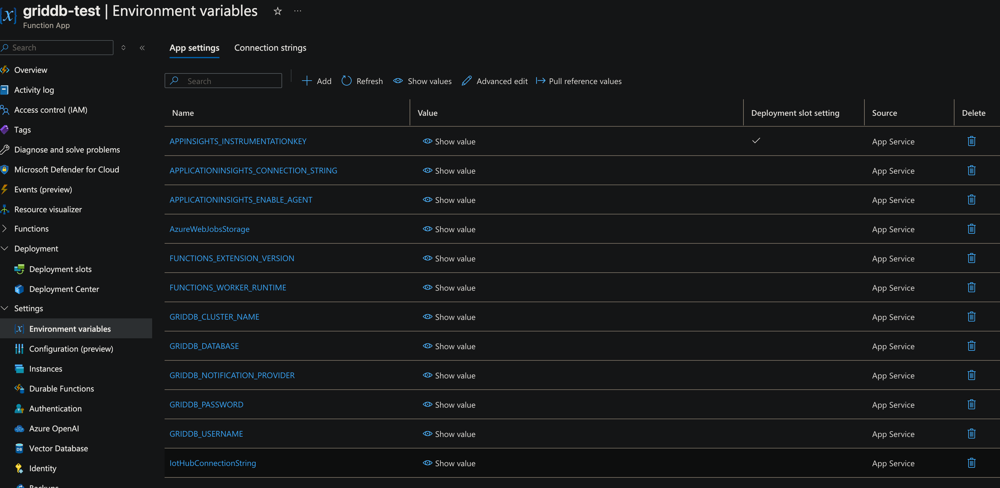
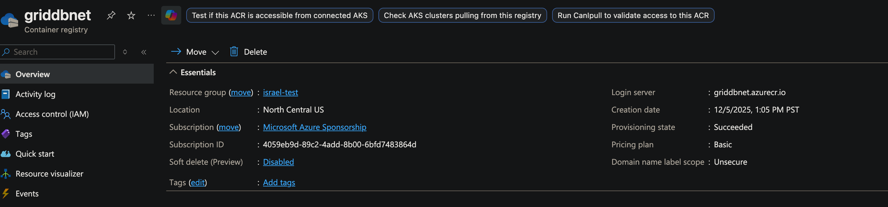
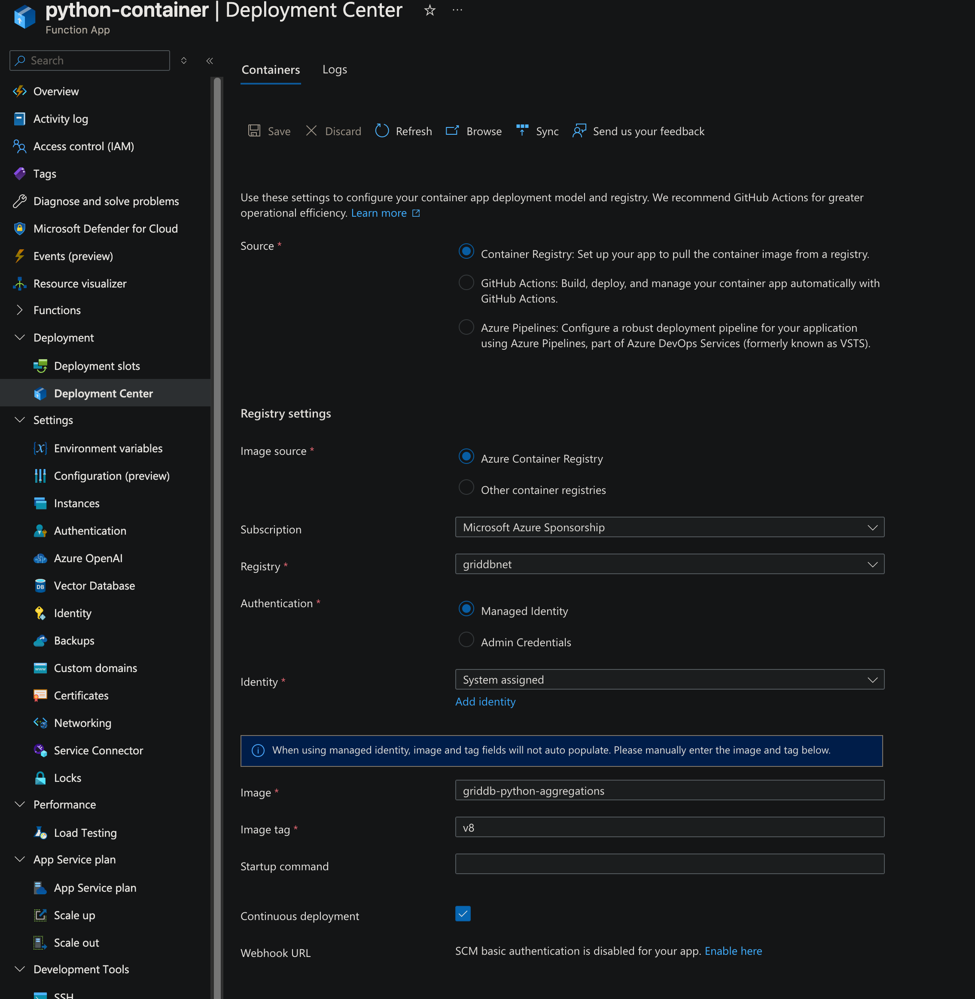

With GridDB Cloud now having the ability to connect to your code through what is known as `non-webapi`, aka through its native NoSQL interface (Java, Python, etc), we can now explore connecting to various Azure Services through the virtual network peering. Because our GridDB Cloud instance is connected to anything connected to our Virtual Network thanks to the peering connection, anything that allows connection to a virtual network can now directly communicate with GridDB Cloud.

## Introduction

In this article, we will explore connecting our GridDB Cloud instance to Azure's IoT Hub to store telemetry data. We have previously made a web course on how to set up the Azure IoT Hub with GridDB Cloud but through the Web API. That can be found here: [https://www.udemy.com/course/griddb-and-azure-iot-hub/?srsltid=AfmBOopFTwFHI7OvQOEXt4P_cWxuo3NaJ9XkbNDHHWX5Tgky4QZzJlD3](https://www.udemy.com/course/griddb-and-azure-iot-hub/?srsltid=AfmBOopFTwFHI7OvQOEXt4P_cWxuo3NaJ9XkbNDHHWX5Tgky4QZzJlD3). You can also learn about how to connect your GridDB Cloud instance to your Azure virtual network through the v-net peering here: [https://griddb.net/en/blog/griddb-cloud-v3-1-how-to-use-the-native-apis-with-azures-vnet-peering/](/en/blog/griddb-cloud-v3-1-how-to-use-the-native-apis-with-azures-vnet-peering/). 

As a bonus, we have also made a blog on how to connect your local environment to your cloud-hosted GridDB instance through a VPN to be able to just use your local programming environment; blog here: TODO BLOG 2

So for this one, let's get started with our IoT Hub implementation. We will be setting up an IoT Hub with any number of devices which will trigger a GridDB write whenever telemetry data is detected. We will then also set up another Azure Function which will run on a simple timer (every 1 hour) that will run a simple aggregation of the IoT Sensor data to keep the data tidy and data analysis. 

There is also source code for setting up a Kafka connection through a timer which will read all data from within the past 5 minutes and stream that data out through Kafka, but we won't discuss it here.

## Azure's Cloud Infrastructure

Let's talk briefly about Azure's services that we will need to master and use to get all of this running. First, the IoT Hub

### Azure's IoT Hub

You can read about what the IoT Hub does here: [https://learn.microsoft.com/en-us/azure/iot-hub/](https://learn.microsoft.com/en-us/azure/iot-hub/). The purpose of it is to make it easy to manage a fleet of IoT sensors which exist in the real world, emitting data at intervals which needs to be stored and analyzed. For this article, we will simply create one virtual device of which we will push data through a python script provided by Microsoft (source code here: [https://github.com/Azure/azure-iot-sdk-python](https://github.com/Azure/azure-iot-sdk-python)).

You can learn how to create the IoT Hub and how to deploy code/functions through an older blog: [https://griddb.net/en/blog/iot-hub-azure-griddb-cloud/](/en/blog/iot-hub-azure-griddb-cloud/). Because this information is here, we will continue on assuming you have already built the IoT Hub in your Azure and we will just discuss the source code needed to get our data to GridDB Cloud through the native Java API.

### Azure Functions

The real glue of this set up is our [Azure Functions](https://azure.microsoft.com/en-us/products/functions). For this article, I created an Azure Function Standard Plan. From there, I connected the standard plan to the virtual network which is already peer-connected to our GridDB Cloud instance. With this simple step, all of our Azure Functions which we deploy and use on this app service plan will already be able to communicate with GridDB Cloud seamlessly.

And for our Azure Function that combines with the IoT Hub to detect events and use that data to run some code, we will use a specific function binding in our java code: `@EventHubTrigger(name = "message", eventHubName = "events", connection = "IotHubConnectionString", consumerGroup = "myfuncapp-cg", cardinality = Cardinality.ONE) String message,`. In this case, we are telling our Azure Function that whenever an event occurs in our IoT Hub (as defined in the IoTHubConnectionString), we want to run the following code. The magic is all contained within Azure Functions and that `IoTHubConnectionString`, which is gathered in the IoT Hub called: `primary connection string`. 

So in your Azure Function, when you create it, you should head to Settings -> Environment Variables. And set the `IoTHubConnectionString` as well as your GridDB Cloud credentials. 

. 

If you are using VSCode, you can set these vars in your `loca.settings.json` file created when you select `Azure Functions Create Function App` (as mentioned in the blog linked above) and then do `Azure Functions: Deploy Local Settings`. 

## IoT Hub Event Triggering

Now let's look at the actual source code that pushes data to GridDB Cloud.

### Java Source Code for Pushing Event Telemetry Data

Our goal here is to log all of our sensors' within the IoT Hub's data into persistent storage (aka GridDB Cloud). To do this, we use Azure Functions and their special [bindings/triggers](https://learn.microsoft.com/en-us/azure/azure-functions/functions-triggers-bindings?tabs=isolated-process%2Cnode-v4%2Cpython-v2&pivots=programming-language-javascript). In this case, we want to detect whenever our IoT Hub's sensors receive telemetry data, which will then fire off our java code which will forge a connection to GridDB through its NoSQL interface and simply write that row of data. Here is the main method in Java: 

```java
public class IotTelemetryHandler {

	private static GridDB griddb = null;
	private static final ObjectMapper MAPPER = new ObjectMapper();

	@FunctionName("IoTHubTrigger")
	public void run(
			@EventHubTrigger(name = "message", eventHubName = "events", connection = "IotHubConnectionString", consumerGroup = "myfuncapp-cg", cardinality = Cardinality.ONE) String message,

			@BindingName("SystemProperties") Map<String, Object> properties,

			final ExecutionContext context) {

		TelemetryData data;
		try {
			data = MAPPER.readValue(message, TelemetryData.class);

		} catch (Exception e) {
			context.getLogger().severe("Failed to parse JSON message: " + e.getMessage());
			context.getLogger().severe("Raw Message: " + message);
			return;
		}

		try {
			context.getLogger().info("Java Event Hub trigger processed a message: " + message);

			String deviceId = properties.get("iothub-connection-device-id").toString();
			String eventTimeIso = properties.get("iothub-enqueuedtime").toString();

			Instant enqueuedInstant = Instant.parse(eventTimeIso);
			long eventTimeMillis = enqueuedInstant.toEpochMilli();
			Timestamp dbTimestamp = new Timestamp(eventTimeMillis);
			data.ts = dbTimestamp;

			context.getLogger().info("Data received from Device: " + deviceId);

			griddb = new GridDB();
			String containerName = "telemetryData";
			griddb.CreateContainer(containerName);
			griddb.WriteToContainer(containerName, data);
			context.getLogger().info("Successfully saved to DB.");

		} catch (Throwable t) {
			context.getLogger().severe("CRITICAL: Function execution failed with exception:");
			context.getLogger().severe(t.toString());
			// throw new RuntimeException("GridDB processing failed", t);
		}
	}

}
```

The Java code itself is vanilla, it's what the Azure Functions bindings do that is the real magic. As explained above, using the IoT Hub connection string directs what events are being polled to grab those values and eventually be written to GridDB.

## Data Aggregation

So now we've got thousands of rows of data from our sensors inside of our DB. A typical workflow in this scenario might be a separate service which runs aggregations on a timer to help manage the data or keep around an easily reference snapshot of the data in your sensors. Python is a popular vehicle for running data-science-y type operations, so let's set up the GridDB Python client and let's run a simple average function every hour.

### Python Client

While using Java in the Azure function works out of the box (as shown above), the python client has some requirements for installing and being run. Specifically, we need to actually have Java installed, as well as some special-built java jar files. The easiest way to get this sort of environment set up in an Azure Function is to use [Docker](https://www.docker.com/). 

With Docker, we can include all of the libraries and instructions needed to install the python client and deploy the container with all source code as is. The Python script will then run on a timer every 1 hour and write to a new GridDB Cloud table which will keep track of the hourly aggregates of each data point.

### Dockerize Python Client

To dockerize our python client, we need to convert the instructions on [how to install the python client](https://docs.griddb.net/gettingstarted/python.html) into docker instructions, as well as copy the source code and credentials. Here is what the Dockerfile looks like: 

```bash
FROM mcr.microsoft.com/azure-functions/python:4-python3.12

ENV AzureWebJobsScriptRoot=/home/site/wwwroot \
    AzureFunctionsJobHost__Logging__Console__IsEnabled=true
ENV PYTHONBUFFERED=1
ENV GRIDDB_NOTIFICATION_PROVIDER="[notification_provider]"
ENV GRIDDB_CLUSTER_NAME="[clustername]"
ENV GRIDDB_USERNAME="[griddb-user]"
ENV GRIDDB_PASSWORD="[password]"
ENV GRIDDB_DATABASE="[database]"

WORKDIR /home/site/wwwroot

RUN apt-get update && \
    apt-get install -y default-jdk git maven && \
    rm -rf /var/lib/apt/lists/*

ENV JAVA_HOME=/usr/lib/jvm/default-java

WORKDIR /tmp
RUN git clone https://github.com/griddb/python_client.git && \
    cd python_client/java && \
    mvn install

RUN mkdir -p /home/site/wwwroot/lib && \
    mv /tmp/python_client/java/target/gridstore-arrow-5.8.0.jar /home/site/wwwroot/lib/gridstore-arrow.jar


WORKDIR /tmp/python_client/python
RUN python3.12 -m pip install .

WORKDIR /home/site/wwwroot

COPY ./lib/gridstore.jar /home/site/wwwroot/lib/
COPY ./lib/arrow-memory-netty.jar /home/site/wwwroot/lib/
COPY ./lib/gridstore-jdbc.jar /home/site/wwwroot/lib/
COPY *.py .
COPY requirements.txt .

RUN python3.12 -m pip install -r requirements.txt

ENV CLASSPATH=/home/site/wwwroot/lib/gridstore.jar:/home/site/wwwroot/lib/gridstore-jdbc.jar:/home/site/wwwroot/lib/gridstore-arrow.jar:/home/site/wwwroot/lib/arrow-memory-netty.jar
```

Once in place, you do the normal docker build, docker tag, docker push. But there is one caveat!

#### Azure Container Registry

Though not necessary, setting up your own Azure Container Registry(acr) (think Dockerhub) to host your images makes life a whole lot simpler for deploying your code to Azure Functions. So in my case, I set up an acr, and then pushed my built images into that repository. 



Once there, I went to the deployment center of my new python Azure Function and selected my container's name etc. From there, it will deploy and run based on your stipulations. Cool!



### Python Code to do Data Aggregation

Similar to the Java implementation above, we will use the Azure Function bindings/trigger on the python code to use a cron-style layout for the timer. Under the hood, the Azure Function infrastructure will run the function every 1 hour based on our setting. The code itself is also vanilla: we will query data from our table written to above from the past 1 hour, find the averages, and then write that data back to GridDB Cloud on another table. 

Note that since this function solely relies on the Azure Function timer and GridDB, there is no need for special IoT Hub Connection String-type connection strings to grab. Here is the main python that Azure will run when the time is right: 

```python
import logging
import azure.functions as func
import griddb_python as griddb
from griddb_connector import GridDB
from griddb_sql import GridDBJdbc
from datetime import datetime
import pyarrow as pa
import pandas as pd
import sys

app = func.FunctionApp()

@app.timer_trigger(schedule="0 0 * * * *", arg_name="myTimer", run_on_startup=True,
              use_monitor=False) 
def aggregations(myTimer: func.TimerRequest) -> None:
    if myTimer.past_due:
        logging.info('The timer is past due!')

    logging.info('Python timer trigger function executed.')
    nosql = None
    store = None
    ra = None
    griddb_jdbc = None
    
    try:
        print("Attempting to connect to GridDB...")
        nosql = GridDB()
        store = nosql.get_store()
        ra = griddb.RootAllocator(sys.maxsize)
        if not store:
            print("Connection failed. Exiting script.")
            sys.exit(1) 

        griddb_jdbc = GridDBJdbc()    
        if griddb_jdbc.conn:
            averages =  griddb_jdbc.calculate_avg()
            nosql.pushAvg(averages)
        

        print("\nScript finished successfully.")

    except Exception as e:
        print(f"A critical error occurred in main: {e}")
    
    finally:
        print("Script execution complete.")
```

The rest of the code isn't very interesting but let's take a brief look. Here we are querying the last 1 hour of data and calculating the averages: 

```python
    def calculate_avg(self):
        try:

            curs = self.conn.cursor()
            queryStr = 'SELECT temperature, pressure, humidity FROM telemetryData WHERE ts BETWEEN TIMESTAMP_ADD(HOUR, NOW(), -1) AND NOW();'
            curs.execute(queryStr)
            if curs.description is None:
                print("Query returned no results or failed.")
                return None
            
            column_names = [desc[0] for desc in curs.description]
            all_rows = curs.fetchall()
            if not all_rows:
                print("No data found for the query range.")
                return None

            results = {name.lower(): [] for name in column_names}

            for row in all_rows:
                for i, name in enumerate(column_names):
                    results[name.lower()].append(row[i])

            averages = {
                'temperature': statistics.mean(results['temperature']),
                'humidity': statistics.mean(results['humidity']),
                'pressure': statistics.mean(results['pressure'])
            }

            return averages
```

Note: for this function, we created the table beforehand (not in the Python code).

## Bonus Azure Kafka Event Hub

We also set up an Event Hub function to query the last 5 minutes of telemetry data and stream it through Kafka. We ended up leaving this as dangling, but I've included it here because the source code already exists. It also uses a timer trigger and relies solely on the connection to GridDB Cloud. Azure's Event Hub handls all of the complicated Kafka stuff under the hood, we just needed to return the data to be pushed through Kafka. Here is the source code: 


```java
package net.griddb;

import com.microsoft.azure.functions.ExecutionContext;
import com.microsoft.azure.functions.annotation.EventHubOutput;
import com.microsoft.azure.functions.annotation.FunctionName;
import com.microsoft.azure.functions.annotation.TimerTrigger;

import java.sql.SQLException;
import java.util.ArrayList;
import java.util.List;
import java.util.logging.Level;

public class GridDBPublisher {
    @FunctionName("GridDBPublisher")
    @EventHubOutput(name = "outputEvent", eventHubName = "griddb-telemetry", // <--- YOUR EVENT HUB NAME
            connection = "EventHubConnectionAppSetting" // <--- CONNECTION STRING SETTING NAME
    )
    public List<String> run( // Change return type to List<String> for batching
            @TimerTrigger(name = "timerInfo", schedule = "0 */1 * * * *") String timerInfo,
            final ExecutionContext context) {

        // 1. Array to hold the serialized GridDB data (JSON Strings)
        List<String> recordsToPublish = new ArrayList<>();

        GridDBJdbc griddbSql = new GridDBJdbc();
        try {
            // Grabbing the last time data was pushed to Kafka
            java.sql.Timestamp last_pushed_timestamp = griddbSql.GetMaxTime(context, "ControlTable",
                    "last_pushed_time");
            // Query the telemtry data table using the timestamp from above.
            // If values are newer than our control table says, grab those rows
            BatchResult result = griddbSql.GetTelemetryDataNewerThanControlTimeStamp(context, "telemetryData",
                    last_pushed_timestamp);
            recordsToPublish = result.getRecords();

            if (recordsToPublish.size() > 0) {
                java.sql.Timestamp max_telemetryTs = result.getMaxTimestamp();
                griddbSql.WriteLastPushedTimeStampToControlTable(context, max_telemetryTs);
            } else {
                return recordsToPublish;
            }
        } catch (SQLException e) {
            context.getLogger().log(Level.SEVERE, "Error processing row or serializing JSON", e);
        }

        return recordsToPublish; // The binding sends the contents of this list
    }

}
```

Azure Function does all of the heavy lifting here, which I think is rather cool. Just returning the ArrayList from this function allows the data to be streamed through Kafka is a true delight!

## Conclusion 

And with that, we have learned how powerful having GridDB Cloud in Azure can be; you can truly build robust IoT Systems without needing to produce hardware, perfect for cloud-based systems and for proof-of-concepts.