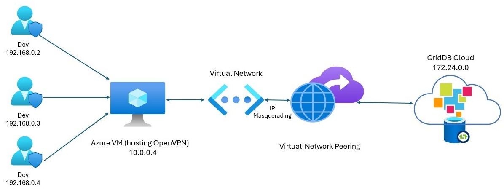

With GridDB Cloud 3.1, you can now access the native API of GridDB through Azure's virtual peering network connection. The way it works is that that any virtual network that you set up in your Azure cloud environment can set up what is called a peering connection, which allows two disparate sources to communicate through Azure's vast resources. Through this, any virtual machine connected to that vnet can communicate and use the GridDB Cloud native APIs. We discuss at greater length here: [TODO LINK]

In this article, we will build upon that idea and teach you how to set up a VPN which will allow you to access your GridDB Cloud through your local enviroment, meaning you can freely use GridDB with your existing application code as long as you connect to the VPN. 



## Prereqs

To fully utilize GridDB Cloud with native APIs in your local environment, you will need to, of course, have access to one of the paid GridDB Cloud instances: https://griddb.net/en/blog/griddb-cloud-azure-marketplace/. The nice thing, though, is that there are trial versions on the marketplace of one month so that you may try out GridDB Cloud's features for free!

You will also need to have set up a the vnet peering as described in the opening parapgraphs of this article: [GridDB Cloud v3.1 – How to Use the Native APIs with Azure’s VNET Peering ](https://griddb.net/en/blog/griddb-cloud-v3-1-how-to-use-the-native-apis-with-azures-vnet-peering/)
If you have this set up, you should have the following in your Azure resource: 

- GridDB Cloud (Pay As You Go)
- Azure Virtual Network with peering connection to GridDB Cloud 
- A virtual machine connected to the above vnet

Please note, that all of the above will incur some sort of cost on Azure (for example, an Azure VM b1 instance costs roughly ~$8/month if left on at all times).

## OpenVPN and IP Masquerading

The way this set up works is through something called IP Masquerading which is "a process where one computer acts as an IP gateway for a network.  All computers on the network send their IP packets through the gateway, which replaces the source IP address with its own address and then forwards it to the internet." (https://www.linux.com/training-tutorials/what-ip-masquerading-and-when-it-use/). Essentially, it means that the traffic from your local machine will be intended for the GridDB Cloud IP, but instead will route through the VPN the DB will see the request coming and it will look like the request is coming from the local machine within the network (the vm) and accept it, and then make its response and push it back through the virtual network, through the virtual machine, and to your local env.

So to get this running, you simply need to set up openvpn on the Azure virtual machine and then turn on the rule to do IP Masquerading and it will work.

### Install OpenVPN

To install openvpn and the client certs for my machine, I used the guide from ubuntu: https://documentation.ubuntu.com/server/how-to/security/install-openvpn/. Through this guide, you will have OpenVPN installed on your Azure VM and then will have certs on your local machine that can connect to your VM. 


#### 1. Install OpenVPN & Easy-RSA

* `sudo apt install openvpn easy-rsa`

#### 2. Set Up the PKI (Certificate Authority)

* `sudo make-cadir /etc/openvpn/easy-rsa`
* `cd /etc/openvpn/easy-rsa/`
* Initialize PKI:
  `./easyrsa init-pki`
* Build the CA:
  `./easyrsa build-ca`

## 3. Generate Server Certificates

* Generate server key request:
  `./easyrsa gen-req myservername nopass`
* Generate Diffie-Hellman params:
  `./easyrsa gen-dh`
* Sign server certificate:
  `./easyrsa sign-req server myservername`
* Copy required files into `/etc/openvpn/`:

  * `pki/dh.pem`
  * `pki/ca.crt`
  * `pki/issued/myservername.crt`
  * `pki/private/myservername.key`

#### 4. Create Client Certificates

* Generate client key request:
  `./easyrsa gen-req myclient1 nopass`
* Sign client cert:
  `./easyrsa sign-req client myclient1`
* Securely copy to the client machine:

  * `ca.crt` (from earlier)
  * `myclient1.crt` (inside /pki/issued)
  * `myclient1.key` (inside /pki/private)

#### 5. Configure the OpenVPN Server

* Copy sample config:
  `sudo cp /usr/share/doc/openvpn/examples/sample-config-files/server.conf /etc/openvpn/myserver.conf`
* Edit `myserver.conf` so these lines reference your certs:

  ```conf
  ca ca.crt
  cert myservername.crt
  key myservername.key
  dh dh.pem
  ```
* Generate TLS auth key:
  `sudo openvpn --genkey secret ta.key`
* Enable IP forwarding:

  * Edit `/etc/sysctl.conf`, set:
    `net.ipv4.ip_forward=1`
  * Apply:
    `sudo sysctl -p /etc/sysctl.conf`
* Start the server:
  `sudo systemctl start openvpn@myserver`

#### 6. Configure the Client

* Install OpenVPN:
  `sudo apt install openvpn`
* Copy sample config:
  `sudo cp /usr/share/doc/openvpn/examples/sample-config-files/client.conf /etc/openvpn/`
* Place the files on client:

  * `ca.crt`
  * `myclient1.crt`
  * `myclient1.key`
  * `ta.key`
* Edit `client.conf`:

  ```conf
  client
  remote your.server.ip 1194
  ca ca.crt
  cert myclient1.crt
  key myclient1.key
  tls-auth ta.key 1
  ```
* Start client:
  `sudo systemctl start openvpn@client`

#### 7. Quick Troubleshooting

* Check logs:
  `sudo journalctl -u openvpn@myserver -xe`
  `sudo journalctl -u openvpn@client -xe`
* Ensure:

  * Ports match
  * Protocol (`udp`/`tcp`) matches
  * `tls-auth` index matches (0 on server, 1 on client)
  * Same `cipher`, `auth`, and `dev tun` settings

### IP Masquerading

As explained above, if you try it now, it simply won't work, as the traffic will be routed to the GridDB DB from the IP on your local environment which is blocked due to security rules. But once this setting is turned on, it will work. Run the following command in your VM: `sudo iptables -t nat -A POSTROUTING -o eth0 -j MASQUERADE`. And that should do it! 

To ensure it works, you can of course run the [sample code based on the previous blog](https://github.com/griddbnet/Blogs/tree/griddb_cloud_paid_guide/sample-code). But before going through that effort, you can also simply try this: from the local environment (connected to the VPN), ping the IP of your GridDB Cloud DB (can be fetched from the notification provider URL in the GridDB Cloud DB UI home page) `ping 172.26.30.68`. And then on your Azure VM (the one hosting the VPN and that can also connect to GridDB Cloud) run: `sudo tcpdump -i eth0 -n host 172.26.30.68`. If successful, your pings to GridDB Cloud should be routed through the VM and be heading to its destination. Cool!

To run the sample code, you can start by cloning the github repo and changing to the correct branch: 

`$ git clone https://github.com/griddbnet/Blogs.git --branch griddb_cloud_paid_guide`

Then set your env variables for your GridDB Connection: 

```bash
export GRIDDB_NOTIFICATION_PROVIDER=""
export GRIDDB_CLUSTER_NAME=""
export GRIDDB_USERNAME=""
export GRIDDB_PASSWORD=""
export GRIDDB_DATABASE=""
```

And then from here, navigate to either the java or python dirs and run them!

For java, do `$ mvn clean package` and run the jar file: `$ java -jar target/java-samples-1.0-SNAPSHOT-jar-with-dependencies.jar`

For python, after installing the [python client](https://docs.griddb.net/gettingstarted/python.html), you can install the requirements text (`python3.12 -m pip install -r requirements.txt`), make sure your JAVA_HOME and CLASSPATH env variables are set, and then run the code `python3.12 main.py`