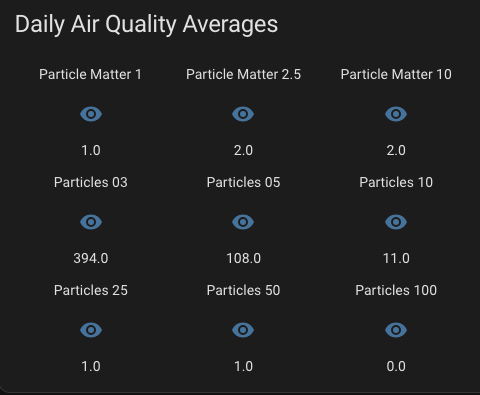

Despite humanity's (lackluster) efforts, climate change has become an omnipresent, undeniable force. Though there are many side effects that come with a rising global average temperature, today I want to focus on wildfires and their affect on the air quality of all surrounding areas. And indeed, when a 100-acre-fire is burning up a California forest, all of that debris and particle matter are kicked up into the atmosphere, becoming potentially dangerous, inhalable matter.

Of course, there are various other factors which can (and do) contribute to the quality of the air we breathe. To me, this means that even if there isn't a wildfire nearby causing spikes in AQI (Air Quality Index), there is still a reason to be informed and aware of what the air quality is like at any given moment.

## The Project

For this article, we were interested in measuring the air quality inside of our homes. Specifically, we wanted to take live readings of our air quality data, save it into persistent storage, and then notify the inhabitants when the air quality grew passed a certain threshold.  

To accomplish our goal, we sought to integrate GridDB Cloud with the open source smart home solution known as [Home Assistant](https://www.home-assistant.io/). If you are unfamiliar, Home Assistant is an "Internet of things (IoT) ecosystem-independent integration platform and central control system for smart home devices, with a focus on local control". Typically, end users install the software onto their home servers to control aspects of their internet-connected physical devices. As an example, one might install Home Assistant to act as their smart hub to control their smart light bulbs, smart robovac, etc.

The beauty of Home Assistant is in its versatility and flexibility. For instance, because it's completely open source and built for tinkerers/developers, users can roll their own solutions for their own specific use cases, and build their own automations. For our case, we were interested in being able to query GridDB Cloud's sensor data and then being able to notify those who live in the same space as the sensor that the air quality is approaching dangerous levels in some tangible way.

### Project Specifics and the PM1 Particle

To propel the project forward, we have connected an air quality sensor -- [Adafruit PMSA003I Air Quality Breakout](https://www.adafruit.com/product/4632) -- to a raspberry pi. We send the sensor readings up to GridDB Cloud every 1 second via HTTP Request. With our data being saved into persistent storage with GridDB Cloud, we can make HTTP Requests to query our dataset with `SQL Select statements`. In this case, we want to use Home Assistant to query our dataset to alert us of higher than normal particle matters in the air at our locations. We also want to include an easy to read sensor reading right on our Home Assistant home dashboard.


As a sidenote: an interesting point about this particular sensor is that it can read matter as small as 1 micron (labeled as `PM1`). These particles are so small that they can [penetrate lung tissue and get directly into your bloodstream](https://www.iqair.com/us/newsroom/pm1); and because this particle is so tiny, it's only detectable by specialized equipment, including the sensor linked above. Because of the lack of readily available sources of PM1 readings, this particle will be the focus of our queries for notifying the home inhabitants of its increasing levels.

## Project Requirements

If you would like to follow along, you will need the following: 

1. Free GridDB Cloud Account
2. Air Quality sensor 
3. Means of connecting the sensor to a computer (single board or otherwise)

Once you have set up the necessary hardware and can connect to your GridDB Cloud database, you can grab the source code from here: [GitHub](https://github.com/griddbnet/Blogs/tree/air_quality_sensor) to run the simple python script to send sensor readings.

## Connecting the Hardware

In my case, I bought the air quality sensor attached with a STEMMA Connector; to connect it to the Raspberry Pi 4, I bought a [STEMMA Hat](https://www.adafruit.com/product/4688) and a STEMMA wire. If you do not want to purchase a STEMMA hat, you can also solder the pins onto the sensor and use a breadboard to connect to the Raspberry Pi's GPIO pins. If you go this route, you may need to alter the python script provided by our source code -- you can read more about how to physically connect this air quality sensor through their documentation page: [Docs](https://learn.adafruit.com/pmsa003i?view=all).


## Software

Now let's focus on the software that makes this project go. 

### Python Script for Container Creation and Pushing Data

First and foremost, let's discuss the script which sends the sensor readings as HTTP requests. It is a modified version of the example script provided directly by ada fruit's documentation. The data structure of the incoming data readings are already laid out in convenient dictionary matter, so we simply need to iterate through and make the values match up with how we lay out our schema on container creation. So first, here's the script for container creation: 

```python
import http.client
import json

conn = http.client.HTTPSConnection("cloud5197.griddb.com")
payload = json.dumps({
  "container_name": "aqdata",
  "container_type": "TIME_SERIES",
  "rowkey": True,
  "columns": [
    {
      "name": "ts",
      "type": "TIMESTAMP"
    },
    {
      "name": "pm1",
      "type": "DOUBLE"
    },
    {
      "name": "pm25",
      "type": "DOUBLE"
    },
    {
      "name": "pm10",
      "type": "DOUBLE"
    },
    {
      "name": "pm1e",
      "type": "DOUBLE"
    },
    {
      "name": "pm25e",
      "type": "DOUBLE"
    },
    {
      "name": "pm10e",
      "type": "DOUBLE"
    },
    {
      "name": "particles03",
      "type": "DOUBLE"
    },
    {
      "name": "particles05",
      "type": "DOUBLE"
    },
    {
      "name": "particles10",
      "type": "DOUBLE"
    },
    {
      "name": "particles25",
      "type": "DOUBLE"
    },
    {
      "name": "particles50",
      "type": "DOUBLE"
    },
    {
      "name": "particles100",
      "type": "DOUBLE"
    }
  ]
})
headers = {
  'Content-Type': 'application/json',
  'Authorization': 'Basic <redacted>'
}
conn.request("POST", "/griddb/v2/gs_clustermfcloud5197/dbs/B2xcGQJy/containers", payload, headers)
res = conn.getresponse()
data = res.read()
print(data.decode("utf-8"))
```

For the schema, we simply just used a 1:1 mapping to the `aqdata` dictionary returned by our sensor readings. Even if we don't intend to use all of these data points, the data readouts are so small, we keep them in.

Next, let's take a look at the script that will push sensor readings to our GridDB Cloud instance. It will read the sensor data every 1 second, and then make an HTTP Request every second to push that data into the Cloud.

```python
# SPDX-FileCopyrightText: 2021 ladyada for Adafruit Industries
# SPDX-License-Identifier: MIT

"""
Example sketch to connect to PM2.5 sensor with either I2C or UART.
"""

# pylint: disable=unused-import
import time
import datetime
import board
import busio
from digitalio import DigitalInOut, Direction, Pull
from adafruit_pm25.i2c import PM25_I2C


import http.client
import json

conn = http.client.HTTPSConnection("cloud5197.griddb.com")
headers = {
  'Content-Type': 'application/json',
  'Authorization': 'Basic <redacted>'
}

reset_pin = None
i2c = busio.I2C(board.SCL, board.SDA, frequency=100000)
# Connect to a PM2.5 sensor over I2C
pm25 = PM25_I2C(i2c, reset_pin)

print("Found PM2.5 sensor, reading data...")

while True:
    time.sleep(1)

    try:
        aqdata = pm25.read()
        # print(aqdata)
        current_time = datetime.datetime.utcnow().replace(microsecond=0)
        now = current_time.strftime('%Y-%m-%dT%H:%M:%S.%fZ')
       # print(now)
        temp = []
        temp.append(now)
    except RuntimeError:
        print("Unable to read from sensor, retrying...")
        continue
    
    for data in aqdata.values():
        temp.append(data)
    payload = json.dumps([temp])
    print(payload)
    conn.request("PUT", "/griddb/v2/gs_clustermfcloud5197/dbs/B2xcGQJy/containers/aqdata/rows", payload, headers)
    res = conn.getresponse()
    data = res.read()
    print(data.decode("utf-8"))
```

As explained above, there is nothing fancy or extraordinary about this script; it simply reads sensor data and then immediately pushes it out to the Cloud with a timestamp attached. The one thing to note, though, is that the GridDB Cloud is by default in UTC Time, so I have altered the timestamps to be attached to the data results to match UTC for consistency's sake.

And now that we have our data available in the cloud, we can move on to integrating it with other technologies.

### Home Assistant

Home automation software comes in many varieties, with many companies providing their own hubs sold alongside their own products. Home assistant is unique in that it is, 1. completely open source, and 2. made to integrate with all manner of physical and virtual devices. For example, in my own personal home environment, I have Home Assistant running on a Raspberry Pi. To allow it to communicate with other physical devices, I have installed a Zigbee/Z-Wave USB Stick. If you are unfamiliar, Zigbee and Z-Wave are protocols used by smart home devices to communicate with their hubs. In my case, most of my smart light bulbs communicate through Zigbee, for example.

In any case, through Home Assistant, we can create various scripts/automations for getting things done. Some examples can be: turn on bedroom lights at 1% at wake up time, or play my Spotify playlist every day at lunch time, etc etc. In the case of our air quality sensor, we can send out a direct HTTP Query against our sensor data and do `something` if our readings are higher than a certain threshold. For this blog, I have set up my home to turn my living room light bulbs `on` and to `red` if the `pm1` particles are above a certain threshold, over the past 1 hour. But of course, because Home Assistant is flexible, you could set up any sort of notification method you'd like, including emails, phone push notifications, or even turning on your robovac!

So, to continue on, we will need to first formulate our query on sensor readings, learn how to make HTTP Requests through Home Assistant, and learn how to act on the data returned by our query. After we set up our notifcation system for high sensor reading averages, we will also want to display all sensor readings in our Home Assistant dashboard.

#### Forumulating our Query

First, let's get our query settled. From my cursory research, `pm1` particles are potentially the most threatening to our health because those particles are *so* tiny they can be inhaled and absorbed directly through the lungs; we will want to set up an alert for these particles. 

Before we begin, Let's use `cURL` or Postman to test our HTTP Queries until we get what we are looking for; in my case, I used postman until I was happy with the results. The query I settled is the following: `SELECT AVG(pm1) FROM aqdata WHERE ts > TIMESTAMP_ADD(HOUR, NOW(), -1) AND ts < NOW() AND pm1 > 10 "`. This query will look at the data from the past 1 hour and will return with data if the avg value is over 10. Though please note I did not do strict research on what consitutes an unhealthy amount of `pm1` particles, this is simply for demo purposes. But now that we have our query, we can figure out how to make `HTTP REQUESTS` through Home Assistant.

#### Making HTTP Requests with Home Assistant

Within the `/config` directory of the Home Assistant, there are a bunch of `yaml` files which are used to make configuration and automation changes to the software itself -- very flexible and customizable. In our case, we want to add what is called a `rest_command` inside of the configuration yaml. We also would like to add an automation of what action to take based on the returned data from our `rest_command` -- this will happen in the `scripts.yaml` file. Please note that all `yaml` files are included in the source code in the GitHub page linked above. 

So, here is what our `configuration.yaml` file will need to make the HTTP Request: 

```yaml
#configuration.yaml
rest_command:
  griddb_cloud_get_aqdata:
    url: https://cloud5197.griddb.com/griddb/v2/gs_clustermfcloud5197/dbs/B2xcGQJy/sql
    method: post
    content_type: "application/json"
    headers:
      authorization: "Basic <redacted>"
    payload: '[{"type" : "sql-select", "stmt" : "SELECT AVG(pm1) FROM aqdata WHERE ts > TIMESTAMP_ADD(HOUR, NOW(), -1) AND ts < NOW() AND pm1 > 10 "}]'
```

You can see here we included all neccesary things to make an HTTP Sql Select request to our Cloud instance. Here, we are naming our `rest_command` as `griddb_cloud_get_aqdata`, so now in our `scripts` file we can directly call upon this `service`

```yaml
#scripts.yaml
get_griddb_data:
  sequence:
    - service: rest_command.griddb_cloud_get_aqdata
      response_variable: aqdata
    - if: "{{ aqdata['status'] == 200 }}"
      then:
        - alias: Parse data
          variables:
            results: "{ {aqdata['content']['results'] }}"
        - if: "{{ results != 'null'}}"
          then:
            service: light.turn_on
            target:
              entity_id: light.living_room
            data:
              rgb_color:
                - 240
                - 0
                - 0
```

As you can see, we are calling `rest_command.griddb_cloud_get_aqdata` as a service. This will run the HTTP Request and then parse the resulting data. If the results are null (meaning no data over our threshold), nothing will happen, but if we do get some data, we can take some action -- or in this case, change the living room lights to `on` and change the RGB to completely red, this way everybody in the home knows that the air quality is compromised in some way. 

So to explain a bit more about how the yaml files work, the configuration yaml allows you to create `services`, in our case, the HTTP Request. The scripts file is for actions which may be run many times in many different spots, a bit analoguous to functions in software. And lastly we will use `automations.yaml` which sets up the trigger to when our script should be running. In our case, we want it run every 10 minutes -- that is, every 10 minutes our Home Assistant will look at the average `pm1` levels over the past 1 hour and take action if it is too high. 

```yaml
#automations.yaml
- id: '1713475588605'
  alias: Get GridDB Data
  description: get the griddb data
  trigger:
  - platform: time_pattern
    minutes: /10
  condition: []
  action:
  - service: script.get_griddb_data
  mode: single
```

You can see here that the automation is calling upon our script to get the GridDB data. You can also see that our trigger is every 10 minutes.

#### Displaying Sensor Data Onto our Home Assistant Dashboard

The last thing we would like to accomplish is to show our sensor readings directly onto the Home Assistant Dashboard. This will allow for all home users to constantly be aware othe readings. To do this, we will need to use the `sensors.yaml` file and establish new virtual "sensors" of HTTP Requests reading the sensor avg sensor data. For this, we needed to formulate a new SQL Query and this time around, I think we could make do with average readings for the past 24 hours. That query looks like this: `SELECT ROUND(AVG(pm1)),ROUND(AVG(pm25)),ROUND(AVG(pm10)),ROUND(AVG(particles03)),ROUND(AVG(particles05)),ROUND(AVG(particles10)),ROUND(AVG(particles25)),ROUND(AVG(particles50)),ROUND(AVG(particles100)) FROM aqdata WHERE ts > TIMESTAMP_ADD(DAY, NOW(), -1) AND ts < NOW()`. We simply grab all rounded averages from the past 1 day and use that info to be displayed in the dashboard.

```yaml
#sensors.yaml
- platform: rest
  resource: https://cloud5197.griddb.com/griddb/v2/gs_clustermfcloud5197/dbs/B2xcGQJy/sql
  method: POST
  headers:
    authorization: "Basic <redacted>"
    Content-Type: application/json
  payload: '[{"type" : "sql-select", "stmt" : "SELECT ROUND(AVG(pm1)),ROUND(AVG(pm25)),ROUND(AVG(pm10)),ROUND(AVG(particles03)),ROUND(AVG(particles05)),ROUND(AVG(particles10)),ROUND(AVG(particles25)),ROUND(AVG(particles50)),ROUND(AVG(particles100)) FROM aqdata WHERE ts > TIMESTAMP_ADD(DAY, NOW(), -1) AND ts < NOW() "}]'
  value_template: "{{ value_json[0].results[0][0] }}"
  name: "Particle Matter 1"
  scan_interval: 3600
```

Here we use the `value_template` as the result that will be shown when we select this sensor as an entity. Unfortunately, I could not figure out how to use one singular HTTP Request with multiple values, so I needed to make each value as its own unique HTTP Request, just with a different index array position for the results. The example shown above, for instance, is for `pm1` as it is index 0 of our result array due to the container schema.

So now that we have our sensor set up, we can go to the dashboard and add it to be displayed. We can click edit (the pencil in the top right corner), then add card, then glance card, and then manually add all of your sensors. For me, the text editor looks like this: 

```yaml
show_name: true
show_icon: true
show_state: true
type: glance
entities:
  - entity: sensor.particle_matter_1
  - entity: sensor.particle_matter_2_5
  - entity: sensor.particle_matter_10
  - entity: sensor.particles_03
  - entity: sensor.particles_05
  - entity: sensor.particles_10
  - entity: sensor.particles_25
  - entity: sensor.particles_50
  - entity: sensor.particles_100
title: Daily Air Quality Averages
columns: 3
state_color: false
```



And now we can have our daily averages at a glance. Of course, this just a few of things you can do with this information being so readily available; this really is the beauty of having the open source Home Assistant powering your home automations, and why it's great to have GridDB Cloud hosting all of your data -- it can be accessible from anywhere and you can upload data from anywhere, as long as you have an internet connection. You could, of course, monitor poor air in remote locations, or in locations of loved ones far away and take actions however you see fit.

## Conclusion

In this article, we have learned how to connect physical hardware sensor data and how to push all of that wonderful data onto GridDB Cloud. And then we learned that we can take action directly upon that data with Home Assistant.