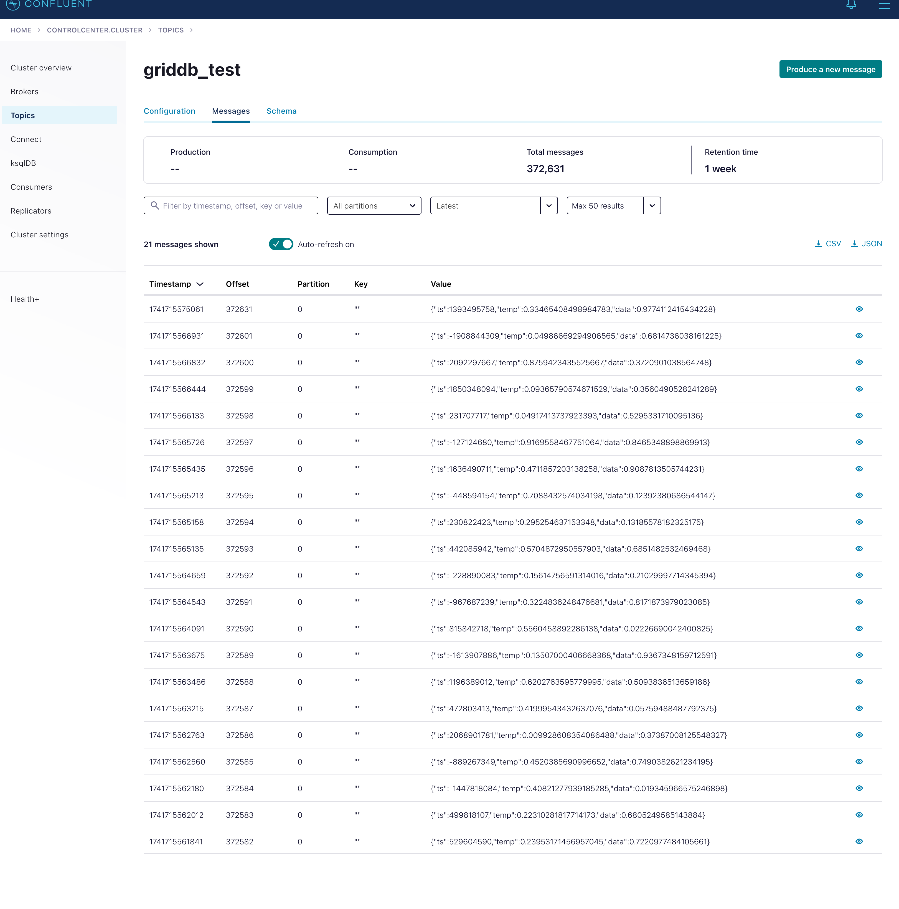
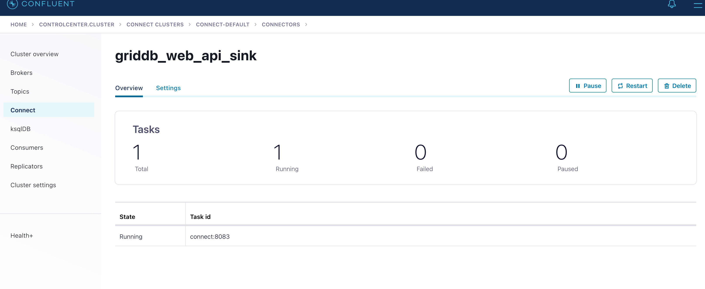
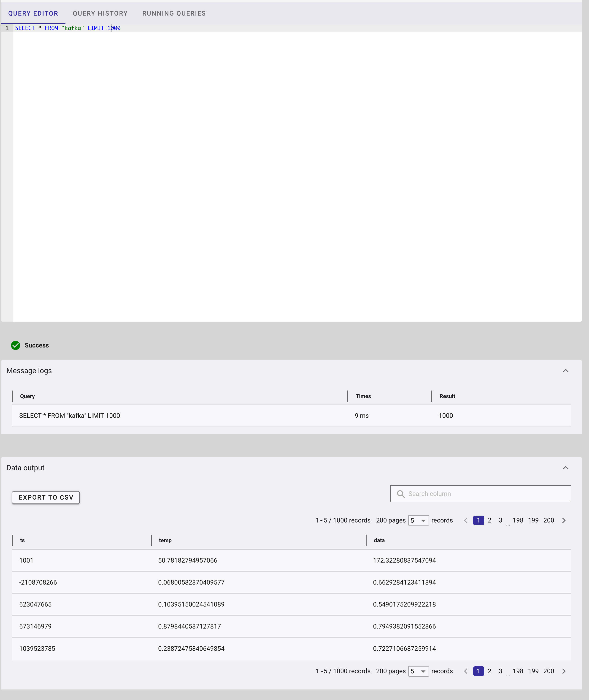

As we have discussed before, Kafka is an invaluable tool when dealing with certain IoT workloads. Kafka can gaurantee a robust pipeline of streaming your sensor data into almost anywhere due to its high flexibility and various connectors. And indeed, we have perviously written articles about using GridDB's official Kafka Source & Sink connectors to stream your data from place A to GridDB and vice versa. 

On the heels of GridDB Cloud now being free for most users worldwide, we thought we could again revisit using Kafka with GridDB, but now instead we would like to push our sensor data into the cloud using the Web API. To accomplish this, we needed to find an HTTP Sink Kafka connector and ensure that it could meet our requirements (namely data transformations and being able to change the HTTP method). 

Eventually we landed on using Confluent's own HTTP Sink connector, as it was the only one we could find which allowed for us to use the `PUT` method when making our HTTP Requests. As for transforming the data, Kafka already provided a method of doing this with something they call SMT (Single Message Transform).

And then finally, the last challenge we needed to overcome is being able to securely push our data through HTTPS as GridDB cloud's endpoint is protected by SSL. 

## Following Along

All source code for this project are available on our GitHub page. 

`$ git clone https://github.com/griddbnet/Blogs.git --branch kafka_http`

Within that repo you will find the source code, the docker compose file, and the SSL certificates.

As this entire project is dockerized, to run the project yourself, you will simply need docker installed. From there, you can run the project: `docker compose up -d`. We have already included the `.jar` file in the library dir so you won't need to build the custom SMT code to push data to GridDB Cloud.

## Implementation

To connect to push data to GridDB Cloud via the Web API, you must make an HTTP Request with a data structure that the Web API expects. If you look at the [docs](https://github.com/griddb/webapi/blob/master/GridDB_Web_API_Reference.md), you will see that to push data into a container we need to ensure a couple of things: first we need to ensure we make a `PUT` HTTP Request. Second, we need to ensure the data is set up as an array of arrays in the order of the schema. For example: 

```bash
[
  ["2025-01-16T10:25:00.253Z", 100.5, "normal"],
  ["2025-01-16T10:35:00.691Z", 173.9, "normal"],
  ["2025-01-16T10:45:00.032Z", 173.9, null]
]
```

In order to get our Kafka messages to output  messages like this, we will need to write a custom `SMT`. Here's an excellent article on how flexible and useful these can be: [Single Message Transformations - The Swiss Army Knife of Kafka Connect](https://www.morling.dev/blog/single-message-transforms-swiss-army-knife-of-kafka-connect/). 

Once we have the `SMT` finished, we can set up our SSL rules and certs and then make our connectors and topics via Confluent's UI or through JSON files.

### Single Message Transformations

The code to get this working is not very complicated, essentially we want to take an obj structure coming in from a typical Kafka message and transform into an array of arrays with all of the values parsed out. We will ensure that the index positions match our schema outside of the context of the `SMT`.

As mentioned earlier, the `.jar` file is included within this project so you don't need to do anything else, but if you would like to build it yourself or make changes, you can use `mvn` to build it. Here is the full java code (it's also availble in this repo in the `smt` directory). 

```java
    @Override
    public R apply(R record) {
        final Schema schema = operatingSchema(record);
        
        if (schema == null) {
            final Map<String, Object> value = requireMapOrNull(operatingValue(record), PURPOSE);
            return newRecord(record, null, value == null ? null : fieldPath.valueFrom(value));
        } else {
            final Struct value = requireStructOrNull(operatingValue(record), PURPOSE);
            fieldNames = schema.fields(); 

            List<List<Object>> nestedArray = new ArrayList<>();
            List<Object> row = new ArrayList<>();
            for (Field f : fieldNames) {
                String fName = f.name();
                SingleFieldPath fPath = new SingleFieldPath(fName, FieldSyntaxVersion.V2);
                row.add(fPath.valueFrom(value));
            }
            nestedArray.add(row);
    
            return newRecord(record, schema, value == null ? null : nestedArray);
        }
        
    }
```

The main method we will be using is this `apply` function. We extract all of the values from the incoming messages, remove the field names, and make a new array of arrays and return that new array. That's it! Of course there's more to it, but this is the important bit. 

Now that we've got the structure we need, let's set up our connectors and SSL information.

### Docker SSL Parameters

Because GridDB Cloud's endpoint is SSL protected, we need to ensure that our Kafka broker and HTTP Sink have the proper SSL Certs in place to securely communicate with the endpoint. If we miss any part of the process, the connection will fail with various errors, including the dreaded `Handshake failed`.

Based on the `docker-compose` file I used as the base for this project, to get SSL working, we will need to add a ton SSL environment values for our broker and kafka-connect.

Here are some of the values I added to the `broker` in order for it to get SSL working

```bash
      KAFKA_LISTENER_SECURITY_PROTOCOL_MAP: 'CONTROLLER:PLAINTEXT,  PLAINTEXT:PLAINTEXT,  PLAINTEXT_HOST:PLAINTEXT,  SSL:SSL'
      KAFKA_ADVERTISED_LISTENERS: 'PLAINTEXT://broker:29092,  PLAINTEXT_HOST://localhost:9092,  SSL://broker:9093'
      KAFKA_SSL_KEYSTORE_FILENAME: kafka.kafka-1.keystore.pkcs12
      KAFKA_SSL_KEYSTORE_CREDENTIALS: kafka-1_keystore_creds
      KAFKA_SSL_KEY_CREDENTIALS: kafka-1_sslkey_creds
      KAFKA_SSL_TRUSTSTORE_FILENAME: kafka.client.truststore.jks
      KAFKA_SSL_TRUSTSTORE_CREDENTIALS: kafka-1_trustore_creds
      KAFKA_SECURITY_PROTOCOL: 'SSL'
      KAFKA_SASL_MECHANISM: 'plain'
      KAFKA_SSL_ENDPOINT_IDENTIFICATION_ALGORITHM: 
      KAFKA_LISTENERS: 'PLAINTEXT://broker:29092,  CONTROLLER://broker:29093,  PLAINTEXT_HOST://0.0.0.0:9092,  SSL://broker:9093'
```

On top of adding these values, we also needed to generate these certificate files and copy them to the docker containers using a mounted volume. 

#### Generating SSL Certificates

First, let's take a look at the `.pkcs12` file, which is the `SSL_KEYSTORE_FILE`. This is a file you can generate on your local working machine, to do so, I followed a guide which gave me the following instructions: 

```bash
$ openssl req -new -nodes \
   -x509 \
   -days 365 \
   -newkey rsa:2048 \
   -keyout ca.key \
   -out ca.crt 

$ openssl req -new \
    -newkey rsa:2048 \
    -keyout kafka-1.key \
    -out kafka-1.csr \
    -nodes

$ openssl x509 -req \
    -days 3650 \
    -in kafka-1.csr \
    -CA ca.crt \
    -CAkey ca.key \
    -CAcreateserial \
    -out kafka-1.crt \
    -extensions v3_req

$ openssl pkcs12 -export \
    -in kafka-1.crt \
    -inkey afka-1.key \
    -chain \
    -CAfile ca.pem \
    -name kafka-1 \
    -out kafka-1.p12 \
    -password pass:confluent

$ keytool -importkeystore \
    -deststorepass confluent \
    -destkeystore kafka.kafka-1.keystore.pkcs12 \
    -srckeystore kafka-1.p12 \
    -deststoretype PKCS12  \
    -srcstoretype PKCS12 \
    -noprompt \
    -srcstorepass confluent
```

With that out of the way, we will also need to tell our server that the GridDB Cloud is safe by grabbing its certs and then generating some certs and including them into our broker and connect. From the GridDB Cloud web dashboard, if you click on the lock icon from the browser, you can view/manage the SSL Certificates. From that menu, you can download the `.pem` files. Alternatively, you can use the CLI: `openssl s_client -showcerts -connect cloud5197.griddb.com:443`.

With the output, you can save the portions that say `BEGIN CERTIFICATE` to `END CERTIFICATE` into a separate file. Armed with this file, you can generate a truststore file to let your server know it's a trusted location. 

```bash
$ keytool -import -trustcacerts -alias griddb-cloud-cert -file ca.pem -keystore kafka.client.truststore.jks -storepass confluent -v
```

Now we have the two key files (`kafka.kafka-1.keystore.pkcs12` && `kafka.client.truststore.jks`) needed for secure communication with GridDB Cloud -- cool!

### Connector Clients

This next step is where we actually tell our kafka cluster which data we want streaming to where. So in this case, we will make a test topic with a simple schema of just three values: 

```
{
  "connect.name": "net.griddb.webapi.griddb",
  "connect.parameters": {
    "io.confluent.connect.avro.field.doc.data": "The string is a unicode character sequence.",
    "io.confluent.connect.avro.field.doc.temp": "The double type is a double precision (64-bit) IEEE 754 floating-point number.",
    "io.confluent.connect.avro.field.doc.ts": "The int type is a 32-bit signed integer.",
    "io.confluent.connect.avro.record.doc": "Sample schema to help you get started."
  },
  "doc": "Sample schema to help you get started.",
  "fields": [
    {
      "doc": "The int type is a 32-bit signed integer.",
      "name": "ts",
      "type": "int"
    },
    {
      "doc": "The double type is a double precision (64-bit) IEEE 754 floating-point number.",
      "name": "temp",
      "type": "double"
    },
    {
      "doc": "The string is a unicode character sequence.",
      "name": "data",
      "type": "double"
    }
  ],
  "name": "griddb",
  "namespace": "net.griddb.webapi",
  "type": "record"
}
```

Before we try pushing our data to GridDB Cloud, we will need to create our container inside of our DB. You can use the Dashboard or simply send a CURL request using Postman or the CLI to create the container to match that schema. For me, I'm calling it `kafka`. In this case, I'm not going to make a Time Series container and will settle for a Collection container for educational purposes.

We will then make a source connector provided by Confluent to generate mock data in the style of that schema. 

Once you got it set up, it looks like this in the dashboard: 



Next, we make a connector for the HTTP Sink which takes that source connector's mock data and streams out to the HTTP we set it to (hint: it's GridDB Cloud!). But as the data moves through from the source to the sink, we will of course apply our `SMT` to change the data into an array of arrays to push to GridDB Cloud. And if we configured our SSL correctly, we should see our data inside of our GridDB Cloud container.

#### Connector Client Values and Rules 

To send the connectors to your Kafka cluster, you can either manually enter in the values using the Kafka Control Center, which provides a nice UI for editing connectors, or simply take the `.json` files included with this repo and pushing them using CURL.

Here are the values for the datagen which creates mock data for our GridDB Cloud to ingest: 

```json
{
  "name": "web_api_datagen",
  "config": {
    "connector.class": "io.confluent.kafka.connect.datagen.DatagenConnector",
    "kafka.topic": "griddb_test",
    "schema.string": "{   \"connect.name\": \"net.griddb.webapi.griddb\",   \"connect.parameters\": {     \"io.confluent.connect.avro.field.doc.data\": \"The string is a unicode character sequence.\",     \"io.confluent.connect.avro.field.doc.temp\": \"The double type is a double precision (64-bit) IEEE 754 floating-point number.\",     \"io.confluent.connect.avro.field.doc.ts\": \"The int type is a 32-bit signed integer.\",     \"io.confluent.connect.avro.record.doc\": \"Sample schema to help you get started.\"   },   \"doc\": \"Sample schema to help you get started.\",   \"fields\": [     {       \"doc\": \"The int type is a 32-bit signed integer.\",       \"name\": \"ts\",       \"type\": \"int\"     },     {       \"doc\": \"The double type is a double precision (64-bit) IEEE 754 floating-point number.\",       \"name\": \"temp\",       \"type\": \"double\"     },     {       \"doc\": \"The string is a unicode character sequence.\",       \"name\": \"data\",       \"type\": \"double\"     }   ],   \"name\": \"griddb\",   \"namespace\": \"net.griddb.webapi\",   \"type\": \"record\" }"
  }
}
```

It is messy, but that's because the schema string includes the raw string of the schema I shared earlier (up above).


And here are the values of the HTTP Sink itself:

```json
{
  "name": "griddb_web_api_sink",
  "config": {
    "connector.class": "io.confluent.connect.http.HttpSinkConnector",
    "transforms": "nestedList",
    "topics": "griddb",
    "transforms.nestedList.type": "net.griddb.GridDBWebAPITransform$Value",
    "transforms.nestedList.fields": "ts",
    "http.api.url": "https://cloud5197.griddb.com/griddb/v2/gs_clustermfcloud97/dbs/ZUlQ8/containers/kafka/rows",
    "request.method": "put",
    "headers": "Content-Type: application/json",
    "auth.type": "basic",
    "connection.user": "user",
    "connection.password": "password",
    "https.ssl.key.password": "confluent",
    "https.ssl.keystore.key": "",
    "https.ssl.keystore.location": "/etc/kafka/secrets/kafka.kafka-1.keystore.pkcs12",
    "https.ssl.keystore.password": "confluent",
    "https.ssl.truststore.location": "/etc/kafka/secrets/kafka.client.truststore.jks",
    "https.ssl.truststore.password": "confluent",
    "https.ssl.enabled.protocols": "",
    "https.ssl.keystore.type": "PKCS12",
    "https.ssl.protocol": "TLSv1.2",
    "https.ssl.truststore.type": "JKS",
    "reporter.result.topic.replication.factor": "1",
    "reporter.error.topic.replication.factor": "1",
    "reporter.bootstrap.servers": "broker:29092"
  }
}
```

Some important values here: of course the SSL values and certs, as well as the URL as this contains the container name (kafka in our case). We also have our BASIC AUTHENICATION values in here as well as our `SMT`. All of this information is crucial to ensure that our Kafka cluster streams our mock data to the proper place with zero errors.

You can push these connectors using HTTP Requests: 

```bash
$ #!/bin/sh

curl -s \
     -X "POST" "http://localhost:8083/connectors/" \
     -H "Content-Type: application/json" \
     -d '{
    "name": "griddb_web_api_sink",
    "config": {
            "connector.class": "io.confluent.connect.http.HttpSinkConnector",
            "transforms": "nestedList",
            "topics": "griddb_test",
            "transforms.nestedList.type": "net.griddb.GridDBWebAPITransform$Value",
            "transforms.nestedList.fields": "ts",
            "http.api.url": "https://cloud5197.griddb.com/griddb/v2/gs_clustermfcloud97/dbs/ZUlQ8/containers/kafka/rows",
            "request.method": "put",
            "headers": "Content-Type: application/json",
            "auth.type": "basic",
            "connection.user": "user",
            "connection.password": "password",
            "https.ssl.key.password": "confluent",
            "https.ssl.keystore.key": "",
            "https.ssl.keystore.location": "/etc/kafka/secrets/kafka.kafka-1.keystore.pkcs12",
            "https.ssl.keystore.password": "confluent",
            "https.ssl.truststore.location": "/etc/kafka/secrets/kafka.client.truststore.jks",
            "https.ssl.truststore.password": "confluent",
            "https.ssl.enabled.protocols": "",
            "https.ssl.keystore.type": "PKCS12",
            "https.ssl.protocol": "TLSv1.2",
            "https.ssl.truststore.type": "JKS",
            "reporter.result.topic.replication.factor": "1",
            "reporter.error.topic.replication.factor": "1",
            "reporter.bootstrap.servers": "broker:29092"
        }
    }'
```

And then the same thing for the source connector. The main thing to take away from this section is the values you need to enter to successfully create push your data from Kafka to GridDB Cloud. For example, you can see in the transforms section that we are using the `SMT` we wrote and built earlier.

## Results

First, let's take a look at our logs to see if our data is going through

```bash
$ docker logs -f connect
```

Here you should see some sort of output. You can also check your Control Center and ensure that the GridDB Web API Sink doesn't have any errors. For me, this is what it looks like: 



And then of course, let's check our GridDB dashboard to ensure our data is being routed to the correct container: 




## Conclusion

And with that, we have successfully pushed data from Kafka over to GridDB Cloud. For some next steps, you could try chaining SMTs to convert the mock data TS into timestamps that GridDB can understand and push to a time series container.