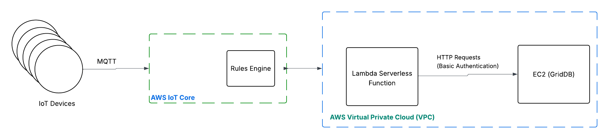
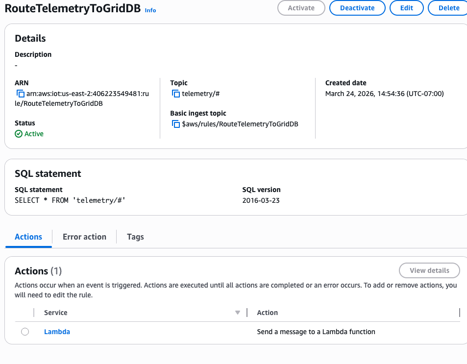
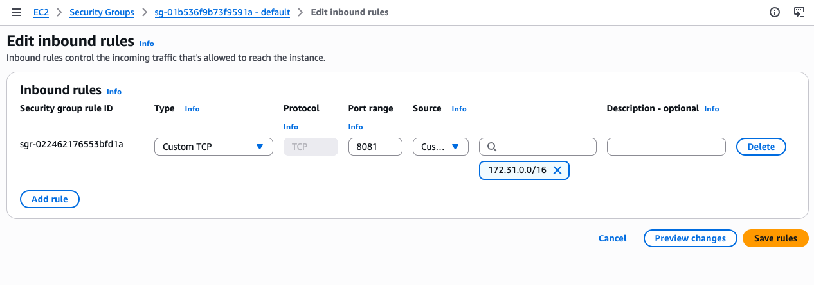
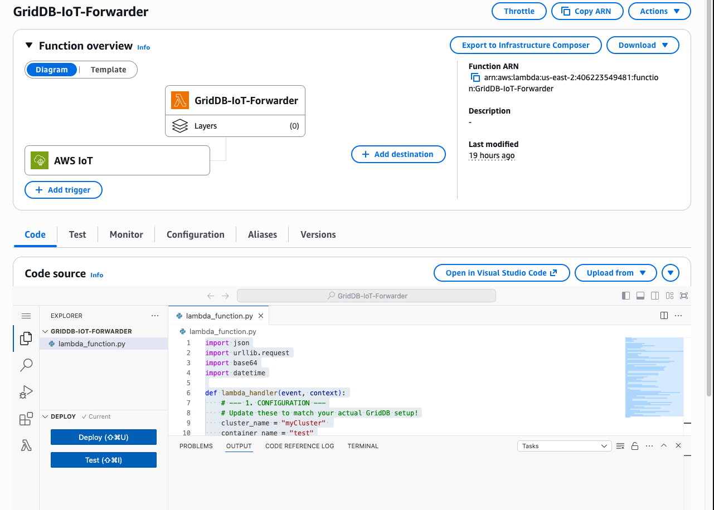
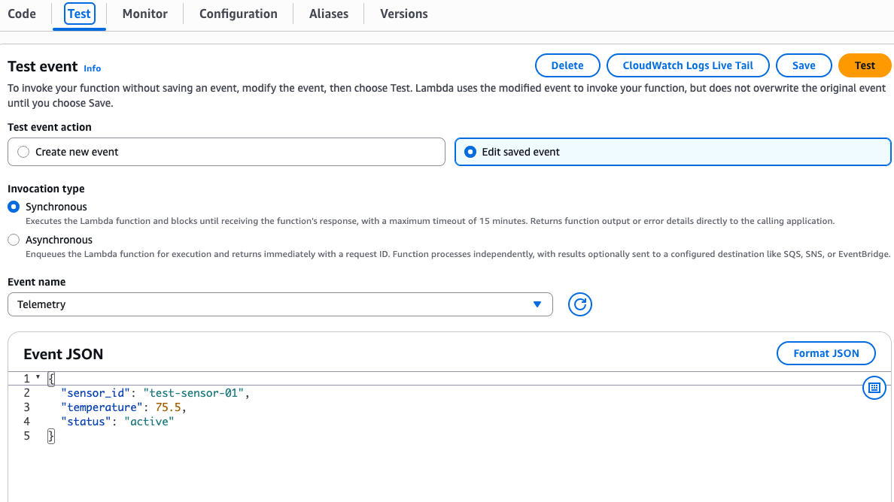
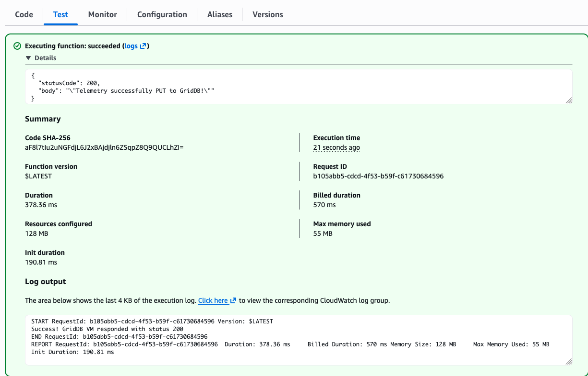
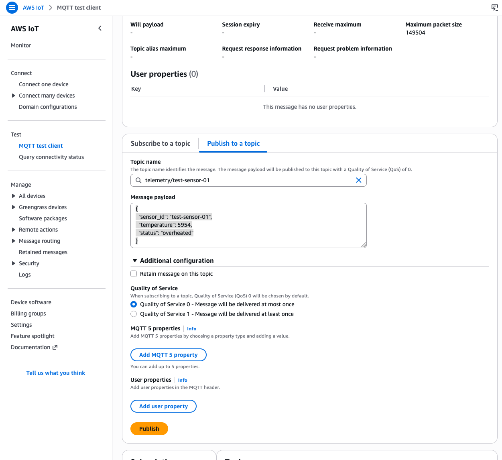

Building an Internet of Things (IoT) platform is increasingly becoming a "cloud" problem. The challenge isn't just in generating the data, it's in catching, processing, and storing the data at scale and maintaining this structure on the cloud makes it easily deployable, scalable, and region-free. 

On top of that, we must also consider security; broadcasting sensor telemetry data by the dozen through the public internet via HTTP can be a huge security risk. So, in this article, we will create a simple IoT, event-driven ingestion pipeline using GridDB on AWS. This article will be similar to a course we made and shared on Udemy: [Create an IoT System with GridDB and Azure IoT Hub](https://www.udemy.com/course/griddb-and-azure-iot-hub/); we will utilize what is known on AWS as `IoT Core` to manage our IoT Devices, AWS Lambda functions for the event handling, and GridDB to store the event data as persistent storage.

## Architecture



As explained above, this pipeline is built using four different AWS services/offerings:

1. AWS IoT Core -- Handles device authentication and helps you keep track of all of your IoT devices (acts as a hub). Also handles the MQTT messages.
2. AWS IoT Rules Engine -- Can be considered a sort of router. Listens for specific MQTT Topics (think Kafka topics!) and triggers the actions based on the payload
3. AWS Lamdba --  A Serverless function which runs inside of the same private VPC which is shared by the virtual machine (EC2). Handles transforming the raw JSON data from the senesors into the GridDB Schema
4. GridDB On EC2 -- GridDB handles the timestamped telemetry data, one container per IoT Device.

## Procedure

To build the proposed ingestion pipeline, you will of course first need to have a free AWS account. Once you have that, you will need to build out the services listed in the previous section. 

### EC2 && VPC

First, create an EC2 virtual machine instance (I used Ubuntu as the OS). Once built, griddb and the griddb web api by installing the griddb-meta package as see in the docs: [https://docs.griddb.net/installation/ubuntu.html](https://docs.griddb.net/installation/ubuntu.html).


When you created your VM, the VPC is also created


This is the VPC we will later share with our Lambda Function to ensure that data can freely and securely move between the IoT Core and our Virtual Machine (GridDB).

### Iot Core && Rules Engine

Next, create an IoT Core and select to create a Rules Engine


Name it whatever you want (I named mine RouteTelemetryToGridDB) and then add the SQL statement as `SELECT * FROM 'telemetry/#'`. This will catch all telemetry published to topics with the word telemetry in it (the '#' acts as a wildcard) and automatically forward that data to our Lambda function.



### Lambda Function

Lastly we will need to create our serverless function which will take the raw JSON telemetry data payloads from the rules engine (from our IoT Devices) and transform them into data structures that will then forward to our EC2 machine which houses our GridDB server to be kept safe and sound in persistent storage. Because our GridDB instance (EC2) lives inside of a virtual private cloud (equivalent to an Azure vnet), we will need to connect our Lambda function to our existing VPC. We will also need to create some networking rule to allow communication through private IP from the Rules Engine to our EC2 instance.

When creating the Lambda function, make sure you select your VPC as connected to this service. Once it's living inside of that same VPC, we simply need to create a networking rule to allow traffic to flow into the EC2 instance on port 8081 (the GridDB Web API default port). To do this, head to your EC2 instance, click on Security Grous and then add an inbound rule. In my case, I needed to set the type as Custom TCP, the port range as 8081, and then source as my VPC's specific CIDR block.



Once this rule is in place, it should allow data to flow into the GridDB Web API from within the VPC, like say from the IoT Core Rules Engine.

#### Lambda Function Python Script

From within the Lambda dashboard, you should have created a function already which is connected to the same VPC as the EC2 instance (where GridDB and the web api is installed). From there, in the code section, share the following script: 

```python
import json
import urllib.request
import base64
import datetime

def lambda_handler(event, context):
    # --- 1. CONFIGURATION ---
    # Update these to match your actual GridDB setup!
    cluster_name = "myCluster" 
    container_name = "test"
    
    # Your exact Private IP and Port
    target_url = f"http://172.31.36.144:8081/griddb/v2/{cluster_name}/dbs/public/containers/{container_name}/rows"
    
    # GridDB Basic Auth setup
    username = "admin"
    password = "admin" 
    auth_string = f"{username}:{password}"
    base64_auth = base64.b64encode(auth_string.encode('utf-8')).decode('utf-8')
    
    # --- 2. PAYLOAD FORMATTING ---
    # Generate a current UTC timestamp formatted for GridDB (ISO 8601 with milliseconds)
    current_time = datetime.datetime.utcnow().strftime('%Y-%m-%dT%H:%M:%S.%fZ')
    
    # Extracting values and placing the timestamp FIRST
    row_data = [
        current_time,                              # Column 1 (TIMESTAMP)
        event.get('sensor_id', 'unknown_sensor'),  # Column 2 (STRING)
        event.get('temperature', 0.0),             # Column 3 (FLOAT)
        event.get('status', 'active')              # Column 4 (STRING)
    ]
    
    # Wrap it in another list to create the array of arrays
    griddb_payload = json.dumps([row_data]).encode('utf-8')
    
    # --- 3. BUILD AND SEND REQUEST ---
    req = urllib.request.Request(
        target_url, 
        data=griddb_payload, 
        method='PUT' # GridDB uses PUT for inserting rows
    )
    
    # Add our required headers
    req.add_header('Content-Type', 'application/json')
    req.add_header('Authorization', f'Basic {base64_auth}')
    
    try:
        # Fire it at the VM
        with urllib.request.urlopen(req, timeout=5) as response:
            # GridDB Web API usually returns empty body on success, but we'll read it just in case
            response_body = response.read().decode('utf-8')
            print(f"Success! GridDB VM responded with status {response.status}")
            return {
                'statusCode': 200, 
                'body': json.dumps('Telemetry successfully PUT to GridDB!')
            }
            
    except urllib.error.HTTPError as e:
        # If we hit this, the network works, but GridDB rejected the payload or auth
        error_body = e.read().decode('utf-8')
        print(f"GridDB API Error: {e.code} - {e.reason} \nDetails: {error_body}")
        return {
            'statusCode': e.code, 
            'body': json.dumps(f"GridDB API Error: {e.reason}")
        }
    except Exception as e:
        # If we hit this, the firewall is blocking us or the VM/Web API is down
        print(f"Network error or VM unreachable: {e}")
        return {
            'statusCode': 500, 
            'body': json.dumps('Failed to reach the GridDB VM')
        }
```

I believe the script with the comments is fairly self-explanatory, but here's some more information. This will take the raw event data from the telemetry data and transform it into the data format the web api expects (a list of lists) and route the traffic using the private internal IP provided by the VPC with the default web api port (8081). With everything we have set up in place, if we run test with a proper JSON body, it should send a row of data to our GridDB instance -- but before we do that, let's create our container.

#### Creating TimeSeries Container with GridDB CLI 

In our script, we are simply calling the container `test`, so let's head to our GridDB CLI and create the container as expected.

```bash
ubuntu@ip-172-31-36-144:~$ sudo su gsadm
gsadm@ip-172-31-36-144:/home/ubuntu$ gs_Sh
gs_Sh: command not found
gsadm@ip-172-31-36-144:/home/ubuntu$ gs_sh
Loading "/var/lib/gridstore/.gsshrc"
The connection attempt was successful(NoSQL).
The connection attempt was successful(NewSQL).
gs[public]> createtimeseries test NO ts timestamp sensor_id string temperature float status string
```

And then once created, you can verify:

```bash
gs[public]> showcontainer test
Database    : public
Name        : test
Type        : TIME_SERIES
Partition ID: 12
DataAffinity: -

Compression Method : NO
Compression Window : -
Row Expiration Time: -
Row Expiration Division Count: -

Columns:
No  Name                  Type            CSTR  RowKey   Compression   
------------------------------------------------------------------------------
 0  ts                    TIMESTAMP(3)    NN    [RowKey]  
 1  sensor_id             STRING                          
 2  temperature           FLOAT                           
 3  status                STRING  
 ```

 And then once we have this, let's just make sure it's empty 

 ```bash
 gs[public]> select * from test;
0 results. (32 ms)
```

#### Deploy and Testing our Python Script

And now let's run the test from within the Lambda dashboard. Once you run Deploy, try Test



When testing, you can use the following JSON (or anything really, just make sure the data model is what the newly made `test` container expects)

    {
    "sensor_id": "test-sensor-01",
    "temperature": 75.5,
    "status": "active"
    }




If you get a successful test, you should have 1 row of data inside of your container



```bash
gs[public]> select * from test;
1 results. (2 ms)
gs[public]> get 1
+--------------------------+----------------+-------------+--------+
| ts                       | sensor_id      | temperature | status |
+--------------------------+----------------+-------------+--------+
| 2026-03-24T21:52:08.893Z | test-sensor-01 | 75.5        | active |
+--------------------------+----------------+-------------+--------+
The 1 results had been acquired.
```

### IoT Core MQTT Testing

Now that we have tested singular payloads of MQTT Data from within the Lambda function, let's try the MQTT Test Client from the IoT Core (remember, our IoT Core acts as our Message Broker -- if you want more information regarding message brokers and publishing to topics etc, please look at our kafka blogs: [https://griddb.net/en/?s=kafka&lang=en](https://griddb.net/en/?s=kafka&lang=en)). 

From within the IoT Core dashboard, click on MQTT Test Client under the Test header on the left-hand side. Select publish to a topic and enter the following: 

topic name: telemetry/test-sensor-01

message payload: 

{
  "sensor_id": "test-sensor-01",
  "temperature": 5954,
  "status": "overheated"
}

Your payload can be whatever you want, but your topic name MUST Include the word telemetry (remember our Rules Engine SQL query for what data will be forwarded?)



And now check your container and see if the data is being received: 

```bash
gs[public]> select * from test where temperature > 400;
60 results. (10 ms)
gs[public]> get 5
+--------------------------+----------------+-------------+------------+
| ts                       | sensor_id      | temperature | status     |
+--------------------------+----------------+-------------+------------+
| 2026-03-25T16:50:10.790Z | test-sensor-01 | 5954.0      | overheated |
| 2026-03-25T16:50:36.850Z | test-sensor-01 | 5954.0      | overheated |
| 2026-03-25T16:51:02.535Z | test-sensor-01 | 5954.0      | overheated |
| 2026-03-25T16:51:11.061Z | test-sensor-01 | 5954.0      | overheated |
| 2026-03-25T16:51:23.516Z | test-sensor-01 | 5954.0      | overheated |
+--------------------------+----------------+-------------+------------+
The 5 results had been acquired.
```