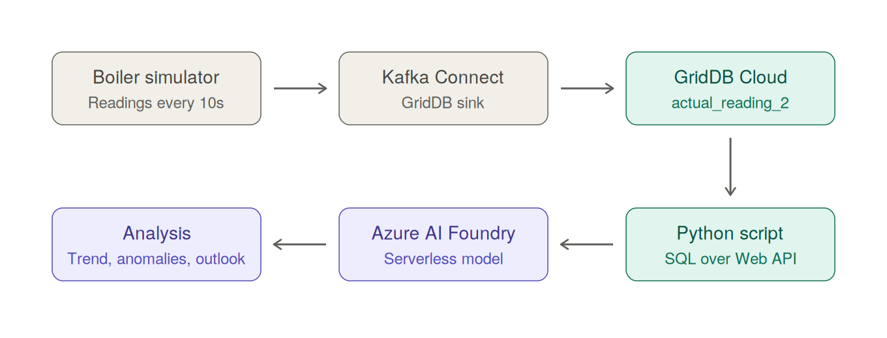
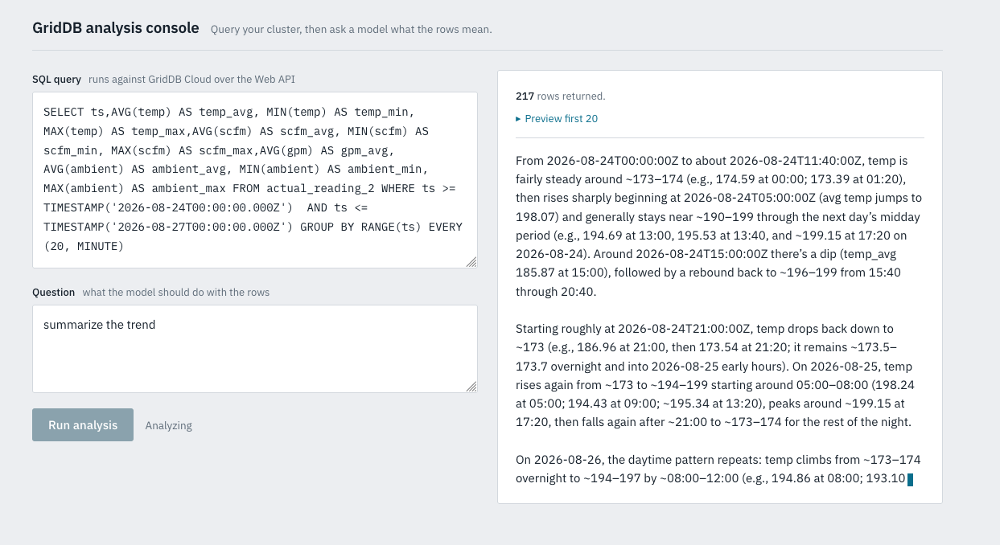

# Analyzing GridDB Cloud Time-Series Data with an LLM on Azure AI Foundry

In this post we'll wire up an LLM running on Azure AI Foundry to time-series data living in GridDB Cloud, and have it do what a data analyst does on a first pass: describe the trends, flag anything that looks off, and give a rough sense of where things are headed. We wanted to keep it simple, so this article will focus solely on bucketed sensor readings in, plain-English analysis out.

GridDB Cloud exposes a Web API, so the script pulls readings over HTTPS with a single SQL statement, formats them as text, and hands them to the model. There's no driver to install and nothing to configure on the read side. If you can make an HTTP request, you can do this.

We'll cover:

1. Setting up a Foundry project and a serverless model deployment
2. Pulling bucketed data from GridDB Cloud through the Web API
3. The analysis script
4. A small web UI on top of it
5. The dataset we ran it against
6. What the model actually found



## Setting up Azure AI Foundry

Create a Foundry project (ours is called `griddb-llm`) and deploy a model. We ended up on `gpt-5.4-nano` as a serverless deployment.

One thing worth knowing before you start: model availability depends on quota, and quota is regional. When we first tried to deploy the larger GPT models, the Azure OpenAI resource had no Global Standard capacity in any region, and the one deployment that did succeed came through as Global Batch, which can't serve live requests. Serverless deployments sidestep that. They're pay-per-token and don't draw from your regional quota, so if you hit the same wall, that's the route.

Once deployed, grab three things from the project's overview page:

- The endpoint. For serverless it looks like `https://<resource>.services.ai.azure.com/openai/v1`
- An API key
- The deployment name

Serverless deployments speak the OpenAI-compatible API, so the standard `openai` Python client works unchanged. You just point `base_url` at the Foundry endpoint:

```python
import os
from openai import OpenAI

client = OpenAI(
    base_url=os.environ["FOUNDRY_ENDPOINT"],
    api_key=os.environ["FOUNDRY_KEY"],
)
```

That's the entire Foundry integration. Everything else is prompt design.

## Pulling data from GridDB Cloud via the Web API

GridDB Cloud's Web API accepts SQL over HTTPS. You POST a JSON array of statements to the `sql/select` endpoint with basic auth and get JSON back. Here's the query we use, with time bucketing done server-side:

```sql
SELECT ts,
       AVG(temp) AS temp_avg, MIN(temp) AS temp_min, MAX(temp) AS temp_max,
       AVG(scfm) AS scfm_avg, MIN(scfm) AS scfm_min, MAX(scfm) AS scfm_max,
       AVG(gpm) AS gpm_avg,
       AVG(ambient) AS ambient_avg, MIN(ambient) AS ambient_min, MAX(ambient) AS ambient_max
FROM actual_reading_2
WHERE ts >= TIMESTAMP('2026-08-24T00:00:00.000Z')
  AND ts <= TIMESTAMP('2026-08-27T00:00:00.000Z')
GROUP BY RANGE(ts) EVERY (5, MINUTE)
```

`GROUP BY RANGE(ts) EVERY (5, MINUTE)` is GridDB's time-bucketing clause. It collapses raw 10-second readings into 5-minute buckets, which matters for two reasons. A three-day window at 10-second resolution is about 26,000 rows, far more than you want in a prompt. And the min/max columns give the model intra-bucket spread, so it can tell the difference between a metric that's steady and one that's swinging inside each bucket but averaging out flat.

The request itself:

```python
import requests

r = requests.post(
    f"{GRIDDB_BASE}/dbs/{DB}/sql/select",
    auth=(os.environ["GRIDDB_USER"], os.environ["GRIDDB_PASS"]),
    headers={
        "Content-Type": "application/json",
        "User-Agent": "curl/8.5.0",
    },
    json=[{"stmt": query}],
    timeout=60,
)
```

A few gotchas we hit:

The WAF in front of GridDB Cloud rejects the default `python-requests` user agent with a 403. Set `User-Agent` to something else. Any value works; we used curl's.

Errors come back as a dict with an `errorMessage` key, while successful queries return a list. Check the shape before indexing into it.

`RANGE` grouping tacks a trailing bucket with a null timestamp onto the results, which you'll want to drop.

The response has a `columns` array and a `results` array. We zip them into `name=value` pairs per row, one row per line. That's the text the model reads.

## The analysis script

With the data fetched and formatted, the script is short. Fetch, format, prompt, print. The full file is about 150 lines and is linked at the end of the post. The part that matters is the prompt.

The system prompt sets the role and the boundaries:

```
You are an industrial data analyst reviewing water-boiler time-series
data from GridDB. Give qualitative judgments only: trends, anomalies,
and direction. Do not produce precise numeric forecasts. Say plainly
where you lack system context.
```

The user prompt describes the columns, explains what min/max mean, includes the data, and asks for three things:

1. **Trend.** What each metric is doing across the window, with any cycle or rate claims scaled to the actual bucket size.
2. **Anomalies.** What looks abnormal. We tell it that a flat value might be a controlled setpoint rather than a fault, and ask it to say which it thinks it is. We also ask it to separately flag any metric with zero min/max spread across the entire window, since that usually means a placeholder or unwired sensor.
3. **Outlook.** A brief qualitative expectation for the near term.

The bucket size is a single constant used by both the query and the prompt text, so the model can never be told a granularity the query didn't actually produce. That sounds minor, but it's the kind of mismatch that quietly produces confident nonsense.

We run with `temperature=0.2` and `max_completion_tokens=4096`. The token limit matters more than you'd think. Our first runs at 500 tokens truncated mid-sentence before reaching the anomalies section.

## A small web UI on top of it

The script is fine for a terminal, but it hardcodes one query and one question. To try different windows, different containers, or a different ask without editing Python, we put a thin web page in front of it.



The page is two text boxes and a button. The left box is the SQL, which runs against GridDB Cloud exactly as the script does. The right box is the question, which becomes the user prompt. Hit Run analysis and the page first executes the query, then hands the rows plus your question to the model, and prints the reply in the results pane on the right.

Nothing about the pipeline changes. The UI calls the same fetch and prompt functions as the script; it just takes the query and the question from the form instead of from constants. That means anything you learn in the console (a bucket size that works, a question phrasing that gets better anomaly reports) drops straight back into the script. The backend is [FRAMEWORK] and lives in the same repo.

## The dataset

The data comes from a simulated commercial water boiler: a 50-gallon tank with a modulating burner, feeding hot water to a building on a weekday shift schedule. Every 10 simulated seconds it publishes temperature, burner airflow (`scfm`), water draw (`gpm`), and ambient temperature into GridDB Cloud through a Kafka Connect sink.

The sim has the structure a real plant would have. The setpoint drops to 175°F at 9pm and rises to 200°F at 5am. Demand ramps through the morning, spikes at lunch, and falls off after 7pm. Ambient follows a daily cycle with some weather drift on top.

It also injects faults at random: a burner that partially loses combustion efficiency, a valve stuck open, a temperature sensor that stops updating, a burner that shuts off entirely, a thermostat that drifts upward. Each one gets logged with start and end timestamps to a file. That log is the answer key. The model never sees it.

We ran the sim at 60x speed and generated seven weeks of data in a few hours of wall clock. For the analysis below, we used the first three days.

## What the model found

This is the interesting part. The model was given 865 rows of numbers, the column names, and the phrase "water boiler." No schedule, no fault types, no description of the plant. Here's some of what came back.

On the daily cycle:

> **00:00 to ~05:00:** Mostly stable around the low-to-mid 170s with small intra-bucket spread. **~05:00 to ~11:30:** Clear step-up to ~198 to 195°F band (temp_avg jumps sharply at ~05:00). **~21:00 to ~23:55:** Temperature falls back to ~173°F and stays there with small intra-bucket spread (consistent with a different operating mode).

That's the night setback schedule, reconstructed from the data. It even pinned the 21:00 transition, which is exactly when the setpoint drops.

On the lunch demand block:

> **~11:30 to ~12:55:** scfm is pegged at 7000 (min/max both 7000 for long stretches). This is very likely saturation/limit behavior or a control/measurement ceiling, not normal cycling.

Correct. That's the burner at maximum output trying to keep up with the peak draw. It's not a fault, and the model said so, calling it a limit rather than a failure.

On the one thing that actually broke:

> **~15:15 to ~15:30:** Temperature collapses dramatically (to ~155 then ~112 then ~97) while scfm goes 0. This looks like a shutdown / loss of heat input / major control event. Note: gpm remains nonzero during this period, so the system is still moving water but not heating effectively.

The fault log has `burner_failure` from 15:14:20 to 15:28:10 on that day. The timestamps match to within a bucket, and the mechanism it described (burner off, water still flowing, tank dumping heat) is exactly what happened.

It also flagged a single bucket at the very end of the window where `temp_avg`, `temp_min`, and `temp_max` were identical, and hedged that it might be a single-point artifact rather than a stuck sensor. Fair call with one data point.

## What it didn't find

The three-day window had nine injected faults. The model caught one burner failure and missed the rest: two more burner failures, a 43-minute sensor flatline, a thermostat drift, two stuck valves, and a burner derate. There were also a few scheduled maintenance events, which the model didn't call out either.

Some of those are genuinely hard to see from a single series. A burner derate shows up as the boiler working a bit harder than it should for the same output, which you can't spot without knowing what "should" looks like. A stuck valve is a `gpm` reading that's high but not impossible. And the flatline sat inside a window where the model had already found plenty of other structure to describe.

This is the case for the digital twin. In a previous post we ran a second copy of the same simulation with no faults injected, writing to its own container. Subtract the twin from the actual and every one of those misses becomes a visible divergence: a derate is a persistent efficiency gap, a flatline is one series frozen while the other moves, a stuck valve is `gpm` diverging from the modeled demand. Same model, same prompt, but the input is the residual instead of the raw series. That's the version that turns "isn't it neat" into something you'd run in production, and it's where we're headed next.

## Conclusion

The whole thing is one SQL query over the GridDB Cloud Web API, one prompt, and about 150 lines of Python. From nothing but bucketed numbers, the model reconstructed the plant's operating schedule, correctly identified a burner running at its limit under peak load, and caught a burner failure to within five minutes. For a first-pass analysis of unfamiliar time-series data, that's a lot of signal for very little setup.
