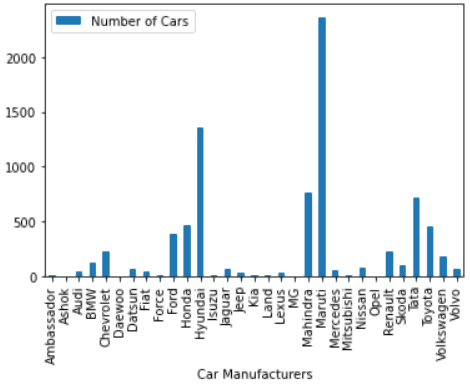

# Using-GridDB-to-analyze-the-methane-gas-emissions-globally
Methane is a colorless, odorless gas that occurs abundantly in nature and as a product of certain human activities. Methane is the simplest member of the paraffin series of hydrocarbons and is among the most potent of greenhouse gases. Its chemical formula is [CH4](https://www.britannica.com/science/methane).

Due to its status as a greenhouse gas, methane affects the planet's temperature and climate. There are two different categories of its emission sources: natural and human-induced. Some examples of human-induced emissions sources include landfills, oil and natural gas systems, industrial processes, coal mining, stationary and mobile combustion, wastewater treatment, and agricultural activities. Natural sources include the breakdown or decay of organic material, such as the breakdown of plant material in wetlands, the seepage of gas from underground deposits, or the digestion of food by cattle.


Given our understanding of methane gas and its causes above, we will now use GridDB to read, store, and access a sizable dataset for our analysis.

**Exporting and Importing dataset using GridDB:**

GridDB is a highly scalable and optimized in-memory No SQL database that allows parallel processing for higher performance and efficiency, especially for time-series databases. We will be using GridDB's node js client, which allows us to connect GridDB to node js and import or export data in real-time.

The following columns are present in our dataset:

1. Country : Name of the country for responsible for emissions.
2. Sector : Name of the energy sector responsible for the emissions.
3. Gas : Name of the gas.
4. Unit : Unit to measure the emissions.
5. 2018 : Data gathered for 2018 emissions
6. 2017 : Data gathered for 2017 emissions.
7. 2016 : Data gathered for 2016 emissions.

 .

 .

 .

33. 1990 : Data gathered for 1990 emissions.


Exporting Dataset into GridDB:

To upload the dataset to GridDB, we would read the CSV file that contains the data which is taken from this [Kaggle Dataset](https://www.kaggle.com/datasets/kkhandekar/methane-emissions-across-the-world-19902018?select=methane_hist_emissions.csv).

For data visualization and analysis, we will use the DanfoJS library to work with DataFrames.


```javascript
var griddb = require('griddb_node');

const dfd = require("danfojs-node")
const csv = require('csv-parser');

const fs = require('fs');
var lst = []
var lst2 = []
var i =0;
fs.createReadStream('./Dataset/methane_hist_emissions.csv')
  .pipe(csv())
  .on('data', (row) => {
    lst.push(row);
    console.log(lst);

  })

```

We generate the GridDB container and pass the database schema to insert our data.

```javascript
const conInfo = new griddb.ContainerInfo({
    'name': "methaneanalysis",
    'columnInfoList': [
      ["name", griddb.Type.STRING],
      ["Country", griddb.Type.STRING],
        ["Sector", griddb.Type.STRING],
        ["Gas", griddb.Type.STRING],
        ["Unit", griddb.Type.STRING],
        ["2018", griddb.Type.DOUBLE],
        ["2017", griddb.Type.DOUBLE],
        ["2016", griddb.Type.DOUBLE],
        ["2015", griddb.Type.DOUBLE],
        ["2014", griddb.Type.DOUBLE],
        ["2013", griddb.Type.DOUBLE],
        ["2012", griddb.Type.DOUBLE],
        ["2011", griddb.Type.DOUBLE],
        ["2010", griddb.Type.DOUBLE],
        ["2009", griddb.Type.DOUBLE],
        ["2008", griddb.Type.DOUBLE],
        ["2007", griddb.Type.DOUBLE],
        ["2006", griddb.Type.DOUBLE],
        ["2005", griddb.Type.DOUBLE],
        ["2004", griddb.Type.DOUBLE],
        ["2003", griddb.Type.DOUBLE],
        ["2002", griddb.Type.DOUBLE],
        ["2001", griddb.Type.DOUBLE],
        ["2000", griddb.Type.DOUBLE],
        ["1999", griddb.Type.DOUBLE],
        ["1998", griddb.Type.DOUBLE],
        ["1997", griddb.Type.DOUBLE],
        ["1996", griddb.Type.DOUBLE],
        ["1995", griddb.Type.DOUBLE],
        ["1994", griddb.Type.DOUBLE],
        ["1993", griddb.Type.DOUBLE],
        ["1992", griddb.Type.DOUBLE],
        ["1991", griddb.Type.DOUBLE],
        ["1990", griddb.Type.DOUBLE]
    ],
    'type': griddb.ContainerType.COLLECTION, 'rowKey': true
});

// Inserting data into the GridDB
var container;
    var idx = 0;
    
    for(let i=0;i<lst.length;i++){


    store.putContainer(conInfo, false)
        .then(cont => {
            container = cont;
            return container.createIndex({ 'columnName': 'name', 'indexType': griddb.IndexType.DEFAULT });
        })
        .then(() => {
            idx++;
            container.setAutoCommit(false);
            return container.put([String(idx), lst[i]['Country'],lst[i]["Sector"],lst[i]["Gas"],lst[i]["Unit"],lst[i]["2018"],lst[i]["2017"],lst[i]["2016"],lst[i]["2015"],lst[i]["2014"],lst[i]["2013"],lst[i]["2012"],lst[i]["2011"],lst[i]["2010"],lst[i]["2009"],lst[i]["2008"],lst[i]["2007"],lst[i]["2006"],lst[i]["2005"],lst[i]["2004"],lst[i]["2003"],lst[i]["2002"],lst[i]["2001"],lst[i]["2000"],lst[i]["1999"],lst[i]["1998"],lst[i]["1997"],lst[i]["1996"],lst[i]["1995"],lst[i]["1994"],lst[i]["1993"],lst[i]["1992"],lst[i]["1991"],lst[i]["1990"]]);
        })
        .then(() => {
            return container.commit();
        })
       
        .catch(err => {
            if (err.constructor.name == "GSException") {
                for (var i = 0; i < err.getErrorStackSize(); i++) {
                    console.log("[", i, "]");
                    console.log(err.getErrorCode(i));
                    console.log(err.getMessage(i));
                }
            } else {
                console.log(err);
            }
        });
    
    }

```

Importing Dataset from GridDB:

To import the dataset from the GridDB platform, we will use TQL, GridDB's query language similar to SQL. First, we will create a container and store the fetched data. The next step would be to extract the rows in order of the column info and save it into a data frame for data visualization and analysis.

```javascript
# Get the containers
obtained_data = gridstore.get_container("methaneanalysis")
    
# Fetch all rows - language_tag_container
query = obtained_data.query("select *")

# Creating Data Frame variable
let df = await dfd.readCSV("./out.csv")
```

We have successfully imported dataset from GridDB.

**Data Analysis:**

We now check and load our dataset to conduct data analysis.

Starting with our data analysis, we would check the number of rows and columns in our dataset.

We have 1738 rows and 33 columns.

```javascript

console.log(df.shape)

//  Output
// [ 1738, 33 ]
```

The gas column contains a redundant value of CH4, and the unit column contains MTCO2e. As a result, these two columns are removed from the analysis. Let's take a look at the column names as well as the data types to get a sense of what the data represents:

```javascript

console.log(df.columns)

// Output
// ['Country','Sector', '2018', '2017', '2016', '2015', '2014', '2013', '2012', '2011', '2010', '2009', '2008', '2007', '2006', '2005', '2004', '2003', '2002', '2001', '2000', '1999', '1998','1997', '1996', '1995', '1994', '1993', '1992', '1991', '1990' ]
```

```javascript
df.loc({columns:['Country',
'Sector', 
'2018','2017', '2016', '2015', '2014', '2013', '2012', '2011', '2010', '2009', '2008', '2007', '2006', '2005', '2004', 
'2003', '2002', '2001', '2000', '1999', '1998','1997', '1996', '1995', '1994', '1993', '1992', '1991', '1990' ]}).ctypes.print()

//  Output
// ╔══════════════════════╤═════════╗
// ║ Country              │ object  ║
// ╟──────────────────────┼─────────╢
// ║ Sector               │ object  ║
// ╟──────────────────────┼─────────╢
// ║ 2018                 │ float64 ║
// ╟──────────────────────┼─────────╢
// ║ 2017                 │ float64 ║
// ╟──────────────────────┼─────────╢
// ║ 2016                 │ float64 ║
// ╟──────────────────────┼─────────╢
// ║ 2015                 │ float64 ║
// ╟──────────────────────┼─────────╢
// ║ 2014                 │ float64 ║
// ╟──────────────────────┼─────────╢
// ║ 2013                 │ float64 ║
// ╟──────────────────────┼─────────╢
// ║ 2012                 │ float64 ║
// ╟──────────────────────┼─────────╢
// ║ 2011                 │ float64 ║
// ╟──────────────────────┼─────────╢
// ║ 2010                 │ float64 ║
// ╟──────────────────────┼─────────╢
// ║ 2009                 │ float64 ║
// ╟──────────────────────┼─────────╢
// ║ 2008                 │ float64 ║
// ╟──────────────────────┼─────────╢
// ║ 2007                 │ float64 ║
// ╟──────────────────────┼─────────╢
// ║ 2006                 │ float64 ║
// ╟──────────────────────┼─────────╢
// ║ 2005                 │ float64 ║
// ╟──────────────────────┼─────────╢
// ║ 2004                 │ float64 ║
// ╟──────────────────────┼─────────╢
// ║ 2003                 │ float64 ║
// ╟──────────────────────┼─────────╢
// ║ 2002                 │ float64 ║
// ╟──────────────────────┼─────────╢
// ║ 2001                 │ float64 ║
// ╟──────────────────────┼─────────╢
// ║ 2000                 │ float64 ║
// ╟──────────────────────┼─────────╢
// ║ 1999                 │ float64 ║
// ╟──────────────────────┼─────────╢
// ║ 1998                 │ float64 ║
// ╟──────────────────────┼─────────╢
// ║ 1997                 │ float64 ║
// ╟──────────────────────┼─────────╢
// ║ 1996                 │ float64 ║
// ╟──────────────────────┼─────────╢
// ║ 1995                 │ float64 ║
// ╟──────────────────────┼─────────╢
// ║ 1994                 │ float64 ║
// ╟──────────────────────┼─────────╢
// ║ 1993                 │ float64 ║
// ╟──────────────────────┼─────────╢
// ║ 1992                 │ float64 ║
// ╟──────────────────────┼─────────╢
// ║ 1991                 │ float64 ║
// ╟──────────────────────┼─────────╢
// ║ 1990                 │ float64 ║
// ╚══════════════════════╧═════════╝
```

We will now look at a summary of statistics for the columns mentioned below to check their minimums, maximums, means, standard deviations, etc.

```javascript
df.loc({columns:['2018', '2017', '2016', '2015', '2014', '2013']}).describe().round(2).print()


// Output
// ╔════════════╤═══════════════════╤═══════════════════╤═══════════════════╤═══════════════════╤═══════════════════╤═══════════════════╗
// ║            │ 2018              │ 2017              │ 2016              │ 2015              │ 2014              │ 2013              ║
// ╟────────────┼───────────────────┼───────────────────┼───────────────────┼───────────────────┼───────────────────┼───────────────────╢
// ║ count      │ 1738              │ 1738              │ 1738              │ 1738              │ 1738              │ 1738              ║
// ╟────────────┼───────────────────┼───────────────────┼───────────────────┼───────────────────┼───────────────────┼───────────────────╢
// ║ mean       │ 17.20             │ 17.07             │ 16.98             │ 17.10             │ 16.94             │ 16.65             ║
// ╟────────────┼───────────────────┼───────────────────┼───────────────────┼───────────────────┼───────────────────┼───────────────────╢
// ║ std        │ 77.35             │ 77.15             │ 77.08             │ 77.09             │ 75.98             │ 74.64             ║
// ╟────────────┼───────────────────┼───────────────────┼───────────────────┼───────────────────┼───────────────────┼───────────────────╢
// ║ min        │ 0.00              │ 0.00              │ 0.00              │ 0.00              │ 0.00              │ 0.00              ║
// ╟────────────┼───────────────────┼───────────────────┼───────────────────┼───────────────────┼───────────────────┼───────────────────╢
// ║ median     │ 0.82              │ 0.82              │ 0.83              │ 0.83              │ 0.84              │ 0.83              ║
// ╟────────────┼───────────────────┼───────────────────┼───────────────────┼───────────────────┼───────────────────┼───────────────────╢
// ║ max        │ 1238.95           │ 1239.28           │ 1242.43           │ 1237.80           │ 1206.51           │ 1178.21           ║
// ╟────────────┼───────────────────┼───────────────────┼───────────────────┼───────────────────┼───────────────────┼───────────────────╢
// ║ variance   │ 5983.40           │ 5951.64           │ 5942.20           │ 5942.84           │ 5773.28           │ 5571.78           ║
// ╚════════════╧═══════════════════╧═══════════════════╧═══════════════════╧═══════════════════╧═══════════════════╧═══════════════════╝
```
  
Now, we use a bar chart and a pie chart to visualize the distributions.


Bar Chart:

```javascript
## Distribution of Column Values
const { Plotly } = require('node-kernel');
let cols = df.columns
for(let i = 0; i < cols.length; i++)
{
    let data = [{
        x: cols[i],
        y: df[cols[i]].values,
        type: 'bar'}];
    let layout = {
        height: 400,
        width: 700,
        title: 'Global Methane Gas Emissions for the years (2018 - 1990)' +cols[i],
        xaxis: {title: cols[i]}};
    // There is no HTML element named `myDiv`, hence the plot is displayed below.
    Plotly.newPlot('myDiv', data, layout);
}
df.plot("plot_div").bar()

```



The bar chart at the top shows that methane gas emissions have been increasing over time, with the highest peak occurring in 2018.


Pie Chart:

To determine which nation is the largest global contributor to methane emissions, we will plot a pie chart to examine the methane emissions for 2018 for three nations: China, the United States, and Russia.

```javascript
const { Plotly } = require('node-kernel');
Values: [sum_2018_US, sum_2018_China, sum_2018_Russia],
Name: ["United States", "China", "Russia"]

 df.plot("plot_div").pie({ config: { values: "Values", labels: "Name" } });
 
```


According to the pie chart, China has the highest methane emissions among the three countries listed above for 2018.


**Conclusion:**

The main reason for the rise in methane emissions is increased human-induced activities. As we all know, this has prompted the rise in global warming, resulting in the climate changes that we have observed globally over time. Therefore, if human-induced activities aren't slowed down, we will soon move closer to an unlivable environment.

Finally, all this data analysis was done using GridDB because it facilitated quick access and effective reading, writing, and storing data.
