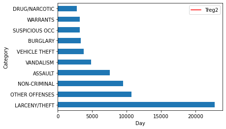
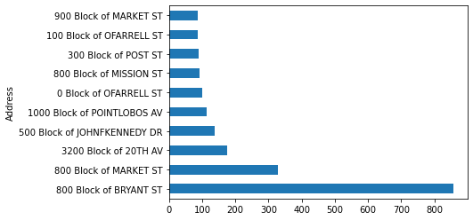
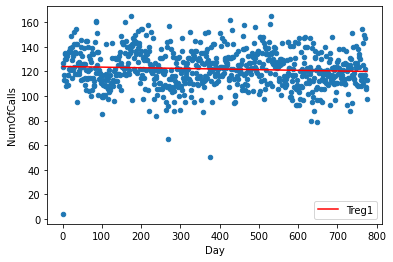
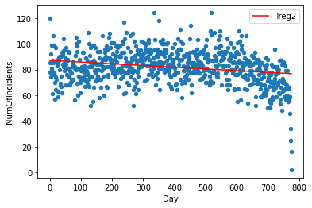

# Using datascience to catch criminals and find new ways to contribute more to social good

The power of data science is not limited to solving technical or business issues. Its usage is not limited to data analytics to create new technologies, target ads to consumers, and maximize profits and sales in business. The concept of open science has led organizations to use data to handle social problems. It can offer a statistical and data-driven solution to hidden human behavior and cultural patterns.

We will be using data from the San Frisco crime department to understand the relation between civilian-reported incidents of crime and police-reported incidents of crime. To store and readily access a large amount of data, we will be using GridDB as our database platform.

**Exporting and Import dataset using GridDB:**

GridDB is a highly scalable and in-memory No SQL database that allows parallel processing for higher performance and efficiency. It is optimized for time-series databases for IoT and big data technologies. Using GridDB&#39;s python client, we can easily connect GridDB to python and use it to import or export data in real-time.

Libraries:

We will be using some python libraries to preprocess and analyze the data visually.

1. Pandas: Vastly used python library, especially when dealing with data frames.
2. Matplotlib: Primary library to present data visually using basic plots
3. Numpy: Python library to handle data involving mathematical calculations

Preprocessing:

We have two datasets available for crime data, one containing information about police-reported crimes while the other contains information about the calls received by the police department by people to report those crimes.

```
incidents = pd.read_csv("datasets/downsample_police-department-incidents.csv")
calls = pd.read_csv("datasets/downsample_police-department-calls-for-service.csv")
```
The datasets are now saved in the form of a data frame into the variables &quot;incidents&quot; and &quot;calls&quot;.

The datasets contain a few columns that are not significant in our analysis so we would be removing them from the data frames to minimize the memory consumption and maximize the time efficiency of our analysis.

```
incidents = incidents.drop(['IncidntNum', 'Time', 'X', 'Y', 'Location', 'PdId'], axis = 1)
calls = calls.drop(['Crime Id', 'Report Date', 'Offense Date', 'Call Time', 'Call Date Time', 
                        'Disposition', 'Address', 'City', 'State', 'Agency Id','Address Type', 
                        'Common Location'], axis = 1)
```
These are the columns remaining in the data frames that we would be using in our analysis:

Incident dataframe:

1. Category: The type of crime
2. Descript: Description of the crime incident that occurred
3. DayOfWeek: The day on which the crime took place
4. Date: The date on which the crime took place
5. PdDistrict: The district of San Frisco where the crime took place
6. Resolution: The action taken against the crime
7. Address: Exact location where the crime took place

Calls dataframe:

1. Descript: Description of the crime as described by the reporter
2. Date: The date of receiving the reporting call.

We will also need to introduce a primary key column in both of the dataframes so that we can track each row individually. We will reset the index and rename it to &#39;ID&#39;.

```
incidents.reset_index(drop=True, inplace=True)
incidents.index.name = 'ID'
incidents.dropna(inplace = True)
    
    
calls.reset_index(drop=True, inplace=True)
calls.index.name = 'ID'
calls.dropna(inplace = True)
```
After completing our cleaning process, we will save the dataframes as CSV files on our local drive that would be then uploaded to GridDB.

```
#save it into csv
incidents.to_csv("preprocessed_incidents.csv")
calls.to_csv("preprocessed_calls.csv")
```
Exporting Dataset into GridDB:

The next step is to upload the data to GridDB. For that, we will read the preprocessed CSV file using pandas and save it to individual dataframes.

```
#read the cleaned data from csv
incident_processed = pd.read_csv("preprocessed_incidents.csv")
calls_processed = pd.read_csv("preprocessed_calls.csv")
```
We will create two different containers to pass our column info to the GridDB to be able to generate the design of the two databases before inserting the row information.

```
#Create container 
incident_container = "incident_container"

# Create containerInfo
incident_containerInfo = griddb.ContainerInfo(incident_container,
                    [["ID", griddb.Type.INTEGER],
        		    ["Category", griddb.Type.STRING],
         		    ["Descript", griddb.Type.STRING],
                    ["DayOfWeek", griddb.Type.STRING],
                    ["Date", griddb.Type.TIMESTAMP],
         		    ["PdDistrict", griddb.Type.STRING],
                    ["Resolution", griddb.Type.STRING]],
                    griddb.ContainerType.COLLECTION, True)
    
incident_columns = gridstore.put_container(incident_containerInfo)
```
```
#Create container 
calls_container = "calls_container"

# Create containerInfo
calls_containerInfo = griddb.ContainerInfo(calls_container,
                    [["ID", griddb.Type.INTEGER],
         		    ["Descript", griddb.Type.STRING],
                    ["Date", griddb.Type.TIMESTAMP]],
                    griddb.ContainerType.COLLECTION, True)
    
calls_columns = gridstore.put_container(calls_containerInfo)
```
Finally, we will insert the rows into the schema created.

```
# Put rows
incident_columns.put_rows(incident_processed)
    
print("Data Inserted using the DataFrame")
```
```
# Put rows
calls_columns.put_rows(calls_processed)
    
print("Data Inserted using the DataFrame")
```
Importing Dataset from GridDB:

We will use TQL to query the data from the GridDB database that is similar to SQL commands. Before fetching the data, we would create the containers to extract rows of data before saving it into dataframes.

```
# Define the container names
    incident_container = "incident_container"

    # Get the containers
    obtained_data = gridstore.get_container(incident_container)
    
    # Fetch all rows - language_tag_container
    query = obtained_data.query("select *")
    
    rs = query.fetch(False)
    print(f"{incident_container} Data")
```
```
# Define the container names
    call_container = "call_container"

    # Get the containers
    obtained_data = gridstore.get_container(call_container)
    
    # Fetch all rows - language_tag_container
    query = obtained_data.query("select *")
    
    rs = query.fetch(False)
    print(f"{call_container} Data")
```
The last step for our extraction of data would be to query the rows in order of the column info and save it into the dataframes to use for data visualization and analysis.

```
# Iterate and create a list
    retrieved_data= []
    while rs.has_next():
        data = rs.next()
        retrieved_data.append(data)

# Convert the list to a pandas data frame
    incidents = pd.DataFrame(retrieved_data,
                        columns=['ID', 'Category', 'Descript', 'DayOfWeek', 'Date', 
                                 'PdDistrict', 'Resolution','Address'])
```
```
# Iterate and create a list
    retrieved_data= []
    while rs.has_next():
        data = rs.next()
        retrieved_data.append(data)

    # Convert the list to a pandas data frame
    calls = pd.DataFrame(retrieved_data,
                        columns=['ID', 'Descript', 'Date'])
```
Our cleaned data is now available for data analysis saved as two dataframes, &quot;incidents&quot; and &quot;calls&quot;.

**Data Analysis and Visualization:**

We will begin our analysis by introducing a column consisting of Null or zero values that will help us in keeping a count of our grouping data.

```
incidents['NumOfIncidents'] = np.zeros(len(incidents))
calls['NumOfCalls'] = np.zeros(len(calls))
```
The crimes reported belong to different categories while reported by the police themselves. Let&#39;s dive into the data and take a look at some major crimes that take place in San Frisco.

```
incident_categories = incidents.groupby(["Category"]).count()
n_largest = incident_categories['NumOfIncidents'].nlargest(n=10)
incident_categories.reset_index(inplace = True)
incident_categories = incident_categories[["Category","NumOfIncidents"]]
n_largest.plot(kind = 'barh')
plt.show()
```


We can see that most of the crimes that take place in San Frisco are related to Theft. Taking this investigation further, we can also explore the areas where this particular crime takes place mostly.

```
Theft_address = incidents[incidents['Category']=="LARCENY/THEFT"]
Theft_address = Theft_address.groupby(["Address"]).count()
n_largest = Theft_address['NumOfIncidents'].nlargest(n=10)
Theft_address.reset_index(inplace = True)
Theft_address = Theft_address[["Address","NumOfIncidents"]]
n_largest.plot(kind = 'barh')
plt.show()
```


We will now explore the daily calls and daily incidents reported by the police individually to get an insight into how the values of daily incidents and daily calls are changing over time. By removing the Date column from the key, the result is a long and narrow data frame with multiple rows for each date observation in both cases.

```
daily_incidents = incidents.groupby(["Date"]).count()
daily_incidents.reset_index(inplace = True)
daily_incidents = daily_incidents[["Date","NumOfIncidents"]]


daily_calls = calls.groupby(["Date"]).count()
daily_calls.reset_index(inplace = True)
daily_calls = daily_calls[["Date","NumOfCalls"]]
```
Next, we will merge both dataframes on the Date column to get the values of calls and incidents over a particular date in a single dataframe.

```
shared_dates = pd.merge(daily_incidents, daily_calls, on='Date', how = 'inner')
```
Let&#39;s plot both the columns on a scatterplot and apply a linear regression model to get a line of the pattern shown by our data. For that we will fit or data to the regression model first, plot a scatter plot using the data points, and then plot a line using the data points obtained by our model and saved as &quot;Treg1&quot;.

```
d1 = np.polyfit(shared_dates.index,shared_dates['NumOfCalls'],1)
f1 = np.poly1d(d1)
shared_dates.insert(3,'Treg1',f1(shared_dates.index))
ax = shared_dates.plot.scatter(x = 'Day', y='NumOfCalls')
shared_dates.plot(y='Treg1',color='Red',ax=ax)
```



Similarly, we will create another linear model for our second column and save the model data points in the column &quot;Treg2&quot;

```
d2 = np.polyfit(shared_dates.index,shared_dates['NumOfIncidents'],1)
f2 = np.poly1d(d2)
shared_dates.insert(4,'Treg2',f2(shared_dates.index))
ax = shared_dates.plot.scatter(x='Day' ,y='NumOfIncidents')
shared_dates.plot(y='Treg2',color='Red',ax=ax)
```


To further investigate and quantify the relationship between the two variables, we will use the correlation coefficient technique. We will be using the Pearson correlation coefficient which is the most simple and used coefficient in statistics. It varies from -1 to +1, -1 being a strong negative correlation and +1 being a strong positive correlation. It is used as the default variable by the python function &#39;corr&#39;.

```
correlation = shared_dates['NumOfIncidents'].corr(shared_dates['NumOfCalls'])
```
The correlation coefficient is 0.1469688, which indicates a very weak positive correlation between the two variables.

**Conclusion:**

We can conclude that statistically, the number of incidents that are reported by the police is not dependent on the calls received by them reporting the crime. Also, we extracted some highly insecure areas of San Frisco that requires extra security by the police. All of the analysis was done using the GridDB database at the backend which made the integration seamless and efficient.
