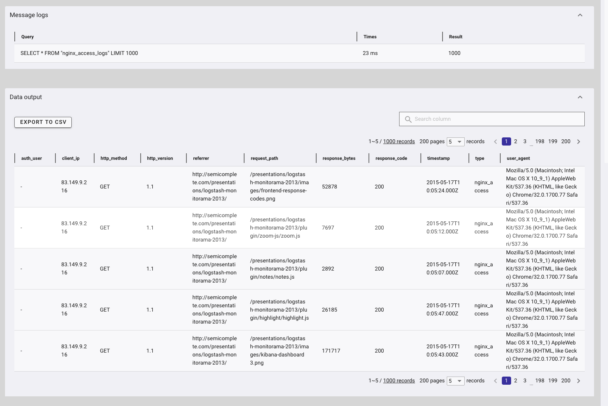
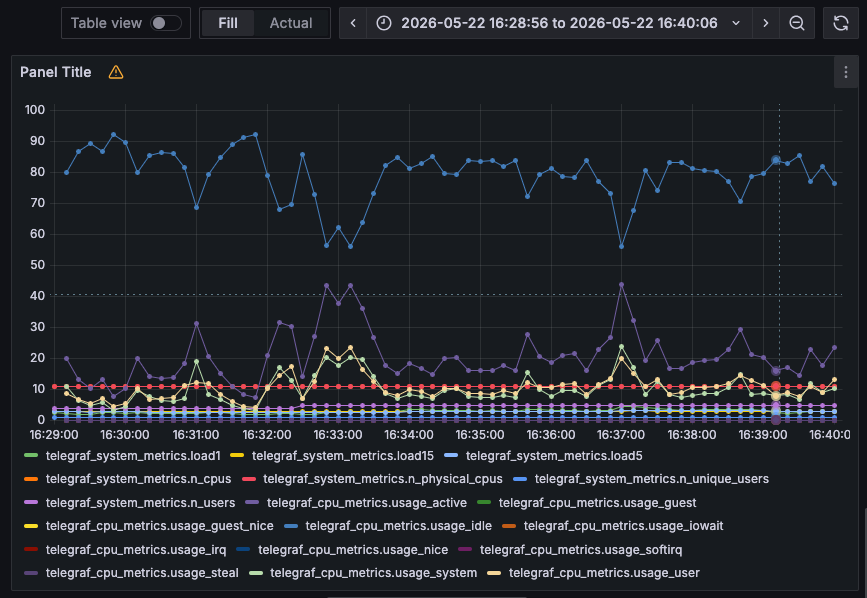

# Connecting GridDB Cloud to Your Observability Stack: Telegraf, Logstash, and Grafana

GridDB Cloud v3.2 ships with a bundled third-party plugin pack that connects it to several widely-used ingestion and visualization tools. In this article we will set up three of them against a live GridDB Cloud instance: **Telegraf** for system metrics, **Logstash** for log ingestion, and **Grafana** for dashboards.

Each section is self-contained — you do not need all three to follow along, and they do not interact with each other. We will keep each section concise, highlight the important caveats where they matter, and finish with a working observability pipeline pointed at GridDB Cloud.

If you have not already read about the v3.2 release and its new non-WebAPI connection support, we recommend starting there: [TODO v3.2 BLOG].

## Telegraf: System Metrics Into GridDB Cloud

[Telegraf](https://www.influxdata.com/time-series-platform/telegraf/) is InfluxData's metrics-collection agent. It offers hundreds of input plugins (CPU, memory, disk, network, Kubernetes, Docker, and many more) and dozens of output plugins for shipping the collected metrics to a time-series store. The GridDB Telegraf plugin is one of those outputs.

### Building Telegraf With the GridDB Plugin

The Telegraf plugin is not distributed as a prebuilt binary — it must be compiled into Telegraf from source. The bundled pack ships the GridDB output plugin source code, which you place into a Telegraf source checkout before building.

```bash
mkdir -p ~/go/src/github.com/influxdata
cd ~/go/src/github.com/influxdata
git clone https://github.com/influxdata/telegraf.git
cd telegraf

# Copy in the plugin source from the v3.2 bundle
cp -r /path/to/telegraf-output-plugin/plugins ./
```

This places `plugins/outputs/griddb/griddb.go` into the Telegraf source tree. **An important caveat:** having the plugin source alone is not sufficient for Telegraf to recognize it. Modern Telegraf (v1.20+) uses a build-tag registration pattern in which each plugin requires a one-line import file under `plugins/outputs/all/`. Without this file, the plugin compiles into the binary as dead code and Telegraf will reject your configuration with `undefined but requested output: griddb`.

Create `plugins/outputs/all/griddb.go`:

```go
//go:build !custom || outputs || outputs.griddb

package all

import _ "github.com/influxdata/telegraf/plugins/outputs/griddb" // register plugin
```

Then build and verify:

```bash
make telegraf
./telegraf --output-list | grep griddb
```

If `griddb` appears in the output list, the plugin has been registered correctly.

### Configuring Telegraf for GridDB Cloud

Create a `griddb.conf` that collects basic system metrics and writes them to your GridDB Cloud instance:

```toml
[[outputs.griddb]]
    api_url      = "https://cloud8737.griddb.com:443/griddb/v2/gs_clustermfcloud8737/dbs/nl7QftSt"
    database     = "${GRIDDB_DATABASE}$"
    cluster_name = "gs_clustermfcloud8737"
    username     = "${GRIDDB_USERNAME}"
    password     = "${GRIDDB_PASSWORD}"
    update_mode  = "append"
    containers   = []
    is_timeseries    = true
    timestamp_column = "timestamp"

[[inputs.cpu]]
    percpu           = false
    totalcpu         = true
    collect_cpu_time = false
    report_active    = true

[[inputs.mem]]
[[inputs.disk]]
[[inputs.system]]

[agent]
    interval            = "10s"
    flush_interval      = "10s"
    metric_batch_size   = 1000
    metric_buffer_limit = 10000
    omit_hostname       = false
    debug               = true
```

Adjust the `api_url`, `database`, `cluster_name`, and `username` values to match your own GridDB Cloud instance. Set `is_timeseries = true` so the plugin creates `TIME_SERIES` containers rather than collection containers — this is the appropriate choice for metrics data.

### Running It

Export your password and other parameters as environment variables, then perform a dry run first to confirm the inputs are producing metrics:

```bash
export GRIDDB_PASSWORD='your-password'
./telegraf --config griddb.conf --test
```

You should see a stream of line-protocol output such as `cpu,host=... usage_active=12.3 ...`. If that output looks correct, write a single batch to GridDB:

```bash
./telegraf --config griddb.conf --once
```

Then run Telegraf continuously with no flag at all. The plugin auto-creates containers on first write, one per Telegraf measurement: `cpu`, `mem`, `disk`, `system`. The default container names are fairly generic, but you can override them per-input with `name_override = "system_cpu_metrics"` if you prefer something more descriptive.

A note on the schema: Telegraf preserves the operating system's native metric vocabulary. The memory container has fields named `active`, `inactive`, `wired`, and `available`; these are kernel page-state categories taken directly from `vm_stat` (macOS) or `/proc/meminfo` (Linux), expressed as `LONG` byte counts. If they look unfamiliar, rest assured they are the canonical Unix memory accounting terms — at first glance the schema may appear incorrect, but a quick check of the kernel documentation confirms otherwise.

At this point your containers should be auto-created and populated with data.

## Logstash: Parsed Log Events Into GridDB Cloud

Where Telegraf handles metrics, [Logstash](https://www.elastic.co/logstash) handles logs. It ingests unstructured text events, parses them into structured fields with its grok filter, and ships them to a destination of your choice. We will tail an nginx access log, parse each line, and write the structured rows to GridDB Cloud.

### Installing Logstash

The bundle's README points to a yum-based CentOS install path. On macOS we will download the tarball directly from Elastic — Homebrew's `elastic/tap` formula is currently broken on recent Homebrew versions.

```bash
mkdir -p ~/logstash-demo && cd ~/logstash-demo

curl -O https://artifacts.elastic.co/downloads/logstash/logstash-9.4.1-darwin-aarch64.tar.gz
tar -xzf logstash-9.4.1-darwin-aarch64.tar.gz
mv logstash-9.4.1 logstash

./logstash/bin/logstash --version
```

### Installing the GridDB Output Plugin

The plugin ships as a prebuilt `.gem`, so no Ruby build step is required. Copy it alongside the Logstash install. Note that the leading `./` matters — without it, `logstash-plugin` treats the argument as a remote plugin name and constructs an invalid URL:

```bash
cp /path/to/logstash-output-plugin/logstash-output-griddb-1.0.0.gem ~/logstash-demo/

cd ~/logstash-demo
./logstash/bin/logstash-plugin install ./logstash-output-griddb-1.0.0.gem
./logstash/bin/logstash-plugin list | grep griddb
```

### A Sample Log Source

For a tangible data source to ingest, download Elastic's public Apache access-log sample — approximately 10,000 lines of real combined-format requests:

```bash
mkdir -p ~/logstash-demo/logs
curl -L -o ~/logstash-demo/logs/nginx-access.log \
  https://raw.githubusercontent.com/elastic/examples/master/Common%20Data%20Formats/apache_logs/apache_logs
```

### The Logstash Config

Save the following as `~/logstash-demo/nginx-to-griddb.conf`:

```ruby
input {
  file {
    path => "/Users/YOUR_USERNAME/logstash-demo/logs/nginx-access.log"
    start_position => "beginning"
    sincedb_path => "/dev/null"
    type => "nginx_access"
  }
}

filter {
  grok {
    match => {
      "message" => '%{IPORHOST:client_ip} - %{DATA:auth_user} \[%{HTTPDATE:log_timestamp}\] "%{WORD:http_method} %{DATA:request_path} HTTP/%{NUMBER:http_version}" %{NUMBER:response_code:int} %{NUMBER:response_bytes:int} "%{DATA:referrer}" "%{DATA:user_agent}"'
    }
  }

  date {
    match => [ "log_timestamp", "dd/MMM/yyyy:HH:mm:ss Z" ]
    target => "@timestamp"
  }

  mutate {
    remove_field => [ "message", "log_timestamp", "event", "log", "@version", "host" ]
  }
}

output {
  stdout { codec => rubydebug }

  griddb {
    host        => "https://cloud8737.griddb.com:443"
    cluster     => "your-cluster"
    database    => "your-database"
    container   => "nginx_access_logs"
    username    => "your-username"
    password    => "${GRIDDB_PASSWORD}"
    insert_mode => "append"
  }
}
```

The grok filter performs the core parsing work — `%{IPORHOST:client_ip}` matches an IP or hostname and stores it in a field called `client_ip`, while `%{NUMBER:response_code:int}` matches a number and coerces it to an integer. The `date` filter takes the timestamp embedded *inside* the log line and uses it as the event's real timestamp; without this, every row would be timestamped with when Logstash *processed* the log rather than when the request actually occurred.

### Running It

```bash
cd ~/logstash-demo
export GRIDDB_PASSWORD='your-password'
./logstash/bin/logstash -f ~/logstash-demo/nginx-to-griddb.conf
```

Startup takes 20–30 seconds, after which you will see parsed events scrolling past as the `rubydebug` codec prints them to stdout. Each one becomes a row in the `nginx_access_logs` container.



The resulting schema is clean: one container, one self-documenting column per parsed field, and timestamps that reflect when each request actually occurred.

## Grafana: Dashboards Over GridDB Cloud

Finally, the visualization layer. GridDB ships a Grafana data source plugin in the bundle, and with a few additional steps you can build dashboards directly against your GridDB containers.

**Important:** this plugin is built on AngularJS, which Grafana deprecated in v11 and **fully removed in v12**. There is no flag or workaround on modern Grafana, as the framework is no longer present. For now, you need Grafana 10.x. You can read more in Grafana's [removal announcement](https://grafana.com/whats-new/2025-05-05-removal-of-angular/).

### Installing Grafana 10

Download the last 10.x release directly from Grafana's download page:

```bash
mkdir -p ~/grafana-demo && cd ~/grafana-demo

curl -O https://dl.grafana.com/oss/release/grafana-10.4.15.darwin-arm64.tar.gz
tar -xzf grafana-10.4.15.darwin-arm64.tar.gz
mv grafana-v10.4.15 grafana
```

### Enabling the Plugin

Two configuration changes are needed before the plugin will load. Create `~/grafana-demo/grafana/conf/custom.ini` (Grafana automatically merges this with the defaults):

```ini
[plugins]
allow_loading_unsigned_plugins = griddb-datasource

[security]
angular_support_enabled = true
```

The first setting whitelists the unsigned plugin; the second enables the AngularJS compatibility mode that Grafana 10 still provides.

Copy the plugin into Grafana's plugins directory:

```bash
mkdir -p ~/grafana-demo/grafana/data/plugins/griddb-datasource
cp -r /path/to/grafana-input-plugin/dist/* \
      ~/grafana-demo/grafana/data/plugins/griddb-datasource/
```

Start Grafana:

```bash
cd ~/grafana-demo/grafana
./bin/grafana server
```

Open `http://localhost:3000`, log in (`admin`/`admin` by default; you will be prompted to set a new password), and add a new GridDB data source under **Connections → Data sources**. Fill in:

- **Host:** `https://cloud8737.griddb.com:443` (no trailing path — the plugin appends `/griddb/v2/...` itself)
- **Cluster:** your cluster name
- **Database:** your database name
- **User / Password:** your GridDB Cloud credentials

### A Note on the Password Field

Once the form is complete, click **Save & Test**. If the test fails with a `TXN_AUTH_FAILED` error even though your credentials are correct, the data source form may not have persisted the password to Grafana's secure storage (this occurred consistently in our testing). You can confirm by inspecting Grafana's sqlite store:

```bash
sqlite3 ~/grafana-demo/grafana/data/grafana.db \
  "SELECT name, basic_auth_user, length(secure_json_data) FROM data_source;"
```

If `length(secure_json_data)` is `2`, the password did not save (`{}` is two characters). The workaround is to set the password via Grafana's HTTP API, which writes the credentials properly:

```bash
curl -X PUT \
  -u 'admin:YOUR_GRAFANA_ADMIN_PASSWORD' \
  -H "Content-Type: application/json" \
  http://localhost:3000/api/datasources/1 \
  -d '{
    "id": 1,
    "name": "griddb-datasource",
    "type": "griddb-datasource",
    "url": "https://cloud8737.griddb.com:443",
    "access": "proxy",
    "basicAuth": true,
    "basicAuthUser": "your-griddb-username",
    "secureJsonData": { "basicAuthPassword": "your-griddb-password" },
    "jsonData": {
      "xgridcluster": "your-cluster-name",
      "xgriddatabase": "your-database-name",
      "minInterval": "1s"
    }
  }'
```

(Single-quote the `-u` argument if your Grafana admin password contains shell metacharacters.)

After that, `secure_json_data` will contain a long encrypted blob, and the data source will authenticate cleanly.

### Querying Your Data

With the data source connected, build a panel using the plugin's query syntax:

```
$griddb_query_data(mem, used_percent, select * order by timestamp)
```

The three arguments are the container, the columns to select, and a TQL clause. You can also use `$griddb_container_list` to populate template variables for a container picker, or `$griddb_column_list({container})` to drive column dropdowns.



## Wrapping Up

Three plugins, three different entry points into GridDB Cloud:

- **Telegraf** for system and infrastructure metrics, with hundreds of optional input plugins you can mix and match.
- **Logstash** for parsing structured fields out of unstructured logs, then landing them as queryable rows.
- **Grafana** for visualizing whatever you have ingested, against the same underlying containers.

Each one stands on its own, and all three work against the same GridDB Cloud instance with the same WebAPI credentials. The v3.2 bundled third-party plugin pack is what makes this practical — one download, source for all three plugins, and you are up and running against managed GridDB without writing a line of custom code.