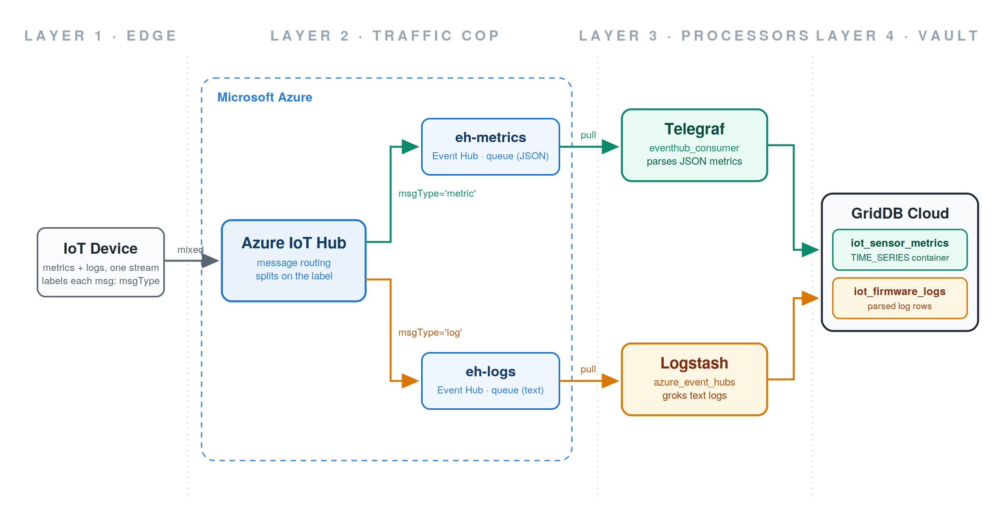
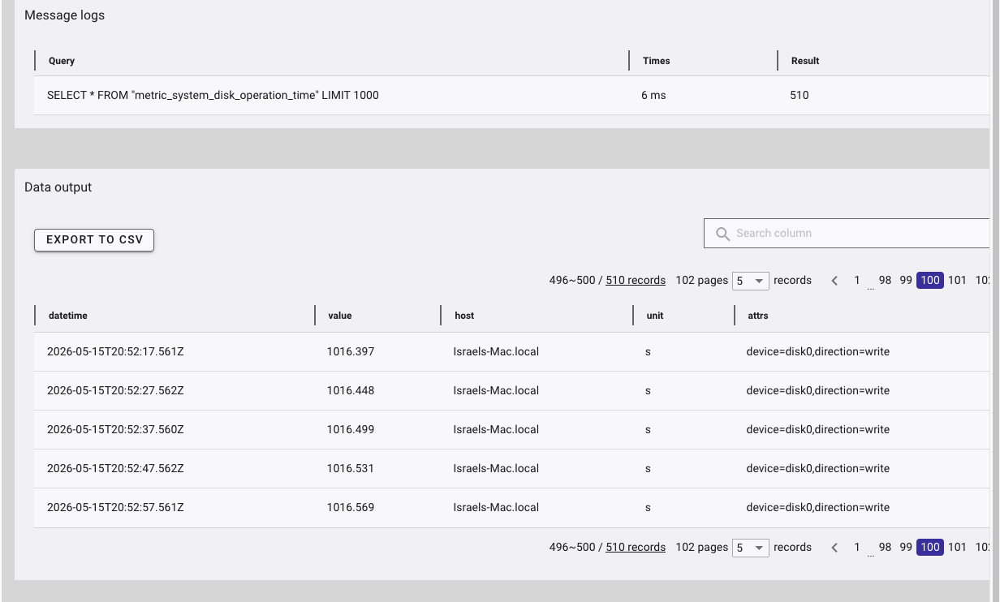

# One Device Stream, Two Pipelines: Routing IoT Metrics and Logs into GridDB Cloud with Azure IoT Hub, Telegraf, and Logstash

IoT devices can be messy and unwieldy. The same sensor that reports a clean temperature reading one second will spit out an ugly, text-based firmware error the next, with both arriving in the same stream. If you force a single tool to handle that mixed data input, you end up compromising somewhere: metrics agents are miserable at parsing free-form text, and log processors are wasteful for high-volume numeric data.



In this article we will not compromise. We will build a pipeline that splits the stream at the front door and hands each half to the tool that is good at it:

- **Telegraf**, InfluxData's metrics agent, consumes the clean JSON metrics.
- **Logstash**, Elastic's log processor, uses its grok filters to chop the unstructured firmware errors into queryable fields.
- **Azure IoT Hub** sits in front of both, acting as the router that routes each message to the right lane.
- **GridDB Cloud** is the destination for everything, using the official Telegraf and Logstash output plugins from the GridDB Cloud v3.2 bundled third-party plugin pack.

If you read our previous article on [storing OpenTelemetry signals in GridDB Cloud with Kafka](https://www.griddb.net/en/blog/storing-opentelemetry-metrics-traces-and-logs-in-griddb-cloud-with-kafka/), this architecture will feel familiar: a producer at the edge, a routing/buffering layer in the middle, specialized processors, and GridDB Cloud as the vault at the end. The difference is that this time there is zero custom code. Where the Kafka pipeline needed a hand-written Go bridge to flatten OTLP payloads, every stage here is an off-the-shelf component wired together with configuration.

Though this blog uses the GridDB Web API, let's not forget about this recent release: GridDB Cloud v3.2's non-WebAPI connection support. If you have not read about that release yet, start here: [Connecting to GridDB Cloud v3.2 from Your Local Dev Environment](https://www.griddb.net/en/blog/connecting-to-griddb-cloud-v3-2-from-your-local-dev-environment-no-vpn-no-vnet-peering/).

## The Architecture: Four Layers

The strength of this architecture is its clean separation of concerns: each of its four layers does exactly one job, using the tool best suited for it:

**Layer 1 — Full data stream of mixed data (edge).** Devices emit both signal types into one stream: structured JSON metrics and unstructured text logs, interleaved. Each message carries a small label (`msgType`) declaring which kind it is.

**Layer 2 — The router (Azure IoT Hub).** IoT Hub's message routing reads the label and splits the stream: metrics go to one Azure Event Hub, logs go to another. After this point the data is perfectly separated into two independent queues.

**Layer 3 — The specialized processors (Telegraf and Logstash).** Because the split already happened, neither tool has to do a job it is bad at. Telegraf pulls from the metrics queue and parses JSON. Logstash pulls from the logs queue (text) and runs grok.

**Layer 4 — Datastore (GridDB Cloud).** Both tools have an official GridDB output plugin. Telegraf writes its numbers into an optimized `TIME_SERIES` container; Logstash writes its parsed log rows into its own container. One database, two purpose-built containers.

```plaintext
                          ┌─(msgType='metric')─► Event Hub eh-metrics ─► Telegraf ─► iot_sensor_metrics ┐
device ──► Azure IoT Hub ─┤                                                                             ├─ GridDB Cloud
                          └─(msgType='log')────► Event Hub eh-logs ────► Logstash ─► iot_firmware_logs  ┘
```

The two Event Hubs in the middle are queues. The Azure IoT Hub pushes into them; Telegraf and Logstash pull from them at their own pace. That decoupling is what makes the pipeline resilient: if Logstash goes down for an hour, log messages simply pile up in `eh-logs` and get drained when it comes back. Nothing is lost and nothing blocks the devices.

The rest of this article walks through the layers in order, from the edge to the datastore.

## Layer 1: The Device Simulator

For a data source we will use a small Python script that plays the role of an IoT device. It alternates between two data streams: most of the time it sends a clean JSON metrics payload, and roughly 30% of the time it also emits a raw, syslog-style firmware error line. Crucially, it labels every message with the `msgType` application property that the routes key on.

Install the SDK with `pip install azure-iot-device`, then:

```python
import json, random, time
from datetime import datetime, timezone
from azure.iot.device import IoTHubDeviceClient, Message

CONN = "<your device connection string>"
client = IoTHubDeviceClient.create_from_connection_string(CONN)

ERRORS = ["E042 sensor read timeout", "E107 fw checksum mismatch", "E019 wifi rssi below threshold"]

while True:
    m = Message(json.dumps({
        "deviceId": "sensor-001",
        "temperature": round(random.uniform(20, 35), 2),
        "humidity": round(random.uniform(30, 70), 2),
    }))
    m.content_type = "application/json"
    m.content_encoding = "utf-8"
    m.custom_properties["msgType"] = "metric"
    client.send_message(m)

    # occasionally: an ugly text log, labeled for the logs route
    if random.random() < 0.3:
        line = f'{datetime.now(timezone.utc).strftime("%Y-%m-%dT%H:%M:%SZ")} sensor-001 ERROR {random.choice(ERRORS)} ip=192.168.1.{random.randint(2,254)}'
        l = Message(line)
        l.content_type = "text/plain"
        l.content_encoding = "utf-8"
        l.custom_properties["msgType"] = "log"
        client.send_message(l)

    time.sleep(3)
```

The device connection string comes from the device identity we will create as part of the Azure resources in Layer 2. Once the IoT Hub and device identity exist, fetch it with:

```bash
az iot hub device-identity connection-string show -g <resource-group> -n <iot-hub-name> -d sensor-001 -o tsv
```

## Layer 2: The Router — Azure IoT Hub

We will keep this section brief since the Azure resources are standard. You need:

- **A resource group** to hold everything.
- **An Event Hubs namespace** (Basic tier is fine — both consumers speak AMQP natively, so you do not need the Kafka-compatible endpoint that Standard tier adds) containing two event hubs: `eh-metrics` and `eh-logs`.
- **Two authorization rules per event hub**: one with `Send` rights (used by IoT Hub's routing endpoints) and one with `Listen` rights (used by Telegraf and Logstash). Keeping them separate is necessary because mixing them up produces a very specific error.
- **An IoT Hub** on the **B1 tier or above**. The free F1 tier allows only *one* custom routing endpoint, and this architecture needs two. IoT Hub names are also globally unique across Azure, so pick something distinctive.
- **Two custom endpoints** on the IoT Hub, each pointing at one event hub via its `Send` connection string.
- **Two message routes**, which are the heart of the whole design:

```bash
az iot hub message-route create -g <resource-group> -n <iot-hub-name> \
  --route-name metrics-route --endpoint-name ep-metrics --source devicemessages \
  --condition "msgType = 'metric'"

az iot hub message-route create -g <resource-group> -n <iot-hub-name> \
  --route-name logs-route --endpoint-name ep-logs --source devicemessages \
  --condition "msgType = 'log'"
```

- **A device identity** for the simulator to authenticate as.

Let's discuss a couple of issues up front: first, IoT Hub routing cannot inspect an arbitrary message body to decide "is this JSON or plain text" — body-based routing queries only work when the message declares `contentType = application/json` and `contentEncoding = utf-8`, and plain-text bodies are opaque to the routing engine entirely. The robust pattern is what we use here: the device stamps an application property (`msgType`) on every message and the routes filter on that property. Second, once you add custom routes, IoT Hub's fallback route to the built-in endpoint is disabled by default — any message that matches no route is dropped, so a typo in the property name fails silently. Third, on recent Azure CLI versions, creating an event hub on Basic tier requires passing `--cleanup-policy Delete --retention-time 24` together (the CLI's defaults request 7-day retention, which Basic rejects, while the retention flag alone trips a serialization error).

With the routes in place and the simulator from Layer 1 running, it is worth verifying the split with a throwaway script that reads each event hub directly (the `azure-eventhub` pip package makes this a ten-liner) before wiring up either consumer. You want to see *only* JSON blobs landing in `eh-metrics` and *only* text lines in `eh-logs`. Debugging the routing and the consumers at the same time is a miserable experience — confirm the iot hub router is doing its job first.

## Layer 3A: Telegraf — The Metrics Lane

[Telegraf](https://www.influxdata.com/time-series-platform/telegraf/) is InfluxData's metrics-collection agent. It offers hundreds of input plugins and dozens of output plugins for shipping collected metrics to a time-series store. The GridDB Telegraf plugin is one of those outputs, and conveniently, Telegraf also ships an `eventhub_consumer` *input* plugin whose primary use case is exactly this: consuming from Azure Event Hubs and IoT Hub.

### Building Telegraf With the GridDB Plugin

The GridDB output plugin is not distributed as a prebuilt binary, it must be compiled into Telegraf from source. The v3.2 bundled pack ships the plugin source code, which you place into a Telegraf source checkout before building.

```bash
mkdir -p ~/go/src/github.com/influxdata
cd ~/go/src/github.com/influxdata
git clone https://github.com/influxdata/telegraf.git
cd telegraf

# Copy in the plugin source from the v3.2 bundle
cp -r /path/to/telegraf-output-plugin/plugins ./
```

This places `plugins/outputs/griddb/griddb.go` into the Telegraf source tree. **An important caveat:** having the plugin source alone is not sufficient for Telegraf to recognize it. Modern Telegraf (v1.20+) uses a build-tag registration pattern in which each plugin requires a one-line import file under `plugins/outputs/all/`. Without this file, the plugin compiles into the binary as dead code and Telegraf will reject your configuration with `undefined but requested output: griddb`.

Create `plugins/outputs/all/griddb.go`:

```go
//go:build !custom || outputs || outputs.griddb

package all

import _ "github.com/influxdata/telegraf/plugins/outputs/griddb" // register plugin
```

Then build and verify:

```bash
make telegraf
./telegraf --output-list | grep griddb
```

If `griddb` appears in the output list, the plugin has been registered correctly.

### Configuring Telegraf as a Stream Consumer

In our previous walkthrough Telegraf played its traditional role of collecting *local* system metrics. Here it plays a different one: a stream worker that pulls device metrics off an Azure queue. The input section changes; the GridDB output section is identical to before.

Create a `griddb-iot.conf`:

```bash
[[inputs.eventhub_consumer]]
    ## The Listen connection string for eh-metrics, including EntityPath
    connection_string = "Endpoint=sb://<namespace>.servicebus.windows.net/;SharedAccessKeyName=consumer-listen;SharedAccessKey=<key>;EntityPath=eh-metrics"
    data_format = "json"
    json_string_fields = ["deviceId"]
    ## Use the time IoT Hub received the message as the row timestamp
    iot_hub_enqueued_time_as_ts = true
    ## This becomes the GridDB container name
    name_override = "iot_sensor_metrics"

[[outputs.griddb]]
    api_url      = "https://cloud8737.griddb.com:443/griddb/v2/gs_clustermfcloud8737/dbs/nl7QftSt"
    database     = "${GRIDDB_DATABASE}"
    cluster_name = "gs_clustermfcloud8737"
    username     = "${GRIDDB_USERNAME}"
    password     = "${GRIDDB_PASSWORD}"
    update_mode  = "append"
    containers   = []
    is_timeseries    = true
    timestamp_column = "timestamp"

[agent]
    interval            = "10s"
    flush_interval      = "10s"
    metric_batch_size   = 1000
    metric_buffer_limit = 10000
    omit_hostname       = true
    debug               = true
```

Adjust the `api_url`, `database`, `cluster_name`, and `username` values to match your own GridDB Cloud instance, and set `is_timeseries = true` so the plugin creates a `TIME_SERIES` container — the appropriate choice for metrics data.

Two details worth calling out. `omit_hostname = true` matters more here than it did before: without it, Telegraf stamps every row with the hostname of the machine *running Telegraf*, which in an IoT pipeline is misleading — the data came from `sensor-001`, not from your consumer box, and the `deviceId` field already carries the real source. And note that `eventhub_consumer` is a **service input**: unlike ordinary polling inputs, it listens for events rather than gathering on an interval, which means the `--test` and `--once` dry-run flags from our previous walkthrough may produce no output for it. Just run it for real:

```bash
export GRIDDB_PASSWORD='your-password'
./telegraf --config griddb-iot.conf
```

With the simulator running, the debug log shows Telegraf writing batches within seconds, and an `iot_sensor_metrics` container appears in the GridDB Cloud portal with `temperature`, `humidity`, and `deviceId` columns:


## Layer 3B: Logstash — The Logs Lane

Where Telegraf handles metrics, [Logstash](https://www.elastic.co/logstash) handles logs. It ingests unstructured text events, parses them into structured fields with its grok filter, and ships them to a destination of your choice. Our destination is GridDB Cloud, and our source is the `eh-logs` queue full of raw firmware error lines.

### Installing Logstash

The bundle's README points to a yum-based CentOS install path. On macOS we will download the tarball directly from Elastic — Homebrew's `elastic/tap` formula is currently broken on recent Homebrew versions.

```bash
mkdir -p ~/logstash-demo && cd ~/logstash-demo

curl -O https://artifacts.elastic.co/downloads/logstash/logstash-9.4.1-darwin-aarch64.tar.gz
tar -xzf logstash-9.4.1-darwin-aarch64.tar.gz
mv logstash-9.4.1 logstash

./logstash/bin/logstash --version
```

### Installing the GridDB Output Plugin

The plugin ships as a prebuilt `.gem`, so no Ruby build step is required. Copy it alongside the Logstash install. Note that the leading `./` matters — without it, `logstash-plugin` treats the argument as a remote plugin name and constructs an invalid URL:

```bash
cp /path/to/logstash-output-plugin/logstash-output-griddb-1.0.0.gem ~/logstash-demo/

cd ~/logstash-demo
./logstash/bin/logstash-plugin install ./logstash-output-griddb-1.0.0.gem
./logstash/bin/logstash-plugin list | grep griddb
```

The input side needs no installation at all: the `azure_event_hubs` input plugin ships bundled with Logstash.

### The Logstash Config

Save the following as `~/logstash-demo/iot-logs-to-griddb.conf`:

```ruby
input {
  azure_event_hubs {
    event_hub_connections => ["Endpoint=sb://<namespace>.servicebus.windows.net/;SharedAccessKeyName=consumer-listen;SharedAccessKey=<key>;EntityPath=eh-logs"]
    initial_position => "beginning"
  }
}

filter {
  grok {
    match => {
      "message" => '%{TIMESTAMP_ISO8601:log_ts} %{NOTSPACE:device_id} %{LOGLEVEL:level} %{NOTSPACE:error_code} %{DATA:error_msg} ip=%{IP:device_ip}'
    }
  }

  date {
    match => [ "log_ts", "ISO8601" ]
    target => "@timestamp"
  }

  mutate {
    remove_field => [ "message", "log_ts", "event", "log", "@version", "host" ]
  }
}

output {
  stdout { codec => rubydebug }

  griddb {
    host        => "https://cloud8737.griddb.com:443"
    cluster     => "your-cluster"
    database    => "your-database"
    container   => "iot_firmware_logs"
    username    => "your-username"
    password    => "${GRIDDB_PASSWORD}"
    insert_mode => "append"
  }
}
```

The grok filter does the core work: it takes a raw line like

```plaintext
2026-07-16T23:28:33Z sensor-001 ERROR E107 fw checksum mismatch ip=192.168.1.99
```

and breaks it into `device_id`, `level`, `error_code`, `error_msg`, and `device_ip` fields. The `date` filter takes the timestamp embedded *inside* the log line — the moment the device actually recorded the error — and uses it as the event's real timestamp, rather than the moment Logstash happened to process it.

The connection string deserves special attention, because it bit us twice while building this. It must be the complete string — starting with `Endpoint=sb://` and ending with `EntityPath=eh-logs` — or the plugin fails at startup with `Error parsing event hub string name for connection`. And it must use the **Listen** authorization rule, not the Send rule you gave to IoT Hub's routing endpoints. If you paste the Send string, Logstash connects successfully, discovers the partitions, and then fails on every receive with `Unauthorized access. 'Listen' claim(s) are required` — an error that is easy to miss in the AMQP log spam.

You will also see a startup warning that no `storage_connection_string` is configured. Logstash uses an Azure Storage account to checkpoint its position across restarts and to coordinate multiple Logstash instances; for a single-instance demo it is safe to ignore, at the cost of re-reading the queue from the beginning on each restart.

### Running It

```bash
cd ~/logstash-demo
export GRIDDB_PASSWORD='your-password'
./logstash/bin/logstash -f iot-logs-to-griddb.conf
```

Startup takes 20–30 seconds. Because of `initial_position => "beginning"`, Logstash immediately drains everything sitting in `eh-logs`, so you should see a burst of parsed events scroll past in the `rubydebug` output, then a steady trickle as the simulator keeps emitting. Each one becomes a row in the `iot_firmware_logs` container:


The resulting schema is clean: one self-documenting column per parsed field, and timestamps that reflect when each error actually occurred on the device.

## Layer 4: The Datastore — What Lands in GridDB Cloud

At this point the full pipeline is live. Two containers, each shaped by the tool that filled it:

- **`iot_sensor_metrics`** — a `TIME_SERIES` container with one row per metrics message: `timestamp`, `deviceId`, `temperature`, `humidity`. Created and populated by Telegraf.
- **`iot_firmware_logs`** — one row per parsed firmware error: `timestamp`, `device_id`, `level`, `error_code`, `error_msg`, `device_ip`. Created and populated by Logstash.

The same device produced both, the same IoT Hub received both, and the same database stores both — but each signal traveled its own lane and was processed by the tool built for it.



A note on topology: in this walkthrough, one machine plays every role — it runs the simulator, Telegraf, and Logstash, so the data flows out to Azure and right back. That looks redundant locally, but it is actually the proof that the architecture is decoupled: no component knows where the others run, because they only ever talk to Azure endpoints. In production, the simulator becomes a fleet of real devices in the field (each with its own IoT Hub device identity), and Telegraf and Logstash become small VMs or containers colocated in the same Azure region as the Event Hubs namespace. Everything in between stays exactly the same.

## Extra: Grafana Dashboards Over GridDB Cloud

The pipeline above is complete on its own, but if you want to visualize what you just ingested, GridDB also ships a Grafana data source plugin in the v3.2 bundle. The installation is somewhat involved, so we are including it here.

**Important:** this plugin is built on AngularJS, which Grafana deprecated in v11 and **fully removed in v12**. There is no flag or workaround on modern Grafana, as the framework is no longer present. For now, you need Grafana 10.x. You can read more in Grafana's [removal announcement](https://grafana.com/whats-new/2025-05-05-removal-of-angular/).

### Installing Grafana 10

Download the last 10.x release directly from Grafana's download page:

```bash
mkdir -p ~/grafana-demo && cd ~/grafana-demo

curl -O https://dl.grafana.com/oss/release/grafana-10.4.15.darwin-arm64.tar.gz
tar -xzf grafana-10.4.15.darwin-arm64.tar.gz
mv grafana-v10.4.15 grafana
```

### Enabling the Plugin

Two configuration changes are needed before the plugin will load. Create `~/grafana-demo/grafana/conf/custom.ini` (Grafana automatically merges this with the defaults):

```ini
[plugins]
allow_loading_unsigned_plugins = griddb-datasource

[security]
angular_support_enabled = true
```

The first setting whitelists the unsigned plugin; the second enables the AngularJS compatibility mode that Grafana 10 still provides.

Copy the plugin into Grafana's plugins directory:

```bash
mkdir -p ~/grafana-demo/grafana/data/plugins/griddb-datasource
cp -r /path/to/grafana-input-plugin/dist/* \
      ~/grafana-demo/grafana/data/plugins/griddb-datasource/
```

Start Grafana:

```bash
cd ~/grafana-demo/grafana
./bin/grafana server
```

Open `http://localhost:3000`, log in (`admin`/`admin` by default; you will be prompted to set a new password), and add a new GridDB data source under **Connections → Data sources**. Fill in:

- **Host:** `https://cloud8737.griddb.com:443` (no trailing path — the plugin appends `/griddb/v2/...` itself)
- **Cluster:** your cluster name
- **Database:** your database name
- **User / Password:** your GridDB Cloud credentials

### A Note on the Password Field

Once the form is complete, click **Save & Test**. If the test fails with a `TXN_AUTH_FAILED` error even though your credentials are correct, the data source form may not have persisted the password to Grafana's secure storage (this occurred consistently in our testing). You can confirm by inspecting Grafana's sqlite store:

```bash
sqlite3 ~/grafana-demo/grafana/data/grafana.db \
  "SELECT name, basic_auth_user, length(secure_json_data) FROM data_source;"
```

If `length(secure_json_data)` is `2`, the password did not save (`{}` is two characters). The workaround is to set the password via Grafana's HTTP API, which writes the credentials properly:

```bash
curl -X PUT \
  -u 'admin:YOUR_GRAFANA_ADMIN_PASSWORD' \
  -H "Content-Type: application/json" \
  http://localhost:3000/api/datasources/1 \
  -d '{
    "id": 1,
    "name": "griddb-datasource",
    "type": "griddb-datasource",
    "url": "https://cloud8737.griddb.com:443",
    "access": "proxy",
    "basicAuth": true,
    "basicAuthUser": "your-griddb-username",
    "secureJsonData": { "basicAuthPassword": "your-griddb-password" },
    "jsonData": {
      "xgridcluster": "your-cluster-name",
      "xgriddatabase": "your-database-name",
      "minInterval": "1s"
    }
  }'
```

(Single-quote the `-u` argument if your Grafana admin password contains shell metacharacters.)

After that, `secure_json_data` will contain a long encrypted blob, and the data source will authenticate cleanly.

### Querying Your Data

With the data source connected, build a panel using the plugin's query syntax against the containers this pipeline created:

```bash
$griddb_query_data(iot_sensor_metrics, temperature, select * order by timestamp)
```

The three arguments are the container, the columns to select, and a TQL clause. You can also use `$griddb_container_list` to populate template variables for a container picker, or `$griddb_column_list({container})` to drive column dropdowns.

## Wrapping Up

Four layers, each doing one job:

- **The edge** produces a mixed stream of metrics and logs, each message labeled with what it is.
- **Azure IoT Hub** routes on that label, splitting the firehose into two clean queues.
- **Telegraf and Logstash** each consume the lane they are built for — JSON parsing on one side, grok on the other.
- **GridDB Cloud** stores both signals in purpose-built containers, side by side and queryable together.

Compared to our Kafka-based OpenTelemetry pipeline, the striking thing about this one is what is missing: there is no bridge, no custom flattening code, no glue. IoT Hub's routing rules replace the splitting logic, and the official `eventhub_consumer` and `azure_event_hubs` input plugins replace the consuming logic. The GridDB Cloud v3.2 bundled plugin pack supplies both output plugins: one download, and every stage of a cross-cloud IoT pipeline is configuration rather than code.