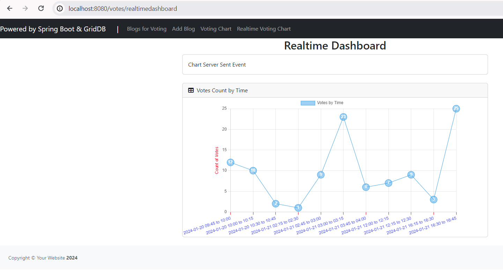
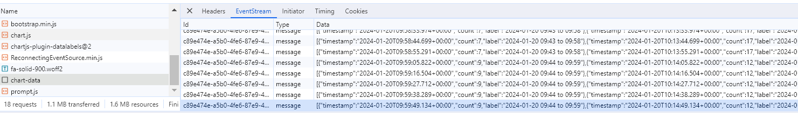

Code your Voice: Building a Blog Voting Web Platform using Spring Boot and NoSQL
===

An online voting system is a software platform that allows people to cast their votes electronically with intuitive and secure online interfaces. These systems leverage cutting-edge technologies to facilitate the entire voting process. Onlive voting systems come in various forms, from secure web portals to mobile applications.

Online voting systems shine in situations where accessibility is a challenge, enabling individuals who might face mobility issues or are geographically distant to participate seamlessly. Moreover, online voting systems are invaluable in large-scale elections, expediting the voting process and significantly reducing the time and resources required for manual counting.

### Where is online voting most useful?

It's a good idea to use an online voting system to:

* Vote on rules and regulations by policy decisions
* Select award nomination
* Gather anonymous feedback from employees.

## What We're Building

In this guide, we will embark on a journey to create a simple voting up and down system using Spring Boot, and NoSQL, and packaging the application into a Docker container. We aim to empower users to express their opinions on blog posts, fostering a vibrant community of discussion and feedback.

### Requirements

Based on the previous overview, we will have the following functional requirements:

1. Create a blog in the simple form
2. Cast votes (upvote or downvote) on blog posts. No login/logout, we will generate random users
3. Visualize vote results in a static and real-time chart

The out of scope:
* Reverse/change the votes
* Change users
* User management (register, login, etc)
* Blog management (create, edit, delete)

### The database

The choice between SQL and NoSQL databases depends on specific requirements. However, here are some reasons why NoSQL databases are preferred over SQL databases for this system:

1. Horizontal scalability: NoSQL databases typically provide easy horizontal scalability.
2. Query Structure: In this case, there is no need for complex relational operations such as table joins.
3. NoSQL databases are typically built with a distributed and decentralized architecture, enabling easy scaling by adding more nodes to the cluster.

## Project Setup

### What you need to install

- [Java 17 or later](https://jdk.java.net/21/), [Maven 3.5+](https://maven.apache.org/download.cgi), [Docker engine](https://docs.docker.com/engine/install/), and your favorite text editor ([Intellij IDEA](https://spring.io/guides/gs/intellij-idea/), or [VSCode](https://spring.io/guides/gs/guides-with-vscode/))

### Create a Spring Boot Project

Spring boot offers a fast way to build applications. 
Spring Boot does not generate code to make edits to your files. Instead, when you start your application, Spring Boot dynamically wires up beans and settings and applies them to your application context.
With Spring Boot, we can focus more on the business features and less on the infrastructure.

Navigate to [start.spring.io](https://start.spring.io/). This service pulls in all the dependencies you need for an application and does most of the setup. Click generate, it will generate the Spring Boot project and download it as a zip. Now unzip this project and import it into any IDE. 

To interact with GridDB, we need to add a GridDB Java Client to this project. Add the following dependency into maven `pom.xml`.
</code></pre>

xml
&lt;dependency&gt;
  &lt;groupId&gt;com.github.griddb&lt;/groupId&gt;
  &lt;artifactId&gt;gridstore&lt;/artifactId&gt;
  &lt;version&gt;5.3.0&lt;/version&gt;
&lt;/dependency&gt;</code></pre>

### Database design

Now, let's write down the database schema according to the functional requirements. We will have the following entity classes:

- User

  This holds the user's information in the system. It has the following attributes:
    *  `String id`: System generated unique identifier. It is the primary key.
    *  `String email`
    *  `String fullName`

- Blog

  This entity stores the blog posts. It has the following attributes:
    *  `String id`: System generated unique identifier. It is the primary key.
    *  `String title`: The title of the blog post
    *  `Integer voteUpCount`: The count of vote up
    *  `Integer voteDownCount`: The count of votes down
    *  `Date createdAt`: System-generated timestamp when the blog post created

- VoteMetrics

  This entity captures the voting history. It has the following attributes:
    *  `Date timestamp`: System generated. It is the primary key for the time series container (table).
    *  `String blogId`: The blog ID voted by the user
    *  `String userId`: The user ID makes voting
    *  `Integer voteType`: The voting type, 1: Vote Up, 0: Vote Down
  

#### Data access with GridDB

First, we create Java POJO classes that represent the underlying table or container in GridDB.
We annotate a class with Lombok @Data, which automatically generates getters for all fields, a useful toString method, and hashCode and equals implementations that check all non-transient fields. Also generate setters for all non-final fields, as well as a constructor.

We will create the data access class according to the previous database design.

<pre><code class="language-java">
@Data
public class User {
    @RowKey
    String id;
    String email;
    String fullName;
    Date createdAt;
}

@Data
public class Blog {
    @RowKey
    String id;
    String title;
    Integer voteUpCount;
    Integer voteDownCount;
    Date createdAt;
}

@Data
public class VoteMetrics {
    @RowKey
    Date timestamp;
    String blogId;
    String userId;
    Integer voteType;
}</code></pre>

 

Next, we create the `GridDBConfig` class as a central configuration for database operation.
The class will do the following:
* Read environment variables for connecting to the GridDB database
* Create a GridStore class for managing database connection to the GridDB instance
* Create GridDB Collection's container (Table) to manage a set of rows. The container is a rough equivalent of the table in a relational database.
* On creating/updating the Collection we specify the name and object corresponding to the column layout of the collection.
  Also for each collection, we add an index for a column that is frequently searched and used in the condition of the WHERE section of TQL.

<pre><code class="language-java">
@Configuration
public class GridDBConfig {

  @Value("${GRIDDB_NOTIFICATION_MEMBER}")
  private String notificationMember;

  @Value("${GRIDDB_CLUSTER_NAME}")
  private String clusterName;

  @Value("${GRIDDB_USER}")
  private String user;

  @Value("${GRIDDB_PASSWORD}")
  private String password;

  @Bean
  public GridStore gridStore() throws GSException {
    // Acquiring a GridStore instance
    Properties properties = new Properties();
    properties.setProperty("notificationMember", notificationMember);
    properties.setProperty("clusterName", clusterName);
    properties.setProperty("user", user);
    properties.setProperty("password", password);
    GridStore store = GridStoreFactory.getInstance().getGridStore(properties);
    return store;
  }

  @Bean
    public Collection<String, User> userCollection(GridStore gridStore) throws GSException {
        Collection<String, User> collection = gridStore.putCollection("users", User.class);
        collection.createIndex("email");
        return collection;
    }

    @Bean
    public Collection<String, Blog> blogCollection(GridStore gridStore) throws GSException {
        Collection<String, Blog> collection = gridStore.putCollection("blogs", Blog.class);
        collection.createIndex("title");
        return collection;
    }

    @Bean
    public TimeSeries<VoteMetrics> voteMetricContainer(GridStore gridStore) throws GSException {
        TimeSeries<VoteMetrics> timeSeries = gridStore.putTimeSeries(Constant.VOTEMETRICS_CONTAINER, VoteMetrics.class);
        timeSeries.createIndex("blogId");
        timeSeries.createIndex("userId");
        return timeSeries;
    }
}</code></pre>

 

#### Service class

Next, we create a service class with @Service annotation for handling business logic and convert the Entity class into DTO.
 

`BlogService.java` is responsible for finding, and creating blog posts in GridDB.

- `create`: Creating a new blog.

<pre><code class="language-java">
public Blog create(CreateBlogRequest createBlogRequest) {
    Blog blog = new Blog();
    blog.setId(KeyGenerator.next("bl"));
    blog.setTitle(createBlogRequest.getTitle());
    blog.setVoteDownCount(0);
    blog.setVoteUpCount(0);
    blog.setCreatedAt(new Date());
    try {
        blogCollection.put(blog);
        blogCollection.commit();
    } catch (GSException e) {
        log.error("Error create blog", e);
    }
    return blog;
}</code></pre>

- `fetchAll`: Fetching all blog posts.

<pre><code class="language-java">
  public List<Blog> fetchAll() {
      List<Blog> blogs = new ArrayList<>(0);
      try {
          Query<Blog> query = blogCollection.query("SELECT *", Blog.class);
          RowSet<Blog> rowSet = query.fetch();
          while (rowSet.hasNext()) {
              blogs.add(rowSet.next());
          }
      } catch (GSException e) {
          log.error("Error fetchAll", e);
      }
      return blogs;
  }</code></pre>

- `updateVoteUp`: to save the vote-up action. In this method, on fetching row, we use the `get(key, forUpdate)` method to lock the row we want to update making other update operations wait until the transaction completes or a timeout occurs.

<pre><code class="language-java">
  public void updateVoteUp(String blogId) throws GSException {
      blogCollection.setAutoCommit(false);
      Blog blog = blogCollection.get(blogId, true);
      blog.setVoteUpCount(blog.getVoteUpCount() + 1);
      blogCollection.put(blog);
      blogCollection.commit();
  }</code></pre>

 

Example of vote metrics rows.

<pre><code class="language-sh">
VoteMetrics(timestamp=Sun Jan 21 03:48:10 GMT 2024, blogId=bl_0EWG3KRE8H95G, userId=us_0EWQES1BVRJAN, voteType=1)
VoteMetrics(timestamp=Sun Jan 21 03:48:03 GMT 2024, blogId=bl_0EWG3KRDCHBEM, userId=us_0EWQER8KKRHDF, voteType=1)
VoteMetrics(timestamp=Sun Jan 21 03:48:02 GMT 2024, blogId=bl_0EWQ49HPKRKWB, userId=us_0EWQER2KVRJCJ, voteType=1)
VoteMetrics(timestamp=Sun Jan 21 03:48:00 GMT 2024, blogId=bl_0EWG3KRE8H95G, userId=us_0EWQEQV6FRKKV, voteType=1)</code></pre>

 

### Serving Web Content with Spring MVC

Spring's web MVC framework is, like many other web MVC frameworks, request-driven, designed around a central Servlet that dispatches requests to controllers and offers other functionality that facilitates the development of web applications.
By using Spring MVC Framework we got the following advantages:
* The Spring MVC separates each role, where the model object, controller, command object, view resolver, etc. can be fulfilled by a specialized object.
* It uses a lightweight servlet container to develop and deploy your application.
* It provides a robust configuration for both framework and application classes that includes easy referencing across contexts, such as from web controllers to business objects.
* It provides the specific annotations that easily redirect the page.

In this tutorial, we will follow a standard MVC architecture.
We will have a controller (`VotesController` class), views (`votes.html` Thymeleaf template), and a model (a Java map object) for passing data into the view.
Every method of the controller is mapped to a URI.

#### Votes page 

In the following example, `VotesController`, method `votes` handles GET requests for `/votes` by returning the name of a View (in this case, `votes`),
also adding attribute `blogs` to `Model` via its `addAttribute` method.

<pre><code class="language-java">
@Controller
@RequestMapping("/votes")
public class VotesController {
    
  @GetMapping
  String votes(Model model) {
      List<Blog> blogs = blogService.fetchAll();
      model.addAttribute("blogs", blogs);
      return "votes";
  }

  @GetMapping("/up/{id}")
    public String voteUp(@PathVariable("id") String blogId, Model model, RedirectAttributes redirectAttributes) {
        try {
            String userId = KeyGenerator.next("us");
            voteService.voteUp(blogId, userId);
            redirectAttributes.addFlashAttribute("message", "Voting successful!");
        } catch (Exception e) {
            redirectAttributes.addFlashAttribute("message", "Oh no!");
        }
        return "redirect:/votes";
    }
}
</code></pre>

After creating the controller class, we need to define the template for the views to be generated.
We are using `Thymeleaf`, a modern server-side Java template engine for both web and standalone environments.
The HTML templates written in Thymeleaf still look and work like HTML.

We define an HTML table for displaying a list of blog posts and use `th:each` tag attribute to iterate over a collection of blog posts, and `th:text` tag for displaying the value.

<pre><code class="language-html">
  &lt;tbody&gt;
      &lt;tr th:each="blog : ${blogs}"&gt;
          &lt;th scope="row"&gt;[[${blog.title}]]&lt;/th&gt;
          &lt;td&gt;
              &lt;a th:href="@{'/votes/up/' + ${blog.id}}" title="Vote Up" class="btn btn-outline-success"
                  role="button"&gt;
                  &lt;i class="fa fa-thumbs-up"&gt;&lt;/i&gt;
                  &lt;span type="text" th:text="${blog.voteUpCount}" class="btn-label"&gt;&lt;/span&gt;
              &lt;/a&gt;
          &lt;/td&gt;
          &lt;td&gt;
              &lt;a th:href="@{'/votes/down/' + ${blog.id}}" title="Vote Down" class="btn btn-outline-danger"
                  role="button"&gt;
                  &lt;i class="fa fa-thumbs-down"&gt;&lt;/i&gt;
                  &lt;span type="text" th:text="${blog.voteDownCount}" class="btn-label"&gt;&lt;/span&gt;
              &lt;/a&gt;
          &lt;/td&gt;

          &lt;td&gt;[[${blog.createdAt}]]&lt;/td&gt;
      &lt;/tr&gt;
  &lt;/tbody&gt;</code></pre>

 

Here is a preview of the votes page. Users should be able to click the `thumbs-up/down` icon to vote a post up or down.
  

 

#### Dashboard page

For the real-time dashboard, we use Server-Sent Event. With server-sent events, the server can send new data to a web page at any time, by pushing messages to the web page. These incoming messages can be treated as Events + data inside the web page. 

To open a connection to the server to begin receiving events from it, create a new EventSource object with the URL(`/votes/chart-data`) of a script that generates the events.

<pre><code class="language-java">script
const ctx = document.getElementById('charts');
const voteChart = new Chart(ctx, config);
/* A small decorator for the JavaScript EventSource API that automatically reconnects */
const eventSource = new ReconnectingEventSource("/votes/chart-data");</code></pre>

Here the EventSource listens for incoming message events and updates the chart dataset.

<pre><code class="language-java">script
eventSource.onmessage = function (event) {
    console.log("Received event: " + event.data);
    const data = JSON.parse(event.data);
    config.data.labels.splice(0, config.data.labels.length, ...data.map(row => row.label));
    config.data.datasets[0].data.splice(0, config.data.datasets[0].data.length, ...data.map(row => row.count));
    voteChart.update();
};</code></pre>

The server-side script that sends events must respond using the MIME-type text/event-stream. Each notification is sent as a block of text terminated by a pair of newlines.

<pre><code class="language-java">
@GetMapping("/chart-data")
public SseEmitter streamSseMvc(@RequestHeader Map<String, String> headers) {
    SseEmitter emitter = new SseEmitter(Duration.ofMinutes(15).toMillis());
    ExecutorService sseMvcExecutor = Executors.newSingleThreadExecutor();
    sseMvcExecutor.execute(() -> {
        try {
            for (int i = 0; true; i++) {
                SseEventBuilder event = SseEmitter.event()
                        .data(voteMetricService.getVoteAggregateOverTime())
                        .id(eventId);
                emitter.send(event);
                Thread.sleep(Duration.ofSeconds(30).toMillis());
            }
        } catch (Exception ex) {
            emitter.completeWithError(ex);
        }
        emitter.complete();
    });
    return emitter;
}</code></pre>

In this project, we sent the event forever until SseEmitter got a timeout. The server will send new data every 30 seconds.
 

 

Response from the SSE endpoint:

 

### Running the Project with Docker Compose

To spin up the project we will utilize Docker, a popular container engine.
Containers help ensure that the application runs as expected on any machine.
Docker gives us access to Docker Compose, a tool we can use to orchestrate multiple containerized applications together.  

First, create dockerfile: `dev.Dockerfile`. We use a Maven docker image with JDK21 

<pre><code class="language-sh">
FROM maven:3.9.5-eclipse-temurin-21-alpine
RUN mkdir /app
WORKDIR /app

COPY pom.xml ./
RUN mvn dependency:go-offline

COPY docker-entrypoint-dev.sh ./
COPY src ./src</code></pre>

Next, create a docker entry-point file: `docker-entrypoint-dev.sh`. With this script, we want to compile the code every time the code changes

<pre><code class="language-sh">
#!/bin/bash
export TERM=xterm
echo "wait 5s"
sleep 5

mvn spring-boot:run -Dspring-boot.run.jvmArguments="-agentlib:jdwp=transport=dt_socket,server=y,suspend=n,address=*:5005" &

while true; do
    watch -d -t -g "ls -lR . | sha1sum" && mvn compile
done</code></pre>

Finally, create the docker-compose file: `docker-compose-dev.yml`

<pre><code class="language-sh">
version: '3.3'
services:
  app-dev:
    container_name: blogvotingapp-dev
    build:
      context: ./
      dockerfile: dev.Dockerfile
    volumes:
      - ./src:/app/src
      - ./.m2:/root/.m2
    environment:
      - GRIDDB_NOTIFICATION_MEMBER=griddb-dev:10001
      - GRIDDB_CLUSTER_NAME=dockerGridDB
      - GRIDDB_USER=admin
      - GRIDDB_PASSWORD=admin
      - spring.thymeleaf.prefix=file:src/main/resources/templates/
    command: sh ./docker-entrypoint-dev.sh
    ports:
      - 8080:8080
      - 35729:35729
      - 5005:5005
    networks:
      - griddbvoting-dev-net
    depends_on:
      - griddb-dev
  griddb-dev:
    container_name: griddbvoting-dev
    build:
      context: ./griddbdocker
      dockerfile: Dockerfile531
    volumes:
      - griddbvoting-dev-vol:/var/lib/gridstore
    ports:
      - 10001:10001
      - 20001:20001
    networks:
      - griddbvoting-dev-net

networks:
  griddbvoting-dev-net:
volumes:
  griddbvoting-dev-vol:</code></pre>

Let's build the docker image using the following command:

<pre><code class="language-sh">
  docker compose -f docker-compose-dev.yml build</code></pre>

After building the docker image, now run it:

<pre><code class="language-sh">
  docker compose -f docker-compose-dev.yml up up</code></pre>

The website ready at http://localhost:8080

## Conclusion

We have learned how to make a voting platform platform using Spring Boot and GridDB as a database.

We also learned how to develop Spring Boot applications using Docker Compose. Dockerizing a Spring Boot application greatly simplifies the deployment process and ensures a consistent environment across various applications. Also encapsulates the application and its dependencies into a Docker image reducing potential consistencies and conflicts significantly. The repo for this project can be found at [github.com/alifruliarso](https://github.com/alifruliarso).