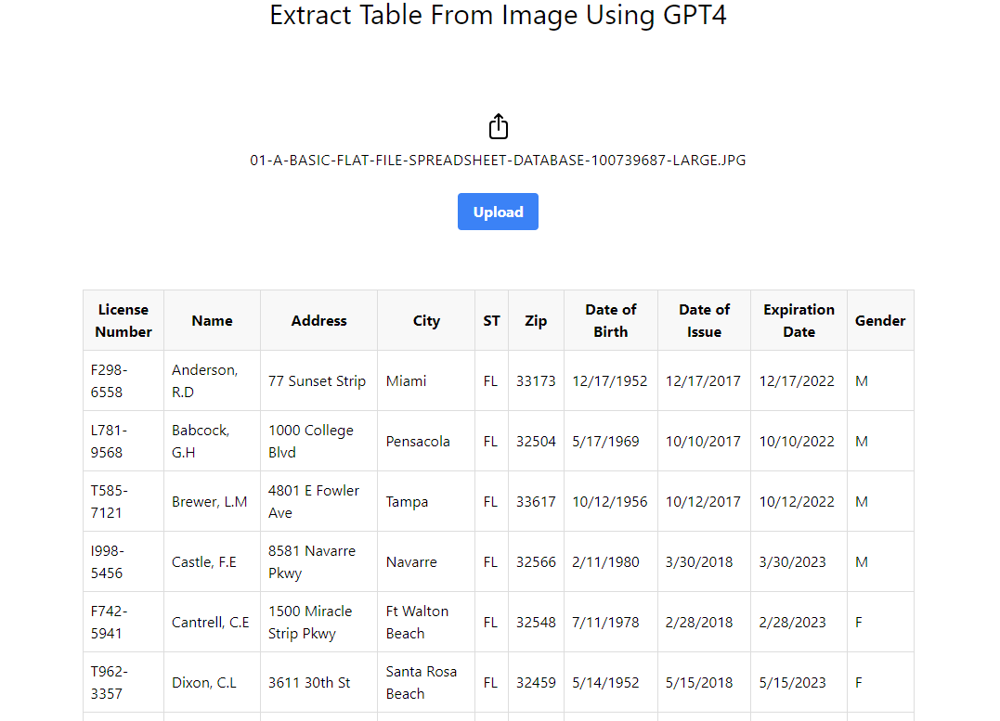
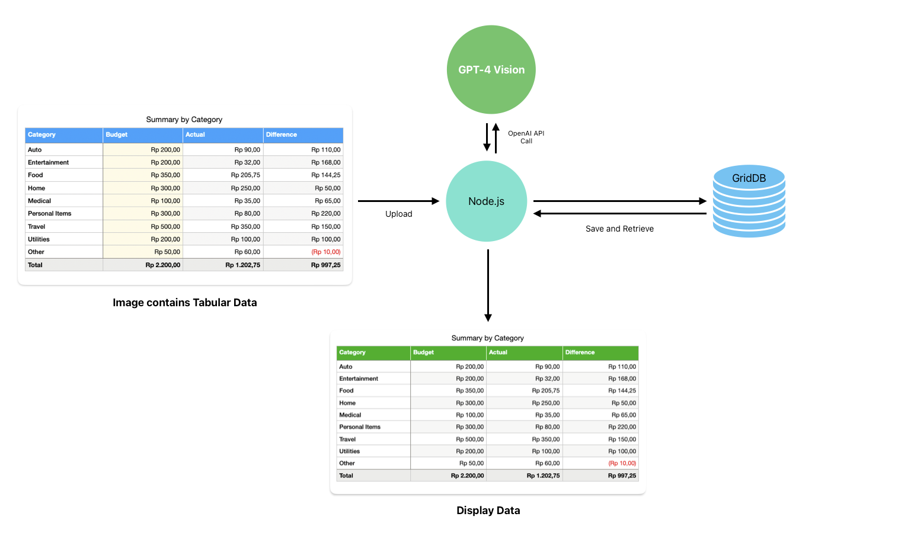
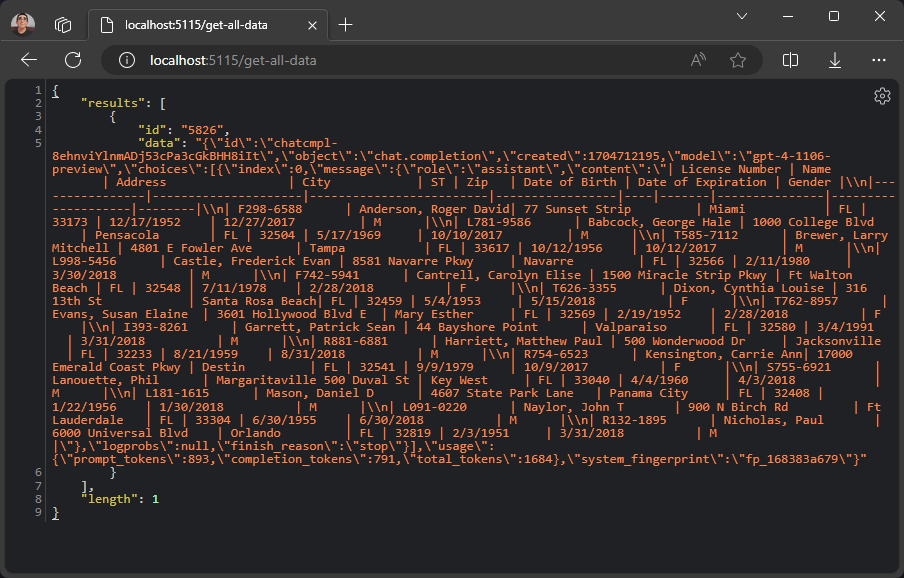
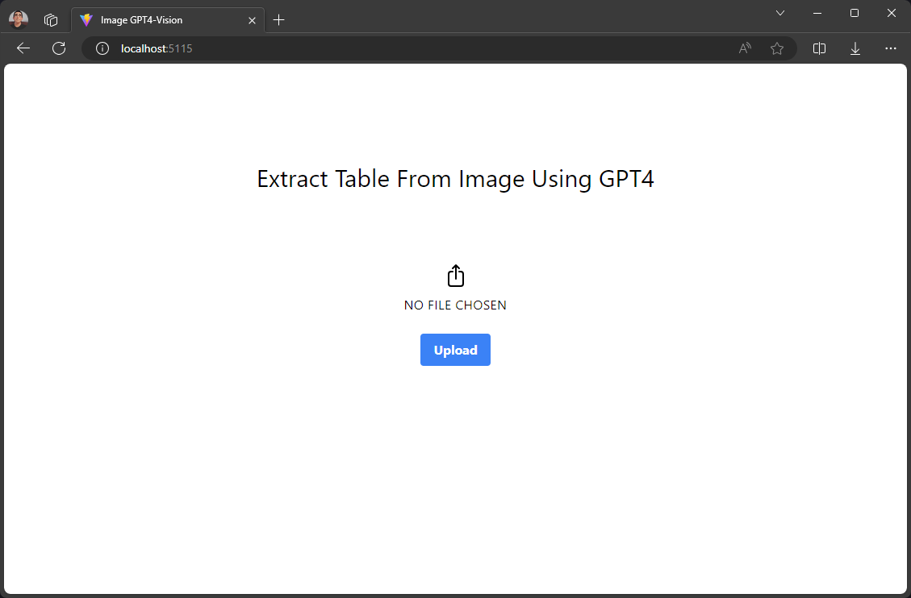

# Processing Image Data using GPT4-Vision, Node.js, and GridDB


This blog will explore how to use GPT-4 Vision to process image data, specifically tabular data from images, and store the results in GridDB. We will build a simple web application using React.js and Node.js that allows users to upload pictures and view the results of GPT-4V's image processing.

## Meet the Stacks

We will use Node.js, GridDB, and OpenAI's GPT-4 Vision. For the user interface, we will use React.js.

### GPT-4 Vision

GPT-4 with Vision, sometimes called GPT-4V, is one of the OpenAI's products. It allows the model to take in images and answer questions about them. Language model systems have historically been limited by taking in a single input modality, text. For many use cases, this constrained the areas where models like GPT-4 could be used. You can read more about GPT-4V in their official [documentation](https://platform.openai.com/docs/guides/vision).

### GridDB

GridDB is an open-source, in-memory NoSQL database optimized for IoT and big data applications. It is a highly scalable database that can handle large volumes of data with high throughput and low latency. GridDB is also ACID compliant and supports SQL-like queries. For more information about GridDB, please visit the [GridDB website](https://griddb.net/).

### Node.js

Node.js is an open-source, cross-platform JavaScript runtime environment that allows developers to build scalable network applications. It is built on top of Google's V8 JavaScript engine. It uses an event-driven, non-blocking I/O model that is lightweight and efficient. For more information about Node.js, please visit the [Node.js website](https://nodejs.org/en/).

### React.js

React.js is an open-source JavaScript library for building user interfaces. It is maintained by Facebook and a community of individual developers and companies. React.js allows developers to create reusable UI components that can be used across different applications. For more information about React.js, please visit the [React.js website](https://reactjs.org/).

## Prerequisites

This project is tested on Ubuntu 20.04.2 LTS WSL 2. To run this project, you need an OpenAI API key, GridDB, Node.js, and React.js. You can install them by following the instructions below.

### Install Node.js

To install Node.js v20 LTS on Ubuntu using the package manager, you need to add an additional `deb` repository. Please read and follow this [documentation](https://github.com/nodesource/distributions?tab=readme-ov-file#ubuntu-versions). After that, test if the Node.js is installed correctly by typing this command in the terminal:

```bash
node -v
```

### Install GridDB

The GridDB documentation for installation in Ubuntu on WSL can be found [here](https://docs.griddb.net/latest/gettingstarted/wsl/#installing-wsl). To check if GridDB is installed correctly, you can run the following command:

```bash
sudo systemctl status gridstore
```

If GridDB is not started, you can start it using this command:

```bash
sudo systemctl start gridstore
```

### OpenAI Account and API Key

You can get the OpenAI API key by signing up for an account at [OpenAI](https://platform.openai.com/api-keys/). To keep your API key safe, you can store it in a `.env` file in the project's root directory (more on this later).

## Running the Project

To get started, you must clone this [repository](https://github.com/junwatu/extract-image-table-gpt4-vision) and install the dependencies. You can do this by running the following commands:

```bash
git clone git@github.com:junwatu/extract-image-table-gpt4-vision.git
```

Change the directory to the project root `server` directory and install the dependencies:

```bash
cd extract-image-table-gpt4-vision/server
npm install
```

Create a `.env` file in the root directory of the project and write the OpenAI API key. The `.env` file should look like this:

```
OPENAI_API_KEY=<your-api-key>
```

And add `.env` to the `.gitignore` file to prevent it from being pushed to the repository.

Run the server:

```bash
npm start
```

In the browser, go to the default project URL: `http://localhost:5115` and try to upload an image with tabular data within.



GPT-4 Vision will process the image and extract the tabular data from it then the tabular data will be displayed on the web page. 

> Please read this [note](#limitations) about the limitation of this project.


## Project Architecture

This architecture diagram outlines a data processing and visualization workflow that incorporates GPT-4 Vision, Node.js, and GridDB. Here's the breakdown:

- The user uploads an image, and **Node.js** will call GPT-4 Vision API to process the image. Node.js is the middle layer, handling the data sent and received from the **GPT-4 Vision** model. 

- The Node.js also communicates with **GridDB**, a database for storing and retrieving the data. GridDB would be used to persistently store the processed tabular data.

- The display data component at the bottom of the diagram indicates that the application shows the data. It's a web interface built using **React.js**.

The project at hand is a web application that is designed to be simple yet powerful. The application is enriched with the advanced capabilities of GPT-4 Vision model, which elevates its functionality to a whole new level.



## Understanding GPT4-Vision

The GPT4 Vision model is best at answering general questions about what is present in the images. For example, to describe an image, we can use a simple prompt:

```js
"What's in this image?"
```

And then use the prompt in GPT4-Vision API with some image from the internet:

```js
import OpenAI from "openai";

const openai = new OpenAI();

async function getImageDescription() {
  const response = await openai.chat.completions.create({
    model: "gpt-4-vision-preview",
    messages: [
      {
        role: "user",
        content: [
          { type: "text", text: "What's in this image?" },
          {
            type: "image_url",
            image_url: {
              "url": "https://upload.wikimedia.org/wikipedia/commons/thumb/d/dd/Gfp-wisconsin-madison-the-nature-boardwalk.jpg/2560px-Gfp-wisconsin-madison-the-nature-boardwalk.jpg",
            },
          },
        ],
      },
    ],
  });
  console.log(response.choices[0]);
}
```

The GPT4 Vision model will process the image based on the prompt and will return the result for further processing.

For our project, we can design a prompt to only recognize the tabular data from the uploaded image. For example, we can use this prompt to extract tabular data from the image:

[//]: # (need a better prompt)

```js
Recreate the table in the image.
```

Then, in the code, we can use the prompt to only extract the tabular data from the image:

```js
messages: [
      {
        role: "user",
        content: [
            { type: "text", text: "Recreate table in the image." },
            { type: "image_url", 
              image_url: {
                "url": sampleImageAddress,
              },
            },
        ],
    },
],
```

The advantage of using GPT4 Vision from OpenAI is that we don't need to train the model to recognize the tabular data from the image. We only need to design a prompt that will be used to process the image and the model is well integrated with other OpenAI models, such as GPT4, to further process the result.

## Integrating GPT4-Vision with Node.js

We can use Node.js and Express.js to build a simple web server and then create an image processing route that calls GPT4-Vision API after the image is finished and uploaded. 

For example, the `process-image` route will accept the uploaded image and then will call the `processImageRequest` function to process the image using OpenAI API:

```js
app.post('/process-image', upload.single('image'), async (req, res) => {
    try {
        const result = await processImageRequest(req.file.path);
        // save the result into the database
        res.json(result);
    } catch (error) {
        res.status(500).send('Error processing image request');
    }
});
```

The `processImageRequest` function is essentially a GPT4 Vision API wrapper function. The code will call the API and then process the image based on the designed prompt earlier:

```js
async function processImageRequest(filePath) {
    const imageBuffer = await fs.readFile(filePath);
    const base64Image = imageBuffer.toString('base64');
    const encodedImage = `data:image/jpeg;base64,{${base64Image}}`;

    const response = await openai.chat.completions.create({
        model: "gpt-4-vision-preview",
        messages: [
            {
                role: "user",
                content: [
                    { type: "text", text: tablePrompt },
                    { type: "image_url", image_url: { "url": encodedImage } },
                ],
            },
        ],
        max_tokens: 1024,
    });
    return response;
}
```
In the code, we use the encoded `base64` format for the image input in GPT4 Vision API. This is because it is easier to reference the image stored in the server's local storage than create a public URL for the image.

For a better result, we will feed the result from the `processImageRequest` function into a more general OpenAI model called GPT4 to extract the tabular data only: 

```js
const cleanupPrompt = `I need you to extract the table data from this message and provide the answer in markdown format. Answer only the markdown table data, nothing else. Do not use code blocks. \n\n`;

async function cleanupData(data) {
    const response = await openai.chat.completions.create({
        model: "gpt-4-1106-preview",
        messages: [
            {
                "role": "system",
                "content": "you are a smart table data extractor"
            },
            {
                "role": "user",
                "content": `${cleanupPrompt} \n\n${data}`
            }
        ],
        temperature: 1,
        max_tokens: 2000,
        top_p: 1,
        frequency_penalty: 0,
        presence_penalty: 0,
    });

    return response;
}
```

Essentially, the `cleanupData` function will clean up the result from the `processImageRequest` function by the help of specific prompts. The result will be a markdown table of data that can be displayed on the web page.

## Storing Processed Data in GridDB

After image processing and data cleanup, we can store the result in GridDB. We will use the `saveData` function, a wrapper function for the `put` operation in GridDB. This function is in the `server/griddbservices.js` file:

```js
export async function saveData({ tableData }) {
    const id = generateRandomID();
    const data = String(tableData);
    const packetInfo = [parseInt(id), data];
    const saveStatus = await GridDB.insert(packetInfo, collectionDb);
    return saveStatus;
}
```

The GridDB container only has two columns: `id` and `data`. The `id` column is used to identify the data, and the `data` column is used to store the markdown table data from GPT4. This snippet code is in the `server/libs/griddb.cjs` file.

```js
function initContainer() {
    const conInfo = new griddb.ContainerInfo({
        name: containerName,
        columnInfoList: [
            ['id', griddb.Type.INTEGER],
            ['data', griddb.Type.STRING],
        ],
        type: griddb.ContainerType.COLLECTION,
        rowKey: true,
    });

    return conInfo;
}
```

The `saveData` function can be called in the `process-image` route. The code in the route will check if the result from GPT4 is finished. If the result is finished, the code will clean up the result and then save it to the GridDB database: 

```js
app.post('/process-image', upload.single('image'), async (req, res) => {
    log.info('Processing image request')
    try {
        const result = await processImageRequest(req.file.path);
        log.info(`Result: ${JSON.stringify(result)}`);

        if (result.choices[0].finish_reason === 'stop') {
            const cleanedData = await cleanupData(result.choices[0].message.content);
            const saveStatus = await saveData({ tableData: JSON.stringify(cleanedData) });

            if (saveStatus.status === 0) {
                log.error(`Save data to GridDB: ERROR`);
            } else {
                log.info(`Save data to GridDB: OK`);
            }
            res.json({ result: cleanedData, status: true });
        } else {
            res.json({ result, status: false });
        }
    } catch (error) {
        log.error(error);
        res.status(500).send('Error processing image request');
    }
});
```

The result will be directly displayed on the web page. The reason not to retrieve the data from GridDB is to keep the project simple. You can find the code for the `process-image` route in the `server/server.js` file.

However, if you want to retrieve the data from GridDB, you can use the `get-all-data` route. This route will retrieve all the data from GridDB.

```js
app.get('/get-all-data', async (req, res) => {
    log.info('Getting all data from GridDB');
    try {
        const result = await getAllData();
        res.json(result);
    } catch (error) {
        res.status(500).send('Error getting all data');
    }
});
```

If we run the route in the browser, the server will respond with all the data saved in the GridDB database.



## Building an End-to-End Application

The source code for the client or user interface is in the `client` directory. The client is a React.js application.

### Main Application Entry

The upload user interface is pretty simple. We use the React library for easier user interface development.



Here is the main entry code for the app:

```jsx
import React, { useState } from 'react';
import ImageUploader from './ImageUploader';
import ReactMarkdown from 'react-markdown';
import remarkGfm from 'remark-gfm';
import rehypeRaw from 'rehype-raw';

const App = () => {
    const [markdown, setMarkdown] = useState('');

    const handleMarkdownFetch = (markdownData) => {
        setMarkdown(markdownData.result.choices[0].message.content);
    };

    return (
    <div className="flex flex-col items-center justify-center min-h-screen space-y-4 bg-white">
        <h1 className="text-3xl">Extract Table From Image Using GPT4</h1>
        <div className="w-full max-w-4xl mx-auto py-12">
            <ImageUploader onMarkdownFetch={handleMarkdownFetch} />
            <div className="flex items-center justify-center overflow-x-auto w-full py-12">
                <ReactMarkdown className="markdown" remarkPlugins={[remarkGfm]} rehypePlugins={[rehypeRaw]}>{markdown}</ReactMarkdown>
            </div>
        </div>
    </div>
);

export default App;
```
The main application entry consists of two components: `<ImageUploader>` and `<ReactMarkdown>`. The `<ImageUploader>` component is responsible for uploading the image to the server, and it returns a result that will be handled by any function that is attached to the `onMarkdownFetch` prop and then the markdown data will be rendered in the `<ReactMarkdown>` component.

### Image Uploader

The `<ImageUploader>` component code resides in the `client/src/ImageUploader.jsx` file. The handler for the image upload is in the `handleUpload` function. This function will post the image to the `/process-image` route in the server, and the result from the server will be handled by the `onMarkdownFetch` prop.

```jsx
const handleUpload = async () => {
        if (selectedFile && !uploading) { 
            setUploading(true); 

            const formData = new FormData();
            formData.append('image', selectedFile);

            try {
                const response = await fetch('/process-image', {
                    method: 'POST',
                    body: formData,
                });
                if (!response.ok) {
                    throw new Error('Network response was not ok');
                }
                const markdownData = await response.json();
                props.onMarkdownFetch(markdownData);
            } catch (error) {
                console.error('Error posting image:', error);
            } finally {
                setUploading(false);
            }
        } else {
            alert('Please select an image first.');
        }
    };
```


###  Markdown Renderer

Luckily, there is a React component in the npm package readily used for rendering markdown purposes. The [react-markdown](https://github.com/remarkjs/react-markdown) component is easy to use and integrate with any React application. 

```jsx
import ReactMarkdown from 'react-markdown';
import remarkGfm from 'remark-gfm';
import rehypeRaw from 'rehype-raw';

...
<ReactMarkdown className="markdown" remarkPlugins={[remarkGfm]} rehypePlugins={[rehypeRaw]}>{markdown}</ReactMarkdown>
...
```

Also, we need to add `remark-gfm` and `rehype-raw` plugins. The `remark-gfm` plugin is used to render the markdown table, and the `rehype-raw` plugin is used to render the markdown table as a raw HTML element so we can add style to it later.


## Limitations

This project is a simple demonstration of how to use GPT4 Vision to process image data and store the result in GridDB. There are many ways to improve this project. 

Currently, the project only supports a clear and clean image containing only a table in it. With the current state of the GPT4 Vision model, which is still in preview, it is not possible to process a noisy image, such as an image containing table data mixed with other text or images. The best way to improve this project is to crop the image containing the table data and then process it using GPT4 Vision.


## References

- [GPT4 Vision guide](https://platform.openai.com/docs/guides/vision).
- [GPT4 Vision API documentation](https://platform.openai.com/docs/api-reference/chat).
- [GridDB documentation](https://docs.griddb.net/latest/).