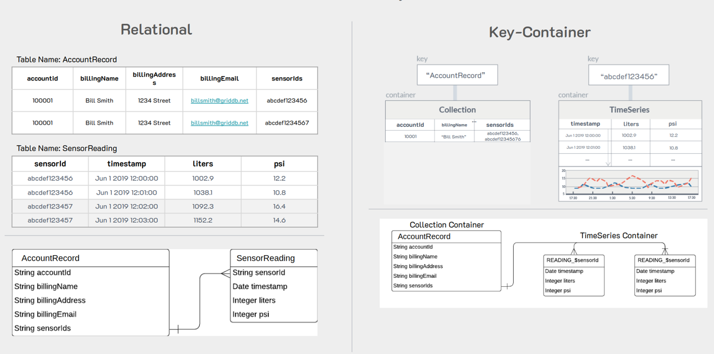

In this article, we would like to showcase how easy it can be to migrate from PostgreSQL over to GridDB. If you are unfamiliar with the relational database, [PostgreSQL](https://www.postgresql.org/) describes itself as "The World's Most Advanced Open Source Relational Database". 

This article will refrain from directly comparing GridDB and PostgreSQL and will instead focus on the schema differences between the two databases and how to safely move your data from the relational database over to GridDB. We will also previously touch on some reasons why you may consider the move from PostgreSQL to GridDB.

Another item to note is that though GridDB can be considered a NoSQL database, it still has SQL available for use and has some roots in SQL. This luckily means that importing our data from "traditional" relational databases will not require too much finessing of data types.

## Non-Technical Section

This is section is more theoretical. If you're solely interested in the HOW, please skip to the next section

### Precursor 

Just as an aside, we have previously touched on this topic before in a couple of previous blogs: [Migrating from MySQL to GridDB using Java](https://griddb.net/en/blog/migrating-from-mysql-to-griddb/) & [Migrating from PostgreSQL to GridDB via Python](https://griddb.net/en/blog/migrating-from-postgresql-to-griddb/). Both of these blogs do a great job of teaching the readers how to technically migrate the data over using various methods. 

And though those blogs are still sources of good information for the task, this blog will A. showcase the official GridDB Import/Export tool and B. Will discuss the WHY of migrating from PostgreSQL over to GridDB.

And so with that out of the way, let's begin.

### Why Migrate?

As stated above, before we get into the technical aspect of physically migrating your data from PostgreSQL over to GridDB via the GridDB Import/Export tool, let's briefly discuss the WHY; as in, WHY should you go through the process of moving your data over from the relational database over to the Time-Series based GridDB?

Well for one, let's get the obvious out of the way: if your workload/dataset is based on time-series data, then shifting over to a database purpose-built to deal with time-series datasets makes perfect sense. GridDB excels at handling time series workloads as explained in the documentation here: [What is a Time Series Database](https://docs.griddb.net/about/what-is-time-series-database/). 

In addition to the time series functionalities, GridDB also has a rather major performance advantage when compared to SQL databases as seen by previous benchmarks published in this whitepaper: [Benchmarking a Sensor Billing Application using GridDB and MariaDB](https://griddb.net/en/docs/Benchmarking_Application_GridDB_MariaDB.pdf). The benchmark covers a wide range of queries, but if one wanted a quick and succinct takeaway: GridDB was able to ingest data 13x faster than MariaDB.

Sometimes performance is not the only metric that matters -- sometimes what matters more is the ability to prototype quickly and efficiently. If this wasn't the case, C++ would be the dominant programming language for all use cases and Python would be  fairly niche standing. Where GridDB has the leg up here is that though it has a usable SQL interface via [JDBC (Java Database Connectivity)](https://en.wikipedia.org/wiki/Java_Database_Connectivity), it also has a NoSQL interface that can be used to interact with the database. 

The GridDB NoSQL interface allows for quickly and easily building applications centered around using GridDB as the main backend. This means that if you need to quickly analyze a large dataset from GridDB (example: [Geospatial Analysis of NYC Crime Data with GridDB](https://griddb.net/en/blog/geospatial-analysis-of-nyc-crime-data-with-griddb/)), you can write some python code and directly query your dataset from within your Python script. And the same goes for many other language interfaces which GridDB has connectors for (which can be found in its [Github page](https://github.com/griddb)).

### Schema Differences Between RDB And GridDB

A quick note before we get into the schema differences: this is not applicable to every single situation. This just happens to be the best way to organize this particular dataset. You can read more about schema differences here: [Wide vs. Narrow Data Tables](https://docs.griddb.net/tutorial/wide-narrow/#overview).

In my original PostgreSQL table, I used what is considered a normal RDB Schema -- that is all of my data is one big table; incidentally, this schema is also how the data was made available to us directly from the source.  And because all data for all sensors in this schema share the same table, there must be an included column which names the sensor for each row. To drive the point home: though there are 3 different sensors within our dataset, we are using one singular table for all sensors.

When migrating to GridDB, it is imperative that we switch over to what is a more "IoT-friendly" schema. So before we get into the particulars, let's talk about what the schema change will be and why it's more useful in an IoT world.

As discussed, in a relational table, all sensors will likely share the same table, same as the `.csv` file we downloaded from the Kaggle. This is done because SQL databases and schema-building are largely legacy and do not necessarily consider the amount of data produced in the modern era. 

With GridDB on the other hand, the considerations switch; GridDB was developed with big data and IoT in mind. If building out a schema and database for large IoT environments, the logical way to divide out the data is to rethink grouping all sensors into the same table. The issue being that once your data has been accuring for long enough, your RDB table will become unwieldy and cumbersome to use. 

So when we decide to migrate to GridDB, instead of the sensors sharing the same table, we will split out each sensor into its own table like so: 



This means that though each table may still grow large over time, it will always be much smaller than the alternative.

And because GridDB is a scalable database which can be N-clusters big, with this sort of schema, we can ensure that different nodes in our cluster house different containers, allowing for easy parallelization and allowing for an overall more efficient database.

A second benefit is that because we are dealing with time-series data here, we could also set up data retention policies to future proof our tables from becoming too large. For example, we can set it so that though our data is set to expire once it gets to 2 years old, meaning that though our sensors are emitting data every 1 second and building up into large containers, we will still eventually get them turned stale and keep the table smaller.

## Technical Section: Using the Official GridDB Import/Export Tools

In the following section, we will now begin the process of shifting data from one database to the other. We will assume that you have GridDB installed: [Installing via apt](https://docs.griddb.net/gettingstarted/using-apt/) and of course have a running PostgreSQL server.

### Exporting PostgreSQL Tables into CSV

To export my data from PostgreSQL over to GridDB, we can use PostgreSQL's copy function to export a table at a time into a CSV file. With this method, though we can only export data one table at a time, it helps ensure that our data will be accurate and easy to import directly into GridDB. 

For example, this is the command I used to export my data into a csv file for use later with GridDB: 

```bash
COPY device15 TO '/tmp/devices_db.csv' DELIMITER ',' CSV HEADER;
```

Once the command is finished, we will have a .csv file for the table we would like to export. 

In this case, my `device15` table was a direct representation of this [Kaggle IoT dataset](https://www.kaggle.com/datasets/garystafford/environmental-sensor-data-132k).


### Importing with GridDB

To import using GridDB we can use the official import/export tool. In this case, we are of course going to be utilizing the import portion of the tool. It can be downloaded from here: [GridDB Export Import](https://github.com/griddb/expimp).

To use the tool, you will need to change the csv file just a little bit.

For instance, here what the file looks like at the top 

    ts,device,co,humidity,light,lpg,motion,smoke,temp
    2020-07-12 00:01:34.385974,b8:27:eb:bf:9d:51,0.0049559386483912,51,f,0.0076508222705571,f,0.0204112701224129,22.7
    2020-07-12 00:01:34.735567,00:0f:00:70:91:0a,0.0028400886071015,76,f,0.005114383400977,f,0.0132748367048515,19.700000762939453
    2020-07-12 00:01:38.073572,b8:27:eb:bf:9d:51,0.0049760123404216,50.9,f,0.007673227406398,f,0.0204751255761782,22.6
    2020-07-12 00:01:39.589145,1c:bf:ce:15:ec:4d,0.0044030268296996,76.80000305175781,t,0.0070233371458773,f,0.0186282253770188,27
    2020-07-12 00:01:41.761234,b8:27:eb:bf:9d:51,0.0049673636419089,50.9,f,0.0076635772823724,f,0.0204476208102336,22.6
    2020-07-12 00:01:44.46841,1c:bf:ce:15:ec:4d,0.0043910039545833,77.9000015258789,t,0.0070094585431387,f,0.0185889075400507,27
    2020-07-12 00:01:45.448863,b8:27:eb:bf:9d:51,0.0049760251182241,50.9,f,0.0076732416602977,f,0.0204751662043622,22.6
    2020-07-12 00:01:46.869075,00:0f:00:70:91:0a,0.0029381156266604,76,f,0.0052414818417311,f,0.0136275211320191,19.700000762939453
    2020-07-12 00:01:48.275381,1c:bf:ce:15:ec:4d,0.0043454713595732,77.9000015258789,t,0.0069568023772355,f,0.0184397819021168,27

This is how the file comes out directly from the top of the file. So first let's get the tools ready and then we can get our data ready and run the import.

#### Installing the Tools

So first up, we will need to clone the export/import repo and then build our files.

```bash
$ git clone https://github.com/griddb/expimp.git
```

And then build

```bash
$ cd expimp-ce
$ ./gradlew shadowJar
```

Once it's built and we have our .jar file ready, we can configure our `.properties` file.

```bash
$ cd ..
$ vim bin/gs_expimp.properties
```

And if you are running your GridDB server in FIXED_LIST mode like I am, you will need to change around the config like so: 

```bash
######################################################################
# gs_import/gs_export Properties
#
#
######################################################################
clusterName=myCluster
mode=FIXED_LIST
#hostAddress=239.0.0.1
#hostPort=31999

#jdbcAddress=239.0.0.1
#jdbcPort=41999
#notificationProvider.url=
notificationMember=127.0.0.1:10001
jdbcNotificationMember=127.0.0.1:20001

logPath=log
getCount=1000
commitCount=1000
transactionTimeout=2147483647
failoverTimeout=10
jdbcLoginTimeout=10

storeBlockSize=64KB
maxJobBufferSize=512

# for debug
restAddress=127.0.0.1
restPort=1004
```

Here what we did was remove the multicast portion of the config (host address, host port) and replace them with notification member which encapsulates FIXED_LIST mode. If you are unsure about which you are running, you can easily check with `gs_stat`

```bash
$ sudo su gsadm
$ gs_stat -u admin/admin
```

And another note about this is that if you are running GridDB as a service, then you are running in FIXED_LIST mode and can safely use the above config on your own machine.

#### Shifting the Data for Import Tool

Next we will need to directly edit our CSV file to morph it into a a structure that our GridDB Import tool will like and with the schema we will like. To do so, you can create a simple Python script to separate out the program to create separate CSV files which will utilize the more efficient GridDB data model of having each sensor have its own container/table.

So let's take a look at the python script

```python
import pandas as pd
import numpy as np
import csv
from datetime import datetime as dt

df = pd.read_csv ('devices_db.csv')
df.head()

#Check data types
print(df.dtypes)

# convert ts in unix to ISO 8601 timestamp format
df['ts'] = pd.to_datetime(df['ts'], unit = 's').dt.strftime('%Y-%m-%dT%H:%M:%S.%f+0000')
df.head(5)

# split data by device as recommended by GridDB schema (1 time series container per device)
dfs = dict(tuple(df.groupby('device')))

# Separate device1 data and remove device column as it will be stored in collection container
device1 = dfs['b8:27:eb:bf:9d:51']
device1 = device1.drop('device', axis=1)
device1.head()

# Separate device2 data and remove device column as it will be stored in collection container
device2 = dfs['00:0f:00:70:91:0a']
device2 = device2.drop('device', axis=1)
device2.head()

# Separate device3 data and remove device column as it will be stored in collection container
device3 = dfs['1c:bf:ce:15:ec:4d']
device3 = device3.drop('device', axis=1)
device3.head()

device1.to_csv('device1.csv', encoding='utf-8', quotechar='"', index=False, quoting=csv.QUOTE_ALL)
device2.to_csv('device2.csv', encoding='utf-8', quotechar='"', index=False, quoting=csv.QUOTE_ALL)
device3.to_csv('device3.csv', encoding='utf-8', quotechar='"', index=False, quoting=csv.QUOTE_ALL)
```

This script is relatively straightforward -- it takes in the CSV file from our Tiemscale export and then reads in the full data into a pandas dataframe. These data structures are handy because we can then edit each individual column and then export back out into a CSV. 

We also take the opportunity to transform the timestamp (ts) column into a format the GridDB import tool prefers. So from the numbers which Tiemscaledb exported into a datetime -style format

In this case, we will name each unique sensor with its own deviceX name and then make separate CSV files from that. From there, we will take our new files and try to use the GridDB import tool to create three new GridDB TimeSeries containers.

So please run the python script and you will have three new deviceX.csv files.

### Creating new Directory with Import Tool Requirements

To Import using the tool, we should create a new directory called `import` which will house all of the files needed for a smooth import.

First, we need to include the metadata of our intended schema for the GridDB tool to recognize what each column's type should be. So let's create a file called `public.device1_properties.json`. The first word of this file is the DB name -- here we are using the universal default db on GridDB called public. The rest of the file simply fills out the rest of the data for the container: 

```bash
{
    "version":"5.0.0",
    "database":"public",
    "container":"device1",
    "containerType":"TIME_SERIES",
    "containerFileType":"csv",
    "containerFile":"public.device1.csv",
    "columnSet":[
        {
            "columnName":"ts",
            "type":"timestamp",
            "notNull":true
        },
        {
            "columnName":"co",
            "type":"double",
            "notNull":false
        },
        {
            "columnName":"humidity",
            "type":"double",
            "notNull":false
        },
        {
            "columnName":"light",
            "type":"bool",
            "notNull":false
        },
        {
            "columnName":"lpg",
            "type":"double",
            "notNull":false
        },
        {
            "columnName":"motion",
            "type":"bool",
            "notNull":false
        },
        {
            "columnName":"smoke",
            "type":"double",
            "notNull":false
        },
        {
            "columnName":"temperature",
            "type":"double",
            "notNull":false
        }
    ],
    "rowKeySet":[
        "ts"
    ],
    "timeSeriesProperties":{
        "compressionMethod":"NO",
        "compressionWindowSize":-1,
        "compressionWindowSizeUnit":"null",
        "expirationDivisionCount":-1,
        "rowExpirationElapsedTime":-1,
        "rowExpirationTimeUnit":"null"
    },
    "compressionInfoSet":[
    ]
}
```

I beleive this meta data is straight forward so we can move on.

Next let's bring in our csv files from earlier into this directory, but let's rename them. We will simply add the DB name to the front of the file name like so: device1.csv becomes public.device1.csv. We will also need to add a small amount of meta data to the top of our CSV files to let our GridDB tool know which metadata file use and what the db and container name of our server will be. 

```bash
"%","public.device1_properties.json"
"$","public.device1"
"2020-07-12T00:01:34.385974+0000","0.0049559386483912","51.0","False","0.0076508222705571","False","0.0204112701224129","22.7"
"2020-07-12T00:01:38.073572+0000","0.0049760123404216","50.9","False","0.007673227406398","False","0.0204751255761782","22.6"
```

And lastly we will need to remove the column name/headers row. Our import tool already has explicit detail of this data in the json file so it is redundant. 

So as a recap: we need to include the meta data json file, as well as the csv file within a directory to fully import our rows into GridDB. The csv file must also begin with two rows at the top, one with a "%", which indicates the associated meta data file, and one with the "$", which indicates the db.container name combination for its destination in the CSV file. And then of course the header/column name row must be removed from the csv file. You will need to do this for all three csv files (device1, device2, device3) and put them all within the same `import` directory.


One last thing we will need before we can import the tool is to create a `gs_export.json`. This file makes it easy for us to call our tool to simply ingest everything within the directory because this json file will direct the traffic even further. Here is what the json file looks like: 

```bash
{
    "version":"5.0.0",
    "address":"127.0.0.1:10001",
    "user":"admin",
    "containerCount":3,
    "rowFileType":"csv",
    "parallel":1,
    "container":[
        {
            "database":"public",
            "name":"device1",
            "metafile":"public.device1_properties.json"
        },
        {
            "database":"public",
            "name":"device2",
            "metafile":"public.device2_properties.json"
        },
        {
            "database":"public",
            "name":"device3",
            "metafile":"public.device3_properties.json"
        }
    ]
}
```

Once it's done, we can run our import tool.

```bash
$ cd expimp/bin
$  ./gs_import -u admin/admin -d /home/israel/development/import/ --all
```

The command itself is straightfoward: call the excutable and then enter your username and password for GridDB, followed by the directory we wish to import from with the `--all` flag attached. If all goes well, you should see the following output:


    Import Start.
    Number of target containers : 3

    public.device1 : 187451
    public.device2 : 111815
    public.device3 : 105918

    Number of target containers:3 ( Success:3  Failure:0 )
    Import Completed.

And we can also verify with our [GridDB CLI](https://github.com/griddb/cli)

```bash
$ sudo su gsadm
$ gs_sh
gs> select * from device1;
```

    gs[public]> select * from device1;
    187,443 results. (37 ms)
    gs[public]> get 10
    ts,co,humidity,light,lpg,motion,smoke,temperature
    2020-07-12T00:01:34.385Z,0.0049559386483912,51.0,false,0.0076508222705571,false,0.0204112701224129,22.7
    2020-07-12T00:01:38.073Z,0.0049760123404216,50.9,false,0.007673227406398,false,0.0204751255761782,22.6
    2020-07-12T00:01:41.761Z,0.0049673636419089,50.9,false,0.0076635772823724,false,0.0204476208102336,22.6
    2020-07-12T00:01:45.448Z,0.0049760251182241,50.9,false,0.0076732416602977,false,0.0204751662043622,22.6
    2020-07-12T00:01:49.136Z,0.0049702557644185,50.9,false,0.0076668047981169,false,0.0204568196070641,22.6
    2020-07-12T00:01:52.798Z,0.0049602086559659,50.9,false,0.0076555903135563,false,0.0204248581520852,22.6
    2020-07-12T00:01:56.498Z,0.004971644949355,50.9,false,0.0076683548991553,false,0.020461237669931,22.6
    2020-07-12T00:02:00.184Z,0.0049645645184779,50.9,false,0.0076604530556132,false,0.0204387166506673,22.6
    2020-07-12T00:02:03.872Z,0.004975983419764,50.9,false,0.0076731951447764,false,0.0204750336202321,22.6
    2020-07-12T00:02:07.560Z,0.0049602086559659,50.9,false,0.0076555903135563,false,0.0204248581520852,22.6

## Conclusion

And with that, we have finished up being able to fully import our data directly from PostgreSQL over to GridDB, complete with even making a new, more suitable schema for ourselves.