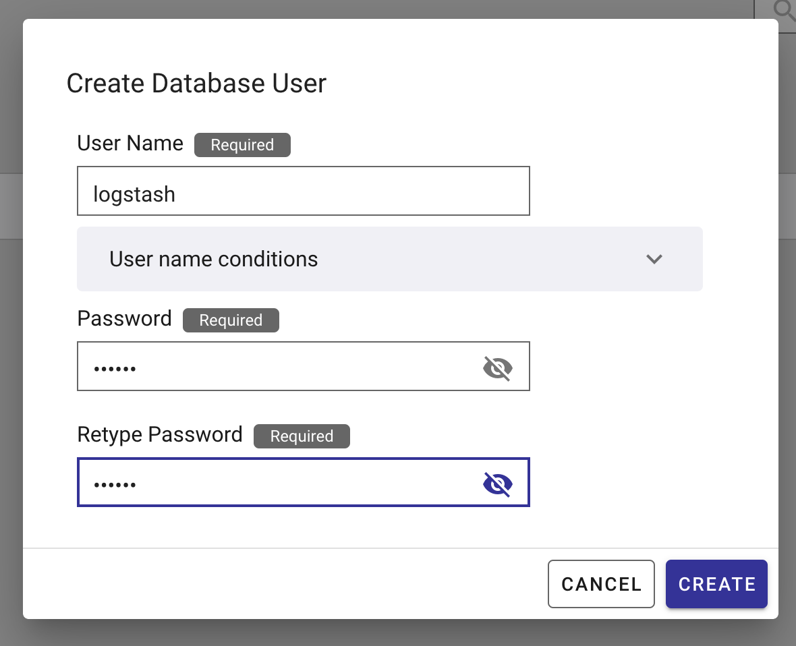
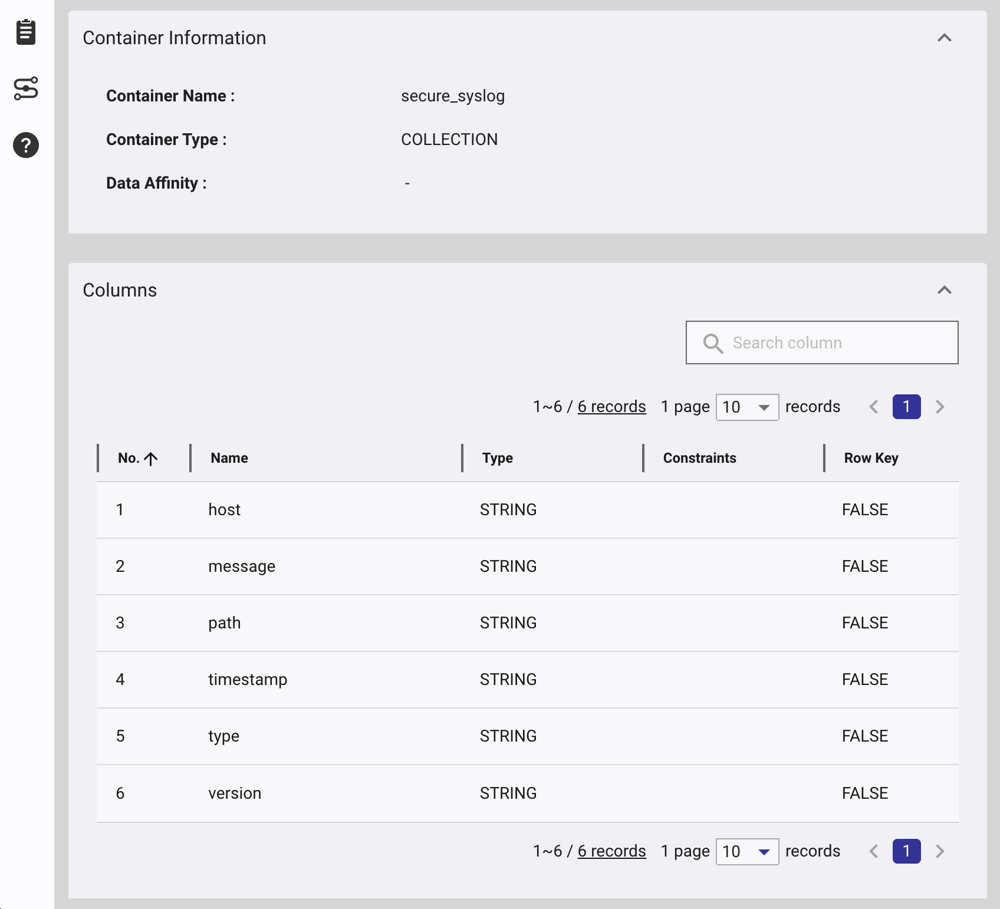
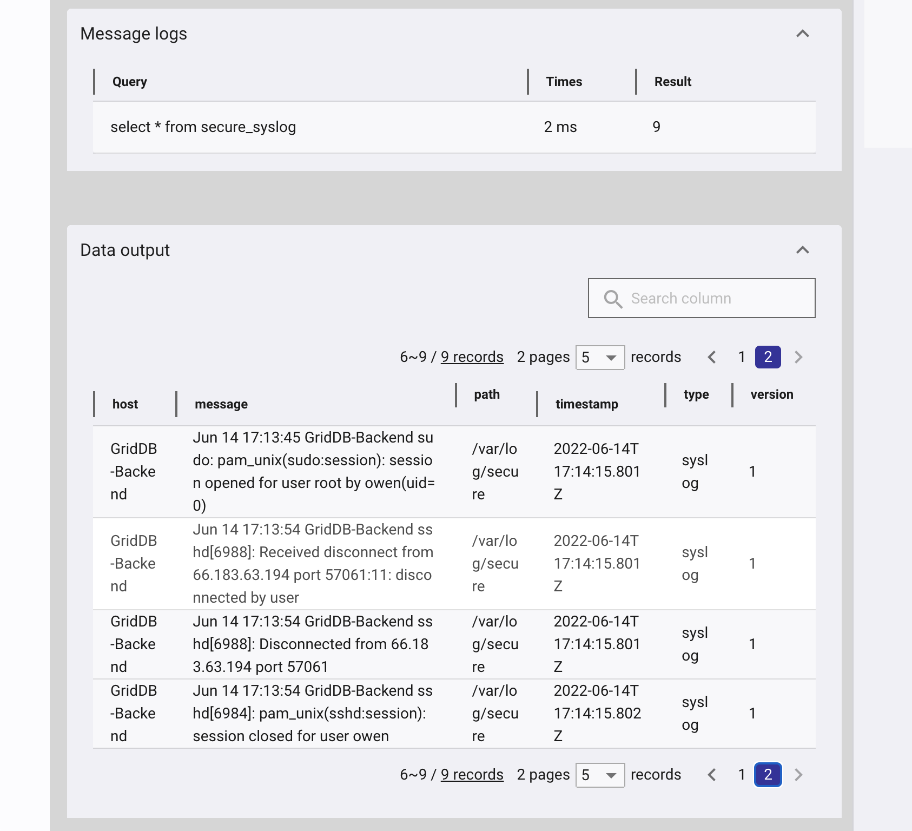

In this blog, we'll cover the usage of the GridDB Output plugin for Logstash which enables us to write syslog (and more) log records to a GridDB Cloud container.

# Installation

The GridDB logstash pluging requires CentOS 7.9 (x64), Ruby v2.4+, Logstash 7.15+

First we install RVM & Ruby:
```
$ curl -sSL https://rvm.io/mpapis.asc | gpg --import -
$ curl -sSL https://rvm.io/pkuczynski.asc | gpg --import -
$ curl -L get.rvm.io | bash -s stable
$ source ~/.rvm/scripts/rvm
$ rvm reload
$ rvm install 2.5.3
```


Now we setup the logstash YUM Repo and install Logstash:
```
$ cat << EOF | tee /etc/yum.repos.d/logstash.repo
[logstash-7.x] 
name=Elastic repository for 7.x packages 
baseurl=https://artifacts.elastic.co/packages/7.x/yum 
gpgcheck=1 
gpgkey=https://artifacts.elastic.co/GPG-KEY-elasticsearch 
enabled=1 
autorefresh=1 
type=rpm-md
EOF

$ yum install logstash
```

Now we're ready to build and install the GridDB logstash plugin:


```

$ cd /path/to/logstash-output-griddb
$ gem build logstash-output-griddb.gemspec
$ /usr/share/logstash/bin/logstash-plugin install logstash-output-griddb-1.0.0.gem\
```

Now we're ready to start using Logstash with the GridDB output plugin.

# Usage


First, we need to create a config file /etc/logstash/mylogstash.conf with both input and output sections. In the input section, we configure Logstash to simply read /var/log/secure and parse it as a syslog output. This will let us track all logins. 

```
input {
  file {
    path => "/var/log/secure"
    type => "syslog"
  }
}

output {
    griddb {
        host => "https://cloud1.griddb.com/trial1234"
        cluster => "gs_clustertrial1234"
        database => "public"
        container => "secure_syslog"    
        username => "logstash"
        password => "<YOURPASSWORD>"
        insert_mode => "append"
    }
}
```
In the output section, we configure the GridDB output plugin to write to our GridDB cloud account.  Using append mode which will append to an extisting container if it exists. There is also a Replace mode which deletes and creates the container everytime logstash restarts.

Create a logstash user in the GridDB Cloud portal:



Now start Logstash with your config file:

```
$ sudo /usr/share/logstash/bin/logstash -f /etc/logstash/mylogstash.conf --path.settings /etc/logstash

```


Now when a user logins or uses sudo, the secure log messages will be written to GridDB. 



